Battle Creek Redd Survey QC
================
Erin Cain
9/29/2021

# Battle Creek Redd Survey

## Description of Monitoring Data

These data were acquired via snorkel and kayak surveys on Battle Creek
from 2001 to 2019. Red location, size, substrate and flow were measured.
Annual monitoring questions and conditions drove the frequency and
detail of individual redd measurements.

**Timeframe:** 2001 - 2022

**Survey Season:** September - October

**Completeness of Record throughout timeframe:** Sampled each year

**Sampling Location:** Battle Creek

**Data Contact:** [Natasha Wingerter](mailto:natasha_wingerter@fws.gov);
[RJ Bottaro](mailto:rj_bottaro@fws.gov)

## Access Cloud Data

``` r
# Run Sys.setenv() to specify GCS_AUTH_FILE and GCS_DEFAULT_BUCKET before running 
# getwd() to see how to specify paths 
# Open object from google cloud storage
# Set your authentication using gcs_auth
gcs_auth(json_file = Sys.getenv("GCS_AUTH_FILE"))
# Set global bucket 
gcs_global_bucket(bucket = Sys.getenv("GCS_DEFAULT_BUCKET"))

# git data and save as xlsx
# read in updated table with redd ids (sent 10-12-2023)
# 2001-2019
gcs_get_object(object_name = "adult-holding-redd-and-carcass-surveys/battle-creek/data-raw/battle_creek_redds_raw.xlsx",
               bucket = gcs_get_global_bucket(),
               saveToDisk = here::here("data-raw", "qc-markdowns","adult-holding-redd-and-carcass-surveys", "battle-creek", "raw_adult_redd.xlsx"),
               overwrite = TRUE)

# 2020
gcs_get_object(object_name = "adult-holding-redd-and-carcass-surveys/battle-creek/data-raw/battle_creek_snorkel_survey_2020.xlsx",
               bucket = gcs_get_global_bucket(),
               saveToDisk = here::here("data-raw", "qc-markdowns","adult-holding-redd-and-carcass-surveys", "battle-creek", "battle_creek_snorkel_survey_2020.xlsx"),
               overwrite = TRUE)

# 2021
gcs_get_object(object_name = "adult-holding-redd-and-carcass-surveys/battle-creek/data-raw/battle_creek_snorkel_survey_2021.xlsx",
               bucket = gcs_get_global_bucket(),
               saveToDisk = here::here("data-raw", "qc-markdowns","adult-holding-redd-and-carcass-surveys", "battle-creek", "battle_creek_snorkel_survey_2021.xlsx"),
               overwrite = TRUE)

# 2022
gcs_get_object(object_name = "adult-holding-redd-and-carcass-surveys/battle-creek/data-raw/battle_creek_snorkel_survey_2022.xlsx",
               bucket = gcs_get_global_bucket(),
               saveToDisk = here::here("data-raw", "qc-markdowns","adult-holding-redd-and-carcass-surveys", "battle-creek", "battle_creek_snorkel_survey_2022.xlsx"),
               overwrite = TRUE)
```

Read in data from google cloud, glimpse sheets and raw data:

``` r
# 2001-2019
raw_redd_data <- read_excel(here::here("data-raw", "qc-markdowns","adult-holding-redd-and-carcass-surveys", "battle-creek", "raw_adult_redd.xlsx")) |> glimpse()
```

    ## Rows: 1,605
    ## Columns: 57
    ## $ ID                   <dbl> 14598, 14599, 14600, 14601, 14602, 14603, 14604, …
    ## $ OBJECT_ID            <dbl> 35, 36, 37, 38, 39, 40, 41, 42, 141, 142, 143, 14…
    ## $ DATABASE_ID          <chr> "Redd_0035", "Redd_0036", "Redd_0037", "Redd_0038…
    ## $ Date_ReachU_Reach_SU <chr> "37530R2", "37530R2", "37530R2", "37530R2", "3753…
    ## $ Project              <chr> "Snorkel", "Snorkel", "Snorkel", "Snorkel", "Snor…
    ## $ SUR_METHOD           <chr> "Snorkel", "Snorkel", "Snorkel", "Snorkel", "Snor…
    ## $ LONGITUDE            <dbl> -122, -122, -122, -122, -122, -122, -122, -122, -…
    ## $ LATITUDE             <dbl> 40, 40, 40, 40, 40, 40, 40, 40, 40, 40, 40, 40, 4…
    ## $ YEAR                 <chr> "2002", "2002", "2002", "2002", "2002", "2002", "…
    ## $ Sample_Date          <chr> "10/1/2002", "10/1/2002", "10/1/2002", "10/1/2002…
    ## $ REACH                <chr> "R2", "R2", "R2", "R2", "R2", "R2", "R3", "R3", "…
    ## $ Reach_SubUnit        <chr> NA, NA, NA, NA, NA, NA, NA, NA, NA, NA, NA, NA, N…
    ## $ RIVER_MILE           <dbl> 2, 2, 1, 1, 0, 0, 2, 2, 2, 1, 1, 1, 1, 2, 2, 2, 2…
    ## $ Species_Run          <chr> "SCS", "SCS", "SCS", "SCS", "SCS", "SCS", "SCS", …
    ## $ REDD_ID              <chr> "10102R2#1", "10102R2#2", "10102R2#3", "10102R2#4…
    ## $ FORK                 <chr> "NF", "NF", "NF", "NF", "NF", "NF", "SF", "SF", "…
    ## $ AGE                  <dbl> NA, NA, NA, NA, NA, NA, NA, NA, NA, NA, NA, NA, N…
    ## $ REDD_LOC             <chr> "UNK", "UNK", "UNK", "UNK", "UNK", "UNK", "UNK", …
    ## $ PRE_SUB              <chr> NA, NA, NA, NA, NA, NA, NA, NA, NA, NA, NA, NA, N…
    ## $ SIDES_SUB            <chr> NA, NA, NA, NA, NA, NA, NA, NA, NA, NA, NA, NA, N…
    ## $ TAIL_SUB             <chr> NA, NA, NA, NA, NA, NA, NA, NA, NA, NA, NA, NA, N…
    ## $ FOR_                 <chr> "UNK", "UNK", "UNK", "UNK", "UNK", "UNK", "UNK", …
    ## $ MEASURE              <lgl> FALSE, FALSE, FALSE, FALSE, FALSE, FALSE, FALSE, …
    ## $ WHY_NOT_ME           <chr> "UNK", "UNK", "UNK", "UNK", "UNK", "UNK", "UNK", …
    ## $ DATE_MEASU           <dttm> NA, NA, NA, NA, NA, NA, NA, NA, 2003-10-01, 2003…
    ## $ PRE_DEPTH            <dbl> NA, NA, NA, NA, NA, NA, NA, NA, 10, 15, 15, NA, N…
    ## $ PIT_DEPTH            <dbl> NA, NA, NA, NA, NA, NA, NA, NA, 16, 24, 19, NA, N…
    ## $ TAIL_DEPTH           <dbl> NA, NA, NA, NA, NA, NA, NA, NA, 8, 13, 13, NA, NA…
    ## $ LENGTH_IN            <dbl> NA, NA, NA, NA, NA, NA, NA, NA, 182, 66, 80, NA, …
    ## $ WIDTH_IN             <dbl> NA, NA, NA, NA, NA, NA, NA, NA, 72, 43, 42, NA, N…
    ## $ FLOW_METER           <chr> NA, NA, NA, NA, NA, NA, NA, NA, "Flow Bomb", "Flo…
    ## $ FLOW_FPS             <dbl> NA, NA, NA, NA, NA, NA, NA, NA, 2, 2, 2, NA, NA, …
    ## $ START                <dbl> NA, NA, NA, NA, NA, NA, NA, NA, 862000, 877300, 8…
    ## $ END_                 <dbl> NA, NA, NA, NA, NA, NA, NA, NA, 864537, 880150, 8…
    ## $ TIME_                <dbl> NA, NA, NA, NA, NA, NA, NA, NA, 100, 100, 100, NA…
    ## $ START_80             <dbl> NA, NA, NA, NA, NA, NA, NA, NA, NA, NA, NA, NA, N…
    ## $ END_80               <dbl> NA, NA, NA, NA, NA, NA, NA, NA, NA, NA, NA, NA, N…
    ## $ SECS_80_             <dbl> NA, NA, NA, NA, NA, NA, NA, NA, NA, NA, NA, NA, N…
    ## $ SERIAL               <chr> NA, NA, NA, NA, NA, NA, NA, NA, "16765", NA, NA, …
    ## $ Comments             <chr> "wp 193", "wp 194", "wp 195", "wp 196", "wp 197",…
    ## $ SURVEY               <chr> "11", "11", "11", "11", "11", "11", "11", "11", "…
    ## $ AGE_B                <chr> NA, NA, NA, NA, NA, NA, NA, NA, NA, NA, NA, NA, N…
    ## $ DATE_B               <dttm> NA, NA, NA, NA, NA, NA, NA, NA, NA, NA, NA, NA, …
    ## $ AGE_C                <chr> NA, NA, NA, NA, NA, NA, NA, NA, NA, NA, NA, NA, N…
    ## $ DATE_C               <dttm> NA, NA, NA, NA, NA, NA, NA, NA, NA, NA, NA, NA, …
    ## $ AGE_D                <chr> NA, NA, NA, NA, NA, NA, NA, NA, NA, NA, NA, NA, N…
    ## $ DATE_D               <lgl> NA, NA, NA, NA, NA, NA, NA, NA, NA, NA, NA, NA, N…
    ## $ Corr_Type            <chr> NA, NA, NA, NA, NA, NA, NA, NA, NA, NA, NA, NA, N…
    ## $ Horz_Prec            <dbl> NA, NA, NA, NA, NA, NA, NA, NA, NA, NA, NA, NA, N…
    ## $ Corr_Date            <lgl> NA, NA, NA, NA, NA, NA, NA, NA, NA, NA, NA, NA, N…
    ## $ FINES_PRES           <chr> NA, NA, NA, NA, NA, NA, NA, NA, NA, NA, NA, NA, N…
    ## $ OVERHEAD_V           <chr> NA, NA, NA, NA, NA, NA, NA, NA, NA, NA, NA, NA, N…
    ## $ INSTREAM_C           <chr> NA, NA, NA, NA, NA, NA, NA, NA, NA, NA, NA, NA, N…
    ## $ COVER_COMM           <chr> NA, NA, NA, NA, NA, NA, NA, NA, NA, NA, NA, NA, N…
    ## $ STREAM_FEA           <chr> NA, NA, NA, NA, NA, NA, NA, NA, NA, NA, NA, NA, N…
    ## $ TRIBUTARY_           <chr> NA, NA, NA, NA, NA, NA, NA, NA, NA, NA, NA, NA, N…
    ## $ TRIB_COMM            <chr> NA, NA, NA, NA, NA, NA, NA, NA, NA, NA, NA, NA, N…

``` r
# 2020
raw_redd_2020 <- read_excel(here::here("data-raw", "qc-markdowns","adult-holding-redd-and-carcass-surveys", "battle-creek", "battle_creek_snorkel_survey_2020.xlsx"),
                            sheet = "Redds") |> glimpse()
```

    ## Rows: 72
    ## Columns: 38
    ## $ POINT_X      <dbl> -121.9993, -121.9379, -121.9379, -121.9479, -121.9873, -1…
    ## $ POINT_Y      <dbl> 40.42312, 40.41589, 40.41589, 40.41782, 40.42462, 40.4246…
    ## $ River_Mile   <dbl> 16.7052320, 3.9630783, 3.9630783, 3.3312546, 0.8676158, 0…
    ## $ DATE         <dttm> 2020-07-20 00:00:00, 2020-07-21 00:00:00, 2020-07-21 00:…
    ## $ REACH        <dbl> 4, 1, 1, 1, 1, 1, 1, 1, 1, 1, 1, 1, 1, 1, 1, 1, 1, 1, 1, …
    ## $ REDD_ID      <chr> "redd_1", "redd_1", "redd_2", "redd_3", "redd_4", "redd_5…
    ## $ SPECIES      <chr> "Chinook", "Chinook", "Chinook", "Chinook", "Chinook", "C…
    ## $ AGE          <chr> "3", "3", "2", "3", "3", "2", "2", "3", "2", "2", "2", "2…
    ## $ REDD_LOC     <lgl> NA, NA, NA, NA, NA, NA, NA, NA, NA, NA, NA, NA, NA, NA, N…
    ## $ GRAVEL       <lgl> NA, NA, NA, NA, NA, NA, NA, NA, NA, NA, NA, NA, NA, NA, N…
    ## $ INJ_SITE     <lgl> NA, NA, NA, NA, NA, NA, NA, NA, NA, NA, NA, NA, NA, NA, N…
    ## $ PRE_SUB      <chr> NA, NA, NA, NA, NA, NA, NA, NA, NA, NA, NA, NA, NA, NA, "…
    ## $ SIDE_SUB     <chr> NA, NA, NA, NA, NA, NA, NA, NA, NA, NA, NA, NA, NA, NA, "…
    ## $ TAIL_SUB     <chr> NA, NA, NA, NA, NA, NA, NA, NA, NA, NA, NA, NA, NA, NA, "…
    ## $ Fish_on_Re   <lgl> NA, NA, NA, NA, NA, NA, NA, NA, NA, NA, NA, NA, NA, NA, N…
    ## $ MEASURE      <chr> NA, NA, NA, NA, NA, NA, NA, NA, NA, NA, NA, NA, NA, NA, N…
    ## $ WHY_NOT_ME   <lgl> NA, NA, NA, NA, NA, NA, NA, NA, NA, NA, NA, NA, NA, NA, N…
    ## $ DATE_MEA     <dttm> NA, NA, NA, NA, NA, NA, NA, NA, NA, NA, NA, NA, NA, NA, …
    ## $ PRE_REDD__   <dbl> NA, NA, NA, NA, NA, NA, NA, NA, NA, NA, NA, NA, NA, NA, N…
    ## $ PIT__in_     <dbl> NA, NA, NA, NA, NA, NA, NA, NA, NA, NA, NA, NA, NA, NA, N…
    ## $ TAILSPILL_   <dbl> 18, 14, 16, 18, 15, 12, 10, 18, 16, 26, 21, 18, 15, NA, 2…
    ## $ LENGTH__in   <dbl> NA, NA, NA, NA, NA, NA, NA, NA, NA, NA, NA, NA, NA, NA, N…
    ## $ WIDTH__in_   <dbl> NA, NA, NA, NA, NA, NA, NA, NA, NA, NA, NA, NA, NA, NA, N…
    ## $ BOMB_START   <dbl> NA, NA, NA, NA, NA, NA, NA, NA, NA, NA, NA, NA, NA, NA, N…
    ## $ BOMB_END     <dbl> NA, NA, NA, NA, NA, NA, NA, NA, NA, NA, NA, NA, NA, NA, N…
    ## $ BOMB_SECON   <dbl> NA, NA, NA, NA, NA, NA, NA, NA, NA, NA, NA, NA, NA, NA, N…
    ## $ START_80     <dbl> NA, NA, NA, NA, NA, NA, NA, NA, NA, NA, NA, NA, NA, NA, N…
    ## $ END_80_      <dbl> NA, NA, NA, NA, NA, NA, NA, NA, NA, NA, NA, NA, NA, NA, N…
    ## $ SECS_80_     <dbl> NA, NA, NA, NA, NA, NA, NA, NA, NA, NA, NA, NA, NA, NA, N…
    ## $ Water_Velo   <lgl> NA, NA, NA, NA, NA, NA, NA, NA, NA, NA, NA, NA, NA, NA, N…
    ## $ COMMENTS     <chr> NA, NA, NA, "Fish on Redd", NA, "Redd Superimposed on red…
    ## $ Survey       <lgl> NA, NA, NA, NA, NA, NA, NA, NA, NA, NA, NA, NA, NA, NA, N…
    ## $ Age_Survey_3 <lgl> NA, NA, NA, NA, NA, NA, NA, NA, NA, NA, NA, NA, NA, NA, N…
    ## $ Age_Survey_4 <lgl> NA, NA, NA, NA, NA, NA, NA, NA, NA, NA, NA, NA, NA, NA, N…
    ## $ Age_Survey_5 <lgl> NA, NA, NA, NA, NA, NA, NA, NA, NA, NA, NA, NA, NA, NA, N…
    ## $ Corr_Type    <lgl> NA, NA, NA, NA, NA, NA, NA, NA, NA, NA, NA, NA, NA, NA, N…
    ## $ Horz_Prec    <lgl> NA, NA, NA, NA, NA, NA, NA, NA, NA, NA, NA, NA, NA, NA, N…
    ## $ `Redd Call`  <lgl> NA, NA, NA, NA, NA, NA, NA, NA, NA, NA, NA, NA, NA, NA, N…

``` r
# 2021
raw_redd_2021 <- read_excel(here::here("data-raw", "qc-markdowns","adult-holding-redd-and-carcass-surveys", "battle-creek", "battle_creek_snorkel_survey_2021.xlsx"),
                            sheet = "Redds") |> glimpse()
```

    ## New names:
    ## • `` -> `...40`
    ## • `` -> `...41`
    ## • `` -> `...42`

    ## Rows: 62
    ## Columns: 42
    ## $ POINT_X    <dbl> -121.9461, -121.9455, -121.9456, -121.9461, -121.9489, -121…
    ## $ POINT_Y    <dbl> 40.41670, 40.41672, 40.41668, 40.41669, 40.41828, 40.41832,…
    ## $ River_Mile <dbl> 3.4618216, 3.4883906, 3.4836744, 3.4614143, 3.2700428, 3.26…
    ## $ DATE       <dttm> 2021-06-22 15:51:00, 2021-09-27 16:11:00, 2021-09-27 16:12…
    ## $ REACH      <dbl> 1, 1, 1, 1, 1, 1, 1, 1, 1, 1, 1, 1, 1, 2, 2, 2, 2, 2, 2, 2,…
    ## $ REDD_ID    <chr> "Redd_1", "Redd_1", "Redd_2", "Redd_3", "Redd_4", "Redd_5",…
    ## $ SPECIES    <chr> "Chinook", "Chinook", "Chinook", "Chinook", "Chinook", "Chi…
    ## $ AGE        <dbl> 2, 2, 2, 2, 2, 2, 2, 2, 2, 2, 2, 2, 2, 2, 2, 2, 2, 2, 2, 2,…
    ## $ REDD_LOC   <lgl> NA, NA, NA, NA, NA, NA, NA, NA, NA, NA, NA, NA, NA, NA, NA,…
    ## $ GRAVEL     <lgl> NA, NA, NA, NA, NA, NA, NA, NA, NA, NA, NA, NA, NA, NA, NA,…
    ## $ INJ_SITE   <lgl> NA, NA, NA, NA, NA, NA, NA, NA, NA, NA, NA, NA, NA, NA, NA,…
    ## $ PRE_SUB    <chr> "'1-2", NA, NA, "'1-2", "0.1-1", "'1-2", "'1-2", "'1-2", "'…
    ## $ SIDE_SUB   <chr> "'1-2", NA, NA, "'1-2", "'1-2", "'1-2", "'1-2", "'1-2", "'2…
    ## $ TAIL_SUB   <chr> "'1-2", NA, NA, "'1-2", "'1-2", "'2-3", "'2-3", "'1-2", "'2…
    ## $ Fish_on_Re <lgl> NA, NA, NA, NA, NA, NA, NA, NA, NA, NA, NA, NA, NA, NA, NA,…
    ## $ MEASURE    <lgl> NA, NA, NA, NA, NA, NA, NA, NA, NA, NA, NA, NA, NA, NA, NA,…
    ## $ WHY_NOT_ME <lgl> NA, NA, NA, NA, NA, NA, NA, NA, NA, NA, NA, NA, NA, NA, NA,…
    ## $ DATE_MEA   <dttm> 2021-06-22, 2021-09-27, 2021-09-27, 2021-09-27, 2021-09-27…
    ## $ PRE_REDD__ <dbl> 0, 0, 0, 0, 10, 12, 21, 17, 23, 10, 15, 10, 11, 0, 17, 14, …
    ## $ PIT__in_   <dbl> 0, 0, 0, 0, 13, 15, 27, 19, 24, 14, 22, 20, 16, 0, 22, 21, …
    ## $ TAILSPILL_ <dbl> 0, 0, 0, 0, 8, 7, 18, 13, 12, 6, 15, 16, 6, 0, 17, 9, 0, 0,…
    ## $ LENGTH__in <dbl> 0, 0, 0, 0, 164, 176, 111, 85, 210, 137, 180, 129, 225, 0, …
    ## $ WIDTH__in_ <dbl> 0, 0, 0, 0, 58, 105, 30, 50, 54, 79, 86, 58, 81, 0, 25, 44,…
    ## $ BOMB_START <dbl> 0, 0, 0, 0, 591000, 592000, 595000, 598000, 600000, 602000,…
    ## $ BOMB_END   <dbl> 0, 0, 0, 0, 592294, 594727, 597622, 600088, 602045, 604128,…
    ## $ BOMB_SECON <dbl> 0, 0, 0, 0, 100, 100, 100, 100, 100, 100, 100, 100, 100, 0,…
    ## $ START_80   <dbl> 0, 0, 0, 0, 0, 0, 0, 0, 0, 0, 0, 0, 0, 0, 0, 0, 0, 0, 0, 0,…
    ## $ END_80_    <dbl> 0, 0, 0, 0, 0, 0, 0, 0, 0, 0, 0, 0, 0, 0, 0, 0, 0, 0, 0, 0,…
    ## $ SECS_80_   <dbl> 0, 0, 0, 0, 0, 0, 0, 0, 0, 0, 0, 0, 0, 0, 0, 0, 0, 0, 0, 0,…
    ## $ Water_Velo <dbl> 0.000000, 0.000000, 0.000000, 0.000000, 1.140869, 2.404290,…
    ## $ COMMENTS   <chr> "Redd observed from shore, not measured. QAQC-CS edit times…
    ## $ `Age 2`    <dbl> 3, 3, 3, 3, 3, 4, 3, 4, 3, 3, 3, 3, 3, 3, 3, 5, 2, 3, 3, 3,…
    ## $ `Date 2`   <dttm> 2021-07-12 17:12:00, 2021-10-18 17:33:00, 2021-10-18 17:32…
    ## $ `Age 3`    <dbl> 3, 4, 5, 5, 5, 5, 5, 4, 5, 5, 5, 5, 5, 5, 5, NA, 5, 5, 3, 5…
    ## $ `Dat 3`    <dttm> 2021-08-02 15:46:00, 2021-11-01 16:10:00, 2021-11-01 16:11…
    ## $ `Age 4`    <dbl> 4, NA, NA, NA, NA, NA, NA, NA, NA, NA, NA, NA, NA, NA, NA, …
    ## $ `Date 4`   <dttm> 2021-11-01 16:13:00, NA, NA, NA, NA, NA, NA, NA, NA, NA, N…
    ## $ Corr_Type  <lgl> NA, NA, NA, NA, NA, NA, NA, NA, NA, NA, NA, NA, NA, NA, NA,…
    ## $ Horz_Prec  <lgl> NA, NA, NA, NA, NA, NA, NA, NA, NA, NA, NA, NA, NA, NA, NA,…
    ## $ ...40      <lgl> NA, NA, NA, NA, NA, NA, NA, NA, NA, NA, NA, NA, NA, NA, NA,…
    ## $ ...41      <chr> "Row Labels", "1", "22-Jun", "27-Sep", "18-Oct", "2", "28-S…
    ## $ ...42      <chr> "Count of REDD_ID", "14", "1", "12", "1", "34", "14", "20",…

``` r
# 2022
raw_redd_2022 <- read_excel(here::here("data-raw", "qc-markdowns","adult-holding-redd-and-carcass-surveys", "battle-creek", "battle_creek_snorkel_survey_2022.xlsx"),
                            sheet = "Redds") |> glimpse()
```

    ## Rows: 58
    ## Columns: 41
    ## $ `QA/QC`      <chr> "GM", "GM", "GM", "GM", "GM", "GM", "GM", "GM", "GM", "GM…
    ## $ `QA/QC_date` <dttm> 2022-05-09, 2022-06-03, 2022-06-03, 2022-06-03, 2022-06-…
    ## $ POINT_X      <dbl> -121.9743, -121.9959, -121.9993, -122.0073, -122.0093, -1…
    ## $ POINT_Y      <dbl> 40.40309, 40.42449, 40.42311, 40.42580, 40.42648, 40.4265…
    ## $ River_Mile   <dbl> 2.1170110, 0.1521352, 16.7045309, 16.1677873, 16.0380148,…
    ## $ DATE         <dttm> 2022-05-04 23:00:00, 2022-05-24 20:25:20, 2022-05-25 16:…
    ## $ REACH        <chr> "R3", "R2", "R4", "R4", "R4", "R4", "R4", "R1B", "R1", "R…
    ## $ REDD_ID      <chr> "R_01", "R_02", "R_03", "R_04", "R_05", "R_06", "R_07", "…
    ## $ SPECIES      <chr> "O. mykiss", "Chinook", "Chinook", "Chinook", "Chinook", …
    ## $ AGE          <dbl> 3, 2, 2, 2, 2, 2, 2, 2, 2, 2, 2, 2, 2, 2, 2, 2, 2, 3, 3, …
    ## $ PRE_SUB      <chr> "0.1 - 1", "1-2", "1-2", "2-3", "1-2", "1-2", "0.1 - 1", …
    ## $ SIDE_SUB     <chr> "1-2", "2-3", "1-2", "2-3", "1-2", "2-3", "0.1 - 1", "2-3…
    ## $ TAIL_SUB     <chr> "1-2", "2-3", "2-3", "1-2", "1-2", "1-2", "2-3", "2-3", "…
    ## $ Fish_on_Re   <chr> NA, NA, NA, NA, NA, NA, NA, NA, NA, NA, NA, NA, NA, NA, N…
    ## $ MEASURE      <lgl> NA, NA, NA, NA, NA, NA, NA, NA, NA, NA, NA, NA, NA, NA, N…
    ## $ WHY_NOT_ME   <lgl> NA, NA, NA, NA, NA, NA, NA, NA, NA, NA, NA, NA, NA, NA, N…
    ## $ DATE_MEA     <lgl> NA, NA, NA, NA, NA, NA, NA, NA, NA, NA, NA, NA, NA, NA, N…
    ## $ PRE_REDD__   <dbl> NA, 16, 16, 12, 7, 6, NA, 20, 10, NA, 19, NA, NA, 20, NA,…
    ## $ PIT__in_     <dbl> NA, 21, 18, 19, 13, 11, NA, 24, 14, NA, 25, NA, NA, 23, N…
    ## $ TAILSPILL_   <dbl> NA, 12, 6, 6, 2, 4, NA, 11, 4, 1, 6, NA, NA, 8, NA, 12, N…
    ## $ LENGTH__in   <dbl> NA, 74, 85, 111, 117, 98, NA, 235, 85, NA, 290, NA, NA, 1…
    ## $ WIDTH__in_   <dbl> NA, 46, 54, 55, 62, 52, NA, 130, 57, NA, 159, NA, NA, 90,…
    ## $ BOMB_START   <dbl> NA, 62000, 656000, 658000, 660000, 661000, NA, 662000, 66…
    ## $ BOMB_END     <dbl> NA, 64279, 657582, 659633, 661171, 661894, NA, 664600, 66…
    ## $ BOMB_SECON   <dbl> NA, 100, 100, 100, 100, 100, NA, 100, 100, NA, 100, NA, N…
    ## $ START_80     <dbl> NA, NA, NA, NA, NA, NA, NA, NA, NA, NA, NA, NA, NA, NA, N…
    ## $ END_80_      <dbl> NA, NA, NA, NA, NA, NA, NA, NA, NA, NA, NA, NA, NA, NA, N…
    ## $ SECS_80_     <dbl> NA, NA, NA, NA, NA, NA, NA, NA, NA, NA, NA, NA, NA, NA, N…
    ## $ Water_Velo   <lgl> NA, NA, NA, NA, NA, NA, NA, NA, NA, NA, NA, NA, NA, NA, N…
    ## $ COMMENTS     <chr> NA, "small, big boulders in pit", NA, NA, NA, NA, NA, "7/…
    ## $ `Age 2`      <dbl> NA, 4, 3, 5, 5, 5, 4, 3, 3, 4, 3, 4, 3, 3, 3, 3, 5, 3, 5,…
    ## $ `Date 2`     <dttm> NA, 2022-07-06 20:51:28, 2022-07-27 16:33:38, 2022-07-27…
    ## $ `Age 3`      <dbl> NA, 5, 3, 4, NA, NA, 5, 4, 3, 4, 4, 5, 4, 3, 4, 4, NA, 4,…
    ## $ `Date 3`     <dttm> NA, 2022-08-15 19:22:22, 2022-08-16 16:34:04, 2022-09-14…
    ## $ `Age 4`      <dbl> NA, NA, 4, 5, NA, NA, NA, 4, NA, NA, 5, NA, NA, 4, 5, 5, …
    ## $ `Date 4`     <dttm> NA, NA, 2022-09-14 16:55:30, 2022-11-04 18:50:38, NA, NA…
    ## $ `Age 5`      <dbl> NA, NA, 4, NA, NA, NA, NA, NA, NA, NA, NA, NA, NA, NA, NA…
    ## $ `Date 5`     <dttm> NA, NA, 2022-11-04 18:10:27, NA, NA, NA, NA, NA, NA, NA,…
    ## $ Corr_Type    <lgl> NA, NA, NA, NA, NA, NA, NA, NA, NA, NA, NA, NA, NA, NA, N…
    ## $ Horz_Prec    <lgl> NA, NA, NA, NA, NA, NA, NA, NA, NA, NA, NA, NA, NA, NA, N…
    ## $ Fork         <chr> "South Fork", "North Fork", "Mainstem", "Mainstem", "Main…

## Data transformations

### 2001-2019

``` r
cleaner_redd_data <- raw_redd_data |>  
  janitor::clean_names() |> 
  rename("date" = sample_date,
         "fish_guarding" = `for`, 
         "redd_measured" = measure, 
         "why_not_measured" = why_not_me,
         "date_measured" = date_measu, 
         "pre_redd_substrate_size" = pre_sub, 
         "redd_substrate_size" = sides_sub, 
         "tail_substrate_size" = tail_sub,
         "pre_redd_depth" = pre_depth, 
         "redd_pit_depth" = pit_depth, 
         "redd_tail_depth" = tail_depth,
         "redd_length" = length_in, 
         "redd_width" = width_in,
         "start_number_flow_meter" = start, 
         "end_number_flow_meter" = end,
         "flow_meter_time" = time,
         "start_number_flow_meter_80" = start_80, 
         "end_number_flow_meter_80" = end_80,
         "flow_meter_time_80" = secs_80,
         "survey_method" = sur_method,
         "run" = species_run) |> 
  mutate(reach_sub_unit = toupper(reach_sub_unit),
         run = ifelse(run == "SCS", "spring", run),
         redd_loc = ifelse(redd_loc == "NA", NA_character_, redd_loc),
         pre_redd_substrate_size = case_when(pre_redd_substrate_size == "1 to 2" ~ "1-2",
                                             pre_redd_substrate_size == 
                                               "3 to 5" ~ "3-5",
                                             pre_redd_substrate_size == "1 to 3" ~ "1-3",
                                             pre_redd_substrate_size == "2 to 4" ~ "2-4",
                                             pre_redd_substrate_size %in% c(".1 to 1", "0.1 to 1") ~ "0.1-1",
                                             pre_redd_substrate_size == "2 to 3" ~ "2-3",
                                             pre_redd_substrate_size == "4 to 6" ~ "4-6",
                                             pre_redd_substrate_size == "3 to 4" ~ "3-4",
                                             pre_redd_substrate_size == "4 to 5" ~ "4-5",
                                             pre_redd_substrate_size == "1 to 5" ~ "1-5",
                                             TRUE ~ pre_redd_substrate_size),
         redd_substrate_size = case_when(redd_substrate_size == "1 to 2" ~ "1-2",
                                             redd_substrate_size == 
                                               "3 to 5" ~ "3-5",
                                             redd_substrate_size == "1 to 3" ~ "1-3",
                                             redd_substrate_size == "2 to 4" ~ "2-4",
                                             redd_substrate_size %in% c(".1 to 1", "0.1 to 1") ~ "0.1-1",
                                             redd_substrate_size == "2 to 3" ~ "2-3",
                                             redd_substrate_size == "4 to 6" ~ "4-6",
                                             redd_substrate_size == "3 to 4" ~ "3-4",
                                             redd_substrate_size == "4 to 5" ~ "4-5",
                                             redd_substrate_size == "1 to 5" ~ "1-5",
                                         redd_substrate_size == "NA" ~ NA_character_,
                                             TRUE ~ redd_substrate_size),
         tail_substrate_size = case_when(tail_substrate_size == "1 to 2" ~ "1-2",
                                             tail_substrate_size == 
                                               "3 to 5" ~ "3-5",
                                             tail_substrate_size == "1 to 3" ~ "1-3",
                                             tail_substrate_size == "2 to 4" ~ "2-4",
                                             tail_substrate_size %in% c(".1 to 1", "0.1 to 1") ~ "0.1-1",
                                             tail_substrate_size == "2 to 3" ~ "2-3",
                                             tail_substrate_size == "4 to 6" ~ "4-6",
                                             tail_substrate_size == "3 to 4" ~ "3-4",
                                             tail_substrate_size == "4 to 5" ~ "4-5",
                                             tail_substrate_size == "1 to 5" ~ "1-5",
                                         tail_substrate_size == "NA" ~ NA_character_,
                                             TRUE ~ tail_substrate_size)) |> 
    select(-c(id, object_id, redd_id, date_reach_u_reach_su, 
              project, year, date_measured, 
              corr_type, horz_prec, corr_date, fines_pres,
              overhead_v, instream_c, cover_comm, stream_fea, 
              tributary, trib_comm, serial, comments, fork)) |> 
  rename(JPE_redd_id = database_id)

clean_redd_data_with_age <- cleaner_redd_data |> 
  # clean up dates
  mutate(date_a = as.Date(date, format = "%m/%d/%Y"), # assign date to date_a (for first redd encounter)
         date_b = as.Date(date_b, format = "%m/%d/%Y"), # second redd encounter (if happens)
         date_c = as.Date(date_c, format = "%m/%d/%Y"), # etc.
         date_d = as.Date(date_d, format = "%m/%d/%Y"),
         age_b = ifelse(age_b == "Initial", "2", age_b), # TODO double check what "Initial" is coded as
         age_c = case_when(age_c == "Initial" ~ "2", 
                           age_c == "UNK" ~ NA_character_,
                           TRUE ~ age_c),
         age_d = ifelse(age_d == "NA", NA_character_, age_d),
         age_a = age, # assign age_a the value for age (they record first redd encounter age in "age")
         age_b = as.numeric(age_b),
         age_c = as.numeric(age_c),
         age_d = as.numeric(age_d)) |> 
  select(-c(age)) |> # don't need anymore
  pivot_longer(cols = c(age_a, age_b, age_c, age_d), # pivot all aging instances to age column
               values_to = "new_age",
               names_to = "age_index") |> 
  # for all aging instances, take the date where that aging occurred.
  # check for what aging instance it was and pull that date (if present)
  mutate(new_date = case_when(age_index == "age_b" & !is.na(date_b) ~ date_b,
                          age_index == "age_c" & !is.na(date_c) ~ date_c,
                          age_index == "age_d" & !is.na(date_d) ~ date_d,
                          age_index == "age_a" ~ date_a,
                          TRUE ~ NA),
         age_index = case_when(age_index == "age_a" ~ 1,
                               age_index == "age_b" ~ 2,
                               age_index == "age_c" ~ 3,
                               age_index == "age_d" ~ 4),
         age_index = ifelse(is.na(new_age) & age_index == 1, 0, age_index)) |> 
  filter(!is.na(new_date)) |> 
  select(-c(date, date_a, date_b, date_c, date_d)) |> 
  rename(age = new_age, date = new_date) |> 
  relocate(date, .before = survey_method) |> 
  glimpse()
```

    ## Rows: 2,129
    ## Columns: 32
    ## $ JPE_redd_id                <chr> "Redd_0035", "Redd_0036", "Redd_0037", "Red…
    ## $ date                       <date> 2002-10-01, 2002-10-01, 2002-10-01, 2002-1…
    ## $ survey_method              <chr> "Snorkel", "Snorkel", "Snorkel", "Snorkel",…
    ## $ longitude                  <dbl> -122, -122, -122, -122, -122, -122, -122, -…
    ## $ latitude                   <dbl> 40, 40, 40, 40, 40, 40, 40, 40, 40, 40, 40,…
    ## $ reach                      <chr> "R2", "R2", "R2", "R2", "R2", "R2", "R3", "…
    ## $ reach_sub_unit             <chr> NA, NA, NA, NA, NA, NA, NA, NA, NA, NA, NA,…
    ## $ river_mile                 <dbl> 2, 2, 1, 1, 0, 0, 2, 2, 2, 1, 1, 1, 1, 2, 2…
    ## $ run                        <chr> "spring", "spring", "spring", "spring", "sp…
    ## $ redd_loc                   <chr> "UNK", "UNK", "UNK", "UNK", "UNK", "UNK", "…
    ## $ pre_redd_substrate_size    <chr> NA, NA, NA, NA, NA, NA, NA, NA, NA, NA, NA,…
    ## $ redd_substrate_size        <chr> NA, NA, NA, NA, NA, NA, NA, NA, NA, NA, NA,…
    ## $ tail_substrate_size        <chr> NA, NA, NA, NA, NA, NA, NA, NA, NA, NA, NA,…
    ## $ fish_guarding              <chr> "UNK", "UNK", "UNK", "UNK", "UNK", "UNK", "…
    ## $ redd_measured              <lgl> FALSE, FALSE, FALSE, FALSE, FALSE, FALSE, F…
    ## $ why_not_measured           <chr> "UNK", "UNK", "UNK", "UNK", "UNK", "UNK", "…
    ## $ pre_redd_depth             <dbl> NA, NA, NA, NA, NA, NA, NA, NA, 10, 15, 15,…
    ## $ redd_pit_depth             <dbl> NA, NA, NA, NA, NA, NA, NA, NA, 16, 24, 19,…
    ## $ redd_tail_depth            <dbl> NA, NA, NA, NA, NA, NA, NA, NA, 8, 13, 13, …
    ## $ redd_length                <dbl> NA, NA, NA, NA, NA, NA, NA, NA, 182, 66, 80…
    ## $ redd_width                 <dbl> NA, NA, NA, NA, NA, NA, NA, NA, 72, 43, 42,…
    ## $ flow_meter                 <chr> NA, NA, NA, NA, NA, NA, NA, NA, "Flow Bomb"…
    ## $ flow_fps                   <dbl> NA, NA, NA, NA, NA, NA, NA, NA, 2, 2, 2, NA…
    ## $ start_number_flow_meter    <dbl> NA, NA, NA, NA, NA, NA, NA, NA, 862000, 877…
    ## $ end_number_flow_meter      <dbl> NA, NA, NA, NA, NA, NA, NA, NA, 864537, 880…
    ## $ flow_meter_time            <dbl> NA, NA, NA, NA, NA, NA, NA, NA, 100, 100, 1…
    ## $ start_number_flow_meter_80 <dbl> NA, NA, NA, NA, NA, NA, NA, NA, NA, NA, NA,…
    ## $ end_number_flow_meter_80   <dbl> NA, NA, NA, NA, NA, NA, NA, NA, NA, NA, NA,…
    ## $ flow_meter_time_80         <dbl> NA, NA, NA, NA, NA, NA, NA, NA, NA, NA, NA,…
    ## $ survey                     <chr> "11", "11", "11", "11", "11", "11", "11", "…
    ## $ age_index                  <dbl> 0, 0, 0, 0, 0, 0, 0, 0, 0, 0, 0, 0, 0, 0, 0…
    ## $ age                        <dbl> NA, NA, NA, NA, NA, NA, NA, NA, NA, NA, NA,…

``` r
# TODO what is id, fork, serial, corr_type, horz_prec, corr_date, fines_pres, 
# overhead_v, instream_c, cover_comm, stream_fea, tributary, trib_comm, serial
```

### 2020-2022

``` r
# 2020 has unique redd IDs by survey and date
# survey dates for 2020
survey_1 <- c(as.Date("2020-07-20"), as.Date("2020-07-21"))
survey_2 <- c(as.Date("2020-09-02"), as.Date("2020-10-15"))
survey_3 <- c(as.Date("2020-11-02"), as.Date("2020-11-06"))

# assign JPE_redd_id (unique by survey and date)
# no aging or resampling in 2020
# TODO double check that no resampling in 2020
clean_2020_data <- raw_redd_2020 |> 
  janitor::clean_names() |> 
  filter(species == "Chinook") |>
  mutate(survey_id = case_when(between(date, survey_1[1], survey_1[2]) ~ 1,
                               between(date, survey_2[1], survey_2[2]) ~ 2,
                               between(date, survey_3[1], survey_3[2]) ~ 3),
         JPE_redd_id = paste0(survey_id, "_", reach, "_", redd_id),
         date = as.Date(date),
         reach = as.character(reach),
         age = as.numeric(age),
         run = "spring") |> 
         relocate(JPE_redd_id, .before = point_x) |> 
  select(-c(age_survey_3, age_survey_4, age_survey_5, species)) # empty

# create unique redd ID based on row 
clean_2021_data <- raw_redd_2021 |> 
  janitor::clean_names() |> 
  mutate(year = year(date),
         JPE_redd_id = paste0(year, "_", row_number()),
         reach = as.character(reach)) |>
  rename(date_3 = dat_3) |> 
  glimpse()
```

    ## Rows: 62
    ## Columns: 44
    ## $ point_x     <dbl> -121.9461, -121.9455, -121.9456, -121.9461, -121.9489, -12…
    ## $ point_y     <dbl> 40.41670, 40.41672, 40.41668, 40.41669, 40.41828, 40.41832…
    ## $ river_mile  <dbl> 3.4618216, 3.4883906, 3.4836744, 3.4614143, 3.2700428, 3.2…
    ## $ date        <dttm> 2021-06-22 15:51:00, 2021-09-27 16:11:00, 2021-09-27 16:1…
    ## $ reach       <chr> "1", "1", "1", "1", "1", "1", "1", "1", "1", "1", "1", "1"…
    ## $ redd_id     <chr> "Redd_1", "Redd_1", "Redd_2", "Redd_3", "Redd_4", "Redd_5"…
    ## $ species     <chr> "Chinook", "Chinook", "Chinook", "Chinook", "Chinook", "Ch…
    ## $ age         <dbl> 2, 2, 2, 2, 2, 2, 2, 2, 2, 2, 2, 2, 2, 2, 2, 2, 2, 2, 2, 2…
    ## $ redd_loc    <lgl> NA, NA, NA, NA, NA, NA, NA, NA, NA, NA, NA, NA, NA, NA, NA…
    ## $ gravel      <lgl> NA, NA, NA, NA, NA, NA, NA, NA, NA, NA, NA, NA, NA, NA, NA…
    ## $ inj_site    <lgl> NA, NA, NA, NA, NA, NA, NA, NA, NA, NA, NA, NA, NA, NA, NA…
    ## $ pre_sub     <chr> "'1-2", NA, NA, "'1-2", "0.1-1", "'1-2", "'1-2", "'1-2", "…
    ## $ side_sub    <chr> "'1-2", NA, NA, "'1-2", "'1-2", "'1-2", "'1-2", "'1-2", "'…
    ## $ tail_sub    <chr> "'1-2", NA, NA, "'1-2", "'1-2", "'2-3", "'2-3", "'1-2", "'…
    ## $ fish_on_re  <lgl> NA, NA, NA, NA, NA, NA, NA, NA, NA, NA, NA, NA, NA, NA, NA…
    ## $ measure     <lgl> NA, NA, NA, NA, NA, NA, NA, NA, NA, NA, NA, NA, NA, NA, NA…
    ## $ why_not_me  <lgl> NA, NA, NA, NA, NA, NA, NA, NA, NA, NA, NA, NA, NA, NA, NA…
    ## $ date_mea    <dttm> 2021-06-22, 2021-09-27, 2021-09-27, 2021-09-27, 2021-09-2…
    ## $ pre_redd    <dbl> 0, 0, 0, 0, 10, 12, 21, 17, 23, 10, 15, 10, 11, 0, 17, 14,…
    ## $ pit_in      <dbl> 0, 0, 0, 0, 13, 15, 27, 19, 24, 14, 22, 20, 16, 0, 22, 21,…
    ## $ tailspill   <dbl> 0, 0, 0, 0, 8, 7, 18, 13, 12, 6, 15, 16, 6, 0, 17, 9, 0, 0…
    ## $ length_in   <dbl> 0, 0, 0, 0, 164, 176, 111, 85, 210, 137, 180, 129, 225, 0,…
    ## $ width_in    <dbl> 0, 0, 0, 0, 58, 105, 30, 50, 54, 79, 86, 58, 81, 0, 25, 44…
    ## $ bomb_start  <dbl> 0, 0, 0, 0, 591000, 592000, 595000, 598000, 600000, 602000…
    ## $ bomb_end    <dbl> 0, 0, 0, 0, 592294, 594727, 597622, 600088, 602045, 604128…
    ## $ bomb_secon  <dbl> 0, 0, 0, 0, 100, 100, 100, 100, 100, 100, 100, 100, 100, 0…
    ## $ start_80    <dbl> 0, 0, 0, 0, 0, 0, 0, 0, 0, 0, 0, 0, 0, 0, 0, 0, 0, 0, 0, 0…
    ## $ end_80      <dbl> 0, 0, 0, 0, 0, 0, 0, 0, 0, 0, 0, 0, 0, 0, 0, 0, 0, 0, 0, 0…
    ## $ secs_80     <dbl> 0, 0, 0, 0, 0, 0, 0, 0, 0, 0, 0, 0, 0, 0, 0, 0, 0, 0, 0, 0…
    ## $ water_velo  <dbl> 0.000000, 0.000000, 0.000000, 0.000000, 1.140869, 2.404290…
    ## $ comments    <chr> "Redd observed from shore, not measured. QAQC-CS edit time…
    ## $ age_2       <dbl> 3, 3, 3, 3, 3, 4, 3, 4, 3, 3, 3, 3, 3, 3, 3, 5, 2, 3, 3, 3…
    ## $ date_2      <dttm> 2021-07-12 17:12:00, 2021-10-18 17:33:00, 2021-10-18 17:3…
    ## $ age_3       <dbl> 3, 4, 5, 5, 5, 5, 5, 4, 5, 5, 5, 5, 5, 5, 5, NA, 5, 5, 3, …
    ## $ date_3      <dttm> 2021-08-02 15:46:00, 2021-11-01 16:10:00, 2021-11-01 16:1…
    ## $ age_4       <dbl> 4, NA, NA, NA, NA, NA, NA, NA, NA, NA, NA, NA, NA, NA, NA,…
    ## $ date_4      <dttm> 2021-11-01 16:13:00, NA, NA, NA, NA, NA, NA, NA, NA, NA, …
    ## $ corr_type   <lgl> NA, NA, NA, NA, NA, NA, NA, NA, NA, NA, NA, NA, NA, NA, NA…
    ## $ horz_prec   <lgl> NA, NA, NA, NA, NA, NA, NA, NA, NA, NA, NA, NA, NA, NA, NA…
    ## $ x40         <lgl> NA, NA, NA, NA, NA, NA, NA, NA, NA, NA, NA, NA, NA, NA, NA…
    ## $ x41         <chr> "Row Labels", "1", "22-Jun", "27-Sep", "18-Oct", "2", "28-…
    ## $ x42         <chr> "Count of REDD_ID", "14", "1", "12", "1", "34", "14", "20"…
    ## $ year        <dbl> 2021, 2021, 2021, 2021, 2021, 2021, 2021, 2021, 2021, 2021…
    ## $ JPE_redd_id <chr> "2021_1", "2021_2", "2021_3", "2021_4", "2021_5", "2021_6"…

``` r
clean_2022_data <- raw_redd_2022 |> 
  janitor::clean_names() |> 
  mutate(year = year(date),
         JPE_redd_id = paste0(year, "_", row_number())) |> 
  glimpse()
```

    ## Rows: 58
    ## Columns: 43
    ## $ qa_qc       <chr> "GM", "GM", "GM", "GM", "GM", "GM", "GM", "GM", "GM", "GM"…
    ## $ qa_qc_date  <dttm> 2022-05-09, 2022-06-03, 2022-06-03, 2022-06-03, 2022-06-0…
    ## $ point_x     <dbl> -121.9743, -121.9959, -121.9993, -122.0073, -122.0093, -12…
    ## $ point_y     <dbl> 40.40309, 40.42449, 40.42311, 40.42580, 40.42648, 40.42650…
    ## $ river_mile  <dbl> 2.1170110, 0.1521352, 16.7045309, 16.1677873, 16.0380148, …
    ## $ date        <dttm> 2022-05-04 23:00:00, 2022-05-24 20:25:20, 2022-05-25 16:3…
    ## $ reach       <chr> "R3", "R2", "R4", "R4", "R4", "R4", "R4", "R1B", "R1", "R1…
    ## $ redd_id     <chr> "R_01", "R_02", "R_03", "R_04", "R_05", "R_06", "R_07", "R…
    ## $ species     <chr> "O. mykiss", "Chinook", "Chinook", "Chinook", "Chinook", "…
    ## $ age         <dbl> 3, 2, 2, 2, 2, 2, 2, 2, 2, 2, 2, 2, 2, 2, 2, 2, 2, 3, 3, 3…
    ## $ pre_sub     <chr> "0.1 - 1", "1-2", "1-2", "2-3", "1-2", "1-2", "0.1 - 1", "…
    ## $ side_sub    <chr> "1-2", "2-3", "1-2", "2-3", "1-2", "2-3", "0.1 - 1", "2-3"…
    ## $ tail_sub    <chr> "1-2", "2-3", "2-3", "1-2", "1-2", "1-2", "2-3", "2-3", "1…
    ## $ fish_on_re  <chr> NA, NA, NA, NA, NA, NA, NA, NA, NA, NA, NA, NA, NA, NA, NA…
    ## $ measure     <lgl> NA, NA, NA, NA, NA, NA, NA, NA, NA, NA, NA, NA, NA, NA, NA…
    ## $ why_not_me  <lgl> NA, NA, NA, NA, NA, NA, NA, NA, NA, NA, NA, NA, NA, NA, NA…
    ## $ date_mea    <lgl> NA, NA, NA, NA, NA, NA, NA, NA, NA, NA, NA, NA, NA, NA, NA…
    ## $ pre_redd    <dbl> NA, 16, 16, 12, 7, 6, NA, 20, 10, NA, 19, NA, NA, 20, NA, …
    ## $ pit_in      <dbl> NA, 21, 18, 19, 13, 11, NA, 24, 14, NA, 25, NA, NA, 23, NA…
    ## $ tailspill   <dbl> NA, 12, 6, 6, 2, 4, NA, 11, 4, 1, 6, NA, NA, 8, NA, 12, NA…
    ## $ length_in   <dbl> NA, 74, 85, 111, 117, 98, NA, 235, 85, NA, 290, NA, NA, 12…
    ## $ width_in    <dbl> NA, 46, 54, 55, 62, 52, NA, 130, 57, NA, 159, NA, NA, 90, …
    ## $ bomb_start  <dbl> NA, 62000, 656000, 658000, 660000, 661000, NA, 662000, 664…
    ## $ bomb_end    <dbl> NA, 64279, 657582, 659633, 661171, 661894, NA, 664600, 664…
    ## $ bomb_secon  <dbl> NA, 100, 100, 100, 100, 100, NA, 100, 100, NA, 100, NA, NA…
    ## $ start_80    <dbl> NA, NA, NA, NA, NA, NA, NA, NA, NA, NA, NA, NA, NA, NA, NA…
    ## $ end_80      <dbl> NA, NA, NA, NA, NA, NA, NA, NA, NA, NA, NA, NA, NA, NA, NA…
    ## $ secs_80     <dbl> NA, NA, NA, NA, NA, NA, NA, NA, NA, NA, NA, NA, NA, NA, NA…
    ## $ water_velo  <lgl> NA, NA, NA, NA, NA, NA, NA, NA, NA, NA, NA, NA, NA, NA, NA…
    ## $ comments    <chr> NA, "small, big boulders in pit", NA, NA, NA, NA, NA, "7/5…
    ## $ age_2       <dbl> NA, 4, 3, 5, 5, 5, 4, 3, 3, 4, 3, 4, 3, 3, 3, 3, 5, 3, 5, …
    ## $ date_2      <dttm> NA, 2022-07-06 20:51:28, 2022-07-27 16:33:38, 2022-07-27 …
    ## $ age_3       <dbl> NA, 5, 3, 4, NA, NA, 5, 4, 3, 4, 4, 5, 4, 3, 4, 4, NA, 4, …
    ## $ date_3      <dttm> NA, 2022-08-15 19:22:22, 2022-08-16 16:34:04, 2022-09-14 …
    ## $ age_4       <dbl> NA, NA, 4, 5, NA, NA, NA, 4, NA, NA, 5, NA, NA, 4, 5, 5, N…
    ## $ date_4      <dttm> NA, NA, 2022-09-14 16:55:30, 2022-11-04 18:50:38, NA, NA,…
    ## $ age_5       <dbl> NA, NA, 4, NA, NA, NA, NA, NA, NA, NA, NA, NA, NA, NA, NA,…
    ## $ date_5      <dttm> NA, NA, 2022-11-04 18:10:27, NA, NA, NA, NA, NA, NA, NA, …
    ## $ corr_type   <lgl> NA, NA, NA, NA, NA, NA, NA, NA, NA, NA, NA, NA, NA, NA, NA…
    ## $ horz_prec   <lgl> NA, NA, NA, NA, NA, NA, NA, NA, NA, NA, NA, NA, NA, NA, NA…
    ## $ fork        <chr> "South Fork", "North Fork", "Mainstem", "Mainstem", "Mains…
    ## $ year        <dbl> 2022, 2022, 2022, 2022, 2022, 2022, 2022, 2022, 2022, 2022…
    ## $ JPE_redd_id <chr> "2022_1", "2022_2", "2022_3", "2022_4", "2022_5", "2022_6"…

``` r
clean_2021_2022_data <- bind_rows(clean_2021_data, clean_2022_data) |> 
  # clean up dates
  mutate(date_1 = as.Date(date, format = "%m/%d/%Y"), # assign date to date_a (for first redd encounter)
         date_2 = as.Date(date_2, format = "%m/%d/%Y"), # second redd encounter (if happens)
         date_3 = as.Date(date_3, format = "%m/%d/%Y"), # etc.
         date_4 = as.Date(date_4, format = "%m/%d/%Y"),
         date_5 = as.Date(date_5, format = "%m/%d/%Y"),
         age_1 = age, # assign age_1 the value for age (they record first redd encounter age in "age")
         age_2 = age_2,
         age_3 = age_3,
         age_4 = age_4,
         age_5 = age_5) |> 
  select(-c(age)) |> # don't need anymore
  pivot_longer(cols = c(age_1, age_2, age_3, age_4, age_5), # pivot all aging instances to age column
               values_to = "new_age",
               names_to = "age_index") |> 
  # for all aging instances, take the date where that aging occurred.
  # check for what aging instance it was and pull that date (if present)
  mutate(new_date = case_when(age_index == "age_2" & !is.na(date_2) ~ date_2,
                          age_index == "age_3" & !is.na(date_3) ~ date_3,
                          age_index == "age_4" & !is.na(date_4) ~ date_4,
                          age_index == "age_5" & !is.na(date_5) ~ date_5,
                          age_index == "age_1" ~ date_1,
                          TRUE ~ NA),
         age_index = case_when(age_index == "age_1" ~ 1,
                               age_index == "age_2" ~ 2,
                               age_index == "age_3" ~ 3,
                               age_index == "age_4" ~ 4,
                               age_index == "age_5" ~ 5),
         age_index = ifelse(is.na(new_age) & age_index == 1, 0, age_index)) |> 
  filter(!is.na(new_date), species == "Chinook") |> 
  select(-c(date, date_1, date_2, date_3, date_4, date_5, x40, x41, x42,
            qa_qc, qa_qc_date, redd_id, species)) |> 
  rename(age = new_age, date = new_date) |> 
  relocate(date, .before = point_x) |> 
  relocate(JPE_redd_id, .before = date) |> 
  mutate(run = "spring") |> 
  glimpse()
```

    ## Rows: 290
    ## Columns: 36
    ## $ JPE_redd_id <chr> "2021_1", "2021_1", "2021_1", "2021_1", "2021_2", "2021_2"…
    ## $ date        <date> 2021-06-22, 2021-07-12, 2021-08-02, 2021-11-01, 2021-09-2…
    ## $ point_x     <dbl> -121.9461, -121.9461, -121.9461, -121.9461, -121.9455, -12…
    ## $ point_y     <dbl> 40.41670, 40.41670, 40.41670, 40.41670, 40.41672, 40.41672…
    ## $ river_mile  <dbl> 3.461822, 3.461822, 3.461822, 3.461822, 3.488391, 3.488391…
    ## $ reach       <chr> "1", "1", "1", "1", "1", "1", "1", "1", "1", "1", "1", "1"…
    ## $ redd_loc    <lgl> NA, NA, NA, NA, NA, NA, NA, NA, NA, NA, NA, NA, NA, NA, NA…
    ## $ gravel      <lgl> NA, NA, NA, NA, NA, NA, NA, NA, NA, NA, NA, NA, NA, NA, NA…
    ## $ inj_site    <lgl> NA, NA, NA, NA, NA, NA, NA, NA, NA, NA, NA, NA, NA, NA, NA…
    ## $ pre_sub     <chr> "'1-2", "'1-2", "'1-2", "'1-2", NA, NA, NA, NA, NA, NA, "'…
    ## $ side_sub    <chr> "'1-2", "'1-2", "'1-2", "'1-2", NA, NA, NA, NA, NA, NA, "'…
    ## $ tail_sub    <chr> "'1-2", "'1-2", "'1-2", "'1-2", NA, NA, NA, NA, NA, NA, "'…
    ## $ fish_on_re  <chr> NA, NA, NA, NA, NA, NA, NA, NA, NA, NA, NA, NA, NA, NA, NA…
    ## $ measure     <lgl> NA, NA, NA, NA, NA, NA, NA, NA, NA, NA, NA, NA, NA, NA, NA…
    ## $ why_not_me  <lgl> NA, NA, NA, NA, NA, NA, NA, NA, NA, NA, NA, NA, NA, NA, NA…
    ## $ date_mea    <dttm> 2021-06-22, 2021-06-22, 2021-06-22, 2021-06-22, 2021-09-2…
    ## $ pre_redd    <dbl> 0, 0, 0, 0, 0, 0, 0, 0, 0, 0, 0, 0, 0, 10, 10, 10, 12, 12,…
    ## $ pit_in      <dbl> 0, 0, 0, 0, 0, 0, 0, 0, 0, 0, 0, 0, 0, 13, 13, 13, 15, 15,…
    ## $ tailspill   <dbl> 0, 0, 0, 0, 0, 0, 0, 0, 0, 0, 0, 0, 0, 8, 8, 8, 7, 7, 7, 1…
    ## $ length_in   <dbl> 0, 0, 0, 0, 0, 0, 0, 0, 0, 0, 0, 0, 0, 164, 164, 164, 176,…
    ## $ width_in    <dbl> 0, 0, 0, 0, 0, 0, 0, 0, 0, 0, 0, 0, 0, 58, 58, 58, 105, 10…
    ## $ bomb_start  <dbl> 0, 0, 0, 0, 0, 0, 0, 0, 0, 0, 0, 0, 0, 591000, 591000, 591…
    ## $ bomb_end    <dbl> 0, 0, 0, 0, 0, 0, 0, 0, 0, 0, 0, 0, 0, 592294, 592294, 592…
    ## $ bomb_secon  <dbl> 0, 0, 0, 0, 0, 0, 0, 0, 0, 0, 0, 0, 0, 100, 100, 100, 100,…
    ## $ start_80    <dbl> 0, 0, 0, 0, 0, 0, 0, 0, 0, 0, 0, 0, 0, 0, 0, 0, 0, 0, 0, 0…
    ## $ end_80      <dbl> 0, 0, 0, 0, 0, 0, 0, 0, 0, 0, 0, 0, 0, 0, 0, 0, 0, 0, 0, 0…
    ## $ secs_80     <dbl> 0, 0, 0, 0, 0, 0, 0, 0, 0, 0, 0, 0, 0, 0, 0, 0, 0, 0, 0, 0…
    ## $ water_velo  <dbl> 0.000000, 0.000000, 0.000000, 0.000000, 0.000000, 0.000000…
    ## $ comments    <chr> "Redd observed from shore, not measured. QAQC-CS edit time…
    ## $ corr_type   <lgl> NA, NA, NA, NA, NA, NA, NA, NA, NA, NA, NA, NA, NA, NA, NA…
    ## $ horz_prec   <lgl> NA, NA, NA, NA, NA, NA, NA, NA, NA, NA, NA, NA, NA, NA, NA…
    ## $ year        <dbl> 2021, 2021, 2021, 2021, 2021, 2021, 2021, 2021, 2021, 2021…
    ## $ fork        <chr> NA, NA, NA, NA, NA, NA, NA, NA, NA, NA, NA, NA, NA, NA, NA…
    ## $ age_index   <dbl> 1, 2, 3, 4, 1, 2, 3, 1, 2, 3, 1, 2, 3, 1, 2, 3, 1, 2, 3, 1…
    ## $ age         <dbl> 2, 3, 3, 4, 2, 3, 4, 2, 3, 5, 2, 3, 5, 2, 3, 5, 2, 4, 5, 2…
    ## $ run         <chr> "spring", "spring", "spring", "spring", "spring", "spring"…

``` r
clean_2020_2022_data <- bind_rows(clean_2020_data, clean_2021_2022_data) |> 
  select(-c(year, corr_type, horz_prec, redd_call, redd_id, comments,
            survey_id, gravel, inj_site)) |> # use JPE_redd_id 
  rename(latitude = point_y, longitude = point_x,
         pre_redd_substrate_size = pre_sub,
         tail_substrate_size = tail_sub, fish_guarding = fish_on_re,
         redd_measured = measure,
         why_not_measured = why_not_me,
         date_measured = date_mea, pre_redd_depth = pre_redd,
         redd_pit_depth = pit_in, redd_length = length_in, 
         redd_width = width_in, 
         start_number_flow_meter_80 = start_80,
         end_number_flow_meter_80 = end_80,
         flow_meter_time_80 = secs_80,
         flow_fps = water_velo,
         start_number_flow_meter = bomb_start,
         end_number_flow_meter = bomb_end,
         flow_meter_time = bomb_secon,
         redd_substrate_size = side_sub) |> 
  mutate(redd_measured = ifelse(redd_measured == "y", TRUE, redd_measured))
```

### Bind 2009-2019 and 2020-2022 data together

``` r
all_redd_data <- bind_rows(clean_redd_data_with_age, 
                           clean_2020_2022_data) |> 
  glimpse()
```

    ## Rows: 2,490
    ## Columns: 35
    ## $ JPE_redd_id                <chr> "Redd_0035", "Redd_0036", "Redd_0037", "Red…
    ## $ date                       <date> 2002-10-01, 2002-10-01, 2002-10-01, 2002-1…
    ## $ survey_method              <chr> "Snorkel", "Snorkel", "Snorkel", "Snorkel",…
    ## $ longitude                  <dbl> -122, -122, -122, -122, -122, -122, -122, -…
    ## $ latitude                   <dbl> 40, 40, 40, 40, 40, 40, 40, 40, 40, 40, 40,…
    ## $ reach                      <chr> "R2", "R2", "R2", "R2", "R2", "R2", "R3", "…
    ## $ reach_sub_unit             <chr> NA, NA, NA, NA, NA, NA, NA, NA, NA, NA, NA,…
    ## $ river_mile                 <dbl> 2, 2, 1, 1, 0, 0, 2, 2, 2, 1, 1, 1, 1, 2, 2…
    ## $ run                        <chr> "spring", "spring", "spring", "spring", "sp…
    ## $ redd_loc                   <chr> "UNK", "UNK", "UNK", "UNK", "UNK", "UNK", "…
    ## $ pre_redd_substrate_size    <chr> NA, NA, NA, NA, NA, NA, NA, NA, NA, NA, NA,…
    ## $ redd_substrate_size        <chr> NA, NA, NA, NA, NA, NA, NA, NA, NA, NA, NA,…
    ## $ tail_substrate_size        <chr> NA, NA, NA, NA, NA, NA, NA, NA, NA, NA, NA,…
    ## $ fish_guarding              <chr> "UNK", "UNK", "UNK", "UNK", "UNK", "UNK", "…
    ## $ redd_measured              <lgl> FALSE, FALSE, FALSE, FALSE, FALSE, FALSE, F…
    ## $ why_not_measured           <chr> "UNK", "UNK", "UNK", "UNK", "UNK", "UNK", "…
    ## $ pre_redd_depth             <dbl> NA, NA, NA, NA, NA, NA, NA, NA, 10, 15, 15,…
    ## $ redd_pit_depth             <dbl> NA, NA, NA, NA, NA, NA, NA, NA, 16, 24, 19,…
    ## $ redd_tail_depth            <dbl> NA, NA, NA, NA, NA, NA, NA, NA, 8, 13, 13, …
    ## $ redd_length                <dbl> NA, NA, NA, NA, NA, NA, NA, NA, 182, 66, 80…
    ## $ redd_width                 <dbl> NA, NA, NA, NA, NA, NA, NA, NA, 72, 43, 42,…
    ## $ flow_meter                 <chr> NA, NA, NA, NA, NA, NA, NA, NA, "Flow Bomb"…
    ## $ flow_fps                   <dbl> NA, NA, NA, NA, NA, NA, NA, NA, 2, 2, 2, NA…
    ## $ start_number_flow_meter    <dbl> NA, NA, NA, NA, NA, NA, NA, NA, 862000, 877…
    ## $ end_number_flow_meter      <dbl> NA, NA, NA, NA, NA, NA, NA, NA, 864537, 880…
    ## $ flow_meter_time            <dbl> NA, NA, NA, NA, NA, NA, NA, NA, 100, 100, 1…
    ## $ start_number_flow_meter_80 <dbl> NA, NA, NA, NA, NA, NA, NA, NA, NA, NA, NA,…
    ## $ end_number_flow_meter_80   <dbl> NA, NA, NA, NA, NA, NA, NA, NA, NA, NA, NA,…
    ## $ flow_meter_time_80         <dbl> NA, NA, NA, NA, NA, NA, NA, NA, NA, NA, NA,…
    ## $ survey                     <chr> "11", "11", "11", "11", "11", "11", "11", "…
    ## $ age_index                  <dbl> 0, 0, 0, 0, 0, 0, 0, 0, 0, 0, 0, 0, 0, 0, 0…
    ## $ age                        <dbl> NA, NA, NA, NA, NA, NA, NA, NA, NA, NA, NA,…
    ## $ date_measured              <dttm> NA, NA, NA, NA, NA, NA, NA, NA, NA, NA, NA…
    ## $ tailspill                  <dbl> NA, NA, NA, NA, NA, NA, NA, NA, NA, NA, NA,…
    ## $ fork                       <chr> NA, NA, NA, NA, NA, NA, NA, NA, NA, NA, NA,…

## Data Dictionary

The following table describes the variables included in this dataset and
the percent that do not include data.

``` r
percent_na <- all_redd_data |>
  summarise_all(list(name = ~sum(is.na(.))/length(.))) |>
  pivot_longer(cols = everything())
  
data_dictionary <- tibble(variables = colnames(all_redd_data),
                          description = c("Unique redd ID",
                                          "Date of sample",
                                          "Survey method", 
                                          "GPS X point",
                                          "GPS Y point",
                                          "Reach number (1-7)",
                                          "Reach subunit (A-B)",
                                          "River mile number",
                                          "Run designation",
                                          "Redd location (RL, RR, RC)",
                                          "Size of pre-redd substrate. Originally reported in inches; standardized to meters",
                                          "Size of side of redd substrate. Originally reported in inches; standardized to meters",
                                          "Size of gravel in tail of redd. Originally reported in inches; standardized to meters",
                                          "Fish gaurding the redd (T/F)",
                                          "Redd measured (T/F)",
                                          "If the redd was not measured, reason why not (sub sample, too deep, fish on redd)",
                                          "Pre-redd depth. Originally reported in inches; standardized to meters",
                                          "Redd pit depth. Originally reported in inches; standardized to meters",
                                          "Redd tailspill depth. Originally reported in inches; standardized to meters",
                                          "Overall length of disturbed area. Originally reported in inches; standardized to meters",
                                          "Overall width of disturbed area. Originally reported in inches; standardized to meters",
                                          "Flow meter used (digital, flow bomb, flow watch, marsh)",
                                          "Flow immediately upstream of the redd in feet per second.",
                                          "Start number for flow bomb",
                                          "End number for flow bomb",
                                          "Number of seconds elapsed for flow bomb",
                                          "Start number for flow bomb at 80% depth; 80% depth was measured when redd was > 22 ft deep",
                                          "End number for flow bomb at 80% depth; 80% depth was measured when redd was > 22 ft deep",
                                          "Number of seconds elapsed for flow bomb at 80% depth",
                                          "Survey number",
                                          "Number of times that unique redd has been aged: 0 (no redd aged) - 3 (aged 3x)",
                                          "Redd age assigned",
                                          "Date measured",
                                          "Tail spill",
                                          "Fork"),
                          data_type = c("character", "Date", "character", "numeric", "numeric",                                         "character", "character", "numeric", "character",
                                        "character", "character", "character", "character",
                                        "character", "logical", "character", "numeric",
                                        "numeric", "numeric", "numeric", "numeric",
                                        "character", "numeric", "numeric", "numeric",
                                        "numeric", "numeric", "numeric", 
                                        "numeric", "character", "numeric", "numeric",
                                        "POSIXct", "numeric", "character"),
                          percent_na = round(percent_na$value*100)
                          
)
kable(data_dictionary)
```

| variables                  | description                                                                                 | data_type | percent_na |
|:---------------------------|:--------------------------------------------------------------------------------------------|:----------|-----------:|
| JPE_redd_id                | Unique redd ID                                                                              | character |          0 |
| date                       | Date of sample                                                                              | Date      |          0 |
| survey_method              | Survey method                                                                               | character |         14 |
| longitude                  | GPS X point                                                                                 | numeric   |          0 |
| latitude                   | GPS Y point                                                                                 | numeric   |          0 |
| reach                      | Reach number (1-7)                                                                          | character |          0 |
| reach_sub_unit             | Reach subunit (A-B)                                                                         | character |         69 |
| river_mile                 | River mile number                                                                           | numeric   |          0 |
| run                        | Run designation                                                                             | character |          0 |
| redd_loc                   | Redd location (RL, RR, RC)                                                                  | character |         16 |
| pre_redd_substrate_size    | Size of pre-redd substrate. Originally reported in inches; standardized to meters           | character |         31 |
| redd_substrate_size        | Size of side of redd substrate. Originally reported in inches; standardized to meters       | character |         31 |
| tail_substrate_size        | Size of gravel in tail of redd. Originally reported in inches; standardized to meters       | character |         31 |
| fish_guarding              | Fish gaurding the redd (T/F)                                                                | character |         14 |
| redd_measured              | Redd measured (T/F)                                                                         | logical   |         14 |
| why_not_measured           | If the redd was not measured, reason why not (sub sample, too deep, fish on redd)           | character |         17 |
| pre_redd_depth             | Pre-redd depth. Originally reported in inches; standardized to meters                       | numeric   |         65 |
| redd_pit_depth             | Redd pit depth. Originally reported in inches; standardized to meters                       | numeric   |         66 |
| redd_tail_depth            | Redd tailspill depth. Originally reported in inches; standardized to meters                 | numeric   |         75 |
| redd_length                | Overall length of disturbed area. Originally reported in inches; standardized to meters     | numeric   |         59 |
| redd_width                 | Overall width of disturbed area. Originally reported in inches; standardized to meters      | numeric   |         59 |
| flow_meter                 | Flow meter used (digital, flow bomb, flow watch, marsh)                                     | character |         76 |
| flow_fps                   | Flow immediately upstream of the redd in feet per second.                                   | numeric   |         70 |
| start_number_flow_meter    | Start number for flow bomb                                                                  | numeric   |         68 |
| end_number_flow_meter      | End number for flow bomb                                                                    | numeric   |         68 |
| flow_meter_time            | Number of seconds elapsed for flow bomb                                                     | numeric   |         68 |
| start_number_flow_meter_80 | Start number for flow bomb at 80% depth; 80% depth was measured when redd was \> 22 ft deep | numeric   |         88 |
| end_number_flow_meter_80   | End number for flow bomb at 80% depth; 80% depth was measured when redd was \> 22 ft deep   | numeric   |         88 |
| flow_meter_time_80         | Number of seconds elapsed for flow bomb at 80% depth                                        | numeric   |         88 |
| survey                     | Survey number                                                                               | character |         14 |
| age_index                  | Number of times that unique redd has been aged: 0 (no redd aged) - 3 (aged 3x)              | numeric   |          3 |
| age                        | Redd age assigned                                                                           | numeric   |          3 |
| date_measured              | Date measured                                                                               | POSIXct   |         94 |
| tailspill                  | Tail spill                                                                                  | numeric   |         88 |
| fork                       | Fork                                                                                        | character |         97 |

``` r
# saveRDS(data_dictionary, file = "data/battle_redd_data_dictionary.rds")
```

## Explore Numeric Variables:

``` r
all_redd_data |> select_if(is.numeric) |> colnames()
```

    ##  [1] "longitude"                  "latitude"                  
    ##  [3] "river_mile"                 "pre_redd_depth"            
    ##  [5] "redd_pit_depth"             "redd_tail_depth"           
    ##  [7] "redd_length"                "redd_width"                
    ##  [9] "flow_fps"                   "start_number_flow_meter"   
    ## [11] "end_number_flow_meter"      "flow_meter_time"           
    ## [13] "start_number_flow_meter_80" "end_number_flow_meter_80"  
    ## [15] "flow_meter_time_80"         "age_index"                 
    ## [17] "age"                        "tailspill"

### Variable: `longitude`, `latitude`

``` r
summary(all_redd_data$latitude)
```

    ##    Min. 1st Qu.  Median    Mean 3rd Qu.    Max. 
    ##   40.00   40.00   40.00   40.06   40.00   40.45

``` r
summary(all_redd_data$longitude)
```

    ##    Min. 1st Qu.  Median    Mean 3rd Qu.    Max. 
    ##  -122.1  -122.0  -122.0  -122.0  -122.0  -121.9

All values look within an expected range

**NA and Unknown Values**

- 0 % of values in the `latitude` column are NA.
- 0 % of values in the `longitude` column are NA.

### Variable: `river_mile`

**Plotting river mile over Period of Record**

``` r
all_redd_data |> 
  ggplot(aes(x = river_mile, y =as.factor(year(date)))) +
  geom_point(size = 1.4, alpha = .5, color = "blue") + 
  labs(x = "River Mile", 
       y = "Date") +
  theme_minimal() + 
  theme(text = element_text(size = 15)) 
```

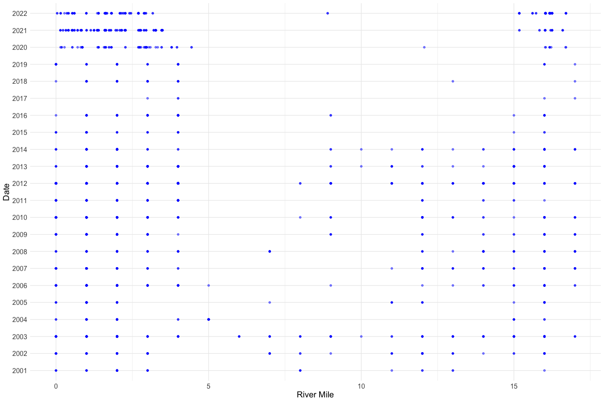<!-- -->

It looks like river miles 0 - 4 and 11 - 15 most commonly have redds. In
most recent years almost all the redds are before mile 5.

``` r
all_redd_data |> 
  ggplot(aes(x = river_mile)) +
  geom_histogram(alpha = .75) + 
  labs(x = "River Mile") +
  theme_minimal() + 
  theme(text = element_text(size = 15)) 
```

    ## `stat_bin()` using `bins = 30`. Pick better value with `binwidth`.

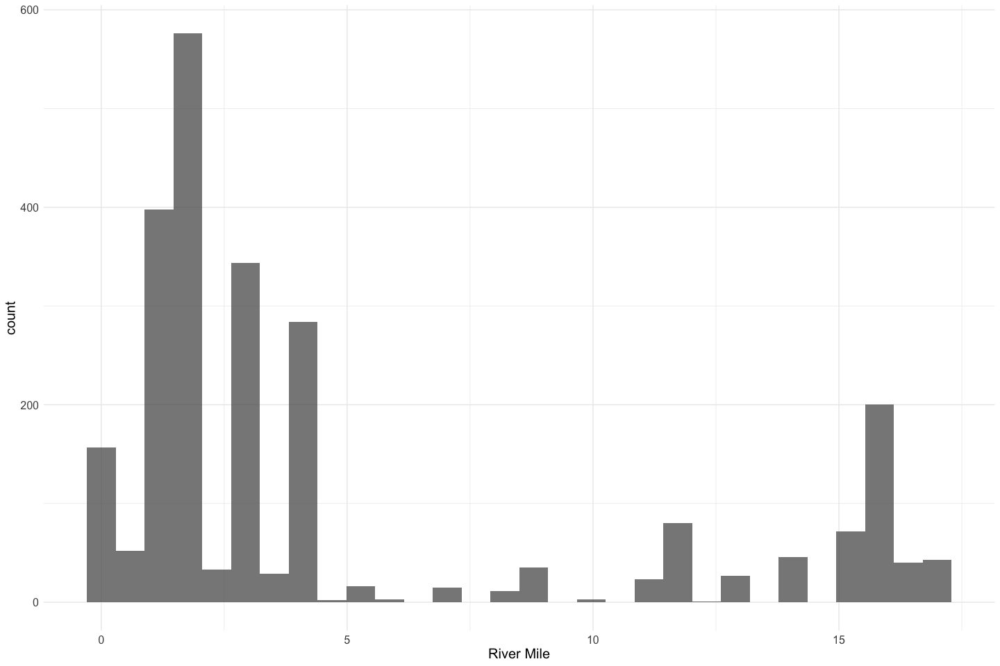<!-- -->

**Numeric Summary of river mile over Period of Record**

``` r
summary(all_redd_data$river_mile)
```

    ##    Min. 1st Qu.  Median    Mean 3rd Qu.    Max. 
    ##   0.000   1.614   2.885   4.996   4.000  17.000

**NA and Unknown Values**

- 0 % of values in the `river_mile` column are NA.

### Variable: `pre_redd_depth`

pre redd depth - depth measurement before redd was created (in inches)

Convert to meters to standardize.

``` r
all_redd_data$pre_redd_depth <- all_redd_data$pre_redd_depth*0.0254
```

**Plotting distribution of pre redd depth**

``` r
all_redd_data |>
  ggplot(aes(x = pre_redd_depth)) +
  geom_histogram() +
  labs(x = "Redd Depth", 
       y = "Count") +
  theme_minimal() + 
  theme(text = element_text(size = 15)) 
```

    ## `stat_bin()` using `bins = 30`. Pick better value with `binwidth`.

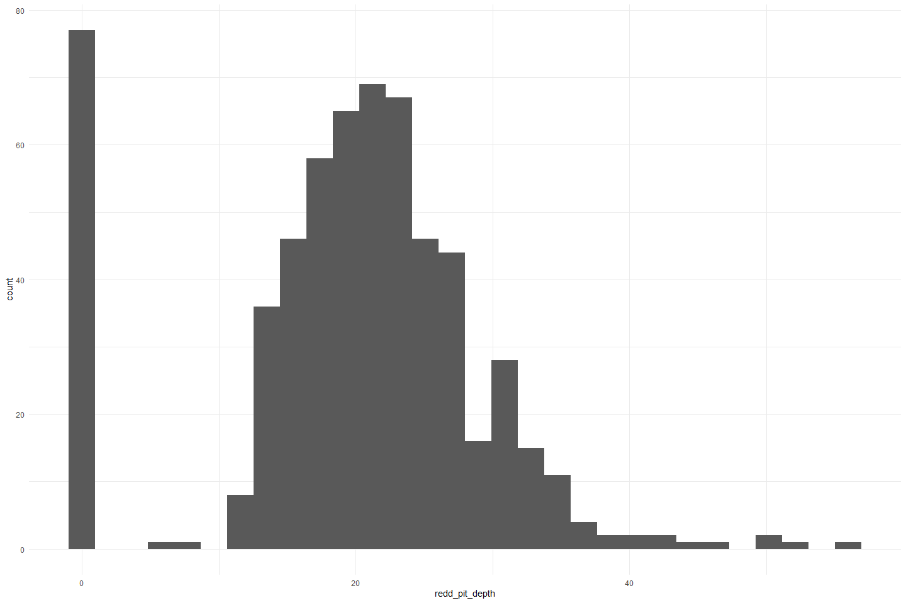<!-- -->

**Numeric Summary of pre redd depth over Period of Record**

``` r
summary(all_redd_data$pre_redd_depth)
```

    ##    Min. 1st Qu.  Median    Mean 3rd Qu.    Max.    NA's 
    ##  0.0000  0.2540  0.3810  0.3724  0.5080  1.2700    1630

**NA and Unknown Values**

- 65.5 % of values in the `pre_redd_depth` column are NA.
- There are a lot of 0 values. Could these also be NA?

### Variable: `redd_pit_depth`

Convert to meters to standardize.

``` r
all_redd_data$redd_pit_depth <- all_redd_data$redd_pit_depth*0.0254
```

**Plotting distribution of redd pit depth**

``` r
all_redd_data |> 
  ggplot(aes(x = redd_pit_depth)) +
  geom_histogram() +
  labs(x = "River Pit Depth", 
       y = "Count") +
  theme_minimal() + 
  theme(text = element_text(size = 15)) 
```

    ## `stat_bin()` using `bins = 30`. Pick better value with `binwidth`.

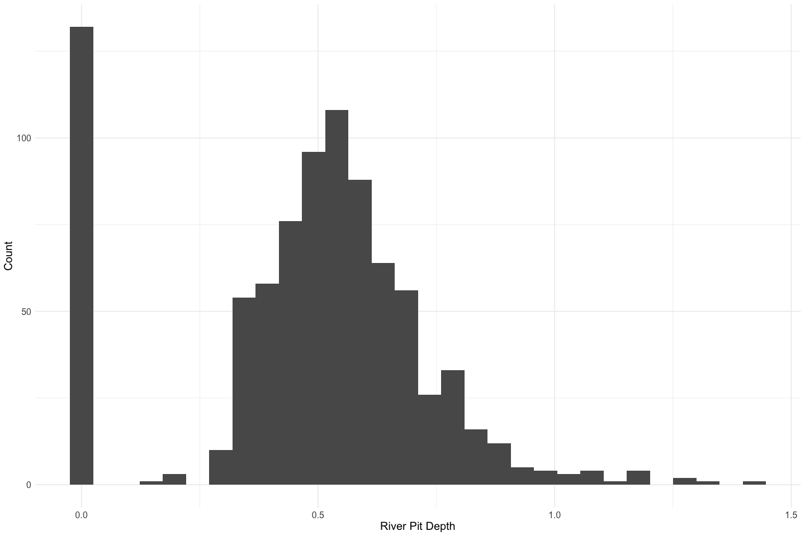<!-- -->

**Numeric Summary of Redd pit depth over Period of Record**

``` r
summary(all_redd_data$redd_pit_depth)
```

    ##    Min. 1st Qu.  Median    Mean 3rd Qu.    Max.    NA's 
    ##  0.0000  0.3810  0.5080  0.4829  0.6350  1.4224    1632

**NA and Unknown Values**

- 65.5 % of values in the `redd_pit_depth` column are NA.
- There are a lot of 0 values. Could these be NA?

### Variable: `redd_tail_depth`

Convert to meters to standardize.

``` r
all_redd_data$redd_tail_depth <- all_redd_data$redd_tail_depth*0.0254
```

**Plotting distribution of redd tail depth**

``` r
all_redd_data |> 
  ggplot(aes(x = redd_tail_depth)) +
  geom_histogram() +
  labs(x = "Redd tail depth", 
       y = "count") +
  theme_minimal() + 
  theme(text = element_text(size = 15)) 
```

    ## `stat_bin()` using `bins = 30`. Pick better value with `binwidth`.

<!-- -->

**Numeric Summary of Redd tail depth over Period of Record**

``` r
summary(all_redd_data$redd_tail_depth)
```

    ##    Min. 1st Qu.  Median    Mean 3rd Qu.    Max.    NA's 
    ##  0.0000  0.1524  0.2286  0.2394  0.3302  0.9398    1857

**NA and Unknown Values**

- 74.6 % of values in the `redd_tail_depth` column are NA.
- There are a lot of 0 values. Could these be NA?

### Variable: `redd_length`

Convert to meters to standardize.

``` r
all_redd_data$redd_length <- all_redd_data$redd_length*0.0254
```

**Plotting distribution of redd length**

``` r
all_redd_data |> 
  ggplot(aes(x = redd_length)) +
  geom_histogram() +
  labs(x = "Redd Length (m)", 
       y = "Count") +
  theme_minimal() + 
  theme(text = element_text(size = 15)) 
```

    ## `stat_bin()` using `bins = 30`. Pick better value with `binwidth`.

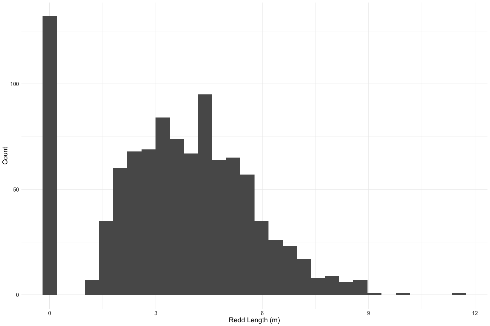<!-- -->

**Numeric Summary of Redd length over Period of Record**

``` r
summary(all_redd_data$redd_length)
```

    ##    Min. 1st Qu.  Median    Mean 3rd Qu.    Max.    NA's 
    ##   0.000   2.324   3.632   3.607   5.004  11.557    1479

**NA and Unknown Values**

- 59.4 % of values in the `redd_length` column are NA.
- There are a lot of 0 values. Could these be NA?

### Variable: `redd_width`

Convert to meters to standardize.

``` r
all_redd_data$redd_width <- all_redd_data$redd_width*0.0254
```

**Plotting distribution of redd width**

``` r
all_redd_data |> 
  ggplot(aes(x = redd_width)) +
  geom_histogram() +
  labs(x = "Redd Width (m)", 
       y = "Count") +
  theme_minimal() + 
  theme(text = element_text(size = 15)) 
```

    ## `stat_bin()` using `bins = 30`. Pick better value with `binwidth`.

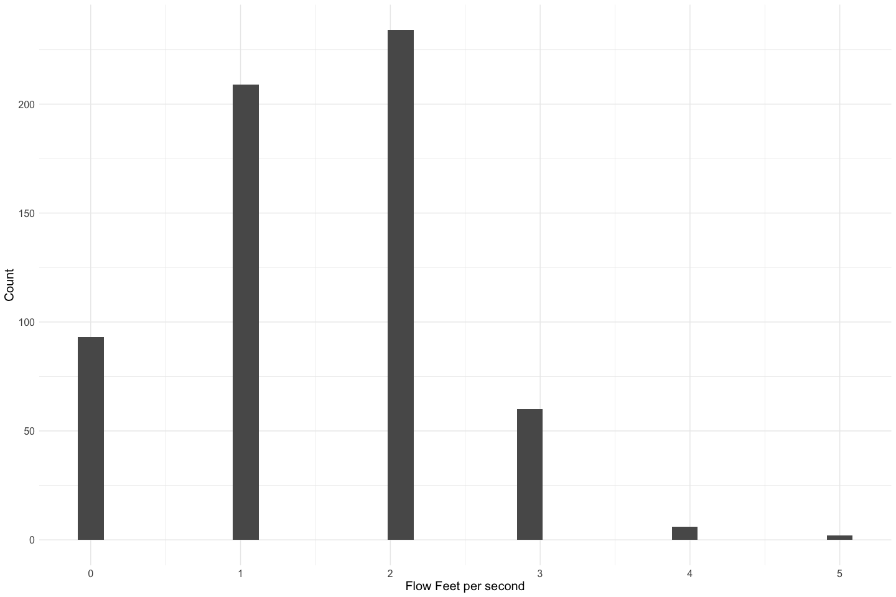<!-- -->

**Numeric Summary of Redd width over Period of Record**

``` r
summary(all_redd_data$redd_width)
```

    ##    Min. 1st Qu.  Median    Mean 3rd Qu.    Max.    NA's 
    ##   0.000   1.270   1.930   1.956   2.667   6.858    1480

**NA and Unknown Values**

- 59.4 % of values in the `redd_width` column are NA.
- There are a lot of 0 values. Could these be NA?

### Variable: `flow_fps`

**Plotting distribution of flow feet per second**

``` r
all_redd_data |> 
  ggplot(aes(x = flow_fps)) +
  geom_histogram() +
  labs(x = "Flow Feet per second", 
       y = "Count") +
  theme_minimal() + 
  theme(text = element_text(size = 15)) 
```

    ## `stat_bin()` using `bins = 30`. Pick better value with `binwidth`.

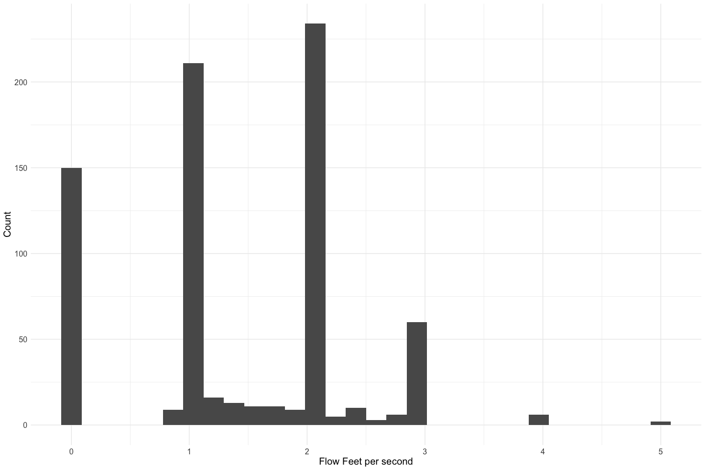<!-- -->

``` r
all_redd_data |> 
  ggplot(aes(x = flow_fps, y = reach)) +
  geom_boxplot() +
  labs(x = "Flow Feet Per Second", 
       y = "Reach") +
  theme_minimal() + 
  theme(text = element_text(size = 15)) 
```

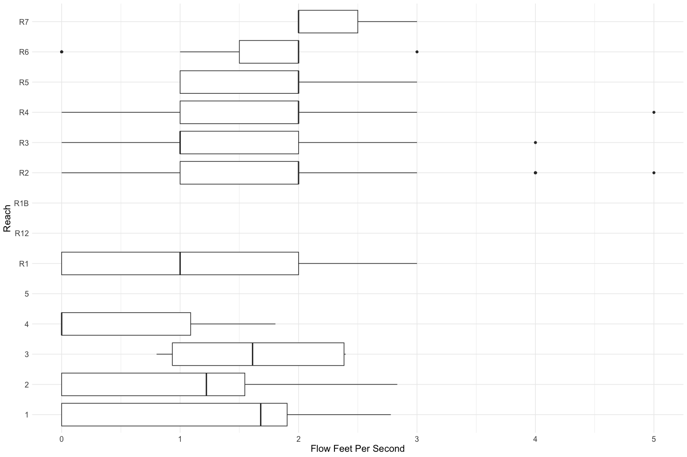<!-- -->
**Numeric Summary of flow over Period of Record**

``` r
summary(all_redd_data$flow_fps)
```

    ##    Min. 1st Qu.  Median    Mean 3rd Qu.    Max.    NA's 
    ##   0.000   1.000   1.228   1.391   2.000   5.000    1734

**NA and Unknown Values**

- 69.6 % of values in the `flow_fps` column are NA.
- There are a lot of 0 values. Could these be NA?

### Variables: `start_flow_meter`, `start_flow_meter_80`

**Plotting distribution of flow number start per second**

``` r
p1 <- all_redd_data |> 
  ggplot(aes(x = start_number_flow_meter)) +
  geom_histogram() +
  labs(x = "Start Number", 
       y = "Count") +
  theme_minimal() + 
  theme(text = element_text(size = 15)) 

p2 <- all_redd_data |> 
  ggplot(aes(x = start_number_flow_meter_80)) +
  geom_histogram() +
  labs(x = "Start Number 80%", 
       y = "Count") +
  theme_minimal() + 
  theme(text = element_text(size = 15)) 

gridExtra::grid.arrange(p1, p2)
```

    ## `stat_bin()` using `bins = 30`. Pick better value with `binwidth`.
    ## `stat_bin()` using `bins = 30`. Pick better value with `binwidth`.

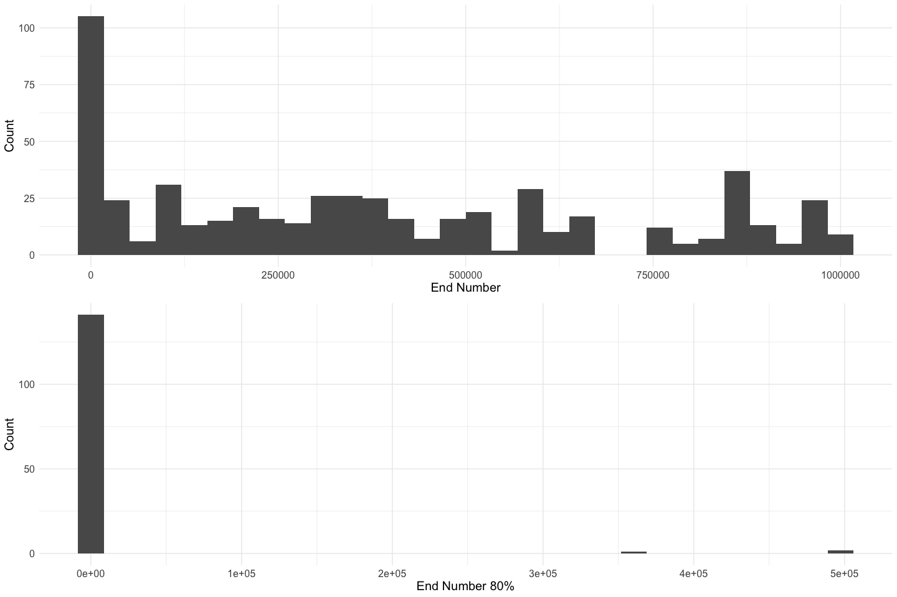<!-- -->

Very few records of start number at 80% depth. Most of these are 0.

**Numeric Summary of flow over Period of Record**

``` r
summary(all_redd_data$start_number_flow_meter)
```

    ##    Min. 1st Qu.  Median    Mean 3rd Qu.    Max.    NA's 
    ##       0   27700  337250  386430  659875  998000    1688

``` r
summary(all_redd_data$start_number_flow_meter_80)
```

    ##    Min. 1st Qu.  Median    Mean 3rd Qu.    Max.    NA's 
    ##       0       0       0   18560       0  944000    2190

**NA and Unknown Values**

- 67.8 % of values in the `start_number_flow_meter` column are NA.
- 88 % of values in the `start_number_flow_meter_80` column are NA.
- There are a lot of 0 values. Could these be NA?

### Variables: `end_number_flow_meter`, `end_number_flow_meter_80`

**Plotting distribution of flow meter end number per second**

``` r
p1 <- all_redd_data |> 
  ggplot(aes(x = end_number_flow_meter)) +
  geom_histogram() +
  labs(x = "End Number", 
       y = "Count") +
  theme_minimal() + 
  theme(text = element_text(size = 15)) 

p2 <- all_redd_data |> 
  ggplot(aes(x = end_number_flow_meter_80)) +
  geom_histogram() +
  labs(x = "End Number 80%", 
       y = "Count") +
  theme_minimal() + 
  theme(text = element_text(size = 15)) 

gridExtra::grid.arrange(p1, p2)
```

    ## `stat_bin()` using `bins = 30`. Pick better value with `binwidth`.
    ## `stat_bin()` using `bins = 30`. Pick better value with `binwidth`.

<!-- -->

Very few records of end number at 80% depth. Most of these are 0.

**Numeric Summary of flow over Period of Record**

``` r
summary(all_redd_data$start_number_flow_meter)
```

    ##    Min. 1st Qu.  Median    Mean 3rd Qu.    Max.    NA's 
    ##       0   27700  337250  386430  659875  998000    1688

``` r
summary(all_redd_data$end_number_flow_meter_80)
```

    ##    Min. 1st Qu.  Median    Mean 3rd Qu.    Max.    NA's 
    ##       0       0       0   18607       0  944890    2190

**NA and Unknown Values**

- 67.8 % of values in the `end_number_flow_meter` column are NA.
- 88 % of values in the `end_number_flow_meter_80` column are NA.
- There are a lot of 0 values. Could these be NA?

### Variables: `flow_meter_time`, `flow_meter_time_80`

Start number for flow bomb at 80% depth; 80% depth was measured when the
redd was \>22” deep

**Plotting distribution of flow meter end number per second**

``` r
p1 <- all_redd_data |> 
  ggplot(aes(x = flow_meter_time)) +
  geom_histogram() +
  labs(x = "Time Seconds", 
       y = "Count") +
  theme_minimal() + 
  theme(text = element_text(size = 15)) 

p2 <- all_redd_data |> 
  ggplot(aes(x = flow_meter_time_80)) +
  geom_histogram() +
  labs(x = "Time Seconds 80%", 
       y = "Count") +
  theme_minimal() + 
  theme(text = element_text(size = 15)) 

gridExtra::grid.arrange(p1, p2)
```

    ## `stat_bin()` using `bins = 30`. Pick better value with `binwidth`.
    ## `stat_bin()` using `bins = 30`. Pick better value with `binwidth`.

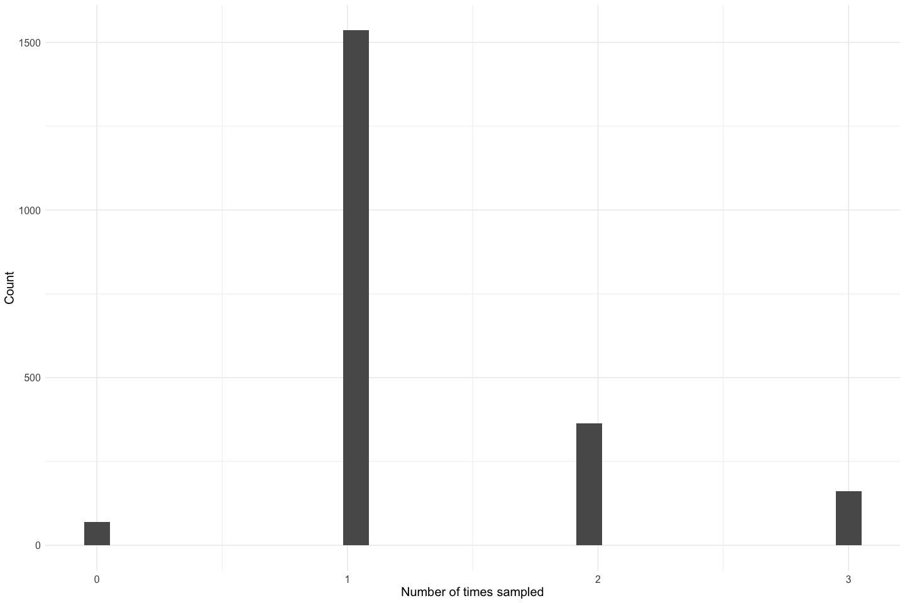<!-- -->

Most (all for Time 80) of the flow meter times are at 100 seconds.

**Numeric Summary of flow over Period of Record**

``` r
summary(all_redd_data$flow_meter_time)
```

    ##    Min. 1st Qu.  Median    Mean 3rd Qu.    Max.    NA's 
    ##    0.00  100.00  100.00   92.77  100.00  150.00    1688

``` r
summary(all_redd_data$flow_meter_time_80)
```

    ##    Min. 1st Qu.  Median    Mean 3rd Qu.    Max.    NA's 
    ##    0.00    0.00  100.00   51.13  100.00  120.00    2190

**NA and Unknown Values**

- 67.8 % of values in the `flow_meter_time` column are NA.
- 88 % of values in the `flow_meter_time_80` column are NA.

### Variables: `age_index`

Age Index refers to the number of times a unique redd has been surveyed.
If `age_index == 0`, the redd was not aged.

**Plotting distribution of age index**

``` r
all_redd_data |> 
  ggplot(aes(x = age_index)) +
  geom_histogram() +
  labs(x = "Number of times sampled", 
       y = "Count") +
  theme_minimal() + 
  theme(text = element_text(size = 15))
```

    ## `stat_bin()` using `bins = 30`. Pick better value with `binwidth`.

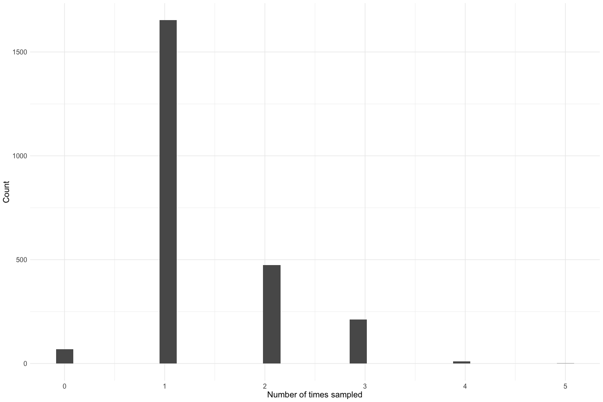<!-- -->

Most redds are aged at least once.

**Numeric Summary of age index over Period of Record**

``` r
summary(all_redd_data$age_index)
```

    ##    Min. 1st Qu.  Median    Mean 3rd Qu.    Max.    NA's 
    ##   0.000   1.000   1.000   1.356   2.000   5.000      71

``` r
summary(all_redd_data$age_index)
```

    ##    Min. 1st Qu.  Median    Mean 3rd Qu.    Max.    NA's 
    ##   0.000   1.000   1.000   1.356   2.000   5.000      71

**NA and Unknown Values**

- 2.9 % of values in the `age_index` column are NA.
- 2.9 % of values in the `age_index` column are NA.

### Variables: `age`

Age refers to the assigned age of a redd.

**Plotting distribution of age**

``` r
all_redd_data |> 
  ggplot(aes(x = age)) +
  geom_histogram() +
  labs(x = "Redd age", 
       y = "Count") +
  theme_minimal() + 
  theme(text = element_text(size = 15))
```

    ## `stat_bin()` using `bins = 30`. Pick better value with `binwidth`.

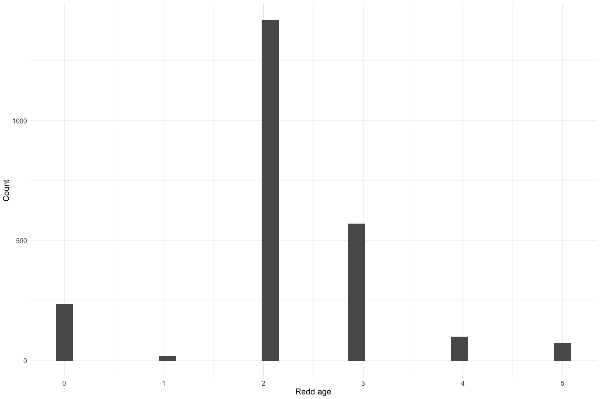<!-- -->

Most redds are age `2` to `3`.

**Numeric Summary of ageover Period of Record**

``` r
summary(all_redd_data$age)
```

    ##    Min. 1st Qu.  Median    Mean 3rd Qu.    Max.    NA's 
    ##   0.000   2.000   2.000   2.208   3.000   5.000      70

``` r
summary(all_redd_data$age)
```

    ##    Min. 1st Qu.  Median    Mean 3rd Qu.    Max.    NA's 
    ##   0.000   2.000   2.000   2.208   3.000   5.000      70

**NA and Unknown Values**

- 2.8 % of values in the `age` column are NA.
- 2.8 % of values in the `age` column are NA.

## Explore Categorical variables:

``` r
all_redd_data |> select_if(is.character) |> colnames()
```

    ##  [1] "JPE_redd_id"             "survey_method"          
    ##  [3] "reach"                   "reach_sub_unit"         
    ##  [5] "run"                     "redd_loc"               
    ##  [7] "pre_redd_substrate_size" "redd_substrate_size"    
    ##  [9] "tail_substrate_size"     "fish_guarding"          
    ## [11] "why_not_measured"        "flow_meter"             
    ## [13] "survey"                  "fork"

### Variable: `survey_method`

``` r
table(all_redd_data$survey_method) 
```

    ## 
    ## Snorkel Walking 
    ##    2116      13

**NA and Unknown Values**

- 14.5 % of values in the `survey_method` column are NA.

### Variable: `reach`

``` r
table(all_redd_data$reach) 
```

    ## 
    ##   1   2   3   4   5  R1 R12 R1B  R2  R3  R4  R5  R6  R7 
    ##  79 105  11  27   1 569   2   8 727 367 405 112  60  17

**NA and Unknown Values**

- 0 % of values in the `reach`column are NA.

### Variable: `reach_sub_unit`

``` r
table(all_redd_data$reach_sub_unit) 
```

    ## 
    ##   A   B 
    ## 470 298

**NA and Unknown Values**

- 69.2 % of values in the `reach_sub_unit`column are NA.

### Variable: `run`

``` r
table(all_redd_data$run) 
```

    ## 
    ## spring 
    ##   2490

All records are for spring run fish.

**NA and Unknown Values**

- 0 % of values in the `run`column are NA.

### Variable: `redd_id`

``` r
length(unique(all_redd_data$redd_id))
```

    ## [1] 0

**NA and Unknown Values**

- 0 % of values in the `redd_id`column are NA.

### Variable: \`redd_loc\`\`

``` r
table(all_redd_data$redd_loc) 
```

    ## 
    ##  RC  RL  RR UNK 
    ## 662 583 663 191

**NA and Unknown Values**

- 15.7 % of values in the `redd_loc`column are NA.

### Variable: `pre_redd_substrate_size`

``` r
table(all_redd_data$pre_redd_substrate_size) 
```

    ## 
    ##    '1-2    '2-3    '3-4   < 0.1     <.1    <0.1     >12 0.1 - 1   0.1-1       1 
    ##      76      19       9       2       1      12       7      36     236      44 
    ##   1 - 2     1-2     1-3     1-5   2 - 3     2-3     2-4     3-4     3-5     4-5 
    ##      33     483     428       3       6     108     147      31      29       5 
    ##     4-6     5-6 
    ##      11       4

Fix inconsistencies with spelling, capitalization, and abbreviations.

``` r
all_redd_data$pre_redd_substrate_size <- if_else(
  all_redd_data$pre_redd_substrate_size == ".1 to 1" | 
  all_redd_data$pre_redd_substrate_size == "0.1-1", "0.1 to 1", all_redd_data$pre_redd_substrate_size
)

all_redd_data$pre_redd_substrate_size <- if_else(
  all_redd_data$pre_redd_substrate_size == "<.1", "<0.1", all_redd_data$pre_redd_substrate_size
)
table(all_redd_data$pre_redd_substrate_size) 
```

    ## 
    ##     '1-2     '2-3     '3-4    < 0.1     <0.1      >12  0.1 - 1 0.1 to 1 
    ##       76       19        9        2       13        7       36      236 
    ##        1    1 - 2      1-2      1-3      1-5    2 - 3      2-3      2-4 
    ##       44       33      483      428        3        6      108      147 
    ##      3-4      3-5      4-5      4-6      5-6 
    ##       31       29        5       11        4

**NA and Unknown Values**

- 30.5 % of values in the `pre_redd_substrate_size` column are NA.

### Variable: `redd_substrate_size`

``` r
table(all_redd_data$redd_substrate_size) 
```

    ## 
    ##    '1-2    '2-3    '3-4   < 0.1     <.1    <0.1     >12 0.1 - 1   0.1-1       1 
    ##      88      26       2       2       1       7      16      18     144      36 
    ##   1 - 2     1-2     1-3     1-5   2 - 3     2-3     2-4     3-4     3-5     4-5 
    ##      32     512     458       4      10     173     147      18      24       1 
    ##     4-6     5-6     6-7 
    ##       6       2       2

Fix inconsistencies with spelling, capitalization, and abbreviations.

``` r
all_redd_data$redd_substrate_size <- if_else(
  all_redd_data$redd_substrate_size == ".1 to 1" | 
  all_redd_data$redd_substrate_size == "0.1-1", "0.1 to 1", all_redd_data$redd_substrate_size
)

all_redd_data$redd_substrate_size <- if_else(
  all_redd_data$redd_substrate_size == "<.1", "<0.1", all_redd_data$redd_substrate_size
)

all_redd_data$redd_substrate_size <- ifelse(
  all_redd_data$redd_substrate_size == "NA", NA, all_redd_data$redd_substrate_size
)
table(all_redd_data$redd_substrate_size) 
```

    ## 
    ##     '1-2     '2-3     '3-4    < 0.1     <0.1      >12  0.1 - 1 0.1 to 1 
    ##       88       26        2        2        8       16       18      144 
    ##        1    1 - 2      1-2      1-3      1-5    2 - 3      2-3      2-4 
    ##       36       32      512      458        4       10      173      147 
    ##      3-4      3-5      4-5      4-6      5-6      6-7 
    ##       18       24        1        6        2        2

**NA and Unknown Values**

- 30.6 % of values in the `redd_substrate_size` column are NA.

### Variable: `tail_substrate_size`

``` r
table(all_redd_data$tail_substrate_size) 
```

    ## 
    ##  '1-2  '2-3  '3-4 0.1-1     1 1 - 2   1-2   1-3 2 - 3   2-3   2-4   3-4   3-5 
    ##    88    49     4    14     3    35   621   616    11   164   102    17     3 
    ##   5-6 
    ##     2

Fix inconsistencies with spelling, capitalization, and abbreviations.

``` r
all_redd_data$tail_substrate_size <- if_else(
  all_redd_data$tail_substrate_size == ".1 to 1" | 
  all_redd_data$tail_substrate_size == "0.1-1", "0.1 to 1", all_redd_data$tail_substrate_size
)


all_redd_data$tail_substrate_size <- ifelse(
  all_redd_data$tail_substrate_size == "NA", NA, all_redd_data$tail_substrate_size
)
table(all_redd_data$tail_substrate_size) 
```

    ## 
    ##     '1-2     '2-3     '3-4 0.1 to 1        1    1 - 2      1-2      1-3 
    ##       88       49        4       14        3       35      621      616 
    ##    2 - 3      2-3      2-4      3-4      3-5      5-6 
    ##       11      164      102       17        3        2

**NA and Unknown Values**

- 30.6 % of values in the `tail_substrate_size` column are NA.

### Variable: `fish_guarding`

``` r
table(all_redd_data$fish_guarding) 
```

    ## 
    ##   No   NO  UNK    Y  Yes  YES 
    ##   27 1370  342    4    1  388

Fix inconsistencies with spelling, capitalization, and abbreviations.

``` r
all_redd_data$fish_guarding <- case_when(
  all_redd_data$fish_guarding == "No" | all_redd_data$fish_guarding == "NO" ~FALSE, 
  all_redd_data$fish_guarding == "Yes" | all_redd_data$fish_guarding == "YES" ~TRUE
)

table(all_redd_data$fish_guarding) 
```

    ## 
    ## FALSE  TRUE 
    ##  1397   389

**NA and Unknown Values**

- 28.3 % of values in the `fish_guarding` column are NA.

### Variable: `redd_measured`

``` r
table(all_redd_data$redd_measured) 
```

    ## 
    ## FALSE  TRUE 
    ##  1402   735

Fix inconsistencies with spelling, capitalization, and abbreviations.

``` r
all_redd_data$redd_measured <- case_when(
  all_redd_data$redd_measured == "NO"  ~ FALSE, 
  all_redd_data$redd_measured == "YES" ~ TRUE
)

table(all_redd_data$redd_measured) 
```

    ## < table of extent 0 >

**NA and Unknown Values**

- 100 % of values in the `redd_measured` column are NA.

### Variable: `why_not_measured`

``` r
table(all_redd_data$why_not_measured) 
```

    ## 
    ## Fish on redd FISH ON REDD   Sub-Sample   SUB-SAMPLE     Too Deep          UNK 
    ##            5            3           80           54            1         1915

Fix inconsistencies with spelling, capitalization, and abbreviations.

``` r
all_redd_data$why_not_measured <- case_when(
  all_redd_data$why_not_measured == "Fish on redd" | 
    all_redd_data$why_not_measured == "FISH ON REDD"  ~ "fish on redd", 
  all_redd_data$why_not_measured == "Sub-Sample" | 
    all_redd_data$why_not_measured == "SUB-SAMPLE"  ~ "sub sample", 
  all_redd_data$why_not_measured == "Too Deep" ~ "too deep", 
)

table(all_redd_data$why_not_measured) 
```

    ## 
    ## fish on redd   sub sample     too deep 
    ##            8          134            1

**NA and Unknown Values**

- 94.3 % of values in the `why_not_measured` column are NA.

### Variable: `flow_meter`

``` r
table(all_redd_data$flow_meter) 
```

    ## 
    ##    Digital  flow bomb  Flow bomb  Flow Bomb Flow Watch      Marsh        Unk 
    ##         17         35          1        543          4          2          2 
    ##        UNK 
    ##          3

Fix inconsistencies with spelling, capitalization, and abbreviations.

``` r
all_redd_data$flow_meter <- case_when(
  all_redd_data$flow_meter %in% c("flow bomb", "Flow Bomb", "Flow bomb")  ~ "flow bomb", 
  all_redd_data$flow_meter == "Digital" ~ "digital",
  all_redd_data$flow_meter == "Flow Watch"  ~ "flow watch", 
  all_redd_data$flow_meter == "Marsh" ~ "marsh", 
)

table(all_redd_data$flow_meter) 
```

    ## 
    ##    digital  flow bomb flow watch      marsh 
    ##         17        579          4          2

**NA and Unknown Values**

- 75.8 % of values in the `flow_meter` column are NA.

### Variable: `survey`

``` r
table(all_redd_data$survey)
```

    ## 
    ##   0   1  10  11  12  13  14   2   3   4   5   6   7   8   9 
    ## 918 249  57  15  10  38  15 228 164  83 112  44  53  55  88

**NA and Unknown Values**

- 14.5 % of values in the `survey` column are NA.

## Summary of identified issues

- there are a lot of zero values for the physical characteristics of
  redds, need to figure out if these are not measured values or are
  actually zero

## Next steps

### Columns to remove

- `comments`, `why_not_measured`, `flow_meter`, `flow_fps`,
  `start_number_flow_meter`, `end_number_flow_meter`, `flow_meter_time`,
  `start_number_flow_meter_80`, `end_number_flow_meter_80`,
  `flow_meter_time_80` have little data and may not be needed.
- The most important variables are `longitude`, `latitude`, `date`,
  `redd_measured`, `redd_id`, `age`, and `age_index`

## Save cleaned data back to google cloud

``` r
battle_redd <- all_redd_data |> glimpse()
```

    ## Rows: 2,490
    ## Columns: 35
    ## $ JPE_redd_id                <chr> "Redd_0035", "Redd_0036", "Redd_0037", "Red…
    ## $ date                       <date> 2002-10-01, 2002-10-01, 2002-10-01, 2002-1…
    ## $ survey_method              <chr> "Snorkel", "Snorkel", "Snorkel", "Snorkel",…
    ## $ longitude                  <dbl> -122, -122, -122, -122, -122, -122, -122, -…
    ## $ latitude                   <dbl> 40, 40, 40, 40, 40, 40, 40, 40, 40, 40, 40,…
    ## $ reach                      <chr> "R2", "R2", "R2", "R2", "R2", "R2", "R3", "…
    ## $ reach_sub_unit             <chr> NA, NA, NA, NA, NA, NA, NA, NA, NA, NA, NA,…
    ## $ river_mile                 <dbl> 2, 2, 1, 1, 0, 0, 2, 2, 2, 1, 1, 1, 1, 2, 2…
    ## $ run                        <chr> "spring", "spring", "spring", "spring", "sp…
    ## $ redd_loc                   <chr> "UNK", "UNK", "UNK", "UNK", "UNK", "UNK", "…
    ## $ pre_redd_substrate_size    <chr> NA, NA, NA, NA, NA, NA, NA, NA, NA, NA, NA,…
    ## $ redd_substrate_size        <chr> NA, NA, NA, NA, NA, NA, NA, NA, NA, NA, NA,…
    ## $ tail_substrate_size        <chr> NA, NA, NA, NA, NA, NA, NA, NA, NA, NA, NA,…
    ## $ fish_guarding              <lgl> NA, NA, NA, NA, NA, NA, NA, NA, NA, NA, NA,…
    ## $ redd_measured              <lgl> NA, NA, NA, NA, NA, NA, NA, NA, NA, NA, NA,…
    ## $ why_not_measured           <chr> NA, NA, NA, NA, NA, NA, NA, NA, NA, NA, NA,…
    ## $ pre_redd_depth             <dbl> NA, NA, NA, NA, NA, NA, NA, NA, 0.2540, 0.3…
    ## $ redd_pit_depth             <dbl> NA, NA, NA, NA, NA, NA, NA, NA, 0.4064, 0.6…
    ## $ redd_tail_depth            <dbl> NA, NA, NA, NA, NA, NA, NA, NA, 0.2032, 0.3…
    ## $ redd_length                <dbl> NA, NA, NA, NA, NA, NA, NA, NA, 4.6228, 1.6…
    ## $ redd_width                 <dbl> NA, NA, NA, NA, NA, NA, NA, NA, 1.8288, 1.0…
    ## $ flow_meter                 <chr> NA, NA, NA, NA, NA, NA, NA, NA, "flow bomb"…
    ## $ flow_fps                   <dbl> NA, NA, NA, NA, NA, NA, NA, NA, 2, 2, 2, NA…
    ## $ start_number_flow_meter    <dbl> NA, NA, NA, NA, NA, NA, NA, NA, 862000, 877…
    ## $ end_number_flow_meter      <dbl> NA, NA, NA, NA, NA, NA, NA, NA, 864537, 880…
    ## $ flow_meter_time            <dbl> NA, NA, NA, NA, NA, NA, NA, NA, 100, 100, 1…
    ## $ start_number_flow_meter_80 <dbl> NA, NA, NA, NA, NA, NA, NA, NA, NA, NA, NA,…
    ## $ end_number_flow_meter_80   <dbl> NA, NA, NA, NA, NA, NA, NA, NA, NA, NA, NA,…
    ## $ flow_meter_time_80         <dbl> NA, NA, NA, NA, NA, NA, NA, NA, NA, NA, NA,…
    ## $ survey                     <chr> "11", "11", "11", "11", "11", "11", "11", "…
    ## $ age_index                  <dbl> 0, 0, 0, 0, 0, 0, 0, 0, 0, 0, 0, 0, 0, 0, 0…
    ## $ age                        <dbl> NA, NA, NA, NA, NA, NA, NA, NA, NA, NA, NA,…
    ## $ date_measured              <dttm> NA, NA, NA, NA, NA, NA, NA, NA, NA, NA, NA…
    ## $ tailspill                  <dbl> NA, NA, NA, NA, NA, NA, NA, NA, NA, NA, NA,…
    ## $ fork                       <chr> NA, NA, NA, NA, NA, NA, NA, NA, NA, NA, NA,…

``` r
# gcs_list_objects()
f <- function(input, output) write_csv(input, file = output)

gcs_upload(battle_redd,
           object_function = f,
           type = "csv",
           name = "adult-holding-redd-and-carcass-surveys/battle-creek/data/battle_redd.csv")
```
