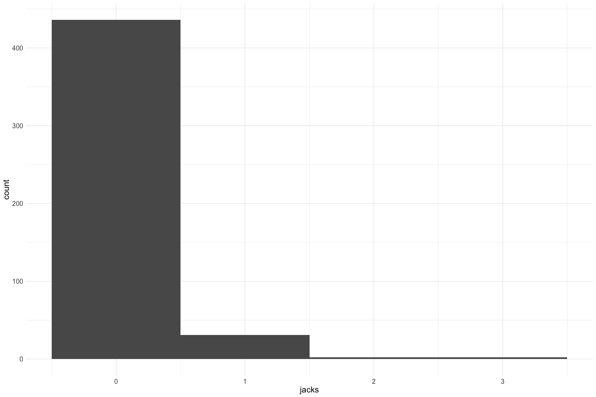

Battle Creek Adult Holding Survey QC
================
Erin Cain
9/29/2021

# Battle Creek Adult Holding Survey

## Description of Monitoring Data

These data were acquired via snorkel and kayak surveys on Battle Creek
from 2001 to 2019 and describe the locations of live adult Chinook
Salmon seen in Battle Creek. Generally, spring-run Chinook Salmon are in
holding position prior to August 15 and in spawning position after
August 15.

**Timeframe:** 2001 - 2019

**Survey Season:** may - november

**Completeness of Record throughout timeframe:** Data for every year in
timeframe, for some years there are only a few sample dates.

**Sampling Location:** Battle Creek

**Data Contact:** [Natasha Wingerter](mailto:natasha_wingerter@fws.gov);
[RJ Bottaro](mailto:rj_bottaro@fws.gov)

## Access Cloud Data

``` r
# Run Sys.setenv() to specify GCS_AUTH_FILE and GCS_DEFAULT_BUCKET before running 
# getwd() to see how to specify paths 
# Open object from google cloud storage
# Set your authentication using gcs_auth
gcs_auth(json_file = Sys.getenv("GCS_AUTH_FILE"))
# Set global bucket 
gcs_global_bucket(bucket = Sys.getenv("GCS_DEFAULT_BUCKET"))

# git data and save as xlsx
```

Read in data from google cloud, glimpse raw data sheet:

``` r
sheets <- excel_sheets("raw_adult_spawn_hold_carcass.xlsx")
sheets 
```

    ## [1] "Notes and Metadata"    "Redd Survey"           "Carcass"              
    ## [4] "Live Holding Spawning"

``` r
raw_holding_data <-read_excel("raw_adult_spawn_hold_carcass.xlsx", sheet = "Live Holding Spawning") %>% glimpse()
```

    ## Rows: 1,339
    ## Columns: 10
    ## $ Project    <chr> "Snorkel", "Snorkel", "Snorkel", "Snorkel", "Snorkel", "Sno…
    ## $ Longitude  <dbl> -121.9902, -121.9793, -121.9754, -121.9743, -121.9687, -122…
    ## $ Latitude   <dbl> 40.41491, 40.40429, 40.40363, 40.40277, 40.40204, 40.42620,…
    ## $ Year_      <dbl> 2001, 2001, 2001, 2001, 2001, 2001, 2001, 2001, 2001, 2001,…
    ## $ SampleDate <dttm> 2001-07-19, 2001-07-19, 2001-07-19, 2001-07-19, 2001-07-19…
    ## $ Reach      <chr> "R3", "R3", "R3", "R3", "R3", "R4", "R4", "R5", "R3", "R3",…
    ## $ Rivermile  <dbl> 0.764266, 1.825265, 2.049952, 2.137590, 2.492432, 15.943712…
    ## $ Quantity   <dbl> 4, 1, 3, 4, 5, 2, 1, 1, 3, 1, 5, 3, 4, 1, 3, 6, 3, 5, 7, 3,…
    ## $ Jacks      <chr> "NA", "NA", "NA", "NA", "NA", "NA", "NA", "NA", "NA", "NA",…
    ## $ Notes      <chr> "WP203", "WP204", "WP205", "WP206", "WP207", "WP33", "WP34"…

## Data transformations

``` r
cleaner_holding_data <- raw_holding_data %>% 
  janitor::clean_names() %>%
  rename("date" = sample_date,
         "river_mile" = rivermile,
         "count" = quantity) %>%
  mutate(date = as.Date(date),
         jacks = as.numeric(jacks)) %>%
  select(-project, -year) %>% # All projects = snorkel, year can be pulled from date
  glimpse
```

    ## Rows: 1,339
    ## Columns: 8
    ## $ longitude  <dbl> -121.9902, -121.9793, -121.9754, -121.9743, -121.9687, -122…
    ## $ latitude   <dbl> 40.41491, 40.40429, 40.40363, 40.40277, 40.40204, 40.42620,…
    ## $ date       <date> 2001-07-19, 2001-07-19, 2001-07-19, 2001-07-19, 2001-07-19…
    ## $ reach      <chr> "R3", "R3", "R3", "R3", "R3", "R4", "R4", "R5", "R3", "R3",…
    ## $ river_mile <dbl> 0.764266, 1.825265, 2.049952, 2.137590, 2.492432, 15.943712…
    ## $ count      <dbl> 4, 1, 3, 4, 5, 2, 1, 1, 3, 1, 5, 3, 4, 1, 3, 6, 3, 5, 7, 3,…
    ## $ jacks      <dbl> NA, NA, NA, NA, NA, NA, NA, NA, NA, NA, NA, NA, NA, NA, NA,…
    ## $ notes      <chr> "WP203", "WP204", "WP205", "WP206", "WP207", "WP33", "WP34"…

## Data Dictionary

The following table describes the variables included in this dataset and
the percent that do not include data.

``` r
percent_na <- cleaner_holding_data %>%
  summarise_all(list(name = ~sum(is.na(.))/length(.))) %>%
  pivot_longer(cols = everything())
  
data_dictionary <- tibble(variables = colnames(cleaner_holding_data),
                          description = c("GPS X point",
                                          "GPS Y point",
                                          "Date of sample",
                                          "Reach number (1-7)",
                                          "River mile number",
                                          "Total number of salmon observed",
                                          "Number of jacks seen",
                                          "General comments from survey crew"
                                          ),
                          percent_na = round(percent_na$value*100)
                          
)
kable(data_dictionary)
```

| variables   | description                       | percent\_na |
|:------------|:----------------------------------|------------:|
| longitude   | GPS X point                       |           0 |
| latitude    | GPS Y point                       |           0 |
| date        | Date of sample                    |           0 |
| reach       | Reach number (1-7)                |           0 |
| river\_mile | River mile number                 |           0 |
| count       | Total number of salmon observed   |           0 |
| jacks       | Number of jacks seen              |          65 |
| notes       | General comments from survey crew |          40 |

## Explore Numeric Variables:

``` r
cleaner_holding_data %>% select_if(is.numeric) %>% colnames()
```

    ## [1] "longitude"  "latitude"   "river_mile" "count"      "jacks"

### Variable: `longitude`, `latitude`

**Numeric Summary of lat long over Period of Record**

``` r
summary(cleaner_holding_data$latitude)
```

    ##    Min. 1st Qu.  Median    Mean 3rd Qu.    Max. 
    ##   40.38   40.41   40.42   40.42   40.42   40.43

``` r
summary(cleaner_holding_data$longitude)
```

    ##    Min. 1st Qu.  Median    Mean 3rd Qu.    Max. 
    ##  -122.2  -122.0  -122.0  -122.0  -122.0  -121.9

**NA and Unknown Values**

-   0 % of values in the `latitude` column are NA.
-   0 % of values in the `longitude` column are NA.

### Variable: `river_mile`

**Plotting river mile over Period of Record**

``` r
cleaner_holding_data %>% 
  ggplot(aes(x = river_mile, y = year(date))) +
  geom_point(alpha = .75, size = 1.5, color = "blue") + 
  labs(y = "Year", x = "River Mile") +
  theme_minimal() + 
  theme(text = element_text(size = 15)) 
```

<!-- -->

It looks like river miles 0 - 6 and 12 - 17 most commonly have holding
chinooks. In most recent years there are less points and many of the
holding chinooks are before mile 5.

``` r
cleaner_holding_data %>% 
  ggplot(aes(x = river_mile)) +
  geom_histogram(alpha = .75) + 
  theme_minimal() + 
  theme(text = element_text(size = 15)) 
```

    ## `stat_bin()` using `bins = 30`. Pick better value with `binwidth`.

<!-- -->

**Numeric Summary of river mile over Period of Record**

``` r
summary(cleaner_holding_data$river_mile)
```

    ##      Min.   1st Qu.    Median      Mean   3rd Qu.      Max. 
    ##  0.005748  1.948484  3.699172  6.783972 14.233471 16.796883

**NA and Unknown Values**

-   0 % of values in the `river_mile` column are NA.

### Variable: `count`

**Plotting Counts over Period of Record**

``` r
cleaner_holding_data %>% 
  mutate(year = as.factor(year(date)),
         fake_date = as.Date(paste0("1990", "-", month(date), "-", day(date)))) %>% 
  ggplot(aes(x = fake_date, y = count)) + 
  geom_col() + 
  facet_wrap(~year(date), scales = "free_y") + 
  scale_x_date(labels = date_format("%b"), date_breaks = "1 month") + 
  theme_minimal() + 
  theme(text = element_text(size = 23),
        axis.text.x = element_text(angle = 90, vjust = 0.5, hjust=1)) + 
  labs(title = "Daily Passage Count", 
       x = "Date")  
```

<!-- -->

``` r
cleaner_holding_data %>% 
  group_by(date) %>%
  summarise(daily_count = sum(count)) %>%
  filter(daily_count < 100) %>%
  mutate(year = as.factor(year(date))) %>% 
  ggplot(aes(x = year, y = daily_count)) + 
  geom_boxplot() + 
  theme_minimal() +
  labs(title = "Daily Count Sumarized by Year") + 
  theme(text = element_text(size = 23),
        axis.text.x = element_text(angle = 90, vjust = 0.5, hjust=1))   + 
  scale_y_continuous(limits = c(0, 101))
```

<!-- -->

``` r
cleaner_holding_data  %>%
  mutate(year = as.factor(year(date))) %>%
  group_by(year = year(date)) %>%
  summarise(total_catch = sum(count, na.rm = T)) %>%
  ungroup() %>%
  ggplot(aes(x = year, y = total_catch)) + 
  geom_col() + 
  theme_minimal() +
  labs(title = "Total Yearly Fish Count",
       y = "Total fish count") + 
  theme(text = element_text(size = 18),
        axis.text.x = element_text(angle = 90, vjust = 0.5, hjust=1)) 
```

<!-- -->

**Numeric Summary of Passage Counts over Period of Record**

``` r
# Table with summary statistics 
summary(cleaner_holding_data$count)
```

    ##    Min. 1st Qu.  Median    Mean 3rd Qu.    Max. 
    ##    0.00    1.00    1.00   10.09    2.00 2831.00

``` r
# Daily numeric summary of passage data
cleaner_holding_data %>% group_by(date) %>%
  summarise(count = sum(count, na.rm = T)) %>%
  pull(count) %>%
  summary()
```

    ##    Min. 1st Qu.  Median    Mean 3rd Qu.    Max. 
    ##    1.00    2.00    5.00   47.57   17.00 4203.00

**NA and Unknown Values**

-   0 % of values in the `count` column are NA.

### Variable: `jacks`

**Plotting distribution of jacks**

Number of jacks seen

``` r
cleaner_holding_data %>% 
  ggplot(aes(x = jacks)) +
  geom_histogram(bins = 4) +
  theme_minimal() + 
  theme(text = element_text(size = 15)) 
```

<!-- -->

Most of the jacks are 0

**Numeric Summary of jacks over Period of Record**

``` r
summary(cleaner_holding_data$jacks)
```

    ##    Min. 1st Qu.  Median    Mean 3rd Qu.    Max.    NA's 
    ##   0.000   0.000   0.000   0.087   0.000   3.000     868

**NA and Unknown Values**

-   64.8 % of values in the `jacks` column are NA.

## Explore Categorical variables:

``` r
cleaner_holding_data %>% select_if(is.character) %>% colnames()
```

    ## [1] "reach" "notes"

### Variable: `reach`

The stream section

``` r
table(cleaner_holding_data$reach) 
```

    ## 
    ##  R1  R2  R3  R4  R5  R6  R7 
    ## 270 263 244 381  51  72  58

**NA and Unknown Values**

-   0 % of values in the `reach` column are NA.

### Variable: `notes`

``` r
unique(cleaner_holding_data$notes)[1:5]
```

    ## [1] "WP203" "WP204" "WP205" "WP206" "WP207"

**NA and Unknown Values**

-   40 % of values in the `notes` column are NA.

## Summary of identified issues

-   Looks like a few surveys done every year

## Next steps

### Columns to remove

-   `notes` may not be needed.
-   if `latitude` and `longitude` are filled in then may not need
    `reach` or `river_mile`

## Save cleaned data back to google cloud

``` r
battle_holding <- cleaner_holding_data %>% select(date, reach, river_mile, count, jacks, latitude, longitude, notes) %>%glimpse()
```

    ## Rows: 1,339
    ## Columns: 8
    ## $ date       <date> 2001-07-19, 2001-07-19, 2001-07-19, 2001-07-19, 2001-07-19…
    ## $ reach      <chr> "R3", "R3", "R3", "R3", "R3", "R4", "R4", "R5", "R3", "R3",…
    ## $ river_mile <dbl> 0.764266, 1.825265, 2.049952, 2.137590, 2.492432, 15.943712…
    ## $ count      <dbl> 4, 1, 3, 4, 5, 2, 1, 1, 3, 1, 5, 3, 4, 1, 3, 6, 3, 5, 7, 3,…
    ## $ jacks      <dbl> NA, NA, NA, NA, NA, NA, NA, NA, NA, NA, NA, NA, NA, NA, NA,…
    ## $ latitude   <dbl> 40.41491, 40.40429, 40.40363, 40.40277, 40.40204, 40.42620,…
    ## $ longitude  <dbl> -121.9902, -121.9793, -121.9754, -121.9743, -121.9687, -122…
    ## $ notes      <chr> "WP203", "WP204", "WP205", "WP206", "WP207", "WP33", "WP34"…

``` r
gcs_list_objects()
f <- function(input, output) write_csv(input, file = output)
gcs_upload(battle_holding,
           object_function = f,
           type = "csv",
           name = "adult-holding-redd-and-carcass-surveys/battle-creek/data/battle_holding.csv")
```
