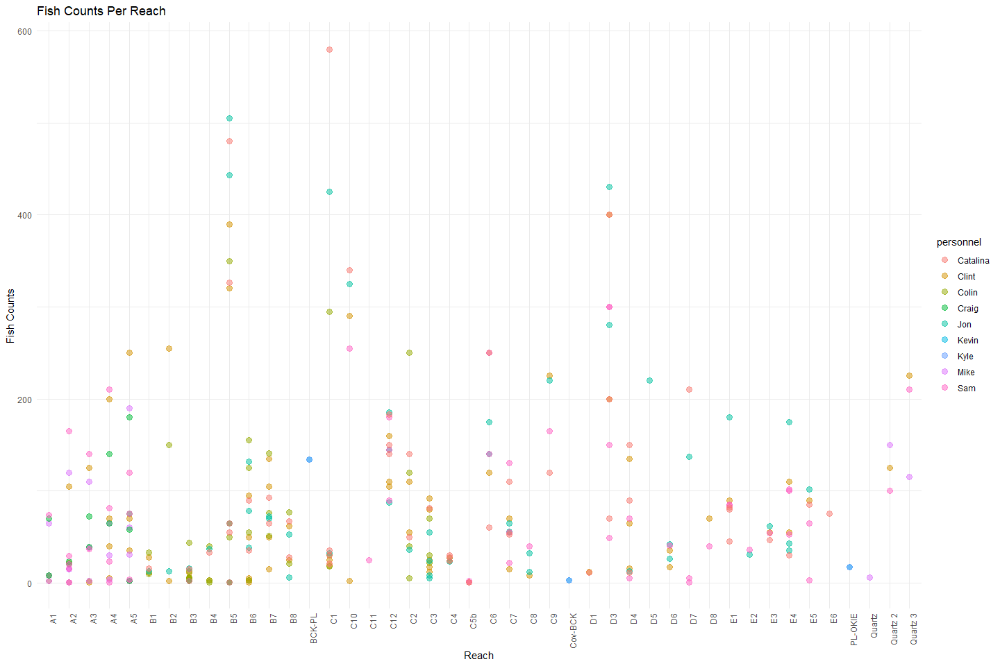

Butte Creek Snorkel Survey 2012 QC
================
Erin Cain
9/29/2021

# Butte Creek Adult Snorkel Survey: 2012 Holding Data

## Description of Monitoring Data

Butte Creek snorkel holding data was shared by Claire Bryant. This data
was shared in multi tab spreadsheets.

**Timeframe:** 2012

**Snorkel Season:** Snorkel Survey is conducted in July or August

**Completeness of Record throughout timeframe:**

**Sampling Location:** Butte Creek

**Data Contact:**

Claire Bryant

## Access Cloud Data

``` r
# Run Sys.setenv() to specify GCS_AUTH_FILE and GCS_DEFAULT_BUCKET before running 
getwd() #to see how to specify paths 
# Open object from google cloud storage
# Set your authentication using gcs_auth
gcs_auth(json_file = Sys.getenv("GCS_AUTH_FILE"))
# Set global bucket 
gcs_global_bucket(bucket = Sys.getenv("GCS_DEFAULT_BUCKET"))

gcs_list_objects()
# git data and save as xlsx
gcs_get_object(object_name = "adult-holding-redd-and-carcass-surveys/butte-creek/data-raw/Butte Snorkel 2012_modified_reviewed.xls",
               bucket = gcs_get_global_bucket(),
               saveToDisk = "ButteSnorkel2012.xls",
               overwrite = TRUE)
```

Read in data from google cloud, glimpse raw data:

Butte creek data needs to be transformed before it can be easy reviewed
and used. Currently each sheet describes snorkeling for a different
site.

``` r
butte_snorkel <- readxl::read_excel("ButteSnorkel2012.xls") 
```

    ## New names:
    ## * `` -> ...3
    ## * `` -> ...4
    ## * `` -> ...5
    ## * `` -> ...6
    ## * `` -> ...7
    ## * ...

## Create function that transforms each sheet

``` r
file_names = c("ButteSnorkel2012.xls", "ButteSnorkel2012.xls", "ButteSnorkel2012.xls", "ButteSnorkel2012.xls")
sheet_names = c(1, 2, 3, 4)
tidy_up_snorkel_data <- function(file_name, sheet_name){
  metadata <- readxl::read_excel(file_name, sheet = sheet_name, range = "A3:J7")
  date_surveyed <- janitor::excel_numeric_to_date(as.numeric(metadata[2,2]))
  if (sheet_name == 1){
  raw_data <- readxl::read_excel(file_name, sheet = sheet_name, range = "A14:M70", 
                                 col_names = c("Reach", "Clint Number", "Clint Condition",
                                               "Sam Number", "Sam Condition",
                                               "Craig Number", "Craig Condition", 
                                               "Mike Number", "Mike Condition", 
                                               "Avg", "Low", "High", "Comments"))
  } 
  else if (sheet_name == 2) {
   raw_data <- readxl::read_excel(file_name, sheet = sheet_name, range = "A13:M70", 
                                 col_names = c("Reach", "Clint Number", "Clint Condition",
                                               "Colin Number", "Colin Condition",
                                               "Catalina Number", "Catalina Condition", 
                                               "Jon Number", "Jon Condition", 
                                               "Avg", "Low", "High", "Comments"))
  } else if (sheet_name == 3) {
   raw_data <- readxl::read_excel(file_name, sheet = sheet_name, range = "A13:M70", 
                                 col_names = c("Reach", "Clint Number", "Clint Condition",
                                               "Sam Number", "Sam Condition",
                                               "Catalina Number", "Catalina Condition", 
                                               "Jon Number", "Jon Condition", 
                                               "Avg", "Low", "High", "Comments"))
  } else {
    raw_data <- readxl::read_excel(file_name, sheet = sheet_name, range = "A13:I35", 
                                  col_names = c("Reach", "Kyle Number", "Kyle Condition",
                                               "Kevin Number", "Kevin Condition",
                                               "Avg", "Low", "High", "Comments"))
  }
  combined_data <- tibble()
  names <- c("Clint", "Colin", "Mike", "Craig", "Jon", "Sam", "Catalina", "Kevin", "Kyle")
  for (i in 1:length(names)) {
    print(i)
    print(names[i])
    cols <- colnames(raw_data)[stringr::str_detect(colnames(raw_data), names[i])]
    if (length(cols) > 1) {
    i_dat <- raw_data %>% 
      select("reach" = Reach, "fish_count" = cols[1], "why_fish_count_na" = cols[2]) %>%
      mutate(personnel = names[i],
             fish_count = as.numeric(fish_count))
    combined_data <- bind_rows(combined_data, i_dat)
    }
  }
  
  transformed_data <- combined_data %>%
    filter(reach != "TOTAL", reach != "TOTALS", reach != "Total", reach != "total", reach != "RANGE", reach != "Range") %>%
    mutate(why_fish_count_na = case_when(why_fish_count_na == "NGC" ~ "not a good count",
                                why_fish_count_na == "DNS" ~ "did not see", 
                                why_fish_count_na == "DNSw"| why_fish_count_na == "DNSW" ~ "did not swim",
                                why_fish_count_na == "DNC" ~ "did not count", 
                                why_fish_count_na == "FRAB" | why_fish_count_na == "FR AB" ~ "from above",
                                why_fish_count_na == "LAST"  ~ "last one through"),
           date = date_surveyed,
           fish_count = as.numeric(fish_count)) %>%
    select(date, reach, personnel, fish_count, why_fish_count_na)
  return(transformed_data)
}
cleaner_data <- bind_rows(purrr::map2(file_names, sheet_names, tidy_up_snorkel_data)) %>% glimpse
```

    ## New names:
    ## * `` -> ...1
    ## * `` -> ...2
    ## * `` -> ...3
    ## * `` -> ...4
    ## * `` -> ...5
    ## * ...

    ## [1] 1
    ## [1] "Clint"
    ## [1] 2
    ## [1] "Colin"
    ## [1] 3
    ## [1] "Mike"
    ## [1] 4
    ## [1] "Craig"
    ## [1] 5
    ## [1] "Jon"
    ## [1] 6
    ## [1] "Sam"
    ## [1] 7
    ## [1] "Catalina"
    ## [1] 8
    ## [1] "Kevin"
    ## [1] 9
    ## [1] "Kyle"

    ## New names:
    ## * `` -> ...1
    ## * `` -> ...2
    ## * `` -> ...3
    ## * `` -> ...4
    ## * `` -> ...5
    ## * ...

    ## [1] 1
    ## [1] "Clint"
    ## [1] 2
    ## [1] "Colin"
    ## [1] 3
    ## [1] "Mike"
    ## [1] 4
    ## [1] "Craig"
    ## [1] 5
    ## [1] "Jon"
    ## [1] 6
    ## [1] "Sam"
    ## [1] 7
    ## [1] "Catalina"
    ## [1] 8
    ## [1] "Kevin"
    ## [1] 9
    ## [1] "Kyle"

    ## New names:
    ## * `` -> ...1
    ## * `` -> ...2
    ## * `` -> ...3
    ## * `` -> ...4
    ## * `` -> ...5
    ## * ...

    ## [1] 1
    ## [1] "Clint"
    ## [1] 2
    ## [1] "Colin"
    ## [1] 3
    ## [1] "Mike"
    ## [1] 4
    ## [1] "Craig"
    ## [1] 5
    ## [1] "Jon"
    ## [1] 6
    ## [1] "Sam"
    ## [1] 7
    ## [1] "Catalina"
    ## [1] 8
    ## [1] "Kevin"
    ## [1] 9
    ## [1] "Kyle"

    ## New names:
    ## * `` -> ...1
    ## * `` -> ...2
    ## * `` -> ...3
    ## * `` -> ...4
    ## * `` -> ...5
    ## * ...

    ## [1] 1
    ## [1] "Clint"
    ## [1] 2
    ## [1] "Colin"
    ## [1] 3
    ## [1] "Mike"
    ## [1] 4
    ## [1] "Craig"
    ## [1] 5
    ## [1] "Jon"
    ## [1] 6
    ## [1] "Sam"
    ## [1] 7
    ## [1] "Catalina"
    ## [1] 8
    ## [1] "Kevin"
    ## [1] 9
    ## [1] "Kyle"
    ## Rows: 510
    ## Columns: 5
    ## $ date              <date> 2012-07-10, 2012-07-10, 2012-07-10, 2012-07-10, 201~
    ## $ reach             <chr> "Quartz", "Quartz 2", "Quartz 3", "A1", "A1", "A1", ~
    ## $ personnel         <chr> "Clint", "Clint", "Clint", "Clint", "Clint", "Clint"~
    ## $ fish_count        <dbl> NA, 125, 225, NA, 2, NA, 8, NA, 22, NA, 1, 105, NA, ~
    ## $ why_fish_count_na <chr> NA, NA, "from above", "not a good count", NA, NA, NA~

## Explore Date

Survey completed in 5 days in August.

``` r
unique(cleaner_data$date)
```

    ## [1] "2012-07-10" "2011-08-11" "2011-08-12" "2011-08-15"

## Explore Numeric Variables:

``` r
cleaner_data %>% 
  select_if(is.numeric) %>% colnames()
```

    ## [1] "fish_count"

### Variable: `fish_count`

**Plotting fish\_count by reach**

``` r
cleaner_data %>% 
  ggplot(aes(x = reach, y = fish_count, color = personnel)) + 
  geom_point(size = 3, alpha = .5) + 
  theme_minimal() + 
  labs(x = "Reach", y = "Fish Counts", title = "Fish Counts Per Reach") +
  theme(axis.text.x=element_text(angle=90, hjust=1))
```

<!-- -->

**Numeric Summary of fish\_count over Period of Record**

``` r
summary(cleaner_data$fish_count)
```

    ##    Min. 1st Qu.  Median    Mean 3rd Qu.    Max.    NA's 
    ##    1.00   16.00   53.00   84.19  118.75  580.00     208

**NA and Unknown Values**

-   40.8 % of values in the `fish_count` column are NA.

## Explore Categorical variables:

General notes: If there is an opportunity to turn yes no into boolean do
so, but not if you loose value

``` r
cleaner_data %>% 
  select_if(is.character) %>% colnames()
```

    ## [1] "reach"             "personnel"         "why_fish_count_na"

### Variable: `reach`

``` r
table(cleaner_data$reach)
```

    ## 
    ##       A1       A2       A3       A4       A5       B1       B2       B3 
    ##       16       20       20       28       20        8       12       32 
    ##       B4       B5       B6       B7       B8   BCK-PL       C1      C10 
    ##       12       20       24       16       12        2       16        8 
    ##      C11      C12       C2       C3       C4      C5b       C6       C7 
    ##        4       12       16       28       12        8        8       12 
    ##       C8       C9  Cov-BCK       D1       D3       D4       D5       D6 
    ##       12        4        2        8       16       16        4        8 
    ##       D7       D8       E1       E2       E3       E4       E5       E6 
    ##       12        4       12        4        4       12        8        4 
    ##  PL-OKIE   Quartz Quartz 2 Quartz 3 
    ##        2        4        4        4

They do not appear to do the same number of snorkels in each reach.

**NA and Unknown Values**

-   0 % of values in the `reach` column are NA.

### Variable: `personnel`

``` r
table(cleaner_data$personnel)
```

    ## 
    ## Catalina    Clint    Colin    Craig      Jon    Kevin     Kyle     Mike 
    ##       97      126       52       29       97        3        3       29 
    ##      Sam 
    ##       74

**NA and Unknown Values**

-   0 % of values in the `personnel` column are NA.

### Variable: `why_fish_count_na`

``` r
table(cleaner_data$why_fish_count_na)
```

    ## 
    ##      did not see     did not swim       from above not a good count 
    ##               18                8                8               23

**NA and Unknown Values**

-   88.8 % of values in the `why_fish_count_na` column are NA.

## Summary of identified issues

-   Each year is different formatted. Need to create a new markdown for
    wrangling.
-   Lots of data points where there was not a good count of fish

## Save cleaned data back to google cloud

``` r
butte_holding_2012 <- cleaner_data %>% glimpse
```

    ## Rows: 510
    ## Columns: 5
    ## $ date              <date> 2012-07-10, 2012-07-10, 2012-07-10, 2012-07-10, 201~
    ## $ reach             <chr> "Quartz", "Quartz 2", "Quartz 3", "A1", "A1", "A1", ~
    ## $ personnel         <chr> "Clint", "Clint", "Clint", "Clint", "Clint", "Clint"~
    ## $ fish_count        <dbl> NA, 125, 225, NA, 2, NA, 8, NA, 22, NA, 1, 105, NA, ~
    ## $ why_fish_count_na <chr> NA, NA, "from above", "not a good count", NA, NA, NA~

``` r
f <- function(input, output) write_csv(input, file = output)
gcs_upload(butte_holding_2012,
           object_function = f,
           type = "csv",
           name = "adult-holding-redd-and-carcass-surveys/butte-creek/data/butte_holding_2012.csv")
```
