Clear Redds Survey QC
================
Inigo Peng
11/4/2021

# Clear Creek Adult Redds Survey

## Description of Monitoring Data

These Redd data were collected by the U.S. Fish and Wildlife Service’s,
Red Bluff Fish and Wildlife Office’s, Clear Creek Monitoring Program.
These data encompass spring-run Chinook Salmon escapent index surveys
from 2008 to 2019. Data were collected on Lower Clear Creek from
Whiskeytown Dam located at river mile 18.1, (40.597786N latitude,
-122.538791W longitude) to the Clear Creek Video Station located at
river mile 0.0 (40.504836N latitude, -122.369693W longitude ) near the
confluence with the Sacramento River.

The Redds worksheet contains all redd data collected, including redd
IDs, re-aging of redds, geospatial coordinates, substrate information,
and redd measurements from 2000-2020 surveys.

**Timeframe:** 2000 - 2019

**Completeness of Record throughout timeframe:** Sampled each year

**Sampling Location:** Clear Creek

**Data Contact:** [Ryan Schaefer](mailto:ryan_a_schaefer@fws.gov)

This
[report](https://www.fws.gov/redbluff/CC%20BC/Clear%20Creek%20Monitoring%20Final%20Reports/2013-2018%20Clear%20Creek%20Adult%20Spring-run%20Chinook%20Salmon%20Monitoring.pdf)
gives additional information on Adult Chinook monitoring and redd
surveys.

## Access Cloud Data

``` r
# Run Sys.setenv() to specify GCS_AUTH_FILE and GCS_DEFAULT_BUCKET before running 
# getwd() to see how to specify paths 
# Open object from google cloud storage
# Set your authentication using gcs_auth
gcs_auth(json_file = Sys.getenv("GCS_AUTH_FILE"))
# Set global bucket 
gcs_global_bucket(bucket = Sys.getenv("GCS_DEFAULT_BUCKET"))
# git data and save as xlsx
gcs_get_object(object_name = "adult-holding-redd-and-carcass-surveys/clear-creek/data-raw/FlowWest SCS JPE Data Request_Clear Creek.xlsx",
               bucket = gcs_get_global_bucket(),
               saveToDisk = here::here("data-raw", "qc-markdowns","adult-holding-redd-and-carcass-surveys", "clear-creek", "raw_redd_holding_carcass_data.xlsx"))
               # Overwrite = TRUE)
```

Read in data from google cloud, glimpse raw data sheet:

## Data Transformation

Note on age in the dataset:

There are several columns for recording age and date of aging, and
whether/how these were filled in varies considerably by year:

- Age was not recorded from `2002-2013`
- According to notes from meetings with monitoring programs, redd age in
  `2010` was recorded in the columns `survey_[2-9]_age`, described as
  “Age of redd based on age classification during survey (2-9)”.
- Age was recorded in `Age[1-9]` and `Date[1-9]` for years `2014-2015`
  and `2019`
- Age was recorded in the `Age[1-9]` and `Date[1-9]` columns *and*
  `survey_x_age` columns for 2016:2018.
- `Age` and `Survey....78` are defined in the metadata as “age at
  observation” and “survey observed”. These are the ideal columns but as
  they are recorded, there is only one row per `redd_id` and so all the
  additional information about whether a redd was viewed in subsequent
  surveys, etc. is lost.
- Columns `Age[1-9]` are described as “age of redd based on age
  classification during survey (1-9)”. `Date[1-9]` columns are described
  as “date of observation”. According to monitoring programs are how
  they record redd age now and going forward.
- It is unclear how these columns interact with `Age` and `Survey...78`.

Assumptions we made to process the dataset:

- Each row is a unique redd - created new redd ID from year and row
  number called `JPE_redd_id`
- We cannot use data from the `survey_[2-9]_age` columns because they
  have no associated date.
- We will use the `Age[1-9]` and `Date[1-9]` columns.This keeps the date
  affiliated with the assigned age. Pivoting this table longer will
  result in multiple rows per redd id with additional rows for
  additional ages. This aligns with how the Battle redd data were QC’d. 
- When summarizing by year, we can take all redds aged 2 and sum for a
  year.
- All redds surveyed above the picket weir are `spring run`.

TODO: The last 4 variables observation_reach, observation_date,
observation_age, and survey_observed need further description.

``` r
cleaner_data <- raw_redds_data |> 
  janitor::clean_names() |> 
  rename('longitude' = 'point_x',
         'latitude' = 'point_y',
         'survey' = 'survey_8',
         'picket_weir_location' = 'pw_location',
         'picket_weir_relation' = 'pw_relate',
         'pre_redd_substrate_size' = 'pre_sub',
         'redd_substrate_size' = 'side_sub',
         'tail_substrate_size' = 'tail_sub',
         'fish_on_redd' = 'fish_on_re',
         'pre_redd_depth' = 'pre_in',
         'redd_pit_depth' = 'pit_in',
         'redd_tail_depth' = 'tail_in',
         'redd_length_in' = 'length_in',
         'redd_width_in' = 'width_in',
         'surveyed_reach' = 'reach',
         'why_not_measured' = 'why_not_me',
         'date_measured' = 'date_mea',
         'measured' = 'measure',
         "survey_method" = "method"
         ) |> 
  mutate(date = as.Date(date),
         date_measured = as.Date(date_measured),
         survey = as.character(survey),
         fish_on_redd = case_when(fish_on_redd %in% c("YES", "Yes") ~ TRUE,
                                  fish_on_redd %in% c("No", "NO") ~ FALSE),
         measured = ifelse(measured == "YES", TRUE, FALSE),
         run = ifelse(picket_weir_relation == "Above", "Spring", run)) |> 
  filter(species %in% c('CHINOOK', 'Chinook'), run == "Spring") |> 
  select(-c('qc_type','qc_date','inspector','year', 'rm_latlong', 'rm_diff','flow_devic','bomb_id', 'species')) |> #all method is snorkel, year could be extracted from date, river_latlong same as rivermile
  select(-c(reach_2, date_2_2, age_2_2, survey_78, survey_2_age,
            survey_3_age, survey_4_age, survey_5_age, survey_6_age, survey_7_age, survey_8_age, survey_9_age)) |>
  glimpse()
```

    ## Rows: 1,001
    ## Columns: 57
    ## $ survey_method           <chr> "Snorkel", "Snorkel", "Snorkel", "Snorkel", "S…
    ## $ longitude               <dbl> -122.5404, -122.5404, -122.5381, -122.5338, -1…
    ## $ latitude                <dbl> 40.58156, 40.58160, 40.57883, 40.57394, 40.562…
    ## $ survey                  <chr> NA, NA, NA, NA, NA, NA, NA, NA, NA, NA, NA, NA…
    ## $ river_mile              <dbl> 16.38723, 16.38717, 16.12547, 15.58567, 14.701…
    ## $ x1000ftbreak            <dbl> 87000, 87000, 86000, 83000, 78000, 80000, 5700…
    ## $ ucc_relate              <chr> "Above", "Above", "Above", "Above", "Above", "…
    ## $ picket_weir_location    <dbl> 8.2, 8.2, 8.2, 8.2, 8.2, 8.2, 8.2, 8.2, 8.2, 8…
    ## $ picket_weir_relation    <chr> "Above", "Above", "Above", "Above", "Above", "…
    ## $ date                    <date> 2000-09-25, 2000-10-13, 2000-09-26, 2000-09-2…
    ## $ surveyed_reach          <chr> "R1", "R1", "R2", "R2", "R2", "R2", "R4", "R4"…
    ## $ redd_id                 <chr> NA, NA, NA, NA, NA, NA, NA, NA, NA, NA, NA, NA…
    ## $ age                     <dbl> NA, NA, NA, NA, NA, NA, NA, NA, NA, NA, NA, NA…
    ## $ redd_loc                <chr> NA, NA, NA, NA, NA, NA, NA, NA, NA, NA, NA, NA…
    ## $ gravel                  <chr> "Native", "Native", "Native", "Native", "Nativ…
    ## $ inj_site                <chr> "Paige Bar", "Paige Bar", "Above Need Camp", "…
    ## $ pre_redd_substrate_size <chr> NA, NA, NA, NA, NA, NA, NA, NA, NA, NA, NA, NA…
    ## $ redd_substrate_size     <chr> NA, NA, NA, NA, NA, NA, NA, NA, NA, NA, NA, NA…
    ## $ tail_substrate_size     <chr> NA, NA, NA, NA, NA, NA, NA, NA, NA, NA, NA, NA…
    ## $ fish_on_redd            <lgl> NA, NA, NA, NA, NA, NA, NA, NA, NA, NA, NA, NA…
    ## $ measured                <lgl> FALSE, FALSE, FALSE, FALSE, FALSE, FALSE, FALS…
    ## $ why_not_measured        <chr> NA, NA, NA, NA, NA, NA, NA, NA, NA, NA, NA, NA…
    ## $ date_measured           <date> NA, NA, NA, NA, NA, NA, NA, NA, NA, NA, NA, N…
    ## $ pre_redd_depth          <dbl> NA, NA, NA, NA, NA, NA, NA, NA, NA, NA, NA, NA…
    ## $ redd_pit_depth          <dbl> NA, NA, NA, NA, NA, NA, NA, NA, NA, NA, NA, NA…
    ## $ redd_tail_depth         <dbl> NA, NA, NA, NA, NA, NA, NA, NA, NA, NA, NA, NA…
    ## $ redd_length_in          <dbl> NA, NA, NA, NA, NA, NA, NA, NA, NA, NA, NA, NA…
    ## $ redd_width_in           <dbl> NA, NA, NA, NA, NA, NA, NA, NA, NA, NA, NA, NA…
    ## $ velocity                <dbl> NA, NA, NA, NA, NA, NA, NA, NA, NA, NA, NA, NA…
    ## $ start_60                <dbl> NA, NA, NA, NA, NA, NA, NA, NA, NA, NA, NA, NA…
    ## $ end_60                  <dbl> NA, NA, NA, NA, NA, NA, NA, NA, NA, NA, NA, NA…
    ## $ sec_60                  <dbl> NA, NA, NA, NA, NA, NA, NA, NA, NA, NA, NA, NA…
    ## $ start_80                <dbl> NA, NA, NA, NA, NA, NA, NA, NA, NA, NA, NA, NA…
    ## $ end_80                  <dbl> NA, NA, NA, NA, NA, NA, NA, NA, NA, NA, NA, NA…
    ## $ secs_80                 <dbl> NA, NA, NA, NA, NA, NA, NA, NA, NA, NA, NA, NA…
    ## $ bomb_vel60              <dbl> NA, NA, NA, NA, NA, NA, NA, NA, NA, NA, NA, NA…
    ## $ bomb_vel80              <dbl> NA, NA, NA, NA, NA, NA, NA, NA, NA, NA, NA, NA…
    ## $ comments                <chr> "NEED CAMP 16.2", "NEED CAMP 16.2", "NEED TEMP…
    ## $ date_1                  <dttm> NA, NA, NA, NA, NA, NA, NA, NA, NA, NA, NA, N…
    ## $ age_1                   <dbl> NA, NA, NA, NA, NA, NA, NA, NA, NA, NA, NA, NA…
    ## $ date_2                  <dttm> NA, NA, NA, NA, NA, NA, NA, NA, NA, NA, NA, N…
    ## $ age_2                   <dbl> NA, NA, NA, NA, NA, NA, NA, NA, NA, NA, NA, NA…
    ## $ date_3                  <dttm> NA, NA, NA, NA, NA, NA, NA, NA, NA, NA, NA, N…
    ## $ age_3                   <dbl> NA, NA, NA, NA, NA, NA, NA, NA, NA, NA, NA, NA…
    ## $ date_4                  <dttm> NA, NA, NA, NA, NA, NA, NA, NA, NA, NA, NA, N…
    ## $ age_4                   <dbl> NA, NA, NA, NA, NA, NA, NA, NA, NA, NA, NA, NA…
    ## $ date_5                  <dttm> NA, NA, NA, NA, NA, NA, NA, NA, NA, NA, NA, N…
    ## $ age_5                   <dbl> NA, NA, NA, NA, NA, NA, NA, NA, NA, NA, NA, NA…
    ## $ date_6                  <dttm> NA, NA, NA, NA, NA, NA, NA, NA, NA, NA, NA, N…
    ## $ age_6                   <dbl> NA, NA, NA, NA, NA, NA, NA, NA, NA, NA, NA, NA…
    ## $ date_7                  <dttm> NA, NA, NA, NA, NA, NA, NA, NA, NA, NA, NA, N…
    ## $ age_7                   <dbl> NA, NA, NA, NA, NA, NA, NA, NA, NA, NA, NA, NA…
    ## $ date_8                  <dttm> NA, NA, NA, NA, NA, NA, NA, NA, NA, NA, NA, N…
    ## $ age_8                   <dbl> NA, NA, NA, NA, NA, NA, NA, NA, NA, NA, NA, NA…
    ## $ date_9                  <dttm> NA, NA, NA, NA, NA, NA, NA, NA, NA, NA, NA, N…
    ## $ age_9                   <dbl> NA, NA, NA, NA, NA, NA, NA, NA, NA, NA, NA, NA…
    ## $ run                     <chr> "Spring", "Spring", "Spring", "Spring", "Sprin…

``` r
# TODO can't age_x and date_x columns using survey_x_age for 2016:2018 because they don't have the dates affiated with the additional surveys
redd_with_age <- cleaner_data |> 
  mutate(year = year(date),
         JPE_redd_id = paste0(year, "_", row_number()),
  # take date and age columns and assign to age_1 and survey_1
         age_1 = ifelse(is.na(age_1), age, age_1),
         date_1 = date) |> # they are the same
  pivot_longer(cols = c(age_1, age_2, age_3, age_4, age_5, age_6, age_7, age_8, age_9), # pivot all aging instances to age column
               values_to = "new_age",
               names_to = "age_index") |> 
  # for all aging instances, take the date where that aging occurred.
  # check for what aging instance it was and pull that date (if present)
  mutate(new_date = case_when(age_index == "age_1" & !is.na(date_1) ~ date_1,
                              age_index == "age_2" & !is.na(date_2) ~ ymd(date_2),
                              age_index == "age_3" & !is.na(date_3) ~ ymd(date_3),
                              age_index == "age_4" & !is.na(date_4) ~ ymd(date_4),
                              age_index == "age_5" & !is.na(date_5) ~ ymd(date_5),
                              age_index == "age_6" & !is.na(date_6) ~ ymd(date_6),
                              age_index == "age_7" & !is.na(date_7) ~ ymd(date_7),
                              age_index == "age_8" & !is.na(date_8) ~ ymd(date_8),
                              age_index == "age_9" & !is.na(date_9) ~ ymd(date_9),
                              TRUE ~ NA),
         age_index = as.integer(substr(age_index, 5, 5)),
         age_index = ifelse(is.na(new_age) & age_index == 1, 0, age_index)) |> 
  filter(!is.na(new_date)) |> 
  select(-c(date, age, date_1, date_2, date_3, date_4, date_5,
            date_6, date_7, date_8, date_9, redd_id, comments, year)) |> 
  rename(age = new_age, date = new_date) |> 
  relocate(date, .before = survey_method) |> 
  relocate(c(age, age_index), .before = gravel) |> 
  relocate(JPE_redd_id, .before = date) |> 
  glimpse()
```

    ## Rows: 1,616
    ## Columns: 39
    ## $ JPE_redd_id             <chr> "2000_1", "2000_2", "2000_3", "2000_4", "2000_…
    ## $ date                    <date> 2000-09-25, 2000-10-13, 2000-09-26, 2000-09-2…
    ## $ survey_method           <chr> "Snorkel", "Snorkel", "Snorkel", "Snorkel", "S…
    ## $ longitude               <dbl> -122.5404, -122.5404, -122.5381, -122.5338, -1…
    ## $ latitude                <dbl> 40.58156, 40.58160, 40.57883, 40.57394, 40.562…
    ## $ survey                  <chr> NA, NA, NA, NA, NA, NA, NA, NA, NA, NA, NA, NA…
    ## $ river_mile              <dbl> 16.38723, 16.38717, 16.12547, 15.58567, 14.701…
    ## $ x1000ftbreak            <dbl> 87000, 87000, 86000, 83000, 78000, 80000, 5700…
    ## $ ucc_relate              <chr> "Above", "Above", "Above", "Above", "Above", "…
    ## $ picket_weir_location    <dbl> 8.2, 8.2, 8.2, 8.2, 8.2, 8.2, 8.2, 8.2, 8.2, 8…
    ## $ picket_weir_relation    <chr> "Above", "Above", "Above", "Above", "Above", "…
    ## $ surveyed_reach          <chr> "R1", "R1", "R2", "R2", "R2", "R2", "R4", "R4"…
    ## $ redd_loc                <chr> NA, NA, NA, NA, NA, NA, NA, NA, NA, NA, NA, NA…
    ## $ age                     <dbl> NA, NA, NA, NA, NA, NA, NA, NA, NA, NA, NA, NA…
    ## $ age_index               <dbl> 0, 0, 0, 0, 0, 0, 0, 0, 0, 0, 0, 0, 0, 0, 0, 0…
    ## $ gravel                  <chr> "Native", "Native", "Native", "Native", "Nativ…
    ## $ inj_site                <chr> "Paige Bar", "Paige Bar", "Above Need Camp", "…
    ## $ pre_redd_substrate_size <chr> NA, NA, NA, NA, NA, NA, NA, NA, NA, NA, NA, NA…
    ## $ redd_substrate_size     <chr> NA, NA, NA, NA, NA, NA, NA, NA, NA, NA, NA, NA…
    ## $ tail_substrate_size     <chr> NA, NA, NA, NA, NA, NA, NA, NA, NA, NA, NA, NA…
    ## $ fish_on_redd            <lgl> NA, NA, NA, NA, NA, NA, NA, NA, NA, NA, NA, NA…
    ## $ measured                <lgl> FALSE, FALSE, FALSE, FALSE, FALSE, FALSE, FALS…
    ## $ why_not_measured        <chr> NA, NA, NA, NA, NA, NA, NA, NA, NA, NA, NA, NA…
    ## $ date_measured           <date> NA, NA, NA, NA, NA, NA, NA, NA, NA, NA, NA, N…
    ## $ pre_redd_depth          <dbl> NA, NA, NA, NA, NA, NA, NA, NA, NA, NA, NA, NA…
    ## $ redd_pit_depth          <dbl> NA, NA, NA, NA, NA, NA, NA, NA, NA, NA, NA, NA…
    ## $ redd_tail_depth         <dbl> NA, NA, NA, NA, NA, NA, NA, NA, NA, NA, NA, NA…
    ## $ redd_length_in          <dbl> NA, NA, NA, NA, NA, NA, NA, NA, NA, NA, NA, NA…
    ## $ redd_width_in           <dbl> NA, NA, NA, NA, NA, NA, NA, NA, NA, NA, NA, NA…
    ## $ velocity                <dbl> NA, NA, NA, NA, NA, NA, NA, NA, NA, NA, NA, NA…
    ## $ start_60                <dbl> NA, NA, NA, NA, NA, NA, NA, NA, NA, NA, NA, NA…
    ## $ end_60                  <dbl> NA, NA, NA, NA, NA, NA, NA, NA, NA, NA, NA, NA…
    ## $ sec_60                  <dbl> NA, NA, NA, NA, NA, NA, NA, NA, NA, NA, NA, NA…
    ## $ start_80                <dbl> NA, NA, NA, NA, NA, NA, NA, NA, NA, NA, NA, NA…
    ## $ end_80                  <dbl> NA, NA, NA, NA, NA, NA, NA, NA, NA, NA, NA, NA…
    ## $ secs_80                 <dbl> NA, NA, NA, NA, NA, NA, NA, NA, NA, NA, NA, NA…
    ## $ bomb_vel60              <dbl> NA, NA, NA, NA, NA, NA, NA, NA, NA, NA, NA, NA…
    ## $ bomb_vel80              <dbl> NA, NA, NA, NA, NA, NA, NA, NA, NA, NA, NA, NA…
    ## $ run                     <chr> "Spring", "Spring", "Spring", "Spring", "Sprin…

## Data Dictionary

The following table describes the variables included in this dataset and
the percent that do not include data.

``` r
percent_na <- redd_with_age |>
  summarise_all(list(name = ~sum(is.na(.))/length(.))) |>
  pivot_longer(cols = everything())
  
data_dictionary <- tibble(variables = colnames(redd_with_age),
                          description = c("Unique redd ID",
                                          "Date",
                                          "Survey method", 
                                          "GPS X point",
                                          "GPS Y point",
                                          "Survey number", 
                                          "River mile number",  
                                          "?TODO", 
                                          "Position relative to Upper Clear Creek Rotary Screw Trap", 
                                          "Picket weir location", 
                                          "Above or below picket weir",
                                          "Reach number", 
                                          "Latitudinal location of the redd in the creek (RL: river left, RR: river right, RC: river center)", 
                                          "Redd age assigned",
                                          "Number of times that unique redd has been aged: 0 (no redd aged) - 3 (aged 3x)",
                                          "predominant type of gravel used in redd construction: injection, native, or combo (native and injection)", 
                                          "source of the injection gravel (site on Clear Creek)", 
                                          "Dominant substrate size in the pre-redd (area just of stream of the disturbance)", 
                                          "Dominant substrate size on the sides of the redd", 
                                          "Dominant substrate size in the tailspill (excavated material behind the pit)", 
                                          "TRUE if fish is seen on Redd (TRUE/FALSE)", 
                                          "TRUE if redd is measured (TRUE/FALSE)", 
                                          "Description of why the reddd was not measured if applicable", 
                                          "Date the redd was measured", 
                                          "Depth in the pre-redd (area just of stream of the disturbance)", 
                                          "Depth at the deepest part of the pit", 
                                          "Depth at the shallowest part of the tailspill", 
                                          "Length of the longest part of the disturbed area, measured parallel to streamflow (in inches)", 
                                          "Width of the widest part of the disturbed area, perpendicular to streamflow.", 
                                          "Mean water column velocity measured at 60 percent depth from the water surface or the average of the 60% depth and 80/20% depth, if the redd depth is ≥ 30 inches (Allan and Castillo 2007).", 
                                          "starting values on the mechanical flow meter at 60% depth", 
                                          "ending values on the mechanical flow meter at 60% depth", 
                                          "time the meter was in the water", 
                                          "Starting values on the mechanical flow meter at 80/20% depth", 
                                          "End values on the mechanical flow meter at 80/20% depth", 
                                          "time the meter was in the water", 
                                          "Mean water column velocity measured at 60 percent depth from the water surface if the redd depth is ≤ 30 inches from the water surface (Allan and Castillo 2007). ", 
                                          "Mean water column velocity measured at 80 percent depth from the water surface if the redd depth is ≤ 30 inches from the water surface (Allan and Castillo 2007). ",  
                                          "Run call based on field data and position relative to picket weir"),
                          data_type = c("character", "Date", "character", "numeric", "numeric", "character",  "numeric", "numeric", "character", "numeric", "character", "character",  "character", "numeric", "numeric", "character", "character",  "character", "character", "character", "logical", "logical",  "character", "Date", "numeric", "numeric", "numeric", "numeric",  "numeric", "numeric", "numeric", "numeric", "numeric", "numeric",  "numeric", "numeric", "numeric", "numeric", "character"),
                          
                          percent_na = round(percent_na$value*100)
                          
)
knitr::kable(data_dictionary)
```

| variables               | description                                                                                                                                                                                  | data_type | percent_na |
|:------------------------|:---------------------------------------------------------------------------------------------------------------------------------------------------------------------------------------------|:----------|-----------:|
| JPE_redd_id             | Unique redd ID                                                                                                                                                                               | character |          0 |
| date                    | Date                                                                                                                                                                                         | Date      |          0 |
| survey_method           | Survey method                                                                                                                                                                                | character |          0 |
| longitude               | GPS X point                                                                                                                                                                                  | numeric   |          0 |
| latitude                | GPS Y point                                                                                                                                                                                  | numeric   |          0 |
| survey                  | Survey number                                                                                                                                                                                | character |          6 |
| river_mile              | River mile number                                                                                                                                                                            | numeric   |          0 |
| x1000ftbreak            | ?TODO                                                                                                                                                                                        | numeric   |          0 |
| ucc_relate              | Position relative to Upper Clear Creek Rotary Screw Trap                                                                                                                                     | character |          0 |
| picket_weir_location    | Picket weir location                                                                                                                                                                         | numeric   |          0 |
| picket_weir_relation    | Above or below picket weir                                                                                                                                                                   | character |          0 |
| surveyed_reach          | Reach number                                                                                                                                                                                 | character |          0 |
| redd_loc                | Latitudinal location of the redd in the creek (RL: river left, RR: river right, RC: river center)                                                                                            | character |         28 |
| age                     | Redd age assigned                                                                                                                                                                            | numeric   |         18 |
| age_index               | Number of times that unique redd has been aged: 0 (no redd aged) - 3 (aged 3x)                                                                                                               | numeric   |          0 |
| gravel                  | predominant type of gravel used in redd construction: injection, native, or combo (native and injection)                                                                                     | character |          0 |
| inj_site                | source of the injection gravel (site on Clear Creek)                                                                                                                                         | character |          8 |
| pre_redd_substrate_size | Dominant substrate size in the pre-redd (area just of stream of the disturbance)                                                                                                             | character |         25 |
| redd_substrate_size     | Dominant substrate size on the sides of the redd                                                                                                                                             | character |         25 |
| tail_substrate_size     | Dominant substrate size in the tailspill (excavated material behind the pit)                                                                                                                 | character |         25 |
| fish_on_redd            | TRUE if fish is seen on Redd (TRUE/FALSE)                                                                                                                                                    | logical   |         56 |
| measured                | TRUE if redd is measured (TRUE/FALSE)                                                                                                                                                        | logical   |          0 |
| why_not_measured        | Description of why the reddd was not measured if applicable                                                                                                                                  | character |         97 |
| date_measured           | Date the redd was measured                                                                                                                                                                   | Date      |         33 |
| pre_redd_depth          | Depth in the pre-redd (area just of stream of the disturbance)                                                                                                                               | numeric   |         34 |
| redd_pit_depth          | Depth at the deepest part of the pit                                                                                                                                                         | numeric   |         34 |
| redd_tail_depth         | Depth at the shallowest part of the tailspill                                                                                                                                                | numeric   |         33 |
| redd_length_in          | Length of the longest part of the disturbed area, measured parallel to streamflow (in inches)                                                                                                | numeric   |         30 |
| redd_width_in           | Width of the widest part of the disturbed area, perpendicular to streamflow.                                                                                                                 | numeric   |         30 |
| velocity                | Mean water column velocity measured at 60 percent depth from the water surface or the average of the 60% depth and 80/20% depth, if the redd depth is ≥ 30 inches (Allan and Castillo 2007). | numeric   |         57 |
| start_60                | starting values on the mechanical flow meter at 60% depth                                                                                                                                    | numeric   |         53 |
| end_60                  | ending values on the mechanical flow meter at 60% depth                                                                                                                                      | numeric   |         53 |
| sec_60                  | time the meter was in the water                                                                                                                                                              | numeric   |         55 |
| start_80                | Starting values on the mechanical flow meter at 80/20% depth                                                                                                                                 | numeric   |         91 |
| end_80                  | End values on the mechanical flow meter at 80/20% depth                                                                                                                                      | numeric   |         91 |
| secs_80                 | time the meter was in the water                                                                                                                                                              | numeric   |         91 |
| bomb_vel60              | Mean water column velocity measured at 60 percent depth from the water surface if the redd depth is ≤ 30 inches from the water surface (Allan and Castillo 2007).                            | numeric   |         53 |
| bomb_vel80              | Mean water column velocity measured at 80 percent depth from the water surface if the redd depth is ≤ 30 inches from the water surface (Allan and Castillo 2007).                            | numeric   |         96 |
| run                     | Run call based on field data and position relative to picket weir                                                                                                                            | character |          0 |

``` r
#saveRDS(data_dictionary, file = "data/clear_redd_data_dictionary.rds")
```

## Explore `date`

``` r
summary(redd_with_age$date)
```

    ##         Min.      1st Qu.       Median         Mean      3rd Qu.         Max. 
    ## "2000-09-25" "2006-09-28" "2013-09-18" "2011-05-21" "2014-10-15" "2019-10-24"

**NA and Unknown Values**

- 0 % of values in the `date` column are NA.

## Explore Categorical Data

``` r
redd_with_age |> select_if(is.character) |> colnames()
```

    ##  [1] "JPE_redd_id"             "survey_method"          
    ##  [3] "survey"                  "ucc_relate"             
    ##  [5] "picket_weir_relation"    "surveyed_reach"         
    ##  [7] "redd_loc"                "gravel"                 
    ##  [9] "inj_site"                "pre_redd_substrate_size"
    ## [11] "redd_substrate_size"     "tail_substrate_size"    
    ## [13] "why_not_measured"        "run"

### Variable: `survey_method`

TODO: what’s pw?

``` r
redd_with_age <- redd_with_age |> 
  mutate(survey_method = tolower(survey_method))
  
table(redd_with_age$survey_method)
```

    ## 
    ## snorkel 
    ##    1616

**NA and Unknown Values**

- 0 % of values in the `survey_method` column are NA.

### Variable: `ucc_relate`

**Description:** Above or below Upper Clear Creek Rotary Screw Trap

``` r
redd_with_age$ucc_relate <- tolower(redd_with_age$ucc_relate)
table(redd_with_age$ucc_relate)
```

    ## 
    ## above below 
    ##  1458   158

**NA and Unknown Values**

- 0 % of values in the `ucc_relate` column are NA.

### Variable: `picket_weir_relation`

**Description:** Above or below location of the Picket Weir

``` r
redd_with_age$picket_weir_relation <- tolower(redd_with_age$picket_weir_relation)
table(redd_with_age$picket_weir_relation)
```

    ## 
    ## above below 
    ##  1613     3

**NA and Unknown Values**

- 0 % of values in the `picket_weir_relation` column are NA.

### Variable: `surveyed_reach`

**Description:** Reach surveyed on each survey day

``` r
table(redd_with_age$surveyed_reach)
```

    ## 
    ##  R1  R2  R3  R4  R5 R5A R5B R5C  R6 
    ## 317 363 209 486  62  88  48  40   3

**NA and Unknown Values**

- 0 % of values in the `surveyed_reach` column are NA.

### Variable: `JPE_redd_id`

**Description:** ID assigned to redds by data collection device for each
survey day

``` r
unique(redd_with_age$JPE_redd_id)[1:10]
```

    ##  [1] "2000_1"  "2000_2"  "2000_3"  "2000_4"  "2000_5"  "2000_6"  "2000_7" 
    ##  [8] "2000_8"  "2001_9"  "2001_10"

There are 1001 unique redd ID numbers.

**NA and Unknown Values**

- 0 % of values in the `JPE_redd_id` column are NA.

### Variable: `redd_loc`

**Description:** Latitudinal location of the redd in the creek.

RL: river left

RR: river right

RC: river center

``` r
redd_with_age <- redd_with_age |> 
  mutate(redd_loc = ifelse(redd_loc == "N/A", NA_character_, redd_loc))
table(redd_with_age$redd_loc)
```

    ## 
    ##       RC RC to RR       RL       RR 
    ##      387        1      423      349

**NA and Unknown Values**

- 28.2 % of values in the `redd_loc` column are NA.

### Variable: `gravel`

**Description:** predominant type of gravel used in redd construction:
injection, native, or combo (native and injection)

``` r
redd_with_age$gravel <- tolower(redd_with_age$gravel)
table(redd_with_age$gravel)
```

    ## 
    ## combination   injection      native 
    ##         164         525         927

**NA and Unknown Values**

- 0 % of values in the `gravel` column are NA.

### Variable: `inj_site`

**Description:** source of the injection gravel (site on Clear Creek)

``` r
redd_with_age$inj_site <- tolower(redd_with_age$inj_site)
table(redd_with_age$inj_site)
```

    ## 
    ##         above need camp           above peltier         below dog gulch 
    ##                      66                      81                      58 
    ## clear creek road bridge           guardian rock               paige bar 
    ##                      56                     523                      95 
    ##                  placer                      r6             reading bar 
    ##                     379                       3                     165 
    ##             whiskeytown 
    ##                      55

**NA and Unknown Values**

- 8.4 % of values in the `inj_site` column are NA.

### Variable: `pre_redd_substrate_size`

**Description:** dominant substrate size in the pre-redd (area just of
stream of the disturbance)

``` r
table(redd_with_age$pre_redd_substrate_size)
```

    ## 
    ##   >12 0.1-1   1-2   1-3   2-3   2-4   3-4   3-5   4-5   4-6   6-8 
    ##    17    98   485   351    90   121     3    27     3     5     4

**NA and Unknown Values**

- 25.5 % of values in the `pre_redd_substrate_size` column are NA.

### Variable: `redd_substrate_size`

**Description:**

``` r
table(redd_with_age$redd_substrate_size)
```

    ## 
    ##   >12 0.1-1   1-2   1-3   2-3   2-4   3-4   3-5   4-5   4-6   6-8  8-10 
    ##    21    43   406   385   132   170     2    28     4     6     3     4

**NA and Unknown Values**

- 25.5 % of values in the `redd_substrate_size` column are NA.

### Variable: `tail_redd_substrate_size`

**Description:**

Dominant substrate size in the tailspill (excavated material behind the
pit)

``` r
table(redd_with_age$tail_substrate_size)
```

    ## 
    ## 0.1-1   1-2   1-3   2-3   2-4   3-4   3-5   4-6 
    ##     9   457   501   126    98     8     3     2

**NA and Unknown Values**

- 0 % of values in the `tail_redd_substrate_size` column are NA.

### Variable: `fish_on_redd`

**Description:**

Indicates whether or not there was a fish on the redd when observed.

``` r
table(redd_with_age$fish_on_redd)
```

    ## 
    ## FALSE  TRUE 
    ##   568   143

**NA and Unknown Values**

- 56 % of values in the `fish_on_redd` column are NA.

### Variable: `measured`

**Description:** indicates if a redd was measured

``` r
table(redd_with_age$measured)
```

    ## 
    ## FALSE  TRUE 
    ##   452  1164

**NA and Unknown Values**

- 0 % of values in the `measured` column are NA.

### Variable: `why_not_measured`

**Description:** Indicates why a redd wasn’t measured

Fix inconsistencies with spelling, capitalization, and abbreviations.

``` r
table(redd_with_age$why_not_measured)
```

    ## 
    ##                                           Fish on redd 
    ##                                                     11 
    ## Fish on redd when first observed, measured next survey 
    ##                                                      4 
    ##                                        Time-Constraint 
    ##                                                      2 
    ##                                               Too Deep 
    ##                                                     13 
    ##                                               TOO DEEP 
    ##                                                     10 
    ##                                                TOO OLD 
    ##                                                      2

``` r
redd_with_age<- redd_with_age |> 
  mutate(why_not_measured = tolower(why_not_measured),
         why_not_measured = if_else(why_not_measured == "time-constraint", "time constraints", why_not_measured))

table(redd_with_age$why_not_measured)
```

    ## 
    ##                                           fish on redd 
    ##                                                     11 
    ## fish on redd when first observed, measured next survey 
    ##                                                      4 
    ##                                       time constraints 
    ##                                                      2 
    ##                                               too deep 
    ##                                                     23 
    ##                                                too old 
    ##                                                      2

**NA and Unknown Values**

- 97.4 % of values in the `why_not_measured` column are NA.

### Variable: `comments`

**Description:**

``` r
unique(redd_with_age$comments)[1:10]
```

    ## Warning: Unknown or uninitialised column: `comments`.

    ## NULL

**NA and Unknown Values**

- 0 % of values in the `comments` column are NA.

### Variable: `run`

**Description:** run call based on field data

``` r
redd_with_age<-redd_with_age |> 
  mutate(run = tolower(run))
table(redd_with_age$run)
```

    ## 
    ## spring 
    ##   1616

**NA and Unknown Values**

- 0 % of values in the `run` column are NA.

## Explore Numerical Data

``` r
redd_with_age |> select_if(is.numeric) |> colnames()
```

    ##  [1] "longitude"            "latitude"             "river_mile"          
    ##  [4] "x1000ftbreak"         "picket_weir_location" "age"                 
    ##  [7] "age_index"            "pre_redd_depth"       "redd_pit_depth"      
    ## [10] "redd_tail_depth"      "redd_length_in"       "redd_width_in"       
    ## [13] "velocity"             "start_60"             "end_60"              
    ## [16] "sec_60"               "start_80"             "end_80"              
    ## [19] "secs_80"              "bomb_vel60"           "bomb_vel80"

### Variable: `longitude`, `latitude`

``` r
summary(redd_with_age$longitude)
```

    ##    Min. 1st Qu.  Median    Mean 3rd Qu.    Max. 
    ##  -122.6  -122.5  -122.5  -122.5  -122.5  -122.4

``` r
summary(redd_with_age$latitude)
```

    ##    Min. 1st Qu.  Median    Mean 3rd Qu.    Max. 
    ##   40.49   40.51   40.53   40.54   40.57   40.60

Note longitude has 1 decimal place - not very exact.

**NA and Unknown Values**

- 0 % of values in the `longitude` column are NA.

- 0 % of values in the `latitude` column are NA.

### Variable: `river_mile`

``` r
redd_with_age |> 
  ggplot(aes(x = river_mile, y =as.factor(year(date)))) +
  geom_point(size = 1, alpha = .5, color = "blue") + 
  labs(x = "River Mile", 
       y = "Date") +
  theme_minimal() + 
  theme(text = element_text(size = 12)) +
  labs(title = "River Mile Over The Years")
```

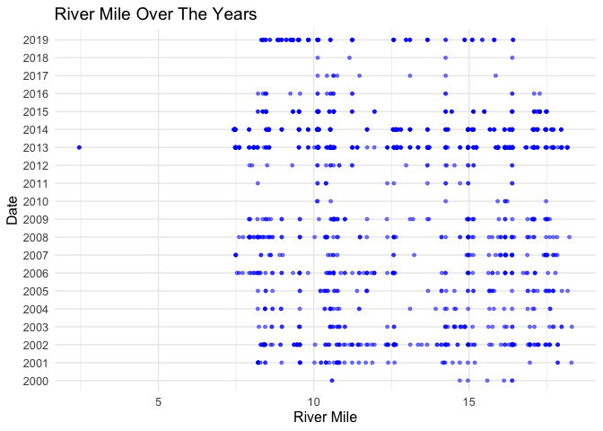<!-- -->

Seems like more redds were observed in the first 3 miles after 2012

``` r
redd_with_age |> 
  ggplot(aes(x=river_mile))+
  geom_histogram()+
  theme_minimal()+
  labs(title = "River Mile Distribution")
```

    ## `stat_bin()` using `bins = 30`. Pick better value with `binwidth`.

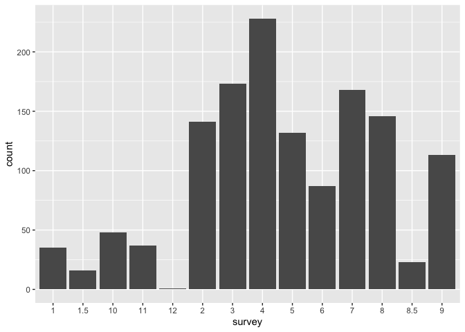<!-- -->

**Numeric Summary of river_mile Over Period of Record**

``` r
summary(redd_with_age$river_mile)
```

    ##    Min. 1st Qu.  Median    Mean 3rd Qu.    Max. 
    ##   2.448  10.038  12.136  12.509  15.735  18.308

**NA and Unknown Values**

- 0 % of values in the `river_mile` column are NA.

### Variable: `x1000ftbreak`

TODO: No metadata description

``` r
redd_with_age |> 
  ggplot(aes(x= x1000ftbreak))+
  geom_histogram()+
  theme_minimal()+
  labs(title = "Distribution of x1000ftbreak")
```

    ## `stat_bin()` using `bins = 30`. Pick better value with `binwidth`.

    ## Warning: Removed 3 rows containing non-finite values (`stat_bin()`).

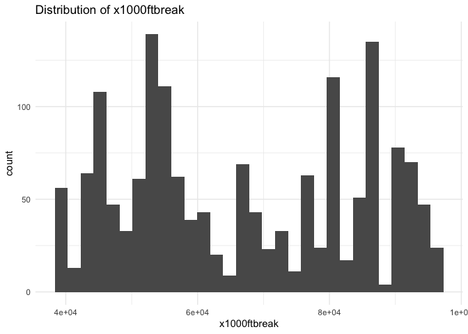<!-- -->

**Numeric Summary of x1000ftbreak Over Period of Time**

``` r
summary(redd_with_age$x1000ftbreak)
```

    ##    Min. 1st Qu.  Median    Mean 3rd Qu.    Max.    NA's 
    ##   40000   54000   66000   66852   84000   97000       3

**NA and Unknown Values**

- 0.2 % of values in the `x1000ftbreak` column are NA.

### Variable: `picket_weir_location`

**Description:** Annual picket weir location

Need description for what locations the numbers represent

There are 2 unique picket weir locations.

**Numeric Summary of picket_weir_location Over Period of Record**

``` r
summary(redd_with_age$picket_weir_location)
```

    ##    Min. 1st Qu.  Median    Mean 3rd Qu.    Max. 
    ##   7.400   7.400   7.400   7.794   8.200   8.200

**NA and Unknown Values**

- 0 % of values in the `picket_weir_location` column are NA.

### Variable: `age`

``` r
table(redd_with_age$age)
```

    ## 
    ##   1   2   3   4   5   6 
    ##   9 871 272 142  25   1

**Create lookup rda for age encoding:**

``` r
#View description of domain for viewing condition

clear_creek_redd_age <- 1:5
names(clear_creek_redd_age) <- c(
  "",
  "Clearly visible and clean (clearly defined pit and tail-spill and no periphyton or fines)",
  "Less visible with minor tail-spill flattening (pit and tail-spill still defined, periphyton growth, invertebrate presence)",
  "Barely visible with shallow pit and flattened tail-spill (periphyton growth, invertebrates)",
  "Pit and tail-spill indistinguishable from the surrounding substrate"
)

write_rds(clear_creek_redd_age, "data/clear_creek_redd_age.rds")
tibble(age = clear_creek_redd_age,
       definitions = names(clear_creek_redd_age))
```

    ## # A tibble: 5 × 2
    ##     age definitions                                                             
    ##   <int> <chr>                                                                   
    ## 1     1 ""                                                                      
    ## 2     2 "Clearly visible and clean (clearly defined pit and tail-spill and no p…
    ## 3     3 "Less visible with minor tail-spill flattening (pit and tail-spill stil…
    ## 4     4 "Barely visible with shallow pit and flattened tail-spill (periphyton g…
    ## 5     5 "Pit and tail-spill indistinguishable from the surrounding substrate"

**NA and Unknown Values**

- 18.3 % of values in the `age` column are NA.

### Variable: `age_index`

Age Index refers to the number of times a unique redd has been surveyed.
If `age_index == 0`, the redd was not aged.

``` r
table(redd_with_age$age_index)
```

    ## 
    ##   0   1   2   3   4   5   6   7   8   9 
    ## 295 706  41  37  33  53  76 165 105 105

**NA and Unknown Values**

- 0 % of values in the `age_index` column are NA.

### Variable: `redd_pit_depth`

**Description:** Depth at the deepest part of the pit

``` r
redd_with_age |> 
  ggplot(aes(x = redd_pit_depth))+
  geom_histogram()+
  labs(title = "Redd Pit Depth Distribution")+
  theme_minimal()
```

    ## `stat_bin()` using `bins = 30`. Pick better value with `binwidth`.

    ## Warning: Removed 554 rows containing non-finite values (`stat_bin()`).

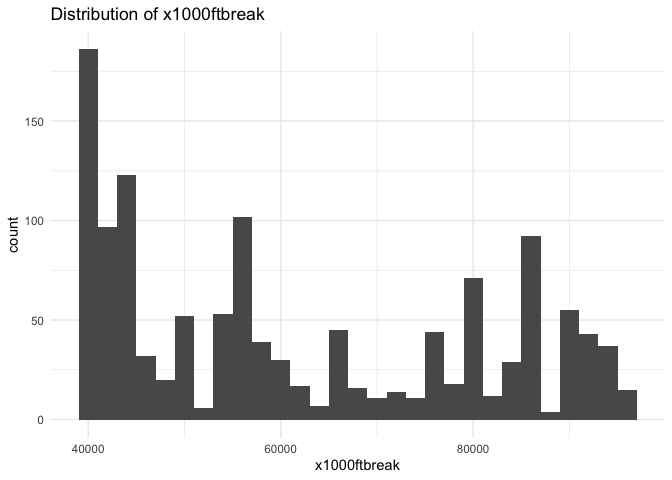<!-- -->

**Numeric Summary of redd_pit_depth**

``` r
summary(redd_with_age$redd_pit_depth)
```

    ##    Min. 1st Qu.  Median    Mean 3rd Qu.    Max.    NA's 
    ##    6.00   20.00   26.00   29.53   36.00   95.00     554

**NA and Unknown Values**

- 34.3 % of values in the `redd_pit_depth` column are NA.

### Variable: `redd_tail_depth`

**Description:** Depth at the shallowest part of the tailspill

``` r
redd_with_age |> 
  ggplot(aes(x = redd_tail_depth))+
  geom_histogram()+
  labs(title = "Redd Tail Depth Distribution")+
  theme_minimal()
```

    ## `stat_bin()` using `bins = 30`. Pick better value with `binwidth`.

    ## Warning: Removed 526 rows containing non-finite values (`stat_bin()`).

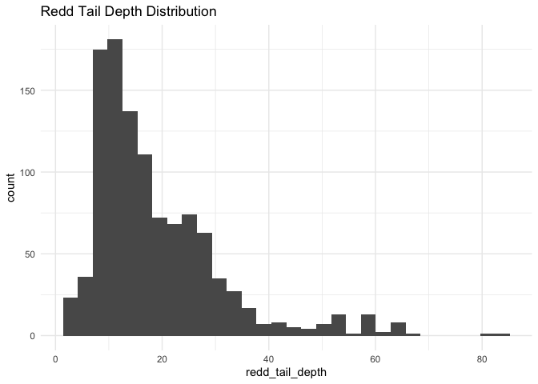<!-- -->

``` r
summary(redd_with_age$redd_tail_depth)
```

    ##    Min. 1st Qu.  Median    Mean 3rd Qu.    Max.    NA's 
    ##     3.0    10.0    15.0    18.7    24.0    84.0     526

**NA and Unknown Values**

- 32.5 % of values in the `redd_tail_depth` column are NA.

### Variable: `redd_length_in`

**Description:** Length of the longest part of the disturbed area,
measured parallel to streamflow (in inches)

``` r
redd_with_age |> 
  ggplot(aes(x = redd_length_in))+
  geom_histogram()+
  labs(title = "Redd Length Distribution")+
  theme_minimal()
```

    ## `stat_bin()` using `bins = 30`. Pick better value with `binwidth`.

    ## Warning: Removed 487 rows containing non-finite values (`stat_bin()`).

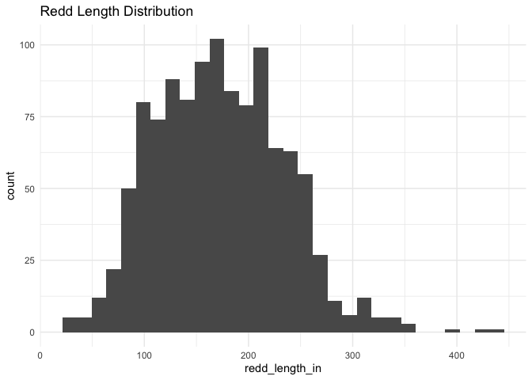<!-- -->

**Numeric Summary of redd_length_in over Period of Time**

``` r
summary(redd_with_age$redd_length_in)
```

    ##    Min. 1st Qu.  Median    Mean 3rd Qu.    Max.    NA's 
    ##    25.0   126.0   171.0   172.8   217.0   435.0     487

**NA and Unknown Values**

- 30.1 % of values in the `redd_length_in` column are NA.

### Variable: `redd_width_in`

**Description:** Width of the widest part of the disturbed area,
perpendicular to streamflow.

``` r
redd_with_age |> 
  ggplot(aes(x = redd_width_in))+
  geom_histogram()+
  labs(title = "Redd width Distribution")+
  theme_minimal()
```

    ## `stat_bin()` using `bins = 30`. Pick better value with `binwidth`.

    ## Warning: Removed 485 rows containing non-finite values (`stat_bin()`).

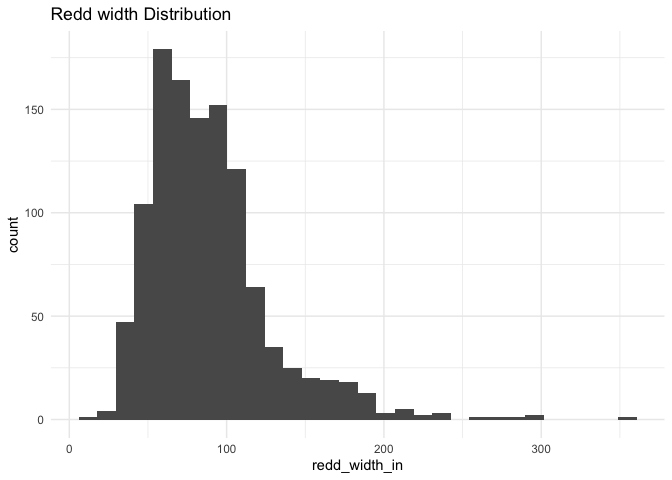<!-- -->

``` r
redd_with_age |> 
  ggplot(aes(x = redd_width_in, y=redd_length_in))+
  geom_point(size = 1.2,color = 'red')+
  labs(title = "Redd Width VS Redd Length")+
  theme_minimal()
```

    ## Warning: Removed 489 rows containing missing values (`geom_point()`).

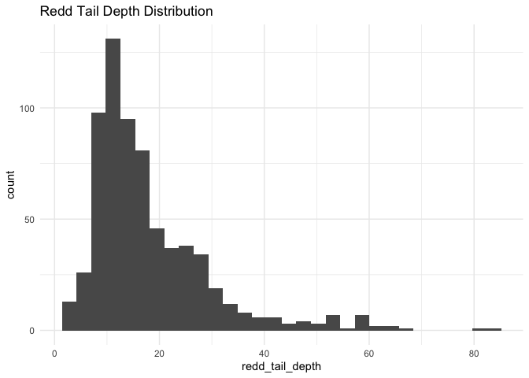<!-- -->

**Numeric Summary of redd_width_in over Period of Time**

``` r
summary(redd_with_age$redd_width_in)
```

    ##    Min. 1st Qu.  Median    Mean 3rd Qu.    Max.    NA's 
    ##   17.00   63.00   82.00   88.84  106.00  360.00     485

**NA and Unknown Values**

- 30 % of values in the `redd_width_in` column are NA.

### Variable: `velocity`

**Description:** Mean water column velocity measured at 60 percent depth
from the water surface or the average of the 60% depth and 80/20% depth,
if the redd depth is ≥ 30 inches (Allan and Castillo 2007).

Note: need to check unit.

``` r
redd_with_age |> 
  ggplot(aes(x = velocity))+
  geom_histogram()+
  labs(title = "Velocity Distribution")+
  theme_minimal()
```

    ## `stat_bin()` using `bins = 30`. Pick better value with `binwidth`.

    ## Warning: Removed 915 rows containing non-finite values (`stat_bin()`).

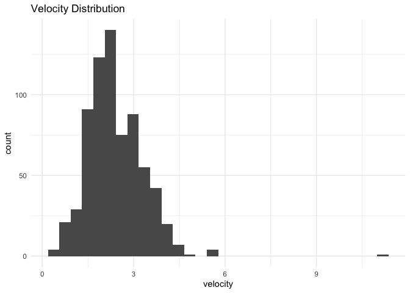<!-- -->

**Numeric Summary of velocity over Period of Time**

``` r
summary(redd_with_age$velocity)
```

    ##    Min. 1st Qu.  Median    Mean 3rd Qu.    Max.    NA's 
    ##   0.252   1.800   2.274   2.387   2.894  11.058     915

**NA and Unknown Values**

- 56.6 % of values in the `velocity` column are NA.

### Variable:`start_60`,`end_60`

**Description:** starting, ending values on the mechanical flow meter at
60% depth

``` r
redd_with_age |> 
  ggplot()+
  geom_histogram(aes(x = start_60), fill = "red", alpha = .5)+
  geom_histogram(aes(x = end_60), fill = "blue", alpha = .5)+
  labs(title = "Start 60 and End 60 Distribution", x = "Start 60 and End 60")+
  theme_minimal()
```

    ## `stat_bin()` using `bins = 30`. Pick better value with `binwidth`.

    ## Warning: Removed 857 rows containing non-finite values (`stat_bin()`).

    ## `stat_bin()` using `bins = 30`. Pick better value with `binwidth`.

    ## Warning: Removed 857 rows containing non-finite values (`stat_bin()`).

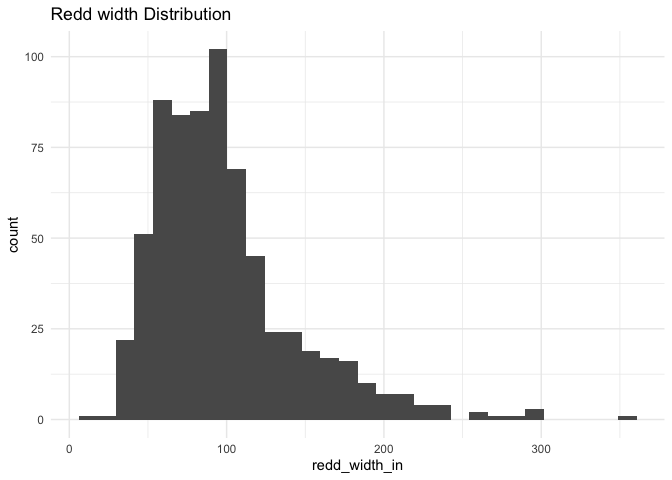<!-- -->

**Numeric Summary of start_60 and end_60 over Period of Time**

``` r
summary(redd_with_age$start_60)
```

    ##    Min. 1st Qu.  Median    Mean 3rd Qu.    Max.    NA's 
    ##       0  196000  390383  408826  629000  998000     857

``` r
summary(redd_with_age$end_60)
```

    ##    Min. 1st Qu.  Median    Mean 3rd Qu.    Max.    NA's 
    ##       0  198279  393559  411412  632125 1000157     857

**NA and Unknown Values**

- 53 % of values in the `start_60` column are NA.

- 53 % of values in the `end_60` column are NA.

### Variable: `sec_60`

**Description:** time the meter was in the water

``` r
redd_with_age |> 
  ggplot(aes(x = sec_60))+
  geom_histogram()+
  labs(title = "Sec 60 Distribution")+
  theme_minimal()
```

    ## `stat_bin()` using `bins = 30`. Pick better value with `binwidth`.

    ## Warning: Removed 886 rows containing non-finite values (`stat_bin()`).

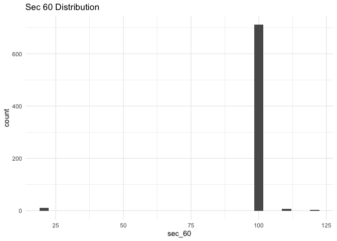<!-- -->

**Numeric Summary of sec_60 over Period of Time**

``` r
summary(redd_with_age$sec_60)
```

    ##    Min. 1st Qu.  Median    Mean 3rd Qu.    Max.    NA's 
    ##   20.00  100.00  100.00   98.94  100.00  120.00     886

**NA and Unknown Values**

- 54.8 % of values in the `sec_60` column are NA.

### Variable: `start_80`, `end_80`

**Description:** Starting, end values on the mechanical flow meter at
80/20% depth

``` r
redd_with_age |> 
  ggplot()+
  geom_histogram(aes(x = start_80), fill = "red", alpha = .5)+
  geom_histogram(aes(x = end_80), fill = "blue", alpha = .5)+
  labs(title = "Start 80 and End 80 Distribution", x = "Start 80 and End 80")+
  theme_minimal()
```

    ## `stat_bin()` using `bins = 30`. Pick better value with `binwidth`.

    ## Warning: Removed 1475 rows containing non-finite values (`stat_bin()`).

    ## `stat_bin()` using `bins = 30`. Pick better value with `binwidth`.

    ## Warning: Removed 1475 rows containing non-finite values (`stat_bin()`).

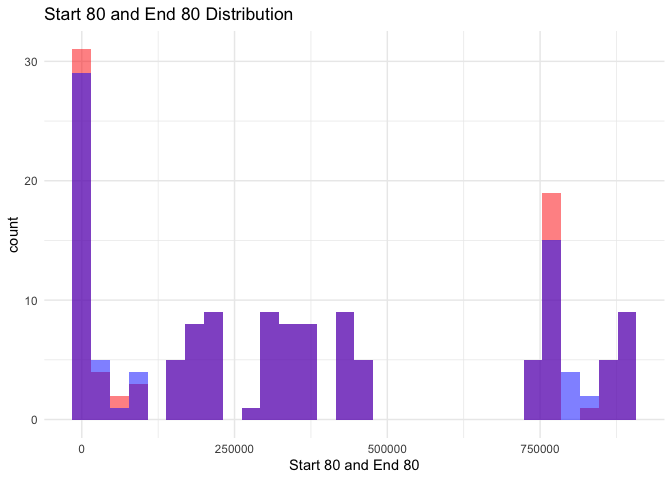<!-- -->

**Numeric Summary of start_80 and end_80 over Period of Time**

``` r
summary(redd_with_age$start_80)
```

    ##    Min. 1st Qu.  Median    Mean 3rd Qu.    Max.    NA's 
    ##       0   70000  307000  361757  747300  890200    1475

``` r
summary(redd_with_age$end_80)
```

    ##    Min. 1st Qu.  Median    Mean 3rd Qu.    Max.    NA's 
    ##       0   78372  309268  369718  750319  892365    1475

**NA and Unknown Values**

- 91.3 % of values in the `start_80` column are NA.

- 91.3 % of values in the `end_80` column are NA.

### Variable: `secs_80`

**Description:** Time the meter was in the water at the 80/20% depth.

``` r
redd_with_age |> 
  ggplot(aes(x = secs_80))+
  geom_histogram(bin =10)+
  labs(title = "Sec 80 Distribution")+
  theme_minimal()
```

    ## Warning in geom_histogram(bin = 10): Ignoring unknown parameters: `bin`

    ## `stat_bin()` using `bins = 30`. Pick better value with `binwidth`.

    ## Warning: Removed 1475 rows containing non-finite values (`stat_bin()`).

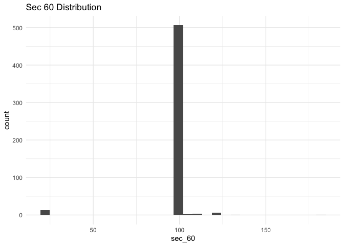<!-- -->

**Numeric Summary of secs_80 over Period of Time**

``` r
summary(redd_with_age$secs_80)
```

    ##    Min. 1st Qu.  Median    Mean 3rd Qu.    Max.    NA's 
    ##   100.0   100.0   100.0   100.1   100.0   108.0    1475

**NA and Unknown Values**

- 91.3 % of values in the `secs_80` column are NA.

### Variable: `bomb_vel60`, `bomb_vel80`

**`bomb_vel60` Description:** Mean water column velocity measured at 60
percent depth from the water surface if the redd depth is ≤ 30 inches
from the water surface (Allan and Castillo 2007).

**`bomb_vel80` Description:** Mean water column velocity measured at
80/20% percent depth from the water surface if the redd depth is ≥ 30
inches from the water surface (Allan and Castillo 2007).

``` r
v60 <- redd_with_age |> 
  ggplot(aes(x = bomb_vel60))+
  geom_histogram()+
  labs(title = "Velocity at 60 Percent Depth Distribution")+
  theme_minimal()

v80 <- redd_with_age |> 
  ggplot(aes(x = bomb_vel80))+
  geom_histogram()+
  labs(title = "Velocity at 80/20 Percent Depth Distribution")+
  theme_minimal()


gridExtra::grid.arrange(v60, v80)
```

    ## `stat_bin()` using `bins = 30`. Pick better value with `binwidth`.

    ## Warning: Removed 851 rows containing non-finite values (`stat_bin()`).

    ## `stat_bin()` using `bins = 30`. Pick better value with `binwidth`.

    ## Warning: Removed 1557 rows containing non-finite values (`stat_bin()`).

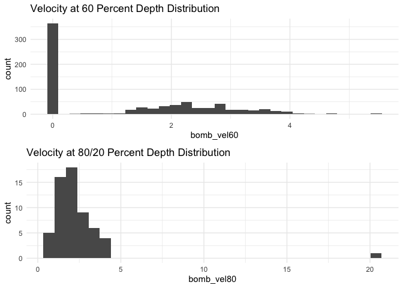<!-- -->

**Numeric Summary of bomb_vel60 and bomb_vel80 over Period of Time**

``` r
summary(redd_with_age$bomb_vel60)
```

    ##    Min. 1st Qu.  Median    Mean 3rd Qu.    Max.    NA's 
    ##   0.000   0.000   1.232   1.298   2.399   5.457     851

``` r
summary(redd_with_age$bomb_vel80)
```

    ##    Min. 1st Qu.  Median    Mean 3rd Qu.    Max.    NA's 
    ##  0.4708  1.3282  1.8970  2.3566  2.6416 20.1574    1557

Note: 0 velocity at 60 percent depth is NA? There’s significant more
measurement of redd measurement \<30 inches from water.

**NA and Unknown Values**

- 0 % of values in the `vel60` column are NA.

- 0 % of values in the `vel80` column are NA.

### Summary of Identified Issues

- There are multiple metadata that needs more descriptions
  (x1000ftbreak, method, survey_observed, )

- There are multiple columns that seem redundant. For example: survey vs
  survey observed, age vs observation age, three different date columns

- Need to email Ryan to ask what how all the age columns work.

- Non standard units (in) change to m below

``` r
# Convert all measures in inches to meters and rename accordingly 
redd_with_age <- redd_with_age |>
  mutate(pre_redd_depth = pre_redd_depth / 39.37, 
         redd_pit_depth = redd_pit_depth / 39.37, 
         redd_tail_depth = redd_tail_depth / 39.37, 
         redd_length = redd_length_in / 39.37,
         redd_width = redd_width_in / 39.37) |> 
  select(-redd_width_in, -redd_length_in)
```

## Next steps

- Work on data modeling to identify important variables needed for redd
  datasets.

### Columns to remove

- Suggest removing some of the location variables we currently have:
  `longitude`, `latitude`, `reach`, `river_mile`, `ucc_relate`,
  `picket_weir_relation` `surveyed_reach`, and `observed_reach`. We can
  probably use a subset of these.
- Suggest removing flow meter metadata: `start_60`, `end_60`, `sec_60`,
  `start_80`, `end_80`, `secs_80`. And only keeping 1 velocity measure
  out of the three taken: `velocity`, `bomb_vel60`, `bomb_vel80`.
- Unless we want to do any sort of habitat suitability analysis we
  probably do not need the substrate, depth, and gravel columns.

### Save Cleaned data back to google cloud

``` r
clear_redd <- redd_with_age |> glimpse()
```

    ## Rows: 1,616
    ## Columns: 39
    ## $ JPE_redd_id             <chr> "2000_1", "2000_2", "2000_3", "2000_4", "2000_…
    ## $ date                    <date> 2000-09-25, 2000-10-13, 2000-09-26, 2000-09-2…
    ## $ survey_method           <chr> "snorkel", "snorkel", "snorkel", "snorkel", "s…
    ## $ longitude               <dbl> -122.5404, -122.5404, -122.5381, -122.5338, -1…
    ## $ latitude                <dbl> 40.58156, 40.58160, 40.57883, 40.57394, 40.562…
    ## $ survey                  <chr> NA, NA, NA, NA, NA, NA, NA, NA, NA, NA, NA, NA…
    ## $ river_mile              <dbl> 16.38723, 16.38717, 16.12547, 15.58567, 14.701…
    ## $ x1000ftbreak            <dbl> 87000, 87000, 86000, 83000, 78000, 80000, 5700…
    ## $ ucc_relate              <chr> "above", "above", "above", "above", "above", "…
    ## $ picket_weir_location    <dbl> 8.2, 8.2, 8.2, 8.2, 8.2, 8.2, 8.2, 8.2, 8.2, 8…
    ## $ picket_weir_relation    <chr> "above", "above", "above", "above", "above", "…
    ## $ surveyed_reach          <chr> "R1", "R1", "R2", "R2", "R2", "R2", "R4", "R4"…
    ## $ redd_loc                <chr> NA, NA, NA, NA, NA, NA, NA, NA, NA, NA, NA, NA…
    ## $ age                     <dbl> NA, NA, NA, NA, NA, NA, NA, NA, NA, NA, NA, NA…
    ## $ age_index               <dbl> 0, 0, 0, 0, 0, 0, 0, 0, 0, 0, 0, 0, 0, 0, 0, 0…
    ## $ gravel                  <chr> "native", "native", "native", "native", "nativ…
    ## $ inj_site                <chr> "paige bar", "paige bar", "above need camp", "…
    ## $ pre_redd_substrate_size <chr> NA, NA, NA, NA, NA, NA, NA, NA, NA, NA, NA, NA…
    ## $ redd_substrate_size     <chr> NA, NA, NA, NA, NA, NA, NA, NA, NA, NA, NA, NA…
    ## $ tail_substrate_size     <chr> NA, NA, NA, NA, NA, NA, NA, NA, NA, NA, NA, NA…
    ## $ fish_on_redd            <lgl> NA, NA, NA, NA, NA, NA, NA, NA, NA, NA, NA, NA…
    ## $ measured                <lgl> FALSE, FALSE, FALSE, FALSE, FALSE, FALSE, FALS…
    ## $ why_not_measured        <chr> NA, NA, NA, NA, NA, NA, NA, NA, NA, NA, NA, NA…
    ## $ date_measured           <date> NA, NA, NA, NA, NA, NA, NA, NA, NA, NA, NA, N…
    ## $ pre_redd_depth          <dbl> NA, NA, NA, NA, NA, NA, NA, NA, NA, NA, NA, NA…
    ## $ redd_pit_depth          <dbl> NA, NA, NA, NA, NA, NA, NA, NA, NA, NA, NA, NA…
    ## $ redd_tail_depth         <dbl> NA, NA, NA, NA, NA, NA, NA, NA, NA, NA, NA, NA…
    ## $ velocity                <dbl> NA, NA, NA, NA, NA, NA, NA, NA, NA, NA, NA, NA…
    ## $ start_60                <dbl> NA, NA, NA, NA, NA, NA, NA, NA, NA, NA, NA, NA…
    ## $ end_60                  <dbl> NA, NA, NA, NA, NA, NA, NA, NA, NA, NA, NA, NA…
    ## $ sec_60                  <dbl> NA, NA, NA, NA, NA, NA, NA, NA, NA, NA, NA, NA…
    ## $ start_80                <dbl> NA, NA, NA, NA, NA, NA, NA, NA, NA, NA, NA, NA…
    ## $ end_80                  <dbl> NA, NA, NA, NA, NA, NA, NA, NA, NA, NA, NA, NA…
    ## $ secs_80                 <dbl> NA, NA, NA, NA, NA, NA, NA, NA, NA, NA, NA, NA…
    ## $ bomb_vel60              <dbl> NA, NA, NA, NA, NA, NA, NA, NA, NA, NA, NA, NA…
    ## $ bomb_vel80              <dbl> NA, NA, NA, NA, NA, NA, NA, NA, NA, NA, NA, NA…
    ## $ run                     <chr> "spring", "spring", "spring", "spring", "sprin…
    ## $ redd_length             <dbl> NA, NA, NA, NA, NA, NA, NA, NA, NA, NA, NA, NA…
    ## $ redd_width              <dbl> NA, NA, NA, NA, NA, NA, NA, NA, NA, NA, NA, NA…

``` r
# gcs_list_objects()

f <- function(input, output) write_csv(input, file = output)
gcs_upload(clear_redd,
           object_function = f,
           type = "csv",
           name = "adult-holding-redd-and-carcass-surveys/clear-creek/data/clear_redd.csv")
```
