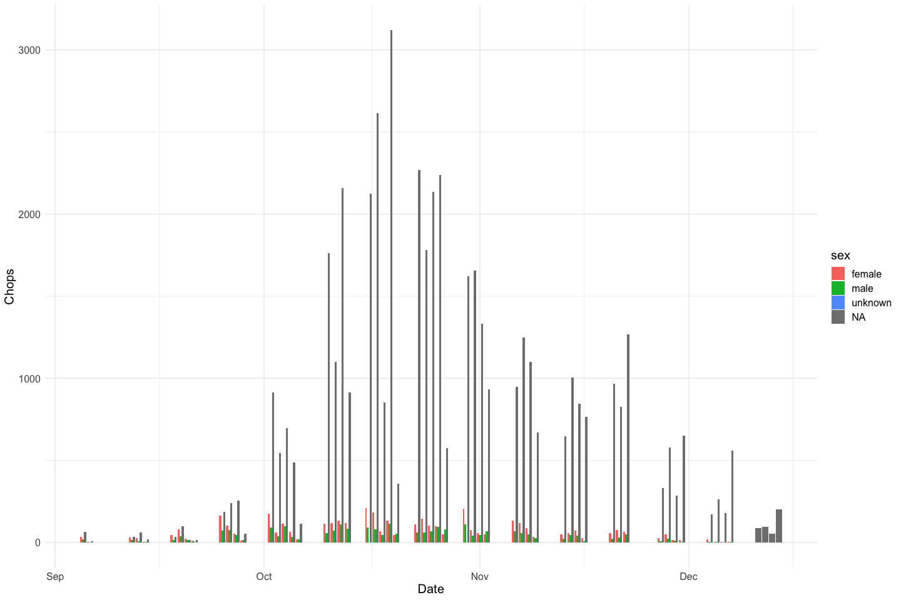
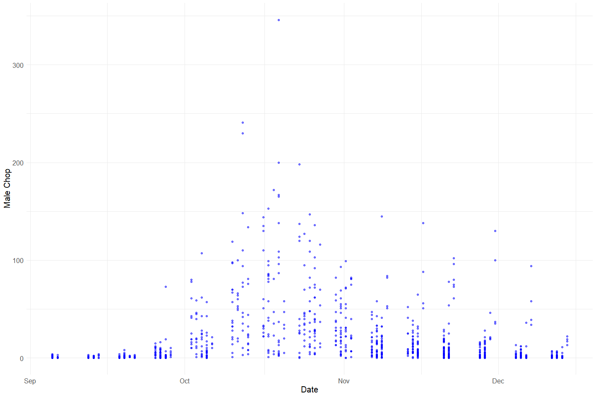
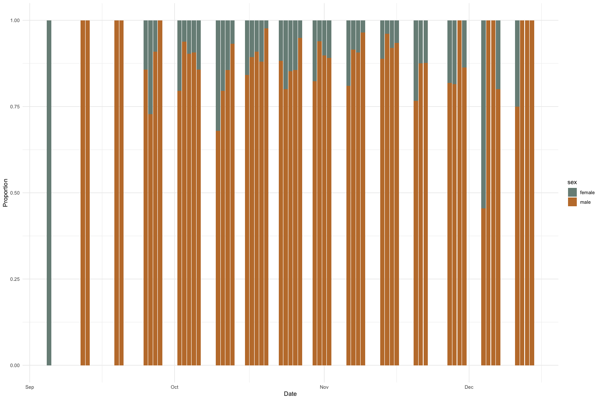
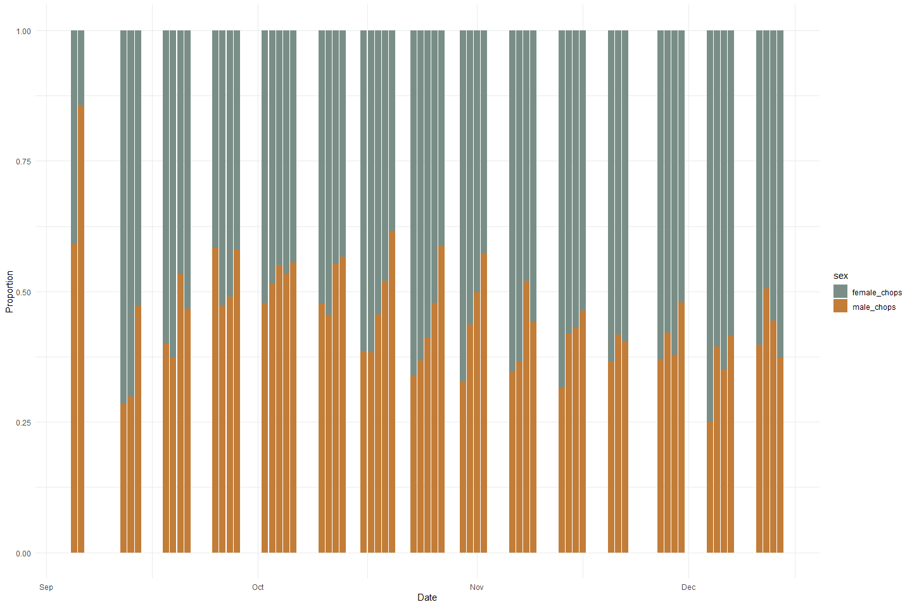
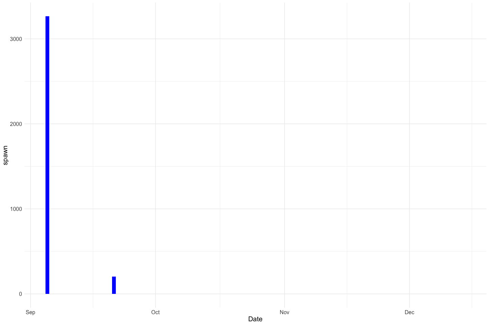
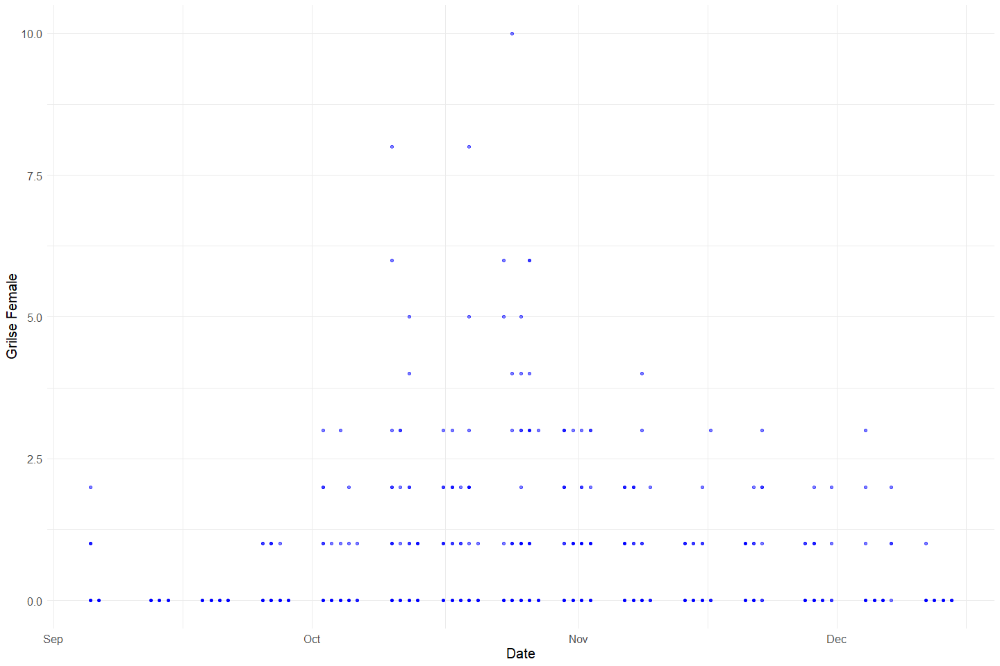
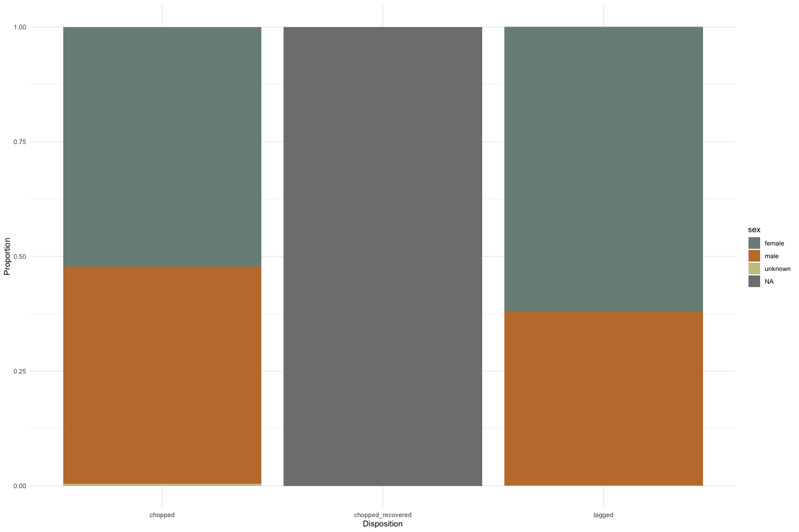

Feather Carcass QC 2000
================
Inigo Peng
2022-07-21

# Feather River Carcass Data

## Description of Monitoring Data

**Timeframe:**

**Video Season:**

**Completeness of Record throughout timeframe:**

**Sampling Location:**

**Data Contact:**

Any additional info?

## Access Cloud Data

Read in data from google cloud, glimpse raw data and domain description
sheet:

## Raw Data Glimpse:

### ChopEnv_Raw

Heading information for bulk chops data.

``` r
# Read Data
ChopEnv_raw <- read_csv(here::here("data-raw", "qc-markdowns",
                                 "adult-holding-redd-and-carcass-surveys",
                                 "feather-river", "ChopEnv_2000.csv"),
                                 col_types = list("d", "c", "T", "c", "T", "c", "c")) |>  
  glimpse()
```

    ## Rows: 236
    ## Columns: 11
    ## $ ChopEnvID <dbl> 1, 2, 3, 4, 5, 6, 7, 8, 9, 10, 11, 13, 14, 15, 16, 17, 18, 1…
    ## $ TagCol    <chr> "Pink", "Pink", "Pink", "Pink", "Pink", "Pink", "Pink", "Pin…
    ## $ Date      <dttm> 2000-09-05, 2000-09-05, 2000-09-05, 2000-09-05, 2000-09-05,…
    ## $ Start     <chr> "(12/30/99 14:30:00)", "(12/30/99 14:15:00)", "(12/30/99 12:…
    ## $ Stop      <dttm> NA, NA, NA, NA, NA, NA, NA, NA, NA, NA, NA, NA, NA, NA, NA,…
    ## $ Crew      <chr> "JK, CD, AT", "AP, SM, BC", "JK, CD, AT", "ID, AP, SM, BC", …
    ## $ Recorder  <chr> "RK", "BC", "RK", "BC", "RK", "BC", "RK", "BC", "AT", NA, "I…
    ## $ Turbot    <chr> NA, NA, NA, NA, NA, NA, NA, NA, NA, NA, NA, NA, NA, NA, NA, …
    ## $ Weather   <chr> "SUN", "SUN", "SUN", "SUN", "SUN", "SUN", "SUN", "SUN", "SUN…
    ## $ Comment   <chr> NA, NA, NA, NA, NA, "many filleted salmon in section 2-9.", …
    ## $ Week      <dbl> 1, 1, 1, 1, 1, 1, 1, 1, 1, 1, 1, 2, 2, 2, 2, 2, 2, 2, 2, 2, …

### ChopRecov_raw

Recovered chop counts with no sampling information.

``` r
#Data collection for Chopping and Spawning to determine how many carcasses are being captured (link by recovID)
ChopRecov_raw <-read_csv(here::here("data-raw", "qc-markdowns",
                                 "adult-holding-redd-and-carcass-surveys",
                                 "feather-river", "ChopRecov_2000.csv")) |>  
  rename("Number Spawned" = Spawn) |>  
  glimpse()
```

    ## Rows: 1037 Columns: 9
    ## ── Column specification ────────────────────────────────────────────────────────
    ## Delimiter: ","
    ## dbl (9): Sect, Unit, AdultM, AdultF, GrilM, GrilF, Spawn, RecovID, ChopEnvID
    ## 
    ## ℹ Use `spec()` to retrieve the full column specification for this data.
    ## ℹ Specify the column types or set `show_col_types = FALSE` to quiet this message.

    ## Rows: 1,037
    ## Columns: 9
    ## $ Sect             <dbl> 4, 4, 4, 4, 4, 4, 4, 4, 4, 4, 4, 4, 4, 4, 4, 4, 4, 4,…
    ## $ Unit             <dbl> 1, 2, 3, 4, 5, 6, 7, 8, 10, 1, 2, 3, 4, 5, 6, 7, 8, 9…
    ## $ AdultM           <dbl> 0, 0, 0, 0, 0, 0, 0, 0, 0, 1, 0, 0, 0, 0, 0, 0, 0, 0,…
    ## $ AdultF           <dbl> 0, 0, 0, 0, 0, 0, 0, 0, 0, 0, 0, 0, 0, 0, 0, 0, 0, 0,…
    ## $ GrilM            <dbl> 0, 0, 0, 0, 0, 0, 0, 0, 0, 0, 0, 0, 0, 0, 0, 0, 0, 0,…
    ## $ GrilF            <dbl> 0, 0, 0, 0, 0, 0, 0, 0, 0, 0, 0, 0, 0, 0, 0, 0, 0, 0,…
    ## $ `Number Spawned` <dbl> NA, NA, NA, NA, NA, NA, NA, NA, NA, 0, NA, NA, NA, NA…
    ## $ RecovID          <dbl> 1, 2, 3, 4, 5, 6, 7, 8, 10, 11, 12, 13, 14, 15, 16, 1…
    ## $ ChopEnvID        <dbl> 1, 1, 1, 1, 1, 1, 1, 1, 1, 2, 2, 2, 2, 2, 2, 2, 2, 2,…

### RecovTag_Raw

``` r
#Data for Recovered Tags
#What is RelStat and MultRecov? 
RecovTag_raw <- read_csv(here::here("data-raw", "qc-markdowns",
                                 "adult-holding-redd-and-carcass-surveys",
                                 "feather-river", "RecovTag_2000.csv")) |>  
  glimpse()
```

    ## Rows: 3447 Columns: 5
    ## ── Column specification ────────────────────────────────────────────────────────
    ## Delimiter: ","
    ## chr (1): RelStat
    ## dbl (4): RecovID, TagNum, RecovTagID, MultRecov
    ## 
    ## ℹ Use `spec()` to retrieve the full column specification for this data.
    ## ℹ Specify the column types or set `show_col_types = FALSE` to quiet this message.

    ## Rows: 3,447
    ## Columns: 5
    ## $ RecovID    <dbl> 97, 98, 98, 98, 112, 119, 120, 120, 120, 131, 134, 134, 135…
    ## $ TagNum     <dbl> 106, 108, 110, 111, 1, 7, 11, 12, 10, 26, 109, 126, 18, 15,…
    ## $ RecovTagID <dbl> 3, 4, 5, 6, 8, 9, 10, 11, 12, 13, 14, 15, 16, 17, 18, 19, 2…
    ## $ RelStat    <chr> "R", "R", "R", "C", "X", "C", "R", "R", "R", "R", "R", "R",…
    ## $ MultRecov  <dbl> 1, 1, 1, 1, 1, 1, 1, 1, 1, 1, 1, 1, 1, 1, 1, 1, 1, 1, 1, 1,…

### TagData_raw

``` r
#Data for Tagging DataSheet - when export access table to excel, Tag Number is automatically changed to TagID - converting it back here
TagData_raw <- read_csv(here::here("data-raw", "qc-markdowns",
                                 "adult-holding-redd-and-carcass-surveys",
                                 "feather-river", "TagData_2000.csv")) |>  
  rename("TagNum" = "TagID") |> 
  glimpse()
```

    ## Rows: 6246 Columns: 11
    ## ── Column specification ────────────────────────────────────────────────────────
    ## Delimiter: ","
    ## chr (4): Sex, EggRet, RelLoc, Comment
    ## dbl (7): TagID, Sect, Unit, FL, Float, TagEnvID, RelLoc2
    ## 
    ## ℹ Use `spec()` to retrieve the full column specification for this data.
    ## ℹ Specify the column types or set `show_col_types = FALSE` to quiet this message.

    ## Rows: 6,246
    ## Columns: 11
    ## $ TagNum   <dbl> 1, 2, 3, 4, 5, 6, 7, 8, 9, 10, 11, 12, 14, 15, 16, 17, 18, 19…
    ## $ Sect     <dbl> 1, 1, 1, 1, 2, 2, 2, 2, 2, 2, 2, 2, 2, 2, 3, 3, 3, 3, 3, 4, 4…
    ## $ Unit     <dbl> 8, 8, 10, 10, 1, 1, 8, 8, 8, 8, 8, 8, 10, 10, 2, 2, 3, 6, 9, …
    ## $ FL       <dbl> 93, 84, 89, 109, 89, 88, 78, 92, 91, 85, 97, 92, 92, 87, 89, …
    ## $ Sex      <chr> "F", "F", "F", "M", "F", "F", "F", "M", "M", "F", "M", "M", "…
    ## $ EggRet   <chr> "U", "U", "U", NA, "U", "U", "U", NA, NA, "U", NA, NA, NA, "U…
    ## $ Float    <dbl> 0, 0, 0, 0, 0, 0, 0, 0, 0, 0, 1, 0, 1, 0, 0, 0, 0, 0, 0, 0, 0…
    ## $ RelLoc   <chr> "3", "3", "3", "3", "1", "3", "1", "1", "3", "3", "3", "1", "…
    ## $ Comment  <chr> NA, NA, NA, NA, NA, NA, NA, NA, NA, NA, NA, NA, NA, NA, NA, N…
    ## $ TagEnvID <dbl> 2, 2, 2, 2, 2, 2, 2, 2, 2, 2, 2, 2, 2, 2, 2, 2, 2, 2, 2, 2, 2…
    ## $ RelLoc2  <dbl> 2, 2, 2, 2, 1, 2, 1, 1, 2, 2, 2, 1, 1, 2, 1, 2, 2, 2, 2, 2, 2…

### TagEnv_raw

``` r
#Heading Info for Tagging Data Sheet
TagEnv_raw <- read_csv(here::here("data-raw", "qc-markdowns",
                                 "adult-holding-redd-and-carcass-surveys",
                                 "feather-river", "TagEnvTBL_2000.csv")) |>  
  glimpse()
```

    ## Rows: 138 Columns: 5
    ## ── Column specification ────────────────────────────────────────────────────────
    ## Delimiter: ","
    ## chr  (2): Recorder, TagCol
    ## dbl  (2): TagEnvID, Week
    ## date (1): Date
    ## 
    ## ℹ Use `spec()` to retrieve the full column specification for this data.
    ## ℹ Specify the column types or set `show_col_types = FALSE` to quiet this message.

    ## Rows: 138
    ## Columns: 5
    ## $ Date     <date> 2000-09-05, 2000-09-05, 2000-09-06, 2000-09-06, 2000-09-12, …
    ## $ Recorder <chr> "BC", "RK", "AT", "Ian", "BC", "RK", "RK", "JL", "DL", "Ian",…
    ## $ TagCol   <chr> "Pink", "Pink", "Pink", "Pink", "Yellow-Black", "Yellow-Black…
    ## $ TagEnvID <dbl> 1, 2, 3, 4, 5, 6, 7, 8, 9, 10, 11, 12, 13, 14, 15, 16, 17, 18…
    ## $ Week     <dbl> 1, 1, 1, 1, 2, 2, 2, 2, 2, 2, 2, 3, 3, 3, 3, 3, 3, 3, 3, 4, 4…

### cwt_raw

This table contains all carcasses with sampling information.

``` r
cwt_raw <- read_csv(here::here("data-raw", "qc-markdowns",
                                 "adult-holding-redd-and-carcass-surveys",
                                 "feather-river", "cwt_2000.csv")) |>  
  glimpse()
```

    ## Rows: 207 Columns: 10
    ## ── Column specification ────────────────────────────────────────────────────────
    ## Delimiter: ","
    ## chr  (3): Sex, EggRet, Comment
    ## dbl  (5): cwtID, Sect, Unit, FL, HTNum
    ## lgl  (1): cwtCode
    ## date (1): Date
    ## 
    ## ℹ Use `spec()` to retrieve the full column specification for this data.
    ## ℹ Specify the column types or set `show_col_types = FALSE` to quiet this message.

    ## Rows: 207
    ## Columns: 10
    ## $ cwtID   <dbl> 2, 3, 4, 5, 6, 7, 8, 9, 10, 11, 12, 13, 14, 15, 16, 17, 18, 19…
    ## $ Date    <date> 2000-09-05, 2000-09-05, 2000-09-05, 2000-09-05, 2000-09-12, 2…
    ## $ Sect    <dbl> 1, 2, 2, 4, 1, 1, 1, 2, 2, 4, 4, 3, 8, 7, 1, 1, 1, 1, 2, 2, 2,…
    ## $ Unit    <dbl> 8, 1, 8, 1, 8, 8, 8, 4, 4, 5, 3, 3, 1, 1, 10, 8, 8, 8, 1, 1, 1…
    ## $ FL      <dbl> 80, 86, 80, 78, 80, 85, 97, 78, 65, 84, 78, 80, 46, 40, 75, 95…
    ## $ Sex     <chr> "M", "F", "F", "F", "F", "F", "M", "F", "M", "M", "F", "F", "M…
    ## $ EggRet  <chr> NA, "U", "U", "U", "U", "U", NA, "U", NA, NA, "U", "U", NA, NA…
    ## $ HTNum   <dbl> 26049, 26050, 26044, 26047, 26099, 26065, 26066, 26097, 26063,…
    ## $ cwtCode <lgl> NA, NA, NA, NA, NA, NA, NA, NA, NA, NA, NA, NA, NA, NA, NA, NA…
    ## $ Comment <chr> "Section 1-12 chopped two non-fresh CWT's", NA, NA, NA, NA, NA…

## Data transformations:

### CWT

The `cwt` table contains sampling information on individual carcasses.
It is not joined with the other tables.

``` r
cwt <- cwt_raw |>  
  clean_names() |>
  mutate(disposition = "chopped",
         source_table = "CWT",
         count = 1) |> 
  glimpse()
```

    ## Rows: 207
    ## Columns: 13
    ## $ cwt_id       <dbl> 2, 3, 4, 5, 6, 7, 8, 9, 10, 11, 12, 13, 14, 15, 16, 17, 1…
    ## $ date         <date> 2000-09-05, 2000-09-05, 2000-09-05, 2000-09-05, 2000-09-…
    ## $ sect         <dbl> 1, 2, 2, 4, 1, 1, 1, 2, 2, 4, 4, 3, 8, 7, 1, 1, 1, 1, 2, …
    ## $ unit         <dbl> 8, 1, 8, 1, 8, 8, 8, 4, 4, 5, 3, 3, 1, 1, 10, 8, 8, 8, 1,…
    ## $ fl           <dbl> 80, 86, 80, 78, 80, 85, 97, 78, 65, 84, 78, 80, 46, 40, 7…
    ## $ sex          <chr> "M", "F", "F", "F", "F", "F", "M", "F", "M", "M", "F", "F…
    ## $ egg_ret      <chr> NA, "U", "U", "U", "U", "U", NA, "U", NA, NA, "U", "U", N…
    ## $ ht_num       <dbl> 26049, 26050, 26044, 26047, 26099, 26065, 26066, 26097, 2…
    ## $ cwt_code     <lgl> NA, NA, NA, NA, NA, NA, NA, NA, NA, NA, NA, NA, NA, NA, N…
    ## $ comment      <chr> "Section 1-12 chopped two non-fresh CWT's", NA, NA, NA, N…
    ## $ disposition  <chr> "chopped", "chopped", "chopped", "chopped", "chopped", "c…
    ## $ source_table <chr> "CWT", "CWT", "CWT", "CWT", "CWT", "CWT", "CWT", "CWT", "…
    ## $ count        <dbl> 1, 1, 1, 1, 1, 1, 1, 1, 1, 1, 1, 1, 1, 1, 1, 1, 1, 1, 1, …

### Recovered chops

The `chop_recovery_join` table contains recovered carcass counts. Add
`disposition` column to mark as chops.

``` r
#1. Link ChopRecov with ChopEnv to get the date
chop_recovery_join <- full_join(ChopEnv_raw |>  
                                  select(ChopEnvID, Date, Start, TagCol), ChopRecov_raw, 
                                by = "ChopEnvID") |>  
  clean_names() |>  
  rename(male_chop = "adult_m",
         female_chop = "adult_f",
         grilse_male = "gril_m",
         grilse_female = "gril_f") |>  
  pivot_longer(c(male_chop, female_chop, grilse_male, grilse_female), 
               values_to = "count",
               names_to = "sex") |> 
  mutate(lifestage = if_else(str_detect(sex, "grilse"), "grilse", "adult"),
         sex = case_when(sex %in% c("male_chop", "grilse_male") ~ "male", 
                         sex %in% c("female_chop", "grilse_female") ~ "female"),
         disposition = "chopped_recovered",
         source_table = "ChopRecov") |> 
  glimpse()
```

    ## Rows: 4,148
    ## Columns: 13
    ## $ chop_env_id    <dbl> 1, 1, 1, 1, 1, 1, 1, 1, 1, 1, 1, 1, 1, 1, 1, 1, 1, 1, 1…
    ## $ date           <dttm> 2000-09-05, 2000-09-05, 2000-09-05, 2000-09-05, 2000-0…
    ## $ start          <chr> "(12/30/99 14:30:00)", "(12/30/99 14:30:00)", "(12/30/9…
    ## $ tag_col        <chr> "Pink", "Pink", "Pink", "Pink", "Pink", "Pink", "Pink",…
    ## $ sect           <dbl> 4, 4, 4, 4, 4, 4, 4, 4, 4, 4, 4, 4, 4, 4, 4, 4, 4, 4, 4…
    ## $ unit           <dbl> 1, 1, 1, 1, 2, 2, 2, 2, 3, 3, 3, 3, 4, 4, 4, 4, 5, 5, 5…
    ## $ number_spawned <dbl> NA, NA, NA, NA, NA, NA, NA, NA, NA, NA, NA, NA, NA, NA,…
    ## $ recov_id       <dbl> 1, 1, 1, 1, 2, 2, 2, 2, 3, 3, 3, 3, 4, 4, 4, 4, 5, 5, 5…
    ## $ sex            <chr> "male", "female", "male", "female", "male", "female", "…
    ## $ count          <dbl> 0, 0, 0, 0, 0, 0, 0, 0, 0, 0, 0, 0, 0, 0, 0, 0, 0, 0, 0…
    ## $ lifestage      <chr> "adult", "adult", "grilse", "grilse", "adult", "adult",…
    ## $ disposition    <chr> "chopped_recovered", "chopped_recovered", "chopped_reco…
    ## $ source_table   <chr> "ChopRecov", "ChopRecov", "ChopRecov", "ChopRecov", "Ch…

### Tags

The `tag_join` table contains tagged carcasses with survey metadata
added.

``` r
tag_join <- left_join(TagData_raw, TagEnv_raw,
                         by = "TagEnvID") |> 
  mutate(disposition = "tagged",
         source_table = "TagData",
         count = 1) |> 
  clean_names() |> 
  glimpse()
```

    ## Rows: 6,246
    ## Columns: 18
    ## $ tag_num      <dbl> 1, 2, 3, 4, 5, 6, 7, 8, 9, 10, 11, 12, 14, 15, 16, 17, 18…
    ## $ sect         <dbl> 1, 1, 1, 1, 2, 2, 2, 2, 2, 2, 2, 2, 2, 2, 3, 3, 3, 3, 3, …
    ## $ unit         <dbl> 8, 8, 10, 10, 1, 1, 8, 8, 8, 8, 8, 8, 10, 10, 2, 2, 3, 6,…
    ## $ fl           <dbl> 93, 84, 89, 109, 89, 88, 78, 92, 91, 85, 97, 92, 92, 87, …
    ## $ sex          <chr> "F", "F", "F", "M", "F", "F", "F", "M", "M", "F", "M", "M…
    ## $ egg_ret      <chr> "U", "U", "U", NA, "U", "U", "U", NA, NA, "U", NA, NA, NA…
    ## $ float        <dbl> 0, 0, 0, 0, 0, 0, 0, 0, 0, 0, 1, 0, 1, 0, 0, 0, 0, 0, 0, …
    ## $ rel_loc      <chr> "3", "3", "3", "3", "1", "3", "1", "1", "3", "3", "3", "1…
    ## $ comment      <chr> NA, NA, NA, NA, NA, NA, NA, NA, NA, NA, NA, NA, NA, NA, N…
    ## $ tag_env_id   <dbl> 2, 2, 2, 2, 2, 2, 2, 2, 2, 2, 2, 2, 2, 2, 2, 2, 2, 2, 2, …
    ## $ rel_loc2     <dbl> 2, 2, 2, 2, 1, 2, 1, 1, 2, 2, 2, 1, 1, 2, 1, 2, 2, 2, 2, …
    ## $ date         <date> 2000-09-05, 2000-09-05, 2000-09-05, 2000-09-05, 2000-09-…
    ## $ recorder     <chr> "RK", "RK", "RK", "RK", "RK", "RK", "RK", "RK", "RK", "RK…
    ## $ tag_col      <chr> "Pink", "Pink", "Pink", "Pink", "Pink", "Pink", "Pink", "…
    ## $ week         <dbl> 1, 1, 1, 1, 1, 1, 1, 1, 1, 1, 1, 1, 1, 1, 1, 1, 1, 1, 1, …
    ## $ disposition  <chr> "tagged", "tagged", "tagged", "tagged", "tagged", "tagged…
    ## $ source_table <chr> "TagData", "TagData", "TagData", "TagData", "TagData", "T…
    ## $ count        <dbl> 1, 1, 1, 1, 1, 1, 1, 1, 1, 1, 1, 1, 1, 1, 1, 1, 1, 1, 1, …

``` r
# tag_join <- left_join(TagData_raw, RecovTag_raw) |>  
#   clean_names() |>  
#   mutate(disposition = "tagged") |> 
#   select(c(tag_num, sect, unit, fl, sex, egg_ret, recov_id, disposition)) |>  glimpse()
```

### Survey

The `chop_header` table contains survey metadata and covariates

``` r
chop_header <- ChopEnv_raw |>  
  clean_names() |>  glimpse()
```

    ## Rows: 236
    ## Columns: 11
    ## $ chop_env_id <dbl> 1, 2, 3, 4, 5, 6, 7, 8, 9, 10, 11, 13, 14, 15, 16, 17, 18,…
    ## $ tag_col     <chr> "Pink", "Pink", "Pink", "Pink", "Pink", "Pink", "Pink", "P…
    ## $ date        <dttm> 2000-09-05, 2000-09-05, 2000-09-05, 2000-09-05, 2000-09-0…
    ## $ start       <chr> "(12/30/99 14:30:00)", "(12/30/99 14:15:00)", "(12/30/99 1…
    ## $ stop        <dttm> NA, NA, NA, NA, NA, NA, NA, NA, NA, NA, NA, NA, NA, NA, N…
    ## $ crew        <chr> "JK, CD, AT", "AP, SM, BC", "JK, CD, AT", "ID, AP, SM, BC"…
    ## $ recorder    <chr> "RK", "BC", "RK", "BC", "RK", "BC", "RK", "BC", "AT", NA, …
    ## $ turbot      <chr> NA, NA, NA, NA, NA, NA, NA, NA, NA, NA, NA, NA, NA, NA, NA…
    ## $ weather     <chr> "SUN", "SUN", "SUN", "SUN", "SUN", "SUN", "SUN", "SUN", "S…
    ## $ comment     <chr> NA, NA, NA, NA, NA, "many filleted salmon in section 2-9."…
    ## $ week        <dbl> 1, 1, 1, 1, 1, 1, 1, 1, 1, 1, 1, 2, 2, 2, 2, 2, 2, 2, 2, 2…

### Combine tables

``` r
all_carcasses <- bind_rows(tag_join, chop_recovery_join, cwt) |> glimpse()
```

    ## Rows: 10,601
    ## Columns: 26
    ## $ tag_num        <dbl> 1, 2, 3, 4, 5, 6, 7, 8, 9, 10, 11, 12, 14, 15, 16, 17, …
    ## $ sect           <dbl> 1, 1, 1, 1, 2, 2, 2, 2, 2, 2, 2, 2, 2, 2, 3, 3, 3, 3, 3…
    ## $ unit           <dbl> 8, 8, 10, 10, 1, 1, 8, 8, 8, 8, 8, 8, 10, 10, 2, 2, 3, …
    ## $ fl             <dbl> 93, 84, 89, 109, 89, 88, 78, 92, 91, 85, 97, 92, 92, 87…
    ## $ sex            <chr> "F", "F", "F", "M", "F", "F", "F", "M", "M", "F", "M", …
    ## $ egg_ret        <chr> "U", "U", "U", NA, "U", "U", "U", NA, NA, "U", NA, NA, …
    ## $ float          <dbl> 0, 0, 0, 0, 0, 0, 0, 0, 0, 0, 1, 0, 1, 0, 0, 0, 0, 0, 0…
    ## $ rel_loc        <chr> "3", "3", "3", "3", "1", "3", "1", "1", "3", "3", "3", …
    ## $ comment        <chr> NA, NA, NA, NA, NA, NA, NA, NA, NA, NA, NA, NA, NA, NA,…
    ## $ tag_env_id     <dbl> 2, 2, 2, 2, 2, 2, 2, 2, 2, 2, 2, 2, 2, 2, 2, 2, 2, 2, 2…
    ## $ rel_loc2       <dbl> 2, 2, 2, 2, 1, 2, 1, 1, 2, 2, 2, 1, 1, 2, 1, 2, 2, 2, 2…
    ## $ date           <dttm> 2000-09-05, 2000-09-05, 2000-09-05, 2000-09-05, 2000-0…
    ## $ recorder       <chr> "RK", "RK", "RK", "RK", "RK", "RK", "RK", "RK", "RK", "…
    ## $ tag_col        <chr> "Pink", "Pink", "Pink", "Pink", "Pink", "Pink", "Pink",…
    ## $ week           <dbl> 1, 1, 1, 1, 1, 1, 1, 1, 1, 1, 1, 1, 1, 1, 1, 1, 1, 1, 1…
    ## $ disposition    <chr> "tagged", "tagged", "tagged", "tagged", "tagged", "tagg…
    ## $ source_table   <chr> "TagData", "TagData", "TagData", "TagData", "TagData", …
    ## $ count          <dbl> 1, 1, 1, 1, 1, 1, 1, 1, 1, 1, 1, 1, 1, 1, 1, 1, 1, 1, 1…
    ## $ chop_env_id    <dbl> NA, NA, NA, NA, NA, NA, NA, NA, NA, NA, NA, NA, NA, NA,…
    ## $ start          <chr> NA, NA, NA, NA, NA, NA, NA, NA, NA, NA, NA, NA, NA, NA,…
    ## $ number_spawned <dbl> NA, NA, NA, NA, NA, NA, NA, NA, NA, NA, NA, NA, NA, NA,…
    ## $ recov_id       <dbl> NA, NA, NA, NA, NA, NA, NA, NA, NA, NA, NA, NA, NA, NA,…
    ## $ lifestage      <chr> NA, NA, NA, NA, NA, NA, NA, NA, NA, NA, NA, NA, NA, NA,…
    ## $ cwt_id         <dbl> NA, NA, NA, NA, NA, NA, NA, NA, NA, NA, NA, NA, NA, NA,…
    ## $ ht_num         <dbl> NA, NA, NA, NA, NA, NA, NA, NA, NA, NA, NA, NA, NA, NA,…
    ## $ cwt_code       <lgl> NA, NA, NA, NA, NA, NA, NA, NA, NA, NA, NA, NA, NA, NA,…

## Explore Numeric Variables:

### All Carcasses Variables:

### Chop Recovery Variable: `tag_num`, `sect`, `unit`, `fl`, `float`, `tag_env_id`, `rel_loc2`, `week`, `chop_env_id`, `count`, `number_spawned`, `recov_id`, `cwt_id`, `ht_num`

``` r
# Filter clean data to show only numeric variables 
all_carcasses |>  
  select_if(is.numeric) |> 
  colnames()
```

    ##  [1] "tag_num"        "sect"           "unit"           "fl"            
    ##  [5] "float"          "tag_env_id"     "rel_loc2"       "week"          
    ##  [9] "count"          "chop_env_id"    "number_spawned" "recov_id"      
    ## [13] "cwt_id"         "ht_num"

``` r
summary(all_carcasses$tag_num)
```

    ##    Min. 1st Qu.  Median    Mean 3rd Qu.    Max.    NA's 
    ##       1    1658    6308    5456    8079   10000    4355

``` r
summary(all_carcasses$sect)
```

    ##    Min. 1st Qu.  Median    Mean 3rd Qu.    Max. 
    ##   1.000   1.000   2.000   2.826   3.000   8.000

``` r
summary(all_carcasses$unit)
```

    ##    Min. 1st Qu.  Median    Mean 3rd Qu.    Max. 
    ##   1.000   2.000   5.000   5.213   8.000  12.000

``` r
summary(all_carcasses$fl)
```

    ##    Min. 1st Qu.  Median    Mean 3rd Qu.    Max.    NA's 
    ##   34.00   78.00   84.00   83.62   90.00  120.00    4174

``` r
summary(all_carcasses$float)
```

    ##    Min. 1st Qu.  Median    Mean 3rd Qu.    Max.    NA's 
    ##   0.000   0.000   0.000   0.021   0.000   1.000    4365

``` r
summary(all_carcasses$tag_env_id)
```

    ##    Min. 1st Qu.  Median    Mean 3rd Qu.    Max.    NA's 
    ##    1.00   42.00   64.00   65.27   87.00  138.00    4355

``` r
summary(all_carcasses$rel_loc2)
```

    ##    Min. 1st Qu.  Median    Mean 3rd Qu.    Max.    NA's 
    ##   1.000   1.000   2.000   1.642   2.000   2.000    4368

``` r
summary(all_carcasses$week)
```

    ##    Min. 1st Qu.  Median    Mean 3rd Qu.    Max.    NA's 
    ##   1.000   6.000   7.000   7.438   9.000  14.000    4355

``` r
summary(all_carcasses$chop_env_id)
```

    ##    Min. 1st Qu.  Median    Mean 3rd Qu.    Max.    NA's 
    ##     1.0    43.0   117.0   113.1   176.0   241.0    6453

``` r
summary(all_carcasses$number_spawned)
```

    ##    Min. 1st Qu.  Median    Mean 3rd Qu.    Max.    NA's 
    ##    0.00    0.00    0.00   16.06    0.00  750.00   10385

``` r
summary(all_carcasses$recov_id)
```

    ##    Min. 1st Qu.  Median    Mean 3rd Qu.    Max.    NA's 
    ##     1.0   270.0   541.0   535.3   800.0  1059.0    6453

``` r
summary(all_carcasses$cwt_id)
```

    ##    Min. 1st Qu.  Median    Mean 3rd Qu.    Max.    NA's 
    ##     2.0    53.5   105.0   105.0   156.5   208.0   10394

``` r
summary(all_carcasses$ht_num)
```

    ##    Min. 1st Qu.  Median    Mean 3rd Qu.    Max.    NA's 
    ##       0   16908   16988   20375   26029   26099   10394

### All Carcasses Variable: `count`

``` r
summary(all_carcasses$count)
```

    ##    Min. 1st Qu.  Median    Mean 3rd Qu.    Max. 
    ##   0.000   1.000   1.000   5.055   1.000 466.000

\*\* Plot carcass counts by sex \*\*

``` r
all_carcasses |>  
  mutate(sex = case_when(sex == "F" ~ "female",
                         sex == "M" ~ "male",
                         sex == "X" ~ "unknown")) |> 
  group_by(date, sex) |>  
  summarize(count = sum(count, na.rm = T)) |> 
  ggplot(aes(x = date, y = count, fill = sex)) +
  geom_bar(stat = "identity", position = "dodge") + 
  labs(x = "Date", 
       y = "Chops") +
  theme_minimal() + 
  theme(text = element_text(size = 15)) 
```

    ## `summarise()` has grouped output by 'date'. You can override using the
    ## `.groups` argument.

<!-- -->
This plot shows carcass over period of record by sex and is helpful for
understanding the seasonality of the survey, i.e. chop counts peak in
Oct-Nov. Because some chops are recorded without sampling information,
much of the data has sex recorded as `NA`.

**Plotting Total Adult Chops over Period of Record**

``` r
total_adult_chops <- all_carcasses |> 
  filter(disposition %in% c("chopped_recovered", "chopped")) |> 
  filter(lifestage != "grilse") |> 
  select(date, count, disposition, sex) |> 
  glimpse()
```

    ## Rows: 2,074
    ## Columns: 4
    ## $ date        <dttm> 2000-09-05, 2000-09-05, 2000-09-05, 2000-09-05, 2000-09-0…
    ## $ count       <dbl> 0, 0, 0, 0, 0, 0, 0, 0, 0, 0, 0, 0, 0, 0, 0, 0, 0, 0, 1, 0…
    ## $ disposition <chr> "chopped_recovered", "chopped_recovered", "chopped_recover…
    ## $ sex         <chr> "male", "female", "male", "female", "male", "female", "mal…

``` r
total_adult_chops_summary <- total_adult_chops |> 
  group_by(date, sex) |> 
  summarise(total_adult_chops = sum(count, na.rm = T)) |> 
  glimpse()
```

    ## `summarise()` has grouped output by 'date'. You can override using the
    ## `.groups` argument.

    ## Rows: 118
    ## Columns: 3
    ## Groups: date [59]
    ## $ date              <dttm> 2000-09-05, 2000-09-05, 2000-09-06, 2000-09-06, 200…
    ## $ sex               <chr> "female", "male", "female", "male", "female", "male"…
    ## $ total_adult_chops <dbl> 25, 36, 1, 6, 25, 10, 40, 17, 10, 9, 21, 14, 62, 37,…

``` r
total_adult_chops_summary |>
  ggplot(aes(x = date, y = total_adult_chops, fill = sex)) + 
  geom_bar(stat = "identity", position = position_fill()) +
  labs(y = "Proportion", x = "Date") +
  theme_minimal() + 
  scale_fill_manual(values = wes_palette("Moonrise2"))
```

<!-- -->

This plot shows the sex proportion of adult chops for each day over the
the period of 2000-09-05 to 2000-12-14. The data gaps that we see are a
result of the data collection process in which the data was collected
2-4 days each week (with no specific period day of week) over the 4
month period.

**Plotting grilse_male over Period of Record**

``` r
total_grilse_chops <- all_carcasses |> 
  filter(disposition %in% c("chopped_recovered", "chopped")) |> 
  filter(lifestage == "grilse") |> 
  select(date, count, disposition, sex) |> 
  glimpse()
```

    ## Rows: 2,074
    ## Columns: 4
    ## $ date        <dttm> 2000-09-05, 2000-09-05, 2000-09-05, 2000-09-05, 2000-09-0…
    ## $ count       <dbl> 0, 0, 0, 0, 0, 0, 0, 0, 0, 0, 0, 0, 0, 0, 0, 0, 0, 0, 0, 0…
    ## $ disposition <chr> "chopped_recovered", "chopped_recovered", "chopped_recover…
    ## $ sex         <chr> "male", "female", "male", "female", "male", "female", "mal…

``` r
total_grilse_chops_summary <- total_grilse_chops |> 
  group_by(date, sex) |> 
  summarise(total_grilse_chops = sum(count, na.rm = T)) |> 
  glimpse()
```

    ## `summarise()` has grouped output by 'date'. You can override using the
    ## `.groups` argument.

    ## Rows: 118
    ## Columns: 3
    ## Groups: date [59]
    ## $ date               <dttm> 2000-09-05, 2000-09-05, 2000-09-06, 2000-09-06, 20…
    ## $ sex                <chr> "female", "male", "female", "male", "female", "male…
    ## $ total_grilse_chops <dbl> 5, 0, 0, 0, 0, 1, 0, 5, 0, 0, 0, 0, 0, 1, 0, 1, 0, …

``` r
total_grilse_chops_summary |>
  ggplot(aes(x = date, y = total_grilse_chops, fill = sex)) + 
  geom_bar(stat = "identity", position = position_fill()) +
  labs(y = "Proportion", x = "Date") +
  theme_minimal() + 
  scale_fill_manual(values = wes_palette("Moonrise2"))
```

<!-- -->
This plot shows the sex proportion of grilse chops for each day over the
the period of 2000-09-05 to 2000-12-14. There are more data gaps for the
grilse data compared to the normal chops data. All of the grilse chop
data have been identified for their sexes - there is a significant
higher proportion of males compared to the females.

**Plotting all carcasses over Period of Record** Carcasses in the
`all_carcasses` dataset are marked as either `tagged`,
`chopped_recovered`, and `chopped`. `chopped` carcasses have come from
the `CWT` data table and contain individual-level sampling information
(i.e. sex, fork length). `chopped_recovered` carcasses come from the
`ChopRecov` data table and have sex and lifestage information, but no
other individual-level sampling information. `tagged` carcasses come
from the `TagData` data table and have individual-level sampling
information.

``` r
total_carcasses_summary <- all_carcasses |> 
  mutate(sex = case_when(sex == "F" ~ "female",
                         sex == "M" ~ "male")) |> 
  group_by(date, disposition) |> 
  summarise(total_carcasses = sum(count, na.rm = T)) |> 
  glimpse()
```

    ## `summarise()` has grouped output by 'date'. You can override using the
    ## `.groups` argument.

    ## Rows: 153
    ## Columns: 3
    ## Groups: date [59]
    ## $ date            <dttm> 2000-09-05, 2000-09-05, 2000-09-05, 2000-09-06, 2000-…
    ## $ disposition     <chr> "chopped", "chopped_recovered", "tagged", "chopped_rec…
    ## $ total_carcasses <dbl> 4, 66, 49, 7, 7, 5, 36, 42, 3, 62, 34, 2, 19, 4, 8, 35…

``` r
total_carcasses_summary |> 
  ggplot(aes(x = date, y = total_carcasses, fill = disposition)) + 
  geom_bar(stat = "identity", position = position_fill()) + 
  theme_minimal() + 
  labs(y = "Proportion", x = "Date") +
  scale_fill_manual(values = wes_palette("Moonrise2"))
```

<!-- -->
This plot shows the proportion of the carcasses that were either
chopped, tagged, or recovered and chopped on a given day over the period
of 2000-09-05 to 2000-12-14.

``` r
summary(chop_recovery_join$number_spawned)
```

    ##    Min. 1st Qu.  Median    Mean 3rd Qu.    Max.    NA's 
    ##    0.00    0.00    0.00   16.06    0.00  750.00    3932

- 94.8 % of values in the `number_spawned` column are NA.

**Plotting number_spawned over a Period of Record**

``` r
all_carcasses|>  
  group_by(date) |>  
  summarize(number_spawned = sum(number_spawned, na.rm = T)) |>  
  ggplot(aes(x = date, y = number_spawned)) +
  geom_col(fill = "blue") + 
  labs(x = "Date", 
       y = "spawn") +
  theme_minimal() + 
  theme(text = element_text(size = 15)) 
```

<!-- -->
This plot shows the number spawned for each day over the the period of
2000-09-05 to 2000-12-14. Data on number spawned was not present for all
dates and was only collected in the `ChopRecov` table, but was collected
on 09-05-2000 and 09-21-2000 (seen in the two columns).

### Individual-level sampling information

**Plotting fork length of each sex**

``` r
summary(all_carcasses$fl)
```

    ##    Min. 1st Qu.  Median    Mean 3rd Qu.    Max.    NA's 
    ##   34.00   78.00   84.00   83.62   90.00  120.00    4174

``` r
all_carcasses |> 
  mutate(sex = case_when(sex == "F" ~ "female",
                         sex == "M" ~ "male",
                         sex == "X" ~ "unknown")) |> 
  ggplot(aes(x = sex, y = fl)) +
  geom_boxplot() +
  facet_wrap(~disposition) +
  theme_minimal() + 
  labs(y = "fork length (mm)", x = "sex")
```

<!-- -->

**Plotting sex proportion of counts within each disposition**

``` r
all_carcasses |> 
  mutate(sex = case_when(sex == "F" ~ "female",
                         sex == "M" ~ "male",
                         sex == "X" ~ "unknown")) |> 
  ggplot(aes(y = count, x = disposition, fill = sex)) +
  geom_bar(stat = "identity", position = position_fill()) + 
  theme_minimal() + 
  labs(y = "Proportion", x = "Disposition") +
  scale_fill_manual(values = wes_palette("Moonrise2"))
```

<!-- -->

### Chop Header Variable: `chop_env_id`, `week`,

``` r
chop_header |>  
  select_if(is.numeric) |>  
  colnames()
```

    ## [1] "chop_env_id" "week"

``` r
summary(chop_header$chop_env_id)
```

    ##    Min. 1st Qu.  Median    Mean 3rd Qu.    Max. 
    ##    1.00   62.75  123.50  122.26  182.25  241.00

``` r
summary(chop_header$week)
```

    ##    Min. 1st Qu.  Median    Mean 3rd Qu.    Max. 
    ##   1.000   5.000   8.000   8.343  12.000  15.000

## Explore Categorical variables:

### All Carcasses

Fix inconsistencies with spelling, capitalization, and dates

``` r
all_carcasses |>  
  select_if(is.character) |>  
  colnames()
```

    ##  [1] "sex"          "egg_ret"      "rel_loc"      "comment"      "recorder"    
    ##  [6] "tag_col"      "disposition"  "source_table" "start"        "lifestage"

``` r
unique(all_carcasses$sex)
```

    ## [1] "F"      "M"      "X"      "male"   "female"

``` r
unique(all_carcasses$egg_ret)
```

    ## [1] "U" NA  "X" "S" "P"

``` r
unique(all_carcasses$rel_loc)
```

    ## [1] "3" "1" "2" "X" NA

``` r
unique(all_carcasses$recorder)
```

    ##  [1] "RK"         "AT"         "A. Popper"  "Ian"        "BC"        
    ##  [6] "DL"         "JL"         "CD"         "AJT"        "JK"        
    ## [11] "DFG Crew"   "DFG & Tim"  "RK/CD"      "DFG/Popper" "A Popper"  
    ## [16] "AT/PH"      "AP"         "JL, AT"     "DFG"        "?"         
    ## [21] "EE"         "DFG/ SM"    "CD/PH"      "PH"         "AT, CD"    
    ## [26] "SM, DFG"    "AP/DFG/AT"  "AT/RK"      "PH/AT"      "DFG, SM"   
    ## [31] "DFG/ Ian"   "AP, DL"     "unknown"    "Ian/AP"     "TV"        
    ## [36] "DFG/AP"     "DFG/Morgan" "JK/RK"      "DFG, AP"    "DWR"       
    ## [41] "PH, JK"     "TV, PH"     "AP, DFG"    NA

``` r
unique(all_carcasses$tag_col)
```

    ##  [1] "Pink"                "Yellow-Black"        "Plum or No Color"   
    ##  [4] "Orange-Black"        "Black"               "Green"              
    ##  [7] "Red"                 "Pink2"               "No Color2"          
    ## [10] "Blue"                "Yellow or Red2"      "White or Pink-Black"
    ## [13] "Orange"              "Green2"              "No Tags"            
    ## [16] NA

``` r
unique(all_carcasses$disposition)
```

    ## [1] "tagged"            "chopped_recovered" "chopped"

``` r
unique(all_carcasses$source_table)
```

    ## [1] "TagData"   "ChopRecov" "CWT"

``` r
unique(all_carcasses$lifestage)
```

    ## [1] NA       "adult"  "grilse"

``` r
all_carcasses_cleaner <- all_carcasses |> 
  mutate_if(is.character, str_to_lower) |> 
  mutate(sex = case_when(sex == "f" ~ "female",
                         sex == "m" ~ "male",
                         sex == "x" ~ "unknown"),
         egg_ret = case_when(egg_ret == "u" ~ "unspawned",
                             egg_ret == "s" ~ "spawned",
                             egg_ret == "x" ~ "unknown",
                             egg_ret == "p" ~ "prespawned",
                             TRUE ~ egg_ret)) |> 
  select(-c(start, cwt_code)) |>  # start has time data and is removed because no stop time provided so information is not useful. cwt_code is all NAs
  glimpse()
```

    ## Rows: 10,601
    ## Columns: 24
    ## $ tag_num        <dbl> 1, 2, 3, 4, 5, 6, 7, 8, 9, 10, 11, 12, 14, 15, 16, 17, …
    ## $ sect           <dbl> 1, 1, 1, 1, 2, 2, 2, 2, 2, 2, 2, 2, 2, 2, 3, 3, 3, 3, 3…
    ## $ unit           <dbl> 8, 8, 10, 10, 1, 1, 8, 8, 8, 8, 8, 8, 10, 10, 2, 2, 3, …
    ## $ fl             <dbl> 93, 84, 89, 109, 89, 88, 78, 92, 91, 85, 97, 92, 92, 87…
    ## $ sex            <chr> "female", "female", "female", "male", "female", "female…
    ## $ egg_ret        <chr> "unspawned", "unspawned", "unspawned", NA, "unspawned",…
    ## $ float          <dbl> 0, 0, 0, 0, 0, 0, 0, 0, 0, 0, 1, 0, 1, 0, 0, 0, 0, 0, 0…
    ## $ rel_loc        <chr> "3", "3", "3", "3", "1", "3", "1", "1", "3", "3", "3", …
    ## $ comment        <chr> NA, NA, NA, NA, NA, NA, NA, NA, NA, NA, NA, NA, NA, NA,…
    ## $ tag_env_id     <dbl> 2, 2, 2, 2, 2, 2, 2, 2, 2, 2, 2, 2, 2, 2, 2, 2, 2, 2, 2…
    ## $ rel_loc2       <dbl> 2, 2, 2, 2, 1, 2, 1, 1, 2, 2, 2, 1, 1, 2, 1, 2, 2, 2, 2…
    ## $ date           <dttm> 2000-09-05, 2000-09-05, 2000-09-05, 2000-09-05, 2000-0…
    ## $ recorder       <chr> "rk", "rk", "rk", "rk", "rk", "rk", "rk", "rk", "rk", "…
    ## $ tag_col        <chr> "pink", "pink", "pink", "pink", "pink", "pink", "pink",…
    ## $ week           <dbl> 1, 1, 1, 1, 1, 1, 1, 1, 1, 1, 1, 1, 1, 1, 1, 1, 1, 1, 1…
    ## $ disposition    <chr> "tagged", "tagged", "tagged", "tagged", "tagged", "tagg…
    ## $ source_table   <chr> "tagdata", "tagdata", "tagdata", "tagdata", "tagdata", …
    ## $ count          <dbl> 1, 1, 1, 1, 1, 1, 1, 1, 1, 1, 1, 1, 1, 1, 1, 1, 1, 1, 1…
    ## $ chop_env_id    <dbl> NA, NA, NA, NA, NA, NA, NA, NA, NA, NA, NA, NA, NA, NA,…
    ## $ number_spawned <dbl> NA, NA, NA, NA, NA, NA, NA, NA, NA, NA, NA, NA, NA, NA,…
    ## $ recov_id       <dbl> NA, NA, NA, NA, NA, NA, NA, NA, NA, NA, NA, NA, NA, NA,…
    ## $ lifestage      <chr> NA, NA, NA, NA, NA, NA, NA, NA, NA, NA, NA, NA, NA, NA,…
    ## $ cwt_id         <dbl> NA, NA, NA, NA, NA, NA, NA, NA, NA, NA, NA, NA, NA, NA,…
    ## $ ht_num         <dbl> NA, NA, NA, NA, NA, NA, NA, NA, NA, NA, NA, NA, NA, NA,…

### Chop Header Clean Data

``` r
chop_header |>  
  select_if(is.character) |>  
  colnames()
```

    ## [1] "tag_col"  "start"    "crew"     "recorder" "turbot"   "weather"  "comment"

``` r
unique(chop_header$crew)
```

    ##   [1] "JK, CD, AT"             "AP, SM, BC"             "ID, AP, SM, BC"        
    ##   [4] "ID, SM, AP, BC"         "SM, AP, ID, BC"         "BC, TV, AT, JL, DL"    
    ##   [7] "CD, PH, DO"             "RK, Scott, Andy"        "CD, JL, PH"            
    ##  [10] "CD, PH, JL"             "JK, AP, TS, BC"         "TS, JK, BC, AP"        
    ##  [13] "CD, JL, JW"             "JL, JW, CD"             "AP, BC, SM, DL"        
    ##  [16] "AT, TV, Justin"         "AP, SM, BC, DL"         "AT, TV, RK, JA"        
    ##  [19] "CD, JL, DL, RK"         "Tim, Andy, Scott"       "DO, TV Dave"           
    ##  [22] "TV, CD, AT"             "DO, TV, DL, RK"         "Scott, Andy"           
    ##  [25] "CD, TV"                 "RK, PH, CD, JL"         "Andy, Scott, Dave"     
    ##  [28] "DFG & KC"               "JL, PH, RK, TV"         "JK, RK"                
    ##  [31] "Andy, Scott, Ian"       "TV, JL, PH, CD"         "Andy, Scott"           
    ##  [34] "JL, PH, CD, TV"         "CD, TV, DL"             "DFG"                   
    ##  [37] "TV, CD, JL, AT"         "TV, CD, JR"             "JK, DO"                
    ##  [40] "DFG & Tim"              "JL, PH, CD, AT"         "RK, CD, JL, TV, JK, PH"
    ##  [43] "PH, TV, JL, JK"         "JL, CD, JK"             "RK, TV, PH"            
    ##  [46] "JL, JK, CD"             "Dave & Andy"            "JK, BC, RK"            
    ##  [49] "JL, AT, CD, TV"         "Jim, Andy, Ian/DFG"     "JK"                    
    ##  [52] "JL, CD, RK, TV"         "BC, JK"                 "DFG (4)"               
    ##  [55] "JK, TV, PH"             "DFG \"3\""              "JK, PH, TV"            
    ##  [58] "CD, JL"                 "RK, JK, EE"             "JK, RK, EE"            
    ##  [61] "DFG, AP, Scott, Dave"   "BC, PH, JA"             "DFG/J, S, AP, Dave"    
    ##  [64] "JK, JL, SD"             "PH, ??, TV"             "TV, JL, CD"            
    ##  [67] "AT, JK, PH, RK"         "TV, CD, JL"             "DFG/SM, AP, Tom"       
    ##  [70] "PH, JL, CD"             "DFG/S, AP, D, Justin"   "PH, CD, JL, TV"        
    ##  [73] "JK, TV"                 "TV, AP, JK"             "DL, PH, RK, CD"        
    ##  [76] "JK, TV, AP"             "Justin, CD"             "Dave, Tim, Andy"       
    ##  [79] "JK, PH, TV, TS"         "BC, JK, SI"             "DFG, PH"               
    ##  [82] "RK, TS, TV"             "BC, AS, RK, AT"         "Dave, Scott, Andy"     
    ##  [85] "PH, TV, JK"             "BC, RK, SM"             "JK, AT, TV"            
    ##  [88] "AT, BC, RK, SI"         "TV, JK, CD"             "DFG, J, AP, Dave"      
    ##  [91] "TV, PH, CD"             "PH, TV, BC"             "JK, RK, SI"            
    ##  [94] "JK, RK, CD"             "AT, CD, TV"             "TV, CD, BC, JS"        
    ##  [97] "DFG, AT"                "JK, RK, JL"             "RK, JK"                
    ## [100] "DFG, IA, AP, DL"        "TV, PH"                 "CD, JK, RK"            
    ## [103] "PH, TV, CD"             "DFG, ID, AD, DL"        "CD, RK"                
    ## [106] "JK, JL, JS, BC"         "TV, RK, CD"             "BC, JK, JL, JS"        
    ## [109] "JK, TV, JL"             "JK, CD"                 "Dave, Andy, DFG"       
    ## [112] "JK, TV, AT"             "CD, RK, JL"             "DFG, DL, AP"           
    ## [115] "DFG/ AP, DL, JH"        "TV, CD"                 "PH, SI, AT"            
    ## [118] "Jason, CD, Andy, Scott" "DFG & PH"               "TV, PH, JL, CD"        
    ## [121] "DFG (3)"                "PH, AT, RK"             "BC, JK, PH"            
    ## [124] "RK, JL, CD"             "DFG, TV"                "AT, RK, JL"            
    ## [127] "JK, PH, BC, AT"         "TV, RK"                 "JK, AT, CD"            
    ## [130] "SM, DL, JL"             "JL, DL, SM"             "TV, BC, CD, RK"        
    ## [133] "JK, JL, SI, AT"         "TV, CD, BC, RK"         "JK, AT, SI, JL"        
    ## [136] "JK, BC, CD, TV"         "AT, JK, JL, SI"         "DFG (2)"               
    ## [139] "BC, AT, TV"             "TV, PH, JL"             "PH, TV, JL"            
    ## [142] "?"                      "RK, TV"                 "JK, SI, JL"            
    ## [145] "PH, RK, AT"             "PH, TV, SI"             "TV, SM"                
    ## [148] "PH, AT, CD"             "CD, PH, AT"             "PH, CD, TV, JL"        
    ## [151] "PH, SI, CD"             "PH, TV"                 "TV, PH, SI"

``` r
unique(chop_header$recorder)
```

    ##  [1] "RK"         "BC"         "AT"         NA           "Ian"       
    ##  [6] "JL"         "DL"         "RK, DL"     "AJT"        "?"         
    ## [11] "A. Popper"  "JK"         "Anita"      "CD"         "AT, DL"    
    ## [16] "DFG"        "DFG & Tim"  "PH"         "AP"         "EE"        
    ## [21] "AP, DL"     "RK, PH"     "PH, CD"     "CD, PH"     "SM, DFG"   
    ## [26] "PH, JK"     "AP, ID"     "DFG, SM"    "DFG/Morgan" "TV"        
    ## [31] "DFG, AP"    "CD?"        "AP, DFG"    "BC, JS"     "DL, AP"    
    ## [36] "DWR"        "JL?"        "Morgan"     "SM"         "PH, TV"

``` r
unique(chop_header$weather)
```

    ## [1] "SUN" "UNK" "CLD" "RAN"

``` r
#Not sure what turbot is
unique(chop_header$turbot)
```

    ## [1] NA    "2"   "yes"

``` r
chop_header_cleaner <- chop_header |>  
  mutate(date = as_date(date))|>  
  mutate_if(is.character, str_to_lower) |>  
  mutate(crew = str_replace_all(crew, " ", ""),
         crew = str_replace_all(crew, "/", ","),
         crew = str_replace_all(crew, "&", ","),
         weather = case_when(weather == "ran" ~ "rain",
                             weather == "unk" ~ NA_character_,
                             TRUE ~ weather)) |>  
  select(-c(start, stop, week, turbot)) # stop is all NA and start is not useful without stop; turbot does not have any data
```

## Comments

- We combined all tables - `ChopRecov`, `TagData`, and `CWT` into
  `all_carcasses`. This assumes that there is no double counting, which
  we think is valid according to discussions with data stewards.
- We assigned `disposition` based on the table from which the data came
  from.
- We assigned spawning condition based on values in egg_ret. May need to
  confirm.
- We kept `recov_id` because it may be able to connect some tagged
  individuals with chopped/recovered_chopped individuals.
- What is `float`, `rel_loc`, `rel_loc2`, ‘ht_num’, and `cwt_id`?

## Data Dictionaries

### All Carcasses

``` r
percent_na <- all_carcasses_cleaner |> 
  summarise_all(list(name = ~sum(is.na(.))/length(.))) |> 
  pivot_longer(cols = everything())


all_carcasses_data_dictionary <- tibble(variables = colnames(all_carcasses_cleaner),
                          description = c("Tag number",
                                          "Section of survey",
                                          "Unit of survey",
                                          "Fork length (mm)", 
                                          "Sex",
                                          "Egg retention (spawning condition)",
                                          "Float",
                                          "Rel_loc",
                                          "Comment",
                                          "Tag environment ID",
                                          "Rel_loc 2",
                                          "Date of survey",
                                          "Crew member recording data",
                                          "Tag color",
                                          "Week of survey",
                                          "Disposition of carcass",
                                          "Table from which the data came",
                                          "Count",
                                          "Chop environment ID",
                                          "Number spawned",
                                          "Recovery ID",
                                          "Lifestage",
                                          "CWT ID",
                                          "HT Number"),
                          percent_na = round(percent_na$value*100))

kable(all_carcasses_data_dictionary)
```

| variables      | description                        | percent_na |
|:---------------|:-----------------------------------|-----------:|
| tag_num        | Tag number                         |         41 |
| sect           | Section of survey                  |          0 |
| unit           | Unit of survey                     |          0 |
| fl             | Fork length (mm)                   |         39 |
| sex            | Sex                                |         39 |
| egg_ret        | Egg retention (spawning condition) |         62 |
| float          | Float                              |         41 |
| rel_loc        | Rel_loc                            |         41 |
| comment        | Comment                            |        100 |
| tag_env_id     | Tag environment ID                 |         41 |
| rel_loc2       | Rel_loc 2                          |         41 |
| date           | Date of survey                     |          0 |
| recorder       | Crew member recording data         |         41 |
| tag_col        | Tag color                          |          2 |
| week           | Week of survey                     |         41 |
| disposition    | Disposition of carcass             |          0 |
| source_table   | Table from which the data came     |          0 |
| count          | Count                              |          0 |
| chop_env_id    | Chop environment ID                |         61 |
| number_spawned | Number spawned                     |         98 |
| recov_id       | Recovery ID                        |         61 |
| lifestage      | Lifestage                          |         61 |
| cwt_id         | CWT ID                             |         98 |
| ht_num         | HT Number                          |         98 |

## Save cleaned data back to google cloud (TBA)

``` r
all_carcasses_2000 <- all_carcasses_cleaner |> glimpse()
```

    ## Rows: 10,601
    ## Columns: 24
    ## $ tag_num        <dbl> 1, 2, 3, 4, 5, 6, 7, 8, 9, 10, 11, 12, 14, 15, 16, 17, …
    ## $ sect           <dbl> 1, 1, 1, 1, 2, 2, 2, 2, 2, 2, 2, 2, 2, 2, 3, 3, 3, 3, 3…
    ## $ unit           <dbl> 8, 8, 10, 10, 1, 1, 8, 8, 8, 8, 8, 8, 10, 10, 2, 2, 3, …
    ## $ fl             <dbl> 93, 84, 89, 109, 89, 88, 78, 92, 91, 85, 97, 92, 92, 87…
    ## $ sex            <chr> "female", "female", "female", "male", "female", "female…
    ## $ egg_ret        <chr> "unspawned", "unspawned", "unspawned", NA, "unspawned",…
    ## $ float          <dbl> 0, 0, 0, 0, 0, 0, 0, 0, 0, 0, 1, 0, 1, 0, 0, 0, 0, 0, 0…
    ## $ rel_loc        <chr> "3", "3", "3", "3", "1", "3", "1", "1", "3", "3", "3", …
    ## $ comment        <chr> NA, NA, NA, NA, NA, NA, NA, NA, NA, NA, NA, NA, NA, NA,…
    ## $ tag_env_id     <dbl> 2, 2, 2, 2, 2, 2, 2, 2, 2, 2, 2, 2, 2, 2, 2, 2, 2, 2, 2…
    ## $ rel_loc2       <dbl> 2, 2, 2, 2, 1, 2, 1, 1, 2, 2, 2, 1, 1, 2, 1, 2, 2, 2, 2…
    ## $ date           <dttm> 2000-09-05, 2000-09-05, 2000-09-05, 2000-09-05, 2000-0…
    ## $ recorder       <chr> "rk", "rk", "rk", "rk", "rk", "rk", "rk", "rk", "rk", "…
    ## $ tag_col        <chr> "pink", "pink", "pink", "pink", "pink", "pink", "pink",…
    ## $ week           <dbl> 1, 1, 1, 1, 1, 1, 1, 1, 1, 1, 1, 1, 1, 1, 1, 1, 1, 1, 1…
    ## $ disposition    <chr> "tagged", "tagged", "tagged", "tagged", "tagged", "tagg…
    ## $ source_table   <chr> "tagdata", "tagdata", "tagdata", "tagdata", "tagdata", …
    ## $ count          <dbl> 1, 1, 1, 1, 1, 1, 1, 1, 1, 1, 1, 1, 1, 1, 1, 1, 1, 1, 1…
    ## $ chop_env_id    <dbl> NA, NA, NA, NA, NA, NA, NA, NA, NA, NA, NA, NA, NA, NA,…
    ## $ number_spawned <dbl> NA, NA, NA, NA, NA, NA, NA, NA, NA, NA, NA, NA, NA, NA,…
    ## $ recov_id       <dbl> NA, NA, NA, NA, NA, NA, NA, NA, NA, NA, NA, NA, NA, NA,…
    ## $ lifestage      <chr> NA, NA, NA, NA, NA, NA, NA, NA, NA, NA, NA, NA, NA, NA,…
    ## $ cwt_id         <dbl> NA, NA, NA, NA, NA, NA, NA, NA, NA, NA, NA, NA, NA, NA,…
    ## $ ht_num         <dbl> NA, NA, NA, NA, NA, NA, NA, NA, NA, NA, NA, NA, NA, NA,…
