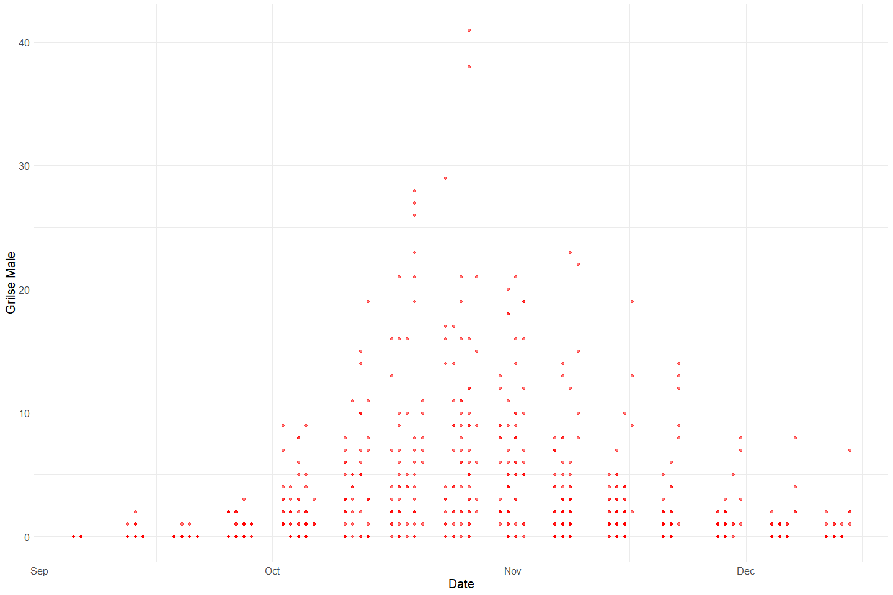
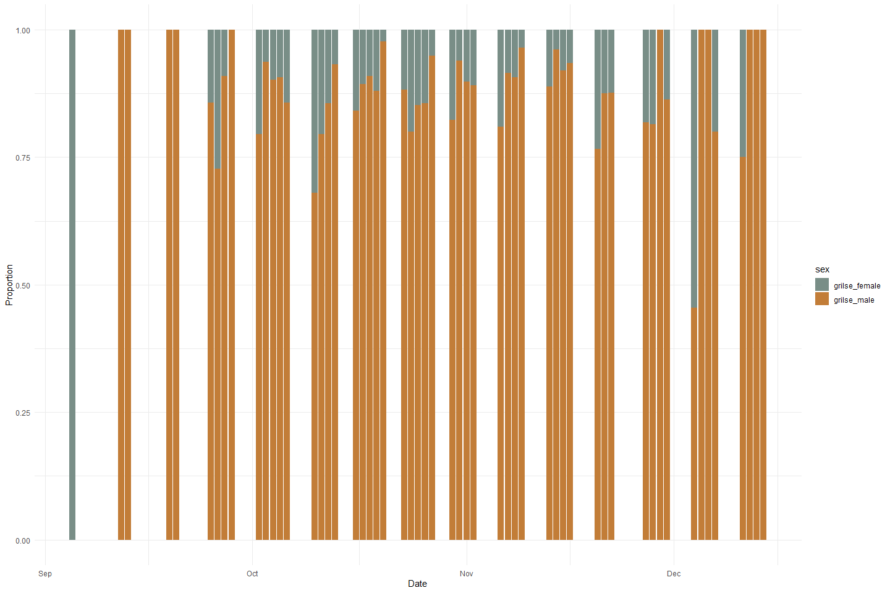
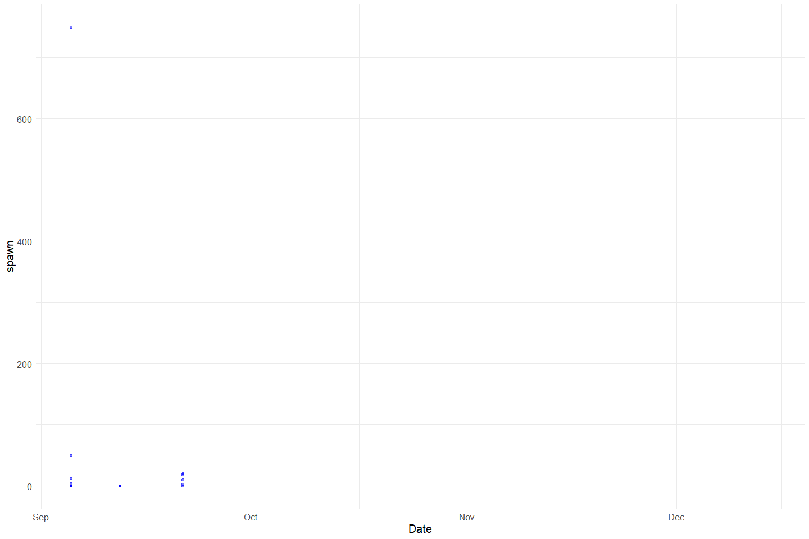
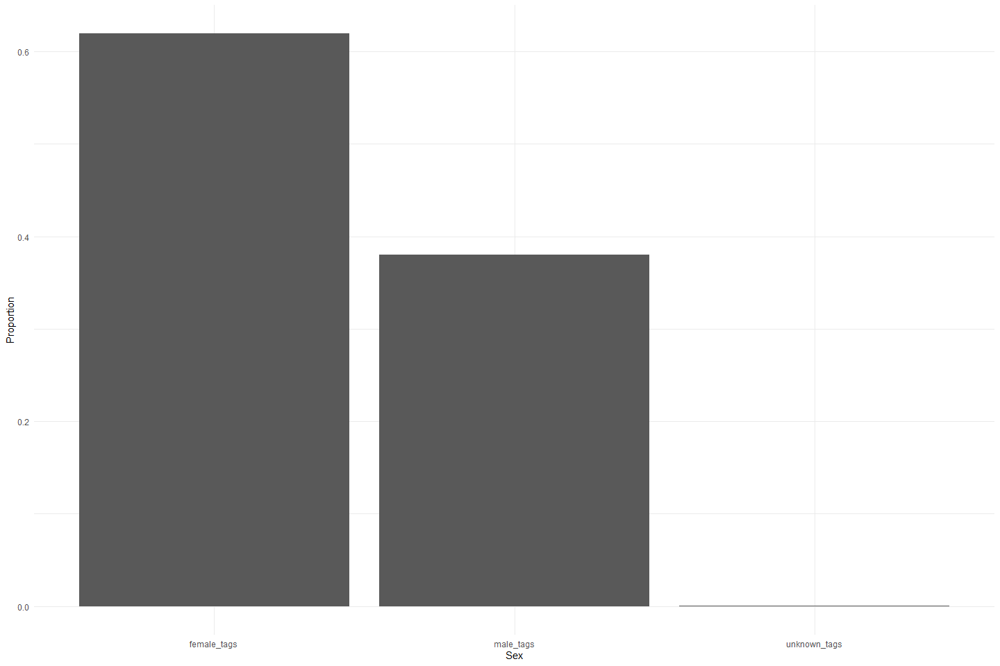
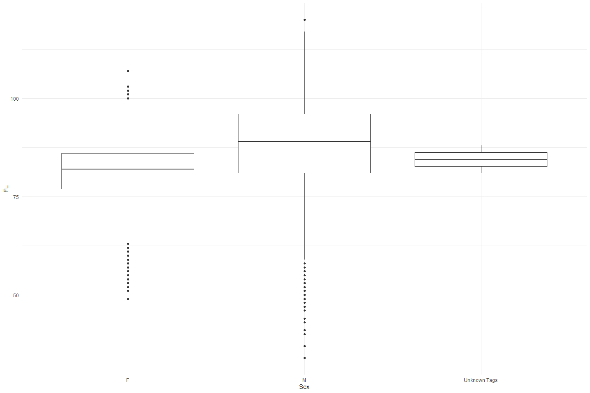
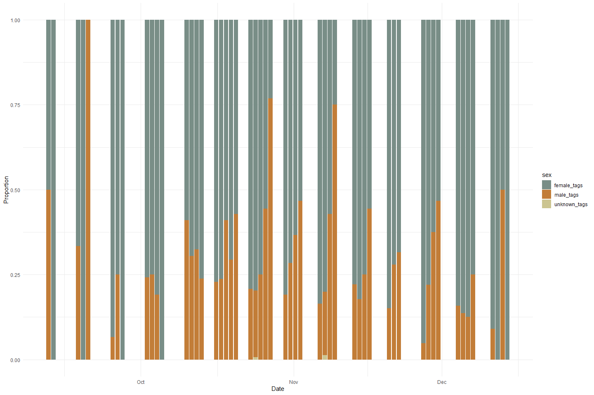
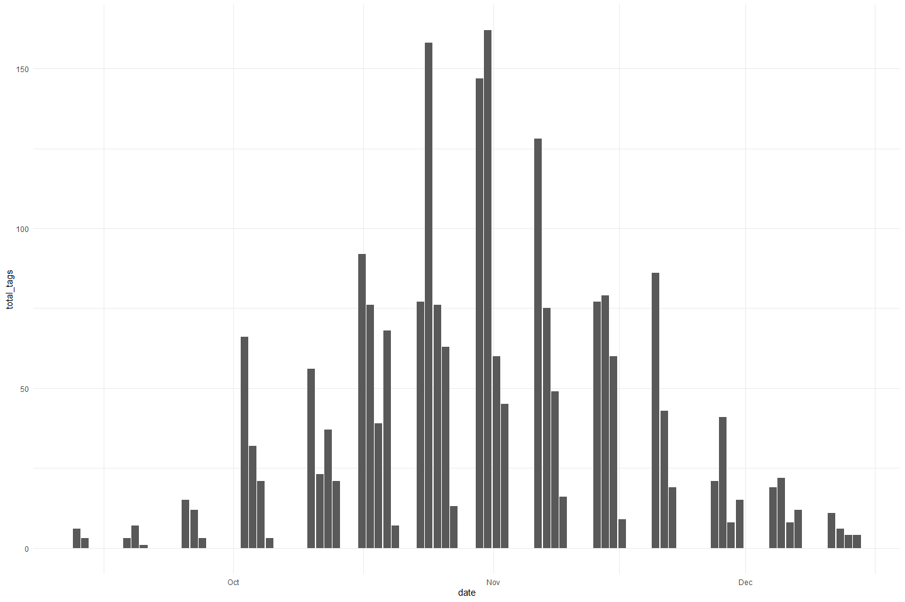
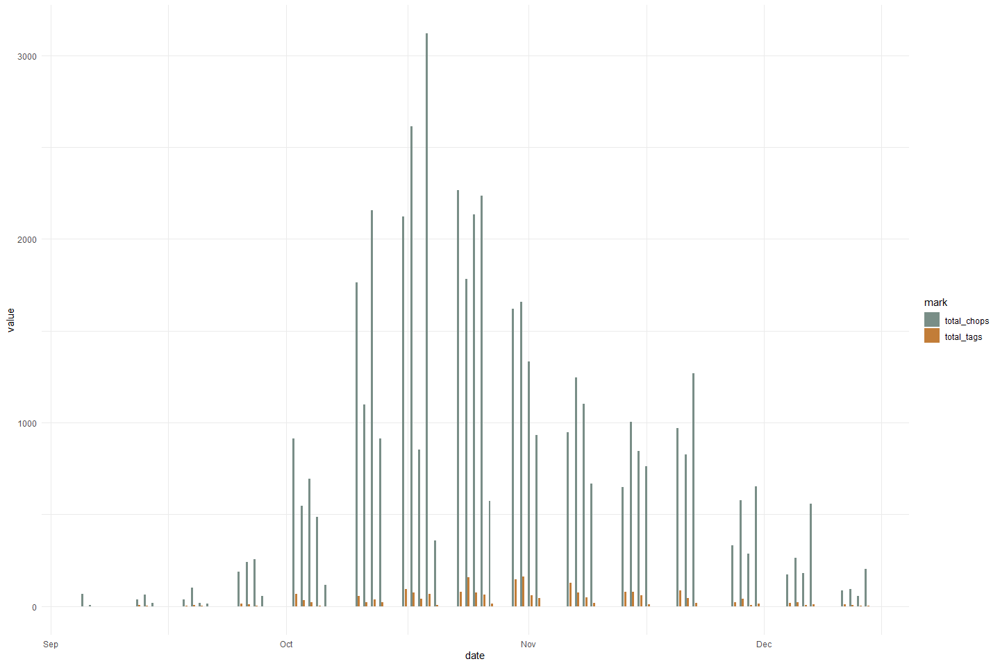
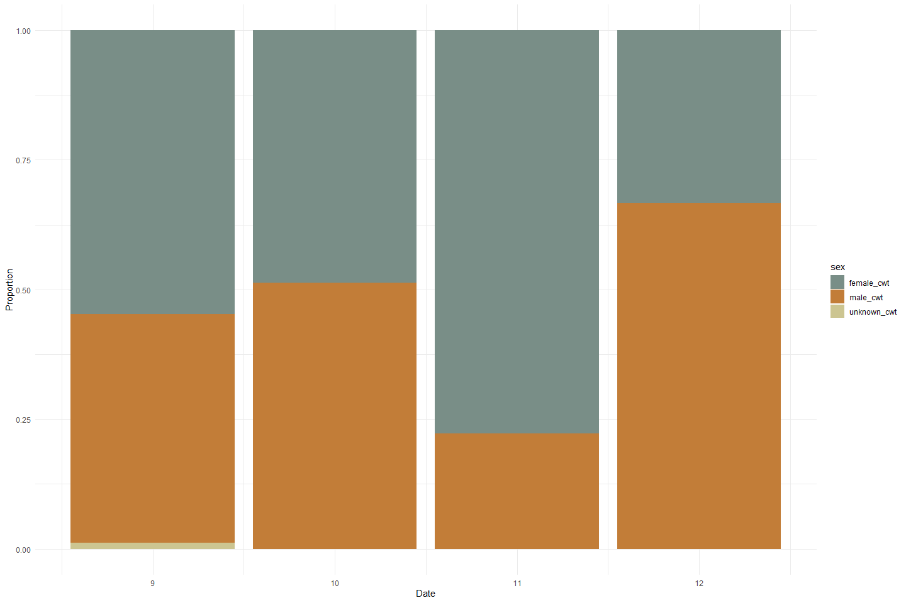
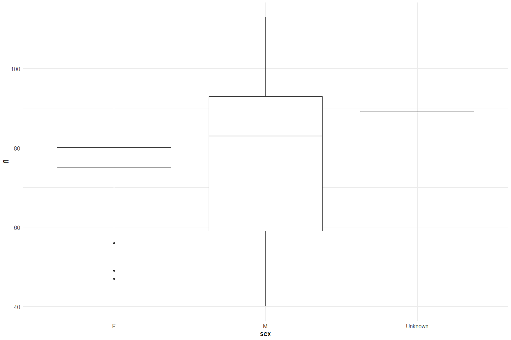

Feather Carcass QC 2000
================
Inigo Peng
2022-07-21

# Feather River Carcass Data

## Description of Monitoring Data

**Timeframe:**

**Video Season:**

**Completeness of Record throughout timeframe:**

**Sampling Location:**

**Data Contact:**

Any additional info?

## Access Cloud Data

``` r
# Run Sys.setenv() to specify GCS_AUTH_FILE and GCS_DEFAULT_BUCKET before running 
# getwd() to see how to specify paths 
# Open object from google cloud storage
# Set your authentication using gcs_auth

gcs_auth(json_file = Sys.getenv("GCS_AUTH_FILE"))
# Set global bucket 
gcs_global_bucket(bucket = Sys.getenv("GCS_DEFAULT_BUCKET"))

# git data and save as xlsx
```

Read in data from google cloud, glimpse raw data and domain description
sheet:

``` r
DRIVERINFO <- "Driver={Microsoft Access Driver (*.mdb, *.accdb)};"
MDBPATH <- "C:/Users/InigoPeng/Projects/jpe/JPE-datasets/data-raw/qc-markdowns/adult-holding-redd-and-carcass-surveys/feather-river/Carcass 2000.mdb"
PATH <- paste0(DRIVERINFO, "DBQ=", MDBPATH)

con <- odbcDriverConnect(PATH)

# sqlTables(con)$TABLE_NAME

ChopEnv_raw <- sqlFetch(con, "ChopEnvTBL")
write_csv(ChopEnv_raw, "ChopEnv_2000.csv")

RecovTag_raw <- sqlFetch(con, "RecovTagTBL")
write_csv(RecovTag_raw, "RecovTag_2000.csv")

ChopRecov_raw <- sqlFetch(con,"ChopRecovTBL")
write_csv(ChopRecov_raw, "ChopRecov_2000.csv")

TagCol<- sqlFetch(con, "TagColLU")
write_csv(TagCol, "TagCol_2000.csv")

TagData <- sqlFetch(con, "TagDataTBL")
write_csv(TagData, "TagDataTBL_2000.csv")

TagEnv <- sqlFetch(con, "TagEnvTBL")
write_csv(TagEnv, "TagEnvTBL_2000.csv")

cwt <- sqlFetch(con, "cwtTBL")
write_csv(cwt, "cwt_2000.csv")
```

## Raw Data Glimpse:

### ChopEnv_Raw

``` r
# Read Data
#Heading Info for Chopped Data
#What is Turbot?
ChopEnv_raw <- read_csv("ChopEnv_2000.csv",col_types = list("d", "c", "T", "c", "T", "c", "c")) %>% 
  # mutate("Start" = as_hms("Start")) %>%
  glimpse()
```

    ## Rows: 236
    ## Columns: 11
    ## $ ChopEnvID <dbl> 1, 2, 3, 4, 5, 6, 7, 8, 9, 10, 11, 13, 14, 15, 16, 17, 18, 1~
    ## $ TagCol    <chr> "Pink", "Pink", "Pink", "Pink", "Pink", "Pink", "Pink", "Pin~
    ## $ Date      <dttm> 2000-09-05 07:00:00, 2000-09-05 07:00:00, 2000-09-05 07:00:~
    ## $ Start     <chr> "1899-12-30T22:30:00Z", "1899-12-30T22:15:00Z", "1899-12-30T~
    ## $ Stop      <dttm> 1899-12-30 23:15:00, 1899-12-30 23:15:00, 1899-12-30 22:22:~
    ## $ Crew      <chr> "JK, CD, AT", "AP, SM, BC", "JK, CD, AT", "ID, AP, SM, BC", ~
    ## $ Recorder  <chr> "RK", "BC", "RK", "BC", "RK", "BC", "RK", "BC", "AT", NA, "I~
    ## $ Turbot    <chr> NA, NA, NA, NA, NA, NA, NA, NA, NA, NA, NA, NA, NA, NA, NA, ~
    ## $ Weather   <chr> "SUN", "SUN", "SUN", "SUN", "SUN", "SUN", "SUN", "SUN", "SUN~
    ## $ Comment   <chr> NA, NA, NA, NA, NA, "many filleted salmon in section 2-9.", ~
    ## $ Week      <dbl> 1, 1, 1, 1, 1, 1, 1, 1, 1, 1, 1, 2, 2, 2, 2, 2, 2, 2, 2, 2, ~

### ChopRecov_raw

``` r
#Data collection for Chopping and Spawning to determine how many carcasses are being captured (link by recovID)
#What is Unit?
ChopRecov_raw <-read_csv("ChopRecov_2000.csv") %>% 
  rename("Number Spawned" = Spawn) %>% 
  glimpse()
```

    ## Rows: 1037 Columns: 9
    ## -- Column specification --------------------------------------------------------
    ## Delimiter: ","
    ## dbl (9): Sect, Unit, AdultM, AdultF, GrilM, GrilF, Spawn, RecovID, ChopEnvID
    ## 
    ## i Use `spec()` to retrieve the full column specification for this data.
    ## i Specify the column types or set `show_col_types = FALSE` to quiet this message.

    ## Rows: 1,037
    ## Columns: 9
    ## $ Sect             <dbl> 4, 4, 4, 4, 4, 4, 4, 4, 4, 4, 4, 4, 4, 4, 4, 4, 4, 4,~
    ## $ Unit             <dbl> 1, 2, 3, 4, 5, 6, 7, 8, 10, 1, 2, 3, 4, 5, 6, 7, 8, 9~
    ## $ AdultM           <dbl> 0, 0, 0, 0, 0, 0, 0, 0, 0, 1, 0, 0, 0, 0, 0, 0, 0, 0,~
    ## $ AdultF           <dbl> 0, 0, 0, 0, 0, 0, 0, 0, 0, 0, 0, 0, 0, 0, 0, 0, 0, 0,~
    ## $ GrilM            <dbl> 0, 0, 0, 0, 0, 0, 0, 0, 0, 0, 0, 0, 0, 0, 0, 0, 0, 0,~
    ## $ GrilF            <dbl> 0, 0, 0, 0, 0, 0, 0, 0, 0, 0, 0, 0, 0, 0, 0, 0, 0, 0,~
    ## $ `Number Spawned` <dbl> NA, NA, NA, NA, NA, NA, NA, NA, NA, 0, NA, NA, NA, NA~
    ## $ RecovID          <dbl> 1, 2, 3, 4, 5, 6, 7, 8, 10, 11, 12, 13, 14, 15, 16, 1~
    ## $ ChopEnvID        <dbl> 1, 1, 1, 1, 1, 1, 1, 1, 1, 2, 2, 2, 2, 2, 2, 2, 2, 2,~

### RecovTag_Raw

``` r
#Data for Recovered Tags
#What is RelStat and MultRecov? 
RecovTag_raw <- read_csv("RecovTag_2000.csv") %>% 
  glimpse()
```

    ## Rows: 3447 Columns: 5
    ## -- Column specification --------------------------------------------------------
    ## Delimiter: ","
    ## chr (1): RelStat
    ## dbl (4): RecovID, TagNum, RecovTagID, MultRecov
    ## 
    ## i Use `spec()` to retrieve the full column specification for this data.
    ## i Specify the column types or set `show_col_types = FALSE` to quiet this message.

    ## Rows: 3,447
    ## Columns: 5
    ## $ RecovID    <dbl> 97, 98, 98, 98, 112, 119, 120, 120, 120, 131, 134, 134, 135~
    ## $ TagNum     <dbl> 106, 108, 110, 111, 1, 7, 11, 12, 10, 26, 109, 126, 18, 15,~
    ## $ RecovTagID <dbl> 3, 4, 5, 6, 8, 9, 10, 11, 12, 13, 14, 15, 16, 17, 18, 19, 2~
    ## $ RelStat    <chr> "R", "R", "R", "C", "X", "C", "R", "R", "R", "R", "R", "R",~
    ## $ MultRecov  <dbl> 1, 1, 1, 1, 1, 1, 1, 1, 1, 1, 1, 1, 1, 1, 1, 1, 1, 1, 1, 1,~

### TagData_raw

``` r
#Data for Tagging DataSheet - when export access table to excel, Tag Number is automatically changed to TagID - converting it back here
#What is EggRet? Float? Unit?
TagData_raw <- read_csv("TagData_2000.csv") %>% 
  rename("TagNum" = "TagID") %>%
  glimpse()
```

    ## Rows: 6246 Columns: 11
    ## -- Column specification --------------------------------------------------------
    ## Delimiter: ","
    ## chr (4): Sex, EggRet, RelLoc, Comment
    ## dbl (7): TagID, Sect, Unit, FL, Float, TagEnvID, RelLoc2
    ## 
    ## i Use `spec()` to retrieve the full column specification for this data.
    ## i Specify the column types or set `show_col_types = FALSE` to quiet this message.

    ## Rows: 6,246
    ## Columns: 11
    ## $ TagNum   <dbl> 1, 2, 3, 4, 5, 6, 7, 8, 9, 10, 11, 12, 14, 15, 16, 17, 18, 19~
    ## $ Sect     <dbl> 1, 1, 1, 1, 2, 2, 2, 2, 2, 2, 2, 2, 2, 2, 3, 3, 3, 3, 3, 4, 4~
    ## $ Unit     <dbl> 8, 8, 10, 10, 1, 1, 8, 8, 8, 8, 8, 8, 10, 10, 2, 2, 3, 6, 9, ~
    ## $ FL       <dbl> 93, 84, 89, 109, 89, 88, 78, 92, 91, 85, 97, 92, 92, 87, 89, ~
    ## $ Sex      <chr> "F", "F", "F", "M", "F", "F", "F", "M", "M", "F", "M", "M", "~
    ## $ EggRet   <chr> "U", "U", "U", NA, "U", "U", "U", NA, NA, "U", NA, NA, NA, "U~
    ## $ Float    <dbl> 0, 0, 0, 0, 0, 0, 0, 0, 0, 0, 1, 0, 1, 0, 0, 0, 0, 0, 0, 0, 0~
    ## $ RelLoc   <chr> "3", "3", "3", "3", "1", "3", "1", "1", "3", "3", "3", "1", "~
    ## $ Comment  <chr> NA, NA, NA, NA, NA, NA, NA, NA, NA, NA, NA, NA, NA, NA, NA, N~
    ## $ TagEnvID <dbl> 2, 2, 2, 2, 2, 2, 2, 2, 2, 2, 2, 2, 2, 2, 2, 2, 2, 2, 2, 2, 2~
    ## $ RelLoc2  <dbl> 2, 2, 2, 2, 1, 2, 1, 1, 2, 2, 2, 1, 1, 2, 1, 2, 2, 2, 2, 2, 2~

### TagEnv_raw

``` r
#Heading Info for Tagging Data Sheet
TagEnv_raw <- read_csv("TagEnvTBL_2000.csv") %>% 
  glimpse()
```

    ## Rows: 138 Columns: 5
    ## -- Column specification --------------------------------------------------------
    ## Delimiter: ","
    ## chr  (2): Recorder, TagCol
    ## dbl  (2): TagEnvID, Week
    ## dttm (1): Date
    ## 
    ## i Use `spec()` to retrieve the full column specification for this data.
    ## i Specify the column types or set `show_col_types = FALSE` to quiet this message.

    ## Rows: 138
    ## Columns: 5
    ## $ Date     <dttm> 2000-11-08 08:00:00, 2000-11-09 08:00:00, 2000-11-09 08:00:0~
    ## $ Recorder <chr> "AT, CD", "AP", "unknown", "TV", "DWR", "AP", "RK", "CD", "RK~
    ## $ TagCol   <chr> "Yellow or Red2", "Yellow or Red2", "Yellow or Red2", "Yellow~
    ## $ TagEnvID <dbl> 99, 100, 101, 102, 103, 104, 105, 106, 107, 108, 109, 110, 11~
    ## $ Week     <dbl> 10, 10, 10, 10, 11, 11, 11, 11, 11, 11, 11, 11, 11, 11, 11, 1~

### cwt_raw

``` r
#Coded Wiretag Info

cwt_raw <- read_csv("cwt_2000.csv") %>% 
  glimpse
```

    ## Rows: 207 Columns: 10
    ## -- Column specification --------------------------------------------------------
    ## Delimiter: ","
    ## chr  (3): Sex, EggRet, Comment
    ## dbl  (5): cwtID, Sect, Unit, FL, HTNum
    ## lgl  (1): cwtCode
    ## dttm (1): Date
    ## 
    ## i Use `spec()` to retrieve the full column specification for this data.
    ## i Specify the column types or set `show_col_types = FALSE` to quiet this message.

    ## Rows: 207
    ## Columns: 10
    ## $ cwtID   <dbl> 2, 3, 4, 5, 6, 7, 8, 9, 10, 11, 12, 13, 14, 15, 16, 17, 18, 19~
    ## $ Date    <dttm> 2000-09-05 07:00:00, 2000-09-05 07:00:00, 2000-09-05 07:00:00~
    ## $ Sect    <dbl> 1, 2, 2, 4, 1, 1, 1, 2, 2, 4, 4, 3, 8, 7, 1, 1, 1, 1, 2, 2, 2,~
    ## $ Unit    <dbl> 8, 1, 8, 1, 8, 8, 8, 4, 4, 5, 3, 3, 1, 1, 10, 8, 8, 8, 1, 1, 1~
    ## $ FL      <dbl> 80, 86, 80, 78, 80, 85, 97, 78, 65, 84, 78, 80, 46, 40, 75, 95~
    ## $ Sex     <chr> "M", "F", "F", "F", "F", "F", "M", "F", "M", "M", "F", "F", "M~
    ## $ EggRet  <chr> NA, "U", "U", "U", "U", "U", NA, "U", NA, NA, "U", "U", NA, NA~
    ## $ HTNum   <dbl> 26049, 26050, 26044, 26047, 26099, 26065, 26066, 26097, 26063,~
    ## $ cwtCode <lgl> NA, NA, NA, NA, NA, NA, NA, NA, NA, NA, NA, NA, NA, NA, NA, NA~
    ## $ Comment <chr> "Section 1-12 chopped two non-fresh CWT's", NA, NA, NA, NA, NA~

## Data transformations:

### Recovery

The `chop_recovery_join` table contains recovered carcass counts

``` r
#1. Link ChopRecov with ChopEnv to get the date
chop_recovery_join <- full_join(ChopEnv_raw %>% 
                                  select(ChopEnvID, Date, Start, TagCol), ChopRecov_raw ) %>% 
  clean_names() %>% 
  rename(male_chop = "adult_m",
         female_chop = "adult_f",
         grilse_male = "gril_m",
         grilse_female = "gril_f") 
```

    ## Joining, by = "ChopEnvID"

### Tags

The `tag_join` table contains additional tag information

``` r
tag_join <- left_join(TagData_raw, RecovTag_raw) %>% 
  clean_names() %>% 
  select(c(tag_num, sect, unit, fl, sex, egg_ret, recov_id))
```

    ## Joining, by = "TagNum"

### Survey

The `chop_header` table contains survey metadata and covariates

``` r
chop_header <- ChopEnv_raw %>% 
  clean_names()
```

### CWT

The `cwt` table contains coded wire tag information. It is not joined
with the other tables.

``` r
cwt <- cwt_raw %>% 
  clean_names()
```

## Explore Numeric Variables:

### Chop Recovery Variable: `chop_env_id`, `sect`, `unit`

``` r
# Filter clean data to show only numeric variables 
chop_recovery_join %>% 
  select_if(is.numeric) %>%
  colnames()
```

    ## [1] "chop_env_id"    "sect"           "unit"           "male_chop"     
    ## [5] "female_chop"    "grilse_male"    "grilse_female"  "number_spawned"
    ## [9] "recov_id"

``` r
summary(chop_recovery_join$chop_env_id)
```

    ##    Min. 1st Qu.  Median    Mean 3rd Qu.    Max. 
    ##     1.0    43.0   117.0   113.1   176.0   241.0

``` r
summary(chop_recovery_join$sect)
```

    ##    Min. 1st Qu.  Median    Mean 3rd Qu.    Max. 
    ##   1.000   2.000   3.000   2.904   4.000   8.000

``` r
summary(chop_recovery_join$unit)
```

    ##    Min. 1st Qu.  Median    Mean 3rd Qu.    Max. 
    ##   1.000   2.000   5.000   5.263   8.000  12.000

### Chop Recovery Variable: `male_chop`, `female_chop`, `grilse_male`, `grilse_female`, `spawn`

``` r
summary(chop_recovery_join$male_chop)
```

    ##    Min. 1st Qu.  Median    Mean 3rd Qu.    Max. 
    ##    0.00    1.00    5.00   18.87   21.00  346.00

``` r
summary(chop_recovery_join$female_chop)
```

    ##    Min. 1st Qu.  Median    Mean 3rd Qu.    Max. 
    ##    0.00    1.00    6.00   23.87   28.00  466.00

**Plotting male_chop over Period of Record**

``` r
chop_recovery_join %>% 
  ggplot(aes(x = date, y = male_chop)) +
  geom_point(size = 1.4, alpha = .5, color = "blue") + 
  labs(x = "Date", 
       y = "Male Chop") +
  theme_minimal() + 
  theme(text = element_text(size = 15)) 
```

<!-- -->

**Plotting female_chop over Period of Record**

``` r
chop_recovery_join %>% 
  ggplot(aes(x = date, y = female_chop)) +
  geom_point(size = 1.4, alpha = .5, color = "red") + 
  labs(x = "Date", 
       y = "Female Chop") +
  theme_minimal() + 
  theme(text = element_text(size = 15)) 
```

<!-- -->

**Plotting Total Adult Chops over Period of Record**

``` r
total_adult_chops <- chop_recovery_join %>% 
  mutate(total_adult_chops = male_chop + female_chop,
         date = as_date(date)) %>% 
  select(date, male_chop, female_chop, total_adult_chops) %>% glimpse()
```

    ## Rows: 1,037
    ## Columns: 4
    ## $ date              <date> 2000-09-05, 2000-09-05, 2000-09-05, 2000-09-05, 200~
    ## $ male_chop         <dbl> 0, 0, 0, 0, 0, 0, 0, 0, 0, 1, 0, 0, 0, 0, 0, 0, 0, 0~
    ## $ female_chop       <dbl> 0, 0, 0, 0, 0, 0, 0, 0, 0, 0, 0, 0, 0, 0, 0, 0, 0, 0~
    ## $ total_adult_chops <dbl> 0, 0, 0, 0, 0, 0, 0, 0, 0, 1, 0, 0, 0, 0, 0, 0, 0, 0~

``` r
total_adult_chops_test <- total_adult_chops %>% 
  filter(date == as_date("2000-09-05"))
nrow(total_adult_chops) == (sum(total_adult_chops$total_adult_chops == (total_adult_chops$male_chop + total_adult_chops$female_chop)))
```

    ## [1] TRUE

``` r
total_adult_chops_summary <- total_adult_chops %>% 
  group_by(date) %>% 
  summarise(total_adult_chops = sum(total_adult_chops, na.rm = T),
            male_chops = sum(male_chop, na.rm = T),
            female_chops = sum(female_chop, na.rm = T))
```

``` r
total_adult_chops_summary %>% 
  pivot_longer(cols = c(male_chops, female_chops), names_to = "sex", values_to = "count") %>% 
  mutate(proportions = (count/total_adult_chops)) %>% 
  ggplot(aes(x = date, y = proportions, fill = sex)) + 
  geom_bar(stat = "identity", position = "stack") +
  scale_fill_manual(values = c("Blue","Red"), 
                    name = "Sex", 
                    labels = c("Female", "Male")) +
  theme_minimal() + 
  labs(y = "Proportion", x = "Date") +
  scale_fill_manual(values = wes_palette("Moonrise2"))
```

    ## Scale for 'fill' is already present. Adding another scale for 'fill', which
    ## will replace the existing scale.

<!-- -->

This plot shows the sex proportion of adult chops for each day over the
the period of 2000-09-05 to 2000-12-14. The data gaps that we see are a
result of the data collection process in which the data was collected
2-4 days each week (with no specific period day of week) over the 4
month period. All of the Adult Chop data have been identified for their
sexes.

``` r
summary(chop_recovery_join$grilse_male)
```

    ##    Min. 1st Qu.  Median    Mean 3rd Qu.    Max. 
    ##   0.000   0.000   0.000   2.365   2.000  41.000

``` r
summary(chop_recovery_join$grilse_female)
```

    ##    Min. 1st Qu.  Median    Mean 3rd Qu.    Max. 
    ##  0.0000  0.0000  0.0000  0.3452  0.0000 10.0000

**Plotting grilse_male over Period of Record**

``` r
chop_recovery_join %>% 
  ggplot(aes(x = date, y = grilse_male)) +
  geom_point(size = 1.4, alpha = .5, color = "red") + 
  labs(x = "Date", 
       y = "Grilse Male") +
  theme_minimal() + 
  theme(text = element_text(size = 15)) 
```

<!-- -->

**Plotting grilse_female over Period of Record**

``` r
chop_recovery_join %>% 
  ggplot(aes(x = date, y = grilse_female)) +
  geom_point(size = 1.4, alpha = .5, color = "blue") + 
  labs(x = "Date", 
       y = "Grilse Female") +
  theme_minimal() + 
  theme(text = element_text(size = 15)) 
```

<!-- -->
**Plotting Total Grilse Chops over Period of Record**

``` r
total_grilse_chops <- chop_recovery_join %>% 
  mutate(total_grilse_chops = grilse_male + grilse_female,
         date = as_date(date)) %>% 
  select(date, grilse_male, grilse_female, total_grilse_chops) %>% glimpse()
```

    ## Rows: 1,037
    ## Columns: 4
    ## $ date               <date> 2000-09-05, 2000-09-05, 2000-09-05, 2000-09-05, 20~
    ## $ grilse_male        <dbl> 0, 0, 0, 0, 0, 0, 0, 0, 0, 0, 0, 0, 0, 0, 0, 0, 0, ~
    ## $ grilse_female      <dbl> 0, 0, 0, 0, 0, 0, 0, 0, 0, 0, 0, 0, 0, 0, 0, 0, 0, ~
    ## $ total_grilse_chops <dbl> 0, 0, 0, 0, 0, 0, 0, 0, 0, 0, 0, 0, 0, 0, 0, 0, 0, ~

``` r
total_grilse_chops_test <- total_grilse_chops %>% 
  filter(date == as_date("2000-09-05"))
nrow(total_grilse_chops) == (sum(total_grilse_chops$total_grilse_chops == (total_grilse_chops$grilse_male + total_grilse_chops$grilse_female)))
```

    ## [1] TRUE

``` r
total_grilse_chops_summary <- total_grilse_chops %>% 
  group_by(date) %>% 
  summarise(total_grilse_chops = sum(total_grilse_chops, na.rm = T),
            grilse_male = sum(grilse_male, na.rm = T),
            grilse_female = sum(grilse_female, na.rm = T))
```

``` r
total_grilse_chops_summary %>% 
  pivot_longer(cols = c(grilse_male, grilse_female), names_to = "sex", values_to = "count") %>% 
  mutate(proportions = (count/total_grilse_chops)) %>% 
  ggplot(aes(x = date, y = proportions, fill = sex)) + 
  geom_bar(stat = "identity", position = "stack") +
  scale_fill_manual(values = c("Blue","Red"), 
                    name = "Sex", 
                    labels = c("Female", "Male")) +
  theme_minimal() + 
  labs(y = "Proportion", x = "Date") +
  scale_fill_manual(values = wes_palette("Moonrise2"))
```

    ## Scale for 'fill' is already present. Adding another scale for 'fill', which
    ## will replace the existing scale.

<!-- -->

This plot shows the sex proportion of grilse chops for each day over the
the period of 2000-09-05 to 2000-12-14. There are more data gap for the
grilse data compared to the normal chops data. All of the grilse chop
data have been identified for their sexes as well - there is a
significant higher proportion of males compared to the females.

**Plotting Total Chops over Period of Record**

``` r
total_chops <- chop_recovery_join %>% 
  mutate(total_chops = grilse_male + grilse_female + male_chop + female_chop,
         date = as_date(date)) %>% 
  select(date, grilse_male, grilse_female, male_chop, female_chop, total_chops) %>% glimpse()
```

    ## Rows: 1,037
    ## Columns: 6
    ## $ date          <date> 2000-09-05, 2000-09-05, 2000-09-05, 2000-09-05, 2000-09~
    ## $ grilse_male   <dbl> 0, 0, 0, 0, 0, 0, 0, 0, 0, 0, 0, 0, 0, 0, 0, 0, 0, 0, 0,~
    ## $ grilse_female <dbl> 0, 0, 0, 0, 0, 0, 0, 0, 0, 0, 0, 0, 0, 0, 0, 0, 0, 0, 0,~
    ## $ male_chop     <dbl> 0, 0, 0, 0, 0, 0, 0, 0, 0, 1, 0, 0, 0, 0, 0, 0, 0, 0, 1,~
    ## $ female_chop   <dbl> 0, 0, 0, 0, 0, 0, 0, 0, 0, 0, 0, 0, 0, 0, 0, 0, 0, 0, 0,~
    ## $ total_chops   <dbl> 0, 0, 0, 0, 0, 0, 0, 0, 0, 1, 0, 0, 0, 0, 0, 0, 0, 0, 1,~

``` r
total_chops_test <- total_chops %>% 
  filter(date == as_date("2000-09-05"))
nrow(total_chops) == (sum(total_chops$total_chops == (total_chops$grilse_male + total_chops$grilse_female + total_chops$male_chop + total_chops$female_chop)))
```

    ## [1] TRUE

``` r
total_chops_summary <- total_chops %>% 
  group_by(date) %>% 
  summarise(total_chops = sum(total_chops, na.rm = T),
            grilse_male = sum(grilse_male, na.rm = T),
            grilse_female = sum(grilse_female, na.rm = T),
            male_chop = sum(male_chop, na.rm = T),
            female_chop = sum(female_chop, na.rm = T))
```

``` r
total_chops_summary %>% 
  pivot_longer(cols = c(grilse_male, grilse_female, male_chop, female_chop), names_to = "chops", values_to = "count") %>% 
  mutate(proportions = (count/total_chops)) %>% 
  ggplot(aes(x = date, y = proportions, fill = chops)) + 
  geom_bar(stat = "identity", position = "stack") +
  scale_fill_manual(name = "chops", 
                    labels = c("Grilse Male", "Grilse Female", "Adult Male", "Adult Female")) +
  theme_minimal() + 
  labs(y = "Proportion", x = "Date") +
  scale_fill_manual(values = wes_palette("Moonrise2"))
```

    ## Scale for 'fill' is already present. Adding another scale for 'fill', which
    ## will replace the existing scale.

<!-- -->

This plot shows the proportion of the adult male and female chops, and
grilse male and female chops for each day over the period of 2000-09-05
to 2000-12-14.

``` r
summary(chop_recovery_join$number_spawned)
```

    ##    Min. 1st Qu.  Median    Mean 3rd Qu.    Max.    NA's 
    ##    0.00    0.00    0.00   16.06    0.00  750.00     983

-   94.8 % of values in the `number_spawned` column are NA.

**Plotting number_spawned over a Period of Record**

``` r
chop_recovery_join %>% 
  ggplot(aes(x = date, y = number_spawned)) +
  geom_point(size = 1.4, alpha = .5, color = "blue") + 
  labs(x = "Date", 
       y = "spawn") +
  theme_minimal() + 
  theme(text = element_text(size = 15)) 
```

<!-- -->
This plot shows the number spawned for each day over the the period of
2000-09-05 to 2000-12-14.

### Tag Join Variable: `tag_num`, `sect`, `unit`, `recov_id`

``` r
# Filter clean data to show only numeric variables 
tag_join %>% 
  select_if(is.numeric) %>% 
  colnames()
```

    ## [1] "tag_num"  "sect"     "unit"     "fl"       "recov_id"

``` r
summary(tag_join$tag_num)
```

    ##    Min. 1st Qu.  Median    Mean 3rd Qu.    Max. 
    ##       1    1558    6238    5358    8022   10000

``` r
summary(tag_join$sect)
```

    ##    Min. 1st Qu.  Median    Mean 3rd Qu.    Max. 
    ##   1.000   1.000   2.000   2.755   3.000   8.000

``` r
summary(tag_join$unit)
```

    ##    Min. 1st Qu.  Median    Mean 3rd Qu.    Max. 
    ##   1.000   2.000   5.000   5.219   8.000  12.000

``` r
summary(tag_join$recov_id)
```

    ##    Min. 1st Qu.  Median    Mean 3rd Qu.    Max.    NA's 
    ##    97.0   447.5   571.0   579.3   692.0  1059.0    2985

-   46.4 % of values in the `recov_id` column are NA.

### Tag Join Variable: `sex`, `fl`, `female_tag`, `male_tag`, `unknown_tag`

**Plotting proportion of sex of the tags**

``` r
unique(tag_join$sex)
```

    ## [1] "F" "M" "X"

``` r
#Create a tag_count column
#Pivot table to expand sex column to female_tag, male_tag, and unknown_tags 

all_tags <- tag_join %>% 
  mutate(tag_count = 1) %>% 
  pivot_wider(names_from = sex, values_from = tag_count) %>% 
  rename("unknown_tags" = X,
         "male_tag" = M,
         "female_tag" = F) 

total_tags_summary <- all_tags%>% 
  mutate(male_tag = ifelse(is.na(male_tag), 0, male_tag), # fill na
         female_tag = ifelse(is.na(female_tag), 0, female_tag),
         unknown_tags = ifelse(is.na(unknown_tags), 0, unknown_tags),
         total_tags = unknown_tags + male_tag + female_tag) %>% 
  select(male_tag, female_tag, unknown_tags, total_tags) %>% 
  summarise(total_tags = sum(total_tags),
            male_tags = sum(male_tag),
            female_tags = sum(female_tag),
            unknown_tags = sum(unknown_tags))
```

``` r
#Unknown tags proportion is very small and is rounded to zero 
total_tags_summary %>% 
  pivot_longer(cols = c(male_tags, female_tags, unknown_tags), names_to = "sex", values_to = "count") %>% 
  mutate(proportions = (count / total_tags)) %>% 
  ggplot(aes(x = sex, y = proportions)) +
  geom_bar(stat = "identity", position = "stack") +
  scale_fill_manual(values = c("Blue","Red"), 
                    name = "Sex", 
                    labels = c("Female", "Male", "Unknown")) +
  theme_minimal() + 
  labs(y = "Proportion", x = "Sex") +
  scale_fill_manual(values = wes_palette("Moonrise2"))
```

    ## Scale for 'fill' is already present. Adding another scale for 'fill', which
    ## will replace the existing scale.

<!-- -->

**Plotting fork length of each sex**

``` r
summary(tag_join$fl)
```

    ##    Min. 1st Qu.  Median    Mean 3rd Qu.    Max.    NA's 
    ##   34.00   78.00   84.00   83.88   90.00  120.00      26

``` r
tag_join %>% 
  mutate(sex = ifelse(tag_join$sex == "X", "Unknown Tags", tag_join$sex)) %>% 
  ggplot(aes(x = sex, y = fl)) + 
  geom_boxplot() +
  theme_minimal() + 
  labs(y = "FL", x = "Sex")
```

<!-- -->

**Numeric Summary of `female_tag`, `male_tag`,`unknown_tag`**

``` r
summary(all_tags$male_tag)
```

    ##    Min. 1st Qu.  Median    Mean 3rd Qu.    Max.    NA's 
    ##       1       1       1       1       1       1    3986

-   62 % of values in the `male_tag` column are NA.

``` r
summary(all_tags$female_tag)
```

    ##    Min. 1st Qu.  Median    Mean 3rd Qu.    Max.    NA's 
    ##       1       1       1       1       1       1    2448

-   38.1 % of values in the `female_tag` column are NA.

``` r
summary(all_tags$unknown_tags)
```

    ##    Min. 1st Qu.  Median    Mean 3rd Qu.    Max.    NA's 
    ##       1       1       1       1       1       1    6430

-   100 % of values in the `unknown_tags` column are NA.

**Plotting tags sex proportion with dates over Period of Record**

``` r
tags_with_dates <- left_join(tag_join %>% 
  mutate(tag_count = 1) %>% 
  pivot_wider(names_from = sex, values_from = tag_count) %>% 
  rename("unknown_tags" = X,
         "male_tag" = M,
         "female_tag" = F), chop_recovery_join)%>% 
  filter(!is.na(date)) %>% glimpse
```

    ## Joining, by = c("sect", "unit", "recov_id")

    ## Rows: 2,204
    ## Columns: 18
    ## $ tag_num        <dbl> 10, 10, 11, 12, 17, 27, 27, 28, 34, 37, 51, 53, 53, 54,~
    ## $ sect           <dbl> 2, 2, 2, 2, 3, 3, 3, 1, 1, 2, 1, 1, 1, 1, 1, 1, 4, 3, 3~
    ## $ unit           <dbl> 8, 8, 8, 8, 2, 6, 6, 12, 8, 2, 10, 10, 10, 10, 10, 10, ~
    ## $ fl             <dbl> 85, 85, 97, 92, 84, 85, 85, 81, 88, 82, 80, 90, 90, 75,~
    ## $ egg_ret        <chr> "U", "U", NA, NA, "U", "X", "X", "U", "U", "U", "U", NA~
    ## $ recov_id       <dbl> 120, 191, 120, 120, 203, 164, 217, 245, 176, 265, 319, ~
    ## $ female_tag     <dbl> 1, 1, NA, NA, 1, 1, 1, 1, 1, 1, 1, NA, NA, 1, 1, 1, 1, ~
    ## $ male_tag       <dbl> NA, NA, 1, 1, NA, NA, NA, NA, NA, NA, NA, 1, 1, NA, NA,~
    ## $ unknown_tags   <dbl> NA, NA, NA, NA, NA, NA, NA, NA, NA, NA, NA, NA, NA, NA,~
    ## $ chop_env_id    <dbl> 16, 27, 16, 16, 29, 22, 30, 37, 25, 43, 54, 54, 89, 53,~
    ## $ date           <dttm> 2000-09-12 07:00:00, 2000-09-18 07:00:00, 2000-09-12 0~
    ## $ start          <chr> "1899-12-30T18:00:00Z", "1899-12-30T21:05:00Z", "1899-1~
    ## $ tag_col        <chr> "Yellow-Black", "Orange-Black", "Yellow-Black", "Yellow~
    ## $ male_chop      <dbl> 0, 0, 0, 0, 0, 2, 5, 10, 1, 3, 25, 25, 26, 19, 28, 19, ~
    ## $ female_chop    <dbl> 2, 1, 2, 2, 0, 3, 4, 5, 5, 9, 15, 15, 60, 19, 26, 19, 1~
    ## $ grilse_male    <dbl> 0, 0, 0, 0, 0, 0, 0, 0, 0, 1, 2, 2, 7, 4, 2, 4, 1, 0, 0~
    ## $ grilse_female  <dbl> 0, 0, 0, 0, 0, 0, 0, 0, 0, 0, 1, 1, 2, 2, 2, 2, 0, 0, 0~
    ## $ number_spawned <dbl> NA, NA, NA, NA, NA, NA, NA, NA, NA, NA, NA, NA, NA, NA,~

``` r
total_tags_with_dates <- tags_with_dates%>% 
  mutate(male_tag = ifelse(is.na(male_tag), 0, male_tag), # fill na
         female_tag = ifelse(is.na(female_tag), 0, female_tag),
         unknown_tags = ifelse(is.na(unknown_tags), 0, unknown_tags),
         total_tags = unknown_tags + male_tag + female_tag) %>% 
  select(date, male_tag, female_tag, unknown_tags, total_tags)

total_tags_with_dates_summary <- total_tags_with_dates %>%
  group_by(date) %>%
  summarise(total_tags = sum(total_tags, na.rm = T),
            male_tags = sum(male_tag, na.rm = T),
            female_tags = sum(female_tag, na.rm = T),
            unknown_tags = sum(unknown_tags, na.rm = T))

total_tags_with_dates_summary %>% 
  pivot_longer(cols = c(male_tags, female_tags, unknown_tags), names_to = "sex", values_to = "count") %>% 
  mutate(proportions = (count / total_tags)) %>% 
  ggplot(aes(x = date, y = proportions, fill = sex)) +
  geom_bar(stat = "identity", position = "stack") +
  scale_fill_manual(values = c("Blue","Red", "Black"), 
                    name = "Sex", 
                    labels = c("Female", "Male", "Unknown")) +
  theme_minimal() + 
  labs(y = "Proportion", x = "Date") +
  scale_fill_manual(values = wes_palette("Moonrise2"))
```

    ## Scale for 'fill' is already present. Adding another scale for 'fill', which
    ## will replace the existing scale.

<!-- -->

**Plotting total tags over Period of Record**

``` r
total_tags_with_dates_summary %>% 
  ggplot(aes(x = date, y = total_tags)) +
  geom_col() +
  theme_minimal()
```

<!-- -->

``` r
total_carcass <- full_join(total_chops_summary, total_tags_with_dates_summary) %>% 
  select(date, total_chops, total_tags) %>% 
  pivot_longer(c(total_chops, total_tags), names_to = "mark")
```

    ## Joining, by = "date"

``` r
full_join(total_chops_summary, total_tags_with_dates_summary) %>% 
  select(date, total_chops, total_tags) %>% 
  pivot_longer(c(total_chops, total_tags), names_to = "mark")
```

    ## Joining, by = "date"

    ## # A tibble: 224 x 3
    ##    date                mark        value
    ##    <dttm>              <chr>       <dbl>
    ##  1 2000-09-05 00:00:00 total_chops    66
    ##  2 2000-09-05 00:00:00 total_tags     NA
    ##  3 2000-09-06 00:00:00 total_chops     7
    ##  4 2000-09-06 00:00:00 total_tags     NA
    ##  5 2000-09-12 00:00:00 total_chops    36
    ##  6 2000-09-12 00:00:00 total_tags     NA
    ##  7 2000-09-13 00:00:00 total_chops    62
    ##  8 2000-09-13 00:00:00 total_tags     NA
    ##  9 2000-09-14 00:00:00 total_chops    19
    ## 10 2000-09-14 00:00:00 total_tags     NA
    ## # ... with 214 more rows

``` r
ggplot(total_carcass, aes(x = date, y = value, fill = mark)) +
  geom_col() +
  theme_minimal() +
  scale_fill_manual(values = wes_palette("Moonrise2"))
```

<!-- -->
\### Chop Header Variable: `chop_env_id`, `week`,

``` r
chop_header %>% 
  select_if(is.numeric) %>% 
  colnames()
```

    ## [1] "chop_env_id" "week"

``` r
summary(chop_header$chop_env_id)
```

    ##    Min. 1st Qu.  Median    Mean 3rd Qu.    Max. 
    ##    1.00   62.75  123.50  122.26  182.25  241.00

``` r
summary(chop_header$week)
```

    ##    Min. 1st Qu.  Median    Mean 3rd Qu.    Max. 
    ##   1.000   5.000   8.000   8.343  12.000  15.000

### CWT Variable: `id`, `sect`, `unit`, `fl`, `ht_num`, `sex`

``` r
cwt %>% 
  select_if(is.numeric) %>% 
  colnames()
```

    ## [1] "cwt_id" "sect"   "unit"   "fl"     "ht_num"

``` r
summary(cwt$cwt_id)
```

    ##    Min. 1st Qu.  Median    Mean 3rd Qu.    Max. 
    ##     2.0    53.5   105.0   105.0   156.5   208.0

``` r
summary(cwt$sect)
```

    ##    Min. 1st Qu.  Median    Mean 3rd Qu.    Max. 
    ##   1.000   1.000   2.000   2.391   3.000   8.000

``` r
summary(cwt$unit)
```

    ##    Min. 1st Qu.  Median    Mean 3rd Qu.    Max. 
    ##   1.000   1.000   5.000   5.179   8.000  12.000

``` r
summary(cwt$fl)
```

    ##    Min. 1st Qu.  Median    Mean 3rd Qu.    Max. 
    ##   40.00   72.00   80.00   78.88   88.00  113.00

-   0 % of values in the `fl` column are NA.

``` r
summary(cwt$ht_num)
```

    ##    Min. 1st Qu.  Median    Mean 3rd Qu.    Max. 
    ##       0   16909   16988   20375   26029   26099

``` r
#Create a cwt_count column
#Pivot table to expand sex column to female_cwt, male_cwt, and unknown_cwt 
unique(cwt$sex)
```

    ## [1] "M" "F" "X"

``` r
cwt_count <- cwt %>% 
  mutate(cwt_count = 1) %>% 
  pivot_wider(names_from = sex, values_from = cwt_count, values_fill = 0) %>% 
  rename("unknown_cwt" = X,
         "male_cwt" = M,
         "female_cwt" = F) 
total_cwt_summary <- cwt_count %>% 
  mutate(male_cwt = ifelse(is.na(male_cwt), 0, male_cwt), # fill na
         female_cwt = ifelse(is.na(female_cwt), 0, female_cwt),
         unknown_cwt = ifelse(is.na(unknown_cwt), 0, unknown_cwt),
         total_cwt = unknown_cwt + male_cwt + female_cwt) %>% 
  group_by(month(date)) %>% 
  summarise(total_cwt = sum(total_cwt),
            male_cwt = sum(male_cwt),
            female_cwt = sum(female_cwt),
            unknown_cwt = sum(unknown_cwt))
```

``` r
total_cwt_summary %>% 
  pivot_longer(cols = c(male_cwt, female_cwt, unknown_cwt), names_to = "sex", values_to = "count") %>% 
  mutate(proportions = (count / total_cwt)) %>% 
  ggplot(aes(x = `month(date)`, y = proportions, fill = sex)) + 
  geom_bar(stat = "identity", position = "stack") +
  scale_fill_manual(name = "chops", 
                    labels = c("CWT Male", "CWT Female", "CWT Unknown")) +
  theme_minimal() + 
  labs(y = "Proportion", x = "Date") +
  scale_fill_manual(values = wes_palette("Moonrise2"))
```

    ## Scale for 'fill' is already present. Adding another scale for 'fill', which
    ## will replace the existing scale.

<!-- -->

**Plotting fork length of each sex**

``` r
cwt %>% 
  mutate(sex = ifelse(cwt$sex == "X", "Unknown", cwt$sex)) %>% 
  ggplot(aes(x = sex, y = fl)) + 
  geom_boxplot() +
  theme_minimal() + 
  theme(text = element_text(size = 15))
```

<!-- -->

## Explore Categorical variables:

### Chop Recovery Clean Data

Fix inconsistencies with spelling, capitalization, and dates

``` r
chop_recovery_join %>% 
  select_if(is.character) %>% 
  colnames()
```

    ## [1] "start"   "tag_col"

``` r
unique(chop_recovery_join$tag_col)
```

    ##  [1] "Pink"                "Yellow-Black"        "Orange-Black"       
    ##  [4] "Plum or No Color"    "Green"               "Red"                
    ##  [7] "Blue"                "Orange"              "White or Pink-Black"
    ## [10] "Yellow or Red2"      "Green2"              "Black"              
    ## [13] "Pink2"               "No Color2"           "No Tags"

``` r
chop_recovery_cleaner <- chop_recovery_join %>%
  mutate(date = paste(as_date(date)))%>%
  mutate_if(is.character, str_to_lower) %>% 
  select(-c(start, number_spawned, recov_id)) %>%
  glimpse
```

    ## Rows: 1,037
    ## Columns: 9
    ## $ chop_env_id   <dbl> 1, 1, 1, 1, 1, 1, 1, 1, 1, 2, 2, 2, 2, 2, 2, 2, 2, 2, 2,~
    ## $ date          <chr> "2000-09-05", "2000-09-05", "2000-09-05", "2000-09-05", ~
    ## $ tag_col       <chr> "pink", "pink", "pink", "pink", "pink", "pink", "pink", ~
    ## $ sect          <dbl> 4, 4, 4, 4, 4, 4, 4, 4, 4, 4, 4, 4, 4, 4, 4, 4, 4, 4, 4,~
    ## $ unit          <dbl> 1, 2, 3, 4, 5, 6, 7, 8, 10, 1, 2, 3, 4, 5, 6, 7, 8, 9, 1~
    ## $ male_chop     <dbl> 0, 0, 0, 0, 0, 0, 0, 0, 0, 1, 0, 0, 0, 0, 0, 0, 0, 0, 1,~
    ## $ female_chop   <dbl> 0, 0, 0, 0, 0, 0, 0, 0, 0, 0, 0, 0, 0, 0, 0, 0, 0, 0, 0,~
    ## $ grilse_male   <dbl> 0, 0, 0, 0, 0, 0, 0, 0, 0, 0, 0, 0, 0, 0, 0, 0, 0, 0, 0,~
    ## $ grilse_female <dbl> 0, 0, 0, 0, 0, 0, 0, 0, 0, 0, 0, 0, 0, 0, 0, 0, 0, 0, 0,~

### Tag Join Clean Data

``` r
tag_join %>% 
  select_if(is.character) %>% 
  colnames()
```

    ## [1] "sex"     "egg_ret"

``` r
#X is unknown? Need look up table
unique(tag_join$egg_ret)
```

    ## [1] "U" NA  "X" "S" "P"

``` r
unique(tag_join$sex)
```

    ## [1] "F" "M" "X"

``` r
tag_join_cleaner <-  tag_join %>% 
  mutate(sex = ifelse(tag_join$sex == "X", "Unknown", tag_join$sex)) %>% 
   mutate_if(is.character, str_to_lower) %>%
  select(-c(sect, unit))
```

### Chop Header Clean Data

``` r
chop_header %>% 
  select_if(is.character) %>% 
  colnames()
```

    ## [1] "tag_col"  "start"    "crew"     "recorder" "turbot"   "weather"  "comment"

``` r
unique(chop_header$crew)
```

    ##   [1] "JK, CD, AT"             "AP, SM, BC"             "ID, AP, SM, BC"        
    ##   [4] "ID, SM, AP, BC"         "SM, AP, ID, BC"         "BC, TV, AT, JL, DL"    
    ##   [7] "CD, PH, DO"             "RK, Scott, Andy"        "CD, JL, PH"            
    ##  [10] "CD, PH, JL"             "JK, AP, TS, BC"         "TS, JK, BC, AP"        
    ##  [13] "CD, JL, JW"             "JL, JW, CD"             "AP, BC, SM, DL"        
    ##  [16] "AT, TV, Justin"         "AP, SM, BC, DL"         "AT, TV, RK, JA"        
    ##  [19] "CD, JL, DL, RK"         "Tim, Andy, Scott"       "DO, TV Dave"           
    ##  [22] "TV, CD, AT"             "DO, TV, DL, RK"         "Scott, Andy"           
    ##  [25] "CD, TV"                 "RK, PH, CD, JL"         "Andy, Scott, Dave"     
    ##  [28] "DFG & KC"               "JL, PH, RK, TV"         "JK, RK"                
    ##  [31] "Andy, Scott, Ian"       "TV, JL, PH, CD"         "Andy, Scott"           
    ##  [34] "JL, PH, CD, TV"         "CD, TV, DL"             "DFG"                   
    ##  [37] "TV, CD, JL, AT"         "TV, CD, JR"             "JK, DO"                
    ##  [40] "DFG & Tim"              "JL, PH, CD, AT"         "RK, CD, JL, TV, JK, PH"
    ##  [43] "PH, TV, JL, JK"         "JL, CD, JK"             "RK, TV, PH"            
    ##  [46] "JL, JK, CD"             "Dave & Andy"            "JK, BC, RK"            
    ##  [49] "JL, AT, CD, TV"         "Jim, Andy, Ian/DFG"     "JK"                    
    ##  [52] "JL, CD, RK, TV"         "BC, JK"                 "DFG (4)"               
    ##  [55] "JK, TV, PH"             "DFG \"3\""              "JK, PH, TV"            
    ##  [58] "CD, JL"                 "RK, JK, EE"             "JK, RK, EE"            
    ##  [61] "DFG, AP, Scott, Dave"   "BC, PH, JA"             "DFG/J, S, AP, Dave"    
    ##  [64] "JK, JL, SD"             "PH, ??, TV"             "TV, JL, CD"            
    ##  [67] "AT, JK, PH, RK"         "TV, CD, JL"             "DFG/SM, AP, Tom"       
    ##  [70] "PH, JL, CD"             "DFG/S, AP, D, Justin"   "PH, CD, JL, TV"        
    ##  [73] "JK, TV"                 "TV, AP, JK"             "DL, PH, RK, CD"        
    ##  [76] "JK, TV, AP"             "Justin, CD"             "Dave, Tim, Andy"       
    ##  [79] "JK, PH, TV, TS"         "BC, JK, SI"             "DFG, PH"               
    ##  [82] "RK, TS, TV"             "BC, AS, RK, AT"         "Dave, Scott, Andy"     
    ##  [85] "PH, TV, JK"             "BC, RK, SM"             "JK, AT, TV"            
    ##  [88] "AT, BC, RK, SI"         "TV, JK, CD"             "DFG, J, AP, Dave"      
    ##  [91] "TV, PH, CD"             "PH, TV, BC"             "JK, RK, SI"            
    ##  [94] "JK, RK, CD"             "AT, CD, TV"             "TV, CD, BC, JS"        
    ##  [97] "DFG, AT"                "JK, RK, JL"             "RK, JK"                
    ## [100] "DFG, IA, AP, DL"        "TV, PH"                 "CD, JK, RK"            
    ## [103] "PH, TV, CD"             "DFG, ID, AD, DL"        "CD, RK"                
    ## [106] "JK, JL, JS, BC"         "TV, RK, CD"             "BC, JK, JL, JS"        
    ## [109] "JK, TV, JL"             "JK, CD"                 "Dave, Andy, DFG"       
    ## [112] "JK, TV, AT"             "CD, RK, JL"             "DFG, DL, AP"           
    ## [115] "DFG/ AP, DL, JH"        "TV, CD"                 "PH, SI, AT"            
    ## [118] "Jason, CD, Andy, Scott" "DFG & PH"               "TV, PH, JL, CD"        
    ## [121] "DFG (3)"                "PH, AT, RK"             "BC, JK, PH"            
    ## [124] "RK, JL, CD"             "DFG, TV"                "AT, RK, JL"            
    ## [127] "JK, PH, BC, AT"         "TV, RK"                 "JK, AT, CD"            
    ## [130] "SM, DL, JL"             "JL, DL, SM"             "TV, BC, CD, RK"        
    ## [133] "JK, JL, SI, AT"         "TV, CD, BC, RK"         "JK, AT, SI, JL"        
    ## [136] "JK, BC, CD, TV"         "AT, JK, JL, SI"         "DFG (2)"               
    ## [139] "BC, AT, TV"             "TV, PH, JL"             "PH, TV, JL"            
    ## [142] "?"                      "RK, TV"                 "JK, SI, JL"            
    ## [145] "PH, RK, AT"             "PH, TV, SI"             "TV, SM"                
    ## [148] "PH, AT, CD"             "CD, PH, AT"             "PH, CD, TV, JL"        
    ## [151] "PH, SI, CD"             "PH, TV"                 "TV, PH, SI"

``` r
unique(chop_header$recorder)
```

    ##  [1] "RK"         "BC"         "AT"         NA           "Ian"       
    ##  [6] "JL"         "DL"         "RK, DL"     "AJT"        "?"         
    ## [11] "A. Popper"  "JK"         "Anita"      "CD"         "AT, DL"    
    ## [16] "DFG"        "DFG & Tim"  "PH"         "AP"         "EE"        
    ## [21] "AP, DL"     "RK, PH"     "PH, CD"     "CD, PH"     "SM, DFG"   
    ## [26] "PH, JK"     "AP, ID"     "DFG, SM"    "DFG/Morgan" "TV"        
    ## [31] "DFG, AP"    "CD?"        "AP, DFG"    "BC, JS"     "DL, AP"    
    ## [36] "DWR"        "JL?"        "Morgan"     "SM"         "PH, TV"

``` r
unique(chop_header$weather)
```

    ## [1] "SUN" "UNK" "CLD" "RAN"

``` r
#Not sure what turbot is
unique(chop_header$turbot)
```

    ## [1] NA    "2"   "yes"

``` r
chop_header_cleaner <- chop_header %>% 
  mutate(date = as_date(date))%>% 
  mutate_if(is.character, str_to_lower) %>% 
  mutate(crew = str_replace_all(crew, " ", ""),
         crew = str_replace_all(crew, "/", ","),
         crew = str_replace_all(crew, "&", ","),
         weather = case_when(weather == "ran" ~ "rain",
                             weather == "unk" ~ NA_character_,
                             TRUE ~ weather)) %>% 
  select(-c(start, stop, week, turbot))
```

### CWT Clean Data

``` r
cwt %>% 
  select_if(is.character) %>% 
  colnames()
```

    ## [1] "sex"     "egg_ret" "comment"

``` r
unique(cwt$egg_ret)
```

    ## [1] NA  "U" "X" "S" "P"

``` r
cwt_cleaner <- cwt %>% 
  mutate(sex = ifelse(cwt$sex == "X", "unknown", cwt$sex)) %>% 
  mutate_if(is.character, str_to_lower) %>%
  glimpse
```

    ## Rows: 207
    ## Columns: 10
    ## $ cwt_id   <dbl> 2, 3, 4, 5, 6, 7, 8, 9, 10, 11, 12, 13, 14, 15, 16, 17, 18, 1~
    ## $ date     <dttm> 2000-09-05 07:00:00, 2000-09-05 07:00:00, 2000-09-05 07:00:0~
    ## $ sect     <dbl> 1, 2, 2, 4, 1, 1, 1, 2, 2, 4, 4, 3, 8, 7, 1, 1, 1, 1, 2, 2, 2~
    ## $ unit     <dbl> 8, 1, 8, 1, 8, 8, 8, 4, 4, 5, 3, 3, 1, 1, 10, 8, 8, 8, 1, 1, ~
    ## $ fl       <dbl> 80, 86, 80, 78, 80, 85, 97, 78, 65, 84, 78, 80, 46, 40, 75, 9~
    ## $ sex      <chr> "m", "f", "f", "f", "f", "f", "m", "f", "m", "m", "f", "f", "~
    ## $ egg_ret  <chr> NA, "u", "u", "u", "u", "u", NA, "u", NA, NA, "u", "u", NA, N~
    ## $ ht_num   <dbl> 26049, 26050, 26044, 26047, 26099, 26065, 26066, 26097, 26063~
    ## $ cwt_code <lgl> NA, NA, NA, NA, NA, NA, NA, NA, NA, NA, NA, NA, NA, NA, NA, N~
    ## $ comment  <chr> "section 1-12 chopped two non-fresh cwt's", NA, NA, NA, NA, N~

## Comments

-   The chop data shows both sexes for both adult chops and grilse
    chops. Not all datasets contain this
-   There is no lookup table for egg_ret in tag_join
-   What is `Unit` in chops table?
-   Could remove some of the ID columns for standardization
-   Grilse count in chop_recovery_join is calculated as a part of the
    total_chops (see total_chops plot)
-   Not sure what is ht_number in cwt table
-   Did not read in tag color - not sure if it’s necessary
-   Did not clean all of the recorder and crew entries - lots of
    variations \# not sureegg_ret and turbot in cwt and chop header
    table

## Data Dictionaries

### Chop Data

``` r
percent_na <- chop_recovery_cleaner %>%
  summarise_all(list(name = ~sum(is.na(.))/length(.))) %>%
  pivot_longer(cols = everything())


counts_data_dictionary <- tibble(variables = colnames(chop_recovery_cleaner),
                          description = c("Environment ID",
                                          "Date of survey",
                                          "Colour of tag applied to carcass",
                                          "Sect", 
                                          "Unit",
                                          "Carcass that were chopped and male",
                                          "Carcass that were chopped and female",
                                          "Grilse carcass that were chopped and male",
                                          "Grilse carcass that were chopped and female"),
                          percent_na = round(percent_na$value*100))

kable(counts_data_dictionary)
```

| variables     | description                                 | percent_na |
|:--------------|:--------------------------------------------|-----------:|
| chop_env_id   | Environment ID                              |          0 |
| date          | Date of survey                              |          0 |
| tag_col       | Colour of tag applied to carcass            |          0 |
| sect          | Sect                                        |          0 |
| unit          | Unit                                        |          0 |
| male_chop     | Carcass that were chopped and male          |          0 |
| female_chop   | Carcass that were chopped and female        |          0 |
| grilse_male   | Grilse carcass that were chopped and male   |          0 |
| grilse_female | Grilse carcass that were chopped and female |          0 |

### Tag Data

``` r
percent_na <- tag_join_cleaner %>%
  summarise_all(list(name = ~sum(is.na(.))/length(.))) %>%
  pivot_longer(cols = everything())

tag_counts_data_dictionary <- tibble(variables = colnames(tag_join_cleaner),
                          description = c("Tag number",
                                          "Fork length",
                                          "Sex", 
                                          "Egg Retained",
                                          "Recovery ID"),
                          percent_na = round(percent_na$value*100))

kable(tag_counts_data_dictionary)
```

| variables | description  | percent_na |
|:----------|:-------------|-----------:|
| tag_num   | Tag number   |          0 |
| fl        | Fork length  |          0 |
| sex       | Sex          |          0 |
| egg_ret   | Egg Retained |         38 |
| recov_id  | Recovery ID  |         46 |

### Survey

``` r
percent_na <- chop_header_cleaner %>%
  summarise_all(list(name = ~sum(is.na(.))/length(.))) %>%
  pivot_longer(cols = everything())

header_data_dictionary <- tibble(variables = colnames(chop_header_cleaner),
                          description = c("Chop Environment ID",
                                          "Tag Colour",
                                          "Crew memeber initials that collected",
                                          "Individual of crew member who recorded",
                                          "Weather",
                                          "Comments",
                                          "Date and time of survey"),
                          percent_na = round(percent_na$value*100,
                                             digits = 1))

kable(header_data_dictionary)
```

| variables   | description                            | percent_na |
|:------------|:---------------------------------------|-----------:|
| chop_env_id | Chop Environment ID                    |        0.0 |
| tag_col     | Tag Colour                             |        0.0 |
| date        | Crew memeber initials that collected   |        0.0 |
| crew        | Individual of crew member who recorded |        0.0 |
| recorder    | Weather                                |        3.0 |
| weather     | Comments                               |        1.7 |
| comment     | Date and time of survey                |       60.6 |

### CWT

``` r
percent_na <- cwt_cleaner %>%
  summarise_all(list(name = ~sum(is.na(.))/length(.))) %>%
  pivot_longer(cols = everything())

cwt_data_dictionary <- tibble(variables = colnames(cwt_cleaner),
                          description = c("CWT ID",
                                          "Date of survey",
                                          "Sect",
                                          "Unit",
                                          "Fork length",
                                          "Sex",
                                          "Egg retained",
                                          "Ht Num?",
                                          "CWT Code",
                                          "Comments"),
                          percent_na = round(percent_na$value*100,
                                             digits = 1))

kable(cwt_data_dictionary)
```

| variables | description    | percent_na |
|:----------|:---------------|-----------:|
| cwt_id    | CWT ID         |        0.0 |
| date      | Date of survey |        0.0 |
| sect      | Sect           |        0.0 |
| unit      | Unit           |        0.0 |
| fl        | Fork length    |        0.0 |
| sex       | Sex            |        0.0 |
| egg_ret   | Egg retained   |       47.3 |
| ht_num    | Ht Num?        |        0.0 |
| cwt_code  | CWT Code       |      100.0 |
| comment   | Comments       |       95.7 |

## Save cleaned data back to google cloud (TBA)

``` r
feather_carcass_chops_2000 <- chop_recovery_cleaner %>% glimpse()
```

    ## Rows: 1,037
    ## Columns: 9
    ## $ chop_env_id   <dbl> 1, 1, 1, 1, 1, 1, 1, 1, 1, 2, 2, 2, 2, 2, 2, 2, 2, 2, 2,~
    ## $ date          <chr> "2000-09-05", "2000-09-05", "2000-09-05", "2000-09-05", ~
    ## $ tag_col       <chr> "pink", "pink", "pink", "pink", "pink", "pink", "pink", ~
    ## $ sect          <dbl> 4, 4, 4, 4, 4, 4, 4, 4, 4, 4, 4, 4, 4, 4, 4, 4, 4, 4, 4,~
    ## $ unit          <dbl> 1, 2, 3, 4, 5, 6, 7, 8, 10, 1, 2, 3, 4, 5, 6, 7, 8, 9, 1~
    ## $ male_chop     <dbl> 0, 0, 0, 0, 0, 0, 0, 0, 0, 1, 0, 0, 0, 0, 0, 0, 0, 0, 1,~
    ## $ female_chop   <dbl> 0, 0, 0, 0, 0, 0, 0, 0, 0, 0, 0, 0, 0, 0, 0, 0, 0, 0, 0,~
    ## $ grilse_male   <dbl> 0, 0, 0, 0, 0, 0, 0, 0, 0, 0, 0, 0, 0, 0, 0, 0, 0, 0, 0,~
    ## $ grilse_female <dbl> 0, 0, 0, 0, 0, 0, 0, 0, 0, 0, 0, 0, 0, 0, 0, 0, 0, 0, 0,~

``` r
feather_carcass_tags_2000 <- tag_join_cleaner %>% glimpse()
```

    ## Rows: 6,432
    ## Columns: 5
    ## $ tag_num  <dbl> 1, 1, 2, 3, 4, 5, 6, 7, 8, 9, 10, 10, 11, 11, 12, 14, 15, 16,~
    ## $ fl       <dbl> 93, 93, 84, 89, 109, 89, 88, 78, 92, 91, 85, 85, 97, 97, 92, ~
    ## $ sex      <chr> "f", "f", "f", "f", "m", "f", "f", "f", "m", "m", "f", "f", "~
    ## $ egg_ret  <chr> "u", "u", "u", "u", NA, "u", "u", "u", NA, NA, "u", "u", NA, ~
    ## $ recov_id <dbl> 112, 180, NA, NA, NA, NA, 167, 119, NA, NA, 120, 191, 120, 28~

``` r
feather_carcass_cwt_2000 <- cwt_cleaner %>% glimpse()
```

    ## Rows: 207
    ## Columns: 10
    ## $ cwt_id   <dbl> 2, 3, 4, 5, 6, 7, 8, 9, 10, 11, 12, 13, 14, 15, 16, 17, 18, 1~
    ## $ date     <dttm> 2000-09-05 07:00:00, 2000-09-05 07:00:00, 2000-09-05 07:00:0~
    ## $ sect     <dbl> 1, 2, 2, 4, 1, 1, 1, 2, 2, 4, 4, 3, 8, 7, 1, 1, 1, 1, 2, 2, 2~
    ## $ unit     <dbl> 8, 1, 8, 1, 8, 8, 8, 4, 4, 5, 3, 3, 1, 1, 10, 8, 8, 8, 1, 1, ~
    ## $ fl       <dbl> 80, 86, 80, 78, 80, 85, 97, 78, 65, 84, 78, 80, 46, 40, 75, 9~
    ## $ sex      <chr> "m", "f", "f", "f", "f", "f", "m", "f", "m", "m", "f", "f", "~
    ## $ egg_ret  <chr> NA, "u", "u", "u", "u", "u", NA, "u", NA, NA, "u", "u", NA, N~
    ## $ ht_num   <dbl> 26049, 26050, 26044, 26047, 26099, 26065, 26066, 26097, 26063~
    ## $ cwt_code <lgl> NA, NA, NA, NA, NA, NA, NA, NA, NA, NA, NA, NA, NA, NA, NA, N~
    ## $ comment  <chr> "section 1-12 chopped two non-fresh cwt's", NA, NA, NA, NA, N~

``` r
feather_carcass_chop_header_2000 <- chop_header_cleaner %>% glimpse()
```

    ## Rows: 236
    ## Columns: 7
    ## $ chop_env_id <dbl> 1, 2, 3, 4, 5, 6, 7, 8, 9, 10, 11, 13, 14, 15, 16, 17, 18,~
    ## $ tag_col     <chr> "pink", "pink", "pink", "pink", "pink", "pink", "pink", "p~
    ## $ date        <date> 2000-09-05, 2000-09-05, 2000-09-05, 2000-09-05, 2000-09-0~
    ## $ crew        <chr> "jk,cd,at", "ap,sm,bc", "jk,cd,at", "id,ap,sm,bc", "jk,cd,~
    ## $ recorder    <chr> "rk", "bc", "rk", "bc", "rk", "bc", "rk", "bc", "at", NA, ~
    ## $ weather     <chr> "sun", "sun", "sun", "sun", "sun", "sun", "sun", "sun", "s~
    ## $ comment     <chr> NA, NA, NA, NA, NA, "many filleted salmon in section 2-9."~

``` r
f <- function(input, output) write_csv(input, file = output)

gcs_upload(feather_carcass_chops_2000,
           object_function = f,
           type = "csv",
           name = "adult-holding-redd-and-carcass-surveys/feather-river/data/feather_carcass_chops_2000.csv")

gcs_upload(feather_carcass_tags_2000,
           object_function = f,
           type = "csv",
           name = "adult-holding-redd-and-carcass-surveys/feather-river/data/feather_carcass_tags_2000.csv")

gcs_upload(feather_carcass_cwt_2000,
           object_function = f,
           type = "csv",
           name = "adult-holding-redd-and-carcass-surveys/feather-river/data/feather_carcass_cwt_2000.csv")
gcs_upload(feather_carcass_chop_header_2000,
           object_function = f,
           type = "csv",
           name = "adult-holding-redd-and-carcass-surveys/feather-river/data/feather_carcass_chop_header_2000.csv")
```
