Feather Carcass QC 2001
================
Inigo Peng
2022-07-21

# Feather River Carcass Data

## Description of Monitoring Data

**Timeframe:**

**Video Season:**

**Completeness of Record throughout timeframe:**

**Sampling Location:**

**Data Contact:**

Any additional info?

## Access Cloud Data

``` r
# Run Sys.setenv() to specify GCS_AUTH_FILE and GCS_DEFAULT_BUCKET before running 
# getwd() to see how to specify paths 
# Open object from google cloud storage
# Set your authentication using gcs_auth

gcs_auth(json_file = Sys.getenv("GCS_AUTH_FILE"))
# Set global bucket 
gcs_global_bucket(bucket = Sys.getenv("GCS_DEFAULT_BUCKET"))

# git data and save as xlsx
```

``` r
#Connect to microsoft access through RODBC
#Use 
DRIVERINFO <- "Driver={Microsoft Access Driver (*.mdb, *.accdb)};"
MDBPATH <- "C:/Users/InigoPeng/Projects/jpe/JPE-datasets/data-raw/qc-markdowns/adult-holding-redd-and-carcass-surveys/feather-river/Carcass 2001.mdb"
PATH <- paste0(DRIVERINFO, "DBQ=", MDBPATH)

con <- odbcDriverConnect(PATH)

# Show the different table names 
sqlTables(con)$TABLE_NAME

#Download table and write csv
ChopEnv_raw <- sqlFetch(con, "ChopEnvTBL")
write_csv(ChopEnv_raw, "ChopEnv_2001.csv")

RecovTag_raw <- sqlFetch(con, "RecovTagTBL")
write_csv(RecovTag_raw, "RecovTag_2001.csv")

ChopRecov_raw <- sqlFetch(con,"ChopRecovTBL")
write_csv(ChopRecov_raw, "ChopRecov_2001.csv")

cwt_raw <- sqlFetch(con, "cwtTBL")
write_csv(cwt_raw, "cwt_2001.csv")

TagData_raw <- sqlFetch(con, "TagDataTBL")
write_csv(TagData_raw, "TagData_2001.csv")

TagEnv_raw <- sqlFetch(con, "TagEnvTBL")
write_csv(TagEnv_raw, "TagEnv_2001.csv")
```

## Raw Data Glimpse:

### ChopEnv_Raw

``` r
#Heading Info for Chopped Data
#Columns that were not in ChopEnv 2001: Flow and vis
ChopEnv_raw <- read_csv("ChopEnv_2001.csv") %>% 
  # mutate("Start" = as_hms("Start")) %>%
  glimpse()
```

    ## Rows: 308 Columns: 11
    ## -- Column specification --------------------------------------------------------
    ## Delimiter: ","
    ## chr  (6): Crew, Recorder, TagCol, Vis, Weather, Comment
    ## dbl  (3): ChopEnvID, Flow, WeekNum
    ## dttm (2): Date, Time
    ## 
    ## i Use `spec()` to retrieve the full column specification for this data.
    ## i Specify the column types or set `show_col_types = FALSE` to quiet this message.

    ## Rows: 308
    ## Columns: 11
    ## $ ChopEnvID <dbl> 1, 2, 3, 4, 5, 6, 7, 8, 9, 10, 11, 12, 13, 14, 15, 16, 17, 1~
    ## $ Date      <dttm> 2001-09-10 07:00:00, 2001-09-10 07:00:00, 2001-09-10 07:00:~
    ## $ Time      <dttm> NA, NA, NA, 1899-12-30 18:00:00, 1899-12-30 19:35:00, 1899-~
    ## $ Crew      <chr> "RK, AT, AS", "AT, RK, AS", "AT, RK, AS", "bc, jk, do", "jk,~
    ## $ Recorder  <chr> "RK", "AS, RK", "AS, RK", "bc", "jk", "bc", "sm", "jk", "at"~
    ## $ TagCol    <chr> "YELLOW/orange", "YELLOW/orange", "YELLOW/orange", "YELLOW/o~
    ## $ Flow      <dbl> 600, 600, 600, NA, 600, NA, 600, 600, 600, 600, 1200, 1200, ~
    ## $ Vis       <chr> "Normal", "Normal", "Normal", "Normal", "Normal", "Normal", ~
    ## $ Weather   <chr> "SUN", "SUN", "SUN", "SUN", "SUN", "SUN", "CLD", "CLD", "CLD~
    ## $ Comment   <chr> NA, NA, NA, NA, NA, NA, NA, NA, NA, NA, NA, NA, "Probably no~
    ## $ WeekNum   <dbl> 1, 1, 1, 1, 1, 1, 1, 1, 1, 1, 1, 1, 1, 1, 1, 1, 1, 1, 1, 1, ~

### ChopRecov_raw

``` r
#Data collection for Chopping and Spawning to determine how many carcasses are being captured (link to the ChopEnv table using ChopEnvID)

ChopRecov_raw <-read_csv("ChopRecov_2001.csv") %>% 
  glimpse()
```

    ## Rows: 3045 Columns: 8
    ## -- Column specification --------------------------------------------------------
    ## Delimiter: ","
    ## chr (1): Chan
    ## dbl (7): Sect, Minute, Male, Fem, Gril, RecovID, ChopEnvID
    ## 
    ## i Use `spec()` to retrieve the full column specification for this data.
    ## i Specify the column types or set `show_col_types = FALSE` to quiet this message.

    ## Rows: 3,045
    ## Columns: 8
    ## $ Sect      <dbl> 1, 1, 1, 3, 3, 3, 5, 5, 5, 7, 7, 7, 8, 8, 8, 9, 9, 9, 10, 10~
    ## $ Chan      <chr> "L", "M", "R", "L", "M", "R", "L", "M", "R", "L", "M", "R", ~
    ## $ Minute    <dbl> 0, 19, 0, 7, 10, 5, 2, 2, 2, 4, 3, 3, 4, 3, 10, 7, 4, 0, 20,~
    ## $ Male      <dbl> 0, 0, 0, 0, 0, 0, 0, 0, 0, 0, 0, 0, 0, 0, 0, 0, 0, 0, 0, 0, ~
    ## $ Fem       <dbl> 0, 0, 0, 0, 0, 0, 0, 0, 0, 0, 0, 0, 2, 0, 0, 0, 0, 0, 1, 0, ~
    ## $ Gril      <dbl> 0, 0, 0, 0, 0, 0, 0, 0, 0, 0, 0, 0, 0, 0, 0, 0, 0, 0, 0, 0, ~
    ## $ RecovID   <dbl> 1, 2, 3, 4, 5, 6, 7, 8, 9, 10, 11, 12, 13, 14, 15, 16, 17, 1~
    ## $ ChopEnvID <dbl> 1, 1, 1, 1, 1, 1, 1, 1, 1, 1, 1, 1, 2, 2, 2, 2, 2, 2, 2, 2, ~

### RecovTag_Raw

``` r
#There is Tag1 and Tag2- what is the difference?
#What is TagComp?
RecovTag_raw <- read_csv("RecovTag_2001.csv") %>% 
  # rename("ID" = HeaderID) %>% 
  glimpse()
```

    ## Rows: 1590 Columns: 6
    ## -- Column specification --------------------------------------------------------
    ## Delimiter: ","
    ## dbl (5): RecovID, Tag1, Tag2, RecovTagID, TagComp
    ## lgl (1): RelStat
    ## 
    ## i Use `spec()` to retrieve the full column specification for this data.
    ## i Specify the column types or set `show_col_types = FALSE` to quiet this message.

    ## Rows: 1,590
    ## Columns: 6
    ## $ RecovID    <dbl> 223, 224, 229, 230, 231, 239, 242, 249, 273, 275, 317, 388,~
    ## $ Tag1       <dbl> 4, NA, 1, 256, 6, 261, 12, 28, 257, 2, 264, 43, 44, 42, 272~
    ## $ Tag2       <dbl> 5455, 5278, 5452, 5281, 5457, 5284, 5451, 5463, 5283, 5453,~
    ## $ RecovTagID <dbl> 1, 2, 3, 4, 5, 6, 7, 8, 9, 10, 11, 12, 13, 14, 15, 16, 17, ~
    ## $ RelStat    <lgl> NA, NA, NA, NA, NA, NA, NA, NA, NA, NA, NA, NA, NA, NA, NA,~
    ## $ TagComp    <dbl> 15, 2, 12, 4, 17, 6, 11, 24, 5, 13, 38, 43, 44, 139, 46, 88~

### TagData_raw

``` r
#tag colour lookup table
# TagCol_raw <- read_csv("TagCol_2001.csv") %>% 
  # glimpse()

#Data for Tagging DataSheet - for some reason when export access table to excel, Tag Number is automatically changed to TagID
#Link to RecovTag table
TagData_raw <- read_csv("TagData_2001.csv") %>% 
  rename("TagNum" = "TagID") %>%
  glimpse()
```

    ## Rows: 4972 Columns: 10
    ## -- Column specification --------------------------------------------------------
    ## Delimiter: ","
    ## chr (3): Sex, EggRet, RelLoc
    ## dbl (7): TagID, Tag1, Tag2, Sect, FL, TagEnvID, TagComp
    ## 
    ## i Use `spec()` to retrieve the full column specification for this data.
    ## i Specify the column types or set `show_col_types = FALSE` to quiet this message.

    ## Rows: 4,972
    ## Columns: 10
    ## $ TagNum   <dbl> 1, 2, 3, 4, 5, 6, 7, 8, 9, 10, 11, 12, 13, 14, 15, 16, 17, 18~
    ## $ Tag1     <dbl> 252, 260, 253, 256, 257, 261, 254, 258, 262, 255, 12, 1, 2, 3~
    ## $ Tag2     <dbl> 5276, 5278, 5280, 5281, 5283, 5284, 5285, 5288, 5291, 5292, 5~
    ## $ Sect     <dbl> 1, 8, 10, 10, 13, 13, 13, 14, 15, 15, 4, 6, 8, 8, 8, 10, 10, ~
    ## $ Sex      <chr> "F", "F", "F", "F", "F", "F", "F", "F", "F", "F", "F", "F", "~
    ## $ FL       <dbl> 74, 69, 92, 85, 91, 82, 85, 86, 88, 78, 88, 83, 73, 83, 72, 8~
    ## $ EggRet   <chr> "U", "U", "U", "U", "U", "U", "U", "U", "U", "U", "U", "U", "~
    ## $ RelLoc   <chr> "M", "R", "L", "M", "M", "M", "R", "R", "M", "M", "R", "M", "~
    ## $ TagEnvID <dbl> 1, 1, 1, 1, 1, 1, 1, 1, 1, 1, 2, 2, 2, 2, 2, 2, 2, 2, 2, 2, 2~
    ## $ TagComp  <dbl> 1, 2, 3, 4, 5, 6, 7, 8, 9, 10, 11, 12, 13, 14, 15, 16, 17, 18~

### TagEnv_raw

``` r
#Heading Info for Tagging Data Sheet
# Join via TagEnvID
TagEnv_raw <- read_csv("TagEnv_2001.csv") %>% 
  glimpse()
```

    ## Rows: 171 Columns: 7
    ## -- Column specification --------------------------------------------------------
    ## Delimiter: ","
    ## chr  (3): Crew, TagCol, Recorder
    ## dbl  (3): Flow, WeekNum, TagEnvID
    ## dttm (1): Date
    ## 
    ## i Use `spec()` to retrieve the full column specification for this data.
    ## i Specify the column types or set `show_col_types = FALSE` to quiet this message.

    ## Rows: 171
    ## Columns: 7
    ## $ Date     <dttm> 2001-09-10 07:00:00, 2001-09-10 07:00:00, 2001-09-11 07:00:0~
    ## $ Crew     <chr> "rk, as, at", "bc, jk, do", "sm, jk", "at, br, do", "jk, sm, ~
    ## $ TagCol   <chr> "YELLOW/orange", "YELLOW/orange", "YELLOW/orange", "YELLOW/or~
    ## $ Recorder <chr> "rk", "bc", "sm", "do", "perrone", "tv", "br", "rk", NA, "sm"~
    ## $ Flow     <dbl> 600, 600, 600, 600, 1200, NA, NA, 600, 1200, 1200, 600, NA, 6~
    ## $ WeekNum  <dbl> 1, 1, 1, 1, 1, 1, 2, 2, 1, 1, 2, 2, 2, 2, 2, 2, 3, 3, 3, 3, 3~
    ## $ TagEnvID <dbl> 1, 2, 3, 4, 5, 6, 7, 8, 9, 10, 11, 12, 13, 14, 15, 16, 17, 18~

### cwt_raw

``` r
#Coded Wiretag Info
cwt_raw <- read_csv("cwt_2001.csv", col_types = c("d","T","d","d","c","d","c","c")) %>% 
  glimpse
```

    ## Rows: 272
    ## Columns: 8
    ## $ cwtID   <dbl> 1, 2, 3, 4, 5, 6, 7, 8, 9, 10, 11, 12, 13, 14, 15, 16, 17, 18,~
    ## $ Date    <dttm> 2001-09-10 07:00:00, 2001-09-10 07:00:00, 2001-09-10 07:00:00~
    ## $ Sect    <dbl> 3, 11, 13, 13, 16, 28, 46, 48, 8, 15, 8, 4, 10, 15, 8, 8, 8, 8~
    ## $ FL      <dbl> 84, 93, 83, 96, 88, 81, 86, 80, 55, 68, 90, 84, 59, 68, 95, 10~
    ## $ Sex     <chr> "M", "F", "F", "M", "F", "F", "M", "F", "M", "F", "M", "F", "F~
    ## $ HTNum   <dbl> 16940, 17037, 16294, 16925, 16926, 16927, 16944, 16935, 16936,~
    ## $ EggRet  <lgl> NA, NA, NA, NA, NA, NA, NA, NA, NA, NA, NA, NA, NA, NA, NA, NA~
    ## $ Comment <chr> "5277 FT (T-bar)", NA, NA, NA, NA, "Middle", "head thrown away~

## Data transformations:

### Recovery

The `chop_recovery_join` table contains recovered carcass counts

``` r
#1. Link ChopRecov with ChopEnv to get the date
chop_recovery_join <- full_join(ChopEnv_raw %>% select(Date, Time, ChopEnvID), ChopRecov_raw ) %>%
  clean_names() %>%  
  rename(male_chop = "male",
         female_chop = "fem",
         grilse = "gril",
         min = "minute") %>% glimpse
```

    ## Joining, by = "ChopEnvID"

    ## Rows: 3,045
    ## Columns: 10
    ## $ date        <dttm> 2001-09-10 07:00:00, 2001-09-10 07:00:00, 2001-09-10 07:0~
    ## $ time        <dttm> NA, NA, NA, NA, NA, NA, NA, NA, NA, NA, NA, NA, NA, NA, N~
    ## $ chop_env_id <dbl> 1, 1, 1, 1, 1, 1, 1, 1, 1, 1, 1, 1, 2, 2, 2, 2, 2, 2, 2, 2~
    ## $ sect        <dbl> 1, 1, 1, 3, 3, 3, 5, 5, 5, 7, 7, 7, 8, 8, 8, 9, 9, 9, 10, ~
    ## $ chan        <chr> "L", "M", "R", "L", "M", "R", "L", "M", "R", "L", "M", "R"~
    ## $ min         <dbl> 0, 19, 0, 7, 10, 5, 2, 2, 2, 4, 3, 3, 4, 3, 10, 7, 4, 0, 2~
    ## $ male_chop   <dbl> 0, 0, 0, 0, 0, 0, 0, 0, 0, 0, 0, 0, 0, 0, 0, 0, 0, 0, 0, 0~
    ## $ female_chop <dbl> 0, 0, 0, 0, 0, 0, 0, 0, 0, 0, 0, 0, 2, 0, 0, 0, 0, 0, 1, 0~
    ## $ grilse      <dbl> 0, 0, 0, 0, 0, 0, 0, 0, 0, 0, 0, 0, 0, 0, 0, 0, 0, 0, 0, 0~
    ## $ recov_id    <dbl> 1, 2, 3, 4, 5, 6, 7, 8, 9, 10, 11, 12, 13, 14, 15, 16, 17,~

### Tags

The `tag_join` table contains additional tag information

``` r
tag_join <- left_join(TagData_raw, RecovTag_raw) %>% 
  clean_names() %>% 
  select(c(tag_num, sect, fl, sex, egg_ret, recov_id)) %>% 
  glimpse
```

    ## Joining, by = c("Tag1", "Tag2", "TagComp")

    ## Rows: 4,979
    ## Columns: 6
    ## $ tag_num  <dbl> 1, 2, 3, 4, 5, 6, 7, 8, 9, 10, 11, 12, 13, 14, 15, 16, 17, 18~
    ## $ sect     <dbl> 1, 8, 10, 10, 13, 13, 13, 14, 15, 15, 4, 6, 8, 8, 8, 10, 10, ~
    ## $ fl       <dbl> 74, 69, 92, 85, 91, 82, 85, 86, 88, 78, 88, 83, 73, 83, 72, 8~
    ## $ sex      <chr> "F", "F", "F", "F", "F", "F", "F", "F", "F", "F", "F", "F", "~
    ## $ egg_ret  <chr> "U", "U", "U", "U", "U", "U", "U", "U", "U", "U", "U", "U", "~
    ## $ recov_id <dbl> NA, NA, NA, 230, 273, 239, 502, NA, NA, NA, 242, 229, 275, NA~

### Survey

The `chop_header` table contains survey metadata and covariates

``` r
chop_header <- ChopEnv_raw %>% 
  clean_names() %>% 
  glimpse
```

    ## Rows: 308
    ## Columns: 11
    ## $ chop_env_id <dbl> 1, 2, 3, 4, 5, 6, 7, 8, 9, 10, 11, 12, 13, 14, 15, 16, 17,~
    ## $ date        <dttm> 2001-09-10 07:00:00, 2001-09-10 07:00:00, 2001-09-10 07:0~
    ## $ time        <dttm> NA, NA, NA, 1899-12-30 18:00:00, 1899-12-30 19:35:00, 189~
    ## $ crew        <chr> "RK, AT, AS", "AT, RK, AS", "AT, RK, AS", "bc, jk, do", "j~
    ## $ recorder    <chr> "RK", "AS, RK", "AS, RK", "bc", "jk", "bc", "sm", "jk", "a~
    ## $ tag_col     <chr> "YELLOW/orange", "YELLOW/orange", "YELLOW/orange", "YELLOW~
    ## $ flow        <dbl> 600, 600, 600, NA, 600, NA, 600, 600, 600, 600, 1200, 1200~
    ## $ vis         <chr> "Normal", "Normal", "Normal", "Normal", "Normal", "Normal"~
    ## $ weather     <chr> "SUN", "SUN", "SUN", "SUN", "SUN", "SUN", "CLD", "CLD", "C~
    ## $ comment     <chr> NA, NA, NA, NA, NA, NA, NA, NA, NA, NA, NA, NA, "Probably ~
    ## $ week_num    <dbl> 1, 1, 1, 1, 1, 1, 1, 1, 1, 1, 1, 1, 1, 1, 1, 1, 1, 1, 1, 1~

### CWT

The `cwt` table contains coded wire tag information. It is not joined
with the other tables.

``` r
cwt <- cwt_raw %>% 
  clean_names() %>% 
  select(-egg_ret) %>% 
  glimpse
```

    ## Rows: 272
    ## Columns: 7
    ## $ cwt_id  <dbl> 1, 2, 3, 4, 5, 6, 7, 8, 9, 10, 11, 12, 13, 14, 15, 16, 17, 18,~
    ## $ date    <dttm> 2001-09-10 07:00:00, 2001-09-10 07:00:00, 2001-09-10 07:00:00~
    ## $ sect    <dbl> 3, 11, 13, 13, 16, 28, 46, 48, 8, 15, 8, 4, 10, 15, 8, 8, 8, 8~
    ## $ fl      <dbl> 84, 93, 83, 96, 88, 81, 86, 80, 55, 68, 90, 84, 59, 68, 95, 10~
    ## $ sex     <chr> "M", "F", "F", "M", "F", "F", "M", "F", "M", "F", "M", "F", "F~
    ## $ ht_num  <dbl> 16940, 17037, 16294, 16925, 16926, 16927, 16944, 16935, 16936,~
    ## $ comment <chr> "5277 FT (T-bar)", NA, NA, NA, NA, "Middle", "head thrown away~

## Explore Numeric Variables:

### Chop Recovery Variable: `chop_env_id`, `sect`, `min`

``` r
# Filter clean data to show only numeric variables 
chop_recovery_join %>% 
  select_if(is.numeric) %>%
  colnames()
```

    ## [1] "chop_env_id" "sect"        "min"         "male_chop"   "female_chop"
    ## [6] "grilse"      "recov_id"

``` r
summary(chop_recovery_join$chop_env_id)
```

    ##    Min. 1st Qu.  Median    Mean 3rd Qu.    Max. 
    ##     1.0    76.0   158.0   155.6   236.0   308.0

``` r
summary(chop_recovery_join$sect)
```

    ##    Min. 1st Qu.  Median    Mean 3rd Qu.    Max. 
    ##    1.00   13.00   24.00   24.56   38.00   48.00

``` r
summary(chop_recovery_join$min)
```

    ##    Min. 1st Qu.  Median    Mean 3rd Qu.    Max.    NA's 
    ##    0.00    0.00   10.00   11.94   15.00  118.00       3

-   0.1 % of values in the `min` column are NA.

### Chop Recovery Variable: `male_chop`, `female_chop`, `grilse`

``` r
summary(chop_recovery_join$male_chop)
```

    ##    Min. 1st Qu.  Median    Mean 3rd Qu.    Max. 
    ##   0.000   0.000   1.000   6.457   6.000 255.000

``` r
summary(chop_recovery_join$female_chop)
```

    ##    Min. 1st Qu.  Median    Mean 3rd Qu.    Max. 
    ##   0.000   0.000   1.000   9.529   7.000 410.000

**Plotting male_chop over Period of Record**

``` r
chop_recovery_join %>% 
  ggplot(aes(x = date, y = male_chop)) +
  geom_point(size = 1.4, alpha = .5, color = "blue") + 
  labs(x = "Date", 
       y = "Male Chop") +
  theme_minimal() + 
  theme(text = element_text(size = 15)) 
```

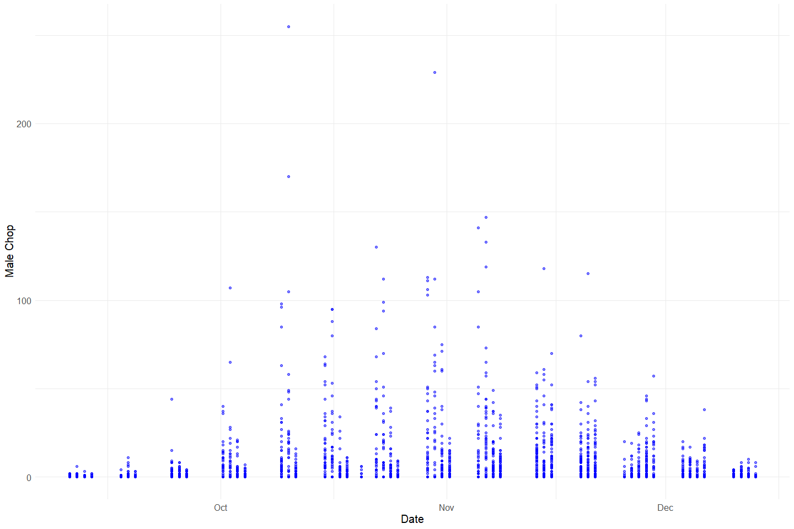<!-- -->

**Plotting female_chop over Period of Record**

``` r
chop_recovery_join %>% 
  ggplot(aes(x = date, y = female_chop)) +
  geom_point(size = 1.4, alpha = .5, color = "red") + 
  labs(x = "Date", 
       y = "Female Chop") +
  theme_minimal() + 
  theme(text = element_text(size = 15)) 
```

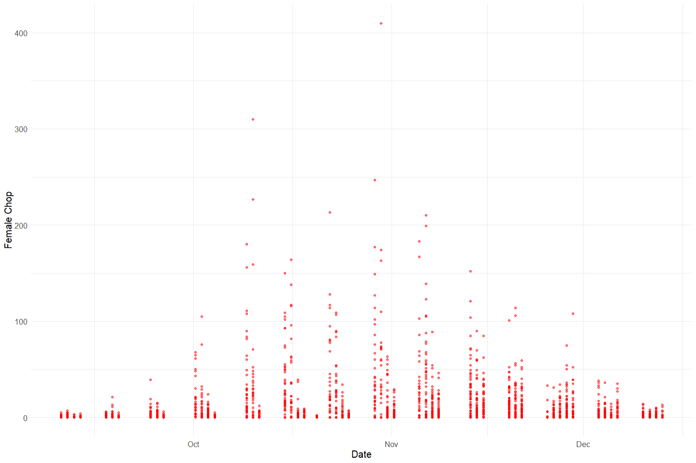<!-- -->

**Plotting total_chops over Period of Record**

``` r
total_chops <- chop_recovery_join %>% 
  mutate(total_chops = male_chop + female_chop + grilse,
         date = as_date(date)) %>% 
  select(date, male_chop, female_chop, grilse,total_chops) %>% glimpse()
```

    ## Rows: 3,045
    ## Columns: 5
    ## $ date        <date> 2001-09-10, 2001-09-10, 2001-09-10, 2001-09-10, 2001-09-1~
    ## $ male_chop   <dbl> 0, 0, 0, 0, 0, 0, 0, 0, 0, 0, 0, 0, 0, 0, 0, 0, 0, 0, 0, 0~
    ## $ female_chop <dbl> 0, 0, 0, 0, 0, 0, 0, 0, 0, 0, 0, 0, 2, 0, 0, 0, 0, 0, 1, 0~
    ## $ grilse      <dbl> 0, 0, 0, 0, 0, 0, 0, 0, 0, 0, 0, 0, 0, 0, 0, 0, 0, 0, 0, 0~
    ## $ total_chops <dbl> 0, 0, 0, 0, 0, 0, 0, 0, 0, 0, 0, 0, 2, 0, 0, 0, 0, 0, 1, 0~

``` r
total_chops_test <- total_chops %>% 
  filter(date == as_date("2001-09-10"))
nrow(total_chops) == (sum(total_chops$total_chops == (total_chops$male_chop + total_chops$female_chop + total_chops$grilse)))
```

    ## [1] TRUE

``` r
total_chops_summary <- total_chops %>% 
  group_by(date) %>% 
  summarise(total_chops = sum(total_chops, na.rm = T),
            grilse_chops = sum(grilse, na.rm =T),
            male_chops = sum(male_chop, na.rm = T),
            female_chops = sum(female_chop, na.rm = T))
```

``` r
total_chops_summary %>% 
  ggplot(aes(x = date, y = total_chops)) +
  geom_col() + 
  theme_minimal()
```

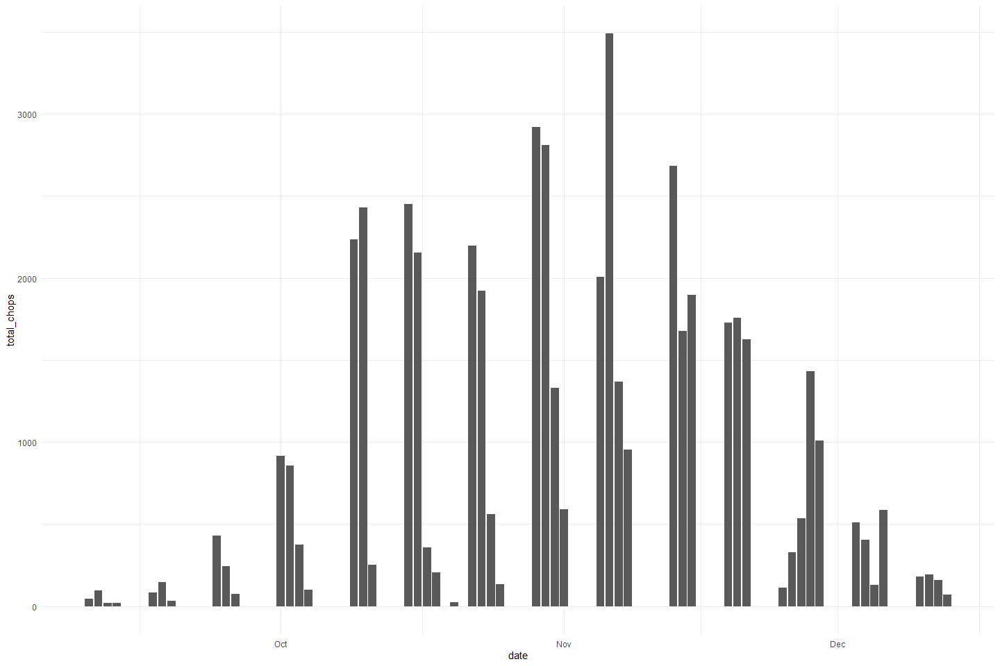<!-- -->
**Plotting daily proportions of male and female chop**

``` r
total_chops_summary %>% 
  pivot_longer(cols = c(male_chops, female_chops), names_to = "sex", values_to = "count") %>% 
  mutate(proportions = (count/total_chops)) %>% 
  ggplot(aes(x = date, y = proportions, fill = sex)) + 
  geom_bar(stat = "identity", position = "stack") +
  scale_fill_manual(values = c("Blue","Red"), 
                    name = "Sex", 
                    labels = c("Female", "Male")) +
  theme_minimal() + 
  labs(y = "Proportion", x = "Date") +
  scale_fill_manual(values = wes_palette("Moonrise2"))
```

    ## Scale for 'fill' is already present. Adding another scale for 'fill', which
    ## will replace the existing scale.

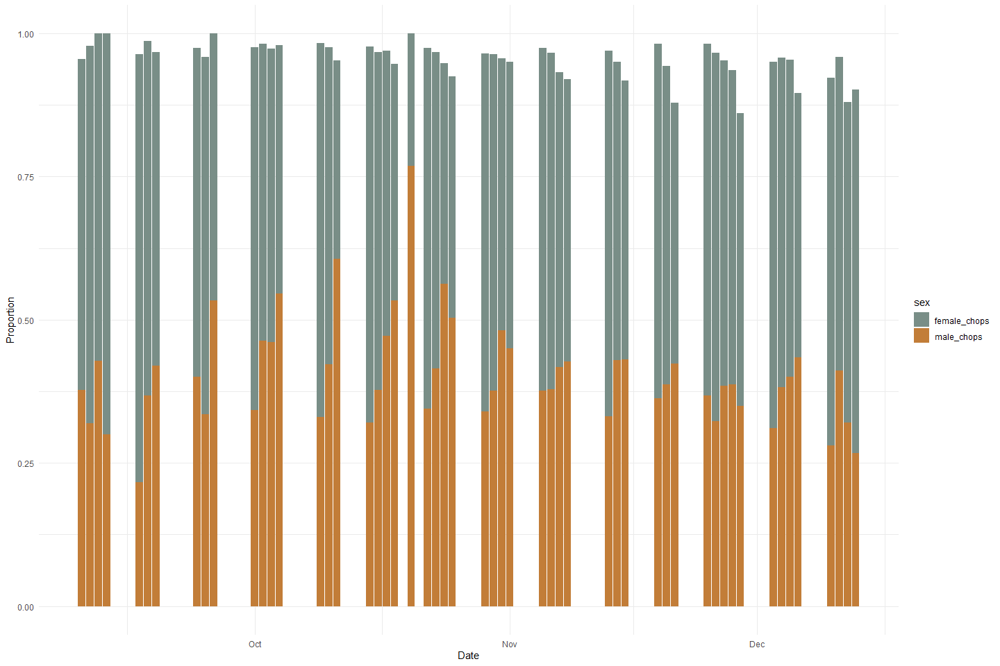<!-- -->

This plot shows the sex proportion of chops for each day over the the
period of 2001-09-10 to 2001-12-13. The data gaps that we see are a
result of the data collection process in which the data was collected
2-4 days each week (with no specific period day of week) over the 4
month period. All of the Chop data have been identified for their sexes.
The proportion is below 1 for some days because it does not account for
the grilse that were caught as a portion of the total catch.

``` r
#Assume gril is grilse
summary(chop_recovery_join$grilse)
```

    ##    Min. 1st Qu.  Median    Mean 3rd Qu.    Max. 
    ##  0.0000  0.0000  0.0000  0.7235  0.0000 20.0000

**Plotting grilse over Period of Record**

``` r
chop_recovery_join %>% 
  ggplot(aes(x = date, y = grilse)) +
  geom_point(size = 1.4, alpha = .5, color = "blue") + 
  labs(x = "Date", 
       y = "Grilse") +
  theme_minimal() + 
  theme(text = element_text(size = 15)) 
```

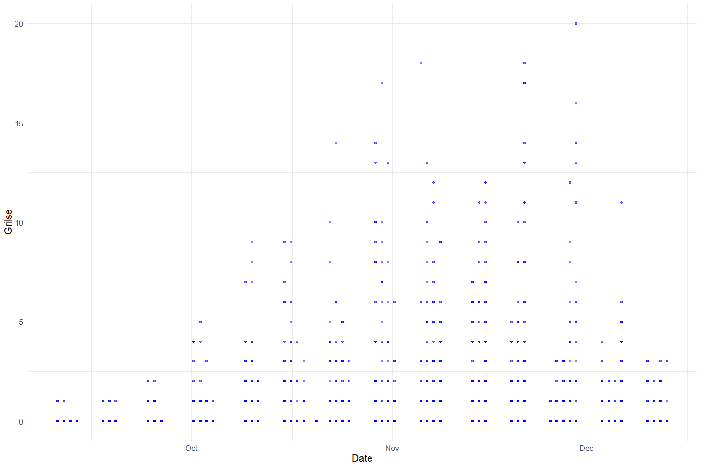<!-- -->

**Plotting total daily grilse over Period of Record**

``` r
chop_recovery_join %>% 
  group_by(date) %>% 
  summarise(total_grilse_chops = sum(grilse, na.rm = T)) %>% 
  ggplot(aes(x = date, y = total_grilse_chops)) + 
  geom_point(size = 1.4, alpha = .5, color = "red") +
  labs(x = "Date",
       y = "Total Grilse") +
  theme_minimal() +
  theme(text = element_text(size = 15))
```

<!-- -->

### Tag Join Variable: `tag_num`, `sect`, `recov_id`

``` r
tag_join %>% 
  select_if(is.numeric) %>% 
  colnames()
```

    ## [1] "tag_num"  "sect"     "fl"       "recov_id"

``` r
summary(tag_join$tag_num)
```

    ##    Min. 1st Qu.  Median    Mean 3rd Qu.    Max. 
    ##       1    1248    2493    2509    3738    5074

``` r
summary(tag_join$sect)
```

    ##    Min. 1st Qu.  Median    Mean 3rd Qu.    Max. 
    ##    1.00    8.00   13.00   16.46   20.00   50.00

``` r
summary(tag_join$recov_id)
```

    ##    Min. 1st Qu.  Median    Mean 3rd Qu.    Max.    NA's 
    ##     223    1025    1474    1524    1886    3054    3456

-   69.4 % of values in the `recov_id` column are NA.

### Tag Join Variable: `sex`, `fl`, `female_tag`, `male_tag`, `unknown_tag`

**Plotting proportion of sex of the tags**

``` r
unique(tag_join$sex)
```

    ## [1] "F" "M" "X"

``` r
#Create a tag_count column
#Pivot table to expand sex column to female_tag, male_tag, and unknown_tags 

all_tags <- tag_join %>% 
  mutate(tag_count = 1) %>% 
  pivot_wider(names_from = sex, values_from = tag_count, values_fill = 0) %>% 
  rename("unknown_tags" = X,
         "male_tag" = M,
         "female_tag" = F) 
total_tags_summary <- all_tags%>% 
  mutate(male_tag = ifelse(is.na(male_tag), 0, male_tag), # fill na
         female_tag = ifelse(is.na(female_tag), 0, female_tag),
         unknown_tags = ifelse(is.na(unknown_tags), 0, unknown_tags),
         total_tags = unknown_tags + male_tag + female_tag) %>% 
  select(male_tag, female_tag, unknown_tags, total_tags) %>% 
  summarise(total_tags = sum(total_tags),
            male_tags = sum(male_tag),
            female_tags = sum(female_tag),
            unknown_tags = sum(unknown_tags))
```

``` r
total_tags_summary %>% 
  pivot_longer(cols = c(male_tags, female_tags, unknown_tags), names_to = "sex", values_to = "count") %>% 
  mutate(proportions = (count / total_tags)) %>% 
  ggplot(aes(x = sex, y = proportions)) +
  geom_col() +
  theme_minimal() + 
  labs(y = "Proportion", x = "Sex")
```

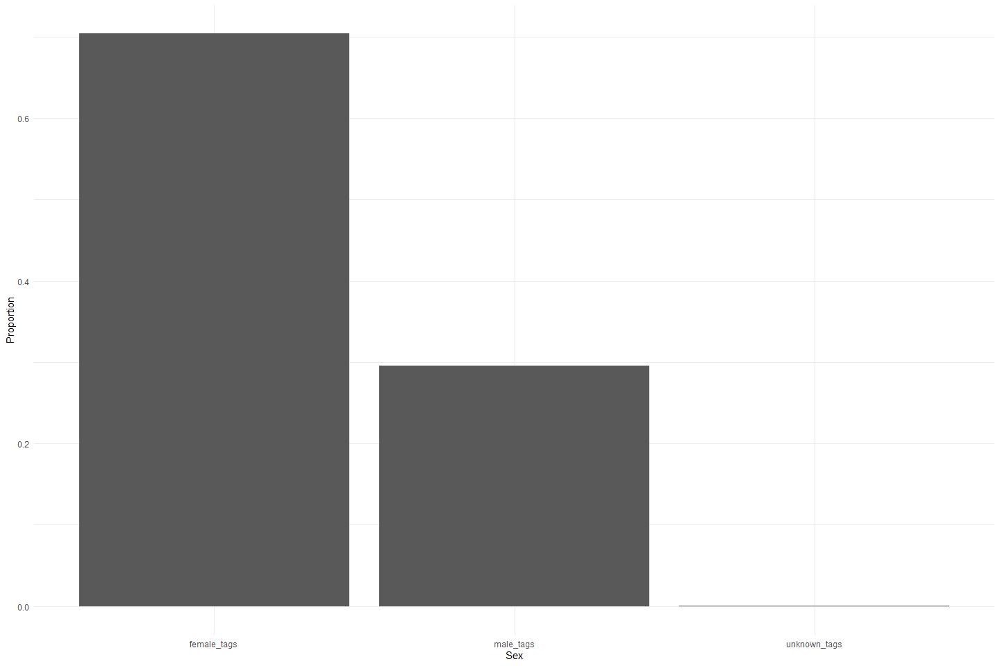<!-- -->

**Plotting fork length of each sex**

``` r
tag_join %>% 
  mutate(sex = ifelse(tag_join$sex == "X", "Unknown Tags", tag_join$sex)) %>% 
  ggplot(aes(x = sex, y = fl)) + 
  geom_boxplot() + 
  theme_minimal() + 
  labs(y = "FL", x = "Sex")
```

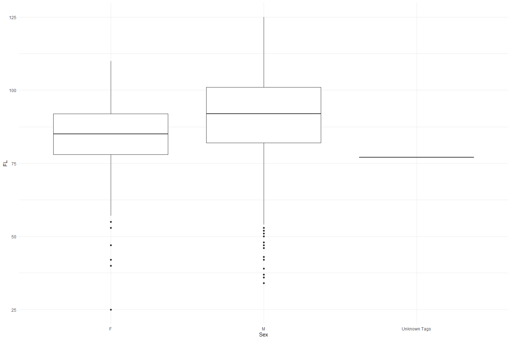<!-- -->

**Numeric Summary of `female_tag`, `male_tag`,`unknown_tag`**

``` r
summary(all_tags$male_tag)
```

    ##    Min. 1st Qu.  Median    Mean 3rd Qu.    Max. 
    ##  0.0000  0.0000  0.0000  0.2954  1.0000  1.0000

-   0 % of values in the `male_tag` column are NA.

``` r
summary(all_tags$female_tag)
```

    ##    Min. 1st Qu.  Median    Mean 3rd Qu.    Max. 
    ##  0.0000  0.0000  1.0000  0.7042  1.0000  1.0000

-   0 % of values in the `female_tag` column are NA.

``` r
summary(all_tags$unknown_tags)
```

    ##      Min.   1st Qu.    Median      Mean   3rd Qu.      Max. 
    ## 0.0000000 0.0000000 0.0000000 0.0004017 0.0000000 1.0000000

-   0 % of values in the `unknown_tags` column are NA.

**Plotting tags sex proportion with dates over Period of Record**

``` r
#Join tags to chops recovery using recov_id
tags_with_dates <- left_join(all_tags, chop_recovery_join)%>% glimpse
```

    ## Joining, by = c("sect", "recov_id")

    ## Rows: 4,979
    ## Columns: 16
    ## $ tag_num      <dbl> 1, 2, 3, 4, 5, 6, 7, 8, 9, 10, 11, 12, 13, 14, 15, 16, 17~
    ## $ sect         <dbl> 1, 8, 10, 10, 13, 13, 13, 14, 15, 15, 4, 6, 8, 8, 8, 10, ~
    ## $ fl           <dbl> 74, 69, 92, 85, 91, 82, 85, 86, 88, 78, 88, 83, 73, 83, 7~
    ## $ egg_ret      <chr> "U", "U", "U", "U", "U", "U", "U", "U", "U", "U", "U", "U~
    ## $ recov_id     <dbl> NA, NA, NA, 230, 273, 239, 502, NA, NA, NA, 242, 229, 275~
    ## $ female_tag   <dbl> 1, 1, 1, 1, 1, 1, 1, 1, 1, 1, 1, 1, 1, 1, 1, 0, 1, 0, 1, ~
    ## $ male_tag     <dbl> 0, 0, 0, 0, 0, 0, 0, 0, 0, 0, 0, 0, 0, 0, 0, 1, 0, 1, 0, ~
    ## $ unknown_tags <dbl> 0, 0, 0, 0, 0, 0, 0, 0, 0, 0, 0, 0, 0, 0, 0, 0, 0, 0, 0, ~
    ## $ date         <dttm> NA, NA, NA, 2001-09-17 07:00:00, NA, 2001-09-17 07:00:00~
    ## $ time         <dttm> NA, NA, NA, 1899-12-30 19:45:00, NA, 1899-12-30 22:00:00~
    ## $ chop_env_id  <dbl> NA, NA, NA, 23, NA, 24, NA, NA, NA, NA, NA, NA, 26, NA, 2~
    ## $ chan         <chr> NA, NA, NA, "M", NA, "M", NA, NA, NA, NA, NA, NA, "M", NA~
    ## $ min          <dbl> NA, NA, NA, 15, NA, 28, NA, NA, NA, NA, NA, NA, 5, NA, 15~
    ## $ male_chop    <dbl> NA, NA, NA, 1, NA, 0, NA, NA, NA, NA, NA, NA, 1, NA, 0, N~
    ## $ female_chop  <dbl> NA, NA, NA, 2, NA, 0, NA, NA, NA, NA, NA, NA, 0, NA, 2, N~
    ## $ grilse       <dbl> NA, NA, NA, 0, NA, 0, NA, NA, NA, NA, NA, NA, 0, NA, 1, N~

``` r
total_tags_with_dates <- tags_with_dates%>% 
  mutate(male_tag = ifelse(is.na(male_tag), 0, male_tag), # fill na
         female_tag = ifelse(is.na(female_tag), 0, female_tag),
         unknown_tags = ifelse(is.na(unknown_tags), 0, unknown_tags),
         total_tags = unknown_tags + male_tag + female_tag) %>% 
  select(date, male_tag, female_tag, unknown_tags, total_tags)

total_tags_with_dates_summary <- total_tags_with_dates %>%
  group_by(date) %>%
  summarise(total_tags = sum(total_tags, na.rm = T),
            male_tags = sum(male_tag, na.rm = T),
            female_tags = sum(female_tag, na.rm = T),
            unknown_tags = sum(unknown_tags, na.rm = T))

total_tags_with_dates_summary %>% 
  pivot_longer(cols = c(male_tags, female_tags, unknown_tags), names_to = "sex", values_to = "count") %>% 
  mutate(proportions = (count / total_tags)) %>% 
  ggplot(aes(x = date, y = proportions, fill = sex)) +
  geom_bar(stat = "identity", position = "stack") +
  scale_fill_manual(values = c("Blue","Red", "Black"), 
                    name = "Sex", 
                    labels = c("Female", "Male", "Unknown")) +
  theme_minimal() + 
  labs(y = "Proportion", x = "Date") +
  scale_fill_manual(values = wes_palette("Moonrise2"))
```

    ## Scale for 'fill' is already present. Adding another scale for 'fill', which
    ## will replace the existing scale.

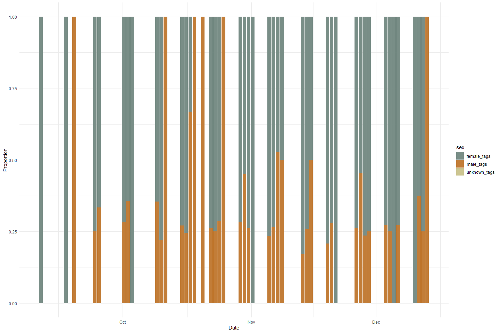<!-- -->

**Plotting total tags over Period of Record**

``` r
total_tags_with_dates_summary %>% 
  ggplot(aes(x = date, y = total_tags)) +
  geom_col() +
  theme_minimal()
```

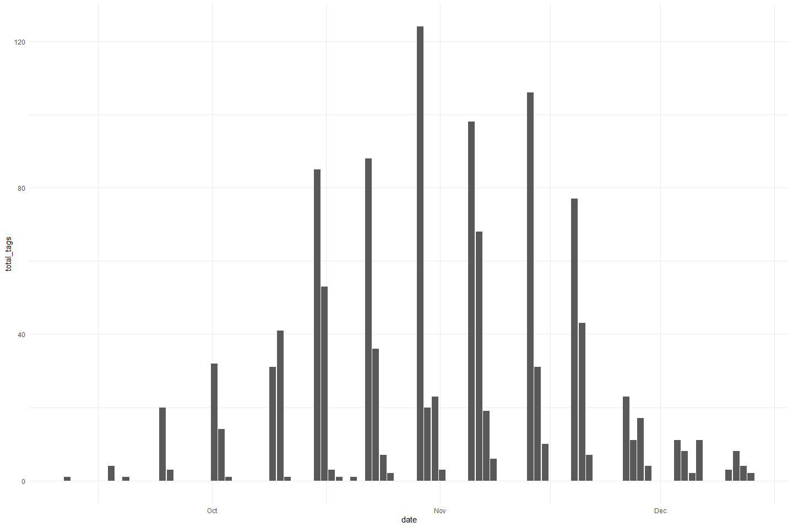<!-- -->

``` r
total_carcass <- full_join(total_chops_summary, total_tags_with_dates_summary) %>% 
  select(date, total_chops, total_tags) %>% 
  pivot_longer(c(total_chops, total_tags), names_to = "mark")
```

    ## Joining, by = "date"

``` r
full_join(total_chops_summary, total_tags_with_dates_summary) %>% 
  select(date, total_chops, total_tags) %>% 
  pivot_longer(c(total_chops, total_tags), names_to = "mark")
```

    ## Joining, by = "date"

    ## # A tibble: 200 x 3
    ##    date                mark        value
    ##    <dttm>              <chr>       <dbl>
    ##  1 2001-09-10 00:00:00 total_chops    45
    ##  2 2001-09-10 00:00:00 total_tags     NA
    ##  3 2001-09-11 00:00:00 total_chops    94
    ##  4 2001-09-11 00:00:00 total_tags     NA
    ##  5 2001-09-12 00:00:00 total_chops    21
    ##  6 2001-09-12 00:00:00 total_tags     NA
    ##  7 2001-09-13 00:00:00 total_chops    20
    ##  8 2001-09-13 00:00:00 total_tags     NA
    ##  9 2001-09-17 00:00:00 total_chops    83
    ## 10 2001-09-17 00:00:00 total_tags     NA
    ## # ... with 190 more rows

``` r
ggplot(total_carcass, aes(x = date, y = value, fill = mark)) +
  geom_col() +
  theme_minimal() +
  scale_fill_manual(values = wes_palette("Moonrise2"))
```

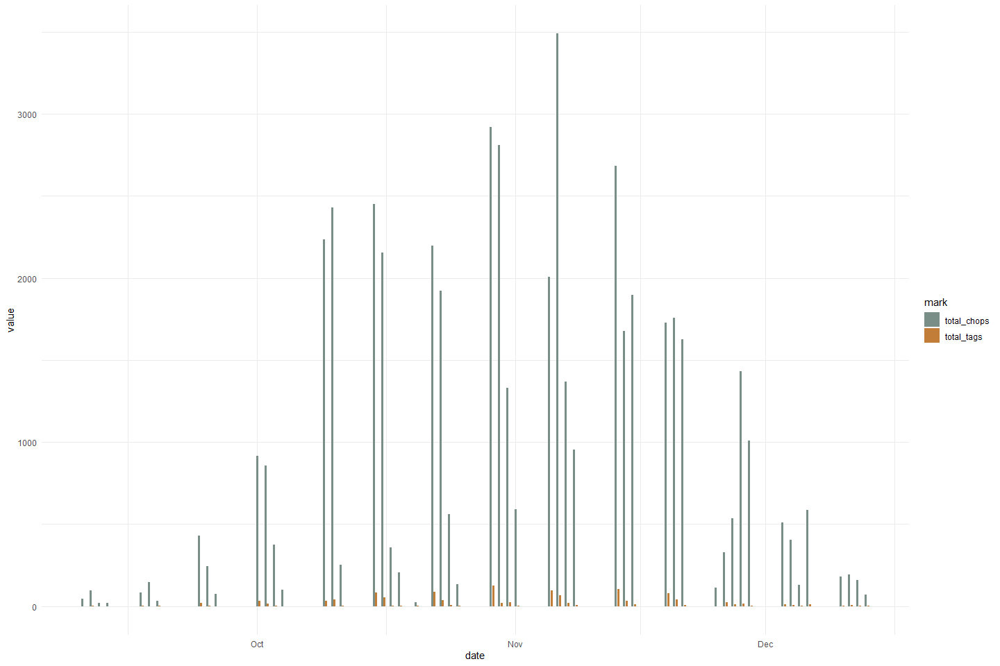<!-- -->

There are significantly less number of tags versus chops. However a
large amount of tags do not have dates to them.

### Chop Header Variable: `chop_env_id`, `flow`

``` r
chop_header %>% 
  select_if(is.numeric) %>% 
  colnames()
```

    ## [1] "chop_env_id" "flow"        "week_num"

``` r
summary(chop_header$chop_env_id)
```

    ##    Min. 1st Qu.  Median    Mean 3rd Qu.    Max. 
    ##    1.00   77.75  154.50  154.50  231.25  308.00

``` r
summary(chop_header$flow)
```

    ##    Min. 1st Qu.  Median    Mean 3rd Qu.    Max.    NA's 
    ##   600.0   600.0   600.0   917.3  1200.0  1700.0      25

-   8.1 % of values in the `chop_header` column are NA.

### CWT Variable: `id`, `sect`, `fl`, `ht_num`, `sex`

``` r
cwt %>% 
  select_if(is.numeric) %>% 
  colnames()
```

    ## [1] "cwt_id" "sect"   "fl"     "ht_num"

``` r
summary(cwt$cwt_id)
```

    ##    Min. 1st Qu.  Median    Mean 3rd Qu.    Max. 
    ##    1.00   68.75  136.50  136.50  204.25  272.00

``` r
summary(cwt$sect)
```

    ##    Min. 1st Qu.  Median    Mean 3rd Qu.    Max. 
    ##    0.00    7.00   11.00   13.67   17.00   48.00

``` r
summary(cwt$fl)
```

    ##    Min. 1st Qu.  Median    Mean 3rd Qu.    Max.    NA's 
    ##   45.00   75.00   79.00   80.38   85.00  107.00       3

-   1.1 % of values in the `fl` column are NA.

``` r
#Create a cwt_count column
#Pivot table to expand sex column to female_cwt, male_cwt, and unknown_cwt 
#Is this graph helpful?
unique(cwt$sex)
```

    ## [1] "M" "F" NA  "X"

``` r
cwt_count <- cwt %>% 
  mutate(cwt_count = 1) %>% 
  pivot_wider(names_from = sex, values_from = cwt_count, values_fill = 0) %>% 
  rename("unknown_cwt" = X,
         "male_cwt" = M,
         "female_cwt" = F) 
total_cwt_summary <- cwt_count %>% 
  mutate(male_cwt = ifelse(is.na(male_cwt), 0, male_cwt), # fill na
         female_cwt = ifelse(is.na(female_cwt), 0, female_cwt),
         unknown_cwt = ifelse(is.na(unknown_cwt), 0, unknown_cwt),
         total_cwt = unknown_cwt + male_cwt + female_cwt) %>% 
  group_by(month(date)) %>% 
  summarise(total_cwt = sum(total_cwt),
            male_cwt = sum(male_cwt),
            female_cwt = sum(female_cwt),
            unknown_cwt = sum(unknown_cwt))
```

``` r
total_cwt_summary %>% 
  pivot_longer(cols = c(male_cwt, female_cwt, unknown_cwt), names_to = "sex", values_to = "count") %>% 
  mutate(proportions = (count / total_cwt)) %>% 
  ggplot(aes(x = `month(date)`, y = proportions, fill = sex)) + 
  geom_bar(stat = "identity", position = "stack") +
  scale_fill_manual(name = "chops", 
                    labels = c("CWT Male", "CWT Female", "CWT Unknown")) +
  theme_minimal() + 
  labs(y = "Proportion", x = "Date") +
  scale_fill_manual(values = wes_palette("Moonrise2"))
```

    ## Scale for 'fill' is already present. Adding another scale for 'fill', which
    ## will replace the existing scale.

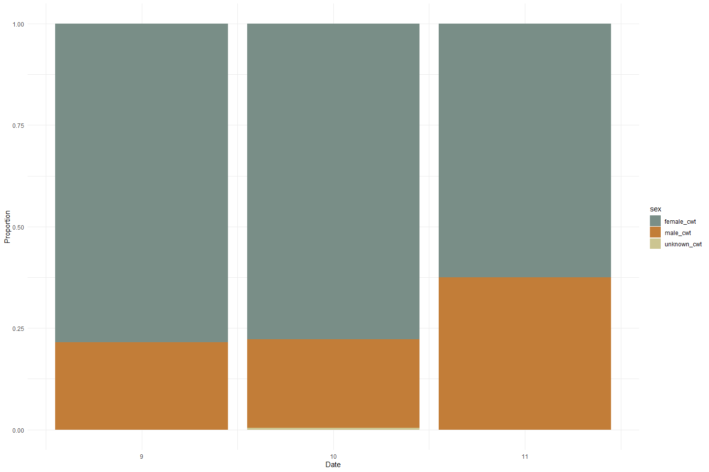<!-- -->

**Plotting fork length of each sex**

``` r
cwt %>% 
  mutate(sex = ifelse(cwt$sex == "X", "Unknown cwt", cwt$sex)) %>% 
  ggplot(aes(x = sex, y = fl)) + 
  geom_boxplot() + 
  theme_minimal() + 
  labs(y = "FL", x = "Sex")
```

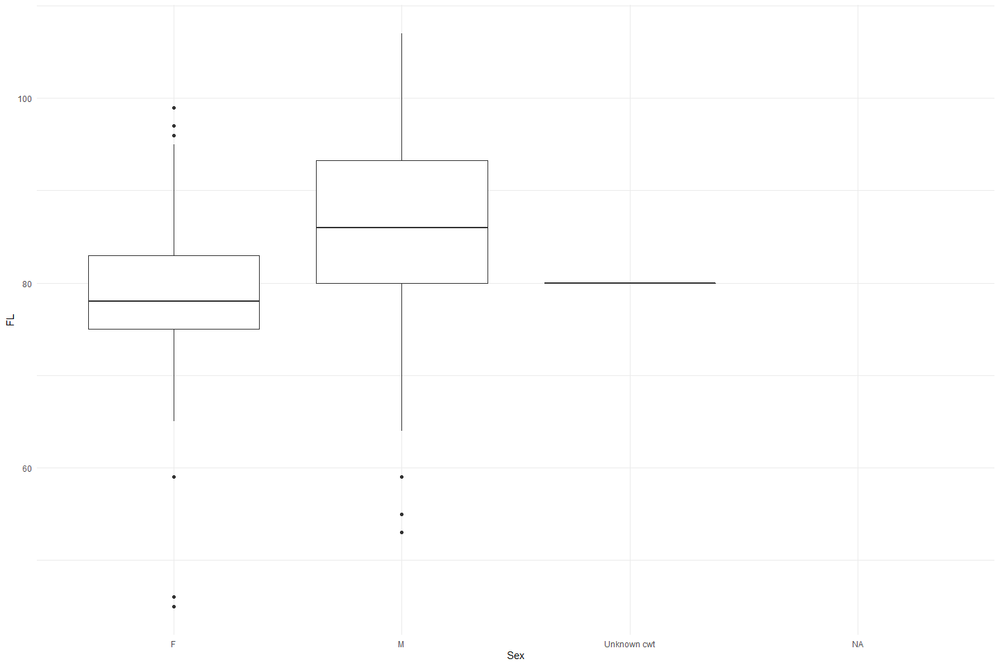<!-- -->

## Explore Categorical variables:

### Chop Recovery Clean Data

Fix inconsistencies with spelling, capitalization, and dates

``` r
chop_recovery_join %>% 
  select_if(is.character) %>%
  colnames() 
```

    ## [1] "chan"

``` r
unique(chop_recovery_join$chan)
```

    ## [1] "L" "M" "R"

``` r
chop_recovery_cleaner <- chop_recovery_join %>%
  mutate(date = as_date(date)) %>% 
  mutate_if(is.character, str_to_lower) %>%
  select(-c(time)) %>% 
  glimpse
```

    ## Rows: 3,045
    ## Columns: 9
    ## $ date        <date> 2001-09-10, 2001-09-10, 2001-09-10, 2001-09-10, 2001-09-1~
    ## $ chop_env_id <dbl> 1, 1, 1, 1, 1, 1, 1, 1, 1, 1, 1, 1, 2, 2, 2, 2, 2, 2, 2, 2~
    ## $ sect        <dbl> 1, 1, 1, 3, 3, 3, 5, 5, 5, 7, 7, 7, 8, 8, 8, 9, 9, 9, 10, ~
    ## $ chan        <chr> "l", "m", "r", "l", "m", "r", "l", "m", "r", "l", "m", "r"~
    ## $ min         <dbl> 0, 19, 0, 7, 10, 5, 2, 2, 2, 4, 3, 3, 4, 3, 10, 7, 4, 0, 2~
    ## $ male_chop   <dbl> 0, 0, 0, 0, 0, 0, 0, 0, 0, 0, 0, 0, 0, 0, 0, 0, 0, 0, 0, 0~
    ## $ female_chop <dbl> 0, 0, 0, 0, 0, 0, 0, 0, 0, 0, 0, 0, 2, 0, 0, 0, 0, 0, 1, 0~
    ## $ grilse      <dbl> 0, 0, 0, 0, 0, 0, 0, 0, 0, 0, 0, 0, 0, 0, 0, 0, 0, 0, 0, 0~
    ## $ recov_id    <dbl> 1, 2, 3, 4, 5, 6, 7, 8, 9, 10, 11, 12, 13, 14, 15, 16, 17,~

### Tag Join Clean Data

``` r
tag_join %>% 
  select_if(is.character) %>% 
  colnames()
```

    ## [1] "sex"     "egg_ret"

``` r
#X is unknown? Need lookup table
unique(tag_join$egg_ret)
```

    ## [1] "U" NA  "S" "P" "X"

``` r
tag_cleaner <- tag_join %>% 
    mutate_if(is.character, str_to_lower) %>%
  glimpse
```

    ## Rows: 4,979
    ## Columns: 6
    ## $ tag_num  <dbl> 1, 2, 3, 4, 5, 6, 7, 8, 9, 10, 11, 12, 13, 14, 15, 16, 17, 18~
    ## $ sect     <dbl> 1, 8, 10, 10, 13, 13, 13, 14, 15, 15, 4, 6, 8, 8, 8, 10, 10, ~
    ## $ fl       <dbl> 74, 69, 92, 85, 91, 82, 85, 86, 88, 78, 88, 83, 73, 83, 72, 8~
    ## $ sex      <chr> "f", "f", "f", "f", "f", "f", "f", "f", "f", "f", "f", "f", "~
    ## $ egg_ret  <chr> "u", "u", "u", "u", "u", "u", "u", "u", "u", "u", "u", "u", "~
    ## $ recov_id <dbl> NA, NA, NA, 230, 273, 239, 502, NA, NA, NA, 242, 229, 275, NA~

### Chop Header Clean Data

``` r
chop_header %>% 
  select_if(is.character) %>% 
  colnames
```

    ## [1] "crew"     "recorder" "tag_col"  "vis"      "weather"  "comment"

``` r
#Need to deal with NA time
#removed flow and vis as we have not seen these columns in other datasets
chop_header_cleaner <- chop_header %>% 
  mutate(date = as_date(date)) %>%
  mutate_if(is.character, str_to_lower) %>%
  mutate(crew = str_replace_all(crew, " ", "")) %>% 
  select(-c(time, flow, vis)) %>% glimpse
```

    ## Rows: 308
    ## Columns: 8
    ## $ chop_env_id <dbl> 1, 2, 3, 4, 5, 6, 7, 8, 9, 10, 11, 12, 13, 14, 15, 16, 17,~
    ## $ date        <date> 2001-09-10, 2001-09-10, 2001-09-10, 2001-09-10, 2001-09-1~
    ## $ crew        <chr> "rk,at,as", "at,rk,as", "at,rk,as", "bc,jk,do", "jk,do,bc"~
    ## $ recorder    <chr> "rk", "as, rk", "as, rk", "bc", "jk", "bc", "sm", "jk", "a~
    ## $ tag_col     <chr> "yellow/orange", "yellow/orange", "yellow/orange", "yellow~
    ## $ weather     <chr> "sun", "sun", "sun", "sun", "sun", "sun", "cld", "cld", "c~
    ## $ comment     <chr> NA, NA, NA, NA, NA, NA, NA, NA, NA, NA, NA, NA, "probably ~
    ## $ week_num    <dbl> 1, 1, 1, 1, 1, 1, 1, 1, 1, 1, 1, 1, 1, 1, 1, 1, 1, 1, 1, 1~

### CWT Clean Data

``` r
cwt %>% 
  select_if(is.character) %>% 
  colnames
```

    ## [1] "sex"     "comment"

``` r
cwt_cleaner <- cwt %>% 
  mutate_if(is.character, str_to_lower) %>% 
  rename(datetime = "date") %>% 
  glimpse
```

    ## Rows: 272
    ## Columns: 7
    ## $ cwt_id   <dbl> 1, 2, 3, 4, 5, 6, 7, 8, 9, 10, 11, 12, 13, 14, 15, 16, 17, 18~
    ## $ datetime <dttm> 2001-09-10 07:00:00, 2001-09-10 07:00:00, 2001-09-10 07:00:0~
    ## $ sect     <dbl> 3, 11, 13, 13, 16, 28, 46, 48, 8, 15, 8, 4, 10, 15, 8, 8, 8, ~
    ## $ fl       <dbl> 84, 93, 83, 96, 88, 81, 86, 80, 55, 68, 90, 84, 59, 68, 95, 1~
    ## $ sex      <chr> "m", "f", "f", "m", "f", "f", "m", "f", "m", "f", "m", "f", "~
    ## $ ht_num   <dbl> 16940, 17037, 16294, 16925, 16926, 16927, 16944, 16935, 16936~
    ## $ comment  <chr> "5277 ft (t-bar)", NA, NA, NA, NA, "middle", "head thrown awa~

## Comments

-   TagData_raw and RecovTag_raw both contain Tag 1, Tag 2, TagComp, and
    Relstat columns. These columns are not ubitiquous amont tag dataset
    and there are no look up tables for them. Those columns have been
    dropped.
-   There is no lookup table for egg_ret in tag_join
-   Grilse count in chop_recovery_join is calculated as a part of the
    total_chops (see total_chops plot)
-   Not sure what is ht_number in cwt table
-   Current format for datetime contains NA for time. Format becomes
    “YYYY-mm-dd na”.

## Data Dictionaries

### Chops Data

``` r
percent_na <- chop_recovery_cleaner %>%
  summarise_all(list(name = ~sum(is.na(.))/length(.))) %>%
  pivot_longer(cols = everything())


chop_counts_data_dictionary <- tibble(variables = colnames(chop_recovery_cleaner),
                          description = c("Date of survey",
                                          "ID",
                                          "Sect",
                                          "Chan", 
                                          "Minute",
                                          "Carcass that were chopped and sex was male",
                                          "Carcass that were chopped and sex was female",
                                          "Carcass that were chopped and grilse",
                                          "Recovery ID"),
                          percent_na = round(percent_na$value*100))

kable(chop_counts_data_dictionary)
```

| variables   | description                                  | percent_na |
|:------------|:---------------------------------------------|-----------:|
| date        | Date of survey                               |          0 |
| chop_env_id | ID                                           |          0 |
| sect        | Sect                                         |          0 |
| chan        | Chan                                         |          0 |
| min         | Minute                                       |          0 |
| male_chop   | Carcass that were chopped and sex was male   |          0 |
| female_chop | Carcass that were chopped and sex was female |          0 |
| grilse      | Carcass that were chopped and grilse         |          0 |
| recov_id    | Recovery ID                                  |          0 |

### Tags Data

``` r
percent_na <- tag_cleaner %>%
  summarise_all(list(name = ~sum(is.na(.))/length(.))) %>%
  pivot_longer(cols = everything())


tags_counts_data_dictionary <- tibble(variables = colnames(tag_cleaner),
                          description = c("Tag number",
                                          "Sect",
                                          "Fork length", 
                                          "Sex",
                                          "Egg retained",
                                          "Recovery ID"),
                          percent_na = round(percent_na$value*100))

kable(tags_counts_data_dictionary)
```

| variables | description  | percent_na |
|:----------|:-------------|-----------:|
| tag_num   | Tag number   |          0 |
| sect      | Sect         |          0 |
| fl        | Fork length  |          0 |
| sex       | Sex          |          0 |
| egg_ret   | Egg retained |         30 |
| recov_id  | Recovery ID  |         69 |

### Survey

``` r
percent_na <- chop_header_cleaner %>%
  summarise_all(list(name = ~sum(is.na(.))/length(.))) %>%
  pivot_longer(cols = everything())

chop_header_data_dictionary <- tibble(variables = colnames(chop_header_cleaner),
                          description = c("ID",
                                          "Crew memeber initials that collected",
                                          "Individual of crew member who recorded",
                                          "Colour of tag carcass",
                                          "Weather",
                                          "Comments",
                                          "Week Number",
                                          "Date of survey"),
                          percent_na = round(percent_na$value*100))

kable(chop_header_data_dictionary)
```

| variables   | description                            | percent_na |
|:------------|:---------------------------------------|-----------:|
| chop_env_id | ID                                     |          0 |
| date        | Crew memeber initials that collected   |          0 |
| crew        | Individual of crew member who recorded |          0 |
| recorder    | Colour of tag carcass                  |         25 |
| tag_col     | Weather                                |          0 |
| weather     | Comments                               |          2 |
| comment     | Week Number                            |         91 |
| week_num    | Date of survey                         |          0 |

### CWT

``` r
percent_na <- cwt_cleaner %>%
  summarise_all(list(name = ~sum(is.na(.))/length(.))) %>%
  pivot_longer(cols = everything())

chop_header_data_dictionary <- tibble(variables = colnames(cwt_cleaner),
                          description = c("ID",
                                          "Date of survey",
                                          "Sect",
                                          "Fork length",
                                          "Sex",
                                          "Ht number",
                                          "Comment"),
                          percent_na = round(percent_na$value*100))

kable(chop_header_data_dictionary)
```

| variables | description    | percent_na |
|:----------|:---------------|-----------:|
| cwt_id    | ID             |          0 |
| datetime  | Date of survey |          0 |
| sect      | Sect           |          0 |
| fl        | Fork length    |          1 |
| sex       | Sex            |          0 |
| ht_num    | Ht number      |          0 |
| comment   | Comment        |         83 |

## Save cleaned data back to google cloud (TBA)

``` r
feather_carcass_chops_2001 <- chop_recovery_cleaner %>% glimpse()
```

    ## Rows: 3,045
    ## Columns: 9
    ## $ date        <date> 2001-09-10, 2001-09-10, 2001-09-10, 2001-09-10, 2001-09-1~
    ## $ chop_env_id <dbl> 1, 1, 1, 1, 1, 1, 1, 1, 1, 1, 1, 1, 2, 2, 2, 2, 2, 2, 2, 2~
    ## $ sect        <dbl> 1, 1, 1, 3, 3, 3, 5, 5, 5, 7, 7, 7, 8, 8, 8, 9, 9, 9, 10, ~
    ## $ chan        <chr> "l", "m", "r", "l", "m", "r", "l", "m", "r", "l", "m", "r"~
    ## $ min         <dbl> 0, 19, 0, 7, 10, 5, 2, 2, 2, 4, 3, 3, 4, 3, 10, 7, 4, 0, 2~
    ## $ male_chop   <dbl> 0, 0, 0, 0, 0, 0, 0, 0, 0, 0, 0, 0, 0, 0, 0, 0, 0, 0, 0, 0~
    ## $ female_chop <dbl> 0, 0, 0, 0, 0, 0, 0, 0, 0, 0, 0, 0, 2, 0, 0, 0, 0, 0, 1, 0~
    ## $ grilse      <dbl> 0, 0, 0, 0, 0, 0, 0, 0, 0, 0, 0, 0, 0, 0, 0, 0, 0, 0, 0, 0~
    ## $ recov_id    <dbl> 1, 2, 3, 4, 5, 6, 7, 8, 9, 10, 11, 12, 13, 14, 15, 16, 17,~

``` r
feather_carcass_tags_2001 <- tag_cleaner %>% glimpse()
```

    ## Rows: 4,979
    ## Columns: 6
    ## $ tag_num  <dbl> 1, 2, 3, 4, 5, 6, 7, 8, 9, 10, 11, 12, 13, 14, 15, 16, 17, 18~
    ## $ sect     <dbl> 1, 8, 10, 10, 13, 13, 13, 14, 15, 15, 4, 6, 8, 8, 8, 10, 10, ~
    ## $ fl       <dbl> 74, 69, 92, 85, 91, 82, 85, 86, 88, 78, 88, 83, 73, 83, 72, 8~
    ## $ sex      <chr> "f", "f", "f", "f", "f", "f", "f", "f", "f", "f", "f", "f", "~
    ## $ egg_ret  <chr> "u", "u", "u", "u", "u", "u", "u", "u", "u", "u", "u", "u", "~
    ## $ recov_id <dbl> NA, NA, NA, 230, 273, 239, 502, NA, NA, NA, 242, 229, 275, NA~

``` r
feather_carcass_chop_recovery_2001 <- chop_recovery_cleaner %>% glimpse()
```

    ## Rows: 3,045
    ## Columns: 9
    ## $ date        <date> 2001-09-10, 2001-09-10, 2001-09-10, 2001-09-10, 2001-09-1~
    ## $ chop_env_id <dbl> 1, 1, 1, 1, 1, 1, 1, 1, 1, 1, 1, 1, 2, 2, 2, 2, 2, 2, 2, 2~
    ## $ sect        <dbl> 1, 1, 1, 3, 3, 3, 5, 5, 5, 7, 7, 7, 8, 8, 8, 9, 9, 9, 10, ~
    ## $ chan        <chr> "l", "m", "r", "l", "m", "r", "l", "m", "r", "l", "m", "r"~
    ## $ min         <dbl> 0, 19, 0, 7, 10, 5, 2, 2, 2, 4, 3, 3, 4, 3, 10, 7, 4, 0, 2~
    ## $ male_chop   <dbl> 0, 0, 0, 0, 0, 0, 0, 0, 0, 0, 0, 0, 0, 0, 0, 0, 0, 0, 0, 0~
    ## $ female_chop <dbl> 0, 0, 0, 0, 0, 0, 0, 0, 0, 0, 0, 0, 2, 0, 0, 0, 0, 0, 1, 0~
    ## $ grilse      <dbl> 0, 0, 0, 0, 0, 0, 0, 0, 0, 0, 0, 0, 0, 0, 0, 0, 0, 0, 0, 0~
    ## $ recov_id    <dbl> 1, 2, 3, 4, 5, 6, 7, 8, 9, 10, 11, 12, 13, 14, 15, 16, 17,~

``` r
feather_carcass_cwt_2001 <- cwt_cleaner %>% glimpse()
```

    ## Rows: 272
    ## Columns: 7
    ## $ cwt_id   <dbl> 1, 2, 3, 4, 5, 6, 7, 8, 9, 10, 11, 12, 13, 14, 15, 16, 17, 18~
    ## $ datetime <dttm> 2001-09-10 07:00:00, 2001-09-10 07:00:00, 2001-09-10 07:00:0~
    ## $ sect     <dbl> 3, 11, 13, 13, 16, 28, 46, 48, 8, 15, 8, 4, 10, 15, 8, 8, 8, ~
    ## $ fl       <dbl> 84, 93, 83, 96, 88, 81, 86, 80, 55, 68, 90, 84, 59, 68, 95, 1~
    ## $ sex      <chr> "m", "f", "f", "m", "f", "f", "m", "f", "m", "f", "m", "f", "~
    ## $ ht_num   <dbl> 16940, 17037, 16294, 16925, 16926, 16927, 16944, 16935, 16936~
    ## $ comment  <chr> "5277 ft (t-bar)", NA, NA, NA, NA, "middle", "head thrown awa~

``` r
feather_carcass_chop_header_2001 <- chop_header_cleaner %>% glimpse()
```

    ## Rows: 308
    ## Columns: 8
    ## $ chop_env_id <dbl> 1, 2, 3, 4, 5, 6, 7, 8, 9, 10, 11, 12, 13, 14, 15, 16, 17,~
    ## $ date        <date> 2001-09-10, 2001-09-10, 2001-09-10, 2001-09-10, 2001-09-1~
    ## $ crew        <chr> "rk,at,as", "at,rk,as", "at,rk,as", "bc,jk,do", "jk,do,bc"~
    ## $ recorder    <chr> "rk", "as, rk", "as, rk", "bc", "jk", "bc", "sm", "jk", "a~
    ## $ tag_col     <chr> "yellow/orange", "yellow/orange", "yellow/orange", "yellow~
    ## $ weather     <chr> "sun", "sun", "sun", "sun", "sun", "sun", "cld", "cld", "c~
    ## $ comment     <chr> NA, NA, NA, NA, NA, NA, NA, NA, NA, NA, NA, NA, "probably ~
    ## $ week_num    <dbl> 1, 1, 1, 1, 1, 1, 1, 1, 1, 1, 1, 1, 1, 1, 1, 1, 1, 1, 1, 1~

``` r
f <- function(input, output) write_csv(input, file = output)

gcs_upload(feather_carcass_chops_2001,
           object_function = f,
           type = "csv",
           name = "adult-holding-redd-and-carcass-surveys/feather-river/data/feather_carcass_chops_2001.csv")

gcs_upload(feather_carcass_tags_2001,
           object_function = f,
           type = "csv",
           name = "adult-holding-redd-and-carcass-surveys/feather-river/data/feather_carcass_tags_2001.csv")

gcs_upload(feather_carcass_chop_recovery_2001,
           object_function = f,
           type = "csv",
           name = "adult-holding-redd-and-carcass-surveys/feather-river/data/feather_carcass_chop_recovery_2001.csv")
gcs_upload(feather_carcass_cwt_2001,
           object_function = f,
           type = "csv",
           name = "adult-holding-redd-and-carcass-surveys/feather-river/data/feather_carcass_cwt_2001.csv")
gcs_upload(feather_carcass_chop_header_2001,
           object_function = f,
           type = "csv",
           name = "adult-holding-redd-and-carcass-surveys/feather-river/data/feather_carcass_chop_header_2001.csv")
```
