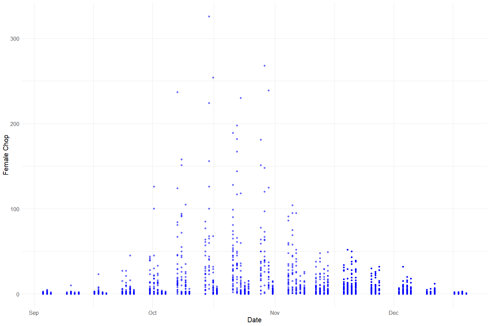
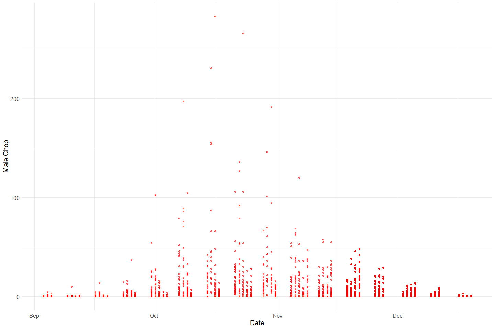
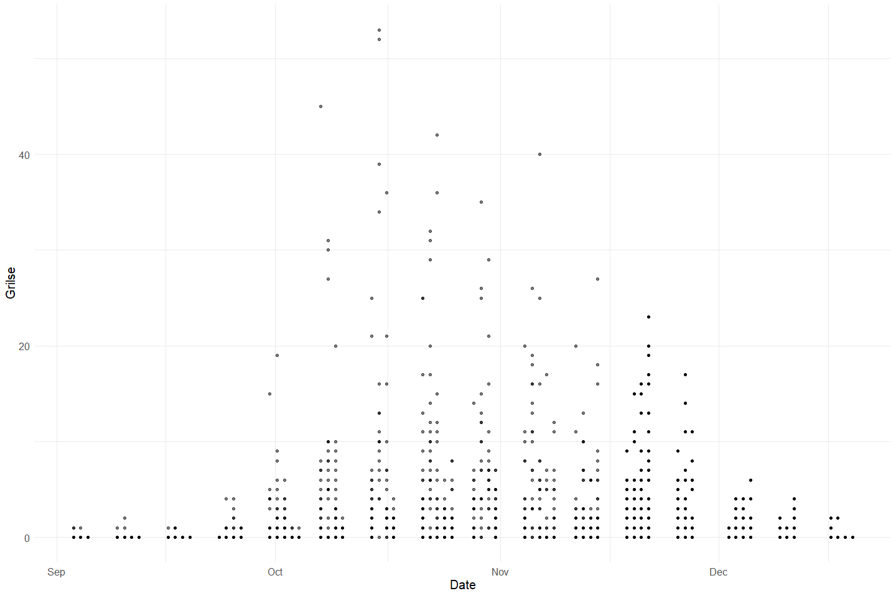
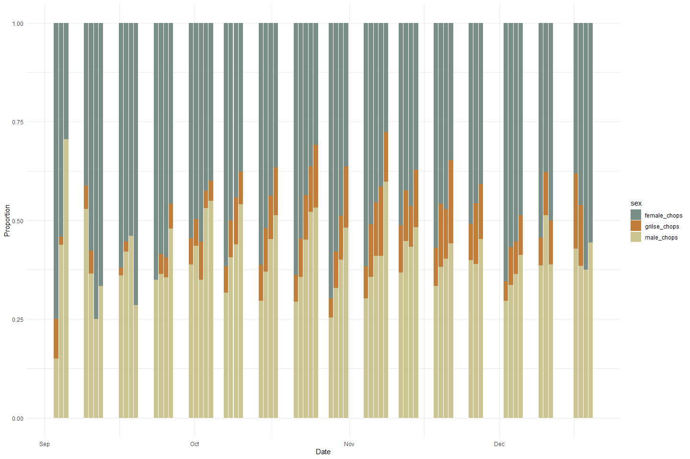
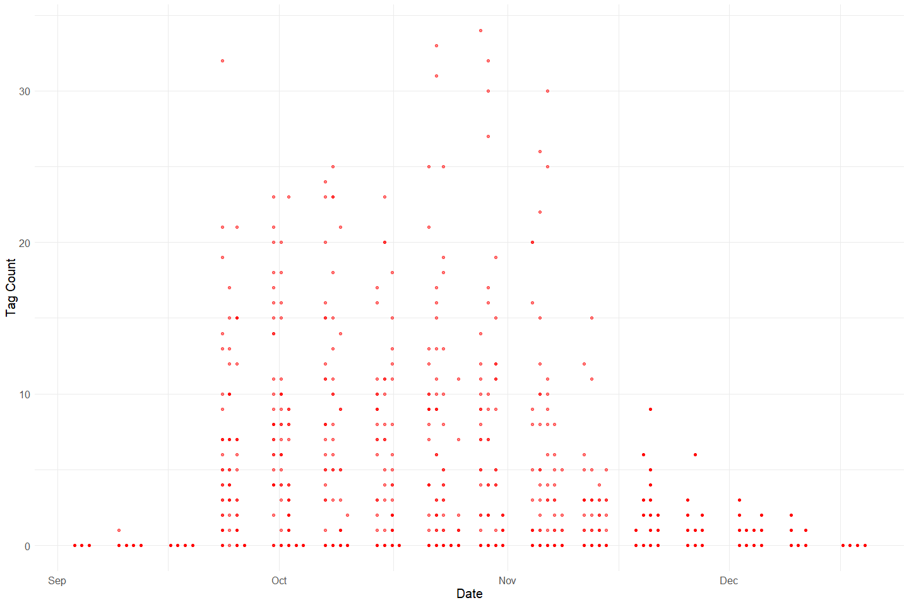
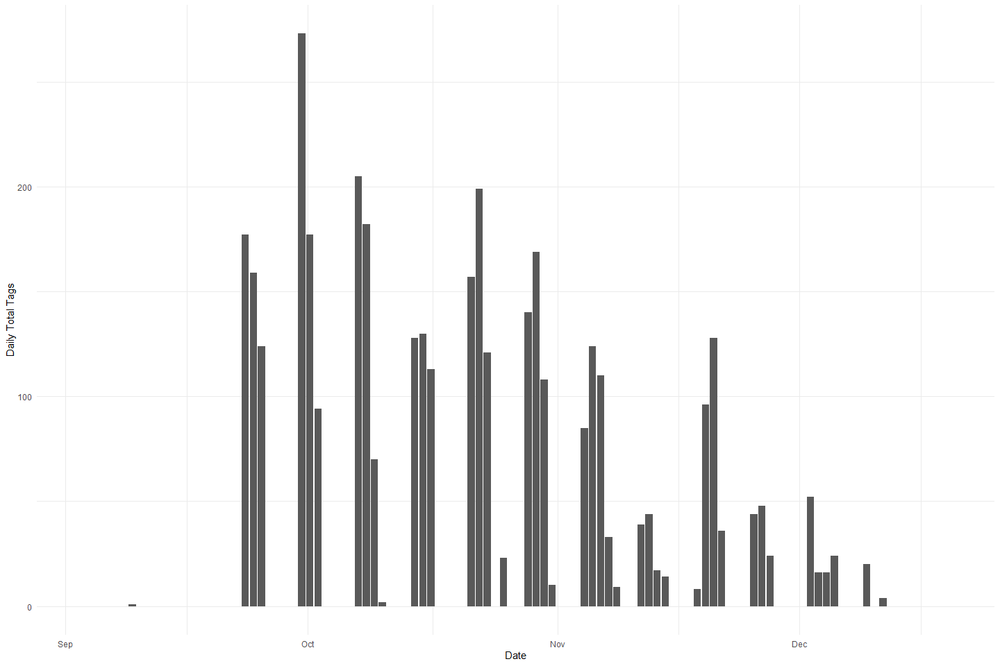
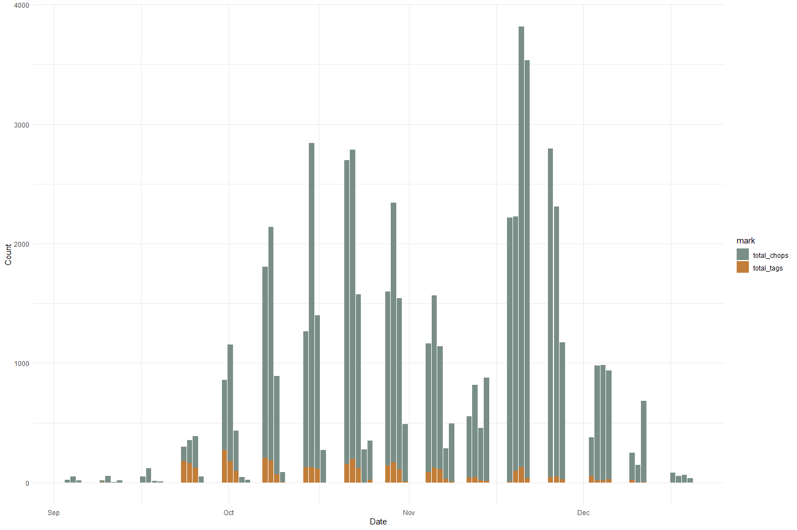
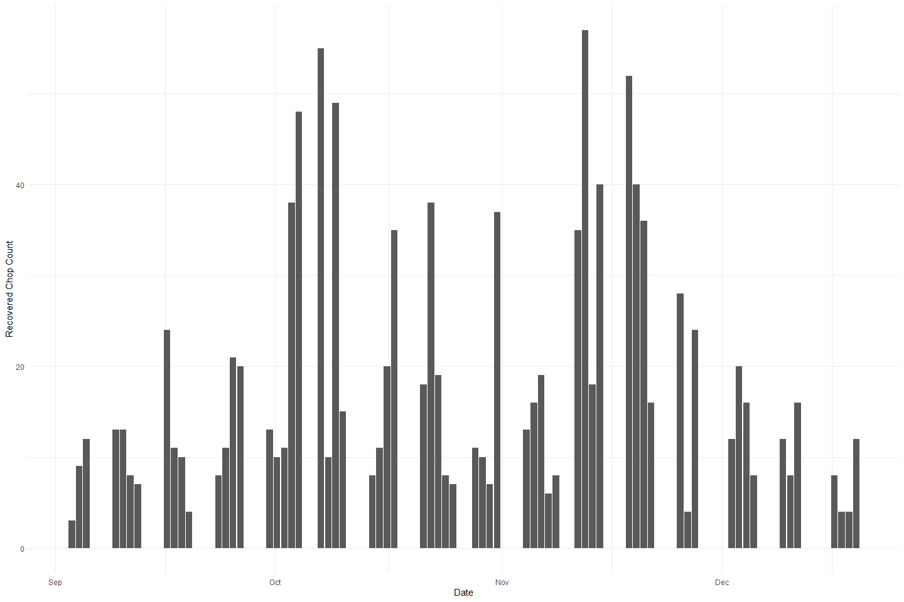
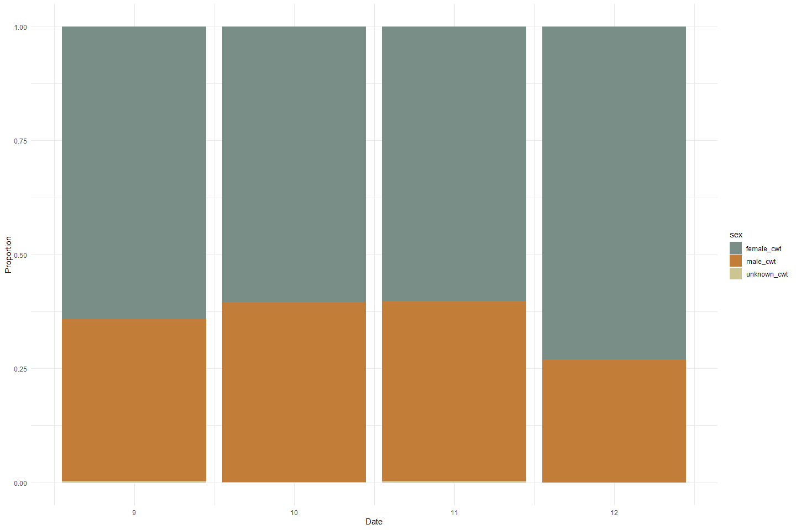
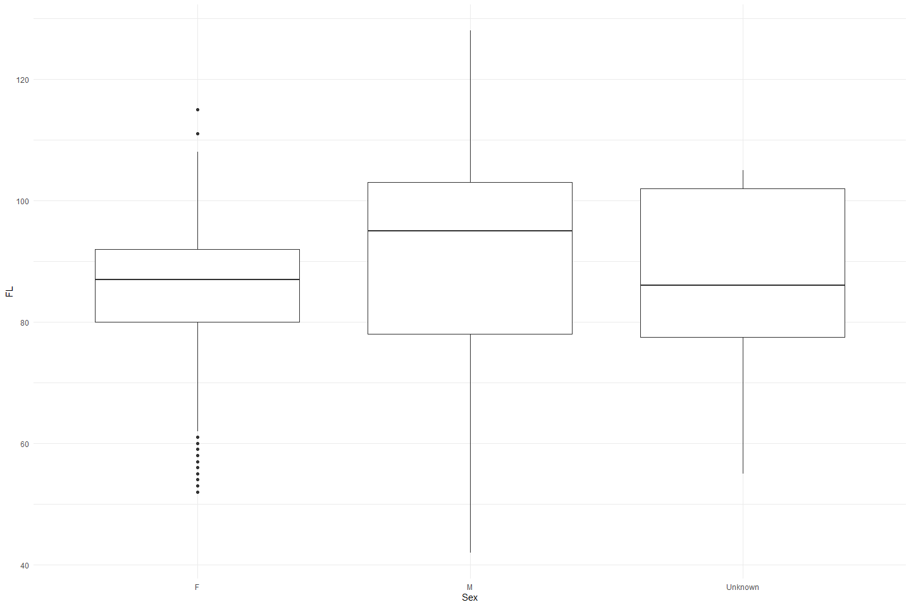

Feather Carcass QC 2002
================
Inigo Peng
2022-07-25

# Feather River Carcass Data

## Description of Monitoring Data

**Timeframe:**

**Video Season:**

**Completeness of Record throughout timeframe:**

**Sampling Location:**

**Data Contact:**

Any additional info?

## Access Cloud Data

``` r
# Run Sys.setenv() to specify GCS_AUTH_FILE and GCS_DEFAULT_BUCKET before running 
# getwd() to see how to specify paths 
# Open object from google cloud storage
# Set your authentication using gcs_auth

gcs_auth(json_file = Sys.getenv("GCS_AUTH_FILE"))
# Set global bucket 
gcs_global_bucket(bucket = Sys.getenv("GCS_DEFAULT_BUCKET"))

# git data and save as xlsx
```

``` r
#Connect to microsoft access through RODBC
#Use 
DRIVERINFO <- "Driver={Microsoft Access Driver (*.mdb, *.accdb)};"
MDBPATH <- "C:/Users/InigoPeng/Projects/jpe/JPE-datasets/data-raw/qc-markdowns/adult-holding-redd-and-carcass-surveys/feather-river/Carcass 2002.mdb"
PATH <- paste0(DRIVERINFO, "DBQ=", MDBPATH)

con <- odbcDriverConnect(PATH)

# Show the different table names 
# sqlTables(con)$TABLE_NAME

#Download table and write csv
ChopChannel_1 <- sqlFetch(con, "ChopChannelTBL")
ChopChannel_2 <- sqlFetch(con, "ChopChannelTBL2")
ChopChannel_raw <- bind_rows(ChopChannel_1, ChopChannel_2)
write_csv(ChopChannel_raw, "ChopChannel_2002.csv")

ChopRecov_1 <- sqlFetch(con,"ChopRecovTBL")
ChopRecov_2 <- sqlFetch(con, "ChopRecovTBL2")
ChopRecov_raw <- bind_rows(ChopRecov_1, ChopRecov_2)
write_csv(ChopRecov_raw, "ChopRecov_2002.csv")

ChopHeader_1 <- sqlFetch(con,"ChopHeaderTBL")
ChopHeader_2 <- sqlFetch(con, "ChopHeaderTBL2")
ChopHeader_raw <- bind_rows(ChopHeader_1, ChopHeader_2)
write_csv(ChopHeader_raw, "ChopHeader_2002.csv")


cwt_1 <- sqlFetch(con, "CWTTagTBL") %>% 
  select(-WeekNum)
cwt_2 <- sqlFetch(con, "CWTTagTBL1") %>% 
  mutate(SampNum = as.character(SampNum))
cwt_raw <- bind_rows(cwt_1, cwt_2)
write_csv(cwt_raw, "cwt_2002.csv")

cwt_header_1 <- sqlFetch(con, "CWTHeaderTBL")
cwt_header_2 <- sqlFetch(con, "CWTHeaderTBL1")
cwt_header_raw <-  bind_rows(cwt_header_1, cwt_header_2)
write_csv(cwt_header_raw, "CWTHeader_2002.csv")

#Other tables include Steelhead Data and TagColLu
```

## Raw Data Glimpse:

### ChopEnv_Raw

``` r
ChopChannel_raw <- read_csv("ChopChannel_2002.csv") %>% 
  rename("ID" = HeaderID) %>% 
  glimpse()
```

    ## Rows: 2901 Columns: 9
    ## -- Column specification --------------------------------------------------------
    ## Delimiter: ","
    ## chr (1): Chan
    ## dbl (8): ChanID, Sect, Min, Male, Fem, Gril, TagCount, HeaderID
    ## 
    ## i Use `spec()` to retrieve the full column specification for this data.
    ## i Specify the column types or set `show_col_types = FALSE` to quiet this message.

    ## Rows: 2,901
    ## Columns: 9
    ## $ ChanID   <dbl> 1, 2, 3, 4, 5, 6, 7, 8, 9, 10, 11, 12, 13, 14, 15, 16, 17, 19~
    ## $ Sect     <dbl> 10, 10, 10, 3, 3, 3, 6, 6, 6, 8, 8, 8, 9, 9, 9, 6, 6, 6, 5, 5~
    ## $ Chan     <chr> "l", "m", "r", "l", "m", "r", "l", "m", "r", "l", "m", "r", "~
    ## $ Min      <dbl> 15, 15, 15, 15, 15, 15, 15, 15, 15, 15, 15, 15, 15, 15, 15, 5~
    ## $ Male     <dbl> 0, 0, 0, 1, 0, 0, 0, 0, 0, 0, 0, 0, 0, 0, 0, 0, 0, 0, 0, 0, 0~
    ## $ Fem      <dbl> 0, 1, 0, 2, 0, 1, 0, 0, 2, 0, 3, 0, 2, 1, 0, 0, 0, 0, 0, 0, 0~
    ## $ Gril     <dbl> 0, 0, 0, 0, 0, 0, 0, 0, 0, 0, 0, 0, 0, 0, 0, 0, 0, 0, 0, 0, 0~
    ## $ TagCount <dbl> 0, 0, 0, 0, 0, 0, 0, 0, 0, 0, 0, 0, 0, 0, 0, 0, 0, 0, 0, 0, 0~
    ## $ ID       <dbl> 1, 1, 1, 2, 2, 2, 2, 2, 2, 2, 2, 2, 2, 2, 2, 3, 3, 3, 3, 3, 3~

### ChopRecov_raw

``` r
ChopRecov_raw <- read_csv("ChopRecov_2002.csv") %>% glimpse
```

    ## Rows: 1510 Columns: 4
    ## -- Column specification --------------------------------------------------------
    ## Delimiter: ","
    ## chr (1): RecovColor
    ## dbl (3): RecovID, RecovCount, ChanID
    ## 
    ## i Use `spec()` to retrieve the full column specification for this data.
    ## i Specify the column types or set `show_col_types = FALSE` to quiet this message.

    ## Rows: 1,510
    ## Columns: 4
    ## $ RecovID    <dbl> 3, 4, 5, 6, 7, 8, 9, 10, 11, 12, 13, 14, 15, 16, 17, 18, 19~
    ## $ RecovColor <chr> "green 1", "green 1", "green 1", "green 1", "green 1", "gre~
    ## $ RecovCount <dbl> 1, 1, 1, 1, 1, 2, 3, 1, 1, 1, 1, 2, 2, 2, 1, 1, 1, 1, 5, 1,~
    ## $ ChanID     <dbl> 216, 220, 225, 226, 230, 251, 257, 260, 270, 279, 285, 286,~

### ChopHeader_Raw

``` r
ChopHeader_raw <- read_csv("ChopHeader_2002.csv") %>% 
  rename("ID" = headerID) %>%
  glimpse()
```

    ## Rows: 331 Columns: 9
    ## -- Column specification --------------------------------------------------------
    ## Delimiter: ","
    ## chr  (5): TagCol, Crew, Recorder, Weather, Comment
    ## dbl  (2): headerID, WeekNum
    ## dttm (2): Date, Time
    ## 
    ## i Use `spec()` to retrieve the full column specification for this data.
    ## i Specify the column types or set `show_col_types = FALSE` to quiet this message.

    ## Rows: 331
    ## Columns: 9
    ## $ ID       <dbl> 1, 2, 3, 4, 5, 6, 7, 8, 9, 10, 11, 12, 13, 14, 15, 16, 17, 18~
    ## $ TagCol   <chr> "GREEN 1", "GREEN 1", "GREEN 1", "GREEN 1", "GREEN 1", "GREEN~
    ## $ Date     <dttm> 2002-09-03 07:00:00, 2002-09-03 07:00:00, 2002-09-03 07:00:0~
    ## $ Crew     <chr> "rb, km, mk, ph", "rb, mk, etc.", "at, bc, jk, nd, dg, gk", "~
    ## $ Time     <dttm> 1899-12-30 22:50:00, 1899-12-30 21:45:00, 1899-12-30 21:36:0~
    ## $ Recorder <chr> "RB", "mk, rb", "at", "dg", "nd, at, gk", "at", "at", "at", "~
    ## $ Weather  <chr> "SUN", "SUN", "SUN", "SUN", "SUN", "SUN", "SUN", "SUN", "SUN"~
    ## $ Comment  <chr> NA, NA, NA, NA, NA, NA, NA, NA, NA, NA, NA, NA, NA, NA, NA, N~
    ## $ WeekNum  <dbl> 1, 1, 1, 1, 1, 1, 1, 1, 1, 1, 1, 1, 1, 1, 1, 1, 1, 1, 1, 1, 2~

### cwt_raw

``` r
cwt_raw <- read_csv("cwt_2002.csv") %>% glimpse()
```

    ## Rows: 8155 Columns: 13
    ## -- Column specification --------------------------------------------------------
    ## Delimiter: ","
    ## chr (8): RelLoc, Sex, Spawn, Clip, SampType, CarcStat, SampNum, Comment
    ## dbl (5): TagID, Sect, FL, HeadTag, HeaderID
    ## 
    ## i Use `spec()` to retrieve the full column specification for this data.
    ## i Specify the column types or set `show_col_types = FALSE` to quiet this message.

    ## Rows: 8,155
    ## Columns: 13
    ## $ TagID    <dbl> 1, 2, 3, 4, 5, 6, 7, 8, 9, 10, 11, 12, 13, 14, 15, 16, 17, 18~
    ## $ Sect     <dbl> 1, 3, 6, 6, 8, 8, 8, 8, 8, 8, 8, 8, 8, 9, 10, 10, 10, 10, 10,~
    ## $ RelLoc   <chr> "L", "L", "R", "M", "M", "M", "L", "L", "M", "M", "M", "L", "~
    ## $ FL       <dbl> 89, 93, 110, 99, 86, 84, 82, 100, 93, 74, 90, 91, 67, 93, 53,~
    ## $ Sex      <chr> "F", "F", "M", "M", "F", "nd", "F", "M", "M", "F", "F", "F", ~
    ## $ Spawn    <chr> "U", "U", "UK", "UK", "U", "UK", "U", "UK", "UK", "U", "U", "~
    ## $ Clip     <chr> "N", "N", "Y", "Y", "N", "N", "N", "N", "N", "N", "N", "Y", "~
    ## $ SampType <chr> "none", "none", "H", "H", "none", "none", "none", "none", "no~
    ## $ CarcStat <chr> "T", "T", "C", "C", "T", "T", "T", "T", "T", "T", "T", "C", "~
    ## $ SampNum  <chr> NA, NA, "0903001", "0903002", NA, NA, NA, NA, NA, NA, NA, "09~
    ## $ HeadTag  <dbl> NA, NA, 33101, 33102, NA, NA, NA, NA, NA, NA, NA, 33103, NA, ~
    ## $ Comment  <chr> "no scales, otoliths today", NA, NA, NA, NA, NA, NA, NA, NA, ~
    ## $ HeaderID <dbl> 1, 1, 1, 1, 1, 1, 1, 1, 1, 1, 1, 1, 1, 1, 1, 1, 1, 1, 1, 1, 2~

### CWT_Header_raw

``` r
cwt_header_raw <- read_csv("CWTHeader_2002.csv") %>% glimpse
```

    ## Rows: 452 Columns: 5
    ## -- Column specification --------------------------------------------------------
    ## Delimiter: ","
    ## chr  (2): TagCol, Crew
    ## dbl  (2): headerID, WeekNum
    ## dttm (1): Date
    ## 
    ## i Use `spec()` to retrieve the full column specification for this data.
    ## i Specify the column types or set `show_col_types = FALSE` to quiet this message.

    ## Rows: 452
    ## Columns: 5
    ## $ headerID <dbl> 1, 2, 3, 4, 5, 6, 7, 8, 9, 10, 11, 12, 13, 14, 15, 16, 17, 18~
    ## $ Date     <dttm> 2002-09-03 07:00:00, 2002-09-03 07:00:00, 2002-09-04 07:00:0~
    ## $ TagCol   <chr> "green 1", "green 1", "green 1", "green 1", "green 1", "green~
    ## $ Crew     <chr> "ph, jr, tv, km, mk, rk", "gk, jk, bc, nd, dg, at", "at, tv, ~
    ## $ WeekNum  <dbl> 1, 1, 1, 1, 1, 1, 2, 2, 2, 2, 2, 2, 2, 2, 2, 2, 2, 2, 3, 3, 3~

## Data transformations:

### Counts

The `chop_channel` table contains carcass counts by sex, grilise and
chop/tagged

``` r
#1. chopchannel table (with dates and tag color)
chop_channel_join <- full_join(ChopHeader_raw %>% 
                                 select(ID, TagCol, Date, Time),
                               ChopChannel_raw) %>% 
  clean_names() %>% 
  rename("male_chop" = male,
         "female_chop" = fem,
         "grilse" = gril) %>% glimpse()
```

    ## Joining, by = "ID"

    ## Rows: 4,270
    ## Columns: 12
    ## $ id          <dbl> 1, 1, 1, 2, 2, 2, 2, 2, 2, 2, 2, 2, 2, 2, 2, 3, 3, 3, 3, 3~
    ## $ tag_col     <chr> "GREEN 1", "GREEN 1", "GREEN 1", "GREEN 1", "GREEN 1", "GR~
    ## $ date        <dttm> 2002-09-03 07:00:00, 2002-09-03 07:00:00, 2002-09-03 07:0~
    ## $ time        <dttm> 1899-12-30 22:50:00, 1899-12-30 22:50:00, 1899-12-30 22:5~
    ## $ chan_id     <dbl> 1, 2, 3, 4, 5, 6, 7, 8, 9, 10, 11, 12, 13, 14, 15, 16, 17,~
    ## $ sect        <dbl> 10, 10, 10, 3, 3, 3, 6, 6, 6, 8, 8, 8, 9, 9, 9, 6, 6, 6, 5~
    ## $ chan        <chr> "l", "m", "r", "l", "m", "r", "l", "m", "r", "l", "m", "r"~
    ## $ min         <dbl> 15, 15, 15, 15, 15, 15, 15, 15, 15, 15, 15, 15, 15, 15, 15~
    ## $ male_chop   <dbl> 0, 0, 0, 1, 0, 0, 0, 0, 0, 0, 0, 0, 0, 0, 0, 0, 0, 0, 0, 0~
    ## $ female_chop <dbl> 0, 1, 0, 2, 0, 1, 0, 0, 2, 0, 3, 0, 2, 1, 0, 0, 0, 0, 0, 0~
    ## $ grilse      <dbl> 0, 0, 0, 0, 0, 0, 0, 0, 0, 0, 0, 0, 0, 0, 0, 0, 0, 0, 0, 0~
    ## $ tag_count   <dbl> 0, 0, 0, 0, 0, 0, 0, 0, 0, 0, 0, 0, 0, 0, 0, 0, 0, 0, 0, 0~

### Recovery

The `chop_recovery` table contains recovered carcass counts by color

``` r
chop_recovery_join <- full_join(ChopHeader_raw %>% 
                                  select(ID, Date, Time),
                                ChopRecov_raw %>% 
                                  rename(ID = RecovID))  %>% 
  clean_names()
```

    ## Joining, by = "ID"

### Survey

The `chop_header` table contains survey metadata and covariates

``` r
chop_header <- ChopHeader_raw %>% 
  clean_names()
```

### CWT

The `cwt` table contains coded wire tag information.

``` r
cwt <- full_join(cwt_raw %>% clean_names(), cwt_header_raw %>% clean_names()) %>% 
  clean_names() %>% 
  glimpse
```

    ## Joining, by = "header_id"

    ## Rows: 12,791
    ## Columns: 17
    ## $ tag_id    <dbl> 1, 2, 3, 4, 5, 6, 7, 8, 9, 10, 11, 12, 13, 14, 15, 16, 17, 1~
    ## $ sect      <dbl> 1, 3, 6, 6, 8, 8, 8, 8, 8, 8, 8, 8, 8, 9, 10, 10, 10, 10, 10~
    ## $ rel_loc   <chr> "L", "L", "R", "M", "M", "M", "L", "L", "M", "M", "M", "L", ~
    ## $ fl        <dbl> 89, 93, 110, 99, 86, 84, 82, 100, 93, 74, 90, 91, 67, 93, 53~
    ## $ sex       <chr> "F", "F", "M", "M", "F", "nd", "F", "M", "M", "F", "F", "F",~
    ## $ spawn     <chr> "U", "U", "UK", "UK", "U", "UK", "U", "UK", "UK", "U", "U", ~
    ## $ clip      <chr> "N", "N", "Y", "Y", "N", "N", "N", "N", "N", "N", "N", "Y", ~
    ## $ samp_type <chr> "none", "none", "H", "H", "none", "none", "none", "none", "n~
    ## $ carc_stat <chr> "T", "T", "C", "C", "T", "T", "T", "T", "T", "T", "T", "C", ~
    ## $ samp_num  <chr> NA, NA, "0903001", "0903002", NA, NA, NA, NA, NA, NA, NA, "0~
    ## $ head_tag  <dbl> NA, NA, 33101, 33102, NA, NA, NA, NA, NA, NA, NA, 33103, NA,~
    ## $ comment   <chr> "no scales, otoliths today", NA, NA, NA, NA, NA, NA, NA, NA,~
    ## $ header_id <dbl> 1, 1, 1, 1, 1, 1, 1, 1, 1, 1, 1, 1, 1, 1, 1, 1, 1, 1, 1, 1, ~
    ## $ date      <dttm> 2002-09-03 07:00:00, 2002-09-03 07:00:00, 2002-09-03 07:00:~
    ## $ tag_col   <chr> "green 1", "green 1", "green 1", "green 1", "green 1", "gree~
    ## $ crew      <chr> "ph, jr, tv, km, mk, rk", "ph, jr, tv, km, mk, rk", "ph, jr,~
    ## $ week_num  <dbl> 1, 1, 1, 1, 1, 1, 1, 1, 1, 1, 1, 1, 1, 1, 1, 1, 1, 1, 1, 1, ~

## Explore Numeric Variables:

#### Chop Channel Variable:`id`, `chan_id`, `sect`, `min`

``` r
# Filter clean data to show only numeric variables 
chop_channel_join %>% 
  select_if(is.numeric) %>%
  colnames()
```

    ## [1] "id"          "chan_id"     "sect"        "min"         "male_chop"  
    ## [6] "female_chop" "grilse"      "tag_count"

``` r
summary(chop_channel_join$id)
```

    ##    Min. 1st Qu.  Median    Mean 3rd Qu.    Max. 
    ##     1.0   171.0  1122.0   767.3  1136.8  1148.0

``` r
summary(chop_channel_join$chan_id)
```

    ##    Min. 1st Qu.  Median    Mean 3rd Qu.    Max.    NA's 
    ##       1    1166   10907    7416   11179   11449       3

``` r
summary(chop_channel_join$sect)
```

    ##    Min. 1st Qu.  Median    Mean 3rd Qu.    Max.    NA's 
    ##    1.00   11.00   22.00   22.71   34.00   46.00       3

``` r
summary(chop_channel_join$min)
```

    ##    Min. 1st Qu.  Median    Mean 3rd Qu.    Max.    NA's 
    ##    1.00    5.00   10.00   11.88   15.00   90.00       3

-   0 % of values in the `id` column are NA.
-   0.1 % of values in the `chan_id` column are NA.
-   0.1 % of values in the `sect` column are NA.
-   0.1 % of values in the `min` column are NA.

### Chop Channel Variable: `female_chop`, `male_chop`,`grilise`, `tag_count`

**Numeric Summary of `female_chop`, `male_chop`,`unknown_chops`,
`tag_count` over Period of Record**

``` r
summary(chop_channel_join$female_chop)
```

    ##    Min. 1st Qu.  Median    Mean 3rd Qu.    Max.    NA's 
    ##   0.000   0.000   1.000   6.428   5.000 326.000       3

``` r
summary(chop_channel_join$male_chop)
```

    ##    Min. 1st Qu.  Median    Mean 3rd Qu.    Max.    NA's 
    ##   0.000   0.000   1.000   4.934   4.000 283.000       3

``` r
summary(chop_channel_join$grilse)
```

    ##    Min. 1st Qu.  Median    Mean 3rd Qu.    Max.    NA's 
    ##   0.000   0.000   0.000   1.431   1.000  53.000       3

**NA and Unknown Values** Provide a stat on NA or unknown values.

``` r
round(sum(is.na(chop_channel_join$male_chop))/nrow(chop_channel_join), 3) * 100
```

    ## [1] 0.1

``` r
round(sum(is.na(chop_channel_join$female_chop))/nrow(chop_channel_join), 3) * 100
```

    ## [1] 0.1

``` r
round(sum(is.na(chop_channel_join$grilse))/nrow(chop_channel_join), 3) * 100
```

    ## [1] 0.1

-   0.1 % of values in the `male_chop` column are NA.
-   0.1 % of values in the `female_chop` column are NA.
-   0.1 % of values in the `unknown_chops` column are NA.

**Plotting female_chop over Period of Record**

``` r
# Make whatever plot is appropriate 
filter(chop_channel_join) %>% 
  ggplot(aes(x = date, y = female_chop)) +
  geom_point(size = 1.4, alpha = .5, color = "blue") + 
  labs(x = "Date", 
       y = "Female Chop") +
  theme_minimal() + 
  theme(text = element_text(size = 15)) 
```

<!-- -->

**Plotting male_chop over Period of Record**

``` r
filter(chop_channel_join) %>% 
  ggplot(aes(x = date, y = male_chop)) +
  geom_point(size = 1.4, alpha = .5, color = "red") + 
  labs(x = "Date", 
       y = "Male Chop") +
  theme_minimal() + 
  theme(text = element_text(size = 15)) 
```

<!-- -->

**Plotting grilse over Period of Record**

``` r
filter(chop_channel_join) %>% 
  ggplot(aes(x = date, y = grilse)) +
  geom_point(size = 1.4, alpha = .5, color = "black") + 
  labs(x = "Date", 
       y = "Grilse") +
  theme_minimal() + 
  theme(text = element_text(size = 15)) 
```

<!-- -->

**Plotting Total chops over Period of Record**

``` r
chop_channel_join %>% glimpse()
```

    ## Rows: 4,270
    ## Columns: 12
    ## $ id          <dbl> 1, 1, 1, 2, 2, 2, 2, 2, 2, 2, 2, 2, 2, 2, 2, 3, 3, 3, 3, 3~
    ## $ tag_col     <chr> "GREEN 1", "GREEN 1", "GREEN 1", "GREEN 1", "GREEN 1", "GR~
    ## $ date        <dttm> 2002-09-03 07:00:00, 2002-09-03 07:00:00, 2002-09-03 07:0~
    ## $ time        <dttm> 1899-12-30 22:50:00, 1899-12-30 22:50:00, 1899-12-30 22:5~
    ## $ chan_id     <dbl> 1, 2, 3, 4, 5, 6, 7, 8, 9, 10, 11, 12, 13, 14, 15, 16, 17,~
    ## $ sect        <dbl> 10, 10, 10, 3, 3, 3, 6, 6, 6, 8, 8, 8, 9, 9, 9, 6, 6, 6, 5~
    ## $ chan        <chr> "l", "m", "r", "l", "m", "r", "l", "m", "r", "l", "m", "r"~
    ## $ min         <dbl> 15, 15, 15, 15, 15, 15, 15, 15, 15, 15, 15, 15, 15, 15, 15~
    ## $ male_chop   <dbl> 0, 0, 0, 1, 0, 0, 0, 0, 0, 0, 0, 0, 0, 0, 0, 0, 0, 0, 0, 0~
    ## $ female_chop <dbl> 0, 1, 0, 2, 0, 1, 0, 0, 2, 0, 3, 0, 2, 1, 0, 0, 0, 0, 0, 0~
    ## $ grilse      <dbl> 0, 0, 0, 0, 0, 0, 0, 0, 0, 0, 0, 0, 0, 0, 0, 0, 0, 0, 0, 0~
    ## $ tag_count   <dbl> 0, 0, 0, 0, 0, 0, 0, 0, 0, 0, 0, 0, 0, 0, 0, 0, 0, 0, 0, 0~

``` r
total_chops <- chop_channel_join%>%
  mutate(male_chop = ifelse(is.na(male_chop), 0, male_chop), # fill na
         female_chop = ifelse(is.na(female_chop), 0, female_chop),
         grilse_chop = ifelse(is.na(grilse), 0, grilse),
         total_chops = grilse_chop + male_chop + female_chop) %>% 
  select(date, male_chop, female_chop, grilse_chop, total_chops)

# Case check: checking for duplicates
total_chops_test <- total_chops %>% # get total chops
  filter(date == as_date("2002-09-20"))

# Check if NAs introduced in creating total chop columns
nrow(total_chops_test) == (sum(total_chops_test$total_chops == (total_chops_test$male_chop + total_chops_test$female_chop + total_chops_test$grilse_chops)))
```

    ## [1] TRUE

``` r
# total number of chops for the day
total_chops_summary <- total_chops %>%
  group_by(date) %>%
  summarise(total_chops = sum(total_chops, na.rm = T),
            male_chops = sum(male_chop, na.rm = T),
            female_chops = sum(female_chop, na.rm = T),
            grilse_chops = sum(grilse_chop, na.rm = T))
```

``` r
total_chops_summary %>% 
  pivot_longer(cols = c(male_chops, female_chops, grilse_chops), names_to = "sex", values_to = "count") %>% 
  mutate(proportions = (count / total_chops)) %>% 
  ggplot(aes(x = date, y = proportions, fill = sex)) +
  geom_bar(stat = "identity", position = "stack") +
  scale_fill_manual(values = c("Blue","Red", "Black"), 
                    name = "Sex", 
                    labels = c("Female", "Male", "Grilse")) +
  theme_minimal() + 
  labs(y = "Proportion", x = "Date") +
  scale_fill_manual(values = wes_palette("Moonrise2"))
```

    ## Scale for 'fill' is already present. Adding another scale for 'fill', which
    ## will replace the existing scale.

<!-- -->

This plot shows the proportion of chops based on sex and grilse for each
day over the the period of 2002-09-03 to 2002-12-19. The data gaps that
we see are a result of the data collection process in which the data was
collected 2-4 days each week (with no specific period day of week) over
the 4 month period.

``` r
summary(chop_channel_join$tag_count)
```

    ##    Min. 1st Qu.  Median    Mean 3rd Qu.    Max.    NA's 
    ##  0.0000  0.0000  0.0000  0.8795  0.0000 34.0000       3

``` r
round(sum(is.na(chop_channel_join$tag_count))/nrow(chop_channel_join), 3) * 100
```

    ## [1] 0.1

-   0.1 % of values in the `tag_count` column are NA.

**Plotting tag_count over Period of Record**

``` r
chop_channel_join %>% 
  ggplot(aes(x = date, y = tag_count)) +
  geom_point(size = 1.4, alpha = .5, color = "red") + 
  labs(x = "Date", 
       y = "Tag Count") +
  theme_minimal() + 
  theme(text = element_text(size = 15)) 
```

<!-- -->

``` r
total_tags_summary <- chop_channel_join %>%
  group_by(date) %>%
  summarise(total_tags = sum(tag_count, na.rm = T))

total_tags_summary %>% 
  ggplot(aes(x = date, y = total_tags)) +
  geom_col() +
  theme_minimal() +
  labs(y = "Daily Total Tags", x = "Date")
```

<!-- -->

**Comparing tags and chops**

``` r
# from ashley: please improve on this plot I got started, make it look better, describe it, double check that the numbers make sense
total_carcass <- full_join(total_chops_summary, total_tags_summary) %>% 
  select(date, total_chops, total_tags) %>% 
  pivot_longer(c(total_chops, total_tags), names_to = "mark")
```

    ## Joining, by = "date"

``` r
full_join(total_chops_summary, total_tags_summary) %>% 
  select(date, total_chops, total_tags) %>% 
  pivot_longer(c(total_chops, total_tags), names_to = "mark")
```

    ## Joining, by = "date"

    ## # A tibble: 128 x 3
    ##    date                mark        value
    ##    <dttm>              <chr>       <dbl>
    ##  1 2002-09-03 07:00:00 total_chops    20
    ##  2 2002-09-03 07:00:00 total_tags      0
    ##  3 2002-09-04 07:00:00 total_chops    48
    ##  4 2002-09-04 07:00:00 total_tags      0
    ##  5 2002-09-05 07:00:00 total_chops    17
    ##  6 2002-09-05 07:00:00 total_tags      0
    ##  7 2002-09-09 07:00:00 total_chops    17
    ##  8 2002-09-09 07:00:00 total_tags      1
    ##  9 2002-09-10 07:00:00 total_chops    52
    ## 10 2002-09-10 07:00:00 total_tags      0
    ## # ... with 118 more rows

``` r
ggplot(total_carcass, aes(x = date, y = value, fill = mark)) +
  geom_col() +
  theme_minimal() +
  scale_fill_manual(values = wes_palette("Moonrise2")) +
  labs(x = "Date", y = "Count")
```

<!-- -->
Tags are significantly less applied compared to chops.

### Chop Recovery Variable: `id`, `chan_id`, `recov_count`

``` r
chop_recovery_join %>% 
  select_if(is.numeric) %>% 
  colnames()
```

    ## [1] "id"          "recov_count" "chan_id"

``` r
summary(chop_recovery_join$id)
```

    ##    Min. 1st Qu.  Median    Mean 3rd Qu.    Max. 
    ##     1.0   405.0   808.0   770.9  1139.0  1346.0

``` r
summary(chop_recovery_join$chan_id)
```

    ##    Min. 1st Qu.  Median    Mean 3rd Qu.    Max.    NA's 
    ##     216    1130    1534    5549   10898   11401      11

``` r
summary(chop_recovery_join$recov_count)
```

    ##    Min. 1st Qu.  Median    Mean 3rd Qu.    Max.    NA's 
    ##   1.000   1.000   2.000   2.917   3.000  45.000      11

**Plotting recov_count over Period of Record**

``` r
chop_recovery_join %>% 
  ggplot(aes(x = date, y = recov_count)) +
  geom_col() +
  theme_minimal() +
  labs(x = "Date", y = "Recovered Chop Count")
```

<!-- -->
This chart shows the recovered chops. The chart is not showing count
values that do not have dates or times associated with them.

### Chop Header Variable: `id`

``` r
chop_header %>% 
  select_if(is.numeric) %>% 
  colnames()
```

    ## [1] "id"       "week_num"

``` r
summary(chop_header$id)
```

    ##    Min. 1st Qu.  Median    Mean 3rd Qu.    Max. 
    ##     1.0    83.5   166.0   394.0  1106.0  1148.0

### CWT Variable: `tag_id`, `sect`, `fl`, `head_tag`, `header_id`, `week_num`

``` r
cwt %>% 
  select_if(is.numeric) %>% 
  colnames()
```

    ## [1] "tag_id"    "sect"      "fl"        "head_tag"  "header_id" "week_num"

``` r
summary(cwt$tag_id)
```

    ##    Min. 1st Qu.  Median    Mean 3rd Qu.    Max.    NA's 
    ##       1    3201   10769    8889   12149   12969       2

``` r
summary(cwt$sect)
```

    ##    Min. 1st Qu.  Median    Mean 3rd Qu.    Max.    NA's 
    ##    1.00    9.00   16.00   18.43   28.00   46.00      18

``` r
summary(cwt$fl)
```

    ##    Min. 1st Qu.  Median    Mean 3rd Qu.    Max.    NA's 
    ##   42.00   80.00   88.00   87.05   95.00  128.00      26

-   0 % of values in the `tag_id` column are NA.
-   0.1 % of values in the `sect` column are NA.
-   0.2 % of values in the `fl` column are NA.

``` r
#Create a cwt_count column
#Pivot table to expand sex column to female_cwt, male_cwt, and unknown_cwt 
#Is this graph helpful?
unique(cwt$sex)
```

    ## [1] "F"  "M"  "nd" NA

``` r
cwt_count <- cwt %>% 
  mutate(count = 1) %>%
  mutate(sex = case_when(sex == "nd"|is.na(sex) ~ "U",
                         TRUE ~ sex)) %>% 
  pivot_wider(names_from = sex, values_from = count, values_fill = list(0)) %>% 
  unnest() %>% 
  rename("male_cwt" = M,
         "female_cwt" = F,
         "unknown_cwt" = U) %>% glimpse
```

    ## Rows: 12,791
    ## Columns: 19
    ## $ tag_id      <dbl> 1, 2, 3, 4, 5, 6, 7, 8, 9, 10, 11, 12, 13, 14, 15, 16, 17,~
    ## $ sect        <dbl> 1, 3, 6, 6, 8, 8, 8, 8, 8, 8, 8, 8, 8, 9, 10, 10, 10, 10, ~
    ## $ rel_loc     <chr> "L", "L", "R", "M", "M", "M", "L", "L", "M", "M", "M", "L"~
    ## $ fl          <dbl> 89, 93, 110, 99, 86, 84, 82, 100, 93, 74, 90, 91, 67, 93, ~
    ## $ spawn       <chr> "U", "U", "UK", "UK", "U", "UK", "U", "UK", "UK", "U", "U"~
    ## $ clip        <chr> "N", "N", "Y", "Y", "N", "N", "N", "N", "N", "N", "N", "Y"~
    ## $ samp_type   <chr> "none", "none", "H", "H", "none", "none", "none", "none", ~
    ## $ carc_stat   <chr> "T", "T", "C", "C", "T", "T", "T", "T", "T", "T", "T", "C"~
    ## $ samp_num    <chr> NA, NA, "0903001", "0903002", NA, NA, NA, NA, NA, NA, NA, ~
    ## $ head_tag    <dbl> NA, NA, 33101, 33102, NA, NA, NA, NA, NA, NA, NA, 33103, N~
    ## $ comment     <chr> "no scales, otoliths today", NA, NA, NA, NA, NA, NA, NA, N~
    ## $ header_id   <dbl> 1, 1, 1, 1, 1, 1, 1, 1, 1, 1, 1, 1, 1, 1, 1, 1, 1, 1, 1, 1~
    ## $ date        <dttm> 2002-09-03 07:00:00, 2002-09-03 07:00:00, 2002-09-03 07:0~
    ## $ tag_col     <chr> "green 1", "green 1", "green 1", "green 1", "green 1", "gr~
    ## $ crew        <chr> "ph, jr, tv, km, mk, rk", "ph, jr, tv, km, mk, rk", "ph, j~
    ## $ week_num    <dbl> 1, 1, 1, 1, 1, 1, 1, 1, 1, 1, 1, 1, 1, 1, 1, 1, 1, 1, 1, 1~
    ## $ female_cwt  <dbl> 1, 1, 0, 0, 1, 0, 1, 0, 0, 1, 1, 1, 0, 1, 0, 0, 0, 1, 1, 1~
    ## $ male_cwt    <dbl> 0, 0, 1, 1, 0, 0, 0, 1, 1, 0, 0, 0, 1, 0, 1, 1, 1, 0, 0, 0~
    ## $ unknown_cwt <dbl> 0, 0, 0, 0, 0, 1, 0, 0, 0, 0, 0, 0, 0, 0, 0, 0, 0, 0, 0, 0~

``` r
total_cwt_summary <- cwt_count %>% 
  mutate(male_cwt = ifelse(is.na(male_cwt), 0, male_cwt), # fill na
         female_cwt = ifelse(is.na(female_cwt), 0, female_cwt),
         unknown_cwt = ifelse(is.na(unknown_cwt), 0, unknown_cwt),
         total_cwt = unknown_cwt + male_cwt + female_cwt) %>% 
  group_by(month(date)) %>% 
  summarise(total_cwt = sum(total_cwt),
            male_cwt = sum(male_cwt),
            female_cwt = sum(female_cwt),
            unknown_cwt = sum(unknown_cwt))
```

``` r
total_cwt_summary %>% 
  pivot_longer(cols = c(male_cwt, female_cwt, unknown_cwt), names_to = "sex", values_to = "count") %>% 
  mutate(proportions = (count / total_cwt)) %>% 
  ggplot(aes(x = `month(date)`, y = proportions, fill = sex)) + 
  geom_bar(stat = "identity", position = "stack") +
  scale_fill_manual(name = "chops", 
                    labels = c("CWT Male", "CWT Female", "CWT Unknown")) +
  theme_minimal() + 
  labs(y = "Proportion", x = "Date") +
  scale_fill_manual(values = wes_palette("Moonrise2"))
```

    ## Scale for 'fill' is already present. Adding another scale for 'fill', which
    ## will replace the existing scale.

<!-- -->
**Plotting fork length of each sex**

``` r
cwt %>% 
  mutate(sex = case_when(sex == "nd"|is.na(sex) ~ "Unknown",
                         TRUE ~ sex))%>% 
  ggplot(aes(x = sex, y = fl)) + 
  geom_boxplot() + 
  theme_minimal() + 
  labs(y = "FL", x = "Sex")
```

<!-- -->
\## Explore Categorical variables: {.tabset}

### Chop Channel Clean Data

Fix inconsistencies with spelling, capitalization, and dates

``` r
chop_channel_join %>% 
  select_if(is.character) %>%
  colnames()
```

    ## [1] "tag_col" "chan"

``` r
unique(chop_channel_join$tag_col)
```

    ##  [1] "GREEN 1"  "YELLOW 1" "BLUE 1"   "PINK 1"   "ORANGE 1" "YELLOW 2"
    ##  [7] "BLUE 2"   "PINK 2"   "YELLOW 3" "ORANGE 2" "BLUE 3"   "YELLOW 4"
    ## [13] "ORANGE 3" "BLUE 4"   "ORANGE 4" "NO COLOR"

``` r
#Remove 5?
unique(chop_channel_join$chan)
```

    ## [1] "l" "m" "r" NA  "L" "M" "R" "5"

``` r
chop_channel_cleaner <- chop_channel_join %>%
  mutate(date = as_date(date)) %>%
  mutate_if(is.character, str_to_lower) %>% 
  select(-c(time))

chop_channel_cleaner
```

    ## # A tibble: 4,270 x 11
    ##       id tag_col date       chan_id  sect chan    min male_chop female_chop
    ##    <dbl> <chr>   <date>       <dbl> <dbl> <chr> <dbl>     <dbl>       <dbl>
    ##  1     1 green 1 2002-09-03       1    10 l        15         0           0
    ##  2     1 green 1 2002-09-03       2    10 m        15         0           1
    ##  3     1 green 1 2002-09-03       3    10 r        15         0           0
    ##  4     2 green 1 2002-09-03       4     3 l        15         1           2
    ##  5     2 green 1 2002-09-03       5     3 m        15         0           0
    ##  6     2 green 1 2002-09-03       6     3 r        15         0           1
    ##  7     2 green 1 2002-09-03       7     6 l        15         0           0
    ##  8     2 green 1 2002-09-03       8     6 m        15         0           0
    ##  9     2 green 1 2002-09-03       9     6 r        15         0           2
    ## 10     2 green 1 2002-09-03      10     8 l        15         0           0
    ## # ... with 4,260 more rows, and 2 more variables: grilse <dbl>, tag_count <dbl>

### Chop Recovery Clean Data

Fix inconsistencies with spelling, capitalization, and dates

``` r
chop_recovery_join %>% 
  select_if(is.character) %>% 
  colnames()
```

    ## [1] "recov_color"

``` r
unique(chop_recovery_join$recov_color)
```

    ##  [1] NA         "green 1"  "yellow 1" "blue 1"   "pink 1"   "orange 1"
    ##  [7] "blue 3"   "orange 2" "yellow 3" "yellow 4" "yellow 2" "blue 2"  
    ## [13] "pink 2"   "orange 3" "blue 4"   "orange 4"

``` r
chop_recovery_cleaner <- chop_recovery_join %>% 
  mutate(date = as_date(date)) %>%
  mutate(recov_color = str_replace_all(recov_color, " ", "")) %>% 
  mutate_if(is.character, str_to_lower) %>% 
  select(-c(time))

chop_recovery_cleaner
```

    ## # A tibble: 1,605 x 5
    ##       id date       recov_color recov_count chan_id
    ##    <dbl> <date>     <chr>             <dbl>   <dbl>
    ##  1     1 2002-09-03 <NA>                 NA      NA
    ##  2     2 2002-09-03 <NA>                 NA      NA
    ##  3     3 2002-09-03 green1                1     216
    ##  4     4 2002-09-03 green1                1     220
    ##  5     5 2002-09-03 green1                1     225
    ##  6     6 2002-09-04 green1                1     226
    ##  7     7 2002-09-04 green1                1     230
    ##  8     8 2002-09-04 green1                2     251
    ##  9     9 2002-09-04 green1                3     257
    ## 10    10 2002-09-04 green1                1     260
    ## # ... with 1,595 more rows

### Chop Header Clean Data

``` r
chop_header %>% 
  select_if(is.character) %>% 
  colnames()
```

    ## [1] "tag_col"  "crew"     "recorder" "weather"  "comment"

``` r
unique(chop_header$crew)
```

    ##   [1] "rb, km, mk, ph"            "rb, mk, etc."             
    ##   [3] "at, bc, jk, nd, dg, gk"    "tv, at, mk"               
    ##   [5] "kh, ph, dg"                "kh, dg, ph"               
    ##   [7] "dg, ph, kh, rb"            "km, gk, mk, dg"           
    ##   [9] "dg, gk, km, mk"            "gk, mk, km, dg"           
    ##  [11] "km, mk, gk, dg"            "ph, nd, rb"               
    ##  [13] "rb, nd, ph"                "rb, ph, nd"               
    ##  [15] "dg, rb, tv"                "rb, tv, dg"               
    ##  [17] "jk, rk, km"                "jk, km"                   
    ##  [19] "rk, jk, km"                "ph, at, mk, kh"           
    ##  [21] "gk, km, mk"                "gabe, kevin, mk"          
    ##  [23] "dg, rb, ph"                "rb, dg, ph"               
    ##  [25] "ph, dg, rb"                "tv, jk, nd"               
    ##  [27] "tv, jr, nd"                "dg, mk, kh, ph"           
    ##  [29] "dg, kh, ph, mk"            "km, tv, rb"               
    ##  [31] "rb, km, tv"                "ph, mk, km, dg"           
    ##  [33] "mk, km, ph, dg"            "ph, dg, kh, mk"           
    ##  [35] "nd, tv, rb, jr"            "tv, rb, nd, jr"           
    ##  [37] "tv, nd, jr, rb"            "tv, rk, dg"               
    ##  [39] "dg, tv, rk"                "mk, km, at"               
    ##  [41] "km, at, mk"                "jk, kh"                   
    ##  [43] "tv, kh, jk"                "tv, ph, at"               
    ##  [45] "nd, dg, jr"                "jr, dg, nd"               
    ##  [47] "km, gk, mk"                "km, mk, kh"               
    ##  [49] "tv, ph, dg"                "tv, dg, ph"               
    ##  [51] "dg, ph, tv"                "nd, km, ph"               
    ##  [53] "ph, km, nd"                "dg, rk, kh, mk"           
    ##  [55] NA                          "mk, kh, dg, rk"           
    ##  [57] "rb, nd"                    "dg, mk"                   
    ##  [59] "mk, dg"                    "dg, kh, rk"               
    ##  [61] "rb, mk, jk"                "jk, mk, rb"               
    ##  [63] "tv, km, ph"                "nd, bc, tv"               
    ##  [65] "km, mk, gk"                "tv, bc, nd"               
    ##  [67] "rb, tv, ph"                "jk, km, kh"               
    ##  [69] "jk, kh, km"                "jk, gk, nd, rb"           
    ##  [71] "gk, jk, nd, rb"            "tv, ph, jr"               
    ##  [73] "jr, tv, ph"                "ph, tv"                   
    ##  [75] "tv, ph"                    "rb, km, kh"               
    ##  [77] "kh, km, rb"                "at, dg, mk"               
    ##  [79] "nd, tv, ph"                "ph, dg, gk, mk"           
    ##  [81] "gk, mk, dg, ph"            "km, mk"                   
    ##  [83] "mk, dg, gk"                "kh, tv, ph"               
    ##  [85] "kh, ph, tv"                "dg, rb, at"               
    ##  [87] "dg, at"                    "kh, tv, jk, at"           
    ##  [89] "rk, km, mk"                "mk, rk, km"               
    ##  [91] "km, rk, mk"                "kh, tv, jk"               
    ##  [93] "jk, tv, kh"                "jk, tv, at, nd, rb, jr, d"
    ##  [95] "jk, dg, nd"                "nd, tv, rb"               
    ##  [97] "rb, tv, nd"                "tv, rb, nd"               
    ##  [99] "km, mk, rk"                "tv, at, kh, ph"           
    ## [101] "ph, kh, at"                "kh, ph, at"               
    ## [103] "jk, rb, tv, dg"            "jk, tv, dg, rb"           
    ## [105] "jk, dg, rb"                "mk, km, dg, gk"           
    ## [107] "mk, km, gk, dg"            "mk, gk, km, dg"           
    ## [109] "dg, ph, kh"                "km, rb, mk"               
    ## [111] "km, mk, rb"                "jk, rb, tv, dg, ph, nd"   
    ## [113] "jk, tv, ph, dg, nd, rb"    "tv, rk, kh, at"           
    ## [115] "ph, kh, dg"                "dg, kh, ph"               
    ## [117] "dg, gk, nd"                "nd, gk, dg"               
    ## [119] "gk, nd, dg"                "mk, km, rb"               
    ## [121] "rb, mk, km"                "ph, tv, at"               
    ## [123] "at, tv, ph"                "at, rk, dg, rb"           
    ## [125] "jk, tv, ph"                "at, tv, jr, jk"           
    ## [127] "jk, tv, jr, at"            "gk, nd, rb, ph"           
    ## [129] "ph, nd, rb, gk"            "jk, rb, dg, at"           
    ## [131] "rb, kh, tv, ph"            "jk, rb, at"               
    ## [133] "mk, km, rk"                "mk, gk"                   
    ## [135] "tv, nd, ph"                "ph, tv, nd"               
    ## [137] "rb, jk, dg"                "dg, rb, jk"               
    ## [139] "jk, at, dg, tv, ph"        "dg, ph"                   
    ## [141] "jk, dg, at, tv"            "gk, rb, ph, jr, tv, jk"   
    ## [143] "tv, ph, jk, jr, gk, rb"    "rb, dg, rk, jk, kh"       
    ## [145] "jk, rk, dg, rb"            "mk, km"                   
    ## [147] "nd, jr, dg"                "gk, rb, ph"               
    ## [149] "dg, at, ph"                "kh, rk, km"               
    ## [151] "jk, tv, rb"                "dg, nd, tv, ph, jr, jk, r"
    ## [153] "ph, tv, jr, jk, dg, rb, n" "mk, km, gk"               
    ## [155] "tv, rk, rb, at"            "rb, dv, kh, at"           
    ## [157] "km, jr, gk"                "km, gk, jr"               
    ## [159] "rk, jk, kh"                "jk, kh, rk"               
    ## [161] "mk, km, kh"                "dg, jk, rb"               
    ## [163] "jr, tv, gk at"             "dg, rb, nd"               
    ## [165] "dg, nd, rb"                "tv, jr, gk, at"           
    ## [167] "nd, rb, dg"                "kh, rb, km"               
    ## [169] "dg, mk, at"                "mk, dg, at"               
    ## [171] "rb, kh, km"                "mk, dg, km"               
    ## [173] "rb, nd, tv"                "km, dg, mk"               
    ## [175] "RB, TV PH"                 "MK KH KM"                 
    ## [177] "DG RK AT"                  "PH TV RB"                 
    ## [179] "MK KM KH"                  "JR TV RB AT"              
    ## [181] "GK KM DG"                  "rb tv jr at"              
    ## [183] "KM GK DG"                  "RK TV AT"                 
    ## [185] "DG KH PH"                  "MK KM"                    
    ## [187] "RB DG KH"                  "nd tv dg ph"              
    ## [189] "RB MK KM"                  "KM MK RB"                 
    ## [191] "DG GK"                     "JK TV PH AT"              
    ## [193] "jk tv ph at"               "DG GK RK"                 
    ## [195] "ND TV PH KM"               "KM TV MK KH"              
    ## [197] "KH DG GK"                  "RB KH PH"                 
    ## [199] "KM MK AT"                  "PH DG ND"                 
    ## [201] "KM RB AT"                  "KM AT DG"                 
    ## [203] "KH, MK, PH"                "mk ph nd"                 
    ## [205] "RB GK KM"                  "DG KM PH"                 
    ## [207] "KH MK AT"                  "RB PH JR"                 
    ## [209] "ph dg kh"                  "KM MK RK RB"              
    ## [211] "PH AT DG"                  "KM MK KH"                 
    ## [213] "DG RB PH"                  "RB KM KH PH"              
    ## [215] "ND PH KM"

``` r
unique(chop_header$recorder)
```

    ##  [1] "RB"         "mk, rb"     "at"         "dg"         "nd, at, gk"
    ##  [6] "ph"         "rb"         "jk"         "rk"         "km"        
    ## [11] "at, ph"     NA           "mk"         "tv"         "mk, ph"    
    ## [16] "nd"         "rb, nd"     "jr"         "ph, nd"     "ph, jr, tv"
    ## [21] "jr, tv, ph" "ph, tv"     "kh"         "ph, dg, mk" "ph, rb, nd"
    ## [26] "jk, at"     "rb, at"     "PH"         "MK"         "AT"        
    ## [31] "JR"         "DG"         "GK"         "KM"         "RK"        
    ## [36] "ND"         "KH"         "AT DG"

``` r
unique(chop_header$weather)
```

    ## [1] "SUN" NA    "CLD" "RAN"

``` r
chop_header_cleaner <- chop_header %>%
  mutate(date = as_date(date)) %>%
  mutate_if(is.character, str_to_lower) %>% 
  mutate(crew = str_replace_all(crew, " ", ""),
         tag_col = str_replace_all(tag_col, " ", ""),
         recorder = str_replace_all(recorder, " ", ""),
         weather = ifelse(weather == "ran", "rain", weather)) %>% 
  select(-c(time))

chop_header_cleaner
```

    ## # A tibble: 331 x 8
    ##       id tag_col date       crew              recorder weather comment week_num
    ##    <dbl> <chr>   <date>     <chr>             <chr>    <chr>   <chr>      <dbl>
    ##  1     1 green1  2002-09-03 rb,km,mk,ph       rb       sun     <NA>           1
    ##  2     2 green1  2002-09-03 rb,mk,etc.        mk,rb    sun     <NA>           1
    ##  3     3 green1  2002-09-03 at,bc,jk,nd,dg,gk at       sun     <NA>           1
    ##  4     4 green1  2002-09-03 at,bc,jk,nd,dg,gk dg       sun     <NA>           1
    ##  5     5 green1  2002-09-03 at,bc,jk,nd,dg,gk nd,at,gk sun     <NA>           1
    ##  6     6 green1  2002-09-04 tv,at,mk          at       sun     <NA>           1
    ##  7     7 green1  2002-09-04 tv,at,mk          at       sun     <NA>           1
    ##  8     8 green1  2002-09-04 tv,at,mk          at       sun     <NA>           1
    ##  9     9 green1  2002-09-04 kh,ph,dg          ph       sun     <NA>           1
    ## 10    10 green1  2002-09-04 kh,dg,ph          ph       sun     <NA>           1
    ## # ... with 321 more rows

### CWT Clean Data

``` r
cwt %>% 
  select_if(is.character) %>% 
  colnames
```

    ##  [1] "rel_loc"   "sex"       "spawn"     "clip"      "samp_type" "carc_stat"
    ##  [7] "samp_num"  "comment"   "tag_col"   "crew"

``` r
unique(cwt$rel_loc)
```

    ## [1] "L"       "R"       "M"       "no data" "NO DATA" NA

``` r
unique(cwt$spawn)
```

    ## [1] "U"       "UK"      "no data" "S"       "ND"      NA

``` r
unique(cwt$clip)
```

    ## [1] "N"       "Y"       "y"       "no data" "UK"      NA

``` r
unique(cwt$samp_type)
```

    ## [1] "none"    "H"       NA        "S&O"     "H&S&O"   "NONE"    "no data"

``` r
unique(cwt$carc_stat)
```

    ## [1] "T"       "C"       "no data" NA

``` r
cwt_cleaner <- cwt %>% 
  mutate_if(is.character, str_to_lower) %>%
  mutate(crew = str_replace_all(crew, " ", ""),
         sex = case_when(sex == "nd"|is.na(sex) ~ "U",
                         TRUE ~ sex),
         rel_loc = ifelse(rel_loc == "no data", NA, rel_loc),  
         spawn = ifelse(spawn == "no data", NA, spawn),
         clip = case_when(clip == "no data" ~ NA_character_,
                          clip == "y" ~ "yes",
                          clip == "n" ~ "no",
                          TRUE ~ clip),
         samp_type = ifelse(samp_type == "no data", NA, samp_type),
         carc_stat = ifelse(carc_stat == "no data", NA, carc_stat)) %>% 
  glimpse
```

    ## Rows: 12,791
    ## Columns: 17
    ## $ tag_id    <dbl> 1, 2, 3, 4, 5, 6, 7, 8, 9, 10, 11, 12, 13, 14, 15, 16, 17, 1~
    ## $ sect      <dbl> 1, 3, 6, 6, 8, 8, 8, 8, 8, 8, 8, 8, 8, 9, 10, 10, 10, 10, 10~
    ## $ rel_loc   <chr> "l", "l", "r", "m", "m", "m", "l", "l", "m", "m", "m", "l", ~
    ## $ fl        <dbl> 89, 93, 110, 99, 86, 84, 82, 100, 93, 74, 90, 91, 67, 93, 53~
    ## $ sex       <chr> "f", "f", "m", "m", "f", "U", "f", "m", "m", "f", "f", "f", ~
    ## $ spawn     <chr> "u", "u", "uk", "uk", "u", "uk", "u", "uk", "uk", "u", "u", ~
    ## $ clip      <chr> "no", "no", "yes", "yes", "no", "no", "no", "no", "no", "no"~
    ## $ samp_type <chr> "none", "none", "h", "h", "none", "none", "none", "none", "n~
    ## $ carc_stat <chr> "t", "t", "c", "c", "t", "t", "t", "t", "t", "t", "t", "c", ~
    ## $ samp_num  <chr> NA, NA, "0903001", "0903002", NA, NA, NA, NA, NA, NA, NA, "0~
    ## $ head_tag  <dbl> NA, NA, 33101, 33102, NA, NA, NA, NA, NA, NA, NA, 33103, NA,~
    ## $ comment   <chr> "no scales, otoliths today", NA, NA, NA, NA, NA, NA, NA, NA,~
    ## $ header_id <dbl> 1, 1, 1, 1, 1, 1, 1, 1, 1, 1, 1, 1, 1, 1, 1, 1, 1, 1, 1, 1, ~
    ## $ date      <dttm> 2002-09-03 07:00:00, 2002-09-03 07:00:00, 2002-09-03 07:00:~
    ## $ tag_col   <chr> "green 1", "green 1", "green 1", "green 1", "green 1", "gree~
    ## $ crew      <chr> "ph,jr,tv,km,mk,rk", "ph,jr,tv,km,mk,rk", "ph,jr,tv,km,mk,rk~
    ## $ week_num  <dbl> 1, 1, 1, 1, 1, 1, 1, 1, 1, 1, 1, 1, 1, 1, 1, 1, 1, 1, 1, 1, ~

## Comments

-   CWT data has a many new columns - not sure what is needed
-   Theres no Tag data tble

## Data Dictionaries

### Channel

``` r
percent_na <- chop_channel_cleaner %>%
  summarise_all(list(name = ~sum(is.na(.))/length(.))) %>%
  pivot_longer(cols = everything())


counts_data_dictionary <- tibble(variables = colnames(chop_channel_cleaner),
                          description = c("ID",
                                          "Color of tag applied to carcass",
                                          "Date of survey",
                                          "Channel ID",
                                          "Sect", 
                                          "Chan", 
                                          "Min", 
                                          "Carcass that were chopped and male",
                                          "Carcass that were chopped and female",
                                          "Carcass that were grilse",
                                          "Carcass that were tagged"),
                          percent_na = round(percent_na$value*100))

kable(counts_data_dictionary)
```

| variables   | description                          | percent_na |
|:------------|:-------------------------------------|-----------:|
| id          | ID                                   |          0 |
| tag_col     | Color of tag applied to carcass      |          0 |
| date        | Date of survey                       |          0 |
| chan_id     | Channel ID                           |          0 |
| sect        | Sect                                 |          0 |
| chan        | Chan                                 |          0 |
| min         | Min                                  |          0 |
| male_chop   | Carcass that were chopped and male   |          0 |
| female_chop | Carcass that were chopped and female |          0 |
| grilse      | Carcass that were grilse             |          0 |
| tag_count   | Carcass that were tagged             |          0 |

### Recovery

``` r
percent_na <- chop_recovery_cleaner %>%
  summarise_all(list(name = ~sum(is.na(.))/length(.))) %>%
  pivot_longer(cols = everything())


recovery_data_dictionary <- tibble(variables = colnames(chop_recovery_cleaner),
                          description = c("ID",
                                          "Date of survey",
                                          "Color of tag recovered from carcass",
                                          "Count of recovery",
                                          "Channel ID"),
                          percent_na = round(percent_na$value*100))

kable(recovery_data_dictionary)
```

| variables   | description                         | percent_na |
|:------------|:------------------------------------|-----------:|
| id          | ID                                  |          0 |
| date        | Date of survey                      |         74 |
| recov_color | Color of tag recovered from carcass |          1 |
| recov_count | Count of recovery                   |          1 |
| chan_id     | Channel ID                          |          1 |

### Survey

``` r
# 
percent_na <- chop_header_cleaner %>%
  summarise_all(list(name = ~sum(is.na(.))/length(.))) %>%
  pivot_longer(cols = everything())
# 
survey_data_dictionary <- tibble(variables = colnames(chop_header_cleaner),
                          description = c("ID",
                                          "Color of tag of carcass",
                                          "Date of survey",
                                          "Crew memeber initials that collected",
                                          "Individual of crew member who recorded",
                                          "Weather",
                                          "Comments",
                                          "Week Number"),
                          percent_na = round(percent_na$value*100))

kable(survey_data_dictionary)
```

| variables | description                            | percent_na |
|:----------|:---------------------------------------|-----------:|
| id        | ID                                     |          0 |
| tag_col   | Color of tag of carcass                |          0 |
| date      | Date of survey                         |          0 |
| crew      | Crew memeber initials that collected   |          2 |
| recorder  | Individual of crew member who recorded |         13 |
| weather   | Weather                                |          1 |
| comment   | Comments                               |         86 |
| week_num  | Week Number                            |          0 |

### CWT

``` r
percent_na <- cwt_cleaner %>%
  summarise_all(list(name = ~sum(is.na(.))/length(.))) %>%
  pivot_longer(cols = everything())

cwt_data_dictionary <- tibble(variables = colnames(cwt_cleaner),
                          description = c("ID",
                                          "Sect",
                                          "Release Location",
                                          "Fork length",
                                          "Sex",
                                          "Spawn",
                                          "Clip",
                                          "Sample type",
                                          "Carcass stat",
                                          "Sample number",
                                          "Head tag",
                                          "Comment",
                                          "Header ID",
                                          "Date",
                                          "Tag colour",
                                          "Crew",
                                          "Week number"),
                          percent_na = round(percent_na$value*100))

kable(cwt_data_dictionary)
```

| variables | description      | percent_na |
|:----------|:-----------------|-----------:|
| tag_id    | ID               |          0 |
| sect      | Sect             |          0 |
| rel_loc   | Release Location |          4 |
| fl        | Fork length      |          0 |
| sex       | Sex              |          0 |
| spawn     | Spawn            |          0 |
| clip      | Clip             |          0 |
| samp_type | Sample type      |          4 |
| carc_stat | Carcass stat     |          0 |
| samp_num  | Sample number    |         89 |
| head_tag  | Head tag         |         96 |
| comment   | Comment          |        100 |
| header_id | Header ID        |          0 |
| date      | Date             |          0 |
| tag_col   | Tag colour       |          0 |
| crew      | Crew             |          0 |
| week_num  | Week number      |          0 |

## Save cleaned data back to google cloud (TBA)

``` r
feather_carcass_chops_and_tags_2002 <- chop_channel_cleaner %>% glimpse()
```

    ## Rows: 4,270
    ## Columns: 11
    ## $ id          <dbl> 1, 1, 1, 2, 2, 2, 2, 2, 2, 2, 2, 2, 2, 2, 2, 3, 3, 3, 3, 3~
    ## $ tag_col     <chr> "green 1", "green 1", "green 1", "green 1", "green 1", "gr~
    ## $ date        <date> 2002-09-03, 2002-09-03, 2002-09-03, 2002-09-03, 2002-09-0~
    ## $ chan_id     <dbl> 1, 2, 3, 4, 5, 6, 7, 8, 9, 10, 11, 12, 13, 14, 15, 16, 17,~
    ## $ sect        <dbl> 10, 10, 10, 3, 3, 3, 6, 6, 6, 8, 8, 8, 9, 9, 9, 6, 6, 6, 5~
    ## $ chan        <chr> "l", "m", "r", "l", "m", "r", "l", "m", "r", "l", "m", "r"~
    ## $ min         <dbl> 15, 15, 15, 15, 15, 15, 15, 15, 15, 15, 15, 15, 15, 15, 15~
    ## $ male_chop   <dbl> 0, 0, 0, 1, 0, 0, 0, 0, 0, 0, 0, 0, 0, 0, 0, 0, 0, 0, 0, 0~
    ## $ female_chop <dbl> 0, 1, 0, 2, 0, 1, 0, 0, 2, 0, 3, 0, 2, 1, 0, 0, 0, 0, 0, 0~
    ## $ grilse      <dbl> 0, 0, 0, 0, 0, 0, 0, 0, 0, 0, 0, 0, 0, 0, 0, 0, 0, 0, 0, 0~
    ## $ tag_count   <dbl> 0, 0, 0, 0, 0, 0, 0, 0, 0, 0, 0, 0, 0, 0, 0, 0, 0, 0, 0, 0~

``` r
feather_carcass_chop_recovery_2002 <- chop_recovery_cleaner %>% glimpse()
```

    ## Rows: 1,605
    ## Columns: 5
    ## $ id          <dbl> 1, 2, 3, 4, 5, 6, 7, 8, 9, 10, 11, 12, 13, 14, 15, 16, 17,~
    ## $ date        <date> 2002-09-03, 2002-09-03, 2002-09-03, 2002-09-03, 2002-09-0~
    ## $ recov_color <chr> NA, NA, "green1", "green1", "green1", "green1", "green1", ~
    ## $ recov_count <dbl> NA, NA, 1, 1, 1, 1, 1, 2, 3, 1, 1, 1, 1, 2, 2, 2, 1, 1, 1,~
    ## $ chan_id     <dbl> NA, NA, 216, 220, 225, 226, 230, 251, 257, 260, 270, 279, ~

``` r
feather_carcass_cwt_2002 <-cwt_cleaner %>% glimpse()
```

    ## Rows: 12,791
    ## Columns: 17
    ## $ tag_id    <dbl> 1, 2, 3, 4, 5, 6, 7, 8, 9, 10, 11, 12, 13, 14, 15, 16, 17, 1~
    ## $ sect      <dbl> 1, 3, 6, 6, 8, 8, 8, 8, 8, 8, 8, 8, 8, 9, 10, 10, 10, 10, 10~
    ## $ rel_loc   <chr> "l", "l", "r", "m", "m", "m", "l", "l", "m", "m", "m", "l", ~
    ## $ fl        <dbl> 89, 93, 110, 99, 86, 84, 82, 100, 93, 74, 90, 91, 67, 93, 53~
    ## $ sex       <chr> "f", "f", "m", "m", "f", "U", "f", "m", "m", "f", "f", "f", ~
    ## $ spawn     <chr> "u", "u", "uk", "uk", "u", "uk", "u", "uk", "uk", "u", "u", ~
    ## $ clip      <chr> "no", "no", "yes", "yes", "no", "no", "no", "no", "no", "no"~
    ## $ samp_type <chr> "none", "none", "h", "h", "none", "none", "none", "none", "n~
    ## $ carc_stat <chr> "t", "t", "c", "c", "t", "t", "t", "t", "t", "t", "t", "c", ~
    ## $ samp_num  <chr> NA, NA, "0903001", "0903002", NA, NA, NA, NA, NA, NA, NA, "0~
    ## $ head_tag  <dbl> NA, NA, 33101, 33102, NA, NA, NA, NA, NA, NA, NA, 33103, NA,~
    ## $ comment   <chr> "no scales, otoliths today", NA, NA, NA, NA, NA, NA, NA, NA,~
    ## $ header_id <dbl> 1, 1, 1, 1, 1, 1, 1, 1, 1, 1, 1, 1, 1, 1, 1, 1, 1, 1, 1, 1, ~
    ## $ date      <dttm> 2002-09-03 07:00:00, 2002-09-03 07:00:00, 2002-09-03 07:00:~
    ## $ tag_col   <chr> "green 1", "green 1", "green 1", "green 1", "green 1", "gree~
    ## $ crew      <chr> "ph,jr,tv,km,mk,rk", "ph,jr,tv,km,mk,rk", "ph,jr,tv,km,mk,rk~
    ## $ week_num  <dbl> 1, 1, 1, 1, 1, 1, 1, 1, 1, 1, 1, 1, 1, 1, 1, 1, 1, 1, 1, 1, ~

``` r
feather_carcass_chop_header_2002 <- chop_header_cleaner %>% glimpse()
```

    ## Rows: 331
    ## Columns: 8
    ## $ id       <dbl> 1, 2, 3, 4, 5, 6, 7, 8, 9, 10, 11, 12, 13, 14, 15, 16, 17, 18~
    ## $ tag_col  <chr> "green1", "green1", "green1", "green1", "green1", "green1", "~
    ## $ date     <date> 2002-09-03, 2002-09-03, 2002-09-03, 2002-09-03, 2002-09-03, ~
    ## $ crew     <chr> "rb,km,mk,ph", "rb,mk,etc.", "at,bc,jk,nd,dg,gk", "at,bc,jk,n~
    ## $ recorder <chr> "rb", "mk,rb", "at", "dg", "nd,at,gk", "at", "at", "at", "ph"~
    ## $ weather  <chr> "sun", "sun", "sun", "sun", "sun", "sun", "sun", "sun", "sun"~
    ## $ comment  <chr> NA, NA, NA, NA, NA, NA, NA, NA, NA, NA, NA, NA, NA, NA, NA, N~
    ## $ week_num <dbl> 1, 1, 1, 1, 1, 1, 1, 1, 1, 1, 1, 1, 1, 1, 1, 1, 1, 1, 1, 1, 2~

``` r
f <- function(input, output) write_csv(input, file = output)

gcs_upload(feather_carcass_chops_and_tags_2002,
           object_function = f,
           type = "csv",
           name = "adult-holding-redd-and-carcass-surveys/feather-river/data/feather_carcass_chops_and_tags_2002.csv")

gcs_upload(feather_carcass_chop_recovery_2002,
           object_function = f,
           type = "csv",
           name = "adult-holding-redd-and-carcass-surveys/feather-river/data/feather_carcass_chop_recovery_2002.csv")

gcs_upload(feather_carcass_cwt_2002,
           object_function = f,
           type = "csv",
           name = "adult-holding-redd-and-carcass-surveys/feather-river/data/feather_carcass_cwt_2002.csv")
gcs_upload(feather_carcass_chop_header_2002,
           object_function = f,
           type = "csv",
           name = "adult-holding-redd-and-carcass-surveys/feather-river/data/feather_carcass_chop_header_2002.csv")
```
