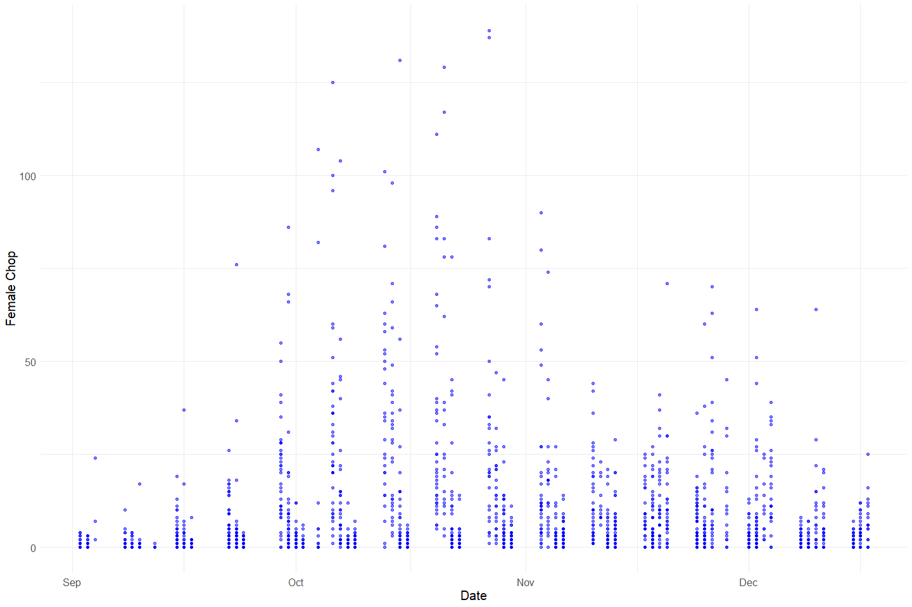
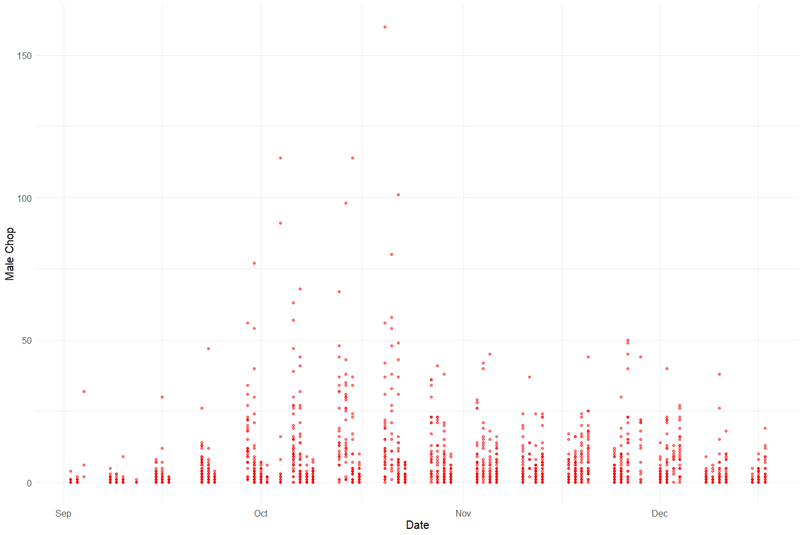
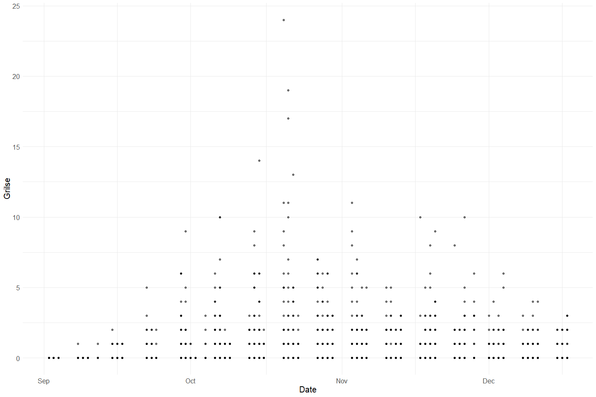
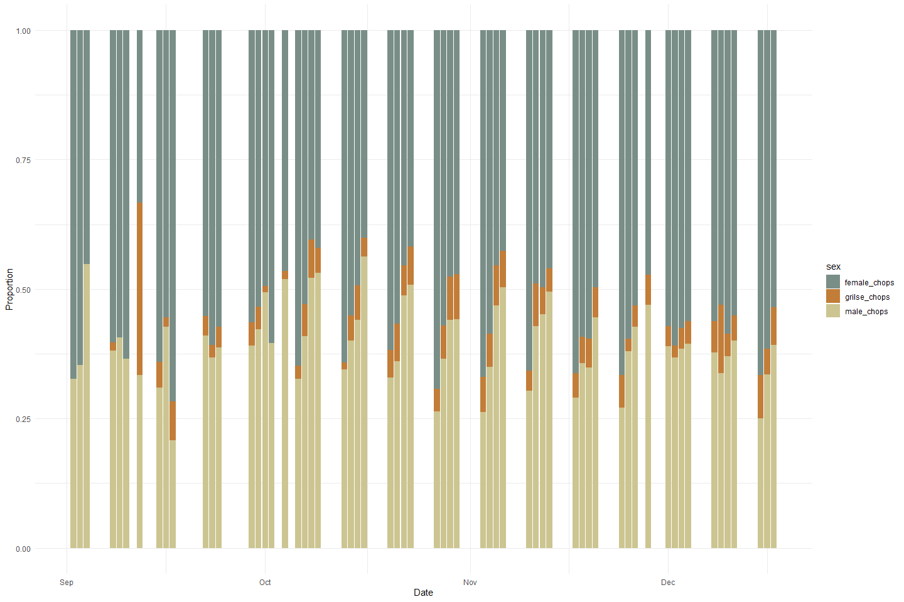
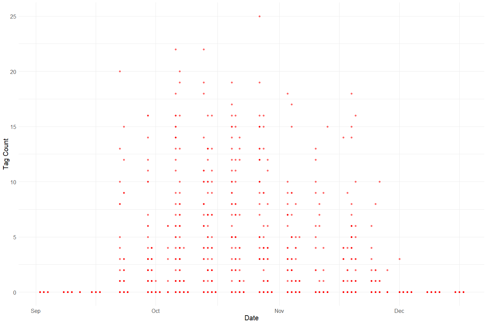
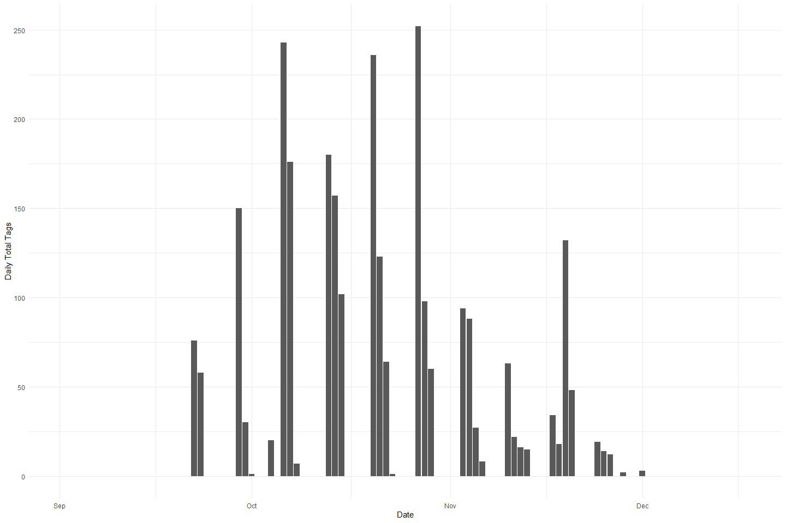
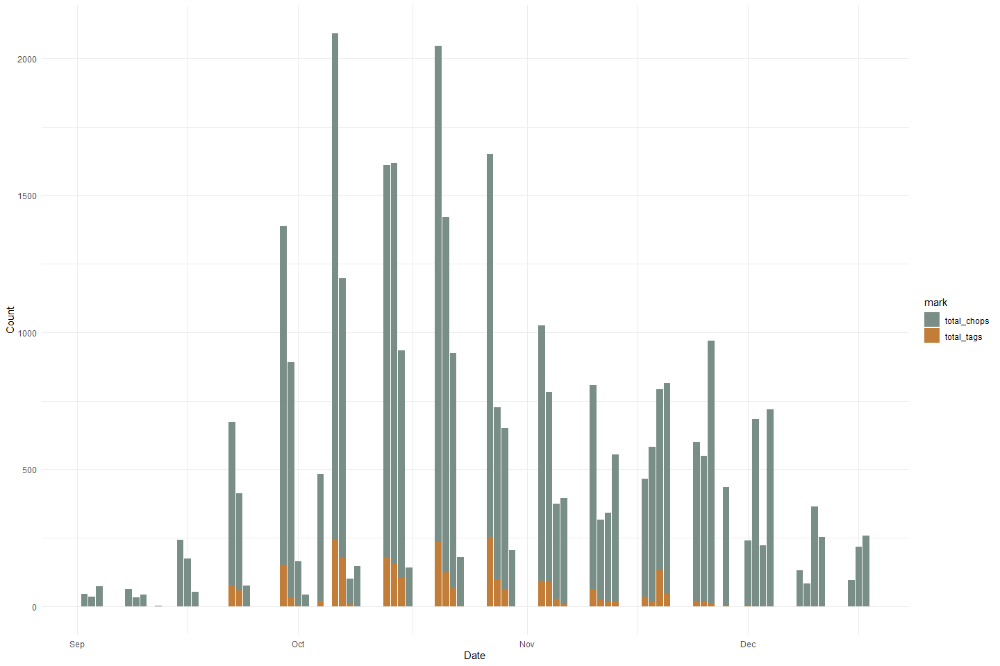
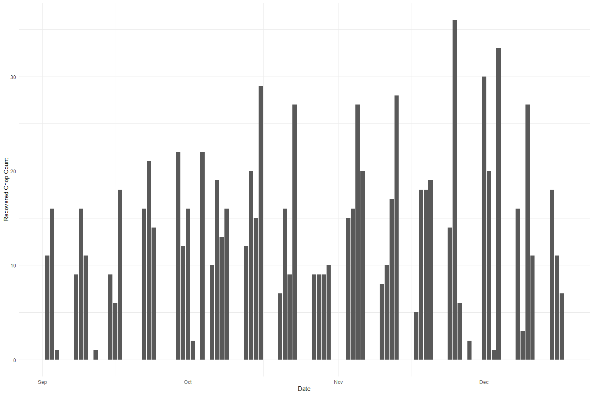
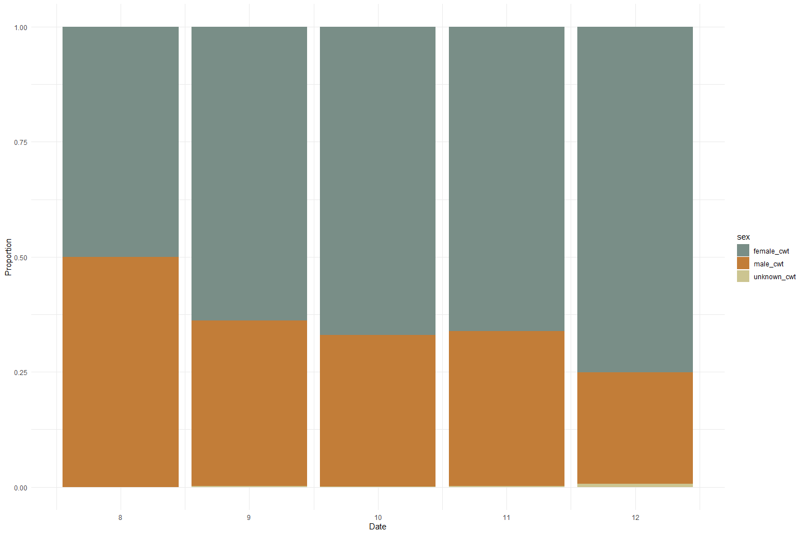
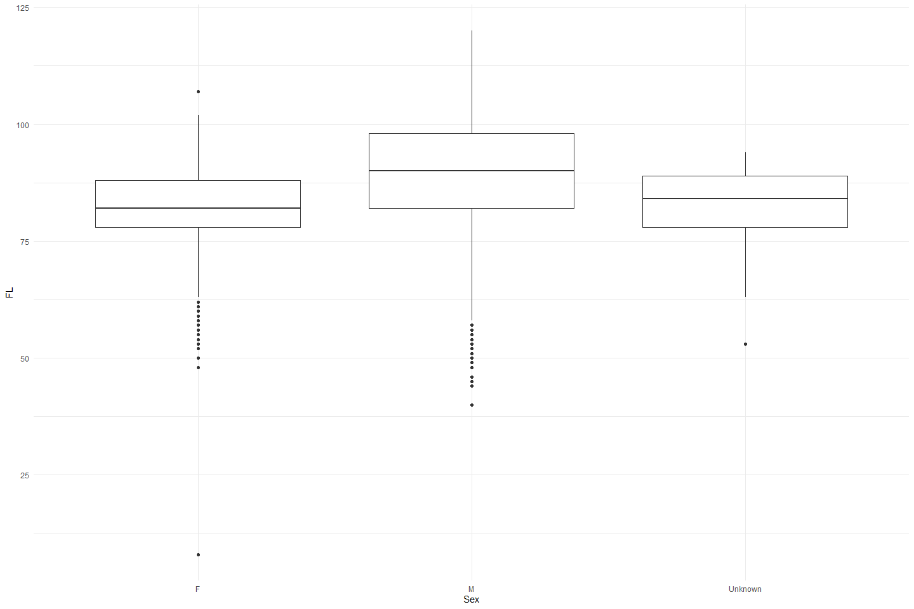

Feather Carcass QC 2003
================
Inigo Peng
2022-07-21

# Feather River Carcass Data

## Description of Monitoring Data

**Timeframe:**

**Video Season:**

**Completeness of Record throughout timeframe:**

**Sampling Location:**

**Data Contact:**

Any additional info?

## Access Cloud Data

``` r
# Run Sys.setenv() to specify GCS_AUTH_FILE and GCS_DEFAULT_BUCKET before running 
# getwd() to see how to specify paths 
# Open object from google cloud storage
# Set your authentication using gcs_auth

gcs_auth(json_file = Sys.getenv("GCS_AUTH_FILE"))
# Set global bucket 
gcs_global_bucket(bucket = Sys.getenv("GCS_DEFAULT_BUCKET"))

# git data and save as xlsx
```

``` r
gcs_get_object(object_name = "adult-holding-redd-and-carcass-surveys/feather-river/data-raw/carcass/2003/ChopChannelTBL_2003.xlsx",
               bucket = gcs_get_global_bucket(),
               saveToDisk = "ChopChannel_2003.xlsx",
               overwrite = TRUE)
#
gcs_get_object(object_name = "adult-holding-redd-and-carcass-surveys/feather-river/data-raw/carcass/2003/ChopHeaderTBL_2003.xlsx",
               bucket = gcs_get_global_bucket(),
               saveToDisk = "ChopHeader_2003.xlsx",
               overwrite = TRUE)

gcs_get_object(object_name = "adult-holding-redd-and-carcass-surveys/feather-river/data-raw/carcass/2003/ChopRecovTBL_2003.xlsx",
               bucket = gcs_get_global_bucket(),
               saveToDisk = "ChopRecov_2003.xlsx",
               overwrite = TRUE)
# 
gcs_get_object(object_name = "adult-holding-redd-and-carcass-surveys/feather-river/data-raw/carcass/2003/CWTHeaderTBL_2003.xlsx",
               bucket = gcs_get_global_bucket(),
               saveToDisk = "CWTHeader_2003.xlsx",
               overwrite = TRUE)

gcs_get_object(object_name = "adult-holding-redd-and-carcass-surveys/feather-river/data-raw/carcass/2003/CWTTagTBL_2003.xlsx",
               bucket = gcs_get_global_bucket(),
               saveToDisk = "CWTTag_2003.xlsx",
               overwrite = TRUE)
```

``` r
gcs_get_object(object_name = "adult-holding-redd-and-carcass-surveys/feather-river/data-raw/carcass/2003/ChopChannelTBL_2003.xlsx",
               bucket = gcs_get_global_bucket(),
               saveToDisk = "ChopChannel_2003.xlsx",
               overwrite = TRUE)
#
gcs_get_object(object_name = "adult-holding-redd-and-carcass-surveys/feather-river/data-raw/carcass/2003/ChopHeaderTBL_2003.xlsx",
               bucket = gcs_get_global_bucket(),
               saveToDisk = "ChopHeader_2003.xlsx",
               overwrite = TRUE)

gcs_get_object(object_name = "adult-holding-redd-and-carcass-surveys/feather-river/data-raw/carcass/2003/ChopRecovTBL_2003.xlsx",
               bucket = gcs_get_global_bucket(),
               saveToDisk = "ChopRecov_2003.xlsx",
               overwrite = TRUE)
# 
gcs_get_object(object_name = "adult-holding-redd-and-carcass-surveys/feather-river/data-raw/carcass/2003/CWTHeaderTBL_2003.xlsx",
               bucket = gcs_get_global_bucket(),
               saveToDisk = "CWTHeader_2003.xlsx",
               overwrite = TRUE)

gcs_get_object(object_name = "adult-holding-redd-and-carcass-surveys/feather-river/data-raw/carcass/2003/CWTTagTBL_2003.xlsx",
               bucket = gcs_get_global_bucket(),
               saveToDisk = "CWTTag_2003.xlsx",
               overwrite = TRUE)
```

## Raw Data Glimpse:

### ChopChannel_Raw

``` r
ChopChannel_raw <- read_excel("ChopChannel_2003.xlsx") %>% 
  rename("ID" = HeaderID) %>% 
  glimpse()
```

    ## Rows: 2,333
    ## Columns: 9
    ## $ ChanID   <dbl> 1, 2, 3, 4, 5, 6, 7, 8, 9, 10, 11, 12, 13, 14, 15, 16, 17, 18~
    ## $ Sect     <dbl> 1, 1, 1, 3, 3, 3, 5, 5, 5, 7, 7, 7, 9, 9, 9, 10, 10, 10, 11, ~
    ## $ Chan     <chr> "L", "M", "R", "L", "M", "R", "L", "M", "R", "L", "M", "R", "~
    ## $ Min      <dbl> 14, 14, 13, 7, 8, 7, 2, 2, 2, 3, 3, 3, 6, 6, 6, 10, 5, 0, 5, ~
    ## $ Male     <dbl> 0, 0, 0, 0, 0, 0, 0, 0, 0, 0, 0, 0, 0, 0, 0, 1, 0, 0, 0, 0, 0~
    ## $ Fem      <dbl> 2, 0, 0, 1, 0, 0, 0, 0, 0, 0, 0, 0, 0, 0, 0, 3, 1, 0, 0, 0, 0~
    ## $ Gril     <dbl> 0, 0, 0, 0, 0, 0, 0, 0, 0, 0, 0, 0, 0, 0, 0, 0, 0, 0, 0, 0, 0~
    ## $ TagCount <dbl> 0, 0, 0, 0, 0, 0, 0, 0, 0, 0, 0, 0, 0, 0, 0, 0, 0, 0, 0, 0, 0~
    ## $ ID       <dbl> 1, 1, 1, 1, 1, 1, 1, 1, 1, 1, 1, 1, 2, 2, 2, 2, 2, 2, 2, 2, 2~

### ChopRecov_raw

``` r
ChopRecov_raw <- read_excel("ChopRecov_2003.xlsx") %>% glimpse
```

    ## Rows: 1,461
    ## Columns: 4
    ## $ RecovID    <dbl> 48, 60, 59, 58, 56, 55, 54, 51, 40, 49, 64, 47, 46, 45, 44,~
    ## $ RecovColor <chr> "BLACK", "BLACK", "BLACK", "BLACK", "BLACK", "BLACK", "BLAC~
    ## $ RecovCount <dbl> 1, 1, 1, 1, 1, 1, 3, 1, 1, 1, 2, 1, 2, 1, 1, 1, 1, 1, 2, 1,~
    ## $ ChanID     <dbl> 299, 323, 321, 312, 311, 308, 307, 304, 285, 300, 330, 295,~

### ChopHeader_Raw

``` r
ChopHeader_raw <- read_excel("ChopHeader_2003.xlsx") %>% 
  rename("ID" = headerID) %>%
  glimpse()
```

    ## Rows: 344
    ## Columns: 9
    ## $ ID       <dbl> 1, 2, 3, 4, 5, 6, 7, 8, 9, 10, 11, 12, 13, 14, 15, 16, 17, 18~
    ## $ TagCol   <chr> "ORANGE AND BLACK", "ORANGE AND BLACK", "ORANGE AND BLACK", "~
    ## $ Date     <dttm> 2003-09-02, 2003-09-02, 2003-09-02, 2003-09-02, 2003-09-02, ~
    ## $ Crew     <chr> "RB, JK, AT", "JK, AT, RB", "JK, AT, RB", "DG, ND", "ND, BK, ~
    ## $ Time     <dttm> NA, 1899-12-31 13:00:00, 1899-12-31 14:10:00, 1899-12-31 10:~
    ## $ Recorder <chr> NA, NA, "JK", "DG", "KM", "KM", "JK", "DG", "PH", "PH", "PH",~
    ## $ Weather  <chr> "SUN", "SUN", "SUN", "SUN", "SUN", "SUN", "CLD", "CLD", "CLD"~
    ## $ Comment  <chr> NA, NA, NA, NA, NA, NA, NA, NA, NA, NA, NA, NA, NA, NA, NA, N~
    ## $ WeekNum  <dbl> 1, 1, 1, 1, 1, 1, 1, 1, 1, 1, 1, 1, 1, 1, 1, 1, 1, 1, 1, 1, 2~

### cwt_raw

``` r
cwt_raw <- read_excel("CWTTag_2003.xlsx") %>% glimpse()
```

    ## Rows: 6,128
    ## Columns: 13
    ## $ TagID    <dbl> 1, 2, 3, 4, 5, 6, 7, 8, 9, 10, 11, 12, 13, 14, 15, 16, 17, 18~
    ## $ Sect     <dbl> 2, 4, 6, 8, 8, 8, 8, 8, 8, 8, 8, 8, 8, 8, 8, 8, 8, 8, 8, 8, 1~
    ## $ RelLoc   <chr> "R", "L", "L", "R", "R", "R", "R", "R", "M", "L", "M", "M", "~
    ## $ FL       <dbl> 69, 77, 68, 94, 46, 83, 78, 92, 91, 101, 87, 65, 93, 82, 86, ~
    ## $ Sex      <chr> "F", "F", "F", "M", "M", "M", "M", "M", "M", "M", "F", "F", "~
    ## $ Spawn    <chr> "U", "NO DATA", "U", "UK", "UK", "UK", "UK", "UK", "UK", "UK"~
    ## $ Clip     <chr> "N", "N", "N", "N", "N", "N", "N", "N", "N", "N", "N", "Y", "~
    ## $ SampType <chr> "NONE", "O", "O", "NONE", "NONE", "NONE", "NONE", "NONE", "NO~
    ## $ CarcStat <chr> "T", "T", "T", "T", "T", "T", "T", "T", "T", "T", "T", "C", "~
    ## $ SampNum  <chr> NA, "090203-001", "090203-002", NA, NA, NA, NA, NA, NA, NA, N~
    ## $ HeadTag  <chr> NA, NA, NA, NA, NA, NA, NA, NA, NA, NA, NA, "56801", NA, NA, ~
    ## $ Comment  <chr> NA, NA, NA, NA, NA, NA, NA, NA, NA, NA, "NO OTOLITH # RECORDE~
    ## $ HeaderID <dbl> 1173, 1173, 1173, 1173, 1173, 1173, 1173, 1173, 1173, 1173, 1~

### CWT_Header_raw

``` r
cwt_header_raw <- read_xlsx("CWTHeader_2003.xlsx") %>% glimpse
```

    ## Rows: 310
    ## Columns: 5
    ## $ headerID <dbl> 1173, 1174, 1175, 1176, 1177, 1178, 1179, 1180, 1181, 1182, 1~
    ## $ Date     <dttm> 2003-09-02, 2003-09-02, 2003-09-02, 2003-09-02, 2003-09-02, ~
    ## $ TagCol   <chr> "ORANGE AND BLACK", "ORANGE AND BLACK", "ORANGE AND BLACK", "~
    ## $ Crew     <chr> "DG, ND, KM, BK", "JK, AT, RB", "JK, AT, RB", "ND, KM, BK, DG~
    ## $ WeekNum  <dbl> 1, 1, 1, 1, 1, 1, 1, 1, 1, 2, 2, 2, 2, 2, 2, 2, 2, 2, 2, 2, 2~

## Data transformations:

### Counts

The `chop_channel` table contains carcass counts by sex, grilise and
chop/tagged

``` r
#1. chopchannel table (with dates and tag color)
chop_channel_join <- full_join(ChopHeader_raw %>% 
                                 select(ID, TagCol, Date, Time),
                               ChopChannel_raw) %>% 
  clean_names() %>% 
  rename("male_chop" = male,
         "female_chop" = fem,
         "grilse" = gril) %>% glimpse()
```

    ## Joining, by = "ID"

    ## Rows: 2,333
    ## Columns: 12
    ## $ id          <dbl> 1, 1, 1, 1, 1, 1, 1, 1, 1, 1, 1, 1, 2, 2, 2, 2, 2, 2, 2, 2~
    ## $ tag_col     <chr> "ORANGE AND BLACK", "ORANGE AND BLACK", "ORANGE AND BLACK"~
    ## $ date        <dttm> 2003-09-02, 2003-09-02, 2003-09-02, 2003-09-02, 2003-09-0~
    ## $ time        <dttm> NA, NA, NA, NA, NA, NA, NA, NA, NA, NA, NA, NA, 1899-12-3~
    ## $ chan_id     <dbl> 1, 2, 3, 4, 5, 6, 7, 8, 9, 10, 11, 12, 13, 14, 15, 16, 17,~
    ## $ sect        <dbl> 1, 1, 1, 3, 3, 3, 5, 5, 5, 7, 7, 7, 9, 9, 9, 10, 10, 10, 1~
    ## $ chan        <chr> "L", "M", "R", "L", "M", "R", "L", "M", "R", "L", "M", "R"~
    ## $ min         <dbl> 14, 14, 13, 7, 8, 7, 2, 2, 2, 3, 3, 3, 6, 6, 6, 10, 5, 0, ~
    ## $ male_chop   <dbl> 0, 0, 0, 0, 0, 0, 0, 0, 0, 0, 0, 0, 0, 0, 0, 1, 0, 0, 0, 0~
    ## $ female_chop <dbl> 2, 0, 0, 1, 0, 0, 0, 0, 0, 0, 0, 0, 0, 0, 0, 3, 1, 0, 0, 0~
    ## $ grilse      <dbl> 0, 0, 0, 0, 0, 0, 0, 0, 0, 0, 0, 0, 0, 0, 0, 0, 0, 0, 0, 0~
    ## $ tag_count   <dbl> 0, 0, 0, 0, 0, 0, 0, 0, 0, 0, 0, 0, 0, 0, 0, 0, 0, 0, 0, 0~

### Recovery

The `chop_recovery` table contains recovered carcass counts by color

``` r
chop_recovery_join <- full_join(ChopHeader_raw %>% 
                                  select(ID, Date, Time),
                                ChopRecov_raw %>% 
                                  rename(ID = RecovID))  %>% 
  clean_names() %>% glimpse
```

    ## Joining, by = "ID"

    ## Rows: 1,467
    ## Columns: 6
    ## $ id          <dbl> 1, 2, 3, 4, 5, 6, 7, 8, 9, 10, 11, 12, 13, 14, 15, 16, 17,~
    ## $ date        <dttm> 2003-09-02, 2003-09-02, 2003-09-02, 2003-09-02, 2003-09-0~
    ## $ time        <dttm> NA, 1899-12-31 13:00:00, 1899-12-31 14:10:00, 1899-12-31 ~
    ## $ recov_color <chr> "ORANGE AND BLACK", "ORANGE AND BLACK", "ORANGE AND BLACK"~
    ## $ recov_count <dbl> 1, 2, 1, 2, 3, 2, 1, 1, 2, 1, 1, 1, 1, 2, 1, 1, 1, 1, 2, 1~
    ## $ chan_id     <dbl> 142, 143, 147, 152, 154, 155, 156, 160, 161, 162, 163, 164~

### Survey

The `chop_header` table contains survey metadata and covariates

``` r
chop_header <- ChopHeader_raw %>% 
  clean_names() %>% glimpse
```

    ## Rows: 344
    ## Columns: 9
    ## $ id       <dbl> 1, 2, 3, 4, 5, 6, 7, 8, 9, 10, 11, 12, 13, 14, 15, 16, 17, 18~
    ## $ tag_col  <chr> "ORANGE AND BLACK", "ORANGE AND BLACK", "ORANGE AND BLACK", "~
    ## $ date     <dttm> 2003-09-02, 2003-09-02, 2003-09-02, 2003-09-02, 2003-09-02, ~
    ## $ crew     <chr> "RB, JK, AT", "JK, AT, RB", "JK, AT, RB", "DG, ND", "ND, BK, ~
    ## $ time     <dttm> NA, 1899-12-31 13:00:00, 1899-12-31 14:10:00, 1899-12-31 10:~
    ## $ recorder <chr> NA, NA, "JK", "DG", "KM", "KM", "JK", "DG", "PH", "PH", "PH",~
    ## $ weather  <chr> "SUN", "SUN", "SUN", "SUN", "SUN", "SUN", "CLD", "CLD", "CLD"~
    ## $ comment  <chr> NA, NA, NA, NA, NA, NA, NA, NA, NA, NA, NA, NA, NA, NA, NA, N~
    ## $ week_num <dbl> 1, 1, 1, 1, 1, 1, 1, 1, 1, 1, 1, 1, 1, 1, 1, 1, 1, 1, 1, 1, 2~

### CWT

The `cwt` table contains coded wire tag information.

``` r
cwt <- full_join(cwt_raw %>% clean_names(), cwt_header_raw %>% clean_names()) %>% 
  clean_names() %>% 
  glimpse
```

    ## Joining, by = "header_id"

    ## Rows: 6,128
    ## Columns: 17
    ## $ tag_id    <dbl> 1, 2, 3, 4, 5, 6, 7, 8, 9, 10, 11, 12, 13, 14, 15, 16, 17, 1~
    ## $ sect      <dbl> 2, 4, 6, 8, 8, 8, 8, 8, 8, 8, 8, 8, 8, 8, 8, 8, 8, 8, 8, 8, ~
    ## $ rel_loc   <chr> "R", "L", "L", "R", "R", "R", "R", "R", "M", "L", "M", "M", ~
    ## $ fl        <dbl> 69, 77, 68, 94, 46, 83, 78, 92, 91, 101, 87, 65, 93, 82, 86,~
    ## $ sex       <chr> "F", "F", "F", "M", "M", "M", "M", "M", "M", "M", "F", "F", ~
    ## $ spawn     <chr> "U", "NO DATA", "U", "UK", "UK", "UK", "UK", "UK", "UK", "UK~
    ## $ clip      <chr> "N", "N", "N", "N", "N", "N", "N", "N", "N", "N", "N", "Y", ~
    ## $ samp_type <chr> "NONE", "O", "O", "NONE", "NONE", "NONE", "NONE", "NONE", "N~
    ## $ carc_stat <chr> "T", "T", "T", "T", "T", "T", "T", "T", "T", "T", "T", "C", ~
    ## $ samp_num  <chr> NA, "090203-001", "090203-002", NA, NA, NA, NA, NA, NA, NA, ~
    ## $ head_tag  <chr> NA, NA, NA, NA, NA, NA, NA, NA, NA, NA, NA, "56801", NA, NA,~
    ## $ comment   <chr> NA, NA, NA, NA, NA, NA, NA, NA, NA, NA, "NO OTOLITH # RECORD~
    ## $ header_id <dbl> 1173, 1173, 1173, 1173, 1173, 1173, 1173, 1173, 1173, 1173, ~
    ## $ date      <dttm> 2003-09-02, 2003-09-02, 2003-09-02, 2003-09-02, 2003-09-02,~
    ## $ tag_col   <chr> "ORANGE AND BLACK", "ORANGE AND BLACK", "ORANGE AND BLACK", ~
    ## $ crew      <chr> "DG, ND, KM, BK", "DG, ND, KM, BK", "DG, ND, KM, BK", "DG, N~
    ## $ week_num  <dbl> 1, 1, 1, 1, 1, 1, 1, 1, 1, 1, 1, 1, 1, 1, 1, 1, 1, 1, 1, 1, ~

## Explore Numeric Variables:

#### Chop Channel Variable:`id`, `chan_id`, `sect`, `min`

``` r
# Filter clean data to show only numeric variables 
chop_channel_join %>% 
  select_if(is.numeric) %>%
  colnames()
```

    ## [1] "id"          "chan_id"     "sect"        "min"         "male_chop"  
    ## [6] "female_chop" "grilse"      "tag_count"

``` r
summary(chop_channel_join$id)
```

    ##    Min. 1st Qu.  Median    Mean 3rd Qu.    Max. 
    ##     1.0    93.0   180.0   178.1   267.0   344.0

``` r
summary(chop_channel_join$chan_id)
```

    ##    Min. 1st Qu.  Median    Mean 3rd Qu.    Max. 
    ##       1     589    1172    1172    1757    2340

``` r
summary(chop_channel_join$sect)
```

    ##    Min. 1st Qu.  Median    Mean 3rd Qu.    Max. 
    ##    1.00   11.00   21.00   22.17   34.00   46.00

``` r
summary(chop_channel_join$min)
```

    ##    Min. 1st Qu.  Median    Mean 3rd Qu.    Max. 
    ##    0.00    5.00   10.00   12.37   15.00  115.00

### Chop Channel Variable: `female_chop`, `male_chop`,`grilise`, `tag_count`

**Numeric Summary of `female_chop`, `male_chop`,`unknown_chops`,
`tag_count` over Period of Record**

``` r
summary(chop_channel_join$female_chop)
```

    ##    Min. 1st Qu.  Median    Mean 3rd Qu.    Max. 
    ##   0.000   0.000   2.000   7.575   8.000 139.000

``` r
summary(chop_channel_join$male_chop)
```

    ##    Min. 1st Qu.  Median    Mean 3rd Qu.    Max. 
    ##   0.000   0.000   1.000   5.044   5.000 160.000

``` r
summary(chop_channel_join$grilse)
```

    ##    Min. 1st Qu.  Median    Mean 3rd Qu.    Max. 
    ##  0.0000  0.0000  0.0000  0.6442  1.0000 24.0000

**NA and Unknown Values** Provide a stat on NA or unknown values.

``` r
round(sum(is.na(chop_channel_join$male_chop))/nrow(chop_channel_join), 3) * 100
```

    ## [1] 0

``` r
round(sum(is.na(chop_channel_join$female_chop))/nrow(chop_channel_join), 3) * 100
```

    ## [1] 0

``` r
round(sum(is.na(chop_channel_join$grilse))/nrow(chop_channel_join), 3) * 100
```

    ## [1] 0

-   0 % of values in the `male_chop` column are NA.
-   0 % of values in the `female_chop` column are NA.
-   0 % of values in the `grilse` column are NA.

**Plotting female_chop over Period of Record**

``` r
# Make whatever plot is appropriate 
filter(chop_channel_join) %>% 
  ggplot(aes(x = date, y = female_chop)) +
  geom_point(size = 1.4, alpha = .5, color = "blue") + 
  labs(x = "Date", 
       y = "Female Chop") +
  theme_minimal() + 
  theme(text = element_text(size = 15)) 
```

<!-- -->
**Plotting male_chop over Period of Record**

``` r
filter(chop_channel_join) %>% 
  ggplot(aes(x = date, y = male_chop)) +
  geom_point(size = 1.4, alpha = .5, color = "red") + 
  labs(x = "Date", 
       y = "Male Chop") +
  theme_minimal() + 
  theme(text = element_text(size = 15)) 
```

<!-- -->

**Plotting grilse over Period of Record**

``` r
filter(chop_channel_join) %>% 
  ggplot(aes(x = date, y = grilse)) +
  geom_point(size = 1.4, alpha = .5, color = "black") + 
  labs(x = "Date", 
       y = "Grilse") +
  theme_minimal() + 
  theme(text = element_text(size = 15)) 
```

<!-- -->

**Plotting Total chops over Period of Record**

``` r
chop_channel_join %>% glimpse()
```

    ## Rows: 2,333
    ## Columns: 12
    ## $ id          <dbl> 1, 1, 1, 1, 1, 1, 1, 1, 1, 1, 1, 1, 2, 2, 2, 2, 2, 2, 2, 2~
    ## $ tag_col     <chr> "ORANGE AND BLACK", "ORANGE AND BLACK", "ORANGE AND BLACK"~
    ## $ date        <dttm> 2003-09-02, 2003-09-02, 2003-09-02, 2003-09-02, 2003-09-0~
    ## $ time        <dttm> NA, NA, NA, NA, NA, NA, NA, NA, NA, NA, NA, NA, 1899-12-3~
    ## $ chan_id     <dbl> 1, 2, 3, 4, 5, 6, 7, 8, 9, 10, 11, 12, 13, 14, 15, 16, 17,~
    ## $ sect        <dbl> 1, 1, 1, 3, 3, 3, 5, 5, 5, 7, 7, 7, 9, 9, 9, 10, 10, 10, 1~
    ## $ chan        <chr> "L", "M", "R", "L", "M", "R", "L", "M", "R", "L", "M", "R"~
    ## $ min         <dbl> 14, 14, 13, 7, 8, 7, 2, 2, 2, 3, 3, 3, 6, 6, 6, 10, 5, 0, ~
    ## $ male_chop   <dbl> 0, 0, 0, 0, 0, 0, 0, 0, 0, 0, 0, 0, 0, 0, 0, 1, 0, 0, 0, 0~
    ## $ female_chop <dbl> 2, 0, 0, 1, 0, 0, 0, 0, 0, 0, 0, 0, 0, 0, 0, 3, 1, 0, 0, 0~
    ## $ grilse      <dbl> 0, 0, 0, 0, 0, 0, 0, 0, 0, 0, 0, 0, 0, 0, 0, 0, 0, 0, 0, 0~
    ## $ tag_count   <dbl> 0, 0, 0, 0, 0, 0, 0, 0, 0, 0, 0, 0, 0, 0, 0, 0, 0, 0, 0, 0~

``` r
# Percentage by Gender of Daily Chops
# Address NA values for chops
total_chops <- chop_channel_join%>%
  mutate(male_chop = ifelse(is.na(male_chop), 0, male_chop), # fill na
         female_chop = ifelse(is.na(female_chop), 0, female_chop),
         grilse_chop = ifelse(is.na(grilse), 0, grilse),
         total_chops = grilse_chop + male_chop + female_chop) %>% 
  select(date, male_chop, female_chop, grilse_chop, total_chops)

# Case check: checking for duplicates
total_chops_test <- total_chops %>% # get total chops
  filter(date == as_date("2004-09-20"))

# Check if NAs introduced in creating total chop columns
nrow(total_chops_test) == (sum(total_chops_test$total_chops == (total_chops_test$male_chop + total_chops_test$female_chop + total_chops_test$grilse_chops)))
```

    ## [1] TRUE

``` r
# total number of chops for the day
total_chops_summary <- total_chops %>%
  group_by(date) %>%
  summarise(total_chops = sum(total_chops, na.rm = T),
            male_chops = sum(male_chop, na.rm = T),
            female_chops = sum(female_chop, na.rm = T),
            grilse_chops = sum(grilse_chop, na.rm = T))
```

``` r
total_chops_summary %>% 
  pivot_longer(cols = c(male_chops, female_chops, grilse_chops), names_to = "sex", values_to = "count") %>% 
  mutate(proportions = (count / total_chops)) %>% 
  ggplot(aes(x = date, y = proportions, fill = sex)) +
  geom_bar(stat = "identity", position = "stack") +
  scale_fill_manual(values = c("Blue","Red", "Black"), 
                    name = "Sex", 
                    labels = c("Female", "Male", "Grilse")) +
  theme_minimal() + 
  labs(y = "Proportion", x = "Date") +
  scale_fill_manual(values = wes_palette("Moonrise2"))
```

    ## Scale for 'fill' is already present. Adding another scale for 'fill', which
    ## will replace the existing scale.

<!-- -->

This plot shows the proportion of chops based on sex and grilse for each
day over the the period of 2004-09-03 to 2004-12-19. The data gaps that
we see are a result of the data collection process in which the data was
collected 2-4 days each week (with no specific period day of week) over
the 4 month period.

``` r
summary(chop_channel_join$tag_count)
```

    ##    Min. 1st Qu.  Median    Mean 3rd Qu.    Max.    NA's 
    ##   0.000   0.000   0.000   1.136   0.000  25.000       2

``` r
round(sum(is.na(chop_channel_join$tag_count))/nrow(chop_channel_join), 3) * 100
```

    ## [1] 0.1

-   0.1 % of values in the `tag_count` column are NA.

**Plotting tag_count over Period of Record**

``` r
chop_channel_join %>% 
  ggplot(aes(x = date, y = tag_count)) +
  geom_point(size = 1.4, alpha = .5, color = "red") + 
  labs(x = "Date", 
       y = "Tag Count") +
  theme_minimal() + 
  theme(text = element_text(size = 15)) 
```

<!-- -->

``` r
total_tags_summary <- chop_channel_join %>%
  group_by(date) %>%
  summarise(total_tags = sum(tag_count, na.rm = T))

total_tags_summary %>% 
  ggplot(aes(x = date, y = total_tags)) +
  geom_col() +
  theme_minimal() +
  labs(y = "Daily Total Tags", x = "Date")
```

<!-- -->
**Comparing tags and chops**

``` r
# from ashley: please improve on this plot I got started, make it look better, describe it, double check that the numbers make sense
total_carcass <- full_join(total_chops_summary, total_tags_summary) %>% 
  select(date, total_chops, total_tags) %>% 
  pivot_longer(c(total_chops, total_tags), names_to = "mark")
```

    ## Joining, by = "date"

``` r
full_join(total_chops_summary, total_tags_summary) %>% 
  select(date, total_chops, total_tags) %>% 
  pivot_longer(c(total_chops, total_tags), names_to = "mark")
```

    ## Joining, by = "date"

    ## # A tibble: 122 x 3
    ##    date                mark        value
    ##    <dttm>              <chr>       <dbl>
    ##  1 2003-09-02 00:00:00 total_chops    46
    ##  2 2003-09-02 00:00:00 total_tags      0
    ##  3 2003-09-03 00:00:00 total_chops    34
    ##  4 2003-09-03 00:00:00 total_tags      0
    ##  5 2003-09-04 00:00:00 total_chops    73
    ##  6 2003-09-04 00:00:00 total_tags      0
    ##  7 2003-09-08 00:00:00 total_chops    63
    ##  8 2003-09-08 00:00:00 total_tags      0
    ##  9 2003-09-09 00:00:00 total_chops    32
    ## 10 2003-09-09 00:00:00 total_tags      0
    ## # ... with 112 more rows

``` r
ggplot(total_carcass, aes(x = date, y = value, fill = mark)) +
  geom_col() +
  theme_minimal() +
  scale_fill_manual(values = wes_palette("Moonrise2")) +
  labs(x = "Date", y = "Count")
```

<!-- -->
Tags are significantly less applied compared to chops.

### Chop Recovery Variable: `id`, `chan_id`, `recov_count`

``` r
chop_recovery_join %>% 
  select_if(is.numeric) %>% 
  colnames()
```

    ## [1] "id"          "recov_count" "chan_id"

``` r
summary(chop_recovery_join$id)
```

    ##    Min. 1st Qu.  Median    Mean 3rd Qu.    Max. 
    ##     1.0   368.5   735.0   737.3  1105.5  1480.0

``` r
summary(chop_recovery_join$chan_id)
```

    ##    Min. 1st Qu.  Median    Mean 3rd Qu.    Max.    NA's 
    ##     142     964    1394    1362    1829    2332       6

``` r
summary(chop_recovery_join$recov_count)
```

    ##    Min. 1st Qu.  Median    Mean 3rd Qu.    Max.    NA's 
    ##   1.000   1.000   2.000   2.621   3.000  33.000       6

**Plotting recov_count over Period of Record**

``` r
chop_recovery_join %>% 
  ggplot(aes(x = date, y = recov_count)) +
  geom_col() +
  theme_minimal() +
  labs(x = "Date", y = "Recovered Chop Count")
```

<!-- -->
This chart shows the recovered chops. The chart is not showing count
values that do not have dates or times associated with them.

### Chop Header Variable: `id`

``` r
chop_header %>% 
  select_if(is.numeric) %>% 
  colnames()
```

    ## [1] "id"       "week_num"

``` r
summary(chop_header$id)
```

    ##    Min. 1st Qu.  Median    Mean 3rd Qu.    Max. 
    ##    1.00   86.75  172.50  172.50  258.25  344.00

### CWT Variable: `tag_id`, `sect`, `fl`, `header_id`, `week_num`

``` r
cwt %>% 
  select_if(is.numeric) %>% 
  colnames()
```

    ## [1] "tag_id"    "sect"      "fl"        "header_id" "week_num"

``` r
summary(cwt$tag_id)
```

    ##    Min. 1st Qu.  Median    Mean 3rd Qu.    Max. 
    ##       1    1534    3066    3067    4602    6137

``` r
summary(cwt$sect)
```

    ##    Min. 1st Qu.  Median    Mean 3rd Qu.    Max. 
    ##    1.00    8.00   14.00   16.96   24.00   48.00

``` r
summary(cwt$fl)
```

    ##    Min. 1st Qu.  Median    Mean 3rd Qu.    Max.    NA's 
    ##    8.00   78.00   84.00   84.23   91.00  120.00      41

-   0 % of values in the `tag_id` column are NA.
-   0 % of values in the `sect` column are NA.
-   0.7 % of values in the `fl` column are NA.

``` r
#Create a cwt_count column
#Pivot table to expand sex column to female_cwt, male_cwt, and unknown_cwt 
#Is this graph helpful?
unique(cwt$sex)
```

    ## [1] "F"  "M"  "ND"

``` r
cwt_count <- cwt %>% 
  mutate(count = 1) %>%
  mutate(sex = case_when(sex == "ND"|is.na(sex)|sex =="UK" ~ "U",
                         TRUE ~ sex)) %>% 
  pivot_wider(names_from = sex, values_from = count, values_fill = 0) %>% 
  # unnest() %>% 
  rename("male_cwt" = M,
         "female_cwt" = F,
         "unknown_cwt" = U) %>% glimpse
```

    ## Rows: 6,128
    ## Columns: 19
    ## $ tag_id      <dbl> 1, 2, 3, 4, 5, 6, 7, 8, 9, 10, 11, 12, 13, 14, 15, 16, 17,~
    ## $ sect        <dbl> 2, 4, 6, 8, 8, 8, 8, 8, 8, 8, 8, 8, 8, 8, 8, 8, 8, 8, 8, 8~
    ## $ rel_loc     <chr> "R", "L", "L", "R", "R", "R", "R", "R", "M", "L", "M", "M"~
    ## $ fl          <dbl> 69, 77, 68, 94, 46, 83, 78, 92, 91, 101, 87, 65, 93, 82, 8~
    ## $ spawn       <chr> "U", "NO DATA", "U", "UK", "UK", "UK", "UK", "UK", "UK", "~
    ## $ clip        <chr> "N", "N", "N", "N", "N", "N", "N", "N", "N", "N", "N", "Y"~
    ## $ samp_type   <chr> "NONE", "O", "O", "NONE", "NONE", "NONE", "NONE", "NONE", ~
    ## $ carc_stat   <chr> "T", "T", "T", "T", "T", "T", "T", "T", "T", "T", "T", "C"~
    ## $ samp_num    <chr> NA, "090203-001", "090203-002", NA, NA, NA, NA, NA, NA, NA~
    ## $ head_tag    <chr> NA, NA, NA, NA, NA, NA, NA, NA, NA, NA, NA, "56801", NA, N~
    ## $ comment     <chr> NA, NA, NA, NA, NA, NA, NA, NA, NA, NA, "NO OTOLITH # RECO~
    ## $ header_id   <dbl> 1173, 1173, 1173, 1173, 1173, 1173, 1173, 1173, 1173, 1173~
    ## $ date        <dttm> 2003-09-02, 2003-09-02, 2003-09-02, 2003-09-02, 2003-09-0~
    ## $ tag_col     <chr> "ORANGE AND BLACK", "ORANGE AND BLACK", "ORANGE AND BLACK"~
    ## $ crew        <chr> "DG, ND, KM, BK", "DG, ND, KM, BK", "DG, ND, KM, BK", "DG,~
    ## $ week_num    <dbl> 1, 1, 1, 1, 1, 1, 1, 1, 1, 1, 1, 1, 1, 1, 1, 1, 1, 1, 1, 1~
    ## $ female_cwt  <dbl> 1, 1, 1, 0, 0, 0, 0, 0, 0, 0, 1, 1, 1, 0, 1, 0, 1, 1, 0, 0~
    ## $ male_cwt    <dbl> 0, 0, 0, 1, 1, 1, 1, 1, 1, 1, 0, 0, 0, 1, 0, 1, 0, 0, 1, 1~
    ## $ unknown_cwt <dbl> 0, 0, 0, 0, 0, 0, 0, 0, 0, 0, 0, 0, 0, 0, 0, 0, 0, 0, 0, 0~

``` r
total_cwt_summary <- cwt_count %>% 
  mutate(male_cwt = ifelse(is.na(male_cwt), 0, male_cwt), # fill na
         female_cwt = ifelse(is.na(female_cwt), 0, female_cwt),
         unknown_cwt = ifelse(is.na(unknown_cwt), 0, unknown_cwt),
         total_cwt = unknown_cwt + male_cwt + female_cwt) %>% 
  group_by(month(date)) %>% 
  summarise(total_cwt = sum(total_cwt),
            male_cwt = sum(male_cwt),
            female_cwt = sum(female_cwt),
            unknown_cwt = sum(unknown_cwt))
```

``` r
total_cwt_summary %>% 
  pivot_longer(cols = c(male_cwt, female_cwt, unknown_cwt), names_to = "sex", values_to = "count") %>% 
  mutate(proportions = (count / total_cwt)) %>% 
  ggplot(aes(x = `month(date)`, y = proportions, fill = sex)) + 
  geom_bar(stat = "identity", position = "stack") +
  scale_fill_manual(name = "chops", 
                    labels = c("CWT Male", "CWT Female", "CWT Unknown")) +
  theme_minimal() + 
  labs(y = "Proportion", x = "Date") +
  scale_fill_manual(values = wes_palette("Moonrise2"))
```

    ## Scale for 'fill' is already present. Adding another scale for 'fill', which
    ## will replace the existing scale.

<!-- -->

**Plotting fork length of each sex**

``` r
cwt %>% 
  mutate(sex = case_when(sex == "ND"|is.na(sex)|sex =="UK" ~ "Unknown",
                         TRUE ~ sex))%>% 
  ggplot(aes(x = sex, y = fl)) + 
  geom_boxplot() + 
  theme_minimal() + 
  labs(y = "FL", x = "Sex")
```

<!-- -->

## Explore Categorical variables:

### Chop Channel Clean Data

Fix inconsistencies with spelling, capitalization, and dates

``` r
chop_channel_join %>% 
  select_if(is.character) %>%
  colnames()
```

    ## [1] "tag_col" "chan"

``` r
unique(chop_channel_join$tag_col)
```

    ##  [1] "ORANGE AND BLACK"                    
    ##  [2] "BLACK"                               
    ##  [3] "RED AND WHITE 1"                     
    ##  [4] "YELLOW 1"                            
    ##  [5] "BLACK AND WHITE 1"                   
    ##  [6] "GREEN 1"                             
    ##  [7] "RED AND BLACK 1"                     
    ##  [8] "ORANGE 1"                            
    ##  [9] "YELLOW AND BLACK"                    
    ## [10] "BLUE"                                
    ## [11] "BLACK AND WHITE 2"                   
    ## [12] "ORANGE 2 -OR- GREEN 2"               
    ## [13] "YELLOW 2"                            
    ## [14] "RED AND WHITE 2 -OR- RED AND BLACK 2"
    ## [15] "BLACK AND WHITE 3"                   
    ## [16] "NO COLOR"

``` r
#Remove 5?
unique(chop_channel_join$chan)
```

    ## [1] "L" "M" "R"

``` r
chop_channel_cleaner <- chop_channel_join %>%
  mutate(date = as_date(date)) %>%
  mutate_if(is.character, str_to_lower) %>% 
  select(-c(time))

chop_channel_cleaner
```

    ## # A tibble: 2,333 x 11
    ##       id tag_col      date       chan_id  sect chan    min male_chop female_chop
    ##    <dbl> <chr>        <date>       <dbl> <dbl> <chr> <dbl>     <dbl>       <dbl>
    ##  1     1 orange and ~ 2003-09-02       1     1 l        14         0           2
    ##  2     1 orange and ~ 2003-09-02       2     1 m        14         0           0
    ##  3     1 orange and ~ 2003-09-02       3     1 r        13         0           0
    ##  4     1 orange and ~ 2003-09-02       4     3 l         7         0           1
    ##  5     1 orange and ~ 2003-09-02       5     3 m         8         0           0
    ##  6     1 orange and ~ 2003-09-02       6     3 r         7         0           0
    ##  7     1 orange and ~ 2003-09-02       7     5 l         2         0           0
    ##  8     1 orange and ~ 2003-09-02       8     5 m         2         0           0
    ##  9     1 orange and ~ 2003-09-02       9     5 r         2         0           0
    ## 10     1 orange and ~ 2003-09-02      10     7 l         3         0           0
    ## # ... with 2,323 more rows, and 2 more variables: grilse <dbl>, tag_count <dbl>

### Chop Recovery Clean Data

Fix inconsistencies with spelling, capitalization, and dates

``` r
chop_recovery_join %>% 
  select_if(is.character) %>% 
  colnames()
```

    ## [1] "recov_color"

``` r
unique(chop_recovery_join$recov_color)
```

    ##  [1] "ORANGE AND BLACK"                    
    ##  [2] NA                                    
    ##  [3] "BLACK"                               
    ##  [4] "RED AND WHITE 1"                     
    ##  [5] "YELLOW 1"                            
    ##  [6] "BLACK AND WHITE 1"                   
    ##  [7] "GREEN 1"                             
    ##  [8] "BLACK AND WHITE 2"                   
    ##  [9] "BLACK AND WHITE 3"                   
    ## [10] "BLUE"                                
    ## [11] "ORANGE 1"                            
    ## [12] "ORANGE 2 -OR- GREEN 2"               
    ## [13] "RED AND BLACK 1"                     
    ## [14] "RED AND WHITE 2 -OR- RED AND BLACK 2"
    ## [15] "YELLOW 2"                            
    ## [16] "YELLOW AND BLACK"

``` r
chop_recovery_cleaner <- chop_recovery_join %>% 
  mutate(date = as_date(date)) %>%
  mutate_if(is.character, str_to_lower) %>% 
  select(-c(time))

chop_recovery_cleaner
```

    ## # A tibble: 1,467 x 5
    ##       id date       recov_color      recov_count chan_id
    ##    <dbl> <date>     <chr>                  <dbl>   <dbl>
    ##  1     1 2003-09-02 orange and black           1     142
    ##  2     2 2003-09-02 orange and black           2     143
    ##  3     3 2003-09-02 orange and black           1     147
    ##  4     4 2003-09-02 orange and black           2     152
    ##  5     5 2003-09-02 orange and black           3     154
    ##  6     6 2003-09-02 orange and black           2     155
    ##  7     7 2003-09-03 orange and black           1     156
    ##  8     8 2003-09-03 orange and black           1     160
    ##  9     9 2003-09-03 orange and black           2     161
    ## 10    10 2003-09-03 orange and black           1     162
    ## # ... with 1,457 more rows

### Chop Header Clean Data

``` r
chop_header %>% 
  select_if(is.character) %>% 
  colnames()
```

    ## [1] "tag_col"  "crew"     "recorder" "weather"  "comment"

``` r
unique(chop_header$crew)
```

    ##   [1] "RB, JK, AT"             "JK, AT, RB"             "DG, ND"                
    ##   [4] "ND, BK, KM, DG"         "KM, ND, DG, BK"         "JK, PH, DG, TV"        
    ##   [7] "PH, JK, TV, DG"         "JK, TV, PH, DG"         "JK, TV, DG, PH"        
    ##  [10] "PH, DG, TV, JK"         "KM, KH, GL, BK"         "KM, GL, KH, BK"        
    ##  [13] "GL, KM, KH, BK"         "KM, BK"                 "PH, AT, RB, SM"        
    ##  [16] "JK, RK, BC, DG"         "RB, PH, AT, SM"         "PH, RB, AT, SM"        
    ##  [19] "DG, RK, JK, BC"         "KM, KH, BK"             "PH, DG, SM"            
    ##  [22] "PH, SM, DG"             "PH, DG"                 "ND, BK, AT"            
    ##  [25] "TV, PH, DG"             "PH, DG, TV"             "RB, TV, JK"            
    ##  [28] "KH, KM, BK"             "RK, AT, PH"             "RK, PH, AT"            
    ##  [31] "RB, KM, BK"             "TV, ND, AT"             "KM, RB, BK"            
    ##  [34] "AT, ND, TV"             "TV, GL, PH"             "PH, TV, GL"            
    ##  [37] "GL, TV, PH"             "KM, RV, BK"             "KM, BK, RB"            
    ##  [40] "RK, PH, DG"             "RK, DG, PH"             "JK, RB, AT"            
    ##  [43] "BK, KH, KM"             "KM, BK, KH"             "DG, PH, ND"            
    ##  [46] "PH, DG, ND"             "KM, BK, AT"             "KM, AT, BK"            
    ##  [49] "RB, TV"                 "GL, TV, PH, DG"         "PH, GL, TV, DG"        
    ##  [52] "PH, GL, DG, TV"         "BK, KM, KH"             "DG, AT, PH, RK"        
    ##  [55] "RK"                     "RB, AT, PH"             "RB, PH, DG"            
    ##  [58] "PH, RB, DG"             "BK, KM, ND"             "TV, KM, AT"            
    ##  [61] "TV, DG"                 NA                       "RB, PH, AT"            
    ##  [64] "PH, AT, RB"             "KH, BK, KM"             "RB, TV, DG, JK"        
    ##  [67] "RB, TV, JR, DG"         "ND, KG, KH"             "ND, KH, KG"            
    ##  [70] "RK, RB, DG"             "RB, DG, RK"             "BK, KM, AT"            
    ##  [73] "RB, JK, AT, BC"         "PH, TV, DG"             "DG, TV, PH"            
    ##  [76] "KM, BK, ND"             "ND, BK, KM"             "KM, ND, BK"            
    ##  [79] "GL, PH, TV"             "BK, KH, DG"             "DG, PH, JK"            
    ##  [82] "PH, JK, DG"             "BK, ND, JR"             "JR, TV, ND, BK"        
    ##  [85] "BK, JR, ND, TV"         "DG"                     "RB, DG"                
    ##  [88] "PH, DG, RB"             "BK, KM, KH, PH"         "KM, KH, BR, PH"        
    ##  [91] "KM, KH, BK, PH"         "RB, TV, DG, AT"         "TV, AT, RB, DG"        
    ##  [94] "BK, KM, JR"             "KM, BK, JR"             "JR, KM, BK"            
    ##  [97] "KM, JR, BK"             "DG, RB, TV"             "RB, TV, DG"            
    ## [100] "PH, DG, JK"             "AT, TV, RK, RB"         "RK, AT, RB, TV"        
    ## [103] "PH, TV, DG, AT"         "TV, PH, DG, AT"         "BK, ND, KM, RB"        
    ## [106] "BK ,KM, RB, ND"         "RB, GL, TV, PH"         "GL, TV, PH, RB"        
    ## [109] "BK, KH, KM, DG"         "DG, RB, PH"             "ND, KM, BK"            
    ## [112] "DG, RB"                 "JK, PH, DG, RK, AT"     "KH, RB, KM, BK"        
    ## [115] "ND, PH, AT"             "PH, AT, ND"             "TV, BK, DG"            
    ## [118] "RB, GL, PH, DG"         "PH, GL, RB, DG"         "GL, PH, RB, DG"        
    ## [121] "JR, DG, RB"             "RB, JR, DG"             "RB, DG, JR"            
    ## [124] "RB, DGM JK"             "BK, ND, KM"             "RB, DG, PH"            
    ## [127] "JK, TV, RK"             "PH, TV, RB, DG"         "RB, DG, PH, TV"        
    ## [130] "DG, PH, RB, TV"         "JR, RB, PH, TV"         "JR, RB, TV, PH"        
    ## [133] "PH, TV, JR, RB"         "BK, ND, DG, KM"         "KM, BK, ND, DG"        
    ## [136] "DG, KM, ND, BK"         "KM, ND, BK, DG"         "ND, KM, BK, DG"        
    ## [139] "BK, KM, KH, DG"         "BK, DG, KH, KM"         "ND, DG, KM, BK"        
    ## [142] "BK, KM, ND, DG"         "RB, TV, GL, DG"         "TV, RB, DG, GL"        
    ## [145] "GL, TV, RB, DG"         "TV, DG, JR, PH"         "TV, PH, JR, DG"        
    ## [148] "KH, KM, DG"             "RB, TV, PH"             "KH, DG, KM"            
    ## [151] "JK, TV, AT, JW"         "TV, PH, KM"             "PH, TV, KM"            
    ## [154] "BK, KH, ND"             "ND, KG, KH, BK"         "RB, RK, DG"            
    ## [157] "RK, RB, DG, AT"         "JK, TV, JR"             "ND, TV, KG, DG"        
    ## [160] "ND, KG, DG, TB"         "BK, RB, KH, KM"         "BK, KM, RB, KH"        
    ## [163] "RB, KM, BK, KH"         "KG, RB, JR, GR"         "DG, KH, ND, PH, TV"    
    ## [166] "ND, DG, PH, TV"         "ND, TV, KH, PH"         "RB, NR, KG"            
    ## [169] "JR, ND, KG, DG, RB, KH" "RB, JK, BK, KM"         "RB, KM, JR, BK"        
    ## [172] "KM"                     "ND, TV, PH"             "TV, PH, ND"            
    ## [175] "PH, TV, ND"             "BK, KM, DG"             "DG, BK, KM"            
    ## [178] "BK, RB, PH, DG"         "RB, PH, DG, BK"         "TV, ND, PH"            
    ## [181] "RB, DG, BK"             "BK, RB, DG"             "RB, BK, ND"            
    ## [184] "BK, ND, PH"             "PH, BK, ND"             "ND, BK, PH"            
    ## [187] "BK, PH, ND"             "TV, BK, PH, DG"         "BK, DG, PH, TV"        
    ## [190] "PH, BK, TV, DG"         "KH, DG, TV, PH"         "KH, TV, PH, DG"

``` r
unique(chop_header$recorder)
```

    ##  [1] NA           "JK"         "DG"         "KM"         "PH"        
    ##  [6] "BK"         "SM"         "RB"         "BC"         "KH"        
    ## [11] "ND"         "RK"         "GL"         "AT, JK"     "AT"        
    ## [16] "TV"         "DG, GL"     "ALL"        "ND, KM"     "KM, BK"    
    ## [21] "DG, TV"     "JK, DG, TV" "PH, DG"     "JR"         "JK, PH"    
    ## [26] "KM, DG"     "AT, JW"     "KELBY"      "KG"

``` r
unique(chop_header$weather)
```

    ## [1] "SUN" "CLD" NA    "RAN"

``` r
chop_header_cleaner <- chop_header %>%
  mutate(date = as_date(date)) %>%
  mutate_if(is.character, str_to_lower) %>% 
  mutate(crew = str_replace_all(crew, " ", ","),
         crew = str_replace_all(crew, ",,", ","),
         weather = ifelse(weather == "ran", "rain", weather)) %>%  
  select(-c(time))

chop_header_cleaner
```

    ## # A tibble: 344 x 8
    ##       id tag_col          date       crew      recorder weather comment week_num
    ##    <dbl> <chr>            <date>     <chr>     <chr>    <chr>   <chr>      <dbl>
    ##  1     1 orange and black 2003-09-02 rb,jk,at  <NA>     sun     <NA>           1
    ##  2     2 orange and black 2003-09-02 jk,at,rb  <NA>     sun     <NA>           1
    ##  3     3 orange and black 2003-09-02 jk,at,rb  jk       sun     <NA>           1
    ##  4     4 orange and black 2003-09-02 dg,nd     dg       sun     <NA>           1
    ##  5     5 orange and black 2003-09-02 nd,bk,km~ km       sun     <NA>           1
    ##  6     6 orange and black 2003-09-02 km,nd,dg~ km       sun     <NA>           1
    ##  7     7 orange and black 2003-09-03 jk,ph,dg~ jk       cld     <NA>           1
    ##  8     8 orange and black 2003-09-03 ph,jk,tv~ dg       cld     <NA>           1
    ##  9     9 orange and black 2003-09-03 jk,tv,ph~ ph       cld     <NA>           1
    ## 10    10 orange and black 2003-09-03 jk,tv,dg~ ph       cld     <NA>           1
    ## # ... with 334 more rows

### CWT Clean Data

``` r
cwt %>% 
  select_if(is.character) %>% 
  colnames
```

    ##  [1] "rel_loc"   "sex"       "spawn"     "clip"      "samp_type" "carc_stat"
    ##  [7] "samp_num"  "head_tag"  "comment"   "tag_col"   "crew"

``` r
unique(cwt$rel_loc)
```

    ## [1] "R"       "L"       "M"       "NO DATA" "CHOPPED" "NO SIDE"

``` r
unique(cwt$spawn)
```

    ## [1] "U"       "NO DATA" "UK"      "S"

``` r
unique(cwt$clip)
```

    ## [1] "N"       "Y"       "UK"      "NO DATA"

``` r
unique(cwt$samp_type)
```

    ## [1] "NONE"    "O"       "H&O"     "H"       NA        "NO DATA"

``` r
unique(cwt$carc_stat)
```

    ## [1] "T"       "C"       "NO DATA"

``` r
cwt_cleaner <- cwt %>% 
  mutate_if(is.character, str_to_lower) %>% 
  rename(datetime = "date") %>% 
  mutate(crew = str_replace_all(crew, " ", ","),
         crew = str_replace_all(crew, ",,", ","),
         sex = case_when(sex == "nd"|is.na(sex) ~ "U",
                         TRUE ~ sex),
         rel_loc = ifelse(rel_loc == "no data", NA, rel_loc),  
         spawn = ifelse(spawn == "no data", NA, spawn),
         clip = case_when(clip == "no data" ~ NA_character_,
                          clip == "y" ~ "yes",
                          clip == "n" ~ "no",
                          TRUE ~ clip),
         samp_type = ifelse(samp_type == "no data", NA, samp_type),
         carc_stat = ifelse(carc_stat == "no data", NA, carc_stat)) %>% 
  glimpse
```

    ## Rows: 6,128
    ## Columns: 17
    ## $ tag_id    <dbl> 1, 2, 3, 4, 5, 6, 7, 8, 9, 10, 11, 12, 13, 14, 15, 16, 17, 1~
    ## $ sect      <dbl> 2, 4, 6, 8, 8, 8, 8, 8, 8, 8, 8, 8, 8, 8, 8, 8, 8, 8, 8, 8, ~
    ## $ rel_loc   <chr> "r", "l", "l", "r", "r", "r", "r", "r", "m", "l", "m", "m", ~
    ## $ fl        <dbl> 69, 77, 68, 94, 46, 83, 78, 92, 91, 101, 87, 65, 93, 82, 86,~
    ## $ sex       <chr> "f", "f", "f", "m", "m", "m", "m", "m", "m", "m", "f", "f", ~
    ## $ spawn     <chr> "u", NA, "u", "uk", "uk", "uk", "uk", "uk", "uk", "uk", "u",~
    ## $ clip      <chr> "no", "no", "no", "no", "no", "no", "no", "no", "no", "no", ~
    ## $ samp_type <chr> "none", "o", "o", "none", "none", "none", "none", "none", "n~
    ## $ carc_stat <chr> "t", "t", "t", "t", "t", "t", "t", "t", "t", "t", "t", "c", ~
    ## $ samp_num  <chr> NA, "090203-001", "090203-002", NA, NA, NA, NA, NA, NA, NA, ~
    ## $ head_tag  <chr> NA, NA, NA, NA, NA, NA, NA, NA, NA, NA, NA, "56801", NA, NA,~
    ## $ comment   <chr> NA, NA, NA, NA, NA, NA, NA, NA, NA, NA, "no otolith # record~
    ## $ header_id <dbl> 1173, 1173, 1173, 1173, 1173, 1173, 1173, 1173, 1173, 1173, ~
    ## $ datetime  <dttm> 2003-09-02, 2003-09-02, 2003-09-02, 2003-09-02, 2003-09-02,~
    ## $ tag_col   <chr> "orange and black", "orange and black", "orange and black", ~
    ## $ crew      <chr> "dg,nd,km,bk", "dg,nd,km,bk", "dg,nd,km,bk", "dg,nd,km,bk", ~
    ## $ week_num  <dbl> 1, 1, 1, 1, 1, 1, 1, 1, 1, 1, 1, 1, 1, 1, 1, 1, 1, 1, 1, 1, ~

## Data Dictionaries

### Channel

``` r
percent_na <- chop_channel_cleaner %>%
  summarise_all(list(name = ~sum(is.na(.))/length(.))) %>%
  pivot_longer(cols = everything())


counts_data_dictionary <- tibble(variables = colnames(chop_channel_cleaner),
                          description = c("ID",
                                          "Color of tag applied to carcass",
                                          "Date of the survey",
                                          "Channel ID",
                                          "Sect", 
                                          "Chan", 
                                          "Min", 
                                          "Carcass that were chopped and male",
                                          "Carcass that were chopped and female",
                                          "Carcass that were grilse",
                                          "Carcass that were tagged"),
                          percent_na = round(percent_na$value*100))

kable(counts_data_dictionary)
```

| variables   | description                          | percent_na |
|:------------|:-------------------------------------|-----------:|
| id          | ID                                   |          0 |
| tag_col     | Color of tag applied to carcass      |          0 |
| date        | Date of the survey                   |          0 |
| chan_id     | Channel ID                           |          0 |
| sect        | Sect                                 |          0 |
| chan        | Chan                                 |          0 |
| min         | Min                                  |          0 |
| male_chop   | Carcass that were chopped and male   |          0 |
| female_chop | Carcass that were chopped and female |          0 |
| grilse      | Carcass that were grilse             |          0 |
| tag_count   | Carcass that were tagged             |          0 |

### Recovery

``` r
percent_na <- chop_recovery_cleaner %>%
  summarise_all(list(name = ~sum(is.na(.))/length(.))) %>%
  pivot_longer(cols = everything())


recovery_data_dictionary <- tibble(variables = colnames(chop_recovery_cleaner),
                          description = c("ID",
                                          "Date",
                                          "Color of tag recovered from carcass",
                                          "Count of recovery",
                                          "Channel ID"),
                          percent_na = round(percent_na$value*100))

kable(recovery_data_dictionary)
```

| variables   | description                         | percent_na |
|:------------|:------------------------------------|-----------:|
| id          | ID                                  |          0 |
| date        | Date                                |         77 |
| recov_color | Color of tag recovered from carcass |          0 |
| recov_count | Count of recovery                   |          0 |
| chan_id     | Channel ID                          |          0 |

### Survey

``` r
# 
percent_na <- chop_header_cleaner %>%
  summarise_all(list(name = ~sum(is.na(.))/length(.))) %>%
  pivot_longer(cols = everything())
# 
header_data_dictionary <- tibble(variables = colnames(chop_header_cleaner),
                          description = c("ID",
                                          "Color of tag of carcass",
                                          "Date of survey",
                                          "Crew memeber initials that collected",
                                          "Individual of crew member who recorded",
                                          "Weather",
                                          "Comments",
                                          "Week Number"),
                          percent_na = round(percent_na$value*100))

kable(header_data_dictionary)
```

| variables | description                            | percent_na |
|:----------|:---------------------------------------|-----------:|
| id        | ID                                     |          0 |
| tag_col   | Color of tag of carcass                |          0 |
| date      | Date of survey                         |          0 |
| crew      | Crew memeber initials that collected   |          6 |
| recorder  | Individual of crew member who recorded |         28 |
| weather   | Weather                                |          4 |
| comment   | Comments                               |         93 |
| week_num  | Week Number                            |          0 |

### CWT

``` r
percent_na <- cwt_cleaner %>%
  summarise_all(list(name = ~sum(is.na(.))/length(.))) %>%
  pivot_longer(cols = everything())

cwt_data_dictionary <- tibble(variables = colnames(cwt_cleaner),
                          description = c("ID",
                                          "Sect",
                                          "Release Location",
                                          "Fork length",
                                          "Sex",
                                          "Spawn",
                                          "Clip",
                                          "Sample type",
                                          "Carcass stat",
                                          "Sample number",
                                          "Head tag",
                                          "Comment",
                                          "Header ID",
                                          "Date",
                                          "Tag colour",
                                          "Crew",
                                          "Week number"),
                          percent_na = round(percent_na$value*100))

kable(cwt_data_dictionary)
```

| variables | description      | percent_na |
|:----------|:-----------------|-----------:|
| tag_id    | ID               |          0 |
| sect      | Sect             |          0 |
| rel_loc   | Release Location |          2 |
| fl        | Fork length      |          1 |
| sex       | Sex              |          0 |
| spawn     | Spawn            |          0 |
| clip      | Clip             |          0 |
| samp_type | Sample type      |          3 |
| carc_stat | Carcass stat     |          0 |
| samp_num  | Sample number    |         89 |
| head_tag  | Head tag         |         94 |
| comment   | Comment          |         98 |
| header_id | Header ID        |          0 |
| datetime  | Date             |          0 |
| tag_col   | Tag colour       |          0 |
| crew      | Crew             |          5 |
| week_num  | Week number      |          0 |

## Save cleaned data back to google cloud (TBA)

``` r
feather_carcass_chops_and_tags_2003 <- chop_channel_cleaner %>% glimpse()
```

    ## Rows: 2,333
    ## Columns: 11
    ## $ id          <dbl> 1, 1, 1, 1, 1, 1, 1, 1, 1, 1, 1, 1, 2, 2, 2, 2, 2, 2, 2, 2~
    ## $ tag_col     <chr> "orange and black", "orange and black", "orange and black"~
    ## $ date        <date> 2003-09-02, 2003-09-02, 2003-09-02, 2003-09-02, 2003-09-0~
    ## $ chan_id     <dbl> 1, 2, 3, 4, 5, 6, 7, 8, 9, 10, 11, 12, 13, 14, 15, 16, 17,~
    ## $ sect        <dbl> 1, 1, 1, 3, 3, 3, 5, 5, 5, 7, 7, 7, 9, 9, 9, 10, 10, 10, 1~
    ## $ chan        <chr> "l", "m", "r", "l", "m", "r", "l", "m", "r", "l", "m", "r"~
    ## $ min         <dbl> 14, 14, 13, 7, 8, 7, 2, 2, 2, 3, 3, 3, 6, 6, 6, 10, 5, 0, ~
    ## $ male_chop   <dbl> 0, 0, 0, 0, 0, 0, 0, 0, 0, 0, 0, 0, 0, 0, 0, 1, 0, 0, 0, 0~
    ## $ female_chop <dbl> 2, 0, 0, 1, 0, 0, 0, 0, 0, 0, 0, 0, 0, 0, 0, 3, 1, 0, 0, 0~
    ## $ grilse      <dbl> 0, 0, 0, 0, 0, 0, 0, 0, 0, 0, 0, 0, 0, 0, 0, 0, 0, 0, 0, 0~
    ## $ tag_count   <dbl> 0, 0, 0, 0, 0, 0, 0, 0, 0, 0, 0, 0, 0, 0, 0, 0, 0, 0, 0, 0~

``` r
feather_carcass_chop_recovery_2003 <- chop_recovery_cleaner %>% glimpse()
```

    ## Rows: 1,467
    ## Columns: 5
    ## $ id          <dbl> 1, 2, 3, 4, 5, 6, 7, 8, 9, 10, 11, 12, 13, 14, 15, 16, 17,~
    ## $ date        <date> 2003-09-02, 2003-09-02, 2003-09-02, 2003-09-02, 2003-09-0~
    ## $ recov_color <chr> "orange and black", "orange and black", "orange and black"~
    ## $ recov_count <dbl> 1, 2, 1, 2, 3, 2, 1, 1, 2, 1, 1, 1, 1, 2, 1, 1, 1, 1, 2, 1~
    ## $ chan_id     <dbl> 142, 143, 147, 152, 154, 155, 156, 160, 161, 162, 163, 164~

``` r
feather_carcass_cwt_2003 <-cwt_cleaner %>% glimpse()
```

    ## Rows: 6,128
    ## Columns: 17
    ## $ tag_id    <dbl> 1, 2, 3, 4, 5, 6, 7, 8, 9, 10, 11, 12, 13, 14, 15, 16, 17, 1~
    ## $ sect      <dbl> 2, 4, 6, 8, 8, 8, 8, 8, 8, 8, 8, 8, 8, 8, 8, 8, 8, 8, 8, 8, ~
    ## $ rel_loc   <chr> "r", "l", "l", "r", "r", "r", "r", "r", "m", "l", "m", "m", ~
    ## $ fl        <dbl> 69, 77, 68, 94, 46, 83, 78, 92, 91, 101, 87, 65, 93, 82, 86,~
    ## $ sex       <chr> "f", "f", "f", "m", "m", "m", "m", "m", "m", "m", "f", "f", ~
    ## $ spawn     <chr> "u", NA, "u", "uk", "uk", "uk", "uk", "uk", "uk", "uk", "u",~
    ## $ clip      <chr> "no", "no", "no", "no", "no", "no", "no", "no", "no", "no", ~
    ## $ samp_type <chr> "none", "o", "o", "none", "none", "none", "none", "none", "n~
    ## $ carc_stat <chr> "t", "t", "t", "t", "t", "t", "t", "t", "t", "t", "t", "c", ~
    ## $ samp_num  <chr> NA, "090203-001", "090203-002", NA, NA, NA, NA, NA, NA, NA, ~
    ## $ head_tag  <chr> NA, NA, NA, NA, NA, NA, NA, NA, NA, NA, NA, "56801", NA, NA,~
    ## $ comment   <chr> NA, NA, NA, NA, NA, NA, NA, NA, NA, NA, "no otolith # record~
    ## $ header_id <dbl> 1173, 1173, 1173, 1173, 1173, 1173, 1173, 1173, 1173, 1173, ~
    ## $ datetime  <dttm> 2003-09-02, 2003-09-02, 2003-09-02, 2003-09-02, 2003-09-02,~
    ## $ tag_col   <chr> "orange and black", "orange and black", "orange and black", ~
    ## $ crew      <chr> "dg,nd,km,bk", "dg,nd,km,bk", "dg,nd,km,bk", "dg,nd,km,bk", ~
    ## $ week_num  <dbl> 1, 1, 1, 1, 1, 1, 1, 1, 1, 1, 1, 1, 1, 1, 1, 1, 1, 1, 1, 1, ~

``` r
feather_carcass_chop_header_2003 <- chop_header_cleaner %>% glimpse()
```

    ## Rows: 344
    ## Columns: 8
    ## $ id       <dbl> 1, 2, 3, 4, 5, 6, 7, 8, 9, 10, 11, 12, 13, 14, 15, 16, 17, 18~
    ## $ tag_col  <chr> "orange and black", "orange and black", "orange and black", "~
    ## $ date     <date> 2003-09-02, 2003-09-02, 2003-09-02, 2003-09-02, 2003-09-02, ~
    ## $ crew     <chr> "rb,jk,at", "jk,at,rb", "jk,at,rb", "dg,nd", "nd,bk,km,dg", "~
    ## $ recorder <chr> NA, NA, "jk", "dg", "km", "km", "jk", "dg", "ph", "ph", "ph",~
    ## $ weather  <chr> "sun", "sun", "sun", "sun", "sun", "sun", "cld", "cld", "cld"~
    ## $ comment  <chr> NA, NA, NA, NA, NA, NA, NA, NA, NA, NA, NA, NA, NA, NA, NA, N~
    ## $ week_num <dbl> 1, 1, 1, 1, 1, 1, 1, 1, 1, 1, 1, 1, 1, 1, 1, 1, 1, 1, 1, 1, 2~

``` r
f <- function(input, output) write_csv(input, file = output)

gcs_upload(feather_carcass_chops_and_tags_2003,
           object_function = f,
           type = "csv",
           name = "adult-holding-redd-and-carcass-surveys/feather-river/data/feather_carcass_chops_and_tags_2003.csv")

gcs_upload(feather_carcass_chop_recovery_2003,
           object_function = f,
           type = "csv",
           name = "adult-holding-redd-and-carcass-surveys/feather-river/data/feather_carcass_chop_recovery_2003.csv")

gcs_upload(feather_carcass_cwt_2003,
           object_function = f,
           type = "csv",
           name = "adult-holding-redd-and-carcass-surveys/feather-river/data/feather_carcass_cwt_2003.csv")
gcs_upload(feather_carcass_chop_header_2003,
           object_function = f,
           type = "csv",
           name = "adult-holding-redd-and-carcass-surveys/feather-river/data/feather_carcass_chop_header_2003.csv")
```
