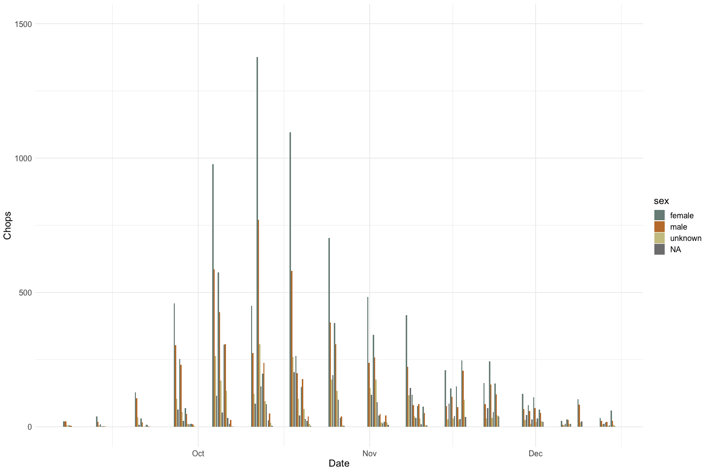
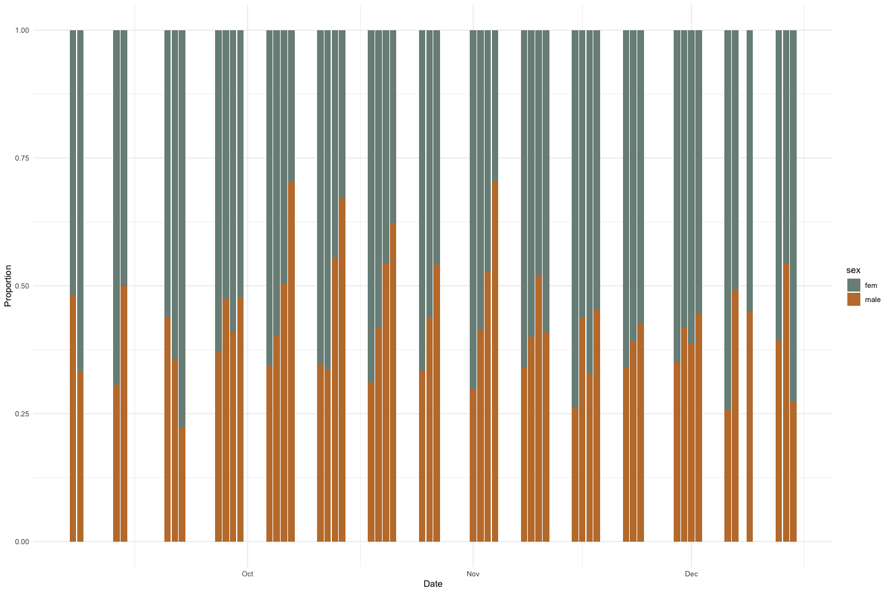
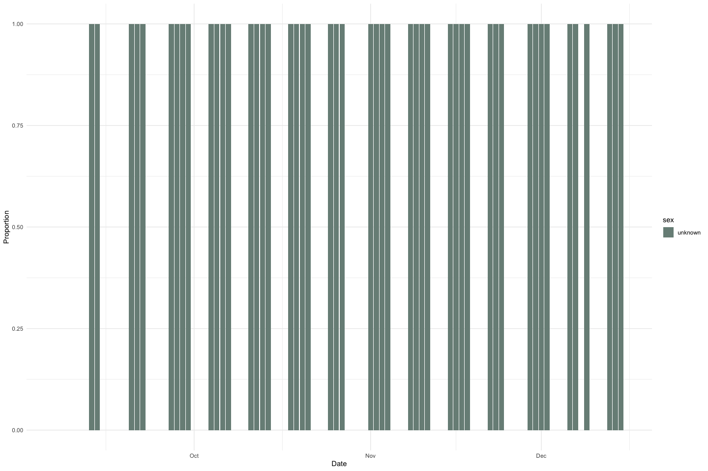
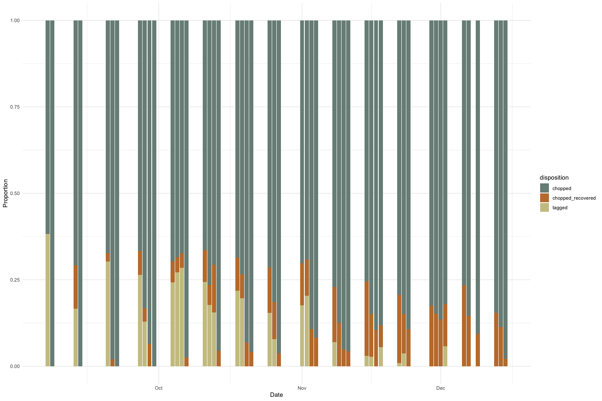
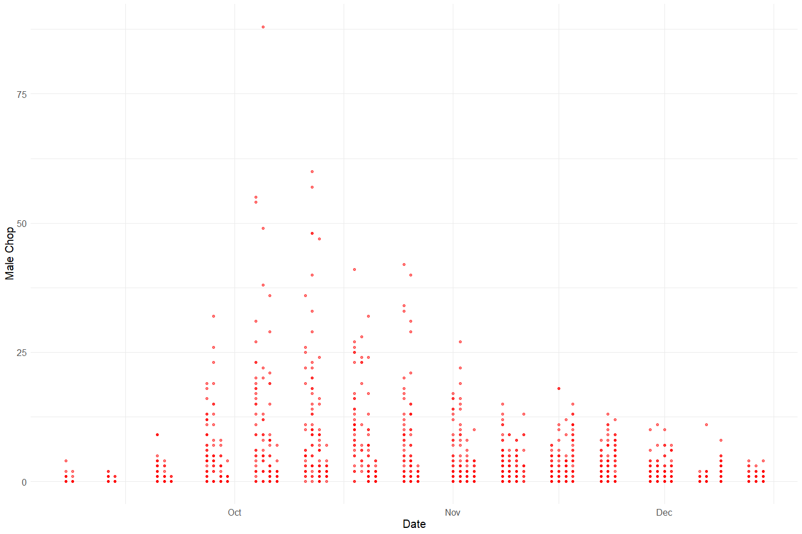
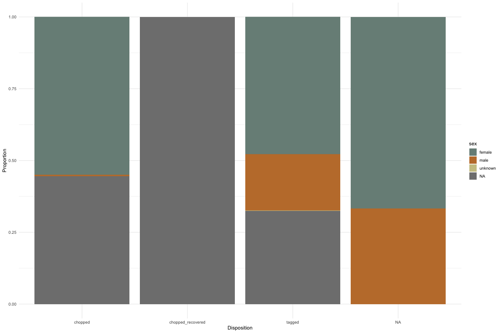

Feather Carcass QC 2004
================
Inigo Peng
2022-07-25

# Feather River Carcass Data

## Description of Monitoring Data

**Timeframe:**

**Video Season:**

**Completeness of Record throughout timeframe:**

**Sampling Location:**

**Data Contact:**

Any additional info?

## Access Cloud Data

## Raw Data Glimpse:

### cwt_raw

``` r
cwt_raw <- read_csv(here::here("data-raw", "qc-markdowns", "adult-holding-redd-and-carcass-surveys", "feather-river", "CWTTag_2004.csv")) |> glimpse()
```

    ## Rows: 4090 Columns: 13
    ## ── Column specification ────────────────────────────────────────────────────────
    ## Delimiter: ","
    ## chr (9): RelLoc, Sex, Spawn, Clip, SampType, CarcStat, SampNum, HeadTag, Com...
    ## dbl (4): TagID, Sect, FL, HeaderID
    ## 
    ## ℹ Use `spec()` to retrieve the full column specification for this data.
    ## ℹ Specify the column types or set `show_col_types = FALSE` to quiet this message.

    ## Rows: 4,090
    ## Columns: 13
    ## $ TagID    <dbl> 6181, 6182, 6183, 6184, 6185, 6186, 6187, 6188, 6189, 6190, 6…
    ## $ Sect     <dbl> 1, 1, 1, 1, 6, 10, 10, 12, 12, 12, 12, 12, 13, 13, 14, 14, 14…
    ## $ RelLoc   <chr> NA, NA, NA, NA, NA, NA, NA, NA, NA, NA, NA, NA, NA, NA, NA, N…
    ## $ FL       <dbl> 70, 87, 59, 82, 84, 102, 84, 83, 96, 77, 80, 68, 99, 90, 71, …
    ## $ Sex      <chr> "M", "F", "M", "F", "F", "M", "F", "M", "M", "ND", "ND", "F",…
    ## $ Spawn    <chr> "UK", "U", "UK", "U", "S", "UK", "U", "UK", "UK", "NO DATA", …
    ## $ Clip     <chr> "Y", "N", "Y", "N", "N", "N", "N", "N", "N", "N", "N", "N", "…
    ## $ SampType <chr> "H&O", "O", "H&O", "O", "O", "O", "O", "O", "O", "O", "O", "O…
    ## $ CarcStat <chr> "C", "T", "C", "T", "T", "T", "T", "T", "T", "T", "T", "T", "…
    ## $ SampNum  <chr> "090704-001", "090704-002", "090704-003", "090704-004", "0907…
    ## $ HeadTag  <chr> "42816", NA, "64641", NA, NA, NA, NA, NA, NA, NA, NA, NA, NA,…
    ## $ Comment  <chr> NA, NA, NA, NA, NA, NA, NA, NA, NA, NA, NA, NA, NA, NA, NA, N…
    ## $ HeaderID <dbl> 1488, 1488, 1488, 1488, 1488, 1488, 1488, 1488, 1488, 1488, 1…

### CWT_Header_raw

``` r
cwt_header_raw <- read_csv(here::here("data-raw", "qc-markdowns", "adult-holding-redd-and-carcass-surveys", "feather-river", "CWTHeader_2004.csv")) |> glimpse()
```

    ## Rows: 120 Columns: 5
    ## ── Column specification ────────────────────────────────────────────────────────
    ## Delimiter: ","
    ## chr  (2): TagCol, Crew
    ## dbl  (2): headerID, WeekNum
    ## date (1): Date
    ## 
    ## ℹ Use `spec()` to retrieve the full column specification for this data.
    ## ℹ Specify the column types or set `show_col_types = FALSE` to quiet this message.

    ## Rows: 120
    ## Columns: 5
    ## $ headerID <dbl> 1492, 1493, 1494, 1496, 1497, 1498, 1500, 1501, 1502, 1503, 1…
    ## $ Date     <date> 2004-09-08, 2004-09-13, 2004-09-13, 2004-09-13, 2004-09-14, …
    ## $ TagCol   <chr> "ORANGE1", "YELLOW2", "YELLOW2", "YELLOW2", "YELLOW2", "RED3"…
    ## $ Crew     <chr> "PH ND", "BK RB KM", "RB KB KM", "ND,AS,PH,RK", "BK,KH,RB,KM"…
    ## $ WeekNum  <dbl> 1, 2, 2, 2, 2, 3, 3, 3, 4, 4, 4, 4, 5, 5, 5, 5, 5, 5, 6, 6, 6…

### ChopChannel_Raw

``` r
ChopChannel_raw <- read_csv(here::here("data-raw", "qc-markdowns", "adult-holding-redd-and-carcass-surveys", "feather-river", "ChopChannel_2004.csv")) |> 
  glimpse()
```

    ## Rows: 2155 Columns: 9
    ## ── Column specification ────────────────────────────────────────────────────────
    ## Delimiter: ","
    ## chr (1): Chan
    ## dbl (8): ChanID, Sect, Min, Male, Fem, Gril, TagCount, HeaderID
    ## 
    ## ℹ Use `spec()` to retrieve the full column specification for this data.
    ## ℹ Specify the column types or set `show_col_types = FALSE` to quiet this message.

    ## Rows: 2,155
    ## Columns: 9
    ## $ ChanID   <dbl> 2381, 2382, 2384, 2385, 2386, 2387, 2388, 2389, 2390, 2391, 2…
    ## $ Sect     <dbl> 1, 1, 2, 2, 2, 3, 3, 3, 4, 4, 4, 6, 6, 6, 7, 7, 7, 10, 10, 11…
    ## $ Chan     <chr> "l", "m", "l", "m", "r", "l", "m", "r", "l", "m", "r", "l", "…
    ## $ Min      <dbl> 4, 4, 1, 1, 1, 3, 1, 1, 1, 1, 1, 2, 2, 2, 3, 3, 3, 1, 5, 4, 4…
    ## $ Male     <dbl> 0, 0, 0, 0, 0, 0, 0, 0, 1, 0, 0, 0, 0, 0, 0, 0, 0, 0, 0, 0, 0…
    ## $ Fem      <dbl> 0, 1, 0, 0, 0, 0, 0, 0, 0, 0, 0, 0, 0, 0, 0, 0, 0, 0, 1, 0, 0…
    ## $ Gril     <dbl> 0, 0, 0, 0, 0, 0, 0, 0, 0, 0, 0, 0, 0, 0, 0, 0, 0, 0, 0, 0, 0…
    ## $ TagCount <dbl> 0, 0, 0, 0, 0, 0, 0, 0, 0, 0, 0, 0, 0, 0, 0, 0, 0, 0, 0, 0, 0…
    ## $ HeaderID <dbl> 345, 345, 345, 345, 345, 345, 345, 345, 345, 345, 345, 346, 3…

### ChopRecov_raw

``` r
ChopRecov_raw <- read_csv(here::here("data-raw", "qc-markdowns", "adult-holding-redd-and-carcass-surveys", "feather-river", "ChopRecov_2004.csv")) |> glimpse()
```

    ## Rows: 1282 Columns: 4
    ## ── Column specification ────────────────────────────────────────────────────────
    ## Delimiter: ","
    ## chr (1): RecovColor
    ## dbl (3): RecovID, RecovCount, ChanID
    ## 
    ## ℹ Use `spec()` to retrieve the full column specification for this data.
    ## ℹ Specify the column types or set `show_col_types = FALSE` to quiet this message.

    ## Rows: 1,282
    ## Columns: 4
    ## $ RecovID    <dbl> 1556, 1557, 1558, 1559, 1560, 1561, 1562, 1563, 1564, 1567,…
    ## $ RecovColor <chr> "RED3", "RED3", "RED3", "RED3", "RED3", "RED3", "RED3", "RE…
    ## $ RecovCount <dbl> 5, 3, 1, 3, 1, 2, 6, 1, 1, 1, 1, 2, 1, 2, 1, 1, 1, 1, 1, 2,…
    ## $ ChanID     <dbl> 2828, 2829, 2830, 2831, 2832, 2833, 2835, 2836, 2837, 2849,…

### ChopHeader_Raw

``` r
ChopHeader_raw <- read_csv(here::here("data-raw", "qc-markdowns", "adult-holding-redd-and-carcass-surveys", "feather-river", "ChopHeader_2004.csv")) |> 
  glimpse()
```

    ## Rows: 160 Columns: 9
    ## ── Column specification ────────────────────────────────────────────────────────
    ## Delimiter: ","
    ## chr  (6): TagCol, Crew, Time, Recorder, Weather, Comment
    ## dbl  (2): headerID, WeekNum
    ## date (1): Date
    ## 
    ## ℹ Use `spec()` to retrieve the full column specification for this data.
    ## ℹ Specify the column types or set `show_col_types = FALSE` to quiet this message.

    ## Rows: 160
    ## Columns: 9
    ## $ headerID <dbl> 346, 347, 348, 349, 350, 351, 352, 353, 354, 355, 356, 357, 3…
    ## $ TagCol   <chr> "ORANGE1", "ORANGE1", "ORANGE1", "ORANGE1", "ORANGE1", "ORANG…
    ## $ Date     <date> 2004-09-07, 2004-09-07, 2004-09-07, 2004-09-07, 2004-09-07, …
    ## $ Crew     <chr> "nd tv ph", "nd tv", NA, NA, "nd tv ph", "nd ph tv", "DG KM R…
    ## $ Time     <chr> "(NA NA)", "(12/30/99 11:00:00)", "(NA NA)", "(NA NA)", "(12/…
    ## $ Recorder <chr> "ph", "nd", NA, NA, "nd", "nd", "DG", "DG", "ND", "KM", NA, "…
    ## $ Weather  <chr> "SUN", "SUN", NA, NA, "SUN", "SUN", "SUN", "SUN", "SUN", "SUN…
    ## $ Comment  <chr> NA, NA, NA, NA, NA, NA, NA, NA, NA, NA, NA, NA, NA, "Did not …
    ## $ WeekNum  <dbl> 1, 1, 1, 1, 1, 1, 1, 1, 1, 2, 2, 3, 3, 3, 3, 3, 3, 4, 4, 4, 4…

## Data transformations:

### CWT

The `cwt` table contains sampling information on individual carcasses.
It is not joined with the other tables. Added a `count` column assuming
each row represents one individual. Added `disposition` column to get
information from the `carc_stat` column (`tagged` or `chopped`). Added
`source_table` column for tracking. Each `tag_id` is represented only
once in this table.

``` r
cwt <- cwt_raw |>  
  clean_names() |>
  mutate(disposition = case_when(carc_stat == "T" ~ "tagged",
                                 carc_stat == "C" ~ "chopped",
                                 carc_stat == "NO DATA" ~ NA_character_,
                                 TRUE ~ carc_stat),
         source_table = "CWT",
         count = 1) |> 
  select(-carc_stat) |> 
  glimpse()
```

    ## Rows: 4,090
    ## Columns: 15
    ## $ tag_id       <dbl> 6181, 6182, 6183, 6184, 6185, 6186, 6187, 6188, 6189, 619…
    ## $ sect         <dbl> 1, 1, 1, 1, 6, 10, 10, 12, 12, 12, 12, 12, 13, 13, 14, 14…
    ## $ rel_loc      <chr> NA, NA, NA, NA, NA, NA, NA, NA, NA, NA, NA, NA, NA, NA, N…
    ## $ fl           <dbl> 70, 87, 59, 82, 84, 102, 84, 83, 96, 77, 80, 68, 99, 90, …
    ## $ sex          <chr> "M", "F", "M", "F", "F", "M", "F", "M", "M", "ND", "ND", …
    ## $ spawn        <chr> "UK", "U", "UK", "U", "S", "UK", "U", "UK", "UK", "NO DAT…
    ## $ clip         <chr> "Y", "N", "Y", "N", "N", "N", "N", "N", "N", "N", "N", "N…
    ## $ samp_type    <chr> "H&O", "O", "H&O", "O", "O", "O", "O", "O", "O", "O", "O"…
    ## $ samp_num     <chr> "090704-001", "090704-002", "090704-003", "090704-004", "…
    ## $ head_tag     <chr> "42816", NA, "64641", NA, NA, NA, NA, NA, NA, NA, NA, NA,…
    ## $ comment      <chr> NA, NA, NA, NA, NA, NA, NA, NA, NA, NA, NA, NA, NA, NA, N…
    ## $ header_id    <dbl> 1488, 1488, 1488, 1488, 1488, 1488, 1488, 1488, 1488, 148…
    ## $ disposition  <chr> "chopped", "tagged", "chopped", "tagged", "tagged", "tagg…
    ## $ source_table <chr> "CWT", "CWT", "CWT", "CWT", "CWT", "CWT", "CWT", "CWT", "…
    ## $ count        <dbl> 1, 1, 1, 1, 1, 1, 1, 1, 1, 1, 1, 1, 1, 1, 1, 1, 1, 1, 1, …

### Bulk chop counts

The `chops_and_tags` table contains chop counts by sex and a tag count
column. `lifestage` and `sex` columns added to make table tidy and
create `chop_count` column. `disposition` column added to distinguish
between `chop_count` and `tag_count`.

``` r
chops_and_tags <- left_join(ChopChannel_raw,
                            ChopHeader_raw |> select(HeaderID = headerID, TagCol, Date, Time),
                               by = "HeaderID") |>
  clean_names() |>
  pivot_longer(c(male, fem, gril),
               names_to = "sex",
               values_to = "chop_count") |> 
  pivot_longer(c(tag_count, chop_count),
               names_to = "disposition",
               values_to = "count") |> 
  mutate(lifestage = case_when(sex == "male" ~ "adult",
                               sex == "fem" ~ "adult",
                               sex == "gril" ~ "grilse"),
         sex = if_else(sex == "gril", "unknown", sex),
         disposition = if_else(disposition == "tag_count", "tagged", "chopped"),
         source_table = "ChopChannel") |>
  glimpse()
```

    ## Rows: 12,930
    ## Columns: 13
    ## $ chan_id      <dbl> 2381, 2381, 2381, 2381, 2381, 2381, 2382, 2382, 2382, 238…
    ## $ sect         <dbl> 1, 1, 1, 1, 1, 1, 1, 1, 1, 1, 1, 1, 2, 2, 2, 2, 2, 2, 2, …
    ## $ chan         <chr> "l", "l", "l", "l", "l", "l", "m", "m", "m", "m", "m", "m…
    ## $ min          <dbl> 4, 4, 4, 4, 4, 4, 4, 4, 4, 4, 4, 4, 1, 1, 1, 1, 1, 1, 1, …
    ## $ header_id    <dbl> 345, 345, 345, 345, 345, 345, 345, 345, 345, 345, 345, 34…
    ## $ tag_col      <chr> "ORANGE1", "ORANGE1", "ORANGE1", "ORANGE1", "ORANGE1", "O…
    ## $ date         <date> 2004-09-07, 2004-09-07, 2004-09-07, 2004-09-07, 2004-09-…
    ## $ time         <chr> "(NA NA)", "(NA NA)", "(NA NA)", "(NA NA)", "(NA NA)", "(…
    ## $ sex          <chr> "male", "male", "fem", "fem", "unknown", "unknown", "male…
    ## $ disposition  <chr> "tagged", "chopped", "tagged", "chopped", "tagged", "chop…
    ## $ count        <dbl> 0, 0, 0, 0, 0, 0, 0, 0, 0, 1, 0, 0, 0, 0, 0, 0, 0, 0, 0, …
    ## $ lifestage    <chr> "adult", "adult", "adult", "adult", "grilse", "grilse", "…
    ## $ source_table <chr> "ChopChannel", "ChopChannel", "ChopChannel", "ChopChannel…

### Recovered tags and chops

The `chop_recovery` table contains recovered carcass counts by color.
According to Access relationships, `chan_id` connects the header table
to the recovery table. Here we get header information from
`chops_and_tags` above and join those to the `chop_recovery` table on
`chan_id`. Renames `recov_count` to `count`. Adds `disposition` and
`source_table` columns.

``` r
chan_id_lookup <- chops_and_tags |> distinct(chan_id, date, time, sect, chan, min, chan_id, header_id, tag_col)
# HeaderID connects ChopChannel to ChopHeader; ChanID joins ChopChannel to ChopRecov
chop_recovery_join <- left_join(ChopRecov_raw |> rename(chan_id = ChanID),
                                chan_id_lookup, 
                                by = "chan_id") |> 
  clean_names() |> 
  rename(count = recov_count) |> 
  mutate(disposition = "chopped_recovered",
         source_table = "ChopRecov") |> 
  glimpse()
```

    ## Rows: 1,282
    ## Columns: 13
    ## $ recov_id     <dbl> 1556, 1557, 1558, 1559, 1560, 1561, 1562, 1563, 1564, 156…
    ## $ recov_color  <chr> "RED3", "RED3", "RED3", "RED3", "RED3", "RED3", "RED3", "…
    ## $ count        <dbl> 5, 3, 1, 3, 1, 2, 6, 1, 1, 1, 1, 2, 1, 2, 1, 1, 1, 1, 1, …
    ## $ chan_id      <dbl> 2828, 2829, 2830, 2831, 2832, 2833, 2835, 2836, 2837, 284…
    ## $ sect         <dbl> 9, 9, 10, 10, 14, 14, 15, 11, 11, 16, 16, 11, 12, 12, 13,…
    ## $ chan         <chr> "M", "R", "M", "R", "M", "R", "R", "L", "M", "M", "R", "R…
    ## $ min          <dbl> 15, 17, 30, 15, 10, 25, 30, 20, 10, 20, 15, 40, 10, 15, 3…
    ## $ header_id    <dbl> 366, 366, 366, 366, 367, 367, 367, 367, 367, 367, 367, 36…
    ## $ tag_col      <chr> "BLUE4", "BLUE4", "BLUE4", "BLUE4", "BLUE4", "BLUE4", "BL…
    ## $ date         <date> 2004-09-27, 2004-09-27, 2004-09-27, 2004-09-27, 2004-09-…
    ## $ time         <chr> "(12/30/99 12:45:00)", "(12/30/99 12:45:00)", "(12/30/99 …
    ## $ disposition  <chr> "chopped_recovered", "chopped_recovered", "chopped_recove…
    ## $ source_table <chr> "ChopRecov", "ChopRecov", "ChopRecov", "ChopRecov", "Chop…

### Combine tables

``` r
all_carcasses <- bind_rows(chops_and_tags, chop_recovery_join, cwt) |> glimpse()
```

    ## Rows: 18,302
    ## Columns: 24
    ## $ chan_id      <dbl> 2381, 2381, 2381, 2381, 2381, 2381, 2382, 2382, 2382, 238…
    ## $ sect         <dbl> 1, 1, 1, 1, 1, 1, 1, 1, 1, 1, 1, 1, 2, 2, 2, 2, 2, 2, 2, …
    ## $ chan         <chr> "l", "l", "l", "l", "l", "l", "m", "m", "m", "m", "m", "m…
    ## $ min          <dbl> 4, 4, 4, 4, 4, 4, 4, 4, 4, 4, 4, 4, 1, 1, 1, 1, 1, 1, 1, …
    ## $ header_id    <dbl> 345, 345, 345, 345, 345, 345, 345, 345, 345, 345, 345, 34…
    ## $ tag_col      <chr> "ORANGE1", "ORANGE1", "ORANGE1", "ORANGE1", "ORANGE1", "O…
    ## $ date         <date> 2004-09-07, 2004-09-07, 2004-09-07, 2004-09-07, 2004-09-…
    ## $ time         <chr> "(NA NA)", "(NA NA)", "(NA NA)", "(NA NA)", "(NA NA)", "(…
    ## $ sex          <chr> "male", "male", "fem", "fem", "unknown", "unknown", "male…
    ## $ disposition  <chr> "tagged", "chopped", "tagged", "chopped", "tagged", "chop…
    ## $ count        <dbl> 0, 0, 0, 0, 0, 0, 0, 0, 0, 1, 0, 0, 0, 0, 0, 0, 0, 0, 0, …
    ## $ lifestage    <chr> "adult", "adult", "adult", "adult", "grilse", "grilse", "…
    ## $ source_table <chr> "ChopChannel", "ChopChannel", "ChopChannel", "ChopChannel…
    ## $ recov_id     <dbl> NA, NA, NA, NA, NA, NA, NA, NA, NA, NA, NA, NA, NA, NA, N…
    ## $ recov_color  <chr> NA, NA, NA, NA, NA, NA, NA, NA, NA, NA, NA, NA, NA, NA, N…
    ## $ tag_id       <dbl> NA, NA, NA, NA, NA, NA, NA, NA, NA, NA, NA, NA, NA, NA, N…
    ## $ rel_loc      <chr> NA, NA, NA, NA, NA, NA, NA, NA, NA, NA, NA, NA, NA, NA, N…
    ## $ fl           <dbl> NA, NA, NA, NA, NA, NA, NA, NA, NA, NA, NA, NA, NA, NA, N…
    ## $ spawn        <chr> NA, NA, NA, NA, NA, NA, NA, NA, NA, NA, NA, NA, NA, NA, N…
    ## $ clip         <chr> NA, NA, NA, NA, NA, NA, NA, NA, NA, NA, NA, NA, NA, NA, N…
    ## $ samp_type    <chr> NA, NA, NA, NA, NA, NA, NA, NA, NA, NA, NA, NA, NA, NA, N…
    ## $ samp_num     <chr> NA, NA, NA, NA, NA, NA, NA, NA, NA, NA, NA, NA, NA, NA, N…
    ## $ head_tag     <chr> NA, NA, NA, NA, NA, NA, NA, NA, NA, NA, NA, NA, NA, NA, N…
    ## $ comment      <chr> NA, NA, NA, NA, NA, NA, NA, NA, NA, NA, NA, NA, NA, NA, N…

### Survey

The `chop_header` table contains survey metadata and covariates

``` r
chop_header <- ChopHeader_raw |> 
  clean_names() |> glimpse()
```

    ## Rows: 160
    ## Columns: 9
    ## $ header_id <dbl> 346, 347, 348, 349, 350, 351, 352, 353, 354, 355, 356, 357, …
    ## $ tag_col   <chr> "ORANGE1", "ORANGE1", "ORANGE1", "ORANGE1", "ORANGE1", "ORAN…
    ## $ date      <date> 2004-09-07, 2004-09-07, 2004-09-07, 2004-09-07, 2004-09-07,…
    ## $ crew      <chr> "nd tv ph", "nd tv", NA, NA, "nd tv ph", "nd ph tv", "DG KM …
    ## $ time      <chr> "(NA NA)", "(12/30/99 11:00:00)", "(NA NA)", "(NA NA)", "(12…
    ## $ recorder  <chr> "ph", "nd", NA, NA, "nd", "nd", "DG", "DG", "ND", "KM", NA, …
    ## $ weather   <chr> "SUN", "SUN", NA, NA, "SUN", "SUN", "SUN", "SUN", "SUN", "SU…
    ## $ comment   <chr> NA, NA, NA, NA, NA, NA, NA, NA, NA, NA, NA, NA, NA, "Did not…
    ## $ week_num  <dbl> 1, 1, 1, 1, 1, 1, 1, 1, 1, 2, 2, 3, 3, 3, 3, 3, 3, 4, 4, 4, …

## Explore Numeric Variables:

### All Carcasses Variables: `chan_id`, `sect`, `min`, `header_id`, `count`, `recov_id`, `tag_id`, `fl`, `head_tag`

``` r
# Filter clean data to show only numeric variables 
all_carcasses |>  
  select_if(is.numeric) |> 
  colnames()
```

    ## [1] "chan_id"   "sect"      "min"       "header_id" "count"     "recov_id" 
    ## [7] "tag_id"    "fl"

``` r
summary(all_carcasses$chan_id)
```

    ##    Min. 1st Qu.  Median    Mean 3rd Qu.    Max.    NA's 
    ##    2381    2985    3532    3524    4067    4596    4095

``` r
summary(all_carcasses$sect)
```

    ##    Min. 1st Qu.  Median    Mean 3rd Qu.    Max.    NA's 
    ##     1.0    10.0    18.0    20.9    31.0    46.0      17

``` r
summary(all_carcasses$min)
```

    ##    Min. 1st Qu.  Median    Mean 3rd Qu.    Max.    NA's 
    ##    0.00    5.00    9.00   11.19   15.00   57.00    4259

``` r
summary(all_carcasses$header_id)
```

    ##    Min. 1st Qu.  Median    Mean 3rd Qu.    Max.    NA's 
    ##     345     381     451     675     506    1613      17

``` r
summary(all_carcasses$recov_id)
```

    ##    Min. 1st Qu.  Median    Mean 3rd Qu.    Max.    NA's 
    ##    1489    1873    2202    2203    2541    2873   17020

``` r
summary(all_carcasses$tag_id)
```

    ##    Min. 1st Qu.  Median    Mean 3rd Qu.    Max.    NA's 
    ##    6181    7207    8238    8238    9271   10297   14212

``` r
summary(all_carcasses$fl)
```

    ##    Min. 1st Qu.  Median    Mean 3rd Qu.    Max.    NA's 
    ##   45.00   75.00   83.00   82.69   91.00  777.00   14228

``` r
summary(all_carcasses$head_tag)
```

    ##    Length     Class      Mode 
    ##     18302 character character

### All Carcasses Variable: `count`

``` r
summary(all_carcasses$count)
```

    ##    Min. 1st Qu.  Median    Mean 3rd Qu.    Max.    NA's 
    ##   0.000   0.000   0.000   1.577   1.000 129.000     407

\*\* Plot carcass counts by sex \*\*

``` r
all_carcasses |>  
  mutate(sex = case_when(sex %in% c("F", "fem") ~ "female",
                         sex == "M" ~ "male",
                         sex %in% c("ND", "UK") ~ "unknown",
                         sex == "fem" ~ "female",
                         TRUE ~ sex)) |> 
  group_by(date, sex) |>  
  summarize(count = sum(count, na.rm = T)) |> 
  ggplot(aes(x = date, y = count, fill = sex)) +
  geom_bar(stat = "identity", position = "dodge") + 
  labs(x = "Date", 
       y = "Chops") +
  theme_minimal() + 
  scale_fill_manual(values = wes_palette("Moonrise2")) +
  theme(text = element_text(size = 15)) +
  ylim(c(0, 1500))
```

    ## `summarise()` has grouped output by 'date'. You can override using the
    ## `.groups` argument.

<!-- -->
This plot shows carcass over period of record by sex and is helpful for
understanding the seasonality of the survey, i.e. chop counts peak in
Oct-Nov. Because some chops are recorded without sampling information,
much of the data has sex recorded as `NA`.

**Plotting Total Adult Chops over Period of Record**

``` r
total_adult_chops <- all_carcasses |> 
  filter(disposition != "tagged") |> 
  filter(lifestage != "grilse") |> 
  select(date, count, disposition, sex) |> 
  glimpse()
```

    ## Rows: 4,310
    ## Columns: 4
    ## $ date        <date> 2004-09-07, 2004-09-07, 2004-09-07, 2004-09-07, 2004-09-0…
    ## $ count       <dbl> 0, 0, 0, 1, 0, 0, 0, 0, 0, 0, 0, 0, 0, 0, 0, 0, 1, 0, 0, 0…
    ## $ disposition <chr> "chopped", "chopped", "chopped", "chopped", "chopped", "ch…
    ## $ sex         <chr> "male", "fem", "male", "fem", "male", "fem", "male", "fem"…

``` r
total_adult_chops_summary <- total_adult_chops |> 
  group_by(date, sex) |> 
  summarise(total_adult_chops = sum(count, na.rm = T)) |> 
  glimpse()
```

    ## `summarise()` has grouped output by 'date'. You can override using the
    ## `.groups` argument.

    ## Rows: 104
    ## Columns: 3
    ## Groups: date [52]
    ## $ date              <date> 2004-09-07, 2004-09-07, 2004-09-08, 2004-09-08, 200…
    ## $ sex               <chr> "fem", "male", "fem", "male", "fem", "male", "fem", …
    ## $ total_adult_chops <dbl> 15, 14, 6, 3, 34, 15, 2, 2, 101, 79, 31, 17, 7, 2, 3…

``` r
total_adult_chops_summary |>
  ggplot(aes(x = date, y = total_adult_chops, fill = sex)) + 
  geom_bar(stat = "identity", position = position_fill()) +
  labs(y = "Proportion", x = "Date") +
  theme_minimal() + 
  scale_fill_manual(values = wes_palette("Moonrise2"))
```

<!-- -->

This plot shows the sex proportion of adult chops (no `tagged`
carcasses) for each day over the period of 2004-09-07 to 2004-12-15. The
data gaps that we see are a result of the data collection process in
which the data was collected 2-4 days each week (with no specific period
day of week) over the 4 month period.

**Plotting grilse over Period of Record**

``` r
total_grilse_chops <- all_carcasses |> 
  filter(disposition != "tagged") |> 
  filter(lifestage == "grilse") |> 
  select(date, count, disposition, sex) |> 
  glimpse()
```

    ## Rows: 2,155
    ## Columns: 4
    ## $ date        <date> 2004-09-07, 2004-09-07, 2004-09-07, 2004-09-07, 2004-09-0…
    ## $ count       <dbl> 0, 0, 0, 0, 0, 0, 0, 0, 0, 0, 0, 0, 0, 0, 0, 0, 0, 0, 0, 0…
    ## $ disposition <chr> "chopped", "chopped", "chopped", "chopped", "chopped", "ch…
    ## $ sex         <chr> "unknown", "unknown", "unknown", "unknown", "unknown", "un…

``` r
total_grilse_chops_summary <- total_grilse_chops |> 
  group_by(date, sex) |> 
  summarise(total_grilse_chops = sum(count, na.rm = T)) |> 
  glimpse()
```

    ## `summarise()` has grouped output by 'date'. You can override using the
    ## `.groups` argument.

    ## Rows: 52
    ## Columns: 3
    ## Groups: date [52]
    ## $ date               <date> 2004-09-07, 2004-09-08, 2004-09-13, 2004-09-14, 20…
    ## $ sex                <chr> "unknown", "unknown", "unknown", "unknown", "unknow…
    ## $ total_grilse_chops <dbl> 0, 0, 2, 1, 7, 1, 1, 22, 32, 12, 4, 106, 62, 59, 2,…

``` r
total_grilse_chops_summary |>
  ggplot(aes(x = date, y = total_grilse_chops, fill = sex)) + 
  geom_bar(stat = "identity", position = position_fill()) +
  labs(y = "Proportion", x = "Date") +
  theme_minimal() + 
  scale_fill_manual(values = wes_palette("Moonrise2"))
```

<!-- -->
This plot shows the sex proportion of grilse chops for each day over the
the period of `{r} min(all_carcasses$date, na.rm = T)` to
`{r} max(all_carcasses$date, na.rm = T`. 2002 data did not separate out
grilse chops by sex so all are `NA` here. There are more data gaps for
the grilse data compared to the normal chops data.

**Plotting all carcasses over Period of Record** Carcasses in the
`all_carcasses` dataset are marked as either `tagged`,
`chopped_recovered`, or `chopped`. Carcasses from the `CWT` table are
marked as `chopped`, `tagged`, or `NA` and have individual-level
sampling information (i.e sex, fork length). `chopped` carcasses from
`ChopChannel` do not have individual-level sampling data.
`chopped_recovered` carcasses come from the `ChopRecov` data table and
have no individual-level sampling information. `tagged` carcasses come
from the `ChopChannel` data table and do not have individual-level
sampling information.

``` r
total_carcasses_summary <- all_carcasses |> 
  group_by(date, disposition) |> 
  summarise(total_carcasses = sum(count, na.rm = T)) |> 
  glimpse()
```

    ## `summarise()` has grouped output by 'date'. You can override using the
    ## `.groups` argument.

    ## Rows: 152
    ## Columns: 3
    ## Groups: date [52]
    ## $ date            <date> 2004-09-07, 2004-09-07, 2004-09-08, 2004-09-08, 2004-…
    ## $ disposition     <chr> "chopped", "tagged", "chopped", "tagged", "chopped", "…
    ## $ total_carcasses <dbl> 29, 18, 9, 0, 51, 9, 12, 5, 0, 187, 7, 84, 49, 1, 0, 1…

``` r
total_carcasses_summary |> 
  ggplot(aes(x = date, y = total_carcasses, fill = disposition)) + 
  geom_bar(stat = "identity", position = position_fill()) + 
  theme_minimal() + 
  labs(y = "Proportion", x = "Date") +
  scale_fill_manual(values = wes_palette("Moonrise2"))
```

<!-- -->

### Individual-level sampling information

**Plotting fork length of each sex**

``` r
summary(all_carcasses$fl)
```

    ##    Min. 1st Qu.  Median    Mean 3rd Qu.    Max.    NA's 
    ##   45.00   75.00   83.00   82.69   91.00  777.00   14228

``` r
all_carcasses |> 
  mutate(sex = case_when(sex %in% c("F", "fem") ~ "female",
                         sex == "M" ~ "male",
                         sex %in% c("UK", "ND") ~ "unknown")) |> 
  ggplot(aes(x = sex, y = fl)) +
  geom_boxplot() +
  facet_wrap(~disposition) +
  theme_minimal() + 
  labs(y = "fork length (mm)", x = "sex")
```

<!-- -->

**Plotting sex proportion of counts within each disposition**

``` r
all_carcasses |> 
  mutate(sex = case_when(sex %in% c("F", "fem") ~ "female",
                         sex == "M" ~ "male",
                         sex %in% c("UK", "ND") ~ "unknown")) |> 
  ggplot(aes(y = count, x = disposition, fill = sex)) +
  geom_bar(stat = "identity", position = position_fill()) + 
  theme_minimal() + 
  labs(y = "Proportion", x = "Disposition") +
  scale_fill_manual(values = wes_palette("Moonrise2"))
```

<!-- -->

### Chop Header Variable: `header_id`, `week_num`

``` r
chop_header |>  
  select_if(is.numeric) |>  
  colnames()
```

    ## [1] "header_id" "week_num"

``` r
summary(chop_header$header_id)
```

    ##    Min. 1st Qu.  Median    Mean 3rd Qu.    Max. 
    ##   345.0   386.8   427.5   428.6   472.2   512.0

``` r
summary(chop_header$week_num)
```

    ##    Min. 1st Qu.  Median    Mean 3rd Qu.    Max. 
    ##   1.000   6.000   8.000   8.588  12.000  15.000

## Explore Categorical variables:

### All Carcasses

Fix inconsistencies with spelling, capitalization, and dates

``` r
all_carcasses |>  
  select_if(is.character) |>  
  colnames()
```

    ##  [1] "chan"         "tag_col"      "time"         "sex"          "disposition" 
    ##  [6] "lifestage"    "source_table" "recov_color"  "rel_loc"      "spawn"       
    ## [11] "clip"         "samp_type"    "samp_num"     "head_tag"     "comment"

``` r
unique(all_carcasses$chan)
```

    ## [1] "l" "m" "r" "L" "M" "R" NA  "0"

``` r
unique(all_carcasses$tag_col)
```

    ##  [1] "ORANGE1"   "YELLOW2"   "RED3"      "BLUE4"     "ORANGE5"   NA         
    ##  [7] "YELLOW6"   "RED7"      "BLUE8"     "ORANGE9"   "YELLOW10"  "RED11"    
    ## [13] "BLUE12"    "ORANGE13"  "YELLOW14"  "CLEANUP15"

``` r
unique(all_carcasses$sex)
```

    ## [1] "male"    "fem"     "unknown" NA        "M"       "F"       "ND"     
    ## [8] "UK"

``` r
unique(all_carcasses$disposition)
```

    ## [1] "tagged"            "chopped"           "chopped_recovered"
    ## [4] NA

``` r
unique(all_carcasses$lifestage)
```

    ## [1] "adult"  "grilse" NA

``` r
unique(all_carcasses$source_table)
```

    ## [1] "ChopChannel" "ChopRecov"   "CWT"

``` r
unique(all_carcasses$recov_color)
```

    ##  [1] NA         "RED3"     "YELLOW2"  "ORANGE1"  "BLUE4"    "ORANGE5" 
    ##  [7] "YELLOW6"  "RED7"     "BLUE8"    "ORANGE9"  "YELLOW10" "RED11"   
    ## [13] "BLUE12"   "ORANGE13" "YELLOW14"

``` r
unique(all_carcasses$rel_loc)
```

    ## [1] NA        "M"       "R"       "L"       "NO DATA" "NO SIDE" "CHOPPED"

``` r
unique(all_carcasses$spawn)
```

    ## [1] NA        "UK"      "U"       "S"       "NO DATA"

``` r
unique(all_carcasses$clip)
```

    ## [1] NA        "Y"       "N"       "UK"      "NO DATA"

``` r
unique(all_carcasses$samp_type)
```

    ## [1] NA        "H&O"     "O"       "NONE"    "H"       "NO DATA"

``` r
all_carcasses_cleaner <- all_carcasses |> 
  mutate_if(is.character, str_to_lower) |> 
  mutate(sex = case_when(sex %in% c("f", "female") ~ "female",
                         sex == "m" ~ "male",
                         sex %in% c("nd", "uk") ~ "unknown",
                         sex == "fem" ~ "female"),
         spawn = case_when(spawn == "u" ~ "unspawned",
                           spawn == "uk" ~ "unknown",
                           spawn %in% c("no data", "nd") ~ NA_character_,
                           spawn == "s" ~ "spawned",
                           TRUE ~ spawn),
         adipose_fin_clip = case_when(clip == "n" ~ "FALSE",
                                      clip == "y" ~ "TRUE",
                                      clip %in% c(NA_character_, "no data", "uk") ~ "NA"),
         adipose_fin_clip = as.logical(adipose_fin_clip)) |>
  select(-c(time, samp_num, chan, clip)) |>  # time is removed because no stop time provided so information is not useful. chan is all NAs
  glimpse()
```

    ## Rows: 18,302
    ## Columns: 21
    ## $ chan_id          <dbl> 2381, 2381, 2381, 2381, 2381, 2381, 2382, 2382, 2382,…
    ## $ sect             <dbl> 1, 1, 1, 1, 1, 1, 1, 1, 1, 1, 1, 1, 2, 2, 2, 2, 2, 2,…
    ## $ min              <dbl> 4, 4, 4, 4, 4, 4, 4, 4, 4, 4, 4, 4, 1, 1, 1, 1, 1, 1,…
    ## $ header_id        <dbl> 345, 345, 345, 345, 345, 345, 345, 345, 345, 345, 345…
    ## $ tag_col          <chr> "orange1", "orange1", "orange1", "orange1", "orange1"…
    ## $ date             <date> 2004-09-07, 2004-09-07, 2004-09-07, 2004-09-07, 2004…
    ## $ sex              <chr> NA, NA, "female", "female", NA, NA, NA, NA, "female",…
    ## $ disposition      <chr> "tagged", "chopped", "tagged", "chopped", "tagged", "…
    ## $ count            <dbl> 0, 0, 0, 0, 0, 0, 0, 0, 0, 1, 0, 0, 0, 0, 0, 0, 0, 0,…
    ## $ lifestage        <chr> "adult", "adult", "adult", "adult", "grilse", "grilse…
    ## $ source_table     <chr> "chopchannel", "chopchannel", "chopchannel", "chopcha…
    ## $ recov_id         <dbl> NA, NA, NA, NA, NA, NA, NA, NA, NA, NA, NA, NA, NA, N…
    ## $ recov_color      <chr> NA, NA, NA, NA, NA, NA, NA, NA, NA, NA, NA, NA, NA, N…
    ## $ tag_id           <dbl> NA, NA, NA, NA, NA, NA, NA, NA, NA, NA, NA, NA, NA, N…
    ## $ rel_loc          <chr> NA, NA, NA, NA, NA, NA, NA, NA, NA, NA, NA, NA, NA, N…
    ## $ fl               <dbl> NA, NA, NA, NA, NA, NA, NA, NA, NA, NA, NA, NA, NA, N…
    ## $ spawn            <chr> NA, NA, NA, NA, NA, NA, NA, NA, NA, NA, NA, NA, NA, N…
    ## $ samp_type        <chr> NA, NA, NA, NA, NA, NA, NA, NA, NA, NA, NA, NA, NA, N…
    ## $ head_tag         <chr> NA, NA, NA, NA, NA, NA, NA, NA, NA, NA, NA, NA, NA, N…
    ## $ comment          <chr> NA, NA, NA, NA, NA, NA, NA, NA, NA, NA, NA, NA, NA, N…
    ## $ adipose_fin_clip <lgl> NA, NA, NA, NA, NA, NA, NA, NA, NA, NA, NA, NA, NA, N…

### Chop Header Clean Data

``` r
chop_header |>  
  select_if(is.character) |>  
  colnames()
```

    ## [1] "tag_col"  "crew"     "time"     "recorder" "weather"  "comment"

``` r
unique(chop_header$tag_col)
```

    ##  [1] "ORANGE1"   "YELLOW2"   "RED3"      "BLUE4"     "ORANGE5"   "YELLOW6"  
    ##  [7] "RED7"      "BLUE8"     "ORANGE9"   "YELLOW10"  "RED11"     "BLUE12"   
    ## [13] "ORANGE13"  "YELLOW14"  "CLEANUP15"

``` r
unique(chop_header$crew)
```

    ##   [1] "nd tv ph"        "nd tv"           NA                "nd ph tv"       
    ##   [5] "DG KM RB"        "ND PH"           "KM,BK,RB"        "JR,ND,PH"       
    ##   [9] "BK,ND,TV"        "PH TV BK"        "PH BK TV"        "pH BK TV"       
    ##  [13] "KM RK AS"        "rk,km,nd"        "RB,JR,ND"        "ND,RK,BK"       
    ##  [17] "RB,TV,DG,ND"     "PH,ND,DG"        "PH,ND,TV"        "PH,RB,DG"       
    ##  [21] "DG TV PH"        "PH TV DG"        "RB JR KH"        "PB PH"          
    ##  [25] "PH RK  DG"       "RK DG PH"        "RB TV ND"        "ND TV RB"       
    ##  [29] "KH KM BK"        "TV ND PH DG"     "bk km rb"        "nd dg ph tv"    
    ##  [33] "ph tv dg nd"     "ph tv"           "tv ph"           "ND,PH,TV"       
    ##  [37] "bk rb jr"        "rbbkjr"          "bkrbkm"          "jkphasjd"       
    ##  [41] "ndtvdgrk"        "PH BK KH"        "ND TV JD JR"     "phdgjr"         
    ##  [45] "phjrdg"          "jrdgph"          "dgjrph"          "rbtvkhjd"       
    ##  [49] "phndrbjd"        "bkdgkm"          "rktvassb"        "rbndphjd"       
    ##  [53] "rktvsb"          "ndbkkmkh"        "tvphjd"          "sbtvph"         
    ##  [57] "jd tv ph"        "jr dg rb sb"     "bkndjd"          "rbkmbk"         
    ##  [61] "tvndsbjd"        "SB TV PH"        "RB, DG, BK, ND"  "JD, TV, JR, SB" 
    ##  [65] "SB, TV, DG"      "RB, KM, JD"      "SB, ND, JD"      "RD, BK, KH"     
    ##  [69] "RK, JK, SB, AS"  "jk dg ph"        "KM, JD, BK"      "PH, ND, TV"     
    ##  [73] "SB ND KM TV"     "RB BK JD"        "KM ND BK"        "SB PH TV"       
    ##  [77] "KM KH BK DG"     "SB PH KM"        "DG TV RB"        "jr kh jd"       
    ##  [81] "BK JD ND"        "DG TV SB"        "JD BK KH DG"     "TV, KG, SB, DG" 
    ##  [85] "ND, BK, KM, JD"  "JD KH BK DG"     "SB, KG, DG, TV"  "KM, TV, PH"     
    ##  [89] "KM ND SB"        "TV, PH, KM"      "SBDGTVPH"        "BK KM KH JD"    
    ##  [93] "BKKHKMJD"        "ND JK KH"        "KG SB RK PH"     "ND JD BK"       
    ##  [97] "JD SB JR PH"     "BK KM KH"        "SB JD PH"        "ND RB BK"       
    ## [101] "TV PH SB"        "BK KH"           "BK TV ND SB"     "RB ND SB JD"    
    ## [105] "BK, KM, JD"      "JD, TB, SB, PH"  "JD, TV, SB, PH"  "JD, SB, TV, PH" 
    ## [109] "BK, KH, SB, PH"  "SB, KH, BK, PH"  "SB, PH, BK, KH"  "SB, KH, SB, BK" 
    ## [113] "ND,  KH, BK, JD" "ND, KH, BK, JD"  "BK, JD, ND, KH"  "brtvkhjd"       
    ## [117] "ND, TV, RB, DG"  "ND TV SB"        "DG JD KH BK"     "JK KM PH"       
    ## [121] "SB, TV, JD"      "BK RB KM"        "ND, KH, DG"      "ND, DG, KH"     
    ## [125] "bkkmkh"          "ndbkkhkm"

``` r
unique(chop_header$recorder)
```

    ##  [1] "ph"    "nd"    NA      "DG"    "ND"    "KM"    "BK"    "AS"    "as"   
    ## [10] "RB"    "RK"    "PH"    "ND PH" "rb"    "bk"    "km"    "dg"    "jdas" 
    ## [19] "jd"    "jr"    "JD"    "SB"    "jk"    "JK"

``` r
unique(chop_header$weather)
```

    ## [1] "SUN" NA    "RAN" "CLD"

``` r
chop_header_cleaner <- chop_header |> 
  mutate_if(is.character, str_to_lower) |>  
  mutate(crew = str_replace_all(crew, " ", ""),
         crew = str_replace_all(crew, "/", ","),
         crew = str_replace_all(crew, "&", ","),
         weather = case_when(weather == "ran" ~ "rain",
                             weather == "cld" ~ "cloudy",
                             TRUE ~ weather)) |>  
  select(-time) # stop is all NA and start is not useful without stop
```

## Comments

- Table layout/structure same as 2002 and 2003.
- what is `samp_num`, `rel_loc`, `head_tag`?
- can we join recovered tags on a specific `id` value?

## Data Dictionaries

### All Carcasses

``` r
percent_na <- all_carcasses_cleaner |> 
  summarise_all(list(name = ~sum(is.na(.))/length(.))) |> 
  pivot_longer(cols = everything())


all_carcasses_data_dictionary <- tibble(variables = colnames(all_carcasses_cleaner),
                          description = c("Channel ID",
                                          "Section",
                                          "Minute",
                                          "Header ID",
                                          "Tag color",
                                          "Date of survey",
                                          "Sex",
                                          "Disposition",
                                          "Count", 
                                          "Lifestage",
                                          "Table from which the data came",
                                          "Recovery ID",
                                          "Recovered tag color",
                                          "Tag ID",
                                          "Rel Loc",
                                          "Fork length (mm)",
                                          "Spawning condition",
                                          "Sample type",
                                          "Head Tag",
                                          "Comment",
                                          "Adipose fin clip status"),
                          percent_na = round(percent_na$value*100))

kable(all_carcasses_data_dictionary)
```

| variables        | description                    | percent_na |
|:-----------------|:-------------------------------|-----------:|
| chan_id          | Channel ID                     |         22 |
| sect             | Section                        |          0 |
| min              | Minute                         |         23 |
| header_id        | Header ID                      |          0 |
| tag_col          | Tag color                      |         23 |
| date             | Date of survey                 |         23 |
| sex              | Sex                            |         54 |
| disposition      | Disposition                    |          0 |
| count            | Count                          |          2 |
| lifestage        | Lifestage                      |         29 |
| source_table     | Table from which the data came |          0 |
| recov_id         | Recovery ID                    |         93 |
| recov_color      | Recovered tag color            |         93 |
| tag_id           | Tag ID                         |         78 |
| rel_loc          | Rel Loc                        |         79 |
| fl               | Fork length (mm)               |         78 |
| spawn            | Spawning condition             |         78 |
| samp_type        | Sample type                    |         86 |
| head_tag         | Head Tag                       |         99 |
| comment          | Comment                        |         99 |
| adipose_fin_clip | Adipose fin clip status        |         78 |

## Save cleaned data back to google cloud (TBA)

``` r
all_carcasses_2004 <- all_carcasses_cleaner |> glimpse()
```

    ## Rows: 18,302
    ## Columns: 21
    ## $ chan_id          <dbl> 2381, 2381, 2381, 2381, 2381, 2381, 2382, 2382, 2382,…
    ## $ sect             <dbl> 1, 1, 1, 1, 1, 1, 1, 1, 1, 1, 1, 1, 2, 2, 2, 2, 2, 2,…
    ## $ min              <dbl> 4, 4, 4, 4, 4, 4, 4, 4, 4, 4, 4, 4, 1, 1, 1, 1, 1, 1,…
    ## $ header_id        <dbl> 345, 345, 345, 345, 345, 345, 345, 345, 345, 345, 345…
    ## $ tag_col          <chr> "orange1", "orange1", "orange1", "orange1", "orange1"…
    ## $ date             <date> 2004-09-07, 2004-09-07, 2004-09-07, 2004-09-07, 2004…
    ## $ sex              <chr> NA, NA, "female", "female", NA, NA, NA, NA, "female",…
    ## $ disposition      <chr> "tagged", "chopped", "tagged", "chopped", "tagged", "…
    ## $ count            <dbl> 0, 0, 0, 0, 0, 0, 0, 0, 0, 1, 0, 0, 0, 0, 0, 0, 0, 0,…
    ## $ lifestage        <chr> "adult", "adult", "adult", "adult", "grilse", "grilse…
    ## $ source_table     <chr> "chopchannel", "chopchannel", "chopchannel", "chopcha…
    ## $ recov_id         <dbl> NA, NA, NA, NA, NA, NA, NA, NA, NA, NA, NA, NA, NA, N…
    ## $ recov_color      <chr> NA, NA, NA, NA, NA, NA, NA, NA, NA, NA, NA, NA, NA, N…
    ## $ tag_id           <dbl> NA, NA, NA, NA, NA, NA, NA, NA, NA, NA, NA, NA, NA, N…
    ## $ rel_loc          <chr> NA, NA, NA, NA, NA, NA, NA, NA, NA, NA, NA, NA, NA, N…
    ## $ fl               <dbl> NA, NA, NA, NA, NA, NA, NA, NA, NA, NA, NA, NA, NA, N…
    ## $ spawn            <chr> NA, NA, NA, NA, NA, NA, NA, NA, NA, NA, NA, NA, NA, N…
    ## $ samp_type        <chr> NA, NA, NA, NA, NA, NA, NA, NA, NA, NA, NA, NA, NA, N…
    ## $ head_tag         <chr> NA, NA, NA, NA, NA, NA, NA, NA, NA, NA, NA, NA, NA, N…
    ## $ comment          <chr> NA, NA, NA, NA, NA, NA, NA, NA, NA, NA, NA, NA, NA, N…
    ## $ adipose_fin_clip <lgl> NA, NA, NA, NA, NA, NA, NA, NA, NA, NA, NA, NA, NA, N…
