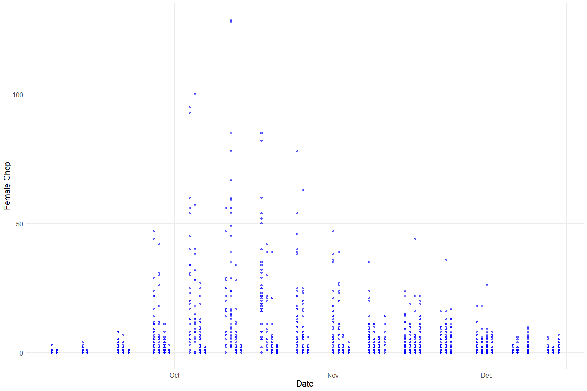
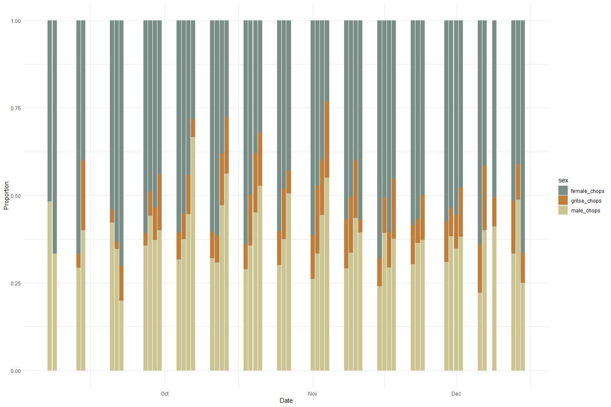
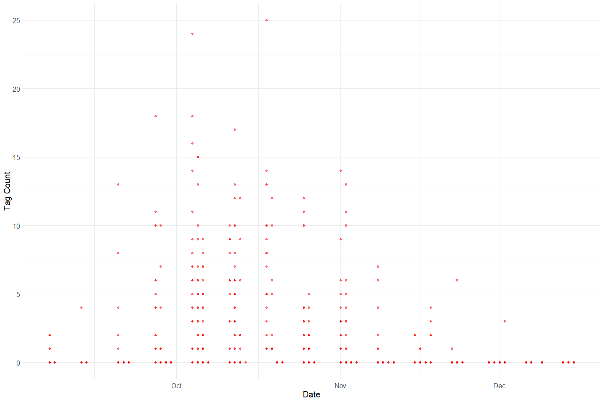
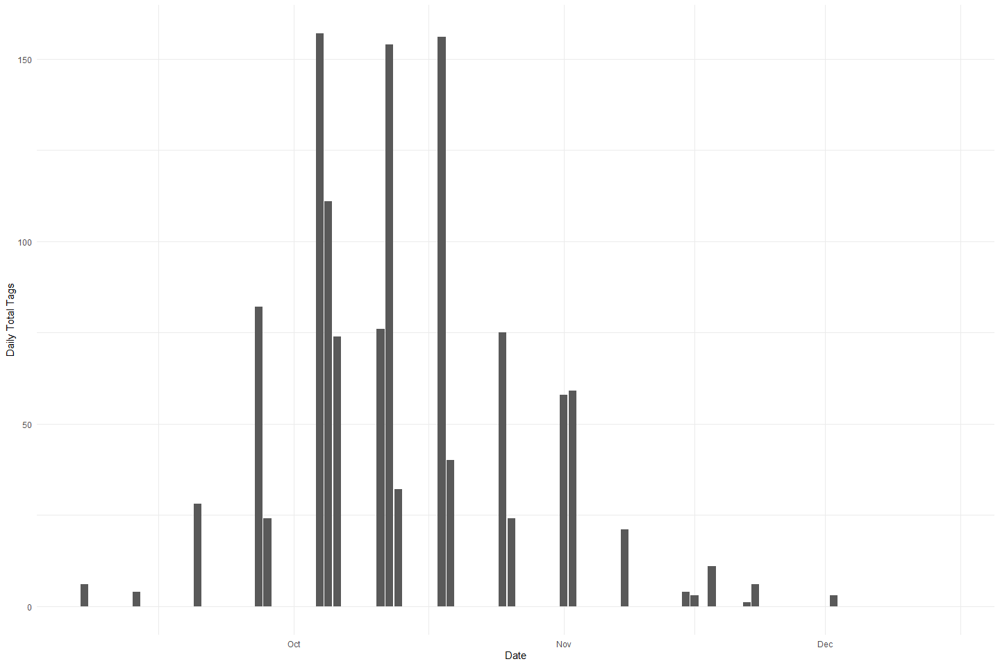
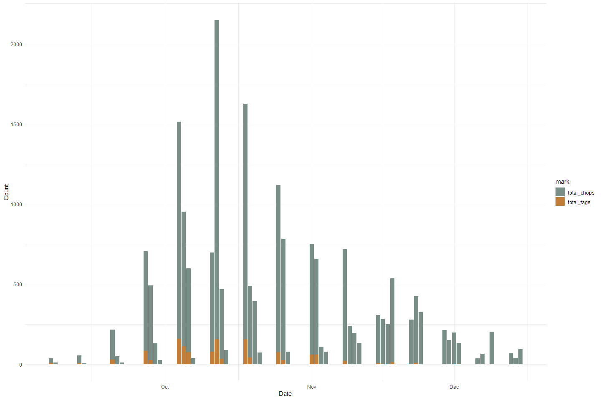
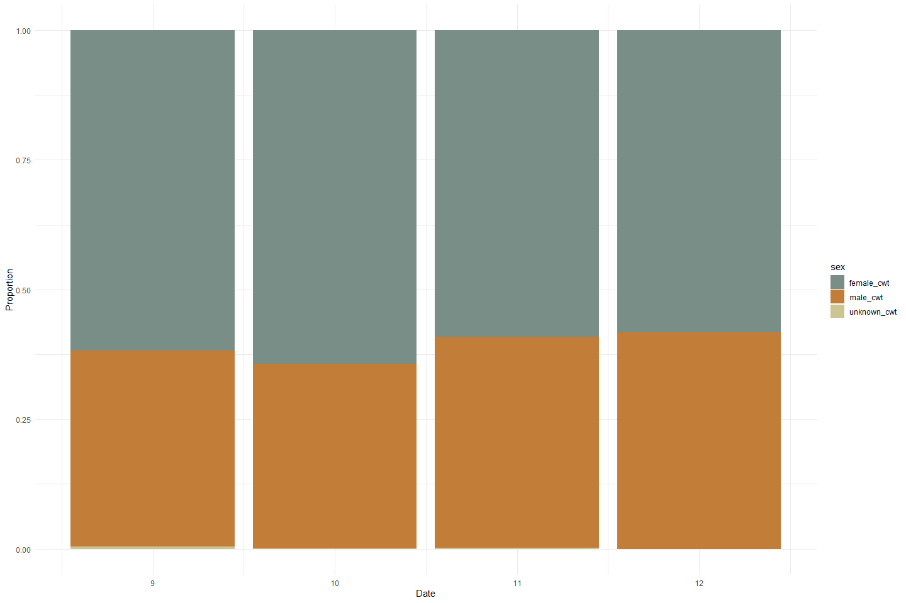
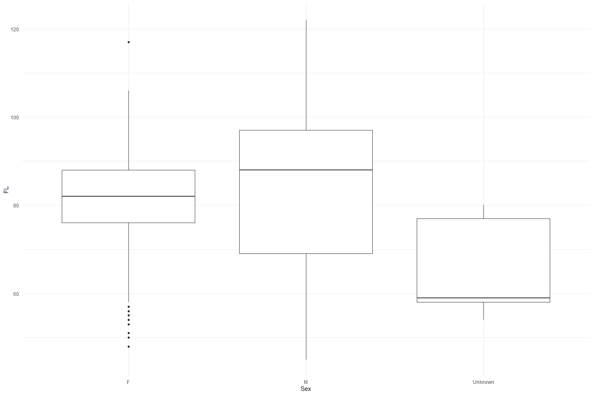

Feather Carcass QC 2004
================
Inigo Peng
2022-07-25

# Feather River Carcass Data

## Description of Monitoring Data

**Timeframe:**

**Video Season:**

**Completeness of Record throughout timeframe:**

**Sampling Location:**

**Data Contact:**

Any additional info?

## Access Cloud Data

``` r
# Run Sys.setenv() to specify GCS_AUTH_FILE and GCS_DEFAULT_BUCKET before running 
# getwd() to see how to specify paths 
# Open object from google cloud storage
# Set your authentication using gcs_auth

gcs_auth(json_file = Sys.getenv("GCS_AUTH_FILE"))
# Set global bucket 
gcs_global_bucket(bucket = Sys.getenv("GCS_DEFAULT_BUCKET"))

# git data and save as xlsx
```

``` r
#Connect to microsoft access through RODBC
#Use 
# DRIVERINFO <- "Driver={Microsoft Access Driver (*.mdb, *.accdb)};"
# MDBPATH <- "C:/Users/InigoPeng/Projects/jpe/JPE-datasets/data-raw/qc-markdowns/adult-holding-redd-and-carcass-surveys/feather-river/Carcass 2004.mdb"
# PATH <- paste0(DRIVERINFO, "DBQ=", MDBPATH)
# 
# con <- odbcDriverConnect(PATH)
# 
# # Show the different table names 
# # sqlTables(con)$TABLE_NAME
# 
# #Download table and write csv
# ChopChannel_raw <- sqlFetch(con, "ChopChannelTBL")
# write_csv(ChopChannel_raw, "ChopChannel_2004.csv")
# 
# ChopRecov_raw <- sqlFetch(con,"ChopRecovTBL")
# write_csv(ChopRecov_raw, "ChopRecov_2004.csv")
# 
# ChopHeader_raw <- sqlFetch(con,"ChopHeaderTBL")
# write_csv(ChopHeader_raw, "ChopHeader_2004.csv")
# 
# 
# cwt_raw <- sqlFetch(con, "CWTTagTBL")
# write_csv(cwt_raw, "cwt_2004.csv")
# 
# cwt_header_raw <- sqlFetch(con, "CWTHeaderTBL")
# write_csv(cwt_header_raw, "CWTHeader_2004.csv")

#Other tables include Fish Data_sr_Database, Steelhead Data, TagColLu
```

``` r
gcs_get_object(object_name = "adult-holding-redd-and-carcass-surveys/feather-river/data-raw/carcass/2004/ChopChannelTBL_2004.xlsx",
               bucket = gcs_get_global_bucket(),
               saveToDisk = "ChopChannel_2004.xlsx",
               overwrite = TRUE)
#
gcs_get_object(object_name = "adult-holding-redd-and-carcass-surveys/feather-river/data-raw/carcass/2004/ChopHeaderTBL_2004.xlsx",
               bucket = gcs_get_global_bucket(),
               saveToDisk = "ChopHeader_2004.xlsx",
               overwrite = TRUE)

gcs_get_object(object_name = "adult-holding-redd-and-carcass-surveys/feather-river/data-raw/carcass/2004/ChopRecovTBL_2004.xlsx",
               bucket = gcs_get_global_bucket(),
               saveToDisk = "ChopRecov_2004.xlsx",
               overwrite = TRUE)
# 
gcs_get_object(object_name = "adult-holding-redd-and-carcass-surveys/feather-river/data-raw/carcass/2004/CWTHeaderTBL_2004.xlsx",
               bucket = gcs_get_global_bucket(),
               saveToDisk = "CWTHeader_2004.xlsx",
               overwrite = TRUE)

gcs_get_object(object_name = "adult-holding-redd-and-carcass-surveys/feather-river/data-raw/carcass/2004/CWTTagTBL_2004.xlsx",
               bucket = gcs_get_global_bucket(),
               saveToDisk = "CWTTag_2004.xlsx",
               overwrite = TRUE)
```

## Raw Data Glimpse:

### ChopChannel_Raw

``` r
ChopChannel_raw <- read_excel("ChopChannel_2004.xlsx") %>% 
  rename("ID" = HeaderID) %>% 
  glimpse()
```

    ## Rows: 2,155
    ## Columns: 9
    ## $ ChanID   <dbl> 2381, 2382, 2384, 2385, 2386, 2387, 2388, 2389, 2390, 2391, 2~
    ## $ Sect     <dbl> 1, 1, 2, 2, 2, 3, 3, 3, 4, 4, 4, 6, 6, 6, 7, 7, 7, 10, 10, 11~
    ## $ Chan     <chr> "L", "M", "L", "M", "R", "L", "M", "R", "L", "M", "R", "L", "~
    ## $ Min      <dbl> 4, 4, 1, 1, 1, 3, 1, 1, 1, 1, 1, 2, 2, 2, 3, 3, 3, 1, 5, 4, 4~
    ## $ Male     <dbl> 0, 0, 0, 0, 0, 0, 0, 0, 1, 0, 0, 0, 0, 0, 0, 0, 0, 0, 0, 0, 0~
    ## $ Fem      <dbl> 0, 1, 0, 0, 0, 0, 0, 0, 0, 0, 0, 0, 0, 0, 0, 0, 0, 0, 1, 0, 0~
    ## $ Gril     <dbl> 0, 0, 0, 0, 0, 0, 0, 0, 0, 0, 0, 0, 0, 0, 0, 0, 0, 0, 0, 0, 0~
    ## $ TagCount <dbl> 0, 0, 0, 0, 0, 0, 0, 0, 0, 0, 0, 0, 0, 0, 0, 0, 0, 0, 0, 0, 0~
    ## $ ID       <dbl> 345, 345, 345, 345, 345, 345, 345, 345, 345, 345, 345, 346, 3~

### ChopRecov_raw

``` r
ChopRecov_raw <- read_excel("ChopRecov_2004.xlsx") %>% glimpse
```

    ## Rows: 1,282
    ## Columns: 4
    ## $ RecovID    <dbl> 1489, 1495, 1496, 1497, 1509, 1510, 1514, 1515, 1519, 1520,~
    ## $ RecovColor <chr> "ORANGE1", "ORANGE1", "ORANGE1", "ORANGE1", "ORANGE1", "ORA~
    ## $ RecovCount <dbl> 2, 1, 1, 1, 1, 1, 1, 1, 1, 1, 3, 1, 1, 1, 2, 1, 1, 5, 5, 1,~
    ## $ ChanID     <dbl> 2535, NA, 2554, 2564, 2597, 2557, 2561, 2563, 2688, 2697, 2~

### ChopHeader_Raw

``` r
ChopHeader_raw <- read_excel("ChopHeader_2004.xlsx") %>% 
  rename("ID" = headerID) %>%
  glimpse()
```

    ## Rows: 160
    ## Columns: 9
    ## $ ID       <dbl> 345, 346, 347, 348, 349, 350, 351, 352, 353, 354, 355, 356, 3~
    ## $ TagCol   <chr> "ORANGE1", "ORANGE1", "ORANGE1", "ORANGE1", "ORANGE1", "ORANG~
    ## $ Date     <dttm> 2004-09-07, 2004-09-07, 2004-09-07, 2004-09-07, 2004-09-07, ~
    ## $ Crew     <chr> "JK DG PH", "ND TV PH", "ND TV", NA, NA, "ND TV PH", "ND PH T~
    ## $ Time     <dttm> NA, NA, 1899-12-31 11:00:00, NA, NA, 1899-12-31 13:00:00, 18~
    ## $ Recorder <chr> "JK", "PH", "ND", NA, NA, "ND", "ND", "DG", "DG", "ND", "KM",~
    ## $ Weather  <chr> "SUN", "SUN", "SUN", NA, NA, "SUN", "SUN", "SUN", "SUN", "SUN~
    ## $ Comment  <chr> NA, NA, NA, NA, NA, NA, NA, NA, NA, NA, NA, NA, NA, NA, NA, "~
    ## $ WeekNum  <dbl> 1, 1, 1, 1, 1, 1, 1, 1, 1, 1, 2, 2, 3, 3, 3, 3, 3, 3, 3, 4, 4~

### cwt_raw

``` r
cwt_raw <- read_excel("CWTTag_2004.xlsx") %>% glimpse()
```

    ## Rows: 4,090
    ## Columns: 13
    ## $ TagID    <dbl> 6535, 6610, 7356, 7587, 6354, 6661, 6260, 7174, 7483, 6440, 6~
    ## $ Sect     <dbl> 7, 2, 32, 9, 8, 9, 5, 3, 1, 8, 4, 15, 19, 14, 9, 12, 3, 14, 6~
    ## $ RelLoc   <chr> "NO DATA", "R", "L", "M", "L", "R", "M", "L", "L", "M", "M", ~
    ## $ FL       <dbl> 86, 84, 80, 87, 95, 73, 70, 80, 86, 81, 76, NA, 83, NA, 88, 6~
    ## $ Sex      <chr> "M", "F", "M", "F", "M", "F", "M", "F", "F", "F", "F", "F", "~
    ## $ Spawn    <chr> "UK", "S", "UK", "S", "UK", "S", "UK", "S", "S", "S", "U", "U~
    ## $ Clip     <chr> "N", "N", "N", "N", "N", "N", "N", "N", "N", "N", "Y", "N", "~
    ## $ SampType <chr> "NONE", "NONE", "NONE", "NONE", "NONE", "NONE", "O", "NONE", ~
    ## $ CarcStat <chr> "T", "T", "T", "T", "T", "T", "T", "T", "T", "T", "C", "C", "~
    ## $ SampNum  <chr> NA, NA, NA, NA, NA, NA, "091304-006", NA, NA, "092004-009", N~
    ## $ HeadTag  <chr> NA, NA, NA, NA, NA, NA, NA, NA, NA, NA, "64606", NA, NA, NA, ~
    ## $ Comment  <chr> "ZIP TIE MISSING", "ZIP TIE", "ZIP TIE", "YH-4991 RADIO TAG #~
    ## $ HeaderID <dbl> 1502, 1502, 1510, 1514, 1498, 1502, 1496, 1508, 1513, 1498, 1~

### CWT_Header_raw

``` r
cwt_header_raw <- read_xlsx("CWTHeader_2004.xlsx") %>% glimpse
```

    ## Rows: 120
    ## Columns: 5
    ## $ headerID <dbl> 1488, 1489, 1492, 1493, 1494, 1496, 1497, 1498, 1500, 1501, 1~
    ## $ Date     <dttm> 2004-09-07, 2004-09-08, 2004-09-08, 2004-09-13, 2004-09-13, ~
    ## $ TagCol   <chr> "ORANGE1", "ORANGE1", "ORANGE1", "YELLOW2", "YELLOW2", "YELLO~
    ## $ Crew     <chr> "JK,PH,DG", "RB,DG,KM", "PH ND", "BK RB KM", "RB KB KM", "ND,~
    ## $ WeekNum  <dbl> 1, 1, 1, 2, 2, 2, 2, 3, 3, 3, 4, 4, 4, 4, 5, 5, 5, 5, 5, 5, 6~

## Data transformations:

### Counts

The `chop_channel` table contains carcass counts by sex, grilise and
chop/tagged

``` r
#1. chopchannel table (with dates and tag color)
chop_channel_join <- full_join(ChopHeader_raw %>% 
                                 select(ID, TagCol, Date, Time),
                               ChopChannel_raw) %>% 
  clean_names() %>% 
  rename("male_chop" = male,
         "female_chop" = fem,
         "grilse" = gril) %>% glimpse()
```

    ## Joining, by = "ID"

    ## Rows: 2,155
    ## Columns: 12
    ## $ id          <dbl> 345, 345, 345, 345, 345, 345, 345, 345, 345, 345, 345, 346~
    ## $ tag_col     <chr> "ORANGE1", "ORANGE1", "ORANGE1", "ORANGE1", "ORANGE1", "OR~
    ## $ date        <dttm> 2004-09-07, 2004-09-07, 2004-09-07, 2004-09-07, 2004-09-0~
    ## $ time        <dttm> NA, NA, NA, NA, NA, NA, NA, NA, NA, NA, NA, NA, NA, NA, N~
    ## $ chan_id     <dbl> 2381, 2382, 2384, 2385, 2386, 2387, 2388, 2389, 2390, 2391~
    ## $ sect        <dbl> 1, 1, 2, 2, 2, 3, 3, 3, 4, 4, 4, 6, 6, 6, 7, 7, 7, 10, 10,~
    ## $ chan        <chr> "L", "M", "L", "M", "R", "L", "M", "R", "L", "M", "R", "L"~
    ## $ min         <dbl> 4, 4, 1, 1, 1, 3, 1, 1, 1, 1, 1, 2, 2, 2, 3, 3, 3, 1, 5, 4~
    ## $ male_chop   <dbl> 0, 0, 0, 0, 0, 0, 0, 0, 1, 0, 0, 0, 0, 0, 0, 0, 0, 0, 0, 0~
    ## $ female_chop <dbl> 0, 1, 0, 0, 0, 0, 0, 0, 0, 0, 0, 0, 0, 0, 0, 0, 0, 0, 1, 0~
    ## $ grilse      <dbl> 0, 0, 0, 0, 0, 0, 0, 0, 0, 0, 0, 0, 0, 0, 0, 0, 0, 0, 0, 0~
    ## $ tag_count   <dbl> 0, 0, 0, 0, 0, 0, 0, 0, 0, 0, 0, 0, 0, 0, 0, 0, 0, 0, 0, 0~

### Recovery

The `chop_recovery` table contains recovered carcass counts by color

``` r
chop_recovery_join <- full_join(ChopHeader_raw %>% 
                                  select(ID, Date, Time),
                                ChopRecov_raw %>% 
                                  rename(ID = RecovID))  %>% 
  clean_names() %>% glimpse
```

    ## Joining, by = "ID"

    ## Rows: 1,442
    ## Columns: 6
    ## $ id          <dbl> 345, 346, 347, 348, 349, 350, 351, 352, 353, 354, 355, 356~
    ## $ date        <dttm> 2004-09-07, 2004-09-07, 2004-09-07, 2004-09-07, 2004-09-0~
    ## $ time        <dttm> NA, NA, 1899-12-31 11:00:00, NA, NA, 1899-12-31 13:00:00,~
    ## $ recov_color <chr> NA, NA, NA, NA, NA, NA, NA, NA, NA, NA, NA, NA, NA, NA, NA~
    ## $ recov_count <dbl> NA, NA, NA, NA, NA, NA, NA, NA, NA, NA, NA, NA, NA, NA, NA~
    ## $ chan_id     <dbl> NA, NA, NA, NA, NA, NA, NA, NA, NA, NA, NA, NA, NA, NA, NA~

### Survey

The `chop_header` table contains survey metadata and covariates

``` r
chop_header <- ChopHeader_raw %>% 
  clean_names() %>% glimpse
```

    ## Rows: 160
    ## Columns: 9
    ## $ id       <dbl> 345, 346, 347, 348, 349, 350, 351, 352, 353, 354, 355, 356, 3~
    ## $ tag_col  <chr> "ORANGE1", "ORANGE1", "ORANGE1", "ORANGE1", "ORANGE1", "ORANG~
    ## $ date     <dttm> 2004-09-07, 2004-09-07, 2004-09-07, 2004-09-07, 2004-09-07, ~
    ## $ crew     <chr> "JK DG PH", "ND TV PH", "ND TV", NA, NA, "ND TV PH", "ND PH T~
    ## $ time     <dttm> NA, NA, 1899-12-31 11:00:00, NA, NA, 1899-12-31 13:00:00, 18~
    ## $ recorder <chr> "JK", "PH", "ND", NA, NA, "ND", "ND", "DG", "DG", "ND", "KM",~
    ## $ weather  <chr> "SUN", "SUN", "SUN", NA, NA, "SUN", "SUN", "SUN", "SUN", "SUN~
    ## $ comment  <chr> NA, NA, NA, NA, NA, NA, NA, NA, NA, NA, NA, NA, NA, NA, NA, "~
    ## $ week_num <dbl> 1, 1, 1, 1, 1, 1, 1, 1, 1, 1, 2, 2, 3, 3, 3, 3, 3, 3, 3, 4, 4~

### CWT

The `cwt` table contains coded wire tag information.

``` r
cwt <- full_join(cwt_raw %>% clean_names(), cwt_header_raw %>% clean_names()) %>% 
  clean_names() %>% 
  glimpse
```

    ## Joining, by = "header_id"

    ## Rows: 4,092
    ## Columns: 17
    ## $ tag_id    <dbl> 6535, 6610, 7356, 7587, 6354, 6661, 6260, 7174, 7483, 6440, ~
    ## $ sect      <dbl> 7, 2, 32, 9, 8, 9, 5, 3, 1, 8, 4, 15, 19, 14, 9, 12, 3, 14, ~
    ## $ rel_loc   <chr> "NO DATA", "R", "L", "M", "L", "R", "M", "L", "L", "M", "M",~
    ## $ fl        <dbl> 86, 84, 80, 87, 95, 73, 70, 80, 86, 81, 76, NA, 83, NA, 88, ~
    ## $ sex       <chr> "M", "F", "M", "F", "M", "F", "M", "F", "F", "F", "F", "F", ~
    ## $ spawn     <chr> "UK", "S", "UK", "S", "UK", "S", "UK", "S", "S", "S", "U", "~
    ## $ clip      <chr> "N", "N", "N", "N", "N", "N", "N", "N", "N", "N", "Y", "N", ~
    ## $ samp_type <chr> "NONE", "NONE", "NONE", "NONE", "NONE", "NONE", "O", "NONE",~
    ## $ carc_stat <chr> "T", "T", "T", "T", "T", "T", "T", "T", "T", "T", "C", "C", ~
    ## $ samp_num  <chr> NA, NA, NA, NA, NA, NA, "091304-006", NA, NA, "092004-009", ~
    ## $ head_tag  <chr> NA, NA, NA, NA, NA, NA, NA, NA, NA, NA, "64606", NA, NA, NA,~
    ## $ comment   <chr> "ZIP TIE MISSING", "ZIP TIE", "ZIP TIE", "YH-4991 RADIO TAG ~
    ## $ header_id <dbl> 1502, 1502, 1510, 1514, 1498, 1502, 1496, 1508, 1513, 1498, ~
    ## $ date      <dttm> 2004-09-27, 2004-09-27, 2004-10-07, 2004-10-12, 2004-09-20,~
    ## $ tag_col   <chr> "BLUE4", "BLUE4", "ORANGE5", "YELLOW6", "RED3", "BLUE4", "YE~
    ## $ crew      <chr> "KM,RK,AS", "KM,RK,AS", "RB,KH,JR", "BK KM KH", "PH,AS,DG", ~
    ## $ week_num  <dbl> 4, 4, 5, 6, 3, 4, 2, 5, 6, 3, 4, 3, 5, 2, 5, 4, 3, 3, 4, 3, ~

## Explore Numeric Variables:

#### Chop Channel Variable:`id`, `chan_id`, `sect`, `min`

``` r
# Filter clean data to show only numeric variables 
chop_channel_join %>% 
  select_if(is.numeric) %>%
  colnames()
```

    ## [1] "id"          "chan_id"     "sect"        "min"         "male_chop"  
    ## [6] "female_chop" "grilse"      "tag_count"

``` r
summary(chop_channel_join$id)
```

    ##    Min. 1st Qu.  Median    Mean 3rd Qu.    Max. 
    ##   345.0   369.0   431.0   422.7   470.0   512.0

``` r
summary(chop_channel_join$chan_id)
```

    ##    Min. 1st Qu.  Median    Mean 3rd Qu.    Max. 
    ##    2381    2948    3496    3497    4052    4596

``` r
summary(chop_channel_join$sect)
```

    ##    Min. 1st Qu.  Median    Mean 3rd Qu.    Max. 
    ##    1.00   11.00   22.00   22.63   34.00   46.00

``` r
summary(chop_channel_join$min)
```

    ##    Min. 1st Qu.  Median    Mean 3rd Qu.    Max.    NA's 
    ##    0.00    5.00    8.00   10.72   15.00   57.00      22

### Chop Channel Variable: `female_chop`, `male_chop`,`grilise`, `tag_count`

**Numeric Summary of `female_chop`, `male_chop`,`unknown_chops`,
`tag_count` over Period of Record**

``` r
summary(chop_channel_join$female_chop)
```

    ##    Min. 1st Qu.  Median    Mean 3rd Qu.    Max.    NA's 
    ##   0.000   0.000   1.000   4.742   5.000 129.000      40

``` r
summary(chop_channel_join$male_chop)
```

    ##    Min. 1st Qu.  Median    Mean 3rd Qu.    Max.    NA's 
    ##   0.000   0.000   1.000   2.986   3.000  88.000      35

``` r
summary(chop_channel_join$grilse)
```

    ##    Min. 1st Qu.  Median    Mean 3rd Qu.    Max.    NA's 
    ##  0.0000  0.0000  0.0000  0.9075  1.0000 32.0000      57

**NA and Unknown Values** Provide a stat on NA or unknown values.

``` r
round(sum(is.na(chop_channel_join$male_chop))/nrow(chop_channel_join), 3) * 100
```

    ## [1] 1.6

``` r
round(sum(is.na(chop_channel_join$female_chop))/nrow(chop_channel_join), 3) * 100
```

    ## [1] 1.9

``` r
round(sum(is.na(chop_channel_join$grilse))/nrow(chop_channel_join), 3) * 100
```

    ## [1] 2.6

-   1.6 % of values in the `male_chop` column are NA.
-   1.9 % of values in the `female_chop` column are NA.
-   2.6 % of values in the `grilse` column are NA.

**Plotting female_chop over Period of Record**

``` r
# Make whatever plot is appropriate 
filter(chop_channel_join) %>% 
  ggplot(aes(x = date, y = female_chop)) +
  geom_point(size = 1.4, alpha = .5, color = "blue") + 
  labs(x = "Date", 
       y = "Female Chop") +
  theme_minimal() + 
  theme(text = element_text(size = 15)) 
```

<!-- -->
**Plotting male_chop over Period of Record**

``` r
filter(chop_channel_join) %>% 
  ggplot(aes(x = date, y = male_chop)) +
  geom_point(size = 1.4, alpha = .5, color = "red") + 
  labs(x = "Date", 
       y = "Male Chop") +
  theme_minimal() + 
  theme(text = element_text(size = 15)) 
```

<!-- -->

**Plotting grilse over Period of Record**

``` r
filter(chop_channel_join) %>% 
  ggplot(aes(x = date, y = grilse)) +
  geom_point(size = 1.4, alpha = .5, color = "black") + 
  labs(x = "Date", 
       y = "Grilse") +
  theme_minimal() + 
  theme(text = element_text(size = 15)) 
```

<!-- -->

**Plotting Total chops over Period of Record**

``` r
chop_channel_join %>% glimpse()
```

    ## Rows: 2,155
    ## Columns: 12
    ## $ id          <dbl> 345, 345, 345, 345, 345, 345, 345, 345, 345, 345, 345, 346~
    ## $ tag_col     <chr> "ORANGE1", "ORANGE1", "ORANGE1", "ORANGE1", "ORANGE1", "OR~
    ## $ date        <dttm> 2004-09-07, 2004-09-07, 2004-09-07, 2004-09-07, 2004-09-0~
    ## $ time        <dttm> NA, NA, NA, NA, NA, NA, NA, NA, NA, NA, NA, NA, NA, NA, N~
    ## $ chan_id     <dbl> 2381, 2382, 2384, 2385, 2386, 2387, 2388, 2389, 2390, 2391~
    ## $ sect        <dbl> 1, 1, 2, 2, 2, 3, 3, 3, 4, 4, 4, 6, 6, 6, 7, 7, 7, 10, 10,~
    ## $ chan        <chr> "L", "M", "L", "M", "R", "L", "M", "R", "L", "M", "R", "L"~
    ## $ min         <dbl> 4, 4, 1, 1, 1, 3, 1, 1, 1, 1, 1, 2, 2, 2, 3, 3, 3, 1, 5, 4~
    ## $ male_chop   <dbl> 0, 0, 0, 0, 0, 0, 0, 0, 1, 0, 0, 0, 0, 0, 0, 0, 0, 0, 0, 0~
    ## $ female_chop <dbl> 0, 1, 0, 0, 0, 0, 0, 0, 0, 0, 0, 0, 0, 0, 0, 0, 0, 0, 1, 0~
    ## $ grilse      <dbl> 0, 0, 0, 0, 0, 0, 0, 0, 0, 0, 0, 0, 0, 0, 0, 0, 0, 0, 0, 0~
    ## $ tag_count   <dbl> 0, 0, 0, 0, 0, 0, 0, 0, 0, 0, 0, 0, 0, 0, 0, 0, 0, 0, 0, 0~

``` r
# Percentage by Gender of Daily Chops
# Address NA values for chops
total_chops <- chop_channel_join%>%
  mutate(male_chop = ifelse(is.na(male_chop), 0, male_chop), # fill na
         female_chop = ifelse(is.na(female_chop), 0, female_chop),
         grilse_chop = ifelse(is.na(grilse), 0, grilse),
         total_chops = grilse_chop + male_chop + female_chop) %>% 
  select(date, male_chop, female_chop, grilse_chop, total_chops)

# Case check: checking for duplicates
total_chops_test <- total_chops %>% # get total chops
  filter(date == as_date("2004-09-20"))

# Check if NAs introduced in creating total chop columns
nrow(total_chops_test) == (sum(total_chops_test$total_chops == (total_chops_test$male_chop + total_chops_test$female_chop + total_chops_test$grilse_chops)))
```

    ## [1] FALSE

``` r
# total number of chops for the day
total_chops_summary <- total_chops %>%
  group_by(date) %>%
  summarise(total_chops = sum(total_chops, na.rm = T),
            male_chops = sum(male_chop, na.rm = T),
            female_chops = sum(female_chop, na.rm = T),
            grilse_chops = sum(grilse_chop, na.rm = T))
```

``` r
total_chops_summary %>% 
  pivot_longer(cols = c(male_chops, female_chops, grilse_chops), names_to = "sex", values_to = "count") %>% 
  mutate(proportions = (count / total_chops)) %>% 
  ggplot(aes(x = date, y = proportions, fill = sex)) +
  geom_bar(stat = "identity", position = "stack") +
  scale_fill_manual(values = c("Blue","Red", "Black"), 
                    name = "Sex", 
                    labels = c("Female", "Male", "Grilse")) +
  theme_minimal() + 
  labs(y = "Proportion", x = "Date") +
  scale_fill_manual(values = wes_palette("Moonrise2"))
```

    ## Scale for 'fill' is already present. Adding another scale for 'fill', which
    ## will replace the existing scale.

<!-- -->

This plot shows the proportion of chops based on sex and grilse for each
day over the the period of 2004-09-03 to 2004-12-19. The data gaps that
we see are a result of the data collection process in which the data was
collected 2-4 days each week (with no specific period day of week) over
the 4 month period.

``` r
summary(chop_channel_join$tag_count)
```

    ##    Min. 1st Qu.  Median    Mean 3rd Qu.    Max.    NA's 
    ##  0.0000  0.0000  0.0000  0.5887  0.0000 25.0000      91

``` r
round(sum(is.na(chop_channel_join$tag_count))/nrow(chop_channel_join), 3) * 100
```

    ## [1] 4.2

-   4.2 % of values in the `tag_count` column are NA.

**Plotting tag_count over Period of Record**

``` r
chop_channel_join %>% 
  ggplot(aes(x = date, y = tag_count)) +
  geom_point(size = 1.4, alpha = .5, color = "red") + 
  labs(x = "Date", 
       y = "Tag Count") +
  theme_minimal() + 
  theme(text = element_text(size = 15)) 
```

<!-- -->

``` r
total_tags_summary <- chop_channel_join %>%
  group_by(date) %>%
  summarise(total_tags = sum(tag_count, na.rm = T))

total_tags_summary %>% 
  ggplot(aes(x = date, y = total_tags)) +
  geom_col() +
  theme_minimal() +
  labs(y = "Daily Total Tags", x = "Date")
```

<!-- -->
**Comparing tags and chops**

``` r
# from ashley: please improve on this plot I got started, make it look better, describe it, double check that the numbers make sense
total_carcass <- full_join(total_chops_summary, total_tags_summary) %>% 
  select(date, total_chops, total_tags) %>% 
  pivot_longer(c(total_chops, total_tags), names_to = "mark")
```

    ## Joining, by = "date"

``` r
full_join(total_chops_summary, total_tags_summary) %>% 
  select(date, total_chops, total_tags) %>% 
  pivot_longer(c(total_chops, total_tags), names_to = "mark")
```

    ## Joining, by = "date"

    ## # A tibble: 104 x 3
    ##    date                mark        value
    ##    <dttm>              <chr>       <dbl>
    ##  1 2004-09-07 00:00:00 total_chops    29
    ##  2 2004-09-07 00:00:00 total_tags      6
    ##  3 2004-09-08 00:00:00 total_chops     9
    ##  4 2004-09-08 00:00:00 total_tags      0
    ##  5 2004-09-13 00:00:00 total_chops    51
    ##  6 2004-09-13 00:00:00 total_tags      4
    ##  7 2004-09-14 00:00:00 total_chops     5
    ##  8 2004-09-14 00:00:00 total_tags      0
    ##  9 2004-09-20 00:00:00 total_chops   187
    ## 10 2004-09-20 00:00:00 total_tags     28
    ## # ... with 94 more rows

``` r
ggplot(total_carcass, aes(x = date, y = value, fill = mark)) +
  geom_col() +
  theme_minimal() +
  scale_fill_manual(values = wes_palette("Moonrise2")) +
  labs(x = "Date", y = "Count")
```

<!-- -->
Tags are significantly less applied compared to chops.

### Chop Recovery Variable: `id`, `chan_id`, `recov_count`

``` r
chop_recovery_join %>% 
  select_if(is.numeric) %>% 
  colnames()
```

    ## [1] "id"          "recov_count" "chan_id"

``` r
summary(chop_recovery_join$id)
```

    ##    Min. 1st Qu.  Median    Mean 3rd Qu.    Max. 
    ##     345    1743    2118    2006    2496    2873

``` r
summary(chop_recovery_join$chan_id)
```

    ##    Min. 1st Qu.  Median    Mean 3rd Qu.    Max.    NA's 
    ##    2535    3402    3856    3794    4231    4593     165

``` r
summary(chop_recovery_join$recov_count)
```

    ##    Min. 1st Qu.  Median    Mean 3rd Qu.    Max.    NA's 
    ##   0.000   0.000   1.000   1.737   2.000  27.000     162

No recovery count have dates associated to them.

### Chop Header Variable: `id`

``` r
chop_header %>% 
  select_if(is.numeric) %>% 
  colnames()
```

    ## [1] "id"       "week_num"

``` r
summary(chop_header$id)
```

    ##    Min. 1st Qu.  Median    Mean 3rd Qu.    Max. 
    ##   345.0   386.8   427.5   428.6   472.2   512.0

### CWT Variable: `tag_id`, `sect`, `fl`, `header_id`, `week_num`

``` r
cwt %>% 
  select_if(is.numeric) %>% 
  colnames()
```

    ## [1] "tag_id"    "sect"      "fl"        "header_id" "week_num"

``` r
summary(cwt$tag_id)
```

    ##    Min. 1st Qu.  Median    Mean 3rd Qu.    Max.    NA's 
    ##    6181    7207    8238    8238    9271   10297       2

``` r
summary(cwt$sect)
```

    ##    Min. 1st Qu.  Median    Mean 3rd Qu.    Max.    NA's 
    ##    1.00    8.00   12.00   16.41   23.00   46.00       2

``` r
summary(cwt$fl)
```

    ##    Min. 1st Qu.  Median    Mean 3rd Qu.    Max.    NA's 
    ##   45.00   75.00   83.00   82.69   91.00  777.00      18

-   0 % of values in the `tag_id` column are NA.
-   0 % of values in the `sect` column are NA.
-   0.4 % of values in the `fl` column are NA.

``` r
#Create a cwt_count column
#Pivot table to expand sex column to female_cwt, male_cwt, and unknown_cwt 
#Is this graph helpful?
unique(cwt$sex)
```

    ## [1] "M"  "F"  NA   "ND" "UK"

``` r
cwt_count <- cwt %>% 
  mutate(count = 1) %>%
  mutate(sex = case_when(sex == "ND"|is.na(sex)|sex =="UK" ~ "U",
                         TRUE ~ sex)) %>% 
  pivot_wider(names_from = sex, values_from = count, values_fill = 0) %>% 
  # unnest() %>% 
  rename("male_cwt" = M,
         "female_cwt" = F,
         "unknown_cwt" = U) %>% glimpse
```

    ## Rows: 4,092
    ## Columns: 19
    ## $ tag_id      <dbl> 6535, 6610, 7356, 7587, 6354, 6661, 6260, 7174, 7483, 6440~
    ## $ sect        <dbl> 7, 2, 32, 9, 8, 9, 5, 3, 1, 8, 4, 15, 19, 14, 9, 12, 3, 14~
    ## $ rel_loc     <chr> "NO DATA", "R", "L", "M", "L", "R", "M", "L", "L", "M", "M~
    ## $ fl          <dbl> 86, 84, 80, 87, 95, 73, 70, 80, 86, 81, 76, NA, 83, NA, 88~
    ## $ spawn       <chr> "UK", "S", "UK", "S", "UK", "S", "UK", "S", "S", "S", "U",~
    ## $ clip        <chr> "N", "N", "N", "N", "N", "N", "N", "N", "N", "N", "Y", "N"~
    ## $ samp_type   <chr> "NONE", "NONE", "NONE", "NONE", "NONE", "NONE", "O", "NONE~
    ## $ carc_stat   <chr> "T", "T", "T", "T", "T", "T", "T", "T", "T", "T", "C", "C"~
    ## $ samp_num    <chr> NA, NA, NA, NA, NA, NA, "091304-006", NA, NA, "092004-009"~
    ## $ head_tag    <chr> NA, NA, NA, NA, NA, NA, NA, NA, NA, NA, "64606", NA, NA, N~
    ## $ comment     <chr> "ZIP TIE MISSING", "ZIP TIE", "ZIP TIE", "YH-4991 RADIO TA~
    ## $ header_id   <dbl> 1502, 1502, 1510, 1514, 1498, 1502, 1496, 1508, 1513, 1498~
    ## $ date        <dttm> 2004-09-27, 2004-09-27, 2004-10-07, 2004-10-12, 2004-09-2~
    ## $ tag_col     <chr> "BLUE4", "BLUE4", "ORANGE5", "YELLOW6", "RED3", "BLUE4", "~
    ## $ crew        <chr> "KM,RK,AS", "KM,RK,AS", "RB,KH,JR", "BK KM KH", "PH,AS,DG"~
    ## $ week_num    <dbl> 4, 4, 5, 6, 3, 4, 2, 5, 6, 3, 4, 3, 5, 2, 5, 4, 3, 3, 4, 3~
    ## $ male_cwt    <dbl> 1, 0, 1, 0, 1, 0, 1, 0, 0, 0, 0, 0, 0, 0, 1, 0, 0, 1, 0, 0~
    ## $ female_cwt  <dbl> 0, 1, 0, 1, 0, 1, 0, 1, 1, 1, 1, 1, 1, 0, 0, 1, 1, 0, 1, 1~
    ## $ unknown_cwt <dbl> 0, 0, 0, 0, 0, 0, 0, 0, 0, 0, 0, 0, 0, 1, 0, 0, 0, 0, 0, 0~

``` r
total_cwt_summary <- cwt_count %>% 
  mutate(male_cwt = ifelse(is.na(male_cwt), 0, male_cwt), # fill na
         female_cwt = ifelse(is.na(female_cwt), 0, female_cwt),
         unknown_cwt = ifelse(is.na(unknown_cwt), 0, unknown_cwt),
         total_cwt = unknown_cwt + male_cwt + female_cwt) %>% 
  group_by(month(date)) %>% 
  summarise(total_cwt = sum(total_cwt),
            male_cwt = sum(male_cwt),
            female_cwt = sum(female_cwt),
            unknown_cwt = sum(unknown_cwt))
```

``` r
total_cwt_summary %>% 
  pivot_longer(cols = c(male_cwt, female_cwt, unknown_cwt), names_to = "sex", values_to = "count") %>% 
  mutate(proportions = (count / total_cwt)) %>% 
  ggplot(aes(x = `month(date)`, y = proportions, fill = sex)) + 
  geom_bar(stat = "identity", position = "stack") +
  scale_fill_manual(name = "chops", 
                    labels = c("CWT Male", "CWT Female", "CWT Unknown")) +
  theme_minimal() + 
  labs(y = "Proportion", x = "Date") +
  scale_fill_manual(values = wes_palette("Moonrise2"))
```

    ## Scale for 'fill' is already present. Adding another scale for 'fill', which
    ## will replace the existing scale.

<!-- -->

**Plotting fork length of each sex**

``` r
cwt %>% 
  mutate(sex = case_when(sex == "ND"|is.na(sex)|sex =="UK" ~ "Unknown",
                         TRUE ~ sex))%>% 
  filter(fl < 600) %>% 
  ggplot(aes(x = sex, y = fl)) + 
  geom_boxplot() + 
  theme_minimal() + 
  labs(y = "FL", x = "Sex")
```

<!-- -->

## Explore Categorical variables:

### Chop Channel Clean Data

Fix inconsistencies with spelling, capitalization, and dates

``` r
chop_channel_join %>% 
  select_if(is.character) %>%
  colnames()
```

    ## [1] "tag_col" "chan"

``` r
unique(chop_channel_join$tag_col)
```

    ##  [1] "ORANGE1"   "YELLOW2"   "RED3"      "BLUE4"     "ORANGE5"   "YELLOW6"  
    ##  [7] "RED7"      "BLUE8"     "ORANGE9"   "YELLOW10"  "RED11"     "BLUE12"   
    ## [13] "ORANGE13"  "YELLOW14"  "CLEANUP15" NA

``` r
unique(chop_channel_join$chan)
```

    ## [1] "L" "M" "R" "0" NA

``` r
chop_channel_cleaner <- chop_channel_join %>%
  mutate(date = as_date(date), ) %>%
  mutate_if(is.character, str_to_lower) %>% 
  select(-c(time))

chop_channel_cleaner
```

    ## # A tibble: 2,155 x 11
    ##       id tag_col date       chan_id  sect chan    min male_chop female_chop
    ##    <dbl> <chr>   <date>       <dbl> <dbl> <chr> <dbl>     <dbl>       <dbl>
    ##  1   345 orange1 2004-09-07    2381     1 l         4         0           0
    ##  2   345 orange1 2004-09-07    2382     1 m         4         0           1
    ##  3   345 orange1 2004-09-07    2384     2 l         1         0           0
    ##  4   345 orange1 2004-09-07    2385     2 m         1         0           0
    ##  5   345 orange1 2004-09-07    2386     2 r         1         0           0
    ##  6   345 orange1 2004-09-07    2387     3 l         3         0           0
    ##  7   345 orange1 2004-09-07    2388     3 m         1         0           0
    ##  8   345 orange1 2004-09-07    2389     3 r         1         0           0
    ##  9   345 orange1 2004-09-07    2390     4 l         1         1           0
    ## 10   345 orange1 2004-09-07    2391     4 m         1         0           0
    ## # ... with 2,145 more rows, and 2 more variables: grilse <dbl>, tag_count <dbl>

### Chop Recovery Clean Data

Fix inconsistencies with spelling, capitalization, and dates

``` r
chop_recovery_join %>% 
  select_if(is.character) %>% 
  colnames()
```

    ## [1] "recov_color"

``` r
unique(chop_recovery_join$recov_color)
```

    ##  [1] NA         "ORANGE1"  "YELLOW2"  "RED3"     "BLUE4"    "ORANGE5" 
    ##  [7] "YELLOW6"  "RED7"     "BLUE8"    "ORANGE9"  "YELLOW10" "RED11"   
    ## [13] "BLUE12"   "ORANGE13" "YELLOW14"

``` r
chop_recovery_cleaner <- chop_recovery_join %>% 
  mutate(date = as_date(date)) %>%
  mutate_if(is.character, str_to_lower) %>% 
  select(-c(time))

chop_recovery_cleaner
```

    ## # A tibble: 1,442 x 5
    ##       id date       recov_color recov_count chan_id
    ##    <dbl> <date>     <chr>             <dbl>   <dbl>
    ##  1   345 2004-09-07 <NA>                 NA      NA
    ##  2   346 2004-09-07 <NA>                 NA      NA
    ##  3   347 2004-09-07 <NA>                 NA      NA
    ##  4   348 2004-09-07 <NA>                 NA      NA
    ##  5   349 2004-09-07 <NA>                 NA      NA
    ##  6   350 2004-09-07 <NA>                 NA      NA
    ##  7   351 2004-09-07 <NA>                 NA      NA
    ##  8   352 2004-09-08 <NA>                 NA      NA
    ##  9   353 2004-09-08 <NA>                 NA      NA
    ## 10   354 2004-09-08 <NA>                 NA      NA
    ## # ... with 1,432 more rows

### Chop Header Clean Data

``` r
chop_header %>% 
  select_if(is.character) %>% 
  colnames()
```

    ## [1] "tag_col"  "crew"     "recorder" "weather"  "comment"

``` r
unique(chop_header$crew)
```

    ##   [1] "JK DG PH"        "ND TV PH"        "ND TV"           NA               
    ##   [5] "ND PH TV"        "DG KM RB"        "ND PH"           "KM,BK,RB"       
    ##   [9] "JR,ND,PH"        "BK,ND,TV"        "ND,PH,TV"        "PH TV BK"       
    ##  [13] "PH BK TV"        "KM RK AS"        "RK,KM,ND"        "RB,JR,ND"       
    ##  [17] "ND,RK,BK"        "RB,TV,DG,ND"     "PH,ND,DG"        "PH,ND,TV"       
    ##  [21] "PH,RB,DG"        "DG TV PH"        "PH TV DG"        "RB JR KH"       
    ##  [25] "PB PH"           "PH RK  DG"       "RK DG PH"        "RB TV ND"       
    ##  [29] "ND TV RB"        "KH KM BK"        "TV ND PH DG"     "BK KM RB"       
    ##  [33] "ND DG PH TV"     "PH TV DG ND"     "PH TV"           "TV PH"          
    ##  [37] "BK RB JR"        "RBBKJR"          "BKRBKM"          "JKPHASJD"       
    ##  [41] "NDTVDGRK"        "BK RB KM"        "PH BK KH"        "ND TV JD JR"    
    ##  [45] "PH, ND, TV"      "BK, KM, JD"      "PHDGJR"          "PHJRDG"         
    ##  [49] "JRDGPH"          "DGJRPH"          "RBTVKHJD"        "BRTVKHJD"       
    ##  [53] "PHNDRBJD"        "BKDGKM"          "RKTVASSB"        "RBNDPHJD"       
    ##  [57] "RKTVSB"          "BKKMKH"          "NDBKKMKH"        "NDBKKHKM"       
    ##  [61] "TVPHJD"          "SBTVPH"          "JD TV PH"        "JR DG RB SB"    
    ##  [65] "BKNDJD"          "RBKMBK"          "TVNDSBJD"        "SB TV PH"       
    ##  [69] "RB, DG, BK, ND"  "JD, TV, JR, SB"  "SB, TV, DG"      "RB, KM, JD"     
    ##  [73] "SB, ND, JD"      "RD, BK, KH"      "RK, JK, SB, AS"  "ND, TV, RB, DG" 
    ##  [77] "KM, JD, BK"      "SB ND KM TV"     "RB BK JD"        "KM ND BK"       
    ##  [81] "SB PH TV"        "KM KH BK DG"     "SB PH KM"        "DG TV RB"       
    ##  [85] "JR KH JD"        "ND TV SB"        "BK JD ND"        "DG TV SB"       
    ##  [89] "JD BK KH DG"     "TV, KG, SB, DG"  "ND, BK, KM, JD"  "JD KH BK DG"    
    ##  [93] "SB, KG, DG, TV"  "KM, TV, PH"      "KM ND SB"        "TV, PH, KM"     
    ##  [97] "SBDGTVPH"        "BK KM KH JD"     "BKKHKMJD"        "ND JK KH"       
    ## [101] "KG SB RK PH"     "DG JD KH BK"     "ND JD BK"        "JD SB JR PH"    
    ## [105] "BK KM KH"        "SB JD PH"        "ND RB BK"        "TV PH SB"       
    ## [109] "BK KH"           "BK TV ND SB"     "RB ND SB JD"     "JK KM PH"       
    ## [113] "SB, TV, JD"      "ND, KH, DG"      "ND, DG, KH"      "JD, TB, SB, PH" 
    ## [117] "JD, TV, SB, PH"  "JD, SB, TV, PH"  "BK, KH, SB, PH"  "SB, KH, BK, PH" 
    ## [121] "SB, PH, BK, KH"  "SB, KH, SB, BK"  "ND,  KH, BK, JD" "ND, KH, BK, JD" 
    ## [125] "BK, JD, ND, KH"

``` r
unique(chop_header$recorder)
```

    ##  [1] "JK"    "PH"    "ND"    NA      "DG"    "KM"    "BK"    "AS"    "RB"   
    ## [10] "RK"    "ND PH" "JDAS"  "JD"    "JR"    "SB"

``` r
unique(chop_header$weather)
```

    ## [1] "SUN" NA    "RAN" "CLD"

``` r
chop_header_cleaner <- chop_header %>%
  mutate(date = as_date(date)) %>%
  mutate_if(is.character, str_to_lower) %>% 
  mutate(crew = str_replace_all(crew, " ", ","),
         crew = str_replace_all(crew, ",,", ","),
         weather = ifelse(weather == "ran", "rain", weather)) %>%  
  select(-c(time))

chop_header_cleaner
```

    ## # A tibble: 160 x 8
    ##       id tag_col date       crew     recorder weather comment week_num
    ##    <dbl> <chr>   <date>     <chr>    <chr>    <chr>   <chr>      <dbl>
    ##  1   345 orange1 2004-09-07 jk,dg,ph jk       sun     <NA>           1
    ##  2   346 orange1 2004-09-07 nd,tv,ph ph       sun     <NA>           1
    ##  3   347 orange1 2004-09-07 nd,tv    nd       sun     <NA>           1
    ##  4   348 orange1 2004-09-07 <NA>     <NA>     <NA>    <NA>           1
    ##  5   349 orange1 2004-09-07 <NA>     <NA>     <NA>    <NA>           1
    ##  6   350 orange1 2004-09-07 nd,tv,ph nd       sun     <NA>           1
    ##  7   351 orange1 2004-09-07 nd,ph,tv nd       sun     <NA>           1
    ##  8   352 orange1 2004-09-08 dg,km,rb dg       sun     <NA>           1
    ##  9   353 orange1 2004-09-08 dg,km,rb dg       sun     <NA>           1
    ## 10   354 orange1 2004-09-08 nd,ph    nd       sun     <NA>           1
    ## # ... with 150 more rows

### CWT Clean Data

``` r
cwt %>% 
  select_if(is.character) %>% 
  colnames
```

    ##  [1] "rel_loc"   "sex"       "spawn"     "clip"      "samp_type" "carc_stat"
    ##  [7] "samp_num"  "head_tag"  "comment"   "tag_col"   "crew"

``` r
unique(cwt$rel_loc)
```

    ## [1] "NO DATA" "R"       "L"       "M"       NA        "CHOPPED" "NO SIDE"

``` r
unique(cwt$spawn)
```

    ## [1] "UK"      "S"       "U"       NA        "NO DATA"

``` r
unique(cwt$clip)
```

    ## [1] "N"       "Y"       NA        "UK"      "NO DATA"

``` r
unique(cwt$samp_type)
```

    ## [1] "NONE"    "O"       "H"       "H&O"     NA        "NO DATA"

``` r
unique(cwt$carc_stat)
```

    ## [1] "T"       "C"       "NO DATA" NA

``` r
cwt_cleaner <- cwt %>% 
  mutate_if(is.character, str_to_lower) %>% 
  rename(datetime = "date") %>% 
  mutate(crew = str_replace_all(crew, " ", ","),
         crew = str_replace_all(crew, ",,", ","),
         sex = case_when(sex == "nd"|is.na(sex) ~ "unknown",
                         TRUE ~ sex),
         rel_loc = ifelse(rel_loc == "no data", NA, rel_loc),  
         spawn = ifelse(spawn == "no data", NA, spawn),
         clip = case_when(clip == "no data" ~ NA_character_,
                          clip == "y" ~ "yes",
                          clip == "n" ~ "no",
                          TRUE ~ clip),
         samp_type = ifelse(samp_type == "no data", NA, samp_type),
         carc_stat = ifelse(carc_stat == "no data", NA, carc_stat)) %>% 
  glimpse
```

    ## Rows: 4,092
    ## Columns: 17
    ## $ tag_id    <dbl> 6535, 6610, 7356, 7587, 6354, 6661, 6260, 7174, 7483, 6440, ~
    ## $ sect      <dbl> 7, 2, 32, 9, 8, 9, 5, 3, 1, 8, 4, 15, 19, 14, 9, 12, 3, 14, ~
    ## $ rel_loc   <chr> NA, "r", "l", "m", "l", "r", "m", "l", "l", "m", "m", "m", "~
    ## $ fl        <dbl> 86, 84, 80, 87, 95, 73, 70, 80, 86, 81, 76, NA, 83, NA, 88, ~
    ## $ sex       <chr> "m", "f", "m", "f", "m", "f", "m", "f", "f", "f", "f", "f", ~
    ## $ spawn     <chr> "uk", "s", "uk", "s", "uk", "s", "uk", "s", "s", "s", "u", "~
    ## $ clip      <chr> "no", "no", "no", "no", "no", "no", "no", "no", "no", "no", ~
    ## $ samp_type <chr> "none", "none", "none", "none", "none", "none", "o", "none",~
    ## $ carc_stat <chr> "t", "t", "t", "t", "t", "t", "t", "t", "t", "t", "c", "c", ~
    ## $ samp_num  <chr> NA, NA, NA, NA, NA, NA, "091304-006", NA, NA, "092004-009", ~
    ## $ head_tag  <chr> NA, NA, NA, NA, NA, NA, NA, NA, NA, NA, "64606", NA, NA, NA,~
    ## $ comment   <chr> "zip tie missing", "zip tie", "zip tie", "yh-4991 radio tag ~
    ## $ header_id <dbl> 1502, 1502, 1510, 1514, 1498, 1502, 1496, 1508, 1513, 1498, ~
    ## $ datetime  <dttm> 2004-09-27, 2004-09-27, 2004-10-07, 2004-10-12, 2004-09-20,~
    ## $ tag_col   <chr> "blue4", "blue4", "orange5", "yellow6", "red3", "blue4", "ye~
    ## $ crew      <chr> "km,rk,as", "km,rk,as", "rb,kh,jr", "bk,km,kh", "ph,as,dg", ~
    ## $ week_num  <dbl> 4, 4, 5, 6, 3, 4, 2, 5, 6, 3, 4, 3, 5, 2, 5, 4, 3, 3, 4, 3, ~

## Data Dictionaries

### Channel

``` r
percent_na <- chop_channel_cleaner %>%
  summarise_all(list(name = ~sum(is.na(.))/length(.))) %>%
  pivot_longer(cols = everything())


counts_data_dictionary <- tibble(variables = colnames(chop_channel_cleaner),
                          description = c("ID",
                                          "Color of tag applied to carcass",
                                          "Date of survey",
                                          "Channel ID",
                                          "Sect", 
                                          "Chan", 
                                          "Min", 
                                          "Carcass that were chopped and male",
                                          "Carcass that were chopped and female",
                                          "Carcass that were grilse",
                                          "Carcass that were tagged"),
                          percent_na = round(percent_na$value*100))

kable(counts_data_dictionary)
```

| variables   | description                          | percent_na |
|:------------|:-------------------------------------|-----------:|
| id          | ID                                   |          0 |
| tag_col     | Color of tag applied to carcass      |          1 |
| date        | Date of survey                       |          1 |
| chan_id     | Channel ID                           |          0 |
| sect        | Sect                                 |          0 |
| chan        | Chan                                 |          0 |
| min         | Min                                  |          1 |
| male_chop   | Carcass that were chopped and male   |          2 |
| female_chop | Carcass that were chopped and female |          2 |
| grilse      | Carcass that were grilse             |          3 |
| tag_count   | Carcass that were tagged             |          4 |

### Recovery

``` r
# from ashley: please insert data dictionary for cleaned recovery table
percent_na <- chop_recovery_cleaner %>%
  summarise_all(list(name = ~sum(is.na(.))/length(.))) %>%
  pivot_longer(cols = everything())


chop_recovery_data_dictionary <- tibble(variables = colnames(chop_recovery_cleaner),
                          description = c("ID",
                                          "Date of survey",
                                          "Color of tag recovered from carcass",
                                          "Count of recovery",
                                          "Channel ID"),
                          percent_na = round(percent_na$value*100))

kable(chop_recovery_data_dictionary)
```

| variables   | description                         | percent_na |
|:------------|:------------------------------------|-----------:|
| id          | ID                                  |          0 |
| date        | Date of survey                      |         89 |
| recov_color | Color of tag recovered from carcass |         11 |
| recov_count | Count of recovery                   |         11 |
| chan_id     | Channel ID                          |         11 |

### Survey

``` r
# 
percent_na <- chop_header_cleaner %>%
  summarise_all(list(name = ~sum(is.na(.))/length(.))) %>%
  pivot_longer(cols = everything())
# 
survey_data_dictionary <- tibble(variables = colnames(chop_header_cleaner),
                          description = c("ID",
                                          "Color of tag of carcass",
                                          "Date of survey",
                                          "Crew memeber initials that collected",
                                          "Individual of crew member who recorded",
                                          "Weather",
                                          "Comments",
                                          "Week Number"),
                          percent_na = round(percent_na$value*100))

kable(survey_data_dictionary)
```

| variables | description                            | percent_na |
|:----------|:---------------------------------------|-----------:|
| id        | ID                                     |          0 |
| tag_col   | Color of tag of carcass                |          0 |
| date      | Date of survey                         |          0 |
| crew      | Crew memeber initials that collected   |          2 |
| recorder  | Individual of crew member who recorded |         28 |
| weather   | Weather                                |         13 |
| comment   | Comments                               |         91 |
| week_num  | Week Number                            |          0 |

### CWT

``` r
percent_na <- cwt_cleaner %>%
  summarise_all(list(name = ~sum(is.na(.))/length(.))) %>%
  pivot_longer(cols = everything())

cwt_data_dictionary <- tibble(variables = colnames(cwt_cleaner),
                          description = c("ID",
                                          "Sect",
                                          "Release Location",
                                          "Fork length",
                                          "Sex",
                                          "Spawn",
                                          "Clip",
                                          "Sample type",
                                          "Carcass stat",
                                          "Sample number",
                                          "Head tag",
                                          "Comment",
                                          "Header ID",
                                          "Date",
                                          "Tag colour",
                                          "Crew",
                                          "Week number"),
                          percent_na = round(percent_na$value*100))

kable(cwt_data_dictionary)
```

| variables | description      | percent_na |
|:----------|:-----------------|-----------:|
| tag_id    | ID               |          0 |
| sect      | Sect             |          0 |
| rel_loc   | Release Location |         13 |
| fl        | Fork length      |          0 |
| sex       | Sex              |          0 |
| spawn     | Spawn            |          0 |
| clip      | Clip             |          1 |
| samp_type | Sample type      |         39 |
| carc_stat | Carcass stat     |          0 |
| samp_num  | Sample number    |         85 |
| head_tag  | Head tag         |         94 |
| comment   | Comment          |         96 |
| header_id | Header ID        |          0 |
| datetime  | Date             |          1 |
| tag_col   | Tag colour       |          1 |
| crew      | Crew             |          1 |
| week_num  | Week number      |          1 |

## Save cleaned data back to google cloud (TBA)

``` r
feather_carcass_chops_and_tags_2004 <- chop_channel_cleaner %>% glimpse()
```

    ## Rows: 2,155
    ## Columns: 11
    ## $ id          <dbl> 345, 345, 345, 345, 345, 345, 345, 345, 345, 345, 345, 346~
    ## $ tag_col     <chr> "orange1", "orange1", "orange1", "orange1", "orange1", "or~
    ## $ date        <date> 2004-09-07, 2004-09-07, 2004-09-07, 2004-09-07, 2004-09-0~
    ## $ chan_id     <dbl> 2381, 2382, 2384, 2385, 2386, 2387, 2388, 2389, 2390, 2391~
    ## $ sect        <dbl> 1, 1, 2, 2, 2, 3, 3, 3, 4, 4, 4, 6, 6, 6, 7, 7, 7, 10, 10,~
    ## $ chan        <chr> "l", "m", "l", "m", "r", "l", "m", "r", "l", "m", "r", "l"~
    ## $ min         <dbl> 4, 4, 1, 1, 1, 3, 1, 1, 1, 1, 1, 2, 2, 2, 3, 3, 3, 1, 5, 4~
    ## $ male_chop   <dbl> 0, 0, 0, 0, 0, 0, 0, 0, 1, 0, 0, 0, 0, 0, 0, 0, 0, 0, 0, 0~
    ## $ female_chop <dbl> 0, 1, 0, 0, 0, 0, 0, 0, 0, 0, 0, 0, 0, 0, 0, 0, 0, 0, 1, 0~
    ## $ grilse      <dbl> 0, 0, 0, 0, 0, 0, 0, 0, 0, 0, 0, 0, 0, 0, 0, 0, 0, 0, 0, 0~
    ## $ tag_count   <dbl> 0, 0, 0, 0, 0, 0, 0, 0, 0, 0, 0, 0, 0, 0, 0, 0, 0, 0, 0, 0~

``` r
feather_carcass_chop_recovery_2004 <- chop_recovery_cleaner %>% glimpse()
```

    ## Rows: 1,442
    ## Columns: 5
    ## $ id          <dbl> 345, 346, 347, 348, 349, 350, 351, 352, 353, 354, 355, 356~
    ## $ date        <date> 2004-09-07, 2004-09-07, 2004-09-07, 2004-09-07, 2004-09-0~
    ## $ recov_color <chr> NA, NA, NA, NA, NA, NA, NA, NA, NA, NA, NA, NA, NA, NA, NA~
    ## $ recov_count <dbl> NA, NA, NA, NA, NA, NA, NA, NA, NA, NA, NA, NA, NA, NA, NA~
    ## $ chan_id     <dbl> NA, NA, NA, NA, NA, NA, NA, NA, NA, NA, NA, NA, NA, NA, NA~

``` r
feather_carcass_cwt_2004 <- cwt_cleaner %>% glimpse()
```

    ## Rows: 4,092
    ## Columns: 17
    ## $ tag_id    <dbl> 6535, 6610, 7356, 7587, 6354, 6661, 6260, 7174, 7483, 6440, ~
    ## $ sect      <dbl> 7, 2, 32, 9, 8, 9, 5, 3, 1, 8, 4, 15, 19, 14, 9, 12, 3, 14, ~
    ## $ rel_loc   <chr> NA, "r", "l", "m", "l", "r", "m", "l", "l", "m", "m", "m", "~
    ## $ fl        <dbl> 86, 84, 80, 87, 95, 73, 70, 80, 86, 81, 76, NA, 83, NA, 88, ~
    ## $ sex       <chr> "m", "f", "m", "f", "m", "f", "m", "f", "f", "f", "f", "f", ~
    ## $ spawn     <chr> "uk", "s", "uk", "s", "uk", "s", "uk", "s", "s", "s", "u", "~
    ## $ clip      <chr> "no", "no", "no", "no", "no", "no", "no", "no", "no", "no", ~
    ## $ samp_type <chr> "none", "none", "none", "none", "none", "none", "o", "none",~
    ## $ carc_stat <chr> "t", "t", "t", "t", "t", "t", "t", "t", "t", "t", "c", "c", ~
    ## $ samp_num  <chr> NA, NA, NA, NA, NA, NA, "091304-006", NA, NA, "092004-009", ~
    ## $ head_tag  <chr> NA, NA, NA, NA, NA, NA, NA, NA, NA, NA, "64606", NA, NA, NA,~
    ## $ comment   <chr> "zip tie missing", "zip tie", "zip tie", "yh-4991 radio tag ~
    ## $ header_id <dbl> 1502, 1502, 1510, 1514, 1498, 1502, 1496, 1508, 1513, 1498, ~
    ## $ datetime  <dttm> 2004-09-27, 2004-09-27, 2004-10-07, 2004-10-12, 2004-09-20,~
    ## $ tag_col   <chr> "blue4", "blue4", "orange5", "yellow6", "red3", "blue4", "ye~
    ## $ crew      <chr> "km,rk,as", "km,rk,as", "rb,kh,jr", "bk,km,kh", "ph,as,dg", ~
    ## $ week_num  <dbl> 4, 4, 5, 6, 3, 4, 2, 5, 6, 3, 4, 3, 5, 2, 5, 4, 3, 3, 4, 3, ~

``` r
feather_carcass_chop_header_2004 <- chop_header_cleaner %>% glimpse()
```

    ## Rows: 160
    ## Columns: 8
    ## $ id       <dbl> 345, 346, 347, 348, 349, 350, 351, 352, 353, 354, 355, 356, 3~
    ## $ tag_col  <chr> "orange1", "orange1", "orange1", "orange1", "orange1", "orang~
    ## $ date     <date> 2004-09-07, 2004-09-07, 2004-09-07, 2004-09-07, 2004-09-07, ~
    ## $ crew     <chr> "jk,dg,ph", "nd,tv,ph", "nd,tv", NA, NA, "nd,tv,ph", "nd,ph,t~
    ## $ recorder <chr> "jk", "ph", "nd", NA, NA, "nd", "nd", "dg", "dg", "nd", "km",~
    ## $ weather  <chr> "sun", "sun", "sun", NA, NA, "sun", "sun", "sun", "sun", "sun~
    ## $ comment  <chr> NA, NA, NA, NA, NA, NA, NA, NA, NA, NA, NA, NA, NA, NA, NA, "~
    ## $ week_num <dbl> 1, 1, 1, 1, 1, 1, 1, 1, 1, 1, 2, 2, 3, 3, 3, 3, 3, 3, 3, 4, 4~

``` r
f <- function(input, output) write_csv(input, file = output)

gcs_upload(feather_carcass_chops_and_tags_2004,
           object_function = f,
           type = "csv",
           name = "adult-holding-redd-and-carcass-surveys/feather-river/data/feather_carcass_chops_and_tags_2004.csv")
gcs_upload(feather_carcass_chop_recovery_2004,
           object_function = f,
           type = "csv",
           name = "adult-holding-redd-and-carcass-surveys/feather-river/data/feather_carcass_chop_recovery_2004.csv")
gcs_upload(feather_carcass_cwt_2004,
           object_function = f,
           type = "csv",
           name = "adult-holding-redd-and-carcass-surveys/feather-river/data/feather_carcass_cwt_2004.csv")
gcs_upload(feather_carcass_chop_header_2004,
           object_function = f,
           type = "csv",
           name = "adult-holding-redd-and-carcass-surveys/feather-river/data/feather_carcass_chop_header_2004.csv")
```
