Feather Carcass QC 2005
================
Inigo Peng
2022-07-21

# Feather River Carcass Data

## Description of Monitoring Data

**Timeframe:**

**Video Season:**

**Completeness of Record throughout timeframe:**

**Sampling Location:**

**Data Contact:**

Any additional info?

## Access Cloud Data

``` r
# Run Sys.setenv() to specify GCS_AUTH_FILE and GCS_DEFAULT_BUCKET before running 
# getwd() to see how to specify paths 
# Open object from google cloud storage
# Set your authentication using gcs_auth
gcs_auth(json_file = Sys.getenv("GCS_AUTH_FILE"))
# Set global bucket 
gcs_global_bucket(bucket = Sys.getenv("GCS_DEFAULT_BUCKET"))

# git data and save as xlsx
```

``` r
gcs_get_object(object_name = "adult-holding-redd-and-carcass-surveys/feather-river/data-raw/carcass/2005/ChopChannelTBL1_2005.xlsx",
               bucket = gcs_get_global_bucket(),
               saveToDisk = "ChopChannel_2005.xlsx",
               overwrite = TRUE)
#
gcs_get_object(object_name = "adult-holding-redd-and-carcass-surveys/feather-river/data-raw/carcass/2005/ChopHeaderTBL_2005.xlsx",
               bucket = gcs_get_global_bucket(),
               saveToDisk = "ChopHeader_2005.xlsx",
               overwrite = TRUE)

gcs_get_object(object_name = "adult-holding-redd-and-carcass-surveys/feather-river/data-raw/carcass/2005/ChopRecovTBL_2005.xlsx",
               bucket = gcs_get_global_bucket(),
               saveToDisk = "ChopRecov_2005.xlsx",
               overwrite = TRUE)
# 
gcs_get_object(object_name = "adult-holding-redd-and-carcass-surveys/feather-river/data-raw/carcass/2005/CWTHeaderTBL_2005.xlsx",
               bucket = gcs_get_global_bucket(),
               saveToDisk = "CWTHeader_2005.xlsx",
               overwrite = TRUE)

gcs_get_object(object_name = "adult-holding-redd-and-carcass-surveys/feather-river/data-raw/carcass/2005/CWTTagTBL_2005.xlsx",
               bucket = gcs_get_global_bucket(),
               saveToDisk = "CWTTag_2005.xlsx",
               overwrite = TRUE)
```

## Raw Data Glimpse:

### ChopChannel_raw

``` r
ChopChannel_raw <- read_excel("ChopChannel_2005.xlsx") %>% 
  rename("ID" = HeaderID) %>%
  glimpse()
```

    ## Rows: 2,466
    ## Columns: 15
    ## $ ChanID      <dbl> 5, 6, 7, 8, 9, 10, 23, 24, 25, 26, 27, 28, 29, 30, 31, 32,~
    ## $ Sect        <dbl> 23, 23, 23, 24, 24, 24, 18, 18, 18, 19, 19, 19, 21, 21, 21~
    ## $ Chan        <chr> "L", "M", "R", "L", "M", "R", "L", "M", "R", "L", "M", "R"~
    ## $ Min         <dbl> 2, 3, 5, 5, 5, 5, 5, 10, 5, 5, 15, 10, 5, 10, 5, 2, 2, 1, ~
    ## $ Male        <lgl> NA, NA, NA, NA, NA, NA, NA, NA, NA, NA, NA, NA, NA, NA, NA~
    ## $ Fem         <lgl> NA, NA, NA, NA, NA, NA, NA, NA, NA, NA, NA, NA, NA, NA, NA~
    ## $ Gril        <lgl> NA, NA, NA, NA, NA, NA, NA, NA, NA, NA, NA, NA, NA, NA, NA~
    ## $ TagCount    <lgl> NA, NA, NA, NA, NA, NA, NA, NA, NA, NA, NA, NA, NA, NA, NA~
    ## $ ChopClip    <dbl> 0, 0, 0, 0, 0, 0, 0, 0, 0, 0, 0, 0, 0, 0, 0, 0, 0, 0, 0, 0~
    ## $ ChopNClip   <dbl> 0, 0, 0, 0, 0, 0, 0, 0, 0, 0, 0, 0, 0, 0, 0, 0, 0, 0, 0, 0~
    ## $ ChopUncheck <dbl> 0, 0, 0, 0, 5, 0, 2, 6, 0, 0, 2, 3, 0, 1, 0, 0, 0, 0, 0, 2~
    ## $ TagClip     <dbl> 0, 0, 0, 0, 0, 0, 0, 0, 0, 0, 0, 0, 0, 0, 0, 0, 0, 0, 0, 0~
    ## $ TagNClip    <dbl> 0, 0, 0, 0, 0, 0, 0, 0, 0, 0, 0, 0, 0, 0, 0, 0, 0, 0, 0, 0~
    ## $ TagUnk      <dbl> 0, 0, 0, 0, 0, 0, 0, 0, 0, 0, 0, 0, 0, 0, 0, 0, 0, 0, 0, 0~
    ## $ ID          <dbl> 515, 515, 515, 515, 515, 515, 516, 516, 516, 516, 516, 516~

### ChopHeader_raw

``` r
ChopHeader_raw <- read_excel("ChopHeader_2005.xlsx") %>% 
  rename("ID" = headerID) %>%
  glimpse()
```

    ## Rows: 293
    ## Columns: 9
    ## $ ID       <dbl> 651, 347, 348, 349, 350, 351, 352, 353, 354, 355, 356, 357, 3~
    ## $ TagCol   <chr> NA, "ORANGE1", "ORANGE1", "ORANGE1", "ORANGE1", "ORANGE1", "O~
    ## $ Date     <dttm> NA, 2004-09-07, 2004-09-07, 2004-09-07, 2004-09-07, 2004-09-~
    ## $ Crew     <chr> NA, "ND TV", NA, NA, "ND TV PH", "ND PH TV", "DG KM RB", "DG ~
    ## $ Time     <dttm> NA, 1899-12-31 11:00:00, NA, NA, 1899-12-31 13:00:00, 1899-1~
    ## $ Recorder <chr> NA, "ND", NA, NA, "ND", "ND", "DG", "DG", "ND", "KM", NA, "BK~
    ## $ Weather  <chr> NA, "SUN", NA, NA, "SUN", "SUN", "SUN", "SUN", "SUN", "SUN", ~
    ## $ Comment  <chr> NA, NA, NA, NA, NA, NA, NA, NA, NA, NA, NA, NA, NA, NA, NA, N~
    ## $ WeekNum  <dbl> NA, 1, 1, 1, 1, 1, 1, 1, 1, 2, 2, 3, 3, 3, 3, 3, 3, 3, 4, 4, ~

### ChopRecov_raw

``` r
ChopRecov_raw <- read_excel("ChopRecov_2005.xlsx") %>% 
  glimpse()
```

    ## Rows: 2,125
    ## Columns: 4
    ## $ RecovID    <dbl> 2876, 2875, 2877, 2878, 2879, 2880, 2881, 2883, 2882, 2884,~
    ## $ RecovColor <chr> "YELLOW2", "ORANGE3", "ORANGE3", "YELLOW2", "ORANGE3", "ORA~
    ## $ RecovCount <dbl> 1, 1, 1, 1, 1, 3, 4, 2, 1, 1, 1, 1, 1, NA, 1, 1, 1, 8, 1, 1~
    ## $ ChanID     <dbl> 35, 37, 40, 48, 51, 122, 125, 132, 138, 152, 218, 225, 285,~

### cwt_raw

``` r
cwt_raw <- read_excel("CWTTag_2005.xlsx") %>% 
  glimpse
```

    ## Rows: 4,831
    ## Columns: 15
    ## $ TagID      <dbl> 6181, 6182, 6183, 6184, 6185, 6186, 6187, 6188, 6189, 6190,~
    ## $ Sect       <dbl> 1, 1, 1, 1, 6, 10, 10, 12, 12, 12, 12, 12, 13, 13, 13, 14, ~
    ## $ RelLoc     <chr> NA, NA, NA, NA, NA, NA, NA, NA, NA, NA, NA, NA, NA, NA, NA,~
    ## $ FL         <dbl> 70, 87, 59, 82, 84, 102, 84, 83, 96, 77, 80, 68, 87, 99, 90~
    ## $ Sex        <chr> "M", "F", "M", "F", "F", "M", "F", "M", "M", "ND", "ND", "F~
    ## $ Spawn      <chr> "UK", "U", "UK", "U", "S", "UK", "U", "UK", "UK", "NO DATA"~
    ## $ Clip       <chr> "Y", "N", "Y", "N", "N", "N", "N", "N", "N", "N", "N", "N",~
    ## $ SampType   <chr> "H&O", "O", "H&O", "O", "O", "O", "O", "O", "O", "O", "O", ~
    ## $ CarcStat   <chr> "C", "T", "C", "T", "T", "T", "T", "T", "T", "T", "T", "T",~
    ## $ SampNum    <chr> "090704-001", "090704-002", "090704-003", "090704-004", "09~
    ## $ HeadTag    <chr> "42816", NA, "64641", NA, NA, NA, NA, NA, NA, NA, NA, NA, N~
    ## $ Comment    <chr> NA, NA, NA, NA, NA, NA, NA, NA, NA, NA, NA, NA, "GT033", NA~
    ## $ HeaderID   <dbl> 1488, 1488, 1488, 1488, 1488, 1488, 1488, 1488, 1488, 1488,~
    ## $ HallPrint1 <chr> NA, NA, NA, NA, NA, NA, NA, NA, NA, NA, NA, NA, NA, NA, NA,~
    ## $ HallPrint2 <chr> NA, NA, NA, NA, NA, NA, NA, NA, NA, NA, NA, NA, NA, NA, NA,~

### cwt_header_raw

``` r
cwt_header_raw <- read_excel("CWTHeader_2005.xlsx")
```

## Data transformations:

### Counts

The `chop_channel` table contains carcass counts by sex, grilise and
chop/tagged

``` r
#1. chopchannel table (with dates and tag color)
#the 2005 access database contains data from 2005 as well - need to filter for only 2005
chop_channel_join <- full_join(ChopHeader_raw %>% 
                                 select(ID, TagCol, Date, Time),
                               ChopChannel_raw) %>% 
  clean_names() %>% 
  mutate(date = as_date(date)) %>%
  filter(year(date) == 2005)  %>% glimpse
```

    ## Joining, by = "ID"

    ## Rows: 2,445
    ## Columns: 18
    ## $ id           <dbl> 545, 545, 545, 545, 545, 545, 545, 545, 545, 545, 545, 54~
    ## $ tag_col      <chr> "RED1", "RED1", "RED1", "RED1", "RED1", "RED1", "RED1", "~
    ## $ date         <date> 2005-09-06, 2005-09-06, 2005-09-06, 2005-09-06, 2005-09-~
    ## $ time         <dttm> 1899-12-31 11:00:00, 1899-12-31 11:00:00, 1899-12-31 11:~
    ## $ chan_id      <dbl> 385, 386, 387, 388, 389, 390, 391, 392, 393, 394, 395, 39~
    ## $ sect         <dbl> 1, 1, 1, 2, 2, 2, 3, 3, 3, 4, 4, 4, 6, 6, 6, 7, 7, 7, 8, ~
    ## $ chan         <chr> "L", "M", "R", "L", "M", "R", "L", "M", "R", "L", "M", "R~
    ## $ min          <dbl> 3, 4, 3, 5, 3, 5, 4, 2, 4, 4, 2, 4, 4, 4, 4, 1, 1, 1, 6, ~
    ## $ male         <lgl> NA, NA, NA, NA, NA, NA, NA, NA, NA, NA, NA, NA, NA, NA, N~
    ## $ fem          <lgl> NA, NA, NA, NA, NA, NA, NA, NA, NA, NA, NA, NA, NA, NA, N~
    ## $ gril         <lgl> NA, NA, NA, NA, NA, NA, NA, NA, NA, NA, NA, NA, NA, NA, N~
    ## $ tag_count    <lgl> NA, NA, NA, NA, NA, NA, NA, NA, NA, NA, NA, NA, NA, NA, N~
    ## $ chop_clip    <dbl> 0, 0, 0, 0, 0, 0, 0, 0, 0, 0, 0, 0, 0, 0, 0, 0, 0, 0, 0, ~
    ## $ chop_n_clip  <dbl> 0, 0, 0, 0, 0, 0, 0, 0, 0, 0, 0, 0, 0, 0, 0, 0, 0, 0, 0, ~
    ## $ chop_uncheck <dbl> 0, 0, 0, 0, 0, 0, 0, 0, 0, 0, 0, 0, 0, 0, 0, 0, 0, 0, 1, ~
    ## $ tag_clip     <dbl> 0, 0, 0, 0, 0, 0, 0, 0, 0, 0, 0, 0, 0, 0, 0, 0, 0, 0, 0, ~
    ## $ tag_n_clip   <dbl> 0, 0, 0, 0, 0, 0, 0, 0, 0, 0, 0, 0, 0, 0, 0, 0, 0, 0, 0, ~
    ## $ tag_unk      <dbl> 0, 0, 0, 0, 0, 0, 0, 0, 0, 0, 0, 0, 0, 0, 0, 0, 0, 0, 0, ~

### Recovery

The `chop_recovery` table contains recovered carcass counts by color

``` r
# 2. choprecovery table (with dates)

chop_recovery_join <- full_join(ChopHeader_raw %>% 
                                  select(ID, Date, Time),
                                ChopRecov_raw %>% 
                                  rename(ID = RecovID))  %>% 
  clean_names()%>% 
  mutate(date = as_date(date)) %>%
  filter(year(date) == 2005)  %>% glimpse
```

    ## Joining, by = "ID"

    ## Rows: 134
    ## Columns: 6
    ## $ id          <dbl> 545, 539, 540, 541, 542, 543, 544, 546, 551, 547, 548, 550~
    ## $ date        <date> 2005-09-06, 2005-09-07, 2005-09-07, 2005-09-07, 2005-09-0~
    ## $ time        <dttm> 1899-12-31 11:00:00, 1899-12-31 13:30:00, 1899-12-31 13:4~
    ## $ recov_color <chr> NA, NA, NA, NA, NA, NA, NA, NA, NA, NA, NA, NA, NA, NA, NA~
    ## $ recov_count <dbl> NA, NA, NA, NA, NA, NA, NA, NA, NA, NA, NA, NA, NA, NA, NA~
    ## $ chan_id     <dbl> NA, NA, NA, NA, NA, NA, NA, NA, NA, NA, NA, NA, NA, NA, NA~

### Survey

The `chop_header` table contains survey metadata and covariates

``` r
chop_header <- ChopHeader_raw %>% 
  clean_names()%>% 
  mutate(date = as_date(date)) %>%
  filter(year(date) == 2005)  %>% glimpse
```

    ## Rows: 134
    ## Columns: 9
    ## $ id       <dbl> 545, 539, 540, 541, 542, 543, 544, 546, 551, 547, 548, 550, 5~
    ## $ tag_col  <chr> "RED1", "RED1", "RED1", "RED1", "RED1", "RED1", "RED1", "YELL~
    ## $ date     <date> 2005-09-06, 2005-09-07, 2005-09-07, 2005-09-07, 2005-09-07, ~
    ## $ crew     <chr> "JK DG PH DG", "ND BK DG TV", "ND TV BK DG", "TV BK DG ND", "~
    ## $ time     <dttm> 1899-12-31 11:00:00, 1899-12-31 13:30:00, 1899-12-31 13:45:0~
    ## $ recorder <chr> "DG", "DG", "DG", "DG", "DG", "DG", "DG", "JR", "DG", "DG", N~
    ## $ weather  <chr> "SUN", "SUN", "SUN", "SUN", "SUN", "SUN", "SUN", "SUN", "SUN"~
    ## $ comment  <chr> NA, NA, NA, NA, NA, NA, NA, NA, NA, NA, NA, NA, NA, NA, NA, N~
    ## $ week_num <dbl> 1, 1, 1, 1, 1, 1, 1, 2, 2, 2, 2, 2, 2, 2, 2, 3, 3, 3, 3, 3, 3~

### CWT

The `cwt` table contains coded wire tag information.

``` r
cwt <- full_join(cwt_raw %>% clean_names(), cwt_header_raw %>% clean_names()) %>%  
  glimpse
```

    ## Joining, by = "header_id"

    ## Rows: 4,833
    ## Columns: 19
    ## $ tag_id      <dbl> 6181, 6182, 6183, 6184, 6185, 6186, 6187, 6188, 6189, 6190~
    ## $ sect        <dbl> 1, 1, 1, 1, 6, 10, 10, 12, 12, 12, 12, 12, 13, 13, 13, 14,~
    ## $ rel_loc     <chr> NA, NA, NA, NA, NA, NA, NA, NA, NA, NA, NA, NA, NA, NA, NA~
    ## $ fl          <dbl> 70, 87, 59, 82, 84, 102, 84, 83, 96, 77, 80, 68, 87, 99, 9~
    ## $ sex         <chr> "M", "F", "M", "F", "F", "M", "F", "M", "M", "ND", "ND", "~
    ## $ spawn       <chr> "UK", "U", "UK", "U", "S", "UK", "U", "UK", "UK", "NO DATA~
    ## $ clip        <chr> "Y", "N", "Y", "N", "N", "N", "N", "N", "N", "N", "N", "N"~
    ## $ samp_type   <chr> "H&O", "O", "H&O", "O", "O", "O", "O", "O", "O", "O", "O",~
    ## $ carc_stat   <chr> "C", "T", "C", "T", "T", "T", "T", "T", "T", "T", "T", "T"~
    ## $ samp_num    <chr> "090704-001", "090704-002", "090704-003", "090704-004", "0~
    ## $ head_tag    <chr> "42816", NA, "64641", NA, NA, NA, NA, NA, NA, NA, NA, NA, ~
    ## $ comment     <chr> NA, NA, NA, NA, NA, NA, NA, NA, NA, NA, NA, NA, "GT033", N~
    ## $ header_id   <dbl> 1488, 1488, 1488, 1488, 1488, 1488, 1488, 1488, 1488, 1488~
    ## $ hall_print1 <chr> NA, NA, NA, NA, NA, NA, NA, NA, NA, NA, NA, NA, NA, NA, NA~
    ## $ hall_print2 <chr> NA, NA, NA, NA, NA, NA, NA, NA, NA, NA, NA, NA, NA, NA, NA~
    ## $ date        <dttm> 2005-10-09, 2005-10-09, 2005-10-09, 2005-10-09, 2005-10-0~
    ## $ tag_col     <chr> "ORANGE1", "ORANGE1", "ORANGE1", "ORANGE1", "ORANGE1", "OR~
    ## $ crew        <chr> "JK,PH,DG", "JK,PH,DG", "JK,PH,DG", "JK,PH,DG", "JK,PH,DG"~
    ## $ week_num    <dbl> 6, 6, 6, 6, 6, 6, 6, 6, 6, 6, 6, 6, 6, 6, 6, 6, 6, 6, 6, 6~

## Explore Numeric Variables:

#### Chop Channel Variable:`id`, `chan_id`, `sect`, `min`

``` r
# Filter clean data to show only numeric variables 
chop_channel_join %>% 
  select_if(is.numeric) %>%
  colnames()
```

    ##  [1] "id"           "chan_id"      "sect"         "min"          "chop_clip"   
    ##  [6] "chop_n_clip"  "chop_uncheck" "tag_clip"     "tag_n_clip"   "tag_unk"

``` r
summary(chop_channel_join$id)
```

    ##    Min. 1st Qu.  Median    Mean 3rd Qu.    Max. 
    ##   346.0   554.0   597.0   590.3   625.0   650.0

``` r
summary(chop_channel_join$chan_id)
```

    ##    Min. 1st Qu.  Median    Mean 3rd Qu.    Max. 
    ##       5     632    1265    1264    1891    2537

``` r
summary(chop_channel_join$sect)
```

    ##    Min. 1st Qu.  Median    Mean 3rd Qu.    Max.    NA's 
    ##    1.00   12.00   23.00   23.42   36.00   46.00       3

``` r
summary(chop_channel_join$min)
```

    ##    Min. 1st Qu.  Median    Mean 3rd Qu.    Max.    NA's 
    ##   0.000   3.000   6.000   8.655  11.000  75.000      97

### Chop Channel Variable: `chop_clip`, `chop_n_clip`,`chop_uncheck`

**Numeric Summary of `chop_clip`, `chop_n_clip`,`chop_uncheck` over
Period of Record**

``` r
summary(chop_channel_join$chop_clip)
```

    ##    Min. 1st Qu.  Median    Mean 3rd Qu.    Max.    NA's 
    ##  0.0000  0.0000  0.0000  0.1429  0.0000 48.0000       2

``` r
summary(chop_channel_join$chop_n_clip)
```

    ##    Min. 1st Qu.  Median    Mean 3rd Qu.    Max. 
    ##  0.0000  0.0000  0.0000  0.2736  0.0000 46.0000

``` r
summary(chop_channel_join$chop_uncheck)
```

    ##    Min. 1st Qu.  Median    Mean 3rd Qu.    Max.    NA's 
    ##    0.00    0.00    0.00    4.55    4.00  153.00       1

**NA and Unknown Values** Provide a stat on NA or unknown values.

``` r
round(sum(is.na(chop_channel_join$chop_clip))/nrow(chop_channel_join), 3) * 100
```

    ## [1] 0.1

``` r
round(sum(is.na(chop_channel_join$chop_n_clip))/nrow(chop_channel_join), 3) * 100
```

    ## [1] 0

``` r
round(sum(is.na(chop_channel_join$chop_uncheck))/nrow(chop_channel_join), 3) * 100
```

    ## [1] 0

-   0.1 % of values in the `chop_clip` column are NA.
-   0 % of values in the `chop_n_clip` column are NA.
-   0 % of values in the `chop_uncheck` column are NA.

**Plotting chop_clip over Period of Record**

``` r
chop_channel_join %>% 
  ggplot(aes(x = date, y = chop_clip)) +
  geom_point(size = 1.4, alpha = .5, color = "blue") + 
  labs(x = "Date", 
       y = "Chop With Clip") +
  theme_minimal() + 
  theme(text = element_text(size = 15)) 
```

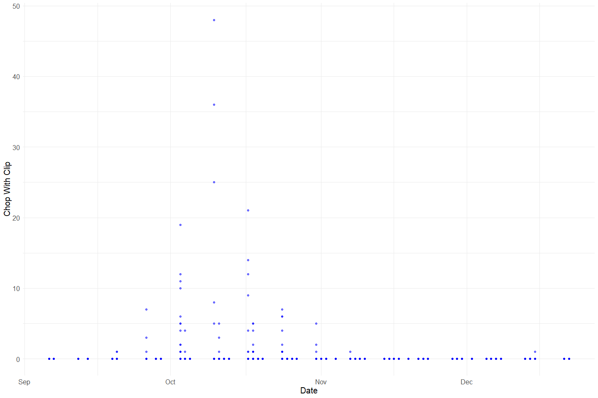<!-- -->

**Plotting chop_n\_clip over Period of Record**

``` r
chop_channel_join %>% 
  ggplot(aes(x = date, y = chop_n_clip)) +
  geom_point(size = 1.4, alpha = .5, color = "red") + 
  labs(x = "Date", 
       y = "Chop Without Clip") +
  theme_minimal() + 
  theme(text = element_text(size = 15)) 
```

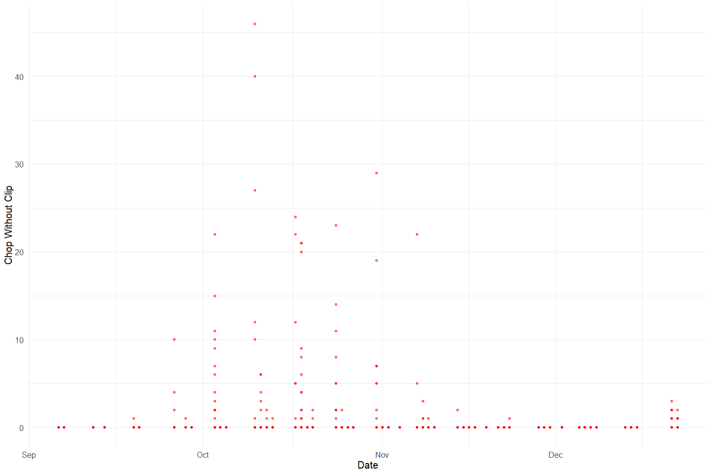<!-- -->

**Plotting chop_uncheck over Period of Record**

``` r
chop_channel_join %>% 
  ggplot(aes(x = date, y = chop_uncheck)) +
  geom_point(size = 1.4, alpha = .5, color = "black") + 
  labs(x = "Date", 
       y = "Chop Not Checked") +
  theme_minimal() + 
  theme(text = element_text(size = 15)) 
```

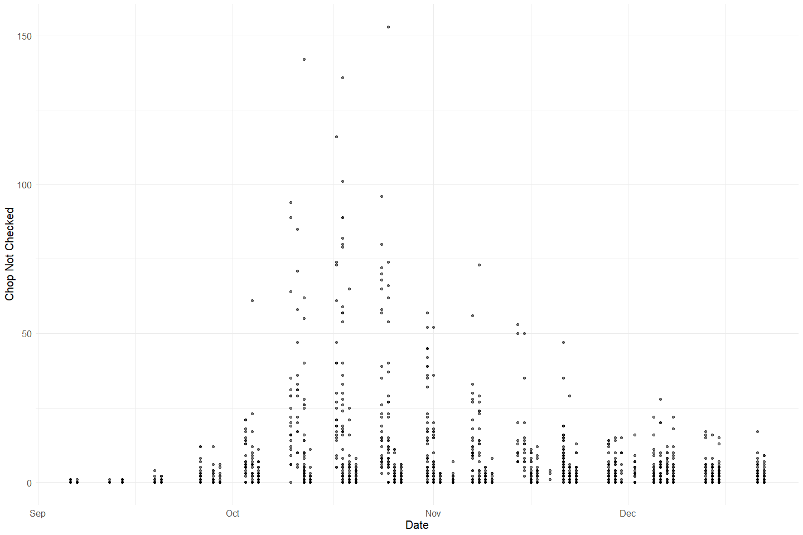<!-- -->

**Plotting Total chops over Period of Record**

``` r
chop_channel_join %>% glimpse()
```

    ## Rows: 2,445
    ## Columns: 18
    ## $ id           <dbl> 545, 545, 545, 545, 545, 545, 545, 545, 545, 545, 545, 54~
    ## $ tag_col      <chr> "RED1", "RED1", "RED1", "RED1", "RED1", "RED1", "RED1", "~
    ## $ date         <date> 2005-09-06, 2005-09-06, 2005-09-06, 2005-09-06, 2005-09-~
    ## $ time         <dttm> 1899-12-31 11:00:00, 1899-12-31 11:00:00, 1899-12-31 11:~
    ## $ chan_id      <dbl> 385, 386, 387, 388, 389, 390, 391, 392, 393, 394, 395, 39~
    ## $ sect         <dbl> 1, 1, 1, 2, 2, 2, 3, 3, 3, 4, 4, 4, 6, 6, 6, 7, 7, 7, 8, ~
    ## $ chan         <chr> "L", "M", "R", "L", "M", "R", "L", "M", "R", "L", "M", "R~
    ## $ min          <dbl> 3, 4, 3, 5, 3, 5, 4, 2, 4, 4, 2, 4, 4, 4, 4, 1, 1, 1, 6, ~
    ## $ male         <lgl> NA, NA, NA, NA, NA, NA, NA, NA, NA, NA, NA, NA, NA, NA, N~
    ## $ fem          <lgl> NA, NA, NA, NA, NA, NA, NA, NA, NA, NA, NA, NA, NA, NA, N~
    ## $ gril         <lgl> NA, NA, NA, NA, NA, NA, NA, NA, NA, NA, NA, NA, NA, NA, N~
    ## $ tag_count    <lgl> NA, NA, NA, NA, NA, NA, NA, NA, NA, NA, NA, NA, NA, NA, N~
    ## $ chop_clip    <dbl> 0, 0, 0, 0, 0, 0, 0, 0, 0, 0, 0, 0, 0, 0, 0, 0, 0, 0, 0, ~
    ## $ chop_n_clip  <dbl> 0, 0, 0, 0, 0, 0, 0, 0, 0, 0, 0, 0, 0, 0, 0, 0, 0, 0, 0, ~
    ## $ chop_uncheck <dbl> 0, 0, 0, 0, 0, 0, 0, 0, 0, 0, 0, 0, 0, 0, 0, 0, 0, 0, 1, ~
    ## $ tag_clip     <dbl> 0, 0, 0, 0, 0, 0, 0, 0, 0, 0, 0, 0, 0, 0, 0, 0, 0, 0, 0, ~
    ## $ tag_n_clip   <dbl> 0, 0, 0, 0, 0, 0, 0, 0, 0, 0, 0, 0, 0, 0, 0, 0, 0, 0, 0, ~
    ## $ tag_unk      <dbl> 0, 0, 0, 0, 0, 0, 0, 0, 0, 0, 0, 0, 0, 0, 0, 0, 0, 0, 0, ~

``` r
total_chops <- chop_channel_join%>%
  mutate(chop_clip = ifelse(is.na(chop_clip), 0, chop_clip), # fill na
         chop_n_clip = ifelse(is.na(chop_n_clip), 0, chop_n_clip),
         chop_uncheck = ifelse(is.na(chop_uncheck), 0, chop_uncheck),
         total_chops = chop_clip + chop_n_clip + chop_uncheck) %>% 
  select(date, chop_clip, chop_n_clip, chop_uncheck, total_chops)

# Case check: checking for duplicates
total_chops_test <- total_chops %>% # get total chops
  filter(date == as_date("2005-09-15"))

# Check if NAs introduced in creating total chop columns
nrow(total_chops_test) == (sum(total_chops_test$total_chops == (total_chops_test$chop_clip + total_chops_test$chop_n_clip + total_chops_test$chop_uncheck)))
```

    ## [1] TRUE

``` r
# total number of chops for the day
total_chops_summary <- total_chops %>%
  group_by(date) %>%
  summarise(total_chops = sum(total_chops, na.rm = T),
            chop_clip = sum(chop_clip, na.rm = T),
            chop_n_clip = sum(chop_n_clip, na.rm = T),
            chop_uncheck = sum(chop_uncheck, na.rm = T))


# check if NAs are introduced in merge
A = left_join(ChopChannel_raw, ChopHeader_raw, by = "ID")$ChanID
B = ChopRecov_raw$ChanID
sum(B %in% A) # they are
```

    ## [1] 849

``` r
# yes I noticed that. there are some IDs in the chop_channel table that are not in the chop_header table. there are A LOT of IDs in the recovery table that are not in header table. at this point i would assume this is a data entry issue and we can leave as is but clearly document. this is something we may learn more about and then be able to fix
```

``` r
total_chops_summary %>% 
  pivot_longer(cols = c(chop_clip, chop_n_clip, chop_uncheck), names_to = "clip", values_to = "count") %>% 
  mutate(proportions = (count / total_chops)) %>% 
  ggplot(aes(x = date, y = proportions, fill = clip)) +
  geom_bar(stat = "identity", position = "stack") +
  scale_fill_manual(values = c("Blue","Red", "Black"), 
                    name = "Clip", 
                    labels = c("Clip", "No Clip", "Not Checked")) +
  theme_minimal() + 
  labs(y = "Proportion", x = "Date") +
  scale_fill_manual(values = wes_palette("Moonrise2"))
```

    ## Scale for 'fill' is already present. Adding another scale for 'fill', which
    ## will replace the existing scale.

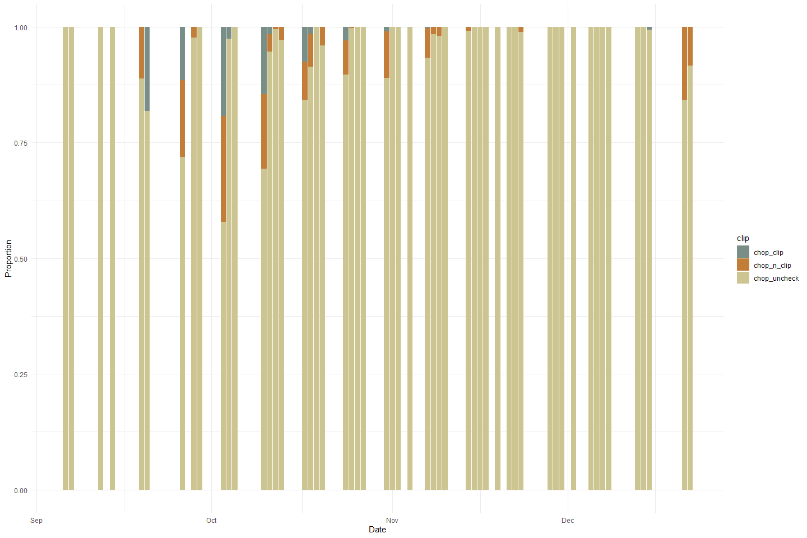<!-- -->

The dataset from 2006 did not record for sex and instead, recorded for
clip(?) or not.This plot shows the proportion of chops with, without
clips and unchecked for each day over the the period of 2006-09-05 to
2006-12-22. The data gaps that we see are a result of the data
collection process in which the data was collected 2-4 days each week
(with no specific period day of week) over the 4 month period. We see
that the majority of the chops were unchecked for clips.

### Chop Channel Variable: `tag_count`, `tag_clip`, `tag_n_clip`, `tag_unk`

**Numeric Summary of `tag_clip`, `tag_n_clip`, `tag_unk` over Period of
Record**

``` r
summary(chop_channel_join$tag_clip)
```

    ##    Min. 1st Qu.  Median    Mean 3rd Qu.    Max. 
    ##  0.0000  0.0000  0.0000  0.1452  0.0000 22.0000

``` r
summary(chop_channel_join$tag_n_clip)
```

    ##    Min. 1st Qu.  Median    Mean 3rd Qu.    Max.    NA's 
    ##  0.0000  0.0000  0.0000  0.5698  0.0000 29.0000       2

``` r
summary(chop_channel_join$tag_unk)
```

    ##    Min. 1st Qu.  Median    Mean 3rd Qu.    Max.    NA's 
    ## 0.00000 0.00000 0.00000 0.02047 0.00000 7.00000       2

**NA and Unknown Values** Provide a stat on NA or unknown values

``` r
round(sum(is.na(chop_channel_join$tag_clip))/nrow(chop_channel_join), 3) * 100
```

    ## [1] 0

``` r
round(sum(is.na(chop_channel_join$tag_n_clip))/nrow(chop_channel_join), 3) * 100
```

    ## [1] 0.1

``` r
round(sum(is.na(chop_channel_join$tag_unk))/nrow(chop_channel_join), 3) * 100
```

    ## [1] 0.1

-   0 % of values in the `tag_clip` column are NA.
-   0.1 % of values in the `tag_n_clip` column are NA.
    -   0.1 % of values in the `tag_unk` column are NA.

**Plotting tag_clip over Period of Record**

``` r
chop_channel_join %>% 
  ggplot(aes(x = date, y = tag_clip)) +
  geom_point(size = 1.4, alpha = .5, color = "blue") + 
  labs(x = "Date", 
       y = "Tag Clip") +
  theme_minimal() + 
  theme(text = element_text(size = 15)) 
```

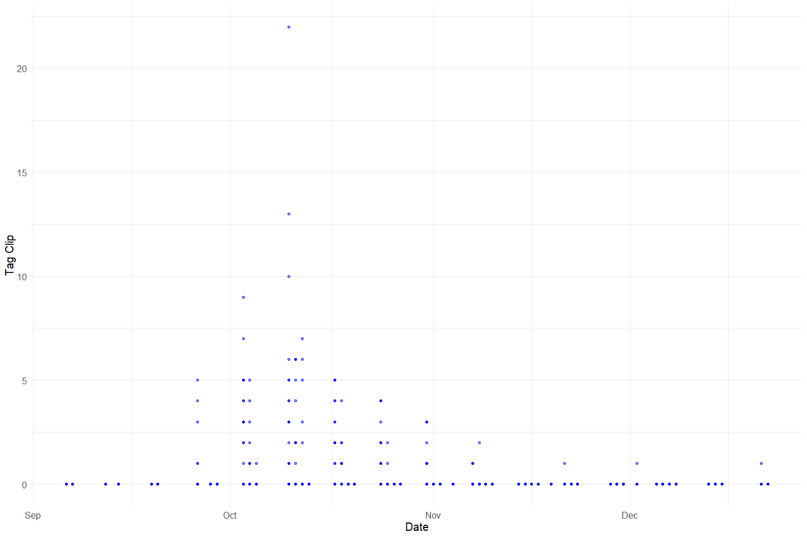<!-- -->

**Plotting tag_n\_clip over Period of Record**

``` r
chop_channel_join %>% 
  ggplot(aes(x = date, y = tag_n_clip)) +
  geom_point(size = 1.4, alpha = .5, color = "red") + 
  labs(x = "Date", 
       y = "Tag No Clip") +
  theme_minimal() + 
  theme(text = element_text(size = 15)) 
```

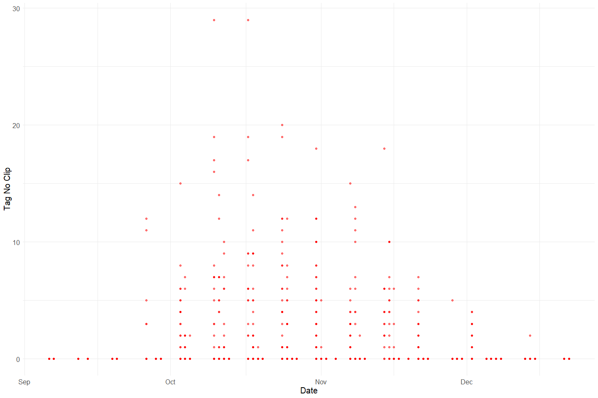<!-- -->

**Plotting tag_unk over Period of Record**

``` r
chop_channel_join %>% 
  ggplot(aes(x = date, y = tag_unk)) +
  geom_point(size = 1.4, alpha = .5, color = "black") + 
  labs(x = "Date", 
       y = "Unknown Tags") +
  theme_minimal() + 
  theme(text = element_text(size = 15)) 
```

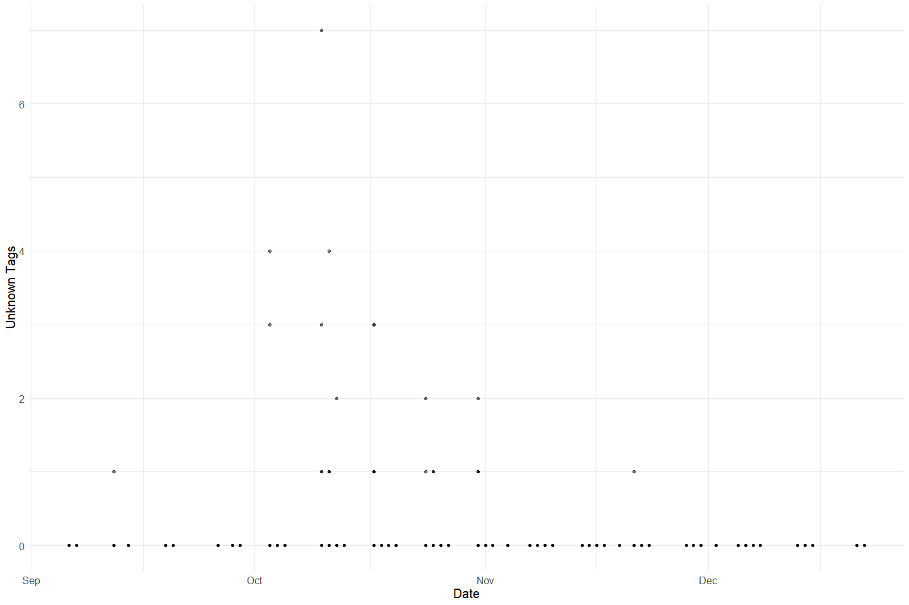<!-- -->

**Plotting Total Tags over Period of Record**

``` r
# Percentage by Gender of Daily Chops
# Address NA values for chops
total_tags <- chop_channel_join %>%
  mutate(tag_clip = ifelse(is.na(tag_clip), 0, tag_clip), # fill na
         tag_n_clip = ifelse(is.na(tag_n_clip), 0, tag_n_clip),
         tag_unk = ifelse(is.na(tag_unk), 0, tag_unk),
         total_tags = tag_unk + tag_clip + tag_n_clip) %>% 
  select(date, tag_clip, tag_n_clip, tag_unk, total_tags)

# total number of chops for the day
total_tags_summary <- total_tags %>%
  group_by(date) %>%
  summarise(total_tags = sum(total_tags, na.rm = T),
            tag_clip = sum(tag_clip, na.rm = T),
            tag_n_clip = sum(tag_n_clip, na.rm = T),
            tag_unk = sum(tag_unk, na.rm = T))

# Make Graph to identify clip proportion
total_tags_summary %>% 
  pivot_longer(cols = c(tag_n_clip, tag_clip, tag_unk), names_to = "tags", values_to = "count") %>% 
  mutate(proportions = (count / total_tags)) %>% 
  ggplot(aes(x = date, y = proportions, fill = tags)) +
  geom_bar(stat = "identity", position = "stack") +
  scale_fill_manual(values = c("Blue","Red", "Black"), 
                    name = "Clips", 
                    labels = c("Tags Without Clips", "Tags With Clips", "Tags Unknown")) +
  theme_minimal() + 
  labs(y = "Proportion", x = "Date") +
  scale_fill_manual(values = wes_palette("Moonrise2"))
```

    ## Scale for 'fill' is already present. Adding another scale for 'fill', which
    ## will replace the existing scale.

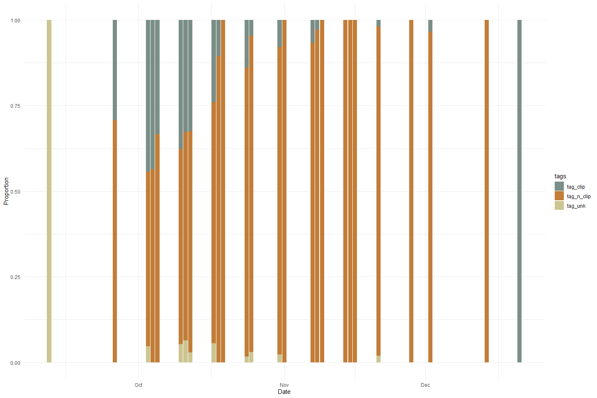<!-- -->

**Comparing tags and chops**

``` r
# from ashley: please improve on this plot I got started, make it look better, describe it, double check that the numbers make sense
total_carcass <- full_join(total_chops_summary, total_tags_summary) %>% 
  select(date, total_chops, total_tags) %>% 
  pivot_longer(c(total_chops, total_tags), names_to = "mark")
```

    ## Joining, by = "date"

``` r
full_join(total_chops_summary, total_tags_summary) %>% 
  select(date, total_chops, total_tags) %>% 
  pivot_longer(c(total_chops, total_tags), names_to = "mark")
```

    ## Joining, by = "date"

    ## # A tibble: 106 x 3
    ##    date       mark        value
    ##    <date>     <chr>       <dbl>
    ##  1 2005-09-06 total_chops     5
    ##  2 2005-09-06 total_tags      0
    ##  3 2005-09-07 total_chops     1
    ##  4 2005-09-07 total_tags      0
    ##  5 2005-09-12 total_chops     1
    ##  6 2005-09-12 total_tags      1
    ##  7 2005-09-14 total_chops     9
    ##  8 2005-09-14 total_tags      0
    ##  9 2005-09-19 total_chops     9
    ## 10 2005-09-19 total_tags      0
    ## # ... with 96 more rows

``` r
ggplot(total_carcass, aes(x = date, y = value, fill = mark)) +
  geom_col() +
  theme_minimal() +
  scale_fill_manual(values = wes_palette("Moonrise2"))
```

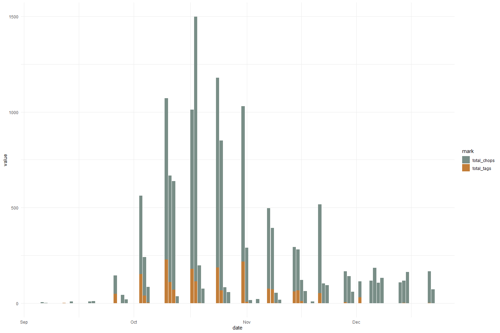<!-- -->

Tags appear to be less commonly applied compared to chops.

### Chop Recovery Variable: `id`, `chan_id`, `recov_count`

``` r
# Filter clean data to show only numeric variables 
chop_recovery_join %>% 
  select_if(is.numeric) %>%
  colnames()
```

    ## [1] "id"          "recov_count" "chan_id"

``` r
summary(chop_recovery_join$id)
```

    ##    Min. 1st Qu.  Median    Mean 3rd Qu.    Max. 
    ##   346.0   547.2   580.5   580.0   614.8   650.0

``` r
summary(chop_recovery_join$chan_id)
```

    ##    Min. 1st Qu.  Median    Mean 3rd Qu.    Max.    NA's 
    ##      NA      NA      NA     NaN      NA      NA     134

Note: There are no values for recov_count in 2005

### Chop Header Variable: `id`

``` r
chop_header %>% 
  select_if(is.numeric) %>% 
  colnames()
```

    ## [1] "id"       "week_num"

``` r
summary(chop_header$id)
```

    ##    Min. 1st Qu.  Median    Mean 3rd Qu.    Max. 
    ##   346.0   547.2   580.5   580.0   614.8   650.0

### CWT Variable: `tag_id`, `sect`, `fl`, `header_id`, `week_num`

``` r
cwt %>% 
  select_if(is.numeric) %>% 
  colnames()
```

    ## [1] "tag_id"    "sect"      "fl"        "header_id" "week_num"

``` r
summary(cwt$tag_id)
```

    ##    Min. 1st Qu.  Median    Mean 3rd Qu.    Max.    NA's 
    ##    6181   11376   12611   12598   13834   15181       2

``` r
summary(cwt$sect)
```

    ##    Min. 1st Qu.  Median    Mean 3rd Qu.    Max.    NA's 
    ##     1.0     7.0    10.0    13.3    16.0    53.0      35

``` r
summary(cwt$fl)
```

    ##    Min. 1st Qu.  Median    Mean 3rd Qu.    Max.    NA's 
    ##   37.00   76.00   81.00   81.39   87.00  117.00     824

-   0 % of values in the `tag_id` column are NA.
-   0.7 % of values in the `sect` column are NA.
-   17 % of values in the `fl` column are NA.

``` r
#Create a cwt_count column
#Pivot table to expand sex column to female_cwt, male_cwt, and unknown_cwt 
#Is this graph helpful?
unique(cwt$sex)
```

    ## [1] "M"  "F"  "ND" NA   "UK"

``` r
cwt_count <- cwt %>% 
  mutate(count = 1) %>%
  mutate(sex = case_when(sex == "ND"|is.na(sex)|sex =="UK" ~ "U",
                         TRUE ~ sex)) %>% 
  pivot_wider(names_from = sex, values_from = count, values_fill = 0) %>% 
  # unnest() %>% 
  rename("male_cwt" = M,
         "female_cwt" = F,
         "unknown_cwt" = U) %>% glimpse
```

    ## Rows: 4,833
    ## Columns: 21
    ## $ tag_id      <dbl> 6181, 6182, 6183, 6184, 6185, 6186, 6187, 6188, 6189, 6190~
    ## $ sect        <dbl> 1, 1, 1, 1, 6, 10, 10, 12, 12, 12, 12, 12, 13, 13, 13, 14,~
    ## $ rel_loc     <chr> NA, NA, NA, NA, NA, NA, NA, NA, NA, NA, NA, NA, NA, NA, NA~
    ## $ fl          <dbl> 70, 87, 59, 82, 84, 102, 84, 83, 96, 77, 80, 68, 87, 99, 9~
    ## $ spawn       <chr> "UK", "U", "UK", "U", "S", "UK", "U", "UK", "UK", "NO DATA~
    ## $ clip        <chr> "Y", "N", "Y", "N", "N", "N", "N", "N", "N", "N", "N", "N"~
    ## $ samp_type   <chr> "H&O", "O", "H&O", "O", "O", "O", "O", "O", "O", "O", "O",~
    ## $ carc_stat   <chr> "C", "T", "C", "T", "T", "T", "T", "T", "T", "T", "T", "T"~
    ## $ samp_num    <chr> "090704-001", "090704-002", "090704-003", "090704-004", "0~
    ## $ head_tag    <chr> "42816", NA, "64641", NA, NA, NA, NA, NA, NA, NA, NA, NA, ~
    ## $ comment     <chr> NA, NA, NA, NA, NA, NA, NA, NA, NA, NA, NA, NA, "GT033", N~
    ## $ header_id   <dbl> 1488, 1488, 1488, 1488, 1488, 1488, 1488, 1488, 1488, 1488~
    ## $ hall_print1 <chr> NA, NA, NA, NA, NA, NA, NA, NA, NA, NA, NA, NA, NA, NA, NA~
    ## $ hall_print2 <chr> NA, NA, NA, NA, NA, NA, NA, NA, NA, NA, NA, NA, NA, NA, NA~
    ## $ date        <dttm> 2005-10-09, 2005-10-09, 2005-10-09, 2005-10-09, 2005-10-0~
    ## $ tag_col     <chr> "ORANGE1", "ORANGE1", "ORANGE1", "ORANGE1", "ORANGE1", "OR~
    ## $ crew        <chr> "JK,PH,DG", "JK,PH,DG", "JK,PH,DG", "JK,PH,DG", "JK,PH,DG"~
    ## $ week_num    <dbl> 6, 6, 6, 6, 6, 6, 6, 6, 6, 6, 6, 6, 6, 6, 6, 6, 6, 6, 6, 6~
    ## $ male_cwt    <dbl> 1, 0, 1, 0, 0, 1, 0, 1, 1, 0, 0, 0, 0, 1, 0, 0, 1, 0, 1, 0~
    ## $ female_cwt  <dbl> 0, 1, 0, 1, 1, 0, 1, 0, 0, 0, 0, 1, 1, 0, 1, 1, 0, 1, 0, 1~
    ## $ unknown_cwt <dbl> 0, 0, 0, 0, 0, 0, 0, 0, 0, 1, 1, 0, 0, 0, 0, 0, 0, 0, 0, 0~

``` r
total_cwt_summary <- cwt_count %>% 
  mutate(male_cwt = ifelse(is.na(male_cwt), 0, male_cwt), # fill na
         female_cwt = ifelse(is.na(female_cwt), 0, female_cwt),
         unknown_cwt = ifelse(is.na(unknown_cwt), 0, unknown_cwt),
         total_cwt = unknown_cwt + male_cwt + female_cwt) %>% 
  group_by(month(date)) %>% 
  summarise(total_cwt = sum(total_cwt),
            male_cwt = sum(male_cwt),
            female_cwt = sum(female_cwt),
            unknown_cwt = sum(unknown_cwt))
```

``` r
total_cwt_summary %>% 
  pivot_longer(cols = c(male_cwt, female_cwt, unknown_cwt), names_to = "sex", values_to = "count") %>% 
  mutate(proportions = (count / total_cwt)) %>% 
  ggplot(aes(x = `month(date)`, y = proportions, fill = sex)) + 
  geom_bar(stat = "identity", position = "stack") +
  scale_fill_manual(name = "chops", 
                    labels = c("CWT Male", "CWT Female", "CWT Unknown")) +
  theme_minimal() + 
  labs(y = "Proportion", x = "Date") +
  scale_fill_manual(values = wes_palette("Moonrise2"))
```

    ## Scale for 'fill' is already present. Adding another scale for 'fill', which
    ## will replace the existing scale.

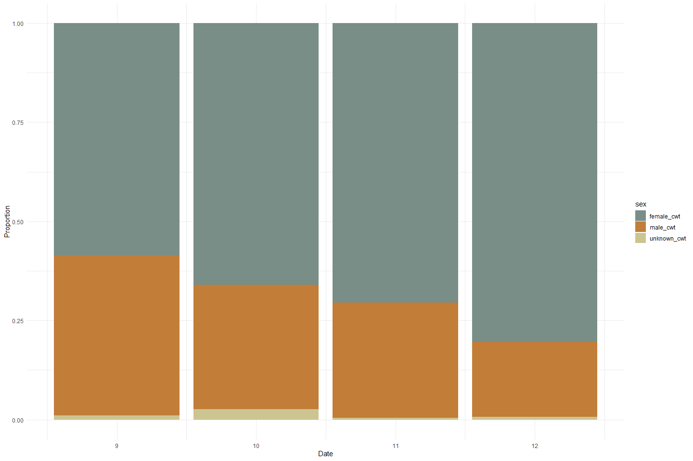<!-- -->

**Plotting fork length of each sex**

``` r
cwt %>% 
  mutate(sex = case_when(sex == "ND"|is.na(sex)|sex =="UK" ~ "Unknown",
                         TRUE ~ sex))%>% 
  ggplot(aes(x = sex, y = fl)) + 
  geom_boxplot() + 
  theme_minimal() + 
  labs(y = "FL", x = "Sex")
```

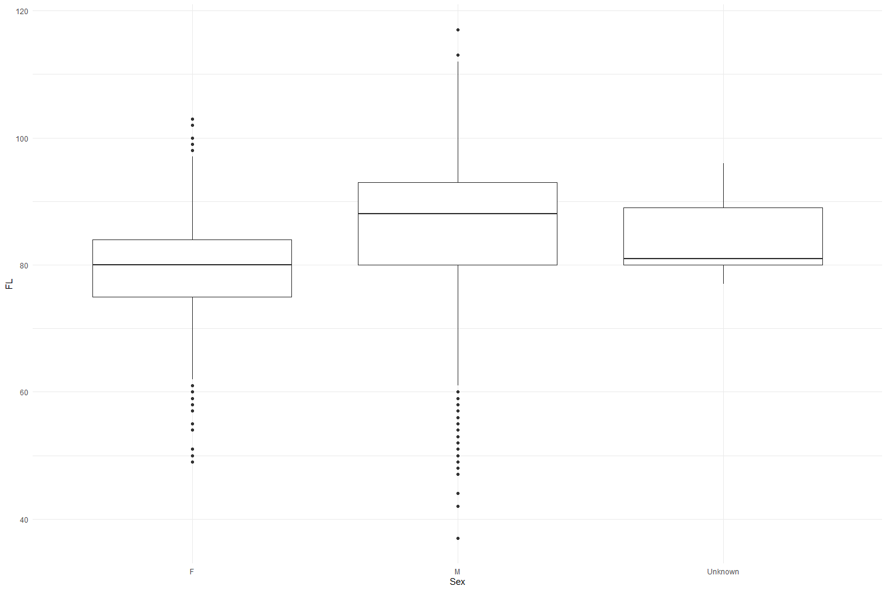<!-- -->

## Explore Categorical variables:

### Chop Channel Clean Data

Fix inconsistencies with spelling, capitalization, and dates

``` r
# Filter clean data to show only categorical variables
chop_channel_join %>% 
  select_if(is.character) %>%
  colnames()
```

    ## [1] "tag_col" "chan"

``` r
unique(chop_channel_join$tag_col)
```

    ##  [1] "RED1"     "YELLOW2"  "ORANGE3"  "BLUE4"    "RED5"     "YELLOW6" 
    ##  [7] "ORANGE7"  "BLUE8"    "RED9"     "YELLOW10" "ORANGE11" "BLUE12"  
    ## [13] "RED13"    "YELLOW14" "ORANGE15" "CLEANUP"

``` r
#Remove 5?
unique(chop_channel_join$chan)
```

    ## [1] "L" "M" "R" NA

``` r
chop_channel_cleaner <- chop_channel_join %>%
  mutate(date = as_date(date)) %>%
  mutate_if(is.character, str_to_lower) %>% 
  select(-c(time, male, fem, gril, tag_count))


chop_channel_cleaner
```

    ## # A tibble: 2,445 x 13
    ##       id tag_col date       chan_id  sect chan    min chop_clip chop_n_clip
    ##    <dbl> <chr>   <date>       <dbl> <dbl> <chr> <dbl>     <dbl>       <dbl>
    ##  1   545 red1    2005-09-06     385     1 l         3         0           0
    ##  2   545 red1    2005-09-06     386     1 m         4         0           0
    ##  3   545 red1    2005-09-06     387     1 r         3         0           0
    ##  4   545 red1    2005-09-06     388     2 l         5         0           0
    ##  5   545 red1    2005-09-06     389     2 m         3         0           0
    ##  6   545 red1    2005-09-06     390     2 r         5         0           0
    ##  7   545 red1    2005-09-06     391     3 l         4         0           0
    ##  8   545 red1    2005-09-06     392     3 m         2         0           0
    ##  9   545 red1    2005-09-06     393     3 r         4         0           0
    ## 10   545 red1    2005-09-06     394     4 l         4         0           0
    ## # ... with 2,435 more rows, and 4 more variables: chop_uncheck <dbl>,
    ## #   tag_clip <dbl>, tag_n_clip <dbl>, tag_unk <dbl>

### Chop Recovery Clean Data

Fix inconsistencies with spelling, capitalization, and dates

``` r
chop_recovery_join %>% 
  select_if(is.character) %>% 
  colnames()
```

    ## [1] "recov_color"

``` r
unique(chop_recovery_join$recov_color)
```

    ## [1] NA

``` r
chop_recovery_cleaner <- chop_recovery_join %>% 
  mutate(date = as_date(date)) %>%
  mutate_if(is.character, str_to_lower) %>% 
  select(-c(date,time))

chop_recovery_cleaner
```

    ## # A tibble: 134 x 4
    ##       id recov_color recov_count chan_id
    ##    <dbl> <chr>             <dbl>   <dbl>
    ##  1   545 <NA>                 NA      NA
    ##  2   539 <NA>                 NA      NA
    ##  3   540 <NA>                 NA      NA
    ##  4   541 <NA>                 NA      NA
    ##  5   542 <NA>                 NA      NA
    ##  6   543 <NA>                 NA      NA
    ##  7   544 <NA>                 NA      NA
    ##  8   546 <NA>                 NA      NA
    ##  9   551 <NA>                 NA      NA
    ## 10   547 <NA>                 NA      NA
    ## # ... with 124 more rows

### Chop Header Clean Data

``` r
chop_header %>% 
  select_if(is.character) %>% 
  colnames()
```

    ## [1] "tag_col"  "crew"     "recorder" "weather"  "comment"

``` r
unique(chop_header$tag_col)
```

    ##  [1] "RED1"     "YELLOW2"  "ORANGE3"  "BLUE4"    "RED5"     "YELLOW6" 
    ##  [7] "ORANGE7"  "BLUE8"    "RED9"     "YELLOW10" "ORANGE11" "BLUE12"  
    ## [13] "RED13"    "YELLOW14" "ORANGE15" "CLEANUP"

``` r
unique(chop_header$crew)
```

    ##   [1] "JK DG PH DG"    "ND BK DG TV"    "ND TV BK DG"    "TV BK DG ND"   
    ##   [5] "ND BK TV DG"    "DG BK TV ND"    "TV DG ND BK"    "JR BK HK"      
    ##   [9] "DG KH BK"       "KH DG PH BK"    "TV SB PH"       "SB TV PH"      
    ##  [13] "DG BK KH"       "BK KH DG"       "JK TV SB"       "JR RK DG"      
    ##  [17] "JR DG RK"       "TV, DG, PH"     "TV"             "TV DG PH"      
    ##  [21] "TV PH DG"       "KM,BK,JR"       "JK PH SB"       "KH JK DG RK"   
    ##  [25] "KH JR DG RK"    "SB JK RK PH"    "SB JK PH RK"    "KH DG BK"      
    ##  [29] "KH KM JK MM"    "DG CP RK"       "PH DG JR CP"    "BK,CP,KH,KM"   
    ##  [33] "JR, DG, PH"     "CP,JR,DG,AS"    "PH,KH"          "JK,RK,PH"      
    ##  [37] "BK,KH,DG,CP"    "CP DG NV KH"    "TV PH AS"       "JR BK"         
    ##  [41] "JK PK NV"       "JR, KH, JK, RK" "JK, RK, KH, JR" "SB DG BK CP"   
    ##  [45] "BK TV SB"       "CP KH NV DG"    "DG NV CP KH"    "SB NV AS"      
    ##  [49] "RK KM"          "BK KH RK  KM"   "TV DG"          "JK TV DG"      
    ##  [53] "BK KH CP TV"    "DG SB PH RK"    "BK KH DG CP"    NA              
    ##  [57] "JK TV PH"       "JK TV PH PN"    "CP SB DG"       "SB DG"         
    ##  [61] "KP"             "SB TV KH"       "SB KM"          "SB KM TV"      
    ##  [65] "K"              "JR KP DG"       "KP JR DG"       "KH KP CP DG"   
    ##  [69] "TV PH DG JR"    "AR BK PH RK"    "AR BK RK PH"    "KP BK CP PH"   
    ##  [73] "AR KH KM"       "PH AR BK KP"    "SB,TV,DG"       "CP PH AR BK"   
    ##  [77] "AR CP BK PH"    "KP JR BK KM"    "PH CP KH AR"    "AR DG PH"      
    ##  [81] "BK KH CP KP"    "SB, KP, TV"     "BK, PH, KP, AR" "KP, BK, PH, KP"
    ##  [85] "KP, BK, JR, PH" "SB, DG, AR"     "RK, JK, TV, AL" "BK KP KM AR"   
    ##  [89] "CP TV SB DG"    "BK KP CP KM"    "RK, AR, TV, DG" "AS JK SB PH ST"
    ##  [93] "KP, BK, KM, KH" "CP, DG, PH"     "PH KH KP"       "KM JK"         
    ##  [97] "KP AR KH"       "JR CP PH"       "JR SB TV CP"    "KP BK KM"      
    ## [101] "KP BK KH CP"    "BK KH AR PH"    "KP DG TV"       "SB TV CP"      
    ## [105] "CP SB TV"       "KP KH KM DG"    "BK SB AR KH"    "KP SB TV"      
    ## [109] "AR TV KH SB"    "BK KP KM"       "JK RK PH"       "BK AR KM"      
    ## [113] "SB PH KM"       "PH KH BK CP"

``` r
unique(chop_header$recorder)
```

    ##  [1] "DG"    "JR"    NA      "SB"    "JK"    "BK"    "KH"    "MM"    "AS"   
    ## [10] "PH AS" "KCP"   "KP"    "KM"    "CP"    "AR"    "RK"

``` r
unique(chop_header$weather)
```

    ## [1] "SUN" NA    "CLD" "RAN"

``` r
chop_header_cleaner <- chop_header %>%
  mutate(date = as_date(date)) %>%
  mutate_if(is.character, str_to_lower) %>% 
  mutate(crew = str_replace_all(crew, " ", ","),
         crew = str_replace_all(crew, ",,", ","),
         weather = ifelse(weather == "ran", "rain", weather)) %>% 
  select(-c(time))

chop_header_cleaner
```

    ## # A tibble: 134 x 8
    ##       id tag_col date       crew        recorder weather comment week_num
    ##    <dbl> <chr>   <date>     <chr>       <chr>    <chr>   <chr>      <dbl>
    ##  1   545 red1    2005-09-06 jk,dg,ph,dg dg       sun     <NA>           1
    ##  2   539 red1    2005-09-07 nd,bk,dg,tv dg       sun     <NA>           1
    ##  3   540 red1    2005-09-07 nd,tv,bk,dg dg       sun     <NA>           1
    ##  4   541 red1    2005-09-07 tv,bk,dg,nd dg       sun     <NA>           1
    ##  5   542 red1    2005-09-07 nd,bk,tv,dg dg       sun     <NA>           1
    ##  6   543 red1    2005-09-07 dg,bk,tv,nd dg       sun     <NA>           1
    ##  7   544 red1    2005-09-07 tv,dg,nd,bk dg       sun     <NA>           1
    ##  8   546 yellow2 2005-09-12 jr,bk,hk    jr       sun     <NA>           2
    ##  9   551 yellow2 2005-09-14 dg,kh,bk    dg       sun     <NA>           2
    ## 10   547 yellow2 2005-09-14 kh,dg,ph,bk dg       sun     <NA>           2
    ## # ... with 124 more rows

### CWT Clean Data

``` r
cwt %>% 
  select_if(is.character) %>% 
  colnames
```

    ##  [1] "rel_loc"     "sex"         "spawn"       "clip"        "samp_type"  
    ##  [6] "carc_stat"   "samp_num"    "head_tag"    "comment"     "hall_print1"
    ## [11] "hall_print2" "tag_col"     "crew"

``` r
unique(cwt$rel_loc)
```

    ## [1] NA        "M"       "R"       "L"       "NO DATA"

``` r
unique(cwt$spawn)
```

    ## [1] "UK"      "U"       "S"       "NO DATA" NA

``` r
unique(cwt$clip)
```

    ## [1] "Y"       "N"       NA        "UK"      "NO DATA"

``` r
unique(cwt$samp_type)
```

    ## [1] "H&O"     "O"       "H"       "NONE"    NA        "H&S&O"   "S&O"    
    ## [8] "NO DATA"

``` r
unique(cwt$carc_stat)
```

    ## [1] "C"       "T"       NA        "NO DATA"

``` r
cwt_cleaner <- cwt %>% 
  mutate_if(is.character, str_to_lower) %>% 
  mutate(crew = str_replace_all(crew, " ", ","),
         crew = str_replace_all(crew, ",,", ","),
         sex = case_when(sex == "nd"|is.na(sex) ~ "unknown",
                         TRUE ~ sex),
         rel_loc = ifelse(rel_loc == "no data", NA, rel_loc),  
         spawn = ifelse(spawn == "no data", NA, spawn),
         clip = case_when(clip == "no data" ~ NA_character_,
                          clip == "y" ~ "yes",
                          clip == "n" ~ "no",
                          TRUE ~ clip),
         samp_type = ifelse(samp_type == "no data", NA, samp_type),
         carc_stat = ifelse(carc_stat == "no data", NA, carc_stat)) %>% 
  glimpse
```

    ## Rows: 4,833
    ## Columns: 19
    ## $ tag_id      <dbl> 6181, 6182, 6183, 6184, 6185, 6186, 6187, 6188, 6189, 6190~
    ## $ sect        <dbl> 1, 1, 1, 1, 6, 10, 10, 12, 12, 12, 12, 12, 13, 13, 13, 14,~
    ## $ rel_loc     <chr> NA, NA, NA, NA, NA, NA, NA, NA, NA, NA, NA, NA, NA, NA, NA~
    ## $ fl          <dbl> 70, 87, 59, 82, 84, 102, 84, 83, 96, 77, 80, 68, 87, 99, 9~
    ## $ sex         <chr> "m", "f", "m", "f", "f", "m", "f", "m", "m", "unknown", "u~
    ## $ spawn       <chr> "uk", "u", "uk", "u", "s", "uk", "u", "uk", "uk", NA, NA, ~
    ## $ clip        <chr> "yes", "no", "yes", "no", "no", "no", "no", "no", "no", "n~
    ## $ samp_type   <chr> "h&o", "o", "h&o", "o", "o", "o", "o", "o", "o", "o", "o",~
    ## $ carc_stat   <chr> "c", "t", "c", "t", "t", "t", "t", "t", "t", "t", "t", "t"~
    ## $ samp_num    <chr> "090704-001", "090704-002", "090704-003", "090704-004", "0~
    ## $ head_tag    <chr> "42816", NA, "64641", NA, NA, NA, NA, NA, NA, NA, NA, NA, ~
    ## $ comment     <chr> NA, NA, NA, NA, NA, NA, NA, NA, NA, NA, NA, NA, "gt033", N~
    ## $ header_id   <dbl> 1488, 1488, 1488, 1488, 1488, 1488, 1488, 1488, 1488, 1488~
    ## $ hall_print1 <chr> NA, NA, NA, NA, NA, NA, NA, NA, NA, NA, NA, NA, NA, NA, NA~
    ## $ hall_print2 <chr> NA, NA, NA, NA, NA, NA, NA, NA, NA, NA, NA, NA, NA, NA, NA~
    ## $ date        <dttm> 2005-10-09, 2005-10-09, 2005-10-09, 2005-10-09, 2005-10-0~
    ## $ tag_col     <chr> "orange1", "orange1", "orange1", "orange1", "orange1", "or~
    ## $ crew        <chr> "jk,ph,dg", "jk,ph,dg", "jk,ph,dg", "jk,ph,dg", "jk,ph,dg"~
    ## $ week_num    <dbl> 6, 6, 6, 6, 6, 6, 6, 6, 6, 6, 6, 6, 6, 6, 6, 6, 6, 6, 6, 6~

## Comments

-   Instead of keeping track of carcasses based on grilse and sex like
    the previous data sets, this one tracks the carcasses using clipped
    or unclipped. Same for tags
-   The dataset is also joined with 2005 data - need to filter for only
    2005
-   No recovery count

## Data Dictionaries

### Channel

``` r
percent_na <- chop_channel_cleaner %>%
  summarise_all(list(name = ~sum(is.na(.))/length(.))) %>%
  pivot_longer(cols = everything())


counts_data_dictionary <- tibble(variables = colnames(chop_channel_cleaner),
                          description = c("ID",
                                          "Color of tag applied to carcass",
                                          "Date of survey",
                                          "Channel ID",
                                          "Sect", 
                                          "Chan", 
                                          "Min", 
                                          "Carcass that were chopped and has clip",
                                          "Carcass that were chopped and has no clip",
                                          "Carcass that were chopped and not checked for clip",
                                          "Carcass that were tagged and has clip",
                                          "Carcass that were tagged and has no clip",
                                          "Carcass that were tagged and unknown"),
                          percent_na = round(percent_na$value*100))

kable(counts_data_dictionary)
```

| variables    | description                                        | percent_na |
|:-------------|:---------------------------------------------------|-----------:|
| id           | ID                                                 |          0 |
| tag_col      | Color of tag applied to carcass                    |          0 |
| date         | Date of survey                                     |          0 |
| chan_id      | Channel ID                                         |          0 |
| sect         | Sect                                               |          0 |
| chan         | Chan                                               |          0 |
| min          | Min                                                |          4 |
| chop_clip    | Carcass that were chopped and has clip             |          0 |
| chop_n\_clip | Carcass that were chopped and has no clip          |          0 |
| chop_uncheck | Carcass that were chopped and not checked for clip |          0 |
| tag_clip     | Carcass that were tagged and has clip              |          0 |
| tag_n\_clip  | Carcass that were tagged and has no clip           |          0 |
| tag_unk      | Carcass that were tagged and unknown               |          0 |

### Recovery

``` r
percent_na <- chop_recovery_cleaner %>%
  summarise_all(list(name = ~sum(is.na(.))/length(.))) %>%
  pivot_longer(cols = everything())


recovery_data_dictionary <- tibble(variables = colnames(chop_recovery_cleaner),
                          description = c("ID",
                                          "Color of tag recovered from carcass",
                                          "Count of recovery",
                                          "Channel ID"),
                          percent_na = round(percent_na$value*100))

kable(recovery_data_dictionary)
```

| variables   | description                         | percent_na |
|:------------|:------------------------------------|-----------:|
| id          | ID                                  |          0 |
| recov_color | Color of tag recovered from carcass |        100 |
| recov_count | Count of recovery                   |        100 |
| chan_id     | Channel ID                          |        100 |

### Survey

``` r
percent_na <- chop_header_cleaner %>%
  summarise_all(list(name = ~sum(is.na(.))/length(.))) %>%
  pivot_longer(cols = everything())
# 
header_data_dictionary <- tibble(variables = colnames(chop_header_cleaner),
                          description = c("ID",
                                          "Color of tag of carcass",
                                          "Date of survey",
                                          "Crew memeber initials that collected",
                                          "Individual of crew member who recorded",
                                          "Weather",
                                          "Comments",
                                          "Week Number"),
                          percent_na = round(percent_na$value*100))
# 
kable(header_data_dictionary)
```

| variables | description                            | percent_na |
|:----------|:---------------------------------------|-----------:|
| id        | ID                                     |          0 |
| tag_col   | Color of tag of carcass                |          0 |
| date      | Date of survey                         |          0 |
| crew      | Crew memeber initials that collected   |          4 |
| recorder  | Individual of crew member who recorded |         26 |
| weather   | Weather                                |          9 |
| comment   | Comments                               |         98 |
| week_num  | Week Number                            |          0 |

### CWT

``` r
percent_na <- cwt_cleaner %>%
  summarise_all(list(name = ~sum(is.na(.))/length(.))) %>%
  pivot_longer(cols = everything())

cwt_data_dictionary <- tibble(variables = colnames(cwt_cleaner),
                          description = c("ID",
                                          "Sect",
                                          "Release Location",
                                          "Fork length",
                                          "Sex",
                                          "Spawn",
                                          "Clip",
                                          "Sample type",
                                          "Carcass stat",
                                          "Sample number",
                                          "Head tag",
                                          "Comment",
                                          "Header ID",
                                          "Hall print1",
                                          "Hall print2",
                                          "Date and time of survey",
                                          "Tag colour",
                                          "Crew",
                                          "Week number"),
                          percent_na = round(percent_na$value*100))

kable(cwt_data_dictionary)
```

| variables   | description             | percent_na |
|:------------|:------------------------|-----------:|
| tag_id      | ID                      |          0 |
| sect        | Sect                    |          1 |
| rel_loc     | Release Location        |         10 |
| fl          | Fork length             |         17 |
| sex         | Sex                     |          0 |
| spawn       | Spawn                   |          2 |
| clip        | Clip                    |          1 |
| samp_type   | Sample type             |         20 |
| carc_stat   | Carcass stat            |          0 |
| samp_num    | Sample number           |         85 |
| head_tag    | Head tag                |         87 |
| comment     | Comment                 |         96 |
| header_id   | Header ID               |          0 |
| hall_print1 | Hall print1             |         79 |
| hall_print2 | Hall print2             |         79 |
| date        | Date and time of survey |          3 |
| tag_col     | Tag colour              |          3 |
| crew        | Crew                    |         10 |
| week_num    | Week number             |          3 |

## Save cleaned data back to google cloud (TBA)

``` r
#Ignore chop recovery as its 100% NA
feather_carcass_chops_and_tags_2005 <- chop_channel_cleaner %>% glimpse()
```

    ## Rows: 2,445
    ## Columns: 13
    ## $ id           <dbl> 545, 545, 545, 545, 545, 545, 545, 545, 545, 545, 545, 54~
    ## $ tag_col      <chr> "red1", "red1", "red1", "red1", "red1", "red1", "red1", "~
    ## $ date         <date> 2005-09-06, 2005-09-06, 2005-09-06, 2005-09-06, 2005-09-~
    ## $ chan_id      <dbl> 385, 386, 387, 388, 389, 390, 391, 392, 393, 394, 395, 39~
    ## $ sect         <dbl> 1, 1, 1, 2, 2, 2, 3, 3, 3, 4, 4, 4, 6, 6, 6, 7, 7, 7, 8, ~
    ## $ chan         <chr> "l", "m", "r", "l", "m", "r", "l", "m", "r", "l", "m", "r~
    ## $ min          <dbl> 3, 4, 3, 5, 3, 5, 4, 2, 4, 4, 2, 4, 4, 4, 4, 1, 1, 1, 6, ~
    ## $ chop_clip    <dbl> 0, 0, 0, 0, 0, 0, 0, 0, 0, 0, 0, 0, 0, 0, 0, 0, 0, 0, 0, ~
    ## $ chop_n_clip  <dbl> 0, 0, 0, 0, 0, 0, 0, 0, 0, 0, 0, 0, 0, 0, 0, 0, 0, 0, 0, ~
    ## $ chop_uncheck <dbl> 0, 0, 0, 0, 0, 0, 0, 0, 0, 0, 0, 0, 0, 0, 0, 0, 0, 0, 1, ~
    ## $ tag_clip     <dbl> 0, 0, 0, 0, 0, 0, 0, 0, 0, 0, 0, 0, 0, 0, 0, 0, 0, 0, 0, ~
    ## $ tag_n_clip   <dbl> 0, 0, 0, 0, 0, 0, 0, 0, 0, 0, 0, 0, 0, 0, 0, 0, 0, 0, 0, ~
    ## $ tag_unk      <dbl> 0, 0, 0, 0, 0, 0, 0, 0, 0, 0, 0, 0, 0, 0, 0, 0, 0, 0, 0, ~

``` r
feather_carcass_cwt_2005 <- cwt_cleaner %>% glimpse()
```

    ## Rows: 4,833
    ## Columns: 19
    ## $ tag_id      <dbl> 6181, 6182, 6183, 6184, 6185, 6186, 6187, 6188, 6189, 6190~
    ## $ sect        <dbl> 1, 1, 1, 1, 6, 10, 10, 12, 12, 12, 12, 12, 13, 13, 13, 14,~
    ## $ rel_loc     <chr> NA, NA, NA, NA, NA, NA, NA, NA, NA, NA, NA, NA, NA, NA, NA~
    ## $ fl          <dbl> 70, 87, 59, 82, 84, 102, 84, 83, 96, 77, 80, 68, 87, 99, 9~
    ## $ sex         <chr> "m", "f", "m", "f", "f", "m", "f", "m", "m", "unknown", "u~
    ## $ spawn       <chr> "uk", "u", "uk", "u", "s", "uk", "u", "uk", "uk", NA, NA, ~
    ## $ clip        <chr> "yes", "no", "yes", "no", "no", "no", "no", "no", "no", "n~
    ## $ samp_type   <chr> "h&o", "o", "h&o", "o", "o", "o", "o", "o", "o", "o", "o",~
    ## $ carc_stat   <chr> "c", "t", "c", "t", "t", "t", "t", "t", "t", "t", "t", "t"~
    ## $ samp_num    <chr> "090704-001", "090704-002", "090704-003", "090704-004", "0~
    ## $ head_tag    <chr> "42816", NA, "64641", NA, NA, NA, NA, NA, NA, NA, NA, NA, ~
    ## $ comment     <chr> NA, NA, NA, NA, NA, NA, NA, NA, NA, NA, NA, NA, "gt033", N~
    ## $ header_id   <dbl> 1488, 1488, 1488, 1488, 1488, 1488, 1488, 1488, 1488, 1488~
    ## $ hall_print1 <chr> NA, NA, NA, NA, NA, NA, NA, NA, NA, NA, NA, NA, NA, NA, NA~
    ## $ hall_print2 <chr> NA, NA, NA, NA, NA, NA, NA, NA, NA, NA, NA, NA, NA, NA, NA~
    ## $ date        <dttm> 2005-10-09, 2005-10-09, 2005-10-09, 2005-10-09, 2005-10-0~
    ## $ tag_col     <chr> "orange1", "orange1", "orange1", "orange1", "orange1", "or~
    ## $ crew        <chr> "jk,ph,dg", "jk,ph,dg", "jk,ph,dg", "jk,ph,dg", "jk,ph,dg"~
    ## $ week_num    <dbl> 6, 6, 6, 6, 6, 6, 6, 6, 6, 6, 6, 6, 6, 6, 6, 6, 6, 6, 6, 6~

``` r
feather_carcass_chop_header_2005 <- chop_header_cleaner %>% glimpse()
```

    ## Rows: 134
    ## Columns: 8
    ## $ id       <dbl> 545, 539, 540, 541, 542, 543, 544, 546, 551, 547, 548, 550, 5~
    ## $ tag_col  <chr> "red1", "red1", "red1", "red1", "red1", "red1", "red1", "yell~
    ## $ date     <date> 2005-09-06, 2005-09-07, 2005-09-07, 2005-09-07, 2005-09-07, ~
    ## $ crew     <chr> "jk,dg,ph,dg", "nd,bk,dg,tv", "nd,tv,bk,dg", "tv,bk,dg,nd", "~
    ## $ recorder <chr> "dg", "dg", "dg", "dg", "dg", "dg", "dg", "jr", "dg", "dg", N~
    ## $ weather  <chr> "sun", "sun", "sun", "sun", "sun", "sun", "sun", "sun", "sun"~
    ## $ comment  <chr> NA, NA, NA, NA, NA, NA, NA, NA, NA, NA, NA, NA, NA, NA, NA, N~
    ## $ week_num <dbl> 1, 1, 1, 1, 1, 1, 1, 2, 2, 2, 2, 2, 2, 2, 2, 3, 3, 3, 3, 3, 3~

``` r
f <- function(input, output) write_csv(input, file = output)

gcs_upload(feather_carcass_chops_and_tags_2005,
           object_function = f,
           type = "csv",
           name = "adult-holding-redd-and-carcass-surveys/feather-river/data/feather_carcass_chops_and_tags_2005.csv")
gcs_upload(feather_carcass_cwt_2005,
           object_function = f,
           type = "csv",
           name = "adult-holding-redd-and-carcass-surveys/feather-river/data/feather_carcass_cwt_2005.csv")
gcs_upload(feather_carcass_chop_header_2005,
           object_function = f,
           type = "csv",
           name = "adult-holding-redd-and-carcass-surveys/feather-river/data/feather_carcass_chop_header_2005.csv")
```
