Feather Carcass QC 2006
================
Inigo Peng
2022-07-21

# Feather River Carcass Data

## Description of Monitoring Data

**Timeframe:**

**Video Season:**

**Completeness of Record throughout timeframe:**

**Sampling Location:**

**Data Contact:**

Any additional info?

## Access Cloud Data

``` r
# Run Sys.setenv() to specify GCS_AUTH_FILE and GCS_DEFAULT_BUCKET before running 
# getwd() to see how to specify paths 
# Open object from google cloud storage
# Set your authentication using gcs_auth

gcs_auth(json_file = Sys.getenv("GCS_AUTH_FILE"))
# Set global bucket 
gcs_global_bucket(bucket = Sys.getenv("GCS_DEFAULT_BUCKET"))

# git data and save as xlsx
```

``` r
gcs_get_object(object_name = "adult-holding-redd-and-carcass-surveys/feather-river/data-raw/carcass/2006/ChopChannelTBL1_2006.xlsx",
               bucket = gcs_get_global_bucket(),
               saveToDisk = "ChopChannel_2006.xlsx",
               overwrite = TRUE)
#
gcs_get_object(object_name = "adult-holding-redd-and-carcass-surveys/feather-river/data-raw/carcass/2006/ChopHeaderTBL_2006.xlsx",
               bucket = gcs_get_global_bucket(),
               saveToDisk = "ChopHeader_2006.xlsx",
               overwrite = TRUE)

gcs_get_object(object_name = "adult-holding-redd-and-carcass-surveys/feather-river/data-raw/carcass/2006/ChopRecovTBL_2006.xlsx",
               bucket = gcs_get_global_bucket(),
               saveToDisk = "ChopRecov_2006.xlsx",
               overwrite = TRUE)

gcs_get_object(object_name = "adult-holding-redd-and-carcass-surveys/feather-river/data-raw/carcass/2005/CWTHeaderTBL_2005.xlsx",
               bucket = gcs_get_global_bucket(),
               saveToDisk = "CWTHeader_2006.xlsx",
               overwrite = TRUE)

gcs_get_object(object_name = "adult-holding-redd-and-carcass-surveys/feather-river/data-raw/carcass/2005/CWTTagTBL_2005.xlsx",
               bucket = gcs_get_global_bucket(),
               saveToDisk = "CWTTag_2006.xlsx",
               overwrite = TRUE)
```

## Raw Data Glimpse:

### ChopChannel_raw

``` r
ChopChannel_raw <- read_excel("ChopChannel_2006.xlsx") %>% 
  rename("ID" = HeaderID) %>%
  glimpse()
```

    ## Rows: 2,248
    ## Columns: 11
    ## $ ChanID      <dbl> 2538, 2539, 2540, 2541, 2542, 2543, 2544, 2545, 2546, 2547~
    ## $ Sect        <dbl> 1, 1, 1, 3, 3, 3, 2, 2, 2, 4, 4, 6, 6, 6, 5, 5, 5, 7, 7, 7~
    ## $ Chan        <chr> "L", "M", "R", "L", "M", "R", "L", "M", "R", "L", "M", "L"~
    ## $ Min         <dbl> 7, 7, 9, 5, 5, 4, 5, 4, 6, 5, 4, 1, 2, 2, 4, 3, 3, 5, 4, 3~
    ## $ ChopClip    <dbl> 0, 0, 0, 0, 0, 0, 0, 0, 0, 0, 0, 0, 0, 0, 0, 0, 0, 0, 0, 0~
    ## $ ChopNClip   <dbl> 0, 0, 0, 1, 0, 0, 0, 0, 0, 1, 0, 0, 0, 0, 0, 0, 0, 1, 0, 0~
    ## $ ChopUncheck <dbl> 0, 0, 0, 0, 0, 0, 0, 0, 0, 0, 0, 0, 0, 0, 0, 0, 0, 0, 0, 0~
    ## $ TagClip     <dbl> 0, 0, 0, 0, 0, 0, 0, 0, 0, 0, 0, 0, 0, 0, 0, 0, 0, 0, 0, 0~
    ## $ TagNClip    <dbl> 0, 0, 0, 0, 0, 0, 0, 0, 0, 0, 0, 0, 0, 0, 0, 0, 0, 0, 0, 0~
    ## $ TagUnk      <dbl> 0, 0, 0, 0, 0, 0, 0, 0, 0, 0, 0, 0, 0, 0, 0, 0, 0, 0, 0, 0~
    ## $ ID          <dbl> 655, 655, 655, 655, 655, 655, 655, 655, 655, 655, 655, 655~

### ChopHeader_raw

``` r
ChopHeader_raw <- read_excel("ChopHeader_2006.xlsx") %>% 
  rename("ID" = headerID) %>%
  glimpse()
```

    ## Rows: 128
    ## Columns: 9
    ## $ ID       <dbl> 655, 656, 657, 660, 664, 667, 665, 668, 669, 670, 672, 671, 6~
    ## $ TagCol   <chr> "ORANGE1", "ORANGE1", "ORANGE1", "BLUE2", "BLUE2", "BLUE2", "~
    ## $ Date     <dttm> 2006-09-05, 2006-09-07, 2006-09-07, 2006-09-11, 2006-09-11, ~
    ## $ Crew     <chr> "KT,AR,CP,KH", "CP,KM,PH", "KT,AR,KH", "AR,PH,CP", "KT,KH,BW,~
    ## $ Time     <dttm> 1899-12-31 10:05:00, 1899-12-31 09:15:00, 1899-12-31 09:05:0~
    ## $ Recorder <chr> NA, NA, NA, NA, NA, "AR", "KM", "KL", "BW", "JK", "KT", "AR",~
    ## $ Weather  <chr> "SUN", "SUN", "SUN", "SUN", "SUN", "SUN", "SUN", "SUN", "SUN"~
    ## $ Comment  <chr> "Hallprint tag #19471 found on shore in section 2", NA, NA, N~
    ## $ WeekNum  <dbl> 1, 1, 1, 2, 2, 2, 2, 2, 3, 3, 3, 3, 3, 3, 3, 4, 4, 4, 4, 4, 4~

### ChopRecov_raw

``` r
ChopRecov_raw <- read_excel("ChopRecov_2006.xlsx") %>% 
  glimpse()
```

    ## Rows: 765
    ## Columns: 4
    ## $ RecovID    <dbl> 3750, 3751, 3753, 3754, 3755, 3756, 3757, 3758, 3759, 3760,~
    ## $ RecovColor <chr> "ORANGE1", "ORANGE1", "ORANGE1", "ORANGE1", "ORANGE1", "BLU~
    ## $ RecovCount <dbl> 2, 1, 1, 1, 1, 2, 1, 1, 2, 1, 1, 2, 1, 1, 1, 1, 3, 1, 1, 1,~
    ## $ ChanID     <dbl> 2702, 2704, 2728, 2735, 2736, 2819, 2822, 2823, 2828, 2830,~

### cwt_raw

``` r
cwt_raw <- read_excel("CWTTag_2006.xlsx") %>% 
  glimpse
```

    ## Rows: 4,831
    ## Columns: 15
    ## $ TagID      <dbl> 6181, 6182, 6183, 6184, 6185, 6186, 6187, 6188, 6189, 6190,~
    ## $ Sect       <dbl> 1, 1, 1, 1, 6, 10, 10, 12, 12, 12, 12, 12, 13, 13, 13, 14, ~
    ## $ RelLoc     <chr> NA, NA, NA, NA, NA, NA, NA, NA, NA, NA, NA, NA, NA, NA, NA,~
    ## $ FL         <dbl> 70, 87, 59, 82, 84, 102, 84, 83, 96, 77, 80, 68, 87, 99, 90~
    ## $ Sex        <chr> "M", "F", "M", "F", "F", "M", "F", "M", "M", "ND", "ND", "F~
    ## $ Spawn      <chr> "UK", "U", "UK", "U", "S", "UK", "U", "UK", "UK", "NO DATA"~
    ## $ Clip       <chr> "Y", "N", "Y", "N", "N", "N", "N", "N", "N", "N", "N", "N",~
    ## $ SampType   <chr> "H&O", "O", "H&O", "O", "O", "O", "O", "O", "O", "O", "O", ~
    ## $ CarcStat   <chr> "C", "T", "C", "T", "T", "T", "T", "T", "T", "T", "T", "T",~
    ## $ SampNum    <chr> "090704-001", "090704-002", "090704-003", "090704-004", "09~
    ## $ HeadTag    <chr> "42816", NA, "64641", NA, NA, NA, NA, NA, NA, NA, NA, NA, N~
    ## $ Comment    <chr> NA, NA, NA, NA, NA, NA, NA, NA, NA, NA, NA, NA, "GT033", NA~
    ## $ HeaderID   <dbl> 1488, 1488, 1488, 1488, 1488, 1488, 1488, 1488, 1488, 1488,~
    ## $ HallPrint1 <chr> NA, NA, NA, NA, NA, NA, NA, NA, NA, NA, NA, NA, NA, NA, NA,~
    ## $ HallPrint2 <chr> NA, NA, NA, NA, NA, NA, NA, NA, NA, NA, NA, NA, NA, NA, NA,~

### cwt_header_raw

``` r
cwt_header_raw <- read_excel("CWTHeader_2006.xlsx") %>% 
  glimpse
```

    ## Rows: 192
    ## Columns: 5
    ## $ headerID <dbl> 1628, 1629, 1627, 1626, 1622, 1623, 1624, 1625, 1630, 1631, 1~
    ## $ Date     <dttm> 2005-09-06, 2005-09-06, 2005-09-07, 2005-09-12, 2005-09-14, ~
    ## $ TagCol   <chr> "RED1", "RED1", "RED1", "YELLOW2", "YELLOW2", "YELLOW2", "YEL~
    ## $ Crew     <chr> "JK TV PH DG", "TV PH JK DG", "ND TV BK DG", "JR,BK,KH", NA, ~
    ## $ WeekNum  <dbl> 1, 1, 1, 2, 2, 2, 2, 2, 3, 3, 3, 3, 3, 3, 3, 3, 4, 4, 4, 4, 4~

## Data transformations:

### Counts

The `chop_channel` table contains carcass counts by chop/tagged based on
clips

``` r
#1. chopchannel table (with dates and tag color)
chop_channel_join <- full_join(ChopHeader_raw %>% 
                                 select(ID, TagCol, Date, Time),
                               ChopChannel_raw) %>% 
  clean_names()
```

    ## Joining, by = "ID"

### Recovery

The `chop_recovery` table contains recovered carcass counts by color

``` r
# 2. choprecovery table (with dates)

chop_recovery_join <- full_join(ChopHeader_raw %>% 
                                  select(ID, Date, Time),
                                ChopRecov_raw %>% 
                                  rename(ID = RecovID))  %>% 
  clean_names()
```

    ## Joining, by = "ID"

### Survey

The `chop_header` table contains survey metadata and covariates

``` r
chop_header <- ChopHeader_raw %>% 
  clean_names()
```

### CWT

The `cwt` table contains coded wire tag information.

``` r
cwt <- full_join(cwt_raw %>% clean_names(), cwt_header_raw %>% clean_names()) %>%  
  glimpse
```

    ## Joining, by = "header_id"

    ## Rows: 4,833
    ## Columns: 19
    ## $ tag_id      <dbl> 6181, 6182, 6183, 6184, 6185, 6186, 6187, 6188, 6189, 6190~
    ## $ sect        <dbl> 1, 1, 1, 1, 6, 10, 10, 12, 12, 12, 12, 12, 13, 13, 13, 14,~
    ## $ rel_loc     <chr> NA, NA, NA, NA, NA, NA, NA, NA, NA, NA, NA, NA, NA, NA, NA~
    ## $ fl          <dbl> 70, 87, 59, 82, 84, 102, 84, 83, 96, 77, 80, 68, 87, 99, 9~
    ## $ sex         <chr> "M", "F", "M", "F", "F", "M", "F", "M", "M", "ND", "ND", "~
    ## $ spawn       <chr> "UK", "U", "UK", "U", "S", "UK", "U", "UK", "UK", "NO DATA~
    ## $ clip        <chr> "Y", "N", "Y", "N", "N", "N", "N", "N", "N", "N", "N", "N"~
    ## $ samp_type   <chr> "H&O", "O", "H&O", "O", "O", "O", "O", "O", "O", "O", "O",~
    ## $ carc_stat   <chr> "C", "T", "C", "T", "T", "T", "T", "T", "T", "T", "T", "T"~
    ## $ samp_num    <chr> "090704-001", "090704-002", "090704-003", "090704-004", "0~
    ## $ head_tag    <chr> "42816", NA, "64641", NA, NA, NA, NA, NA, NA, NA, NA, NA, ~
    ## $ comment     <chr> NA, NA, NA, NA, NA, NA, NA, NA, NA, NA, NA, NA, "GT033", N~
    ## $ header_id   <dbl> 1488, 1488, 1488, 1488, 1488, 1488, 1488, 1488, 1488, 1488~
    ## $ hall_print1 <chr> NA, NA, NA, NA, NA, NA, NA, NA, NA, NA, NA, NA, NA, NA, NA~
    ## $ hall_print2 <chr> NA, NA, NA, NA, NA, NA, NA, NA, NA, NA, NA, NA, NA, NA, NA~
    ## $ date        <dttm> 2005-10-09, 2005-10-09, 2005-10-09, 2005-10-09, 2005-10-0~
    ## $ tag_col     <chr> "ORANGE1", "ORANGE1", "ORANGE1", "ORANGE1", "ORANGE1", "OR~
    ## $ crew        <chr> "JK,PH,DG", "JK,PH,DG", "JK,PH,DG", "JK,PH,DG", "JK,PH,DG"~
    ## $ week_num    <dbl> 6, 6, 6, 6, 6, 6, 6, 6, 6, 6, 6, 6, 6, 6, 6, 6, 6, 6, 6, 6~

## Explore Numeric Variables:

### Chop Channel Variable: `id`, `chan_id`, `sect`, `min`

``` r
# Filter clean data to show only numeric variables 
chop_channel_join %>% 
  select_if(is.numeric) %>%
  colnames()
```

    ##  [1] "id"           "chan_id"      "sect"         "min"          "chop_clip"   
    ##  [6] "chop_n_clip"  "chop_uncheck" "tag_clip"     "tag_n_clip"   "tag_unk"

``` r
summary(chop_channel_join$id)
```

    ##    Min. 1st Qu.  Median    Mean 3rd Qu.    Max.    NA's 
    ##   655.0   683.0   716.0   718.2   751.0   788.0       4

``` r
summary(chop_channel_join$chan_id)
```

    ##    Min. 1st Qu.  Median    Mean 3rd Qu.    Max.    NA's 
    ##    2538    3100    3680    3675    4243    4806       1

``` r
summary(chop_channel_join$sect)
```

    ##    Min. 1st Qu.  Median    Mean 3rd Qu.    Max.    NA's 
    ##    1.00   11.00   20.00   20.49   30.00   39.00      19

``` r
summary(chop_channel_join$min)
```

    ##    Min. 1st Qu.  Median    Mean 3rd Qu.    Max.    NA's 
    ##   0.000   4.000   7.000   9.617  12.000 100.000      76

### Chop Channel Variable: `chop_clip`, `chop_n_clip`,`chop_uncheck`

**Numeric Summary of `chop_clip`, `chop_n_clip`,`chop_uncheck` over
Period of Record**

``` r
summary(chop_channel_join$chop_clip)
```

    ##     Min.  1st Qu.   Median     Mean  3rd Qu.     Max.     NA's 
    ##  0.00000  0.00000  0.00000  0.06946  0.00000 32.00000        3

``` r
summary(chop_channel_join$chop_n_clip)
```

    ##    Min. 1st Qu.  Median    Mean 3rd Qu.    Max.    NA's 
    ##  0.0000  0.0000  0.0000  0.4506  0.0000 88.0000       3

``` r
summary(chop_channel_join$chop_uncheck)
```

    ##    Min. 1st Qu.  Median    Mean 3rd Qu.    Max.    NA's 
    ##   0.000   0.000   1.000   8.422   5.000 281.000      15

**NA and Unknown Values** Provide a stat on NA or unknown values.

``` r
round(sum(is.na(chop_channel_join$chop_clip))/nrow(chop_channel_join), 3) * 100
```

    ## [1] 0.1

``` r
round(sum(is.na(chop_channel_join$chop_n_clip))/nrow(chop_channel_join), 3) * 100
```

    ## [1] 0.1

``` r
round(sum(is.na(chop_channel_join$chop_uncheck))/nrow(chop_channel_join), 3) * 100
```

    ## [1] 0.7

-   0.1 % of values in the `chop_clip` column are NA.
-   0.1 % of values in the `chop_n_clip` column are NA.
-   0.7 % of values in the `chop_uncheck` column are NA.

**Plotting chop_clip over Period of Record**

``` r
chop_channel_join %>% 
  ggplot(aes(x = date, y = chop_clip)) +
  geom_point(size = 1.4, alpha = .5, color = "blue") + 
  labs(x = "Date", 
       y = "Chop With Clip") +
  theme_minimal() + 
  theme(text = element_text(size = 15)) 
```

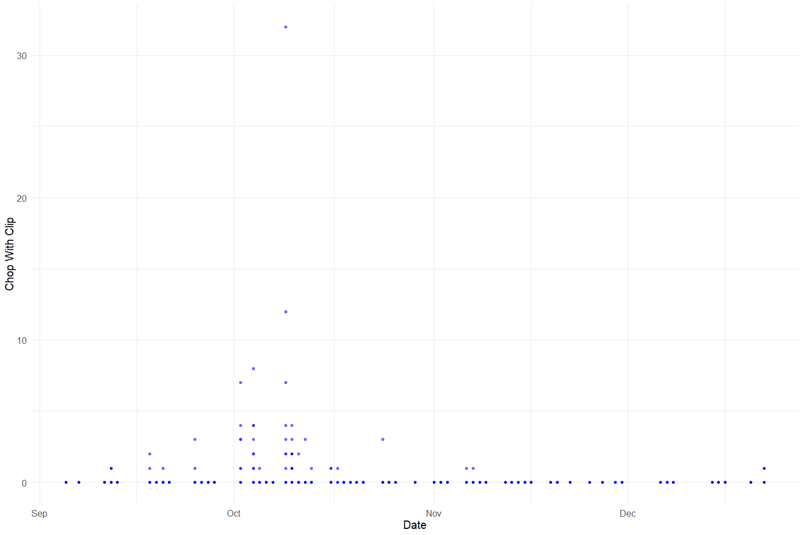<!-- -->

**Plotting chop_n\_clip over Period of Record**

``` r
chop_channel_join %>% 
  ggplot(aes(x = date, y = chop_n_clip)) +
  geom_point(size = 1.4, alpha = .5, color = "red") + 
  labs(x = "Date", 
       y = "Chop Without Clip") +
  theme_minimal() + 
  theme(text = element_text(size = 15)) 
```

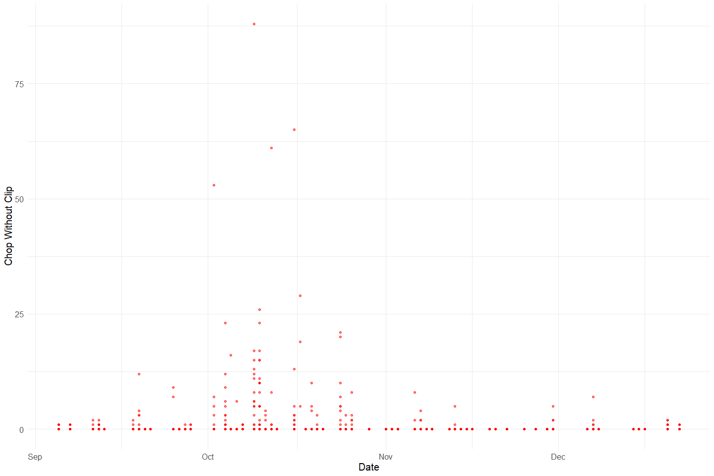<!-- -->

**Plotting chop_uncheck over Period of Record**

``` r
chop_channel_join %>% 
  ggplot(aes(x = date, y = chop_uncheck)) +
  geom_point(size = 1.4, alpha = .5, color = "black") + 
  labs(x = "Date", 
       y = "Chop Not Checked") +
  theme_minimal() + 
  theme(text = element_text(size = 15)) 
```

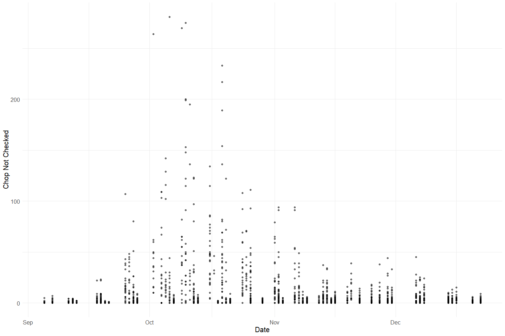<!-- -->

**Plotting Total chops over Period of Record**

``` r
chop_channel_join %>% glimpse()
```

    ## Rows: 2,249
    ## Columns: 14
    ## $ id           <dbl> 655, 655, 655, 655, 655, 655, 655, 655, 655, 655, 655, 65~
    ## $ tag_col      <chr> "ORANGE1", "ORANGE1", "ORANGE1", "ORANGE1", "ORANGE1", "O~
    ## $ date         <dttm> 2006-09-05, 2006-09-05, 2006-09-05, 2006-09-05, 2006-09-~
    ## $ time         <dttm> 1899-12-31 10:05:00, 1899-12-31 10:05:00, 1899-12-31 10:~
    ## $ chan_id      <dbl> 2538, 2539, 2540, 2541, 2542, 2543, 2544, 2545, 2546, 254~
    ## $ sect         <dbl> 1, 1, 1, 3, 3, 3, 2, 2, 2, 4, 4, 6, 6, 6, 5, 5, 5, 7, 7, ~
    ## $ chan         <chr> "L", "M", "R", "L", "M", "R", "L", "M", "R", "L", "M", "L~
    ## $ min          <dbl> 7, 7, 9, 5, 5, 4, 5, 4, 6, 5, 4, 1, 2, 2, 4, 3, 3, 5, 4, ~
    ## $ chop_clip    <dbl> 0, 0, 0, 0, 0, 0, 0, 0, 0, 0, 0, 0, 0, 0, 0, 0, 0, 0, 0, ~
    ## $ chop_n_clip  <dbl> 0, 0, 0, 1, 0, 0, 0, 0, 0, 1, 0, 0, 0, 0, 0, 0, 0, 1, 0, ~
    ## $ chop_uncheck <dbl> 0, 0, 0, 0, 0, 0, 0, 0, 0, 0, 0, 0, 0, 0, 0, 0, 0, 0, 0, ~
    ## $ tag_clip     <dbl> 0, 0, 0, 0, 0, 0, 0, 0, 0, 0, 0, 0, 0, 0, 0, 0, 0, 0, 0, ~
    ## $ tag_n_clip   <dbl> 0, 0, 0, 0, 0, 0, 0, 0, 0, 0, 0, 0, 0, 0, 0, 0, 0, 0, 0, ~
    ## $ tag_unk      <dbl> 0, 0, 0, 0, 0, 0, 0, 0, 0, 0, 0, 0, 0, 0, 0, 0, 0, 0, 0, ~

``` r
total_chops <- chop_channel_join%>%
  mutate(chop_clip = ifelse(is.na(chop_clip), 0, chop_clip), # fill na
         chop_n_clip = ifelse(is.na(chop_n_clip), 0, chop_n_clip),
         chop_uncheck = ifelse(is.na(chop_uncheck), 0, chop_uncheck),
         total_chops = chop_clip + chop_n_clip + chop_uncheck) %>% 
  select(date, chop_clip, chop_n_clip, chop_uncheck, total_chops)

# Case check: checking for duplicates
total_chops_test <- total_chops %>% # get total chops
  filter(date == as_date("2006-09-15"))

# Check if NAs introduced in creating total chop columns
nrow(total_chops_test) == (sum(total_chops_test$total_chops == (total_chops_test$chop_clip + total_chops_test$chop_n_clip + total_chops_test$chop_uncheck)))
```

    ## [1] TRUE

``` r
# total number of chops for the day
total_chops_summary <- total_chops %>%
  group_by(date) %>%
  summarise(total_chops = sum(total_chops, na.rm = T),
            chop_clip = sum(chop_clip, na.rm = T),
            chop_n_clip = sum(chop_n_clip, na.rm = T),
            chop_uncheck = sum(chop_uncheck, na.rm = T))


# check if NAs are introduced in merge
A = left_join(ChopChannel_raw, ChopHeader_raw, by = "ID")$ChanID
B = ChopRecov_raw$ChanID
sum(B %in% A) # they are
```

    ## [1] 755

``` r
# yes I noticed that. there are some IDs in the chop_channel table that are not in the chop_header table. there are A LOT of IDs in the recovery table that are not in header table. at this point i would assume this is a data entry issue and we can leave as is but clearly document. this is something we may learn more about and then be able to fix
```

``` r
total_chops_summary %>% 
  pivot_longer(cols = c(chop_clip, chop_n_clip, chop_uncheck), names_to = "clip", values_to = "count") %>% 
  mutate(proportions = (count / total_chops)) %>% 
  ggplot(aes(x = date, y = proportions, fill = clip)) +
  geom_bar(stat = "identity", position = "stack") +
  scale_fill_manual(values = c("Blue","Red", "Black"), 
                    name = "Clip", 
                    labels = c("Clip", "No Clip", "Not Checked")) +
  theme_minimal() + 
  labs(y = "Proportion", x = "Date") +
  scale_fill_manual(values = wes_palette("Moonrise2"))
```

    ## Scale for 'fill' is already present. Adding another scale for 'fill', which
    ## will replace the existing scale.

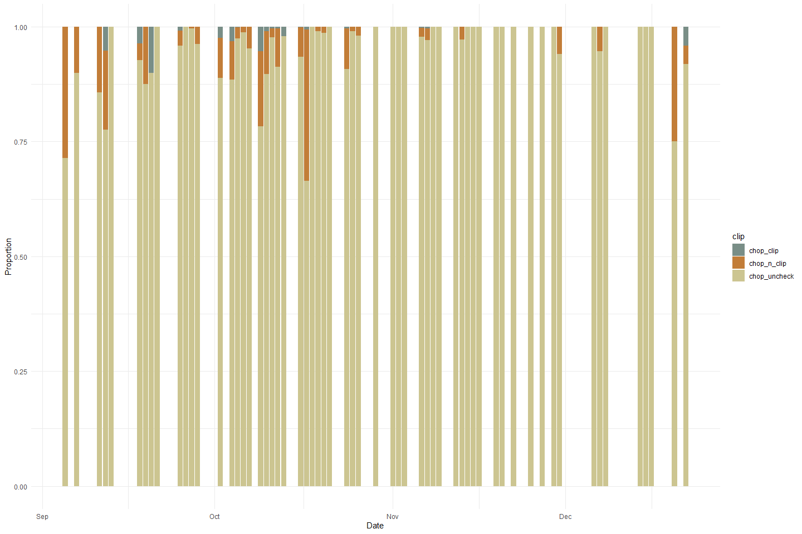<!-- -->
The dataset from 2006 did not record for sex and instead, recorded for
clip(?) or not.This plot shows the proportion of chops with, without
clips and unchecked for each day over the the period of 2006-09-05 to
2006-12-22. The data gaps that we see are a result of the data
collection process in which the data was collected 2-4 days each week
(with no specific period day of week) over the 4 month period. We see
that the majority of the chops were unchecked for clips.

### Chop Channel Variable: `tag_clip`, `tag_n_clip`, `tag_unk`

**Numeric Summary of `tag_clip`, `tag_n_clip`, `tag_unk` over Period of
Record**

``` r
summary(chop_channel_join$tag_clip)
```

    ##     Min.  1st Qu.   Median     Mean  3rd Qu.     Max.     NA's 
    ##  0.00000  0.00000  0.00000  0.09119  0.00000 20.00000        1

``` r
summary(chop_channel_join$tag_n_clip)
```

    ##    Min. 1st Qu.  Median    Mean 3rd Qu.    Max.    NA's 
    ##  0.0000  0.0000  0.0000  0.6842  0.0000 28.0000       1

``` r
summary(chop_channel_join$tag_unk)
```

    ##    Min. 1st Qu.  Median    Mean 3rd Qu.    Max.    NA's 
    ## 0.00000 0.00000 0.00000 0.02313 0.00000 3.00000       1

**NA and Unknown Values** Provide a stat on NA or unknown values

``` r
round(sum(is.na(chop_channel_join$tag_clip))/nrow(chop_channel_join), 3) * 100
```

    ## [1] 0

``` r
round(sum(is.na(chop_channel_join$tag_n_clip))/nrow(chop_channel_join), 3) * 100
```

    ## [1] 0

``` r
round(sum(is.na(chop_channel_join$tag_unk))/nrow(chop_channel_join), 3) * 100
```

    ## [1] 0

-   0 % of values in the `tag_clip` column are NA.
-   0 % of values in the `tag_n_clip` column are NA.
    -   0 % of values in the `tag_unk` column are NA.

**Plotting tag_clip over Period of Record**

``` r
chop_channel_join %>% 
  ggplot(aes(x = date, y = tag_clip)) +
  geom_point(size = 1.4, alpha = .5, color = "blue") + 
  labs(x = "Date", 
       y = "Tag Clip") +
  theme_minimal() + 
  theme(text = element_text(size = 15)) 
```

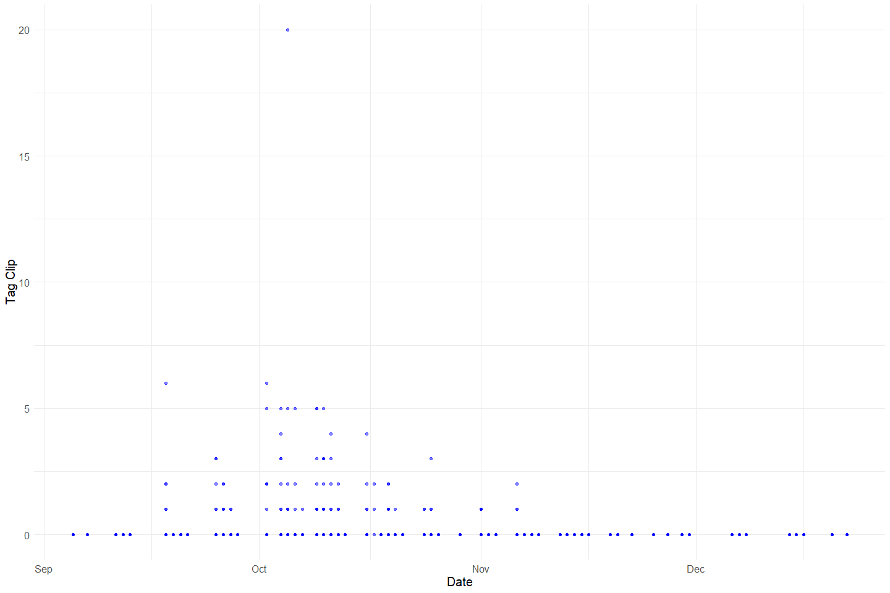<!-- -->

**Plotting tag_n\_clip over Period of Record**

``` r
chop_channel_join %>% 
  ggplot(aes(x = date, y = tag_n_clip)) +
  geom_point(size = 1.4, alpha = .5, color = "red") + 
  labs(x = "Date", 
       y = "Tag No Clip") +
  theme_minimal() + 
  theme(text = element_text(size = 15)) 
```

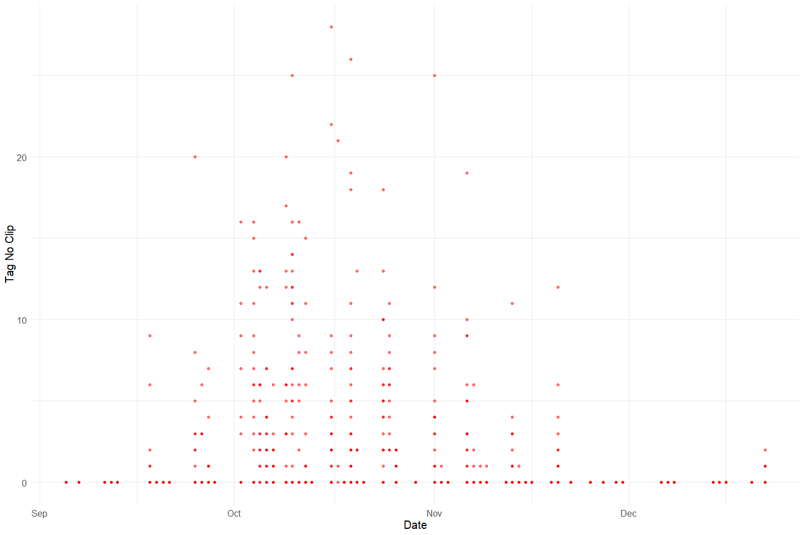<!-- -->

**Plotting tag_unk over Period of Record**

``` r
chop_channel_join %>% 
  ggplot(aes(x = date, y = tag_unk)) +
  geom_point(size = 1.4, alpha = .5, color = "black") + 
  labs(x = "Date", 
       y = "Unknown Tags") +
  theme_minimal() + 
  theme(text = element_text(size = 15)) 
```

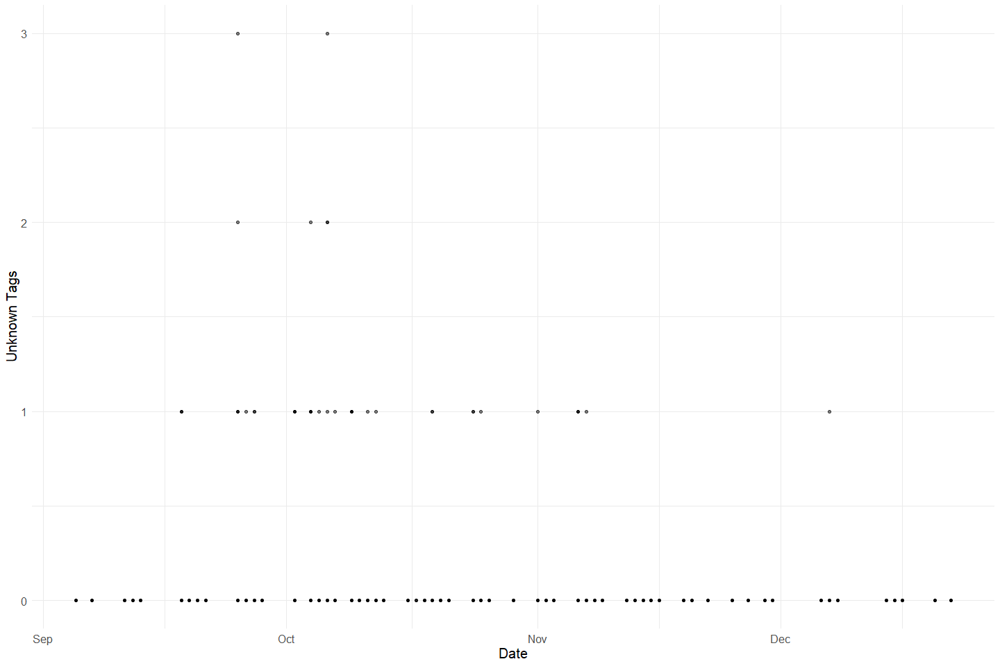<!-- -->

**Plotting Total Tags over Period of Record**

``` r
# Percentage by Gender of Daily Chops
# Address NA values for chops
total_tags <- chop_channel_join %>%
  mutate(tag_clip = ifelse(is.na(tag_clip), 0, tag_clip), # fill na
         tag_n_clip = ifelse(is.na(tag_n_clip), 0, tag_n_clip),
         tag_unk = ifelse(is.na(tag_unk), 0, tag_unk),
         total_tags = tag_unk + tag_clip + tag_n_clip) %>% 
  select(date, tag_clip, tag_n_clip, tag_unk, total_tags)

# total number of chops for the day
total_tags_summary <- total_tags %>%
  group_by(date) %>%
  summarise(total_tags = sum(total_tags, na.rm = T),
            tag_clip = sum(tag_clip, na.rm = T),
            tag_n_clip = sum(tag_n_clip, na.rm = T),
            tag_unk = sum(tag_unk, na.rm = T))

# Plot to identify proportions by sex for each day
total_tags_summary %>% 
  pivot_longer(cols = c(tag_n_clip, tag_clip, tag_unk), names_to = "tags", values_to = "count") %>% 
  mutate(proportions = (count / total_tags)) %>% 
  ggplot(aes(x = date, y = proportions, fill = tags)) +
  geom_bar(stat = "identity", position = "stack")
```

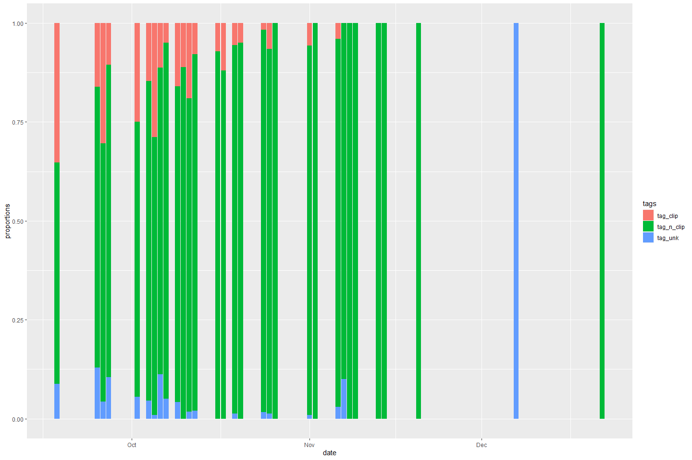<!-- -->

``` r
# Make Graph Prettier
total_tags_summary %>% 
  pivot_longer(cols = c(tag_n_clip, tag_clip, tag_unk), names_to = "tags", values_to = "count") %>% 
  mutate(proportions = (count / total_tags)) %>% 
  ggplot(aes(x = date, y = proportions, fill = tags)) +
  geom_bar(stat = "identity", position = "stack") +
  scale_fill_manual(values = c("Blue","Red", "Black"), 
                    name = "Clips", 
                    labels = c("Tags Without Clips", "Tags With Clips", "Tags Unknown")) +
  theme_minimal() + 
  labs(y = "Proportion", x = "Date") +
  scale_fill_manual(values = wes_palette("Moonrise2"))
```

    ## Scale for 'fill' is already present. Adding another scale for 'fill', which
    ## will replace the existing scale.

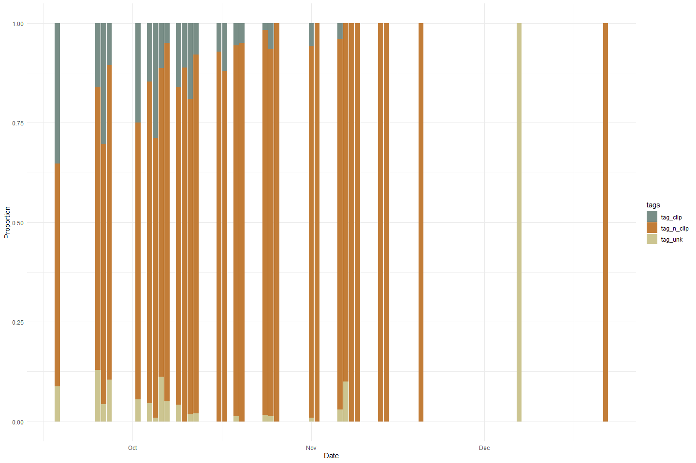<!-- -->

**Comparing tags and chops**

``` r
# from ashley: please improve on this plot I got started, make it look better, describe it, double check that the numbers make sense
total_carcass <- full_join(total_chops_summary, total_tags_summary) %>% 
  select(date, total_chops, total_tags) %>% 
  pivot_longer(c(total_chops, total_tags), names_to = "mark")
```

    ## Joining, by = "date"

``` r
full_join(total_chops_summary, total_tags_summary) %>% 
  select(date, total_chops, total_tags) %>% 
  pivot_longer(c(total_chops, total_tags), names_to = "mark")
```

    ## Joining, by = "date"

    ## # A tibble: 122 x 3
    ##    date                mark        value
    ##    <dttm>              <chr>       <dbl>
    ##  1 2006-09-05 00:00:00 total_chops    14
    ##  2 2006-09-05 00:00:00 total_tags      0
    ##  3 2006-09-07 00:00:00 total_chops    30
    ##  4 2006-09-07 00:00:00 total_tags      0
    ##  5 2006-09-11 00:00:00 total_chops    21
    ##  6 2006-09-11 00:00:00 total_tags      0
    ##  7 2006-09-12 00:00:00 total_chops    58
    ##  8 2006-09-12 00:00:00 total_tags      0
    ##  9 2006-09-13 00:00:00 total_chops     9
    ## 10 2006-09-13 00:00:00 total_tags      0
    ## # ... with 112 more rows

``` r
ggplot(total_carcass, aes(x = date, y = value, fill = mark)) +
  geom_col() +
  theme_minimal() +
  scale_fill_manual(values = wes_palette("Moonrise2"))
```

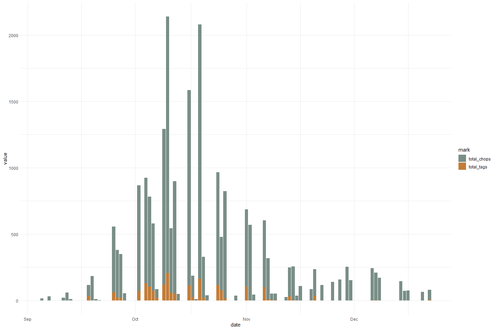<!-- -->

Tags appear to be less commonly applied compared to chops.

### Chop Recovery Variable: `id`, `chan_id`, `recov_count`

``` r
# Filter clean data to show only numeric variables 
chop_recovery_join %>% 
  select_if(is.numeric) %>%
  colnames()
```

    ## [1] "id"          "recov_count" "chan_id"

``` r
summary(chop_recovery_join$id)
```

    ##    Min. 1st Qu.  Median    Mean 3rd Qu.    Max. 
    ##     655    3847    4071    3647    4298    4521

``` r
summary(chop_recovery_join$chan_id)
```

    ##    Min. 1st Qu.  Median    Mean 3rd Qu.    Max.    NA's 
    ##    2702    3338    3579    3772    4283    4805     128

``` r
summary(chop_recovery_join$recov_count)
```

    ##    Min. 1st Qu.  Median    Mean 3rd Qu.    Max.    NA's 
    ##   0.000   1.000   1.000   2.617   3.000  29.000     130

Note: No recovery count.

### Chop Header Variable: `id`

``` r
chop_header %>% 
  select_if(is.numeric) %>% 
  colnames()
```

    ## [1] "id"       "week_num"

``` r
summary(chop_header$id)
```

    ##    Min. 1st Qu.  Median    Mean 3rd Qu.    Max. 
    ##   655.0   692.8   724.5   724.3   756.2   788.0

### CWT Variable: `tag_id`, `sect`, `fl`, `header_id`, `week_num`

``` r
cwt %>% 
  select_if(is.numeric) %>% 
  colnames()
```

    ## [1] "tag_id"    "sect"      "fl"        "header_id" "week_num"

``` r
summary(cwt$tag_id)
```

    ##    Min. 1st Qu.  Median    Mean 3rd Qu.    Max.    NA's 
    ##    6181   11376   12611   12598   13834   15181       2

``` r
summary(cwt$sect)
```

    ##    Min. 1st Qu.  Median    Mean 3rd Qu.    Max.    NA's 
    ##     1.0     7.0    10.0    13.3    16.0    53.0      35

``` r
summary(cwt$fl)
```

    ##    Min. 1st Qu.  Median    Mean 3rd Qu.    Max.    NA's 
    ##   37.00   76.00   81.00   81.39   87.00  117.00     824

-   0 % of values in the `tag_id` column are NA.
-   0.7 % of values in the `sect` column are NA.
-   17 % of values in the `fl` column are NA.

``` r
#Create a cwt_count column
#Pivot table to expand sex column to female_cwt, male_cwt, and unknown_cwt 
#Is this graph helpful?
unique(cwt$sex)
```

    ## [1] "M"  "F"  "ND" NA   "UK"

``` r
cwt_count <- cwt %>% 
  mutate(count = 1) %>%
  mutate(sex = case_when(sex == "ND"|is.na(sex)|sex =="UK" ~ "U",
                         TRUE ~ sex)) %>% 
  pivot_wider(names_from = sex, values_from = count, values_fill = 0) %>% 
  # unnest() %>% 
  rename("male_cwt" = M,
         "female_cwt" = F,
         "unknown_cwt" = U) %>% glimpse
```

    ## Rows: 4,833
    ## Columns: 21
    ## $ tag_id      <dbl> 6181, 6182, 6183, 6184, 6185, 6186, 6187, 6188, 6189, 6190~
    ## $ sect        <dbl> 1, 1, 1, 1, 6, 10, 10, 12, 12, 12, 12, 12, 13, 13, 13, 14,~
    ## $ rel_loc     <chr> NA, NA, NA, NA, NA, NA, NA, NA, NA, NA, NA, NA, NA, NA, NA~
    ## $ fl          <dbl> 70, 87, 59, 82, 84, 102, 84, 83, 96, 77, 80, 68, 87, 99, 9~
    ## $ spawn       <chr> "UK", "U", "UK", "U", "S", "UK", "U", "UK", "UK", "NO DATA~
    ## $ clip        <chr> "Y", "N", "Y", "N", "N", "N", "N", "N", "N", "N", "N", "N"~
    ## $ samp_type   <chr> "H&O", "O", "H&O", "O", "O", "O", "O", "O", "O", "O", "O",~
    ## $ carc_stat   <chr> "C", "T", "C", "T", "T", "T", "T", "T", "T", "T", "T", "T"~
    ## $ samp_num    <chr> "090704-001", "090704-002", "090704-003", "090704-004", "0~
    ## $ head_tag    <chr> "42816", NA, "64641", NA, NA, NA, NA, NA, NA, NA, NA, NA, ~
    ## $ comment     <chr> NA, NA, NA, NA, NA, NA, NA, NA, NA, NA, NA, NA, "GT033", N~
    ## $ header_id   <dbl> 1488, 1488, 1488, 1488, 1488, 1488, 1488, 1488, 1488, 1488~
    ## $ hall_print1 <chr> NA, NA, NA, NA, NA, NA, NA, NA, NA, NA, NA, NA, NA, NA, NA~
    ## $ hall_print2 <chr> NA, NA, NA, NA, NA, NA, NA, NA, NA, NA, NA, NA, NA, NA, NA~
    ## $ date        <dttm> 2005-10-09, 2005-10-09, 2005-10-09, 2005-10-09, 2005-10-0~
    ## $ tag_col     <chr> "ORANGE1", "ORANGE1", "ORANGE1", "ORANGE1", "ORANGE1", "OR~
    ## $ crew        <chr> "JK,PH,DG", "JK,PH,DG", "JK,PH,DG", "JK,PH,DG", "JK,PH,DG"~
    ## $ week_num    <dbl> 6, 6, 6, 6, 6, 6, 6, 6, 6, 6, 6, 6, 6, 6, 6, 6, 6, 6, 6, 6~
    ## $ male_cwt    <dbl> 1, 0, 1, 0, 0, 1, 0, 1, 1, 0, 0, 0, 0, 1, 0, 0, 1, 0, 1, 0~
    ## $ female_cwt  <dbl> 0, 1, 0, 1, 1, 0, 1, 0, 0, 0, 0, 1, 1, 0, 1, 1, 0, 1, 0, 1~
    ## $ unknown_cwt <dbl> 0, 0, 0, 0, 0, 0, 0, 0, 0, 1, 1, 0, 0, 0, 0, 0, 0, 0, 0, 0~

``` r
total_cwt_summary <- cwt_count %>% 
  mutate(male_cwt = ifelse(is.na(male_cwt), 0, male_cwt), # fill na
         female_cwt = ifelse(is.na(female_cwt), 0, female_cwt),
         unknown_cwt = ifelse(is.na(unknown_cwt), 0, unknown_cwt),
         total_cwt = unknown_cwt + male_cwt + female_cwt) %>% 
  group_by(month(date)) %>% 
  summarise(total_cwt = sum(total_cwt),
            male_cwt = sum(male_cwt),
            female_cwt = sum(female_cwt),
            unknown_cwt = sum(unknown_cwt))
```

``` r
total_cwt_summary %>% 
  pivot_longer(cols = c(male_cwt, female_cwt, unknown_cwt), names_to = "sex", values_to = "count") %>% 
  mutate(proportions = (count / total_cwt)) %>% 
  ggplot(aes(x = `month(date)`, y = proportions, fill = sex)) + 
  geom_bar(stat = "identity", position = "stack") +
  scale_fill_manual(name = "chops", 
                    labels = c("CWT Male", "CWT Female", "CWT Unknown")) +
  theme_minimal() + 
  labs(y = "Proportion", x = "Month") +
  scale_fill_manual(values = wes_palette("Moonrise2"))
```

    ## Scale for 'fill' is already present. Adding another scale for 'fill', which
    ## will replace the existing scale.

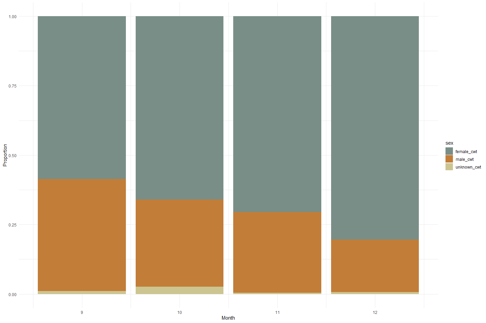<!-- -->

**Plotting fork length of each sex**

``` r
cwt %>% 
  mutate(sex = case_when(sex == "ND"|is.na(sex)|sex =="UK" ~ "Unknown",
                         TRUE ~ sex))%>% 
  ggplot(aes(x = sex, y = fl)) + 
  geom_boxplot() + 
  theme_minimal() + 
  labs(y = "FL", x = "Sex")
```

<!-- -->

## Explore Categorical variables:

### Chop Channel Clean Data

Fix inconsistencies with spelling, capitalization, and dates

``` r
# Filter clean data to show only categorical variables
chop_channel_join %>% 
  select_if(is.character) %>%
  colnames()
```

    ## [1] "tag_col" "chan"

``` r
unique(chop_channel_join$tag_col)
```

    ##  [1] "ORANGE1"  "BLUE2"    "RED3"     "YELLOW4"  "ORANGE5"  "BLUE6"   
    ##  [7] "RED7"     "YELLOW8"  "ORANGE9"  "BLUE10"   "RED11"    "YELLOW12"
    ## [13] "ORANGE13" "BLUE14"   "RED15"    "CLEANUP"  NA

``` r
unique(chop_channel_join$chan)
```

    ## [1] "L" "M" "R" NA

``` r
chop_channel_cleaner <- chop_channel_join %>%
  mutate(date = as_date(date)) %>%
  mutate_if(is.character, str_to_lower) %>% 
  select(-c(time))

chop_channel_cleaner
```

    ## # A tibble: 2,249 x 13
    ##       id tag_col date       chan_id  sect chan    min chop_clip chop_n_clip
    ##    <dbl> <chr>   <date>       <dbl> <dbl> <chr> <dbl>     <dbl>       <dbl>
    ##  1   655 orange1 2006-09-05    2538     1 l         7         0           0
    ##  2   655 orange1 2006-09-05    2539     1 m         7         0           0
    ##  3   655 orange1 2006-09-05    2540     1 r         9         0           0
    ##  4   655 orange1 2006-09-05    2541     3 l         5         0           1
    ##  5   655 orange1 2006-09-05    2542     3 m         5         0           0
    ##  6   655 orange1 2006-09-05    2543     3 r         4         0           0
    ##  7   655 orange1 2006-09-05    2544     2 l         5         0           0
    ##  8   655 orange1 2006-09-05    2545     2 m         4         0           0
    ##  9   655 orange1 2006-09-05    2546     2 r         6         0           0
    ## 10   655 orange1 2006-09-05    2547     4 l         5         0           1
    ## # ... with 2,239 more rows, and 4 more variables: chop_uncheck <dbl>,
    ## #   tag_clip <dbl>, tag_n_clip <dbl>, tag_unk <dbl>

### Chop Recovery Clean Data

Fix inconsistencies with spelling, capitalization, and dates

``` r
chop_recovery_join %>% 
  select_if(is.character) %>% 
  colnames()
```

    ## [1] "recov_color"

``` r
unique(chop_recovery_join$recov_color)
```

    ##  [1] NA         "ORANGE1"  "BLUE2"    "RED3"     "YELLOW4"  "ORANGE5" 
    ##  [7] "ORANGE9"  "RED7"     "YELLOW8"  "BLUE6"    "RED15"    "BLUE14"  
    ## [13] "ORANGE13" "YELLOW12" "BLUE10"   "RED11"

``` r
chop_recovery_cleaner <- chop_recovery_join %>% 
  mutate(date = as_date(date)) %>%
  mutate_if(is.character, str_to_lower) %>% 
  select(-c(time))

chop_recovery_cleaner
```

    ## # A tibble: 893 x 5
    ##       id date       recov_color recov_count chan_id
    ##    <dbl> <date>     <chr>             <dbl>   <dbl>
    ##  1   655 2006-09-05 <NA>                 NA      NA
    ##  2   656 2006-09-07 <NA>                 NA      NA
    ##  3   657 2006-09-07 <NA>                 NA      NA
    ##  4   660 2006-09-11 <NA>                 NA      NA
    ##  5   664 2006-09-11 <NA>                 NA      NA
    ##  6   667 2006-09-12 <NA>                 NA      NA
    ##  7   665 2006-09-12 <NA>                 NA      NA
    ##  8   668 2006-09-13 <NA>                 NA      NA
    ##  9   669 2006-09-18 <NA>                 NA      NA
    ## 10   670 2006-09-18 <NA>                 NA      NA
    ## # ... with 883 more rows

### Chop Header Clean Data

``` r
chop_header %>% 
  select_if(is.character) %>% 
  colnames()
```

    ## [1] "tag_col"  "crew"     "recorder" "weather"  "comment"

``` r
unique(chop_header$crew)
```

    ##   [1] "KT,AR,CP,KH"        "CP,KM,PH"           "KT,AR,KH"          
    ##   [4] "AR,PH,CP"           "KT,KH,BW,JK"        "AR, KL, KH"        
    ##   [7] "KM, PH, CP"         "KL, AR, BW, KH"     "KT, KH, BW"        
    ##  [10] "JK, RK, CC"         "KT, KH, CP, TV"     "SB, CC, PH, AR"    
    ##  [13] "KT, PH, CC, BW"     "KT, AR, SB"         "CC, TV, KM"        
    ##  [16] "AR, KT, KH, BW"     "KT, KH, AR, BW"     "RK, SB, CC"        
    ##  [19] "CP SB CC"           "KT KH AR TV"        "TV SB"             
    ##  [22] NA                   "JK CC"              "JK CC SB AR"       
    ##  [25] "KT KH BW"           "CP CC KT"           "KT AR CP KH"       
    ##  [28] "AR AS RK"           "KT KH CC BW"        "CC, CP, AR, PH"    
    ##  [31] "TV SB PH"           "JK, TV"             "SB, PH"            
    ##  [34] "JK, CP, AR, CC"     "JK BC CC"           "KH, AR, KL"        
    ##  [37] "SB, CC, CP, BW"     "RK, SB, CC, AS"     "KL, KM, KH"        
    ##  [40] "SB, TV, PH"         "AR, KH, SB, CC, BW" "KL, KH, KM"        
    ##  [43] "BW, KT, KH"         "SB, AS, TV"         "AR, RK, CC"        
    ##  [46] "JK, AR, KM"         "RK, AR, CC, AS"     "SB TV PH"          
    ##  [49] "KH KT AR"           "KM KH KT AR"        "SB PH TV"          
    ##  [52] "SB, PH, TV"         "SB, RK, PH"         "AR, SB, PH"        
    ##  [55] "CC, KM, AS, RK"     "KT, KH, CC"         "AR, KH, KT, BW, CC"
    ##  [58] "AR TV PH SB KM"     "KM AR TV SB"        "BW HR AS JK"       
    ##  [61] "SB CC TV"           "KT KH CC"           "PH SB BW TV"       
    ##  [64] "SB BW PH TV"        "SB PH TV BW"        "TV SB KM PH"       
    ##  [67] "AR TV BW PH"        "AR KM SB"           "KM SB AR"          
    ##  [70] "KT CC PH RK"        "KT PH CC RK"        "AR TV KM"          
    ##  [73] "SB RK TV KM"        "SB RKTV KM"         "KT KH KM CC"       
    ##  [76] "KT KH CC KM"        "KM KT CC KH"        "AR SB BW"          
    ##  [79] "KH AR KT"           "TV SB CC BW"        "KT KH AR"          
    ##  [82] "CC SB TV"           "CC SB BW TV"        "SB CC KM"          
    ##  [85] "KM SB CC"           "AR KT KH"           "AR  KT KH"         
    ##  [88] "KH KT BW"           "KT SB TV"           "CC KM AR"          
    ##  [91] "AR TV SB"           "AR SB TV"           "SB TV CC RK"       
    ##  [94] "AR KT KH KM"        "RK TV SB CC"        "RK SB CC TV"       
    ##  [97] "SB RK TV CC"        "AR SB TV KM"        "AR KM SB TV"       
    ## [100] "SB TV AR"           "AR BW CC KM"        "AR CC KM BW"       
    ## [103] "KM AR"              "SB TV"

``` r
unique(chop_header$recorder)
```

    ##  [1] NA           "AR"         "KM"         "KL"         "BW"        
    ##  [6] "JK"         "KT"         "RK, SB, CC" "PH"         "TV"        
    ## [11] "AS"         "KH"         "CC"

``` r
unique(chop_header$weather)
```

    ## [1] "SUN" NA    "CLD" "RAN"

``` r
chop_header_cleaner <- chop_header %>%
  mutate(date = as_date(date)) %>%
  mutate_if(is.character, str_to_lower) %>% 
  mutate(crew = str_replace_all(crew, " ", ","),
         crew = str_replace_all(crew, ",,", ","),
         weather = ifelse(weather == "ran", "rain", weather)) %>% 
  select(-c(time))

chop_header_cleaner$crew
```

    ##   [1] "kt,ar,cp,kh"    "cp,km,ph"       "kt,ar,kh"       "ar,ph,cp"      
    ##   [5] "kt,kh,bw,jk"    "ar,kl,kh"       "km,ph,cp"       "kl,ar,bw,kh"   
    ##   [9] "kt,kh,bw"       "jk,rk,cc"       "kt,kh,cp,tv"    "sb,cc,ph,ar"   
    ##  [13] "kt,ph,cc,bw"    "kt,ar,sb"       "cc,tv,km"       "ar,kt,kh,bw"   
    ##  [17] "kt,kh,ar,bw"    "rk,sb,cc"       "cp,sb,cc"       "kt,kh,ar,tv"   
    ##  [21] "tv,sb"          NA               "jk,cc"          "jk,cc,sb,ar"   
    ##  [25] "kt,kh,bw"       "tv,sb"          "cp,cc,kt"       "kt,ar,cp,kh"   
    ##  [29] "ar,as,rk"       "kt,kh,cc,bw"    "cc,cp,ar,ph"    "tv,sb,ph"      
    ##  [33] "jk,tv"          "sb,ph"          "jk,cp,ar,cc"    "jk,bc,cc"      
    ##  [37] "kh,ar,kl"       "sb,cc,cp,bw"    "rk,sb,cc,as"    NA              
    ##  [41] "kl,km,kh"       "sb,tv,ph"       "ar,kh,sb,cc,bw" "kl,kh,km"      
    ##  [45] "bw,kt,kh"       "sb,as,tv"       "kl,kh,km"       "ar,rk,cc"      
    ##  [49] "sb,ph"          "sb,tv,ph"       "jk,ar,km"       "jk,ar,km"      
    ##  [53] "kt,kh,ar,bw"    "rk,ar,cc,as"    "sb,tv,ph"       "kh,kt,ar"      
    ##  [57] "km,kh,kt,ar"    "sb,ph,tv"       "sb,tv,ph"       "sb,ph,tv"      
    ##  [61] "sb,rk,ph"       "ar,sb,ph"       "cc,km,as,rk"    "kt,kh,cc"      
    ##  [65] "ar,kh,kt,bw,cc" "ar,tv,ph,sb,km" "km,ar,tv,sb"    "bw,hr,as,jk"   
    ##  [69] "sb,tv,ph"       "bw,hr,as,jk"    "sb,cc,tv"       "sb,cc,tv"      
    ##  [73] "kt,kh,cc"       "ph,sb,bw,tv"    "sb,bw,ph,tv"    "sb,ph,tv,bw"   
    ##  [77] "tv,sb,km,ph"    "ar,tv,bw,ph"    "ar,km,sb"       "km,sb,ar"      
    ##  [81] "kt,cc,ph,rk"    "kt,ph,cc,rk"    "kt,kh,cc"       "ar,tv,km"      
    ##  [85] "sb,rk,tv,km"    "sb,rktv,km"     "kt,kh,km,cc"    "kt,kh,cc,km"   
    ##  [89] "kt,kh,km,cc"    "km,kt,cc,kh"    "ar,sb,bw"       "ar,sb,bw"      
    ##  [93] "kh,ar,kt"       "tv,sb,cc,bw"    "kt,kh,ar"       "cc,sb,tv"      
    ##  [97] "cc,sb,bw,tv"    "sb,cc,km"       "km,sb,cc"       "ar,kt,kh"      
    ## [101] "ar,kt,kh"       "kt,kh,bw"       "kh,kt,bw"       "kt,sb,tv"      
    ## [105] "cc,km,ar"       "cc,km,ar"       "cc,km,ar"       "kt,sb,tv"      
    ## [109] "ar,tv,sb"       "ar,sb,tv"       "ar,tv,sb"       "sb,tv,cc,rk"   
    ## [113] "ar,kt,kh,km"    "rk,tv,sb,cc"    "rk,sb,cc,tv"    "sb,rk,tv,cc"   
    ## [117] "ar,kt,kh,km"    "ar,sb,tv,km"    "ar,km,sb,tv"    "sb,tv,ar"      
    ## [121] "ar,bw,cc,km"    "ar,bw,cc,km"    "ar,cc,km,bw"    "km,ar"         
    ## [125] "km,ar"          "km,ar"          "sb,tv"          "sb,tv"

### CWT Clean Data

``` r
cwt %>% 
  select_if(is.character) %>% 
  colnames
```

    ##  [1] "rel_loc"     "sex"         "spawn"       "clip"        "samp_type"  
    ##  [6] "carc_stat"   "samp_num"    "head_tag"    "comment"     "hall_print1"
    ## [11] "hall_print2" "tag_col"     "crew"

``` r
unique(cwt$rel_loc)
```

    ## [1] NA        "M"       "R"       "L"       "NO DATA"

``` r
unique(cwt$spawn)
```

    ## [1] "UK"      "U"       "S"       "NO DATA" NA

``` r
unique(cwt$clip)
```

    ## [1] "Y"       "N"       NA        "UK"      "NO DATA"

``` r
unique(cwt$samp_type)
```

    ## [1] "H&O"     "O"       "H"       "NONE"    NA        "H&S&O"   "S&O"    
    ## [8] "NO DATA"

``` r
unique(cwt$carc_stat)
```

    ## [1] "C"       "T"       NA        "NO DATA"

``` r
cwt_cleaner <- cwt %>% 
  mutate_if(is.character, str_to_lower) %>% 
  rename(datetime = "date") %>% 
  mutate(crew = str_replace_all(crew, " ", ","),
         crew = str_replace_all(crew, ",,", ","),
         sex = case_when(sex == "nd"|is.na(sex) ~ "unknown",
                         TRUE ~ sex),
         rel_loc = ifelse(rel_loc == "no data", NA, rel_loc),  
         spawn = ifelse(spawn == "no data", NA, spawn),
         clip = case_when(clip == "no data" ~ NA_character_,
                          clip == "y" ~ "yes",
                          clip == "n" ~ "no",
                          TRUE ~ clip),
         samp_type = ifelse(samp_type == "no data", NA, samp_type),
         carc_stat = ifelse(carc_stat == "no data", NA, carc_stat)) %>% 
  glimpse
```

    ## Rows: 4,833
    ## Columns: 19
    ## $ tag_id      <dbl> 6181, 6182, 6183, 6184, 6185, 6186, 6187, 6188, 6189, 6190~
    ## $ sect        <dbl> 1, 1, 1, 1, 6, 10, 10, 12, 12, 12, 12, 12, 13, 13, 13, 14,~
    ## $ rel_loc     <chr> NA, NA, NA, NA, NA, NA, NA, NA, NA, NA, NA, NA, NA, NA, NA~
    ## $ fl          <dbl> 70, 87, 59, 82, 84, 102, 84, 83, 96, 77, 80, 68, 87, 99, 9~
    ## $ sex         <chr> "m", "f", "m", "f", "f", "m", "f", "m", "m", "unknown", "u~
    ## $ spawn       <chr> "uk", "u", "uk", "u", "s", "uk", "u", "uk", "uk", NA, NA, ~
    ## $ clip        <chr> "yes", "no", "yes", "no", "no", "no", "no", "no", "no", "n~
    ## $ samp_type   <chr> "h&o", "o", "h&o", "o", "o", "o", "o", "o", "o", "o", "o",~
    ## $ carc_stat   <chr> "c", "t", "c", "t", "t", "t", "t", "t", "t", "t", "t", "t"~
    ## $ samp_num    <chr> "090704-001", "090704-002", "090704-003", "090704-004", "0~
    ## $ head_tag    <chr> "42816", NA, "64641", NA, NA, NA, NA, NA, NA, NA, NA, NA, ~
    ## $ comment     <chr> NA, NA, NA, NA, NA, NA, NA, NA, NA, NA, NA, NA, "gt033", N~
    ## $ header_id   <dbl> 1488, 1488, 1488, 1488, 1488, 1488, 1488, 1488, 1488, 1488~
    ## $ hall_print1 <chr> NA, NA, NA, NA, NA, NA, NA, NA, NA, NA, NA, NA, NA, NA, NA~
    ## $ hall_print2 <chr> NA, NA, NA, NA, NA, NA, NA, NA, NA, NA, NA, NA, NA, NA, NA~
    ## $ datetime    <dttm> 2005-10-09, 2005-10-09, 2005-10-09, 2005-10-09, 2005-10-0~
    ## $ tag_col     <chr> "orange1", "orange1", "orange1", "orange1", "orange1", "or~
    ## $ crew        <chr> "jk,ph,dg", "jk,ph,dg", "jk,ph,dg", "jk,ph,dg", "jk,ph,dg"~
    ## $ week_num    <dbl> 6, 6, 6, 6, 6, 6, 6, 6, 6, 6, 6, 6, 6, 6, 6, 6, 6, 6, 6, 6~

## Comments

-   2006 data is similar with 2005 using clip and non clip to keep track
    of the carcasses
-   CWT data added hallprint column
-   Recovery table does not have much data

## Data Dictionaries

### Channel

``` r
percent_na <- chop_channel_cleaner %>%
  summarise_all(list(name = ~sum(is.na(.))/length(.))) %>%
  pivot_longer(cols = everything())


counts_data_dictionary <- tibble(variables = colnames(chop_channel_cleaner),
                          description = c("ID",
                                          "Color of tag applied to carcass",
                                          "Channel ID",
                                          "Date of survey",
                                          "Sect", 
                                          "Chan", 
                                          "Min", 
                                          "Carcass that were chopped and has clip",
                                          "Carcass that were chopped and has no clip",
                                          "Carcass that were chopped and not checked for clip",
                                          "Carcass that were tagged and has clip",
                                          "Carcass that were tagged and has no clip",
                                          "Carcass that were tagged and unknown"),
                          percent_na = round(percent_na$value*100))

kable(counts_data_dictionary)
```

| variables    | description                                        | percent_na |
|:-------------|:---------------------------------------------------|-----------:|
| id           | ID                                                 |          0 |
| tag_col      | Color of tag applied to carcass                    |          0 |
| date         | Channel ID                                         |          0 |
| chan_id      | Date of survey                                     |          0 |
| sect         | Sect                                               |          1 |
| chan         | Chan                                               |          1 |
| min          | Min                                                |          3 |
| chop_clip    | Carcass that were chopped and has clip             |          0 |
| chop_n\_clip | Carcass that were chopped and has no clip          |          0 |
| chop_uncheck | Carcass that were chopped and not checked for clip |          1 |
| tag_clip     | Carcass that were tagged and has clip              |          0 |
| tag_n\_clip  | Carcass that were tagged and has no clip           |          0 |
| tag_unk      | Carcass that were tagged and unknown               |          0 |

### Recovery

``` r
percent_na <- chop_recovery_cleaner %>%
  summarise_all(list(name = ~sum(is.na(.))/length(.))) %>%
  pivot_longer(cols = everything())


recovery_data_dictionary <- tibble(variables = colnames(chop_recovery_cleaner),
                          description = c("ID",
                                          "Date of survey",
                                          "Color of tag recovered from carcass",
                                          "Count of recovery",
                                          "Channel ID"),
                          percent_na = round(percent_na$value*100))

kable(recovery_data_dictionary)
```

| variables   | description                         | percent_na |
|:------------|:------------------------------------|-----------:|
| id          | ID                                  |          0 |
| date        | Date of survey                      |         86 |
| recov_color | Color of tag recovered from carcass |         14 |
| recov_count | Count of recovery                   |         15 |
| chan_id     | Channel ID                          |         14 |

### Survey

``` r
# 
percent_na <- chop_header_cleaner %>%
  summarise_all(list(name = ~sum(is.na(.))/length(.))) %>%
  pivot_longer(cols = everything())
# 
header_data_dictionary <- tibble(variables = colnames(chop_header_cleaner),
                          description = c("ID",
                                          "Color of tag of carcass",
                                          "Date of survey",
                                          "Crew memeber initials that collected",
                                          "Individual of crew member who recorded",
                                          "Weather",
                                          "Comments",
                                          "Week Number"),
                          percent_na = round(percent_na$value*100))
# 
kable(header_data_dictionary)
```

| variables | description                            | percent_na |
|:----------|:---------------------------------------|-----------:|
| id        | ID                                     |          0 |
| tag_col   | Color of tag of carcass                |          0 |
| date      | Date of survey                         |          0 |
| crew      | Crew memeber initials that collected   |          2 |
| recorder  | Individual of crew member who recorded |         63 |
| weather   | Weather                                |          6 |
| comment   | Comments                               |         98 |
| week_num  | Week Number                            |          0 |

### CWT

``` r
percent_na <- cwt_cleaner %>%
  summarise_all(list(name = ~sum(is.na(.))/length(.))) %>%
  pivot_longer(cols = everything())

cwt_data_dictionary <- tibble(variables = colnames(cwt_cleaner),
                          description = c("ID",
                                          "Sect",
                                          "Release Location",
                                          "Fork length",
                                          "Sex",
                                          "Spawn",
                                          "Clip",
                                          "Sample type",
                                          "Carcass stat",
                                          "Sample number",
                                          "Head tag",
                                          "Comment",
                                          "Header ID",
                                          "Hall print 1",
                                          "Hall print 2",
                                          "Date",
                                          "Tag colour",
                                          "Crew",
                                          "Week number"),
                          percent_na = round(percent_na$value*100))

kable(cwt_data_dictionary)
```

| variables   | description      | percent_na |
|:------------|:-----------------|-----------:|
| tag_id      | ID               |          0 |
| sect        | Sect             |          1 |
| rel_loc     | Release Location |         10 |
| fl          | Fork length      |         17 |
| sex         | Sex              |          0 |
| spawn       | Spawn            |          2 |
| clip        | Clip             |          1 |
| samp_type   | Sample type      |         20 |
| carc_stat   | Carcass stat     |          0 |
| samp_num    | Sample number    |         85 |
| head_tag    | Head tag         |         87 |
| comment     | Comment          |         96 |
| header_id   | Header ID        |          0 |
| hall_print1 | Hall print 1     |         79 |
| hall_print2 | Hall print 2     |         79 |
| datetime    | Date             |          3 |
| tag_col     | Tag colour       |          3 |
| crew        | Crew             |         10 |
| week_num    | Week number      |          3 |

## Save cleaned data back to google cloud (TBA)

``` r
feather_carcass_chops_and_tags_2006 <- chop_channel_cleaner %>% glimpse()
```

    ## Rows: 2,249
    ## Columns: 13
    ## $ id           <dbl> 655, 655, 655, 655, 655, 655, 655, 655, 655, 655, 655, 65~
    ## $ tag_col      <chr> "orange1", "orange1", "orange1", "orange1", "orange1", "o~
    ## $ date         <date> 2006-09-05, 2006-09-05, 2006-09-05, 2006-09-05, 2006-09-~
    ## $ chan_id      <dbl> 2538, 2539, 2540, 2541, 2542, 2543, 2544, 2545, 2546, 254~
    ## $ sect         <dbl> 1, 1, 1, 3, 3, 3, 2, 2, 2, 4, 4, 6, 6, 6, 5, 5, 5, 7, 7, ~
    ## $ chan         <chr> "l", "m", "r", "l", "m", "r", "l", "m", "r", "l", "m", "l~
    ## $ min          <dbl> 7, 7, 9, 5, 5, 4, 5, 4, 6, 5, 4, 1, 2, 2, 4, 3, 3, 5, 4, ~
    ## $ chop_clip    <dbl> 0, 0, 0, 0, 0, 0, 0, 0, 0, 0, 0, 0, 0, 0, 0, 0, 0, 0, 0, ~
    ## $ chop_n_clip  <dbl> 0, 0, 0, 1, 0, 0, 0, 0, 0, 1, 0, 0, 0, 0, 0, 0, 0, 1, 0, ~
    ## $ chop_uncheck <dbl> 0, 0, 0, 0, 0, 0, 0, 0, 0, 0, 0, 0, 0, 0, 0, 0, 0, 0, 0, ~
    ## $ tag_clip     <dbl> 0, 0, 0, 0, 0, 0, 0, 0, 0, 0, 0, 0, 0, 0, 0, 0, 0, 0, 0, ~
    ## $ tag_n_clip   <dbl> 0, 0, 0, 0, 0, 0, 0, 0, 0, 0, 0, 0, 0, 0, 0, 0, 0, 0, 0, ~
    ## $ tag_unk      <dbl> 0, 0, 0, 0, 0, 0, 0, 0, 0, 0, 0, 0, 0, 0, 0, 0, 0, 0, 0, ~

``` r
feather_carcass_chop_recovery_2006 <- chop_recovery_cleaner %>% glimpse()
```

    ## Rows: 893
    ## Columns: 5
    ## $ id          <dbl> 655, 656, 657, 660, 664, 667, 665, 668, 669, 670, 672, 671~
    ## $ date        <date> 2006-09-05, 2006-09-07, 2006-09-07, 2006-09-11, 2006-09-1~
    ## $ recov_color <chr> NA, NA, NA, NA, NA, NA, NA, NA, NA, NA, NA, NA, NA, NA, NA~
    ## $ recov_count <dbl> NA, NA, NA, NA, NA, NA, NA, NA, NA, NA, NA, NA, NA, NA, NA~
    ## $ chan_id     <dbl> NA, NA, NA, NA, NA, NA, NA, NA, NA, NA, NA, NA, NA, NA, NA~

``` r
feather_carcass_cwt_2006 <- cwt_cleaner %>% glimpse()
```

    ## Rows: 4,833
    ## Columns: 19
    ## $ tag_id      <dbl> 6181, 6182, 6183, 6184, 6185, 6186, 6187, 6188, 6189, 6190~
    ## $ sect        <dbl> 1, 1, 1, 1, 6, 10, 10, 12, 12, 12, 12, 12, 13, 13, 13, 14,~
    ## $ rel_loc     <chr> NA, NA, NA, NA, NA, NA, NA, NA, NA, NA, NA, NA, NA, NA, NA~
    ## $ fl          <dbl> 70, 87, 59, 82, 84, 102, 84, 83, 96, 77, 80, 68, 87, 99, 9~
    ## $ sex         <chr> "m", "f", "m", "f", "f", "m", "f", "m", "m", "unknown", "u~
    ## $ spawn       <chr> "uk", "u", "uk", "u", "s", "uk", "u", "uk", "uk", NA, NA, ~
    ## $ clip        <chr> "yes", "no", "yes", "no", "no", "no", "no", "no", "no", "n~
    ## $ samp_type   <chr> "h&o", "o", "h&o", "o", "o", "o", "o", "o", "o", "o", "o",~
    ## $ carc_stat   <chr> "c", "t", "c", "t", "t", "t", "t", "t", "t", "t", "t", "t"~
    ## $ samp_num    <chr> "090704-001", "090704-002", "090704-003", "090704-004", "0~
    ## $ head_tag    <chr> "42816", NA, "64641", NA, NA, NA, NA, NA, NA, NA, NA, NA, ~
    ## $ comment     <chr> NA, NA, NA, NA, NA, NA, NA, NA, NA, NA, NA, NA, "gt033", N~
    ## $ header_id   <dbl> 1488, 1488, 1488, 1488, 1488, 1488, 1488, 1488, 1488, 1488~
    ## $ hall_print1 <chr> NA, NA, NA, NA, NA, NA, NA, NA, NA, NA, NA, NA, NA, NA, NA~
    ## $ hall_print2 <chr> NA, NA, NA, NA, NA, NA, NA, NA, NA, NA, NA, NA, NA, NA, NA~
    ## $ datetime    <dttm> 2005-10-09, 2005-10-09, 2005-10-09, 2005-10-09, 2005-10-0~
    ## $ tag_col     <chr> "orange1", "orange1", "orange1", "orange1", "orange1", "or~
    ## $ crew        <chr> "jk,ph,dg", "jk,ph,dg", "jk,ph,dg", "jk,ph,dg", "jk,ph,dg"~
    ## $ week_num    <dbl> 6, 6, 6, 6, 6, 6, 6, 6, 6, 6, 6, 6, 6, 6, 6, 6, 6, 6, 6, 6~

``` r
feather_carcass_chop_header_2006 <- chop_header_cleaner %>% glimpse()
```

    ## Rows: 128
    ## Columns: 8
    ## $ id       <dbl> 655, 656, 657, 660, 664, 667, 665, 668, 669, 670, 672, 671, 6~
    ## $ tag_col  <chr> "orange1", "orange1", "orange1", "blue2", "blue2", "blue2", "~
    ## $ date     <date> 2006-09-05, 2006-09-07, 2006-09-07, 2006-09-11, 2006-09-11, ~
    ## $ crew     <chr> "kt,ar,cp,kh", "cp,km,ph", "kt,ar,kh", "ar,ph,cp", "kt,kh,bw,~
    ## $ recorder <chr> NA, NA, NA, NA, NA, "ar", "km", "kl", "bw", "jk", "kt", "ar",~
    ## $ weather  <chr> "sun", "sun", "sun", "sun", "sun", "sun", "sun", "sun", "sun"~
    ## $ comment  <chr> "hallprint tag #19471 found on shore in section 2", NA, NA, N~
    ## $ week_num <dbl> 1, 1, 1, 2, 2, 2, 2, 2, 3, 3, 3, 3, 3, 3, 3, 4, 4, 4, 4, 4, 4~

``` r
f <- function(input, output) write_csv(input, file = output)

gcs_upload(feather_carcass_chops_and_tags_2006,
           object_function = f,
           type = "csv",
           name = "adult-holding-redd-and-carcass-surveys/feather-river/data/feather_carcass_chops_and_tags_2006.csv")

gcs_upload(feather_carcass_chop_recovery_2006,
           object_function = f,
           type = "csv",
           name = "adult-holding-redd-and-carcass-surveys/feather-river/data/feather_carcass_chop_recovery_2006.csv")
gcs_upload(feather_carcass_cwt_2006,
           object_function = f,
           type = "csv",
           name = "adult-holding-redd-and-carcass-surveys/feather-river/data/feather_carcass_cwt_2006.csv")
gcs_upload(feather_carcass_chop_header_2006,
           object_function = f,
           type = "csv",
           name = "adult-holding-redd-and-carcass-surveys/feather-river/data/feather_carcass_chop_header_2006.csv")
```
