Feather Carcass QC 2007
================
Inigo Peng
2022-07-21

# Feather River Carcass Data

## Description of Monitoring Data

**Timeframe:**

**Video Season:**

**Completeness of Record throughout timeframe:**

**Sampling Location:**

**Data Contact:**

Any additional info?

## Access Cloud Data

``` r
# Run Sys.setenv() to specify GCS_AUTH_FILE and GCS_DEFAULT_BUCKET before running 
# getwd() to see how to specify paths 
# Open object from google cloud storage
# Set your authentication using gcs_auth

gcs_auth(json_file = Sys.getenv("GCS_AUTH_FILE"))
# Set global bucket 
gcs_global_bucket(bucket = Sys.getenv("GCS_DEFAULT_BUCKET"))

# git data and save as xlsx
```

``` r
gcs_get_object(object_name = "adult-holding-redd-and-carcass-surveys/feather-river/data-raw/carcass/2007/ChopChannelTBL1_2007.xlsx",
               bucket = gcs_get_global_bucket(),
               saveToDisk = "ChopChannel_2007.xlsx",
               overwrite = TRUE)
#
gcs_get_object(object_name = "adult-holding-redd-and-carcass-surveys/feather-river/data-raw/carcass/2007/ChopHeaderTBL_2007.xlsx",
               bucket = gcs_get_global_bucket(),
               saveToDisk = "ChopHeader_2007.xlsx",
               overwrite = TRUE)

gcs_get_object(object_name = "adult-holding-redd-and-carcass-surveys/feather-river/data-raw/carcass/2007/ChopRecovTBL_2007.xlsx",
               bucket = gcs_get_global_bucket(),
               saveToDisk = "ChopRecov_2007.xlsx",
               overwrite = TRUE)
# 
gcs_get_object(object_name = "adult-holding-redd-and-carcass-surveys/feather-river/data-raw/carcass/2007/CWTHeaderTBL_2007.xlsx",
               bucket = gcs_get_global_bucket(),
               saveToDisk = "CWTHeader_2007.xlsx",
               overwrite = TRUE)

gcs_get_object(object_name = "adult-holding-redd-and-carcass-surveys/feather-river/data-raw/carcass/2007/CWTTagTBL_2007.xlsx",
               bucket = gcs_get_global_bucket(),
               saveToDisk = "CWTTag_2007.xlsx",
               overwrite = TRUE)
```

## Raw Data Glimpse:

### ChopChannel_raw

``` r
ChopChannel_raw <- read_excel("ChopChannel_2007.xlsx") %>% 
  rename("ID" = HeaderID) %>%
  glimpse()
```

    ## Rows: 1,617
    ## Columns: 11
    ## $ ChanID      <dbl> 1, 2, 3, 4, 5, 6, 7, 8, 9, 10, 11, 12, 13, 14, 15, 16, 17,~
    ## $ Sect        <dbl> 1, 1, 11, 12, 13, 14, 15, 1, 1, 1, 2, 2, 2, 3, 3, 3, 6, 6,~
    ## $ Chan        <chr> "L", "R", "R", "M", "R", "M", "M", "M", "M", "R", "L", "M"~
    ## $ Min         <dbl> NA, NA, NA, NA, NA, NA, NA, 5, 5, 7, 4, 4, 4, 4, 4, 4, 3, ~
    ## $ ID          <dbl> 1, 1, 1, 1, 1, 1, 1, 3, 3, 3, 3, 3, 3, 3, 3, 3, 3, 3, 3, 3~
    ## $ ChopClip    <dbl> 0, 0, 0, 0, 0, 0, 0, 0, 0, 0, 0, 0, 0, 0, 0, 0, 0, 0, 0, 0~
    ## $ ChopNClip   <dbl> 0, 0, 0, 1, 2, 1, 1, 0, 0, 0, 0, 0, 0, 0, 0, 0, 0, 0, 1, 1~
    ## $ ChopUncheck <dbl> 1, 1, 1, 0, 1, 0, 0, 0, 0, 0, 0, 0, 0, 0, 0, 0, 0, 0, 0, 0~
    ## $ TagClip     <dbl> 0, 0, 0, 0, 0, 0, 0, 0, 0, 0, 0, 0, 0, 0, 0, 0, 0, 0, 0, 0~
    ## $ TagNClip    <dbl> 0, 0, 0, 0, 0, 0, 0, 0, 0, 0, 0, 0, 0, 0, 0, 0, 0, 0, 0, 0~
    ## $ TagUnk      <dbl> 0, 0, 0, 0, 0, 0, 0, 0, 0, 0, 0, 0, 0, 0, 0, 0, 0, 0, 0, 0~

### ChopHeader_raw

``` r
ChopHeader_raw <- read_excel("ChopHeader_2007.xlsx") %>% 
  rename("ID" = headerID) %>%
  glimpse()
```

    ## Rows: 75
    ## Columns: 9
    ## $ ID       <dbl> 4, 3, 1, 5, 6, 7, 8, 9, 10, 11, 12, 15, 14, 13, 17, 18, 19, 2~
    ## $ TagCol   <chr> "BLUE 1", "BLUE 1", "BLUE 1", "BLUE 1", "BLUE 1", "BLUE 1", "~
    ## $ Date     <dttm> 2007-09-04, 2007-09-04, 2007-09-04, 2007-09-05, 2007-09-05, ~
    ## $ Crew     <chr> "KT,KH,GS", "KT,KH,GS", "TV,KM,KS,KW", "KT,KH,GS", "KT,KH,GS"~
    ## $ Time     <dttm> 1899-12-31 12:45:00, 1899-12-31 09:20:00, NA, NA, NA, NA, 18~
    ## $ Recorder <chr> "GS", "GS", NA, NA, NA, NA, NA, NA, NA, NA, NA, NA, NA, NA, N~
    ## $ Weather  <chr> "SUN", NA, NA, "SUN", "SUN", NA, "SUN", "SUN", "SUN", "SUN", ~
    ## $ Comment  <chr> NA, NA, NA, NA, NA, NA, NA, NA, NA, NA, NA, NA, NA, NA, NA, N~
    ## $ WeekNum  <dbl> 1, 1, 1, 1, 1, 1, 1, 2, 2, 2, 2, 3, 3, 3, 3, 4, 4, 4, 4, 4, 4~

### ChopRecov_raw

``` r
ChopRecov_raw <- read_excel("ChopRecov_2007.xlsx") %>% 
  glimpse()
```

    ## Rows: 341
    ## Columns: 4
    ## $ RecovID    <dbl> 1, 2, 3, 4, 5, 6, 7, 8, 9, 10, 11, 12, 13, 14, 15, 16, 17, ~
    ## $ RecovColor <chr> "BLUE 1", "BLUE 1", "BLUE 1", "ORANGE 2", NA, "YELLOW 3", "~
    ## $ RecovCount <dbl> 1, 1, 1, 1, NA, 2, 1, 1, 1, 2, 1, 1, 1, 1, 4, 1, 2, 2, 1, 2~
    ## $ ChanID     <dbl> 109, 229, 261, 265, 327, 329, 334, 336, 338, 340, 347, 354,~

### cwt_raw

``` r
cwt_raw <- read_excel("CWTTag_2007.xlsx") %>% 
  glimpse
```

    ## Rows: 1,681
    ## Columns: 15
    ## $ TagID      <dbl> 1, 2, 3, 4, 7, 9, 11, 13, 14, 17, 19, 20, 22, 23, 25, 28, 2~
    ## $ Sect       <dbl> 1, 3, 8, 8, 14, 15, 15, 1, 1, 4, 12, 13, 13, 13, 13, 10, 10~
    ## $ RelLoc     <chr> NA, NA, NA, NA, NA, NA, NA, NA, NA, NA, NA, NA, NA, NA, NA,~
    ## $ FL         <dbl> NA, 89, 98, 104, 85, 104, 81, 90, 84, 81, 84, 85, 96, 81, 9~
    ## $ Sex        <chr> NA, "F", "F", "M", "F", "M", "F", "F", NA, "M", "M", "F", "~
    ## $ Spawn      <chr> NA, "U", "U", "UK", "U", "UK", "U", "U", "NO DATA", "UK", "~
    ## $ Clip       <chr> NA, "N", "N", "N", "N", "N", "N", "NO DATA", "NO DATA", "N"~
    ## $ SampType   <chr> NA, "S&O", "S&O", "S&O", "S&O", "S&O", "S&O", "S&O", "S&O",~
    ## $ CarcStat   <chr> NA, "T", "T", "T", "T", "T", "T", "T", "T", "T", "T", "T", ~
    ## $ SampNum    <chr> NA, "090407-004", "090407-005", "090407-009", "090407-014",~
    ## $ HeadTag    <lgl> NA, NA, NA, NA, NA, NA, NA, NA, NA, NA, NA, NA, NA, NA, NA,~
    ## $ Comment    <chr> NA, NA, NA, NA, NA, NA, NA, NA, NA, NA, NA, NA, NA, NA, NA,~
    ## $ HeaderID   <dbl> 7, 9, 9, 9, 9, 9, 10, 10, 10, 10, 10, 10, 10, 10, 10, 11, 1~
    ## $ HallPrint1 <chr> NA, NA, NA, NA, NA, "GH-0701581", NA, NA, "GH-0700887", "GH~
    ## $ HallPrint2 <chr> NA, NA, NA, NA, NA, "GH-0701582", NA, NA, "GH-0700888", "GH~

### cwt_header_raw

``` r
cwt_header_raw <- read_excel("CWTHeader_2007.xlsx") %>% 
  glimpse
```

    ## Rows: 81
    ## Columns: 5
    ## $ headerID <dbl> 94, 16, 35, 32, 10, 9, 23, 12, 11, 13, 14, 18, 17, 24, 25, 28~
    ## $ Date     <dttm> NA, NA, NA, NA, 2007-09-04, 2007-09-04, 2007-09-05, 2007-09-~
    ## $ TagCol   <chr> NA, NA, NA, NA, "BLUE 1", "BLUE 1", "BLUE 1", "ORANGE 2", "OR~
    ## $ Crew     <chr> NA, NA, NA, NA, "TV KM KS KW", "KT,KH,GS", "KT KH GS", "KT,KH~
    ## $ WeekNum  <dbl> NA, NA, NA, NA, 1, 1, 1, 2, 2, 2, 2, 3, 3, 4, 4, 4, 4, 4, 4, ~

## Data transformations:

### Counts

The `chop_channel` table contains carcass counts by chop/tagged based on
clips

``` r
#1. chopchannel table (with dates and tag color)
chop_channel_join <- full_join(ChopHeader_raw %>% 
                                 select(ID, TagCol, Date, Time),
                               ChopChannel_raw) %>% 
  clean_names()
```

    ## Joining, by = "ID"

### Recovery

The `chop_recovery` table contains recovered carcass counts by color

``` r
# 2. choprecovery table (with dates)

chop_recovery_join <- full_join(ChopHeader_raw %>% 
                                  select(ID, Date, Time),
                                ChopRecov_raw %>% 
                                  rename(ID = RecovID))  %>% 
  clean_names()
```

    ## Joining, by = "ID"

### Survey

The `chop_header` table contains survey metadata and covariates

``` r
chop_header <- ChopHeader_raw %>% 
  clean_names()
```

### CWT

The `cwt` table contains coded wire tag information.

``` r
cwt <- full_join(cwt_raw %>% clean_names(), cwt_header_raw %>% clean_names()) %>%  
  glimpse
```

    ## Joining, by = "header_id"

    ## Rows: 1,698
    ## Columns: 19
    ## $ tag_id      <dbl> 1, 2, 3, 4, 7, 9, 11, 13, 14, 17, 19, 20, 22, 23, 25, 28, ~
    ## $ sect        <dbl> 1, 3, 8, 8, 14, 15, 15, 1, 1, 4, 12, 13, 13, 13, 13, 10, 1~
    ## $ rel_loc     <chr> NA, NA, NA, NA, NA, NA, NA, NA, NA, NA, NA, NA, NA, NA, NA~
    ## $ fl          <dbl> NA, 89, 98, 104, 85, 104, 81, 90, 84, 81, 84, 85, 96, 81, ~
    ## $ sex         <chr> NA, "F", "F", "M", "F", "M", "F", "F", NA, "M", "M", "F", ~
    ## $ spawn       <chr> NA, "U", "U", "UK", "U", "UK", "U", "U", "NO DATA", "UK", ~
    ## $ clip        <chr> NA, "N", "N", "N", "N", "N", "N", "NO DATA", "NO DATA", "N~
    ## $ samp_type   <chr> NA, "S&O", "S&O", "S&O", "S&O", "S&O", "S&O", "S&O", "S&O"~
    ## $ carc_stat   <chr> NA, "T", "T", "T", "T", "T", "T", "T", "T", "T", "T", "T",~
    ## $ samp_num    <chr> NA, "090407-004", "090407-005", "090407-009", "090407-014"~
    ## $ head_tag    <lgl> NA, NA, NA, NA, NA, NA, NA, NA, NA, NA, NA, NA, NA, NA, NA~
    ## $ comment     <chr> NA, NA, NA, NA, NA, NA, NA, NA, NA, NA, NA, NA, NA, NA, NA~
    ## $ header_id   <dbl> 7, 9, 9, 9, 9, 9, 10, 10, 10, 10, 10, 10, 10, 10, 10, 11, ~
    ## $ hall_print1 <chr> NA, NA, NA, NA, NA, "GH-0701581", NA, NA, "GH-0700887", "G~
    ## $ hall_print2 <chr> NA, NA, NA, NA, NA, "GH-0701582", NA, NA, "GH-0700888", "G~
    ## $ date        <dttm> NA, 2007-09-04, 2007-09-04, 2007-09-04, 2007-09-04, 2007-~
    ## $ tag_col     <chr> NA, "BLUE 1", "BLUE 1", "BLUE 1", "BLUE 1", "BLUE 1", "BLU~
    ## $ crew        <chr> NA, "KT,KH,GS", "KT,KH,GS", "KT,KH,GS", "KT,KH,GS", "KT,KH~
    ## $ week_num    <dbl> NA, 1, 1, 1, 1, 1, 1, 1, 1, 1, 1, 1, 1, 1, 1, 2, 2, 2, 2, ~

## Explore Numeric Variables:

### Chop Channel Variable: `id`, `chan_id`, `sect`, `min`

``` r
# Filter clean data to show only numeric variables 
chop_channel_join %>% 
  select_if(is.numeric) %>%
  colnames()
```

    ##  [1] "id"           "chan_id"      "sect"         "min"          "chop_clip"   
    ##  [6] "chop_n_clip"  "chop_uncheck" "tag_clip"     "tag_n_clip"   "tag_unk"

``` r
summary(chop_channel_join$id)
```

    ##    Min. 1st Qu.  Median    Mean 3rd Qu.    Max.    NA's 
    ##    1.00   21.00   47.00   42.89   64.00   76.00      13

``` r
summary(chop_channel_join$chan_id)
```

    ##    Min. 1st Qu.  Median    Mean 3rd Qu.    Max. 
    ##       1     405     809     809    1213    1617

``` r
summary(chop_channel_join$sect)
```

    ##    Min. 1st Qu.  Median    Mean 3rd Qu.    Max.    NA's 
    ##     1.0    10.0    18.0    19.1    28.0    40.0       5

``` r
summary(chop_channel_join$min)
```

    ##    Min. 1st Qu.  Median    Mean 3rd Qu.    Max.    NA's 
    ##   0.000   5.000   8.000   9.953  10.000  70.000     414

### Chop Channel Variable: `chop_clip`, `chop_n_clip`,`chop_uncheck`

**Numeric Summary of `chop_clip`, `chop_n_clip`,`chop_uncheck` over
Period of Record**

``` r
summary(chop_channel_join$chop_clip)
```

    ##    Min. 1st Qu.  Median    Mean 3rd Qu.    Max.    NA's 
    ## 0.00000 0.00000 0.00000 0.05511 0.00000 8.00000       2

``` r
summary(chop_channel_join$chop_n_clip)
```

    ##    Min. 1st Qu.  Median    Mean 3rd Qu.    Max.    NA's 
    ##  0.0000  0.0000  0.0000  0.1975  0.0000 22.0000       2

``` r
summary(chop_channel_join$chop_n_clip)
```

    ##    Min. 1st Qu.  Median    Mean 3rd Qu.    Max.    NA's 
    ##  0.0000  0.0000  0.0000  0.1975  0.0000 22.0000       2

``` r
summary(chop_channel_join$chop_uncheck)
```

    ##    Min. 1st Qu.  Median    Mean 3rd Qu.    Max.    NA's 
    ##   0.000   0.000   0.000   3.451   2.000 135.000       2

**NA and Unknown Values** Provide a stat on NA or unknown values.

``` r
round(sum(is.na(chop_channel_join$chop_clip))/nrow(chop_channel_join), 3) * 100
```

    ## [1] 0.1

``` r
round(sum(is.na(chop_channel_join$chop_n_clip))/nrow(chop_channel_join), 3) * 100
```

    ## [1] 0.1

``` r
round(sum(is.na(chop_channel_join$chop_uncheck))/nrow(chop_channel_join), 3) * 100
```

    ## [1] 0.1

-   0.1 % of values in the `chop_clip` column are NA.
-   0.1 % of values in the `chop_n_clip` column are NA.
-   0.1 % of values in the `chop_uncheck` column are NA.

**Plotting chop_clip over Period of Record**

``` r
chop_channel_join %>% 
  ggplot(aes(x = date, y = chop_clip)) +
  geom_point(size = 1.4, alpha = .5, color = "blue") + 
  labs(x = "Date", 
       y = "Chop With Clip") +
  theme_minimal() + 
  theme(text = element_text(size = 15)) 
```

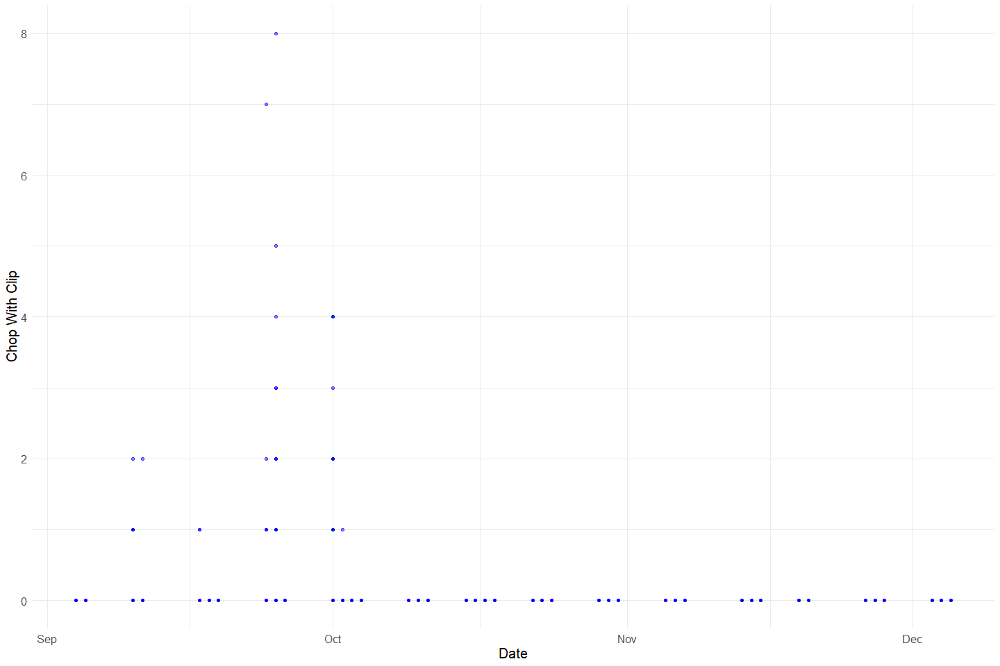<!-- -->

**Plotting chop_n\_clip over Period of Record**

``` r
chop_channel_join %>% 
  ggplot(aes(x = date, y = chop_n_clip)) +
  geom_point(size = 1.4, alpha = .5, color = "red") + 
  labs(x = "Date", 
       y = "Chop Without Clip") +
  theme_minimal() + 
  theme(text = element_text(size = 15)) 
```

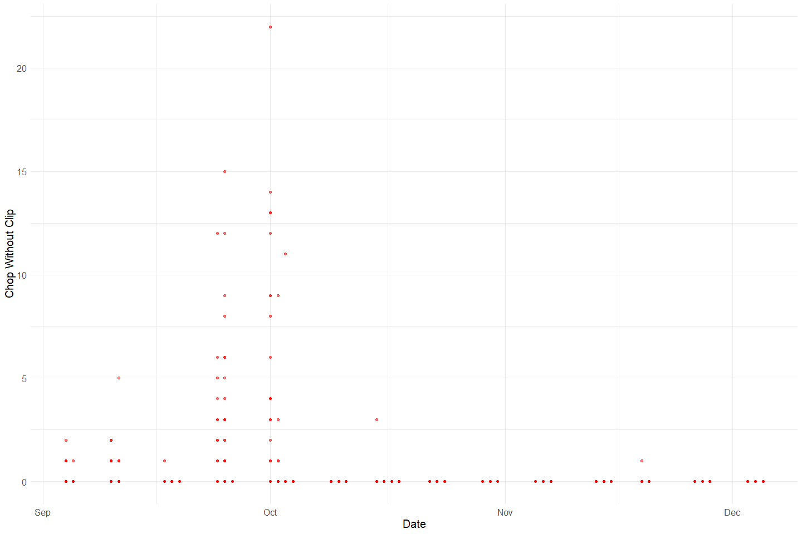<!-- -->

**Plotting chop_uncheck over Period of Record**

``` r
chop_channel_join %>% 
  ggplot(aes(x = date, y = chop_uncheck)) +
  geom_point(size = 1.4, alpha = .5, color = "black") + 
  labs(x = "Date", 
       y = "Chop Not Checked") +
  theme_minimal() + 
  theme(text = element_text(size = 15)) 
```

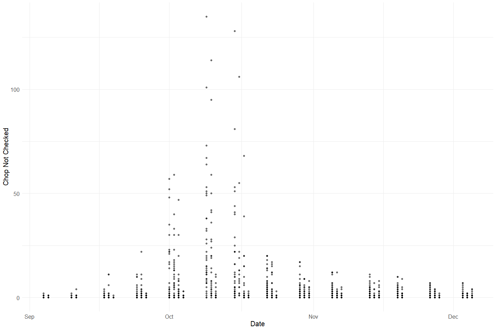<!-- -->

**Plotting Total chops over Period of Record**

``` r
chop_channel_join %>% glimpse()
```

    ## Rows: 1,617
    ## Columns: 14
    ## $ id           <dbl> 4, 4, 4, 4, 4, 4, 4, 3, 3, 3, 3, 3, 3, 3, 3, 3, 3, 3, 3, ~
    ## $ tag_col      <chr> "BLUE 1", "BLUE 1", "BLUE 1", "BLUE 1", "BLUE 1", "BLUE 1~
    ## $ date         <dttm> 2007-09-04, 2007-09-04, 2007-09-04, 2007-09-04, 2007-09-~
    ## $ time         <dttm> 1899-12-31 12:45:00, 1899-12-31 12:45:00, 1899-12-31 12:~
    ## $ chan_id      <dbl> 29, 30, 31, 32, 33, 34, 35, 8, 9, 10, 11, 12, 13, 14, 15,~
    ## $ sect         <dbl> 12, 12, 13, 14, 14, 15, 15, 1, 1, 1, 2, 2, 2, 3, 3, 3, 6,~
    ## $ chan         <chr> "L", "M", "L", "L", "M", "L", "M", "M", "M", "R", "L", "M~
    ## $ min          <dbl> 8, 5, 7, 8, 8, 7, 7, 5, 5, 7, 4, 4, 4, 4, 4, 4, 3, 3, 6, ~
    ## $ chop_clip    <dbl> 0, 0, 0, 0, 0, 0, 0, 0, 0, 0, 0, 0, 0, 0, 0, 0, 0, 0, 0, ~
    ## $ chop_n_clip  <dbl> 0, 0, 0, 0, 0, 1, 1, 0, 0, 0, 0, 0, 0, 0, 0, 0, 0, 0, 1, ~
    ## $ chop_uncheck <dbl> 0, 0, 0, 0, 0, 0, 0, 0, 0, 0, 0, 0, 0, 0, 0, 0, 0, 0, 0, ~
    ## $ tag_clip     <dbl> 0, 0, 0, 0, 0, 0, 0, 0, 0, 0, 0, 0, 0, 0, 0, 0, 0, 0, 0, ~
    ## $ tag_n_clip   <dbl> 0, 0, 0, 0, 0, 0, 0, 0, 0, 0, 0, 0, 0, 0, 0, 0, 0, 0, 0, ~
    ## $ tag_unk      <dbl> 0, 0, 0, 0, 0, 0, 0, 0, 0, 0, 0, 0, 0, 0, 0, 0, 0, 0, 0, ~

``` r
total_chops <- chop_channel_join%>%
  mutate(chop_clip = ifelse(is.na(chop_clip), 0, chop_clip), # fill na
         chop_n_clip = ifelse(is.na(chop_n_clip), 0, chop_n_clip),
         chop_uncheck = ifelse(is.na(chop_uncheck), 0, chop_uncheck),
         total_chops = chop_clip + chop_n_clip + chop_uncheck) %>% 
  select(date, chop_clip, chop_n_clip, chop_uncheck, total_chops)

# Case check: checking for duplicates
total_chops_test <- total_chops %>% # get total chops
  filter(date == as_date("2007-09-15"))

# Check if NAs introduced in creating total chop columns
nrow(total_chops_test) == (sum(total_chops_test$total_chops == (total_chops_test$chop_clip + total_chops_test$chop_n_clip + total_chops_test$chop_uncheck)))
```

    ## [1] TRUE

``` r
# total number of chops for the day
total_chops_summary <- total_chops %>%
  group_by(date) %>%
  summarise(total_chops = sum(total_chops, na.rm = T),
            chop_clip = sum(chop_clip, na.rm = T),
            chop_n_clip = sum(chop_n_clip, na.rm = T),
            chop_uncheck = sum(chop_uncheck, na.rm = T))


# check if NAs are introduced in merge
A = left_join(ChopChannel_raw, ChopHeader_raw, by = "ID")$ChanID
B = ChopRecov_raw$ChanID
sum(B %in% A) # they are
```

    ## [1] 341

``` r
# yes I noticed that. there are some IDs in the chop_channel table that are not in the chop_header table. there are A LOT of IDs in the recovery table that are not in header table. at this point i would assume this is a data entry issue and we can leave as is but clearly document. this is something we may learn more about and then be able to fix
```

``` r
total_chops_summary %>% 
  pivot_longer(cols = c(chop_clip, chop_n_clip, chop_uncheck), names_to = "clip", values_to = "count") %>% 
  mutate(proportions = (count / total_chops)) %>% 
  ggplot(aes(x = date, y = proportions, fill = clip)) +
  geom_bar(stat = "identity", position = "stack") +
  scale_fill_manual(values = c("Blue","Red", "Black"), 
                    name = "Clip", 
                    labels = c("Clip", "No Clip", "Not Checked")) +
  theme_minimal() + 
  labs(y = "Proportion", x = "Date") +
  scale_fill_manual(values = wes_palette("Moonrise2"))
```

    ## Scale for 'fill' is already present. Adding another scale for 'fill', which
    ## will replace the existing scale.

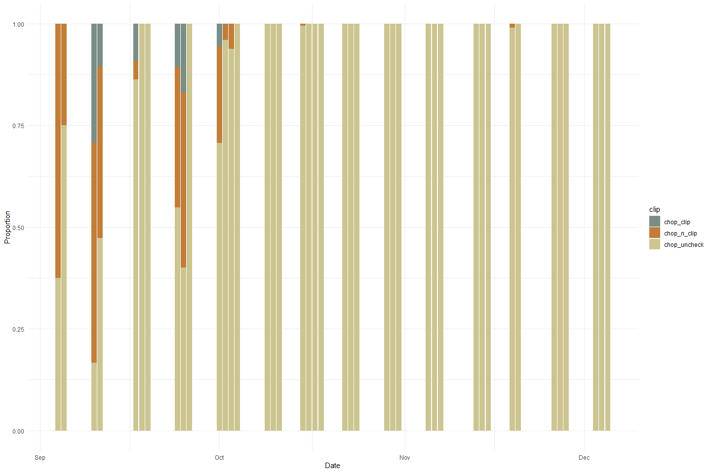<!-- -->

The dataset from 2007 did not record for sex and instead, recorded for
clip(?) or not.This plot shows the proportion of chops with, without
clips and unchecked for each day over the the period of 2007-09-04 to
2007-12-05. Most of the chops after October were not checked for clips.
The data gaps that we see are a result of the data collection process in
which the data was collected 2-4 days each week (with no specific period
day of week) over the 4 month period. We see that the majority of the
chops were unchecked for clips.

### Chop Channel Variable: `tag_count`, `tag_clip`, `tag_n_clip`, `tag_unk`

**Numeric Summary of `tag_clip`, `tag_n_clip`, `tag_unk` over Period of
Record**

``` r
summary(chop_channel_join$tag_clip)
```

    ##    Min. 1st Qu.  Median    Mean 3rd Qu.    Max. 
    ## 0.00000 0.00000 0.00000 0.04514 0.00000 4.00000

``` r
summary(chop_channel_join$tag_n_clip)
```

    ##    Min. 1st Qu.  Median    Mean 3rd Qu.    Max. 
    ##  0.0000  0.0000  0.0000  0.3043  0.0000 15.0000

``` r
summary(chop_channel_join$tag_unk)
```

    ##    Min. 1st Qu.  Median    Mean 3rd Qu.    Max. 
    ##  0.0000  0.0000  0.0000  0.0334  0.0000 17.0000

**NA and Unknown Values** Provide a stat on NA or unknown values

``` r
round(sum(is.na(chop_channel_join$tag_clip))/nrow(chop_channel_join), 3) * 100
```

    ## [1] 0

``` r
round(sum(is.na(chop_channel_join$tag_n_clip))/nrow(chop_channel_join), 3) * 100
```

    ## [1] 0

``` r
round(sum(is.na(chop_channel_join$tag_unk))/nrow(chop_channel_join), 3) * 100
```

    ## [1] 0

-   0 % of values in the `tag_clip` column are NA.
-   0 % of values in the `tag_n_clip` column are NA.
    -   0 % of values in the `tag_unk` column are NA.

**Plotting tag_clip over Period of Record**

``` r
chop_channel_join %>% 
  ggplot(aes(x = date, y = tag_clip)) +
  geom_point(size = 1.4, alpha = .5, color = "blue") + 
  labs(x = "Date", 
       y = "Tag Clip") +
  theme_minimal() + 
  theme(text = element_text(size = 15)) 
```

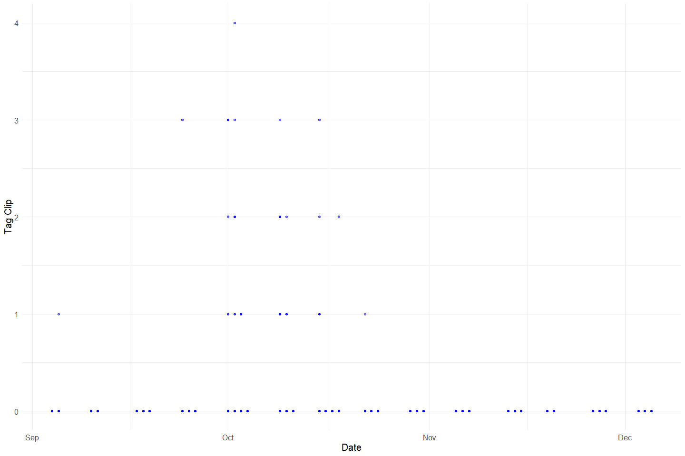<!-- -->

**Plotting tag_n\_clip over Period of Record**

``` r
chop_channel_join %>% 
  ggplot(aes(x = date, y = tag_n_clip)) +
  geom_point(size = 1.4, alpha = .5, color = "red") + 
  labs(x = "Date", 
       y = "Tag No Clip") +
  theme_minimal() + 
  theme(text = element_text(size = 15)) 
```

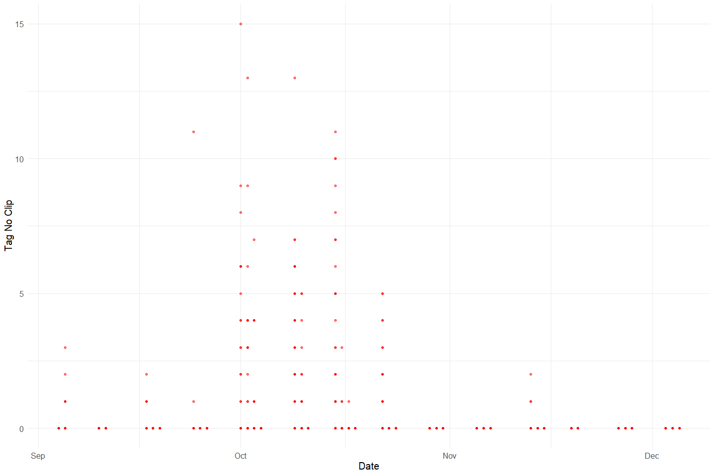<!-- -->

**Plotting tag_unk over Period of Record**

``` r
chop_channel_join %>% 
  ggplot(aes(x = date, y = tag_unk)) +
  geom_point(size = 1.4, alpha = .5, color = "black") + 
  labs(x = "Date", 
       y = "Unknown Tags") +
  theme_minimal() + 
  theme(text = element_text(size = 15)) 
```

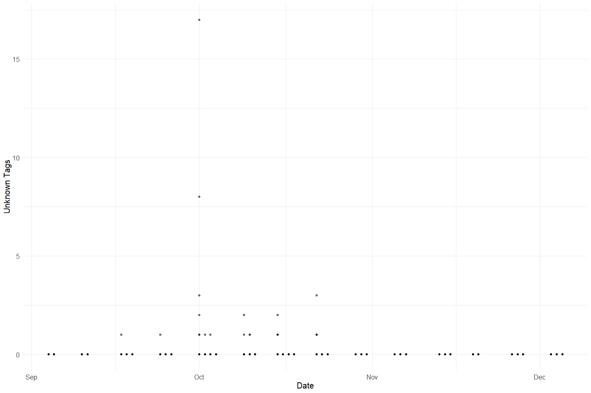<!-- -->

**Plotting Total Tags over Period of Record**

``` r
# Percentage by Gender of Daily Chops
# Address NA values for chops
total_tags <- chop_channel_join %>%
  mutate(tag_clip = ifelse(is.na(tag_clip), 0, tag_clip), # fill na
         tag_n_clip = ifelse(is.na(tag_n_clip), 0, tag_n_clip),
         tag_unk = ifelse(is.na(tag_unk), 0, tag_unk),
         total_tags = tag_unk + tag_clip + tag_n_clip) %>% 
  select(date, tag_clip, tag_n_clip, tag_unk, total_tags)

# total number of chops for the day
total_tags_summary <- total_tags %>%
  group_by(date) %>%
  summarise(total_tags = sum(total_tags, na.rm = T),
            tag_clip = sum(tag_clip, na.rm = T),
            tag_n_clip = sum(tag_n_clip, na.rm = T),
            tag_unk = sum(tag_unk, na.rm = T))

# Make Graph to identify clip proportion
total_tags_summary %>% 
  pivot_longer(cols = c(tag_n_clip, tag_clip, tag_unk), names_to = "tags", values_to = "count") %>% 
  mutate(proportions = (count / total_tags)) %>% 
  ggplot(aes(x = date, y = proportions, fill = tags)) +
  geom_bar(stat = "identity", position = "stack") +
  scale_fill_manual(values = c("Blue","Red", "Black"), 
                    name = "Clips", 
                    labels = c("Tags Without Clips", "Tags With Clips", "Tags Unknown")) +
  theme_minimal() + 
  labs(y = "Proportion", x = "Date") +
  scale_fill_manual(values = wes_palette("Moonrise2"))
```

    ## Scale for 'fill' is already present. Adding another scale for 'fill', which
    ## will replace the existing scale.

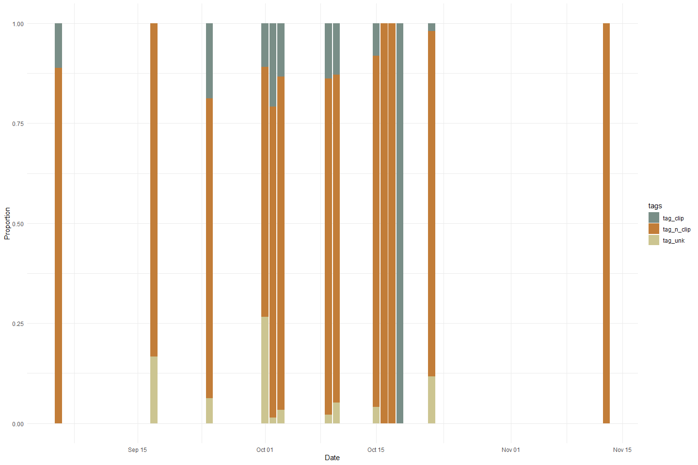<!-- -->

**Comparing tags and chops**

``` r
total_carcass <- full_join(total_chops_summary, total_tags_summary) %>% 
  select(date, total_chops, total_tags) %>% 
  pivot_longer(c(total_chops, total_tags), names_to = "mark")
```

    ## Joining, by = "date"

``` r
full_join(total_chops_summary, total_tags_summary) %>% 
  select(date, total_chops, total_tags) %>% 
  pivot_longer(c(total_chops, total_tags), names_to = "mark")
```

    ## Joining, by = "date"

    ## # A tibble: 84 x 3
    ##    date                mark        value
    ##    <dttm>              <chr>       <dbl>
    ##  1 2007-09-04 00:00:00 total_chops    16
    ##  2 2007-09-04 00:00:00 total_tags      0
    ##  3 2007-09-05 00:00:00 total_chops     4
    ##  4 2007-09-05 00:00:00 total_tags      9
    ##  5 2007-09-10 00:00:00 total_chops    24
    ##  6 2007-09-10 00:00:00 total_tags      0
    ##  7 2007-09-11 00:00:00 total_chops    19
    ##  8 2007-09-11 00:00:00 total_tags      0
    ##  9 2007-09-17 00:00:00 total_chops    22
    ## 10 2007-09-17 00:00:00 total_tags      6
    ## # ... with 74 more rows

``` r
ggplot(total_carcass, aes(x = date, y = value, fill = mark)) +
  geom_col() +
  theme_minimal() +
  scale_fill_manual(values = wes_palette("Moonrise2"))
```

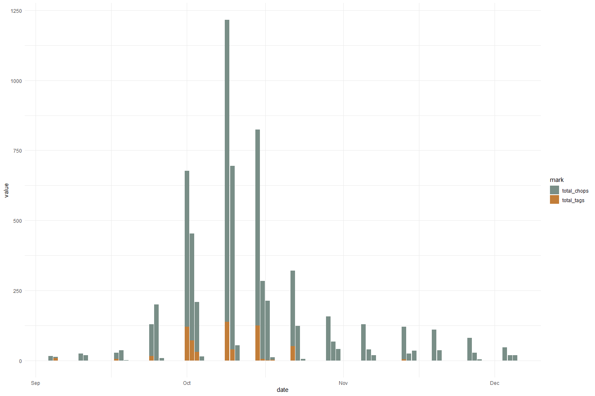<!-- -->

Tags appear to be less commonly applied compared to chops.

### Chop Recovery Variable: `id`, `chan_id`, `recov_count`

``` r
# Filter clean data to show only numeric variables 
chop_recovery_join %>% 
  select_if(is.numeric) %>%
  colnames()
```

    ## [1] "id"          "recov_count" "chan_id"

``` r
summary(chop_recovery_join$id)
```

    ##    Min. 1st Qu.  Median    Mean 3rd Qu.    Max. 
    ##       1      86     171     171     256     341

``` r
summary(chop_recovery_join$recov_count)
```

    ##    Min. 1st Qu.  Median    Mean 3rd Qu.    Max.    NA's 
    ##    1.00    1.00    1.00    2.26    3.00   20.00       2

-   Note: all recov_count do not have dates associated with them

### Chop Header Variable: `id`

``` r
chop_header %>% 
  select_if(is.numeric) %>% 
  colnames()
```

    ## [1] "id"       "week_num"

``` r
summary(chop_header$id)
```

    ##    Min. 1st Qu.  Median    Mean 3rd Qu.    Max. 
    ##    1.00   20.50   39.00   38.99   57.50   76.00

### CWT Variable: `tag_id`, `sect`, `fl`, `header_id`, `week_num`

``` r
cwt %>% 
  select_if(is.numeric) %>% 
  colnames()
```

    ## [1] "tag_id"    "sect"      "fl"        "header_id" "week_num"

``` r
summary(cwt$tag_id)
```

    ##    Min. 1st Qu.  Median    Mean 3rd Qu.    Max.    NA's 
    ##     1.0   421.0   843.0   842.3  1263.0  1684.0      17

``` r
summary(cwt$sect)
```

    ##    Min. 1st Qu.  Median    Mean 3rd Qu.    Max.    NA's 
    ##    1.00    6.00    9.00   10.35   13.00   39.00      28

``` r
summary(cwt$fl)
```

    ##    Min. 1st Qu.  Median    Mean 3rd Qu.    Max.    NA's 
    ##   11.00   83.00   89.00   89.41   96.00  122.00      33

-   1 % of values in the `tag_id` column are NA.
-   1.6 % of values in the `sect` column are NA.
-   1.9 % of values in the `fl` column are NA.

``` r
#Create a cwt_count column
#Pivot table to expand sex column to female_cwt, male_cwt, and unknown_cwt 
#Is this graph helpful?
unique(cwt$sex)
```

    ## [1] NA  "F" "M"

``` r
cwt_count <- cwt %>% 
  mutate(count = 1) %>%
  mutate(sex = case_when(sex == "ND"|is.na(sex)|sex =="UK" ~ "U",
                         TRUE ~ sex)) %>% 
  pivot_wider(names_from = sex, values_from = count, values_fill = 0) %>% 
  # unnest() %>% 
  rename("male_cwt" = M,
         "female_cwt" = F,
         "unknown_cwt" = U) %>% glimpse
```

    ## Rows: 1,698
    ## Columns: 21
    ## $ tag_id      <dbl> 1, 2, 3, 4, 7, 9, 11, 13, 14, 17, 19, 20, 22, 23, 25, 28, ~
    ## $ sect        <dbl> 1, 3, 8, 8, 14, 15, 15, 1, 1, 4, 12, 13, 13, 13, 13, 10, 1~
    ## $ rel_loc     <chr> NA, NA, NA, NA, NA, NA, NA, NA, NA, NA, NA, NA, NA, NA, NA~
    ## $ fl          <dbl> NA, 89, 98, 104, 85, 104, 81, 90, 84, 81, 84, 85, 96, 81, ~
    ## $ spawn       <chr> NA, "U", "U", "UK", "U", "UK", "U", "U", "NO DATA", "UK", ~
    ## $ clip        <chr> NA, "N", "N", "N", "N", "N", "N", "NO DATA", "NO DATA", "N~
    ## $ samp_type   <chr> NA, "S&O", "S&O", "S&O", "S&O", "S&O", "S&O", "S&O", "S&O"~
    ## $ carc_stat   <chr> NA, "T", "T", "T", "T", "T", "T", "T", "T", "T", "T", "T",~
    ## $ samp_num    <chr> NA, "090407-004", "090407-005", "090407-009", "090407-014"~
    ## $ head_tag    <lgl> NA, NA, NA, NA, NA, NA, NA, NA, NA, NA, NA, NA, NA, NA, NA~
    ## $ comment     <chr> NA, NA, NA, NA, NA, NA, NA, NA, NA, NA, NA, NA, NA, NA, NA~
    ## $ header_id   <dbl> 7, 9, 9, 9, 9, 9, 10, 10, 10, 10, 10, 10, 10, 10, 10, 11, ~
    ## $ hall_print1 <chr> NA, NA, NA, NA, NA, "GH-0701581", NA, NA, "GH-0700887", "G~
    ## $ hall_print2 <chr> NA, NA, NA, NA, NA, "GH-0701582", NA, NA, "GH-0700888", "G~
    ## $ date        <dttm> NA, 2007-09-04, 2007-09-04, 2007-09-04, 2007-09-04, 2007-~
    ## $ tag_col     <chr> NA, "BLUE 1", "BLUE 1", "BLUE 1", "BLUE 1", "BLUE 1", "BLU~
    ## $ crew        <chr> NA, "KT,KH,GS", "KT,KH,GS", "KT,KH,GS", "KT,KH,GS", "KT,KH~
    ## $ week_num    <dbl> NA, 1, 1, 1, 1, 1, 1, 1, 1, 1, 1, 1, 1, 1, 1, 2, 2, 2, 2, ~
    ## $ unknown_cwt <dbl> 1, 0, 0, 0, 0, 0, 0, 0, 1, 0, 0, 0, 0, 0, 0, 0, 0, 0, 0, 0~
    ## $ female_cwt  <dbl> 0, 1, 1, 0, 1, 0, 1, 1, 0, 0, 0, 1, 1, 1, 0, 1, 1, 1, 0, 0~
    ## $ male_cwt    <dbl> 0, 0, 0, 1, 0, 1, 0, 0, 0, 1, 1, 0, 0, 0, 1, 0, 0, 0, 1, 1~

``` r
total_cwt_summary <- cwt_count %>% 
  mutate(male_cwt = ifelse(is.na(male_cwt), 0, male_cwt), # fill na
         female_cwt = ifelse(is.na(female_cwt), 0, female_cwt),
         unknown_cwt = ifelse(is.na(unknown_cwt), 0, unknown_cwt),
         total_cwt = unknown_cwt + male_cwt + female_cwt) %>% 
  group_by(month(date)) %>% 
  summarise(total_cwt = sum(total_cwt),
            male_cwt = sum(male_cwt),
            female_cwt = sum(female_cwt),
            unknown_cwt = sum(unknown_cwt))
```

``` r
total_cwt_summary %>% 
  pivot_longer(cols = c(male_cwt, female_cwt, unknown_cwt), names_to = "sex", values_to = "count") %>% 
  mutate(proportions = (count / total_cwt)) %>% 
  ggplot(aes(x = `month(date)`, y = proportions, fill = sex)) + 
  geom_bar(stat = "identity", position = "stack") +
  scale_fill_manual(name = "chops", 
                    labels = c("CWT Male", "CWT Female", "CWT Unknown")) +
  theme_minimal() + 
  labs(y = "Proportion", x = "Month") +
  scale_fill_manual(values = wes_palette("Moonrise2"))
```

    ## Scale for 'fill' is already present. Adding another scale for 'fill', which
    ## will replace the existing scale.

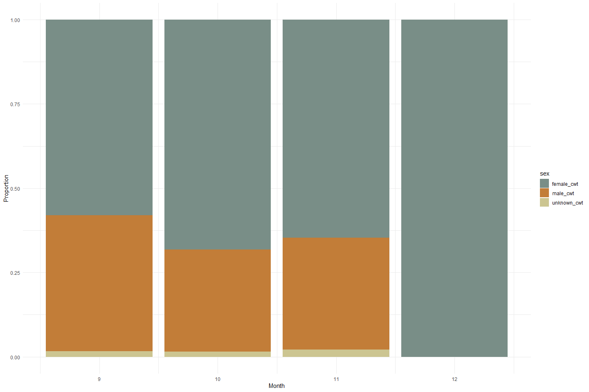<!-- -->

**Plotting fork length of each sex**

``` r
cwt %>% 
  mutate(sex = case_when(sex == "ND"|is.na(sex)|sex =="UK" ~ "Unknown",
                         TRUE ~ sex))%>% 
  ggplot(aes(x = sex, y = fl)) + 
  geom_boxplot() + 
  theme_minimal() + 
  labs(y = "FL", x = "Sex")
```

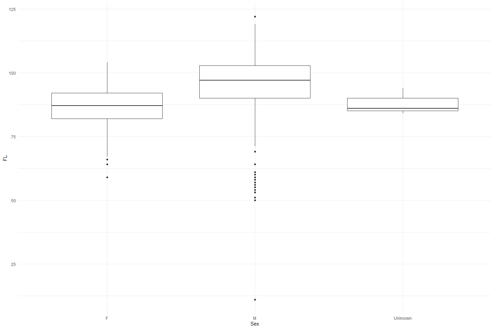<!-- -->

## Explore Categorical variables:

### Chop Channel Clean Data

Fix inconsistencies with spelling, capitalization, and dates

``` r
# Filter clean data to show only categorical variables
chop_channel_join %>% 
  select_if(is.character) %>%
  colnames()
```

    ## [1] "tag_col" "chan"

``` r
unique(chop_channel_join$tag_col)
```

    ##  [1] "BLUE 1"    "ORANGE 2"  "YELLOW 3"  "RED 4"     "BLUE 5"    "ORANGE 6" 
    ##  [7] "YELLOW 7"  "RED 8"     "BLUE 9"    "ORANGE 10" "YELLOW 11" "RED 12"   
    ## [13] "BLUE 13"   "ORANGE 14" NA

``` r
unique(chop_channel_join$chan)
```

    ## [1] "L" "M" "R" NA

``` r
chop_channel_cleaner <- chop_channel_join %>%
  mutate(date = as_date(date)) %>%
  mutate_if(is.character, str_to_lower) %>% 
  select(-c(time))

chop_channel_cleaner
```

    ## # A tibble: 1,617 x 13
    ##       id tag_col date       chan_id  sect chan    min chop_clip chop_n_clip
    ##    <dbl> <chr>   <date>       <dbl> <dbl> <chr> <dbl>     <dbl>       <dbl>
    ##  1     4 blue 1  2007-09-04      29    12 l         8         0           0
    ##  2     4 blue 1  2007-09-04      30    12 m         5         0           0
    ##  3     4 blue 1  2007-09-04      31    13 l         7         0           0
    ##  4     4 blue 1  2007-09-04      32    14 l         8         0           0
    ##  5     4 blue 1  2007-09-04      33    14 m         8         0           0
    ##  6     4 blue 1  2007-09-04      34    15 l         7         0           1
    ##  7     4 blue 1  2007-09-04      35    15 m         7         0           1
    ##  8     3 blue 1  2007-09-04       8     1 m         5         0           0
    ##  9     3 blue 1  2007-09-04       9     1 m         5         0           0
    ## 10     3 blue 1  2007-09-04      10     1 r         7         0           0
    ## # ... with 1,607 more rows, and 4 more variables: chop_uncheck <dbl>,
    ## #   tag_clip <dbl>, tag_n_clip <dbl>, tag_unk <dbl>

### Chop Recovery Clean Data

Fix inconsistencies with spelling, capitalization, and dates

``` r
chop_recovery_join %>% 
  select_if(is.character) %>% 
  colnames()
```

    ## [1] "recov_color"

``` r
unique(chop_recovery_join$recov_color)
```

    ##  [1] "ORANGE 2"  "BLUE 1"    NA          "YELLOW 3"  "RED 4"     "BLUE 5"   
    ##  [7] "ORANGE 6"  "YELLOW 7"  "RED 8"     "BLUE 9"    "ORANGE 10" "YELLOW 11"
    ## [13] "RED 12"    "BLUE 13"

``` r
chop_recovery_cleaner <- chop_recovery_join %>% 
  mutate(date = as_date(date)) %>%
  mutate_if(is.character, str_to_lower) %>% 
  select(-c(time))

chop_recovery_cleaner
```

    ## # A tibble: 341 x 5
    ##       id date       recov_color recov_count chan_id
    ##    <dbl> <date>     <chr>             <dbl>   <dbl>
    ##  1     4 2007-09-04 orange 2              1     265
    ##  2     3 2007-09-04 blue 1                1     261
    ##  3     1 2007-09-04 blue 1                1     109
    ##  4     5 2007-09-05 <NA>                 NA     327
    ##  5     6 2007-09-05 yellow 3              2     329
    ##  6     7 2007-09-05 yellow 3              1     334
    ##  7     8 2007-09-05 yellow 3              1     336
    ##  8     9 2007-09-10 yellow 3              1     338
    ##  9    10 2007-09-10 yellow 3              2     340
    ## 10    11 2007-09-11 yellow 3              1     347
    ## # ... with 331 more rows

### Chop Header Clean Data

``` r
chop_header %>% 
  select_if(is.character) %>% 
  colnames()
```

    ## [1] "tag_col"  "crew"     "recorder" "weather"  "comment"

``` r
unique(chop_header$crew)
```

    ##  [1] "KT,KH,GS"             "TV,KM,KS,KW"          "KT,KH,GAS"           
    ##  [4] "TV,KS,KW"             "CC,KW,RB"             "KT,KH,KM"            
    ##  [7] "RK,KS,KW"             "KW KB TK TV KS"       "TV TK KW KS"         
    ## [10] "KS KT RS"             "KT TK KH"             "KW JB TV"            
    ## [13] "KM KW KS"             "TV CC GS"             "GAS TV KS"           
    ## [16] "TK KW JB"             "KS  GAS  AJ  CC"      "CC  GS  TK"          
    ## [19] "KS  TV AJ JB"         "RK  KM  GS  KW"       "KT  KH  AJ"          
    ## [22] "KS  TV  TK"           "AJ  JB  TK  GS"       "RB  TV  KW  KS"      
    ## [25] "AJ  TB  TK"           "KW  KS  KM  RK"       "KT  KH  TV  AJ"      
    ## [28] "TV  GS  TK  AJ"       "KW  KT  KH"           NA                    
    ## [31] "KT  KH"               "KW  KS  RK"           "TV  TK  GS  JB"      
    ## [34] "TV  TK  AS"           "AJ  RK  KS"           "KW  JB  CC  RB"      
    ## [37] "TK TV GS KS AJ"       "KW JB KM TK"          "KW RK KS AJ"         
    ## [40] "TK JB KT KH"          "AJ JB GS TK"          "CC,KW,JB,AS"         
    ## [43] "KS,GAS,RB,RK"         "CAMERON, PAUL, KH KT" "KW JB KS SB"         
    ## [46] "RK GS KS KW"          "TV AJ JB"             "KS RK GS"            
    ## [49] "AJ,KH,KT,GS"          "KT KH AJ JB"          "KW,CC,JB"            
    ## [52] "KS,RK,GS"             "KW,GS,KM,JB"          "KS, KW, GS, RK"      
    ## [55] "KW,KS,KM,CC"          "TK, KT, JB, KH"       "KT,JB,KH,TK"         
    ## [58] "KW,AJ,JB,TK"          "CC,KT,TK"             "KS,KW,RK,GS"         
    ## [61] "KS,CC,TK"             "KT,TV,GAS"            "GS, TK,KS,JB"        
    ## [64] "KT, KH, CC"           "KT, CC, GS, JB"       "KS,KW,GS"            
    ## [67] "KW CC GS"             "KT,KH,TK,GS"          "KT,GS,KH"

``` r
unique(chop_header$recorder)
```

    ## [1] "GS" NA   "KS" "CC" "KT"

``` r
unique(chop_header$weather)
```

    ## [1] "SUN" NA    "CLD"

``` r
chop_header_cleaner <- chop_header %>%
  mutate(date = as_date(date)) %>%
  mutate_if(is.character, str_to_lower) %>% 
  mutate(crew = str_replace_all(crew, " ", ","),
         crew = str_replace_all(crew, ",,", ",")) %>% 
  select(-c(time))

chop_header_cleaner
```

    ## # A tibble: 75 x 8
    ##       id tag_col  date       crew        recorder weather comment week_num
    ##    <dbl> <chr>    <date>     <chr>       <chr>    <chr>   <chr>      <dbl>
    ##  1     4 blue 1   2007-09-04 kt,kh,gs    gs       sun     <NA>           1
    ##  2     3 blue 1   2007-09-04 kt,kh,gs    gs       <NA>    <NA>           1
    ##  3     1 blue 1   2007-09-04 tv,km,ks,kw <NA>     <NA>    <NA>           1
    ##  4     5 blue 1   2007-09-05 kt,kh,gs    <NA>     sun     <NA>           1
    ##  5     6 blue 1   2007-09-05 kt,kh,gs    <NA>     sun     <NA>           1
    ##  6     7 blue 1   2007-09-05 kt,kh,gas   <NA>     <NA>    <NA>           1
    ##  7     8 blue 1   2007-09-05 tv,ks,kw    <NA>     sun     <NA>           1
    ##  8     9 orange 2 2007-09-10 cc,kw,rb    <NA>     sun     <NA>           2
    ##  9    10 orange 2 2007-09-10 kt,kh,gs    <NA>     sun     <NA>           2
    ## 10    11 orange 2 2007-09-11 kt,kh,km    <NA>     sun     <NA>           2
    ## # ... with 65 more rows

### CWT Clean Data

``` r
cwt %>% 
  select_if(is.character) %>% 
  colnames
```

    ##  [1] "rel_loc"     "sex"         "spawn"       "clip"        "samp_type"  
    ##  [6] "carc_stat"   "samp_num"    "comment"     "hall_print1" "hall_print2"
    ## [11] "tag_col"     "crew"

``` r
unique(cwt$rel_loc)
```

    ## [1] NA  "M" "L" "R"

``` r
unique(cwt$spawn)
```

    ## [1] NA        "U"       "UK"      "NO DATA" "S"

``` r
unique(cwt$clip)
```

    ## [1] NA        "N"       "NO DATA" "Y"       "UK"

``` r
unique(cwt$samp_type)
```

    ## [1] NA      "S&O"   "H&S&O" "NONE"  "HALL"  "O"     "H&S"   "H"     "H&O"

``` r
unique(cwt$carc_stat)
```

    ## [1] NA        "T"       "C"       "NO DATA"

``` r
cwt_cleaner <- cwt %>% 
  mutate_if(is.character, str_to_lower) %>% 
  mutate(crew = str_replace_all(crew, " ", ","),
         crew = str_replace_all(crew, ",,", ","),
         sex = case_when(sex == "nd"|is.na(sex) ~ "unknown",
                         TRUE ~ sex),
         rel_loc = ifelse(rel_loc == "no data", NA, rel_loc),  
         spawn = ifelse(spawn == "no data", NA, spawn),
         clip = case_when(clip == "no data" ~ NA_character_,
                          clip == "y" ~ "yes",
                          clip == "n" ~ "no",
                          TRUE ~ clip),
         samp_type = ifelse(samp_type == "no data", NA, samp_type),
         carc_stat = ifelse(carc_stat == "no data", NA, carc_stat)) %>% 
  glimpse
```

    ## Rows: 1,698
    ## Columns: 19
    ## $ tag_id      <dbl> 1, 2, 3, 4, 7, 9, 11, 13, 14, 17, 19, 20, 22, 23, 25, 28, ~
    ## $ sect        <dbl> 1, 3, 8, 8, 14, 15, 15, 1, 1, 4, 12, 13, 13, 13, 13, 10, 1~
    ## $ rel_loc     <chr> NA, NA, NA, NA, NA, NA, NA, NA, NA, NA, NA, NA, NA, NA, NA~
    ## $ fl          <dbl> NA, 89, 98, 104, 85, 104, 81, 90, 84, 81, 84, 85, 96, 81, ~
    ## $ sex         <chr> "unknown", "f", "f", "m", "f", "m", "f", "f", "unknown", "~
    ## $ spawn       <chr> NA, "u", "u", "uk", "u", "uk", "u", "u", NA, "uk", "uk", "~
    ## $ clip        <chr> NA, "no", "no", "no", "no", "no", "no", NA, NA, "no", "no"~
    ## $ samp_type   <chr> NA, "s&o", "s&o", "s&o", "s&o", "s&o", "s&o", "s&o", "s&o"~
    ## $ carc_stat   <chr> NA, "t", "t", "t", "t", "t", "t", "t", "t", "t", "t", "t",~
    ## $ samp_num    <chr> NA, "090407-004", "090407-005", "090407-009", "090407-014"~
    ## $ head_tag    <lgl> NA, NA, NA, NA, NA, NA, NA, NA, NA, NA, NA, NA, NA, NA, NA~
    ## $ comment     <chr> NA, NA, NA, NA, NA, NA, NA, NA, NA, NA, NA, NA, NA, NA, NA~
    ## $ header_id   <dbl> 7, 9, 9, 9, 9, 9, 10, 10, 10, 10, 10, 10, 10, 10, 10, 11, ~
    ## $ hall_print1 <chr> NA, NA, NA, NA, NA, "gh-0701581", NA, NA, "gh-0700887", "g~
    ## $ hall_print2 <chr> NA, NA, NA, NA, NA, "gh-0701582", NA, NA, "gh-0700888", "g~
    ## $ date        <dttm> NA, 2007-09-04, 2007-09-04, 2007-09-04, 2007-09-04, 2007-~
    ## $ tag_col     <chr> NA, "blue 1", "blue 1", "blue 1", "blue 1", "blue 1", "blu~
    ## $ crew        <chr> NA, "kt,kh,gs", "kt,kh,gs", "kt,kh,gs", "kt,kh,gs", "kt,kh~
    ## $ week_num    <dbl> NA, 1, 1, 1, 1, 1, 1, 1, 1, 1, 1, 1, 1, 1, 1, 2, 2, 2, 2, ~

## Comments

-   Data set similar to 2007 and 2007 data
-   Little recovery data

## Data Dictionaries

### Channel

``` r
percent_na <- chop_channel_cleaner %>%
  summarise_all(list(name = ~sum(is.na(.))/length(.))) %>%
  pivot_longer(cols = everything())


counts_data_dictionary <- tibble(variables = colnames(chop_channel_cleaner),
                          description = c("ID",
                                          "Color of tag applied to carcass",
                                          "Date of survey",
                                          "Channel ID",
                                          "Sect", 
                                          "Chan", 
                                          "Min", 
                                          "Carcass that were chopped and has clip",
                                          "Carcass that were chopped and has no clip",
                                          "Carcass that were chopped and not checked for clip",
                                          "Carcass that were tagged and has clip",
                                          "Carcass that were tagged and has no clip",
                                          "Carcass that were tagged and unknown"),
                          percent_na = round(percent_na$value*100))

kable(counts_data_dictionary)
```

| variables    | description                                        | percent_na |
|:-------------|:---------------------------------------------------|-----------:|
| id           | ID                                                 |          1 |
| tag_col      | Color of tag applied to carcass                    |          5 |
| date         | Date of survey                                     |          1 |
| chan_id      | Channel ID                                         |          0 |
| sect         | Sect                                               |          0 |
| chan         | Chan                                               |          1 |
| min          | Min                                                |         26 |
| chop_clip    | Carcass that were chopped and has clip             |          0 |
| chop_n\_clip | Carcass that were chopped and has no clip          |          0 |
| chop_uncheck | Carcass that were chopped and not checked for clip |          0 |
| tag_clip     | Carcass that were tagged and has clip              |          0 |
| tag_n\_clip  | Carcass that were tagged and has no clip           |          0 |
| tag_unk      | Carcass that were tagged and unknown               |          0 |

### Recovery

``` r
percent_na <- chop_recovery_cleaner %>%
  summarise_all(list(name = ~sum(is.na(.))/length(.))) %>%
  pivot_longer(cols = everything())


recovery_data_dictionary <- tibble(variables = colnames(chop_recovery_cleaner),
                          description = c("ID",
                                          "Date of survey",
                                          "Color of tag recovered from carcass",
                                          "Count of recovery",
                                          "Channel ID"),
                          percent_na = round(percent_na$value*100))

kable(recovery_data_dictionary)
```

| variables   | description                         | percent_na |
|:------------|:------------------------------------|-----------:|
| id          | ID                                  |          0 |
| date        | Date of survey                      |         78 |
| recov_color | Color of tag recovered from carcass |          0 |
| recov_count | Count of recovery                   |          1 |
| chan_id     | Channel ID                          |          0 |

### Survey

``` r
percent_na <- chop_header_cleaner %>%
  summarise_all(list(name = ~sum(is.na(.))/length(.))) %>%
  pivot_longer(cols = everything())
# 
header_data_dictionary <- tibble(variables = colnames(chop_header_cleaner),
                          description = c("ID",
                                          "Color of tag of carcass",
                                          "Date of survey",
                                          "Crew memeber initials that collected",
                                          "Individual of crew member who recorded",
                                          "Weather",
                                          "Comments",
                                          "Week Number"),
                          percent_na = round(percent_na$value*100))
# 
kable(header_data_dictionary)
```

| variables | description                            | percent_na |
|:----------|:---------------------------------------|-----------:|
| id        | ID                                     |          0 |
| tag_col   | Color of tag of carcass                |          3 |
| date      | Date of survey                         |          0 |
| crew      | Crew memeber initials that collected   |          1 |
| recorder  | Individual of crew member who recorded |         91 |
| weather   | Weather                                |          7 |
| comment   | Comments                               |         92 |
| week_num  | Week Number                            |          0 |

### CWT

``` r
percent_na <- cwt_cleaner %>%
  summarise_all(list(name = ~sum(is.na(.))/length(.))) %>%
  pivot_longer(cols = everything())

cwt_data_dictionary <- tibble(variables = colnames(cwt_cleaner),
                          description = c("ID",
                                          "Sect",
                                          "Release Location",
                                          "Fork length",
                                          "Sex",
                                          "Spawn",
                                          "Clip",
                                          "Sample type",
                                          "Carcass stat",
                                          "Sample number",
                                          "Head tag",
                                          "Comment",
                                          "Header ID",
                                          "Hall print 1",
                                          "Hall print 2",
                                          "Date",
                                          "Tag colour",
                                          "Crew",
                                          "Week number"),
                          percent_na = round(percent_na$value*100))

kable(cwt_data_dictionary)
```

| variables   | description      | percent_na |
|:------------|:-----------------|-----------:|
| tag_id      | ID               |          1 |
| sect        | Sect             |          2 |
| rel_loc     | Release Location |         95 |
| fl          | Fork length      |          2 |
| sex         | Sex              |          0 |
| spawn       | Spawn            |          3 |
| clip        | Clip             |          1 |
| samp_type   | Sample type      |         61 |
| carc_stat   | Carcass stat     |          1 |
| samp_num    | Sample number    |         75 |
| head_tag    | Head tag         |        100 |
| comment     | Comment          |         99 |
| header_id   | Header ID        |          0 |
| hall_print1 | Hall print 1     |         90 |
| hall_print2 | Hall print 2     |         90 |
| date        | Date             |          1 |
| tag_col     | Tag colour       |          1 |
| crew        | Crew             |          1 |
| week_num    | Week number      |          1 |

## Save cleaned data back to google cloud (TBA)

``` r
#Ignore chop recovery as its 100% NA
feather_carcass_chops_and_tags_2007 <- chop_channel_cleaner %>% glimpse()
```

    ## Rows: 1,617
    ## Columns: 13
    ## $ id           <dbl> 4, 4, 4, 4, 4, 4, 4, 3, 3, 3, 3, 3, 3, 3, 3, 3, 3, 3, 3, ~
    ## $ tag_col      <chr> "blue 1", "blue 1", "blue 1", "blue 1", "blue 1", "blue 1~
    ## $ date         <date> 2007-09-04, 2007-09-04, 2007-09-04, 2007-09-04, 2007-09-~
    ## $ chan_id      <dbl> 29, 30, 31, 32, 33, 34, 35, 8, 9, 10, 11, 12, 13, 14, 15,~
    ## $ sect         <dbl> 12, 12, 13, 14, 14, 15, 15, 1, 1, 1, 2, 2, 2, 3, 3, 3, 6,~
    ## $ chan         <chr> "l", "m", "l", "l", "m", "l", "m", "m", "m", "r", "l", "m~
    ## $ min          <dbl> 8, 5, 7, 8, 8, 7, 7, 5, 5, 7, 4, 4, 4, 4, 4, 4, 3, 3, 6, ~
    ## $ chop_clip    <dbl> 0, 0, 0, 0, 0, 0, 0, 0, 0, 0, 0, 0, 0, 0, 0, 0, 0, 0, 0, ~
    ## $ chop_n_clip  <dbl> 0, 0, 0, 0, 0, 1, 1, 0, 0, 0, 0, 0, 0, 0, 0, 0, 0, 0, 1, ~
    ## $ chop_uncheck <dbl> 0, 0, 0, 0, 0, 0, 0, 0, 0, 0, 0, 0, 0, 0, 0, 0, 0, 0, 0, ~
    ## $ tag_clip     <dbl> 0, 0, 0, 0, 0, 0, 0, 0, 0, 0, 0, 0, 0, 0, 0, 0, 0, 0, 0, ~
    ## $ tag_n_clip   <dbl> 0, 0, 0, 0, 0, 0, 0, 0, 0, 0, 0, 0, 0, 0, 0, 0, 0, 0, 0, ~
    ## $ tag_unk      <dbl> 0, 0, 0, 0, 0, 0, 0, 0, 0, 0, 0, 0, 0, 0, 0, 0, 0, 0, 0, ~

``` r
feather_carcass_cwt_2007 <- cwt_cleaner %>% glimpse()
```

    ## Rows: 1,698
    ## Columns: 19
    ## $ tag_id      <dbl> 1, 2, 3, 4, 7, 9, 11, 13, 14, 17, 19, 20, 22, 23, 25, 28, ~
    ## $ sect        <dbl> 1, 3, 8, 8, 14, 15, 15, 1, 1, 4, 12, 13, 13, 13, 13, 10, 1~
    ## $ rel_loc     <chr> NA, NA, NA, NA, NA, NA, NA, NA, NA, NA, NA, NA, NA, NA, NA~
    ## $ fl          <dbl> NA, 89, 98, 104, 85, 104, 81, 90, 84, 81, 84, 85, 96, 81, ~
    ## $ sex         <chr> "unknown", "f", "f", "m", "f", "m", "f", "f", "unknown", "~
    ## $ spawn       <chr> NA, "u", "u", "uk", "u", "uk", "u", "u", NA, "uk", "uk", "~
    ## $ clip        <chr> NA, "no", "no", "no", "no", "no", "no", NA, NA, "no", "no"~
    ## $ samp_type   <chr> NA, "s&o", "s&o", "s&o", "s&o", "s&o", "s&o", "s&o", "s&o"~
    ## $ carc_stat   <chr> NA, "t", "t", "t", "t", "t", "t", "t", "t", "t", "t", "t",~
    ## $ samp_num    <chr> NA, "090407-004", "090407-005", "090407-009", "090407-014"~
    ## $ head_tag    <lgl> NA, NA, NA, NA, NA, NA, NA, NA, NA, NA, NA, NA, NA, NA, NA~
    ## $ comment     <chr> NA, NA, NA, NA, NA, NA, NA, NA, NA, NA, NA, NA, NA, NA, NA~
    ## $ header_id   <dbl> 7, 9, 9, 9, 9, 9, 10, 10, 10, 10, 10, 10, 10, 10, 10, 11, ~
    ## $ hall_print1 <chr> NA, NA, NA, NA, NA, "gh-0701581", NA, NA, "gh-0700887", "g~
    ## $ hall_print2 <chr> NA, NA, NA, NA, NA, "gh-0701582", NA, NA, "gh-0700888", "g~
    ## $ date        <dttm> NA, 2007-09-04, 2007-09-04, 2007-09-04, 2007-09-04, 2007-~
    ## $ tag_col     <chr> NA, "blue 1", "blue 1", "blue 1", "blue 1", "blue 1", "blu~
    ## $ crew        <chr> NA, "kt,kh,gs", "kt,kh,gs", "kt,kh,gs", "kt,kh,gs", "kt,kh~
    ## $ week_num    <dbl> NA, 1, 1, 1, 1, 1, 1, 1, 1, 1, 1, 1, 1, 1, 1, 2, 2, 2, 2, ~

``` r
feather_carcass_chop_header_2007 <- chop_header_cleaner %>% glimpse()
```

    ## Rows: 75
    ## Columns: 8
    ## $ id       <dbl> 4, 3, 1, 5, 6, 7, 8, 9, 10, 11, 12, 15, 14, 13, 17, 18, 19, 2~
    ## $ tag_col  <chr> "blue 1", "blue 1", "blue 1", "blue 1", "blue 1", "blue 1", "~
    ## $ date     <date> 2007-09-04, 2007-09-04, 2007-09-04, 2007-09-05, 2007-09-05, ~
    ## $ crew     <chr> "kt,kh,gs", "kt,kh,gs", "tv,km,ks,kw", "kt,kh,gs", "kt,kh,gs"~
    ## $ recorder <chr> "gs", "gs", NA, NA, NA, NA, NA, NA, NA, NA, NA, NA, NA, NA, N~
    ## $ weather  <chr> "sun", NA, NA, "sun", "sun", NA, "sun", "sun", "sun", "sun", ~
    ## $ comment  <chr> NA, NA, NA, NA, NA, NA, NA, NA, NA, NA, NA, NA, NA, NA, NA, N~
    ## $ week_num <dbl> 1, 1, 1, 1, 1, 1, 1, 2, 2, 2, 2, 3, 3, 3, 3, 4, 4, 4, 4, 4, 4~

``` r
f <- function(input, output) write_csv(input, file = output)

gcs_upload(feather_carcass_chops_and_tags_2007,
           object_function = f,
           type = "csv",
           name = "adult-holding-redd-and-carcass-surveys/feather-river/data/feather_carcass_chops_and_tags_2007.csv")
gcs_upload(feather_carcass_cwt_2007,
           object_function = f,
           type = "csv",
           name = "adult-holding-redd-and-carcass-surveys/feather-river/data/feather_carcass_cwt_2007.csv")
gcs_upload(feather_carcass_chop_header_2007,
           object_function = f,
           type = "csv",
           name = "adult-holding-redd-and-carcass-surveys/feather-river/data/feather_carcass_chop_header_2007.csv")
```
