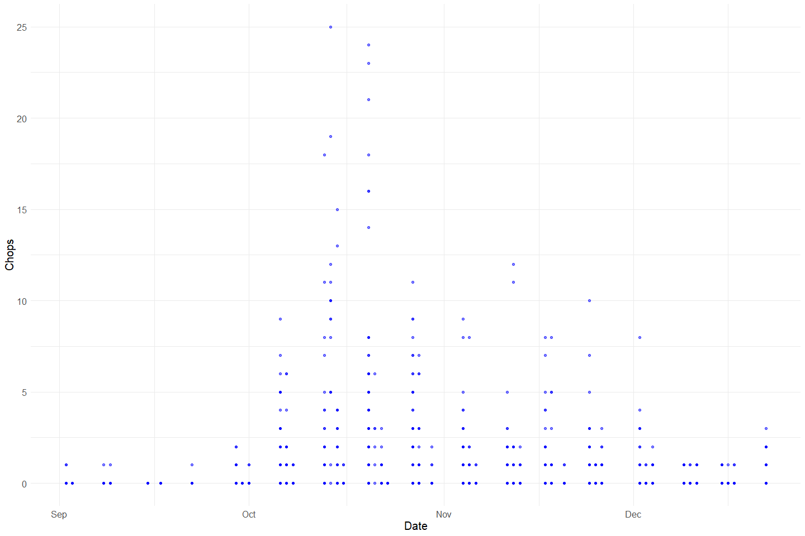
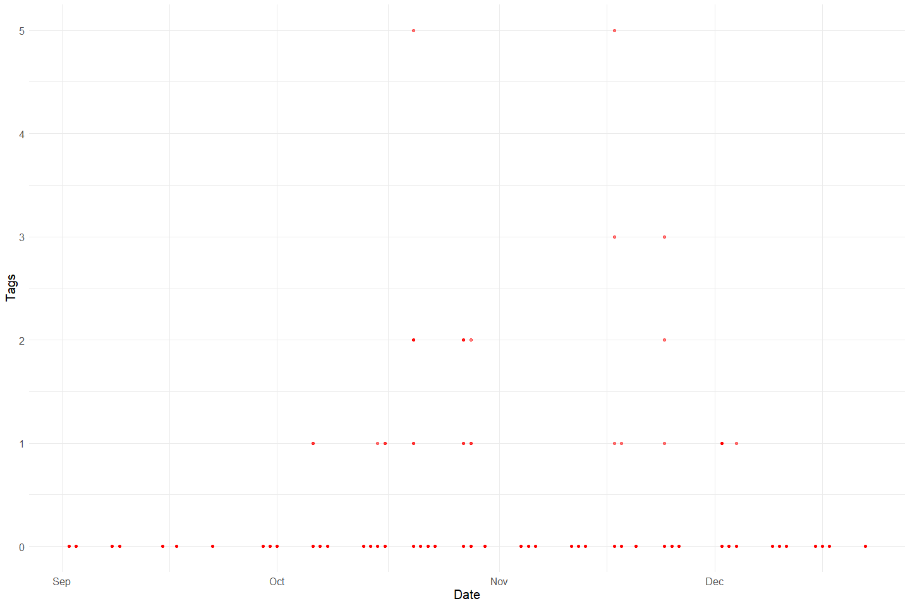
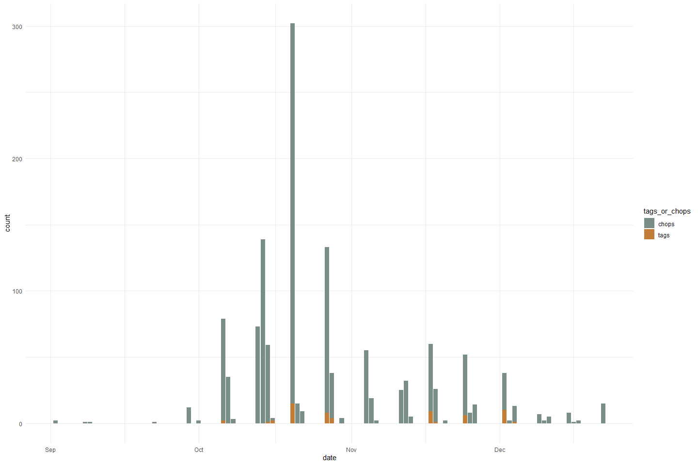
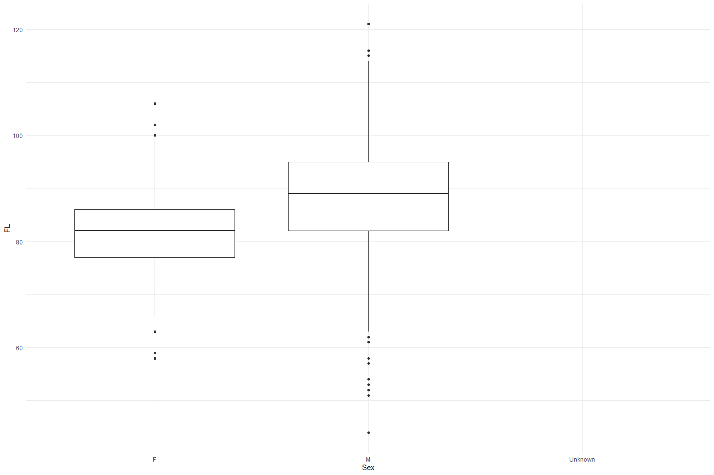

Feather Carcass QC 2008
================
Inigo Peng
2022-07-21

# Feather River Carcass Data

## Description of Monitoring Data

**Timeframe:**

**Video Season:**

**Completeness of Record throughout timeframe:**

**Sampling Location:**

**Data Contact:**

Any additional info?

## Access Cloud Data

``` r
# Run Sys.setenv() to specify GCS_AUTH_FILE and GCS_DEFAULT_BUCKET before running 
# getwd() to see how to specify paths 
# Open object from google cloud storage
# Set your authentication using gcs_auth
gcs_auth(json_file = Sys.getenv("GCS_AUTH_FILE"))
# Set global bucket 
gcs_global_bucket(bucket = Sys.getenv("GCS_DEFAULT_BUCKET"))

# git data and save as xlsx
```

``` r
#Connect to microsoft access through RODBC
# #Use 
# DRIVERINFO <- "Driver={Microsoft Access Driver (*.mdb, *.accdb)};"
# MDBPATH <- "C:/Users/InigoPeng/Projects/jpe/JPE-datasets/data-raw/qc-markdowns/adult-holding-redd-and-carcass-surveys/feather-river/Carcass 2008.mdb"
# PATH <- paste0(DRIVERINFO, "DBQ=", MDBPATH)
# 
# con <- odbcDriverConnect(PATH)
# #
# # # Show the different table names
# sqlTables(con)$TABLE_NAME
# #
# # #Download table and write csv
# ChopChannel_raw <- sqlFetch(con, "ChopChannelTBL1")
# # write_csv(ChopChannel_raw, "ChopChannel_2008.csv")
# #
# ChopRecov_raw <- sqlFetch(con,"ChopRecovTBL")
# write_csv(ChopRecov_raw, "ChopRecov_2004.csv")
#
# ChopHeader_raw <- sqlFetch(con,"ChopHeaderTBL")
# write_csv(ChopHeader_raw, "ChopHeader_2004.csv")
#
#
# cwt_raw <- sqlFetch(con, "CWTTagTBL")
# write_csv(cwt_raw, "cwt_2004.csv")
#
# cwt_header_raw <- sqlFetch(con, "CWTHeaderTBL")
# write_csv(cwt_header_raw, "CWTHeader_2004.csv")
#Other tables include Fish Data_sr_Database, Steelhead Data, TagColLu
```

``` r
gcs_get_object(object_name = "adult-holding-redd-and-carcass-surveys/feather-river/data-raw/carcass/2008/ChopChannelTBL1_2008.xlsx",
               bucket = gcs_get_global_bucket(),
               saveToDisk = "ChopChannel_2008.xlsx",
               overwrite = TRUE)
#
gcs_get_object(object_name = "adult-holding-redd-and-carcass-surveys/feather-river/data-raw/carcass/2008/ChopHeaderTBL_2008.xlsx",
               bucket = gcs_get_global_bucket(),
               saveToDisk = "ChopHeader_2008.xlsx",
               overwrite = TRUE)

gcs_get_object(object_name = "adult-holding-redd-and-carcass-surveys/feather-river/data-raw/carcass/2008/ChopRecovTBL_2008.xlsx",
               bucket = gcs_get_global_bucket(),
               saveToDisk = "ChopRecov_2008.xlsx",
               overwrite = TRUE)
# 
gcs_get_object(object_name = "adult-holding-redd-and-carcass-surveys/feather-river/data-raw/carcass/2008/CWTHeaderTBL_2008.xlsx",
               bucket = gcs_get_global_bucket(),
               saveToDisk = "CWTHeader_2008.xlsx",
               overwrite = TRUE)

gcs_get_object(object_name = "adult-holding-redd-and-carcass-surveys/feather-river/data-raw/carcass/2008/CWTTagTBL_2008.xlsx",
               bucket = gcs_get_global_bucket(),
               saveToDisk = "CWTTag_2008.xlsx",
               overwrite = TRUE)
```

## Raw Data Glimpse:

### ChopChannel_raw

``` r
ChopChannel_raw <- read_excel("ChopChannel_2008.xlsx") %>% 
  rename("ID" = HeaderID) %>%
  glimpse()
```

    ## Rows: 1,898
    ## Columns: 7
    ## $ ChanID <dbl> 1682, 1683, 1684, 1685, 1686, 1687, 1688, 1689, 1690, 1691, 169~
    ## $ Sect   <dbl> 39, 39, 39, 38, 38, 38, 37, 37, 37, 36, 36, 36, 35, 35, 35, 34,~
    ## $ Chan   <chr> "R", "L", "M", "L", "M", "R", "L", "M", "R", "M", "R", "L", "M"~
    ## $ Min    <dbl> 10, 6, 3, 5, 4, 4, 2, 3, 2, 0, 4, 5, 0, 4, 4, 10, 0, 7, 2, 0, 2~
    ## $ ID     <dbl> 78, 78, 78, 78, 78, 78, 78, 78, 78, 78, 78, 78, 78, 78, 78, 78,~
    ## $ Chops  <dbl> 0, 0, 0, 0, 0, 0, 0, 0, 0, 0, 0, 0, 0, 0, 0, 0, 0, 0, 0, 0, 0, ~
    ## $ Tags   <dbl> 0, 0, 0, 0, 0, 0, 0, 0, 0, 0, 0, 0, 0, 0, 0, 0, 0, 0, 0, 0, 0, ~

### ChopHeader_raw

``` r
ChopHeader_raw <- read_excel("ChopHeader_2008.xlsx") %>% 
  rename("ID" = headerID) %>%
  glimpse()
```

    ## Rows: 49
    ## Columns: 9
    ## $ ID       <dbl> 130, 78, 79, 80, 81, 82, 83, 85, 86, 87, 88, 89, 90, 91, 92, ~
    ## $ TagCol   <chr> "BLUE1", "BLUE1", "YELLOW2", "YELLOW2", "WHITE3", "WHITE3", "~
    ## $ Date     <dttm> 2008-09-02, 2008-09-03, 2008-09-08, 2008-09-09, 2008-09-15, ~
    ## $ Crew     <chr> "KH TH TK JC", "TV TH GS TK", "AJ KH TK TV", "TV  MM  TK", "T~
    ## $ Time     <dttm> 1899-12-31 09:05:00, 1899-12-31 09:34:00, 1899-12-31 09:00:0~
    ## $ Recorder <chr> "JC", "GS", "AJ", "MM", "TV", "AJ", "AJ", "AJ", "KH", NA, NA,~
    ## $ Weather  <chr> "SUN", "SUN", "SUN", "SUN", "SUN", "SUN", "SUN", "SUN", "SUN"~
    ## $ Comment  <chr> NA, NA, NA, NA, NA, NA, NA, NA, NA, NA, "2  salmon redds at b~
    ## $ WeekNum  <dbl> 1, 1, 2, 2, 3, 3, 3, 4, 5, 5, 5, 6, 6, 6, 6, 7, 7, 7, 7, 8, 8~

### ChopRecov_raw

``` r
ChopRecov_raw <- read_excel("ChopRecov_2008.xlsx") %>% 
  glimpse()
```

    ## Rows: 156
    ## Columns: 4
    ## $ RecovID    <dbl> 343, 345, 347, 349, 350, 351, 353, 354, 355, 356, 357, 359,~
    ## $ RecovColor <chr> "7", NA, NA, "5", "5", "5", "6", "6", "6", "6", "6", "6", "~
    ## $ RecovCount <dbl> NA, NA, NA, 2, 1, 1, 1, 2, 1, 1, 2, 1, 3, 1, 2, 4, 2, 2, 2,~
    ## $ ChanID     <dbl> NA, 2189, 2195, 2209, 2191, 2196, 2311, 2312, 2316, 2317, 2~

### cwt_raw

``` r
cwt_raw <- read_excel("CWTTag_2008.xlsx") %>% 
  glimpse
```

    ## Rows: 628
    ## Columns: 13
    ## $ TagID       <dbl> 1688, 1689, 1690, 1692, 1693, 1697, 1698, 1701, 1702, 1709~
    ## $ Sect        <dbl> 11, 14, 14, 17, 21, 34, 2, 8, 8, 1, 7, 7, 7, 8, 8, 8, 8, 8~
    ## $ FL          <dbl> 99, 79, 54, 76, 86, 44, 76, 77, 78, 89, 86, 75, 77, 96, 86~
    ## $ Sex         <chr> "M", "F", "M", "F", "F", "M", "F", "F", "F", "M", "F", "F"~
    ## $ Spawn       <chr> "UK", "UK", "UK", "U", "U", "UK", "U", "U", "U", "U", "S",~
    ## $ Clip        <chr> "N", "N", "N", "N", "N", "N", "N", "N", "N", "N", "N", "N"~
    ## $ SampType    <chr> "S&O", "S&O", "S&O", "S&O", "S&O", "S&O", "S&O", "S&O", "S~
    ## $ HeadTag     <chr> NA, NA, NA, NA, NA, NA, NA, NA, NA, NA, NA, NA, NA, NA, NA~
    ## $ HeaderID    <dbl> 96, 96, 96, 97, 97, 100, 101, 101, 101, 102, 102, 102, 102~
    ## $ HallPrint1  <chr> NA, NA, "GH-0022301", NA, NA, NA, NA, NA, "GH-0021187", NA~
    ## $ HallPrint2  <chr> NA, NA, "GH-0022302", NA, NA, NA, NA, NA, "GH-0021188", NA~
    ## $ ScaleSample <chr> "39000", "38994", "38999", "38989", "38993", "38002", "380~
    ## $ Run         <chr> NA, NA, "Spring", "Fall", NA, NA, NA, NA, "Spring", NA, NA~

### cwt_header_raw

``` r
cwt_header_raw <- read_excel("CWTHeader_2008.xlsx") %>% 
  glimpse
```

    ## Rows: 40
    ## Columns: 5
    ## $ headerID <dbl> 96, 97, 98, 99, 100, 101, 102, 104, 105, 106, 107, 108, 109, ~
    ## $ Date     <dttm> 2008-09-02, 2008-09-08, 2008-09-15, 2008-09-15, 2008-09-17, ~
    ## $ TagCol   <chr> "BLUE1", "YELLOW2", "WHITE3", "WHITE3", "WHITE3", "RED4", "BL~
    ## $ Crew     <chr> "TH/JC/KH/TK", "AJ KH TK TV", "AJ KH KT", "TV CC TK", "AJ TV ~
    ## $ WeekNum  <dbl> 1, 2, 3, 3, 3, 4, 5, 5, 6, 6, 6, 6, 7, 7, 7, 8, 8, 8, 8, 8, 9~

## Data transformations:

### Counts

The `chop_channel` table contains carcass counts by chop/tagged based on
clips

``` r
#1. chopchannel table (with dates and tag color)
chop_channel_join <- full_join(ChopHeader_raw %>% 
                                 select(ID, TagCol, Date, Time),
                               ChopChannel_raw) %>% 
  clean_names()
```

    ## Joining, by = "ID"

### Recovery

The `chop_recovery` table contains recovered carcass counts by color

``` r
# 2. choprecovery table (with dates)

chop_recovery_join <- full_join(ChopHeader_raw %>% 
                                  select(ID, Date, Time),
                                ChopRecov_raw %>% 
                                  rename(ID = RecovID))  %>% 
  clean_names()
```

    ## Joining, by = "ID"

### Survey

The `chop_header` table contains survey metadata and covariates

``` r
chop_header <- ChopHeader_raw %>% 
  clean_names()
```

### CWT

The `cwt` table contains coded wire tag information.

``` r
cwt <- full_join(cwt_raw %>% clean_names(), cwt_header_raw %>% clean_names()) %>%  
  glimpse
```

    ## Joining, by = "header_id"

    ## Rows: 629
    ## Columns: 17
    ## $ tag_id       <dbl> 1688, 1689, 1690, 1692, 1693, 1697, 1698, 1701, 1702, 170~
    ## $ sect         <dbl> 11, 14, 14, 17, 21, 34, 2, 8, 8, 1, 7, 7, 7, 8, 8, 8, 8, ~
    ## $ fl           <dbl> 99, 79, 54, 76, 86, 44, 76, 77, 78, 89, 86, 75, 77, 96, 8~
    ## $ sex          <chr> "M", "F", "M", "F", "F", "M", "F", "F", "F", "M", "F", "F~
    ## $ spawn        <chr> "UK", "UK", "UK", "U", "U", "UK", "U", "U", "U", "U", "S"~
    ## $ clip         <chr> "N", "N", "N", "N", "N", "N", "N", "N", "N", "N", "N", "N~
    ## $ samp_type    <chr> "S&O", "S&O", "S&O", "S&O", "S&O", "S&O", "S&O", "S&O", "~
    ## $ head_tag     <chr> NA, NA, NA, NA, NA, NA, NA, NA, NA, NA, NA, NA, NA, NA, N~
    ## $ header_id    <dbl> 96, 96, 96, 97, 97, 100, 101, 101, 101, 102, 102, 102, 10~
    ## $ hall_print1  <chr> NA, NA, "GH-0022301", NA, NA, NA, NA, NA, "GH-0021187", N~
    ## $ hall_print2  <chr> NA, NA, "GH-0022302", NA, NA, NA, NA, NA, "GH-0021188", N~
    ## $ scale_sample <chr> "39000", "38994", "38999", "38989", "38993", "38002", "38~
    ## $ run          <chr> NA, NA, "Spring", "Fall", NA, NA, NA, NA, "Spring", NA, N~
    ## $ date         <dttm> 2008-09-02, 2008-09-02, 2008-09-02, 2008-09-08, 2008-09-~
    ## $ tag_col      <chr> "BLUE1", "BLUE1", "BLUE1", "YELLOW2", "YELLOW2", "WHITE3"~
    ## $ crew         <chr> "TH/JC/KH/TK", "TH/JC/KH/TK", "TH/JC/KH/TK", "AJ KH TK TV~
    ## $ week_num     <dbl> 1, 1, 1, 2, 2, 3, 4, 4, 4, 5, 5, 5, 5, 5, 5, 5, 5, 5, 5, ~

## Explore Numeric Variables:

### Chop Channel Variable: `id`, `chan_id`, `sect`, `min`

``` r
# Filter clean data to show only numeric variables 
# We only get chops and tags for this dataset. Not much additional data
chop_channel_join %>% 
  select_if(is.numeric) %>%
  colnames()
```

    ## [1] "id"      "chan_id" "sect"    "min"     "chops"   "tags"

``` r
summary(chop_channel_join$id)
```

    ##    Min. 1st Qu.  Median    Mean 3rd Qu.    Max. 
    ##    78.0    88.0   108.0   104.9   120.0   131.0

``` r
summary(chop_channel_join$chan_id)
```

    ##    Min. 1st Qu.  Median    Mean 3rd Qu.    Max. 
    ##    1682    2165    2656    2649    3130    3619

``` r
summary(chop_channel_join$sect)
```

    ##    Min. 1st Qu.  Median    Mean 3rd Qu.    Max.    NA's 
    ##     1.0    10.0    18.0    18.9    28.0    39.0       1

``` r
summary(chop_channel_join$min)
```

    ##    Min. 1st Qu.  Median    Mean 3rd Qu.    Max.    NA's 
    ##   0.000   3.000   5.000   5.607   7.000  40.000      13

### Chop Channel Variable: `chops`, `tags`

``` r
summary(chop_channel_join$chops)
```

    ##    Min. 1st Qu.  Median    Mean 3rd Qu.    Max.    NA's 
    ##  0.0000  0.0000  0.0000  0.6572  0.0000 25.0000       2

``` r
summary(chop_channel_join$tags)
```

    ##    Min. 1st Qu.  Median    Mean 3rd Qu.    Max. 
    ## 0.00000 0.00000 0.00000 0.03109 0.00000 5.00000

**NA and Unknown Values** Provide a stat on NA or unknown values.

``` r
round(sum(is.na(chop_channel_join$chops))/nrow(chop_channel_join), 3) * 100
```

    ## [1] 0.1

``` r
round(sum(is.na(chop_channel_join$tags))/nrow(chop_channel_join), 3) * 100
```

    ## [1] 0

-   0.1 % of values in the `chops` column are NA.
-   0 % of values in the `tags` column are NA.

**Plotting chops over Period of Record**

``` r
chop_channel_join %>% 
  ggplot(aes(x = date, y = chops)) +
  geom_point(size = 1.4, alpha = .5, color = "blue") + 
  labs(x = "Date", 
       y = "Chops") +
  theme_minimal() + 
  theme(text = element_text(size = 15)) 
```

<!-- -->

**Plotting tags over Period of Record**

``` r
chop_channel_join %>% 
  ggplot(aes(x = date, y = tags)) +
  geom_point(size = 1.4, alpha = .5, color = "red") + 
  labs(x = "Date", 
       y = "Tags") +
  theme_minimal() + 
  theme(text = element_text(size = 15)) 
```

<!-- -->

**Comparing tags and chops**

``` r
chop_channel_join %>% 
  pivot_longer(cols = c(chops, tags), names_to = "tags_or_chops", values_to = "count") %>% 
  ggplot(aes(x = date, y = count, fill = tags_or_chops)) +
  geom_col() + 
  theme_minimal() +
  scale_fill_manual(values = wes_palette("Moonrise2"))
```

<!-- -->

Tags appear to be less commonly applied compared to chops.

### Chop Recovery Variable: `id`, `chan_id`, `recov_count`

``` r
# Filter clean data to show only numeric variables 
chop_recovery_join %>% 
  select_if(is.numeric) %>%
  colnames()
```

    ## [1] "id"          "recov_count" "chan_id"

``` r
summary(chop_recovery_join$id)
```

    ##    Min. 1st Qu.  Median    Mean 3rd Qu.    Max. 
    ##      78     347     411     355     462     513

``` r
summary(chop_recovery_join$recov_count)
```

    ##    Min. 1st Qu.  Median    Mean 3rd Qu.    Max.    NA's 
    ##   1.000   1.000   1.000   1.397   2.000   7.000      54

-   % of values in the `recov_count` column are NA.

Note: no recov_count have dates associated with it

### Chop Header Variable: `id`

``` r
chop_header %>% 
  select_if(is.numeric) %>% 
  colnames()
```

    ## [1] "id"       "week_num"

``` r
summary(chop_header$id)
```

    ##    Min. 1st Qu.  Median    Mean 3rd Qu.    Max. 
    ##    78.0    91.0   106.0   105.2   119.0   131.0

### CWT Variable: `tag_id`, `sect`, `fl`, `header_id`, `week_num`

``` r
cwt %>% 
  select_if(is.numeric) %>% 
  colnames()
```

    ## [1] "tag_id"    "sect"      "fl"        "header_id" "week_num"

``` r
summary(cwt$tag_id)
```

    ##    Min. 1st Qu.  Median    Mean 3rd Qu.    Max.    NA's 
    ##    1687    1853    2010    2011    2171    2338       1

``` r
summary(cwt$sect)
```

    ##    Min. 1st Qu.  Median    Mean 3rd Qu.    Max.    NA's 
    ##    1.00    8.00   10.00   10.73   12.00   39.00       1

``` r
summary(cwt$fl)
```

    ##    Min. 1st Qu.  Median    Mean 3rd Qu.    Max.    NA's 
    ##   44.00   78.00   83.50   83.68   89.00  121.00       1

-   0.2 % of values in the `tag_id` column are NA.
-   0.2 % of values in the `sect` column are NA.
-   0.2 % of values in the `fl` column are NA.

``` r
#Create a cwt_count column
#Pivot table to expand sex column to female_cwt, male_cwt, and unknown_cwt 
#Is this graph helpful?
unique(cwt$sex)
```

    ## [1] "M" "F" NA

``` r
cwt_count <- cwt %>% 
  mutate(count = 1) %>%
  mutate(sex = case_when(sex == "ND"|is.na(sex)|sex =="UK" ~ "U",
                         TRUE ~ sex)) %>% 
  pivot_wider(names_from = sex, values_from = count, values_fill = 0) %>% 
  # unnest() %>% 
  rename("male_cwt" = M,
         "female_cwt" = F,
         "unknown_cwt" = U) %>% glimpse
```

    ## Rows: 629
    ## Columns: 19
    ## $ tag_id       <dbl> 1688, 1689, 1690, 1692, 1693, 1697, 1698, 1701, 1702, 170~
    ## $ sect         <dbl> 11, 14, 14, 17, 21, 34, 2, 8, 8, 1, 7, 7, 7, 8, 8, 8, 8, ~
    ## $ fl           <dbl> 99, 79, 54, 76, 86, 44, 76, 77, 78, 89, 86, 75, 77, 96, 8~
    ## $ spawn        <chr> "UK", "UK", "UK", "U", "U", "UK", "U", "U", "U", "U", "S"~
    ## $ clip         <chr> "N", "N", "N", "N", "N", "N", "N", "N", "N", "N", "N", "N~
    ## $ samp_type    <chr> "S&O", "S&O", "S&O", "S&O", "S&O", "S&O", "S&O", "S&O", "~
    ## $ head_tag     <chr> NA, NA, NA, NA, NA, NA, NA, NA, NA, NA, NA, NA, NA, NA, N~
    ## $ header_id    <dbl> 96, 96, 96, 97, 97, 100, 101, 101, 101, 102, 102, 102, 10~
    ## $ hall_print1  <chr> NA, NA, "GH-0022301", NA, NA, NA, NA, NA, "GH-0021187", N~
    ## $ hall_print2  <chr> NA, NA, "GH-0022302", NA, NA, NA, NA, NA, "GH-0021188", N~
    ## $ scale_sample <chr> "39000", "38994", "38999", "38989", "38993", "38002", "38~
    ## $ run          <chr> NA, NA, "Spring", "Fall", NA, NA, NA, NA, "Spring", NA, N~
    ## $ date         <dttm> 2008-09-02, 2008-09-02, 2008-09-02, 2008-09-08, 2008-09-~
    ## $ tag_col      <chr> "BLUE1", "BLUE1", "BLUE1", "YELLOW2", "YELLOW2", "WHITE3"~
    ## $ crew         <chr> "TH/JC/KH/TK", "TH/JC/KH/TK", "TH/JC/KH/TK", "AJ KH TK TV~
    ## $ week_num     <dbl> 1, 1, 1, 2, 2, 3, 4, 4, 4, 5, 5, 5, 5, 5, 5, 5, 5, 5, 5, ~
    ## $ male_cwt     <dbl> 1, 0, 1, 0, 0, 1, 0, 0, 0, 1, 0, 0, 0, 1, 0, 0, 0, 0, 1, ~
    ## $ female_cwt   <dbl> 0, 1, 0, 1, 1, 0, 1, 1, 1, 0, 1, 1, 1, 0, 1, 1, 1, 1, 0, ~
    ## $ unknown_cwt  <dbl> 0, 0, 0, 0, 0, 0, 0, 0, 0, 0, 0, 0, 0, 0, 0, 0, 0, 0, 0, ~

``` r
total_cwt_summary <- cwt_count %>% 
  mutate(male_cwt = ifelse(is.na(male_cwt), 0, male_cwt), # fill na
         female_cwt = ifelse(is.na(female_cwt), 0, female_cwt),
         unknown_cwt = ifelse(is.na(unknown_cwt), 0, unknown_cwt),
         total_cwt = unknown_cwt + male_cwt + female_cwt) %>% 
  group_by(month(date)) %>% 
  summarise(total_cwt = sum(total_cwt),
            male_cwt = sum(male_cwt),
            female_cwt = sum(female_cwt),
            unknown_cwt = sum(unknown_cwt))
```

``` r
total_cwt_summary %>% 
  pivot_longer(cols = c(male_cwt, female_cwt, unknown_cwt), names_to = "sex", values_to = "count") %>% 
  mutate(proportions = (count / total_cwt)) %>% 
  ggplot(aes(x = `month(date)`, y = proportions, fill = sex)) + 
  geom_bar(stat = "identity", position = "stack") +
  scale_fill_manual(name = "chops", 
                    labels = c("CWT Male", "CWT Female", "CWT Unknown")) +
  theme_minimal() + 
  labs(y = "Proportion", x = "Month") +
  scale_fill_manual(values = wes_palette("Moonrise2"))
```

    ## Scale for 'fill' is already present. Adding another scale for 'fill', which
    ## will replace the existing scale.

<!-- -->

**Plotting fork length of each sex**

``` r
cwt %>% 
  mutate(sex = case_when(sex == "ND"|is.na(sex)|sex =="UK" ~ "Unknown",
                         TRUE ~ sex))%>% 
  ggplot(aes(x = sex, y = fl)) + 
  geom_boxplot() + 
  theme_minimal() + 
  labs(y = "FL", x = "Sex")
```

<!-- -->

## Explore Categorical variables:

### Chop Channel Clean Data

Fix inconsistencies with spelling, capitalization, and dates

``` r
chop_channel_join %>% 
  select_if(is.character) %>%
  colnames()
```

    ## [1] "tag_col" "chan"

``` r
unique(chop_channel_join$tag_col)
```

    ##  [1] "BLUE1"          "YELLOW2"        "WHITE3"         "RED4"          
    ##  [5] "BLUE 5"         "WHITE6"         "YELLOW7"        "RED8"          
    ##  [9] "BLUE9"          "WHITE10"        "YELLOW11"       "RED12"         
    ## [13] "BLUE13"         "WHITE/YELLOW14" "RED15"          "BLUE16"        
    ## [17] NA

``` r
unique(chop_channel_join$chan)
```

    ## [1] "R" "L" "M" NA

``` r
chop_channel_cleaner <- chop_channel_join %>%
  mutate(date = as_date(date)) %>%
  mutate_if(is.character, str_to_lower) %>% 
  select(-c(time))

chop_channel_cleaner
```

    ## # A tibble: 1,898 x 9
    ##       id tag_col date       chan_id  sect chan    min chops  tags
    ##    <dbl> <chr>   <date>       <dbl> <dbl> <chr> <dbl> <dbl> <dbl>
    ##  1   130 blue1   2008-09-02    3508     8 r         5     0     0
    ##  2   130 blue1   2008-09-02    3509     9 l         3     0     0
    ##  3   130 blue1   2008-09-02    3510     9 m         3     0     0
    ##  4   130 blue1   2008-09-02    3511     9 r         3     0     0
    ##  5   130 blue1   2008-09-02    3512    10 l         6     0     0
    ##  6   130 blue1   2008-09-02    3513    10 m        14     0     0
    ##  7   130 blue1   2008-09-02    3514    10 r         6     0     0
    ##  8   130 blue1   2008-09-02    3515    11 l         9     0     0
    ##  9   130 blue1   2008-09-02    3516    11 m        10     0     0
    ## 10   130 blue1   2008-09-02    3517    11 r        10     1     0
    ## # ... with 1,888 more rows

### Chop Recovery Clean Data

Fix inconsistencies with spelling, capitalization, and dates

``` r
chop_recovery_join %>% 
  select_if(is.character) %>% 
  colnames()
```

    ## [1] "recov_color"

``` r
#Not sure what the numbers are
unique(chop_recovery_join$recov_color)
```

    ##  [1] NA   "7"  "5"  "6"  "8"  "9"  "10" "11" "12" "13" "14" "1"  "4"

``` r
chop_recovery_cleaner <- chop_recovery_join %>% 
  mutate(date = as_date(date)) %>%
  mutate_if(is.character, str_to_lower) %>% 
  select(-c(time))

chop_recovery_cleaner
```

    ## # A tibble: 205 x 5
    ##       id date       recov_color recov_count chan_id
    ##    <dbl> <date>     <chr>             <dbl>   <dbl>
    ##  1   130 2008-09-02 <NA>                 NA      NA
    ##  2    78 2008-09-03 <NA>                 NA      NA
    ##  3    79 2008-09-08 <NA>                 NA      NA
    ##  4    80 2008-09-09 <NA>                 NA      NA
    ##  5    81 2008-09-15 <NA>                 NA      NA
    ##  6    82 2008-09-15 <NA>                 NA      NA
    ##  7    83 2008-09-17 <NA>                 NA      NA
    ##  8    85 2008-09-22 <NA>                 NA      NA
    ##  9    86 2008-09-29 <NA>                 NA      NA
    ## 10    87 2008-09-30 <NA>                 NA      NA
    ## # ... with 195 more rows

### Chop Header Clean Data

``` r
chop_header %>% 
  select_if(is.character) %>% 
  colnames()
```

    ## [1] "tag_col"  "crew"     "recorder" "weather"  "comment"

``` r
unique(chop_header$crew)
```

    ##  [1] "KH TH TK JC"    "TV TH GS TK"    "AJ KH TK TV"    "TV  MM  TK"    
    ##  [5] "TV CC TK"       "AJ KH KT"       "AJ TV MM TH"    "AJ TK MM"      
    ##  [9] "KM, CC, MM, KW" "KS KM GAS"      "KT TV"          "CC MM KH"      
    ## [13] "KS GAS TK TV"   "KT KS TK TV"    "KT AJ TK"       "CC GS MM TH"   
    ## [17] "KS MM KM JC"    "KH KM MM AJ"    "KH GAS TH"      "AJ TK KH"      
    ## [21] "JK CC GS TH"    "TK JC KM"       "AJ KM KS MF"    "TK KM MF"      
    ## [25] "AJ TK KM JK"    "TK,KS,KM"       "JC,TK,KH"       "KT GS MM JC"   
    ## [29] "KH KM TK"       "CC TH KM"       "KS KM GAS MF"   "TV KM AJ"      
    ## [33] "CC TH GS"       "KH TK CC"       "KH GS KS"       "TV MM"         
    ## [37] "JK TV KM"       "CC GS JC"       "TV TH GS"       "TK MM JC GS"   
    ## [41] "TK AJ TH GS"    "JK TH CC"       "KT JC TH"       "AJ TK TH"      
    ## [45] "KT KM TH"       "KM JC"          "KM GS"          "JK, TH, GAS"

``` r
unique(chop_header$recorder)
```

    ##  [1] "JC" "GS" "AJ" "MM" "TV" "KH" NA   "TK" "KS" "KM"

``` r
unique(chop_header$weather)
```

    ## [1] "SUN" "CLD" "RAN"

``` r
chop_header_cleaner <- chop_header %>%
  mutate(date = as_date(date)) %>%
  mutate_if(is.character, str_to_lower) %>% 
  mutate(crew = str_replace_all(crew, " ", ","),
         crew = str_replace_all(crew, ",,", ","),
         weather = ifelse(weather == "ran", "rain", weather)) %>% 
  select(-c(time))

chop_header_cleaner
```

    ## # A tibble: 49 x 8
    ##       id tag_col date       crew        recorder weather comment week_num
    ##    <dbl> <chr>   <date>     <chr>       <chr>    <chr>   <chr>      <dbl>
    ##  1   130 blue1   2008-09-02 kh,th,tk,jc jc       sun     <NA>           1
    ##  2    78 blue1   2008-09-03 tv,th,gs,tk gs       sun     <NA>           1
    ##  3    79 yellow2 2008-09-08 aj,kh,tk,tv aj       sun     <NA>           2
    ##  4    80 yellow2 2008-09-09 tv,mm,tk    mm       sun     <NA>           2
    ##  5    81 white3  2008-09-15 tv,cc,tk    tv       sun     <NA>           3
    ##  6    82 white3  2008-09-15 aj,kh,kt    aj       sun     <NA>           3
    ##  7    83 white3  2008-09-17 aj,tv,mm,th aj       sun     <NA>           3
    ##  8    85 red4    2008-09-22 aj,tk,mm    aj       sun     <NA>           4
    ##  9    86 blue 5  2008-09-29 km,cc,mm,kw kh       sun     <NA>           5
    ## 10    87 blue 5  2008-09-30 ks,km,gas   <NA>     sun     <NA>           5
    ## # ... with 39 more rows

### CWT Clean Data

``` r
cwt %>% 
  select_if(is.character) %>% 
  colnames
```

    ##  [1] "sex"          "spawn"        "clip"         "samp_type"    "head_tag"    
    ##  [6] "hall_print1"  "hall_print2"  "scale_sample" "run"          "tag_col"     
    ## [11] "crew"

``` r
unique(cwt$spawn)
```

    ## [1] "UK"      "U"       "S"       "NO DATA" NA

``` r
unique(cwt$clip)
```

    ## [1] "N"       NA        "NO DATA" "UK"      "Y"

``` r
unique(cwt$samp_type)
```

    ## [1] "S&O"   "S"     "NONE"  "HALL"  "H&S&O" "O"     "H&S"   "H&O"   NA

``` r
unique(cwt$tag_col)
```

    ##  [1] "BLUE1"          "YELLOW2"        "WHITE3"         "RED4"          
    ##  [5] "BLUE 5"         "WHITE10"        "YELLOW11"       "RED12"         
    ##  [9] "BLUE13"         "WHITE/YELLOW14" "WHITE6"         "YELLOW7"       
    ## [13] "RED8"           "RED15"          "BLUE9"

``` r
unique(cwt$run)
```

    ## [1] NA       "Spring" "Fall"

``` r
cwt_cleaner <- cwt %>% 
  mutate_if(is.character, str_to_lower) %>% 
  mutate(crew = str_replace_all(crew, " ", ","),
         crew = str_replace_all(crew, ",,", ","),
         sex = case_when(sex == "nd"|is.na(sex) ~ "unknown",
                         TRUE ~ sex),
         spawn = ifelse(spawn == "no data", NA, spawn),
         clip = case_when(clip == "no data" ~ NA_character_,
                          clip == "y" ~ "yes",
                          clip == "n" ~ "no",
                          TRUE ~ clip),
         samp_type = ifelse(samp_type == "no data", NA, samp_type)) %>% 
  glimpse
```

    ## Rows: 629
    ## Columns: 17
    ## $ tag_id       <dbl> 1688, 1689, 1690, 1692, 1693, 1697, 1698, 1701, 1702, 170~
    ## $ sect         <dbl> 11, 14, 14, 17, 21, 34, 2, 8, 8, 1, 7, 7, 7, 8, 8, 8, 8, ~
    ## $ fl           <dbl> 99, 79, 54, 76, 86, 44, 76, 77, 78, 89, 86, 75, 77, 96, 8~
    ## $ sex          <chr> "m", "f", "m", "f", "f", "m", "f", "f", "f", "m", "f", "f~
    ## $ spawn        <chr> "uk", "uk", "uk", "u", "u", "uk", "u", "u", "u", "u", "s"~
    ## $ clip         <chr> "no", "no", "no", "no", "no", "no", "no", "no", "no", "no~
    ## $ samp_type    <chr> "s&o", "s&o", "s&o", "s&o", "s&o", "s&o", "s&o", "s&o", "~
    ## $ head_tag     <chr> NA, NA, NA, NA, NA, NA, NA, NA, NA, NA, NA, NA, NA, NA, N~
    ## $ header_id    <dbl> 96, 96, 96, 97, 97, 100, 101, 101, 101, 102, 102, 102, 10~
    ## $ hall_print1  <chr> NA, NA, "gh-0022301", NA, NA, NA, NA, NA, "gh-0021187", N~
    ## $ hall_print2  <chr> NA, NA, "gh-0022302", NA, NA, NA, NA, NA, "gh-0021188", N~
    ## $ scale_sample <chr> "39000", "38994", "38999", "38989", "38993", "38002", "38~
    ## $ run          <chr> NA, NA, "spring", "fall", NA, NA, NA, NA, "spring", NA, N~
    ## $ date         <dttm> 2008-09-02, 2008-09-02, 2008-09-02, 2008-09-08, 2008-09-~
    ## $ tag_col      <chr> "blue1", "blue1", "blue1", "yellow2", "yellow2", "white3"~
    ## $ crew         <chr> "th/jc/kh/tk", "th/jc/kh/tk", "th/jc/kh/tk", "aj,kh,tk,tv~
    ## $ week_num     <dbl> 1, 1, 1, 2, 2, 3, 4, 4, 4, 5, 5, 5, 5, 5, 5, 5, 5, 5, 5, ~

## Comments

-   The carcass count table (chop_channel) only records chops and tags.
-   Some changes to the columns of CWT table

## Data Dictionaries

# Channel

``` r
percent_na <- chop_channel_cleaner %>%
  summarise_all(list(name = ~sum(is.na(.))/length(.))) %>%
  pivot_longer(cols = everything())


counts_data_dictionary <- tibble(variables = colnames(chop_channel_cleaner),
                          description = c("ID",
                                          "Color of tag applied to carcass",
                                          "Date of survey",
                                          "Channel ID",
                                          "Sect", 
                                          "Chan", 
                                          "Min", 
                                          "Carcass that were chopped",
                                          "Carcass that were tagged"),
                          percent_na = round(percent_na$value*100))

kable(counts_data_dictionary)
```

| variables | description                     | percent_na |
|:----------|:--------------------------------|-----------:|
| id        | ID                              |          0 |
| tag_col   | Color of tag applied to carcass |          3 |
| date      | Date of survey                  |          0 |
| chan_id   | Channel ID                      |          0 |
| sect      | Sect                            |          0 |
| chan      | Chan                            |          0 |
| min       | Min                             |          1 |
| chops     | Carcass that were chopped       |          0 |
| tags      | Carcass that were tagged        |          0 |

### Recovery

``` r
percent_na <- chop_recovery_cleaner %>%
  summarise_all(list(name = ~sum(is.na(.))/length(.))) %>%
  pivot_longer(cols = everything())


recovery_data_dictionary <- tibble(variables = colnames(chop_recovery_cleaner),
                          description = c("ID",
                                          "Date of survey",
                                          "Color of tag recovered from carcass",
                                          "Count of recovery",
                                          "Channel ID"),
                          percent_na = round(percent_na$value*100))

kable(recovery_data_dictionary)
```

| variables   | description                         | percent_na |
|:------------|:------------------------------------|-----------:|
| id          | ID                                  |          0 |
| date        | Date of survey                      |         76 |
| recov_color | Color of tag recovered from carcass |         25 |
| recov_count | Count of recovery                   |         26 |
| chan_id     | Channel ID                          |         24 |

### Survey

``` r
percent_na <- chop_header_cleaner %>%
  summarise_all(list(name = ~sum(is.na(.))/length(.))) %>%
  pivot_longer(cols = everything())
# 
header_data_dictionary <- tibble(variables = colnames(chop_header_cleaner),
                          description = c("ID",
                                          "Color of tag of carcass",
                                          "Crew memeber initials that collected",
                                          "Individual of crew member who recorded",
                                          "Weather",
                                          "Comments",
                                          "Week Number",
                                          "Date of survey"),
                          percent_na = round(percent_na$value*100))
# 
kable(header_data_dictionary)
```

| variables | description                            | percent_na |
|:----------|:---------------------------------------|-----------:|
| id        | ID                                     |          0 |
| tag_col   | Color of tag of carcass                |          2 |
| date      | Crew memeber initials that collected   |          0 |
| crew      | Individual of crew member who recorded |          0 |
| recorder  | Weather                                |         53 |
| weather   | Comments                               |          0 |
| comment   | Week Number                            |         92 |
| week_num  | Date of survey                         |          0 |

### CWT

``` r
percent_na <- cwt_cleaner %>%
  summarise_all(list(name = ~sum(is.na(.))/length(.))) %>%
  pivot_longer(cols = everything())

cwt_data_dictionary <- tibble(variables = colnames(cwt_cleaner),
                          description = c("ID",
                                          "Sect",
                                          "Fork length",
                                          "Sex",
                                          "Spawn",
                                          "Clip",
                                          "Sample type",
                                          "Head tag",
                                          "Header ID",
                                          "Hall print 1",
                                          "Hall print 2",
                                          "Scale sample",
                                          "Run",
                                          "Date",
                                          "Tag colour",
                                          "Crew",
                                          "Week number"),
                          percent_na = round(percent_na$value*100))

kable(cwt_data_dictionary)
```

| variables    | description  | percent_na |
|:-------------|:-------------|-----------:|
| tag_id       | ID           |          0 |
| sect         | Sect         |          0 |
| fl           | Fork length  |          0 |
| sex          | Sex          |          0 |
| spawn        | Spawn        |          0 |
| clip         | Clip         |          1 |
| samp_type    | Sample type  |          0 |
| head_tag     | Head tag     |         87 |
| header_id    | Header ID    |          0 |
| hall_print1  | Hall print 1 |         92 |
| hall_print2  | Hall print 2 |         91 |
| scale_sample | Scale sample |         41 |
| run          | Run          |         59 |
| date         | Date         |          0 |
| tag_col      | Tag colour   |          0 |
| crew         | Crew         |          0 |
| week_num     | Week number  |          0 |

## Save cleaned data back to google cloud (TBA)

``` r
# Name file [watershed]_[data type].csv
```
