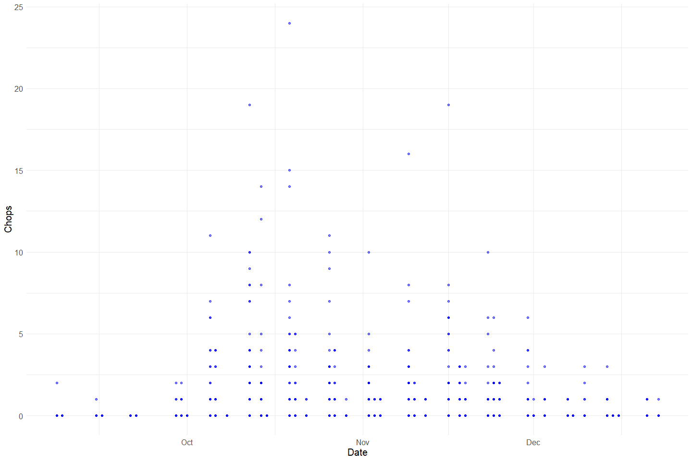
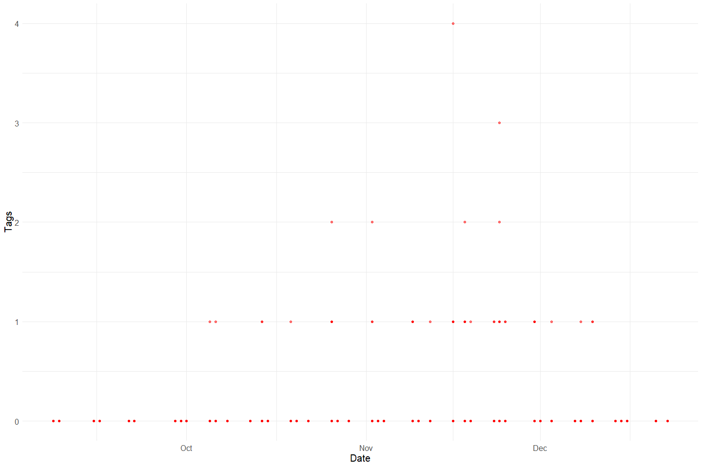
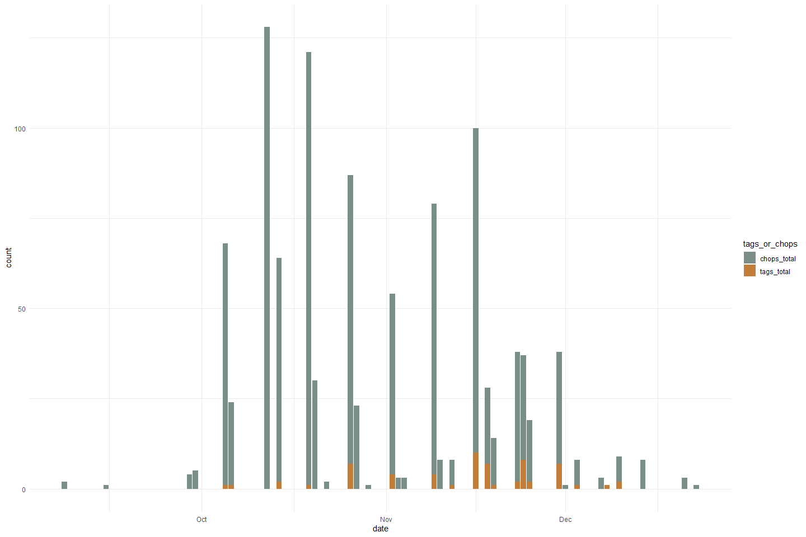
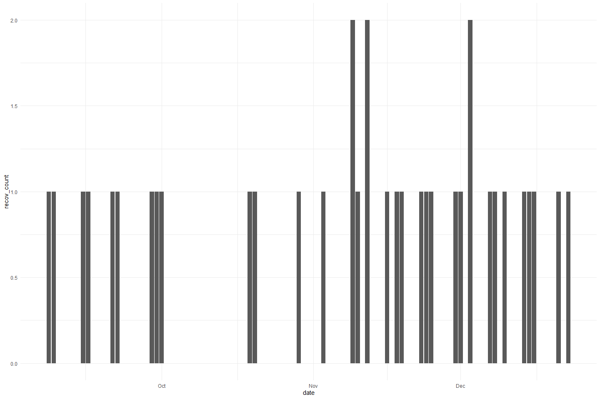
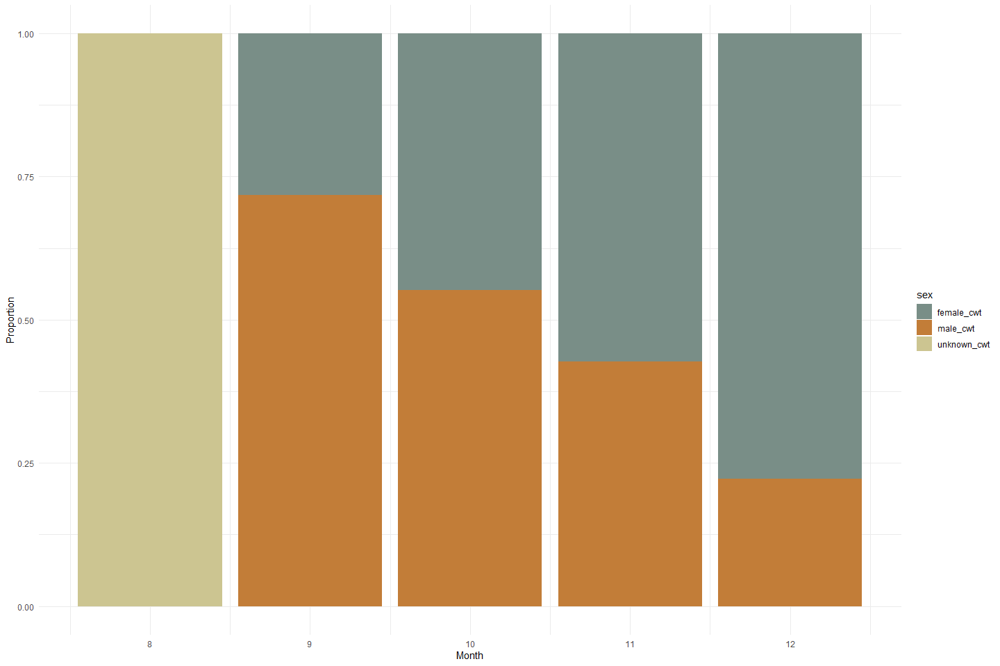
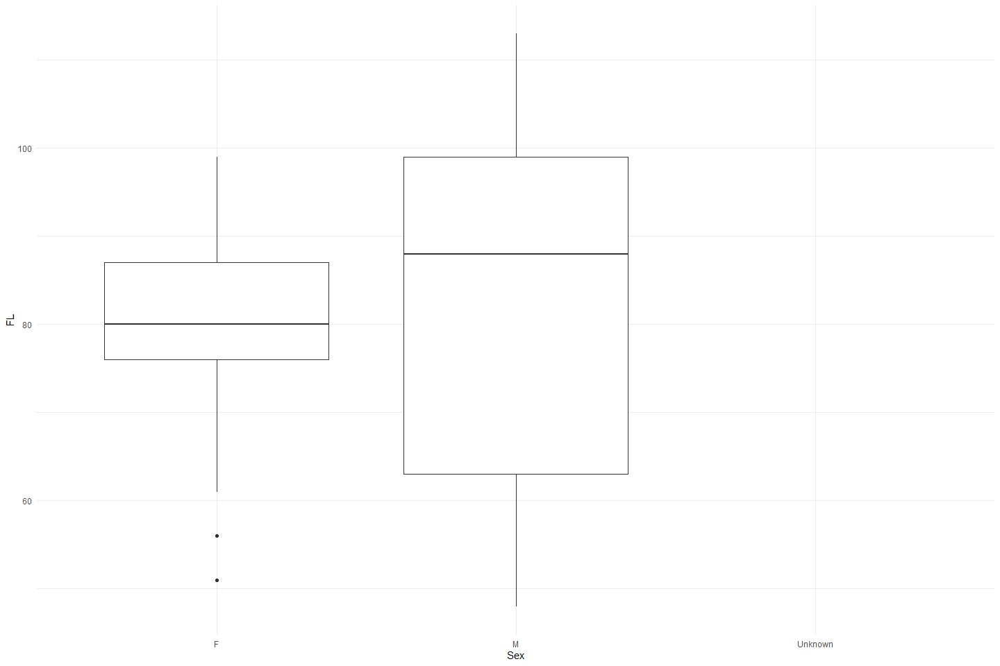

Feather Carcass QC 2009
================
Inigo Peng
2022-07-21

# Feather River Carcass Data

## Description of Monitoring Data

**Timeframe:**

**Video Season:**

**Completeness of Record throughout timeframe:**

**Sampling Location:**

**Data Contact:**

Any additional info?

## Access Cloud Data

``` r
# Run Sys.setenv() to specify GCS_AUTH_FILE and GCS_DEFAULT_BUCKET before running 
# getwd() to see how to specify paths 
# Open object from google cloud storage
# Set your authentication using gcs_auth

gcs_auth(json_file = Sys.getenv("GCS_AUTH_FILE"))
# Set global bucket 
gcs_global_bucket(bucket = Sys.getenv("GCS_DEFAULT_BUCKET"))

# git data and save as xlsx
```

``` r
gcs_get_object(object_name = "adult-holding-redd-and-carcass-surveys/feather-river/data-raw/carcass/2009/ChopChannelTBL1_2009.xlsx",
               bucket = gcs_get_global_bucket(),
               saveToDisk = "ChopChannel_2009.xlsx",
               overwrite = TRUE)
#
gcs_get_object(object_name = "adult-holding-redd-and-carcass-surveys/feather-river/data-raw/carcass/2009/ChopHeaderTBL_2009.xlsx",
               bucket = gcs_get_global_bucket(),
               saveToDisk = "ChopHeader_2009.xlsx",
               overwrite = TRUE)

gcs_get_object(object_name = "adult-holding-redd-and-carcass-surveys/feather-river/data-raw/carcass/2009/ChopRecovTBL_2009.xlsx",
               bucket = gcs_get_global_bucket(),
               saveToDisk = "ChopRecov_2009.xlsx",
               overwrite = TRUE)
# 
gcs_get_object(object_name = "adult-holding-redd-and-carcass-surveys/feather-river/data-raw/carcass/2009/CWTHeaderTBL_2009.xlsx",
               bucket = gcs_get_global_bucket(),
               saveToDisk = "CWTHeader_2009.xlsx",
               overwrite = TRUE)

gcs_get_object(object_name = "adult-holding-redd-and-carcass-surveys/feather-river/data-raw/carcass/2009/CWTTagTBL_2009.xlsx",
               bucket = gcs_get_global_bucket(),
               saveToDisk = "CWTTag_2009.xlsx",
               overwrite = TRUE)
```

## Raw Data Glimpse:

### ChopChannel_raw

``` r
ChopChannel_raw <- read_excel("ChopChannel_2009.xlsx") %>% 
  rename("ID" = HeaderID) %>%
  glimpse()
```

    ## Rows: 1,936
    ## Columns: 7
    ## $ ChanID <dbl> 64, 65, 66, 67, 68, 69, 70, 71, 72, 73, 74, 75, 76, 77, 78, 79,~
    ## $ Sect   <dbl> 22, 22, 22, 24, 24, 24, 23, 23, 23, 25, 25, 25, 26, 26, 26, 27,~
    ## $ Chan   <chr> "L", "M", "R", "L", "M", "R", "L", "M", "R", "L", "M", "R", "L"~
    ## $ Min    <dbl> 4, 3, 4, 9, 8, 9, 2, 2, 2, 10, 10, 10, 5, 5, 5, 4, 3, 4, 4, 2, ~
    ## $ ID     <dbl> NA, NA, NA, NA, NA, NA, NA, NA, NA, NA, NA, NA, NA, NA, NA, NA,~
    ## $ Chops  <dbl> 0, 0, 0, 0, 0, 0, 0, 0, 0, 0, 0, 0, 0, 0, 0, 0, 0, 0, 0, 0, 0, ~
    ## $ Tags   <dbl> 0, 0, 0, 0, 0, 0, 0, 0, 0, 0, 0, 0, 0, 0, 0, 0, 0, 0, 0, 0, 0, ~

### ChopHeader_raw

``` r
ChopHeader_raw <- read_excel("ChopHeader_2009.xlsx") %>% 
  rename("ID" = headerID) %>%
  glimpse()
```

    ## Rows: 44
    ## Columns: 9
    ## $ ID       <dbl> 1, 2, 3, 4, 5, 6, 7, 8, 9, 10, 11, 12, 13, 14, 15, 16, 17, 18~
    ## $ TagCol   <chr> "WHITE1", "WHITE1", "BLUE2", "BLUE2", "WHITE3", "WHITE3", "YE~
    ## $ Date     <dttm> 2009-09-08, 2009-09-09, 2009-09-15, 2009-09-16, 2009-09-21, ~
    ## $ Crew     <chr> "KK, KH, MM, RR", "KH, MM", "KK, KH, MM, RR", "KH, JR, RR", "~
    ## $ Time     <dttm> NA, 1899-12-31 10:00:00, 1899-12-31 09:00:00, 1899-12-31 11:~
    ## $ Recorder <chr> NA, "MM", "MM", NA, NA, NA, NA, NA, "MM", "AJ", NA, NA, "AJ",~
    ## $ Weather  <chr> "SUN", NA, "SUN", NA, "SUN", "SUN", "CLD", "SUN", "SUN", "SUN~
    ## $ Comment  <chr> NA, NA, NA, NA, NA, NA, NA, NA, NA, NA, "High flow visibility~
    ## $ WeekNum  <dbl> 1, 1, 2, 2, 3, 3, 4, 4, 4, 5, 5, 5, 6, 6, 6, 7, 7, 7, 8, 8, 8~

### ChopRecov_raw

``` r
ChopRecov_raw <- read_excel("ChopRecov_2009.xlsx") %>% 
  glimpse()
```

    ## Rows: 76
    ## Columns: 4
    ## $ RecovID    <dbl> 1, 2, 3, 4, 5, 6, 7, 8, 9, 16, 17, 22, 24, 25, 26, 27, 28, ~
    ## $ RecovColor <chr> "YELLOW4", "YELLOW4", "WHITE 5", "YELLOW4", "YELLOW4", "WHI~
    ## $ RecovCount <dbl> 1, 1, 1, 1, 1, 1, 1, 1, 1, 1, 1, 1, 1, 1, 1, 2, 1, 2, 1, 1,~
    ## $ ChanID     <dbl> 531, 539, 654, 655, 659, 679, 682, 682, 684, 781, 782, 797,~

### cwt_raw

``` r
cwt_raw <- read_excel("CWTTag_2009.xlsx") %>% 
  glimpse
```

    ## Rows: 323
    ## Columns: 15
    ## $ TagID       <dbl> 2, 148, 149, 150, 151, 157, 158, 161, 162, 295, 4, 6, 8, 9~
    ## $ Sect        <dbl> NA, 12, 12, 12, 12, 16, 17, 17, 18, 8, 9, 37, 3, 3, 6, 8, ~
    ## $ FL          <dbl> NA, 109, 83, 59, 77, 56, 62, 101, 58, 73, 86, 76, 87, 94, ~
    ## $ Sex         <chr> NA, "M", "F", "M", "M", "M", "M", "M", "M", "F", "F", "F",~
    ## $ Spawn       <chr> NA, "UK", "S", "UK", "UK", "UK", "UK", "UK", "UK", "S", "S~
    ## $ Clip        <chr> NA, "N", "N", "N", "N", "N", "N", "N", "N", "N", "N", "N",~
    ## $ SampType    <chr> NA, "NONE", "NONE", "NONE", "NONE", "NONE", "NONE", "NONE"~
    ## $ SampNum     <chr> NA, NA, NA, NA, NA, NA, NA, NA, NA, NA, "092109-001", "092~
    ## $ HeadTag     <chr> NA, NA, NA, NA, NA, NA, NA, NA, NA, NA, NA, NA, NA, NA, NA~
    ## $ Comment     <chr> "Pre-Carcass", NA, NA, NA, NA, NA, NA, NA, NA, "lost otoli~
    ## $ HeaderID    <dbl> 2, 12, 12, 12, 12, 12, 12, 12, 12, 28, 5, 6, 7, 7, 7, 7, 7~
    ## $ HallPrint1  <chr> NA, NA, NA, NA, NA, NA, NA, NA, NA, NA, NA, NA, NA, "GH-00~
    ## $ HallPrint2  <chr> NA, NA, NA, NA, NA, NA, NA, NA, NA, NA, NA, NA, NA, "GH-00~
    ## $ ScaleSample <chr> NA, NA, NA, NA, NA, NA, NA, NA, NA, "38430", "38123", "381~
    ## $ Run         <chr> NA, "Fall", "Fall", "Fall", "Fall", "Fall", "Fall", "Fall"~

### cwt_header_raw

``` r
cwt_header_raw <- read_excel("CWTHeader_2009.xlsx") %>% 
  glimpse
```

    ## Rows: 35
    ## Columns: 5
    ## $ headerID <dbl> 2, 3, 4, 5, 6, 7, 8, 9, 10, 11, 12, 13, 14, 15, 16, 17, 18, 1~
    ## $ Date     <dttm> 2009-08-17, 2009-09-08, 2009-09-15, 2009-09-21, 2009-09-22, ~
    ## $ TagCol   <chr> NA, "WHITE1", "BLUE2", "WHITE3", "WHITE3", "YELLOW4", "YELLOW~
    ## $ Crew     <chr> "KT, TV", "KK, RR, MM, KH", "KK, MM, KH, RR", "KH, JR, RR", "~
    ## $ WeekNum  <dbl> NA, 1, 2, 3, 3, 4, 4, 5, 5, 6, 6, 7, 7, 7, 8, 8, 8, 9, 9, 9, ~

## Data transformations:

### Counts

The `chop_channel` table contains carcass counts by chop/tagged based on
clips

``` r
#1. chopchannel table (with dates and tag color)
chop_channel_join <- full_join(ChopHeader_raw %>% 
                                 select(ID, TagCol, Date, Time),
                               ChopChannel_raw) %>% 
  clean_names()
```

    ## Joining, by = "ID"

### Recovery

The `chop_recovery` table contains recovered carcass counts by color

``` r
# 2. choprecovery table (with dates)

chop_recovery_join <- full_join(ChopHeader_raw %>% 
                                  select(ID, Date, Time),
                                ChopRecov_raw %>% 
                                  rename(ID = RecovID))  %>% 
  clean_names()
```

    ## Joining, by = "ID"

### Survey

The `chop_header` table contains survey metadata and covariates

``` r
chop_header <- ChopHeader_raw %>% 
  clean_names()
```

### CWT

The `cwt` table contains coded wire tag information.

``` r
cwt <- full_join(cwt_raw %>% clean_names(), cwt_header_raw %>% clean_names()) %>%  
  glimpse
```

    ## Joining, by = "header_id"

    ## Rows: 323
    ## Columns: 19
    ## $ tag_id       <dbl> 2, 148, 149, 150, 151, 157, 158, 161, 162, 295, 4, 6, 8, ~
    ## $ sect         <dbl> NA, 12, 12, 12, 12, 16, 17, 17, 18, 8, 9, 37, 3, 3, 6, 8,~
    ## $ fl           <dbl> NA, 109, 83, 59, 77, 56, 62, 101, 58, 73, 86, 76, 87, 94,~
    ## $ sex          <chr> NA, "M", "F", "M", "M", "M", "M", "M", "M", "F", "F", "F"~
    ## $ spawn        <chr> NA, "UK", "S", "UK", "UK", "UK", "UK", "UK", "UK", "S", "~
    ## $ clip         <chr> NA, "N", "N", "N", "N", "N", "N", "N", "N", "N", "N", "N"~
    ## $ samp_type    <chr> NA, "NONE", "NONE", "NONE", "NONE", "NONE", "NONE", "NONE~
    ## $ samp_num     <chr> NA, NA, NA, NA, NA, NA, NA, NA, NA, NA, "092109-001", "09~
    ## $ head_tag     <chr> NA, NA, NA, NA, NA, NA, NA, NA, NA, NA, NA, NA, NA, NA, N~
    ## $ comment      <chr> "Pre-Carcass", NA, NA, NA, NA, NA, NA, NA, NA, "lost otol~
    ## $ header_id    <dbl> 2, 12, 12, 12, 12, 12, 12, 12, 12, 28, 5, 6, 7, 7, 7, 7, ~
    ## $ hall_print1  <chr> NA, NA, NA, NA, NA, NA, NA, NA, NA, NA, NA, NA, NA, "GH-0~
    ## $ hall_print2  <chr> NA, NA, NA, NA, NA, NA, NA, NA, NA, NA, NA, NA, NA, "GH-0~
    ## $ scale_sample <chr> NA, NA, NA, NA, NA, NA, NA, NA, NA, "38430", "38123", "38~
    ## $ run          <chr> NA, "Fall", "Fall", "Fall", "Fall", "Fall", "Fall", "Fall~
    ## $ date         <dttm> 2009-08-17, 2009-10-14, 2009-10-14, 2009-10-14, 2009-10-~
    ## $ tag_col      <chr> NA, "BLUE6", "BLUE6", "BLUE6", "BLUE6", "BLUE6", "BLUE6",~
    ## $ crew         <chr> "KT, TV", NA, NA, NA, NA, NA, NA, NA, NA, "RR, KH, OL, JM~
    ## $ week_num     <dbl> NA, 6, 6, 6, 6, 6, 6, 6, 6, 12, 3, 3, 4, 4, 4, 4, 4, 4, 4~

## Explore Numeric Variables:

### Variable: `id`, `chan_id`, `sect`, `min`

``` r
chop_channel_join %>% 
  select_if(is.numeric) %>%
  colnames()
```

    ## [1] "id"      "chan_id" "sect"    "min"     "chops"   "tags"

``` r
summary(chop_channel_join$id)
```

    ##    Min. 1st Qu.  Median    Mean 3rd Qu.    Max.    NA's 
    ##    1.00   10.00   21.00   21.68   33.00   44.00      65

``` r
summary(chop_channel_join$chan_id)
```

    ##    Min. 1st Qu.  Median    Mean 3rd Qu.    Max. 
    ##     1.0   484.8   968.5   968.7  1452.2  1939.0

``` r
summary(chop_channel_join$sect)
```

    ##    Min. 1st Qu.  Median    Mean 3rd Qu.    Max.    NA's 
    ##    1.00   10.00   19.00   19.45   29.00   38.00       4

``` r
summary(chop_channel_join$min)
```

    ##    Min. 1st Qu.  Median    Mean 3rd Qu.    Max.    NA's 
    ##   0.000   3.000   5.000   5.334   7.000  40.000     112

### Chop Channel Variable: `chops`, `tags`

``` r
summary(chop_channel_join$chops)
```

    ##    Min. 1st Qu.  Median    Mean 3rd Qu.    Max.    NA's 
    ##  0.0000  0.0000  0.0000  0.5049  0.0000 24.0000       1

``` r
summary(chop_channel_join$tags)
```

    ##    Min. 1st Qu.  Median    Mean 3rd Qu.    Max. 
    ## 0.00000 0.00000 0.00000 0.03202 0.00000 4.00000

**NA and Unknown Values** Provide a stat on NA or unknown values.

``` r
round(sum(is.na(chop_channel_join$chops))/nrow(chop_channel_join), 3) * 100
```

    ## [1] 0.1

``` r
round(sum(is.na(chop_channel_join$tags))/nrow(chop_channel_join), 3) * 100
```

    ## [1] 0

-   0.1 % of values in the `chops` column are NA.
-   0 % of values in the `tags` column are NA.

**Plotting chops over Period of Record**

``` r
chop_channel_join %>% 
  ggplot(aes(x = date, y = chops)) +
  geom_point(size = 1.4, alpha = .5, color = "blue") + 
  labs(x = "Date", 
       y = "Chops") +
  theme_minimal() + 
  theme(text = element_text(size = 15)) 
```

<!-- -->

**Plotting tags over Period of Record**

``` r
chop_channel_join %>% 
  ggplot(aes(x = date, y = tags)) +
  geom_point(size = 1.4, alpha = .5, color = "red") + 
  labs(x = "Date", 
       y = "Tags") +
  theme_minimal() + 
  theme(text = element_text(size = 15)) 
```

<!-- -->

**Comparing tags and chops**

``` r
chop_channel_join %>% 
  group_by(date) %>% 
  summarise(chops_total = sum(chops, na.rm = T),
            tags_total = sum(tags, na.rm = T)) %>%
  pivot_longer(cols = c(chops_total, tags_total), names_to = "tags_or_chops", values_to = "count") %>% 
  ggplot(aes(x = date, y = count, fill = tags_or_chops)) +
  geom_col() + 
  theme_minimal() +
  scale_fill_manual(values = wes_palette("Moonrise2"))
```

<!-- -->

Tags appear to be less commonly applied compared to chops.

### Chop Recovery Variable: `id`, `chan_id`, `recov_count`

``` r
# Filter clean data to show only numeric variables 
chop_recovery_join %>% 
  select_if(is.numeric) %>%
  colnames()
```

    ## [1] "id"          "recov_count" "chan_id"

``` r
summary(chop_recovery_join$id)
```

    ##    Min. 1st Qu.  Median    Mean 3rd Qu.    Max. 
    ##     1.0    22.5    44.0    44.0    65.5    87.0

``` r
summary(chop_recovery_join$recov_count)
```

    ##    Min. 1st Qu.  Median    Mean 3rd Qu.    Max.    NA's 
    ##   1.000   1.000   1.000   1.107   1.000   3.000      12

-   % of values in the `recov_count` column are NA.

**Plotting chop_recovery over Period of Time**

``` r
chop_recovery_join %>% 
  ggplot(aes(x = date, y = recov_count)) + 
  geom_col() +
  theme_minimal()
```

<!-- -->

### Chop Header Variable: `id`

``` r
chop_header %>% 
  select_if(is.numeric) %>% 
  colnames()
```

    ## [1] "id"       "week_num"

``` r
summary(chop_header$id)
```

    ##    Min. 1st Qu.  Median    Mean 3rd Qu.    Max. 
    ##    1.00   11.75   22.50   22.50   33.25   44.00

### CWT Variable: `tag_id`, `sect`, `fl`, `header_id`, `week_num`

``` r
cwt %>% 
  select_if(is.numeric) %>% 
  colnames()
```

    ## [1] "tag_id"    "sect"      "fl"        "header_id" "week_num"

``` r
summary(cwt$tag_id)
```

    ##    Min. 1st Qu.  Median    Mean 3rd Qu.    Max. 
    ##     1.0    81.5   162.0   163.1   245.5   328.0

``` r
summary(cwt$sect)
```

    ##    Min. 1st Qu.  Median    Mean 3rd Qu.    Max.    NA's 
    ##    1.00    8.00    9.00   10.64   12.00   38.00       1

``` r
summary(cwt$fl)
```

    ##    Min. 1st Qu.  Median    Mean 3rd Qu.    Max.    NA's 
    ##      48      73      83      82      92     113       1

-   0 % of values in the `tag_id` column are NA.
-   0.3 % of values in the `sect` column are NA.
-   0.3 % of values in the `fl` column are NA.

``` r
#Create a cwt_count column
#Pivot table to expand sex column to female_cwt, male_cwt, and unknown_cwt 
#Is this graph helpful?
unique(cwt$sex)
```

    ## [1] NA  "M" "F"

``` r
cwt_count <- cwt %>% 
  mutate(count = 1) %>%
  mutate(sex = case_when(sex == "ND"|is.na(sex)|sex =="UK" ~ "U",
                         TRUE ~ sex)) %>% 
  pivot_wider(names_from = sex, values_from = count, values_fill = 0) %>% 
  # unnest() %>% 
  rename("male_cwt" = M,
         "female_cwt" = F,
         "unknown_cwt" = U) %>% glimpse
```

    ## Rows: 323
    ## Columns: 21
    ## $ tag_id       <dbl> 2, 148, 149, 150, 151, 157, 158, 161, 162, 295, 4, 6, 8, ~
    ## $ sect         <dbl> NA, 12, 12, 12, 12, 16, 17, 17, 18, 8, 9, 37, 3, 3, 6, 8,~
    ## $ fl           <dbl> NA, 109, 83, 59, 77, 56, 62, 101, 58, 73, 86, 76, 87, 94,~
    ## $ spawn        <chr> NA, "UK", "S", "UK", "UK", "UK", "UK", "UK", "UK", "S", "~
    ## $ clip         <chr> NA, "N", "N", "N", "N", "N", "N", "N", "N", "N", "N", "N"~
    ## $ samp_type    <chr> NA, "NONE", "NONE", "NONE", "NONE", "NONE", "NONE", "NONE~
    ## $ samp_num     <chr> NA, NA, NA, NA, NA, NA, NA, NA, NA, NA, "092109-001", "09~
    ## $ head_tag     <chr> NA, NA, NA, NA, NA, NA, NA, NA, NA, NA, NA, NA, NA, NA, N~
    ## $ comment      <chr> "Pre-Carcass", NA, NA, NA, NA, NA, NA, NA, NA, "lost otol~
    ## $ header_id    <dbl> 2, 12, 12, 12, 12, 12, 12, 12, 12, 28, 5, 6, 7, 7, 7, 7, ~
    ## $ hall_print1  <chr> NA, NA, NA, NA, NA, NA, NA, NA, NA, NA, NA, NA, NA, "GH-0~
    ## $ hall_print2  <chr> NA, NA, NA, NA, NA, NA, NA, NA, NA, NA, NA, NA, NA, "GH-0~
    ## $ scale_sample <chr> NA, NA, NA, NA, NA, NA, NA, NA, NA, "38430", "38123", "38~
    ## $ run          <chr> NA, "Fall", "Fall", "Fall", "Fall", "Fall", "Fall", "Fall~
    ## $ date         <dttm> 2009-08-17, 2009-10-14, 2009-10-14, 2009-10-14, 2009-10-~
    ## $ tag_col      <chr> NA, "BLUE6", "BLUE6", "BLUE6", "BLUE6", "BLUE6", "BLUE6",~
    ## $ crew         <chr> "KT, TV", NA, NA, NA, NA, NA, NA, NA, NA, "RR, KH, OL, JM~
    ## $ week_num     <dbl> NA, 6, 6, 6, 6, 6, 6, 6, 6, 12, 3, 3, 4, 4, 4, 4, 4, 4, 4~
    ## $ unknown_cwt  <dbl> 1, 0, 0, 0, 0, 0, 0, 0, 0, 0, 0, 0, 0, 0, 0, 0, 0, 0, 0, ~
    ## $ male_cwt     <dbl> 0, 1, 0, 1, 1, 1, 1, 1, 1, 0, 0, 0, 0, 1, 1, 1, 1, 0, 1, ~
    ## $ female_cwt   <dbl> 0, 0, 1, 0, 0, 0, 0, 0, 0, 1, 1, 1, 1, 0, 0, 0, 0, 1, 0, ~

``` r
total_cwt_summary <- cwt_count %>% 
  mutate(male_cwt = ifelse(is.na(male_cwt), 0, male_cwt), # fill na
         female_cwt = ifelse(is.na(female_cwt), 0, female_cwt),
         unknown_cwt = ifelse(is.na(unknown_cwt), 0, unknown_cwt),
         total_cwt = unknown_cwt + male_cwt + female_cwt) %>% 
  group_by(month(date)) %>% 
  summarise(total_cwt = sum(total_cwt),
            male_cwt = sum(male_cwt),
            female_cwt = sum(female_cwt),
            unknown_cwt = sum(unknown_cwt))
```

``` r
total_cwt_summary %>% 
  pivot_longer(cols = c(male_cwt, female_cwt, unknown_cwt), names_to = "sex", values_to = "count") %>% 
  mutate(proportions = (count / total_cwt)) %>% 
  ggplot(aes(x = `month(date)`, y = proportions, fill = sex)) + 
  geom_bar(stat = "identity", position = "stack") +
  scale_fill_manual(name = "chops", 
                    labels = c("CWT Male", "CWT Female", "CWT Unknown")) +
  theme_minimal() + 
  labs(y = "Proportion", x = "Month") +
  scale_fill_manual(values = wes_palette("Moonrise2"))
```

    ## Scale for 'fill' is already present. Adding another scale for 'fill', which
    ## will replace the existing scale.

<!-- -->

**Plotting fork length of each sex**

``` r
cwt %>% 
  mutate(sex = case_when(sex == "ND"|is.na(sex)|sex =="UK" ~ "Unknown",
                         TRUE ~ sex))%>% 
  ggplot(aes(x = sex, y = fl)) + 
  geom_boxplot() + 
  theme_minimal() + 
  labs(y = "FL", x = "Sex")
```

<!-- -->

## Explore Categorical variables:

### Chop Channel Clean Data

Fix inconsistencies with spelling, capitalization, and dates

``` r
# Filter clean data to show only categorical variables
chop_channel_join %>% 
  select_if(is.character) %>%
  colnames()
```

    ## [1] "tag_col" "chan"

``` r
unique(chop_channel_join$tag_col)
```

    ##  [1] "WHITE1"   "BLUE2"    "WHITE3"   "YELLOW4"  "WHITE 5"  "BLUE6"   
    ##  [7] "RED7"     "YELLOW8"  "WHITE9"   "BLUE10"   "RED11"    "YELLOW12"
    ## [13] "WHITE13"  "BLUE14"   "RED15"    "YELLOW16" NA

``` r
unique(chop_channel_join$chan)
```

    ## [1] "L" "M" "R" NA

``` r
chop_channel_cleaner <- chop_channel_join %>%
  mutate(date = as_date(date),
         tag_col = str_replace_all(tag_col, " ", "")) %>%
  mutate_if(is.character, str_to_lower) %>% 
  select(-c(time))

chop_channel_cleaner
```

    ## # A tibble: 1,936 x 9
    ##       id tag_col date       chan_id  sect chan    min chops  tags
    ##    <dbl> <chr>   <date>       <dbl> <dbl> <chr> <dbl> <dbl> <dbl>
    ##  1     1 white1  2009-09-08       1     1 l         5     0     0
    ##  2     1 white1  2009-09-08       2     1 m         4     0     0
    ##  3     1 white1  2009-09-08       3     1 r         5     0     0
    ##  4     1 white1  2009-09-08       4     2 l         3     0     0
    ##  5     1 white1  2009-09-08       5     2 m         3     0     0
    ##  6     1 white1  2009-09-08       6     2 r         3     0     0
    ##  7     1 white1  2009-09-08       7     3 l         3     0     0
    ##  8     1 white1  2009-09-08       8     3 m         2     0     0
    ##  9     1 white1  2009-09-08       9     3 r         3     0     0
    ## 10     1 white1  2009-09-08      10     4 l         2     0     0
    ## # ... with 1,926 more rows

### Chop Recovery Clean Data

Fix inconsistencies with spelling, capitalization, and dates

``` r
chop_recovery_join %>% 
  select_if(is.character) %>% 
  colnames()
```

    ## [1] "recov_color"

``` r
unique(chop_recovery_join$recov_color)
```

    ##  [1] "YELLOW4"  "WHITE 5"  NA         "BLUE6"    "RED7"     "YELLOW8" 
    ##  [7] "BLUE10"   "WHITE9"   "RED11"    "YELLOW12"

``` r
chop_recovery_cleaner <- chop_recovery_join %>% 
  mutate(date = as_date(date),
         recov_color = str_replace_all(recov_color, " ", "")) %>%
  mutate_if(is.character, str_to_lower) %>% 
  select(-c(time))

chop_recovery_cleaner
```

    ## # A tibble: 87 x 5
    ##       id date       recov_color recov_count chan_id
    ##    <dbl> <date>     <chr>             <dbl>   <dbl>
    ##  1     1 2009-09-08 yellow4               1     531
    ##  2     2 2009-09-09 yellow4               1     539
    ##  3     3 2009-09-15 white5                1     654
    ##  4     4 2009-09-16 yellow4               1     655
    ##  5     5 2009-09-21 yellow4               1     659
    ##  6     6 2009-09-22 white5                1     679
    ##  7     7 2009-09-29 white5                1     682
    ##  8     8 2009-09-30 yellow4               1     682
    ##  9     9 2009-10-01 white5                1     684
    ## 10    10 2009-10-05 <NA>                 NA      NA
    ## # ... with 77 more rows

### Chop Header Clean Data

``` r
chop_header %>% 
  select_if(is.character) %>% 
  colnames()
```

    ## [1] "tag_col"  "crew"     "recorder" "weather"  "comment"

``` r
unique(chop_header$crew)
```

    ##  [1] "KK, KH, MM, RR"         "KH, MM"                 "KH, JR, RR"            
    ##  [4] "KK, KH, RR"             "KH, RR, JR, TV"         "RR, MM"                
    ##  [7] "AJ, TK, KH, TV, JC, JR" "JR, RR, JC"             "JC, AJ, CC"            
    ## [10] NA                       "JC, KM, GS, TK, JR"     "JC, TK, RR"            
    ## [13] "KK, GS, TK"             "KH, JR, RR, KK, CC, JC" "RR, KK, JC"            
    ## [16] "KK, RR, MM"             "TK, RR, GS, KK, JC, KH" "RR, KK, JC, TK"        
    ## [19] "TK, KH, GS"             "JR, JC, RR, W. PHAM"    "RR, JC, TK, JR"        
    ## [22] "RR, JR"                 "KH, TK, KM"             "JR, KK, GS"            
    ## [25] "KH, RR, OL, JM"         "KH, KK, GS"             "JR, RR"                
    ## [28] "RR KK JR"               "RR JR KH"               "KK, RR"                
    ## [31] "RR JC KK"               "KM JC RR"               "JR, GS"                
    ## [34] "JC, RR, DR"             "RR, KK, DR"             "RR, DR"                
    ## [37] "RR KK JC"               "RR DR"

``` r
unique(chop_header$recorder)
```

    ## [1] NA   "MM" "AJ" "JC" "KK" "JR" "RR"

``` r
unique(chop_header$weather)
```

    ## [1] "SUN" NA    "CLD" "RAN"

``` r
chop_header_cleaner <- chop_header %>%
  mutate(date = as_date(date)) %>%
  mutate_if(is.character, str_to_lower) %>% 
  mutate(crew = str_replace_all(crew, " ", ","),
         crew = str_replace_all(crew, ",,", ","),
         weather = ifelse(weather == "ran", "rain", weather)) %>% 
  select(-c(time))

chop_header_cleaner
```

    ## # A tibble: 44 x 8
    ##       id tag_col date       crew              recorder weather comment week_num
    ##    <dbl> <chr>   <date>     <chr>             <chr>    <chr>   <chr>      <dbl>
    ##  1     1 white1  2009-09-08 kk,kh,mm,rr       <NA>     sun     <NA>           1
    ##  2     2 white1  2009-09-09 kh,mm             mm       <NA>    <NA>           1
    ##  3     3 blue2   2009-09-15 kk,kh,mm,rr       mm       sun     <NA>           2
    ##  4     4 blue2   2009-09-16 kh,jr,rr          <NA>     <NA>    <NA>           2
    ##  5     5 white3  2009-09-21 kh,jr,rr          <NA>     sun     <NA>           3
    ##  6     6 white3  2009-09-22 kh,jr,rr          <NA>     sun     <NA>           3
    ##  7     7 yellow4 2009-09-29 kk,kh,rr          <NA>     cld     <NA>           4
    ##  8     8 yellow4 2009-09-30 kh,rr,jr,tv       <NA>     sun     <NA>           4
    ##  9     9 yellow4 2009-10-01 rr,mm             mm       sun     <NA>           4
    ## 10    10 white 5 2009-10-05 aj,tk,kh,tv,jc,jr aj       sun     <NA>           5
    ## # ... with 34 more rows

### CWT Clean Data

``` r
cwt %>% 
  select_if(is.character) %>% 
  colnames
```

    ##  [1] "sex"          "spawn"        "clip"         "samp_type"    "samp_num"    
    ##  [6] "head_tag"     "comment"      "hall_print1"  "hall_print2"  "scale_sample"
    ## [11] "run"          "tag_col"      "crew"

``` r
unique(cwt$spawn)
```

    ## [1] NA        "UK"      "S"       "U"       "NO DATA"

``` r
unique(cwt$clip)
```

    ## [1] NA   "N"  "UK" "Y"

``` r
unique(cwt$samp_type)
```

    ## [1] NA      "NONE"  "S&O"   "H&S&O" "H"     "H&S"

``` r
cwt_cleaner <- cwt %>% 
  mutate_if(is.character, str_to_lower) %>% 
  mutate(crew = str_replace_all(crew, " ", ","),
         crew = str_replace_all(crew, ",,", ","),
         sex = case_when(sex == "nd"|is.na(sex) ~ "unknown",
                         TRUE ~ sex),
         spawn = ifelse(spawn == "no data", NA, spawn),
         clip = case_when(clip == "no data" ~ NA_character_,
                          clip == "y" ~ "yes",
                          clip == "n" ~ "no",
                          TRUE ~ clip),
         samp_type = ifelse(samp_type == "no data", NA, samp_type)) %>% 
  glimpse
```

    ## Rows: 323
    ## Columns: 19
    ## $ tag_id       <dbl> 2, 148, 149, 150, 151, 157, 158, 161, 162, 295, 4, 6, 8, ~
    ## $ sect         <dbl> NA, 12, 12, 12, 12, 16, 17, 17, 18, 8, 9, 37, 3, 3, 6, 8,~
    ## $ fl           <dbl> NA, 109, 83, 59, 77, 56, 62, 101, 58, 73, 86, 76, 87, 94,~
    ## $ sex          <chr> "unknown", "m", "f", "m", "m", "m", "m", "m", "m", "f", "~
    ## $ spawn        <chr> NA, "uk", "s", "uk", "uk", "uk", "uk", "uk", "uk", "s", "~
    ## $ clip         <chr> NA, "no", "no", "no", "no", "no", "no", "no", "no", "no",~
    ## $ samp_type    <chr> NA, "none", "none", "none", "none", "none", "none", "none~
    ## $ samp_num     <chr> NA, NA, NA, NA, NA, NA, NA, NA, NA, NA, "092109-001", "09~
    ## $ head_tag     <chr> NA, NA, NA, NA, NA, NA, NA, NA, NA, NA, NA, NA, NA, NA, N~
    ## $ comment      <chr> "pre-carcass", NA, NA, NA, NA, NA, NA, NA, NA, "lost otol~
    ## $ header_id    <dbl> 2, 12, 12, 12, 12, 12, 12, 12, 12, 28, 5, 6, 7, 7, 7, 7, ~
    ## $ hall_print1  <chr> NA, NA, NA, NA, NA, NA, NA, NA, NA, NA, NA, NA, NA, "gh-0~
    ## $ hall_print2  <chr> NA, NA, NA, NA, NA, NA, NA, NA, NA, NA, NA, NA, NA, "gh-0~
    ## $ scale_sample <chr> NA, NA, NA, NA, NA, NA, NA, NA, NA, "38430", "38123", "38~
    ## $ run          <chr> NA, "fall", "fall", "fall", "fall", "fall", "fall", "fall~
    ## $ date         <dttm> 2009-08-17, 2009-10-14, 2009-10-14, 2009-10-14, 2009-10-~
    ## $ tag_col      <chr> NA, "blue6", "blue6", "blue6", "blue6", "blue6", "blue6",~
    ## $ crew         <chr> "kt,tv", NA, NA, NA, NA, NA, NA, NA, NA, "rr,kh,ol,jm", "~
    ## $ week_num     <dbl> NA, 6, 6, 6, 6, 6, 6, 6, 6, 12, 3, 3, 4, 4, 4, 4, 4, 4, 4~

## Comment

-   Similar to previous years dataset

## Data Dictionaries

# Channel

``` r
percent_na <- chop_channel_cleaner %>%
  summarise_all(list(name = ~sum(is.na(.))/length(.))) %>%
  pivot_longer(cols = everything())


counts_data_dictionary <- tibble(variables = colnames(chop_channel_cleaner),
                          description = c("ID",
                                          "Color of tag applied to carcass",
                                          "Date of survey",
                                          "Channel ID",
                                          "Sect", 
                                          "Chan", 
                                          "Min", 
                                          "Carcass that were chopped",
                                          "Carcass that were tagged"),
                          percent_na = round(percent_na$value*100))

kable(counts_data_dictionary)
```

| variables | description                     | percent_na |
|:----------|:--------------------------------|-----------:|
| id        | ID                              |          3 |
| tag_col   | Color of tag applied to carcass |          3 |
| date      | Date of survey                  |          3 |
| chan_id   | Channel ID                      |          0 |
| sect      | Sect                            |          0 |
| chan      | Chan                            |          0 |
| min       | Min                             |          6 |
| chops     | Carcass that were chopped       |          0 |
| tags      | Carcass that were tagged        |          0 |

### Recovery

``` r
percent_na <- chop_recovery_cleaner %>%
  summarise_all(list(name = ~sum(is.na(.))/length(.))) %>%
  pivot_longer(cols = everything())


recovery_data_dictionary <- tibble(variables = colnames(chop_recovery_cleaner),
                          description = c("ID",
                                          "Date of survey",
                                          "Color of tag recovered from carcass",
                                          "Count of recovery",
                                          "Channel ID"),
                          percent_na = round(percent_na$value*100))

kable(recovery_data_dictionary)
```

| variables   | description                         | percent_na |
|:------------|:------------------------------------|-----------:|
| id          | ID                                  |          0 |
| date        | Date of survey                      |         49 |
| recov_color | Color of tag recovered from carcass |         20 |
| recov_count | Count of recovery                   |         14 |
| chan_id     | Channel ID                          |         13 |

### Survey

``` r
percent_na <- chop_header_cleaner %>%
  summarise_all(list(name = ~sum(is.na(.))/length(.))) %>%
  pivot_longer(cols = everything())
# 
header_data_dictionary <- tibble(variables = colnames(chop_header_cleaner),
                          description = c("ID",
                                          "Color of tag of carcass",
                                          "Date of survey",
                                          "Crew memeber initials that collected",
                                          "Individual of crew member who recorded",
                                          "Weather",
                                          "Comments",
                                          "Week Number"),
                          percent_na = round(percent_na$value*100))
# 
kable(header_data_dictionary)
```

| variables | description                            | percent_na |
|:----------|:---------------------------------------|-----------:|
| id        | ID                                     |          0 |
| tag_col   | Color of tag of carcass                |          0 |
| date      | Date of survey                         |          0 |
| crew      | Crew memeber initials that collected   |          5 |
| recorder  | Individual of crew member who recorded |         66 |
| weather   | Weather                                |          5 |
| comment   | Comments                               |         89 |
| week_num  | Week Number                            |          0 |

### CWT

``` r
percent_na <- cwt_cleaner %>%
  summarise_all(list(name = ~sum(is.na(.))/length(.))) %>%
  pivot_longer(cols = everything())

cwt_data_dictionary <- tibble(variables = colnames(cwt_cleaner),
                          description = c("ID",
                                          "Sect",
                                          "Fork length",
                                          "Sex",
                                          "Spawn",
                                          "Clip",
                                          "Sample type",
                                          "Sample number",
                                          "Head tag",
                                          "Comment",
                                          "Header ID",
                                          "Hall print 1",
                                          "Hall print 2",
                                          "Scale sample",
                                          "Run",
                                          "Date",
                                          "Tag colour",
                                          "Crew",
                                          "Week number"),
                          percent_na = round(percent_na$value*100))

kable(cwt_data_dictionary)
```

| variables    | description   | percent_na |
|:-------------|:--------------|-----------:|
| tag_id       | ID            |          0 |
| sect         | Sect          |          0 |
| fl           | Fork length   |          0 |
| sex          | Sex           |          0 |
| spawn        | Spawn         |          1 |
| clip         | Clip          |          0 |
| samp_type    | Sample type   |          0 |
| samp_num     | Sample number |          6 |
| head_tag     | Head tag      |         69 |
| comment      | Comment       |         95 |
| header_id    | Header ID     |          0 |
| hall_print1  | Hall print 1  |         90 |
| hall_print2  | Hall print 2  |         89 |
| scale_sample | Scale sample  |          5 |
| run          | Run           |          0 |
| date         | Date          |          0 |
| tag_col      | Tag colour    |          0 |
| crew         | Crew          |          9 |
| week_num     | Week number   |          0 |

## Save cleaned data back to google cloud (TBA)

## Save cleaned data back to google cloud (TBA)

``` r
#Ignore chop recovery as its 100% NA
feather_carcass_chops_and_tags_2009 <- chop_channel_cleaner %>% glimpse()
```

    ## Rows: 1,936
    ## Columns: 9
    ## $ id      <dbl> 1, 1, 1, 1, 1, 1, 1, 1, 1, 1, 1, 1, 1, 1, 1, 1, 1, 1, 1, 1, 1,~
    ## $ tag_col <chr> "white1", "white1", "white1", "white1", "white1", "white1", "w~
    ## $ date    <date> 2009-09-08, 2009-09-08, 2009-09-08, 2009-09-08, 2009-09-08, 2~
    ## $ chan_id <dbl> 1, 2, 3, 4, 5, 6, 7, 8, 9, 10, 11, 12, 13, 14, 15, 16, 17, 18,~
    ## $ sect    <dbl> 1, 1, 1, 2, 2, 2, 3, 3, 3, 4, 4, 4, 6, 6, 6, 5, 5, 5, 7, 7, 7,~
    ## $ chan    <chr> "l", "m", "r", "l", "m", "r", "l", "m", "r", "l", "m", "r", "l~
    ## $ min     <dbl> 5, 4, 5, 3, 3, 3, 3, 2, 3, 2, 1, 1, 2, 2, 2, 5, 5, 5, 5, 5, 5,~
    ## $ chops   <dbl> 0, 0, 0, 0, 0, 0, 0, 0, 0, 0, 0, 0, 0, 0, 0, 0, 0, 0, 0, 0, 0,~
    ## $ tags    <dbl> 0, 0, 0, 0, 0, 0, 0, 0, 0, 0, 0, 0, 0, 0, 0, 0, 0, 0, 0, 0, 0,~

``` r
feather_carcass_cwt_2009 <- cwt_cleaner %>% glimpse()
```

    ## Rows: 323
    ## Columns: 19
    ## $ tag_id       <dbl> 2, 148, 149, 150, 151, 157, 158, 161, 162, 295, 4, 6, 8, ~
    ## $ sect         <dbl> NA, 12, 12, 12, 12, 16, 17, 17, 18, 8, 9, 37, 3, 3, 6, 8,~
    ## $ fl           <dbl> NA, 109, 83, 59, 77, 56, 62, 101, 58, 73, 86, 76, 87, 94,~
    ## $ sex          <chr> "unknown", "m", "f", "m", "m", "m", "m", "m", "m", "f", "~
    ## $ spawn        <chr> NA, "uk", "s", "uk", "uk", "uk", "uk", "uk", "uk", "s", "~
    ## $ clip         <chr> NA, "no", "no", "no", "no", "no", "no", "no", "no", "no",~
    ## $ samp_type    <chr> NA, "none", "none", "none", "none", "none", "none", "none~
    ## $ samp_num     <chr> NA, NA, NA, NA, NA, NA, NA, NA, NA, NA, "092109-001", "09~
    ## $ head_tag     <chr> NA, NA, NA, NA, NA, NA, NA, NA, NA, NA, NA, NA, NA, NA, N~
    ## $ comment      <chr> "pre-carcass", NA, NA, NA, NA, NA, NA, NA, NA, "lost otol~
    ## $ header_id    <dbl> 2, 12, 12, 12, 12, 12, 12, 12, 12, 28, 5, 6, 7, 7, 7, 7, ~
    ## $ hall_print1  <chr> NA, NA, NA, NA, NA, NA, NA, NA, NA, NA, NA, NA, NA, "gh-0~
    ## $ hall_print2  <chr> NA, NA, NA, NA, NA, NA, NA, NA, NA, NA, NA, NA, NA, "gh-0~
    ## $ scale_sample <chr> NA, NA, NA, NA, NA, NA, NA, NA, NA, "38430", "38123", "38~
    ## $ run          <chr> NA, "fall", "fall", "fall", "fall", "fall", "fall", "fall~
    ## $ date         <dttm> 2009-08-17, 2009-10-14, 2009-10-14, 2009-10-14, 2009-10-~
    ## $ tag_col      <chr> NA, "blue6", "blue6", "blue6", "blue6", "blue6", "blue6",~
    ## $ crew         <chr> "kt,tv", NA, NA, NA, NA, NA, NA, NA, NA, "rr,kh,ol,jm", "~
    ## $ week_num     <dbl> NA, 6, 6, 6, 6, 6, 6, 6, 6, 12, 3, 3, 4, 4, 4, 4, 4, 4, 4~

``` r
feather_carcass_chop_header_2009 <- chop_header_cleaner %>% glimpse()
```

    ## Rows: 44
    ## Columns: 8
    ## $ id       <dbl> 1, 2, 3, 4, 5, 6, 7, 8, 9, 10, 11, 12, 13, 14, 15, 16, 17, 18~
    ## $ tag_col  <chr> "white1", "white1", "blue2", "blue2", "white3", "white3", "ye~
    ## $ date     <date> 2009-09-08, 2009-09-09, 2009-09-15, 2009-09-16, 2009-09-21, ~
    ## $ crew     <chr> "kk,kh,mm,rr", "kh,mm", "kk,kh,mm,rr", "kh,jr,rr", "kh,jr,rr"~
    ## $ recorder <chr> NA, "mm", "mm", NA, NA, NA, NA, NA, "mm", "aj", NA, NA, "aj",~
    ## $ weather  <chr> "sun", NA, "sun", NA, "sun", "sun", "cld", "sun", "sun", "sun~
    ## $ comment  <chr> NA, NA, NA, NA, NA, NA, NA, NA, NA, NA, "high flow visibility~
    ## $ week_num <dbl> 1, 1, 2, 2, 3, 3, 4, 4, 4, 5, 5, 5, 6, 6, 6, 7, 7, 7, 8, 8, 8~

``` r
f <- function(input, output) write_csv(input, file = output)

gcs_upload(feather_carcass_chops_and_tags_2009,
           object_function = f,
           type = "csv",
           name = "adult-holding-redd-and-carcass-surveys/feather-river/data/feather_carcass_chops_and_tags_2009.csv")
gcs_upload(feather_carcass_cwt_2009,
           object_function = f,
           type = "csv",
           name = "adult-holding-redd-and-carcass-surveys/feather-river/data/feather_carcass_cwt_2009.csv")
gcs_upload(feather_carcass_chop_header_2009,
           object_function = f,
           type = "csv",
           name = "adult-holding-redd-and-carcass-surveys/feather-river/data/feather_carcass_chop_header_2009.csv")
```

%\>% %\>% %\>% %\>% %\>% %\>% %\>%
