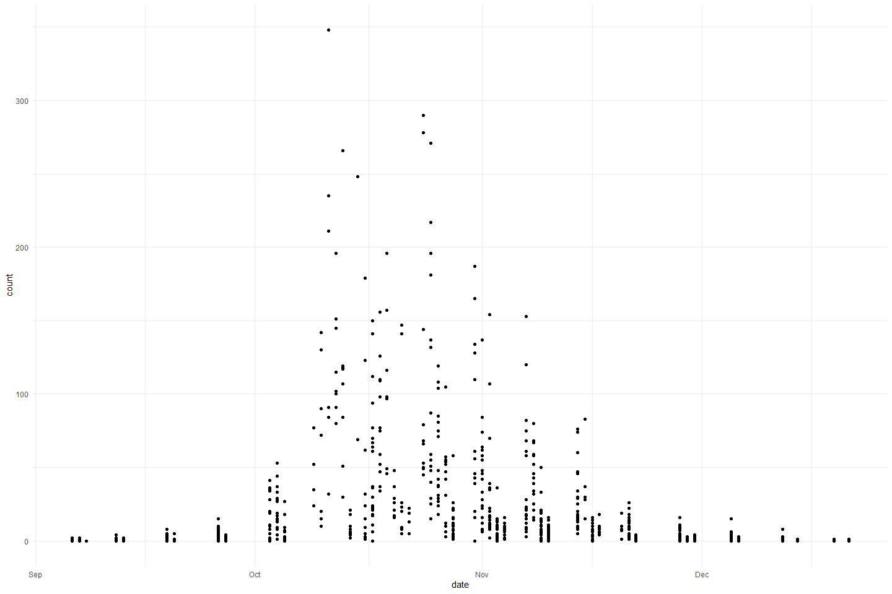
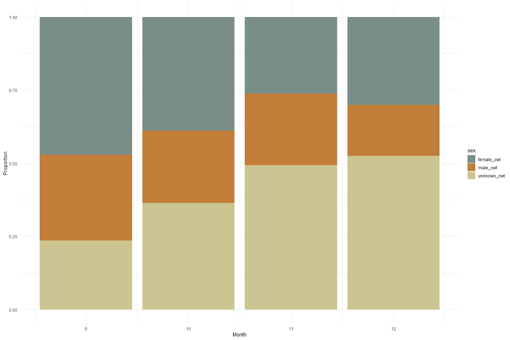
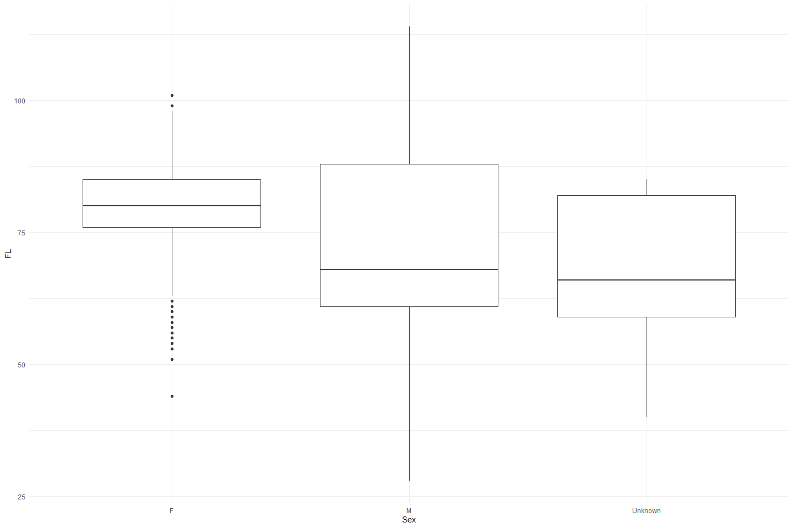

Feather Carcass QC 2011
================
Inigo Peng
2022-07-21

# Feather River Carcass Data

## Description of Monitoring Data

**Timeframe:**

**Video Season:**

**Completeness of Record throughout timeframe:**

**Sampling Location:**

**Data Contact:**

Any additional info?

## Access Cloud Data

``` r
# Run Sys.setenv() to specify GCS_AUTH_FILE and GCS_DEFAULT_BUCKET before running 
# getwd() to see how to specify paths 
# Open object from google cloud storage
# Set your authentication using gcs_auth
gcs_auth(json_file = Sys.getenv("GCS_AUTH_FILE"))
# Set global bucket 
gcs_global_bucket(bucket = Sys.getenv("GCS_DEFAULT_BUCKET"))

# git data and save as xlsx
```

``` r
gcs_get_object(object_name = "adult-holding-redd-and-carcass-surveys/feather-river/data-raw/carcass/2011/Chops_2011.xlsx",
               bucket = gcs_get_global_bucket(),
               saveToDisk = "Chops_2011.xlsx",
               overwrite = TRUE)
#
gcs_get_object(object_name = "adult-holding-redd-and-carcass-surveys/feather-river/data-raw/carcass/2011/ChopHeader_2011.xlsx",
               bucket = gcs_get_global_bucket(),
               saveToDisk = "ChopHeader_2011.xlsx",
               overwrite = TRUE)

# 
gcs_get_object(object_name = "adult-holding-redd-and-carcass-surveys/feather-river/data-raw/carcass/2011/CWTHeader_2011.xlsx",
               bucket = gcs_get_global_bucket(),
               saveToDisk = "CWTHeader_2011.xlsx",
               overwrite = TRUE)

gcs_get_object(object_name = "adult-holding-redd-and-carcass-surveys/feather-river/data-raw/carcass/2011/CWT_2011.xlsx",
               bucket = gcs_get_global_bucket(),
               saveToDisk = "CWT_2011.xlsx",
               overwrite = TRUE)
```

## Raw Data Glimpse:

### Chop_raw

``` r
Chops_raw <- read_excel("Chops_2011.xlsx") %>% 
  rename("ID" = `Chop Header ID`) %>%
  select(-`Chop ID`) %>% 
  glimpse()
```

    ## Rows: 1,269
    ## Columns: 4
    ## $ ID            <dbl> 9, 9, 9, 9, 9, 9, 9, 9, 9, 9, 9, 9, 9, 9, 10, 10, 10, 10~
    ## $ Section       <chr> "3", "2", "4", "6", "7", "5", "8", "9", "10", "11", "12"~
    ## $ Minutes       <dbl> 900, 1500, 600, 600, 900, 1200, 1240, 613, 3740, 1800, 1~
    ## $ `Total Count` <dbl> 0, 0, 0, 0, 0, 0, 0, 0, 2, 1, 1, 0, 1, 0, 1, 1, 2, 0, 0,~

### ChopHeader_raw

``` r
ChopHeader_raw <- read_excel("ChopHeader_2011.xlsx") %>% 
  rename("ID" = `Chop Header ID`) %>%
  glimpse()
```

    ## Rows: 62
    ## Columns: 7
    ## $ Date     <dttm> 2011-09-06, 2011-09-07, 2011-09-08, 2011-09-12, 2011-09-13, ~
    ## $ Weather  <chr> "Sun", "Sun/Cloudy", "Sun", "Cloudy", "Sun", "Sun", "Sun", "S~
    ## $ Time     <chr> "10:40", "9:09", "9:00", "10:20", "09:15", "09:10", "09:25", ~
    ## $ Crew     <chr> "KH, TK, JC, JC", "KH, GS, TK, JC", "KH, JC", "KH, AH, CD,JR,~
    ## $ Comments <chr> NA, NA, NA, NA, NA, NA, NA, NA, "Recap in section 17 was tall~
    ## $ ID       <dbl> 9, 10, 11, 13, 14, 15, 16, 17, 18, 19, 20, 21, 22, 23, 24, 25~
    ## $ `Week #` <chr> "1", "1", "1", "2", "2", "3", "3", "4", "4", "5", "5", "5", "~

### cwt_raw

``` r
cwt_raw <- read_excel("CWT_2011.xlsx") %>% 
  rename("ID" = `CWT Header ID`) %>% 
  glimpse
```

    ## Rows: 8,403
    ## Columns: 16
    ## $ `CWT ID`                 <dbl> 672, 408, 1113, 824, 3616, 2107, 809, 799, 78~
    ## $ ID                       <dbl> 20, 20, 22, 21, 32, 25, 21, 21, 21, 21, 21, 2~
    ## $ `Tag Recap/Chop Color`   <chr> NA, NA, NA, NA, NA, NA, NA, NA, NA, NA, NA, N~
    ## $ `Tag ID#`                <chr> NA, NA, NA, NA, NA, NA, NA, NA, NA, NA, NA, N~
    ## $ `Tag, Recapture or Chop` <chr> "C", "C", "C", "C", "C", "C", "C", "C", "C", ~
    ## $ Sex                      <chr> "F", "F", "F", "F", "F", "F", "F", "F", "F", ~
    ## $ `Spawning Condition`     <chr> "S", "S", "S", "S", "S", "S", "S", "U", "U", ~
    ## $ `Samples Collected`      <chr> "H", "H", "H", "H", "H", "H&S&O", "H", "H&S&O~
    ## $ `Fork Length`            <dbl> 82, 83, 84, 74, 84, 77, 80, 76, 70, 83, 62, 6~
    ## $ `River Section`          <dbl> 3, 3, 19, 12, 10, 10, 12, 12, 11, 11, 14, 12,~
    ## $ `Adipose Fin Clipped?`   <chr> "Y", "Y", "Y", "Y", "Y", "Y", "Y", "Y", "Y", ~
    ## $ `Head Tag Number`        <chr> "88748", "88747", "88743", "88742", "88741", ~
    ## $ Scales                   <dbl> NA, NA, NA, NA, NA, 31796, NA, 15089, NA, NA,~
    ## $ Otoliths                 <chr> NA, NA, NA, NA, NA, "2", NA, "200", NA, NA, N~
    ## $ Hallprint                <chr> "GH-0037677/78", "GH-0039939/40", NA, NA, NA,~
    ## $ Comments                 <chr> NA, NA, NA, NA, NA, NA, NA, NA, NA, NA, NA, "~

### cwt_header_raw

``` r
cwt_header_raw <- read_excel("CWTHeader_2011.xlsx") %>% 
  rename("ID" = `CWT Header ID` ) %>% 
  glimpse
```

    ## Rows: 60
    ## Columns: 10
    ## $ ID                    <dbl> 27, 12, 13, 14, 15, 16, 17, 18, 4, 6, 19, 20, 21~
    ## $ Date                  <dttm> NA, 2011-09-06, 2011-09-07, 2011-09-08, 2011-09~
    ## $ Crew                  <chr> NA, "TK, KH, JC, Jcall", "KH, GS, TK, Jcall", "K~
    ## $ `Week #`              <chr> NA, "1", "1", "1", "2", "2", "3", "3", "4", "4",~
    ## $ `Tag Color`           <chr> NA, "Blue", "Blue", "Blue", "Blue", "Blue", "Blu~
    ## $ Morale                <chr> NA, "7.5", "10", "9.99", "10", "9-10", "8.75-10"~
    ## $ `Section Group 1-10`  <dbl> NA, 1, NA, 1, 1, 1, 1, 1, NA, 1, 1, 1, 1, NA, NA~
    ## $ `Section Group 11-15` <dbl> NA, 1, NA, 1, 1, 1, 1, 1, NA, NA, 1, NA, NA, NA,~
    ## $ `Section Group 16-21` <dbl> NA, NA, NA, 1, NA, 1, 1, 1, NA, NA, 1, NA, NA, 1~
    ## $ `Section Group 22-38` <dbl> NA, NA, NA, 1, NA, 1, 1, 1, NA, NA, 1, NA, NA, 1~

## Data transformations:

### Counts

The `chop` table contains carcass counts by chop/tagged based on clips

``` r
#1. chop table (with dates and tag color)
chop_join <- full_join(ChopHeader_raw %>% 
                                 select(ID, Date, Time),
                               Chops_raw) %>% 
  clean_names() %>% 
  rename(sec = "section",
         min = "minutes",
         count = "total_count") %>% 
  mutate(sec = as.numeric(sec)) %>% glimpse
```

    ## Joining, by = "ID"

    ## Rows: 1,269
    ## Columns: 6
    ## $ id    <dbl> 9, 9, 9, 9, 9, 9, 9, 9, 9, 9, 9, 9, 9, 9, 9, 10, 10, 10, 10, 10,~
    ## $ date  <dttm> 2011-09-06, 2011-09-06, 2011-09-06, 2011-09-06, 2011-09-06, 201~
    ## $ time  <chr> "10:40", "10:40", "10:40", "10:40", "10:40", "10:40", "10:40", "~
    ## $ sec   <dbl> 3, 2, 4, 6, 7, 5, 8, 9, 10, 11, 12, 13, 14, 15, 1, 16, 17, 18, 1~
    ## $ min   <dbl> 900, 1500, 600, 600, 900, 1200, 1240, 613, 3740, 1800, 1220, 123~
    ## $ count <dbl> 0, 0, 0, 0, 0, 0, 0, 0, 2, 1, 1, 0, 1, 0, 0, 1, 1, 2, 0, 0, 0, 0~

### Survey

The `chop_header` table contains survey metadata and covariates

``` r
chop_header <- ChopHeader_raw %>% 
  clean_names()
```

### CWT

The `cwt` table contains coded wire tag information.

``` r
cwt <- full_join(cwt_raw %>% clean_names(), cwt_header_raw %>% clean_names()) %>%  
  rename(fl = "fork_length") %>% 
  glimpse
```

    ## Joining, by = "id"

    ## Rows: 8,405
    ## Columns: 25
    ## $ cwt_id                <dbl> 672, 408, 1113, 824, 3616, 2107, 809, 799, 787, ~
    ## $ id                    <dbl> 20, 20, 22, 21, 32, 25, 21, 21, 21, 21, 21, 21, ~
    ## $ tag_recap_chop_color  <chr> NA, NA, NA, NA, NA, NA, NA, NA, NA, NA, NA, NA, ~
    ## $ tag_id_number         <chr> NA, NA, NA, NA, NA, NA, NA, NA, NA, NA, NA, NA, ~
    ## $ tag_recapture_or_chop <chr> "C", "C", "C", "C", "C", "C", "C", "C", "C", "C"~
    ## $ sex                   <chr> "F", "F", "F", "F", "F", "F", "F", "F", "F", "F"~
    ## $ spawning_condition    <chr> "S", "S", "S", "S", "S", "S", "S", "U", "U", "U"~
    ## $ samples_collected     <chr> "H", "H", "H", "H", "H", "H&S&O", "H", "H&S&O", ~
    ## $ fl                    <dbl> 82, 83, 84, 74, 84, 77, 80, 76, 70, 83, 62, 68, ~
    ## $ river_section         <dbl> 3, 3, 19, 12, 10, 10, 12, 12, 11, 11, 14, 12, 12~
    ## $ adipose_fin_clipped   <chr> "Y", "Y", "Y", "Y", "Y", "Y", "Y", "Y", "Y", "Y"~
    ## $ head_tag_number       <chr> "88748", "88747", "88743", "88742", "88741", "88~
    ## $ scales                <dbl> NA, NA, NA, NA, NA, 31796, NA, 15089, NA, NA, NA~
    ## $ otoliths              <chr> NA, NA, NA, NA, NA, "2", NA, "200", NA, NA, NA, ~
    ## $ hallprint             <chr> "GH-0037677/78", "GH-0039939/40", NA, NA, NA, NA~
    ## $ comments              <chr> NA, NA, NA, NA, NA, NA, NA, NA, NA, NA, NA, "one~
    ## $ date                  <dttm> 2011-10-03, 2011-10-03, 2011-10-05, 2011-10-04,~
    ## $ crew                  <chr> "KH, CM, TK, JR, TV, DR, CD, JC, Jcall, SM", "KH~
    ## $ week_number           <chr> "5", "5", "5", "5", "7", "6", "5", "5", "5", "5"~
    ## $ tag_color             <chr> "Blue", "Blue", "Blue", "Blue", "BLUE", "Silver"~
    ## $ morale                <chr> "6-10", "6-10", "8.3", "9", NA, "10", "9", "9", ~
    ## $ section_group_1_10    <dbl> 1, 1, NA, 1, 2, 1, 1, 1, 1, 1, 1, 1, 1, 1, 1, 1,~
    ## $ section_group_11_15   <dbl> NA, NA, NA, NA, 1, NA, NA, NA, NA, NA, NA, NA, N~
    ## $ section_group_16_21   <dbl> NA, NA, 1, NA, NA, NA, NA, NA, NA, NA, NA, NA, N~
    ## $ section_group_22_38   <dbl> NA, NA, 1, NA, NA, NA, NA, NA, NA, NA, NA, NA, N~

## Explore Numeric Variables:

### Chop Join Variable: `id`, `min`

``` r
chop_join %>% 
  select_if(is.numeric) %>%
  colnames()
```

    ## [1] "id"    "sec"   "min"   "count"

``` r
summary(chop_join$id)
```

    ##    Min. 1st Qu.  Median    Mean 3rd Qu.    Max. 
    ##    9.00   20.00   43.00   41.03   58.00   71.00

``` r
summary(chop_join$min)
```

    ##    Min. 1st Qu.  Median    Mean 3rd Qu.    Max.    NA's 
    ##       0    1000    1900    2549    3500    9700     433

**NA and Unknown Values** Provide a stat on NA or unknown values.

``` r
round(sum(is.na(chop_join$id))/nrow(chop_join), 3) * 100
```

    ## [1] 0

``` r
round(sum(is.na(chop_join$min))/nrow(chop_join), 3) * 100
```

    ## [1] 34.1

-   0 % of values in the `id` column are NA.
-   34.1 % of values in the `min` column are NA.

### Chop Join Variable: `count`

``` r
summary(chop_join$count)
```

    ##    Min. 1st Qu.  Median    Mean 3rd Qu.    Max.    NA's 
    ##     0.0     0.0     3.0    17.1    15.0   348.0       4

-   0.3 % of values in the `count` column are NA.

**Plotting total_count over Period of Record**

``` r
chop_join %>% 
  ggplot(aes(x = date, y = count)) + 
  geom_point() +
  theme_minimal()
```

<!-- -->

``` r
chop_join %>%
  group_by(date) %>%
  summarise(total_count = sum(count, na.rm = T)) %>%
  ggplot(aes(x = date, y = total_count)) +
  geom_col() +
  theme_minimal()
```

<!-- -->

### Chop Header Variable: `id`

``` r
chop_header %>% 
  select_if(is.numeric) %>% 
  colnames()
```

    ## [1] "id"

``` r
summary(chop_header$id)
```

    ##    Min. 1st Qu.  Median    Mean 3rd Qu.    Max. 
    ##    9.00   25.25   40.50   40.45   55.75   71.00

### CWT Variable: `ID`, `sect`, `fl`, `header_id`, `week_num`

``` r
cwt %>% 
  select_if(is.numeric) %>% 
  colnames()
```

    ## [1] "cwt_id"              "id"                  "fl"                 
    ## [4] "river_section"       "scales"              "section_group_1_10" 
    ## [7] "section_group_11_15" "section_group_16_21" "section_group_22_38"

``` r
summary(cwt$fl)
```

    ##    Min. 1st Qu.  Median    Mean 3rd Qu.    Max.    NA's 
    ##      28      66      79      77      86     114    3337

``` r
summary(cwt$river_section)
```

    ##    Min. 1st Qu.  Median    Mean 3rd Qu.    Max.    NA's 
    ##    1.00    8.00   11.00   12.13   15.00   38.00      11

-   39.7 % of values in the `fl` column are NA.
-   0.1 % of values in the `sect` column are NA.

``` r
#Create a cwt_count column
#Pivot table to expand sex column to female_cwt, male_cwt, and unknown_cwt 
#Is this graph helpful?
unique(cwt$sex)
```

    ## [1] "F" "M" NA

``` r
cwt_count <- cwt %>% 
  mutate(count = 1) %>%
  mutate(sex = case_when(sex == "ND"|is.na(sex)|sex =="UK" ~ "U",
                         TRUE ~ sex)) %>% 
  pivot_wider(names_from = sex, values_from = count, values_fill = 0) %>% 
  # unnest() %>% 
  rename("male_cwt" = M,
         "female_cwt" = F,
         "unknown_cwt" = U) %>% glimpse
```

    ## Rows: 8,405
    ## Columns: 27
    ## $ cwt_id                <dbl> 672, 408, 1113, 824, 3616, 2107, 809, 799, 787, ~
    ## $ id                    <dbl> 20, 20, 22, 21, 32, 25, 21, 21, 21, 21, 21, 21, ~
    ## $ tag_recap_chop_color  <chr> NA, NA, NA, NA, NA, NA, NA, NA, NA, NA, NA, NA, ~
    ## $ tag_id_number         <chr> NA, NA, NA, NA, NA, NA, NA, NA, NA, NA, NA, NA, ~
    ## $ tag_recapture_or_chop <chr> "C", "C", "C", "C", "C", "C", "C", "C", "C", "C"~
    ## $ spawning_condition    <chr> "S", "S", "S", "S", "S", "S", "S", "U", "U", "U"~
    ## $ samples_collected     <chr> "H", "H", "H", "H", "H", "H&S&O", "H", "H&S&O", ~
    ## $ fl                    <dbl> 82, 83, 84, 74, 84, 77, 80, 76, 70, 83, 62, 68, ~
    ## $ river_section         <dbl> 3, 3, 19, 12, 10, 10, 12, 12, 11, 11, 14, 12, 12~
    ## $ adipose_fin_clipped   <chr> "Y", "Y", "Y", "Y", "Y", "Y", "Y", "Y", "Y", "Y"~
    ## $ head_tag_number       <chr> "88748", "88747", "88743", "88742", "88741", "88~
    ## $ scales                <dbl> NA, NA, NA, NA, NA, 31796, NA, 15089, NA, NA, NA~
    ## $ otoliths              <chr> NA, NA, NA, NA, NA, "2", NA, "200", NA, NA, NA, ~
    ## $ hallprint             <chr> "GH-0037677/78", "GH-0039939/40", NA, NA, NA, NA~
    ## $ comments              <chr> NA, NA, NA, NA, NA, NA, NA, NA, NA, NA, NA, "one~
    ## $ date                  <dttm> 2011-10-03, 2011-10-03, 2011-10-05, 2011-10-04,~
    ## $ crew                  <chr> "KH, CM, TK, JR, TV, DR, CD, JC, Jcall, SM", "KH~
    ## $ week_number           <chr> "5", "5", "5", "5", "7", "6", "5", "5", "5", "5"~
    ## $ tag_color             <chr> "Blue", "Blue", "Blue", "Blue", "BLUE", "Silver"~
    ## $ morale                <chr> "6-10", "6-10", "8.3", "9", NA, "10", "9", "9", ~
    ## $ section_group_1_10    <dbl> 1, 1, NA, 1, 2, 1, 1, 1, 1, 1, 1, 1, 1, 1, 1, 1,~
    ## $ section_group_11_15   <dbl> NA, NA, NA, NA, 1, NA, NA, NA, NA, NA, NA, NA, N~
    ## $ section_group_16_21   <dbl> NA, NA, 1, NA, NA, NA, NA, NA, NA, NA, NA, NA, N~
    ## $ section_group_22_38   <dbl> NA, NA, 1, NA, NA, NA, NA, NA, NA, NA, NA, NA, N~
    ## $ female_cwt            <dbl> 1, 1, 1, 1, 1, 1, 1, 1, 1, 1, 1, 1, 1, 1, 1, 1, ~
    ## $ male_cwt              <dbl> 0, 0, 0, 0, 0, 0, 0, 0, 0, 0, 0, 0, 0, 0, 0, 0, ~
    ## $ unknown_cwt           <dbl> 0, 0, 0, 0, 0, 0, 0, 0, 0, 0, 0, 0, 0, 0, 0, 0, ~

``` r
total_cwt_summary <- cwt_count %>% 
  mutate(male_cwt = ifelse(is.na(male_cwt), 0, male_cwt), # fill na
         female_cwt = ifelse(is.na(female_cwt), 0, female_cwt),
         unknown_cwt = ifelse(is.na(unknown_cwt), 0, unknown_cwt),
         total_cwt = unknown_cwt + male_cwt + female_cwt) %>% 
  group_by(month(date)) %>% 
  summarise(total_cwt = sum(total_cwt),
            male_cwt = sum(male_cwt),
            female_cwt = sum(female_cwt),
            unknown_cwt = sum(unknown_cwt))
```

``` r
total_cwt_summary %>% 
  pivot_longer(cols = c(male_cwt, female_cwt, unknown_cwt), names_to = "sex", values_to = "count") %>% 
  mutate(proportions = (count / total_cwt)) %>% 
  ggplot(aes(x = `month(date)`, y = proportions, fill = sex)) + 
  geom_bar(stat = "identity", position = "stack") +
  scale_fill_manual(name = "chops", 
                    labels = c("CWT Male", "CWT Female", "CWT Unknown")) +
  theme_minimal() + 
  labs(y = "Proportion", x = "Month") +
  scale_fill_manual(values = wes_palette("Moonrise2"))
```

    ## Scale for 'fill' is already present. Adding another scale for 'fill', which
    ## will replace the existing scale.

<!-- -->

**Plotting fork length of each sex**

``` r
cwt %>% 
  mutate(sex = case_when(sex == "ND"|is.na(sex)|sex =="UK" ~ "Unknown",
                         TRUE ~ sex))%>% 
  ggplot(aes(x = sex, y = fl)) + 
  geom_boxplot() + 
  theme_minimal() + 
  labs(y = "FL", x = "Sex")
```

<!-- -->

## Explore Categorical variables:

### Chop Clean Data

Fix inconsistencies with spelling, capitalization, and dates

``` r
chop_join %>% 
  select_if(is.character) %>%
  colnames()
```

    ## [1] "time"

``` r
chop_cleaner <- chop_join %>%
  mutate(date = as_date(date)) %>%
  mutate_if(is.character, str_to_lower) %>% 
  select(-c(time))

chop_cleaner
```

    ## # A tibble: 1,269 x 5
    ##       id date         sec   min count
    ##    <dbl> <date>     <dbl> <dbl> <dbl>
    ##  1     9 2011-09-06     3   900     0
    ##  2     9 2011-09-06     2  1500     0
    ##  3     9 2011-09-06     4   600     0
    ##  4     9 2011-09-06     6   600     0
    ##  5     9 2011-09-06     7   900     0
    ##  6     9 2011-09-06     5  1200     0
    ##  7     9 2011-09-06     8  1240     0
    ##  8     9 2011-09-06     9   613     0
    ##  9     9 2011-09-06    10  3740     2
    ## 10     9 2011-09-06    11  1800     1
    ## # ... with 1,259 more rows

### Chop Header Clean Data

``` r
chop_header %>% 
  select_if(is.character) %>% 
  colnames()
```

    ## [1] "weather"     "time"        "crew"        "comments"    "week_number"

``` r
unique(chop_header$crew)
```

    ##  [1] "KH, TK, JC, JC"                                   
    ##  [2] "KH, GS, TK, JC"                                   
    ##  [3] "KH, JC"                                           
    ##  [4] "KH, AH, CD,JR, JC, Jcall"                         
    ##  [5] "KH, AH, MM, JR, JC, CD"                           
    ##  [6] "CD, CC, JR, SM, JC, AH, KH"                       
    ##  [7] "SM, KH, AH, JR, CD, JC"                           
    ##  [8] "JR, CM, JC, AH, KH, GS, TK, DR, Jcall, CD"        
    ##  [9] "JR, CC, JC,SM, DR, CD, CM, TK, KH, Jcall"         
    ## [10] "Jcall, JC, SM, KH, CM, TK, JR, TV, CD, DR"        
    ## [11] "KH, GS, DR, Jcall, CM, CD, SM, TK, JC, CC, JR"    
    ## [12] "JC, DR, JR, AH, TK, KH, TO"                       
    ## [13] "JR, JCall, CM, DR"                                
    ## [14] "JK, CC, GS, JC, SM, TV, KH, CD"                   
    ## [15] "KH, GS, CD, SM, JC, AH, JR, MM, Jcall, DR"        
    ## [16] "KH, CD, TV,AH, SM, KT, GS, JR, DR"                
    ## [17] "DR, TV, AH, KH, JR, GS, Jcall, SM"                
    ## [18] "SM, AH, JR"                                       
    ## [19] "SM, JC, DR, KH"                                   
    ## [20] "AC, CC, JK, CM, KH, KL"                           
    ## [21] "JK, CD, AH, JC,KH, GS, TK, DR, JR, CM, SM, Jcall" 
    ## [22] "KH, GS, CD, CM, JC, Jcall, TK, AH, JR, DR, SM, NJ"
    ## [23] "JC, AH, TK, MM, JR, SM, CD"                       
    ## [24] "CM, AH, KH, JR"                                   
    ## [25] "SM, JC, JR, KH"                                   
    ## [26] "DR, Jcall"                                        
    ## [27] "JR, CM, CD, TK, GS, JC, Jcall, SM, KH, AH"        
    ## [28] "DR, TK, CM, Jcall,KH, AH, JR, GS"                 
    ## [29] "AH, KH, MM, TK, CD, SM, TV, JR, GS, DR, Jcall"    
    ## [30] "SM, CD, JC, JR"                                   
    ## [31] "KH, GS, Jcall, AH, CM, CD, SM, KL"                
    ## [32] "SM, TK, JC, DR,KH, GS, AH, CM, JR, Jcall, KL"     
    ## [33] "CC, Jcall, TK, TV JR, JC, CM, GS SM, KH, AH, DR"  
    ## [34] "KM, KH, AH, SM, JC, JR, AL, TV, GS, TK, DR"       
    ## [35] "KH, TK, SM, JR, JC, AL, AH"                       
    ## [36] "AC, Jcall, AH, CM, JR, JAS, SM"                   
    ## [37] "JR, CM, Jcall, DR, TV, TK, CD, SM, KH, GS, AH, JC"
    ## [38] "CM, CC, TK, KF, AH, DR, JC, CD, JR, TV, GS, SM"   
    ## [39] "JC, SM, KL, PG, SWD, TSW, TK, AH"                 
    ## [40] "tk ah jw kl jc sm pg"                             
    ## [41] "JR, AH, JW, PG, EB, KH, JC, SM, EF"               
    ## [42] "jr"                                               
    ## [43] NA                                                 
    ## [44] "TV, DR, LM, AH, JR, CM, KM, CC, Jcall, TK, GS, JW"
    ## [45] "JC, AH, CM, JW, JC, GS, JR, CC"                   
    ## [46] "JR, JW, AH, MM, KH, KM, GS, DR"                   
    ## [47] "JC, AH, GS, JW"                                   
    ## [48] "cm cc"                                            
    ## [49] "SM, JR"                                           
    ## [50] "JR, CWC, CD, SM"                                  
    ## [51] "JR, JC"

``` r
unique(chop_header$weather)
```

    ## [1] "Sun"        "Sun/Cloudy" "Cloudy"     "Rain"       "cld"       
    ## [6] NA           "sun"

``` r
chop_header_cleaner <- chop_header %>%
  mutate(date = as_date(date)) %>%
  mutate_if(is.character, str_to_lower) %>% 
  mutate(crew = str_replace_all(crew, " ", ","),
         crew = str_replace_all(crew, ",,", ","),
         weather = ifelse(weather == "cloudy", "cld", weather),
         weather = ifelse(weather == "sun/cloudy", "sun, cld", weather)
         ) %>% 
  select(-c(time))

chop_header_cleaner
```

    ## # A tibble: 62 x 6
    ##    date       weather  crew                           comments    id week_number
    ##    <date>     <chr>    <chr>                          <chr>    <dbl> <chr>      
    ##  1 2011-09-06 sun      kh,tk,jc,jc                    <NA>         9 1          
    ##  2 2011-09-07 sun, cld kh,gs,tk,jc                    <NA>        10 1          
    ##  3 2011-09-08 sun      kh,jc                          <NA>        11 1          
    ##  4 2011-09-12 cld      kh,ah,cd,jr,jc,jcall           <NA>        13 2          
    ##  5 2011-09-13 sun      kh,ah,mm,jr,jc,cd              <NA>        14 2          
    ##  6 2011-09-19 sun      cd,cc,jr,sm,jc,ah,kh           <NA>        15 3          
    ##  7 2011-09-20 sun      sm,kh,ah,jr,cd,jc              <NA>        16 3          
    ##  8 2011-09-26 sun      jr,cm,jc,ah,kh,gs,tk,dr,jcall~ <NA>        17 4          
    ##  9 2011-09-27 sun      jr,cc,jc,sm,dr,cd,cm,tk,kh,jc~ recap i~    18 4          
    ## 10 2011-10-03 sun, cld jcall,jc,sm,kh,cm,tk,jr,tv,cd~ <NA>        19 5          
    ## # ... with 52 more rows

### CWT Clean Data

``` r
cwt %>% 
  select_if(is.character) %>% 
  colnames
```

    ##  [1] "tag_recap_chop_color"  "tag_id_number"         "tag_recapture_or_chop"
    ##  [4] "sex"                   "spawning_condition"    "samples_collected"    
    ##  [7] "adipose_fin_clipped"   "head_tag_number"       "otoliths"             
    ## [10] "hallprint"             "comments"              "crew"                 
    ## [13] "week_number"           "tag_color"             "morale"

``` r
unique(cwt$tag_recap_chop_color)
```

    ## [1] NA  "s" "b" "c" "B" "S"

``` r
unique(cwt$tag_recapture_or_chop)
```

    ## [1] "C" "T" NA  "R"

``` r
unique(cwt$spawning_condition)
```

    ## [1] "S" "U" "K" NA

``` r
unique(cwt$samples_collected)
```

    ## [1] "H"     "H&S&O" NA      "H&S"   "S&O"   "H&O"   "S"

``` r
unique(cwt$adipose_fin_clipped)
```

    ## [1] "Y" "N" NA  "K"

``` r
unique(cwt$crew)
```

    ##  [1] "KH, CM, TK, JR, TV, DR, CD, JC, Jcall, SM"       
    ##  [2] "JC, AH, DR, JR"                                  
    ##  [3] "KH, Jcall, DR, GS, CM, CD, TK, SM, JC, CC, JR"   
    ##  [4] "KH,GS,TK,DR,JR,CM,SM,JC,JCALL,CD,JK,AH"          
    ##  [5] "kh,gs,cd,sm,"                                    
    ##  [6] "kt,gs,dr,jr,cd,kh,tv,SM,AH,JC"                   
    ##  [7] "DR, AH, KH, TV, JR, GS, Jcall, SM"               
    ##  [8] "JR,JC,DR,CM,AH,CD,TV,SM"                         
    ##  [9] "JR, CM , JC, AH, CD, DR, Jcall, KH, GS, TK, SM"  
    ## [10] "CD, SM, DR, KH, TK, JC, CM, Jcall, CC, JR"       
    ## [11] "JR, CD, JC, SM, KH, AH"                          
    ## [12] "SM,KH,AH,DR,CC,JC,TK,TV,CM,JR,GS,JCALL"          
    ## [13] "KH, AH, CD, JR, JC, Jcall"                       
    ## [14] "SM,JC,DR,KH"                                     
    ## [15] "KH,AH,CC,JR,CD,CM,TK,GS,JC,SM,JCALL"             
    ## [16] "JC,AH,TK,MM,JR,CD,SM"                            
    ## [17] "CD, TV, TK, SM, MM, AH, KH, JR, GS, DR, Jcall"   
    ## [18] "CM, CD, KL, SM, KH, GS, Jcall, AH"               
    ## [19] "KH,JR,AH,SM"                                     
    ## [20] "JR, KL, CM, Jcall, SM, TK, JC, DR, KH, GS, AH"   
    ## [21] "JC, DR, CM, TK, JR, GS, Jcall, SM, KH"           
    ## [22] "JR,JC,AL,AH,TK,SM,KN"                            
    ## [23] "kh gs jcall ah"                                  
    ## [24] "SD,JW,TK,AH,JC,SM,KL,PG,KH,CD"                   
    ## [25] "CM,CC,TK,KF,TV,JR,GS,SM,CD,AH,DR,JC"             
    ## [26] "KH,GS,AH,JC,CM,JCALL,JR,DR,CD,TV,TK,SM"          
    ## [27] "JR,AH,JW,PG,SM,KH,JC,EB,"                        
    ## [28] "CM,KM,CC,JC,DR,TV,AH,LM,GS,TK,JCALL,JW"          
    ## [29] "cm jw jcall ah jr cd sm"                         
    ## [30] "TV,GS,TK,DR,KM,KH,AH,SM,JR,AL,JC"                
    ## [31] "KH,GS,CD,CM,JCALL,JC,TK,AH,JR,SM,DR,NJ"          
    ## [32] "KH, AH,SM, CD, JC, JR"                           
    ## [33] "jc ah gs jw"                                     
    ## [34] "cc cm"                                           
    ## [35] "JR,AH,JW,MM,KH,KM,GS,DR"                         
    ## [36] "JC,AH,JW,CM,JR,CC,GS,JCALL"                      
    ## [37] "CD,TV,TK,KH,JR,SC,DR,AH,KT,GS,CM,JW"             
    ## [38] "SM,JC,JR,KH"                                     
    ## [39] "cm ah kh"                                        
    ## [40] "tk jc ah jw cm jr jcall"                         
    ## [41] "SM,AH,JR"                                        
    ## [42] "JK, CC, GS, JC, JR, Jcall,CM, DR, TV, SM, CD, KH"
    ## [43] "CM,KH,KL,AC,JK,CC"                               
    ## [44] "SM, JR"                                          
    ## [45] "KH, GS, TK, SM"                                  
    ## [46] "CM,JAS,JR,SM,AC,JCALL,AH"                        
    ## [47] "jr jc jw"                                        
    ## [48] "DR,JC"                                           
    ## [49] "KH, JC, AH, CD, JR, CC, SM"                      
    ## [50] "KH, JC"                                          
    ## [51] "TK, KH, JC, Jcall"                               
    ## [52] "Unknown"                                         
    ## [53] NA                                                
    ## [54] "JR, JC, CD, KH, AH, MM"                          
    ## [55] "ah kh jc jr cm sm"                               
    ## [56] "cd sm tk"                                        
    ## [57] "jc ah jr"                                        
    ## [58] "JR, CWC, SM, CD"                                 
    ## [59] "JR, JC"                                          
    ## [60] "KH, GS, TK, Jcall"

``` r
unique(cwt$tag_color)
```

    ##  [1] "Blue"   "BLUE"   "Silver" "silver" "SILVER" "s"      "blue"   "b"     
    ##  [9] NA       "No Tag"

``` r
#Dropping sectiongroup and morale
cwt_cleaner <- cwt %>% 
  mutate_if(is.character, str_to_lower) %>% 
  mutate(crew = str_replace_all(crew, " ", ","),
         crew = str_replace_all(crew, ",,", ","),
         sex = case_when(sex == "nd"|is.na(sex) ~ "unknown",
                         TRUE ~ sex),
         tag_recapture_or_chop = case_when(tag_recapture_or_chop == "t" ~ "tagged",
                                         tag_recapture_or_chop == "r" ~ "recapture",
                                         tag_recapture_or_chop == "c" ~ "chop",
                                         TRUE ~ tag_recapture_or_chop),
         adipose_fin_clipped = case_when(adipose_fin_clipped == "uk" ~ "unknown",
                                         adipose_fin_clipped == "y" ~ "yes",
                                         adipose_fin_clipped == "n" ~ "no",
                                         TRUE ~ adipose_fin_clipped),
         spawning_condition = case_when(spawning_condition == "uk" ~ "unknown",
                                        TRUE ~ spawning_condition),
         tag_color = case_when(tag_color == "b" ~ "blue",
                               tag_color == "s" ~ "silver",
                               tag_color == "no tag" ~ NA_character_,
                               TRUE ~ tag_color)) %>% 
  select(-c(morale, section_group_1_10, section_group_11_15, section_group_16_21, section_group_22_38)) %>% 
  glimpse
```

    ## Rows: 8,405
    ## Columns: 20
    ## $ cwt_id                <dbl> 672, 408, 1113, 824, 3616, 2107, 809, 799, 787, ~
    ## $ id                    <dbl> 20, 20, 22, 21, 32, 25, 21, 21, 21, 21, 21, 21, ~
    ## $ tag_recap_chop_color  <chr> NA, NA, NA, NA, NA, NA, NA, NA, NA, NA, NA, NA, ~
    ## $ tag_id_number         <chr> NA, NA, NA, NA, NA, NA, NA, NA, NA, NA, NA, NA, ~
    ## $ tag_recapture_or_chop <chr> "chop", "chop", "chop", "chop", "chop", "chop", ~
    ## $ sex                   <chr> "f", "f", "f", "f", "f", "f", "f", "f", "f", "f"~
    ## $ spawning_condition    <chr> "s", "s", "s", "s", "s", "s", "s", "u", "u", "u"~
    ## $ samples_collected     <chr> "h", "h", "h", "h", "h", "h&s&o", "h", "h&s&o", ~
    ## $ fl                    <dbl> 82, 83, 84, 74, 84, 77, 80, 76, 70, 83, 62, 68, ~
    ## $ river_section         <dbl> 3, 3, 19, 12, 10, 10, 12, 12, 11, 11, 14, 12, 12~
    ## $ adipose_fin_clipped   <chr> "yes", "yes", "yes", "yes", "yes", "yes", "yes",~
    ## $ head_tag_number       <chr> "88748", "88747", "88743", "88742", "88741", "88~
    ## $ scales                <dbl> NA, NA, NA, NA, NA, 31796, NA, 15089, NA, NA, NA~
    ## $ otoliths              <chr> NA, NA, NA, NA, NA, "2", NA, "200", NA, NA, NA, ~
    ## $ hallprint             <chr> "gh-0037677/78", "gh-0039939/40", NA, NA, NA, NA~
    ## $ comments              <chr> NA, NA, NA, NA, NA, NA, NA, NA, NA, NA, NA, "one~
    ## $ date                  <dttm> 2011-10-03, 2011-10-03, 2011-10-05, 2011-10-04,~
    ## $ crew                  <chr> "kh,cm,tk,jr,tv,dr,cd,jc,jcall,sm", "kh,cm,tk,jr~
    ## $ week_number           <chr> "5", "5", "5", "5", "7", "6", "5", "5", "5", "5"~
    ## $ tag_color             <chr> "blue", "blue", "blue", "blue", "blue", "silver"~

## Comments

-   No recovery table
-   Many new columns in CWT table - CWT has been very inconsistent

## Data Dictionaries

# Count

``` r
percent_na <- chop_cleaner %>%
  summarise_all(list(name = ~sum(is.na(.))/length(.))) %>%
  pivot_longer(cols = everything())


counts_data_dictionary <- tibble(variables = colnames(chop_cleaner),
                          description = c("ID",
                                          "Date of survey",
                                          "Sect", 
                                          "Min", 
                                          "Count"),
                          percent_na = round(percent_na$value*100))

kable(counts_data_dictionary)
```

| variables | description    | percent_na |
|:----------|:---------------|-----------:|
| id        | ID             |          0 |
| date      | Date of survey |          0 |
| sec       | Sect           |          0 |
| min       | Min            |         34 |
| count     | Count          |          0 |

### Survey

``` r
percent_na <- chop_header_cleaner %>%
  summarise_all(list(name = ~sum(is.na(.))/length(.))) %>%
  pivot_longer(cols = everything())
# 
chop_header_dictionary <- tibble(variables = colnames(chop_header_cleaner),
                          description = c("Date of survey",
                                          "Weather",
                                          "Crew memeber initials that collected",
                                          "Comments",
                                          "ID",
                                          "Week Number"),
                          percent_na = round(percent_na$value*100))
# 
kable(chop_header_dictionary)
```

| variables   | description                          | percent_na |
|:------------|:-------------------------------------|-----------:|
| date        | Date of survey                       |          0 |
| weather     | Weather                              |          8 |
| crew        | Crew memeber initials that collected |         19 |
| comments    | Comments                             |         95 |
| id          | ID                                   |          0 |
| week_number | Week Number                          |          0 |

### CWT

``` r
percent_na <- cwt_cleaner %>%
  summarise_all(list(name = ~sum(is.na(.))/length(.))) %>%
  pivot_longer(cols = everything())

cwt_dictionary <- tibble(variables = colnames(cwt_cleaner),
                          description = c("CWT ID",
                                          "ID",
                                          "Tag recapture chop color",
                                          "Tag ID number",
                                          "Tag recapture or chop",
                                          "Sex",
                                          "Spawning condition",
                                          "Samples collected",
                                          "Fork length",
                                          "River section",
                                          "Adipose fin clipped",
                                          "Head tag number",
                                          "Scales",
                                          "Otoliths",
                                          "Hallprint",
                                          "Comments",
                                          "Date",
                                          "Crew",
                                          "Week number",
                                          "Tag colour"),
                          percent_na = round(percent_na$value*100))

kable(cwt_dictionary)
```

| variables             | description              | percent_na |
|:----------------------|:-------------------------|-----------:|
| cwt_id                | CWT ID                   |          0 |
| id                    | ID                       |          0 |
| tag_recap_chop_color  | Tag recapture chop color |         36 |
| tag_id_number         | Tag ID number            |         37 |
| tag_recapture_or_chop | Tag recapture or chop    |          0 |
| sex                   | Sex                      |          0 |
| spawning_condition    | Spawning condition       |         40 |
| samples_collected     | Samples collected        |         73 |
| fl                    | Fork length              |         40 |
| river_section         | River section            |          0 |
| adipose_fin_clipped   | Adipose fin clipped      |         39 |
| head_tag_number       | Head tag number          |         81 |
| scales                | Scales                   |         89 |
| otoliths              | Otoliths                 |         89 |
| hallprint             | Hallprint                |         81 |
| comments              | Comments                 |         92 |
| date                  | Date                     |          0 |
| crew                  | Crew                     |          0 |
| week_number           | Week number              |          0 |
| tag_color             | Tag colour               |          0 |

# Saved cleaned data back to google cloud

``` r
#Ignore chop recovery as its 100% NA
feather_carcass_chops_2011 <- chop_cleaner %>% glimpse()
```

    ## Rows: 1,269
    ## Columns: 5
    ## $ id    <dbl> 9, 9, 9, 9, 9, 9, 9, 9, 9, 9, 9, 9, 9, 9, 9, 10, 10, 10, 10, 10,~
    ## $ date  <date> 2011-09-06, 2011-09-06, 2011-09-06, 2011-09-06, 2011-09-06, 201~
    ## $ sec   <dbl> 3, 2, 4, 6, 7, 5, 8, 9, 10, 11, 12, 13, 14, 15, 1, 16, 17, 18, 1~
    ## $ min   <dbl> 900, 1500, 600, 600, 900, 1200, 1240, 613, 3740, 1800, 1220, 123~
    ## $ count <dbl> 0, 0, 0, 0, 0, 0, 0, 0, 2, 1, 1, 0, 1, 0, 0, 1, 1, 2, 0, 0, 0, 0~

``` r
feather_carcass_cwt_2011 <- cwt_cleaner %>% glimpse()
```

    ## Rows: 8,405
    ## Columns: 20
    ## $ cwt_id                <dbl> 672, 408, 1113, 824, 3616, 2107, 809, 799, 787, ~
    ## $ id                    <dbl> 20, 20, 22, 21, 32, 25, 21, 21, 21, 21, 21, 21, ~
    ## $ tag_recap_chop_color  <chr> NA, NA, NA, NA, NA, NA, NA, NA, NA, NA, NA, NA, ~
    ## $ tag_id_number         <chr> NA, NA, NA, NA, NA, NA, NA, NA, NA, NA, NA, NA, ~
    ## $ tag_recapture_or_chop <chr> "chop", "chop", "chop", "chop", "chop", "chop", ~
    ## $ sex                   <chr> "f", "f", "f", "f", "f", "f", "f", "f", "f", "f"~
    ## $ spawning_condition    <chr> "s", "s", "s", "s", "s", "s", "s", "u", "u", "u"~
    ## $ samples_collected     <chr> "h", "h", "h", "h", "h", "h&s&o", "h", "h&s&o", ~
    ## $ fl                    <dbl> 82, 83, 84, 74, 84, 77, 80, 76, 70, 83, 62, 68, ~
    ## $ river_section         <dbl> 3, 3, 19, 12, 10, 10, 12, 12, 11, 11, 14, 12, 12~
    ## $ adipose_fin_clipped   <chr> "yes", "yes", "yes", "yes", "yes", "yes", "yes",~
    ## $ head_tag_number       <chr> "88748", "88747", "88743", "88742", "88741", "88~
    ## $ scales                <dbl> NA, NA, NA, NA, NA, 31796, NA, 15089, NA, NA, NA~
    ## $ otoliths              <chr> NA, NA, NA, NA, NA, "2", NA, "200", NA, NA, NA, ~
    ## $ hallprint             <chr> "gh-0037677/78", "gh-0039939/40", NA, NA, NA, NA~
    ## $ comments              <chr> NA, NA, NA, NA, NA, NA, NA, NA, NA, NA, NA, "one~
    ## $ date                  <dttm> 2011-10-03, 2011-10-03, 2011-10-05, 2011-10-04,~
    ## $ crew                  <chr> "kh,cm,tk,jr,tv,dr,cd,jc,jcall,sm", "kh,cm,tk,jr~
    ## $ week_number           <chr> "5", "5", "5", "5", "7", "6", "5", "5", "5", "5"~
    ## $ tag_color             <chr> "blue", "blue", "blue", "blue", "blue", "silver"~

``` r
feather_carcass_chop_header_2011 <- chop_header_cleaner %>% glimpse()
```

    ## Rows: 62
    ## Columns: 6
    ## $ date        <date> 2011-09-06, 2011-09-07, 2011-09-08, 2011-09-12, 2011-09-1~
    ## $ weather     <chr> "sun", "sun, cld", "sun", "cld", "sun", "sun", "sun", "sun~
    ## $ crew        <chr> "kh,tk,jc,jc", "kh,gs,tk,jc", "kh,jc", "kh,ah,cd,jr,jc,jca~
    ## $ comments    <chr> NA, NA, NA, NA, NA, NA, NA, NA, "recap in section 17 was t~
    ## $ id          <dbl> 9, 10, 11, 13, 14, 15, 16, 17, 18, 19, 20, 21, 22, 23, 24,~
    ## $ week_number <chr> "1", "1", "1", "2", "2", "3", "3", "4", "4", "5", "5", "5"~

``` r
f <- function(input, output) write_csv(input, file = output)

gcs_upload(feather_carcass_chops_2011,
           object_function = f,
           type = "csv",
           name = "adult-holding-redd-and-carcass-surveys/feather-river/data/feather_carcass_chops_and_tags_2011.csv")
gcs_upload(feather_carcass_cwt_2011,
           object_function = f,
           type = "csv",
           name = "adult-holding-redd-and-carcass-surveys/feather-river/data/feather_carcass_cwt_2011.csv")
gcs_upload(feather_carcass_chop_header_2011,
           object_function = f,
           type = "csv",
           name = "adult-holding-redd-and-carcass-surveys/feather-river/data/feather_carcass_chop_header_2011.csv")
```
