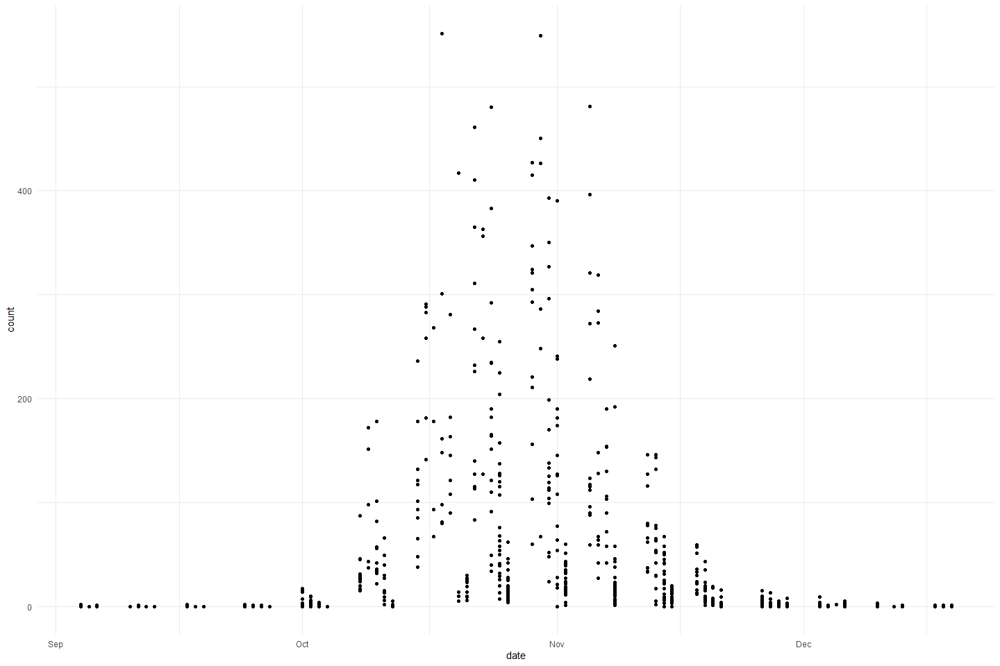
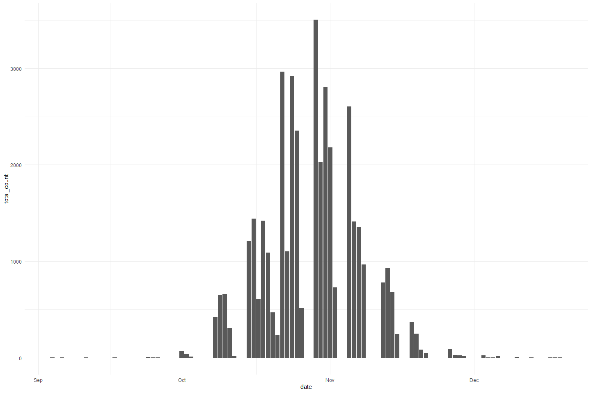
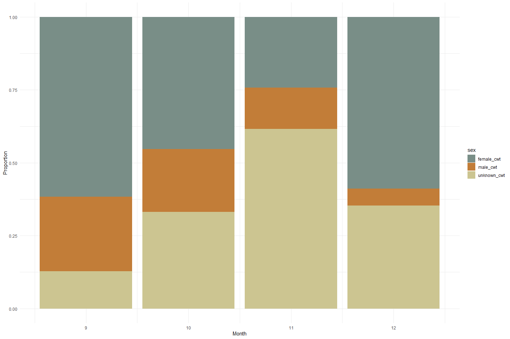

Feather Carcass QC 2012
================
Inigo Peng
2022-07-21

# Feather River Carcass Data

## Description of Monitoring Data

**Timeframe:**

**Video Season:**

**Completeness of Record throughout timeframe:**

**Sampling Location:**

**Data Contact:**

Any additional info?

## Access Cloud Data

``` r
# Run Sys.setenv() to specify GCS_AUTH_FILE and GCS_DEFAULT_BUCKET before running 
# getwd() to see how to specify paths 
# Open object from google cloud storage
# Set your authentication using gcs_auth

gcs_auth(json_file = Sys.getenv("GCS_AUTH_FILE"))
# Set global bucket 
gcs_global_bucket(bucket = Sys.getenv("GCS_DEFAULT_BUCKET"))

# git data and save as xlsx
```

``` r
gcs_get_object(object_name = "adult-holding-redd-and-carcass-surveys/feather-river/data-raw/carcass/2012/Chops_2012.xlsx",
               bucket = gcs_get_global_bucket(),
               saveToDisk = "Chops_2012.xlsx",
               overwrite = TRUE)
#
gcs_get_object(object_name = "adult-holding-redd-and-carcass-surveys/feather-river/data-raw/carcass/2012/ChopHeader_2012.xlsx",
               bucket = gcs_get_global_bucket(),
               saveToDisk = "ChopHeader_2012.xlsx",
               overwrite = TRUE)

# 
gcs_get_object(object_name = "adult-holding-redd-and-carcass-surveys/feather-river/data-raw/carcass/2012/CWTHeader_2012.xlsx",
               bucket = gcs_get_global_bucket(),
               saveToDisk = "CWTHeader_2012.xlsx",
               overwrite = TRUE)

gcs_get_object(object_name = "adult-holding-redd-and-carcass-surveys/feather-river/data-raw/carcass/2012/CWT_2012.xlsx",
               bucket = gcs_get_global_bucket(),
               saveToDisk = "CWT_2012.xlsx",
               overwrite = TRUE)
```

## Raw Data Glimpse:

### Chop_raw

``` r
Chops_raw <- read_excel("Chops_2012.xlsx") %>% 
  rename("ID" = `Chop Header ID`) %>%
  select(-`Chop ID`) %>% 
  glimpse()
```

    ## Rows: 867
    ## Columns: 5
    ## $ ID            <dbl> 73, 73, 73, 73, 73, 73, 73, 73, 73, 73, 73, 73, 73, 73, ~
    ## $ Section       <chr> "1", "2", "3", "4", "5", "6", "7", "8", "9", "10", "11",~
    ## $ Minutes       <dbl> 13, 10, 12, 4, 9, 13, 9, 10, 5, 22, 15, 25, 28, 15, 14, ~
    ## $ `Total Count` <dbl> 0, 0, 0, 0, 0, 0, 0, 0, 0, 0, 0, 2, 0, 0, 0, 1, 0, 0, 2,~
    ## $ Comments      <lgl> NA, NA, NA, NA, NA, NA, NA, NA, NA, NA, NA, NA, NA, NA, ~

### ChopHeader_raw

``` r
ChopHeader_raw <- read_excel("ChopHeader_2012.xlsx") %>% 
  rename("ID" = `Chop Header ID`) %>%
  glimpse()
```

    ## Rows: 143
    ## Columns: 6
    ## $ Date     <dttm> 2012-12-19, 2012-12-18, 2012-10-23, 2012-10-22, 2012-10-22, ~
    ## $ `Week #` <dbl> 16, 16, 8, 8, 8, 8, 7, 7, 7, 5, 14, 13, 10, 10, 9, 9, 3, 16, ~
    ## $ Weather  <chr> "sun", "SUN", "CLD", "RAN", "RAN", "RAN", "SUN", "SUN", "SUN"~
    ## $ Crew     <chr> "ai,tv,mb", "AI,TV,MB", "JR,KL,GS,AH", "JS,JR,AI,JK", "KH,SM,~
    ## $ Comments <chr> NA, "Sec 21 entered 2X", NA, NA, NA, NA, "NO TIME RECORDED FO~
    ## $ ID       <dbl> 215, 214, 213, 212, 211, 210, 209, 208, 207, 206, 205, 204, 2~

### cwt_raw

``` r
cwt_raw <- read_excel("CWT_2012.xlsx") %>% 
  rename("ID" = `CWT Header ID`) %>% 
  glimpse
```

    ## Rows: 11,886
    ## Columns: 19
    ## $ `CWT ID`               <dbl> 2084, 12018, 5492, 1902, 1933, 7211, 8004, 322,~
    ## $ ID                     <dbl> 136, 548, 262, 130, 130, 335, 368, 98, 116, 176~
    ## $ `River Section`        <dbl> 19, 4, 10, 4, 3, 35, 11, 19, 12, 8, 1, 19, 8, 3~
    ## $ `Tag ID#`              <lgl> NA, NA, NA, NA, NA, NA, NA, NA, NA, NA, NA, NA,~
    ## $ `Fork Length`          <dbl> 106, 103, 102, 99, 99, 98, 98, 97, 97, 97, 97, ~
    ## $ Sex                    <chr> "M", "F", "M", "M", "M", "M", "M", "M", "M", "M~
    ## $ `Recap 1 ID#`          <chr> NA, NA, NA, NA, NA, NA, NA, NA, NA, NA, NA, NA,~
    ## $ `Recap 2 ID#`          <lgl> NA, NA, NA, NA, NA, NA, NA, NA, NA, NA, NA, NA,~
    ## $ `Recap 3 ID#`          <lgl> NA, NA, NA, NA, NA, NA, NA, NA, NA, NA, NA, NA,~
    ## $ `Chop ID#`             <chr> NA, NA, NA, NA, NA, NA, NA, NA, NA, NA, NA, NA,~
    ## $ `Spawning Condition`   <chr> "UK", "S", "UK", "UK", "UK", "UK", "UK", "UK", ~
    ## $ `Adipose Fin Clipped?` <chr> "Y", "Y", "Y", "Y", "Y", "Y", "Y", "Y", "Y", "Y~
    ## $ `Head Tag #`           <chr> "50504", "67346", "67257", "50365", "50552", "6~
    ## $ Scales                 <chr> NA, "25482", NA, NA, NA, "25056", NA, NA, NA, N~
    ## $ Otoliths               <chr> NA, "673", NA, NA, NA, "303", NA, NA, NA, NA, N~
    ## $ `Hallprint Color`      <chr> NA, NA, NA, "G", NA, NA, NA, NA, NA, NA, NA, NA~
    ## $ `Hallprint #`          <dbl> NA, NA, NA, 2186, NA, NA, NA, NA, NA, NA, NA, N~
    ## $ `Radio Tag ID#`        <lgl> NA, NA, NA, NA, NA, NA, NA, NA, NA, NA, NA, NA,~
    ## $ Comments               <chr> NA, NA, NA, NA, NA, NA, NA, NA, NA, NA, NA, NA,~

### cwt_header_raw

``` r
cwt_header_raw <- read_excel("CWTHeader_2012.xlsx") %>% 
  rename("ID" = `CWT Header ID` ) %>% 
  glimpse
```

    ## Rows: 482
    ## Columns: 8
    ## $ ID          <dbl> 76, 77, 78, 79, 80, 81, 82, 83, 84, 85, 86, 87, 88, 89, 90~
    ## $ Date        <dttm> 2012-09-04, 2012-09-04, 2012-09-05, 2012-09-06, 2012-09-1~
    ## $ Crew        <chr> "CM,KH,JC,SM", "CM,KH,JC,SM", "JC,SM", "CM,TV,SM", "CD,JR,~
    ## $ `Week #`    <dbl> 1, 1, 1, 1, 2, 3, 3, 3, 4, 4, 4, 4, 4, 5, 5, 5, 5, 5, 5, 5~
    ## $ `Tag Color` <chr> "None", "None", "None", "None", "White", "Yellow", "Yellow~
    ## $ Morale      <chr> "11", "11", "11", "10", "10", "12", "10", "10", "10", "10"~
    ## $ LFC         <lgl> NA, NA, NA, NA, NA, NA, NA, NA, NA, NA, NA, NA, NA, NA, NA~
    ## $ HFC         <lgl> NA, NA, NA, NA, NA, NA, NA, NA, NA, NA, NA, NA, NA, NA, NA~

## Data transformations:

### Counts

The `chop` table contains carcass counts by chop/tagged based on clips

``` r
#1. chop table (with dates and tag color)
chop_join <- full_join(ChopHeader_raw %>% 
                                 select(ID, Date),
                               Chops_raw) %>% 
  clean_names() %>% 
  rename(sec = "section",
         min = "minutes",
         count = "total_count") %>% 
  mutate(sec = as.numeric(sec)) %>% glimpse
```

    ## Joining, by = "ID"

    ## Rows: 869
    ## Columns: 6
    ## $ id       <dbl> 215, 215, 215, 215, 215, 215, 215, 215, 215, 215, 215, 215, 2~
    ## $ date     <dttm> 2012-12-19, 2012-12-19, 2012-12-19, 2012-12-19, 2012-12-19, ~
    ## $ sec      <dbl> 27, 28, 29, 30, 31, 32, 33, 34, 35, 36, 37, 38, 21, 20, 19, 1~
    ## $ min      <dbl> 18, 5, 10, 19, 14, 27, 18, 11, 10, 11, 22, 15, 15, 7, 13, 5, ~
    ## $ count    <dbl> 0, 0, 0, 0, 0, 0, 0, 0, 0, 0, 1, 0, 0, 0, 0, 0, 0, 0, 1, 0, 0~
    ## $ comments <lgl> NA, NA, NA, NA, NA, NA, NA, NA, NA, NA, NA, NA, NA, NA, NA, N~

### Survey

The `chop_header` table contains survey metadata and covariates

``` r
chop_header <- ChopHeader_raw %>% 
  clean_names() %>% glimpse
```

    ## Rows: 143
    ## Columns: 6
    ## $ date        <dttm> 2012-12-19, 2012-12-18, 2012-10-23, 2012-10-22, 2012-10-2~
    ## $ week_number <dbl> 16, 16, 8, 8, 8, 8, 7, 7, 7, 5, 14, 13, 10, 10, 9, 9, 3, 1~
    ## $ weather     <chr> "sun", "SUN", "CLD", "RAN", "RAN", "RAN", "SUN", "SUN", "S~
    ## $ crew        <chr> "ai,tv,mb", "AI,TV,MB", "JR,KL,GS,AH", "JS,JR,AI,JK", "KH,~
    ## $ comments    <chr> NA, "Sec 21 entered 2X", NA, NA, NA, NA, "NO TIME RECORDED~
    ## $ id          <dbl> 215, 214, 213, 212, 211, 210, 209, 208, 207, 206, 205, 204~

### CWT

The `cwt` table contains coded wire tag information.

``` r
cwt <- full_join(cwt_raw %>% clean_names(), cwt_header_raw %>% clean_names()) %>%  
  rename(fl = "fork_length") %>% 
  glimpse
```

    ## Joining, by = "id"

    ## Rows: 11,891
    ## Columns: 26
    ## $ cwt_id              <dbl> 2084, 12018, 5492, 1902, 1933, 7211, 8004, 322, 23~
    ## $ id                  <dbl> 136, 548, 262, 130, 130, 335, 368, 98, 116, 176, 1~
    ## $ river_section       <dbl> 19, 4, 10, 4, 3, 35, 11, 19, 12, 8, 1, 19, 8, 3, 3~
    ## $ tag_id_number       <lgl> NA, NA, NA, NA, NA, NA, NA, NA, NA, NA, NA, NA, NA~
    ## $ fl                  <dbl> 106, 103, 102, 99, 99, 98, 98, 97, 97, 97, 97, 97,~
    ## $ sex                 <chr> "M", "F", "M", "M", "M", "M", "M", "M", "M", "M", ~
    ## $ recap_1_id_number   <chr> NA, NA, NA, NA, NA, NA, NA, NA, NA, NA, NA, NA, NA~
    ## $ recap_2_id_number   <lgl> NA, NA, NA, NA, NA, NA, NA, NA, NA, NA, NA, NA, NA~
    ## $ recap_3_id_number   <lgl> NA, NA, NA, NA, NA, NA, NA, NA, NA, NA, NA, NA, NA~
    ## $ chop_id_number      <chr> NA, NA, NA, NA, NA, NA, NA, NA, NA, NA, NA, NA, NA~
    ## $ spawning_condition  <chr> "UK", "S", "UK", "UK", "UK", "UK", "UK", "UK", "UK~
    ## $ adipose_fin_clipped <chr> "Y", "Y", "Y", "Y", "Y", "Y", "Y", "Y", "Y", "Y", ~
    ## $ head_tag_number     <chr> "50504", "67346", "67257", "50365", "50552", "6709~
    ## $ scales              <chr> NA, "25482", NA, NA, NA, "25056", NA, NA, NA, NA, ~
    ## $ otoliths            <chr> NA, "673", NA, NA, NA, "303", NA, NA, NA, NA, NA, ~
    ## $ hallprint_color     <chr> NA, NA, NA, "G", NA, NA, NA, NA, NA, NA, NA, NA, N~
    ## $ hallprint_number    <dbl> NA, NA, NA, 2186, NA, NA, NA, NA, NA, NA, NA, NA, ~
    ## $ radio_tag_id_number <lgl> NA, NA, NA, NA, NA, NA, NA, NA, NA, NA, NA, NA, NA~
    ## $ comments            <chr> NA, NA, NA, NA, NA, NA, NA, NA, NA, NA, NA, NA, NA~
    ## $ date                <dttm> 2012-10-11, 2012-11-26, 2012-10-23, 2012-10-10, 2~
    ## $ crew                <chr> "CM,TK,CD,SM", "tv,ai,cd", "AI,MB,KH,TV", "AI, JR,~
    ## $ week_number         <dbl> 6, 13, 8, 6, 6, 8, 9, 5, 7, 7, 7, 8, 6, 7, 7, 8, 8~
    ## $ tag_color           <chr> "WHITE", "blue", "RED", "WHITE", "WHITE", "red", "~
    ## $ morale              <chr> "10", "10", "9", "10", "10", "10", "10", "10+", "N~
    ## $ lfc                 <lgl> NA, NA, NA, NA, NA, NA, NA, NA, NA, NA, NA, NA, NA~
    ## $ hfc                 <lgl> NA, NA, NA, NA, NA, NA, NA, NA, NA, NA, NA, NA, NA~

## Explore Numeric Variables:

### Chop Join Variable: `id`, `min`, `sec`

``` r
chop_join %>% 
  select_if(is.numeric) %>%
  colnames()
```

    ## [1] "id"    "sec"   "min"   "count"

``` r
summary(chop_join$id)
```

    ##    Min. 1st Qu.  Median    Mean 3rd Qu.    Max. 
    ##    73.0   100.0   144.0   142.2   182.0   215.0

``` r
summary(chop_join$min)
```

    ##    Min. 1st Qu.  Median    Mean 3rd Qu.    Max.    NA's 
    ##    0.00   13.00   23.00   49.32   49.00  520.00      16

``` r
summary(chop_join$sec)
```

    ##    Min. 1st Qu.  Median    Mean 3rd Qu.    Max.    NA's 
    ##    1.00   10.00   18.00   19.03   28.00   38.00       5

**NA and Unknown Values** Provide a stat on NA or unknown values.

``` r
round(sum(is.na(chop_join$id))/nrow(chop_join), 3) * 100
```

    ## [1] 0

``` r
round(sum(is.na(chop_join$min))/nrow(chop_join), 3) * 100
```

    ## [1] 1.8

``` r
round(sum(is.na(chop_join$sec))/nrow(chop_join), 3) * 100
```

    ## [1] 0.6

-   0 % of values in the `id` column are NA.
-   1.8 % of values in the `min` column are NA.
-   0.6 % of values in the `sec` column are NA.

### Chop Join Variable: `count`

``` r
summary(chop_join$count)
```

    ##    Min. 1st Qu.  Median    Mean 3rd Qu.    Max.    NA's 
    ##    0.00    0.00    5.00   45.99   43.00  551.00       5

-   0.6 % of values in the `count` column are NA.

**Plotting total_count over Period of Record**

``` r
chop_join %>% 
  ggplot(aes(x = date, y = count)) + 
  geom_point() +
  theme_minimal()
```

<!-- -->

``` r
chop_join %>%
  group_by(date) %>%
  summarise(total_count = sum(count, na.rm = T)) %>%
  ggplot(aes(x = date, y = total_count)) +
  geom_col() +
  theme_minimal()
```

<!-- -->
\### Chop Header Variable: `id`

``` r
chop_header %>% 
  select_if(is.numeric) %>% 
  colnames()
```

    ## [1] "week_number" "id"

``` r
summary(chop_header$id)
```

    ##    Min. 1st Qu.  Median    Mean 3rd Qu.    Max. 
    ##    73.0   108.5   144.0   144.0   179.5   215.0

### CWT Variable: `ID`, `sect`, `fl`, `header_id`, `week_num`

``` r
cwt %>% 
  select_if(is.numeric) %>% 
  colnames()
```

    ## [1] "cwt_id"           "id"               "river_section"    "fl"              
    ## [5] "hallprint_number" "week_number"

``` r
summary(cwt$fl)
```

    ##    Min. 1st Qu.  Median    Mean 3rd Qu.    Max.    NA's 
    ##   24.00   75.00   79.00   78.21   83.00  114.00    4711

``` r
summary(cwt$river_section)
```

    ##    Min. 1st Qu.  Median    Mean 3rd Qu.    Max.    NA's 
    ##    1.00    8.00   10.00   11.58   14.00   38.00       6

-   39.6 % of values in the `fl` column are NA.
-   0.1 % of values in the `sect` column are NA.

``` r
#Create a cwt_count column
#Pivot table to expand sex column to female_cwt, male_cwt, and unknown_cwt 
#Is this graph helpful?
unique(cwt$sex)
```

    ## [1] "M" "F" NA

``` r
cwt_count <- cwt %>% 
  mutate(count = 1) %>%
  mutate(sex = case_when(sex == "ND"|is.na(sex)|sex =="UK" ~ "U",
                         TRUE ~ sex)) %>% 
  pivot_wider(names_from = sex, values_from = count, values_fill = 0) %>% 
  # unnest() %>% 
  rename("male_cwt" = M,
         "female_cwt" = F,
         "unknown_cwt" = U) %>% glimpse
```

    ## Rows: 11,891
    ## Columns: 28
    ## $ cwt_id              <dbl> 2084, 12018, 5492, 1902, 1933, 7211, 8004, 322, 23~
    ## $ id                  <dbl> 136, 548, 262, 130, 130, 335, 368, 98, 116, 176, 1~
    ## $ river_section       <dbl> 19, 4, 10, 4, 3, 35, 11, 19, 12, 8, 1, 19, 8, 3, 3~
    ## $ tag_id_number       <lgl> NA, NA, NA, NA, NA, NA, NA, NA, NA, NA, NA, NA, NA~
    ## $ fl                  <dbl> 106, 103, 102, 99, 99, 98, 98, 97, 97, 97, 97, 97,~
    ## $ recap_1_id_number   <chr> NA, NA, NA, NA, NA, NA, NA, NA, NA, NA, NA, NA, NA~
    ## $ recap_2_id_number   <lgl> NA, NA, NA, NA, NA, NA, NA, NA, NA, NA, NA, NA, NA~
    ## $ recap_3_id_number   <lgl> NA, NA, NA, NA, NA, NA, NA, NA, NA, NA, NA, NA, NA~
    ## $ chop_id_number      <chr> NA, NA, NA, NA, NA, NA, NA, NA, NA, NA, NA, NA, NA~
    ## $ spawning_condition  <chr> "UK", "S", "UK", "UK", "UK", "UK", "UK", "UK", "UK~
    ## $ adipose_fin_clipped <chr> "Y", "Y", "Y", "Y", "Y", "Y", "Y", "Y", "Y", "Y", ~
    ## $ head_tag_number     <chr> "50504", "67346", "67257", "50365", "50552", "6709~
    ## $ scales              <chr> NA, "25482", NA, NA, NA, "25056", NA, NA, NA, NA, ~
    ## $ otoliths            <chr> NA, "673", NA, NA, NA, "303", NA, NA, NA, NA, NA, ~
    ## $ hallprint_color     <chr> NA, NA, NA, "G", NA, NA, NA, NA, NA, NA, NA, NA, N~
    ## $ hallprint_number    <dbl> NA, NA, NA, 2186, NA, NA, NA, NA, NA, NA, NA, NA, ~
    ## $ radio_tag_id_number <lgl> NA, NA, NA, NA, NA, NA, NA, NA, NA, NA, NA, NA, NA~
    ## $ comments            <chr> NA, NA, NA, NA, NA, NA, NA, NA, NA, NA, NA, NA, NA~
    ## $ date                <dttm> 2012-10-11, 2012-11-26, 2012-10-23, 2012-10-10, 2~
    ## $ crew                <chr> "CM,TK,CD,SM", "tv,ai,cd", "AI,MB,KH,TV", "AI, JR,~
    ## $ week_number         <dbl> 6, 13, 8, 6, 6, 8, 9, 5, 7, 7, 7, 8, 6, 7, 7, 8, 8~
    ## $ tag_color           <chr> "WHITE", "blue", "RED", "WHITE", "WHITE", "red", "~
    ## $ morale              <chr> "10", "10", "9", "10", "10", "10", "10", "10+", "N~
    ## $ lfc                 <lgl> NA, NA, NA, NA, NA, NA, NA, NA, NA, NA, NA, NA, NA~
    ## $ hfc                 <lgl> NA, NA, NA, NA, NA, NA, NA, NA, NA, NA, NA, NA, NA~
    ## $ male_cwt            <dbl> 1, 0, 1, 1, 1, 1, 1, 1, 1, 1, 1, 1, 1, 0, 1, 1, 1,~
    ## $ female_cwt          <dbl> 0, 1, 0, 0, 0, 0, 0, 0, 0, 0, 0, 0, 0, 1, 0, 0, 0,~
    ## $ unknown_cwt         <dbl> 0, 0, 0, 0, 0, 0, 0, 0, 0, 0, 0, 0, 0, 0, 0, 0, 0,~

``` r
total_cwt_summary <- cwt_count %>% 
  mutate(male_cwt = ifelse(is.na(male_cwt), 0, male_cwt), # fill na
         female_cwt = ifelse(is.na(female_cwt), 0, female_cwt),
         unknown_cwt = ifelse(is.na(unknown_cwt), 0, unknown_cwt),
         total_cwt = unknown_cwt + male_cwt + female_cwt) %>% 
  group_by(month(date)) %>% 
  summarise(total_cwt = sum(total_cwt),
            male_cwt = sum(male_cwt),
            female_cwt = sum(female_cwt),
            unknown_cwt = sum(unknown_cwt))
```

``` r
total_cwt_summary %>% 
  pivot_longer(cols = c(male_cwt, female_cwt, unknown_cwt), names_to = "sex", values_to = "count") %>% 
  mutate(proportions = (count / total_cwt)) %>% 
  ggplot(aes(x = `month(date)`, y = proportions, fill = sex)) + 
  geom_bar(stat = "identity", position = "stack") +
  scale_fill_manual(name = "chops", 
                    labels = c("CWT Male", "CWT Female", "CWT Unknown")) +
  theme_minimal() + 
  labs(y = "Proportion", x = "Month") +
  scale_fill_manual(values = wes_palette("Moonrise2"))
```

    ## Scale for 'fill' is already present. Adding another scale for 'fill', which
    ## will replace the existing scale.

<!-- -->

**Plotting fork length of each sex**

``` r
cwt %>% 
  mutate(sex = case_when(sex == "ND"|is.na(sex)|sex =="UK" ~ "Unknown",
                         TRUE ~ sex))%>% 
  ggplot(aes(x = sex, y = fl)) + 
  geom_boxplot() + 
  theme_minimal() + 
  labs(y = "FL", x = "Sex")
```

<!-- -->

## Explore Categorical variables:

### Chop Clean Data

Fix inconsistencies with spelling, capitalization, and dates

``` r
chop_join %>% 
  select_if(is.character) %>%
  colnames()
```

    ## character(0)

``` r
chop_cleaner <- chop_join %>%
  mutate(date = as_date(date)) %>%
  mutate_if(is.character, str_to_lower) 

chop_cleaner
```

    ## # A tibble: 869 x 6
    ##       id date         sec   min count comments
    ##    <dbl> <date>     <dbl> <dbl> <dbl> <lgl>   
    ##  1   215 2012-12-19    27    18     0 NA      
    ##  2   215 2012-12-19    28     5     0 NA      
    ##  3   215 2012-12-19    29    10     0 NA      
    ##  4   215 2012-12-19    30    19     0 NA      
    ##  5   215 2012-12-19    31    14     0 NA      
    ##  6   215 2012-12-19    32    27     0 NA      
    ##  7   215 2012-12-19    33    18     0 NA      
    ##  8   215 2012-12-19    34    11     0 NA      
    ##  9   215 2012-12-19    35    10     0 NA      
    ## 10   215 2012-12-19    36    11     0 NA      
    ## # ... with 859 more rows

### Chop Header Clean Data

``` r
chop_header %>% 
  select_if(is.character) %>% 
  colnames()
```

    ## [1] "weather"  "crew"     "comments"

``` r
unique(chop_header$crew)
```

    ##   [1] "ai,tv,mb"       "AI,TV,MB"       "JR,KL,GS,AH"    "JS,JR,AI,JK"   
    ##   [5] "KH,SM,AH"       "CM,TK,CD,MB"    "JS,KH,MB,TV"    "CM,JB,TL,AH"   
    ##   [9] "AI,KL,SM,TK"    "AI,MB,CD,SM"    "JS,MB,CD,AI"    "CM,SM,KL,AH"   
    ##  [13] "AI/JR/JC/CD"    "CD,CM,AH,KH"    "JS/MB/SM/JC"    "CM,CD,TK"      
    ##  [17] "ai,mb,tv"       "ai,mb,js"       "ai,mb,c"        NA              
    ##  [21] "at,tv,mb"       "ai,mb,tk"       "ai,tk,mb"       "js,mb,ai,jk"   
    ##  [25] "js,mb,tv,ah"    "tv,mb,ai"       "js,mb,cd,ai"    "ai,tv,cd"      
    ##  [29] "js.tk,cm,mb"    "js,cm,tk,mb"    "js,dr,tv,cc"    "jr,ai,mb,tk"   
    ##  [33] "dr,cc,mb"       "jeff"           "ai,jr,tk"       "js,sm,cd,cc"   
    ##  [37] "tv,ai,mb,tk"    "ai,mb,tk,tv"    "js,mb,kh,ah"    "ai,kt,cm,cd"   
    ##  [41] "jc,ah,mb,tv"    "jc,tv,kh,mb"    "ai,jr,tk,cd"    "jr,cd,ai,tk"   
    ##  [45] "jk,mm,mb"       "jc,tv,tk,js"    "cd,jr,ah,cc"    "ai,sm,jc,tk"   
    ##  [49] "tv,jb,mb"       "kt,cm,ah,dr"    "js,jc,kh,c"     "sm,mb,kh,cd"   
    ##  [53] "ai,jc,jr,cd"    "kt,cm,ah,sm"    "kh,tv,gs,mb"    "jc,jk,tv"      
    ##  [57] "kh,gs,jc,ah"    "cd,sm,jr,mb"    "jc,dr,kl,mb"    "sm,tv,jc,kh"   
    ##  [61] "ai,cm,cd,ah"    "js,jc,kh,tv"    "ai,jr,dr,mb"    "kt,cm,cd,sm"   
    ##  [65] "cm,cd,kh,tv"    "jc,mb,cc,jb"    "jc,mb,cc,jr"    "KT,SM,CM,CD"   
    ##  [69] "AI,JR,MB,JW"    "JC,JS,KH"       "jk,tv,gs,dr"    "jr,cc,ai,jw"   
    ##  [73] "sm,jc,ah"       "jk,tv,jr,gs"    "ai,kt,cd,dr"    "cd,cm,ah,kh"   
    ##  [77] "kh,tv,jr,gs"    "ai,kt,jc,sm"    "cd,tv,mb,ah"    "jk,tv,gs,mb"   
    ##  [81] "jc,ah,kh,cd"    "cm,kl,ai,jr"    "jb,cc,sm,tk"    "ai,jc,cd,jr"   
    ##  [85] "jb,cc,sm,js"    "gs,tk,cm,mb"    "jk,km,jw,tv"    "ai,tk,cd,sm"   
    ##  [89] "kh,tv,mb,jc"    "JS,AI,KH,"      "KH,GS,JS"       "CM.AI,CD,KL"   
    ##  [93] "JS,KH,MB"       "JR,KH,CD,AI"    "CM,TK,KH,MB"    "GS,TK,SM,AI"   
    ##  [97] "JB,AH,JR,JC"    "KT,GS,TK,SM"    "AI,KH,MB"       "KH,AI,SM,MB"   
    ## [101] "AI,MB,SM,KH"    "AI,TV,JK,MB"    "CM,CD,SM,YK"    "CD,JR,CM,AI"   
    ## [105] "KT,SM,MB,TK"    "AI,KH,CD,TK"    "SM,JR,MB,TV"    "JS, KH, MB"    
    ## [109] "JR, TV, SM, AI" "CD,KH,TK,CM"    "SM,CD,MB,AI"    "AI, KH"        
    ## [113] "CM,CD,SM,MB"    "AI,MB,TV"       "JC, SM, JS"     "CM,CD,TV,TK"   
    ## [117] "CM,CD"          "AI,MB,JC,CD"    "SR,CP,MB,AI"    "KT,JR,JS,AH"   
    ## [121] "KH,CD,MB,AI"    "KT,TV,CD"       "SM,TV"          "TV,SM,CD"      
    ## [125] "JR,KH,CD,SM"    "JR,JC,SM,CD"    "CM,TV,SM"       "SM,JC"         
    ## [129] "CM,JC,KH,SM"    "CM,CD,TK,TV"

``` r
unique(chop_header$weather)
```

    ##  [1] "sun"          "SUN"          "CLD"          "RAN"          "cld"         
    ##  [6] "SUN/CLD/RAN"  "rain"         "cld,rain"     "cld.rain"     "cld. Rain"   
    ## [11] "sun,cld,rain" "sun.cld"      "sun / cld"    "cld/ran"      "cld /ran"    
    ## [16] "blue"         "cld, ran"     "Sun"

``` r
chop_header_cleaner <- chop_header %>%
  mutate_if(is.character, str_to_lower) %>% 
  mutate(crew = str_replace_all(crew, " ", ","),
         crew = str_replace_all(crew, ",,", ","),
         weather = case_when(weather == "cloudy" ~ "cld",
                             weather == "ran" ~ "rain",
                             weather == "sun/cld/ran" ~ "sun,cld,rain",
                             weather == "sun.cld" ~ "sun,cld",
                             weather == "cld.rain" | weather =="cld.ran" | weather == "cld,ran" ~ "cld,rain",
                             weather == "blue" ~ NA_character_,
                             TRUE ~ weather),
         weather = str_replace_all(weather, " ", ""),
         weather = str_replace_all(weather, "/", ","))
         # weather = str_replace_all(weather, ".",","))


unique(chop_header_cleaner$weather)
```

    ## [1] "sun"          "cld"          "rain"         "sun,cld,rain" "cld,rain"    
    ## [6] "cld.rain"     "sun,cld"      "cld,ran"      NA

### CWT Clean Data

``` r
cwt %>% 
  select_if(is.character) %>% 
  colnames
```

    ##  [1] "sex"                 "recap_1_id_number"   "chop_id_number"     
    ##  [4] "spawning_condition"  "adipose_fin_clipped" "head_tag_number"    
    ##  [7] "scales"              "otoliths"            "hallprint_color"    
    ## [10] "comments"            "crew"                "tag_color"          
    ## [13] "morale"

``` r
unique(cwt$spawning_condition)
```

    ## [1] "UK" "S"  "U"  NA

``` r
unique(cwt$adipose_fin_clipped)
```

    ## [1] "Y"  NA   "N"  "UK"

``` r
unique(cwt$crew)
```

    ##   [1] "CM,TK,CD,SM"     "tv,ai,cd"        "AI,MB,KH,TV"     "AI, JR,CM,CD,JK"
    ##   [5] "cd,tv,ah,mb"     "AI KT,CD,DR"     "SM,CD,MB,AI"     "JB,JR,AH,CM"    
    ##   [9] "not entered"     "CM,MB,TK,KH"     "jc,ah,kh,cd"     "cd,tk,kh,ai"    
    ##  [13] "CM,TK,MB,KH"     "JK,KH,GS,JS"     "JK,KM,JW,TV"     "jb,cc,sm,tk"    
    ##  [17] "kh,tv,jr,gs"     "jc,tv,tk,js"     "jk,mb,mm,dr"     "JB,JR,AH,JC"    
    ##  [21] "KH,JS,MB"        "CM,CD,AH,KH"     "CD,MB,SM,KH"     "JS, SM, JC"     
    ##  [25] "AI,KH,MB"        "cd,ah,kh"        "js,kh,kh,ai"     "AI,JC,JR,CD"    
    ##  [29] "cm,ai,kl,jr"     "sm,cd,kl,mb"     "ai,jw,jr,cc"     "js,jc,kh"       
    ##  [33] "KH, TV, GS, JC"  "CM,CD,MB,SM"     "MB, JR"          "GS,TK,SM,AI"    
    ##  [37] "AI,TV,MB,KH"     "JK, KM,JW,TV"    "KT, CD, SM, CM"  "CM,CD,TV,KH"    
    ##  [41] "CM,CD,KL,AH"     "jc,tv,jk,km"     "JS,MB,TV,KH"     "JS,JC,KH"       
    ##  [45] "AI,CD,KL,JK"     "JS,JR,JK,AI"     "jk,km,jw,tv"     "cm,cd,kl,ah"    
    ##  [49] "JK,TV,GS,DR"     "kh,tv,gs,jc"     "JC,MB,CC,JR"     "KH,GS,AH,JC"    
    ##  [53] "cd,sm,mb,kh"     "jk,mm,mb"        "AI,MB,TV"        "AI, SM,JR,TV"   
    ##  [57] "CD,KH,AI,TK"     "TK,KT,SM,MB"     "KH,AI,MB,SM"     "JS,TV,MB,KH"    
    ##  [61] "JS,MB,CM,JR"     "KH, AH, CD"      "JR,KL,CD,AI"     "AI,KT,CM,CD"    
    ##  [65] "CM,MB,TK,CD"     "SM,KH,AH"        "JB,JS,SM,CC"     "jk,km,tv,jw"    
    ##  [69] "ah,kh,jc,cd"     "CM,AH,CD,KL"     "TV,KH,JR,GS"     "KH,TV,JR,GS"    
    ##  [73] "jr,cc,ai,jw"     "KH,TV,GS,JC"     "JW,JR,AI,MB"     "JS,KH,TV,JC"    
    ##  [77] "SM,TV,JR,KH"     "tv,jr,mb"        "CM,KH,JC,SM"     "KH,TK,CM,CD"    
    ##  [81] "JS,KH,MB,TV"     "KT,GS,TK,SM"     "CM,KL,AI,CD"     "KH,GS,JS"       
    ##  [85] "CM,TK,KH,MB"     "AI,CD,TK,SM"     "ai,cd,jr,jc"     "cm,jr,kl,ai"    
    ##  [89] "ai,kt,sm,jc"     "js,tk,mb,ai"     "AI, TV, JC, KH"  "CM,CD,KL,TK"    
    ##  [93] "CM,AH,JR,JB"     "CD,CM,AI,JR"     "AI,MB,TV,JK"     "AI,MB,KH"       
    ##  [97] "JS,MB,JR,CM"     "AI,CD,JK,KL"     "KT,CD,CM,AI"     "CM,TK,CD,MB"    
    ## [101] "GS,KT,CM,MB"     "jk,tv,gs,mb"     "js,mb,jc,sm"     "KH,KT,JR,GS"    
    ## [105] "js,sk,tv,km"     "CM,CD"           "js,jc,sm"        "AI, SM, TM, KL" 
    ## [109] "KH,AI,CD,TK"     "JS,MB,TK,SM"     "CD,KL,AI,JK"     "KH,JK,GS,JS"    
    ## [113] "JS,AI,JK,JR"     "LINE"            "cm,jr,ai,kl"     "cd,mb,ah,"      
    ## [117] "JS,KH,JC"        "cd,sm,kl,mb"     "jk,tv,gs,dr"     "AI,DR,JR,MB"    
    ## [121] "SM,JR,MB,CD"     "kt,cm,dr,ah"     "ai,tk,sm,jc"     "jr,kt,gs,ah"    
    ## [125] "KT,JS,JR,AH"     "KH, JC, TV, AI"  "KH,MB,JS"        "JR,AH,CM,jb"    
    ## [129] "JK,MB,KI"        "AIMMB,KH"        "SM,AH,KH"        "JS,AI,JR,JK"    
    ## [133] "KH,TV,MB,JC"     "JB,SM,CC,JS"     "ai,cm,jr,kt"     "cm,cd,kh,ah"    
    ## [137] "SM,AH,JC"        "JW,JR,MB,AI"     "JR, TV, SM, AI"  "TV, SM,JR"      
    ## [141] "CM,JB,JR,AH"     "SM,TV,MB,JR"     "KT,SM,TK,MB"     "AH,CD,KH"       
    ## [145] "JS,JR,CM,MB"     "cm,mb,kh,tk"     "JS,MB,KH"        "KH,JS,AI"       
    ## [149] "JS,KH,AI,KH"     "CM,CD,TK,MB"     "KH,AH,SM"        "GS,TK,CM,MB"    
    ## [153] NA                "NO"              "js,mb,sm,jc"     "a$,kt,cd,dr"    
    ## [157] "cm,sm,kl,mb"     "KT,CM,CD,SM"     "JS,TV,KH,JC"     "AI,MB,JR,DR"    
    ## [161] "AI,CM,CD,AH"     "KH, TV, JR, SM"  "tv,jb,mb"        "SM,AI,KH,TK,TI" 
    ## [165] "KH,CD,AI,TK"     "SM,TV,JR,MB"     "JB,JC,JR,AH"     "kt,gs,tk,sm"    
    ## [169] "kh,ah,cd"        "GS, TK, SM, AI"  "TK,CM,KH,MB"     "CM,CD,KL,AI"    
    ## [173] "JS,JR,AI,JK"     "JS,JK,TK,AI"     "CM,GS,MB,TK"     "jb,sm,cc,js"    
    ## [177] "jk,tv,js,mb"     "tv,kh,jr,gs"     "ai,cc,jw,jr"     "SM,KM,JC,TV"    
    ## [181] "ai,jc,mb,dr"     "js,jk,tv,km"     "CM,TK,TO,CD"     "JS,MB,KH,TV"    
    ## [185] "NOT ENTERED"     "KT,AE,JR,CD"     "JS,KH,MB"        "sm,kh,ah"       
    ## [189] "kh,tv,mb,ai"     "ai,jr,jc,cd"     "AI,CD,JR,JC"     "kt,ai,sm,jc"    
    ## [193] "KT,DR,CD,AI"     "CD,KL,SM,MB"     "CM,CD,KH,TV"     "CM,KH,TV,CD"    
    ## [197] "KT, CM, CD, SM"  "js,kh,jc,tv"     "cm,cd,kl,sm"     "kh,sm,jr,tv"    
    ## [201] "AI,SM,JC,TK"     "jb,tv,mb"        "js,cc,cm,cd"     "ai,mb,tk,tv"    
    ## [205] "MB,TV,SM,JB"     "CM,CD,TK,SM"     "JS,JR,MB,CM"     "AI,KH,MB,TV"    
    ## [209] "CD,SM,JC,TK"     "js,sm,mb,jc"     "JR,CC,AI,JW"     "ai,jw,cc,jr"    
    ## [213] "JS,JC,KH,TV"     "tv,mb,jr"        "kt,sm,dr,ah"     "ai,kt,cd,cm"    
    ## [217] "JB.JR,AH,JC"     "KT,AI,JR,CD"     "JS,MP,KL"        "AI,TK,CD,SM"    
    ## [221] "AI,MB,TV,KH"     "CD,SM,KL,MB"     "cm,kl,sm,cd"     "AI,JR,JW,MB"    
    ## [225] "sm,tv,jc,jr"     "kh,gs,jc,ah"     "AI,KH,SM,TK"     "JS,KH,KH,AI"    
    ## [229] "CM,MB,TK,GS"     "AI,JR,JC,CD"     "ai,jr,mb,jw"     "AI,JR,DR,MB"    
    ## [233] "TV, JR, SM,KH"   "js,jc,tv,km"     "kh,tv,gs,mb"     "kt,jr,gs,ah"    
    ## [237] "JS, MB, CM, JR"  "CM,AI,CD,KL"     "AI, CD,CM,KT"    "GS,CM,TK,MB"    
    ## [241] "AI,JW,CC,JR"     "cd,sm,jr,mb"     "js,mb,cm,tk"     "TV, MB"         
    ## [245] "MB"              "SM,JC,CD,TK"     "JB,SM,CA,JS"     "A$,KT,CD,DR"    
    ## [249] "JW,JB,MB,AI"     "AI, DR, JR, MB"  "KH,GS,JC,AH"     "sm,cd,mb,jr"    
    ## [253] "cm,kl,sm,ah"     "kt.jr,gs,ah"     "JS,KH,GS"        "cd,tv,mb,ah"    
    ## [257] "sm,ah,jc"        "jc,mb,kl,dr"     "jr,ai,cd,tk"     "tv,tk,ai,mb"    
    ## [261] "cd,kh,ah"        "js,kh,jc"        "AI,MB,JR,JW"     "AI,TK,SM,JC"    
    ## [265] "js,tv,jc,tk"     "SM,TV,JC,KH"     "CM,CD,TK"        "KH,CD,MB,AI"    
    ## [269] "sm,mb,js"        "SM,JC,AH"        "tk,mb,ai,tv"     "js,jc,kh,c"     
    ## [273] "ai,tv,mb"        "jc,mb,cc,jb"     "cm,kl,cd,ah"     "jr,kl,gs,ah"    
    ## [277] "CD,JR,JC,SM"     "CM,TV,SM"        "AI,MB,JC,CD"     "js,kh,mb,ah"    
    ## [281] "sm,tv,kh,jr"     "sm,jc,tk,cd"     "AI,KT,CD,JK"     "AI, CM,KT,CD"   
    ## [285] "cd,ah,kh,jc"     "CM,CD,AH,KL"     "jc,ah,sm"        "sm,jc,ah"       
    ## [289] "cd,kl,sm,mb"     "JK,TV,DR,GS"     "ai,mb,jw,jr"     "JC,KH,JS,TV"    
    ## [293] "kt,cm,cd,sm"     "js,jc,kh,tv"     "CM,CD,SM,KL"     "JS,KH,JC,TV"    
    ## [297] "JS,TV,JC,KH"     "AI,MB,JB,DR"     "AI,MB,DR,JC"     "sm,jr,mb,cd"    
    ## [301] "kh,gs,ah,jc"     "jr,mb,cd,sm"     "js,tv,jk"        "ai,jc,jr,cd"    
    ## [305] "cd,kh,mb,sm"     "JS,JC,KH,C"      "mb,jr,tv"        "KT,CM,DR,AH"    
    ## [309] "ai,tk,jc,sm"     "cd,ah,jr,cc"     "AH,CC,JR,CD"     "jc,tv,kh,mb"    
    ## [313] "js,mb,kh,ah"     "kt,cm,cd,ai"     "js,cm,cc,cd"     "ai,jr,tk"       
    ## [317] "dr,cc,mb"        "js, tv, cc, dr"  "jr,ai,mb,tk"     "js,ai,mb,cd"    
    ## [321] "ai,mb,tv,cd"     "ai,mb,tk"        "ai,tk,mb"        "AI, MB, CD, SM" 
    ## [325] "GS,TK,SM.AI"     "KT,CD,TV"        "gs,tk,cm,mb"     "JC,SM"          
    ## [329] "AI, MB, TV"

``` r
unique(cwt$tag_color)
```

    ##  [1] "WHITE"  "blue"   "RED"    "red"    "BLUE"   "Blue"   "YELLOW" "yellow"
    ##  [9] "white"  "White"  "None"   "Red"    NA       "Yellow"

``` r
#Dropping sectiongroup and morale
cwt_cleaner <- cwt %>% 
  mutate_if(is.character, str_to_lower) %>% 
  mutate(crew = str_replace_all(crew, " ", ","),
         crew = str_replace_all(crew, ",,", ","),
         sex = case_when(sex == "nd"|is.na(sex) ~ "unknown",
                         TRUE ~ sex),
         adipose_fin_clipped = case_when(adipose_fin_clipped == "uk" ~ "unknown",
                                         adipose_fin_clipped == "y" ~ "yes",
                                         adipose_fin_clipped == "n" ~ "no",
                                         TRUE ~ adipose_fin_clipped),) %>% 
  select(-morale) %>% 
  glimpse
```

    ## Rows: 11,891
    ## Columns: 25
    ## $ cwt_id              <dbl> 2084, 12018, 5492, 1902, 1933, 7211, 8004, 322, 23~
    ## $ id                  <dbl> 136, 548, 262, 130, 130, 335, 368, 98, 116, 176, 1~
    ## $ river_section       <dbl> 19, 4, 10, 4, 3, 35, 11, 19, 12, 8, 1, 19, 8, 3, 3~
    ## $ tag_id_number       <lgl> NA, NA, NA, NA, NA, NA, NA, NA, NA, NA, NA, NA, NA~
    ## $ fl                  <dbl> 106, 103, 102, 99, 99, 98, 98, 97, 97, 97, 97, 97,~
    ## $ sex                 <chr> "m", "f", "m", "m", "m", "m", "m", "m", "m", "m", ~
    ## $ recap_1_id_number   <chr> NA, NA, NA, NA, NA, NA, NA, NA, NA, NA, NA, NA, NA~
    ## $ recap_2_id_number   <lgl> NA, NA, NA, NA, NA, NA, NA, NA, NA, NA, NA, NA, NA~
    ## $ recap_3_id_number   <lgl> NA, NA, NA, NA, NA, NA, NA, NA, NA, NA, NA, NA, NA~
    ## $ chop_id_number      <chr> NA, NA, NA, NA, NA, NA, NA, NA, NA, NA, NA, NA, NA~
    ## $ spawning_condition  <chr> "uk", "s", "uk", "uk", "uk", "uk", "uk", "uk", "uk~
    ## $ adipose_fin_clipped <chr> "yes", "yes", "yes", "yes", "yes", "yes", "yes", "~
    ## $ head_tag_number     <chr> "50504", "67346", "67257", "50365", "50552", "6709~
    ## $ scales              <chr> NA, "25482", NA, NA, NA, "25056", NA, NA, NA, NA, ~
    ## $ otoliths            <chr> NA, "673", NA, NA, NA, "303", NA, NA, NA, NA, NA, ~
    ## $ hallprint_color     <chr> NA, NA, NA, "g", NA, NA, NA, NA, NA, NA, NA, NA, N~
    ## $ hallprint_number    <dbl> NA, NA, NA, 2186, NA, NA, NA, NA, NA, NA, NA, NA, ~
    ## $ radio_tag_id_number <lgl> NA, NA, NA, NA, NA, NA, NA, NA, NA, NA, NA, NA, NA~
    ## $ comments            <chr> NA, NA, NA, NA, NA, NA, NA, NA, NA, NA, NA, NA, NA~
    ## $ date                <dttm> 2012-10-11, 2012-11-26, 2012-10-23, 2012-10-10, 2~
    ## $ crew                <chr> "cm,tk,cd,sm", "tv,ai,cd", "ai,mb,kh,tv", "ai,jr,c~
    ## $ week_number         <dbl> 6, 13, 8, 6, 6, 8, 9, 5, 7, 7, 7, 8, 6, 7, 7, 8, 8~
    ## $ tag_color           <chr> "white", "blue", "red", "white", "white", "red", "~
    ## $ lfc                 <lgl> NA, NA, NA, NA, NA, NA, NA, NA, NA, NA, NA, NA, NA~
    ## $ hfc                 <lgl> NA, NA, NA, NA, NA, NA, NA, NA, NA, NA, NA, NA, NA~

## Data Dictionaries

# Count

``` r
percent_na <- chop_cleaner %>%
  summarise_all(list(name = ~sum(is.na(.))/length(.))) %>%
  pivot_longer(cols = everything())


counts_data_dictionary <- tibble(variables = colnames(chop_cleaner),
                          description = c("ID",
                                          "Date of survey",
                                          "Sect", 
                                          "Min", 
                                          "Count",
                                          "Comments"),
                          percent_na = round(percent_na$value*100))

kable(counts_data_dictionary)
```

| variables | description    | percent_na |
|:----------|:---------------|-----------:|
| id        | ID             |          0 |
| date      | Date of survey |          0 |
| sec       | Sect           |          1 |
| min       | Min            |          2 |
| count     | Count          |          1 |
| comments  | Comments       |        100 |

### Survey

``` r
percent_na <- chop_header_cleaner %>%
  summarise_all(list(name = ~sum(is.na(.))/length(.))) %>%
  pivot_longer(cols = everything())
# 
header_data_dictionary <- tibble(variables = colnames(chop_header_cleaner),
                          description = c("Date of survey",
                                          "Week Number",
                                          "Weather",
                                          "Crew memeber initials that collected",
                                          "Comments",
                                          "ID"),
                          percent_na = round(percent_na$value*100))
# 
kable(header_data_dictionary)
```

| variables   | description                          | percent_na |
|:------------|:-------------------------------------|-----------:|
| date        | Date of survey                       |          0 |
| week_number | Week Number                          |          0 |
| weather     | Weather                              |          1 |
| crew        | Crew memeber initials that collected |          3 |
| comments    | Comments                             |         88 |
| id          | ID                                   |          0 |

### CWT

``` r
percent_na <- cwt_cleaner %>%
  summarise_all(list(name = ~sum(is.na(.))/length(.))) %>%
  pivot_longer(cols = everything())

cwt_data_dictionary <- tibble(variables = colnames(cwt_cleaner),
                          description = c("CWT ID",
                                          "ID",
                                          "River section",
                                          "Tag ID number",
                                          "Fork length",
                                          "Sex",
                                          "Recap 1 ID number",
                                          "Recap 2 ID number",
                                          "Recap 3 ID number",
                                          "Chop ID number",
                                          "Spawning condition",
                                          "Adipose fin clipped",
                                          "Head tag number",
                                          "Scales",
                                          "Otoliths",
                                          "Hallprint color",
                                          "Hallprint number",
                                          "Radio tag ID",
                                          "Comments",
                                          "Date",
                                          "Crew",
                                          "Week number",
                                          "Tag colour",
                                          "LFC",
                                          "HFC"),
                          percent_na = round(percent_na$value*100))

kable(cwt_data_dictionary)
```

| variables           | description         | percent_na |
|:--------------------|:--------------------|-----------:|
| cwt_id              | CWT ID              |          0 |
| id                  | ID                  |          0 |
| river_section       | River section       |          0 |
| tag_id_number       | Tag ID number       |        100 |
| fl                  | Fork length         |         40 |
| sex                 | Sex                 |          0 |
| recap_1\_id_number  | Recap 1 ID number   |         87 |
| recap_2\_id_number  | Recap 2 ID number   |        100 |
| recap_3\_id_number  | Recap 3 ID number   |        100 |
| chop_id_number      | Chop ID number      |         86 |
| spawning_condition  | Spawning condition  |         40 |
| adipose_fin_clipped | Adipose fin clipped |         40 |
| head_tag_number     | Head tag number     |         81 |
| scales              | Scales              |         94 |
| otoliths            | Otoliths            |         94 |
| hallprint_color     | Hallprint color     |         98 |
| hallprint_number    | Hallprint number    |         87 |
| radio_tag_id_number | Radio tag ID        |        100 |
| comments            | Comments            |         83 |
| date                | Date                |          0 |
| crew                | Crew                |          1 |
| week_number         | Week number         |          0 |
| tag_color           | Tag colour          |          1 |
| lfc                 | LFC                 |        100 |
| hfc                 | HFC                 |        100 |

## Save cleaned data back to google cloud (TBA)

``` r
#Ignore chop recovery as its 100% NA
feather_carcass_chops_2012 <- chop_cleaner %>% glimpse()
```

    ## Rows: 869
    ## Columns: 6
    ## $ id       <dbl> 215, 215, 215, 215, 215, 215, 215, 215, 215, 215, 215, 215, 2~
    ## $ date     <date> 2012-12-19, 2012-12-19, 2012-12-19, 2012-12-19, 2012-12-19, ~
    ## $ sec      <dbl> 27, 28, 29, 30, 31, 32, 33, 34, 35, 36, 37, 38, 21, 20, 19, 1~
    ## $ min      <dbl> 18, 5, 10, 19, 14, 27, 18, 11, 10, 11, 22, 15, 15, 7, 13, 5, ~
    ## $ count    <dbl> 0, 0, 0, 0, 0, 0, 0, 0, 0, 0, 1, 0, 0, 0, 0, 0, 0, 0, 1, 0, 0~
    ## $ comments <lgl> NA, NA, NA, NA, NA, NA, NA, NA, NA, NA, NA, NA, NA, NA, NA, N~

``` r
feather_carcass_cwt_2012 <- cwt_cleaner %>% glimpse()
```

    ## Rows: 11,891
    ## Columns: 25
    ## $ cwt_id              <dbl> 2084, 12018, 5492, 1902, 1933, 7211, 8004, 322, 23~
    ## $ id                  <dbl> 136, 548, 262, 130, 130, 335, 368, 98, 116, 176, 1~
    ## $ river_section       <dbl> 19, 4, 10, 4, 3, 35, 11, 19, 12, 8, 1, 19, 8, 3, 3~
    ## $ tag_id_number       <lgl> NA, NA, NA, NA, NA, NA, NA, NA, NA, NA, NA, NA, NA~
    ## $ fl                  <dbl> 106, 103, 102, 99, 99, 98, 98, 97, 97, 97, 97, 97,~
    ## $ sex                 <chr> "m", "f", "m", "m", "m", "m", "m", "m", "m", "m", ~
    ## $ recap_1_id_number   <chr> NA, NA, NA, NA, NA, NA, NA, NA, NA, NA, NA, NA, NA~
    ## $ recap_2_id_number   <lgl> NA, NA, NA, NA, NA, NA, NA, NA, NA, NA, NA, NA, NA~
    ## $ recap_3_id_number   <lgl> NA, NA, NA, NA, NA, NA, NA, NA, NA, NA, NA, NA, NA~
    ## $ chop_id_number      <chr> NA, NA, NA, NA, NA, NA, NA, NA, NA, NA, NA, NA, NA~
    ## $ spawning_condition  <chr> "uk", "s", "uk", "uk", "uk", "uk", "uk", "uk", "uk~
    ## $ adipose_fin_clipped <chr> "yes", "yes", "yes", "yes", "yes", "yes", "yes", "~
    ## $ head_tag_number     <chr> "50504", "67346", "67257", "50365", "50552", "6709~
    ## $ scales              <chr> NA, "25482", NA, NA, NA, "25056", NA, NA, NA, NA, ~
    ## $ otoliths            <chr> NA, "673", NA, NA, NA, "303", NA, NA, NA, NA, NA, ~
    ## $ hallprint_color     <chr> NA, NA, NA, "g", NA, NA, NA, NA, NA, NA, NA, NA, N~
    ## $ hallprint_number    <dbl> NA, NA, NA, 2186, NA, NA, NA, NA, NA, NA, NA, NA, ~
    ## $ radio_tag_id_number <lgl> NA, NA, NA, NA, NA, NA, NA, NA, NA, NA, NA, NA, NA~
    ## $ comments            <chr> NA, NA, NA, NA, NA, NA, NA, NA, NA, NA, NA, NA, NA~
    ## $ date                <dttm> 2012-10-11, 2012-11-26, 2012-10-23, 2012-10-10, 2~
    ## $ crew                <chr> "cm,tk,cd,sm", "tv,ai,cd", "ai,mb,kh,tv", "ai,jr,c~
    ## $ week_number         <dbl> 6, 13, 8, 6, 6, 8, 9, 5, 7, 7, 7, 8, 6, 7, 7, 8, 8~
    ## $ tag_color           <chr> "white", "blue", "red", "white", "white", "red", "~
    ## $ lfc                 <lgl> NA, NA, NA, NA, NA, NA, NA, NA, NA, NA, NA, NA, NA~
    ## $ hfc                 <lgl> NA, NA, NA, NA, NA, NA, NA, NA, NA, NA, NA, NA, NA~

``` r
feather_carcass_chop_header_2012 <- chop_header_cleaner %>% glimpse()
```

    ## Rows: 143
    ## Columns: 6
    ## $ date        <dttm> 2012-12-19, 2012-12-18, 2012-10-23, 2012-10-22, 2012-10-2~
    ## $ week_number <dbl> 16, 16, 8, 8, 8, 8, 7, 7, 7, 5, 14, 13, 10, 10, 9, 9, 3, 1~
    ## $ weather     <chr> "sun", "sun", "cld", "rain", "rain", "rain", "sun", "sun",~
    ## $ crew        <chr> "ai,tv,mb", "ai,tv,mb", "jr,kl,gs,ah", "js,jr,ai,jk", "kh,~
    ## $ comments    <chr> NA, "sec 21 entered 2x", NA, NA, NA, NA, "no time recorded~
    ## $ id          <dbl> 215, 214, 213, 212, 211, 210, 209, 208, 207, 206, 205, 204~

``` r
f <- function(input, output) write_csv(input, file = output)

gcs_upload(feather_carcass_chops_2012,
           object_function = f,
           type = "csv",
           name = "adult-holding-redd-and-carcass-surveys/feather-river/data/feather_carcass_chops_and_tags_2012.csv")
gcs_upload(feather_carcass_cwt_2012,
           object_function = f,
           type = "csv",
           name = "adult-holding-redd-and-carcass-surveys/feather-river/data/feather_carcass_cwt_2012.csv")
gcs_upload(feather_carcass_chop_header_2012,
           object_function = f,
           type = "csv",
           name = "adult-holding-redd-and-carcass-surveys/feather-river/data/feather_carcass_chop_header_2012.csv")
```
