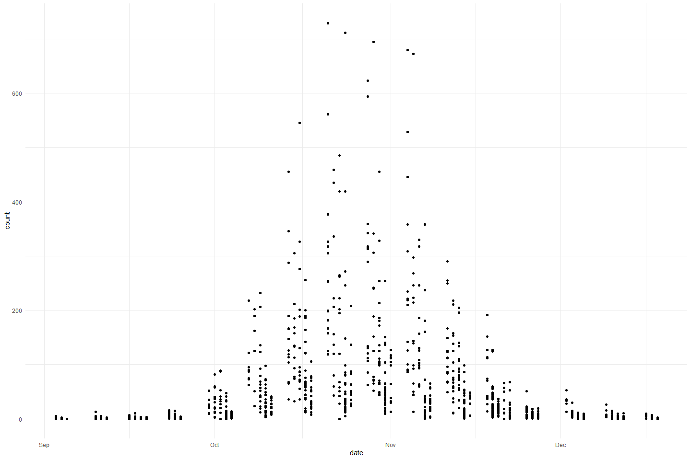
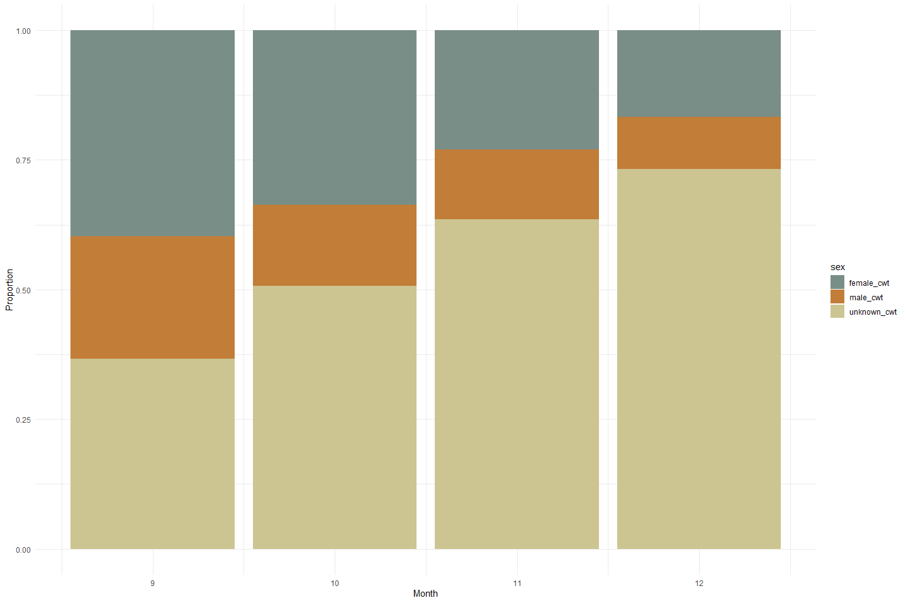
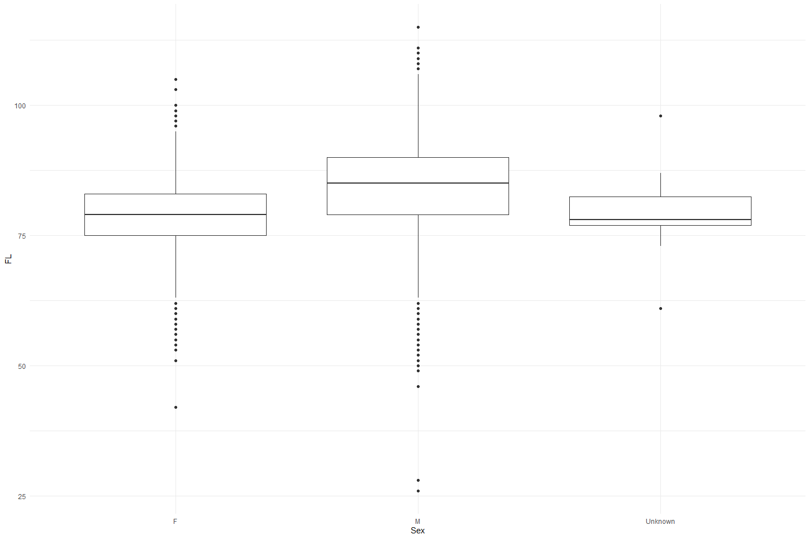

Feather Carcass QC 2013
================
Inigo Peng
2022-07-21

# Feather River Carcass Data

## Description of Monitoring Data

**Timeframe:**

**Video Season:**

**Completeness of Record throughout timeframe:**

**Sampling Location:**

**Data Contact:**

Any additional info?

## Access Cloud Data

``` r
# Run Sys.setenv() to specify GCS_AUTH_FILE and GCS_DEFAULT_BUCKET before running 
# getwd() to see how to specify paths 
# Open object from google cloud storage
# Set your authentication using gcs_auth

gcs_auth(json_file = Sys.getenv("GCS_AUTH_FILE"))
# Set global bucket 
gcs_global_bucket(bucket = Sys.getenv("GCS_DEFAULT_BUCKET"))

# git data and save as xlsx
```

``` r
gcs_get_object(object_name = "adult-holding-redd-and-carcass-surveys/feather-river/data-raw/carcass/2013/Chops_2013.xlsx",
               bucket = gcs_get_global_bucket(),
               saveToDisk = "Chops_2013.xlsx",
               overwrite = TRUE)
#
gcs_get_object(object_name = "adult-holding-redd-and-carcass-surveys/feather-river/data-raw/carcass/2013/ChopHeader_2013.xlsx",
               bucket = gcs_get_global_bucket(),
               saveToDisk = "ChopHeader_2013.xlsx",
               overwrite = TRUE)

# 
gcs_get_object(object_name = "adult-holding-redd-and-carcass-surveys/feather-river/data-raw/carcass/2013/CWTHeader_2013.xlsx",
               bucket = gcs_get_global_bucket(),
               saveToDisk = "CWTHeader_2013.xlsx",
               overwrite = TRUE)

gcs_get_object(object_name = "adult-holding-redd-and-carcass-surveys/feather-river/data-raw/carcass/2013/CWT_2013.xlsx",
               bucket = gcs_get_global_bucket(),
               saveToDisk = "CWT_2013.xlsx",
               overwrite = TRUE)
```

## Raw Data Glimpse:

### Chop_raw

``` r
Chops_raw <- read_excel("Chops_2013.xlsx") %>% 
  rename("ID" = `Chop Header ID`) %>%
  select(-`Chop ID`) %>% 
  glimpse()
```

    ## Rows: 1,139
    ## Columns: 4
    ## $ ID            <dbl> 1, 1, 1, 1, 1, 1, 1, 1, 1, 1, 1, 1, 1, 1, 2, 2, 2, 2, 2,~
    ## $ Section       <chr> "6", "7", "5", "1", "4", "8", "9", "10", "11", "12", "13~
    ## $ Minutes       <dbl> 3, 10, 7, 11, 5, 7, 8, 20, 30, 20, 20, 8, 15, 5, 47, 4, ~
    ## $ `Total Count` <dbl> 0, 0, 1, 0, 0, 0, 0, 5, 5, 2, 0, 1, 0, 0, 2, 0, 0, 0, 0,~

### ChopHeader_raw

``` r
ChopHeader_raw <- read_excel("ChopHeader_2013.xlsx") %>% 
  rename("ID" = `Chop Header ID`) %>%
  glimpse()
```

    ## Rows: 154
    ## Columns: 7
    ## $ Date     <dttm> 2013-09-03, 2013-09-04, 2013-09-05, 2013-09-10, 2013-09-10, ~
    ## $ ID       <dbl> 1, 2, 3, 4, 5, 6, 7, 8, 9, 10, 11, 12, 13, 14, 15, 16, 17, 18~
    ## $ `Week #` <chr> "1", "1", "1", "2", "2", "2", "2", "2", "3", "3", "3", "3", "~
    ## $ Weather  <chr> "SUN", "SUN", "SUN", "SUN", "SUN", "SUN", "SUN", "SUN", "SUN"~
    ## $ Time     <chr> "10:15", "09:45", "10:45", "11:20", NA, NA, "9:50", "9:40", "~
    ## $ Crew     <chr> "KH, CM, AI", "KH, TV, CM, JR", "AI, CM, JR, TV", "KC, SR, KH~
    ## $ Comments <chr> NA, NA, NA, NA, NA, NA, NA, NA, NA, NA, "WINDY", NA, NA, NA, ~

### cwt_raw

``` r
cwt_raw <- read_excel("CWT_2013.xlsx") %>% 
  rename("ID" = `CWT Header ID`) %>% 
  glimpse
```

    ## Rows: 19,210
    ## Columns: 16
    ## $ `CWT ID`                 <dbl> 19056, 19054, 19017, 19029, 19014, 18982, 189~
    ## $ ID                       <dbl> 721, 721, 719, 720, 718, 714, 715, 718, 718, ~
    ## $ `River Section`          <dbl> 8, 8, 36, 10, 18, 17, 24, 24, 24, 21, 12, 8, ~
    ## $ `Tag ID#`                <chr> NA, NA, "3077", "3079", "3084", "9822", "7040~
    ## $ `Tag, Recapture or Chop` <chr> "C", "C", "T", "T", "T", "T", "T", "T", "T", ~
    ## $ Sex                      <chr> "F", "F", "F", "M", "F", "M", "F", "F", "F", ~
    ## $ `Spawning Condition`     <chr> "S", "S", "S", "UK", "S", "UK", "S", "S", "S"~
    ## $ `Adipose Fin Clipped?`   <chr> "N", "N", "N", "N", "N", "N", "N", "N", "N", ~
    ## $ `Samples Collected`      <chr> "S&O", "S&O", "S&O", "S&O", "S&O", "S&O", "S&~
    ## $ `Fork Length`            <dbl> 82, 74, 79, 93, 75, 81, 74, 72, 80, 85, 87, 7~
    ## $ `Head Tag Number`        <chr> NA, NA, NA, NA, NA, NA, NA, NA, NA, NA, NA, N~
    ## $ Scales                   <chr> "10707", "10708", "10709", "10703", "10704", ~
    ## $ Otoliths                 <chr> "1210", "1207", "1204", "1200", "1199", "1198~
    ## $ `Hallprint Color`        <chr> NA, NA, NA, NA, NA, NA, NA, NA, NA, NA, NA, N~
    ## $ Hallprint                <dbl> NA, NA, NA, NA, NA, NA, NA, NA, NA, NA, NA, N~
    ## $ Comments                 <chr> NA, NA, "B OTI 1204", "OTI 1200", "OTI 1199",~

### cwt_header_raw

``` r
cwt_header_raw <- read_excel("CWTHeader_2013.xlsx") %>% 
  rename("ID" = `CWT Header ID` ) %>% 
  glimpse
```

    ## Rows: 769
    ## Columns: 10
    ## $ ID                    <dbl> 1, 2, 3, 4, 5, 6, 7, 8, 9, 10, 11, 12, 13, 14, 1~
    ## $ Date                  <dttm> 2013-09-03, 2013-09-04, 2013-09-05, 2013-09-10,~
    ## $ Crew                  <chr> "KH, AI, CM", "KH, TV, JR, CM", "AI,CM,TV, JR", ~
    ## $ `Week #`              <dbl> 1, 1, 1, 2, 2, 2, 2, 2, 3, 3, 3, 3, 3, 3, 3, 4, ~
    ## $ `Tag Color`           <chr> "BLUE", "BLUE TAG", "BLUE", NA, NA, NA, NA, NA, ~
    ## $ Morale                <chr> "10 TO THE 4TH POWER", "10", "10 PLUS", "10", "1~
    ## $ `Section Group 1-10`  <dbl> NA, NA, NA, NA, NA, NA, NA, NA, NA, NA, NA, NA, ~
    ## $ `Section Group 11-15` <dbl> NA, NA, NA, NA, NA, NA, NA, NA, NA, NA, NA, NA, ~
    ## $ `Section Group 16-21` <lgl> NA, NA, NA, NA, NA, NA, NA, NA, NA, NA, NA, NA, ~
    ## $ `Section Group 22-38` <lgl> NA, NA, NA, NA, NA, NA, NA, NA, NA, NA, NA, NA, ~

## Data transformations:

### Counts

The `chop` table contains carcass counts by chop/tagged based on clips

``` r
#1. chop table (with dates and tag color)
chop_join <- full_join(ChopHeader_raw %>% 
                                 select(ID, Date),
                               Chops_raw) %>% 
  clean_names() %>% 
  rename(sec = "section",
         min = "minutes",
         count = "total_count") %>% 
  mutate(sec = as.numeric(sec)) %>% glimpse
```

    ## Joining, by = "ID"

    ## Rows: 1,139
    ## Columns: 5
    ## $ id    <dbl> 1, 1, 1, 1, 1, 1, 1, 1, 1, 1, 1, 1, 1, 1, 2, 2, 2, 2, 2, 2, 2, 2~
    ## $ date  <dttm> 2013-09-03, 2013-09-03, 2013-09-03, 2013-09-03, 2013-09-03, 201~
    ## $ sec   <dbl> 6, 7, 5, 1, 4, 8, 9, 10, 11, 12, 13, 14, 15, 3, 21, 23, 27, 26, ~
    ## $ min   <dbl> 3, 10, 7, 11, 5, 7, 8, 20, 30, 20, 20, 8, 15, 5, 47, 4, 9, 15, 1~
    ## $ count <dbl> 0, 0, 1, 0, 0, 0, 0, 5, 5, 2, 0, 1, 0, 0, 2, 0, 0, 0, 0, 0, 0, 0~

### Survey

The `chop_header` table contains survey metadata and covariates

``` r
chop_header <- ChopHeader_raw %>% 
  clean_names() %>% glimpse
```

    ## Rows: 154
    ## Columns: 7
    ## $ date        <dttm> 2013-09-03, 2013-09-04, 2013-09-05, 2013-09-10, 2013-09-1~
    ## $ id          <dbl> 1, 2, 3, 4, 5, 6, 7, 8, 9, 10, 11, 12, 13, 14, 15, 16, 17,~
    ## $ week_number <chr> "1", "1", "1", "2", "2", "2", "2", "2", "3", "3", "3", "3"~
    ## $ weather     <chr> "SUN", "SUN", "SUN", "SUN", "SUN", "SUN", "SUN", "SUN", "S~
    ## $ time        <chr> "10:15", "09:45", "10:45", "11:20", NA, NA, "9:50", "9:40"~
    ## $ crew        <chr> "KH, CM, AI", "KH, TV, CM, JR", "AI, CM, JR, TV", "KC, SR,~
    ## $ comments    <chr> NA, NA, NA, NA, NA, NA, NA, NA, NA, NA, "WINDY", NA, NA, N~

### CWT

The `cwt` table contains coded wire tag information.

``` r
cwt <- full_join(cwt_raw %>% clean_names(), cwt_header_raw %>% clean_names()) %>%  
  rename(fl = "fork_length") %>% 
  glimpse
```

    ## Joining, by = "id"

    ## Rows: 19,216
    ## Columns: 25
    ## $ cwt_id                <dbl> 19056, 19054, 19017, 19029, 19014, 18982, 18984,~
    ## $ id                    <dbl> 721, 721, 719, 720, 718, 714, 715, 718, 718, 714~
    ## $ river_section         <dbl> 8, 8, 36, 10, 18, 17, 24, 24, 24, 21, 12, 8, 9, ~
    ## $ tag_id_number         <chr> NA, NA, "3077", "3079", "3084", "9822", "7040", ~
    ## $ tag_recapture_or_chop <chr> "C", "C", "T", "T", "T", "T", "T", "T", "T", "T"~
    ## $ sex                   <chr> "F", "F", "F", "M", "F", "M", "F", "F", "F", "M"~
    ## $ spawning_condition    <chr> "S", "S", "S", "UK", "S", "UK", "S", "S", "S", "~
    ## $ adipose_fin_clipped   <chr> "N", "N", "N", "N", "N", "N", "N", "N", "N", "N"~
    ## $ samples_collected     <chr> "S&O", "S&O", "S&O", "S&O", "S&O", "S&O", "S&O",~
    ## $ fl                    <dbl> 82, 74, 79, 93, 75, 81, 74, 72, 80, 85, 87, 74, ~
    ## $ head_tag_number       <chr> NA, NA, NA, NA, NA, NA, NA, NA, NA, NA, NA, NA, ~
    ## $ scales                <chr> "10707", "10708", "10709", "10703", "10704", "10~
    ## $ otoliths              <chr> "1210", "1207", "1204", "1200", "1199", "1198", ~
    ## $ hallprint_color       <chr> NA, NA, NA, NA, NA, NA, NA, NA, NA, NA, NA, NA, ~
    ## $ hallprint             <dbl> NA, NA, NA, NA, NA, NA, NA, NA, NA, NA, NA, NA, ~
    ## $ comments              <chr> NA, NA, "B OTI 1204", "OTI 1200", "OTI 1199", "S~
    ## $ date                  <dttm> 2013-12-16, 2013-12-16, 2013-12-12, 2013-12-10,~
    ## $ crew                  <chr> "kc tv sr", "kc tv sr", "JR, SR", "KC, TV, SR, T~
    ## $ week_number           <dbl> 16, 16, 15, 15, 15, 14, 14, 15, 15, 14, 15, 16, ~
    ## $ tag_color             <chr> NA, NA, NA, NA, NA, "SILVER", NA, NA, NA, "SILVE~
    ## $ morale                <chr> "10", "10", "10", "10", "10", "7.2", "9.66", "10~
    ## $ section_group_1_10    <dbl> NA, NA, NA, NA, NA, NA, NA, NA, NA, NA, NA, NA, ~
    ## $ section_group_11_15   <dbl> NA, NA, NA, NA, NA, NA, NA, NA, NA, NA, NA, NA, ~
    ## $ section_group_16_21   <lgl> NA, NA, NA, NA, NA, NA, NA, NA, NA, NA, NA, NA, ~
    ## $ section_group_22_38   <lgl> NA, NA, NA, NA, NA, NA, NA, NA, NA, NA, NA, NA, ~

## Explore Numeric Variables:

### Chop Join Variable: `id`, `min`

``` r
chop_join %>% 
  select_if(is.numeric) %>%
  colnames()
```

    ## [1] "id"    "sec"   "min"   "count"

``` r
summary(chop_join$id)
```

    ##    Min. 1st Qu.  Median    Mean 3rd Qu.    Max. 
    ##    1.00   42.00   97.00   91.45  142.00  175.00

``` r
summary(chop_join$min)
```

    ##    Min. 1st Qu.  Median    Mean 3rd Qu.    Max.    NA's 
    ##    0.00   15.00   25.00   40.44   45.00  302.00       6

**NA and Unknown Values** Provide a stat on NA or unknown values.

``` r
round(sum(is.na(chop_join$id))/nrow(chop_join), 3) * 100
```

    ## [1] 0

``` r
round(sum(is.na(chop_join$min))/nrow(chop_join), 3) * 100
```

    ## [1] 0.5

-   0 % of values in the `id` column are NA.
-   0.5 % of values in the `min` column are NA.

### Chop Join Variable: `count`

``` r
summary(chop_join$count)
```

    ##    Min. 1st Qu.  Median    Mean 3rd Qu.    Max. 
    ##    0.00    3.00   18.00   56.13   65.00  729.00

-   0 % of values in the `count` column are NA.

**Plotting count over Period of Record**

``` r
chop_join %>% 
  ggplot(aes(x = date, y = count)) + 
  geom_point() +
  theme_minimal()
```

<!-- -->

``` r
chop_join %>%
  group_by(date) %>%
  summarise(total_count = sum(count, na.rm = T)) %>%
  ggplot(aes(x = date, y = total_count)) +
  geom_col() +
  theme_minimal()
```

<!-- -->

### Chop Header Variable: `id`

``` r
chop_header %>% 
  select_if(is.numeric) %>% 
  colnames()
```

    ## [1] "id"

``` r
summary(chop_header$id)
```

    ##    Min. 1st Qu.  Median    Mean 3rd Qu.    Max. 
    ##    1.00   44.25   85.00   87.70  133.50  175.00

### CWT Variable: `ID`, `sect`, `fl`, `header_id`, `week_num`

``` r
cwt %>% 
  select_if(is.numeric) %>% 
  colnames()
```

    ## [1] "cwt_id"              "id"                  "river_section"      
    ## [4] "fl"                  "hallprint"           "week_number"        
    ## [7] "section_group_1_10"  "section_group_11_15"

``` r
summary(cwt$fl)
```

    ##    Min. 1st Qu.  Median    Mean 3rd Qu.    Max.    NA's 
    ##   26.00   76.00   80.00   80.54   85.00  750.00   10012

``` r
summary(cwt$river_section)
```

    ##    Min. 1st Qu.  Median    Mean 3rd Qu.    Max.    NA's 
    ##    1.00    8.00   12.00   12.86   17.00   38.00     135

-   52.1 % of values in the `fl` column are NA.
-   0.7 % of values in the `sect` column are NA.

``` r
#Create a cwt_count column
#Pivot table to expand sex column to female_cwt, male_cwt, and unknown_cwt 
#Is this graph helpful?
unique(cwt$sex)
```

    ## [1] "F" "M" NA

``` r
cwt_count <- cwt %>% 
  mutate(count = 1) %>%
  mutate(sex = case_when(sex == "ND"|is.na(sex)|sex =="UK" ~ "U",
                         TRUE ~ sex)) %>% 
  pivot_wider(names_from = sex, values_from = count, values_fill = 0) %>% 
  # unnest() %>% 
  rename("male_cwt" = M,
         "female_cwt" = F,
         "unknown_cwt" = U) %>% glimpse
```

    ## Rows: 19,216
    ## Columns: 27
    ## $ cwt_id                <dbl> 19056, 19054, 19017, 19029, 19014, 18982, 18984,~
    ## $ id                    <dbl> 721, 721, 719, 720, 718, 714, 715, 718, 718, 714~
    ## $ river_section         <dbl> 8, 8, 36, 10, 18, 17, 24, 24, 24, 21, 12, 8, 9, ~
    ## $ tag_id_number         <chr> NA, NA, "3077", "3079", "3084", "9822", "7040", ~
    ## $ tag_recapture_or_chop <chr> "C", "C", "T", "T", "T", "T", "T", "T", "T", "T"~
    ## $ spawning_condition    <chr> "S", "S", "S", "UK", "S", "UK", "S", "S", "S", "~
    ## $ adipose_fin_clipped   <chr> "N", "N", "N", "N", "N", "N", "N", "N", "N", "N"~
    ## $ samples_collected     <chr> "S&O", "S&O", "S&O", "S&O", "S&O", "S&O", "S&O",~
    ## $ fl                    <dbl> 82, 74, 79, 93, 75, 81, 74, 72, 80, 85, 87, 74, ~
    ## $ head_tag_number       <chr> NA, NA, NA, NA, NA, NA, NA, NA, NA, NA, NA, NA, ~
    ## $ scales                <chr> "10707", "10708", "10709", "10703", "10704", "10~
    ## $ otoliths              <chr> "1210", "1207", "1204", "1200", "1199", "1198", ~
    ## $ hallprint_color       <chr> NA, NA, NA, NA, NA, NA, NA, NA, NA, NA, NA, NA, ~
    ## $ hallprint             <dbl> NA, NA, NA, NA, NA, NA, NA, NA, NA, NA, NA, NA, ~
    ## $ comments              <chr> NA, NA, "B OTI 1204", "OTI 1200", "OTI 1199", "S~
    ## $ date                  <dttm> 2013-12-16, 2013-12-16, 2013-12-12, 2013-12-10,~
    ## $ crew                  <chr> "kc tv sr", "kc tv sr", "JR, SR", "KC, TV, SR, T~
    ## $ week_number           <dbl> 16, 16, 15, 15, 15, 14, 14, 15, 15, 14, 15, 16, ~
    ## $ tag_color             <chr> NA, NA, NA, NA, NA, "SILVER", NA, NA, NA, "SILVE~
    ## $ morale                <chr> "10", "10", "10", "10", "10", "7.2", "9.66", "10~
    ## $ section_group_1_10    <dbl> NA, NA, NA, NA, NA, NA, NA, NA, NA, NA, NA, NA, ~
    ## $ section_group_11_15   <dbl> NA, NA, NA, NA, NA, NA, NA, NA, NA, NA, NA, NA, ~
    ## $ section_group_16_21   <lgl> NA, NA, NA, NA, NA, NA, NA, NA, NA, NA, NA, NA, ~
    ## $ section_group_22_38   <lgl> NA, NA, NA, NA, NA, NA, NA, NA, NA, NA, NA, NA, ~
    ## $ female_cwt            <dbl> 1, 1, 1, 0, 1, 0, 1, 1, 1, 0, 1, 1, 1, 0, 1, 1, ~
    ## $ male_cwt              <dbl> 0, 0, 0, 1, 0, 1, 0, 0, 0, 1, 0, 0, 0, 1, 0, 0, ~
    ## $ unknown_cwt           <dbl> 0, 0, 0, 0, 0, 0, 0, 0, 0, 0, 0, 0, 0, 0, 0, 0, ~

``` r
total_cwt_summary <- cwt_count %>% 
  mutate(male_cwt = ifelse(is.na(male_cwt), 0, male_cwt), # fill na
         female_cwt = ifelse(is.na(female_cwt), 0, female_cwt),
         unknown_cwt = ifelse(is.na(unknown_cwt), 0, unknown_cwt),
         total_cwt = unknown_cwt + male_cwt + female_cwt) %>% 
  group_by(month(date)) %>% 
  summarise(total_cwt = sum(total_cwt),
            male_cwt = sum(male_cwt),
            female_cwt = sum(female_cwt),
            unknown_cwt = sum(unknown_cwt))
```

``` r
total_cwt_summary %>% 
  pivot_longer(cols = c(male_cwt, female_cwt, unknown_cwt), names_to = "sex", values_to = "count") %>% 
  mutate(proportions = (count / total_cwt)) %>% 
  ggplot(aes(x = `month(date)`, y = proportions, fill = sex)) + 
  geom_bar(stat = "identity", position = "stack") +
  scale_fill_manual(name = "chops", 
                    labels = c("CWT Male", "CWT Female", "CWT Unknown")) +
  theme_minimal() + 
  labs(y = "Proportion", x = "Month") +
  scale_fill_manual(values = wes_palette("Moonrise2"))
```

    ## Scale for 'fill' is already present. Adding another scale for 'fill', which
    ## will replace the existing scale.

<!-- -->

**Plotting fork length of each sex**

``` r
cwt %>% 
  mutate(sex = case_when(sex == "ND"|is.na(sex)|sex =="UK" ~ "Unknown",
                         TRUE ~ sex))%>% 
  filter(fl < 600) %>% #one extreme outlier (data entry error?)
  ggplot(aes(x = sex, y = fl)) + 
  geom_boxplot() + 
  theme_minimal() + 
  labs(y = "FL", x = "Sex")
```

<!-- -->

## Explore Categorical variables:

### Chop Clean Data

Fix inconsistencies with spelling, capitalization, and dates

``` r
chop_join %>% 
  select_if(is.character) %>%
  colnames()
```

    ## character(0)

``` r
chop_cleaner <- chop_join %>%
  # mutate(date = as_date(date)) %>%
  mutate_if(is.character, str_to_lower) 
  # select(-c(date))

chop_cleaner
```

    ## # A tibble: 1,139 x 5
    ##       id date                  sec   min count
    ##    <dbl> <dttm>              <dbl> <dbl> <dbl>
    ##  1     1 2013-09-03 00:00:00     6     3     0
    ##  2     1 2013-09-03 00:00:00     7    10     0
    ##  3     1 2013-09-03 00:00:00     5     7     1
    ##  4     1 2013-09-03 00:00:00     1    11     0
    ##  5     1 2013-09-03 00:00:00     4     5     0
    ##  6     1 2013-09-03 00:00:00     8     7     0
    ##  7     1 2013-09-03 00:00:00     9     8     0
    ##  8     1 2013-09-03 00:00:00    10    20     5
    ##  9     1 2013-09-03 00:00:00    11    30     5
    ## 10     1 2013-09-03 00:00:00    12    20     2
    ## # ... with 1,129 more rows

### Chop Header Clean Data

``` r
chop_header %>% 
  select_if(is.character) %>% 
  colnames()
```

    ## [1] "week_number" "weather"     "time"        "crew"        "comments"

``` r
unique(chop_header$crew)
```

    ##   [1] "KH, CM, AI"     "KH, TV, CM, JR" "AI, CM, JR, TV" "KC, SR, KH, TK"
    ##   [5] "AI,JR,JC,AH"    "KC,SR,KH,JR"    "JC,JR,AC,KC"    "KH,AH,TV,SR"   
    ##   [9] "SR,TK,AI,CD"    "SM,KC,TV,KH"    "KC,KH,SR,AI"    "KH,SR,AI,KC"   
    ##  [13] "KC, SR, TV, CM" "cc, ai, tk, kc" "jr, kh, mm, cc" "cm, cd, kh, kl"
    ##  [17] "JC, JR, AH, AI" "SM, MM, KT"     "AI, CM, CD, AH" "SM, JC, KC, KH"
    ##  [21] "SR, KT, TK, MM" "JS, TK, KH"     "AI, CM"         "AI,SR,KH,TK"   
    ##  [25] "CM,KH,JR,MM"    "AI, KH,MM,KC"   "TK, CM, SR,AH"  "JR, CC, MM, TK"
    ##  [29] "KC, KL, JC, AI" "cm, ah, sr, kh" "kt, tk, sr, cc" "ah,gs,jc,ai"   
    ##  [33] "cm,jr,kl, kh"   "jc, kh, jr, js" "kt, cm, ai, kc" NA              
    ##  [37] "ai, cd, jm, mm" "kt, jr, tv, kc" "sm, jr, mm, tk" "sr, kc, kh, ah"
    ##  [41] "tv, cd, ai, jc" "cm,tk,mm,ah"    "sr,kh,kc,tv"    "jc, cd, ai"    
    ##  [45] "jc,cm,sm,kh"    "kt sr"          "jr,kc,cd,ah"    "ai,ah,sr,tv"   
    ##  [49] "js,tk,kh,cm"    "jr,sm,tk,cd"    "kt,gs,sm,ai"    "kc,kh,ah"      
    ##  [53] "jk,sr,tv"       "kt,ah,cd,sr"    "cm,jr,kh,kc"    "ac,mm,jk,tk"   
    ##  [57] "kt,gs,jc,cm"    "ac,rk,ah,sr"    "jr,cd,mm,kc"    "ai,kh,tk"      
    ##  [61] "cm,cc,cd,tk"    "sm,tv,sr,ah"    "kc, jr, jc, rk" "kh,ac,ai,mm"   
    ##  [65] "cm,ai,ah,cd"    "kt,kh,tv,js"    "kc,kh,mm,tv"    "ai,ah,cm,sm"   
    ##  [69] "kt,gs,tk,cd"    "jc,ai,ah,sm"    "cd,tk,kh,mm"    "cm,cc,kl,kc"   
    ##  [73] "kh,tv,gs,ai"    "ac,tk,cc,kt"    "cm,ah,jc,rk"    "sm,cd,kc,mm"   
    ##  [77] "js,cm,jr,kh"    "jc,kc,kh,tv"    "CD,KH,TK,CC"    "JS,SM,JR,KH"   
    ##  [81] "JC,TV,KH,KC"    "KH,TV,AI,GS"    "JR,SR,KL,TK"    "KC,AH,JK,CD"   
    ##  [85] "KH,JR,TV,CD"    "KT,GS,TK,MM"    "KC,JC,AH,SR"    "JR,JC,KC,SR"   
    ##  [89] "CD,SM,CC,AH"    "TV,GS,KK,CM"    "KC,JC"          "CM,CD,SM,TK"   
    ##  [93] "KH,TV,MM,JR"    "JS"             "TV,JC,AI,GS"    "CM,KL,CD,SR"   
    ##  [97] "KC,SM,SC,JR"    "AI,KH,JS"       "CM,CD,SM,AI"    "KH,KC,TV,JC"   
    ## [101] "SR,KT,TK,AI"    "TV,KH,GS,TK"    "CM,JR,JC,AI"    "KC,CD,AH,SR"   
    ## [105] "JC,TV,KC,JS"    "CM,CD,KL,TK"    "SM,AH,CC,AI"    "SR,TV,KH,KC"   
    ## [109] "AI,CM,CD,TK"    "KC,KH,TV,SR"    "TK.TV.SR.CM"    "KC,JC,AI,AH"   
    ## [113] "SR,CD,AI,TK"    "KT,AH,JR,SM"    "TK,SR,KT,KH"    "JC,JR,AH,KC"   
    ## [117] "KC,KH,JS"       "AI,TV,JR,CC"    "CM,CD,SR,BZ"    "KH,CM,JR"      
    ## [121] "KC,TV,SR"       "CM,KH,KC,TV"    "AI,CC,KT,TK"    "KC,KH,AI"      
    ## [125] "TK,KT,CD,JR"    "TK,CM,SR,AC"    "CM,JC,SR,AH"    "JR,TV,TK,KC"   
    ## [129] "TK,SR,KH"       "TV,KC,JC,AH"    "CM,JR,KH,KC"    "JC,TK,AH,SR"   
    ## [133] "KC,SR,TV"       "KC,TV,SR,TK"    "JR,SR"          "cm kh sr tk"   
    ## [137] "ai kt cd cc"    "kc mm sm ah"    "mm ac sm kl"    "kc ai kh ah"   
    ## [141] "sr cd cm tk"    "cm cd sm sr"    "mm kh tk kc"    "jc ah ai"      
    ## [145] "kc tv sr"       "ai sr tv kc"    "tv kc sr"       "cm, ai, mm, ah"
    ## [149] "sm, sr, kh, tk" "jr, kl, jc, kc" "jr, cm, ai, ac"

``` r
unique(chop_header$weather)
```

    ##  [1] "SUN"        "CLD"        "SUN/CLD"    "CLD/RAIN"   "SUN / CLD" 
    ##  [6] NA           "SUN/ CLD"   "CLR"        "CLD / RAIN" "RAIN"

``` r
chop_header_cleaner <- chop_header %>%
  mutate(date = as_date(date)) %>%
  mutate_if(is.character, str_to_lower) %>% 
  mutate(crew = str_replace_all(crew, " ", ","),
         crew = str_replace_all(crew, ",,", ","),
         weather = ifelse(weather == "cld", "cloudy", weather),
         weather = str_replace_all(weather, " ", "")) %>% 
  select(-c(time)) %>% glimpse
```

    ## Rows: 154
    ## Columns: 6
    ## $ date        <date> 2013-09-03, 2013-09-04, 2013-09-05, 2013-09-10, 2013-09-1~
    ## $ id          <dbl> 1, 2, 3, 4, 5, 6, 7, 8, 9, 10, 11, 12, 13, 14, 15, 16, 17,~
    ## $ week_number <chr> "1", "1", "1", "2", "2", "2", "2", "2", "3", "3", "3", "3"~
    ## $ weather     <chr> "sun", "sun", "sun", "sun", "sun", "sun", "sun", "sun", "s~
    ## $ crew        <chr> "kh,cm,ai", "kh,tv,cm,jr", "ai,cm,jr,tv", "kc,sr,kh,tk", "~
    ## $ comments    <chr> NA, NA, NA, NA, NA, NA, NA, NA, NA, NA, "windy", NA, NA, N~

``` r
chop_header_cleaner
```

    ## # A tibble: 154 x 6
    ##    date          id week_number weather crew        comments
    ##    <date>     <dbl> <chr>       <chr>   <chr>       <chr>   
    ##  1 2013-09-03     1 1           sun     kh,cm,ai    <NA>    
    ##  2 2013-09-04     2 1           sun     kh,tv,cm,jr <NA>    
    ##  3 2013-09-05     3 1           sun     ai,cm,jr,tv <NA>    
    ##  4 2013-09-10     4 2           sun     kc,sr,kh,tk <NA>    
    ##  5 2013-09-10     5 2           sun     ai,jr,jc,ah <NA>    
    ##  6 2013-09-11     6 2           sun     kc,sr,kh,jr <NA>    
    ##  7 2013-09-12     7 2           sun     jc,jr,ac,kc <NA>    
    ##  8 2013-09-12     8 2           sun     kh,ah,tv,sr <NA>    
    ##  9 2013-09-16     9 3           sun     sr,tk,ai,cd <NA>    
    ## 10 2013-09-16    10 3           sun     sm,kc,tv,kh <NA>    
    ## # ... with 144 more rows

``` r
cwt %>% 
  select_if(is.character) %>% 
  colnames()
```

    ##  [1] "tag_id_number"         "tag_recapture_or_chop" "sex"                  
    ##  [4] "spawning_condition"    "adipose_fin_clipped"   "samples_collected"    
    ##  [7] "head_tag_number"       "scales"                "otoliths"             
    ## [10] "hallprint_color"       "comments"              "crew"                 
    ## [13] "tag_color"             "morale"

``` r
unique(cwt$spawning_condition)
```

    ## [1] "S"  "UK" "U"  NA

``` r
unique(cwt$adipose_fin_clipped)
```

    ## [1] "N"  "Y"  "UK" NA

``` r
unique(cwt$crew)
```

    ##   [1] "kc tv sr"        "JR, SR"          "KC, TV, SR, TK"  "KC,SR,TV"       
    ##   [5] "KC,JC,TV,AH"     "SR,TK,KH"        "KC, TV, SR"      "JR,TV,TK,KC"    
    ##   [9] "CM,SR,JC,AH"     "KC,TV,SR"        "CM,JR,KL,TK"     "TK,CM,SR,AC"    
    ##  [13] "KH,CM,JR"        "KC,KH,AI"        "AI, TK,KT, CC"   "KT, TK , AI, CC"
    ##  [17] "AI, TV, CC, JR"  "KC,KH,JS"        "CM, KH,TV, KC"   "SR,BZ,CD,CM"    
    ##  [21] "KC,AH,JC,AI"     "SR,TV,CM,TK"     "JR,CC,TV,AI"     "CM,TV,KH,KC"    
    ##  [25] "JC,JR,AH,KC"     "KT,FK,SR,TK"     "SR,KT,KH,TK"     "AI,CD,SR,TK"    
    ##  [29] "CM, TV, KH, MM"  "SM,KT,JR,AH"     "AI,CM,CD,TK"     "AI,KH,JS"       
    ##  [33] "KT,JR,SM,AH"     "TV,KC,JC,KH"     NA                "JC,TV,KC,JS"    
    ##  [37] "TV,JC,AI,GS"     "KC,TV,SR,KH"     "KT,AI,TK,SR"     "KH,KC,JC,TV"    
    ##  [41] "CM,CD,KL,TK"     "KC,JC,AH,SR"     "KC,SR,AH,JC"     "TV,KH,GS,TK"    
    ##  [45] "SR,TV,KC,KH"     "CM,KL,SR,CD"     "KH,TV,JR,MM"     "KC,JC,SR,AH"    
    ##  [49] "CM,JR,JC,AI"     "SR,KT,TK,AI"     "SM,CC,AH,AI"     "TV,GS,TK,CM"    
    ##  [53] "KC,KH,JC,TV"     "kt,gs,tk,mm"     "KJ,AH,JR,SM"     "AI,TK,SR,CD"    
    ##  [57] "CM,KH,MM,TV"     "js,sm,kh,jr"     "CD,CC,TK,KH"     "CD,CM,TK,CC"    
    ##  [61] "KH,TV,GS,AI"     "JC,TV,KH,KC"     "AC,TK,CC,KT"     "jr,tv,kh,cd"    
    ##  [65] "KC,JC,KH,TV"     "JS,KC,KH,SR"     "CD,SM,CC,TK"     "kh,tv,jr,cd"    
    ##  [69] "JC,KC,KH,TV"     "SR,KC,JK,KH"     "CM,CD,KL,SR"     "GS,MM,AH,SM"    
    ##  [73] "CM,CD, AH,SM"    "KC,JC,SR,JR"     "KT,TK,CD,CC"     "CM,CD,TK,SM"    
    ##  [77] "kh,tv,cd,jr"     "JR,SR,KL,TK"     "cd,sm,cc,ah"     "KC,KH,TV,MM"    
    ##  [81] "CM,CC,CD,TK"     "CM,CD,SM,TK"     "kc, kh, sr, ah"  "AC,JK,TK,MM"    
    ##  [85] "SR,TV,AH"        "cm, ah, tk, mm"  "cm, tk, ah, mm"  "sm,sr,ah,tv"    
    ##  [89] "CM,CD,AH,AI"     "cm,kl,kh,jr"     "sr,kc,kh,tv"     "sm,ah,sr,tv"    
    ##  [93] "SM,CD,KC,MM"     "ah, kh, sr, kc"  "AI,AH,TV"        "CM,JR,KH,KC"    
    ##  [97] "cm, ah, mm, tk"  "AI,AH,SM,JC"     "kc,ah,cr,cd"     "kc,kh,jr,cm"    
    ## [101] "kh,cm,kc,jr"     "cm,jr,kc,kh"     "JC,AI,SM,AH"     "KT,GS,CH,JC"    
    ## [105] "KT,GS,CM,JC"     "sr,cc,kt,tk"     "AC,RK,AH,SR"     "SR,KH,TV,KC"    
    ## [109] "KC,JC,AC,RK"     "CM,CD,KL,KC"     "cd, tv, ai, jc"  "JR,AC,CM,AI"    
    ## [113] "KC,JR,RK"        "cd, tv, jc, ai"  "KT,KH,TV,JS"     "CM,CD,AH,SM"    
    ## [117] "KC,SM,JR,SC"     "kt,cc,sr,tk"     "KC,SM,SC,JR"     "KT,KH,TV,KS"    
    ## [121] "CM,CC,KL,KC"     "KC,KL,CM,CD"     "AI,KH,MM"        "kh tv gs ai"    
    ## [125] "CM,JC,AH,RK"     "ai, kt"          "CM,KC,KL,KL"     "KT,GS,TK,CD"    
    ## [129] "kc, kh, cm, jr"  "ai,ah,jc"        "tk, kt, sr, mm"  "cm, mm, ai, ah" 
    ## [133] "kc,ai,kh,ah"     "kt, ai, jc, cd"  "sm, cd, ai, mm"  "jr, cm, kh, kc" 
    ## [137] "ai, cc, kc, tk"  "kt, jr, mm, cm"  "cc,tv,ai,kc"     "mm,sm,kc,ah"    
    ## [141] "kc, kh, mm, ai"  "kt, kc, jr, tv"  "sm,mm,ah,kc"     "kc, jr, kh, cm" 
    ## [145] "ai, mm, sm, cd"  "jr, kc, kh, cm"  "kt, mm, cm, jr"  "ai,kc,cm,jr"    
    ## [149] "TV,GS,JC,AI"     "kc, tv, kt, jr"  "mm, kt, tk, sr"  "CM, AI, AH, MM" 
    ## [153] "cc, tk, ai,kc"   "ai, cd, sm, mm"  "KC,SR,KH,TV"     "ai, kc, cc, tk" 
    ## [157] "cm, jr, sr. kh"  "kc, kh, sm, jc"  "sm, kc, jc, kh"  "kh, jr, jc, js" 
    ## [161] "CM,TK,SR,KH"     "kc, kh, sr, ai"  "js, jc, kh, jr"  "SM,KC,KH,TV"    
    ## [165] "gs, ah, jc, ai"  "cm, cd, sm, sr"  "KC, KH, JR, SR"  "kc, kl, jc, jr" 
    ## [169] "ai,sr,kh,tk"     "kc, kt, jr, tv"  "ai, jc, ah, gs"  "ai, kh, sr, tk" 
    ## [173] "sr, sm, kt, mm"  "MM,SM,KC,AH"     "gs, ai, jc, ah"  "ai, gs, jc, ai" 
    ## [177] "ai, gs, jc, ah"  "js, km, jr, jc"  "kt, sm, sr, mm"  "js, tk, kh"     
    ## [181] "ai"              "cm,ah,sr,kh"     "cm, cd, ah, ai"  "kt, cc, tk, sr" 
    ## [185] "ai, kt, cd, jc"  "kt, cm, kc, ai"  "sr, kt, cc, tk"  "js,tk,cm,kh"    
    ## [189] "js,tk,kc,cm"     "sr, tk, cc, kt"  "sr, ah, tk, cm"  "cm, jc, kh, sm" 
    ## [193] "cm,sm,kh,jc"     "sr, tk, ah, cm"  "SR,AH, KH"       "SM,MM,JR,TK"    
    ## [197] "MM,JR,SM,TK"     "js,cm,tk,kh"     "cm, kh, sm, jc"  "SR,KH,AH"       
    ## [201] "cd, kc, jr, ah"  "cc,jk,kt,ai,cd"  "sm sr tk kh"     "sm kh sr tk"    
    ## [205] "jr,mm,cd,kc"     "CM,AI,AH,SM"     "AI, KT, CD, CC"  "sr,cm,cd,tk"    
    ## [209] "sr,cd,cm,tk"     "CD,KH,TK,MM"     "kt,ah,cd,sr"     "sr,ah,kt,cd"    
    ## [213] "MM,KH,TK,TV"     "JR,CD,MM,KC"     "AI, KT, CC, CD"  "mm, kh, tk, kc" 
    ## [217] "CM,KL,KC,CC"     "kt,ah,sr,cd"     "MM,KH,TK"        "KH,MM,TK,CD"    
    ## [221] "MM,KH,TV,CM"     "JC, AC, JR, KC"  "KH,AI,SR,KC"     "KC, SR, KH, TK" 
    ## [225] "TK,AI,SR,CD"     "kc, kh, cm, cd"  "KC, CM,JR,TV"    "SR,AH,CD,TK"    
    ## [229] "kc"              "jr, kh, mm, sr"  "KH, AI, CM"      "cm,kh,tk,sr"    
    ## [233] "KC,KH,AI,SR"     "AI, JR, JC, AH"  "SR,KH,AH,TV"     "KH, TV, JR, CM" 
    ## [237] "mm,sm,kl,ac"     "cm,tk,kh,sr"     "cm, kh, sr, tk"  "mm,ac,sm,kl"    
    ## [241] "ai jr jc ah"     "sm mm jr tk"     "kc kh ai mm"     "kc ai kh mm"    
    ## [245] "sm tk sr kh"     "sr sm kh tk"     "sr sm tk kh"     "tv kc sr"       
    ## [249] "ai sr kc tv"     "CM,JR,KC,KH"     "JC, AH, TK, SR"  "SR.KH,KC,TV"    
    ## [253] "KT,CM,TK,CD"     "KH,TV,GS,TK"     "KC,CD,SR,AH"     "CM,SR,CD,BZ"    
    ## [257] "CM,TV,KH,MM"     "KC,KH,SR,TV"     "CM,CD,TK,AI"     "CM,CD,AH"       
    ## [261] "KC,KH,TV,JC"     "KH,TV,JC,KC"     "KH,KC,TV,JC"     "SR,TK,KT,AI"    
    ## [265] "AH,JS,KH"        "AI, KH, JS"      "KT,CM,CD,SR"     "KH,TV,TR,MM"    
    ## [269] "CD,AH,SM"        "cd.sm,cc,ah"     "KC,JC,JR,SR"     "JR,JC,KC,SR"    
    ## [273] "JR,JC,KC,SP"     "JR, JC, KC, SR"  "TV, GS, TK, CM"  "TV, GS,TK,CM"   
    ## [277] "tv,gs,tk,cm"     "KT,GS,TK,MM"     "JR,KL,SR,TK"     "KC,CD, AH,JK"   
    ## [281] "KC,AH,CD,JK"     "KC,AH,JK,CD"     "AI,JR,CM,AC"     "SM, CD, KC, MM" 
    ## [285] "KT,TK,AC,RK"     "CM,AH,JC"        "CM,AH,RK,JC"     "CM,RK,AH,JC"    
    ## [289] "MM,KH,TV,TK"     "AI,AH,JC,SM"     "AI,SM,JC,AH"     "AI,JC,SM,AH"    
    ## [293] "KC,KH,MM,TV"     "MM,KH,KC,TV"     "MM,KH,TV,KC"     "CM,AH,AI,SM"    
    ## [297] "AI,AH,SM,CM"     "AI,CM,AH,SM"     "KC,JC,RK"        "JR,JC,RK,KC"    
    ## [301] "kh,ac,ai,mm"     "KH,AC,AI,MM"     "ac,rk,ah,sr"     "AI"             
    ## [305] "JK,AI,KH,TK"     "JK"              "AI,TK,KH,JK"     "JK,KH,AI,TK"    
    ## [309] "AI,TK,JK,KH"     "AI,TK,KH"        "AI,KH,TK"        "KT,JC,CM,GS"    
    ## [313] "KT,CM,JC,GS"     "jc,cm,gs,kt"     "JC,CM,KT,GS"     "CD,MM,JR,CC"    
    ## [317] "CD,CC,JR,MM"     "jr,mm,cd,kl"     "jr,cd,mm,kc"     "SR,KH,KC,TV"    
    ## [321] "SR,TV,KH,KC"     "ac,jk,tk,mm"     "AC,TK,JK,MM"     "ac,tk,tk,mm"    
    ## [325] "sr,kt,ah,cd"     "kc,jr,kh,cm"     "kc,kh,cm,jr"     "cm,kc,jr,kh"    
    ## [329] "JK,TV,SR"        "JK,SR,TV"        "JK, SR, TV"      "JK,CC,TV,SR"    
    ## [333] "JK,TV,CC,SR"     "JK,TV,SR,CC"     "JK,CC,SR,TV"     "TV, CC"         
    ## [337] "KH,KC,AH"        "KC,KH,AH"        "kc,kh,ah"        "kh,ah,kc"       
    ## [341] "kc, kh, ah"      "kt,gs,sm,ai"     "kt,gs,ai,sm"     "cm,tk,jr,cd"    
    ## [345] "cm,cd,jr,tk"     "cm,cd,tk,jr"     "cd,cm,tk,jr"     "cd,cm,jr,jk"    
    ## [349] "JR,MM,SM,TK"     "JR, SM, TK, MM"  "MM,JR,TK, SM"    "SM,JR,MM,TK"    
    ## [353] "SR,AH,KH"        "SR, KH, AH"      "SR, AH, KH"      "cd,kc,jr,ah"    
    ## [357] "jr, kc, cd, ah"  "kt, cc, sr, tk"  "cm,jc,sm,kh"     "jc, sm, cm, kh" 
    ## [361] "jc, kh, sm, cm"  "cm, mm, ah, tk"  "cd, ai, kh, jc"  "kt, ai, cd, jc" 
    ## [365] "kc, sr, kh, ah"  "kc, sr, ah, kh"  "KC, SR, KH, AH"  "kh, sk, kc, ah" 
    ## [369] "sr, kc, kh, ah"  "ai, jc, tv, cd"  "ai, cd, tv, jc"  "cd, jc, ai, tv" 
    ## [373] "cd, jc, tv, ai"  "cd, ai, jc, tv"  "kc, kt, tv, jr"  "kc,kl,tv,jr"    
    ## [377] "kc, kl, tv, jr"  "sm, ai, cd, mm"  "cm, jr, mm, kl"  "cm, jr, kl"     
    ## [381] "cm, jr, kl, mm"  "kt. Cm, jr, mm"  "kt, cm, jr, mm"  "js,jr,kh,jc"    
    ## [385] "kc, ai,kl,cm"    "kc, kt, ai, cm"  "sr. tk. Cc, kt"  "ai, ah, jc, gs" 
    ## [389] "jr, kh, cm, kc"  "jc, kl, kc, ai"  "kc, kl, ai, jc"  "kc, kl, jc, ai" 
    ## [393] "ai, kc, kl, jc"  "ai, jc, kc, kl"  "kc, ai, jc, kl"  "kc, jc, kl"     
    ## [397] "kc, ai, kl, jc"  "kc, jc, kl, ai"  "cm, ah, kh, sr"  "jk, jr, tk, mm" 
    ## [401] "tk,jk,jr,mm"     "jk, mm, jr, tk"  "tk, mm, jk, jr"  "jr, cc, mm, tk" 
    ## [405] "jc, cc, mm, tk"  "jr, mm, cc, tk"  "jr, c, mm, tk"   "cm,kh,ah,sr"    
    ## [409] "cm, kh, ah, sr"  "cm,ah, kh, sr"   "cm, ah, kh"      "cm, ah, kh, er" 
    ## [413] "kc, ai, kh, mm"  "kc, kh, ai, mm"  "ai, mm, kc, kh"  "ai, kc, mm, kh" 
    ## [417] "ai, kc, kh, mm"  "ai, kh, mm, kc"  "sr, cm, tk, ah"  "sr, ah, cm, tk" 
    ## [421] "cm, ah, sr, tk"  "cm, tk, ah, sr"  "cm, ah, tk, sr"  "sr, ah, kh, tk" 
    ## [425] "sr, ah, tk, kh"  "tk, sr, ah, kh"  "ai, tk, kh, sr"  "ai, sr, kh, tk" 
    ## [429] "ai, sr, tk, kh"  "ai, sr,tk,kh"    "sk, tk, kt, mm"  "sr, tk, kt, mm" 
    ## [433] "tk, kt, mm, sr"  "sr, kt, mm, tk"  "kc, kh, jc"      "sm,kc,jc,kh"    
    ## [437] "sm, jc, ah, k"   "ai, ah, cd, cm"  "ai, cm, cd, ah"  "cm,ai,ah,mm"    
    ## [441] "cm,ah, ai, mm"   "CM,AH,AI,MM"     "CM, MM, AH, AI"  "CM,MM,AI"       
    ## [445] "cm, ai, ah, mm"  "jr, kl. Jc, kc"  "jr, kl, jc, cc"  "jr, kl,jc,"     
    ## [449] "sm,sr,kt,mm"     "sr, mm, kt, sm"  "sr, kt, mm, sm"  "ai, jr, jc, ah" 
    ## [453] "ai, jc, jr, ai"  "jc, ai, ah, jr"  "jc, jr, ai, ah"  "jc, ai, ah"     
    ## [457] "kc, kh, cd, cm"  "cm, cd, kh, kl"  "cm, cd, kh, kc"  "CM, CD, KH, KL" 
    ## [461] "mm, kh, jr, sr"  "JR, KH,MM,SR"    "kc, ai, cc, tk"  "sm,ah,kc"       
    ## [465] "cm,kh,sr,tk"     "KT,AI,CD,JK,CC"  "CM,KH,TK,SR"     "mm, sm,kc, ah"  
    ## [469] "AI,CM,TV, JR"    "kt gs tk mm"

``` r
unique(cwt$tag_color)
```

    ##  [1] NA                                                                                       
    ##  [2] "SILVER"                                                                                 
    ##  [3] "Blue"                                                                                   
    ##  [4] "BLUE"                                                                                   
    ##  [5] "silver"                                                                                 
    ##  [6] "D=Decay"                                                                                
    ##  [7] "blue"                                                                                   
    ##  [8] "BLUE TAG"                                                                               
    ##  [9] "2 field datasheets are on this record…."                                                
    ## [10] "D=DECAY, NO HEAD TAG NUMBER"                                                            
    ## [11] "SILVER- ALL UNKNOWN RECAPS WERE RECORDED AS UNKNOWN RECAP CHOP"                         
    ## [12] "D=decay"                                                                                
    ## [13] "D=DECAY / SILVER"                                                                       
    ## [14] "D=DECAY"                                                                                
    ## [15] "D=DECAYED"                                                                              
    ## [16] "D IN COMMENT = DECAYED"                                                                 
    ## [17] "D=DECAY IN COMMENT SECTION ALL DAY TODAY SEACHING ALL CARCASS FOR CWT FRESH AND DECAYED"

``` r
#Dropping sectiongroup and morale
cwt_cleaner <- cwt %>% 
  mutate_if(is.character, str_to_lower) %>% 
  mutate(crew = str_replace_all(crew, " ", ","),
         crew = str_replace_all(crew, ",,", ","),
         sex = case_when(sex == "nd"|is.na(sex) ~ "unknown",
                         TRUE ~ sex),
         tag_recapture_or_chop = case_when(tag_recapture_or_chop == "t" ~ "tagged",
                                         tag_recapture_or_chop == "r" ~ "recapture",
                                         tag_recapture_or_chop == "c" ~ "chop",
                                         TRUE ~ tag_recapture_or_chop),
         adipose_fin_clipped = case_when(adipose_fin_clipped == "uk" ~ "unknown",
                                         adipose_fin_clipped == "y" ~ "yes",
                                         adipose_fin_clipped == "n" ~ "no",
                                         TRUE ~ adipose_fin_clipped),
         hallprint_color = case_when(hallprint_color == "grey" ~ "G",
                                     TRUE ~ hallprint_color),
         spawning_condition = case_when(spawning_condition == "uk" ~ "unknown",
                                        TRUE ~ spawning_condition)) %>% 
  select(-c(morale, section_group_1_10, section_group_11_15, section_group_16_21, section_group_22_38)) %>% 
  glimpse
```

    ## Rows: 19,216
    ## Columns: 20
    ## $ cwt_id                <dbl> 19056, 19054, 19017, 19029, 19014, 18982, 18984,~
    ## $ id                    <dbl> 721, 721, 719, 720, 718, 714, 715, 718, 718, 714~
    ## $ river_section         <dbl> 8, 8, 36, 10, 18, 17, 24, 24, 24, 21, 12, 8, 9, ~
    ## $ tag_id_number         <chr> NA, NA, "3077", "3079", "3084", "9822", "7040", ~
    ## $ tag_recapture_or_chop <chr> "chop", "chop", "tagged", "tagged", "tagged", "t~
    ## $ sex                   <chr> "f", "f", "f", "m", "f", "m", "f", "f", "f", "m"~
    ## $ spawning_condition    <chr> "s", "s", "s", "unknown", "s", "unknown", "s", "~
    ## $ adipose_fin_clipped   <chr> "no", "no", "no", "no", "no", "no", "no", "no", ~
    ## $ samples_collected     <chr> "s&o", "s&o", "s&o", "s&o", "s&o", "s&o", "s&o",~
    ## $ fl                    <dbl> 82, 74, 79, 93, 75, 81, 74, 72, 80, 85, 87, 74, ~
    ## $ head_tag_number       <chr> NA, NA, NA, NA, NA, NA, NA, NA, NA, NA, NA, NA, ~
    ## $ scales                <chr> "10707", "10708", "10709", "10703", "10704", "10~
    ## $ otoliths              <chr> "1210", "1207", "1204", "1200", "1199", "1198", ~
    ## $ hallprint_color       <chr> NA, NA, NA, NA, NA, NA, NA, NA, NA, NA, NA, NA, ~
    ## $ hallprint             <dbl> NA, NA, NA, NA, NA, NA, NA, NA, NA, NA, NA, NA, ~
    ## $ comments              <chr> NA, NA, "b oti 1204", "oti 1200", "oti 1199", "s~
    ## $ date                  <dttm> 2013-12-16, 2013-12-16, 2013-12-12, 2013-12-10,~
    ## $ crew                  <chr> "kc,tv,sr", "kc,tv,sr", "jr,sr", "kc,tv,sr,tk", ~
    ## $ week_number           <dbl> 16, 16, 15, 15, 15, 14, 14, 15, 15, 14, 15, 16, ~
    ## $ tag_color             <chr> NA, NA, NA, NA, NA, "silver", NA, NA, NA, "silve~

## Data Dictionaries

# Count

``` r
percent_na <- chop_cleaner %>%
  summarise_all(list(name = ~sum(is.na(.))/length(.))) %>%
  pivot_longer(cols = everything())


counts_data_dictionary <- tibble(variables = colnames(chop_cleaner),
                          description = c("ID",
                                          "Date of the survey",
                                          "Sec", 
                                          "Min", 
                                          "Count"),
                          percent_na = round(percent_na$value*100))

kable(counts_data_dictionary)
```

| variables | description        | percent_na |
|:----------|:-------------------|-----------:|
| id        | ID                 |          0 |
| date      | Date of the survey |          3 |
| sec       | Sec                |          0 |
| min       | Min                |          1 |
| count     | Count              |          0 |

### Survey

``` r
percent_na <- chop_header_cleaner %>%
  summarise_all(list(name = ~sum(is.na(.))/length(.))) %>%
  pivot_longer(cols = everything())
# 
chop_header_data_dictionary <- tibble(variables = colnames(chop_header_cleaner),
                          description = c("Date",
                                          "ID",
                                          "Week Number",
                                          "Weather",
                                          "Crew memeber initials that collected",
                                          "Comments"),
                          percent_na = round(percent_na$value*100))
# 
kable(chop_header_data_dictionary)
```

| variables   | description                          | percent_na |
|:------------|:-------------------------------------|-----------:|
| date        | Date                                 |          0 |
| id          | ID                                   |          0 |
| week_number | Week Number                          |          0 |
| weather     | Weather                              |          3 |
| crew        | Crew memeber initials that collected |          2 |
| comments    | Comments                             |         95 |

### CWT

``` r
percent_na <- cwt_cleaner %>%
  summarise_all(list(name = ~sum(is.na(.))/length(.))) %>%
  pivot_longer(cols = everything())

cwt_data_dictionary <- tibble(variables = colnames(cwt_cleaner),
                          description = c("CWT ID",
                                          "ID",
                                          "River section",
                                          "Tag ID number",
                                          "Tag recapture or chop",
                                          "Sex",
                                          "Spawning condition",
                                          "Adipose fin clipped",
                                          "Samples collected",
                                          "Fork length",
                                          "Head tag number",
                                          "Scales",
                                          "Otoliths",
                                          "Hallprint color",
                                          "Hallprint",
                                          "Comments",
                                          "Date",
                                          "Crew",
                                          "Week number",
                                          "Tag colour"),
                          percent_na = round(percent_na$value*100))

kable(cwt_data_dictionary)
```

| variables             | description           | percent_na |
|:----------------------|:----------------------|-----------:|
| cwt_id                | CWT ID                |          0 |
| id                    | ID                    |          0 |
| river_section         | River section         |          1 |
| tag_id_number         | Tag ID number         |         29 |
| tag_recapture_or_chop | Tag recapture or chop |          1 |
| sex                   | Sex                   |          0 |
| spawning_condition    | Spawning condition    |         52 |
| adipose_fin_clipped   | Adipose fin clipped   |         45 |
| samples_collected     | Samples collected     |         78 |
| fl                    | Fork length           |         52 |
| head_tag_number       | Head tag number       |         83 |
| scales                | Scales                |         94 |
| otoliths              | Otoliths              |         94 |
| hallprint_color       | Hallprint color       |         76 |
| hallprint             | Hallprint             |         76 |
| comments              | Comments              |         81 |
| date                  | Date                  |          0 |
| crew                  | Crew                  |          5 |
| week_number           | Week number           |          0 |
| tag_color             | Tag colour            |         73 |

## Save cleaned data back to google cloud (TBA)

``` r
feather_carcass_chops_2013 <- chop_cleaner %>% glimpse()
```

    ## Rows: 1,139
    ## Columns: 5
    ## $ id    <dbl> 1, 1, 1, 1, 1, 1, 1, 1, 1, 1, 1, 1, 1, 1, 2, 2, 2, 2, 2, 2, 2, 2~
    ## $ date  <dttm> 2013-09-03, 2013-09-03, 2013-09-03, 2013-09-03, 2013-09-03, 201~
    ## $ sec   <dbl> 6, 7, 5, 1, 4, 8, 9, 10, 11, 12, 13, 14, 15, 3, 21, 23, 27, 26, ~
    ## $ min   <dbl> 3, 10, 7, 11, 5, 7, 8, 20, 30, 20, 20, 8, 15, 5, 47, 4, 9, 15, 1~
    ## $ count <dbl> 0, 0, 1, 0, 0, 0, 0, 5, 5, 2, 0, 1, 0, 0, 2, 0, 0, 0, 0, 0, 0, 0~

``` r
feather_carcass_cwt_2013 <- cwt_cleaner %>% glimpse()
```

    ## Rows: 19,216
    ## Columns: 20
    ## $ cwt_id                <dbl> 19056, 19054, 19017, 19029, 19014, 18982, 18984,~
    ## $ id                    <dbl> 721, 721, 719, 720, 718, 714, 715, 718, 718, 714~
    ## $ river_section         <dbl> 8, 8, 36, 10, 18, 17, 24, 24, 24, 21, 12, 8, 9, ~
    ## $ tag_id_number         <chr> NA, NA, "3077", "3079", "3084", "9822", "7040", ~
    ## $ tag_recapture_or_chop <chr> "chop", "chop", "tagged", "tagged", "tagged", "t~
    ## $ sex                   <chr> "f", "f", "f", "m", "f", "m", "f", "f", "f", "m"~
    ## $ spawning_condition    <chr> "s", "s", "s", "unknown", "s", "unknown", "s", "~
    ## $ adipose_fin_clipped   <chr> "no", "no", "no", "no", "no", "no", "no", "no", ~
    ## $ samples_collected     <chr> "s&o", "s&o", "s&o", "s&o", "s&o", "s&o", "s&o",~
    ## $ fl                    <dbl> 82, 74, 79, 93, 75, 81, 74, 72, 80, 85, 87, 74, ~
    ## $ head_tag_number       <chr> NA, NA, NA, NA, NA, NA, NA, NA, NA, NA, NA, NA, ~
    ## $ scales                <chr> "10707", "10708", "10709", "10703", "10704", "10~
    ## $ otoliths              <chr> "1210", "1207", "1204", "1200", "1199", "1198", ~
    ## $ hallprint_color       <chr> NA, NA, NA, NA, NA, NA, NA, NA, NA, NA, NA, NA, ~
    ## $ hallprint             <dbl> NA, NA, NA, NA, NA, NA, NA, NA, NA, NA, NA, NA, ~
    ## $ comments              <chr> NA, NA, "b oti 1204", "oti 1200", "oti 1199", "s~
    ## $ date                  <dttm> 2013-12-16, 2013-12-16, 2013-12-12, 2013-12-10,~
    ## $ crew                  <chr> "kc,tv,sr", "kc,tv,sr", "jr,sr", "kc,tv,sr,tk", ~
    ## $ week_number           <dbl> 16, 16, 15, 15, 15, 14, 14, 15, 15, 14, 15, 16, ~
    ## $ tag_color             <chr> NA, NA, NA, NA, NA, "silver", NA, NA, NA, "silve~

``` r
feather_carcass_chop_header_2013 <- chop_header_cleaner %>% glimpse()
```

    ## Rows: 154
    ## Columns: 6
    ## $ date        <date> 2013-09-03, 2013-09-04, 2013-09-05, 2013-09-10, 2013-09-1~
    ## $ id          <dbl> 1, 2, 3, 4, 5, 6, 7, 8, 9, 10, 11, 12, 13, 14, 15, 16, 17,~
    ## $ week_number <chr> "1", "1", "1", "2", "2", "2", "2", "2", "3", "3", "3", "3"~
    ## $ weather     <chr> "sun", "sun", "sun", "sun", "sun", "sun", "sun", "sun", "s~
    ## $ crew        <chr> "kh,cm,ai", "kh,tv,cm,jr", "ai,cm,jr,tv", "kc,sr,kh,tk", "~
    ## $ comments    <chr> NA, NA, NA, NA, NA, NA, NA, NA, NA, NA, "windy", NA, NA, N~

``` r
f <- function(input, output) write_csv(input, file = output)

gcs_upload(feather_carcass_chops_2013,
           object_function = f,
           type = "csv",
           name = "adult-holding-redd-and-carcass-surveys/feather-river/data/feather_carcass_chops_and_tags_2013.csv")
gcs_upload(feather_carcass_cwt_2013,
           object_function = f,
           type = "csv",
           name = "adult-holding-redd-and-carcass-surveys/feather-river/data/feather_carcass_cwt_2013.csv")
gcs_upload(feather_carcass_chop_header_2013,
           object_function = f,
           type = "csv",
           name = "adult-holding-redd-and-carcass-surveys/feather-river/data/feather_carcass_chop_header_2013.csv")
```
