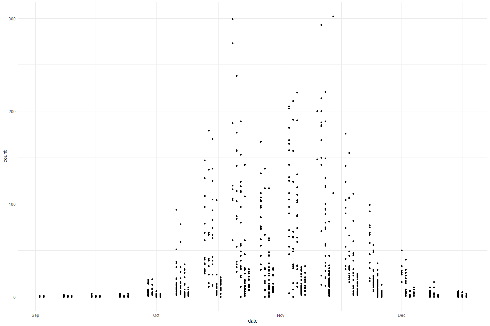
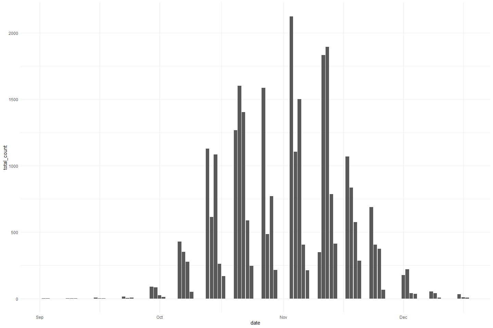
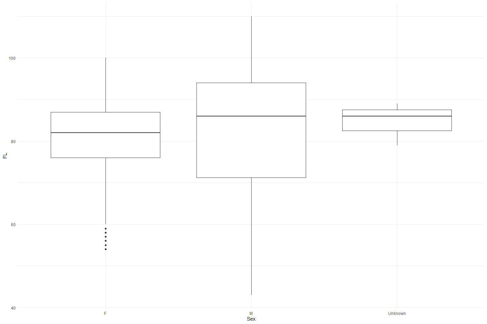

Feather Carcass QC 2014
================
Inigo Peng
2022-07-21

# Feather River Carcass Data

## Description of Monitoring Data

**Timeframe:**

**Video Season:**

**Completeness of Record throughout timeframe:**

**Sampling Location:**

**Data Contact:**

Any additional info?

## Access Cloud Data

``` r
# Run Sys.setenv() to specify GCS_AUTH_FILE and GCS_DEFAULT_BUCKET before running 
# getwd() to see how to specify paths 
# Open object from google cloud storage
# Set your authentication using gcs_auth

gcs_auth(json_file = Sys.getenv("GCS_AUTH_FILE"))
# Set global bucket 
gcs_global_bucket(bucket = Sys.getenv("GCS_DEFAULT_BUCKET"))

# git data and save as xlsx
```

``` r
gcs_get_object(object_name = "adult-holding-redd-and-carcass-surveys/feather-river/data-raw/carcass/2014/Chops_2014.xlsx",
               bucket = gcs_get_global_bucket(),
               saveToDisk = "Chops_2014.xlsx",
               overwrite = TRUE)
#
gcs_get_object(object_name = "adult-holding-redd-and-carcass-surveys/feather-river/data-raw/carcass/2014/ChopHeader_2014.xlsx",
               bucket = gcs_get_global_bucket(),
               saveToDisk = "ChopHeader_2014.xlsx",
               overwrite = TRUE)

# 
gcs_get_object(object_name = "adult-holding-redd-and-carcass-surveys/feather-river/data-raw/carcass/2014/CWTHeader_2014.xlsx",
               bucket = gcs_get_global_bucket(),
               saveToDisk = "CWTHeader_2014.xlsx",
               overwrite = TRUE)

gcs_get_object(object_name = "adult-holding-redd-and-carcass-surveys/feather-river/data-raw/carcass/2014/CWT_2014.xlsx",
               bucket = gcs_get_global_bucket(),
               saveToDisk = "CWT_2014.xlsx",
               overwrite = TRUE)
```

## Raw Data Glimpse:

### Chop_raw

``` r
Chops_raw <- read_excel("Chops_2014.xlsx") %>% 
  rename("ID" = `Chop Header ID`) %>%
  select(-`Chop ID`) %>% 
  glimpse()
```

    ## Rows: 1,056
    ## Columns: 4
    ## $ ID            <dbl> 176, 176, 176, 176, 176, 176, 176, 176, 176, 176, 176, 1~
    ## $ Section       <chr> "15", "14", "13", "12", "11", "10", "9", "8", "6", "4", ~
    ## $ Minutes       <dbl> 18, 12, 12, 11, 11, 23, 12, 10, 2, 3, 10, 4, 5, 22, 9, 1~
    ## $ `Total Count` <dbl> 0, 0, 0, 0, 0, 0, 0, 0, 0, 0, 0, 0, 0, 0, 0, 0, 2, 1, 0,~

### ChopHeader_raw

``` r
  ChopHeader_raw <- read_excel("ChopHeader_2014.xlsx") %>% 
  rename("ID" = `Chop Header ID`) %>%
  glimpse()
```

    ## Rows: 136
    ## Columns: 7
    ## $ Date     <dttm> 2014-09-08, 2014-09-08, 2014-09-10, 2014-09-09, 2014-09-09, ~
    ## $ ID       <dbl> 176, 177, 178, 179, 180, 181, 182, 183, 184, 185, 186, 187, 1~
    ## $ `Week #` <chr> "2", "2", "2", "2", "2", "3", "3", "3", "3", "3", "3", "3", "~
    ## $ Weather  <chr> "SUN", "SUN", "SUN", "SUN", "SUN", "SUN", "SUN", "SUN", "SUN"~
    ## $ Time     <chr> "10:00", "11:32", "8:50", "10:03", "9:56", "9:30", "10:00", "~
    ## $ Crew     <chr> "SR,TH,CM", "KH,MI,BL", "CM,KL,KH,MI", "KL,AI,SR,TH", "CM,MI,~
    ## $ Comments <chr> NA, NA, NA, NA, NA, NA, NA, NA, NA, NA, "OTHER BOAT DID 16", ~

### cwt_raw

``` r
cwt_raw <- read_excel("CWT_2014.xlsx") %>% 
  rename("ID" = `CWT Header ID`) %>% 
  glimpse
```

    ## Rows: 8,188
    ## Columns: 16
    ## $ `CWT ID`                 <dbl> 19394, 21203, 25975, 25998, 25986, 25983, 259~
    ## $ ID                       <dbl> 751, 821, 1005, 1006, 1006, 1006, 1005, 1019,~
    ## $ `River Section`          <dbl> 8, 10, 8, 6, 8, 8, 8, 26, 8, 24, 28, 19, 31, ~
    ## $ `Tag ID#`                <chr> "715", "1102", "2442", "2414", "2403", "2400"~
    ## $ `Tag, Recapture or Chop` <chr> "T", "T", "T", "T", "T", "T", "T", "T", "T", ~
    ## $ Sex                      <chr> "M", "F", "F", "M", "F", "F", "F", "F", "F", ~
    ## $ `Spawning Condition`     <chr> "UK", "S", "S", "UK", "S", "S", "S", "S", "S"~
    ## $ `Adipose Fin Clipped?`   <chr> "Y", "Y", "Y", "Y", "Y", "Y", "Y", "Y", "Y", ~
    ## $ `Samples Collected`      <chr> "H", "H", "H", "H", "H", "H", "H", "H&S&O", "~
    ## $ `Fork Length`            <dbl> 86, 83, 92, 79, 89, 81, 87, 71, 63, 62, 87, 1~
    ## $ `Head Tag Number`        <chr> "27872", "25287", "24600", "24599", "24598", ~
    ## $ Scales                   <chr> NA, NA, NA, NA, NA, NA, NA, "48795", NA, NA, ~
    ## $ Otoliths                 <chr> NA, NA, NA, NA, NA, NA, NA, "654", NA, NA, NA~
    ## $ `Hallprint Color`        <chr> NA, NA, NA, NA, NA, NA, NA, NA, NA, NA, NA, N~
    ## $ Hallprint                <dbl> NA, NA, NA, NA, NA, NA, NA, NA, NA, NA, NA, N~
    ## $ Comments                 <chr> NA, NA, NA, NA, NA, NA, NA, NA, NA, NA, NA, N~

### cwt_header_raw

``` r
cwt_header_raw <- read_excel("CWTHeader_2014.xlsx") %>% 
  rename("ID" = `CWT Header ID` ) %>% 
  glimpse
```

    ## Rows: 350
    ## Columns: 10
    ## $ ID                    <dbl> 726, 1075, 727, 728, 730, 729, 731, 732, 734, 73~
    ## $ Date                  <dttm> NA, 2014-09-02, 2014-09-03, 2014-09-04, 2014-09~
    ## $ Crew                  <chr> NA, "cm ah kh sr", "cm,jr,kh,ai", "ai,jr,cm", "b~
    ## $ `Week #`              <dbl> NA, 1, 1, 1, 2, 2, 2, 2, 3, 3, 3, 3, 3, 3, 4, 4,~
    ## $ `Tag Color`           <chr> NA, NA, NA, NA, NA, NA, NA, NA, NA, NA, NA, NA, ~
    ## $ Morale                <chr> NA, "10 yippee!", NA, "10", "10", "10", NA, "10"~
    ## $ `Section Group 1-10`  <lgl> NA, NA, NA, NA, NA, NA, NA, NA, NA, NA, NA, NA, ~
    ## $ `Section Group 11-15` <lgl> NA, NA, NA, NA, NA, NA, NA, NA, NA, NA, NA, NA, ~
    ## $ `Section Group 16-21` <lgl> NA, NA, NA, NA, NA, NA, NA, NA, NA, NA, NA, NA, ~
    ## $ `Section Group 22-38` <lgl> NA, NA, NA, NA, NA, NA, NA, NA, NA, NA, NA, NA, ~

## Data transformations:

### Counts

The `chop` table contains carcass counts by chop/tagged based on clips

``` r
#1. chop table (with dates and tag color)
chop_join <- full_join(ChopHeader_raw %>% 
                                 select(ID, Date),
                               Chops_raw) %>% 
  clean_names() %>% 
  rename(sec = "section",
         min = "minutes",
         count = "total_count") %>% 
  mutate(sec = as.numeric(sec)) %>% glimpse
```

    ## Joining, by = "ID"

    ## Rows: 1,056
    ## Columns: 5
    ## $ id    <dbl> 176, 176, 176, 176, 176, 176, 176, 176, 176, 176, 176, 176, 176,~
    ## $ date  <dttm> 2014-09-08, 2014-09-08, 2014-09-08, 2014-09-08, 2014-09-08, 201~
    ## $ sec   <dbl> 15, 14, 13, 12, 11, 10, 9, 8, 6, 4, 2, 3, 1, 15, 14, 13, 12, 11,~
    ## $ min   <dbl> 18, 12, 12, 11, 11, 23, 12, 10, 2, 3, 10, 4, 5, 22, 9, 11, 17, 1~
    ## $ count <dbl> 0, 0, 0, 0, 0, 0, 0, 0, 0, 0, 0, 0, 0, 0, 0, 0, 2, 1, 0, 0, 0, 0~

### Survey

The `chop_header` table contains survey metadata and covariates

``` r
chop_header <- ChopHeader_raw %>% 
  clean_names() %>% glimpse
```

    ## Rows: 136
    ## Columns: 7
    ## $ date        <dttm> 2014-09-08, 2014-09-08, 2014-09-10, 2014-09-09, 2014-09-0~
    ## $ id          <dbl> 176, 177, 178, 179, 180, 181, 182, 183, 184, 185, 186, 187~
    ## $ week_number <chr> "2", "2", "2", "2", "2", "3", "3", "3", "3", "3", "3", "3"~
    ## $ weather     <chr> "SUN", "SUN", "SUN", "SUN", "SUN", "SUN", "SUN", "SUN", "S~
    ## $ time        <chr> "10:00", "11:32", "8:50", "10:03", "9:56", "9:30", "10:00"~
    ## $ crew        <chr> "SR,TH,CM", "KH,MI,BL", "CM,KL,KH,MI", "KL,AI,SR,TH", "CM,~
    ## $ comments    <chr> NA, NA, NA, NA, NA, NA, NA, NA, NA, NA, "OTHER BOAT DID 16~

### CWT

The `cwt` table contains coded wire tag information.

``` r
cwt <- full_join(cwt_header_raw, cwt_raw) %>% 
  clean_names() %>% 
  rename(fl = "fork_length") %>% 
  mutate(head_tag_number = as.numeric(head_tag_number),
         tag_id_number = as.numeric(tag_id_number),
         scales = as.numeric(scales),
         otoliths = as.numeric(otoliths))%>% glimpse()
```

    ## Joining, by = "ID"

    ## Rows: 8,189
    ## Columns: 25
    ## $ id                    <dbl> 726, 1075, 1075, 1075, 727, 727, 727, 727, 728, ~
    ## $ date                  <dttm> NA, 2014-09-02, 2014-09-02, 2014-09-02, 2014-09~
    ## $ crew                  <chr> NA, "cm ah kh sr", "cm ah kh sr", "cm ah kh sr",~
    ## $ week_number           <dbl> NA, 1, 1, 1, 1, 1, 1, 1, 1, 1, 1, 2, 2, 2, 2, 2,~
    ## $ tag_color             <chr> NA, NA, NA, NA, NA, NA, NA, NA, NA, NA, NA, NA, ~
    ## $ morale                <chr> NA, "10 yippee!", "10 yippee!", "10 yippee!", NA~
    ## $ section_group_1_10    <lgl> NA, NA, NA, NA, NA, NA, NA, NA, NA, NA, NA, NA, ~
    ## $ section_group_11_15   <lgl> NA, NA, NA, NA, NA, NA, NA, NA, NA, NA, NA, NA, ~
    ## $ section_group_16_21   <lgl> NA, NA, NA, NA, NA, NA, NA, NA, NA, NA, NA, NA, ~
    ## $ section_group_22_38   <lgl> NA, NA, NA, NA, NA, NA, NA, NA, NA, NA, NA, NA, ~
    ## $ cwt_id                <dbl> NA, 27380, 27379, 27378, 19099, 19098, 19100, 19~
    ## $ river_section         <dbl> NA, 8, 10, 13, 28, 33, 21, 37, 16, 17, 17, 12, 1~
    ## $ tag_id_number         <dbl> NA, 103, 102, 101, 106, 105, NA, 104, 109, 108, ~
    ## $ tag_recapture_or_chop <chr> NA, "T", "T", "T", "T", "T", "C", "T", "T", "T",~
    ## $ sex                   <chr> NA, "F", "M", "M", "F", "M", "F", "F", "F", "F",~
    ## $ spawning_condition    <chr> NA, "U", "UK", "UK", "U", "UK", "U", "U", "U", "~
    ## $ adipose_fin_clipped   <chr> NA, "Y", "Y", "Y", "Y", "Y", "N", "N", "Y", "Y",~
    ## $ samples_collected     <chr> NA, "H&S&O", "H&S&O", "H&S&O", "H&S&O", "H&S&O",~
    ## $ fl                    <dbl> NA, 72, 75, 77, 82, 63, 81, 81, 79, 76, 80, 85, ~
    ## $ head_tag_number       <dbl> NA, 22378, 22377, 22376, 22380, 22379, NA, NA, 2~
    ## $ scales                <dbl> NA, 48153, 48152, 48151, 48156, 48155, 48157, 48~
    ## $ otoliths              <dbl> NA, 32, 93, 80, 29, 75, 81, 79, 94, 70, 87, 86, ~
    ## $ hallprint_color       <chr> NA, "G", NA, NA, NA, NA, NA, NA, NA, NA, "G", NA~
    ## $ hallprint             <dbl> NA, 7029, NA, NA, NA, NA, 6624, NA, NA, NA, 153,~
    ## $ comments              <chr> NA, NA, NA, NA, NA, NA, "hallprint color not ind~

## Explore Numeric Variables:

### Chop Join Variable: `id`, `min`, `sec`

``` r
chop_join %>% 
  select_if(is.numeric) %>%
  colnames()
```

    ## [1] "id"    "sec"   "min"   "count"

``` r
summary(chop_join$id)
```

    ##    Min. 1st Qu.  Median    Mean 3rd Qu.    Max. 
    ##   176.0   201.0   239.0   240.5   276.0   311.0

``` r
summary(chop_join$min)
```

    ##    Min. 1st Qu.  Median    Mean 3rd Qu.    Max.    NA's 
    ##    0.00   13.00   20.00   31.97   34.50  225.00       5

``` r
summary(chop_join$sec)
```

    ##    Min. 1st Qu.  Median    Mean 3rd Qu.    Max.    NA's 
    ##    1.00   11.00   20.00   20.22   29.00   38.00       3

**NA and Unknown Values** Provide a stat on NA or unknown values.

``` r
round(sum(is.na(chop_join$id))/nrow(chop_join), 3) * 100
```

    ## [1] 0

``` r
round(sum(is.na(chop_join$min))/nrow(chop_join), 3) * 100
```

    ## [1] 0.5

``` r
round(sum(is.na(chop_join$sec))/nrow(chop_join), 3) * 100
```

    ## [1] 0.3

-   0 % of values in the `id` column are NA.
-   0.5 % of values in the `min` column are NA.
-   0.3 % of values in the `sec` column are NA.

### Chop Join Variable: `count`

``` r
summary(chop_join$count)
```

    ##    Min. 1st Qu.  Median    Mean 3rd Qu.    Max.    NA's 
    ##    0.00    1.00    8.00   26.94   29.00  302.00       5

-   0.5 % of values in the `count` column are NA.

**Plotting count over Period of Record**

``` r
chop_join %>% 
  ggplot(aes(x = date, y = count)) + 
  geom_point() +
  theme_minimal()
```

<!-- -->

``` r
chop_join %>%
  group_by(date) %>%
  summarise(total_count = sum(count, na.rm = T)) %>%
  ggplot(aes(x = date, y = total_count)) +
  geom_col() +
  theme_minimal()
```

<!-- -->

``` r
chop_header %>% 
  select_if(is.numeric) %>% 
  colnames()
```

    ## [1] "id"

``` r
summary(chop_header$id)
```

    ##    Min. 1st Qu.  Median    Mean 3rd Qu.    Max. 
    ##   176.0   209.8   243.5   243.5   277.2   311.0

### Chop Header Variable: `id`

``` r
chop_header %>% 
  select_if(is.numeric) %>% 
  colnames()
```

    ## [1] "id"

``` r
summary(chop_header$id)
```

    ##    Min. 1st Qu.  Median    Mean 3rd Qu.    Max. 
    ##   176.0   209.8   243.5   243.5   277.2   311.0

### CWT Variable: `ID`, `sect`, `fl`, `header_id`, `week_num`

``` r
cwt %>% 
  select_if(is.numeric) %>% 
  colnames()
```

    ##  [1] "id"              "week_number"     "cwt_id"          "river_section"  
    ##  [5] "tag_id_number"   "fl"              "head_tag_number" "scales"         
    ##  [9] "otoliths"        "hallprint"

``` r
summary(cwt$fl)
```

    ##    Min. 1st Qu.  Median    Mean 3rd Qu.    Max.    NA's 
    ##    43.0    76.0    82.0    81.6    88.0   110.0    3219

``` r
summary(cwt$river_section)
```

    ##    Min. 1st Qu.  Median    Mean 3rd Qu.    Max.    NA's 
    ##    1.00    8.00   11.00   13.28   17.00   38.00      10

-   39.3 % of values in the `fl` column are NA.
-   0.1 % of values in the `sect` column are NA.

``` r
#Create a cwt_count column
#Pivot table to expand sex column to female_cwt, male_cwt, and unknown_cwt 
#Is this graph helpful?
unique(cwt$sex)
```

    ## [1] NA  "F" "M"

``` r
cwt_count <- cwt %>% 
  mutate(count = 1) %>%
  mutate(sex = case_when(sex == "ND"|is.na(sex)|sex =="UK" ~ "U",
                         TRUE ~ sex)) %>% 
  pivot_wider(names_from = sex, values_from = count, values_fill = 0) %>% 
  # unnest() %>% 
  rename("male_cwt" = M,
         "female_cwt" = F,
         "unknown_cwt" = U) %>% glimpse
```

    ## Rows: 8,189
    ## Columns: 27
    ## $ id                    <dbl> 726, 1075, 1075, 1075, 727, 727, 727, 727, 728, ~
    ## $ date                  <dttm> NA, 2014-09-02, 2014-09-02, 2014-09-02, 2014-09~
    ## $ crew                  <chr> NA, "cm ah kh sr", "cm ah kh sr", "cm ah kh sr",~
    ## $ week_number           <dbl> NA, 1, 1, 1, 1, 1, 1, 1, 1, 1, 1, 2, 2, 2, 2, 2,~
    ## $ tag_color             <chr> NA, NA, NA, NA, NA, NA, NA, NA, NA, NA, NA, NA, ~
    ## $ morale                <chr> NA, "10 yippee!", "10 yippee!", "10 yippee!", NA~
    ## $ section_group_1_10    <lgl> NA, NA, NA, NA, NA, NA, NA, NA, NA, NA, NA, NA, ~
    ## $ section_group_11_15   <lgl> NA, NA, NA, NA, NA, NA, NA, NA, NA, NA, NA, NA, ~
    ## $ section_group_16_21   <lgl> NA, NA, NA, NA, NA, NA, NA, NA, NA, NA, NA, NA, ~
    ## $ section_group_22_38   <lgl> NA, NA, NA, NA, NA, NA, NA, NA, NA, NA, NA, NA, ~
    ## $ cwt_id                <dbl> NA, 27380, 27379, 27378, 19099, 19098, 19100, 19~
    ## $ river_section         <dbl> NA, 8, 10, 13, 28, 33, 21, 37, 16, 17, 17, 12, 1~
    ## $ tag_id_number         <dbl> NA, 103, 102, 101, 106, 105, NA, 104, 109, 108, ~
    ## $ tag_recapture_or_chop <chr> NA, "T", "T", "T", "T", "T", "C", "T", "T", "T",~
    ## $ spawning_condition    <chr> NA, "U", "UK", "UK", "U", "UK", "U", "U", "U", "~
    ## $ adipose_fin_clipped   <chr> NA, "Y", "Y", "Y", "Y", "Y", "N", "N", "Y", "Y",~
    ## $ samples_collected     <chr> NA, "H&S&O", "H&S&O", "H&S&O", "H&S&O", "H&S&O",~
    ## $ fl                    <dbl> NA, 72, 75, 77, 82, 63, 81, 81, 79, 76, 80, 85, ~
    ## $ head_tag_number       <dbl> NA, 22378, 22377, 22376, 22380, 22379, NA, NA, 2~
    ## $ scales                <dbl> NA, 48153, 48152, 48151, 48156, 48155, 48157, 48~
    ## $ otoliths              <dbl> NA, 32, 93, 80, 29, 75, 81, 79, 94, 70, 87, 86, ~
    ## $ hallprint_color       <chr> NA, "G", NA, NA, NA, NA, NA, NA, NA, NA, "G", NA~
    ## $ hallprint             <dbl> NA, 7029, NA, NA, NA, NA, 6624, NA, NA, NA, 153,~
    ## $ comments              <chr> NA, NA, NA, NA, NA, NA, "hallprint color not ind~
    ## $ unknown_cwt           <dbl> 1, 0, 0, 0, 0, 0, 0, 0, 0, 0, 0, 0, 1, 0, 1, 0, ~
    ## $ female_cwt            <dbl> 0, 1, 0, 0, 1, 0, 1, 1, 1, 1, 1, 1, 0, 1, 0, 0, ~
    ## $ male_cwt              <dbl> 0, 0, 1, 1, 0, 1, 0, 0, 0, 0, 0, 0, 0, 0, 0, 1, ~

``` r
total_cwt_summary <- cwt_count %>% 
  mutate(male_cwt = ifelse(is.na(male_cwt), 0, male_cwt), # fill na
         female_cwt = ifelse(is.na(female_cwt), 0, female_cwt),
         unknown_cwt = ifelse(is.na(unknown_cwt), 0, unknown_cwt),
         total_cwt = unknown_cwt + male_cwt + female_cwt) %>% 
  group_by(month(date)) %>% 
  summarise(total_cwt = sum(total_cwt),
            male_cwt = sum(male_cwt),
            female_cwt = sum(female_cwt),
            unknown_cwt = sum(unknown_cwt))
```

``` r
total_cwt_summary %>% 
  pivot_longer(cols = c(male_cwt, female_cwt, unknown_cwt), names_to = "sex", values_to = "count") %>% 
  mutate(proportions = (count / total_cwt)) %>% 
  ggplot(aes(x = `month(date)`, y = proportions, fill = sex)) + 
  geom_bar(stat = "identity", position = "stack") +
  scale_fill_manual(name = "chops", 
                    labels = c("CWT Male", "CWT Female", "CWT Unknown")) +
  theme_minimal() + 
  labs(y = "Proportion", x = "Month") +
  scale_fill_manual(values = wes_palette("Moonrise2"))
```

    ## Scale for 'fill' is already present. Adding another scale for 'fill', which
    ## will replace the existing scale.

<!-- -->

**Plotting fork length of each sex**

``` r
cwt %>% 
  mutate(sex = case_when(sex == "ND"|is.na(sex)|sex =="UK" ~ "Unknown",
                         TRUE ~ sex))%>% 
  ggplot(aes(x = sex, y = fl)) + 
  geom_boxplot() + 
  theme_minimal() + 
  labs(y = "FL", x = "Sex")
```

<!-- -->

## Explore Categorical variables:

### Chop Clean Data

Fix inconsistencies with spelling, capitalization, and dates

``` r
chop_join %>% 
  select_if(is.character) %>%
  colnames()
```

    ## character(0)

``` r
chop_cleaner <- chop_join %>%
  mutate(date = as_date(date)) %>%
  mutate_if(is.character, str_to_lower) 

chop_cleaner
```

    ## # A tibble: 1,056 x 5
    ##       id date         sec   min count
    ##    <dbl> <date>     <dbl> <dbl> <dbl>
    ##  1   176 2014-09-08    15    18     0
    ##  2   176 2014-09-08    14    12     0
    ##  3   176 2014-09-08    13    12     0
    ##  4   176 2014-09-08    12    11     0
    ##  5   176 2014-09-08    11    11     0
    ##  6   176 2014-09-08    10    23     0
    ##  7   176 2014-09-08     9    12     0
    ##  8   176 2014-09-08     8    10     0
    ##  9   176 2014-09-08     6     2     0
    ## 10   176 2014-09-08     4     3     0
    ## # ... with 1,046 more rows

### Chop Header Clean Data

``` r
chop_header %>% 
  select_if(is.character) %>% 
  colnames()
```

    ## [1] "week_number" "weather"     "time"        "crew"        "comments"

``` r
unique(chop_header$crew)
```

    ##   [1] "SR,TH,CM"                "KH,MI,BL"               
    ##   [3] "CM,KL,KH,MI"             "KL,AI,SR,TH"            
    ##   [5] "CM,MI,BL,KH"             "KH,SJ,BL,MI"            
    ##   [7] "SR,AH,BL,MI"             "KH,KL,TAYLOR, SCOTT"    
    ##   [9] "KL,TH,SR,SF"             "MI,BL,AI,KH"            
    ##  [11] "BL,MI,TV,AI"             "KH,SR,SF,TH"            
    ##  [13] "KT,SR,SF,SR"             "MI,BL,TV,AH"            
    ##  [15] "MI,AI,BL,KL"             "SF,SR,TV,AH"            
    ##  [17] "AI,JR,BL,,I"             "as,mi,sr,se"            
    ##  [19] "cm,kh,sj"                "cm,sr,sf,mi"            
    ##  [21] "bl,kh,ai"                "CM,JR,TV,KH"            
    ##  [23] "SR,KH,TV,MI"             "BL,SF,AI,JR"            
    ##  [25] "cm,kh,ah,sr"             "cm,jr,kh,ai"            
    ##  [27] "tk,sr,kh"                "cm,mi,kl,bl"            
    ##  [29] "ah,tv,sf,gs"             "mi,ai"                  
    ##  [31] "cm,kh,bl,sk"             "jr,jc,cc,sf"            
    ##  [33] "cm,jr,mi"                "bl,sr,sf"               
    ##  [35] NA                        "kt,bl,sr,jr"            
    ##  [37] "kh,tv,mi,gs"             "cm,ah,jc,sf"            
    ##  [39] "jk,tv,gs,bl"             "kt,cc,sf,ah"            
    ##  [41] "sr,ai,mi,kh"             "tv,kt,gs,ah"            
    ##  [43] "kh,ai,jc,cm"             "sr,tv,sf,jr"            
    ##  [45] "bl,jc,cm,ai"             "kh,gs,ah,mi"            
    ##  [47] "AI,AH,MI,SF"             "JC,JR,TV,CM"            
    ##  [49] "KH,BL,SR"                "JR,MI,SF"               
    ##  [51] "AI,AH,TV"                "SR,KT,AH,MI"            
    ##  [53] "CM,SF,KH,TV"             "KH,BL,AI,SR"            
    ##  [55] "KT,JC,SF,TV"             "CM,SM,MI,AH"            
    ##  [57] "MI,BL,KT.KH"             "SR,SF.JC,AI"            
    ##  [59] "CM,SM,TV,JR"             "SM,TV,AH,KM"            
    ##  [61] "CM,JR,MI,AI"             "MI,JR,SF,JC"            
    ##  [63] "AL,BL.TV.AH"             "SM,KT,CM,MI"            
    ##  [65] "AH,BL,SF,GS"             "AC,TV,RK,KH"            
    ##  [67] "AI,TV,JC,CC"             "CM,SM,KH,BL"            
    ##  [69] "AI,KH,SF,JC"             "TK,KT,BL,AH"            
    ##  [71] "SM,MI,JR,CM"             "CM,KH,MI,JC"            
    ##  [73] "SM,BL,AI,SF"             "SR.CC.SF.MI"            
    ##  [75] "AC,TV,AH,BL"             "CM,KH,KL,SS (VOLUNTEER)"
    ##  [77] "MI,AH,AI,TV"             "SI,BL."                 
    ##  [79] "JR,TV,CM,MI"             "SM.AI.SF"               
    ##  [81] "JC,KH,SR,BL"             "KH,SM,SF"               
    ##  [83] "AI,TV,SR,KT"             "AI,AC,MI"               
    ##  [85] "BL,AB,AH,SF"             "CM,MI,BL.AH"            
    ##  [87] "sf,sr,bl,ah"             "sm,tv,bl,ai"            
    ##  [89] "kh,jc,mi,ah"             "cm,kl,sf,sr"            
    ##  [91] "cm,kh,sr,sf"             "sm,bl,ah,kt"            
    ##  [93] "ai,jr,tv,mi"             "ai,tv,jr,ah"            
    ##  [95] "kh,sm,bl"                "bl,kh,sm"               
    ##  [97] "kt,mt,jc,sr"             "mi,sr,bl"               
    ##  [99] "sm,tv,bl,km"             "kt,sf,mi,tv"            
    ## [101] "mi,jk,t"                 "cm,ai,bl,ah"            
    ## [103] "kh,sm,ah"                "ai,kt,cm,jr"            
    ## [105] "bl,sf,mi,jc"             "cm,tv,sf,mi"            
    ## [107] "cm,mi,tv,sf"             "sm,bl,kt"               
    ## [109] "sm,ai,bl,kt"             "ac,ai,mi,sf"            
    ## [111] "cm,tv,bl"                "cm,kh,tv,bl"            
    ## [113] "cm,kh,bl,tv"             "ai,kt,cc,mi"            
    ## [115] "gs,cc,bl,mi"             "cm,sr,sf"               
    ## [117] "ai,tv,kh"                "ai,kh,tv"               
    ## [119] "jr,cm,mi,gs"             "ai,bl,c"                
    ## [121] "sf,jc,kh"                "cm,ah,sm,sf"            
    ## [123] "sf,sr,bl,mi"             "cm,sf,mi"               
    ## [125] "cm,kh,ah,sm"             "mi,sf,sm,jr"            
    ## [127] "mi,sf,sm"                "ci,bl,mi"               
    ## [129] "cm,mi,sf,sr"             "mi,bl,sf,si"

``` r
unique(chop_header$weather)
```

    ##  [1] "SUN"                 "sun"                 "clr"                
    ##  [4] "cld"                 "frumpy, oh you know" "ran"                
    ##  [7] "CLD"                 "SUN/CLD"             "CLD/RAN"            
    ## [10] NA                    "SUN/FOGGY"           "cld/ran"

``` r
chop_header_cleaner <- chop_header %>%
  mutate_if(is.character, str_to_lower) %>% 
  mutate(crew = str_replace_all(crew, " ", ","),
         crew = str_replace_all(crew, ",,", ","),
         weather = case_when(weather == "cld" ~ "cloudy",
                             weather == "frumpy, oh you know" ~ "cloudy",
                             weather == "clr" |  weather == "cld/ran" ~ "cloudy, rain",
                             weather == "ran" ~ "rain",
                             weather == "sun, cld" ~ "sun, cloud",
                             TRUE ~ weather),
         weather = str_replace_all(weather, " ", ""),
         weather = str_replace_all(weather, "/", ",")) %>% 
  select(-time)

chop_header_cleaner
```

    ## # A tibble: 136 x 6
    ##    date                   id week_number weather crew               comments
    ##    <dttm>              <dbl> <chr>       <chr>   <chr>              <chr>   
    ##  1 2014-09-08 00:00:00   176 2           sun     sr,th,cm           <NA>    
    ##  2 2014-09-08 00:00:00   177 2           sun     kh,mi,bl           <NA>    
    ##  3 2014-09-10 00:00:00   178 2           sun     cm,kl,kh,mi        <NA>    
    ##  4 2014-09-09 00:00:00   179 2           sun     kl,ai,sr,th        <NA>    
    ##  5 2014-09-09 00:00:00   180 2           sun     cm,mi,bl,kh        <NA>    
    ##  6 2014-09-15 00:00:00   181 3           sun     kh,sj,bl,mi        <NA>    
    ##  7 2014-09-15 00:00:00   182 3           sun     sr,ah,bl,mi        <NA>    
    ##  8 2014-09-15 00:00:00   183 3           sun     kh,kl,taylor,scott <NA>    
    ##  9 2014-09-16 00:00:00   184 3           sun     kl,th,sr,sf        <NA>    
    ## 10 2014-09-16 00:00:00   185 3           sun     mi,bl,ai,kh        <NA>    
    ## # ... with 126 more rows

### CWT Clean Data

``` r
cwt %>% 
  select_if(is.character) %>% 
  colnames
```

    ##  [1] "crew"                  "tag_color"             "morale"               
    ##  [4] "tag_recapture_or_chop" "sex"                   "spawning_condition"   
    ##  [7] "adipose_fin_clipped"   "samples_collected"     "hallprint_color"      
    ## [10] "comments"

``` r
unique(cwt$spawning_condition)
```

    ## [1] NA   "U"  "UK" "S"

``` r
unique(cwt$adipose_fin_clipped)
```

    ## [1] NA   "Y"  "N"  "UK"

``` r
unique(cwt$crew)
```

    ##   [1] NA                            "cm ah kh sr"                
    ##   [3] "cm,jr,kh,ai"                 "ai,jr,cm"                   
    ##   [5] "bl,kh,mi"                    "sr,cm,th"                   
    ##   [7] "kt,ai,sr,th"                 "cm,kh,kl,mt"                
    ##   [9] "sr,bl,mi,ah"                 "kh,kl taylor and scott (NG)"
    ##  [11] "SR,SF,KT,TH"                 "MI,AI,BL,KH"                
    ##  [13] "SR,SF,TH,KH"                 "BL,AI,TV,"                  
    ##  [15] "SR,SF,KT,AC"                 "TV,BL,MI,AH"                
    ##  [17] "SR,TV,SF,AH"                 "AI,JR,MI,BL"                
    ##  [19] "mi,ai,sr"                    "ai,mi,sr,se"                
    ##  [21] "cm,kh,sj,volunteer"          "CM,KH,SJ,volunteer"         
    ##  [23] "CM,KH,SJ"                    "CM,SF,SR,MI"                
    ##  [25] "CM,SR,SJ,MI"                 "CM,SR,MI,SJ"                
    ##  [27] "AS, KH,TV,BL"                "AS,TV,KH,BL"                
    ##  [29] "BL,AI,KH,TV"                 "AI,BL,TV,KH"                
    ##  [31] "bl,ai,kh,tv"                 "BL,JR,AI,SF"                
    ##  [33] "SR,KH,TV,MI"                 "CM,KH,TV,JR"                
    ##  [35] "ah,tv,sf,gs"                 "ah,tv,gs,sf"                
    ##  [37] "tv,ah,sf,gs"                 "cm,mi,bl,kl"                
    ##  [39] "cm,kl,bl,mi"                 "cm,kl,mi,bl"                
    ##  [41] "sr,tk,kh"                    "sr,kh,tk"                   
    ##  [43] "kh"                          "tk,rs,kh"                   
    ##  [45] "cm,kh,bl"                    "cm,kh,b,sj"                 
    ##  [47] "cm,bl,kh,sj"                 "cm,kh,bl,sj"                
    ##  [49] "cm,bl,kh,s"                  "cm,kh,bl,s"                 
    ##  [51] "jr,jc,cc,sf"                 "mi,ai,sr,ah"                
    ##  [53] "ai,mi,sr,ah"                 "sr,kt,bl,jr"                
    ##  [55] "sr,bl,kt,jr"                 "bl,sr,tk,jr"                
    ##  [57] "bl,sr,kt,jr"                 "bl,kt,sr,jr"                
    ##  [59] "kh,tv,mi,gs"                 "cm,ah,jc,sf"                
    ##  [61] "cm,jc,sf,ah"                 "bl,sr,sf"                   
    ##  [63] "cm,jr,mi"                    "jk,tv,gs,bl"                
    ##  [65] "sf,kt,cc,ah"                 "sf,cc,kt,ah"                
    ##  [67] "KT,SF,CC,AH"                 "KT,CC,AH,SF"                
    ##  [69] "kh,sr,mi,ai"                 "sr,si,mi,kh"                
    ##  [71] "kh,ai,mi,sr"                 "kh,mi,ai"                   
    ##  [73] "kh,mi,ai,sr"                 "sr,ai,kh"                   
    ##  [75] "sr,mi,ai,kh"                 "sr,jr,tv,sf"                
    ##  [77] "tv,kt,gs,ah"                 "kt,tv,gs,ah"                
    ##  [79] "KT,TV,GS,AH"                 "TV,KT,GS,AH"                
    ##  [81] "KH"                          "kh,ai,cm"                   
    ##  [83] "ai,cm,jc,kh"                 "ai,cm,kh,jc"                
    ##  [85] "ai,kh,cm,jc"                 "jc,cm,ai,kh"                
    ##  [87] "KH,GS,AH,MI"                 "KH,AH,GS,MI"                
    ##  [89] "KH, GS, AH,MI"               "KH,GS,AH,"                  
    ##  [91] "CM,BL,AI,JC"                 "CM,AI,JC,BL"                
    ##  [93] "CM,AI,BL,JC"                 "TV,JR,SR,ST"                
    ##  [95] "SR,TV,SF,JR"                 "SR,TV,JR,SF"                
    ##  [97] "JR,SR,TV,SF"                 "bl tv sr"                   
    ##  [99] "KH,SR,BL"                    "jc,jr,tv,cm"                
    ## [101] "mi,ah,sr,ai"                 "mi,ai,sf,ah"                
    ## [103] "ai,ah,mi,sf"                 "AI,AH,TV"                   
    ## [105] "JR,SF,MI"                    "JR,MI,SF"                   
    ## [107] "SI,TV,RH,CM"                 "CM,TV,KH,SF"                
    ## [109] "SF,HW,CM,TV"                 "CM,KH,SF,TV"                
    ## [111] "CM,TV,SF,AH"                 "MI,SR,KT,AH"                
    ## [113] "SR,MI,KT,AH"                 "SR,AH,KT,MI"                
    ## [115] "kt,jk,sf,tv"                 "kt,tv,jk,sf"                
    ## [117] "kt,jk,tv,sf"                 "kt"                         
    ## [119] "kt,jc,sf,tv"                 "cm,sm,mi,ah"                
    ## [121] "cm,ah,sm,mi"                 "cm,ah,cm,mi"                
    ## [123] "bl,ai,sr,kh"                 "as,sr"                      
    ## [125] "kh,ai,sr,bl"                 "kh,ai,bl,sr"                
    ## [127] "sr,kh"                       "sr,kh,ai,bl"                
    ## [129] "ai,jc,sr,sf"                 "ai,sr,jc,sf"                
    ## [131] "sf,sr,ai,jc"                 "st,sr,ai,jc"                
    ## [133] "sr,sf,jc,ai"                 "cm,jr,tv,cm"                
    ## [135] "sm,tv,jr,cm"                 "cm,jr,sm,tv"                
    ## [137] "cm,jr,tv,sm"                 "cm,jr"                      
    ## [139] "cm,sm,tv,jr"                 "kt,kh,mi,bl"                
    ## [141] "mi,bl,kt,kh"                 "bl,mi,kt,kh"                
    ## [143] "CM,JR,AI,MI"                 "cm,ai,mi,jr"                
    ## [145] "jc,sr,bl,sf"                 "bl,jc.sf,sk"                
    ## [147] "kh,sm,tv,ah"                 "sm.km,tv,ah"                
    ## [149] "sm,tv,kh,ah"                 "AI,TV,"                     
    ## [151] "JR,JC,MI,SF"                 "SF,MI,JR,JC"                
    ## [153] "ac,tv,rk,kh"                 "ac,rk,kh,tv"                
    ## [155] "ac,tv,bk,kh"                 "gs,ah,bl,sf"                
    ## [157] "cm,sm,kl,mi"                 "SM,CM,KT"                   
    ## [159] "CM,SM,KT,MI"                 "SF,MI,AH,KT"                
    ## [161] "MI,SF,AH,SR"                 "CM,BL,SM,KH"                
    ## [163] "SM,CM,KH,BL"                 "AI,JC,TV,CC"                
    ## [165] "AI,TV,JC,CC"                 "TV,AI.CC.JC"                
    ## [167] "mi,sm,jr,cm"                 "sm,cm,mi,jr"                
    ## [169] "AI,KH,JC,SF"                 "KT,AH,TV,BL"                
    ## [171] "tv,kt,bl,ah"                 "tv,tk,bl,ah"                
    ## [173] "cm,kh,jc,mi"                 "sm,ai,sf.bl"                
    ## [175] "mi,cc,sr,sf"                 "sr,cc,sf,mi"                
    ## [177] "ac,tv,ah,bl"                 "cm,kl,kh,ss(volunteer)"     
    ## [179] "cm,kh,kl"                    "cm,kh,kl, ss (volunteer)"   
    ## [181] "cm,kh,kl,ss (voluteer)"      "kt,sr,bl,sf"                
    ## [183] "sr,kt,bl,sf"                 "sf.sr"                      
    ## [185] "bl,sf,sr,ai"                 "ai,mi,kh,tv"                
    ## [187] "mi,ah,tv,ai"                 "mi,ai,ah,tv"                
    ## [189] "SR,BL,JC,KH"                 "SR,BL,KH,JC"                
    ## [191] "jc,kh,sr,bl"                 "cm,jr,tv,mi"                
    ## [193] "jr,tv,cm,"                   "sf,sm,ai,kt"                
    ## [195] "sm,ai,kt,sf"                 "KT,TV,SR,AI"                
    ## [197] "AI,TV,SR,KT"                 "KH,SF,SM"                   
    ## [199] "CM,AH,BL,MI"                 "CM,MI,BL,AH"                
    ## [201] "AI,AC,MI,JR"                 "BL,AB,AH,SF"                
    ## [203] "sf,sr,bl,ah"                 "mi,kh,ah"                   
    ## [205] "can't read"                  "cm,kl,sr,sf"                
    ## [207] "cm,kl,sf,sr"                 "sm,tv,bl,ai"                
    ## [209] "sm,ai,tv,bl"                 "kh,jc,ah"                   
    ## [211] "ai,mi,tv,jr"                 "ai,tv,jr,mi"                
    ## [213] "mi,ai,tv,jr"                 "cm,kh,sr,sf"                
    ## [215] "cm,kh,sf,sr"                 "kt,sm,bl,ah"                
    ## [217] "kt,sm,ah"                    "sm,ah,kt,bl"                
    ## [219] "kh,sm,bl"                    "tv,sr, ai, ah"              
    ## [221] "tv,sr,ai,ah"                 "ai,tv,jr,ah"                
    ## [223] "kt,jc,sr,mi"                 "kt,ai,jc,sr"                
    ## [225] "bl,ab,mi,sr"                 "sm,tv,bl,kh"                
    ## [227] "sm,tv,kh,bl"                 "kh,bl,sm,tv"                
    ## [229] "bl,kh,sm,tv"                 "sr,mi,cd,kt"                
    ## [231] "ai,bl,cm,ah"                 "cm,ah,ai,bl"                
    ## [233] "cm,ai,ah,bl"                 "kt,jc,kt,sf"                
    ## [235] "kt,tv,jc,sf"                 "kt,jc,tv,sf"                
    ## [237] "jk,kh,sm,tk"                 "mi,jk,tk"                   
    ## [239] "cm,ai,jr,kl"                 "12"                         
    ## [241] "sf,jc,mi,bl"                 "kh,sm,ah"                   
    ## [243] "sm,bl,kt,ai"                 "cm,mi,tv,sf"                
    ## [245] "cm,mi,sf,tv"                 "ac,ai.mi.,sf"               
    ## [247] "ac,ai,mi,sf"                 "cm,tv,bl"                   
    ## [249] "cm,bl,tv"                    "cm,kh,tv,bl"                
    ## [251] "cm,kh"                       "ai,cc,kt,mi"                
    ## [253] "ai,tv,kh"                    "ai,kh,tv"                   
    ## [255] "cm,sr,sf"                    "cc,gs,bl,mi"                
    ## [257] "sf,jc,kh"                    "gs,jr,cm,mi"                
    ## [259] "ai,bl,cc"                    "cm,sm,ah,sf"                
    ## [261] "sm,cm,ah,sf"                 "sf,sr,bl,ai"                
    ## [263] "ah,kh,cm,sm"                 "cm,kh,ah,sm"                
    ## [265] "mi,jr,sf,sm"                 "cm,mi,sf"                   
    ## [267] "sm,sf,mi"                    "sf.mi,bl"                   
    ## [269] "bl,sf,sr"                    "CM,SR,SF"                   
    ## [271] "CM,SR,SF,MI"

``` r
unique(cwt$tag_recapture_or_chop)
```

    ## [1] NA  "T" "C" "R"

``` r
unique(cwt$samples_collected)
```

    ## [1] NA      "H&S&O" "S&O"   "H&S"   "H"     "S"     "H&O"

``` r
unique(cwt$tag_color)
```

    ## [1] NA       "SILVER" "blue"   "silver" "BLUE"

``` r
#Dropping sectiongroup and morale
cwt_cleaner <- cwt %>% 
  mutate(date = as_date(date)) %>% 
  mutate_if(is.character, str_to_lower) %>% 
  mutate(crew = str_replace_all(crew, " ", ","),
         crew = str_replace_all(crew, ",,", ","),
         sex = case_when(sex == "nd"|is.na(sex) ~ "unknown",
                         TRUE ~ sex),
         tag_recapture_or_chop = case_when(tag_recapture_or_chop == "t" ~ "tagged",
                                         tag_recapture_or_chop == "r" ~ "recapture",
                                         tag_recapture_or_chop == "c" ~ "chop",
                                         TRUE ~ tag_recapture_or_chop),
         adipose_fin_clipped = case_when(adipose_fin_clipped == "uk" ~ "unknown",
                                         adipose_fin_clipped == "y" ~ "yes",
                                         adipose_fin_clipped == "n" ~ "no",
                                         TRUE ~ adipose_fin_clipped),
         hallprint_color = case_when(hallprint_color == "grey" ~ "G",
                                     hallprint_color == "4751" ~ NA_character_,
                                     TRUE ~ hallprint_color)) %>% 
  select(-c(morale, section_group_1_10, section_group_11_15, section_group_16_21, section_group_22_38)) %>% 
  glimpse
```

    ## Rows: 8,189
    ## Columns: 20
    ## $ id                    <dbl> 726, 1075, 1075, 1075, 727, 727, 727, 727, 728, ~
    ## $ date                  <date> NA, 2014-09-02, 2014-09-02, 2014-09-02, 2014-09~
    ## $ crew                  <chr> NA, "cm,ah,kh,sr", "cm,ah,kh,sr", "cm,ah,kh,sr",~
    ## $ week_number           <dbl> NA, 1, 1, 1, 1, 1, 1, 1, 1, 1, 1, 2, 2, 2, 2, 2,~
    ## $ tag_color             <chr> NA, NA, NA, NA, NA, NA, NA, NA, NA, NA, NA, NA, ~
    ## $ cwt_id                <dbl> NA, 27380, 27379, 27378, 19099, 19098, 19100, 19~
    ## $ river_section         <dbl> NA, 8, 10, 13, 28, 33, 21, 37, 16, 17, 17, 12, 1~
    ## $ tag_id_number         <dbl> NA, 103, 102, 101, 106, 105, NA, 104, 109, 108, ~
    ## $ tag_recapture_or_chop <chr> NA, "tagged", "tagged", "tagged", "tagged", "tag~
    ## $ sex                   <chr> "unknown", "f", "m", "m", "f", "m", "f", "f", "f~
    ## $ spawning_condition    <chr> NA, "u", "uk", "uk", "u", "uk", "u", "u", "u", "~
    ## $ adipose_fin_clipped   <chr> NA, "yes", "yes", "yes", "yes", "yes", "no", "no~
    ## $ samples_collected     <chr> NA, "h&s&o", "h&s&o", "h&s&o", "h&s&o", "h&s&o",~
    ## $ fl                    <dbl> NA, 72, 75, 77, 82, 63, 81, 81, 79, 76, 80, 85, ~
    ## $ head_tag_number       <dbl> NA, 22378, 22377, 22376, 22380, 22379, NA, NA, 2~
    ## $ scales                <dbl> NA, 48153, 48152, 48151, 48156, 48155, 48157, 48~
    ## $ otoliths              <dbl> NA, 32, 93, 80, 29, 75, 81, 79, 94, 70, 87, 86, ~
    ## $ hallprint_color       <chr> NA, "g", NA, NA, NA, NA, NA, NA, NA, NA, "g", NA~
    ## $ hallprint             <dbl> NA, 7029, NA, NA, NA, NA, 6624, NA, NA, NA, 153,~
    ## $ comments              <chr> NA, NA, NA, NA, NA, NA, "hallprint color not ind~

## Data Dictionaries

# Count

``` r
percent_na <- chop_cleaner %>%
  summarise_all(list(name = ~sum(is.na(.))/length(.))) %>%
  pivot_longer(cols = everything())


counts_data_dictionary <- tibble(variables = colnames(chop_cleaner),
                          description = c("ID",
                                          "Date of survey",
                                          "Sect", 
                                          "Min", 
                                          "Count"),
                          percent_na = round(percent_na$value*100))

kable(counts_data_dictionary)
```

| variables | description    | percent_na |
|:----------|:---------------|-----------:|
| id        | ID             |          0 |
| date      | Date of survey |          0 |
| sec       | Sect           |          0 |
| min       | Min            |          0 |
| count     | Count          |          0 |

### Survey

``` r
percent_na <- chop_header_cleaner %>%
  summarise_all(list(name = ~sum(is.na(.))/length(.))) %>%
  pivot_longer(cols = everything())
# 
chop_header_data_dictionary <- tibble(variables = colnames(chop_header_cleaner),
                          description = c("Date",
                                          "ID",
                                          "Week Number",
                                          "Weather",
                                          "Crew memeber initials that collected",
                                          "Comments"),
                          percent_na = round(percent_na$value*100))
# 
kable(chop_header_data_dictionary)
```

| variables   | description                          | percent_na |
|:------------|:-------------------------------------|-----------:|
| date        | Date                                 |          0 |
| id          | ID                                   |          0 |
| week_number | Week Number                          |          0 |
| weather     | Weather                              |          1 |
| crew        | Crew memeber initials that collected |          3 |
| comments    | Comments                             |         96 |

### CWT

``` r
percent_na <- cwt_cleaner %>%
  summarise_all(list(name = ~sum(is.na(.))/length(.))) %>%
  pivot_longer(cols = everything())

cwt_data_dictionary <- tibble(variables = colnames(cwt_cleaner),
                          description = c("ID",
                                          "Date of survey",
                                          "Crew memeber initials that collected",
                                          "Week number",
                                          "Tag colour",
                                          "CWT ID",
                                          "River section",
                                          "Tag ID Number",
                                          "Carcass tagged, recaptured, or chopped",
                                          "Sex of the carcass",
                                          "Spawning condition",
                                          "Adipose fin clipped or not",
                                          "Sample collected",
                                          "Fork length",
                                          "Head tag number",
                                          "Scales",
                                          "Otoliths",
                                          "Hallprint colour",
                                          "Hallprint",
                                          "Comments"),
                          percent_na = round(percent_na$value*100))
# 
kable(cwt_data_dictionary)
```

| variables             | description                            | percent_na |
|:----------------------|:---------------------------------------|-----------:|
| id                    | ID                                     |          0 |
| date                  | Date of survey                         |          0 |
| crew                  | Crew memeber initials that collected   |          3 |
| week_number           | Week number                            |          0 |
| tag_color             | Tag colour                             |         82 |
| cwt_id                | CWT ID                                 |          0 |
| river_section         | River section                          |          0 |
| tag_id_number         | Tag ID Number                          |         11 |
| tag_recapture_or_chop | Carcass tagged, recaptured, or chopped |          0 |
| sex                   | Sex of the carcass                     |          0 |
| spawning_condition    | Spawning condition                     |         39 |
| adipose_fin_clipped   | Adipose fin clipped or not             |         39 |
| samples_collected     | Sample collected                       |         71 |
| fl                    | Fork length                            |         39 |
| head_tag_number       | Head tag number                        |         79 |
| scales                | Scales                                 |         88 |
| otoliths              | Otoliths                               |         88 |
| hallprint_color       | Hallprint colour                       |         92 |
| hallprint             | Hallprint                              |         87 |
| comments              | Comments                               |         98 |

# Saved cleaned data back to google cloud

``` r
feather_carcass_chops_2014 <- chop_cleaner %>% glimpse()
```

    ## Rows: 1,056
    ## Columns: 5
    ## $ id    <dbl> 176, 176, 176, 176, 176, 176, 176, 176, 176, 176, 176, 176, 176,~
    ## $ date  <date> 2014-09-08, 2014-09-08, 2014-09-08, 2014-09-08, 2014-09-08, 201~
    ## $ sec   <dbl> 15, 14, 13, 12, 11, 10, 9, 8, 6, 4, 2, 3, 1, 15, 14, 13, 12, 11,~
    ## $ min   <dbl> 18, 12, 12, 11, 11, 23, 12, 10, 2, 3, 10, 4, 5, 22, 9, 11, 17, 1~
    ## $ count <dbl> 0, 0, 0, 0, 0, 0, 0, 0, 0, 0, 0, 0, 0, 0, 0, 0, 2, 1, 0, 0, 0, 0~

``` r
feather_carcass_cwt_2014 <- cwt_cleaner %>% glimpse()
```

    ## Rows: 8,189
    ## Columns: 20
    ## $ id                    <dbl> 726, 1075, 1075, 1075, 727, 727, 727, 727, 728, ~
    ## $ date                  <date> NA, 2014-09-02, 2014-09-02, 2014-09-02, 2014-09~
    ## $ crew                  <chr> NA, "cm,ah,kh,sr", "cm,ah,kh,sr", "cm,ah,kh,sr",~
    ## $ week_number           <dbl> NA, 1, 1, 1, 1, 1, 1, 1, 1, 1, 1, 2, 2, 2, 2, 2,~
    ## $ tag_color             <chr> NA, NA, NA, NA, NA, NA, NA, NA, NA, NA, NA, NA, ~
    ## $ cwt_id                <dbl> NA, 27380, 27379, 27378, 19099, 19098, 19100, 19~
    ## $ river_section         <dbl> NA, 8, 10, 13, 28, 33, 21, 37, 16, 17, 17, 12, 1~
    ## $ tag_id_number         <dbl> NA, 103, 102, 101, 106, 105, NA, 104, 109, 108, ~
    ## $ tag_recapture_or_chop <chr> NA, "tagged", "tagged", "tagged", "tagged", "tag~
    ## $ sex                   <chr> "unknown", "f", "m", "m", "f", "m", "f", "f", "f~
    ## $ spawning_condition    <chr> NA, "u", "uk", "uk", "u", "uk", "u", "u", "u", "~
    ## $ adipose_fin_clipped   <chr> NA, "yes", "yes", "yes", "yes", "yes", "no", "no~
    ## $ samples_collected     <chr> NA, "h&s&o", "h&s&o", "h&s&o", "h&s&o", "h&s&o",~
    ## $ fl                    <dbl> NA, 72, 75, 77, 82, 63, 81, 81, 79, 76, 80, 85, ~
    ## $ head_tag_number       <dbl> NA, 22378, 22377, 22376, 22380, 22379, NA, NA, 2~
    ## $ scales                <dbl> NA, 48153, 48152, 48151, 48156, 48155, 48157, 48~
    ## $ otoliths              <dbl> NA, 32, 93, 80, 29, 75, 81, 79, 94, 70, 87, 86, ~
    ## $ hallprint_color       <chr> NA, "g", NA, NA, NA, NA, NA, NA, NA, NA, "g", NA~
    ## $ hallprint             <dbl> NA, 7029, NA, NA, NA, NA, 6624, NA, NA, NA, 153,~
    ## $ comments              <chr> NA, NA, NA, NA, NA, NA, "hallprint color not ind~

``` r
feather_carcass_chop_header_2014 <- chop_header_cleaner %>% glimpse()
```

    ## Rows: 136
    ## Columns: 6
    ## $ date        <dttm> 2014-09-08, 2014-09-08, 2014-09-10, 2014-09-09, 2014-09-0~
    ## $ id          <dbl> 176, 177, 178, 179, 180, 181, 182, 183, 184, 185, 186, 187~
    ## $ week_number <chr> "2", "2", "2", "2", "2", "3", "3", "3", "3", "3", "3", "3"~
    ## $ weather     <chr> "sun", "sun", "sun", "sun", "sun", "sun", "sun", "sun", "s~
    ## $ crew        <chr> "sr,th,cm", "kh,mi,bl", "cm,kl,kh,mi", "kl,ai,sr,th", "cm,~
    ## $ comments    <chr> NA, NA, NA, NA, NA, NA, NA, NA, NA, NA, "other boat did 16~

``` r
f <- function(input, output) write_csv(input, file = output)

gcs_upload(feather_carcass_chops_2014,
           object_function = f,
           type = "csv",
           name = "adult-holding-redd-and-carcass-surveys/feather-river/data/feather_carcass_chops_and_tags_2014.csv")
gcs_upload(feather_carcass_cwt_2014,
           object_function = f,
           type = "csv",
           name = "adult-holding-redd-and-carcass-surveys/feather-river/data/feather_carcass_cwt_2014.csv")
gcs_upload(feather_carcass_chop_header_2014,
           object_function = f,
           type = "csv",
           name = "adult-holding-redd-and-carcass-surveys/feather-river/data/feather_carcass_chop_header_2014.csv")
```
