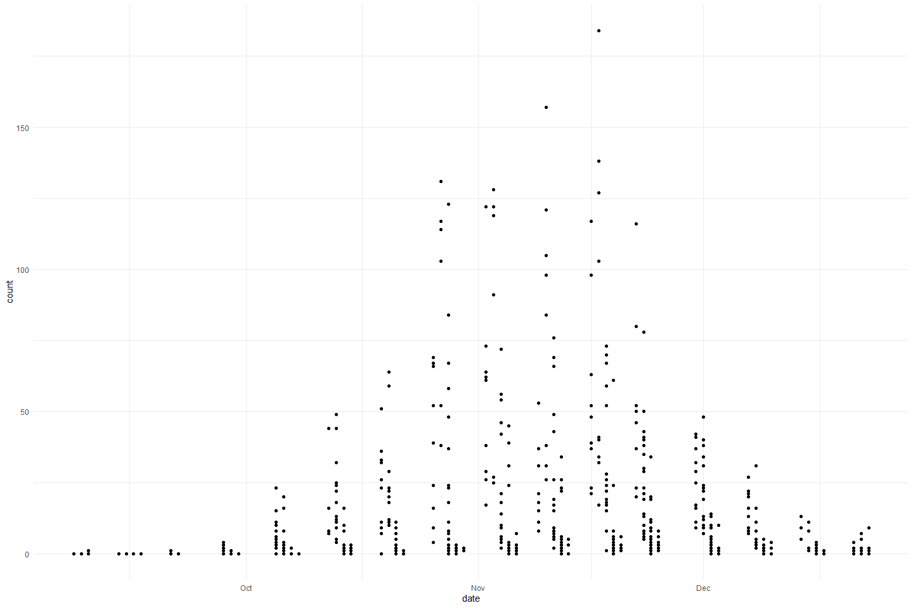
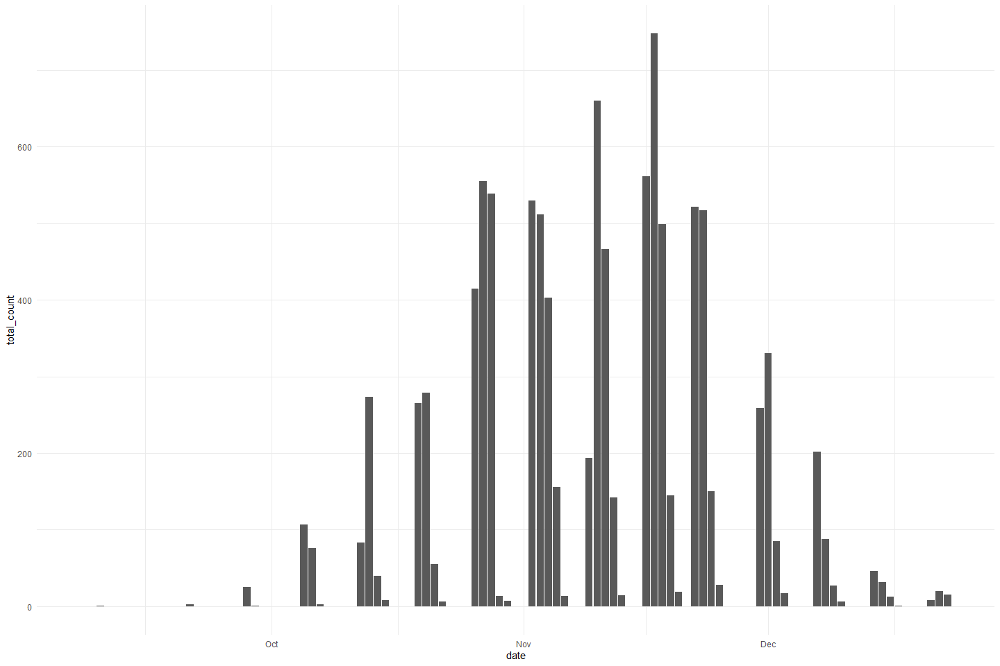
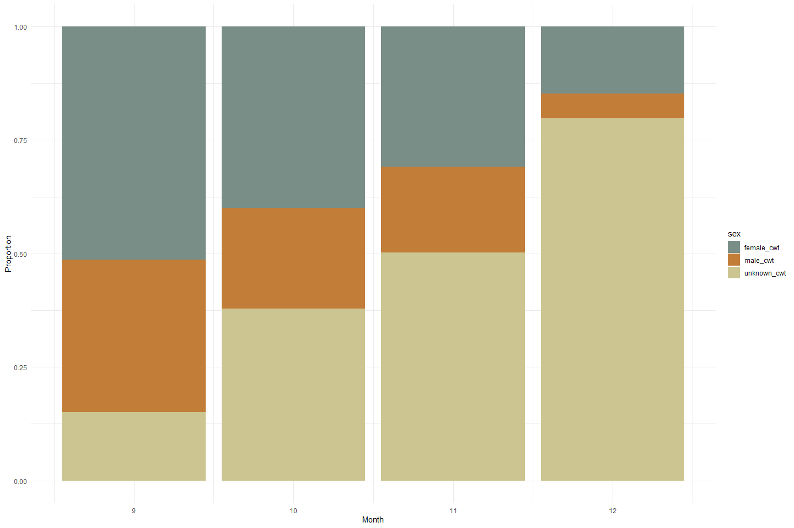
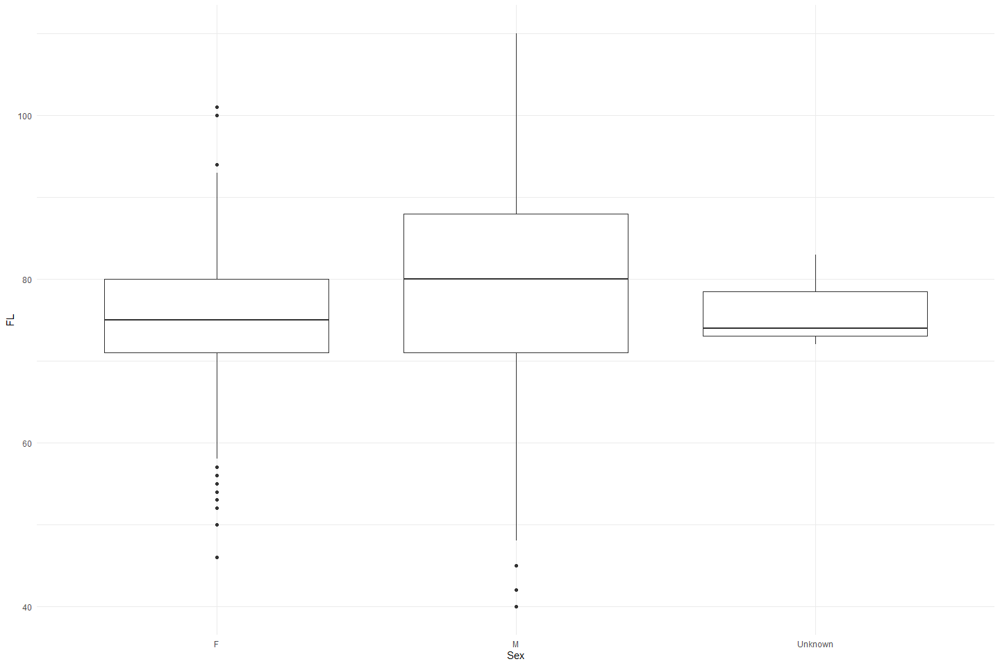

Feather Carcass QC 2015
================
Inigo Peng
2022-07-21

# Feather River Carcass Data

## Description of Monitoring Data

**Timeframe:**

**Video Season:**

**Completeness of Record throughout timeframe:**

**Sampling Location:**

**Data Contact:**

Any additional info?

## Access Cloud Data

``` r
# Run Sys.setenv() to specify GCS_AUTH_FILE and GCS_DEFAULT_BUCKET before running 
# getwd() to see how to specify paths 
# Open object from google cloud storage
# Set your authentication using gcs_auth

gcs_auth(json_file = Sys.getenv("GCS_AUTH_FILE"))
# Set global bucket 
gcs_global_bucket(bucket = Sys.getenv("GCS_DEFAULT_BUCKET"))

# git data and save as xlsx
```

``` r
gcs_get_object(object_name = "adult-holding-redd-and-carcass-surveys/feather-river/data-raw/carcass/2015/Chops_2015.xlsx",
               bucket = gcs_get_global_bucket(),
               saveToDisk = "Chops_2015.xlsx",
               overwrite = TRUE)
#
gcs_get_object(object_name = "adult-holding-redd-and-carcass-surveys/feather-river/data-raw/carcass/2015/ChopHeader_2015.xlsx",
               bucket = gcs_get_global_bucket(),
               saveToDisk = "ChopHeader_2015.xlsx",
               overwrite = TRUE)

# 
gcs_get_object(object_name = "adult-holding-redd-and-carcass-surveys/feather-river/data-raw/carcass/2015/CWTHeader_2015.xlsx",
               bucket = gcs_get_global_bucket(),
               saveToDisk = "CWTHeader_2015.xlsx",
               overwrite = TRUE)

gcs_get_object(object_name = "adult-holding-redd-and-carcass-surveys/feather-river/data-raw/carcass/2015/CWT_2015.xlsx",
               bucket = gcs_get_global_bucket(),
               saveToDisk = "CWT_2015.xlsx",
               overwrite = TRUE)
```

## Raw Data Glimpse:

### Chop_raw

``` r
Chops_raw <- read_excel("Chops_2015.xlsx") %>% 
  rename("ID" = `Chop Header ID`) %>%
  select(-`Chop ID`) %>% 
  glimpse()
```

    ## Rows: 813
    ## Columns: 4
    ## $ ID            <dbl> 312, 312, 312, 312, 312, 312, 312, 312, 312, 312, 312, 3~
    ## $ Section       <chr> "15", "14", "13", "12", "11", "10", "9", "8", "7", "6", ~
    ## $ Minutes       <dbl> 27, 12, 15, 11, 14, 24, 13, 13, 2, 1, 2, 3, 5, 6, NA, 21~
    ## $ `Total Count` <dbl> 0, 0, 0, 0, 0, 0, 0, 0, 0, 0, 0, 0, 0, 0, 0, 0, 0, 0, 0,~

### ChopHeader_raw

``` r
  ChopHeader_raw <- read_excel("ChopHeader_2015.xlsx") %>% 
  rename("ID" = `Chop Header ID`) %>%
  glimpse()
```

    ## Rows: 98
    ## Columns: 7
    ## $ Date     <dttm> 2015-09-08, 2015-09-09, 2015-09-10, 2015-09-14, 2015-09-15, ~
    ## $ `Week #` <chr> "1", "1", "1", "2", "2", "2", "2", "3", "3", "3", "4", "4", "~
    ## $ Weather  <chr> "SUN", "sun", "sun", "cld", "cld", "cld", "sun", "sun", "sun"~
    ## $ Time     <chr> "10:42", "9:35", "9:00", "9:30", "9:30", "11:30", "8:34", "9:~
    ## $ Crew     <chr> "CM,KH,C,SR", "cm,tk,kh,cc", "cjc, sr,kt, tk", "cjc,tk,jk", "~
    ## $ Comments <chr> NA, NA, NA, NA, NA, NA, NA, NA, NA, NA, NA, NA, NA, NA, NA, N~
    ## $ ID       <dbl> 312, 313, 315, 314, 320, 316, 317, 318, 319, 321, 322, 404, 3~

### cwt_raw

``` r
cwt_raw <- read_excel("CWT_2015.xlsx") %>% 
  rename("ID" = `CWT Header ID`) %>% 
  glimpse
```

    ## Rows: 6,847
    ## Columns: 16
    ## $ `CWT ID`                 <dbl> 27383, 27384, 27385, 27386, 27387, 27388, 273~
    ## $ ID                       <dbl> 1076, 1076, 1076, 1077, 1077, 1078, 1078, 107~
    ## $ `River Section`          <dbl> 12, 9, 8, 38, 38, 12, 11, 11, 11, 11, 8, 21, ~
    ## $ `Tag ID#`                <chr> "150", "151", "152", NA, NA, "153", "154", "1~
    ## $ `Tag, Recapture or Chop` <chr> "T", "T", "T", "C", "C", "T", "T", "T", "T", ~
    ## $ Sex                      <chr> "M", "F", "F", "M", NA, "F", "M", "F", "F", "~
    ## $ `Spawning Condition`     <chr> "UK", "U", "U", "U", NA, "U", "UK", "U", "U",~
    ## $ `Adipose Fin Clipped?`   <chr> "Y", "Y", "Y", "Y", NA, "Y", "Y", "N", "Y", "~
    ## $ `Samples Collected`      <chr> "H&S&O", "H&S&O", "H&S&O", "H&S&O", NA, "H&S&~
    ## $ `Fork Length`            <dbl> 80, 83, 73, 65, NA, 71, 68, 72, 71, 66, NA, 6~
    ## $ `Head Tag Number`        <chr> "89202", "89203", "89000", "89001", NA, "8900~
    ## $ Scales                   <chr> "58601", "58602", "58603", "58604", NA, "5860~
    ## $ Otoliths                 <chr> "5", "6", "7", "28", NA, "59", "55", "44", "4~
    ## $ `Hallprint Color`        <chr> NA, NA, NA, "G", "G", "G", NA, NA, NA, "G", N~
    ## $ Hallprint                <dbl> NA, NA, NA, 9270, 8895, NA, NA, NA, NA, NA, N~
    ## $ Comments                 <chr> NA, NA, NA, "sr", "sr", "sr", NA, NA, NA, "sr~

### cwt_header_raw

``` r
cwt_header_raw <- read_excel("CWTHeader_2015.xlsx") %>% 
  rename("ID" = `CWT Header ID` ) %>% 
  glimpse
```

    ## Rows: 282
    ## Columns: 10
    ## $ ID                    <dbl> 1076, 1077, 1078, 1079, 1357, 1080, 1081, 1082, ~
    ## $ Date                  <dttm> 2015-09-08, 2015-09-10, 2015-09-14, 2015-09-15,~
    ## $ Crew                  <chr> "CM, KH, SR, CC", "jc, sr,kt,tk", "jc,tk,jk", "j~
    ## $ `Week #`              <dbl> 1, 1, 2, 2, 2, 2, 3, 3, 4, 4, 4, 4, 4, 4, 5, 5, ~
    ## $ `Tag Color`           <chr> NA, NA, NA, NA, NA, NA, NA, NA, NA, NA, NA, NA, ~
    ## $ Morale                <chr> "10", "9", "10", "11", "9", "10", "6.54", "10", ~
    ## $ `Section Group 1-10`  <lgl> NA, NA, NA, NA, NA, NA, NA, NA, NA, NA, NA, NA, ~
    ## $ `Section Group 11-15` <lgl> NA, NA, NA, NA, NA, NA, NA, NA, NA, NA, NA, NA, ~
    ## $ `Section Group 16-21` <lgl> NA, NA, NA, NA, NA, NA, NA, NA, NA, NA, NA, NA, ~
    ## $ `Section Group 22-38` <lgl> NA, NA, NA, NA, NA, NA, NA, NA, NA, NA, NA, NA, ~

## Data transformations:

### Counts

The `chop` table contains carcass counts by chop/tagged based on clips

``` r
#1. chop table (with dates and tag color)
chop_join <- full_join(ChopHeader_raw %>% 
                                 select(ID, Date),
                               Chops_raw) %>% 
  clean_names() %>% 
  rename(sec = "section",
         min = "minutes",
         count = "total_count") %>% 
  mutate(sec = as.numeric(sec)) %>% glimpse
```

    ## Joining, by = "ID"

    ## Rows: 813
    ## Columns: 5
    ## $ id    <dbl> 312, 312, 312, 312, 312, 312, 312, 312, 312, 312, 312, 312, 312,~
    ## $ date  <dttm> 2015-09-08, 2015-09-08, 2015-09-08, 2015-09-08, 2015-09-08, 201~
    ## $ sec   <dbl> 15, 14, 13, 12, 11, 10, 9, 8, 7, 6, 5, 4, 3, 2, 1, 26, 24, 22, 2~
    ## $ min   <dbl> 27, 12, 15, 11, 14, 24, 13, 13, 2, 1, 2, 3, 5, 6, NA, 21, 46, 4,~
    ## $ count <dbl> 0, 0, 0, 0, 0, 0, 0, 0, 0, 0, 0, 0, 0, 0, 0, 0, 0, 0, 0, 0, 0, 0~

### Survey

The `chop_header` table contains survey metadata and covariates

``` r
chop_header <- ChopHeader_raw %>% 
  clean_names() %>% glimpse
```

    ## Rows: 98
    ## Columns: 7
    ## $ date        <dttm> 2015-09-08, 2015-09-09, 2015-09-10, 2015-09-14, 2015-09-1~
    ## $ week_number <chr> "1", "1", "1", "2", "2", "2", "2", "3", "3", "3", "4", "4"~
    ## $ weather     <chr> "SUN", "sun", "sun", "cld", "cld", "cld", "sun", "sun", "s~
    ## $ time        <chr> "10:42", "9:35", "9:00", "9:30", "9:30", "11:30", "8:34", ~
    ## $ crew        <chr> "CM,KH,C,SR", "cm,tk,kh,cc", "cjc, sr,kt, tk", "cjc,tk,jk"~
    ## $ comments    <chr> NA, NA, NA, NA, NA, NA, NA, NA, NA, NA, NA, NA, NA, NA, NA~
    ## $ id          <dbl> 312, 313, 315, 314, 320, 316, 317, 318, 319, 321, 322, 404~

### CWT

The `cwt` table contains coded wire tag information.

``` r
cwt <- full_join(cwt_header_raw, cwt_raw) %>% 
  clean_names() %>% 
  rename(fl = "fork_length") %>% 
  mutate(head_tag_number = as.numeric(head_tag_number),
         tag_id_number = as.numeric(tag_id_number),
         scales = as.numeric(scales),
         otoliths = as.numeric(otoliths))%>% glimpse()
```

    ## Joining, by = "ID"

    ## Rows: 6,848
    ## Columns: 25
    ## $ id                    <dbl> 1076, 1076, 1076, 1077, 1077, 1078, 1078, 1078, ~
    ## $ date                  <dttm> 2015-09-08, 2015-09-08, 2015-09-08, 2015-09-10,~
    ## $ crew                  <chr> "CM, KH, SR, CC", "CM, KH, SR, CC", "CM, KH, SR,~
    ## $ week_number           <dbl> 1, 1, 1, 1, 1, 2, 2, 2, 2, 2, 2, 2, 2, 2, 2, 2, ~
    ## $ tag_color             <chr> NA, NA, NA, NA, NA, NA, NA, NA, NA, NA, NA, NA, ~
    ## $ morale                <chr> "10", "10", "10", "9", "9", "10", "10", "10", "1~
    ## $ section_group_1_10    <lgl> NA, NA, NA, NA, NA, NA, NA, NA, NA, NA, NA, NA, ~
    ## $ section_group_11_15   <lgl> NA, NA, NA, NA, NA, NA, NA, NA, NA, NA, NA, NA, ~
    ## $ section_group_16_21   <lgl> NA, NA, NA, NA, NA, NA, NA, NA, NA, NA, NA, NA, ~
    ## $ section_group_22_38   <lgl> NA, NA, NA, NA, NA, NA, NA, NA, NA, NA, NA, NA, ~
    ## $ cwt_id                <dbl> 27383, 27384, 27385, 27386, 27387, 27388, 27389,~
    ## $ river_section         <dbl> 12, 9, 8, 38, 38, 12, 11, 11, 11, 11, 8, 21, 25,~
    ## $ tag_id_number         <dbl> 150, 151, 152, NA, NA, 153, 154, 175, 176, 177, ~
    ## $ tag_recapture_or_chop <chr> "T", "T", "T", "C", "C", "T", "T", "T", "T", "T"~
    ## $ sex                   <chr> "M", "F", "F", "M", NA, "F", "M", "F", "F", "M",~
    ## $ spawning_condition    <chr> "UK", "U", "U", "U", NA, "U", "UK", "U", "U", "U~
    ## $ adipose_fin_clipped   <chr> "Y", "Y", "Y", "Y", NA, "Y", "Y", "N", "Y", "Y",~
    ## $ samples_collected     <chr> "H&S&O", "H&S&O", "H&S&O", "H&S&O", NA, "H&S&O",~
    ## $ fl                    <dbl> 80, 83, 73, 65, NA, 71, 68, 72, 71, 66, NA, 66, ~
    ## $ head_tag_number       <dbl> 89202, 89203, 89000, 89001, NA, 89002, 89003, NA~
    ## $ scales                <dbl> 58601, 58602, 58603, 58604, NA, 58605, 58606, 58~
    ## $ otoliths              <dbl> 5, 6, 7, 28, NA, 59, 55, 44, 45, NA, NA, 64, 12,~
    ## $ hallprint_color       <chr> NA, NA, NA, "G", "G", "G", NA, NA, NA, "G", NA, ~
    ## $ hallprint             <dbl> NA, NA, NA, 9270, 8895, NA, NA, NA, NA, NA, NA, ~
    ## $ comments              <chr> NA, NA, NA, "sr", "sr", "sr", NA, NA, NA, "sr, m~

## Explore Numeric Variables:

### Chop Variable: `id`, `min`, `sec`

``` r
chop_join %>% 
  select_if(is.numeric) %>%
  colnames()
```

    ## [1] "id"    "sec"   "min"   "count"

``` r
summary(chop_join$id)
```

    ##    Min. 1st Qu.  Median    Mean 3rd Qu.    Max. 
    ##   312.0   333.0   360.0   359.9   387.0   409.0

``` r
summary(chop_join$min)
```

    ##    Min. 1st Qu.  Median    Mean 3rd Qu.    Max.    NA's 
    ##    1.00   13.00   22.00   33.59   35.00 2700.00       1

``` r
summary(chop_join$sec)
```

    ##    Min. 1st Qu.  Median    Mean 3rd Qu.    Max. 
    ##    1.00   10.00   18.00   19.15   28.00   38.00

**NA and Unknown Values** Provide a stat on NA or unknown values.

``` r
round(sum(is.na(chop_join$id))/nrow(chop_join), 3) * 100
```

    ## [1] 0

``` r
round(sum(is.na(chop_join$min))/nrow(chop_join), 3) * 100
```

    ## [1] 0.1

``` r
round(sum(is.na(chop_join$sec))/nrow(chop_join), 3) * 100
```

    ## [1] 0

-   0 % of values in the `id` column are NA.
-   0.1 % of values in the `min` column are NA.
-   0 % of values in the `sec` column are NA.

### Chop Variable: `count`

``` r
summary(chop_join$count)
```

    ##    Min. 1st Qu.  Median    Mean 3rd Qu.    Max. 
    ##    0.00    0.00    2.00   12.52   13.00  184.00

-   0 % of values in the `count` column are NA.

**Plotting count over Period of Record**

``` r
chop_join %>% 
  ggplot(aes(x = date, y = count)) + 
  geom_point() +
  theme_minimal()
```

<!-- -->

``` r
chop_join %>%
  group_by(date) %>%
  summarise(total_count = sum(count, na.rm = T)) %>%
  ggplot(aes(x = date, y = total_count)) +
  geom_col() +
  theme_minimal()
```

<!-- -->

``` r
chop_header %>% 
  select_if(is.numeric) %>% 
  colnames()
```

    ## [1] "id"

``` r
summary(chop_header$id)
```

    ##    Min. 1st Qu.  Median    Mean 3rd Qu.    Max. 
    ##   312.0   336.2   360.5   360.5   384.8   409.0

### Chop Header Variable: `id`

``` r
chop_header %>% 
  select_if(is.numeric) %>% 
  colnames()
```

    ## [1] "id"

``` r
summary(chop_header$id)
```

    ##    Min. 1st Qu.  Median    Mean 3rd Qu.    Max. 
    ##   312.0   336.2   360.5   360.5   384.8   409.0

### CWT Variable: `ID`, `sect`, `fl`, `header_id`, `week_num`

``` r
cwt %>% 
  select_if(is.numeric) %>% 
  colnames()
```

    ##  [1] "id"              "week_number"     "cwt_id"          "river_section"  
    ##  [5] "tag_id_number"   "fl"              "head_tag_number" "scales"         
    ##  [9] "otoliths"        "hallprint"

``` r
summary(cwt$fl)
```

    ##    Min. 1st Qu.  Median    Mean 3rd Qu.    Max.    NA's 
    ##   40.00   71.00   77.00   76.65   83.00  110.00    3281

``` r
summary(cwt$river_section)
```

    ##    Min. 1st Qu.  Median    Mean 3rd Qu.    Max.    NA's 
    ##    1.00    8.00    9.00   10.17   12.00   38.00       5

-   47.9 % of values in the `fl` column are NA.
-   0.1 % of values in the `sect` column are NA.

``` r
#Create a cwt_count column
#Pivot table to expand sex column to female_cwt, male_cwt, and unknown_cwt 
#Is this graph helpful?
unique(cwt$sex)
```

    ## [1] "M" "F" NA

``` r
cwt_count <- cwt %>% 
  mutate(count = 1) %>%
  mutate(sex = case_when(sex == "ND"|is.na(sex)|sex =="UK" ~ "U",
                         TRUE ~ sex)) %>% 
  pivot_wider(names_from = sex, values_from = count, values_fill = 0) %>% 
  # unnest() %>% 
  rename("male_cwt" = M,
         "female_cwt" = F,
         "unknown_cwt" = U) %>% glimpse
```

    ## Rows: 6,848
    ## Columns: 27
    ## $ id                    <dbl> 1076, 1076, 1076, 1077, 1077, 1078, 1078, 1078, ~
    ## $ date                  <dttm> 2015-09-08, 2015-09-08, 2015-09-08, 2015-09-10,~
    ## $ crew                  <chr> "CM, KH, SR, CC", "CM, KH, SR, CC", "CM, KH, SR,~
    ## $ week_number           <dbl> 1, 1, 1, 1, 1, 2, 2, 2, 2, 2, 2, 2, 2, 2, 2, 2, ~
    ## $ tag_color             <chr> NA, NA, NA, NA, NA, NA, NA, NA, NA, NA, NA, NA, ~
    ## $ morale                <chr> "10", "10", "10", "9", "9", "10", "10", "10", "1~
    ## $ section_group_1_10    <lgl> NA, NA, NA, NA, NA, NA, NA, NA, NA, NA, NA, NA, ~
    ## $ section_group_11_15   <lgl> NA, NA, NA, NA, NA, NA, NA, NA, NA, NA, NA, NA, ~
    ## $ section_group_16_21   <lgl> NA, NA, NA, NA, NA, NA, NA, NA, NA, NA, NA, NA, ~
    ## $ section_group_22_38   <lgl> NA, NA, NA, NA, NA, NA, NA, NA, NA, NA, NA, NA, ~
    ## $ cwt_id                <dbl> 27383, 27384, 27385, 27386, 27387, 27388, 27389,~
    ## $ river_section         <dbl> 12, 9, 8, 38, 38, 12, 11, 11, 11, 11, 8, 21, 25,~
    ## $ tag_id_number         <dbl> 150, 151, 152, NA, NA, 153, 154, 175, 176, 177, ~
    ## $ tag_recapture_or_chop <chr> "T", "T", "T", "C", "C", "T", "T", "T", "T", "T"~
    ## $ spawning_condition    <chr> "UK", "U", "U", "U", NA, "U", "UK", "U", "U", "U~
    ## $ adipose_fin_clipped   <chr> "Y", "Y", "Y", "Y", NA, "Y", "Y", "N", "Y", "Y",~
    ## $ samples_collected     <chr> "H&S&O", "H&S&O", "H&S&O", "H&S&O", NA, "H&S&O",~
    ## $ fl                    <dbl> 80, 83, 73, 65, NA, 71, 68, 72, 71, 66, NA, 66, ~
    ## $ head_tag_number       <dbl> 89202, 89203, 89000, 89001, NA, 89002, 89003, NA~
    ## $ scales                <dbl> 58601, 58602, 58603, 58604, NA, 58605, 58606, 58~
    ## $ otoliths              <dbl> 5, 6, 7, 28, NA, 59, 55, 44, 45, NA, NA, 64, 12,~
    ## $ hallprint_color       <chr> NA, NA, NA, "G", "G", "G", NA, NA, NA, "G", NA, ~
    ## $ hallprint             <dbl> NA, NA, NA, 9270, 8895, NA, NA, NA, NA, NA, NA, ~
    ## $ comments              <chr> NA, NA, NA, "sr", "sr", "sr", NA, NA, NA, "sr, m~
    ## $ male_cwt              <dbl> 1, 0, 0, 1, 0, 0, 1, 0, 0, 1, 0, 0, 0, 1, 0, 0, ~
    ## $ female_cwt            <dbl> 0, 1, 1, 0, 0, 1, 0, 1, 1, 0, 1, 1, 1, 0, 0, 1, ~
    ## $ unknown_cwt           <dbl> 0, 0, 0, 0, 1, 0, 0, 0, 0, 0, 0, 0, 0, 0, 1, 0, ~

``` r
total_cwt_summary <- cwt_count %>% 
  mutate(male_cwt = ifelse(is.na(male_cwt), 0, male_cwt), # fill na
         female_cwt = ifelse(is.na(female_cwt), 0, female_cwt),
         unknown_cwt = ifelse(is.na(unknown_cwt), 0, unknown_cwt),
         total_cwt = unknown_cwt + male_cwt + female_cwt) %>% 
  group_by(month(date)) %>% 
  summarise(total_cwt = sum(total_cwt),
            male_cwt = sum(male_cwt),
            female_cwt = sum(female_cwt),
            unknown_cwt = sum(unknown_cwt))
```

``` r
total_cwt_summary %>% 
  pivot_longer(cols = c(male_cwt, female_cwt, unknown_cwt), names_to = "sex", values_to = "count") %>% 
  mutate(proportions = (count / total_cwt)) %>% 
  ggplot(aes(x = `month(date)`, y = proportions, fill = sex)) + 
  geom_bar(stat = "identity", position = "stack") +
  scale_fill_manual(name = "chops", 
                    labels = c("CWT Male", "CWT Female", "CWT Unknown")) +
  theme_minimal() + 
  labs(y = "Proportion", x = "Month") +
  scale_fill_manual(values = wes_palette("Moonrise2"))
```

    ## Scale for 'fill' is already present. Adding another scale for 'fill', which
    ## will replace the existing scale.

<!-- -->

**Plotting fork length of each sex**

``` r
cwt %>% 
  mutate(sex = case_when(sex == "ND"|is.na(sex)|sex =="UK" ~ "Unknown",
                         TRUE ~ sex))%>% 
  ggplot(aes(x = sex, y = fl)) + 
  geom_boxplot() + 
  theme_minimal() + 
  labs(y = "FL", x = "Sex")
```

<!-- -->

## Explore Categorical variables:

### Chop Clean Data

Fix inconsistencies with spelling, capitalization, and dates

``` r
chop_join %>% 
  select_if(is.character) %>%
  colnames()
```

    ## character(0)

``` r
chop_cleaner <- chop_join %>%
  mutate(date = as_date(date)) %>%
  mutate_if(is.character, str_to_lower)

chop_cleaner
```

    ## # A tibble: 813 x 5
    ##       id date         sec   min count
    ##    <dbl> <date>     <dbl> <dbl> <dbl>
    ##  1   312 2015-09-08    15    27     0
    ##  2   312 2015-09-08    14    12     0
    ##  3   312 2015-09-08    13    15     0
    ##  4   312 2015-09-08    12    11     0
    ##  5   312 2015-09-08    11    14     0
    ##  6   312 2015-09-08    10    24     0
    ##  7   312 2015-09-08     9    13     0
    ##  8   312 2015-09-08     8    13     0
    ##  9   312 2015-09-08     7     2     0
    ## 10   312 2015-09-08     6     1     0
    ## # ... with 803 more rows

### Chop Header Clean Data

``` r
chop_header %>% 
  select_if(is.character) %>% 
  colnames()
```

    ## [1] "week_number" "weather"     "time"        "crew"        "comments"

``` r
unique(chop_header$crew)
```

    ##  [1] "CM,KH,C,SR"                           
    ##  [2] "cm,tk,kh,cc"                          
    ##  [3] "cjc, sr,kt, tk"                       
    ##  [4] "cjc,tk,jk"                            
    ##  [5] "jc,cjc,tk"                            
    ##  [6] "sr,tv,th,ai"                          
    ##  [7] "mi,th,tw,sr"                          
    ##  [8] "cm,kh,tj,tv"                          
    ##  [9] "sr,cjc,th,tk"                         
    ## [10] "cm,tk,tj,texas"                       
    ## [11] "kh,kt,bl,mh"                          
    ## [12] "tj,sm,ai,cjc"                         
    ## [13] "sm,kh,jc,tj"                          
    ## [14] "ai,sr,bl,tex"                         
    ## [15] "tj,ai,mh,bl"                          
    ## [16] "cjc, ai, tk, mh"                      
    ## [17] "tj,tv,cm,sr"                          
    ## [18] "mh,cjc,tk,j"                          
    ## [19] "cm,sr,tj,tv"                          
    ## [20] "MI,SR,TJ,TEX"                         
    ## [21] "TJ,SR,MH,CM"                          
    ## [22] "JK,TV,MH,TK"                          
    ## [23] "AT,KT,BL,AH"                          
    ## [24] "CM,KH,SR,MI"                          
    ## [25] "MH,TW,TJ,CM"                          
    ## [26] "tk,tj,mh,cm"                          
    ## [27] "tj,kh,tk,ai"                          
    ## [28] "cjc,The Ron Stone (USFWS), Tex, KT,CM"
    ## [29] "jc,mi,ai,tj"                          
    ## [30] "mh,tk,kh,cm"                          
    ## [31] "kh,kt,tj,tk"                          
    ## [32] "mh,ai,mi,cm"                          
    ## [33] "cjc,tv"                               
    ## [34] "tw,mh,tk"                             
    ## [35] "cm,kh,sm,mh"                          
    ## [36] "kt,tk,tj,sr"                          
    ## [37] "MH,AI,MI,KT"                          
    ## [38] "KH,CM,TK,TJ"                          
    ## [39] "kt.tk,sr,mh"                          
    ## [40] "AI,TV,KT,MI"                          
    ## [41] "MI,TJ,KT"                             
    ## [42] "MH,CJC,CM,TK"                         
    ## [43] "MH,AI,TW"                             
    ## [44] "KH,TV,CM,TJ"                          
    ## [45] "MH,AI,CC,TK"                          
    ## [46] "MH,CC,KH,TK"                          
    ## [47] "SR,AI,MI,TJ"                          
    ## [48] "KH,CM,TJ"                             
    ## [49] "MH,AI,SR,TK"                          
    ## [50] "AI,MH,CC,KH"                          
    ## [51] "SR,CC,CM,TJ"                          
    ## [52] "MH,BL,MI"                             
    ## [53] "AH,MH,TV"                             
    ## [54] "mi,cc,tj"                             
    ## [55] "kt,jc,tj"                             
    ## [56] "mh,cm,kh,tk"                          
    ## [57] "mh,sr,jc,tk"                          
    ## [58] "kh,bl,cm,tj"                          
    ## [59] "cjc,cm,mi,tj"                         
    ## [60] "kh,tk,sr,ai"                          
    ## [61] "sr,jc,ai,tj"                          
    ## [62] "ai,mh,sr,cc"                          
    ## [63] "tv,cm,kh,tj"                          
    ## [64] "cjc,mi,ai,kh"                         
    ## [65] "mh,sr,cm,tv"                          
    ## [66] "TV,SR,AI,TJ"                          
    ## [67] "MH,CJC,CM,KH"                         
    ## [68] "CM,MH,CJC,MI"                         
    ## [69] "KH,KT,AI,TJ"                          
    ## [70] "MI,BC,AH"                             
    ## [71] "AI,MH,TV,AH"                          
    ## [72] "BL,CJC,MI,TJ"                         
    ## [73] "AH,KT,SR,AH"                          
    ## [74] "BL,AI,CC,TJ"                          
    ## [75] "CM,KH,TK,MI"                          
    ## [76] "CM,KL,TJ,BL"                          
    ## [77] "AI,KH,TX,TK"                          
    ## [78] "AI,TV,TX,BL"                          
    ## [79] "TK,CJC,TJ,CM"                         
    ## [80] "MI,AI,TEX,CM"                         
    ## [81] "TK,KH,CJC,TJ"                         
    ## [82] "SM,TEX,SR,BL"                         
    ## [83] "SM,TV,CM,BL"                          
    ## [84] "CJC,MH,TK,TS"                         
    ## [85] "MH,SR,CJC"                            
    ## [86] "CM,TI,TV,CC"                          
    ## [87] "KH,TK,MH,AI"                          
    ## [88] "SM,TJ,TEX,TK"                         
    ## [89] "kh,tk,tj,mh"                          
    ## [90] "sm,cjc,mi"                            
    ## [91] "sm,jc,tex,tj"                         
    ## [92] "mh,cjc,tk"                            
    ## [93] "cjc tv tk"                            
    ## [94] "mh,tj,tk"                             
    ## [95] "mh, tw,tk"                            
    ## [96] "mh, tk, mi"                           
    ## [97] "mh tw, tk"                            
    ## [98] "mh, tk, tw"

``` r
#clr = clear? or cloud
unique(chop_header$weather)
```

    ##  [1] "SUN"      "sun"      "cld"      "CLD"      "CLR"      "RAIN"    
    ##  [7] "CLD/RAIN" "SUN/CLD"  "cld,rain" "cld ran"

``` r
chop_header_cleaner <- chop_header %>%
  mutate(date = as_date(date)) %>% 
  mutate_if(is.character, str_to_lower) %>% 
  mutate(crew = str_replace_all(crew, " ", ","),
         crew = str_replace_all(crew, ",,", ","),
         weather = case_when(weather == "cld" ~ "cloudy",
                             weather == "cld ran" ~ "cloudy, rain",
                             weather == "ran" ~ "rain",
                             weather == "sun/cld" ~ "sun, cloud",
                             TRUE ~ weather),
         weather = str_replace_all(weather, " ", ""),
         weather = str_replace_all(weather, "/", ",")) %>% 
  select(-c(time))

chop_header_cleaner
```

    ## # A tibble: 98 x 6
    ##    date       week_number weather crew           comments    id
    ##    <date>     <chr>       <chr>   <chr>          <chr>    <dbl>
    ##  1 2015-09-08 1           sun     cm,kh,c,sr     <NA>       312
    ##  2 2015-09-09 1           sun     cm,tk,kh,cc    <NA>       313
    ##  3 2015-09-10 1           sun     cjc,sr,kt,tk   <NA>       315
    ##  4 2015-09-14 2           cloudy  cjc,tk,jk      <NA>       314
    ##  5 2015-09-15 2           cloudy  jc,cjc,tk      <NA>       320
    ##  6 2015-09-16 2           cloudy  sr,tv,th,ai    <NA>       316
    ##  7 2015-09-17 2           sun     mi,th,tw,sr    <NA>       317
    ##  8 2015-09-21 3           sun     cm,kh,tj,tv    <NA>       318
    ##  9 2015-09-21 3           sun     sr,cjc,th,tk   <NA>       319
    ## 10 2015-09-22 3           sun     cm,tk,tj,texas <NA>       321
    ## # ... with 88 more rows

### CWT Clean Data

``` r
cwt %>% 
  select_if(is.character) %>% 
  colnames
```

    ##  [1] "crew"                  "tag_color"             "morale"               
    ##  [4] "tag_recapture_or_chop" "sex"                   "spawning_condition"   
    ##  [7] "adipose_fin_clipped"   "samples_collected"     "hallprint_color"      
    ## [10] "comments"

``` r
unique(cwt$spawning_condition)
```

    ## [1] "UK" "U"  NA   "S"

``` r
unique(cwt$adipose_fin_clipped)
```

    ## [1] "Y"  NA   "N"  "UK"

``` r
unique(cwt$crew)
```

    ##   [1] "CM, KH, SR, CC"                                  
    ##   [2] "jc, sr,kt,tk"                                    
    ##   [3] "jc,tk,jk"                                        
    ##   [4] "jc, cjc,tk"                                      
    ##   [5] "SR, TK, AI, TW"                                  
    ##   [6] "mi,th,sr,tw"                                     
    ##   [7] "sr,cjc,tj,th"                                    
    ##   [8] "cm,kh,tv,tj"                                     
    ##   [9] "kh,mh,kt,bl"                                     
    ##  [10] "kt,kh,bl,mh"                                     
    ##  [11] "tj,sm,cjc,ai"                                    
    ##  [12] "tj,sm,ai,cjc"                                    
    ##  [13] "sm,ai,tj,tex"                                    
    ##  [14] "tj,mh,bl,ai"                                     
    ##  [15] "cjc, ai, mh,tk"                                  
    ##  [16] "cjc, ai, mh, tk"                                 
    ##  [17] "mh,ai,tk,cjc"                                    
    ##  [18] "tj,tv,cm,sr"                                     
    ##  [19] "tj,sr,tv,cm"                                     
    ##  [20] "tv,sr,tj,mi"                                     
    ##  [21] NA                                                
    ##  [22] "mh,jc,tk,ctc"                                    
    ##  [23] "mh,tk,ctc,jc"                                    
    ##  [24] "cm,sr,tj,tv"                                     
    ##  [25] "cm,tv,sr,tj"                                     
    ##  [26] "mi,sr,tj,tex"                                    
    ##  [27] "tj,sr,mh,cm"                                     
    ##  [28] "jk,mh,tv,tk"                                     
    ##  [29] "JK,TV,TK,MH"                                     
    ##  [30] "JK,TV,MH"                                        
    ##  [31] "CM,KH,SR,MI"                                     
    ##  [32] "CM,SR,KH,MI"                                     
    ##  [33] "CM,KH,MI,SR"                                     
    ##  [34] "KH,CM,SR,MI"                                     
    ##  [35] "SR,CM,MI,KH"                                     
    ##  [36] "KT,AI,BL,AH"                                     
    ##  [37] "AI,KT,BL,AH"                                     
    ##  [38] "AI,BL,KT,AH"                                     
    ##  [39] "AI,KT,BK,AH"                                     
    ##  [40] "AI,KT,AH,BL"                                     
    ##  [41] "SR,MI,KH,CM"                                     
    ##  [42] "MH,TK,TW,CM"                                     
    ##  [43] "tk,cm,mh,tj"                                     
    ##  [44] "cjc,tex,cm,kt and special guest Ron Stone (USFW)"
    ##  [45] "tj,ai,kh,tk"                                     
    ##  [46] "tj,kh,ai,tk"                                     
    ##  [47] "cjc,mh,kt,cm"                                    
    ##  [48] "mh,tj,kh,cm"                                     
    ##  [49] "mh,cm,tk,kh"                                     
    ##  [50] "mh,tk,cm,kh"                                     
    ##  [51] "MH,TK,CM,KH"                                     
    ##  [52] "CC,MI,AI,TJ"                                     
    ##  [53] "cc,mi,ai,tj"                                     
    ##  [54] "cc,ai,mi,tj"                                     
    ##  [55] "kt,tk,tj,kh"                                     
    ##  [56] "mh,cm,mi,ai"                                     
    ##  [57] "CJC,TV"                                          
    ##  [58] "MH,TW,TK"                                        
    ##  [59] "kt,tk,tk,sr"                                     
    ##  [60] "kt,tk,tj,sr"                                     
    ##  [61] "TK,SR,KF"                                        
    ##  [62] "CM,KH,SM,MH"                                     
    ##  [63] "MH,CM,SM,KH"                                     
    ##  [64] "MH,SM,CM,KH"                                     
    ##  [65] "mh,mi,ai,kt"                                     
    ##  [66] "kh,cm,tk,tj"                                     
    ##  [67] "AI,TV,TJ,MI"                                     
    ##  [68] "KT,SR,TK,MH"                                     
    ##  [69] "KT,MH,TK,SR"                                     
    ##  [70] "MH,TK,CM,CTC"                                    
    ##  [71] "MI,KT,TJ"                                        
    ##  [72] "mh,ai,tw"                                        
    ##  [73] "mh,ai,cc,tk"                                     
    ##  [74] "kh,tv,cm,tj"                                     
    ##  [75] "kh,cm,tv,tj"                                     
    ##  [76] "sr,mi,ai,tj"                                     
    ##  [77] "sr,ai,mi,tj"                                     
    ##  [78] "mh,cc,kh,tk"                                     
    ##  [79] "kh,cc,tk,tj"                                     
    ##  [80] "kh,cjc,tk,tw"                                    
    ##  [81] "ai,mh,sr,kt"                                     
    ##  [82] "ai,sr,kt,mh"                                     
    ##  [83] "mh,ai,kt,sr"                                     
    ##  [84] "mh,ai,sr,kt"                                     
    ##  [85] "mh,kh,ai,cc"                                     
    ##  [86] "sr,cc,cm,tj"                                     
    ##  [87] "mh,mi,bl"                                        
    ##  [88] "mh,tv,ah"                                        
    ##  [89] "mi,cc,tj"                                        
    ##  [90] "tj,mt,cc"                                        
    ##  [91] "mh,cm,kh,tk"                                     
    ##  [92] "mh,kh,tk,cm"                                     
    ##  [93] "mh,kh,cm,tk"                                     
    ##  [94] "jc,tj,cc,kt"                                     
    ##  [95] "tc,tj,kt,cc"                                     
    ##  [96] "jc,tj,kt,cc"                                     
    ##  [97] "jc,kt,kt,cc"                                     
    ##  [98] "jc,jk,tj,cc"                                     
    ##  [99] "MH,JC,SR,TK"                                     
    ## [100] "MH,SR,TK,JC"                                     
    ## [101] "MH,TK,SR,JC"                                     
    ## [102] "MH,SR,JC,TK"                                     
    ## [103] "bl,kh,cm,tj"                                     
    ## [104] "kh,cm,bl,tj"                                     
    ## [105] "kh,tk,sr,ai"                                     
    ## [106] "kh,tk,ai,tk"                                     
    ## [107] "kh,tk,ai,sr"                                     
    ## [108] "cjc,tj,mi,cm"                                    
    ## [109] "mi,cm,cjc,tj"                                    
    ## [110] "sr,jc,ai,tj"                                     
    ## [111] "mh,sr,cc,ai"                                     
    ## [112] "mh,ai,sr,cc"                                     
    ## [113] "mh,ai,cc,sr"                                     
    ## [114] "tv,cm,kh,tj"                                     
    ## [115] "tv,kh,cm,tj"                                     
    ## [116] "tv,kh,cm,tw"                                     
    ## [117] "cm,tw,kh,tv"                                     
    ## [118] "cm,kk,tv,tw"                                     
    ## [119] "cjc,ai,mi,kh"                                    
    ## [120] "cjc,mi,ai,kh"                                    
    ## [121] "jc, mi,ai,kh"                                    
    ## [122] "jc,mi,ai,kh"                                     
    ## [123] "cjc, mi,ai,kh"                                   
    ## [124] "ai,mi,cjc,kh"                                    
    ## [125] "mh,cm,sr,tv"                                     
    ## [126] "mh,sr,cm,tv"                                     
    ## [127] "mh,sr, cam,tv"                                   
    ## [128] "kh,mi,ai,cjc"                                    
    ## [129] "cjc,mh,cm,kh"                                    
    ## [130] "kh,cm,cjc,kh"                                    
    ## [131] "mh,cm,cjc,kh"                                    
    ## [132] "cm,mh,kh,cc"                                     
    ## [133] "cm,kh,cc,mh"                                     
    ## [134] "tv,sr,ai,tj"                                     
    ## [135] "sr,tv,ai,tj"                                     
    ## [136] "kt,ai,kh,tj"                                     
    ## [137] "mi,cm,kh,cjc"                                    
    ## [138] "mh,cm,mi,cjc"                                    
    ## [139] "mh,mi,bl,ah"                                     
    ## [140] "bl,cjc,mi,tj"                                    
    ## [141] "bl,mi,cjc,tj"                                    
    ## [142] "ah,mh,tv,ai"                                     
    ## [143] "mh,ah,tv,ai"                                     
    ## [144] "mh,ai,tv,ah"                                     
    ## [145] "mh,ah,kt,sr"                                     
    ## [146] "mh,ah,sr,kt"                                     
    ## [147] "mh,kt,ah,sr"                                     
    ## [148] "ah,mh,sr,kt"                                     
    ## [149] "cm,kh,mi,tk"                                     
    ## [150] "cm,kh,tk,mi"                                     
    ## [151] "cm,tk,kh,mi"                                     
    ## [152] "cjc,bl,ai,tj"                                    
    ## [153] "cjc,ai,tj,bl"                                    
    ## [154] "bl,cm,kt,tj"                                     
    ## [155] "bl,kl,tj,cm"                                     
    ## [156] "ai,kh,tx,tk"                                     
    ## [157] "ai,tv,tx,bl"                                     
    ## [158] "mi,ai,cm,tex"                                    
    ## [159] "MI,AI,CM,TEX"                                    
    ## [160] "MH,CM,MI,AI"                                     
    ## [161] "tk,cjc,tj,sm"                                    
    ## [162] "TK,CJC,TJ,SM"                                    
    ## [163] "SM,SR,BL,TEX"                                    
    ## [164] "sm,tex,bl,sr"                                    
    ## [165] "sm,tex,sr,bl"                                    
    ## [166] "sm,tex,bk,sr"                                    
    ## [167] "tk,kh,cjc,tj"                                    
    ## [168] "tk,kh"                                           
    ## [169] "sm,hb,tv,bl"                                     
    ## [170] "cjc,tk,tex,tj"                                   
    ## [171] "mh,sr,cc"                                        
    ## [172] "cm,cc,tj,tv"                                     
    ## [173] "cm,cc,tv,tj"                                     
    ## [174] "kh,tk,mh,ai"                                     
    ## [175] "SM,TJ,TEX,TK"                                    
    ## [176] "sm,kc,mi"                                        
    ## [177] "kh,mh,tj,tk"                                     
    ## [178] "mh,cjc,tk"                                       
    ## [179] "cjc tv tk"                                       
    ## [180] "tk tj mh"                                        
    ## [181] "mh tj tk"                                        
    ## [182] "mh tw tk"                                        
    ## [183] "tw,tk,mh"

``` r
unique(cwt$tag_recapture_or_chop)
```

    ## [1] "T" "C" NA  "R"

``` r
unique(cwt$samples_collected)
```

    ## [1] "H&S&O" NA      "S&O"   "H&S"   "O"     "H"     "S"

``` r
unique(cwt$tag_color)
```

    ## [1] NA                                   "Tag ID are blue on this sheet"     
    ## [3] "ALL ID TAGS ARE BLUE ON THIS SHEET" "ALL ID TAGS BLUE ON THIS SHEET"

``` r
#Dropping sectiongroup and morale
cwt_cleaner <- cwt %>% 
  mutate_if(is.character, str_to_lower) %>% 
  mutate(crew = str_replace_all(crew, " ", ","),
         crew = str_replace_all(crew, ",,", ","),
         sex = case_when(sex == "nd"|is.na(sex) ~ "unknown",
                         TRUE ~ sex),
         tag_recapture_or_chop = case_when(tag_recapture_or_chop == "T" ~ "tagged",
                                         tag_recapture_or_chop == "R" ~ "recapture",
                                         tag_recapture_or_chop == "C" ~ "chop",
                                         TRUE ~ tag_recapture_or_chop),
         adipose_fin_clipped = case_when(adipose_fin_clipped == "UK" ~ "unknown",
                                         adipose_fin_clipped == "Y" ~ "yes",
                                         adipose_fin_clipped == "N" ~ "no",
                                         TRUE ~ adipose_fin_clipped),
         hallprint_color = case_when(hallprint_color == "grey" ~ "G",
                                     TRUE ~ hallprint_color),
         spawning_condition = case_when(spawning_condition == "UK" ~ "unknown",
                                        TRUE ~ spawning_condition),
         tag_color = ifelse(is.na(tag_color), NA, "Blue")) %>% 
  select(-c(morale, section_group_1_10, section_group_11_15, section_group_16_21, section_group_22_38)) %>% 
  glimpse
```

    ## Rows: 6,848
    ## Columns: 20
    ## $ id                    <dbl> 1076, 1076, 1076, 1077, 1077, 1078, 1078, 1078, ~
    ## $ date                  <dttm> 2015-09-08, 2015-09-08, 2015-09-08, 2015-09-10,~
    ## $ crew                  <chr> "cm,kh,sr,cc", "cm,kh,sr,cc", "cm,kh,sr,cc", "jc~
    ## $ week_number           <dbl> 1, 1, 1, 1, 1, 2, 2, 2, 2, 2, 2, 2, 2, 2, 2, 2, ~
    ## $ tag_color             <chr> NA, NA, NA, NA, NA, NA, NA, NA, NA, NA, NA, NA, ~
    ## $ cwt_id                <dbl> 27383, 27384, 27385, 27386, 27387, 27388, 27389,~
    ## $ river_section         <dbl> 12, 9, 8, 38, 38, 12, 11, 11, 11, 11, 8, 21, 25,~
    ## $ tag_id_number         <dbl> 150, 151, 152, NA, NA, 153, 154, 175, 176, 177, ~
    ## $ tag_recapture_or_chop <chr> "t", "t", "t", "c", "c", "t", "t", "t", "t", "t"~
    ## $ sex                   <chr> "m", "f", "f", "m", "unknown", "f", "m", "f", "f~
    ## $ spawning_condition    <chr> "uk", "u", "u", "u", NA, "u", "uk", "u", "u", "u~
    ## $ adipose_fin_clipped   <chr> "y", "y", "y", "y", NA, "y", "y", "n", "y", "y",~
    ## $ samples_collected     <chr> "h&s&o", "h&s&o", "h&s&o", "h&s&o", NA, "h&s&o",~
    ## $ fl                    <dbl> 80, 83, 73, 65, NA, 71, 68, 72, 71, 66, NA, 66, ~
    ## $ head_tag_number       <dbl> 89202, 89203, 89000, 89001, NA, 89002, 89003, NA~
    ## $ scales                <dbl> 58601, 58602, 58603, 58604, NA, 58605, 58606, 58~
    ## $ otoliths              <dbl> 5, 6, 7, 28, NA, 59, 55, 44, 45, NA, NA, 64, 12,~
    ## $ hallprint_color       <chr> NA, NA, NA, "g", "g", "g", NA, NA, NA, "g", NA, ~
    ## $ hallprint             <dbl> NA, NA, NA, 9270, 8895, NA, NA, NA, NA, NA, NA, ~
    ## $ comments              <chr> NA, NA, NA, "sr", "sr", "sr", NA, NA, NA, "sr, m~

## Data Dictionaries

# Count

``` r
percent_na <- chop_cleaner %>%
  summarise_all(list(name = ~sum(is.na(.))/length(.))) %>%
  pivot_longer(cols = everything())


counts_data_dictionary <- tibble(variables = colnames(chop_cleaner),
                          description = c("ID",
                                          "Date of survey",
                                          "Sect", 
                                          "Min", 
                                          "Count"),
                          percent_na = round(percent_na$value*100))

kable(counts_data_dictionary)
```

| variables | description    | percent_na |
|:----------|:---------------|-----------:|
| id        | ID             |          0 |
| date      | Date of survey |          0 |
| sec       | Sect           |          0 |
| min       | Min            |          0 |
| count     | Count          |          0 |

### Survey

``` r
percent_na <- chop_header_cleaner %>%
  summarise_all(list(name = ~sum(is.na(.))/length(.))) %>%
  pivot_longer(cols = everything())
# 
chop_header_data_dictionary <- tibble(variables = colnames(chop_header_cleaner),
                          description = c("Date of survey",
                                          "Week Number",
                                          "Weather",
                                          "Crew memeber initials that collected",
                                          "Comments",
                                          "ID"),
                          percent_na = round(percent_na$value*100))
# 
kable(chop_header_data_dictionary)
```

| variables   | description                          | percent_na |
|:------------|:-------------------------------------|-----------:|
| date        | Date of survey                       |          0 |
| week_number | Week Number                          |          0 |
| weather     | Weather                              |          0 |
| crew        | Crew memeber initials that collected |          0 |
| comments    | Comments                             |         99 |
| id          | ID                                   |          0 |

### CWT

``` r
percent_na <- cwt_cleaner %>%
  summarise_all(list(name = ~sum(is.na(.))/length(.))) %>%
  pivot_longer(cols = everything())

cwt_data_dictionary <- tibble(variables = colnames(cwt_cleaner),
                          description = c("ID",
                                          "Date",
                                          "Crew memeber initials that collected",
                                          "Week number",
                                          "Tag colour",
                                          "CWT ID",
                                          "River section",
                                          "Tag ID Number",
                                          "Carcass tagged, recaptured, or chopped",
                                          "Sex of the carcass",
                                          "Spawning condition",
                                          "Adipose fin clipped or not",
                                          "Sample collected",
                                          "Fork length",
                                          "Head tag number",
                                          "Scales",
                                          "Otoliths",
                                          "Hallprint colour",
                                          "Hallprint",
                                          "Comments"),
                          percent_na = round(percent_na$value*100))
# 
kable(cwt_data_dictionary)
```

| variables             | description                            | percent_na |
|:----------------------|:---------------------------------------|-----------:|
| id                    | ID                                     |          0 |
| date                  | Date                                   |          0 |
| crew                  | Crew memeber initials that collected   |          0 |
| week_number           | Week number                            |          0 |
| tag_color             | Tag colour                             |         99 |
| cwt_id                | CWT ID                                 |          0 |
| river_section         | River section                          |          0 |
| tag_id_number         | Tag ID Number                          |          7 |
| tag_recapture_or_chop | Carcass tagged, recaptured, or chopped |          0 |
| sex                   | Sex of the carcass                     |          0 |
| spawning_condition    | Spawning condition                     |         48 |
| adipose_fin_clipped   | Adipose fin clipped or not             |         48 |
| samples_collected     | Sample collected                       |         77 |
| fl                    | Fork length                            |         48 |
| head_tag_number       | Head tag number                        |         81 |
| scales                | Scales                                 |         93 |
| otoliths              | Otoliths                               |         93 |
| hallprint_color       | Hallprint colour                       |         93 |
| hallprint             | Hallprint                              |        100 |
| comments              | Comments                               |         90 |

# Saved cleaned data back to google cloud

``` r
feather_carcass_chops_2015 <- chop_cleaner %>% glimpse()
```

    ## Rows: 813
    ## Columns: 5
    ## $ id    <dbl> 312, 312, 312, 312, 312, 312, 312, 312, 312, 312, 312, 312, 312,~
    ## $ date  <date> 2015-09-08, 2015-09-08, 2015-09-08, 2015-09-08, 2015-09-08, 201~
    ## $ sec   <dbl> 15, 14, 13, 12, 11, 10, 9, 8, 7, 6, 5, 4, 3, 2, 1, 26, 24, 22, 2~
    ## $ min   <dbl> 27, 12, 15, 11, 14, 24, 13, 13, 2, 1, 2, 3, 5, 6, NA, 21, 46, 4,~
    ## $ count <dbl> 0, 0, 0, 0, 0, 0, 0, 0, 0, 0, 0, 0, 0, 0, 0, 0, 0, 0, 0, 0, 0, 0~

``` r
feather_carcass_cwt_2015 <- cwt_cleaner %>% glimpse()
```

    ## Rows: 6,848
    ## Columns: 20
    ## $ id                    <dbl> 1076, 1076, 1076, 1077, 1077, 1078, 1078, 1078, ~
    ## $ date                  <dttm> 2015-09-08, 2015-09-08, 2015-09-08, 2015-09-10,~
    ## $ crew                  <chr> "cm,kh,sr,cc", "cm,kh,sr,cc", "cm,kh,sr,cc", "jc~
    ## $ week_number           <dbl> 1, 1, 1, 1, 1, 2, 2, 2, 2, 2, 2, 2, 2, 2, 2, 2, ~
    ## $ tag_color             <chr> NA, NA, NA, NA, NA, NA, NA, NA, NA, NA, NA, NA, ~
    ## $ cwt_id                <dbl> 27383, 27384, 27385, 27386, 27387, 27388, 27389,~
    ## $ river_section         <dbl> 12, 9, 8, 38, 38, 12, 11, 11, 11, 11, 8, 21, 25,~
    ## $ tag_id_number         <dbl> 150, 151, 152, NA, NA, 153, 154, 175, 176, 177, ~
    ## $ tag_recapture_or_chop <chr> "t", "t", "t", "c", "c", "t", "t", "t", "t", "t"~
    ## $ sex                   <chr> "m", "f", "f", "m", "unknown", "f", "m", "f", "f~
    ## $ spawning_condition    <chr> "uk", "u", "u", "u", NA, "u", "uk", "u", "u", "u~
    ## $ adipose_fin_clipped   <chr> "y", "y", "y", "y", NA, "y", "y", "n", "y", "y",~
    ## $ samples_collected     <chr> "h&s&o", "h&s&o", "h&s&o", "h&s&o", NA, "h&s&o",~
    ## $ fl                    <dbl> 80, 83, 73, 65, NA, 71, 68, 72, 71, 66, NA, 66, ~
    ## $ head_tag_number       <dbl> 89202, 89203, 89000, 89001, NA, 89002, 89003, NA~
    ## $ scales                <dbl> 58601, 58602, 58603, 58604, NA, 58605, 58606, 58~
    ## $ otoliths              <dbl> 5, 6, 7, 28, NA, 59, 55, 44, 45, NA, NA, 64, 12,~
    ## $ hallprint_color       <chr> NA, NA, NA, "g", "g", "g", NA, NA, NA, "g", NA, ~
    ## $ hallprint             <dbl> NA, NA, NA, 9270, 8895, NA, NA, NA, NA, NA, NA, ~
    ## $ comments              <chr> NA, NA, NA, "sr", "sr", "sr", NA, NA, NA, "sr, m~

``` r
feather_carcass_chop_header_2015 <- chop_header_cleaner %>% glimpse()
```

    ## Rows: 98
    ## Columns: 6
    ## $ date        <date> 2015-09-08, 2015-09-09, 2015-09-10, 2015-09-14, 2015-09-1~
    ## $ week_number <chr> "1", "1", "1", "2", "2", "2", "2", "3", "3", "3", "4", "4"~
    ## $ weather     <chr> "sun", "sun", "sun", "cloudy", "cloudy", "cloudy", "sun", ~
    ## $ crew        <chr> "cm,kh,c,sr", "cm,tk,kh,cc", "cjc,sr,kt,tk", "cjc,tk,jk", ~
    ## $ comments    <chr> NA, NA, NA, NA, NA, NA, NA, NA, NA, NA, NA, NA, NA, NA, NA~
    ## $ id          <dbl> 312, 313, 315, 314, 320, 316, 317, 318, 319, 321, 322, 404~

``` r
f <- function(input, output) write_csv(input, file = output)

gcs_upload(feather_carcass_chops_2015,
           object_function = f,
           type = "csv",
           name = "adult-holding-redd-and-carcass-surveys/feather-river/data/feather_carcass_chops_and_tags_2015.csv")
gcs_upload(feather_carcass_cwt_2015,
           object_function = f,
           type = "csv",
           name = "adult-holding-redd-and-carcass-surveys/feather-river/data/feather_carcass_cwt_2015.csv")
gcs_upload(feather_carcass_chop_header_2015,
           object_function = f,
           type = "csv",
           name = "adult-holding-redd-and-carcass-surveys/feather-river/data/feather_carcass_chop_header_2015.csv")
```
