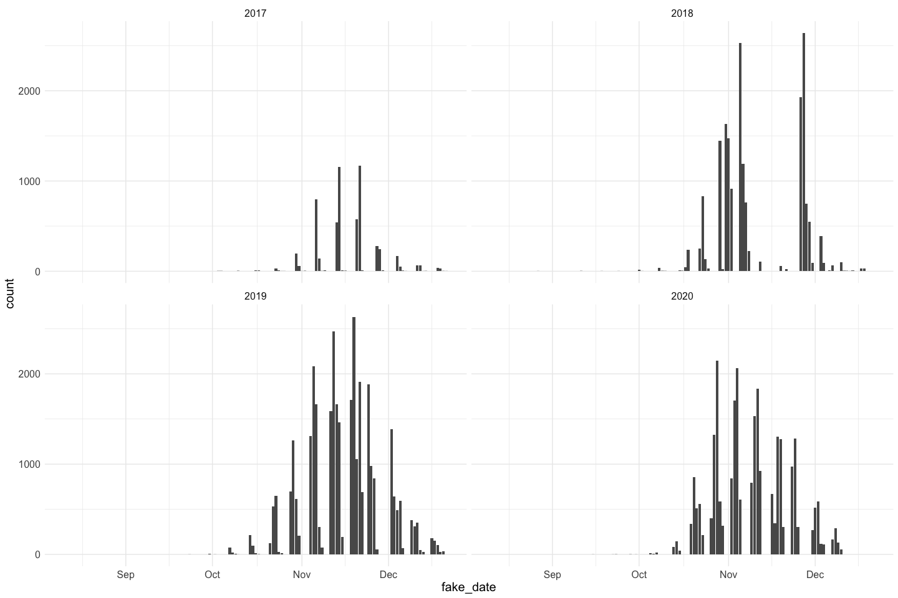
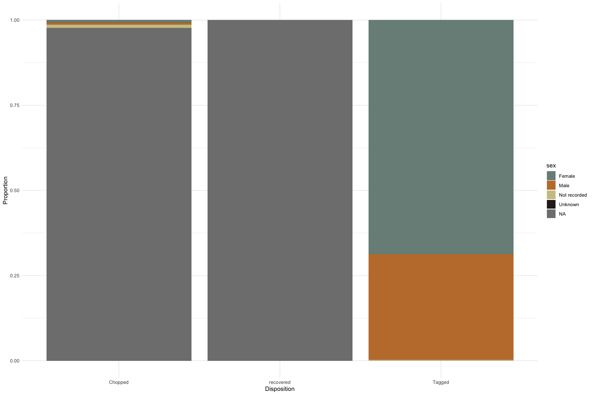
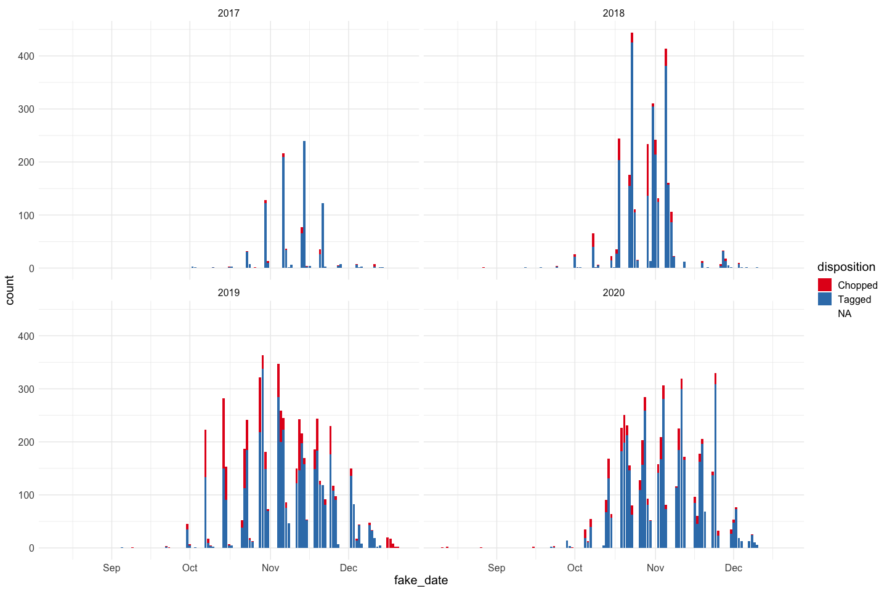
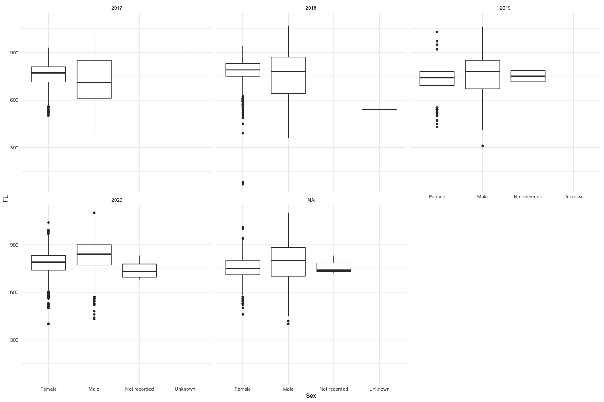

Feather Carcass QC 2017
================
Elizabeth Stebbins
2022-12-21

# Feather River Carcass Data

## Description of Monitoring Data

**Timeframe:**

**Video Season:**

**Completeness of Record throughout timeframe:**

**Sampling Location:**

**Data Contact:**

Any additional info?

## Access Cloud Data

Read in data from google cloud, glimpse raw data and domain description
sheet:

## Raw Data Glimpse:

### Chops_raw

``` r
# TODO follow up to understand what this table is measuring
Chop_raw <- read_csv(here::here("data-raw", "qc-markdowns", "adult-holding-redd-and-carcass-surveys", "feather-river","Chops_2017_2021.csv")) |> 
  glimpse()
```

    ## Rows: 2664 Columns: 13
    ## ── Column specification ────────────────────────────────────────────────────────
    ## Delimiter: ","
    ## chr (5): ChopTypeCD, DataRecorder, CreationTime, Editor, EditTime
    ## dbl (6): SurveyMetaID, ChopsID, SurveyID, SpeciesID, RunID, ChopCount
    ## lgl (2): WayPt, RMile
    ## 
    ## ℹ Use `spec()` to retrieve the full column specification for this data.
    ## ℹ Specify the column types or set `show_col_types = FALSE` to quiet this message.

    ## Rows: 2,664
    ## Columns: 13
    ## $ SurveyMetaID <dbl> 70002, 70002, 70002, 70002, 70002, 70002, 70002, 70002, 7…
    ## $ ChopsID      <dbl> 1, 2, 3, 4, 5, 6, 7, 8, 9, 10, 11, 12, 13, 14, 15, 16, 17…
    ## $ SurveyID     <dbl> 1, 2, 3, 4, 5, 6, 7, 8, 9, 10, 11, 12, 13, 14, 15, 16, 17…
    ## $ WayPt        <lgl> NA, NA, NA, NA, NA, NA, NA, NA, NA, NA, NA, NA, NA, NA, N…
    ## $ RMile        <lgl> NA, NA, NA, NA, NA, NA, NA, NA, NA, NA, NA, NA, NA, NA, N…
    ## $ SpeciesID    <dbl> 161980, 161980, 161980, 161980, 161980, 161980, 161980, 1…
    ## $ RunID        <dbl> 3, 3, 3, 3, 3, 3, 3, 3, 3, 3, 3, 3, 3, 3, 3, 3, 3, 3, 3, …
    ## $ ChopTypeCD   <chr> "Chop", "Chop", "Chop", "Chop", "Chop", "Chop", "Chop", "…
    ## $ ChopCount    <dbl> 0, 0, 0, 0, 0, 0, 0, 0, 0, 0, 0, 0, 0, 0, 0, 0, 0, 0, 0, …
    ## $ DataRecorder <chr> "K Berridge", "K Berridge", "K Berridge", "K Berridge", "…
    ## $ CreationTime <chr> "(02/28/17 10:45:11)", "(02/28/17 11:02:41)", "(02/28/17 …
    ## $ Editor       <chr> NA, NA, NA, NA, NA, NA, NA, NA, NA, NA, NA, NA, NA, NA, N…
    ## $ EditTime     <chr> "(NA NA)", "(NA NA)", "(NA NA)", "(NA NA)", "(NA NA)", "(…

### ChopHeader_raw

``` r
ChopHeader_raw <- read_csv(here::here("data-raw", "qc-markdowns", "adult-holding-redd-and-carcass-surveys", "feather-river","ChopHeader_2017_2021.csv")) |>
  mutate(Date = as.Date(SurveyDate)) |> 
  select(-SurveyDate) |> 
  filter(year(Date) >= 2017) |> 
  glimpse()
```

    ## Rows: 4205 Columns: 26
    ## ── Column specification ────────────────────────────────────────────────────────
    ## Delimiter: ","
    ## chr  (10): Boat, TimeIn, TimeOut, FieldRecorder, Crew, Comments, DataRecorde...
    ## dbl   (7): SurveyMetaID, SurveyID, LocationID, SectionID, SurveyWeek, Subsam...
    ## lgl   (8): TransportTypeID, WaterTempF, WaterTempC, SecchiCM, SecchiFeet, Fl...
    ## date  (1): SurveyDate
    ## 
    ## ℹ Use `spec()` to retrieve the full column specification for this data.
    ## ℹ Specify the column types or set `show_col_types = FALSE` to quiet this message.

    ## Rows: 3,460
    ## Columns: 26
    ## $ SurveyMetaID    <dbl> 70004, 70004, 70004, 70004, 70004, 70004, 70004, 70004…
    ## $ SurveyID        <dbl> 1, 2, 3, 4, 5, 6, 7, 8, 9, 10, 11, 12, 13, 14, 15, 16,…
    ## $ LocationID      <dbl> 700001, 700001, 700001, 700001, 700001, 700001, 700001…
    ## $ SectionID       <dbl> 17, 7, 1, 17, 17, 16, 15, 14, 13, 12, 11, 10, 9, 8, 6,…
    ## $ Boat            <chr> NA, NA, NA, NA, NA, NA, NA, NA, NA, NA, NA, NA, NA, NA…
    ## $ SurveyWeek      <dbl> 1, 1, 1, 3, 3, 1, 1, 1, 1, 1, 1, 1, 3, 1, 1, 1, 1, 1, …
    ## $ TransportTypeID <lgl> NA, NA, NA, NA, NA, NA, NA, NA, NA, NA, NA, NA, NA, NA…
    ## $ SubsampleID     <dbl> 1, 1, 1, 1, 1, 1, 1, 1, 1, 1, 1, 1, 1, 1, 1, 1, 1, 1, …
    ## $ TimeIn          <chr> "(12/30/99 12:00:00)", "(NA NA)", "(NA NA)", "(NA NA)"…
    ## $ TimeOut         <chr> "(12/30/99 12:20:00)", "(NA NA)", "(NA NA)", "(NA NA)"…
    ## $ WeatherID       <dbl> 1, 3, NA, 1, 1, 1, 1, 1, 1, 1, 1, 1, 1, 1, 1, 1, 1, 3,…
    ## $ WaterTempF      <lgl> NA, NA, NA, NA, NA, NA, NA, NA, NA, NA, NA, NA, NA, NA…
    ## $ WaterTempC      <lgl> NA, NA, NA, NA, NA, NA, NA, NA, NA, NA, NA, NA, NA, NA…
    ## $ SecchiCM        <lgl> NA, NA, NA, NA, NA, NA, NA, NA, NA, NA, NA, NA, NA, NA…
    ## $ SecchiFeet      <lgl> NA, NA, NA, NA, NA, NA, NA, NA, NA, NA, NA, NA, NA, NA…
    ## $ FlowCFS         <lgl> NA, NA, NA, NA, NA, NA, NA, NA, NA, NA, NA, NA, NA, NA…
    ## $ TurbidityNTU    <lgl> NA, NA, NA, NA, NA, NA, NA, NA, NA, NA, NA, NA, NA, NA…
    ## $ FieldRecorder   <chr> NA, "Aimrie", NA, NA, NA, "Aimrie", "Aimrie", "Aimrie"…
    ## $ Crew            <chr> NA, "cjc, ai, cm", NA, NA, NA, "ai, cjc", NA, NA, NA, …
    ## $ GPS.Unit        <lgl> NA, NA, NA, NA, NA, NA, NA, NA, NA, NA, NA, NA, NA, NA…
    ## $ Comments        <chr> "no fish", "Need to delete this sampling fieldsheet re…
    ## $ DataRecorder    <chr> "J Consoli", "J Consoli", "J Consoli", "J Consoli", "J…
    ## $ CreationTime    <chr> "(10/03/17 11:57:04)", "(10/03/17 11:58:15)", "(10/03/…
    ## $ Editor          <chr> "J Consoli", "J Consoli", "J Consoli", "J Consoli", NA…
    ## $ EditTime        <chr> "(12/07/17 10:42:29)", "(12/07/17 10:56:36)", "(12/07/…
    ## $ Date            <date> 2017-09-05, 2017-09-06, 2017-09-07, 2017-09-18, 2017-…

### ChopRecov_raw

``` r
ChopRecov_raw <- read_csv(here::here("data-raw", "qc-markdowns", 
                                  "adult-holding-redd-and-carcass-surveys",
                                  "feather-river", "ChopRecov_2017_2021.csv")) |> 
  mutate(count = 1) |> 
  glimpse()
```

    ## Rows: 10536 Columns: 16
    ## ── Column specification ────────────────────────────────────────────────────────
    ## Delimiter: ","
    ## chr (5): Comments, DataRecorder, CreationTime, Editor, EditTime
    ## dbl (5): SurveyMetaID, RecoverID, SurveyID, DispositionID, TagRecovered
    ## lgl (6): WayPt, RMile, ColorTagRecoveredID, SexID, FLmm, FLcm
    ## 
    ## ℹ Use `spec()` to retrieve the full column specification for this data.
    ## ℹ Specify the column types or set `show_col_types = FALSE` to quiet this message.

    ## Rows: 10,536
    ## Columns: 17
    ## $ SurveyMetaID        <dbl> 70002, 70002, 70002, 70002, 70002, 70002, 70002, 7…
    ## $ RecoverID           <dbl> 1, 2, 3, 4, 5, 6, 7, 8, 9, 10, 11, 12, 13, 14, 15,…
    ## $ SurveyID            <dbl> 74, 106, 94, 95, 99, 133, 135, 135, 137, 127, 129,…
    ## $ WayPt               <lgl> NA, NA, NA, NA, NA, NA, NA, NA, NA, NA, NA, NA, NA…
    ## $ RMile               <lgl> NA, NA, NA, NA, NA, NA, NA, NA, NA, NA, NA, NA, NA…
    ## $ DispositionID       <dbl> 3, 3, 3, 3, 3, 3, 3, 3, 3, 3, 3, 3, 3, 3, 3, 3, 2,…
    ## $ TagRecovered        <dbl> 178, 200, 450, 210, 452, 216, 225, 355, 214, 366, …
    ## $ ColorTagRecoveredID <lgl> NA, NA, NA, NA, NA, NA, NA, NA, NA, NA, NA, NA, NA…
    ## $ SexID               <lgl> NA, NA, NA, NA, NA, NA, NA, NA, NA, NA, NA, NA, NA…
    ## $ FLmm                <lgl> NA, NA, NA, NA, NA, NA, NA, NA, NA, NA, NA, NA, NA…
    ## $ FLcm                <lgl> NA, NA, NA, NA, NA, NA, NA, NA, NA, NA, NA, NA, NA…
    ## $ Comments            <chr> NA, NA, NA, NA, NA, NA, NA, NA, NA, NA, NA, NA, NA…
    ## $ DataRecorder        <chr> "K Berridge", "K Berridge", "K Berridge", "K Berri…
    ## $ CreationTime        <chr> "(02/28/17 10:45:11)", "(02/28/17 11:02:41)", "(02…
    ## $ Editor              <chr> NA, NA, NA, NA, NA, NA, NA, NA, NA, NA, NA, NA, NA…
    ## $ EditTime            <chr> "(NA NA)", "(NA NA)", "(NA NA)", "(NA NA)", "(NA N…
    ## $ count               <dbl> 1, 1, 1, 1, 1, 1, 1, 1, 1, 1, 1, 1, 1, 1, 1, 1, 1,…

``` r
# adds a count column here 
```

### chops_and_tags_raw

``` r
# note: disposition ID is what they did to it (not how they found it)
# each row is likely an individual fish
# Table in database was called CarcassIndividual
# adds a column here titled "count" 
chops_and_tags_raw <- read_csv(here::here("data-raw", "qc-markdowns", "adult-holding-redd-and-carcass-surveys", "feather-river","CWT_2017_2021.csv")) |> 
  mutate(count = 1) |> 
  glimpse()
```

    ## Rows: 18262 Columns: 28
    ## ── Column specification ────────────────────────────────────────────────────────
    ## Delimiter: ","
    ## chr  (5): Comments, DataRecorder, CreationTime, Editor, EditTime
    ## dbl (18): SurveyMetaID, IndividualID, SurveyID, SpeciesID, RunID, Dispositio...
    ## lgl  (5): WayPt, RMile, ColorTagAppliedID, TissueNu, DNAnu
    ## 
    ## ℹ Use `spec()` to retrieve the full column specification for this data.
    ## ℹ Specify the column types or set `show_col_types = FALSE` to quiet this message.

    ## Rows: 18,262
    ## Columns: 29
    ## $ SurveyMetaID      <dbl> 70002, 70002, 70002, 70002, 70002, 70002, 70002, 700…
    ## $ IndividualID      <dbl> 1, 2, 3, 4, 5, 6, 7, 8, 9, 10, 11, 12, 13, 14, 15, 1…
    ## $ SurveyID          <dbl> 8, 9, 12, 40, 43, 43, 43, 43, 44, 53, 57, 57, 65, 90…
    ## $ WayPt             <lgl> NA, NA, NA, NA, NA, NA, NA, NA, NA, NA, NA, NA, NA, …
    ## $ RMile             <lgl> NA, NA, NA, NA, NA, NA, NA, NA, NA, NA, NA, NA, NA, …
    ## $ SpeciesID         <dbl> 161980, 161980, 161980, 161980, 161980, 161980, 1619…
    ## $ RunID             <dbl> 3, 3, 3, 3, 3, 3, 3, 3, 3, 3, 3, 3, 3, 3, 3, 3, 3, 3…
    ## $ DispositionID     <dbl> 1, 1, 1, 1, 1, 1, 1, 1, 1, 1, 1, 1, 1, 1, 1, 1, 1, 1…
    ## $ DiscTagApplied    <dbl> 152, 151, 150, 178, 154, 175, 176, 177, 153, 125, 10…
    ## $ ColorTagAppliedID <lgl> NA, NA, NA, NA, NA, NA, NA, NA, NA, NA, NA, NA, NA, …
    ## $ SexID             <dbl> 1, 1, 2, 1, 2, 1, 1, 2, 1, 1, 1, 2, 1, 2, 2, 2, 2, 1…
    ## $ FLmm              <dbl> 730, 830, 800, NA, 680, 720, 710, 660, 710, 660, 740…
    ## $ FLcm              <dbl> 73, 83, 80, NA, 68, 72, 71, 66, 71, 66, 74, 78, 80, …
    ## $ ConditionID       <dbl> 251, 251, 251, 251, 251, 251, 251, 251, 251, 251, 25…
    ## $ SpawnedID         <dbl> 2, 2, 253, 2, 253, 2, 2, 253, 2, 2, 2, 253, 1, 253, …
    ## $ AdFinClipID       <dbl> 1, 1, 1, 1, 1, 2, 1, 1, 1, 1, 2, 2, 1, 2, 2, 1, 1, 1…
    ## $ HeadNu            <dbl> 89000, 89203, 89202, NA, 89003, NA, 89004, 89005, 89…
    ## $ ScaleNu           <dbl> 58603, 58602, 58601, NA, 58606, 58607, 58608, 58609,…
    ## $ TissueNu          <lgl> NA, NA, NA, NA, NA, NA, NA, NA, NA, NA, NA, NA, NA, …
    ## $ OtolithNu         <dbl> 7, 6, 5, NA, 55, 44, 45, NA, 59, 64, 12, 47, 39, 16,…
    ## $ DNAnu             <lgl> NA, NA, NA, NA, NA, NA, NA, NA, NA, NA, NA, NA, NA, …
    ## $ Comments          <chr> NA, NA, NA, NA, NA, NA, NA, "sr, missing hallprints,…
    ## $ DataRecorder      <chr> NA, NA, NA, NA, NA, NA, NA, NA, NA, NA, NA, NA, NA, …
    ## $ CreationTime      <chr> "(NA NA)", "(NA NA)", "(NA NA)", "(NA NA)", "(NA NA)…
    ## $ Editor            <chr> NA, NA, NA, NA, NA, NA, NA, NA, NA, NA, NA, NA, NA, …
    ## $ EditTime          <chr> "(NA NA)", "(NA NA)", "(NA NA)", "(NA NA)", "(NA NA)…
    ## $ CWTStatusID       <dbl> NA, NA, NA, NA, NA, NA, NA, NA, NA, NA, NA, NA, NA, …
    ## $ CWTcd             <dbl> NA, NA, NA, NA, NA, NA, NA, NA, NA, NA, NA, NA, NA, …
    ## $ count             <dbl> 1, 1, 1, 1, 1, 1, 1, 1, 1, 1, 1, 1, 1, 1, 1, 1, 1, 1…

## Data transformations:

### Counts

The `chop` table contains carcass counts ranging from 0 - 999

The `chops_and_tags` table contains individual carcasses recovered

The `chop_recovery` table contains recovered carcass counts by color

``` r
# Using SurveyMetaID to get Date
# join with lu tables to get values from ids

#1. chop table (with dates and tag color)
chop_join <- full_join(ChopHeader_raw |> 
                                 select(SurveyMetaID, SurveyID, Date),
                               Chop_raw,
                       by = c("SurveyID", "SurveyMetaID")) |> 
  clean_names() |> 
  left_join(species_LU |> 
            mutate(species_id = as.numeric(TaxonID),
                   species = CommonName) |> 
            select(species_id, species), by = "species_id") |>
  left_join(run_LU |> select(runID, run), 
            by = c("run_id" = "runID")) |> 
  select(-c(species_id, way_pt, r_mile, run_id)) |>
  rename(count = chop_count) |> 
  mutate(edit_time = as.POSIXct(gsub("[()]", "", edit_time), 
                                format = "%m/%d/%y %H:%M:%S"),
         creation_time = as.POSIXct(gsub("[()]", "", creation_time), 
                                    format = "%m/%d/%y %H:%M:%S")) |> glimpse()
```

    ## Rows: 7,284
    ## Columns: 12
    ## $ survey_meta_id <dbl> 70004, 70004, 70004, 70004, 70004, 70004, 70004, 70004,…
    ## $ survey_id      <dbl> 1, 2, 2, 2, 3, 3, 3, 4, 4, 4, 5, 5, 5, 6, 6, 6, 7, 7, 7…
    ## $ date           <date> 2017-09-05, 2017-09-06, 2017-09-06, 2017-09-06, 2017-0…
    ## $ chops_id       <dbl> 285, NA, NA, NA, NA, NA, NA, NA, NA, NA, NA, NA, NA, NA…
    ## $ chop_type_cd   <chr> "Chop", NA, NA, NA, NA, NA, NA, NA, NA, NA, NA, NA, NA,…
    ## $ count          <dbl> 0, NA, NA, NA, NA, NA, NA, NA, NA, NA, NA, NA, NA, NA, …
    ## $ data_recorder  <chr> "J Consoli", NA, NA, NA, NA, NA, NA, NA, NA, NA, NA, NA…
    ## $ creation_time  <dttm> 2018-01-04 10:34:52, NA, NA, NA, NA, NA, NA, NA, NA, N…
    ## $ editor         <chr> NA, NA, NA, NA, NA, NA, NA, NA, NA, NA, NA, NA, NA, NA,…
    ## $ edit_time      <dttm> NA, NA, NA, NA, NA, NA, NA, NA, NA, NA, NA, NA, NA, NA…
    ## $ species        <chr> "Chinook salmon", "Unknown salmon (not steelhead)", "Ce…
    ## $ run            <chr> "Fall", NA, NA, NA, NA, NA, NA, NA, NA, NA, NA, NA, NA,…

``` r
#2. chops and tags
chops_and_tags_join <- full_join(ChopHeader_raw |> 
                                   select(SurveyMetaID, SurveyID, Date), 
                                 chops_and_tags_raw, by = c("SurveyMetaID", "SurveyID")) |>
  clean_names() |> 
  left_join(species_LU |> 
              mutate(species_id = as.numeric(TaxonID),
                     species = CommonName) |> 
              select(species_id, species), by = "species_id") |>
  left_join(run_LU |> select(runID, run), 
            by = c("run_id" = "runID")) |>
  left_join(color_LU |> 
              select(colorID, color), by = c("color_tag_applied_id" = "colorID")) |> 
  left_join(disposition_LU |> select(DispositionID, disposition = Disposition), 
            by = c("disposition_id" = "DispositionID")) |> 
  left_join(condition_LU |> 
              select(ConditionID, condition = Condition), 
            by = c("condition_id" = "ConditionID")) |> 
  left_join(spawnstatus_LU |> select(SpawnedID, spawned = Spawned), 
            by = c("spawned_id" = "SpawnedID")) |> 
  left_join(adfin_LU |> select(AdFinClipID, ad_fin_clip_status = AdFinClip),
            by = c("ad_fin_clip_id" = "AdFinClipID")) |> 
  left_join(cwtstatus_LU |> select(CWTStatusID, cwt_status = CWTStatus),
            by = c("cwt_status_id" = "CWTStatusID")) |> 
  left_join(sex_LU |> select(SexID, sex = Sex), 
            by = c("sex_id" = "SexID")) |> 
  rename(tag_col = color, fl_mm = f_lmm, fl_cm = f_lcm,
         cwt_cd = cw_tcd, dna_nu = dn_anu) |> 
  select(-c(sex_id, disposition_id, color_tag_applied_id, species_id,
            condition_id, run_id, spawned_id, ad_fin_clip_id, cwt_status_id, r_mile, way_pt)) |> 
  glimpse()
```

    ## Rows: 24,298
    ## Columns: 28
    ## $ survey_meta_id     <dbl> 70004, 70004, 70004, 70004, 70004, 70004, 70004, 70…
    ## $ survey_id          <dbl> 1, 1, 1, 2, 2, 2, 3, 3, 3, 4, 4, 4, 5, 5, 5, 6, 6, …
    ## $ date               <date> 2017-09-05, 2017-09-05, 2017-09-05, 2017-09-06, 20…
    ## $ individual_id      <dbl> NA, NA, NA, NA, NA, NA, NA, NA, NA, NA, NA, NA, NA,…
    ## $ disc_tag_applied   <dbl> NA, NA, NA, NA, NA, NA, NA, NA, NA, NA, NA, NA, NA,…
    ## $ fl_mm              <dbl> NA, NA, NA, NA, NA, NA, NA, NA, NA, NA, NA, NA, NA,…
    ## $ fl_cm              <dbl> NA, NA, NA, NA, NA, NA, NA, NA, NA, NA, NA, NA, NA,…
    ## $ head_nu            <dbl> NA, NA, NA, NA, NA, NA, NA, NA, NA, NA, NA, NA, NA,…
    ## $ scale_nu           <dbl> NA, NA, NA, NA, NA, NA, NA, NA, NA, NA, NA, NA, NA,…
    ## $ tissue_nu          <lgl> NA, NA, NA, NA, NA, NA, NA, NA, NA, NA, NA, NA, NA,…
    ## $ otolith_nu         <dbl> NA, NA, NA, NA, NA, NA, NA, NA, NA, NA, NA, NA, NA,…
    ## $ dna_nu             <lgl> NA, NA, NA, NA, NA, NA, NA, NA, NA, NA, NA, NA, NA,…
    ## $ comments           <chr> NA, NA, NA, NA, NA, NA, NA, NA, NA, NA, NA, NA, NA,…
    ## $ data_recorder      <chr> NA, NA, NA, NA, NA, NA, NA, NA, NA, NA, NA, NA, NA,…
    ## $ creation_time      <chr> NA, NA, NA, NA, NA, NA, NA, NA, NA, NA, NA, NA, NA,…
    ## $ editor             <chr> NA, NA, NA, NA, NA, NA, NA, NA, NA, NA, NA, NA, NA,…
    ## $ edit_time          <chr> NA, NA, NA, NA, NA, NA, NA, NA, NA, NA, NA, NA, NA,…
    ## $ cwt_cd             <dbl> NA, NA, NA, NA, NA, NA, NA, NA, NA, NA, NA, NA, NA,…
    ## $ count              <dbl> NA, NA, NA, NA, NA, NA, NA, NA, NA, NA, NA, NA, NA,…
    ## $ species            <chr> "Unknown salmon (not steelhead)", "Centrarchidae hy…
    ## $ run                <chr> NA, NA, NA, NA, NA, NA, NA, NA, NA, NA, NA, NA, NA,…
    ## $ tag_col            <chr> NA, NA, NA, NA, NA, NA, NA, NA, NA, NA, NA, NA, NA,…
    ## $ disposition        <chr> NA, NA, NA, NA, NA, NA, NA, NA, NA, NA, NA, NA, NA,…
    ## $ condition          <chr> NA, NA, NA, NA, NA, NA, NA, NA, NA, NA, NA, NA, NA,…
    ## $ spawned            <chr> NA, NA, NA, NA, NA, NA, NA, NA, NA, NA, NA, NA, NA,…
    ## $ ad_fin_clip_status <chr> NA, NA, NA, NA, NA, NA, NA, NA, NA, NA, NA, NA, NA,…
    ## $ cwt_status         <chr> NA, NA, NA, NA, NA, NA, NA, NA, NA, NA, NA, NA, NA,…
    ## $ sex                <chr> NA, NA, NA, NA, NA, NA, NA, NA, NA, NA, NA, NA, NA,…

``` r
#3. chop recovery
chop_recovery_join <- full_join(ChopHeader_raw |> 
                                  select(SurveyMetaID, SurveyID, Date),
                                ChopRecov_raw, by = c("SurveyMetaID", "SurveyID")) |> 
  clean_names() |> 
  left_join(disposition_LU |> select(DispositionID, disposition = Disposition), 
            by = c("disposition_id" = "DispositionID")) |>
  left_join(color_LU |> 
              select(colorID, color), by = c("color_tag_recovered_id" = "colorID")) |>  
  left_join(sex_LU |> select(SexID, sex = Sex),
            by = c("sex_id" = "SexID")) |> 
  mutate(edit_time = as.POSIXct(gsub("[()]", "", edit_time), format = "%m/%d/%y %H:%M:%S"),
         creation_time = as.POSIXct(gsub("[()]", "", creation_time), format = "%m/%d/%y %H:%M:%S"),
         fl_mm = as.numeric(f_lmm),
         fl_cm = as.numeric(f_lcm)) |> 
  select(-c(f_lmm, f_lcm, way_pt, r_mile, disposition_id,
            color_tag_recovered_id, sex_id)) |> 
  rename(tag_col = color) |> 
  glimpse()
```

    ## Rows: 12,951
    ## Columns: 16
    ## $ survey_meta_id <dbl> 70004, 70004, 70004, 70004, 70004, 70004, 70004, 70004,…
    ## $ survey_id      <dbl> 1, 2, 3, 4, 5, 6, 7, 8, 9, 10, 11, 12, 13, 14, 15, 16, …
    ## $ date           <date> 2017-09-05, 2017-09-06, 2017-09-07, 2017-09-18, 2017-0…
    ## $ recover_id     <dbl> NA, NA, NA, NA, NA, NA, NA, NA, NA, NA, NA, NA, NA, NA,…
    ## $ tag_recovered  <dbl> NA, NA, NA, NA, NA, NA, NA, NA, NA, NA, NA, NA, NA, NA,…
    ## $ comments       <chr> NA, NA, NA, NA, NA, NA, NA, NA, NA, NA, NA, NA, NA, NA,…
    ## $ data_recorder  <chr> NA, NA, NA, NA, NA, NA, NA, NA, NA, NA, NA, NA, NA, NA,…
    ## $ creation_time  <dttm> NA, NA, NA, NA, NA, NA, NA, NA, NA, NA, NA, NA, NA, NA…
    ## $ editor         <chr> NA, NA, NA, NA, NA, NA, NA, NA, NA, NA, NA, NA, NA, NA,…
    ## $ edit_time      <dttm> NA, NA, NA, NA, NA, NA, NA, NA, NA, NA, NA, NA, NA, NA…
    ## $ count          <dbl> NA, NA, NA, NA, NA, NA, NA, NA, NA, NA, NA, NA, NA, NA,…
    ## $ disposition    <chr> NA, NA, NA, NA, NA, NA, NA, NA, NA, NA, NA, NA, NA, NA,…
    ## $ tag_col        <chr> NA, NA, NA, NA, NA, NA, NA, NA, NA, NA, NA, NA, NA, NA,…
    ## $ sex            <chr> NA, NA, NA, NA, NA, NA, NA, NA, NA, NA, NA, NA, NA, NA,…
    ## $ fl_mm          <dbl> NA, NA, NA, NA, NA, NA, NA, NA, NA, NA, NA, NA, NA, NA,…
    ## $ fl_cm          <dbl> NA, NA, NA, NA, NA, NA, NA, NA, NA, NA, NA, NA, NA, NA,…

### Survey

The `chop_header` table contains survey metadata and covariates

``` r
chop_header <- ChopHeader_raw |> 
  clean_names() |> glimpse()
```

    ## Rows: 3,460
    ## Columns: 26
    ## $ survey_meta_id    <dbl> 70004, 70004, 70004, 70004, 70004, 70004, 70004, 700…
    ## $ survey_id         <dbl> 1, 2, 3, 4, 5, 6, 7, 8, 9, 10, 11, 12, 13, 14, 15, 1…
    ## $ location_id       <dbl> 700001, 700001, 700001, 700001, 700001, 700001, 7000…
    ## $ section_id        <dbl> 17, 7, 1, 17, 17, 16, 15, 14, 13, 12, 11, 10, 9, 8, …
    ## $ boat              <chr> NA, NA, NA, NA, NA, NA, NA, NA, NA, NA, NA, NA, NA, …
    ## $ survey_week       <dbl> 1, 1, 1, 3, 3, 1, 1, 1, 1, 1, 1, 1, 3, 1, 1, 1, 1, 1…
    ## $ transport_type_id <lgl> NA, NA, NA, NA, NA, NA, NA, NA, NA, NA, NA, NA, NA, …
    ## $ subsample_id      <dbl> 1, 1, 1, 1, 1, 1, 1, 1, 1, 1, 1, 1, 1, 1, 1, 1, 1, 1…
    ## $ time_in           <chr> "(12/30/99 12:00:00)", "(NA NA)", "(NA NA)", "(NA NA…
    ## $ time_out          <chr> "(12/30/99 12:20:00)", "(NA NA)", "(NA NA)", "(NA NA…
    ## $ weather_id        <dbl> 1, 3, NA, 1, 1, 1, 1, 1, 1, 1, 1, 1, 1, 1, 1, 1, 1, …
    ## $ water_temp_f      <lgl> NA, NA, NA, NA, NA, NA, NA, NA, NA, NA, NA, NA, NA, …
    ## $ water_temp_c      <lgl> NA, NA, NA, NA, NA, NA, NA, NA, NA, NA, NA, NA, NA, …
    ## $ secchi_cm         <lgl> NA, NA, NA, NA, NA, NA, NA, NA, NA, NA, NA, NA, NA, …
    ## $ secchi_feet       <lgl> NA, NA, NA, NA, NA, NA, NA, NA, NA, NA, NA, NA, NA, …
    ## $ flow_cfs          <lgl> NA, NA, NA, NA, NA, NA, NA, NA, NA, NA, NA, NA, NA, …
    ## $ turbidity_ntu     <lgl> NA, NA, NA, NA, NA, NA, NA, NA, NA, NA, NA, NA, NA, …
    ## $ field_recorder    <chr> NA, "Aimrie", NA, NA, NA, "Aimrie", "Aimrie", "Aimri…
    ## $ crew              <chr> NA, "cjc, ai, cm", NA, NA, NA, "ai, cjc", NA, NA, NA…
    ## $ gps_unit          <lgl> NA, NA, NA, NA, NA, NA, NA, NA, NA, NA, NA, NA, NA, …
    ## $ comments          <chr> "no fish", "Need to delete this sampling fieldsheet …
    ## $ data_recorder     <chr> "J Consoli", "J Consoli", "J Consoli", "J Consoli", …
    ## $ creation_time     <chr> "(10/03/17 11:57:04)", "(10/03/17 11:58:15)", "(10/0…
    ## $ editor            <chr> "J Consoli", "J Consoli", "J Consoli", "J Consoli", …
    ## $ edit_time         <chr> "(12/07/17 10:42:29)", "(12/07/17 10:56:36)", "(12/0…
    ## $ date              <date> 2017-09-05, 2017-09-06, 2017-09-07, 2017-09-18, 201…

## Explore Numeric Variables:

``` r
# Filter clean data to show only numeric variables 
chop_join |> 
  select_if(is.numeric) |>
  colnames()
```

    ## [1] "survey_meta_id" "survey_id"      "chops_id"       "count"

### Chop Join Variables: `survey_meta_id`, `chops_id`, `survey_id`

``` r
summary(chop_join$survey_meta_id)
```

    ##    Min. 1st Qu.  Median    Mean 3rd Qu.    Max. 
    ##   70002   70004   70005   70005   70006   70007

``` r
summary(chop_join$chops_id)
```

    ##    Min. 1st Qu.  Median    Mean 3rd Qu.    Max.    NA's 
    ##     1.0   134.0   267.0   291.6   429.2   743.0    4620

``` r
summary(chop_join$survey_id)
```

    ##    Min. 1st Qu.  Median    Mean 3rd Qu.    Max. 
    ##     1.0   143.0   305.0   366.6   573.0  1101.0

### Chop Join Variable: `count`

**Numeric Summary of `count` over Period of Record**

``` r
summary(chop_join$count)
```

    ##    Min. 1st Qu.  Median    Mean 3rd Qu.    Max.    NA's 
    ##    0.00    2.00    8.00   35.74   38.00  999.00    4620

**NA and Unknown Values**

- 63.4 % of values in the `count` column are NA.

**Plotting total daily chops over Period of Record**

``` r
# daily chop count over time
chop_join |> 
  filter(!is.na(date)) |>
  mutate(year = year(date),
         fake_date = ymd(paste0("2000-", month(date), "-", day(date)))) |>
  group_by(fake_date, year) |>
  summarize(count = sum(count, na.rm = T)) |> 
  ggplot(aes(x = fake_date, y = count)) +
  geom_col() + 
  facet_wrap(~year) +
  theme_minimal() +
  theme(text = element_text(size = 15)) +
  scale_x_date(labels = date_format("%b"), date_breaks = "1 month")
```

    ## `summarise()` has grouped output by 'fake_date'. You can override using the
    ## `.groups` argument.

<!-- -->

This plot shows the total daily chops collected each day from August to
December from 2017-2020. Chop count from this table ranges from 0 to 999
on a given day. Each square represents a different year.

#### Chop Recovery Variables:

``` r
# Filter clean data to show only numeric variables 
chop_recovery_join |> 
  select_if(is.numeric) |>
  colnames()
```

    ## [1] "survey_meta_id" "survey_id"      "recover_id"     "tag_recovered" 
    ## [5] "count"          "fl_mm"          "fl_cm"

### Chop Recovery Variable: `survey_meta_id`, `chops_id`, `survey_id`, `r_mile`, `species_id`, `run_id`

``` r
summary(chop_recovery_join$survey_meta_id)
```

    ##    Min. 1st Qu.  Median    Mean 3rd Qu.    Max. 
    ##   70002   70004   70006   70005   70006   70007

``` r
summary(chop_recovery_join$recover_id)
```

    ##    Min. 1st Qu.  Median    Mean 3rd Qu.    Max.    NA's 
    ##       1     532    1188    1292    2007    3115    2415

``` r
summary(chop_recovery_join$survey_id)
```

    ##    Min. 1st Qu.  Median    Mean 3rd Qu.    Max. 
    ##     1.0   401.0   527.0   524.5   659.0  1101.0

``` r
summary(chop_recovery_join$tag_recovered)
```

    ##    Min. 1st Qu.  Median    Mean 3rd Qu.    Max.    NA's 
    ##       1    1442    4338    4331    6191   83491    2418

``` r
# all NAs
summary(chop_recovery_join$fl_mm)
```

    ##    Min. 1st Qu.  Median    Mean 3rd Qu.    Max.    NA's 
    ##      NA      NA      NA     NaN      NA      NA   12951

``` r
# all NAs
summary(chop_recovery_join$fl_cm)
```

    ##    Min. 1st Qu.  Median    Mean 3rd Qu.    Max.    NA's 
    ##      NA      NA      NA     NaN      NA      NA   12951

### Chop Recovery Variable: `count`

**Numeric Summary of `count` over Period of Record** This variable was
added under the assumption that each individual row of the chop recovery
dataset represents an individual fish being recovered (i.e. each row of
ChopRecov_raw had a count of 1).

**NA and Unknown Values**

- 33.2 % of values in the `count` column are NA.

**Plotting total daily recovered over Period of Record**

``` r
# daily recovered chop count over time
chop_recovery_join |> 
  filter(!is.na(date)) |> 
  mutate(year = year(date),
         fake_date = ymd(paste0("2000-", month(date), "-", day(date)))) |>
  group_by(fake_date, year, disposition) |>
  summarize(count = sum(count, na.rm = T)) |> 
  ggplot(aes(x = fake_date, y = count, fill = disposition)) +
  scale_fill_brewer(palette = "Set1") +
  geom_col() + 
  facet_wrap(~year) +
  theme_minimal() +
  theme(text = element_text(size = 15)) +
  scale_x_date(labels = date_format("%b"), date_breaks = "1 month")
```

    ## `summarise()` has grouped output by 'fake_date', 'year'. You can override using
    ## the `.groups` argument.

<!-- -->

This plot shows daily recovered chops by year and day. The colors
represent “disposition” i.e. whether the fish was chopped, tagged, or
not chopped after being counted in the data. Far more individual fish
were chopped after being processed than not chopped. None were tagged.

### Chops and Tags Variables: `survey_meta_id`, `survey_id`, `individual_id`, `disc_tag_applied`, `fl_mm`, `head_nu`, `scale_nu`, `otolith_nu`, `cwt_cd`

``` r
chops_and_tags_join |> 
  select_if(is.numeric) |> 
  colnames()
```

    ##  [1] "survey_meta_id"   "survey_id"        "individual_id"    "disc_tag_applied"
    ##  [5] "fl_mm"            "fl_cm"            "head_nu"          "scale_nu"        
    ##  [9] "otolith_nu"       "cwt_cd"           "count"

``` r
summary(chops_and_tags_join$survey_meta_id)
```

    ##    Min. 1st Qu.  Median    Mean 3rd Qu.    Max. 
    ##   70002   70004   70006   70005   70007   70007

``` r
summary(chops_and_tags_join$survey_id)
```

    ##    Min. 1st Qu.  Median    Mean 3rd Qu.    Max. 
    ##     1.0   323.0   443.0   455.7   591.0  1101.0

``` r
summary(chops_and_tags_join$individual_id)
```

    ##    Min. 1st Qu.  Median    Mean 3rd Qu.    Max.    NA's 
    ##       1     913    2040    2214    3278    5713    6036

``` r
summary(chops_and_tags_join$disc_tag_applied)
```

    ##    Min. 1st Qu.  Median    Mean 3rd Qu.    Max.    NA's 
    ##       1    1535    4451    4506    6246   83491    8327

``` r
summary(chops_and_tags_join$fl_mm)
```

    ##    Min. 1st Qu.  Median    Mean 3rd Qu.    Max.    NA's 
    ##      70     710     770     817     830  894710    6967

``` r
summary(chops_and_tags_join$head_nu)
```

    ##    Min. 1st Qu.  Median    Mean 3rd Qu.    Max.    NA's 
    ##   10000   28551   70050   51641   89107   90975   19846

``` r
summary(chops_and_tags_join$scale_nu)
```

    ##    Min. 1st Qu.  Median    Mean 3rd Qu.    Max.    NA's 
    ##   16701   26789   58486   58606   89120   89864   21517

``` r
summary(chops_and_tags_join$otolith_nu)
```

    ##    Min. 1st Qu.  Median    Mean 3rd Qu.    Max.    NA's 
    ##     1.0   172.0   337.5   370.5   533.0  5541.0   21524

``` r
summary(chops_and_tags_join$cwt_cd)
```

    ##    Min. 1st Qu.  Median    Mean 3rd Qu.    Max.    NA's 
    ##   60656   60735   60739   60765   60743   68729   23680

### Chops and Tags Variable: `count`

**Numeric Summary of `count` over Period of Record** This variable was
added under the assumption that each individual row of the chops and
tags dataset represents an individual fish being recovered (i.e. each
row of chops_and_tags_raw had a count of 1).

**NA and Unknown Values**

- 82.9 % of values in the `count` column are NA.

**Plotting total daily chops and tags over Period of Record**

``` r
# daily individual chops count over time
chops_and_tags_join |> 
  filter(!is.na(date)) |> 
  mutate(year = year(date),
         fake_date = ymd(paste0("2000-", month(date), "-", day(date)))) |>
  group_by(fake_date, year, disposition) |>
  summarize(count = sum(count, na.rm = T)) |> 
  ggplot(aes(x = fake_date, y = count, fill = disposition)) +
  scale_fill_brewer(palette = "Set1") +
  geom_col() + 
  facet_wrap(~year) +
  theme_minimal() +
  theme(text = element_text(size = 15)) +
  scale_x_date(labels = date_format("%b"), date_breaks = "1 month")
```

    ## `summarise()` has grouped output by 'fake_date', 'year'. You can override using
    ## the `.groups` argument.

<!-- -->
This plot shows daily individual carcasses by year and day. The colors
represent “disposition” i.e. whether the fish was chopped, tagged, or
not chopped after being counted in the data. Far more individual fish
were tagged after being processed than chopped. None were not chopped.

**Plotting fork length of each sex**

``` r
# use sex lookup table
chops_and_tags_join |>
  filter(fl_mm < 2000) |> # outlier
  ggplot(aes(x = sex, y = fl_mm)) + 
  geom_boxplot() + 
  theme_minimal() + 
  labs(y = "FL", x = "Sex") + 
  facet_wrap(~year(date))
```

<!-- -->
This plot shows fork length (mm) of fish plotted by year. Sex categories
are male, female, not recorded, and unknown.

### Chop Header Variable: `survey_meta_id`

``` r
chop_header |> 
  select_if(is.numeric) |> 
  colnames()
```

    ## [1] "survey_meta_id" "survey_id"      "location_id"    "section_id"    
    ## [5] "survey_week"    "subsample_id"   "weather_id"

``` r
summary(chop_header$survey_meta_id)
```

    ##    Min. 1st Qu.  Median    Mean 3rd Qu.    Max. 
    ##   70004   70005   70006   70006   70006   70007

``` r
summary(chop_header$survey_week)
```

    ##    Min. 1st Qu.  Median    Mean 3rd Qu.    Max. 
    ##    0.00    5.00    9.00    8.83   13.00   16.00

## Explore Categorical variables:

### Chop Clean Data

Fix inconsistencies with spelling, capitalization, and dates

``` r
chop_join |> 
  select_if(is.character) |>
  colnames()
```

    ## [1] "chop_type_cd"  "data_recorder" "editor"        "species"      
    ## [5] "run"

``` r
unique(chop_join$chop_type_cd)
```

    ## [1] "Chop" NA

``` r
unique(chop_join$species)
```

    ## [1] "Chinook salmon"                 "Unknown salmon (not steelhead)"
    ## [3] "Centrarchidae hybrid"           "Lepomis hybrid"

``` r
unique(chop_join$run)
```

    ## [1] "Fall" NA

``` r
chop_cleaner <- chop_join |>
  mutate_if(is.character, str_to_lower) |> 
  glimpse()
```

    ## Rows: 7,284
    ## Columns: 12
    ## $ survey_meta_id <dbl> 70004, 70004, 70004, 70004, 70004, 70004, 70004, 70004,…
    ## $ survey_id      <dbl> 1, 2, 2, 2, 3, 3, 3, 4, 4, 4, 5, 5, 5, 6, 6, 6, 7, 7, 7…
    ## $ date           <date> 2017-09-05, 2017-09-06, 2017-09-06, 2017-09-06, 2017-0…
    ## $ chops_id       <dbl> 285, NA, NA, NA, NA, NA, NA, NA, NA, NA, NA, NA, NA, NA…
    ## $ chop_type_cd   <chr> "chop", NA, NA, NA, NA, NA, NA, NA, NA, NA, NA, NA, NA,…
    ## $ count          <dbl> 0, NA, NA, NA, NA, NA, NA, NA, NA, NA, NA, NA, NA, NA, …
    ## $ data_recorder  <chr> "j consoli", NA, NA, NA, NA, NA, NA, NA, NA, NA, NA, NA…
    ## $ creation_time  <dttm> 2018-01-04 10:34:52, NA, NA, NA, NA, NA, NA, NA, NA, N…
    ## $ editor         <chr> NA, NA, NA, NA, NA, NA, NA, NA, NA, NA, NA, NA, NA, NA,…
    ## $ edit_time      <dttm> NA, NA, NA, NA, NA, NA, NA, NA, NA, NA, NA, NA, NA, NA…
    ## $ species        <chr> "chinook salmon", "unknown salmon (not steelhead)", "ce…
    ## $ run            <chr> "fall", NA, NA, NA, NA, NA, NA, NA, NA, NA, NA, NA, NA,…

### Chop Recovery Clean Data

``` r
chop_recovery_join |> 
  select_if(is.character) |>
  colnames()
```

    ## [1] "comments"      "data_recorder" "editor"        "disposition"  
    ## [5] "tag_col"       "sex"

``` r
unique(chop_recovery_join$disposition)
```

    ## [1] NA            "Not chopped" "Chopped"

``` r
unique(chop_recovery_join$tag_col)
```

    ## [1] NA

``` r
unique(chop_recovery_join$sex)
```

    ## [1] NA

``` r
chop_recovery_cleaner <- chop_recovery_join |> 
  mutate_if(is.character, str_to_lower) |> 
           glimpse()
```

    ## Rows: 12,951
    ## Columns: 16
    ## $ survey_meta_id <dbl> 70004, 70004, 70004, 70004, 70004, 70004, 70004, 70004,…
    ## $ survey_id      <dbl> 1, 2, 3, 4, 5, 6, 7, 8, 9, 10, 11, 12, 13, 14, 15, 16, …
    ## $ date           <date> 2017-09-05, 2017-09-06, 2017-09-07, 2017-09-18, 2017-0…
    ## $ recover_id     <dbl> NA, NA, NA, NA, NA, NA, NA, NA, NA, NA, NA, NA, NA, NA,…
    ## $ tag_recovered  <dbl> NA, NA, NA, NA, NA, NA, NA, NA, NA, NA, NA, NA, NA, NA,…
    ## $ comments       <chr> NA, NA, NA, NA, NA, NA, NA, NA, NA, NA, NA, NA, NA, NA,…
    ## $ data_recorder  <chr> NA, NA, NA, NA, NA, NA, NA, NA, NA, NA, NA, NA, NA, NA,…
    ## $ creation_time  <dttm> NA, NA, NA, NA, NA, NA, NA, NA, NA, NA, NA, NA, NA, NA…
    ## $ editor         <chr> NA, NA, NA, NA, NA, NA, NA, NA, NA, NA, NA, NA, NA, NA,…
    ## $ edit_time      <dttm> NA, NA, NA, NA, NA, NA, NA, NA, NA, NA, NA, NA, NA, NA…
    ## $ count          <dbl> NA, NA, NA, NA, NA, NA, NA, NA, NA, NA, NA, NA, NA, NA,…
    ## $ disposition    <chr> NA, NA, NA, NA, NA, NA, NA, NA, NA, NA, NA, NA, NA, NA,…
    ## $ tag_col        <chr> NA, NA, NA, NA, NA, NA, NA, NA, NA, NA, NA, NA, NA, NA,…
    ## $ sex            <chr> NA, NA, NA, NA, NA, NA, NA, NA, NA, NA, NA, NA, NA, NA,…
    ## $ fl_mm          <dbl> NA, NA, NA, NA, NA, NA, NA, NA, NA, NA, NA, NA, NA, NA,…
    ## $ fl_cm          <dbl> NA, NA, NA, NA, NA, NA, NA, NA, NA, NA, NA, NA, NA, NA,…

### Chops and Tags Clean Data

``` r
chops_and_tags_join |> 
  select_if(is.character) |>
  colnames()
```

    ##  [1] "comments"           "data_recorder"      "creation_time"     
    ##  [4] "editor"             "edit_time"          "species"           
    ##  [7] "run"                "tag_col"            "disposition"       
    ## [10] "condition"          "spawned"            "ad_fin_clip_status"
    ## [13] "cwt_status"         "sex"

``` r
unique(chops_and_tags_join$species)
```

    ## [1] "Unknown salmon (not steelhead)" "Centrarchidae hybrid"          
    ## [3] "Lepomis hybrid"                 "Chinook salmon"

``` r
unique(chops_and_tags_join$run)
```

    ## [1] NA       "Spring" "Fall"

``` r
unique(chops_and_tags_join$tag_col)
```

    ## [1] NA

``` r
unique(chops_and_tags_join$disposition)
```

    ## [1] NA        "Tagged"  "Chopped"

``` r
unique(chops_and_tags_join$condition)
```

    ## [1] NA             "Fresh"        "Decayed"      "Unknown"      "Not recorded"

``` r
unique(chops_and_tags_join$spawned)
```

    ## [1] NA             "Yes"          "Unknown"      "No"           "Not recorded"

``` r
unique(chops_and_tags_join$ad_fin_clip_status)
```

    ## [1] NA             "Yes"          "No"           "Unknown"      "Not recorded"
    ## [6] "Partial"

``` r
unique(chops_and_tags_join$cwt_status)
```

    ## [1] NA            "Tag Read OK" "No Tag"

``` r
unique(chops_and_tags_join$sex)
```

    ## [1] NA             "Female"       "Male"         "Unknown"      "Not recorded"

``` r
chops_and_tags_cleaner <- chops_and_tags_join |> 
  mutate_if(is.character, str_to_lower) |> 
           glimpse()
```

    ## Rows: 24,298
    ## Columns: 28
    ## $ survey_meta_id     <dbl> 70004, 70004, 70004, 70004, 70004, 70004, 70004, 70…
    ## $ survey_id          <dbl> 1, 1, 1, 2, 2, 2, 3, 3, 3, 4, 4, 4, 5, 5, 5, 6, 6, …
    ## $ date               <date> 2017-09-05, 2017-09-05, 2017-09-05, 2017-09-06, 20…
    ## $ individual_id      <dbl> NA, NA, NA, NA, NA, NA, NA, NA, NA, NA, NA, NA, NA,…
    ## $ disc_tag_applied   <dbl> NA, NA, NA, NA, NA, NA, NA, NA, NA, NA, NA, NA, NA,…
    ## $ fl_mm              <dbl> NA, NA, NA, NA, NA, NA, NA, NA, NA, NA, NA, NA, NA,…
    ## $ fl_cm              <dbl> NA, NA, NA, NA, NA, NA, NA, NA, NA, NA, NA, NA, NA,…
    ## $ head_nu            <dbl> NA, NA, NA, NA, NA, NA, NA, NA, NA, NA, NA, NA, NA,…
    ## $ scale_nu           <dbl> NA, NA, NA, NA, NA, NA, NA, NA, NA, NA, NA, NA, NA,…
    ## $ tissue_nu          <lgl> NA, NA, NA, NA, NA, NA, NA, NA, NA, NA, NA, NA, NA,…
    ## $ otolith_nu         <dbl> NA, NA, NA, NA, NA, NA, NA, NA, NA, NA, NA, NA, NA,…
    ## $ dna_nu             <lgl> NA, NA, NA, NA, NA, NA, NA, NA, NA, NA, NA, NA, NA,…
    ## $ comments           <chr> NA, NA, NA, NA, NA, NA, NA, NA, NA, NA, NA, NA, NA,…
    ## $ data_recorder      <chr> NA, NA, NA, NA, NA, NA, NA, NA, NA, NA, NA, NA, NA,…
    ## $ creation_time      <chr> NA, NA, NA, NA, NA, NA, NA, NA, NA, NA, NA, NA, NA,…
    ## $ editor             <chr> NA, NA, NA, NA, NA, NA, NA, NA, NA, NA, NA, NA, NA,…
    ## $ edit_time          <chr> NA, NA, NA, NA, NA, NA, NA, NA, NA, NA, NA, NA, NA,…
    ## $ cwt_cd             <dbl> NA, NA, NA, NA, NA, NA, NA, NA, NA, NA, NA, NA, NA,…
    ## $ count              <dbl> NA, NA, NA, NA, NA, NA, NA, NA, NA, NA, NA, NA, NA,…
    ## $ species            <chr> "unknown salmon (not steelhead)", "centrarchidae hy…
    ## $ run                <chr> NA, NA, NA, NA, NA, NA, NA, NA, NA, NA, NA, NA, NA,…
    ## $ tag_col            <chr> NA, NA, NA, NA, NA, NA, NA, NA, NA, NA, NA, NA, NA,…
    ## $ disposition        <chr> NA, NA, NA, NA, NA, NA, NA, NA, NA, NA, NA, NA, NA,…
    ## $ condition          <chr> NA, NA, NA, NA, NA, NA, NA, NA, NA, NA, NA, NA, NA,…
    ## $ spawned            <chr> NA, NA, NA, NA, NA, NA, NA, NA, NA, NA, NA, NA, NA,…
    ## $ ad_fin_clip_status <chr> NA, NA, NA, NA, NA, NA, NA, NA, NA, NA, NA, NA, NA,…
    ## $ cwt_status         <chr> NA, NA, NA, NA, NA, NA, NA, NA, NA, NA, NA, NA, NA,…
    ## $ sex                <chr> NA, NA, NA, NA, NA, NA, NA, NA, NA, NA, NA, NA, NA,…

### Chop Header Clean Data

``` r
chop_header |> 
  select_if(is.character) |> 
  colnames()
```

    ##  [1] "boat"           "time_in"        "time_out"       "field_recorder"
    ##  [5] "crew"           "comments"       "data_recorder"  "creation_time" 
    ##  [9] "editor"         "edit_time"

``` r
unique(chop_header$boat)
```

    ## [1] NA    "n/a"

``` r
chop_header_cleaner <- chop_header |> 
  left_join(weather_LU |> select(WeatherID, weather = Weather), 
            by = c("weather_id" = "WeatherID")) |> 
  mutate(time_in = strftime(as.POSIXct(time_in, format = "%m/%d/%y %H:%M:%S"), "%H:%M:%S"),
         time_out = strftime(as.POSIXct(time_out, format = "%m/%d/%y %H:%M:%S"), "%H:%M:%S"),
         edit_time = as.POSIXct(edit_time, format = "%m/%d/%y %H:%M:%S"),
         weather = tolower(weather),
         water_temp_f = as.numeric(water_temp_f),
         water_temp_c = as.numeric(water_temp_c),
         secchi_cm = as.numeric(secchi_cm),
         secchi_feet = as.numeric(secchi_feet),
         flow_cfs = as.numeric(flow_cfs),
         turbidity_ntu = as.numeric(turbidity_ntu)) |> 
  select(-weather_id) |> 
  glimpse()
```

    ## Rows: 3,460
    ## Columns: 26
    ## $ survey_meta_id    <dbl> 70004, 70004, 70004, 70004, 70004, 70004, 70004, 700…
    ## $ survey_id         <dbl> 1, 2, 3, 4, 5, 6, 7, 8, 9, 10, 11, 12, 13, 14, 15, 1…
    ## $ location_id       <dbl> 700001, 700001, 700001, 700001, 700001, 700001, 7000…
    ## $ section_id        <dbl> 17, 7, 1, 17, 17, 16, 15, 14, 13, 12, 11, 10, 9, 8, …
    ## $ boat              <chr> NA, NA, NA, NA, NA, NA, NA, NA, NA, NA, NA, NA, NA, …
    ## $ survey_week       <dbl> 1, 1, 1, 3, 3, 1, 1, 1, 1, 1, 1, 1, 3, 1, 1, 1, 1, 1…
    ## $ transport_type_id <lgl> NA, NA, NA, NA, NA, NA, NA, NA, NA, NA, NA, NA, NA, …
    ## $ subsample_id      <dbl> 1, 1, 1, 1, 1, 1, 1, 1, 1, 1, 1, 1, 1, 1, 1, 1, 1, 1…
    ## $ time_in           <chr> NA, NA, NA, NA, NA, NA, NA, NA, NA, NA, NA, NA, NA, …
    ## $ time_out          <chr> NA, NA, NA, NA, NA, NA, NA, NA, NA, NA, NA, NA, NA, …
    ## $ water_temp_f      <dbl> NA, NA, NA, NA, NA, NA, NA, NA, NA, NA, NA, NA, NA, …
    ## $ water_temp_c      <dbl> NA, NA, NA, NA, NA, NA, NA, NA, NA, NA, NA, NA, NA, …
    ## $ secchi_cm         <dbl> NA, NA, NA, NA, NA, NA, NA, NA, NA, NA, NA, NA, NA, …
    ## $ secchi_feet       <dbl> NA, NA, NA, NA, NA, NA, NA, NA, NA, NA, NA, NA, NA, …
    ## $ flow_cfs          <dbl> NA, NA, NA, NA, NA, NA, NA, NA, NA, NA, NA, NA, NA, …
    ## $ turbidity_ntu     <dbl> NA, NA, NA, NA, NA, NA, NA, NA, NA, NA, NA, NA, NA, …
    ## $ field_recorder    <chr> NA, "Aimrie", NA, NA, NA, "Aimrie", "Aimrie", "Aimri…
    ## $ crew              <chr> NA, "cjc, ai, cm", NA, NA, NA, "ai, cjc", NA, NA, NA…
    ## $ gps_unit          <lgl> NA, NA, NA, NA, NA, NA, NA, NA, NA, NA, NA, NA, NA, …
    ## $ comments          <chr> "no fish", "Need to delete this sampling fieldsheet …
    ## $ data_recorder     <chr> "J Consoli", "J Consoli", "J Consoli", "J Consoli", …
    ## $ creation_time     <chr> "(10/03/17 11:57:04)", "(10/03/17 11:58:15)", "(10/0…
    ## $ editor            <chr> "J Consoli", "J Consoli", "J Consoli", "J Consoli", …
    ## $ edit_time         <dttm> NA, NA, NA, NA, NA, NA, NA, NA, NA, NA, NA, NA, NA,…
    ## $ date              <date> 2017-09-05, 2017-09-06, 2017-09-07, 2017-09-18, 201…
    ## $ weather           <chr> "clear", "partly cloudy", NA, "clear", "clear", "cle…

## Data Dictionaries

### Chop Count

``` r
percent_na <- chop_cleaner |>
  summarise_all(list(name = ~sum(is.na(.))/length(.))) |>
  pivot_longer(cols = everything())


counts_data_dictionary <- tibble(variables = colnames(chop_cleaner),
                          description = c("Survey Meta ID",
                                          "Survey ID",
                                          "Date",
                                          "Chops ID",
                                          "Chop Type Code", 
                                          "Count", 
                                          "Data Recorder",
                                          "Creation Time",
                                          "Editor",
                                          "Edit Time",
                                          "Species",
                                          "Run Type"),
                          percent_na = round(percent_na$value*100,
                                             digits = 1))

kable(counts_data_dictionary)
```

| variables      | description    | percent_na |
|:---------------|:---------------|-----------:|
| survey_meta_id | Survey Meta ID |        0.0 |
| survey_id      | Survey ID      |        0.0 |
| date           | Date           |       10.2 |
| chops_id       | Chops ID       |       63.4 |
| chop_type_cd   | Chop Type Code |       63.4 |
| count          | Count          |       63.4 |
| data_recorder  | Data Recorder  |       63.4 |
| creation_time  | Creation Time  |       63.4 |
| editor         | Editor         |       86.0 |
| edit_time      | Edit Time      |       86.0 |
| species        | Species        |        0.0 |
| run            | Run Type       |       63.4 |

### Chop Recovery

``` r
percent_na <- chop_recovery_cleaner |>
  summarise_all(list(name = ~sum(is.na(.))/length(.))) |>
  pivot_longer(cols = everything())


recovery_data_dictionary <- tibble(variables = colnames(chop_recovery_cleaner),
                          description = c("Survey Meta ID",
                                          "Survey ID",
                                          "Date",
                                          "Recover ID",
                                          "Tag ID Recovered",
                                          "Comments",
                                          "Data Recorder",
                                          "Creation Time",
                                          "Editor",
                                          "Edit Time",
                                          "Count",
                                          "Disposition",
                                          "Tag Color",
                                          "Sex",
                                          "Fork Length (mm)",
                                          "Fork Length (cm)"),
                          percent_na = round(percent_na$value*100,
                                             digits = 1))

kable(recovery_data_dictionary)
```

| variables      | description      | percent_na |
|:---------------|:-----------------|-----------:|
| survey_meta_id | Survey Meta ID   |        0.0 |
| survey_id      | Survey ID        |        0.0 |
| date           | Date             |       22.2 |
| recover_id     | Recover ID       |       18.6 |
| tag_recovered  | Tag ID Recovered |       18.7 |
| comments       | Comments         |       98.5 |
| data_recorder  | Data Recorder    |       18.6 |
| creation_time  | Creation Time    |       18.7 |
| editor         | Editor           |       97.7 |
| edit_time      | Edit Time        |       97.7 |
| count          | Count            |       18.6 |
| disposition    | Disposition      |       18.6 |
| tag_col        | Tag Color        |      100.0 |
| sex            | Sex              |      100.0 |
| fl_mm          | Fork Length (mm) |      100.0 |
| fl_cm          | Fork Length (cm) |      100.0 |

### Survey

``` r
percent_na <- chop_header_cleaner |>
  summarise_all(list(name = ~sum(is.na(.))/length(.))) |>
  pivot_longer(cols = everything())

chop_header_data_dictionary <- tibble(variables = colnames(chop_header_cleaner),
                          description = c("Survey Meta ID",
                                          "Survey ID",
                                          "Location ID",
                                          "Section ID",
                                          "Boat",
                                          "Survey Week",
                                          "Transport Type ID",
                                          "Subsample ID",
                                          "Time In",
                                          "Time Out",
                                          "Water Temp (F)",
                                          "Water Temp (C)",
                                          "Secchi (cm)",
                                          "Secchi (ft)",
                                          "Flow (cfs)",
                                          "Turbidity (NTU)",
                                          "Field Recorder",
                                          "Crew",
                                          "GPS Unit",
                                          "Comments",
                                          "Data Recorder",
                                          "Creation Time",
                                          "Editor",
                                          "Edit Time",
                                          "Date",
                                          "Weather"),
                          percent_na = round(percent_na$value*100,
                                             digits = 1))

kable(chop_header_data_dictionary)
```

| variables         | description       | percent_na |
|:------------------|:------------------|-----------:|
| survey_meta_id    | Survey Meta ID    |        0.0 |
| survey_id         | Survey ID         |        0.0 |
| location_id       | Location ID       |        0.0 |
| section_id        | Section ID        |        0.0 |
| boat              | Boat              |       21.9 |
| survey_week       | Survey Week       |        0.0 |
| transport_type_id | Transport Type ID |      100.0 |
| subsample_id      | Subsample ID      |        0.0 |
| time_in           | Time In           |      100.0 |
| time_out          | Time Out          |      100.0 |
| water_temp_f      | Water Temp (F)    |      100.0 |
| water_temp_c      | Water Temp (C)    |      100.0 |
| secchi_cm         | Secchi (cm)       |      100.0 |
| secchi_feet       | Secchi (ft)       |      100.0 |
| flow_cfs          | Flow (cfs)        |      100.0 |
| turbidity_ntu     | Turbidity (NTU)   |      100.0 |
| field_recorder    | Field Recorder    |       28.1 |
| crew              | Crew              |        3.1 |
| gps_unit          | GPS Unit          |      100.0 |
| comments          | Comments          |       52.7 |
| data_recorder     | Data Recorder     |        0.0 |
| creation_time     | Creation Time     |        0.0 |
| editor            | Editor            |       78.9 |
| edit_time         | Edit Time         |      100.0 |
| date              | Date              |        0.0 |
| weather           | Weather           |        1.6 |

### Chops and Tags Join

``` r
percent_na <- chops_and_tags_cleaner |>
  summarise_all(list(name = ~sum(is.na(.))/length(.))) |>
  pivot_longer(cols = everything())

cwt_data_dictionary <- tibble(variables = colnames(chops_and_tags_cleaner),
                          description = c("Survey Meta ID",
                                          "Survey ID",
                                          "Date",
                                          "Individual ID",
                                          "Disc Tag Applied",
                                          "Fork Length (mm)",
                                          "Fork Length (cm)",
                                          "Head Number",
                                          "Scale Number",
                                          "Tissue Number",
                                          "Otolith Number",
                                          "DNA Number",
                                          "Comments",
                                          "Data Recorder",
                                          "Creation Time",
                                          "Editor",
                                          "Edit Time",
                                          "CWT Code",
                                          "Count",
                                          "Species",
                                          "Run",
                                          "Tag Color",
                                          "Disposition",
                                          "Condition",
                                          "Spawn Status",
                                          "Adipose fin clip",
                                          "CWT Status",
                                          "Sex"),
                          percent_na = round(percent_na$value*100))

kable(cwt_data_dictionary)
```

| variables          | description      | percent_na |
|:-------------------|:-----------------|-----------:|
| survey_meta_id     | Survey Meta ID   |          0 |
| survey_id          | Survey ID        |          0 |
| date               | Date             |         15 |
| individual_id      | Individual ID    |         25 |
| disc_tag_applied   | Disc Tag Applied |         34 |
| fl_mm              | Fork Length (mm) |         29 |
| fl_cm              | Fork Length (cm) |         29 |
| head_nu            | Head Number      |         82 |
| scale_nu           | Scale Number     |         89 |
| tissue_nu          | Tissue Number    |        100 |
| otolith_nu         | Otolith Number   |         89 |
| dna_nu             | DNA Number       |        100 |
| comments           | Comments         |         90 |
| data_recorder      | Data Recorder    |         40 |
| creation_time      | Creation Time    |         25 |
| editor             | Editor           |         79 |
| edit_time          | Edit Time        |         25 |
| cwt_cd             | CWT Code         |         97 |
| count              | Count            |         25 |
| species            | Species          |          0 |
| run                | Run              |         25 |
| tag_col            | Tag Color        |        100 |
| disposition        | Disposition      |         25 |
| condition          | Condition        |         25 |
| spawned            | Spawn Status     |         28 |
| ad_fin_clip_status | Adipose fin clip |         25 |
| cwt_status         | CWT Status       |         97 |
| sex                | Sex              |         25 |

## Saved cleaned data back to google cloud

``` r
feather_carcass_chops_2017_2021 <- chop_cleaner |> 
  glimpse()
```

    ## Rows: 7,284
    ## Columns: 12
    ## $ survey_meta_id <dbl> 70004, 70004, 70004, 70004, 70004, 70004, 70004, 70004,…
    ## $ survey_id      <dbl> 1, 2, 2, 2, 3, 3, 3, 4, 4, 4, 5, 5, 5, 6, 6, 6, 7, 7, 7…
    ## $ date           <date> 2017-09-05, 2017-09-06, 2017-09-06, 2017-09-06, 2017-0…
    ## $ chops_id       <dbl> 285, NA, NA, NA, NA, NA, NA, NA, NA, NA, NA, NA, NA, NA…
    ## $ chop_type_cd   <chr> "chop", NA, NA, NA, NA, NA, NA, NA, NA, NA, NA, NA, NA,…
    ## $ count          <dbl> 0, NA, NA, NA, NA, NA, NA, NA, NA, NA, NA, NA, NA, NA, …
    ## $ data_recorder  <chr> "j consoli", NA, NA, NA, NA, NA, NA, NA, NA, NA, NA, NA…
    ## $ creation_time  <dttm> 2018-01-04 10:34:52, NA, NA, NA, NA, NA, NA, NA, NA, N…
    ## $ editor         <chr> NA, NA, NA, NA, NA, NA, NA, NA, NA, NA, NA, NA, NA, NA,…
    ## $ edit_time      <dttm> NA, NA, NA, NA, NA, NA, NA, NA, NA, NA, NA, NA, NA, NA…
    ## $ species        <chr> "chinook salmon", "unknown salmon (not steelhead)", "ce…
    ## $ run            <chr> "fall", NA, NA, NA, NA, NA, NA, NA, NA, NA, NA, NA, NA,…

``` r
feather_carcass_chops_and_tags_2017_2021 <- chops_and_tags_cleaner |>
  glimpse()
```

    ## Rows: 24,298
    ## Columns: 28
    ## $ survey_meta_id     <dbl> 70004, 70004, 70004, 70004, 70004, 70004, 70004, 70…
    ## $ survey_id          <dbl> 1, 1, 1, 2, 2, 2, 3, 3, 3, 4, 4, 4, 5, 5, 5, 6, 6, …
    ## $ date               <date> 2017-09-05, 2017-09-05, 2017-09-05, 2017-09-06, 20…
    ## $ individual_id      <dbl> NA, NA, NA, NA, NA, NA, NA, NA, NA, NA, NA, NA, NA,…
    ## $ disc_tag_applied   <dbl> NA, NA, NA, NA, NA, NA, NA, NA, NA, NA, NA, NA, NA,…
    ## $ fl_mm              <dbl> NA, NA, NA, NA, NA, NA, NA, NA, NA, NA, NA, NA, NA,…
    ## $ fl_cm              <dbl> NA, NA, NA, NA, NA, NA, NA, NA, NA, NA, NA, NA, NA,…
    ## $ head_nu            <dbl> NA, NA, NA, NA, NA, NA, NA, NA, NA, NA, NA, NA, NA,…
    ## $ scale_nu           <dbl> NA, NA, NA, NA, NA, NA, NA, NA, NA, NA, NA, NA, NA,…
    ## $ tissue_nu          <lgl> NA, NA, NA, NA, NA, NA, NA, NA, NA, NA, NA, NA, NA,…
    ## $ otolith_nu         <dbl> NA, NA, NA, NA, NA, NA, NA, NA, NA, NA, NA, NA, NA,…
    ## $ dna_nu             <lgl> NA, NA, NA, NA, NA, NA, NA, NA, NA, NA, NA, NA, NA,…
    ## $ comments           <chr> NA, NA, NA, NA, NA, NA, NA, NA, NA, NA, NA, NA, NA,…
    ## $ data_recorder      <chr> NA, NA, NA, NA, NA, NA, NA, NA, NA, NA, NA, NA, NA,…
    ## $ creation_time      <chr> NA, NA, NA, NA, NA, NA, NA, NA, NA, NA, NA, NA, NA,…
    ## $ editor             <chr> NA, NA, NA, NA, NA, NA, NA, NA, NA, NA, NA, NA, NA,…
    ## $ edit_time          <chr> NA, NA, NA, NA, NA, NA, NA, NA, NA, NA, NA, NA, NA,…
    ## $ cwt_cd             <dbl> NA, NA, NA, NA, NA, NA, NA, NA, NA, NA, NA, NA, NA,…
    ## $ count              <dbl> NA, NA, NA, NA, NA, NA, NA, NA, NA, NA, NA, NA, NA,…
    ## $ species            <chr> "unknown salmon (not steelhead)", "centrarchidae hy…
    ## $ run                <chr> NA, NA, NA, NA, NA, NA, NA, NA, NA, NA, NA, NA, NA,…
    ## $ tag_col            <chr> NA, NA, NA, NA, NA, NA, NA, NA, NA, NA, NA, NA, NA,…
    ## $ disposition        <chr> NA, NA, NA, NA, NA, NA, NA, NA, NA, NA, NA, NA, NA,…
    ## $ condition          <chr> NA, NA, NA, NA, NA, NA, NA, NA, NA, NA, NA, NA, NA,…
    ## $ spawned            <chr> NA, NA, NA, NA, NA, NA, NA, NA, NA, NA, NA, NA, NA,…
    ## $ ad_fin_clip_status <chr> NA, NA, NA, NA, NA, NA, NA, NA, NA, NA, NA, NA, NA,…
    ## $ cwt_status         <chr> NA, NA, NA, NA, NA, NA, NA, NA, NA, NA, NA, NA, NA,…
    ## $ sex                <chr> NA, NA, NA, NA, NA, NA, NA, NA, NA, NA, NA, NA, NA,…

``` r
feather_carcass_chop_header_2017_2021 <- chop_header_cleaner |> 
  glimpse()
```

    ## Rows: 3,460
    ## Columns: 26
    ## $ survey_meta_id    <dbl> 70004, 70004, 70004, 70004, 70004, 70004, 70004, 700…
    ## $ survey_id         <dbl> 1, 2, 3, 4, 5, 6, 7, 8, 9, 10, 11, 12, 13, 14, 15, 1…
    ## $ location_id       <dbl> 700001, 700001, 700001, 700001, 700001, 700001, 7000…
    ## $ section_id        <dbl> 17, 7, 1, 17, 17, 16, 15, 14, 13, 12, 11, 10, 9, 8, …
    ## $ boat              <chr> NA, NA, NA, NA, NA, NA, NA, NA, NA, NA, NA, NA, NA, …
    ## $ survey_week       <dbl> 1, 1, 1, 3, 3, 1, 1, 1, 1, 1, 1, 1, 3, 1, 1, 1, 1, 1…
    ## $ transport_type_id <lgl> NA, NA, NA, NA, NA, NA, NA, NA, NA, NA, NA, NA, NA, …
    ## $ subsample_id      <dbl> 1, 1, 1, 1, 1, 1, 1, 1, 1, 1, 1, 1, 1, 1, 1, 1, 1, 1…
    ## $ time_in           <chr> NA, NA, NA, NA, NA, NA, NA, NA, NA, NA, NA, NA, NA, …
    ## $ time_out          <chr> NA, NA, NA, NA, NA, NA, NA, NA, NA, NA, NA, NA, NA, …
    ## $ water_temp_f      <dbl> NA, NA, NA, NA, NA, NA, NA, NA, NA, NA, NA, NA, NA, …
    ## $ water_temp_c      <dbl> NA, NA, NA, NA, NA, NA, NA, NA, NA, NA, NA, NA, NA, …
    ## $ secchi_cm         <dbl> NA, NA, NA, NA, NA, NA, NA, NA, NA, NA, NA, NA, NA, …
    ## $ secchi_feet       <dbl> NA, NA, NA, NA, NA, NA, NA, NA, NA, NA, NA, NA, NA, …
    ## $ flow_cfs          <dbl> NA, NA, NA, NA, NA, NA, NA, NA, NA, NA, NA, NA, NA, …
    ## $ turbidity_ntu     <dbl> NA, NA, NA, NA, NA, NA, NA, NA, NA, NA, NA, NA, NA, …
    ## $ field_recorder    <chr> NA, "Aimrie", NA, NA, NA, "Aimrie", "Aimrie", "Aimri…
    ## $ crew              <chr> NA, "cjc, ai, cm", NA, NA, NA, "ai, cjc", NA, NA, NA…
    ## $ gps_unit          <lgl> NA, NA, NA, NA, NA, NA, NA, NA, NA, NA, NA, NA, NA, …
    ## $ comments          <chr> "no fish", "Need to delete this sampling fieldsheet …
    ## $ data_recorder     <chr> "J Consoli", "J Consoli", "J Consoli", "J Consoli", …
    ## $ creation_time     <chr> "(10/03/17 11:57:04)", "(10/03/17 11:58:15)", "(10/0…
    ## $ editor            <chr> "J Consoli", "J Consoli", "J Consoli", "J Consoli", …
    ## $ edit_time         <dttm> NA, NA, NA, NA, NA, NA, NA, NA, NA, NA, NA, NA, NA,…
    ## $ date              <date> 2017-09-05, 2017-09-06, 2017-09-07, 2017-09-18, 201…
    ## $ weather           <chr> "clear", "partly cloudy", NA, "clear", "clear", "cle…

``` r
feather_carcass_chop_recovery_2017_2021 <- chop_recovery_cleaner |>
  glimpse()
```

    ## Rows: 12,951
    ## Columns: 16
    ## $ survey_meta_id <dbl> 70004, 70004, 70004, 70004, 70004, 70004, 70004, 70004,…
    ## $ survey_id      <dbl> 1, 2, 3, 4, 5, 6, 7, 8, 9, 10, 11, 12, 13, 14, 15, 16, …
    ## $ date           <date> 2017-09-05, 2017-09-06, 2017-09-07, 2017-09-18, 2017-0…
    ## $ recover_id     <dbl> NA, NA, NA, NA, NA, NA, NA, NA, NA, NA, NA, NA, NA, NA,…
    ## $ tag_recovered  <dbl> NA, NA, NA, NA, NA, NA, NA, NA, NA, NA, NA, NA, NA, NA,…
    ## $ comments       <chr> NA, NA, NA, NA, NA, NA, NA, NA, NA, NA, NA, NA, NA, NA,…
    ## $ data_recorder  <chr> NA, NA, NA, NA, NA, NA, NA, NA, NA, NA, NA, NA, NA, NA,…
    ## $ creation_time  <dttm> NA, NA, NA, NA, NA, NA, NA, NA, NA, NA, NA, NA, NA, NA…
    ## $ editor         <chr> NA, NA, NA, NA, NA, NA, NA, NA, NA, NA, NA, NA, NA, NA,…
    ## $ edit_time      <dttm> NA, NA, NA, NA, NA, NA, NA, NA, NA, NA, NA, NA, NA, NA…
    ## $ count          <dbl> NA, NA, NA, NA, NA, NA, NA, NA, NA, NA, NA, NA, NA, NA,…
    ## $ disposition    <chr> NA, NA, NA, NA, NA, NA, NA, NA, NA, NA, NA, NA, NA, NA,…
    ## $ tag_col        <chr> NA, NA, NA, NA, NA, NA, NA, NA, NA, NA, NA, NA, NA, NA,…
    ## $ sex            <chr> NA, NA, NA, NA, NA, NA, NA, NA, NA, NA, NA, NA, NA, NA,…
    ## $ fl_mm          <dbl> NA, NA, NA, NA, NA, NA, NA, NA, NA, NA, NA, NA, NA, NA,…
    ## $ fl_cm          <dbl> NA, NA, NA, NA, NA, NA, NA, NA, NA, NA, NA, NA, NA, NA,…
