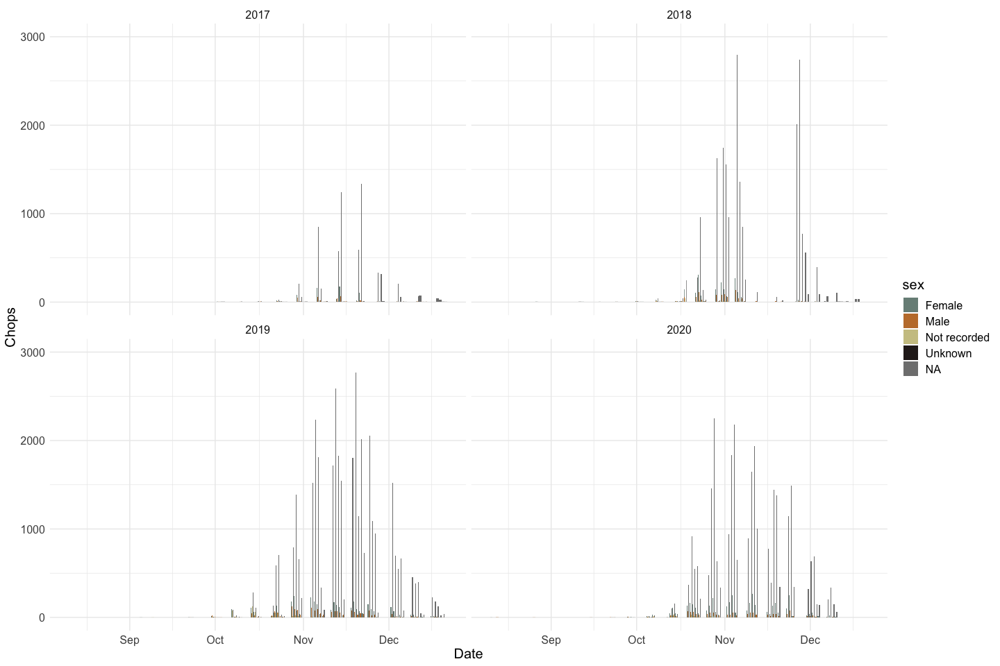
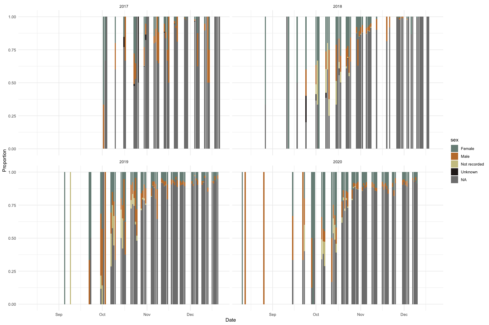
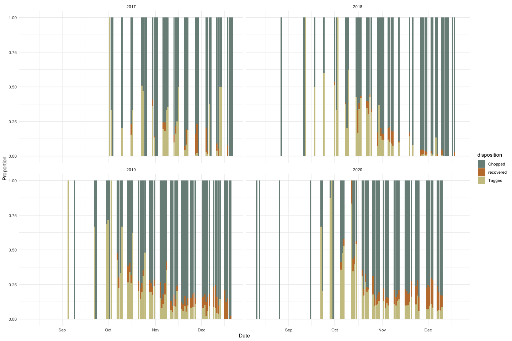
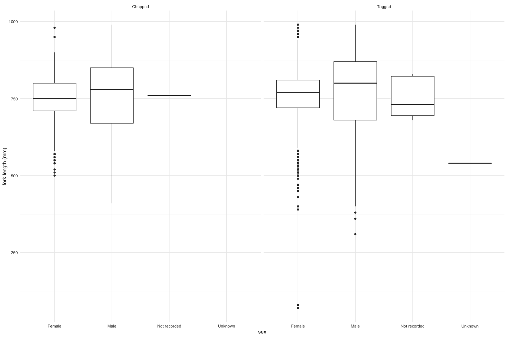

Feather Carcass QC 2017
================
Elizabeth Stebbins
2022-12-21

# Feather River Carcass Data

## Description of Monitoring Data

See Feather Carcass Survey QC Document

## Access Cloud Data

Read in data from google cloud, glimpse raw data and domain description
sheet.

## Raw Data Glimpse:

### Chops_raw

``` r
Chop_raw <- read_csv(here::here("data-raw", "qc-markdowns", "adult-holding-redd-and-carcass-surveys", "feather-river","Chops_2017_2021.csv")) |> 
  glimpse()
```

    ## Rows: 2,664
    ## Columns: 13
    ## $ SurveyMetaID <dbl> 70002, 70002, 70002, 70002, 70002, 70002, 70002, 70002, 7…
    ## $ ChopsID      <dbl> 1, 2, 3, 4, 5, 6, 7, 8, 9, 10, 11, 12, 13, 14, 15, 16, 17…
    ## $ SurveyID     <dbl> 1, 2, 3, 4, 5, 6, 7, 8, 9, 10, 11, 12, 13, 14, 15, 16, 17…
    ## $ WayPt        <lgl> NA, NA, NA, NA, NA, NA, NA, NA, NA, NA, NA, NA, NA, NA, N…
    ## $ RMile        <lgl> NA, NA, NA, NA, NA, NA, NA, NA, NA, NA, NA, NA, NA, NA, N…
    ## $ SpeciesID    <dbl> 161980, 161980, 161980, 161980, 161980, 161980, 161980, 1…
    ## $ RunID        <dbl> 3, 3, 3, 3, 3, 3, 3, 3, 3, 3, 3, 3, 3, 3, 3, 3, 3, 3, 3, …
    ## $ ChopTypeCD   <chr> "Chop", "Chop", "Chop", "Chop", "Chop", "Chop", "Chop", "…
    ## $ ChopCount    <dbl> 0, 0, 0, 0, 0, 0, 0, 0, 0, 0, 0, 0, 0, 0, 0, 0, 0, 0, 0, …
    ## $ DataRecorder <chr> "K Berridge", "K Berridge", "K Berridge", "K Berridge", "…
    ## $ CreationTime <chr> "(02/28/17 10:45:11)", "(02/28/17 11:02:41)", "(02/28/17 …
    ## $ Editor       <chr> NA, NA, NA, NA, NA, NA, NA, NA, NA, NA, NA, NA, NA, NA, N…
    ## $ EditTime     <chr> "(NA NA)", "(NA NA)", "(NA NA)", "(NA NA)", "(NA NA)", "(…

### ChopHeader_raw

``` r
ChopHeader_raw <- read_csv(here::here("data-raw", "qc-markdowns", "adult-holding-redd-and-carcass-surveys", "feather-river","ChopHeader_2017_2021.csv")) |>
  mutate(Date = as.Date(SurveyDate)) |> 
  select(-SurveyDate) |> 
  filter(year(Date) >= 2017) |> 
  glimpse()
```

    ## Rows: 3,460
    ## Columns: 26
    ## $ SurveyMetaID    <dbl> 70004, 70004, 70004, 70004, 70004, 70004, 70004, 70004…
    ## $ SurveyID        <dbl> 1, 2, 3, 4, 5, 6, 7, 8, 9, 10, 11, 12, 13, 14, 15, 16,…
    ## $ LocationID      <dbl> 700001, 700001, 700001, 700001, 700001, 700001, 700001…
    ## $ SectionID       <dbl> 17, 7, 1, 17, 17, 16, 15, 14, 13, 12, 11, 10, 9, 8, 6,…
    ## $ Boat            <chr> NA, NA, NA, NA, NA, NA, NA, NA, NA, NA, NA, NA, NA, NA…
    ## $ SurveyWeek      <dbl> 1, 1, 1, 3, 3, 1, 1, 1, 1, 1, 1, 1, 3, 1, 1, 1, 1, 1, …
    ## $ TransportTypeID <lgl> NA, NA, NA, NA, NA, NA, NA, NA, NA, NA, NA, NA, NA, NA…
    ## $ SubsampleID     <dbl> 1, 1, 1, 1, 1, 1, 1, 1, 1, 1, 1, 1, 1, 1, 1, 1, 1, 1, …
    ## $ TimeIn          <chr> "(12/30/99 12:00:00)", "(NA NA)", "(NA NA)", "(NA NA)"…
    ## $ TimeOut         <chr> "(12/30/99 12:20:00)", "(NA NA)", "(NA NA)", "(NA NA)"…
    ## $ WeatherID       <dbl> 1, 3, NA, 1, 1, 1, 1, 1, 1, 1, 1, 1, 1, 1, 1, 1, 1, 3,…
    ## $ WaterTempF      <lgl> NA, NA, NA, NA, NA, NA, NA, NA, NA, NA, NA, NA, NA, NA…
    ## $ WaterTempC      <lgl> NA, NA, NA, NA, NA, NA, NA, NA, NA, NA, NA, NA, NA, NA…
    ## $ SecchiCM        <lgl> NA, NA, NA, NA, NA, NA, NA, NA, NA, NA, NA, NA, NA, NA…
    ## $ SecchiFeet      <lgl> NA, NA, NA, NA, NA, NA, NA, NA, NA, NA, NA, NA, NA, NA…
    ## $ FlowCFS         <lgl> NA, NA, NA, NA, NA, NA, NA, NA, NA, NA, NA, NA, NA, NA…
    ## $ TurbidityNTU    <lgl> NA, NA, NA, NA, NA, NA, NA, NA, NA, NA, NA, NA, NA, NA…
    ## $ FieldRecorder   <chr> NA, "Aimrie", NA, NA, NA, "Aimrie", "Aimrie", "Aimrie"…
    ## $ Crew            <chr> NA, "cjc, ai, cm", NA, NA, NA, "ai, cjc", NA, NA, NA, …
    ## $ GPS.Unit        <lgl> NA, NA, NA, NA, NA, NA, NA, NA, NA, NA, NA, NA, NA, NA…
    ## $ Comments        <chr> "no fish", "Need to delete this sampling fieldsheet re…
    ## $ DataRecorder    <chr> "J Consoli", "J Consoli", "J Consoli", "J Consoli", "J…
    ## $ CreationTime    <chr> "(10/03/17 11:57:04)", "(10/03/17 11:58:15)", "(10/03/…
    ## $ Editor          <chr> "J Consoli", "J Consoli", "J Consoli", "J Consoli", NA…
    ## $ EditTime        <chr> "(12/07/17 10:42:29)", "(12/07/17 10:56:36)", "(12/07/…
    ## $ Date            <date> 2017-09-05, 2017-09-06, 2017-09-07, 2017-09-18, 2017-…

### ChopRecov_raw

``` r
ChopRecov_raw <- read_csv(here::here("data-raw", "qc-markdowns", 
                                  "adult-holding-redd-and-carcass-surveys",
                                  "feather-river", "ChopRecov_2017_2021.csv")) |> 
  glimpse()
```

    ## Rows: 10,536
    ## Columns: 16
    ## $ SurveyMetaID        <dbl> 70002, 70002, 70002, 70002, 70002, 70002, 70002, 7…
    ## $ RecoverID           <dbl> 1, 2, 3, 4, 5, 6, 7, 8, 9, 10, 11, 12, 13, 14, 15,…
    ## $ SurveyID            <dbl> 74, 106, 94, 95, 99, 133, 135, 135, 137, 127, 129,…
    ## $ WayPt               <lgl> NA, NA, NA, NA, NA, NA, NA, NA, NA, NA, NA, NA, NA…
    ## $ RMile               <lgl> NA, NA, NA, NA, NA, NA, NA, NA, NA, NA, NA, NA, NA…
    ## $ DispositionID       <dbl> 3, 3, 3, 3, 3, 3, 3, 3, 3, 3, 3, 3, 3, 3, 3, 3, 2,…
    ## $ TagRecovered        <dbl> 178, 200, 450, 210, 452, 216, 225, 355, 214, 366, …
    ## $ ColorTagRecoveredID <lgl> NA, NA, NA, NA, NA, NA, NA, NA, NA, NA, NA, NA, NA…
    ## $ SexID               <lgl> NA, NA, NA, NA, NA, NA, NA, NA, NA, NA, NA, NA, NA…
    ## $ FLmm                <lgl> NA, NA, NA, NA, NA, NA, NA, NA, NA, NA, NA, NA, NA…
    ## $ FLcm                <lgl> NA, NA, NA, NA, NA, NA, NA, NA, NA, NA, NA, NA, NA…
    ## $ Comments            <chr> NA, NA, NA, NA, NA, NA, NA, NA, NA, NA, NA, NA, NA…
    ## $ DataRecorder        <chr> "K Berridge", "K Berridge", "K Berridge", "K Berri…
    ## $ CreationTime        <chr> "(02/28/17 10:45:11)", "(02/28/17 11:02:41)", "(02…
    ## $ Editor              <chr> NA, NA, NA, NA, NA, NA, NA, NA, NA, NA, NA, NA, NA…
    ## $ EditTime            <chr> "(NA NA)", "(NA NA)", "(NA NA)", "(NA NA)", "(NA N…

### CWT raw

``` r
cwt_raw <- read_csv(here::here("data-raw", "qc-markdowns", "adult-holding-redd-and-carcass-surveys", "feather-river","CWT_2017_2021.csv")) |>
  glimpse()
```

    ## Rows: 18262 Columns: 28
    ## ── Column specification ────────────────────────────────────────────────────────
    ## Delimiter: ","
    ## chr  (5): Comments, DataRecorder, CreationTime, Editor, EditTime
    ## dbl (18): SurveyMetaID, IndividualID, SurveyID, SpeciesID, RunID, Dispositio...
    ## lgl  (5): WayPt, RMile, ColorTagAppliedID, TissueNu, DNAnu
    ## 
    ## ℹ Use `spec()` to retrieve the full column specification for this data.
    ## ℹ Specify the column types or set `show_col_types = FALSE` to quiet this message.

    ## Rows: 18,262
    ## Columns: 28
    ## $ SurveyMetaID      <dbl> 70002, 70002, 70002, 70002, 70002, 70002, 70002, 700…
    ## $ IndividualID      <dbl> 1, 2, 3, 4, 5, 6, 7, 8, 9, 10, 11, 12, 13, 14, 15, 1…
    ## $ SurveyID          <dbl> 8, 9, 12, 40, 43, 43, 43, 43, 44, 53, 57, 57, 65, 90…
    ## $ WayPt             <lgl> NA, NA, NA, NA, NA, NA, NA, NA, NA, NA, NA, NA, NA, …
    ## $ RMile             <lgl> NA, NA, NA, NA, NA, NA, NA, NA, NA, NA, NA, NA, NA, …
    ## $ SpeciesID         <dbl> 161980, 161980, 161980, 161980, 161980, 161980, 1619…
    ## $ RunID             <dbl> 3, 3, 3, 3, 3, 3, 3, 3, 3, 3, 3, 3, 3, 3, 3, 3, 3, 3…
    ## $ DispositionID     <dbl> 1, 1, 1, 1, 1, 1, 1, 1, 1, 1, 1, 1, 1, 1, 1, 1, 1, 1…
    ## $ DiscTagApplied    <dbl> 152, 151, 150, 178, 154, 175, 176, 177, 153, 125, 10…
    ## $ ColorTagAppliedID <lgl> NA, NA, NA, NA, NA, NA, NA, NA, NA, NA, NA, NA, NA, …
    ## $ SexID             <dbl> 1, 1, 2, 1, 2, 1, 1, 2, 1, 1, 1, 2, 1, 2, 2, 2, 2, 1…
    ## $ FLmm              <dbl> 730, 830, 800, NA, 680, 720, 710, 660, 710, 660, 740…
    ## $ FLcm              <dbl> 73, 83, 80, NA, 68, 72, 71, 66, 71, 66, 74, 78, 80, …
    ## $ ConditionID       <dbl> 251, 251, 251, 251, 251, 251, 251, 251, 251, 251, 25…
    ## $ SpawnedID         <dbl> 2, 2, 253, 2, 253, 2, 2, 253, 2, 2, 2, 253, 1, 253, …
    ## $ AdFinClipID       <dbl> 1, 1, 1, 1, 1, 2, 1, 1, 1, 1, 2, 2, 1, 2, 2, 1, 1, 1…
    ## $ HeadNu            <dbl> 89000, 89203, 89202, NA, 89003, NA, 89004, 89005, 89…
    ## $ ScaleNu           <dbl> 58603, 58602, 58601, NA, 58606, 58607, 58608, 58609,…
    ## $ TissueNu          <lgl> NA, NA, NA, NA, NA, NA, NA, NA, NA, NA, NA, NA, NA, …
    ## $ OtolithNu         <dbl> 7, 6, 5, NA, 55, 44, 45, NA, 59, 64, 12, 47, 39, 16,…
    ## $ DNAnu             <lgl> NA, NA, NA, NA, NA, NA, NA, NA, NA, NA, NA, NA, NA, …
    ## $ Comments          <chr> NA, NA, NA, NA, NA, NA, NA, "sr, missing hallprints,…
    ## $ DataRecorder      <chr> NA, NA, NA, NA, NA, NA, NA, NA, NA, NA, NA, NA, NA, …
    ## $ CreationTime      <chr> "(NA NA)", "(NA NA)", "(NA NA)", "(NA NA)", "(NA NA)…
    ## $ Editor            <chr> NA, NA, NA, NA, NA, NA, NA, NA, NA, NA, NA, NA, NA, …
    ## $ EditTime          <chr> "(NA NA)", "(NA NA)", "(NA NA)", "(NA NA)", "(NA NA)…
    ## $ CWTStatusID       <dbl> NA, NA, NA, NA, NA, NA, NA, NA, NA, NA, NA, NA, NA, …
    ## $ CWTcd             <dbl> NA, NA, NA, NA, NA, NA, NA, NA, NA, NA, NA, NA, NA, …

## Data transformations:

Notes about 2017 data and onwards: \* Starting in 2017, Feather River
began storing data in the CAMP database \* Prior to 2021, Feather River
carcass surveys would recapture a carcass multiple times before chopping
(after 2021, they moved to chopping upon recapture) \* `ChopHeader` now
contains environmental variables, but they are empty \* The `CWT` table
contains individual carcasses, chopped and tagged \* The `chop` table
contains bulk carcass counts by week \* The `chop_recovery` table
contains recovered carcass counts by color

### Survey

The `chop_header` table contains survey metadata and covariates. The
`chop_header` table does not contain an entry for
`survey_meta_id == 70002`, which is included in many of the raw tables.

- Joined lookup tables and removed empty columns

``` r
chop_header <- ChopHeader_raw |> 
  clean_names() |> 
  left_join(location_LU |> 
              select(LocationID, Location),
            by = c("location_id" = "LocationID")) |> 
  left_join(weather_LU |> select(WeatherID, Weather),
            by = c("weather_id" = "WeatherID")) |> 
  left_join(subsample_LU |> select(SubsampleID, Subsample),
            by = c("subsample_id" = "SubsampleID")) |> 
  mutate(time_in = as.POSIXct(gsub("[()]", "", time_in), 
                                format = "%m/%d/%y %H:%M:%S"),
         time_out = as.POSIXct(gsub("[()]", "", time_out), 
                                    format = "%m/%d/%y %H:%M:%S"),
         edit_time = as.POSIXct(gsub("[()]", "", edit_time), 
                                format = "%m/%d/%y %H:%M:%S"),
         creation_time = as.POSIXct(gsub("[()]", "", creation_time), 
                                    format = "%m/%d/%y %H:%M:%S")) |> 
  select(-c(location_id, transport_type_id, subsample_id, 
            weather_id, water_temp_f, water_temp_c, 
            secchi_cm, secchi_feet, flow_cfs, gps_unit,
            turbidity_ntu)) |> 
  clean_names() |> 
  glimpse()
```

    ## Rows: 3,460
    ## Columns: 18
    ## $ survey_meta_id <dbl> 70004, 70004, 70004, 70004, 70004, 70004, 70004, 70004,…
    ## $ survey_id      <dbl> 1, 2, 3, 4, 5, 6, 7, 8, 9, 10, 11, 12, 13, 14, 15, 16, …
    ## $ section_id     <dbl> 17, 7, 1, 17, 17, 16, 15, 14, 13, 12, 11, 10, 9, 8, 6, …
    ## $ boat           <chr> NA, NA, NA, NA, NA, NA, NA, NA, NA, NA, NA, NA, NA, NA,…
    ## $ survey_week    <dbl> 1, 1, 1, 3, 3, 1, 1, 1, 1, 1, 1, 1, 3, 1, 1, 1, 1, 1, 1…
    ## $ time_in        <dttm> 1999-12-30 12:00:00, NA, NA, NA, NA, 1999-12-30 12:00:…
    ## $ time_out       <dttm> 1999-12-30 12:20:00, NA, NA, NA, NA, 1999-12-30 12:21:…
    ## $ field_recorder <chr> NA, "Aimrie", NA, NA, NA, "Aimrie", "Aimrie", "Aimrie",…
    ## $ crew           <chr> NA, "cjc, ai, cm", NA, NA, NA, "ai, cjc", NA, NA, NA, N…
    ## $ comments       <chr> "no fish", "Need to delete this sampling fieldsheet rec…
    ## $ data_recorder  <chr> "J Consoli", "J Consoli", "J Consoli", "J Consoli", "J …
    ## $ creation_time  <dttm> 2017-10-03 11:57:04, 2017-10-03 11:58:15, 2017-10-03 1…
    ## $ editor         <chr> "J Consoli", "J Consoli", "J Consoli", "J Consoli", NA,…
    ## $ edit_time      <dttm> 2017-12-07 10:42:29, 2017-12-07 10:56:36, 2017-12-07 1…
    ## $ date           <date> 2017-09-05, 2017-09-06, 2017-09-07, 2017-09-18, 2017-0…
    ## $ location       <chr> "Feather River carcass survey", "Feather River carcass …
    ## $ weather        <chr> "Clear", "Partly cloudy", NA, "Clear", "Clear", "Clear"…
    ## $ subsample      <chr> "No subsampling-all fresh fish processed", "No subsampl…

### CWT

The `cwt` table contains sampling information on individual carcasses.
This table also contains sex, spawning condition, and adipose fin clip
status. It is not joined with the other tables. Added a `count` column
assuming each row represents one individual. This table contains
`disposition` information in the `recapture_or_chop` variable (in
previous years this was the `carc_stat` variable, and in 2012 this was
in three separate recap ID columns). Added `source_table` column for
tracking.

- removed columns that were all `NA`: `way_pt`, `r_mile`,
  `color_tag_applied_id`, `dn_anu`, `transport_type_id`, `gps_unit`,
  `turbidity_ntu`, `water_temp_f`, `water_temp_c`, `secchi_cm`,
  `secchi_feet`, `flow_cfs`, `tissue_nu`

``` r
cwt <- left_join(cwt_raw |> clean_names(), 
                 chop_header |> select(-c(data_recorder, comments, 
                             creation_time, editor, edit_time)),
                 by = c("survey_meta_id", "survey_id")) |> 
  rename(fl_mm = "f_lmm",
         fl_cm = "f_lcm",
         cwt_cd = "cw_tcd") |> 
  select(-c(way_pt, r_mile, color_tag_applied_id,
            dn_anu, tissue_nu)) |> 
  # add lookup tables
  left_join(species_LU |> 
              mutate(species_id = as.numeric(TaxonID),
                     species = CommonName) |> 
              select(species_id, species), by = "species_id") |>
  left_join(run_LU |> select(runID, run), 
            by = c("run_id" = "runID")) |>
  left_join(disposition_LU |> select(DispositionID, 
                                     disposition = Disposition), 
            by = c("disposition_id" = "DispositionID")) |> 
  left_join(condition_LU |> 
              select(ConditionID, condition = Condition), 
            by = c("condition_id" = "ConditionID")) |> 
  left_join(spawnstatus_LU |> select(SpawnedID, spawned = Spawned), 
            by = c("spawned_id" = "SpawnedID")) |> 
  left_join(adfin_LU |> select(AdFinClipID, ad_fin_clip_status = AdFinClip),
            by = c("ad_fin_clip_id" = "AdFinClipID")) |> 
  left_join(cwtstatus_LU |> select(CWTStatusID, cwt_status = CWTStatus),
            by = c("cwt_status_id" = "CWTStatusID")) |> 
  left_join(sex_LU |> select(SexID, sex = Sex), 
            by = c("sex_id" = "SexID")) |> 
  select(-c(condition_id, ad_fin_clip_id, sex_id, cwt_status_id, 
            spawned_id, disposition_id, run_id, species_id)) |> 
  clean_names() |> 
  mutate(source_table = "CWT",
         count = 1,
         edit_time = as.POSIXct(gsub("[()]", "", edit_time), 
                                format = "%m/%d/%y %H:%M:%S"),
         creation_time = as.POSIXct(gsub("[()]", "", creation_time), 
                                    format = "%m/%d/%y %H:%M:%S")) |> 
  glimpse()
```

    ## Rows: 18,262
    ## Columns: 36
    ## $ survey_meta_id     <dbl> 70002, 70002, 70002, 70002, 70002, 70002, 70002, 70…
    ## $ individual_id      <dbl> 1, 2, 3, 4, 5, 6, 7, 8, 9, 10, 11, 12, 13, 14, 15, …
    ## $ survey_id          <dbl> 8, 9, 12, 40, 43, 43, 43, 43, 44, 53, 57, 57, 65, 9…
    ## $ disc_tag_applied   <dbl> 152, 151, 150, 178, 154, 175, 176, 177, 153, 125, 1…
    ## $ fl_mm              <dbl> 730, 830, 800, NA, 680, 720, 710, 660, 710, 660, 74…
    ## $ fl_cm              <dbl> 73, 83, 80, NA, 68, 72, 71, 66, 71, 66, 74, 78, 80,…
    ## $ head_nu            <dbl> 89000, 89203, 89202, NA, 89003, NA, 89004, 89005, 8…
    ## $ scale_nu           <dbl> 58603, 58602, 58601, NA, 58606, 58607, 58608, 58609…
    ## $ otolith_nu         <dbl> 7, 6, 5, NA, 55, 44, 45, NA, 59, 64, 12, 47, 39, 16…
    ## $ comments           <chr> NA, NA, NA, NA, NA, NA, NA, "sr, missing hallprints…
    ## $ data_recorder      <chr> NA, NA, NA, NA, NA, NA, NA, NA, NA, NA, NA, NA, NA,…
    ## $ creation_time      <dttm> NA, NA, NA, NA, NA, NA, NA, NA, NA, NA, NA, NA, NA…
    ## $ editor             <chr> NA, NA, NA, NA, NA, NA, NA, NA, NA, NA, NA, NA, NA,…
    ## $ edit_time          <dttm> NA, NA, NA, NA, NA, NA, NA, NA, NA, NA, NA, NA, NA…
    ## $ cwt_cd             <dbl> NA, NA, NA, NA, NA, NA, NA, NA, NA, NA, NA, NA, NA,…
    ## $ section_id         <dbl> NA, NA, NA, NA, NA, NA, NA, NA, NA, NA, NA, NA, NA,…
    ## $ boat               <chr> NA, NA, NA, NA, NA, NA, NA, NA, NA, NA, NA, NA, NA,…
    ## $ survey_week        <dbl> NA, NA, NA, NA, NA, NA, NA, NA, NA, NA, NA, NA, NA,…
    ## $ time_in            <dttm> NA, NA, NA, NA, NA, NA, NA, NA, NA, NA, NA, NA, NA…
    ## $ time_out           <dttm> NA, NA, NA, NA, NA, NA, NA, NA, NA, NA, NA, NA, NA…
    ## $ field_recorder     <chr> NA, NA, NA, NA, NA, NA, NA, NA, NA, NA, NA, NA, NA,…
    ## $ crew               <chr> NA, NA, NA, NA, NA, NA, NA, NA, NA, NA, NA, NA, NA,…
    ## $ date               <date> NA, NA, NA, NA, NA, NA, NA, NA, NA, NA, NA, NA, NA…
    ## $ location           <chr> NA, NA, NA, NA, NA, NA, NA, NA, NA, NA, NA, NA, NA,…
    ## $ weather            <chr> NA, NA, NA, NA, NA, NA, NA, NA, NA, NA, NA, NA, NA,…
    ## $ subsample          <chr> NA, NA, NA, NA, NA, NA, NA, NA, NA, NA, NA, NA, NA,…
    ## $ species            <chr> "Chinook salmon", "Chinook salmon", "Chinook salmon…
    ## $ run                <chr> "Fall", "Fall", "Fall", "Fall", "Fall", "Fall", "Fa…
    ## $ disposition        <chr> "Tagged", "Tagged", "Tagged", "Tagged", "Tagged", "…
    ## $ condition          <chr> "Not recorded", "Not recorded", "Not recorded", "No…
    ## $ spawned            <chr> "No", "No", "Unknown", "No", "Unknown", "No", "No",…
    ## $ ad_fin_clip_status <chr> "Yes", "Yes", "Yes", "Yes", "Yes", "No", "Yes", "Ye…
    ## $ cwt_status         <chr> NA, NA, NA, NA, NA, NA, NA, NA, NA, NA, NA, NA, NA,…
    ## $ sex                <chr> "Female", "Female", "Male", "Female", "Male", "Fema…
    ## $ source_table       <chr> "CWT", "CWT", "CWT", "CWT", "CWT", "CWT", "CWT", "C…
    ## $ count              <dbl> 1, 1, 1, 1, 1, 1, 1, 1, 1, 1, 1, 1, 1, 1, 1, 1, 1, …

### Bulk chop counts

The `chops` table has bulk chop counts by week. There is no additional
information. `disposition` column added assuming all were `chopped`.

``` r
chop_join <- left_join(Chop_raw |> clean_names(), 
                 chop_header |> select(-c(data_recorder, comments, 
                             creation_time, editor, edit_time)),
                                by = c("survey_meta_id", "survey_id")) |> 
  left_join(species_LU |> 
            mutate(species_id = as.numeric(TaxonID),
                   species = CommonName) |> 
            select(species_id, species), by = "species_id") |>
  left_join(run_LU |> select(runID, run), 
            by = c("run_id" = "runID")) |>
  select(-c(species_id, run_id, r_mile, way_pt)) |> 
  rename(count = chop_count,
         disposition = chop_type_cd) |> 
  mutate(edit_time = as.POSIXct(gsub("[()]", "", edit_time), 
                                format = "%m/%d/%y %H:%M:%S"),
         creation_time = as.POSIXct(gsub("[()]", "", creation_time), 
                                    format = "%m/%d/%y %H:%M:%S"),
         source_table = "ChopJoin") |> 
  glimpse()
```

    ## Rows: 2,664
    ## Columns: 23
    ## $ survey_meta_id <dbl> 70002, 70002, 70002, 70002, 70002, 70002, 70002, 70002,…
    ## $ chops_id       <dbl> 1, 2, 3, 4, 5, 6, 7, 8, 9, 10, 11, 12, 13, 14, 15, 16, …
    ## $ survey_id      <dbl> 1, 2, 3, 4, 5, 6, 7, 8, 9, 10, 11, 12, 13, 14, 15, 16, …
    ## $ disposition    <chr> "Chop", "Chop", "Chop", "Chop", "Chop", "Chop", "Chop",…
    ## $ count          <dbl> 0, 0, 0, 0, 0, 0, 0, 0, 0, 0, 0, 0, 0, 0, 0, 0, 0, 0, 0…
    ## $ data_recorder  <chr> "K Berridge", "K Berridge", "K Berridge", "K Berridge",…
    ## $ creation_time  <dttm> 2017-02-28 10:45:11, 2017-02-28 11:02:41, 2017-02-28 1…
    ## $ editor         <chr> NA, NA, NA, NA, NA, NA, NA, NA, NA, NA, NA, NA, NA, NA,…
    ## $ edit_time      <dttm> NA, NA, NA, NA, NA, NA, NA, NA, NA, NA, NA, NA, NA, NA…
    ## $ section_id     <dbl> NA, NA, NA, NA, NA, NA, NA, NA, NA, NA, NA, NA, NA, NA,…
    ## $ boat           <chr> NA, NA, NA, NA, NA, NA, NA, NA, NA, NA, NA, NA, NA, NA,…
    ## $ survey_week    <dbl> NA, NA, NA, NA, NA, NA, NA, NA, NA, NA, NA, NA, NA, NA,…
    ## $ time_in        <dttm> NA, NA, NA, NA, NA, NA, NA, NA, NA, NA, NA, NA, NA, NA…
    ## $ time_out       <dttm> NA, NA, NA, NA, NA, NA, NA, NA, NA, NA, NA, NA, NA, NA…
    ## $ field_recorder <chr> NA, NA, NA, NA, NA, NA, NA, NA, NA, NA, NA, NA, NA, NA,…
    ## $ crew           <chr> NA, NA, NA, NA, NA, NA, NA, NA, NA, NA, NA, NA, NA, NA,…
    ## $ date           <date> NA, NA, NA, NA, NA, NA, NA, NA, NA, NA, NA, NA, NA, NA…
    ## $ location       <chr> NA, NA, NA, NA, NA, NA, NA, NA, NA, NA, NA, NA, NA, NA,…
    ## $ weather        <chr> NA, NA, NA, NA, NA, NA, NA, NA, NA, NA, NA, NA, NA, NA,…
    ## $ subsample      <chr> NA, NA, NA, NA, NA, NA, NA, NA, NA, NA, NA, NA, NA, NA,…
    ## $ species        <chr> "Chinook salmon", "Chinook salmon", "Chinook salmon", "…
    ## $ run            <chr> "Fall", "Fall", "Fall", "Fall", "Fall", "Fall", "Fall",…
    ## $ source_table   <chr> "ChopJoin", "ChopJoin", "ChopJoin", "ChopJoin", "ChopJo…

### Recovered tags and chops

Added a `count` column here assuming each row represents one individual.

``` r
chop_recovery_join <- left_join(ChopRecov_raw |> clean_names(), 
                                chop_header |> select(-c(data_recorder, 
                                                         comments,
                                                         creation_time,
                                                         editor, edit_time)),
                                by = c("survey_meta_id", "survey_id")) |> 
  left_join(disposition_LU |> select(DispositionID, disposition = Disposition),
            by = c("disposition_id" = "DispositionID")) |>
  left_join(color_LU |> 
              select(colorID, color), 
            by = c("color_tag_recovered_id" = "colorID")) |>  
  left_join(sex_LU |> select(SexID, sex = Sex),
            by = c("sex_id" = "SexID")) |> 
  mutate(edit_time = as.POSIXct(gsub("[()]", "", edit_time), 
                                format = "%m/%d/%y %H:%M:%S"),
         creation_time = as.POSIXct(gsub("[()]", "", creation_time), 
                                    format = "%m/%d/%y %H:%M:%S"),
         fl_mm = as.numeric(f_lmm),
         fl_cm = as.numeric(f_lcm),
         source_table = "ChopRecov",
         disposition = "recovered",
         count = 1) |> 
  select(-c(f_lmm, f_lcm, way_pt, r_mile, disposition_id,
            color_tag_recovered_id,
            sex_id)) |> 
  rename(tag_col = color) |> 
  glimpse()
```

    ## Rows: 10,536
    ## Columns: 27
    ## $ survey_meta_id <dbl> 70002, 70002, 70002, 70002, 70002, 70002, 70002, 70002,…
    ## $ recover_id     <dbl> 1, 2, 3, 4, 5, 6, 7, 8, 9, 10, 11, 12, 13, 14, 15, 16, …
    ## $ survey_id      <dbl> 74, 106, 94, 95, 99, 133, 135, 135, 137, 127, 129, 131,…
    ## $ tag_recovered  <dbl> 178, 200, 450, 210, 452, 216, 225, 355, 214, 366, 250, …
    ## $ comments       <chr> NA, NA, NA, NA, NA, NA, NA, NA, NA, NA, NA, NA, NA, NA,…
    ## $ data_recorder  <chr> "K Berridge", "K Berridge", "K Berridge", "K Berridge",…
    ## $ creation_time  <dttm> 2017-02-28 10:45:11, 2017-02-28 11:02:41, 2017-02-28 1…
    ## $ editor         <chr> NA, NA, NA, NA, NA, NA, NA, NA, NA, NA, NA, NA, NA, NA,…
    ## $ edit_time      <dttm> NA, NA, NA, NA, NA, NA, NA, NA, NA, NA, NA, NA, NA, NA…
    ## $ section_id     <dbl> NA, NA, NA, NA, NA, NA, NA, NA, NA, NA, NA, NA, NA, NA,…
    ## $ boat           <chr> NA, NA, NA, NA, NA, NA, NA, NA, NA, NA, NA, NA, NA, NA,…
    ## $ survey_week    <dbl> NA, NA, NA, NA, NA, NA, NA, NA, NA, NA, NA, NA, NA, NA,…
    ## $ time_in        <dttm> NA, NA, NA, NA, NA, NA, NA, NA, NA, NA, NA, NA, NA, NA…
    ## $ time_out       <dttm> NA, NA, NA, NA, NA, NA, NA, NA, NA, NA, NA, NA, NA, NA…
    ## $ field_recorder <chr> NA, NA, NA, NA, NA, NA, NA, NA, NA, NA, NA, NA, NA, NA,…
    ## $ crew           <chr> NA, NA, NA, NA, NA, NA, NA, NA, NA, NA, NA, NA, NA, NA,…
    ## $ date           <date> NA, NA, NA, NA, NA, NA, NA, NA, NA, NA, NA, NA, NA, NA…
    ## $ location       <chr> NA, NA, NA, NA, NA, NA, NA, NA, NA, NA, NA, NA, NA, NA,…
    ## $ weather        <chr> NA, NA, NA, NA, NA, NA, NA, NA, NA, NA, NA, NA, NA, NA,…
    ## $ subsample      <chr> NA, NA, NA, NA, NA, NA, NA, NA, NA, NA, NA, NA, NA, NA,…
    ## $ disposition    <chr> "recovered", "recovered", "recovered", "recovered", "re…
    ## $ tag_col        <chr> NA, NA, NA, NA, NA, NA, NA, NA, NA, NA, NA, NA, NA, NA,…
    ## $ sex            <chr> NA, NA, NA, NA, NA, NA, NA, NA, NA, NA, NA, NA, NA, NA,…
    ## $ fl_mm          <dbl> NA, NA, NA, NA, NA, NA, NA, NA, NA, NA, NA, NA, NA, NA,…
    ## $ fl_cm          <dbl> NA, NA, NA, NA, NA, NA, NA, NA, NA, NA, NA, NA, NA, NA,…
    ## $ source_table   <chr> "ChopRecov", "ChopRecov", "ChopRecov", "ChopRecov", "Ch…
    ## $ count          <dbl> 1, 1, 1, 1, 1, 1, 1, 1, 1, 1, 1, 1, 1, 1, 1, 1, 1, 1, 1…

### Combine tables

- standardize disposition
- all rows with `survey_meta_id == 70002` have no `date` because it is
  not in the `SurveyMetaID` lookup table.

``` r
all_carcasses <- bind_rows(chop_join, cwt, chop_recovery_join) |> 
  mutate(disposition = if_else(disposition == "Chop", "Chopped", disposition)) |> 
           glimpse()
```

    ## Rows: 31,462
    ## Columns: 40
    ## $ survey_meta_id     <dbl> 70002, 70002, 70002, 70002, 70002, 70002, 70002, 70…
    ## $ chops_id           <dbl> 1, 2, 3, 4, 5, 6, 7, 8, 9, 10, 11, 12, 13, 14, 15, …
    ## $ survey_id          <dbl> 1, 2, 3, 4, 5, 6, 7, 8, 9, 10, 11, 12, 13, 14, 15, …
    ## $ disposition        <chr> "Chopped", "Chopped", "Chopped", "Chopped", "Choppe…
    ## $ count              <dbl> 0, 0, 0, 0, 0, 0, 0, 0, 0, 0, 0, 0, 0, 0, 0, 0, 0, …
    ## $ data_recorder      <chr> "K Berridge", "K Berridge", "K Berridge", "K Berrid…
    ## $ creation_time      <dttm> 2017-02-28 10:45:11, 2017-02-28 11:02:41, 2017-02-…
    ## $ editor             <chr> NA, NA, NA, NA, NA, NA, NA, NA, NA, NA, NA, NA, NA,…
    ## $ edit_time          <dttm> NA, NA, NA, NA, NA, NA, NA, NA, NA, NA, NA, NA, NA…
    ## $ section_id         <dbl> NA, NA, NA, NA, NA, NA, NA, NA, NA, NA, NA, NA, NA,…
    ## $ boat               <chr> NA, NA, NA, NA, NA, NA, NA, NA, NA, NA, NA, NA, NA,…
    ## $ survey_week        <dbl> NA, NA, NA, NA, NA, NA, NA, NA, NA, NA, NA, NA, NA,…
    ## $ time_in            <dttm> NA, NA, NA, NA, NA, NA, NA, NA, NA, NA, NA, NA, NA…
    ## $ time_out           <dttm> NA, NA, NA, NA, NA, NA, NA, NA, NA, NA, NA, NA, NA…
    ## $ field_recorder     <chr> NA, NA, NA, NA, NA, NA, NA, NA, NA, NA, NA, NA, NA,…
    ## $ crew               <chr> NA, NA, NA, NA, NA, NA, NA, NA, NA, NA, NA, NA, NA,…
    ## $ date               <date> NA, NA, NA, NA, NA, NA, NA, NA, NA, NA, NA, NA, NA…
    ## $ location           <chr> NA, NA, NA, NA, NA, NA, NA, NA, NA, NA, NA, NA, NA,…
    ## $ weather            <chr> NA, NA, NA, NA, NA, NA, NA, NA, NA, NA, NA, NA, NA,…
    ## $ subsample          <chr> NA, NA, NA, NA, NA, NA, NA, NA, NA, NA, NA, NA, NA,…
    ## $ species            <chr> "Chinook salmon", "Chinook salmon", "Chinook salmon…
    ## $ run                <chr> "Fall", "Fall", "Fall", "Fall", "Fall", "Fall", "Fa…
    ## $ source_table       <chr> "ChopJoin", "ChopJoin", "ChopJoin", "ChopJoin", "Ch…
    ## $ individual_id      <dbl> NA, NA, NA, NA, NA, NA, NA, NA, NA, NA, NA, NA, NA,…
    ## $ disc_tag_applied   <dbl> NA, NA, NA, NA, NA, NA, NA, NA, NA, NA, NA, NA, NA,…
    ## $ fl_mm              <dbl> NA, NA, NA, NA, NA, NA, NA, NA, NA, NA, NA, NA, NA,…
    ## $ fl_cm              <dbl> NA, NA, NA, NA, NA, NA, NA, NA, NA, NA, NA, NA, NA,…
    ## $ head_nu            <dbl> NA, NA, NA, NA, NA, NA, NA, NA, NA, NA, NA, NA, NA,…
    ## $ scale_nu           <dbl> NA, NA, NA, NA, NA, NA, NA, NA, NA, NA, NA, NA, NA,…
    ## $ otolith_nu         <dbl> NA, NA, NA, NA, NA, NA, NA, NA, NA, NA, NA, NA, NA,…
    ## $ comments           <chr> NA, NA, NA, NA, NA, NA, NA, NA, NA, NA, NA, NA, NA,…
    ## $ cwt_cd             <dbl> NA, NA, NA, NA, NA, NA, NA, NA, NA, NA, NA, NA, NA,…
    ## $ condition          <chr> NA, NA, NA, NA, NA, NA, NA, NA, NA, NA, NA, NA, NA,…
    ## $ spawned            <chr> NA, NA, NA, NA, NA, NA, NA, NA, NA, NA, NA, NA, NA,…
    ## $ ad_fin_clip_status <chr> NA, NA, NA, NA, NA, NA, NA, NA, NA, NA, NA, NA, NA,…
    ## $ cwt_status         <chr> NA, NA, NA, NA, NA, NA, NA, NA, NA, NA, NA, NA, NA,…
    ## $ sex                <chr> NA, NA, NA, NA, NA, NA, NA, NA, NA, NA, NA, NA, NA,…
    ## $ recover_id         <dbl> NA, NA, NA, NA, NA, NA, NA, NA, NA, NA, NA, NA, NA,…
    ## $ tag_recovered      <dbl> NA, NA, NA, NA, NA, NA, NA, NA, NA, NA, NA, NA, NA,…
    ## $ tag_col            <chr> NA, NA, NA, NA, NA, NA, NA, NA, NA, NA, NA, NA, NA,…

## Explore Numeric Variables:

### All Carcasses Variables: `survey_meta_id`, `chops_id`, `survey_id`, `count`, `section_id`, `survey_week`, `individual_id`, `disc_tag_applied`, `fl_mm`, `fl_cm`, `head_nu`, `scale_nu`, `otolith_nu`, `cwt_cd`, `recover_id`, `tag_recovered`

``` r
# Filter clean data to show only numeric variables 
all_carcasses |>  
  select_if(is.numeric) |> 
  colnames()
```

    ##  [1] "survey_meta_id"   "chops_id"         "survey_id"        "count"           
    ##  [5] "section_id"       "survey_week"      "individual_id"    "disc_tag_applied"
    ##  [9] "fl_mm"            "fl_cm"            "head_nu"          "scale_nu"        
    ## [13] "otolith_nu"       "cwt_cd"           "recover_id"       "tag_recovered"

``` r
numeric_cols <- all_carcasses |>  
  select_if(is.numeric) |> 
  colnames()
sapply(all_carcasses[,numeric_cols], summary)
```

    ## $survey_meta_id
    ##    Min. 1st Qu.  Median    Mean 3rd Qu.    Max. 
    ##   70002   70004   70006   70005   70007   70007 
    ## 
    ## $chops_id
    ##    Min. 1st Qu.  Median    Mean 3rd Qu.    Max.    NA's 
    ##     1.0   134.0   267.0   291.6   429.2   743.0   28798 
    ## 
    ## $survey_id
    ##    Min. 1st Qu.  Median    Mean 3rd Qu.    Max. 
    ##     1.0   373.0   483.0   509.4   630.0  1101.0 
    ## 
    ## $count
    ##    Min. 1st Qu.  Median    Mean 3rd Qu.    Max. 
    ##   0.000   1.000   1.000   3.942   1.000 999.000 
    ## 
    ## $section_id
    ##    Min. 1st Qu.  Median    Mean 3rd Qu.    Max.    NA's 
    ##    1.00    7.00    9.00   10.48   12.00   38.00    7199 
    ## 
    ## $survey_week
    ##    Min. 1st Qu.  Median    Mean 3rd Qu.    Max.    NA's 
    ##    0.00    9.00   10.00   10.41   12.00   16.00    7199 
    ## 
    ## $individual_id
    ##    Min. 1st Qu.  Median    Mean 3rd Qu.    Max.    NA's 
    ##       1     913    2040    2214    3278    5713   13200 
    ## 
    ## $disc_tag_applied
    ##    Min. 1st Qu.  Median    Mean 3rd Qu.    Max.    NA's 
    ##       1    1535    4451    4506    6246   83491   15491 
    ## 
    ## $fl_mm
    ##    Min. 1st Qu.  Median    Mean 3rd Qu.    Max.    NA's 
    ##      70     710     770     817     830  894710   14131 
    ## 
    ## $fl_cm
    ##    Min. 1st Qu.  Median    Mean 3rd Qu.    Max.    NA's 
    ##     7.0    71.0    77.0    81.7    83.0 89471.0   14131 
    ## 
    ## $head_nu
    ##    Min. 1st Qu.  Median    Mean 3rd Qu.    Max.    NA's 
    ##   10000   28551   70050   51641   89107   90975   27010 
    ## 
    ## $scale_nu
    ##    Min. 1st Qu.  Median    Mean 3rd Qu.    Max.    NA's 
    ##   16701   26789   58486   58606   89120   89864   28681 
    ## 
    ## $otolith_nu
    ##    Min. 1st Qu.  Median    Mean 3rd Qu.    Max.    NA's 
    ##     1.0   172.0   337.5   370.5   533.0  5541.0   28688 
    ## 
    ## $cwt_cd
    ##    Min. 1st Qu.  Median    Mean 3rd Qu.    Max.    NA's 
    ##   60656   60735   60739   60765   60743   68729   30844 
    ## 
    ## $recover_id
    ##    Min. 1st Qu.  Median    Mean 3rd Qu.    Max.    NA's 
    ##       1     532    1188    1292    2007    3115   20926 
    ## 
    ## $tag_recovered
    ##    Min. 1st Qu.  Median    Mean 3rd Qu.    Max.    NA's 
    ##       1    1442    4338    4331    6191   83491   20929

### All Carcasses Variable: `count`

``` r
summary(all_carcasses$count)
```

    ##    Min. 1st Qu.  Median    Mean 3rd Qu.    Max. 
    ##   0.000   1.000   1.000   3.942   1.000 999.000

\*\* Plot carcass counts by sex \*\*

``` r
all_carcasses |>  
  filter(!is.na(date)) |> 
  mutate(fake_date = paste0("1970-", month(date), "-", day(date)),
         fake_date = ymd(fake_date),
         year = year(date)) |> 
  group_by(fake_date, sex, year) |> 
  summarize(count = sum(count, na.rm = T)) |> 
  ggplot(aes(x = fake_date, y = count, fill = sex)) +
  geom_bar(stat = "identity", position = "dodge") + 
  labs(x = "Date", 
       y = "Chops") +
  theme_minimal() + 
  facet_wrap(~year) +
  scale_fill_manual(values = wes_palette("Moonrise2")) +
  theme(text = element_text(size = 15)) +
  ylim(c(0, 3000))
```

    ## `summarise()` has grouped output by 'fake_date', 'sex'. You can override using
    ## the `.groups` argument.

<!-- -->
This plot shows carcass over period of record by sex and is helpful for
understanding the seasonality of the survey, i.e. chop counts peak in
Oct-Nov.

**Plotting Total Adult Chops over Period of Record**

``` r
total_adult_chops <- all_carcasses |> 
  filter(disposition != "tagged") |>
  filter(!is.na(date)) |> 
  mutate(fake_date = paste0("1970-", month(date), "-", day(date)),
         fake_date = ymd(fake_date),
         year = year(date)) |> 
  select(fake_date, year, count, disposition, sex) |> 
  glimpse()
```

    ## Rows: 24,263
    ## Columns: 5
    ## $ fake_date   <date> 1970-10-10, 1970-10-04, 1970-10-03, 1970-10-03, 1970-10-0…
    ## $ year        <dbl> 2017, 2017, 2017, 2017, 2017, 2017, 2017, 2017, 2017, 2017…
    ## $ count       <dbl> 1, 1, 1, 1, 1, 2, 1, 2, 0, 1, 1, 1, 1, 1, 1, 1, 4, 1, 10, …
    ## $ disposition <chr> "Chopped", "Chopped", "Chopped", "Chopped", "Chopped", "Ch…
    ## $ sex         <chr> NA, NA, NA, NA, NA, NA, NA, NA, NA, NA, NA, NA, NA, NA, NA…

``` r
total_adult_chops_summary <- total_adult_chops |> 
  group_by(fake_date, year, sex) |> 
  summarise(total_adult_chops = sum(count, na.rm = T)) |> 
  glimpse()
```

    ## `summarise()` has grouped output by 'fake_date', 'year'. You can override using
    ## the `.groups` argument.

    ## Rows: 592
    ## Columns: 4
    ## Groups: fake_date, year [199]
    ## $ fake_date         <date> 1970-08-11, 1970-08-13, 1970-08-26, 1970-08-27, 197…
    ## $ year              <dbl> 2020, 2020, 2020, 2018, 2018, 2020, 2017, 2019, 2019…
    ## $ sex               <chr> "Female", "Male", "Male", "Female", NA, NA, NA, "Fem…
    ## $ total_adult_chops <dbl> 1, 2, 1, 2, 1, 0, 0, 1, 1, 2, 1, 1, 1, 1, 1, 1, 2, 1…

``` r
total_adult_chops_summary |> 
  ggplot(aes(x = fake_date, y = total_adult_chops, fill = sex)) + 
  geom_bar(stat = "identity", position = position_fill()) +
  labs(y = "Proportion", x = "Date") +
  theme_minimal() + 
  facet_wrap(~year) +
  scale_fill_manual(values = wes_palette("Moonrise2"))
```

<!-- -->

This plot shows the sex proportion of adult chops (no `tagged` or
`pre_carcass_survey` carcasses) for each day over the period of
2017-09-05 to 2020-12-10. The plot is faceted by `year.` The data gaps
that we see are a result of the data collection process in which the
data was collected 2-4 days each week (with no specific period day of
week) over the 4 month period.

**Plotting grilse over Period of Record** 2017-2020 do not have
lifestage information.

**Plotting all carcasses over Period of Record** Carcasses in the
`all_carcasses` dataset are marked as either `Chopped`, `Tagged`,
`recovered`, or `NA`. Carcasses from the `CWT` table are marked as
`Tagged` or `Chopped` and have individual-level sampling information
(i.e sex, fork length, adipose fin clip status). `chopped` carcasses
from `ChopJoin` do not have individual-level sampling data. All
carcasses from `ChopRecov` are marked `recovered` and do not have
individual-level sampling data.

``` r
total_carcasses_summary <- all_carcasses |> 
  filter(!is.na(date)) |> 
  mutate(fake_date = paste0("1970-", month(date), "-", day(date)),
         fake_date = ymd(fake_date),
         year = year(date)) |> 
  group_by(fake_date, year, disposition) |> 
  summarise(total_carcasses = sum(count, na.rm = T)) |> 
  glimpse()
```

    ## `summarise()` has grouped output by 'fake_date', 'year'. You can override using
    ## the `.groups` argument.

    ## Rows: 485
    ## Columns: 4
    ## Groups: fake_date, year [199]
    ## $ fake_date       <date> 1970-08-11, 1970-08-13, 1970-08-26, 1970-08-27, 1970-…
    ## $ year            <dbl> 2020, 2020, 2020, 2018, 2020, 2017, 2019, 2019, 2018, …
    ## $ disposition     <chr> "Chopped", "Chopped", "Chopped", "Chopped", "Chopped",…
    ## $ total_carcasses <dbl> 1, 2, 1, 3, 0, 0, 1, 1, 2, 1, 3, 1, 1, 1, 2, 1, 2, 2, …

``` r
total_carcasses_summary |> 
  ggplot(aes(x = fake_date, y = total_carcasses, fill = disposition)) + 
  facet_wrap(~year) +
  geom_bar(stat = "identity", position = position_fill()) + 
  theme_minimal() + 
  labs(y = "Proportion", x = "Date") +
  scale_fill_manual(values = wes_palette("Moonrise2"))
```

<!-- -->

### Individual-level sampling information

**Plotting fork length of each sex** \* major outlier

``` r
summary(all_carcasses$fl_mm)
```

    ##    Min. 1st Qu.  Median    Mean 3rd Qu.    Max.    NA's 
    ##      70     710     770     817     830  894710   14131

``` r
all_carcasses |> 
  filter(fl_mm < 1000) |> 
  ggplot(aes(x = sex, y = fl_mm)) +
  geom_boxplot() +
  facet_wrap(~disposition) +
  theme_minimal() + 
  labs(y = "fork length (mm)", x = "sex")
```

<!-- -->

**Plotting sex proportion of counts within each disposition**

``` r
all_carcasses |> 
  ggplot(aes(y = count, x = disposition, fill = sex)) +
  geom_bar(stat = "identity", position = position_fill()) + 
  theme_minimal() + 
  labs(y = "Proportion", x = "Disposition") +
  scale_fill_manual(values = wes_palette("Moonrise2"))
```

<!-- -->

### Chop Header Variable: `survey_meta_id`, `survey_id`, `section_id`, `survey_week`

``` r
chop_header |>  
  select_if(is.numeric) |>  
  colnames()
```

    ## [1] "survey_meta_id" "survey_id"      "section_id"     "survey_week"

``` r
summary(chop_header$survey_meta_id)
```

    ##    Min. 1st Qu.  Median    Mean 3rd Qu.    Max. 
    ##   70004   70005   70006   70006   70006   70007

``` r
summary(chop_header$survey_id)
```

    ##    Min. 1st Qu.  Median    Mean 3rd Qu.    Max. 
    ##     1.0   218.0   434.5   445.5   651.0  1101.0

``` r
summary(chop_header$section_id)
```

    ##    Min. 1st Qu.  Median    Mean 3rd Qu.    Max. 
    ##    1.00   10.00   19.00   19.43   29.00   38.00

``` r
summary(chop_header$survey_week)
```

    ##    Min. 1st Qu.  Median    Mean 3rd Qu.    Max. 
    ##    0.00    5.00    9.00    8.83   13.00   16.00

## Explore Categorical variables:

### All Carcasses

Fix inconsistencies with spelling, capitalization, and dates

``` r
all_carcasses |>  
  select_if(is.character) |>  
  colnames()
```

    ##  [1] "disposition"        "data_recorder"      "editor"            
    ##  [4] "boat"               "field_recorder"     "crew"              
    ##  [7] "location"           "weather"            "subsample"         
    ## [10] "species"            "run"                "source_table"      
    ## [13] "comments"           "condition"          "spawned"           
    ## [16] "ad_fin_clip_status" "cwt_status"         "sex"               
    ## [19] "tag_col"

``` r
character_cols <- all_carcasses |>  
  select_if(is.character) |>  
  colnames()

sapply(all_carcasses[, character_cols[! character_cols %in% c("comments", "field_recorder", "crew")]], unique)
```

    ## $disposition
    ## [1] "Chopped"   "Tagged"    "recovered"
    ## 
    ## $data_recorder
    ## [1] "K Berridge" "J Consoli"  "C Campos"   NA          
    ## 
    ## $editor
    ## [1] NA          "J Consoli" "C Campos" 
    ## 
    ## $boat
    ## [1] NA    "n/a"
    ## 
    ## $location
    ## [1] NA                             "Feather River carcass survey"
    ## 
    ## $weather
    ## [1] NA                    "Cloudy/overcast"     "Clear"              
    ## [4] "Partly cloudy"       "Rainy"               "Foggy"              
    ## [7] "Clear/windy"         "Partly cloudy/windy" "Stormy/rainy"       
    ## 
    ## $subsample
    ## [1] NA                                       
    ## [2] "No subsampling-all fresh fish processed"
    ## 
    ## $species
    ## [1] "Chinook salmon" NA              
    ## 
    ## $run
    ## [1] "Fall"   "Spring" NA      
    ## 
    ## $source_table
    ## [1] "ChopJoin"  "CWT"       "ChopRecov"
    ## 
    ## $condition
    ## [1] NA             "Not recorded" "Unknown"      "Fresh"        "Decayed"     
    ## 
    ## $spawned
    ## [1] NA             "No"           "Unknown"      "Yes"          "Not recorded"
    ## 
    ## $ad_fin_clip_status
    ## [1] NA             "Yes"          "No"           "Unknown"      "Not recorded"
    ## [6] "Partial"     
    ## 
    ## $cwt_status
    ## [1] NA            "Tag Read OK" "No Tag"     
    ## 
    ## $sex
    ## [1] NA             "Female"       "Male"         "Not recorded" "Unknown"     
    ## 
    ## $tag_col
    ## [1] NA

``` r
all_carcasses_cleaner <- all_carcasses |> 
  mutate_if(is.character, str_to_lower) |> 
  select(-tag_col) |> # is empty
  mutate(boat = if_else(boat == "n/a", NA_character_, boat)) |> 
  glimpse()
```

    ## Rows: 31,462
    ## Columns: 39
    ## $ survey_meta_id     <dbl> 70002, 70002, 70002, 70002, 70002, 70002, 70002, 70…
    ## $ chops_id           <dbl> 1, 2, 3, 4, 5, 6, 7, 8, 9, 10, 11, 12, 13, 14, 15, …
    ## $ survey_id          <dbl> 1, 2, 3, 4, 5, 6, 7, 8, 9, 10, 11, 12, 13, 14, 15, …
    ## $ disposition        <chr> "chopped", "chopped", "chopped", "chopped", "choppe…
    ## $ count              <dbl> 0, 0, 0, 0, 0, 0, 0, 0, 0, 0, 0, 0, 0, 0, 0, 0, 0, …
    ## $ data_recorder      <chr> "k berridge", "k berridge", "k berridge", "k berrid…
    ## $ creation_time      <dttm> 2017-02-28 10:45:11, 2017-02-28 11:02:41, 2017-02-…
    ## $ editor             <chr> NA, NA, NA, NA, NA, NA, NA, NA, NA, NA, NA, NA, NA,…
    ## $ edit_time          <dttm> NA, NA, NA, NA, NA, NA, NA, NA, NA, NA, NA, NA, NA…
    ## $ section_id         <dbl> NA, NA, NA, NA, NA, NA, NA, NA, NA, NA, NA, NA, NA,…
    ## $ boat               <chr> NA, NA, NA, NA, NA, NA, NA, NA, NA, NA, NA, NA, NA,…
    ## $ survey_week        <dbl> NA, NA, NA, NA, NA, NA, NA, NA, NA, NA, NA, NA, NA,…
    ## $ time_in            <dttm> NA, NA, NA, NA, NA, NA, NA, NA, NA, NA, NA, NA, NA…
    ## $ time_out           <dttm> NA, NA, NA, NA, NA, NA, NA, NA, NA, NA, NA, NA, NA…
    ## $ field_recorder     <chr> NA, NA, NA, NA, NA, NA, NA, NA, NA, NA, NA, NA, NA,…
    ## $ crew               <chr> NA, NA, NA, NA, NA, NA, NA, NA, NA, NA, NA, NA, NA,…
    ## $ date               <date> NA, NA, NA, NA, NA, NA, NA, NA, NA, NA, NA, NA, NA…
    ## $ location           <chr> NA, NA, NA, NA, NA, NA, NA, NA, NA, NA, NA, NA, NA,…
    ## $ weather            <chr> NA, NA, NA, NA, NA, NA, NA, NA, NA, NA, NA, NA, NA,…
    ## $ subsample          <chr> NA, NA, NA, NA, NA, NA, NA, NA, NA, NA, NA, NA, NA,…
    ## $ species            <chr> "chinook salmon", "chinook salmon", "chinook salmon…
    ## $ run                <chr> "fall", "fall", "fall", "fall", "fall", "fall", "fa…
    ## $ source_table       <chr> "chopjoin", "chopjoin", "chopjoin", "chopjoin", "ch…
    ## $ individual_id      <dbl> NA, NA, NA, NA, NA, NA, NA, NA, NA, NA, NA, NA, NA,…
    ## $ disc_tag_applied   <dbl> NA, NA, NA, NA, NA, NA, NA, NA, NA, NA, NA, NA, NA,…
    ## $ fl_mm              <dbl> NA, NA, NA, NA, NA, NA, NA, NA, NA, NA, NA, NA, NA,…
    ## $ fl_cm              <dbl> NA, NA, NA, NA, NA, NA, NA, NA, NA, NA, NA, NA, NA,…
    ## $ head_nu            <dbl> NA, NA, NA, NA, NA, NA, NA, NA, NA, NA, NA, NA, NA,…
    ## $ scale_nu           <dbl> NA, NA, NA, NA, NA, NA, NA, NA, NA, NA, NA, NA, NA,…
    ## $ otolith_nu         <dbl> NA, NA, NA, NA, NA, NA, NA, NA, NA, NA, NA, NA, NA,…
    ## $ comments           <chr> NA, NA, NA, NA, NA, NA, NA, NA, NA, NA, NA, NA, NA,…
    ## $ cwt_cd             <dbl> NA, NA, NA, NA, NA, NA, NA, NA, NA, NA, NA, NA, NA,…
    ## $ condition          <chr> NA, NA, NA, NA, NA, NA, NA, NA, NA, NA, NA, NA, NA,…
    ## $ spawned            <chr> NA, NA, NA, NA, NA, NA, NA, NA, NA, NA, NA, NA, NA,…
    ## $ ad_fin_clip_status <chr> NA, NA, NA, NA, NA, NA, NA, NA, NA, NA, NA, NA, NA,…
    ## $ cwt_status         <chr> NA, NA, NA, NA, NA, NA, NA, NA, NA, NA, NA, NA, NA,…
    ## $ sex                <chr> NA, NA, NA, NA, NA, NA, NA, NA, NA, NA, NA, NA, NA,…
    ## $ recover_id         <dbl> NA, NA, NA, NA, NA, NA, NA, NA, NA, NA, NA, NA, NA,…
    ## $ tag_recovered      <dbl> NA, NA, NA, NA, NA, NA, NA, NA, NA, NA, NA, NA, NA,…

### Chop Header Clean Data

``` r
chop_header |>  
  select_if(is.character) |>  
  colnames()
```

    ## [1] "boat"           "field_recorder" "crew"           "comments"      
    ## [5] "data_recorder"  "editor"         "location"       "weather"       
    ## [9] "subsample"

``` r
unique(chop_header$boat)
```

    ## [1] NA    "n/a"

``` r
unique(chop_header$field_recorder)
```

    ##  [1] NA               "Aimrie"         "cjc"            "Mhanson"       
    ##  [5] "cs"             "tr"             "mb"             "MB"            
    ##  [9] "al"             "Al"             "AL"             "TR"            
    ## [13] "Tr"             "km"             "CS"             "ad, cs"        
    ## [17] "MI"             "mi"             "HM"             "AD"            
    ## [21] "ad"             "tr, cs"         "mb, cs"         "mh, tv"        
    ## [25] "ls"             "MD"             "MP"             "ZP"            
    ## [29] "zp"             "AC"             "AI"             "unknown"       
    ## [33] "UNKNOWN"        "M"              "MH"             "js"            
    ## [37] "JS"             "ac"             "js, kt, tv, mb" "kt"            
    ## [41] "KT"             "CJC"            "SW"             "KAS"           
    ## [45] "DR"             "KH"             "kh"             "FV"            
    ## [49] "AH"             "KY"             "TK"             "DF"            
    ## [53] "KL"             "KLH"            "VH"             "LL"            
    ## [57] "KM"             "DFR"            "FJ"             "AM"            
    ## [61] "NB"             "TV"             "TK, LL"         "BM"            
    ## [65] "am"             "nb"             "eb"             "EB"            
    ## [69] "GH"             "GH, MH"         "es"             "MG"            
    ## [73] "ai"             "fv"             "mh"             "df"            
    ## [77] "ll"             "TV, FV"         "klh"            "TV, EB"        
    ## [81] "Not Recorded"   "MB,"            "gh"             "EV"            
    ## [85] "tk"

``` r
unique(chop_header$data_recorder)
```

    ## [1] "J Consoli" "C Campos"

``` r
unique(chop_header$editor)
```

    ## [1] "J Consoli" NA          "C Campos"

``` r
unique(chop_header$location)
```

    ## [1] "Feather River carcass survey"

``` r
unique(chop_header$weather)
```

    ## [1] "Clear"               "Partly cloudy"       NA                   
    ## [4] "Clear/windy"         "Cloudy/overcast"     "Rainy"              
    ## [7] "Foggy"               "Partly cloudy/windy" "Stormy/rainy"

``` r
unique(chop_header$subsample)
```

    ## [1] "No subsampling-all fresh fish processed"

``` r
chop_header_cleaner <- chop_header |> 
  mutate_if(is.character, str_to_lower) |> 
  mutate(boat = if_else(boat == "n/a", NA_character_, boat)) |> 
  glimpse()
```

    ## Rows: 3,460
    ## Columns: 18
    ## $ survey_meta_id <dbl> 70004, 70004, 70004, 70004, 70004, 70004, 70004, 70004,…
    ## $ survey_id      <dbl> 1, 2, 3, 4, 5, 6, 7, 8, 9, 10, 11, 12, 13, 14, 15, 16, …
    ## $ section_id     <dbl> 17, 7, 1, 17, 17, 16, 15, 14, 13, 12, 11, 10, 9, 8, 6, …
    ## $ boat           <chr> NA, NA, NA, NA, NA, NA, NA, NA, NA, NA, NA, NA, NA, NA,…
    ## $ survey_week    <dbl> 1, 1, 1, 3, 3, 1, 1, 1, 1, 1, 1, 1, 3, 1, 1, 1, 1, 1, 1…
    ## $ time_in        <dttm> 1999-12-30 12:00:00, NA, NA, NA, NA, 1999-12-30 12:00:…
    ## $ time_out       <dttm> 1999-12-30 12:20:00, NA, NA, NA, NA, 1999-12-30 12:21:…
    ## $ field_recorder <chr> NA, "aimrie", NA, NA, NA, "aimrie", "aimrie", "aimrie",…
    ## $ crew           <chr> NA, "cjc, ai, cm", NA, NA, NA, "ai, cjc", NA, NA, NA, N…
    ## $ comments       <chr> "no fish", "need to delete this sampling fieldsheet rec…
    ## $ data_recorder  <chr> "j consoli", "j consoli", "j consoli", "j consoli", "j …
    ## $ creation_time  <dttm> 2017-10-03 11:57:04, 2017-10-03 11:58:15, 2017-10-03 1…
    ## $ editor         <chr> "j consoli", "j consoli", "j consoli", "j consoli", NA,…
    ## $ edit_time      <dttm> 2017-12-07 10:42:29, 2017-12-07 10:56:36, 2017-12-07 1…
    ## $ date           <date> 2017-09-05, 2017-09-06, 2017-09-07, 2017-09-18, 2017-0…
    ## $ location       <chr> "feather river carcass survey", "feather river carcass …
    ## $ weather        <chr> "clear", "partly cloudy", NA, "clear", "clear", "clear"…
    ## $ subsample      <chr> "no subsampling-all fresh fish processed", "no subsampl…

## Comments

- These data have the same format for 2017-2020.
- This is a new table/layout structure comopared to 2011-2016. There is
  a bulk chops table, an individual carcass sampling table (CWT), and a
  recovered chops table.
- Same table/layout structure as 2011-2014. There is only a bulk chops
  table, `ChopJoin`, and a CWT table with individual carcass sampling
  data.
- No more `hallprint` variable collection (collected for 2004 - 2014 and
  2016; not collected in 2015).
- collects `run`
- Using `recovered` instead of `recaptured`.
- How do we know which `id` to use to figure out the Cormack Jolly Seber
  model structure?

## Data Dictionaries

### All Carcasses

``` r
percent_na <- all_carcasses_cleaner |> 
  summarise_all(list(name = ~sum(is.na(.))/length(.))) |> 
  pivot_longer(cols = everything())


all_carcasses_data_dictionary <- tibble(variables = colnames(all_carcasses_cleaner),
                          description = c("Header ID",
                                          "Chop ID",
                                          "Survey ID",
                                          "Disposition",
                                          "Count",
                                          "Crew member recording the data in the database",
                                          "Time of data table creation",
                                          "Editor of data table",
                                          "Time of editing",
                                          "Section ID",
                                          "Boat",
                                          "Week of survey",
                                          "Time data collection began",
                                          "Tiem data collection ended",
                                          "Crew member recording data in field",
                                          "Crew present during survey",
                                          "Date of survey",
                                          "Location of survey",
                                          "Weather",
                                          "Sub-sample type",
                                          "Species",
                                          "Run",
                                          "Table from which the data came",
                                          "Individual ID",
                                          "Disc tag applied",
                                          "Fork length (mm)",
                                          "Fork length (cm)",
                                          "Head number",
                                          "Scale number",
                                          "Otolith number",
                                          "Comments",
                                          "CWT code",
                                          "Condition",
                                          "Spawning condition",
                                          "Adipose fin clip status",
                                          "CWT status",
                                          "Sex",
                                          "Recovery ID",
                                          "Tag number recovered"),
                          percent_na = round(percent_na$value*100))

kable(all_carcasses_data_dictionary)
```

| variables          | description                                    | percent_na |
|:-------------------|:-----------------------------------------------|-----------:|
| survey_meta_id     | Header ID                                      |          0 |
| chops_id           | Chop ID                                        |         92 |
| survey_id          | Survey ID                                      |          0 |
| disposition        | Disposition                                    |          0 |
| count              | Count                                          |          0 |
| data_recorder      | Crew member recording the data in the database |         11 |
| creation_time      | Time of data table creation                    |         11 |
| editor             | Editor of data table                           |         79 |
| edit_time          | Time of editing                                |         79 |
| section_id         | Section ID                                     |         23 |
| boat               | Boat                                           |        100 |
| survey_week        | Week of survey                                 |         23 |
| time_in            | Time data collection began                     |         23 |
| time_out           | Tiem data collection ended                     |         23 |
| field_recorder     | Crew member recording data in field            |         37 |
| crew               | Crew present during survey                     |         24 |
| date               | Date of survey                                 |         23 |
| location           | Location of survey                             |         23 |
| weather            | Weather                                        |         25 |
| subsample          | Sub-sample type                                |         23 |
| species            | Species                                        |         33 |
| run                | Run                                            |         33 |
| source_table       | Table from which the data came                 |          0 |
| individual_id      | Individual ID                                  |         42 |
| disc_tag_applied   | Disc tag applied                               |         49 |
| fl_mm              | Fork length (mm)                               |         45 |
| fl_cm              | Fork length (cm)                               |         45 |
| head_nu            | Head number                                    |         86 |
| scale_nu           | Scale number                                   |         91 |
| otolith_nu         | Otolith number                                 |         91 |
| comments           | Comments                                       |         92 |
| cwt_cd             | CWT code                                       |         98 |
| condition          | Condition                                      |         42 |
| spawned            | Spawning condition                             |         44 |
| ad_fin_clip_status | Adipose fin clip status                        |         42 |
| cwt_status         | CWT status                                     |         98 |
| sex                | Sex                                            |         42 |
| recover_id         | Recovery ID                                    |         67 |
| tag_recovered      | Tag number recovered                           |         67 |

## Save cleaned data back to google cloud (TBA)

``` r
all_carcasses_2017 <- all_carcasses_cleaner |> 
  filter(year(date) == 2017) |> glimpse()
```

    ## Rows: 1,813
    ## Columns: 39
    ## $ survey_meta_id     <dbl> 70004, 70004, 70004, 70004, 70004, 70004, 70004, 70…
    ## $ chops_id           <dbl> 1, 2, 3, 4, 5, 6, 7, 8, 9, 10, 11, 12, 13, 14, 15, …
    ## $ survey_id          <dbl> 224, 220, 200, 203, 213, 231, 260, 262, 263, 265, 2…
    ## $ disposition        <chr> "chopped", "chopped", "chopped", "chopped", "choppe…
    ## $ count              <dbl> 1, 1, 1, 1, 1, 2, 1, 2, 0, 1, 1, 1, 1, 1, 1, 1, 4, …
    ## $ data_recorder      <chr> "j consoli", "j consoli", "j consoli", "j consoli",…
    ## $ creation_time      <dttm> 2017-10-24 10:36:19, 2017-10-24 10:36:47, 2017-10-…
    ## $ editor             <chr> NA, NA, NA, NA, NA, NA, NA, NA, "j consoli", NA, NA…
    ## $ edit_time          <dttm> NA, NA, NA, NA, NA, NA, NA, NA, 2017-12-08 12:27:3…
    ## $ section_id         <dbl> 5, 25, 6, 19, 30, 15, 1, 3, 4, 6, 8, 8, 10, 12, 16,…
    ## $ boat               <chr> NA, NA, NA, NA, NA, NA, NA, NA, NA, NA, NA, NA, NA,…
    ## $ survey_week        <dbl> 6, 5, 5, 5, 5, 6, 7, 7, 7, 7, 7, 7, 7, 7, 7, 7, 7, …
    ## $ time_in            <dttm> 1999-12-30 12:00:00, 1999-12-30 12:00:00, 1999-12-…
    ## $ time_out           <dttm> 1999-12-30 12:20:00, 1999-12-30 12:38:00, 1999-12-…
    ## $ field_recorder     <chr> "tr", "al", "mb", "mb", "al", "tr", "cs", "cs", "cs…
    ## $ crew               <chr> "sr, tr, al", "al, mb, tr, cs", "cs, mb, tr, al", "…
    ## $ date               <date> 2017-10-10, 2017-10-04, 2017-10-03, 2017-10-03, 20…
    ## $ location           <chr> "feather river carcass survey", "feather river carc…
    ## $ weather            <chr> "cloudy/overcast", "clear", "cloudy/overcast", "clo…
    ## $ subsample          <chr> "no subsampling-all fresh fish processed", "no subs…
    ## $ species            <chr> "chinook salmon", "chinook salmon", "chinook salmon…
    ## $ run                <chr> "fall", "fall", "fall", "fall", "fall", "fall", "fa…
    ## $ source_table       <chr> "chopjoin", "chopjoin", "chopjoin", "chopjoin", "ch…
    ## $ individual_id      <dbl> NA, NA, NA, NA, NA, NA, NA, NA, NA, NA, NA, NA, NA,…
    ## $ disc_tag_applied   <dbl> NA, NA, NA, NA, NA, NA, NA, NA, NA, NA, NA, NA, NA,…
    ## $ fl_mm              <dbl> NA, NA, NA, NA, NA, NA, NA, NA, NA, NA, NA, NA, NA,…
    ## $ fl_cm              <dbl> NA, NA, NA, NA, NA, NA, NA, NA, NA, NA, NA, NA, NA,…
    ## $ head_nu            <dbl> NA, NA, NA, NA, NA, NA, NA, NA, NA, NA, NA, NA, NA,…
    ## $ scale_nu           <dbl> NA, NA, NA, NA, NA, NA, NA, NA, NA, NA, NA, NA, NA,…
    ## $ otolith_nu         <dbl> NA, NA, NA, NA, NA, NA, NA, NA, NA, NA, NA, NA, NA,…
    ## $ comments           <chr> NA, NA, NA, NA, NA, NA, NA, NA, NA, NA, NA, NA, NA,…
    ## $ cwt_cd             <dbl> NA, NA, NA, NA, NA, NA, NA, NA, NA, NA, NA, NA, NA,…
    ## $ condition          <chr> NA, NA, NA, NA, NA, NA, NA, NA, NA, NA, NA, NA, NA,…
    ## $ spawned            <chr> NA, NA, NA, NA, NA, NA, NA, NA, NA, NA, NA, NA, NA,…
    ## $ ad_fin_clip_status <chr> NA, NA, NA, NA, NA, NA, NA, NA, NA, NA, NA, NA, NA,…
    ## $ cwt_status         <chr> NA, NA, NA, NA, NA, NA, NA, NA, NA, NA, NA, NA, NA,…
    ## $ sex                <chr> NA, NA, NA, NA, NA, NA, NA, NA, NA, NA, NA, NA, NA,…
    ## $ recover_id         <dbl> NA, NA, NA, NA, NA, NA, NA, NA, NA, NA, NA, NA, NA,…
    ## $ tag_recovered      <dbl> NA, NA, NA, NA, NA, NA, NA, NA, NA, NA, NA, NA, NA,…

``` r
all_carcasses_2018 <- all_carcasses_cleaner |> 
  filter(year(date) == 2018) |> glimpse()
```

    ## Rows: 4,697
    ## Columns: 39
    ## $ survey_meta_id     <dbl> 70005, 70005, 70005, 70005, 70005, 70005, 70005, 70…
    ## $ chops_id           <dbl> 1, 2, 3, 4, 5, 6, 7, 8, 9, 10, 11, 12, 13, 14, 15, …
    ## $ survey_id          <dbl> 28, 89, 159, 161, 162, 163, 167, 170, 171, 172, 174…
    ## $ disposition        <chr> "chopped", "chopped", "chopped", "chopped", "choppe…
    ## $ count              <dbl> 1, 1, 1, 3, 1, 1, 2, 1, 1, 1, 2, 1, 2, 3, 3, 1, 1, …
    ## $ data_recorder      <chr> "j consoli", "j consoli", "j consoli", "j consoli",…
    ## $ creation_time      <dttm> 2018-09-13 13:14:43, 2018-09-20 08:26:26, 2018-10-…
    ## $ editor             <chr> NA, "j consoli", "j consoli", "j consoli", "j conso…
    ## $ edit_time          <dttm> NA, 2018-09-20 08:26:34, 2018-10-02 07:57:33, 2018…
    ## $ section_id         <dbl> 1, 10, 5, 8, 6, 6, 10, 11, 11, 10, 12, 24, 1, 3, 6,…
    ## $ boat               <chr> NA, NA, NA, NA, NA, NA, NA, NA, NA, NA, NA, NA, NA,…
    ## $ survey_week        <dbl> 0, 3, 5, 5, 5, 5, 5, 5, 5, 5, 5, 5, 6, 6, 6, 6, 6, …
    ## $ time_in            <dttm> 1999-12-30 12:00:00, 1999-12-30 12:00:00, 1999-12-…
    ## $ time_out           <dttm> 1999-12-30 12:05:00, 1999-12-30 12:29:00, 1999-12-…
    ## $ field_recorder     <chr> NA, "mb", NA, NA, NA, "cs", NA, NA, NA, "mb", "mb",…
    ## $ crew               <chr> "ac, mi", "mb, tv, mh, mp", "ai, cjc, mp", "ai, cjc…
    ## $ date               <date> 2018-08-27, 2018-09-18, 2018-10-01, 2018-10-01, 20…
    ## $ location           <chr> "feather river carcass survey", "feather river carc…
    ## $ weather            <chr> "clear", "clear", "clear", "clear", "clear", "clear…
    ## $ subsample          <chr> "no subsampling-all fresh fish processed", "no subs…
    ## $ species            <chr> "chinook salmon", "chinook salmon", "chinook salmon…
    ## $ run                <chr> "fall", "fall", "fall", "fall", "fall", "fall", "fa…
    ## $ source_table       <chr> "chopjoin", "chopjoin", "chopjoin", "chopjoin", "ch…
    ## $ individual_id      <dbl> NA, NA, NA, NA, NA, NA, NA, NA, NA, NA, NA, NA, NA,…
    ## $ disc_tag_applied   <dbl> NA, NA, NA, NA, NA, NA, NA, NA, NA, NA, NA, NA, NA,…
    ## $ fl_mm              <dbl> NA, NA, NA, NA, NA, NA, NA, NA, NA, NA, NA, NA, NA,…
    ## $ fl_cm              <dbl> NA, NA, NA, NA, NA, NA, NA, NA, NA, NA, NA, NA, NA,…
    ## $ head_nu            <dbl> NA, NA, NA, NA, NA, NA, NA, NA, NA, NA, NA, NA, NA,…
    ## $ scale_nu           <dbl> NA, NA, NA, NA, NA, NA, NA, NA, NA, NA, NA, NA, NA,…
    ## $ otolith_nu         <dbl> NA, NA, NA, NA, NA, NA, NA, NA, NA, NA, NA, NA, NA,…
    ## $ comments           <chr> NA, NA, NA, NA, NA, NA, NA, NA, NA, NA, NA, NA, NA,…
    ## $ cwt_cd             <dbl> NA, NA, NA, NA, NA, NA, NA, NA, NA, NA, NA, NA, NA,…
    ## $ condition          <chr> NA, NA, NA, NA, NA, NA, NA, NA, NA, NA, NA, NA, NA,…
    ## $ spawned            <chr> NA, NA, NA, NA, NA, NA, NA, NA, NA, NA, NA, NA, NA,…
    ## $ ad_fin_clip_status <chr> NA, NA, NA, NA, NA, NA, NA, NA, NA, NA, NA, NA, NA,…
    ## $ cwt_status         <chr> NA, NA, NA, NA, NA, NA, NA, NA, NA, NA, NA, NA, NA,…
    ## $ sex                <chr> NA, NA, NA, NA, NA, NA, NA, NA, NA, NA, NA, NA, NA,…
    ## $ recover_id         <dbl> NA, NA, NA, NA, NA, NA, NA, NA, NA, NA, NA, NA, NA,…
    ## $ tag_recovered      <dbl> NA, NA, NA, NA, NA, NA, NA, NA, NA, NA, NA, NA, NA,…

``` r
all_carcasses_2019 <- all_carcasses_cleaner |> 
  filter(year(date) == 2019) |> glimpse()
```

    ## Rows: 9,414
    ## Columns: 39
    ## $ survey_meta_id     <dbl> 70005, 70005, 70005, 70005, 70005, 70005, 70005, 70…
    ## $ chops_id           <dbl> 415, 416, 417, 418, 419, 420, 421, 430, 431, 1, 2, …
    ## $ survey_id          <dbl> 737, 738, 739, 741, 746, 750, 757, 762, 763, 239, 2…
    ## $ disposition        <chr> "chopped", "chopped", "chopped", "chopped", "choppe…
    ## $ count              <dbl> 9, 5, 3, 1, 1, 2, 1, 27, 1, 2, 1, 2, 1, 1, 11, 6, 1…
    ## $ data_recorder      <chr> "j consoli", "j consoli", "j consoli", "j consoli",…
    ## $ creation_time      <dttm> 2019-01-11 08:05:52, 2019-01-11 08:07:10, 2019-01-…
    ## $ editor             <chr> "j consoli", "j consoli", "j consoli", "j consoli",…
    ## $ edit_time          <dttm> 2019-01-11 08:06:09, 2019-01-11 08:07:21, 2019-01-…
    ## $ section_id         <dbl> 19, 18, 21, 22, 28, 32, 38, 8, 6, 10, 8, 3, 6, 21, …
    ## $ boat               <chr> NA, NA, NA, NA, NA, NA, NA, NA, NA, NA, NA, NA, NA,…
    ## $ survey_week        <dbl> 16, 16, 16, 16, 16, 16, 16, 14, 14, 5, 5, 5, 5, 5, …
    ## $ time_in            <dttm> 1999-12-30 12:00:00, 1999-12-30 12:00:00, 1999-12-…
    ## $ time_out           <dttm> 1999-12-30 12:22:00, 1999-12-30 12:14:00, 1999-12-…
    ## $ field_recorder     <chr> "mb", "mb", "mb", "mb", "ad", "ad", "ad", "js", "js…
    ## $ crew               <chr> "ad, mp, kt, kc", "ad, mp, kt, kc", "ad, mp, kt, kc…
    ## $ date               <date> 2019-12-19, 2019-12-19, 2019-12-19, 2019-12-19, 20…
    ## $ location           <chr> "feather river carcass survey", "feather river carc…
    ## $ weather            <chr> "partly cloudy", "partly cloudy", "partly cloudy", …
    ## $ subsample          <chr> "no subsampling-all fresh fish processed", "no subs…
    ## $ species            <chr> "chinook salmon", "chinook salmon", "chinook salmon…
    ## $ run                <chr> "fall", "fall", "fall", "fall", "fall", "fall", "fa…
    ## $ source_table       <chr> "chopjoin", "chopjoin", "chopjoin", "chopjoin", "ch…
    ## $ individual_id      <dbl> NA, NA, NA, NA, NA, NA, NA, NA, NA, NA, NA, NA, NA,…
    ## $ disc_tag_applied   <dbl> NA, NA, NA, NA, NA, NA, NA, NA, NA, NA, NA, NA, NA,…
    ## $ fl_mm              <dbl> NA, NA, NA, NA, NA, NA, NA, NA, NA, NA, NA, NA, NA,…
    ## $ fl_cm              <dbl> NA, NA, NA, NA, NA, NA, NA, NA, NA, NA, NA, NA, NA,…
    ## $ head_nu            <dbl> NA, NA, NA, NA, NA, NA, NA, NA, NA, NA, NA, NA, NA,…
    ## $ scale_nu           <dbl> NA, NA, NA, NA, NA, NA, NA, NA, NA, NA, NA, NA, NA,…
    ## $ otolith_nu         <dbl> NA, NA, NA, NA, NA, NA, NA, NA, NA, NA, NA, NA, NA,…
    ## $ comments           <chr> NA, NA, NA, NA, NA, NA, NA, NA, NA, NA, NA, NA, NA,…
    ## $ cwt_cd             <dbl> NA, NA, NA, NA, NA, NA, NA, NA, NA, NA, NA, NA, NA,…
    ## $ condition          <chr> NA, NA, NA, NA, NA, NA, NA, NA, NA, NA, NA, NA, NA,…
    ## $ spawned            <chr> NA, NA, NA, NA, NA, NA, NA, NA, NA, NA, NA, NA, NA,…
    ## $ ad_fin_clip_status <chr> NA, NA, NA, NA, NA, NA, NA, NA, NA, NA, NA, NA, NA,…
    ## $ cwt_status         <chr> NA, NA, NA, NA, NA, NA, NA, NA, NA, NA, NA, NA, NA,…
    ## $ sex                <chr> NA, NA, NA, NA, NA, NA, NA, NA, NA, NA, NA, NA, NA,…
    ## $ recover_id         <dbl> NA, NA, NA, NA, NA, NA, NA, NA, NA, NA, NA, NA, NA,…
    ## $ tag_recovered      <dbl> NA, NA, NA, NA, NA, NA, NA, NA, NA, NA, NA, NA, NA,…

``` r
all_carcasses_2020 <- all_carcasses_cleaner |> 
  filter(year(date) == 2020) |> glimpse()
```

    ## Rows: 8,339
    ## Columns: 39
    ## $ survey_meta_id     <dbl> 70007, 70007, 70007, 70007, 70007, 70007, 70007, 70…
    ## $ chops_id           <dbl> 42, 326, 8, 9, 10, 11, 12, 13, 14, 15, 16, 17, 18, …
    ## $ survey_id          <dbl> 308, 598, 227, 229, 233, 237, 238, 239, 245, 246, 2…
    ## $ disposition        <chr> "chopped", "chopped", "chopped", "chopped", "choppe…
    ## $ count              <dbl> 0, 55, 1, 6, 1, 4, 1, 1, 0, 1, 1, 1, 2, 1, 2, 1, 1,…
    ## $ data_recorder      <chr> "j consoli", "j consoli", "j consoli", "j consoli",…
    ## $ creation_time      <dttm> 2020-10-19 16:46:26, 2020-11-18 10:24:23, 2020-10-…
    ## $ editor             <chr> NA, NA, "j consoli", "j consoli", "j consoli", "j c…
    ## $ edit_time          <dttm> NA, NA, 2020-10-19 09:31:13, 2020-10-19 09:35:43, …
    ## $ section_id         <dbl> 10, 16, 12, 10, 15, 11, 10, 38, 21, 20, 19, 18, 3, …
    ## $ boat               <chr> NA, NA, NA, NA, NA, NA, NA, NA, NA, NA, NA, NA, NA,…
    ## $ survey_week        <dbl> 7, 12, 6, 6, 6, 6, 6, 6, 6, 6, 6, 6, 6, 6, 6, 3, 4,…
    ## $ time_in            <dttm> 1999-12-30 12:00:00, 1999-12-30 12:00:00, 1999-12-…
    ## $ time_out           <dttm> 1999-12-30 01:18:00, 1999-12-30 12:51:00, 1999-12-…
    ## $ field_recorder     <chr> "fv", "not recorded", "eb", NA, "mb", "gh", "gh", "…
    ## $ crew               <chr> "fv, tv", "cjc, tex", "eb, tv, mh", NA, "mb, gh, fv…
    ## $ date               <date> 2020-10-13, 2020-11-16, 2020-10-05, 2020-10-05, 20…
    ## $ location           <chr> "feather river carcass survey", "feather river carc…
    ## $ weather            <chr> "clear", "clear", "clear", "clear", "clear", "clear…
    ## $ subsample          <chr> "no subsampling-all fresh fish processed", "no subs…
    ## $ species            <chr> "chinook salmon", "chinook salmon", "chinook salmon…
    ## $ run                <chr> "fall", "fall", "fall", "fall", "fall", "fall", "fa…
    ## $ source_table       <chr> "chopjoin", "chopjoin", "chopjoin", "chopjoin", "ch…
    ## $ individual_id      <dbl> NA, NA, NA, NA, NA, NA, NA, NA, NA, NA, NA, NA, NA,…
    ## $ disc_tag_applied   <dbl> NA, NA, NA, NA, NA, NA, NA, NA, NA, NA, NA, NA, NA,…
    ## $ fl_mm              <dbl> NA, NA, NA, NA, NA, NA, NA, NA, NA, NA, NA, NA, NA,…
    ## $ fl_cm              <dbl> NA, NA, NA, NA, NA, NA, NA, NA, NA, NA, NA, NA, NA,…
    ## $ head_nu            <dbl> NA, NA, NA, NA, NA, NA, NA, NA, NA, NA, NA, NA, NA,…
    ## $ scale_nu           <dbl> NA, NA, NA, NA, NA, NA, NA, NA, NA, NA, NA, NA, NA,…
    ## $ otolith_nu         <dbl> NA, NA, NA, NA, NA, NA, NA, NA, NA, NA, NA, NA, NA,…
    ## $ comments           <chr> NA, NA, NA, NA, NA, NA, NA, NA, NA, NA, NA, NA, NA,…
    ## $ cwt_cd             <dbl> NA, NA, NA, NA, NA, NA, NA, NA, NA, NA, NA, NA, NA,…
    ## $ condition          <chr> NA, NA, NA, NA, NA, NA, NA, NA, NA, NA, NA, NA, NA,…
    ## $ spawned            <chr> NA, NA, NA, NA, NA, NA, NA, NA, NA, NA, NA, NA, NA,…
    ## $ ad_fin_clip_status <chr> NA, NA, NA, NA, NA, NA, NA, NA, NA, NA, NA, NA, NA,…
    ## $ cwt_status         <chr> NA, NA, NA, NA, NA, NA, NA, NA, NA, NA, NA, NA, NA,…
    ## $ sex                <chr> NA, NA, NA, NA, NA, NA, NA, NA, NA, NA, NA, NA, NA,…
    ## $ recover_id         <dbl> NA, NA, NA, NA, NA, NA, NA, NA, NA, NA, NA, NA, NA,…
    ## $ tag_recovered      <dbl> NA, NA, NA, NA, NA, NA, NA, NA, NA, NA, NA, NA, NA,…
