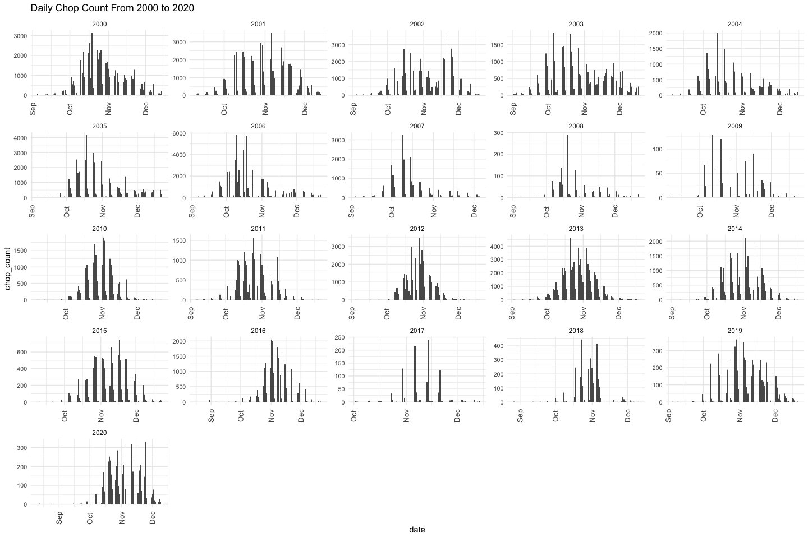
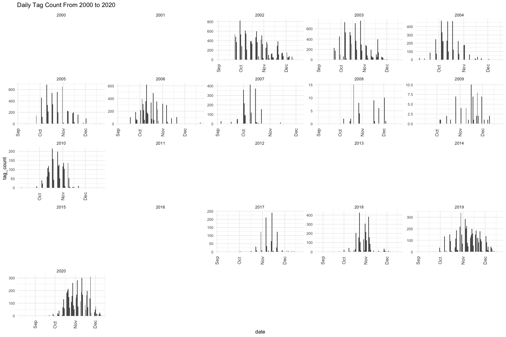

Feather Carcass QC
================
Inigo Peng
2022-08-18

# Feather River Carcass Data

## Description of Monitoring Data

**Timeframe:** 2000 to 2020

**Video Season:**

**Completeness of Record throughout timeframe:**

- Data collected varies between different seasons. Coded wire tag (CWT)
  data has the highest variability. Collection of `Chop Recovery` data
  was collected from 2000-2010 and 2017-2020. Earlier years have more
  detailed `chops` data and have separate table for `tags` data; later
  `chops` data and `tags` data combine into one. Tables from 2017-2020
  include a `chop` table with multiple count values per row, a
  `chop_and_tags` table with individual counts, and a `chop recovery`
  table.

**Sampling Location:** Various sampling locations on Feather River

**Data Contact:**

## Access Cloud Data

``` r
# Run Sys.setenv() to specify GCS_AUTH_FILE and GCS_DEFAULT_BUCKET before running 
# getwd() to see how to specify paths 
# Open object from google cloud storage
# Set your authentication using gcs_auth
gcs_auth(json_file = Sys.getenv("GCS_AUTH_FILE"))
# Set global bucket 
gcs_global_bucket(bucket = Sys.getenv("GCS_DEFAULT_BUCKET"))

# git data and save as xlsx
```

``` r
read_from_cloud <- function(carcass_data_type, year){
  gcs_get_object(object_name = paste0("adult-holding-redd-and-carcass-surveys/feather-river/data/feather_carcass_",carcass_data_type, "_",year, ".csv"),
               bucket = gcs_get_global_bucket(),
               saveToDisk = paste0("data-raw/qc-markdowns/adult-holding-redd-and-carcass-surveys/feather-river/feather_carcass_",carcass_data_type,"_",year, ".csv"),
               overwrite = TRUE)
  data <- read.csv(paste0("data-raw/qc-markdowns/adult-holding-redd-and-carcass-surveys/feather-river/feather_carcass_",carcass_data_type, "_", year, ".csv"))  
}
```

## Chops and Tags

- Note that within the Chops and Tags data some years have tables titled
  `chops` while others are titled `chops_and_tags`. For 2017-2020 data,
  `chops` and `chops_and_tags` are separate tables and here we read in
  `chops_and_tags` for the most overlap of variables.

### 2000 Chops and Tags

- 2000 and 2001 chops and tags are in different tables so they have to
  be joined.
- 2000 grilse has sex information

``` r
feather_carcass_chops_2000 <- read_from_cloud("chops", 2000) %>% 
  rename(adult_male = "male_chop",
         adult_female = "female_chop",
         sec = "sect") %>% 
  pivot_longer(cols = c("adult_male", "adult_female", "grilse_male",
                        "grilse_female"),
               names_to = c("lifestage", "sex"),
               names_sep ="_",
               values_to = "chop_count") %>% 
  mutate(chop_clip_status = "unknown",
           tag_clip_status = "unknown")

feather_carcass_tags_2000 <- read_from_cloud("tags", 2000) %>% 
  mutate(tag_count = 1)

# this only joins on "sex" - I don't think that is robust 
# further, not sure that renaming recov_id is accurate here? that's why we are getting id values that are NA bc of the join
# TODO: go back into 2000 .Rmd and figure out if there is tag data w/ ids and dates (better for joining on)
feather_carcass_chops_and_tags_2000 <- full_join(feather_carcass_chops_2000, feather_carcass_tags_2000 ) %>%
  select(-c(chop_env_id, egg_ret, fl, tag_num)) %>%
  mutate(sex = case_when(
    sex == "m" ~ "male",
    sex == "f" ~ "female",
    TRUE ~ sex
  )) %>%
  rename(id = "recov_id") %>% glimpse()
```

    ## Rows: 10,580
    ## Columns: 12
    ## $ date             <chr> "2000-09-05", "2000-09-05", "2000-09-05", "2000-09-05…
    ## $ tag_col          <chr> "pink", "pink", "pink", "pink", "pink", "pink", "pink…
    ## $ sec              <int> 4, 4, 4, 4, 4, 4, 4, 4, 4, 4, 4, 4, 4, 4, 4, 4, 4, 4,…
    ## $ unit             <int> 1, 1, 1, 1, 2, 2, 2, 2, 3, 3, 3, 3, 4, 4, 4, 4, 5, 5,…
    ## $ lifestage        <chr> "adult", "adult", "grilse", "grilse", "adult", "adult…
    ## $ sex              <chr> "male", "female", "male", "female", "male", "female",…
    ## $ chop_count       <int> 0, 0, 0, 0, 0, 0, 0, 0, 0, 0, 0, 0, 0, 0, 0, 0, 0, 0,…
    ## $ chop_clip_status <chr> "unknown", "unknown", "unknown", "unknown", "unknown"…
    ## $ tag_clip_status  <chr> "unknown", "unknown", "unknown", "unknown", "unknown"…
    ## $ sect             <int> NA, NA, NA, NA, NA, NA, NA, NA, NA, NA, NA, NA, NA, N…
    ## $ id               <int> NA, NA, NA, NA, NA, NA, NA, NA, NA, NA, NA, NA, NA, N…
    ## $ tag_count        <dbl> NA, NA, NA, NA, NA, NA, NA, NA, NA, NA, NA, NA, NA, N…

``` r
# does not contain tag_clip_status, chop_clip_status, or tag_count in data
```

### 2001 Chops and Tags

``` r
feather_carcass_chops_2001 <- read_from_cloud("chops", 2001) %>% 
  rename(adult_male = "male_chop",
         adult_female = "female_chop",
         grilse_unknown = "grilse",
         sec = "sect") %>% 
  pivot_longer(cols = c("adult_male", "adult_female", "grilse_unknown"),
               names_to = c("lifestage", "sex"),
               names_sep ="_",
               values_to = "chop_count") %>% 
  mutate(chop_clip_status = "unknown",
           tag_clip_status = "unknown")

feather_carcass_tags_2001 <- read_from_cloud("tags", 2001) %>% 
  mutate(tag_count = 1)

# joining on recov_id, sex
# renaming recov_id to id (is that accurate with other datasets?)
feather_carcass_chops_and_tags_2001 <- full_join(feather_carcass_chops_2001, feather_carcass_tags_2001 ) %>% 
  select(-c(chop_env_id, egg_ret, fl, tag_num, sect)) %>%  
  rename(id = recov_id) %>% 
  mutate(sex = case_when(
    sex == "m" ~ "male",
    sex == "f" ~ "female", 
    sex == "x" ~ "unknown",
    TRUE ~ sex
  )) %>% glimpse()
```

    ## Rows: 14,114
    ## Columns: 11
    ## $ date             <chr> "2001-09-10", "2001-09-10", "2001-09-10", "2001-09-10…
    ## $ sec              <int> 1, 1, 1, 1, 1, 1, 1, 1, 1, 3, 3, 3, 3, 3, 3, 3, 3, 3,…
    ## $ chan             <chr> "l", "l", "l", "m", "m", "m", "r", "r", "r", "l", "l"…
    ## $ min              <dbl> 0, 0, 0, 19, 19, 19, 0, 0, 0, 7, 7, 7, 10, 10, 10, 5,…
    ## $ id               <int> 1, 1, 1, 2, 2, 2, 3, 3, 3, 4, 4, 4, 5, 5, 5, 6, 6, 6,…
    ## $ lifestage        <chr> "adult", "adult", "grilse", "adult", "adult", "grilse…
    ## $ sex              <chr> "male", "female", "unknown", "male", "female", "unkno…
    ## $ chop_count       <int> 0, 0, 0, 0, 0, 0, 0, 0, 0, 0, 0, 0, 0, 0, 0, 0, 0, 0,…
    ## $ chop_clip_status <chr> "unknown", "unknown", "unknown", "unknown", "unknown"…
    ## $ tag_clip_status  <chr> "unknown", "unknown", "unknown", "unknown", "unknown"…
    ## $ tag_count        <dbl> NA, NA, NA, NA, NA, NA, NA, NA, NA, NA, NA, NA, NA, N…

``` r
# does not contain tag_clip_status, chop_clip_status, or tag_count in data
```

### 2002 Chops and Tags

- 2002 - 2004 dataset contains columns contains sex (m or f) and
  lifestage (grilse)

``` r
# assuming all male and female are adults
# assuming grilse was not double counted ontop of male and female
feather_carcass_chops_and_tags_2002 <- read_from_cloud("chops_and_tags", 2002) %>% 
  rename(adult_male = "male_chop",
         adult_female = "female_chop",
         grilse_unknown = "grilse",
         sec = "sect") %>%
  pivot_longer(cols = c("adult_male", "adult_female", "grilse_unknown"),
               names_to = c("lifestage", "sex"),
               names_sep ="_",
               values_to = "chop_count") %>% 
  mutate(chop_clip_status = "unknown",
           tag_clip_status = "unknown") %>% glimpse
```

    ## Rows: 12,810
    ## Columns: 13
    ## $ header_id        <int> 1, 1, 1, 1, 1, 1, 1, 1, 1, 2, 2, 2, 2, 2, 2, 2, 2, 2,…
    ## $ tag_col          <chr> "green 1", "green 1", "green 1", "green 1", "green 1"…
    ## $ date             <chr> "2002-09-03", "2002-09-03", "2002-09-03", "2002-09-03…
    ## $ chan_id          <int> 1, 1, 1, 2, 2, 2, 3, 3, 3, 4, 4, 4, 5, 5, 5, 6, 6, 6,…
    ## $ sec              <int> 10, 10, 10, 10, 10, 10, 10, 10, 10, 3, 3, 3, 3, 3, 3,…
    ## $ chan             <chr> "l", "l", "l", "m", "m", "m", "r", "r", "r", "l", "l"…
    ## $ min              <int> 15, 15, 15, 15, 15, 15, 15, 15, 15, 15, 15, 15, 15, 1…
    ## $ tag_count        <int> 0, 0, 0, 0, 0, 0, 0, 0, 0, 0, 0, 0, 0, 0, 0, 0, 0, 0,…
    ## $ lifestage        <chr> "adult", "adult", "grilse", "adult", "adult", "grilse…
    ## $ sex              <chr> "male", "female", "unknown", "male", "female", "unkno…
    ## $ chop_count       <int> 0, 0, 0, 0, 1, 0, 0, 0, 0, 1, 2, 0, 0, 0, 0, 0, 1, 0,…
    ## $ chop_clip_status <chr> "unknown", "unknown", "unknown", "unknown", "unknown"…
    ## $ tag_clip_status  <chr> "unknown", "unknown", "unknown", "unknown", "unknown"…

``` r
# does not contain tag_clip_status or chop_clip_status in data
```

### 2003 Chops and Tags

``` r
feather_carcass_chops_and_tags_2003 <- read_from_cloud("chops_and_tags",2003) %>% 
  rename(adult_male = "male_chop",
         adult_female = "female_chop",
         grilse_unknown = "grilse",
         sec = "sect") %>%
  pivot_longer(cols = c("adult_male", "adult_female", "grilse_unknown"),
               names_to = c("lifestage", "sex"),
               names_sep ="_",
               values_to = "chop_count") %>% 
  mutate(chop_clip_status = "unknown",
           tag_clip_status = "unknown") %>% glimpse
```

    ## Rows: 6,999
    ## Columns: 13
    ## $ header_id        <int> 1, 1, 1, 1, 1, 1, 1, 1, 1, 1, 1, 1, 1, 1, 1, 1, 1, 1,…
    ## $ tag_col          <chr> "orange and black", "orange and black", "orange and b…
    ## $ date             <chr> "2003-09-02", "2003-09-02", "2003-09-02", "2003-09-02…
    ## $ chan_id          <int> 1, 1, 1, 2, 2, 2, 3, 3, 3, 4, 4, 4, 5, 5, 5, 6, 6, 6,…
    ## $ sec              <int> 1, 1, 1, 1, 1, 1, 1, 1, 1, 3, 3, 3, 3, 3, 3, 3, 3, 3,…
    ## $ chan             <chr> "l", "l", "l", "m", "m", "m", "r", "r", "r", "l", "l"…
    ## $ min              <int> 14, 14, 14, 14, 14, 14, 13, 13, 13, 7, 7, 7, 8, 8, 8,…
    ## $ tag_count        <int> 0, 0, 0, 0, 0, 0, 0, 0, 0, 0, 0, 0, 0, 0, 0, 0, 0, 0,…
    ## $ lifestage        <chr> "adult", "adult", "grilse", "adult", "adult", "grilse…
    ## $ sex              <chr> "male", "female", "unknown", "male", "female", "unkno…
    ## $ chop_count       <int> 0, 2, 0, 0, 0, 0, 0, 0, 0, 0, 1, 0, 0, 0, 0, 0, 0, 0,…
    ## $ chop_clip_status <chr> "unknown", "unknown", "unknown", "unknown", "unknown"…
    ## $ tag_clip_status  <chr> "unknown", "unknown", "unknown", "unknown", "unknown"…

``` r
# does not contain tag_clip_status or chop_clip_status in data
```

### 2004 Chops and Tags

``` r
feather_carcass_chops_and_tags_2004 <- read_from_cloud("chops_and_tags",2004) %>% 
  rename(adult_male = "male_chop",
         adult_female = "female_chop",
         grilse_unknown = "grilse",
         sec = "sect") %>%
  pivot_longer(cols = c("adult_male", "adult_female", "grilse_unknown"),
               names_to = c("lifestage", "sex"),
               names_sep ="_",
               values_to = "chop_count") %>% 
    mutate(chop_clip_status = "unknown",
           tag_clip_status = "unknown") %>% glimpse
```

    ## Rows: 6,465
    ## Columns: 13
    ## $ header_id        <int> 346, 346, 346, 346, 346, 346, 346, 346, 346, 346, 346…
    ## $ tag_col          <chr> "orange1", "orange1", "orange1", "orange1", "orange1"…
    ## $ date             <chr> "2004-09-07", "2004-09-07", "2004-09-07", "2004-09-07…
    ## $ chan_id          <int> 2411, 2411, 2411, 2412, 2412, 2412, 2413, 2413, 2413,…
    ## $ sec              <int> 6, 6, 6, 6, 6, 6, 6, 6, 6, 7, 7, 7, 7, 7, 7, 7, 7, 7,…
    ## $ chan             <chr> "l", "l", "l", "m", "m", "m", "r", "r", "r", "l", "l"…
    ## $ min              <int> 2, 2, 2, 2, 2, 2, 2, 2, 2, 3, 3, 3, 3, 3, 3, 3, 3, 3,…
    ## $ tag_count        <int> 0, 0, 0, 0, 0, 0, 0, 0, 0, 0, 0, 0, 0, 0, 0, 0, 0, 0,…
    ## $ lifestage        <chr> "adult", "adult", "grilse", "adult", "adult", "grilse…
    ## $ sex              <chr> "male", "female", "unknown", "male", "female", "unkno…
    ## $ chop_count       <int> 0, 0, 0, 0, 0, 0, 0, 0, 0, 0, 0, 0, 0, 0, 0, 0, 0, 0,…
    ## $ chop_clip_status <chr> "unknown", "unknown", "unknown", "unknown", "unknown"…
    ## $ tag_clip_status  <chr> "unknown", "unknown", "unknown", "unknown", "unknown"…

``` r
# does not contain tag_clip_status or chop_clip_status in data
```

### 2005 Chops and Tags

- 2005 - 2007 data set dropped sex and lifestage and instead contains
  clip status

``` r
feather_carcass_chops_and_tags_2005 <- read_from_cloud("chops_and_tags",2005) %>% 
  pivot_longer(cols = c("chop_clip", "chop_n_clip", "chop_uncheck"),
               names_to = "chop_clip_status",
               values_to = "chop_count") %>% 
  mutate(chop_clip_status = case_when(
    chop_clip_status == "chop_clip" ~ "yes",
    chop_clip_status == "chop_n_clip" ~ "no",
    chop_clip_status == "chop_uncheck" ~ "unknown")) %>% 
  pivot_longer(cols = c("tag_clip", "tag_n_clip", "tag_unk"),
               names_to = "tag_clip_status",
               values_to = "tag_count") %>% 
  mutate(tag_clip_status = case_when(
    tag_clip_status == "tag_clip" ~ "yes",
    tag_clip_status == "tag_n_clip" ~ "no",
    tag_clip_status == "tag_unk" ~ "unknown")) %>%
  mutate(sex = "unknown",
         lifestage = "unknown") %>%
  rename(sec = "sect") %>% 
  glimpse()
```

    ## Rows: 22,005
    ## Columns: 13
    ## $ header_id        <int> 346, 346, 346, 346, 346, 346, 346, 346, 346, 619, 619…
    ## $ tag_col          <chr> "red1", "red1", "red1", "red1", "red1", "red1", "red1…
    ## $ date             <chr> "2005-10-31", "2005-10-31", "2005-10-31", "2005-10-31…
    ## $ chan_id          <int> 2492, 2492, 2492, 2492, 2492, 2492, 2492, 2492, 2492,…
    ## $ sec              <int> 1, 1, 1, 1, 1, 1, 1, 1, 1, 30, 30, 30, 30, 30, 30, 30…
    ## $ chan             <chr> "l", "l", "l", "l", "l", "l", "l", "l", "l", "m", "m"…
    ## $ min              <int> 3, 3, 3, 3, 3, 3, 3, 3, 3, 10, 10, 10, 10, 10, 10, 10…
    ## $ chop_clip_status <chr> "yes", "yes", "yes", "no", "no", "no", "unknown", "un…
    ## $ chop_count       <int> 0, 0, 0, 0, 0, 0, 0, 0, 0, 0, 0, 0, 0, 0, 0, 0, 0, 0,…
    ## $ tag_clip_status  <chr> "yes", "no", "unknown", "yes", "no", "unknown", "yes"…
    ## $ tag_count        <int> 0, 0, 0, 0, 0, 0, 0, 0, 0, 0, 0, 0, 0, 0, 0, 0, 0, 0,…
    ## $ sex              <chr> "unknown", "unknown", "unknown", "unknown", "unknown"…
    ## $ lifestage        <chr> "unknown", "unknown", "unknown", "unknown", "unknown"…

``` r
# does not contain sex or lifestage in data
```

### 2006 Chops and Tags

``` r
feather_carcass_chops_and_tags_2006 <- read_from_cloud("chops_and_tags",2006) %>% 
  pivot_longer(cols = c("chop_clip", "chop_n_clip", "chop_uncheck"),
               names_to = "chop_clip_status",
               values_to = "chop_count") %>% 
  mutate(chop_clip_status = case_when(
    chop_clip_status == "chop_clip" ~ "yes",
    chop_clip_status == "chop_n_clip" ~ "no",
    chop_clip_status == "chop_uncheck" ~ "unknown")) %>% 
  pivot_longer(cols = c("tag_clip", "tag_n_clip", "tag_unk"),
               names_to = "tag_clip_status",
               values_to = "tag_count") %>% 
  mutate(tag_clip_status = case_when(
    tag_clip_status == "tag_clip" ~ "yes",
    tag_clip_status == "tag_n_clip" ~ "no",
    tag_clip_status == "tag_unk" ~ "unknown")) %>%
  mutate(sex = "unknown",
         lifestage = "unknown",
         tag_col = as.character(tag_col)) %>% 
  rename(sec = "sect") %>% 
  glimpse()
```

    ## Rows: 20,241
    ## Columns: 13
    ## $ header_id        <int> 671, 671, 671, 671, 671, 671, 671, 671, 671, 671, 671…
    ## $ tag_col          <chr> "3", "3", "3", "3", "3", "3", "3", "3", "3", "3", "3"…
    ## $ date             <chr> "2006-09-19", "2006-09-19", "2006-09-19", "2006-09-19…
    ## $ chan_id          <int> 2845, 2845, 2845, 2845, 2845, 2845, 2845, 2845, 2845,…
    ## $ sec              <int> 11, 11, 11, 11, 11, 11, 11, 11, 11, 11, 11, 11, 11, 1…
    ## $ chan             <chr> "m", "m", "m", "m", "m", "m", "m", "m", "m", "r", "r"…
    ## $ min              <int> 5, 5, 5, 5, 5, 5, 5, 5, 5, 15, 15, 15, 15, 15, 15, 15…
    ## $ chop_clip_status <chr> "yes", "yes", "yes", "no", "no", "no", "unknown", "un…
    ## $ chop_count       <int> 0, 0, 0, 0, 0, 0, 0, 0, 0, 0, 0, 0, 0, 0, 0, 23, 23, …
    ## $ tag_clip_status  <chr> "yes", "no", "unknown", "yes", "no", "unknown", "yes"…
    ## $ tag_count        <int> 0, 0, 0, 0, 0, 0, 0, 0, 0, 0, 0, 0, 0, 0, 0, 0, 0, 0,…
    ## $ sex              <chr> "unknown", "unknown", "unknown", "unknown", "unknown"…
    ## $ lifestage        <chr> "unknown", "unknown", "unknown", "unknown", "unknown"…

``` r
# does not contain sex or lifestage in data
```

### 2007 Chops and Tags

``` r
feather_carcass_chops_and_tags_2007 <- read_from_cloud("chops_and_tags",2007) %>% 
  pivot_longer(cols = c("chop_clip", "chop_n_clip", "chop_uncheck"),
               names_to = "chop_clip_status",
               values_to = "chop_count") %>% 
  mutate(chop_clip_status = case_when(
    chop_clip_status == "chop_clip" ~ "yes",
    chop_clip_status == "chop_n_clip" ~ "no",
    chop_clip_status == "chop_uncheck" ~ "unknown")) %>% 
  pivot_longer(cols = c("tag_clip", "tag_n_clip", "tag_unk"),
               names_to = "tag_clip_status",
               values_to = "tag_count") %>% 
  mutate(tag_clip_status = case_when(
    tag_clip_status == "tag_clip" ~ "yes",
    tag_clip_status == "tag_n_clip" ~ "no",
    tag_clip_status == "tag_unk" ~ "unknown")) %>%
  mutate(sex = "unknown",
         lifestage = "unknown",
         tag_col = as.character(tag_col)) %>% 
  rename(sec = "sect") %>% 
  glimpse()
```

    ## Rows: 14,553
    ## Columns: 13
    ## $ header_id        <int> 1, 1, 1, 1, 1, 1, 1, 1, 1, 1, 1, 1, 1, 1, 1, 1, 1, 1,…
    ## $ tag_col          <chr> "1", "1", "1", "1", "1", "1", "1", "1", "1", "1", "1"…
    ## $ date             <chr> "2007-09-04", "2007-09-04", "2007-09-04", "2007-09-04…
    ## $ chan_id          <int> 1, 1, 1, 1, 1, 1, 1, 1, 1, 2, 2, 2, 2, 2, 2, 2, 2, 2,…
    ## $ sec              <int> 1, 1, 1, 1, 1, 1, 1, 1, 1, 1, 1, 1, 1, 1, 1, 1, 1, 1,…
    ## $ chan             <chr> "l", "l", "l", "l", "l", "l", "l", "l", "l", "r", "r"…
    ## $ min              <int> NA, NA, NA, NA, NA, NA, NA, NA, NA, NA, NA, NA, NA, N…
    ## $ chop_clip_status <chr> "yes", "yes", "yes", "no", "no", "no", "unknown", "un…
    ## $ chop_count       <int> 0, 0, 0, 0, 0, 0, 1, 1, 1, 0, 0, 0, 0, 0, 0, 1, 1, 1,…
    ## $ tag_clip_status  <chr> "yes", "no", "unknown", "yes", "no", "unknown", "yes"…
    ## $ tag_count        <int> 0, 0, 0, 0, 0, 0, 0, 0, 0, 0, 0, 0, 0, 0, 0, 0, 0, 0,…
    ## $ sex              <chr> "unknown", "unknown", "unknown", "unknown", "unknown"…
    ## $ lifestage        <chr> "unknown", "unknown", "unknown", "unknown", "unknown"…

``` r
# does not contain sex, lifestage in data
```

### 2008 Chops and Tags

- 2008 - 2016 (except for 2010) dataset dropped clip status and only has
  chop count and tag count

``` r
feather_carcass_chops_and_tags_2008 <- read_from_cloud("chops_and_tags",2008) %>% 
  rename(chop_count = "chops",
         tag_count = "tags") %>% 
  mutate(chop_clip_status = "unknown",
         tag_clip_status = "unknown",
         sex = "unknown",
         lifestage = "unknown",
         tag_col = as.character(tag_col)) %>% 
  rename(sec = "sect") %>% 
glimpse
```

    ## Rows: 1,898
    ## Columns: 13
    ## $ header_id        <int> 78, 78, 78, 78, 78, 78, 78, 78, 78, 78, 78, 78, 78, 7…
    ## $ tag_col          <chr> "1", "1", "1", "1", "1", "1", "1", "1", "1", "1", "1"…
    ## $ date             <chr> "2008-09-03", "2008-09-03", "2008-09-03", "2008-09-03…
    ## $ chan_id          <int> 1682, 1683, 1684, 1685, 1686, 1687, 1688, 1689, 1690,…
    ## $ sec              <int> 39, 39, 39, 38, 38, 38, 37, 37, 37, 36, 36, 36, 35, 3…
    ## $ chan             <chr> "r", "l", "m", "l", "m", "r", "l", "m", "r", "m", "r"…
    ## $ min              <int> 10, 6, 3, 5, 4, 4, 2, 3, 2, 0, 4, 5, 0, 4, 4, 10, 0, …
    ## $ chop_count       <int> 0, 0, 0, 0, 0, 0, 0, 0, 0, 0, 0, 0, 0, 0, 0, 0, 0, 0,…
    ## $ tag_count        <int> 0, 0, 0, 0, 0, 0, 0, 0, 0, 0, 0, 0, 0, 0, 0, 0, 0, 0,…
    ## $ chop_clip_status <chr> "unknown", "unknown", "unknown", "unknown", "unknown"…
    ## $ tag_clip_status  <chr> "unknown", "unknown", "unknown", "unknown", "unknown"…
    ## $ sex              <chr> "unknown", "unknown", "unknown", "unknown", "unknown"…
    ## $ lifestage        <chr> "unknown", "unknown", "unknown", "unknown", "unknown"…

``` r
# does not contain sex, lifestage, chop_clip_status, tag_clip_status in data
```

### 2009 Chops and Tags

``` r
feather_carcass_chops_and_tags_2009 <- read_from_cloud("chops_and_tags",2009) %>% 
  rename(chop_count = "chops",
         tag_count = "tags") %>% 
  mutate(chop_clip_status = "unknown",
         tag_clip_status = "unknown",
         sex = "unknown",
         lifestage = "unknown",
         tag_col = as.character(tag_col)) %>% 
  rename(sec = "sect") %>% 
glimpse()
```

    ## Rows: 1,936
    ## Columns: 13
    ## $ header_id        <int> 1, 1, 1, 1, 1, 1, 1, 1, 1, 1, 1, 1, 1, 1, 1, 1, 1, 1,…
    ## $ tag_col          <chr> "1", "1", "1", "1", "1", "1", "1", "1", "1", "1", "1"…
    ## $ date             <chr> "2009-09-08", "2009-09-08", "2009-09-08", "2009-09-08…
    ## $ chan_id          <int> 1, 2, 3, 4, 5, 6, 7, 8, 9, 10, 11, 12, 13, 14, 15, 16…
    ## $ sec              <int> 1, 1, 1, 2, 2, 2, 3, 3, 3, 4, 4, 4, 6, 6, 6, 5, 5, 5,…
    ## $ chan             <chr> "l", "m", "r", "l", "m", "r", "l", "m", "r", "l", "m"…
    ## $ min              <int> 5, 4, 5, 3, 3, 3, 3, 2, 3, 2, 1, 1, 2, 2, 2, 5, 5, 5,…
    ## $ chop_count       <int> 0, 0, 0, 0, 0, 0, 0, 0, 0, 0, 0, 0, 0, 0, 0, 0, 0, 0,…
    ## $ tag_count        <int> 0, 0, 0, 0, 0, 0, 0, 0, 0, 0, 0, 0, 0, 0, 0, 0, 0, 0,…
    ## $ chop_clip_status <chr> "unknown", "unknown", "unknown", "unknown", "unknown"…
    ## $ tag_clip_status  <chr> "unknown", "unknown", "unknown", "unknown", "unknown"…
    ## $ sex              <chr> "unknown", "unknown", "unknown", "unknown", "unknown"…
    ## $ lifestage        <chr> "unknown", "unknown", "unknown", "unknown", "unknown"…

``` r
# does not contain sex, lifestage, chop_clip_status, tag_clip_status in data
```

### 2010 Chops and Tags

- 2010 has sex in dataset

``` r
# structure of 2010 chops_and_tags dataset has variables for tag count by sex and chop count by sex; this makes it difficult because to pivot_longer, you get two separate sex columns (one for tag count and one for chop count) that don't align by rows perfectly. To create one sex column we pivot the chop_count by sex and the tag_count by sex separately, then join on all common variables: sex, id, tag color, date, channel id, section, channel, and min.

feather_carcass_chops_and_tags_2010_raw <- read_from_cloud("chops_and_tags",2010)

# wrangle chops by sex to have chop_count and sex columns
feather_carcass_chops_sex_2010 <- feather_carcass_chops_and_tags_2010_raw %>%
  pivot_longer(cols = c("male_chop", "female_chop", "unknown_chops"),
               names_to = "sex",
               values_to = "chop_count") %>%
  mutate(sex = case_when(
    sex == "male_chop" ~ "male",
    sex == "female_chop" ~ "female",
    sex == "unknown_chops" ~ "unknown")) %>% 
  select(-c(unknown_tags, female_tag, male_tag))

# wrangle tags by sex to have tag_count and sex columns
feather_carcass_tags_sex_2010 <- feather_carcass_chops_and_tags_2010_raw |>
  pivot_longer(cols = c("male_tag", "female_tag", "unknown_tags"),
                 names_to = "sex",
                 values_to = "tag_count") |> 
  mutate(sex = case_when(
         sex == "male_tag" ~ "male",
         sex == "female_tag" ~ "female",
         sex == "unknown_tags" ~ "unknown")) |> 
  select(-c(unknown_chops, male_chop, female_chop))

# join tag_count and chop_count by sex and all other common variables
# add columns for chop_clip_status and lifestage, which are both not in 
# the 2010 dataset but are necessary for combining all datasets
feather_carcass_chops_and_tags_2010 <- feather_carcass_chops_sex_2010 |> 
  full_join(feather_carcass_tags_sex_2010, by = c("header_id", "tag_col", "date",
                                                  "chan_id", "sect", "chan",
                                                  "min", "sex")) |> 
  mutate(chop_clip_status = "unknown",
         tag_clip_status = "unknown",
         lifestage = "unknown",
         tag_col = as.character(tag_col)) %>%
  rename(sec = sect) |> 
  glimpse()
```

    ## Rows: 6,369
    ## Columns: 13
    ## $ header_id        <int> 47, 47, 47, 47, 47, 47, 47, 47, 47, 47, 47, 47, 47, 4…
    ## $ tag_col          <chr> "1", "1", "1", "1", "1", "1", "1", "1", "1", "1", "1"…
    ## $ date             <chr> "2010-09-07", "2010-09-07", "2010-09-07", "2010-09-07…
    ## $ chan_id          <int> 1975, 1975, 1975, 1976, 1976, 1976, 1977, 1977, 1977,…
    ## $ sec              <int> 1, 1, 1, 1, 1, 1, 1, 1, 1, 2, 2, 2, 2, 2, 2, 2, 2, 2,…
    ## $ chan             <chr> "l", "l", "l", "m", "m", "m", "r", "r", "r", "l", "l"…
    ## $ min              <int> 5, 5, 5, 2, 2, 2, 6, 6, 6, 6, 6, 6, 5, 5, 5, 6, 6, 6,…
    ## $ sex              <chr> "male", "female", "unknown", "male", "female", "unkno…
    ## $ chop_count       <int> 0, 0, 0, 0, 0, 0, 0, 0, 0, 0, 0, 0, 0, 0, 0, 0, 0, 0,…
    ## $ tag_count        <int> 0, 0, 0, 0, 0, 0, 0, 0, 0, 0, 0, 0, 0, 0, 0, 0, 0, 0,…
    ## $ chop_clip_status <chr> "unknown", "unknown", "unknown", "unknown", "unknown"…
    ## $ tag_clip_status  <chr> "unknown", "unknown", "unknown", "unknown", "unknown"…
    ## $ lifestage        <chr> "unknown", "unknown", "unknown", "unknown", "unknown"…

``` r
# does not contain lifestage, tag_clip_status, or chop_clip_status in data
```

### 2011 Chops and Tags

- 2011-2016 does not have tags count

``` r
feather_carcass_chops_and_tags_2011 <- read_from_cloud("chops_and_tags",2011) %>% 
  rename(chop_count = "count",
         sec = sect) %>% 
  mutate(tag_count = NA,
         chop_clip_status = "unknown",
         tag_clip_status = "unknown",
         sex = "unknown",
         lifestage = "unknown") %>% glimpse()
```

    ## Rows: 1,269
    ## Columns: 10
    ## $ header_id        <int> 9, 9, 9, 9, 9, 9, 9, 9, 9, 9, 9, 9, 9, 9, 9, 10, 10, …
    ## $ date             <chr> "2011-09-06", "2011-09-06", "2011-09-06", "2011-09-06…
    ## $ sec              <int> 3, 2, 4, 6, 7, 5, 8, 9, 10, 11, 12, 13, 14, 15, 1, 16…
    ## $ min              <int> 900, 1500, 600, 600, 900, 1200, 1240, 613, 3740, 1800…
    ## $ chop_count       <int> 0, 0, 0, 0, 0, 0, 0, 0, 2, 1, 1, 0, 1, 0, 0, 1, 1, 2,…
    ## $ tag_count        <lgl> NA, NA, NA, NA, NA, NA, NA, NA, NA, NA, NA, NA, NA, N…
    ## $ chop_clip_status <chr> "unknown", "unknown", "unknown", "unknown", "unknown"…
    ## $ tag_clip_status  <chr> "unknown", "unknown", "unknown", "unknown", "unknown"…
    ## $ sex              <chr> "unknown", "unknown", "unknown", "unknown", "unknown"…
    ## $ lifestage        <chr> "unknown", "unknown", "unknown", "unknown", "unknown"…

``` r
# does not contain sex, lifestage, tag_clip_status, chop_clip_status, or tag_count in data
```

### 2012 Chops and Tags

``` r
feather_carcass_chops_and_tags_2012 <- read_from_cloud("chops_and_tags",2012) %>% 
  rename(chop_count = "count",
         sec = sect) %>% 
  mutate(tag_count = NA,
         chop_clip_status = "unknown",
         tag_clip_status = "unknown",
         sex = "unknown",
         lifestage = "unknown") %>% glimpse()
```

    ## Rows: 869
    ## Columns: 11
    ## $ header_id        <int> 73, 73, 73, 73, 73, 73, 73, 73, 73, 73, 73, 73, 73, 7…
    ## $ date             <chr> "2012-09-17", "2012-09-17", "2012-09-17", "2012-09-17…
    ## $ comments         <chr> NA, NA, NA, NA, NA, NA, NA, NA, NA, NA, NA, NA, NA, N…
    ## $ sec              <int> 1, 2, 3, 4, 5, 6, 7, 8, 9, 10, 11, 12, 13, 14, 15, 10…
    ## $ min              <int> 13, 10, 12, 4, 9, 13, 9, 10, 5, 22, 15, 25, 28, 15, 1…
    ## $ chop_count       <int> 0, 0, 0, 0, 0, 0, 0, 0, 0, 0, 0, 2, 0, 0, 0, 1, 0, 0,…
    ## $ tag_count        <lgl> NA, NA, NA, NA, NA, NA, NA, NA, NA, NA, NA, NA, NA, N…
    ## $ chop_clip_status <chr> "unknown", "unknown", "unknown", "unknown", "unknown"…
    ## $ tag_clip_status  <chr> "unknown", "unknown", "unknown", "unknown", "unknown"…
    ## $ sex              <chr> "unknown", "unknown", "unknown", "unknown", "unknown"…
    ## $ lifestage        <chr> "unknown", "unknown", "unknown", "unknown", "unknown"…

``` r
# does not contain sex, lifestage, tag_clip_status, chop_clip_status, or tag_count in data
```

### 2013 Chops and Tags

``` r
feather_carcass_chops_and_tags_2013 <- read_from_cloud("chops_and_tags",2013) %>% 
    rename(chop_count = "count",
           sec = sect) %>% 
  mutate(tag_count = NA,
         chop_clip_status = "unknown",
         tag_clip_status = "unknown",
         sex = "unknown",
         lifestage = "unknown") %>% glimpse
```

    ## Rows: 1,139
    ## Columns: 10
    ## $ header_id        <int> 1, 1, 1, 1, 1, 1, 1, 1, 1, 1, 1, 1, 1, 1, 2, 2, 2, 2,…
    ## $ date             <chr> "2013-09-03", "2013-09-03", "2013-09-03", "2013-09-03…
    ## $ sec              <int> 15, 14, 13, 12, 11, 10, 9, 8, 6, 4, 3, 1, 5, 7, 21, 2…
    ## $ min              <int> 15, 8, 20, 20, 30, 20, 8, 7, 3, 5, 5, 11, 7, 10, 47, …
    ## $ chop_count       <int> 0, 1, 0, 2, 5, 5, 0, 0, 0, 0, 0, 0, 1, 0, 2, 0, 0, 1,…
    ## $ tag_count        <lgl> NA, NA, NA, NA, NA, NA, NA, NA, NA, NA, NA, NA, NA, N…
    ## $ chop_clip_status <chr> "unknown", "unknown", "unknown", "unknown", "unknown"…
    ## $ tag_clip_status  <chr> "unknown", "unknown", "unknown", "unknown", "unknown"…
    ## $ sex              <chr> "unknown", "unknown", "unknown", "unknown", "unknown"…
    ## $ lifestage        <chr> "unknown", "unknown", "unknown", "unknown", "unknown"…

``` r
# does not contain sex, lifestage, tag_clip_status, chop_clip_status, or tag_count in data
```

### 2014 Chops and Tags

``` r
feather_carcass_chops_and_tags_2014 <- read_from_cloud("chops_and_tags",2014) %>% 
    rename(chop_count = "count",
           sec = sect) %>%
  mutate(tag_count = NA,
         chop_clip_status = "unknown",
         tag_clip_status = "unknown",
         sex = "unknown",
         lifestage = "unknown") %>% glimpse
```

    ## Rows: 1,056
    ## Columns: 10
    ## $ header_id        <int> 176, 176, 176, 176, 176, 176, 176, 176, 176, 176, 176…
    ## $ date             <chr> "2014-09-08", "2014-09-08", "2014-09-08", "2014-09-08…
    ## $ sec              <int> 15, 14, 13, 12, 11, 10, 9, 8, 6, 4, 2, 3, 1, 15, 14, …
    ## $ min              <int> 18, 12, 12, 11, 11, 23, 12, 10, 2, 3, 10, 4, 5, 22, 9…
    ## $ chop_count       <int> 0, 0, 0, 0, 0, 0, 0, 0, 0, 0, 0, 0, 0, 0, 0, 0, 2, 1,…
    ## $ tag_count        <lgl> NA, NA, NA, NA, NA, NA, NA, NA, NA, NA, NA, NA, NA, N…
    ## $ chop_clip_status <chr> "unknown", "unknown", "unknown", "unknown", "unknown"…
    ## $ tag_clip_status  <chr> "unknown", "unknown", "unknown", "unknown", "unknown"…
    ## $ sex              <chr> "unknown", "unknown", "unknown", "unknown", "unknown"…
    ## $ lifestage        <chr> "unknown", "unknown", "unknown", "unknown", "unknown"…

``` r
# does not contain sex, lifestage, tag_clip_status, chop_clip_status, or tag_count in data
```

### 2015 Chops and Tags

``` r
feather_carcass_chops_and_tags_2015 <- read_from_cloud("chops_and_tags",2015) %>% 
  rename(chop_count = "count",
         sec = sect) %>% 
  mutate(tag_count = NA,
         chop_clip_status = "unknown",
         tag_clip_status = "unknown",
         sex = "unknown",
         lifestage = "unknown") %>% glimpse
```

    ## Rows: 813
    ## Columns: 10
    ## $ header_id        <int> 317, 317, 317, 317, 317, 317, 317, 317, 318, 318, 318…
    ## $ date             <chr> "2015-09-17", "2015-09-17", "2015-09-17", "2015-09-17…
    ## $ sec              <int> 34, 33, 32, 31, 30, 29, 28, 27, 15, 14, 13, 12, 11, 1…
    ## $ min              <int> 23, 26, 16, 5, 11, 8, 8, 5, 20, 18, 16, 17, 17, 21, 8…
    ## $ chop_count       <int> 0, 0, 0, 0, 0, 0, 0, 0, 0, 0, 0, 0, 1, 0, 1, 0, 0, 0,…
    ## $ tag_count        <lgl> NA, NA, NA, NA, NA, NA, NA, NA, NA, NA, NA, NA, NA, N…
    ## $ chop_clip_status <chr> "unknown", "unknown", "unknown", "unknown", "unknown"…
    ## $ tag_clip_status  <chr> "unknown", "unknown", "unknown", "unknown", "unknown"…
    ## $ sex              <chr> "unknown", "unknown", "unknown", "unknown", "unknown"…
    ## $ lifestage        <chr> "unknown", "unknown", "unknown", "unknown", "unknown"…

``` r
# does not contain sex, lifestage, tag_clip_status, chop_clip_status, or tag_count in data
```

### 2016 Chops and Tags

``` r
feather_carcass_chops_and_tags_2016 <- read_from_cloud("chops_and_tags",2016) %>% 
  rename(chop_count = "count",
         sec = sect) %>% 
  mutate(tag_count = NA,
         chop_clip_status = "unknown",
         tag_clip_status = "unknown",
         sex = "unknown",
         lifestage = "unknown") %>% glimpse
```

    ## Rows: 976
    ## Columns: 10
    ## $ header_id        <int> 1, 1, 1, 1, 1, 1, 1, 1, 1, 1, 1, 1, 2, 2, 2, 2, 2, 2,…
    ## $ date             <chr> "2016-08-17", "2016-08-17", "2016-08-17", "2016-08-17…
    ## $ sec              <int> 21, 20, 19, 18, 17, 16, 15, 14, 13, 12, 11, 10, 9, 8,…
    ## $ min              <int> 28, 10, 17, 8, 14, 27, 28, 28, 20, 12, 14, 25, 16, 10…
    ## $ chop_count       <int> 0, 0, 0, 0, 0, 0, 0, 0, 0, 0, 0, 0, 0, 0, 0, 0, 0, 0,…
    ## $ tag_count        <lgl> NA, NA, NA, NA, NA, NA, NA, NA, NA, NA, NA, NA, NA, N…
    ## $ chop_clip_status <chr> "unknown", "unknown", "unknown", "unknown", "unknown"…
    ## $ tag_clip_status  <chr> "unknown", "unknown", "unknown", "unknown", "unknown"…
    ## $ sex              <chr> "unknown", "unknown", "unknown", "unknown", "unknown"…
    ## $ lifestage        <chr> "unknown", "unknown", "unknown", "unknown", "unknown"…

``` r
# does not contain sex, lifestage, tag_clip_status, chop_clip_status, or tag_count in data
```

### 2017-2020 Chops and Tags

``` r
feather_carcass_chops_and_tags_2017_2021 <- read_from_cloud("chops_and_tags","2017_2021") |> 
  rename(chop_count = count,
         header_id = survey_meta_id,
         sec = section_id,
         chop_clip_status = ad_fin_clip_status) |> 
  transmute(tag_count = NA,
            min = NA,
            tag_clip_status = NA,
            lifestage = NA,
            header_id, date, sec, chop_count, chop_clip_status, sex) |> 
    glimpse()
```

    ## Rows: 24,298
    ## Columns: 10
    ## $ tag_count        <lgl> NA, NA, NA, NA, NA, NA, NA, NA, NA, NA, NA, NA, NA, N…
    ## $ min              <lgl> NA, NA, NA, NA, NA, NA, NA, NA, NA, NA, NA, NA, NA, N…
    ## $ tag_clip_status  <lgl> NA, NA, NA, NA, NA, NA, NA, NA, NA, NA, NA, NA, NA, N…
    ## $ lifestage        <lgl> NA, NA, NA, NA, NA, NA, NA, NA, NA, NA, NA, NA, NA, N…
    ## $ header_id        <int> 70004, 70004, 70004, 70004, 70004, 70004, 70004, 7000…
    ## $ date             <chr> "2017-09-05", "2017-09-05", "2017-09-05", "2017-09-06…
    ## $ sec              <int> 17, 17, 17, 7, 7, 7, 1, 1, 1, 17, 17, 17, 17, 17, 17,…
    ## $ chop_count       <int> NA, NA, NA, NA, NA, NA, NA, NA, NA, NA, NA, NA, NA, N…
    ## $ chop_clip_status <chr> NA, NA, NA, NA, NA, NA, NA, NA, NA, NA, NA, NA, NA, N…
    ## $ sex              <chr> NA, NA, NA, NA, NA, NA, NA, NA, NA, NA, NA, NA, NA, N…

``` r
# does not contain tag_count, tag_clip_status, lifestage, or min
```

## Combined chops and tags

``` r
feather_carcass_chops_and_tags_combined <- bind_rows(feather_carcass_chops_and_tags_2000, 
          feather_carcass_chops_and_tags_2001, 
          feather_carcass_chops_and_tags_2002, 
          feather_carcass_chops_and_tags_2003,
          feather_carcass_chops_and_tags_2004,
          feather_carcass_chops_and_tags_2005,
          feather_carcass_chops_and_tags_2006,
          feather_carcass_chops_and_tags_2007,
          feather_carcass_chops_and_tags_2008,
          feather_carcass_chops_and_tags_2009,
          feather_carcass_chops_and_tags_2010,
          feather_carcass_chops_and_tags_2011,
          feather_carcass_chops_and_tags_2012,
          feather_carcass_chops_and_tags_2013,
          feather_carcass_chops_and_tags_2014,
          feather_carcass_chops_and_tags_2015,
          feather_carcass_chops_and_tags_2016,
          feather_carcass_chops_and_tags_2017_2021) |> 
  glimpse()
```

    ## Rows: 148,390
    ## Columns: 17
    ## $ date             <chr> "2000-09-05", "2000-09-05", "2000-09-05", "2000-09-05…
    ## $ tag_col          <chr> "pink", "pink", "pink", "pink", "pink", "pink", "pink…
    ## $ sec              <int> 4, 4, 4, 4, 4, 4, 4, 4, 4, 4, 4, 4, 4, 4, 4, 4, 4, 4,…
    ## $ unit             <int> 1, 1, 1, 1, 2, 2, 2, 2, 3, 3, 3, 3, 4, 4, 4, 4, 5, 5,…
    ## $ lifestage        <chr> "adult", "adult", "grilse", "grilse", "adult", "adult…
    ## $ sex              <chr> "male", "female", "male", "female", "male", "female",…
    ## $ chop_count       <int> 0, 0, 0, 0, 0, 0, 0, 0, 0, 0, 0, 0, 0, 0, 0, 0, 0, 0,…
    ## $ chop_clip_status <chr> "unknown", "unknown", "unknown", "unknown", "unknown"…
    ## $ tag_clip_status  <chr> "unknown", "unknown", "unknown", "unknown", "unknown"…
    ## $ sect             <int> NA, NA, NA, NA, NA, NA, NA, NA, NA, NA, NA, NA, NA, N…
    ## $ id               <int> NA, NA, NA, NA, NA, NA, NA, NA, NA, NA, NA, NA, NA, N…
    ## $ tag_count        <dbl> NA, NA, NA, NA, NA, NA, NA, NA, NA, NA, NA, NA, NA, N…
    ## $ chan             <chr> NA, NA, NA, NA, NA, NA, NA, NA, NA, NA, NA, NA, NA, N…
    ## $ min              <dbl> NA, NA, NA, NA, NA, NA, NA, NA, NA, NA, NA, NA, NA, N…
    ## $ header_id        <int> NA, NA, NA, NA, NA, NA, NA, NA, NA, NA, NA, NA, NA, N…
    ## $ chan_id          <int> NA, NA, NA, NA, NA, NA, NA, NA, NA, NA, NA, NA, NA, N…
    ## $ comments         <chr> NA, NA, NA, NA, NA, NA, NA, NA, NA, NA, NA, NA, NA, N…

### Summarization of variables by year

``` r
# add year for summarization
feather_carcass_chops_and_tags_combined <- feather_carcass_chops_and_tags_combined |> 
  mutate(year = year(date)) |> 
  filter(!is.na(date)) |> 
  select(-sect) # is empty

# number of observations
feather_carcass_chops_and_tags_combined |> 
  count(year) |> print(n=Inf)
```

    ## # A tibble: 21 × 2
    ##     year     n
    ##    <dbl> <int>
    ##  1  2000  4148
    ##  2  2001  9135
    ##  3  2002 12810
    ##  4  2003  6999
    ##  5  2004  6411
    ##  6  2005 22005
    ##  7  2006 20196
    ##  8  2007 14436
    ##  9  2008  1898
    ## 10  2009  1871
    ## 11  2010  6282
    ## 12  2011  1269
    ## 13  2012   869
    ## 14  2013  1104
    ## 15  2014  1056
    ## 16  2015   813
    ## 17  2016   976
    ## 18  2017  2768
    ## 19  2018  4320
    ## 20  2019  7468
    ## 21  2020  6160

``` r
# print nas
feather_carcass_chops_and_tags_combined |> 
  group_by(year) |> 
  summarize_all(funs(sum(is.na(.)) / length(.))) |> 
  print(n=Inf)
```

    ## # A tibble: 21 × 17
    ##     year  date tag_col     sec  unit lifes…¹   sex chop_…² chop_…³ tag_c…⁴    id
    ##    <dbl> <dbl>   <dbl>   <dbl> <dbl>   <dbl> <dbl>   <dbl>   <dbl>   <dbl> <dbl>
    ##  1  2000     0       0 0           0       0 0     0         0           0     1
    ##  2  2001     0       1 0           1       0 0     0         0           0     0
    ##  3  2002     0       0 7.03e-4     1       0 0     7.03e-4   0           0     1
    ##  4  2003     0       0 0           1       0 0     0         0           0     1
    ##  5  2004     0       0 0           1       0 0     2.06e-2   0           0     1
    ##  6  2005     0       0 1.23e-3     1       0 0     4.09e-4   0           0     1
    ##  7  2006     0       0 8.47e-3     1       0 0     3.12e-3   0           0     1
    ##  8  2007     0       0 3.12e-3     1       0 0     1.25e-3   0           0     1
    ##  9  2008     0       0 5.27e-4     1       0 0     1.05e-3   0           0     1
    ## 10  2009     0       0 2.14e-3     1       0 0     5.34e-4   0           0     1
    ## 11  2010     0       0 4.78e-4     1       0 0     1.75e-3   0           0     1
    ## 12  2011     0       1 0           1       0 0     3.15e-3   0           0     1
    ## 13  2012     0       1 5.75e-3     1       0 0     5.75e-3   0           0     1
    ## 14  2013     0       1 0           1       0 0     0         0           0     1
    ## 15  2014     0       1 2.84e-3     1       0 0     4.73e-3   0           0     1
    ## 16  2015     0       1 0           1       0 0     0         0           0     1
    ## 17  2016     0       1 1.02e-3     1       0 0     1.02e-3   0           0     1
    ## 18  2017     0       1 0           1       1 0.648 6.48e-1   0.648       1     1
    ## 19  2018     0       1 0           1       1 0.329 3.29e-1   0.329       1     1
    ## 20  2019     0       1 0           1       1 0.237 2.37e-1   0.237       1     1
    ## 21  2020     0       1 0           1       1 0.170 1.70e-1   0.170       1     1
    ## # … with 6 more variables: tag_count <dbl>, chan <dbl>, min <dbl>,
    ## #   header_id <dbl>, chan_id <dbl>, comments <dbl>, and abbreviated variable
    ## #   names ¹​lifestage, ²​chop_count, ³​chop_clip_status, ⁴​tag_clip_status

### Data Transformation

### Counts

The `feather_carcass_chops_and_tags_combined` table contains carcass
counts by chop/tagged based on clips

## Explore Numeric Variables:

### Variable: `header_id`, `chan_id`, `sec`, `min`, `id`, `unit`

``` r
feather_carcass_chops_and_tags_combined %>% 
  select_if(is.numeric) %>%
  colnames()
```

    ## [1] "sec"        "unit"       "chop_count" "id"         "tag_count" 
    ## [6] "min"        "header_id"  "chan_id"    "year"

``` r
summary(feather_carcass_chops_and_tags_combined$sec)
```

    ##    Min. 1st Qu.  Median    Mean 3rd Qu.    Max.    NA's 
    ##    1.00    9.00   18.00   19.74   30.00   48.00     269

``` r
summary(feather_carcass_chops_and_tags_combined$unit)
```

    ##    Min. 1st Qu.  Median    Mean 3rd Qu.    Max.    NA's 
    ##    1.00    2.00    5.00    5.26    8.00   12.00  128846

``` r
summary(feather_carcass_chops_and_tags_combined$min)
```

    ##    Min. 1st Qu.  Median    Mean 3rd Qu.    Max.    NA's 
    ##    0.00    5.00    8.00   32.19   15.00 9700.00   30914

``` r
summary(feather_carcass_chops_and_tags_combined$header_id)
```

    ##    Min. 1st Qu.  Median    Mean 3rd Qu.    Max.    NA's 
    ##       1     113     598   12478     779   70007   13283

``` r
summary(feather_carcass_chops_and_tags_combined$chan_id)
```

    ##    Min. 1st Qu.  Median    Mean 3rd Qu.    Max.    NA's 
    ##       1     964    2105    2856    3616   11449   40104

``` r
summary(feather_carcass_chops_and_tags_combined$id)
```

    ##    Min. 1st Qu.  Median    Mean 3rd Qu.    Max.    NA's 
    ##       1     763    1524    1526    2286    3055  123859

### Chop Variables: `chop_count`, `tag_count`

``` r
summary(feather_carcass_chops_and_tags_combined$chop_count)
```

    ##    Min. 1st Qu.  Median    Mean 3rd Qu.    Max.    NA's 
    ##   0.000   0.000   0.000   4.243   1.000 729.000    6296

``` r
summary(feather_carcass_chops_and_tags_combined$tag_count)
```

    ##    Min. 1st Qu.  Median    Mean 3rd Qu.    Max.    NA's 
    ##     0.0     0.0     0.0     0.4     0.0    34.0   40397

**NA and Unknown Values** Provide a stat on NA or unknown values.

``` r
round(sum(is.na(feather_carcass_chops_and_tags_combined$chop_count))/nrow(feather_carcass_chops_and_tags_combined), 3) * 100
```

    ## [1] 4.7

``` r
round(sum(is.na(feather_carcass_chops_and_tags_combined$tag_count))/nrow(feather_carcass_chops_and_tags_combined), 3) * 100
```

    ## [1] 30.4

``` r
round(sum(is.na(feather_carcass_chops_and_tags_combined$id))/nrow(feather_carcass_chops_and_tags_combined), 3) * 100
```

    ## [1] 93.1

``` r
round(sum(is.na(feather_carcass_chops_and_tags_combined$chop_clip_status))/nrow(feather_carcass_chops_and_tags_combined), 3) * 100
```

    ## [1] 4.5

``` r
round(sum(is.na(feather_carcass_chops_and_tags_combined$tag_clip_status))/nrow(feather_carcass_chops_and_tags_combined), 3) * 100
```

    ## [1] 15.6

``` r
round(sum(is.na(feather_carcass_chops_and_tags_combined$count))/nrow(feather_carcass_chops_and_tags_combined), 3) * 100
```

    ## [1] 0

- 4.7 % of values in the `chop_count` column are NA.
- 30.4 % of values in the `tag_count` column are NA.
- 93.1 % of values in the `id` column are NA.
- 4.5 % of values in the `chop_clip_status` column are NA.
- 15.6 % of values in the `tag_clip_status` column are NA.
- 0 % of values in the `count` column are NA.

**Plotting chops over Period of Record**

``` r
feather_carcass_chops_and_tags_combined %>% 
  mutate(date = as_date(date)) %>% 
  ggplot(aes(x = date, y = chop_count)) +
  geom_col() +
  facet_wrap(~year(date), scales = "free") +
  scale_x_date(labels = date_format("%b"), date_breaks = "1 month")+
  theme_minimal() +
  theme(axis.text.x = element_text(size = 10,angle = 90, vjust = 0.5, hjust=0.1)) +
  theme(axis.text.y = element_text(size = 8))+
  labs(title = "Daily Chop Count From 2000 to 2020")
```

<!-- -->

**Plotting tags over Period of Record**

``` r
feather_carcass_chops_and_tags_combined %>% 
  mutate(date = as_date(date),
         tag_count = as.numeric(tag_count)) %>%
  ggplot(aes(x = date, y = tag_count)) +
  geom_col() +
  facet_wrap(~year(date), scales = "free") +
  scale_x_date(labels = date_format("%b"), date_breaks = "1 month")+
  theme_minimal() +
  theme(axis.text.x = element_text(size = 10,angle = 90, vjust = 0.5, hjust=0.1)) +
  theme(axis.text.y = element_text(size = 8))+
  labs(title = "Daily Tag Count From 2000 to 2020")
```

<!-- -->

## Chop Recovery

- Chop Recovery tables are available for 2001-2004, 2006, and 2017-2020.

### 2001 Chop Recovery

- 2001 data contains chop recovery count by sex (`male`, `female`, and
  `grilse`). It does not contain data about `recovery tag color` or
  `channel id`.

``` r
feather_carcass_chop_recovery_2001 <- read_from_cloud("chop_recovery",2001) |> 
  pivot_longer(c(male_chop, female_chop, grilse), 
               names_to = "sex", 
               values_to = "recov_count") |> 
  mutate(sex = case_when(sex == "male_chop" ~ "male",
                         sex == "female_chop" ~ "female",
                         TRUE ~ sex),
         chan_id = NA_integer_,
         tag_col = NA_character_,
         recov_color = NA_character_) |> 
  rename(header_id = chop_env_id) |> 
  glimpse()
```

    ## Rows: 9,135
    ## Columns: 11
    ## $ date        <chr> "2001-09-10", "2001-09-10", "2001-09-10", "2001-09-10", "2…
    ## $ header_id   <int> 1, 1, 1, 1, 1, 1, 1, 1, 1, 1, 1, 1, 1, 1, 1, 1, 1, 1, 1, 1…
    ## $ sect        <int> 1, 1, 1, 1, 1, 1, 1, 1, 1, 3, 3, 3, 3, 3, 3, 3, 3, 3, 5, 5…
    ## $ chan        <chr> "l", "l", "l", "m", "m", "m", "r", "r", "r", "l", "l", "l"…
    ## $ min         <dbl> 0, 0, 0, 19, 19, 19, 0, 0, 0, 7, 7, 7, 10, 10, 10, 5, 5, 5…
    ## $ recov_id    <int> 1, 1, 1, 2, 2, 2, 3, 3, 3, 4, 4, 4, 5, 5, 5, 6, 6, 6, 7, 7…
    ## $ sex         <chr> "male", "female", "grilse", "male", "female", "grilse", "m…
    ## $ recov_count <int> 0, 0, 0, 0, 0, 0, 0, 0, 0, 0, 0, 0, 0, 0, 0, 0, 0, 0, 0, 0…
    ## $ chan_id     <int> NA, NA, NA, NA, NA, NA, NA, NA, NA, NA, NA, NA, NA, NA, NA…
    ## $ tag_col     <chr> NA, NA, NA, NA, NA, NA, NA, NA, NA, NA, NA, NA, NA, NA, NA…
    ## $ recov_color <chr> NA, NA, NA, NA, NA, NA, NA, NA, NA, NA, NA, NA, NA, NA, NA…

### 2002 Chop Recovery

- Chop recovery data from 2002-2004 and 2006 have the same format and
  variables.

``` r
feather_carcass_chop_recovery_2002 <- read_from_cloud("chop_recovery",2002) |> 
  glimpse()
```

    ## Rows: 6,176
    ## Columns: 10
    ## $ date        <chr> "2002-09-03", "2002-09-03", "2002-09-03", "2002-09-03", "2…
    ## $ sect        <int> 10, 10, 10, 3, 3, 3, 6, 6, 6, 8, 8, 8, 9, 9, 9, 6, 6, 6, 5…
    ## $ chan        <chr> "l", "m", "r", "l", "m", "r", "l", "m", "r", "l", "m", "r"…
    ## $ min         <int> 15, 15, 15, 15, 15, 15, 15, 15, 15, 15, 15, 15, 15, 15, 15…
    ## $ chan_id     <int> 1, 2, 3, 4, 5, 6, 7, 8, 9, 10, 11, 12, 13, 14, 15, 16, 17,…
    ## $ header_id   <int> 1, 1, 1, 2, 2, 2, 2, 2, 2, 2, 2, 2, 2, 2, 2, 3, 3, 3, 3, 3…
    ## $ tag_col     <chr> "green 1", "green 1", "green 1", "green 1", "green 1", "gr…
    ## $ recov_id    <int> NA, NA, NA, NA, NA, NA, NA, NA, NA, NA, NA, NA, NA, NA, NA…
    ## $ recov_color <chr> NA, NA, NA, NA, NA, NA, NA, NA, NA, NA, NA, NA, NA, NA, NA…
    ## $ recov_count <int> NA, NA, NA, NA, NA, NA, NA, NA, NA, NA, NA, NA, NA, NA, NA…

### 2003 Chop Recovery

``` r
feather_carcass_chop_recovery_2003 <- read_from_cloud("chop_recovery",2003) %>% 
  glimpse()
```

    ## Rows: 2,805
    ## Columns: 10
    ## $ date        <chr> "2003-09-02", "2003-09-02", "2003-09-02", "2003-09-02", "2…
    ## $ sect        <int> 1, 1, 1, 3, 3, 3, 5, 5, 5, 7, 7, 7, 9, 9, 9, 10, 10, 10, 1…
    ## $ chan        <chr> "l", "m", "r", "l", "m", "r", "l", "m", "r", "l", "m", "r"…
    ## $ min         <int> 14, 14, 13, 7, 8, 7, 2, 2, 2, 3, 3, 3, 6, 6, 6, 10, 5, 0, …
    ## $ chan_id     <int> 1, 2, 3, 4, 5, 6, 7, 8, 9, 10, 11, 12, 13, 14, 15, 16, 17,…
    ## $ header_id   <int> 1, 1, 1, 1, 1, 1, 1, 1, 1, 1, 1, 1, 2, 2, 2, 2, 2, 2, 2, 2…
    ## $ tag_col     <chr> "orange and black", "orange and black", "orange and black"…
    ## $ recov_id    <int> NA, NA, NA, NA, NA, NA, NA, NA, NA, NA, NA, NA, NA, NA, NA…
    ## $ recov_color <chr> NA, NA, NA, NA, NA, NA, NA, NA, NA, NA, NA, NA, NA, NA, NA…
    ## $ recov_count <int> NA, NA, NA, NA, NA, NA, NA, NA, NA, NA, NA, NA, NA, NA, NA…

### 2004 Chop Recovery

``` r
feather_carcass_chop_recovery_2004 <- read_from_cloud("chop_recovery",2004) %>% 
  glimpse()
```

    ## Rows: 2,627
    ## Columns: 10
    ## $ date        <chr> "2004-09-07", "2004-09-07", "2004-09-07", "2004-09-07", "2…
    ## $ sect        <int> 6, 6, 6, 7, 7, 7, 10, 10, 11, 11, 11, 8, 8, 8, 9, 9, 9, 10…
    ## $ chan        <chr> "l", "m", "r", "l", "m", "r", "l", "m", "l", "m", "r", "l"…
    ## $ min         <int> 2, 2, 2, 3, 3, 3, 1, 5, 4, 4, 4, 5, 5, 5, 4, 1, 4, 3, 7, 5…
    ## $ chan_id     <int> 2411, 2412, 2413, 2414, 2415, 2416, 2417, 2418, 2420, 2421…
    ## $ header_id   <int> 346, 346, 346, 346, 346, 346, 346, 346, 346, 346, 346, 347…
    ## $ tag_col     <chr> "orange1", "orange1", "orange1", "orange1", "orange1", "or…
    ## $ recov_id    <int> NA, NA, NA, NA, NA, NA, NA, NA, NA, NA, NA, NA, NA, NA, NA…
    ## $ recov_color <chr> NA, NA, NA, NA, NA, NA, NA, NA, NA, NA, NA, NA, NA, NA, NA…
    ## $ recov_count <int> NA, NA, NA, NA, NA, NA, NA, NA, NA, NA, NA, NA, NA, NA, NA…

### 2006 Chop Recovery

``` r
feather_carcass_chop_recovery_2006 <- read_from_cloud("chop_recovery",2006) |> 
  mutate(tag_col = as.character(tag_col),
         recov_color = as.character(recov_color)) |> 
  glimpse()
```

    ## Rows: 2,468
    ## Columns: 10
    ## $ date        <chr> "2006-09-19", "2006-09-19", "2006-09-19", "2006-09-19", "2…
    ## $ sect        <int> 11, 11, 12, 12, 13, 13, 14, 14, 15, 15, 16, 16, 17, 18, 18…
    ## $ chan        <chr> "m", "r", "m", "r", "m", "r", "m", "r", "m", "r", "m", "r"…
    ## $ min         <int> 5, 15, 15, 10, 10, 5, 11, 14, 20, 14, 5, 17, 20, 4, 7, 5, …
    ## $ chan_id     <int> 2845, 2846, 2847, 2848, 2849, 2850, 2851, 2852, 2853, 2854…
    ## $ header_id   <int> 671, 671, 671, 671, 671, 671, 671, 671, 671, 671, 671, 671…
    ## $ tag_col     <chr> "3", "3", "3", "3", "3", "3", "3", "3", "3", "3", "3", "3"…
    ## $ recov_id    <int> NA, 3762, NA, NA, NA, 3763, NA, NA, NA, NA, NA, NA, NA, NA…
    ## $ recov_count <int> NA, 2, NA, NA, NA, 1, NA, NA, NA, NA, NA, NA, NA, NA, NA, …
    ## $ recov_color <chr> NA, "2", NA, NA, NA, "2", NA, NA, NA, NA, NA, NA, NA, NA, …

### 2017-2020 Chop Recovery

- 2017-2020 Chop Recovery data contains variables not included in the
  other chop recovery tables like `sex` and `fork length`. It does not
  contain `channel_id`, `min`, or `recov_color`.

``` r
feather_carcass_chop_recovery_2017_2021 <- read_from_cloud("chop_recovery","2017_2021") |> 
  rename(sect = section_id,
         recov_id = recover_id,
         recov_count = count,
         header_id = survey_meta_id) |> 
  mutate(tag_col = as.character(tag_col),
         chan_id = NA_integer_,
         min = NA_integer_,
         recov_color = NA_character_) |> 
  select(-c(survey_id, tag_recovered, comments, data_recorder, creation_time,
            editor, edit_time, disposition, sex, fl_mm, fl_cm)) |> 
  glimpse()
```

    ## Rows: 12,951
    ## Columns: 9
    ## $ header_id   <int> 70004, 70004, 70004, 70004, 70004, 70004, 70004, 70004, 70…
    ## $ date        <chr> "2017-09-05", "2017-09-06", "2017-09-07", "2017-09-18", "2…
    ## $ sect        <int> 17, 7, 1, 17, 17, 16, 15, 14, 13, 12, 11, 10, 9, 8, 6, 4, …
    ## $ recov_id    <int> NA, NA, NA, NA, NA, NA, NA, NA, NA, NA, NA, NA, NA, NA, NA…
    ## $ recov_count <int> NA, NA, NA, NA, NA, NA, NA, NA, NA, NA, NA, NA, NA, NA, NA…
    ## $ tag_col     <chr> NA, NA, NA, NA, NA, NA, NA, NA, NA, NA, NA, NA, NA, NA, NA…
    ## $ chan_id     <int> NA, NA, NA, NA, NA, NA, NA, NA, NA, NA, NA, NA, NA, NA, NA…
    ## $ min         <int> NA, NA, NA, NA, NA, NA, NA, NA, NA, NA, NA, NA, NA, NA, NA…
    ## $ recov_color <chr> NA, NA, NA, NA, NA, NA, NA, NA, NA, NA, NA, NA, NA, NA, NA…

## Combined Chop Recovery

``` r
feather_carcass_chop_recovery_combined <- bind_rows(feather_carcass_chop_recovery_2001,
                                                    feather_carcass_chop_recovery_2002,
                                                    feather_carcass_chop_recovery_2003,
                                                    feather_carcass_chop_recovery_2004,
                                                    feather_carcass_chop_recovery_2006,
                                                    feather_carcass_chop_recovery_2017_2021
                                                    ) |> 
  glimpse()
```

    ## Rows: 36,162
    ## Columns: 11
    ## $ date        <chr> "2001-09-10", "2001-09-10", "2001-09-10", "2001-09-10", "2…
    ## $ header_id   <int> 1, 1, 1, 1, 1, 1, 1, 1, 1, 1, 1, 1, 1, 1, 1, 1, 1, 1, 1, 1…
    ## $ sect        <int> 1, 1, 1, 1, 1, 1, 1, 1, 1, 3, 3, 3, 3, 3, 3, 3, 3, 3, 5, 5…
    ## $ chan        <chr> "l", "l", "l", "m", "m", "m", "r", "r", "r", "l", "l", "l"…
    ## $ min         <dbl> 0, 0, 0, 19, 19, 19, 0, 0, 0, 7, 7, 7, 10, 10, 10, 5, 5, 5…
    ## $ recov_id    <int> 1, 1, 1, 2, 2, 2, 3, 3, 3, 4, 4, 4, 5, 5, 5, 6, 6, 6, 7, 7…
    ## $ sex         <chr> "male", "female", "grilse", "male", "female", "grilse", "m…
    ## $ recov_count <int> 0, 0, 0, 0, 0, 0, 0, 0, 0, 0, 0, 0, 0, 0, 0, 0, 0, 0, 0, 0…
    ## $ chan_id     <int> NA, NA, NA, NA, NA, NA, NA, NA, NA, NA, NA, NA, NA, NA, NA…
    ## $ tag_col     <chr> NA, NA, NA, NA, NA, NA, NA, NA, NA, NA, NA, NA, NA, NA, NA…
    ## $ recov_color <chr> NA, NA, NA, NA, NA, NA, NA, NA, NA, NA, NA, NA, NA, NA, NA…

### Summarization of variables by year

``` r
# add year for summarization
feather_carcass_chop_recovery_combined <- feather_carcass_chop_recovery_combined |> 
  mutate(year = year(date)) |> 
  filter(!is.na(date)) |> 
  select(-sect) # is empty

# number of observations
feather_carcass_chop_recovery_combined |> 
  count(year) |> print(n=Inf)
```

    ## # A tibble: 9 × 2
    ##    year     n
    ##   <dbl> <int>
    ## 1  2001  9135
    ## 2  2002  6176
    ## 3  2003  2805
    ## 4  2004  2590
    ## 5  2006  2453
    ## 6  2017  1184
    ## 7  2018  1959
    ## 8  2019  3826
    ## 9  2020  3108

``` r
# print nas
feather_carcass_chop_recovery_combined |> 
  group_by(year) |> 
  summarize_all(funs(sum(is.na(.)) / length(.))) |> 
  print(n=Inf)
```

    ## # A tibble: 9 × 11
    ##    year  date header_id     chan      min recov_id   sex recov…¹ chan_id tag_col
    ##   <dbl> <dbl>     <dbl>    <dbl>    <dbl>    <dbl> <dbl>   <dbl>   <dbl>   <dbl>
    ## 1  2001     0         0 0        0.000985    0         0   0     1   e+0       1
    ## 2  2002     0         0 0.000486 0.000486    0.448     1   0.448 4.86e-4       0
    ## 3  2003     0         0 0        0           0.479     1   0.479 0             0
    ## 4  2004     0         0 0.000386 0.0116      0.515     1   0.515 0             0
    ## 5  2006     0         0 0.00815  0.0326      0.693     1   0.694 4.08e-4       0
    ## 6  2017     0         0 1        1           0.531     1   0.531 1   e+0       1
    ## 7  2018     0         0 1        1           0.298     1   0.298 1   e+0       1
    ## 8  2019     0         0 1        1           0.199     1   0.199 1   e+0       1
    ## 9  2020     0         0 1        1           0.142     1   0.142 1   e+0       1
    ## # … with 1 more variable: recov_color <dbl>, and abbreviated variable name
    ## #   ¹​recov_count

### Data Transformation

### Counts

The `feather_carcass_chop_recovery_combined` table contains counts of
recovered carcasses.

## Explore Numeric Variables:

### Variable: `header_id`, `chan_id`, `sect`, `min`, `recov_id`

``` r
feather_carcass_chop_recovery_combined %>% 
  select_if(is.numeric) %>%
  colnames()
```

    ## [1] "header_id"   "min"         "recov_id"    "recov_count" "chan_id"    
    ## [6] "year"

``` r
summary(feather_carcass_chop_recovery_combined$sect)
```

    ## Length  Class   Mode 
    ##      0   NULL   NULL

``` r
summary(feather_carcass_chop_recovery_combined$recov_id)
```

    ##    Min. 1st Qu.  Median    Mean 3rd Qu.    Max.    NA's 
    ##       1     676    1243    1426    2098    4521    9556

``` r
summary(feather_carcass_chop_recovery_combined$min)
```

    ##    Min. 1st Qu.  Median    Mean 3rd Qu.    Max.    NA's 
    ##    0.00    5.00   10.00   12.56   17.00  118.00   10199

``` r
summary(feather_carcass_chop_recovery_combined$header_id)
```

    ##    Min. 1st Qu.  Median    Mean 3rd Qu.    Max. 
    ##       1     192     669   21526   70005   70007

``` r
summary(feather_carcass_chop_recovery_combined$chan_id)
```

    ##    Min. 1st Qu.  Median    Mean 3rd Qu.    Max.    NA's 
    ##       1    1550    3577    5109   10849   11449   19216

### Chop Recovery Variable: `recov_count`

``` r
summary(feather_carcass_chop_recovery_combined$recov_count)
```

    ##    Min. 1st Qu.  Median    Mean 3rd Qu.    Max.    NA's 
    ##   0.000   1.000   1.000   3.149   2.000 410.000    9560

**NA and Unknown Values** Provide a stat on NA or unknown values.

``` r
round(sum(is.na(feather_carcass_chop_recovery_combined$recov_count))/nrow(feather_carcass_chop_recovery_combined), 3) * 100
```

    ## [1] 28.8

``` r
round(sum(is.na(feather_carcass_chop_recovery_combined$header_id))/nrow(feather_carcass_chop_recovery_combined), 3) * 100
```

    ## [1] 0

``` r
round(sum(is.na(feather_carcass_chop_recovery_combined$recov_id))/nrow(feather_carcass_chop_recovery_combined), 3) * 100
```

    ## [1] 28.8

``` r
round(sum(is.na(feather_carcass_chop_recovery_combined$sex))/nrow(feather_carcass_chop_recovery_combined), 3) * 100
```

    ## [1] 72.5

``` r
round(sum(is.na(feather_carcass_chop_recovery_combined$tag_col))/nrow(feather_carcass_chop_recovery_combined), 3) * 100
```

    ## [1] 57.8

``` r
round(sum(is.na(feather_carcass_chop_recovery_combined$recov_color))/nrow(feather_carcass_chop_recovery_combined), 3) * 100
```

    ## [1] 79.3

- 28.8 % of values in the `recov_count` column are NA.
- 0 % of values in the `header_id` column are NA.
- 28.8 % of values in the `recov_id` column are NA.
- 72.5 % of values in the `sex` column are NA.
- 57.8 % of values in the `tag_col` column are NA.
- 79.3 % of values in the `recov_color` column are NA.

**Plotting chop recovery over Period of Record**

``` r
feather_carcass_chop_recovery_combined %>% 
  mutate(date = as_date(date)) %>% 
  ggplot(aes(x = date, y = recov_count)) +
  geom_col() +
  facet_wrap(~year(date), scales = "free") +
  scale_x_date(labels = date_format("%b"), date_breaks = "1 month")+
  theme_minimal() +
  theme(axis.text.x = element_text(size = 10,angle = 90, vjust = 0.5, hjust=0.1)) +
  theme(axis.text.y = element_text(size = 8))+
  labs(title = "Daily Chop Recovery Count From 2001-2004, 2006, and 2017-2020")
```

<!-- -->
