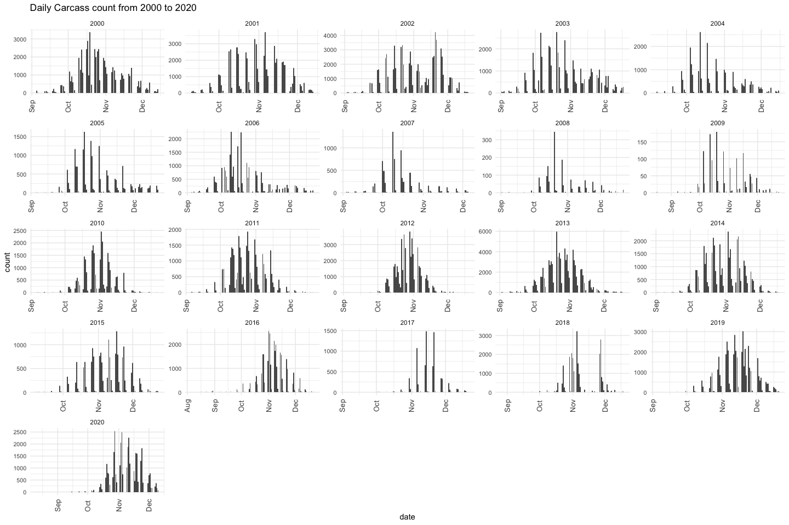
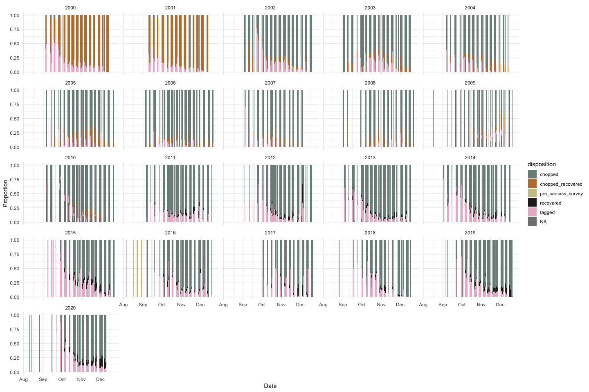
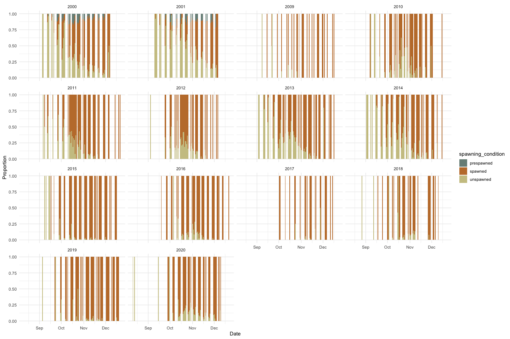
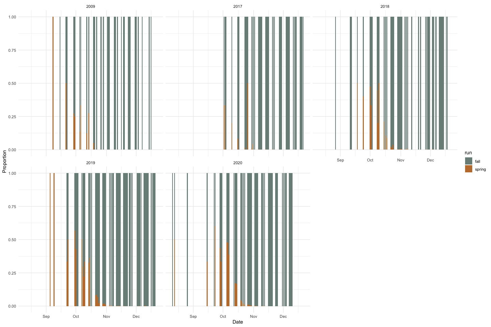
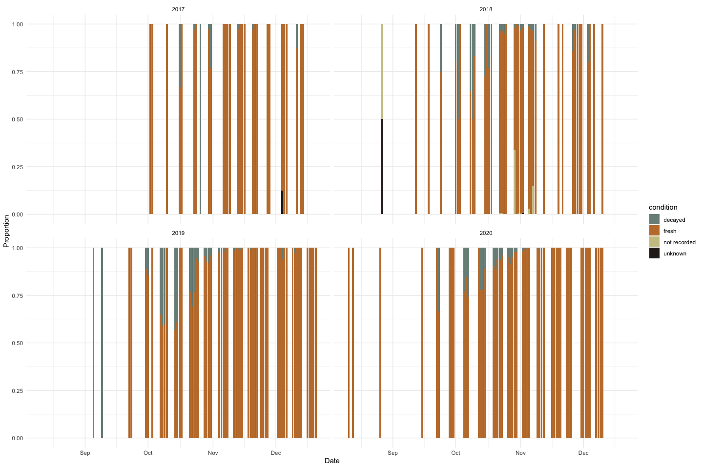
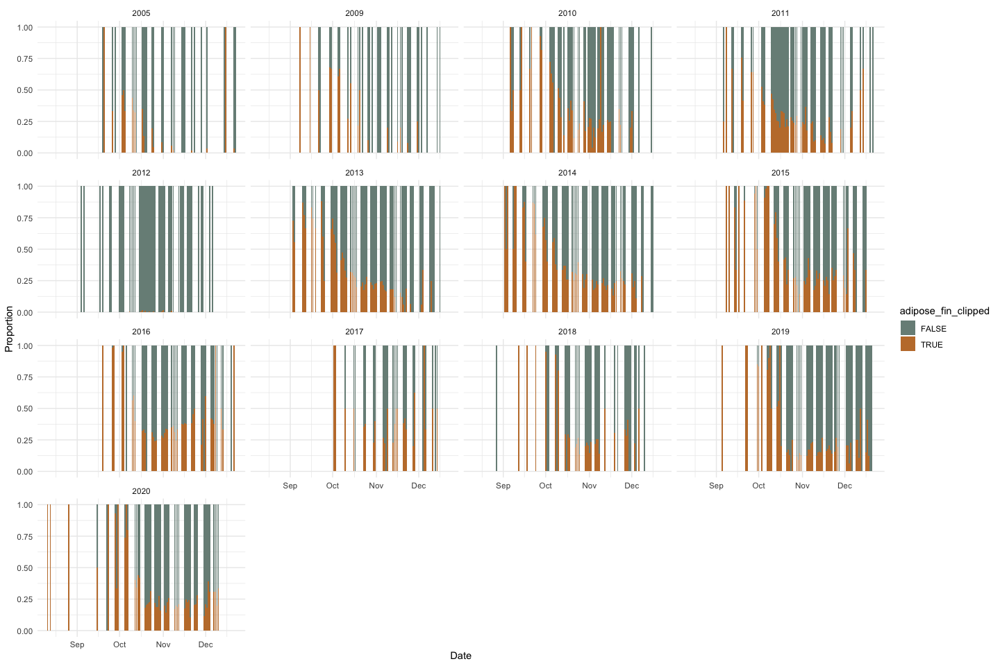
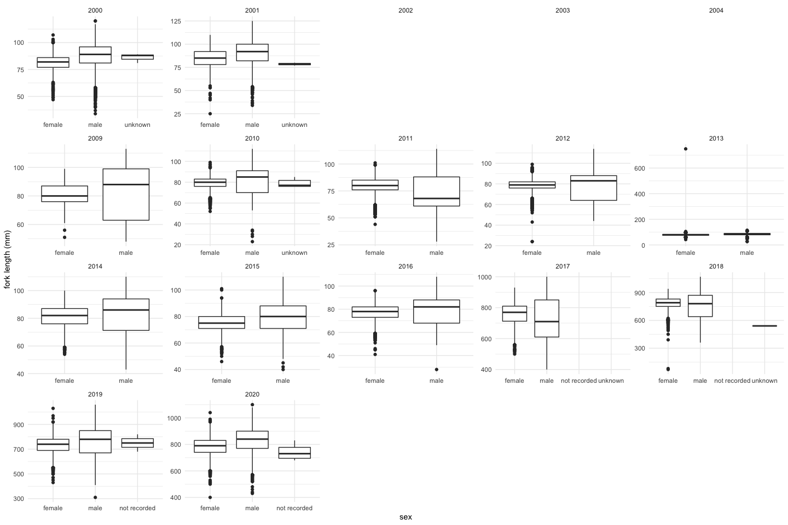

Feather Carcass QC
================
Inigo Peng
2022-08-18

TODO \* fork length \* week number \* recov_id vs recover_id vs
reov_tag_id \* tag_id vs disc_tag_applied \* ad_fin_clip_status vs
adipose_fin_clip vs adipose_fin_clipped

# Feather River Carcass Data

## Description of Monitoring Data

The Feather River Carcass monitoring program has slightly differing
methodology and data entry across the period of record (2000-2020).

According to later sampling protocol (and meetings indicate this hasn’t
changed too much over the years), one of three processes occurs when a
carcass is encountered: if the carcass is fresh and not tagged, it is
tagged and returned to the river (this is a `tagged` carcass); if the
carcass is not fresh and not tagged, it is chopped (`chopped`); finally,
if the carcass is tagged and fresh, the carcass is recovered and
re-released (`recovered`/`recaptured`) or recovered and chopped
(`recovered, chopped` or `chopped`).

Generally, the table layout/structure is similar across four periods: \*
2000-2001: `RecovTag`, `ChopRecov`, `CWT`, `TagData` \* 2002-2009:
`ChopChannel`, `ChopRecov`, `CWT` \* 2010-2016: `Chops`, `CWT`
(`ChopRecov` only in 2010) \* 2017-2020: `Chops`, `ChopRecov`, `CWT`

Though the naming changes across these periods, each year generally has
a table of individual carcass samples with biological sampling data like
`adipose_fin_clip`, `sex`, and `fork_length`; a bulk chops table that
contains bulk chop counts without individual sampling information; and
sometimes a chop recovery table that contains recovered carcass data.

To standardize across these periods, we created a `source_table`
variable to track the different tables and a `disposition` column to
track whether the carcass was `chopped`, `tagged`, or
`recovered`/`recaptured`.

The goal is to use the data in a modified Cormack Jolly Seber model,
which requires three tables as input: \* Individual carcasses and their
recapture history \* Bulk chops by week \* Covariates (fork length, sex,
etc.)

The CAMP database creates these tables automatically, but data contacts
created their own version of these tables in Excel prior to 2017.

**Timeframe:** 2000 to 2020

**Video Season:**

**Completeness of Record throughout timeframe:** Data is complete across
years. Methodology and data storage differs.

**Sampling Location:** Various sampling locations on Feather River. Some
river miles have a different protocol wherein carcasses are not
individually sampled but are always chopped.

**Data Contact:** Casey Campos

## Access Cloud Data

``` r
# Run Sys.setenv() to specify GCS_AUTH_FILE and GCS_DEFAULT_BUCKET before running 
# getwd() to see how to specify paths 
# Open object from google cloud storage
# Set your authentication using gcs_auth
gcs_auth(json_file = Sys.getenv("GCS_AUTH_FILE"))
# Set global bucket 
gcs_global_bucket(bucket = Sys.getenv("GCS_DEFAULT_BUCKET"))

# git data and save as xlsx
```

``` r
read_from_cloud <- function(carcass_data_type, year){
  gcs_get_object(object_name = paste0("adult-holding-redd-and-carcass-surveys/feather-river/data/feather_carcass_",carcass_data_type, "_",year, ".csv"),
               bucket = gcs_get_global_bucket(),
               saveToDisk = paste0("data-raw/qc-markdowns/adult-holding-redd-and-carcass-surveys/feather-river/feather_carcass_",carcass_data_type,"_",year, ".csv"),
               overwrite = TRUE)
  data <- read.csv(paste0("data-raw/qc-markdowns/adult-holding-redd-and-carcass-surveys/feather-river/feather_carcass_",carcass_data_type, "_", year, ".csv"))  
}
```

## All Carcasses

## 2000

- rename `ht_num` to `head_tag`
- rename `egg_ret` to `spawn`

``` r
feather_carcass_2000 <- read_from_cloud("all_carcasses", 2000) |>  
  rename(head_tag = ht_num,
         spawning_condition = egg_ret,
         fork_length = fl) |> 
  mutate(date = as.Date(date)) |> 
  glimpse() 
```

    ## Rows: 14,048
    ## Columns: 25
    ## $ tag_num            <int> 1, 2, 3, 4, 5, 6, 7, 8, 9, 10, 11, 12, 14, 15, 16, …
    ## $ sect               <int> 1, 1, 1, 1, 2, 2, 2, 2, 2, 2, 2, 2, 2, 2, 3, 3, 3, …
    ## $ unit               <int> 8, 8, 10, 10, 1, 1, 8, 8, 8, 8, 8, 8, 10, 10, 2, 2,…
    ## $ fork_length        <int> 93, 84, 89, 109, 89, 88, 78, 92, 91, 85, 97, 92, 92…
    ## $ sex                <chr> "female", "female", "female", "male", "female", "fe…
    ## $ spawning_condition <chr> "unspawned", "unspawned", "unspawned", NA, "unspawn…
    ## $ float              <int> 0, 0, 0, 0, 0, 0, 0, 0, 0, 0, 1, 0, 1, 0, 0, 0, 0, …
    ## $ rel_loc            <chr> "3", "3", "3", "3", "1", "3", "1", "1", "3", "3", "…
    ## $ comment            <chr> NA, NA, NA, NA, NA, NA, NA, NA, NA, NA, NA, NA, NA,…
    ## $ tag_env_id         <int> 2, 2, 2, 2, 2, 2, 2, 2, 2, 2, 2, 2, 2, 2, 2, 2, 2, …
    ## $ rel_loc2           <int> 2, 2, 2, 2, 1, 2, 1, 1, 2, 2, 2, 1, 1, 2, 1, 2, 2, …
    ## $ date               <date> 2000-09-05, 2000-09-05, 2000-09-05, 2000-09-05, 20…
    ## $ recorder           <chr> "rk", "rk", "rk", "rk", "rk", "rk", "rk", "rk", "rk…
    ## $ tag_col            <chr> "pink", "pink", "pink", "pink", "pink", "pink", "pi…
    ## $ week               <int> 1, 1, 1, 1, 1, 1, 1, 1, 1, 1, 1, 1, 1, 1, 1, 1, 1, …
    ## $ disposition        <chr> "tagged", "tagged", "tagged", "tagged", "tagged", "…
    ## $ source_table       <chr> "tagdata", "tagdata", "tagdata", "tagdata", "tagdat…
    ## $ count              <int> 1, 1, 1, 1, 1, 1, 1, 1, 1, 1, 1, 1, 1, 1, 1, 1, 1, …
    ## $ chop_env_id        <int> NA, NA, NA, NA, NA, NA, NA, NA, NA, NA, NA, NA, NA,…
    ## $ number_spawned     <int> NA, NA, NA, NA, NA, NA, NA, NA, NA, NA, NA, NA, NA,…
    ## $ recov_id           <int> NA, NA, NA, NA, NA, NA, NA, NA, NA, NA, NA, NA, NA,…
    ## $ lifestage          <chr> NA, NA, NA, NA, NA, NA, NA, NA, NA, NA, NA, NA, NA,…
    ## $ cwt_id             <int> NA, NA, NA, NA, NA, NA, NA, NA, NA, NA, NA, NA, NA,…
    ## $ head_tag           <int> NA, NA, NA, NA, NA, NA, NA, NA, NA, NA, NA, NA, NA,…
    ## $ recov_tag_id       <int> NA, NA, NA, NA, NA, NA, NA, NA, NA, NA, NA, NA, NA,…

## 2001

- rename `ht_num` to `head_tag`
- rename `egg_ret` to `spawn`

``` r
feather_carcass_2001 <- read_from_cloud("all_carcasses", 2001) |> 
  mutate(date = as.Date(date)) |> 
  rename(head_tag = ht_num,
         spawning_condition = egg_ret,
         week = week_num,
         fork_length = fl,
         min = minute) |> 
  glimpse() 
```

    ## Rows: 15,969
    ## Columns: 27
    ## $ tag_num            <int> 1, 2, 3, 4, 5, 6, 7, 8, 9, 10, 11, 12, 13, 14, 15, …
    ## $ tag1               <int> 252, 260, 253, 256, 257, 261, 254, 258, 262, 255, 1…
    ## $ tag2               <int> 5276, 5278, 5280, 5281, 5283, 5284, 5285, 5288, 529…
    ## $ sect               <int> 1, 8, 10, 10, 13, 13, 13, 14, 15, 15, 4, 6, 8, 8, 8…
    ## $ sex                <chr> "female", "female", "female", "female", "female", "…
    ## $ fork_length        <int> 74, 69, 92, 85, 91, 82, 85, 86, 88, 78, 88, 83, 73,…
    ## $ spawning_condition <chr> "unspawned", "unspawned", "unspawned", "unspawned",…
    ## $ rel_loc            <chr> "m", "r", "l", "m", "m", "m", "r", "r", "m", "m", "…
    ## $ tag_env_id         <int> 1, 1, 1, 1, 1, 1, 1, 1, 1, 1, 2, 2, 2, 2, 2, 2, 2, …
    ## $ tag_comp           <int> 1, 2, 3, 4, 5, 6, 7, 8, 9, 10, 11, 12, 13, 14, 15, …
    ## $ date               <date> 2001-09-10, 2001-09-10, 2001-09-10, 2001-09-10, 20…
    ## $ tag_col            <chr> "yellow/orange", "yellow/orange", "yellow/orange", …
    ## $ flow               <int> 600, 600, 600, 600, 600, 600, 600, 600, 600, 600, 6…
    ## $ week               <int> 1, 1, 1, 1, 1, 1, 1, 1, 1, 1, 1, 1, 1, 1, 1, 1, 1, …
    ## $ disposition        <chr> "tagged", "tagged", "tagged", "tagged", "tagged", "…
    ## $ source_table       <chr> "tagdata", "tagdata", "tagdata", "tagdata", "tagdat…
    ## $ count              <int> 1, 1, 1, 1, 1, 1, 1, 1, 1, 1, 1, 1, 1, 1, 1, 1, 1, …
    ## $ chop_env_id        <int> NA, NA, NA, NA, NA, NA, NA, NA, NA, NA, NA, NA, NA,…
    ## $ vis                <chr> NA, NA, NA, NA, NA, NA, NA, NA, NA, NA, NA, NA, NA,…
    ## $ weather            <chr> NA, NA, NA, NA, NA, NA, NA, NA, NA, NA, NA, NA, NA,…
    ## $ chan               <chr> NA, NA, NA, NA, NA, NA, NA, NA, NA, NA, NA, NA, NA,…
    ## $ min                <dbl> NA, NA, NA, NA, NA, NA, NA, NA, NA, NA, NA, NA, NA,…
    ## $ recov_id           <int> NA, NA, NA, NA, NA, NA, NA, NA, NA, NA, NA, NA, NA,…
    ## $ lifestage          <chr> NA, NA, NA, NA, NA, NA, NA, NA, NA, NA, NA, NA, NA,…
    ## $ cwt_id             <int> NA, NA, NA, NA, NA, NA, NA, NA, NA, NA, NA, NA, NA,…
    ## $ head_tag           <int> NA, NA, NA, NA, NA, NA, NA, NA, NA, NA, NA, NA, NA,…
    ## $ recov_tag_id       <int> NA, NA, NA, NA, NA, NA, NA, NA, NA, NA, NA, NA, NA,…

## 2002

``` r
feather_carcass_2002 <- read_from_cloud("all_carcasses", 2002) |> 
  mutate(date = as.Date(date)) |> 
  rename(fork_length = fl) |> 
  glimpse() 
```

    ## Rows: 35,267
    ## Columns: 21
    ## $ chan_id          <int> 1, 1, 1, 1, 1, 1, 2, 2, 2, 2, 2, 2, 3, 3, 3, 3, 3, 3,…
    ## $ sect             <int> 10, 10, 10, 10, 10, 10, 10, 10, 10, 10, 10, 10, 10, 1…
    ## $ min              <int> 15, 15, 15, 15, 15, 15, 15, 15, 15, 15, 15, 15, 15, 1…
    ## $ header_id        <int> 1, 1, 1, 1, 1, 1, 1, 1, 1, 1, 1, 1, 1, 1, 1, 1, 1, 1,…
    ## $ tag_col          <chr> "green 1", "green 1", "green 1", "green 1", "green 1"…
    ## $ date             <date> 2002-09-03, 2002-09-03, 2002-09-03, 2002-09-03, 2002…
    ## $ sex              <chr> NA, NA, "female", "female", NA, NA, NA, NA, "female",…
    ## $ disposition      <chr> "tagged", "chopped", "tagged", "chopped", "tagged", "…
    ## $ count            <int> 0, 0, 0, 0, 0, 0, 0, 0, 0, 1, 0, 0, 0, 0, 0, 0, 0, 0,…
    ## $ lifestage        <chr> "adult", "adult", "adult", "adult", "grilse", "grilse…
    ## $ source_table     <chr> "chopchannel", "chopchannel", "chopchannel", "chopcha…
    ## $ recov_id         <int> NA, NA, NA, NA, NA, NA, NA, NA, NA, NA, NA, NA, NA, N…
    ## $ recov_color      <chr> NA, NA, NA, NA, NA, NA, NA, NA, NA, NA, NA, NA, NA, N…
    ## $ tag_id           <int> NA, NA, NA, NA, NA, NA, NA, NA, NA, NA, NA, NA, NA, N…
    ## $ rel_loc          <chr> NA, NA, NA, NA, NA, NA, NA, NA, NA, NA, NA, NA, NA, N…
    ## $ fork_length      <int> NA, NA, NA, NA, NA, NA, NA, NA, NA, NA, NA, NA, NA, N…
    ## $ spawn            <chr> NA, NA, NA, NA, NA, NA, NA, NA, NA, NA, NA, NA, NA, N…
    ## $ samp_type        <chr> NA, NA, NA, NA, NA, NA, NA, NA, NA, NA, NA, NA, NA, N…
    ## $ head_tag         <int> NA, NA, NA, NA, NA, NA, NA, NA, NA, NA, NA, NA, NA, N…
    ## $ comment          <chr> NA, NA, NA, NA, NA, NA, NA, NA, NA, NA, NA, NA, NA, N…
    ## $ adipose_fin_clip <lgl> NA, NA, NA, NA, NA, NA, NA, NA, NA, NA, NA, NA, NA, N…

## 2003

``` r
feather_carcass_2003 <- read_from_cloud("all_carcasses", 2003)  |> 
  mutate(date = as.Date(date)) |> 
  rename(fork_length = fl,
         adipose_fin_clipped = adipose_fin_clip) |> 
  glimpse() 
```

    ## Rows: 21,587
    ## Columns: 21
    ## $ chan_id             <int> 1, 1, 1, 1, 1, 1, 2, 2, 2, 2, 2, 2, 3, 3, 3, 3, 3,…
    ## $ sect                <int> 1, 1, 1, 1, 1, 1, 1, 1, 1, 1, 1, 1, 1, 1, 1, 1, 1,…
    ## $ min                 <int> 14, 14, 14, 14, 14, 14, 14, 14, 14, 14, 14, 14, 13…
    ## $ header_id           <int> 1, 1, 1, 1, 1, 1, 1, 1, 1, 1, 1, 1, 1, 1, 1, 1, 1,…
    ## $ tag_col             <chr> "orange and black", "orange and black", "orange an…
    ## $ date                <date> 2003-09-02, 2003-09-02, 2003-09-02, 2003-09-02, 2…
    ## $ sex                 <chr> NA, NA, "female", "female", NA, NA, NA, NA, "femal…
    ## $ disposition         <chr> "tagged", "chopped", "tagged", "chopped", "tagged"…
    ## $ count               <int> 0, 0, 0, 2, 0, 0, 0, 0, 0, 0, 0, 0, 0, 0, 0, 0, 0,…
    ## $ lifestage           <chr> "adult", "adult", "adult", "adult", "grilse", "gri…
    ## $ source_table        <chr> "chopchannel", "chopchannel", "chopchannel", "chop…
    ## $ recov_id            <int> NA, NA, NA, NA, NA, NA, NA, NA, NA, NA, NA, NA, NA…
    ## $ recov_color         <chr> NA, NA, NA, NA, NA, NA, NA, NA, NA, NA, NA, NA, NA…
    ## $ tag_id              <int> NA, NA, NA, NA, NA, NA, NA, NA, NA, NA, NA, NA, NA…
    ## $ rel_loc             <chr> NA, NA, NA, NA, NA, NA, NA, NA, NA, NA, NA, NA, NA…
    ## $ fork_length         <int> NA, NA, NA, NA, NA, NA, NA, NA, NA, NA, NA, NA, NA…
    ## $ spawn               <chr> NA, NA, NA, NA, NA, NA, NA, NA, NA, NA, NA, NA, NA…
    ## $ samp_type           <chr> NA, NA, NA, NA, NA, NA, NA, NA, NA, NA, NA, NA, NA…
    ## $ head_tag            <int> NA, NA, NA, NA, NA, NA, NA, NA, NA, NA, NA, NA, NA…
    ## $ comment             <chr> NA, NA, NA, NA, NA, NA, NA, NA, NA, NA, NA, NA, NA…
    ## $ adipose_fin_clipped <lgl> NA, NA, NA, NA, NA, NA, NA, NA, NA, NA, NA, NA, NA…

## 2004

- recast `head_tag` to integer

``` r
feather_carcass_2004 <- read_from_cloud("all_carcasses", 2004) |> 
  mutate(head_tag = as.integer(head_tag),
         date = as.Date(date)) |> 
  rename(fork_length = fl,
         adipose_fin_clipped = adipose_fin_clip) |> 
  glimpse() 
```

    ## Rows: 18,302
    ## Columns: 21
    ## $ chan_id             <int> 2381, 2381, 2381, 2381, 2381, 2381, 2382, 2382, 23…
    ## $ sect                <int> 1, 1, 1, 1, 1, 1, 1, 1, 1, 1, 1, 1, 2, 2, 2, 2, 2,…
    ## $ min                 <int> 4, 4, 4, 4, 4, 4, 4, 4, 4, 4, 4, 4, 1, 1, 1, 1, 1,…
    ## $ header_id           <int> 345, 345, 345, 345, 345, 345, 345, 345, 345, 345, …
    ## $ tag_col             <chr> "orange1", "orange1", "orange1", "orange1", "orang…
    ## $ date                <date> 2004-09-07, 2004-09-07, 2004-09-07, 2004-09-07, 2…
    ## $ sex                 <chr> NA, NA, "female", "female", NA, NA, NA, NA, "femal…
    ## $ disposition         <chr> "tagged", "chopped", "tagged", "chopped", "tagged"…
    ## $ count               <int> 0, 0, 0, 0, 0, 0, 0, 0, 0, 1, 0, 0, 0, 0, 0, 0, 0,…
    ## $ lifestage           <chr> "adult", "adult", "adult", "adult", "grilse", "gri…
    ## $ source_table        <chr> "chopchannel", "chopchannel", "chopchannel", "chop…
    ## $ recov_id            <int> NA, NA, NA, NA, NA, NA, NA, NA, NA, NA, NA, NA, NA…
    ## $ recov_color         <chr> NA, NA, NA, NA, NA, NA, NA, NA, NA, NA, NA, NA, NA…
    ## $ tag_id              <int> NA, NA, NA, NA, NA, NA, NA, NA, NA, NA, NA, NA, NA…
    ## $ rel_loc             <chr> NA, NA, NA, NA, NA, NA, NA, NA, NA, NA, NA, NA, NA…
    ## $ fork_length         <int> NA, NA, NA, NA, NA, NA, NA, NA, NA, NA, NA, NA, NA…
    ## $ spawn               <chr> NA, NA, NA, NA, NA, NA, NA, NA, NA, NA, NA, NA, NA…
    ## $ samp_type           <chr> NA, NA, NA, NA, NA, NA, NA, NA, NA, NA, NA, NA, NA…
    ## $ head_tag            <int> NA, NA, NA, NA, NA, NA, NA, NA, NA, NA, NA, NA, NA…
    ## $ comment             <chr> NA, NA, NA, NA, NA, NA, NA, NA, NA, NA, NA, NA, NA…
    ## $ adipose_fin_clipped <lgl> NA, NA, NA, NA, NA, NA, NA, NA, NA, NA, NA, NA, NA…

## 2005

``` r
feather_carcass_2005 <- read_from_cloud("all_carcasses", 2005) |>
  mutate(date = as.Date(date)) |> 
  rename(fork_length = fl,
         adipose_fin_clipped = adipose_fin_clip) |> 
  glimpse() 
```

    ## Rows: 21,752
    ## Columns: 22
    ## $ chan_id             <int> 40, 40, 40, 41, 41, 41, 42, 42, 42, 43, 43, 43, 44…
    ## $ sect                <int> 12, 12, 12, 13, 13, 13, 13, 13, 13, 13, 13, 13, 14…
    ## $ min                 <int> 13, 13, 13, 13, 13, 13, 8, 8, 8, 10, 10, 10, 7, 7,…
    ## $ header_id           <int> 517, 517, 517, 517, 517, 517, 517, 517, 517, 517, …
    ## $ tag_col             <chr> "blue4", "blue4", "blue4", "blue4", "blue4", "blue…
    ## $ date                <date> 2005-09-28, 2005-09-28, 2005-09-28, 2005-09-28, 2…
    ## $ adipose_fin_clipped <lgl> TRUE, FALSE, NA, TRUE, FALSE, NA, TRUE, FALSE, NA,…
    ## $ count               <int> 0, 0, 0, 0, 0, 3, 0, 0, 0, 0, 0, 0, 0, 0, 0, 0, 0,…
    ## $ disposition         <chr> "chopped", "chopped", "chopped", "chopped", "chopp…
    ## $ source_table        <chr> "chopchannel", "chopchannel", "chopchannel", "chop…
    ## $ recov_id            <int> NA, NA, NA, NA, NA, NA, NA, NA, NA, NA, NA, NA, NA…
    ## $ recov_color         <chr> NA, NA, NA, NA, NA, NA, NA, NA, NA, NA, NA, NA, NA…
    ## $ tag_id              <int> NA, NA, NA, NA, NA, NA, NA, NA, NA, NA, NA, NA, NA…
    ## $ rel_loc             <chr> NA, NA, NA, NA, NA, NA, NA, NA, NA, NA, NA, NA, NA…
    ## $ fork_length         <int> NA, NA, NA, NA, NA, NA, NA, NA, NA, NA, NA, NA, NA…
    ## $ sex                 <chr> NA, NA, NA, NA, NA, NA, NA, NA, NA, NA, NA, NA, NA…
    ## $ spawn               <chr> NA, NA, NA, NA, NA, NA, NA, NA, NA, NA, NA, NA, NA…
    ## $ samp_type           <chr> NA, NA, NA, NA, NA, NA, NA, NA, NA, NA, NA, NA, NA…
    ## $ head_tag            <int> NA, NA, NA, NA, NA, NA, NA, NA, NA, NA, NA, NA, NA…
    ## $ comment             <chr> NA, NA, NA, NA, NA, NA, NA, NA, NA, NA, NA, NA, NA…
    ## $ hall_print1         <chr> NA, NA, NA, NA, NA, NA, NA, NA, NA, NA, NA, NA, NA…
    ## $ hall_print2         <chr> NA, NA, NA, NA, NA, NA, NA, NA, NA, NA, NA, NA, NA…

## 2006

- recast `tag_col` to character

``` r
feather_carcass_2006 <- read_from_cloud("all_carcasses", 2006) |> 
  mutate(date = as.Date(date),
         tag_col = as.character(tag_col),
         recov_color = as.character(recov_color)) |> 
  rename(fork_length = fl,
         adipose_fin_clipped = adipose_fin_clip) |>  
  glimpse() 
```

    ## Rows: 19,945
    ## Columns: 24
    ## $ chan_id             <int> 2924, 2924, 2924, 2925, 2925, 2925, 2926, 2926, 29…
    ## $ sect                <int> 36, 36, 36, 36, 36, 36, 36, 36, 36, 22, 22, 22, 22…
    ## $ chan                <chr> "l", "l", "l", "m", "m", "m", "r", "r", "r", "l", …
    ## $ min                 <int> 4, 4, 4, 2, 2, 2, 11, 11, 11, 5, 5, 5, 3, 3, 3, 5,…
    ## $ header_id           <int> 673, 673, 673, 673, 673, 673, 673, 673, 673, 674, …
    ## $ tag_col             <chr> "3", "3", "3", "3", "3", "3", "3", "3", "3", "3", …
    ## $ date                <date> 2006-09-20, 2006-09-20, 2006-09-20, 2006-09-20, 2…
    ## $ adipose_fin_clipped <lgl> NA, NA, NA, NA, NA, NA, NA, NA, NA, NA, NA, NA, NA…
    ## $ count               <int> 0, 0, 0, 0, 0, 0, 0, 0, 1, 0, 0, 0, 0, 0, 0, 0, 0,…
    ## $ disposition         <chr> "chopped", "chopped", "chopped", "chopped", "chopp…
    ## $ source_table        <chr> "chopchannel", "chopchannel", "chopchannel", "chop…
    ## $ recov_id            <int> NA, NA, NA, NA, NA, NA, NA, NA, NA, NA, NA, NA, NA…
    ## $ recov_color         <chr> NA, NA, NA, NA, NA, NA, NA, NA, NA, NA, NA, NA, NA…
    ## $ tag_id              <int> NA, NA, NA, NA, NA, NA, NA, NA, NA, NA, NA, NA, NA…
    ## $ rel_loc             <chr> NA, NA, NA, NA, NA, NA, NA, NA, NA, NA, NA, NA, NA…
    ## $ fork_length         <int> NA, NA, NA, NA, NA, NA, NA, NA, NA, NA, NA, NA, NA…
    ## $ sex                 <chr> NA, NA, NA, NA, NA, NA, NA, NA, NA, NA, NA, NA, NA…
    ## $ spawn               <chr> NA, NA, NA, NA, NA, NA, NA, NA, NA, NA, NA, NA, NA…
    ## $ samp_type           <chr> NA, NA, NA, NA, NA, NA, NA, NA, NA, NA, NA, NA, NA…
    ## $ samp_num            <chr> NA, NA, NA, NA, NA, NA, NA, NA, NA, NA, NA, NA, NA…
    ## $ head_tag            <int> NA, NA, NA, NA, NA, NA, NA, NA, NA, NA, NA, NA, NA…
    ## $ comment             <chr> NA, NA, NA, NA, NA, NA, NA, NA, NA, NA, NA, NA, NA…
    ## $ hall_print1         <chr> NA, NA, NA, NA, NA, NA, NA, NA, NA, NA, NA, NA, NA…
    ## $ hall_print2         <chr> NA, NA, NA, NA, NA, NA, NA, NA, NA, NA, NA, NA, NA…

## 2007

- recast `tag_col` to character

``` r
feather_carcass_2007 <- read_from_cloud("all_carcasses", 2007) |> 
  mutate(date = as.Date(date),
         tag_col = as.character(tag_col),
         recov_color = as.character(recov_color)) |>
  rename(fork_length = fl,
         adipose_fin_clipped = adipose_fin_clip) |> 
  glimpse() 
```

    ## Rows: 11,724
    ## Columns: 24
    ## $ chan_id             <int> 1, 1, 1, 2, 2, 2, 3, 3, 3, 4, 4, 4, 5, 5, 5, 6, 6,…
    ## $ sect                <int> 1, 1, 1, 1, 1, 1, 11, 11, 11, 12, 12, 12, 13, 13, …
    ## $ chan                <chr> "l", "l", "l", "r", "r", "r", "r", "r", "r", "m", …
    ## $ min                 <int> NA, NA, NA, NA, NA, NA, NA, NA, NA, NA, NA, NA, NA…
    ## $ header_id           <int> 1, 1, 1, 1, 1, 1, 1, 1, 1, 1, 1, 1, 1, 1, 1, 1, 1,…
    ## $ tag_col             <chr> "1", "1", "1", "1", "1", "1", "1", "1", "1", "1", …
    ## $ date                <date> 2007-09-04, 2007-09-04, 2007-09-04, 2007-09-04, 2…
    ## $ adipose_fin_clipped <lgl> NA, NA, NA, NA, NA, NA, NA, NA, NA, NA, NA, NA, NA…
    ## $ count               <int> 0, 0, 1, 0, 0, 1, 0, 0, 1, 0, 1, 0, 0, 2, 1, 0, 1,…
    ## $ disposition         <chr> "chopped", "chopped", "chopped", "chopped", "chopp…
    ## $ source_table        <chr> "chopchannel", "chopchannel", "chopchannel", "chop…
    ## $ recov_id            <int> NA, NA, NA, NA, NA, NA, NA, NA, NA, NA, NA, NA, NA…
    ## $ recov_color         <chr> NA, NA, NA, NA, NA, NA, NA, NA, NA, NA, NA, NA, NA…
    ## $ tag_id              <int> NA, NA, NA, NA, NA, NA, NA, NA, NA, NA, NA, NA, NA…
    ## $ rel_loc             <chr> NA, NA, NA, NA, NA, NA, NA, NA, NA, NA, NA, NA, NA…
    ## $ fork_length         <int> NA, NA, NA, NA, NA, NA, NA, NA, NA, NA, NA, NA, NA…
    ## $ sex                 <chr> NA, NA, NA, NA, NA, NA, NA, NA, NA, NA, NA, NA, NA…
    ## $ spawn               <chr> NA, NA, NA, NA, NA, NA, NA, NA, NA, NA, NA, NA, NA…
    ## $ samp_type           <chr> NA, NA, NA, NA, NA, NA, NA, NA, NA, NA, NA, NA, NA…
    ## $ samp_num            <chr> NA, NA, NA, NA, NA, NA, NA, NA, NA, NA, NA, NA, NA…
    ## $ head_tag            <int> NA, NA, NA, NA, NA, NA, NA, NA, NA, NA, NA, NA, NA…
    ## $ comment             <chr> NA, NA, NA, NA, NA, NA, NA, NA, NA, NA, NA, NA, NA…
    ## $ hall_print1         <chr> NA, NA, NA, NA, NA, NA, NA, NA, NA, NA, NA, NA, NA…
    ## $ hall_print2         <chr> NA, NA, NA, NA, NA, NA, NA, NA, NA, NA, NA, NA, NA…

## 2008

- recast `tag_col` to character

``` r
feather_carcass_2008 <- read_from_cloud("all_carcasses", 2008) |> 
  mutate(date = as.Date(date),
         tag_col = as.character(tag_col),
         recov_color = as.character(recov_color)) |>
  rename(fork_length = fl,
         adipose_fin_clipped = adipose_fin_clip) |>  
  glimpse() 
```

    ## Rows: 4,580
    ## Columns: 25
    ## $ chan_id             <int> 1682, 1682, 1683, 1683, 1684, 1684, 1685, 1685, 16…
    ## $ sect                <int> 39, 39, 39, 39, 39, 39, 38, 38, 38, 38, 38, 38, 37…
    ## $ chan                <chr> "r", "r", "l", "l", "m", "m", "l", "l", "m", "m", …
    ## $ min                 <int> 10, 10, 6, 6, 3, 3, 5, 5, 4, 4, 4, 4, 2, 2, 3, 3, …
    ## $ header_id           <int> 78, 78, 78, 78, 78, 78, 78, 78, 78, 78, 78, 78, 78…
    ## $ tag_col             <chr> "1", "1", "1", "1", "1", "1", "1", "1", "1", "1", …
    ## $ date                <date> 2008-09-03, 2008-09-03, 2008-09-03, 2008-09-03, 2…
    ## $ disposition         <chr> "chopped", "tagged", "chopped", "tagged", "chopped…
    ## $ count               <int> 0, 0, 0, 0, 0, 0, 0, 0, 0, 0, 0, 0, 0, 0, 0, 0, 0,…
    ## $ source_table        <chr> "chopchannel", "chopchannel", "chopchannel", "chop…
    ## $ recov_id            <int> NA, NA, NA, NA, NA, NA, NA, NA, NA, NA, NA, NA, NA…
    ## $ recov_color         <chr> NA, NA, NA, NA, NA, NA, NA, NA, NA, NA, NA, NA, NA…
    ## $ tag_id              <int> NA, NA, NA, NA, NA, NA, NA, NA, NA, NA, NA, NA, NA…
    ## $ fork_length         <int> NA, NA, NA, NA, NA, NA, NA, NA, NA, NA, NA, NA, NA…
    ## $ sex                 <chr> NA, NA, NA, NA, NA, NA, NA, NA, NA, NA, NA, NA, NA…
    ## $ spawn               <chr> NA, NA, NA, NA, NA, NA, NA, NA, NA, NA, NA, NA, NA…
    ## $ adipose_fin_clipped <lgl> NA, NA, NA, NA, NA, NA, NA, NA, NA, NA, NA, NA, NA…
    ## $ samp_type           <chr> NA, NA, NA, NA, NA, NA, NA, NA, NA, NA, NA, NA, NA…
    ## $ samp_num            <chr> NA, NA, NA, NA, NA, NA, NA, NA, NA, NA, NA, NA, NA…
    ## $ head_tag            <int> NA, NA, NA, NA, NA, NA, NA, NA, NA, NA, NA, NA, NA…
    ## $ comment             <chr> NA, NA, NA, NA, NA, NA, NA, NA, NA, NA, NA, NA, NA…
    ## $ hall_print1         <chr> NA, NA, NA, NA, NA, NA, NA, NA, NA, NA, NA, NA, NA…
    ## $ hall_print2         <chr> NA, NA, NA, NA, NA, NA, NA, NA, NA, NA, NA, NA, NA…
    ## $ scale_sample        <int> NA, NA, NA, NA, NA, NA, NA, NA, NA, NA, NA, NA, NA…
    ## $ run                 <chr> NA, NA, NA, NA, NA, NA, NA, NA, NA, NA, NA, NA, NA…

## 2009

- recast `tag_col` to character

``` r
feather_carcass_2009 <- read_from_cloud("all_carcasses", 2009) |> 
  mutate(date = as.Date(date),
         tag_col = as.character(tag_col),
         recov_color = as.character(recov_color)) |>
  rename(fork_length = fl,
         adipose_fin_clipped = adipose_fin_clip,
         week = week_num,
         spawning_condition = spawn) |> 
  glimpse() 
```

    ## Rows: 4,271
    ## Columns: 27
    ## $ chan_id             <int> 1, 1, 2, 2, 3, 3, 4, 4, 5, 5, 6, 6, 7, 7, 8, 8, 9,…
    ## $ sect                <int> 1, 1, 1, 1, 1, 1, 2, 2, 2, 2, 2, 2, 3, 3, 3, 3, 3,…
    ## $ chan                <chr> "l", "l", "m", "m", "r", "r", "l", "l", "m", "m", …
    ## $ min                 <int> 5, 5, 4, 4, 5, 5, 3, 3, 3, 3, 3, 3, 3, 3, 2, 2, 3,…
    ## $ header_id           <int> 1, 1, 1, 1, 1, 1, 1, 1, 1, 1, 1, 1, 1, 1, 1, 1, 1,…
    ## $ tag_col             <chr> "1", "1", "1", "1", "1", "1", "1", "1", "1", "1", …
    ## $ date                <date> 2009-09-08, 2009-09-08, 2009-09-08, 2009-09-08, 2…
    ## $ disposition         <chr> "chopped", "tagged", "chopped", "tagged", "chopped…
    ## $ count               <int> 0, 0, 0, 0, 0, 0, 0, 0, 0, 0, 0, 0, 0, 0, 0, 0, 0,…
    ## $ source_table        <chr> "chopchannel", "chopchannel", "chopchannel", "chop…
    ## $ recov_id            <int> NA, NA, NA, NA, NA, NA, NA, NA, NA, NA, NA, NA, NA…
    ## $ recov_color         <chr> NA, NA, NA, NA, NA, NA, NA, NA, NA, NA, NA, NA, NA…
    ## $ tag_id              <int> NA, NA, NA, NA, NA, NA, NA, NA, NA, NA, NA, NA, NA…
    ## $ fork_length         <int> NA, NA, NA, NA, NA, NA, NA, NA, NA, NA, NA, NA, NA…
    ## $ sex                 <chr> NA, NA, NA, NA, NA, NA, NA, NA, NA, NA, NA, NA, NA…
    ## $ spawning_condition  <chr> NA, NA, NA, NA, NA, NA, NA, NA, NA, NA, NA, NA, NA…
    ## $ adipose_fin_clipped <lgl> NA, NA, NA, NA, NA, NA, NA, NA, NA, NA, NA, NA, NA…
    ## $ samp_type           <chr> NA, NA, NA, NA, NA, NA, NA, NA, NA, NA, NA, NA, NA…
    ## $ samp_num            <chr> NA, NA, NA, NA, NA, NA, NA, NA, NA, NA, NA, NA, NA…
    ## $ head_tag            <int> NA, NA, NA, NA, NA, NA, NA, NA, NA, NA, NA, NA, NA…
    ## $ comment             <chr> NA, NA, NA, NA, NA, NA, NA, NA, NA, NA, NA, NA, NA…
    ## $ hall_print1         <chr> NA, NA, NA, NA, NA, NA, NA, NA, NA, NA, NA, NA, NA…
    ## $ hall_print2         <chr> NA, NA, NA, NA, NA, NA, NA, NA, NA, NA, NA, NA, NA…
    ## $ scale_sample        <int> NA, NA, NA, NA, NA, NA, NA, NA, NA, NA, NA, NA, NA…
    ## $ run                 <chr> NA, NA, NA, NA, NA, NA, NA, NA, NA, NA, NA, NA, NA…
    ## $ crew                <chr> NA, NA, NA, NA, NA, NA, NA, NA, NA, NA, NA, NA, NA…
    ## $ week                <int> NA, NA, NA, NA, NA, NA, NA, NA, NA, NA, NA, NA, NA…

## 2010

- recast `tag_col` to character

``` r
feather_carcass_2010 <- read_from_cloud("all_carcasses", 2010) |> 
  mutate(date = as.Date(date),
         tag_col = as.character(tag_col),
         recov_color = as.character(recov_color)) |>
  rename(fork_length = fl,
         adipose_fin_clipped = adipose_fin_clip,
         week = week_num,
         spawning_condition = spawn) |> 
  glimpse() 
```

    ## Rows: 16,055
    ## Columns: 27
    ## $ chan_id             <int> 1975, 1975, 1975, 1976, 1976, 1976, 1977, 1977, 19…
    ## $ sect                <int> 1, 1, 1, 1, 1, 1, 1, 1, 1, 2, 2, 2, 2, 2, 2, 2, 2,…
    ## $ chan                <chr> "l", "l", "l", "m", "m", "m", "r", "r", "r", "l", …
    ## $ min                 <int> 5, 5, 5, 2, 2, 2, 6, 6, 6, 6, 6, 6, 5, 5, 5, 6, 6,…
    ## $ header_id           <int> 47, 47, 47, 47, 47, 47, 47, 47, 47, 47, 47, 47, 47…
    ## $ tag_col             <chr> "1", "1", "1", "1", "1", "1", "1", "1", "1", "1", …
    ## $ date                <date> 2010-09-07, 2010-09-07, 2010-09-07, 2010-09-07, 2…
    ## $ sex                 <chr> "unknown", "male", "female", "unknown", "male", "f…
    ## $ count               <int> 0, 0, 0, 0, 0, 0, 0, 0, 0, 0, 0, 0, 0, 0, 0, 0, 0,…
    ## $ disposition         <chr> "chopped", "chopped", "chopped", "chopped", "chopp…
    ## $ source_table        <chr> "chopchannel", "chopchannel", "chopchannel", "chop…
    ## $ recov_id            <int> NA, NA, NA, NA, NA, NA, NA, NA, NA, NA, NA, NA, NA…
    ## $ recov_color         <chr> NA, NA, NA, NA, NA, NA, NA, NA, NA, NA, NA, NA, NA…
    ## $ tag_id              <int> NA, NA, NA, NA, NA, NA, NA, NA, NA, NA, NA, NA, NA…
    ## $ fork_length         <int> NA, NA, NA, NA, NA, NA, NA, NA, NA, NA, NA, NA, NA…
    ## $ spawning_condition  <chr> NA, NA, NA, NA, NA, NA, NA, NA, NA, NA, NA, NA, NA…
    ## $ adipose_fin_clipped <lgl> NA, NA, NA, NA, NA, NA, NA, NA, NA, NA, NA, NA, NA…
    ## $ samp_type           <chr> NA, NA, NA, NA, NA, NA, NA, NA, NA, NA, NA, NA, NA…
    ## $ samp_num            <chr> NA, NA, NA, NA, NA, NA, NA, NA, NA, NA, NA, NA, NA…
    ## $ head_tag            <int> NA, NA, NA, NA, NA, NA, NA, NA, NA, NA, NA, NA, NA…
    ## $ comment             <chr> NA, NA, NA, NA, NA, NA, NA, NA, NA, NA, NA, NA, NA…
    ## $ hall_print1         <lgl> NA, NA, NA, NA, NA, NA, NA, NA, NA, NA, NA, NA, NA…
    ## $ hall_print2         <chr> NA, NA, NA, NA, NA, NA, NA, NA, NA, NA, NA, NA, NA…
    ## $ scale_sample        <int> NA, NA, NA, NA, NA, NA, NA, NA, NA, NA, NA, NA, NA…
    ## $ run                 <lgl> NA, NA, NA, NA, NA, NA, NA, NA, NA, NA, NA, NA, NA…
    ## $ crew                <chr> NA, NA, NA, NA, NA, NA, NA, NA, NA, NA, NA, NA, NA…
    ## $ week                <int> NA, NA, NA, NA, NA, NA, NA, NA, NA, NA, NA, NA, NA…

## 2011

``` r
feather_carcass_2011 <- read_from_cloud("all_carcasses", 2011) |> 
  mutate(date = as.Date(date)) |> 
  rename(tag_col = tag_color,
         recov_color = tag_recap_chop_color,
         fork_length = fl,
         head_tag = head_tag_number) |> 
  glimpse() 
```

    ## Rows: 9,672
    ## Columns: 24
    ## $ header_id           <int> 9, 9, 9, 9, 9, 9, 9, 9, 9, 9, 9, 9, 9, 9, 9, 10, 1…
    ## $ date                <date> 2011-09-06, 2011-09-06, 2011-09-06, 2011-09-06, 2…
    ## $ sect                <int> 3, 2, 4, 6, 7, 5, 8, 9, 10, 11, 12, 13, 14, 15, 1,…
    ## $ min                 <int> 900, 1500, 600, 600, 900, 1200, 1240, 613, 3740, 1…
    ## $ count               <int> 0, 0, 0, 0, 0, 0, 0, 0, 2, 1, 1, 0, 1, 0, 0, 1, 1,…
    ## $ disposition         <chr> "chopped", "chopped", "chopped", "chopped", "chopp…
    ## $ source_table        <chr> "chopjoin", "chopjoin", "chopjoin", "chopjoin", "c…
    ## $ cwt_id              <int> NA, NA, NA, NA, NA, NA, NA, NA, NA, NA, NA, NA, NA…
    ## $ river_section       <int> NA, NA, NA, NA, NA, NA, NA, NA, NA, NA, NA, NA, NA…
    ## $ recov_color         <chr> NA, NA, NA, NA, NA, NA, NA, NA, NA, NA, NA, NA, NA…
    ## $ tag_id              <int> NA, NA, NA, NA, NA, NA, NA, NA, NA, NA, NA, NA, NA…
    ## $ sex                 <chr> NA, NA, NA, NA, NA, NA, NA, NA, NA, NA, NA, NA, NA…
    ## $ spawning_condition  <chr> NA, NA, NA, NA, NA, NA, NA, NA, NA, NA, NA, NA, NA…
    ## $ adipose_fin_clipped <lgl> NA, NA, NA, NA, NA, NA, NA, NA, NA, NA, NA, NA, NA…
    ## $ samples_collected   <chr> NA, NA, NA, NA, NA, NA, NA, NA, NA, NA, NA, NA, NA…
    ## $ fork_length         <int> NA, NA, NA, NA, NA, NA, NA, NA, NA, NA, NA, NA, NA…
    ## $ head_tag            <int> NA, NA, NA, NA, NA, NA, NA, NA, NA, NA, NA, NA, NA…
    ## $ scales              <int> NA, NA, NA, NA, NA, NA, NA, NA, NA, NA, NA, NA, NA…
    ## $ otoliths            <int> NA, NA, NA, NA, NA, NA, NA, NA, NA, NA, NA, NA, NA…
    ## $ hallprint           <chr> NA, NA, NA, NA, NA, NA, NA, NA, NA, NA, NA, NA, NA…
    ## $ comments            <chr> NA, NA, NA, NA, NA, NA, NA, NA, NA, NA, NA, NA, NA…
    ## $ tag                 <lgl> NA, NA, NA, NA, NA, NA, NA, NA, NA, NA, NA, NA, NA…
    ## $ week                <int> NA, NA, NA, NA, NA, NA, NA, NA, NA, NA, NA, NA, NA…
    ## $ tag_col             <chr> NA, NA, NA, NA, NA, NA, NA, NA, NA, NA, NA, NA, NA…

## 2012

``` r
feather_carcass_2012 <- read_from_cloud("all_carcasses", 2012) |> 
  mutate(date = as.Date(date),
         hallprint = as.character(hallprint)) |> 
  rename(tag_col = tag_color) |> 
  glimpse() 
```

    ## Rows: 7,583
    ## Columns: 23
    ## $ header_id           <int> 73, 73, 73, 73, 73, 73, 73, 73, 73, 73, 73, 73, 73…
    ## $ date                <date> 2012-09-17, 2012-09-17, 2012-09-17, 2012-09-17, 2…
    ## $ week                <int> 3, 3, 3, 3, 3, 3, 3, 3, 3, 3, 3, 3, 3, 3, 3, 1, 1,…
    ## $ sect                <int> 1, 2, 3, 4, 5, 6, 7, 8, 9, 10, 11, 12, 13, 14, 15,…
    ## $ min                 <int> 13, 10, 12, 4, 9, 13, 9, 10, 5, 22, 15, 25, 28, 15…
    ## $ count               <int> 0, 0, 0, 0, 0, 0, 0, 0, 0, 0, 0, 2, 0, 0, 0, 1, 0,…
    ## $ disposition         <chr> "chopped", "chopped", "chopped", "chopped", "chopp…
    ## $ source_table        <chr> "chopjoin", "chopjoin", "chopjoin", "chopjoin", "c…
    ## $ cwt_id              <int> NA, NA, NA, NA, NA, NA, NA, NA, NA, NA, NA, NA, NA…
    ## $ river_section       <int> NA, NA, NA, NA, NA, NA, NA, NA, NA, NA, NA, NA, NA…
    ## $ chop_id             <int> NA, NA, NA, NA, NA, NA, NA, NA, NA, NA, NA, NA, NA…
    ## $ sex                 <chr> NA, NA, NA, NA, NA, NA, NA, NA, NA, NA, NA, NA, NA…
    ## $ spawning_condition  <chr> NA, NA, NA, NA, NA, NA, NA, NA, NA, NA, NA, NA, NA…
    ## $ adipose_fin_clipped <lgl> NA, NA, NA, NA, NA, NA, NA, NA, NA, NA, NA, NA, NA…
    ## $ fork_length         <int> NA, NA, NA, NA, NA, NA, NA, NA, NA, NA, NA, NA, NA…
    ## $ head_tag            <int> NA, NA, NA, NA, NA, NA, NA, NA, NA, NA, NA, NA, NA…
    ## $ scales              <int> NA, NA, NA, NA, NA, NA, NA, NA, NA, NA, NA, NA, NA…
    ## $ otoliths            <int> NA, NA, NA, NA, NA, NA, NA, NA, NA, NA, NA, NA, NA…
    ## $ hallprint_color     <chr> NA, NA, NA, NA, NA, NA, NA, NA, NA, NA, NA, NA, NA…
    ## $ hallprint           <chr> NA, NA, NA, NA, NA, NA, NA, NA, NA, NA, NA, NA, NA…
    ## $ comments            <chr> NA, NA, NA, NA, NA, NA, NA, NA, NA, NA, NA, NA, NA…
    ## $ tag_col             <chr> NA, NA, NA, NA, NA, NA, NA, NA, NA, NA, NA, NA, NA…
    ## $ tag_id              <int> NA, NA, NA, NA, NA, NA, NA, NA, NA, NA, NA, NA, NA…

## 2013

- rename `head_tag_number` to `head_tag`

``` r
feather_carcass_2013 <- read_from_cloud("all_carcasses", 2013) |> 
  mutate(date = as.Date(date),
         hallprint = as.character(hallprint)) |> 
  rename(head_tag = head_tag_number,
         tag_col = tag_color,
         fork_length = fl) |> 
  glimpse() 
```

    ## Rows: 20,349
    ## Columns: 24
    ## $ header_id           <int> 1, 1, 1, 1, 1, 1, 1, 1, 1, 1, 1, 1, 1, 1, 2, 2, 2,…
    ## $ date                <date> 2013-09-03, 2013-09-03, 2013-09-03, 2013-09-03, 2…
    ## $ time                <chr> "10:15:00", "10:15:00", "10:15:00", "10:15:00", "1…
    ## $ week                <int> 1, 1, 1, 1, 1, 1, 1, 1, 1, 1, 1, 1, 1, 1, 1, 1, 1,…
    ## $ sect                <int> 15, 14, 13, 12, 11, 10, 9, 8, 6, 4, 3, 1, 5, 7, 21…
    ## $ min                 <int> 15, 8, 20, 20, 30, 20, 8, 7, 3, 5, 5, 11, 7, 10, 4…
    ## $ count               <int> 0, 1, 0, 2, 5, 5, 0, 0, 0, 0, 0, 0, 1, 0, 2, 0, 0,…
    ## $ disposition         <chr> "chopped", "chopped", "chopped", "chopped", "chopp…
    ## $ source_table        <chr> "chopjoin", "chopjoin", "chopjoin", "chopjoin", "c…
    ## $ cwt_id              <int> NA, NA, NA, NA, NA, NA, NA, NA, NA, NA, NA, NA, NA…
    ## $ river_section       <int> NA, NA, NA, NA, NA, NA, NA, NA, NA, NA, NA, NA, NA…
    ## $ tag_id              <int> NA, NA, NA, NA, NA, NA, NA, NA, NA, NA, NA, NA, NA…
    ## $ sex                 <chr> NA, NA, NA, NA, NA, NA, NA, NA, NA, NA, NA, NA, NA…
    ## $ spawning_condition  <chr> NA, NA, NA, NA, NA, NA, NA, NA, NA, NA, NA, NA, NA…
    ## $ adipose_fin_clipped <lgl> NA, NA, NA, NA, NA, NA, NA, NA, NA, NA, NA, NA, NA…
    ## $ samples_collected   <chr> NA, NA, NA, NA, NA, NA, NA, NA, NA, NA, NA, NA, NA…
    ## $ fork_length         <int> NA, NA, NA, NA, NA, NA, NA, NA, NA, NA, NA, NA, NA…
    ## $ head_tag            <int> NA, NA, NA, NA, NA, NA, NA, NA, NA, NA, NA, NA, NA…
    ## $ scales              <int> NA, NA, NA, NA, NA, NA, NA, NA, NA, NA, NA, NA, NA…
    ## $ otoliths            <int> NA, NA, NA, NA, NA, NA, NA, NA, NA, NA, NA, NA, NA…
    ## $ hallprint_color     <chr> NA, NA, NA, NA, NA, NA, NA, NA, NA, NA, NA, NA, NA…
    ## $ hallprint           <chr> NA, NA, NA, NA, NA, NA, NA, NA, NA, NA, NA, NA, NA…
    ## $ comments            <chr> NA, NA, NA, NA, NA, NA, NA, NA, NA, NA, NA, NA, NA…
    ## $ tag_col             <chr> NA, NA, NA, NA, NA, NA, NA, NA, NA, NA, NA, NA, NA…

## 2014

- rename `head_tag_number` to `head_tag`

``` r
feather_carcass_2014 <- read_from_cloud("all_carcasses", 2014) |> 
  mutate(date = as.Date(date),
         hallprint = as.character(hallprint)) |> 
  rename(head_tag = head_tag_number,
         tag_col = tag_color,
         fork_length = fl) |> 
  glimpse() 
```

    ## Rows: 9,244
    ## Columns: 24
    ## $ header_id           <int> 176, 176, 176, 176, 176, 176, 176, 176, 176, 176, …
    ## $ date                <date> 2014-09-08, 2014-09-08, 2014-09-08, 2014-09-08, 2…
    ## $ time                <chr> "10:00:00", "10:00:00", "10:00:00", "10:00:00", "1…
    ## $ week                <int> 2, 2, 2, 2, 2, 2, 2, 2, 2, 2, 2, 2, 2, 2, 2, 2, 2,…
    ## $ sect                <int> 15, 14, 13, 12, 11, 10, 9, 8, 6, 4, 2, 3, 1, 15, 1…
    ## $ min                 <int> 18, 12, 12, 11, 11, 23, 12, 10, 2, 3, 10, 4, 5, 22…
    ## $ count               <int> 0, 0, 0, 0, 0, 0, 0, 0, 0, 0, 0, 0, 0, 0, 0, 0, 2,…
    ## $ disposition         <chr> "chopped", "chopped", "chopped", "chopped", "chopp…
    ## $ source_table        <chr> "chopjoin", "chopjoin", "chopjoin", "chopjoin", "c…
    ## $ cwt_id              <int> NA, NA, NA, NA, NA, NA, NA, NA, NA, NA, NA, NA, NA…
    ## $ river_section       <int> NA, NA, NA, NA, NA, NA, NA, NA, NA, NA, NA, NA, NA…
    ## $ tag_id              <int> NA, NA, NA, NA, NA, NA, NA, NA, NA, NA, NA, NA, NA…
    ## $ sex                 <chr> NA, NA, NA, NA, NA, NA, NA, NA, NA, NA, NA, NA, NA…
    ## $ spawning_condition  <chr> NA, NA, NA, NA, NA, NA, NA, NA, NA, NA, NA, NA, NA…
    ## $ adipose_fin_clipped <lgl> NA, NA, NA, NA, NA, NA, NA, NA, NA, NA, NA, NA, NA…
    ## $ samples_collected   <chr> NA, NA, NA, NA, NA, NA, NA, NA, NA, NA, NA, NA, NA…
    ## $ fork_length         <int> NA, NA, NA, NA, NA, NA, NA, NA, NA, NA, NA, NA, NA…
    ## $ head_tag            <int> NA, NA, NA, NA, NA, NA, NA, NA, NA, NA, NA, NA, NA…
    ## $ scales              <int> NA, NA, NA, NA, NA, NA, NA, NA, NA, NA, NA, NA, NA…
    ## $ otoliths            <int> NA, NA, NA, NA, NA, NA, NA, NA, NA, NA, NA, NA, NA…
    ## $ hallprint_color     <chr> NA, NA, NA, NA, NA, NA, NA, NA, NA, NA, NA, NA, NA…
    ## $ hallprint           <chr> NA, NA, NA, NA, NA, NA, NA, NA, NA, NA, NA, NA, NA…
    ## $ comments            <chr> NA, NA, NA, NA, NA, NA, NA, NA, NA, NA, NA, NA, NA…
    ## $ tag_col             <chr> NA, NA, NA, NA, NA, NA, NA, NA, NA, NA, NA, NA, NA…

## 2015

- rename `head_tag_number` to `head_tag`

``` r
feather_carcass_2015 <- read_from_cloud("all_carcasses", 2015) |> 
  mutate(date = as.Date(date)) |> 
  rename(head_tag = head_tag_number,
         tag_col = tag_color,
         fork_length = fl) |> 
  glimpse() 
```

    ## Rows: 7,660
    ## Columns: 23
    ## $ header_id           <int> 317, 317, 317, 317, 317, 317, 317, 317, 318, 318, …
    ## $ date                <date> 2015-09-17, 2015-09-17, 2015-09-17, 2015-09-17, 2…
    ## $ time                <chr> "8:34", "8:34", "8:34", "8:34", "8:34", "8:34", "8…
    ## $ week                <int> 2, 2, 2, 2, 2, 2, 2, 2, 3, 3, 3, 3, 3, 3, 3, 3, 3,…
    ## $ sect                <int> 34, 33, 32, 31, 30, 29, 28, 27, 15, 14, 13, 12, 11…
    ## $ min                 <int> 23, 26, 16, 5, 11, 8, 8, 5, 20, 18, 16, 17, 17, 21…
    ## $ count               <int> 0, 0, 0, 0, 0, 0, 0, 0, 0, 0, 0, 0, 1, 0, 1, 0, 0,…
    ## $ disposition         <chr> "chopped", "chopped", "chopped", "chopped", "chopp…
    ## $ source_table        <chr> "chopjoin", "chopjoin", "chopjoin", "chopjoin", "c…
    ## $ cwt_id              <int> NA, NA, NA, NA, NA, NA, NA, NA, NA, NA, NA, NA, NA…
    ## $ river_section       <int> NA, NA, NA, NA, NA, NA, NA, NA, NA, NA, NA, NA, NA…
    ## $ tag_id              <int> NA, NA, NA, NA, NA, NA, NA, NA, NA, NA, NA, NA, NA…
    ## $ sex                 <chr> NA, NA, NA, NA, NA, NA, NA, NA, NA, NA, NA, NA, NA…
    ## $ spawning_condition  <chr> NA, NA, NA, NA, NA, NA, NA, NA, NA, NA, NA, NA, NA…
    ## $ adipose_fin_clipped <lgl> NA, NA, NA, NA, NA, NA, NA, NA, NA, NA, NA, NA, NA…
    ## $ samples_collected   <chr> NA, NA, NA, NA, NA, NA, NA, NA, NA, NA, NA, NA, NA…
    ## $ fork_length         <int> NA, NA, NA, NA, NA, NA, NA, NA, NA, NA, NA, NA, NA…
    ## $ head_tag            <int> NA, NA, NA, NA, NA, NA, NA, NA, NA, NA, NA, NA, NA…
    ## $ scales              <int> NA, NA, NA, NA, NA, NA, NA, NA, NA, NA, NA, NA, NA…
    ## $ otoliths            <int> NA, NA, NA, NA, NA, NA, NA, NA, NA, NA, NA, NA, NA…
    ## $ hallprint_color     <chr> NA, NA, NA, NA, NA, NA, NA, NA, NA, NA, NA, NA, NA…
    ## $ comments            <chr> NA, NA, NA, NA, NA, NA, NA, NA, NA, NA, NA, NA, NA…
    ## $ tag_col             <chr> NA, NA, NA, NA, NA, NA, NA, NA, NA, NA, NA, NA, NA…

## 2016

- rename `head_tag_number` to `head_tag`

``` r
feather_carcass_2016 <- read_from_cloud("all_carcasses", 2016) |> 
  mutate(date = as.Date(date)) |> 
  rename(head_tag = head_tag_number,
         tag_col = tag_color,
         week = week_number,
         fork_length = fl) |> 
  glimpse() 
```

    ## Rows: 7,868
    ## Columns: 24
    ## $ header_id           <int> 1, 1, 1, 1, 1, 1, 1, 1, 1, 1, 1, 1, 2, 2, 2, 2, 2,…
    ## $ date                <date> 2016-08-17, 2016-08-17, 2016-08-17, 2016-08-17, 2…
    ## $ time                <chr> "09:20:00", "09:20:00", "09:20:00", "09:20:00", "0…
    ## $ week                <int> NA, NA, NA, NA, NA, NA, NA, NA, NA, NA, NA, NA, 0,…
    ## $ chop_id             <lgl> NA, NA, NA, NA, NA, NA, NA, NA, NA, NA, NA, NA, NA…
    ## $ sect                <int> 21, 20, 19, 18, 17, 16, 15, 14, 13, 12, 11, 10, 9,…
    ## $ min                 <int> 28, 10, 17, 8, 14, 27, 28, 28, 20, 12, 14, 25, 16,…
    ## $ count               <int> 0, 0, 0, 0, 0, 0, 0, 0, 0, 0, 0, 0, 0, 0, 0, 0, 0,…
    ## $ disposition         <chr> NA, NA, NA, NA, NA, NA, NA, NA, NA, NA, NA, NA, "p…
    ## $ source_table        <chr> "chopjoin", "chopjoin", "chopjoin", "chopjoin", "c…
    ## $ cwt_id              <int> NA, NA, NA, NA, NA, NA, NA, NA, NA, NA, NA, NA, NA…
    ## $ river_section       <int> NA, NA, NA, NA, NA, NA, NA, NA, NA, NA, NA, NA, NA…
    ## $ tag_id              <int> NA, NA, NA, NA, NA, NA, NA, NA, NA, NA, NA, NA, NA…
    ## $ sex                 <chr> NA, NA, NA, NA, NA, NA, NA, NA, NA, NA, NA, NA, NA…
    ## $ spawning_condition  <chr> NA, NA, NA, NA, NA, NA, NA, NA, NA, NA, NA, NA, NA…
    ## $ adipose_fin_clipped <lgl> NA, NA, NA, NA, NA, NA, NA, NA, NA, NA, NA, NA, NA…
    ## $ samples_collected   <chr> NA, NA, NA, NA, NA, NA, NA, NA, NA, NA, NA, NA, NA…
    ## $ fork_length         <int> NA, NA, NA, NA, NA, NA, NA, NA, NA, NA, NA, NA, NA…
    ## $ head_tag            <int> NA, NA, NA, NA, NA, NA, NA, NA, NA, NA, NA, NA, NA…
    ## $ scales              <int> NA, NA, NA, NA, NA, NA, NA, NA, NA, NA, NA, NA, NA…
    ## $ otoliths            <int> NA, NA, NA, NA, NA, NA, NA, NA, NA, NA, NA, NA, NA…
    ## $ hallprint_color     <chr> NA, NA, NA, NA, NA, NA, NA, NA, NA, NA, NA, NA, NA…
    ## $ comments            <chr> NA, NA, NA, NA, NA, NA, NA, NA, NA, NA, NA, NA, NA…
    ## $ tag_col             <chr> NA, NA, NA, NA, NA, NA, NA, NA, NA, NA, NA, NA, NA…

## 2017

``` r
feather_carcass_2017 <- read_from_cloud("all_carcasses", 2017) |>
  mutate(date = as.Date(date),
         adipose_fin_clipped = case_when(ad_fin_clip_status %in% c("unknown", "not recorded") ~ "NA", 
                                         ad_fin_clip_status == "yes" ~ "TRUE",
                                         ad_fin_clip_status == "no" ~ "FALSE",
                                         TRUE ~ ad_fin_clip_status),
         adipose_fin_clipped = as.logical(adipose_fin_clipped)) |>
  select(-ad_fin_clip_status) |>  
  rename(week = survey_week,
         fork_length = fl_mm,
         tag_id = disc_tag_applied,
         recov_tag_id = tag_recovered,
         spawning_condition = spawned) |> 
  glimpse() 
```

    ## Rows: 1,813
    ## Columns: 39
    ## $ survey_meta_id      <int> 70004, 70004, 70004, 70004, 70004, 70004, 70004, 7…
    ## $ chops_id            <int> 1, 2, 3, 4, 5, 6, 7, 8, 9, 10, 11, 12, 13, 14, 15,…
    ## $ survey_id           <int> 224, 220, 200, 203, 213, 231, 260, 262, 263, 265, …
    ## $ disposition         <chr> "chopped", "chopped", "chopped", "chopped", "chopp…
    ## $ count               <int> 1, 1, 1, 1, 1, 2, 1, 2, 0, 1, 1, 1, 1, 1, 1, 1, 4,…
    ## $ data_recorder       <chr> "j consoli", "j consoli", "j consoli", "j consoli"…
    ## $ creation_time       <chr> "2017-10-24T17:36:19Z", "2017-10-24T17:36:47Z", "2…
    ## $ editor              <chr> NA, NA, NA, NA, NA, NA, NA, NA, "j consoli", NA, N…
    ## $ edit_time           <chr> NA, NA, NA, NA, NA, NA, NA, NA, "2017-12-08T20:27:…
    ## $ section_id          <int> 5, 25, 6, 19, 30, 15, 1, 3, 4, 6, 8, 8, 10, 12, 16…
    ## $ boat                <lgl> NA, NA, NA, NA, NA, NA, NA, NA, NA, NA, NA, NA, NA…
    ## $ week                <int> 6, 5, 5, 5, 5, 6, 7, 7, 7, 7, 7, 7, 7, 7, 7, 7, 7,…
    ## $ time_in             <chr> "1999-12-30T20:00:00Z", "1999-12-30T20:00:00Z", "1…
    ## $ time_out            <chr> "1999-12-30T20:20:00Z", "1999-12-30T20:38:00Z", "1…
    ## $ field_recorder      <chr> "tr", "al", "mb", "mb", "al", "tr", "cs", "cs", "c…
    ## $ crew                <chr> "sr, tr, al", "al, mb, tr, cs", "cs, mb, tr, al", …
    ## $ date                <date> 2017-10-10, 2017-10-04, 2017-10-03, 2017-10-03, 2…
    ## $ location            <chr> "feather river carcass survey", "feather river car…
    ## $ weather             <chr> "cloudy/overcast", "clear", "cloudy/overcast", "cl…
    ## $ subsample           <chr> "no subsampling-all fresh fish processed", "no sub…
    ## $ species             <chr> "chinook salmon", "chinook salmon", "chinook salmo…
    ## $ run                 <chr> "fall", "fall", "fall", "fall", "fall", "fall", "f…
    ## $ source_table        <chr> "chopjoin", "chopjoin", "chopjoin", "chopjoin", "c…
    ## $ individual_id       <int> NA, NA, NA, NA, NA, NA, NA, NA, NA, NA, NA, NA, NA…
    ## $ tag_id              <int> NA, NA, NA, NA, NA, NA, NA, NA, NA, NA, NA, NA, NA…
    ## $ fork_length         <int> NA, NA, NA, NA, NA, NA, NA, NA, NA, NA, NA, NA, NA…
    ## $ fl_cm               <int> NA, NA, NA, NA, NA, NA, NA, NA, NA, NA, NA, NA, NA…
    ## $ head_nu             <int> NA, NA, NA, NA, NA, NA, NA, NA, NA, NA, NA, NA, NA…
    ## $ scale_nu            <int> NA, NA, NA, NA, NA, NA, NA, NA, NA, NA, NA, NA, NA…
    ## $ otolith_nu          <int> NA, NA, NA, NA, NA, NA, NA, NA, NA, NA, NA, NA, NA…
    ## $ comments            <chr> NA, NA, NA, NA, NA, NA, NA, NA, NA, NA, NA, NA, NA…
    ## $ cwt_cd              <lgl> NA, NA, NA, NA, NA, NA, NA, NA, NA, NA, NA, NA, NA…
    ## $ condition           <chr> NA, NA, NA, NA, NA, NA, NA, NA, NA, NA, NA, NA, NA…
    ## $ spawning_condition  <chr> NA, NA, NA, NA, NA, NA, NA, NA, NA, NA, NA, NA, NA…
    ## $ cwt_status          <lgl> NA, NA, NA, NA, NA, NA, NA, NA, NA, NA, NA, NA, NA…
    ## $ sex                 <chr> NA, NA, NA, NA, NA, NA, NA, NA, NA, NA, NA, NA, NA…
    ## $ recover_id          <int> NA, NA, NA, NA, NA, NA, NA, NA, NA, NA, NA, NA, NA…
    ## $ recov_tag_id        <int> NA, NA, NA, NA, NA, NA, NA, NA, NA, NA, NA, NA, NA…
    ## $ adipose_fin_clipped <lgl> NA, NA, NA, NA, NA, NA, NA, NA, NA, NA, NA, NA, NA…

## 2018

``` r
feather_carcass_2018 <- read_from_cloud("all_carcasses", 2018) |> 
  mutate(date = as.Date(date),
         adipose_fin_clipped = case_when(ad_fin_clip_status %in% c("unknown", "not recorded") ~ "NA", 
                                         ad_fin_clip_status == "yes" ~ "TRUE",
                                         ad_fin_clip_status == "no" ~ "FALSE",
                                         TRUE ~ ad_fin_clip_status),
         adipose_fin_clipped = as.logical(adipose_fin_clipped)) |>
  select(-ad_fin_clip_status) |>  
  rename(week = survey_week,
         fork_length = fl_mm,
         tag_id = disc_tag_applied,
         recov_tag_id = tag_recovered,
         spawning_condition = spawned) |> 
  glimpse() 
```

    ## Rows: 4,697
    ## Columns: 39
    ## $ survey_meta_id      <int> 70005, 70005, 70005, 70005, 70005, 70005, 70005, 7…
    ## $ chops_id            <int> 1, 2, 3, 4, 5, 6, 7, 8, 9, 10, 11, 12, 13, 14, 15,…
    ## $ survey_id           <int> 28, 89, 159, 161, 162, 163, 167, 170, 171, 172, 17…
    ## $ disposition         <chr> "chopped", "chopped", "chopped", "chopped", "chopp…
    ## $ count               <int> 1, 1, 1, 3, 1, 1, 2, 1, 1, 1, 2, 1, 2, 3, 3, 1, 1,…
    ## $ data_recorder       <chr> "j consoli", "j consoli", "j consoli", "j consoli"…
    ## $ creation_time       <chr> "2018-09-13T20:14:43Z", "2018-09-20T15:26:26Z", "2…
    ## $ editor              <chr> NA, "j consoli", "j consoli", "j consoli", "j cons…
    ## $ edit_time           <chr> NA, "2018-09-20T15:26:34Z", "2018-10-02T14:57:33Z"…
    ## $ section_id          <int> 1, 10, 5, 8, 6, 6, 10, 11, 11, 10, 12, 24, 1, 3, 6…
    ## $ boat                <lgl> NA, NA, NA, NA, NA, NA, NA, NA, NA, NA, NA, NA, NA…
    ## $ week                <int> 0, 3, 5, 5, 5, 5, 5, 5, 5, 5, 5, 5, 6, 6, 6, 6, 6,…
    ## $ time_in             <chr> "1999-12-30T20:00:00Z", "1999-12-30T20:00:00Z", "1…
    ## $ time_out            <chr> "1999-12-30T20:05:00Z", "1999-12-30T20:29:00Z", "1…
    ## $ field_recorder      <chr> NA, "mb", NA, NA, NA, "cs", NA, NA, NA, "mb", "mb"…
    ## $ crew                <chr> "ac, mi", "mb, tv, mh, mp", "ai, cjc, mp", "ai, cj…
    ## $ date                <date> 2018-08-27, 2018-09-18, 2018-10-01, 2018-10-01, 2…
    ## $ location            <chr> "feather river carcass survey", "feather river car…
    ## $ weather             <chr> "clear", "clear", "clear", "clear", "clear", "clea…
    ## $ subsample           <chr> "no subsampling-all fresh fish processed", "no sub…
    ## $ species             <chr> "chinook salmon", "chinook salmon", "chinook salmo…
    ## $ run                 <chr> "fall", "fall", "fall", "fall", "fall", "fall", "f…
    ## $ source_table        <chr> "chopjoin", "chopjoin", "chopjoin", "chopjoin", "c…
    ## $ individual_id       <int> NA, NA, NA, NA, NA, NA, NA, NA, NA, NA, NA, NA, NA…
    ## $ tag_id              <int> NA, NA, NA, NA, NA, NA, NA, NA, NA, NA, NA, NA, NA…
    ## $ fork_length         <int> NA, NA, NA, NA, NA, NA, NA, NA, NA, NA, NA, NA, NA…
    ## $ fl_cm               <int> NA, NA, NA, NA, NA, NA, NA, NA, NA, NA, NA, NA, NA…
    ## $ head_nu             <int> NA, NA, NA, NA, NA, NA, NA, NA, NA, NA, NA, NA, NA…
    ## $ scale_nu            <int> NA, NA, NA, NA, NA, NA, NA, NA, NA, NA, NA, NA, NA…
    ## $ otolith_nu          <int> NA, NA, NA, NA, NA, NA, NA, NA, NA, NA, NA, NA, NA…
    ## $ comments            <chr> NA, NA, NA, NA, NA, NA, NA, NA, NA, NA, NA, NA, NA…
    ## $ cwt_cd              <int> NA, NA, NA, NA, NA, NA, NA, NA, NA, NA, NA, NA, NA…
    ## $ condition           <chr> NA, NA, NA, NA, NA, NA, NA, NA, NA, NA, NA, NA, NA…
    ## $ spawning_condition  <chr> NA, NA, NA, NA, NA, NA, NA, NA, NA, NA, NA, NA, NA…
    ## $ cwt_status          <chr> NA, NA, NA, NA, NA, NA, NA, NA, NA, NA, NA, NA, NA…
    ## $ sex                 <chr> NA, NA, NA, NA, NA, NA, NA, NA, NA, NA, NA, NA, NA…
    ## $ recover_id          <int> NA, NA, NA, NA, NA, NA, NA, NA, NA, NA, NA, NA, NA…
    ## $ recov_tag_id        <int> NA, NA, NA, NA, NA, NA, NA, NA, NA, NA, NA, NA, NA…
    ## $ adipose_fin_clipped <lgl> NA, NA, NA, NA, NA, NA, NA, NA, NA, NA, NA, NA, NA…

## 2019

``` r
feather_carcass_2019 <- read_from_cloud("all_carcasses", 2019) |> 
  mutate(date = as.Date(date),
         adipose_fin_clipped = case_when(ad_fin_clip_status %in% c("unknown", "not recorded") ~ "NA", 
                                         ad_fin_clip_status == "yes" ~ "TRUE",
                                         ad_fin_clip_status == "no" ~ "FALSE",
                                         TRUE ~ ad_fin_clip_status),
         adipose_fin_clipped = as.logical(adipose_fin_clipped)) |>
  select(-ad_fin_clip_status) |>  
  rename(week = survey_week,
         fork_length = fl_mm,
         tag_id = disc_tag_applied,
         recov_tag_id = tag_recovered,
         spawning_condition = spawned) |> 
  glimpse() 
```

    ## Rows: 9,414
    ## Columns: 39
    ## $ survey_meta_id      <int> 70005, 70005, 70005, 70005, 70005, 70005, 70005, 7…
    ## $ chops_id            <int> 415, 416, 417, 418, 419, 420, 421, 430, 431, 1, 2,…
    ## $ survey_id           <int> 737, 738, 739, 741, 746, 750, 757, 762, 763, 239, …
    ## $ disposition         <chr> "chopped", "chopped", "chopped", "chopped", "chopp…
    ## $ count               <int> 9, 5, 3, 1, 1, 2, 1, 27, 1, 2, 1, 2, 1, 1, 11, 6, …
    ## $ data_recorder       <chr> "j consoli", "j consoli", "j consoli", "j consoli"…
    ## $ creation_time       <chr> "2019-01-11T16:05:52Z", "2019-01-11T16:07:10Z", "2…
    ## $ editor              <chr> "j consoli", "j consoli", "j consoli", "j consoli"…
    ## $ edit_time           <chr> "2019-01-11T16:06:09Z", "2019-01-11T16:07:21Z", "2…
    ## $ section_id          <int> 19, 18, 21, 22, 28, 32, 38, 8, 6, 10, 8, 3, 6, 21,…
    ## $ boat                <lgl> NA, NA, NA, NA, NA, NA, NA, NA, NA, NA, NA, NA, NA…
    ## $ week                <int> 16, 16, 16, 16, 16, 16, 16, 14, 14, 5, 5, 5, 5, 5,…
    ## $ time_in             <chr> "1999-12-30T20:00:00Z", "1999-12-30T20:00:00Z", "1…
    ## $ time_out            <chr> "1999-12-30T20:22:00Z", "1999-12-30T20:14:00Z", "1…
    ## $ field_recorder      <chr> "mb", "mb", "mb", "mb", "ad", "ad", "ad", "js", "j…
    ## $ crew                <chr> "ad, mp, kt, kc", "ad, mp, kt, kc", "ad, mp, kt, k…
    ## $ date                <date> 2019-12-19, 2019-12-19, 2019-12-19, 2019-12-19, 2…
    ## $ location            <chr> "feather river carcass survey", "feather river car…
    ## $ weather             <chr> "partly cloudy", "partly cloudy", "partly cloudy",…
    ## $ subsample           <chr> "no subsampling-all fresh fish processed", "no sub…
    ## $ species             <chr> "chinook salmon", "chinook salmon", "chinook salmo…
    ## $ run                 <chr> "fall", "fall", "fall", "fall", "fall", "fall", "f…
    ## $ source_table        <chr> "chopjoin", "chopjoin", "chopjoin", "chopjoin", "c…
    ## $ individual_id       <int> NA, NA, NA, NA, NA, NA, NA, NA, NA, NA, NA, NA, NA…
    ## $ tag_id              <int> NA, NA, NA, NA, NA, NA, NA, NA, NA, NA, NA, NA, NA…
    ## $ fork_length         <int> NA, NA, NA, NA, NA, NA, NA, NA, NA, NA, NA, NA, NA…
    ## $ fl_cm               <int> NA, NA, NA, NA, NA, NA, NA, NA, NA, NA, NA, NA, NA…
    ## $ head_nu             <int> NA, NA, NA, NA, NA, NA, NA, NA, NA, NA, NA, NA, NA…
    ## $ scale_nu            <int> NA, NA, NA, NA, NA, NA, NA, NA, NA, NA, NA, NA, NA…
    ## $ otolith_nu          <int> NA, NA, NA, NA, NA, NA, NA, NA, NA, NA, NA, NA, NA…
    ## $ comments            <chr> NA, NA, NA, NA, NA, NA, NA, NA, NA, NA, NA, NA, NA…
    ## $ cwt_cd              <lgl> NA, NA, NA, NA, NA, NA, NA, NA, NA, NA, NA, NA, NA…
    ## $ condition           <chr> NA, NA, NA, NA, NA, NA, NA, NA, NA, NA, NA, NA, NA…
    ## $ spawning_condition  <chr> NA, NA, NA, NA, NA, NA, NA, NA, NA, NA, NA, NA, NA…
    ## $ cwt_status          <chr> NA, NA, NA, NA, NA, NA, NA, NA, NA, NA, NA, NA, NA…
    ## $ sex                 <chr> NA, NA, NA, NA, NA, NA, NA, NA, NA, NA, NA, NA, NA…
    ## $ recover_id          <int> NA, NA, NA, NA, NA, NA, NA, NA, NA, NA, NA, NA, NA…
    ## $ recov_tag_id        <int> NA, NA, NA, NA, NA, NA, NA, NA, NA, NA, NA, NA, NA…
    ## $ adipose_fin_clipped <lgl> NA, NA, NA, NA, NA, NA, NA, NA, NA, NA, NA, NA, NA…

## 2020

``` r
feather_carcass_2020 <- read_from_cloud("all_carcasses", 2020) |> 
  mutate(date = as.Date(date),
         adipose_fin_clipped = case_when(ad_fin_clip_status %in% c("unknown", "not recorded") ~ "NA", 
                                         ad_fin_clip_status == "yes" ~ "TRUE",
                                         ad_fin_clip_status == "no" ~ "FALSE",
                                         TRUE ~ ad_fin_clip_status),
         adipose_fin_clipped = as.logical(adipose_fin_clipped)) |>
  select(-ad_fin_clip_status) |>  
  rename(week = survey_week,
         fork_length = fl_mm,
         tag_id = disc_tag_applied,
         recov_tag_id = tag_recovered,
         spawning_condition = spawned) |> 
  glimpse() 
```

    ## Rows: 8,339
    ## Columns: 39
    ## $ survey_meta_id      <int> 70007, 70007, 70007, 70007, 70007, 70007, 70007, 7…
    ## $ chops_id            <int> 42, 326, 8, 9, 10, 11, 12, 13, 14, 15, 16, 17, 18,…
    ## $ survey_id           <int> 308, 598, 227, 229, 233, 237, 238, 239, 245, 246, …
    ## $ disposition         <chr> "chopped", "chopped", "chopped", "chopped", "chopp…
    ## $ count               <int> 0, 55, 1, 6, 1, 4, 1, 1, 0, 1, 1, 1, 2, 1, 2, 1, 1…
    ## $ data_recorder       <chr> "j consoli", "j consoli", "j consoli", "j consoli"…
    ## $ creation_time       <chr> "2020-10-19T23:46:26Z", "2020-11-18T18:24:23Z", "2…
    ## $ editor              <chr> NA, NA, "j consoli", "j consoli", "j consoli", "j …
    ## $ edit_time           <chr> NA, NA, "2020-10-19T16:31:13Z", "2020-10-19T16:35:…
    ## $ section_id          <int> 10, 16, 12, 10, 15, 11, 10, 38, 21, 20, 19, 18, 3,…
    ## $ boat                <lgl> NA, NA, NA, NA, NA, NA, NA, NA, NA, NA, NA, NA, NA…
    ## $ week                <int> 7, 12, 6, 6, 6, 6, 6, 6, 6, 6, 6, 6, 6, 6, 6, 3, 4…
    ## $ time_in             <chr> "1999-12-30T20:00:00Z", "1999-12-30T20:00:00Z", "1…
    ## $ time_out            <chr> "1999-12-30T09:18:00Z", "1999-12-30T20:51:00Z", "1…
    ## $ field_recorder      <chr> "fv", "not recorded", "eb", NA, "mb", "gh", "gh", …
    ## $ crew                <chr> "fv, tv", "cjc, tex", "eb, tv, mh", NA, "mb, gh, f…
    ## $ date                <date> 2020-10-13, 2020-11-16, 2020-10-05, 2020-10-05, 2…
    ## $ location            <chr> "feather river carcass survey", "feather river car…
    ## $ weather             <chr> "clear", "clear", "clear", "clear", "clear", "clea…
    ## $ subsample           <chr> "no subsampling-all fresh fish processed", "no sub…
    ## $ species             <chr> "chinook salmon", "chinook salmon", "chinook salmo…
    ## $ run                 <chr> "fall", "fall", "fall", "fall", "fall", "fall", "f…
    ## $ source_table        <chr> "chopjoin", "chopjoin", "chopjoin", "chopjoin", "c…
    ## $ individual_id       <int> NA, NA, NA, NA, NA, NA, NA, NA, NA, NA, NA, NA, NA…
    ## $ tag_id              <int> NA, NA, NA, NA, NA, NA, NA, NA, NA, NA, NA, NA, NA…
    ## $ fork_length         <int> NA, NA, NA, NA, NA, NA, NA, NA, NA, NA, NA, NA, NA…
    ## $ fl_cm               <int> NA, NA, NA, NA, NA, NA, NA, NA, NA, NA, NA, NA, NA…
    ## $ head_nu             <int> NA, NA, NA, NA, NA, NA, NA, NA, NA, NA, NA, NA, NA…
    ## $ scale_nu            <int> NA, NA, NA, NA, NA, NA, NA, NA, NA, NA, NA, NA, NA…
    ## $ otolith_nu          <int> NA, NA, NA, NA, NA, NA, NA, NA, NA, NA, NA, NA, NA…
    ## $ comments            <chr> NA, NA, NA, NA, NA, NA, NA, NA, NA, NA, NA, NA, NA…
    ## $ cwt_cd              <lgl> NA, NA, NA, NA, NA, NA, NA, NA, NA, NA, NA, NA, NA…
    ## $ condition           <chr> NA, NA, NA, NA, NA, NA, NA, NA, NA, NA, NA, NA, NA…
    ## $ spawning_condition  <chr> NA, NA, NA, NA, NA, NA, NA, NA, NA, NA, NA, NA, NA…
    ## $ cwt_status          <lgl> NA, NA, NA, NA, NA, NA, NA, NA, NA, NA, NA, NA, NA…
    ## $ sex                 <chr> NA, NA, NA, NA, NA, NA, NA, NA, NA, NA, NA, NA, NA…
    ## $ recover_id          <int> NA, NA, NA, NA, NA, NA, NA, NA, NA, NA, NA, NA, NA…
    ## $ recov_tag_id        <int> NA, NA, NA, NA, NA, NA, NA, NA, NA, NA, NA, NA, NA…
    ## $ adipose_fin_clipped <lgl> NA, NA, NA, NA, NA, NA, NA, NA, NA, NA, NA, NA, NA…

## Combine all years

``` r
feather_carcass_combined_raw <- 
  bind_rows(feather_carcass_2000,
            feather_carcass_2001,
            feather_carcass_2002,
            feather_carcass_2003,
            feather_carcass_2004,
            feather_carcass_2005,
            feather_carcass_2006,
            feather_carcass_2007,
            feather_carcass_2008,
            feather_carcass_2009,
            feather_carcass_2010,
            feather_carcass_2011,
            feather_carcass_2012,
            feather_carcass_2013,
            feather_carcass_2014,
            feather_carcass_2015,
            feather_carcass_2016,
            feather_carcass_2017,
            feather_carcass_2018,
            feather_carcass_2019,
            feather_carcass_2020) |> glimpse()
```

    ## Rows: 270,139
    ## Columns: 81
    ## $ tag_num             <int> 1, 2, 3, 4, 5, 6, 7, 8, 9, 10, 11, 12, 14, 15, 16,…
    ## $ sect                <int> 1, 1, 1, 1, 2, 2, 2, 2, 2, 2, 2, 2, 2, 2, 3, 3, 3,…
    ## $ unit                <int> 8, 8, 10, 10, 1, 1, 8, 8, 8, 8, 8, 8, 10, 10, 2, 2…
    ## $ fork_length         <int> 93, 84, 89, 109, 89, 88, 78, 92, 91, 85, 97, 92, 9…
    ## $ sex                 <chr> "female", "female", "female", "male", "female", "f…
    ## $ spawning_condition  <chr> "unspawned", "unspawned", "unspawned", NA, "unspaw…
    ## $ float               <int> 0, 0, 0, 0, 0, 0, 0, 0, 0, 0, 1, 0, 1, 0, 0, 0, 0,…
    ## $ rel_loc             <chr> "3", "3", "3", "3", "1", "3", "1", "1", "3", "3", …
    ## $ comment             <chr> NA, NA, NA, NA, NA, NA, NA, NA, NA, NA, NA, NA, NA…
    ## $ tag_env_id          <int> 2, 2, 2, 2, 2, 2, 2, 2, 2, 2, 2, 2, 2, 2, 2, 2, 2,…
    ## $ rel_loc2            <int> 2, 2, 2, 2, 1, 2, 1, 1, 2, 2, 2, 1, 1, 2, 1, 2, 2,…
    ## $ date                <date> 2000-09-05, 2000-09-05, 2000-09-05, 2000-09-05, 2…
    ## $ recorder            <chr> "rk", "rk", "rk", "rk", "rk", "rk", "rk", "rk", "r…
    ## $ tag_col             <chr> "pink", "pink", "pink", "pink", "pink", "pink", "p…
    ## $ week                <int> 1, 1, 1, 1, 1, 1, 1, 1, 1, 1, 1, 1, 1, 1, 1, 1, 1,…
    ## $ disposition         <chr> "tagged", "tagged", "tagged", "tagged", "tagged", …
    ## $ source_table        <chr> "tagdata", "tagdata", "tagdata", "tagdata", "tagda…
    ## $ count               <int> 1, 1, 1, 1, 1, 1, 1, 1, 1, 1, 1, 1, 1, 1, 1, 1, 1,…
    ## $ chop_env_id         <int> NA, NA, NA, NA, NA, NA, NA, NA, NA, NA, NA, NA, NA…
    ## $ number_spawned      <int> NA, NA, NA, NA, NA, NA, NA, NA, NA, NA, NA, NA, NA…
    ## $ recov_id            <int> NA, NA, NA, NA, NA, NA, NA, NA, NA, NA, NA, NA, NA…
    ## $ lifestage           <chr> NA, NA, NA, NA, NA, NA, NA, NA, NA, NA, NA, NA, NA…
    ## $ cwt_id              <int> NA, NA, NA, NA, NA, NA, NA, NA, NA, NA, NA, NA, NA…
    ## $ head_tag            <int> NA, NA, NA, NA, NA, NA, NA, NA, NA, NA, NA, NA, NA…
    ## $ recov_tag_id        <int> NA, NA, NA, NA, NA, NA, NA, NA, NA, NA, NA, NA, NA…
    ## $ tag1                <int> NA, NA, NA, NA, NA, NA, NA, NA, NA, NA, NA, NA, NA…
    ## $ tag2                <int> NA, NA, NA, NA, NA, NA, NA, NA, NA, NA, NA, NA, NA…
    ## $ tag_comp            <int> NA, NA, NA, NA, NA, NA, NA, NA, NA, NA, NA, NA, NA…
    ## $ flow                <int> NA, NA, NA, NA, NA, NA, NA, NA, NA, NA, NA, NA, NA…
    ## $ vis                 <chr> NA, NA, NA, NA, NA, NA, NA, NA, NA, NA, NA, NA, NA…
    ## $ weather             <chr> NA, NA, NA, NA, NA, NA, NA, NA, NA, NA, NA, NA, NA…
    ## $ chan                <chr> NA, NA, NA, NA, NA, NA, NA, NA, NA, NA, NA, NA, NA…
    ## $ min                 <dbl> NA, NA, NA, NA, NA, NA, NA, NA, NA, NA, NA, NA, NA…
    ## $ chan_id             <int> NA, NA, NA, NA, NA, NA, NA, NA, NA, NA, NA, NA, NA…
    ## $ header_id           <int> NA, NA, NA, NA, NA, NA, NA, NA, NA, NA, NA, NA, NA…
    ## $ recov_color         <chr> NA, NA, NA, NA, NA, NA, NA, NA, NA, NA, NA, NA, NA…
    ## $ tag_id              <int> NA, NA, NA, NA, NA, NA, NA, NA, NA, NA, NA, NA, NA…
    ## $ spawn               <chr> NA, NA, NA, NA, NA, NA, NA, NA, NA, NA, NA, NA, NA…
    ## $ samp_type           <chr> NA, NA, NA, NA, NA, NA, NA, NA, NA, NA, NA, NA, NA…
    ## $ adipose_fin_clip    <lgl> NA, NA, NA, NA, NA, NA, NA, NA, NA, NA, NA, NA, NA…
    ## $ adipose_fin_clipped <lgl> NA, NA, NA, NA, NA, NA, NA, NA, NA, NA, NA, NA, NA…
    ## $ hall_print1         <chr> NA, NA, NA, NA, NA, NA, NA, NA, NA, NA, NA, NA, NA…
    ## $ hall_print2         <chr> NA, NA, NA, NA, NA, NA, NA, NA, NA, NA, NA, NA, NA…
    ## $ samp_num            <chr> NA, NA, NA, NA, NA, NA, NA, NA, NA, NA, NA, NA, NA…
    ## $ scale_sample        <int> NA, NA, NA, NA, NA, NA, NA, NA, NA, NA, NA, NA, NA…
    ## $ run                 <chr> NA, NA, NA, NA, NA, NA, NA, NA, NA, NA, NA, NA, NA…
    ## $ crew                <chr> NA, NA, NA, NA, NA, NA, NA, NA, NA, NA, NA, NA, NA…
    ## $ river_section       <int> NA, NA, NA, NA, NA, NA, NA, NA, NA, NA, NA, NA, NA…
    ## $ samples_collected   <chr> NA, NA, NA, NA, NA, NA, NA, NA, NA, NA, NA, NA, NA…
    ## $ scales              <int> NA, NA, NA, NA, NA, NA, NA, NA, NA, NA, NA, NA, NA…
    ## $ otoliths            <int> NA, NA, NA, NA, NA, NA, NA, NA, NA, NA, NA, NA, NA…
    ## $ hallprint           <chr> NA, NA, NA, NA, NA, NA, NA, NA, NA, NA, NA, NA, NA…
    ## $ comments            <chr> NA, NA, NA, NA, NA, NA, NA, NA, NA, NA, NA, NA, NA…
    ## $ tag                 <lgl> NA, NA, NA, NA, NA, NA, NA, NA, NA, NA, NA, NA, NA…
    ## $ chop_id             <int> NA, NA, NA, NA, NA, NA, NA, NA, NA, NA, NA, NA, NA…
    ## $ hallprint_color     <chr> NA, NA, NA, NA, NA, NA, NA, NA, NA, NA, NA, NA, NA…
    ## $ time                <chr> NA, NA, NA, NA, NA, NA, NA, NA, NA, NA, NA, NA, NA…
    ## $ survey_meta_id      <int> NA, NA, NA, NA, NA, NA, NA, NA, NA, NA, NA, NA, NA…
    ## $ chops_id            <int> NA, NA, NA, NA, NA, NA, NA, NA, NA, NA, NA, NA, NA…
    ## $ survey_id           <int> NA, NA, NA, NA, NA, NA, NA, NA, NA, NA, NA, NA, NA…
    ## $ data_recorder       <chr> NA, NA, NA, NA, NA, NA, NA, NA, NA, NA, NA, NA, NA…
    ## $ creation_time       <chr> NA, NA, NA, NA, NA, NA, NA, NA, NA, NA, NA, NA, NA…
    ## $ editor              <chr> NA, NA, NA, NA, NA, NA, NA, NA, NA, NA, NA, NA, NA…
    ## $ edit_time           <chr> NA, NA, NA, NA, NA, NA, NA, NA, NA, NA, NA, NA, NA…
    ## $ section_id          <int> NA, NA, NA, NA, NA, NA, NA, NA, NA, NA, NA, NA, NA…
    ## $ boat                <lgl> NA, NA, NA, NA, NA, NA, NA, NA, NA, NA, NA, NA, NA…
    ## $ time_in             <chr> NA, NA, NA, NA, NA, NA, NA, NA, NA, NA, NA, NA, NA…
    ## $ time_out            <chr> NA, NA, NA, NA, NA, NA, NA, NA, NA, NA, NA, NA, NA…
    ## $ field_recorder      <chr> NA, NA, NA, NA, NA, NA, NA, NA, NA, NA, NA, NA, NA…
    ## $ location            <chr> NA, NA, NA, NA, NA, NA, NA, NA, NA, NA, NA, NA, NA…
    ## $ subsample           <chr> NA, NA, NA, NA, NA, NA, NA, NA, NA, NA, NA, NA, NA…
    ## $ species             <chr> NA, NA, NA, NA, NA, NA, NA, NA, NA, NA, NA, NA, NA…
    ## $ individual_id       <int> NA, NA, NA, NA, NA, NA, NA, NA, NA, NA, NA, NA, NA…
    ## $ fl_cm               <int> NA, NA, NA, NA, NA, NA, NA, NA, NA, NA, NA, NA, NA…
    ## $ head_nu             <int> NA, NA, NA, NA, NA, NA, NA, NA, NA, NA, NA, NA, NA…
    ## $ scale_nu            <int> NA, NA, NA, NA, NA, NA, NA, NA, NA, NA, NA, NA, NA…
    ## $ otolith_nu          <int> NA, NA, NA, NA, NA, NA, NA, NA, NA, NA, NA, NA, NA…
    ## $ cwt_cd              <int> NA, NA, NA, NA, NA, NA, NA, NA, NA, NA, NA, NA, NA…
    ## $ condition           <chr> NA, NA, NA, NA, NA, NA, NA, NA, NA, NA, NA, NA, NA…
    ## $ cwt_status          <chr> NA, NA, NA, NA, NA, NA, NA, NA, NA, NA, NA, NA, NA…
    ## $ recover_id          <int> NA, NA, NA, NA, NA, NA, NA, NA, NA, NA, NA, NA, NA…

### Remove variables that are uninformative

- filter out `NA` dates
- create `year` column
- Carcasses in the `feather_carcass_combined` dataset are marked as
  `tagged`, `recovered`, `chopped`,
  `chopped_recovered`/`recaptured, chopped`, `recaptured`/`recovered`,
  or `NA`. The differences in naming conventions come from different
  years and source tables.
- we standardize the `disposition` variable here

``` r
feather_carcass_combined <- feather_carcass_combined_raw |> 
  select(-c(tag_env_id, rel_loc2, recorder, chop_env_id, number_spawned,
            cwt_id, tag1, tag2, tag_comp, flow, vis, weather,
            samp_type, samp_num, scale_sample, crew, comments, tag, chop_id,
            time, survey_meta_id, chops_id, survey_id, data_recorder,
            creation_time, editor, edit_time, section_id, boat, time_in,
            time_out, field_recorder, individual_id, cwt_cd, 
            spawn, adipose_fin_clip)) |> # spawn and adipose_fin_clip are from survey_meta_id == 70002 and are empty oncne we filter out NA dates 
  mutate(year = year(date),
         disposition = case_when(disposition == "recaptured, chopped" ~ "chopped_recovered",
                                 disposition == "recaptured" ~ "recovered",
                                 TRUE ~ disposition),
         spawning_condition = case_when(spawning_condition == "yes" ~ "spawned",
                                        spawning_condition == "no" ~ "unspawned",
                                        spawning_condition %in% c("not recorded", "unknown") ~ NA_character_,
                                        TRUE ~ spawning_condition)) |> 
  filter(!is.na(date)) |> 
  glimpse()
```

    ## Rows: 231,751
    ## Columns: 46
    ## $ tag_num             <int> 1, 2, 3, 4, 5, 6, 7, 8, 9, 10, 11, 12, 14, 15, 16,…
    ## $ sect                <int> 1, 1, 1, 1, 2, 2, 2, 2, 2, 2, 2, 2, 2, 2, 3, 3, 3,…
    ## $ unit                <int> 8, 8, 10, 10, 1, 1, 8, 8, 8, 8, 8, 8, 10, 10, 2, 2…
    ## $ fork_length         <int> 93, 84, 89, 109, 89, 88, 78, 92, 91, 85, 97, 92, 9…
    ## $ sex                 <chr> "female", "female", "female", "male", "female", "f…
    ## $ spawning_condition  <chr> "unspawned", "unspawned", "unspawned", NA, "unspaw…
    ## $ float               <int> 0, 0, 0, 0, 0, 0, 0, 0, 0, 0, 1, 0, 1, 0, 0, 0, 0,…
    ## $ rel_loc             <chr> "3", "3", "3", "3", "1", "3", "1", "1", "3", "3", …
    ## $ comment             <chr> NA, NA, NA, NA, NA, NA, NA, NA, NA, NA, NA, NA, NA…
    ## $ date                <date> 2000-09-05, 2000-09-05, 2000-09-05, 2000-09-05, 2…
    ## $ tag_col             <chr> "pink", "pink", "pink", "pink", "pink", "pink", "p…
    ## $ week                <int> 1, 1, 1, 1, 1, 1, 1, 1, 1, 1, 1, 1, 1, 1, 1, 1, 1,…
    ## $ disposition         <chr> "tagged", "tagged", "tagged", "tagged", "tagged", …
    ## $ source_table        <chr> "tagdata", "tagdata", "tagdata", "tagdata", "tagda…
    ## $ count               <int> 1, 1, 1, 1, 1, 1, 1, 1, 1, 1, 1, 1, 1, 1, 1, 1, 1,…
    ## $ recov_id            <int> NA, NA, NA, NA, NA, NA, NA, NA, NA, NA, NA, NA, NA…
    ## $ lifestage           <chr> NA, NA, NA, NA, NA, NA, NA, NA, NA, NA, NA, NA, NA…
    ## $ head_tag            <int> NA, NA, NA, NA, NA, NA, NA, NA, NA, NA, NA, NA, NA…
    ## $ recov_tag_id        <int> NA, NA, NA, NA, NA, NA, NA, NA, NA, NA, NA, NA, NA…
    ## $ chan                <chr> NA, NA, NA, NA, NA, NA, NA, NA, NA, NA, NA, NA, NA…
    ## $ min                 <dbl> NA, NA, NA, NA, NA, NA, NA, NA, NA, NA, NA, NA, NA…
    ## $ chan_id             <int> NA, NA, NA, NA, NA, NA, NA, NA, NA, NA, NA, NA, NA…
    ## $ header_id           <int> NA, NA, NA, NA, NA, NA, NA, NA, NA, NA, NA, NA, NA…
    ## $ recov_color         <chr> NA, NA, NA, NA, NA, NA, NA, NA, NA, NA, NA, NA, NA…
    ## $ tag_id              <int> NA, NA, NA, NA, NA, NA, NA, NA, NA, NA, NA, NA, NA…
    ## $ adipose_fin_clipped <lgl> NA, NA, NA, NA, NA, NA, NA, NA, NA, NA, NA, NA, NA…
    ## $ hall_print1         <chr> NA, NA, NA, NA, NA, NA, NA, NA, NA, NA, NA, NA, NA…
    ## $ hall_print2         <chr> NA, NA, NA, NA, NA, NA, NA, NA, NA, NA, NA, NA, NA…
    ## $ run                 <chr> NA, NA, NA, NA, NA, NA, NA, NA, NA, NA, NA, NA, NA…
    ## $ river_section       <int> NA, NA, NA, NA, NA, NA, NA, NA, NA, NA, NA, NA, NA…
    ## $ samples_collected   <chr> NA, NA, NA, NA, NA, NA, NA, NA, NA, NA, NA, NA, NA…
    ## $ scales              <int> NA, NA, NA, NA, NA, NA, NA, NA, NA, NA, NA, NA, NA…
    ## $ otoliths            <int> NA, NA, NA, NA, NA, NA, NA, NA, NA, NA, NA, NA, NA…
    ## $ hallprint           <chr> NA, NA, NA, NA, NA, NA, NA, NA, NA, NA, NA, NA, NA…
    ## $ hallprint_color     <chr> NA, NA, NA, NA, NA, NA, NA, NA, NA, NA, NA, NA, NA…
    ## $ location            <chr> NA, NA, NA, NA, NA, NA, NA, NA, NA, NA, NA, NA, NA…
    ## $ subsample           <chr> NA, NA, NA, NA, NA, NA, NA, NA, NA, NA, NA, NA, NA…
    ## $ species             <chr> NA, NA, NA, NA, NA, NA, NA, NA, NA, NA, NA, NA, NA…
    ## $ fl_cm               <int> NA, NA, NA, NA, NA, NA, NA, NA, NA, NA, NA, NA, NA…
    ## $ head_nu             <int> NA, NA, NA, NA, NA, NA, NA, NA, NA, NA, NA, NA, NA…
    ## $ scale_nu            <int> NA, NA, NA, NA, NA, NA, NA, NA, NA, NA, NA, NA, NA…
    ## $ otolith_nu          <int> NA, NA, NA, NA, NA, NA, NA, NA, NA, NA, NA, NA, NA…
    ## $ condition           <chr> NA, NA, NA, NA, NA, NA, NA, NA, NA, NA, NA, NA, NA…
    ## $ cwt_status          <chr> NA, NA, NA, NA, NA, NA, NA, NA, NA, NA, NA, NA, NA…
    ## $ recover_id          <int> NA, NA, NA, NA, NA, NA, NA, NA, NA, NA, NA, NA, NA…
    ## $ year                <dbl> 2000, 2000, 2000, 2000, 2000, 2000, 2000, 2000, 20…

### Summarization of variables by year

``` r
# number of observations
feather_carcass_combined |> 
  count(year)
```

    ##    year     n
    ## 1  2000 10601
    ## 2  2001 14379
    ## 3  2002 27112
    ## 4  2003 15459
    ## 5  2004 14079
    ## 6  2005 15507
    ## 7  2006 14211
    ## 8  2007  9963
    ## 9  2008  3951
    ## 10 2009  4139
    ## 11 2010 15753
    ## 12 2011  9668
    ## 13 2012  7583
    ## 14 2013 20311
    ## 15 2014  9244
    ## 16 2015  7660
    ## 17 2016  7868
    ## 18 2017  1813
    ## 19 2018  4697
    ## 20 2019  9414
    ## 21 2020  8339

``` r
# print nas
feather_carcass_combined |> 
  group_by(year) |> 
  summarize_all(funs(sum(is.na(.)) / length(.)))
```

    ## # A tibble: 21 × 46
    ##     year tag_num    sect  unit fork_…¹   sex spawn…² float rel_loc comment  date
    ##    <dbl>   <dbl>   <dbl> <dbl>   <dbl> <dbl>   <dbl> <dbl>   <dbl>   <dbl> <dbl>
    ##  1  2000   0.411 0           0   0.394 0.391   0.626 0.412   0.411   0.997     0
    ##  2  2001   0.654 0           1   0.636 0.635   0.760 1       0.654   1         0
    ##  3  2002   1     0           1   1     0.685   1     1       1       1         0
    ##  4  2003   1     0           1   1     0.698   1     1       1       1         0
    ##  5  2004   1     0           1   1     0.696   1     1       1       1         0
    ##  6  2005   1     1.16e-3     1   1     1       1     1       1       1         0
    ##  7  2006   1     7.60e-3     1   1     1       1     1       1       1         0
    ##  8  2007   1     3.11e-3     1   1     1       1     1       1       1         0
    ##  9  2008   1     5.06e-4     1   1     1       1     1       1       1         0
    ## 10  2009   1     2.17e-3     1   0.922 0.922   0.964 1       1       0.996     0
    ## # … with 11 more rows, 35 more variables: tag_col <dbl>, week <dbl>,
    ## #   disposition <dbl>, source_table <dbl>, count <dbl>, recov_id <dbl>,
    ## #   lifestage <dbl>, head_tag <dbl>, recov_tag_id <dbl>, chan <dbl>, min <dbl>,
    ## #   chan_id <dbl>, header_id <dbl>, recov_color <dbl>, tag_id <dbl>,
    ## #   adipose_fin_clipped <dbl>, hall_print1 <dbl>, hall_print2 <dbl>, run <dbl>,
    ## #   river_section <dbl>, samples_collected <dbl>, scales <dbl>, otoliths <dbl>,
    ## #   hallprint <dbl>, hallprint_color <dbl>, location <dbl>, subsample <dbl>, …

### Data Transformation

### Counts

The `feather_carcass_combined` table has carcass counts stored in the
`count` variable.

## Explore Numeric Variables:

### Variable: `tag_num`, `sect`, `unit`, `fork_length`, `float`, `week`, `count`, `recov_id`, `head_tag`, `recov_tag_id`, `minute`, `chin_id`, `min`, `header_id`, `tag_id`, `river_section`, `scales`, `otoliths`, `fl_cm`, `head_nu`, `scale_nu`, `otolith_nu`, `recover_id`, `year`

``` r
feather_carcass_combined %>% 
  select_if(is.numeric) %>%
  colnames()
```

    ##  [1] "tag_num"       "sect"          "unit"          "fork_length"  
    ##  [5] "float"         "week"          "count"         "recov_id"     
    ##  [9] "head_tag"      "recov_tag_id"  "min"           "chan_id"      
    ## [13] "header_id"     "tag_id"        "river_section" "scales"       
    ## [17] "otoliths"      "fl_cm"         "head_nu"       "scale_nu"     
    ## [21] "otolith_nu"    "recover_id"    "year"

``` r
numeric_cols <- feather_carcass_combined |>  
  select_if(is.numeric) |> 
  colnames()
sapply(feather_carcass_combined[,numeric_cols], summary)
```

    ## $tag_num
    ##    Min. 1st Qu.  Median    Mean 3rd Qu.    Max.    NA's 
    ##       1    1445    3680    4150    6695   10000  220533 
    ## 
    ## $sect
    ##    Min. 1st Qu.  Median    Mean 3rd Qu.    Max.    NA's 
    ##    0.00    9.00   18.00   19.59   30.00   50.00   80709 
    ## 
    ## $unit
    ##    Min. 1st Qu.  Median    Mean 3rd Qu.    Max.    NA's 
    ##    1.00    2.00    5.00    5.21    8.00   12.00  221150 
    ## 
    ## $fork_length
    ##    Min. 1st Qu.  Median    Mean 3rd Qu.    Max.    NA's 
    ##    23.0    77.0    84.0   238.3   101.0  1100.0  171921 
    ## 
    ## $float
    ##    Min. 1st Qu.  Median    Mean 3rd Qu.    Max.    NA's 
    ##    0.00    0.00    0.00    0.02    0.00    1.00  225515 
    ## 
    ## $week
    ##    Min. 1st Qu.  Median    Mean 3rd Qu.    Max.    NA's 
    ##    0.00    7.00    8.00    8.62   10.00   16.00  132375 
    ## 
    ## $count
    ##    Min. 1st Qu.  Median    Mean 3rd Qu.    Max.    NA's 
    ##   0.000   0.000   1.000   2.903   1.000 999.000     493 
    ## 
    ## $recov_id
    ##    Min. 1st Qu.  Median    Mean 3rd Qu.    Max.    NA's 
    ##       1     477    1017    1351    2119    4521  211413 
    ## 
    ## $head_tag
    ##    Min. 1st Qu.  Median    Mean 3rd Qu.    Max.    NA's 
    ##       0   24678   35847   50107   86654   92049  221092 
    ## 
    ## $recov_tag_id
    ##    Min. 1st Qu.  Median    Mean 3rd Qu.    Max.    NA's 
    ##       1    2005    4617    4703    6454   83491  224092 
    ## 
    ## $min
    ##    Min. 1st Qu.  Median    Mean 3rd Qu.    Max.    NA's 
    ##    0.00    5.00    9.00   28.57   15.00 9700.00  104081 
    ## 
    ## $chan_id
    ##    Min. 1st Qu.  Median    Mean 3rd Qu.    Max.    NA's 
    ##       1    1113    2433    3414    3861   11449  114420 
    ## 
    ## $header_id
    ##    Min. 1st Qu.  Median    Mean 3rd Qu.    Max.    NA's 
    ##     1.0    92.0   370.0   479.2   725.0  9356.0   49243 
    ## 
    ## $tag_id
    ##    Min. 1st Qu.  Median    Mean 3rd Qu.    Max.    NA's 
    ##       1    1524    3454    4068    6193   99999  170714 
    ## 
    ## $river_section
    ##    Min. 1st Qu.  Median    Mean 3rd Qu.    Max.    NA's 
    ##    1.00    8.00   11.00   12.03   15.00   38.00  175650 
    ## 
    ## $scales
    ##    Min. 1st Qu.  Median    Mean 3rd Qu.    Max.    NA's 
    ##   10502   24602   35453   35863   48562   79883  227368 
    ## 
    ## $otoliths
    ##     Min.  1st Qu.   Median     Mean  3rd Qu.     Max.     NA's 
    ##        1      121      325   637769      607 92611204   227392 
    ## 
    ## $fl_cm
    ##    Min. 1st Qu.  Median    Mean 3rd Qu.    Max.    NA's 
    ##    7.00   71.00   77.00   76.52   83.00  110.00  217965 
    ## 
    ## $head_nu
    ##    Min. 1st Qu.  Median    Mean 3rd Qu.    Max.    NA's 
    ##   10000   11171   29014   35915   70522   72764  228601 
    ## 
    ## $scale_nu
    ##    Min. 1st Qu.  Median    Mean 3rd Qu.    Max.    NA's 
    ##   16701   26340   58263   58534   89238   89864  229422 
    ## 
    ## $otolith_nu
    ##    Min. 1st Qu.  Median    Mean 3rd Qu.    Max.    NA's 
    ##     1.0   186.0   354.0   386.2   575.0   929.0  229422 
    ## 
    ## $recover_id
    ##    Min. 1st Qu.  Median    Mean 3rd Qu.    Max.    NA's 
    ##       1     485    1104    1237    1932    3115  224089 
    ## 
    ## $year
    ##    Min. 1st Qu.  Median    Mean 3rd Qu.    Max. 
    ##    2000    2003    2007    2008    2013    2020

### Carcass counts

``` r
summary(feather_carcass_combined$count)
```

    ##    Min. 1st Qu.  Median    Mean 3rd Qu.    Max.    NA's 
    ##   0.000   0.000   1.000   2.903   1.000 999.000     493

**NA and Unknown Values** Provide a stat on NA or unknown values.

``` r
round(sum(is.na(feather_carcass_combined$count))/nrow(feather_carcass_combined), 3) * 100
```

    ## [1] 0.2

- 0.2 % of values in the `count` column are NA.

**Plotting chops over Period of Record**

``` r
feather_carcass_combined |> 
  ggplot(aes(x = date, y = count)) +
  geom_col() +
  facet_wrap(~year, scales = "free") +
  scale_x_date(labels = date_format("%b"), date_breaks = "1 month")+
  theme_minimal() +
  theme(axis.text.x = element_text(size = 10,angle = 90, vjust = 0.5, hjust=0.1)) +
  theme(axis.text.y = element_text(size = 8))+
  labs(title = "Daily Carcass count from 2000 to 2020")
```

<!-- -->

### Carcass variables: `sex`, `spawn`, `tag_col`, `disposition`, `source_table`, `lifestage`, `chan`, `recov_color`, `hall_print1`, `hall_print2`, `run`, `spawning_condition`, `samples_collected`, `hallprint`, `hallprint_color`, `location`, `subsample`, `species`, `condition`, `cwt_status`

``` r
feather_carcass_combined %>% 
  select_if(is.character) %>%
  colnames()
```

    ##  [1] "sex"                "spawning_condition" "rel_loc"           
    ##  [4] "comment"            "tag_col"            "disposition"       
    ##  [7] "source_table"       "lifestage"          "chan"              
    ## [10] "recov_color"        "hall_print1"        "hall_print2"       
    ## [13] "run"                "samples_collected"  "hallprint"         
    ## [16] "hallprint_color"    "location"           "subsample"         
    ## [19] "species"            "condition"          "cwt_status"

``` r
character_cols <- feather_carcass_combined |>  
  select_if(is.character) |> 
  colnames()

sapply(feather_carcass_combined[, character_cols[! character_cols %in% c("hallprint", "hall_print1", "hall_print2", "comment")]], unique)
```

    ## $sex
    ## [1] "female"       "male"         "unknown"      NA             "not recorded"
    ## 
    ## $spawning_condition
    ## [1] "unspawned"  NA           "spawned"    "prespawned"
    ## 
    ## $rel_loc
    ## [1] "3" "1" "2" "x" NA  "m" "r" "l"
    ## 
    ## $tag_col
    ##  [1] "pink"                                
    ##  [2] "yellow-black"                        
    ##  [3] "plum or no color"                    
    ##  [4] "orange-black"                        
    ##  [5] "black"                               
    ##  [6] "green"                               
    ##  [7] "red"                                 
    ##  [8] "pink2"                               
    ##  [9] "no color2"                           
    ## [10] "blue"                                
    ## [11] "yellow or red2"                      
    ## [12] "white or pink-black"                 
    ## [13] "orange"                              
    ## [14] "green2"                              
    ## [15] "no tags"                             
    ## [16] NA                                    
    ## [17] "yellow/orange"                       
    ## [18] "white"                               
    ## [19] "yellow"                              
    ## [20] "white (2)"                           
    ## [21] "green (2)"                           
    ## [22] "white (3)"                           
    ## [23] "orange (2)"                          
    ## [24] "yellow (2)"                          
    ## [25] "green (3)"                           
    ## [26] "white (4)"                           
    ## [27] "green (4)"                           
    ## [28] "none"                                
    ## [29] "green 1"                             
    ## [30] "yellow 1"                            
    ## [31] "blue 1"                              
    ## [32] "pink 1"                              
    ## [33] "orange 1"                            
    ## [34] "yellow 2"                            
    ## [35] "blue 2"                              
    ## [36] "pink 2"                              
    ## [37] "yellow 3"                            
    ## [38] "orange 2"                            
    ## [39] "blue 3"                              
    ## [40] "yellow 4"                            
    ## [41] "orange 3"                            
    ## [42] "blue 4"                              
    ## [43] "orange 4"                            
    ## [44] "no color"                            
    ## [45] "orange and black"                    
    ## [46] "red and white 1"                     
    ## [47] "black and white 1"                   
    ## [48] "red and black 1"                     
    ## [49] "yellow and black"                    
    ## [50] "black and white 2"                   
    ## [51] "orange 2 -or- green 2"               
    ## [52] "red and white 2 -or- red and black 2"
    ## [53] "black and white 3"                   
    ## [54] "orange1"                             
    ## [55] "yellow2"                             
    ## [56] "red3"                                
    ## [57] "blue4"                               
    ## [58] "orange5"                             
    ## [59] "yellow6"                             
    ## [60] "red7"                                
    ## [61] "blue8"                               
    ## [62] "orange9"                             
    ## [63] "yellow10"                            
    ## [64] "red11"                               
    ## [65] "blue12"                              
    ## [66] "orange13"                            
    ## [67] "yellow14"                            
    ## [68] "cleanup15"                           
    ## [69] "red9"                                
    ## [70] "orange7"                             
    ## [71] "orange15"                            
    ## [72] "orange3"                             
    ## [73] "red5"                                
    ## [74] "red1"                                
    ## [75] "orange11"                            
    ## [76] "red13"                               
    ## [77] "cleanup"                             
    ## [78] "3"                                   
    ## [79] "4"                                   
    ## [80] "1"                                   
    ## [81] "5"                                   
    ## [82] "6"                                   
    ## [83] "10"                                  
    ## [84] "7"                                   
    ## [85] "13"                                  
    ## [86] "8"                                   
    ## [87] "9"                                   
    ## [88] "2"                                   
    ## [89] "12"                                  
    ## [90] "11"                                  
    ## [91] "16"                                  
    ## [92] "15"                                  
    ## [93] "14"                                  
    ## [94] "0"                                   
    ## [95] "silver"                              
    ## [96] "decayed"                             
    ## 
    ## $disposition
    ## [1] "tagged"             "chopped_recovered"  "chopped"           
    ## [4] NA                   "recovered"          "pre_carcass_survey"
    ## 
    ## $source_table
    ## [1] "tagdata"     "choprecov"   "cwt"         "chopchannel" "chopjoin"   
    ## 
    ## $lifestage
    ## [1] NA       "adult"  "grilse"
    ## 
    ## $chan
    ## [1] NA  "l" "m" "r"
    ## 
    ## $recov_color
    ##  [1] NA                                    
    ##  [2] "green 1"                             
    ##  [3] "yellow 1"                            
    ##  [4] "blue 1"                              
    ##  [5] "pink 1"                              
    ##  [6] "orange 1"                            
    ##  [7] "yellow 2"                            
    ##  [8] "blue 2"                              
    ##  [9] "pink 2"                              
    ## [10] "yellow 3"                            
    ## [11] "orange 2"                            
    ## [12] "blue 3"                              
    ## [13] "yellow 4"                            
    ## [14] "orange 3"                            
    ## [15] "blue 4"                              
    ## [16] "orange 4"                            
    ## [17] "black and white 1"                   
    ## [18] "red and white 1"                     
    ## [19] "black"                               
    ## [20] "red and black 1"                     
    ## [21] "yellow and black"                    
    ## [22] "orange and black"                    
    ## [23] "blue"                                
    ## [24] "black and white 2"                   
    ## [25] "orange 2 -or- green 2"               
    ## [26] "red and white 2 -or- red and black 2"
    ## [27] "black and white 3"                   
    ## [28] "red3"                                
    ## [29] "yellow2"                             
    ## [30] "orange1"                             
    ## [31] "blue4"                               
    ## [32] "orange5"                             
    ## [33] "yellow6"                             
    ## [34] "red7"                                
    ## [35] "blue8"                               
    ## [36] "orange9"                             
    ## [37] "yellow10"                            
    ## [38] "red11"                               
    ## [39] "blue12"                              
    ## [40] "orange13"                            
    ## [41] "yellow14"                            
    ## [42] "orange3"                             
    ## [43] "red1"                                
    ## [44] "orange7"                             
    ## [45] "red5"                                
    ## [46] "red9"                                
    ## [47] "orange11"                            
    ## [48] "orange15"                            
    ## [49] "red13"                               
    ## [50] "5"                                   
    ## [51] "9"                                   
    ## [52] "8"                                   
    ## [53] "7"                                   
    ## [54] "4"                                   
    ## [55] "6"                                   
    ## [56] "15"                                  
    ## [57] "14"                                  
    ## [58] "13"                                  
    ## [59] "12"                                  
    ## [60] "10"                                  
    ## [61] "11"                                  
    ## [62] "3"                                   
    ## [63] "1"                                   
    ## [64] "2"                                   
    ## [65] "b"                                   
    ## [66] "s"                                   
    ## [67] "c"                                   
    ## 
    ## $run
    ## [1] NA       "fall"   "spring"
    ## 
    ## $samples_collected
    ## [1] NA      "h"     "s&o"   "h&o"   "h&s&o" "h&s"   "s"     "o"    
    ## 
    ## $hallprint_color
    ## [1] NA        "g"       "y"       "r"       "c"       "s"       "one oti"
    ## [8] "grey"   
    ## 
    ## $location
    ## [1] NA                             "feather river carcass survey"
    ## 
    ## $subsample
    ## [1] NA                                       
    ## [2] "no subsampling-all fresh fish processed"
    ## 
    ## $species
    ## [1] NA               "chinook salmon"
    ## 
    ## $condition
    ## [1] NA             "fresh"        "decayed"      "unknown"      "not recorded"
    ## 
    ## $cwt_status
    ## [1] NA            "tag read ok" "no tag"

**Plotting total adult chops over period of record**

``` r
total_adult_chops <- feather_carcass_combined |> 
  filter(disposition != "tagged") |>
  filter(!is.na(date)) |> 
  mutate(fake_date = paste0("1970-", month(date), "-", day(date)),
         fake_date = ymd(fake_date),
         year = year(date)) |> 
  select(fake_date, year, count, disposition, sex) |> 
  glimpse()
```

    ## Rows: 120,364
    ## Columns: 5
    ## $ fake_date   <date> 1970-09-05, 1970-09-05, 1970-09-05, 1970-09-05, 1970-09-0…
    ## $ year        <dbl> 2000, 2000, 2000, 2000, 2000, 2000, 2000, 2000, 2000, 2000…
    ## $ count       <int> 0, 0, 0, 0, 0, 0, 0, 0, 0, 0, 0, 0, 0, 0, 0, 0, 0, 0, 0, 0…
    ## $ disposition <chr> "chopped_recovered", "chopped_recovered", "chopped_recover…
    ## $ sex         <chr> NA, NA, NA, NA, NA, NA, NA, NA, NA, NA, NA, NA, NA, NA, NA…

``` r
total_adult_chops_summary <- total_adult_chops |> 
  group_by(fake_date, year, sex) |> 
  summarise(total_adult_chops = sum(count, na.rm = T)) |> 
  glimpse()
```

    ## `summarise()` has grouped output by 'fake_date', 'year'. You can override using
    ## the `.groups` argument.

    ## Rows: 2,074
    ## Columns: 4
    ## Groups: fake_date, year [1,160]
    ## $ fake_date         <date> 1970-08-06, 1970-08-11, 1970-08-13, 1970-08-17, 197…
    ## $ year              <dbl> 2016, 2020, 2020, 2016, 2016, 2016, 2016, 2016, 2020…
    ## $ sex               <chr> NA, "female", "male", NA, NA, NA, NA, NA, "male", "f…
    ## $ total_adult_chops <int> 1, 1, 2, 12, 0, 9, 8, 0, 1, 2, 1, 17, 57, 0, 31, 15,…

``` r
total_adult_chops_summary |> 
  ggplot(aes(x = fake_date, y = total_adult_chops, fill = sex)) + 
  geom_bar(stat = "identity", position = position_fill()) +
  labs(y = "Proportion", x = "Date") +
  theme_minimal() + 
  facet_wrap(~year) +
  scale_fill_manual(values = wes_palette("Moonrise2"))
```

<!-- -->
This plot shows the sex proportion of adult chops (no `tagged` or
`pre_carcass_survey` carcasses) for each day over the period of
2000-09-05 to 2020-12-10. The plot is faceted by `year.` The data gaps
that we see are a result of the data collection process in which the
data was collected 2-4 days each week (with no specific period day of
week) over the 4 month period.

**Plotting all carcasses over Period of Record**

``` r
total_carcasses_summary <- feather_carcass_combined |> 
  filter(!is.na(date)) |> 
  mutate(fake_date = paste0("1970-", month(date), "-", day(date)),
         fake_date = ymd(fake_date),
         year = year(date)) |> 
  group_by(fake_date, year, disposition) |> 
  summarise(total_carcasses = sum(count, na.rm = T)) |> 
  glimpse()
```

    ## `summarise()` has grouped output by 'fake_date', 'year'. You can override using
    ## the `.groups` argument.

    ## Rows: 3,155
    ## Columns: 4
    ## Groups: fake_date, year [1,175]
    ## $ fake_date       <date> 1970-08-06, 1970-08-11, 1970-08-13, 1970-08-17, 1970-…
    ## $ year            <dbl> 2016, 2020, 2020, 2009, 2016, 2016, 2016, 2016, 2016, …
    ## $ disposition     <chr> "pre_carcass_survey", "chopped", "chopped", NA, "pre_c…
    ## $ total_carcasses <int> 1, 1, 2, 1, 12, 0, 0, 9, 8, 0, 1, 3, 17, 57, 0, 46, 0,…

``` r
total_carcasses_summary |> 
  ggplot(aes(x = fake_date, y = total_carcasses, fill = disposition)) + 
  facet_wrap(~year) +
  geom_bar(stat = "identity", position = position_fill()) + 
  theme_minimal() + 
  labs(y = "Proportion", x = "Date") +
  scale_fill_manual(values = c(wes_palette("Moonrise2"), "#eeb7d0"))
```

<!-- -->
This plot shows the proportion of carcasses by `disposition` by `date`,
faceted by `year`. `chopped_recovered` dominates 2000 and 2001, likely
due to naming conventions. Across all years, the proportion of `chopped`
carcasses tends increase as the sampling seasons goes on, and the
proportion of `chopped` carcasses tends to decrease. A small proportion
of carcasses across all years are `recovered`.

\*\*\* Plotting all carcasses by spawning condition \*\*\*

``` r
feather_carcass_combined |> 
  filter(!is.na(date)) |> 
  filter(!is.na(spawning_condition)) |> 
  mutate(fake_date = paste0("1970-", month(date), "-", day(date)),
         fake_date = ymd(fake_date),
         year = year(date)) |> 
  group_by(fake_date, year, spawning_condition) |> 
  summarise(total_carcasses = sum(count, na.rm = T)) |> 
  ggplot(aes(x = fake_date, y = total_carcasses, fill = spawning_condition)) + 
  facet_wrap(~year) +
  geom_bar(stat = "identity", position = position_fill()) + 
  theme_minimal() + 
  labs(y = "Proportion", x = "Date") +
  scale_fill_manual(values = c(wes_palette("Moonrise2"), "#eeb7d0"))
```

    ## `summarise()` has grouped output by 'fake_date', 'year'. You can override using
    ## the `.groups` argument.

<!-- -->
This plot shows all carcasses collected, filtered to those data that
recorded spawning condition (many were NAs), by proportion of each
spawning condition.

\*\*\* Plotting all carcasses by run \*\*\*

``` r
feather_carcass_combined |> 
  filter(!is.na(date)) |>
  filter(!is.na(run)) |> 
  mutate(fake_date = paste0("1970-", month(date), "-", day(date)),
         fake_date = ymd(fake_date),
         year = year(date)) |> 
  group_by(fake_date, year, run) |> 
  summarise(total_carcasses = sum(count, na.rm = T)) |> 
  ggplot(aes(x = fake_date, y = total_carcasses, fill = run)) + 
  facet_wrap(~year) +
  geom_bar(stat = "identity", position = position_fill()) + 
  theme_minimal() + 
  labs(y = "Proportion", x = "Date") +
  scale_fill_manual(values = c(wes_palette("Moonrise2"), "#eeb7d0"))
```

    ## `summarise()` has grouped output by 'fake_date', 'year'. You can override using
    ## the `.groups` argument.

<!-- -->
This plot shows all carcasses collected, filtered to those data that
recorded run (many were NAs), by proportion of carcasses marked as fall
or spring.

\*\*\* Plotting all carcasses by condition \*\*\*

``` r
feather_carcass_combined |> 
  filter(!is.na(date)) |>
  filter(!is.na(condition)) |> 
  mutate(fake_date = paste0("1970-", month(date), "-", day(date)),
         fake_date = ymd(fake_date),
         year = year(date)) |> 
  group_by(fake_date, year, condition) |> 
  summarise(total_carcasses = sum(count, na.rm = T)) |> 
  ggplot(aes(x = fake_date, y = total_carcasses, fill = condition)) + 
  facet_wrap(~year) +
  geom_bar(stat = "identity", position = position_fill()) + 
  theme_minimal() + 
  labs(y = "Proportion", x = "Date") +
  scale_fill_manual(values = c(wes_palette("Moonrise2"), "#eeb7d0"))
```

    ## `summarise()` has grouped output by 'fake_date', 'year'. You can override using
    ## the `.groups` argument.

<!-- -->
This plot shows all carcasses collected, filtered to those data that
recorded condition (many were NAs), by proportion of carcasses marked as
fresh, decayed, unknown, or not recorded.

\*\*\* Plotting all carcasses by adipose fin clip \*\*\*

``` r
feather_carcass_combined |> 
  filter(!is.na(date)) |>
  filter(!is.na(adipose_fin_clipped)) |> 
  mutate(fake_date = paste0("1970-", month(date), "-", day(date)),
         fake_date = ymd(fake_date),
         year = year(date)) |> 
  group_by(fake_date, year, adipose_fin_clipped) |> 
  summarise(total_carcasses = sum(count, na.rm = T)) |> 
  ggplot(aes(x = fake_date, y = total_carcasses, fill = adipose_fin_clipped)) + 
  facet_wrap(~year) +
  geom_bar(stat = "identity", position = position_fill()) + 
  theme_minimal() + 
  labs(y = "Proportion", x = "Date") +
  scale_fill_manual(values = c(wes_palette("Moonrise2"), "#eeb7d0"))
```

    ## `summarise()` has grouped output by 'fake_date', 'year'. You can override using
    ## the `.groups` argument.

<!-- -->
This plot shows all carcasses collected, filtered to those data that
recorded adipose fin clip (many were NAs), by proportion of carcasses
marked as `TRUE` or `FALSE`.

### Individual-level sampling information

**Plotting fork length of each sex**

``` r
summary(feather_carcass_combined$fork_length)
```

    ##    Min. 1st Qu.  Median    Mean 3rd Qu.    Max.    NA's 
    ##    23.0    77.0    84.0   238.3   101.0  1100.0  171921

``` r
feather_carcass_combined |> 
  filter(!is.na(sex)) |> 
  ggplot(aes(x = sex, y = fork_length)) +
  geom_boxplot() +
  facet_wrap(~year, scales = "free") +
  theme_minimal() + 
  labs(y = "fork length (mm)", x = "sex")
```

<!-- -->
This plot shows `fork_length` plotted by `sex` and faceted by `year`,
for all years where `fork_length` is not `NA`. 2002-2008 `fork_length`
was not collected.

## Comments

- Identify variable used to connect recovered carcasses to tagged
  carcasses
- 
- `tag_id` connects to `recov_tag_id` for 2017-2020 tables

## Data Dictionaries

### All Carcasses

``` r
percent_na <- feather_carcass_combined |> 
  summarise_all(list(name = ~sum(is.na(.))/length(.))) |> 
  pivot_longer(cols = everything())


all_carcasses_data_dictionary <- tibble(variables = colnames(feather_carcass_combined),
                          description = c("Tag Number, recorded in 2000 and 2001 TagData table",
                                          "Section",
                                          "Unit",
                                          "Fork length (mm)",
                                          "Sex",
                                          "Spawning condition",
                                          "Float, recorded in 2000 TagData table",
                                          "Rel_loc, recorded in 2000 and 2001 TagData table",
                                          "Comment",
                                          "Date of survey",
                                          "Tag Color",
                                          "Week number",
                                          "Disposition",
                                          "Source table",
                                          "Count",
                                          "Recovery ID, collected in 2000-2010",
                                          "Lifestage",
                                          "Head tag number",
                                          "Recovery tag ID, renamed for some years, collected 2017-2020",
                                          "Channel",
                                          "Minute",
                                          "Channel ID",
                                          "Header ID, collected 2002-2016",
                                          "Color of recovered tag",
                                          "Tag ID, collected 2009-2020",
                                          "Whether the adipose fin was clipped",
                                          "Hall print 1, collected 2009",
                                          "Hall print 2, collected 2009-2010",
                                          "Run",
                                          "River section",
                                          "Samples collected",
                                          "Scales",
                                          "Otoliths",
                                          "Hallprint tag number, collected 2011-2014",
                                          "Color of hallprint tag number",
                                          "Location",
                                          "Subsample",
                                          "Species",
                                          "Fork length (cm)",
                                          "Head number",
                                          "Scale number",
                                          "Otolith number",
                                          "Condition",
                                          "CWT status",
                                          "Recover ID (collected 2017-2020)",
                                          "Year"),
                          percent_na = round(percent_na$value*100))

kable(all_carcasses_data_dictionary)
```

| variables           | description                                                  | percent_na |
|:--------------------|:-------------------------------------------------------------|-----------:|
| tag_num             | Tag Number, recorded in 2000 and 2001 TagData table          |         95 |
| sect                | Section                                                      |         35 |
| unit                | Unit                                                         |         95 |
| fork_length         | Fork length (mm)                                             |         74 |
| sex                 | Sex                                                          |         61 |
| spawning_condition  | Spawning condition                                           |         83 |
| float               | Float, recorded in 2000 TagData table                        |         97 |
| rel_loc             | Rel_loc, recorded in 2000 and 2001 TagData table             |         95 |
| comment             | Comment                                                      |        100 |
| date                | Date of survey                                               |          0 |
| tag_col             | Tag Color                                                    |         28 |
| week                | Week number                                                  |         57 |
| disposition         | Disposition                                                  |          1 |
| source_table        | Source table                                                 |          0 |
| count               | Count                                                        |          0 |
| recov_id            | Recovery ID, collected in 2000-2010                          |         91 |
| lifestage           | Lifestage                                                    |         72 |
| head_tag            | Head tag number                                              |         95 |
| recov_tag_id        | Recovery tag ID, renamed for some years, collected 2017-2020 |         97 |
| chan                | Channel                                                      |         77 |
| min                 | Minute                                                       |         45 |
| chan_id             | Channel ID                                                   |         49 |
| header_id           | Header ID, collected 2002-2016                               |         21 |
| recov_color         | Color of recovered tag                                       |         95 |
| tag_id              | Tag ID, collected 2009-2020                                  |         74 |
| adipose_fin_clipped | Whether the adipose fin was clipped                          |         75 |
| hall_print1         | Hall print 1, collected 2009                                 |        100 |
| hall_print2         | Hall print 2, collected 2009-2010                            |        100 |
| run                 | Run                                                          |         93 |
| river_section       | River section                                                |         76 |
| samples_collected   | Samples collected                                            |         95 |
| scales              | Scales                                                       |         98 |
| otoliths            | Otoliths                                                     |         98 |
| hallprint           | Hallprint tag number, collected 2011-2014                    |         97 |
| hallprint_color     | Color of hallprint tag number                                |         97 |
| location            | Location                                                     |         90 |
| subsample           | Subsample                                                    |         90 |
| species             | Species                                                      |         93 |
| fl_cm               | Fork length (cm)                                             |         94 |
| head_nu             | Head number                                                  |         99 |
| scale_nu            | Scale number                                                 |         99 |
| otolith_nu          | Otolith number                                               |         99 |
| condition           | Condition                                                    |         94 |
| cwt_status          | CWT status                                                   |        100 |
| recover_id          | Recover ID (collected 2017-2020)                             |         97 |
| year                | Year                                                         |          0 |

\*\* Upload to google bucket - TODO
