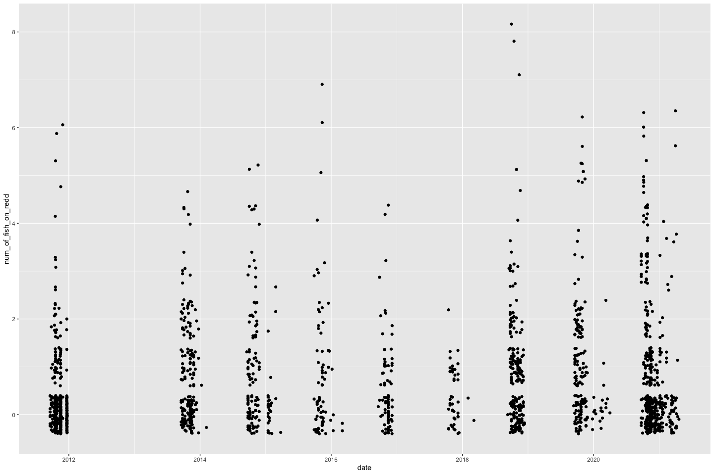

Yuba River Redd Survey QC
================
Maddee Rubenson
08/30/2022

# Yuba River Redd Surveys

## Description of Monitoring Data

**Timeframe:**

2011-09-19 through 2021-04-20

**Completeness of Record throughout timeframe:** Data was collected
primarily during October - December. The number of samples per month is
summarized below.

-   January: 75
-   February: 34
-   March: 40
-   April: 15
-   May: 0
-   June: 0
-   July: 0
-   August: 0
-   September: 174
-   October: 759
-   November: 639
-   December: 188

**Sampling Location:**

Throughout the Yuba River, identified by unique `redd_id` and
`latitude`/`longitude`

**Data Contact:**

Any additional info?

## Access Cloud Data

``` r
sheets <- readxl::excel_sheets(here::here('data-raw', 'qc-markdowns', 'adult-holding-redd-and-carcass-surveys', 'yuba-river/yuba_Redd_data_request_Aug2022.xlsx'))
raw_yuba_redd <- readxl::read_excel(here::here('data-raw', 'qc-markdowns', 'adult-holding-redd-and-carcass-surveys', 'yuba-river/yuba_Redd_data_request_Aug2022.xlsx'))
```

Read in data from google cloud, glimpse raw data and domain description
sheet:

## Data transformations

``` r
clean_redd_2008 <- redd_2008 %>% 
  mutate(across(where(is.character), str_remove_all, pattern = fixed(" "))) %>%
  mutate(latitude = as.numeric(latitude),
         longitude = as.numeric(longitude),
         latitude = latitude/10000,
         longitude = longitude/10000 * -1,
         year = 2008) 

clean_redd_2009 <- redd_2009 %>% 
  mutate(year = 2009) 

clean_redd_2010 <- redd_2010 %>% 
  select(-c(pl:x80_percent_depth, imposition_potential:percent_silt_clay_1, morphological_unit)) %>%
  rename(redd_id = redd_i_d) %>%
  mutate(year = 2010) 

clean_redd_2011 <- redd_2011 %>% 
  rename(redd_id = redd_i_d) %>%
  select(-c(imposition_potential, distance_to_cover, cover_type, 
           comments:tail_spill_width_2, nose_velocity_0_15m)) %>%
  mutate(year = 2011) %>%
  filter(year(date) < 2012) # removes a few dates that are formatted incorrectly 

clean_redd_2012 <- redd_2012 %>% 
  rename(redd_id = redd_i_d) %>%
  select(-c(crew_a_or, num_of_fis:tail_spi_2, adcp_veloc:comments2)) %>%
  mutate(year = 2012) 

clean_redd_2013 <- redd_2013 %>% 
  rename(redd_id = redd_i_d) %>%
  select(-c(imposition_potential:tail_spill_width_2)) %>%
  mutate(year = 2013) 

clean_redd_2014 <- redd_2014 %>% 
  rename(redd_id = redd_i_d) %>%
  select(-c(imposition_potential:tail_spill_width_2)) %>%
  mutate(year = 2014)

clean_redd_2015 <- redd_2015 %>% 
  rename(redd_id = redd_i_d,
         depth_m = depth) %>%
  mutate(year = 2015) %>%
  select(names(clean_redd_2014)) 

clean_redd_2016 <- redd_2016 %>% 
  rename(redd_id = redd_i_d,
         depth_m = depth) %>%
  mutate(year = 2016) %>%
  select(names(clean_redd_2014)) 

clean_redd_2017 <- redd_2017 %>% 
  rename(redd_id = redd_i_d,
         depth_m = depth) %>%
  mutate(year = 2017) %>%
  select(names(clean_redd_2014))
  

clean_redd_2018 <- redd_2018 %>% 
  rename(redd_id = redd_i_d,
         depth_m = depth) %>%
    mutate(year = 2018) %>%
  select(names(clean_redd_2014)) 

clean_redd_2019 <- redd_2019 %>% 
  rename(redd_id = redd_i_d,
         depth_m = depth) %>%
    mutate(year = 2019) %>%
  select(names(clean_redd_2014)) 

clean_redd_2020 <- redd_2020 %>% 
  rename(redd_id = redd_i_d,
         depth_m = depth) %>%
    mutate(year = 2020) %>%
  select(names(clean_redd_2014)) 

all_yuba_redd <- bind_rows(clean_redd_2008, 
                           clean_redd_2009,
                           clean_redd_2010, 
                           clean_redd_2011, 
                           clean_redd_2012, 
                           clean_redd_2013, 
                           clean_redd_2014, 
                           clean_redd_2015, 
                           clean_redd_2016, 
                           clean_redd_2017,
                           clean_redd_2018, 
                           clean_redd_2019, 
                           clean_redd_2020) %>%
  # take average velocity 
  mutate(mean_velocity = rowMeans(.[grep("^vel", names(.))], na.rm = TRUE)) %>% 
  select(-c(velocity_20_depth:velocity_80_percent_depth)) %>% 
  rename(velocity = mean_velocity) %>% 
  mutate_if(is.numeric, funs(ifelse(is.nan(.), NA, .))) %>%
  filter(velocity < 10) # single outlier value 

knitr::kable(head(all_yuba_redd, 15), digits = 2) 
```

| redd_id      | latitude | longitude | year | species | num_of_fish_on_redd | date       | depth_m | velocity |
|:-------------|---------:|----------:|-----:|:--------|--------------------:|:-----------|--------:|---------:|
| 20110919 001 |    39.22 |   -121.30 | 2011 | CHN     |                   0 | 2011-09-19 |    0.88 |     0.73 |
| 20110919 002 |    39.22 |   -121.30 | 2011 | CHN     |                   0 | 2011-09-19 |    1.12 |     0.92 |
| 20110919 003 |    39.22 |   -121.30 | 2011 | CHN     |                   0 | 2011-09-19 |    1.05 |     0.94 |
| 20110919 004 |    39.22 |   -121.30 | 2011 | CHN     |                   0 | 2011-09-19 |    0.67 |     0.49 |
| 20110919 005 |    39.22 |   -121.30 | 2011 | CHN     |                   0 | 2011-09-19 |    0.64 |     0.47 |
| 20110919 006 |    39.22 |   -121.30 | 2011 | CHN     |                   0 | 2011-09-19 |    0.74 |     0.75 |
| 20110919 007 |    39.22 |   -121.30 | 2011 | CHN     |                   0 | 2011-09-19 |    0.75 |     0.97 |
| 20110919 008 |    39.22 |   -121.36 | 2011 | CHN     |                   0 | 2011-09-19 |    0.48 |     0.82 |
| 20110923 001 |    39.20 |   -121.45 | 2011 | CHN     |                   0 | 2011-09-23 |    0.30 |     1.08 |
| 20110923 002 |    39.20 |   -121.45 | 2011 | CHN     |                   0 | 2011-09-23 |    0.35 |     1.07 |
| 20110926 001 |    39.23 |   -121.27 | 2011 | CHN     |                   2 | 2011-09-26 |    0.74 |     0.36 |
| 20110926 002 |    39.23 |   -121.27 | 2011 | CHN     |                   1 | 2011-09-26 |    1.06 |     0.35 |
| 20110926 003 |    39.23 |   -121.27 | 2011 | CHN     |                   0 | 2011-09-26 |    0.99 |     0.37 |
| 20110926 004 |    39.23 |   -121.27 | 2011 | CHN     |                   0 | 2011-09-26 |    0.54 |     0.45 |
| 20110926 005 |    39.23 |   -121.28 | 2011 | CHN     |                   0 | 2011-09-26 |    0.78 |     0.63 |

## Explore Numeric Variables:

### Variable:

**Plotting latitude/longitude over Period of Record**

``` r
length(unique(all_yuba_redd$latitude))
```

    ## [1] 1915

``` r
length(unique(all_yuba_redd$longitude))
```

    ## [1] 1908

``` r
length(all_yuba_redd[is.na(all_yuba_redd$latitude), ]) # 9 NAs
```

    ## [1] 9

``` r
length(all_yuba_redd[is.na(all_yuba_redd$longitude), ]) # 9 NAs
```

    ## [1] 9

**Numeric Summary of year over Period of Record**

``` r
table(all_yuba_redd$year)
```

    ## 
    ## 2011 2012 2013 2014 2015 2016 2017 2018 2019 2020 
    ##  489   95  190  140   78   86   45  199  175  427

**Numeric Summary of depth_m**

``` r
ggplot(data = all_yuba_redd) + 
  geom_point(aes(x = date, y = depth_m))
```

<!-- -->

**Numeric Summary of velocity**

``` r
ggplot(data = all_yuba_redd) + 
  geom_point(aes(x = date, y = velocity))
```

<!-- -->

**Numeric Summary of num_of_fish_on_redd**

``` r
ggplot(data = all_yuba_redd) + 
  geom_jitter(aes(x = date, y = num_of_fish_on_redd))
```

<!-- -->
**NA and Unknown Values**

Provide a stat on NA or unknown values

## Explore Categorical variables:

General notes: If there is an opportunity to turn yes no into boolean do
so, but not if you loose value

``` r
all_yuba_redd[is.na(all_yuba_redd$species), ] # no NAs for species
```

    ## # A tibble: 0 × 9
    ## # … with 9 variables: redd_id <chr>, latitude <dbl>, longitude <dbl>,
    ## #   year <dbl>, species <chr>, num_of_fish_on_redd <dbl>, date <dttm>,
    ## #   depth_m <dbl>, velocity <dbl>

``` r
all_yuba_redd[is.na(all_yuba_redd$redd_id), ] # no NAs for redd_id
```

    ## # A tibble: 0 × 9
    ## # … with 9 variables: redd_id <chr>, latitude <dbl>, longitude <dbl>,
    ## #   year <dbl>, species <chr>, num_of_fish_on_redd <dbl>, date <dttm>,
    ## #   depth_m <dbl>, velocity <dbl>

``` r
all_yuba_redd[is.na(all_yuba_redd$date), ] # no NAs for date
```

    ## # A tibble: 0 × 9
    ## # … with 9 variables: redd_id <chr>, latitude <dbl>, longitude <dbl>,
    ## #   year <dbl>, species <chr>, num_of_fish_on_redd <dbl>, date <dttm>,
    ## #   depth_m <dbl>, velocity <dbl>

### Variable: `[name]`

``` r
table(all_yuba_redd$species)
```

    ## 
    ##      CHN Salmonid       SH      UNK  Unknown 
    ##     1358      521       24       11       10

Fix inconsistencies with spelling, capitalization, and abbreviations.

**Create lookup rda for \[variable\] encoding:**

``` r
save(all_yuba_redd, file = here::here('data/redd-carcass-holding/yuba_redd.rda'))
```

**NA and Unknown Values**

## Summary of identified issues

## Save cleaned data back to google cloud

``` r
f <- function(input, output) write_csv(input, file = output)

gcs_upload(all_yuba_redd,
           object_function = f,
           type = "csv",
           name = "adult-holding-redd-and-carcass-surveys/yuba-river/data/2yuba_redd.csv",
           predefinedAcl = "bucketLevel")
```

    ## ℹ 2022-12-01 12:29:12 > File size detected as  170.9 Kb

    ## ==Google Cloud Storage Object==
    ## Name:                adult-holding-redd-and-carcass-surveys/yuba-river/data/2yuba_redd.csv 
    ## Type:                csv 
    ## Size:                170.9 Kb 
    ## Media URL:           https://www.googleapis.com/download/storage/v1/b/jpe-dev-bucket/o/adult-holding-redd-and-carcass-surveys%2Fyuba-river%2Fdata%2F2yuba_redd.csv?generation=1669926552375407&alt=media 
    ## Download URL:        https://storage.cloud.google.com/jpe-dev-bucket/adult-holding-redd-and-carcass-surveys%2Fyuba-river%2Fdata%2F2yuba_redd.csv 
    ## Public Download URL: https://storage.googleapis.com/jpe-dev-bucket/adult-holding-redd-and-carcass-surveys%2Fyuba-river%2Fdata%2F2yuba_redd.csv 
    ## Bucket:              jpe-dev-bucket 
    ## ID:                  jpe-dev-bucket/adult-holding-redd-and-carcass-surveys/yuba-river/data/2yuba_redd.csv/1669926552375407 
    ## MD5 Hash:            WEUnceZtCsPog7+iqodnMw== 
    ## Class:               STANDARD 
    ## Created:             2022-12-01 20:29:12 
    ## Updated:             2022-12-01 20:29:12 
    ## Generation:          1669926552375407 
    ## Meta Generation:     1 
    ## eTag:                CO+g0peh2fsCEAE= 
    ## crc32c:              wjWppQ==
