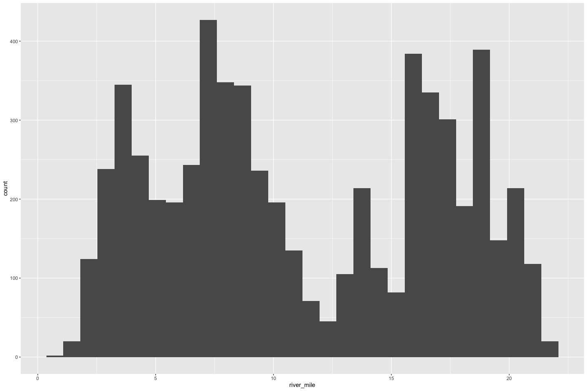
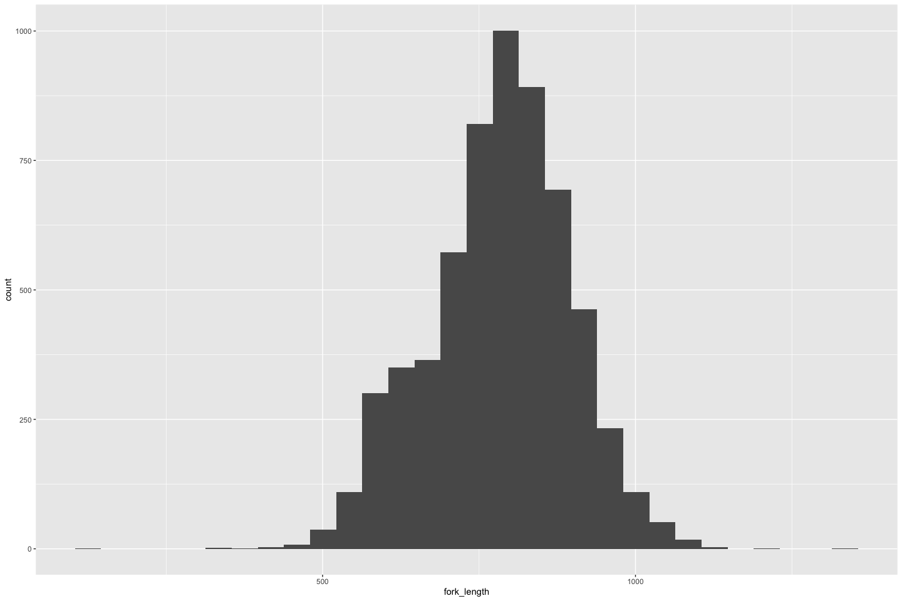
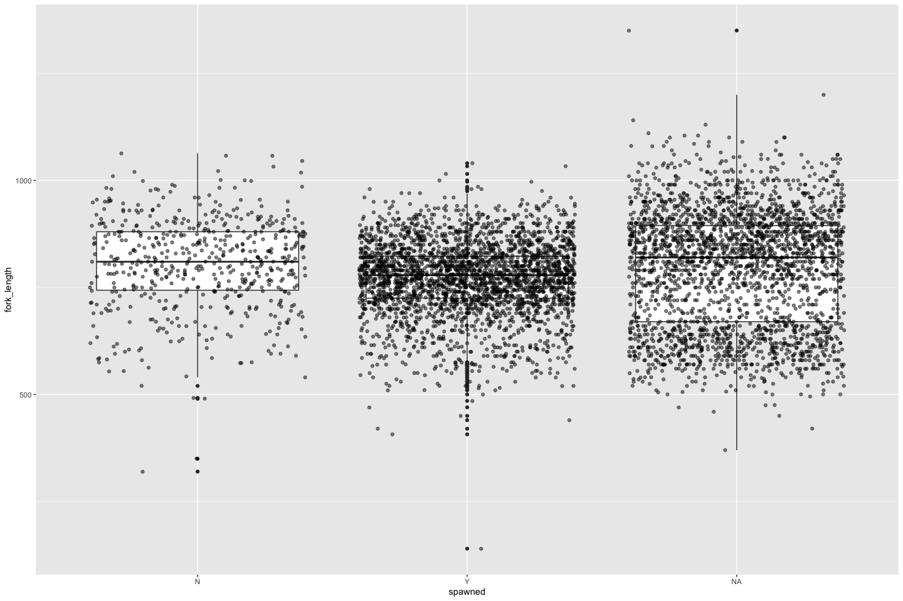

Yuba River Carcass QC
================
Maddee Rubenson (FlowWest)
2022-07-22

# Yuba River Carcass Data

## Description of Monitoring Data

**Timeframe:**

Min date: `2009-09-08` Max date: `2022-01-26`

**Video Season:**

**Completeness of Record throughout timeframe:**

**Sampling Location:**

Sampling location is based on river mile.

**Data Contact:**

Jessica Nichols [Escapement
Protocols](/data-raw/qc-markdowns/adult-holding-redd-and-carcass-surveys/yuba-river/Escapement%20Protocol%202011%20-%20internal%20review%20draft_09-16-2011.docx)

## Access Cloud Data

``` r
# Run Sys.setenv() to specify GCS_AUTH_FILE and GCS_DEFAULT_BUCKET before running 
# Open object from google cloud storage

if(google_cloud_access = TRUE) {
  gcs_auth(json_file = Sys.getenv('GCS_AUTH_FILE'))
  gcs_global_bucket(bucket = Sys.getenv('GCS_DEFAULT_BUCKET'))
  
  gcs_list_objects()
  # git data and save as xlsx
  gcs_get_object(object_name = "adult-holding-redd-and-carcass-surveys/yuba-river/data-raw/Carcass_datarequest07122022.xlsx",
                 bucket = gcs_get_global_bucket(),
                 saveToDisk = "raw_carcass_yuba_river.xlsx",
                 overwrite = TRUE)
}
```

Read in data from google cloud, glimpse raw data and domain description
sheet:

``` r
# read in data to clean 

sheets <- excel_sheets("raw_carcass_yuba_river.xlsx")
sheets 
```

    ## [1] "Carcass" "Chop"

``` r
raw_carcass_data <- read_excel("raw_carcass_yuba_river.xlsx", 
                               sheet = "Carcass") %>% glimpse()
```

    ## Rows: 6,140
    ## Columns: 7
    ## $ `Survey ID`    <chr> "20090908", "20090908", "20090915", "20090915", "200909…
    ## $ RM             <dbl> 19, 14, 11, 11, 17, 16, 22, 20, 19, 19, 18, 16, 15, 21,…
    ## $ `Fork Length`  <dbl> 790, 758, 815, 780, 825, 840, 955, 1010, 870, 970, 947,…
    ## $ Fresh          <chr> NA, NA, NA, NA, NA, NA, NA, NA, NA, NA, NA, NA, NA, NA,…
    ## $ `Adipose Clip` <chr> NA, NA, NA, NA, NA, NA, NA, NA, NA, NA, NA, NA, NA, NA,…
    ## $ Sex            <chr> "F", "F", "F", "F", "F", "F", "M", "M", "M", "M", "M", …
    ## $ Spawned        <chr> NA, NA, NA, NA, NA, NA, NA, NA, NA, NA, NA, NA, NA, NA,…

## Data transformations

-   modified `survey_id` to `date` and converted to date format

``` r
# Snake case, 
# Columns are appropriate types
# Remove redundant columns

clean_yuba_carcass <- raw_carcass_data %>% janitor::clean_names() %>% 
  rename(river_mile = rm) %>%
  mutate(date = as_date(survey_id)) %>%
  select(-survey_id) %>%
  glimpse
```

    ## Rows: 6,140
    ## Columns: 7
    ## $ river_mile   <dbl> 19, 14, 11, 11, 17, 16, 22, 20, 19, 19, 18, 16, 15, 21, 2…
    ## $ fork_length  <dbl> 790, 758, 815, 780, 825, 840, 955, 1010, 870, 970, 947, 9…
    ## $ fresh        <chr> NA, NA, NA, NA, NA, NA, NA, NA, NA, NA, NA, NA, NA, NA, N…
    ## $ adipose_clip <chr> NA, NA, NA, NA, NA, NA, NA, NA, NA, NA, NA, NA, NA, NA, N…
    ## $ sex          <chr> "F", "F", "F", "F", "F", "F", "M", "M", "M", "M", "M", "M…
    ## $ spawned      <chr> NA, NA, NA, NA, NA, NA, NA, NA, NA, NA, NA, NA, NA, NA, N…
    ## $ date         <date> 2009-09-08, 2009-09-08, 2009-09-15, 2009-09-15, 2009-09-…

``` r
summary(clean_yuba_carcass)
```

    ##    river_mile     fork_length        fresh           adipose_clip      
    ##  Min.   : 1.00   Min.   : 140.0   Length:6140        Length:6140       
    ##  1st Qu.: 6.40   1st Qu.: 715.0   Class :character   Class :character  
    ##  Median :10.00   Median : 790.0   Mode  :character   Mode  :character  
    ##  Mean   :11.25   Mean   : 783.5                                        
    ##  3rd Qu.:16.90   3rd Qu.: 860.0                                        
    ##  Max.   :22.00   Max.   :1350.0                                        
    ##  NA's   :102     NA's   :103                                           
    ##      sex              spawned               date           
    ##  Length:6140        Length:6140        Min.   :2009-09-08  
    ##  Class :character   Class :character   1st Qu.:2013-10-29  
    ##  Mode  :character   Mode  :character   Median :2014-11-17  
    ##                                        Mean   :2015-10-03  
    ##                                        3rd Qu.:2018-10-18  
    ##                                        Max.   :2022-01-26  
    ## 

## Explore Numeric Variables:

``` r
# Filter clean data to show only numeric variables 
```

### `river_mile`

**Plotting river_mile over Period of Record**

``` r
summary(clean_yuba_carcass$river_mile)
```

    ##    Min. 1st Qu.  Median    Mean 3rd Qu.    Max.    NA's 
    ##    1.00    6.40   10.00   11.25   16.90   22.00     102

``` r
ggplot() + 
  geom_histogram(data = clean_yuba_carcass, aes(river_mile))
```

    ## `stat_bin()` using `bins = 30`. Pick better value with `binwidth`.

<!-- -->

### `fork_lengh`

``` r
summary(clean_yuba_carcass$fork_length)
```

    ##    Min. 1st Qu.  Median    Mean 3rd Qu.    Max.    NA's 
    ##   140.0   715.0   790.0   783.5   860.0  1350.0     103

``` r
# histogram
ggplot() + 
  geom_histogram(data = clean_yuba_carcass, aes(fork_length))
```

    ## `stat_bin()` using `bins = 30`. Pick better value with `binwidth`.

<!-- -->

``` r
# boxplot
ggplot() + 
  geom_boxplot(data = clean_yuba_carcass, aes(y = fork_length, x = spawned)) +
  geom_jitter(data = clean_yuba_carcass, aes(y = fork_length, x = spawned), alpha = 0.5)
```

<!-- -->

## Explore Categorical variables:

### `date`

``` r
summary(clean_yuba_carcass$date)
```

    ##         Min.      1st Qu.       Median         Mean      3rd Qu.         Max. 
    ## "2009-09-08" "2013-10-29" "2014-11-17" "2015-10-03" "2018-10-18" "2022-01-26"

### `fresh`

``` r
table(clean_yuba_carcass$fresh, useNA = "ifany")
```

    ## 
    ##    N    Y <NA> 
    ## 2523 2725  892

### `adipose_clip`

``` r
table(clean_yuba_carcass$adipose_clip, useNA = "ifany")
```

    ## 
    ##    N  Unk    Y <NA> 
    ## 4722    2  948  468

### `sex`

``` r
table(clean_yuba_carcass$sex, useNA = "ifany")
```

    ## 
    ##    F    M    U <NA> 
    ## 3198 2837    2  103

### `spawned`

``` r
table(clean_yuba_carcass$spawned, useNA = "ifany")
```

    ## 
    ##    N    Y <NA> 
    ##  555 2895 2690

## Summary of identified issues

-   

## Save cleaned data back to google cloud

``` r
yuba_carcass <- clean_yuba_carcass

# gcs_list_objects()
f <- function(input, output) write_csv(input, file = output)

# gcs_upload(yuba_carcass,
#            object_function = f,
#            type = "csv",
#            name = "adult-holding-redd-and-carcass-surveys/yuba-river/data/yuba_carcass.csv")
```
