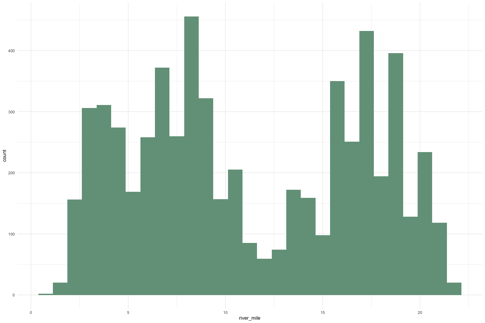
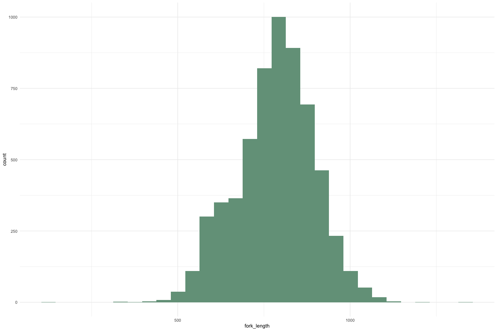
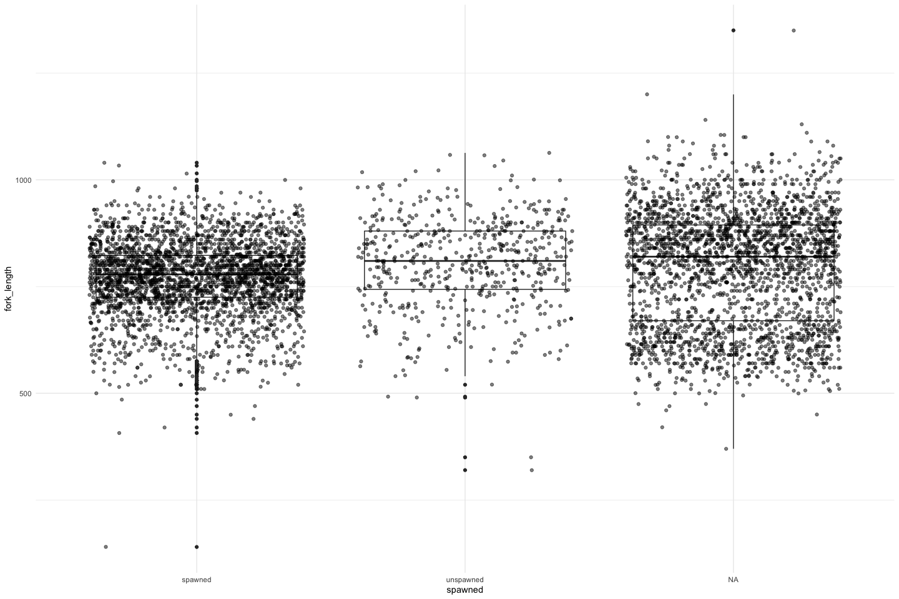
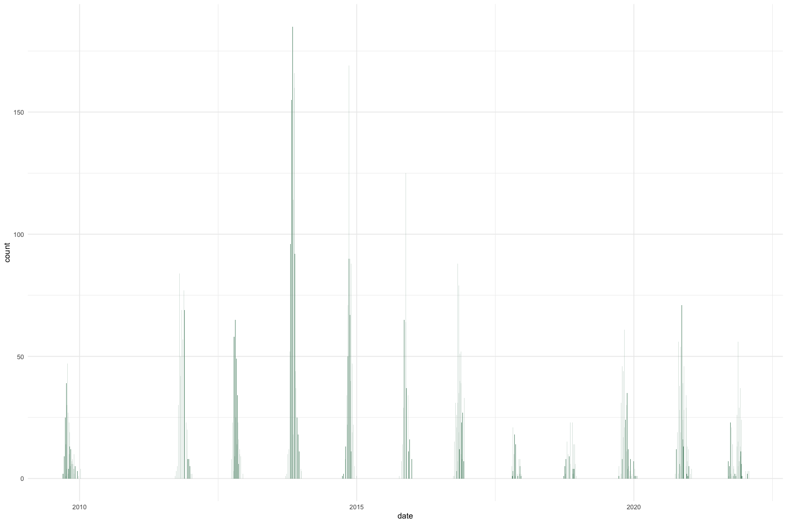
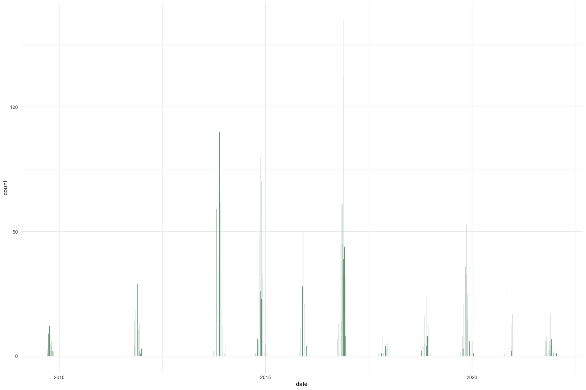
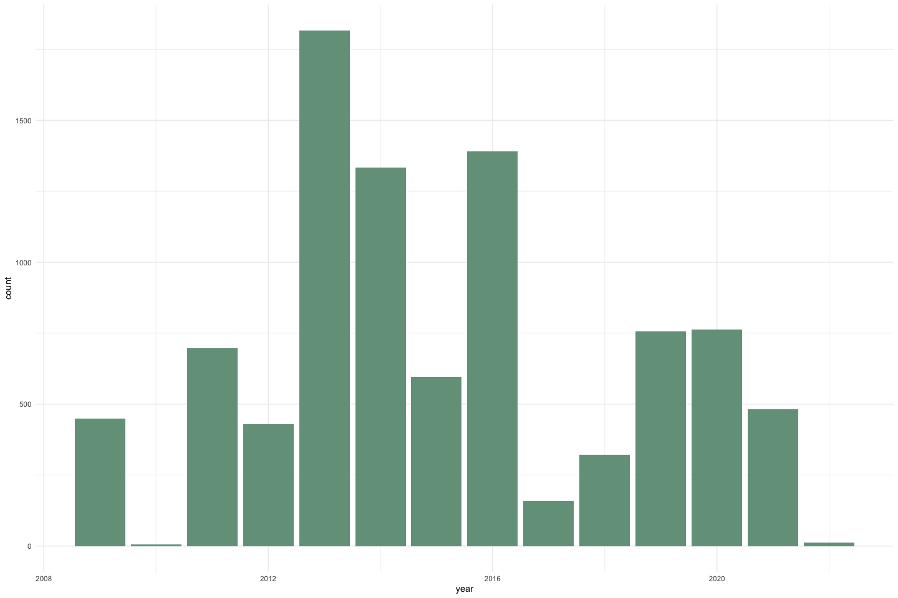

Yuba River Carcass QC
================
Maddee Rubenson (FlowWest)
2023-01-30

# Yuba River Carcass Data

## Description of Monitoring Data

**Timeframe:**

Min date: `2009-09-08` Max date: `2022-01-26`

**Video Season:**

**Completeness of Record throughout timeframe:**

**Sampling Location:**

Sampling location is based on river mile.

**Data Contact:**

Jessica Nichols [Escapement
Protocols](/data-raw/qc-markdowns/adult-holding-redd-and-carcass-surveys/yuba-river/Escapement%20Protocol%202011%20-%20internal%20review%20draft_09-16-2011.docx)

## Access Cloud Data

``` r
# Run Sys.setenv() to specify GCS_AUTH_FILE and GCS_DEFAULT_BUCKET before running 
# Open object from google cloud storage

if(google_cloud_access == TRUE) {
  gcs_auth(json_file = Sys.getenv('GCS_AUTH_FILE'))
  gcs_global_bucket(bucket = Sys.getenv('GCS_DEFAULT_BUCKET'))
  
  gcs_list_objects()
  # git data and save as xlsx
  gcs_get_object(object_name = "adult-holding-redd-and-carcass-surveys/yuba-river/data-raw/Carcass_datarequest07122022.xlsx",
                 bucket = gcs_get_global_bucket(),
                 saveToDisk = "data-raw/qc-markdowns/adult-holding-redd-and-carcass-surveys/yuba-river/raw_carcass_yuba_river.xlsx",
                 overwrite = TRUE)
}
```

Read in data from google cloud, glimpse raw data and domain description
sheet: - there are two tabs in the excel file: `Carcass`, which contains
biological sampling (one individual per row), and `Chops`, which
contains bulk chop counts that were not biologically sampled (one row is
one date, and count column is total chops that day).

``` r
# read in data to clean 
excel_sheets("data-raw/qc-markdowns/adult-holding-redd-and-carcass-surveys/yuba-river/raw_carcass_yuba_river.xlsx") 
```

    ## [1] "Carcass" "Chop"

``` r
raw_carcass_individual <- read_excel("data-raw/qc-markdowns/adult-holding-redd-and-carcass-surveys/yuba-river/raw_carcass_yuba_river.xlsx", 
                               sheet = "Carcass") %>% glimpse()
```

    ## Rows: 6,140
    ## Columns: 7
    ## $ `Survey ID`    <chr> "20090908", "20090908", "20090915", "20090915", "200909…
    ## $ RM             <dbl> 19, 14, 11, 11, 17, 16, 22, 20, 19, 19, 18, 16, 15, 21,…
    ## $ `Fork Length`  <dbl> 790, 758, 815, 780, 825, 840, 955, 1010, 870, 970, 947,…
    ## $ Fresh          <chr> NA, NA, NA, NA, NA, NA, NA, NA, NA, NA, NA, NA, NA, NA,…
    ## $ `Adipose Clip` <chr> NA, NA, NA, NA, NA, NA, NA, NA, NA, NA, NA, NA, NA, NA,…
    ## $ Sex            <chr> "F", "F", "F", "F", "F", "F", "M", "M", "M", "M", "M", …
    ## $ Spawned        <chr> NA, NA, NA, NA, NA, NA, NA, NA, NA, NA, NA, NA, NA, NA,…

``` r
raw_carcass_counts <- read_excel("data-raw/qc-markdowns/adult-holding-redd-and-carcass-surveys/yuba-river/raw_carcass_yuba_river.xlsx", 
                                 sheet = "Chop") |> glimpse()
```

    ## Rows: 219
    ## Columns: 2
    ## $ `Survey ID`   <chr> "20090916", "20090922", "20090929", "20090930", "2009100…
    ## $ `Total Chops` <dbl> 1, 3, 9, 9, 1, 12, 13, 1, 8, 5, 2, 5, 4, 6, 1, 2, 2, 2, …

## Data transformations

### `Carcass` table

- modified `survey_id` to `date` and converted to date format
- added `individual_chops` column (`1` for all rows)

``` r
# Snake case, 
# Columns are appropriate types
# Remove redundant columns

clean_yuba_carcass <- raw_carcass_individual %>% janitor::clean_names() %>% 
  rename(river_mile = rm) %>%
  mutate(date = as_date(survey_id),
         individual_chops = 1) %>% 
  select(-survey_id) %>%
  glimpse()
```

    ## Rows: 6,140
    ## Columns: 8
    ## $ river_mile       <dbl> 19, 14, 11, 11, 17, 16, 22, 20, 19, 19, 18, 16, 15, 2…
    ## $ fork_length      <dbl> 790, 758, 815, 780, 825, 840, 955, 1010, 870, 970, 94…
    ## $ fresh            <chr> NA, NA, NA, NA, NA, NA, NA, NA, NA, NA, NA, NA, NA, N…
    ## $ adipose_clip     <chr> NA, NA, NA, NA, NA, NA, NA, NA, NA, NA, NA, NA, NA, N…
    ## $ sex              <chr> "F", "F", "F", "F", "F", "F", "M", "M", "M", "M", "M"…
    ## $ spawned          <chr> NA, NA, NA, NA, NA, NA, NA, NA, NA, NA, NA, NA, NA, N…
    ## $ date             <date> 2009-09-08, 2009-09-08, 2009-09-15, 2009-09-15, 2009…
    ## $ individual_chops <dbl> 1, 1, 1, 1, 1, 1, 1, 1, 1, 1, 1, 1, 1, 1, 1, 1, 1, 1,…

``` r
summary(clean_yuba_carcass)
```

    ##    river_mile     fork_length        fresh           adipose_clip      
    ##  Min.   : 1.00   Min.   : 140.0   Length:6140        Length:6140       
    ##  1st Qu.: 6.40   1st Qu.: 715.0   Class :character   Class :character  
    ##  Median :10.00   Median : 790.0   Mode  :character   Mode  :character  
    ##  Mean   :11.25   Mean   : 783.5                                        
    ##  3rd Qu.:16.90   3rd Qu.: 860.0                                        
    ##  Max.   :22.00   Max.   :1350.0                                        
    ##  NA's   :102     NA's   :103                                           
    ##      sex              spawned               date            individual_chops
    ##  Length:6140        Length:6140        Min.   :2009-09-08   Min.   :1       
    ##  Class :character   Class :character   1st Qu.:2013-10-29   1st Qu.:1       
    ##  Mode  :character   Mode  :character   Median :2014-11-17   Median :1       
    ##                                        Mean   :2015-10-03   Mean   :1       
    ##                                        3rd Qu.:2018-10-18   3rd Qu.:1       
    ##                                        Max.   :2022-01-26   Max.   :1       
    ## 

### `Chop` table

- modified `survey_id` to `date` and converted to date format
- renamed `total_chops` column to `bulk_chops` column to distinguish
  from `individual_chops` column in `Carcass` table

``` r
# Snake case, 
# Columns are appropriate types
# Remove redundant columns

clean_yuba_chops <- raw_carcass_counts %>% janitor::clean_names() %>%
  mutate(date = as_date(survey_id)) %>% 
  select(-survey_id) %>%
  rename(bulk_chops = total_chops) |> 
  glimpse()
```

    ## Rows: 219
    ## Columns: 2
    ## $ bulk_chops <dbl> 1, 3, 9, 9, 1, 12, 13, 1, 8, 5, 2, 5, 4, 6, 1, 2, 2, 2, 1, …
    ## $ date       <date> 2009-09-16, 2009-09-22, 2009-09-29, 2009-09-30, 2009-10-01…

``` r
summary(clean_yuba_chops)
```

    ##    bulk_chops          date           
    ##  Min.   :  1.00   Min.   :2009-09-16  
    ##  1st Qu.:  2.00   1st Qu.:2013-11-30  
    ##  Median :  7.00   Median :2016-11-17  
    ##  Mean   : 14.04   Mean   :2016-09-07  
    ##  3rd Qu.: 17.00   3rd Qu.:2019-10-28  
    ##  Max.   :135.00   Max.   :2022-01-18

### Combined

- Each row in the combined dataset represents a sampling event of either
  - biological sampling of an individual carcass (count stored in
    `individual_chops` column). This is from the `Carcass` table.
  - bulk sampling of chops on a given date (count stored in `bulk_chops`
    column). This is from the `Chop` table.
- To get a `total_count` value for a given `date`, sum
  `individual_chops` and `bulk_chops`.
- converted `adipose_clip` column to a logical variable
- modified values for `sex` and `spawned` columns to be more explicit
- renamed `fresh` to `carcass_condition` to standardize across streams
  and modified values to be more explicit

``` r
clean_yuba_combined <- 
  bind_rows(clean_yuba_carcass, clean_yuba_chops) |> 
         mutate(adipose_clip = case_when(adipose_clip == "Y" ~ TRUE,
                                  adipose_clip == "N" ~ FALSE,
                                  adipose_clip %in% c(NA, "Unk") ~ NA),
         spawned = case_when(spawned == "Y" ~ "spawned",
                             spawned == "N" ~ "unspawned",
                             is.na(spawned) ~ NA_character_),
         sex = case_when(sex == "F" ~ "female",
                         sex == "M" ~ "male",
                         sex == "U" ~ "unknown",
                         TRUE ~ sex),
         carcass_condition = case_when(fresh == "Y" ~ "fresh",
                                       fresh == "N" ~ "non fresh",
                                       is.na(fresh) ~ NA_character_)) |>
  select(-fresh) |> 
  glimpse()
```

    ## Rows: 6,359
    ## Columns: 9
    ## $ river_mile        <dbl> 19, 14, 11, 11, 17, 16, 22, 20, 19, 19, 18, 16, 15, …
    ## $ fork_length       <dbl> 790, 758, 815, 780, 825, 840, 955, 1010, 870, 970, 9…
    ## $ adipose_clip      <lgl> NA, NA, NA, NA, NA, NA, NA, NA, NA, NA, NA, NA, NA, …
    ## $ sex               <chr> "female", "female", "female", "female", "female", "f…
    ## $ spawned           <chr> NA, NA, NA, NA, NA, NA, NA, NA, NA, NA, NA, NA, NA, …
    ## $ date              <date> 2009-09-08, 2009-09-08, 2009-09-15, 2009-09-15, 200…
    ## $ individual_chops  <dbl> 1, 1, 1, 1, 1, 1, 1, 1, 1, 1, 1, 1, 1, 1, 1, 1, 1, 1…
    ## $ bulk_chops        <dbl> NA, NA, NA, NA, NA, NA, NA, NA, NA, NA, NA, NA, NA, …
    ## $ carcass_condition <chr> NA, NA, NA, NA, NA, NA, NA, NA, NA, NA, NA, NA, NA, …

## Explore Numeric Variables:

``` r
clean_yuba_combined |> 
  select_if(is.numeric) |>
  colnames()
```

    ## [1] "river_mile"       "fork_length"      "individual_chops" "bulk_chops"

### `river_mile`

**Plotting river_mile over Period of Record**

``` r
summary(clean_yuba_combined$river_mile)
```

    ##    Min. 1st Qu.  Median    Mean 3rd Qu.    Max.    NA's 
    ##    1.00    6.40   10.00   11.25   16.90   22.00     321

``` r
ggplot() + 
  geom_histogram(data = clean_yuba_combined, aes(river_mile), binwidth = 0.75, fill = "#74A089") + 
  theme_minimal()
```

<!-- -->

### `fork_length`

``` r
summary(clean_yuba_combined$fork_length)
```

    ##    Min. 1st Qu.  Median    Mean 3rd Qu.    Max.    NA's 
    ##   140.0   715.0   790.0   783.5   860.0  1350.0     322

``` r
# histogram
ggplot() + 
  geom_histogram(data = clean_yuba_combined, aes(fork_length), 
                 fill = "#74A089") + 
  theme_minimal()
```

    ## `stat_bin()` using `bins = 30`. Pick better value with `binwidth`.

<!-- -->

``` r
# boxplot
ggplot() + 
  geom_boxplot(data = clean_yuba_combined, aes(y = fork_length, x = spawned)) +
  geom_jitter(data = clean_yuba_combined, aes(y = fork_length, x = spawned), alpha = 0.5) + 
  theme_minimal()
```

<!-- -->

### `individual_chops` over time

``` r
clean_yuba_combined |> 
  group_by(date) |> 
  summarise(count = sum(individual_chops, na.rm = T)) |> 
  ggplot(aes(x = date, y = count)) +
  geom_col(fill = "#74A089") + 
  theme_minimal()
```

<!-- -->

### `bulk_chops` over time

``` r
clean_yuba_combined |> 
  group_by(date) |> 
  summarise(count = sum(bulk_chops, na.rm = T)) |> 
  ggplot(aes(x = date, y = count)) +
  geom_col(fill = "#74A089") + 
  theme_minimal()
```

<!-- -->

### total chops (`individual_chops` and `bulk_chops`) by year

``` r
clean_yuba_combined |> 
  mutate(year = year(date)) |>
  group_by(year) |>
  summarise(count = sum(individual_chops, bulk_chops, na.rm = T)) |> 
  ggplot(aes(x = year, y = count)) +
  geom_col(fill = "#74A089") + 
  theme_minimal()
```

<!-- -->

## Explore Categorical variables:

``` r
clean_yuba_combined |> 
  select(!is.numeric) |> 
  colnames()
```

    ## [1] "adipose_clip"      "sex"               "spawned"          
    ## [4] "date"              "carcass_condition"

### `date`

``` r
summary(clean_yuba_combined$date)
```

    ##         Min.      1st Qu.       Median         Mean      3rd Qu.         Max. 
    ## "2009-09-08" "2013-10-29" "2014-11-18" "2015-10-15" "2018-11-01" "2022-01-26"

### `carcass_condition`

``` r
table(clean_yuba_combined$carcass_condition, useNA = "ifany")
```

    ## 
    ##     fresh non fresh      <NA> 
    ##      2725      2523      1111

### `adipose_clip`

``` r
table(clean_yuba_combined$adipose_clip, useNA = "ifany")
```

    ## 
    ## FALSE  TRUE  <NA> 
    ##  4722   948   689

### `sex`

``` r
table(clean_yuba_combined$sex, useNA = "ifany")
```

    ## 
    ##  female    male unknown    <NA> 
    ##    3198    2837       2     322

### `spawned`

``` r
table(clean_yuba_combined$spawned, useNA = "ifany")
```

    ## 
    ##   spawned unspawned      <NA> 
    ##      2895       555      2909

## Summary of identified issues

- The data are in good shape and standardized. Important to be aware
  that bulk chop counts and individual chop counts are stored in
  separate variables; this can be changed easily.

## Save cleaned data back to google cloud
