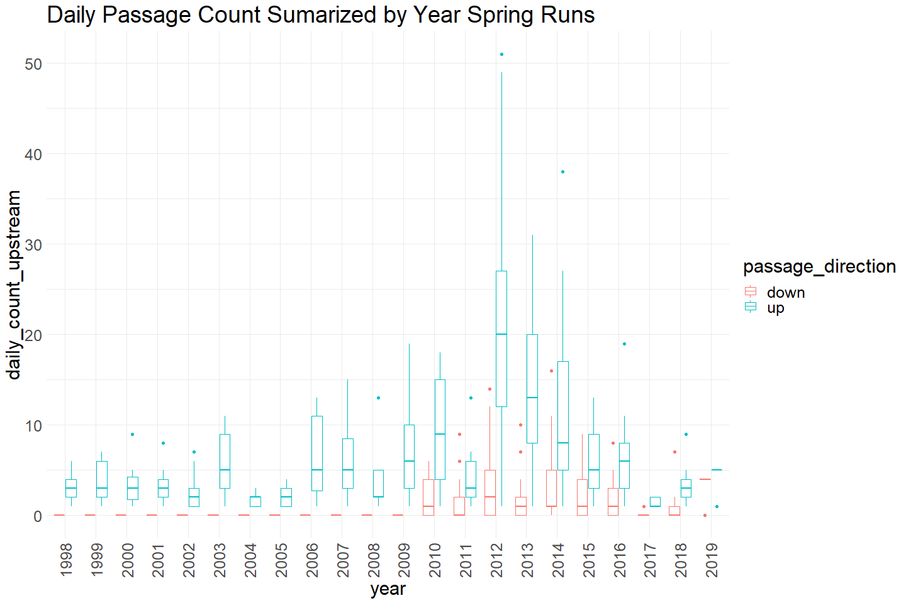
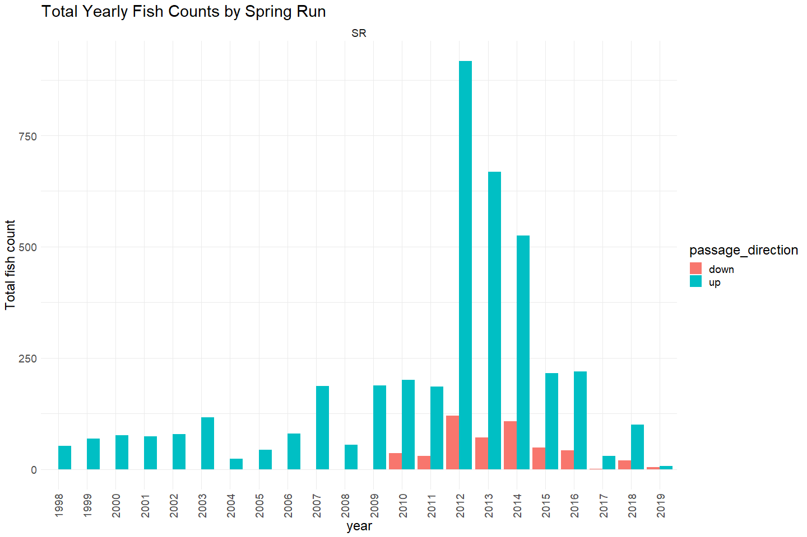

Battle Creek Upstream Passage Monitoring Video Data QC
================
Erin Cain
9/29/2021

# Battle Creek Upstream Passage Monitoring Video Data

## Description of Monitoring Data

These data were collected to capture the number of fish that pass the
barrier weir at Coleman National Fish Hatchery from 1998 to 2019.
Observations were captured via video footage of passing fish. For video
data, prior to 2008, fish were viewed via a funnel video setup on the
fish ladder. In 2008 the video system was an instream system with
viewing via an open section of stream. Beginning in 2009 to the present,
fish are viewed via a crowder video setup as they pass through the fish
ladder.

**Timeframe:** 1998 - 2012

**Video Season:** Video is run all year.

**Completeness of Record throughout timeframe:** Data for every year in
timeframe.

**Sampling Location:** Battle Creek fish ladder.

**Data Contact:** [Natasha Wingerter](mailto:natasha_wingerter@fws.gov)

Any additional info?

## Access Cloud Data

``` r
# Run Sys.setenv() to specify GCS_AUTH_FILE and GCS_DEFAULT_BUCKET before running 
getwd() #to see how to specify paths 
# Open object from google cloud storage
# Set your authentication using gcs_auth
gcs_auth(json_file = Sys.getenv("GCS_AUTH_FILE"))
# Set global bucket 
gcs_global_bucket(bucket = Sys.getenv("GCS_DEFAULT_BUCKET"))

gcs_list_objects()
# git data and save as xlsx
gcs_get_object(object_name = 
                 "adult-upstream-passage-monitoring/battle-creek/data-raw/battle_creek_upstream_passage_datas.xlsx",
               bucket = gcs_get_global_bucket(),
               saveToDisk = "raw_battle_creek_passage_data.xlsx",
               overwrite = TRUE)
```

Read in data from google cloud, glimpse raw data and domain description
sheet:

``` r
# read in data to clean 
sheets <- readxl::excel_sheets("raw_battle_creek_passage_data.xlsx")
sheets
```

    ## [1] "Notes and Metadata"         "Video"                     
    ## [3] "Trap and Spawning Building" "Upstream Passage Estimates"

``` r
raw_video_data <- read_excel("raw_battle_creek_passage_data.xlsx", sheet = "Video") %>% glimpse()
```

    ## Rows: 4,791
    ## Columns: 11
    ## $ Project     <chr> "Video", "Video", "Video", "Video", "Video", "Video", "Vid~
    ## $ Sample_Date <dttm> 1998-06-01, 1998-06-01, 1998-06-02, 1998-06-02, 1998-06-0~
    ## $ Species     <chr> "Chinook Salmon (CHN)", "Chinook Salmon (CHN)", "Chinook S~
    ## $ Time_Passed <dttm> NA, NA, NA, NA, NA, NA, NA, NA, NA, NA, NA, NA, NA, NA, N~
    ## $ Passed_Up   <dbl> 1, 1, 5, 1, 2, 2, 2, 1, 2, 1, 1, 0, 2, 2, 2, 3, 1, 1, 1, 1~
    ## $ Passed_Down <dbl> 0, 0, 0, 0, 0, 0, 0, 0, 0, 0, 0, 0, 0, 0, 0, 0, 0, 0, 0, 0~
    ## $ Net_Total   <dbl> 1, 1, 5, 1, 2, 2, 2, 1, 2, 1, 1, 0, 2, 2, 2, 3, 1, 1, 1, 1~
    ## $ Adipose_Fin <chr> "Present", "Unknown", "Present", "Absent", "Present", "Unk~
    ## $ Comments    <chr> NA, NA, NA, NA, NA, NA, NA, NA, NA, NA, NA, NA, NA, NA, NA~
    ## $ Run_Call    <chr> "SR", "SR", "SR", "SR", "SR", "SR", "SR", "SR", "SR", "SR"~
    ## $ Notes       <lgl> NA, NA, NA, NA, NA, NA, NA, NA, NA, NA, NA, NA, NA, NA, NA~

## Data transformations

``` r
cleaner_video_data <- raw_video_data %>% 
  janitor::clean_names() %>% 
  filter(species == "Chinook Salmon (CHN)") %>%
  rename("run" = run_call,
         "adipose" = adipose_fin, 
         "date" = sample_date,
         "time" = time_passed,
         "up" = passed_up,
         "down" = passed_down) %>%
  mutate(date = as.Date(date),
         time = hms::as_hms(time)) %>%
  select(-net_total, # net total just equals difference in count up and count down 
         -project, -species, # all species = chn, all project = video 
         -notes) %>% # all notes = NA
  pivot_longer(!c(date, time, adipose:run), 
               names_to = "passage_direction",
               values_to = "count") %>%
  glimpse()
```

    ## Rows: 9,550
    ## Columns: 7
    ## $ date              <date> 1998-06-01, 1998-06-01, 1998-06-01, 1998-06-01, 199~
    ## $ time              <time> NA, NA, NA, NA, NA, NA, NA, NA, NA, NA, NA, NA, NA,~
    ## $ adipose           <chr> "Present", "Present", "Unknown", "Unknown", "Present~
    ## $ comments          <chr> NA, NA, NA, NA, NA, NA, NA, NA, NA, NA, NA, NA, NA, ~
    ## $ run               <chr> "SR", "SR", "SR", "SR", "SR", "SR", "SR", "SR", "SR"~
    ## $ passage_direction <chr> "up", "down", "up", "down", "up", "down", "up", "dow~
    ## $ count             <dbl> 1, 0, 1, 0, 5, 0, 1, 0, 2, 0, 2, 0, 2, 0, 1, 0, 2, 0~

## Data Dictionary

The following table describes the variables included in this dataset and
the percent that do not include data.

``` r
percent_na <- cleaner_video_data %>%
  summarise_all(list(name = ~sum(is.na(.))/length(.))) %>%
  pivot_longer(cols = everything())
  
data_dictionary <- tibble(variables = colnames(cleaner_video_data),
                          description = c("Date",
                                          "Time",
                                          "Adipose fin present or not",
                                          "Comments",
                                          "Run of the fish",
                                          "Whether fish is moving upstream or downstream",
                                          "Passage Counts"),
                          percent_na = round(percent_na$value*100)
                          
)
knitr::kable(data_dictionary)
```

| variables          | description                                   | percent\_na |
|:-------------------|:----------------------------------------------|------------:|
| date               | Date                                          |           0 |
| time               | Time                                          |           4 |
| adipose            | Adipose fin present or not                    |           0 |
| comments           | Comments                                      |          88 |
| run                | Run of the fish                               |           0 |
| passage\_direction | Whether fish is moving upstream or downstream |           0 |
| count              | Passage Counts                                |           0 |

## Explore Numeric Variables:

``` r
cleaner_video_data %>% select_if(is.numeric) %>% colnames()
```

    ## [1] "count"

### Variable: `count`

**Plotting Passage Counts over Period of Record**

``` r
cleaner_video_data %>% 
  filter(run == "SR") %>% 
  mutate(year = as.factor(year(date)),
         fake_year = if_else(month(date) %in% 10:12, 1900, 1901),
         fake_date = as.Date(paste0(fake_year,"-", month(date), "-", day(date)))) %>%
  ggplot(aes(x = fake_date, y = count, fill = passage_direction)) + 
  geom_col() + 
  facet_wrap(~year(date), scales = "free") + 
  scale_x_date(labels = date_format("%b"), limits = c(as.Date("1901-04-01"), as.Date("1901-09-01")), date_breaks = "1 month") + 
  theme_minimal() + 
  theme(text = element_text(size = 23),
        axis.text.x = element_text(angle = 90, vjust = 0.5, hjust=1)) + 
  labs(title = "Daily Count of Passage Spring Runs", 
       x = "Date")  
```

<!-- -->

Spring Run Chinook appear to be seen moving upstream April through
September.

``` r
# Boxplots of daily counts by year
cleaner_video_data %>% group_by(date, passage_direction) %>%
  filter(run == "SR") %>% 
  mutate(daily_count_upstream = sum(count)) %>%
  mutate(year = as.factor(year(date))) %>% 
  ungroup() %>%
  ggplot(aes(x = year, y = daily_count_upstream, color = passage_direction)) + 
  geom_boxplot() + 
  theme_minimal() +
  theme(text = element_text(size = 23),
        axis.text.x = element_text(angle = 90, vjust = 0.5, hjust=1)) + 
  labs(title = "Daily Passage Count Sumarized by Year Spring Runs") 
```

<!-- -->

``` r
cleaner_video_data  %>%
  filter(run == "SR") %>% 
  mutate(year = as.factor(year(date))) %>%
  filter(run %in% c("FR", "LF", "SR", "WR")) %>% # Filter to only show runs that have more than one data point and are not NA/Unknown
  group_by(year, passage_direction, run) %>%
  summarise(total_count = sum(count)) %>%
  ggplot(aes(x = year, y = total_count, fill = passage_direction)) + 
  geom_col(position = "dodge") + 
  theme_minimal() +
  labs(title = "Total Yearly Fish Counts by Spring Run",
       y = "Total fish count") + 
  theme(text = element_text(size = 18),
        axis.text.x = element_text(angle = 90, vjust = 0.5, hjust=1)) + 
  facet_wrap(~run)
```

    ## `summarise()` has grouped output by 'year', 'passage_direction'. You can override using the `.groups` argument.

<!-- -->
We mainly have video data describing counts of Spring Run Fish

**Numeric Summary of Passage Counts over Period of Record**

``` r
# Table with summary statistics
summary(cleaner_video_data$count)
```

    ##    Min. 1st Qu.  Median    Mean 3rd Qu.    Max. 
    ##  0.0000  0.0000  0.0000  0.5069  1.0000  7.0000

``` r
# daily numeric summary 
cleaner_video_data %>% group_by(date) %>%
  summarise(count = sum(count, na.rm = T)) %>%
  pull(count) %>%
  summary()
```

    ##    Min. 1st Qu.  Median    Mean 3rd Qu.    Max. 
    ##   1.000   1.000   2.000   4.646   5.000  62.000

**NA and Unknown Values**

-   0 % of values in the `count` column are NA. However, there are
    clearly gaps in data. More investigation needs to be done to see if
    0 is a real 0 or if it can be explained by other factors (outages).

## Explore Categorical variables:

``` r
cleaner_video_data %>% select_if(is.character) %>% colnames()
```

    ## [1] "adipose"           "comments"          "run"              
    ## [4] "passage_direction"

### Variable: `adipose`

``` r
table(cleaner_video_data$adipose) 
```

    ## 
    ##  Absent present Present Unknown 
    ##    1624       2    7808     116

Fix inconsistencies with spelling, capitalization, and abbreviations.

``` r
# Fix yes/no/unknown
cleaner_video_data$adipose = tolower(cleaner_video_data$adipose)
table(cleaner_video_data$adipose) 
```

    ## 
    ##  absent present unknown 
    ##    1624    7810     116

**NA or Unknown Values**

-   0 % of values in the `adipose` column are NA.
-   1.2 % of values in the `adipose` column are`unknown`.

### Variable: `run`

``` r
table(cleaner_video_data$run) 
```

    ## 
    ##   FR   LF   SR  UNK   WR 
    ##   12  362 9040   58   78

``` r
# description <- domain_description[which(domain_description$Domain == "Run"), ]$Description
```

Fix inconsistencies with spelling, capitalization, and abbreviations.

``` r
# Fix yes/no/unknown
cleaner_video_data$run = if_else(cleaner_video_data$run == "UNK", "unknown", cleaner_video_data$run)
```

**NA or Unknown Values**

-   0 % of values in the `run` column are NA.
-   0.6 % of values in the `run` column are`unknown`.

### Variable: `comments`

10 unique comments are shown bellow. Comments are only present on 12% of
the data.

``` r
unique(cleaner_video_data$comments)[1:10]
```

    ##  [1] NA                                                                                                                 
    ##  [2] "VERY FUNGUSED"                                                                                                    
    ##  [3] "Made this one UNK couldn’t find record of which was which"                                                        
    ##  [4] "Archived on end of tape"                                                                                          
    ##  [5] "Out of order on tape"                                                                                             
    ##  [6] "Labeled as a RBT on Datasheet"                                                                                    
    ##  [7] "Enters trap on 6/29, but passes on 6/30"                                                                          
    ##  [8] "Not on archive tape"                                                                                              
    ##  [9] "RJ Bottaro found this during 2007 training."                                                                      
    ## [10] "Jess Newton added this CHN to data base on 1/8/07.  It was on the origianl Archive DVD but not in this data base."

**NA and Unknown Values**

-   88 % of values in the `comments` column are NA.

### Variable: `passage_direction`

``` r
table(cleaner_video_data$passage_direction)
```

    ## 
    ## down   up 
    ## 4775 4775

**NA and Unknown Values**

-   0 % of values in the `passage_direction` column are NA.

## Summary of identified issues

-   No info on viewing condition/outages/gaps in sampling

## Next Steps

-   Understand how this data fit in with passage monitoring data schema

## Save cleaned data back to google cloud

``` r
battle_passage_video <- cleaner_video_data %>% 
  glimpse()
```

    ## Rows: 9,550
    ## Columns: 7
    ## $ date              <date> 1998-06-01, 1998-06-01, 1998-06-01, 1998-06-01, 199~
    ## $ time              <time> NA, NA, NA, NA, NA, NA, NA, NA, NA, NA, NA, NA, NA,~
    ## $ adipose           <chr> "present", "present", "unknown", "unknown", "present~
    ## $ comments          <chr> NA, NA, NA, NA, NA, NA, NA, NA, NA, NA, NA, NA, NA, ~
    ## $ run               <chr> "SR", "SR", "SR", "SR", "SR", "SR", "SR", "SR", "SR"~
    ## $ passage_direction <chr> "up", "down", "up", "down", "up", "down", "up", "dow~
    ## $ count             <dbl> 1, 0, 1, 0, 5, 0, 1, 0, 2, 0, 2, 0, 2, 0, 1, 0, 2, 0~

``` r
f <- function(input, output) write_csv(input, file = output)

gcs_upload(battle_passage_video,
           object_function = f,
           type = "csv",
           name = "adult-upstream-passage-monitoring/battle-creek/data/battle_passage_video.csv")
```
