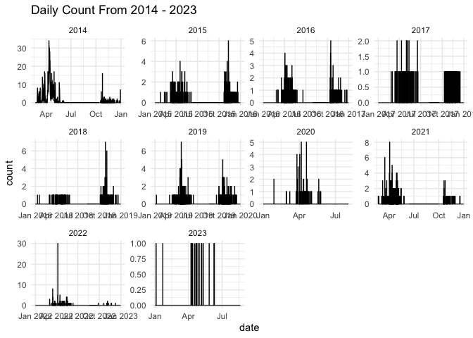
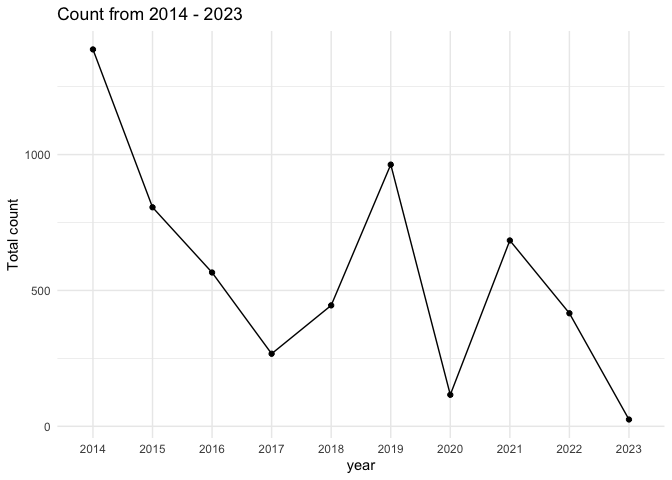
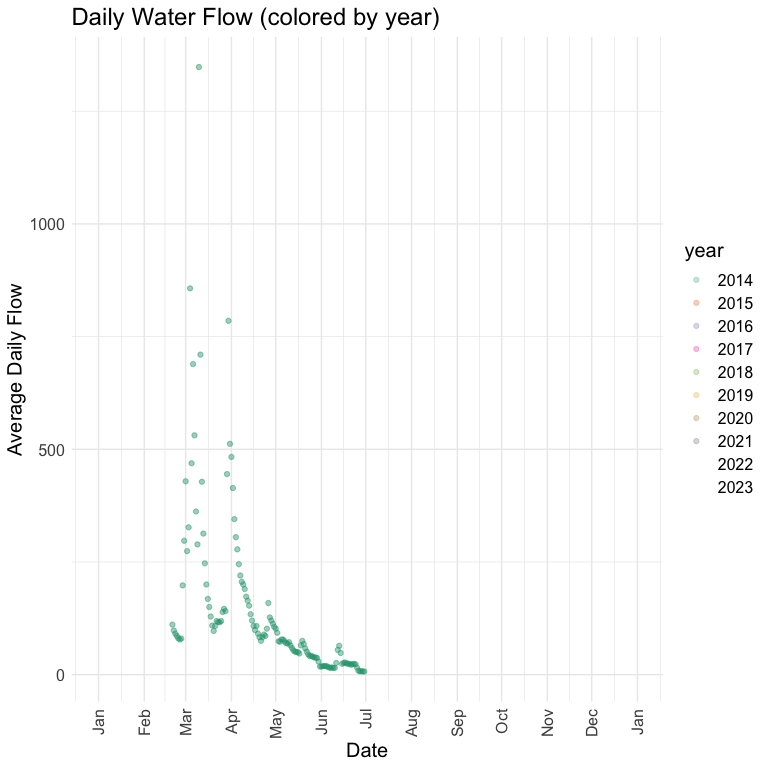
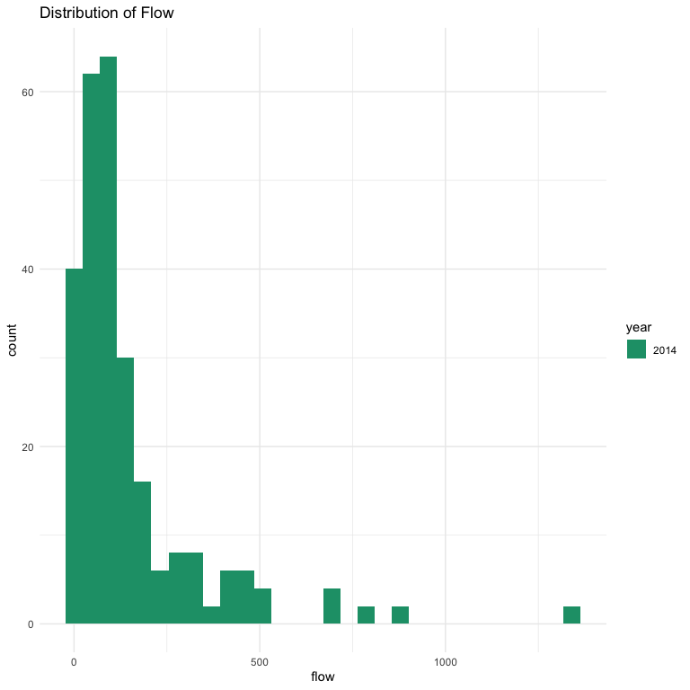
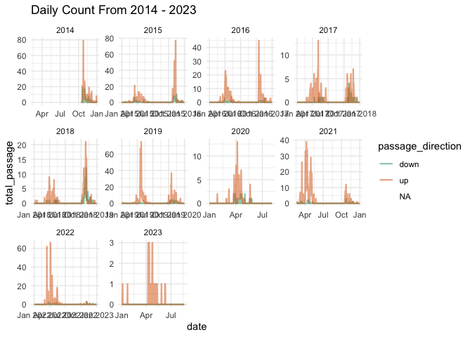
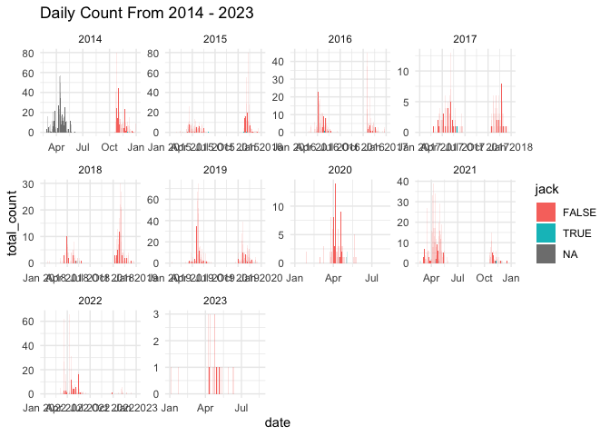
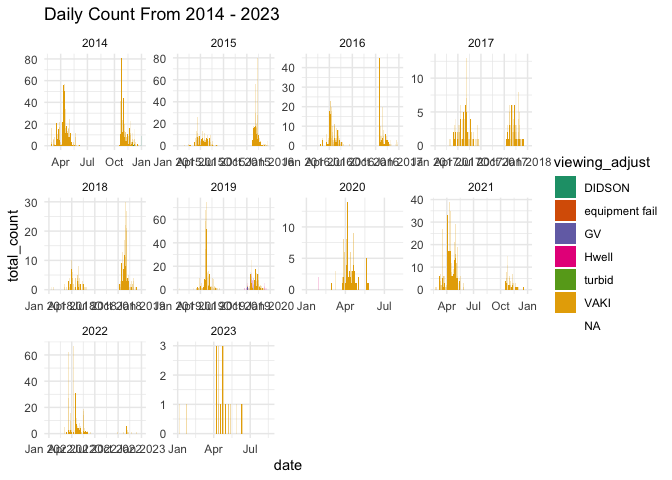
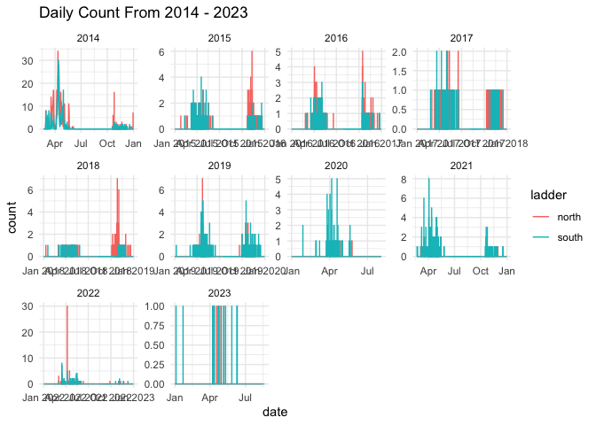

Deer Creek Adult Upstream Count QC
================
Inigo Peng
10/19/2021

# Deer Creek Adult Upstream Passage Monitoring Data 2014 to 2023

**Description of Monitoring Data**

Adult spring run salmon passage daily estimates based on data collected
at SVRIC Dam on Deer River via video monitoring.

**QC/Raw or Count** QC Counts

**Timeframe:**

2014 to 2023

**Completeness of Record throughout timeframe:**

Some missing data for variable flow

**Sampling Location:**

- SVRIC Dam

**Data Contact:** [Ryan Revnak](mailto:Ryan.Revnak@wildlife.ca.gov) and
[Doug Killam](mailto:Doug.Killam@wildlife.ca.gov)

## Access Cloud Data

``` r
gcs_auth(json_file = Sys.getenv("GCS_AUTH_FILE"))
# Set global bucket 
gcs_global_bucket(bucket = Sys.getenv("GCS_DEFAULT_BUCKET"))

# get filenames for deer creek
deer_creek_filenames <- gcs_list_objects() |> 
  filter(str_detect(name, "adult-upstream-passage-monitoring/deer-creek/data-raw/")) |> 
  filter(str_detect(name, "DCVS|DSVS|DNVS")) |> 
  pull(name)

# define function to download all files
get_files_from_cloud <- function(filename) {
  print(substr(filename, 55, nchar(filename)))
  gcs_get_object(object_name = filename,
                 bucket = gcs_get_global_bucket(),
                 saveToDisk = paste0("data-raw/qc-markdowns/adult-upstream-passage-monitoring/deer-creek/", substr(filename, 55, nchar(filename))),
                 overwrite = TRUE)
  message(paste0("downloaded ", filename))
}

lapply(deer_creek_filenames, get_files_from_cloud)

# 2020-2021 passage data
# gcs_get_object(object_name = "adult-upstream-passage-monitoring/deer-creek/data-raw/Copy of DCVS both 2021-22 Spring FINAL 8-17-22.xlsx",
#                bucket = gcs_get_global_bucket(),
#                saveToDisk = "data-raw/qc-markdowns/adult-upstream-passage-monitoring/deer-creek/deer_creek_passage_counts_2021.xlsx",
#                overwrite = TRUE)
# # 2022-2023 passage data
# gcs_get_object(object_name = "adult-upstream-passage-monitoring/deer-creek/data-raw/DCVS both 2022-23 Spring DRAFT 8-26-23.xlsx",
#                bucket = gcs_get_global_bucket(),
#                saveToDisk = "data-raw/qc-markdowns/adult-upstream-passage-monitoring/deer-creek/deer_creek_passage_counts_2022.xlsx",
               # overwrite = TRUE)
```

## Read in and clean raw count data for each year

``` r
save_to_prefix <- "data-raw/qc-markdowns/adult-upstream-passage-monitoring/deer-creek/"
```

This requires a different approach for each year because the file
formats change. We also need to distinguish between files for one ladder
(north or south) vs. files for both ladders.

### 2013-2014

``` r
deer_2013_raw <- readxl::read_xls(paste0(save_to_prefix, "DCVS 2013-2014 as of 4-14-17.xls"), 
                                  sheet = "Sheet1",
                                  skip = 24) |> 
  glimpse()
```

    ## Rows: 136
    ## Columns: 6
    ## $ Date                                          <chr> "2/20/2014", "2/21/2014"…
    ## $ `South Ladder Daily Spring Run Chinook Total` <chr> "0", "0", "0", "0", "0",…
    ## $ `South Ladder Daily Steelhead Total`          <chr> "1", "0", "0", "0", "0",…
    ## $ `North Ladder Daily Spring Run Chinook Total` <chr> "no data", "no data", "n…
    ## $ `North Ladder Daily Steelhead Total`          <chr> "no data", "no data", "n…
    ## $ `Post Diversion Average Daily Flow (cfs)`     <chr> "111", "98", "91", "86",…

``` r
deer_2013 <- deer_2013_raw |> 
  janitor::clean_names() |> 
  filter(!date %in% c("Date", "Totals:")) |> 
  # this converts "no data" to NA
  mutate(across(south_ladder_daily_spring_run_chinook_total:post_diversion_average_daily_flow_cfs, as.numeric)) |> 
  select(date, south_ladder_daily_spring_run_chinook_total, north_ladder_daily_spring_run_chinook_total, avg_flow = post_diversion_average_daily_flow_cfs) |> 
  pivot_longer(south_ladder_daily_spring_run_chinook_total:north_ladder_daily_spring_run_chinook_total,
               names_to = "ladder", 
               values_to = "count") |> 
  mutate(ladder = ifelse(ladder == "south_ladder_daily_spring_run_chinook_total", "south", "north"),
         date = mdy(date)) |> 
  glimpse()
```

    ## Rows: 266
    ## Columns: 4
    ## $ date     <date> 2014-02-20, 2014-02-20, 2014-02-21, 2014-02-21, 2014-02-22, …
    ## $ avg_flow <dbl> 111, 111, 98, 98, 91, 91, 86, 86, 81, 81, 78, 78, 80, 80, 198…
    ## $ ladder   <chr> "south", "north", "south", "north", "south", "north", "south"…
    ## $ count    <dbl> 0, NA, 0, NA, 0, NA, 0, NA, 0, NA, 0, NA, 0, 0, 1, 2, 8, 8, 2…

### 2014-2015

- in separate files for `north` and `south` ladders

``` r
deer_2014_raw_north <- readxl::read_xlsx(paste0(save_to_prefix, "DNVS 2014-2015 as of  6-30-2015.xlsx"), 
                                  sheet = "DATA ENTRY",
                                  skip = 4) |> 
  mutate(ladder = "north") |> 
  glimpse()
```

    ## Rows: 11,359
    ## Columns: 13
    ## $ Date                                                                  <dttm> …
    ## $ `Start Time`                                                          <dttm> …
    ## $ `UP Salmon`                                                           <dbl> …
    ## $ `DN Salmon`                                                           <dbl> …
    ## $ `UP Jacks`                                                            <dbl> …
    ## $ `DN Jacks`                                                            <lgl> …
    ## $ `UP Steel`                                                            <dbl> …
    ## $ `DN Steel`                                                            <lgl> …
    ## $ `UP Others`                                                           <dbl> …
    ## $ `DN Others`                                                           <dbl> …
    ## $ `Viewing Adjust!!`                                                    <dbl> …
    ## $ `COMMENTS: Note other species, fish behavior, and things of interest` <chr> …
    ## $ ladder                                                                <chr> …

``` r
deer_2014_raw_south <- readxl::read_xlsx(paste0(save_to_prefix, "DSVS 2014-2015 as of 6-30-2015.xlsx"), 
                                  sheet = "DATA ENTRY",
                                  skip = 4) |> 
  mutate(ladder = "south") |> 
  glimpse()
```

    ## Rows: 11,351
    ## Columns: 14
    ## $ Date                                                                  <dttm> …
    ## $ `Start Time`                                                          <dttm> …
    ## $ `UP Salmon`                                                           <dbl> …
    ## $ `DN Salmon`                                                           <dbl> …
    ## $ `UP Jacks`                                                            <lgl> …
    ## $ `DN Jacks`                                                            <lgl> …
    ## $ `UP Steel`                                                            <dbl> …
    ## $ `DN Steel`                                                            <dbl> …
    ## $ `UP Others`                                                           <dbl> …
    ## $ `DN Others`                                                           <dbl> …
    ## $ `Viewing Adjust!!`                                                    <lgl> …
    ## $ `COMMENTS: Note other species, fish behavior, and things of interest` <chr> …
    ## $ ...13                                                                 <lgl> …
    ## $ ladder                                                                <chr> …

``` r
deer_2014 <- bind_rows(deer_2014_raw_north, 
                       deer_2014_raw_south) |> 
  janitor::clean_names() |> 
  mutate(across(up_salmon:dn_jacks, as.numeric),
         start_time = format(start_time, "%H:%M:%S"),
         viewing_adjust = as.character(viewing_adjust)) |> 
  select(date, start_time, up_salmon, dn_salmon, 
         up_jacks, dn_jacks, viewing_adjust, ladder) |> 
  pivot_longer(up_salmon:dn_jacks,
               names_to = "count_type", 
               values_to = "count") |> 
  mutate(passage_direction = ifelse(count_type == "up_salmon", "up", "down"),
         jack = ifelse(str_detect(count_type, "jacks"), TRUE, FALSE)) |> 
  glimpse()
```

    ## Rows: 90,840
    ## Columns: 8
    ## $ date              <dttm> 2014-10-15, 2014-10-15, 2014-10-15, 2014-10-15, 201…
    ## $ start_time        <chr> "00:00:00", "00:00:00", "00:00:00", "00:00:00", "00:…
    ## $ viewing_adjust    <chr> NA, NA, NA, NA, NA, NA, NA, NA, NA, NA, NA, NA, NA, …
    ## $ ladder            <chr> "north", "north", "north", "north", "north", "north"…
    ## $ count_type        <chr> "up_salmon", "dn_salmon", "up_jacks", "dn_jacks", "u…
    ## $ count             <dbl> NA, NA, NA, NA, NA, NA, NA, NA, NA, NA, NA, NA, NA, …
    ## $ passage_direction <chr> "up", "down", "down", "down", "up", "down", "down", …
    ## $ jack              <lgl> FALSE, FALSE, TRUE, TRUE, FALSE, FALSE, TRUE, TRUE, …

### 2015-2016

- in separate files for `north` and `south` ladders

``` r
deer_2015_raw_north <- readxl::read_xlsx(paste0(save_to_prefix, "DNVS 2015-2016 as of 8-12-2016.xlsx"), 
                                  sheet = "DATA ENTRY",
                                  skip = 5) |> 
  mutate(ladder = "north") |> 
  glimpse()
```

    ## Rows: 13,544
    ## Columns: 13
    ## $ Date                                                                  <dttm> …
    ## $ `Start Time`                                                          <dttm> …
    ## $ `UP Salmon`                                                           <dbl> …
    ## $ `DN Salmon`                                                           <dbl> …
    ## $ `UP Jacks`                                                            <dbl> …
    ## $ `DN Jacks`                                                            <dbl> …
    ## $ `UP Steel`                                                            <dbl> …
    ## $ `DN Steel`                                                            <lgl> …
    ## $ `UP Others`                                                           <dbl> …
    ## $ `DN Others`                                                           <dbl> …
    ## $ `Viewing Adjust!!`                                                    <lgl> …
    ## $ `COMMENTS: Note other species, fish behavior, and things of interest` <chr> …
    ## $ ladder                                                                <chr> …

``` r
deer_2015_raw_south <- readxl::read_xlsx(paste0(save_to_prefix, "DSVS 2015-2016 as of 8-12-2016.xlsx"), 
                                  sheet = "DATA ENTRY",
                                  skip = 5) |> 
  mutate(ladder = "south") |> 
  glimpse()
```

    ## Rows: 13,561
    ## Columns: 13
    ## $ Date                                                                  <dttm> …
    ## $ `Start Time`                                                          <dttm> …
    ## $ `UP Salmon`                                                           <dbl> …
    ## $ `DN Salmon`                                                           <dbl> …
    ## $ `UP Jacks`                                                            <lgl> …
    ## $ `DN Jacks`                                                            <lgl> …
    ## $ `UP Steel`                                                            <lgl> …
    ## $ `DN Steel`                                                            <lgl> …
    ## $ `UP Others`                                                           <lgl> …
    ## $ `DN Others`                                                           <lgl> …
    ## $ `Viewing Adjust!!`                                                    <lgl> …
    ## $ `COMMENTS: Note other species, fish behavior, and things of interest` <chr> …
    ## $ ladder                                                                <chr> …

``` r
deer_2015 <- bind_rows(deer_2015_raw_north, 
                             deer_2015_raw_south) |> 
  janitor::clean_names() |> 
  mutate(across(up_salmon:dn_jacks, as.numeric),
         start_time = format(start_time, "%H:%M:%S"),
         viewing_adjust = as.character(viewing_adjust)) |> 
  select(date, start_time, up_salmon, dn_salmon, 
         up_jacks, dn_jacks, viewing_adjust, ladder) |> 
  pivot_longer(up_salmon:dn_jacks,
               names_to = "count_type", 
               values_to = "count") |> 
  mutate(passage_direction = ifelse(count_type == "up_salmon", "up", "down"),
         jack = ifelse(str_detect(count_type, "jacks"), TRUE, FALSE)) |> 
  glimpse()
```

    ## Rows: 108,420
    ## Columns: 8
    ## $ date              <dttm> 2015-10-22, 2015-10-22, 2015-10-22, 2015-10-22, 201…
    ## $ start_time        <chr> "20:00:00", "20:00:00", "20:00:00", "20:00:00", "20:…
    ## $ viewing_adjust    <chr> NA, NA, NA, NA, NA, NA, NA, NA, NA, NA, NA, NA, NA, …
    ## $ ladder            <chr> "north", "north", "north", "north", "north", "north"…
    ## $ count_type        <chr> "up_salmon", "dn_salmon", "up_jacks", "dn_jacks", "u…
    ## $ count             <dbl> NA, NA, NA, NA, NA, NA, NA, NA, NA, NA, NA, NA, NA, …
    ## $ passage_direction <chr> "up", "down", "down", "down", "up", "down", "down", …
    ## $ jack              <lgl> FALSE, FALSE, TRUE, TRUE, FALSE, FALSE, TRUE, TRUE, …

### 2016-2017

- `north` and `south` ladders in different tabs

``` r
deer_2016_raw_north <- readxl::read_xlsx(paste0(save_to_prefix, "DCVS both 2016-2017 as of  9-19-18.xlsx"), 
                                  sheet = "DNVS 16-17 Spring",
                                  skip = 5) |> 
  mutate(ladder = "north",
         across(`UP Salmon`:`DN Trout`, as.numeric)) |> 
  glimpse()
```

    ## Rows: 14,353
    ## Columns: 13
    ## $ Date                                                                  <dttm> …
    ## $ `Start Time`                                                          <dttm> …
    ## $ `UP Salmon`                                                           <dbl> …
    ## $ `DN Salmon`                                                           <dbl> …
    ## $ `UP Jacks`                                                            <dbl> …
    ## $ `DN Jacks`                                                            <dbl> …
    ## $ `UP Steel`                                                            <dbl> …
    ## $ `DN Steel`                                                            <dbl> …
    ## $ `UP Trout`                                                            <dbl> …
    ## $ `DN Trout`                                                            <dbl> …
    ## $ `COMMENTS: Note other species, fish behavior, and things of interest` <chr> …
    ## $ `Viewing Adjust!!`                                                    <chr> …
    ## $ ladder                                                                <chr> …

``` r
deer_2016_raw_south <- readxl::read_xlsx(paste0(save_to_prefix, "DCVS both 2016-2017 as of  9-19-18.xlsx"), 
                                         sheet = "DSVS 16-17 Spring",
                                  
                                  skip = 5) |> 
  mutate(ladder = "south",
         across(`UP Salmon`:`DN Trout`, as.numeric),
         `Viewing Adjust!!` = as.character(`Viewing Adjust!!`)) |> 
  glimpse()
```

    ## Rows: 14,160
    ## Columns: 13
    ## $ Date                                                                  <dttm> …
    ## $ `Start Time`                                                          <dttm> …
    ## $ `UP Salmon`                                                           <dbl> …
    ## $ `DN Salmon`                                                           <dbl> …
    ## $ `UP Jacks`                                                            <dbl> …
    ## $ `DN Jacks`                                                            <dbl> …
    ## $ `UP Steel`                                                            <dbl> …
    ## $ `DN Steel`                                                            <dbl> …
    ## $ `UP Trout`                                                            <dbl> …
    ## $ `DN Trout`                                                            <dbl> …
    ## $ `COMMENTS: Note other species, fish behavior, and things of interest` <chr> …
    ## $ `Viewing Adjust!!`                                                    <chr> …
    ## $ ladder                                                                <chr> …

``` r
deer_2016 <- bind_rows(deer_2016_raw_north,
                       deer_2016_raw_south) |> 
  janitor::clean_names() |> 
  mutate(across(up_salmon:dn_jacks, as.numeric),
         start_time = format(start_time, "%H:%M:%S"),
         viewing_adjust = as.character(viewing_adjust)) |> 
  select(date, start_time, up_salmon, dn_salmon, 
         up_jacks, dn_jacks, viewing_adjust, ladder) |> 
  pivot_longer(up_salmon:dn_jacks,
               names_to = "count_type", 
               values_to = "count") |> 
  mutate(passage_direction = ifelse(count_type == "up_salmon", "up", "down"),
         jack = ifelse(str_detect(count_type, "jacks"), TRUE, FALSE)) |> 
  glimpse()
```

    ## Rows: 114,052
    ## Columns: 8
    ## $ date              <dttm> 2016-10-12, 2016-10-12, 2016-10-12, 2016-10-12, 201…
    ## $ start_time        <chr> "00:00:00", "00:00:00", "00:00:00", "00:00:00", "00:…
    ## $ viewing_adjust    <chr> NA, NA, NA, NA, NA, NA, NA, NA, NA, NA, NA, NA, NA, …
    ## $ ladder            <chr> "north", "north", "north", "north", "north", "north"…
    ## $ count_type        <chr> "up_salmon", "dn_salmon", "up_jacks", "dn_jacks", "u…
    ## $ count             <dbl> NA, NA, NA, NA, NA, NA, NA, NA, NA, NA, NA, NA, NA, …
    ## $ passage_direction <chr> "up", "down", "down", "down", "up", "down", "down", …
    ## $ jack              <lgl> FALSE, FALSE, TRUE, TRUE, FALSE, FALSE, TRUE, TRUE, …

### 2017-2018

- `north` and `south` ladders in different tabs

``` r
deer_2017_raw_north <- readxl::read_xlsx(paste0(save_to_prefix, "DCVS both 2017-2018 as of 9-14-18.xlsx"), 
                                  sheet = "DEER-North-17-18",
                                  skip = 5) |> 
  mutate(ladder = "north") |>
  glimpse()
```

    ## Rows: 15,504
    ## Columns: 15
    ## $ Date                              <dttm> 2017-09-20, 2017-09-20, 2017-09-20,…
    ## $ `Start Time`                      <dttm> 1899-12-31 00:00:00, 1899-12-31 00:…
    ## $ `UP Salmon`                       <lgl> NA, NA, NA, NA, NA, NA, NA, NA, NA, …
    ## $ `DN Salmon`                       <lgl> NA, NA, NA, NA, NA, NA, NA, NA, NA, …
    ## $ `UP Jacks`                        <lgl> NA, NA, NA, NA, NA, NA, NA, NA, NA, …
    ## $ `DN Jacks`                        <lgl> NA, NA, NA, NA, NA, NA, NA, NA, NA, …
    ## $ `UP Steel >16"`                   <lgl> NA, NA, NA, NA, NA, NA, NA, NA, NA, …
    ## $ `DN Steel`                        <lgl> NA, NA, NA, NA, NA, NA, NA, NA, NA, …
    ## $ `UP Trout less 16"`               <lgl> NA, NA, NA, NA, NA, NA, NA, NA, NA, …
    ## $ `DN Trout`                        <lgl> NA, NA, NA, NA, NA, NA, NA, NA, NA, …
    ## $ `COMMENTS     Note other species` <chr> NA, NA, NA, NA, NA, NA, NA, NA, NA, …
    ## $ `Viewing Adjust`                  <lgl> NA, NA, NA, NA, NA, NA, NA, NA, NA, …
    ## $ ...13                             <lgl> NA, NA, NA, NA, NA, NA, NA, NA, NA, …
    ## $ ...14                             <lgl> NA, NA, NA, NA, NA, NA, NA, NA, NA, …
    ## $ ladder                            <chr> "north", "north", "north", "north", …

``` r
deer_2017_raw_south <- readxl::read_xlsx(paste0(save_to_prefix, "DCVS both 2017-2018 as of 9-14-18.xlsx"), 
                                         sheet = "DEER-South-17-18",
                                  
                                  skip = 5) |> 
  mutate(ladder = "south") |> 
  glimpse()
```

    ## Rows: 15,504
    ## Columns: 15
    ## $ Date                              <dttm> 2017-09-20, 2017-09-20, 2017-09-20,…
    ## $ `Start Time`                      <dttm> 1899-12-31 00:00:00, 1899-12-31 00:…
    ## $ `UP Salmon`                       <lgl> NA, NA, NA, NA, NA, NA, NA, NA, NA, …
    ## $ `DN Salmon`                       <lgl> NA, NA, NA, NA, NA, NA, NA, NA, NA, …
    ## $ `UP Jacks`                        <lgl> NA, NA, NA, NA, NA, NA, NA, NA, NA, …
    ## $ `DN Jacks`                        <lgl> NA, NA, NA, NA, NA, NA, NA, NA, NA, …
    ## $ `UP Steel >16"`                   <lgl> NA, NA, NA, NA, NA, NA, NA, NA, NA, …
    ## $ `DN Steel`                        <lgl> NA, NA, NA, NA, NA, NA, NA, NA, NA, …
    ## $ `UP Trout less 16"`               <lgl> NA, NA, NA, NA, NA, NA, NA, NA, NA, …
    ## $ `DN Trout`                        <lgl> NA, NA, NA, NA, NA, NA, NA, NA, NA, …
    ## $ `COMMENTS     Note other species` <lgl> NA, NA, NA, NA, NA, NA, NA, NA, NA, …
    ## $ `Viewing Adjust`                  <lgl> NA, NA, NA, NA, NA, NA, NA, NA, NA, …
    ## $ ...13                             <lgl> NA, NA, NA, NA, NA, NA, NA, NA, NA, …
    ## $ ...14                             <lgl> NA, NA, NA, NA, NA, NA, NA, NA, NA, …
    ## $ ladder                            <chr> "south", "south", "south", "south", …

``` r
deer_2017 <- bind_rows(deer_2017_raw_north,
                       deer_2017_raw_south) |> 
  janitor::clean_names() |> 
  mutate(across(up_salmon:dn_jacks, as.numeric),
         start_time = format(start_time, "%H:%M:%S"),
         viewing_adjust = as.character(viewing_adjust)) |> 
  select(date, start_time, up_salmon, dn_salmon, 
         up_jacks, dn_jacks, viewing_adjust, ladder) |> 
  pivot_longer(up_salmon:dn_jacks,
               names_to = "count_type", 
               values_to = "count") |> 
  mutate(passage_direction = ifelse(count_type == "up_salmon", "up", "down"),
         jack = ifelse(str_detect(count_type, "jacks"), TRUE, FALSE)) |> 
  glimpse()
```

    ## Rows: 124,032
    ## Columns: 8
    ## $ date              <dttm> 2017-09-20, 2017-09-20, 2017-09-20, 2017-09-20, 201…
    ## $ start_time        <chr> "00:00:00", "00:00:00", "00:00:00", "00:00:00", "00:…
    ## $ viewing_adjust    <chr> NA, NA, NA, NA, NA, NA, NA, NA, NA, NA, NA, NA, NA, …
    ## $ ladder            <chr> "north", "north", "north", "north", "north", "north"…
    ## $ count_type        <chr> "up_salmon", "dn_salmon", "up_jacks", "dn_jacks", "u…
    ## $ count             <dbl> NA, NA, NA, NA, NA, NA, NA, NA, NA, NA, NA, NA, NA, …
    ## $ passage_direction <chr> "up", "down", "down", "down", "up", "down", "down", …
    ## $ jack              <lgl> FALSE, FALSE, TRUE, TRUE, FALSE, FALSE, TRUE, TRUE, …

### 2018-2019

- `north` and `south` ladders in different tabs

``` r
deer_2018_raw_north <- readxl::read_xlsx(paste0(save_to_prefix, "DCVS both 2018-2019 as of 12-14-20.xlsx"), 
                                  sheet = "DEER-North-18-19",
                                  skip = 5) |> 
  mutate(ladder = "north") |>
  glimpse()
```

    ## Rows: 15,504
    ## Columns: 13
    ## $ Date                              <dttm> 2018-10-01, 2018-10-01, 2018-10-01,…
    ## $ `Start Time`                      <dttm> 1899-12-31 00:00:00, 1899-12-31 00:…
    ## $ `UP Salmon`                       <dbl> NA, NA, NA, NA, NA, NA, NA, NA, NA, …
    ## $ `DN Salmon`                       <dbl> NA, NA, NA, NA, NA, NA, NA, NA, NA, …
    ## $ `UP Jacks`                        <dbl> NA, NA, NA, NA, NA, NA, NA, NA, NA, …
    ## $ `DN Jacks`                        <lgl> NA, NA, NA, NA, NA, NA, NA, NA, NA, …
    ## $ `UP Steel >16"`                   <dbl> NA, NA, NA, NA, NA, NA, NA, NA, NA, …
    ## $ `DN Steel`                        <lgl> NA, NA, NA, NA, NA, NA, NA, NA, NA, …
    ## $ `UP Trout less 16"`               <lgl> NA, NA, NA, NA, NA, NA, NA, NA, NA, …
    ## $ `DN Trout`                        <lgl> NA, NA, NA, NA, NA, NA, NA, NA, NA, …
    ## $ `COMMENTS     Note other species` <chr> NA, NA, NA, NA, NA, NA, NA, NA, NA, …
    ## $ `Viewing Adjust`                  <dbl> NA, NA, NA, NA, NA, NA, NA, NA, NA, …
    ## $ ladder                            <chr> "north", "north", "north", "north", …

``` r
deer_2018_raw_south <- readxl::read_xlsx(paste0(save_to_prefix, "DCVS both 2018-2019 as of 12-14-20.xlsx"), 
                                         sheet = "DEER-South-18-19",
                                  
                                  skip = 5) |> 
  mutate(ladder = "south") |> 
  glimpse()
```

    ## Rows: 12,480
    ## Columns: 13
    ## $ Date                              <dttm> 2018-10-29, 2018-10-29, 2018-10-29,…
    ## $ `Start Time`                      <dttm> 1899-12-31 00:00:00, 1899-12-31 00:…
    ## $ `UP Salmon`                       <dbl> NA, NA, NA, NA, NA, NA, NA, NA, NA, …
    ## $ `DN Salmon`                       <dbl> NA, NA, NA, NA, NA, NA, NA, NA, NA, …
    ## $ `UP Jacks`                        <lgl> NA, NA, NA, NA, NA, NA, NA, NA, NA, …
    ## $ `DN Jacks`                        <lgl> NA, NA, NA, NA, NA, NA, NA, NA, NA, …
    ## $ `UP Steel >16"`                   <dbl> NA, NA, NA, NA, NA, NA, NA, NA, NA, …
    ## $ `DN Steel`                        <lgl> NA, NA, NA, NA, NA, NA, NA, NA, NA, …
    ## $ `UP Trout less 16"`               <dbl> NA, NA, NA, NA, NA, NA, NA, NA, NA, …
    ## $ `DN Trout`                        <lgl> NA, NA, NA, NA, NA, NA, NA, NA, NA, …
    ## $ `COMMENTS     Note other species` <chr> NA, NA, NA, NA, NA, NA, NA, NA, NA, …
    ## $ `Viewing Adjust`                  <lgl> NA, NA, NA, NA, NA, NA, NA, NA, NA, …
    ## $ ladder                            <chr> "south", "south", "south", "south", …

``` r
deer_2018 <- bind_rows(deer_2018_raw_south,
                       deer_2018_raw_north) |> 
  janitor::clean_names() |> 
  mutate(across(up_salmon:dn_jacks, as.numeric),
         start_time = format(start_time, "%H:%M:%S"),
         viewing_adjust = as.character(viewing_adjust)) |> 
  select(date, start_time, up_salmon, dn_salmon, 
         up_jacks, dn_jacks, viewing_adjust, ladder) |> 
  pivot_longer(up_salmon:dn_jacks,
               names_to = "count_type", 
               values_to = "count") |> 
  mutate(passage_direction = ifelse(count_type == "up_salmon", "up", "down"),
         jack = ifelse(str_detect(count_type, "jacks"), TRUE, FALSE)) |> 
  glimpse()
```

    ## Rows: 111,936
    ## Columns: 8
    ## $ date              <dttm> 2018-10-29, 2018-10-29, 2018-10-29, 2018-10-29, 201…
    ## $ start_time        <chr> "00:00:00", "00:00:00", "00:00:00", "00:00:00", "00:…
    ## $ viewing_adjust    <chr> NA, NA, NA, NA, NA, NA, NA, NA, NA, NA, NA, NA, NA, …
    ## $ ladder            <chr> "south", "south", "south", "south", "south", "south"…
    ## $ count_type        <chr> "up_salmon", "dn_salmon", "up_jacks", "dn_jacks", "u…
    ## $ count             <dbl> NA, NA, NA, NA, NA, NA, NA, NA, NA, NA, NA, NA, NA, …
    ## $ passage_direction <chr> "up", "down", "down", "down", "up", "down", "down", …
    ## $ jack              <lgl> FALSE, FALSE, TRUE, TRUE, FALSE, FALSE, TRUE, TRUE, …

### 2019-2020

- `north` and `south` ladders in different tabs

``` r
deer_2019_raw_north <- readxl::read_xlsx(paste0(save_to_prefix, "DCVS both 2019-2020 as of 9-9-21.xlsx"), 
                                  sheet = "DEER-North-19-20",
                                  skip = 5) |> 
  mutate(ladder = "north") |>
  glimpse()
```

    ## Rows: 15,504
    ## Columns: 14
    ## $ Date                              <dttm> 2019-09-16, 2019-09-16, 2019-09-16,…
    ## $ `Start Time`                      <dttm> 1899-12-31 00:00:00, 1899-12-31 00:…
    ## $ `UP Salmon`                       <dbl> NA, NA, NA, NA, NA, NA, NA, NA, NA, …
    ## $ `DN Salmon`                       <dbl> NA, NA, NA, NA, NA, NA, NA, NA, NA, …
    ## $ `UP Jacks`                        <lgl> NA, NA, NA, NA, NA, NA, NA, NA, NA, …
    ## $ `DN Jacks`                        <lgl> NA, NA, NA, NA, NA, NA, NA, NA, NA, …
    ## $ `UP Steel >16"`                   <dbl> NA, NA, NA, NA, NA, NA, NA, NA, NA, …
    ## $ `DN Steel`                        <lgl> NA, NA, NA, NA, NA, NA, NA, NA, NA, …
    ## $ `UP Trout less 16"`               <lgl> NA, NA, NA, NA, NA, NA, NA, NA, NA, …
    ## $ `DN Trout`                        <dbl> NA, NA, NA, NA, NA, NA, NA, NA, NA, …
    ## $ `COMMENTS     Note other species` <chr> NA, NA, NA, NA, NA, NA, NA, NA, NA, …
    ## $ `Viewing Adjust`                  <dbl> NA, NA, NA, NA, NA, NA, NA, NA, NA, …
    ## $ ...13                             <chr> NA, NA, NA, NA, NA, NA, NA, NA, NA, …
    ## $ ladder                            <chr> "north", "north", "north", "north", …

``` r
deer_2019_raw_south <- readxl::read_xlsx(paste0(save_to_prefix, "DCVS both 2019-2020 as of 9-9-21.xlsx"), 
                                         sheet = "DEER-South-19-20",
                                  
                                  skip = 5) |> 
  mutate(ladder = "south") |> 
  glimpse()
```

    ## Rows: 15,504
    ## Columns: 14
    ## $ Date                              <dttm> 2019-09-16, 2019-09-16, 2019-09-16,…
    ## $ `Start Time`                      <dttm> 1899-12-31 00:00:00, 1899-12-31 00:…
    ## $ `UP Salmon`                       <dbl> NA, NA, NA, NA, NA, NA, NA, NA, NA, …
    ## $ `DN Salmon`                       <lgl> NA, NA, NA, NA, NA, NA, NA, NA, NA, …
    ## $ `UP Jacks`                        <lgl> NA, NA, NA, NA, NA, NA, NA, NA, NA, …
    ## $ `DN Jacks`                        <lgl> NA, NA, NA, NA, NA, NA, NA, NA, NA, …
    ## $ `UP Steel >16"`                   <dbl> NA, NA, NA, NA, NA, NA, NA, NA, NA, …
    ## $ `DN Steel`                        <dbl> NA, NA, NA, NA, NA, NA, NA, NA, NA, …
    ## $ `UP Trout less 16"`               <lgl> NA, NA, NA, NA, NA, NA, NA, NA, NA, …
    ## $ `DN Trout`                        <lgl> NA, NA, NA, NA, NA, NA, NA, NA, NA, …
    ## $ `COMMENTS     Note other species` <chr> NA, NA, NA, NA, NA, NA, NA, NA, NA, …
    ## $ `Viewing Adjust`                  <dbl> NA, NA, NA, NA, NA, NA, NA, NA, NA, …
    ## $ ...13                             <chr> NA, NA, NA, NA, NA, NA, NA, NA, NA, …
    ## $ ladder                            <chr> "south", "south", "south", "south", …

``` r
deer_2019 <- bind_rows(deer_2019_raw_south,
                       deer_2019_raw_north) |> 
  janitor::clean_names() |> 
  mutate(across(up_salmon:dn_jacks, as.numeric),
         start_time = format(start_time, "%H:%M:%S"),
         viewing_adjust = as.character(viewing_adjust)) |> 
  select(date, start_time, up_salmon, dn_salmon, 
         up_jacks, dn_jacks, viewing_adjust, ladder) |> 
  pivot_longer(up_salmon:dn_jacks,
               names_to = "count_type", 
               values_to = "count") |> 
  mutate(passage_direction = ifelse(count_type == "up_salmon", "up", "down"),
         jack = ifelse(str_detect(count_type, "jacks"), TRUE, FALSE)) |> 
  glimpse()
```

    ## Rows: 124,032
    ## Columns: 8
    ## $ date              <dttm> 2019-09-16, 2019-09-16, 2019-09-16, 2019-09-16, 201…
    ## $ start_time        <chr> "00:00:00", "00:00:00", "00:00:00", "00:00:00", "00:…
    ## $ viewing_adjust    <chr> NA, NA, NA, NA, NA, NA, NA, NA, NA, NA, NA, NA, NA, …
    ## $ ladder            <chr> "south", "south", "south", "south", "south", "south"…
    ## $ count_type        <chr> "up_salmon", "dn_salmon", "up_jacks", "dn_jacks", "u…
    ## $ count             <dbl> NA, NA, NA, NA, NA, NA, NA, NA, NA, NA, NA, NA, NA, …
    ## $ passage_direction <chr> "up", "down", "down", "down", "up", "down", "down", …
    ## $ jack              <lgl> FALSE, FALSE, TRUE, TRUE, FALSE, FALSE, TRUE, TRUE, …

### 2020-2021

- `north` and `south` ladders in different tabs

``` r
deer_2020_raw_north <- readxl::read_xlsx(paste0(save_to_prefix, "DCVS Both 2020-2021 as of 10-13-22.xlsx"), 
                                  sheet = "DEER-North 20-21-DK ",
                                  skip = 2) |> 
  mutate(ladder = "north") |>
  glimpse()
```

    ## Rows: 5,492
    ## Columns: 16
    ## $ Date                              <dttm> 2021-02-20, 2021-02-20, 2021-02-20,…
    ## $ `Start Time`                      <dttm> 1899-12-31 00:00:00, 1899-12-31 00:…
    ## $ `UP Salmon`                       <dbl> NA, NA, NA, NA, NA, NA, NA, NA, NA, …
    ## $ `DN Salmon`                       <lgl> NA, NA, NA, NA, NA, NA, NA, NA, NA, …
    ## $ `UP Jacks`                        <lgl> NA, NA, NA, NA, NA, NA, NA, NA, NA, …
    ## $ `DN Jacks`                        <lgl> NA, NA, NA, NA, NA, NA, NA, NA, NA, …
    ## $ `DK totals...7`                   <dbl> 0, 0, 0, 0, 0, 0, 0, 0, 0, 0, 0, 0, …
    ## $ `UP Steel >16"`                   <dbl> NA, NA, NA, NA, NA, NA, NA, NA, NA, …
    ## $ `DN Steel`                        <dbl> NA, NA, NA, NA, NA, NA, NA, NA, NA, …
    ## $ `DK totals...10`                  <dbl> 0, 0, 0, 0, 0, 0, 0, 0, 0, 0, 0, 0, …
    ## $ `UP Trout less 16"`               <dbl> NA, NA, 1, NA, NA, NA, NA, NA, NA, N…
    ## $ `DN Trout`                        <dbl> NA, NA, NA, NA, NA, NA, NA, NA, NA, …
    ## $ `DK totals...13`                  <dbl> 0, 0, 1, 0, 0, 0, 0, 0, 0, 0, 0, 0, …
    ## $ `COMMENTS     Note other species` <lgl> NA, NA, NA, NA, NA, NA, NA, NA, NA, …
    ## $ `Viewing Adjust`                  <lgl> NA, NA, NA, NA, NA, NA, NA, NA, NA, …
    ## $ ladder                            <chr> "north", "north", "north", "north", …

``` r
deer_2020_raw_south <- readxl::read_xlsx(paste0(save_to_prefix, "DCVS Both 2020-2021 as of 10-13-22.xlsx"), 
                                         sheet = "DEER-South-20-21",
                                  
                                  skip = 4) |> 
  mutate(ladder = "south") |> 
  glimpse()
```

    ## Rows: 5,270
    ## Columns: 15
    ## $ Date                              <dttm> 2021-02-20, 2021-02-20, 2021-02-20,…
    ## $ `Start Time`                      <dttm> 1899-12-31 00:00:00, 1899-12-31 00:…
    ## $ `UP Salmon`                       <dbl> NA, NA, NA, NA, NA, NA, NA, NA, NA, …
    ## $ `DN Salmon`                       <dbl> NA, NA, NA, NA, NA, NA, NA, NA, NA, …
    ## $ `UP Jacks`                        <dbl> NA, NA, NA, NA, NA, NA, NA, NA, NA, …
    ## $ `DN Jacks`                        <lgl> NA, NA, NA, NA, NA, NA, NA, NA, NA, …
    ## $ `UP Steel >16"`                   <dbl> NA, NA, NA, NA, NA, NA, NA, NA, NA, …
    ## $ `DN Steel`                        <lgl> NA, NA, NA, NA, NA, NA, NA, NA, NA, …
    ## $ Totals...9                        <dbl> 0, 0, 0, 0, 0, 0, 0, 0, 0, 0, 0, 0, …
    ## $ `UP Trout less 16"`               <lgl> NA, NA, NA, NA, NA, NA, NA, NA, NA, …
    ## $ `DN Trout`                        <lgl> NA, NA, NA, NA, NA, NA, NA, NA, NA, …
    ## $ Totals...12                       <dbl> 0, 0, 0, 0, 0, 0, 0, 0, 0, 0, 0, 0, …
    ## $ `COMMENTS     Note other species` <chr> NA, NA, NA, NA, NA, NA, NA, NA, NA, …
    ## $ `Viewing Adjust`                  <dbl> NA, NA, NA, NA, NA, NA, NA, NA, NA, …
    ## $ ladder                            <chr> "south", "south", "south", "south", …

``` r
deer_2020 <- bind_rows(deer_2020_raw_north,
                       deer_2020_raw_south) |> 
  janitor::clean_names() |>
  mutate(across(up_salmon:dn_jacks, as.numeric),
         start_time = format(start_time, "%H:%M:%S"),
         viewing_adjust = as.character(viewing_adjust)) |> 
  select(date, start_time, up_salmon, dn_salmon, 
         up_jacks, dn_jacks, viewing_adjust, ladder) |> 
  pivot_longer(up_salmon:dn_jacks,
               names_to = "count_type", 
               values_to = "count") |> 
  mutate(passage_direction = ifelse(count_type == "up_salmon", "up", "down"),
         jack = ifelse(str_detect(count_type, "jacks"), TRUE, FALSE)) |> 
  glimpse()
```

    ## Rows: 43,048
    ## Columns: 8
    ## $ date              <dttm> 2021-02-20, 2021-02-20, 2021-02-20, 2021-02-20, 202…
    ## $ start_time        <chr> "00:00:00", "00:00:00", "00:00:00", "00:00:00", "00:…
    ## $ viewing_adjust    <chr> NA, NA, NA, NA, NA, NA, NA, NA, NA, NA, NA, NA, NA, …
    ## $ ladder            <chr> "north", "north", "north", "north", "north", "north"…
    ## $ count_type        <chr> "up_salmon", "dn_salmon", "up_jacks", "dn_jacks", "u…
    ## $ count             <dbl> NA, NA, NA, NA, NA, NA, NA, NA, NA, NA, NA, NA, NA, …
    ## $ passage_direction <chr> "up", "down", "down", "down", "up", "down", "down", …
    ## $ jack              <lgl> FALSE, FALSE, TRUE, TRUE, FALSE, FALSE, TRUE, TRUE, …

### 2021-2022

- `north` and `south` ladders in different tabs

``` r
deer_2021_raw_north <- readxl::read_xlsx(paste0(save_to_prefix, "DCVS both 2021-22 Spring FINAL 3-3-23.xlsx"), 
                                  sheet = "DEER-North-21-22",
                                  skip = 5) |> 
  mutate(ladder = "north") |>
  glimpse()
```

    ## Rows: 15,504
    ## Columns: 14
    ## $ Date                              <dttm> 2021-10-01, 2021-10-01, 2021-10-01,…
    ## $ `Start Time`                      <dttm> 1899-12-31 00:00:00, 1899-12-31 00:…
    ## $ `UP Salmon`                       <chr> "WAITING FOR CORRECT START in 2021",…
    ## $ `DN Salmon`                       <lgl> NA, NA, NA, NA, NA, NA, NA, NA, NA, …
    ## $ `UP Jacks`                        <lgl> NA, NA, NA, NA, NA, NA, NA, NA, NA, …
    ## $ `DN Jacks`                        <lgl> NA, NA, NA, NA, NA, NA, NA, NA, NA, …
    ## $ `UP Steel >16"`                   <lgl> NA, NA, NA, NA, NA, NA, NA, NA, NA, …
    ## $ `DN Steel`                        <lgl> NA, NA, NA, NA, NA, NA, NA, NA, NA, …
    ## $ `UP Trout less 16"`               <lgl> NA, NA, NA, NA, NA, NA, NA, NA, NA, …
    ## $ `DN Trout`                        <lgl> NA, NA, NA, NA, NA, NA, NA, NA, NA, …
    ## $ `COMMENTS     Note other species` <lgl> NA, NA, NA, NA, NA, NA, NA, NA, NA, …
    ## $ `Viewing Adjust`                  <lgl> NA, NA, NA, NA, NA, NA, NA, NA, NA, …
    ## $ ...13                             <lgl> NA, NA, NA, NA, NA, NA, NA, NA, NA, …
    ## $ ladder                            <chr> "north", "north", "north", "north", …

``` r
deer_2021_raw_south <- readxl::read_xlsx(paste0(save_to_prefix, "DCVS both 2021-22 Spring FINAL 3-3-23.xlsx"), 
                                         sheet = "DEER-South-21-22",
                                  
                                  skip = 5) |> 
  mutate(ladder = "south") |> 
  glimpse()
```

    ## Rows: 15,504
    ## Columns: 14
    ## $ Date                              <dttm> 2021-10-01, 2021-10-01, 2021-10-01,…
    ## $ `Start Time`                      <dttm> 1899-12-31 00:00:00, 1899-12-31 00:…
    ## $ `UP Salmon`                       <chr> "WAITING FOR CORRECT START in 2021",…
    ## $ `DN Salmon`                       <lgl> NA, NA, NA, NA, NA, NA, NA, NA, NA, …
    ## $ `UP Jacks`                        <lgl> NA, NA, NA, NA, NA, NA, NA, NA, NA, …
    ## $ `DN Jacks`                        <lgl> NA, NA, NA, NA, NA, NA, NA, NA, NA, …
    ## $ `UP Steel >16"`                   <dbl> NA, NA, NA, NA, NA, NA, NA, NA, NA, …
    ## $ `DN Steel`                        <lgl> NA, NA, NA, NA, NA, NA, NA, NA, NA, …
    ## $ `UP Trout less 16"`               <lgl> NA, NA, NA, NA, NA, NA, NA, NA, NA, …
    ## $ `DN Trout`                        <lgl> NA, NA, NA, NA, NA, NA, NA, NA, NA, …
    ## $ `COMMENTS     Note other species` <chr> NA, NA, NA, NA, NA, NA, NA, NA, NA, …
    ## $ `Viewing Adjust`                  <lgl> NA, NA, NA, NA, NA, NA, NA, NA, NA, …
    ## $ ...13                             <lgl> NA, NA, NA, NA, NA, NA, NA, NA, NA, …
    ## $ ladder                            <chr> "south", "south", "south", "south", …

``` r
deer_2021 <- bind_rows(deer_2021_raw_north,
                       deer_2021_raw_south) |> 
  janitor::clean_names() |>
  mutate(across(up_salmon:dn_jacks, as.numeric),
         start_time = format(start_time, "%H:%M:%S"),
         viewing_adjust = as.character(viewing_adjust)) |> 
  select(date, start_time, up_salmon, dn_salmon, 
         up_jacks, dn_jacks, viewing_adjust, ladder) |> 
  pivot_longer(up_salmon:dn_jacks,
               names_to = "count_type", 
               values_to = "count") |> 
  mutate(passage_direction = ifelse(count_type == "up_salmon", "up", "down"),
         jack = ifelse(str_detect(count_type, "jacks"), TRUE, FALSE)) |> 
  glimpse()
```

    ## Rows: 124,032
    ## Columns: 8
    ## $ date              <dttm> 2021-10-01, 2021-10-01, 2021-10-01, 2021-10-01, 202…
    ## $ start_time        <chr> "00:00:00", "00:00:00", "00:00:00", "00:00:00", "00:…
    ## $ viewing_adjust    <chr> NA, NA, NA, NA, NA, NA, NA, NA, NA, NA, NA, NA, NA, …
    ## $ ladder            <chr> "north", "north", "north", "north", "north", "north"…
    ## $ count_type        <chr> "up_salmon", "dn_salmon", "up_jacks", "dn_jacks", "u…
    ## $ count             <dbl> NA, NA, NA, NA, NA, NA, NA, NA, NA, NA, NA, NA, NA, …
    ## $ passage_direction <chr> "up", "down", "down", "down", "up", "down", "down", …
    ## $ jack              <lgl> FALSE, FALSE, TRUE, TRUE, FALSE, FALSE, TRUE, TRUE, …

### 2022-2023

- `north` and `south` ladders in different tabs

``` r
deer_2022_raw_north <- readxl::read_xlsx(paste0(save_to_prefix, "DCVS both 2022-2023 as of 10-16-23.xlsx"), 
                                  sheet = "DEER-North-22-23",
                                  skip = 5) |> 
  mutate(ladder = "north") |>
  glimpse()
```

    ## Rows: 15,504
    ## Columns: 14
    ## $ Date                              <dttm> 2022-09-26, 2022-09-26, 2022-09-26,…
    ## $ `Start Time`                      <dttm> 1899-12-31 00:00:00, 1899-12-31 00:…
    ## $ `UP Salmon`                       <dbl> NA, NA, NA, NA, NA, NA, NA, NA, NA, …
    ## $ `DN Salmon`                       <lgl> NA, NA, NA, NA, NA, NA, NA, NA, NA, …
    ## $ `UP Jacks`                        <lgl> NA, NA, NA, NA, NA, NA, NA, NA, NA, …
    ## $ `DN Jacks`                        <lgl> NA, NA, NA, NA, NA, NA, NA, NA, NA, …
    ## $ `UP Steel >16"`                   <lgl> NA, NA, NA, NA, NA, NA, NA, NA, NA, …
    ## $ `DN Steel`                        <lgl> NA, NA, NA, NA, NA, NA, NA, NA, NA, …
    ## $ `UP Trout less 16"`               <lgl> NA, NA, NA, NA, NA, NA, NA, NA, NA, …
    ## $ `DN Trout`                        <lgl> NA, NA, NA, NA, NA, NA, NA, NA, NA, …
    ## $ `COMMENTS     Note other species` <chr> NA, NA, NA, NA, NA, NA, NA, NA, NA, …
    ## $ `Viewing Adjust`                  <lgl> NA, NA, NA, NA, NA, NA, NA, NA, NA, …
    ## $ ...13                             <lgl> NA, NA, NA, NA, NA, NA, NA, NA, NA, …
    ## $ ladder                            <chr> "north", "north", "north", "north", …

``` r
deer_2022_raw_south <- readxl::read_xlsx(paste0(save_to_prefix, "DCVS both 2022-2023 as of 10-16-23.xlsx"), 
                                         sheet = "DEER-South-22-23",
                                  
                                  skip = 5) |> 
  mutate(ladder = "south") |> 
  glimpse()
```

    ## Rows: 15,504
    ## Columns: 14
    ## $ Date                              <dttm> 2022-10-01, 2022-10-01, 2022-10-01,…
    ## $ `Start Time`                      <dttm> 1899-12-31 00:00:00, 1899-12-31 00:…
    ## $ `UP Salmon`                       <dbl> NA, NA, NA, NA, NA, NA, NA, NA, NA, …
    ## $ `DN Salmon`                       <lgl> NA, NA, NA, NA, NA, NA, NA, NA, NA, …
    ## $ `UP Jacks`                        <lgl> NA, NA, NA, NA, NA, NA, NA, NA, NA, …
    ## $ `DN Jacks`                        <lgl> NA, NA, NA, NA, NA, NA, NA, NA, NA, …
    ## $ `UP Steel >16"`                   <lgl> NA, NA, NA, NA, NA, NA, NA, NA, NA, …
    ## $ `DN Steel`                        <lgl> NA, NA, NA, NA, NA, NA, NA, NA, NA, …
    ## $ `UP Trout less 16"`               <lgl> NA, NA, NA, NA, NA, NA, NA, NA, NA, …
    ## $ `DN Trout`                        <lgl> NA, NA, NA, NA, NA, NA, NA, NA, NA, …
    ## $ `COMMENTS     Note other species` <chr> NA, NA, NA, NA, NA, NA, NA, NA, NA, …
    ## $ `Viewing Adjust`                  <dbl> NA, NA, NA, NA, NA, NA, NA, NA, NA, …
    ## $ ...13                             <lgl> NA, NA, NA, NA, NA, NA, NA, NA, NA, …
    ## $ ladder                            <chr> "south", "south", "south", "south", …

``` r
deer_2022 <- bind_rows(deer_2022_raw_north,
                       deer_2022_raw_south) |> 
  janitor::clean_names() |>
  mutate(across(up_salmon:dn_jacks, as.numeric),
         start_time = format(start_time, "%H:%M:%S"),
         viewing_adjust = as.character(viewing_adjust)) |> 
  select(date, start_time, up_salmon, dn_salmon, 
         up_jacks, dn_jacks, viewing_adjust, ladder) |> 
  pivot_longer(up_salmon:dn_jacks,
               names_to = "count_type", 
               values_to = "count") |> 
  mutate(passage_direction = ifelse(count_type == "up_salmon", "up", "down"),
         jack = ifelse(str_detect(count_type, "jacks"), TRUE, FALSE)) |> 
  glimpse()
```

    ## Rows: 124,032
    ## Columns: 8
    ## $ date              <dttm> 2022-09-26, 2022-09-26, 2022-09-26, 2022-09-26, 202…
    ## $ start_time        <chr> "00:00:00", "00:00:00", "00:00:00", "00:00:00", "00:…
    ## $ viewing_adjust    <chr> NA, NA, NA, NA, NA, NA, NA, NA, NA, NA, NA, NA, NA, …
    ## $ ladder            <chr> "north", "north", "north", "north", "north", "north"…
    ## $ count_type        <chr> "up_salmon", "dn_salmon", "up_jacks", "dn_jacks", "u…
    ## $ count             <dbl> NA, NA, NA, NA, NA, NA, NA, NA, NA, NA, NA, NA, NA, …
    ## $ passage_direction <chr> "up", "down", "down", "down", "up", "down", "down", …
    ## $ jack              <lgl> FALSE, FALSE, TRUE, TRUE, FALSE, FALSE, TRUE, TRUE, …

## Data transformations

``` r
all_years_raw <- bind_rows(deer_2013, deer_2014, deer_2015, deer_2016,
                           deer_2017, deer_2018, deer_2019, deer_2020,
                           deer_2021, deer_2022) |> 
  glimpse()
```

    ## Rows: 964,690
    ## Columns: 9
    ## $ date              <dttm> 2014-02-20, 2014-02-20, 2014-02-21, 2014-02-21, 201…
    ## $ avg_flow          <dbl> 111, 111, 98, 98, 91, 91, 86, 86, 81, 81, 78, 78, 80…
    ## $ ladder            <chr> "south", "north", "south", "north", "south", "north"…
    ## $ count             <dbl> 0, NA, 0, NA, 0, NA, 0, NA, 0, NA, 0, NA, 0, 0, 1, 2…
    ## $ start_time        <chr> NA, NA, NA, NA, NA, NA, NA, NA, NA, NA, NA, NA, NA, …
    ## $ viewing_adjust    <chr> NA, NA, NA, NA, NA, NA, NA, NA, NA, NA, NA, NA, NA, …
    ## $ count_type        <chr> NA, NA, NA, NA, NA, NA, NA, NA, NA, NA, NA, NA, NA, …
    ## $ passage_direction <chr> NA, NA, NA, NA, NA, NA, NA, NA, NA, NA, NA, NA, NA, …
    ## $ jack              <lgl> NA, NA, NA, NA, NA, NA, NA, NA, NA, NA, NA, NA, NA, …

``` r
all_deer_data <- all_years_raw |> 
  select(-count_type) |> 
  # pulled from excel tabs
  mutate(viewing_adjust = case_when(is.na(viewing_adjust) | viewing_adjust == 0 ~ "VAKI",
                                    viewing_adjust == 1 ~ "turbid",
                                    viewing_adjust == 3 ~ "equipment fail",
                                    viewing_adjust == 4 ~ "DIDSON",
                                    viewing_adjust == 6 ~ "GV",
                                    viewing_adjust == 7 ~ "Hwell",
                                    TRUE ~ NA)) |> 
  relocate(date, start_time, count, passage_direction, jack, viewing_adjust, flow = avg_flow) |> 
  filter(!is.na(date)) |> 
  mutate(date = as.Date(date),
         count = ifelse(is.na(count), 0, count)) |> 
  glimpse()
```

    ## Rows: 964,686
    ## Columns: 8
    ## $ date              <date> 2014-02-20, 2014-02-20, 2014-02-21, 2014-02-21, 201…
    ## $ start_time        <chr> NA, NA, NA, NA, NA, NA, NA, NA, NA, NA, NA, NA, NA, …
    ## $ count             <dbl> 0, 0, 0, 0, 0, 0, 0, 0, 0, 0, 0, 0, 0, 0, 1, 2, 8, 8…
    ## $ passage_direction <chr> NA, NA, NA, NA, NA, NA, NA, NA, NA, NA, NA, NA, NA, …
    ## $ jack              <lgl> NA, NA, NA, NA, NA, NA, NA, NA, NA, NA, NA, NA, NA, …
    ## $ viewing_adjust    <chr> "VAKI", "VAKI", "VAKI", "VAKI", "VAKI", "VAKI", "VAK…
    ## $ flow              <dbl> 111, 111, 98, 98, 91, 91, 86, 86, 81, 81, 78, 78, 80…
    ## $ ladder            <chr> "south", "north", "south", "north", "south", "north"…

## Data Dictionary

The following table describes the variables included in this dataset and
the percent that do not include data.

``` r
percent_na <- all_deer_data |>
  summarise_all(list(name = ~sum(is.na(.))/length(.))) |>
  pivot_longer(cols = everything())
  
data_dictionary <- tibble(variables = colnames(all_deer_data),
                          description = c("Date of sampling",
                                          "Start time of sampling",
                                          "Count of fish",
                                          "Direction of fish passage",
                                          "Whether or not the fish was jack sized (fewer than 24 inches)",
                                          "Reason camera needed to be adjusted",
                                          "Flow in CFS",
                                          "Ladder (north or south) data came from"),
                          
                          percent_na = round(percent_na$value*100)
                          
)
knitr::kable(data_dictionary)
```

| variables         | description                                                   | percent_na |
|:------------------|:--------------------------------------------------------------|-----------:|
| date              | Date of sampling                                              |          0 |
| start_time        | Start time of sampling                                        |          0 |
| count             | Count of fish                                                 |          0 |
| passage_direction | Direction of fish passage                                     |          0 |
| jack              | Whether or not the fish was jack sized (fewer than 24 inches) |          0 |
| viewing_adjust    | Reason camera needed to be adjusted                           |          4 |
| flow              | Flow in CFS                                                   |        100 |
| ladder            | Ladder (north or south) data came from                        |          0 |

## Explore `date`

Check for outlier and NA values

``` r
summary(all_deer_data$date)
```

    ##         Min.      1st Qu.       Median         Mean      3rd Qu.         Max. 
    ## "2014-02-20" "2017-01-28" "2019-02-08" "2019-03-19" "2021-10-18" "2023-08-19"

**NA and Unknown Values**

- 0 % of values in the `date` column are NA.

## Explore Numerical Values

``` r
all_deer_data |> select_if(is.numeric) |> colnames()
```

    ## [1] "count" "flow"

### Variable:`count`

``` r
all_deer_data |> 
  mutate(year = as.factor(year(date))) |> 
  ggplot(aes(x=date, y = count))+
  geom_line()+
  facet_wrap(~year, scales = "free")+
  theme_minimal()+
  labs(title = "Daily Count From 2014 - 2023")
```

<!-- -->

``` r
all_deer_data |> 
  mutate(year = as.factor(year(date))) |> 
  group_by(year) |> 
  summarise(total = sum(count, na.rm = T)) |>
  ggplot(aes(x = year, y = total, group = 1))+
  geom_line()+
  geom_point(aes(x=year, y = total))+
  theme_minimal()+
  labs(title = "Count from 2014 - 2023",
       y = "Total count")
```

<!-- -->

**Numeric Summary of count From 2014 to 2023**

``` r
summary(all_deer_data$count)
```

    ##     Min.  1st Qu.   Median     Mean  3rd Qu.     Max. 
    ##  0.00000  0.00000  0.00000  0.00588  0.00000 34.00000

**NA and Unknown Values**

- 0 % of values in the `count` column are NA.

### Variable:`flow`

Flow in cfs, only collected in `2014`

``` r
all_deer_data |> 
  group_by(date) |>
  mutate(flow = mean(flow, na.rm = T)) |>
  ungroup() |> 
  mutate(year = as.factor(year(date)),
         fake_year = 1900,
         fake_date = as.Date(paste0(fake_year,"-", month(date), "-", day(date)))) |> 
  ggplot(aes(x = fake_date, y = flow, color = year)) + 
  scale_color_brewer(palette = "Dark2")+
  geom_point(alpha = .25) + 
  scale_x_date(labels = date_format("%b"), date_breaks = "1 month") + 
  theme_minimal() + 
  theme(text = element_text(size = 15),
        axis.text.x = element_text(angle = 90, vjust = 0.5, hjust=1)) + 
  labs(title = "Daily Water Flow (colored by year)",
       y = "Average Daily Flow", 
       x = "Date")  
```

<!-- -->

``` r
all_deer_data |> 
  mutate(year = as.factor(year(date))) |> 
  ggplot(aes(x=flow, fill = year))+
  scale_fill_brewer(palette = "Dark2")+
  geom_histogram()+
  theme_minimal()+
  labs(title = "Distribution of Flow")
```

    ## `stat_bin()` using `bins = 30`. Pick better value with `binwidth`.

<!-- -->

**Numeric Summary of flow From 2014 to 2023**

``` r
summary(all_deer_data$flow)
```

    ##    Min. 1st Qu.  Median    Mean 3rd Qu.    Max.    NA's 
    ##     7.0    40.2    86.0   149.9   162.8  1348.0  964424

**NA and Unknown Values**

- 100 % of values in the `flow` column are NA.

### Variable:`passage_direction`

``` r
all_deer_data |> 
  mutate(year = as.factor(year(date))) |> 
  ggplot(aes(x=date, y = count, fill = passage_direction))+
  geom_col()+
  scale_fill_brewer(palette = "Dark2")+
  facet_wrap(~year, scales = "free")+
  theme_minimal() +
  labs(title = "Daily Count From 2014 - 2023")
```

<!-- -->

``` r
all_deer_data |> 
  mutate(year = as.factor(year(date))) |> 
  group_by(date, passage_direction) |> 
  summarise(total_passage = sum(count)) |> 
  ggplot(aes(x=date, y = total_passage, color = passage_direction))+
  geom_line(linewidth = 0.8, alpha = 0.5)+
  scale_color_brewer(palette = "Dark2")+
  facet_wrap(~year(date), scales = "free")+
  theme_minimal() +
  labs(title = "Daily Count From 2014 - 2023")
```

    ## `summarise()` has grouped output by 'date'. You can override using the
    ## `.groups` argument.

<!-- -->

**Numeric Summary of passage_direction from 2014 to 2023**

``` r
table(all_deer_data$passage_direction)
```

    ## 
    ##   down     up 
    ## 723318 241106

**NA and Unknown Values**

- 0 % of values in the `passage_direction` column are NA.

### Variable:`jack`

``` r
all_deer_data |> 
  group_by(date, jack) |> 
  summarise(total_count = sum(count)) |> 
  ggplot(aes(x=date, y = total_count, fill = jack)) +
  geom_col(position = "dodge")+
  facet_wrap(~year(date), scales = "free")+
  theme_minimal()+
  labs(title = "Daily Count From 2014 - 2023")
```

    ## `summarise()` has grouped output by 'date'. You can override using the
    ## `.groups` argument.

<!-- -->

**Numeric Summary of jack From 2014 to 2023**

``` r
table(all_deer_data$jack)
```

    ## 
    ##  FALSE   TRUE 
    ## 482212 482212

**NA and Unknown Values**

- 0 % of values in the `jack` column are NA.

### Variable:`viewing_adjust`

``` r
all_deer_data |> 
  group_by(date, viewing_adjust) |> 
  summarise(total_count = sum(count)) |> 
  ggplot(aes(x=date, y = total_count, fill = viewing_adjust))+
  geom_col(position = "dodge")+
  scale_fill_brewer(palette = "Dark2") +
  facet_wrap(~year(date), scales = "free")+
  theme_minimal()+
  labs(title = "Daily Count From 2014 - 2023")
```

    ## `summarise()` has grouped output by 'date'. You can override using the
    ## `.groups` argument.

<!-- -->

**Numeric Summary of viewing_adjust From 2014 to 2023**

``` r
all_deer_data |> 
  group_by(year(date), viewing_adjust) |> 
  tally()
```

    ## # A tibble: 42 × 3
    ## # Groups:   year(date) [10]
    ##    `year(date)` viewing_adjust      n
    ##           <dbl> <chr>           <int>
    ##  1         2014 DIDSON           2740
    ##  2         2014 VAKI            26406
    ##  3         2014 turbid           1068
    ##  4         2015 VAKI            85224
    ##  5         2015 equipment fail     76
    ##  6         2015 turbid           1196
    ##  7         2015 <NA>             1404
    ##  8         2016 GV                  4
    ##  9         2016 VAKI           102792
    ## 10         2016 equipment fail    132
    ## # ℹ 32 more rows

**NA and Unknown Values**

- 3.6 % of values in the `viewing_adjust` column are NA.

### Variable:`ladder`

``` r
all_deer_data |> 
  ggplot(aes(x=date, y = count, color = ladder))+
  geom_line()+
  facet_wrap(~year(date), scales = "free")+
  theme_minimal()+
  labs(title = "Daily Count From 2014 - 2023")
```

<!-- -->

**Numeric Summary of ladder From 2014 to 2023**

``` r
table(all_deer_data$ladder)
```

    ## 
    ##  north  south 
    ## 489203 475483

**NA and Unknown Values**

- 0 % of values in the `ladder` column are NA.

### Notes and Issues

- Numbers are really low for 2023
- Confirm that we can code all NAs as 0 counts

## Next steps

- Do they have flow/temp for those missing years?

### Add cleaned data back onto google cloud

``` r
deer_upstream_counts <- all_deer_data |> glimpse()
```

    ## Rows: 964,686
    ## Columns: 8
    ## $ date              <date> 2014-02-20, 2014-02-20, 2014-02-21, 2014-02-21, 201…
    ## $ start_time        <chr> NA, NA, NA, NA, NA, NA, NA, NA, NA, NA, NA, NA, NA, …
    ## $ count             <dbl> 0, 0, 0, 0, 0, 0, 0, 0, 0, 0, 0, 0, 0, 0, 1, 2, 8, 8…
    ## $ passage_direction <chr> NA, NA, NA, NA, NA, NA, NA, NA, NA, NA, NA, NA, NA, …
    ## $ jack              <lgl> NA, NA, NA, NA, NA, NA, NA, NA, NA, NA, NA, NA, NA, …
    ## $ viewing_adjust    <chr> "VAKI", "VAKI", "VAKI", "VAKI", "VAKI", "VAKI", "VAK…
    ## $ flow              <dbl> 111, 111, 98, 98, 91, 91, 86, 86, 81, 81, 78, 78, 80…
    ## $ ladder            <chr> "south", "north", "south", "north", "south", "north"…

``` r
f <- function(input, output) write_csv(input, file = output)

gcs_upload(deer_upstream_counts,
           object_function = f,
           type = "csv",
           name = "adult-upstream-passage-monitoring/deer-creek/data/deer_upstream_counts.csv",
           predefinedAcl = "bucketLevel")
```
