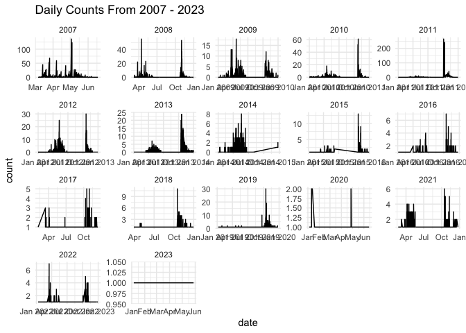
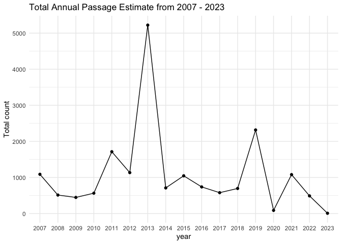
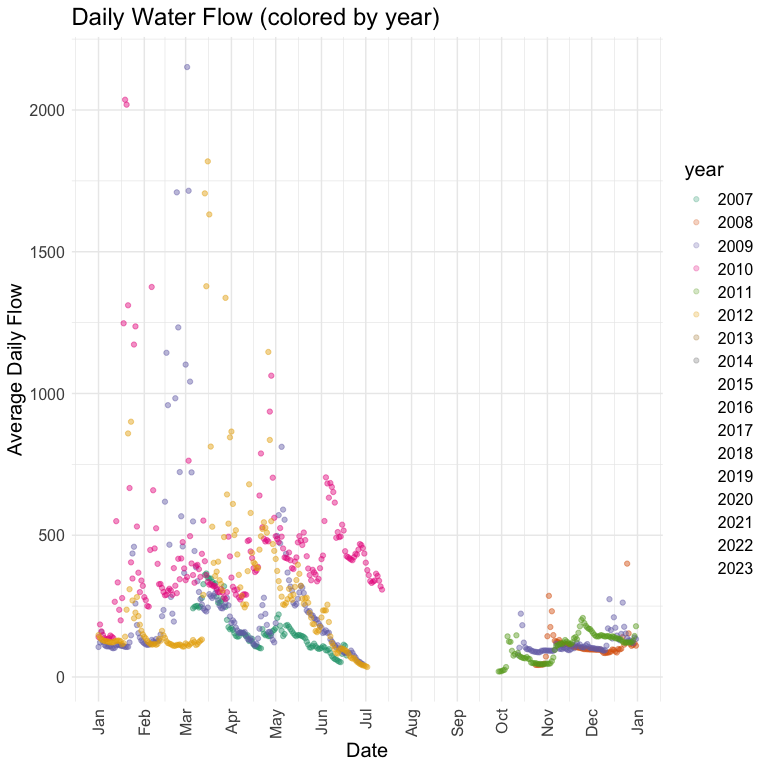
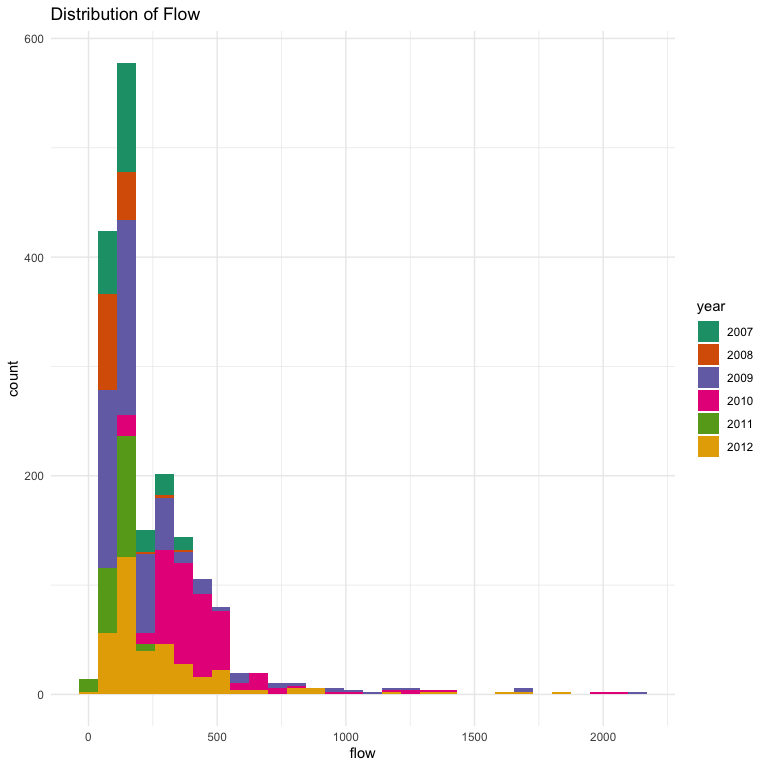
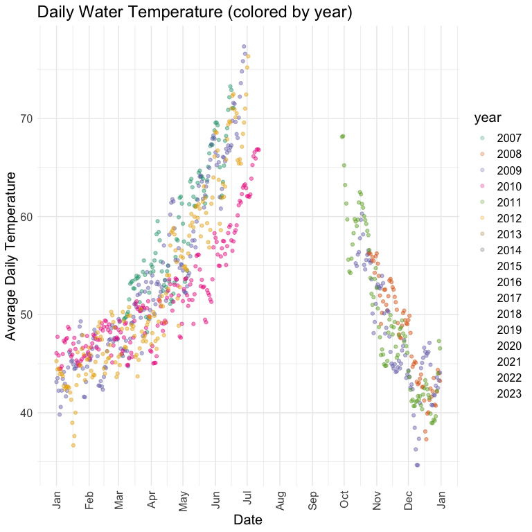
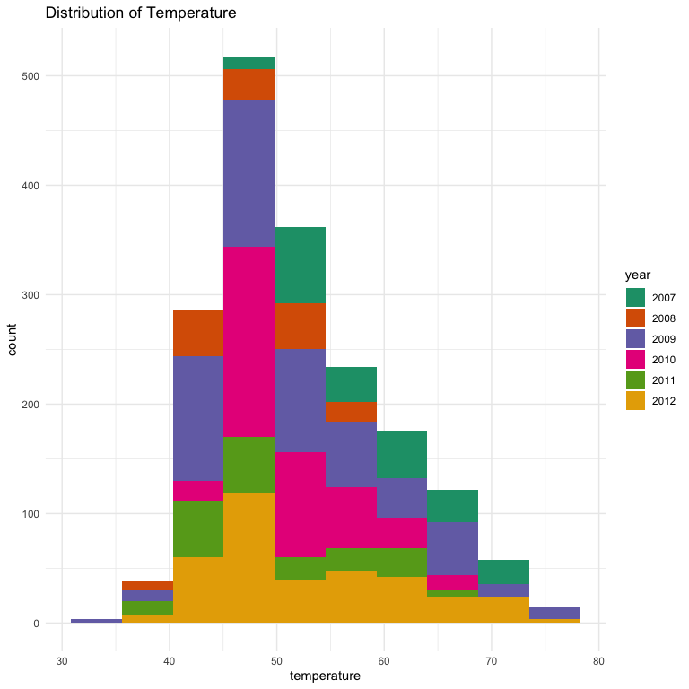

Mill Creek Adult Upstream Passage Estimate QC
================
Inigo Peng
10/19/2021

# Mill Creek Adult Upstream Passage Estimate Data 2007 to 2023

**Description of Monitoring Data**

Adult spring run daily passage estimate is based on data recorded at
Ward Dam via video monitoring.

**Timeframe:**

2007 to 2023

**Completeness of Record throughout timeframe:**

- All NA values for count are converted to `0`
- 

**Sampling Location:**

- Ward Dam

**Data Contact:** [Ryan Revnak](mailto:Ryan.Revnak@wildlife.ca.gov) and
[Doug Killam](mailto:Doug.Killam@wildlife.ca.gov)

## Access Cloud Data

``` r
# Run Sys.setenv() to specify GCS_AUTH_FILE and GCS_DEFAULT_BUCKET before running
# Open object from google cloud storage
# Set your authentication using gcs_auth
gcs_auth(json_file = Sys.getenv("GCS_AUTH_FILE"))
# Set global bucket 
gcs_global_bucket(bucket = Sys.getenv("GCS_DEFAULT_BUCKET"))

# get filenames for mill creek
mill_creek_filenames <- gcs_list_objects() |> 
  filter(str_detect(name, "adult-upstream-passage-monitoring/mill-creek/data-raw/MCVS")) |> 
  pull(name)

# define function to download all files
get_files_from_cloud <- function(filename) {
  print(substr(filename, 55, nchar(filename)))
  gcs_get_object(object_name = filename,
                 bucket = gcs_get_global_bucket(),
                 saveToDisk = paste0("data-raw/qc-markdowns/adult-upstream-passage-monitoring/mill-creek/", substr(filename, 55, nchar(filename))),
                 overwrite = TRUE)
  message(paste0("downloaded ", filename))
}

lapply(mill_creek_filenames, get_files_from_cloud)

# get the one that says COPY of
# 2020-2021 passage data
gcs_get_object(object_name = "adult-upstream-passage-monitoring/mill-creek/data-raw/Copy of MCVS 2021-22 spring FINAL 8-17-22.xlsx",
               bucket = gcs_get_global_bucket(),
               saveToDisk = "data-raw/qc-markdowns/adult-upstream-passage-monitoring/mill-creek/mill_creek_passage_counts_2021.xlsx",
               overwrite = TRUE)
```

## Read in and clean raw count data for each year

``` r
save_to_prefix <- "data-raw/qc-markdowns/adult-upstream-passage-monitoring/mill-creek/"
```

This requires a different approach for each year because the file
formats change.

### 2006-2007

``` r
mill_2006_raw <- readxl::read_xls(paste0(save_to_prefix, "MCVS 2006-2007 as of 2-14-2008.xls"), 
                                  sheet = "Daily Totals",
                                  skip = 3) |> 
  glimpse()
```

    ## Rows: 105
    ## Columns: 11
    ## $ Date                         <dttm> 2007-03-06, 2007-03-07, 2007-03-08, 2007…
    ## $ `Steel  Up`                  <dbl> 0, 1, 1, 2, 0, 1, 1, 1, 0, 0, 0, 4, 0, 1,…
    ## $ `Steel Down`                 <dbl> 0, 0, 0, 0, 1, 1, 0, 1, 1, 2, 1, 1, 0, 0,…
    ## $ `Steelhead Daily Total`      <dbl> 0, 1, 1, 2, -1, 0, 1, 0, -1, -2, -1, 3, 0…
    ## $ `Steelhead Cumulative Total` <dbl> 0, 1, 2, 4, 3, 3, 4, 4, 3, 1, 0, 3, 3, 4,…
    ## $ `Avg  Water Temp`            <dbl> 49.53021, 49.64896, 49.75104, 50.05104, 5…
    ## $ `Avg FLOW  in CFS`           <dbl> 242.0938, 247.6979, 250.0208, 250.8542, 2…
    ## $ `Salmon Up`                  <dbl> 0, 0, 1, 1, 1, 0, 2, 4, 45, 7, 12, 17, 11…
    ## $ `Salmon Down`                <dbl> 0, 0, 0, 0, 0, 0, 0, 0, 0, 0, 2, 1, 0, 0,…
    ## $ `Salmon Daily Total`         <dbl> 0, 0, 1, 1, 1, 0, 2, 4, 45, 7, 10, 16, 11…
    ## $ `Salmon Cumulative Total`    <dbl> 0, 0, 1, 2, 3, 3, 5, 9, 54, 61, 71, 87, 9…

``` r
mill_2006 <- mill_2006_raw |> 
  janitor::clean_names() |> 
  select(date, avg_water_temp, avg_flow_in_cfs, salmon_up, salmon_down) |> 
  pivot_longer(salmon_up:salmon_down,
               names_to = "passage_direction", 
               values_to = "count") |> 
  mutate(passage_direction = ifelse(passage_direction == "salmon_up", "up", "down")) |> 
  glimpse()
```

    ## Rows: 210
    ## Columns: 5
    ## $ date              <dttm> 2007-03-06, 2007-03-06, 2007-03-07, 2007-03-07, 200…
    ## $ avg_water_temp    <dbl> 49.53021, 49.53021, 49.64896, 49.64896, 49.75104, 49…
    ## $ avg_flow_in_cfs   <dbl> 242.0938, 242.0938, 247.6979, 247.6979, 250.0208, 25…
    ## $ passage_direction <chr> "up", "down", "up", "down", "up", "down", "up", "dow…
    ## $ count             <dbl> 0, 0, 0, 0, 1, 0, 1, 0, 1, 0, 0, 0, 2, 0, 4, 0, 45, …

### 2007-2008

``` r
mill_2007_raw <- readxl::read_xls(paste0(save_to_prefix, "MCVS 2007-2008 as of 7-24-08.xls"), 
                                  sheet = "Daily Totals",
                                  skip = 3) |> 
  glimpse()
```

    ## Rows: 132
    ## Columns: 7
    ## $ Date                              <dttm> 2008-03-07, 2008-03-08, 2008-03-09,…
    ## $ `# Up`                            <dbl> 0, 0, 0, 0, 3, 2, 1, 1, 0, 0, 0, 0, …
    ## $ `# Down`                          <dbl> 0, 0, 0, 0, 0, 0, 0, 0, 0, 0, 0, 0, …
    ## $ `Daily Total`                     <dbl> 0, 0, 0, 0, 3, 2, 1, 1, 0, 0, 0, 0, …
    ## $ `Water Temp`                      <lgl> NA, NA, NA, NA, NA, NA, NA, NA, NA, …
    ## $ `Cumulative Total`                <dbl> 0, 0, 0, 0, 3, 5, 6, 7, 7, 7, 7, 7, …
    ## $ `Average Cummulative Passage (%)` <lgl> NA, NA, NA, NA, NA, NA, NA, NA, NA, …

``` r
mill_2007 <- mill_2007_raw |> 
  janitor::clean_names() |> 
  select(date, avg_water_temp = water_temp, number_up, number_down) |> 
  pivot_longer(number_up:number_down,
               names_to = "passage_direction", 
               values_to = "count") |> 
  mutate(passage_direction = ifelse(passage_direction == "number_up", "up", "down")) |> 
  glimpse()
```

    ## Rows: 264
    ## Columns: 4
    ## $ date              <dttm> 2008-03-07, 2008-03-07, 2008-03-08, 2008-03-08, 200…
    ## $ avg_water_temp    <lgl> NA, NA, NA, NA, NA, NA, NA, NA, NA, NA, NA, NA, NA, …
    ## $ passage_direction <chr> "up", "down", "up", "down", "up", "down", "up", "dow…
    ## $ count             <dbl> 0, 0, 0, 0, 0, 0, 0, 0, 3, 0, 2, 0, 1, 0, 1, 0, 0, 0…

### 2008-2009

``` r
mill_2008_raw <- readxl::read_xls(paste0(save_to_prefix, "MCVS 2008-2009 as of 8-10-10.xls"), 
                                  sheet = "Summary Totals ",
                                  skip = 4) |> 
  glimpse()
```

    ## Rows: 249
    ## Columns: 16
    ## $ Date                         <dttm> 2008-10-24, 2008-10-25, 2008-10-26, 2008…
    ## $ `Salmon # Up`                <dbl> 0.0, 3.0, 7.0, 2.0, 14.0, 7.0, 1.0, 22.0,…
    ## $ `Salmon # Down`              <dbl> 1, 0, 1, 0, 1, 0, 0, 2, 0, 1, 1, 1, 2, 0,…
    ## $ `Salmon  Daily Total`        <dbl> -1.0, 3.0, 6.0, 2.0, 13.0, 7.0, 1.0, 20.0…
    ## $ `Salmon Cumulative Total`    <dbl> -1.0, 2.0, 8.0, 10.0, 23.0, 30.0, 31.0, 5…
    ## $ `Steelhead # Up`             <dbl> 0.000000, 2.000000, 1.000000, 0.000000, 0…
    ## $ `Steelhead # Down`           <dbl> 0, 0, 0, 0, 0, 0, 0, 0, 0, 0, 0, 0, 0, 0,…
    ## $ `Steelhead  Daily Total`     <dbl> 0.000000, 2.000000, 1.000000, 0.000000, 0…
    ## $ `Steelhead Cumulative Total` <dbl> 0.00000, 2.00000, 3.00000, 3.00000, 3.000…
    ## $ `Other # Up`                 <dbl> 2, 4, 0, 1, 0, 0, 0, 0, 1, 0, 0, 0, 0, 3,…
    ## $ `Other # Down`               <dbl> 0, 0, 0, 0, 0, 0, 0, 0, 0, 0, 0, 0, 0, 0,…
    ## $ `Other Daily Total`          <dbl> 2, 4, 0, 1, 0, 0, 0, 0, 1, 0, 0, 0, 0, 3,…
    ## $ `Water Temp  AVG`            <dbl> 56.22812, 56.29688, 56.18021, 55.47396, 5…
    ## $ `FLOW   AVG`                 <dbl> 42.64583, 42.46875, 42.29167, 42.82292, 4…
    ## $ ...15                        <lgl> NA, NA, NA, NA, NA, NA, NA, NA, NA, NA, N…
    ## $ `flow is below 99`           <lgl> NA, NA, NA, NA, NA, NA, NA, NA, NA, NA, N…

``` r
mill_2008 <- mill_2008_raw |> 
  janitor::clean_names() |> 
  select(date, avg_water_temp = water_temp_avg, avg_flow_in_cfs = flow_avg, salmon_number_up, salmon_number_down) |> 
  pivot_longer(salmon_number_up:salmon_number_down,
               names_to = "passage_direction", 
               values_to = "count") |> 
  mutate(passage_direction = ifelse(passage_direction == "salmon_number_up", "up", "down")) |> 
  glimpse()
```

    ## Rows: 498
    ## Columns: 5
    ## $ date              <dttm> 2008-10-24, 2008-10-24, 2008-10-25, 2008-10-25, 200…
    ## $ avg_water_temp    <dbl> 56.22812, 56.22812, 56.29688, 56.29688, 56.18021, 56…
    ## $ avg_flow_in_cfs   <dbl> 42.64583, 42.64583, 42.46875, 42.46875, 42.29167, 42…
    ## $ passage_direction <chr> "up", "down", "up", "down", "up", "down", "up", "dow…
    ## $ count             <dbl> 0.0, 1.0, 3.0, 0.0, 7.0, 1.0, 2.0, 0.0, 14.0, 1.0, 7…

### 2009-2010

``` r
mill_2009_raw <- readxl::read_xls(paste0(save_to_prefix, "MCVS 2009-2010 as of  9-21-10.xls"), 
                                  sheet = "SUMMARY",
                                  skip = 4) |> 
  glimpse()
```

    ## Rows: 274
    ## Columns: 14
    ## $ Date                         <dttm> 2009-10-12, 2009-10-13, 2009-10-14, 2009…
    ## $ `Salmon # Up`                <dbl> 0.0, 0.0, 6.5, 5.5, 7.5, 7.5, 8.0, 3.0, 1…
    ## $ `Salmon # Down`              <dbl> 0.0, 0.0, 1.5, 2.0, 2.5, 1.0, 3.0, 1.0, 4…
    ## $ `Salmon  Daily Total`        <dbl> 0.0, 0.0, 5.0, 3.5, 5.0, 6.5, 5.0, 2.0, 8…
    ## $ `Salmon Cumulative Total`    <dbl> 0.0, 0.0, 5.0, 8.5, 13.5, 20.0, 25.0, 27.…
    ## $ `Steelhead # Up`             <dbl> 0.0, 0.0, 0.5, 1.0, 1.0, 0.5, 1.0, 1.0, 1…
    ## $ `Steelhead # Down`           <dbl> 0, 0, 0, 0, 0, 0, 0, 0, 0, 0, 0, 0, 0, 0,…
    ## $ `Steelhead  Daily Total`     <dbl> 0.0, 0.0, 0.5, 1.0, 1.0, 0.5, 1.0, 1.0, 1…
    ## $ `Steelhead Cumulative Total` <dbl> 0.0, 0.0, 0.5, 1.5, 2.5, 3.0, 4.0, 5.0, 6…
    ## $ `Other # Up`                 <dbl> 0.0, 2.0, 0.5, 2.5, 0.5, 0.0, 5.0, 0.0, 1…
    ## $ `Other # Down`               <dbl> 0, 0, 0, 0, 0, 0, 0, 0, 0, 0, 0, 0, 0, 0,…
    ## $ `Other Daily Total`          <dbl> 0.0, 2.0, 0.5, 2.5, 0.5, 0.0, 5.0, 0.0, 1…
    ## $ `Water Temp  AVG`            <dbl> 55.23333, 54.95833, 56.12917, 56.37500, 5…
    ## $ `FLOW   AVG`                 <dbl> 78.50000, 103.04167, 223.30208, 182.57292…

``` r
mill_2009 <- mill_2009_raw |> 
  janitor::clean_names() |> 
  select(date, avg_water_temp = water_temp_avg, avg_flow_in_cfs = flow_avg, salmon_number_up, salmon_number_down) |> 
  pivot_longer(salmon_number_up:salmon_number_down,
               names_to = "passage_direction", 
               values_to = "count") |> 
  mutate(passage_direction = ifelse(passage_direction == "salmon_number_up", "up", "down")) |> 
  glimpse()
```

    ## Rows: 548
    ## Columns: 5
    ## $ date              <dttm> 2009-10-12, 2009-10-12, 2009-10-13, 2009-10-13, 200…
    ## $ avg_water_temp    <dbl> 55.23333, 55.23333, 54.95833, 54.95833, 56.12917, 56…
    ## $ avg_flow_in_cfs   <dbl> 78.50000, 78.50000, 103.04167, 103.04167, 223.30208,…
    ## $ passage_direction <chr> "up", "down", "up", "down", "up", "down", "up", "dow…
    ## $ count             <dbl> 0.0, 0.0, 0.0, 0.0, 6.5, 1.5, 5.5, 2.0, 7.5, 2.5, 7.…

### 2010-2011

- no `flow` or `temperature`, but some columns `flow_mch_max` and
  `mch_low_water_tmp_avg`.

``` r
mill_2010_raw <- readxl::read_xls(paste0(save_to_prefix, "MCVS 2010-2011 as of 10-16-12.xls"), 
                                  sheet = "SUMMARY",
                                  skip = 4) |> 
  glimpse()
```

    ## Rows: 271
    ## Columns: 22
    ## $ Date                                                                    <dttm> …
    ## $ `Salmon # Up`                                                           <dbl> …
    ## $ `Salmon # Down`                                                         <dbl> …
    ## $ `Salmon  Daily Total`                                                   <dbl> …
    ## $ `Salmon Cumulative Total`                                               <dbl> …
    ## $ `Steelhead # Up`                                                        <dbl> …
    ## $ `Steelhead # Down`                                                      <dbl> …
    ## $ `Steelhead  Daily Total`                                                <dbl> …
    ## $ `Steelhead Cumulative Total`                                            <dbl> …
    ## $ `Other # Up`                                                            <dbl> …
    ## $ `Other # Down`                                                          <dbl> …
    ## $ `Other Daily Total`                                                     <dbl> …
    ## $ `FLOW MCH MAX`                                                          <dbl> …
    ## $ `MCH low Water Temp  AVG`                                               <dbl> …
    ## $ `Flow Band for jumper expansion from 2012`                              <dbl> …
    ## $ `Expanded salmon counts based on addition of jumpers from 2012 data`    <dbl> …
    ## $ `Expanded STEELHEAD counts based on addition of jumpers from 2012 data` <dbl> …
    ## $ ...18                                                                   <lgl> …
    ## $ ...19                                                                   <chr> …
    ## $ ...20                                                                   <chr> …
    ## $ ...21                                                                   <chr> …
    ## $ ...22                                                                   <chr> …

``` r
mill_2010 <- mill_2010_raw |> 
  janitor::clean_names() |> 
  select(date, salmon_number_up, salmon_number_down) |> 
  pivot_longer(salmon_number_up:salmon_number_down,
               names_to = "passage_direction", 
               values_to = "count") |> 
  mutate(passage_direction = ifelse(passage_direction == "salmon_number_up", "up", "down")) |> 
  glimpse()
```

    ## Rows: 542
    ## Columns: 3
    ## $ date              <dttm> 2010-10-22, 2010-10-22, 2010-10-23, 2010-10-23, 201…
    ## $ passage_direction <chr> "up", "down", "up", "down", "up", "down", "up", "dow…
    ## $ count             <dbl> 0, 0, 0, 0, 52, 1, 36, 0, 61, 0, 11, 2, 20, 0, 11, 3…

### 2011-2012

- seems they started collecting more flow and temp variables, adding a
  descriptor `mch` to them and collecting `min` and `max`.

``` r
mill_2011_raw <- readxl::read_xls(paste0(save_to_prefix, "MCVS 2011-2012 as of 9-22-13.xls"), 
                                  sheet = "SUMMARY",
                                  skip = 4,
                                  col_types = c("date", rep("text", 23))) |> 
  glimpse()
```

    ## Rows: 309
    ## Columns: 24
    ## $ Date                                               <dttm> 2011-09-29, 2011-0…
    ## $ `# Salmon  Up`                                     <chr> "0", "0", "0", "0",…
    ## $ `#Salmon Down`                                     <chr> "0", "0", "0", "0",…
    ## $ `# Jacks    Up`                                    <chr> "0", "0", "0", "0",…
    ## $ `# Jacks Down`                                     <chr> "0", "0", "0", "0",…
    ## $ `Salmon  Daily Total`                              <chr> "0", "0", "0", "0",…
    ## $ `Salmon Cumulative Total`                          <chr> "0", "0", "0", "0",…
    ## $ `Steelhead # Up`                                   <chr> "0", "0", "0", "0",…
    ## $ `Steelhead # Down`                                 <chr> "0", "0", "0", "0",…
    ## $ `Steelhead  Daily Total`                           <chr> "0", "0", "0", "0",…
    ## $ `Steelhead Cumulative Total`                       <chr> "0", "0", "0", "0",…
    ## $ `Other # Up`                                       <chr> "0", "0", "0", "0",…
    ## $ `Other # Down`                                     <chr> "0", "0", "0", "0",…
    ## $ `Other Daily Total`                                <chr> "0", "0", "0", "0",…
    ## $ `Average Water Temp-MCH`                           <chr> "68.125", "68.19791…
    ## $ `Minimum Water Temp MCH.`                          <chr> "63.200000000000003…
    ## $ `Maximum Water Temp MCH`                           <chr> "73.299999999999997…
    ## $ `Avg Flow MCH-low`                                 <chr> "19.34375", "19.645…
    ## $ `Min Flow MCH`                                     <chr> "18", "18", "20", "…
    ## $ `Max Flow MCH`                                     <chr> "20", "28", "22", "…
    ## $ `THESE ARE FINAL ADJUSTED need to add jumpers`     <chr> NA, NA, NA, NA, NA,…
    ## $ `Jumpers                     (none when <180 MCH)` <chr> "0", "0", "0", "0",…
    ## $ `FINAL ADJUSTED COUNTS WITH JUMPERS`               <chr> NA, NA, NA, NA, NA,…
    ## $ ...24                                              <chr> "40815", "40816", "…

``` r
mill_2011 <- mill_2011_raw |> 
  janitor::clean_names() |> 
  select(date, avg_water_temp = average_water_temp_mch, avg_flow_in_cfs = avg_flow_mch_low, number_salmon_up, number_salmon_down) |> 
  mutate(across(avg_water_temp:number_salmon_down, as.numeric)) |> 
  pivot_longer(number_salmon_up:number_salmon_down,
               names_to = "passage_direction", 
               values_to = "count") |> 
  mutate(passage_direction = ifelse(passage_direction == "number_salmon_up", "up", "down")) |> 
  glimpse()
```

    ## Rows: 618
    ## Columns: 5
    ## $ date              <dttm> 2011-09-29, 2011-09-29, 2011-09-30, 2011-09-30, 201…
    ## $ avg_water_temp    <dbl> 68.12500, 68.12500, 68.19792, 68.19792, 65.21875, 65…
    ## $ avg_flow_in_cfs   <dbl> 19.34375, 19.34375, 19.64583, 19.64583, 20.67708, 20…
    ## $ passage_direction <chr> "up", "down", "up", "down", "up", "down", "up", "dow…
    ## $ count             <dbl> 0, 0, 0, 0, 0, 0, 0, 0, 0, 0, 2, 0, 265, 5, 148, 4, …

### 2012-2013

- this moves to a new format for data collection
- There is a tab `Post R MCVS spring 2013` which is summed by day and
  has `original.counts` vs `consensus.counts` and `adjusted.counts`
- we are using the tab `DATA ENTRY` which has raw counts with
  `passage_direction`, `time`, and `view_adjust`.
- no covariates

``` r
mill_2012_raw <- readxl::read_xls(paste0(save_to_prefix, "MCVS 2012-2013 as of 9-22-13 .xls"), 
                                  sheet = "DATA ENTRY",
                                  skip = 4) |> 
  glimpse()
```

    ## Rows: 11,596
    ## Columns: 38
    ## $ Date                              <dttm> 2012-10-19, 2012-10-19, 2012-10-19,…
    ## $ `Start Time`                      <dttm> 1899-12-31 00:00:00, 1899-12-31 00:…
    ## $ `UP Salmon`                       <chr> "0", "0", "0", "0", "0", "0", "0", "…
    ## $ `DN Salmon`                       <dbl> 0, 0, 0, 0, 0, 0, 0, 0, 0, 0, 0, 0, …
    ## $ `UP Jacks`                        <dbl> 0, 0, 0, 0, 0, 0, 0, 0, 0, 0, 0, 0, …
    ## $ `DN Jacks`                        <dbl> 0, 0, 0, 0, 0, 0, 0, 0, 0, 0, 0, 0, …
    ## $ `UP Steel`                        <dbl> 0, 0, 0, 0, 0, 0, 0, 0, 0, 0, 0, 0, …
    ## $ `DN Steel`                        <dbl> 0, 0, 0, 0, 0, 0, 0, 0, 0, 0, 0, 0, …
    ## $ `UP Others`                       <dbl> 0, 0, 0, 0, 0, 0, 0, 0, 0, 0, 0, 0, …
    ## $ `DN Others`                       <dbl> 0, 0, 0, 0, 0, 0, 0, 0, 0, 0, 0, 0, …
    ## $ `Viewing Adjust`                  <dbl> 0, 0, 0, 0, 0, 0, 0, 0, 0, 0, 0, 0, …
    ## $ `Jumpers Tried`                   <dbl> NA, NA, NA, NA, NA, NA, NA, NA, NA, …
    ## $ `Jumpers UP`                      <dbl> NA, NA, NA, NA, NA, NA, NA, NA, NA, …
    ## $ `Jumpers DOWN`                    <dbl> NA, NA, NA, NA, NA, NA, NA, NA, NA, …
    ## $ `Filmed day only`                 <dbl> 0, 0, 0, 0, 0, 0, 0, 0, 0, 0, 0, 0, …
    ## $ `COMMENTS     Note other species` <chr> "1", NA, NA, NA, NA, NA, NA, NA, NA,…
    ## $ `# Natural...17`                  <chr> "Fall Sex ratio", NA, NA, NA, NA, NA…
    ## $ `# Unk...18`                      <dbl> NA, NA, NA, NA, NA, NA, NA, NA, NA, …
    ## $ `# clip...19`                     <dbl> NA, NA, NA, NA, NA, NA, NA, NA, NA, …
    ## $ `# Fem...20`                      <dbl> 45, NA, NA, NA, NA, NA, NA, NA, NA, …
    ## $ `# Unk...21`                      <dbl> NA, NA, NA, NA, NA, NA, NA, NA, NA, …
    ## $ `# Mal...22`                      <dbl> 114, NA, NA, NA, NA, NA, NA, NA, NA,…
    ## $ `# Natural...23`                  <dbl> NA, NA, NA, NA, NA, NA, NA, NA, NA, …
    ## $ `# Unk...24`                      <dbl> NA, NA, NA, NA, NA, NA, NA, NA, NA, …
    ## $ `# clip...25`                     <dbl> NA, NA, NA, NA, NA, NA, NA, NA, NA, …
    ## $ `# Fem...26`                      <dbl> 0, NA, NA, NA, NA, NA, NA, NA, NA, N…
    ## $ `# Unk...27`                      <dbl> NA, NA, NA, NA, NA, NA, NA, NA, NA, …
    ## $ `# Mal...28`                      <dbl> 6, NA, NA, NA, NA, NA, NA, NA, NA, N…
    ## $ `Salmon up total`                 <chr> "0", "0", "0", "0", "0", "0", "0", "…
    ## $ `Jack up  total`                  <dbl> 0, 0, 0, 0, 0, 0, 0, 0, 0, 0, 0, 0, …
    ## $ `Sal Clip`                        <dbl> 0, 0, 0, 0, 0, 0, 0, 0, 0, 0, 0, 0, …
    ## $ `Sal Sex`                         <dbl> 159, 0, 0, 0, 0, 0, 0, 0, 0, 0, 0, 0…
    ## $ `Jack Clip`                       <dbl> 0, 0, 0, 0, 0, 0, 0, 0, 0, 0, 0, 0, …
    ## $ `Jack Sex`                        <dbl> 6, 0, 0, 0, 0, 0, 0, 0, 0, 0, 0, 0, …
    ## $ `Adult Final clip QC`             <dbl> 0, 0, 0, 0, 0, 0, 0, 0, 0, 0, 0, 0, …
    ## $ `Adult Final Sex QC`              <dbl> -159, 0, 0, 0, 0, 0, 0, 0, 0, 0, 0, …
    ## $ `Jack Final clip QC`              <dbl> 0, 0, 0, 0, 0, 0, 0, 0, 0, 0, 0, 0, …
    ## $ `Jack Final Sex QC`               <dbl> -6, 0, 0, 0, 0, 0, 0, 0, 0, 0, 0, 0,…

``` r
mill_2012 <- mill_2012_raw |> 
  janitor::clean_names() |>
  mutate(up_salmon = as.numeric(up_salmon),
         start_time = format(start_time, "%H:%M:%S")) |> 
  select(date, start_time, up_salmon, dn_salmon, viewing_adjust) |> 
  pivot_longer(up_salmon:dn_salmon,
               names_to = "passage_direction", 
               values_to = "count") |> 
  mutate(passage_direction = ifelse(passage_direction == "number_salmon_up", "up", "down"),
         viewing_adjust = as.character(viewing_adjust)) |> 
  glimpse()
```

    ## Rows: 23,192
    ## Columns: 5
    ## $ date              <dttm> 2012-10-19, 2012-10-19, 2012-10-19, 2012-10-19, 201…
    ## $ start_time        <chr> "00:00:00", "00:00:00", "00:30:00", "00:30:00", "01:…
    ## $ viewing_adjust    <chr> "0", "0", "0", "0", "0", "0", "0", "0", "0", "0", "0…
    ## $ passage_direction <chr> "down", "down", "down", "down", "down", "down", "dow…
    ## $ count             <dbl> 0, 0, 0, 0, 0, 0, 0, 0, 0, 0, 0, 0, 0, 0, 0, 0, 0, 0…

### 2013-2014

``` r
mill_2013_raw <- readxl::read_xls(paste0(save_to_prefix, "MCVS 2013-2014 as of 11-24-2014.xls"), 
                                  sheet = "DATA ENTRY",
                                  skip = 4) |> 
  glimpse()
```

    ## Rows: 13,920
    ## Columns: 37
    ## $ Date                              <dttm> 2013-10-15, 2013-10-15, 2013-10-15,…
    ## $ `Start Time`                      <dttm> 1899-12-31 00:00:00, 1899-12-31 00:…
    ## $ `UP Salmon`                       <dbl> 0, 0, 0, 0, 0, 0, 0, 0, 0, 0, 0, 0, …
    ## $ `DN Salmon`                       <dbl> 0, 0, 0, 0, 0, 0, 0, 0, 0, 0, 0, 0, …
    ## $ `UP Jacks`                        <dbl> 0, 0, 0, 0, 0, 0, 0, 0, 0, 0, 0, 0, …
    ## $ `DN Jacks`                        <dbl> 0, 0, 0, 0, 0, 0, 0, 0, 0, 0, 0, 0, …
    ## $ `UP Steel`                        <dbl> 0, 0, 0, 0, 0, 0, 0, 0, 0, 0, 0, 0, …
    ## $ `DN Steel`                        <dbl> 0, 0, 0, 0, 0, 0, 0, 0, 0, 0, 0, 0, …
    ## $ `UP Trout`                        <dbl> 0, 0, 0, 0, 0, 0, 0, 0, 0, 0, 0, 0, …
    ## $ `DN Trout`                        <dbl> 0, 0, 0, 0, 0, 0, 0, 0, 0, 0, 0, 0, …
    ## $ `Viewing Adjust`                  <dbl> 0, 0, 0, 0, 0, 0, 0, 0, 0, 0, 0, 0, …
    ## $ `Jumpers Tried`                   <dbl> 0, 0, 0, 0, 0, 0, 0, 0, 0, 0, 0, 0, …
    ## $ `Jumpers UP`                      <dbl> 0, 0, 0, 0, 0, 0, 0, 0, 0, 0, 0, 0, …
    ## $ `Jumpers DOWN`                    <dbl> 0, 0, 0, 0, 0, 0, 0, 0, 0, 0, 0, 0, …
    ## $ `COMMENTS     Note other species` <chr> NA, NA, NA, NA, NA, NA, NA, NA, NA, …
    ## $ `# Natural...16`                  <lgl> NA, NA, NA, NA, NA, NA, NA, NA, NA, …
    ## $ `# Unk...17`                      <lgl> NA, NA, NA, NA, NA, NA, NA, NA, NA, …
    ## $ `# clip...18`                     <lgl> NA, NA, NA, NA, NA, NA, NA, NA, NA, …
    ## $ `# Fem...19`                      <lgl> NA, NA, NA, NA, NA, NA, NA, NA, NA, …
    ## $ `# Unk...20`                      <lgl> NA, NA, NA, NA, NA, NA, NA, NA, NA, …
    ## $ `# Mal...21`                      <lgl> NA, NA, NA, NA, NA, NA, NA, NA, NA, …
    ## $ `# Natural...22`                  <lgl> NA, NA, NA, NA, NA, NA, NA, NA, NA, …
    ## $ `# Unk...23`                      <lgl> NA, NA, NA, NA, NA, NA, NA, NA, NA, …
    ## $ `# clip...24`                     <lgl> NA, NA, NA, NA, NA, NA, NA, NA, NA, …
    ## $ `# Fem...25`                      <lgl> NA, NA, NA, NA, NA, NA, NA, NA, NA, …
    ## $ `# Unk...26`                      <lgl> NA, NA, NA, NA, NA, NA, NA, NA, NA, …
    ## $ `# Mal...27`                      <lgl> NA, NA, NA, NA, NA, NA, NA, NA, NA, …
    ## $ `Salmon up total`                 <dbl> 0, 0, 0, 0, 0, 0, 0, 0, 0, 0, 0, 0, …
    ## $ `Jack up  total`                  <dbl> 0, 0, 0, 0, 0, 0, 0, 0, 0, 0, 0, 0, …
    ## $ `Sal Clip`                        <dbl> 0, 0, 0, 0, 0, 0, 0, 0, 0, 0, 0, 0, …
    ## $ `Sal Sex`                         <dbl> 0, 0, 0, 0, 0, 0, 0, 0, 0, 0, 0, 0, …
    ## $ `Jack Clip`                       <dbl> 0, 0, 0, 0, 0, 0, 0, 0, 0, 0, 0, 0, …
    ## $ `Jack Sex`                        <dbl> 0, 0, 0, 0, 0, 0, 0, 0, 0, 0, 0, 0, …
    ## $ `Adult Final clip QC`             <dbl> 0, 0, 0, 0, 0, 0, 0, 0, 0, 0, 0, 0, …
    ## $ `Adult Final Sex QC`              <dbl> 0, 0, 0, 0, 0, 0, 0, 0, 0, 0, 0, 0, …
    ## $ `Jack Final clip QC`              <dbl> 0, 0, 0, 0, 0, 0, 0, 0, 0, 0, 0, 0, …
    ## $ `Jack Final Sex QC`               <dbl> 0, 0, 0, 0, 0, 0, 0, 0, 0, 0, 0, 0, …

``` r
mill_2013 <- mill_2013_raw |> 
  janitor::clean_names() |>
  mutate(up_salmon = as.numeric(up_salmon),
         start_time = format(start_time, "%H:%M:%S")) |> 
  select(date, start_time, up_salmon, dn_salmon, viewing_adjust) |> 
  pivot_longer(up_salmon:dn_salmon,
               names_to = "passage_direction", 
               values_to = "count") |> 
  mutate(passage_direction = ifelse(passage_direction == "number_salmon_up", "up", "down"),
         viewing_adjust = as.character(viewing_adjust)) |> 
  glimpse()
```

    ## Rows: 27,840
    ## Columns: 5
    ## $ date              <dttm> 2013-10-15, 2013-10-15, 2013-10-15, 2013-10-15, 201…
    ## $ start_time        <chr> "00:00:00", "00:00:00", "00:30:00", "00:30:00", "01:…
    ## $ viewing_adjust    <chr> "0", "0", "0", "0", "0", "0", "0", "0", "0", "0", "0…
    ## $ passage_direction <chr> "down", "down", "down", "down", "down", "down", "dow…
    ## $ count             <dbl> 0, 0, 0, 0, 0, 0, 0, 0, 0, 0, 0, 0, 0, 0, 0, 0, 0, 0…

### 2014-2015

- includes `jack` now

``` r
mill_2014_raw <- readxl::read_xlsx(paste0(save_to_prefix, "MCVS 2014-2015 as of  7-3-2015.xlsx"), 
                                  sheet = "DATA ENTRY",
                                  skip = 3) |> 
  glimpse()
```

    ## Rows: 11,213
    ## Columns: 16
    ## $ Date                                                                  <dttm> …
    ## $ `Start Time`                                                          <dttm> …
    ## $ `UP Salmon`                                                           <chr> …
    ## $ `DN Salmon`                                                           <chr> …
    ## $ `UP Jacks`                                                            <chr> …
    ## $ `DN Jacks`                                                            <chr> …
    ## $ `UP Steel`                                                            <chr> …
    ## $ `DN Steel`                                                            <chr> …
    ## $ `UP Others`                                                           <chr> …
    ## $ `DN Others`                                                           <chr> …
    ## $ `Viewing Adjust !!`                                                   <chr> …
    ## $ `Jumpers Tried`                                                       <chr> …
    ## $ `Jumpers UP`                                                          <chr> …
    ## $ `Jumpers DOWN`                                                        <chr> …
    ## $ `COMMENTS: Note other species, fish behavior, and things of interest` <chr> …
    ## $ ...16                                                                 <dbl> …

``` r
mill_2014 <- mill_2014_raw |> 
  janitor::clean_names() |>
  mutate(across(up_salmon:dn_jacks, as.numeric),
         start_time = format(start_time, "%H:%M:%S")) |> 
  select(date, start_time, up_salmon, dn_salmon, 
         up_jacks, dn_jacks, viewing_adjust) |> 
  pivot_longer(up_salmon:dn_jacks,
               names_to = "count_type", 
               values_to = "count") |> 
  mutate(passage_direction = ifelse(count_type == "number_salmon_up", "up", "down"),
         jack = ifelse(str_detect(count_type, "jacks"), TRUE, FALSE),
         viewing_adjust = as.character(viewing_adjust)) |> 
  glimpse()
```

    ## Rows: 44,852
    ## Columns: 7
    ## $ date              <dttm> 2014-12-10, 2014-12-10, 2014-12-10, 2014-12-10, 201…
    ## $ start_time        <chr> "09:30:00", "09:30:00", "09:30:00", "09:30:00", "10:…
    ## $ viewing_adjust    <chr> NA, NA, NA, NA, NA, NA, NA, NA, NA, NA, NA, NA, NA, …
    ## $ count_type        <chr> "up_salmon", "dn_salmon", "up_jacks", "dn_jacks", "u…
    ## $ count             <dbl> NA, NA, NA, NA, NA, NA, NA, NA, NA, NA, NA, NA, NA, …
    ## $ passage_direction <chr> "down", "down", "down", "down", "down", "down", "dow…
    ## $ jack              <lgl> FALSE, FALSE, TRUE, TRUE, FALSE, FALSE, TRUE, TRUE, …

### 2015-2016

``` r
mill_2015_raw <- readxl::read_xlsx(paste0(save_to_prefix, "MCVS 2015-2016 as of  4-25-2017.xlsx"), 
                                  sheet = "DATA ENTRY",
                                  skip = 5) |> 
  glimpse()
```

    ## Rows: 13,411
    ## Columns: 14
    ## $ Date                                                                  <dttm> …
    ## $ `Start Time`                                                          <dttm> …
    ## $ `UP Salmon`                                                           <dbl> …
    ## $ `DN Salmon`                                                           <dbl> …
    ## $ `UP Jacks`                                                            <dbl> …
    ## $ `DN Jacks`                                                            <dbl> …
    ## $ `UP Steel`                                                            <dbl> …
    ## $ `DN Steel`                                                            <lgl> …
    ## $ Swim                                                                  <dbl> …
    ## $ Jump                                                                  <dbl> …
    ## $ `Jumpers UP`                                                          <dbl> …
    ## $ `Jumpers DOWN`                                                        <dbl> …
    ## $ `Viewing Adjust !!`                                                   <dbl> …
    ## $ `COMMENTS: Note other species, fish behavior, and things of interest` <chr> …

``` r
mill_2015 <- mill_2015_raw |> 
  janitor::clean_names() |> 
  mutate(across(up_salmon:dn_jacks, as.numeric),
         start_time = format(start_time, "%H:%M:%S")) |> 
  select(date, start_time, up_salmon, dn_salmon, 
         up_jacks, dn_jacks, viewing_adjust) |> 
  pivot_longer(up_salmon:dn_jacks,
               names_to = "count_type", 
               values_to = "count") |> 
  mutate(passage_direction = ifelse(count_type == "number_salmon_up", "up", "down"),
         jack = ifelse(str_detect(count_type, "jacks"), TRUE, FALSE),
         viewing_adjust = as.character(viewing_adjust)) |> 
  glimpse()
```

    ## Rows: 53,644
    ## Columns: 7
    ## $ date              <dttm> 2015-10-25, 2015-10-25, 2015-10-25, 2015-10-25, 201…
    ## $ start_time        <chr> "14:30:00", "14:30:00", "14:30:00", "14:30:00", "15:…
    ## $ viewing_adjust    <chr> NA, NA, NA, NA, NA, NA, NA, NA, NA, NA, NA, NA, NA, …
    ## $ count_type        <chr> "up_salmon", "dn_salmon", "up_jacks", "dn_jacks", "u…
    ## $ count             <dbl> NA, NA, NA, NA, NA, NA, NA, NA, NA, NA, NA, NA, NA, …
    ## $ passage_direction <chr> "down", "down", "down", "down", "down", "down", "dow…
    ## $ jack              <lgl> FALSE, FALSE, TRUE, TRUE, FALSE, FALSE, TRUE, TRUE, …

### 2016-2017

``` r
mill_2016_raw <- readxl::read_xlsx(paste0(save_to_prefix, "MCVS 2016-2017 as of  9-25-18.xlsx"), 
                                  sheet = "DATA ENTRY 16-17",
                                  skip = 5) |> 
  glimpse()
```

    ## Rows: 14,784
    ## Columns: 14
    ## $ Date         <dttm> 2016-10-13, 2016-10-13, 2016-10-13, 2016-10-13, 2016-10-…
    ## $ `Start Time` <dttm> 1899-12-31 00:00:00, 1899-12-31 00:30:00, 1899-12-31 01:…
    ## $ `UP Salmon`  <dbl> NA, NA, NA, NA, NA, NA, NA, NA, NA, NA, NA, NA, NA, NA, N…
    ## $ `DN Salmon`  <dbl> NA, NA, NA, NA, NA, NA, NA, NA, NA, NA, NA, NA, NA, NA, N…
    ## $ `UP Jacks`   <lgl> NA, NA, NA, NA, NA, NA, NA, NA, NA, NA, NA, NA, NA, NA, N…
    ## $ `DN Jacks`   <lgl> NA, NA, NA, NA, NA, NA, NA, NA, NA, NA, NA, NA, NA, NA, N…
    ## $ `UP Steel`   <dbl> NA, NA, NA, NA, NA, NA, NA, NA, NA, NA, NA, NA, NA, NA, N…
    ## $ `DN Steel`   <lgl> NA, NA, NA, NA, NA, NA, NA, NA, NA, NA, NA, NA, NA, NA, N…
    ## $ ...9         <lgl> NA, NA, NA, NA, NA, NA, NA, NA, NA, NA, NA, NA, NA, NA, N…
    ## $ ...10        <lgl> NA, NA, NA, NA, NA, NA, NA, NA, NA, NA, NA, NA, NA, NA, N…
    ## $ ...11        <lgl> NA, NA, NA, NA, NA, NA, NA, NA, NA, NA, NA, NA, NA, NA, N…
    ## $ ...12        <lgl> NA, NA, NA, NA, NA, NA, NA, NA, NA, NA, NA, NA, NA, NA, N…
    ## $ ...13        <dbl> NA, NA, NA, NA, NA, NA, NA, NA, NA, NA, NA, NA, NA, NA, N…
    ## $ ...14        <chr> NA, NA, NA, NA, NA, NA, NA, NA, NA, NA, NA, NA, NA, NA, N…

``` r
mill_2016 <- mill_2016_raw |> 
  janitor::clean_names() |> 
  mutate(across(up_salmon:dn_jacks, as.numeric),
         start_time = format(start_time, "%H:%M:%S")) |> 
  select(date, start_time, up_salmon, dn_salmon, 
         up_jacks, dn_jacks) |> 
  pivot_longer(up_salmon:dn_jacks,
               names_to = "count_type", 
               values_to = "count") |> 
  mutate(passage_direction = ifelse(count_type == "number_salmon_up", "up", "down"),
         jack = ifelse(str_detect(count_type, "jacks"), TRUE, FALSE)) |> 
  glimpse()
```

    ## Rows: 59,136
    ## Columns: 6
    ## $ date              <dttm> 2016-10-13, 2016-10-13, 2016-10-13, 2016-10-13, 201…
    ## $ start_time        <chr> "00:00:00", "00:00:00", "00:00:00", "00:00:00", "00:…
    ## $ count_type        <chr> "up_salmon", "dn_salmon", "up_jacks", "dn_jacks", "u…
    ## $ count             <dbl> NA, NA, NA, NA, NA, NA, NA, NA, NA, NA, NA, NA, NA, …
    ## $ passage_direction <chr> "down", "down", "down", "down", "down", "down", "dow…
    ## $ jack              <lgl> FALSE, FALSE, TRUE, TRUE, FALSE, FALSE, TRUE, TRUE, …

### 2017-2018

``` r
mill_2017_raw <- readxl::read_xlsx(paste0(save_to_prefix, "MCVS 2017-2018 as of  9-14-18.xlsx"), 
                                  sheet = "MILL-17-18 ",
                                  skip = 5) |> 
  glimpse()
```

    ## Rows: 15,504
    ## Columns: 14
    ## $ Date                              <dttm> 2017-09-18, 2017-09-18, 2017-09-18,…
    ## $ `Start Time`                      <dttm> 1899-12-31 00:00:00, 1899-12-31 00:…
    ## $ `UP Salmon`                       <dbl> NA, NA, NA, NA, NA, NA, NA, NA, NA, …
    ## $ `DN Salmon`                       <dbl> NA, NA, NA, NA, NA, NA, NA, NA, NA, …
    ## $ `UP Jacks`                        <lgl> NA, NA, NA, NA, NA, NA, NA, NA, NA, …
    ## $ `DN Jacks`                        <lgl> NA, NA, NA, NA, NA, NA, NA, NA, NA, …
    ## $ `UP Steel >16"`                   <dbl> NA, NA, NA, NA, NA, NA, NA, NA, NA, …
    ## $ `DN Steel`                        <lgl> NA, NA, NA, NA, NA, NA, NA, NA, NA, …
    ## $ `UP Trout less 16"`               <dbl> NA, NA, NA, NA, NA, NA, NA, NA, NA, …
    ## $ `DN Trout`                        <dbl> NA, NA, NA, NA, NA, NA, NA, NA, NA, …
    ## $ `COMMENTS     Note other species` <chr> NA, NA, NA, NA, NA, NA, NA, NA, NA, …
    ## $ `Viewing Adjust`                  <lgl> NA, NA, NA, NA, NA, NA, NA, NA, NA, …
    ## $ ...13                             <lgl> NA, NA, NA, NA, NA, NA, NA, NA, NA, …
    ## $ ...14                             <lgl> NA, NA, NA, NA, NA, NA, NA, NA, NA, …

``` r
mill_2017 <- mill_2017_raw |> 
  janitor::clean_names() |> 
  mutate(across(up_salmon:dn_jacks, as.numeric),
         start_time = format(start_time, "%H:%M:%S")) |> 
  select(date, start_time, up_salmon, dn_salmon, 
         up_jacks, dn_jacks, viewing_adjust) |> 
  pivot_longer(up_salmon:dn_jacks,
               names_to = "count_type", 
               values_to = "count") |> 
  mutate(passage_direction = ifelse(count_type == "number_salmon_up", "up", "down"),
         jack = ifelse(str_detect(count_type, "jacks"), TRUE, FALSE),
         viewing_adjust = as.character(viewing_adjust)) |> 
  glimpse()
```

    ## Rows: 62,016
    ## Columns: 7
    ## $ date              <dttm> 2017-09-18, 2017-09-18, 2017-09-18, 2017-09-18, 201…
    ## $ start_time        <chr> "00:00:00", "00:00:00", "00:00:00", "00:00:00", "00:…
    ## $ viewing_adjust    <chr> NA, NA, NA, NA, NA, NA, NA, NA, NA, NA, NA, NA, NA, …
    ## $ count_type        <chr> "up_salmon", "dn_salmon", "up_jacks", "dn_jacks", "u…
    ## $ count             <dbl> NA, NA, NA, NA, NA, NA, NA, NA, NA, NA, NA, NA, NA, …
    ## $ passage_direction <chr> "down", "down", "down", "down", "down", "down", "dow…
    ## $ jack              <lgl> FALSE, FALSE, TRUE, TRUE, FALSE, FALSE, TRUE, TRUE, …

### 2018-2019

``` r
mill_2018_raw <- readxl::read_xlsx(paste0(save_to_prefix, "MCVS 2018-2019 as of 3-19-20.xlsx"), 
                                  sheet = "MILL-18-19",
                                  skip = 5) |> 
  glimpse()
```

    ## Rows: 15,840
    ## Columns: 12
    ## $ Date                              <dttm> 2018-09-20, 2018-09-20, 2018-09-20,…
    ## $ `Start Time`                      <dttm> 1899-12-31 00:00:00, 1899-12-31 00:…
    ## $ `UP Salmon`                       <dbl> NA, NA, NA, NA, NA, NA, NA, NA, NA, …
    ## $ `DN Salmon`                       <lgl> NA, NA, NA, NA, NA, NA, NA, NA, NA, …
    ## $ `UP Jacks less 24"`               <lgl> NA, NA, NA, NA, NA, NA, NA, NA, NA, …
    ## $ `DN Jacks less 24"`               <lgl> NA, NA, NA, NA, NA, NA, NA, NA, NA, …
    ## $ `UP Steel >16"`                   <dbl> NA, NA, NA, NA, NA, NA, NA, NA, NA, …
    ## $ `DN Steel >16"`                   <lgl> NA, NA, NA, NA, NA, NA, NA, NA, NA, …
    ## $ `UP Trout less 16"`               <dbl> NA, NA, NA, NA, NA, NA, NA, NA, NA, …
    ## $ `DN Trout`                        <lgl> NA, NA, NA, NA, NA, NA, NA, NA, NA, …
    ## $ `COMMENTS     Note other species` <chr> NA, NA, NA, NA, NA, NA, NA, NA, NA, …
    ## $ `Viewing Adjust`                  <lgl> NA, NA, NA, NA, NA, NA, NA, NA, NA, …

``` r
mill_2018 <- mill_2018_raw |> 
  janitor::clean_names() |> 
  mutate(across(up_salmon:dn_jacks_less_24, as.numeric),
         start_time = format(start_time, "%H:%M:%S")) |> 
  select(date, start_time, up_salmon, dn_salmon, 
         up_jacks_less_24, dn_jacks_less_24, viewing_adjust) |> 
  pivot_longer(up_salmon:dn_jacks_less_24,
               names_to = "count_type", 
               values_to = "count") |> 
  mutate(passage_direction = ifelse(count_type == "number_salmon_up", "up", "down"),
         jack = ifelse(str_detect(count_type, "jacks"), TRUE, FALSE),
         viewing_adjust = as.character(viewing_adjust)) |> 
  glimpse()
```

    ## Rows: 63,360
    ## Columns: 7
    ## $ date              <dttm> 2018-09-20, 2018-09-20, 2018-09-20, 2018-09-20, 201…
    ## $ start_time        <chr> "00:00:00", "00:00:00", "00:00:00", "00:00:00", "00:…
    ## $ viewing_adjust    <chr> NA, NA, NA, NA, NA, NA, NA, NA, NA, NA, NA, NA, NA, …
    ## $ count_type        <chr> "up_salmon", "dn_salmon", "up_jacks_less_24", "dn_ja…
    ## $ count             <dbl> NA, NA, NA, NA, NA, NA, NA, NA, NA, NA, NA, NA, NA, …
    ## $ passage_direction <chr> "down", "down", "down", "down", "down", "down", "dow…
    ## $ jack              <lgl> FALSE, FALSE, TRUE, TRUE, FALSE, FALSE, TRUE, TRUE, …

### 2019-2020

``` r
mill_2019_raw <- readxl::read_xlsx(paste0(save_to_prefix, "MCVS 2019-20 as of  9-9-21.xlsx"), 
                                  sheet = "MILL-19-20",
                                  skip = 5) |> 
  glimpse()
```

    ## Rows: 15,984
    ## Columns: 13
    ## $ Date                              <dttm> 2019-09-16, 2019-09-16, 2019-09-16,…
    ## $ `Start Time`                      <dttm> 1899-12-31 00:00:00, 1899-12-31 00:…
    ## $ `UP Salmon`                       <dbl> NA, NA, NA, NA, NA, NA, NA, NA, NA, …
    ## $ `DN Salmon`                       <dbl> NA, NA, NA, NA, NA, NA, NA, NA, NA, …
    ## $ `UP Jacks less 24"`               <lgl> NA, NA, NA, NA, NA, NA, NA, NA, NA, …
    ## $ `DN Jacks less 24"`               <lgl> NA, NA, NA, NA, NA, NA, NA, NA, NA, …
    ## $ `UP Steel >16"`                   <dbl> NA, NA, NA, NA, NA, NA, NA, NA, NA, …
    ## $ `DN Steel >16"`                   <lgl> NA, NA, NA, NA, NA, NA, NA, NA, NA, …
    ## $ `UP Trout less 16"`               <lgl> NA, NA, NA, NA, NA, NA, NA, NA, NA, …
    ## $ `DN Trout`                        <lgl> NA, NA, NA, NA, NA, NA, NA, NA, NA, …
    ## $ `COMMENTS     Note other species` <chr> NA, NA, NA, NA, NA, NA, NA, NA, NA, …
    ## $ `Viewing Adjust`                  <lgl> NA, NA, NA, NA, NA, NA, NA, NA, NA, …
    ## $ ...13                             <chr> NA, NA, NA, NA, NA, NA, NA, NA, NA, …

``` r
mill_2019 <- mill_2019_raw |> 
  janitor::clean_names() |> 
  mutate(across(up_salmon:dn_jacks_less_24, as.numeric),
         start_time = format(start_time, "%H:%M:%S")) |> 
  select(date, start_time, up_salmon, dn_salmon, 
         up_jacks_less_24, dn_jacks_less_24, viewing_adjust) |> 
  pivot_longer(up_salmon:dn_jacks_less_24,
               names_to = "count_type", 
               values_to = "count") |> 
  mutate(passage_direction = ifelse(count_type == "number_salmon_up", "up", "down"),
         jack = ifelse(str_detect(count_type, "jacks"), TRUE, FALSE),
         viewing_adjust = as.character(viewing_adjust)) |> 
  glimpse()
```

    ## Rows: 63,936
    ## Columns: 7
    ## $ date              <dttm> 2019-09-16, 2019-09-16, 2019-09-16, 2019-09-16, 201…
    ## $ start_time        <chr> "00:00:00", "00:00:00", "00:00:00", "00:00:00", "00:…
    ## $ viewing_adjust    <chr> NA, NA, NA, NA, NA, NA, NA, NA, NA, NA, NA, NA, NA, …
    ## $ count_type        <chr> "up_salmon", "dn_salmon", "up_jacks_less_24", "dn_ja…
    ## $ count             <dbl> NA, NA, NA, NA, NA, NA, NA, NA, NA, NA, NA, NA, NA, …
    ## $ passage_direction <chr> "down", "down", "down", "down", "down", "down", "dow…
    ## $ jack              <lgl> FALSE, FALSE, TRUE, TRUE, FALSE, FALSE, TRUE, TRUE, …

### 2020-2021

``` r
mill_2020_raw <- readxl::read_xlsx(paste0(save_to_prefix, "MCVS 2020-21 as of  3-3-23.xlsx"), 
                                  sheet = "MILL-20-21",
                                  skip = 3) |> 
  glimpse()
```

    ## Rows: 6,099
    ## Columns: 14
    ## $ Date                              <dttm> 2021-02-20, 2021-02-20, 2021-02-20,…
    ## $ `Start Time`                      <dttm> 1899-12-31 00:00:00, 1899-12-31 00:…
    ## $ `UP Salmon`                       <dbl> NA, 1, NA, NA, NA, NA, NA, NA, NA, N…
    ## $ `DN Salmon`                       <lgl> NA, NA, NA, NA, NA, NA, NA, NA, NA, …
    ## $ `UP Jacks less 24"`               <lgl> NA, NA, NA, NA, NA, NA, NA, NA, NA, …
    ## $ `DN Jacks less 24"`               <lgl> NA, NA, NA, NA, NA, NA, NA, NA, NA, …
    ## $ `UP Steel >16"`                   <dbl> NA, NA, NA, NA, NA, NA, NA, NA, NA, …
    ## $ `DN Steel >16"`                   <lgl> NA, NA, NA, NA, NA, NA, NA, NA, NA, …
    ## $ Total...9                         <dbl> 0, 0, 0, 0, 0, 0, 0, 0, 0, 0, 0, 0, …
    ## $ `UP Trout less 16"`               <dbl> NA, NA, NA, NA, NA, NA, NA, NA, NA, …
    ## $ `DN Trout`                        <dbl> NA, NA, NA, NA, NA, NA, NA, NA, NA, …
    ## $ Total...12                        <dbl> 0, 0, 0, 0, 0, 0, 0, 0, 0, 0, 0, 0, …
    ## $ `COMMENTS     Note other species` <chr> NA, ":56:06 poss SAL", NA, NA, NA, N…
    ## $ `Viewing Adjust`                  <lgl> NA, NA, NA, NA, NA, NA, NA, NA, NA, …

``` r
mill_2020 <- mill_2020_raw |> 
  janitor::clean_names() |> 
  mutate(across(up_salmon:dn_jacks_less_24, as.numeric),
         start_time = format(start_time, "%H:%M:%S")) |> 
  select(date, start_time, up_salmon, dn_salmon, 
         up_jacks_less_24, dn_jacks_less_24, viewing_adjust) |> 
  pivot_longer(up_salmon:dn_jacks_less_24,
               names_to = "count_type", 
               values_to = "count") |> 
  mutate(passage_direction = ifelse(count_type == "number_salmon_up", "up", "down"),
         jack = ifelse(str_detect(count_type, "jacks"), TRUE, FALSE),
         viewing_adjust = as.character(viewing_adjust)) |> 
  glimpse()
```

    ## Rows: 24,396
    ## Columns: 7
    ## $ date              <dttm> 2021-02-20, 2021-02-20, 2021-02-20, 2021-02-20, 202…
    ## $ start_time        <chr> "00:00:00", "00:00:00", "00:00:00", "00:00:00", "00:…
    ## $ viewing_adjust    <chr> NA, NA, NA, NA, NA, NA, NA, NA, NA, NA, NA, NA, NA, …
    ## $ count_type        <chr> "up_salmon", "dn_salmon", "up_jacks_less_24", "dn_ja…
    ## $ count             <dbl> NA, NA, NA, NA, 1, NA, NA, NA, NA, NA, NA, NA, NA, N…
    ## $ passage_direction <chr> "down", "down", "down", "down", "down", "down", "dow…
    ## $ jack              <lgl> FALSE, FALSE, TRUE, TRUE, FALSE, FALSE, TRUE, TRUE, …

### 2021-2022

``` r
mill_2021_raw <- readxl::read_xlsx("data-raw/qc-markdowns/adult-upstream-passage-monitoring/mill-creek/mill_creek_passage_counts_2021.xlsx", 
                                         sheet = "MILL-21-22", 
                                         skip = 5)

mill_2021 <- mill_2021_raw |> 
  janitor::clean_names() |> 
  mutate(across(up_salmon:dn_jacks_less_24, as.numeric),
         start_time = format(start_time, "%H:%M:%S")) |> 
  select(date, start_time, up_salmon, dn_salmon, 
         up_jacks_less_24, dn_jacks_less_24, viewing_adjust) |> 
  pivot_longer(up_salmon:dn_jacks_less_24,
               names_to = "count_type", 
               values_to = "count") |> 
  mutate(passage_direction = ifelse(count_type == "number_salmon_up", "up", "down"),
         jack = ifelse(str_detect(count_type, "jacks"), TRUE, FALSE),
         viewing_adjust = as.character(viewing_adjust)) |> 
  glimpse()
```

    ## Rows: 63,936
    ## Columns: 7
    ## $ date              <dttm> 2021-10-01, 2021-10-01, 2021-10-01, 2021-10-01, 202…
    ## $ start_time        <chr> "00:00:00", "00:00:00", "00:00:00", "00:00:00", "00:…
    ## $ viewing_adjust    <chr> NA, NA, NA, NA, NA, NA, NA, NA, NA, NA, NA, NA, NA, …
    ## $ count_type        <chr> "up_salmon", "dn_salmon", "up_jacks_less_24", "dn_ja…
    ## $ count             <dbl> NA, NA, NA, NA, NA, NA, NA, NA, NA, NA, NA, NA, NA, …
    ## $ passage_direction <chr> "down", "down", "down", "down", "down", "down", "dow…
    ## $ jack              <lgl> FALSE, FALSE, TRUE, TRUE, FALSE, FALSE, TRUE, TRUE, …

### 2022-2023

``` r
mill_2022_raw <- readxl::read_xlsx(paste0(save_to_prefix, "MCVS 2022-23 as of 8-28-23.xlsx"), 
                                         sheet = "MILL-22-23", 
                                         skip = 5) |> 
  glimpse()
```

    ## Rows: 15,984
    ## Columns: 13
    ## $ Date                              <dttm> 2022-09-21, 2022-09-21, 2022-09-21,…
    ## $ `Start Time`                      <dttm> 1899-12-31 00:00:00, 1899-12-31 00:…
    ## $ `UP Salmon`                       <dbl> NA, NA, NA, NA, NA, NA, NA, NA, NA, …
    ## $ `DN Salmon`                       <dbl> NA, NA, NA, NA, NA, NA, NA, NA, NA, …
    ## $ `UP Jacks less 24"`               <lgl> NA, NA, NA, NA, NA, NA, NA, NA, NA, …
    ## $ `DN Jacks less 24"`               <lgl> NA, NA, NA, NA, NA, NA, NA, NA, NA, …
    ## $ `UP Steel >16"`                   <dbl> NA, NA, NA, NA, NA, NA, NA, NA, NA, …
    ## $ `DN Steel >16"`                   <lgl> NA, NA, NA, NA, NA, NA, NA, NA, NA, …
    ## $ `UP Trout less 16"`               <lgl> NA, NA, NA, NA, NA, NA, NA, NA, NA, …
    ## $ `DN Trout`                        <lgl> NA, NA, NA, NA, NA, NA, NA, NA, NA, …
    ## $ `COMMENTS     Note other species` <chr> NA, NA, NA, NA, NA, NA, NA, NA, NA, …
    ## $ `Viewing Adjust`                  <lgl> NA, NA, NA, NA, NA, NA, NA, NA, NA, …
    ## $ ...13                             <lgl> NA, NA, NA, NA, NA, NA, NA, NA, NA, …

``` r
mill_2022 <- mill_2022_raw |> 
  janitor::clean_names() |> 
  mutate(across(up_salmon:dn_jacks_less_24, as.numeric),
         start_time = format(start_time, "%H:%M:%S")) |> 
  select(date, start_time, up_salmon, dn_salmon, 
         up_jacks_less_24, dn_jacks_less_24, viewing_adjust) |> 
  pivot_longer(up_salmon:dn_jacks_less_24,
               names_to = "count_type", 
               values_to = "count") |> 
  mutate(passage_direction = ifelse(count_type == "number_salmon_up", "up", "down"),
         jack = ifelse(str_detect(count_type, "jacks"), TRUE, FALSE),
         viewing_adjust = as.character(viewing_adjust)) |> 
  glimpse()
```

    ## Rows: 63,936
    ## Columns: 7
    ## $ date              <dttm> 2022-09-21, 2022-09-21, 2022-09-21, 2022-09-21, 202…
    ## $ start_time        <chr> "00:00:00", "00:00:00", "00:00:00", "00:00:00", "00:…
    ## $ viewing_adjust    <chr> NA, NA, NA, NA, NA, NA, NA, NA, NA, NA, NA, NA, NA, …
    ## $ count_type        <chr> "up_salmon", "dn_salmon", "up_jacks_less_24", "dn_ja…
    ## $ count             <dbl> NA, NA, NA, NA, NA, NA, NA, NA, NA, NA, NA, NA, NA, …
    ## $ passage_direction <chr> "down", "down", "down", "down", "down", "down", "dow…
    ## $ jack              <lgl> FALSE, FALSE, TRUE, TRUE, FALSE, FALSE, TRUE, TRUE, …

## Data transformations

``` r
all_years_raw <- bind_rows(mill_2006, mill_2007, mill_2008, 
                           mill_2009, mill_2010, mill_2011, 
                           mill_2012, mill_2013, mill_2014, 
                           mill_2015, mill_2016, mill_2017,
                           mill_2018, mill_2019, mill_2020,
                           mill_2021, mill_2022)

all_mill_data <- all_years_raw |> 
  select(-count_type) |> 
  mutate(viewing_adjust = case_when(viewing_adjust == 0 ~ "normal",
                                    viewing_adjust == 1 ~ "turbid",
                                    viewing_adjust == 2 ~ "weir down",
                                    viewing_adjust == 3 ~ "equipment fail",
                                    viewing_adjust == 4 ~ "DIDSON/Aris",
                                    is.na(viewing_adjust) ~ "VAKI",
                                    TRUE ~ NA),
         count = ifelse(is.na(count), 0, count)) |> 
  relocate(date, start_time, count, passage_direction, jack, viewing_adjust, avg_water_temp, avg_flow_in_cfs) |> 
  filter(year(date) > 2000) |> 
  filter(!is.na(date)) |> 
  mutate(date = as.Date(date)) |> 
  rename(flow = avg_flow_in_cfs, temperature = avg_water_temp) |> 
  glimpse()
```

    ## Rows: 552,862
    ## Columns: 8
    ## $ date              <date> 2007-03-06, 2007-03-06, 2007-03-07, 2007-03-07, 200…
    ## $ start_time        <chr> NA, NA, NA, NA, NA, NA, NA, NA, NA, NA, NA, NA, NA, …
    ## $ count             <dbl> 0, 0, 0, 0, 1, 0, 1, 0, 1, 0, 0, 0, 2, 0, 4, 0, 45, …
    ## $ passage_direction <chr> "up", "down", "up", "down", "up", "down", "up", "dow…
    ## $ jack              <lgl> NA, NA, NA, NA, NA, NA, NA, NA, NA, NA, NA, NA, NA, …
    ## $ viewing_adjust    <chr> "VAKI", "VAKI", "VAKI", "VAKI", "VAKI", "VAKI", "VAK…
    ## $ temperature       <dbl> 49.53021, 49.53021, 49.64896, 49.64896, 49.75104, 49…
    ## $ flow              <dbl> 242.0938, 242.0938, 247.6979, 247.6979, 250.0208, 25…

## Data Dictionary

The following table describes the variables included in this dataset and
the percent that do not include data.

``` r
percent_na <- all_mill_data  |>
  summarise_all(list(name = ~sum(is.na(.))/length(.)))  |>
  pivot_longer(cols = everything())
  
data_dictionary <- tibble(variables = colnames(all_mill_data),
                          description = c("Date of sampling",
                                          "Time of obseration",
                                          "Counts of spring run Chinook",
                                          "Direction of fish passage",
                                          "Whether or not the fish was les than 24 inches (jack size)",
                                          "Reason camera needed to be adjusted", "Average water temperature", "Flow in CFS"),
                          
                          percent_na = round(percent_na$value*100)
                          
)
knitr::kable(data_dictionary)
```

| variables         | description                                                | percent_na |
|:------------------|:-----------------------------------------------------------|-----------:|
| date              | Date of sampling                                           |          0 |
| start_time        | Time of obseration                                         |          0 |
| count             | Counts of spring run Chinook                               |          0 |
| passage_direction | Direction of fish passage                                  |          0 |
| jack              | Whether or not the fish was les than 24 inches (jack size) |         10 |
| viewing_adjust    | Reason camera needed to be adjusted                        |          7 |
| temperature       | Average water temperature                                  |        100 |
| flow              | Flow in CFS                                                |        100 |

## Explore `date`

Check for outlier and NA values

``` r
summary(all_mill_data$date)
```

    ##         Min.      1st Qu.       Median         Mean      3rd Qu.         Max. 
    ## "2007-03-06" "2016-05-19" "2018-10-06" "2018-09-19" "2021-05-04" "2023-08-19"

**NA and Unknown Values**

- 0 % of values in the `date` column are NA.

## Explore Numerical Values

### Variable:`count`

``` r
all_mill_data  |>
  mutate(year = as.factor(year(date)))  |> 
  # glimpse()
  ggplot(aes(x=date, y = count))+
  geom_line()+
  facet_wrap(~year, scales = "free")+
  theme_minimal()+
  labs(title = "Daily Counts From 2007 - 2023")
```

<!-- -->

``` r
all_mill_data  |> 
  filter(date != is.na(date))  |>
  mutate(year = as.factor(year(date)))  |>
  group_by(year)  |> 
  summarise(total = sum(count, na.rm  = TRUE))  |>
  ggplot(aes(x = year, y = total, group = 1))+
  geom_line()+
  geom_point(aes(x=year, y = total))+
  theme_minimal()+
  labs(title = "Total Annual Passage Estimate from 2007 - 2023",
       y = "Total count")
```

<!-- -->

**Numeric Summary of count From 2007 to 2023**

``` r
summary(all_mill_data$count)
```

    ##      Min.   1st Qu.    Median      Mean   3rd Qu.      Max. 
    ##   0.00000   0.00000   0.00000   0.03333   0.00000 265.00000

**NA and Unknown Values**

- 0 % of values in the `count` column are NA.

### Variable:`flow`

Flow in cfs

``` r
all_mill_data  |> 
  filter(date != is.na(date))  |>
  group_by(date)  |>
  mutate(avg_flow = mean(flow, na.rm = T))  |>
  ungroup()  |> 
  mutate(year = as.factor(year(date)),
         fake_year = 1900,
         fake_date = as.Date(paste0(fake_year,"-", month(date), "-", day(date))))  |> 
  ggplot(aes(x = fake_date, y = avg_flow, color = year)) + 
  scale_color_brewer(palette = "Dark2")+
  geom_point(alpha = .25) + 
  scale_x_date(labels = date_format("%b"), date_breaks = "1 month") + 
  theme_minimal() + 
  theme(text = element_text(size = 15),
        axis.text.x = element_text(angle = 90, vjust = 0.5, hjust=1)) + 
  labs(title = "Daily Water Flow (colored by year)",
       y = "Average Daily Flow", 
       x = "Date")  
```

<!-- -->

``` r
all_mill_data  |> 
  mutate(year = as.factor(year(date)))  |> 
  ggplot(aes(x=flow, fill = year))+
  scale_fill_brewer(palette = "Dark2")+
  geom_histogram()+
  theme_minimal()+
  labs(title = "Distribution of Flow")
```

    ## `stat_bin()` using `bins = 30`. Pick better value with `binwidth`.

<!-- -->

**Numeric Summary of flow From 2007 to 2023**

``` r
summary(all_mill_data$flow)
```

    ##    Min. 1st Qu.  Median    Mean 3rd Qu.    Max.    NA's 
    ##    19.3   111.7   155.1   254.6   327.6  2151.4  551050

**NA and Unknown Values**

- 99.7 % of values in the `flow` column are NA.

### Variable:`temperature`

Temperature in F, convert to C below

``` r
all_mill_data  |> 
  filter(date != is.na(date))  |>
  group_by(date)  |>
  mutate(avg_temp = mean(temperature, na.rm = T))  |>
  ungroup()  |> 
  mutate(year = as.factor(year(date)),
         fake_year = 1900,
         fake_date = as.Date(paste0(fake_year,"-", month(date), "-", day(date))))  |> 
  ggplot(aes(x = fake_date, y = avg_temp, color = year)) + 
  scale_color_brewer(palette = "Dark2")+
  geom_point(alpha = .25) + 
  scale_x_date(labels = date_format("%b"), date_breaks = "1 month") + 
  theme_minimal() + 
  theme(text = element_text(size = 15),
        axis.text.x = element_text(angle = 90, vjust = 0.5, hjust=1)) + 
  labs(title = "Daily Water Temperature (colored by year)",
       y = "Average Daily Temperature", 
       x = "Date")  
```

<!-- -->

``` r
all_mill_data  |> 
  filter(date != is.na(date))  |>
  mutate(year = as.factor(year(date)))  |> 
  ggplot(aes(x=temperature, fill = year))+
  scale_fill_brewer(palette = "Dark2")+
  geom_histogram(bins = 10)+
  theme_minimal()+
  labs(title = "Distribution of Temperature")
```

<!-- -->

**Numeric Summary of temperature From 2007 to 2023**

``` r
summary(all_mill_data$temperature)
```

    ##    Min. 1st Qu.  Median    Mean 3rd Qu.    Max.    NA's 
    ##    34.7    46.1    50.6    52.3    57.5    77.3  551050

**NA and Unknown Values**

- 99.7 % of values in the `temperature` column are NA.

### Notes and Issues

- count drops significantly in 2023
- We are treating these as counts (in standard format, rename passage
  estimates to counts) - are these passage estimates for the earlier
  data?
- Temperature in F, convert to C below

``` r
all_mill_data <- all_mill_data  |>
  mutate(temperature = (temperature - 32) * (5/9))
```

### Add cleaned data back onto google cloud

``` r
mill_upstream_counts <- all_mill_data  |> glimpse()
```

    ## Rows: 552,862
    ## Columns: 8
    ## $ date              <date> 2007-03-06, 2007-03-06, 2007-03-07, 2007-03-07, 200…
    ## $ start_time        <chr> NA, NA, NA, NA, NA, NA, NA, NA, NA, NA, NA, NA, NA, …
    ## $ count             <dbl> 0, 0, 0, 0, 1, 0, 1, 0, 1, 0, 0, 0, 2, 0, 4, 0, 45, …
    ## $ passage_direction <chr> "up", "down", "up", "down", "up", "down", "up", "dow…
    ## $ jack              <lgl> NA, NA, NA, NA, NA, NA, NA, NA, NA, NA, NA, NA, NA, …
    ## $ viewing_adjust    <chr> "VAKI", "VAKI", "VAKI", "VAKI", "VAKI", "VAKI", "VAK…
    ## $ temperature       <dbl> 9.739005, 9.739005, 9.804977, 9.804977, 9.861690, 9.…
    ## $ flow              <dbl> 242.0938, 242.0938, 247.6979, 247.6979, 250.0208, 25…

``` r
f <- function(input, output) write_csv(input, file = output)
gcs_upload(mill_upstream_counts,
           object_function = f,
           type = "csv",
           name = "adult-upstream-passage-monitoring/mill-creek/data/mill_upstream_counts.csv",
           predefinedAcl = "bucketLevel")
```
