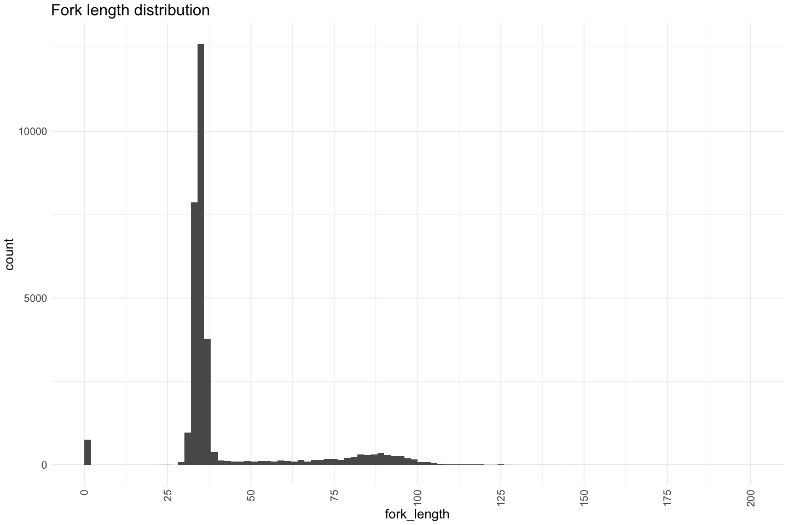
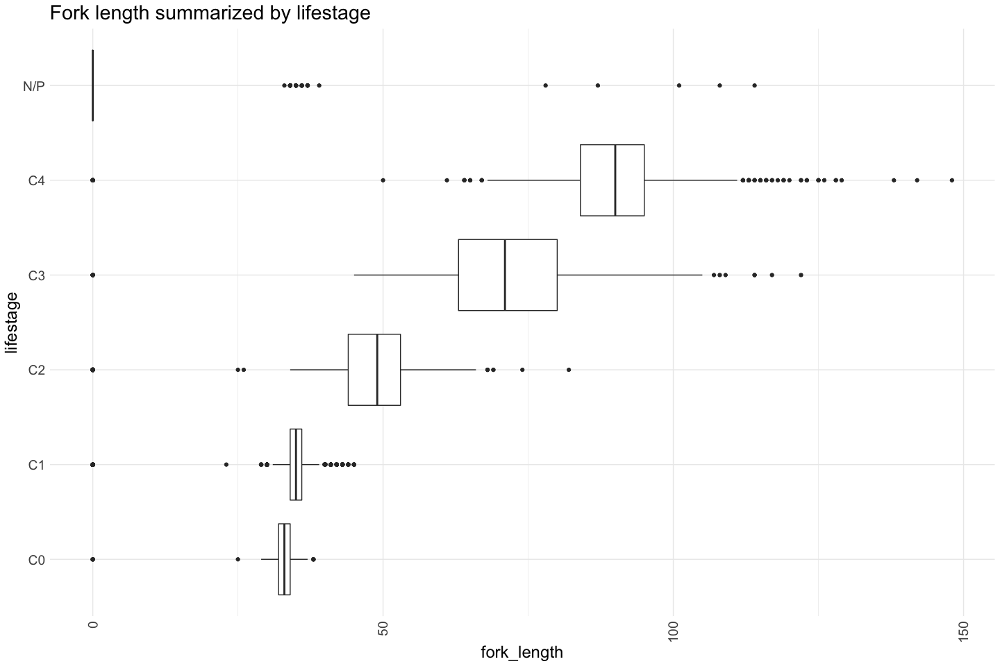
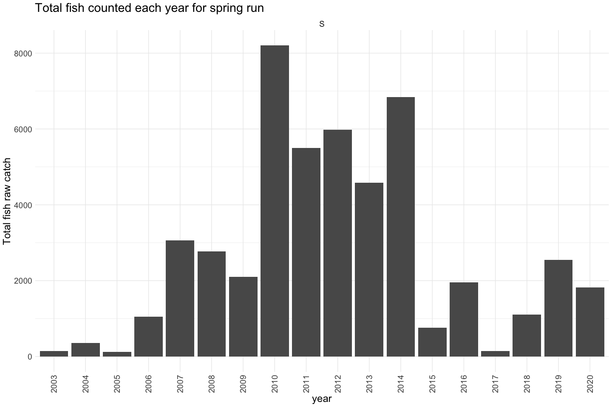

Battle Creek RST QC
================
Erin Cain
9/29/2021

# Battle Creek Rotary Screw Trap Data

## Description of Monitoring Data

These data were collected by the U.S. Fish and Wildlife Service, Red
Bluff Fish and Wildlife Office, Battle Creek Monitoring Program. These
data represent brood years (BY) 2003-2020. The fish were captured in the
upper Battle Creek rotary screw trap site (UBC), Shasta County,
California, from September 30, 2003, through June 30, 2021. The catch
data were collected using a 5-ft diameter rotary screw trap located at
river mile 6.2. The data represent both the raw catch and processed
catch values. The trap was only fished through March 25, 2020, during
BY2019 sampling.

**Timeframe:** 2003 - 2021

**Screw Trap Season:** September - June

**Completeness of Record throughout timeframe:** Sample Year tab on
excel sheet describes start and end date for trap each year. Sampled
every year from 1998 - 2019, some years not fished on weekends or during
high flow events.

**Sampling Location:** Upper Battle Creek (UBC)

**Data Contact:** [Mike Schraml](mailto:mike_schraml@fws.gov)

## Access Cloud Data

``` r
# Run Sys.setenv() to specify GCS_AUTH_FILE and GCS_DEFAULT_BUCKET before running 
# getwd() to see how to specify paths 
# Open object from google cloud storage
# Set your authentication using gcs_auth
gcs_auth(json_file = Sys.getenv("GCS_AUTH_FILE"))
# Set global bucket 
gcs_global_bucket(bucket = Sys.getenv("GCS_DEFAULT_BUCKET"))

gcs_list_objects()
# git data and save as xlsx
gcs_get_object(object_name = "rst/battle-creek/data-raw/UBC Spring.xlsx",
               bucket = gcs_get_global_bucket(),
               saveToDisk = "raw_battle_rst_data.xlsx",
               overwrite = TRUE)
```

Read in data from google cloud, glimpse raw data and domain description
sheet:

``` r
sheets <- excel_sheets("raw_battle_rst_data.xlsx")
sheets
```

    ## [1] "Metadata"                "UBC Environmental 03-20"
    ## [3] "UBC Environmental 20-21" "UBC Catch Data"         
    ## [5] "Sample Year"

``` r
raw_rst_count_data <- read_excel("raw_battle_rst_data.xlsx", sheet = "UBC Catch Data") %>% glimpse()
```

    ## Rows: 31,835
    ## Columns: 14
    ## $ OrganismCode <chr> "CHN", "CHN", "CHN", "CHN", "CHN", "CHN", "CHN", "CHN", "…
    ## $ StationCode  <chr> "UBC", "UBC", "UBC", "UBC", "UBC", "UBC", "UBC", "UBC", "…
    ## $ SampleDate   <dttm> 2003-11-04, 2003-11-25, 2003-11-27, 2003-11-29, 2003-11-…
    ## $ SampleID     <chr> "308_03", "329_03", "331_03", "333_03", "334_03", "334_03…
    ## $ IDWeek       <dbl> 44, 47, 48, 48, 48, 48, 48, 48, 48, 48, 49, 49, 49, 49, 4…
    ## $ FWSRace      <chr> "L", "S", "S", "S", "S", "S", "F", "S", "S", "S", "F", "S…
    ## $ Race         <chr> "L", "S", "S", "S", "S", "S", "F", "S", "S", "S", "F", "S…
    ## $ ForkLength   <dbl> 114, 33, 34, 36, 34, 35, 33, 34, 34, 34, 34, 35, 34, 35, …
    ## $ LifeStage    <chr> "C4", "C1", "C0", "C1", "C1", "C1", "C1", "C1", "C1", "C0…
    ## $ RCatch       <dbl> 1, 1, 1, 1, 3, 1, 2, 1, 2, 1, 1, 1, 1, 1, 13, 1, 11, 1, 5…
    ## $ Count        <dbl> 1, 1, 1, 1, 3, 1, 2, 1, 2, 1, 1, 1, 1, 1, 13, 1, 11, 1, 5…
    ## $ BroodYear    <dbl> 2003, 2003, 2003, 2003, 2003, 2003, 2003, 2003, 2003, 200…
    ## $ Dead         <chr> "NO", "NO", "NO", "NO", "NO", "NO", "NO", "NO", "NO", "NO…
    ## $ Interp       <chr> "NO", "NO", "NO", "NO", "NO", "NO", "NO", "NO", "NO", "NO…

## Data transformations

``` r
cleaner_rst_count <- raw_rst_count_data %>%
  janitor::clean_names() %>%
  rename("date" = sample_date,
         "fork_length" = fork_length,
         "lifestage" = life_stage,
         "count_2" = count,
         "count" = r_catch,
         "interpolated" = interp,
         "run" = fws_race) %>%
  mutate(date = as.Date(date)) %>%
  select(-organism_code, -station_code, -brood_year, 
         -id_week, -race,
         -count_2) %>% # raw catch data, I kept interpolated catch (only 1% of the data is interpolated)
  glimpse()
```

    ## Rows: 31,835
    ## Columns: 8
    ## $ date         <date> 2003-11-04, 2003-11-25, 2003-11-27, 2003-11-29, 2003-11-…
    ## $ sample_id    <chr> "308_03", "329_03", "331_03", "333_03", "334_03", "334_03…
    ## $ run          <chr> "L", "S", "S", "S", "S", "S", "F", "S", "S", "S", "F", "S…
    ## $ fork_length  <dbl> 114, 33, 34, 36, 34, 35, 33, 34, 34, 34, 34, 35, 34, 35, …
    ## $ lifestage    <chr> "C4", "C1", "C0", "C1", "C1", "C1", "C1", "C1", "C1", "C0…
    ## $ count        <dbl> 1, 1, 1, 1, 3, 1, 2, 1, 2, 1, 1, 1, 1, 1, 13, 1, 11, 1, 5…
    ## $ dead         <chr> "NO", "NO", "NO", "NO", "NO", "NO", "NO", "NO", "NO", "NO…
    ## $ interpolated <chr> "NO", "NO", "NO", "NO", "NO", "NO", "NO", "NO", "NO", "NO…

``` r
sum(cleaner_rst_count$interpolated == "YES")/nrow(cleaner_rst_count) * 100 # % of the catch data is interpolated
```

    ## [1] 1.162243

Notes:

-   `r_catch` value has an interpolated catch for times the trap did not
    fish. Not an estimate just for missed days interpolates values based
    on prior/future days

-   I selected only one race, the data has two races, I do not know
    which one is best to keep, here are details on the two:

    -   fWSRace - USFWS run designation base upon location or emergence
        timing used in reports and for passage indices, W=winter-run,
        S=spring-run, F=fall-run, L=late-fall run Chinook Salmon  
    -   race - Database generated Sheila Greene run designation of
        catch, W=winter-run, S=spring-run, F=fall-run, L=late-fall run
        Chinook Salmon, see RunDesignation and RunChart tables

These columns seem to have very different run designations.

``` r
sum(raw_rst_count_data$Race == raw_rst_count_data$FWSRace, na.rm = T)/length(raw_rst_count_data$Race)
```

    ## [1] 0.1749332

Additional info from Mike describing the race columns: We use the
FWSRace for our reports, all fish length-designated as fall-run by the
Sheila Greene length-at-date (LAD) charts we consider spring-run at the
upper Battle and Clear Creek sites. We consider the barrier weir at
Coleman National Fish Hatchery to be fish tight up to 800 cfs, flows
rarely exceed that level during the spring-run and early fall-run
escapement period. We are fairly confident that no fall-run get above
the weir. Likewise, we install a separation (picket) weir in Clear Creek
below the upper trap site that excludes fall-run from spawning with
spring-run and superimposing redds on top of spring-run redds. At the
lower Clear Creek (LCC) site we strictly go by the Sheila Greene LAD
chart because there is no way to tell the difference between spring-run
and fall-run fish in the field. There is overlap in the sizes of
spring-run and fall-run and we know that the Sheila Greene LAD charts
don’t capture the overlap. In Clear Creek, some fish that classify as
fall-run based on length from our LCC trap are actually spring-run and
vise versa.

FWSRace incorporates all the fine-scale decisions about when to use the
Sheila Greene LAD chart. We use FWSRace to determine run, especially
because this is used to determine passage estimates.

## Data Dictionary

The following table describes the variables included in this dataset and
the percent that do not include data.

``` r
percent_na <- cleaner_rst_count %>%
  summarise_all(list(name = ~sum(is.na(.))/length(.))) %>%
  pivot_longer(cols = everything())
  
data_dictionary <- tibble(variables = colnames(cleaner_rst_count),
                          description = c("Sample date - end date of approximately 24 hour sampling period",
                                          "The calendar year Julian date and year code for that ~24-h sample period (ddd_yy)",
                                          "Run designation using the FWSRace variable",
                                          "Fork length in millimeters",
                                          "Life stage of the catch (yolk-sac fry, fry, parr, silvery parr, smolt)",
                                          "Number of fish caught in trap",
                                          "Indicates mortality (T/F)",
                                          "Indicates interpolated catch for times the trap did not fish (T/F)"),
                          percent_na = round(percent_na$value*100)
                          
)
kable(data_dictionary)
```

| variables    | description                                                                         | percent\_na |
|:-------------|:------------------------------------------------------------------------------------|------------:|
| date         | Sample date - end date of approximately 24 hour sampling period                     |           0 |
| sample\_id   | The calendar year Julian date and year code for that \~24-h sample period (ddd\_yy) |           0 |
| run          | Run designation using the FWSRace variable                                          |           0 |
| fork\_length | Fork length in millimeters                                                          |           0 |
| lifestage    | Life stage of the catch (yolk-sac fry, fry, parr, silvery parr, smolt)              |           0 |
| count        | Number of fish caught in trap                                                       |           0 |
| dead         | Indicates mortality (T/F)                                                           |           0 |
| interpolated | Indicates interpolated catch for times the trap did not fish (T/F)                  |           0 |

## Explore Numeric Variables:

``` r
cleaner_rst_count %>% select_if(is.numeric) %>% colnames()
```

    ## [1] "fork_length" "count"

### Variable: `fork_length`

Fork length of the fish captured, is zero if the fish was not measured

**Plotting fork\_length**

``` r
cleaner_rst_count %>% filter(fork_length < 250) %>% # filter out 13 points so we can more clearly see distribution
  ggplot(aes(x = fork_length)) + 
  geom_histogram(breaks=seq(0, 200, by=2)) + 
  scale_x_continuous(breaks=seq(0, 200, by=25)) +
  theme_minimal() +
  labs(title = "Fork length distribution") + 
  theme(text = element_text(size = 18),
        axis.text.x = element_text(angle = 90, vjust = 0.5, hjust=1)) 
```

<!-- -->

``` r
cleaner_rst_count %>% 
  mutate(year = as.factor(year(date))) %>%
  ggplot(aes(x = fork_length, y = lifestage)) + 
  geom_boxplot() + 
  theme_minimal() +
  labs(title = "Fork length summarized by lifestage") + 
  theme(text = element_text(size = 18),
        axis.text.x = element_text(angle = 90, vjust = 0.5, hjust=1)) 
```

<!-- -->

**Numeric Summary of fork\_length over Period of Record**

``` r
# Table with summary statistics
summary(cleaner_rst_count$fork_length)
```

    ##    Min. 1st Qu.  Median    Mean 3rd Qu.    Max. 
    ##    0.00   34.00   35.00   41.55   37.00  148.00

**NA and Unknown Values**

-   0 % of values in the `fork_length` column are NA.

-   0 for `fork_length` seems like an NA or error

``` r
cleaner_rst_count %>% filter(fork_length == 0 & !is.na(count))
```

    ## # A tibble: 750 × 8
    ##    date       sample_id run   fork_length lifestage count dead  interpolated
    ##    <date>     <chr>     <chr>       <dbl> <chr>     <dbl> <chr> <chr>       
    ##  1 2003-12-13 347_03    S               0 N/P           1 NO    NO          
    ##  2 2003-12-13 347_03    F               0 C1            2 NO    NO          
    ##  3 2003-12-14 348_03    S               0 N/P          28 NO    YES         
    ##  4 2003-12-14 348_03    F               0 N/P         125 NO    YES         
    ##  5 2003-12-21 355_03    F               0 C1          109 NO    NO          
    ##  6 2003-12-28 363_03    F               0 N/P          33 NO    YES         
    ##  7 2003-12-30 364_03    F               0 N/P          39 NO    YES         
    ##  8 2004-01-01 001_04    F               0 N/P          62 NO    YES         
    ##  9 2004-01-02 002_04    F               0 N/P          62 NO    YES         
    ## 10 2004-01-10 010_04    F               0 C0           30 YES   NO          
    ## # … with 740 more rows

``` r
cleaner_rst_count$fork_length <- ifelse(cleaner_rst_count$fork_length == 0, NA, cleaner_rst_count$fork_length)
```

### Variable: `count`

Catch number used to generate passage indices for reports, plus counts
are split into races, zero fork lengths have been assigned

-   Definition given in Spreadsheet metadata, do not know what 0 fork
    lengths have been assigned means (i know if fish is not measured
    they give it a fork length of 0 so maybe they are assigning these 0
    values lifestages or counts on interpolated days) TODO ask Mike

**Plotting fish counts over period of record**

Total daily passage for spring run

``` r
filter(cleaner_rst_count, run == "S") %>% 
  group_by(date) %>%
  summarise(total_daily_catch = sum(count)) %>%
  filter(year(date) > 2014, year(date) < 2021) %>%
  mutate(water_year = ifelse(month(date) %in% 10:12, year(date) + 1, year(date))) %>% 
  left_join(sac_indices) %>%
  mutate(year = as.factor(year(date)),
         fake_year = if_else(month(date) %in% 10:12, 1900, 1901),
         fake_date = as.Date(paste0(fake_year,"-", month(date), "-", day(date)))) %>%
  filter(water_year < 2021) %>%
  ggplot(aes(x = fake_date, y = total_daily_catch, fill = year_type)) + 
  geom_col() + 
  scale_x_date(labels = date_format("%b"), limits = c(as.Date("1900-10-01"), as.Date("1901-06-01")), date_breaks = "1 month") + 
  theme_minimal() + 
  theme(text = element_text(size = 18),
        axis.text.x = element_text(angle = 90, vjust = 0.5, hjust=1),
        legend.position = "bottom") + 
  labs(title = "Total Spring Run Daily Raw Passage 2015 - 2020",
       y = "Total daily raw catch",
       x = "Date")+ 
  facet_wrap(~water_year, scales = "free") +
  scale_color_manual(palette)
```

    ## Joining, by = "water_year"

<!-- -->

Total catch by year for spring run

``` r
cleaner_rst_count  %>%
  filter(year(date) < 2021, 
         run == "S"
         ) %>% 
  mutate(year = as.factor(year(date))) %>%
  group_by(year, run) %>%
  summarise(total_yearly_catch = sum(count)) %>%
  ggplot(aes(x = year, y = total_yearly_catch)) + 
  geom_col() + 
  theme_minimal() +
  labs(title = "Total fish counted each year for spring run",
       y = "Total fish raw catch") + 
  theme(text = element_text(size = 18),
        axis.text.x = element_text(angle = 90, vjust = 0.5, hjust=1)) + 
  facet_wrap(~run, scales = "free_y")
```

    ## `summarise()` has grouped output by 'year'. You can override using the `.groups` argument.

<!-- -->

**Numeric Summary of counts over Period of Record**

Numerical summary includes all runs

``` r
# Table with summary statistics
summary(cleaner_rst_count$count)
```

    ##     Min.  1st Qu.   Median     Mean  3rd Qu.     Max. 
    ##    0.000    1.000    1.000    1.976    1.000 1121.000

**NA and Unknown Values**

-   0 % of values in the `count` column are NA.

## Explore Categorical variables:

General notes: If there is an opportunity to turn yes no into boolean do
so, but not if you loose value

``` r
cleaner_rst_count %>% select_if(is.character) %>% colnames()
```

    ## [1] "sample_id"    "run"          "lifestage"    "dead"         "interpolated"

### Variable: `sample_id`

The calendar year Julian date and year code for that \~24-h sample
period (ddd\_yy)

``` r
length(unique(cleaner_rst_count$sample_id)) 
```

    ## [1] 2278

There are 2278 unique sample ID

**NA and Unknown Values**

-   0 % of values in the `sample_id` column are NA.

### Variable: `run`

``` r
table(cleaner_rst_count$run)
```

    ## 
    ##     F     L     S     W 
    ##  1443   635 29396   361

Fix inconsistencies with spelling, capitalization, and abbreviations.
“N/P” is changed to NA in the case\_when statement below.

``` r
cleaner_rst_count$run <- case_when(cleaner_rst_count$run == "F" ~ "fall", 
                                   cleaner_rst_count$run == "S" ~ "spring",
                                   cleaner_rst_count$run == "L" ~ "late fall",
                                   cleaner_rst_count$run == "W" ~ "winter")
table(cleaner_rst_count$run)
```

    ## 
    ##      fall late fall    spring    winter 
    ##      1443       635     29396       361

**NA and Unknown Values**

-   0 % of values in the `run` column are NA.

### Variable: `lifestage`

Life stage of the catch (CHN = C0 - yolk-sac fry, C1 - fry, C2 - parr,
C3 - silvery parr, C4 - smolt, n/p - Not provided; RBT = R1 - yolk-sac
fry, R2 - fry, R3 - parr, R4 - silvery parr, R5 - smolt, R6 - adult).
“N/P” is changed to NA in the case\_when statement below.

``` r
table(cleaner_rst_count$lifestage)
```

    ## 
    ##    C0    C1    C2    C3    C4   N/P 
    ##   258 25773   771  1688  2925   420

Fix inconsistencies with spelling, capitalization, and abbreviations.

``` r
cleaner_rst_count$lifestage <- case_when(cleaner_rst_count$lifestage == "C0" ~ "yolk-sac fry", 
                                   cleaner_rst_count$lifestage == "C1" ~ "fry",
                                   cleaner_rst_count$lifestage == "C2" ~ "parr",
                                   cleaner_rst_count$lifestage == "C3" ~ "silvery parr",
                                   cleaner_rst_count$lifestage == "C4" ~ "smolt")
table(cleaner_rst_count$lifestage)
```

    ## 
    ##          fry         parr silvery parr        smolt yolk-sac fry 
    ##        25773          771         1688         2925          258

**NA and Unknown Values**

-   1.3 % of values in the `lifestage` column are NA.

### Variable: `dead`

Indicates if the fish was a mortality (YES = mortality)

``` r
table(cleaner_rst_count$dead)
```

    ## 
    ##     N    NO   YES 
    ##    29 31249   557

Fix inconsistencies with spelling, capitalization, and abbreviations.

``` r
cleaner_rst_count$dead <- case_when(cleaner_rst_count$dead == "YES" ~ TRUE, 
                                   cleaner_rst_count$dead == "N" |  cleaner_rst_count$dead == "NO" ~ FALSE)
table(cleaner_rst_count$dead)
```

    ## 
    ## FALSE  TRUE 
    ## 31278   557

**NA and Unknown Values**

-   0 % of values in the `dead` column are NA.

### Variable: `interpolated`

Is count value an interpolated catch for times the trap did not fish?
Yes = the data is interpolated data and not actual catch data

``` r
table(cleaner_rst_count$interpolated)
```

    ## 
    ##    NO   YES 
    ## 31465   370

Fix inconsistencies with spelling, capitalization, and abbreviations.

``` r
cleaner_rst_count$interpolated <- case_when(cleaner_rst_count$interpolated == "YES" ~ TRUE, 
                                            cleaner_rst_count$interpolated == "NO" ~ FALSE)
table(cleaner_rst_count$interpolated)
```

    ## 
    ## FALSE  TRUE 
    ## 31465   370

**NA and Unknown Values**

-   0 % of values in the `interpolated` column are NA.

## Summary of identified issues

-   Count values are interpolated on days where the traps were not
    fished, to see if interpolated or not refer to `interpolated`
    column. Recommend providing more information about how interpolation
    is calculated.
-   Investigate what it means for: zero fork lengths have been
    assigned - 0 `fork_length` values mean fish was not measured.

## Next steps

### Columns to remove

-   `sample_id` may not be needed.

## Save cleaned data back to google cloud

``` r
battle_rst_catch <- cleaner_rst_count %>% glimpse()
```

    ## Rows: 31,835
    ## Columns: 8
    ## $ date         <date> 2003-11-04, 2003-11-25, 2003-11-27, 2003-11-29, 2003-11-…
    ## $ sample_id    <chr> "308_03", "329_03", "331_03", "333_03", "334_03", "334_03…
    ## $ run          <chr> "late fall", "spring", "spring", "spring", "spring", "spr…
    ## $ fork_length  <dbl> 114, 33, 34, 36, 34, 35, 33, 34, 34, 34, 34, 35, 34, 35, …
    ## $ lifestage    <chr> "smolt", "fry", "yolk-sac fry", "fry", "fry", "fry", "fry…
    ## $ count        <dbl> 1, 1, 1, 1, 3, 1, 2, 1, 2, 1, 1, 1, 1, 1, 13, 1, 11, 1, 5…
    ## $ dead         <lgl> FALSE, FALSE, FALSE, FALSE, FALSE, FALSE, FALSE, FALSE, F…
    ## $ interpolated <lgl> FALSE, FALSE, FALSE, FALSE, FALSE, FALSE, FALSE, FALSE, F…

``` r
# Write to google cloud 
# Name file [watershed]_[data type].csv
f <- function(input, output) write_csv(input, file = output)
gcs_upload(battle_rst_catch,
           object_function = f,
           type = "csv",
           name = "rst/battle-creek/data/battle_rst_catch.csv")
```
