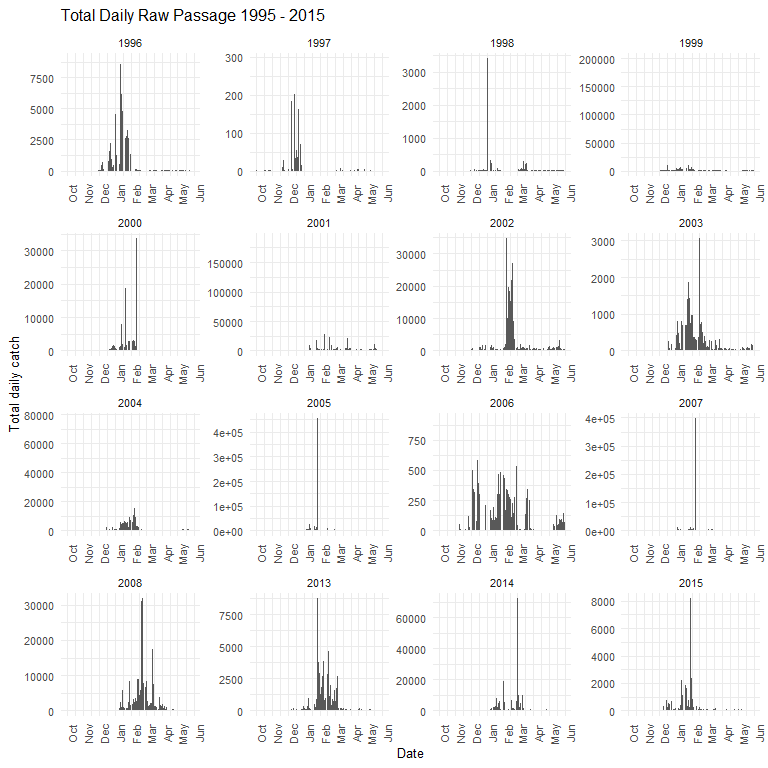
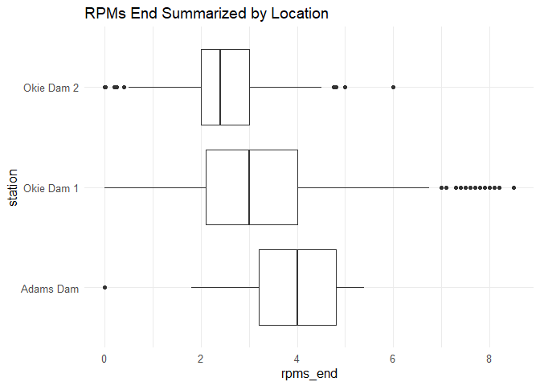

Butte Creek RST QC
================
Inigo Peng
10/19/2021

# Butte Creek RST Data

**Description of Monitoring Data**

This dataset contains data for all Chinook salmon that were captured in
the Butte Creek rotary screw trap (RSTR) or diversion fyke trap (DSTR)
from the 1995-96 to the 2014-15 trapping seasons.

**Timeframe:**

1995 - 2015

**Completeness of Record throughout timeframe:**

-   Life stage information lacks after 2005
-   Inconsistent completeness of physical data after 2008

**Sampling Location:**

3 locations on Butte Creek

**Data Contact:** [Jessica
Nichols](mailto:Jessica.Nichols@Wildlife.ca.gov)

**Additional Notes:**

-   QA/QC on weekly basis (bi-weekly minimum) - aslo upload report on
    calfish
-   End of season escapement values are calculated after
-   Data stored in CAMP (TODO get copy of CAMP database)

## Access Cloud Data

``` r
# Run Sys.setenv() to specify GCS_AUTH_FILE and GCS_DEFAULT_BUCKET before running
# Open object from google cloud storage
# Set your authentication using gcs_auth
gcs_auth(json_file = Sys.getenv("GCS_AUTH_FILE"))
# Set global bucket 
gcs_global_bucket(bucket = Sys.getenv("GCS_DEFAULT_BUCKET"))
gcs_list_objects()
# git data and save as xlsx
gcs_get_object(object_name = "rst/butte-creek/data-raw/CDFW_Butte_Creek_RST_Captures.xlsx",
               bucket = gcs_get_global_bucket(),
               saveToDisk = "butte_creek_rst_raw.xlsx",
               overwrite = TRUE)
```

``` r
raw_data = readxl::read_excel('butte_creek_rst_raw.xlsx',
                              col_types = c("date","text","text","text","text","text","numeric","numeric","numeric","text",
                                            "text","date","text","text","numeric","numeric","numeric","numeric","text","text",
                                            "numeric","numeric","text","numeric","numeric","text"
                                            ))
glimpse(raw_data)
```

    ## Rows: 63,418
    ## Columns: 26
    ## $ SampleDate       <dttm> 1995-11-29, 1995-11-29, 1995-11-29, 1995-11-29, 1995~
    ## $ StationCode      <chr> "BCOKIE-1", "BCOKIE-1", "BCOKIE-1", "BCOKIE-1", "BCOK~
    ## $ MethodCode       <chr> "DSTR", "DSTR", "DSTR", "DSTR", "DSTR", "DSTR", "DSTR~
    ## $ TrapStatus       <chr> "Check", "Check", "Check", "Check", "Check", "Check",~
    ## $ OrganismCode     <chr> "CHN", "CHN", "CHN", "CHN", "CHN", "CHN", "CHN", "CHN~
    ## $ Dead             <chr> "No", "No", "No", "Yes", "Yes", "Yes", "Yes", "Yes", ~
    ## $ Count            <dbl> 1, 2, 1, 8, 1, 5, 4, 1, 1, 1, 3, 3, 5, 3, 4, 1, 2, 1,~
    ## $ ForkLength       <dbl> 38, 37, 39, 35, 33, 34, 36, 37, 36, 34, 33, 34, 35, 3~
    ## $ Weight           <dbl> 0.00, 0.00, 0.00, 0.00, 0.00, 0.00, 0.00, 0.00, 0.00,~
    ## $ MarkCode         <chr> "n/p", "n/p", "n/p", "n/p", "n/p", "n/p", "n/p", "n/p~
    ## $ StageCode        <chr> "n/p", "n/p", "n/p", "n/p", "n/p", "n/p", "n/p", "n/p~
    ## $ SampleTime       <dttm> 1899-12-31 09:30:00, 1899-12-31 09:30:00, 1899-12-31~
    ## $ GearID           <chr> "DSTR1", "DSTR1", "DSTR1", "DSTR1", "DSTR1", "DSTR1",~
    ## $ WeatherCode      <chr> NA, NA, NA, NA, NA, NA, NA, NA, NA, NA, "CLD", "CLD",~
    ## $ WaterTemperature <dbl> 8.333333, 8.333333, 8.333333, 8.333333, 8.333333, 8.3~
    ## $ Turbidity        <dbl> NA, NA, NA, NA, NA, NA, NA, NA, NA, NA, NA, NA, NA, N~
    ## $ Secchi           <dbl> NA, NA, NA, NA, NA, NA, NA, NA, NA, NA, NA, NA, NA, N~
    ## $ WaterVelocity    <dbl> NA, NA, NA, NA, NA, NA, NA, NA, NA, NA, NA, NA, NA, N~
    ## $ NorthBrush       <chr> "FALSE", "FALSE", "FALSE", "FALSE", "FALSE", "FALSE",~
    ## $ SouthBrush       <chr> "FALSE", "FALSE", "FALSE", "FALSE", "FALSE", "FALSE",~
    ## $ StaffGauge       <dbl> 80, 80, 80, 80, 80, 80, 80, 80, 80, 80, NA, NA, NA, N~
    ## $ TrapRevolutions  <dbl> NA, NA, NA, NA, NA, NA, NA, NA, NA, NA, NA, NA, NA, N~
    ## $ Debris           <chr> "Medium", "Medium", "Medium", "Medium", "Medium", "Me~
    ## $ RPMsStart        <dbl> NA, NA, NA, NA, NA, NA, NA, NA, NA, NA, NA, NA, NA, N~
    ## $ RPMsEnd          <dbl> NA, NA, NA, NA, NA, NA, NA, NA, NA, NA, NA, NA, NA, N~
    ## $ Comments         <chr> NA, NA, NA, NA, NA, NA, NA, NA, NA, NA, NA, NA, NA, N~

## Data Transformations

``` r
cleaner_data <- raw_data %>% 
  set_names(tolower(colnames(raw_data))) %>%
  select(-c("staffgauge", "methodcode", "organismcode")) %>% #no value associated with reading (e.g. cfs, ft), #all organisms are chinooks %>%
  rename('date'= sampledate,
         'station' = stationcode,
         'trap_status' = trapstatus,
         'fork_length' = forklength,
         'lifestage' = stagecode,
         'mark_code' = markcode,
         'weather' = weathercode,
         'north_brush' = northbrush,
         'south_brush' = southbrush,
         'time' = sampletime,
         'gear_id' = gearid,
         'temperature' = watertemperature,
         'velocity' = watervelocity,
         'trap_revolutions' = traprevolutions,
         'rpms_start' = rpmsstart,
         'rpms_end'= rpmsend) %>% 
  mutate(time = hms::as_hms(time),
         date = as.Date(date)) %>%
  glimpse()
```

    ## Rows: 63,418
    ## Columns: 23
    ## $ date             <date> 1995-11-29, 1995-11-29, 1995-11-29, 1995-11-29, 1995~
    ## $ station          <chr> "BCOKIE-1", "BCOKIE-1", "BCOKIE-1", "BCOKIE-1", "BCOK~
    ## $ trap_status      <chr> "Check", "Check", "Check", "Check", "Check", "Check",~
    ## $ dead             <chr> "No", "No", "No", "Yes", "Yes", "Yes", "Yes", "Yes", ~
    ## $ count            <dbl> 1, 2, 1, 8, 1, 5, 4, 1, 1, 1, 3, 3, 5, 3, 4, 1, 2, 1,~
    ## $ fork_length      <dbl> 38, 37, 39, 35, 33, 34, 36, 37, 36, 34, 33, 34, 35, 3~
    ## $ weight           <dbl> 0.00, 0.00, 0.00, 0.00, 0.00, 0.00, 0.00, 0.00, 0.00,~
    ## $ mark_code        <chr> "n/p", "n/p", "n/p", "n/p", "n/p", "n/p", "n/p", "n/p~
    ## $ lifestage        <chr> "n/p", "n/p", "n/p", "n/p", "n/p", "n/p", "n/p", "n/p~
    ## $ time             <time> 09:30:00, 09:30:00, 09:30:00, 09:30:00, 09:30:00, 09~
    ## $ gear_id          <chr> "DSTR1", "DSTR1", "DSTR1", "DSTR1", "DSTR1", "DSTR1",~
    ## $ weather          <chr> NA, NA, NA, NA, NA, NA, NA, NA, NA, NA, "CLD", "CLD",~
    ## $ temperature      <dbl> 8.333333, 8.333333, 8.333333, 8.333333, 8.333333, 8.3~
    ## $ turbidity        <dbl> NA, NA, NA, NA, NA, NA, NA, NA, NA, NA, NA, NA, NA, N~
    ## $ secchi           <dbl> NA, NA, NA, NA, NA, NA, NA, NA, NA, NA, NA, NA, NA, N~
    ## $ velocity         <dbl> NA, NA, NA, NA, NA, NA, NA, NA, NA, NA, NA, NA, NA, N~
    ## $ north_brush      <chr> "FALSE", "FALSE", "FALSE", "FALSE", "FALSE", "FALSE",~
    ## $ south_brush      <chr> "FALSE", "FALSE", "FALSE", "FALSE", "FALSE", "FALSE",~
    ## $ trap_revolutions <dbl> NA, NA, NA, NA, NA, NA, NA, NA, NA, NA, NA, NA, NA, N~
    ## $ debris           <chr> "Medium", "Medium", "Medium", "Medium", "Medium", "Me~
    ## $ rpms_start       <dbl> NA, NA, NA, NA, NA, NA, NA, NA, NA, NA, NA, NA, NA, N~
    ## $ rpms_end         <dbl> NA, NA, NA, NA, NA, NA, NA, NA, NA, NA, NA, NA, NA, N~
    ## $ comments         <chr> NA, NA, NA, NA, NA, NA, NA, NA, NA, NA, NA, NA, NA, N~

## Data Dictionary

The following table describes the variables included in this dataset and
the percent that do not include data.

``` r
percent_na <- cleaner_data %>%
  summarise_all(list(name = ~sum(is.na(.))/length(.))) %>%
  pivot_longer(cols = everything())
  
data_dictionary <- tibble(variables = colnames(cleaner_data),
                          description = c("Date of sampling",
                                          "RST Station, BCOKIE-1, BCADAMS, BCOKIE-2",
                                          "Status of RST (Check - trap was checked normally continued fishing, Pull - trap was pulled after trap check, Set - trap was set upon arrival",
                                          "TRUE if fish is dead in RST",
                                          "Fish Count",
                                          "Measure of fork length of fish in mm",
                                          "Weight of fish in grams",
                                          "?TODO, adipose or none",
                                          "Lifestage, originally coded but we replaced code with lifestge name (1 - Fry with visible yolk sac, 2 - Fry with no visible yolk sac, 3 - Parr, 4 - Fingerling, 5 - Smolt, AD - Adult, n/p - not provided , UNK - unknown)",
                                          "Time trap sampled",
                                          "Unique ID for each trap",
                                          "Weather, originally coded but we replaced code with weather type (CLD – Cloudy, CLR – Clear, FOG – Foggy, RAN – Rainy)",
                                          "Water Temperature in C",
                                          "Water turbidity in NTU",
                                          "Secchi Depth, originally recorded in feet and standardized to meter",
                                          "Velocity measured in feet/second",
                                          "FALSE if north screen not working (not clearning debris)",
                                          "FALSE if south screen not working (not clearning debris)",
                                          "Number of revolutions the RST cone had made since last being checked",
                                          "Visual assesment of debris in trap (very heavy, heavy, light, medium, none)",
                                          "Rotations per minute of RST cone at start of trapping window",
                                          "Rotations per minute of RST cone at end of trapping window",
                                          "Comment from survey crew"
                                          ),
                          
                          percent_na = round(percent_na$value*100)
                          
)
knitr::kable(data_dictionary)
```

| variables         | description                                                                                                                                                                                                                | percent\_na |
|:------------------|:---------------------------------------------------------------------------------------------------------------------------------------------------------------------------------------------------------------------------|------------:|
| date              | Date of sampling                                                                                                                                                                                                           |           0 |
| station           | RST Station, BCOKIE-1, BCADAMS, BCOKIE-2                                                                                                                                                                                   |           0 |
| trap\_status      | Status of RST (Check - trap was checked normally continued fishing, Pull - trap was pulled after trap check, Set - trap was set upon arrival                                                                               |           0 |
| dead              | TRUE if fish is dead in RST                                                                                                                                                                                                |           0 |
| count             | Fish Count                                                                                                                                                                                                                 |           0 |
| fork\_length      | Measure of fork length of fish in mm                                                                                                                                                                                       |           5 |
| weight            | Weight of fish in grams                                                                                                                                                                                                    |          40 |
| mark\_code        | ?TODO, adipose or none                                                                                                                                                                                                     |           0 |
| lifestage         | Lifestage, originally coded but we replaced code with lifestge name (1 - Fry with visible yolk sac, 2 - Fry with no visible yolk sac, 3 - Parr, 4 - Fingerling, 5 - Smolt, AD - Adult, n/p - not provided , UNK - unknown) |           0 |
| time              | Time trap sampled                                                                                                                                                                                                          |           0 |
| gear\_id          | Unique ID for each trap                                                                                                                                                                                                    |           8 |
| weather           | Weather, originally coded but we replaced code with weather type (CLD – Cloudy, CLR – Clear, FOG – Foggy, RAN – Rainy)                                                                                                     |           4 |
| temperature       | Water Temperature in C                                                                                                                                                                                                     |           6 |
| turbidity         | Water turbidity in NTU                                                                                                                                                                                                     |          33 |
| secchi            | Secchi Depth, originally recorded in feet and standardized to meter                                                                                                                                                        |          98 |
| velocity          | Velocity measured in feet/second                                                                                                                                                                                           |          61 |
| north\_brush      | FALSE if north screen not working (not clearning debris)                                                                                                                                                                   |           0 |
| south\_brush      | FALSE if south screen not working (not clearning debris)                                                                                                                                                                   |           0 |
| trap\_revolutions | Number of revolutions the RST cone had made since last being checked                                                                                                                                                       |          65 |
| debris            | Visual assesment of debris in trap (very heavy, heavy, light, medium, none)                                                                                                                                                |           1 |
| rpms\_start       | Rotations per minute of RST cone at start of trapping window                                                                                                                                                               |          55 |
| rpms\_end         | Rotations per minute of RST cone at end of trapping window                                                                                                                                                                 |          59 |
| comments          | Comment from survey crew                                                                                                                                                                                                   |          91 |

## Explore `date`

``` r
summary(cleaner_data$date)
```

    ##         Min.      1st Qu.       Median         Mean      3rd Qu.         Max. 
    ## "1995-11-29" "2000-05-11" "2003-05-08" "2004-06-15" "2007-02-05" "2015-06-03"

**NA and Unknown Values**

-   0 % of values in the `date` column are NA.

## Explore Categorical Variables

``` r
cleaner_data %>% select_if(is.character) %>% colnames()
```

    ##  [1] "station"     "trap_status" "dead"        "mark_code"   "lifestage"  
    ##  [6] "gear_id"     "weather"     "north_brush" "south_brush" "debris"     
    ## [11] "comments"

### Variable `station`

**Description:** trap location

-   BCADAMS - Adams Dam

-   BCOKIE-1 - Okie Dam 1

-   BCOKIE-2 - Okie Dam 2

``` r
cleaner_data <- cleaner_data %>% 
  mutate(station = case_when(
    station == 'BCADAMS' ~ 'Adams Dam',
    station == 'BCOKIE-1'~ 'Okie Dam 1',
    station == 'BCOKIE-2' ~ 'Okie Dam 2',
    TRUE ~ as.character(station)
  ))

table(cleaner_data$station)
```

    ## 
    ##  Adams Dam Okie Dam 1 Okie Dam 2 
    ##        701      61991        726

**NA and Unknown Values**

-   0 % of values in the `station` column are NA.

### Variable `trap_status`

**Description:**

-   Check - trap was checked normally , continued fishing

-   Pull - trap was pulled after trap check

-   Set - trap was set upon arrival

``` r
cleaner_data <- cleaner_data %>% 
  mutate(trap_status = set_names(tolower(trap_status)))

table(cleaner_data$trap_status)
```

    ## 
    ## check  pull   set 
    ## 63130   130    15

**NA and Unknown Values**

-   0.2 % of values in the `trap_status` column are NA.

### Variable `dead`

Fix capitalization. n/p is changed to NA.

``` r
table(cleaner_data$dead)
```

    ## 
    ##   n/p    No   Yes 
    ##   316 60173  2929

``` r
cleaner_data$dead <- case_when(tolower(cleaner_data$dead) == "yes" ~ TRUE, 
                                    tolower(cleaner_data$dead) == "no" ~ FALSE)
table(cleaner_data$dead)
```

    ## 
    ## FALSE  TRUE 
    ## 60173  2929

**NA and Unknown Values**

-   0.5 % of values in the `dead` column are NA.

### Variable `mark_code`

``` r
cleaner_data <- cleaner_data %>% 
  mutate(mark_code = tolower(cleaner_data$mark_code),
         mark_code = ifelse(mark_code == "n/p", NA, mark_code))
table(cleaner_data$mark_code)
```

    ## 
    ## adclipped      none 
    ##         7     15069

**NA and Unknown Values**

-   76.2 % of values in the `markcode` column are NA.

### Variable `lifestage`

-   1 - Fry with visible yolk sac
-   2 - Fry with no visible yolk sac
-   3 - Parr
-   4 - Fingerling
-   5 - Smolt
-   AD - Adult
-   n/p - not provided
-   UNK - unknown

``` r
table(cleaner_data$lifestage)
```

    ## 
    ##     1     2     3     4     5    AD   n/p   UNK 
    ##    51  5364  3558  1067    26    96 53255     1

n/p is converted to NA

``` r
cleaner_data <- cleaner_data %>% 
  mutate(lifestage = case_when(
    lifestage == 1~ 'yolk sac fry',
    lifestage == 2~ 'fry',
    lifestage == 3~ 'parr',
    lifestage == 4~ 'fingerling',
    lifestage == 5~ 'smolt',
    lifestage == 'AD'~ 'adult',
    lifestage == 'UNK'~ 'unknown'
  ))
table(cleaner_data$lifestage)
```

    ## 
    ##        adult   fingerling          fry         parr        smolt      unknown 
    ##           96         1067         5364         3558           26            1 
    ## yolk sac fry 
    ##           51

**NA and Unknown Values**

-   84 % of values in the `lifestage` column are NA.

### Variable `gear_id`

**Description:**

-   DSTR1 - Diversion Fyke Trap 1

-   RSTR1 - Rotary Screw Trap 1

-   RSTR2 - Rotary Screw Trap 2

``` r
cleaner_data <- cleaner_data %>% 
  mutate(gear_id = case_when(
    gear_id == 'DSTR1' ~ 'diversion fyke trap 1',
    gear_id == 'RSTR1' ~ 'rotary screw trap 1',
    gear_id == 'RSTR2' ~ 'rotary screw trap 2'
  ))

table(cleaner_data$gear_id)
```

    ## 
    ## diversion fyke trap 1   rotary screw trap 1   rotary screw trap 2 
    ##                 28882                    35                 29270

**NA and Unknown Values**

-   8.2 % of values in the `gear_id` column are NA.

### Variable `weather`

**Description:**

-   CLD – Cloudy
-   CLR – Clear
-   FOG – Foggy
-   RAN – Rainy

``` r
cleaner_data <- cleaner_data %>% 
  mutate(weather = case_when(
    weather == "CLD" ~ "cloudy",
    weather == "CLR" ~ "clear",
    weather == "FOG" ~ "foggy",
    weather == "RAN" ~ "rainy"
  ))
table(cleaner_data$weather)
```

    ## 
    ##  clear cloudy  foggy  rainy 
    ##  40481  14057    726   5370

**NA and Unknown Values**

-   4.4 % of values in the `weather` column are NA.

### Variable `north_brush`, `south_brush`

**Description:** for diversion fyke trap, there are diversion screens
for clearing debris on the north and south of the trap.

False - screen not working (not clearing debris) True - screen work
(clearing debris)

``` r
#Not sure if we are interested in diversion fyke trap - keeping the variable for now
table(cleaner_data$north_brush)
```

    ## 
    ## FALSE  TRUE 
    ## 39231 24187

``` r
table(cleaner_data$south_brush)
```

    ## 
    ## FALSE  TRUE 
    ## 39227 24191

**NA and Unknown Values**

-   0 % of values in the `north_brush` column are NA.

-   0 % of values in the `south_brush` column are NA.

### Variable `debris`

**Description:** visual assessment of debris in trap

``` r
cleaner_data <- cleaner_data %>% 
  mutate(debris = set_names(tolower(debris)))
table(cleaner_data$debris)
```

    ## 
    ##      heavy      light     medium       none very heavy 
    ##       7321      38342      16532         31        341

**NA and Unknown Values**

-   1.3 % of values in the `debris` column are NA.

### Variable `comments`

``` r
unique(cleaner_data$comments)[1:5]
```

    ## [1] NA                                          
    ## [2] "One female adult salmon (bright) in trap." 
    ## [3] "Trap submerging, very high flow. Trap out."
    ## [4] "Two logs jammed in drum, not fishing."     
    ## [5] "Put drum up due to debris and rain."

**NA and Unknown Values**

-   91.4 % of values in the `comments` column are NA.

## Explore Numerical Variables

``` r
cleaner_data %>% select_if(is.numeric) %>% colnames()
```

    ##  [1] "count"            "fork_length"      "weight"           "temperature"     
    ##  [5] "turbidity"        "secchi"           "velocity"         "trap_revolutions"
    ##  [9] "rpms_start"       "rpms_end"

### Variable `count`

``` r
cleaner_data %>% 
  group_by(date) %>% 
  summarise(total_daily_catch = sum(count)) %>% 
  mutate(water_year = ifelse(month(date) %in% 10:12, year(date) + 1, year(date))) %>% 
  mutate(year = as.factor(year(date)),
         fake_year = if_else(month(date) %in% 10:12, 1900, 1901),
         fake_date = as.Date(paste0(fake_year,"-", month(date), "-", day(date)))) %>%
  ggplot(aes(x = fake_date, y = total_daily_catch)) +
  geom_col()+
  # scale_x_date(labels = date_format("%b"), limits = c(as.Date("1995-10-01"), as.Date("2016-06-01")), date_breaks = "1 month")+
  scale_x_date(labels = date_format("%b"), limits = c(as.Date("1900-10-01"), as.Date("1901-06-01")), date_breaks = "1 month") + 
  theme_minimal()+
  theme(text = element_text(size = 10),
        axis.text.x = element_text(angle = 90))+
  labs(title = "Total Daily Raw Passage 1995 - 2015",
       y = "Total daily catch",
       x = "Date")+ 
  facet_wrap(~water_year, scales = "free")
```

<!-- -->

``` r
cleaner_data %>% 
  mutate(year = as.factor(year(date))) %>% 
  ggplot(aes(x = year, y = count))+
  geom_col()+
  theme_minimal()+
  labs(title = "Total Fish Count By Year")+
  theme(text = element_text(size = 10),
        axis.text.x = element_text(angle = 90,  vjust = 0.5, hjust=1))
```

<!-- -->

**Numeric Summary of count over Period of Record**

``` r
summary(cleaner_data$count)
```

    ##      Min.   1st Qu.    Median      Mean   3rd Qu.      Max. 
    ##      0.00      1.00      1.00     75.02      4.00 220000.00

These numbers are massive. Are they passage estimates? Noted in the
bottom.

**NA and Unknown Values**

-   0 % of values in the `count` column are NA.

### Variable `fork_length`

**Description:** fork length in millimeters (mm)

Need to filter out 0s

``` r
cleaner_data %>% filter(fork_length == 0)
```

    ## # A tibble: 1,892 x 23
    ##    date       station    trap_status dead  count fork_length weight mark_code
    ##    <date>     <chr>      <chr>       <lgl> <dbl>       <dbl>  <dbl> <chr>    
    ##  1 1995-12-02 Okie Dam 1 check       TRUE      3           0      0 <NA>     
    ##  2 1995-12-03 Okie Dam 1 check       NA       97           0      0 <NA>     
    ##  3 1995-12-03 Okie Dam 1 check       NA        6           0      0 <NA>     
    ##  4 1995-12-05 Okie Dam 1 check       TRUE     63           0      0 <NA>     
    ##  5 1995-12-06 Okie Dam 1 check       FALSE   139           0      0 <NA>     
    ##  6 1995-12-06 Okie Dam 1 check       NA      130           0      0 <NA>     
    ##  7 1995-12-08 Okie Dam 1 check       TRUE     34           0      0 <NA>     
    ##  8 1995-12-08 Okie Dam 1 check       FALSE   515           0      0 <NA>     
    ##  9 1995-12-09 Okie Dam 1 check       NA      444           0      0 <NA>     
    ## 10 1995-12-09 Okie Dam 1 check       TRUE      9           0      0 <NA>     
    ## # ... with 1,882 more rows, and 15 more variables: lifestage <chr>,
    ## #   time <time>, gear_id <chr>, weather <chr>, temperature <dbl>,
    ## #   turbidity <dbl>, secchi <dbl>, velocity <dbl>, north_brush <chr>,
    ## #   south_brush <chr>, trap_revolutions <dbl>, debris <chr>, rpms_start <dbl>,
    ## #   rpms_end <dbl>, comments <chr>

``` r
cleaner_data$fork_length <- ifelse(cleaner_data$fork_length == 0, NA, cleaner_data$fork_length)
```

``` r
cleaner_data %>% 
  filter(fork_length < 250) %>% #filtered out 52 points to see more clear distribution
  ggplot(aes(x = fork_length))+
  geom_histogram(binwidth = 2)+
  theme_minimal()+
  scale_x_continuous(breaks = seq(0, 250, by=25))+
  labs(title = "Fork Length Distribution")+
  theme(text = element_text(size=15),
        axis.text.x = element_text(vjust =0.5, hjust = 1))
```

<!-- -->

``` r
cleaner_data %>% 
  ggplot(aes(x = fork_length, y = lifestage))+
  geom_boxplot()+
  theme_minimal()+
  labs(title = 'Fork length summarized by life stage')+
  theme(text = element_text(size = 12))
```

<!-- -->

**Numeric Summary of fork\_length over Period of Record**

``` r
summary(cleaner_data$fork_length)
```

    ##    Min. 1st Qu.  Median    Mean 3rd Qu.    Max.    NA's 
    ##     1.0    36.0    46.0    52.4    66.0  1035.0    5164

**NA and Unknown Values**

-   8.1 % of values in the `fork_length` column are NA.

### Variable `weight`

**Description:** wet weight in grams(g)

Need to filter out 0s

``` r
cleaner_data %>% filter(weight == 0)
```

    ## # A tibble: 17,375 x 23
    ##    date       station    trap_status dead  count fork_length weight mark_code
    ##    <date>     <chr>      <chr>       <lgl> <dbl>       <dbl>  <dbl> <chr>    
    ##  1 1995-11-29 Okie Dam 1 check       FALSE     1          38      0 <NA>     
    ##  2 1995-11-29 Okie Dam 1 check       FALSE     2          37      0 <NA>     
    ##  3 1995-11-29 Okie Dam 1 check       FALSE     1          39      0 <NA>     
    ##  4 1995-11-29 Okie Dam 1 check       TRUE      8          35      0 <NA>     
    ##  5 1995-11-29 Okie Dam 1 check       TRUE      1          33      0 <NA>     
    ##  6 1995-11-29 Okie Dam 1 check       TRUE      5          34      0 <NA>     
    ##  7 1995-11-29 Okie Dam 1 check       TRUE      4          36      0 <NA>     
    ##  8 1995-11-29 Okie Dam 1 check       TRUE      1          37      0 <NA>     
    ##  9 1995-11-29 Okie Dam 1 check       FALSE     1          36      0 <NA>     
    ## 10 1995-11-29 Okie Dam 1 check       FALSE     1          34      0 <NA>     
    ## # ... with 17,365 more rows, and 15 more variables: lifestage <chr>,
    ## #   time <time>, gear_id <chr>, weather <chr>, temperature <dbl>,
    ## #   turbidity <dbl>, secchi <dbl>, velocity <dbl>, north_brush <chr>,
    ## #   south_brush <chr>, trap_revolutions <dbl>, debris <chr>, rpms_start <dbl>,
    ## #   rpms_end <dbl>, comments <chr>

``` r
cleaner_data$weight <- ifelse(cleaner_data$weight == 0, NA, cleaner_data$weight)
```

``` r
cleaner_data %>% 
  filter(weight< 30) %>%  #filtered out 26 data points to see more clear distribution
  ggplot(aes(x = weight))+
  geom_histogram(binwidth = 1)+
  scale_x_continuous(breaks = seq(0, 30, by=2))+
  theme_minimal()+
  labs(title = "Weight Distribution")
```

<!-- -->

``` r
cleaner_data %>% 
  filter(weight < 50) %>% 
  ggplot(aes(x = weight, y= lifestage))+
  geom_boxplot()+
  labs(title = 'Weight summarized by life stage')+
  theme(text = element_text(size = 12))+
  theme_minimal()
```

<!-- -->

**Numeric Summary of weight over Period of Record**

``` r
summary(cleaner_data$weight)
```

    ##    Min. 1st Qu.  Median    Mean 3rd Qu.    Max.    NA's 
    ##    0.15    0.38    1.99    2.97    3.80 3046.00   42674

**NA and Unknown Values**

-   67.3 % of values in the `weight` column are NA.

### Variable `temperature`

**Description:** temperature of water in degrees Celsius

``` r
cleaner_data %>%
  filter(temperature < 100) %>% #filter out 36 points with water temperature > 100 degrees
  ggplot(aes(x= temperature, y = station))+
  geom_boxplot()+
  theme_minimal()+
  labs(title = "Water Temperature by Station")
```

<!-- -->

``` r
cleaner_data %>% 
  filter(temperature < 100) %>%  #filter out 36 points with water temperature > 100 degrees (entry error?)
  group_by(date) %>% 
  summarise(daily_avg_temp = mean(temperature)) %>% 
  mutate(year = as.factor(year(date)),
         fake_year = if_else(month(date) %in% 10:12, 1900,1901),
         fake_date = as.Date(paste0(fake_year, "-", month(date), "-", day(date)))) %>% 
  ggplot(aes(x = fake_date, y = daily_avg_temp, color = year))+
  geom_point()+
  scale_x_date(labels = date_format("%b"), date_breaks = "1 month")+
  theme_minimal()+
  theme(text = element_text(size = 12),
        axis.text.x = element_text(angle = 90, vjust = 0.5, hjust = 1),
        legend.position = "none")+
  labs(title = "Daily Water Temperature (colored by year)",
       x = 'Date',
       y = 'Average Daily Temp')
```

<!-- -->

``` r
cleaner_data %>% 
  filter(temperature < 100) %>% 
  mutate(year = as.factor(year(date))) %>% 
  ggplot(aes(x = temperature, y = year))+
  geom_boxplot()+
  theme_minimal()+
  labs(title = "Water Temperature summarized by year")+
  theme(text = element_text(size = 15),
        axis.text.x = element_text(vjust =0.5, hjust = 1))
```

<!-- -->

**Numeric Summary of temperature over Period of Record**

``` r
summary(cleaner_data$temperature)
```

    ##    Min. 1st Qu.  Median    Mean 3rd Qu.    Max.    NA's 
    ##   -1.00    7.00    9.00    9.96   12.00  805.00    3917

Note: max 805 is very high. Likely an error.

**NA and Unknown Values**

-   6.2 % of values in the `temperature` column are NA.

### Variable `turbidity`

**Description:** Turbidity of water in NTU

``` r
cleaner_data %>% 
  group_by(date) %>% 
  summarise(daily_avg_turb = mean(turbidity)) %>% 
  mutate(year = as.factor(year(date)),
         fake_year = if_else(month(date) %in% 10:12, 1900,1901),
         fake_date = as.Date(paste0(fake_year, "-", month(date), "-", day(date)))) %>% 
  ggplot(aes(x = fake_date, y = daily_avg_turb, color = year))+
  geom_point()+
  scale_x_date(labels = date_format("%b"), date_breaks = "1 month")+
  theme_minimal()+
  theme(text = element_text(size = 12),
        axis.text.x = element_text(angle = 90, vjust = 0.5, hjust = 1),
        legend.position = "none")+
  labs(title = "Daily Turbidity (colored by year)",
       x = 'Date',
       y = 'Average Daily Turbidity')
```

<!-- -->

``` r
cleaner_data %>% 
  mutate(year = as.factor(year(date))) %>% 
  ggplot(aes(x = turbidity, y = year))+
  geom_boxplot()+
  theme_minimal()+
  labs(title = "Turbidity summarized by year")+
  theme(text = element_text(size = 15),
        axis.text.x = element_text(vjust =0.5, hjust = 1))
```

<!-- -->

**Numeric Summary of turbidity over Period of Record**

``` r
summary(cleaner_data$turbidity)
```

    ##    Min. 1st Qu.  Median    Mean 3rd Qu.    Max.    NA's 
    ##   0.200   1.870   2.770   5.359   4.700 189.000   21066

Note: max 189 ntu is very high. Likely an error.

**NA and Unknown Values**

-   33.2 % of values in the `turbidity` column are NA.

### Variable `velocity`

**Description:** water velocity measured in ft/s

Data Transformation

``` r
#Convert water velocity from ft/s to m/s
cleaner_data <- cleaner_data %>% 
  mutate(velocity = velocity/3.281)
```

``` r
cleaner_data %>%
  filter(velocity < 8) %>% #filtered out 8 data points to show a more clear graph
  ggplot(aes(x= velocity, y = station))+
  geom_boxplot()+
  theme_minimal()+
  labs(title = "Water Velocity by Station",
       x= "Velocity (m/s)")
```

<!-- -->

``` r
cleaner_data %>% 
  filter(velocity < 5) %>% #filtered out one point to show a more clear graph
  group_by(date) %>% 
  summarise(daily_avg_velocity = mean(velocity)) %>% 
  mutate(year = as.factor(year(date)),
         fake_year = if_else(month(date) %in% 10:12, 1900,1901),
         fake_date = as.Date(paste0(fake_year, "-", month(date), "-", day(date)))) %>% 
  ggplot(aes(x = fake_date, y = daily_avg_velocity, color = year))+
  geom_point()+
  scale_x_date(labels = date_format("%b"), date_breaks = "1 month")+
  theme_minimal()+
  theme(text = element_text(size = 12),
        axis.text.x = element_text(angle = 90, vjust = 0.5, hjust = 1),
        legend.position = "none")+
  labs(title = "Daily Water Velocity (colored by year)",
       x = 'Date',
       y = 'Average Daily Velocity')
```

<!-- -->

``` r
cleaner_data %>% 
  filter(velocity<6) %>% 
  mutate(year = as.factor(year(date))) %>% 
  ggplot(aes(x = velocity, y = year))+
  geom_boxplot()+
  theme_minimal()+
  labs(title = "Water Velocity summarized by year")+
  theme(text = element_text(size = 15),
        axis.text.x = element_text(vjust =0.5, hjust = 1))
```

<!-- -->

**Numeric summary of velocity over Period of Record**

``` r
summary(cleaner_data$velocity)
```

    ##    Min. 1st Qu.  Median    Mean 3rd Qu.    Max.    NA's 
    ##    0.00    0.20    0.27    0.34    0.37  104.24   38937

**NA and Unknown Values**

-   61.4 % of values in the `velocity` column are NA.

### Variable `trap_revolutions`

**Description:** Number of revolutions the RST cone had made since last
being checked

``` r
cleaner_data %>% 
  ggplot(aes(x = trap_revolutions))+
  geom_histogram(binwidth = 500)+
  labs(title = "Distribution of Trap Revolutions")+
  theme_minimal()+
  theme(text = element_text(size = 12))
```

<!-- -->

``` r
cleaner_data %>% 
  filter(station != "Adams Dam") %>% 
  ggplot(aes(y= station, x = trap_revolutions))+
  geom_boxplot()+
  labs(title = "Trap Revolutions Summarized by Location")+
  theme_minimal()+
  theme(text = element_text(size = 12))
```

<!-- -->

**Numeric summary of trap\_revolutions over Period of Record**

``` r
summary(cleaner_data$trap_revolutions)
```

    ##    Min. 1st Qu.  Median    Mean 3rd Qu.    Max.    NA's 
    ##       0    2741    4000    4118    5439   11795   41363

**NA and Unknown Values**

-   65.2 % of values in the `trap_revolutions` column are NA.

### Variable `rpms_start`

**Description:** rotations per minute of RST cone at start of trapping
window

``` r
cleaner_data %>% 
  filter(rpms_start < 10) %>% #filtered out 28 data points to show more clear distribution
  ggplot(aes(x = rpms_start))+
  geom_histogram(binwidth = 1)+
  labs(title = "Distribution of RPMs Start")+
  theme_minimal()+
  theme(text = element_text(size = 12))
```

<!-- -->

``` r
cleaner_data %>% 
  filter(rpms_start < 10) %>% 
  ggplot(aes(y= station, x = rpms_start))+
  geom_boxplot()+
  labs(title = "RPMs Start Summarized by Location")+
  theme_minimal()+
  theme(text = element_text(size = 12))
```

<!-- -->

**Numeric summary of rpms\_start over Period of Record**

``` r
summary(cleaner_data$rpms_start)
```

    ##    Min. 1st Qu.  Median    Mean 3rd Qu.    Max.    NA's 
    ##    0.00    2.10    3.00    4.92    4.00 3698.00   34932

**NA and Unknown Values**

-   55.1 % of values in the `rpms_start` column are NA.

### Variable `rpms_end`

**Description:** rotations per minute of RST cone at end of trapping
window

``` r
cleaner_data %>% 
  filter(rpms_end < 10) %>% #filtered out 28 data points to show more clear distribution
  ggplot(aes(x = rpms_end))+
  geom_histogram(binwidth = 1)+
  labs(title = "Distribution of RPMs End")+
  theme_minimal()+
  theme(text = element_text(size = 12))
```

<!-- -->

``` r
cleaner_data %>% 
  filter(rpms_end < 10) %>% 
  ggplot(aes(y= station, x = rpms_end))+
  geom_boxplot()+
  labs(title = "RPMs End Summarized by Location")+
  theme_minimal()+
  theme(text = element_text(size = 12))
```

<!-- -->

**Numeric summary of rpms\_end over Period of Record**

``` r
summary(cleaner_data$rpms_end)
```

    ##    Min. 1st Qu.  Median    Mean 3rd Qu.    Max.    NA's 
    ##    0.00    2.10    3.00    5.11    4.00 3624.00   37352

**NA and Unknown Values**

-   58.9 % of values in the `rpms_end` column are NA.

### Variable `secchi`

**Description:** Secchi depth in feet, convert to meters below

``` r
cleaner_data %>% 
  ggplot(aes(x=secchi))+
  geom_histogram()+
  theme_minimal()+
  labs(title = "Distribution of Secchi")
```

    ## `stat_bin()` using `bins = 30`. Pick better value with `binwidth`.

<!-- -->

**Numeric summary of secchi over Period of Record**

``` r
summary(cleaner_data$secchi)
```

    ##    Min. 1st Qu.  Median    Mean 3rd Qu.    Max.    NA's 
    ##    0.00    0.27    1.14    1.03    1.73    5.80   61857

**NA and Unknown Values**

-   97.5 % of values in the `secchi` column are NA.

**Issues Identified**

-   50 points in water temperature reaches over 50 degrees celsius (TODO
    investigate and potentially convert)

-   Turbidity data lacks in some years

-   Secchi Depth in Feet, convert to Meters below

``` r
cleaner_data <- cleaner_data %>%
  mutate(secchi = secchi / 3.281)
```

## Next steps

-   Come up with a plan for generating passage estimates.

### Columns to remove

-   Might be able to remove some columns describing environmental
    variables.

### Add cleaned data back into google cloud

``` r
butte_creek_rst <- cleaner_data %>% glimpse()
```

    ## Rows: 63,418
    ## Columns: 23
    ## $ date             <date> 1995-11-29, 1995-11-29, 1995-11-29, 1995-11-29, 1995~
    ## $ station          <chr> "Okie Dam 1", "Okie Dam 1", "Okie Dam 1", "Okie Dam 1~
    ## $ trap_status      <chr> "check", "check", "check", "check", "check", "check",~
    ## $ dead             <lgl> FALSE, FALSE, FALSE, TRUE, TRUE, TRUE, TRUE, TRUE, FA~
    ## $ count            <dbl> 1, 2, 1, 8, 1, 5, 4, 1, 1, 1, 3, 3, 5, 3, 4, 1, 2, 1,~
    ## $ fork_length      <dbl> 38, 37, 39, 35, 33, 34, 36, 37, 36, 34, 33, 34, 35, 3~
    ## $ weight           <dbl> NA, NA, NA, NA, NA, NA, NA, NA, NA, NA, NA, NA, NA, N~
    ## $ mark_code        <chr> NA, NA, NA, NA, NA, NA, NA, NA, NA, NA, NA, NA, NA, N~
    ## $ lifestage        <chr> NA, NA, NA, NA, NA, NA, NA, NA, NA, NA, NA, NA, NA, N~
    ## $ time             <time> 09:30:00, 09:30:00, 09:30:00, 09:30:00, 09:30:00, 09~
    ## $ gear_id          <chr> "diversion fyke trap 1", "diversion fyke trap 1", "di~
    ## $ weather          <chr> NA, NA, NA, NA, NA, NA, NA, NA, NA, NA, "cloudy", "cl~
    ## $ temperature      <dbl> 8.333333, 8.333333, 8.333333, 8.333333, 8.333333, 8.3~
    ## $ turbidity        <dbl> NA, NA, NA, NA, NA, NA, NA, NA, NA, NA, NA, NA, NA, N~
    ## $ secchi           <dbl> NA, NA, NA, NA, NA, NA, NA, NA, NA, NA, NA, NA, NA, N~
    ## $ velocity         <dbl> NA, NA, NA, NA, NA, NA, NA, NA, NA, NA, NA, NA, NA, N~
    ## $ north_brush      <chr> "FALSE", "FALSE", "FALSE", "FALSE", "FALSE", "FALSE",~
    ## $ south_brush      <chr> "FALSE", "FALSE", "FALSE", "FALSE", "FALSE", "FALSE",~
    ## $ trap_revolutions <dbl> NA, NA, NA, NA, NA, NA, NA, NA, NA, NA, NA, NA, NA, N~
    ## $ debris           <chr> "medium", "medium", "medium", "medium", "medium", "me~
    ## $ rpms_start       <dbl> NA, NA, NA, NA, NA, NA, NA, NA, NA, NA, NA, NA, NA, N~
    ## $ rpms_end         <dbl> NA, NA, NA, NA, NA, NA, NA, NA, NA, NA, NA, NA, NA, N~
    ## $ comments         <chr> NA, NA, NA, NA, NA, NA, NA, NA, NA, NA, NA, NA, NA, N~

``` r
write_csv(butte_creek_rst, "butte_rst.csv")
```

``` r
f <- function(input, output) write_csv(input, file = output)

gcs_upload(butte_creek_rst,
           object_function = f,
           type = "csv",
           name = "rst/butte-creek/data/butte-creek-rst.csv")
```
