Feather River Snorkel Pre-2004 QC
================
Liz Stebbins
3/6/2024

# Feather River Snorkel Data 1999 - 2003

## Description of Monitoring Data

Feather River Snorkel Data from 1999 - 2003. These data were provided to
flowwest in an access database `FR_S_and_S_Oroville.mdb`. We extracted
the tables of interest (`SnorkObservations` and `SnorkelSurvey`, as well
as some lookup tables). Snorkel survey data from 2004 - 2020 are
available in a separate database `Snorkel_Revided.mdb` and processed in
the markdown `feather_snorkel_qc.Rmd`.

**Timeframe:** 1999 - 2003

**Completeness of Record throughout timeframe:**

Only SR collected are in 1999 - 2001

**Sampling Location:** Feather River

**Data Contact:** [Casey Campos](mailto:Casey.Campos@water.ca.gov)

## Access Cloud Data

``` r
# Run Sys.setenv() to specify GCS_AUTH_FILE and GCS_DEFAULT_BUCKET before running 
# getwd() to see how to specify paths 
# Open object from google cloud storage
# Set your authentication using gcs_auth
gcs_auth(json_file = Sys.getenv("GCS_AUTH_FILE"))
# Set global bucket 
gcs_global_bucket(bucket = Sys.getenv("GCS_DEFAULT_BUCKET"))
gcs_list_objects()
# git data and save as xlsx
gcs_get_object(object_name = 
                 "juvenile-rearing-monitoring/seine-and-snorkel-data/feather-river/data-raw/db_from_feather_river/FR_S_and_S_Oroville.mdb",
               bucket = gcs_get_global_bucket(),
               saveToDisk = "data-raw/qc-markdowns/seine-snorkel-data/feather-river/feather-river-db.mdb",
               overwrite = TRUE)
```

Read in data from google cloud, glimpse raw data:

``` r
db_filepath <- here::here("data-raw", "qc-markdowns", "seine-snorkel-data", "feather-river", "feather-river-db.mdb")

library(Hmisc)
mdb.get(db_filepath, tables = TRUE) 
```

    ##  [1] "All Species Query Table"     "ConditionLU"                
    ##  [3] "EmptyRiverMileCorrection"    "FLcatLU"                    
    ##  [5] "GearLU"                      "GearSizeLU"                 
    ##  [7] "HUCcoverLU"                  "HUCunitLU"                  
    ##  [9] "Juv Steelhead Hab Table"     "MarksLU"                    
    ## [11] "OrganismCodeLU"              "PhysDataFilteredFLAT"       
    ## [13] "PhysDataRANDOM300"           "PhysicalDataTBL"            
    ## [15] "PhysicalSurveyTBL"           "PointTempsTBL"              
    ## [17] "RandomUnitOutput"            "RiverMileLU"                
    ## [19] "RverMileMonthLU"             "SalmonLifeStageLU"          
    ## [21] "SeineCatchTBL"               "SeineDataTBL"               
    ## [23] "SeineIndividTBL"             "SnorkObservationsTBL"       
    ## [25] "SnorkSurveyTBL"              "Steelhead Data Table"       
    ## [27] "Steelhead Habitat Use Table" "WeatherLU"                  
    ## [29] "FLcatFillIn"                 "HUCsubstrateLU"             
    ## [31] "OCoverLU"                    "RaceLU"                     
    ## [33] "RndSection"                  "SectionsUnitsLU"            
    ## [35] "SnorkMicrohabitat"           "StationLU"                  
    ## [37] "FishHabitatPhysicalFLAT"     "RandomFishHabPhysFLAT"      
    ## [39] "PhysDataRandomWeighted"      "FishHabPhysWeighedFLAT"     
    ## [41] "RBT Obs by Unit"             "HUCOcoverLU"

``` r
all_species <- mdb.get(db_filepath, "All Species Query Table") # what is this table?
snorkel_obsv <- mdb.get(db_filepath, "SnorkObservationsTBL") 
snorkel_survey_metadata <- mdb.get(db_filepath, "SnorkSurveyTBL")
lookup_HUC_cover <- mdb.get(db_filepath, "HUCcoverLU")
lookup_HUC_o_cover <- mdb.get(db_filepath, "HUCOcoverLU")
lookup_HUC_substrate <- mdb.get(db_filepath, "HUCsubstrateLU")
lookup_HUC_unit <- mdb.get(db_filepath, "HUCunitLU")
lookup_weather <- mdb.get(db_filepath, "WeatherLU")
detach(package:Hmisc)

# write to csvs
write_csv(snorkel_obsv, here::here("data-raw", "qc-markdowns", "seine-snorkel-data", "feather-river", "raw_pre_2004_snorkel_data_feather.csv"))
write_csv(snorkel_survey_metadata, here::here("data-raw", "qc-markdowns", "seine-snorkel-data", "feather-river", "raw_pre_2004_snorkel_data_feather_metadata.csv"))

# read in data
snorkel_raw <- read_csv(here::here("data-raw", "qc-markdowns", "seine-snorkel-data", "feather-river", "raw_pre_2004_snorkel_data_feather.csv"))
snorkel_metadata_raw <- read_csv(here::here("data-raw", "qc-markdowns", "seine-snorkel-data", "feather-river", "raw_pre_2004_snorkel_data_feather_metadata.csv"))
```

## Data transformations

`All Species Query Table` only spans `1998-1999`.

Read in individual observation files and survey metadata files. Update
column names and column types. Filter to only show chinook salmon.

``` r
cleaner_snorkel_data <- snorkel_raw |> 
  janitor::clean_names() |> 
  mutate(huc_ocover = as.numeric(huc_ocover)) |> 
  filter(species %in% c("CHN", "None", "C", "CHNF", "CHNS", "CHNL")) |>  # filter species to relevant values (none is helpful to show they snorkeled and did not see anything)
  left_join(lookup_HUC_unit |> 
              rename(huc_unit = Unit), by = c("hu_cunit" = "UnitCode")) |>
  left_join(lookup_HUC_cover |> 
            rename(huc_cover = Cover), by = c("huc_icover" = "CoverCode")) |>
  left_join(lookup_HUC_substrate |> 
            rename(huc_substrate = Substrate), by = c("hu_csubstrate" = "SubstrateCode")) |>
  left_join(lookup_HUC_o_cover |> 
            rename(huc_o_cover = Cover), by = c("huc_ocover" = "CoverCode")) |>
  select(-c(hu_csubstrate, hu_cunit, huc_icover, huc_ocover, snorkler, obs_id)) |> 
    mutate(run = case_when(species  == "CHNF" ~ "fall",
                         species == "CHNS" ~ "spring",
                         species == "CHNL" ~ "late fall",
                         species %in% c("CHN",  "None", "C") ~ "unknown"),
           huc_unit = str_to_lower(huc_unit),
           huc_cover = str_to_lower(huc_cover),
           huc_o_cover = str_to_lower(huc_o_cover),
           huc_substrate = str_to_lower(huc_substrate)) |> 
  rename(flow = velocity, adj_flow = adj_velocity) |> 
  glimpse()
```

    ## Rows: 3,895
    ## Columns: 17
    ## $ survey_id     <dbl> 5, 6, 7, 7, 7, 7, 7, 8, 8, 8, 8, 8, 9, 10, 10, 11, 11, 1…
    ## $ unit          <chr> "451", "423", "353", "355", "355", "358", "358", "217", …
    ## $ species       <chr> "CHNF", "CHNF", "CHNF", "CHNF", "CHNF", "CHNF", "CHNF", …
    ## $ number        <dbl> 3, 1, 1, 1, 3, 4, 1, 4, 4, 3, 2, 1, 1, 0, 0, 0, 0, 5, 2,…
    ## $ fl            <dbl> 90, 75, 80, 80, 80, 95, 80, 100, 100, 60, 100, 105, 600,…
    ## $ max_fl        <dbl> 90, 75, 80, 80, 90, 105, 80, 120, 100, 80, 100, 105, 600…
    ## $ fish_depth    <dbl> 0.80, 1.50, 0.60, 0.35, 0.55, 0.60, 0.75, 0.22, 0.17, NA…
    ## $ flow          <dbl> NA, NA, NA, NA, NA, NA, NA, 0.00, NA, NA, 1.20, 1.28, 0.…
    ## $ adj_flow      <dbl> NA, NA, NA, NA, NA, NA, NA, 0.00, NA, NA, 1.20, 2.70, 0.…
    ## $ comments      <chr> NA, NA, NA, NA, NA, NA, NA, "Tiny side channel 2m wide 6…
    ## $ bank_distance <dbl> NA, NA, NA, NA, NA, NA, NA, NA, NA, NA, NA, NA, 0, NA, N…
    ## $ depth         <dbl> 1.00, 1.60, 0.70, 0.40, 0.60, 0.65, 0.80, 0.25, 0.20, NA…
    ## $ huc_unit      <chr> "glide", "pool", "glide", "riffle", "riffle edgewater", …
    ## $ huc_cover     <chr> NA, "no apparent  cover", NA, "no apparent  cover", "no …
    ## $ huc_substrate <chr> "sand (.05-2 mm)", "sand (.05-2 mm)", "sand (.05-2 mm)",…
    ## $ huc_o_cover   <chr> NA, NA, NA, NA, NA, NA, NA, NA, NA, NA, NA, NA, NA, NA, …
    ## $ run           <chr> "fall", "fall", "fall", "fall", "fall", "fall", "fall", …

``` r
cleaner_snorkel_metadata <- snorkel_metadata_raw |> 
  janitor::clean_names() |> 
  left_join(lookup_weather, by = c("weather" = "WeatherCode")) |> 
  select(-c(visibility_comments, x_of_divers, x_of_center_passes, pass_width, comments,
          temp_time, snorkel_time_start, snorkel_time_stop, weather,
          snorkel_crew, shore_crew, recorder)) |> # doesn't seem like time information is being read in from mdb.get - TODO 
  mutate(location = str_to_title(location),
         survey_type = str_to_lower(survey_type),
         section_type = str_to_lower(section_type),
         weather = str_to_lower(Weather)) |> 
  select(-c(Weather)) |> 
  glimpse()
```

    ## Rows: 417
    ## Columns: 10
    ## $ survey_id    <dbl> 3, 4, 5, 6, 7, 10, 11, 12, 13, 14, 15, 17, 18, 19, 21, 22…
    ## $ date         <date> 1999-06-30, 1999-06-30, 1999-07-01, 1999-07-01, 1999-07-…
    ## $ river_flow   <dbl> 7788, 7788, 8050, 8050, 8050, 621, 621, 628, 628, 650, 66…
    ## $ location     <chr> "G95", "Big Hole Island", "Mcfarland Bend", "Big Riffle",…
    ## $ survey_type  <chr> "unit", "unit", "unit", "unit", "unit", "unit", "unit", "…
    ## $ section_type <chr> "permanent", "permanent", "permanent", "random", "random"…
    ## $ units        <chr> NA, NA, NA, NA, NA, NA, NA, NA, NA, NA, NA, NA, NA, NA, N…
    ## $ visibility   <dbl> NA, NA, 1.5, 1.5, NA, 3.5, 3.5, 4.1, 4.1, NA, NA, 1.7, 1.…
    ## $ temperature  <dbl> 64.0, 64.0, 65.0, 64.0, 64.5, 61.5, 60.5, 62.0, 58.5, 56.…
    ## $ weather      <chr> "sunny", "sunny", "sunny", "sunny", "sunny", "sunny", "su…

``` r
snorkel <- left_join(cleaner_snorkel_data, cleaner_snorkel_metadata, by = "survey_id") |> 
  # remove units (repetitive) and comments, rename some variables for clarity
  select(survey_id, date, location, unit, survey_type, section_type, count = number, species, run,
         fork_length = fl, max_fork_length = max_fl, fish_depth, river_depth = depth,
         flow, adj_flow, river_flow, bank_distance, huc_unit, huc_cover,
         huc_o_cover, huc_substrate, visibility, temperature, weather) |>
  filter(!is.na(date)) |> 
  glimpse()
```

    ## Rows: 3,884
    ## Columns: 24
    ## $ survey_id       <dbl> 5, 6, 7, 7, 7, 7, 7, 8, 8, 8, 8, 8, 9, 10, 10, 11, 11,…
    ## $ date            <date> 1999-07-01, 1999-07-01, 1999-07-01, 1999-07-01, 1999-…
    ## $ location        <chr> "Mcfarland Bend", "Big Riffle", "Lower  Hour Riffle", …
    ## $ unit            <chr> "451", "423", "353", "355", "355", "358", "358", "217"…
    ## $ survey_type     <chr> "unit", "unit", "unit", "unit", "unit", "unit", "unit"…
    ## $ section_type    <chr> "permanent", "random", "random", "random", "random", "…
    ## $ count           <dbl> 3, 1, 1, 1, 3, 4, 1, 4, 4, 3, 2, 1, 1, 0, 0, 0, 0, 5, …
    ## $ species         <chr> "CHNF", "CHNF", "CHNF", "CHNF", "CHNF", "CHNF", "CHNF"…
    ## $ run             <chr> "fall", "fall", "fall", "fall", "fall", "fall", "fall"…
    ## $ fork_length     <dbl> 90, 75, 80, 80, 80, 95, 80, 100, 100, 60, 100, 105, 60…
    ## $ max_fork_length <dbl> 90, 75, 80, 80, 90, 105, 80, 120, 100, 80, 100, 105, 6…
    ## $ fish_depth      <dbl> 0.80, 1.50, 0.60, 0.35, 0.55, 0.60, 0.75, 0.22, 0.17, …
    ## $ river_depth     <dbl> 1.00, 1.60, 0.70, 0.40, 0.60, 0.65, 0.80, 0.25, 0.20, …
    ## $ flow            <dbl> NA, NA, NA, NA, NA, NA, NA, 0.00, NA, NA, 1.20, 1.28, …
    ## $ adj_flow        <dbl> NA, NA, NA, NA, NA, NA, NA, 0.00, NA, NA, 1.20, 2.70, …
    ## $ river_flow      <dbl> 8050, 8050, 8050, 8050, 8050, 8050, 8050, 620, 620, 62…
    ## $ bank_distance   <dbl> NA, NA, NA, NA, NA, NA, NA, NA, NA, NA, NA, NA, 0, NA,…
    ## $ huc_unit        <chr> "glide", "pool", "glide", "riffle", "riffle edgewater"…
    ## $ huc_cover       <chr> NA, "no apparent  cover", NA, "no apparent  cover", "n…
    ## $ huc_o_cover     <chr> NA, NA, NA, NA, NA, NA, NA, NA, NA, NA, NA, NA, NA, NA…
    ## $ huc_substrate   <chr> "sand (.05-2 mm)", "sand (.05-2 mm)", "sand (.05-2 mm)…
    ## $ visibility      <dbl> 1.5, 1.5, NA, NA, NA, NA, NA, 3.5, 3.5, 3.5, 3.5, 3.5,…
    ## $ temperature     <dbl> 65.0, 64.0, 64.5, 64.5, 64.5, 64.5, 64.5, 64.5, 64.5, …
    ## $ weather         <chr> "sunny", "sunny", "sunny", "sunny", "sunny", "sunny", …

## Explore Numeric Variables:

``` r
snorkel |> select_if(is.numeric) |> colnames()
```

    ##  [1] "survey_id"       "count"           "fork_length"     "max_fork_length"
    ##  [5] "fish_depth"      "river_depth"     "flow"            "adj_flow"       
    ##  [9] "river_flow"      "bank_distance"   "visibility"      "temperature"

### Variable: `flow`

**Plotting flow over Period of Record**

``` r
snorkel |> 
  ggplot(aes(x = date, y = flow)) + 
  geom_line(linetype = "dashed") + 
  geom_point() +
  theme_minimal()
```

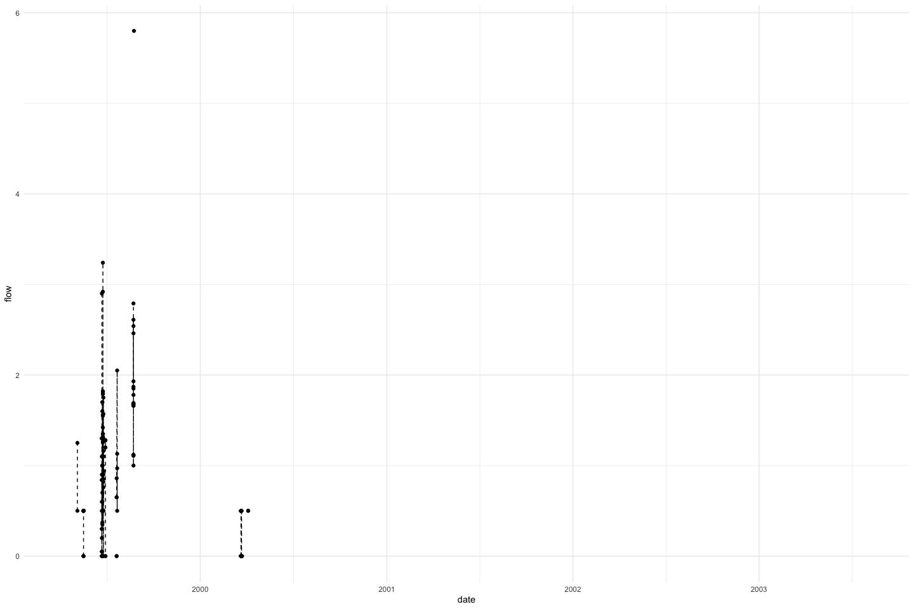<!-- -->

Very inconsistent and sparse flow measures. No flow measurements after
2000-04-04.

``` r
snorkel |> 
  ggplot(aes(x = flow)) +
  geom_histogram() + 
  theme_minimal()
```

    ## `stat_bin()` using `bins = 30`. Pick better value with `binwidth`.

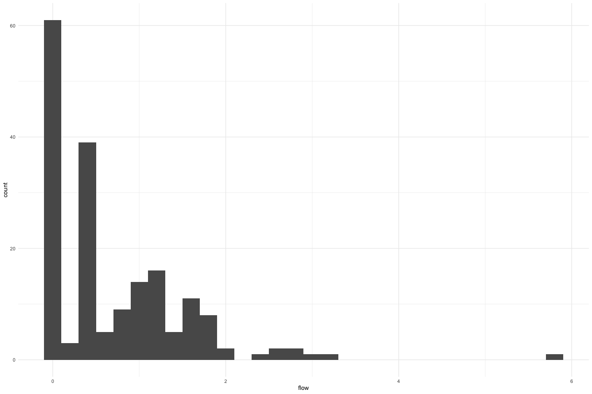<!-- -->

Flow is between 0 - 5.8. 0 values must be errors or `NA`.

**Numeric Summary of flow over Period of Record**

``` r
summary(snorkel$flow)
```

    ##    Min. 1st Qu.  Median    Mean 3rd Qu.    Max.    NA's 
    ##   0.000   0.000   0.500   0.736   1.160   5.800    3703

**NA and Unknown Values**

- 95.3 % of values in the `flow` column are NA.

### Variable: `adj_flow`

**Plotting adjusted flow over Period of Record**

``` r
snorkel |> 
  ggplot(aes(x = date, y = adj_flow)) + 
  geom_line(linetype = "dashed") + 
  geom_point() +
  theme_minimal()
```

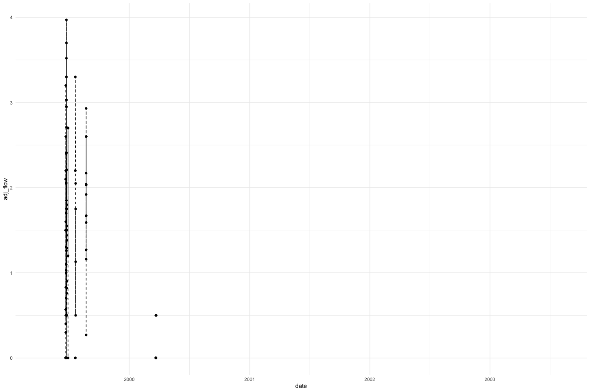<!-- -->

Very inconsistent and sparse adjusted flow measures. No adjusted flow
measurements after 2000-03-23.

``` r
snorkel |> 
  ggplot(aes(x = adj_flow)) +
  geom_histogram() + 
  theme_minimal()
```

    ## `stat_bin()` using `bins = 30`. Pick better value with `binwidth`.

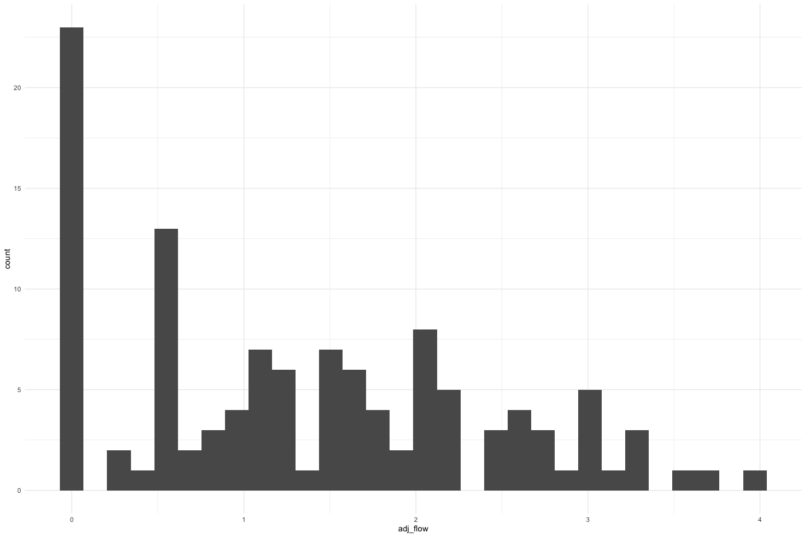<!-- -->

Adjusted is between 0 - 3.97. 0 values must be errors or `NA`.

**Numeric Summary of flow over Period of Record**

``` r
summary(snorkel$adj_flow)
```

    ##    Min. 1st Qu.  Median    Mean 3rd Qu.    Max.    NA's 
    ##   0.000   0.500   1.270   1.354   2.100   3.970    3767

**NA and Unknown Values**

- 97 % of values in the `adj_flow` column are NA.

### Variable: `river_flow`

**Plotting river flow over Period of Record**

``` r
snorkel |> 
  ggplot(aes(x = date, y = river_flow)) + 
  geom_line(linetype = "dashed") + 
  geom_point() +
  theme_minimal()
```

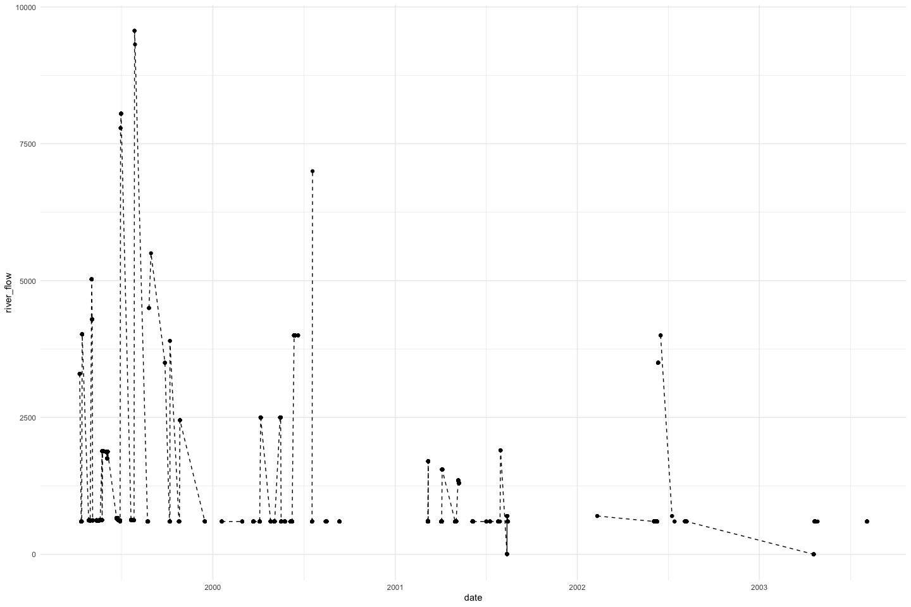<!-- -->

River flow is collected more consistently than `flow` or `adj_flow`

``` r
snorkel |> 
  ggplot(aes(x = river_flow)) +
  geom_histogram() + 
  theme_minimal()
```

    ## `stat_bin()` using `bins = 30`. Pick better value with `binwidth`.

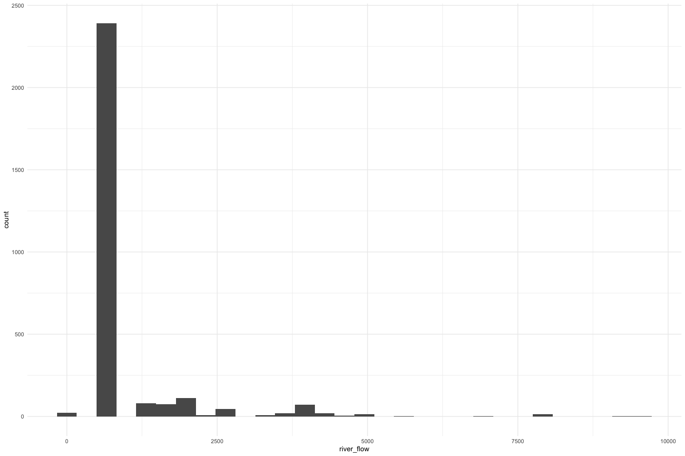<!-- -->

River flow is between 1 - 9564. River flow seems to be the most
consistent and reasonable flow variable in this dataset.

**Numeric Summary of river flow over Period of Record**

``` r
summary(snorkel$river_flow)
```

    ##    Min. 1st Qu.  Median    Mean 3rd Qu.    Max.    NA's 
    ##     1.0   600.0   600.0   937.3   622.0  9564.0    1000

**NA and Unknown Values**

- 25.7 % of values in the `flow` column are NA.

### Variable: `visibility`

**Plotting visibility over Period of Record**

``` r
snorkel |> 
  ggplot(aes(x = date, y = visibility)) + 
  geom_line(linetype = "dashed") + 
  geom_point() +
  theme_minimal()
```

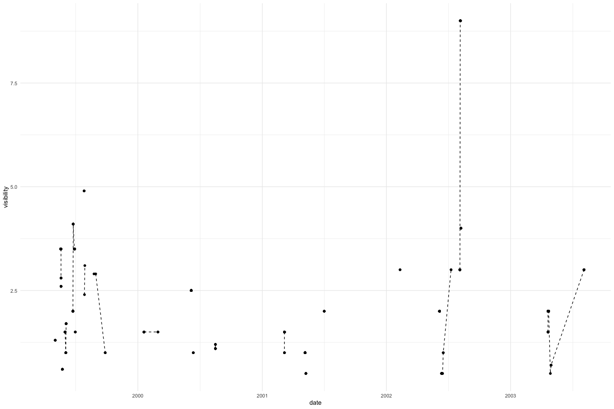<!-- -->

Visibility is collected sporadically.

``` r
snorkel |>
  ggplot(aes(x = visibility)) + 
  geom_histogram() + 
  theme_minimal()
```

    ## `stat_bin()` using `bins = 30`. Pick better value with `binwidth`.

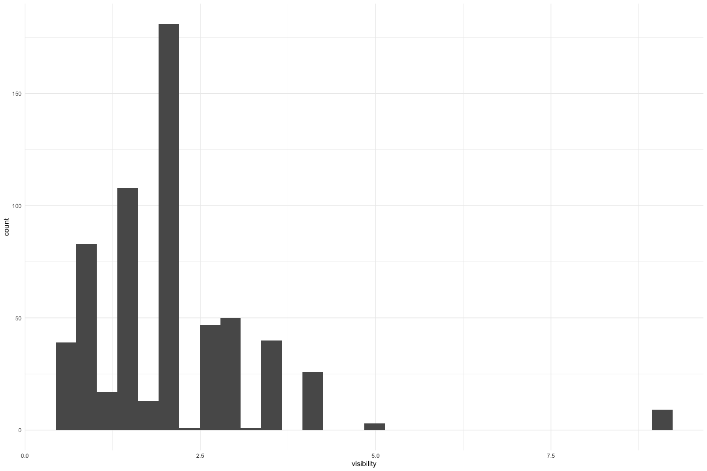<!-- -->

All visibility measures fall between 0.5 and 9.0.

**Numeric Summary of visibility over Period of Record**

``` r
summary(snorkel$visibility)
```

    ##    Min. 1st Qu.  Median    Mean 3rd Qu.    Max.    NA's 
    ##   0.500   1.500   2.000   2.079   2.500   9.000    3266

**NA and Unknown Values**

- 84.1 % of values in the `visibility` column are NA.

### Variable: `temperature`

TODO: Check that they are in both F and C and then divide appropriately

**Plotting temperature over Period of Record**

``` r
snorkel |> 
  ggplot(aes(x = date, y = temperature)) + 
  geom_line(linetype = "dashed") + 
  geom_point() +
  theme_minimal()
```

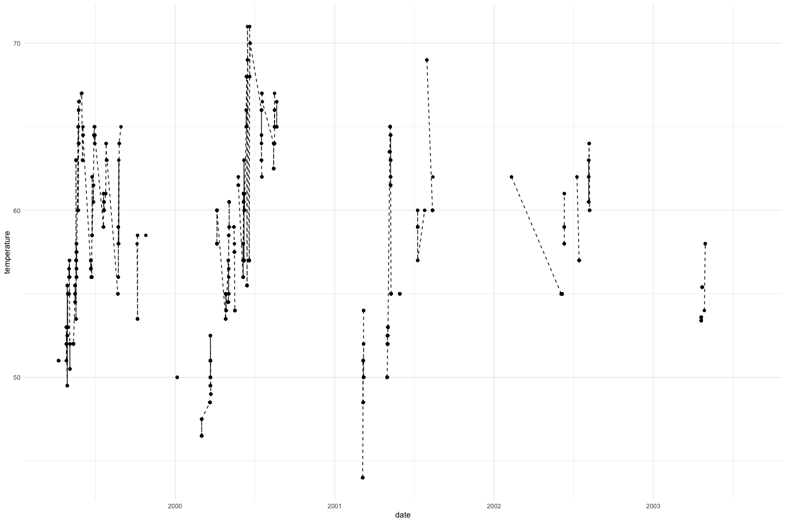<!-- -->

Consistency of temperature measures varies throughout the years.

``` r
snorkel |> 
  ggplot(aes(x = temperature)) +
  geom_histogram() +
  theme_minimal()
```

    ## `stat_bin()` using `bins = 30`. Pick better value with `binwidth`.

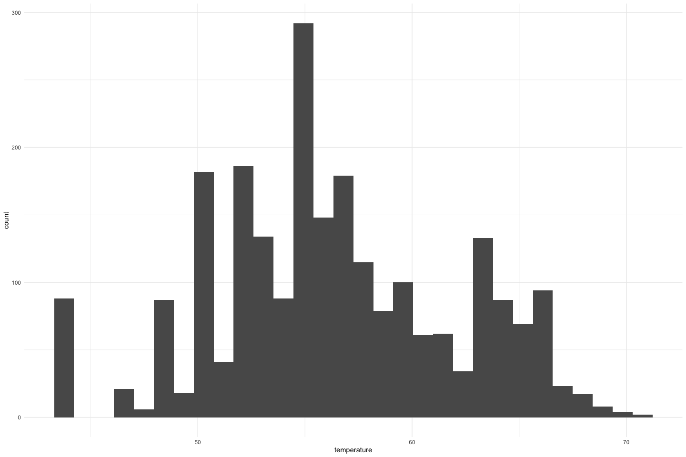<!-- -->

Appears as if most values are collected in Fahrenheit and a few are
collected in Celsius (the lowest ones)?

**Numeric Summary of temperature over Period of Record**

``` r
summary(snorkel$temperature)
```

    ##    Min. 1st Qu.  Median    Mean 3rd Qu.    Max.    NA's 
    ##    44.0    52.5    55.5    56.3    60.5    71.0    1526

**NA and Unknown Values**

- 39.3 % of values in the `temperature` column are NA.

### Variable: `count`

**Plotting count over Period of Record**

``` r
snorkel |> 
  filter(run == "spring") |>
  group_by(date) |>
  summarise(total_daily_catch = sum(count, na.rm = T)) |>
  # filter(year(date) > 2014, year(date) < 2021) |>
  mutate(water_year = ifelse(month(date) %in% 10:12, year(date) + 1, year(date))) |> 
  left_join(sac_indices) |>
  mutate(year = as.factor(year(date)),
         fake_year = if_else(month(date) %in% 10:12, 1900, 1901),
         fake_date = as.Date(paste0(fake_year,"-", month(date), "-", day(date)))) |>
  ggplot(aes(x = fake_date, y = total_daily_catch, fill = year_type)) + 
  geom_col() + 
  scale_x_date(labels = date_format("%b"), limits = c(as.Date("1901-03-01"), as.Date("1901-10-01")), date_breaks = "1 month") + 
  theme_minimal() + 
  theme(text = element_text(size = 18),
        axis.text.x = element_text(angle = 90, vjust = 0.5, hjust=1),
        legend.position = "bottom") + 
  labs(title = "Total Daily Raw Fish Count",
       y = "Total daily catch",
       x = "Date")+ 
  facet_wrap(~water_year, scales = "free") + 
  scale_fill_manual(values = wesanderson::wes_palette("Moonrise2", 5, type = "continuous"))
```

    ## Joining with `by = join_by(water_year)`

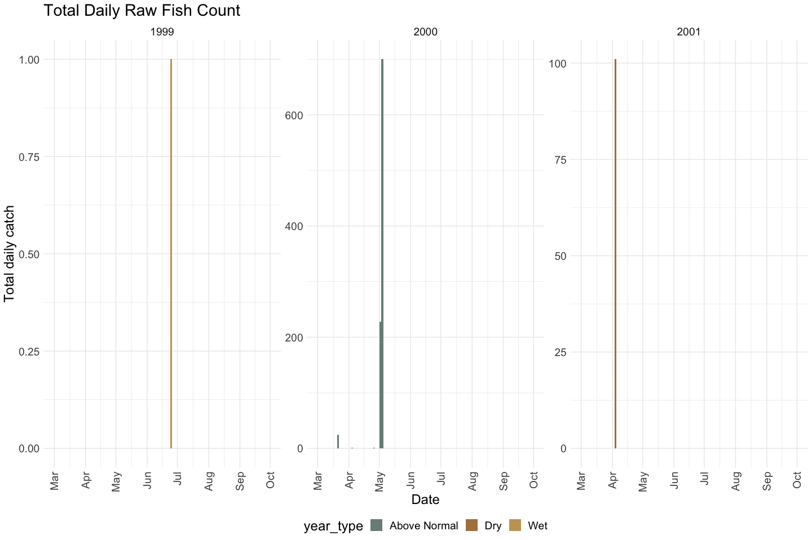<!-- -->

Very few SR fish, only caught SR in 1999, 2000, and 2001.

``` r
snorkel  |>
  mutate(year = as.factor(year(date))) |>
  ggplot(aes(x = year, y = count, fill = run)) + 
  geom_col() + 
  theme_minimal() +
  labs(title = "Total Fish Counted each Year",
       y = "Total fish count") + 
  scale_fill_manual(values = c("#E1BD6D", "#0B775E", "#F2300F", "#35274A")) +
  theme(text = element_text(size = 18),
        axis.text.x = element_text(angle = 90, vjust = 0.5, hjust=1)) 
```

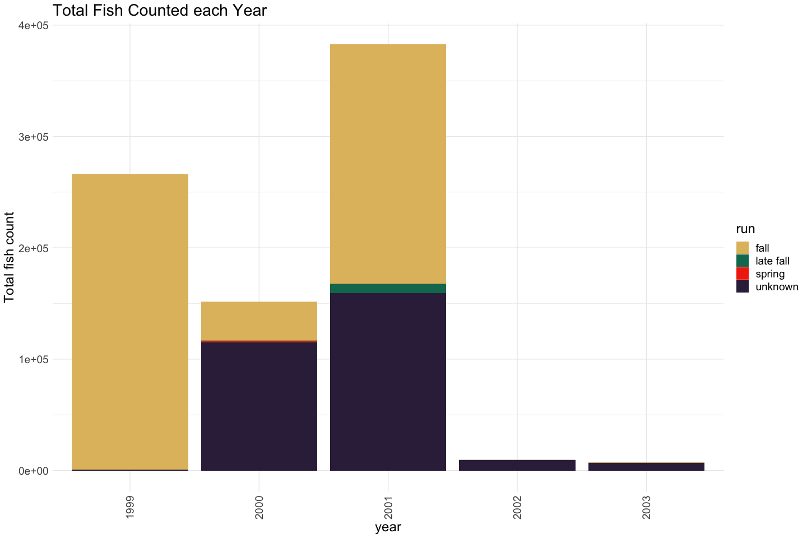<!-- -->

**Numeric Summary of count over Period of Record**

``` r
summary(snorkel$count)
```

    ##    Min. 1st Qu.  Median    Mean 3rd Qu.    Max.    NA's 
    ##     0.0     5.0    25.0   233.3   100.0 30000.0     384

**NA and Unknown Values**

- 9.9 % of values in the `count` column are NA.

### Variable: `fork_length`

**Plotting est_size over Period of Record**

``` r
snorkel |> 
  ggplot(aes(x = fork_length)) + 
  geom_histogram() + 
  theme_minimal()
```

    ## `stat_bin()` using `bins = 30`. Pick better value with `binwidth`.

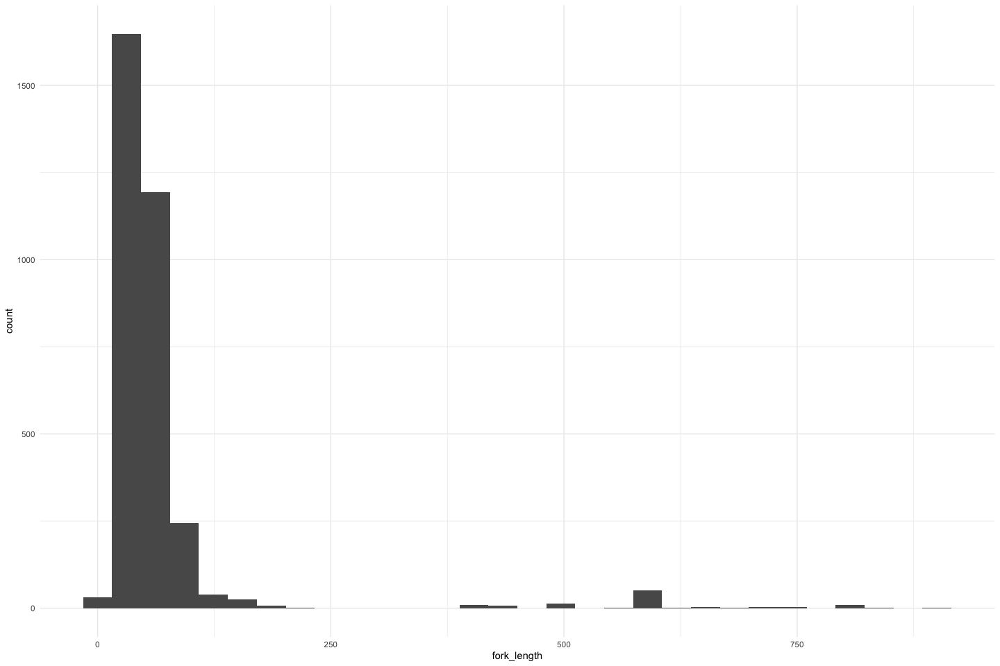<!-- -->

**Numeric Summary of fork_length over Period of Record**

``` r
summary(snorkel$fork_length)
```

    ##    Min. 1st Qu.  Median    Mean 3rd Qu.    Max.    NA's 
    ##    0.00   35.00   45.00   69.97   60.00  900.00     584

**NA and Unknown Values**

- 15 % of values in the `fork_length` column are NA.

### Variable: `max_fork_length`

**Plotting max fork length over Period of Record**

``` r
snorkel |> 
  ggplot(aes(x = max_fork_length)) + 
  geom_histogram() + 
  theme_minimal()
```

    ## `stat_bin()` using `bins = 30`. Pick better value with `binwidth`.

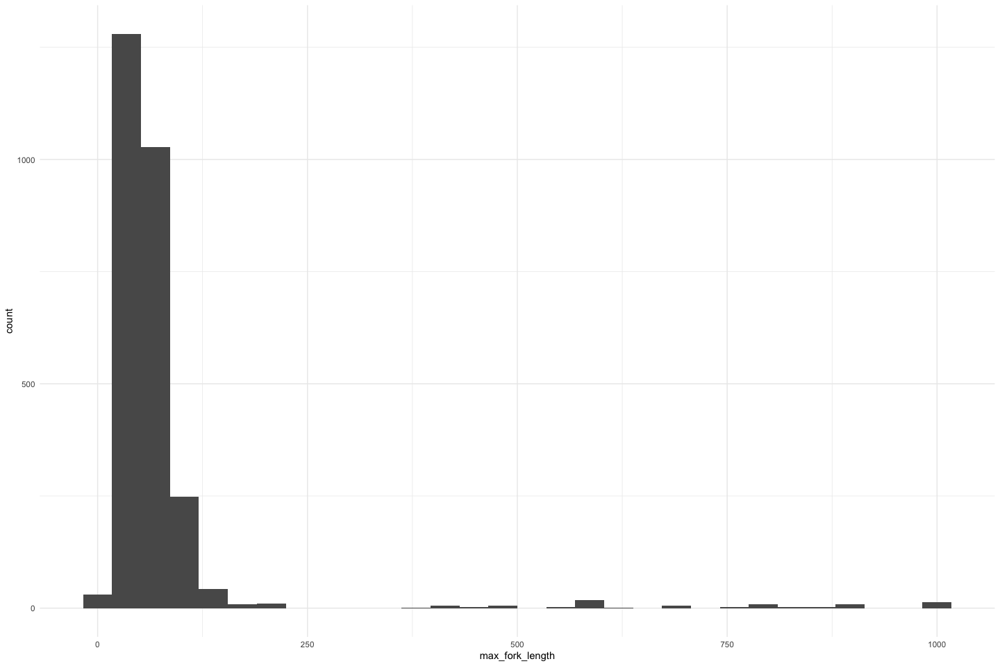<!-- -->

**Numeric Summary of max fork length over Period of Record**

``` r
summary(snorkel$max_fork_length)
```

    ##    Min. 1st Qu.  Median    Mean 3rd Qu.    Max.    NA's 
    ##    0.00   40.00   55.00   78.92   75.00 1000.00    1156

**NA and Unknown Values**

- 29.8 % of values in the `max_fork_length` column are NA.

### Variable: `fish_depth`

Depth at which fish was observed.

**Plotting fish depth over Period of Record**

``` r
snorkel |> 
  ggplot(aes(x = fish_depth)) + 
  geom_histogram() + 
  theme_minimal()
```

    ## `stat_bin()` using `bins = 30`. Pick better value with `binwidth`.

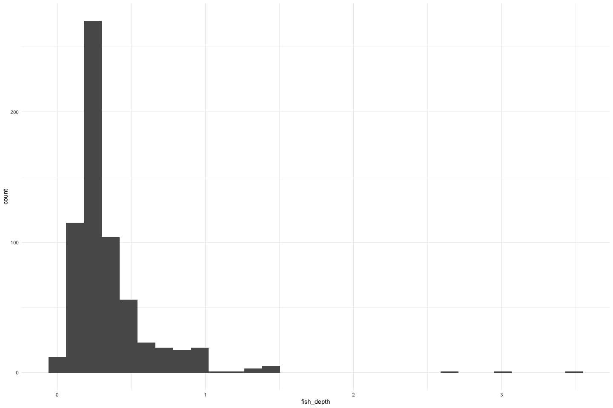<!-- -->
Most of the fish were observed at a depth between 0-2m.

**Numeric Summary of fish depth over Period of Record**

``` r
summary(snorkel$fish_depth)
```

    ##    Min. 1st Qu.  Median    Mean 3rd Qu.    Max.    NA's 
    ##   0.010   0.200   0.300   0.358   0.400   3.500    3236

**NA and Unknown Values**

- 83.3 % of values in the `fish_depth` column are NA.

### Variable: `river_depth`

Depth of the river at sampling site.

**Plotting water depth over Period of Record**

``` r
snorkel |> 
  ggplot(aes(x = river_depth)) + 
  geom_histogram() + 
  theme_minimal()
```

    ## `stat_bin()` using `bins = 30`. Pick better value with `binwidth`.

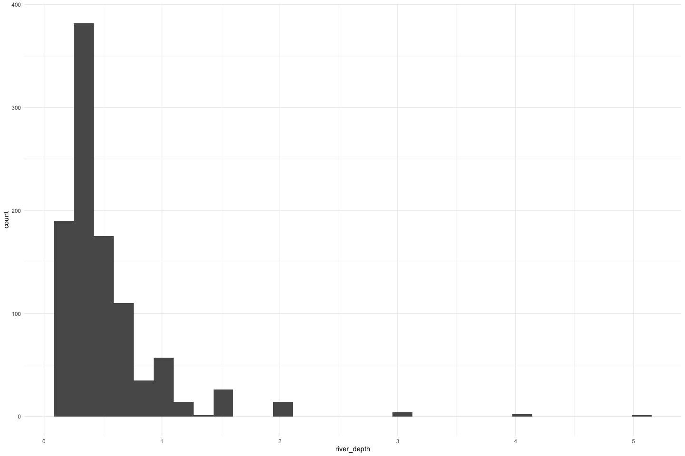<!-- -->
River depth was mostly between 1-2 m.

**Numeric Summary of depth of water over Period of Record**

``` r
summary(snorkel$river_depth)
```

    ##    Min. 1st Qu.  Median    Mean 3rd Qu.    Max.    NA's 
    ##  0.1000  0.3000  0.4000  0.5128  0.6000  5.0000    2873

**NA and Unknown Values**

- 74 % of values in the `river_depth` column are NA.

### Variable: `bank_distance`

Distance from river bank.

**Plotting distance from river bank over Period of Record**

``` r
snorkel |> 
  ggplot(aes(x = bank_distance)) + 
  geom_histogram() + 
  theme_minimal()
```

    ## `stat_bin()` using `bins = 30`. Pick better value with `binwidth`.

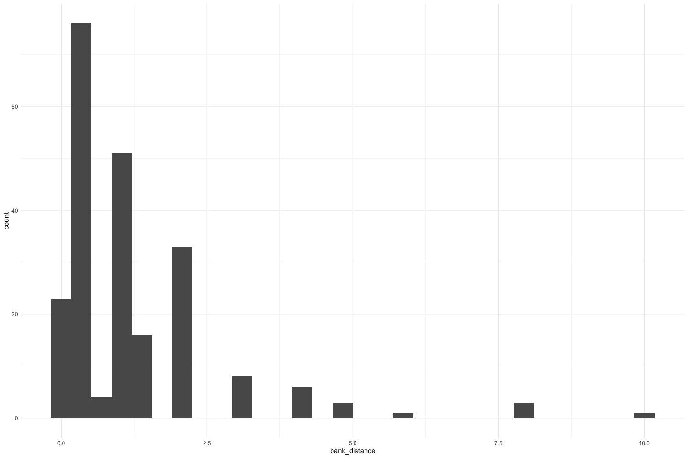<!-- -->

Distance from river bank was generally between 0-2.5 m.

**Numeric Summary of distance from river bank over Period of Record**

``` r
summary(snorkel$bank_distance)
```

    ##    Min. 1st Qu.  Median    Mean 3rd Qu.    Max.    NA's 
    ##   0.000   0.300   1.000   1.239   1.500  10.000    3659

**NA and Unknown Values**

- 94.2 % of values in the `bank_distance` column are NA.

## Explore Categorical variables:

``` r
snorkel |> select_if(is.character) |> colnames()
```

    ##  [1] "location"      "unit"          "survey_type"   "section_type" 
    ##  [5] "species"       "run"           "huc_unit"      "huc_cover"    
    ##  [9] "huc_o_cover"   "huc_substrate" "weather"

### Variable: `location`

Locations appear to be mapped to a survey reach and can be inconsistent
(i.e. some are reach X - reach Y, some are just reach X). In later
years, this is `section_name`.

``` r
table(snorkel$location)
```

    ## 
    ##                                               338 
    ##                                                41 
    ##                                        66.6-66.75 
    ##                                                 4 
    ##                                          66.75-67 
    ##                                                 6 
    ##                        Above Big Hole Boat Launch 
    ##                                                 1 
    ##                                  Above Eye Riffle 
    ##                                                 1 
    ##                                    Above Hatchery 
    ##                                                 3 
    ##                  Across From Big Hole Boat Launch 
    ##                                                 3 
    ##                      Alec Riffle To Great Western 
    ##                                                16 
    ##                                             Aleck 
    ##                                                15 
    ##                                      Aleck Riffle 
    ##                                                66 
    ##                     Aleck Riffle To Great Western 
    ##                                                31 
    ##                                 Auditoreum Riffle 
    ##                                                 5 
    ##                                        Auditorium 
    ##                                                84 
    ##                                 Auditorium Riffle 
    ##                                                99 
    ##                      Auditorium Riffle To Bedrock 
    ##                                                34 
    ##                                  Auditorium Rifle 
    ##                                                 2 
    ##                             Auditorium To Bedrock 
    ##                                                82 
    ##                                  Auditrium Riffle 
    ##                                                24 
    ##                                           Bedrock 
    ##                                                 2 
    ##                          Bedrock And Trailer Park 
    ##                                                 5 
    ##                                      Bedrock Park 
    ##                                                25 
    ##                               Bedrock Park Riffle 
    ##                                                 8 
    ##                                    Bedrock Riffle 
    ##                                                 9 
    ##                   Bedrock Riffle To Hwy 70 Bridge 
    ##                                                31 
    ##                             Bedrock To Montgomery 
    ##                                                20 
    ##                                         Below G95 
    ##                                                 2 
    ##                        Below Great Western Riffle 
    ##                                                 2 
    ##          Below Macfarland Riffle - Gridley Bridge 
    ##                                                 4 
    ##                      Below Macfarland To Upstream 
    ##                                                 1 
    ##                                Bh Boatramp To G95 
    ##                                                12 
    ##                                    Big Bar Riffle 
    ##                                                 2 
    ##                              Big Bar To Mcfarland 
    ##                                                 9 
    ##                                Big Bar, Mcfarland 
    ##                                                 1 
    ##                              Big Hole Boat Launch 
    ##                                                 3 
    ##                       Big Hole Boat Launch To G95 
    ##                                                 7 
    ##                                   Big Hole Island 
    ##                                                 1 
    ##                            Big Hole Island To G95 
    ##                                                 7 
    ##                         Big Hole Islands @ R.m 57 
    ##                                                 3 
    ##           Big Hole Islands, 1/4 Mile Below R.m 58 
    ##                                                 3 
    ##                                        Big Riffle 
    ##                                                 2 
    ##                             Big Riffle To Big Bar 
    ##                                                 5 
    ##                    Big Riffle To Mcfarland Riffle 
    ##                                                 2 
    ##                                              Comp 
    ##                                                 3 
    ##                    East Channel G95 Lower Section 
    ##                                                 2 
    ##                                        Eye Riffle 
    ##                                               141 
    ##                     Eye Riffle -Gateway To Outlet 
    ##                                                 3 
    ##                               Eye Riffle,Eye Side 
    ##                                                 2 
    ##                                    Eye To Gateway 
    ##                                                 7 
    ##                       Fish Barrier Dam To Bedrock 
    ##                                                17 
    ##               Fish Barrier Dam To Hatchery Riffle 
    ##                                                19 
    ##                                              G-95 
    ##                                                 9 
    ##                                       G-95  G-95e 
    ##                                                 1 
    ##                         G-95 To Keister Backwater 
    ##                                                15 
    ##                                              G'95 
    ##                                                11 
    ##                                               G95 
    ##                                                14 
    ##                                 G95 To Hour Glide 
    ##                                                62 
    ##                    Gateway Pool - Thermalito Pool 
    ##                                                 3 
    ##                                    Gateway Riffle 
    ##                                                 6 
    ##                                 Gateway To Outlet 
    ##                                                13 
    ##                 Goose Backwater To Big Bar Riffle 
    ##                                                 1 
    ##                                      Goose Riffle 
    ##                                                54 
    ##                        Goose Riffle To Big Riffle 
    ##                                                 8 
    ##                                Goose To Mcfarland 
    ##                                                14 
    ##                 Gravel Mine To N. Robinson Riffle 
    ##                                                16 
    ##                      Great Western To Gravel Mine 
    ##                                                19 
    ##                                    Gridley Riffle 
    ##                                                 1 
    ##        Gridley Riffle Side Channel (See Comments) 
    ##                                                 1 
    ##                                  Hatchery  Riffle 
    ##                                                 4 
    ##                           Hatchery  To Auditorium 
    ##                                                38 
    ##                                    Hatchery Ditch 
    ##                                               802 
    ##                       Hatchery Ditch - Lower Half 
    ##                                                20 
    ##                       Hatchery Ditch - Upper Half 
    ##                                                32 
    ##                           Hatchery Ditch (Bottom) 
    ##                                                 8 
    ##                              Hatchery Ditch (Top) 
    ##                                                10 
    ##                            Hatchery Ditch (Upper) 
    ##                                                16 
    ##                                   Hatchery Riffle 
    ##                                               241 
    ##             Hatchery Riffle And Auditorium Riffle 
    ##                                                10 
    ##            Hatchery Riffle To  Upper Bedrock Pool 
    ##                                                 9 
    ##                     Hatchery Riffle To Auditorium 
    ##                                                 6 
    ##               Hatchery Riffle To Lower Auditorium 
    ##                                                20 
    ## Hatchery Riffle, Bottom Moes Ditch To Middle Moes 
    ##                                                27 
    ##                            Hatchery To Auditorium 
    ##                                                34 
    ##                         Herring Side/Main Channel 
    ##                                                 3 
    ##                                  Herringer Riffle 
    ##                                                 3 
    ##               Herringer Side Channel/Main Channel 
    ##                                                 1 
    ##                                              Hour 
    ##                                                 2 
    ##                                     Hour Bar Pool 
    ##                                                 7 
    ##                                        Hour Glide 
    ##                                                18 
    ##                                       Hour Riffle 
    ##                                                11 
    ##                    Hwy 162 Bridge To Aleck Riffle 
    ##                                                32 
    ##                   Hwy 70 Bridge To Hwy 162 Bridge 
    ##                                                34 
    ##                Island @ Bottom Of Big Hole Island 
    ##                                                 2 
    ##                                           Keister 
    ##                                                 5 
    ##                                    Keister Riffle 
    ##                                                 3 
    ##           Keister Riffle - Before Goose Backwater 
    ##                                                 3 
    ##                                Lower  Hour Riffle 
    ##                                                 7 
    ##            Lower Auditorium To Upper Bedrock Pool 
    ##                                                 3 
    ##                Lower Eye Riffle To Gateway Riffle 
    ##                                                10 
    ##                              Lower Eye To Gateway 
    ##                                                 6 
    ##                                    Lower Eye-Pool 
    ##                                                 3 
    ##                              Lower Hatchery Ditch 
    ##                                                12 
    ##                                        Lower Hour 
    ##                                                 5 
    ##                                    Lower Robinson 
    ##                                                 6 
    ##                                        Macfarland 
    ##                                                27 
    ##                                 Macfarland Riffle 
    ##                                                 9 
    ##                                          Matthews 
    ##                                                 8 
    ##                                   Matthews Riffle 
    ##                                                 1 
    ##                                  Matthews To Alec 
    ##                                                15 
    ##                                 Matthews To Aleck 
    ##                                                 2 
    ##                                    Mcfarland Bend 
    ##                                                 3 
    ##                                  Mcfarland Riffle 
    ##                                                 1 
    ##                          Mcfarland To Swampy Bend 
    ##                                                20 
    ##                             Middle Of Moe's Ditch 
    ##                                                16 
    ##                                       Moe's Ditch 
    ##                                                 4 
    ##                                        Moes Ditch 
    ##                                                34 
    ##            Montgomery St Access To Mathews Riffle 
    ##                                                12 
    ##        Montgomery St. Park To Trailer Park Riffle 
    ##                                                 5 
    ##                                 Montgomery Street 
    ##                                                 2 
    ##                                  Palm Ave. Access 
    ##                                                 4 
    ##             Riffle Below Vance Avenue Boat Launch 
    ##                                                 2 
    ##                    River Mile 66.9; Units 5,6,7,8 
    ##                                                 7 
    ##                                          Robinson 
    ##                                                34 
    ##                             Robinson , Steep, Eye 
    ##                                                 1 
    ##                            Robinson Main And Side 
    ##                                                 1 
    ##                    Robinson Main And Side Channel 
    ##                                                 1 
    ##                      Robinson Pond Outlet Channel 
    ##                                                 4 
    ##   Robinson Pond Side Channels, Steep Side Channel 
    ##                                                 1 
    ##                                   Robinson Riffle 
    ##                                               103 
    ##                      Robinson Riffle/Steep Riffle 
    ##                                                 5 
    ##                             Robinson Side Channel 
    ##                                                24 
    ##                                   Robinson To Eye 
    ##                                                94 
    ##                               Robinson To Gateway 
    ##                                                79 
    ##                                 Robinson To Steep 
    ##                                                 4 
    ##                          Robinson To Steep Riffle 
    ##                                                18 
    ##                Robinsons Riffle To Robinsons Pool 
    ##                                                11 
    ##                                     Sections 1-25 
    ##                                                60 
    ##                                             Steep 
    ##                                                 9 
    ##                               Steep Main And Side 
    ##                                                 4 
    ##                                      Steep Riffle 
    ##                                                56 
    ##                       Steep Riffle & Side Channel 
    ##                                                 5 
    ##                        Steep Riffle To Eye Riffle 
    ##                                                12 
    ##                           Steep Riffle/Steep Side 
    ##                                                 1 
    ##                                Steep Side Channel 
    ##                                                 3 
    ##                               Steep Side Channels 
    ##                                                16 
    ##                                      Steep To Eye 
    ##                                                12 
    ##                                     Steep To Weir 
    ##                                                 2 
    ##                                 Steep, Steep Side 
    ##                                                61 
    ##                                       Swampy Bend 
    ##                                                 1 
    ##                Table Mt Bridge To Hatchery Riffle 
    ##                                                 7 
    ##               Table Mtn Bridge To Hatchery Riffle 
    ##                                                 7 
    ##                  Tbl Mountn Bridge To Cottonwd Rd 
    ##                                                45 
    ##          Tble Mountain Bridge To Hatchery  Riffle 
    ##                                                22 
    ##                Thermalito Bar To Vance Ave Riffle 
    ##                                                 9 
    ##                                   Thermalito Pool 
    ##                                                 2 
    ##                                      Trailer Park 
    ##                                                 3 
    ##                               Trailer Park Riffle 
    ##                                                14 
    ##           Trailer Park Riffle And Matthews Riffle 
    ##                                                 7 
    ##                             Trailer Park To Aleck 
    ##                                                 4 
    ##                   Trailer Park To Mathew's Riffle 
    ##                                                11 
    ##                           Trailer Park To Mathews 
    ##                                                63 
    ##            Trailer Park, Aleck, Robinson, Mathews 
    ##                                                 6 
    ##                                  Upper Auditorium 
    ##                                                13 
    ##                  Upper Bedrock Pool To H70 Bridge 
    ##                                                 6 
    ##                              Upper Hatchery Ditch 
    ##                                                31 
    ##           Vance Ave Boatramp To Big Hole Boatramp 
    ##                                                13 
    ##                 Vance Ave To Big Hole Boat Launch 
    ##                                                 4 
    ##                          Vance Ave To Big Hole Bw 
    ##                                                 5 
    ##                              Vance Ave. Boat Ramp 
    ##                                                14 
    ##                          Vance Avenue Boat Launch 
    ##                                                 2 
    ##                                      Vance To G95 
    ##                                                51 
    ##                                Weir To Eye Riffle 
    ##                                                15 
    ##                                 Weir, Eye  Riffle 
    ##                                                 1

``` r
format_site_name <- function(string) {
  clean <- 
    str_replace_all(string, "'", "") |>
    str_replace_all("G-95", "G95") |> 
    str_replace_all("[^[:alnum:]]", " ") |> 
    trimws() |> 
    stringr::str_squish() |>
    stringr::str_to_title()
}

snorkel$location <- format_site_name(snorkel$location)
table(snorkel$location)
```

    ## 
    ##                                              338 
    ##                                               41 
    ##                                       66 6 66 75 
    ##                                                4 
    ##                                         66 75 67 
    ##                                                6 
    ##                       Above Big Hole Boat Launch 
    ##                                                1 
    ##                                 Above Eye Riffle 
    ##                                                1 
    ##                                   Above Hatchery 
    ##                                                3 
    ##                 Across From Big Hole Boat Launch 
    ##                                                3 
    ##                     Alec Riffle To Great Western 
    ##                                               16 
    ##                                            Aleck 
    ##                                               15 
    ##                                     Aleck Riffle 
    ##                                               66 
    ##                    Aleck Riffle To Great Western 
    ##                                               31 
    ##                                Auditoreum Riffle 
    ##                                                5 
    ##                                       Auditorium 
    ##                                               84 
    ##                                Auditorium Riffle 
    ##                                               99 
    ##                     Auditorium Riffle To Bedrock 
    ##                                               34 
    ##                                 Auditorium Rifle 
    ##                                                2 
    ##                            Auditorium To Bedrock 
    ##                                               82 
    ##                                 Auditrium Riffle 
    ##                                               24 
    ##                                          Bedrock 
    ##                                                2 
    ##                         Bedrock And Trailer Park 
    ##                                                5 
    ##                                     Bedrock Park 
    ##                                               25 
    ##                              Bedrock Park Riffle 
    ##                                                8 
    ##                                   Bedrock Riffle 
    ##                                                9 
    ##                  Bedrock Riffle To Hwy 70 Bridge 
    ##                                               31 
    ##                            Bedrock To Montgomery 
    ##                                               20 
    ##                                        Below G95 
    ##                                                2 
    ##                       Below Great Western Riffle 
    ##                                                2 
    ##           Below Macfarland Riffle Gridley Bridge 
    ##                                                4 
    ##                     Below Macfarland To Upstream 
    ##                                                1 
    ##                               Bh Boatramp To G95 
    ##                                               12 
    ##                                Big Bar Mcfarland 
    ##                                                1 
    ##                                   Big Bar Riffle 
    ##                                                2 
    ##                             Big Bar To Mcfarland 
    ##                                                9 
    ##                             Big Hole Boat Launch 
    ##                                                3 
    ##                      Big Hole Boat Launch To G95 
    ##                                                7 
    ##                                  Big Hole Island 
    ##                                                1 
    ##                           Big Hole Island To G95 
    ##                                                7 
    ##           Big Hole Islands 1 4 Mile Below R M 58 
    ##                                                3 
    ##                          Big Hole Islands R M 57 
    ##                                                3 
    ##                                       Big Riffle 
    ##                                                2 
    ##                            Big Riffle To Big Bar 
    ##                                                5 
    ##                   Big Riffle To Mcfarland Riffle 
    ##                                                2 
    ##                                             Comp 
    ##                                                3 
    ##                   East Channel G95 Lower Section 
    ##                                                2 
    ##                                       Eye Riffle 
    ##                                              141 
    ##                              Eye Riffle Eye Side 
    ##                                                2 
    ##                     Eye Riffle Gateway To Outlet 
    ##                                                3 
    ##                                   Eye To Gateway 
    ##                                                7 
    ##                      Fish Barrier Dam To Bedrock 
    ##                                               17 
    ##              Fish Barrier Dam To Hatchery Riffle 
    ##                                               19 
    ##                                              G95 
    ##                                               34 
    ##                                         G95 G95e 
    ##                                                1 
    ##                                G95 To Hour Glide 
    ##                                               62 
    ##                         G95 To Keister Backwater 
    ##                                               15 
    ##                     Gateway Pool Thermalito Pool 
    ##                                                3 
    ##                                   Gateway Riffle 
    ##                                                6 
    ##                                Gateway To Outlet 
    ##                                               13 
    ##                Goose Backwater To Big Bar Riffle 
    ##                                                1 
    ##                                     Goose Riffle 
    ##                                               54 
    ##                       Goose Riffle To Big Riffle 
    ##                                                8 
    ##                               Goose To Mcfarland 
    ##                                               14 
    ##                 Gravel Mine To N Robinson Riffle 
    ##                                               16 
    ##                     Great Western To Gravel Mine 
    ##                                               19 
    ##                                   Gridley Riffle 
    ##                                                1 
    ##         Gridley Riffle Side Channel See Comments 
    ##                                                1 
    ##                                   Hatchery Ditch 
    ##                                              802 
    ##                            Hatchery Ditch Bottom 
    ##                                                8 
    ##                        Hatchery Ditch Lower Half 
    ##                                               20 
    ##                               Hatchery Ditch Top 
    ##                                               10 
    ##                             Hatchery Ditch Upper 
    ##                                               16 
    ##                        Hatchery Ditch Upper Half 
    ##                                               32 
    ##                                  Hatchery Riffle 
    ##                                              245 
    ##            Hatchery Riffle And Auditorium Riffle 
    ##                                               10 
    ## Hatchery Riffle Bottom Moes Ditch To Middle Moes 
    ##                                               27 
    ##                    Hatchery Riffle To Auditorium 
    ##                                                6 
    ##              Hatchery Riffle To Lower Auditorium 
    ##                                               20 
    ##            Hatchery Riffle To Upper Bedrock Pool 
    ##                                                9 
    ##                           Hatchery To Auditorium 
    ##                                               72 
    ##                        Herring Side Main Channel 
    ##                                                3 
    ##                                 Herringer Riffle 
    ##                                                3 
    ##              Herringer Side Channel Main Channel 
    ##                                                1 
    ##                                             Hour 
    ##                                                2 
    ##                                    Hour Bar Pool 
    ##                                                7 
    ##                                       Hour Glide 
    ##                                               18 
    ##                                      Hour Riffle 
    ##                                               11 
    ##                   Hwy 162 Bridge To Aleck Riffle 
    ##                                               32 
    ##                  Hwy 70 Bridge To Hwy 162 Bridge 
    ##                                               34 
    ##                 Island Bottom Of Big Hole Island 
    ##                                                2 
    ##                                          Keister 
    ##                                                5 
    ##                                   Keister Riffle 
    ##                                                3 
    ##            Keister Riffle Before Goose Backwater 
    ##                                                3 
    ##           Lower Auditorium To Upper Bedrock Pool 
    ##                                                3 
    ##                                   Lower Eye Pool 
    ##                                                3 
    ##               Lower Eye Riffle To Gateway Riffle 
    ##                                               10 
    ##                             Lower Eye To Gateway 
    ##                                                6 
    ##                             Lower Hatchery Ditch 
    ##                                               12 
    ##                                       Lower Hour 
    ##                                                5 
    ##                                Lower Hour Riffle 
    ##                                                7 
    ##                                   Lower Robinson 
    ##                                                6 
    ##                                       Macfarland 
    ##                                               27 
    ##                                Macfarland Riffle 
    ##                                                9 
    ##                                         Matthews 
    ##                                                8 
    ##                                  Matthews Riffle 
    ##                                                1 
    ##                                 Matthews To Alec 
    ##                                               15 
    ##                                Matthews To Aleck 
    ##                                                2 
    ##                                   Mcfarland Bend 
    ##                                                3 
    ##                                 Mcfarland Riffle 
    ##                                                1 
    ##                         Mcfarland To Swampy Bend 
    ##                                               20 
    ##                             Middle Of Moes Ditch 
    ##                                               16 
    ##                                       Moes Ditch 
    ##                                               38 
    ##           Montgomery St Access To Mathews Riffle 
    ##                                               12 
    ##        Montgomery St Park To Trailer Park Riffle 
    ##                                                5 
    ##                                Montgomery Street 
    ##                                                2 
    ##                                  Palm Ave Access 
    ##                                                4 
    ##            Riffle Below Vance Avenue Boat Launch 
    ##                                                2 
    ##                    River Mile 66 9 Units 5 6 7 8 
    ##                                                7 
    ##                                         Robinson 
    ##                                               34 
    ##                           Robinson Main And Side 
    ##                                                1 
    ##                   Robinson Main And Side Channel 
    ##                                                1 
    ##                     Robinson Pond Outlet Channel 
    ##                                                4 
    ##   Robinson Pond Side Channels Steep Side Channel 
    ##                                                1 
    ##                                  Robinson Riffle 
    ##                                              103 
    ##                     Robinson Riffle Steep Riffle 
    ##                                                5 
    ##                            Robinson Side Channel 
    ##                                               24 
    ##                               Robinson Steep Eye 
    ##                                                1 
    ##                                  Robinson To Eye 
    ##                                               94 
    ##                              Robinson To Gateway 
    ##                                               79 
    ##                                Robinson To Steep 
    ##                                                4 
    ##                         Robinson To Steep Riffle 
    ##                                               18 
    ##               Robinsons Riffle To Robinsons Pool 
    ##                                               11 
    ##                                    Sections 1 25 
    ##                                               60 
    ##                                            Steep 
    ##                                                9 
    ##                              Steep Main And Side 
    ##                                                4 
    ##                                     Steep Riffle 
    ##                                               56 
    ##                        Steep Riffle Side Channel 
    ##                                                5 
    ##                          Steep Riffle Steep Side 
    ##                                                1 
    ##                       Steep Riffle To Eye Riffle 
    ##                                               12 
    ##                               Steep Side Channel 
    ##                                                3 
    ##                              Steep Side Channels 
    ##                                               16 
    ##                                 Steep Steep Side 
    ##                                               61 
    ##                                     Steep To Eye 
    ##                                               12 
    ##                                    Steep To Weir 
    ##                                                2 
    ##                                      Swampy Bend 
    ##                                                1 
    ##               Table Mt Bridge To Hatchery Riffle 
    ##                                                7 
    ##              Table Mtn Bridge To Hatchery Riffle 
    ##                                                7 
    ##                 Tbl Mountn Bridge To Cottonwd Rd 
    ##                                               45 
    ##          Tble Mountain Bridge To Hatchery Riffle 
    ##                                               22 
    ##               Thermalito Bar To Vance Ave Riffle 
    ##                                                9 
    ##                                  Thermalito Pool 
    ##                                                2 
    ##                                     Trailer Park 
    ##                                                3 
    ##              Trailer Park Aleck Robinson Mathews 
    ##                                                6 
    ##                              Trailer Park Riffle 
    ##                                               14 
    ##          Trailer Park Riffle And Matthews Riffle 
    ##                                                7 
    ##                            Trailer Park To Aleck 
    ##                                                4 
    ##                          Trailer Park To Mathews 
    ##                                               63 
    ##                   Trailer Park To Mathews Riffle 
    ##                                               11 
    ##                                 Upper Auditorium 
    ##                                               13 
    ##                 Upper Bedrock Pool To H70 Bridge 
    ##                                                6 
    ##                             Upper Hatchery Ditch 
    ##                                               31 
    ##                              Vance Ave Boat Ramp 
    ##                                               14 
    ##          Vance Ave Boatramp To Big Hole Boatramp 
    ##                                               13 
    ##                Vance Ave To Big Hole Boat Launch 
    ##                                                4 
    ##                         Vance Ave To Big Hole Bw 
    ##                                                5 
    ##                         Vance Avenue Boat Launch 
    ##                                                2 
    ##                                     Vance To G95 
    ##                                               51 
    ##                                  Weir Eye Riffle 
    ##                                                1 
    ##                               Weir To Eye Riffle 
    ##                                               15

There are 168 unique locations.

**NA and Unknown Values**

- 4 % of values in the `location` column are NA.

### Variable: `unit`

Not sure what `unit` corresponds to - should clarify this. In later
years (see other .Rmd) this is `section_name`.

``` r
table(snorkel$unit) 
```

    ## 
    ##                                  1                                 10 
    ##                                  3                                  2 
    ##                                100                                101 
    ##                                  7                                  2 
    ##                                102                                103 
    ##                                 12                                  8 
    ##                                104                        104 106 112 
    ##                                  8                                  2 
    ##                      104, 106, 112                                105 
    ##                                  1                                 10 
    ##                                106                                107 
    ##                                 14                                  2 
    ##                                108                                109 
    ##                                 10                                  7 
    ##                                 11                                111 
    ##                                  2                                  6 
    ##                               111a                               111A 
    ##                                  2                                  3 
    ##                                112                                113 
    ##                                 11                                  3 
    ##                                114                                115 
    ##                                 11                                  6 
    ##                                117                                118 
    ##                                  4                                  5 
    ##                               118a                               118A 
    ##                                  1                                  3 
    ##                                119                                 12 
    ##                                 50                                  4 
    ##                                120                                121 
    ##                                  9                                  3 
    ##                               121a                               121A 
    ##                                  1                                  9 
    ##                                122                                123 
    ##                                 14                                  3 
    ##                                124                                125 
    ##                                  6                                  4 
    ##                                126                                127 
    ##                                  3                                  1 
    ##                                128                                129 
    ##                                  2                                  2 
    ##                                 13                                130 
    ##                                  3                                  5 
    ##                                131                                132 
    ##                                  2                                  2 
    ##                                133                                134 
    ##                                  3                                  2 
    ##                                135                                136 
    ##                                  1                                  4 
    ##                                137                                138 
    ##                                  3                                  2 
    ##                                139                                 14 
    ##                                  1                                  4 
    ##                                140                                141 
    ##                                  2                                  2 
    ##                                142                                143 
    ##                                  1                                  2 
    ##                                144                                146 
    ##                                  2                                  2 
    ##                                147                                149 
    ##                                  2                                  3 
    ##                                 15                                150 
    ##                                  2                                  3 
    ##                                151                                152 
    ##                                  4                                  1 
    ##                                154                                155 
    ##                                  2                                  2 
    ##                                156                                157 
    ##                                  2                                  1 
    ##                                158                                159 
    ##                                  1                                  3 
    ##                                 16                                160 
    ##                                 22                                  2 
    ##                                161                                162 
    ##                                  1                                  5 
    ##                                164                                165 
    ##                                  2                                  1 
    ##                                166                                167 
    ##                                  3                                  1 
    ##                                168                                169 
    ##                                  3                                 35 
    ##                                 17                                170 
    ##                                  4                                  9 
    ##                                171                                172 
    ##                                 20                                 34 
    ##                                173                                174 
    ##                                 79                                 11 
    ##                                175                                176 
    ##                                 20                                 14 
    ##                                177                                178 
    ##                                 11                                  7 
    ##                                179                                180 
    ##                                  6                                  8 
    ##                                182                                183 
    ##                                  3                                 13 
    ##                                184                                185 
    ##                                  2                                 31 
    ##                                186                                189 
    ##                                  6                                139 
    ##                                 19                                190 
    ##                                 97                                  9 
    ##                                191                                192 
    ##                                  1                                  9 
    ##                                193                                197 
    ##                                  6                                  4 
    ##                                198                                199 
    ##                                  4                                  5 
    ##                                  2                                 20 
    ##                                  3                                 12 
    ##                                200                                205 
    ##                                 17                                 11 
    ##                                207                                208 
    ##                                  1                                  2 
    ##                                 21                                210 
    ##                                  2                                 87 
    ##                                213                                215 
    ##                                  1                                  4 
    ##                               215a                               215A 
    ##                                  3                                 19 
    ##                               215b                               215B 
    ##                                  2                                 30 
    ##                                216                                217 
    ##                                  7                                 30 
    ##                                218                                219 
    ##                                  4                                  2 
    ##                                 22                                220 
    ##                                  2                                  8 
    ##                                221                                224 
    ##                                  6                                  1 
    ##                                225                                226 
    ##                                  5                                  4 
    ##                                228                                229 
    ##                                  4                                  4 
    ##                                 23                                230 
    ##                                 71                                  1 
    ##                                231                                232 
    ##                                  4                                  3 
    ##                                233                                234 
    ##                                  5                                  1 
    ##                                235                                236 
    ##                                  3                                  2 
    ##                                237                                238 
    ##                                  2                                  1 
    ##                                239                                 24 
    ##                                  1                                  8 
    ##                                241                                242 
    ##                                  1                                  1 
    ##                                243                                 25 
    ##                                  1                                 86 
    ##                                252                               255A 
    ##                                  1                                  1 
    ##                                256                                258 
    ##                                  2                                  1 
    ##                                 26                                260 
    ##                                418                                  1 
    ##                                261                                262 
    ##                                  1                                  4 
    ##                                263                                264 
    ##                                  1                                  1 
    ##                                265                                266 
    ##                                  1                                  7 
    ##                               266A                                267 
    ##                                  1                                  7 
    ##                                268                                269 
    ##                                  6                                  3 
    ##                                 27                                271 
    ##                                 14                                  2 
    ##                               271b                                272 
    ##                                  1                                  2 
    ##                               272b                               272B 
    ##                                  1                                  1 
    ##                               274a                               274A 
    ##                                  1                                  1 
    ##                                275                                277 
    ##                                  1                                  2 
    ##                                278                                279 
    ##                                  1                                  2 
    ##                                 28                                281 
    ##                                 10                                  1 
    ##                                282                                284 
    ##                                  3                                  1 
    ##                                285                                287 
    ##                                  4                                  3 
    ##                                288                                289 
    ##                                  1                                  1 
    ##                                 29                                290 
    ##                                 92                                  1 
    ##                                291                                293 
    ##                                  2                                  2 
    ##                                294                                296 
    ##                                  2                                  1 
    ##                                297                                298 
    ##                                  3                                  1 
    ##                                299                                29a 
    ##                                  4                                 27 
    ##                                29A                                  3 
    ##                                 28                                  2 
    ##                                 30                                300 
    ##                                 11                                  1 
    ##                                303                                304 
    ##                                  3                                  1 
    ##                                305                                306 
    ##                                  2                                  2 
    ##                                307                                308 
    ##                                  1                                  2 
    ##                                309                                 31 
    ##                                  4                                 13 
    ##                                311                                312 
    ##                                  1                                  2 
    ##                                313                                315 
    ##                                  2                                  4 
    ##                                316                                317 
    ##                                  2                                  2 
    ##                                318                                319 
    ##                                  1                                  1 
    ##                                31a                                31A 
    ##                                  2                                  8 
    ##                                 32                                320 
    ##                                 95                                  4 
    ##                                321                                322 
    ##                                  1                                  1 
    ##                                323                               323a 
    ##                                  1                                 18 
    ##                               323A                               323b 
    ##                                  9                                  4 
    ##                               323B 323b                          323b 
    ##                                  4                                  1 
    ##                                324                                326 
    ##                                  3                                  3 
    ##                                327                                328 
    ##                                  2                                  2 
    ##                                329                               329b 
    ##                                  2                                  1 
    ##                                32a                                32A 
    ##                                 14                                 44 
    ##                                 33                                330 
    ##                                586                                  1 
    ##                                331                                332 
    ##                                  4                                  6 
    ##                                333                                334 
    ##                                  1                                  2 
    ##                                335                                336 
    ##                                  4                                  2 
    ##                                337                                338 
    ##                                  1                                  5 
    ##                                339                                 34 
    ##                                  1                                  5 
    ##                                340                                341 
    ##                                  3                                  2 
    ##                                342                                343 
    ##                                  2                                  1 
    ##                                344                                345 
    ##                                  2                                  2 
    ##                                346                                347 
    ##                                  1                                  3 
    ##                                348                                349 
    ##                                  1                                  2 
    ##                                 35                                350 
    ##                                  2                                  2 
    ##                                351                                352 
    ##                                  2                                  3 
    ##                                353                                354 
    ##                                  8                                  1 
    ##                                355                                356 
    ##                                  7                                  3 
    ##                                358                                359 
    ##                                  8                                  1 
    ##                                 36                                360 
    ##                                 16                                  1 
    ##                                362                                364 
    ##                                  3                                  1 
    ##                                365                                367 
    ##                                  2                                  3 
    ##                                368                                 37 
    ##                                  3                                 24 
    ##                                370                                371 
    ##                                  2                                  1 
    ##                                373                                374 
    ##                                  1                                  2 
    ##                                375                                376 
    ##                                  2                                  1 
    ##                                377                                378 
    ##                                  2                                  1 
    ##                                 38                                380 
    ##                                  3                                  3 
    ##                                381                                385 
    ##                                  2                                  1 
    ##                                388                                389 
    ##                                  3                                  1 
    ##                                 39                                391 
    ##                                  4                                  2 
    ##                                392                                394 
    ##                                  1                                  1 
    ##                                396                                397 
    ##                                  3                                  1 
    ##                                398                                399 
    ##                                  3                                  4 
    ##                                  4                                 40 
    ##                                  3                                  7 
    ##                                400                                402 
    ##                                  4                                  3 
    ##                                403                                404 
    ##                                  3                                  1 
    ##                                405                                406 
    ##                                  2                                  1 
    ##                                407                                408 
    ##                                  2                                 30 
    ##                                409                                 41 
    ##                                  5                                  2 
    ##                                410                                411 
    ##                                  9                                 15 
    ##                                412                                413 
    ##                                  1                                  7 
    ##                                 42                                420 
    ##                                 12                                  2 
    ##                                421                                423 
    ##                                  1                                  1 
    ##                                424                                425 
    ##                                  2                                  1 
    ##                                426                                427 
    ##                                  2                                  2 
    ##                                428                                430 
    ##                                  1                                  2 
    ##                                431                                432 
    ##                                  1                                  1 
    ##                                433                                434 
    ##                                  2                                  2 
    ##                                435                                436 
    ##                                  3                                  1 
    ##                                437                                439 
    ##                                  2                                  2 
    ##                                 44                                440 
    ##                                 12                                  2 
    ##                                441                                444 
    ##                                  2                                  1 
    ##                                445                                446 
    ##                                  2                                  5 
    ##                                447                                448 
    ##                                  1                                  4 
    ##                                449                                450 
    ##                                  6                                  3 
    ##                                451                                452 
    ##                                 22                                  8 
    ##                                453                                455 
    ##                                  4                                  1 
    ##                                456                                457 
    ##                                  1                                  1 
    ##                                458                                459 
    ##                                  1                                  2 
    ##                                 46                                460 
    ##                                  5                                  2 
    ##                                461                                463 
    ##                                  4                                  2 
    ##                                466                                 47 
    ##                                  1                                  3 
    ##                                 48                                486 
    ##                                  5                                  1 
    ##                                 49                                492 
    ##                                  5                                  1 
    ##                                  5                                 50 
    ##                                 18                                 19 
    ##                                 51                                 52 
    ##                                  5                                 24 
    ##                                 53                                535 
    ##                                  2                                  2 
    ##                                537                                538 
    ##                                  3                                  1 
    ##                                 54                                541 
    ##                                 17                                  1 
    ##                                 55                                 56 
    ##                                 12                                 35 
    ##                                 57                                 58 
    ##                                  8                                  1 
    ##                                 59                                  6 
    ##                                 12                                  4 
    ##                                 60                                 61 
    ##                                  6                                  1 
    ##                                 62                                 63 
    ##                                  1                                  4 
    ##                                 64                                 65 
    ##                                  4                                  1 
    ##                                 66                                 67 
    ##                                  1                                  3 
    ##                                 68                                  7 
    ##                                  1                                  5 
    ##                                 70                                 71 
    ##                                  2                                  6 
    ##                                 72                                 73 
    ##                                  1                                  1 
    ##                                 74                                 75 
    ##                                  1                                  1 
    ##                                 76                                 77 
    ##                                  2                                  1 
    ##                              77-80                                 78 
    ##                                  1                                  2 
    ##                                 79                                  8 
    ##                                  1                                  5 
    ##                                 80                                 81 
    ##                                  1                                  1 
    ##                                 82                                 83 
    ##                                  1                                  2 
    ##                                 84                                 85 
    ##                                  1                                  1 
    ##                                 86                              86-89 
    ##                                  1                                  2 
    ##                                 87                                 88 
    ##                                  1                                  1 
    ##                                 89                                  9 
    ##                                  2                                  4 
    ##                                 91                                 92 
    ##                                  1                                  9 
    ##                                 93                                 94 
    ##                                  4                                  4 
    ##                                 95                                 96 
    ##                                  3                                 14 
    ##                                 97                                 98 
    ##                                  6                                 11 
    ##                                 99 
    ##                                  5

**NA and Unknown Values**

- 5.6 % of values in the `unit` column are NA.

### Variable: `survey_type`

Survey type, either `comp` or `unit`.

``` r
table(snorkel$survey_type) 
```

    ## 
    ## comp unit 
    ## 1200 2054

**NA and Unknown Values**

- 16.2 % of values in the `survey_type` column are NA.

### Variable: `section_type`

Section type: either `permanent` or `random`

``` r
table(snorkel$section_type)
```

    ## 
    ##       n/a permanent    random 
    ##         3      1822       755

``` r
snorkel$section_type <- ifelse(snorkel$section_type == "n/a", NA, snorkel$section_type)

table(snorkel$section_type)
```

    ## 
    ## permanent    random 
    ##      1822       755

There are 3 unique groups units covered.

**NA and Unknown Values**

- 33.7 % of values in the `section_type` column are NA.

### Variable: `species`

Dataset were filtered to only Chinook.

``` r
table(snorkel$species)
```

    ## 
    ##    C  CHN CHNF CHNL CHNS None 
    ##   29 1669 1514   74   17  581

``` r
snorkel$species <- ifelse(snorkel$species == "None", "unknown", "chinook")

table(snorkel$species)
```

    ## 
    ## chinook unknown 
    ##    3303     581

**NA and Unknown Values**

- 0 % of values in the `species` column are NA.

### Variable: \`run\`\`

Run type.

``` r
table(snorkel$run)
```

    ## 
    ##      fall late fall    spring   unknown 
    ##      1514        74        17      2279

There are 4 unique observation ids

- 0 % of values in the `run` column are NA.

### Variable: `huc_unit`

``` r
table(snorkel$huc_unit) 
```

    ## 
    ##        backwater            glide  glide edgewater             pool 
    ##               74              898              682              418 
    ##           riffle riffle edgewater 
    ##              284              178

There are 7 unique units covered.

**NA and Unknown Values**

- 34.8 % of values in the `huc_unit` column are NA.

### Variable: `huc_cover`

This is instream cover. Lookup table from database was joined in
cleaning stage.

``` r
snorkel <- snorkel |> 
  rename(instream_cover = huc_cover)
table(snorkel$instream_cover) 
```

    ## 
    ## large instream objects/woody debris                  no apparent  cover 
    ##                                  82                                 896 
    ## small instream objects/woody debris         submerged aquatic veg/algae 
    ##                                 351                                 217 
    ##                       undercut bank 
    ##                                  26

**NA and Unknown Values**

- 59.5 % of values in the `instream_cover` column are NA.

### Variable: `huc_o_cover`

This is overhead cover. Lookup table from database was joined at
cleaning stage.

``` r
snorkel <- snorkel |> 
  rename(overhead_cover = huc_o_cover)
table(snorkel$overhead_cover) 
```

    ## 
    ##            no apparent  cover overhead object/veg. 0 - 0.5m 
    ##                           264                           228 
    ## overhead object/veg. 0.5 - 2m   submerged aquatic veg/algae 
    ##                            50                             3

**NA and Unknown Values**

- 86 % of values in the `overhead_cover` column are NA.

### Variable: `huc_substrate`

Lookup table from database was joined at cleaning stage.

``` r
snorkel <- snorkel |> 
  rename(substrate = huc_substrate)
table(snorkel$substrate) 
```

    ## 
    ##        boulder (>300 mm)      cobble (150-300 mm) large gravel (50-150 mm) 
    ##                       21                       61                      231 
    ##      organic fines (mud)          sand (.05-2 mm)   small gravel (2-50 mm) 
    ##                      728                      778                      733

**NA and Unknown Values**

- 34.3 % of values in the `substrate` column are NA.

### Variable: `weather`

Lookup table from database was joined at cleaning stage.

``` r
table(snorkel$weather) 
```

    ## 
    ##      overcast precipitation         sunny 
    ##           519           164          3056

**NA and Unknown Values**

- 3.7 % of values in the `weather` column are NA.

## Summary of identified issues

- No spring run observed in `2002` and `2003`
- Some survey IDs do not have associated dates: `472`, some entries from
  survey id `546`, and some `NA` survey dates.
- Several flow variables, though `river_flow` is the most consistently
  collected
- Still a few unknown columns that we need to define and understand
- Detailed information on location and units split up; need to update
  standardized reach lookup table so that it accounts for the new
  entries represented in this dataset

## Save cleaned data back to google cloud

``` r
f <- function(input, output) write_csv(input, file = output)
gcs_upload(snorkel,
           object_function = f,
           type = "csv",
           name = "juvenile-rearing-monitoring/seine-and-snorkel-data/feather-river/data-raw/pre_2004_snorkel.csv",
           predefinedAcl = "bucketLevel")
```
