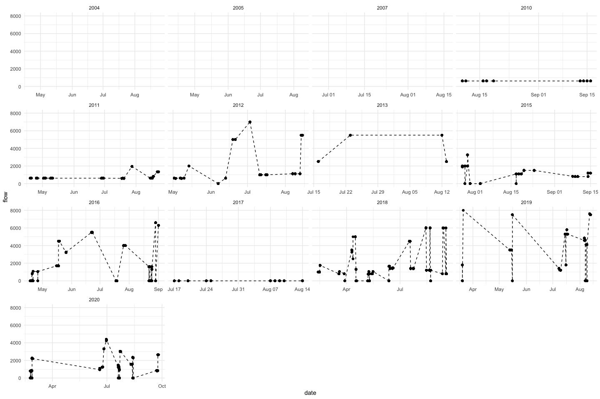
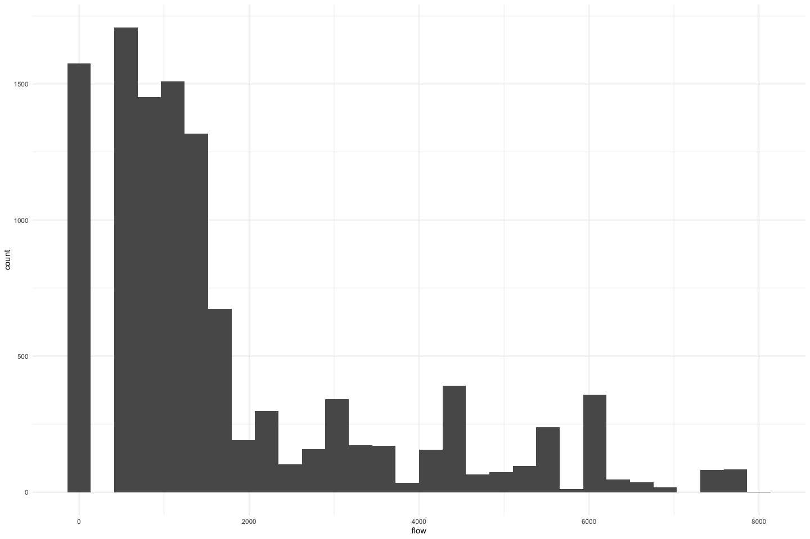
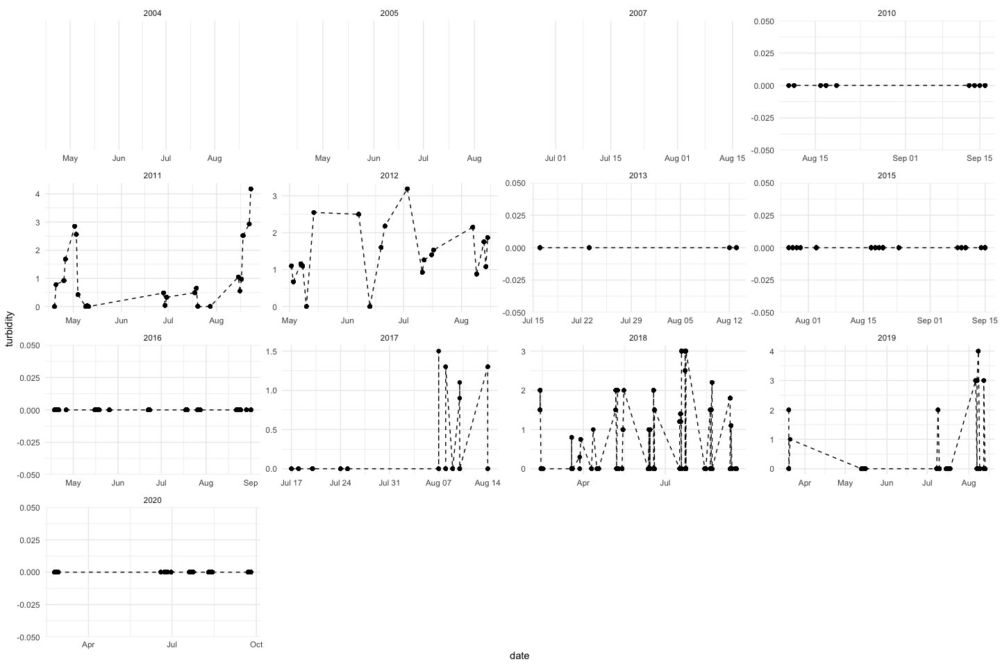
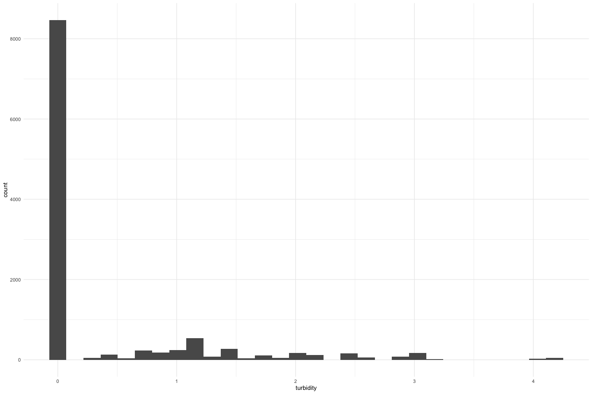
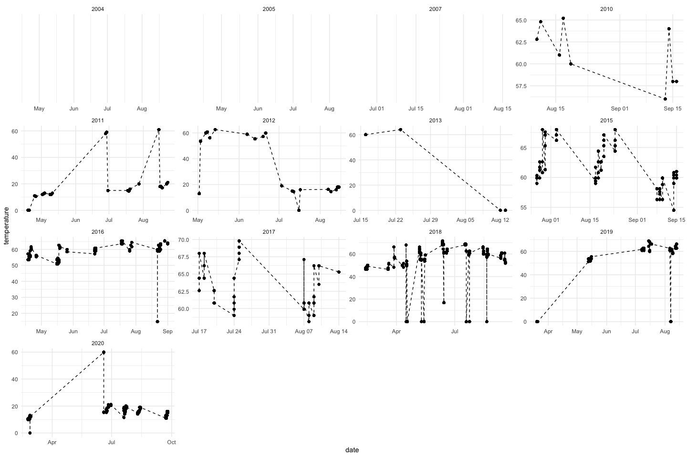
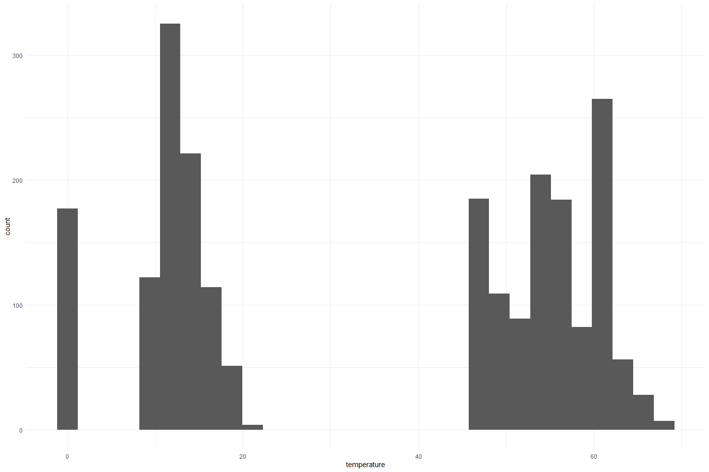
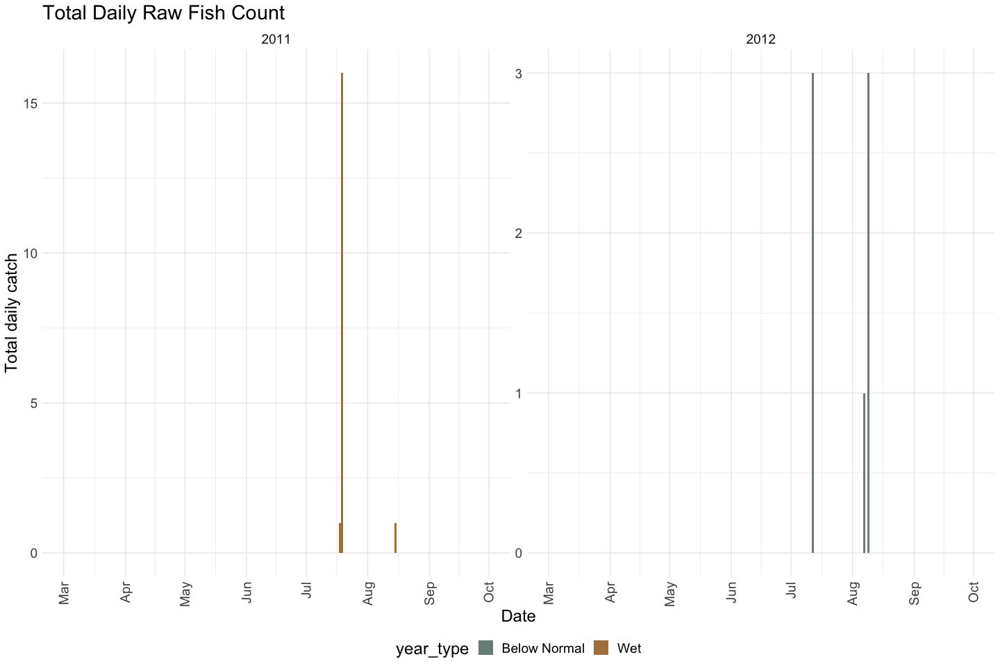
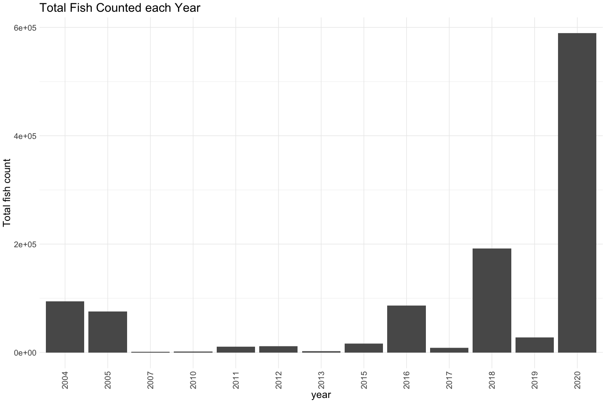
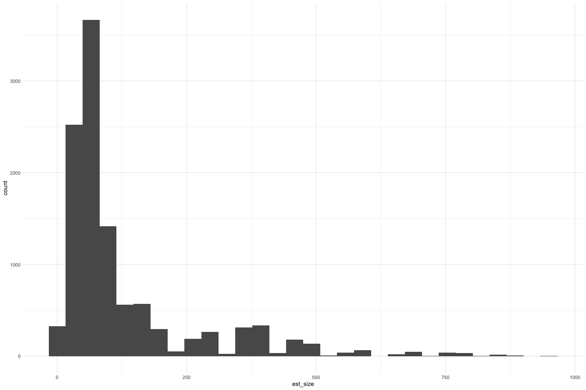
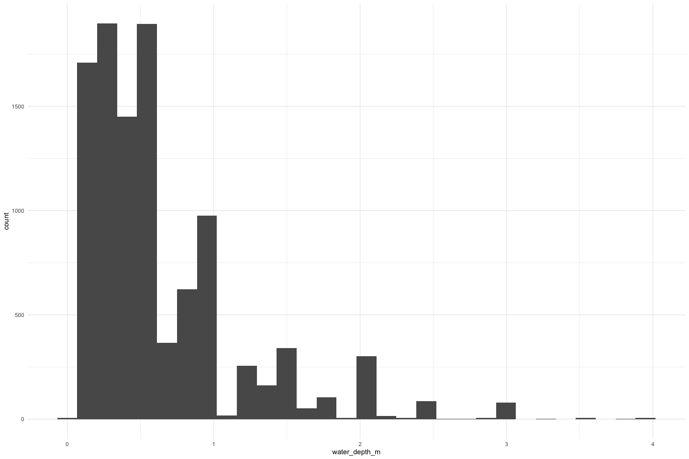

Feather River Snorkel QC
================
Erin Cain
9/29/2021

# Feather River Snorkel Data

## Description of Monitoring Data

Feather River Snorkel Data from 2004 - 2020. This data was provided to
flowwest in an access database Snorkel_Revised.mdb. We queried it to
have all year and important variables. Snorkel data from 1999 - 2003 is
available in a separate access database FR S and S Oroville.mdb

**Timeframe:** 2004 - 2020

**Completeness of Record throughout timeframe:**

Only SR collected are in 2011 and 2012

No environmental data collected pre 2010.

No data for:

- 2006
- 2008
- 2009
- 2014

**Sampling Location:** Feather River

**Data Contact:** [Casey Campos](mailto:Casey.Campos@water.ca.gov)

Any additional info?

## Access Cloud Data

``` r
# Run Sys.setenv() to specify GCS_AUTH_FILE and GCS_DEFAULT_BUCKET before running 
# getwd() to see how to specify paths 
# Open object from google cloud storage
# Set your authentication using gcs_auth
gcs_auth(json_file = Sys.getenv("GCS_AUTH_FILE"))
# Set global bucket 
gcs_global_bucket(bucket = Sys.getenv("GCS_DEFAULT_BUCKET"))
gcs_list_objects()
# git data and save as xlsx
gcs_get_object(object_name = 
                 "juvenile-rearing-monitoring/seine-and-snorkel-data/feather-river/data-raw/feather_snorkel_and_catch.xlsx",
               bucket = gcs_get_global_bucket(),
               saveToDisk = here::here("data-raw", "qc-markdowns", "seine-snorkel-data", "feather-river", "raw_snorkel.xlsx"),
               # saveToDisk = "raw_snorkel.xlsx",
               overwrite = TRUE)
```

Read in data from google cloud, glimpse raw data:

``` r
# read in data to clean 
raw_snorkel <- read_xlsx(here::here("data-raw", "qc-markdowns", "seine-snorkel-data", "feather-river", "raw_snorkel.xlsx")) %>% glimpse
```

    ## Rows: 12,460
    ## Columns: 27
    ## $ SurveyID              <dbl> 1, 1, 1, 1, 1, 1, 1, 1, 1, 1, 1, 1, 1, 1, 1, 1, …
    ## $ Date                  <dttm> NA, NA, NA, NA, NA, NA, NA, NA, NA, NA, NA, NA,…
    ## $ Flow                  <dbl> NA, NA, NA, NA, NA, NA, NA, NA, NA, NA, NA, NA, …
    ## $ `Weather Code`        <chr> NA, NA, NA, NA, NA, NA, NA, NA, NA, NA, NA, NA, …
    ## $ Turbidity             <dbl> NA, NA, NA, NA, NA, NA, NA, NA, NA, NA, NA, NA, …
    ## $ Temperature           <dbl> NA, NA, NA, NA, NA, NA, NA, NA, NA, NA, NA, NA, …
    ## $ `Time of Temperature` <dttm> NA, NA, NA, NA, NA, NA, NA, NA, NA, NA, NA, NA,…
    ## $ `Snorkel StartTtime`  <dttm> NA, NA, NA, NA, NA, NA, NA, NA, NA, NA, NA, NA,…
    ## $ `Snorkel End Time`    <dttm> NA, NA, NA, NA, NA, NA, NA, NA, NA, NA, NA, NA,…
    ## $ `Section Name`        <chr> NA, NA, NA, NA, NA, NA, NA, NA, NA, NA, NA, NA, …
    ## $ `Units Covered`       <chr> NA, NA, NA, NA, NA, NA, NA, NA, NA, NA, NA, NA, …
    ## $ Survey_Comments       <chr> NA, NA, NA, NA, NA, NA, NA, NA, NA, NA, NA, NA, …
    ## $ ObsID                 <dbl> 21, 22, 23, 24, 25, 26, 27, 28, 29, 30, 31, 32, …
    ## $ SID                   <dbl> 1, 1, 1, 1, 1, 1, 1, 1, 1, 1, 1, 1, 1, 1, 1, 1, …
    ## $ Observer              <chr> NA, "RK,BW,KW", NA, NA, NA, NA, NA, "RK,BW,KW", …
    ## $ Unit                  <chr> "29A", "31", "31", "31", "31A", "31A", "31A", "3…
    ## $ Species               <chr> "CHN", "RBTS", "RBTS", "RBTC", "RBTC", "RBTC", "…
    ## $ Count                 <dbl> 100, 1, 1, 7, 7, 1, 1, 25, 75, 2, 300, 12, 30, 2…
    ## $ `Size Class`          <chr> "III", "VI", "VI", "V", "V", "VI", "VI", "I", "I…
    ## $ `Est Size`            <dbl> NA, 600, 500, 350, 350, 550, 600, NA, NA, NA, NA…
    ## $ Substrate             <dbl> NA, NA, NA, NA, NA, NA, NA, NA, NA, NA, NA, NA, …
    ## $ `Instream Cover`      <chr> NA, NA, NA, NA, NA, NA, NA, NA, NA, NA, NA, NA, …
    ## $ `Overhead Cover`      <dbl> NA, NA, NA, NA, NA, NA, NA, NA, NA, NA, NA, NA, …
    ## $ `Hydrology Code`      <chr> NA, NA, NA, NA, NA, NA, NA, NA, NA, NA, NA, NA, …
    ## $ `Water Depth (m)`     <dbl> NA, NA, NA, NA, NA, NA, NA, NA, NA, NA, NA, NA, …
    ## $ `LWD .`               <dbl> NA, NA, NA, NA, NA, NA, NA, NA, NA, NA, NA, NA, …
    ## $ Observation_Comments  <chr> NA, NA, NA, NA, NA, NA, NA, NA, NA, NA, NA, NA, …

## Data transformations

Update column names and column types. Remove sid because it is a
duplicate of survey_id column. Filter to only show chinook salmon.

``` r
cleaner_snorkel_data <- raw_snorkel %>% 
  janitor::clean_names() %>%
  rename(start_time = snorkel_start_ttime, 
         end_time = snorkel_end_time, 
         lwd_number = lwd,
         observation_id = obs_id
        ) %>%
  mutate(date = as.Date(date), 
         start_time = hms::as_hms(start_time), 
         end_time = hms::as_hms(end_time),
         time_of_temperature = hms::as_hms(time_of_temperature),
         survey_id = as.character(survey_id), 
         observation_id = as.character(observation_id),
         substrate = as.character(substrate), 
         overhead_cover = as.character(overhead_cover),
         lwd_number = as.character(lwd_number)) %>% # I think this is some sort of tag number so I am changing to character
  filter(!is.na(date)) |>  # survey ID 1 and 106 do not specify date 
         #species %in% c("CHN", "NONE", "CHNU", "CHNT", "CHNC", "CHNF", "CHNS")) %>% # filter species to relevant values (none is helpful to show they snorkeled and did not see anything)
  mutate(run = case_when(species  == "CHNF" ~ "fall",
                         species == "CHNS" ~ "spring",
                         species %in% c("CHN", "CHNT", "NONE", "CHNU", "CHNC") ~ "unknown"),
         tagged = if_else(grepl('T$', species), TRUE, FALSE),
         clipped = if_else(species == "CHNC", TRUE, FALSE)) %>%
  #select(-observer, -sid, -species) %>% # remove sid because it is the same as survey_id 
  glimpse()
```

    ## Rows: 12,355
    ## Columns: 30
    ## $ survey_id            <chr> "2", "2", "2", "2", "2", "2", "2", "2", "2", "2",…
    ## $ date                 <date> 2007-06-27, 2007-06-27, 2007-06-27, 2007-06-27, …
    ## $ flow                 <dbl> NA, NA, NA, NA, NA, NA, NA, NA, NA, NA, NA, NA, N…
    ## $ weather_code         <chr> NA, NA, NA, NA, NA, NA, NA, NA, NA, NA, NA, NA, N…
    ## $ turbidity            <dbl> NA, NA, NA, NA, NA, NA, NA, NA, NA, NA, NA, NA, N…
    ## $ temperature          <dbl> NA, NA, NA, NA, NA, NA, NA, NA, NA, NA, NA, NA, N…
    ## $ time_of_temperature  <time> NA, NA, NA, NA, NA, NA, NA, NA, NA, NA, NA, NA, …
    ## $ start_time           <time>       NA,       NA,       NA,       NA,       NA…
    ## $ end_time             <time>       NA,       NA,       NA,       NA,       NA…
    ## $ section_name         <chr> NA, NA, NA, NA, NA, NA, NA, NA, NA, NA, NA, NA, N…
    ## $ units_covered        <chr> NA, NA, NA, NA, NA, NA, NA, NA, NA, NA, NA, NA, N…
    ## $ survey_comments      <chr> NA, NA, NA, NA, NA, NA, NA, NA, NA, NA, NA, NA, N…
    ## $ observation_id       <chr> "79", "80", "81", "82", "83", "84", "85", "86", "…
    ## $ sid                  <dbl> 2, 2, 2, 2, 2, 2, 2, 2, 2, 2, 2, 2, 2, 2, 2, 2, 2…
    ## $ observer             <chr> "TV", NA, NA, NA, NA, NA, NA, NA, NA, "KM", NA, N…
    ## $ unit                 <chr> "169", "169", "173", "173", "185", "185", "215B",…
    ## $ species              <chr> "CHN", "RBTS", "CHN", "RBTS", "RBTS", "CHN", "RBT…
    ## $ count                <dbl> 50, 4, 4, 5, 12, 15, 14, 7, 1, 10, 6, 2, 6, 1, 17…
    ## $ size_class           <chr> "III", "IV", "I", "IV", "IV", "III", "IV", "III",…
    ## $ est_size             <dbl> NA, 175, NA, 150, 150, NA, 175, NA, 440, NA, NA, …
    ## $ substrate            <chr> NA, NA, NA, NA, NA, NA, NA, NA, NA, NA, NA, NA, N…
    ## $ instream_cover       <chr> NA, NA, NA, NA, NA, NA, NA, NA, NA, NA, NA, NA, N…
    ## $ overhead_cover       <chr> NA, NA, NA, NA, NA, NA, NA, NA, NA, NA, NA, NA, N…
    ## $ hydrology_code       <chr> NA, NA, NA, NA, NA, NA, NA, NA, NA, NA, NA, NA, N…
    ## $ water_depth_m        <dbl> NA, NA, NA, NA, NA, NA, NA, NA, NA, NA, NA, NA, N…
    ## $ lwd_number           <chr> NA, NA, NA, NA, NA, NA, NA, NA, NA, NA, NA, NA, N…
    ## $ observation_comments <chr> NA, NA, NA, NA, NA, NA, NA, NA, NA, NA, NA, NA, N…
    ## $ run                  <chr> "unknown", NA, "unknown", NA, NA, "unknown", NA, …
    ## $ tagged               <lgl> FALSE, FALSE, FALSE, FALSE, FALSE, FALSE, FALSE, …
    ## $ clipped              <lgl> FALSE, FALSE, FALSE, FALSE, FALSE, FALSE, FALSE, …

## Explore Numeric Variables:

``` r
cleaner_snorkel_data %>% select_if(is.numeric) %>% colnames()
```

    ## [1] "flow"          "turbidity"     "temperature"   "sid"          
    ## [5] "count"         "est_size"      "water_depth_m"

### Variable: `flow`

**Plotting flow over Period of Record**

``` r
cleaner_snorkel_data %>% 
  ggplot(aes(x = date, y = flow)) + 
  geom_line(linetype = "dashed") + 
  geom_point() +
  facet_wrap(~year(date), scales = "free_x") + 
  theme_minimal()
```

<!-- -->

Very inconsistent and sparse flow measures.

``` r
cleaner_snorkel_data %>% 
  ggplot(aes(x = flow)) +
  geom_histogram() + 
  theme_minimal()
```

    ## `stat_bin()` using `bins = 30`. Pick better value with `binwidth`.

<!-- -->

Flow is between 0 - 8000. 0 values must be errors or NA.

**Numeric Summary of flow over Period of Record**

``` r
summary(cleaner_snorkel_data$flow)
```

    ##    Min. 1st Qu.  Median    Mean 3rd Qu.    Max.    NA's 
    ##       0     620    1200    1759    2300    8000     991

**NA and Unknown Values**

- 8 % of values in the `flow` column are NA.

### Variable: `turbidity`

**Plotting turbidity over Period of Record**

``` r
cleaner_snorkel_data %>% 
  ggplot(aes(x = date, y = turbidity)) + 
  geom_line(linetype = "dashed") + 
  geom_point() +
  facet_wrap(~year(date), scales = "free") + 
  theme_minimal()
```

<!-- -->

We only have non zero turbidity values for 2011, 2012, 2017, 2018, and
2019

``` r
cleaner_snorkel_data %>%
  ggplot(aes(x = turbidity)) + 
  geom_histogram() + 
  theme_minimal()
```

    ## `stat_bin()` using `bins = 30`. Pick better value with `binwidth`.

<!-- -->

Most turbidity measures are 0. All fall between 0 and 4.5.

**Numeric Summary of turbidity over Period of Record**

``` r
summary(cleaner_snorkel_data$turbidity)
```

    ##    Min. 1st Qu.  Median    Mean 3rd Qu.    Max.    NA's 
    ##  0.0000  0.0000  0.0000  0.3873  0.0400  4.1800    1088

**NA and Unknown Values**

- 8.8 % of values in the `turbidity` column are NA.

### Variable: `temperature`

TODO: Check that they are in both F and C and then divide appropriately

**Plotting temperature over Period of Record**

``` r
cleaner_snorkel_data %>% 
  ggplot(aes(x = date, y = temperature)) + 
  geom_line(linetype = "dashed") + 
  geom_point() +
  facet_wrap(~year(date), scales = "free") + 
  theme_minimal()
```

<!-- -->

No temp measures before 2010, consistency of temperature measures varies
throughout the years.

``` r
cleaner_snorkel_data %>% 
  ggplot(aes(x = temperature)) +
  geom_histogram() +
  theme_minimal()
```

    ## `stat_bin()` using `bins = 30`. Pick better value with `binwidth`.

<!-- -->

Interesting temperature distribution. I wonder if some measures are in C
and some in F? 0 values are likely also a mistake or NA.

**Numeric Summary of temperature over Period of Record**

``` r
summary(cleaner_snorkel_data$temperature)
```

    ##    Min. 1st Qu.  Median    Mean 3rd Qu.    Max.    NA's 
    ##    0.00   16.50   55.40   42.04   61.00   71.60     998

**NA and Unknown Values**

- 8.1 % of values in the `temperature` column are NA.

### Variable: `count`

**Plotting count over Period of Record**

``` r
cleaner_snorkel_data %>% 
  filter(run == "spring") %>%
  group_by(date) %>%
  summarise(total_daily_catch = sum(count, na.rm = T)) %>%
  # filter(year(date) > 2014, year(date) < 2021) %>%
  mutate(water_year = ifelse(month(date) %in% 10:12, year(date) + 1, year(date))) %>% 
  left_join(sac_indices) %>%
  mutate(year = as.factor(year(date)),
         fake_year = if_else(month(date) %in% 10:12, 1900, 1901),
         fake_date = as.Date(paste0(fake_year,"-", month(date), "-", day(date)))) %>%
  ggplot(aes(x = fake_date, y = total_daily_catch, fill = year_type)) + 
  geom_col() + 
  scale_x_date(labels = date_format("%b"), limits = c(as.Date("1901-03-01"), as.Date("1901-10-01")), date_breaks = "1 month") + 
  theme_minimal() + 
  theme(text = element_text(size = 18),
        axis.text.x = element_text(angle = 90, vjust = 0.5, hjust=1),
        legend.position = "bottom") + 
  labs(title = "Total Daily Raw Fish Count",
       y = "Total daily catch",
       x = "Date")+ 
  facet_wrap(~water_year, scales = "free") + 
  scale_fill_manual(values = wesanderson::wes_palette("Moonrise2", 5, type = "continuous"))
```

    ## Joining with `by = join_by(water_year)`

<!-- -->

Very few SR fish, only caught SR in 2011 and 2012.

``` r
cleaner_snorkel_data  %>%
  mutate(year = as.factor(year(date))) %>%
  ggplot(aes(x = year, y = count)) + 
  geom_col() + 
  theme_minimal() +
  labs(title = "Total Fish Counted each Year",
       y = "Total fish count") + 
  theme(text = element_text(size = 18),
        axis.text.x = element_text(angle = 90, vjust = 0.5, hjust=1)) 
```

<!-- -->

**Numeric Summary of count over Period of Record**

``` r
summary(cleaner_snorkel_data$count)
```

    ##     Min.  1st Qu.   Median     Mean  3rd Qu.     Max.     NA's 
    ##     0.00     1.00     4.00    92.64    20.00 30000.00      331

**NA and Unknown Values**

- 2.7 % of values in the `count` column are NA.

### Variable: `est_size`

TODO figure out what size is describing. Is it length? or weight?

**Plotting est_size over Period of Record**

``` r
cleaner_snorkel_data %>% 
  ggplot(aes(x = est_size)) + 
  geom_histogram() + 
  theme_minimal()
```

    ## `stat_bin()` using `bins = 30`. Pick better value with `binwidth`.

<!-- -->

Estimated sizes fall between 0 and 1000. Again we need to figure out
what type of size variable they are estimating

**Numeric Summary of est_size over Period of Record**

``` r
summary(cleaner_snorkel_data$est_size)
```

    ##    Min. 1st Qu.  Median    Mean 3rd Qu.    Max.    NA's 
    ##     0.0    45.0    75.0   127.4   125.0   950.0    1202

**NA and Unknown Values**

- 9.7 % of values in the `est_size` column are NA.

### Variable: `water_depth_m`

Depth of water, units: m

**Plotting water depth over Period of Record**

``` r
cleaner_snorkel_data %>% 
  ggplot(aes(x = water_depth_m)) + 
  geom_histogram() + 
  theme_minimal()
```

    ## `stat_bin()` using `bins = 30`. Pick better value with `binwidth`.

<!-- -->
Depth of water is between 0 and 3 meters.

**Numeric Summary of depth of water over Period of Record**

``` r
summary(cleaner_snorkel_data$water_depth_m)
```

    ##    Min. 1st Qu.  Median    Mean 3rd Qu.    Max.    NA's 
    ##  0.0500  0.3000  0.5000  0.6443  0.8000  4.0000    1989

**NA and Unknown Values**

- 16.1 % of values in the `water_depth_m` column are NA.

## Explore Categorical variables:

``` r
cleaner_snorkel_data %>% select_if(is.character) %>% colnames()
```

    ##  [1] "survey_id"            "weather_code"         "section_name"        
    ##  [4] "units_covered"        "survey_comments"      "observation_id"      
    ##  [7] "observer"             "unit"                 "species"             
    ## [10] "size_class"           "substrate"            "instream_cover"      
    ## [13] "overhead_cover"       "hydrology_code"       "lwd_number"          
    ## [16] "observation_comments" "run"

### Variable: `survey_id`

Each row does not correspond to a unique survey.

``` r
length(unique(cleaner_snorkel_data$survey_id)) == length(cleaner_snorkel_data)
```

    ## [1] FALSE

There are 560 unique survey ids

**NA and Unknown Values**

- 0 % of values in the `survey_id` column are NA.

### Variable: `weather_code`

No lookup table for weather codes provided. However, they are fairly
easy to interperate. Would be best if we could get weather codes
standardized throughout and condense these down.

``` r
table(cleaner_snorkel_data$weather_code) 
```

    ## 
    ##                        CLD CLD, Wind, Light Sprinkles 
    ##                        697                         20 
    ##                 CLD, Windy     CLD/ RAIN INTERMITTENT 
    ##                         17                          4 
    ##                  CLD/ WIND                   CLD/RAIN 
    ##                         12                         94 
    ##                    CLD/Sun                       CLDY 
    ##                         34                         38 
    ##                        CLR                  CLR (Hot) 
    ##                       8167                         46 
    ##                     CLR 95                    CLR Hot 
    ##                         17                         47 
    ##                    CLR HOT                 CLR smokey 
    ##                        190                         11 
    ##                  CLR WINDY                    CLR/CLD 
    ##                         24                         30 
    ##                    CLR/Hot                   CLR/WIND 
    ##                         59                          7 
    ##                       Hazy                   Hazy/CLR 
    ##                         60                         27 
    ##                Hot and CLR                LT CLD/HAZE 
    ##                         19                          9 
    ##                    LT RAIN                   Pt. Cldy 
    ##                          6                         72 
    ##                   PT. CLDY                       RAIN 
    ##                         21                          6 
    ##                        RAN                      Smoke 
    ##                         90                         38 
    ##                Smokey Haze                        sun 
    ##                         20                         31 
    ##                        Sun                        SUN 
    ##                         25                       1283 
    ##                      SUNNY                        WND 
    ##                         25                         43

Fix inconsistencies with spelling, capitalization, and abbreviations.

``` r
cleaner_snorkel_data$weather_code <- case_when(cleaner_snorkel_data$weather_code %in% c("CLD", "CLDY") ~ "cloudy", 
                                               cleaner_snorkel_data$weather_code %in% c("CLR (Hot)", "CLR/Hot", "Hot and CLR", "CLR Hot") ~ "clear and hot",
                                               cleaner_snorkel_data$weather_code %in% c("RAIN", "RAN", "CLD/RAIN", "LT RAIN", "CLD, Wind, Light Sprinkles") ~
                                                 "precipitation",
                                               cleaner_snorkel_data$weather_code %in% c("CLR 95", "CLR") ~ "clear",
                                               cleaner_snorkel_data$weather_code %in% c("PT. CLDY", "CLR/CLD") ~ "partly cloudy",
                                               cleaner_snorkel_data$weather_code %in% c("sun", "SUN") ~ "sunny",
                                               cleaner_snorkel_data$weather_code == c("CLR WINDY") ~ "clear and windy",
                                               cleaner_snorkel_data$weather_code == c("WND") ~ "windy",
                                               cleaner_snorkel_data$weather_code == c("LT CLD/HAZE") ~ "hazy")

table(cleaner_snorkel_data$weather_code) 
```

    ## 
    ##           clear   clear and hot clear and windy          cloudy            hazy 
    ##            8184             171              24             735               9 
    ##   partly cloudy   precipitation           sunny           windy 
    ##              51             216            1314              43

I would still like to simplify these down more but this is better for
now.

**NA and Unknown Values**

- 13 % of values in the `weather_code` column are NA.

### Variable: `section_name`

Cleaned up section names, TODO need more information to decide if we can
combine some of these section names.

``` r
format_site_name <- function(string) {
  clean <- 
    str_replace_all(string, "'", "") %>%
    str_replace_all("G-95", "G95") %>% 
    str_replace_all("[^[:alnum:]]", " ") %>% 
    trimws() %>% 
    stringr::str_squish() %>%
    stringr::str_to_title()
}

cleaner_snorkel_data$section_name <- format_site_name(cleaner_snorkel_data$section_name)
table(cleaner_snorkel_data$section_name)
```

    ## 
    ##                                 Aleck                          Aleck Riffle 
    ##                                   136                                   132 
    ##                            Auditorium                     Auditorium Riffle 
    ##                                   113                                   116 
    ##                       Bed Rock Riffle                               Bedrock 
    ##                                    22                                   141 
    ##                          Bedrock Park                        Bedrock Riffle 
    ##                                    87                                    97 
    ##                            Big Riffle                   Big Riffle Bayou Rl 
    ##                                   372                                    44 
    ##              Big Riffle Downstream Rl                             Bigriffle 
    ##                                    31                                    21 
    ##                              Cox Flat                                   Eye 
    ##                                    23                                   168 
    ##                            Eye Riffle                                   G95 
    ##                                   410                                   251 
    ##                              G95 Side                      G95 Side Channel 
    ##                                    69                                    83 
    ##                         G95 Side West                 G95 West Side Channel 
    ##                                    13                                     9 
    ##                               Gateway                        Gateway Riffle 
    ##                                   397                                    80 
    ##                                 Goose                          Goose Riffle 
    ##                                   154                                   147 
    ##                        Gridley Riffle                    Gridley S C Riffle 
    ##                                   249                                    15 
    ##                  Gridley Side Channel             Hatchery And Moes Ditches 
    ##                                   108                                    47 
    ##       Hatchery And Moes Side Channels                        Hatchery Ditch 
    ##                                    65                                   322 
    ##               Hatchery Ditch And Moes         Hatchery Ditch And Moes Ditch 
    ##                                   156                                    51 
    ## Hatchery Ditch Lower Moes Ditch Upper                   Hatchery Ditch Moes 
    ##                                     3                                   108 
    ##             Hatchery Ditch Moes Ditch                       Hatchery Riffle 
    ##                                    29                                   341 
    ##         Hatchery Side Ch Moes Side Ch                 Hatchery Side Channel 
    ##                                   110                                   108 
    ##        Hatchery Side Channel And Moes  Hatchery Side Channel And Moes Ditch 
    ##                                     5                                    46 
    ##      Hatchery Side Channel Moes Ditch                   Hatchery Side Ditch 
    ##                                     7                                    49 
    ##                     Herringer Pond Rl           Hidden Gridley Side Channel 
    ##                                     8                                    61 
    ##                  Hour To Palm Side Rl                              Junkyard 
    ##                                     6                                   450 
    ##                       Junkyard Riffle                               Keister 
    ##                                   297                                   288 
    ##                        Keister Riffle                       Lower Mcfarland 
    ##                                   174                                   419 
    ##                        Lower Robinson                               Mathews 
    ##                                    35                                    63 
    ##                        Mathews Riffle                              Matthews 
    ##                                    12                                   101 
    ##                       Matthews Riffle                                  Moes 
    ##                                   123                                    22 
    ##                            Moes Ditch                     Moes Side Channel 
    ##                                    15                                     2 
    ##             River Bend Upstream Beach                              Robinson 
    ##                                     4                                   254 
    ##                       Robinson Riffle                             Section 2 
    ##                                   233                                     5 
    ##                                 Steep                          Steep Riffle 
    ##                                   311                                   312 
    ##                          Trailer Park                   Trailer Park Riffle 
    ##                                   299                                    66 
    ##                         Trailer Parkk                  Upper Hatchery Ditch 
    ##                                     7                                     4 
    ##            Upper Hour Side Channel Rl                       Upper Mcfarland 
    ##                                     2                                    37 
    ##                                 Vance                            Vance East 
    ##                                    22                                    11 
    ##                          Vance Riffle                        Vance W Riffle 
    ##                                    13                                     6 
    ##                            Vance West                     Vance West Riffle 
    ##                                   163                                    23

**NA and Unknown Values**

- 28.9 % of values in the `section_name` column are NA.

### Variable: `units_covered`

A lot of units described here. If multiple units are covered they are
listed.

``` r
unique(cleaner_snorkel_data$units_covered)[1:10]
```

    ##  [1] NA                       "26,33,30,31,31a,32,32a" "33 26"                 
    ##  [4] "323A 323B"              "19 23 24 25"            "28"                    
    ##  [7] "55 56"                  "96 97 98"               "119 120"               
    ## [10] "189 185"

There are 166 unique groups units covered.

**NA and Unknown Values**

- 29.8 % of values in the `units_covered` column are NA.

### Variable: `survey_comments` `observation_comments`

``` r
unique(cleaner_snorkel_data$survey_comments)[1:5]
```

    ## [1] NA                                                                                                                                              
    ## [2] "turbid/muddy"                                                                                                                                  
    ## [3] "No fish observed in unit 216"                                                                                                                  
    ## [4] "One Lonely Salmon, No fish observed in unit 424"                                                                                               
    ## [5] "Observations highly affected by poor Visibility. Walking on the shore, several hundred salmon observed were not observed by snorkeling methods"

``` r
unique(cleaner_snorkel_data$observation_comments)[1:5]
```

    ## [1] NA                                               
    ## [2] "Just upstream of culvert-used as instream cover"
    ## [3] "VISUAL OBSERVATION NOTICED WHEN WALKING"        
    ## [4] "Spawning pair- digging redds"                   
    ## [5] "Spawning pair -digging redds"

**NA and Unknown Values**

- 83.1 % of values in the `survey_comments` column are NA.

- 97.3 % of values in the `observation_comments` column are NA.

### Variable: `observation_id`

Each row does not correspond to a unique observation.

``` r
length(unique(cleaner_snorkel_data$observation_id)) == length(cleaner_snorkel_data)
```

    ## [1] FALSE

There are 12355 unique observation ids

- 0 % of values in the `observation_id` column are NA.

### Variable: `unit`

``` r
table(cleaner_snorkel_data$unit) 
```

    ## 
    ##     1    10   100   102   103   104   105   106   107   108    11   119    12 
    ##     1     1     2     2   100   160   111     1     2     2     1   344     1 
    ##   120   121  121A   122   123   124   125   126   127   161   162   163   164 
    ##    90     2    20    19    13    18     3     1     3     1     1     1     1 
    ##   165   166   167   169   170   171   172   173   174   175   176   177   178 
    ##     2     4     1   116    63   150    36   185    97   119    10     7     5 
    ##   179   180   183   185   189    19   191   192   193   197   198   199    20 
    ##     2     2     8   231   718   123     1     1     1     1     1     1     2 
    ##   200   205   207   208    21   210   213   215  215A  215B   216   217    22 
    ##    21    12     2     1     5   452     1    26   153   124    89   139     4 
    ##   221   224   225   226   227   228   229    23   233   235   236   237    24 
    ##    82     1    61   118     2   151   146   126     1     1     1     1   178 
    ##   241    25    26   266   267   268   269    27   270   271  272B  273B  274B 
    ##     1   111   681    56     2   205     1   121     1     1     1     1     1 
    ##   275   276   278    28   282   283   284   288   289    29   290   294   295 
    ##     1     1     1   169     1     1     1     1     1   142     1     1     1 
    ##   296   297   299   29A    30   303   304   305   306   308   309    31   310 
    ##     1     1     1    20   111     1     1     1     1     1     1   125     1 
    ##   311   31A    32  323A  323B   328  329B   32A    33   330   331   334   335 
    ##     1    10   162   269   205     2     1    20   925     1     1     1     2 
    ##   336   337    34    35   351   352   355   356   358   359    36   361   362 
    ##     1     1     1     1     1     1     1     1     1     1     1     1     1 
    ##   364   365   367   368    37   370    38   387   388    39   397   402   403 
    ##     1     1     1     1     1     1     2     1     1     2    40   258   194 
    ##   405   406   407   408   409   410   411   412   413    42   424   426   441 
    ##     1     1     1   334     3     4     4     2     3     2   210   254    40 
    ##   445   446   448   449   450   451   452   453   454    46   483   484   485 
    ##    30     1     1     8   442    24     4     4     1     1     1     2     3 
    ##   486   487  487B   499     5    50   500   502    51    52    54    55    56 
    ##   235   191     8   487     1     1     6   296     3     2    43   114   361 
    ##    59     6     7     8     9    96    97    98   BRB    CF  HGSC  HPRL HTPSC 
    ##     1     1     1     1     1   251   106   127    44    23    61     8     6 
    ##  RBUB  SEC2  UHSC 
    ##     4     5     2

There are 212 unique units covered.

**NA and Unknown Values**

- 0.1 % of values in the `unit` column are NA.

This is pulled from a lookup table in the database.

### Variable: `size_class`

| Size Class | Size Range |
|------------|------------|
| I          | 0-50       |
| II         | 51-75      |
| III        | 76-100     |
| IV         | 101-150    |
| V          | 151-300    |
| VI         | 301-499    |
| VII        | 500+       |

``` r
table(cleaner_snorkel_data$size_class) 
```

    ## 
    ##   I  II III  IV   V  VI VII 
    ## 959 891 677 629 382 250  95

**NA and Unknown Values**

- 68.6 % of values in the `size_class` column are NA.

### Variable: `substrate`

| SubstrateCode | Substrate                    |
|---------------|------------------------------|
| 1             | Organic Fines, Mud (0.05 mm) |
| 2             | Sand (0.05 to 2 mm)          |
| 3             | Small Gravel (2 to 50 mm)    |
| 4             | Large Gravel (50 to 150 mm)  |
| 5             | Cobble (150 to 300 mm)       |
| 6             | Boulder (\> 300 mm)          |
| 0             | ?                            |

It appears that if more than one substrate is present they list all by
creating multi-didget numbers. Not sure what 0 stands for? TODO

``` r
table(cleaner_snorkel_data$substrate) 
```

    ## 
    ##     0     1    12   123  1234 12345  1235   124  1245   125  1256   126    13 
    ##     4   351   659   412   110     5     2    99    23    12     2    44   211 
    ##   134  1345   135    14   145  1453  1456    15   156    16     2    23   234 
    ##   161    13     5    64    79     6    10    17    15    44   933  1091   678 
    ##  2344  2345 23456   235    24   245    25   256    26     3    34   345  3456 
    ##     1    46     6     5    65    22    46     8     4  1611  1141   296    22 
    ##   346    35   350   356     4    41    45   456     5    56     6 
    ##     2    10     1    11  1189     1   341   105   309    40    21

What is the best way to show multiple substrates at different sites? In
the seine data they have many substrate columns but I do not think I
like that better.

**NA and Unknown Values**

- 16.2 % of values in the `substrate` column are NA.

### Variable: `instream_cover`

| ICoverCode | ICover                                           |
|------------|--------------------------------------------------|
| A          | No apparent cover                                |
| B          | Small instream objects/small-medium woody debris |
| C          | Large instream objects/large woody debris        |
| D          | Overhead objects                                 |
| E          | Submerged aquatic veg/filamentous algae          |
| F          | Undercut bank                                    |

Instream cover appears to use a similar method as substrate where they
add letters on if multiple covers are present.

``` r
table(cleaner_snorkel_data$instream_cover) 
```

    ## 
    ##     0     A    AE     B    BC   BCD  BCDE BCDEF  BCDF   BCE  BCED  BCEF   BCF 
    ##     3  3122    15  1306   180   159   344    58     9   424     3    24     7 
    ##    BD   BDE  BDEF   BDF    BE   BEC   BED   BEF  BEFD    BF    BG     C    CB 
    ##   128   409    52    32  1063     8    26    31     1    36     1   507     5 
    ##   CBE    CC    CD   CDE  CDEF   CDF    CE   CED   CEF    CF     D    DE     E 
    ##     2     1    34    40     3     3   387    12    19    13    32    17  1588 
    ##    EA    EB   EBC    EC   ECF  EDBC    EF   EFB   EFD     F    FB   FBD    FE 
    ##     1    58     2    36     1     3    52     1     5    54     1     1     1 
    ##   FEB     R 
    ##    10     1

What is the best way to display/simplify these?

**NA and Unknown Values**

- 16.4 % of values in the `instream_cover` column are NA.

### Variable: `overhead_cover`

| OCoverCode | OCover                                        |
|------------|-----------------------------------------------|
| 0          | No Apparent Cover                             |
| 1          | Overhanging veg/obj (\< 0.5 m above surface)  |
| 2          | Overhanging veg/obj (0.5 to 2 m above surface |
| 3          | Surface turbulence, bubble curtain            |

Overhead cover appears to use a similar method as substrate and instream
cover where they add letters on if multiple covers are present.

``` r
table(cleaner_snorkel_data$overhead_cover) 
```

    ## 
    ##    0    1   12  123   13    2    3    4 
    ## 5279 3854   69    1   17  972  130    3

**NA and Unknown Values**

- 16.4 % of values in the `overhead_cover` column are NA.

### Variable: `hydrology_code`

Looks like these are already defined for the most part, GM = Glide
Edgewater so we can change that.

``` r
table(cleaner_snorkel_data$hydrology_code) 
```

    ## 
    ##        Backwater                G            Glide  Glide Edgewater 
    ##             1255                1             2216             3570 
    ##               GM             Pool           Riffle Riffle Edgewater 
    ##                1              431             1572             1317 
    ##                W 
    ##                2

Fix inconsistencies with spelling, capitalization, and abbreviations.

``` r
cleaner_snorkel_data$hydrology_code <- ifelse(cleaner_snorkel_data$hydrology_code == "GM", "Glide Edgewater", cleaner_snorkel_data$hydrology_code)

table(cleaner_snorkel_data$hydrology_code) 
```

    ## 
    ##        Backwater                G            Glide  Glide Edgewater 
    ##             1255                1             2216             3571 
    ##             Pool           Riffle Riffle Edgewater                W 
    ##              431             1572             1317                2

- 16.1 % of values in the `hydrology_code` column are NA.

### Variable: `lwd_number`

I am not sure what this number is refering to, TODO

``` r
table(cleaner_snorkel_data$lwd_number) 
```

    ## 
    ##     0     1  2001  2002  2003  3001  3002  3003  3004  3005  3006  3007  3008 
    ## 11010     1     1     1     1     5    10    21     6     5    27    17     5 
    ##  3009  3010  3011  3012  3013  3014  3015  3016  3017  3018  3019  3020  3021 
    ##     6    17     2     3     3     5     5     3     5    15     5    11    10 
    ##  3022  3023  3024  3026 
    ##     7     1     2     4

**NA and Unknown Values**

- 9.2 % of values in the `lwd_number` column are NA.

### Variable: `run`

Chinook Run

``` r
table(cleaner_snorkel_data$run) 
```

    ## 
    ##    fall  spring unknown 
    ##       2      13    2738

**NA and Unknown Values**

- 77.7 % of values in the `run` column are NA.

Only 13 identified SR fish. This data may not be very helpful for us in
the JPE

### Variable: `tagged`

If the fish is tagged or not

``` r
table(cleaner_snorkel_data$tagged) 
```

    ## 
    ## FALSE  TRUE 
    ## 12076   279

**NA and Unknown Values**

- 0 % of values in the `tagged` column are NA.

### Variable: `clipped`

If the fish has a clipped fin or not

``` r
table(cleaner_snorkel_data$clipped) 
```

    ## 
    ## FALSE  TRUE 
    ## 12092    22

**NA and Unknown Values**

- 2 % of values in the `clipped` column are NA.

## Summary of identified issues

- Snorkel surveys are not done every year in the timeframe
- Environmental data very sparse, especially in early years
- Still a few unknown columns that we need to define and understand
- Figure out the best way to display and standardize substrate and cover
  information
- Very few Spring Run Chinook (13)
- Detailed information on location split up into units and sections,
  TODO need to improve organization in these settings

## Save cleaned data back to google cloud

``` r
f <- function(input, output) write_csv(input, file = output)
gcs_upload(cleaner_snorkel_data,
           object_function = f,
           type = "csv",
           name = "juvenile-rearing-monitoring/seine-and-snorkel-data/feather-river/data-raw/post_2004_snorkel.csv",
           predefinedAcl = "bucketLevel")
```
