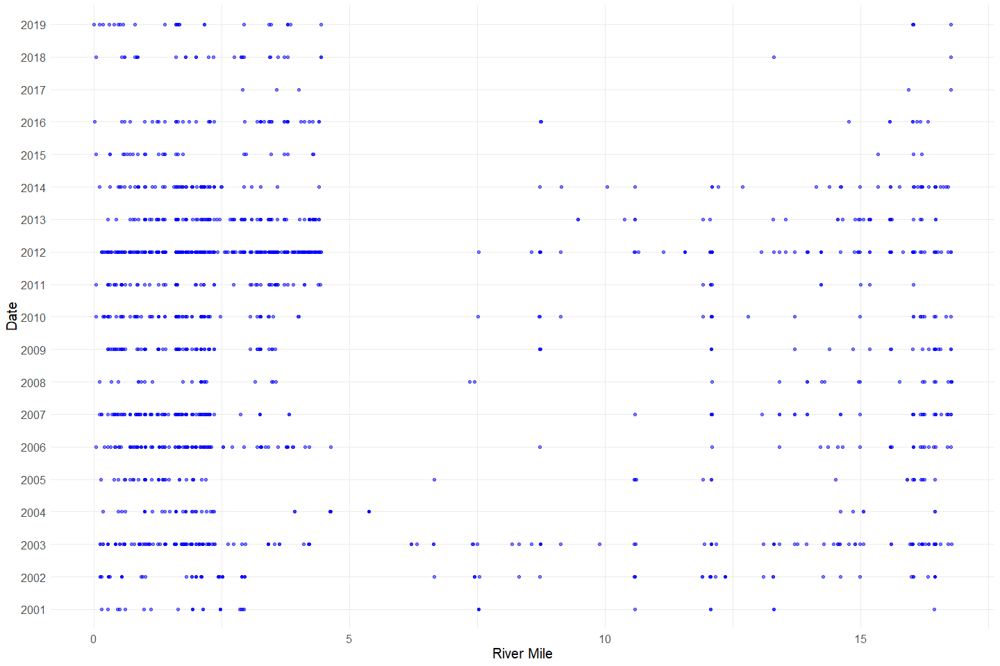
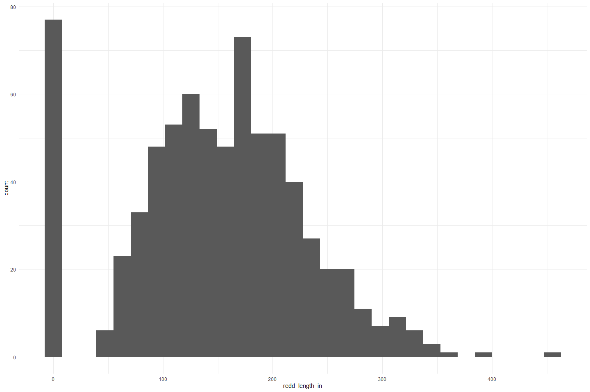
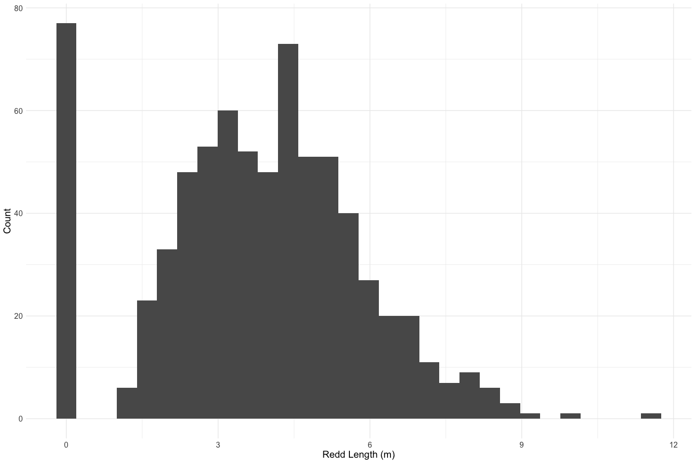
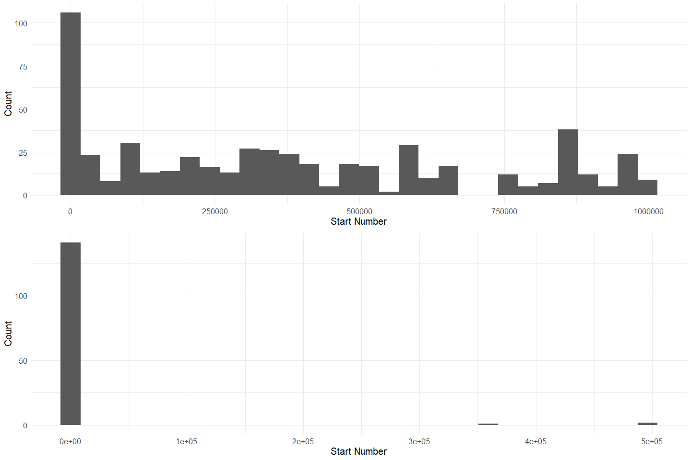
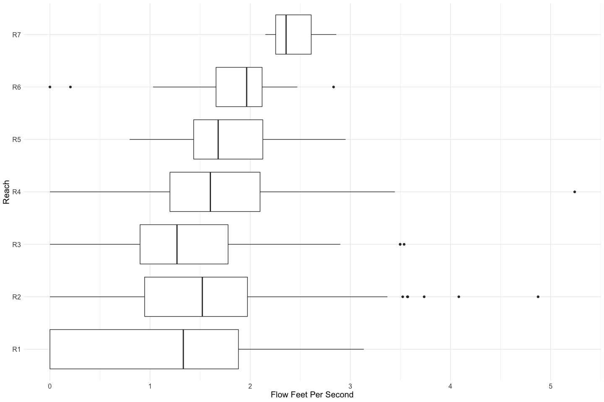
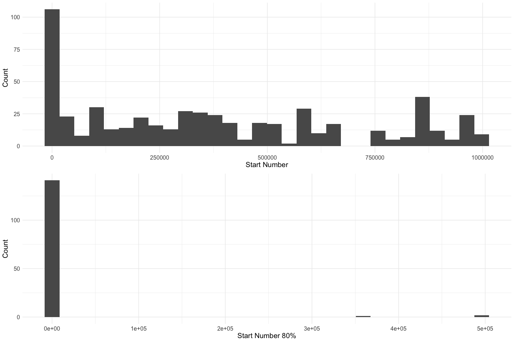

Battle Creek Redd Survey QC
================
Erin Cain
9/29/2021

# Battle Creek Redd Survey

## Description of Monitoring Data

These data were acquired via snorkel and kayak surveys on Battle Creek
from 2001 to 2019. Red location, size, substrate and flow were measured.
Annual monitoring questions and conditions drove the frequency and
detail of individual redd measurements.

**Timeframe:** 2001 - 2019

**Survey Season:** September - October

**Completeness of Record throughout timeframe:** Sampled each year

**Sampling Location:** Battle Creek

**Data Contact:** [Natasha Wingerter](mailto:natasha_wingerter@fws.gov);
[RJ Bottaro](mailto:rj_bottaro@fws.gov)

## Access Cloud Data

``` r
# Run Sys.setenv() to specify GCS_AUTH_FILE and GCS_DEFAULT_BUCKET before running 
# getwd() to see how to specify paths 
# Open object from google cloud storage
# Set your authentication using gcs_auth
gcs_auth(json_file = Sys.getenv("GCS_AUTH_FILE"))
# Set global bucket 
gcs_global_bucket(bucket = Sys.getenv("GCS_DEFAULT_BUCKET"))

# git data and save as xlsx
```

Read in data from google cloud, glimpse sheets and raw data:

``` r
sheets <- excel_sheets("raw_adult_spawn_hold_carcass.xlsx")
sheets 
```

    ## [1] "Notes and Metadata"    "Redd Survey"           "Carcass"              
    ## [4] "Live Holding Spawning"

``` r
raw_redd_data <-read_excel("raw_adult_spawn_hold_carcass.xlsx", 
                           sheet = "Redd Survey",
                           col_types = c("text", "numeric", "numeric", "numeric", "date", 
                                         "text", "numeric", "text", "text", "text", "text", 
                                         "text", "text", "text", "date", "numeric", "numeric", 
                                         "numeric", "numeric", "numeric", "text", "numeric", "numeric",
                                         "numeric", "numeric", "numeric", "numeric", "numeric", "text")) %>% glimpse()
```

    ## Rows: 1,605
    ## Columns: 29
    ## $ Project     <chr> "Snorkel", "Snorkel", "Snorkel", "Snorkel", "Snorkel", "Sn…
    ## $ LONGITUDE   <dbl> -121.9688, -121.9742, -121.9742, -121.9688, -121.9688, -12…
    ## $ LATITUDE    <dbl> 40.40218, 40.40279, 40.40279, 40.40218, 40.40218, 40.41850…
    ## $ YEAR        <dbl> 2001, 2001, 2001, 2001, 2001, 2001, 2001, 2001, 2001, 2001…
    ## $ Sample_Date <dttm> 2001-09-18, 2001-10-03, 2001-10-03, 2001-10-03, 2001-10-0…
    ## $ REACH       <chr> "R3", "R3", "R3", "R3", "R3", "R1", "R1", "R1", "R1", "R2"…
    ## $ RIVER_MILE  <dbl> 2.48, 2.14, 2.14, 2.48, 2.48, 2.94, 2.91, 2.88, 2.85, 1.64…
    ## $ Species_Run <chr> "SCS", "SCS", "SCS", "SCS", "SCS", "SCS", "SCS", "SCS", "S…
    ## $ PRE_SUB     <chr> NA, NA, NA, NA, NA, NA, NA, NA, NA, NA, NA, NA, NA, NA, NA…
    ## $ SIDES_SUB   <chr> NA, NA, NA, NA, NA, NA, NA, NA, NA, NA, NA, NA, NA, NA, NA…
    ## $ TAIL_SUB    <chr> NA, NA, NA, NA, NA, NA, NA, NA, NA, NA, NA, NA, NA, NA, NA…
    ## $ FOR_        <chr> "UNK", "UNK", "UNK", "UNK", "UNK", "UNK", "UNK", "UNK", "U…
    ## $ MEASURE     <chr> "NO", "YES", "YES", "YES", "YES", "NO", "NO", "NO", "NO", …
    ## $ WHY_NOT_ME  <chr> "UNK", "UNK", "UNK", "UNK", "UNK", "UNK", "UNK", "UNK", "U…
    ## $ DATE_MEASU  <dttm> NA, 2001-10-03, 2001-10-03, 2001-10-03, 2001-10-03, NA, N…
    ## $ PRE_DEPTH   <dbl> NA, NA, NA, NA, NA, NA, NA, NA, NA, 18, 16, NA, NA, NA, NA…
    ## $ PIT_DEPTH   <dbl> NA, NA, NA, NA, NA, NA, NA, NA, NA, 23, 21, NA, NA, NA, NA…
    ## $ TAIL_DEPTH  <dbl> NA, NA, NA, NA, NA, NA, NA, NA, NA, 11, 10, NA, NA, NA, NA…
    ## $ LENGTH_IN   <dbl> NA, NA, NA, NA, NA, NA, NA, NA, NA, 77, 166, NA, NA, NA, N…
    ## $ WIDTH_IN    <dbl> NA, NA, NA, NA, NA, NA, NA, NA, NA, 37, 129, NA, NA, NA, N…
    ## $ FLOW_METER  <chr> NA, NA, NA, NA, NA, NA, NA, NA, NA, NA, NA, NA, NA, NA, NA…
    ## $ FLOW_FPS    <dbl> NA, NA, NA, NA, NA, NA, NA, NA, NA, NA, NA, NA, NA, NA, NA…
    ## $ START       <dbl> NA, NA, NA, NA, NA, NA, NA, NA, NA, NA, NA, NA, NA, NA, NA…
    ## $ END_        <dbl> NA, NA, NA, NA, NA, NA, NA, NA, NA, NA, NA, NA, NA, NA, NA…
    ## $ TIME_       <dbl> NA, NA, NA, NA, NA, NA, NA, NA, NA, NA, NA, NA, NA, NA, NA…
    ## $ START_80    <dbl> NA, NA, NA, NA, NA, NA, NA, NA, NA, NA, NA, NA, NA, NA, NA…
    ## $ END_80      <dbl> NA, NA, NA, NA, NA, NA, NA, NA, NA, NA, NA, NA, NA, NA, NA…
    ## $ SECS_80_    <dbl> NA, NA, NA, NA, NA, NA, NA, NA, NA, NA, NA, NA, NA, NA, NA…
    ## $ Comments    <chr> "wp 66", "wp 65; unable to associate measurements with ind…

## Data transformations

``` r
cleaner_redd_data <- raw_redd_data %>% 
  janitor::clean_names() %>% 
  rename("date" = sample_date,
         "fish_guarding" = `for`, 
         "redd_measured" = measure, 
         "why_not_measured" = why_not_me,
         "date_measured" = date_measu, 
         "pre_redd_substrate_size" = pre_sub, 
         "redd_substrate_size" = sides_sub, 
         "tail_substrate_size" = tail_sub,
         "pre_redd_depth" = pre_depth, 
         "redd_pit_depth" = pit_depth, 
         "redd_tail_depth" = tail_depth,
         "redd_length" = length_in, 
         "redd_width" = width_in,
         "start_number_flow_meter" = start, 
         "end_number_flow_meter" = end,
         "flow_meter_time" = time,
         "start_number_flow_meter_80" = start_80, 
         "end_number_flow_meter_80" = end_80,
         "flow_meter_time_80" = secs_80) %>%
  mutate(date = as.Date(date)) %>%
  select(-project, -year, -date_measured, 
         -species_run) %>% #All are spring run 
  glimpse()
```

    ## Rows: 1,605
    ## Columns: 25
    ## $ longitude                  <dbl> -121.9688, -121.9742, -121.9742, -121.9688,…
    ## $ latitude                   <dbl> 40.40218, 40.40279, 40.40279, 40.40218, 40.…
    ## $ date                       <date> 2001-09-18, 2001-10-03, 2001-10-03, 2001-1…
    ## $ reach                      <chr> "R3", "R3", "R3", "R3", "R3", "R1", "R1", "…
    ## $ river_mile                 <dbl> 2.48, 2.14, 2.14, 2.48, 2.48, 2.94, 2.91, 2…
    ## $ pre_redd_substrate_size    <chr> NA, NA, NA, NA, NA, NA, NA, NA, NA, NA, NA,…
    ## $ redd_substrate_size        <chr> NA, NA, NA, NA, NA, NA, NA, NA, NA, NA, NA,…
    ## $ tail_substrate_size        <chr> NA, NA, NA, NA, NA, NA, NA, NA, NA, NA, NA,…
    ## $ fish_guarding              <chr> "UNK", "UNK", "UNK", "UNK", "UNK", "UNK", "…
    ## $ redd_measured              <chr> "NO", "YES", "YES", "YES", "YES", "NO", "NO…
    ## $ why_not_measured           <chr> "UNK", "UNK", "UNK", "UNK", "UNK", "UNK", "…
    ## $ pre_redd_depth             <dbl> NA, NA, NA, NA, NA, NA, NA, NA, NA, 18, 16,…
    ## $ redd_pit_depth             <dbl> NA, NA, NA, NA, NA, NA, NA, NA, NA, 23, 21,…
    ## $ redd_tail_depth            <dbl> NA, NA, NA, NA, NA, NA, NA, NA, NA, 11, 10,…
    ## $ redd_length                <dbl> NA, NA, NA, NA, NA, NA, NA, NA, NA, 77, 166…
    ## $ redd_width                 <dbl> NA, NA, NA, NA, NA, NA, NA, NA, NA, 37, 129…
    ## $ flow_meter                 <chr> NA, NA, NA, NA, NA, NA, NA, NA, NA, NA, NA,…
    ## $ flow_fps                   <dbl> NA, NA, NA, NA, NA, NA, NA, NA, NA, NA, NA,…
    ## $ start_number_flow_meter    <dbl> NA, NA, NA, NA, NA, NA, NA, NA, NA, NA, NA,…
    ## $ end_number_flow_meter      <dbl> NA, NA, NA, NA, NA, NA, NA, NA, NA, NA, NA,…
    ## $ flow_meter_time            <dbl> NA, NA, NA, NA, NA, NA, NA, NA, NA, NA, NA,…
    ## $ start_number_flow_meter_80 <dbl> NA, NA, NA, NA, NA, NA, NA, NA, NA, NA, NA,…
    ## $ end_number_flow_meter_80   <dbl> NA, NA, NA, NA, NA, NA, NA, NA, NA, NA, NA,…
    ## $ flow_meter_time_80         <dbl> NA, NA, NA, NA, NA, NA, NA, NA, NA, NA, NA,…
    ## $ comments                   <chr> "wp 66", "wp 65; unable to associate measur…

## Data Dictionary

The following table describes the variables included in this dataset and
the percent that do not include data.

``` r
percent_na <- cleaner_redd_data %>%
  summarise_all(list(name = ~sum(is.na(.))/length(.))) %>%
  pivot_longer(cols = everything())
  
data_dictionary <- tibble(variables = colnames(cleaner_redd_data),
                          description = c("GPS X point",
                                          "GPS Y point",
                                          "Date of sample",
                                          "Reach number (1-7)",
                                          "River mile number",
                                          "Size of pre-redd substrate. Originally reported in inches; standardized to meters",
                                          "Size of side of redd substrate. Originally reported in inches; standardized to meters",
                                          "Size of gravel in tail of redd. Originally reported in inches; standardized to meters",
                                          "Fish gaurding the redd (T/F)",
                                          "Redd measured (T/F)",
                                          "If the redd was not measured, reason why not (sub sample, too deep, fish on redd)",
                                          "Pre-redd depth. Originally reported in inches; standardized to meters",
                                          "Redd pit depth. Originally reported in inches; standardized to meters",
                                          "Redd tailspill depth. Originally reported in inches; standardized to meters",
                                          "Overall length of disturbed area. Originally reported in inches; standardized to meters",
                                          "Overall width of disturbed area. Originally reported in inches; standardized to meters",
                                          "Flow meter used (digital, flow bomb, flow watch, marsh)",
                                          "Flow immediately upstream of the redd in feet per second.",
                                          "Start number for flow bomb",
                                          "End number for flow bomb",
                                          "Number of seconds elapsed for flow bomb",
                                          "Start number for flow bomb at 80% depth; 80% depth was measured when redd was > 22 ft deep",
                                          "End number for flow bomb at 80% depth; 80% depth was measured when redd was > 22 ft deep",
                                          "Number of seconds elapsed for flow bomb at 80% depth",
                                          "Qualitative comments on data collection"),
                          percent_na = round(percent_na$value*100)
                          
)
kable(data_dictionary)
```

| variables                      | description                                                                                   | percent\_na |
|:-------------------------------|:----------------------------------------------------------------------------------------------|------------:|
| longitude                      | GPS X point                                                                                   |           0 |
| latitude                       | GPS Y point                                                                                   |           0 |
| date                           | Date of sample                                                                                |           0 |
| reach                          | Reach number (1-7)                                                                            |           0 |
| river\_mile                    | River mile number                                                                             |           0 |
| pre\_redd\_substrate\_size     | Size of pre-redd substrate. Originally reported in inches; standardized to meters             |          39 |
| redd\_substrate\_size          | Size of side of redd substrate. Originally reported in inches; standardized to meters         |          39 |
| tail\_substrate\_size          | Size of gravel in tail of redd. Originally reported in inches; standardized to meters         |          39 |
| fish\_guarding                 | Fish gaurding the redd (T/F)                                                                  |           0 |
| redd\_measured                 | Redd measured (T/F)                                                                           |           0 |
| why\_not\_measured             | If the redd was not measured, reason why not (sub sample, too deep, fish on redd)             |           4 |
| pre\_redd\_depth               | Pre-redd depth. Originally reported in inches; standardized to meters                         |          62 |
| redd\_pit\_depth               | Redd pit depth. Originally reported in inches; standardized to meters                         |          62 |
| redd\_tail\_depth              | Redd tailspill depth. Originally reported in inches; standardized to meters                   |          62 |
| redd\_length                   | Overall length of disturbed area. Originally reported in inches; standardized to meters       |          55 |
| redd\_width                    | Overall width of disturbed area. Originally reported in inches; standardized to meters        |          55 |
| flow\_meter                    | Flow meter used (digital, flow bomb, flow watch, marsh)                                       |          64 |
| flow\_fps                      | Flow immediately upstream of the redd in feet per second.                                     |          64 |
| start\_number\_flow\_meter     | Start number for flow bomb                                                                    |          66 |
| end\_number\_flow\_meter       | End number for flow bomb                                                                      |          66 |
| flow\_meter\_time              | Number of seconds elapsed for flow bomb                                                       |          66 |
| start\_number\_flow\_meter\_80 | Start number for flow bomb at 80% depth; 80% depth was measured when redd was &gt; 22 ft deep |          91 |
| end\_number\_flow\_meter\_80   | End number for flow bomb at 80% depth; 80% depth was measured when redd was &gt; 22 ft deep   |          91 |
| flow\_meter\_time\_80          | Number of seconds elapsed for flow bomb at 80% depth                                          |          91 |
| comments                       | Qualitative comments on data collection                                                       |          44 |

## Explore Numeric Variables:

``` r
cleaner_redd_data %>% select_if(is.numeric) %>% colnames()
```

    ##  [1] "longitude"                  "latitude"                  
    ##  [3] "river_mile"                 "pre_redd_depth"            
    ##  [5] "redd_pit_depth"             "redd_tail_depth"           
    ##  [7] "redd_length"                "redd_width"                
    ##  [9] "flow_fps"                   "start_number_flow_meter"   
    ## [11] "end_number_flow_meter"      "flow_meter_time"           
    ## [13] "start_number_flow_meter_80" "end_number_flow_meter_80"  
    ## [15] "flow_meter_time_80"

### Variable: `longitude`, `latitude`

``` r
summary(cleaner_redd_data$latitude)
```

    ##    Min. 1st Qu.  Median    Mean 3rd Qu.    Max. 
    ##   40.39   40.42   40.42   40.42   40.42   40.43

``` r
summary(cleaner_redd_data$longitude)
```

    ##    Min. 1st Qu.  Median    Mean 3rd Qu.    Max. 
    ##  -122.2  -122.0  -122.0  -122.0  -122.0  -121.9

All values look within an expected range

**NA and Unknown Values**

-   0 % of values in the `latitude` column are NA.
-   0 % of values in the `longitude` column are NA.

### Variable: `river_mile`

**Plotting river mile over Period of Record**

``` r
cleaner_redd_data %>% 
  ggplot(aes(x = river_mile, y =as.factor(year(date)))) +
  geom_point(size = 1.4, alpha = .5, color = "blue") + 
  labs(x = "River Mile", 
       y = "Date") +
  theme_minimal() + 
  theme(text = element_text(size = 15)) 
```

<!-- -->

It looks like river miles 0 - 4 and 11 - 12 most commonly have redds. In
most recent years almost all the redds are before mile 5.

``` r
cleaner_redd_data %>% 
  ggplot(aes(x = river_mile)) +
  geom_histogram(alpha = .75) + 
  labs(x = "River Mile") +
  theme_minimal() + 
  theme(text = element_text(size = 15)) 
```

    ## `stat_bin()` using `bins = 30`. Pick better value with `binwidth`.

<!-- -->

**Numeric Summary of river mile over Period of Record**

``` r
summary(cleaner_redd_data$river_mile)
```

    ##    Min. 1st Qu.  Median    Mean 3rd Qu.    Max. 
    ##   0.000   1.390   2.270   5.054   7.410  16.790

**NA and Unknown Values**

-   0 % of values in the `river_mile` column are NA.

### Variable: `pre_redd_depth`

pre redd depth - depth measurement before redd was created (in inches)

Convert to meters to standardize.

``` r
cleaner_redd_data$pre_redd_depth <- cleaner_redd_data$pre_redd_depth*0.0254
```

**Plotting distribution of pre redd depth**

``` r
cleaner_redd_data %>%
  ggplot(aes(x = pre_redd_depth)) +
  geom_histogram() +
  labs(x = "Redd Depth", 
       y = "Count") +
  theme_minimal() + 
  theme(text = element_text(size = 15)) 
```

    ## `stat_bin()` using `bins = 30`. Pick better value with `binwidth`.

<!-- -->

**Numeric Summary of pre redd depth over Period of Record**

``` r
summary(cleaner_redd_data$pre_redd_depth)
```

    ##    Min. 1st Qu.  Median    Mean 3rd Qu.    Max.    NA's 
    ##  0.0000  0.2794  0.3810  0.3846  0.5080  1.2700     999

**NA and Unknown Values**

-   62.2 % of values in the `pre_redd_depth` column are NA.
-   There are a lot of 0 values. Could these also be NA?

### Variable: `redd_pit_depth`

Convert to meters to standardize.

``` r
cleaner_redd_data$redd_pit_depth <- cleaner_redd_data$redd_pit_depth*0.0254
```

**Plotting distribution of redd pit depth**

``` r
cleaner_redd_data %>% 
  ggplot(aes(x = redd_pit_depth)) +
  geom_histogram() +
  labs(x = "River Pit Depth", 
       y = "Count") +
  theme_minimal() + 
  theme(text = element_text(size = 15)) 
```

    ## `stat_bin()` using `bins = 30`. Pick better value with `binwidth`.

<!-- -->

**Numeric Summary of Redd pit depth over Period of Record**

``` r
summary(cleaner_redd_data$redd_pit_depth)
```

    ##    Min. 1st Qu.  Median    Mean 3rd Qu.    Max.    NA's 
    ##  0.0000  0.4064  0.5334  0.5011  0.6604  1.4224    1001

**NA and Unknown Values**

-   62.4 % of values in the `redd_pit_depth` column are NA.
-   There are a lot of 0 values. Could these be NA?

### Variable: `redd_tail_depth`

Convert to meters to standardize.

``` r
cleaner_redd_data$redd_tail_depth <- cleaner_redd_data$redd_tail_depth*0.0254
```

**Plotting distribution of redd tail depth**

``` r
cleaner_redd_data %>% 
  ggplot(aes(x = redd_tail_depth)) +
  geom_histogram() +
  labs(x = "Redd tail depth", 
       y = "count") +
  theme_minimal() + 
  theme(text = element_text(size = 15)) 
```

    ## `stat_bin()` using `bins = 30`. Pick better value with `binwidth`.

<!-- -->

**Numeric Summary of Redd tail depth over Period of Record**

``` r
summary(cleaner_redd_data$redd_tail_depth)
```

    ##    Min. 1st Qu.  Median    Mean 3rd Qu.    Max.    NA's 
    ##  0.0000  0.1524  0.2286  0.2365  0.3302  0.9398    1002

**NA and Unknown Values**

-   62.4 % of values in the `redd_tail_depth` column are NA.
-   There are a lot of 0 values. Could these be NA?

### Variable: `redd_length`

Convert to meters to standardize.

``` r
cleaner_redd_data$redd_length <- cleaner_redd_data$redd_length*0.0254
```

**Plotting distribution of redd length**

``` r
cleaner_redd_data %>% 
  ggplot(aes(x = redd_length)) +
  geom_histogram() +
  labs(x = "Redd Length (m)", 
       y = "Count") +
  theme_minimal() + 
  theme(text = element_text(size = 15)) 
```

    ## `stat_bin()` using `bins = 30`. Pick better value with `binwidth`.

<!-- -->

**Numeric Summary of Redd length over Period of Record**

``` r
summary(cleaner_redd_data$redd_length)
```

    ##    Min. 1st Qu.  Median    Mean 3rd Qu.    Max.    NA's 
    ##   0.000   2.489   3.861   3.780   5.156  11.557     884

**NA and Unknown Values**

-   55.1 % of values in the `redd_length` column are NA.
-   There are a lot of 0 values. Could these be NA?

### Variable: `redd_width`

Convert to meters to standardize.

``` r
cleaner_redd_data$redd_width <- cleaner_redd_data$redd_width*0.0254
```

**Plotting distribution of redd width**

``` r
cleaner_redd_data %>% 
  ggplot(aes(x = redd_width)) +
  geom_histogram() +
  labs(x = "Redd Width (m)", 
       y = "Count") +
  theme_minimal() + 
  theme(text = element_text(size = 15)) 
```

    ## `stat_bin()` using `bins = 30`. Pick better value with `binwidth`.

<!-- -->

**Numeric Summary of Redd width over Period of Record**

``` r
summary(cleaner_redd_data$redd_width)
```

    ##    Min. 1st Qu.  Median    Mean 3rd Qu.    Max.    NA's 
    ##   0.000   1.346   1.981   2.076   2.749   6.858     885

**NA and Unknown Values**

-   55.1 % of values in the `redd_width` column are NA.
-   There are a lot of 0 values. Could these be NA?

### Variable: `flow_fps`

**Plotting distribution of flow feet per second**

``` r
cleaner_redd_data %>% 
  ggplot(aes(x = flow_fps)) +
  geom_histogram() +
  labs(x = "Flow Feet per second", 
       y = "Count") +
  theme_minimal() + 
  theme(text = element_text(size = 15)) 
```

    ## `stat_bin()` using `bins = 30`. Pick better value with `binwidth`.

<!-- -->

``` r
cleaner_redd_data %>% 
  ggplot(aes(x = flow_fps, y = reach)) +
  geom_boxplot() +
  labs(x = "Flow Feet Per Second", 
       y = "Reach") +
  theme_minimal() + 
  theme(text = element_text(size = 15)) 
```

<!-- -->
**Numeric Summary of flow over Period of Record**

``` r
summary(cleaner_redd_data$flow_fps)
```

    ##    Min. 1st Qu.  Median    Mean 3rd Qu.    Max.    NA's 
    ##   0.000   0.978   1.501   1.479   1.986   5.240    1029

**NA and Unknown Values**

-   64.1 % of values in the `flow_fps` column are NA.
-   There are a lot of 0 values. Could these be NA?

### Variables: `start_flow_meter`, `start_flow_meter_80`

**Plotting distribution of flow number start per second**

``` r
p1 <- cleaner_redd_data %>% 
  ggplot(aes(x = start_number_flow_meter)) +
  geom_histogram() +
  labs(x = "Start Number", 
       y = "Count") +
  theme_minimal() + 
  theme(text = element_text(size = 15)) 

p2 <- cleaner_redd_data %>% 
  ggplot(aes(x = start_number_flow_meter_80)) +
  geom_histogram() +
  labs(x = "Start Number 80%", 
       y = "Count") +
  theme_minimal() + 
  theme(text = element_text(size = 15)) 

gridExtra::grid.arrange(p1, p2)
```

    ## `stat_bin()` using `bins = 30`. Pick better value with `binwidth`.
    ## `stat_bin()` using `bins = 30`. Pick better value with `binwidth`.

<!-- -->

Very few records of start number at 80% depth. Most of these are 0.

**Numeric Summary of flow over Period of Record**

``` r
summary(cleaner_redd_data$start_number_flow_meter)
```

    ##    Min. 1st Qu.  Median    Mean 3rd Qu.    Max.    NA's 
    ##       0   88750  332000  379253  604500  998000    1055

``` r
summary(cleaner_redd_data$start_number_flow_meter_80)
```

    ##    Min. 1st Qu.  Median    Mean 3rd Qu.    Max.    NA's 
    ##       0       0       0    9299       0  496000    1461

**NA and Unknown Values**

-   65.7 % of values in the `start_number_flow_meter` column are NA.
-   91 % of values in the `start_number_flow_meter_80` column are NA.
-   There are a lot of 0 values. Could these be NA?

### Variables: `end_number_flow_meter`, `end_number_flow_meter_80`

**Plotting distribution of flow meter end number per second**

``` r
p1 <- cleaner_redd_data %>% 
  ggplot(aes(x = end_number_flow_meter)) +
  geom_histogram() +
  labs(x = "End Number", 
       y = "Count") +
  theme_minimal() + 
  theme(text = element_text(size = 15)) 

p2 <- cleaner_redd_data %>% 
  ggplot(aes(x = end_number_flow_meter_80)) +
  geom_histogram() +
  labs(x = "End Number 80%", 
       y = "Count") +
  theme_minimal() + 
  theme(text = element_text(size = 15)) 

gridExtra::grid.arrange(p1, p2)
```

    ## `stat_bin()` using `bins = 30`. Pick better value with `binwidth`.
    ## `stat_bin()` using `bins = 30`. Pick better value with `binwidth`.

<!-- -->

Very few records of end number at 80% depth. Most of these are 0.

**Numeric Summary of flow over Period of Record**

``` r
summary(cleaner_redd_data$start_number_flow_meter)
```

    ##    Min. 1st Qu.  Median    Mean 3rd Qu.    Max.    NA's 
    ##       0   88750  332000  379253  604500  998000    1055

``` r
summary(cleaner_redd_data$end_number_flow_meter_80)
```

    ##    Min. 1st Qu.  Median    Mean 3rd Qu.    Max.    NA's 
    ##       0       0       0    9332       0  497472    1461

**NA and Unknown Values**

-   65.7 % of values in the `end_number_flow_meter` column are NA.
-   91 % of values in the `end_number_flow_meter_80` column are NA.
-   There are a lot of 0 values. Could these be NA?

### Variables: `flow_meter_time`, `flow_meter_time_80`

Start number for flow bomb at 80% depth; 80% depth was measured when the
redd was &gt;22" deep

**Plotting distribution of flow meter end number per second**

``` r
p1 <- cleaner_redd_data %>% 
  ggplot(aes(x = flow_meter_time)) +
  geom_histogram() +
  labs(x = "Time Seconds", 
       y = "Count") +
  theme_minimal() + 
  theme(text = element_text(size = 15)) 

p2 <- cleaner_redd_data %>% 
  ggplot(aes(x = flow_meter_time_80)) +
  geom_histogram() +
  labs(x = "Time Seconds 80%", 
       y = "Count") +
  theme_minimal() + 
  theme(text = element_text(size = 15)) 

gridExtra::grid.arrange(p1, p2)
```

    ## `stat_bin()` using `bins = 30`. Pick better value with `binwidth`.
    ## `stat_bin()` using `bins = 30`. Pick better value with `binwidth`.

<!-- -->

Most (all for Time 80) of the flow meter times are at 100 seconds.

**Numeric Summary of flow over Period of Record**

``` r
summary(cleaner_redd_data$flow_meter_time)
```

    ##    Min. 1st Qu.  Median    Mean 3rd Qu.    Max.    NA's 
    ##    0.00  100.00  100.00   99.38  100.00  150.00    1055

``` r
summary(cleaner_redd_data$flow_meter_time_80)
```

    ##    Min. 1st Qu.  Median    Mean 3rd Qu.    Max.    NA's 
    ##     100     100     100     100     100     100    1461

**NA and Unknown Values**

-   65.7 % of values in the `flow_meter_time` column are NA.
-   91 % of values in the `flow_meter_time_80` column are NA.

## Explore Categorical variables:

``` r
cleaner_redd_data %>% select_if(is.character) %>% colnames()
```

    ## [1] "reach"                   "pre_redd_substrate_size"
    ## [3] "redd_substrate_size"     "tail_substrate_size"    
    ## [5] "fish_guarding"           "redd_measured"          
    ## [7] "why_not_measured"        "flow_meter"             
    ## [9] "comments"

### Variable: `reach`

``` r
table(cleaner_redd_data$reach) 
```

    ## 
    ##  R1  R2  R3  R4  R5  R6  R7 
    ## 325 597 256 280  81  49  17

**NA and Unknown Values**

-   0 % of values in the `reach`column are NA.

### Variable: `pre_redd_substrate_size`

``` r
table(cleaner_redd_data$pre_redd_substrate_size) 
```

    ## 
    ##  .1 to 1      <.1     <0.1      >12 0.1 to 1    0.1-1        1   1 to 2 
    ##       14        1        3        4      105        5       44      283 
    ##   1 to 3   1 to 5   2 to 3   2 to 4   3 to 4   3 to 5   4 to 5   4 to 6 
    ##      293        1       60      111       17       21        4        7

Fix inconsistencies with spelling, capitalization, and abbreviations.

``` r
cleaner_redd_data$pre_redd_substrate_size <- if_else(
  cleaner_redd_data$pre_redd_substrate_size == ".1 to 1" | 
  cleaner_redd_data$pre_redd_substrate_size == "0.1-1", "0.1 to 1", cleaner_redd_data$pre_redd_substrate_size
)

cleaner_redd_data$pre_redd_substrate_size <- if_else(
  cleaner_redd_data$pre_redd_substrate_size == "<.1", "<0.1", cleaner_redd_data$pre_redd_substrate_size
)
table(cleaner_redd_data$pre_redd_substrate_size) 
```

    ## 
    ##     <0.1      >12 0.1 to 1        1   1 to 2   1 to 3   1 to 5   2 to 3 
    ##        4        4      124       44      283      293        1       60 
    ##   2 to 4   3 to 4   3 to 5   4 to 5   4 to 6 
    ##      111       17       21        4        7

**NA and Unknown Values**

-   39.4 % of values in the `pre_redd_substrate_size` column are NA.

### Variable: `redd_substrate_size`

``` r
table(cleaner_redd_data$redd_substrate_size) 
```

    ## 
    ##  .1 to 1      <.1      >12 0.1 to 1    0.1-1        1   1 to 2   1 to 3 
    ##       10        1        9       69        1       36      291      322 
    ##   1 to 5   2 to 3   2 to 4   3 to 4   3 to 5   4 to 5   4 to 6       NA 
    ##        2       83      115       12       15        1        5        1

Fix inconsistencies with spelling, capitalization, and abbreviations.

``` r
cleaner_redd_data$redd_substrate_size <- if_else(
  cleaner_redd_data$redd_substrate_size == ".1 to 1" | 
  cleaner_redd_data$redd_substrate_size == "0.1-1", "0.1 to 1", cleaner_redd_data$redd_substrate_size
)

cleaner_redd_data$redd_substrate_size <- if_else(
  cleaner_redd_data$redd_substrate_size == "<.1", "<0.1", cleaner_redd_data$redd_substrate_size
)

cleaner_redd_data$redd_substrate_size <- ifelse(
  cleaner_redd_data$redd_substrate_size == "NA", NA, cleaner_redd_data$redd_substrate_size
)
table(cleaner_redd_data$redd_substrate_size) 
```

    ## 
    ##     <0.1      >12 0.1 to 1        1   1 to 2   1 to 3   1 to 5   2 to 3 
    ##        1        9       80       36      291      322        2       83 
    ##   2 to 4   3 to 4   3 to 5   4 to 5   4 to 6 
    ##      115       12       15        1        5

**NA and Unknown Values**

-   39.4 % of values in the `redd_substrate_size` column are NA.

### Variable: `tail_substrate_size`

``` r
table(cleaner_redd_data$tail_substrate_size) 
```

    ## 
    ##  .1 to 1 0.1 to 1    0.1-1        1   1 to 2   1 to 3   2 to 3   2 to 4 
    ##        2        4        2        3      344      431       82       94 
    ##   3 to 4   3 to 5       NA 
    ##        7        3        1

Fix inconsistencies with spelling, capitalization, and abbreviations.

``` r
cleaner_redd_data$tail_substrate_size <- if_else(
  cleaner_redd_data$tail_substrate_size == ".1 to 1" | 
  cleaner_redd_data$tail_substrate_size == "0.1-1", "0.1 to 1", cleaner_redd_data$tail_substrate_size
)


cleaner_redd_data$tail_substrate_size <- ifelse(
  cleaner_redd_data$tail_substrate_size == "NA", NA, cleaner_redd_data$tail_substrate_size
)
table(cleaner_redd_data$tail_substrate_size) 
```

    ## 
    ## 0.1 to 1        1   1 to 2   1 to 3   2 to 3   2 to 4   3 to 4   3 to 5 
    ##        8        3      344      431       82       94        7        3

**NA and Unknown Values**

-   39.4 % of values in the `tail_substrate_size` column are NA.

### Variable: `fish_guarding`

``` r
table(cleaner_redd_data$fish_guarding) 
```

    ## 
    ##  No  NO UNK Yes YES 
    ##  27 989 321   1 266

Fix inconsistencies with spelling, capitalization, and abbreviations.

``` r
cleaner_redd_data$fish_guarding <- case_when(
  cleaner_redd_data$fish_guarding == "No" | cleaner_redd_data$fish_guarding == "NO" ~FALSE, 
  cleaner_redd_data$fish_guarding == "Yes" | cleaner_redd_data$fish_guarding == "YES" ~TRUE
)

table(cleaner_redd_data$fish_guarding) 
```

    ## 
    ## FALSE  TRUE 
    ##  1016   267

**NA and Unknown Values**

-   20.1 % of values in the `fish_guarding` column are NA.

### Variable: `redd_measured`

``` r
table(cleaner_redd_data$redd_measured) 
```

    ## 
    ##  NO YES 
    ## 944 661

Fix inconsistencies with spelling, capitalization, and abbreviations.

``` r
cleaner_redd_data$redd_measured <- case_when(
  cleaner_redd_data$redd_measured == "NO"  ~ FALSE, 
  cleaner_redd_data$redd_measured == "YES" ~ TRUE
)

table(cleaner_redd_data$redd_measured) 
```

    ## 
    ## FALSE  TRUE 
    ##   944   661

**NA and Unknown Values**

-   0 % of values in the `redd_measured` column are NA.

### Variable: `why_not_measured`

``` r
table(cleaner_redd_data$why_not_measured) 
```

    ## 
    ## Fish on redd FISH ON REDD   Sub-Sample   SUB-SAMPLE     Too Deep          UNK 
    ##            5            3           80           54            1         1391

Fix inconsistencies with spelling, capitalization, and abbreviations.

``` r
cleaner_redd_data$why_not_measured <- case_when(
  cleaner_redd_data$why_not_measured == "Fish on redd" | 
    cleaner_redd_data$why_not_measured == "FISH ON REDD"  ~ "fish on redd", 
  cleaner_redd_data$why_not_measured == "Sub-Sample" | 
    cleaner_redd_data$why_not_measured == "SUB-SAMPLE"  ~ "sub sample", 
  cleaner_redd_data$why_not_measured == "Too Deep" ~ "too deep", 
)

table(cleaner_redd_data$why_not_measured) 
```

    ## 
    ## fish on redd   sub sample     too deep 
    ##            8          134            1

**NA and Unknown Values**

-   91.1 % of values in the `why_not_measured` column are NA.

### Variable: `flow_meter`

``` r
table(cleaner_redd_data$flow_meter) 
```

    ## 
    ##    Digital  flow bomb  Flow bomb  Flow Bomb Flow Watch      Marsh        Unk 
    ##         17         35          1        515          4          2          2 
    ##        UNK 
    ##          3

Fix inconsistencies with spelling, capitalization, and abbreviations.

``` r
cleaner_redd_data$flow_meter <- case_when(
  cleaner_redd_data$flow_meter %in% c("flow bomb", "Flow Bomb", "Flow bomb")  ~ "flow bomb", 
  cleaner_redd_data$flow_meter == "Digital" ~ "digital",
  cleaner_redd_data$flow_meter == "Flow Watch"  ~ "flow watch", 
  cleaner_redd_data$flow_meter == "Marsh" ~ "marsh", 
)

table(cleaner_redd_data$flow_meter) 
```

    ## 
    ##    digital  flow bomb flow watch      marsh 
    ##         17        551          4          2

**NA and Unknown Values**

-   64.2 % of values in the `flow_meter` column are NA.

### Variable: `comments`

``` r
unique(cleaner_redd_data$comments)[1:10]
```

    ##  [1] "wp 66"                                                       
    ##  [2] "wp 65; unable to associate measurements with individual redd"
    ##  [3] "wp 66; unable to associate measurements with individual redd"
    ##  [4] "wp 11"                                                       
    ##  [5] "wp 12"                                                       
    ##  [6] "wp 13"                                                       
    ##  [7] "wp 14"                                                       
    ##  [8] "wp 17; pebble count #4"                                      
    ##  [9] "wp 18; pebble count #4"                                      
    ## [10] "wp 19; unable to associate measurements with individual redd"

**NA and Unknown Values**

-   43.6 % of values in the `comments` column are NA.

## Summary of identified issues

-   there are a lot of zero values for the physical characteristics of
    redds, need to figure out if these are not measured values or are
    actually zero

## Next steps

### Columns to remove

-   `comments`, `why_not_measured`, `flow_meter`, `flow_fps`,
    `start_number_flow_meter`, `end_number_flow_meter`,
    `flow_meter_time`, `start_number_flow_meter_80`,
    `end_number_flow_meter_80`, `flow_meter_time_80` have little data
    and may not be needed.
-   The most important variables are `longitude`, `latitude`, `date`,
    `redd_measured`

## Save cleaned data back to google cloud

``` r
battle_redd <- cleaner_redd_data %>% glimpse
```

    ## Rows: 1,605
    ## Columns: 25
    ## $ longitude                  <dbl> -121.9688, -121.9742, -121.9742, -121.9688,…
    ## $ latitude                   <dbl> 40.40218, 40.40279, 40.40279, 40.40218, 40.…
    ## $ date                       <date> 2001-09-18, 2001-10-03, 2001-10-03, 2001-1…
    ## $ reach                      <chr> "R3", "R3", "R3", "R3", "R3", "R1", "R1", "…
    ## $ river_mile                 <dbl> 2.48, 2.14, 2.14, 2.48, 2.48, 2.94, 2.91, 2…
    ## $ pre_redd_substrate_size    <chr> NA, NA, NA, NA, NA, NA, NA, NA, NA, NA, NA,…
    ## $ redd_substrate_size        <chr> NA, NA, NA, NA, NA, NA, NA, NA, NA, NA, NA,…
    ## $ tail_substrate_size        <chr> NA, NA, NA, NA, NA, NA, NA, NA, NA, NA, NA,…
    ## $ fish_guarding              <lgl> NA, NA, NA, NA, NA, NA, NA, NA, NA, NA, NA,…
    ## $ redd_measured              <lgl> FALSE, TRUE, TRUE, TRUE, TRUE, FALSE, FALSE…
    ## $ why_not_measured           <chr> NA, NA, NA, NA, NA, NA, NA, NA, NA, NA, NA,…
    ## $ pre_redd_depth             <dbl> NA, NA, NA, NA, NA, NA, NA, NA, NA, 0.4572,…
    ## $ redd_pit_depth             <dbl> NA, NA, NA, NA, NA, NA, NA, NA, NA, 0.5842,…
    ## $ redd_tail_depth            <dbl> NA, NA, NA, NA, NA, NA, NA, NA, NA, 0.2794,…
    ## $ redd_length                <dbl> NA, NA, NA, NA, NA, NA, NA, NA, NA, 1.9558,…
    ## $ redd_width                 <dbl> NA, NA, NA, NA, NA, NA, NA, NA, NA, 0.9398,…
    ## $ flow_meter                 <chr> NA, NA, NA, NA, NA, NA, NA, NA, NA, NA, NA,…
    ## $ flow_fps                   <dbl> NA, NA, NA, NA, NA, NA, NA, NA, NA, NA, NA,…
    ## $ start_number_flow_meter    <dbl> NA, NA, NA, NA, NA, NA, NA, NA, NA, NA, NA,…
    ## $ end_number_flow_meter      <dbl> NA, NA, NA, NA, NA, NA, NA, NA, NA, NA, NA,…
    ## $ flow_meter_time            <dbl> NA, NA, NA, NA, NA, NA, NA, NA, NA, NA, NA,…
    ## $ start_number_flow_meter_80 <dbl> NA, NA, NA, NA, NA, NA, NA, NA, NA, NA, NA,…
    ## $ end_number_flow_meter_80   <dbl> NA, NA, NA, NA, NA, NA, NA, NA, NA, NA, NA,…
    ## $ flow_meter_time_80         <dbl> NA, NA, NA, NA, NA, NA, NA, NA, NA, NA, NA,…
    ## $ comments                   <chr> "wp 66", "wp 65; unable to associate measur…

``` r
# gcs_list_objects()
f <- function(input, output) write_csv(input, file = output)

gcs_upload(battle_redd,
           object_function = f,
           type = "csv",
           name = "adult-holding-redd-and-carcass-surveys/battle-creek/data/battle_redd.csv")
```
