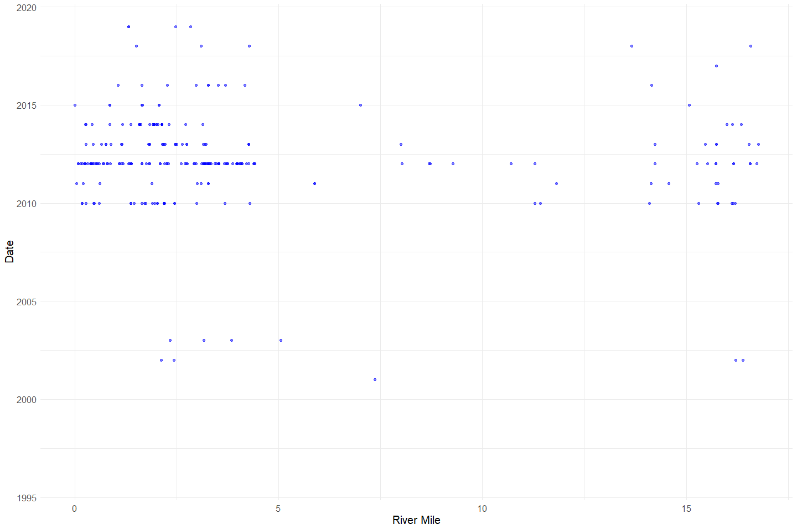
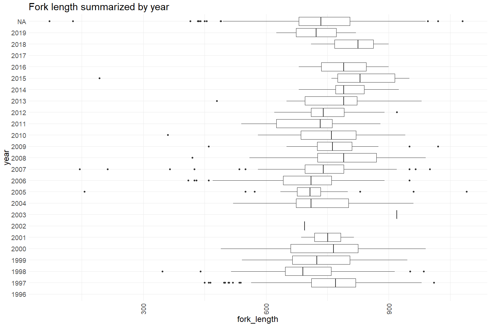

Battle Creek Carcass Survey QC
================
Erin Cain
9/29/2021

# Battle Creek Carcass Survey QC

## Description of Monitoring Data

These data were aquired via snorkel and kayak surveys on Battle Creek
from 1996 to 2019 and describe spring-run and unknown run Chinook Salmon
carcasses found within and along Battle Creek.

**Timeframe:** 1996 - 2019

**Survey Season:**

**Completeness of Record throughout timeframe:**

**Sampling Location:** Battle Creek

**Data Contact:** [Natasha Wingerter](mailto:natasha_wingerter@fws.gov)

Any additional info?

## Access Cloud Data

``` r
# Run Sys.setenv() to specify GCS_AUTH_FILE and GCS_DEFAULT_BUCKET before running 
# getwd() to see how to specify paths 
# Open object from google cloud storage
# Set your authentication using gcs_auth
gcs_auth(json_file = Sys.getenv("GCS_AUTH_FILE"))
# Set global bucket 
gcs_global_bucket(bucket = Sys.getenv("GCS_DEFAULT_BUCKET"))

gcs_list_objects()
# git data and save as xlsx
gcs_get_object(object_name = "adult-holding-redd-and-carcass-surveys/battle-creek/data-raw/battle_creek_adult_spawn_hold_carcass.xlsx",
               bucket = gcs_get_global_bucket(),
               saveToDisk = "raw_adult_spawn_hold_carcass.xlsx",
               overwrite = TRUE)
```

Read in data from google cloud, glimpse raw data and domain description
sheet:

``` r
sheets <- excel_sheets("raw_adult_spawn_hold_carcass.xlsx")
sheets 
```

    ## [1] "Notes and Metadata"    "Redd Survey"           "Carcass"              
    ## [4] "Live Holding Spawning"

``` r
raw_carcass_data <- read_excel("raw_adult_spawn_hold_carcass.xlsx", 
                               sheet = "Carcass",
                               col_types = c("numeric", "numeric", "numeric", "numeric", "date", "text", 
                                             "text", "text", "text", "text", "numeric", "text", 
                                             "text", "text", "text", "text", "text", "text")) %>% glimpse()
```

    ## Rows: 1,625
    ## Columns: 18
    ## $ LONGITUDE           <dbl> NA, NA, NA, NA, NA, NA, NA, NA, NA, NA, NA, NA, NA~
    ## $ LATITUDE            <dbl> NA, NA, NA, NA, NA, NA, NA, NA, NA, NA, NA, NA, NA~
    ## $ RIVERMILE           <dbl> NA, NA, NA, NA, NA, NA, NA, NA, NA, NA, NA, NA, NA~
    ## $ SPAWN_YEAR          <dbl> 1996, 1996, 1996, 1997, 1997, 1997, 1997, 1997, 19~
    ## $ DATE                <dttm> 1996-10-01, 1996-10-01, 1996-10-09, 1997-03-11, 1~
    ## $ METHOD              <chr> "Snorkel Survey", "Snorkel Survey", "Snorkel Surve~
    ## $ LOCATION            <chr> NA, NA, NA, "CNFH", "CNFH", "CNFH", "CNFH", "CNFH"~
    ## $ SPECIES             <chr> "Chinook", "Chinook", "Chinook", "Chinook", "Chino~
    ## $ SEX                 <chr> "Unknown", "Male", "Unknown", "Female", "Female", ~
    ## $ OBSERVED_ONLY       <chr> "N", "N", "N", "N", "N", "N", "N", "N", "N", "N", ~
    ## $ FORK_LENGTH         <dbl> NA, NA, NA, 716, 843, 865, 510, 730, 642, 810, 814~
    ## $ ADIPOSE             <chr> "Present", "Present", "Present", "Absent", "Absent~
    ## $ CARCASS_LIVE_STATUS <chr> "Unknown", "Unknown", "Unknown", "Unknown", "Unkno~
    ## $ SPAWN_CONDITION     <chr> "Unknown", "Unknown", "Unknown", "Unknown", "Unkno~
    ## $ FWS_RUN_CALL        <chr> "SCS", "SCS", "SCS", "Unknown", "Unknown", "Unknow~
    ## $ CWT_CODE            <chr> NA, NA, NA, NA, NA, NA, NA, NA, NA, NA, NA, NA, NA~
    ## $ OTHER_TAG           <chr> NA, NA, NA, NA, NA, NA, NA, NA, NA, NA, NA, NA, NA~
    ## $ Comments            <chr> NA, NA, NA, "Couldn't locate samples 6/2014", "Cou~

## Data transformations

``` r
cleaner_carcass_data <- raw_carcass_data %>%
  janitor::clean_names() %>% 
  rename("river_mile" = rivermile,
         "run" = fws_run_call) %>%
  mutate(date = as.Date(date)) %>%
  select(-species, -spawn_year) %>% # All either CHINOOK or Chinook
  glimpse()
```

    ## Rows: 1,625
    ## Columns: 16
    ## $ longitude           <dbl> NA, NA, NA, NA, NA, NA, NA, NA, NA, NA, NA, NA, NA~
    ## $ latitude            <dbl> NA, NA, NA, NA, NA, NA, NA, NA, NA, NA, NA, NA, NA~
    ## $ river_mile          <dbl> NA, NA, NA, NA, NA, NA, NA, NA, NA, NA, NA, NA, NA~
    ## $ date                <date> 1996-10-01, 1996-10-01, 1996-10-09, 1997-03-11, 1~
    ## $ method              <chr> "Snorkel Survey", "Snorkel Survey", "Snorkel Surve~
    ## $ location            <chr> NA, NA, NA, "CNFH", "CNFH", "CNFH", "CNFH", "CNFH"~
    ## $ sex                 <chr> "Unknown", "Male", "Unknown", "Female", "Female", ~
    ## $ observed_only       <chr> "N", "N", "N", "N", "N", "N", "N", "N", "N", "N", ~
    ## $ fork_length         <dbl> NA, NA, NA, 716, 843, 865, 510, 730, 642, 810, 814~
    ## $ adipose             <chr> "Present", "Present", "Present", "Absent", "Absent~
    ## $ carcass_live_status <chr> "Unknown", "Unknown", "Unknown", "Unknown", "Unkno~
    ## $ spawn_condition     <chr> "Unknown", "Unknown", "Unknown", "Unknown", "Unkno~
    ## $ run                 <chr> "SCS", "SCS", "SCS", "Unknown", "Unknown", "Unknow~
    ## $ cwt_code            <chr> NA, NA, NA, NA, NA, NA, NA, NA, NA, NA, NA, NA, NA~
    ## $ other_tag           <chr> NA, NA, NA, NA, NA, NA, NA, NA, NA, NA, NA, NA, NA~
    ## $ comments            <chr> NA, NA, NA, "Couldn't locate samples 6/2014", "Cou~

``` r
cleaner_carcass_data$method %>% unique
```

    ## [1] "Snorkel Survey"    "Barrier Weir Trap" "Other (CDFG)"     
    ## [4] "Kayak Survey"      "Other"             "Fish Rescue"      
    ## [7] "Weir"

## Explore Numeric Variables:

``` r
cleaner_carcass_data %>% select_if(is.numeric) %>% colnames()
```

    ## [1] "longitude"   "latitude"    "river_mile"  "fork_length"

### Variable: `longitude`, `latitude`

``` r
summary(cleaner_carcass_data$latitude)
```

    ##    Min. 1st Qu.  Median    Mean 3rd Qu.    Max.    NA's 
    ##   40.40   40.41   40.42   40.42   40.42   40.43    1309

``` r
summary(cleaner_carcass_data$longitude)
```

    ##    Min. 1st Qu.  Median    Mean 3rd Qu.    Max.    NA's 
    ##  -122.2  -122.0  -122.0  -122.0  -122.0  -121.9    1309

All values look within an expected range

**NA and Unknown Values**

-   80.6 % of values in the `latitude` column are NA.
-   80.6 % of values in the `longitude` column are NA.

### Variable: `river_mile`

**Plotting river mile over Period of Record**

``` r
cleaner_carcass_data %>% 
  ggplot(aes(x = river_mile, y = year(date))) +
  geom_point(size = 1.4, alpha = .5, color = "blue") + 
  labs(x = "River Mile", 
       y = "Date") +
  theme_minimal() + 
  theme(text = element_text(size = 15)) 
```

<!-- -->

It looks like river miles 0 - 5 and 15 - 17 most commonly have
carcasses. Very little data on river mile pre 2010.

``` r
cleaner_carcass_data %>% 
  ggplot(aes(x = river_mile)) +
  geom_histogram(alpha = .75) + 
  labs(x = "River Mile") +
  theme_minimal() + 
  theme(text = element_text(size = 15)) 
```

    ## `stat_bin()` using `bins = 30`. Pick better value with `binwidth`.

<!-- -->

**Numeric Summary of river mile over Period of Record**

``` r
summary(cleaner_carcass_data$river_mile)
```

    ##    Min. 1st Qu.  Median    Mean 3rd Qu.    Max.    NA's 
    ##  0.0029  1.6455  2.4852  4.4560  4.1048 16.7749    1309

**NA and Unknown Values**

-   80.6 % of values in the `river_mile` column are NA.

### Variable: `fork_length`

**Plotting distribution of fork length**

``` r
cleaner_carcass_data %>% 
  ggplot(aes(x = fork_length)) +
  geom_histogram(alpha = .75) + 
  labs(x = "Fork Length") +
  theme_minimal() + 
  theme(text = element_text(size = 15)) 
```

    ## `stat_bin()` using `bins = 30`. Pick better value with `binwidth`.

<!-- -->

``` r
cleaner_carcass_data %>% 
  mutate(year = as.factor(year(date))) %>%
  ggplot(aes(x = fork_length, y = year)) + 
  geom_boxplot() + 
  theme_minimal() +
  labs(title = "Fork length summarized by year") + 
  theme(text = element_text(size = 18),
        axis.text.x = element_text(angle = 90, vjust = 0.5, hjust=1)) 
```

<!-- -->

**Numeric Summary of fork length over Period of Record**

``` r
summary(cleaner_carcass_data$fork_length)
```

    ##    Min. 1st Qu.  Median    Mean 3rd Qu.    Max.    NA's 
    ##    71.0   679.5   735.0   733.7   800.0  1090.0     238

**NA and Unknown Values**

-   14.6 % of values in the `fork_length` column are NA.

## Explore Categorical variables:

General notes: If there is an opportunity to turn yes no into boolean do
so, but not if you loose value

``` r
cleaner_carcass_data %>% select_if(is.character) %>% colnames()
```

    ##  [1] "method"              "location"            "sex"                
    ##  [4] "observed_only"       "adipose"             "carcass_live_status"
    ##  [7] "spawn_condition"     "run"                 "cwt_code"           
    ## [10] "other_tag"           "comments"

### Variable: `method`

``` r
table(cleaner_carcass_data$method) 
```

    ## 
    ## Barrier Weir Trap       Fish Rescue      Kayak Survey             Other 
    ##               955                 3                 2                 1 
    ##      Other (CDFG)    Snorkel Survey              Weir 
    ##                 1               662                 1

Fix inconsistencies with spelling, capitalization, and abbreviations.

``` r
cleaner_carcass_data$method <- case_when(cleaner_carcass_data$method == "Barrier Weir Trap" | 
                                           cleaner_carcass_data$method == "Weir" ~ "barrier weir trap",
                                         cleaner_carcass_data$method == "Fish Rescue" ~ "fish rescue", 
                                         cleaner_carcass_data$method == "Kayak Survey" ~ "kayak survey",
                                         cleaner_carcass_data$method == "Snorkel Survey" ~ "snorkel survey",
                                         cleaner_carcass_data$method == "Other" |
                                           cleaner_carcass_data$method == "Other (CDFG)" ~ "other")

table(cleaner_carcass_data$method) 
```

    ## 
    ## barrier weir trap       fish rescue      kayak survey             other 
    ##               956                 3                 2                 2 
    ##    snorkel survey 
    ##               662

It looks like most carcasses are from barrier weir trap and snorkel
survey

**NA and Unknown Values**

-   0 % of values in the `method` column are NA.

### Variable: `location`

Reach number (1-7); other location

-   CNFH - Coleman National Fish Hatchery

``` r
table(cleaner_carcass_data$location) 
```

    ## 
    ##        CNFH Nevis Creek          R1          R2          R3          R4 
    ##         955           1         102         167         113          95 
    ##          R5          R6          R7    Tailrace 
    ##          19          17           2           2

**NA and Unknown Values**

-   9.4 % of values in the `location` column are NA.

### Variable: `sex`

``` r
table(cleaner_carcass_data$sex) 
```

    ## 
    ##  Female  FEMALE    Male    MALE Unknown UNKNOWN 
    ##     512       2     313       5     789       4

Fix inconsistencies with spelling, capitalization, and abbreviations.

``` r
cleaner_carcass_data$sex <- tolower(cleaner_carcass_data$sex)

table(cleaner_carcass_data$sex) 
```

    ## 
    ##  female    male unknown 
    ##     514     318     793

**NA and Unknown Values**

-   0 % of values in the `sex` column are NA.
-   48.8 % of values in the `sex` column are `Unknown`.

### Variable: `observed_only`

``` r
table(cleaner_carcass_data$observed_only) 
```

    ## 
    ##       N Unknown       Y 
    ##    1591       5      29

Fix inconsistencies with spelling, capitalization, and abbreviations.

``` r
cleaner_carcass_data$observed_only <- case_when(cleaner_carcass_data$observed_only == "Y" ~ TRUE, 
                                              cleaner_carcass_data$observed_only == "N" ~ FALSE)

table(cleaner_carcass_data$observed_only) 
```

    ## 
    ## FALSE  TRUE 
    ##  1591    29

**NA and Unknown Values**

-   0.3 % of values in the `observed_only` column are NA.

### Variable: `adipose`

``` r
table(cleaner_carcass_data$adipose) 
```

    ## 
    ##  Absent Present PRESENT Unknown UNKNOWN 
    ##     358    1122       8     134       3

Fix inconsistencies with spelling, capitalization, and abbreviations.

``` r
cleaner_carcass_data$adipose <- tolower(cleaner_carcass_data$adipose)

table(cleaner_carcass_data$adipose) 
```

    ## 
    ##  absent present unknown 
    ##     358    1130     137

**NA and Unknown Values**

-   0 % of values in the `adipose` column are NA.
-   8.4 % of values in the `adipose` column are `Unknown`.

### Variable: `carcass_live_status`

``` r
table(cleaner_carcass_data$carcass_live_status) 
```

    ## 
    ##    Bright     Fresh     FRESH Non-fresh NON-FRESH   Unknown 
    ##       764       139         2       325         9       383

Fix inconsistencies with spelling, capitalization, and abbreviations.

``` r
cleaner_carcass_data$carcass_live_status <- tolower(cleaner_carcass_data$carcass_live_status)

table(cleaner_carcass_data$carcass_live_status) 
```

    ## 
    ##    bright     fresh non-fresh   unknown 
    ##       764       141       334       383

**NA and Unknown Values**

-   0.2 % of values in the `carcass_live_status` column are NA.
-   23.6 % of values in the `carcass_live_status` column are `Unknown`.

### Variable: `spawn_condition`

``` r
table(cleaner_carcass_data$spawn_condition) 
```

    ## 
    ##     Green      Ripe   Spawned   SPAWNED   Unknown   UNKNOWN Unspawned 
    ##       597         1       138         3       861        13         9

Fix inconsistencies with spelling, capitalization, and abbreviations.

``` r
cleaner_carcass_data$spawn_condition <- tolower(cleaner_carcass_data$spawn_condition)

table(cleaner_carcass_data$spawn_condition) 
```

    ## 
    ##     green      ripe   spawned   unknown unspawned 
    ##       597         1       141       874         9

**NA and Unknown Values**

-   0.2 % of values in the `spawn_condition` column are NA.
-   53.8 % of values in the `spawn_condition` column are `Unknown`.

### Variable: \`run\`\`

``` r
table(cleaner_carcass_data$run) 
```

    ## 
    ##     SCS Unknown 
    ##    1257     363

Fix inconsistencies with spelling, capitalization, and abbreviations.

``` r
cleaner_carcass_data$run <- ifelse(cleaner_carcass_data$run == "SCS", "spring", "unknown")
```

**NA and Unknown Values**

-   0.3 % of values in the `run` column are NA.
-   22.3 % of values in the ``` run`` column are ```Unknown\`.

### Variable: `cwt_code`

TODO Figure out what NTD means

``` r
table(cleaner_carcass_data$cwt_code) 
```

    ## 
    ##             054129             055212             055394         0601060903 
    ##                  1                  1                  1                  1 
    ##             068610              62474              68009              68035 
    ##                  1                  1                  5                  5 
    ##              68036              68037              68039              68040 
    ##                  1                  1                  2                  2 
    ##              68631              68634              68747 Head not processed 
    ##                  1                  1                  1                  2 
    ##                NTD 
    ##                 45

Fix inconsistencies with spelling, capitalization, and abbreviations.

``` r
cleaner_carcass_data$cwt_code <- tolower(cleaner_carcass_data$cwt_code)

table(cleaner_carcass_data$cwt_code) 
```

    ## 
    ##             054129             055212             055394         0601060903 
    ##                  1                  1                  1                  1 
    ##             068610              62474              68009              68035 
    ##                  1                  1                  5                  5 
    ##              68036              68037              68039              68040 
    ##                  1                  1                  2                  2 
    ##              68631              68634              68747 head not processed 
    ##                  1                  1                  1                  2 
    ##                ntd 
    ##                 45

**NA and Unknown Values**

-   95.6 % of values in the `cwt_code` column are NA.

### Variable: `other_tag`

TODO Figure out what AFTC means

``` r
table(cleaner_carcass_data$other_tag) 
```

    ## 
    ## AFTC None 
    ##    1   32

Fix inconsistencies with spelling, capitalization, and abbreviations.

``` r
cleaner_carcass_data$other_tag <- ifelse(cleaner_carcass_data$other_tag == "AFTC", "AFTC", NA)
table(cleaner_carcass_data$other_tag) 
```

    ## 
    ## AFTC 
    ##    1

**NA and Unknown Values**

-   99.9 % of values in the `other_tag` column are NA.

### Variable: `comments`

``` r
unique(cleaner_carcass_data$comments)[1:5]
```

    ## [1] NA                                                                                                                                                                                                                                            
    ## [2] "Couldn't locate samples 6/2014"                                                                                                                                                                                                              
    ## [3] "Sample missing -sending 3rd shipment"                                                                                                                                                                                                        
    ## [4] "Test plate AFTC"                                                                                                                                                                                                                             
    ## [5] "Visibility was good.  Tail section onlyThere were probably only two carcasses but three pieces of carcasss were found so 3 samples were taken.  Biosample IDs (01-1721) (01-1710) (01-1703).  RBT observed but not counted. Dry samples sent"

Fix inconsistencies with spelling, capitalization, and abbreviations.

**NA and Unknown Values**

-   68.7 % of values in the `comments` column are NA.

## Summary of identified issues

-   Looks like mostly samples after 2010
-   Other tag column we should probably drop (only one AFTC tag
    identified)

## Save cleaned data back to google cloud

``` r
battle_carcass <- cleaner_carcass_data %>% glimpse()
```

    ## Rows: 1,625
    ## Columns: 16
    ## $ longitude           <dbl> NA, NA, NA, NA, NA, NA, NA, NA, NA, NA, NA, NA, NA~
    ## $ latitude            <dbl> NA, NA, NA, NA, NA, NA, NA, NA, NA, NA, NA, NA, NA~
    ## $ river_mile          <dbl> NA, NA, NA, NA, NA, NA, NA, NA, NA, NA, NA, NA, NA~
    ## $ date                <date> 1996-10-01, 1996-10-01, 1996-10-09, 1997-03-11, 1~
    ## $ method              <chr> "snorkel survey", "snorkel survey", "snorkel surve~
    ## $ location            <chr> NA, NA, NA, "CNFH", "CNFH", "CNFH", "CNFH", "CNFH"~
    ## $ sex                 <chr> "unknown", "male", "unknown", "female", "female", ~
    ## $ observed_only       <lgl> FALSE, FALSE, FALSE, FALSE, FALSE, FALSE, FALSE, F~
    ## $ fork_length         <dbl> NA, NA, NA, 716, 843, 865, 510, 730, 642, 810, 814~
    ## $ adipose             <chr> "present", "present", "present", "absent", "absent~
    ## $ carcass_live_status <chr> "unknown", "unknown", "unknown", "unknown", "unkno~
    ## $ spawn_condition     <chr> "unknown", "unknown", "unknown", "unknown", "unkno~
    ## $ run                 <chr> "spring", "spring", "spring", "unknown", "unknown"~
    ## $ cwt_code            <chr> NA, NA, NA, NA, NA, NA, NA, NA, NA, NA, NA, NA, NA~
    ## $ other_tag           <chr> NA, NA, NA, NA, NA, NA, NA, NA, NA, NA, NA, NA, NA~
    ## $ comments            <chr> NA, NA, NA, "Couldn't locate samples 6/2014", "Cou~

``` r
f <- function(input, output) write_csv(input, file = output)

gcs_upload(battle_carcass,
           object_function = f,
           type = "csv",
           name = "adult-holding-redd-and-carcass-surveys/battle-creek/data/battle_carcass.csv")
```
