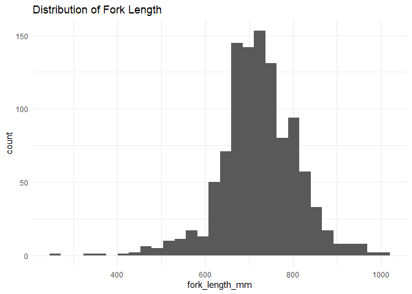

butte-2017-2020-individual-qc-checklist
================
Inigo Peng
10/21/2021

------------------------------------------------------------------------

# Butte Creek Individual Survey Data

## Description of Monitoring Data

**Timeframe:** 2017-2020

**Completeness of Record throughout timeframe:**

**Sampling Location:** Various sampling locations on Butte Creek.

**Data Contact:** [Jessica
Nichols](mailto::Jessica.Nichols@Wildlife.ca.gov)

**Additional Info:**

-   The carcass data came in 12 documents for each year. We identified
    the ‘SurveyChops’ and ‘SurveyIndividuals’ datasets as the documents
    with the most complete information and joined them for all of the
    years.

-   The SurveyIndividual QC files are split into different files to
    preserve the column types. This file runs 2017-2020 QC

## Access Cloud Data

``` r
# Run Sys.setenv() to specify GCS_AUTH_FILE and GCS_DEFAULT_BUCKET before running
# Open object from google cloud storage
# Set your authentication using gcs_auth
gcs_auth(json_file = Sys.getenv("GCS_AUTH_FILE"))
# Set global bucket 
gcs_global_bucket(bucket = Sys.getenv("GCS_DEFAULT_BUCKET"))
gcs_list_objects()

# git data and save as xlsx
read_from_cloud <- function(year){
  gcs_get_object(object_name = paste0("adult-holding-redd-and-carcass-surveys/butte-creek/data-raw/", year, "_SurveyIndividuals.xlsx"),
               bucket = gcs_get_global_bucket(),
               saveToDisk = paste0(year,"_raw_surveyindividuals.xlsx"),
               overwrite = TRUE)
  # data <- readxl::read_excel(paste0(year,"_raw_surveyindividuals.xlsx")) %>% 
  #   glimpse()
}

open_files <- function(year){
  data <- readxl::read_excel(paste0(year, "_raw_surveyindividuals.xlsx"),
                   col_types = c("numeric","text","numeric","numeric","date","text","text","text","text","numeric","text","numeric","numeric",
                                 "text","text","text","text","numeric","text","text","text","text","text","text","text","text"))
  return (data)
}

#Have to read files separately to keep the column types for each file
#2019 file is different from all others

later_years <- c(2017, 2018, 2020)
purrr::map(later_years, read_from_cloud)
raw_later_data <- purrr::map(later_years, open_files) %>%
  reduce(bind_rows)
write_csv(raw_later_data, "raw_2017_to_2020_individuals_data.csv")

year <- 2019
read_from_cloud(year)
raw_2019_data <- readxl::read_excel("2019_raw_surveyindividuals.xlsx")
write_csv(raw_2019_data, "2019_raw_surveyindividuals.csv")
```

Read in data from google cloud, glimpse raw data and domain description
sheet:

``` r
# read in data to clean

raw_later_individuals_data <- read_csv("raw_2017_to_2020_individuals_data.csv")%>% glimpse()
```

    ## Rows: 565 Columns: 26

    ## -- Column specification --------------------------------------------------------
    ## Delimiter: ","
    ## chr  (12): LocationCD, SectionCD, WayPt, SpeciesCode, Disposition, Sex, Cond...
    ## dbl   (7): Survey, Year, Week, DiscTagApplied, FLmm, FLcm, ScaleNu
    ## lgl   (6): HeadNu, DNAnu, OtherMarks, CWTStatusID, CWTStatus, CWTcd
    ## dttm  (1): Date

    ## 
    ## i Use `spec()` to retrieve the full column specification for this data.
    ## i Specify the column types or set `show_col_types = FALSE` to quiet this message.

    ## Rows: 565
    ## Columns: 26
    ## $ Survey         <dbl> 110002, 110002, 110002, 110002, 110002, 110002, 110002,~
    ## $ LocationCD     <chr> "Upper survey", "Upper survey", "Upper survey", "Upper ~
    ## $ Year           <dbl> 2017, 2017, 2017, 2017, 2017, 2017, 2017, 2017, 2017, 2~
    ## $ Week           <dbl> 1, 1, 1, 2, 2, 2, 2, 2, 2, 2, 2, 2, 2, 2, 2, 2, 2, 2, 2~
    ## $ Date           <dttm> 2017-09-26, 2017-09-26, 2017-09-26, 2017-10-03, 2017-1~
    ## $ SectionCD      <chr> "A", "A", "A", "A", "A", "A", "A", "B", "B", "C", "C", ~
    ## $ WayPt          <chr> "A1", "A5", "A5", "A2", "A2", "A3", "A5", "B3", "B8", "~
    ## $ SpeciesCode    <chr> "CHN-Spring", "CHN-Spring", "CHN-Spring", "CHN-Spring",~
    ## $ Disposition    <chr> "Tagged", "Tagged", "Tagged", "Tagged", "Tagged", "Tagg~
    ## $ DiscTagApplied <dbl> 2980, 2983, 2977, 2731, 2732, 2733, 2734, 2757, 2758, 2~
    ## $ Sex            <chr> "F", "M", "M", "F", "F", "F", "M", "M", "M", "M", "F", ~
    ## $ FLmm           <dbl> 900, 527, 878, 570, 555, 760, 960, 853, 528, 760, 790, ~
    ## $ FLcm           <dbl> 90.0, 52.7, 87.8, 57.0, 55.5, 76.0, 96.0, 85.3, 52.8, 7~
    ## $ ConditionCD    <chr> "F", "F", "F", "F", "F", "F", "F", "F", "F", "F", "F", ~
    ## $ SpawnedCD      <chr> "N", "n/r", "n/r", "N", "N", "N", "Unk", "Unk", "Unk", ~
    ## $ AdFinClipCD    <chr> "N", "N", "N", "N", "N", "N", "N", "N", "N", "N", "N", ~
    ## $ HeadNu         <lgl> NA, NA, NA, NA, NA, NA, NA, NA, NA, NA, NA, NA, NA, NA,~
    ## $ ScaleNu        <dbl> 20607, 20610, 20609, 20703, 20661, 20660, 20659, 20751,~
    ## $ TissueNu       <chr> NA, NA, NA, NA, NA, NA, NA, NA, NA, NA, NA, NA, "20614"~
    ## $ OtolithNu      <chr> NA, NA, NA, NA, NA, NA, NA, NA, NA, NA, NA, NA, NA, NA,~
    ## $ DNAnu          <lgl> NA, NA, NA, NA, NA, NA, NA, NA, NA, NA, NA, NA, NA, NA,~
    ## $ Comments       <chr> NA, NA, NA, NA, NA, NA, NA, NA, NA, NA, NA, NA, NA, NA,~
    ## $ OtherMarks     <lgl> NA, NA, NA, NA, NA, NA, NA, NA, NA, NA, NA, NA, NA, NA,~
    ## $ CWTStatusID    <lgl> NA, NA, NA, NA, NA, NA, NA, NA, NA, NA, NA, NA, NA, NA,~
    ## $ CWTStatus      <lgl> NA, NA, NA, NA, NA, NA, NA, NA, NA, NA, NA, NA, NA, NA,~
    ## $ CWTcd          <lgl> NA, NA, NA, NA, NA, NA, NA, NA, NA, NA, NA, NA, NA, NA,~

``` r
raw_2019_individuals_data <- read_csv("2019_raw_surveyindividuals.csv") %>% glimpse()
```

    ## Rows: 506 Columns: 17

    ## -- Column specification --------------------------------------------------------
    ## Delimiter: ","
    ## chr (10): WayPt, Sex, ConditionCD, SpawnedCD, AdFinClipCD, HeadNu, ScaleNu, ...
    ## dbl  (2): DiscTagApplied, FLcm
    ## lgl  (5): DNAnu, OtherMarks, CWTStatusID, CWTStatus, CWTcd

    ## 
    ## i Use `spec()` to retrieve the full column specification for this data.
    ## i Specify the column types or set `show_col_types = FALSE` to quiet this message.

    ## Rows: 506
    ## Columns: 17
    ## $ WayPt          <chr> "B4", "B7", "B7", "B8", "B8", "B8", "C1", "C2", "C2", "~
    ## $ DiscTagApplied <dbl> 2305, 1345, 1371, 2651, 2316, 2606, 1365, 2422, 2208, 2~
    ## $ Sex            <chr> "F", "F", "F", "M", "F", "F", "F", "F", "F", "F", "F", ~
    ## $ FLcm           <dbl> 71.3, 75.0, 70.0, 85.0, 64.3, 68.2, 80.0, 73.7, 72.5, 8~
    ## $ ConditionCD    <chr> "F", "F", "F", "F", "F", "F", "F", "F", "F", "F", "F", ~
    ## $ SpawnedCD      <chr> "N", "N", "N", "n/r", "N", "P", "P", "P", "N", "N", "N"~
    ## $ AdFinClipCD    <chr> "N", "N", "N", "N", "N", "N", "N", "N", "N", "N", "N", ~
    ## $ HeadNu         <chr> "N/A", "N/A", "N/A", "N/A", NA, "N/A", "N/A", NA, NA, N~
    ## $ ScaleNu        <chr> "N/A", "N/A", "N/A", "N/A", NA, "N/A", "N/A", NA, NA, N~
    ## $ TissueNu       <chr> "N/A", "N/A", "N/A", "N/A", NA, "N/A", "N/A", NA, NA, N~
    ## $ OtolithNu      <chr> "N/A", "N/A", "N/A", "N/A", NA, "N/A", "N/A", NA, NA, N~
    ## $ DNAnu          <lgl> NA, NA, NA, NA, NA, NA, NA, NA, NA, NA, NA, NA, NA, NA,~
    ## $ Comments       <chr> NA, NA, NA, NA, NA, NA, NA, NA, NA, NA, NA, NA, NA, NA,~
    ## $ OtherMarks     <lgl> NA, NA, NA, NA, NA, NA, NA, NA, NA, NA, NA, NA, NA, NA,~
    ## $ CWTStatusID    <lgl> NA, NA, NA, NA, NA, NA, NA, NA, NA, NA, NA, NA, NA, NA,~
    ## $ CWTStatus      <lgl> NA, NA, NA, NA, NA, NA, NA, NA, NA, NA, NA, NA, NA, NA,~
    ## $ CWTcd          <lgl> NA, NA, NA, NA, NA, NA, NA, NA, NA, NA, NA, NA, NA, NA,~

## Data Transformations

Transformed 2019 data to join it to the 2017-2020 data.

``` r
cleaner_data<- raw_later_individuals_data %>%
  janitor::clean_names() %>%
  rename('fork_length_mm' = 'f_lmm',
         'condition' = 'condition_cd',
         'spawning_status' = 'spawned_cd') %>% 
  select(-c('week', 'year', 'f_lcm','location_cd', 'species_code','other_marks', 'cwt_status_id', 'cwt_status', 'cw_tcd', 'dn_anu', 'head_nu')) %>% #all location the same,all spring run chinook,  all no ad fin clip, no data for the rest of the dropped columns
  mutate(date = as.Date(date),
         scale_nu = as.character(scale_nu),
         survey = as.character(survey)) %>% #scale_nu is identifier
  glimpse()
```

    ## Rows: 565
    ## Columns: 15
    ## $ survey           <chr> "110002", "110002", "110002", "110002", "110002", "11~
    ## $ date             <date> 2017-09-26, 2017-09-26, 2017-09-26, 2017-10-03, 2017~
    ## $ section_cd       <chr> "A", "A", "A", "A", "A", "A", "A", "B", "B", "C", "C"~
    ## $ way_pt           <chr> "A1", "A5", "A5", "A2", "A2", "A3", "A5", "B3", "B8",~
    ## $ disposition      <chr> "Tagged", "Tagged", "Tagged", "Tagged", "Tagged", "Ta~
    ## $ disc_tag_applied <dbl> 2980, 2983, 2977, 2731, 2732, 2733, 2734, 2757, 2758,~
    ## $ sex              <chr> "F", "M", "M", "F", "F", "F", "M", "M", "M", "M", "F"~
    ## $ fork_length_mm   <dbl> 900, 527, 878, 570, 555, 760, 960, 853, 528, 760, 790~
    ## $ condition        <chr> "F", "F", "F", "F", "F", "F", "F", "F", "F", "F", "F"~
    ## $ spawning_status  <chr> "N", "n/r", "n/r", "N", "N", "N", "Unk", "Unk", "Unk"~
    ## $ ad_fin_clip_cd   <chr> "N", "N", "N", "N", "N", "N", "N", "N", "N", "N", "N"~
    ## $ scale_nu         <chr> "20607", "20610", "20609", "20703", "20661", "20660",~
    ## $ tissue_nu        <chr> NA, NA, NA, NA, NA, NA, NA, NA, NA, NA, NA, NA, "2061~
    ## $ otolith_nu       <chr> NA, NA, NA, NA, NA, NA, NA, NA, NA, NA, NA, NA, NA, N~
    ## $ comments         <chr> NA, NA, NA, NA, NA, NA, NA, NA, NA, NA, NA, NA, NA, N~

``` r
cleaner_2019_data<- raw_2019_individuals_data %>%
  janitor::clean_names() %>% 
  mutate(fork_length_mm = f_lcm*10) %>% 
  select(-c('head_nu','scale_nu','f_lcm','tissue_nu', 'dn_anu', 'otolith_nu','comments', 'other_marks', 'cwt_status_id', 'cwt_status', 'cw_tcd')) %>% 
  glimpse()
```

    ## Rows: 506
    ## Columns: 7
    ## $ way_pt           <chr> "B4", "B7", "B7", "B8", "B8", "B8", "C1", "C2", "C2",~
    ## $ disc_tag_applied <dbl> 2305, 1345, 1371, 2651, 2316, 2606, 1365, 2422, 2208,~
    ## $ sex              <chr> "F", "F", "F", "M", "F", "F", "F", "F", "F", "F", "F"~
    ## $ condition_cd     <chr> "F", "F", "F", "F", "F", "F", "F", "F", "F", "F", "F"~
    ## $ spawned_cd       <chr> "N", "N", "N", "n/r", "N", "P", "P", "P", "N", "N", "~
    ## $ ad_fin_clip_cd   <chr> "N", "N", "N", "N", "N", "N", "N", "N", "N", "N", "N"~
    ## $ fork_length_mm   <dbl> 713, 750, 700, 850, 643, 682, 800, 737, 725, 825, 670~

Bind 2019 data to the whole data frame

``` r
cleaner_data <- bind_rows(cleaner_data, cleaner_2019_data)
```

## Explore `date`

``` r
summary(cleaner_data$date)
```

    ##         Min.      1st Qu.       Median         Mean      3rd Qu.         Max. 
    ## "2017-09-26" "2018-10-02" "2018-10-09" "2019-04-17" "2020-10-02" "2020-10-30" 
    ##         NA's 
    ##        "506"

**NA and Unknown Values**

-   47.2 % of values in the `date` column are NA.

## Explore Categorical Variables

``` r
cleaner_data %>% 
  select_if(is.character) %>% colnames()
```

    ##  [1] "survey"          "section_cd"      "way_pt"          "disposition"    
    ##  [5] "sex"             "condition"       "spawning_status" "ad_fin_clip_cd" 
    ##  [9] "scale_nu"        "tissue_nu"       "otolith_nu"      "comments"       
    ## [13] "condition_cd"    "spawned_cd"

### Variable: `survey`

There are 4 unique individual survey numbers.

**NA and Unknown Values**

-   47.2 % of values in the `survey` column are NA.

### Variable:`section_cd`

\*\* Create look up rda for section encoding:\*\*

``` r
butte_section_code <- c('A','B','C','COV-OKIE','D', 'E')
names(butte_section_code) <-c(
  "Quartz Bowl Pool downstream to Whiskey Flat",
  "Whiskey Flat downstream to Helltown Bridge",
  "Helltown Bridge downstream to Quail Run Bridge",
  "Centerville Covered Brdige to Okie Dam",
  "Quail Run Bridge downstream to Cable Bridge",
  "Cable Bridge downstream ot Centerville; sdf Cable Bridge downstream to Centerville Covered Bridge"
)

tibble(code = butte_section_code,
       definition = names(butte_section_code))
```

    ## # A tibble: 6 x 2
    ##   code     definition                                                           
    ##   <chr>    <chr>                                                                
    ## 1 A        Quartz Bowl Pool downstream to Whiskey Flat                          
    ## 2 B        Whiskey Flat downstream to Helltown Bridge                           
    ## 3 C        Helltown Bridge downstream to Quail Run Bridge                       
    ## 4 COV-OKIE Centerville Covered Brdige to Okie Dam                               
    ## 5 D        Quail Run Bridge downstream to Cable Bridge                          
    ## 6 E        Cable Bridge downstream ot Centerville; sdf Cable Bridge downstream ~

**NA and Unknown Values**

-   47.2 % of values in the `section_cd` column are NA.

### Variable:`way_pt`

``` r
cleaner_data <- cleaner_data %>%
  mutate(way_pt = toupper(way_pt),
         way_pt = case_when(
           way_pt == "COVER-OKIE" ~ "COV-OKIE",
           way_pt == "N/R" ~ NA_character_,
           way_pt == "NR" ~ NA_character_,
           TRUE ~ as.character(way_pt)    
  ))
table(cleaner_data$way_pt)
```

    ## 
    ##       A1       A2       A3       A4       A5       B1       B2       B3 
    ##       18       22       24       21       16       13        9        7 
    ##       B4       B5       B6       B7       B8   BCK-PL  BCK-PWR       C1 
    ##        8       27       49       81       74       17        7       52 
    ##      C10      C11      C12       C2       C3       C4       C5       C6 
    ##       10       11       34       45       27       38       43       45 
    ##       C7       C8       C9  COV-BCK COV-OKIE       D1       D2       D3 
    ##       36       30       23       20       12       24       51       35 
    ##       D4       D5       D6       D7       D8       E1       E2       E3 
    ##       19        9       14       14        4       12       13       11 
    ##       E4       E5       E6       E7 
    ##        9        8        8       10

**NA and Unknown Values**

-   1 % of values in the `way_pt` column are NA.

### Variable: `disposition`

``` r
cleaner_data$disposition <- tolower(cleaner_data$disposition)
table(cleaner_data$disposition)
```

    ## 
    ## tagged 
    ##    565

**NA and Unknown Values**

-   47.2 % of values in the `disposition` column are NA.

### Variable:`sex`

``` r
cleaner_data<- cleaner_data %>% 
  mutate(sex = tolower(sex),
         sex = case_when(
           sex == "f" ~ "female",
           sex == "m"~ "male"
         ))
table(cleaner_data$sex)
```

    ## 
    ## female   male 
    ##    630    441

**NA and Unknown Values**

-   0 % of values in the `sex` column are NA.

### Variable:`condition`

TODO: need description of the conditions

``` r
cleaner_data <- cleaner_data %>% 
  mutate(condition = set_names(tolower(condition)),
         condition = case_when(
           condition == "n/r" ~ NA_character_,
           TRUE ~ as.character(condition)
         ))
table(cleaner_data$condition)
```

    ## 
    ##   d   f 
    ##  66 499

**NA and Unknown Values**

-   47.2 % of values in the `condition` column are NA.

### Variable:`spawning_status`

TODO: needs description of spawning\_status

``` r
cleaner_data <- cleaner_data %>% 
  mutate(spawning_status = set_names(tolower(spawning_status)),
         spawning_status = 
           case_when(spawning_status == "n" ~ "no",
                     spawning_status == "y" ~ "yes",
                     spawning_status == "n/r" ~ NA_character_,
                     spawning_status == "unk" ~ NA_character_,
                     TRUE ~ as.character(spawning_status)
  ))

table(cleaner_data$spawning_status)
```

    ## 
    ##  no   p yes 
    ##  10  23 280

**NA and Unknown Values**

-   70.8 % of values in the `spawning_status` column are NA.

### Variable: `ad_fin_clip_cd`

``` r
cleaner_data <- cleaner_data %>% 
  mutate(ad_fin_clip_cd = 
           case_when(ad_fin_clip_cd == "N" ~ FALSE,
                     ad_fin_clip_cd == "Y" ~ TRUE))
table(cleaner_data$ad_fin_clip_cd)
```

    ## 
    ## FALSE  TRUE 
    ##  1064     7

### Variable: `scale_nu`

``` r
unique(cleaner_data$scale_nu)[1:5]
```

    ## [1] "20607" "20610" "20609" "20703" "20661"

There are 172 unique individual scale numbers.

**NA and Unknown Values**

-   83.9 % of values in the `scale_nu` column are NA.

### Variable:`tissue_nu`

``` r
unique(cleaner_data$tissue_nu)[1:5]
```

    ## [1] NA            "20614"       "20608"       "2092420-C-1" "S092920-C-1"

There are 112 unique individual tissue numbers.

**NA and Unknown Values**

-   89.4 % of values in the `tissue_nu` column are NA.

### Variable:`otolith_nu`

``` r
unique(cleaner_data$otolith_nu)[1:5]
```

    ## [1] NA          "S19034-20" "S19035-20" "S19036-20" "S19037-20"

There are 18 unique individual otolith numbers.

**NA and Unknown Values**

-   98.4 % of values in the `otolith_nu` column are NA.

### Variable:`comments`

``` r
unique(cleaner_data$comments)[1:5]
```

    ## [1] NA                   "25% EGG RETENTION"  "0% EGG RETENTION"  
    ## [4] "50% EGG RETENTION"  "100% EGG RETENTION"

**NA and Unknown Values**

-   95 % of values in the `comments` column are NA.

## Explore Numerical Variables

``` r
cleaner_data %>% 
  select_if(is.numeric) %>% colnames()
```

    ## [1] "disc_tag_applied" "fork_length_mm"

### Variable:`disc_tag_applied`

``` r
cleaner_data %>% 
  filter(disc_tag_applied < 10000) %>% #filtered out one large value to see the distribution better
  ggplot(aes(x = disc_tag_applied))+
  geom_histogram()+
  labs(title = "Distribution of Disc Tag Applied")+
  theme_minimal()
```

    ## `stat_bin()` using `bins = 30`. Pick better value with `binwidth`.

<!-- -->

``` r
summary(cleaner_data$disc_tag_applied)
```

    ##    Min. 1st Qu.  Median    Mean 3rd Qu.    Max.    NA's 
    ##       9    1037    1326    2431    2269  906653       1

**NA and Unknown Values**

-   0.1 % of values in the `disc_tag_applied` column are NA.

### Variable:`fork_length_mm`

``` r
cleaner_data %>% 
  # mutate(years = as.factor(year(date))) %>%
  filter(fork_length_mm < 2000) %>%  #filter out one large value for better view of distribution
  ggplot(aes(x = fork_length_mm))+
  geom_histogram(bin = 10)+
  labs(title = "Distribution of Fork Length")+
  theme_minimal()
```

    ## `stat_bin()` using `bins = 30`. Pick better value with `binwidth`.

<!-- -->

``` r
summary(cleaner_data$fork_length_mm)
```

    ##    Min. 1st Qu.  Median    Mean 3rd Qu.    Max.    NA's 
    ##   260.0   674.0   720.0   722.9   775.0  1010.0       2

**NA and Unknown Values**

-   0.2 % of values in the `fork_length_mm` column are NA.

## Issues Identified

-   Need description and look up table for the majority of the data
-   Some outliers for disc tag applied
-   Are these the appropriate variables?

## Add cleaned data back to google cloud

``` r
butte_individual_survey_2017_2020 <- cleaner_data %>% glimpse()
```

    ## Rows: 1,071
    ## Columns: 17
    ## $ survey           <chr> "110002", "110002", "110002", "110002", "110002", "11~
    ## $ date             <date> 2017-09-26, 2017-09-26, 2017-09-26, 2017-10-03, 2017~
    ## $ section_cd       <chr> "A", "A", "A", "A", "A", "A", "A", "B", "B", "C", "C"~
    ## $ way_pt           <chr> "A1", "A5", "A5", "A2", "A2", "A3", "A5", "B3", "B8",~
    ## $ disposition      <chr> "tagged", "tagged", "tagged", "tagged", "tagged", "ta~
    ## $ disc_tag_applied <dbl> 2980, 2983, 2977, 2731, 2732, 2733, 2734, 2757, 2758,~
    ## $ sex              <chr> "female", "male", "male", "female", "female", "female~
    ## $ fork_length_mm   <dbl> 900, 527, 878, 570, 555, 760, 960, 853, 528, 760, 790~
    ## $ condition        <chr> "f", "f", "f", "f", "f", "f", "f", "f", "f", "f", "f"~
    ## $ spawning_status  <chr> "no", NA, NA, "no", "no", "no", NA, NA, NA, NA, "no",~
    ## $ ad_fin_clip_cd   <lgl> FALSE, FALSE, FALSE, FALSE, FALSE, FALSE, FALSE, FALS~
    ## $ scale_nu         <chr> "20607", "20610", "20609", "20703", "20661", "20660",~
    ## $ tissue_nu        <chr> NA, NA, NA, NA, NA, NA, NA, NA, NA, NA, NA, NA, "2061~
    ## $ otolith_nu       <chr> NA, NA, NA, NA, NA, NA, NA, NA, NA, NA, NA, NA, NA, N~
    ## $ comments         <chr> NA, NA, NA, NA, NA, NA, NA, NA, NA, NA, NA, NA, NA, N~
    ## $ condition_cd     <chr> NA, NA, NA, NA, NA, NA, NA, NA, NA, NA, NA, NA, NA, N~
    ## $ spawned_cd       <chr> NA, NA, NA, NA, NA, NA, NA, NA, NA, NA, NA, NA, NA, N~

``` r
write_csv(butte_individual_survey_2017_2020, "butte_carcass_2017-2020.csv")
```

``` r
f <- function(input, output) write_csv(input, file = output)
gcs_upload(butte_individual_survey_2017_2020,
           object_function = f,
           type = "csv",
           name = "adult-holding-redd-and-carcass-surveys/butte-creek/data/butte_carcass_2017-2020.csv")
```
