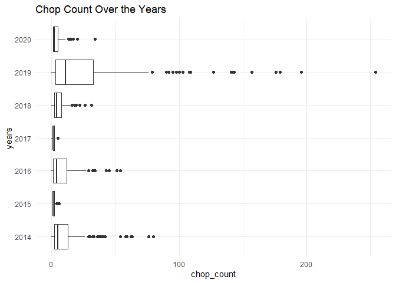

butte-creek-carcass-chopcount-qc-checklist
================
Inigo Peng
10/21/2021

------------------------------------------------------------------------

# Butte Creek Carcass Survey Data

## Description of Monitoring Data

**Timeframe:** 2014-2020

**Completeness of Record throughout timeframe:**

**Sampling Location:** Various sampling locations on Butte Creek.

**Data Contact:** [Jessica
Nichols](mailto::Jessica.Nichols@Wildlife.ca.gov)

**Additional Info:**  
The carcass data came in 12 documents for each year. We identified the
‘SurveyChops’ and ‘SurveyIndividuals’ datasets as the documents with the
most complete information and joined them for all of the years.This
markdown runs the surveychops QC.

## Access Cloud Data

``` r
# Run Sys.setenv() to specify GCS_AUTH_FILE and GCS_DEFAULT_BUCKET before running
# Open object from google cloud storage
# Set your authentication using gcs_auth
gcs_auth(json_file = Sys.getenv("GCS_AUTH_FILE"))
# Set global bucket 
gcs_global_bucket(bucket = Sys.getenv("GCS_DEFAULT_BUCKET"))
gcs_list_objects()

# git data and save as xlsx
read_from_cloud <- function(year){
  gcs_get_object(object_name = paste0("adult-holding-redd-and-carcass-surveys/butte-creek/data-raw/", year, "_SurveyChops.xlsx"),
               bucket = gcs_get_global_bucket(),
               saveToDisk = paste0(year,"_raw_surveychops.xlsx"),
               overwrite = TRUE)
  data <- readxl::read_excel(paste0(year,"_raw_surveychops.xlsx"))
  return(data)
}

open_files <- function(year){
  data <- readxl::read_excel(paste0(year, "_raw_surveychops.xlsx"))
  return (data)
}
years <- c(2014, 2015, 2016, 2017, 2018, 2019, 2020)
# years <- 2020
raw_data <- purrr::map(years, read_from_cloud) %>%
  reduce(bind_rows)
write_csv(raw_data, "raw_chops_data.csv")
```

Read in data from google cloud, glimpse raw data and domain description
sheet:

``` r
# read in data to clean 
raw_chops_data <- read_csv("raw_chops_data.csv") %>% glimpse
```

    ## Rows: 917 Columns: 14

    ## -- Column specification --------------------------------------------------------
    ## Delimiter: ","
    ## chr  (9): LocationCD, SectionCD, WayPt, SpeciesCode, Disposition, AdFinClip,...
    ## dbl  (4): Survey, Year, Week, ChopCount
    ## dttm (1): Date

    ## 
    ## i Use `spec()` to retrieve the full column specification for this data.
    ## i Specify the column types or set `show_col_types = FALSE` to quiet this message.

    ## Rows: 917
    ## Columns: 14
    ## $ Survey      <dbl> 110013, 110013, 110013, 110013, 110013, 110013, 110013, 11~
    ## $ LocationCD  <chr> "Upper survey", "Upper survey", "Upper survey", "Upper sur~
    ## $ Year        <dbl> 2014, 2014, 2014, 2014, 2014, 2014, 2014, 2014, 2014, 2014~
    ## $ Week        <dbl> 1, 1, 1, 1, 1, 1, 1, 2, 2, 2, 2, 2, 2, 2, 2, 2, 2, 2, 2, 2~
    ## $ Date        <dttm> 2014-09-23, 2014-09-23, 2014-09-23, 2014-09-23, 2014-09-2~
    ## $ SectionCD   <chr> "A", "A", "A", "A", "B", "B", "B", "A", "A", "A", "A", "A"~
    ## $ WayPt       <chr> "A2", "A3", "A4", "A1", "B1", "B2", "B7", "A5", "A1", "A2"~
    ## $ SpeciesCode <chr> "CHN-Spring", "CHN-Spring", "CHN-Spring", "CHN-Spring", "C~
    ## $ Disposition <chr> "Chopped", "Chopped", "Chopped", "Chopped", "Chopped", "Ch~
    ## $ ChopCount   <dbl> 2, 0, 2, 4, 1, 1, 1, 3, 7, 8, 5, 4, 19, 32, 19, 5, 6, 3, 4~
    ## $ AdFinClip   <chr> "Unknown", "Unknown", "Unknown", "Unknown", "Unknown", "Un~
    ## $ Condition   <chr> "Decayed", "Decayed", "Decayed", "Decayed", "Decayed", "De~
    ## $ Sex         <chr> "Unknown", "Unknown", "Unknown", "Unknown", "Unknown", "Un~
    ## $ SizeClass   <chr> "Not recorded", "Not recorded", "Not recorded", "Not recor~

## Data Transformations

``` r
cleaner_data<- raw_chops_data %>%
  janitor::clean_names() %>%
  select(-'week', -'year', -'location_cd',  -'size_class',
         -'sex', - 'species_code', - 'survey') %>% #could extract week and year from date;all location is the same (upper_cd);\all size class not recorded, all sex is not recorded or unknown, all species_code is spring run chinook
  mutate(date = as.Date(date)) %>% 
  glimpse()
```

    ## Rows: 917
    ## Columns: 7
    ## $ date        <date> 2014-09-23, 2014-09-23, 2014-09-23, 2014-09-23, 2014-09-2~
    ## $ section_cd  <chr> "A", "A", "A", "A", "B", "B", "B", "A", "A", "A", "A", "A"~
    ## $ way_pt      <chr> "A2", "A3", "A4", "A1", "B1", "B2", "B7", "A5", "A1", "A2"~
    ## $ disposition <chr> "Chopped", "Chopped", "Chopped", "Chopped", "Chopped", "Ch~
    ## $ chop_count  <dbl> 2, 0, 2, 4, 1, 1, 1, 3, 7, 8, 5, 4, 19, 32, 19, 5, 6, 3, 4~
    ## $ ad_fin_clip <chr> "Unknown", "Unknown", "Unknown", "Unknown", "Unknown", "Un~
    ## $ condition   <chr> "Decayed", "Decayed", "Decayed", "Decayed", "Decayed", "De~

## Explore `date`

``` r
summary(cleaner_data$date)
```

    ##         Min.      1st Qu.       Median         Mean      3rd Qu.         Max. 
    ## "2014-09-23" "2016-09-29" "2017-11-02" "2017-11-29" "2019-10-10" "2020-10-30"

**NA and Unknown Values**

-   0 % of values in the `date` column are NA.

## Explore Categorical Variables

``` r
cleaner_data %>% 
  select_if(is.character) %>% colnames()
```

    ## [1] "section_cd"  "way_pt"      "disposition" "ad_fin_clip" "condition"

### Variable:`section_cd`

``` r
butte_section_code <- c('A','B','C','COV-OKIE','D', 'E')
names(butte_section_code) <-c(
  "Quartz Bowl Pool downstream to Whiskey Flat",
  "Whiskey Flat downstream to Helltown Bridge",
  "Helltown Bridge downstream to Quail Run Bridge",
  "Centerville Covered Brdige to Okie Dam",
  "Quail Run Bridge downstream to Cable Bridge",
  "Cable Bridge downstream ot Centerville; sdf Cable Bridge downstream to Centerville Covered Bridge"
)

tibble(code = butte_section_code,
       definition = names(butte_section_code))
```

    ## # A tibble: 6 x 2
    ##   code     definition                                                           
    ##   <chr>    <chr>                                                                
    ## 1 A        Quartz Bowl Pool downstream to Whiskey Flat                          
    ## 2 B        Whiskey Flat downstream to Helltown Bridge                           
    ## 3 C        Helltown Bridge downstream to Quail Run Bridge                       
    ## 4 COV-OKIE Centerville Covered Brdige to Okie Dam                               
    ## 5 D        Quail Run Bridge downstream to Cable Bridge                          
    ## 6 E        Cable Bridge downstream ot Centerville; sdf Cable Bridge downstream ~

**NA and Unknown Values**

-   0 % of values in the `section_cd` column are NA.

### Variable: `disposition`

``` r
cleaner_data$disposition <- tolower(cleaner_data$disposition)
table(cleaner_data$disposition)
```

    ## 
    ## chopped 
    ##     917

**NA and Unknown Values**

-   0 % of values in the `disposition` column are NA.

### Variable:`way_pt`

``` r
cleaner_data <- cleaner_data %>%
  mutate(way_pt = set_names(toupper(way_pt))) %>% 
  mutate(way_pt = case_when(
    way_pt == 'N/A' ~ NA_character_,
    way_pt == 'N/R' ~ NA_character_, 
    TRUE ~ as.character(way_pt)
    
  ))
table(cleaner_data$way_pt)
```

    ## 
    ##        A1        A2        A3        A4        A5       B-P        B1        B2 
    ##        28        29        22        26        21         4        22        21 
    ##        B3        B4        B5        B6        B7        B8   BCK-PWR    BLK-PL 
    ##        18        14        25        26        26        24         4         1 
    ##       C-B        C1       C10       C11       C12        C2        C3        C4 
    ##         4        27        21        25        26        28        23        21 
    ##        C5        C6        C7        C8        C9       CO1   COV-BCK   COV-BLK 
    ##        25        28        28        25        26         1         3         1 
    ##  COV-OKIE COVER-PTR        D1        D2        D3        D4        D5        D6 
    ##         2         1        20        26        28        26        18        17 
    ##        D7        D8        E1        E2        E3        E4        E5        E6 
    ##        17        14        18        15        18        16        13        16 
    ##        E7       P-O    PH-PWL  PWL-OKIE   PWR-OKI 
    ##        15         4         1         2         1

**NA and Unknown Values**

-   0.7 % of values in the `way_pt` column are NA.

### Variable: `condition`

``` r
cleaner_data$condition <- tolower(cleaner_data$condition)
table(cleaner_data$condition)
```

    ## 
    ## decayed 
    ##     917

### Variable:`ad_fin_clip`

``` r
cleaner_data <- cleaner_data %>% 
  mutate(ad_fin_clip = tolower(ad_fin_clip),
         ad_fin_clip =  case_when(
           ad_fin_clip == 'yes' ~ TRUE,
           ad_fin_clip == 'no' ~ FALSE
         ))
table(cleaner_data$ad_fin_clip)
```

    ## 
    ## FALSE  TRUE 
    ##   406     1

**NA and Unknown Values**

-   55.6 % of values in the `ad_fin_clip` column are NA.

## Explore Numerical Variables

``` r
cleaner_data %>% 
  select_if(is.numeric) %>% colnames()
```

    ## [1] "chop_count"

### Variable:`chop_count`

``` r
cleaner_data %>% 
  group_by(date) %>% 
  mutate(total_daily_count = sum(chop_count)) %>% 
  ungroup() %>% 
  mutate(water_year = if_else(month(date)%in% 10:12, year(date)+1, year(date))) %>% 
  mutate(years = as.factor(year(date)),
         fake_year= if_else(month(date) %in% 10:12, 1900, 1901),
         fake_date = as.Date(paste0(fake_year, "-", month(date), "-", day(date)))) %>% 
  ggplot(aes(x = fake_date, y = chop_count, color = years))+
  theme_minimal()+
  scale_x_date(labels = date_format("%b"), limits = c(as.Date("1900-10-01"), as.Date("1900-11-01")), date_breaks = "1 month")+
  theme(text = element_text(size = 10),
        axis.text.x = element_text(angle = 90))+
  # facet_wrap(~water_year, scales = "free")+
  geom_point()+
  labs(title = "Total Daily Chops Count 2014 - 2021",
       x = 'Date',
       y = 'Daily Chop Count')
```

<!-- -->

``` r
cleaner_data %>% 
  mutate(years = as.factor(year(date))) %>% 
  ggplot(aes(x=chop_count, y = years))+
  geom_boxplot()+
  labs(title = "Chop Count Over the Years")+
  theme_minimal()
```

<!-- -->
2019 has a significant carcass collection than other years

``` r
summary(cleaner_data$chop_count)
```

    ##    Min. 1st Qu.  Median    Mean 3rd Qu.    Max. 
    ##    0.00    1.00    4.00   11.29   11.00  254.00

**NA and Unknown Values**

-   0 % of values in the `chop_count` column are NA.

**Issues and Notes:**

-   No look up table information for way\_pt

## Saved clean data back to google cloud

``` r
butte_chops <- cleaner_data %>% 
  glimpse()
```

    ## Rows: 917
    ## Columns: 7
    ## $ date        <date> 2014-09-23, 2014-09-23, 2014-09-23, 2014-09-23, 2014-09-2~
    ## $ section_cd  <chr> "A", "A", "A", "A", "B", "B", "B", "A", "A", "A", "A", "A"~
    ## $ way_pt      <chr> "A2", "A3", "A4", "A1", "B1", "B2", "B7", "A5", "A1", "A2"~
    ## $ disposition <chr> "chopped", "chopped", "chopped", "chopped", "chopped", "ch~
    ## $ chop_count  <dbl> 2, 0, 2, 4, 1, 1, 1, 3, 7, 8, 5, 4, 19, 32, 19, 5, 6, 3, 4~
    ## $ ad_fin_clip <lgl> NA, NA, NA, NA, NA, NA, NA, NA, NA, NA, NA, NA, NA, NA, NA~
    ## $ condition   <chr> "decayed", "decayed", "decayed", "decayed", "decayed", "de~

``` r
write_csv(butte_chops, "butte_carcass_chops.csv")
```

``` r
f <- function(input, output) write_csv(input, file = output)

gcs_upload(butte_chops,
           object_function = f,
           type = "csv",
           name = "adult-holding-redd-and-carcass-surveys/butte-creek/butte_carcass_chops.csv")
```
