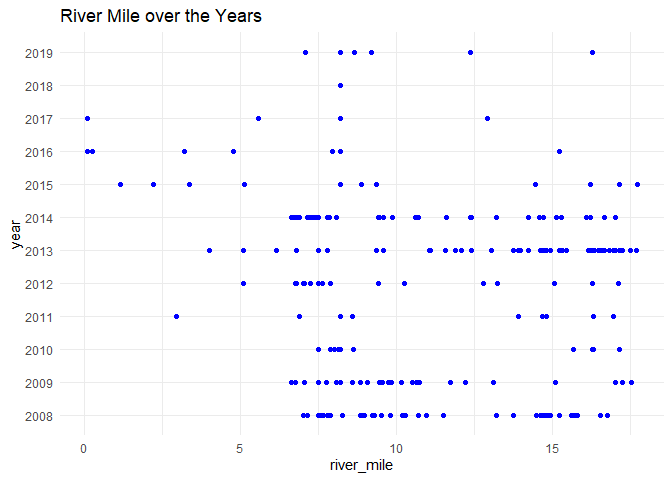
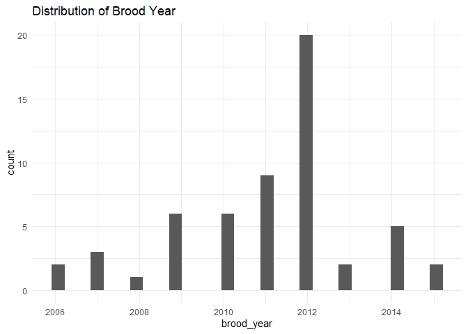

Clear Carcass Survey QC
================
Inigo Peng
11/4/2021

# Clear Creek Adult Carcass Survey

## Description of Monitoring Data

This carcass data were collected by the U.S. Fish and Wildlife
Service’s, Red Bluff Fish and Wildlife Office’s, Clear Creek Monitoring
Program.This data encompass spring-run Chinook Salmon carcasses
retrieved on redd and escapement index surveys from 2008 to 2019 on
Clear Creek. Data were collected on lower Clear Creek from Whiskeytown
Dam located at river mile 18.1, (40.597786N latitude, -122.538791W
longitude) to the Clear Creek Video Station located at river mile 0.0
(40.504836N latitude, -122.369693W longitude) near the confluence with
the Sacramento River.

**Timeframe:** 2008 - 2019

**Completeness of Record throughout timeframe:**

Data available for all years.

**Sampling Location:** Clear Creek

**Data Contact:** [Ryan Schaefer](mailto:ryan_a_schaefer@fws.gov)

This
[report](https://www.fws.gov/redbluff/CC%20BC/Battle%20Creek%20Monitoring%20Final%20Reports/2019%20Battle%20Creek%20Adult%20Monitoring%20Report.pdf)
gives additional information on Adult Chinook monitoring and carcass
collection.

## Access Cloud Data

``` r
# Run Sys.setenv() to specify GCS_AUTH_FILE and GCS_DEFAULT_BUCKET before running 
# getwd() to see how to specify paths 
# Open object from google cloud storage
# Set your authentication using gcs_auth
gcs_auth(json_file = Sys.getenv("GCS_AUTH_FILE"))
# Set global bucket 
gcs_global_bucket(bucket = Sys.getenv("GCS_DEFAULT_BUCKET"))
# git data and save as xlsx
gcs_get_object(object_name = "adult-holding-redd-and-carcass-surveys/clear-creek/data-raw/FlowWest SCS JPE Data Request_Clear Creek.xlsx",
               bucket = gcs_get_global_bucket(),
               saveToDisk = "raw_redd_holding_carcass_data.xlsx")
               # Overwrite = TRUE)
```

Read in data from google cloud, glimpse raw data sheet:

``` r
raw_carcass_data <-readxl::read_excel("raw_redd_holding_carcass_data.xlsx", sheet = "Carcass") %>% glimpse()
```

    ## Rows: 601
    ## Columns: 40
    ## $ `QC Date`                       <dttm> 2019-02-08, 2019-02-08, 2019-02-08, 2~
    ## $ `QC Type`                       <chr> "Shapefile/Annual Excel", "Shapefile/A~
    ## $ Inspector                       <chr> "RS", "RS", "RS", "RS", "RS", "RS", "R~
    ## $ Year                            <dbl> 2008, 2008, 2008, 2008, 2008, 2008, 20~
    ## $ Survey                          <chr> "snorkel", "snorkel", "snorkel", "snor~
    ## $ Type                            <chr> "snorkel", "snorkel", "snorkel", "snor~
    ## $ DATE                            <dttm> 2008-09-10, 2008-09-23, 2008-09-23, 2~
    ## $ POINT_X                         <dbl> -122.5247, -122.5339, -121.7493, -122.~
    ## $ POINT_Y                         <dbl> 40.51367, 40.57413, 40.71537, 40.56912~
    ## $ REACH                           <chr> "R3", "R2", "R2", "R2", "R2", "R4", "R~
    ## $ River_Mile                      <dbl> 10.968258, 15.600476, 14.922846, 15.22~
    ## $ OBS_ONLY                        <chr> "NO", "NO", "NO", "YES", "YES", "NO", ~
    ## $ YEAR_ID                         <chr> "08", "08", "08", "08", "08", "08", "0~
    ## $ SAMPLE_ID                       <dbl> 60024, 60008, 60009, 69000, 69001, 600~
    ## $ SPECIES                         <chr> "Chinook", "Chinook", "Chinook", "Chin~
    ## $ ADIPOSE                         <chr> "PRESENT", "PRESENT", "PRESENT", "PRES~
    ## $ FORK_LEN__                      <chr> NA, "825", "665", NA, NA, "689", "770"~
    ## $ CONDIT                          <chr> "UNKNOWN", "NON-FRESH", "NON-FRESH", "~
    ## $ TIS_ETH                         <chr> "FIN", "FIN", "FIN", "NO SAMPLE", "NO ~
    ## $ TIS_DRY                         <chr> "FIN", "FIN", "FIN", "NO SAMPLE", "NO ~
    ## $ SCALE                           <chr> "YES", "YES", "YES", "NO", "NO", "YES"~
    ## $ OTOLITH_ST                      <chr> "NO", "YES", "YES", "NO", "NO", "YES",~
    ## $ GENDER                          <chr> "UNKNOWN", "MALE", "FEMALE", "UNKNOWN"~
    ## $ WHY_GENDER                      <chr> NA, NA, NA, NA, NA, NA, NA, NA, NA, NA~
    ## $ SPAWN_ST                        <chr> "UNKNOWN", "UNKNOWN", "PARTIAL", "UNKN~
    ## $ WHY_NOT_SP                      <chr> NA, NA, NA, NA, NA, NA, NA, NA, NA, NA~
    ## $ HEAD_TAK                        <chr> "NO", "NO", "NO", "NO", "NO", "NO", "N~
    ## $ TAG_TYPE                        <chr> "NONE", "NONE", "NONE", "NONE", "NONE"~
    ## $ Photo                           <chr> NA, NA, NA, NA, NA, NA, NA, NA, NA, NA~
    ## $ COMMENTS                        <chr> "old placer bridge", NA, "Many undevel~
    ## $ `CWT Code`                      <chr> NA, NA, NA, NA, NA, NA, NA, NA, NA, NA~
    ## $ Run                             <chr> NA, NA, NA, NA, NA, NA, NA, NA, NA, NA~
    ## $ BY                              <chr> NA, NA, NA, NA, NA, NA, NA, NA, NA, NA~
    ## $ `Release Location`              <chr> NA, NA, NA, NA, NA, NA, NA, NA, NA, NA~
    ## $ Hatchery                        <chr> NA, NA, NA, NA, NA, NA, NA, NA, NA, NA~
    ## $ AGE                             <chr> NA, NA, NA, NA, NA, NA, NA, NA, NA, NA~
    ## $ `Mark Rate`                     <dbl> NA, NA, NA, NA, NA, NA, NA, NA, NA, NA~
    ## $ `Verification and CWT comments` <chr> NA, NA, NA, NA, NA, NA, NA, NA, NA, NA~
    ## $ `Run Call`                      <chr> NA, NA, NA, NA, NA, NA, NA, NA, NA, NA~
    ## $ Genetic                         <chr> NA, NA, NA, NA, NA, NA, NA, NA, NA, NA~

``` r
cleaner_data <- raw_carcass_data %>% 
  janitor::clean_names() %>% 
  rename('longitude' = 'point_x',
         'latitude' = 'point_y',
         'condition' = 'condit',
         'sex' = 'gender',
         'why_sex_unknown' = 'why_gender',
         'head_retrieved' = 'head_tak',
         'spawn_status' = 'spawn_st',
         'brood_year' = 'by',
         'fork_length' = 'fork_len') %>% 
  mutate(date = as.Date(date),
         fork_length = as.numeric(fork_length),
         age = as.numeric(age),
         brood_year = as.numeric(brood_year),
         sample_id = as.character(sample_id)) %>% 
    filter(species == "Chinook") %>%
    select(-c('survey','qc_type','qc_date','inspector','year', 'year_id', 'species')) %>% 
  glimpse()
```

    ## Warning in mask$eval_all_mutate(quo): NAs introduced by coercion

    ## Rows: 561
    ## Columns: 33
    ## $ type                          <chr> "snorkel", "snorkel", "snorkel", "snorke~
    ## $ date                          <date> 2008-09-10, 2008-09-23, 2008-09-23, 200~
    ## $ longitude                     <dbl> -122.5247, -122.5339, -121.7493, -122.53~
    ## $ latitude                      <dbl> 40.51367, 40.57413, 40.71537, 40.56912, ~
    ## $ reach                         <chr> "R3", "R2", "R2", "R2", "R2", "R4", "R4"~
    ## $ river_mile                    <dbl> 10.968258, 15.600476, 14.922846, 15.2230~
    ## $ obs_only                      <chr> "NO", "NO", "NO", "YES", "YES", "NO", "N~
    ## $ sample_id                     <chr> "60024", "60008", "60009", "69000", "690~
    ## $ adipose                       <chr> "PRESENT", "PRESENT", "PRESENT", "PRESEN~
    ## $ fork_length                   <dbl> NA, 825, 665, NA, NA, 689, 770, 725, 712~
    ## $ condition                     <chr> "UNKNOWN", "NON-FRESH", "NON-FRESH", "NO~
    ## $ tis_eth                       <chr> "FIN", "FIN", "FIN", "NO SAMPLE", "NO SA~
    ## $ tis_dry                       <chr> "FIN", "FIN", "FIN", "NO SAMPLE", "NO SA~
    ## $ scale                         <chr> "YES", "YES", "YES", "NO", "NO", "YES", ~
    ## $ otolith_st                    <chr> "NO", "YES", "YES", "NO", "NO", "YES", "~
    ## $ sex                           <chr> "UNKNOWN", "MALE", "FEMALE", "UNKNOWN", ~
    ## $ why_sex_unknown               <chr> NA, NA, NA, NA, NA, NA, NA, NA, NA, NA, ~
    ## $ spawn_status                  <chr> "UNKNOWN", "UNKNOWN", "PARTIAL", "UNKNOW~
    ## $ why_not_sp                    <chr> NA, NA, NA, NA, NA, NA, NA, NA, NA, NA, ~
    ## $ head_retrieved                <chr> "NO", "NO", "NO", "NO", "NO", "NO", "NO"~
    ## $ tag_type                      <chr> "NONE", "NONE", "NONE", "NONE", "NONE", ~
    ## $ photo                         <chr> NA, NA, NA, NA, NA, NA, NA, NA, NA, NA, ~
    ## $ comments                      <chr> "old placer bridge", NA, "Many undevelop~
    ## $ cwt_code                      <chr> NA, NA, NA, NA, NA, NA, NA, NA, NA, NA, ~
    ## $ run                           <chr> NA, NA, NA, NA, NA, NA, NA, NA, NA, NA, ~
    ## $ brood_year                    <dbl> NA, NA, NA, NA, NA, NA, NA, NA, NA, NA, ~
    ## $ release_location              <chr> NA, NA, NA, NA, NA, NA, NA, NA, NA, NA, ~
    ## $ hatchery                      <chr> NA, NA, NA, NA, NA, NA, NA, NA, NA, NA, ~
    ## $ age                           <dbl> NA, NA, NA, NA, NA, NA, NA, NA, NA, NA, ~
    ## $ mark_rate                     <dbl> NA, NA, NA, NA, NA, NA, NA, NA, NA, NA, ~
    ## $ verification_and_cwt_comments <chr> NA, NA, NA, NA, NA, NA, NA, NA, NA, NA, ~
    ## $ run_call                      <chr> NA, NA, NA, NA, NA, NA, NA, NA, NA, NA, ~
    ## $ genetic                       <chr> NA, NA, NA, NA, NA, NA, NA, NA, NA, NA, ~

## Data Dictionary

The following table describes the variables included in this dataset and
the percent that do not include data.

``` r
percent_na <- cleaner_data %>%
  summarise_all(list(name = ~sum(is.na(.))/length(.))) %>%
  pivot_longer(cols = everything())
  
data_dictionary <- tibble(variables = colnames(cleaner_data),
                          description = c("Survey type", 
                                          "Date of sampling",
                                          "GPS X point",
                                          "GPS Y point",
                                          "Reach number (1-7); other location",
                                          "River mile number",
                                          "True if the fish was observed and not sampled (T/F)",
                                          "Unique sample ID number",
                                          "Adipose status (absent, present, unknown)",
                                          "Fork length of fish in mm",
                                          "Condition of fish (fresh or not fresh)",
                                          "? TODO", 
                                          "? TODO", 
                                          "True if a scale sample was taken", 
                                          "True if an otolith sample was taken",
                                          "Male, Female, Unknown",
                                          "Why fish sex is unknown (decomposed, predation, NA)",
                                          "Spawning status (partial, spawned, unspawned)",
                                          "Why not spawned (decomposed, male, male always unknown, most eggs present, observed only, predation, prespawn, too decomposed",
                                          "True if fish head was retrieved", 
                                          "Type of tag, if any present (Floy, external mark)",
                                          "Code describing if a photo of the carcass was taken, TODO get code definitions", 
                                          "General comments from survey crew",
                                          "Coded wire tag number",
                                          "Run of Chinook (spring, fall, late-fall, winter, hybrid, unknown)",
                                          "Brood year of carcass found", 
                                          "Location where hatchery smolts were released, TODO figure out how this is relevent to carcass data", 
                                          "Hatchery that produced the fish (Coleman hatchery or feather river hatchery)", 
                                          "Age of fish", 
                                          "Rate at which Hatchery Fish were marked, TODO figure out what this means",
                                          "CWT code and relevant information, TODO clean this up",
                                          "Run call based on field data, TODO differnciate from other run",
                                          "Type of genetics taken, TODO elaborate on options"),
                          
                          percent_na = round(percent_na$value*100)
                          
)
knitr::kable(data_dictionary)
```

| variables                        | description                                                                                                                   | percent\_na |
|:---------------------------------|:------------------------------------------------------------------------------------------------------------------------------|------------:|
| type                             | Survey type                                                                                                                   |           0 |
| date                             | Date of sampling                                                                                                              |           0 |
| longitude                        | GPS X point                                                                                                                   |           0 |
| latitude                         | GPS Y point                                                                                                                   |           0 |
| reach                            | Reach number (1-7); other location                                                                                            |           0 |
| river\_mile                      | River mile number                                                                                                             |           0 |
| obs\_only                        | True if the fish was observed and not sampled (T/F)                                                                           |           0 |
| sample\_id                       | Unique sample ID number                                                                                                       |           1 |
| adipose                          | Adipose status (absent, present, unknown)                                                                                     |           0 |
| fork\_length                     | Fork length of fish in mm                                                                                                     |          16 |
| condition                        | Condition of fish (fresh or not fresh)                                                                                        |           0 |
| tis\_eth                         | ? TODO                                                                                                                        |           0 |
| tis\_dry                         | ? TODO                                                                                                                        |           0 |
| scale                            | True if a scale sample was taken                                                                                              |           0 |
| otolith\_st                      | True if an otolith sample was taken                                                                                           |           0 |
| sex                              | Male, Female, Unknown                                                                                                         |           0 |
| why\_sex\_unknown                | Why fish sex is unknown (decomposed, predation, NA)                                                                           |          90 |
| spawn\_status                    | Spawning status (partial, spawned, unspawned)                                                                                 |           1 |
| why\_not\_sp                     | Why not spawned (decomposed, male, male always unknown, most eggs present, observed only, predation, prespawn, too decomposed |          21 |
| head\_retrieved                  | True if fish head was retrieved                                                                                               |           0 |
| tag\_type                        | Type of tag, if any present (Floy, external mark)                                                                             |           1 |
| photo                            | Code describing if a photo of the carcass was taken, TODO get code definitions                                                |          51 |
| comments                         | General comments from survey crew                                                                                             |          65 |
| cwt\_code                        | Coded wire tag number                                                                                                         |          87 |
| run                              | Run of Chinook (spring, fall, late-fall, winter, hybrid, unknown)                                                             |          90 |
| brood\_year                      | Brood year of carcass found                                                                                                   |          90 |
| release\_location                | Location where hatchery smolts were released, TODO figure out how this is relevent to carcass data                            |          90 |
| hatchery                         | Hatchery that produced the fish (Coleman hatchery or feather river hatchery)                                                  |          90 |
| age                              | Age of fish                                                                                                                   |          80 |
| mark\_rate                       | Rate at which Hatchery Fish were marked, TODO figure out what this means                                                      |          98 |
| verification\_and\_cwt\_comments | CWT code and relevant information, TODO clean this up                                                                         |          99 |
| run\_call                        | Run call based on field data, TODO differnciate from other run                                                                |          68 |
| genetic                          | Type of genetics taken, TODO elaborate on options                                                                             |          89 |

## Explore date

``` r
summary(cleaner_data$date)
```

    ##         Min.      1st Qu.       Median         Mean      3rd Qu.         Max. 
    ## "2008-09-10" "2009-10-19" "2012-10-01" "2012-06-26" "2014-10-07" "2019-10-08"

**NA and Unknown Values**

-   0 % of values in the `date` column are NA.

## Explore Categorical Data

``` r
cleaner_data %>% select_if(is.character) %>% colnames()
```

    ##  [1] "type"                          "reach"                        
    ##  [3] "obs_only"                      "sample_id"                    
    ##  [5] "adipose"                       "condition"                    
    ##  [7] "tis_eth"                       "tis_dry"                      
    ##  [9] "scale"                         "otolith_st"                   
    ## [11] "sex"                           "why_sex_unknown"              
    ## [13] "spawn_status"                  "why_not_sp"                   
    ## [15] "head_retrieved"                "tag_type"                     
    ## [17] "photo"                         "comments"                     
    ## [19] "cwt_code"                      "run"                          
    ## [21] "release_location"              "hatchery"                     
    ## [23] "verification_and_cwt_comments" "run_call"                     
    ## [25] "genetic"

### Variable: `type`

**Description:** Survey Type (Kayak, Rotary Screw Trap, CCVS, Etc.)

TODO: metadata question: what is psam and ccvs?

``` r
cleaner_data$type <- tolower(cleaner_data$type)
table(cleaner_data$type)
```

    ## 
    ##    ccvs    psam      pw snorkel 
    ##       7       1     242     311

**NA and Unknown Values**

-   0 % of values in the `survey` column are NA.

### Variable: `reach`

**Description:** Reach surveyed on each survey day

``` r
table(cleaner_data$reach)
```

    ## 
    ##  R1  R2  R3  R4  R5 R5A R5B R5C  R6 R6A  R7 
    ##  41  52  18  48   3 204 151  23  10   1  10

**NA and Unknown Values**

-   0 % of values in the `reach` column are NA.

### Variable: `obs_only`

``` r
cleaner_data <- cleaner_data %>%
  mutate(obs_only = tolower(obs_only),
         obs_only = case_when(
           obs_only == "no" ~ FALSE,
           obs_only == "yes" ~ TRUE
         ))
table(cleaner_data$obs_only)
```

    ## 
    ## FALSE  TRUE 
    ##   521    40

**NA and Unknown Values**

-   0 % of values in the `obs_only` column are NA.

### Variable: `adipose`

**Description:** Indicates the presence or absence of an adipose fin

``` r
cleaner_data <- cleaner_data %>% 
  mutate(adipose = tolower(adipose))
table(cleaner_data$adipose)
```

    ## 
    ##  absent present unknown 
    ##      54     465      42

**NA and Unknown Values**

-   0 % of values in the `adipose` column are NA.

### Variable: `condition`

**Description:** fresh or not fresh

``` r
cleaner_data <- cleaner_data %>% 
  mutate(condition = tolower(condition),
         condition = ifelse(condition == "unknown", NA_character_, condition))
table(cleaner_data$condition)
```

    ## 
    ##     fresh non-fresh 
    ##       367       187

**NA and Unknown Values**

-   1.2 % of values in the `condition` column are NA.

### Variable: `tis_eth`

**Description:** Tissue for ethanol storage?

``` r
cleaner_data <- cleaner_data %>% 
  mutate(tis_eth = tolower(tis_eth))
table(cleaner_data$tis_eth)
```

    ## 
    ##       fin no sample operculum      skin 
    ##       450        59        49         3

**NA and Unknown Values**

-   0 % of values in the `tis_eth` column are NA.

### Variable: `tis_dry`

**Description:** Dry tissue sample? Yes or No

``` r
cleaner_data <- cleaner_data %>% 
  mutate(tis_dry = tolower(tis_dry))
table(cleaner_data$tis_dry)
```

    ## 
    ##       fin no sample operculum      skin 
    ##       448        60        50         3

**NA and Unknown Values**

-   0 % of values in the `tis_dry` column are NA.

### Variable: `scale`

**Description:** Scales collected? Yes or No

``` r
cleaner_data <- cleaner_data %>% 
  mutate(scale = tolower(scale),
         scale = case_when(
           scale == "no" ~ FALSE,
           scale == "yes" ~ TRUE
         ))
table(cleaner_data$scale)
```

    ## 
    ## FALSE  TRUE 
    ##    78   483

**NA and Unknown Values**

-   0 % of values in the `scale` column are NA.

### Variable: `otolith_st`

**Description:** Otoliths collected? Yes or No

``` r
cleaner_data <- cleaner_data %>% 
  mutate(otolith_st = tolower(otolith_st),
         otolith_st = case_when(
           otolith_st == "no" ~ FALSE,
           otolith_st == "yes" ~ TRUE
         ))
table(cleaner_data$otolith_st)
```

    ## 
    ## FALSE  TRUE 
    ##    93   468

**NA and Unknown Values**

-   0 % of values in the `otolith_st` column are NA.

### Variable: `sex`

**Description:** sex of carcass

``` r
cleaner_data <- cleaner_data %>% 
  mutate(sex = tolower(sex),
         sex = ifelse(sex == "unknown", NA_character_, sex))
table(cleaner_data$sex)
```

    ## 
    ## female   male 
    ##    126    367

**NA and Unknown Values**

-   12.1 % of values in the `sex` column are NA.

### Variable: `why_sex_unknown`

**Description:** Indicates why sex is unknown

``` r
cleaner_data <- cleaner_data %>% 
  mutate(why_sex_unknown = tolower(why_sex_unknown))
table(cleaner_data$why_sex_unknown)
```

    ## 
    ## decomposed  predation 
    ##         37         18

**NA and Unknown Values**

-   90.2 % of values in the `why_sex_unknown` column are NA.

### Variable: `spawn_status`

**Description:** Spawning status (spawned, unspawned, unknown)

``` r
cleaner_data <- cleaner_data %>% 
  mutate(spawn_status = tolower(spawn_status),
         spawn_status = ifelse(spawn_status == "unknown", NA_character_, spawn_status))
table(cleaner_data$spawn_status)
```

    ## 
    ##   partial   spawned unspawned 
    ##         5       102         6

**NA and Unknown Values**

-   79.9 % of values in the `spawn_status` column are NA.

### Variable: `why_not_sp`

**Description:** If unspawned, why unspawned (Predation, etc)

TODO what is male always unknown?

``` r
cleaner_data <- cleaner_data %>% 
  mutate(why_not_sp = tolower(why_not_sp),
         why_not_sp = case_when(
           why_not_sp == "decomposition" ~ "decomposed",
           why_not_sp == "unknown"| why_not_sp == "n/a"| why_not_sp == "na" ~ NA_character_,
           why_not_sp == "male-always unknown" | why_not_sp == "males-always unk" ~ "male always unknown",
           TRUE ~ as.character(why_not_sp)
           ))
table(cleaner_data$why_not_sp)
```

    ## 
    ##          decomposed                male male always unknown   most eggs present 
    ##                  10                  17                 300                   1 
    ##       observed only           predation            prespawn      too decomposed 
    ##                   1                  25                   1                  29

**NA and Unknown Values**

-   79.9 % of values in the `spawn_status` column are NA.

### Variable: `head_retrieved`

**Description:** Indicates if head was retreived for coded wire tag
extraction

``` r
cleaner_data <- cleaner_data %>% 
  mutate(head_retrieved = tolower(head_retrieved),
         head_retrieved = case_when(
           head_retrieved == "no" ~ FALSE,
           head_retrieved == "yes" ~ TRUE
         ))
table(cleaner_data$head_retrieved)
```

    ## 
    ## FALSE  TRUE 
    ##   482    79

**NA and Unknown Values**

-   0 % of values in the `head_retrieved` column are NA.

### Variable: `tag_type`

**Description:** Type of tag, if any present (Floy, external mark)

``` r
cleaner_data<- cleaner_data %>% 
  mutate(tag_type = tolower(tag_type),
         tag_type = case_when(
           tag_type == "floy, grey" ~ "floy grey",
           tag_type == "floy, yellow, 309,310" ~ "floy yellow 309 310",
           TRUE ~ as.character(tag_type)
         )
         )
table(cleaner_data$tag_type)
```

    ## 
    ##           floy grey floy yellow 309 310                none 
    ##                   1                   1                 552

**NA and Unknown Values**

-   1.2 % of values in the `tag_type` column are NA.

### Variable: `photo`

**Description:** Photo taken of the carcass?

``` r
cleaner_data<- cleaner_data %>% 
  mutate(photo = case_when(
    photo == "No"| photo == "NO"| photo == "No picture" | photo == "Cant find" | photo == "missing picture" ~ "no",
    photo == "YES" | photo == "Yes" ~ "yes",
    TRUE ~ as.character(photo)
    
  ))
table(cleaner_data$photo)
```

    ## 
    ##   1   2   3   4   5   6  no yes 
    ##  25  13   8   4   3   2  31 187

TODO: metadata issue - what do the numbers stand for? Number of
pictures?

**NA and Unknown Values**

-   51.3 % of values in the `photo` column are NA.

### Variable: `comments`

``` r
unique(cleaner_data$comments[1:5])
```

    ## [1] "old placer bridge"      NA                       "Many undeveloped eggs."
    ## [4] "Partial carcass."

**NA and Unknown Values**

-   64.5 % of values in the `comments` column are NA.

### Variable: `cwt_code`

TODO: metadata - what is “LT”, “NTD”

``` r
table(cleaner_data$cwt_code)
```

    ## 
    ##    053794    055181    055376    055393    055599    055670    055771    055775 
    ##         1         1         1         1         1         1         2         2 
    ##    055776    055873    055876    060374    060389    060390    060391    060393 
    ##         1         1         1         1         5         1         1         1 
    ##    060462    060464    060465    060467    060468    060472    060565    062589 
    ##         6         5         1         2         1         4         1         1 
    ##    068009    068035    068609    068624    068667    068747    068750 601090207 
    ##         1         3         1         1         1         3         1         1 
    ##     68610        LT       NTD 
    ##         1         1        18

There are 36 unique coded wire tags.

**NA and Unknown Values**

-   86.6 % of values in the `cwt_code` column are NA.

### Variable: `run`

``` r
cleaner_data <- cleaner_data %>% 
  mutate(run = tolower(run),
         run = case_when(
           run == 'hybrid (5)' ~ 'hybrid',
           TRUE ~ as.character(run)
         ))
table(cleaner_data$run)
```

    ## 
    ##      fall    hybrid late fall    spring    winter 
    ##        28         1         1        19         7

**NA and Unknown Values**

-   90 % of values in the `run` column are NA.

### Variable: `release_location`

**Description:** Where hatchery smolts were released

Note: why is smolts location part of the data for carcass?

``` r
cleaner_data <- cleaner_data %>% 
  mutate(release_location = str_to_title(release_location),
         release_location = case_when(
           release_location == 'Sac R Lake Redding' ~ 'Sac R Lake Redding Park',
           TRUE ~ as.character(release_location)
         ))
table(cleaner_data$release_location)
```

    ## 
    ##                     Cnfh              Coleman Nfh                 Crockett 
    ##                        3                        3                        2 
    ##        Elkhorn Boat Ramp  Feather Boyds Pump Ramp      Fort Baker Minor Pt 
    ##                        1                        1                        4 
    ## Half Moon Bay Johnson Pr      Mare Island Net Pen     Princeton Minor Port 
    ##                        1                        4                        1 
    ##  Sac R Lake Redding Park                San Pablo            San Pablo Bay 
    ##                        7                        2                        5 
    ##   San Pablo Bay Net Pens         Tiburon Net Pens     Wickland Oil Net Pen 
    ##                       12                        2                        7 
    ##         Wickland Oil Pen 
    ##                        1

**NA and Unknown Values**

-   90 % of values in the `release_location` column are NA.

### Variable: `hatchery`

**Description:** Hatchery that produced the fish

``` r
# table(cleaner_data$hatchery)
cleaner_data <- cleaner_data %>% 
  mutate(hatchery = tolower(hatchery),
         hatchery = case_when(
           hatchery == "feather r hatchery" | hatchery == "feather river" | hatchery == "frh" ~ "feather river hatchery",
           hatchery == "cnfh" ~ "coleman nfh", 
           TRUE ~ as.character(hatchery)
           ))
table(cleaner_data$hatchery)
```

    ## 
    ##            coleman nfh feather river hatchery                  lsnfh 
    ##                      6                     43                      7

**NA and Unknown Values**

-   90 % of values in the `hatchery` column are NA.

### Variable: `verification_and_cwt_comments`

**Description:** CWT code and relevant information

``` r
unique(cleaner_data$verification_and_cwt_comments)[1:5]
```

    ## [1] NA                                                            
    ## [2] "Fort Baker is near Salsalito and was part of the barge study"
    ## [3] "said was excised in field, not in box"                       
    ## [4] "need to track down this sample data"                         
    ## [5] "L F WEIR PROTOCOLS?"

**NA and Unknown Values**

-   98.8 % of values in the `verification_and_cwt_comments` column are
    NA.

### Variable: `sample_id`

**Description:** Tissue sample identification number

``` r
unique(cleaner_data$sample_id)[1:5]
```

    ## [1] "60024" "60008" "60009" "69000" "69001"

There are 260 unique sample IDs.

**NA and Unknown Values**

-   1.2 % of values in the `sample_id` column are NA.

### Variable: `run_call`

**Description:** Run call based on field data

TODO: how is this different from run?

``` r
cleaner_data <- cleaner_data %>% 
  mutate(run_call = tolower(run_call))
  
table(cleaner_data$run_call)
```

    ## 
    ##          either            fall  fall or spring prespawn spring          sprall 
    ##               7              36               6               5               7 
    ##          spring 
    ##             119

**NA and Unknown Values**

-   67.9 % of values in the `run_call` column are NA.

### Variable: `genetic`

**Description:** Type of genetics taken

``` r
cleaner_data$genetic <- tolower(cleaner_data$genetic)
table(cleaner_data$genetic)
```

    ## 
    ##   1 x no call fcs snps only     never run           scs 
    ##            25             2             1            36

TODO: metadata need descriptions on these variables

**NA and Unknown Values**

-   88.6 % of values in the `genetic` column are NA.

## Explore Numerical Data

``` r
cleaner_data %>% select_if(is.numeric) %>% colnames()
```

    ## [1] "longitude"   "latitude"    "river_mile"  "fork_length" "brood_year" 
    ## [6] "age"         "mark_rate"

### Variable: `longitude`, `latitude`

``` r
summary(cleaner_data$longitude)
```

    ##    Min. 1st Qu.  Median    Mean 3rd Qu.    Max.    NA's 
    ##  -122.6  -122.5  -122.5  -122.5  -122.5  -121.7       1

``` r
summary(cleaner_data$latitude)
```

    ##    Min. 1st Qu.  Median    Mean 3rd Qu.    Max.    NA's 
    ##   40.49   40.49   40.49   40.51   40.50   40.72       1

**NA and Unknown Values**

-   0.2 % of values in the `longitude` column are NA.

-   0.2 % of values in the `latitude` column are NA.

## Variable: `river_mile`

``` r
cleaner_data %>%
  mutate(year = as.factor(year(date))) %>% 
  ggplot(aes(x = river_mile, y = year))+
  geom_point(alpha = 1.2, color = 'blue')+
  labs(title = 'River Mile over the Years')+
  theme_minimal()
```

    ## Warning: Removed 1 rows containing missing values (geom_point).

<!-- -->

**Numeric Summary of river\_mile over Period of Time**

``` r
summary(cleaner_data$river_mile)
```

    ##    Min. 1st Qu.  Median    Mean 3rd Qu.    Max.    NA's 
    ##  0.1029  7.4829  8.1360  9.1373  9.4564 17.7193       1

**NA and Unknown Values**

-   0.2 % of values in the `river_mile` column are NA.

### Variable: `brood_year`

``` r
cleaner_data %>% 
  ggplot(aes(x = brood_year))+
  geom_histogram()+
  theme_minimal()+
  scale_x_continuous(breaks = pretty_breaks())+
  labs(title = "Distribution of Brood Year")
```

    ## `stat_bin()` using `bins = 30`. Pick better value with `binwidth`.

    ## Warning: Removed 505 rows containing non-finite values (stat_bin).

<!-- -->

**Numeric Summary of brood\_year over Period of Time**

``` r
summary(cleaner_data$brood_year)
```

    ##    Min. 1st Qu.  Median    Mean 3rd Qu.    Max.    NA's 
    ##    2006    2010    2012    2011    2012    2015     505

**NA and Unknown Values**

-   90 % of values in the `brood_year` column are NA.

### Variable: `fork_length`

**Description:** Fork length of recovered carcasses

``` r
cleaner_data %>% 
  ggplot(aes(x = fork_length))+
  geom_histogram()+
  theme_minimal()+
  labs(title = "Distribution of Fork Length")
```

    ## `stat_bin()` using `bins = 30`. Pick better value with `binwidth`.

    ## Warning: Removed 89 rows containing non-finite values (stat_bin).

<!-- -->

**Numeric Summary of fork\_length over Period of Time**

``` r
summary(cleaner_data$fork_length)
```

    ##    Min. 1st Qu.  Median    Mean 3rd Qu.    Max.    NA's 
    ##   430.0   623.8   700.0   707.5   790.0  1040.0      89

**NA and Unknown Values**

-   15.9 % of values in the `fork_length` column are NA.

### Variable: `age`

``` r
cleaner_data %>% 
  ggplot(aes(x= age))+
  geom_histogram()+
  theme_minimal()+
  labs(title = "Distribution of Age")
```

    ## `stat_bin()` using `bins = 30`. Pick better value with `binwidth`.

    ## Warning: Removed 449 rows containing non-finite values (stat_bin).

<!-- -->

**Numeric Summary of Age Over Period of Time**

``` r
summary(cleaner_data$age)
```

    ##    Min. 1st Qu.  Median    Mean 3rd Qu.    Max.    NA's 
    ##   2.000   2.000   3.000   2.759   3.000   4.000     449

**NA and Unknown Values**

-   80 % of values in the `age` column are NA.

### Variable: `mark_rate`

**Description:** Rate at which Hatchery Fish were marked

``` r
cleaner_data %>% 
  ggplot(aes(x=mark_rate))+
  geom_histogram(binwidth = 0.1)+
  theme_minimal()+
  labs(title = "Distribution of Mark Rate")
```

    ## Warning: Removed 549 rows containing non-finite values (stat_bin).

<!-- -->

``` r
summary(cleaner_data$mark_rate)
```

    ##    Min. 1st Qu.  Median    Mean 3rd Qu.    Max.    NA's 
    ##  0.2477  0.2489  0.6571  0.6237  0.9827  0.9967     549

**NA and Unknown Values**

-   97.9 % of values in the `mark_rate` column are NA.

### Summary of Identified Issues

-   Some columns need better metadata description (tis\_eth, tis\_dry,
    photo, release\_location, mark\_rate,
    verification\_and\_cwt\_comments, run\_call)
-   Some columns such as ‘run’ and ‘run\_call’ seem to contain the same
    type of information but have very different values. TODO need to
    contact Ryan for more details on these columns.

## Next steps

-   Work on data modeling to identify important variables needed for
    carcass datasets.

### Columns to remove

-   Suggest removing some of the location variables we currently have:
    `longitude`, `latitude`, `reach` and `river_mile`.
-   Suggest removing one of the run columns, either `run` or `run_call`
    should be removed
-   `genetics`, `verification_and_cwt_comments`, `mark_rate`,
    `hatchery`, `release_location`, `brood_year`, `comments` and `photo`
    all contain a lot of NA values. These may not be needed.

### Save Cleaned data back to google cloud

``` r
clear_carcass <- cleaner_data %>% glimpse
```

    ## Rows: 561
    ## Columns: 33
    ## $ type                          <chr> "snorkel", "snorkel", "snorkel", "snorke~
    ## $ date                          <date> 2008-09-10, 2008-09-23, 2008-09-23, 200~
    ## $ longitude                     <dbl> -122.5247, -122.5339, -121.7493, -122.53~
    ## $ latitude                      <dbl> 40.51367, 40.57413, 40.71537, 40.56912, ~
    ## $ reach                         <chr> "R3", "R2", "R2", "R2", "R2", "R4", "R4"~
    ## $ river_mile                    <dbl> 10.968258, 15.600476, 14.922846, 15.2230~
    ## $ obs_only                      <lgl> FALSE, FALSE, FALSE, TRUE, TRUE, FALSE, ~
    ## $ sample_id                     <chr> "60024", "60008", "60009", "69000", "690~
    ## $ adipose                       <chr> "present", "present", "present", "presen~
    ## $ fork_length                   <dbl> NA, 825, 665, NA, NA, 689, 770, 725, 712~
    ## $ condition                     <chr> NA, "non-fresh", "non-fresh", "non-fresh~
    ## $ tis_eth                       <chr> "fin", "fin", "fin", "no sample", "no sa~
    ## $ tis_dry                       <chr> "fin", "fin", "fin", "no sample", "no sa~
    ## $ scale                         <lgl> TRUE, TRUE, TRUE, FALSE, FALSE, TRUE, TR~
    ## $ otolith_st                    <lgl> FALSE, TRUE, TRUE, FALSE, FALSE, TRUE, T~
    ## $ sex                           <chr> NA, "male", "female", NA, NA, "female", ~
    ## $ why_sex_unknown               <chr> NA, NA, NA, NA, NA, NA, NA, NA, NA, NA, ~
    ## $ spawn_status                  <chr> NA, NA, "partial", NA, NA, "spawned", NA~
    ## $ why_not_sp                    <chr> NA, NA, NA, NA, NA, NA, NA, NA, NA, NA, ~
    ## $ head_retrieved                <lgl> FALSE, FALSE, FALSE, FALSE, FALSE, FALSE~
    ## $ tag_type                      <chr> "none", "none", "none", "none", "none", ~
    ## $ photo                         <chr> NA, NA, NA, NA, NA, NA, NA, NA, NA, NA, ~
    ## $ comments                      <chr> "old placer bridge", NA, "Many undevelop~
    ## $ cwt_code                      <chr> NA, NA, NA, NA, NA, NA, NA, NA, NA, NA, ~
    ## $ run                           <chr> NA, NA, NA, NA, NA, NA, NA, NA, NA, NA, ~
    ## $ brood_year                    <dbl> NA, NA, NA, NA, NA, NA, NA, NA, NA, NA, ~
    ## $ release_location              <chr> NA, NA, NA, NA, NA, NA, NA, NA, NA, NA, ~
    ## $ hatchery                      <chr> NA, NA, NA, NA, NA, NA, NA, NA, NA, NA, ~
    ## $ age                           <dbl> NA, NA, NA, NA, NA, NA, NA, NA, NA, NA, ~
    ## $ mark_rate                     <dbl> NA, NA, NA, NA, NA, NA, NA, NA, NA, NA, ~
    ## $ verification_and_cwt_comments <chr> NA, NA, NA, NA, NA, NA, NA, NA, NA, NA, ~
    ## $ run_call                      <chr> NA, NA, NA, NA, NA, NA, NA, NA, NA, NA, ~
    ## $ genetic                       <chr> NA, NA, NA, NA, NA, NA, NA, NA, NA, NA, ~

``` r
# gcs_list_objects()
f <- function(input, output) write_csv(input, file = output)
gcs_upload(clear_carcass,
           object_function = f,
           type = "csv",
           name = "adult-holding-redd-and-carcass-surveys/clear-creek/data/clear_carcass.csv")
```
