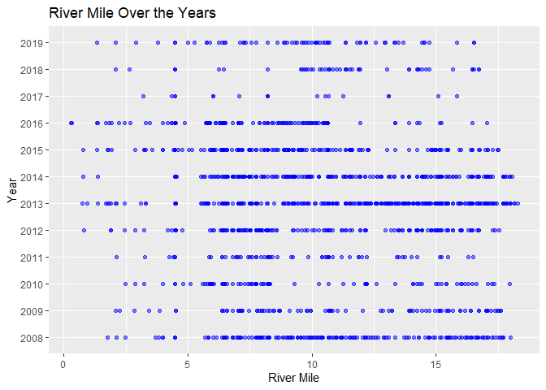

Clear Holding Survey QC
================
Inigo Peng
11/4/2021

# Clear Creek Adult Holding Survey

## Description of Monitoring Data

These data were collected by the U.S. Fish and Wildlife Service’s, Red
Bluff Fish and Wildlife Office’s, Clear Creek Monitoring Program.These
data encompass spring-run Chinook Salmon counts and location data from
2008-2020 surveys. Data were collected on lower Clear Creek from
Whiskeytown Dam located at river mile 18.1, (40.597786N latitude,
-122.538791W longitude) to the Clear Creek Video Station located at
river mile 0.0 (40.504836N latitude, -122.369693W longitude) near the
confluence with the Sacramento River.

All data is gathered from snorkel surveys and data is filtered to only
include Chinook salmon. All data is focused on Spring Run fish.

**Timeframe:** 2008 - 2019

**QC?/Raw data or passage estimates** QC raw holding counts

**Completeness of Record throughout timeframe:** Data available for all
years

**Sampling Location:** Clear Creek

**Data Contact:** [Ryan Schaefer](mailto:ryan_a_schaefer@fws.gov)

This
[report](https://www.fws.gov/redbluff/CC%20BC/Clear%20Creek%20Monitoring%20Final%20Reports/2013-2018%20Clear%20Creek%20Adult%20Spring-run%20Chinook%20Salmon%20Monitoring.pdf)
gives additional information on Adult Chinook monitoring and may have
additional metadata for chinook holding

## Access Cloud Data

``` r
# Run Sys.setenv() to specify GCS_AUTH_FILE and GCS_DEFAULT_BUCKET before running 
# getwd() to see how to specify paths 
# Open object from google cloud storage
# Set your authentication using gcs_auth
gcs_auth(json_file = Sys.getenv("GCS_AUTH_FILE"))
# Set global bucket 
gcs_global_bucket(bucket = Sys.getenv("GCS_DEFAULT_BUCKET"))
# git data and save as xlsx
gcs_get_object(object_name = "adult-holding-redd-and-carcass-surveys/clear-creek/data-raw/FlowWest SCS JPE Data Request_Clear Creek.xlsx",
               bucket = gcs_get_global_bucket(),
               saveToDisk = "raw_redd_holding_carcass_data.xlsx")
               # Overwrite = TRUE)
```

Read in data from google cloud, glimpse raw data sheet:

## Data Transformation

Columns renamed to be clearer, data filtered to just Chinook salmon, and
columns that are all redundant were removed.

``` r
cleaner_data <- raw_holding_data %>% 
  janitor::clean_names() %>% 
  rename('longitude' = 'point_x',
         'latitude' = 'point_y',
         'count' = 'total_fish',
         'jack_count' = 'num_of_jacks',
         'picket_weir_location_rm' = 'pw_location_rm',
         'picket_weir_relate' = 'pw_relate') %>% 
  mutate(date = as.Date(date)) %>% 
  filter(species %in% c("Chinook", "CHINOOK")) %>%
  select(-c('survey','method','qc_type','qc_date','inspector','year', 'species')) %>% #all method is snorkel, year could be extracted from date, 
  glimpse()
```

    ## Rows: 1,430
    ## Columns: 11
    ## $ river_mile              <dbl> 17.641632, 16.697440, 15.571744, 15.473638, 14~
    ## $ longitude               <dbl> -122.5459, -122.5452, -122.5336, -122.5327, -1~
    ## $ latitude                <dbl> 40.59089, 40.58410, 40.57378, 40.57257, 40.564~
    ## $ date                    <date> 2008-06-02, 2008-06-02, 2008-06-02, 2008-06-0~
    ## $ reach                   <chr> "R1", "R1", "R2", "R2", "R2", "R2", "R2", "R3"~
    ## $ count                   <dbl> 1, 3, 1, 1, 1, 1, 2, 1, 1, 1, 1, 3, 1, 2, 1, 1~
    ## $ jack_count              <dbl> 0, 0, 0, 0, 0, 0, 0, 0, 0, 0, 0, 1, 0, 0, 0, 0~
    ## $ comments                <chr> NA, NA, NA, NA, NA, NA, NA, NA, NA, NA, NA, NA~
    ## $ survey_intent           <chr> NA, NA, NA, NA, NA, NA, NA, NA, NA, NA, NA, NA~
    ## $ picket_weir_location_rm <dbl> 7.4, 7.4, 7.4, 7.4, 7.4, 7.4, 7.4, 7.4, 7.4, 7~
    ## $ picket_weir_relate      <chr> "Above", "Above", "Above", "Above", "Above", "~

## Data Dictionary

The following table describes the variables included in this dataset and
the percent that do not include data.

``` r
percent_na <- cleaner_data %>%
  summarise_all(list(name = ~sum(is.na(.))/length(.))) %>%
  pivot_longer(cols = everything())
  
data_dictionary <- tibble(variables = colnames(cleaner_data),
                          description = c("River mile number",
                                          "GPS X point",
                                          "GPS Y point",
                                          "Date of sampling",
                                          "Reach number (1-7); other location",
                                          "Fish Count",
                                          "Total number of 2-year old Chinook Salmon (Jacks/Jills) encountered",
                                          "General comments from survey crew",
                                          "Survey Intent, august index or spawning survey",
                                          "Location of the Picket Weir",
                                          "Fish above or below Picket Weir"),
                          
                          percent_na = round(percent_na$value*100)
                          
)
knitr::kable(data_dictionary)
```

| variables                  | description                                                         | percent\_na |
|:---------------------------|:--------------------------------------------------------------------|------------:|
| river\_mile                | River mile number                                                   |           0 |
| longitude                  | GPS X point                                                         |           0 |
| latitude                   | GPS Y point                                                         |           0 |
| date                       | Date of sampling                                                    |           0 |
| reach                      | Reach number (1-7); other location                                  |           0 |
| count                      | Fish Count                                                          |           0 |
| jack\_count                | Total number of 2-year old Chinook Salmon (Jacks/Jills) encountered |           0 |
| comments                   | General comments from survey crew                                   |          88 |
| survey\_intent             | Survey Intent, august index or spawning survey                      |           9 |
| picket\_weir\_location\_rm | Location of the Picket Weir                                         |           0 |
| picket\_weir\_relate       | Fish above or below Picket Weir                                     |           0 |

## Explore Date

``` r
summary(cleaner_data$date)
```

    ##         Min.      1st Qu.       Median         Mean      3rd Qu.         Max. 
    ## "2008-06-02" "2011-08-25" "2013-08-26" "2013-06-29" "2015-06-12" "2019-10-10"

**NA and Unknown Values**

-   0 % of values in the `date` column are NA.

## Explore Categorical Variables

``` r
cleaner_data %>% 
  select_if(is.character) %>% colnames()
```

    ## [1] "reach"              "comments"           "survey_intent"     
    ## [4] "picket_weir_relate"

### Variable: `reach`

**Description:**

Reach surveyed on each survey day

``` r
table(cleaner_data$reach)
```

    ## 
    ##  R1  R2  R3  R4  R5 R5A R5B R5C  R6 R6A  R7 
    ## 150 274 183 280   9  68  98  95 256   2  15

**NA and Unknown Values**

-   0 % of values in the `reach` column are NA.

### Variable: `comments`

``` r
unique(cleaner_data$comments)[1:5]
```

    ## [1] NA                             "taken with BC#2 wp 3 (+/-29)"
    ## [3] "Carcass Pool"                 "North State Pool"            
    ## [5] "Nude Beach Pool"

**NA and Unknown Values**

-   88.2 % of values in the `comments` column are NA.

### Variable: `survey_intent`

``` r
cleaner_data <- cleaner_data %>% 
  mutate(survey_intent = tolower(survey_intent))

table(cleaner_data$survey_intent)
```

    ## 
    ##          august index picket weir placement            pulse flow 
    ##                   233                     3                   442 
    ##       spawning survey         weir location            winter run 
    ##                   613                     2                     2

**NA and Unknown Values**

-   9.4 % of values in the `survey_intent` column are NA.

### Variable: `picket_weir_relate`

**Description:**

Fish above or below Picket Weir

``` r
cleaner_data <- cleaner_data %>% 
  mutate(picket_weir_relate = tolower(picket_weir_relate))
table(cleaner_data$picket_weir_relate)
```

    ## 
    ## above below 
    ##   994   436

## Explore Numerical Variables

``` r
cleaner_data %>% 
  select_if(is.numeric) %>% colnames()
```

    ## [1] "river_mile"              "longitude"              
    ## [3] "latitude"                "count"                  
    ## [5] "jack_count"              "picket_weir_location_rm"

### Variable: `river_mile`

Plotting river mile over Period of Record

``` r
cleaner_data %>% 
  mutate(year = as.factor(year(date))) %>% 
  ggplot(aes(x = river_mile, y = year)) +
  geom_point(alpha = .5, size = 1.5, color = "blue") +
  labs(x = "River Mile", y = "Year", title = "River Mile Over the Years")
```

<!-- -->

``` r
cleaner_data %>% 
  mutate(year = as.factor(year(date))) %>% 
  ggplot(aes(x= river_mile, y = count, color = year))+
  geom_point()+
  theme_minimal()+
  labs(title = "Fish Count Per River Mile Per Year")
```

<!-- -->

**Numeric Summary of river\_mile Over the Years**

``` r
summary(cleaner_data$river_mile)
```

    ##    Min. 1st Qu.  Median    Mean 3rd Qu.    Max. 
    ##  0.3019  7.1417 10.1530 10.4114 14.0534 18.2856

**NA and Unknown Values**

-   0 % of values in the `river_mile` column are NA.

## Variable: `longitude` and `latitude`

**Numeric Summary of longitude over Period of Record**

``` r
summary(cleaner_data$longitude)
```

    ##    Min. 1st Qu.  Median    Mean 3rd Qu.    Max.    NA's 
    ##  -122.6  -122.5  -122.5  -122.5  -122.5  -122.4       1

**Numeric Summary of latitude over Period of Record**

``` r
summary(cleaner_data$latitude)
```

    ##    Min. 1st Qu.  Median    Mean 3rd Qu.    Max.    NA's 
    ##   40.49   40.49   40.51   40.52   40.55   40.60       1

**NA and Unknown Values**

-   0.1 % of values in the `longitude` column are NA.

-   0.1 % of values in the `latitude` column are NA.

## Variable: `count`

**Description:**

Total number of Adult Chinook Salmon encountered including the number of
2-year olds (Jacks/Jills)

``` r
cleaner_data %>% 
  mutate(year = as.factor(year(date)),
         fake_date = as.Date(paste0("1990", "-", month(date), "-", day(date)))) %>% 
  ggplot(aes(x = fake_date, y = count)) + 
  geom_col() + 
  facet_wrap(~year(date), scales = "free_y") + 
  scale_x_date(labels = date_format("%b"), date_breaks = "1 month") + 
  theme_minimal() + 
  theme(text = element_text(size = 13),
        axis.text.x = element_text(angle = 90, vjust = 0.5, hjust=1)) + 
  labs(title = "Daily Holding Count", 
       x = "Date")  
```

<!-- -->

``` r
cleaner_data %>% 
  group_by(date) %>%
  summarise(daily_count = sum(count)) %>% 
  mutate(year = as.factor(year(date))) %>%
  ggplot(aes(x = year, y = daily_count)) +
  geom_boxplot() +
  theme_minimal() +
  labs(title = "Daily Count Summarized by Year") +
  theme(text = element_text(size = 13),
        axis.text.x = element_text(angle = 90, vjust = 0.5, hjust=1))   +
  scale_y_continuous(limits = c(0, 101))
```

    ## Warning: Removed 15 rows containing non-finite values (stat_boxplot).

<!-- -->

``` r
cleaner_data  %>%
  mutate(year = as.factor(year(date))) %>%
  group_by(year) %>% 
  summarise(total_catch = sum(count)) %>%
  ggplot(aes(x = year, y = total_catch)) + 
  geom_col() + 
  theme_minimal() +
  labs(title = "Total Yearly Fish Count",
       y = "Total fish count") + 
  theme(text = element_text(size = 13),
        axis.text.x = element_text(angle = 90, vjust = 0.5, hjust=1)) 
```

<!-- -->

**Numeric Summary of count over Period of Record**

``` r
summary(cleaner_data$count)
```

    ##    Min. 1st Qu.  Median    Mean 3rd Qu.    Max. 
    ##   1.000   1.000   1.000   3.746   3.000  89.000

**NA and Unknown Values**

-   0 % of values in the `count` column are NA.

## Variable: `jack_count`

**Description:** total number of 2-year old Chinook Salmon (Jacks/Jills)
encountered

``` r
cleaner_data %>% 
  ggplot(aes(x = jack_count)) +
  geom_histogram(bins = 4) +
  theme_minimal() + 
  theme(text = element_text(size = 15)) 
```

<!-- -->

**Numeric Summary of jack count over Period of Record**

``` r
summary(cleaner_data$jack_count)
```

    ##    Min. 1st Qu.  Median    Mean 3rd Qu.    Max. 
    ##  0.0000  0.0000  0.0000  0.1112  0.0000  6.0000

**NA and Unknown Values**

-   0 % of values in the `jack_count` column are NA.

## Variable: `picket_weir_location_rm`

**Description:** location of the Picket Weir

``` r
cleaner_data %>% 
  ggplot(aes(x = picket_weir_location_rm)) +
  geom_histogram(bins = 4) +
  theme_minimal() + 
  theme(text = element_text(size = 15))+
  labs(title = "Distribution of picket_weir_location_rm")
```

<!-- -->

**Numeric Summary of picket\_weir\_location\_rm over Period of Record**

``` r
summary(cleaner_data$picket_weir_location_rm)
```

    ##    Min. 1st Qu.  Median    Mean 3rd Qu.    Max. 
    ##   7.400   7.400   7.400   7.753   8.200   8.200

Seems like there are two locations

**NA and Unknown Values**

-   0 % of values in the `picket_weir_location_rm` column are NA.

## Next steps

### Columns to remove

-   Suggest removing `comments` because there are so few data points.
-   Figure out if picket weir information is important, if not remove
    `picket_weir_location_rm` and `picket_weir_relate`

## Save cleaned data back to google cloud

``` r
clear_holding <- cleaner_data  %>% glimpse()
```

    ## Rows: 1,430
    ## Columns: 11
    ## $ river_mile              <dbl> 17.641632, 16.697440, 15.571744, 15.473638, 14~
    ## $ longitude               <dbl> -122.5459, -122.5452, -122.5336, -122.5327, -1~
    ## $ latitude                <dbl> 40.59089, 40.58410, 40.57378, 40.57257, 40.564~
    ## $ date                    <date> 2008-06-02, 2008-06-02, 2008-06-02, 2008-06-0~
    ## $ reach                   <chr> "R1", "R1", "R2", "R2", "R2", "R2", "R2", "R3"~
    ## $ count                   <dbl> 1, 3, 1, 1, 1, 1, 2, 1, 1, 1, 1, 3, 1, 2, 1, 1~
    ## $ jack_count              <dbl> 0, 0, 0, 0, 0, 0, 0, 0, 0, 0, 0, 1, 0, 0, 0, 0~
    ## $ comments                <chr> NA, NA, NA, NA, NA, NA, NA, NA, NA, NA, NA, NA~
    ## $ survey_intent           <chr> NA, NA, NA, NA, NA, NA, NA, NA, NA, NA, NA, NA~
    ## $ picket_weir_location_rm <dbl> 7.4, 7.4, 7.4, 7.4, 7.4, 7.4, 7.4, 7.4, 7.4, 7~
    ## $ picket_weir_relate      <chr> "above", "above", "above", "above", "above", "~

``` r
gcs_list_objects()
f <- function(input, output) write_csv(input, file = output)
gcs_upload(clear_holding,
           object_function = f,
           type = "csv",
           name = "adult-holding-redd-and-carcass-surveys/clear-creek/data/clear_holding.csv")
```
