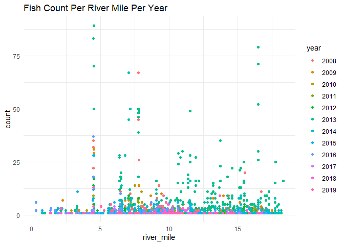
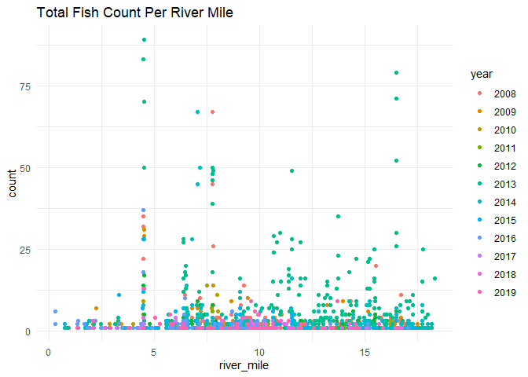
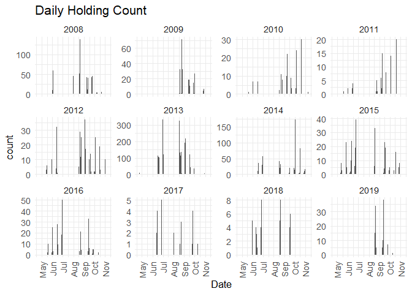
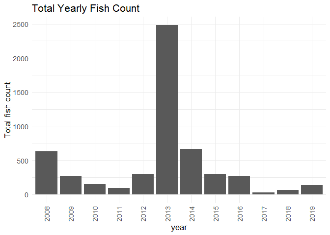
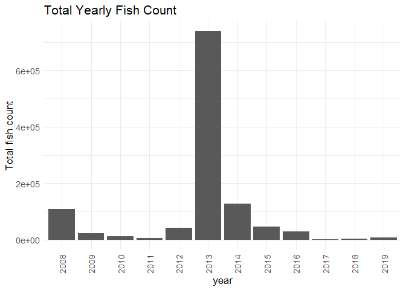
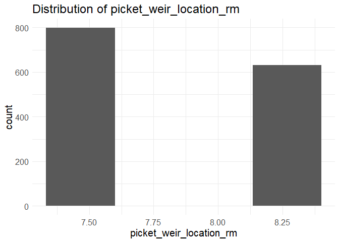

clear\_holding\_survey\_qc
================
Inigo Peng
11/4/2021

# Clear Creek Adult Holding Survey

## Description of Monitoring Data

These data were collected by the U.S. Fish and Wildlife Service’s, Red
Bluff Fish and Wildlife Office’s, Clear Creek Monitoring Program.These
data encompass spring-run Chinook Salmon redd index data from 2000 to
2019. Data were collected on lower Clear Creek from Whiskeytown Dam
located at river mile 18.1, (40.597786N latitude, -122.538791W longitude
\[decimal degrees\]) to the Clear Creek Video Station located at river
mile 0.0 (40.504836N latitude, -122.369693W longitude \[decimal
degrees\]) near the confluence with the Sacramento River.

**Timeframe:** 2008 - 2019

**Completeness of Record throughout timeframe:**

**Sampling Location:** Clear Creek

**Data Contact:** [Ryan Schaefer](mailto:ryan_a_schaefer@fws.gov)

Any additional info?

## Access Cloud Data

``` r
# Run Sys.setenv() to specify GCS_AUTH_FILE and GCS_DEFAULT_BUCKET before running 
# getwd() to see how to specify paths 
# Open object from google cloud storage
# Set your authentication using gcs_auth
gcs_auth(json_file = Sys.getenv("GCS_AUTH_FILE"))
# Set global bucket 
gcs_global_bucket(bucket = Sys.getenv("GCS_DEFAULT_BUCKET"))
# git data and save as xlsx
gcs_get_object(object_name = "adult-holding-redd-and-carcass-surveys/clear-creek/data-raw/FlowWest SCS JPE Data Request_Clear Creek.xlsx",
               bucket = gcs_get_global_bucket(),
               saveToDisk = "raw_redd_holding_carcass_data.xlsx")
               # Overwrite = TRUE)
```

Read in data from google cloud, glimpse raw data sheet:

``` r
raw_holding_data <-readxl::read_excel("raw_redd_holding_carcass_data.xlsx", sheet = "Live") %>% glimpse()
```

    ## Warning in read_fun(path = enc2native(normalizePath(path)), sheet_i = sheet, :
    ## Expecting numeric in F1196 / R1196C6: got 'Pulse 1-Pre'

    ## Warning in read_fun(path = enc2native(normalizePath(path)), sheet_i = sheet, :
    ## Expecting numeric in F1197 / R1197C6: got 'Pulse 1-Pre'

    ## Warning in read_fun(path = enc2native(normalizePath(path)), sheet_i = sheet, :
    ## Expecting numeric in F1198 / R1198C6: got 'Pulse 1-Pre'

    ## Warning in read_fun(path = enc2native(normalizePath(path)), sheet_i = sheet, :
    ## Expecting numeric in F1199 / R1199C6: got 'Pulse 1-Pre'

    ## Warning in read_fun(path = enc2native(normalizePath(path)), sheet_i = sheet, :
    ## Expecting numeric in F1200 / R1200C6: got 'Pulse 1-Pre'

    ## Warning in read_fun(path = enc2native(normalizePath(path)), sheet_i = sheet, :
    ## Expecting numeric in F1201 / R1201C6: got 'Pulse 1-Pre'

    ## Warning in read_fun(path = enc2native(normalizePath(path)), sheet_i = sheet, :
    ## Expecting numeric in F1202 / R1202C6: got 'Pulse 1-Pre'

    ## Warning in read_fun(path = enc2native(normalizePath(path)), sheet_i = sheet, :
    ## Expecting numeric in F1203 / R1203C6: got 'Pulse 1-Post'

    ## Warning in read_fun(path = enc2native(normalizePath(path)), sheet_i = sheet, :
    ## Expecting numeric in F1204 / R1204C6: got 'Pulse 1-Post'

    ## Warning in read_fun(path = enc2native(normalizePath(path)), sheet_i = sheet, :
    ## Expecting numeric in F1205 / R1205C6: got 'Pulse 1-Post'

    ## Warning in read_fun(path = enc2native(normalizePath(path)), sheet_i = sheet, :
    ## Expecting numeric in F1206 / R1206C6: got 'Pulse 1-Post'

    ## Warning in read_fun(path = enc2native(normalizePath(path)), sheet_i = sheet, :
    ## Expecting numeric in F1207 / R1207C6: got 'Pulse 1-Post'

    ## Warning in read_fun(path = enc2native(normalizePath(path)), sheet_i = sheet, :
    ## Expecting numeric in F1208 / R1208C6: got 'Pulse 1-Post'

    ## Warning in read_fun(path = enc2native(normalizePath(path)), sheet_i = sheet, :
    ## Expecting numeric in F1209 / R1209C6: got 'Pulse 1-Post'

    ## Warning in read_fun(path = enc2native(normalizePath(path)), sheet_i = sheet, :
    ## Expecting numeric in F1210 / R1210C6: got 'Pulse 1-Post'

    ## Warning in read_fun(path = enc2native(normalizePath(path)), sheet_i = sheet, :
    ## Expecting numeric in F1211 / R1211C6: got 'Pulse 1-Post'

    ## Warning in read_fun(path = enc2native(normalizePath(path)), sheet_i = sheet, :
    ## Expecting numeric in F1212 / R1212C6: got 'Pulse 1-Post'

    ## Warning in read_fun(path = enc2native(normalizePath(path)), sheet_i = sheet, :
    ## Expecting numeric in F1213 / R1213C6: got 'Pulse 1-Post'

    ## Warning in read_fun(path = enc2native(normalizePath(path)), sheet_i = sheet, :
    ## Expecting numeric in F1214 / R1214C6: got 'Pulse 1-Post'

    ## Warning in read_fun(path = enc2native(normalizePath(path)), sheet_i = sheet, :
    ## Expecting numeric in F1215 / R1215C6: got 'Pulse 1-Post'

    ## Warning in read_fun(path = enc2native(normalizePath(path)), sheet_i = sheet, :
    ## Expecting numeric in F1216 / R1216C6: got 'Pulse 1-Post'

    ## Warning in read_fun(path = enc2native(normalizePath(path)), sheet_i = sheet, :
    ## Expecting numeric in F1217 / R1217C6: got 'Pulse 1-Post'

    ## Warning in read_fun(path = enc2native(normalizePath(path)), sheet_i = sheet, :
    ## Expecting numeric in F1218 / R1218C6: got 'Pulse 1-Post'

    ## Warning in read_fun(path = enc2native(normalizePath(path)), sheet_i = sheet, :
    ## Expecting numeric in F1219 / R1219C6: got 'Pulse 1-Post'

    ## Warning in read_fun(path = enc2native(normalizePath(path)), sheet_i = sheet, :
    ## Expecting numeric in F1220 / R1220C6: got 'Pulse 2-Post'

    ## Warning in read_fun(path = enc2native(normalizePath(path)), sheet_i = sheet, :
    ## Expecting numeric in F1221 / R1221C6: got 'Pulse 2-Post'

    ## Warning in read_fun(path = enc2native(normalizePath(path)), sheet_i = sheet, :
    ## Expecting numeric in F1222 / R1222C6: got 'Pulse 2-Post'

    ## Warning in read_fun(path = enc2native(normalizePath(path)), sheet_i = sheet, :
    ## Expecting numeric in F1223 / R1223C6: got 'Pulse 2-Post'

    ## Warning in read_fun(path = enc2native(normalizePath(path)), sheet_i = sheet, :
    ## Expecting numeric in F1224 / R1224C6: got 'Pulse 2-Post'

    ## Warning in read_fun(path = enc2native(normalizePath(path)), sheet_i = sheet, :
    ## Expecting numeric in F1225 / R1225C6: got 'Pulse 2-Post'

    ## Warning in read_fun(path = enc2native(normalizePath(path)), sheet_i = sheet, :
    ## Expecting numeric in F1226 / R1226C6: got 'Pulse 2-Post'

    ## Warning in read_fun(path = enc2native(normalizePath(path)), sheet_i = sheet, :
    ## Expecting numeric in F1227 / R1227C6: got 'Pulse 2-Post'

    ## Warning in read_fun(path = enc2native(normalizePath(path)), sheet_i = sheet, :
    ## Expecting numeric in F1228 / R1228C6: got 'Pulse 2-Post'

    ## Warning in read_fun(path = enc2native(normalizePath(path)), sheet_i = sheet, :
    ## Expecting numeric in F1229 / R1229C6: got 'Pulse 2-Post'

    ## Warning in read_fun(path = enc2native(normalizePath(path)), sheet_i = sheet, :
    ## Expecting numeric in F1230 / R1230C6: got 'Pulse 2-Post'

    ## Warning in read_fun(path = enc2native(normalizePath(path)), sheet_i = sheet, :
    ## Expecting numeric in F1231 / R1231C6: got 'Pulse 2-Post'

    ## Warning in read_fun(path = enc2native(normalizePath(path)), sheet_i = sheet, :
    ## Expecting numeric in F1232 / R1232C6: got 'Pulse 2-Post'

    ## Warning in read_fun(path = enc2native(normalizePath(path)), sheet_i = sheet, :
    ## Expecting numeric in F1233 / R1233C6: got 'Pulse 2-Post'

    ## Warning in read_fun(path = enc2native(normalizePath(path)), sheet_i = sheet, :
    ## Expecting numeric in F1234 / R1234C6: got 'Pulse 2-Post'

    ## Warning in read_fun(path = enc2native(normalizePath(path)), sheet_i = sheet, :
    ## Expecting numeric in F1235 / R1235C6: got 'Pulse 2-Post'

    ## Warning in read_fun(path = enc2native(normalizePath(path)), sheet_i = sheet, :
    ## Expecting numeric in F1236 / R1236C6: got 'Pulse 2-Post'

    ## Warning in read_fun(path = enc2native(normalizePath(path)), sheet_i = sheet, :
    ## Expecting numeric in F1237 / R1237C6: got 'Pulse 2-Post'

    ## Warning in read_fun(path = enc2native(normalizePath(path)), sheet_i = sheet, :
    ## Expecting numeric in F1238 / R1238C6: got 'Pulse 3-Post'

    ## Warning in read_fun(path = enc2native(normalizePath(path)), sheet_i = sheet, :
    ## Expecting numeric in F1239 / R1239C6: got 'Pulse 3-Post'

    ## Warning in read_fun(path = enc2native(normalizePath(path)), sheet_i = sheet, :
    ## Expecting numeric in F1240 / R1240C6: got 'Pulse 3-Post'

    ## Warning in read_fun(path = enc2native(normalizePath(path)), sheet_i = sheet, :
    ## Expecting numeric in F1241 / R1241C6: got 'Pulse 3-Post'

    ## Warning in read_fun(path = enc2native(normalizePath(path)), sheet_i = sheet, :
    ## Expecting numeric in F1242 / R1242C6: got 'Pulse 3-Post'

    ## Warning in read_fun(path = enc2native(normalizePath(path)), sheet_i = sheet, :
    ## Expecting numeric in F1243 / R1243C6: got 'Pulse 3-Post'

    ## Warning in read_fun(path = enc2native(normalizePath(path)), sheet_i = sheet, :
    ## Expecting numeric in F1244 / R1244C6: got 'Pulse 3-Post'

    ## Warning in read_fun(path = enc2native(normalizePath(path)), sheet_i = sheet, :
    ## Expecting numeric in F1245 / R1245C6: got 'Pulse 3-Post'

    ## Warning in read_fun(path = enc2native(normalizePath(path)), sheet_i = sheet, :
    ## Expecting numeric in F1246 / R1246C6: got 'Pulse 3-Post'

    ## Warning in read_fun(path = enc2native(normalizePath(path)), sheet_i = sheet, :
    ## Expecting numeric in F1247 / R1247C6: got 'Pulse 3-Post'

    ## Warning in read_fun(path = enc2native(normalizePath(path)), sheet_i = sheet, :
    ## Expecting numeric in F1248 / R1248C6: got 'Pulse 3-Post'

    ## Warning in read_fun(path = enc2native(normalizePath(path)), sheet_i = sheet, :
    ## Expecting numeric in F1249 / R1249C6: got 'Pulse 3-Post'

    ## Warning in read_fun(path = enc2native(normalizePath(path)), sheet_i = sheet, :
    ## Expecting numeric in F1250 / R1250C6: got 'Pulse 3-Post'

    ## Warning in read_fun(path = enc2native(normalizePath(path)), sheet_i = sheet, :
    ## Expecting numeric in F1251 / R1251C6: got 'Pulse 3-Post'

    ## Warning in read_fun(path = enc2native(normalizePath(path)), sheet_i = sheet, :
    ## Expecting numeric in F1252 / R1252C6: got 'Pulse 3-Post'

    ## Warning in read_fun(path = enc2native(normalizePath(path)), sheet_i = sheet, :
    ## Expecting numeric in F1253 / R1253C6: got 'Pulse 3-Post'

    ## Warning in read_fun(path = enc2native(normalizePath(path)), sheet_i = sheet, :
    ## Expecting numeric in F1254 / R1254C6: got 'Pulse 3-Post'

    ## Warning in read_fun(path = enc2native(normalizePath(path)), sheet_i = sheet, :
    ## Expecting numeric in F1255 / R1255C6: got 'Pulse 3-Post'

    ## Warning in read_fun(path = enc2native(normalizePath(path)), sheet_i = sheet, :
    ## Expecting numeric in F1256 / R1256C6: got 'Pulse 3-Post'

    ## Warning in read_fun(path = enc2native(normalizePath(path)), sheet_i = sheet, :
    ## Expecting numeric in F1257 / R1257C6: got 'Pulse 3-Post'

    ## Warning in read_fun(path = enc2native(normalizePath(path)), sheet_i = sheet, :
    ## Expecting numeric in F1258 / R1258C6: got 'Pulse 3-Post'

    ## Warning in read_fun(path = enc2native(normalizePath(path)), sheet_i = sheet, :
    ## Expecting numeric in F1259 / R1259C6: got 'Pulse 3-Post'

    ## Warning in read_fun(path = enc2native(normalizePath(path)), sheet_i = sheet, :
    ## Expecting numeric in F1260 / R1260C6: got 'Pulse 3-Post'

    ## Warning in read_fun(path = enc2native(normalizePath(path)), sheet_i = sheet, :
    ## Expecting numeric in F1261 / R1261C6: got 'August Index'

    ## Warning in read_fun(path = enc2native(normalizePath(path)), sheet_i = sheet, :
    ## Expecting numeric in F1262 / R1262C6: got 'August Index'

    ## Warning in read_fun(path = enc2native(normalizePath(path)), sheet_i = sheet, :
    ## Expecting numeric in F1263 / R1263C6: got 'August Index'

    ## Warning in read_fun(path = enc2native(normalizePath(path)), sheet_i = sheet, :
    ## Expecting numeric in F1264 / R1264C6: got 'August Index'

    ## Warning in read_fun(path = enc2native(normalizePath(path)), sheet_i = sheet, :
    ## Expecting numeric in F1265 / R1265C6: got 'August Index'

    ## Warning in read_fun(path = enc2native(normalizePath(path)), sheet_i = sheet, :
    ## Expecting numeric in F1266 / R1266C6: got 'August Index'

    ## Warning in read_fun(path = enc2native(normalizePath(path)), sheet_i = sheet, :
    ## Expecting numeric in F1267 / R1267C6: got 'August Index'

    ## Warning in read_fun(path = enc2native(normalizePath(path)), sheet_i = sheet, :
    ## Expecting numeric in F1268 / R1268C6: got 'August Index'

    ## Warning in read_fun(path = enc2native(normalizePath(path)), sheet_i = sheet, :
    ## Expecting numeric in F1269 / R1269C6: got 'August Index'

    ## Warning in read_fun(path = enc2native(normalizePath(path)), sheet_i = sheet, :
    ## Expecting numeric in F1270 / R1270C6: got 'August Index'

    ## Warning in read_fun(path = enc2native(normalizePath(path)), sheet_i = sheet, :
    ## Expecting numeric in F1271 / R1271C6: got 'August Index'

    ## Warning in read_fun(path = enc2native(normalizePath(path)), sheet_i = sheet, :
    ## Expecting numeric in F1272 / R1272C6: got 'August Index'

    ## Warning in read_fun(path = enc2native(normalizePath(path)), sheet_i = sheet, :
    ## Expecting numeric in F1273 / R1273C6: got 'August Index'

    ## Warning in read_fun(path = enc2native(normalizePath(path)), sheet_i = sheet, :
    ## Expecting numeric in F1274 / R1274C6: got 'August Index'

    ## Warning in read_fun(path = enc2native(normalizePath(path)), sheet_i = sheet, :
    ## Expecting numeric in F1308 / R1308C6: got 'August Index'

    ## Warning in read_fun(path = enc2native(normalizePath(path)), sheet_i = sheet, :
    ## Expecting numeric in F1311 / R1311C6: got 'August Index'

    ## Warning in read_fun(path = enc2native(normalizePath(path)), sheet_i = sheet, :
    ## Expecting numeric in F1312 / R1312C6: got 'August Index'

    ## Warning in read_fun(path = enc2native(normalizePath(path)), sheet_i = sheet, :
    ## Expecting numeric in F1314 / R1314C6: got '1 Post Pulse'

    ## Warning in read_fun(path = enc2native(normalizePath(path)), sheet_i = sheet, :
    ## Expecting numeric in F1318 / R1318C6: got '1 Post Pulse'

    ## Warning in read_fun(path = enc2native(normalizePath(path)), sheet_i = sheet, :
    ## Expecting numeric in F1319 / R1319C6: got '2 Post Pulse'

    ## Warning in read_fun(path = enc2native(normalizePath(path)), sheet_i = sheet, :
    ## Expecting numeric in F1320 / R1320C6: got '1 Post Pulse'

    ## Warning in read_fun(path = enc2native(normalizePath(path)), sheet_i = sheet, :
    ## Expecting numeric in F1321 / R1321C6: got 'Aug WR'

    ## Warning in read_fun(path = enc2native(normalizePath(path)), sheet_i = sheet, :
    ## Expecting numeric in F1322 / R1322C6: got '2 Post Pulse'

    ## Warning in read_fun(path = enc2native(normalizePath(path)), sheet_i = sheet, :
    ## Expecting numeric in F1323 / R1323C6: got 'Aug WR'

    ## Warning in read_fun(path = enc2native(normalizePath(path)), sheet_i = sheet, :
    ## Expecting numeric in F1324 / R1324C6: got '2 Post Pulse'

    ## Warning in read_fun(path = enc2native(normalizePath(path)), sheet_i = sheet, :
    ## Expecting numeric in F1355 / R1355C6: got 'AI'

    ## Warning in read_fun(path = enc2native(normalizePath(path)), sheet_i = sheet, :
    ## Expecting numeric in F1356 / R1356C6: got 'AI'

    ## Warning in read_fun(path = enc2native(normalizePath(path)), sheet_i = sheet, :
    ## Expecting numeric in F1357 / R1357C6: got 'AI'

    ## Warning in read_fun(path = enc2native(normalizePath(path)), sheet_i = sheet, :
    ## Expecting numeric in F1358 / R1358C6: got 'AI'

    ## Warning in read_fun(path = enc2native(normalizePath(path)), sheet_i = sheet, :
    ## Expecting numeric in F1359 / R1359C6: got 'AI'

    ## Warning in read_fun(path = enc2native(normalizePath(path)), sheet_i = sheet, :
    ## Expecting numeric in F1360 / R1360C6: got 'AI'

    ## Warning in read_fun(path = enc2native(normalizePath(path)), sheet_i = sheet, :
    ## Expecting numeric in F1361 / R1361C6: got 'AI'

    ## Warning in read_fun(path = enc2native(normalizePath(path)), sheet_i = sheet, :
    ## Expecting numeric in F1362 / R1362C6: got 'AI'

    ## Warning in read_fun(path = enc2native(normalizePath(path)), sheet_i = sheet, :
    ## Expecting numeric in F1363 / R1363C6: got 'AI'

    ## Warning in read_fun(path = enc2native(normalizePath(path)), sheet_i = sheet, :
    ## Expecting numeric in F1364 / R1364C6: got 'AI'

    ## Warning in read_fun(path = enc2native(normalizePath(path)), sheet_i = sheet, :
    ## Expecting numeric in F1372 / R1372C6: got 'AI'

    ## Warning in read_fun(path = enc2native(normalizePath(path)), sheet_i = sheet, :
    ## Expecting numeric in F1373 / R1373C6: got 'AI'

    ## Warning in read_fun(path = enc2native(normalizePath(path)), sheet_i = sheet, :
    ## Expecting numeric in F1374 / R1374C6: got 'AI'

    ## Warning in read_fun(path = enc2native(normalizePath(path)), sheet_i = sheet, :
    ## Expecting numeric in F1375 / R1375C6: got 'AI'

    ## Warning in read_fun(path = enc2native(normalizePath(path)), sheet_i = sheet, :
    ## Expecting numeric in F1376 / R1376C6: got 'AI'

    ## Warning in read_fun(path = enc2native(normalizePath(path)), sheet_i = sheet, :
    ## Expecting numeric in F1377 / R1377C6: got 'AI'

    ## Warning in read_fun(path = enc2native(normalizePath(path)), sheet_i = sheet, :
    ## Expecting numeric in F1378 / R1378C6: got 'AI'

    ## Warning in read_fun(path = enc2native(normalizePath(path)), sheet_i = sheet, :
    ## Expecting numeric in F1379 / R1379C6: got 'AI'

    ## Warning in read_fun(path = enc2native(normalizePath(path)), sheet_i = sheet, :
    ## Expecting numeric in F1380 / R1380C6: got 'AI'

    ## Warning in read_fun(path = enc2native(normalizePath(path)), sheet_i = sheet, :
    ## Expecting numeric in F1381 / R1381C6: got 'AI'

    ## Warning in read_fun(path = enc2native(normalizePath(path)), sheet_i = sheet, :
    ## Expecting numeric in F1382 / R1382C6: got 'AI'

    ## Warning in read_fun(path = enc2native(normalizePath(path)), sheet_i = sheet, :
    ## Expecting numeric in F1383 / R1383C6: got 'AI'

    ## Warning in read_fun(path = enc2native(normalizePath(path)), sheet_i = sheet, :
    ## Expecting numeric in F1384 / R1384C6: got 'AI'

    ## Warning in read_fun(path = enc2native(normalizePath(path)), sheet_i = sheet, :
    ## Expecting numeric in F1385 / R1385C6: got 'AI'

    ## Warning in read_fun(path = enc2native(normalizePath(path)), sheet_i = sheet, :
    ## Expecting numeric in F1386 / R1386C6: got 'AI'

    ## Warning in read_fun(path = enc2native(normalizePath(path)), sheet_i = sheet, :
    ## Expecting numeric in F1387 / R1387C6: got 'AI'

    ## Warning in read_fun(path = enc2native(normalizePath(path)), sheet_i = sheet, :
    ## Expecting numeric in F1388 / R1388C6: got 'AI'

    ## Warning in read_fun(path = enc2native(normalizePath(path)), sheet_i = sheet, :
    ## Expecting numeric in F1389 / R1389C6: got 'AI'

    ## Warning in read_fun(path = enc2native(normalizePath(path)), sheet_i = sheet, :
    ## Expecting numeric in F1390 / R1390C6: got 'AI'

    ## Warning in read_fun(path = enc2native(normalizePath(path)), sheet_i = sheet, :
    ## Expecting numeric in F1391 / R1391C6: got 'AI'

    ## Warning in read_fun(path = enc2native(normalizePath(path)), sheet_i = sheet, :
    ## Expecting numeric in F1392 / R1392C6: got 'AI'

    ## Warning in read_fun(path = enc2native(normalizePath(path)), sheet_i = sheet, :
    ## Expecting numeric in F1393 / R1393C6: got 'AI'

    ## Warning in read_fun(path = enc2native(normalizePath(path)), sheet_i = sheet, :
    ## Expecting numeric in F1394 / R1394C6: got 'AI'

    ## Warning in read_fun(path = enc2native(normalizePath(path)), sheet_i = sheet, :
    ## Expecting numeric in F1395 / R1395C6: got 'AI'

    ## Warning in read_fun(path = enc2native(normalizePath(path)), sheet_i = sheet, :
    ## Expecting numeric in F1396 / R1396C6: got 'AI'

    ## Warning in read_fun(path = enc2native(normalizePath(path)), sheet_i = sheet, :
    ## Expecting numeric in F1397 / R1397C6: got 'AI'

    ## Warning in read_fun(path = enc2native(normalizePath(path)), sheet_i = sheet, :
    ## Expecting numeric in F1398 / R1398C6: got 'AI'

    ## Warning in read_fun(path = enc2native(normalizePath(path)), sheet_i = sheet, :
    ## Expecting numeric in F1399 / R1399C6: got 'AI'

    ## Warning in read_fun(path = enc2native(normalizePath(path)), sheet_i = sheet, :
    ## Coercing numeric to date J1399 / R1399C10

    ## Rows: 1,435
    ## Columns: 18
    ## $ `QC Date`          <dttm> 2019-02-08, 2019-02-08, 2019-02-08, 2019-02-08, 20~
    ## $ `QC Type`          <chr> "Shapefile/Annual excel", "Shapefile/Annual excel",~
    ## $ Inspector          <chr> "RS", "RS", "RS", "RS", "RS", "RS", "RS", "RS", "RS~
    ## $ Method             <chr> "Snorkel", "Snorkel", "Snorkel", "Snorkel", "Snorke~
    ## $ Year               <dbl> 2008, 2008, 2008, 2008, 2008, 2008, 2008, 2008, 200~
    ## $ Survey             <dbl> NA, NA, NA, NA, NA, NA, NA, NA, NA, NA, NA, NA, NA,~
    ## $ River_Mile         <dbl> 17.641632, 16.697440, 15.571744, 15.473638, 14.8862~
    ## $ POINT_X            <dbl> -122.5459, -122.5452, -122.5336, -122.5327, -122.53~
    ## $ POINT_Y            <dbl> 40.59089, 40.58410, 40.57378, 40.57257, 40.56494, 4~
    ## $ DATE               <dttm> 2008-06-02, 2008-06-02, 2008-06-02, 2008-06-02, 20~
    ## $ REACH              <chr> "R1", "R1", "R2", "R2", "R2", "R2", "R2", "R3", "R3~
    ## $ TOTAL_FISH         <dbl> 1, 3, 1, 1, 1, 1, 2, 1, 1, 1, 1, 3, 1, 2, 1, 1, 1, ~
    ## $ NUM_OF_JACKS       <dbl> 0, 0, 0, 0, 0, 0, 0, 0, 0, 0, 0, 1, 0, 0, 0, 0, 0, ~
    ## $ COMMENTS           <chr> NA, NA, NA, NA, NA, NA, NA, NA, NA, NA, NA, NA, NA,~
    ## $ Species            <chr> "CHINOOK", "CHINOOK", "CHINOOK", "CHINOOK", "CHINOO~
    ## $ `Survey Intent`    <chr> NA, NA, NA, NA, NA, NA, NA, NA, NA, NA, NA, NA, NA,~
    ## $ `PW Location (RM)` <dbl> 7.4, 7.4, 7.4, 7.4, 7.4, 7.4, 7.4, 7.4, 7.4, 7.4, 7~
    ## $ `PW Relate`        <chr> "Above", "Above", "Above", "Above", "Above", "Above~

## Data Transformation

``` r
cleaner_data <- raw_holding_data %>% 
  janitor::clean_names() %>% 
  select(-c('survey','method','qc_type','qc_date','inspector','year')) %>% #all method is snorkel, year could be extracted from date, 
  rename('longitude' = 'point_x',
         'latitude' = 'point_y',
         'count' = 'total_fish',
         'jack_count' = 'num_of_jacks') %>% 
  mutate(date = as.Date(date)) %>% 
  glimpse()
```

    ## Rows: 1,435
    ## Columns: 12
    ## $ river_mile     <dbl> 17.641632, 16.697440, 15.571744, 15.473638, 14.886228, ~
    ## $ longitude      <dbl> -122.5459, -122.5452, -122.5336, -122.5327, -122.5300, ~
    ## $ latitude       <dbl> 40.59089, 40.58410, 40.57378, 40.57257, 40.56494, 40.56~
    ## $ date           <date> 2008-06-02, 2008-06-02, 2008-06-02, 2008-06-02, 2008-0~
    ## $ reach          <chr> "R1", "R1", "R2", "R2", "R2", "R2", "R2", "R3", "R3", "~
    ## $ count          <dbl> 1, 3, 1, 1, 1, 1, 2, 1, 1, 1, 1, 3, 1, 2, 1, 1, 1, 1, 4~
    ## $ jack_count     <dbl> 0, 0, 0, 0, 0, 0, 0, 0, 0, 0, 0, 1, 0, 0, 0, 0, 0, 0, 0~
    ## $ comments       <chr> NA, NA, NA, NA, NA, NA, NA, NA, NA, NA, NA, NA, NA, NA,~
    ## $ species        <chr> "CHINOOK", "CHINOOK", "CHINOOK", "CHINOOK", "CHINOOK", ~
    ## $ survey_intent  <chr> NA, NA, NA, NA, NA, NA, NA, NA, NA, NA, NA, NA, NA, NA,~
    ## $ pw_location_rm <dbl> 7.4, 7.4, 7.4, 7.4, 7.4, 7.4, 7.4, 7.4, 7.4, 7.4, 7.4, ~
    ## $ pw_relate      <chr> "Above", "Above", "Above", "Above", "Above", "Above", "~

## Explore Date

``` r
summary(cleaner_data$date)
```

    ##         Min.      1st Qu.       Median         Mean      3rd Qu.         Max. 
    ## "2008-06-02" "2011-08-25" "2013-08-26" "2013-06-29" "2015-06-12" "2019-10-10"

**NA and Unknown Values**

-   0 % of values in the `date` column are NA.

## Explore Categorical Variables

``` r
cleaner_data %>% 
  select_if(is.character) %>% colnames()
```

    ## [1] "reach"         "comments"      "species"       "survey_intent"
    ## [5] "pw_relate"

### Variable: `reach`

**Description:** reach surveyed on each survey day

``` r
table(cleaner_data$reach)
```

    ## 
    ##  R1  R2  R3  R4  R5 R5A R5B R5C  R6 R6A  R7 
    ## 153 274 183 280   9  68  98  95 258   2  15

**NA and Unknown Values**

-   0 % of values in the `reach` column are NA.

### Variable: `comments`

``` r
unique(cleaner_data$comments)[1:5]
```

    ## [1] NA                             "taken with BC#2 wp 3 (+/-29)"
    ## [3] "Carcass Pool"                 "North State Pool"            
    ## [5] "Nude Beach Pool"

**NA and Unknown Values**

-   88.1 % of values in the `comments` column are NA.

### Variable: `species`

Change to lower-case capitalization; we are only interested in chinook
data.

``` r
cleaner_data <- cleaner_data %>% 
  mutate(species = tolower(species)) %>% 
  filter(species == 'chinook') 

table(cleaner_data$species)
```

    ## 
    ## chinook 
    ##    1430

**NA and Unknown Values**

-   0 % of values in the `species` column are NA.

### Variable: `survey_intent`

``` r
cleaner_data <- cleaner_data %>% 
  mutate(survey_intent = tolower(survey_intent))

table(cleaner_data$survey_intent)
```

    ## 
    ##          august index picket weir placement            pulse flow 
    ##                   233                     3                   442 
    ##       spawning survey         weir location            winter run 
    ##                   613                     2                     2

**NA and Unknown Values**

-   9.4 % of values in the `survey_intent` column are NA.

### Variable: `pw_relate`

**Description:** Fish above or below Picket Weir

``` r
cleaner_data <- cleaner_data %>% 
  mutate(pw_relate = tolower(pw_relate))
table(cleaner_data$pw_relate)
```

    ## 
    ## above below 
    ##   994   436

## Explore Numerical Variables

``` r
cleaner_data %>% 
  select_if(is.numeric) %>% colnames()
```

    ## [1] "river_mile"     "longitude"      "latitude"       "count"         
    ## [5] "jack_count"     "pw_location_rm"

### Variable: `river_mile`

Plotting river mile over Period of Record

``` r
cleaner_data %>% 
  mutate(year = as.factor(year(date))) %>% 
  ggplot(aes(x = river_mile, y = year)) +
  geom_point(alpha = .5, size = 1.5, color = "blue") +
  labs(x = "River Mile", y = "Year", title = "River Mile Over the Years")
```

<!-- -->

``` r
cleaner_data %>% 
  mutate(year = as.factor(year(date))) %>% 
  ggplot(aes(x= river_mile, y = count, color = year))+
  geom_point()+
  theme_minimal()+
  labs(title = "Total Fish Count Per River Mile")
```

<!-- -->

``` r
summary(cleaner_data$river_mile)
```

    ##    Min. 1st Qu.  Median    Mean 3rd Qu.    Max. 
    ##  0.3019  7.1417 10.1530 10.4114 14.0534 18.2856

**NA and Unknown Values**

-   0 % of values in the `river_mile` column are NA.

## Variable: `longitude` and `latitude`

**Numeric Summary of longitude over Period of Record**

``` r
summary(cleaner_data$longitude)
```

    ##    Min. 1st Qu.  Median    Mean 3rd Qu.    Max.    NA's 
    ##  -122.6  -122.5  -122.5  -122.5  -122.5  -122.4       1

**Numeric Summary of latitude over Period of Record**

``` r
summary(cleaner_data$latitude)
```

    ##    Min. 1st Qu.  Median    Mean 3rd Qu.    Max.    NA's 
    ##   40.49   40.49   40.51   40.52   40.55   40.60       1

**NA and Unknown Values**

-   0.1 % of values in the `longitude` column are NA.

-   0.1 % of values in the `latitude` column are NA.

## Variable: `count`

**Description:** total number of Adult Chinook Salmon encountered
including the number of 2-year olds (Jacks/Jills)

``` r
cleaner_data %>% 
  mutate(year = as.factor(year(date)),
         fake_date = as.Date(paste0("1990", "-", month(date), "-", day(date)))) %>% 
  ggplot(aes(x = fake_date, y = count)) + 
  geom_col() + 
  facet_wrap(~year(date), scales = "free_y") + 
  scale_x_date(labels = date_format("%b"), date_breaks = "1 month") + 
  theme_minimal() + 
  theme(text = element_text(size = 13),
        axis.text.x = element_text(angle = 90, vjust = 0.5, hjust=1)) + 
  labs(title = "Daily Holding Count", 
       x = "Date")  
```

<!-- -->

``` r
cleaner_data %>% 
  group_by(date) %>%
  summarise(daily_count = sum(count)) %>%
  mutate(year = as.factor(year(date))) %>% 
  ggplot(aes(x = year, y = daily_count)) + 
  geom_boxplot() + 
  theme_minimal() +
  labs(title = "Daily Count Summarized by Year") + 
  theme(text = element_text(size = 13),
        axis.text.x = element_text(angle = 90, vjust = 0.5, hjust=1))   + 
  scale_y_continuous(limits = c(0, 101))
```

    ## Warning: Removed 15 rows containing non-finite values (stat_boxplot).

<!-- -->

``` r
cleaner_data  %>%
  mutate(year = as.factor(year(date))) %>%
  group_by(year(date)) %>%
  mutate(total_catch = sum(count)) %>%
  ungroup() %>%
  ggplot(aes(x = year, y = total_catch)) + 
  geom_col() + 
  theme_minimal() +
  labs(title = "Total Yearly Fish Count",
       y = "Total fish count") + 
  theme(text = element_text(size = 13),
        axis.text.x = element_text(angle = 90, vjust = 0.5, hjust=1)) 
```

<!-- -->

**Numeric Summary of count over Period of Record**

``` r
summary(cleaner_data$count)
```

    ##    Min. 1st Qu.  Median    Mean 3rd Qu.    Max. 
    ##   1.000   1.000   1.000   3.746   3.000  89.000

**NA and Unknown Values**

-   0 % of values in the `count` column are NA.

## Variable: `jack_count`

**Description:** total number of 2-year old Chinook Salmon (Jacks/Jills)
encountered

``` r
cleaner_data %>% 
  ggplot(aes(x = jack_count)) +
  geom_histogram(bins = 4) +
  theme_minimal() + 
  theme(text = element_text(size = 15)) 
```

<!-- -->

**Numeric Summary of jack count over Period of Record**

``` r
summary(cleaner_data$jack_count)
```

    ##    Min. 1st Qu.  Median    Mean 3rd Qu.    Max. 
    ##  0.0000  0.0000  0.0000  0.1112  0.0000  6.0000

**NA and Unknown Values**

-   0 % of values in the `jack_count` column are NA.

## Variable: `pw_location_rm`

**Description:** location of the Picket Weir

``` r
cleaner_data %>% 
  ggplot(aes(x = pw_location_rm)) +
  geom_histogram(bins = 4) +
  theme_minimal() + 
  theme(text = element_text(size = 15))+
  labs(title = "Distribution of pw_location_rm")
```

<!-- -->

**Numeric Summary of pw\_location\_rm over Period of Record**

``` r
summary(cleaner_data$pw_location_rm)
```

    ##    Min. 1st Qu.  Median    Mean 3rd Qu.    Max. 
    ##   7.400   7.400   7.400   7.753   8.200   8.200

**NA and Unknown Values**

-   0 % of values in the `pw_location_rm` column are NA.

## Summary of identified issues

## Save cleaned data back to google cloud

``` r
clear_holding <- cleaner_data  
```

``` r
gcs_list_objects()
f <- function(input, output) write_csv(input, file = output)
gcs_upload(clear_holding,
           object_function = f,
           type = "csv",
           name = "adult-holding-redd-and-carcass-surveys/clear-creek/data/clear_holding.csv")
```
