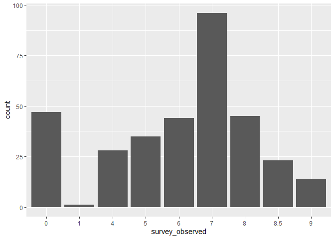
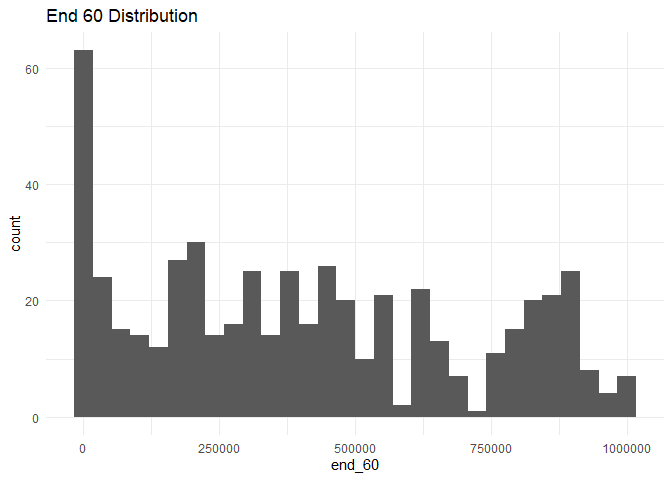
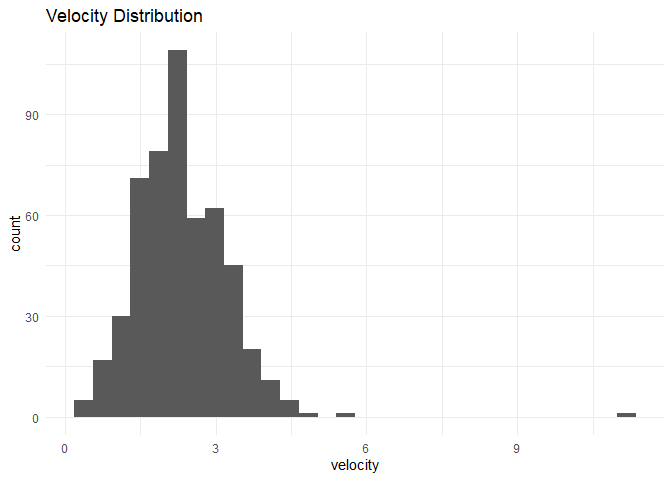

clear\_redds\_survey\_qc
================
Inigo Peng
11/4/2021

# Clear Creek Adult Redds Survey

## Description of Monitoring Data

These data were collected by the U.S. Fish and Wildlife Service’s, Red
Bluff Fish and Wildlife Office’s, Clear Creek Monitoring Program.These
data encompass spring-run Chinook Salmon escapent index surveys from
2008 to 2019. Data were collected on lower Clear Creek from Whiskeytown
Dam located at river mile 18.1, (40.597786N latitude, -122.538791W
longitude \[decimal degrees\]) to the Clear Creek Video Station located
at river mile 0.0 (40.504836N latitude, -122.369693W longitude \[decimal
degrees\]) near the confluence with the Sacramento River.

**Timeframe:** 2000 - 2019

**Completeness of Record throughout timeframe:**

**Sampling Location:** Clear Creek

**Data Contact:** [Ryan Schaefer](mailto:ryan_a_schaefer@fws.gov)

Any additional info?

## Access Cloud Data

``` r
# Run Sys.setenv() to specify GCS_AUTH_FILE and GCS_DEFAULT_BUCKET before running 
# getwd() to see how to specify paths 
# Open object from google cloud storage
# Set your authentication using gcs_auth
gcs_auth(json_file = Sys.getenv("GCS_AUTH_FILE"))
# Set global bucket 
gcs_global_bucket(bucket = Sys.getenv("GCS_DEFAULT_BUCKET"))
# git data and save as xlsx
gcs_get_object(object_name = "adult-holding-redd-and-carcass-surveys/clear-creek/data-raw/FlowWest SCS JPE Data Request_Clear Creek.xlsx",
               bucket = gcs_get_global_bucket(),
               saveToDisk = "raw_redd_holding_carcass_data.xlsx")
               # Overwrite = TRUE)
```

Read in data from google cloud, glimpse raw data sheet:

``` r
raw_redds_data <-readxl::read_excel("raw_redd_holding_carcass_data.xlsx", sheet = "Redds", col_types = c("date", "text", "text", "numeric","text","numeric", "numeric", "numeric","numeric", "numeric", "numeric", "numeric", "text","numeric", "text", "date","text","text","text","numeric","text","text","text","text","text","text","text","text","text","text","date","numeric","numeric","numeric","numeric","numeric","numeric","text","numeric","numeric","numeric","numeric","numeric","numeric","numeric","numeric","text","numeric","numeric","numeric","numeric","numeric","numeric","numeric","numeric", "date","numeric","date","numeric","date","numeric","date","numeric","date","numeric","date","numeric","date","numeric","date","numeric","date","numeric", "text","text","date","numeric","numeric")) %>% glimpse()
```

    ## Warning in read_fun(path = enc2native(normalizePath(path)), sheet_i = sheet, :
    ## Coercing text to numeric in L2 / R2C12: '87000'

    ## Warning in read_fun(path = enc2native(normalizePath(path)), sheet_i = sheet, :
    ## Coercing text to numeric in L3 / R3C12: '87000'

    ## Warning in read_fun(path = enc2native(normalizePath(path)), sheet_i = sheet, :
    ## Coercing text to numeric in L4 / R4C12: '86000'

    ## Warning in read_fun(path = enc2native(normalizePath(path)), sheet_i = sheet, :
    ## Coercing text to numeric in L5 / R5C12: '83000'

    ## Warning in read_fun(path = enc2native(normalizePath(path)), sheet_i = sheet, :
    ## Coercing text to numeric in L6 / R6C12: '78000'

    ## Warning in read_fun(path = enc2native(normalizePath(path)), sheet_i = sheet, :
    ## Coercing text to numeric in L7 / R7C12: '80000'

    ## Warning in read_fun(path = enc2native(normalizePath(path)), sheet_i = sheet, :
    ## Coercing text to numeric in L8 / R8C12: '57000'

    ## Warning in read_fun(path = enc2native(normalizePath(path)), sheet_i = sheet, :
    ## Coercing text to numeric in L9 / R9C12: '57000'

    ## Warning in read_fun(path = enc2native(normalizePath(path)), sheet_i = sheet, :
    ## Coercing text to numeric in L10 / R10C12: '41000'

    ## Warning in read_fun(path = enc2native(normalizePath(path)), sheet_i = sheet, :
    ## Coercing text to numeric in L11 / R11C12: '41000'

    ## Warning in read_fun(path = enc2native(normalizePath(path)), sheet_i = sheet, :
    ## Coercing text to numeric in L12 / R12C12: '90000'

    ## Warning in read_fun(path = enc2native(normalizePath(path)), sheet_i = sheet, :
    ## Coercing text to numeric in L13 / R13C12: '95000'

    ## Warning in read_fun(path = enc2native(normalizePath(path)), sheet_i = sheet, :
    ## Coercing text to numeric in L14 / R14C12: '95000'

    ## Warning in read_fun(path = enc2native(normalizePath(path)), sheet_i = sheet, :
    ## Coercing text to numeric in L15 / R15C12: '97000'

    ## Warning in read_fun(path = enc2native(normalizePath(path)), sheet_i = sheet, :
    ## Coercing text to numeric in L16 / R16C12: '67000'

    ## Warning in read_fun(path = enc2native(normalizePath(path)), sheet_i = sheet, :
    ## Coercing text to numeric in L17 / R17C12: '66000'

    ## Warning in read_fun(path = enc2native(normalizePath(path)), sheet_i = sheet, :
    ## Coercing text to numeric in L18 / R18C12: '64000'

    ## Warning in read_fun(path = enc2native(normalizePath(path)), sheet_i = sheet, :
    ## Coercing text to numeric in L19 / R19C12: '81000'

    ## Warning in read_fun(path = enc2native(normalizePath(path)), sheet_i = sheet, :
    ## Coercing text to numeric in L20 / R20C12: '77000'

    ## Warning in read_fun(path = enc2native(normalizePath(path)), sheet_i = sheet, :
    ## Coercing text to numeric in L21 / R21C12: '76000'

    ## Warning in read_fun(path = enc2native(normalizePath(path)), sheet_i = sheet, :
    ## Coercing text to numeric in L22 / R22C12: '75000'

    ## Warning in read_fun(path = enc2native(normalizePath(path)), sheet_i = sheet, :
    ## Coercing text to numeric in L23 / R23C12: '76000'

    ## Warning in read_fun(path = enc2native(normalizePath(path)), sheet_i = sheet, :
    ## Coercing text to numeric in L24 / R24C12: '78000'

    ## Warning in read_fun(path = enc2native(normalizePath(path)), sheet_i = sheet, :
    ## Coercing text to numeric in L25 / R25C12: '62000'

    ## Warning in read_fun(path = enc2native(normalizePath(path)), sheet_i = sheet, :
    ## Coercing text to numeric in L26 / R26C12: '80000'

    ## Warning in read_fun(path = enc2native(normalizePath(path)), sheet_i = sheet, :
    ## Coercing text to numeric in L27 / R27C12: '61000'

    ## Warning in read_fun(path = enc2native(normalizePath(path)), sheet_i = sheet, :
    ## Coercing text to numeric in L28 / R28C12: '60000'

    ## Warning in read_fun(path = enc2native(normalizePath(path)), sheet_i = sheet, :
    ## Coercing text to numeric in L29 / R29C12: '59000'

    ## Warning in read_fun(path = enc2native(normalizePath(path)), sheet_i = sheet, :
    ## Coercing text to numeric in L30 / R30C12: '58000'

    ## Warning in read_fun(path = enc2native(normalizePath(path)), sheet_i = sheet, :
    ## Coercing text to numeric in L31 / R31C12: '58000'

    ## Warning in read_fun(path = enc2native(normalizePath(path)), sheet_i = sheet, :
    ## Coercing text to numeric in L32 / R32C12: '58000'

    ## Warning in read_fun(path = enc2native(normalizePath(path)), sheet_i = sheet, :
    ## Coercing text to numeric in L33 / R33C12: '58000'

    ## Warning in read_fun(path = enc2native(normalizePath(path)), sheet_i = sheet, :
    ## Coercing text to numeric in L34 / R34C12: '58000'

    ## Warning in read_fun(path = enc2native(normalizePath(path)), sheet_i = sheet, :
    ## Coercing text to numeric in L35 / R35C12: '58000'

    ## Warning in read_fun(path = enc2native(normalizePath(path)), sheet_i = sheet, :
    ## Coercing text to numeric in L36 / R36C12: '58000'

    ## Warning in read_fun(path = enc2native(normalizePath(path)), sheet_i = sheet, :
    ## Coercing text to numeric in L37 / R37C12: '57000'

    ## Warning in read_fun(path = enc2native(normalizePath(path)), sheet_i = sheet, :
    ## Coercing text to numeric in L38 / R38C12: '56000'

    ## Warning in read_fun(path = enc2native(normalizePath(path)), sheet_i = sheet, :
    ## Coercing text to numeric in L39 / R39C12: '56000'

    ## Warning in read_fun(path = enc2native(normalizePath(path)), sheet_i = sheet, :
    ## Coercing text to numeric in L40 / R40C12: '56000'

    ## Warning in read_fun(path = enc2native(normalizePath(path)), sheet_i = sheet, :
    ## Coercing text to numeric in L41 / R41C12: '56000'

    ## Warning in read_fun(path = enc2native(normalizePath(path)), sheet_i = sheet, :
    ## Coercing text to numeric in L42 / R42C12: '55000'

    ## Warning in read_fun(path = enc2native(normalizePath(path)), sheet_i = sheet, :
    ## Coercing text to numeric in L43 / R43C12: '55000'

    ## Warning in read_fun(path = enc2native(normalizePath(path)), sheet_i = sheet, :
    ## Coercing text to numeric in L44 / R44C12: '54000'

    ## Warning in read_fun(path = enc2native(normalizePath(path)), sheet_i = sheet, :
    ## Coercing text to numeric in L45 / R45C12: '51000'

    ## Warning in read_fun(path = enc2native(normalizePath(path)), sheet_i = sheet, :
    ## Coercing text to numeric in L46 / R46C12: '51000'

    ## Warning in read_fun(path = enc2native(normalizePath(path)), sheet_i = sheet, :
    ## Coercing text to numeric in L47 / R47C12: '51000'

    ## Warning in read_fun(path = enc2native(normalizePath(path)), sheet_i = sheet, :
    ## Coercing text to numeric in L48 / R48C12: '51000'

    ## Warning in read_fun(path = enc2native(normalizePath(path)), sheet_i = sheet, :
    ## Coercing text to numeric in L49 / R49C12: '48000'

    ## Warning in read_fun(path = enc2native(normalizePath(path)), sheet_i = sheet, :
    ## Coercing text to numeric in L50 / R50C12: '45000'

    ## Warning in read_fun(path = enc2native(normalizePath(path)), sheet_i = sheet, :
    ## Coercing text to numeric in L51 / R51C12: '45000'

    ## Warning in read_fun(path = enc2native(normalizePath(path)), sheet_i = sheet, :
    ## Coercing text to numeric in L52 / R52C12: '45000'

    ## Warning in read_fun(path = enc2native(normalizePath(path)), sheet_i = sheet, :
    ## Coercing text to numeric in L53 / R53C12: '44000'

    ## Warning in read_fun(path = enc2native(normalizePath(path)), sheet_i = sheet, :
    ## Coercing text to numeric in L54 / R54C12: '44000'

    ## Warning in read_fun(path = enc2native(normalizePath(path)), sheet_i = sheet, :
    ## Coercing text to numeric in L55 / R55C12: '44000'

    ## Warning in read_fun(path = enc2native(normalizePath(path)), sheet_i = sheet, :
    ## Coercing text to numeric in L56 / R56C12: '44000'

    ## Warning in read_fun(path = enc2native(normalizePath(path)), sheet_i = sheet, :
    ## Coercing text to numeric in L57 / R57C12: '44000'

    ## Warning in read_fun(path = enc2native(normalizePath(path)), sheet_i = sheet, :
    ## Coercing text to numeric in L58 / R58C12: '44000'

    ## Warning in read_fun(path = enc2native(normalizePath(path)), sheet_i = sheet, :
    ## Coercing text to numeric in L59 / R59C12: '44000'

    ## Warning in read_fun(path = enc2native(normalizePath(path)), sheet_i = sheet, :
    ## Coercing text to numeric in L60 / R60C12: '43000'

    ## Warning in read_fun(path = enc2native(normalizePath(path)), sheet_i = sheet, :
    ## Coercing text to numeric in L61 / R61C12: '43000'

    ## Warning in read_fun(path = enc2native(normalizePath(path)), sheet_i = sheet, :
    ## Coercing text to numeric in L62 / R62C12: '43000'

    ## Warning in read_fun(path = enc2native(normalizePath(path)), sheet_i = sheet, :
    ## Coercing text to numeric in L63 / R63C12: '43000'

    ## Warning in read_fun(path = enc2native(normalizePath(path)), sheet_i = sheet, :
    ## Coercing text to numeric in L64 / R64C12: '43000'

    ## Warning in read_fun(path = enc2native(normalizePath(path)), sheet_i = sheet, :
    ## Coercing text to numeric in L65 / R65C12: '43000'

    ## Warning in read_fun(path = enc2native(normalizePath(path)), sheet_i = sheet, :
    ## Coercing text to numeric in L66 / R66C12: '42000'

    ## Warning in read_fun(path = enc2native(normalizePath(path)), sheet_i = sheet, :
    ## Coercing text to numeric in L67 / R67C12: '42000'

    ## Warning in read_fun(path = enc2native(normalizePath(path)), sheet_i = sheet, :
    ## Coercing text to numeric in L68 / R68C12: '42000'

    ## Warning in read_fun(path = enc2native(normalizePath(path)), sheet_i = sheet, :
    ## Coercing text to numeric in L69 / R69C12: '42000'

    ## Warning in read_fun(path = enc2native(normalizePath(path)), sheet_i = sheet, :
    ## Coercing text to numeric in L70 / R70C12: '40000'

    ## Warning in read_fun(path = enc2native(normalizePath(path)), sheet_i = sheet, :
    ## Coercing text to numeric in L71 / R71C12: '40000'

    ## Warning in read_fun(path = enc2native(normalizePath(path)), sheet_i = sheet, :
    ## Coercing text to numeric in L72 / R72C12: '40000'

    ## Warning in read_fun(path = enc2native(normalizePath(path)), sheet_i = sheet, :
    ## Coercing text to numeric in L73 / R73C12: '40000'

    ## Warning in read_fun(path = enc2native(normalizePath(path)), sheet_i = sheet, :
    ## Coercing text to numeric in L74 / R74C12: '40000'

    ## Warning in read_fun(path = enc2native(normalizePath(path)), sheet_i = sheet, :
    ## Coercing text to numeric in L75 / R75C12: '40000'

    ## Warning in read_fun(path = enc2native(normalizePath(path)), sheet_i = sheet, :
    ## Coercing text to numeric in L76 / R76C12: '40000'

    ## Warning in read_fun(path = enc2native(normalizePath(path)), sheet_i = sheet, :
    ## Coercing text to numeric in L77 / R77C12: '40000'

    ## Warning in read_fun(path = enc2native(normalizePath(path)), sheet_i = sheet, :
    ## Coercing text to numeric in L78 / R78C12: '40000'

    ## Warning in read_fun(path = enc2native(normalizePath(path)), sheet_i = sheet, :
    ## Coercing text to numeric in L79 / R79C12: '40000'

    ## Warning in read_fun(path = enc2native(normalizePath(path)), sheet_i = sheet, :
    ## Coercing text to numeric in L80 / R80C12: '40000'

    ## Warning in read_fun(path = enc2native(normalizePath(path)), sheet_i = sheet, :
    ## Coercing text to numeric in L81 / R81C12: '40000'

    ## Warning in read_fun(path = enc2native(normalizePath(path)), sheet_i = sheet, :
    ## Coercing text to numeric in L82 / R82C12: '40000'

    ## Warning in read_fun(path = enc2native(normalizePath(path)), sheet_i = sheet, :
    ## Coercing text to numeric in L83 / R83C12: '40000'

    ## Warning in read_fun(path = enc2native(normalizePath(path)), sheet_i = sheet, :
    ## Coercing text to numeric in L84 / R84C12: '40000'

    ## Warning in read_fun(path = enc2native(normalizePath(path)), sheet_i = sheet, :
    ## Coercing text to numeric in L85 / R85C12: '40000'

    ## Warning in read_fun(path = enc2native(normalizePath(path)), sheet_i = sheet, :
    ## Coercing text to numeric in L86 / R86C12: '39000'

    ## Warning in read_fun(path = enc2native(normalizePath(path)), sheet_i = sheet, :
    ## Coercing text to numeric in H94 / R94C8: '2'

    ## Warning in read_fun(path = enc2native(normalizePath(path)), sheet_i = sheet, :
    ## Coercing text to numeric in L94 / R94C12: '91000'

    ## Warning in read_fun(path = enc2native(normalizePath(path)), sheet_i = sheet, :
    ## Coercing text to numeric in H95 / R95C8: '1.5'

    ## Warning in read_fun(path = enc2native(normalizePath(path)), sheet_i = sheet, :
    ## Coercing text to numeric in L95 / R95C12: '91000'

    ## Warning in read_fun(path = enc2native(normalizePath(path)), sheet_i = sheet, :
    ## Coercing text to numeric in H96 / R96C8: '1.5'

    ## Warning in read_fun(path = enc2native(normalizePath(path)), sheet_i = sheet, :
    ## Coercing text to numeric in L96 / R96C12: '92000'

    ## Warning in read_fun(path = enc2native(normalizePath(path)), sheet_i = sheet, :
    ## Coercing text to numeric in H97 / R97C8: '1.5'

    ## Warning in read_fun(path = enc2native(normalizePath(path)), sheet_i = sheet, :
    ## Coercing text to numeric in L97 / R97C12: '92000'

    ## Warning in read_fun(path = enc2native(normalizePath(path)), sheet_i = sheet, :
    ## Coercing text to numeric in H98 / R98C8: '1.5'

    ## Warning in read_fun(path = enc2native(normalizePath(path)), sheet_i = sheet, :
    ## Coercing text to numeric in L98 / R98C12: '92000'

    ## Warning in read_fun(path = enc2native(normalizePath(path)), sheet_i = sheet, :
    ## Coercing text to numeric in H99 / R99C8: '2'

    ## Warning in read_fun(path = enc2native(normalizePath(path)), sheet_i = sheet, :
    ## Coercing text to numeric in L99 / R99C12: '92000'

    ## Warning in read_fun(path = enc2native(normalizePath(path)), sheet_i = sheet, :
    ## Coercing text to numeric in H100 / R100C8: '2'

    ## Warning in read_fun(path = enc2native(normalizePath(path)), sheet_i = sheet, :
    ## Coercing text to numeric in L100 / R100C12: '90000'

    ## Warning in read_fun(path = enc2native(normalizePath(path)), sheet_i = sheet, :
    ## Coercing text to numeric in H101 / R101C8: '3'

    ## Warning in read_fun(path = enc2native(normalizePath(path)), sheet_i = sheet, :
    ## Coercing text to numeric in L101 / R101C12: '90000'

    ## Warning in read_fun(path = enc2native(normalizePath(path)), sheet_i = sheet, :
    ## Coercing text to numeric in H102 / R102C8: '1.5'

    ## Warning in read_fun(path = enc2native(normalizePath(path)), sheet_i = sheet, :
    ## Coercing text to numeric in L102 / R102C12: '90000'

    ## Warning in read_fun(path = enc2native(normalizePath(path)), sheet_i = sheet, :
    ## Coercing text to numeric in H103 / R103C8: '1.5'

    ## Warning in read_fun(path = enc2native(normalizePath(path)), sheet_i = sheet, :
    ## Coercing text to numeric in L103 / R103C12: '90000'

    ## Warning in read_fun(path = enc2native(normalizePath(path)), sheet_i = sheet, :
    ## Coercing text to numeric in H104 / R104C8: '1.5'

    ## Warning in read_fun(path = enc2native(normalizePath(path)), sheet_i = sheet, :
    ## Coercing text to numeric in L104 / R104C12: '90000'

    ## Warning in read_fun(path = enc2native(normalizePath(path)), sheet_i = sheet, :
    ## Coercing text to numeric in H105 / R105C8: '1.5'

    ## Warning in read_fun(path = enc2native(normalizePath(path)), sheet_i = sheet, :
    ## Coercing text to numeric in L105 / R105C12: '90000'

    ## Warning in read_fun(path = enc2native(normalizePath(path)), sheet_i = sheet, :
    ## Coercing text to numeric in H106 / R106C8: '1.5'

    ## Warning in read_fun(path = enc2native(normalizePath(path)), sheet_i = sheet, :
    ## Coercing text to numeric in L106 / R106C12: '90000'

    ## Warning in read_fun(path = enc2native(normalizePath(path)), sheet_i = sheet, :
    ## Coercing text to numeric in H107 / R107C8: '1.5'

    ## Warning in read_fun(path = enc2native(normalizePath(path)), sheet_i = sheet, :
    ## Coercing text to numeric in L107 / R107C12: '90000'

    ## Warning in read_fun(path = enc2native(normalizePath(path)), sheet_i = sheet, :
    ## Coercing text to numeric in H108 / R108C8: '2'

    ## Warning in read_fun(path = enc2native(normalizePath(path)), sheet_i = sheet, :
    ## Coercing text to numeric in L108 / R108C12: '90000'

    ## Warning in read_fun(path = enc2native(normalizePath(path)), sheet_i = sheet, :
    ## Coercing text to numeric in H109 / R109C8: '1.5'

    ## Warning in read_fun(path = enc2native(normalizePath(path)), sheet_i = sheet, :
    ## Coercing text to numeric in L109 / R109C12: '93000'

    ## Warning in read_fun(path = enc2native(normalizePath(path)), sheet_i = sheet, :
    ## Coercing text to numeric in H110 / R110C8: '3'

    ## Warning in read_fun(path = enc2native(normalizePath(path)), sheet_i = sheet, :
    ## Coercing text to numeric in L110 / R110C12: '93000'

    ## Warning in read_fun(path = enc2native(normalizePath(path)), sheet_i = sheet, :
    ## Coercing text to numeric in H111 / R111C8: '2'

    ## Warning in read_fun(path = enc2native(normalizePath(path)), sheet_i = sheet, :
    ## Coercing text to numeric in L111 / R111C12: '93000'

    ## Warning in read_fun(path = enc2native(normalizePath(path)), sheet_i = sheet, :
    ## Coercing text to numeric in H112 / R112C8: '1'

    ## Warning in read_fun(path = enc2native(normalizePath(path)), sheet_i = sheet, :
    ## Coercing text to numeric in L112 / R112C12: '94000'

    ## Warning in read_fun(path = enc2native(normalizePath(path)), sheet_i = sheet, :
    ## Coercing text to numeric in H113 / R113C8: '1'

    ## Warning in read_fun(path = enc2native(normalizePath(path)), sheet_i = sheet, :
    ## Coercing text to numeric in L113 / R113C12: '94000'

    ## Warning in read_fun(path = enc2native(normalizePath(path)), sheet_i = sheet, :
    ## Coercing text to numeric in H114 / R114C8: '3'

    ## Warning in read_fun(path = enc2native(normalizePath(path)), sheet_i = sheet, :
    ## Coercing text to numeric in L114 / R114C12: '94000'

    ## Warning in read_fun(path = enc2native(normalizePath(path)), sheet_i = sheet, :
    ## Coercing text to numeric in H115 / R115C8: '2'

    ## Warning in read_fun(path = enc2native(normalizePath(path)), sheet_i = sheet, :
    ## Coercing text to numeric in L115 / R115C12: '94000'

    ## Warning in read_fun(path = enc2native(normalizePath(path)), sheet_i = sheet, :
    ## Coercing text to numeric in H116 / R116C8: '1'

    ## Warning in read_fun(path = enc2native(normalizePath(path)), sheet_i = sheet, :
    ## Coercing text to numeric in L116 / R116C12: '95000'

    ## Warning in read_fun(path = enc2native(normalizePath(path)), sheet_i = sheet, :
    ## Coercing text to numeric in H117 / R117C8: '3'

    ## Warning in read_fun(path = enc2native(normalizePath(path)), sheet_i = sheet, :
    ## Coercing text to numeric in L117 / R117C12: '95000'

    ## Warning in read_fun(path = enc2native(normalizePath(path)), sheet_i = sheet, :
    ## Coercing text to numeric in H118 / R118C8: '3'

    ## Warning in read_fun(path = enc2native(normalizePath(path)), sheet_i = sheet, :
    ## Coercing text to numeric in L118 / R118C12: '95000'

    ## Warning in read_fun(path = enc2native(normalizePath(path)), sheet_i = sheet, :
    ## Coercing text to numeric in H119 / R119C8: '2'

    ## Warning in read_fun(path = enc2native(normalizePath(path)), sheet_i = sheet, :
    ## Coercing text to numeric in L119 / R119C12: '88000'

    ## Warning in read_fun(path = enc2native(normalizePath(path)), sheet_i = sheet, :
    ## Coercing text to numeric in H120 / R120C8: '3'

    ## Warning in read_fun(path = enc2native(normalizePath(path)), sheet_i = sheet, :
    ## Coercing text to numeric in L120 / R120C12: '88000'

    ## Warning in read_fun(path = enc2native(normalizePath(path)), sheet_i = sheet, :
    ## Coercing text to numeric in H121 / R121C8: '1.5'

    ## Warning in read_fun(path = enc2native(normalizePath(path)), sheet_i = sheet, :
    ## Coercing text to numeric in L121 / R121C12: '87000'

    ## Warning in read_fun(path = enc2native(normalizePath(path)), sheet_i = sheet, :
    ## Coercing text to numeric in H122 / R122C8: '1.5'

    ## Warning in read_fun(path = enc2native(normalizePath(path)), sheet_i = sheet, :
    ## Coercing text to numeric in L122 / R122C12: '87000'

    ## Warning in read_fun(path = enc2native(normalizePath(path)), sheet_i = sheet, :
    ## Coercing text to numeric in H123 / R123C8: '2'

    ## Warning in read_fun(path = enc2native(normalizePath(path)), sheet_i = sheet, :
    ## Coercing text to numeric in L123 / R123C12: '87000'

    ## Warning in read_fun(path = enc2native(normalizePath(path)), sheet_i = sheet, :
    ## Coercing text to numeric in H124 / R124C8: '2'

    ## Warning in read_fun(path = enc2native(normalizePath(path)), sheet_i = sheet, :
    ## Coercing text to numeric in L124 / R124C12: '87000'

    ## Warning in read_fun(path = enc2native(normalizePath(path)), sheet_i = sheet, :
    ## Coercing text to numeric in H125 / R125C8: '2'

    ## Warning in read_fun(path = enc2native(normalizePath(path)), sheet_i = sheet, :
    ## Coercing text to numeric in L125 / R125C12: '87000'

    ## Warning in read_fun(path = enc2native(normalizePath(path)), sheet_i = sheet, :
    ## Coercing text to numeric in H126 / R126C8: '2'

    ## Warning in read_fun(path = enc2native(normalizePath(path)), sheet_i = sheet, :
    ## Coercing text to numeric in L126 / R126C12: '87000'

    ## Warning in read_fun(path = enc2native(normalizePath(path)), sheet_i = sheet, :
    ## Coercing text to numeric in H127 / R127C8: '2'

    ## Warning in read_fun(path = enc2native(normalizePath(path)), sheet_i = sheet, :
    ## Coercing text to numeric in L127 / R127C12: '87000'

    ## Warning in read_fun(path = enc2native(normalizePath(path)), sheet_i = sheet, :
    ## Coercing text to numeric in H128 / R128C8: '2'

    ## Warning in read_fun(path = enc2native(normalizePath(path)), sheet_i = sheet, :
    ## Coercing text to numeric in L128 / R128C12: '87000'

    ## Warning in read_fun(path = enc2native(normalizePath(path)), sheet_i = sheet, :
    ## Coercing text to numeric in H129 / R129C8: '4'

    ## Warning in read_fun(path = enc2native(normalizePath(path)), sheet_i = sheet, :
    ## Coercing text to numeric in L129 / R129C12: '87000'

    ## Warning in read_fun(path = enc2native(normalizePath(path)), sheet_i = sheet, :
    ## Coercing text to numeric in H130 / R130C8: '4'

    ## Warning in read_fun(path = enc2native(normalizePath(path)), sheet_i = sheet, :
    ## Coercing text to numeric in L130 / R130C12: '87000'

    ## Warning in read_fun(path = enc2native(normalizePath(path)), sheet_i = sheet, :
    ## Coercing text to numeric in H131 / R131C8: '1.5'

    ## Warning in read_fun(path = enc2native(normalizePath(path)), sheet_i = sheet, :
    ## Coercing text to numeric in L131 / R131C12: '87000'

    ## Warning in read_fun(path = enc2native(normalizePath(path)), sheet_i = sheet, :
    ## Coercing text to numeric in H132 / R132C8: '1.5'

    ## Warning in read_fun(path = enc2native(normalizePath(path)), sheet_i = sheet, :
    ## Coercing text to numeric in L132 / R132C12: '87000'

    ## Warning in read_fun(path = enc2native(normalizePath(path)), sheet_i = sheet, :
    ## Coercing text to numeric in H133 / R133C8: '1.5'

    ## Warning in read_fun(path = enc2native(normalizePath(path)), sheet_i = sheet, :
    ## Coercing text to numeric in L133 / R133C12: '87000'

    ## Warning in read_fun(path = enc2native(normalizePath(path)), sheet_i = sheet, :
    ## Coercing text to numeric in H134 / R134C8: '3'

    ## Warning in read_fun(path = enc2native(normalizePath(path)), sheet_i = sheet, :
    ## Coercing text to numeric in L134 / R134C12: '87000'

    ## Warning in read_fun(path = enc2native(normalizePath(path)), sheet_i = sheet, :
    ## Coercing text to numeric in H135 / R135C8: '2'

    ## Warning in read_fun(path = enc2native(normalizePath(path)), sheet_i = sheet, :
    ## Coercing text to numeric in L135 / R135C12: '86000'

    ## Warning in read_fun(path = enc2native(normalizePath(path)), sheet_i = sheet, :
    ## Coercing text to numeric in H136 / R136C8: '1'

    ## Warning in read_fun(path = enc2native(normalizePath(path)), sheet_i = sheet, :
    ## Coercing text to numeric in L136 / R136C12: '86000'

    ## Warning in read_fun(path = enc2native(normalizePath(path)), sheet_i = sheet, :
    ## Coercing text to numeric in H137 / R137C8: '4'

    ## Warning in read_fun(path = enc2native(normalizePath(path)), sheet_i = sheet, :
    ## Coercing text to numeric in L137 / R137C12: '85000'

    ## Warning in read_fun(path = enc2native(normalizePath(path)), sheet_i = sheet, :
    ## Coercing text to numeric in H138 / R138C8: '2'

    ## Warning in read_fun(path = enc2native(normalizePath(path)), sheet_i = sheet, :
    ## Coercing text to numeric in L138 / R138C12: '84000'

    ## Warning in read_fun(path = enc2native(normalizePath(path)), sheet_i = sheet, :
    ## Coercing text to numeric in H139 / R139C8: '3'

    ## Warning in read_fun(path = enc2native(normalizePath(path)), sheet_i = sheet, :
    ## Coercing text to numeric in L139 / R139C12: '67000'

    ## Warning in read_fun(path = enc2native(normalizePath(path)), sheet_i = sheet, :
    ## Coercing text to numeric in H140 / R140C8: '3'

    ## Warning in read_fun(path = enc2native(normalizePath(path)), sheet_i = sheet, :
    ## Coercing text to numeric in L140 / R140C12: '67000'

    ## Warning in read_fun(path = enc2native(normalizePath(path)), sheet_i = sheet, :
    ## Coercing text to numeric in H141 / R141C8: '3'

    ## Warning in read_fun(path = enc2native(normalizePath(path)), sheet_i = sheet, :
    ## Coercing text to numeric in L141 / R141C12: '67000'

    ## Warning in read_fun(path = enc2native(normalizePath(path)), sheet_i = sheet, :
    ## Coercing text to numeric in H142 / R142C8: '3'

    ## Warning in read_fun(path = enc2native(normalizePath(path)), sheet_i = sheet, :
    ## Coercing text to numeric in L142 / R142C12: '67000'

    ## Warning in read_fun(path = enc2native(normalizePath(path)), sheet_i = sheet, :
    ## Coercing text to numeric in H143 / R143C8: '3'

    ## Warning in read_fun(path = enc2native(normalizePath(path)), sheet_i = sheet, :
    ## Coercing text to numeric in L143 / R143C12: '68000'

    ## Warning in read_fun(path = enc2native(normalizePath(path)), sheet_i = sheet, :
    ## Coercing text to numeric in H144 / R144C8: '3'

    ## Warning in read_fun(path = enc2native(normalizePath(path)), sheet_i = sheet, :
    ## Coercing text to numeric in L144 / R144C12: '68000'

    ## Warning in read_fun(path = enc2native(normalizePath(path)), sheet_i = sheet, :
    ## Coercing text to numeric in H145 / R145C8: '2'

    ## Warning in read_fun(path = enc2native(normalizePath(path)), sheet_i = sheet, :
    ## Coercing text to numeric in L145 / R145C12: '67000'

    ## Warning in read_fun(path = enc2native(normalizePath(path)), sheet_i = sheet, :
    ## Coercing text to numeric in H146 / R146C8: '2'

    ## Warning in read_fun(path = enc2native(normalizePath(path)), sheet_i = sheet, :
    ## Coercing text to numeric in L146 / R146C12: '67000'

    ## Warning in read_fun(path = enc2native(normalizePath(path)), sheet_i = sheet, :
    ## Coercing text to numeric in H147 / R147C8: '2'

    ## Warning in read_fun(path = enc2native(normalizePath(path)), sheet_i = sheet, :
    ## Coercing text to numeric in L147 / R147C12: '67000'

    ## Warning in read_fun(path = enc2native(normalizePath(path)), sheet_i = sheet, :
    ## Coercing text to numeric in H148 / R148C8: '5'

    ## Warning in read_fun(path = enc2native(normalizePath(path)), sheet_i = sheet, :
    ## Coercing text to numeric in L148 / R148C12: '67000'

    ## Warning in read_fun(path = enc2native(normalizePath(path)), sheet_i = sheet, :
    ## Coercing text to numeric in H149 / R149C8: '5'

    ## Warning in read_fun(path = enc2native(normalizePath(path)), sheet_i = sheet, :
    ## Coercing text to numeric in L149 / R149C12: '67000'

    ## Warning in read_fun(path = enc2native(normalizePath(path)), sheet_i = sheet, :
    ## Coercing text to numeric in H150 / R150C8: '2'

    ## Warning in read_fun(path = enc2native(normalizePath(path)), sheet_i = sheet, :
    ## Coercing text to numeric in L150 / R150C12: '66000'

    ## Warning in read_fun(path = enc2native(normalizePath(path)), sheet_i = sheet, :
    ## Coercing text to numeric in H151 / R151C8: '1'

    ## Warning in read_fun(path = enc2native(normalizePath(path)), sheet_i = sheet, :
    ## Coercing text to numeric in L151 / R151C12: '66000'

    ## Warning in read_fun(path = enc2native(normalizePath(path)), sheet_i = sheet, :
    ## Coercing text to numeric in H152 / R152C8: '1'

    ## Warning in read_fun(path = enc2native(normalizePath(path)), sheet_i = sheet, :
    ## Coercing text to numeric in L152 / R152C12: '66000'

    ## Warning in read_fun(path = enc2native(normalizePath(path)), sheet_i = sheet, :
    ## Coercing text to numeric in H153 / R153C8: '1'

    ## Warning in read_fun(path = enc2native(normalizePath(path)), sheet_i = sheet, :
    ## Coercing text to numeric in L153 / R153C12: '66000'

    ## Warning in read_fun(path = enc2native(normalizePath(path)), sheet_i = sheet, :
    ## Coercing text to numeric in H154 / R154C8: '2'

    ## Warning in read_fun(path = enc2native(normalizePath(path)), sheet_i = sheet, :
    ## Coercing text to numeric in L154 / R154C12: '66000'

    ## Warning in read_fun(path = enc2native(normalizePath(path)), sheet_i = sheet, :
    ## Coercing text to numeric in H155 / R155C8: '2'

    ## Warning in read_fun(path = enc2native(normalizePath(path)), sheet_i = sheet, :
    ## Coercing text to numeric in L155 / R155C12: '66000'

    ## Warning in read_fun(path = enc2native(normalizePath(path)), sheet_i = sheet, :
    ## Coercing text to numeric in H156 / R156C8: '2'

    ## Warning in read_fun(path = enc2native(normalizePath(path)), sheet_i = sheet, :
    ## Coercing text to numeric in L156 / R156C12: '83000'

    ## Warning in read_fun(path = enc2native(normalizePath(path)), sheet_i = sheet, :
    ## Coercing text to numeric in H157 / R157C8: '2'

    ## Warning in read_fun(path = enc2native(normalizePath(path)), sheet_i = sheet, :
    ## Coercing text to numeric in L157 / R157C12: '64000'

    ## Warning in read_fun(path = enc2native(normalizePath(path)), sheet_i = sheet, :
    ## Coercing text to numeric in H158 / R158C8: '3'

    ## Warning in read_fun(path = enc2native(normalizePath(path)), sheet_i = sheet, :
    ## Coercing text to numeric in L158 / R158C12: '70000'

    ## Warning in read_fun(path = enc2native(normalizePath(path)), sheet_i = sheet, :
    ## Coercing text to numeric in H159 / R159C8: '1'

    ## Warning in read_fun(path = enc2native(normalizePath(path)), sheet_i = sheet, :
    ## Coercing text to numeric in L159 / R159C12: '81000'

    ## Warning in read_fun(path = enc2native(normalizePath(path)), sheet_i = sheet, :
    ## Coercing text to numeric in H160 / R160C8: '2'

    ## Warning in read_fun(path = enc2native(normalizePath(path)), sheet_i = sheet, :
    ## Coercing text to numeric in L160 / R160C12: '63000'

    ## Warning in read_fun(path = enc2native(normalizePath(path)), sheet_i = sheet, :
    ## Coercing text to numeric in H161 / R161C8: '2'

    ## Warning in read_fun(path = enc2native(normalizePath(path)), sheet_i = sheet, :
    ## Coercing text to numeric in L161 / R161C12: '71000'

    ## Warning in read_fun(path = enc2native(normalizePath(path)), sheet_i = sheet, :
    ## Coercing text to numeric in H162 / R162C8: '2'

    ## Warning in read_fun(path = enc2native(normalizePath(path)), sheet_i = sheet, :
    ## Coercing text to numeric in L162 / R162C12: '76000'

    ## Warning in read_fun(path = enc2native(normalizePath(path)), sheet_i = sheet, :
    ## Coercing text to numeric in H163 / R163C8: '2'

    ## Warning in read_fun(path = enc2native(normalizePath(path)), sheet_i = sheet, :
    ## Coercing text to numeric in L163 / R163C12: '76000'

    ## Warning in read_fun(path = enc2native(normalizePath(path)), sheet_i = sheet, :
    ## Coercing text to numeric in H164 / R164C8: '3'

    ## Warning in read_fun(path = enc2native(normalizePath(path)), sheet_i = sheet, :
    ## Coercing text to numeric in L164 / R164C12: '81000'

    ## Warning in read_fun(path = enc2native(normalizePath(path)), sheet_i = sheet, :
    ## Coercing text to numeric in H165 / R165C8: '3'

    ## Warning in read_fun(path = enc2native(normalizePath(path)), sheet_i = sheet, :
    ## Coercing text to numeric in L165 / R165C12: '72000'

    ## Warning in read_fun(path = enc2native(normalizePath(path)), sheet_i = sheet, :
    ## Coercing text to numeric in H166 / R166C8: '3'

    ## Warning in read_fun(path = enc2native(normalizePath(path)), sheet_i = sheet, :
    ## Coercing text to numeric in L166 / R166C12: '75000'

    ## Warning in read_fun(path = enc2native(normalizePath(path)), sheet_i = sheet, :
    ## Coercing text to numeric in H167 / R167C8: '3'

    ## Warning in read_fun(path = enc2native(normalizePath(path)), sheet_i = sheet, :
    ## Coercing text to numeric in L167 / R167C12: '75000'

    ## Warning in read_fun(path = enc2native(normalizePath(path)), sheet_i = sheet, :
    ## Coercing text to numeric in H168 / R168C8: '3'

    ## Warning in read_fun(path = enc2native(normalizePath(path)), sheet_i = sheet, :
    ## Coercing text to numeric in L168 / R168C12: '76000'

    ## Warning in read_fun(path = enc2native(normalizePath(path)), sheet_i = sheet, :
    ## Coercing text to numeric in H169 / R169C8: '2'

    ## Warning in read_fun(path = enc2native(normalizePath(path)), sheet_i = sheet, :
    ## Coercing text to numeric in L169 / R169C12: '76000'

    ## Warning in read_fun(path = enc2native(normalizePath(path)), sheet_i = sheet, :
    ## Coercing text to numeric in H170 / R170C8: '2'

    ## Warning in read_fun(path = enc2native(normalizePath(path)), sheet_i = sheet, :
    ## Coercing text to numeric in L170 / R170C12: '76000'

    ## Warning in read_fun(path = enc2native(normalizePath(path)), sheet_i = sheet, :
    ## Coercing text to numeric in H171 / R171C8: '2'

    ## Warning in read_fun(path = enc2native(normalizePath(path)), sheet_i = sheet, :
    ## Coercing text to numeric in L171 / R171C12: '76000'

    ## Warning in read_fun(path = enc2native(normalizePath(path)), sheet_i = sheet, :
    ## Coercing text to numeric in H172 / R172C8: '2'

    ## Warning in read_fun(path = enc2native(normalizePath(path)), sheet_i = sheet, :
    ## Coercing text to numeric in L172 / R172C12: '76000'

    ## Warning in read_fun(path = enc2native(normalizePath(path)), sheet_i = sheet, :
    ## Coercing text to numeric in H173 / R173C8: '2'

    ## Warning in read_fun(path = enc2native(normalizePath(path)), sheet_i = sheet, :
    ## Coercing text to numeric in L173 / R173C12: '63000'

    ## Warning in read_fun(path = enc2native(normalizePath(path)), sheet_i = sheet, :
    ## Coercing text to numeric in H174 / R174C8: '2'

    ## Warning in read_fun(path = enc2native(normalizePath(path)), sheet_i = sheet, :
    ## Coercing text to numeric in L174 / R174C12: '75000'

    ## Warning in read_fun(path = enc2native(normalizePath(path)), sheet_i = sheet, :
    ## Coercing text to numeric in H175 / R175C8: '2'

    ## Warning in read_fun(path = enc2native(normalizePath(path)), sheet_i = sheet, :
    ## Coercing text to numeric in L175 / R175C12: '75000'

    ## Warning in read_fun(path = enc2native(normalizePath(path)), sheet_i = sheet, :
    ## Coercing text to numeric in L176 / R176C12: '78000'

    ## Warning in read_fun(path = enc2native(normalizePath(path)), sheet_i = sheet, :
    ## Coercing text to numeric in L177 / R177C12: '78000'

    ## Warning in read_fun(path = enc2native(normalizePath(path)), sheet_i = sheet, :
    ## Coercing text to numeric in H178 / R178C8: '5'

    ## Warning in read_fun(path = enc2native(normalizePath(path)), sheet_i = sheet, :
    ## Coercing text to numeric in L178 / R178C12: '73000'

    ## Warning in read_fun(path = enc2native(normalizePath(path)), sheet_i = sheet, :
    ## Coercing text to numeric in H179 / R179C8: '2'

    ## Warning in read_fun(path = enc2native(normalizePath(path)), sheet_i = sheet, :
    ## Coercing text to numeric in L179 / R179C12: '63000'

    ## Warning in read_fun(path = enc2native(normalizePath(path)), sheet_i = sheet, :
    ## Coercing text to numeric in H180 / R180C8: '2'

    ## Warning in read_fun(path = enc2native(normalizePath(path)), sheet_i = sheet, :
    ## Coercing text to numeric in L180 / R180C12: '80000'

    ## Warning in read_fun(path = enc2native(normalizePath(path)), sheet_i = sheet, :
    ## Coercing text to numeric in H181 / R181C8: '2'

    ## Warning in read_fun(path = enc2native(normalizePath(path)), sheet_i = sheet, :
    ## Coercing text to numeric in L181 / R181C12: '80000'

    ## Warning in read_fun(path = enc2native(normalizePath(path)), sheet_i = sheet, :
    ## Coercing text to numeric in H182 / R182C8: '2'

    ## Warning in read_fun(path = enc2native(normalizePath(path)), sheet_i = sheet, :
    ## Coercing text to numeric in L182 / R182C12: '80000'

    ## Warning in read_fun(path = enc2native(normalizePath(path)), sheet_i = sheet, :
    ## Coercing text to numeric in H183 / R183C8: '2'

    ## Warning in read_fun(path = enc2native(normalizePath(path)), sheet_i = sheet, :
    ## Coercing text to numeric in L183 / R183C12: '80000'

    ## Warning in read_fun(path = enc2native(normalizePath(path)), sheet_i = sheet, :
    ## Coercing text to numeric in H184 / R184C8: '1'

    ## Warning in read_fun(path = enc2native(normalizePath(path)), sheet_i = sheet, :
    ## Coercing text to numeric in L184 / R184C12: '80000'

    ## Warning in read_fun(path = enc2native(normalizePath(path)), sheet_i = sheet, :
    ## Coercing text to numeric in H185 / R185C8: '1'

    ## Warning in read_fun(path = enc2native(normalizePath(path)), sheet_i = sheet, :
    ## Coercing text to numeric in L185 / R185C12: '80000'

    ## Warning in read_fun(path = enc2native(normalizePath(path)), sheet_i = sheet, :
    ## Coercing text to numeric in H186 / R186C8: '3'

    ## Warning in read_fun(path = enc2native(normalizePath(path)), sheet_i = sheet, :
    ## Coercing text to numeric in L186 / R186C12: '80000'

    ## Warning in read_fun(path = enc2native(normalizePath(path)), sheet_i = sheet, :
    ## Coercing text to numeric in H187 / R187C8: '3'

    ## Warning in read_fun(path = enc2native(normalizePath(path)), sheet_i = sheet, :
    ## Coercing text to numeric in L187 / R187C12: '62000'

    ## Warning in read_fun(path = enc2native(normalizePath(path)), sheet_i = sheet, :
    ## Coercing text to numeric in H188 / R188C8: '2'

    ## Warning in read_fun(path = enc2native(normalizePath(path)), sheet_i = sheet, :
    ## Coercing text to numeric in L188 / R188C12: '61000'

    ## Warning in read_fun(path = enc2native(normalizePath(path)), sheet_i = sheet, :
    ## Coercing text to numeric in H189 / R189C8: '2'

    ## Warning in read_fun(path = enc2native(normalizePath(path)), sheet_i = sheet, :
    ## Coercing text to numeric in L189 / R189C12: '61000'

    ## Warning in read_fun(path = enc2native(normalizePath(path)), sheet_i = sheet, :
    ## Coercing text to numeric in H190 / R190C8: '2'

    ## Warning in read_fun(path = enc2native(normalizePath(path)), sheet_i = sheet, :
    ## Coercing text to numeric in L190 / R190C12: '61000'

    ## Warning in read_fun(path = enc2native(normalizePath(path)), sheet_i = sheet, :
    ## Coercing text to numeric in H191 / R191C8: '1'

    ## Warning in read_fun(path = enc2native(normalizePath(path)), sheet_i = sheet, :
    ## Coercing text to numeric in L191 / R191C12: '60000'

    ## Warning in read_fun(path = enc2native(normalizePath(path)), sheet_i = sheet, :
    ## Coercing text to numeric in H192 / R192C8: '1'

    ## Warning in read_fun(path = enc2native(normalizePath(path)), sheet_i = sheet, :
    ## Coercing text to numeric in L192 / R192C12: '60000'

    ## Warning in read_fun(path = enc2native(normalizePath(path)), sheet_i = sheet, :
    ## Coercing text to numeric in H193 / R193C8: '1'

    ## Warning in read_fun(path = enc2native(normalizePath(path)), sheet_i = sheet, :
    ## Coercing text to numeric in L193 / R193C12: '60000'

    ## Warning in read_fun(path = enc2native(normalizePath(path)), sheet_i = sheet, :
    ## Coercing text to numeric in H194 / R194C8: '2'

    ## Warning in read_fun(path = enc2native(normalizePath(path)), sheet_i = sheet, :
    ## Coercing text to numeric in L194 / R194C12: '60000'

    ## Warning in read_fun(path = enc2native(normalizePath(path)), sheet_i = sheet, :
    ## Coercing text to numeric in H195 / R195C8: '4'

    ## Warning in read_fun(path = enc2native(normalizePath(path)), sheet_i = sheet, :
    ## Coercing text to numeric in L195 / R195C12: '59000'

    ## Warning in read_fun(path = enc2native(normalizePath(path)), sheet_i = sheet, :
    ## Coercing text to numeric in H196 / R196C8: '2'

    ## Warning in read_fun(path = enc2native(normalizePath(path)), sheet_i = sheet, :
    ## Coercing text to numeric in L196 / R196C12: '58000'

    ## Warning in read_fun(path = enc2native(normalizePath(path)), sheet_i = sheet, :
    ## Coercing text to numeric in H197 / R197C8: '2'

    ## Warning in read_fun(path = enc2native(normalizePath(path)), sheet_i = sheet, :
    ## Coercing text to numeric in L197 / R197C12: '59000'

    ## Warning in read_fun(path = enc2native(normalizePath(path)), sheet_i = sheet, :
    ## Coercing text to numeric in H198 / R198C8: '3'

    ## Warning in read_fun(path = enc2native(normalizePath(path)), sheet_i = sheet, :
    ## Coercing text to numeric in L198 / R198C12: '58000'

    ## Warning in read_fun(path = enc2native(normalizePath(path)), sheet_i = sheet, :
    ## Coercing text to numeric in H199 / R199C8: '3'

    ## Warning in read_fun(path = enc2native(normalizePath(path)), sheet_i = sheet, :
    ## Coercing text to numeric in L199 / R199C12: '58000'

    ## Warning in read_fun(path = enc2native(normalizePath(path)), sheet_i = sheet, :
    ## Coercing text to numeric in H200 / R200C8: '3'

    ## Warning in read_fun(path = enc2native(normalizePath(path)), sheet_i = sheet, :
    ## Coercing text to numeric in L200 / R200C12: '58000'

    ## Warning in read_fun(path = enc2native(normalizePath(path)), sheet_i = sheet, :
    ## Coercing text to numeric in H201 / R201C8: '3'

    ## Warning in read_fun(path = enc2native(normalizePath(path)), sheet_i = sheet, :
    ## Coercing text to numeric in L201 / R201C12: '57000'

    ## Warning in read_fun(path = enc2native(normalizePath(path)), sheet_i = sheet, :
    ## Coercing text to numeric in H202 / R202C8: '2'

    ## Warning in read_fun(path = enc2native(normalizePath(path)), sheet_i = sheet, :
    ## Coercing text to numeric in L202 / R202C12: '56000'

    ## Warning in read_fun(path = enc2native(normalizePath(path)), sheet_i = sheet, :
    ## Coercing text to numeric in H203 / R203C8: '4'

    ## Warning in read_fun(path = enc2native(normalizePath(path)), sheet_i = sheet, :
    ## Coercing text to numeric in L203 / R203C12: '56000'

    ## Warning in read_fun(path = enc2native(normalizePath(path)), sheet_i = sheet, :
    ## Coercing text to numeric in H204 / R204C8: '2'

    ## Warning in read_fun(path = enc2native(normalizePath(path)), sheet_i = sheet, :
    ## Coercing text to numeric in L204 / R204C12: '56000'

    ## Warning in read_fun(path = enc2native(normalizePath(path)), sheet_i = sheet, :
    ## Coercing text to numeric in H205 / R205C8: '2'

    ## Warning in read_fun(path = enc2native(normalizePath(path)), sheet_i = sheet, :
    ## Coercing text to numeric in L205 / R205C12: '56000'

    ## Warning in read_fun(path = enc2native(normalizePath(path)), sheet_i = sheet, :
    ## Coercing text to numeric in H206 / R206C8: '3'

    ## Warning in read_fun(path = enc2native(normalizePath(path)), sheet_i = sheet, :
    ## Coercing text to numeric in L206 / R206C12: '56000'

    ## Warning in read_fun(path = enc2native(normalizePath(path)), sheet_i = sheet, :
    ## Coercing text to numeric in H207 / R207C8: '2'

    ## Warning in read_fun(path = enc2native(normalizePath(path)), sheet_i = sheet, :
    ## Coercing text to numeric in L207 / R207C12: '54000'

    ## Warning in read_fun(path = enc2native(normalizePath(path)), sheet_i = sheet, :
    ## Coercing text to numeric in H208 / R208C8: '5'

    ## Warning in read_fun(path = enc2native(normalizePath(path)), sheet_i = sheet, :
    ## Coercing text to numeric in L208 / R208C12: '51000'

    ## Warning in read_fun(path = enc2native(normalizePath(path)), sheet_i = sheet, :
    ## Coercing text to numeric in H209 / R209C8: '2'

    ## Warning in read_fun(path = enc2native(normalizePath(path)), sheet_i = sheet, :
    ## Coercing text to numeric in L209 / R209C12: '51000'

    ## Warning in read_fun(path = enc2native(normalizePath(path)), sheet_i = sheet, :
    ## Coercing text to numeric in H210 / R210C8: '3'

    ## Warning in read_fun(path = enc2native(normalizePath(path)), sheet_i = sheet, :
    ## Coercing text to numeric in L210 / R210C12: '51000'

    ## Warning in read_fun(path = enc2native(normalizePath(path)), sheet_i = sheet, :
    ## Coercing text to numeric in H211 / R211C8: '3'

    ## Warning in read_fun(path = enc2native(normalizePath(path)), sheet_i = sheet, :
    ## Coercing text to numeric in L211 / R211C12: '51000'

    ## Warning in read_fun(path = enc2native(normalizePath(path)), sheet_i = sheet, :
    ## Coercing text to numeric in H212 / R212C8: '3'

    ## Warning in read_fun(path = enc2native(normalizePath(path)), sheet_i = sheet, :
    ## Coercing text to numeric in L212 / R212C12: '51000'

    ## Warning in read_fun(path = enc2native(normalizePath(path)), sheet_i = sheet, :
    ## Coercing text to numeric in H213 / R213C8: '3'

    ## Warning in read_fun(path = enc2native(normalizePath(path)), sheet_i = sheet, :
    ## Coercing text to numeric in L213 / R213C12: '51000'

    ## Warning in read_fun(path = enc2native(normalizePath(path)), sheet_i = sheet, :
    ## Coercing text to numeric in H214 / R214C8: '3'

    ## Warning in read_fun(path = enc2native(normalizePath(path)), sheet_i = sheet, :
    ## Coercing text to numeric in L214 / R214C12: '51000'

    ## Warning in read_fun(path = enc2native(normalizePath(path)), sheet_i = sheet, :
    ## Coercing text to numeric in H215 / R215C8: '3'

    ## Warning in read_fun(path = enc2native(normalizePath(path)), sheet_i = sheet, :
    ## Coercing text to numeric in L215 / R215C12: '51000'

    ## Warning in read_fun(path = enc2native(normalizePath(path)), sheet_i = sheet, :
    ## Coercing text to numeric in H216 / R216C8: '3'

    ## Warning in read_fun(path = enc2native(normalizePath(path)), sheet_i = sheet, :
    ## Coercing text to numeric in L216 / R216C12: '51000'

    ## Warning in read_fun(path = enc2native(normalizePath(path)), sheet_i = sheet, :
    ## Coercing text to numeric in H217 / R217C8: '3'

    ## Warning in read_fun(path = enc2native(normalizePath(path)), sheet_i = sheet, :
    ## Coercing text to numeric in L217 / R217C12: '51000'

    ## Warning in read_fun(path = enc2native(normalizePath(path)), sheet_i = sheet, :
    ## Coercing text to numeric in H218 / R218C8: '3'

    ## Warning in read_fun(path = enc2native(normalizePath(path)), sheet_i = sheet, :
    ## Coercing text to numeric in L218 / R218C12: '51000'

    ## Warning in read_fun(path = enc2native(normalizePath(path)), sheet_i = sheet, :
    ## Coercing text to numeric in H219 / R219C8: '3'

    ## Warning in read_fun(path = enc2native(normalizePath(path)), sheet_i = sheet, :
    ## Coercing text to numeric in L219 / R219C12: '51000'

    ## Warning in read_fun(path = enc2native(normalizePath(path)), sheet_i = sheet, :
    ## Coercing text to numeric in H220 / R220C8: '4'

    ## Warning in read_fun(path = enc2native(normalizePath(path)), sheet_i = sheet, :
    ## Coercing text to numeric in L220 / R220C12: '50000'

    ## Warning in read_fun(path = enc2native(normalizePath(path)), sheet_i = sheet, :
    ## Coercing text to numeric in H221 / R221C8: '4'

    ## Warning in read_fun(path = enc2native(normalizePath(path)), sheet_i = sheet, :
    ## Coercing text to numeric in L221 / R221C12: '50000'

    ## Warning in read_fun(path = enc2native(normalizePath(path)), sheet_i = sheet, :
    ## Coercing text to numeric in H222 / R222C8: '4'

    ## Warning in read_fun(path = enc2native(normalizePath(path)), sheet_i = sheet, :
    ## Coercing text to numeric in L222 / R222C12: '50000'

    ## Warning in read_fun(path = enc2native(normalizePath(path)), sheet_i = sheet, :
    ## Coercing text to numeric in H223 / R223C8: '4'

    ## Warning in read_fun(path = enc2native(normalizePath(path)), sheet_i = sheet, :
    ## Coercing text to numeric in L223 / R223C12: '48000'

    ## Warning in read_fun(path = enc2native(normalizePath(path)), sheet_i = sheet, :
    ## Coercing text to numeric in H224 / R224C8: '4'

    ## Warning in read_fun(path = enc2native(normalizePath(path)), sheet_i = sheet, :
    ## Coercing text to numeric in L224 / R224C12: '48000'

    ## Warning in read_fun(path = enc2native(normalizePath(path)), sheet_i = sheet, :
    ## Coercing text to numeric in H225 / R225C8: '2'

    ## Warning in read_fun(path = enc2native(normalizePath(path)), sheet_i = sheet, :
    ## Coercing text to numeric in L225 / R225C12: '47000'

    ## Warning in read_fun(path = enc2native(normalizePath(path)), sheet_i = sheet, :
    ## Coercing text to numeric in H226 / R226C8: '4'

    ## Warning in read_fun(path = enc2native(normalizePath(path)), sheet_i = sheet, :
    ## Coercing text to numeric in L226 / R226C12: '46000'

    ## Warning in read_fun(path = enc2native(normalizePath(path)), sheet_i = sheet, :
    ## Coercing text to numeric in H227 / R227C8: '4'

    ## Warning in read_fun(path = enc2native(normalizePath(path)), sheet_i = sheet, :
    ## Coercing text to numeric in L227 / R227C12: '45000'

    ## Warning in read_fun(path = enc2native(normalizePath(path)), sheet_i = sheet, :
    ## Coercing text to numeric in H228 / R228C8: '4'

    ## Warning in read_fun(path = enc2native(normalizePath(path)), sheet_i = sheet, :
    ## Coercing text to numeric in L228 / R228C12: '45000'

    ## Warning in read_fun(path = enc2native(normalizePath(path)), sheet_i = sheet, :
    ## Coercing text to numeric in H229 / R229C8: '4'

    ## Warning in read_fun(path = enc2native(normalizePath(path)), sheet_i = sheet, :
    ## Coercing text to numeric in L229 / R229C12: '45000'

    ## Warning in read_fun(path = enc2native(normalizePath(path)), sheet_i = sheet, :
    ## Coercing text to numeric in H230 / R230C8: '4'

    ## Warning in read_fun(path = enc2native(normalizePath(path)), sheet_i = sheet, :
    ## Coercing text to numeric in L230 / R230C12: '45000'

    ## Warning in read_fun(path = enc2native(normalizePath(path)), sheet_i = sheet, :
    ## Coercing text to numeric in H231 / R231C8: '4'

    ## Warning in read_fun(path = enc2native(normalizePath(path)), sheet_i = sheet, :
    ## Coercing text to numeric in L231 / R231C12: '45000'

    ## Warning in read_fun(path = enc2native(normalizePath(path)), sheet_i = sheet, :
    ## Coercing text to numeric in H232 / R232C8: '4'

    ## Warning in read_fun(path = enc2native(normalizePath(path)), sheet_i = sheet, :
    ## Coercing text to numeric in L232 / R232C12: '45000'

    ## Warning in read_fun(path = enc2native(normalizePath(path)), sheet_i = sheet, :
    ## Coercing text to numeric in H233 / R233C8: '4'

    ## Warning in read_fun(path = enc2native(normalizePath(path)), sheet_i = sheet, :
    ## Coercing text to numeric in L233 / R233C12: '45000'

    ## Warning in read_fun(path = enc2native(normalizePath(path)), sheet_i = sheet, :
    ## Coercing text to numeric in H234 / R234C8: '2'

    ## Warning in read_fun(path = enc2native(normalizePath(path)), sheet_i = sheet, :
    ## Coercing text to numeric in L234 / R234C12: '45000'

    ## Warning in read_fun(path = enc2native(normalizePath(path)), sheet_i = sheet, :
    ## Coercing text to numeric in H235 / R235C8: '3'

    ## Warning in read_fun(path = enc2native(normalizePath(path)), sheet_i = sheet, :
    ## Coercing text to numeric in L235 / R235C12: '45000'

    ## Warning in read_fun(path = enc2native(normalizePath(path)), sheet_i = sheet, :
    ## Coercing text to numeric in H236 / R236C8: '3'

    ## Warning in read_fun(path = enc2native(normalizePath(path)), sheet_i = sheet, :
    ## Coercing text to numeric in L236 / R236C12: '45000'

    ## Warning in read_fun(path = enc2native(normalizePath(path)), sheet_i = sheet, :
    ## Coercing text to numeric in H237 / R237C8: '5'

    ## Warning in read_fun(path = enc2native(normalizePath(path)), sheet_i = sheet, :
    ## Coercing text to numeric in L237 / R237C12: '45000'

    ## Warning in read_fun(path = enc2native(normalizePath(path)), sheet_i = sheet, :
    ## Coercing text to numeric in H238 / R238C8: '3'

    ## Warning in read_fun(path = enc2native(normalizePath(path)), sheet_i = sheet, :
    ## Coercing text to numeric in L238 / R238C12: '45000'

    ## Warning in read_fun(path = enc2native(normalizePath(path)), sheet_i = sheet, :
    ## Coercing text to numeric in H239 / R239C8: '3'

    ## Warning in read_fun(path = enc2native(normalizePath(path)), sheet_i = sheet, :
    ## Coercing text to numeric in L239 / R239C12: '45000'

    ## Warning in read_fun(path = enc2native(normalizePath(path)), sheet_i = sheet, :
    ## Coercing text to numeric in H240 / R240C8: '3'

    ## Warning in read_fun(path = enc2native(normalizePath(path)), sheet_i = sheet, :
    ## Coercing text to numeric in L240 / R240C12: '45000'

    ## Warning in read_fun(path = enc2native(normalizePath(path)), sheet_i = sheet, :
    ## Coercing text to numeric in H241 / R241C8: '4'

    ## Warning in read_fun(path = enc2native(normalizePath(path)), sheet_i = sheet, :
    ## Coercing text to numeric in L241 / R241C12: '45000'

    ## Warning in read_fun(path = enc2native(normalizePath(path)), sheet_i = sheet, :
    ## Coercing text to numeric in H242 / R242C8: '4'

    ## Warning in read_fun(path = enc2native(normalizePath(path)), sheet_i = sheet, :
    ## Coercing text to numeric in L242 / R242C12: '45000'

    ## Warning in read_fun(path = enc2native(normalizePath(path)), sheet_i = sheet, :
    ## Coercing text to numeric in H243 / R243C8: '4'

    ## Warning in read_fun(path = enc2native(normalizePath(path)), sheet_i = sheet, :
    ## Coercing text to numeric in L243 / R243C12: '44000'

    ## Warning in read_fun(path = enc2native(normalizePath(path)), sheet_i = sheet, :
    ## Coercing text to numeric in H244 / R244C8: '4'

    ## Warning in read_fun(path = enc2native(normalizePath(path)), sheet_i = sheet, :
    ## Coercing text to numeric in L244 / R244C12: '44000'

    ## Warning in read_fun(path = enc2native(normalizePath(path)), sheet_i = sheet, :
    ## Coercing text to numeric in H245 / R245C8: '4'

    ## Warning in read_fun(path = enc2native(normalizePath(path)), sheet_i = sheet, :
    ## Coercing text to numeric in L245 / R245C12: '43000'

    ## Warning in read_fun(path = enc2native(normalizePath(path)), sheet_i = sheet, :
    ## Coercing text to numeric in H246 / R246C8: '4'

    ## Warning in read_fun(path = enc2native(normalizePath(path)), sheet_i = sheet, :
    ## Coercing text to numeric in L246 / R246C12: '43000'

    ## Warning in read_fun(path = enc2native(normalizePath(path)), sheet_i = sheet, :
    ## Coercing text to numeric in H247 / R247C8: '4'

    ## Warning in read_fun(path = enc2native(normalizePath(path)), sheet_i = sheet, :
    ## Coercing text to numeric in L247 / R247C12: '43000'

    ## Warning in read_fun(path = enc2native(normalizePath(path)), sheet_i = sheet, :
    ## Coercing text to numeric in H248 / R248C8: '3'

    ## Warning in read_fun(path = enc2native(normalizePath(path)), sheet_i = sheet, :
    ## Coercing text to numeric in L248 / R248C12: '43000'

    ## Warning in read_fun(path = enc2native(normalizePath(path)), sheet_i = sheet, :
    ## Coercing text to numeric in H249 / R249C8: '3'

    ## Warning in read_fun(path = enc2native(normalizePath(path)), sheet_i = sheet, :
    ## Coercing text to numeric in L249 / R249C12: '43000'

    ## Warning in read_fun(path = enc2native(normalizePath(path)), sheet_i = sheet, :
    ## Coercing text to numeric in H250 / R250C8: '4'

    ## Warning in read_fun(path = enc2native(normalizePath(path)), sheet_i = sheet, :
    ## Coercing text to numeric in L250 / R250C12: '43000'

    ## Warning in read_fun(path = enc2native(normalizePath(path)), sheet_i = sheet, :
    ## Coercing text to numeric in H251 / R251C8: '4'

    ## Warning in read_fun(path = enc2native(normalizePath(path)), sheet_i = sheet, :
    ## Coercing text to numeric in L251 / R251C12: '43000'

    ## Warning in read_fun(path = enc2native(normalizePath(path)), sheet_i = sheet, :
    ## Coercing text to numeric in H252 / R252C8: '4'

    ## Warning in read_fun(path = enc2native(normalizePath(path)), sheet_i = sheet, :
    ## Coercing text to numeric in L252 / R252C12: '43000'

    ## Warning in read_fun(path = enc2native(normalizePath(path)), sheet_i = sheet, :
    ## Coercing text to numeric in H253 / R253C8: '2'

    ## Warning in read_fun(path = enc2native(normalizePath(path)), sheet_i = sheet, :
    ## Coercing text to numeric in L253 / R253C12: '43000'

    ## Warning in read_fun(path = enc2native(normalizePath(path)), sheet_i = sheet, :
    ## Coercing text to numeric in H254 / R254C8: '3'

    ## Warning in read_fun(path = enc2native(normalizePath(path)), sheet_i = sheet, :
    ## Coercing text to numeric in L254 / R254C12: '43000'

    ## Warning in read_fun(path = enc2native(normalizePath(path)), sheet_i = sheet, :
    ## Coercing text to numeric in H255 / R255C8: '3'

    ## Warning in read_fun(path = enc2native(normalizePath(path)), sheet_i = sheet, :
    ## Coercing text to numeric in L255 / R255C12: '43000'

    ## Warning in read_fun(path = enc2native(normalizePath(path)), sheet_i = sheet, :
    ## Coercing text to numeric in H256 / R256C8: '3'

    ## Warning in read_fun(path = enc2native(normalizePath(path)), sheet_i = sheet, :
    ## Coercing text to numeric in L256 / R256C12: '43000'

    ## Warning in read_fun(path = enc2native(normalizePath(path)), sheet_i = sheet, :
    ## Coercing text to numeric in H257 / R257C8: '4'

    ## Warning in read_fun(path = enc2native(normalizePath(path)), sheet_i = sheet, :
    ## Coercing text to numeric in L257 / R257C12: '43000'

    ## Warning in read_fun(path = enc2native(normalizePath(path)), sheet_i = sheet, :
    ## Coercing text to numeric in H258 / R258C8: '4'

    ## Warning in read_fun(path = enc2native(normalizePath(path)), sheet_i = sheet, :
    ## Coercing text to numeric in L258 / R258C12: '43000'

    ## Warning in read_fun(path = enc2native(normalizePath(path)), sheet_i = sheet, :
    ## Coercing text to numeric in H259 / R259C8: '4'

    ## Warning in read_fun(path = enc2native(normalizePath(path)), sheet_i = sheet, :
    ## Coercing text to numeric in L259 / R259C12: '43000'

    ## Warning in read_fun(path = enc2native(normalizePath(path)), sheet_i = sheet, :
    ## Coercing text to numeric in H260 / R260C8: '4'

    ## Warning in read_fun(path = enc2native(normalizePath(path)), sheet_i = sheet, :
    ## Coercing text to numeric in L260 / R260C12: '43000'

    ## Warning in read_fun(path = enc2native(normalizePath(path)), sheet_i = sheet, :
    ## Coercing text to numeric in H261 / R261C8: '4'

    ## Warning in read_fun(path = enc2native(normalizePath(path)), sheet_i = sheet, :
    ## Coercing text to numeric in L261 / R261C12: '43000'

    ## Warning in read_fun(path = enc2native(normalizePath(path)), sheet_i = sheet, :
    ## Coercing text to numeric in H262 / R262C8: '4'

    ## Warning in read_fun(path = enc2native(normalizePath(path)), sheet_i = sheet, :
    ## Coercing text to numeric in L262 / R262C12: '43000'

    ## Warning in read_fun(path = enc2native(normalizePath(path)), sheet_i = sheet, :
    ## Coercing text to numeric in H263 / R263C8: '4'

    ## Warning in read_fun(path = enc2native(normalizePath(path)), sheet_i = sheet, :
    ## Coercing text to numeric in L263 / R263C12: '42000'

    ## Warning in read_fun(path = enc2native(normalizePath(path)), sheet_i = sheet, :
    ## Coercing text to numeric in H264 / R264C8: '4'

    ## Warning in read_fun(path = enc2native(normalizePath(path)), sheet_i = sheet, :
    ## Coercing text to numeric in L264 / R264C12: '42000'

    ## Warning in read_fun(path = enc2native(normalizePath(path)), sheet_i = sheet, :
    ## Coercing text to numeric in H265 / R265C8: '3'

    ## Warning in read_fun(path = enc2native(normalizePath(path)), sheet_i = sheet, :
    ## Coercing text to numeric in L265 / R265C12: '42000'

    ## Warning in read_fun(path = enc2native(normalizePath(path)), sheet_i = sheet, :
    ## Coercing text to numeric in H266 / R266C8: '3'

    ## Warning in read_fun(path = enc2native(normalizePath(path)), sheet_i = sheet, :
    ## Coercing text to numeric in L266 / R266C12: '42000'

    ## Warning in read_fun(path = enc2native(normalizePath(path)), sheet_i = sheet, :
    ## Coercing text to numeric in H267 / R267C8: '4'

    ## Warning in read_fun(path = enc2native(normalizePath(path)), sheet_i = sheet, :
    ## Coercing text to numeric in L267 / R267C12: '41000'

    ## Warning in read_fun(path = enc2native(normalizePath(path)), sheet_i = sheet, :
    ## Coercing text to numeric in H268 / R268C8: '5'

    ## Warning in read_fun(path = enc2native(normalizePath(path)), sheet_i = sheet, :
    ## Coercing text to numeric in L268 / R268C12: '40000'

    ## Warning in read_fun(path = enc2native(normalizePath(path)), sheet_i = sheet, :
    ## Coercing text to numeric in H269 / R269C8: '4'

    ## Warning in read_fun(path = enc2native(normalizePath(path)), sheet_i = sheet, :
    ## Coercing text to numeric in L269 / R269C12: '40000'

    ## Warning in read_fun(path = enc2native(normalizePath(path)), sheet_i = sheet, :
    ## Coercing text to numeric in H270 / R270C8: '4'

    ## Warning in read_fun(path = enc2native(normalizePath(path)), sheet_i = sheet, :
    ## Coercing text to numeric in L270 / R270C12: '40000'

    ## Warning in read_fun(path = enc2native(normalizePath(path)), sheet_i = sheet, :
    ## Coercing text to numeric in H271 / R271C8: '4'

    ## Warning in read_fun(path = enc2native(normalizePath(path)), sheet_i = sheet, :
    ## Coercing text to numeric in L271 / R271C12: '40000'

    ## Warning in read_fun(path = enc2native(normalizePath(path)), sheet_i = sheet, :
    ## Coercing text to numeric in H272 / R272C8: '3'

    ## Warning in read_fun(path = enc2native(normalizePath(path)), sheet_i = sheet, :
    ## Coercing text to numeric in L272 / R272C12: '40000'

    ## Warning in read_fun(path = enc2native(normalizePath(path)), sheet_i = sheet, :
    ## Coercing text to numeric in H273 / R273C8: '3'

    ## Warning in read_fun(path = enc2native(normalizePath(path)), sheet_i = sheet, :
    ## Coercing text to numeric in L273 / R273C12: '40000'

    ## Warning in read_fun(path = enc2native(normalizePath(path)), sheet_i = sheet, :
    ## Coercing text to numeric in H274 / R274C8: '3'

    ## Warning in read_fun(path = enc2native(normalizePath(path)), sheet_i = sheet, :
    ## Coercing text to numeric in L274 / R274C12: '40000'

    ## Warning in read_fun(path = enc2native(normalizePath(path)), sheet_i = sheet, :
    ## Coercing text to numeric in H275 / R275C8: '2'

    ## Warning in read_fun(path = enc2native(normalizePath(path)), sheet_i = sheet, :
    ## Coercing text to numeric in L275 / R275C12: '40000'

    ## Warning in read_fun(path = enc2native(normalizePath(path)), sheet_i = sheet, :
    ## Coercing text to numeric in H276 / R276C8: '2'

    ## Warning in read_fun(path = enc2native(normalizePath(path)), sheet_i = sheet, :
    ## Coercing text to numeric in L276 / R276C12: '40000'

    ## Warning in read_fun(path = enc2native(normalizePath(path)), sheet_i = sheet, :
    ## Coercing text to numeric in H277 / R277C8: '5'

    ## Warning in read_fun(path = enc2native(normalizePath(path)), sheet_i = sheet, :
    ## Coercing text to numeric in L277 / R277C12: '40000'

    ## Warning in read_fun(path = enc2native(normalizePath(path)), sheet_i = sheet, :
    ## Coercing text to numeric in H278 / R278C8: '2'

    ## Warning in read_fun(path = enc2native(normalizePath(path)), sheet_i = sheet, :
    ## Coercing text to numeric in L278 / R278C12: '40000'

    ## Warning in read_fun(path = enc2native(normalizePath(path)), sheet_i = sheet, :
    ## Coercing text to numeric in H279 / R279C8: '4'

    ## Warning in read_fun(path = enc2native(normalizePath(path)), sheet_i = sheet, :
    ## Coercing text to numeric in H280 / R280C8: '3'

    ## Warning in read_fun(path = enc2native(normalizePath(path)), sheet_i = sheet, :
    ## Coercing text to numeric in H281 / R281C8: '3'

    ## Warning in read_fun(path = enc2native(normalizePath(path)), sheet_i = sheet, :
    ## Coercing text to numeric in H282 / R282C8: '3'

    ## Warning in read_fun(path = enc2native(normalizePath(path)), sheet_i = sheet, :
    ## Coercing text to numeric in H283 / R283C8: '3'

    ## Warning in read_fun(path = enc2native(normalizePath(path)), sheet_i = sheet, :
    ## Coercing text to numeric in H284 / R284C8: '3'

    ## Warning in read_fun(path = enc2native(normalizePath(path)), sheet_i = sheet, :
    ## Coercing text to numeric in H285 / R285C8: '3'

    ## Warning in read_fun(path = enc2native(normalizePath(path)), sheet_i = sheet, :
    ## Coercing text to numeric in H286 / R286C8: '3'

    ## Warning in read_fun(path = enc2native(normalizePath(path)), sheet_i = sheet, :
    ## Coercing text to numeric in H287 / R287C8: '3'

    ## Warning in read_fun(path = enc2native(normalizePath(path)), sheet_i = sheet, :
    ## Coercing text to numeric in H288 / R288C8: '3'

    ## Warning in read_fun(path = enc2native(normalizePath(path)), sheet_i = sheet, :
    ## Coercing text to numeric in H289 / R289C8: '3'

    ## Warning in read_fun(path = enc2native(normalizePath(path)), sheet_i = sheet, :
    ## Coercing text to numeric in H290 / R290C8: '3'

    ## Warning in read_fun(path = enc2native(normalizePath(path)), sheet_i = sheet, :
    ## Coercing text to numeric in H291 / R291C8: '3'

    ## Warning in read_fun(path = enc2native(normalizePath(path)), sheet_i = sheet, :
    ## Coercing text to numeric in H292 / R292C8: '3'

    ## Warning in read_fun(path = enc2native(normalizePath(path)), sheet_i = sheet, :
    ## Coercing text to numeric in H293 / R293C8: '3'

    ## Warning in read_fun(path = enc2native(normalizePath(path)), sheet_i = sheet, :
    ## Coercing text to numeric in H294 / R294C8: '3'

    ## Warning in read_fun(path = enc2native(normalizePath(path)), sheet_i = sheet, :
    ## Coercing text to numeric in H295 / R295C8: '3'

    ## Warning in read_fun(path = enc2native(normalizePath(path)), sheet_i = sheet, :
    ## Coercing text to numeric in H296 / R296C8: '3'

    ## Warning in read_fun(path = enc2native(normalizePath(path)), sheet_i = sheet, :
    ## Coercing text to numeric in H297 / R297C8: '3'

    ## Warning in read_fun(path = enc2native(normalizePath(path)), sheet_i = sheet, :
    ## Coercing text to numeric in H298 / R298C8: '3'

    ## Warning in read_fun(path = enc2native(normalizePath(path)), sheet_i = sheet, :
    ## Coercing text to numeric in H299 / R299C8: '3'

    ## Warning in read_fun(path = enc2native(normalizePath(path)), sheet_i = sheet, :
    ## Coercing text to numeric in H300 / R300C8: '3'

    ## Warning in read_fun(path = enc2native(normalizePath(path)), sheet_i = sheet, :
    ## Coercing text to numeric in H301 / R301C8: '3'

    ## Warning in read_fun(path = enc2native(normalizePath(path)), sheet_i = sheet, :
    ## Coercing text to numeric in H302 / R302C8: '3'

    ## Warning in read_fun(path = enc2native(normalizePath(path)), sheet_i = sheet, :
    ## Coercing text to numeric in H303 / R303C8: '3'

    ## Warning in read_fun(path = enc2native(normalizePath(path)), sheet_i = sheet, :
    ## Coercing text to numeric in H304 / R304C8: '3'

    ## Warning in read_fun(path = enc2native(normalizePath(path)), sheet_i = sheet, :
    ## Coercing text to numeric in H305 / R305C8: '3'

    ## Warning in read_fun(path = enc2native(normalizePath(path)), sheet_i = sheet, :
    ## Coercing text to numeric in H306 / R306C8: '3'

    ## Warning in read_fun(path = enc2native(normalizePath(path)), sheet_i = sheet, :
    ## Coercing text to numeric in H307 / R307C8: '3'

    ## Warning in read_fun(path = enc2native(normalizePath(path)), sheet_i = sheet, :
    ## Coercing text to numeric in H308 / R308C8: '3'

    ## Warning in read_fun(path = enc2native(normalizePath(path)), sheet_i = sheet, :
    ## Coercing text to numeric in H309 / R309C8: '3'

    ## Warning in read_fun(path = enc2native(normalizePath(path)), sheet_i = sheet, :
    ## Coercing text to numeric in H310 / R310C8: '4'

    ## Warning in read_fun(path = enc2native(normalizePath(path)), sheet_i = sheet, :
    ## Coercing text to numeric in H311 / R311C8: '4'

    ## Warning in read_fun(path = enc2native(normalizePath(path)), sheet_i = sheet, :
    ## Coercing text to numeric in H312 / R312C8: '4'

    ## Warning in read_fun(path = enc2native(normalizePath(path)), sheet_i = sheet, :
    ## Coercing text to numeric in H313 / R313C8: '4'

    ## Warning in read_fun(path = enc2native(normalizePath(path)), sheet_i = sheet, :
    ## Coercing text to numeric in H314 / R314C8: '4'

    ## Warning in read_fun(path = enc2native(normalizePath(path)), sheet_i = sheet, :
    ## Coercing text to numeric in H315 / R315C8: '4'

    ## Warning in read_fun(path = enc2native(normalizePath(path)), sheet_i = sheet, :
    ## Coercing text to numeric in H316 / R316C8: '2'

    ## Warning in read_fun(path = enc2native(normalizePath(path)), sheet_i = sheet, :
    ## Coercing text to numeric in H317 / R317C8: '4'

    ## Warning in read_fun(path = enc2native(normalizePath(path)), sheet_i = sheet, :
    ## Coercing text to numeric in H318 / R318C8: '4'

    ## Warning in read_fun(path = enc2native(normalizePath(path)), sheet_i = sheet, :
    ## Coercing text to numeric in H319 / R319C8: '4'

    ## Warning in read_fun(path = enc2native(normalizePath(path)), sheet_i = sheet, :
    ## Coercing text to numeric in H320 / R320C8: '4'

    ## Warning in read_fun(path = enc2native(normalizePath(path)), sheet_i = sheet, :
    ## Coercing text to numeric in H321 / R321C8: '9'

    ## Warning in read_fun(path = enc2native(normalizePath(path)), sheet_i = sheet, :
    ## Coercing text to numeric in L321 / R321C12: '91000'

    ## Warning in read_fun(path = enc2native(normalizePath(path)), sheet_i = sheet, :
    ## Coercing text to numeric in H322 / R322C8: '10'

    ## Warning in read_fun(path = enc2native(normalizePath(path)), sheet_i = sheet, :
    ## Coercing text to numeric in L322 / R322C12: '90000'

    ## Warning in read_fun(path = enc2native(normalizePath(path)), sheet_i = sheet, :
    ## Coercing text to numeric in H323 / R323C8: '9'

    ## Warning in read_fun(path = enc2native(normalizePath(path)), sheet_i = sheet, :
    ## Coercing text to numeric in L323 / R323C12: '94000'

    ## Warning in read_fun(path = enc2native(normalizePath(path)), sheet_i = sheet, :
    ## Coercing text to numeric in H324 / R324C8: '11'

    ## Warning in read_fun(path = enc2native(normalizePath(path)), sheet_i = sheet, :
    ## Coercing text to numeric in L324 / R324C12: '94000'

    ## Warning in read_fun(path = enc2native(normalizePath(path)), sheet_i = sheet, :
    ## Coercing text to numeric in H325 / R325C8: '9'

    ## Warning in read_fun(path = enc2native(normalizePath(path)), sheet_i = sheet, :
    ## Coercing text to numeric in L325 / R325C12: '94000'

    ## Warning in read_fun(path = enc2native(normalizePath(path)), sheet_i = sheet, :
    ## Coercing text to numeric in H326 / R326C8: '10'

    ## Warning in read_fun(path = enc2native(normalizePath(path)), sheet_i = sheet, :
    ## Coercing text to numeric in L326 / R326C12: '96000'

    ## Warning in read_fun(path = enc2native(normalizePath(path)), sheet_i = sheet, :
    ## Coercing text to numeric in H327 / R327C8: '10'

    ## Warning in read_fun(path = enc2native(normalizePath(path)), sheet_i = sheet, :
    ## Coercing text to numeric in L327 / R327C12: '96000'

    ## Warning in read_fun(path = enc2native(normalizePath(path)), sheet_i = sheet, :
    ## Coercing text to numeric in H328 / R328C8: '8'

    ## Warning in read_fun(path = enc2native(normalizePath(path)), sheet_i = sheet, :
    ## Coercing text to numeric in L328 / R328C12: '87000'

    ## Warning in read_fun(path = enc2native(normalizePath(path)), sheet_i = sheet, :
    ## Coercing text to numeric in H329 / R329C8: '9'

    ## Warning in read_fun(path = enc2native(normalizePath(path)), sheet_i = sheet, :
    ## Coercing text to numeric in L329 / R329C12: '87000'

    ## Warning in read_fun(path = enc2native(normalizePath(path)), sheet_i = sheet, :
    ## Coercing text to numeric in H330 / R330C8: '8'

    ## Warning in read_fun(path = enc2native(normalizePath(path)), sheet_i = sheet, :
    ## Coercing text to numeric in L330 / R330C12: '86000'

    ## Warning in read_fun(path = enc2native(normalizePath(path)), sheet_i = sheet, :
    ## Coercing text to numeric in H331 / R331C8: '11'

    ## Warning in read_fun(path = enc2native(normalizePath(path)), sheet_i = sheet, :
    ## Coercing text to numeric in L331 / R331C12: '97000'

    ## Warning in read_fun(path = enc2native(normalizePath(path)), sheet_i = sheet, :
    ## Coercing text to numeric in H332 / R332C8: '9'

    ## Warning in read_fun(path = enc2native(normalizePath(path)), sheet_i = sheet, :
    ## Coercing text to numeric in L332 / R332C12: '86000'

    ## Warning in read_fun(path = enc2native(normalizePath(path)), sheet_i = sheet, :
    ## Coercing text to numeric in H333 / R333C8: '9'

    ## Warning in read_fun(path = enc2native(normalizePath(path)), sheet_i = sheet, :
    ## Coercing text to numeric in L333 / R333C12: '84000'

    ## Warning in read_fun(path = enc2native(normalizePath(path)), sheet_i = sheet, :
    ## Coercing text to numeric in H334 / R334C8: '9'

    ## Warning in read_fun(path = enc2native(normalizePath(path)), sheet_i = sheet, :
    ## Coercing text to numeric in L334 / R334C12: '67000'

    ## Warning in read_fun(path = enc2native(normalizePath(path)), sheet_i = sheet, :
    ## Coercing text to numeric in H335 / R335C8: '9'

    ## Warning in read_fun(path = enc2native(normalizePath(path)), sheet_i = sheet, :
    ## Coercing text to numeric in L335 / R335C12: '67000'

    ## Warning in read_fun(path = enc2native(normalizePath(path)), sheet_i = sheet, :
    ## Coercing text to numeric in H336 / R336C8: '9'

    ## Warning in read_fun(path = enc2native(normalizePath(path)), sheet_i = sheet, :
    ## Coercing text to numeric in L336 / R336C12: '66000'

    ## Warning in read_fun(path = enc2native(normalizePath(path)), sheet_i = sheet, :
    ## Coercing text to numeric in H337 / R337C8: '9'

    ## Warning in read_fun(path = enc2native(normalizePath(path)), sheet_i = sheet, :
    ## Coercing text to numeric in L337 / R337C12: '83000'

    ## Warning in read_fun(path = enc2native(normalizePath(path)), sheet_i = sheet, :
    ## Coercing text to numeric in H338 / R338C8: '9'

    ## Warning in read_fun(path = enc2native(normalizePath(path)), sheet_i = sheet, :
    ## Coercing text to numeric in L338 / R338C12: '76000'

    ## Warning in read_fun(path = enc2native(normalizePath(path)), sheet_i = sheet, :
    ## Coercing text to numeric in H339 / R339C8: '9'

    ## Warning in read_fun(path = enc2native(normalizePath(path)), sheet_i = sheet, :
    ## Coercing text to numeric in L339 / R339C12: '77000'

    ## Warning in read_fun(path = enc2native(normalizePath(path)), sheet_i = sheet, :
    ## Coercing text to numeric in H340 / R340C8: '9'

    ## Warning in read_fun(path = enc2native(normalizePath(path)), sheet_i = sheet, :
    ## Coercing text to numeric in L340 / R340C12: '77000'

    ## Warning in read_fun(path = enc2native(normalizePath(path)), sheet_i = sheet, :
    ## Coercing text to numeric in H341 / R341C8: '9'

    ## Warning in read_fun(path = enc2native(normalizePath(path)), sheet_i = sheet, :
    ## Coercing text to numeric in L341 / R341C12: '77000'

    ## Warning in read_fun(path = enc2native(normalizePath(path)), sheet_i = sheet, :
    ## Coercing text to numeric in H342 / R342C8: '9'

    ## Warning in read_fun(path = enc2native(normalizePath(path)), sheet_i = sheet, :
    ## Coercing text to numeric in L342 / R342C12: '76000'

    ## Warning in read_fun(path = enc2native(normalizePath(path)), sheet_i = sheet, :
    ## Coercing text to numeric in H343 / R343C8: '9'

    ## Warning in read_fun(path = enc2native(normalizePath(path)), sheet_i = sheet, :
    ## Coercing text to numeric in L343 / R343C12: '76000'

    ## Warning in read_fun(path = enc2native(normalizePath(path)), sheet_i = sheet, :
    ## Coercing text to numeric in H344 / R344C8: '9'

    ## Warning in read_fun(path = enc2native(normalizePath(path)), sheet_i = sheet, :
    ## Coercing text to numeric in L344 / R344C12: '76000'

    ## Warning in read_fun(path = enc2native(normalizePath(path)), sheet_i = sheet, :
    ## Coercing text to numeric in H345 / R345C8: '9'

    ## Warning in read_fun(path = enc2native(normalizePath(path)), sheet_i = sheet, :
    ## Coercing text to numeric in L345 / R345C12: '78000'

    ## Warning in read_fun(path = enc2native(normalizePath(path)), sheet_i = sheet, :
    ## Coercing text to numeric in H346 / R346C8: '9'

    ## Warning in read_fun(path = enc2native(normalizePath(path)), sheet_i = sheet, :
    ## Coercing text to numeric in L346 / R346C12: '81000'

    ## Warning in read_fun(path = enc2native(normalizePath(path)), sheet_i = sheet, :
    ## Coercing text to numeric in H347 / R347C8: '9'

    ## Warning in read_fun(path = enc2native(normalizePath(path)), sheet_i = sheet, :
    ## Coercing text to numeric in L347 / R347C12: '78000'

    ## Warning in read_fun(path = enc2native(normalizePath(path)), sheet_i = sheet, :
    ## Coercing text to numeric in H348 / R348C8: '9'

    ## Warning in read_fun(path = enc2native(normalizePath(path)), sheet_i = sheet, :
    ## Coercing text to numeric in L348 / R348C12: '78000'

    ## Warning in read_fun(path = enc2native(normalizePath(path)), sheet_i = sheet, :
    ## Coercing text to numeric in H349 / R349C8: '9'

    ## Warning in read_fun(path = enc2native(normalizePath(path)), sheet_i = sheet, :
    ## Coercing text to numeric in L349 / R349C12: '79000'

    ## Warning in read_fun(path = enc2native(normalizePath(path)), sheet_i = sheet, :
    ## Coercing text to numeric in H350 / R350C8: '9'

    ## Warning in read_fun(path = enc2native(normalizePath(path)), sheet_i = sheet, :
    ## Coercing text to numeric in L350 / R350C12: '79000'

    ## Warning in read_fun(path = enc2native(normalizePath(path)), sheet_i = sheet, :
    ## Coercing text to numeric in H351 / R351C8: '9'

    ## Warning in read_fun(path = enc2native(normalizePath(path)), sheet_i = sheet, :
    ## Coercing text to numeric in L351 / R351C12: '79000'

    ## Warning in read_fun(path = enc2native(normalizePath(path)), sheet_i = sheet, :
    ## Coercing text to numeric in H352 / R352C8: '9'

    ## Warning in read_fun(path = enc2native(normalizePath(path)), sheet_i = sheet, :
    ## Coercing text to numeric in L352 / R352C12: '79000'

    ## Warning in read_fun(path = enc2native(normalizePath(path)), sheet_i = sheet, :
    ## Coercing text to numeric in H353 / R353C8: '9'

    ## Warning in read_fun(path = enc2native(normalizePath(path)), sheet_i = sheet, :
    ## Coercing text to numeric in L353 / R353C12: '79000'

    ## Warning in read_fun(path = enc2native(normalizePath(path)), sheet_i = sheet, :
    ## Coercing text to numeric in H354 / R354C8: '9'

    ## Warning in read_fun(path = enc2native(normalizePath(path)), sheet_i = sheet, :
    ## Coercing text to numeric in L354 / R354C12: '59000'

    ## Warning in read_fun(path = enc2native(normalizePath(path)), sheet_i = sheet, :
    ## Coercing text to numeric in H355 / R355C8: '8'

    ## Warning in read_fun(path = enc2native(normalizePath(path)), sheet_i = sheet, :
    ## Coercing text to numeric in L355 / R355C12: '59000'

    ## Warning in read_fun(path = enc2native(normalizePath(path)), sheet_i = sheet, :
    ## Coercing text to numeric in H356 / R356C8: '9'

    ## Warning in read_fun(path = enc2native(normalizePath(path)), sheet_i = sheet, :
    ## Coercing text to numeric in L356 / R356C12: '58000'

    ## Warning in read_fun(path = enc2native(normalizePath(path)), sheet_i = sheet, :
    ## Coercing text to numeric in H357 / R357C8: '9'

    ## Warning in read_fun(path = enc2native(normalizePath(path)), sheet_i = sheet, :
    ## Coercing text to numeric in L357 / R357C12: '58000'

    ## Warning in read_fun(path = enc2native(normalizePath(path)), sheet_i = sheet, :
    ## Coercing text to numeric in H358 / R358C8: '10'

    ## Warning in read_fun(path = enc2native(normalizePath(path)), sheet_i = sheet, :
    ## Coercing text to numeric in L358 / R358C12: '58000'

    ## Warning in read_fun(path = enc2native(normalizePath(path)), sheet_i = sheet, :
    ## Coercing text to numeric in H359 / R359C8: '10'

    ## Warning in read_fun(path = enc2native(normalizePath(path)), sheet_i = sheet, :
    ## Coercing text to numeric in L359 / R359C12: '58000'

    ## Warning in read_fun(path = enc2native(normalizePath(path)), sheet_i = sheet, :
    ## Coercing text to numeric in H360 / R360C8: '9'

    ## Warning in read_fun(path = enc2native(normalizePath(path)), sheet_i = sheet, :
    ## Coercing text to numeric in L360 / R360C12: '57000'

    ## Warning in read_fun(path = enc2native(normalizePath(path)), sheet_i = sheet, :
    ## Coercing text to numeric in H361 / R361C8: '8'

    ## Warning in read_fun(path = enc2native(normalizePath(path)), sheet_i = sheet, :
    ## Coercing text to numeric in L361 / R361C12: '57000'

    ## Warning in read_fun(path = enc2native(normalizePath(path)), sheet_i = sheet, :
    ## Coercing text to numeric in H362 / R362C8: '9'

    ## Warning in read_fun(path = enc2native(normalizePath(path)), sheet_i = sheet, :
    ## Coercing text to numeric in L362 / R362C12: '56000'

    ## Warning in read_fun(path = enc2native(normalizePath(path)), sheet_i = sheet, :
    ## Coercing text to numeric in H363 / R363C8: '10'

    ## Warning in read_fun(path = enc2native(normalizePath(path)), sheet_i = sheet, :
    ## Coercing text to numeric in L363 / R363C12: '56000'

    ## Warning in read_fun(path = enc2native(normalizePath(path)), sheet_i = sheet, :
    ## Coercing text to numeric in H364 / R364C8: '10'

    ## Warning in read_fun(path = enc2native(normalizePath(path)), sheet_i = sheet, :
    ## Coercing text to numeric in L364 / R364C12: '56000'

    ## Warning in read_fun(path = enc2native(normalizePath(path)), sheet_i = sheet, :
    ## Coercing text to numeric in H365 / R365C8: '10'

    ## Warning in read_fun(path = enc2native(normalizePath(path)), sheet_i = sheet, :
    ## Coercing text to numeric in L365 / R365C12: '51000'

    ## Warning in read_fun(path = enc2native(normalizePath(path)), sheet_i = sheet, :
    ## Coercing text to numeric in H366 / R366C8: '10'

    ## Warning in read_fun(path = enc2native(normalizePath(path)), sheet_i = sheet, :
    ## Coercing text to numeric in L366 / R366C12: '51000'

    ## Warning in read_fun(path = enc2native(normalizePath(path)), sheet_i = sheet, :
    ## Coercing text to numeric in H367 / R367C8: '9'

    ## Warning in read_fun(path = enc2native(normalizePath(path)), sheet_i = sheet, :
    ## Coercing text to numeric in L367 / R367C12: '51000'

    ## Warning in read_fun(path = enc2native(normalizePath(path)), sheet_i = sheet, :
    ## Coercing text to numeric in H368 / R368C8: '9'

    ## Warning in read_fun(path = enc2native(normalizePath(path)), sheet_i = sheet, :
    ## Coercing text to numeric in L368 / R368C12: '48000'

    ## Warning in read_fun(path = enc2native(normalizePath(path)), sheet_i = sheet, :
    ## Coercing text to numeric in H369 / R369C8: '9'

    ## Warning in read_fun(path = enc2native(normalizePath(path)), sheet_i = sheet, :
    ## Coercing text to numeric in L369 / R369C12: '48000'

    ## Warning in read_fun(path = enc2native(normalizePath(path)), sheet_i = sheet, :
    ## Coercing text to numeric in H370 / R370C8: '11'

    ## Warning in read_fun(path = enc2native(normalizePath(path)), sheet_i = sheet, :
    ## Coercing text to numeric in L370 / R370C12: '46000'

    ## Warning in read_fun(path = enc2native(normalizePath(path)), sheet_i = sheet, :
    ## Coercing text to numeric in H371 / R371C8: '11'

    ## Warning in read_fun(path = enc2native(normalizePath(path)), sheet_i = sheet, :
    ## Coercing text to numeric in L371 / R371C12: '46000'

    ## Warning in read_fun(path = enc2native(normalizePath(path)), sheet_i = sheet, :
    ## Coercing text to numeric in H372 / R372C8: '9'

    ## Warning in read_fun(path = enc2native(normalizePath(path)), sheet_i = sheet, :
    ## Coercing text to numeric in L372 / R372C12: '45000'

    ## Warning in read_fun(path = enc2native(normalizePath(path)), sheet_i = sheet, :
    ## Coercing text to numeric in H373 / R373C8: '9'

    ## Warning in read_fun(path = enc2native(normalizePath(path)), sheet_i = sheet, :
    ## Coercing text to numeric in L373 / R373C12: '44000'

    ## Warning in read_fun(path = enc2native(normalizePath(path)), sheet_i = sheet, :
    ## Coercing text to numeric in H374 / R374C8: '10'

    ## Warning in read_fun(path = enc2native(normalizePath(path)), sheet_i = sheet, :
    ## Coercing text to numeric in L374 / R374C12: '44000'

    ## Warning in read_fun(path = enc2native(normalizePath(path)), sheet_i = sheet, :
    ## Coercing text to numeric in H375 / R375C8: '10'

    ## Warning in read_fun(path = enc2native(normalizePath(path)), sheet_i = sheet, :
    ## Coercing text to numeric in L375 / R375C12: '44000'

    ## Warning in read_fun(path = enc2native(normalizePath(path)), sheet_i = sheet, :
    ## Coercing text to numeric in H376 / R376C8: '10'

    ## Warning in read_fun(path = enc2native(normalizePath(path)), sheet_i = sheet, :
    ## Coercing text to numeric in L376 / R376C12: '44000'

    ## Warning in read_fun(path = enc2native(normalizePath(path)), sheet_i = sheet, :
    ## Coercing text to numeric in H377 / R377C8: '10'

    ## Warning in read_fun(path = enc2native(normalizePath(path)), sheet_i = sheet, :
    ## Coercing text to numeric in L377 / R377C12: '44000'

    ## Warning in read_fun(path = enc2native(normalizePath(path)), sheet_i = sheet, :
    ## Coercing text to numeric in H378 / R378C8: '10'

    ## Warning in read_fun(path = enc2native(normalizePath(path)), sheet_i = sheet, :
    ## Coercing text to numeric in L378 / R378C12: '44000'

    ## Warning in read_fun(path = enc2native(normalizePath(path)), sheet_i = sheet, :
    ## Coercing text to numeric in H379 / R379C8: '10'

    ## Warning in read_fun(path = enc2native(normalizePath(path)), sheet_i = sheet, :
    ## Coercing text to numeric in L379 / R379C12: '44000'

    ## Warning in read_fun(path = enc2native(normalizePath(path)), sheet_i = sheet, :
    ## Coercing text to numeric in H380 / R380C8: '9'

    ## Warning in read_fun(path = enc2native(normalizePath(path)), sheet_i = sheet, :
    ## Coercing text to numeric in L380 / R380C12: '44000'

    ## Warning in read_fun(path = enc2native(normalizePath(path)), sheet_i = sheet, :
    ## Coercing text to numeric in H381 / R381C8: '11'

    ## Warning in read_fun(path = enc2native(normalizePath(path)), sheet_i = sheet, :
    ## Coercing text to numeric in L381 / R381C12: '44000'

    ## Warning in read_fun(path = enc2native(normalizePath(path)), sheet_i = sheet, :
    ## Coercing text to numeric in H382 / R382C8: '11'

    ## Warning in read_fun(path = enc2native(normalizePath(path)), sheet_i = sheet, :
    ## Coercing text to numeric in L382 / R382C12: '44000'

    ## Warning in read_fun(path = enc2native(normalizePath(path)), sheet_i = sheet, :
    ## Coercing text to numeric in H383 / R383C8: '11'

    ## Warning in read_fun(path = enc2native(normalizePath(path)), sheet_i = sheet, :
    ## Coercing text to numeric in L383 / R383C12: '43000'

    ## Warning in read_fun(path = enc2native(normalizePath(path)), sheet_i = sheet, :
    ## Coercing text to numeric in H384 / R384C8: '11'

    ## Warning in read_fun(path = enc2native(normalizePath(path)), sheet_i = sheet, :
    ## Coercing text to numeric in L384 / R384C12: '43000'

    ## Warning in read_fun(path = enc2native(normalizePath(path)), sheet_i = sheet, :
    ## Coercing text to numeric in H385 / R385C8: '10'

    ## Warning in read_fun(path = enc2native(normalizePath(path)), sheet_i = sheet, :
    ## Coercing text to numeric in L385 / R385C12: '43000'

    ## Warning in read_fun(path = enc2native(normalizePath(path)), sheet_i = sheet, :
    ## Coercing text to numeric in H386 / R386C8: '11'

    ## Warning in read_fun(path = enc2native(normalizePath(path)), sheet_i = sheet, :
    ## Coercing text to numeric in L386 / R386C12: '43000'

    ## Warning in read_fun(path = enc2native(normalizePath(path)), sheet_i = sheet, :
    ## Coercing text to numeric in H387 / R387C8: '12'

    ## Warning in read_fun(path = enc2native(normalizePath(path)), sheet_i = sheet, :
    ## Coercing text to numeric in L387 / R387C12: '41000'

    ## Warning in read_fun(path = enc2native(normalizePath(path)), sheet_i = sheet, :
    ## Coercing text to numeric in H388 / R388C8: '11'

    ## Warning in read_fun(path = enc2native(normalizePath(path)), sheet_i = sheet, :
    ## Coercing text to numeric in L388 / R388C12: '40000'

    ## Warning in read_fun(path = enc2native(normalizePath(path)), sheet_i = sheet, :
    ## Coercing text to numeric in H389 / R389C8: '10'

    ## Warning in read_fun(path = enc2native(normalizePath(path)), sheet_i = sheet, :
    ## Coercing text to numeric in H390 / R390C8: '11'

    ## Warning in read_fun(path = enc2native(normalizePath(path)), sheet_i = sheet, :
    ## Coercing text to numeric in H391 / R391C8: '10'

    ## Warning in read_fun(path = enc2native(normalizePath(path)), sheet_i = sheet, :
    ## Coercing text to numeric in H392 / R392C8: '11'

    ## Warning in read_fun(path = enc2native(normalizePath(path)), sheet_i = sheet, :
    ## Coercing text to numeric in H393 / R393C8: '9'

    ## Warning in read_fun(path = enc2native(normalizePath(path)), sheet_i = sheet, :
    ## Coercing text to numeric in L393 / R393C12: '91000'

    ## Warning in read_fun(path = enc2native(normalizePath(path)), sheet_i = sheet, :
    ## Coercing text to numeric in H394 / R394C8: '9'

    ## Warning in read_fun(path = enc2native(normalizePath(path)), sheet_i = sheet, :
    ## Coercing text to numeric in L394 / R394C12: '91000'

    ## Warning in read_fun(path = enc2native(normalizePath(path)), sheet_i = sheet, :
    ## Coercing text to numeric in H395 / R395C8: '9'

    ## Warning in read_fun(path = enc2native(normalizePath(path)), sheet_i = sheet, :
    ## Coercing text to numeric in L395 / R395C12: '90000'

    ## Warning in read_fun(path = enc2native(normalizePath(path)), sheet_i = sheet, :
    ## Coercing text to numeric in H396 / R396C8: '9'

    ## Warning in read_fun(path = enc2native(normalizePath(path)), sheet_i = sheet, :
    ## Coercing text to numeric in L396 / R396C12: '94000'

    ## Warning in read_fun(path = enc2native(normalizePath(path)), sheet_i = sheet, :
    ## Coercing text to numeric in H397 / R397C8: '9'

    ## Warning in read_fun(path = enc2native(normalizePath(path)), sheet_i = sheet, :
    ## Coercing text to numeric in L397 / R397C12: '94000'

    ## Warning in read_fun(path = enc2native(normalizePath(path)), sheet_i = sheet, :
    ## Coercing text to numeric in H398 / R398C8: '9'

    ## Warning in read_fun(path = enc2native(normalizePath(path)), sheet_i = sheet, :
    ## Coercing text to numeric in L398 / R398C12: '87000'

    ## Warning in read_fun(path = enc2native(normalizePath(path)), sheet_i = sheet, :
    ## Coercing text to numeric in H399 / R399C8: '8'

    ## Warning in read_fun(path = enc2native(normalizePath(path)), sheet_i = sheet, :
    ## Coercing text to numeric in L399 / R399C12: '86000'

    ## Warning in read_fun(path = enc2native(normalizePath(path)), sheet_i = sheet, :
    ## Coercing text to numeric in H400 / R400C8: '8'

    ## Warning in read_fun(path = enc2native(normalizePath(path)), sheet_i = sheet, :
    ## Coercing text to numeric in L400 / R400C12: '84000'

    ## Warning in read_fun(path = enc2native(normalizePath(path)), sheet_i = sheet, :
    ## Coercing text to numeric in H401 / R401C8: '8'

    ## Warning in read_fun(path = enc2native(normalizePath(path)), sheet_i = sheet, :
    ## Coercing text to numeric in L401 / R401C12: '83000'

    ## Warning in read_fun(path = enc2native(normalizePath(path)), sheet_i = sheet, :
    ## Coercing text to numeric in H402 / R402C8: '8'

    ## Warning in read_fun(path = enc2native(normalizePath(path)), sheet_i = sheet, :
    ## Coercing text to numeric in L402 / R402C12: '70000'

    ## Warning in read_fun(path = enc2native(normalizePath(path)), sheet_i = sheet, :
    ## Coercing text to numeric in H403 / R403C8: '8'

    ## Warning in read_fun(path = enc2native(normalizePath(path)), sheet_i = sheet, :
    ## Coercing text to numeric in L403 / R403C12: '77000'

    ## Warning in read_fun(path = enc2native(normalizePath(path)), sheet_i = sheet, :
    ## Coercing text to numeric in H404 / R404C8: '8'

    ## Warning in read_fun(path = enc2native(normalizePath(path)), sheet_i = sheet, :
    ## Coercing text to numeric in L404 / R404C12: '76000'

    ## Warning in read_fun(path = enc2native(normalizePath(path)), sheet_i = sheet, :
    ## Coercing text to numeric in H405 / R405C8: '8'

    ## Warning in read_fun(path = enc2native(normalizePath(path)), sheet_i = sheet, :
    ## Coercing text to numeric in L405 / R405C12: '76000'

    ## Warning in read_fun(path = enc2native(normalizePath(path)), sheet_i = sheet, :
    ## Coercing text to numeric in H406 / R406C8: '8'

    ## Warning in read_fun(path = enc2native(normalizePath(path)), sheet_i = sheet, :
    ## Coercing text to numeric in L406 / R406C12: '78000'

    ## Warning in read_fun(path = enc2native(normalizePath(path)), sheet_i = sheet, :
    ## Coercing text to numeric in H407 / R407C8: '8'

    ## Warning in read_fun(path = enc2native(normalizePath(path)), sheet_i = sheet, :
    ## Coercing text to numeric in L407 / R407C12: '74000'

    ## Warning in read_fun(path = enc2native(normalizePath(path)), sheet_i = sheet, :
    ## Coercing text to numeric in H408 / R408C8: '8'

    ## Warning in read_fun(path = enc2native(normalizePath(path)), sheet_i = sheet, :
    ## Coercing text to numeric in L408 / R408C12: '80000'

    ## Warning in read_fun(path = enc2native(normalizePath(path)), sheet_i = sheet, :
    ## Coercing text to numeric in H409 / R409C8: '8'

    ## Warning in read_fun(path = enc2native(normalizePath(path)), sheet_i = sheet, :
    ## Coercing text to numeric in L409 / R409C12: '61000'

    ## Warning in read_fun(path = enc2native(normalizePath(path)), sheet_i = sheet, :
    ## Coercing text to numeric in H410 / R410C8: '8'

    ## Warning in read_fun(path = enc2native(normalizePath(path)), sheet_i = sheet, :
    ## Coercing text to numeric in L410 / R410C12: '61000'

    ## Warning in read_fun(path = enc2native(normalizePath(path)), sheet_i = sheet, :
    ## Coercing text to numeric in H411 / R411C8: '9'

    ## Warning in read_fun(path = enc2native(normalizePath(path)), sheet_i = sheet, :
    ## Coercing text to numeric in L411 / R411C12: '58000'

    ## Warning in read_fun(path = enc2native(normalizePath(path)), sheet_i = sheet, :
    ## Coercing text to numeric in H412 / R412C8: '7'

    ## Warning in read_fun(path = enc2native(normalizePath(path)), sheet_i = sheet, :
    ## Coercing text to numeric in L412 / R412C12: '58000'

    ## Warning in read_fun(path = enc2native(normalizePath(path)), sheet_i = sheet, :
    ## Coercing text to numeric in H413 / R413C8: '8'

    ## Warning in read_fun(path = enc2native(normalizePath(path)), sheet_i = sheet, :
    ## Coercing text to numeric in L413 / R413C12: '57000'

    ## Warning in read_fun(path = enc2native(normalizePath(path)), sheet_i = sheet, :
    ## Coercing text to numeric in H414 / R414C8: '9'

    ## Warning in read_fun(path = enc2native(normalizePath(path)), sheet_i = sheet, :
    ## Coercing text to numeric in L414 / R414C12: '56000'

    ## Warning in read_fun(path = enc2native(normalizePath(path)), sheet_i = sheet, :
    ## Coercing text to numeric in H415 / R415C8: '8'

    ## Warning in read_fun(path = enc2native(normalizePath(path)), sheet_i = sheet, :
    ## Coercing text to numeric in L415 / R415C12: '56000'

    ## Warning in read_fun(path = enc2native(normalizePath(path)), sheet_i = sheet, :
    ## Coercing text to numeric in H416 / R416C8: '8'

    ## Warning in read_fun(path = enc2native(normalizePath(path)), sheet_i = sheet, :
    ## Coercing text to numeric in L416 / R416C12: '56000'

    ## Warning in read_fun(path = enc2native(normalizePath(path)), sheet_i = sheet, :
    ## Coercing text to numeric in H417 / R417C8: '9'

    ## Warning in read_fun(path = enc2native(normalizePath(path)), sheet_i = sheet, :
    ## Coercing text to numeric in L417 / R417C12: '56000'

    ## Warning in read_fun(path = enc2native(normalizePath(path)), sheet_i = sheet, :
    ## Coercing text to numeric in H418 / R418C8: '7'

    ## Warning in read_fun(path = enc2native(normalizePath(path)), sheet_i = sheet, :
    ## Coercing text to numeric in L418 / R418C12: '55000'

    ## Warning in read_fun(path = enc2native(normalizePath(path)), sheet_i = sheet, :
    ## Coercing text to numeric in H419 / R419C8: '7'

    ## Warning in read_fun(path = enc2native(normalizePath(path)), sheet_i = sheet, :
    ## Coercing text to numeric in L419 / R419C12: '55000'

    ## Warning in read_fun(path = enc2native(normalizePath(path)), sheet_i = sheet, :
    ## Coercing text to numeric in H420 / R420C8: '8'

    ## Warning in read_fun(path = enc2native(normalizePath(path)), sheet_i = sheet, :
    ## Coercing text to numeric in L420 / R420C12: '51000'

    ## Warning in read_fun(path = enc2native(normalizePath(path)), sheet_i = sheet, :
    ## Coercing text to numeric in H421 / R421C8: '8'

    ## Warning in read_fun(path = enc2native(normalizePath(path)), sheet_i = sheet, :
    ## Coercing text to numeric in L421 / R421C12: '48000'

    ## Warning in read_fun(path = enc2native(normalizePath(path)), sheet_i = sheet, :
    ## Coercing text to numeric in H422 / R422C8: '9'

    ## Warning in read_fun(path = enc2native(normalizePath(path)), sheet_i = sheet, :
    ## Coercing text to numeric in L422 / R422C12: '48000'

    ## Warning in read_fun(path = enc2native(normalizePath(path)), sheet_i = sheet, :
    ## Coercing text to numeric in H423 / R423C8: '8'

    ## Warning in read_fun(path = enc2native(normalizePath(path)), sheet_i = sheet, :
    ## Coercing text to numeric in L423 / R423C12: '47000'

    ## Warning in read_fun(path = enc2native(normalizePath(path)), sheet_i = sheet, :
    ## Coercing text to numeric in H424 / R424C8: '8'

    ## Warning in read_fun(path = enc2native(normalizePath(path)), sheet_i = sheet, :
    ## Coercing text to numeric in L424 / R424C12: '47000'

    ## Warning in read_fun(path = enc2native(normalizePath(path)), sheet_i = sheet, :
    ## Coercing text to numeric in H425 / R425C8: '8'

    ## Warning in read_fun(path = enc2native(normalizePath(path)), sheet_i = sheet, :
    ## Coercing text to numeric in L425 / R425C12: '45000'

    ## Warning in read_fun(path = enc2native(normalizePath(path)), sheet_i = sheet, :
    ## Coercing text to numeric in H426 / R426C8: '8'

    ## Warning in read_fun(path = enc2native(normalizePath(path)), sheet_i = sheet, :
    ## Coercing text to numeric in L426 / R426C12: '45000'

    ## Warning in read_fun(path = enc2native(normalizePath(path)), sheet_i = sheet, :
    ## Coercing text to numeric in H427 / R427C8: '8'

    ## Warning in read_fun(path = enc2native(normalizePath(path)), sheet_i = sheet, :
    ## Coercing text to numeric in L427 / R427C12: '45000'

    ## Warning in read_fun(path = enc2native(normalizePath(path)), sheet_i = sheet, :
    ## Coercing text to numeric in H428 / R428C8: '8'

    ## Warning in read_fun(path = enc2native(normalizePath(path)), sheet_i = sheet, :
    ## Coercing text to numeric in L428 / R428C12: '45000'

    ## Warning in read_fun(path = enc2native(normalizePath(path)), sheet_i = sheet, :
    ## Coercing text to numeric in H429 / R429C8: '8'

    ## Warning in read_fun(path = enc2native(normalizePath(path)), sheet_i = sheet, :
    ## Coercing text to numeric in L429 / R429C12: '44000'

    ## Warning in read_fun(path = enc2native(normalizePath(path)), sheet_i = sheet, :
    ## Coercing text to numeric in H430 / R430C8: '8'

    ## Warning in read_fun(path = enc2native(normalizePath(path)), sheet_i = sheet, :
    ## Coercing text to numeric in L430 / R430C12: '44000'

    ## Warning in read_fun(path = enc2native(normalizePath(path)), sheet_i = sheet, :
    ## Coercing text to numeric in H431 / R431C8: '9'

    ## Warning in read_fun(path = enc2native(normalizePath(path)), sheet_i = sheet, :
    ## Coercing text to numeric in L431 / R431C12: '44000'

    ## Warning in read_fun(path = enc2native(normalizePath(path)), sheet_i = sheet, :
    ## Coercing text to numeric in H432 / R432C8: '8'

    ## Warning in read_fun(path = enc2native(normalizePath(path)), sheet_i = sheet, :
    ## Coercing text to numeric in L432 / R432C12: '44000'

    ## Warning in read_fun(path = enc2native(normalizePath(path)), sheet_i = sheet, :
    ## Coercing text to numeric in H433 / R433C8: '8'

    ## Warning in read_fun(path = enc2native(normalizePath(path)), sheet_i = sheet, :
    ## Coercing text to numeric in L433 / R433C12: '44000'

    ## Warning in read_fun(path = enc2native(normalizePath(path)), sheet_i = sheet, :
    ## Coercing text to numeric in H434 / R434C8: '9'

    ## Warning in read_fun(path = enc2native(normalizePath(path)), sheet_i = sheet, :
    ## Coercing text to numeric in L434 / R434C12: '44000'

    ## Warning in read_fun(path = enc2native(normalizePath(path)), sheet_i = sheet, :
    ## Coercing text to numeric in H435 / R435C8: '9'

    ## Warning in read_fun(path = enc2native(normalizePath(path)), sheet_i = sheet, :
    ## Coercing text to numeric in L435 / R435C12: '44000'

    ## Warning in read_fun(path = enc2native(normalizePath(path)), sheet_i = sheet, :
    ## Coercing text to numeric in H436 / R436C8: '8'

    ## Warning in read_fun(path = enc2native(normalizePath(path)), sheet_i = sheet, :
    ## Coercing text to numeric in L436 / R436C12: '44000'

    ## Warning in read_fun(path = enc2native(normalizePath(path)), sheet_i = sheet, :
    ## Coercing text to numeric in H437 / R437C8: '10'

    ## Warning in read_fun(path = enc2native(normalizePath(path)), sheet_i = sheet, :
    ## Coercing text to numeric in L437 / R437C12: '44000'

    ## Warning in read_fun(path = enc2native(normalizePath(path)), sheet_i = sheet, :
    ## Coercing text to numeric in H438 / R438C8: '9'

    ## Warning in read_fun(path = enc2native(normalizePath(path)), sheet_i = sheet, :
    ## Coercing text to numeric in L438 / R438C12: '44000'

    ## Warning in read_fun(path = enc2native(normalizePath(path)), sheet_i = sheet, :
    ## Coercing text to numeric in H439 / R439C8: '9'

    ## Warning in read_fun(path = enc2native(normalizePath(path)), sheet_i = sheet, :
    ## Coercing text to numeric in L439 / R439C12: '43000'

    ## Warning in read_fun(path = enc2native(normalizePath(path)), sheet_i = sheet, :
    ## Coercing text to numeric in H440 / R440C8: '8'

    ## Warning in read_fun(path = enc2native(normalizePath(path)), sheet_i = sheet, :
    ## Coercing text to numeric in L440 / R440C12: '43000'

    ## Warning in read_fun(path = enc2native(normalizePath(path)), sheet_i = sheet, :
    ## Coercing text to numeric in H441 / R441C8: '9'

    ## Warning in read_fun(path = enc2native(normalizePath(path)), sheet_i = sheet, :
    ## Coercing text to numeric in L441 / R441C12: '43000'

    ## Warning in read_fun(path = enc2native(normalizePath(path)), sheet_i = sheet, :
    ## Coercing text to numeric in H442 / R442C8: '7'

    ## Warning in read_fun(path = enc2native(normalizePath(path)), sheet_i = sheet, :
    ## Coercing text to numeric in L442 / R442C12: '43000'

    ## Warning in read_fun(path = enc2native(normalizePath(path)), sheet_i = sheet, :
    ## Coercing text to numeric in H443 / R443C8: '8'

    ## Warning in read_fun(path = enc2native(normalizePath(path)), sheet_i = sheet, :
    ## Coercing text to numeric in L443 / R443C12: '43000'

    ## Warning in read_fun(path = enc2native(normalizePath(path)), sheet_i = sheet, :
    ## Coercing text to numeric in H444 / R444C8: '8'

    ## Warning in read_fun(path = enc2native(normalizePath(path)), sheet_i = sheet, :
    ## Coercing text to numeric in L444 / R444C12: '43000'

    ## Warning in read_fun(path = enc2native(normalizePath(path)), sheet_i = sheet, :
    ## Coercing text to numeric in H445 / R445C8: '8'

    ## Warning in read_fun(path = enc2native(normalizePath(path)), sheet_i = sheet, :
    ## Coercing text to numeric in L445 / R445C12: '43000'

    ## Warning in read_fun(path = enc2native(normalizePath(path)), sheet_i = sheet, :
    ## Coercing text to numeric in H446 / R446C8: '9'

    ## Warning in read_fun(path = enc2native(normalizePath(path)), sheet_i = sheet, :
    ## Coercing text to numeric in L446 / R446C12: '42000'

    ## Warning in read_fun(path = enc2native(normalizePath(path)), sheet_i = sheet, :
    ## Coercing text to numeric in H447 / R447C8: '9'

    ## Warning in read_fun(path = enc2native(normalizePath(path)), sheet_i = sheet, :
    ## Coercing text to numeric in L447 / R447C12: '41000'

    ## Warning in read_fun(path = enc2native(normalizePath(path)), sheet_i = sheet, :
    ## Coercing text to numeric in H448 / R448C8: '9'

    ## Warning in read_fun(path = enc2native(normalizePath(path)), sheet_i = sheet, :
    ## Coercing text to numeric in L448 / R448C12: '41000'

    ## Warning in read_fun(path = enc2native(normalizePath(path)), sheet_i = sheet, :
    ## Coercing text to numeric in H449 / R449C8: '9'

    ## Warning in read_fun(path = enc2native(normalizePath(path)), sheet_i = sheet, :
    ## Coercing text to numeric in L449 / R449C12: '40000'

    ## Warning in read_fun(path = enc2native(normalizePath(path)), sheet_i = sheet, :
    ## Coercing text to numeric in H450 / R450C8: '8'

    ## Warning in read_fun(path = enc2native(normalizePath(path)), sheet_i = sheet, :
    ## Coercing text to numeric in L450 / R450C12: '40000'

    ## Warning in read_fun(path = enc2native(normalizePath(path)), sheet_i = sheet, :
    ## Coercing text to numeric in H451 / R451C8: '8'

    ## Warning in read_fun(path = enc2native(normalizePath(path)), sheet_i = sheet, :
    ## Coercing text to numeric in L451 / R451C12: '40000'

    ## Warning in read_fun(path = enc2native(normalizePath(path)), sheet_i = sheet, :
    ## Coercing text to numeric in H452 / R452C8: '8'

    ## Warning in read_fun(path = enc2native(normalizePath(path)), sheet_i = sheet, :
    ## Coercing text to numeric in L452 / R452C12: '40000'

    ## Warning in read_fun(path = enc2native(normalizePath(path)), sheet_i = sheet, :
    ## Coercing text to numeric in H453 / R453C8: '8'

    ## Warning in read_fun(path = enc2native(normalizePath(path)), sheet_i = sheet, :
    ## Coercing text to numeric in L453 / R453C12: '40000'

    ## Warning in read_fun(path = enc2native(normalizePath(path)), sheet_i = sheet, :
    ## Coercing text to numeric in H454 / R454C8: '9'

    ## Warning in read_fun(path = enc2native(normalizePath(path)), sheet_i = sheet, :
    ## Coercing text to numeric in L454 / R454C12: '40000'

    ## Warning in read_fun(path = enc2native(normalizePath(path)), sheet_i = sheet, :
    ## Coercing text to numeric in H455 / R455C8: '9'

    ## Warning in read_fun(path = enc2native(normalizePath(path)), sheet_i = sheet, :
    ## Coercing text to numeric in L455 / R455C12: '40000'

    ## Warning in read_fun(path = enc2native(normalizePath(path)), sheet_i = sheet, :
    ## Coercing text to numeric in H456 / R456C8: '8'

    ## Warning in read_fun(path = enc2native(normalizePath(path)), sheet_i = sheet, :
    ## Coercing text to numeric in H457 / R457C8: '3'

    ## Warning in read_fun(path = enc2native(normalizePath(path)), sheet_i = sheet, :
    ## Coercing numeric to date AE458 / R458C31

    ## Warning in read_fun(path = enc2native(normalizePath(path)), sheet_i = sheet, :
    ## Expecting numeric in AK458 / R458C37: got 'Flow Bomb'

    ## Warning in read_fun(path = enc2native(normalizePath(path)), sheet_i = sheet, :
    ## Expecting numeric in AP458 / R458C42: got 'Y'

    ## Warning in read_fun(path = enc2native(normalizePath(path)), sheet_i = sheet, :
    ## Expecting numeric in AR458 / R458C44: got 'Y'

    ## Warning in read_fun(path = enc2native(normalizePath(path)), sheet_i = sheet, :
    ## Coercing numeric to date AE459 / R459C31

    ## Warning in read_fun(path = enc2native(normalizePath(path)), sheet_i = sheet, :
    ## Expecting numeric in AK459 / R459C37: got 'Flow Bomb'

    ## Warning in read_fun(path = enc2native(normalizePath(path)), sheet_i = sheet, :
    ## Expecting numeric in AP459 / R459C42: got 'Y'

    ## Warning in read_fun(path = enc2native(normalizePath(path)), sheet_i = sheet, :
    ## Expecting numeric in AR459 / R459C44: got 'N'

    ## Warning in read_fun(path = enc2native(normalizePath(path)), sheet_i = sheet, :
    ## Coercing numeric to date AE460 / R460C31

    ## Warning in read_fun(path = enc2native(normalizePath(path)), sheet_i = sheet, :
    ## Expecting numeric in AK460 / R460C37: got 'Flow Bomb'

    ## Warning in read_fun(path = enc2native(normalizePath(path)), sheet_i = sheet, :
    ## Expecting numeric in AP460 / R460C42: got 'Y'

    ## Warning in read_fun(path = enc2native(normalizePath(path)), sheet_i = sheet, :
    ## Expecting numeric in AR460 / R460C44: got 'N'

    ## Warning in read_fun(path = enc2native(normalizePath(path)), sheet_i = sheet, :
    ## Coercing text to numeric in L461 / R461C12: '90000'

    ## Warning in read_fun(path = enc2native(normalizePath(path)), sheet_i = sheet, :
    ## Coercing numeric to date AE461 / R461C31

    ## Warning in read_fun(path = enc2native(normalizePath(path)), sheet_i = sheet, :
    ## Expecting numeric in AK461 / R461C37: got 'Flow Bomb'

    ## Warning in read_fun(path = enc2native(normalizePath(path)), sheet_i = sheet, :
    ## Expecting numeric in AP461 / R461C42: got 'N'

    ## Warning in read_fun(path = enc2native(normalizePath(path)), sheet_i = sheet, :
    ## Expecting numeric in AR461 / R461C44: got 'N'

    ## Warning in read_fun(path = enc2native(normalizePath(path)), sheet_i = sheet, :
    ## Coercing text to numeric in L462 / R462C12: '94000'

    ## Warning in read_fun(path = enc2native(normalizePath(path)), sheet_i = sheet, :
    ## Coercing numeric to date AE462 / R462C31

    ## Warning in read_fun(path = enc2native(normalizePath(path)), sheet_i = sheet, :
    ## Expecting numeric in AK462 / R462C37: got 'Flow Bomb'

    ## Warning in read_fun(path = enc2native(normalizePath(path)), sheet_i = sheet, :
    ## Expecting numeric in AP462 / R462C42: got 'N'

    ## Warning in read_fun(path = enc2native(normalizePath(path)), sheet_i = sheet, :
    ## Expecting numeric in AR462 / R462C44: got 'N'

    ## Warning in read_fun(path = enc2native(normalizePath(path)), sheet_i = sheet, :
    ## Coercing numeric to date AE463 / R463C31

    ## Warning in read_fun(path = enc2native(normalizePath(path)), sheet_i = sheet, :
    ## Expecting numeric in AK463 / R463C37: got 'Flow Bomb'

    ## Warning in read_fun(path = enc2native(normalizePath(path)), sheet_i = sheet, :
    ## Expecting numeric in AP463 / R463C42: got 'Y'

    ## Warning in read_fun(path = enc2native(normalizePath(path)), sheet_i = sheet, :
    ## Expecting numeric in AR463 / R463C44: got 'N'

    ## Warning in read_fun(path = enc2native(normalizePath(path)), sheet_i = sheet, :
    ## Coercing numeric to date AE464 / R464C31

    ## Warning in read_fun(path = enc2native(normalizePath(path)), sheet_i = sheet, :
    ## Expecting numeric in AK464 / R464C37: got 'Marsh'

    ## Warning in read_fun(path = enc2native(normalizePath(path)), sheet_i = sheet, :
    ## Expecting numeric in AP464 / R464C42: got 'Y'

    ## Warning in read_fun(path = enc2native(normalizePath(path)), sheet_i = sheet, :
    ## Expecting numeric in AR464 / R464C44: got 'N'

    ## Warning in read_fun(path = enc2native(normalizePath(path)), sheet_i = sheet, :
    ## Coercing text to numeric in L465 / R465C12: '92000'

    ## Warning in read_fun(path = enc2native(normalizePath(path)), sheet_i = sheet, :
    ## Coercing numeric to date AE465 / R465C31

    ## Warning in read_fun(path = enc2native(normalizePath(path)), sheet_i = sheet, :
    ## Expecting numeric in AK465 / R465C37: got 'Flow Bomb'

    ## Warning in read_fun(path = enc2native(normalizePath(path)), sheet_i = sheet, :
    ## Expecting numeric in AP465 / R465C42: got 'Y'

    ## Warning in read_fun(path = enc2native(normalizePath(path)), sheet_i = sheet, :
    ## Expecting numeric in AR465 / R465C44: got 'N'

    ## Warning in read_fun(path = enc2native(normalizePath(path)), sheet_i = sheet, :
    ## Coercing text to numeric in L466 / R466C12: '90000'

    ## Warning in read_fun(path = enc2native(normalizePath(path)), sheet_i = sheet, :
    ## Coercing numeric to date AE466 / R466C31

    ## Warning in read_fun(path = enc2native(normalizePath(path)), sheet_i = sheet, :
    ## Expecting numeric in AK466 / R466C37: got 'Flow Bomb'

    ## Warning in read_fun(path = enc2native(normalizePath(path)), sheet_i = sheet, :
    ## Expecting numeric in AP466 / R466C42: got 'Y'

    ## Warning in read_fun(path = enc2native(normalizePath(path)), sheet_i = sheet, :
    ## Expecting numeric in AR466 / R466C44: got 'N'

    ## Warning in read_fun(path = enc2native(normalizePath(path)), sheet_i = sheet, :
    ## Coercing text to numeric in L467 / R467C12: '93000'

    ## Warning in read_fun(path = enc2native(normalizePath(path)), sheet_i = sheet, :
    ## Coercing numeric to date AE467 / R467C31

    ## Warning in read_fun(path = enc2native(normalizePath(path)), sheet_i = sheet, :
    ## Expecting numeric in AK467 / R467C37: got 'Flow Bomb'

    ## Warning in read_fun(path = enc2native(normalizePath(path)), sheet_i = sheet, :
    ## Expecting numeric in AP467 / R467C42: got 'Y'

    ## Warning in read_fun(path = enc2native(normalizePath(path)), sheet_i = sheet, :
    ## Expecting numeric in AR467 / R467C44: got 'N'

    ## Warning in read_fun(path = enc2native(normalizePath(path)), sheet_i = sheet, :
    ## Coercing text to numeric in L468 / R468C12: '94000'

    ## Warning in read_fun(path = enc2native(normalizePath(path)), sheet_i = sheet, :
    ## Coercing numeric to date AE468 / R468C31

    ## Warning in read_fun(path = enc2native(normalizePath(path)), sheet_i = sheet, :
    ## Expecting numeric in AK468 / R468C37: got 'Flow Bomb'

    ## Warning in read_fun(path = enc2native(normalizePath(path)), sheet_i = sheet, :
    ## Expecting numeric in AP468 / R468C42: got 'N'

    ## Warning in read_fun(path = enc2native(normalizePath(path)), sheet_i = sheet, :
    ## Expecting numeric in AR468 / R468C44: got 'N'

    ## Warning in read_fun(path = enc2native(normalizePath(path)), sheet_i = sheet, :
    ## Coercing text to numeric in L469 / R469C12: '94000'

    ## Warning in read_fun(path = enc2native(normalizePath(path)), sheet_i = sheet, :
    ## Coercing numeric to date AE469 / R469C31

    ## Warning in read_fun(path = enc2native(normalizePath(path)), sheet_i = sheet, :
    ## Expecting numeric in AK469 / R469C37: got 'Flow Bomb'

    ## Warning in read_fun(path = enc2native(normalizePath(path)), sheet_i = sheet, :
    ## Expecting numeric in AP469 / R469C42: got 'N'

    ## Warning in read_fun(path = enc2native(normalizePath(path)), sheet_i = sheet, :
    ## Expecting numeric in AR469 / R469C44: got 'N'

    ## Warning in read_fun(path = enc2native(normalizePath(path)), sheet_i = sheet, :
    ## Coercing text to numeric in L470 / R470C12: '94000'

    ## Warning in read_fun(path = enc2native(normalizePath(path)), sheet_i = sheet, :
    ## Coercing numeric to date AE470 / R470C31

    ## Warning in read_fun(path = enc2native(normalizePath(path)), sheet_i = sheet, :
    ## Expecting numeric in AK470 / R470C37: got 'Flow Bomb'

    ## Warning in read_fun(path = enc2native(normalizePath(path)), sheet_i = sheet, :
    ## Expecting numeric in AP470 / R470C42: got 'N'

    ## Warning in read_fun(path = enc2native(normalizePath(path)), sheet_i = sheet, :
    ## Expecting numeric in AR470 / R470C44: got 'N'

    ## Warning in read_fun(path = enc2native(normalizePath(path)), sheet_i = sheet, :
    ## Coercing text to numeric in L471 / R471C12: '96000'

    ## Warning in read_fun(path = enc2native(normalizePath(path)), sheet_i = sheet, :
    ## Coercing numeric to date AE471 / R471C31

    ## Warning in read_fun(path = enc2native(normalizePath(path)), sheet_i = sheet, :
    ## Expecting numeric in AK471 / R471C37: got 'Flow Bomb'

    ## Warning in read_fun(path = enc2native(normalizePath(path)), sheet_i = sheet, :
    ## Expecting numeric in AP471 / R471C42: got 'Y'

    ## Warning in read_fun(path = enc2native(normalizePath(path)), sheet_i = sheet, :
    ## Expecting numeric in AR471 / R471C44: got 'N'

    ## Warning in read_fun(path = enc2native(normalizePath(path)), sheet_i = sheet, :
    ## Coercing text to numeric in L472 / R472C12: '87000'

    ## Warning in read_fun(path = enc2native(normalizePath(path)), sheet_i = sheet, :
    ## Coercing numeric to date AE472 / R472C31

    ## Warning in read_fun(path = enc2native(normalizePath(path)), sheet_i = sheet, :
    ## Expecting numeric in AK472 / R472C37: got 'Flow Bomb'

    ## Warning in read_fun(path = enc2native(normalizePath(path)), sheet_i = sheet, :
    ## Expecting numeric in AP472 / R472C42: got 'Y'

    ## Warning in read_fun(path = enc2native(normalizePath(path)), sheet_i = sheet, :
    ## Expecting numeric in AR472 / R472C44: got 'N'

    ## Warning in read_fun(path = enc2native(normalizePath(path)), sheet_i = sheet, :
    ## Coercing text to numeric in L473 / R473C12: '84000'

    ## Warning in read_fun(path = enc2native(normalizePath(path)), sheet_i = sheet, :
    ## Coercing numeric to date AE473 / R473C31

    ## Warning in read_fun(path = enc2native(normalizePath(path)), sheet_i = sheet, :
    ## Expecting numeric in AK473 / R473C37: got 'Marsh'

    ## Warning in read_fun(path = enc2native(normalizePath(path)), sheet_i = sheet, :
    ## Expecting numeric in AP473 / R473C42: got 'Y'

    ## Warning in read_fun(path = enc2native(normalizePath(path)), sheet_i = sheet, :
    ## Expecting numeric in AR473 / R473C44: got 'N'

    ## Warning in read_fun(path = enc2native(normalizePath(path)), sheet_i = sheet, :
    ## Coercing text to numeric in L474 / R474C12: '83000'

    ## Warning in read_fun(path = enc2native(normalizePath(path)), sheet_i = sheet, :
    ## Coercing numeric to date AE474 / R474C31

    ## Warning in read_fun(path = enc2native(normalizePath(path)), sheet_i = sheet, :
    ## Expecting numeric in AK474 / R474C37: got 'Flow Bomb'

    ## Warning in read_fun(path = enc2native(normalizePath(path)), sheet_i = sheet, :
    ## Expecting numeric in AP474 / R474C42: got 'N'

    ## Warning in read_fun(path = enc2native(normalizePath(path)), sheet_i = sheet, :
    ## Expecting numeric in AR474 / R474C44: got 'N'

    ## Warning in read_fun(path = enc2native(normalizePath(path)), sheet_i = sheet, :
    ## Coercing text to numeric in L475 / R475C12: '83000'

    ## Warning in read_fun(path = enc2native(normalizePath(path)), sheet_i = sheet, :
    ## Coercing numeric to date AE475 / R475C31

    ## Warning in read_fun(path = enc2native(normalizePath(path)), sheet_i = sheet, :
    ## Expecting numeric in AK475 / R475C37: got 'Marsh'

    ## Warning in read_fun(path = enc2native(normalizePath(path)), sheet_i = sheet, :
    ## Expecting numeric in AP475 / R475C42: got 'Y'

    ## Warning in read_fun(path = enc2native(normalizePath(path)), sheet_i = sheet, :
    ## Expecting numeric in AR475 / R475C44: got 'N'

    ## Warning in read_fun(path = enc2native(normalizePath(path)), sheet_i = sheet, :
    ## Coercing text to numeric in L476 / R476C12: '81000'

    ## Warning in read_fun(path = enc2native(normalizePath(path)), sheet_i = sheet, :
    ## Coercing numeric to date AE476 / R476C31

    ## Warning in read_fun(path = enc2native(normalizePath(path)), sheet_i = sheet, :
    ## Expecting numeric in AK476 / R476C37: got 'Marsh'

    ## Warning in read_fun(path = enc2native(normalizePath(path)), sheet_i = sheet, :
    ## Expecting numeric in AP476 / R476C42: got 'Y'

    ## Warning in read_fun(path = enc2native(normalizePath(path)), sheet_i = sheet, :
    ## Expecting numeric in AR476 / R476C44: got 'N'

    ## Warning in read_fun(path = enc2native(normalizePath(path)), sheet_i = sheet, :
    ## Coercing text to numeric in L477 / R477C12: '81000'

    ## Warning in read_fun(path = enc2native(normalizePath(path)), sheet_i = sheet, :
    ## Coercing numeric to date AE477 / R477C31

    ## Warning in read_fun(path = enc2native(normalizePath(path)), sheet_i = sheet, :
    ## Expecting numeric in AK477 / R477C37: got 'Marsh'

    ## Warning in read_fun(path = enc2native(normalizePath(path)), sheet_i = sheet, :
    ## Expecting numeric in AP477 / R477C42: got 'Y'

    ## Warning in read_fun(path = enc2native(normalizePath(path)), sheet_i = sheet, :
    ## Expecting numeric in AR477 / R477C44: got 'N'

    ## Warning in read_fun(path = enc2native(normalizePath(path)), sheet_i = sheet, :
    ## Coercing text to numeric in L478 / R478C12: '76000'

    ## Warning in read_fun(path = enc2native(normalizePath(path)), sheet_i = sheet, :
    ## Coercing numeric to date AE478 / R478C31

    ## Warning in read_fun(path = enc2native(normalizePath(path)), sheet_i = sheet, :
    ## Expecting numeric in AK478 / R478C37: got 'Flow Bomb'

    ## Warning in read_fun(path = enc2native(normalizePath(path)), sheet_i = sheet, :
    ## Expecting numeric in AP478 / R478C42: got 'N'

    ## Warning in read_fun(path = enc2native(normalizePath(path)), sheet_i = sheet, :
    ## Expecting numeric in AR478 / R478C44: got 'N'

    ## Warning in read_fun(path = enc2native(normalizePath(path)), sheet_i = sheet, :
    ## Coercing text to numeric in L479 / R479C12: '80000'

    ## Warning in read_fun(path = enc2native(normalizePath(path)), sheet_i = sheet, :
    ## Coercing numeric to date AE479 / R479C31

    ## Warning in read_fun(path = enc2native(normalizePath(path)), sheet_i = sheet, :
    ## Expecting numeric in AK479 / R479C37: got 'Flow Bomb'

    ## Warning in read_fun(path = enc2native(normalizePath(path)), sheet_i = sheet, :
    ## Expecting numeric in AP479 / R479C42: got 'N'

    ## Warning in read_fun(path = enc2native(normalizePath(path)), sheet_i = sheet, :
    ## Expecting numeric in AR479 / R479C44: got 'N'

    ## Warning in read_fun(path = enc2native(normalizePath(path)), sheet_i = sheet, :
    ## Coercing text to numeric in L480 / R480C12: '80000'

    ## Warning in read_fun(path = enc2native(normalizePath(path)), sheet_i = sheet, :
    ## Coercing numeric to date AE480 / R480C31

    ## Warning in read_fun(path = enc2native(normalizePath(path)), sheet_i = sheet, :
    ## Expecting numeric in AK480 / R480C37: got 'Flow Bomb'

    ## Warning in read_fun(path = enc2native(normalizePath(path)), sheet_i = sheet, :
    ## Expecting numeric in AP480 / R480C42: got 'N'

    ## Warning in read_fun(path = enc2native(normalizePath(path)), sheet_i = sheet, :
    ## Expecting numeric in AR480 / R480C44: got 'N'

    ## Warning in read_fun(path = enc2native(normalizePath(path)), sheet_i = sheet, :
    ## Coercing text to numeric in L481 / R481C12: '63000'

    ## Warning in read_fun(path = enc2native(normalizePath(path)), sheet_i = sheet, :
    ## Coercing numeric to date AE481 / R481C31

    ## Warning in read_fun(path = enc2native(normalizePath(path)), sheet_i = sheet, :
    ## Expecting numeric in AK481 / R481C37: got 'Flow Bomb'

    ## Warning in read_fun(path = enc2native(normalizePath(path)), sheet_i = sheet, :
    ## Expecting numeric in AP481 / R481C42: got 'Y'

    ## Warning in read_fun(path = enc2native(normalizePath(path)), sheet_i = sheet, :
    ## Expecting numeric in AR481 / R481C44: got 'N'

    ## Warning in read_fun(path = enc2native(normalizePath(path)), sheet_i = sheet, :
    ## Coercing text to numeric in L482 / R482C12: '58000'

    ## Warning in read_fun(path = enc2native(normalizePath(path)), sheet_i = sheet, :
    ## Coercing numeric to date AE482 / R482C31

    ## Warning in read_fun(path = enc2native(normalizePath(path)), sheet_i = sheet, :
    ## Expecting numeric in AK482 / R482C37: got 'Marsh'

    ## Warning in read_fun(path = enc2native(normalizePath(path)), sheet_i = sheet, :
    ## Expecting numeric in AP482 / R482C42: got 'Y'

    ## Warning in read_fun(path = enc2native(normalizePath(path)), sheet_i = sheet, :
    ## Expecting numeric in AR482 / R482C44: got 'N'

    ## Warning in read_fun(path = enc2native(normalizePath(path)), sheet_i = sheet, :
    ## Coercing text to numeric in L483 / R483C12: '58000'

    ## Warning in read_fun(path = enc2native(normalizePath(path)), sheet_i = sheet, :
    ## Coercing numeric to date AE483 / R483C31

    ## Warning in read_fun(path = enc2native(normalizePath(path)), sheet_i = sheet, :
    ## Expecting numeric in AK483 / R483C37: got 'Marsh'

    ## Warning in read_fun(path = enc2native(normalizePath(path)), sheet_i = sheet, :
    ## Expecting numeric in AP483 / R483C42: got 'Y'

    ## Warning in read_fun(path = enc2native(normalizePath(path)), sheet_i = sheet, :
    ## Expecting numeric in AR483 / R483C44: got 'N'

    ## Warning in read_fun(path = enc2native(normalizePath(path)), sheet_i = sheet, :
    ## Coercing text to numeric in L484 / R484C12: '57000'

    ## Warning in read_fun(path = enc2native(normalizePath(path)), sheet_i = sheet, :
    ## Coercing numeric to date AE484 / R484C31

    ## Warning in read_fun(path = enc2native(normalizePath(path)), sheet_i = sheet, :
    ## Expecting numeric in AK484 / R484C37: got 'Marsh'

    ## Warning in read_fun(path = enc2native(normalizePath(path)), sheet_i = sheet, :
    ## Expecting numeric in AP484 / R484C42: got 'Y'

    ## Warning in read_fun(path = enc2native(normalizePath(path)), sheet_i = sheet, :
    ## Expecting numeric in AR484 / R484C44: got 'N'

    ## Warning in read_fun(path = enc2native(normalizePath(path)), sheet_i = sheet, :
    ## Coercing text to numeric in L485 / R485C12: '56000'

    ## Warning in read_fun(path = enc2native(normalizePath(path)), sheet_i = sheet, :
    ## Coercing numeric to date AE485 / R485C31

    ## Warning in read_fun(path = enc2native(normalizePath(path)), sheet_i = sheet, :
    ## Expecting numeric in AK485 / R485C37: got 'Marsh'

    ## Warning in read_fun(path = enc2native(normalizePath(path)), sheet_i = sheet, :
    ## Expecting numeric in AP485 / R485C42: got 'Y'

    ## Warning in read_fun(path = enc2native(normalizePath(path)), sheet_i = sheet, :
    ## Expecting numeric in AR485 / R485C44: got 'N'

    ## Warning in read_fun(path = enc2native(normalizePath(path)), sheet_i = sheet, :
    ## Coercing text to numeric in L486 / R486C12: '56000'

    ## Warning in read_fun(path = enc2native(normalizePath(path)), sheet_i = sheet, :
    ## Coercing numeric to date AE486 / R486C31

    ## Warning in read_fun(path = enc2native(normalizePath(path)), sheet_i = sheet, :
    ## Expecting numeric in AK486 / R486C37: got 'Flow Bomb'

    ## Warning in read_fun(path = enc2native(normalizePath(path)), sheet_i = sheet, :
    ## Expecting numeric in AP486 / R486C42: got 'N'

    ## Warning in read_fun(path = enc2native(normalizePath(path)), sheet_i = sheet, :
    ## Expecting numeric in AR486 / R486C44: got 'N'

    ## Warning in read_fun(path = enc2native(normalizePath(path)), sheet_i = sheet, :
    ## Coercing text to numeric in L487 / R487C12: '55000'

    ## Warning in read_fun(path = enc2native(normalizePath(path)), sheet_i = sheet, :
    ## Coercing numeric to date AE487 / R487C31

    ## Warning in read_fun(path = enc2native(normalizePath(path)), sheet_i = sheet, :
    ## Expecting numeric in AK487 / R487C37: got 'Marsh'

    ## Warning in read_fun(path = enc2native(normalizePath(path)), sheet_i = sheet, :
    ## Expecting numeric in AP487 / R487C42: got 'Y'

    ## Warning in read_fun(path = enc2native(normalizePath(path)), sheet_i = sheet, :
    ## Expecting numeric in AR487 / R487C44: got 'N'

    ## Warning in read_fun(path = enc2native(normalizePath(path)), sheet_i = sheet, :
    ## Coercing text to numeric in L488 / R488C12: '55000'

    ## Warning in read_fun(path = enc2native(normalizePath(path)), sheet_i = sheet, :
    ## Coercing numeric to date AE488 / R488C31

    ## Warning in read_fun(path = enc2native(normalizePath(path)), sheet_i = sheet, :
    ## Expecting numeric in AK488 / R488C37: got 'Marsh'

    ## Warning in read_fun(path = enc2native(normalizePath(path)), sheet_i = sheet, :
    ## Expecting numeric in AP488 / R488C42: got 'Y'

    ## Warning in read_fun(path = enc2native(normalizePath(path)), sheet_i = sheet, :
    ## Expecting numeric in AR488 / R488C44: got 'N'

    ## Warning in read_fun(path = enc2native(normalizePath(path)), sheet_i = sheet, :
    ## Coercing text to numeric in L489 / R489C12: '55000'

    ## Warning in read_fun(path = enc2native(normalizePath(path)), sheet_i = sheet, :
    ## Coercing numeric to date AE489 / R489C31

    ## Warning in read_fun(path = enc2native(normalizePath(path)), sheet_i = sheet, :
    ## Expecting numeric in AK489 / R489C37: got 'Flow Bomb'

    ## Warning in read_fun(path = enc2native(normalizePath(path)), sheet_i = sheet, :
    ## Expecting numeric in AP489 / R489C42: got 'Y'

    ## Warning in read_fun(path = enc2native(normalizePath(path)), sheet_i = sheet, :
    ## Expecting numeric in AR489 / R489C44: got 'Y'

    ## Warning in read_fun(path = enc2native(normalizePath(path)), sheet_i = sheet, :
    ## Coercing text to numeric in L490 / R490C12: '51000'

    ## Warning in read_fun(path = enc2native(normalizePath(path)), sheet_i = sheet, :
    ## Coercing numeric to date AE490 / R490C31

    ## Warning in read_fun(path = enc2native(normalizePath(path)), sheet_i = sheet, :
    ## Expecting numeric in AK490 / R490C37: got 'Marsh'

    ## Warning in read_fun(path = enc2native(normalizePath(path)), sheet_i = sheet, :
    ## Expecting numeric in AP490 / R490C42: got 'Y'

    ## Warning in read_fun(path = enc2native(normalizePath(path)), sheet_i = sheet, :
    ## Expecting numeric in AR490 / R490C44: got 'N'

    ## Warning in read_fun(path = enc2native(normalizePath(path)), sheet_i = sheet, :
    ## Coercing text to numeric in L491 / R491C12: '51000'

    ## Warning in read_fun(path = enc2native(normalizePath(path)), sheet_i = sheet, :
    ## Coercing numeric to date AE491 / R491C31

    ## Warning in read_fun(path = enc2native(normalizePath(path)), sheet_i = sheet, :
    ## Expecting numeric in AK491 / R491C37: got 'Flow Bomb'

    ## Warning in read_fun(path = enc2native(normalizePath(path)), sheet_i = sheet, :
    ## Expecting numeric in AP491 / R491C42: got 'N'

    ## Warning in read_fun(path = enc2native(normalizePath(path)), sheet_i = sheet, :
    ## Expecting numeric in AR491 / R491C44: got 'N'

    ## Warning in read_fun(path = enc2native(normalizePath(path)), sheet_i = sheet, :
    ## Coercing text to numeric in L492 / R492C12: '45000'

    ## Warning in read_fun(path = enc2native(normalizePath(path)), sheet_i = sheet, :
    ## Coercing numeric to date AE492 / R492C31

    ## Warning in read_fun(path = enc2native(normalizePath(path)), sheet_i = sheet, :
    ## Expecting numeric in AK492 / R492C37: got 'Flow Bomb'

    ## Warning in read_fun(path = enc2native(normalizePath(path)), sheet_i = sheet, :
    ## Expecting numeric in AP492 / R492C42: got 'Y'

    ## Warning in read_fun(path = enc2native(normalizePath(path)), sheet_i = sheet, :
    ## Expecting numeric in AR492 / R492C44: got 'N'

    ## Warning in read_fun(path = enc2native(normalizePath(path)), sheet_i = sheet, :
    ## Coercing text to numeric in L493 / R493C12: '45000'

    ## Warning in read_fun(path = enc2native(normalizePath(path)), sheet_i = sheet, :
    ## Coercing numeric to date AE493 / R493C31

    ## Warning in read_fun(path = enc2native(normalizePath(path)), sheet_i = sheet, :
    ## Expecting numeric in AK493 / R493C37: got 'Flow Bomb'

    ## Warning in read_fun(path = enc2native(normalizePath(path)), sheet_i = sheet, :
    ## Expecting numeric in AP493 / R493C42: got 'Y'

    ## Warning in read_fun(path = enc2native(normalizePath(path)), sheet_i = sheet, :
    ## Expecting numeric in AR493 / R493C44: got 'N'

    ## Warning in read_fun(path = enc2native(normalizePath(path)), sheet_i = sheet, :
    ## Coercing text to numeric in L494 / R494C12: '44000'

    ## Warning in read_fun(path = enc2native(normalizePath(path)), sheet_i = sheet, :
    ## Coercing numeric to date AE494 / R494C31

    ## Warning in read_fun(path = enc2native(normalizePath(path)), sheet_i = sheet, :
    ## Expecting numeric in AK494 / R494C37: got 'Flow Bomb'

    ## Warning in read_fun(path = enc2native(normalizePath(path)), sheet_i = sheet, :
    ## Expecting numeric in AP494 / R494C42: got 'Y'

    ## Warning in read_fun(path = enc2native(normalizePath(path)), sheet_i = sheet, :
    ## Expecting numeric in AR494 / R494C44: got 'N'

    ## Warning in read_fun(path = enc2native(normalizePath(path)), sheet_i = sheet, :
    ## Coercing text to numeric in L495 / R495C12: '44000'

    ## Warning in read_fun(path = enc2native(normalizePath(path)), sheet_i = sheet, :
    ## Coercing numeric to date AE495 / R495C31

    ## Warning in read_fun(path = enc2native(normalizePath(path)), sheet_i = sheet, :
    ## Expecting numeric in AK495 / R495C37: got 'Flow Bomb'

    ## Warning in read_fun(path = enc2native(normalizePath(path)), sheet_i = sheet, :
    ## Expecting numeric in AP495 / R495C42: got 'Y'

    ## Warning in read_fun(path = enc2native(normalizePath(path)), sheet_i = sheet, :
    ## Expecting numeric in AR495 / R495C44: got 'N'

    ## Warning in read_fun(path = enc2native(normalizePath(path)), sheet_i = sheet, :
    ## Coercing text to numeric in L496 / R496C12: '44000'

    ## Warning in read_fun(path = enc2native(normalizePath(path)), sheet_i = sheet, :
    ## Coercing numeric to date AE496 / R496C31

    ## Warning in read_fun(path = enc2native(normalizePath(path)), sheet_i = sheet, :
    ## Expecting numeric in AK496 / R496C37: got 'Flow Bomb'

    ## Warning in read_fun(path = enc2native(normalizePath(path)), sheet_i = sheet, :
    ## Expecting numeric in AP496 / R496C42: got 'Y'

    ## Warning in read_fun(path = enc2native(normalizePath(path)), sheet_i = sheet, :
    ## Expecting numeric in AR496 / R496C44: got 'Y'

    ## Warning in read_fun(path = enc2native(normalizePath(path)), sheet_i = sheet, :
    ## Coercing text to numeric in L497 / R497C12: '44000'

    ## Warning in read_fun(path = enc2native(normalizePath(path)), sheet_i = sheet, :
    ## Coercing numeric to date AE497 / R497C31

    ## Warning in read_fun(path = enc2native(normalizePath(path)), sheet_i = sheet, :
    ## Expecting numeric in AK497 / R497C37: got 'Flow Bomb'

    ## Warning in read_fun(path = enc2native(normalizePath(path)), sheet_i = sheet, :
    ## Expecting numeric in AP497 / R497C42: got 'Y'

    ## Warning in read_fun(path = enc2native(normalizePath(path)), sheet_i = sheet, :
    ## Expecting numeric in AR497 / R497C44: got 'Y'

    ## Warning in read_fun(path = enc2native(normalizePath(path)), sheet_i = sheet, :
    ## Coercing text to numeric in L498 / R498C12: '43000'

    ## Warning in read_fun(path = enc2native(normalizePath(path)), sheet_i = sheet, :
    ## Coercing numeric to date AE498 / R498C31

    ## Warning in read_fun(path = enc2native(normalizePath(path)), sheet_i = sheet, :
    ## Expecting numeric in AK498 / R498C37: got 'Marsh'

    ## Warning in read_fun(path = enc2native(normalizePath(path)), sheet_i = sheet, :
    ## Expecting numeric in AP498 / R498C42: got 'Y'

    ## Warning in read_fun(path = enc2native(normalizePath(path)), sheet_i = sheet, :
    ## Expecting numeric in AR498 / R498C44: got 'N'

    ## Warning in read_fun(path = enc2native(normalizePath(path)), sheet_i = sheet, :
    ## Coercing text to numeric in L499 / R499C12: '91000'

    ## Warning in read_fun(path = enc2native(normalizePath(path)), sheet_i = sheet, :
    ## Coercing numeric to date AE499 / R499C31

    ## Warning in read_fun(path = enc2native(normalizePath(path)), sheet_i = sheet, :
    ## Expecting numeric in AK499 / R499C37: got 'Flow Bomb'

    ## Warning in read_fun(path = enc2native(normalizePath(path)), sheet_i = sheet, :
    ## Expecting numeric in AP499 / R499C42: got 'Y'

    ## Warning in read_fun(path = enc2native(normalizePath(path)), sheet_i = sheet, :
    ## Expecting numeric in AR499 / R499C44: got 'N'

    ## Warning in read_fun(path = enc2native(normalizePath(path)), sheet_i = sheet, :
    ## Coercing text to numeric in L500 / R500C12: '91000'

    ## Warning in read_fun(path = enc2native(normalizePath(path)), sheet_i = sheet, :
    ## Coercing numeric to date AE500 / R500C31

    ## Warning in read_fun(path = enc2native(normalizePath(path)), sheet_i = sheet, :
    ## Expecting numeric in AK500 / R500C37: got 'Flow Bomb'

    ## Warning in read_fun(path = enc2native(normalizePath(path)), sheet_i = sheet, :
    ## Expecting numeric in AP500 / R500C42: got 'Y'

    ## Warning in read_fun(path = enc2native(normalizePath(path)), sheet_i = sheet, :
    ## Expecting numeric in AR500 / R500C44: got 'N'

    ## Warning in read_fun(path = enc2native(normalizePath(path)), sheet_i = sheet, :
    ## Coercing text to numeric in L501 / R501C12: '93000'

    ## Warning in read_fun(path = enc2native(normalizePath(path)), sheet_i = sheet, :
    ## Coercing numeric to date AE501 / R501C31

    ## Warning in read_fun(path = enc2native(normalizePath(path)), sheet_i = sheet, :
    ## Expecting numeric in AK501 / R501C37: got 'Flow Bomb'

    ## Warning in read_fun(path = enc2native(normalizePath(path)), sheet_i = sheet, :
    ## Expecting numeric in AP501 / R501C42: got 'Y'

    ## Warning in read_fun(path = enc2native(normalizePath(path)), sheet_i = sheet, :
    ## Expecting numeric in AR501 / R501C44: got 'N'

    ## Warning in read_fun(path = enc2native(normalizePath(path)), sheet_i = sheet, :
    ## Coercing text to numeric in L502 / R502C12: '94000'

    ## Warning in read_fun(path = enc2native(normalizePath(path)), sheet_i = sheet, :
    ## Coercing numeric to date AE502 / R502C31

    ## Warning in read_fun(path = enc2native(normalizePath(path)), sheet_i = sheet, :
    ## Expecting numeric in AK502 / R502C37: got 'Flow Bomb'

    ## Warning in read_fun(path = enc2native(normalizePath(path)), sheet_i = sheet, :
    ## Expecting numeric in AP502 / R502C42: got 'Y'

    ## Warning in read_fun(path = enc2native(normalizePath(path)), sheet_i = sheet, :
    ## Expecting numeric in AR502 / R502C44: got 'N'

    ## Warning in read_fun(path = enc2native(normalizePath(path)), sheet_i = sheet, :
    ## Coercing text to numeric in L503 / R503C12: '84000'

    ## Warning in read_fun(path = enc2native(normalizePath(path)), sheet_i = sheet, :
    ## Expecting numeric in AP503 / R503C42: got 'Y'

    ## Warning in read_fun(path = enc2native(normalizePath(path)), sheet_i = sheet, :
    ## Expecting numeric in AR503 / R503C44: got 'Y'

    ## Warning in read_fun(path = enc2native(normalizePath(path)), sheet_i = sheet, :
    ## Coercing text to numeric in L504 / R504C12: '84000'

    ## Warning in read_fun(path = enc2native(normalizePath(path)), sheet_i = sheet, :
    ## Coercing numeric to date AE504 / R504C31

    ## Warning in read_fun(path = enc2native(normalizePath(path)), sheet_i = sheet, :
    ## Expecting numeric in AK504 / R504C37: got 'Flow Bomb'

    ## Warning in read_fun(path = enc2native(normalizePath(path)), sheet_i = sheet, :
    ## Expecting numeric in AP504 / R504C42: got 'Y'

    ## Warning in read_fun(path = enc2native(normalizePath(path)), sheet_i = sheet, :
    ## Expecting numeric in AR504 / R504C44: got 'N'

    ## Warning in read_fun(path = enc2native(normalizePath(path)), sheet_i = sheet, :
    ## Coercing text to numeric in L505 / R505C12: '83000'

    ## Warning in read_fun(path = enc2native(normalizePath(path)), sheet_i = sheet, :
    ## Coercing numeric to date AE505 / R505C31

    ## Warning in read_fun(path = enc2native(normalizePath(path)), sheet_i = sheet, :
    ## Expecting numeric in AK505 / R505C37: got 'Flow Bomb'

    ## Warning in read_fun(path = enc2native(normalizePath(path)), sheet_i = sheet, :
    ## Expecting numeric in AP505 / R505C42: got 'Y'

    ## Warning in read_fun(path = enc2native(normalizePath(path)), sheet_i = sheet, :
    ## Expecting numeric in AR505 / R505C44: got 'N'

    ## Warning in read_fun(path = enc2native(normalizePath(path)), sheet_i = sheet, :
    ## Coercing text to numeric in L506 / R506C12: '77000'

    ## Warning in read_fun(path = enc2native(normalizePath(path)), sheet_i = sheet, :
    ## Coercing numeric to date AE506 / R506C31

    ## Warning in read_fun(path = enc2native(normalizePath(path)), sheet_i = sheet, :
    ## Expecting numeric in AK506 / R506C37: got 'Flow Bomb'

    ## Warning in read_fun(path = enc2native(normalizePath(path)), sheet_i = sheet, :
    ## Expecting numeric in AP506 / R506C42: got 'Y'

    ## Warning in read_fun(path = enc2native(normalizePath(path)), sheet_i = sheet, :
    ## Expecting numeric in AR506 / R506C44: got 'N'

    ## Warning in read_fun(path = enc2native(normalizePath(path)), sheet_i = sheet, :
    ## Coercing text to numeric in L507 / R507C12: '75000'

    ## Warning in read_fun(path = enc2native(normalizePath(path)), sheet_i = sheet, :
    ## Expecting numeric in AP507 / R507C42: got 'Y'

    ## Warning in read_fun(path = enc2native(normalizePath(path)), sheet_i = sheet, :
    ## Expecting numeric in AR507 / R507C44: got 'Y'

    ## Warning in read_fun(path = enc2native(normalizePath(path)), sheet_i = sheet, :
    ## Coercing text to numeric in L508 / R508C12: '75000'

    ## Warning in read_fun(path = enc2native(normalizePath(path)), sheet_i = sheet, :
    ## Expecting numeric in AP508 / R508C42: got 'Y'

    ## Warning in read_fun(path = enc2native(normalizePath(path)), sheet_i = sheet, :
    ## Expecting numeric in AR508 / R508C44: got 'Y'

    ## Warning in read_fun(path = enc2native(normalizePath(path)), sheet_i = sheet, :
    ## Coercing text to numeric in L509 / R509C12: '73000'

    ## Warning in read_fun(path = enc2native(normalizePath(path)), sheet_i = sheet, :
    ## Coercing numeric to date AE509 / R509C31

    ## Warning in read_fun(path = enc2native(normalizePath(path)), sheet_i = sheet, :
    ## Expecting numeric in AK509 / R509C37: got 'Flow Bomb'

    ## Warning in read_fun(path = enc2native(normalizePath(path)), sheet_i = sheet, :
    ## Expecting numeric in AP509 / R509C42: got 'Y'

    ## Warning in read_fun(path = enc2native(normalizePath(path)), sheet_i = sheet, :
    ## Expecting numeric in AR509 / R509C44: got 'N'

    ## Warning in read_fun(path = enc2native(normalizePath(path)), sheet_i = sheet, :
    ## Coercing text to numeric in L510 / R510C12: '94000'

    ## Warning in read_fun(path = enc2native(normalizePath(path)), sheet_i = sheet, :
    ## Expecting numeric in AP510 / R510C42: got 'Y'

    ## Warning in read_fun(path = enc2native(normalizePath(path)), sheet_i = sheet, :
    ## Expecting numeric in AR510 / R510C44: got 'Y'

    ## Warning in read_fun(path = enc2native(normalizePath(path)), sheet_i = sheet, :
    ## Coercing text to numeric in L511 / R511C12: '44000'

    ## Warning in read_fun(path = enc2native(normalizePath(path)), sheet_i = sheet, :
    ## Expecting numeric in AP511 / R511C42: got 'Y'

    ## Warning in read_fun(path = enc2native(normalizePath(path)), sheet_i = sheet, :
    ## Expecting numeric in AR511 / R511C44: got 'Y'

    ## Warning in read_fun(path = enc2native(normalizePath(path)), sheet_i = sheet, :
    ## Coercing text to numeric in L512 / R512C12: '44000'

    ## Warning in read_fun(path = enc2native(normalizePath(path)), sheet_i = sheet, :
    ## Expecting numeric in AP512 / R512C42: got 'Y'

    ## Warning in read_fun(path = enc2native(normalizePath(path)), sheet_i = sheet, :
    ## Expecting numeric in AR512 / R512C44: got 'Y'

    ## Warning in read_fun(path = enc2native(normalizePath(path)), sheet_i = sheet, :
    ## Coercing text to numeric in L513 / R513C12: '44000'

    ## Warning in read_fun(path = enc2native(normalizePath(path)), sheet_i = sheet, :
    ## Expecting numeric in AP513 / R513C42: got 'Y'

    ## Warning in read_fun(path = enc2native(normalizePath(path)), sheet_i = sheet, :
    ## Expecting numeric in AR513 / R513C44: got 'Y'

    ## Warning in read_fun(path = enc2native(normalizePath(path)), sheet_i = sheet, :
    ## Coercing text to numeric in L514 / R514C12: '44000'

    ## Warning in read_fun(path = enc2native(normalizePath(path)), sheet_i = sheet, :
    ## Expecting numeric in AP514 / R514C42: got 'Y'

    ## Warning in read_fun(path = enc2native(normalizePath(path)), sheet_i = sheet, :
    ## Expecting numeric in AR514 / R514C44: got 'Y'

    ## Warning in read_fun(path = enc2native(normalizePath(path)), sheet_i = sheet, :
    ## Coercing text to numeric in L515 / R515C12: '44000'

    ## Warning in read_fun(path = enc2native(normalizePath(path)), sheet_i = sheet, :
    ## Expecting numeric in AP515 / R515C42: got 'Y'

    ## Warning in read_fun(path = enc2native(normalizePath(path)), sheet_i = sheet, :
    ## Expecting numeric in AR515 / R515C44: got 'Y'

    ## Warning in read_fun(path = enc2native(normalizePath(path)), sheet_i = sheet, :
    ## Coercing text to numeric in L516 / R516C12: '63000'

    ## Warning in read_fun(path = enc2native(normalizePath(path)), sheet_i = sheet, :
    ## Coercing numeric to date AE516 / R516C31

    ## Warning in read_fun(path = enc2native(normalizePath(path)), sheet_i = sheet, :
    ## Expecting numeric in AK516 / R516C37: got 'Flow Bomb'

    ## Warning in read_fun(path = enc2native(normalizePath(path)), sheet_i = sheet, :
    ## Expecting numeric in AP516 / R516C42: got 'Y'

    ## Warning in read_fun(path = enc2native(normalizePath(path)), sheet_i = sheet, :
    ## Expecting numeric in AR516 / R516C44: got 'N'

    ## Warning in read_fun(path = enc2native(normalizePath(path)), sheet_i = sheet, :
    ## Coercing text to numeric in L517 / R517C12: '44000'

    ## Warning in read_fun(path = enc2native(normalizePath(path)), sheet_i = sheet, :
    ## Expecting numeric in AR517 / R517C44: got 'Y'

    ## Warning in read_fun(path = enc2native(normalizePath(path)), sheet_i = sheet, :
    ## Coercing text to numeric in L518 / R518C12: '63000'

    ## Warning in read_fun(path = enc2native(normalizePath(path)), sheet_i = sheet, :
    ## Coercing numeric to date AE518 / R518C31

    ## Warning in read_fun(path = enc2native(normalizePath(path)), sheet_i = sheet, :
    ## Expecting numeric in AK518 / R518C37: got 'Flow Bomb'

    ## Warning in read_fun(path = enc2native(normalizePath(path)), sheet_i = sheet, :
    ## Expecting numeric in AP518 / R518C42: got 'Y'

    ## Warning in read_fun(path = enc2native(normalizePath(path)), sheet_i = sheet, :
    ## Expecting numeric in AR518 / R518C44: got 'N'

    ## Warning in read_fun(path = enc2native(normalizePath(path)), sheet_i = sheet, :
    ## Coercing text to numeric in L519 / R519C12: '61000'

    ## Warning in read_fun(path = enc2native(normalizePath(path)), sheet_i = sheet, :
    ## Coercing numeric to date AE519 / R519C31

    ## Warning in read_fun(path = enc2native(normalizePath(path)), sheet_i = sheet, :
    ## Expecting numeric in AK519 / R519C37: got 'Flow Bomb'

    ## Warning in read_fun(path = enc2native(normalizePath(path)), sheet_i = sheet, :
    ## Expecting numeric in AP519 / R519C42: got 'Y'

    ## Warning in read_fun(path = enc2native(normalizePath(path)), sheet_i = sheet, :
    ## Expecting numeric in AR519 / R519C44: got 'N'

    ## Warning in read_fun(path = enc2native(normalizePath(path)), sheet_i = sheet, :
    ## Coercing text to numeric in L520 / R520C12: '44000'

    ## Warning in read_fun(path = enc2native(normalizePath(path)), sheet_i = sheet, :
    ## Expecting numeric in AP520 / R520C42: got 'Y'

    ## Warning in read_fun(path = enc2native(normalizePath(path)), sheet_i = sheet, :
    ## Expecting numeric in AR520 / R520C44: got 'Y'

    ## Warning in read_fun(path = enc2native(normalizePath(path)), sheet_i = sheet, :
    ## Coercing text to numeric in L521 / R521C12: '44000'

    ## Warning in read_fun(path = enc2native(normalizePath(path)), sheet_i = sheet, :
    ## Expecting numeric in AP521 / R521C42: got 'Y'

    ## Warning in read_fun(path = enc2native(normalizePath(path)), sheet_i = sheet, :
    ## Expecting numeric in AR521 / R521C44: got 'Y'

    ## Warning in read_fun(path = enc2native(normalizePath(path)), sheet_i = sheet, :
    ## Coercing text to numeric in L522 / R522C12: '44000'

    ## Warning in read_fun(path = enc2native(normalizePath(path)), sheet_i = sheet, :
    ## Expecting numeric in AP522 / R522C42: got 'Y'

    ## Warning in read_fun(path = enc2native(normalizePath(path)), sheet_i = sheet, :
    ## Expecting numeric in AR522 / R522C44: got 'Y'

    ## Warning in read_fun(path = enc2native(normalizePath(path)), sheet_i = sheet, :
    ## Coercing text to numeric in L523 / R523C12: '44000'

    ## Warning in read_fun(path = enc2native(normalizePath(path)), sheet_i = sheet, :
    ## Expecting numeric in AP523 / R523C42: got 'Y'

    ## Warning in read_fun(path = enc2native(normalizePath(path)), sheet_i = sheet, :
    ## Expecting numeric in AR523 / R523C44: got 'Y'

    ## Warning in read_fun(path = enc2native(normalizePath(path)), sheet_i = sheet, :
    ## Coercing text to numeric in L524 / R524C12: '44000'

    ## Warning in read_fun(path = enc2native(normalizePath(path)), sheet_i = sheet, :
    ## Expecting numeric in AP524 / R524C42: got 'Y'

    ## Warning in read_fun(path = enc2native(normalizePath(path)), sheet_i = sheet, :
    ## Expecting numeric in AR524 / R524C44: got 'Y'

    ## Warning in read_fun(path = enc2native(normalizePath(path)), sheet_i = sheet, :
    ## Coercing text to numeric in L525 / R525C12: '44000'

    ## Warning in read_fun(path = enc2native(normalizePath(path)), sheet_i = sheet, :
    ## Expecting numeric in AP525 / R525C42: got 'Y'

    ## Warning in read_fun(path = enc2native(normalizePath(path)), sheet_i = sheet, :
    ## Expecting numeric in AR525 / R525C44: got 'Y'

    ## Warning in read_fun(path = enc2native(normalizePath(path)), sheet_i = sheet, :
    ## Coercing text to numeric in L526 / R526C12: '44000'

    ## Warning in read_fun(path = enc2native(normalizePath(path)), sheet_i = sheet, :
    ## Expecting numeric in AP526 / R526C42: got 'Y'

    ## Warning in read_fun(path = enc2native(normalizePath(path)), sheet_i = sheet, :
    ## Expecting numeric in AR526 / R526C44: got 'Y'

    ## Warning in read_fun(path = enc2native(normalizePath(path)), sheet_i = sheet, :
    ## Coercing text to numeric in L527 / R527C12: '44000'

    ## Warning in read_fun(path = enc2native(normalizePath(path)), sheet_i = sheet, :
    ## Expecting numeric in AP527 / R527C42: got 'Y'

    ## Warning in read_fun(path = enc2native(normalizePath(path)), sheet_i = sheet, :
    ## Expecting numeric in AR527 / R527C44: got 'Y'

    ## Warning in read_fun(path = enc2native(normalizePath(path)), sheet_i = sheet, :
    ## Coercing text to numeric in L528 / R528C12: '44000'

    ## Warning in read_fun(path = enc2native(normalizePath(path)), sheet_i = sheet, :
    ## Expecting numeric in AP528 / R528C42: got 'Y'

    ## Warning in read_fun(path = enc2native(normalizePath(path)), sheet_i = sheet, :
    ## Expecting numeric in AR528 / R528C44: got 'N'

    ## Warning in read_fun(path = enc2native(normalizePath(path)), sheet_i = sheet, :
    ## Coercing text to numeric in L529 / R529C12: '57000'

    ## Warning in read_fun(path = enc2native(normalizePath(path)), sheet_i = sheet, :
    ## Coercing numeric to date AE529 / R529C31

    ## Warning in read_fun(path = enc2native(normalizePath(path)), sheet_i = sheet, :
    ## Expecting numeric in AK529 / R529C37: got 'Flow Bomb'

    ## Warning in read_fun(path = enc2native(normalizePath(path)), sheet_i = sheet, :
    ## Expecting numeric in AP529 / R529C42: got 'Y'

    ## Warning in read_fun(path = enc2native(normalizePath(path)), sheet_i = sheet, :
    ## Expecting numeric in AR529 / R529C44: got 'N'

    ## Warning in read_fun(path = enc2native(normalizePath(path)), sheet_i = sheet, :
    ## Coercing text to numeric in L530 / R530C12: '43000'

    ## Warning in read_fun(path = enc2native(normalizePath(path)), sheet_i = sheet, :
    ## Expecting numeric in AP530 / R530C42: got 'Y'

    ## Warning in read_fun(path = enc2native(normalizePath(path)), sheet_i = sheet, :
    ## Expecting numeric in AR530 / R530C44: got 'Y'

    ## Warning in read_fun(path = enc2native(normalizePath(path)), sheet_i = sheet, :
    ## Coercing text to numeric in L531 / R531C12: '43000'

    ## Warning in read_fun(path = enc2native(normalizePath(path)), sheet_i = sheet, :
    ## Expecting numeric in AP531 / R531C42: got 'Y'

    ## Warning in read_fun(path = enc2native(normalizePath(path)), sheet_i = sheet, :
    ## Expecting numeric in AR531 / R531C44: got 'N'

    ## Warning in read_fun(path = enc2native(normalizePath(path)), sheet_i = sheet, :
    ## Coercing text to numeric in L532 / R532C12: '43000'

    ## Warning in read_fun(path = enc2native(normalizePath(path)), sheet_i = sheet, :
    ## Expecting numeric in AP532 / R532C42: got 'Y'

    ## Warning in read_fun(path = enc2native(normalizePath(path)), sheet_i = sheet, :
    ## Expecting numeric in AR532 / R532C44: got 'N'

    ## Warning in read_fun(path = enc2native(normalizePath(path)), sheet_i = sheet, :
    ## Coercing text to numeric in L533 / R533C12: '43000'

    ## Warning in read_fun(path = enc2native(normalizePath(path)), sheet_i = sheet, :
    ## Expecting numeric in AP533 / R533C42: got 'Y'

    ## Warning in read_fun(path = enc2native(normalizePath(path)), sheet_i = sheet, :
    ## Expecting numeric in AR533 / R533C44: got 'N'

    ## Warning in read_fun(path = enc2native(normalizePath(path)), sheet_i = sheet, :
    ## Coercing text to numeric in L534 / R534C12: '43000'

    ## Warning in read_fun(path = enc2native(normalizePath(path)), sheet_i = sheet, :
    ## Expecting numeric in AP534 / R534C42: got 'Y'

    ## Warning in read_fun(path = enc2native(normalizePath(path)), sheet_i = sheet, :
    ## Expecting numeric in AR534 / R534C44: got 'Y'

    ## Warning in read_fun(path = enc2native(normalizePath(path)), sheet_i = sheet, :
    ## Coercing text to numeric in L535 / R535C12: '43000'

    ## Warning in read_fun(path = enc2native(normalizePath(path)), sheet_i = sheet, :
    ## Expecting numeric in AP535 / R535C42: got 'Y'

    ## Warning in read_fun(path = enc2native(normalizePath(path)), sheet_i = sheet, :
    ## Expecting numeric in AR535 / R535C44: got 'Y'

    ## Warning in read_fun(path = enc2native(normalizePath(path)), sheet_i = sheet, :
    ## Coercing text to numeric in L536 / R536C12: '43000'

    ## Warning in read_fun(path = enc2native(normalizePath(path)), sheet_i = sheet, :
    ## Expecting numeric in AP536 / R536C42: got 'Y'

    ## Warning in read_fun(path = enc2native(normalizePath(path)), sheet_i = sheet, :
    ## Expecting numeric in AR536 / R536C44: got 'Y'

    ## Warning in read_fun(path = enc2native(normalizePath(path)), sheet_i = sheet, :
    ## Coercing text to numeric in L537 / R537C12: '43000'

    ## Warning in read_fun(path = enc2native(normalizePath(path)), sheet_i = sheet, :
    ## Expecting numeric in AP537 / R537C42: got 'Y'

    ## Warning in read_fun(path = enc2native(normalizePath(path)), sheet_i = sheet, :
    ## Expecting numeric in AR537 / R537C44: got 'Y'

    ## Warning in read_fun(path = enc2native(normalizePath(path)), sheet_i = sheet, :
    ## Coercing text to numeric in L538 / R538C12: '43000'

    ## Warning in read_fun(path = enc2native(normalizePath(path)), sheet_i = sheet, :
    ## Expecting numeric in AP538 / R538C42: got 'Y'

    ## Warning in read_fun(path = enc2native(normalizePath(path)), sheet_i = sheet, :
    ## Expecting numeric in AR538 / R538C44: got 'N'

    ## Warning in read_fun(path = enc2native(normalizePath(path)), sheet_i = sheet, :
    ## Coercing text to numeric in L539 / R539C12: '43000'

    ## Warning in read_fun(path = enc2native(normalizePath(path)), sheet_i = sheet, :
    ## Expecting numeric in AP539 / R539C42: got 'Y'

    ## Warning in read_fun(path = enc2native(normalizePath(path)), sheet_i = sheet, :
    ## Expecting numeric in AR539 / R539C44: got 'N'

    ## Warning in read_fun(path = enc2native(normalizePath(path)), sheet_i = sheet, :
    ## Coercing text to numeric in L540 / R540C12: '43000'

    ## Warning in read_fun(path = enc2native(normalizePath(path)), sheet_i = sheet, :
    ## Expecting numeric in AP540 / R540C42: got 'Y'

    ## Warning in read_fun(path = enc2native(normalizePath(path)), sheet_i = sheet, :
    ## Expecting numeric in AR540 / R540C44: got 'N'

    ## Warning in read_fun(path = enc2native(normalizePath(path)), sheet_i = sheet, :
    ## Coercing text to numeric in L541 / R541C12: '43000'

    ## Warning in read_fun(path = enc2native(normalizePath(path)), sheet_i = sheet, :
    ## Expecting numeric in AP541 / R541C42: got 'Y'

    ## Warning in read_fun(path = enc2native(normalizePath(path)), sheet_i = sheet, :
    ## Expecting numeric in AR541 / R541C44: got 'Y'

    ## Warning in read_fun(path = enc2native(normalizePath(path)), sheet_i = sheet, :
    ## Coercing text to numeric in L542 / R542C12: '55000'

    ## Warning in read_fun(path = enc2native(normalizePath(path)), sheet_i = sheet, :
    ## Coercing numeric to date AE542 / R542C31

    ## Warning in read_fun(path = enc2native(normalizePath(path)), sheet_i = sheet, :
    ## Expecting numeric in AK542 / R542C37: got 'Flow Bomb'

    ## Warning in read_fun(path = enc2native(normalizePath(path)), sheet_i = sheet, :
    ## Expecting numeric in AP542 / R542C42: got 'Y'

    ## Warning in read_fun(path = enc2native(normalizePath(path)), sheet_i = sheet, :
    ## Expecting numeric in AR542 / R542C44: got 'N'

    ## Warning in read_fun(path = enc2native(normalizePath(path)), sheet_i = sheet, :
    ## Coercing text to numeric in L543 / R543C12: '43000'

    ## Warning in read_fun(path = enc2native(normalizePath(path)), sheet_i = sheet, :
    ## Expecting numeric in AP543 / R543C42: got 'Y'

    ## Warning in read_fun(path = enc2native(normalizePath(path)), sheet_i = sheet, :
    ## Expecting numeric in AR543 / R543C44: got 'Y'

    ## Warning in read_fun(path = enc2native(normalizePath(path)), sheet_i = sheet, :
    ## Coercing text to numeric in L544 / R544C12: '42000'

    ## Warning in read_fun(path = enc2native(normalizePath(path)), sheet_i = sheet, :
    ## Expecting numeric in AP544 / R544C42: got 'Y'

    ## Warning in read_fun(path = enc2native(normalizePath(path)), sheet_i = sheet, :
    ## Expecting numeric in AR544 / R544C44: got 'Y'

    ## Warning in read_fun(path = enc2native(normalizePath(path)), sheet_i = sheet, :
    ## Coercing text to numeric in L545 / R545C12: '47000'

    ## Warning in read_fun(path = enc2native(normalizePath(path)), sheet_i = sheet, :
    ## Coercing numeric to date AE545 / R545C31

    ## Warning in read_fun(path = enc2native(normalizePath(path)), sheet_i = sheet, :
    ## Expecting numeric in AK545 / R545C37: got 'Flow Bomb'

    ## Warning in read_fun(path = enc2native(normalizePath(path)), sheet_i = sheet, :
    ## Expecting numeric in AP545 / R545C42: got 'Y'

    ## Warning in read_fun(path = enc2native(normalizePath(path)), sheet_i = sheet, :
    ## Expecting numeric in AR545 / R545C44: got 'N'

    ## Warning in read_fun(path = enc2native(normalizePath(path)), sheet_i = sheet, :
    ## Coercing text to numeric in L546 / R546C12: '42000'

    ## Warning in read_fun(path = enc2native(normalizePath(path)), sheet_i = sheet, :
    ## Expecting numeric in AP546 / R546C42: got 'Y'

    ## Warning in read_fun(path = enc2native(normalizePath(path)), sheet_i = sheet, :
    ## Expecting numeric in AR546 / R546C44: got 'Y'

    ## Warning in read_fun(path = enc2native(normalizePath(path)), sheet_i = sheet, :
    ## Coercing text to numeric in L547 / R547C12: '42000'

    ## Warning in read_fun(path = enc2native(normalizePath(path)), sheet_i = sheet, :
    ## Expecting numeric in AP547 / R547C42: got 'Y'

    ## Warning in read_fun(path = enc2native(normalizePath(path)), sheet_i = sheet, :
    ## Expecting numeric in AR547 / R547C44: got 'Y'

    ## Warning in read_fun(path = enc2native(normalizePath(path)), sheet_i = sheet, :
    ## Coercing text to numeric in L548 / R548C12: '42000'

    ## Warning in read_fun(path = enc2native(normalizePath(path)), sheet_i = sheet, :
    ## Expecting numeric in AP548 / R548C42: got 'Y'

    ## Warning in read_fun(path = enc2native(normalizePath(path)), sheet_i = sheet, :
    ## Expecting numeric in AR548 / R548C44: got 'Y'

    ## Warning in read_fun(path = enc2native(normalizePath(path)), sheet_i = sheet, :
    ## Coercing text to numeric in L549 / R549C12: '42000'

    ## Warning in read_fun(path = enc2native(normalizePath(path)), sheet_i = sheet, :
    ## Expecting numeric in AP549 / R549C42: got 'Y'

    ## Warning in read_fun(path = enc2native(normalizePath(path)), sheet_i = sheet, :
    ## Expecting numeric in AR549 / R549C44: got 'N'

    ## Warning in read_fun(path = enc2native(normalizePath(path)), sheet_i = sheet, :
    ## Coercing text to numeric in L550 / R550C12: '42000'

    ## Warning in read_fun(path = enc2native(normalizePath(path)), sheet_i = sheet, :
    ## Expecting numeric in AP550 / R550C42: got 'Y'

    ## Warning in read_fun(path = enc2native(normalizePath(path)), sheet_i = sheet, :
    ## Expecting numeric in AR550 / R550C44: got 'N'

    ## Warning in read_fun(path = enc2native(normalizePath(path)), sheet_i = sheet, :
    ## Coercing text to numeric in L551 / R551C12: '42000'

    ## Warning in read_fun(path = enc2native(normalizePath(path)), sheet_i = sheet, :
    ## Expecting numeric in AP551 / R551C42: got 'Y'

    ## Warning in read_fun(path = enc2native(normalizePath(path)), sheet_i = sheet, :
    ## Expecting numeric in AR551 / R551C44: got 'N'

    ## Warning in read_fun(path = enc2native(normalizePath(path)), sheet_i = sheet, :
    ## Coercing text to numeric in L552 / R552C12: '43000'

    ## Warning in read_fun(path = enc2native(normalizePath(path)), sheet_i = sheet, :
    ## Coercing numeric to date AE552 / R552C31

    ## Warning in read_fun(path = enc2native(normalizePath(path)), sheet_i = sheet, :
    ## Expecting numeric in AK552 / R552C37: got 'Flow Bomb'

    ## Warning in read_fun(path = enc2native(normalizePath(path)), sheet_i = sheet, :
    ## Expecting numeric in AP552 / R552C42: got 'Y'

    ## Warning in read_fun(path = enc2native(normalizePath(path)), sheet_i = sheet, :
    ## Expecting numeric in AR552 / R552C44: got 'Y'

    ## Warning in read_fun(path = enc2native(normalizePath(path)), sheet_i = sheet, :
    ## Coercing text to numeric in L553 / R553C12: '41000'

    ## Warning in read_fun(path = enc2native(normalizePath(path)), sheet_i = sheet, :
    ## Expecting numeric in AP553 / R553C42: got 'Y'

    ## Warning in read_fun(path = enc2native(normalizePath(path)), sheet_i = sheet, :
    ## Expecting numeric in AR553 / R553C44: got 'Y'

    ## Warning in read_fun(path = enc2native(normalizePath(path)), sheet_i = sheet, :
    ## Coercing text to numeric in L554 / R554C12: '41000'

    ## Warning in read_fun(path = enc2native(normalizePath(path)), sheet_i = sheet, :
    ## Expecting numeric in AP554 / R554C42: got 'Y'

    ## Warning in read_fun(path = enc2native(normalizePath(path)), sheet_i = sheet, :
    ## Expecting numeric in AR554 / R554C44: got 'Y'

    ## Warning in read_fun(path = enc2native(normalizePath(path)), sheet_i = sheet, :
    ## Coercing text to numeric in L555 / R555C12: '41000'

    ## Warning in read_fun(path = enc2native(normalizePath(path)), sheet_i = sheet, :
    ## Expecting numeric in AP555 / R555C42: got 'Y'

    ## Warning in read_fun(path = enc2native(normalizePath(path)), sheet_i = sheet, :
    ## Expecting numeric in AR555 / R555C44: got 'Y'

    ## Warning in read_fun(path = enc2native(normalizePath(path)), sheet_i = sheet, :
    ## Coercing text to numeric in L556 / R556C12: '41000'

    ## Warning in read_fun(path = enc2native(normalizePath(path)), sheet_i = sheet, :
    ## Coercing numeric to date AE556 / R556C31

    ## Warning in read_fun(path = enc2native(normalizePath(path)), sheet_i = sheet, :
    ## Expecting numeric in AK556 / R556C37: got 'Flow Bomb'

    ## Warning in read_fun(path = enc2native(normalizePath(path)), sheet_i = sheet, :
    ## Expecting numeric in AP556 / R556C42: got 'Y'

    ## Warning in read_fun(path = enc2native(normalizePath(path)), sheet_i = sheet, :
    ## Expecting numeric in AR556 / R556C44: got 'N'

    ## Warning in read_fun(path = enc2native(normalizePath(path)), sheet_i = sheet, :
    ## Coercing text to numeric in L557 / R557C12: '41000'

    ## Warning in read_fun(path = enc2native(normalizePath(path)), sheet_i = sheet, :
    ## Expecting numeric in AP557 / R557C42: got 'Y'

    ## Warning in read_fun(path = enc2native(normalizePath(path)), sheet_i = sheet, :
    ## Expecting numeric in AR557 / R557C44: got 'N'

    ## Warning in read_fun(path = enc2native(normalizePath(path)), sheet_i = sheet, :
    ## Coercing text to numeric in L558 / R558C12: '41000'

    ## Warning in read_fun(path = enc2native(normalizePath(path)), sheet_i = sheet, :
    ## Expecting numeric in AP558 / R558C42: got 'Y'

    ## Warning in read_fun(path = enc2native(normalizePath(path)), sheet_i = sheet, :
    ## Expecting numeric in AR558 / R558C44: got 'N'

    ## Warning in read_fun(path = enc2native(normalizePath(path)), sheet_i = sheet, :
    ## Coercing text to numeric in L559 / R559C12: '41000'

    ## Warning in read_fun(path = enc2native(normalizePath(path)), sheet_i = sheet, :
    ## Expecting numeric in AP559 / R559C42: got 'Y'

    ## Warning in read_fun(path = enc2native(normalizePath(path)), sheet_i = sheet, :
    ## Expecting numeric in AR559 / R559C44: got 'N'

    ## Warning in read_fun(path = enc2native(normalizePath(path)), sheet_i = sheet, :
    ## Coercing text to numeric in L560 / R560C12: '40000'

    ## Warning in read_fun(path = enc2native(normalizePath(path)), sheet_i = sheet, :
    ## Coercing numeric to date AE560 / R560C31

    ## Warning in read_fun(path = enc2native(normalizePath(path)), sheet_i = sheet, :
    ## Expecting numeric in AK560 / R560C37: got 'Flow Bomb'

    ## Warning in read_fun(path = enc2native(normalizePath(path)), sheet_i = sheet, :
    ## Expecting numeric in AP560 / R560C42: got 'Y'

    ## Warning in read_fun(path = enc2native(normalizePath(path)), sheet_i = sheet, :
    ## Expecting numeric in AR560 / R560C44: got 'Y'

    ## Warning in read_fun(path = enc2native(normalizePath(path)), sheet_i = sheet, :
    ## Coercing text to numeric in L561 / R561C12: '40000'

    ## Warning in read_fun(path = enc2native(normalizePath(path)), sheet_i = sheet, :
    ## Expecting numeric in AP561 / R561C42: got 'Y'

    ## Warning in read_fun(path = enc2native(normalizePath(path)), sheet_i = sheet, :
    ## Expecting numeric in AR561 / R561C44: got 'Y'

    ## Warning in read_fun(path = enc2native(normalizePath(path)), sheet_i = sheet, :
    ## Coercing text to numeric in L562 / R562C12: '40000'

    ## Warning in read_fun(path = enc2native(normalizePath(path)), sheet_i = sheet, :
    ## Coercing numeric to date AE562 / R562C31

    ## Warning in read_fun(path = enc2native(normalizePath(path)), sheet_i = sheet, :
    ## Expecting numeric in AK562 / R562C37: got 'Flow Bomb'

    ## Warning in read_fun(path = enc2native(normalizePath(path)), sheet_i = sheet, :
    ## Expecting numeric in AP562 / R562C42: got 'Y'

    ## Warning in read_fun(path = enc2native(normalizePath(path)), sheet_i = sheet, :
    ## Expecting numeric in AR562 / R562C44: got 'N'

    ## Warning in read_fun(path = enc2native(normalizePath(path)), sheet_i = sheet, :
    ## Coercing text to numeric in L563 / R563C12: '93000'

    ## Warning in read_fun(path = enc2native(normalizePath(path)), sheet_i = sheet, :
    ## Coercing numeric to date AE563 / R563C31

    ## Warning in read_fun(path = enc2native(normalizePath(path)), sheet_i = sheet, :
    ## Expecting numeric in AK563 / R563C37: got 'Flow Bomb'

    ## Warning in read_fun(path = enc2native(normalizePath(path)), sheet_i = sheet, :
    ## Expecting numeric in AP563 / R563C42: got 'Y'

    ## Warning in read_fun(path = enc2native(normalizePath(path)), sheet_i = sheet, :
    ## Expecting numeric in AR563 / R563C44: got 'N'

    ## Warning in read_fun(path = enc2native(normalizePath(path)), sheet_i = sheet, :
    ## Coercing text to numeric in L564 / R564C12: '40000'

    ## Warning in read_fun(path = enc2native(normalizePath(path)), sheet_i = sheet, :
    ## Expecting numeric in AP564 / R564C42: got 'Y'

    ## Warning in read_fun(path = enc2native(normalizePath(path)), sheet_i = sheet, :
    ## Expecting numeric in AR564 / R564C44: got 'Y'

    ## Warning in read_fun(path = enc2native(normalizePath(path)), sheet_i = sheet, :
    ## Coercing text to numeric in L565 / R565C12: '40000'

    ## Warning in read_fun(path = enc2native(normalizePath(path)), sheet_i = sheet, :
    ## Expecting numeric in AP565 / R565C42: got 'Y'

    ## Warning in read_fun(path = enc2native(normalizePath(path)), sheet_i = sheet, :
    ## Expecting numeric in AR565 / R565C44: got 'Y'

    ## Warning in read_fun(path = enc2native(normalizePath(path)), sheet_i = sheet, :
    ## Coercing text to numeric in L566 / R566C12: '40000'

    ## Warning in read_fun(path = enc2native(normalizePath(path)), sheet_i = sheet, :
    ## Expecting numeric in AP566 / R566C42: got 'Y'

    ## Warning in read_fun(path = enc2native(normalizePath(path)), sheet_i = sheet, :
    ## Expecting numeric in AR566 / R566C44: got 'Y'

    ## Warning in read_fun(path = enc2native(normalizePath(path)), sheet_i = sheet, :
    ## Coercing text to numeric in L567 / R567C12: '40000'

    ## Warning in read_fun(path = enc2native(normalizePath(path)), sheet_i = sheet, :
    ## Expecting numeric in AP567 / R567C42: got 'Y'

    ## Warning in read_fun(path = enc2native(normalizePath(path)), sheet_i = sheet, :
    ## Expecting numeric in AR567 / R567C44: got 'Y'

    ## Warning in read_fun(path = enc2native(normalizePath(path)), sheet_i = sheet, :
    ## Coercing text to numeric in L568 / R568C12: '40000'

    ## Warning in read_fun(path = enc2native(normalizePath(path)), sheet_i = sheet, :
    ## Expecting numeric in AP568 / R568C42: got 'Y'

    ## Warning in read_fun(path = enc2native(normalizePath(path)), sheet_i = sheet, :
    ## Expecting numeric in AR568 / R568C44: got 'Y'

    ## Warning in read_fun(path = enc2native(normalizePath(path)), sheet_i = sheet, :
    ## Coercing text to numeric in L569 / R569C12: '40000'

    ## Warning in read_fun(path = enc2native(normalizePath(path)), sheet_i = sheet, :
    ## Expecting numeric in AP569 / R569C42: got 'Y'

    ## Warning in read_fun(path = enc2native(normalizePath(path)), sheet_i = sheet, :
    ## Expecting numeric in AR569 / R569C44: got 'Y'

    ## Warning in read_fun(path = enc2native(normalizePath(path)), sheet_i = sheet, :
    ## Coercing text to numeric in L570 / R570C12: '40000'

    ## Warning in read_fun(path = enc2native(normalizePath(path)), sheet_i = sheet, :
    ## Expecting numeric in AP570 / R570C42: got 'Y'

    ## Warning in read_fun(path = enc2native(normalizePath(path)), sheet_i = sheet, :
    ## Expecting numeric in AR570 / R570C44: got 'Y'

    ## Warning in read_fun(path = enc2native(normalizePath(path)), sheet_i = sheet, :
    ## Coercing text to numeric in L571 / R571C12: '40000'

    ## Warning in read_fun(path = enc2native(normalizePath(path)), sheet_i = sheet, :
    ## Expecting numeric in AP571 / R571C42: got 'Y'

    ## Warning in read_fun(path = enc2native(normalizePath(path)), sheet_i = sheet, :
    ## Expecting numeric in AR571 / R571C44: got 'Y'

    ## Warning in read_fun(path = enc2native(normalizePath(path)), sheet_i = sheet, :
    ## Coercing text to numeric in L572 / R572C12: '40000'

    ## Warning in read_fun(path = enc2native(normalizePath(path)), sheet_i = sheet, :
    ## Expecting numeric in AP572 / R572C42: got 'Y'

    ## Warning in read_fun(path = enc2native(normalizePath(path)), sheet_i = sheet, :
    ## Expecting numeric in AR572 / R572C44: got 'Y'

    ## Warning in read_fun(path = enc2native(normalizePath(path)), sheet_i = sheet, :
    ## Coercing text to numeric in L573 / R573C12: '40000'

    ## Warning in read_fun(path = enc2native(normalizePath(path)), sheet_i = sheet, :
    ## Expecting numeric in AP573 / R573C42: got 'Y'

    ## Warning in read_fun(path = enc2native(normalizePath(path)), sheet_i = sheet, :
    ## Expecting numeric in AR573 / R573C44: got 'Y'

    ## Warning in read_fun(path = enc2native(normalizePath(path)), sheet_i = sheet, :
    ## Coercing text to numeric in L574 / R574C12: '40000'

    ## Warning in read_fun(path = enc2native(normalizePath(path)), sheet_i = sheet, :
    ## Expecting numeric in AP574 / R574C42: got 'Y'

    ## Warning in read_fun(path = enc2native(normalizePath(path)), sheet_i = sheet, :
    ## Expecting numeric in AR574 / R574C44: got 'Y'

    ## Warning in read_fun(path = enc2native(normalizePath(path)), sheet_i = sheet, :
    ## Coercing text to numeric in L575 / R575C12: '40000'

    ## Warning in read_fun(path = enc2native(normalizePath(path)), sheet_i = sheet, :
    ## Expecting numeric in AP575 / R575C42: got 'Y'

    ## Warning in read_fun(path = enc2native(normalizePath(path)), sheet_i = sheet, :
    ## Expecting numeric in AR575 / R575C44: got 'Y'

    ## Warning in read_fun(path = enc2native(normalizePath(path)), sheet_i = sheet, :
    ## Coercing text to numeric in L576 / R576C12: '40000'

    ## Warning in read_fun(path = enc2native(normalizePath(path)), sheet_i = sheet, :
    ## Expecting numeric in AP576 / R576C42: got 'Y'

    ## Warning in read_fun(path = enc2native(normalizePath(path)), sheet_i = sheet, :
    ## Expecting numeric in AR576 / R576C44: got 'Y'

    ## Warning in read_fun(path = enc2native(normalizePath(path)), sheet_i = sheet, :
    ## Coercing text to numeric in L577 / R577C12: '40000'

    ## Warning in read_fun(path = enc2native(normalizePath(path)), sheet_i = sheet, :
    ## Expecting numeric in AP577 / R577C42: got 'Y'

    ## Warning in read_fun(path = enc2native(normalizePath(path)), sheet_i = sheet, :
    ## Expecting numeric in AR577 / R577C44: got 'Y'

    ## Warning in read_fun(path = enc2native(normalizePath(path)), sheet_i = sheet, :
    ## Coercing text to numeric in L578 / R578C12: '40000'

    ## Warning in read_fun(path = enc2native(normalizePath(path)), sheet_i = sheet, :
    ## Expecting numeric in AP578 / R578C42: got 'Y'

    ## Warning in read_fun(path = enc2native(normalizePath(path)), sheet_i = sheet, :
    ## Expecting numeric in AR578 / R578C44: got 'Y'

    ## Warning in read_fun(path = enc2native(normalizePath(path)), sheet_i = sheet, :
    ## Coercing text to numeric in L579 / R579C12: '40000'

    ## Warning in read_fun(path = enc2native(normalizePath(path)), sheet_i = sheet, :
    ## Expecting numeric in AP579 / R579C42: got 'Y'

    ## Warning in read_fun(path = enc2native(normalizePath(path)), sheet_i = sheet, :
    ## Expecting numeric in AR579 / R579C44: got 'Y'

    ## Warning in read_fun(path = enc2native(normalizePath(path)), sheet_i = sheet, :
    ## Coercing text to numeric in L580 / R580C12: '97000'

    ## Warning in read_fun(path = enc2native(normalizePath(path)), sheet_i = sheet, :
    ## Coercing numeric to date AE580 / R580C31

    ## Warning in read_fun(path = enc2native(normalizePath(path)), sheet_i = sheet, :
    ## Expecting numeric in AK580 / R580C37: got 'Flow Bomb'

    ## Warning in read_fun(path = enc2native(normalizePath(path)), sheet_i = sheet, :
    ## Expecting numeric in AP580 / R580C42: got 'Y'

    ## Warning in read_fun(path = enc2native(normalizePath(path)), sheet_i = sheet, :
    ## Expecting numeric in AR580 / R580C44: got 'Y'

    ## Warning in read_fun(path = enc2native(normalizePath(path)), sheet_i = sheet, :
    ## Coercing text to numeric in L581 / R581C12: '40000'

    ## Warning in read_fun(path = enc2native(normalizePath(path)), sheet_i = sheet, :
    ## Expecting numeric in AP581 / R581C42: got 'Y'

    ## Warning in read_fun(path = enc2native(normalizePath(path)), sheet_i = sheet, :
    ## Expecting numeric in AR581 / R581C44: got 'N'

    ## Warning in read_fun(path = enc2native(normalizePath(path)), sheet_i = sheet, :
    ## Coercing text to numeric in L582 / R582C12: '40000'

    ## Warning in read_fun(path = enc2native(normalizePath(path)), sheet_i = sheet, :
    ## Expecting numeric in AP582 / R582C42: got 'Y'

    ## Warning in read_fun(path = enc2native(normalizePath(path)), sheet_i = sheet, :
    ## Expecting numeric in AR582 / R582C44: got 'N'

    ## Warning in read_fun(path = enc2native(normalizePath(path)), sheet_i = sheet, :
    ## Coercing text to numeric in L583 / R583C12: '40000'

    ## Warning in read_fun(path = enc2native(normalizePath(path)), sheet_i = sheet, :
    ## Expecting numeric in AP583 / R583C42: got 'Y'

    ## Warning in read_fun(path = enc2native(normalizePath(path)), sheet_i = sheet, :
    ## Expecting numeric in AR583 / R583C44: got 'N'

    ## Warning in read_fun(path = enc2native(normalizePath(path)), sheet_i = sheet, :
    ## Coercing text to numeric in L584 / R584C12: '40000'

    ## Warning in read_fun(path = enc2native(normalizePath(path)), sheet_i = sheet, :
    ## Expecting numeric in AP584 / R584C42: got 'Y'

    ## Warning in read_fun(path = enc2native(normalizePath(path)), sheet_i = sheet, :
    ## Expecting numeric in AR584 / R584C44: got 'N'

    ## Warning in read_fun(path = enc2native(normalizePath(path)), sheet_i = sheet, :
    ## Coercing text to numeric in L585 / R585C12: '40000'

    ## Warning in read_fun(path = enc2native(normalizePath(path)), sheet_i = sheet, :
    ## Expecting numeric in AP585 / R585C42: got 'Y'

    ## Warning in read_fun(path = enc2native(normalizePath(path)), sheet_i = sheet, :
    ## Expecting numeric in AR585 / R585C44: got 'N'

    ## Warning in read_fun(path = enc2native(normalizePath(path)), sheet_i = sheet, :
    ## Coercing text to numeric in L586 / R586C12: '40000'

    ## Warning in read_fun(path = enc2native(normalizePath(path)), sheet_i = sheet, :
    ## Expecting numeric in AP586 / R586C42: got 'Y'

    ## Warning in read_fun(path = enc2native(normalizePath(path)), sheet_i = sheet, :
    ## Expecting numeric in AR586 / R586C44: got 'Y'

    ## Warning in read_fun(path = enc2native(normalizePath(path)), sheet_i = sheet, :
    ## Coercing text to numeric in L587 / R587C12: '40000'

    ## Warning in read_fun(path = enc2native(normalizePath(path)), sheet_i = sheet, :
    ## Expecting numeric in AP587 / R587C42: got 'Y'

    ## Warning in read_fun(path = enc2native(normalizePath(path)), sheet_i = sheet, :
    ## Expecting numeric in AR587 / R587C44: got 'Y'

    ## Warning in read_fun(path = enc2native(normalizePath(path)), sheet_i = sheet, :
    ## Coercing text to numeric in L588 / R588C12: '39000'

    ## Warning in read_fun(path = enc2native(normalizePath(path)), sheet_i = sheet, :
    ## Expecting numeric in AP588 / R588C42: got 'Y'

    ## Warning in read_fun(path = enc2native(normalizePath(path)), sheet_i = sheet, :
    ## Expecting numeric in AR588 / R588C44: got 'Y'

    ## Warning in read_fun(path = enc2native(normalizePath(path)), sheet_i = sheet, :
    ## Coercing text to numeric in L589 / R589C12: '39000'

    ## Warning in read_fun(path = enc2native(normalizePath(path)), sheet_i = sheet, :
    ## Expecting numeric in AP589 / R589C42: got 'Y'

    ## Warning in read_fun(path = enc2native(normalizePath(path)), sheet_i = sheet, :
    ## Expecting numeric in AR589 / R589C44: got 'Y'

    ## Warning in read_fun(path = enc2native(normalizePath(path)), sheet_i = sheet, :
    ## Coercing text to numeric in L590 / R590C12: '39000'

    ## Warning in read_fun(path = enc2native(normalizePath(path)), sheet_i = sheet, :
    ## Expecting numeric in AP590 / R590C42: got 'Y'

    ## Warning in read_fun(path = enc2native(normalizePath(path)), sheet_i = sheet, :
    ## Expecting numeric in AR590 / R590C44: got 'Y'

    ## Warning in read_fun(path = enc2native(normalizePath(path)), sheet_i = sheet, :
    ## Coercing text to numeric in L591 / R591C12: '39000'

    ## Warning in read_fun(path = enc2native(normalizePath(path)), sheet_i = sheet, :
    ## Expecting numeric in AP591 / R591C42: got 'Y'

    ## Warning in read_fun(path = enc2native(normalizePath(path)), sheet_i = sheet, :
    ## Expecting numeric in AR591 / R591C44: got 'Y'

    ## Warning in read_fun(path = enc2native(normalizePath(path)), sheet_i = sheet, :
    ## Coercing text to numeric in L592 / R592C12: '39000'

    ## Warning in read_fun(path = enc2native(normalizePath(path)), sheet_i = sheet, :
    ## Expecting numeric in AP592 / R592C42: got 'Y'

    ## Warning in read_fun(path = enc2native(normalizePath(path)), sheet_i = sheet, :
    ## Expecting numeric in AR592 / R592C44: got 'Y'

    ## Warning in read_fun(path = enc2native(normalizePath(path)), sheet_i = sheet, :
    ## Coercing text to numeric in L593 / R593C12: '39000'

    ## Warning in read_fun(path = enc2native(normalizePath(path)), sheet_i = sheet, :
    ## Expecting numeric in AP593 / R593C42: got 'Y'

    ## Warning in read_fun(path = enc2native(normalizePath(path)), sheet_i = sheet, :
    ## Expecting numeric in AR593 / R593C44: got 'Y'

    ## Warning in read_fun(path = enc2native(normalizePath(path)), sheet_i = sheet, :
    ## Coercing text to numeric in L594 / R594C12: '39000'

    ## Warning in read_fun(path = enc2native(normalizePath(path)), sheet_i = sheet, :
    ## Expecting numeric in AP594 / R594C42: got 'Y'

    ## Warning in read_fun(path = enc2native(normalizePath(path)), sheet_i = sheet, :
    ## Expecting numeric in AR594 / R594C44: got 'Y'

    ## Warning in read_fun(path = enc2native(normalizePath(path)), sheet_i = sheet, :
    ## Coercing text to numeric in L595 / R595C12: '39000'

    ## Warning in read_fun(path = enc2native(normalizePath(path)), sheet_i = sheet, :
    ## Expecting numeric in AP595 / R595C42: got 'Y'

    ## Warning in read_fun(path = enc2native(normalizePath(path)), sheet_i = sheet, :
    ## Expecting numeric in AR595 / R595C44: got 'Y'

    ## Warning in read_fun(path = enc2native(normalizePath(path)), sheet_i = sheet, :
    ## Expecting numeric in AP596 / R596C42: got 'Y'

    ## Warning in read_fun(path = enc2native(normalizePath(path)), sheet_i = sheet, :
    ## Expecting numeric in AR596 / R596C44: got 'Y'

    ## Warning in read_fun(path = enc2native(normalizePath(path)), sheet_i = sheet, :
    ## Expecting numeric in AP597 / R597C42: got 'Y'

    ## Warning in read_fun(path = enc2native(normalizePath(path)), sheet_i = sheet, :
    ## Expecting numeric in AR597 / R597C44: got 'Y'

    ## Warning in read_fun(path = enc2native(normalizePath(path)), sheet_i = sheet, :
    ## Expecting numeric in AP598 / R598C42: got 'Y'

    ## Warning in read_fun(path = enc2native(normalizePath(path)), sheet_i = sheet, :
    ## Expecting numeric in AR598 / R598C44: got 'Y'

    ## Warning in read_fun(path = enc2native(normalizePath(path)), sheet_i = sheet, :
    ## Expecting numeric in AP599 / R599C42: got 'Y'

    ## Warning in read_fun(path = enc2native(normalizePath(path)), sheet_i = sheet, :
    ## Expecting numeric in AR599 / R599C44: got 'Y'

    ## Warning in read_fun(path = enc2native(normalizePath(path)), sheet_i = sheet, :
    ## Expecting numeric in AP600 / R600C42: got 'Y'

    ## Warning in read_fun(path = enc2native(normalizePath(path)), sheet_i = sheet, :
    ## Expecting numeric in AR600 / R600C44: got 'Y'

    ## Warning in read_fun(path = enc2native(normalizePath(path)), sheet_i = sheet, :
    ## Expecting numeric in AP601 / R601C42: got 'Y'

    ## Warning in read_fun(path = enc2native(normalizePath(path)), sheet_i = sheet, :
    ## Expecting numeric in AR601 / R601C44: got 'Y'

    ## Warning in read_fun(path = enc2native(normalizePath(path)), sheet_i = sheet, :
    ## Expecting numeric in AP602 / R602C42: got 'Y'

    ## Warning in read_fun(path = enc2native(normalizePath(path)), sheet_i = sheet, :
    ## Expecting numeric in AR602 / R602C44: got 'Y'

    ## Warning in read_fun(path = enc2native(normalizePath(path)), sheet_i = sheet, :
    ## Expecting numeric in AP603 / R603C42: got 'Y'

    ## Warning in read_fun(path = enc2native(normalizePath(path)), sheet_i = sheet, :
    ## Expecting numeric in AR603 / R603C44: got 'Y'

    ## Warning in read_fun(path = enc2native(normalizePath(path)), sheet_i = sheet, :
    ## Expecting numeric in AP604 / R604C42: got 'Y'

    ## Warning in read_fun(path = enc2native(normalizePath(path)), sheet_i = sheet, :
    ## Expecting numeric in AR604 / R604C44: got 'N'

    ## Warning in read_fun(path = enc2native(normalizePath(path)), sheet_i = sheet, :
    ## Expecting numeric in AP605 / R605C42: got 'Y'

    ## Warning in read_fun(path = enc2native(normalizePath(path)), sheet_i = sheet, :
    ## Expecting numeric in AR605 / R605C44: got 'Y'

    ## Warning in read_fun(path = enc2native(normalizePath(path)), sheet_i = sheet, :
    ## Expecting numeric in AP606 / R606C42: got 'Y'

    ## Warning in read_fun(path = enc2native(normalizePath(path)), sheet_i = sheet, :
    ## Expecting numeric in AR606 / R606C44: got 'N'

    ## Warning in read_fun(path = enc2native(normalizePath(path)), sheet_i = sheet, :
    ## Expecting numeric in AP607 / R607C42: got 'Y'

    ## Warning in read_fun(path = enc2native(normalizePath(path)), sheet_i = sheet, :
    ## Expecting numeric in AR607 / R607C44: got 'N'

    ## Warning in read_fun(path = enc2native(normalizePath(path)), sheet_i = sheet, :
    ## Expecting numeric in AP608 / R608C42: got 'Y'

    ## Warning in read_fun(path = enc2native(normalizePath(path)), sheet_i = sheet, :
    ## Expecting numeric in AR608 / R608C44: got 'N'

    ## Warning in read_fun(path = enc2native(normalizePath(path)), sheet_i = sheet, :
    ## Expecting numeric in AP609 / R609C42: got 'Y'

    ## Warning in read_fun(path = enc2native(normalizePath(path)), sheet_i = sheet, :
    ## Expecting numeric in AR609 / R609C44: got 'Y'

    ## Warning in read_fun(path = enc2native(normalizePath(path)), sheet_i = sheet, :
    ## Expecting numeric in AP610 / R610C42: got 'Y'

    ## Warning in read_fun(path = enc2native(normalizePath(path)), sheet_i = sheet, :
    ## Expecting numeric in AR610 / R610C44: got 'Y'

    ## Warning in read_fun(path = enc2native(normalizePath(path)), sheet_i = sheet, :
    ## Expecting numeric in AP611 / R611C42: got 'Y'

    ## Warning in read_fun(path = enc2native(normalizePath(path)), sheet_i = sheet, :
    ## Expecting numeric in AR611 / R611C44: got 'Y'

    ## Warning in read_fun(path = enc2native(normalizePath(path)), sheet_i = sheet, :
    ## Expecting numeric in AP612 / R612C42: got 'Y'

    ## Warning in read_fun(path = enc2native(normalizePath(path)), sheet_i = sheet, :
    ## Expecting numeric in AR612 / R612C44: got 'Y'

    ## Warning in read_fun(path = enc2native(normalizePath(path)), sheet_i = sheet, :
    ## Expecting numeric in AP613 / R613C42: got 'Y'

    ## Warning in read_fun(path = enc2native(normalizePath(path)), sheet_i = sheet, :
    ## Expecting numeric in AR613 / R613C44: got 'Y'

    ## Warning in read_fun(path = enc2native(normalizePath(path)), sheet_i = sheet, :
    ## Expecting numeric in AP614 / R614C42: got 'Y'

    ## Warning in read_fun(path = enc2native(normalizePath(path)), sheet_i = sheet, :
    ## Expecting numeric in AR614 / R614C44: got 'N'

    ## Warning in read_fun(path = enc2native(normalizePath(path)), sheet_i = sheet, :
    ## Expecting numeric in AP615 / R615C42: got 'Y'

    ## Warning in read_fun(path = enc2native(normalizePath(path)), sheet_i = sheet, :
    ## Expecting numeric in AR615 / R615C44: got 'Y'

    ## Warning in read_fun(path = enc2native(normalizePath(path)), sheet_i = sheet, :
    ## Expecting numeric in AP616 / R616C42: got 'Y'

    ## Warning in read_fun(path = enc2native(normalizePath(path)), sheet_i = sheet, :
    ## Expecting numeric in AR616 / R616C44: got 'Y'

    ## Warning in read_fun(path = enc2native(normalizePath(path)), sheet_i = sheet, :
    ## Expecting numeric in AP617 / R617C42: got 'Y'

    ## Warning in read_fun(path = enc2native(normalizePath(path)), sheet_i = sheet, :
    ## Expecting numeric in AR617 / R617C44: got 'Y'

    ## Warning in read_fun(path = enc2native(normalizePath(path)), sheet_i = sheet, :
    ## Expecting numeric in AP618 / R618C42: got 'Y'

    ## Warning in read_fun(path = enc2native(normalizePath(path)), sheet_i = sheet, :
    ## Expecting numeric in AR618 / R618C44: got 'Y'

    ## Warning in read_fun(path = enc2native(normalizePath(path)), sheet_i = sheet, :
    ## Expecting numeric in AP619 / R619C42: got 'Y'

    ## Warning in read_fun(path = enc2native(normalizePath(path)), sheet_i = sheet, :
    ## Expecting numeric in AR619 / R619C44: got 'Y'

    ## Warning in read_fun(path = enc2native(normalizePath(path)), sheet_i = sheet, :
    ## Expecting numeric in AP620 / R620C42: got 'Y'

    ## Warning in read_fun(path = enc2native(normalizePath(path)), sheet_i = sheet, :
    ## Expecting numeric in AR620 / R620C44: got 'Y'

    ## Warning in read_fun(path = enc2native(normalizePath(path)), sheet_i = sheet, :
    ## Expecting numeric in AP621 / R621C42: got 'Y'

    ## Warning in read_fun(path = enc2native(normalizePath(path)), sheet_i = sheet, :
    ## Expecting numeric in AR621 / R621C44: got 'Y'

    ## Warning in read_fun(path = enc2native(normalizePath(path)), sheet_i = sheet, :
    ## Expecting numeric in AP622 / R622C42: got 'Y'

    ## Warning in read_fun(path = enc2native(normalizePath(path)), sheet_i = sheet, :
    ## Expecting numeric in AR622 / R622C44: got 'Y'

    ## Warning in read_fun(path = enc2native(normalizePath(path)), sheet_i = sheet, :
    ## Expecting numeric in AP623 / R623C42: got 'Y'

    ## Warning in read_fun(path = enc2native(normalizePath(path)), sheet_i = sheet, :
    ## Expecting numeric in AR623 / R623C44: got 'Y'

    ## Warning in read_fun(path = enc2native(normalizePath(path)), sheet_i = sheet, :
    ## Expecting numeric in AP624 / R624C42: got 'Y'

    ## Warning in read_fun(path = enc2native(normalizePath(path)), sheet_i = sheet, :
    ## Expecting numeric in AR624 / R624C44: got 'Y'

    ## Warning in read_fun(path = enc2native(normalizePath(path)), sheet_i = sheet, :
    ## Expecting numeric in T625 / R625C20: got 'Y'

    ## Warning in read_fun(path = enc2native(normalizePath(path)), sheet_i = sheet, :
    ## Expecting numeric in AP625 / R625C42: got 'Y'

    ## Warning in read_fun(path = enc2native(normalizePath(path)), sheet_i = sheet, :
    ## Expecting numeric in AR625 / R625C44: got 'Y'

    ## Warning in read_fun(path = enc2native(normalizePath(path)), sheet_i = sheet, :
    ## Expecting numeric in AP626 / R626C42: got 'Y'

    ## Warning in read_fun(path = enc2native(normalizePath(path)), sheet_i = sheet, :
    ## Expecting numeric in AR626 / R626C44: got 'Y'

    ## Warning in read_fun(path = enc2native(normalizePath(path)), sheet_i = sheet, :
    ## Expecting numeric in AP627 / R627C42: got 'Y'

    ## Warning in read_fun(path = enc2native(normalizePath(path)), sheet_i = sheet, :
    ## Expecting numeric in AR627 / R627C44: got 'Y'

    ## Warning in read_fun(path = enc2native(normalizePath(path)), sheet_i = sheet, :
    ## Expecting numeric in AP628 / R628C42: got 'Y'

    ## Warning in read_fun(path = enc2native(normalizePath(path)), sheet_i = sheet, :
    ## Expecting numeric in AR628 / R628C44: got 'Y'

    ## Warning in read_fun(path = enc2native(normalizePath(path)), sheet_i = sheet, :
    ## Expecting numeric in AP629 / R629C42: got 'Y'

    ## Warning in read_fun(path = enc2native(normalizePath(path)), sheet_i = sheet, :
    ## Expecting numeric in AR629 / R629C44: got 'N'

    ## Warning in read_fun(path = enc2native(normalizePath(path)), sheet_i = sheet, :
    ## Expecting numeric in AP630 / R630C42: got 'Y'

    ## Warning in read_fun(path = enc2native(normalizePath(path)), sheet_i = sheet, :
    ## Expecting numeric in AR630 / R630C44: got 'N'

    ## Warning in read_fun(path = enc2native(normalizePath(path)), sheet_i = sheet, :
    ## Expecting numeric in AP631 / R631C42: got 'Y'

    ## Warning in read_fun(path = enc2native(normalizePath(path)), sheet_i = sheet, :
    ## Expecting numeric in AR631 / R631C44: got 'N'

    ## Warning in read_fun(path = enc2native(normalizePath(path)), sheet_i = sheet, :
    ## Coercing text to numeric in L632 / R632C12: '56000'

    ## Warning in read_fun(path = enc2native(normalizePath(path)), sheet_i = sheet, :
    ## Coercing numeric to date AE632 / R632C31

    ## Warning in read_fun(path = enc2native(normalizePath(path)), sheet_i = sheet, :
    ## Expecting numeric in AK632 / R632C37: got 'Flow Bomb'

    ## Warning in read_fun(path = enc2native(normalizePath(path)), sheet_i = sheet, :
    ## Expecting numeric in AP632 / R632C42: got 'Y'

    ## Warning in read_fun(path = enc2native(normalizePath(path)), sheet_i = sheet, :
    ## Expecting numeric in AR632 / R632C44: got 'N'

    ## Warning in read_fun(path = enc2native(normalizePath(path)), sheet_i = sheet, :
    ## Coercing text to numeric in L633 / R633C12: '42000'

    ## Warning in read_fun(path = enc2native(normalizePath(path)), sheet_i = sheet, :
    ## Coercing numeric to date AE633 / R633C31

    ## Warning in read_fun(path = enc2native(normalizePath(path)), sheet_i = sheet, :
    ## Expecting numeric in AK633 / R633C37: got 'Flow Bomb'

    ## Warning in read_fun(path = enc2native(normalizePath(path)), sheet_i = sheet, :
    ## Expecting numeric in AP633 / R633C42: got 'Y'

    ## Warning in read_fun(path = enc2native(normalizePath(path)), sheet_i = sheet, :
    ## Expecting numeric in AR633 / R633C44: got 'N'

    ## Warning in read_fun(path = enc2native(normalizePath(path)), sheet_i = sheet, :
    ## Coercing text to numeric in L634 / R634C12: '41000'

    ## Warning in read_fun(path = enc2native(normalizePath(path)), sheet_i = sheet, :
    ## Coercing numeric to date AE634 / R634C31

    ## Warning in read_fun(path = enc2native(normalizePath(path)), sheet_i = sheet, :
    ## Expecting numeric in AK634 / R634C37: got 'Flow Bomb'

    ## Warning in read_fun(path = enc2native(normalizePath(path)), sheet_i = sheet, :
    ## Expecting numeric in AP634 / R634C42: got 'Y'

    ## Warning in read_fun(path = enc2native(normalizePath(path)), sheet_i = sheet, :
    ## Expecting numeric in AR634 / R634C44: got 'N'

    ## Warning in read_fun(path = enc2native(normalizePath(path)), sheet_i = sheet, :
    ## Coercing text to numeric in L635 / R635C12: '41000'

    ## Warning in read_fun(path = enc2native(normalizePath(path)), sheet_i = sheet, :
    ## Coercing numeric to date AE635 / R635C31

    ## Warning in read_fun(path = enc2native(normalizePath(path)), sheet_i = sheet, :
    ## Expecting numeric in AK635 / R635C37: got 'Flow Bomb'

    ## Warning in read_fun(path = enc2native(normalizePath(path)), sheet_i = sheet, :
    ## Expecting numeric in AP635 / R635C42: got 'Y'

    ## Warning in read_fun(path = enc2native(normalizePath(path)), sheet_i = sheet, :
    ## Expecting numeric in AR635 / R635C44: got 'N'

    ## Warning in read_fun(path = enc2native(normalizePath(path)), sheet_i = sheet, :
    ## Coercing text to numeric in L636 / R636C12: '40000'

    ## Warning in read_fun(path = enc2native(normalizePath(path)), sheet_i = sheet, :
    ## Coercing numeric to date AE636 / R636C31

    ## Warning in read_fun(path = enc2native(normalizePath(path)), sheet_i = sheet, :
    ## Expecting numeric in AK636 / R636C37: got 'Flow Bomb'

    ## Warning in read_fun(path = enc2native(normalizePath(path)), sheet_i = sheet, :
    ## Expecting numeric in AP636 / R636C42: got 'Y'

    ## Warning in read_fun(path = enc2native(normalizePath(path)), sheet_i = sheet, :
    ## Expecting numeric in AR636 / R636C44: got 'N'

    ## Warning in read_fun(path = enc2native(normalizePath(path)), sheet_i = sheet, :
    ## Coercing text to numeric in L637 / R637C12: '95000'

    ## Warning in read_fun(path = enc2native(normalizePath(path)), sheet_i = sheet, :
    ## Coercing numeric to date AE637 / R637C31

    ## Warning in read_fun(path = enc2native(normalizePath(path)), sheet_i = sheet, :
    ## Expecting numeric in AK637 / R637C37: got 'Flow Bomb'

    ## Warning in read_fun(path = enc2native(normalizePath(path)), sheet_i = sheet, :
    ## Expecting numeric in AP637 / R637C42: got 'Y'

    ## Warning in read_fun(path = enc2native(normalizePath(path)), sheet_i = sheet, :
    ## Expecting numeric in AR637 / R637C44: got 'N'

    ## Warning in read_fun(path = enc2native(normalizePath(path)), sheet_i = sheet, :
    ## Coercing text to numeric in L638 / R638C12: '93000'

    ## Warning in read_fun(path = enc2native(normalizePath(path)), sheet_i = sheet, :
    ## Coercing numeric to date AE638 / R638C31

    ## Warning in read_fun(path = enc2native(normalizePath(path)), sheet_i = sheet, :
    ## Expecting numeric in AK638 / R638C37: got 'Flow Bomb'

    ## Warning in read_fun(path = enc2native(normalizePath(path)), sheet_i = sheet, :
    ## Expecting numeric in AP638 / R638C42: got 'Y'

    ## Warning in read_fun(path = enc2native(normalizePath(path)), sheet_i = sheet, :
    ## Expecting numeric in AR638 / R638C44: got 'N'

    ## Warning in read_fun(path = enc2native(normalizePath(path)), sheet_i = sheet, :
    ## Coercing text to numeric in L639 / R639C12: '91000'

    ## Warning in read_fun(path = enc2native(normalizePath(path)), sheet_i = sheet, :
    ## Coercing numeric to date AE639 / R639C31

    ## Warning in read_fun(path = enc2native(normalizePath(path)), sheet_i = sheet, :
    ## Expecting numeric in AK639 / R639C37: got 'Flow Bomb'

    ## Warning in read_fun(path = enc2native(normalizePath(path)), sheet_i = sheet, :
    ## Expecting numeric in AP639 / R639C42: got 'Y'

    ## Warning in read_fun(path = enc2native(normalizePath(path)), sheet_i = sheet, :
    ## Expecting numeric in AR639 / R639C44: got 'N'

    ## Warning in read_fun(path = enc2native(normalizePath(path)), sheet_i = sheet, :
    ## Coercing text to numeric in L640 / R640C12: '91000'

    ## Warning in read_fun(path = enc2native(normalizePath(path)), sheet_i = sheet, :
    ## Coercing numeric to date AE640 / R640C31

    ## Warning in read_fun(path = enc2native(normalizePath(path)), sheet_i = sheet, :
    ## Expecting numeric in AK640 / R640C37: got 'Flow Bomb'

    ## Warning in read_fun(path = enc2native(normalizePath(path)), sheet_i = sheet, :
    ## Expecting numeric in AP640 / R640C42: got 'Y'

    ## Warning in read_fun(path = enc2native(normalizePath(path)), sheet_i = sheet, :
    ## Expecting numeric in AR640 / R640C44: got 'N'

    ## Warning in read_fun(path = enc2native(normalizePath(path)), sheet_i = sheet, :
    ## Coercing text to numeric in L641 / R641C12: '91000'

    ## Warning in read_fun(path = enc2native(normalizePath(path)), sheet_i = sheet, :
    ## Coercing numeric to date AE641 / R641C31

    ## Warning in read_fun(path = enc2native(normalizePath(path)), sheet_i = sheet, :
    ## Expecting numeric in AK641 / R641C37: got 'Flow Bomb'

    ## Warning in read_fun(path = enc2native(normalizePath(path)), sheet_i = sheet, :
    ## Expecting numeric in AP641 / R641C42: got 'Y'

    ## Warning in read_fun(path = enc2native(normalizePath(path)), sheet_i = sheet, :
    ## Expecting numeric in AR641 / R641C44: got 'N'

    ## Warning in read_fun(path = enc2native(normalizePath(path)), sheet_i = sheet, :
    ## Coercing text to numeric in L642 / R642C12: '90000'

    ## Warning in read_fun(path = enc2native(normalizePath(path)), sheet_i = sheet, :
    ## Coercing numeric to date AE642 / R642C31

    ## Warning in read_fun(path = enc2native(normalizePath(path)), sheet_i = sheet, :
    ## Expecting numeric in AK642 / R642C37: got 'Flow Bomb'

    ## Warning in read_fun(path = enc2native(normalizePath(path)), sheet_i = sheet, :
    ## Expecting numeric in AP642 / R642C42: got 'Y'

    ## Warning in read_fun(path = enc2native(normalizePath(path)), sheet_i = sheet, :
    ## Expecting numeric in AR642 / R642C44: got 'N'

    ## Warning in read_fun(path = enc2native(normalizePath(path)), sheet_i = sheet, :
    ## Coercing text to numeric in L643 / R643C12: '90000'

    ## Warning in read_fun(path = enc2native(normalizePath(path)), sheet_i = sheet, :
    ## Coercing numeric to date AE643 / R643C31

    ## Warning in read_fun(path = enc2native(normalizePath(path)), sheet_i = sheet, :
    ## Expecting numeric in AK643 / R643C37: got 'Flow Bomb'

    ## Warning in read_fun(path = enc2native(normalizePath(path)), sheet_i = sheet, :
    ## Expecting numeric in AP643 / R643C42: got 'Y'

    ## Warning in read_fun(path = enc2native(normalizePath(path)), sheet_i = sheet, :
    ## Expecting numeric in AR643 / R643C44: got 'N'

    ## Warning in read_fun(path = enc2native(normalizePath(path)), sheet_i = sheet, :
    ## Coercing text to numeric in L644 / R644C12: '89000'

    ## Warning in read_fun(path = enc2native(normalizePath(path)), sheet_i = sheet, :
    ## Coercing numeric to date AE644 / R644C31

    ## Warning in read_fun(path = enc2native(normalizePath(path)), sheet_i = sheet, :
    ## Expecting numeric in AK644 / R644C37: got 'Flow Bomb'

    ## Warning in read_fun(path = enc2native(normalizePath(path)), sheet_i = sheet, :
    ## Expecting numeric in AP644 / R644C42: got 'Y'

    ## Warning in read_fun(path = enc2native(normalizePath(path)), sheet_i = sheet, :
    ## Expecting numeric in AR644 / R644C44: got 'N'

    ## Warning in read_fun(path = enc2native(normalizePath(path)), sheet_i = sheet, :
    ## Coercing text to numeric in L645 / R645C12: '87000'

    ## Warning in read_fun(path = enc2native(normalizePath(path)), sheet_i = sheet, :
    ## Coercing numeric to date AE645 / R645C31

    ## Warning in read_fun(path = enc2native(normalizePath(path)), sheet_i = sheet, :
    ## Expecting numeric in AK645 / R645C37: got 'Flow Bomb'

    ## Warning in read_fun(path = enc2native(normalizePath(path)), sheet_i = sheet, :
    ## Expecting numeric in AP645 / R645C42: got 'Y'

    ## Warning in read_fun(path = enc2native(normalizePath(path)), sheet_i = sheet, :
    ## Expecting numeric in AR645 / R645C44: got 'Y'

    ## Warning in read_fun(path = enc2native(normalizePath(path)), sheet_i = sheet, :
    ## Coercing text to numeric in L646 / R646C12: '87000'

    ## Warning in read_fun(path = enc2native(normalizePath(path)), sheet_i = sheet, :
    ## Coercing numeric to date AE646 / R646C31

    ## Warning in read_fun(path = enc2native(normalizePath(path)), sheet_i = sheet, :
    ## Expecting numeric in AK646 / R646C37: got 'Flow Bomb'

    ## Warning in read_fun(path = enc2native(normalizePath(path)), sheet_i = sheet, :
    ## Expecting numeric in AP646 / R646C42: got 'Y'

    ## Warning in read_fun(path = enc2native(normalizePath(path)), sheet_i = sheet, :
    ## Expecting numeric in AR646 / R646C44: got 'Y'

    ## Warning in read_fun(path = enc2native(normalizePath(path)), sheet_i = sheet, :
    ## Coercing text to numeric in L647 / R647C12: '87000'

    ## Warning in read_fun(path = enc2native(normalizePath(path)), sheet_i = sheet, :
    ## Coercing numeric to date AE647 / R647C31

    ## Warning in read_fun(path = enc2native(normalizePath(path)), sheet_i = sheet, :
    ## Expecting numeric in AK647 / R647C37: got 'Flow Bomb'

    ## Warning in read_fun(path = enc2native(normalizePath(path)), sheet_i = sheet, :
    ## Expecting numeric in AP647 / R647C42: got 'Y'

    ## Warning in read_fun(path = enc2native(normalizePath(path)), sheet_i = sheet, :
    ## Expecting numeric in AR647 / R647C44: got 'Y'

    ## Warning in read_fun(path = enc2native(normalizePath(path)), sheet_i = sheet, :
    ## Coercing text to numeric in L648 / R648C12: '86000'

    ## Warning in read_fun(path = enc2native(normalizePath(path)), sheet_i = sheet, :
    ## Expecting numeric in AP648 / R648C42: got 'Y'

    ## Warning in read_fun(path = enc2native(normalizePath(path)), sheet_i = sheet, :
    ## Expecting numeric in AR648 / R648C44: got 'Y'

    ## Warning in read_fun(path = enc2native(normalizePath(path)), sheet_i = sheet, :
    ## Coercing text to numeric in L649 / R649C12: '86000'

    ## Warning in read_fun(path = enc2native(normalizePath(path)), sheet_i = sheet, :
    ## Expecting numeric in AP649 / R649C42: got 'Y'

    ## Warning in read_fun(path = enc2native(normalizePath(path)), sheet_i = sheet, :
    ## Expecting numeric in AR649 / R649C44: got 'Y'

    ## Warning in read_fun(path = enc2native(normalizePath(path)), sheet_i = sheet, :
    ## Coercing text to numeric in L650 / R650C12: '86000'

    ## Warning in read_fun(path = enc2native(normalizePath(path)), sheet_i = sheet, :
    ## Coercing numeric to date AE650 / R650C31

    ## Warning in read_fun(path = enc2native(normalizePath(path)), sheet_i = sheet, :
    ## Expecting numeric in AK650 / R650C37: got 'Flow Bomb'

    ## Warning in read_fun(path = enc2native(normalizePath(path)), sheet_i = sheet, :
    ## Expecting numeric in AO650 / R650C41: got 'AVG'

    ## Warning in read_fun(path = enc2native(normalizePath(path)), sheet_i = sheet, :
    ## Expecting numeric in AP650 / R650C42: got 'Y'

    ## Warning in read_fun(path = enc2native(normalizePath(path)), sheet_i = sheet, :
    ## Expecting numeric in AR650 / R650C44: got 'N'

    ## Warning in read_fun(path = enc2native(normalizePath(path)), sheet_i = sheet, :
    ## Coercing text to numeric in L651 / R651C12: '86000'

    ## Warning in read_fun(path = enc2native(normalizePath(path)), sheet_i = sheet, :
    ## Coercing numeric to date AE651 / R651C31

    ## Warning in read_fun(path = enc2native(normalizePath(path)), sheet_i = sheet, :
    ## Expecting numeric in AK651 / R651C37: got 'Flow Bomb'

    ## Warning in read_fun(path = enc2native(normalizePath(path)), sheet_i = sheet, :
    ## Expecting numeric in AP651 / R651C42: got 'Y'

    ## Warning in read_fun(path = enc2native(normalizePath(path)), sheet_i = sheet, :
    ## Expecting numeric in AR651 / R651C44: got 'N'

    ## Warning in read_fun(path = enc2native(normalizePath(path)), sheet_i = sheet, :
    ## Coercing text to numeric in L652 / R652C12: '85000'

    ## Warning in read_fun(path = enc2native(normalizePath(path)), sheet_i = sheet, :
    ## Coercing numeric to date AE652 / R652C31

    ## Warning in read_fun(path = enc2native(normalizePath(path)), sheet_i = sheet, :
    ## Expecting numeric in AK652 / R652C37: got 'Flow Bomb'

    ## Warning in read_fun(path = enc2native(normalizePath(path)), sheet_i = sheet, :
    ## Expecting numeric in AP652 / R652C42: got 'Y'

    ## Warning in read_fun(path = enc2native(normalizePath(path)), sheet_i = sheet, :
    ## Expecting numeric in AR652 / R652C44: got 'N'

    ## Warning in read_fun(path = enc2native(normalizePath(path)), sheet_i = sheet, :
    ## Coercing text to numeric in L653 / R653C12: '84000'

    ## Warning in read_fun(path = enc2native(normalizePath(path)), sheet_i = sheet, :
    ## Coercing numeric to date AE653 / R653C31

    ## Warning in read_fun(path = enc2native(normalizePath(path)), sheet_i = sheet, :
    ## Expecting numeric in AK653 / R653C37: got 'Flow Bomb'

    ## Warning in read_fun(path = enc2native(normalizePath(path)), sheet_i = sheet, :
    ## Expecting numeric in AP653 / R653C42: got 'Y'

    ## Warning in read_fun(path = enc2native(normalizePath(path)), sheet_i = sheet, :
    ## Expecting numeric in AR653 / R653C44: got 'N'

    ## Warning in read_fun(path = enc2native(normalizePath(path)), sheet_i = sheet, :
    ## Coercing text to numeric in L654 / R654C12: '84000'

    ## Warning in read_fun(path = enc2native(normalizePath(path)), sheet_i = sheet, :
    ## Coercing numeric to date AE654 / R654C31

    ## Warning in read_fun(path = enc2native(normalizePath(path)), sheet_i = sheet, :
    ## Expecting numeric in AK654 / R654C37: got 'Flow Bomb'

    ## Warning in read_fun(path = enc2native(normalizePath(path)), sheet_i = sheet, :
    ## Expecting numeric in AP654 / R654C42: got 'Y'

    ## Warning in read_fun(path = enc2native(normalizePath(path)), sheet_i = sheet, :
    ## Expecting numeric in AR654 / R654C44: got 'N'

    ## Warning in read_fun(path = enc2native(normalizePath(path)), sheet_i = sheet, :
    ## Coercing text to numeric in L655 / R655C12: '83000'

    ## Warning in read_fun(path = enc2native(normalizePath(path)), sheet_i = sheet, :
    ## Coercing numeric to date AE655 / R655C31

    ## Warning in read_fun(path = enc2native(normalizePath(path)), sheet_i = sheet, :
    ## Expecting numeric in AK655 / R655C37: got 'Flow Bomb'

    ## Warning in read_fun(path = enc2native(normalizePath(path)), sheet_i = sheet, :
    ## Expecting numeric in AP655 / R655C42: got 'Y'

    ## Warning in read_fun(path = enc2native(normalizePath(path)), sheet_i = sheet, :
    ## Expecting numeric in AR655 / R655C44: got 'N'

    ## Warning in read_fun(path = enc2native(normalizePath(path)), sheet_i = sheet, :
    ## Coercing text to numeric in L656 / R656C12: '81000'

    ## Warning in read_fun(path = enc2native(normalizePath(path)), sheet_i = sheet, :
    ## Coercing numeric to date AE656 / R656C31

    ## Warning in read_fun(path = enc2native(normalizePath(path)), sheet_i = sheet, :
    ## Expecting numeric in AK656 / R656C37: got 'Flow Bomb'

    ## Warning in read_fun(path = enc2native(normalizePath(path)), sheet_i = sheet, :
    ## Expecting numeric in AO656 / R656C41: got 'AVG'

    ## Warning in read_fun(path = enc2native(normalizePath(path)), sheet_i = sheet, :
    ## Expecting numeric in AP656 / R656C42: got 'Y'

    ## Warning in read_fun(path = enc2native(normalizePath(path)), sheet_i = sheet, :
    ## Expecting numeric in AR656 / R656C44: got 'N'

    ## Warning in read_fun(path = enc2native(normalizePath(path)), sheet_i = sheet, :
    ## Coercing text to numeric in L657 / R657C12: '80000'

    ## Warning in read_fun(path = enc2native(normalizePath(path)), sheet_i = sheet, :
    ## Coercing numeric to date AE657 / R657C31

    ## Warning in read_fun(path = enc2native(normalizePath(path)), sheet_i = sheet, :
    ## Expecting numeric in AK657 / R657C37: got 'Flow Bomb'

    ## Warning in read_fun(path = enc2native(normalizePath(path)), sheet_i = sheet, :
    ## Expecting numeric in AP657 / R657C42: got 'Y'

    ## Warning in read_fun(path = enc2native(normalizePath(path)), sheet_i = sheet, :
    ## Expecting numeric in AR657 / R657C44: got 'N'

    ## Warning in read_fun(path = enc2native(normalizePath(path)), sheet_i = sheet, :
    ## Coercing text to numeric in L658 / R658C12: '80000'

    ## Warning in read_fun(path = enc2native(normalizePath(path)), sheet_i = sheet, :
    ## Coercing numeric to date AE658 / R658C31

    ## Warning in read_fun(path = enc2native(normalizePath(path)), sheet_i = sheet, :
    ## Expecting numeric in AK658 / R658C37: got 'Flow Bomb'

    ## Warning in read_fun(path = enc2native(normalizePath(path)), sheet_i = sheet, :
    ## Expecting numeric in AO658 / R658C41: got 'AVG'

    ## Warning in read_fun(path = enc2native(normalizePath(path)), sheet_i = sheet, :
    ## Expecting numeric in AP658 / R658C42: got 'Y'

    ## Warning in read_fun(path = enc2native(normalizePath(path)), sheet_i = sheet, :
    ## Expecting numeric in AR658 / R658C44: got 'N'

    ## Warning in read_fun(path = enc2native(normalizePath(path)), sheet_i = sheet, :
    ## Coercing text to numeric in L659 / R659C12: '80000'

    ## Warning in read_fun(path = enc2native(normalizePath(path)), sheet_i = sheet, :
    ## Expecting numeric in AP659 / R659C42: got 'Y'

    ## Warning in read_fun(path = enc2native(normalizePath(path)), sheet_i = sheet, :
    ## Expecting numeric in AR659 / R659C44: got 'N'

    ## Warning in read_fun(path = enc2native(normalizePath(path)), sheet_i = sheet, :
    ## Coercing text to numeric in L660 / R660C12: '80000'

    ## Warning in read_fun(path = enc2native(normalizePath(path)), sheet_i = sheet, :
    ## Coercing numeric to date AE660 / R660C31

    ## Warning in read_fun(path = enc2native(normalizePath(path)), sheet_i = sheet, :
    ## Expecting numeric in AK660 / R660C37: got 'Flow Bomb'

    ## Warning in read_fun(path = enc2native(normalizePath(path)), sheet_i = sheet, :
    ## Expecting numeric in AP660 / R660C42: got 'Y'

    ## Warning in read_fun(path = enc2native(normalizePath(path)), sheet_i = sheet, :
    ## Expecting numeric in AR660 / R660C44: got 'N'

    ## Warning in read_fun(path = enc2native(normalizePath(path)), sheet_i = sheet, :
    ## Coercing text to numeric in L661 / R661C12: '76000'

    ## Warning in read_fun(path = enc2native(normalizePath(path)), sheet_i = sheet, :
    ## Expecting numeric in AP661 / R661C42: got 'Y'

    ## Warning in read_fun(path = enc2native(normalizePath(path)), sheet_i = sheet, :
    ## Expecting numeric in AR661 / R661C44: got 'N'

    ## Warning in read_fun(path = enc2native(normalizePath(path)), sheet_i = sheet, :
    ## Coercing text to numeric in L662 / R662C12: '76000'

    ## Warning in read_fun(path = enc2native(normalizePath(path)), sheet_i = sheet, :
    ## Coercing numeric to date AE662 / R662C31

    ## Warning in read_fun(path = enc2native(normalizePath(path)), sheet_i = sheet, :
    ## Expecting numeric in AK662 / R662C37: got 'Flow Bomb'

    ## Warning in read_fun(path = enc2native(normalizePath(path)), sheet_i = sheet, :
    ## Expecting numeric in AO662 / R662C41: got 'AVG'

    ## Warning in read_fun(path = enc2native(normalizePath(path)), sheet_i = sheet, :
    ## Expecting numeric in AP662 / R662C42: got 'Y'

    ## Warning in read_fun(path = enc2native(normalizePath(path)), sheet_i = sheet, :
    ## Expecting numeric in AR662 / R662C44: got 'N'

    ## Warning in read_fun(path = enc2native(normalizePath(path)), sheet_i = sheet, :
    ## Coercing text to numeric in L663 / R663C12: '75000'

    ## Warning in read_fun(path = enc2native(normalizePath(path)), sheet_i = sheet, :
    ## Coercing numeric to date AE663 / R663C31

    ## Warning in read_fun(path = enc2native(normalizePath(path)), sheet_i = sheet, :
    ## Expecting numeric in AK663 / R663C37: got 'Flow Bomb'

    ## Warning in read_fun(path = enc2native(normalizePath(path)), sheet_i = sheet, :
    ## Expecting numeric in AP663 / R663C42: got 'Y'

    ## Warning in read_fun(path = enc2native(normalizePath(path)), sheet_i = sheet, :
    ## Expecting numeric in AR663 / R663C44: got 'Y'

    ## Warning in read_fun(path = enc2native(normalizePath(path)), sheet_i = sheet, :
    ## Coercing text to numeric in L664 / R664C12: '67000'

    ## Warning in read_fun(path = enc2native(normalizePath(path)), sheet_i = sheet, :
    ## Coercing numeric to date AE664 / R664C31

    ## Warning in read_fun(path = enc2native(normalizePath(path)), sheet_i = sheet, :
    ## Expecting numeric in AK664 / R664C37: got 'Flow Bomb'

    ## Warning in read_fun(path = enc2native(normalizePath(path)), sheet_i = sheet, :
    ## Expecting numeric in AP664 / R664C42: got 'Y'

    ## Warning in read_fun(path = enc2native(normalizePath(path)), sheet_i = sheet, :
    ## Expecting numeric in AR664 / R664C44: got 'N'

    ## Warning in read_fun(path = enc2native(normalizePath(path)), sheet_i = sheet, :
    ## Coercing text to numeric in L665 / R665C12: '67000'

    ## Warning in read_fun(path = enc2native(normalizePath(path)), sheet_i = sheet, :
    ## Coercing numeric to date AE665 / R665C31

    ## Warning in read_fun(path = enc2native(normalizePath(path)), sheet_i = sheet, :
    ## Expecting numeric in AK665 / R665C37: got 'Flow Bomb'

    ## Warning in read_fun(path = enc2native(normalizePath(path)), sheet_i = sheet, :
    ## Expecting numeric in AO665 / R665C41: got 'AVG'

    ## Warning in read_fun(path = enc2native(normalizePath(path)), sheet_i = sheet, :
    ## Expecting numeric in AP665 / R665C42: got 'Y'

    ## Warning in read_fun(path = enc2native(normalizePath(path)), sheet_i = sheet, :
    ## Expecting numeric in AR665 / R665C44: got 'Y'

    ## Warning in read_fun(path = enc2native(normalizePath(path)), sheet_i = sheet, :
    ## Coercing text to numeric in L666 / R666C12: '67000'

    ## Warning in read_fun(path = enc2native(normalizePath(path)), sheet_i = sheet, :
    ## Coercing numeric to date AE666 / R666C31

    ## Warning in read_fun(path = enc2native(normalizePath(path)), sheet_i = sheet, :
    ## Expecting numeric in AK666 / R666C37: got 'Flow Bomb'

    ## Warning in read_fun(path = enc2native(normalizePath(path)), sheet_i = sheet, :
    ## Expecting numeric in AP666 / R666C42: got 'Y'

    ## Warning in read_fun(path = enc2native(normalizePath(path)), sheet_i = sheet, :
    ## Expecting numeric in AR666 / R666C44: got 'N'

    ## Warning in read_fun(path = enc2native(normalizePath(path)), sheet_i = sheet, :
    ## Coercing text to numeric in L667 / R667C12: '67000'

    ## Warning in read_fun(path = enc2native(normalizePath(path)), sheet_i = sheet, :
    ## Coercing numeric to date AE667 / R667C31

    ## Warning in read_fun(path = enc2native(normalizePath(path)), sheet_i = sheet, :
    ## Expecting numeric in AK667 / R667C37: got 'Flow Bomb'

    ## Warning in read_fun(path = enc2native(normalizePath(path)), sheet_i = sheet, :
    ## Expecting numeric in AP667 / R667C42: got 'Y'

    ## Warning in read_fun(path = enc2native(normalizePath(path)), sheet_i = sheet, :
    ## Expecting numeric in AR667 / R667C44: got 'N'

    ## Warning in read_fun(path = enc2native(normalizePath(path)), sheet_i = sheet, :
    ## Coercing text to numeric in L668 / R668C12: '67000'

    ## Warning in read_fun(path = enc2native(normalizePath(path)), sheet_i = sheet, :
    ## Coercing numeric to date AE668 / R668C31

    ## Warning in read_fun(path = enc2native(normalizePath(path)), sheet_i = sheet, :
    ## Expecting numeric in AK668 / R668C37: got 'Flow Bomb'

    ## Warning in read_fun(path = enc2native(normalizePath(path)), sheet_i = sheet, :
    ## Expecting numeric in AP668 / R668C42: got 'Y'

    ## Warning in read_fun(path = enc2native(normalizePath(path)), sheet_i = sheet, :
    ## Expecting numeric in AR668 / R668C44: got 'Y'

    ## Warning in read_fun(path = enc2native(normalizePath(path)), sheet_i = sheet, :
    ## Coercing text to numeric in L669 / R669C12: '67000'

    ## Warning in read_fun(path = enc2native(normalizePath(path)), sheet_i = sheet, :
    ## Coercing numeric to date AE669 / R669C31

    ## Warning in read_fun(path = enc2native(normalizePath(path)), sheet_i = sheet, :
    ## Expecting numeric in AK669 / R669C37: got 'Flow Bomb'

    ## Warning in read_fun(path = enc2native(normalizePath(path)), sheet_i = sheet, :
    ## Expecting numeric in AP669 / R669C42: got 'Y'

    ## Warning in read_fun(path = enc2native(normalizePath(path)), sheet_i = sheet, :
    ## Expecting numeric in AR669 / R669C44: got 'N'

    ## Warning in read_fun(path = enc2native(normalizePath(path)), sheet_i = sheet, :
    ## Coercing text to numeric in L670 / R670C12: '66000'

    ## Warning in read_fun(path = enc2native(normalizePath(path)), sheet_i = sheet, :
    ## Coercing numeric to date AE670 / R670C31

    ## Warning in read_fun(path = enc2native(normalizePath(path)), sheet_i = sheet, :
    ## Expecting numeric in AK670 / R670C37: got 'Flow Bomb'

    ## Warning in read_fun(path = enc2native(normalizePath(path)), sheet_i = sheet, :
    ## Expecting numeric in AP670 / R670C42: got 'Y'

    ## Warning in read_fun(path = enc2native(normalizePath(path)), sheet_i = sheet, :
    ## Expecting numeric in AR670 / R670C44: got 'N'

    ## Warning in read_fun(path = enc2native(normalizePath(path)), sheet_i = sheet, :
    ## Coercing text to numeric in L671 / R671C12: '64000'

    ## Warning in read_fun(path = enc2native(normalizePath(path)), sheet_i = sheet, :
    ## Coercing numeric to date AE671 / R671C31

    ## Warning in read_fun(path = enc2native(normalizePath(path)), sheet_i = sheet, :
    ## Expecting numeric in AK671 / R671C37: got 'Flow Bomb'

    ## Warning in read_fun(path = enc2native(normalizePath(path)), sheet_i = sheet, :
    ## Expecting numeric in AO671 / R671C41: got 'AVG'

    ## Warning in read_fun(path = enc2native(normalizePath(path)), sheet_i = sheet, :
    ## Expecting numeric in AP671 / R671C42: got 'Y'

    ## Warning in read_fun(path = enc2native(normalizePath(path)), sheet_i = sheet, :
    ## Expecting numeric in AR671 / R671C44: got 'N'

    ## Warning in read_fun(path = enc2native(normalizePath(path)), sheet_i = sheet, :
    ## Coercing text to numeric in L672 / R672C12: '64000'

    ## Warning in read_fun(path = enc2native(normalizePath(path)), sheet_i = sheet, :
    ## Coercing numeric to date AE672 / R672C31

    ## Warning in read_fun(path = enc2native(normalizePath(path)), sheet_i = sheet, :
    ## Expecting numeric in AK672 / R672C37: got 'Flow Bomb'

    ## Warning in read_fun(path = enc2native(normalizePath(path)), sheet_i = sheet, :
    ## Expecting numeric in AO672 / R672C41: got 'AVG'

    ## Warning in read_fun(path = enc2native(normalizePath(path)), sheet_i = sheet, :
    ## Expecting numeric in AP672 / R672C42: got 'Y'

    ## Warning in read_fun(path = enc2native(normalizePath(path)), sheet_i = sheet, :
    ## Expecting numeric in AR672 / R672C44: got 'N'

    ## Warning in read_fun(path = enc2native(normalizePath(path)), sheet_i = sheet, :
    ## Coercing text to numeric in L673 / R673C12: '64000'

    ## Warning in read_fun(path = enc2native(normalizePath(path)), sheet_i = sheet, :
    ## Coercing numeric to date AE673 / R673C31

    ## Warning in read_fun(path = enc2native(normalizePath(path)), sheet_i = sheet, :
    ## Expecting numeric in AK673 / R673C37: got 'Flow Bomb'

    ## Warning in read_fun(path = enc2native(normalizePath(path)), sheet_i = sheet, :
    ## Expecting numeric in AO673 / R673C41: got 'AVG'

    ## Warning in read_fun(path = enc2native(normalizePath(path)), sheet_i = sheet, :
    ## Expecting numeric in AP673 / R673C42: got 'Y'

    ## Warning in read_fun(path = enc2native(normalizePath(path)), sheet_i = sheet, :
    ## Expecting numeric in AR673 / R673C44: got 'N'

    ## Warning in read_fun(path = enc2native(normalizePath(path)), sheet_i = sheet, :
    ## Coercing text to numeric in L674 / R674C12: '63000'

    ## Warning in read_fun(path = enc2native(normalizePath(path)), sheet_i = sheet, :
    ## Coercing numeric to date AE674 / R674C31

    ## Warning in read_fun(path = enc2native(normalizePath(path)), sheet_i = sheet, :
    ## Expecting numeric in AK674 / R674C37: got 'Flow Bomb'

    ## Warning in read_fun(path = enc2native(normalizePath(path)), sheet_i = sheet, :
    ## Expecting numeric in AO674 / R674C41: got 'AVG'

    ## Warning in read_fun(path = enc2native(normalizePath(path)), sheet_i = sheet, :
    ## Expecting numeric in AP674 / R674C42: got 'Y'

    ## Warning in read_fun(path = enc2native(normalizePath(path)), sheet_i = sheet, :
    ## Expecting numeric in AR674 / R674C44: got 'N'

    ## Warning in read_fun(path = enc2native(normalizePath(path)), sheet_i = sheet, :
    ## Coercing text to numeric in L675 / R675C12: '63000'

    ## Warning in read_fun(path = enc2native(normalizePath(path)), sheet_i = sheet, :
    ## Coercing numeric to date AE675 / R675C31

    ## Warning in read_fun(path = enc2native(normalizePath(path)), sheet_i = sheet, :
    ## Expecting numeric in AK675 / R675C37: got 'Flow Bomb'

    ## Warning in read_fun(path = enc2native(normalizePath(path)), sheet_i = sheet, :
    ## Expecting numeric in AO675 / R675C41: got 'AVG'

    ## Warning in read_fun(path = enc2native(normalizePath(path)), sheet_i = sheet, :
    ## Expecting numeric in AP675 / R675C42: got 'Y'

    ## Warning in read_fun(path = enc2native(normalizePath(path)), sheet_i = sheet, :
    ## Expecting numeric in AR675 / R675C44: got 'N'

    ## Warning in read_fun(path = enc2native(normalizePath(path)), sheet_i = sheet, :
    ## Coercing text to numeric in L676 / R676C12: '63000'

    ## Warning in read_fun(path = enc2native(normalizePath(path)), sheet_i = sheet, :
    ## Coercing numeric to date AE676 / R676C31

    ## Warning in read_fun(path = enc2native(normalizePath(path)), sheet_i = sheet, :
    ## Expecting numeric in AK676 / R676C37: got 'Flow Bomb'

    ## Warning in read_fun(path = enc2native(normalizePath(path)), sheet_i = sheet, :
    ## Expecting numeric in AO676 / R676C41: got 'AVG'

    ## Warning in read_fun(path = enc2native(normalizePath(path)), sheet_i = sheet, :
    ## Expecting numeric in AP676 / R676C42: got 'Y'

    ## Warning in read_fun(path = enc2native(normalizePath(path)), sheet_i = sheet, :
    ## Expecting numeric in AR676 / R676C44: got 'N'

    ## Warning in read_fun(path = enc2native(normalizePath(path)), sheet_i = sheet, :
    ## Coercing text to numeric in L677 / R677C12: '63000'

    ## Warning in read_fun(path = enc2native(normalizePath(path)), sheet_i = sheet, :
    ## Coercing numeric to date AE677 / R677C31

    ## Warning in read_fun(path = enc2native(normalizePath(path)), sheet_i = sheet, :
    ## Expecting numeric in AK677 / R677C37: got 'Bomb'

    ## Warning in read_fun(path = enc2native(normalizePath(path)), sheet_i = sheet, :
    ## Expecting numeric in AM677 / R677C39: got a date

    ## Warning in read_fun(path = enc2native(normalizePath(path)), sheet_i = sheet, :
    ## Expecting numeric in AO677 / R677C41: got 'AVG'

    ## Warning in read_fun(path = enc2native(normalizePath(path)), sheet_i = sheet, :
    ## Expecting numeric in AP677 / R677C42: got 'Y'

    ## Warning in read_fun(path = enc2native(normalizePath(path)), sheet_i = sheet, :
    ## Expecting numeric in AR677 / R677C44: got 'N'

    ## Warning in read_fun(path = enc2native(normalizePath(path)), sheet_i = sheet, :
    ## Coercing text to numeric in L678 / R678C12: '62000'

    ## Warning in read_fun(path = enc2native(normalizePath(path)), sheet_i = sheet, :
    ## Coercing numeric to date AE678 / R678C31

    ## Warning in read_fun(path = enc2native(normalizePath(path)), sheet_i = sheet, :
    ## Expecting numeric in AK678 / R678C37: got 'Flow Bomb'

    ## Warning in read_fun(path = enc2native(normalizePath(path)), sheet_i = sheet, :
    ## Expecting numeric in AP678 / R678C42: got 'Y'

    ## Warning in read_fun(path = enc2native(normalizePath(path)), sheet_i = sheet, :
    ## Expecting numeric in AR678 / R678C44: got 'N'

    ## Warning in read_fun(path = enc2native(normalizePath(path)), sheet_i = sheet, :
    ## Coercing text to numeric in L679 / R679C12: '61000'

    ## Warning in read_fun(path = enc2native(normalizePath(path)), sheet_i = sheet, :
    ## Coercing numeric to date AE679 / R679C31

    ## Warning in read_fun(path = enc2native(normalizePath(path)), sheet_i = sheet, :
    ## Expecting numeric in AK679 / R679C37: got 'Flow Bomb'

    ## Warning in read_fun(path = enc2native(normalizePath(path)), sheet_i = sheet, :
    ## Expecting numeric in AO679 / R679C41: got 'AVG'

    ## Warning in read_fun(path = enc2native(normalizePath(path)), sheet_i = sheet, :
    ## Expecting numeric in AP679 / R679C42: got 'Y'

    ## Warning in read_fun(path = enc2native(normalizePath(path)), sheet_i = sheet, :
    ## Expecting numeric in AR679 / R679C44: got 'N'

    ## Warning in read_fun(path = enc2native(normalizePath(path)), sheet_i = sheet, :
    ## Coercing text to numeric in L680 / R680C12: '61000'

    ## Warning in read_fun(path = enc2native(normalizePath(path)), sheet_i = sheet, :
    ## Coercing numeric to date AE680 / R680C31

    ## Warning in read_fun(path = enc2native(normalizePath(path)), sheet_i = sheet, :
    ## Expecting numeric in AK680 / R680C37: got 'Flow Bomb'

    ## Warning in read_fun(path = enc2native(normalizePath(path)), sheet_i = sheet, :
    ## Expecting numeric in AO680 / R680C41: got 'AVG'

    ## Warning in read_fun(path = enc2native(normalizePath(path)), sheet_i = sheet, :
    ## Expecting numeric in AP680 / R680C42: got 'Y'

    ## Warning in read_fun(path = enc2native(normalizePath(path)), sheet_i = sheet, :
    ## Expecting numeric in AR680 / R680C44: got 'N'

    ## Warning in read_fun(path = enc2native(normalizePath(path)), sheet_i = sheet, :
    ## Coercing text to numeric in L681 / R681C12: '60000'

    ## Warning in read_fun(path = enc2native(normalizePath(path)), sheet_i = sheet, :
    ## Coercing numeric to date AE681 / R681C31

    ## Warning in read_fun(path = enc2native(normalizePath(path)), sheet_i = sheet, :
    ## Expecting numeric in AK681 / R681C37: got 'Flow Bomb'

    ## Warning in read_fun(path = enc2native(normalizePath(path)), sheet_i = sheet, :
    ## Expecting numeric in AO681 / R681C41: got 'AVG'

    ## Warning in read_fun(path = enc2native(normalizePath(path)), sheet_i = sheet, :
    ## Expecting numeric in AP681 / R681C42: got 'Y'

    ## Warning in read_fun(path = enc2native(normalizePath(path)), sheet_i = sheet, :
    ## Expecting numeric in AR681 / R681C44: got 'N'

    ## Warning in read_fun(path = enc2native(normalizePath(path)), sheet_i = sheet, :
    ## Coercing text to numeric in L682 / R682C12: '59000'

    ## Warning in read_fun(path = enc2native(normalizePath(path)), sheet_i = sheet, :
    ## Coercing numeric to date AE682 / R682C31

    ## Warning in read_fun(path = enc2native(normalizePath(path)), sheet_i = sheet, :
    ## Expecting numeric in AK682 / R682C37: got 'Flow Bomb'

    ## Warning in read_fun(path = enc2native(normalizePath(path)), sheet_i = sheet, :
    ## Expecting numeric in AP682 / R682C42: got 'Y'

    ## Warning in read_fun(path = enc2native(normalizePath(path)), sheet_i = sheet, :
    ## Expecting numeric in AR682 / R682C44: got 'N'

    ## Warning in read_fun(path = enc2native(normalizePath(path)), sheet_i = sheet, :
    ## Coercing text to numeric in L683 / R683C12: '59000'

    ## Warning in read_fun(path = enc2native(normalizePath(path)), sheet_i = sheet, :
    ## Coercing numeric to date AE683 / R683C31

    ## Warning in read_fun(path = enc2native(normalizePath(path)), sheet_i = sheet, :
    ## Expecting numeric in AK683 / R683C37: got 'Flow Bomb'

    ## Warning in read_fun(path = enc2native(normalizePath(path)), sheet_i = sheet, :
    ## Expecting numeric in AP683 / R683C42: got 'Y'

    ## Warning in read_fun(path = enc2native(normalizePath(path)), sheet_i = sheet, :
    ## Expecting numeric in AR683 / R683C44: got 'N'

    ## Warning in read_fun(path = enc2native(normalizePath(path)), sheet_i = sheet, :
    ## Coercing text to numeric in L684 / R684C12: '58000'

    ## Warning in read_fun(path = enc2native(normalizePath(path)), sheet_i = sheet, :
    ## Coercing numeric to date AE684 / R684C31

    ## Warning in read_fun(path = enc2native(normalizePath(path)), sheet_i = sheet, :
    ## Expecting numeric in AK684 / R684C37: got 'Flow Bomb'

    ## Warning in read_fun(path = enc2native(normalizePath(path)), sheet_i = sheet, :
    ## Expecting numeric in AP684 / R684C42: got 'Y'

    ## Warning in read_fun(path = enc2native(normalizePath(path)), sheet_i = sheet, :
    ## Expecting numeric in AR684 / R684C44: got 'Y'

    ## Warning in read_fun(path = enc2native(normalizePath(path)), sheet_i = sheet, :
    ## Coercing text to numeric in L685 / R685C12: '57000'

    ## Warning in read_fun(path = enc2native(normalizePath(path)), sheet_i = sheet, :
    ## Coercing numeric to date AE685 / R685C31

    ## Warning in read_fun(path = enc2native(normalizePath(path)), sheet_i = sheet, :
    ## Expecting numeric in AK685 / R685C37: got 'Flow Bomb'

    ## Warning in read_fun(path = enc2native(normalizePath(path)), sheet_i = sheet, :
    ## Expecting numeric in AP685 / R685C42: got 'Y'

    ## Warning in read_fun(path = enc2native(normalizePath(path)), sheet_i = sheet, :
    ## Expecting numeric in AR685 / R685C44: got 'N'

    ## Warning in read_fun(path = enc2native(normalizePath(path)), sheet_i = sheet, :
    ## Coercing text to numeric in L686 / R686C12: '57000'

    ## Warning in read_fun(path = enc2native(normalizePath(path)), sheet_i = sheet, :
    ## Coercing numeric to date AE686 / R686C31

    ## Warning in read_fun(path = enc2native(normalizePath(path)), sheet_i = sheet, :
    ## Expecting numeric in AK686 / R686C37: got 'Flow Bomb'

    ## Warning in read_fun(path = enc2native(normalizePath(path)), sheet_i = sheet, :
    ## Expecting numeric in AP686 / R686C42: got 'Y'

    ## Warning in read_fun(path = enc2native(normalizePath(path)), sheet_i = sheet, :
    ## Expecting numeric in AR686 / R686C44: got 'Y'

    ## Warning in read_fun(path = enc2native(normalizePath(path)), sheet_i = sheet, :
    ## Coercing text to numeric in L687 / R687C12: '57000'

    ## Warning in read_fun(path = enc2native(normalizePath(path)), sheet_i = sheet, :
    ## Coercing numeric to date AE687 / R687C31

    ## Warning in read_fun(path = enc2native(normalizePath(path)), sheet_i = sheet, :
    ## Expecting numeric in AK687 / R687C37: got 'Flow Bomb'

    ## Warning in read_fun(path = enc2native(normalizePath(path)), sheet_i = sheet, :
    ## Expecting numeric in AP687 / R687C42: got 'Y'

    ## Warning in read_fun(path = enc2native(normalizePath(path)), sheet_i = sheet, :
    ## Expecting numeric in AR687 / R687C44: got 'N'

    ## Warning in read_fun(path = enc2native(normalizePath(path)), sheet_i = sheet, :
    ## Coercing text to numeric in L688 / R688C12: '57000'

    ## Warning in read_fun(path = enc2native(normalizePath(path)), sheet_i = sheet, :
    ## Coercing numeric to date AE688 / R688C31

    ## Warning in read_fun(path = enc2native(normalizePath(path)), sheet_i = sheet, :
    ## Expecting numeric in AK688 / R688C37: got 'Flow Bomb'

    ## Warning in read_fun(path = enc2native(normalizePath(path)), sheet_i = sheet, :
    ## Expecting numeric in AP688 / R688C42: got 'Y'

    ## Warning in read_fun(path = enc2native(normalizePath(path)), sheet_i = sheet, :
    ## Expecting numeric in AR688 / R688C44: got 'N'

    ## Warning in read_fun(path = enc2native(normalizePath(path)), sheet_i = sheet, :
    ## Coercing text to numeric in L689 / R689C12: '57000'

    ## Warning in read_fun(path = enc2native(normalizePath(path)), sheet_i = sheet, :
    ## Coercing numeric to date AE689 / R689C31

    ## Warning in read_fun(path = enc2native(normalizePath(path)), sheet_i = sheet, :
    ## Expecting numeric in AK689 / R689C37: got 'Flow Bomb'

    ## Warning in read_fun(path = enc2native(normalizePath(path)), sheet_i = sheet, :
    ## Expecting numeric in AP689 / R689C42: got 'Y'

    ## Warning in read_fun(path = enc2native(normalizePath(path)), sheet_i = sheet, :
    ## Expecting numeric in AR689 / R689C44: got 'N'

    ## Warning in read_fun(path = enc2native(normalizePath(path)), sheet_i = sheet, :
    ## Coercing text to numeric in L690 / R690C12: '57000'

    ## Warning in read_fun(path = enc2native(normalizePath(path)), sheet_i = sheet, :
    ## Coercing numeric to date AE690 / R690C31

    ## Warning in read_fun(path = enc2native(normalizePath(path)), sheet_i = sheet, :
    ## Expecting numeric in AK690 / R690C37: got 'Flow Bomb'

    ## Warning in read_fun(path = enc2native(normalizePath(path)), sheet_i = sheet, :
    ## Expecting numeric in AO690 / R690C41: got 'AVG'

    ## Warning in read_fun(path = enc2native(normalizePath(path)), sheet_i = sheet, :
    ## Expecting numeric in AP690 / R690C42: got 'Y'

    ## Warning in read_fun(path = enc2native(normalizePath(path)), sheet_i = sheet, :
    ## Expecting numeric in AR690 / R690C44: got 'N'

    ## Warning in read_fun(path = enc2native(normalizePath(path)), sheet_i = sheet, :
    ## Coercing text to numeric in L691 / R691C12: '56000'

    ## Warning in read_fun(path = enc2native(normalizePath(path)), sheet_i = sheet, :
    ## Coercing numeric to date AE691 / R691C31

    ## Warning in read_fun(path = enc2native(normalizePath(path)), sheet_i = sheet, :
    ## Expecting numeric in AK691 / R691C37: got 'Flow Bomb'

    ## Warning in read_fun(path = enc2native(normalizePath(path)), sheet_i = sheet, :
    ## Expecting numeric in AP691 / R691C42: got 'Y'

    ## Warning in read_fun(path = enc2native(normalizePath(path)), sheet_i = sheet, :
    ## Expecting numeric in AR691 / R691C44: got 'N'

    ## Warning in read_fun(path = enc2native(normalizePath(path)), sheet_i = sheet, :
    ## Coercing text to numeric in L692 / R692C12: '56000'

    ## Warning in read_fun(path = enc2native(normalizePath(path)), sheet_i = sheet, :
    ## Coercing numeric to date AE692 / R692C31

    ## Warning in read_fun(path = enc2native(normalizePath(path)), sheet_i = sheet, :
    ## Expecting numeric in AK692 / R692C37: got 'Flow Bomb'

    ## Warning in read_fun(path = enc2native(normalizePath(path)), sheet_i = sheet, :
    ## Expecting numeric in AP692 / R692C42: got 'Y'

    ## Warning in read_fun(path = enc2native(normalizePath(path)), sheet_i = sheet, :
    ## Expecting numeric in AR692 / R692C44: got 'N'

    ## Warning in read_fun(path = enc2native(normalizePath(path)), sheet_i = sheet, :
    ## Coercing text to numeric in L693 / R693C12: '47000'

    ## Warning in read_fun(path = enc2native(normalizePath(path)), sheet_i = sheet, :
    ## Coercing numeric to date AE693 / R693C31

    ## Warning in read_fun(path = enc2native(normalizePath(path)), sheet_i = sheet, :
    ## Expecting numeric in AK693 / R693C37: got 'Flow Bomb'

    ## Warning in read_fun(path = enc2native(normalizePath(path)), sheet_i = sheet, :
    ## Expecting numeric in AP693 / R693C42: got 'Y'

    ## Warning in read_fun(path = enc2native(normalizePath(path)), sheet_i = sheet, :
    ## Expecting numeric in AR693 / R693C44: got 'Y'

    ## Warning in read_fun(path = enc2native(normalizePath(path)), sheet_i = sheet, :
    ## Coercing text to numeric in L694 / R694C12: '56000'

    ## Warning in read_fun(path = enc2native(normalizePath(path)), sheet_i = sheet, :
    ## Coercing numeric to date AE694 / R694C31

    ## Warning in read_fun(path = enc2native(normalizePath(path)), sheet_i = sheet, :
    ## Expecting numeric in AK694 / R694C37: got 'Flow Bomb'

    ## Warning in read_fun(path = enc2native(normalizePath(path)), sheet_i = sheet, :
    ## Expecting numeric in AP694 / R694C42: got 'Y'

    ## Warning in read_fun(path = enc2native(normalizePath(path)), sheet_i = sheet, :
    ## Expecting numeric in AR694 / R694C44: got 'N'

    ## Warning in read_fun(path = enc2native(normalizePath(path)), sheet_i = sheet, :
    ## Coercing text to numeric in L695 / R695C12: '47000'

    ## Warning in read_fun(path = enc2native(normalizePath(path)), sheet_i = sheet, :
    ## Coercing numeric to date AE695 / R695C31

    ## Warning in read_fun(path = enc2native(normalizePath(path)), sheet_i = sheet, :
    ## Expecting numeric in AK695 / R695C37: got 'Bomb'

    ## Warning in read_fun(path = enc2native(normalizePath(path)), sheet_i = sheet, :
    ## Expecting numeric in AM695 / R695C39: got a date

    ## Warning in read_fun(path = enc2native(normalizePath(path)), sheet_i = sheet, :
    ## Expecting numeric in AP695 / R695C42: got 'Y'

    ## Warning in read_fun(path = enc2native(normalizePath(path)), sheet_i = sheet, :
    ## Expecting numeric in AR695 / R695C44: got 'N'

    ## Warning in read_fun(path = enc2native(normalizePath(path)), sheet_i = sheet, :
    ## Coercing text to numeric in L696 / R696C12: '53000'

    ## Warning in read_fun(path = enc2native(normalizePath(path)), sheet_i = sheet, :
    ## Coercing numeric to date AE696 / R696C31

    ## Warning in read_fun(path = enc2native(normalizePath(path)), sheet_i = sheet, :
    ## Expecting numeric in AK696 / R696C37: got 'Flow Bomb'

    ## Warning in read_fun(path = enc2native(normalizePath(path)), sheet_i = sheet, :
    ## Expecting numeric in AP696 / R696C42: got 'Y'

    ## Warning in read_fun(path = enc2native(normalizePath(path)), sheet_i = sheet, :
    ## Expecting numeric in AR696 / R696C44: got 'N'

    ## Warning in read_fun(path = enc2native(normalizePath(path)), sheet_i = sheet, :
    ## Coercing text to numeric in L697 / R697C12: '51000'

    ## Warning in read_fun(path = enc2native(normalizePath(path)), sheet_i = sheet, :
    ## Coercing numeric to date AE697 / R697C31

    ## Warning in read_fun(path = enc2native(normalizePath(path)), sheet_i = sheet, :
    ## Expecting numeric in AK697 / R697C37: got 'Flow Bomb'

    ## Warning in read_fun(path = enc2native(normalizePath(path)), sheet_i = sheet, :
    ## Expecting numeric in AP697 / R697C42: got 'Y'

    ## Warning in read_fun(path = enc2native(normalizePath(path)), sheet_i = sheet, :
    ## Expecting numeric in AR697 / R697C44: got 'N'

    ## Warning in read_fun(path = enc2native(normalizePath(path)), sheet_i = sheet, :
    ## Coercing text to numeric in L698 / R698C12: '51000'

    ## Warning in read_fun(path = enc2native(normalizePath(path)), sheet_i = sheet, :
    ## Coercing numeric to date AE698 / R698C31

    ## Warning in read_fun(path = enc2native(normalizePath(path)), sheet_i = sheet, :
    ## Expecting numeric in AK698 / R698C37: got 'Flow Bomb'

    ## Warning in read_fun(path = enc2native(normalizePath(path)), sheet_i = sheet, :
    ## Expecting numeric in AP698 / R698C42: got 'Y'

    ## Warning in read_fun(path = enc2native(normalizePath(path)), sheet_i = sheet, :
    ## Expecting numeric in AR698 / R698C44: got 'N'

    ## Warning in read_fun(path = enc2native(normalizePath(path)), sheet_i = sheet, :
    ## Coercing text to numeric in L699 / R699C12: '51000'

    ## Warning in read_fun(path = enc2native(normalizePath(path)), sheet_i = sheet, :
    ## Coercing numeric to date AE699 / R699C31

    ## Warning in read_fun(path = enc2native(normalizePath(path)), sheet_i = sheet, :
    ## Expecting numeric in AK699 / R699C37: got 'Flow Bomb'

    ## Warning in read_fun(path = enc2native(normalizePath(path)), sheet_i = sheet, :
    ## Expecting numeric in AP699 / R699C42: got 'Y'

    ## Warning in read_fun(path = enc2native(normalizePath(path)), sheet_i = sheet, :
    ## Expecting numeric in AR699 / R699C44: got 'N'

    ## Warning in read_fun(path = enc2native(normalizePath(path)), sheet_i = sheet, :
    ## Coercing text to numeric in L700 / R700C12: '51000'

    ## Warning in read_fun(path = enc2native(normalizePath(path)), sheet_i = sheet, :
    ## Coercing numeric to date AE700 / R700C31

    ## Warning in read_fun(path = enc2native(normalizePath(path)), sheet_i = sheet, :
    ## Expecting numeric in AK700 / R700C37: got 'Flow Bomb'

    ## Warning in read_fun(path = enc2native(normalizePath(path)), sheet_i = sheet, :
    ## Expecting numeric in AP700 / R700C42: got 'Y'

    ## Warning in read_fun(path = enc2native(normalizePath(path)), sheet_i = sheet, :
    ## Expecting numeric in AR700 / R700C44: got 'N'

    ## Warning in read_fun(path = enc2native(normalizePath(path)), sheet_i = sheet, :
    ## Coercing text to numeric in L701 / R701C12: '50000'

    ## Warning in read_fun(path = enc2native(normalizePath(path)), sheet_i = sheet, :
    ## Coercing numeric to date AE701 / R701C31

    ## Warning in read_fun(path = enc2native(normalizePath(path)), sheet_i = sheet, :
    ## Expecting numeric in AK701 / R701C37: got 'Flow Bomb'

    ## Warning in read_fun(path = enc2native(normalizePath(path)), sheet_i = sheet, :
    ## Expecting numeric in AP701 / R701C42: got 'Y'

    ## Warning in read_fun(path = enc2native(normalizePath(path)), sheet_i = sheet, :
    ## Expecting numeric in AR701 / R701C44: got 'N'

    ## Warning in read_fun(path = enc2native(normalizePath(path)), sheet_i = sheet, :
    ## Coercing text to numeric in L702 / R702C12: '48000'

    ## Warning in read_fun(path = enc2native(normalizePath(path)), sheet_i = sheet, :
    ## Coercing numeric to date AE702 / R702C31

    ## Warning in read_fun(path = enc2native(normalizePath(path)), sheet_i = sheet, :
    ## Expecting numeric in AK702 / R702C37: got 'Flow Bomb'

    ## Warning in read_fun(path = enc2native(normalizePath(path)), sheet_i = sheet, :
    ## Expecting numeric in AP702 / R702C42: got 'Y'

    ## Warning in read_fun(path = enc2native(normalizePath(path)), sheet_i = sheet, :
    ## Expecting numeric in AR702 / R702C44: got 'N'

    ## Warning in read_fun(path = enc2native(normalizePath(path)), sheet_i = sheet, :
    ## Coercing text to numeric in L703 / R703C12: '48000'

    ## Warning in read_fun(path = enc2native(normalizePath(path)), sheet_i = sheet, :
    ## Coercing numeric to date AE703 / R703C31

    ## Warning in read_fun(path = enc2native(normalizePath(path)), sheet_i = sheet, :
    ## Expecting numeric in AK703 / R703C37: got 'Flow Bomb'

    ## Warning in read_fun(path = enc2native(normalizePath(path)), sheet_i = sheet, :
    ## Expecting numeric in AP703 / R703C42: got 'Y'

    ## Warning in read_fun(path = enc2native(normalizePath(path)), sheet_i = sheet, :
    ## Expecting numeric in AR703 / R703C44: got 'N'

    ## Warning in read_fun(path = enc2native(normalizePath(path)), sheet_i = sheet, :
    ## Coercing text to numeric in L704 / R704C12: '47000'

    ## Warning in read_fun(path = enc2native(normalizePath(path)), sheet_i = sheet, :
    ## Coercing numeric to date AE704 / R704C31

    ## Warning in read_fun(path = enc2native(normalizePath(path)), sheet_i = sheet, :
    ## Expecting numeric in AK704 / R704C37: got 'Flow Bomb'

    ## Warning in read_fun(path = enc2native(normalizePath(path)), sheet_i = sheet, :
    ## Expecting numeric in AP704 / R704C42: got 'Y'

    ## Warning in read_fun(path = enc2native(normalizePath(path)), sheet_i = sheet, :
    ## Expecting numeric in AR704 / R704C44: got 'N'

    ## Warning in read_fun(path = enc2native(normalizePath(path)), sheet_i = sheet, :
    ## Coercing text to numeric in L705 / R705C12: '46000'

    ## Warning in read_fun(path = enc2native(normalizePath(path)), sheet_i = sheet, :
    ## Coercing numeric to date AE705 / R705C31

    ## Warning in read_fun(path = enc2native(normalizePath(path)), sheet_i = sheet, :
    ## Expecting numeric in AK705 / R705C37: got 'Flow Bomb'

    ## Warning in read_fun(path = enc2native(normalizePath(path)), sheet_i = sheet, :
    ## Expecting numeric in AP705 / R705C42: got 'Y'

    ## Warning in read_fun(path = enc2native(normalizePath(path)), sheet_i = sheet, :
    ## Expecting numeric in AR705 / R705C44: got 'N'

    ## Warning in read_fun(path = enc2native(normalizePath(path)), sheet_i = sheet, :
    ## Coercing text to numeric in L706 / R706C12: '45000'

    ## Warning in read_fun(path = enc2native(normalizePath(path)), sheet_i = sheet, :
    ## Coercing numeric to date AE706 / R706C31

    ## Warning in read_fun(path = enc2native(normalizePath(path)), sheet_i = sheet, :
    ## Expecting numeric in AK706 / R706C37: got 'Flow Bomb'

    ## Warning in read_fun(path = enc2native(normalizePath(path)), sheet_i = sheet, :
    ## Expecting numeric in AP706 / R706C42: got 'Y'

    ## Warning in read_fun(path = enc2native(normalizePath(path)), sheet_i = sheet, :
    ## Expecting numeric in AR706 / R706C44: got 'N'

    ## Warning in read_fun(path = enc2native(normalizePath(path)), sheet_i = sheet, :
    ## Coercing text to numeric in L707 / R707C12: '44000'

    ## Warning in read_fun(path = enc2native(normalizePath(path)), sheet_i = sheet, :
    ## Coercing numeric to date AE707 / R707C31

    ## Warning in read_fun(path = enc2native(normalizePath(path)), sheet_i = sheet, :
    ## Expecting numeric in AK707 / R707C37: got 'Flow Bomb'

    ## Warning in read_fun(path = enc2native(normalizePath(path)), sheet_i = sheet, :
    ## Expecting numeric in AP707 / R707C42: got 'Y'

    ## Warning in read_fun(path = enc2native(normalizePath(path)), sheet_i = sheet, :
    ## Expecting numeric in AR707 / R707C44: got 'N'

    ## Warning in read_fun(path = enc2native(normalizePath(path)), sheet_i = sheet, :
    ## Coercing text to numeric in L708 / R708C12: '44000'

    ## Warning in read_fun(path = enc2native(normalizePath(path)), sheet_i = sheet, :
    ## Coercing numeric to date AE708 / R708C31

    ## Warning in read_fun(path = enc2native(normalizePath(path)), sheet_i = sheet, :
    ## Expecting numeric in AK708 / R708C37: got 'Flow Bomb'

    ## Warning in read_fun(path = enc2native(normalizePath(path)), sheet_i = sheet, :
    ## Expecting numeric in AP708 / R708C42: got 'Y'

    ## Warning in read_fun(path = enc2native(normalizePath(path)), sheet_i = sheet, :
    ## Expecting numeric in AR708 / R708C44: got 'N'

    ## Warning in read_fun(path = enc2native(normalizePath(path)), sheet_i = sheet, :
    ## Coercing text to numeric in L709 / R709C12: '44000'

    ## Warning in read_fun(path = enc2native(normalizePath(path)), sheet_i = sheet, :
    ## Coercing numeric to date AE709 / R709C31

    ## Warning in read_fun(path = enc2native(normalizePath(path)), sheet_i = sheet, :
    ## Expecting numeric in AK709 / R709C37: got 'Flow Bomb'

    ## Warning in read_fun(path = enc2native(normalizePath(path)), sheet_i = sheet, :
    ## Expecting numeric in AP709 / R709C42: got 'Y'

    ## Warning in read_fun(path = enc2native(normalizePath(path)), sheet_i = sheet, :
    ## Expecting numeric in AR709 / R709C44: got 'N'

    ## Warning in read_fun(path = enc2native(normalizePath(path)), sheet_i = sheet, :
    ## Coercing text to numeric in L710 / R710C12: '44000'

    ## Warning in read_fun(path = enc2native(normalizePath(path)), sheet_i = sheet, :
    ## Coercing numeric to date AE710 / R710C31

    ## Warning in read_fun(path = enc2native(normalizePath(path)), sheet_i = sheet, :
    ## Expecting numeric in AK710 / R710C37: got 'Flow Bomb'

    ## Warning in read_fun(path = enc2native(normalizePath(path)), sheet_i = sheet, :
    ## Expecting numeric in AP710 / R710C42: got 'Y'

    ## Warning in read_fun(path = enc2native(normalizePath(path)), sheet_i = sheet, :
    ## Expecting numeric in AR710 / R710C44: got 'N'

    ## Warning in read_fun(path = enc2native(normalizePath(path)), sheet_i = sheet, :
    ## Coercing text to numeric in L711 / R711C12: '44000'

    ## Warning in read_fun(path = enc2native(normalizePath(path)), sheet_i = sheet, :
    ## Coercing numeric to date AE711 / R711C31

    ## Warning in read_fun(path = enc2native(normalizePath(path)), sheet_i = sheet, :
    ## Expecting numeric in AK711 / R711C37: got 'Flow Bomb'

    ## Warning in read_fun(path = enc2native(normalizePath(path)), sheet_i = sheet, :
    ## Expecting numeric in AP711 / R711C42: got 'Y'

    ## Warning in read_fun(path = enc2native(normalizePath(path)), sheet_i = sheet, :
    ## Expecting numeric in AR711 / R711C44: got 'N'

    ## Warning in read_fun(path = enc2native(normalizePath(path)), sheet_i = sheet, :
    ## Coercing text to numeric in L712 / R712C12: '43000'

    ## Warning in read_fun(path = enc2native(normalizePath(path)), sheet_i = sheet, :
    ## Coercing numeric to date AE712 / R712C31

    ## Warning in read_fun(path = enc2native(normalizePath(path)), sheet_i = sheet, :
    ## Expecting numeric in AK712 / R712C37: got 'Flow Bomb'

    ## Warning in read_fun(path = enc2native(normalizePath(path)), sheet_i = sheet, :
    ## Expecting numeric in AP712 / R712C42: got 'Y'

    ## Warning in read_fun(path = enc2native(normalizePath(path)), sheet_i = sheet, :
    ## Expecting numeric in AR712 / R712C44: got 'N'

    ## Warning in read_fun(path = enc2native(normalizePath(path)), sheet_i = sheet, :
    ## Coercing text to numeric in L713 / R713C12: '43000'

    ## Warning in read_fun(path = enc2native(normalizePath(path)), sheet_i = sheet, :
    ## Coercing numeric to date AE713 / R713C31

    ## Warning in read_fun(path = enc2native(normalizePath(path)), sheet_i = sheet, :
    ## Expecting numeric in AK713 / R713C37: got 'Flow Bomb'

    ## Warning in read_fun(path = enc2native(normalizePath(path)), sheet_i = sheet, :
    ## Expecting numeric in AP713 / R713C42: got 'Y'

    ## Warning in read_fun(path = enc2native(normalizePath(path)), sheet_i = sheet, :
    ## Expecting numeric in AR713 / R713C44: got 'N'

    ## Warning in read_fun(path = enc2native(normalizePath(path)), sheet_i = sheet, :
    ## Coercing text to numeric in L714 / R714C12: '43000'

    ## Warning in read_fun(path = enc2native(normalizePath(path)), sheet_i = sheet, :
    ## Coercing numeric to date AE714 / R714C31

    ## Warning in read_fun(path = enc2native(normalizePath(path)), sheet_i = sheet, :
    ## Expecting numeric in AK714 / R714C37: got 'Flow Bomb'

    ## Warning in read_fun(path = enc2native(normalizePath(path)), sheet_i = sheet, :
    ## Expecting numeric in AP714 / R714C42: got 'Y'

    ## Warning in read_fun(path = enc2native(normalizePath(path)), sheet_i = sheet, :
    ## Expecting numeric in AR714 / R714C44: got 'N'

    ## Warning in read_fun(path = enc2native(normalizePath(path)), sheet_i = sheet, :
    ## Coercing text to numeric in L715 / R715C12: '43000'

    ## Warning in read_fun(path = enc2native(normalizePath(path)), sheet_i = sheet, :
    ## Coercing numeric to date AE715 / R715C31

    ## Warning in read_fun(path = enc2native(normalizePath(path)), sheet_i = sheet, :
    ## Expecting numeric in AK715 / R715C37: got 'Flow Bomb'

    ## Warning in read_fun(path = enc2native(normalizePath(path)), sheet_i = sheet, :
    ## Expecting numeric in AP715 / R715C42: got 'Y'

    ## Warning in read_fun(path = enc2native(normalizePath(path)), sheet_i = sheet, :
    ## Expecting numeric in AR715 / R715C44: got 'N'

    ## Warning in read_fun(path = enc2native(normalizePath(path)), sheet_i = sheet, :
    ## Coercing text to numeric in L716 / R716C12: '41000'

    ## Warning in read_fun(path = enc2native(normalizePath(path)), sheet_i = sheet, :
    ## Coercing numeric to date AE716 / R716C31

    ## Warning in read_fun(path = enc2native(normalizePath(path)), sheet_i = sheet, :
    ## Expecting numeric in AK716 / R716C37: got 'Flow Bomb'

    ## Warning in read_fun(path = enc2native(normalizePath(path)), sheet_i = sheet, :
    ## Expecting numeric in AP716 / R716C42: got 'Y'

    ## Warning in read_fun(path = enc2native(normalizePath(path)), sheet_i = sheet, :
    ## Expecting numeric in AR716 / R716C44: got 'N'

    ## Warning in read_fun(path = enc2native(normalizePath(path)), sheet_i = sheet, :
    ## Coercing text to numeric in L717 / R717C12: '41000'

    ## Warning in read_fun(path = enc2native(normalizePath(path)), sheet_i = sheet, :
    ## Coercing numeric to date AE717 / R717C31

    ## Warning in read_fun(path = enc2native(normalizePath(path)), sheet_i = sheet, :
    ## Expecting numeric in AK717 / R717C37: got 'Flow Bomb'

    ## Warning in read_fun(path = enc2native(normalizePath(path)), sheet_i = sheet, :
    ## Expecting numeric in AP717 / R717C42: got 'Y'

    ## Warning in read_fun(path = enc2native(normalizePath(path)), sheet_i = sheet, :
    ## Expecting numeric in AR717 / R717C44: got 'N'

    ## Warning in read_fun(path = enc2native(normalizePath(path)), sheet_i = sheet, :
    ## Coercing text to numeric in L718 / R718C12: '41000'

    ## Warning in read_fun(path = enc2native(normalizePath(path)), sheet_i = sheet, :
    ## Coercing numeric to date AE718 / R718C31

    ## Warning in read_fun(path = enc2native(normalizePath(path)), sheet_i = sheet, :
    ## Expecting numeric in AK718 / R718C37: got 'Flow Bomb'

    ## Warning in read_fun(path = enc2native(normalizePath(path)), sheet_i = sheet, :
    ## Expecting numeric in AP718 / R718C42: got 'Y'

    ## Warning in read_fun(path = enc2native(normalizePath(path)), sheet_i = sheet, :
    ## Expecting numeric in AR718 / R718C44: got 'N'

    ## Warning in read_fun(path = enc2native(normalizePath(path)), sheet_i = sheet, :
    ## Coercing text to numeric in L719 / R719C12: '40000'

    ## Warning in read_fun(path = enc2native(normalizePath(path)), sheet_i = sheet, :
    ## Expecting numeric in AP719 / R719C42: got 'Y'

    ## Warning in read_fun(path = enc2native(normalizePath(path)), sheet_i = sheet, :
    ## Expecting numeric in AR719 / R719C44: got 'N'

    ## Warning in read_fun(path = enc2native(normalizePath(path)), sheet_i = sheet, :
    ## Coercing text to numeric in L720 / R720C12: '40000'

    ## Warning in read_fun(path = enc2native(normalizePath(path)), sheet_i = sheet, :
    ## Expecting numeric in AP720 / R720C42: got 'Y'

    ## Warning in read_fun(path = enc2native(normalizePath(path)), sheet_i = sheet, :
    ## Expecting numeric in AR720 / R720C44: got 'N'

    ## Warning in read_fun(path = enc2native(normalizePath(path)), sheet_i = sheet, :
    ## Coercing text to numeric in L721 / R721C12: '40000'

    ## Warning in read_fun(path = enc2native(normalizePath(path)), sheet_i = sheet, :
    ## Expecting numeric in AP721 / R721C42: got 'Y'

    ## Warning in read_fun(path = enc2native(normalizePath(path)), sheet_i = sheet, :
    ## Expecting numeric in AR721 / R721C44: got 'N'

    ## Warning in read_fun(path = enc2native(normalizePath(path)), sheet_i = sheet, :
    ## Coercing text to numeric in L722 / R722C12: '40000'

    ## Warning in read_fun(path = enc2native(normalizePath(path)), sheet_i = sheet, :
    ## Expecting numeric in AP722 / R722C42: got 'Y'

    ## Warning in read_fun(path = enc2native(normalizePath(path)), sheet_i = sheet, :
    ## Expecting numeric in AR722 / R722C44: got 'N'

    ## Warning in read_fun(path = enc2native(normalizePath(path)), sheet_i = sheet, :
    ## Coercing text to numeric in L723 / R723C12: '40000'

    ## Warning in read_fun(path = enc2native(normalizePath(path)), sheet_i = sheet, :
    ## Expecting numeric in AP723 / R723C42: got 'Y'

    ## Warning in read_fun(path = enc2native(normalizePath(path)), sheet_i = sheet, :
    ## Expecting numeric in AR723 / R723C44: got 'N'

    ## Warning in read_fun(path = enc2native(normalizePath(path)), sheet_i = sheet, :
    ## Coercing text to numeric in L724 / R724C12: '40000'

    ## Warning in read_fun(path = enc2native(normalizePath(path)), sheet_i = sheet, :
    ## Expecting numeric in AP724 / R724C42: got 'Y'

    ## Warning in read_fun(path = enc2native(normalizePath(path)), sheet_i = sheet, :
    ## Expecting numeric in AR724 / R724C44: got 'N'

    ## Warning in read_fun(path = enc2native(normalizePath(path)), sheet_i = sheet, :
    ## Coercing text to numeric in L725 / R725C12: '40000'

    ## Warning in read_fun(path = enc2native(normalizePath(path)), sheet_i = sheet, :
    ## Coercing numeric to date AE725 / R725C31

    ## Warning in read_fun(path = enc2native(normalizePath(path)), sheet_i = sheet, :
    ## Expecting numeric in AK725 / R725C37: got 'Flow Bomb'

    ## Warning in read_fun(path = enc2native(normalizePath(path)), sheet_i = sheet, :
    ## Expecting numeric in AP725 / R725C42: got 'Y'

    ## Warning in read_fun(path = enc2native(normalizePath(path)), sheet_i = sheet, :
    ## Expecting numeric in AR725 / R725C44: got 'N'

    ## Warning in read_fun(path = enc2native(normalizePath(path)), sheet_i = sheet, :
    ## Coercing text to numeric in L726 / R726C12: '40000'

    ## Warning in read_fun(path = enc2native(normalizePath(path)), sheet_i = sheet, :
    ## Coercing numeric to date AE726 / R726C31

    ## Warning in read_fun(path = enc2native(normalizePath(path)), sheet_i = sheet, :
    ## Expecting numeric in AK726 / R726C37: got 'Flow Bomb'

    ## Warning in read_fun(path = enc2native(normalizePath(path)), sheet_i = sheet, :
    ## Expecting numeric in AP726 / R726C42: got 'Y'

    ## Warning in read_fun(path = enc2native(normalizePath(path)), sheet_i = sheet, :
    ## Expecting numeric in AR726 / R726C44: got 'N'

    ## Warning in read_fun(path = enc2native(normalizePath(path)), sheet_i = sheet, :
    ## Coercing text to numeric in L727 / R727C12: '40000'

    ## Warning in read_fun(path = enc2native(normalizePath(path)), sheet_i = sheet, :
    ## Expecting numeric in AP727 / R727C42: got 'Y'

    ## Warning in read_fun(path = enc2native(normalizePath(path)), sheet_i = sheet, :
    ## Expecting numeric in AR727 / R727C44: got 'N'

    ## Warning in read_fun(path = enc2native(normalizePath(path)), sheet_i = sheet, :
    ## Coercing text to numeric in L728 / R728C12: '40000'

    ## Warning in read_fun(path = enc2native(normalizePath(path)), sheet_i = sheet, :
    ## Expecting numeric in AP728 / R728C42: got 'Y'

    ## Warning in read_fun(path = enc2native(normalizePath(path)), sheet_i = sheet, :
    ## Expecting numeric in AR728 / R728C44: got 'N'

    ## Warning in read_fun(path = enc2native(normalizePath(path)), sheet_i = sheet, :
    ## Coercing text to numeric in L729 / R729C12: '39000'

    ## Warning in read_fun(path = enc2native(normalizePath(path)), sheet_i = sheet, :
    ## Coercing numeric to date AE729 / R729C31

    ## Warning in read_fun(path = enc2native(normalizePath(path)), sheet_i = sheet, :
    ## Expecting numeric in AK729 / R729C37: got 'Flow Bomb'

    ## Warning in read_fun(path = enc2native(normalizePath(path)), sheet_i = sheet, :
    ## Expecting numeric in AP729 / R729C42: got 'Y'

    ## Warning in read_fun(path = enc2native(normalizePath(path)), sheet_i = sheet, :
    ## Expecting numeric in AR729 / R729C44: got 'N'

    ## Warning in read_fun(path = enc2native(normalizePath(path)), sheet_i = sheet, :
    ## Expecting numeric in AP730 / R730C42: got 'Y'

    ## Warning in read_fun(path = enc2native(normalizePath(path)), sheet_i = sheet, :
    ## Expecting numeric in AR730 / R730C44: got 'N'

    ## Warning in read_fun(path = enc2native(normalizePath(path)), sheet_i = sheet, :
    ## Expecting numeric in AP731 / R731C42: got 'Y'

    ## Warning in read_fun(path = enc2native(normalizePath(path)), sheet_i = sheet, :
    ## Expecting numeric in AR731 / R731C44: got 'N'

    ## Warning in read_fun(path = enc2native(normalizePath(path)), sheet_i = sheet, :
    ## Expecting numeric in AP732 / R732C42: got 'Y'

    ## Warning in read_fun(path = enc2native(normalizePath(path)), sheet_i = sheet, :
    ## Expecting numeric in AR732 / R732C44: got 'N'

    ## Warning in read_fun(path = enc2native(normalizePath(path)), sheet_i = sheet, :
    ## Expecting numeric in AP733 / R733C42: got 'Y'

    ## Warning in read_fun(path = enc2native(normalizePath(path)), sheet_i = sheet, :
    ## Expecting numeric in AR733 / R733C44: got 'N'

    ## Warning in read_fun(path = enc2native(normalizePath(path)), sheet_i = sheet, :
    ## Expecting numeric in AP734 / R734C42: got 'Y'

    ## Warning in read_fun(path = enc2native(normalizePath(path)), sheet_i = sheet, :
    ## Expecting numeric in AR734 / R734C44: got 'N'

    ## Warning in read_fun(path = enc2native(normalizePath(path)), sheet_i = sheet, :
    ## Expecting numeric in AP735 / R735C42: got 'Y'

    ## Warning in read_fun(path = enc2native(normalizePath(path)), sheet_i = sheet, :
    ## Expecting numeric in AR735 / R735C44: got 'N'

    ## Warning in read_fun(path = enc2native(normalizePath(path)), sheet_i = sheet, :
    ## Expecting numeric in AP736 / R736C42: got 'Y'

    ## Warning in read_fun(path = enc2native(normalizePath(path)), sheet_i = sheet, :
    ## Expecting numeric in AR736 / R736C44: got 'N'

    ## Warning in read_fun(path = enc2native(normalizePath(path)), sheet_i = sheet, :
    ## Expecting numeric in AP737 / R737C42: got 'Y'

    ## Warning in read_fun(path = enc2native(normalizePath(path)), sheet_i = sheet, :
    ## Expecting numeric in AR737 / R737C44: got 'N'

    ## Warning in read_fun(path = enc2native(normalizePath(path)), sheet_i = sheet, :
    ## Expecting numeric in AP738 / R738C42: got 'Y'

    ## Warning in read_fun(path = enc2native(normalizePath(path)), sheet_i = sheet, :
    ## Expecting numeric in AR738 / R738C44: got 'N'

    ## Warning in read_fun(path = enc2native(normalizePath(path)), sheet_i = sheet, :
    ## Expecting numeric in AP739 / R739C42: got 'Y'

    ## Warning in read_fun(path = enc2native(normalizePath(path)), sheet_i = sheet, :
    ## Expecting numeric in AR739 / R739C44: got 'N'

    ## Warning in read_fun(path = enc2native(normalizePath(path)), sheet_i = sheet, :
    ## Expecting numeric in AP740 / R740C42: got 'Y'

    ## Warning in read_fun(path = enc2native(normalizePath(path)), sheet_i = sheet, :
    ## Expecting numeric in AR740 / R740C44: got 'N'

    ## Warning in read_fun(path = enc2native(normalizePath(path)), sheet_i = sheet, :
    ## Coercing numeric to date AE741 / R741C31

    ## Warning in read_fun(path = enc2native(normalizePath(path)), sheet_i = sheet, :
    ## Expecting numeric in AK741 / R741C37: got 'Flow Bomb'

    ## Warning in read_fun(path = enc2native(normalizePath(path)), sheet_i = sheet, :
    ## Expecting numeric in AP741 / R741C42: got 'Y'

    ## Warning in read_fun(path = enc2native(normalizePath(path)), sheet_i = sheet, :
    ## Expecting numeric in AR741 / R741C44: got 'N'

    ## Warning in read_fun(path = enc2native(normalizePath(path)), sheet_i = sheet, :
    ## Coercing numeric to date AE742 / R742C31

    ## Warning in read_fun(path = enc2native(normalizePath(path)), sheet_i = sheet, :
    ## Expecting numeric in AK742 / R742C37: got 'Flow Bomb'

    ## Warning in read_fun(path = enc2native(normalizePath(path)), sheet_i = sheet, :
    ## Expecting numeric in AP742 / R742C42: got 'Y'

    ## Warning in read_fun(path = enc2native(normalizePath(path)), sheet_i = sheet, :
    ## Expecting numeric in AR742 / R742C44: got 'N'

    ## Warning in read_fun(path = enc2native(normalizePath(path)), sheet_i = sheet, :
    ## Coercing numeric to date AE743 / R743C31

    ## Warning in read_fun(path = enc2native(normalizePath(path)), sheet_i = sheet, :
    ## Expecting numeric in AK743 / R743C37: got 'Flow Bomb'

    ## Warning in read_fun(path = enc2native(normalizePath(path)), sheet_i = sheet, :
    ## Expecting numeric in AP743 / R743C42: got 'Y'

    ## Warning in read_fun(path = enc2native(normalizePath(path)), sheet_i = sheet, :
    ## Expecting numeric in AR743 / R743C44: got 'N'

    ## Warning in read_fun(path = enc2native(normalizePath(path)), sheet_i = sheet, :
    ## Expecting numeric in AP744 / R744C42: got 'Y'

    ## Warning in read_fun(path = enc2native(normalizePath(path)), sheet_i = sheet, :
    ## Expecting numeric in AR744 / R744C44: got 'N'

    ## Warning in read_fun(path = enc2native(normalizePath(path)), sheet_i = sheet, :
    ## Expecting numeric in AP745 / R745C42: got 'Y'

    ## Warning in read_fun(path = enc2native(normalizePath(path)), sheet_i = sheet, :
    ## Expecting numeric in AR745 / R745C44: got 'N'

    ## Warning in read_fun(path = enc2native(normalizePath(path)), sheet_i = sheet, :
    ## Expecting numeric in AP746 / R746C42: got 'Y'

    ## Warning in read_fun(path = enc2native(normalizePath(path)), sheet_i = sheet, :
    ## Expecting numeric in AR746 / R746C44: got 'N'

    ## Warning in read_fun(path = enc2native(normalizePath(path)), sheet_i = sheet, :
    ## Expecting numeric in AP747 / R747C42: got 'Y'

    ## Warning in read_fun(path = enc2native(normalizePath(path)), sheet_i = sheet, :
    ## Expecting numeric in AR747 / R747C44: got 'N'

    ## Warning in read_fun(path = enc2native(normalizePath(path)), sheet_i = sheet, :
    ## Expecting numeric in AP748 / R748C42: got 'Y'

    ## Warning in read_fun(path = enc2native(normalizePath(path)), sheet_i = sheet, :
    ## Expecting numeric in AR748 / R748C44: got 'N'

    ## Warning in read_fun(path = enc2native(normalizePath(path)), sheet_i = sheet, :
    ## Coercing text to numeric in H749 / R749C8: '5'

    ## Warning in read_fun(path = enc2native(normalizePath(path)), sheet_i = sheet, :
    ## Coercing text to numeric in L749 / R749C12: '90000'

    ## Warning in read_fun(path = enc2native(normalizePath(path)), sheet_i = sheet, :
    ## Coercing numeric to date AE749 / R749C31

    ## Warning in read_fun(path = enc2native(normalizePath(path)), sheet_i = sheet, :
    ## Coercing text to numeric in H750 / R750C8: '7'

    ## Warning in read_fun(path = enc2native(normalizePath(path)), sheet_i = sheet, :
    ## Coercing text to numeric in L750 / R750C12: '93000'

    ## Warning in read_fun(path = enc2native(normalizePath(path)), sheet_i = sheet, :
    ## Coercing numeric to date AE750 / R750C31

    ## Warning in read_fun(path = enc2native(normalizePath(path)), sheet_i = sheet, :
    ## Coercing text to numeric in H751 / R751C8: '4'

    ## Warning in read_fun(path = enc2native(normalizePath(path)), sheet_i = sheet, :
    ## Coercing text to numeric in L751 / R751C12: '93000'

    ## Warning in read_fun(path = enc2native(normalizePath(path)), sheet_i = sheet, :
    ## Coercing numeric to date AE751 / R751C31

    ## Warning in read_fun(path = enc2native(normalizePath(path)), sheet_i = sheet, :
    ## Coercing text to numeric in H752 / R752C8: '5'

    ## Warning in read_fun(path = enc2native(normalizePath(path)), sheet_i = sheet, :
    ## Coercing text to numeric in L752 / R752C12: '93000'

    ## Warning in read_fun(path = enc2native(normalizePath(path)), sheet_i = sheet, :
    ## Coercing numeric to date AE752 / R752C31

    ## Warning in read_fun(path = enc2native(normalizePath(path)), sheet_i = sheet, :
    ## Coercing text to numeric in H753 / R753C8: '5'

    ## Warning in read_fun(path = enc2native(normalizePath(path)), sheet_i = sheet, :
    ## Coercing text to numeric in L753 / R753C12: '93000'

    ## Warning in read_fun(path = enc2native(normalizePath(path)), sheet_i = sheet, :
    ## Coercing numeric to date AE753 / R753C31

    ## Warning in read_fun(path = enc2native(normalizePath(path)), sheet_i = sheet, :
    ## Coercing text to numeric in H754 / R754C8: '5'

    ## Warning in read_fun(path = enc2native(normalizePath(path)), sheet_i = sheet, :
    ## Coercing text to numeric in L754 / R754C12: '93000'

    ## Warning in read_fun(path = enc2native(normalizePath(path)), sheet_i = sheet, :
    ## Coercing numeric to date AE754 / R754C31

    ## Warning in read_fun(path = enc2native(normalizePath(path)), sheet_i = sheet, :
    ## Coercing text to numeric in H755 / R755C8: '4'

    ## Warning in read_fun(path = enc2native(normalizePath(path)), sheet_i = sheet, :
    ## Coercing text to numeric in L755 / R755C12: '93000'

    ## Warning in read_fun(path = enc2native(normalizePath(path)), sheet_i = sheet, :
    ## Coercing numeric to date AE755 / R755C31

    ## Warning in read_fun(path = enc2native(normalizePath(path)), sheet_i = sheet, :
    ## Coercing text to numeric in H756 / R756C8: '5'

    ## Warning in read_fun(path = enc2native(normalizePath(path)), sheet_i = sheet, :
    ## Coercing text to numeric in L756 / R756C12: '93000'

    ## Warning in read_fun(path = enc2native(normalizePath(path)), sheet_i = sheet, :
    ## Coercing numeric to date AE756 / R756C31

    ## Warning in read_fun(path = enc2native(normalizePath(path)), sheet_i = sheet, :
    ## Coercing text to numeric in H757 / R757C8: '3'

    ## Warning in read_fun(path = enc2native(normalizePath(path)), sheet_i = sheet, :
    ## Coercing text to numeric in L757 / R757C12: '94000'

    ## Warning in read_fun(path = enc2native(normalizePath(path)), sheet_i = sheet, :
    ## Coercing numeric to date AE757 / R757C31

    ## Warning in read_fun(path = enc2native(normalizePath(path)), sheet_i = sheet, :
    ## Coercing text to numeric in H758 / R758C8: '5'

    ## Warning in read_fun(path = enc2native(normalizePath(path)), sheet_i = sheet, :
    ## Coercing text to numeric in L758 / R758C12: '94000'

    ## Warning in read_fun(path = enc2native(normalizePath(path)), sheet_i = sheet, :
    ## Coercing numeric to date AE758 / R758C31

    ## Warning in read_fun(path = enc2native(normalizePath(path)), sheet_i = sheet, :
    ## Coercing text to numeric in H759 / R759C8: '5'

    ## Warning in read_fun(path = enc2native(normalizePath(path)), sheet_i = sheet, :
    ## Coercing text to numeric in L759 / R759C12: '95000'

    ## Warning in read_fun(path = enc2native(normalizePath(path)), sheet_i = sheet, :
    ## Coercing numeric to date AE759 / R759C31

    ## Warning in read_fun(path = enc2native(normalizePath(path)), sheet_i = sheet, :
    ## Expecting numeric in AO759 / R759C41: got 'AVG'

    ## Warning in read_fun(path = enc2native(normalizePath(path)), sheet_i = sheet, :
    ## Coercing text to numeric in H760 / R760C8: '3'

    ## Warning in read_fun(path = enc2native(normalizePath(path)), sheet_i = sheet, :
    ## Coercing text to numeric in L760 / R760C12: '95000'

    ## Warning in read_fun(path = enc2native(normalizePath(path)), sheet_i = sheet, :
    ## Coercing numeric to date AE760 / R760C31

    ## Warning in read_fun(path = enc2native(normalizePath(path)), sheet_i = sheet, :
    ## Coercing text to numeric in H761 / R761C8: '3'

    ## Warning in read_fun(path = enc2native(normalizePath(path)), sheet_i = sheet, :
    ## Coercing text to numeric in L761 / R761C12: '87000'

    ## Warning in read_fun(path = enc2native(normalizePath(path)), sheet_i = sheet, :
    ## Coercing numeric to date AE761 / R761C31

    ## Warning in read_fun(path = enc2native(normalizePath(path)), sheet_i = sheet, :
    ## Coercing text to numeric in H762 / R762C8: '3'

    ## Warning in read_fun(path = enc2native(normalizePath(path)), sheet_i = sheet, :
    ## Coercing text to numeric in L762 / R762C12: '87000'

    ## Warning in read_fun(path = enc2native(normalizePath(path)), sheet_i = sheet, :
    ## Coercing numeric to date AE762 / R762C31

    ## Warning in read_fun(path = enc2native(normalizePath(path)), sheet_i = sheet, :
    ## Coercing text to numeric in H763 / R763C8: '4'

    ## Warning in read_fun(path = enc2native(normalizePath(path)), sheet_i = sheet, :
    ## Coercing text to numeric in L763 / R763C12: '87000'

    ## Warning in read_fun(path = enc2native(normalizePath(path)), sheet_i = sheet, :
    ## Coercing numeric to date AE763 / R763C31

    ## Warning in read_fun(path = enc2native(normalizePath(path)), sheet_i = sheet, :
    ## Coercing text to numeric in H764 / R764C8: '4'

    ## Warning in read_fun(path = enc2native(normalizePath(path)), sheet_i = sheet, :
    ## Coercing text to numeric in L764 / R764C12: '87000'

    ## Warning in read_fun(path = enc2native(normalizePath(path)), sheet_i = sheet, :
    ## Coercing numeric to date AE764 / R764C31

    ## Warning in read_fun(path = enc2native(normalizePath(path)), sheet_i = sheet, :
    ## Coercing text to numeric in H765 / R765C8: '4'

    ## Warning in read_fun(path = enc2native(normalizePath(path)), sheet_i = sheet, :
    ## Coercing text to numeric in L765 / R765C12: '87000'

    ## Warning in read_fun(path = enc2native(normalizePath(path)), sheet_i = sheet, :
    ## Coercing numeric to date AE765 / R765C31

    ## Warning in read_fun(path = enc2native(normalizePath(path)), sheet_i = sheet, :
    ## Expecting numeric in AO765 / R765C41: got 'AVG'

    ## Warning in read_fun(path = enc2native(normalizePath(path)), sheet_i = sheet, :
    ## Coercing text to numeric in H766 / R766C8: '5'

    ## Warning in read_fun(path = enc2native(normalizePath(path)), sheet_i = sheet, :
    ## Coercing text to numeric in L766 / R766C12: '86000'

    ## Warning in read_fun(path = enc2native(normalizePath(path)), sheet_i = sheet, :
    ## Coercing numeric to date AE766 / R766C31

    ## Warning in read_fun(path = enc2native(normalizePath(path)), sheet_i = sheet, :
    ## Coercing text to numeric in H767 / R767C8: '4'

    ## Warning in read_fun(path = enc2native(normalizePath(path)), sheet_i = sheet, :
    ## Coercing text to numeric in L767 / R767C12: '86000'

    ## Warning in read_fun(path = enc2native(normalizePath(path)), sheet_i = sheet, :
    ## Coercing numeric to date AE767 / R767C31

    ## Warning in read_fun(path = enc2native(normalizePath(path)), sheet_i = sheet, :
    ## Expecting numeric in AO767 / R767C41: got 'AVG'

    ## Warning in read_fun(path = enc2native(normalizePath(path)), sheet_i = sheet, :
    ## Coercing text to numeric in H768 / R768C8: '4'

    ## Warning in read_fun(path = enc2native(normalizePath(path)), sheet_i = sheet, :
    ## Coercing text to numeric in L768 / R768C12: '86000'

    ## Warning in read_fun(path = enc2native(normalizePath(path)), sheet_i = sheet, :
    ## Coercing numeric to date AE768 / R768C31

    ## Warning in read_fun(path = enc2native(normalizePath(path)), sheet_i = sheet, :
    ## Coercing text to numeric in H769 / R769C8: '4'

    ## Warning in read_fun(path = enc2native(normalizePath(path)), sheet_i = sheet, :
    ## Coercing text to numeric in L769 / R769C12: '86000'

    ## Warning in read_fun(path = enc2native(normalizePath(path)), sheet_i = sheet, :
    ## Coercing numeric to date AE769 / R769C31

    ## Warning in read_fun(path = enc2native(normalizePath(path)), sheet_i = sheet, :
    ## Coercing text to numeric in H770 / R770C8: '4'

    ## Warning in read_fun(path = enc2native(normalizePath(path)), sheet_i = sheet, :
    ## Coercing text to numeric in L770 / R770C12: '86000'

    ## Warning in read_fun(path = enc2native(normalizePath(path)), sheet_i = sheet, :
    ## Coercing numeric to date AE770 / R770C31

    ## Warning in read_fun(path = enc2native(normalizePath(path)), sheet_i = sheet, :
    ## Coercing text to numeric in H771 / R771C8: '3'

    ## Warning in read_fun(path = enc2native(normalizePath(path)), sheet_i = sheet, :
    ## Coercing text to numeric in L771 / R771C12: '86000'

    ## Warning in read_fun(path = enc2native(normalizePath(path)), sheet_i = sheet, :
    ## Coercing numeric to date AE771 / R771C31

    ## Warning in read_fun(path = enc2native(normalizePath(path)), sheet_i = sheet, :
    ## Coercing text to numeric in H772 / R772C8: '3'

    ## Warning in read_fun(path = enc2native(normalizePath(path)), sheet_i = sheet, :
    ## Coercing text to numeric in L772 / R772C12: '84000'

    ## Warning in read_fun(path = enc2native(normalizePath(path)), sheet_i = sheet, :
    ## Coercing numeric to date AE772 / R772C31

    ## Warning in read_fun(path = enc2native(normalizePath(path)), sheet_i = sheet, :
    ## Coercing text to numeric in H773 / R773C8: '4'

    ## Warning in read_fun(path = enc2native(normalizePath(path)), sheet_i = sheet, :
    ## Coercing text to numeric in L773 / R773C12: '85000'

    ## Warning in read_fun(path = enc2native(normalizePath(path)), sheet_i = sheet, :
    ## Coercing numeric to date AE773 / R773C31

    ## Warning in read_fun(path = enc2native(normalizePath(path)), sheet_i = sheet, :
    ## Coercing text to numeric in H774 / R774C8: '4'

    ## Warning in read_fun(path = enc2native(normalizePath(path)), sheet_i = sheet, :
    ## Coercing text to numeric in L774 / R774C12: '85000'

    ## Warning in read_fun(path = enc2native(normalizePath(path)), sheet_i = sheet, :
    ## Coercing numeric to date AE774 / R774C31

    ## Warning in read_fun(path = enc2native(normalizePath(path)), sheet_i = sheet, :
    ## Coercing text to numeric in H775 / R775C8: '7'

    ## Warning in read_fun(path = enc2native(normalizePath(path)), sheet_i = sheet, :
    ## Coercing text to numeric in L775 / R775C12: '85000'

    ## Warning in read_fun(path = enc2native(normalizePath(path)), sheet_i = sheet, :
    ## Coercing numeric to date AE775 / R775C31

    ## Warning in read_fun(path = enc2native(normalizePath(path)), sheet_i = sheet, :
    ## Coercing text to numeric in H776 / R776C8: '3'

    ## Warning in read_fun(path = enc2native(normalizePath(path)), sheet_i = sheet, :
    ## Coercing text to numeric in L776 / R776C12: '67000'

    ## Warning in read_fun(path = enc2native(normalizePath(path)), sheet_i = sheet, :
    ## Coercing numeric to date AE776 / R776C31

    ## Warning in read_fun(path = enc2native(normalizePath(path)), sheet_i = sheet, :
    ## Coercing text to numeric in H777 / R777C8: '4'

    ## Warning in read_fun(path = enc2native(normalizePath(path)), sheet_i = sheet, :
    ## Coercing text to numeric in L777 / R777C12: '67000'

    ## Warning in read_fun(path = enc2native(normalizePath(path)), sheet_i = sheet, :
    ## Coercing numeric to date AE777 / R777C31

    ## Warning in read_fun(path = enc2native(normalizePath(path)), sheet_i = sheet, :
    ## Expecting numeric in AO777 / R777C41: got 'AVG'

    ## Warning in read_fun(path = enc2native(normalizePath(path)), sheet_i = sheet, :
    ## Coercing text to numeric in H778 / R778C8: '4'

    ## Warning in read_fun(path = enc2native(normalizePath(path)), sheet_i = sheet, :
    ## Coercing text to numeric in L778 / R778C12: '83000'

    ## Warning in read_fun(path = enc2native(normalizePath(path)), sheet_i = sheet, :
    ## Coercing numeric to date AE778 / R778C31

    ## Warning in read_fun(path = enc2native(normalizePath(path)), sheet_i = sheet, :
    ## Expecting numeric in AO778 / R778C41: got 'AVG'

    ## Warning in read_fun(path = enc2native(normalizePath(path)), sheet_i = sheet, :
    ## Coercing text to numeric in H779 / R779C8: '6'

    ## Warning in read_fun(path = enc2native(normalizePath(path)), sheet_i = sheet, :
    ## Coercing text to numeric in L779 / R779C12: '71000'

    ## Warning in read_fun(path = enc2native(normalizePath(path)), sheet_i = sheet, :
    ## Coercing numeric to date AE779 / R779C31

    ## Warning in read_fun(path = enc2native(normalizePath(path)), sheet_i = sheet, :
    ## Expecting numeric in AO779 / R779C41: got 'AVG'

    ## Warning in read_fun(path = enc2native(normalizePath(path)), sheet_i = sheet, :
    ## Coercing text to numeric in H780 / R780C8: '4'

    ## Warning in read_fun(path = enc2native(normalizePath(path)), sheet_i = sheet, :
    ## Coercing text to numeric in L780 / R780C12: '81000'

    ## Warning in read_fun(path = enc2native(normalizePath(path)), sheet_i = sheet, :
    ## Coercing numeric to date AE780 / R780C31

    ## Warning in read_fun(path = enc2native(normalizePath(path)), sheet_i = sheet, :
    ## Expecting numeric in AO780 / R780C41: got 'AVG'

    ## Warning in read_fun(path = enc2native(normalizePath(path)), sheet_i = sheet, :
    ## Coercing text to numeric in H781 / R781C8: '4'

    ## Warning in read_fun(path = enc2native(normalizePath(path)), sheet_i = sheet, :
    ## Coercing text to numeric in L781 / R781C12: '80000'

    ## Warning in read_fun(path = enc2native(normalizePath(path)), sheet_i = sheet, :
    ## Coercing numeric to date AE781 / R781C31

    ## Warning in read_fun(path = enc2native(normalizePath(path)), sheet_i = sheet, :
    ## Expecting numeric in AO781 / R781C41: got 'AVG'

    ## Warning in read_fun(path = enc2native(normalizePath(path)), sheet_i = sheet, :
    ## Coercing text to numeric in H782 / R782C8: '3'

    ## Warning in read_fun(path = enc2native(normalizePath(path)), sheet_i = sheet, :
    ## Coercing text to numeric in L782 / R782C12: '80000'

    ## Warning in read_fun(path = enc2native(normalizePath(path)), sheet_i = sheet, :
    ## Coercing numeric to date AE782 / R782C31

    ## Warning in read_fun(path = enc2native(normalizePath(path)), sheet_i = sheet, :
    ## Expecting numeric in AO782 / R782C41: got 'AVG'

    ## Warning in read_fun(path = enc2native(normalizePath(path)), sheet_i = sheet, :
    ## Coercing text to numeric in H783 / R783C8: '3'

    ## Warning in read_fun(path = enc2native(normalizePath(path)), sheet_i = sheet, :
    ## Coercing text to numeric in L783 / R783C12: '80000'

    ## Warning in read_fun(path = enc2native(normalizePath(path)), sheet_i = sheet, :
    ## Coercing numeric to date AE783 / R783C31

    ## Warning in read_fun(path = enc2native(normalizePath(path)), sheet_i = sheet, :
    ## Coercing text to numeric in H784 / R784C8: '4'

    ## Warning in read_fun(path = enc2native(normalizePath(path)), sheet_i = sheet, :
    ## Coercing text to numeric in L784 / R784C12: '80000'

    ## Warning in read_fun(path = enc2native(normalizePath(path)), sheet_i = sheet, :
    ## Coercing numeric to date AE784 / R784C31

    ## Warning in read_fun(path = enc2native(normalizePath(path)), sheet_i = sheet, :
    ## Coercing text to numeric in H785 / R785C8: '6'

    ## Warning in read_fun(path = enc2native(normalizePath(path)), sheet_i = sheet, :
    ## Coercing text to numeric in L785 / R785C12: '80000'

    ## Warning in read_fun(path = enc2native(normalizePath(path)), sheet_i = sheet, :
    ## Coercing text to numeric in H786 / R786C8: '5'

    ## Warning in read_fun(path = enc2native(normalizePath(path)), sheet_i = sheet, :
    ## Coercing text to numeric in L786 / R786C12: '58000'

    ## Warning in read_fun(path = enc2native(normalizePath(path)), sheet_i = sheet, :
    ## Coercing numeric to date AE786 / R786C31

    ## Warning in read_fun(path = enc2native(normalizePath(path)), sheet_i = sheet, :
    ## Coercing text to numeric in H787 / R787C8: '4'

    ## Warning in read_fun(path = enc2native(normalizePath(path)), sheet_i = sheet, :
    ## Coercing text to numeric in L787 / R787C12: '57000'

    ## Warning in read_fun(path = enc2native(normalizePath(path)), sheet_i = sheet, :
    ## Coercing numeric to date AE787 / R787C31

    ## Warning in read_fun(path = enc2native(normalizePath(path)), sheet_i = sheet, :
    ## Coercing text to numeric in H788 / R788C8: '4'

    ## Warning in read_fun(path = enc2native(normalizePath(path)), sheet_i = sheet, :
    ## Coercing text to numeric in L788 / R788C12: '57000'

    ## Warning in read_fun(path = enc2native(normalizePath(path)), sheet_i = sheet, :
    ## Coercing numeric to date AE788 / R788C31

    ## Warning in read_fun(path = enc2native(normalizePath(path)), sheet_i = sheet, :
    ## Expecting numeric in AO788 / R788C41: got 'AVG'

    ## Warning in read_fun(path = enc2native(normalizePath(path)), sheet_i = sheet, :
    ## Coercing text to numeric in H789 / R789C8: '4'

    ## Warning in read_fun(path = enc2native(normalizePath(path)), sheet_i = sheet, :
    ## Coercing text to numeric in L789 / R789C12: '56000'

    ## Warning in read_fun(path = enc2native(normalizePath(path)), sheet_i = sheet, :
    ## Coercing numeric to date AE789 / R789C31

    ## Warning in read_fun(path = enc2native(normalizePath(path)), sheet_i = sheet, :
    ## Coercing text to numeric in H790 / R790C8: '5'

    ## Warning in read_fun(path = enc2native(normalizePath(path)), sheet_i = sheet, :
    ## Coercing text to numeric in L790 / R790C12: '56000'

    ## Warning in read_fun(path = enc2native(normalizePath(path)), sheet_i = sheet, :
    ## Coercing numeric to date AE790 / R790C31

    ## Warning in read_fun(path = enc2native(normalizePath(path)), sheet_i = sheet, :
    ## Coercing text to numeric in H791 / R791C8: '5'

    ## Warning in read_fun(path = enc2native(normalizePath(path)), sheet_i = sheet, :
    ## Coercing text to numeric in L791 / R791C12: '48000'

    ## Warning in read_fun(path = enc2native(normalizePath(path)), sheet_i = sheet, :
    ## Coercing numeric to date AE791 / R791C31

    ## Warning in read_fun(path = enc2native(normalizePath(path)), sheet_i = sheet, :
    ## Coercing text to numeric in H792 / R792C8: '4'

    ## Warning in read_fun(path = enc2native(normalizePath(path)), sheet_i = sheet, :
    ## Coercing text to numeric in L792 / R792C12: '48000'

    ## Warning in read_fun(path = enc2native(normalizePath(path)), sheet_i = sheet, :
    ## Coercing numeric to date AE792 / R792C31

    ## Warning in read_fun(path = enc2native(normalizePath(path)), sheet_i = sheet, :
    ## Coercing text to numeric in H793 / R793C8: '5'

    ## Warning in read_fun(path = enc2native(normalizePath(path)), sheet_i = sheet, :
    ## Coercing text to numeric in L793 / R793C12: '46000'

    ## Warning in read_fun(path = enc2native(normalizePath(path)), sheet_i = sheet, :
    ## Coercing numeric to date AE793 / R793C31

    ## Warning in read_fun(path = enc2native(normalizePath(path)), sheet_i = sheet, :
    ## Coercing text to numeric in H794 / R794C8: '4'

    ## Warning in read_fun(path = enc2native(normalizePath(path)), sheet_i = sheet, :
    ## Coercing text to numeric in L794 / R794C12: '46000'

    ## Warning in read_fun(path = enc2native(normalizePath(path)), sheet_i = sheet, :
    ## Coercing numeric to date AE794 / R794C31

    ## Warning in read_fun(path = enc2native(normalizePath(path)), sheet_i = sheet, :
    ## Coercing text to numeric in L795 / R795C12: '46000'

    ## Warning in read_fun(path = enc2native(normalizePath(path)), sheet_i = sheet, :
    ## Coercing numeric to date AE795 / R795C31

    ## Warning in read_fun(path = enc2native(normalizePath(path)), sheet_i = sheet, :
    ## Coercing text to numeric in H796 / R796C8: '4'

    ## Warning in read_fun(path = enc2native(normalizePath(path)), sheet_i = sheet, :
    ## Coercing text to numeric in L796 / R796C12: '44000'

    ## Warning in read_fun(path = enc2native(normalizePath(path)), sheet_i = sheet, :
    ## Coercing numeric to date AE796 / R796C31

    ## Warning in read_fun(path = enc2native(normalizePath(path)), sheet_i = sheet, :
    ## Coercing text to numeric in H797 / R797C8: '4'

    ## Warning in read_fun(path = enc2native(normalizePath(path)), sheet_i = sheet, :
    ## Coercing text to numeric in L797 / R797C12: '44000'

    ## Warning in read_fun(path = enc2native(normalizePath(path)), sheet_i = sheet, :
    ## Coercing text to numeric in H798 / R798C8: '6'

    ## Warning in read_fun(path = enc2native(normalizePath(path)), sheet_i = sheet, :
    ## Coercing text to numeric in L798 / R798C12: '40000'

    ## Warning in read_fun(path = enc2native(normalizePath(path)), sheet_i = sheet, :
    ## Coercing numeric to date AE798 / R798C31

    ## Warning in read_fun(path = enc2native(normalizePath(path)), sheet_i = sheet, :
    ## Coercing text to numeric in H799 / R799C8: '6'

    ## Warning in read_fun(path = enc2native(normalizePath(path)), sheet_i = sheet, :
    ## Coercing text to numeric in L799 / R799C12: '40000'

    ## Warning in read_fun(path = enc2native(normalizePath(path)), sheet_i = sheet, :
    ## Coercing numeric to date AE799 / R799C31

    ## Warning in read_fun(path = enc2native(normalizePath(path)), sheet_i = sheet, :
    ## Coercing text to numeric in H800 / R800C8: '5'

    ## Warning in read_fun(path = enc2native(normalizePath(path)), sheet_i = sheet, :
    ## Coercing text to numeric in L800 / R800C12: '40000'

    ## Warning in read_fun(path = enc2native(normalizePath(path)), sheet_i = sheet, :
    ## Coercing numeric to date AE800 / R800C31

    ## Warning in read_fun(path = enc2native(normalizePath(path)), sheet_i = sheet, :
    ## Coercing text to numeric in H801 / R801C8: '5'

    ## Warning in read_fun(path = enc2native(normalizePath(path)), sheet_i = sheet, :
    ## Coercing text to numeric in L801 / R801C12: '40000'

    ## Warning in read_fun(path = enc2native(normalizePath(path)), sheet_i = sheet, :
    ## Coercing numeric to date AE801 / R801C31

    ## Warning in read_fun(path = enc2native(normalizePath(path)), sheet_i = sheet, :
    ## Coercing text to numeric in H802 / R802C8: '6'

    ## Warning in read_fun(path = enc2native(normalizePath(path)), sheet_i = sheet, :
    ## Coercing text to numeric in L802 / R802C12: '40000'

    ## Warning in read_fun(path = enc2native(normalizePath(path)), sheet_i = sheet, :
    ## Coercing numeric to date AE802 / R802C31

    ## Warning in read_fun(path = enc2native(normalizePath(path)), sheet_i = sheet, :
    ## Coercing text to numeric in H803 / R803C8: '6'

    ## Warning in read_fun(path = enc2native(normalizePath(path)), sheet_i = sheet, :
    ## Coercing text to numeric in L803 / R803C12: '40000'

    ## Warning in read_fun(path = enc2native(normalizePath(path)), sheet_i = sheet, :
    ## Coercing numeric to date AE803 / R803C31

    ## Warning in read_fun(path = enc2native(normalizePath(path)), sheet_i = sheet, :
    ## Coercing text to numeric in H804 / R804C8: '5'

    ## Warning in read_fun(path = enc2native(normalizePath(path)), sheet_i = sheet, :
    ## Coercing text to numeric in L804 / R804C12: '40000'

    ## Warning in read_fun(path = enc2native(normalizePath(path)), sheet_i = sheet, :
    ## Coercing numeric to date AE804 / R804C31

    ## Warning in read_fun(path = enc2native(normalizePath(path)), sheet_i = sheet, :
    ## Coercing text to numeric in H805 / R805C8: '5'

    ## Warning in read_fun(path = enc2native(normalizePath(path)), sheet_i = sheet, :
    ## Coercing text to numeric in L805 / R805C12: '40000'

    ## Warning in read_fun(path = enc2native(normalizePath(path)), sheet_i = sheet, :
    ## Coercing text to numeric in H806 / R806C8: '5'

    ## Warning in read_fun(path = enc2native(normalizePath(path)), sheet_i = sheet, :
    ## Coercing text to numeric in L806 / R806C12: '40000'

    ## Warning in read_fun(path = enc2native(normalizePath(path)), sheet_i = sheet, :
    ## Coercing numeric to date AE806 / R806C31

    ## Warning in read_fun(path = enc2native(normalizePath(path)), sheet_i = sheet, :
    ## Coercing text to numeric in H807 / R807C8: '5'

    ## Warning in read_fun(path = enc2native(normalizePath(path)), sheet_i = sheet, :
    ## Coercing text to numeric in L807 / R807C12: '40000'

    ## Warning in read_fun(path = enc2native(normalizePath(path)), sheet_i = sheet, :
    ## Coercing numeric to date AE807 / R807C31

    ## Warning in read_fun(path = enc2native(normalizePath(path)), sheet_i = sheet, :
    ## Coercing text to numeric in H808 / R808C8: '5'

    ## Warning in read_fun(path = enc2native(normalizePath(path)), sheet_i = sheet, :
    ## Coercing text to numeric in L808 / R808C12: '40000'

    ## Warning in read_fun(path = enc2native(normalizePath(path)), sheet_i = sheet, :
    ## Coercing numeric to date AE808 / R808C31

    ## Warning in read_fun(path = enc2native(normalizePath(path)), sheet_i = sheet, :
    ## Coercing text to numeric in H809 / R809C8: '5'

    ## Warning in read_fun(path = enc2native(normalizePath(path)), sheet_i = sheet, :
    ## Coercing text to numeric in L809 / R809C12: '40000'

    ## Warning in read_fun(path = enc2native(normalizePath(path)), sheet_i = sheet, :
    ## Coercing text to numeric in H810 / R810C8: '5'

    ## Warning in read_fun(path = enc2native(normalizePath(path)), sheet_i = sheet, :
    ## Coercing text to numeric in L810 / R810C12: '40000'

    ## Warning in read_fun(path = enc2native(normalizePath(path)), sheet_i = sheet, :
    ## Coercing text to numeric in H811 / R811C8: '5'

    ## Warning in read_fun(path = enc2native(normalizePath(path)), sheet_i = sheet, :
    ## Coercing text to numeric in L811 / R811C12: '40000'

    ## Warning in read_fun(path = enc2native(normalizePath(path)), sheet_i = sheet, :
    ## Coercing numeric to date AE811 / R811C31

    ## Warning in read_fun(path = enc2native(normalizePath(path)), sheet_i = sheet, :
    ## Coercing text to numeric in H812 / R812C8: '5'

    ## Warning in read_fun(path = enc2native(normalizePath(path)), sheet_i = sheet, :
    ## Coercing text to numeric in L812 / R812C12: '40000'

    ## Warning in read_fun(path = enc2native(normalizePath(path)), sheet_i = sheet, :
    ## Coercing text to numeric in H813 / R813C8: '5'

    ## Warning in read_fun(path = enc2native(normalizePath(path)), sheet_i = sheet, :
    ## Coercing text to numeric in L813 / R813C12: '40000'

    ## Warning in read_fun(path = enc2native(normalizePath(path)), sheet_i = sheet, :
    ## Coercing numeric to date AE813 / R813C31

    ## Warning in read_fun(path = enc2native(normalizePath(path)), sheet_i = sheet, :
    ## Coercing text to numeric in H814 / R814C8: '5'

    ## Warning in read_fun(path = enc2native(normalizePath(path)), sheet_i = sheet, :
    ## Coercing text to numeric in L814 / R814C12: '40000'

    ## Warning in read_fun(path = enc2native(normalizePath(path)), sheet_i = sheet, :
    ## Coercing numeric to date AE814 / R814C31

    ## Warning in read_fun(path = enc2native(normalizePath(path)), sheet_i = sheet, :
    ## Coercing text to numeric in H815 / R815C8: '5'

    ## Warning in read_fun(path = enc2native(normalizePath(path)), sheet_i = sheet, :
    ## Coercing text to numeric in L815 / R815C12: '40000'

    ## Warning in read_fun(path = enc2native(normalizePath(path)), sheet_i = sheet, :
    ## Coercing numeric to date AE815 / R815C31

    ## Warning in read_fun(path = enc2native(normalizePath(path)), sheet_i = sheet, :
    ## Coercing text to numeric in H816 / R816C8: '5'

    ## Warning in read_fun(path = enc2native(normalizePath(path)), sheet_i = sheet, :
    ## Coercing text to numeric in L816 / R816C12: '40000'

    ## Warning in read_fun(path = enc2native(normalizePath(path)), sheet_i = sheet, :
    ## Coercing numeric to date AE816 / R816C31

    ## Warning in read_fun(path = enc2native(normalizePath(path)), sheet_i = sheet, :
    ## Coercing text to numeric in H817 / R817C8: '7'

    ## Warning in read_fun(path = enc2native(normalizePath(path)), sheet_i = sheet, :
    ## Coercing text to numeric in L817 / R817C12: '39000'

    ## Warning in read_fun(path = enc2native(normalizePath(path)), sheet_i = sheet, :
    ## Coercing numeric to date AE817 / R817C31

    ## Warning in read_fun(path = enc2native(normalizePath(path)), sheet_i = sheet, :
    ## Coercing text to numeric in H818 / R818C8: '6'

    ## Warning in read_fun(path = enc2native(normalizePath(path)), sheet_i = sheet, :
    ## Coercing text to numeric in L818 / R818C12: '39000'

    ## Warning in read_fun(path = enc2native(normalizePath(path)), sheet_i = sheet, :
    ## Coercing numeric to date AE818 / R818C31

    ## Warning in read_fun(path = enc2native(normalizePath(path)), sheet_i = sheet, :
    ## Coercing text to numeric in H819 / R819C8: '4'

    ## Warning in read_fun(path = enc2native(normalizePath(path)), sheet_i = sheet, :
    ## Coercing text to numeric in L819 / R819C12: '39000'

    ## Warning in read_fun(path = enc2native(normalizePath(path)), sheet_i = sheet, :
    ## Coercing numeric to date AE819 / R819C31

    ## Warning in read_fun(path = enc2native(normalizePath(path)), sheet_i = sheet, :
    ## Coercing text to numeric in H820 / R820C8: '4'

    ## Warning in read_fun(path = enc2native(normalizePath(path)), sheet_i = sheet, :
    ## Coercing text to numeric in L820 / R820C12: '39000'

    ## Warning in read_fun(path = enc2native(normalizePath(path)), sheet_i = sheet, :
    ## Coercing numeric to date AE820 / R820C31

    ## Warning in read_fun(path = enc2native(normalizePath(path)), sheet_i = sheet, :
    ## Coercing text to numeric in H821 / R821C8: '4'

    ## Warning in read_fun(path = enc2native(normalizePath(path)), sheet_i = sheet, :
    ## Coercing text to numeric in L821 / R821C12: '39000'

    ## Warning in read_fun(path = enc2native(normalizePath(path)), sheet_i = sheet, :
    ## Coercing numeric to date AE821 / R821C31

    ## Warning in read_fun(path = enc2native(normalizePath(path)), sheet_i = sheet, :
    ## Coercing text to numeric in H822 / R822C8: '5'

    ## Warning in read_fun(path = enc2native(normalizePath(path)), sheet_i = sheet, :
    ## Coercing text to numeric in L822 / R822C12: '39000'

    ## Warning in read_fun(path = enc2native(normalizePath(path)), sheet_i = sheet, :
    ## Coercing numeric to date AE822 / R822C31

    ## Warning in read_fun(path = enc2native(normalizePath(path)), sheet_i = sheet, :
    ## Coercing numeric to date AE823 / R823C31

    ## Warning in read_fun(path = enc2native(normalizePath(path)), sheet_i = sheet, :
    ## Coercing text to numeric in H824 / R824C8: '6'

    ## Warning in read_fun(path = enc2native(normalizePath(path)), sheet_i = sheet, :
    ## Coercing numeric to date AE824 / R824C31

    ## Warning in read_fun(path = enc2native(normalizePath(path)), sheet_i = sheet, :
    ## Coercing text to numeric in H825 / R825C8: '5'

    ## Warning in read_fun(path = enc2native(normalizePath(path)), sheet_i = sheet, :
    ## Coercing numeric to date AE825 / R825C31

    ## Warning in read_fun(path = enc2native(normalizePath(path)), sheet_i = sheet, :
    ## Coercing text to numeric in H826 / R826C8: '4'

    ## Warning in read_fun(path = enc2native(normalizePath(path)), sheet_i = sheet, :
    ## Coercing numeric to date AE826 / R826C31

    ## Warning in read_fun(path = enc2native(normalizePath(path)), sheet_i = sheet, :
    ## Coercing text to numeric in H827 / R827C8: '4'

    ## Warning in read_fun(path = enc2native(normalizePath(path)), sheet_i = sheet, :
    ## Coercing numeric to date AE827 / R827C31

    ## Warning in read_fun(path = enc2native(normalizePath(path)), sheet_i = sheet, :
    ## Coercing text to numeric in H828 / R828C8: '4'

    ## Warning in read_fun(path = enc2native(normalizePath(path)), sheet_i = sheet, :
    ## Coercing numeric to date AE828 / R828C31

    ## Warning in read_fun(path = enc2native(normalizePath(path)), sheet_i = sheet, :
    ## Coercing text to numeric in H829 / R829C8: '4'

    ## Warning in read_fun(path = enc2native(normalizePath(path)), sheet_i = sheet, :
    ## Coercing numeric to date AE829 / R829C31

    ## Warning in read_fun(path = enc2native(normalizePath(path)), sheet_i = sheet, :
    ## Coercing text to numeric in H830 / R830C8: '5'

    ## Warning in read_fun(path = enc2native(normalizePath(path)), sheet_i = sheet, :
    ## Coercing numeric to date AE830 / R830C31

    ## Warning in read_fun(path = enc2native(normalizePath(path)), sheet_i = sheet, :
    ## Coercing text to numeric in H831 / R831C8: '5'

    ## Warning in read_fun(path = enc2native(normalizePath(path)), sheet_i = sheet, :
    ## Coercing numeric to date AE831 / R831C31

    ## Warning in read_fun(path = enc2native(normalizePath(path)), sheet_i = sheet, :
    ## Coercing text to numeric in H832 / R832C8: '5'

    ## Warning in read_fun(path = enc2native(normalizePath(path)), sheet_i = sheet, :
    ## Coercing numeric to date AE832 / R832C31

    ## Warning in read_fun(path = enc2native(normalizePath(path)), sheet_i = sheet, :
    ## Coercing text to numeric in L835 / R835C12: '97000'

    ## Warning in read_fun(path = enc2native(normalizePath(path)), sheet_i = sheet, :
    ## Coercing numeric to date AE835 / R835C31

    ## Warning in read_fun(path = enc2native(normalizePath(path)), sheet_i = sheet, :
    ## Expecting numeric in AK835 / R835C37: got 'Flow Bomb'

    ## Warning in read_fun(path = enc2native(normalizePath(path)), sheet_i = sheet, :
    ## Coercing text to numeric in L836 / R836C12: '95000'

    ## Warning in read_fun(path = enc2native(normalizePath(path)), sheet_i = sheet, :
    ## Coercing numeric to date AE836 / R836C31

    ## Warning in read_fun(path = enc2native(normalizePath(path)), sheet_i = sheet, :
    ## Expecting numeric in AK836 / R836C37: got 'Flow Bomb'

    ## Warning in read_fun(path = enc2native(normalizePath(path)), sheet_i = sheet, :
    ## Coercing text to numeric in L837 / R837C12: '80000'

    ## Warning in read_fun(path = enc2native(normalizePath(path)), sheet_i = sheet, :
    ## Coercing text to numeric in T837 / R837C20: '2'

    ## Warning in read_fun(path = enc2native(normalizePath(path)), sheet_i = sheet, :
    ## Coercing numeric to date AE837 / R837C31

    ## Warning in read_fun(path = enc2native(normalizePath(path)), sheet_i = sheet, :
    ## Expecting numeric in AK837 / R837C37: got 'Flow Bomb'

    ## Warning in read_fun(path = enc2native(normalizePath(path)), sheet_i = sheet, :
    ## Coercing text to numeric in L838 / R838C12: '86000'

    ## Warning in read_fun(path = enc2native(normalizePath(path)), sheet_i = sheet, :
    ## Coercing text to numeric in T838 / R838C20: '2'

    ## Warning in read_fun(path = enc2native(normalizePath(path)), sheet_i = sheet, :
    ## Coercing numeric to date AE838 / R838C31

    ## Warning in read_fun(path = enc2native(normalizePath(path)), sheet_i = sheet, :
    ## Expecting numeric in AK838 / R838C37: got 'Flow Bomb'

    ## Warning in read_fun(path = enc2native(normalizePath(path)), sheet_i = sheet, :
    ## Coercing text to numeric in L839 / R839C12: '87000'

    ## Warning in read_fun(path = enc2native(normalizePath(path)), sheet_i = sheet, :
    ## Coercing numeric to date AE839 / R839C31

    ## Warning in read_fun(path = enc2native(normalizePath(path)), sheet_i = sheet, :
    ## Expecting numeric in AK839 / R839C37: got 'Flow Bomb'

    ## Warning in read_fun(path = enc2native(normalizePath(path)), sheet_i = sheet, :
    ## Coercing text to numeric in L840 / R840C12: '86000'

    ## Warning in read_fun(path = enc2native(normalizePath(path)), sheet_i = sheet, :
    ## Coercing text to numeric in T840 / R840C20: '2'

    ## Warning in read_fun(path = enc2native(normalizePath(path)), sheet_i = sheet, :
    ## Coercing numeric to date AE840 / R840C31

    ## Warning in read_fun(path = enc2native(normalizePath(path)), sheet_i = sheet, :
    ## Expecting numeric in AK840 / R840C37: got 'Flow Bomb'

    ## Warning in read_fun(path = enc2native(normalizePath(path)), sheet_i = sheet, :
    ## Coercing text to numeric in L841 / R841C12: '94000'

    ## Warning in read_fun(path = enc2native(normalizePath(path)), sheet_i = sheet, :
    ## Coercing text to numeric in T841 / R841C20: '2'

    ## Warning in read_fun(path = enc2native(normalizePath(path)), sheet_i = sheet, :
    ## Coercing numeric to date AE841 / R841C31

    ## Warning in read_fun(path = enc2native(normalizePath(path)), sheet_i = sheet, :
    ## Expecting numeric in AK841 / R841C37: got 'Flow Bomb'

    ## Warning in read_fun(path = enc2native(normalizePath(path)), sheet_i = sheet, :
    ## Coercing text to numeric in L842 / R842C12: '91000'

    ## Warning in read_fun(path = enc2native(normalizePath(path)), sheet_i = sheet, :
    ## Coercing text to numeric in T842 / R842C20: '2'

    ## Warning in read_fun(path = enc2native(normalizePath(path)), sheet_i = sheet, :
    ## Coercing numeric to date AE842 / R842C31

    ## Warning in read_fun(path = enc2native(normalizePath(path)), sheet_i = sheet, :
    ## Expecting numeric in AK842 / R842C37: got 'Flow Bomb'

    ## Warning in read_fun(path = enc2native(normalizePath(path)), sheet_i = sheet, :
    ## Coercing text to numeric in L843 / R843C12: '91000'

    ## Warning in read_fun(path = enc2native(normalizePath(path)), sheet_i = sheet, :
    ## Coercing text to numeric in T843 / R843C20: '2'

    ## Warning in read_fun(path = enc2native(normalizePath(path)), sheet_i = sheet, :
    ## Coercing numeric to date AE843 / R843C31

    ## Warning in read_fun(path = enc2native(normalizePath(path)), sheet_i = sheet, :
    ## Expecting numeric in AK843 / R843C37: got 'Flow Bomb'

    ## Warning in read_fun(path = enc2native(normalizePath(path)), sheet_i = sheet, :
    ## Coercing text to numeric in L844 / R844C12: '90000'

    ## Warning in read_fun(path = enc2native(normalizePath(path)), sheet_i = sheet, :
    ## Coercing text to numeric in T844 / R844C20: '2'

    ## Warning in read_fun(path = enc2native(normalizePath(path)), sheet_i = sheet, :
    ## Coercing numeric to date AE844 / R844C31

    ## Warning in read_fun(path = enc2native(normalizePath(path)), sheet_i = sheet, :
    ## Expecting numeric in AK844 / R844C37: got 'Flow Bomb'

    ## Warning in read_fun(path = enc2native(normalizePath(path)), sheet_i = sheet, :
    ## Coercing text to numeric in L845 / R845C12: '94000'

    ## Warning in read_fun(path = enc2native(normalizePath(path)), sheet_i = sheet, :
    ## Coercing text to numeric in T845 / R845C20: '2'

    ## Warning in read_fun(path = enc2native(normalizePath(path)), sheet_i = sheet, :
    ## Coercing numeric to date AE845 / R845C31

    ## Warning in read_fun(path = enc2native(normalizePath(path)), sheet_i = sheet, :
    ## Coercing text to numeric in L846 / R846C12: '87000'

    ## Warning in read_fun(path = enc2native(normalizePath(path)), sheet_i = sheet, :
    ## Coercing numeric to date AE846 / R846C31

    ## Warning in read_fun(path = enc2native(normalizePath(path)), sheet_i = sheet, :
    ## Expecting numeric in AK846 / R846C37: got 'Flow Bomb'

    ## Warning in read_fun(path = enc2native(normalizePath(path)), sheet_i = sheet, :
    ## Coercing text to numeric in L847 / R847C12: '85000'

    ## Warning in read_fun(path = enc2native(normalizePath(path)), sheet_i = sheet, :
    ## Coercing numeric to date AE847 / R847C31

    ## Warning in read_fun(path = enc2native(normalizePath(path)), sheet_i = sheet, :
    ## Expecting numeric in AK847 / R847C37: got 'Flow Bomb'

    ## Warning in read_fun(path = enc2native(normalizePath(path)), sheet_i = sheet, :
    ## Coercing text to numeric in L848 / R848C12: '93000'

    ## Warning in read_fun(path = enc2native(normalizePath(path)), sheet_i = sheet, :
    ## Coercing numeric to date AE848 / R848C31

    ## Warning in read_fun(path = enc2native(normalizePath(path)), sheet_i = sheet, :
    ## Expecting numeric in AK848 / R848C37: got 'Flow Bomb'

    ## Warning in read_fun(path = enc2native(normalizePath(path)), sheet_i = sheet, :
    ## Coercing text to numeric in L849 / R849C12: '88000'

    ## Warning in read_fun(path = enc2native(normalizePath(path)), sheet_i = sheet, :
    ## Coercing numeric to date AE849 / R849C31

    ## Warning in read_fun(path = enc2native(normalizePath(path)), sheet_i = sheet, :
    ## Expecting numeric in AK849 / R849C37: got 'Flow Bomb'

    ## Warning in read_fun(path = enc2native(normalizePath(path)), sheet_i = sheet, :
    ## Expecting numeric in AO849 / R849C41: got 'average'

    ## Warning in read_fun(path = enc2native(normalizePath(path)), sheet_i = sheet, :
    ## Coercing text to numeric in L850 / R850C12: '80000'

    ## Warning in read_fun(path = enc2native(normalizePath(path)), sheet_i = sheet, :
    ## Coercing text to numeric in T850 / R850C20: '2'

    ## Warning in read_fun(path = enc2native(normalizePath(path)), sheet_i = sheet, :
    ## Coercing text to numeric in L851 / R851C12: '84000'

    ## Warning in read_fun(path = enc2native(normalizePath(path)), sheet_i = sheet, :
    ## Coercing text to numeric in T851 / R851C20: '2'

    ## Warning in read_fun(path = enc2native(normalizePath(path)), sheet_i = sheet, :
    ## Coercing numeric to date AE851 / R851C31

    ## Warning in read_fun(path = enc2native(normalizePath(path)), sheet_i = sheet, :
    ## Expecting numeric in AK851 / R851C37: got 'Flow Bomb'

    ## Warning in read_fun(path = enc2native(normalizePath(path)), sheet_i = sheet, :
    ## Coercing text to numeric in L852 / R852C12: '80000'

    ## Warning in read_fun(path = enc2native(normalizePath(path)), sheet_i = sheet, :
    ## Coercing text to numeric in T852 / R852C20: '2'

    ## Warning in read_fun(path = enc2native(normalizePath(path)), sheet_i = sheet, :
    ## Coercing text to numeric in L853 / R853C12: '86000'

    ## Warning in read_fun(path = enc2native(normalizePath(path)), sheet_i = sheet, :
    ## Coercing text to numeric in T853 / R853C20: '2'

    ## Warning in read_fun(path = enc2native(normalizePath(path)), sheet_i = sheet, :
    ## Coercing numeric to date AE853 / R853C31

    ## Warning in read_fun(path = enc2native(normalizePath(path)), sheet_i = sheet, :
    ## Expecting numeric in AK853 / R853C37: got 'Flow Bomb'

    ## Warning in read_fun(path = enc2native(normalizePath(path)), sheet_i = sheet, :
    ## Coercing text to numeric in L854 / R854C12: '85000'

    ## Warning in read_fun(path = enc2native(normalizePath(path)), sheet_i = sheet, :
    ## Coercing text to numeric in T854 / R854C20: '2'

    ## Warning in read_fun(path = enc2native(normalizePath(path)), sheet_i = sheet, :
    ## Coercing numeric to date AE854 / R854C31

    ## Warning in read_fun(path = enc2native(normalizePath(path)), sheet_i = sheet, :
    ## Expecting numeric in AK854 / R854C37: got 'Flow Bomb'

    ## Warning in read_fun(path = enc2native(normalizePath(path)), sheet_i = sheet, :
    ## Coercing text to numeric in L855 / R855C12: '90000'

    ## Warning in read_fun(path = enc2native(normalizePath(path)), sheet_i = sheet, :
    ## Coercing text to numeric in T855 / R855C20: '2'

    ## Warning in read_fun(path = enc2native(normalizePath(path)), sheet_i = sheet, :
    ## Coercing numeric to date AE855 / R855C31

    ## Warning in read_fun(path = enc2native(normalizePath(path)), sheet_i = sheet, :
    ## Expecting numeric in AK855 / R855C37: got 'Flow Bomb'

    ## Warning in read_fun(path = enc2native(normalizePath(path)), sheet_i = sheet, :
    ## Coercing text to numeric in L856 / R856C12: '83000'

    ## Warning in read_fun(path = enc2native(normalizePath(path)), sheet_i = sheet, :
    ## Coercing text to numeric in T856 / R856C20: '2'

    ## Warning in read_fun(path = enc2native(normalizePath(path)), sheet_i = sheet, :
    ## Coercing numeric to date AE856 / R856C31

    ## Warning in read_fun(path = enc2native(normalizePath(path)), sheet_i = sheet, :
    ## Expecting numeric in AK856 / R856C37: got 'Flow Bomb'

    ## Warning in read_fun(path = enc2native(normalizePath(path)), sheet_i = sheet, :
    ## Coercing text to numeric in L857 / R857C12: '80000'

    ## Warning in read_fun(path = enc2native(normalizePath(path)), sheet_i = sheet, :
    ## Coercing text to numeric in T857 / R857C20: '2'

    ## Warning in read_fun(path = enc2native(normalizePath(path)), sheet_i = sheet, :
    ## Coercing text to numeric in L858 / R858C12: '85000'

    ## Warning in read_fun(path = enc2native(normalizePath(path)), sheet_i = sheet, :
    ## Coercing text to numeric in T858 / R858C20: '2'

    ## Warning in read_fun(path = enc2native(normalizePath(path)), sheet_i = sheet, :
    ## Coercing numeric to date AE858 / R858C31

    ## Warning in read_fun(path = enc2native(normalizePath(path)), sheet_i = sheet, :
    ## Expecting numeric in AK858 / R858C37: got 'Flow Bomb'

    ## Warning in read_fun(path = enc2native(normalizePath(path)), sheet_i = sheet, :
    ## Expecting numeric in AO858 / R858C41: got 'average'

    ## Warning in read_fun(path = enc2native(normalizePath(path)), sheet_i = sheet, :
    ## Coercing text to numeric in L859 / R859C12: '80000'

    ## Warning in read_fun(path = enc2native(normalizePath(path)), sheet_i = sheet, :
    ## Coercing text to numeric in T859 / R859C20: '2'

    ## Warning in read_fun(path = enc2native(normalizePath(path)), sheet_i = sheet, :
    ## Coercing numeric to date AE859 / R859C31

    ## Warning in read_fun(path = enc2native(normalizePath(path)), sheet_i = sheet, :
    ## Expecting numeric in AK859 / R859C37: got 'Flow Bomb'

    ## Warning in read_fun(path = enc2native(normalizePath(path)), sheet_i = sheet, :
    ## Expecting numeric in AO859 / R859C41: got 'average'

    ## Warning in read_fun(path = enc2native(normalizePath(path)), sheet_i = sheet, :
    ## Coercing text to numeric in L860 / R860C12: '81000'

    ## Warning in read_fun(path = enc2native(normalizePath(path)), sheet_i = sheet, :
    ## Coercing numeric to date AE860 / R860C31

    ## Warning in read_fun(path = enc2native(normalizePath(path)), sheet_i = sheet, :
    ## Expecting numeric in AK860 / R860C37: got 'Flow Bomb'

    ## Warning in read_fun(path = enc2native(normalizePath(path)), sheet_i = sheet, :
    ## Coercing text to numeric in L861 / R861C12: '78000'

    ## Warning in read_fun(path = enc2native(normalizePath(path)), sheet_i = sheet, :
    ## Coercing text to numeric in T861 / R861C20: '2'

    ## Warning in read_fun(path = enc2native(normalizePath(path)), sheet_i = sheet, :
    ## Coercing text to numeric in L862 / R862C12: '78000'

    ## Warning in read_fun(path = enc2native(normalizePath(path)), sheet_i = sheet, :
    ## Coercing text to numeric in T862 / R862C20: '2'

    ## Warning in read_fun(path = enc2native(normalizePath(path)), sheet_i = sheet, :
    ## Coercing text to numeric in L863 / R863C12: '80000'

    ## Warning in read_fun(path = enc2native(normalizePath(path)), sheet_i = sheet, :
    ## Coercing text to numeric in T863 / R863C20: '2'

    ## Warning in read_fun(path = enc2native(normalizePath(path)), sheet_i = sheet, :
    ## Coercing numeric to date AE863 / R863C31

    ## Warning in read_fun(path = enc2native(normalizePath(path)), sheet_i = sheet, :
    ## Expecting numeric in AK863 / R863C37: got 'Flow Bomb'

    ## Warning in read_fun(path = enc2native(normalizePath(path)), sheet_i = sheet, :
    ## Expecting numeric in AO863 / R863C41: got 'average'

    ## Warning in read_fun(path = enc2native(normalizePath(path)), sheet_i = sheet, :
    ## Coercing text to numeric in L864 / R864C12: '76000'

    ## Warning in read_fun(path = enc2native(normalizePath(path)), sheet_i = sheet, :
    ## Coercing text to numeric in T864 / R864C20: '2'

    ## Warning in read_fun(path = enc2native(normalizePath(path)), sheet_i = sheet, :
    ## Coercing text to numeric in L865 / R865C12: '90000'

    ## Warning in read_fun(path = enc2native(normalizePath(path)), sheet_i = sheet, :
    ## Coercing text to numeric in T865 / R865C20: '2'

    ## Warning in read_fun(path = enc2native(normalizePath(path)), sheet_i = sheet, :
    ## Coercing numeric to date AE865 / R865C31

    ## Warning in read_fun(path = enc2native(normalizePath(path)), sheet_i = sheet, :
    ## Expecting numeric in AK865 / R865C37: got 'Flow Bomb'

    ## Warning in read_fun(path = enc2native(normalizePath(path)), sheet_i = sheet, :
    ## Expecting numeric in AO865 / R865C41: got 'average'

    ## Warning in read_fun(path = enc2native(normalizePath(path)), sheet_i = sheet, :
    ## Coercing text to numeric in L866 / R866C12: '87000'

    ## Warning in read_fun(path = enc2native(normalizePath(path)), sheet_i = sheet, :
    ## Coercing text to numeric in T866 / R866C20: '2'

    ## Warning in read_fun(path = enc2native(normalizePath(path)), sheet_i = sheet, :
    ## Coercing numeric to date AE866 / R866C31

    ## Warning in read_fun(path = enc2native(normalizePath(path)), sheet_i = sheet, :
    ## Expecting numeric in AK866 / R866C37: got 'Flow Bomb'

    ## Warning in read_fun(path = enc2native(normalizePath(path)), sheet_i = sheet, :
    ## Coercing text to numeric in L867 / R867C12: '86000'

    ## Warning in read_fun(path = enc2native(normalizePath(path)), sheet_i = sheet, :
    ## Coercing text to numeric in T867 / R867C20: '2'

    ## Warning in read_fun(path = enc2native(normalizePath(path)), sheet_i = sheet, :
    ## Coercing numeric to date AE867 / R867C31

    ## Warning in read_fun(path = enc2native(normalizePath(path)), sheet_i = sheet, :
    ## Expecting numeric in AK867 / R867C37: got 'Flow Bomb'

    ## Warning in read_fun(path = enc2native(normalizePath(path)), sheet_i = sheet, :
    ## Coercing text to numeric in L868 / R868C12: '75000'

    ## Warning in read_fun(path = enc2native(normalizePath(path)), sheet_i = sheet, :
    ## Coercing text to numeric in T868 / R868C20: '2'

    ## Warning in read_fun(path = enc2native(normalizePath(path)), sheet_i = sheet, :
    ## Coercing text to numeric in L869 / R869C12: '80000'

    ## Warning in read_fun(path = enc2native(normalizePath(path)), sheet_i = sheet, :
    ## Coercing text to numeric in T869 / R869C20: '2'

    ## Warning in read_fun(path = enc2native(normalizePath(path)), sheet_i = sheet, :
    ## Coercing numeric to date AE869 / R869C31

    ## Warning in read_fun(path = enc2native(normalizePath(path)), sheet_i = sheet, :
    ## Expecting numeric in AK869 / R869C37: got 'Flow Bomb'

    ## Warning in read_fun(path = enc2native(normalizePath(path)), sheet_i = sheet, :
    ## Expecting numeric in AO869 / R869C41: got 'average'

    ## Warning in read_fun(path = enc2native(normalizePath(path)), sheet_i = sheet, :
    ## Coercing text to numeric in L870 / R870C12: '75000'

    ## Warning in read_fun(path = enc2native(normalizePath(path)), sheet_i = sheet, :
    ## Coercing text to numeric in T870 / R870C20: '2'

    ## Warning in read_fun(path = enc2native(normalizePath(path)), sheet_i = sheet, :
    ## Coercing text to numeric in L871 / R871C12: '58000'

    ## Warning in read_fun(path = enc2native(normalizePath(path)), sheet_i = sheet, :
    ## Coercing numeric to date AE871 / R871C31

    ## Warning in read_fun(path = enc2native(normalizePath(path)), sheet_i = sheet, :
    ## Expecting numeric in AK871 / R871C37: got 'Flow Bomb'

    ## Warning in read_fun(path = enc2native(normalizePath(path)), sheet_i = sheet, :
    ## Coercing text to numeric in L872 / R872C12: '67000'

    ## Warning in read_fun(path = enc2native(normalizePath(path)), sheet_i = sheet, :
    ## Coercing numeric to date AE872 / R872C31

    ## Warning in read_fun(path = enc2native(normalizePath(path)), sheet_i = sheet, :
    ## Expecting numeric in AK872 / R872C37: got 'Flow Bomb'

    ## Warning in read_fun(path = enc2native(normalizePath(path)), sheet_i = sheet, :
    ## Coercing text to numeric in L873 / R873C12: '68000'

    ## Warning in read_fun(path = enc2native(normalizePath(path)), sheet_i = sheet, :
    ## Coercing numeric to date AE873 / R873C31

    ## Warning in read_fun(path = enc2native(normalizePath(path)), sheet_i = sheet, :
    ## Expecting numeric in AK873 / R873C37: got 'Flow Bomb'

    ## Warning in read_fun(path = enc2native(normalizePath(path)), sheet_i = sheet, :
    ## Coercing text to numeric in L874 / R874C12: '57000'

    ## Warning in read_fun(path = enc2native(normalizePath(path)), sheet_i = sheet, :
    ## Coercing numeric to date AE874 / R874C31

    ## Warning in read_fun(path = enc2native(normalizePath(path)), sheet_i = sheet, :
    ## Expecting numeric in AK874 / R874C37: got 'Flow Bomb'

    ## Warning in read_fun(path = enc2native(normalizePath(path)), sheet_i = sheet, :
    ## Coercing text to numeric in L875 / R875C12: '56000'

    ## Warning in read_fun(path = enc2native(normalizePath(path)), sheet_i = sheet, :
    ## Coercing numeric to date AE875 / R875C31

    ## Warning in read_fun(path = enc2native(normalizePath(path)), sheet_i = sheet, :
    ## Expecting numeric in AK875 / R875C37: got 'Flow Bomb'

    ## Warning in read_fun(path = enc2native(normalizePath(path)), sheet_i = sheet, :
    ## Coercing text to numeric in L876 / R876C12: '67000'

    ## Warning in read_fun(path = enc2native(normalizePath(path)), sheet_i = sheet, :
    ## Coercing numeric to date AE876 / R876C31

    ## Warning in read_fun(path = enc2native(normalizePath(path)), sheet_i = sheet, :
    ## Expecting numeric in AK876 / R876C37: got 'Flow Bomb'

    ## Warning in read_fun(path = enc2native(normalizePath(path)), sheet_i = sheet, :
    ## Coercing text to numeric in L877 / R877C12: '56000'

    ## Warning in read_fun(path = enc2native(normalizePath(path)), sheet_i = sheet, :
    ## Coercing numeric to date AE877 / R877C31

    ## Warning in read_fun(path = enc2native(normalizePath(path)), sheet_i = sheet, :
    ## Expecting numeric in AK877 / R877C37: got 'Flow Bomb'

    ## Warning in read_fun(path = enc2native(normalizePath(path)), sheet_i = sheet, :
    ## Expecting numeric in AO877 / R877C41: got 'average'

    ## Warning in read_fun(path = enc2native(normalizePath(path)), sheet_i = sheet, :
    ## Coercing text to numeric in L878 / R878C12: '67000'

    ## Warning in read_fun(path = enc2native(normalizePath(path)), sheet_i = sheet, :
    ## Coercing numeric to date AE878 / R878C31

    ## Warning in read_fun(path = enc2native(normalizePath(path)), sheet_i = sheet, :
    ## Expecting numeric in AK878 / R878C37: got 'Flow Bomb'

    ## Warning in read_fun(path = enc2native(normalizePath(path)), sheet_i = sheet, :
    ## Expecting numeric in AO878 / R878C41: got 'average'

    ## Warning in read_fun(path = enc2native(normalizePath(path)), sheet_i = sheet, :
    ## Coercing text to numeric in L879 / R879C12: '67000'

    ## Warning in read_fun(path = enc2native(normalizePath(path)), sheet_i = sheet, :
    ## Coercing numeric to date AE879 / R879C31

    ## Warning in read_fun(path = enc2native(normalizePath(path)), sheet_i = sheet, :
    ## Expecting numeric in AK879 / R879C37: got 'Flow Bomb'

    ## Warning in read_fun(path = enc2native(normalizePath(path)), sheet_i = sheet, :
    ## Expecting numeric in AO879 / R879C41: got 'average'

    ## Warning in read_fun(path = enc2native(normalizePath(path)), sheet_i = sheet, :
    ## Coercing text to numeric in L880 / R880C12: '61000'

    ## Warning in read_fun(path = enc2native(normalizePath(path)), sheet_i = sheet, :
    ## Coercing numeric to date AE880 / R880C31

    ## Warning in read_fun(path = enc2native(normalizePath(path)), sheet_i = sheet, :
    ## Expecting numeric in AK880 / R880C37: got 'Flow Bomb'

    ## Warning in read_fun(path = enc2native(normalizePath(path)), sheet_i = sheet, :
    ## Coercing text to numeric in L881 / R881C12: '66000'

    ## Warning in read_fun(path = enc2native(normalizePath(path)), sheet_i = sheet, :
    ## Coercing text to numeric in T881 / R881C20: '2'

    ## Warning in read_fun(path = enc2native(normalizePath(path)), sheet_i = sheet, :
    ## Coercing numeric to date AE881 / R881C31

    ## Warning in read_fun(path = enc2native(normalizePath(path)), sheet_i = sheet, :
    ## Expecting numeric in AK881 / R881C37: got 'Flow Bomb'

    ## Warning in read_fun(path = enc2native(normalizePath(path)), sheet_i = sheet, :
    ## Coercing text to numeric in L882 / R882C12: '63000'

    ## Warning in read_fun(path = enc2native(normalizePath(path)), sheet_i = sheet, :
    ## Coercing text to numeric in T882 / R882C20: '2'

    ## Warning in read_fun(path = enc2native(normalizePath(path)), sheet_i = sheet, :
    ## Coercing numeric to date AE882 / R882C31

    ## Warning in read_fun(path = enc2native(normalizePath(path)), sheet_i = sheet, :
    ## Expecting numeric in AK882 / R882C37: got 'Flow Bomb'

    ## Warning in read_fun(path = enc2native(normalizePath(path)), sheet_i = sheet, :
    ## Coercing text to numeric in L883 / R883C12: '61000'

    ## Warning in read_fun(path = enc2native(normalizePath(path)), sheet_i = sheet, :
    ## Coercing text to numeric in T883 / R883C20: '2'

    ## Warning in read_fun(path = enc2native(normalizePath(path)), sheet_i = sheet, :
    ## Coercing numeric to date AE883 / R883C31

    ## Warning in read_fun(path = enc2native(normalizePath(path)), sheet_i = sheet, :
    ## Expecting numeric in AK883 / R883C37: got 'Flow Bomb'

    ## Warning in read_fun(path = enc2native(normalizePath(path)), sheet_i = sheet, :
    ## Coercing text to numeric in L884 / R884C12: '56000'

    ## Warning in read_fun(path = enc2native(normalizePath(path)), sheet_i = sheet, :
    ## Coercing numeric to date AE884 / R884C31

    ## Warning in read_fun(path = enc2native(normalizePath(path)), sheet_i = sheet, :
    ## Expecting numeric in AK884 / R884C37: got 'Flow Bomb'

    ## Warning in read_fun(path = enc2native(normalizePath(path)), sheet_i = sheet, :
    ## Coercing text to numeric in L885 / R885C12: '61000'

    ## Warning in read_fun(path = enc2native(normalizePath(path)), sheet_i = sheet, :
    ## Coercing text to numeric in T885 / R885C20: '2'

    ## Warning in read_fun(path = enc2native(normalizePath(path)), sheet_i = sheet, :
    ## Coercing numeric to date AE885 / R885C31

    ## Warning in read_fun(path = enc2native(normalizePath(path)), sheet_i = sheet, :
    ## Expecting numeric in AK885 / R885C37: got 'Flow Bomb'

    ## Warning in read_fun(path = enc2native(normalizePath(path)), sheet_i = sheet, :
    ## Coercing text to numeric in L886 / R886C12: '56000'

    ## Warning in read_fun(path = enc2native(normalizePath(path)), sheet_i = sheet, :
    ## Coercing text to numeric in T886 / R886C20: '2'

    ## Warning in read_fun(path = enc2native(normalizePath(path)), sheet_i = sheet, :
    ## Coercing numeric to date AE886 / R886C31

    ## Warning in read_fun(path = enc2native(normalizePath(path)), sheet_i = sheet, :
    ## Expecting numeric in AK886 / R886C37: got 'Flow Bomb'

    ## Warning in read_fun(path = enc2native(normalizePath(path)), sheet_i = sheet, :
    ## Coercing text to numeric in L887 / R887C12: '55000'

    ## Warning in read_fun(path = enc2native(normalizePath(path)), sheet_i = sheet, :
    ## Coercing text to numeric in T887 / R887C20: '2'

    ## Warning in read_fun(path = enc2native(normalizePath(path)), sheet_i = sheet, :
    ## Coercing numeric to date AE887 / R887C31

    ## Warning in read_fun(path = enc2native(normalizePath(path)), sheet_i = sheet, :
    ## Expecting numeric in AK887 / R887C37: got 'Flow Bomb'

    ## Warning in read_fun(path = enc2native(normalizePath(path)), sheet_i = sheet, :
    ## Coercing text to numeric in L888 / R888C12: '56000'

    ## Warning in read_fun(path = enc2native(normalizePath(path)), sheet_i = sheet, :
    ## Coercing text to numeric in T888 / R888C20: '2'

    ## Warning in read_fun(path = enc2native(normalizePath(path)), sheet_i = sheet, :
    ## Coercing numeric to date AE888 / R888C31

    ## Warning in read_fun(path = enc2native(normalizePath(path)), sheet_i = sheet, :
    ## Expecting numeric in AK888 / R888C37: got 'Flow Bomb'

    ## Warning in read_fun(path = enc2native(normalizePath(path)), sheet_i = sheet, :
    ## Coercing text to numeric in L889 / R889C12: '54000'

    ## Warning in read_fun(path = enc2native(normalizePath(path)), sheet_i = sheet, :
    ## Coercing text to numeric in T889 / R889C20: '2'

    ## Warning in read_fun(path = enc2native(normalizePath(path)), sheet_i = sheet, :
    ## Coercing numeric to date AE889 / R889C31

    ## Warning in read_fun(path = enc2native(normalizePath(path)), sheet_i = sheet, :
    ## Expecting numeric in AK889 / R889C37: got 'Flow Bomb'

    ## Warning in read_fun(path = enc2native(normalizePath(path)), sheet_i = sheet, :
    ## Coercing text to numeric in L890 / R890C12: '51000'

    ## Warning in read_fun(path = enc2native(normalizePath(path)), sheet_i = sheet, :
    ## Coercing text to numeric in T890 / R890C20: '2'

    ## Warning in read_fun(path = enc2native(normalizePath(path)), sheet_i = sheet, :
    ## Coercing numeric to date AE890 / R890C31

    ## Warning in read_fun(path = enc2native(normalizePath(path)), sheet_i = sheet, :
    ## Expecting numeric in AK890 / R890C37: got 'Flow Bomb'

    ## Warning in read_fun(path = enc2native(normalizePath(path)), sheet_i = sheet, :
    ## Coercing text to numeric in L891 / R891C12: '58000'

    ## Warning in read_fun(path = enc2native(normalizePath(path)), sheet_i = sheet, :
    ## Coercing text to numeric in T891 / R891C20: '2'

    ## Warning in read_fun(path = enc2native(normalizePath(path)), sheet_i = sheet, :
    ## Coercing numeric to date AE891 / R891C31

    ## Warning in read_fun(path = enc2native(normalizePath(path)), sheet_i = sheet, :
    ## Expecting numeric in AK891 / R891C37: got 'Flow Bomb'

    ## Warning in read_fun(path = enc2native(normalizePath(path)), sheet_i = sheet, :
    ## Coercing text to numeric in L892 / R892C12: '56000'

    ## Warning in read_fun(path = enc2native(normalizePath(path)), sheet_i = sheet, :
    ## Coercing text to numeric in T892 / R892C20: '2'

    ## Warning in read_fun(path = enc2native(normalizePath(path)), sheet_i = sheet, :
    ## Coercing numeric to date AE892 / R892C31

    ## Warning in read_fun(path = enc2native(normalizePath(path)), sheet_i = sheet, :
    ## Expecting numeric in AK892 / R892C37: got 'Flow Bomb'

    ## Warning in read_fun(path = enc2native(normalizePath(path)), sheet_i = sheet, :
    ## Coercing text to numeric in L893 / R893C12: '51000'

    ## Warning in read_fun(path = enc2native(normalizePath(path)), sheet_i = sheet, :
    ## Coercing text to numeric in T893 / R893C20: '2'

    ## Warning in read_fun(path = enc2native(normalizePath(path)), sheet_i = sheet, :
    ## Coercing numeric to date AE893 / R893C31

    ## Warning in read_fun(path = enc2native(normalizePath(path)), sheet_i = sheet, :
    ## Expecting numeric in AK893 / R893C37: got 'Flow Bomb'

    ## Warning in read_fun(path = enc2native(normalizePath(path)), sheet_i = sheet, :
    ## Coercing text to numeric in L894 / R894C12: '51000'

    ## Warning in read_fun(path = enc2native(normalizePath(path)), sheet_i = sheet, :
    ## Coercing text to numeric in T894 / R894C20: '3'

    ## Warning in read_fun(path = enc2native(normalizePath(path)), sheet_i = sheet, :
    ## Coercing numeric to date AE894 / R894C31

    ## Warning in read_fun(path = enc2native(normalizePath(path)), sheet_i = sheet, :
    ## Expecting numeric in AK894 / R894C37: got 'Flow Bomb'

    ## Warning in read_fun(path = enc2native(normalizePath(path)), sheet_i = sheet, :
    ## Coercing text to numeric in L895 / R895C12: '48000'

    ## Warning in read_fun(path = enc2native(normalizePath(path)), sheet_i = sheet, :
    ## Coercing text to numeric in T895 / R895C20: '2'

    ## Warning in read_fun(path = enc2native(normalizePath(path)), sheet_i = sheet, :
    ## Coercing text to numeric in L896 / R896C12: '48000'

    ## Warning in read_fun(path = enc2native(normalizePath(path)), sheet_i = sheet, :
    ## Coercing text to numeric in T896 / R896C20: '2'

    ## Warning in read_fun(path = enc2native(normalizePath(path)), sheet_i = sheet, :
    ## Coercing text to numeric in L897 / R897C12: '47000'

    ## Warning in read_fun(path = enc2native(normalizePath(path)), sheet_i = sheet, :
    ## Coercing text to numeric in T897 / R897C20: '2'

    ## Warning in read_fun(path = enc2native(normalizePath(path)), sheet_i = sheet, :
    ## Coercing text to numeric in L898 / R898C12: '47000'

    ## Warning in read_fun(path = enc2native(normalizePath(path)), sheet_i = sheet, :
    ## Coercing text to numeric in T898 / R898C20: '2'

    ## Warning in read_fun(path = enc2native(normalizePath(path)), sheet_i = sheet, :
    ## Coercing text to numeric in L899 / R899C12: '44000'

    ## Warning in read_fun(path = enc2native(normalizePath(path)), sheet_i = sheet, :
    ## Coercing text to numeric in T899 / R899C20: '2'

    ## Warning in read_fun(path = enc2native(normalizePath(path)), sheet_i = sheet, :
    ## Coercing numeric to date AE899 / R899C31

    ## Warning in read_fun(path = enc2native(normalizePath(path)), sheet_i = sheet, :
    ## Expecting numeric in AK899 / R899C37: got 'Flow Bomb'

    ## Warning in read_fun(path = enc2native(normalizePath(path)), sheet_i = sheet, :
    ## Coercing text to numeric in L900 / R900C12: '46000'

    ## Warning in read_fun(path = enc2native(normalizePath(path)), sheet_i = sheet, :
    ## Coercing text to numeric in T900 / R900C20: '2'

    ## Warning in read_fun(path = enc2native(normalizePath(path)), sheet_i = sheet, :
    ## Coercing numeric to date AE900 / R900C31

    ## Warning in read_fun(path = enc2native(normalizePath(path)), sheet_i = sheet, :
    ## Expecting numeric in AK900 / R900C37: got 'Flow Bomb'

    ## Warning in read_fun(path = enc2native(normalizePath(path)), sheet_i = sheet, :
    ## Coercing text to numeric in L901 / R901C12: '46000'

    ## Warning in read_fun(path = enc2native(normalizePath(path)), sheet_i = sheet, :
    ## Coercing text to numeric in T901 / R901C20: '2'

    ## Warning in read_fun(path = enc2native(normalizePath(path)), sheet_i = sheet, :
    ## Coercing numeric to date AE901 / R901C31

    ## Warning in read_fun(path = enc2native(normalizePath(path)), sheet_i = sheet, :
    ## Expecting numeric in AK901 / R901C37: got 'Flow Bomb'

    ## Warning in read_fun(path = enc2native(normalizePath(path)), sheet_i = sheet, :
    ## Coercing text to numeric in L902 / R902C12: '40000'

    ## Warning in read_fun(path = enc2native(normalizePath(path)), sheet_i = sheet, :
    ## Coercing text to numeric in T902 / R902C20: '2'

    ## Warning in read_fun(path = enc2native(normalizePath(path)), sheet_i = sheet, :
    ## Coercing numeric to date AE902 / R902C31

    ## Warning in read_fun(path = enc2native(normalizePath(path)), sheet_i = sheet, :
    ## Expecting numeric in AK902 / R902C37: got 'Flow Bomb'

    ## Warning in read_fun(path = enc2native(normalizePath(path)), sheet_i = sheet, :
    ## Coercing text to numeric in L903 / R903C12: '46000'

    ## Warning in read_fun(path = enc2native(normalizePath(path)), sheet_i = sheet, :
    ## Coercing text to numeric in T903 / R903C20: '2'

    ## Warning in read_fun(path = enc2native(normalizePath(path)), sheet_i = sheet, :
    ## Coercing numeric to date AE903 / R903C31

    ## Warning in read_fun(path = enc2native(normalizePath(path)), sheet_i = sheet, :
    ## Expecting numeric in AK903 / R903C37: got 'Flow Bomb'

    ## Warning in read_fun(path = enc2native(normalizePath(path)), sheet_i = sheet, :
    ## Coercing text to numeric in L904 / R904C12: '45000'

    ## Warning in read_fun(path = enc2native(normalizePath(path)), sheet_i = sheet, :
    ## Coercing text to numeric in T904 / R904C20: '2'

    ## Warning in read_fun(path = enc2native(normalizePath(path)), sheet_i = sheet, :
    ## Coercing numeric to date AE904 / R904C31

    ## Warning in read_fun(path = enc2native(normalizePath(path)), sheet_i = sheet, :
    ## Expecting numeric in AK904 / R904C37: got 'Flow Bomb'

    ## Warning in read_fun(path = enc2native(normalizePath(path)), sheet_i = sheet, :
    ## Coercing text to numeric in L905 / R905C12: '45000'

    ## Warning in read_fun(path = enc2native(normalizePath(path)), sheet_i = sheet, :
    ## Coercing text to numeric in T905 / R905C20: '2'

    ## Warning in read_fun(path = enc2native(normalizePath(path)), sheet_i = sheet, :
    ## Coercing numeric to date AE905 / R905C31

    ## Warning in read_fun(path = enc2native(normalizePath(path)), sheet_i = sheet, :
    ## Expecting numeric in AK905 / R905C37: got 'Flow Bomb'

    ## Warning in read_fun(path = enc2native(normalizePath(path)), sheet_i = sheet, :
    ## Coercing text to numeric in L906 / R906C12: '44000'

    ## Warning in read_fun(path = enc2native(normalizePath(path)), sheet_i = sheet, :
    ## Coercing text to numeric in T906 / R906C20: '2'

    ## Warning in read_fun(path = enc2native(normalizePath(path)), sheet_i = sheet, :
    ## Coercing numeric to date AE906 / R906C31

    ## Warning in read_fun(path = enc2native(normalizePath(path)), sheet_i = sheet, :
    ## Expecting numeric in AK906 / R906C37: got 'Flow Bomb'

    ## Warning in read_fun(path = enc2native(normalizePath(path)), sheet_i = sheet, :
    ## Coercing text to numeric in L907 / R907C12: '44000'

    ## Warning in read_fun(path = enc2native(normalizePath(path)), sheet_i = sheet, :
    ## Coercing text to numeric in T907 / R907C20: '2'

    ## Warning in read_fun(path = enc2native(normalizePath(path)), sheet_i = sheet, :
    ## Coercing numeric to date AE907 / R907C31

    ## Warning in read_fun(path = enc2native(normalizePath(path)), sheet_i = sheet, :
    ## Expecting numeric in AK907 / R907C37: got 'Flow Bomb'

    ## Warning in read_fun(path = enc2native(normalizePath(path)), sheet_i = sheet, :
    ## Coercing text to numeric in L908 / R908C12: '44000'

    ## Warning in read_fun(path = enc2native(normalizePath(path)), sheet_i = sheet, :
    ## Coercing text to numeric in T908 / R908C20: '2'

    ## Warning in read_fun(path = enc2native(normalizePath(path)), sheet_i = sheet, :
    ## Coercing numeric to date AE908 / R908C31

    ## Warning in read_fun(path = enc2native(normalizePath(path)), sheet_i = sheet, :
    ## Expecting numeric in AK908 / R908C37: got 'Flow Bomb'

    ## Warning in read_fun(path = enc2native(normalizePath(path)), sheet_i = sheet, :
    ## Coercing text to numeric in L909 / R909C12: '44000'

    ## Warning in read_fun(path = enc2native(normalizePath(path)), sheet_i = sheet, :
    ## Coercing text to numeric in L910 / R910C12: '45000'

    ## Warning in read_fun(path = enc2native(normalizePath(path)), sheet_i = sheet, :
    ## Coercing text to numeric in T910 / R910C20: '2'

    ## Warning in read_fun(path = enc2native(normalizePath(path)), sheet_i = sheet, :
    ## Coercing numeric to date AE910 / R910C31

    ## Warning in read_fun(path = enc2native(normalizePath(path)), sheet_i = sheet, :
    ## Expecting numeric in AK910 / R910C37: got 'Flow Bomb'

    ## Warning in read_fun(path = enc2native(normalizePath(path)), sheet_i = sheet, :
    ## Coercing text to numeric in L911 / R911C12: '43000'

    ## Warning in read_fun(path = enc2native(normalizePath(path)), sheet_i = sheet, :
    ## Coercing text to numeric in T911 / R911C20: '2'

    ## Warning in read_fun(path = enc2native(normalizePath(path)), sheet_i = sheet, :
    ## Coercing numeric to date AE911 / R911C31

    ## Warning in read_fun(path = enc2native(normalizePath(path)), sheet_i = sheet, :
    ## Expecting numeric in AK911 / R911C37: got 'Flow Bomb'

    ## Warning in read_fun(path = enc2native(normalizePath(path)), sheet_i = sheet, :
    ## Coercing text to numeric in L912 / R912C12: '43000'

    ## Warning in read_fun(path = enc2native(normalizePath(path)), sheet_i = sheet, :
    ## Coercing text to numeric in T912 / R912C20: '2'

    ## Warning in read_fun(path = enc2native(normalizePath(path)), sheet_i = sheet, :
    ## Coercing numeric to date AE912 / R912C31

    ## Warning in read_fun(path = enc2native(normalizePath(path)), sheet_i = sheet, :
    ## Expecting numeric in AK912 / R912C37: got 'Flow Bomb'

    ## Warning in read_fun(path = enc2native(normalizePath(path)), sheet_i = sheet, :
    ## Coercing text to numeric in L913 / R913C12: '43000'

    ## Warning in read_fun(path = enc2native(normalizePath(path)), sheet_i = sheet, :
    ## Coercing text to numeric in T913 / R913C20: '2'

    ## Warning in read_fun(path = enc2native(normalizePath(path)), sheet_i = sheet, :
    ## Coercing text to numeric in L914 / R914C12: '42000'

    ## Warning in read_fun(path = enc2native(normalizePath(path)), sheet_i = sheet, :
    ## Coercing text to numeric in T914 / R914C20: '2'

    ## Warning in read_fun(path = enc2native(normalizePath(path)), sheet_i = sheet, :
    ## Coercing text to numeric in L915 / R915C12: '43000'

    ## Warning in read_fun(path = enc2native(normalizePath(path)), sheet_i = sheet, :
    ## Coercing numeric to date AE915 / R915C31

    ## Warning in read_fun(path = enc2native(normalizePath(path)), sheet_i = sheet, :
    ## Expecting numeric in AK915 / R915C37: got 'Flow Bomb'

    ## Warning in read_fun(path = enc2native(normalizePath(path)), sheet_i = sheet, :
    ## Coercing text to numeric in L916 / R916C12: '41000'

    ## Warning in read_fun(path = enc2native(normalizePath(path)), sheet_i = sheet, :
    ## Coercing text to numeric in T916 / R916C20: '2'

    ## Warning in read_fun(path = enc2native(normalizePath(path)), sheet_i = sheet, :
    ## Coercing text to numeric in L917 / R917C12: '44000'

    ## Warning in read_fun(path = enc2native(normalizePath(path)), sheet_i = sheet, :
    ## Coercing text to numeric in T917 / R917C20: '2'

    ## Warning in read_fun(path = enc2native(normalizePath(path)), sheet_i = sheet, :
    ## Coercing numeric to date AE917 / R917C31

    ## Warning in read_fun(path = enc2native(normalizePath(path)), sheet_i = sheet, :
    ## Expecting numeric in AK917 / R917C37: got 'Flow Bomb'

    ## Warning in read_fun(path = enc2native(normalizePath(path)), sheet_i = sheet, :
    ## Coercing text to numeric in L918 / R918C12: '40000'

    ## Warning in read_fun(path = enc2native(normalizePath(path)), sheet_i = sheet, :
    ## Coercing text to numeric in T918 / R918C20: '2'

    ## Warning in read_fun(path = enc2native(normalizePath(path)), sheet_i = sheet, :
    ## Coercing text to numeric in L919 / R919C12: '40000'

    ## Warning in read_fun(path = enc2native(normalizePath(path)), sheet_i = sheet, :
    ## Coercing text to numeric in T919 / R919C20: '2'

    ## Warning in read_fun(path = enc2native(normalizePath(path)), sheet_i = sheet, :
    ## Coercing text to numeric in L920 / R920C12: '40000'

    ## Warning in read_fun(path = enc2native(normalizePath(path)), sheet_i = sheet, :
    ## Coercing text to numeric in T920 / R920C20: '2'

    ## Warning in read_fun(path = enc2native(normalizePath(path)), sheet_i = sheet, :
    ## Coercing text to numeric in L921 / R921C12: '40000'

    ## Warning in read_fun(path = enc2native(normalizePath(path)), sheet_i = sheet, :
    ## Coercing numeric to date AE921 / R921C31

    ## Warning in read_fun(path = enc2native(normalizePath(path)), sheet_i = sheet, :
    ## Expecting numeric in AK921 / R921C37: got 'Flow Bomb'

    ## Warning in read_fun(path = enc2native(normalizePath(path)), sheet_i = sheet, :
    ## Coercing text to numeric in L922 / R922C12: '40000'

    ## Warning in read_fun(path = enc2native(normalizePath(path)), sheet_i = sheet, :
    ## Coercing numeric to date AE922 / R922C31

    ## Warning in read_fun(path = enc2native(normalizePath(path)), sheet_i = sheet, :
    ## Expecting numeric in AK922 / R922C37: got 'Flow Bomb'

    ## Warning in read_fun(path = enc2native(normalizePath(path)), sheet_i = sheet, :
    ## Coercing text to numeric in L923 / R923C12: '43000'

    ## Warning in read_fun(path = enc2native(normalizePath(path)), sheet_i = sheet, :
    ## Coercing text to numeric in T923 / R923C20: '2'

    ## Warning in read_fun(path = enc2native(normalizePath(path)), sheet_i = sheet, :
    ## Coercing numeric to date AE923 / R923C31

    ## Warning in read_fun(path = enc2native(normalizePath(path)), sheet_i = sheet, :
    ## Expecting numeric in AK923 / R923C37: got 'Flow Bomb'

    ## Warning in read_fun(path = enc2native(normalizePath(path)), sheet_i = sheet, :
    ## Coercing text to numeric in L924 / R924C12: '43000'

    ## Warning in read_fun(path = enc2native(normalizePath(path)), sheet_i = sheet, :
    ## Coercing text to numeric in T924 / R924C20: '2'

    ## Warning in read_fun(path = enc2native(normalizePath(path)), sheet_i = sheet, :
    ## Coercing numeric to date AE924 / R924C31

    ## Warning in read_fun(path = enc2native(normalizePath(path)), sheet_i = sheet, :
    ## Expecting numeric in AK924 / R924C37: got 'Flow Bomb'

    ## Warning in read_fun(path = enc2native(normalizePath(path)), sheet_i = sheet, :
    ## Coercing text to numeric in L925 / R925C12: '44000'

    ## Warning in read_fun(path = enc2native(normalizePath(path)), sheet_i = sheet, :
    ## Coercing text to numeric in T925 / R925C20: '2'

    ## Warning in read_fun(path = enc2native(normalizePath(path)), sheet_i = sheet, :
    ## Coercing numeric to date AE925 / R925C31

    ## Warning in read_fun(path = enc2native(normalizePath(path)), sheet_i = sheet, :
    ## Expecting numeric in AK925 / R925C37: got 'Flow Bomb'

    ## Warning in read_fun(path = enc2native(normalizePath(path)), sheet_i = sheet, :
    ## Coercing text to numeric in L926 / R926C12: '43000'

    ## Warning in read_fun(path = enc2native(normalizePath(path)), sheet_i = sheet, :
    ## Coercing text to numeric in T926 / R926C20: '2'

    ## Warning in read_fun(path = enc2native(normalizePath(path)), sheet_i = sheet, :
    ## Coercing numeric to date AE926 / R926C31

    ## Warning in read_fun(path = enc2native(normalizePath(path)), sheet_i = sheet, :
    ## Expecting numeric in AK926 / R926C37: got 'Flow Bomb'

    ## Warning in read_fun(path = enc2native(normalizePath(path)), sheet_i = sheet, :
    ## Coercing text to numeric in L927 / R927C12: '39000'

    ## Warning in read_fun(path = enc2native(normalizePath(path)), sheet_i = sheet, :
    ## Coercing text to numeric in T927 / R927C20: '2'

    ## Warning in read_fun(path = enc2native(normalizePath(path)), sheet_i = sheet, :
    ## Coercing numeric to date AE927 / R927C31

    ## Warning in read_fun(path = enc2native(normalizePath(path)), sheet_i = sheet, :
    ## Expecting numeric in AK927 / R927C37: got 'Flow Bomb'

    ## Warning in read_fun(path = enc2native(normalizePath(path)), sheet_i = sheet, :
    ## Coercing text to numeric in L928 / R928C12: '40000'

    ## Warning in read_fun(path = enc2native(normalizePath(path)), sheet_i = sheet, :
    ## Coercing text to numeric in T928 / R928C20: '2'

    ## Warning in read_fun(path = enc2native(normalizePath(path)), sheet_i = sheet, :
    ## Coercing numeric to date AE928 / R928C31

    ## Warning in read_fun(path = enc2native(normalizePath(path)), sheet_i = sheet, :
    ## Expecting numeric in AK928 / R928C37: got 'Flow Bomb'

    ## Warning in read_fun(path = enc2native(normalizePath(path)), sheet_i = sheet, :
    ## Coercing text to numeric in L929 / R929C12: '43000'

    ## Warning in read_fun(path = enc2native(normalizePath(path)), sheet_i = sheet, :
    ## Coercing text to numeric in T929 / R929C20: '2'

    ## Warning in read_fun(path = enc2native(normalizePath(path)), sheet_i = sheet, :
    ## Coercing numeric to date AE929 / R929C31

    ## Warning in read_fun(path = enc2native(normalizePath(path)), sheet_i = sheet, :
    ## Expecting numeric in AK929 / R929C37: got 'Flow Bomb'

    ## Warning in read_fun(path = enc2native(normalizePath(path)), sheet_i = sheet, :
    ## Coercing text to numeric in T930 / R930C20: '2'

    ## Warning in read_fun(path = enc2native(normalizePath(path)), sheet_i = sheet, :
    ## Coercing numeric to date AE930 / R930C31

    ## Warning in read_fun(path = enc2native(normalizePath(path)), sheet_i = sheet, :
    ## Expecting numeric in AK930 / R930C37: got 'Flow Bomb'

    ## Warning in read_fun(path = enc2native(normalizePath(path)), sheet_i = sheet, :
    ## Coercing numeric to date AE931 / R931C31

    ## Warning in read_fun(path = enc2native(normalizePath(path)), sheet_i = sheet, :
    ## Expecting numeric in AK931 / R931C37: got 'Flow Bomb'

    ## Warning in read_fun(path = enc2native(normalizePath(path)), sheet_i = sheet, :
    ## Coercing text to numeric in L932 / R932C12: '91000'

    ## Warning in read_fun(path = enc2native(normalizePath(path)), sheet_i = sheet, :
    ## Coercing text to numeric in T932 / R932C20: '2'

    ## Warning in read_fun(path = enc2native(normalizePath(path)), sheet_i = sheet, :
    ## Coercing text to numeric in L933 / R933C12: '91000'

    ## Warning in read_fun(path = enc2native(normalizePath(path)), sheet_i = sheet, :
    ## Coercing text to numeric in T933 / R933C20: '2'

    ## Warning in read_fun(path = enc2native(normalizePath(path)), sheet_i = sheet, :
    ## Coercing text to numeric in L934 / R934C12: '91000'

    ## Warning in read_fun(path = enc2native(normalizePath(path)), sheet_i = sheet, :
    ## Coercing text to numeric in T934 / R934C20: '2'

    ## Warning in read_fun(path = enc2native(normalizePath(path)), sheet_i = sheet, :
    ## Coercing text to numeric in L935 / R935C12: '91000'

    ## Warning in read_fun(path = enc2native(normalizePath(path)), sheet_i = sheet, :
    ## Coercing text to numeric in T935 / R935C20: '2'

    ## Warning in read_fun(path = enc2native(normalizePath(path)), sheet_i = sheet, :
    ## Coercing text to numeric in L936 / R936C12: '91000'

    ## Warning in read_fun(path = enc2native(normalizePath(path)), sheet_i = sheet, :
    ## Coercing text to numeric in T936 / R936C20: '2'

    ## Warning in read_fun(path = enc2native(normalizePath(path)), sheet_i = sheet, :
    ## Coercing text to numeric in L937 / R937C12: '91000'

    ## Warning in read_fun(path = enc2native(normalizePath(path)), sheet_i = sheet, :
    ## Coercing text to numeric in T937 / R937C20: '2'

    ## Warning in read_fun(path = enc2native(normalizePath(path)), sheet_i = sheet, :
    ## Coercing text to numeric in L938 / R938C12: '91000'

    ## Warning in read_fun(path = enc2native(normalizePath(path)), sheet_i = sheet, :
    ## Coercing text to numeric in T938 / R938C20: '2'

    ## Warning in read_fun(path = enc2native(normalizePath(path)), sheet_i = sheet, :
    ## Coercing text to numeric in L939 / R939C12: '90000'

    ## Warning in read_fun(path = enc2native(normalizePath(path)), sheet_i = sheet, :
    ## Coercing text to numeric in T939 / R939C20: '2'

    ## Warning in read_fun(path = enc2native(normalizePath(path)), sheet_i = sheet, :
    ## Coercing text to numeric in L940 / R940C12: '93000'

    ## Warning in read_fun(path = enc2native(normalizePath(path)), sheet_i = sheet, :
    ## Coercing text to numeric in T940 / R940C20: '2'

    ## Warning in read_fun(path = enc2native(normalizePath(path)), sheet_i = sheet, :
    ## Coercing text to numeric in L941 / R941C12: '93000'

    ## Warning in read_fun(path = enc2native(normalizePath(path)), sheet_i = sheet, :
    ## Coercing text to numeric in T941 / R941C20: '2'

    ## Warning in read_fun(path = enc2native(normalizePath(path)), sheet_i = sheet, :
    ## Coercing text to numeric in L942 / R942C12: '93000'

    ## Warning in read_fun(path = enc2native(normalizePath(path)), sheet_i = sheet, :
    ## Coercing text to numeric in T942 / R942C20: '2'

    ## Warning in read_fun(path = enc2native(normalizePath(path)), sheet_i = sheet, :
    ## Coercing text to numeric in L943 / R943C12: '93000'

    ## Warning in read_fun(path = enc2native(normalizePath(path)), sheet_i = sheet, :
    ## Coercing text to numeric in T943 / R943C20: '2'

    ## Warning in read_fun(path = enc2native(normalizePath(path)), sheet_i = sheet, :
    ## Coercing text to numeric in L944 / R944C12: '93000'

    ## Warning in read_fun(path = enc2native(normalizePath(path)), sheet_i = sheet, :
    ## Coercing text to numeric in T944 / R944C20: '2'

    ## Warning in read_fun(path = enc2native(normalizePath(path)), sheet_i = sheet, :
    ## Coercing text to numeric in L945 / R945C12: '94000'

    ## Warning in read_fun(path = enc2native(normalizePath(path)), sheet_i = sheet, :
    ## Coercing text to numeric in T945 / R945C20: '2'

    ## Warning in read_fun(path = enc2native(normalizePath(path)), sheet_i = sheet, :
    ## Coercing text to numeric in L946 / R946C12: '87000'

    ## Warning in read_fun(path = enc2native(normalizePath(path)), sheet_i = sheet, :
    ## Coercing text to numeric in T946 / R946C20: '2'

    ## Warning in read_fun(path = enc2native(normalizePath(path)), sheet_i = sheet, :
    ## Coercing text to numeric in L947 / R947C12: '86000'

    ## Warning in read_fun(path = enc2native(normalizePath(path)), sheet_i = sheet, :
    ## Coercing text to numeric in T947 / R947C20: '2'

    ## Warning in read_fun(path = enc2native(normalizePath(path)), sheet_i = sheet, :
    ## Coercing text to numeric in L948 / R948C12: '86000'

    ## Warning in read_fun(path = enc2native(normalizePath(path)), sheet_i = sheet, :
    ## Coercing text to numeric in T948 / R948C20: '2'

    ## Warning in read_fun(path = enc2native(normalizePath(path)), sheet_i = sheet, :
    ## Coercing text to numeric in L949 / R949C12: '85000'

    ## Warning in read_fun(path = enc2native(normalizePath(path)), sheet_i = sheet, :
    ## Coercing text to numeric in T949 / R949C20: '2'

    ## Warning in read_fun(path = enc2native(normalizePath(path)), sheet_i = sheet, :
    ## Coercing text to numeric in L950 / R950C12: '66000'

    ## Warning in read_fun(path = enc2native(normalizePath(path)), sheet_i = sheet, :
    ## Coercing text to numeric in T950 / R950C20: '2'

    ## Warning in read_fun(path = enc2native(normalizePath(path)), sheet_i = sheet, :
    ## Coercing text to numeric in L951 / R951C12: '70000'

    ## Warning in read_fun(path = enc2native(normalizePath(path)), sheet_i = sheet, :
    ## Coercing text to numeric in T951 / R951C20: '2'

    ## Warning in read_fun(path = enc2native(normalizePath(path)), sheet_i = sheet, :
    ## Coercing text to numeric in L952 / R952C12: '70000'

    ## Warning in read_fun(path = enc2native(normalizePath(path)), sheet_i = sheet, :
    ## Coercing text to numeric in T952 / R952C20: '2'

    ## Warning in read_fun(path = enc2native(normalizePath(path)), sheet_i = sheet, :
    ## Coercing text to numeric in L953 / R953C12: '81000'

    ## Warning in read_fun(path = enc2native(normalizePath(path)), sheet_i = sheet, :
    ## Coercing text to numeric in T953 / R953C20: '2'

    ## Warning in read_fun(path = enc2native(normalizePath(path)), sheet_i = sheet, :
    ## Coercing text to numeric in L954 / R954C12: '81000'

    ## Warning in read_fun(path = enc2native(normalizePath(path)), sheet_i = sheet, :
    ## Coercing text to numeric in T954 / R954C20: '2'

    ## Warning in read_fun(path = enc2native(normalizePath(path)), sheet_i = sheet, :
    ## Coercing text to numeric in L955 / R955C12: '73000'

    ## Warning in read_fun(path = enc2native(normalizePath(path)), sheet_i = sheet, :
    ## Coercing text to numeric in T955 / R955C20: '2'

    ## Warning in read_fun(path = enc2native(normalizePath(path)), sheet_i = sheet, :
    ## Coercing text to numeric in L956 / R956C12: '63000'

    ## Warning in read_fun(path = enc2native(normalizePath(path)), sheet_i = sheet, :
    ## Coercing text to numeric in T956 / R956C20: '2'

    ## Warning in read_fun(path = enc2native(normalizePath(path)), sheet_i = sheet, :
    ## Coercing text to numeric in L957 / R957C12: '73000'

    ## Warning in read_fun(path = enc2native(normalizePath(path)), sheet_i = sheet, :
    ## Coercing text to numeric in T957 / R957C20: '2'

    ## Warning in read_fun(path = enc2native(normalizePath(path)), sheet_i = sheet, :
    ## Coercing text to numeric in L958 / R958C12: '80000'

    ## Warning in read_fun(path = enc2native(normalizePath(path)), sheet_i = sheet, :
    ## Coercing text to numeric in T958 / R958C20: '2'

    ## Warning in read_fun(path = enc2native(normalizePath(path)), sheet_i = sheet, :
    ## Coercing text to numeric in L959 / R959C12: '80000'

    ## Warning in read_fun(path = enc2native(normalizePath(path)), sheet_i = sheet, :
    ## Coercing text to numeric in T959 / R959C20: '2'

    ## Warning in read_fun(path = enc2native(normalizePath(path)), sheet_i = sheet, :
    ## Coercing text to numeric in L960 / R960C12: '80000'

    ## Warning in read_fun(path = enc2native(normalizePath(path)), sheet_i = sheet, :
    ## Coercing text to numeric in T960 / R960C20: '2'

    ## Warning in read_fun(path = enc2native(normalizePath(path)), sheet_i = sheet, :
    ## Coercing text to numeric in L961 / R961C12: '80000'

    ## Warning in read_fun(path = enc2native(normalizePath(path)), sheet_i = sheet, :
    ## Coercing text to numeric in T961 / R961C20: '2'

    ## Warning in read_fun(path = enc2native(normalizePath(path)), sheet_i = sheet, :
    ## Coercing text to numeric in L962 / R962C12: '80000'

    ## Warning in read_fun(path = enc2native(normalizePath(path)), sheet_i = sheet, :
    ## Coercing text to numeric in T962 / R962C20: '2'

    ## Warning in read_fun(path = enc2native(normalizePath(path)), sheet_i = sheet, :
    ## Coercing text to numeric in L963 / R963C12: '80000'

    ## Warning in read_fun(path = enc2native(normalizePath(path)), sheet_i = sheet, :
    ## Coercing text to numeric in T963 / R963C20: '2'

    ## Warning in read_fun(path = enc2native(normalizePath(path)), sheet_i = sheet, :
    ## Coercing text to numeric in L964 / R964C12: '80000'

    ## Warning in read_fun(path = enc2native(normalizePath(path)), sheet_i = sheet, :
    ## Coercing text to numeric in T964 / R964C20: '2'

    ## Warning in read_fun(path = enc2native(normalizePath(path)), sheet_i = sheet, :
    ## Coercing text to numeric in L965 / R965C12: '59000'

    ## Warning in read_fun(path = enc2native(normalizePath(path)), sheet_i = sheet, :
    ## Coercing text to numeric in T965 / R965C20: '2'

    ## Warning in read_fun(path = enc2native(normalizePath(path)), sheet_i = sheet, :
    ## Coercing text to numeric in L966 / R966C12: '59000'

    ## Warning in read_fun(path = enc2native(normalizePath(path)), sheet_i = sheet, :
    ## Coercing text to numeric in T966 / R966C20: '2'

    ## Warning in read_fun(path = enc2native(normalizePath(path)), sheet_i = sheet, :
    ## Coercing text to numeric in L967 / R967C12: '59000'

    ## Warning in read_fun(path = enc2native(normalizePath(path)), sheet_i = sheet, :
    ## Coercing text to numeric in T967 / R967C20: '2'

    ## Warning in read_fun(path = enc2native(normalizePath(path)), sheet_i = sheet, :
    ## Coercing text to numeric in L968 / R968C12: '58000'

    ## Warning in read_fun(path = enc2native(normalizePath(path)), sheet_i = sheet, :
    ## Coercing text to numeric in T968 / R968C20: '2'

    ## Warning in read_fun(path = enc2native(normalizePath(path)), sheet_i = sheet, :
    ## Coercing text to numeric in L969 / R969C12: '58000'

    ## Warning in read_fun(path = enc2native(normalizePath(path)), sheet_i = sheet, :
    ## Coercing text to numeric in T969 / R969C20: '2'

    ## Warning in read_fun(path = enc2native(normalizePath(path)), sheet_i = sheet, :
    ## Coercing text to numeric in L970 / R970C12: '58000'

    ## Warning in read_fun(path = enc2native(normalizePath(path)), sheet_i = sheet, :
    ## Coercing text to numeric in T970 / R970C20: '2'

    ## Warning in read_fun(path = enc2native(normalizePath(path)), sheet_i = sheet, :
    ## Coercing text to numeric in L971 / R971C12: '57000'

    ## Warning in read_fun(path = enc2native(normalizePath(path)), sheet_i = sheet, :
    ## Coercing text to numeric in T971 / R971C20: '3'

    ## Warning in read_fun(path = enc2native(normalizePath(path)), sheet_i = sheet, :
    ## Coercing text to numeric in L972 / R972C12: '57000'

    ## Warning in read_fun(path = enc2native(normalizePath(path)), sheet_i = sheet, :
    ## Coercing text to numeric in T972 / R972C20: '2'

    ## Warning in read_fun(path = enc2native(normalizePath(path)), sheet_i = sheet, :
    ## Coercing text to numeric in L973 / R973C12: '57000'

    ## Warning in read_fun(path = enc2native(normalizePath(path)), sheet_i = sheet, :
    ## Coercing text to numeric in T973 / R973C20: '2'

    ## Warning in read_fun(path = enc2native(normalizePath(path)), sheet_i = sheet, :
    ## Coercing text to numeric in L974 / R974C12: '57000'

    ## Warning in read_fun(path = enc2native(normalizePath(path)), sheet_i = sheet, :
    ## Coercing text to numeric in T974 / R974C20: '2'

    ## Warning in read_fun(path = enc2native(normalizePath(path)), sheet_i = sheet, :
    ## Coercing text to numeric in L975 / R975C12: '57000'

    ## Warning in read_fun(path = enc2native(normalizePath(path)), sheet_i = sheet, :
    ## Coercing text to numeric in T975 / R975C20: '2'

    ## Warning in read_fun(path = enc2native(normalizePath(path)), sheet_i = sheet, :
    ## Coercing text to numeric in L976 / R976C12: '57000'

    ## Warning in read_fun(path = enc2native(normalizePath(path)), sheet_i = sheet, :
    ## Coercing text to numeric in T976 / R976C20: '3'

    ## Warning in read_fun(path = enc2native(normalizePath(path)), sheet_i = sheet, :
    ## Coercing text to numeric in L977 / R977C12: '57000'

    ## Warning in read_fun(path = enc2native(normalizePath(path)), sheet_i = sheet, :
    ## Coercing text to numeric in T977 / R977C20: '2'

    ## Warning in read_fun(path = enc2native(normalizePath(path)), sheet_i = sheet, :
    ## Coercing text to numeric in L978 / R978C12: '57000'

    ## Warning in read_fun(path = enc2native(normalizePath(path)), sheet_i = sheet, :
    ## Coercing text to numeric in T978 / R978C20: '2'

    ## Warning in read_fun(path = enc2native(normalizePath(path)), sheet_i = sheet, :
    ## Coercing text to numeric in L979 / R979C12: '57000'

    ## Warning in read_fun(path = enc2native(normalizePath(path)), sheet_i = sheet, :
    ## Coercing text to numeric in T979 / R979C20: '2'

    ## Warning in read_fun(path = enc2native(normalizePath(path)), sheet_i = sheet, :
    ## Coercing text to numeric in L980 / R980C12: '57000'

    ## Warning in read_fun(path = enc2native(normalizePath(path)), sheet_i = sheet, :
    ## Coercing text to numeric in T980 / R980C20: '2'

    ## Warning in read_fun(path = enc2native(normalizePath(path)), sheet_i = sheet, :
    ## Coercing text to numeric in L981 / R981C12: '56000'

    ## Warning in read_fun(path = enc2native(normalizePath(path)), sheet_i = sheet, :
    ## Coercing text to numeric in T981 / R981C20: '2'

    ## Warning in read_fun(path = enc2native(normalizePath(path)), sheet_i = sheet, :
    ## Coercing text to numeric in L982 / R982C12: '54000'

    ## Warning in read_fun(path = enc2native(normalizePath(path)), sheet_i = sheet, :
    ## Coercing text to numeric in T982 / R982C20: '2'

    ## Warning in read_fun(path = enc2native(normalizePath(path)), sheet_i = sheet, :
    ## Coercing text to numeric in L983 / R983C12: '51000'

    ## Warning in read_fun(path = enc2native(normalizePath(path)), sheet_i = sheet, :
    ## Coercing text to numeric in T983 / R983C20: '2'

    ## Warning in read_fun(path = enc2native(normalizePath(path)), sheet_i = sheet, :
    ## Coercing text to numeric in L984 / R984C12: '51000'

    ## Warning in read_fun(path = enc2native(normalizePath(path)), sheet_i = sheet, :
    ## Coercing text to numeric in T984 / R984C20: '2'

    ## Warning in read_fun(path = enc2native(normalizePath(path)), sheet_i = sheet, :
    ## Coercing text to numeric in L985 / R985C12: '48000'

    ## Warning in read_fun(path = enc2native(normalizePath(path)), sheet_i = sheet, :
    ## Coercing text to numeric in T985 / R985C20: '2'

    ## Warning in read_fun(path = enc2native(normalizePath(path)), sheet_i = sheet, :
    ## Coercing text to numeric in L986 / R986C12: '48000'

    ## Warning in read_fun(path = enc2native(normalizePath(path)), sheet_i = sheet, :
    ## Coercing text to numeric in T986 / R986C20: '2'

    ## Warning in read_fun(path = enc2native(normalizePath(path)), sheet_i = sheet, :
    ## Coercing text to numeric in L987 / R987C12: '46000'

    ## Warning in read_fun(path = enc2native(normalizePath(path)), sheet_i = sheet, :
    ## Coercing text to numeric in T987 / R987C20: '2'

    ## Warning in read_fun(path = enc2native(normalizePath(path)), sheet_i = sheet, :
    ## Coercing text to numeric in L988 / R988C12: '46000'

    ## Warning in read_fun(path = enc2native(normalizePath(path)), sheet_i = sheet, :
    ## Coercing text to numeric in T988 / R988C20: '2'

    ## Warning in read_fun(path = enc2native(normalizePath(path)), sheet_i = sheet, :
    ## Coercing text to numeric in L989 / R989C12: '45000'

    ## Warning in read_fun(path = enc2native(normalizePath(path)), sheet_i = sheet, :
    ## Coercing text to numeric in T989 / R989C20: '2'

    ## Warning in read_fun(path = enc2native(normalizePath(path)), sheet_i = sheet, :
    ## Coercing text to numeric in L990 / R990C12: '45000'

    ## Warning in read_fun(path = enc2native(normalizePath(path)), sheet_i = sheet, :
    ## Coercing text to numeric in T990 / R990C20: '2'

    ## Warning in read_fun(path = enc2native(normalizePath(path)), sheet_i = sheet, :
    ## Coercing text to numeric in L991 / R991C12: '45000'

    ## Warning in read_fun(path = enc2native(normalizePath(path)), sheet_i = sheet, :
    ## Coercing text to numeric in T991 / R991C20: '2'

    ## Warning in read_fun(path = enc2native(normalizePath(path)), sheet_i = sheet, :
    ## Coercing text to numeric in L992 / R992C12: '44000'

    ## Warning in read_fun(path = enc2native(normalizePath(path)), sheet_i = sheet, :
    ## Coercing text to numeric in T992 / R992C20: '3'

    ## Warning in read_fun(path = enc2native(normalizePath(path)), sheet_i = sheet, :
    ## Coercing text to numeric in L993 / R993C12: '43000'

    ## Warning in read_fun(path = enc2native(normalizePath(path)), sheet_i = sheet, :
    ## Coercing text to numeric in T993 / R993C20: '2'

    ## Warning in read_fun(path = enc2native(normalizePath(path)), sheet_i = sheet, :
    ## Coercing text to numeric in L994 / R994C12: '43000'

    ## Warning in read_fun(path = enc2native(normalizePath(path)), sheet_i = sheet, :
    ## Coercing text to numeric in T994 / R994C20: '2'

    ## Warning in read_fun(path = enc2native(normalizePath(path)), sheet_i = sheet, :
    ## Coercing text to numeric in L995 / R995C12: '43000'

    ## Warning in read_fun(path = enc2native(normalizePath(path)), sheet_i = sheet, :
    ## Coercing text to numeric in T995 / R995C20: '2'

    ## Warning in read_fun(path = enc2native(normalizePath(path)), sheet_i = sheet, :
    ## Coercing text to numeric in L996 / R996C12: '40000'

    ## Warning in read_fun(path = enc2native(normalizePath(path)), sheet_i = sheet, :
    ## Coercing text to numeric in T996 / R996C20: '2'

    ## Warning in read_fun(path = enc2native(normalizePath(path)), sheet_i = sheet, :
    ## Coercing text to numeric in L997 / R997C12: '40000'

    ## Warning in read_fun(path = enc2native(normalizePath(path)), sheet_i = sheet, :
    ## Coercing text to numeric in T997 / R997C20: '2'

    ## Warning in read_fun(path = enc2native(normalizePath(path)), sheet_i = sheet, :
    ## Coercing text to numeric in L998 / R998C12: '40000'

    ## Warning in read_fun(path = enc2native(normalizePath(path)), sheet_i = sheet, :
    ## Coercing text to numeric in T998 / R998C20: '2'

    ## Warning in read_fun(path = enc2native(normalizePath(path)), sheet_i = sheet, :
    ## Coercing text to numeric in L999 / R999C12: '40000'

    ## Warning in read_fun(path = enc2native(normalizePath(path)), sheet_i = sheet, :
    ## Coercing text to numeric in T999 / R999C20: '2'

    ## Warning in read_fun(path = enc2native(normalizePath(path)), sheet_i = sheet, :
    ## Coercing text to numeric in L1000 / R1000C12: '40000'

    ## Warning in read_fun(path = enc2native(normalizePath(path)), sheet_i = sheet, :
    ## Coercing text to numeric in T1000 / R1000C20: '2'

    ## Warning in read_fun(path = enc2native(normalizePath(path)), sheet_i = sheet, :
    ## Coercing text to numeric in L1001 / R1001C12: '40000'

    ## Warning in read_fun(path = enc2native(normalizePath(path)), sheet_i = sheet, :
    ## Coercing text to numeric in T1001 / R1001C20: '2'

    ## Warning in read_fun(path = enc2native(normalizePath(path)), sheet_i = sheet, :
    ## Coercing text to numeric in L1002 / R1002C12: '39000'

    ## Warning in read_fun(path = enc2native(normalizePath(path)), sheet_i = sheet, :
    ## Coercing text to numeric in T1002 / R1002C20: '2'

    ## Warning in read_fun(path = enc2native(normalizePath(path)), sheet_i = sheet, :
    ## Coercing text to numeric in T1003 / R1003C20: '2'

    ## Warning in read_fun(path = enc2native(normalizePath(path)), sheet_i = sheet, :
    ## Coercing text to numeric in T1004 / R1004C20: '2'

    ## Warning in read_fun(path = enc2native(normalizePath(path)), sheet_i = sheet, :
    ## Coercing text to numeric in T1005 / R1005C20: '3'

    ## Warning in read_fun(path = enc2native(normalizePath(path)), sheet_i = sheet, :
    ## Coercing text to numeric in T1006 / R1006C20: '2'

    ## Warning in read_fun(path = enc2native(normalizePath(path)), sheet_i = sheet, :
    ## Coercing text to numeric in T1007 / R1007C20: '2'

    ## Warning in read_fun(path = enc2native(normalizePath(path)), sheet_i = sheet, :
    ## Coercing text to numeric in T1008 / R1008C20: '2'

    ## Warning in read_fun(path = enc2native(normalizePath(path)), sheet_i = sheet, :
    ## Coercing text to numeric in T1009 / R1009C20: '2'

    ## Warning in read_fun(path = enc2native(normalizePath(path)), sheet_i = sheet, :
    ## Coercing text to numeric in T1010 / R1010C20: '2'

    ## Warning in read_fun(path = enc2native(normalizePath(path)), sheet_i = sheet, :
    ## Coercing text to numeric in T1011 / R1011C20: '2'

    ## Warning in read_fun(path = enc2native(normalizePath(path)), sheet_i = sheet, :
    ## Coercing text to numeric in T1012 / R1012C20: '2'

    ## Warning in read_fun(path = enc2native(normalizePath(path)), sheet_i = sheet, :
    ## Coercing text to numeric in T1013 / R1013C20: '2'

    ## Warning in read_fun(path = enc2native(normalizePath(path)), sheet_i = sheet, :
    ## Coercing text to numeric in T1014 / R1014C20: '2'

    ## Warning in read_fun(path = enc2native(normalizePath(path)), sheet_i = sheet, :
    ## Coercing text to numeric in T1015 / R1015C20: '2'

    ## Warning in read_fun(path = enc2native(normalizePath(path)), sheet_i = sheet, :
    ## Coercing text to numeric in T1016 / R1016C20: '2'

    ## Warning in read_fun(path = enc2native(normalizePath(path)), sheet_i = sheet, :
    ## Coercing text to numeric in T1017 / R1017C20: '2'

    ## Warning in read_fun(path = enc2native(normalizePath(path)), sheet_i = sheet, :
    ## Coercing text to numeric in T1018 / R1018C20: '2'

    ## Warning in read_fun(path = enc2native(normalizePath(path)), sheet_i = sheet, :
    ## Coercing text to numeric in T1019 / R1019C20: '2'

    ## Warning in read_fun(path = enc2native(normalizePath(path)), sheet_i = sheet, :
    ## Coercing text to numeric in T1020 / R1020C20: '2'

    ## Warning in read_fun(path = enc2native(normalizePath(path)), sheet_i = sheet, :
    ## Coercing text to numeric in T1021 / R1021C20: '2'

    ## Warning in read_fun(path = enc2native(normalizePath(path)), sheet_i = sheet, :
    ## Coercing text to numeric in T1022 / R1022C20: '2'

    ## Warning in read_fun(path = enc2native(normalizePath(path)), sheet_i = sheet, :
    ## Coercing text to numeric in T1023 / R1023C20: '2'

    ## Warning in read_fun(path = enc2native(normalizePath(path)), sheet_i = sheet, :
    ## Coercing text to numeric in T1024 / R1024C20: '2'

    ## Warning in read_fun(path = enc2native(normalizePath(path)), sheet_i = sheet, :
    ## Coercing text to numeric in T1025 / R1025C20: '2'

    ## Warning in read_fun(path = enc2native(normalizePath(path)), sheet_i = sheet, :
    ## Coercing text to numeric in T1026 / R1026C20: '2'

    ## Warning in read_fun(path = enc2native(normalizePath(path)), sheet_i = sheet, :
    ## Coercing text to numeric in T1027 / R1027C20: '2'

    ## Warning in read_fun(path = enc2native(normalizePath(path)), sheet_i = sheet, :
    ## Coercing text to numeric in T1028 / R1028C20: '2'

    ## Warning in read_fun(path = enc2native(normalizePath(path)), sheet_i = sheet, :
    ## Coercing text to numeric in T1029 / R1029C20: '2'

    ## Warning in read_fun(path = enc2native(normalizePath(path)), sheet_i = sheet, :
    ## Coercing text to numeric in L1030 / R1030C12: '93000'

    ## Warning in read_fun(path = enc2native(normalizePath(path)), sheet_i = sheet, :
    ## Coercing text to numeric in T1030 / R1030C20: '2'

    ## Warning in read_fun(path = enc2native(normalizePath(path)), sheet_i = sheet, :
    ## Coercing numeric to date AE1030 / R1030C31

    ## Warning in read_fun(path = enc2native(normalizePath(path)), sheet_i = sheet, :
    ## Expecting numeric in AK1030 / R1030C37: got 'Flow Bomb'

    ## Warning in read_fun(path = enc2native(normalizePath(path)), sheet_i = sheet, :
    ## Coercing text to numeric in L1031 / R1031C12: '96000'

    ## Warning in read_fun(path = enc2native(normalizePath(path)), sheet_i = sheet, :
    ## Coercing text to numeric in T1031 / R1031C20: '2'

    ## Warning in read_fun(path = enc2native(normalizePath(path)), sheet_i = sheet, :
    ## Expecting numeric in AK1031 / R1031C37: got 'Flow Bomb'

    ## Warning in read_fun(path = enc2native(normalizePath(path)), sheet_i = sheet, :
    ## Coercing text to numeric in L1032 / R1032C12: '86000'

    ## Warning in read_fun(path = enc2native(normalizePath(path)), sheet_i = sheet, :
    ## Coercing text to numeric in T1032 / R1032C20: '2'

    ## Warning in read_fun(path = enc2native(normalizePath(path)), sheet_i = sheet, :
    ## Coercing numeric to date AE1032 / R1032C31

    ## Warning in read_fun(path = enc2native(normalizePath(path)), sheet_i = sheet, :
    ## Expecting numeric in AK1032 / R1032C37: got 'Flow Bomb'

    ## Warning in read_fun(path = enc2native(normalizePath(path)), sheet_i = sheet, :
    ## Coercing text to numeric in L1033 / R1033C12: '86000'

    ## Warning in read_fun(path = enc2native(normalizePath(path)), sheet_i = sheet, :
    ## Coercing text to numeric in T1033 / R1033C20: '2'

    ## Warning in read_fun(path = enc2native(normalizePath(path)), sheet_i = sheet, :
    ## Expecting numeric in AK1033 / R1033C37: got 'Flow Bomb'

    ## Warning in read_fun(path = enc2native(normalizePath(path)), sheet_i = sheet, :
    ## Coercing text to numeric in L1034 / R1034C12: '86000'

    ## Warning in read_fun(path = enc2native(normalizePath(path)), sheet_i = sheet, :
    ## Coercing text to numeric in T1034 / R1034C20: '2'

    ## Warning in read_fun(path = enc2native(normalizePath(path)), sheet_i = sheet, :
    ## Coercing text to numeric in L1035 / R1035C12: '86000'

    ## Warning in read_fun(path = enc2native(normalizePath(path)), sheet_i = sheet, :
    ## Coercing text to numeric in T1035 / R1035C20: '2'

    ## Warning in read_fun(path = enc2native(normalizePath(path)), sheet_i = sheet, :
    ## Coercing numeric to date AE1035 / R1035C31

    ## Warning in read_fun(path = enc2native(normalizePath(path)), sheet_i = sheet, :
    ## Expecting numeric in AK1035 / R1035C37: got 'Flow Bomb'

    ## Warning in read_fun(path = enc2native(normalizePath(path)), sheet_i = sheet, :
    ## Coercing text to numeric in L1036 / R1036C12: '85000'

    ## Warning in read_fun(path = enc2native(normalizePath(path)), sheet_i = sheet, :
    ## Coercing text to numeric in T1036 / R1036C20: '2'

    ## Warning in read_fun(path = enc2native(normalizePath(path)), sheet_i = sheet, :
    ## Coercing numeric to date AE1036 / R1036C31

    ## Warning in read_fun(path = enc2native(normalizePath(path)), sheet_i = sheet, :
    ## Expecting numeric in AK1036 / R1036C37: got 'Flow Bomb'

    ## Warning in read_fun(path = enc2native(normalizePath(path)), sheet_i = sheet, :
    ## Coercing text to numeric in L1037 / R1037C12: '76000'

    ## Warning in read_fun(path = enc2native(normalizePath(path)), sheet_i = sheet, :
    ## Coercing text to numeric in T1037 / R1037C20: '2'

    ## Warning in read_fun(path = enc2native(normalizePath(path)), sheet_i = sheet, :
    ## Coercing numeric to date AE1037 / R1037C31

    ## Warning in read_fun(path = enc2native(normalizePath(path)), sheet_i = sheet, :
    ## Expecting numeric in AK1037 / R1037C37: got 'Flow Bomb'

    ## Warning in read_fun(path = enc2native(normalizePath(path)), sheet_i = sheet, :
    ## Coercing text to numeric in L1038 / R1038C12: '56000'

    ## Warning in read_fun(path = enc2native(normalizePath(path)), sheet_i = sheet, :
    ## Coercing text to numeric in T1038 / R1038C20: '2'

    ## Warning in read_fun(path = enc2native(normalizePath(path)), sheet_i = sheet, :
    ## Coercing numeric to date AE1038 / R1038C31

    ## Warning in read_fun(path = enc2native(normalizePath(path)), sheet_i = sheet, :
    ## Expecting numeric in AK1038 / R1038C37: got 'Flow Bomb'

    ## Warning in read_fun(path = enc2native(normalizePath(path)), sheet_i = sheet, :
    ## Coercing text to numeric in L1039 / R1039C12: '54000'

    ## Warning in read_fun(path = enc2native(normalizePath(path)), sheet_i = sheet, :
    ## Coercing text to numeric in T1039 / R1039C20: '2'

    ## Warning in read_fun(path = enc2native(normalizePath(path)), sheet_i = sheet, :
    ## Coercing numeric to date AE1039 / R1039C31

    ## Warning in read_fun(path = enc2native(normalizePath(path)), sheet_i = sheet, :
    ## Expecting numeric in AK1039 / R1039C37: got 'Flow Bomb'

    ## Warning in read_fun(path = enc2native(normalizePath(path)), sheet_i = sheet, :
    ## Coercing text to numeric in L1040 / R1040C12: '54000'

    ## Warning in read_fun(path = enc2native(normalizePath(path)), sheet_i = sheet, :
    ## Coercing text to numeric in T1040 / R1040C20: '2'

    ## Warning in read_fun(path = enc2native(normalizePath(path)), sheet_i = sheet, :
    ## Coercing numeric to date AE1040 / R1040C31

    ## Warning in read_fun(path = enc2native(normalizePath(path)), sheet_i = sheet, :
    ## Expecting numeric in AK1040 / R1040C37: got 'Flow Bomb'

    ## Warning in read_fun(path = enc2native(normalizePath(path)), sheet_i = sheet, :
    ## Coercing text to numeric in L1041 / R1041C12: '43000'

    ## Warning in read_fun(path = enc2native(normalizePath(path)), sheet_i = sheet, :
    ## Coercing text to numeric in T1041 / R1041C20: '2'

    ## Warning in read_fun(path = enc2native(normalizePath(path)), sheet_i = sheet, :
    ## Coercing numeric to date AE1041 / R1041C31

    ## Warning in read_fun(path = enc2native(normalizePath(path)), sheet_i = sheet, :
    ## Expecting numeric in AK1041 / R1041C37: got 'Flow Bomb'

    ## Warning in read_fun(path = enc2native(normalizePath(path)), sheet_i = sheet, :
    ## Coercing text to numeric in L1042 / R1042C12: '43000'

    ## Warning in read_fun(path = enc2native(normalizePath(path)), sheet_i = sheet, :
    ## Coercing text to numeric in T1042 / R1042C20: '2'

    ## Warning in read_fun(path = enc2native(normalizePath(path)), sheet_i = sheet, :
    ## Coercing numeric to date AE1042 / R1042C31

    ## Warning in read_fun(path = enc2native(normalizePath(path)), sheet_i = sheet, :
    ## Expecting numeric in AK1042 / R1042C37: got 'Flow Bomb'

    ## Warning in read_fun(path = enc2native(normalizePath(path)), sheet_i = sheet, :
    ## Coercing text to numeric in L1043 / R1043C12: '41000'

    ## Warning in read_fun(path = enc2native(normalizePath(path)), sheet_i = sheet, :
    ## Coercing text to numeric in T1043 / R1043C20: '2'

    ## Warning in read_fun(path = enc2native(normalizePath(path)), sheet_i = sheet, :
    ## Coercing text to numeric in L1044 / R1044C12: '41000'

    ## Warning in read_fun(path = enc2native(normalizePath(path)), sheet_i = sheet, :
    ## Coercing text to numeric in T1044 / R1044C20: '2'

    ## Warning in read_fun(path = enc2native(normalizePath(path)), sheet_i = sheet, :
    ## Coercing text to numeric in L1045 / R1045C12: '41000'

    ## Warning in read_fun(path = enc2native(normalizePath(path)), sheet_i = sheet, :
    ## Coercing text to numeric in T1045 / R1045C20: '2'

    ## Warning in read_fun(path = enc2native(normalizePath(path)), sheet_i = sheet, :
    ## Coercing text to numeric in L1046 / R1046C12: '40000'

    ## Warning in read_fun(path = enc2native(normalizePath(path)), sheet_i = sheet, :
    ## Coercing text to numeric in T1046 / R1046C20: '3'

    ## Warning in read_fun(path = enc2native(normalizePath(path)), sheet_i = sheet, :
    ## Coercing text to numeric in L1047 / R1047C12: '40000'

    ## Warning in read_fun(path = enc2native(normalizePath(path)), sheet_i = sheet, :
    ## Coercing text to numeric in T1047 / R1047C20: '2'

    ## Warning in read_fun(path = enc2native(normalizePath(path)), sheet_i = sheet, :
    ## Coercing numeric to date AE1047 / R1047C31

    ## Warning in read_fun(path = enc2native(normalizePath(path)), sheet_i = sheet, :
    ## Expecting numeric in AK1047 / R1047C37: got 'Flow Bomb'

    ## Warning in read_fun(path = enc2native(normalizePath(path)), sheet_i = sheet, :
    ## Coercing text to numeric in L1048 / R1048C12: '40000'

    ## Warning in read_fun(path = enc2native(normalizePath(path)), sheet_i = sheet, :
    ## Coercing text to numeric in T1048 / R1048C20: '2'

    ## Warning in read_fun(path = enc2native(normalizePath(path)), sheet_i = sheet, :
    ## Coercing text to numeric in L1049 / R1049C12: '39000'

    ## Warning in read_fun(path = enc2native(normalizePath(path)), sheet_i = sheet, :
    ## Coercing text to numeric in T1049 / R1049C20: '2'

    ## Warning in read_fun(path = enc2native(normalizePath(path)), sheet_i = sheet, :
    ## Coercing numeric to date AE1049 / R1049C31

    ## Warning in read_fun(path = enc2native(normalizePath(path)), sheet_i = sheet, :
    ## Expecting numeric in AK1049 / R1049C37: got 'Flow Bomb'

    ## Warning in read_fun(path = enc2native(normalizePath(path)), sheet_i = sheet, :
    ## Coercing text to numeric in T1050 / R1050C20: '2'

    ## Warning in read_fun(path = enc2native(normalizePath(path)), sheet_i = sheet, :
    ## Coercing text to numeric in T1051 / R1051C20: '2'

    ## Warning in read_fun(path = enc2native(normalizePath(path)), sheet_i = sheet, :
    ## Coercing numeric to date AE1051 / R1051C31

    ## Warning in read_fun(path = enc2native(normalizePath(path)), sheet_i = sheet, :
    ## Expecting numeric in AK1051 / R1051C37: got 'Flow Bomb'

    ## Warning in read_fun(path = enc2native(normalizePath(path)), sheet_i = sheet, :
    ## Coercing text to numeric in L1052 / R1052C12: '87000'

    ## Warning in read_fun(path = enc2native(normalizePath(path)), sheet_i = sheet, :
    ## Coercing text to numeric in T1052 / R1052C20: '2'

    ## Warning in read_fun(path = enc2native(normalizePath(path)), sheet_i = sheet, :
    ## Coercing numeric to date AE1052 / R1052C31

    ## Warning in read_fun(path = enc2native(normalizePath(path)), sheet_i = sheet, :
    ## Expecting numeric in AK1052 / R1052C37: got 'Flow Watch'

    ## Warning in read_fun(path = enc2native(normalizePath(path)), sheet_i = sheet, :
    ## Coercing text to numeric in L1053 / R1053C12: '87000'

    ## Warning in read_fun(path = enc2native(normalizePath(path)), sheet_i = sheet, :
    ## Coercing text to numeric in T1053 / R1053C20: '2'

    ## Warning in read_fun(path = enc2native(normalizePath(path)), sheet_i = sheet, :
    ## Coercing numeric to date AE1053 / R1053C31

    ## Warning in read_fun(path = enc2native(normalizePath(path)), sheet_i = sheet, :
    ## Expecting numeric in AK1053 / R1053C37: got 'Flow Watch'

    ## Warning in read_fun(path = enc2native(normalizePath(path)), sheet_i = sheet, :
    ## Coercing text to numeric in L1054 / R1054C12: '67000'

    ## Warning in read_fun(path = enc2native(normalizePath(path)), sheet_i = sheet, :
    ## Coercing text to numeric in T1054 / R1054C20: '2'

    ## Warning in read_fun(path = enc2native(normalizePath(path)), sheet_i = sheet, :
    ## Coercing numeric to date AE1054 / R1054C31

    ## Warning in read_fun(path = enc2native(normalizePath(path)), sheet_i = sheet, :
    ## Expecting numeric in AK1054 / R1054C37: got 'Flow Bomb'

    ## Warning in read_fun(path = enc2native(normalizePath(path)), sheet_i = sheet, :
    ## Coercing text to numeric in L1055 / R1055C12: '66000'

    ## Warning in read_fun(path = enc2native(normalizePath(path)), sheet_i = sheet, :
    ## Coercing text to numeric in T1055 / R1055C20: '2'

    ## Warning in read_fun(path = enc2native(normalizePath(path)), sheet_i = sheet, :
    ## Coercing numeric to date AE1055 / R1055C31

    ## Warning in read_fun(path = enc2native(normalizePath(path)), sheet_i = sheet, :
    ## Expecting numeric in AK1055 / R1055C37: got 'Flow Bomb'

    ## Warning in read_fun(path = enc2native(normalizePath(path)), sheet_i = sheet, :
    ## Coercing text to numeric in L1056 / R1056C12: '76000'

    ## Warning in read_fun(path = enc2native(normalizePath(path)), sheet_i = sheet, :
    ## Coercing text to numeric in T1056 / R1056C20: '2'

    ## Warning in read_fun(path = enc2native(normalizePath(path)), sheet_i = sheet, :
    ## Coercing numeric to date AE1056 / R1056C31

    ## Warning in read_fun(path = enc2native(normalizePath(path)), sheet_i = sheet, :
    ## Expecting numeric in AK1056 / R1056C37: got 'Flow Watch'

    ## Warning in read_fun(path = enc2native(normalizePath(path)), sheet_i = sheet, :
    ## Coercing text to numeric in L1057 / R1057C12: '76000'

    ## Warning in read_fun(path = enc2native(normalizePath(path)), sheet_i = sheet, :
    ## Coercing text to numeric in T1057 / R1057C20: '2'

    ## Warning in read_fun(path = enc2native(normalizePath(path)), sheet_i = sheet, :
    ## Coercing numeric to date AE1057 / R1057C31

    ## Warning in read_fun(path = enc2native(normalizePath(path)), sheet_i = sheet, :
    ## Expecting numeric in AK1057 / R1057C37: got 'Flow Watch'

    ## Warning in read_fun(path = enc2native(normalizePath(path)), sheet_i = sheet, :
    ## Coercing text to numeric in L1058 / R1058C12: '73000'

    ## Warning in read_fun(path = enc2native(normalizePath(path)), sheet_i = sheet, :
    ## Coercing text to numeric in T1058 / R1058C20: '2'

    ## Warning in read_fun(path = enc2native(normalizePath(path)), sheet_i = sheet, :
    ## Coercing numeric to date AE1058 / R1058C31

    ## Warning in read_fun(path = enc2native(normalizePath(path)), sheet_i = sheet, :
    ## Expecting numeric in AK1058 / R1058C37: got 'Flow Bomb'

    ## Warning in read_fun(path = enc2native(normalizePath(path)), sheet_i = sheet, :
    ## Coercing text to numeric in L1059 / R1059C12: '78000'

    ## Warning in read_fun(path = enc2native(normalizePath(path)), sheet_i = sheet, :
    ## Coercing text to numeric in T1059 / R1059C20: '2'

    ## Warning in read_fun(path = enc2native(normalizePath(path)), sheet_i = sheet, :
    ## Coercing numeric to date AE1059 / R1059C31

    ## Warning in read_fun(path = enc2native(normalizePath(path)), sheet_i = sheet, :
    ## Expecting numeric in AK1059 / R1059C37: got 'Flow Watch'

    ## Warning in read_fun(path = enc2native(normalizePath(path)), sheet_i = sheet, :
    ## Coercing text to numeric in L1060 / R1060C12: '80000'

    ## Warning in read_fun(path = enc2native(normalizePath(path)), sheet_i = sheet, :
    ## Coercing text to numeric in T1060 / R1060C20: '2'

    ## Warning in read_fun(path = enc2native(normalizePath(path)), sheet_i = sheet, :
    ## Coercing numeric to date AE1060 / R1060C31

    ## Warning in read_fun(path = enc2native(normalizePath(path)), sheet_i = sheet, :
    ## Expecting numeric in AK1060 / R1060C37: got 'Flow Bomb'

    ## Warning in read_fun(path = enc2native(normalizePath(path)), sheet_i = sheet, :
    ## Coercing text to numeric in L1061 / R1061C12: '80000'

    ## Warning in read_fun(path = enc2native(normalizePath(path)), sheet_i = sheet, :
    ## Coercing text to numeric in T1061 / R1061C20: '2'

    ## Warning in read_fun(path = enc2native(normalizePath(path)), sheet_i = sheet, :
    ## Coercing numeric to date AE1061 / R1061C31

    ## Warning in read_fun(path = enc2native(normalizePath(path)), sheet_i = sheet, :
    ## Expecting numeric in AK1061 / R1061C37: got 'Flow Watch'

    ## Warning in read_fun(path = enc2native(normalizePath(path)), sheet_i = sheet, :
    ## Coercing text to numeric in L1062 / R1062C12: '56000'

    ## Warning in read_fun(path = enc2native(normalizePath(path)), sheet_i = sheet, :
    ## Coercing text to numeric in T1062 / R1062C20: '2'

    ## Warning in read_fun(path = enc2native(normalizePath(path)), sheet_i = sheet, :
    ## Coercing text to numeric in L1063 / R1063C12: '56000'

    ## Warning in read_fun(path = enc2native(normalizePath(path)), sheet_i = sheet, :
    ## Coercing text to numeric in T1063 / R1063C20: '2'

    ## Warning in read_fun(path = enc2native(normalizePath(path)), sheet_i = sheet, :
    ## Coercing numeric to date AE1063 / R1063C31

    ## Warning in read_fun(path = enc2native(normalizePath(path)), sheet_i = sheet, :
    ## Expecting numeric in AK1063 / R1063C37: got 'Flow Watch'

    ## Warning in read_fun(path = enc2native(normalizePath(path)), sheet_i = sheet, :
    ## Coercing text to numeric in L1064 / R1064C12: '56000'

    ## Warning in read_fun(path = enc2native(normalizePath(path)), sheet_i = sheet, :
    ## Coercing text to numeric in T1064 / R1064C20: '2'

    ## Warning in read_fun(path = enc2native(normalizePath(path)), sheet_i = sheet, :
    ## Coercing numeric to date AE1064 / R1064C31

    ## Warning in read_fun(path = enc2native(normalizePath(path)), sheet_i = sheet, :
    ## Expecting numeric in AK1064 / R1064C37: got 'Flow Watch'

    ## Warning in read_fun(path = enc2native(normalizePath(path)), sheet_i = sheet, :
    ## Coercing text to numeric in L1065 / R1065C12: '54000'

    ## Warning in read_fun(path = enc2native(normalizePath(path)), sheet_i = sheet, :
    ## Coercing text to numeric in T1065 / R1065C20: '2'

    ## Warning in read_fun(path = enc2native(normalizePath(path)), sheet_i = sheet, :
    ## Coercing numeric to date AE1065 / R1065C31

    ## Warning in read_fun(path = enc2native(normalizePath(path)), sheet_i = sheet, :
    ## Expecting numeric in AK1065 / R1065C37: got 'Flow Watch'

    ## Warning in read_fun(path = enc2native(normalizePath(path)), sheet_i = sheet, :
    ## Coercing text to numeric in L1066 / R1066C12: '54000'

    ## Warning in read_fun(path = enc2native(normalizePath(path)), sheet_i = sheet, :
    ## Coercing text to numeric in T1066 / R1066C20: '2'

    ## Warning in read_fun(path = enc2native(normalizePath(path)), sheet_i = sheet, :
    ## Coercing numeric to date AE1066 / R1066C31

    ## Warning in read_fun(path = enc2native(normalizePath(path)), sheet_i = sheet, :
    ## Expecting numeric in AK1066 / R1066C37: got 'Flow Watch'

    ## Warning in read_fun(path = enc2native(normalizePath(path)), sheet_i = sheet, :
    ## Coercing text to numeric in L1067 / R1067C12: '44000'

    ## Warning in read_fun(path = enc2native(normalizePath(path)), sheet_i = sheet, :
    ## Coercing text to numeric in T1067 / R1067C20: '2'

    ## Warning in read_fun(path = enc2native(normalizePath(path)), sheet_i = sheet, :
    ## Coercing numeric to date AE1067 / R1067C31

    ## Warning in read_fun(path = enc2native(normalizePath(path)), sheet_i = sheet, :
    ## Expecting numeric in AK1067 / R1067C37: got 'Flow Watch'

    ## Warning in read_fun(path = enc2native(normalizePath(path)), sheet_i = sheet, :
    ## Coercing text to numeric in L1068 / R1068C12: '44000'

    ## Warning in read_fun(path = enc2native(normalizePath(path)), sheet_i = sheet, :
    ## Coercing text to numeric in T1068 / R1068C20: '2'

    ## Warning in read_fun(path = enc2native(normalizePath(path)), sheet_i = sheet, :
    ## Coercing numeric to date AE1068 / R1068C31

    ## Warning in read_fun(path = enc2native(normalizePath(path)), sheet_i = sheet, :
    ## Expecting numeric in AK1068 / R1068C37: got 'Flow Watch'

    ## Warning in read_fun(path = enc2native(normalizePath(path)), sheet_i = sheet, :
    ## Coercing text to numeric in L1069 / R1069C12: '43000'

    ## Warning in read_fun(path = enc2native(normalizePath(path)), sheet_i = sheet, :
    ## Coercing text to numeric in T1069 / R1069C20: '2'

    ## Warning in read_fun(path = enc2native(normalizePath(path)), sheet_i = sheet, :
    ## Coercing numeric to date AE1069 / R1069C31

    ## Warning in read_fun(path = enc2native(normalizePath(path)), sheet_i = sheet, :
    ## Expecting numeric in AK1069 / R1069C37: got 'Flow Watch'

    ## Warning in read_fun(path = enc2native(normalizePath(path)), sheet_i = sheet, :
    ## Coercing text to numeric in L1070 / R1070C12: '40000'

    ## Warning in read_fun(path = enc2native(normalizePath(path)), sheet_i = sheet, :
    ## Coercing text to numeric in T1070 / R1070C20: '2'

    ## Warning in read_fun(path = enc2native(normalizePath(path)), sheet_i = sheet, :
    ## Coercing numeric to date AE1070 / R1070C31

    ## Warning in read_fun(path = enc2native(normalizePath(path)), sheet_i = sheet, :
    ## Expecting numeric in AK1070 / R1070C37: got 'Flow Watch'

    ## Warning in read_fun(path = enc2native(normalizePath(path)), sheet_i = sheet, :
    ## Coercing text to numeric in L1071 / R1071C12: '40000'

    ## Warning in read_fun(path = enc2native(normalizePath(path)), sheet_i = sheet, :
    ## Coercing text to numeric in T1071 / R1071C20: '2'

    ## Warning in read_fun(path = enc2native(normalizePath(path)), sheet_i = sheet, :
    ## Coercing numeric to date AE1071 / R1071C31

    ## Warning in read_fun(path = enc2native(normalizePath(path)), sheet_i = sheet, :
    ## Expecting numeric in AK1071 / R1071C37: got 'Flow Watch'

    ## Warning in read_fun(path = enc2native(normalizePath(path)), sheet_i = sheet, :
    ## Coercing text to numeric in L1072 / R1072C12: '40000'

    ## Warning in read_fun(path = enc2native(normalizePath(path)), sheet_i = sheet, :
    ## Coercing text to numeric in T1072 / R1072C20: '2'

    ## Warning in read_fun(path = enc2native(normalizePath(path)), sheet_i = sheet, :
    ## Coercing numeric to date AE1072 / R1072C31

    ## Warning in read_fun(path = enc2native(normalizePath(path)), sheet_i = sheet, :
    ## Coercing text to numeric in T1073 / R1073C20: '2'

    ## Warning in read_fun(path = enc2native(normalizePath(path)), sheet_i = sheet, :
    ## Coercing numeric to date AE1073 / R1073C31

    ## Warning in read_fun(path = enc2native(normalizePath(path)), sheet_i = sheet, :
    ## Coercing text to numeric in T1074 / R1074C20: '2'

    ## Warning in read_fun(path = enc2native(normalizePath(path)), sheet_i = sheet, :
    ## Coercing numeric to date AE1074 / R1074C31

    ## Warning in read_fun(path = enc2native(normalizePath(path)), sheet_i = sheet, :
    ## Coercing text to numeric in T1075 / R1075C20: '2'

    ## Warning in read_fun(path = enc2native(normalizePath(path)), sheet_i = sheet, :
    ## Coercing text to numeric in T1076 / R1076C20: '2'

    ## Warning in read_fun(path = enc2native(normalizePath(path)), sheet_i = sheet, :
    ## Coercing numeric to date AE1076 / R1076C31

    ## Warning in read_fun(path = enc2native(normalizePath(path)), sheet_i = sheet, :
    ## Expecting numeric in AK1076 / R1076C37: got 'Flow Watch'

    ## Warning in read_fun(path = enc2native(normalizePath(path)), sheet_i = sheet, :
    ## Coercing text to numeric in L1077 / R1077C12: '87000'

    ## Warning in read_fun(path = enc2native(normalizePath(path)), sheet_i = sheet, :
    ## Coercing text to numeric in T1077 / R1077C20: '2'

    ## Warning in read_fun(path = enc2native(normalizePath(path)), sheet_i = sheet, :
    ## Expecting numeric in AK1077 / R1077C37: got 'Flow Bomb'

    ## Warning in read_fun(path = enc2native(normalizePath(path)), sheet_i = sheet, :
    ## Coercing text to numeric in L1078 / R1078C12: '87000'

    ## Warning in read_fun(path = enc2native(normalizePath(path)), sheet_i = sheet, :
    ## Coercing text to numeric in T1078 / R1078C20: '2'

    ## Warning in read_fun(path = enc2native(normalizePath(path)), sheet_i = sheet, :
    ## Coercing numeric to date AE1078 / R1078C31

    ## Warning in read_fun(path = enc2native(normalizePath(path)), sheet_i = sheet, :
    ## Expecting numeric in AK1078 / R1078C37: got 'Flow Bomb'

    ## Warning in read_fun(path = enc2native(normalizePath(path)), sheet_i = sheet, :
    ## Coercing text to numeric in L1079 / R1079C12: '69000'

    ## Warning in read_fun(path = enc2native(normalizePath(path)), sheet_i = sheet, :
    ## Coercing text to numeric in T1079 / R1079C20: '2'

    ## Warning in read_fun(path = enc2native(normalizePath(path)), sheet_i = sheet, :
    ## Coercing numeric to date AE1079 / R1079C31

    ## Warning in read_fun(path = enc2native(normalizePath(path)), sheet_i = sheet, :
    ## Expecting numeric in AK1079 / R1079C37: got 'Flow Bomb'

    ## Warning in read_fun(path = enc2native(normalizePath(path)), sheet_i = sheet, :
    ## Coercing text to numeric in L1080 / R1080C12: '77000'

    ## Warning in read_fun(path = enc2native(normalizePath(path)), sheet_i = sheet, :
    ## Coercing text to numeric in T1080 / R1080C20: '2'

    ## Warning in read_fun(path = enc2native(normalizePath(path)), sheet_i = sheet, :
    ## Coercing numeric to date AE1080 / R1080C31

    ## Warning in read_fun(path = enc2native(normalizePath(path)), sheet_i = sheet, :
    ## Coercing text to numeric in L1081 / R1081C12: '81000'

    ## Warning in read_fun(path = enc2native(normalizePath(path)), sheet_i = sheet, :
    ## Coercing text to numeric in T1081 / R1081C20: '3'

    ## Warning in read_fun(path = enc2native(normalizePath(path)), sheet_i = sheet, :
    ## Coercing numeric to date AE1081 / R1081C31

    ## Warning in read_fun(path = enc2native(normalizePath(path)), sheet_i = sheet, :
    ## NA inserted for impossible 1900-02-29 datetime

    ## Warning in read_fun(path = enc2native(normalizePath(path)), sheet_i = sheet, :
    ## Coercing text to numeric in L1082 / R1082C12: '76000'

    ## Warning in read_fun(path = enc2native(normalizePath(path)), sheet_i = sheet, :
    ## Coercing text to numeric in T1082 / R1082C20: '2'

    ## Warning in read_fun(path = enc2native(normalizePath(path)), sheet_i = sheet, :
    ## Coercing numeric to date AE1082 / R1082C31

    ## Warning in read_fun(path = enc2native(normalizePath(path)), sheet_i = sheet, :
    ## Expecting numeric in AK1082 / R1082C37: got 'Flow Bomb'

    ## Warning in read_fun(path = enc2native(normalizePath(path)), sheet_i = sheet, :
    ## Coercing text to numeric in L1083 / R1083C12: '81000'

    ## Warning in read_fun(path = enc2native(normalizePath(path)), sheet_i = sheet, :
    ## Coercing text to numeric in T1083 / R1083C20: '2'

    ## Warning in read_fun(path = enc2native(normalizePath(path)), sheet_i = sheet, :
    ## Coercing numeric to date AE1083 / R1083C31

    ## Warning in read_fun(path = enc2native(normalizePath(path)), sheet_i = sheet, :
    ## Coercing text to numeric in L1084 / R1084C12: '76000'

    ## Warning in read_fun(path = enc2native(normalizePath(path)), sheet_i = sheet, :
    ## Coercing text to numeric in T1084 / R1084C20: '2'

    ## Warning in read_fun(path = enc2native(normalizePath(path)), sheet_i = sheet, :
    ## Coercing numeric to date AE1084 / R1084C31

    ## Warning in read_fun(path = enc2native(normalizePath(path)), sheet_i = sheet, :
    ## Expecting numeric in AK1084 / R1084C37: got 'Flow Bomb'

    ## Warning in read_fun(path = enc2native(normalizePath(path)), sheet_i = sheet, :
    ## Coercing text to numeric in L1085 / R1085C12: '73000'

    ## Warning in read_fun(path = enc2native(normalizePath(path)), sheet_i = sheet, :
    ## Coercing text to numeric in T1085 / R1085C20: '2'

    ## Warning in read_fun(path = enc2native(normalizePath(path)), sheet_i = sheet, :
    ## Coercing numeric to date AE1085 / R1085C31

    ## Warning in read_fun(path = enc2native(normalizePath(path)), sheet_i = sheet, :
    ## Expecting numeric in AK1085 / R1085C37: got 'Flow Bomb'

    ## Warning in read_fun(path = enc2native(normalizePath(path)), sheet_i = sheet, :
    ## Coercing text to numeric in L1086 / R1086C12: '73000'

    ## Warning in read_fun(path = enc2native(normalizePath(path)), sheet_i = sheet, :
    ## Coercing text to numeric in T1086 / R1086C20: '2'

    ## Warning in read_fun(path = enc2native(normalizePath(path)), sheet_i = sheet, :
    ## Coercing numeric to date AE1086 / R1086C31

    ## Warning in read_fun(path = enc2native(normalizePath(path)), sheet_i = sheet, :
    ## Expecting numeric in AK1086 / R1086C37: got 'Flow Bomb'

    ## Warning in read_fun(path = enc2native(normalizePath(path)), sheet_i = sheet, :
    ## Coercing text to numeric in L1087 / R1087C12: '80000'

    ## Warning in read_fun(path = enc2native(normalizePath(path)), sheet_i = sheet, :
    ## Coercing text to numeric in T1087 / R1087C20: '2'

    ## Warning in read_fun(path = enc2native(normalizePath(path)), sheet_i = sheet, :
    ## Coercing numeric to date AE1087 / R1087C31

    ## Warning in read_fun(path = enc2native(normalizePath(path)), sheet_i = sheet, :
    ## Expecting numeric in AK1087 / R1087C37: got 'Flow Bomb'

    ## Warning in read_fun(path = enc2native(normalizePath(path)), sheet_i = sheet, :
    ## Coercing text to numeric in L1088 / R1088C12: '80000'

    ## Warning in read_fun(path = enc2native(normalizePath(path)), sheet_i = sheet, :
    ## Coercing text to numeric in T1088 / R1088C20: '3'

    ## Warning in read_fun(path = enc2native(normalizePath(path)), sheet_i = sheet, :
    ## Coercing numeric to date AE1088 / R1088C31

    ## Warning in read_fun(path = enc2native(normalizePath(path)), sheet_i = sheet, :
    ## Expecting numeric in AK1088 / R1088C37: got 'Flow Bomb'

    ## Warning in read_fun(path = enc2native(normalizePath(path)), sheet_i = sheet, :
    ## Coercing text to numeric in L1089 / R1089C12: '60000'

    ## Warning in read_fun(path = enc2native(normalizePath(path)), sheet_i = sheet, :
    ## Coercing text to numeric in T1089 / R1089C20: '2'

    ## Warning in read_fun(path = enc2native(normalizePath(path)), sheet_i = sheet, :
    ## Coercing numeric to date AE1089 / R1089C31

    ## Warning in read_fun(path = enc2native(normalizePath(path)), sheet_i = sheet, :
    ## Expecting numeric in AK1089 / R1089C37: got 'Flow Bomb'

    ## Warning in read_fun(path = enc2native(normalizePath(path)), sheet_i = sheet, :
    ## Coercing text to numeric in L1090 / R1090C12: '60000'

    ## Warning in read_fun(path = enc2native(normalizePath(path)), sheet_i = sheet, :
    ## Coercing text to numeric in T1090 / R1090C20: '2'

    ## Warning in read_fun(path = enc2native(normalizePath(path)), sheet_i = sheet, :
    ## Coercing text to numeric in L1091 / R1091C12: '58000'

    ## Warning in read_fun(path = enc2native(normalizePath(path)), sheet_i = sheet, :
    ## Coercing text to numeric in T1091 / R1091C20: '2'

    ## Warning in read_fun(path = enc2native(normalizePath(path)), sheet_i = sheet, :
    ## Coercing numeric to date AE1091 / R1091C31

    ## Warning in read_fun(path = enc2native(normalizePath(path)), sheet_i = sheet, :
    ## Expecting numeric in AK1091 / R1091C37: got 'Flow Bomb'

    ## Warning in read_fun(path = enc2native(normalizePath(path)), sheet_i = sheet, :
    ## Coercing text to numeric in L1092 / R1092C12: '58000'

    ## Warning in read_fun(path = enc2native(normalizePath(path)), sheet_i = sheet, :
    ## Coercing text to numeric in T1092 / R1092C20: '2'

    ## Warning in read_fun(path = enc2native(normalizePath(path)), sheet_i = sheet, :
    ## Coercing text to numeric in L1093 / R1093C12: '57000'

    ## Warning in read_fun(path = enc2native(normalizePath(path)), sheet_i = sheet, :
    ## Coercing text to numeric in T1093 / R1093C20: '3'

    ## Warning in read_fun(path = enc2native(normalizePath(path)), sheet_i = sheet, :
    ## Coercing text to numeric in L1094 / R1094C12: '57000'

    ## Warning in read_fun(path = enc2native(normalizePath(path)), sheet_i = sheet, :
    ## Coercing text to numeric in T1094 / R1094C20: '2'

    ## Warning in read_fun(path = enc2native(normalizePath(path)), sheet_i = sheet, :
    ## Coercing text to numeric in L1095 / R1095C12: '56000'

    ## Warning in read_fun(path = enc2native(normalizePath(path)), sheet_i = sheet, :
    ## Coercing text to numeric in T1095 / R1095C20: '2'

    ## Warning in read_fun(path = enc2native(normalizePath(path)), sheet_i = sheet, :
    ## Coercing text to numeric in L1096 / R1096C12: '56000'

    ## Warning in read_fun(path = enc2native(normalizePath(path)), sheet_i = sheet, :
    ## Coercing text to numeric in T1096 / R1096C20: '2'

    ## Warning in read_fun(path = enc2native(normalizePath(path)), sheet_i = sheet, :
    ## Coercing numeric to date AE1096 / R1096C31

    ## Warning in read_fun(path = enc2native(normalizePath(path)), sheet_i = sheet, :
    ## Expecting numeric in AK1096 / R1096C37: got 'Flow Bomb'

    ## Warning in read_fun(path = enc2native(normalizePath(path)), sheet_i = sheet, :
    ## Coercing text to numeric in L1097 / R1097C12: '56000'

    ## Warning in read_fun(path = enc2native(normalizePath(path)), sheet_i = sheet, :
    ## Coercing text to numeric in T1097 / R1097C20: '2'

    ## Warning in read_fun(path = enc2native(normalizePath(path)), sheet_i = sheet, :
    ## Coercing numeric to date AE1097 / R1097C31

    ## Warning in read_fun(path = enc2native(normalizePath(path)), sheet_i = sheet, :
    ## Expecting numeric in AK1097 / R1097C37: got 'Flow Bomb'

    ## Warning in read_fun(path = enc2native(normalizePath(path)), sheet_i = sheet, :
    ## Coercing text to numeric in L1098 / R1098C12: '54000'

    ## Warning in read_fun(path = enc2native(normalizePath(path)), sheet_i = sheet, :
    ## Coercing text to numeric in T1098 / R1098C20: '2'

    ## Warning in read_fun(path = enc2native(normalizePath(path)), sheet_i = sheet, :
    ## Coercing numeric to date AE1098 / R1098C31

    ## Warning in read_fun(path = enc2native(normalizePath(path)), sheet_i = sheet, :
    ## Expecting numeric in AK1098 / R1098C37: got 'Flow Bomb'

    ## Warning in read_fun(path = enc2native(normalizePath(path)), sheet_i = sheet, :
    ## Coercing text to numeric in L1099 / R1099C12: '54000'

    ## Warning in read_fun(path = enc2native(normalizePath(path)), sheet_i = sheet, :
    ## Coercing text to numeric in T1099 / R1099C20: '2'

    ## Warning in read_fun(path = enc2native(normalizePath(path)), sheet_i = sheet, :
    ## Coercing numeric to date AE1099 / R1099C31

    ## Warning in read_fun(path = enc2native(normalizePath(path)), sheet_i = sheet, :
    ## Expecting numeric in AK1099 / R1099C37: got 'Flow Bomb'

    ## Warning in read_fun(path = enc2native(normalizePath(path)), sheet_i = sheet, :
    ## Coercing text to numeric in L1100 / R1100C12: '50000'

    ## Warning in read_fun(path = enc2native(normalizePath(path)), sheet_i = sheet, :
    ## Coercing text to numeric in T1100 / R1100C20: '2'

    ## Warning in read_fun(path = enc2native(normalizePath(path)), sheet_i = sheet, :
    ## Coercing numeric to date AE1100 / R1100C31

    ## Warning in read_fun(path = enc2native(normalizePath(path)), sheet_i = sheet, :
    ## Expecting numeric in AK1100 / R1100C37: got 'Flow Bomb'

    ## Warning in read_fun(path = enc2native(normalizePath(path)), sheet_i = sheet, :
    ## Coercing text to numeric in L1101 / R1101C12: '46000'

    ## Warning in read_fun(path = enc2native(normalizePath(path)), sheet_i = sheet, :
    ## Coercing text to numeric in T1101 / R1101C20: '3'

    ## Warning in read_fun(path = enc2native(normalizePath(path)), sheet_i = sheet, :
    ## Coercing numeric to date AE1101 / R1101C31

    ## Warning in read_fun(path = enc2native(normalizePath(path)), sheet_i = sheet, :
    ## Expecting numeric in AK1101 / R1101C37: got 'Flow Bomb'

    ## Warning in read_fun(path = enc2native(normalizePath(path)), sheet_i = sheet, :
    ## Coercing text to numeric in L1102 / R1102C12: '43000'

    ## Warning in read_fun(path = enc2native(normalizePath(path)), sheet_i = sheet, :
    ## Coercing text to numeric in T1102 / R1102C20: '2'

    ## Warning in read_fun(path = enc2native(normalizePath(path)), sheet_i = sheet, :
    ## Coercing text to numeric in L1103 / R1103C12: '43000'

    ## Warning in read_fun(path = enc2native(normalizePath(path)), sheet_i = sheet, :
    ## Coercing text to numeric in T1103 / R1103C20: '2'

    ## Warning in read_fun(path = enc2native(normalizePath(path)), sheet_i = sheet, :
    ## Coercing numeric to date AE1103 / R1103C31

    ## Warning in read_fun(path = enc2native(normalizePath(path)), sheet_i = sheet, :
    ## Expecting numeric in AK1103 / R1103C37: got 'Flow Bomb'

    ## Warning in read_fun(path = enc2native(normalizePath(path)), sheet_i = sheet, :
    ## Coercing text to numeric in L1104 / R1104C12: '40000'

    ## Warning in read_fun(path = enc2native(normalizePath(path)), sheet_i = sheet, :
    ## Coercing text to numeric in T1104 / R1104C20: '2'

    ## Warning in read_fun(path = enc2native(normalizePath(path)), sheet_i = sheet, :
    ## Coercing text to numeric in L1105 / R1105C12: '40000'

    ## Warning in read_fun(path = enc2native(normalizePath(path)), sheet_i = sheet, :
    ## Coercing text to numeric in T1105 / R1105C20: '2'

    ## Warning in read_fun(path = enc2native(normalizePath(path)), sheet_i = sheet, :
    ## Coercing text to numeric in L1106 / R1106C12: '40000'

    ## Warning in read_fun(path = enc2native(normalizePath(path)), sheet_i = sheet, :
    ## Coercing text to numeric in T1106 / R1106C20: '2'

    ## Warning in read_fun(path = enc2native(normalizePath(path)), sheet_i = sheet, :
    ## Coercing text to numeric in L1107 / R1107C12: '40000'

    ## Warning in read_fun(path = enc2native(normalizePath(path)), sheet_i = sheet, :
    ## Coercing text to numeric in T1107 / R1107C20: '2'

    ## Warning in read_fun(path = enc2native(normalizePath(path)), sheet_i = sheet, :
    ## Coercing text to numeric in L1108 / R1108C12: '40000'

    ## Warning in read_fun(path = enc2native(normalizePath(path)), sheet_i = sheet, :
    ## Coercing text to numeric in T1108 / R1108C20: '2'

    ## Warning in read_fun(path = enc2native(normalizePath(path)), sheet_i = sheet, :
    ## Coercing text to numeric in L1109 / R1109C12: '40000'

    ## Warning in read_fun(path = enc2native(normalizePath(path)), sheet_i = sheet, :
    ## Coercing text to numeric in T1109 / R1109C20: '2'

    ## Warning in read_fun(path = enc2native(normalizePath(path)), sheet_i = sheet, :
    ## Coercing text to numeric in L1110 / R1110C12: '39000'

    ## Warning in read_fun(path = enc2native(normalizePath(path)), sheet_i = sheet, :
    ## Coercing text to numeric in T1110 / R1110C20: '2'

    ## Warning in read_fun(path = enc2native(normalizePath(path)), sheet_i = sheet, :
    ## Coercing text to numeric in L1111 / R1111C12: '39000'

    ## Warning in read_fun(path = enc2native(normalizePath(path)), sheet_i = sheet, :
    ## Coercing text to numeric in T1111 / R1111C20: '2'

    ## Warning in read_fun(path = enc2native(normalizePath(path)), sheet_i = sheet, :
    ## Coercing numeric to date AE1111 / R1111C31

    ## Warning in read_fun(path = enc2native(normalizePath(path)), sheet_i = sheet, :
    ## Expecting numeric in AK1111 / R1111C37: got 'Flow Bomb'

    ## Warning in read_fun(path = enc2native(normalizePath(path)), sheet_i = sheet, :
    ## Coercing text to numeric in T1112 / R1112C20: '2'

    ## Warning in read_fun(path = enc2native(normalizePath(path)), sheet_i = sheet, :
    ## Coercing numeric to date AE1112 / R1112C31

    ## Warning in read_fun(path = enc2native(normalizePath(path)), sheet_i = sheet, :
    ## Expecting numeric in AK1112 / R1112C37: got 'Flow Bomb'

    ## Warning in read_fun(path = enc2native(normalizePath(path)), sheet_i = sheet, :
    ## Coercing text to numeric in T1113 / R1113C20: '2'

    ## Warning in read_fun(path = enc2native(normalizePath(path)), sheet_i = sheet, :
    ## Coercing text to numeric in L1114 / R1114C12: '91000'

    ## Warning in read_fun(path = enc2native(normalizePath(path)), sheet_i = sheet, :
    ## Coercing text to numeric in T1114 / R1114C20: '2'

    ## Warning in read_fun(path = enc2native(normalizePath(path)), sheet_i = sheet, :
    ## Coercing numeric to date AE1114 / R1114C31

    ## Warning in read_fun(path = enc2native(normalizePath(path)), sheet_i = sheet, :
    ## Coercing text to numeric in BY1114 / R1114C77: '2'

    ## Warning in read_fun(path = enc2native(normalizePath(path)), sheet_i = sheet, :
    ## Coercing text to numeric in L1115 / R1115C12: '91000'

    ## Warning in read_fun(path = enc2native(normalizePath(path)), sheet_i = sheet, :
    ## Coercing text to numeric in T1115 / R1115C20: '2'

    ## Warning in read_fun(path = enc2native(normalizePath(path)), sheet_i = sheet, :
    ## Coercing numeric to date AE1115 / R1115C31

    ## Warning in read_fun(path = enc2native(normalizePath(path)), sheet_i = sheet, :
    ## Coercing text to numeric in BY1115 / R1115C77: '2'

    ## Warning in read_fun(path = enc2native(normalizePath(path)), sheet_i = sheet, :
    ## Coercing text to numeric in L1116 / R1116C12: '91000'

    ## Warning in read_fun(path = enc2native(normalizePath(path)), sheet_i = sheet, :
    ## Coercing text to numeric in T1116 / R1116C20: '2'

    ## Warning in read_fun(path = enc2native(normalizePath(path)), sheet_i = sheet, :
    ## Coercing numeric to date AE1116 / R1116C31

    ## Warning in read_fun(path = enc2native(normalizePath(path)), sheet_i = sheet, :
    ## Coercing text to numeric in BY1116 / R1116C77: '2'

    ## Warning in read_fun(path = enc2native(normalizePath(path)), sheet_i = sheet, :
    ## Coercing text to numeric in L1117 / R1117C12: '91000'

    ## Warning in read_fun(path = enc2native(normalizePath(path)), sheet_i = sheet, :
    ## Coercing text to numeric in T1117 / R1117C20: '2'

    ## Warning in read_fun(path = enc2native(normalizePath(path)), sheet_i = sheet, :
    ## Coercing numeric to date AE1117 / R1117C31

    ## Warning in read_fun(path = enc2native(normalizePath(path)), sheet_i = sheet, :
    ## Coercing text to numeric in BY1117 / R1117C77: '2'

    ## Warning in read_fun(path = enc2native(normalizePath(path)), sheet_i = sheet, :
    ## Coercing text to numeric in L1118 / R1118C12: '91000'

    ## Warning in read_fun(path = enc2native(normalizePath(path)), sheet_i = sheet, :
    ## Coercing text to numeric in T1118 / R1118C20: '2'

    ## Warning in read_fun(path = enc2native(normalizePath(path)), sheet_i = sheet, :
    ## Coercing numeric to date AE1118 / R1118C31

    ## Warning in read_fun(path = enc2native(normalizePath(path)), sheet_i = sheet, :
    ## Coercing text to numeric in BY1118 / R1118C77: '2'

    ## Warning in read_fun(path = enc2native(normalizePath(path)), sheet_i = sheet, :
    ## Coercing text to numeric in L1119 / R1119C12: '91000'

    ## Warning in read_fun(path = enc2native(normalizePath(path)), sheet_i = sheet, :
    ## Coercing text to numeric in T1119 / R1119C20: '3'

    ## Warning in read_fun(path = enc2native(normalizePath(path)), sheet_i = sheet, :
    ## Coercing text to numeric in BY1119 / R1119C77: '3'

    ## Warning in read_fun(path = enc2native(normalizePath(path)), sheet_i = sheet, :
    ## Coercing text to numeric in L1120 / R1120C12: '91000'

    ## Warning in read_fun(path = enc2native(normalizePath(path)), sheet_i = sheet, :
    ## Coercing text to numeric in T1120 / R1120C20: '2'

    ## Warning in read_fun(path = enc2native(normalizePath(path)), sheet_i = sheet, :
    ## Coercing numeric to date AE1120 / R1120C31

    ## Warning in read_fun(path = enc2native(normalizePath(path)), sheet_i = sheet, :
    ## Coercing text to numeric in BY1120 / R1120C77: '2'

    ## Warning in read_fun(path = enc2native(normalizePath(path)), sheet_i = sheet, :
    ## Coercing text to numeric in L1121 / R1121C12: '92000'

    ## Warning in read_fun(path = enc2native(normalizePath(path)), sheet_i = sheet, :
    ## Coercing text to numeric in T1121 / R1121C20: '2'

    ## Warning in read_fun(path = enc2native(normalizePath(path)), sheet_i = sheet, :
    ## Coercing numeric to date AE1121 / R1121C31

    ## Warning in read_fun(path = enc2native(normalizePath(path)), sheet_i = sheet, :
    ## Coercing text to numeric in BY1121 / R1121C77: '2'

    ## Warning in read_fun(path = enc2native(normalizePath(path)), sheet_i = sheet, :
    ## Coercing text to numeric in L1122 / R1122C12: '92000'

    ## Warning in read_fun(path = enc2native(normalizePath(path)), sheet_i = sheet, :
    ## Coercing text to numeric in T1122 / R1122C20: '3'

    ## Warning in read_fun(path = enc2native(normalizePath(path)), sheet_i = sheet, :
    ## Coercing text to numeric in BY1122 / R1122C77: '3'

    ## Warning in read_fun(path = enc2native(normalizePath(path)), sheet_i = sheet, :
    ## Coercing text to numeric in L1123 / R1123C12: '90000'

    ## Warning in read_fun(path = enc2native(normalizePath(path)), sheet_i = sheet, :
    ## Coercing text to numeric in T1123 / R1123C20: '2'

    ## Warning in read_fun(path = enc2native(normalizePath(path)), sheet_i = sheet, :
    ## Coercing numeric to date AE1123 / R1123C31

    ## Warning in read_fun(path = enc2native(normalizePath(path)), sheet_i = sheet, :
    ## Coercing text to numeric in BY1123 / R1123C77: '2'

    ## Warning in read_fun(path = enc2native(normalizePath(path)), sheet_i = sheet, :
    ## Coercing text to numeric in L1124 / R1124C12: '90000'

    ## Warning in read_fun(path = enc2native(normalizePath(path)), sheet_i = sheet, :
    ## Coercing text to numeric in T1124 / R1124C20: '2'

    ## Warning in read_fun(path = enc2native(normalizePath(path)), sheet_i = sheet, :
    ## Coercing numeric to date AE1124 / R1124C31

    ## Warning in read_fun(path = enc2native(normalizePath(path)), sheet_i = sheet, :
    ## Expecting numeric in AK1124 / R1124C37: got 'Flow Bomb'

    ## Warning in read_fun(path = enc2native(normalizePath(path)), sheet_i = sheet, :
    ## Coercing text to numeric in BY1124 / R1124C77: '2'

    ## Warning in read_fun(path = enc2native(normalizePath(path)), sheet_i = sheet, :
    ## Coercing text to numeric in L1125 / R1125C12: '90000'

    ## Warning in read_fun(path = enc2native(normalizePath(path)), sheet_i = sheet, :
    ## Coercing text to numeric in T1125 / R1125C20: '2'

    ## Warning in read_fun(path = enc2native(normalizePath(path)), sheet_i = sheet, :
    ## Coercing numeric to date AE1125 / R1125C31

    ## Warning in read_fun(path = enc2native(normalizePath(path)), sheet_i = sheet, :
    ## Coercing text to numeric in BY1125 / R1125C77: '2'

    ## Warning in read_fun(path = enc2native(normalizePath(path)), sheet_i = sheet, :
    ## Coercing text to numeric in L1126 / R1126C12: '90000'

    ## Warning in read_fun(path = enc2native(normalizePath(path)), sheet_i = sheet, :
    ## Coercing text to numeric in T1126 / R1126C20: '2'

    ## Warning in read_fun(path = enc2native(normalizePath(path)), sheet_i = sheet, :
    ## Coercing numeric to date AE1126 / R1126C31

    ## Warning in read_fun(path = enc2native(normalizePath(path)), sheet_i = sheet, :
    ## Coercing text to numeric in BY1126 / R1126C77: '2'

    ## Warning in read_fun(path = enc2native(normalizePath(path)), sheet_i = sheet, :
    ## Coercing text to numeric in L1127 / R1127C12: '93000'

    ## Warning in read_fun(path = enc2native(normalizePath(path)), sheet_i = sheet, :
    ## Coercing text to numeric in T1127 / R1127C20: '2'

    ## Warning in read_fun(path = enc2native(normalizePath(path)), sheet_i = sheet, :
    ## Coercing numeric to date AE1127 / R1127C31

    ## Warning in read_fun(path = enc2native(normalizePath(path)), sheet_i = sheet, :
    ## Coercing text to numeric in BY1127 / R1127C77: '2'

    ## Warning in read_fun(path = enc2native(normalizePath(path)), sheet_i = sheet, :
    ## Coercing text to numeric in L1128 / R1128C12: '93000'

    ## Warning in read_fun(path = enc2native(normalizePath(path)), sheet_i = sheet, :
    ## Coercing text to numeric in T1128 / R1128C20: '2'

    ## Warning in read_fun(path = enc2native(normalizePath(path)), sheet_i = sheet, :
    ## Coercing numeric to date AE1128 / R1128C31

    ## Warning in read_fun(path = enc2native(normalizePath(path)), sheet_i = sheet, :
    ## Expecting numeric in AK1128 / R1128C37: got 'Flow Bomb'

    ## Warning in read_fun(path = enc2native(normalizePath(path)), sheet_i = sheet, :
    ## Coercing text to numeric in BY1128 / R1128C77: '2'

    ## Warning in read_fun(path = enc2native(normalizePath(path)), sheet_i = sheet, :
    ## Coercing text to numeric in L1129 / R1129C12: '93000'

    ## Warning in read_fun(path = enc2native(normalizePath(path)), sheet_i = sheet, :
    ## Coercing text to numeric in T1129 / R1129C20: '3'

    ## Warning in read_fun(path = enc2native(normalizePath(path)), sheet_i = sheet, :
    ## Coercing text to numeric in BY1129 / R1129C77: '3'

    ## Warning in read_fun(path = enc2native(normalizePath(path)), sheet_i = sheet, :
    ## Coercing text to numeric in L1130 / R1130C12: '93000'

    ## Warning in read_fun(path = enc2native(normalizePath(path)), sheet_i = sheet, :
    ## Coercing text to numeric in T1130 / R1130C20: '2'

    ## Warning in read_fun(path = enc2native(normalizePath(path)), sheet_i = sheet, :
    ## Coercing numeric to date AE1130 / R1130C31

    ## Warning in read_fun(path = enc2native(normalizePath(path)), sheet_i = sheet, :
    ## Coercing text to numeric in BY1130 / R1130C77: '2'

    ## Warning in read_fun(path = enc2native(normalizePath(path)), sheet_i = sheet, :
    ## Coercing text to numeric in L1131 / R1131C12: '93000'

    ## Warning in read_fun(path = enc2native(normalizePath(path)), sheet_i = sheet, :
    ## Coercing text to numeric in T1131 / R1131C20: '2'

    ## Warning in read_fun(path = enc2native(normalizePath(path)), sheet_i = sheet, :
    ## Coercing text to numeric in BY1131 / R1131C77: '2'

    ## Warning in read_fun(path = enc2native(normalizePath(path)), sheet_i = sheet, :
    ## Coercing text to numeric in L1132 / R1132C12: '93000'

    ## Warning in read_fun(path = enc2native(normalizePath(path)), sheet_i = sheet, :
    ## Coercing text to numeric in T1132 / R1132C20: '2'

    ## Warning in read_fun(path = enc2native(normalizePath(path)), sheet_i = sheet, :
    ## Coercing numeric to date AE1132 / R1132C31

    ## Warning in read_fun(path = enc2native(normalizePath(path)), sheet_i = sheet, :
    ## Coercing text to numeric in BY1132 / R1132C77: '2'

    ## Warning in read_fun(path = enc2native(normalizePath(path)), sheet_i = sheet, :
    ## Coercing text to numeric in L1133 / R1133C12: '93000'

    ## Warning in read_fun(path = enc2native(normalizePath(path)), sheet_i = sheet, :
    ## Coercing text to numeric in T1133 / R1133C20: '2'

    ## Warning in read_fun(path = enc2native(normalizePath(path)), sheet_i = sheet, :
    ## Coercing numeric to date AE1133 / R1133C31

    ## Warning in read_fun(path = enc2native(normalizePath(path)), sheet_i = sheet, :
    ## Coercing text to numeric in BY1133 / R1133C77: '2'

    ## Warning in read_fun(path = enc2native(normalizePath(path)), sheet_i = sheet, :
    ## Coercing text to numeric in L1134 / R1134C12: '94000'

    ## Warning in read_fun(path = enc2native(normalizePath(path)), sheet_i = sheet, :
    ## Coercing text to numeric in T1134 / R1134C20: '2'

    ## Warning in read_fun(path = enc2native(normalizePath(path)), sheet_i = sheet, :
    ## Coercing numeric to date AE1134 / R1134C31

    ## Warning in read_fun(path = enc2native(normalizePath(path)), sheet_i = sheet, :
    ## Coercing text to numeric in BY1134 / R1134C77: '2'

    ## Warning in read_fun(path = enc2native(normalizePath(path)), sheet_i = sheet, :
    ## Coercing text to numeric in L1135 / R1135C12: '94000'

    ## Warning in read_fun(path = enc2native(normalizePath(path)), sheet_i = sheet, :
    ## Coercing text to numeric in T1135 / R1135C20: '3'

    ## Warning in read_fun(path = enc2native(normalizePath(path)), sheet_i = sheet, :
    ## Coercing text to numeric in BY1135 / R1135C77: '3'

    ## Warning in read_fun(path = enc2native(normalizePath(path)), sheet_i = sheet, :
    ## Coercing text to numeric in L1136 / R1136C12: '94000'

    ## Warning in read_fun(path = enc2native(normalizePath(path)), sheet_i = sheet, :
    ## Coercing text to numeric in T1136 / R1136C20: '2'

    ## Warning in read_fun(path = enc2native(normalizePath(path)), sheet_i = sheet, :
    ## Coercing numeric to date AE1136 / R1136C31

    ## Warning in read_fun(path = enc2native(normalizePath(path)), sheet_i = sheet, :
    ## Coercing text to numeric in BY1136 / R1136C77: '2'

    ## Warning in read_fun(path = enc2native(normalizePath(path)), sheet_i = sheet, :
    ## Coercing text to numeric in L1137 / R1137C12: '94000'

    ## Warning in read_fun(path = enc2native(normalizePath(path)), sheet_i = sheet, :
    ## Coercing text to numeric in T1137 / R1137C20: '2'

    ## Warning in read_fun(path = enc2native(normalizePath(path)), sheet_i = sheet, :
    ## Coercing numeric to date AE1137 / R1137C31

    ## Warning in read_fun(path = enc2native(normalizePath(path)), sheet_i = sheet, :
    ## Expecting numeric in AK1137 / R1137C37: got 'Flow Bomb'

    ## Warning in read_fun(path = enc2native(normalizePath(path)), sheet_i = sheet, :
    ## Coercing text to numeric in BY1137 / R1137C77: '2'

    ## Warning in read_fun(path = enc2native(normalizePath(path)), sheet_i = sheet, :
    ## Coercing text to numeric in L1138 / R1138C12: '94000'

    ## Warning in read_fun(path = enc2native(normalizePath(path)), sheet_i = sheet, :
    ## Coercing text to numeric in T1138 / R1138C20: '2'

    ## Warning in read_fun(path = enc2native(normalizePath(path)), sheet_i = sheet, :
    ## Coercing text to numeric in BY1138 / R1138C77: '2'

    ## Warning in read_fun(path = enc2native(normalizePath(path)), sheet_i = sheet, :
    ## Coercing text to numeric in L1139 / R1139C12: '94000'

    ## Warning in read_fun(path = enc2native(normalizePath(path)), sheet_i = sheet, :
    ## Coercing text to numeric in T1139 / R1139C20: '3'

    ## Warning in read_fun(path = enc2native(normalizePath(path)), sheet_i = sheet, :
    ## Coercing numeric to date AE1139 / R1139C31

    ## Warning in read_fun(path = enc2native(normalizePath(path)), sheet_i = sheet, :
    ## Coercing text to numeric in BY1139 / R1139C77: '3'

    ## Warning in read_fun(path = enc2native(normalizePath(path)), sheet_i = sheet, :
    ## Coercing text to numeric in L1140 / R1140C12: '94000'

    ## Warning in read_fun(path = enc2native(normalizePath(path)), sheet_i = sheet, :
    ## Coercing text to numeric in T1140 / R1140C20: '2'

    ## Warning in read_fun(path = enc2native(normalizePath(path)), sheet_i = sheet, :
    ## Coercing numeric to date AE1140 / R1140C31

    ## Warning in read_fun(path = enc2native(normalizePath(path)), sheet_i = sheet, :
    ## Coercing text to numeric in BY1140 / R1140C77: '2'

    ## Warning in read_fun(path = enc2native(normalizePath(path)), sheet_i = sheet, :
    ## Coercing text to numeric in L1141 / R1141C12: '94000'

    ## Warning in read_fun(path = enc2native(normalizePath(path)), sheet_i = sheet, :
    ## Coercing text to numeric in T1141 / R1141C20: '3'

    ## Warning in read_fun(path = enc2native(normalizePath(path)), sheet_i = sheet, :
    ## Coercing text to numeric in BY1141 / R1141C77: '3'

    ## Warning in read_fun(path = enc2native(normalizePath(path)), sheet_i = sheet, :
    ## Coercing text to numeric in L1142 / R1142C12: '95000'

    ## Warning in read_fun(path = enc2native(normalizePath(path)), sheet_i = sheet, :
    ## Coercing text to numeric in T1142 / R1142C20: '4'

    ## Warning in read_fun(path = enc2native(normalizePath(path)), sheet_i = sheet, :
    ## Coercing text to numeric in BY1142 / R1142C77: '4'

    ## Warning in read_fun(path = enc2native(normalizePath(path)), sheet_i = sheet, :
    ## Coercing text to numeric in L1143 / R1143C12: '95000'

    ## Warning in read_fun(path = enc2native(normalizePath(path)), sheet_i = sheet, :
    ## Coercing text to numeric in T1143 / R1143C20: '2'

    ## Warning in read_fun(path = enc2native(normalizePath(path)), sheet_i = sheet, :
    ## Coercing text to numeric in BY1143 / R1143C77: '2'

    ## Warning in read_fun(path = enc2native(normalizePath(path)), sheet_i = sheet, :
    ## Coercing text to numeric in L1144 / R1144C12: '96000'

    ## Warning in read_fun(path = enc2native(normalizePath(path)), sheet_i = sheet, :
    ## Coercing text to numeric in T1144 / R1144C20: '2'

    ## Warning in read_fun(path = enc2native(normalizePath(path)), sheet_i = sheet, :
    ## Coercing numeric to date AE1144 / R1144C31

    ## Warning in read_fun(path = enc2native(normalizePath(path)), sheet_i = sheet, :
    ## Coercing text to numeric in BY1144 / R1144C77: '2'

    ## Warning in read_fun(path = enc2native(normalizePath(path)), sheet_i = sheet, :
    ## Coercing text to numeric in L1145 / R1145C12: '96000'

    ## Warning in read_fun(path = enc2native(normalizePath(path)), sheet_i = sheet, :
    ## Coercing text to numeric in T1145 / R1145C20: '2'

    ## Warning in read_fun(path = enc2native(normalizePath(path)), sheet_i = sheet, :
    ## Coercing text to numeric in BY1145 / R1145C77: '2'

    ## Warning in read_fun(path = enc2native(normalizePath(path)), sheet_i = sheet, :
    ## Coercing text to numeric in L1146 / R1146C12: '96000'

    ## Warning in read_fun(path = enc2native(normalizePath(path)), sheet_i = sheet, :
    ## Coercing text to numeric in T1146 / R1146C20: '2'

    ## Warning in read_fun(path = enc2native(normalizePath(path)), sheet_i = sheet, :
    ## Coercing numeric to date AE1146 / R1146C31

    ## Warning in read_fun(path = enc2native(normalizePath(path)), sheet_i = sheet, :
    ## Coercing text to numeric in BY1146 / R1146C77: '2'

    ## Warning in read_fun(path = enc2native(normalizePath(path)), sheet_i = sheet, :
    ## Coercing text to numeric in L1147 / R1147C12: '96000'

    ## Warning in read_fun(path = enc2native(normalizePath(path)), sheet_i = sheet, :
    ## Coercing text to numeric in T1147 / R1147C20: '3'

    ## Warning in read_fun(path = enc2native(normalizePath(path)), sheet_i = sheet, :
    ## Coercing text to numeric in BY1147 / R1147C77: '3'

    ## Warning in read_fun(path = enc2native(normalizePath(path)), sheet_i = sheet, :
    ## Coercing text to numeric in L1148 / R1148C12: '96000'

    ## Warning in read_fun(path = enc2native(normalizePath(path)), sheet_i = sheet, :
    ## Coercing text to numeric in T1148 / R1148C20: '2'

    ## Warning in read_fun(path = enc2native(normalizePath(path)), sheet_i = sheet, :
    ## Coercing numeric to date AE1148 / R1148C31

    ## Warning in read_fun(path = enc2native(normalizePath(path)), sheet_i = sheet, :
    ## Coercing text to numeric in BY1148 / R1148C77: '2'

    ## Warning in read_fun(path = enc2native(normalizePath(path)), sheet_i = sheet, :
    ## Coercing text to numeric in L1149 / R1149C12: '96000'

    ## Warning in read_fun(path = enc2native(normalizePath(path)), sheet_i = sheet, :
    ## Coercing text to numeric in T1149 / R1149C20: '3'

    ## Warning in read_fun(path = enc2native(normalizePath(path)), sheet_i = sheet, :
    ## Coercing text to numeric in BY1149 / R1149C77: '3'

    ## Warning in read_fun(path = enc2native(normalizePath(path)), sheet_i = sheet, :
    ## Coercing text to numeric in L1150 / R1150C12: '96000'

    ## Warning in read_fun(path = enc2native(normalizePath(path)), sheet_i = sheet, :
    ## Coercing text to numeric in T1150 / R1150C20: '3'

    ## Warning in read_fun(path = enc2native(normalizePath(path)), sheet_i = sheet, :
    ## Coercing text to numeric in BY1150 / R1150C77: '3'

    ## Warning in read_fun(path = enc2native(normalizePath(path)), sheet_i = sheet, :
    ## Coercing text to numeric in L1151 / R1151C12: '96000'

    ## Warning in read_fun(path = enc2native(normalizePath(path)), sheet_i = sheet, :
    ## Coercing text to numeric in T1151 / R1151C20: '2'

    ## Warning in read_fun(path = enc2native(normalizePath(path)), sheet_i = sheet, :
    ## Coercing numeric to date AE1151 / R1151C31

    ## Warning in read_fun(path = enc2native(normalizePath(path)), sheet_i = sheet, :
    ## Coercing text to numeric in BY1151 / R1151C77: '2'

    ## Warning in read_fun(path = enc2native(normalizePath(path)), sheet_i = sheet, :
    ## Coercing text to numeric in L1152 / R1152C12: '96000'

    ## Warning in read_fun(path = enc2native(normalizePath(path)), sheet_i = sheet, :
    ## Coercing text to numeric in T1152 / R1152C20: '2'

    ## Warning in read_fun(path = enc2native(normalizePath(path)), sheet_i = sheet, :
    ## Coercing text to numeric in BY1152 / R1152C77: '2'

    ## Warning in read_fun(path = enc2native(normalizePath(path)), sheet_i = sheet, :
    ## Coercing text to numeric in L1153 / R1153C12: '96000'

    ## Warning in read_fun(path = enc2native(normalizePath(path)), sheet_i = sheet, :
    ## Coercing text to numeric in T1153 / R1153C20: '3'

    ## Warning in read_fun(path = enc2native(normalizePath(path)), sheet_i = sheet, :
    ## Coercing text to numeric in BY1153 / R1153C77: '3'

    ## Warning in read_fun(path = enc2native(normalizePath(path)), sheet_i = sheet, :
    ## Coercing text to numeric in L1154 / R1154C12: '87000'

    ## Warning in read_fun(path = enc2native(normalizePath(path)), sheet_i = sheet, :
    ## Coercing text to numeric in T1154 / R1154C20: '2'

    ## Warning in read_fun(path = enc2native(normalizePath(path)), sheet_i = sheet, :
    ## Coercing numeric to date AE1154 / R1154C31

    ## Warning in read_fun(path = enc2native(normalizePath(path)), sheet_i = sheet, :
    ## Coercing text to numeric in BY1154 / R1154C77: '2'

    ## Warning in read_fun(path = enc2native(normalizePath(path)), sheet_i = sheet, :
    ## Coercing text to numeric in L1155 / R1155C12: '87000'

    ## Warning in read_fun(path = enc2native(normalizePath(path)), sheet_i = sheet, :
    ## Coercing text to numeric in T1155 / R1155C20: '2'

    ## Warning in read_fun(path = enc2native(normalizePath(path)), sheet_i = sheet, :
    ## Coercing numeric to date AE1155 / R1155C31

    ## Warning in read_fun(path = enc2native(normalizePath(path)), sheet_i = sheet, :
    ## Coercing text to numeric in BY1155 / R1155C77: '2'

    ## Warning in read_fun(path = enc2native(normalizePath(path)), sheet_i = sheet, :
    ## Coercing text to numeric in L1156 / R1156C12: '87000'

    ## Warning in read_fun(path = enc2native(normalizePath(path)), sheet_i = sheet, :
    ## Coercing text to numeric in T1156 / R1156C20: '2'

    ## Warning in read_fun(path = enc2native(normalizePath(path)), sheet_i = sheet, :
    ## Coercing numeric to date AE1156 / R1156C31

    ## Warning in read_fun(path = enc2native(normalizePath(path)), sheet_i = sheet, :
    ## Coercing text to numeric in BY1156 / R1156C77: '2'

    ## Warning in read_fun(path = enc2native(normalizePath(path)), sheet_i = sheet, :
    ## Coercing text to numeric in L1157 / R1157C12: '87000'

    ## Warning in read_fun(path = enc2native(normalizePath(path)), sheet_i = sheet, :
    ## Coercing text to numeric in T1157 / R1157C20: '2'

    ## Warning in read_fun(path = enc2native(normalizePath(path)), sheet_i = sheet, :
    ## Coercing numeric to date AE1157 / R1157C31

    ## Warning in read_fun(path = enc2native(normalizePath(path)), sheet_i = sheet, :
    ## Coercing text to numeric in BY1157 / R1157C77: '2'

    ## Warning in read_fun(path = enc2native(normalizePath(path)), sheet_i = sheet, :
    ## Coercing text to numeric in L1158 / R1158C12: '87000'

    ## Warning in read_fun(path = enc2native(normalizePath(path)), sheet_i = sheet, :
    ## Coercing text to numeric in T1158 / R1158C20: '2'

    ## Warning in read_fun(path = enc2native(normalizePath(path)), sheet_i = sheet, :
    ## Coercing text to numeric in BY1158 / R1158C77: '2'

    ## Warning in read_fun(path = enc2native(normalizePath(path)), sheet_i = sheet, :
    ## Coercing text to numeric in L1159 / R1159C12: '87000'

    ## Warning in read_fun(path = enc2native(normalizePath(path)), sheet_i = sheet, :
    ## Coercing text to numeric in T1159 / R1159C20: '2'

    ## Warning in read_fun(path = enc2native(normalizePath(path)), sheet_i = sheet, :
    ## Coercing numeric to date AE1159 / R1159C31

    ## Warning in read_fun(path = enc2native(normalizePath(path)), sheet_i = sheet, :
    ## Coercing text to numeric in BY1159 / R1159C77: '2'

    ## Warning in read_fun(path = enc2native(normalizePath(path)), sheet_i = sheet, :
    ## Coercing text to numeric in L1160 / R1160C12: '87000'

    ## Warning in read_fun(path = enc2native(normalizePath(path)), sheet_i = sheet, :
    ## Coercing text to numeric in T1160 / R1160C20: '2'

    ## Warning in read_fun(path = enc2native(normalizePath(path)), sheet_i = sheet, :
    ## Coercing text to numeric in BY1160 / R1160C77: '2'

    ## Warning in read_fun(path = enc2native(normalizePath(path)), sheet_i = sheet, :
    ## Coercing text to numeric in L1161 / R1161C12: '87000'

    ## Warning in read_fun(path = enc2native(normalizePath(path)), sheet_i = sheet, :
    ## Coercing text to numeric in T1161 / R1161C20: '2'

    ## Warning in read_fun(path = enc2native(normalizePath(path)), sheet_i = sheet, :
    ## Coercing numeric to date AE1161 / R1161C31

    ## Warning in read_fun(path = enc2native(normalizePath(path)), sheet_i = sheet, :
    ## Coercing text to numeric in BY1161 / R1161C77: '2'

    ## Warning in read_fun(path = enc2native(normalizePath(path)), sheet_i = sheet, :
    ## Coercing text to numeric in L1162 / R1162C12: '87000'

    ## Warning in read_fun(path = enc2native(normalizePath(path)), sheet_i = sheet, :
    ## Coercing text to numeric in T1162 / R1162C20: '2'

    ## Warning in read_fun(path = enc2native(normalizePath(path)), sheet_i = sheet, :
    ## Coercing numeric to date AE1162 / R1162C31

    ## Warning in read_fun(path = enc2native(normalizePath(path)), sheet_i = sheet, :
    ## Coercing text to numeric in BY1162 / R1162C77: '2'

    ## Warning in read_fun(path = enc2native(normalizePath(path)), sheet_i = sheet, :
    ## Coercing text to numeric in L1163 / R1163C12: '87000'

    ## Warning in read_fun(path = enc2native(normalizePath(path)), sheet_i = sheet, :
    ## Coercing text to numeric in T1163 / R1163C20: '2'

    ## Warning in read_fun(path = enc2native(normalizePath(path)), sheet_i = sheet, :
    ## Coercing numeric to date AE1163 / R1163C31

    ## Warning in read_fun(path = enc2native(normalizePath(path)), sheet_i = sheet, :
    ## Coercing text to numeric in BY1163 / R1163C77: '2'

    ## Warning in read_fun(path = enc2native(normalizePath(path)), sheet_i = sheet, :
    ## Coercing text to numeric in L1164 / R1164C12: '87000'

    ## Warning in read_fun(path = enc2native(normalizePath(path)), sheet_i = sheet, :
    ## Coercing text to numeric in T1164 / R1164C20: '2'

    ## Warning in read_fun(path = enc2native(normalizePath(path)), sheet_i = sheet, :
    ## Coercing numeric to date AE1164 / R1164C31

    ## Warning in read_fun(path = enc2native(normalizePath(path)), sheet_i = sheet, :
    ## Coercing text to numeric in BY1164 / R1164C77: '2'

    ## Warning in read_fun(path = enc2native(normalizePath(path)), sheet_i = sheet, :
    ## Coercing text to numeric in L1165 / R1165C12: '87000'

    ## Warning in read_fun(path = enc2native(normalizePath(path)), sheet_i = sheet, :
    ## Coercing text to numeric in T1165 / R1165C20: '2'

    ## Warning in read_fun(path = enc2native(normalizePath(path)), sheet_i = sheet, :
    ## Coercing text to numeric in BY1165 / R1165C77: '2'

    ## Warning in read_fun(path = enc2native(normalizePath(path)), sheet_i = sheet, :
    ## Coercing text to numeric in L1166 / R1166C12: '97000'

    ## Warning in read_fun(path = enc2native(normalizePath(path)), sheet_i = sheet, :
    ## Coercing text to numeric in T1166 / R1166C20: '2'

    ## Warning in read_fun(path = enc2native(normalizePath(path)), sheet_i = sheet, :
    ## Coercing numeric to date AE1166 / R1166C31

    ## Warning in read_fun(path = enc2native(normalizePath(path)), sheet_i = sheet, :
    ## Coercing text to numeric in BY1166 / R1166C77: '2'

    ## Warning in read_fun(path = enc2native(normalizePath(path)), sheet_i = sheet, :
    ## Coercing text to numeric in L1167 / R1167C12: '97000'

    ## Warning in read_fun(path = enc2native(normalizePath(path)), sheet_i = sheet, :
    ## Coercing text to numeric in T1167 / R1167C20: '2'

    ## Warning in read_fun(path = enc2native(normalizePath(path)), sheet_i = sheet, :
    ## Coercing numeric to date AE1167 / R1167C31

    ## Warning in read_fun(path = enc2native(normalizePath(path)), sheet_i = sheet, :
    ## Coercing text to numeric in BY1167 / R1167C77: '2'

    ## Warning in read_fun(path = enc2native(normalizePath(path)), sheet_i = sheet, :
    ## Coercing text to numeric in L1168 / R1168C12: '97000'

    ## Warning in read_fun(path = enc2native(normalizePath(path)), sheet_i = sheet, :
    ## Coercing text to numeric in T1168 / R1168C20: '2'

    ## Warning in read_fun(path = enc2native(normalizePath(path)), sheet_i = sheet, :
    ## Coercing numeric to date AE1168 / R1168C31

    ## Warning in read_fun(path = enc2native(normalizePath(path)), sheet_i = sheet, :
    ## Coercing text to numeric in BY1168 / R1168C77: '2'

    ## Warning in read_fun(path = enc2native(normalizePath(path)), sheet_i = sheet, :
    ## Coercing text to numeric in L1169 / R1169C12: '87000'

    ## Warning in read_fun(path = enc2native(normalizePath(path)), sheet_i = sheet, :
    ## Coercing text to numeric in T1169 / R1169C20: '2'

    ## Warning in read_fun(path = enc2native(normalizePath(path)), sheet_i = sheet, :
    ## Coercing numeric to date AE1169 / R1169C31

    ## Warning in read_fun(path = enc2native(normalizePath(path)), sheet_i = sheet, :
    ## Coercing text to numeric in BY1169 / R1169C77: '2'

    ## Warning in read_fun(path = enc2native(normalizePath(path)), sheet_i = sheet, :
    ## Coercing text to numeric in L1170 / R1170C12: '87000'

    ## Warning in read_fun(path = enc2native(normalizePath(path)), sheet_i = sheet, :
    ## Coercing text to numeric in T1170 / R1170C20: '2'

    ## Warning in read_fun(path = enc2native(normalizePath(path)), sheet_i = sheet, :
    ## Coercing numeric to date AE1170 / R1170C31

    ## Warning in read_fun(path = enc2native(normalizePath(path)), sheet_i = sheet, :
    ## Coercing text to numeric in BY1170 / R1170C77: '2'

    ## Warning in read_fun(path = enc2native(normalizePath(path)), sheet_i = sheet, :
    ## Coercing text to numeric in L1171 / R1171C12: '87000'

    ## Warning in read_fun(path = enc2native(normalizePath(path)), sheet_i = sheet, :
    ## Coercing text to numeric in T1171 / R1171C20: '2'

    ## Warning in read_fun(path = enc2native(normalizePath(path)), sheet_i = sheet, :
    ## Coercing numeric to date AE1171 / R1171C31

    ## Warning in read_fun(path = enc2native(normalizePath(path)), sheet_i = sheet, :
    ## Coercing text to numeric in BY1171 / R1171C77: '2'

    ## Warning in read_fun(path = enc2native(normalizePath(path)), sheet_i = sheet, :
    ## Coercing text to numeric in L1172 / R1172C12: '87000'

    ## Warning in read_fun(path = enc2native(normalizePath(path)), sheet_i = sheet, :
    ## Coercing text to numeric in T1172 / R1172C20: '3'

    ## Warning in read_fun(path = enc2native(normalizePath(path)), sheet_i = sheet, :
    ## Coercing text to numeric in BY1172 / R1172C77: '3'

    ## Warning in read_fun(path = enc2native(normalizePath(path)), sheet_i = sheet, :
    ## Coercing text to numeric in L1173 / R1173C12: '87000'

    ## Warning in read_fun(path = enc2native(normalizePath(path)), sheet_i = sheet, :
    ## Coercing text to numeric in T1173 / R1173C20: '2'

    ## Warning in read_fun(path = enc2native(normalizePath(path)), sheet_i = sheet, :
    ## Coercing numeric to date AE1173 / R1173C31

    ## Warning in read_fun(path = enc2native(normalizePath(path)), sheet_i = sheet, :
    ## Coercing text to numeric in BY1173 / R1173C77: '2'

    ## Warning in read_fun(path = enc2native(normalizePath(path)), sheet_i = sheet, :
    ## Coercing text to numeric in L1174 / R1174C12: '86000'

    ## Warning in read_fun(path = enc2native(normalizePath(path)), sheet_i = sheet, :
    ## Coercing text to numeric in T1174 / R1174C20: '2'

    ## Warning in read_fun(path = enc2native(normalizePath(path)), sheet_i = sheet, :
    ## Coercing numeric to date AE1174 / R1174C31

    ## Warning in read_fun(path = enc2native(normalizePath(path)), sheet_i = sheet, :
    ## Coercing text to numeric in BY1174 / R1174C77: '2'

    ## Warning in read_fun(path = enc2native(normalizePath(path)), sheet_i = sheet, :
    ## Coercing text to numeric in L1175 / R1175C12: '86000'

    ## Warning in read_fun(path = enc2native(normalizePath(path)), sheet_i = sheet, :
    ## Coercing text to numeric in T1175 / R1175C20: '3'

    ## Warning in read_fun(path = enc2native(normalizePath(path)), sheet_i = sheet, :
    ## Coercing text to numeric in BY1175 / R1175C77: '3'

    ## Warning in read_fun(path = enc2native(normalizePath(path)), sheet_i = sheet, :
    ## Coercing text to numeric in L1176 / R1176C12: '86000'

    ## Warning in read_fun(path = enc2native(normalizePath(path)), sheet_i = sheet, :
    ## Coercing text to numeric in T1176 / R1176C20: '2'

    ## Warning in read_fun(path = enc2native(normalizePath(path)), sheet_i = sheet, :
    ## Coercing numeric to date AE1176 / R1176C31

    ## Warning in read_fun(path = enc2native(normalizePath(path)), sheet_i = sheet, :
    ## Coercing text to numeric in BY1176 / R1176C77: '2'

    ## Warning in read_fun(path = enc2native(normalizePath(path)), sheet_i = sheet, :
    ## Coercing text to numeric in L1177 / R1177C12: '86000'

    ## Warning in read_fun(path = enc2native(normalizePath(path)), sheet_i = sheet, :
    ## Coercing text to numeric in T1177 / R1177C20: '2'

    ## Warning in read_fun(path = enc2native(normalizePath(path)), sheet_i = sheet, :
    ## Coercing numeric to date AE1177 / R1177C31

    ## Warning in read_fun(path = enc2native(normalizePath(path)), sheet_i = sheet, :
    ## Expecting numeric in AK1177 / R1177C37: got 'Flow Bomb'

    ## Warning in read_fun(path = enc2native(normalizePath(path)), sheet_i = sheet, :
    ## Coercing text to numeric in BY1177 / R1177C77: '2'

    ## Warning in read_fun(path = enc2native(normalizePath(path)), sheet_i = sheet, :
    ## Coercing text to numeric in L1178 / R1178C12: '86000'

    ## Warning in read_fun(path = enc2native(normalizePath(path)), sheet_i = sheet, :
    ## Coercing text to numeric in T1178 / R1178C20: '2'

    ## Warning in read_fun(path = enc2native(normalizePath(path)), sheet_i = sheet, :
    ## Coercing numeric to date AE1178 / R1178C31

    ## Warning in read_fun(path = enc2native(normalizePath(path)), sheet_i = sheet, :
    ## Expecting numeric in AK1178 / R1178C37: got 'Flow watch'

    ## Warning in read_fun(path = enc2native(normalizePath(path)), sheet_i = sheet, :
    ## Coercing text to numeric in BY1178 / R1178C77: '2'

    ## Warning in read_fun(path = enc2native(normalizePath(path)), sheet_i = sheet, :
    ## Coercing text to numeric in L1179 / R1179C12: '86000'

    ## Warning in read_fun(path = enc2native(normalizePath(path)), sheet_i = sheet, :
    ## Coercing text to numeric in T1179 / R1179C20: '2'

    ## Warning in read_fun(path = enc2native(normalizePath(path)), sheet_i = sheet, :
    ## Coercing text to numeric in BY1179 / R1179C77: '2'

    ## Warning in read_fun(path = enc2native(normalizePath(path)), sheet_i = sheet, :
    ## Coercing text to numeric in L1180 / R1180C12: '86000'

    ## Warning in read_fun(path = enc2native(normalizePath(path)), sheet_i = sheet, :
    ## Coercing text to numeric in T1180 / R1180C20: '3'

    ## Warning in read_fun(path = enc2native(normalizePath(path)), sheet_i = sheet, :
    ## Coercing numeric to date AE1180 / R1180C31

    ## Warning in read_fun(path = enc2native(normalizePath(path)), sheet_i = sheet, :
    ## Expecting numeric in AK1180 / R1180C37: got 'Flow watch'

    ## Warning in read_fun(path = enc2native(normalizePath(path)), sheet_i = sheet, :
    ## Coercing text to numeric in BY1180 / R1180C77: '3'

    ## Warning in read_fun(path = enc2native(normalizePath(path)), sheet_i = sheet, :
    ## Coercing text to numeric in L1181 / R1181C12: '85000'

    ## Warning in read_fun(path = enc2native(normalizePath(path)), sheet_i = sheet, :
    ## Coercing text to numeric in T1181 / R1181C20: '2'

    ## Warning in read_fun(path = enc2native(normalizePath(path)), sheet_i = sheet, :
    ## Coercing numeric to date AE1181 / R1181C31

    ## Warning in read_fun(path = enc2native(normalizePath(path)), sheet_i = sheet, :
    ## Coercing text to numeric in BY1181 / R1181C77: '2'

    ## Warning in read_fun(path = enc2native(normalizePath(path)), sheet_i = sheet, :
    ## Coercing text to numeric in L1182 / R1182C12: '85000'

    ## Warning in read_fun(path = enc2native(normalizePath(path)), sheet_i = sheet, :
    ## Coercing text to numeric in T1182 / R1182C20: '2'

    ## Warning in read_fun(path = enc2native(normalizePath(path)), sheet_i = sheet, :
    ## Coercing text to numeric in BY1182 / R1182C77: '2'

    ## Warning in read_fun(path = enc2native(normalizePath(path)), sheet_i = sheet, :
    ## Coercing text to numeric in L1183 / R1183C12: '85000'

    ## Warning in read_fun(path = enc2native(normalizePath(path)), sheet_i = sheet, :
    ## Coercing text to numeric in T1183 / R1183C20: '2'

    ## Warning in read_fun(path = enc2native(normalizePath(path)), sheet_i = sheet, :
    ## Coercing text to numeric in BY1183 / R1183C77: '2'

    ## Warning in read_fun(path = enc2native(normalizePath(path)), sheet_i = sheet, :
    ## Coercing text to numeric in L1184 / R1184C12: '85000'

    ## Warning in read_fun(path = enc2native(normalizePath(path)), sheet_i = sheet, :
    ## Coercing text to numeric in T1184 / R1184C20: '2'

    ## Warning in read_fun(path = enc2native(normalizePath(path)), sheet_i = sheet, :
    ## Coercing numeric to date AE1184 / R1184C31

    ## Warning in read_fun(path = enc2native(normalizePath(path)), sheet_i = sheet, :
    ## Expecting numeric in AK1184 / R1184C37: got 'Flow watch'

    ## Warning in read_fun(path = enc2native(normalizePath(path)), sheet_i = sheet, :
    ## Coercing text to numeric in BY1184 / R1184C77: '2'

    ## Warning in read_fun(path = enc2native(normalizePath(path)), sheet_i = sheet, :
    ## Coercing text to numeric in L1185 / R1185C12: '85000'

    ## Warning in read_fun(path = enc2native(normalizePath(path)), sheet_i = sheet, :
    ## Coercing text to numeric in T1185 / R1185C20: '2'

    ## Warning in read_fun(path = enc2native(normalizePath(path)), sheet_i = sheet, :
    ## Coercing text to numeric in BY1185 / R1185C77: '2'

    ## Warning in read_fun(path = enc2native(normalizePath(path)), sheet_i = sheet, :
    ## Coercing text to numeric in L1186 / R1186C12: '67000'

    ## Warning in read_fun(path = enc2native(normalizePath(path)), sheet_i = sheet, :
    ## Coercing text to numeric in T1186 / R1186C20: '2'

    ## Warning in read_fun(path = enc2native(normalizePath(path)), sheet_i = sheet, :
    ## Coercing numeric to date AE1186 / R1186C31

    ## Warning in read_fun(path = enc2native(normalizePath(path)), sheet_i = sheet, :
    ## Coercing text to numeric in BY1186 / R1186C77: '2'

    ## Warning in read_fun(path = enc2native(normalizePath(path)), sheet_i = sheet, :
    ## Coercing text to numeric in L1187 / R1187C12: '67000'

    ## Warning in read_fun(path = enc2native(normalizePath(path)), sheet_i = sheet, :
    ## Coercing text to numeric in T1187 / R1187C20: '2'

    ## Warning in read_fun(path = enc2native(normalizePath(path)), sheet_i = sheet, :
    ## Coercing numeric to date AE1187 / R1187C31

    ## Warning in read_fun(path = enc2native(normalizePath(path)), sheet_i = sheet, :
    ## Expecting numeric in AK1187 / R1187C37: got 'Flow watch'

    ## Warning in read_fun(path = enc2native(normalizePath(path)), sheet_i = sheet, :
    ## Coercing text to numeric in BY1187 / R1187C77: '2'

    ## Warning in read_fun(path = enc2native(normalizePath(path)), sheet_i = sheet, :
    ## Coercing text to numeric in L1188 / R1188C12: '68000'

    ## Warning in read_fun(path = enc2native(normalizePath(path)), sheet_i = sheet, :
    ## Coercing text to numeric in T1188 / R1188C20: '2'

    ## Warning in read_fun(path = enc2native(normalizePath(path)), sheet_i = sheet, :
    ## Coercing numeric to date AE1188 / R1188C31

    ## Warning in read_fun(path = enc2native(normalizePath(path)), sheet_i = sheet, :
    ## Coercing text to numeric in BY1188 / R1188C77: '2'

    ## Warning in read_fun(path = enc2native(normalizePath(path)), sheet_i = sheet, :
    ## Coercing text to numeric in L1189 / R1189C12: '68000'

    ## Warning in read_fun(path = enc2native(normalizePath(path)), sheet_i = sheet, :
    ## Coercing text to numeric in T1189 / R1189C20: '2'

    ## Warning in read_fun(path = enc2native(normalizePath(path)), sheet_i = sheet, :
    ## Coercing numeric to date AE1189 / R1189C31

    ## Warning in read_fun(path = enc2native(normalizePath(path)), sheet_i = sheet, :
    ## Coercing text to numeric in BY1189 / R1189C77: '2'

    ## Warning in read_fun(path = enc2native(normalizePath(path)), sheet_i = sheet, :
    ## Coercing text to numeric in L1190 / R1190C12: '68000'

    ## Warning in read_fun(path = enc2native(normalizePath(path)), sheet_i = sheet, :
    ## Coercing text to numeric in T1190 / R1190C20: '2'

    ## Warning in read_fun(path = enc2native(normalizePath(path)), sheet_i = sheet, :
    ## Coercing numeric to date AE1190 / R1190C31

    ## Warning in read_fun(path = enc2native(normalizePath(path)), sheet_i = sheet, :
    ## Coercing text to numeric in BY1190 / R1190C77: '2'

    ## Warning in read_fun(path = enc2native(normalizePath(path)), sheet_i = sheet, :
    ## Coercing text to numeric in L1191 / R1191C12: '68000'

    ## Warning in read_fun(path = enc2native(normalizePath(path)), sheet_i = sheet, :
    ## Coercing text to numeric in T1191 / R1191C20: '2'

    ## Warning in read_fun(path = enc2native(normalizePath(path)), sheet_i = sheet, :
    ## Coercing numeric to date AE1191 / R1191C31

    ## Warning in read_fun(path = enc2native(normalizePath(path)), sheet_i = sheet, :
    ## Coercing text to numeric in BY1191 / R1191C77: '2'

    ## Warning in read_fun(path = enc2native(normalizePath(path)), sheet_i = sheet, :
    ## Coercing text to numeric in L1192 / R1192C12: '68000'

    ## Warning in read_fun(path = enc2native(normalizePath(path)), sheet_i = sheet, :
    ## Coercing text to numeric in T1192 / R1192C20: '3'

    ## Warning in read_fun(path = enc2native(normalizePath(path)), sheet_i = sheet, :
    ## Coercing numeric to date AE1192 / R1192C31

    ## Warning in read_fun(path = enc2native(normalizePath(path)), sheet_i = sheet, :
    ## Expecting numeric in AK1192 / R1192C37: got 'Flow Bomb'

    ## Warning in read_fun(path = enc2native(normalizePath(path)), sheet_i = sheet, :
    ## Coercing text to numeric in BY1192 / R1192C77: '3'

    ## Warning in read_fun(path = enc2native(normalizePath(path)), sheet_i = sheet, :
    ## Coercing text to numeric in L1193 / R1193C12: '68000'

    ## Warning in read_fun(path = enc2native(normalizePath(path)), sheet_i = sheet, :
    ## Coercing text to numeric in T1193 / R1193C20: '3'

    ## Warning in read_fun(path = enc2native(normalizePath(path)), sheet_i = sheet, :
    ## Coercing text to numeric in BY1193 / R1193C77: '3'

    ## Warning in read_fun(path = enc2native(normalizePath(path)), sheet_i = sheet, :
    ## Coercing text to numeric in L1194 / R1194C12: '68000'

    ## Warning in read_fun(path = enc2native(normalizePath(path)), sheet_i = sheet, :
    ## Coercing text to numeric in T1194 / R1194C20: '3'

    ## Warning in read_fun(path = enc2native(normalizePath(path)), sheet_i = sheet, :
    ## Coercing text to numeric in BY1194 / R1194C77: '3'

    ## Warning in read_fun(path = enc2native(normalizePath(path)), sheet_i = sheet, :
    ## Coercing text to numeric in L1195 / R1195C12: '68000'

    ## Warning in read_fun(path = enc2native(normalizePath(path)), sheet_i = sheet, :
    ## Coercing text to numeric in T1195 / R1195C20: '2'

    ## Warning in read_fun(path = enc2native(normalizePath(path)), sheet_i = sheet, :
    ## Coercing numeric to date AE1195 / R1195C31

    ## Warning in read_fun(path = enc2native(normalizePath(path)), sheet_i = sheet, :
    ## Coercing text to numeric in BY1195 / R1195C77: '2'

    ## Warning in read_fun(path = enc2native(normalizePath(path)), sheet_i = sheet, :
    ## Coercing text to numeric in L1196 / R1196C12: '66000'

    ## Warning in read_fun(path = enc2native(normalizePath(path)), sheet_i = sheet, :
    ## Coercing text to numeric in T1196 / R1196C20: '2'

    ## Warning in read_fun(path = enc2native(normalizePath(path)), sheet_i = sheet, :
    ## Coercing numeric to date AE1196 / R1196C31

    ## Warning in read_fun(path = enc2native(normalizePath(path)), sheet_i = sheet, :
    ## Coercing text to numeric in BY1196 / R1196C77: '2'

    ## Warning in read_fun(path = enc2native(normalizePath(path)), sheet_i = sheet, :
    ## Coercing text to numeric in L1197 / R1197C12: '64000'

    ## Warning in read_fun(path = enc2native(normalizePath(path)), sheet_i = sheet, :
    ## Coercing text to numeric in T1197 / R1197C20: '3'

    ## Warning in read_fun(path = enc2native(normalizePath(path)), sheet_i = sheet, :
    ## Coercing text to numeric in BY1197 / R1197C77: '3'

    ## Warning in read_fun(path = enc2native(normalizePath(path)), sheet_i = sheet, :
    ## Coercing text to numeric in L1198 / R1198C12: '70000'

    ## Warning in read_fun(path = enc2native(normalizePath(path)), sheet_i = sheet, :
    ## Coercing text to numeric in T1198 / R1198C20: '2'

    ## Warning in read_fun(path = enc2native(normalizePath(path)), sheet_i = sheet, :
    ## Coercing numeric to date AE1198 / R1198C31

    ## Warning in read_fun(path = enc2native(normalizePath(path)), sheet_i = sheet, :
    ## Coercing text to numeric in BY1198 / R1198C77: '2'

    ## Warning in read_fun(path = enc2native(normalizePath(path)), sheet_i = sheet, :
    ## Coercing text to numeric in L1199 / R1199C12: '81000'

    ## Warning in read_fun(path = enc2native(normalizePath(path)), sheet_i = sheet, :
    ## Coercing text to numeric in T1199 / R1199C20: '2'

    ## Warning in read_fun(path = enc2native(normalizePath(path)), sheet_i = sheet, :
    ## Coercing numeric to date AE1199 / R1199C31

    ## Warning in read_fun(path = enc2native(normalizePath(path)), sheet_i = sheet, :
    ## Coercing text to numeric in BY1199 / R1199C77: '2'

    ## Warning in read_fun(path = enc2native(normalizePath(path)), sheet_i = sheet, :
    ## Coercing text to numeric in L1200 / R1200C12: '81000'

    ## Warning in read_fun(path = enc2native(normalizePath(path)), sheet_i = sheet, :
    ## Coercing text to numeric in T1200 / R1200C20: '2'

    ## Warning in read_fun(path = enc2native(normalizePath(path)), sheet_i = sheet, :
    ## Coercing text to numeric in BY1200 / R1200C77: '2'

    ## Warning in read_fun(path = enc2native(normalizePath(path)), sheet_i = sheet, :
    ## Coercing text to numeric in L1201 / R1201C12: '81000'

    ## Warning in read_fun(path = enc2native(normalizePath(path)), sheet_i = sheet, :
    ## Coercing text to numeric in T1201 / R1201C20: '2'

    ## Warning in read_fun(path = enc2native(normalizePath(path)), sheet_i = sheet, :
    ## Coercing numeric to date AE1201 / R1201C31

    ## Warning in read_fun(path = enc2native(normalizePath(path)), sheet_i = sheet, :
    ## Coercing text to numeric in BY1201 / R1201C77: '2'

    ## Warning in read_fun(path = enc2native(normalizePath(path)), sheet_i = sheet, :
    ## Coercing text to numeric in L1202 / R1202C12: '71000'

    ## Warning in read_fun(path = enc2native(normalizePath(path)), sheet_i = sheet, :
    ## Coercing text to numeric in T1202 / R1202C20: '2'

    ## Warning in read_fun(path = enc2native(normalizePath(path)), sheet_i = sheet, :
    ## Coercing text to numeric in BY1202 / R1202C77: '2'

    ## Warning in read_fun(path = enc2native(normalizePath(path)), sheet_i = sheet, :
    ## Coercing text to numeric in L1203 / R1203C12: '76000'

    ## Warning in read_fun(path = enc2native(normalizePath(path)), sheet_i = sheet, :
    ## Coercing text to numeric in T1203 / R1203C20: '2'

    ## Warning in read_fun(path = enc2native(normalizePath(path)), sheet_i = sheet, :
    ## Coercing numeric to date AE1203 / R1203C31

    ## Warning in read_fun(path = enc2native(normalizePath(path)), sheet_i = sheet, :
    ## Expecting numeric in AK1203 / R1203C37: got 'Flow watch'

    ## Warning in read_fun(path = enc2native(normalizePath(path)), sheet_i = sheet, :
    ## Coercing text to numeric in BY1203 / R1203C77: '2'

    ## Warning in read_fun(path = enc2native(normalizePath(path)), sheet_i = sheet, :
    ## Coercing text to numeric in L1204 / R1204C12: '81000'

    ## Warning in read_fun(path = enc2native(normalizePath(path)), sheet_i = sheet, :
    ## Coercing text to numeric in T1204 / R1204C20: '2'

    ## Warning in read_fun(path = enc2native(normalizePath(path)), sheet_i = sheet, :
    ## Coercing numeric to date AE1204 / R1204C31

    ## Warning in read_fun(path = enc2native(normalizePath(path)), sheet_i = sheet, :
    ## Coercing text to numeric in BY1204 / R1204C77: '2'

    ## Warning in read_fun(path = enc2native(normalizePath(path)), sheet_i = sheet, :
    ## Coercing text to numeric in L1205 / R1205C12: '81000'

    ## Warning in read_fun(path = enc2native(normalizePath(path)), sheet_i = sheet, :
    ## Coercing text to numeric in T1205 / R1205C20: '2'

    ## Warning in read_fun(path = enc2native(normalizePath(path)), sheet_i = sheet, :
    ## Coercing text to numeric in BY1205 / R1205C77: '2'

    ## Warning in read_fun(path = enc2native(normalizePath(path)), sheet_i = sheet, :
    ## Coercing text to numeric in L1206 / R1206C12: '76000'

    ## Warning in read_fun(path = enc2native(normalizePath(path)), sheet_i = sheet, :
    ## Coercing text to numeric in T1206 / R1206C20: '2'

    ## Warning in read_fun(path = enc2native(normalizePath(path)), sheet_i = sheet, :
    ## Coercing text to numeric in BY1206 / R1206C77: '2'

    ## Warning in read_fun(path = enc2native(normalizePath(path)), sheet_i = sheet, :
    ## Coercing text to numeric in L1207 / R1207C12: '76000'

    ## Warning in read_fun(path = enc2native(normalizePath(path)), sheet_i = sheet, :
    ## Coercing text to numeric in T1207 / R1207C20: '2'

    ## Warning in read_fun(path = enc2native(normalizePath(path)), sheet_i = sheet, :
    ## Coercing numeric to date AE1207 / R1207C31

    ## Warning in read_fun(path = enc2native(normalizePath(path)), sheet_i = sheet, :
    ## Coercing text to numeric in BY1207 / R1207C77: '2'

    ## Warning in read_fun(path = enc2native(normalizePath(path)), sheet_i = sheet, :
    ## Coercing text to numeric in L1208 / R1208C12: '76000'

    ## Warning in read_fun(path = enc2native(normalizePath(path)), sheet_i = sheet, :
    ## Coercing text to numeric in T1208 / R1208C20: '2'

    ## Warning in read_fun(path = enc2native(normalizePath(path)), sheet_i = sheet, :
    ## Coercing text to numeric in BY1208 / R1208C77: '2'

    ## Warning in read_fun(path = enc2native(normalizePath(path)), sheet_i = sheet, :
    ## Coercing text to numeric in L1209 / R1209C12: '73000'

    ## Warning in read_fun(path = enc2native(normalizePath(path)), sheet_i = sheet, :
    ## Coercing text to numeric in T1209 / R1209C20: '2'

    ## Warning in read_fun(path = enc2native(normalizePath(path)), sheet_i = sheet, :
    ## Coercing text to numeric in BY1209 / R1209C77: '2'

    ## Warning in read_fun(path = enc2native(normalizePath(path)), sheet_i = sheet, :
    ## Coercing text to numeric in L1210 / R1210C12: '73000'

    ## Warning in read_fun(path = enc2native(normalizePath(path)), sheet_i = sheet, :
    ## Coercing text to numeric in T1210 / R1210C20: '2'

    ## Warning in read_fun(path = enc2native(normalizePath(path)), sheet_i = sheet, :
    ## Coercing numeric to date AE1210 / R1210C31

    ## Warning in read_fun(path = enc2native(normalizePath(path)), sheet_i = sheet, :
    ## Coercing text to numeric in BY1210 / R1210C77: '2'

    ## Warning in read_fun(path = enc2native(normalizePath(path)), sheet_i = sheet, :
    ## Coercing text to numeric in L1211 / R1211C12: '63000'

    ## Warning in read_fun(path = enc2native(normalizePath(path)), sheet_i = sheet, :
    ## Coercing text to numeric in T1211 / R1211C20: '3'

    ## Warning in read_fun(path = enc2native(normalizePath(path)), sheet_i = sheet, :
    ## Coercing text to numeric in BY1211 / R1211C77: '3'

    ## Warning in read_fun(path = enc2native(normalizePath(path)), sheet_i = sheet, :
    ## Coercing text to numeric in L1212 / R1212C12: '73000'

    ## Warning in read_fun(path = enc2native(normalizePath(path)), sheet_i = sheet, :
    ## Coercing text to numeric in T1212 / R1212C20: '2'

    ## Warning in read_fun(path = enc2native(normalizePath(path)), sheet_i = sheet, :
    ## Coercing text to numeric in BY1212 / R1212C77: '2'

    ## Warning in read_fun(path = enc2native(normalizePath(path)), sheet_i = sheet, :
    ## Coercing text to numeric in L1213 / R1213C12: '73000'

    ## Warning in read_fun(path = enc2native(normalizePath(path)), sheet_i = sheet, :
    ## Coercing text to numeric in T1213 / R1213C20: '2'

    ## Warning in read_fun(path = enc2native(normalizePath(path)), sheet_i = sheet, :
    ## Coercing text to numeric in BY1213 / R1213C77: '2'

    ## Warning in read_fun(path = enc2native(normalizePath(path)), sheet_i = sheet, :
    ## Coercing text to numeric in L1214 / R1214C12: '78000'

    ## Warning in read_fun(path = enc2native(normalizePath(path)), sheet_i = sheet, :
    ## Coercing text to numeric in T1214 / R1214C20: '2'

    ## Warning in read_fun(path = enc2native(normalizePath(path)), sheet_i = sheet, :
    ## Coercing text to numeric in BY1214 / R1214C77: '2'

    ## Warning in read_fun(path = enc2native(normalizePath(path)), sheet_i = sheet, :
    ## Coercing text to numeric in L1215 / R1215C12: '80000'

    ## Warning in read_fun(path = enc2native(normalizePath(path)), sheet_i = sheet, :
    ## Coercing text to numeric in T1215 / R1215C20: '2'

    ## Warning in read_fun(path = enc2native(normalizePath(path)), sheet_i = sheet, :
    ## Coercing text to numeric in BY1215 / R1215C77: '2'

    ## Warning in read_fun(path = enc2native(normalizePath(path)), sheet_i = sheet, :
    ## Coercing text to numeric in L1216 / R1216C12: '80000'

    ## Warning in read_fun(path = enc2native(normalizePath(path)), sheet_i = sheet, :
    ## Coercing text to numeric in T1216 / R1216C20: '2'

    ## Warning in read_fun(path = enc2native(normalizePath(path)), sheet_i = sheet, :
    ## Coercing text to numeric in BY1216 / R1216C77: '2'

    ## Warning in read_fun(path = enc2native(normalizePath(path)), sheet_i = sheet, :
    ## Coercing text to numeric in L1217 / R1217C12: '80000'

    ## Warning in read_fun(path = enc2native(normalizePath(path)), sheet_i = sheet, :
    ## Coercing text to numeric in T1217 / R1217C20: '2'

    ## Warning in read_fun(path = enc2native(normalizePath(path)), sheet_i = sheet, :
    ## Coercing text to numeric in BY1217 / R1217C77: '2'

    ## Warning in read_fun(path = enc2native(normalizePath(path)), sheet_i = sheet, :
    ## Coercing text to numeric in L1218 / R1218C12: '80000'

    ## Warning in read_fun(path = enc2native(normalizePath(path)), sheet_i = sheet, :
    ## Coercing text to numeric in T1218 / R1218C20: '3'

    ## Warning in read_fun(path = enc2native(normalizePath(path)), sheet_i = sheet, :
    ## Coercing numeric to date AE1218 / R1218C31

    ## Warning in read_fun(path = enc2native(normalizePath(path)), sheet_i = sheet, :
    ## Coercing text to numeric in BY1218 / R1218C77: '3'

    ## Warning in read_fun(path = enc2native(normalizePath(path)), sheet_i = sheet, :
    ## Coercing text to numeric in L1219 / R1219C12: '80000'

    ## Warning in read_fun(path = enc2native(normalizePath(path)), sheet_i = sheet, :
    ## Coercing text to numeric in T1219 / R1219C20: '2'

    ## Warning in read_fun(path = enc2native(normalizePath(path)), sheet_i = sheet, :
    ## Coercing numeric to date AE1219 / R1219C31

    ## Warning in read_fun(path = enc2native(normalizePath(path)), sheet_i = sheet, :
    ## Expecting numeric in AK1219 / R1219C37: got 'Flow watch'

    ## Warning in read_fun(path = enc2native(normalizePath(path)), sheet_i = sheet, :
    ## Coercing text to numeric in BY1219 / R1219C77: '2'

    ## Warning in read_fun(path = enc2native(normalizePath(path)), sheet_i = sheet, :
    ## Coercing text to numeric in L1220 / R1220C12: '80000'

    ## Warning in read_fun(path = enc2native(normalizePath(path)), sheet_i = sheet, :
    ## Coercing text to numeric in T1220 / R1220C20: '4'

    ## Warning in read_fun(path = enc2native(normalizePath(path)), sheet_i = sheet, :
    ## Coercing text to numeric in BY1220 / R1220C77: '4'

    ## Warning in read_fun(path = enc2native(normalizePath(path)), sheet_i = sheet, :
    ## Coercing text to numeric in L1221 / R1221C12: '61000'

    ## Warning in read_fun(path = enc2native(normalizePath(path)), sheet_i = sheet, :
    ## Coercing text to numeric in T1221 / R1221C20: '2'

    ## Warning in read_fun(path = enc2native(normalizePath(path)), sheet_i = sheet, :
    ## Coercing numeric to date AE1221 / R1221C31

    ## Warning in read_fun(path = enc2native(normalizePath(path)), sheet_i = sheet, :
    ## NA inserted for impossible 1900-02-29 datetime

    ## Warning in read_fun(path = enc2native(normalizePath(path)), sheet_i = sheet, :
    ## Coercing text to numeric in BY1221 / R1221C77: '2'

    ## Warning in read_fun(path = enc2native(normalizePath(path)), sheet_i = sheet, :
    ## Coercing text to numeric in L1222 / R1222C12: '60000'

    ## Warning in read_fun(path = enc2native(normalizePath(path)), sheet_i = sheet, :
    ## Coercing text to numeric in T1222 / R1222C20: '2'

    ## Warning in read_fun(path = enc2native(normalizePath(path)), sheet_i = sheet, :
    ## Coercing numeric to date AE1222 / R1222C31

    ## Warning in read_fun(path = enc2native(normalizePath(path)), sheet_i = sheet, :
    ## Coercing text to numeric in BY1222 / R1222C77: '2'

    ## Warning in read_fun(path = enc2native(normalizePath(path)), sheet_i = sheet, :
    ## Coercing text to numeric in L1223 / R1223C12: '60000'

    ## Warning in read_fun(path = enc2native(normalizePath(path)), sheet_i = sheet, :
    ## Coercing text to numeric in T1223 / R1223C20: '3'

    ## Warning in read_fun(path = enc2native(normalizePath(path)), sheet_i = sheet, :
    ## Coercing numeric to date AE1223 / R1223C31

    ## Warning in read_fun(path = enc2native(normalizePath(path)), sheet_i = sheet, :
    ## Expecting numeric in AK1223 / R1223C37: got 'Flow Bomb'

    ## Warning in read_fun(path = enc2native(normalizePath(path)), sheet_i = sheet, :
    ## Coercing text to numeric in BY1223 / R1223C77: '3'

    ## Warning in read_fun(path = enc2native(normalizePath(path)), sheet_i = sheet, :
    ## Coercing text to numeric in L1224 / R1224C12: '57000'

    ## Warning in read_fun(path = enc2native(normalizePath(path)), sheet_i = sheet, :
    ## Coercing text to numeric in T1224 / R1224C20: '2'

    ## Warning in read_fun(path = enc2native(normalizePath(path)), sheet_i = sheet, :
    ## Coercing numeric to date AE1224 / R1224C31

    ## Warning in read_fun(path = enc2native(normalizePath(path)), sheet_i = sheet, :
    ## Coercing text to numeric in BY1224 / R1224C77: '2'

    ## Warning in read_fun(path = enc2native(normalizePath(path)), sheet_i = sheet, :
    ## Coercing text to numeric in L1225 / R1225C12: '57000'

    ## Warning in read_fun(path = enc2native(normalizePath(path)), sheet_i = sheet, :
    ## Coercing text to numeric in T1225 / R1225C20: '2'

    ## Warning in read_fun(path = enc2native(normalizePath(path)), sheet_i = sheet, :
    ## Coercing numeric to date AE1225 / R1225C31

    ## Warning in read_fun(path = enc2native(normalizePath(path)), sheet_i = sheet, :
    ## Expecting numeric in AK1225 / R1225C37: got 'Flow Bomb'

    ## Warning in read_fun(path = enc2native(normalizePath(path)), sheet_i = sheet, :
    ## Coercing text to numeric in BY1225 / R1225C77: '2'

    ## Warning in read_fun(path = enc2native(normalizePath(path)), sheet_i = sheet, :
    ## Coercing text to numeric in L1226 / R1226C12: '57000'

    ## Warning in read_fun(path = enc2native(normalizePath(path)), sheet_i = sheet, :
    ## Coercing text to numeric in T1226 / R1226C20: '2'

    ## Warning in read_fun(path = enc2native(normalizePath(path)), sheet_i = sheet, :
    ## Coercing numeric to date AE1226 / R1226C31

    ## Warning in read_fun(path = enc2native(normalizePath(path)), sheet_i = sheet, :
    ## Coercing text to numeric in BY1226 / R1226C77: '2'

    ## Warning in read_fun(path = enc2native(normalizePath(path)), sheet_i = sheet, :
    ## Coercing text to numeric in L1227 / R1227C12: '57000'

    ## Warning in read_fun(path = enc2native(normalizePath(path)), sheet_i = sheet, :
    ## Coercing text to numeric in T1227 / R1227C20: '2'

    ## Warning in read_fun(path = enc2native(normalizePath(path)), sheet_i = sheet, :
    ## Coercing numeric to date AE1227 / R1227C31

    ## Warning in read_fun(path = enc2native(normalizePath(path)), sheet_i = sheet, :
    ## Coercing text to numeric in BY1227 / R1227C77: '2'

    ## Warning in read_fun(path = enc2native(normalizePath(path)), sheet_i = sheet, :
    ## Coercing text to numeric in L1228 / R1228C12: '57000'

    ## Warning in read_fun(path = enc2native(normalizePath(path)), sheet_i = sheet, :
    ## Coercing text to numeric in T1228 / R1228C20: '3'

    ## Warning in read_fun(path = enc2native(normalizePath(path)), sheet_i = sheet, :
    ## Coercing numeric to date AE1228 / R1228C31

    ## Warning in read_fun(path = enc2native(normalizePath(path)), sheet_i = sheet, :
    ## Expecting numeric in AK1228 / R1228C37: got 'Flow watch'

    ## Warning in read_fun(path = enc2native(normalizePath(path)), sheet_i = sheet, :
    ## Coercing text to numeric in BY1228 / R1228C77: '3'

    ## Warning in read_fun(path = enc2native(normalizePath(path)), sheet_i = sheet, :
    ## Coercing text to numeric in L1229 / R1229C12: '57000'

    ## Warning in read_fun(path = enc2native(normalizePath(path)), sheet_i = sheet, :
    ## Coercing text to numeric in T1229 / R1229C20: '3'

    ## Warning in read_fun(path = enc2native(normalizePath(path)), sheet_i = sheet, :
    ## Coercing text to numeric in BY1229 / R1229C77: '3'

    ## Warning in read_fun(path = enc2native(normalizePath(path)), sheet_i = sheet, :
    ## Coercing text to numeric in L1230 / R1230C12: '56000'

    ## Warning in read_fun(path = enc2native(normalizePath(path)), sheet_i = sheet, :
    ## Coercing text to numeric in T1230 / R1230C20: '2'

    ## Warning in read_fun(path = enc2native(normalizePath(path)), sheet_i = sheet, :
    ## Coercing text to numeric in BY1230 / R1230C77: '2'

    ## Warning in read_fun(path = enc2native(normalizePath(path)), sheet_i = sheet, :
    ## Coercing text to numeric in L1231 / R1231C12: '56000'

    ## Warning in read_fun(path = enc2native(normalizePath(path)), sheet_i = sheet, :
    ## Coercing text to numeric in T1231 / R1231C20: '2'

    ## Warning in read_fun(path = enc2native(normalizePath(path)), sheet_i = sheet, :
    ## Coercing text to numeric in BY1231 / R1231C77: '2'

    ## Warning in read_fun(path = enc2native(normalizePath(path)), sheet_i = sheet, :
    ## Coercing text to numeric in L1232 / R1232C12: '56000'

    ## Warning in read_fun(path = enc2native(normalizePath(path)), sheet_i = sheet, :
    ## Coercing text to numeric in T1232 / R1232C20: '2'

    ## Warning in read_fun(path = enc2native(normalizePath(path)), sheet_i = sheet, :
    ## Coercing text to numeric in BY1232 / R1232C77: '2'

    ## Warning in read_fun(path = enc2native(normalizePath(path)), sheet_i = sheet, :
    ## Coercing text to numeric in L1233 / R1233C12: '56000'

    ## Warning in read_fun(path = enc2native(normalizePath(path)), sheet_i = sheet, :
    ## Coercing text to numeric in T1233 / R1233C20: '2'

    ## Warning in read_fun(path = enc2native(normalizePath(path)), sheet_i = sheet, :
    ## Coercing numeric to date AE1233 / R1233C31

    ## Warning in read_fun(path = enc2native(normalizePath(path)), sheet_i = sheet, :
    ## Coercing text to numeric in BY1233 / R1233C77: '2'

    ## Warning in read_fun(path = enc2native(normalizePath(path)), sheet_i = sheet, :
    ## Coercing text to numeric in L1234 / R1234C12: '56000'

    ## Warning in read_fun(path = enc2native(normalizePath(path)), sheet_i = sheet, :
    ## Coercing text to numeric in T1234 / R1234C20: '2'

    ## Warning in read_fun(path = enc2native(normalizePath(path)), sheet_i = sheet, :
    ## Coercing numeric to date AE1234 / R1234C31

    ## Warning in read_fun(path = enc2native(normalizePath(path)), sheet_i = sheet, :
    ## Coercing text to numeric in BY1234 / R1234C77: '2'

    ## Warning in read_fun(path = enc2native(normalizePath(path)), sheet_i = sheet, :
    ## Coercing text to numeric in L1235 / R1235C12: '56000'

    ## Warning in read_fun(path = enc2native(normalizePath(path)), sheet_i = sheet, :
    ## Coercing text to numeric in T1235 / R1235C20: '2'

    ## Warning in read_fun(path = enc2native(normalizePath(path)), sheet_i = sheet, :
    ## Coercing numeric to date AE1235 / R1235C31

    ## Warning in read_fun(path = enc2native(normalizePath(path)), sheet_i = sheet, :
    ## Expecting numeric in AK1235 / R1235C37: got 'Flow Bomb'

    ## Warning in read_fun(path = enc2native(normalizePath(path)), sheet_i = sheet, :
    ## Coercing text to numeric in BY1235 / R1235C77: '2'

    ## Warning in read_fun(path = enc2native(normalizePath(path)), sheet_i = sheet, :
    ## Coercing text to numeric in L1236 / R1236C12: '56000'

    ## Warning in read_fun(path = enc2native(normalizePath(path)), sheet_i = sheet, :
    ## Coercing text to numeric in T1236 / R1236C20: '2'

    ## Warning in read_fun(path = enc2native(normalizePath(path)), sheet_i = sheet, :
    ## Coercing numeric to date AE1236 / R1236C31

    ## Warning in read_fun(path = enc2native(normalizePath(path)), sheet_i = sheet, :
    ## Coercing text to numeric in BY1236 / R1236C77: '2'

    ## Warning in read_fun(path = enc2native(normalizePath(path)), sheet_i = sheet, :
    ## Coercing text to numeric in L1237 / R1237C12: '56000'

    ## Warning in read_fun(path = enc2native(normalizePath(path)), sheet_i = sheet, :
    ## Coercing text to numeric in T1237 / R1237C20: '2'

    ## Warning in read_fun(path = enc2native(normalizePath(path)), sheet_i = sheet, :
    ## Coercing numeric to date AE1237 / R1237C31

    ## Warning in read_fun(path = enc2native(normalizePath(path)), sheet_i = sheet, :
    ## Coercing text to numeric in BY1237 / R1237C77: '2'

    ## Warning in read_fun(path = enc2native(normalizePath(path)), sheet_i = sheet, :
    ## Coercing text to numeric in L1238 / R1238C12: '56000'

    ## Warning in read_fun(path = enc2native(normalizePath(path)), sheet_i = sheet, :
    ## Coercing text to numeric in T1238 / R1238C20: '2'

    ## Warning in read_fun(path = enc2native(normalizePath(path)), sheet_i = sheet, :
    ## Coercing numeric to date AE1238 / R1238C31

    ## Warning in read_fun(path = enc2native(normalizePath(path)), sheet_i = sheet, :
    ## Coercing text to numeric in BY1238 / R1238C77: '2'

    ## Warning in read_fun(path = enc2native(normalizePath(path)), sheet_i = sheet, :
    ## Coercing text to numeric in L1239 / R1239C12: '56000'

    ## Warning in read_fun(path = enc2native(normalizePath(path)), sheet_i = sheet, :
    ## Coercing text to numeric in T1239 / R1239C20: '2'

    ## Warning in read_fun(path = enc2native(normalizePath(path)), sheet_i = sheet, :
    ## Coercing numeric to date AE1239 / R1239C31

    ## Warning in read_fun(path = enc2native(normalizePath(path)), sheet_i = sheet, :
    ## Expecting numeric in AK1239 / R1239C37: got 'Flow Bomb'

    ## Warning in read_fun(path = enc2native(normalizePath(path)), sheet_i = sheet, :
    ## Coercing text to numeric in BY1239 / R1239C77: '2'

    ## Warning in read_fun(path = enc2native(normalizePath(path)), sheet_i = sheet, :
    ## Coercing text to numeric in L1240 / R1240C12: '56000'

    ## Warning in read_fun(path = enc2native(normalizePath(path)), sheet_i = sheet, :
    ## Coercing text to numeric in T1240 / R1240C20: '2'

    ## Warning in read_fun(path = enc2native(normalizePath(path)), sheet_i = sheet, :
    ## Coercing numeric to date AE1240 / R1240C31

    ## Warning in read_fun(path = enc2native(normalizePath(path)), sheet_i = sheet, :
    ## Coercing text to numeric in BY1240 / R1240C77: '2'

    ## Warning in read_fun(path = enc2native(normalizePath(path)), sheet_i = sheet, :
    ## Coercing text to numeric in L1241 / R1241C12: '56000'

    ## Warning in read_fun(path = enc2native(normalizePath(path)), sheet_i = sheet, :
    ## Coercing text to numeric in T1241 / R1241C20: '2'

    ## Warning in read_fun(path = enc2native(normalizePath(path)), sheet_i = sheet, :
    ## Coercing numeric to date AE1241 / R1241C31

    ## Warning in read_fun(path = enc2native(normalizePath(path)), sheet_i = sheet, :
    ## Coercing text to numeric in BY1241 / R1241C77: '2'

    ## Warning in read_fun(path = enc2native(normalizePath(path)), sheet_i = sheet, :
    ## Coercing text to numeric in L1242 / R1242C12: '56000'

    ## Warning in read_fun(path = enc2native(normalizePath(path)), sheet_i = sheet, :
    ## Coercing text to numeric in T1242 / R1242C20: '2'

    ## Warning in read_fun(path = enc2native(normalizePath(path)), sheet_i = sheet, :
    ## Coercing numeric to date AE1242 / R1242C31

    ## Warning in read_fun(path = enc2native(normalizePath(path)), sheet_i = sheet, :
    ## Coercing text to numeric in BY1242 / R1242C77: '2'

    ## Warning in read_fun(path = enc2native(normalizePath(path)), sheet_i = sheet, :
    ## Coercing text to numeric in L1243 / R1243C12: '56000'

    ## Warning in read_fun(path = enc2native(normalizePath(path)), sheet_i = sheet, :
    ## Coercing text to numeric in T1243 / R1243C20: '2'

    ## Warning in read_fun(path = enc2native(normalizePath(path)), sheet_i = sheet, :
    ## Coercing numeric to date AE1243 / R1243C31

    ## Warning in read_fun(path = enc2native(normalizePath(path)), sheet_i = sheet, :
    ## Coercing text to numeric in BY1243 / R1243C77: '2'

    ## Warning in read_fun(path = enc2native(normalizePath(path)), sheet_i = sheet, :
    ## Coercing text to numeric in L1244 / R1244C12: '56000'

    ## Warning in read_fun(path = enc2native(normalizePath(path)), sheet_i = sheet, :
    ## Coercing text to numeric in T1244 / R1244C20: '2'

    ## Warning in read_fun(path = enc2native(normalizePath(path)), sheet_i = sheet, :
    ## Coercing text to numeric in BY1244 / R1244C77: '2'

    ## Warning in read_fun(path = enc2native(normalizePath(path)), sheet_i = sheet, :
    ## Coercing text to numeric in L1245 / R1245C12: '54000'

    ## Warning in read_fun(path = enc2native(normalizePath(path)), sheet_i = sheet, :
    ## Coercing text to numeric in T1245 / R1245C20: '2'

    ## Warning in read_fun(path = enc2native(normalizePath(path)), sheet_i = sheet, :
    ## Coercing text to numeric in BY1245 / R1245C77: '2'

    ## Warning in read_fun(path = enc2native(normalizePath(path)), sheet_i = sheet, :
    ## Coercing text to numeric in L1246 / R1246C12: '54000'

    ## Warning in read_fun(path = enc2native(normalizePath(path)), sheet_i = sheet, :
    ## Coercing text to numeric in T1246 / R1246C20: '2'

    ## Warning in read_fun(path = enc2native(normalizePath(path)), sheet_i = sheet, :
    ## Coercing numeric to date AE1246 / R1246C31

    ## Warning in read_fun(path = enc2native(normalizePath(path)), sheet_i = sheet, :
    ## Coercing text to numeric in BY1246 / R1246C77: '2'

    ## Warning in read_fun(path = enc2native(normalizePath(path)), sheet_i = sheet, :
    ## Coercing text to numeric in L1247 / R1247C12: '54000'

    ## Warning in read_fun(path = enc2native(normalizePath(path)), sheet_i = sheet, :
    ## Coercing text to numeric in T1247 / R1247C20: '2'

    ## Warning in read_fun(path = enc2native(normalizePath(path)), sheet_i = sheet, :
    ## Coercing numeric to date AE1247 / R1247C31

    ## Warning in read_fun(path = enc2native(normalizePath(path)), sheet_i = sheet, :
    ## Coercing text to numeric in BY1247 / R1247C77: '2'

    ## Warning in read_fun(path = enc2native(normalizePath(path)), sheet_i = sheet, :
    ## Coercing text to numeric in L1248 / R1248C12: '54000'

    ## Warning in read_fun(path = enc2native(normalizePath(path)), sheet_i = sheet, :
    ## Coercing text to numeric in T1248 / R1248C20: '2'

    ## Warning in read_fun(path = enc2native(normalizePath(path)), sheet_i = sheet, :
    ## Coercing numeric to date AE1248 / R1248C31

    ## Warning in read_fun(path = enc2native(normalizePath(path)), sheet_i = sheet, :
    ## Coercing text to numeric in BY1248 / R1248C77: '2'

    ## Warning in read_fun(path = enc2native(normalizePath(path)), sheet_i = sheet, :
    ## Coercing text to numeric in L1249 / R1249C12: '54000'

    ## Warning in read_fun(path = enc2native(normalizePath(path)), sheet_i = sheet, :
    ## Coercing text to numeric in T1249 / R1249C20: '2'

    ## Warning in read_fun(path = enc2native(normalizePath(path)), sheet_i = sheet, :
    ## Coercing numeric to date AE1249 / R1249C31

    ## Warning in read_fun(path = enc2native(normalizePath(path)), sheet_i = sheet, :
    ## Expecting numeric in AK1249 / R1249C37: got 'Flow Bomb'

    ## Warning in read_fun(path = enc2native(normalizePath(path)), sheet_i = sheet, :
    ## Coercing text to numeric in BY1249 / R1249C77: '2'

    ## Warning in read_fun(path = enc2native(normalizePath(path)), sheet_i = sheet, :
    ## Coercing text to numeric in L1250 / R1250C12: '54000'

    ## Warning in read_fun(path = enc2native(normalizePath(path)), sheet_i = sheet, :
    ## Coercing text to numeric in T1250 / R1250C20: '2'

    ## Warning in read_fun(path = enc2native(normalizePath(path)), sheet_i = sheet, :
    ## Coercing numeric to date AE1250 / R1250C31

    ## Warning in read_fun(path = enc2native(normalizePath(path)), sheet_i = sheet, :
    ## Coercing text to numeric in BY1250 / R1250C77: '2'

    ## Warning in read_fun(path = enc2native(normalizePath(path)), sheet_i = sheet, :
    ## Coercing text to numeric in L1251 / R1251C12: '54000'

    ## Warning in read_fun(path = enc2native(normalizePath(path)), sheet_i = sheet, :
    ## Coercing text to numeric in T1251 / R1251C20: '2'

    ## Warning in read_fun(path = enc2native(normalizePath(path)), sheet_i = sheet, :
    ## Coercing text to numeric in BY1251 / R1251C77: '2'

    ## Warning in read_fun(path = enc2native(normalizePath(path)), sheet_i = sheet, :
    ## Coercing text to numeric in L1252 / R1252C12: '54000'

    ## Warning in read_fun(path = enc2native(normalizePath(path)), sheet_i = sheet, :
    ## Coercing text to numeric in T1252 / R1252C20: '2'

    ## Warning in read_fun(path = enc2native(normalizePath(path)), sheet_i = sheet, :
    ## Coercing numeric to date AE1252 / R1252C31

    ## Warning in read_fun(path = enc2native(normalizePath(path)), sheet_i = sheet, :
    ## Expecting numeric in AK1252 / R1252C37: got 'Flow Bomb'

    ## Warning in read_fun(path = enc2native(normalizePath(path)), sheet_i = sheet, :
    ## Coercing text to numeric in BY1252 / R1252C77: '2'

    ## Warning in read_fun(path = enc2native(normalizePath(path)), sheet_i = sheet, :
    ## Coercing text to numeric in L1253 / R1253C12: '54000'

    ## Warning in read_fun(path = enc2native(normalizePath(path)), sheet_i = sheet, :
    ## Coercing text to numeric in T1253 / R1253C20: '4'

    ## Warning in read_fun(path = enc2native(normalizePath(path)), sheet_i = sheet, :
    ## Coercing text to numeric in BY1253 / R1253C77: '4'

    ## Warning in read_fun(path = enc2native(normalizePath(path)), sheet_i = sheet, :
    ## Coercing text to numeric in L1254 / R1254C12: '53000'

    ## Warning in read_fun(path = enc2native(normalizePath(path)), sheet_i = sheet, :
    ## Coercing text to numeric in T1254 / R1254C20: '3'

    ## Warning in read_fun(path = enc2native(normalizePath(path)), sheet_i = sheet, :
    ## Coercing text to numeric in BY1254 / R1254C77: '3'

    ## Warning in read_fun(path = enc2native(normalizePath(path)), sheet_i = sheet, :
    ## Coercing text to numeric in L1255 / R1255C12: '53000'

    ## Warning in read_fun(path = enc2native(normalizePath(path)), sheet_i = sheet, :
    ## Coercing text to numeric in T1255 / R1255C20: '2'

    ## Warning in read_fun(path = enc2native(normalizePath(path)), sheet_i = sheet, :
    ## Coercing numeric to date AE1255 / R1255C31

    ## Warning in read_fun(path = enc2native(normalizePath(path)), sheet_i = sheet, :
    ## Coercing text to numeric in BY1255 / R1255C77: '2'

    ## Warning in read_fun(path = enc2native(normalizePath(path)), sheet_i = sheet, :
    ## Coercing text to numeric in L1256 / R1256C12: '51000'

    ## Warning in read_fun(path = enc2native(normalizePath(path)), sheet_i = sheet, :
    ## Coercing text to numeric in T1256 / R1256C20: '2'

    ## Warning in read_fun(path = enc2native(normalizePath(path)), sheet_i = sheet, :
    ## Coercing numeric to date AE1256 / R1256C31

    ## Warning in read_fun(path = enc2native(normalizePath(path)), sheet_i = sheet, :
    ## Coercing text to numeric in BY1256 / R1256C77: '2'

    ## Warning in read_fun(path = enc2native(normalizePath(path)), sheet_i = sheet, :
    ## Coercing text to numeric in L1257 / R1257C12: '46000'

    ## Warning in read_fun(path = enc2native(normalizePath(path)), sheet_i = sheet, :
    ## Coercing text to numeric in T1257 / R1257C20: '3'

    ## Warning in read_fun(path = enc2native(normalizePath(path)), sheet_i = sheet, :
    ## Coercing text to numeric in BY1257 / R1257C77: '3'

    ## Warning in read_fun(path = enc2native(normalizePath(path)), sheet_i = sheet, :
    ## Coercing text to numeric in L1258 / R1258C12: '46000'

    ## Warning in read_fun(path = enc2native(normalizePath(path)), sheet_i = sheet, :
    ## Coercing text to numeric in T1258 / R1258C20: '2'

    ## Warning in read_fun(path = enc2native(normalizePath(path)), sheet_i = sheet, :
    ## Coercing numeric to date AE1258 / R1258C31

    ## Warning in read_fun(path = enc2native(normalizePath(path)), sheet_i = sheet, :
    ## Expecting numeric in AK1258 / R1258C37: got 'Flow watch'

    ## Warning in read_fun(path = enc2native(normalizePath(path)), sheet_i = sheet, :
    ## Coercing text to numeric in BY1258 / R1258C77: '2'

    ## Warning in read_fun(path = enc2native(normalizePath(path)), sheet_i = sheet, :
    ## Coercing text to numeric in L1259 / R1259C12: '46000'

    ## Warning in read_fun(path = enc2native(normalizePath(path)), sheet_i = sheet, :
    ## Coercing text to numeric in T1259 / R1259C20: '3'

    ## Warning in read_fun(path = enc2native(normalizePath(path)), sheet_i = sheet, :
    ## Coercing numeric to date AE1259 / R1259C31

    ## Warning in read_fun(path = enc2native(normalizePath(path)), sheet_i = sheet, :
    ## Expecting numeric in AK1259 / R1259C37: got 'Flow watch'

    ## Warning in read_fun(path = enc2native(normalizePath(path)), sheet_i = sheet, :
    ## Coercing text to numeric in BY1259 / R1259C77: '3'

    ## Warning in read_fun(path = enc2native(normalizePath(path)), sheet_i = sheet, :
    ## Coercing text to numeric in L1260 / R1260C12: '45000'

    ## Warning in read_fun(path = enc2native(normalizePath(path)), sheet_i = sheet, :
    ## Coercing text to numeric in T1260 / R1260C20: '2'

    ## Warning in read_fun(path = enc2native(normalizePath(path)), sheet_i = sheet, :
    ## Coercing numeric to date AE1260 / R1260C31

    ## Warning in read_fun(path = enc2native(normalizePath(path)), sheet_i = sheet, :
    ## Coercing text to numeric in BY1260 / R1260C77: '2'

    ## Warning in read_fun(path = enc2native(normalizePath(path)), sheet_i = sheet, :
    ## Coercing text to numeric in L1261 / R1261C12: '46000'

    ## Warning in read_fun(path = enc2native(normalizePath(path)), sheet_i = sheet, :
    ## Coercing text to numeric in T1261 / R1261C20: '3'

    ## Warning in read_fun(path = enc2native(normalizePath(path)), sheet_i = sheet, :
    ## Coercing text to numeric in BY1261 / R1261C77: '3'

    ## Warning in read_fun(path = enc2native(normalizePath(path)), sheet_i = sheet, :
    ## Coercing text to numeric in L1262 / R1262C12: '45000'

    ## Warning in read_fun(path = enc2native(normalizePath(path)), sheet_i = sheet, :
    ## Coercing text to numeric in T1262 / R1262C20: '2'

    ## Warning in read_fun(path = enc2native(normalizePath(path)), sheet_i = sheet, :
    ## Coercing text to numeric in BY1262 / R1262C77: '2'

    ## Warning in read_fun(path = enc2native(normalizePath(path)), sheet_i = sheet, :
    ## Coercing text to numeric in L1263 / R1263C12: '44000'

    ## Warning in read_fun(path = enc2native(normalizePath(path)), sheet_i = sheet, :
    ## Coercing text to numeric in T1263 / R1263C20: '3'

    ## Warning in read_fun(path = enc2native(normalizePath(path)), sheet_i = sheet, :
    ## Coercing text to numeric in BY1263 / R1263C77: '3'

    ## Warning in read_fun(path = enc2native(normalizePath(path)), sheet_i = sheet, :
    ## Coercing text to numeric in L1264 / R1264C12: '44000'

    ## Warning in read_fun(path = enc2native(normalizePath(path)), sheet_i = sheet, :
    ## Coercing text to numeric in T1264 / R1264C20: '2'

    ## Warning in read_fun(path = enc2native(normalizePath(path)), sheet_i = sheet, :
    ## Coercing numeric to date AE1264 / R1264C31

    ## Warning in read_fun(path = enc2native(normalizePath(path)), sheet_i = sheet, :
    ## Coercing text to numeric in BY1264 / R1264C77: '2'

    ## Warning in read_fun(path = enc2native(normalizePath(path)), sheet_i = sheet, :
    ## Coercing text to numeric in L1265 / R1265C12: '43000'

    ## Warning in read_fun(path = enc2native(normalizePath(path)), sheet_i = sheet, :
    ## Coercing text to numeric in T1265 / R1265C20: '3'

    ## Warning in read_fun(path = enc2native(normalizePath(path)), sheet_i = sheet, :
    ## Coercing text to numeric in BY1265 / R1265C77: '3'

    ## Warning in read_fun(path = enc2native(normalizePath(path)), sheet_i = sheet, :
    ## Coercing text to numeric in L1266 / R1266C12: '43000'

    ## Warning in read_fun(path = enc2native(normalizePath(path)), sheet_i = sheet, :
    ## Coercing text to numeric in T1266 / R1266C20: '2'

    ## Warning in read_fun(path = enc2native(normalizePath(path)), sheet_i = sheet, :
    ## Coercing numeric to date AE1266 / R1266C31

    ## Warning in read_fun(path = enc2native(normalizePath(path)), sheet_i = sheet, :
    ## Coercing text to numeric in BY1266 / R1266C77: '2'

    ## Warning in read_fun(path = enc2native(normalizePath(path)), sheet_i = sheet, :
    ## Coercing text to numeric in L1267 / R1267C12: '43000'

    ## Warning in read_fun(path = enc2native(normalizePath(path)), sheet_i = sheet, :
    ## Coercing text to numeric in T1267 / R1267C20: '3'

    ## Warning in read_fun(path = enc2native(normalizePath(path)), sheet_i = sheet, :
    ## Coercing text to numeric in BY1267 / R1267C77: '3'

    ## Warning in read_fun(path = enc2native(normalizePath(path)), sheet_i = sheet, :
    ## Coercing text to numeric in L1268 / R1268C12: '43000'

    ## Warning in read_fun(path = enc2native(normalizePath(path)), sheet_i = sheet, :
    ## Coercing text to numeric in T1268 / R1268C20: '2'

    ## Warning in read_fun(path = enc2native(normalizePath(path)), sheet_i = sheet, :
    ## Coercing numeric to date AE1268 / R1268C31

    ## Warning in read_fun(path = enc2native(normalizePath(path)), sheet_i = sheet, :
    ## Coercing text to numeric in BY1268 / R1268C77: '2'

    ## Warning in read_fun(path = enc2native(normalizePath(path)), sheet_i = sheet, :
    ## Coercing text to numeric in L1269 / R1269C12: '43000'

    ## Warning in read_fun(path = enc2native(normalizePath(path)), sheet_i = sheet, :
    ## Coercing text to numeric in T1269 / R1269C20: '3'

    ## Warning in read_fun(path = enc2native(normalizePath(path)), sheet_i = sheet, :
    ## Coercing text to numeric in BY1269 / R1269C77: '3'

    ## Warning in read_fun(path = enc2native(normalizePath(path)), sheet_i = sheet, :
    ## Coercing text to numeric in L1270 / R1270C12: '43000'

    ## Warning in read_fun(path = enc2native(normalizePath(path)), sheet_i = sheet, :
    ## Coercing text to numeric in T1270 / R1270C20: '2'

    ## Warning in read_fun(path = enc2native(normalizePath(path)), sheet_i = sheet, :
    ## Coercing numeric to date AE1270 / R1270C31

    ## Warning in read_fun(path = enc2native(normalizePath(path)), sheet_i = sheet, :
    ## Expecting numeric in AK1270 / R1270C37: got 'Flow watch'

    ## Warning in read_fun(path = enc2native(normalizePath(path)), sheet_i = sheet, :
    ## Coercing text to numeric in BY1270 / R1270C77: '2'

    ## Warning in read_fun(path = enc2native(normalizePath(path)), sheet_i = sheet, :
    ## Coercing text to numeric in L1271 / R1271C12: '41000'

    ## Warning in read_fun(path = enc2native(normalizePath(path)), sheet_i = sheet, :
    ## Coercing text to numeric in T1271 / R1271C20: '2'

    ## Warning in read_fun(path = enc2native(normalizePath(path)), sheet_i = sheet, :
    ## Coercing numeric to date AE1271 / R1271C31

    ## Warning in read_fun(path = enc2native(normalizePath(path)), sheet_i = sheet, :
    ## Coercing text to numeric in BY1271 / R1271C77: '2'

    ## Warning in read_fun(path = enc2native(normalizePath(path)), sheet_i = sheet, :
    ## Coercing text to numeric in L1272 / R1272C12: '41000'

    ## Warning in read_fun(path = enc2native(normalizePath(path)), sheet_i = sheet, :
    ## Coercing text to numeric in T1272 / R1272C20: '2'

    ## Warning in read_fun(path = enc2native(normalizePath(path)), sheet_i = sheet, :
    ## Coercing numeric to date AE1272 / R1272C31

    ## Warning in read_fun(path = enc2native(normalizePath(path)), sheet_i = sheet, :
    ## Coercing text to numeric in BY1272 / R1272C77: '2'

    ## Warning in read_fun(path = enc2native(normalizePath(path)), sheet_i = sheet, :
    ## Coercing text to numeric in L1273 / R1273C12: '40000'

    ## Warning in read_fun(path = enc2native(normalizePath(path)), sheet_i = sheet, :
    ## Coercing text to numeric in T1273 / R1273C20: '2'

    ## Warning in read_fun(path = enc2native(normalizePath(path)), sheet_i = sheet, :
    ## Coercing numeric to date AE1273 / R1273C31

    ## Warning in read_fun(path = enc2native(normalizePath(path)), sheet_i = sheet, :
    ## Coercing text to numeric in BY1273 / R1273C77: '2'

    ## Warning in read_fun(path = enc2native(normalizePath(path)), sheet_i = sheet, :
    ## Coercing text to numeric in L1274 / R1274C12: '40000'

    ## Warning in read_fun(path = enc2native(normalizePath(path)), sheet_i = sheet, :
    ## Coercing text to numeric in T1274 / R1274C20: '2'

    ## Warning in read_fun(path = enc2native(normalizePath(path)), sheet_i = sheet, :
    ## Coercing numeric to date AE1274 / R1274C31

    ## Warning in read_fun(path = enc2native(normalizePath(path)), sheet_i = sheet, :
    ## Coercing text to numeric in BY1274 / R1274C77: '2'

    ## Warning in read_fun(path = enc2native(normalizePath(path)), sheet_i = sheet, :
    ## Coercing text to numeric in L1275 / R1275C12: '40000'

    ## Warning in read_fun(path = enc2native(normalizePath(path)), sheet_i = sheet, :
    ## Coercing text to numeric in T1275 / R1275C20: '2'

    ## Warning in read_fun(path = enc2native(normalizePath(path)), sheet_i = sheet, :
    ## Coercing numeric to date AE1275 / R1275C31

    ## Warning in read_fun(path = enc2native(normalizePath(path)), sheet_i = sheet, :
    ## Expecting numeric in AK1275 / R1275C37: got 'Flow watch'

    ## Warning in read_fun(path = enc2native(normalizePath(path)), sheet_i = sheet, :
    ## Coercing text to numeric in BY1275 / R1275C77: '2'

    ## Warning in read_fun(path = enc2native(normalizePath(path)), sheet_i = sheet, :
    ## Coercing text to numeric in L1276 / R1276C12: '40000'

    ## Warning in read_fun(path = enc2native(normalizePath(path)), sheet_i = sheet, :
    ## Coercing text to numeric in T1276 / R1276C20: '2'

    ## Warning in read_fun(path = enc2native(normalizePath(path)), sheet_i = sheet, :
    ## Coercing numeric to date AE1276 / R1276C31

    ## Warning in read_fun(path = enc2native(normalizePath(path)), sheet_i = sheet, :
    ## Coercing text to numeric in BY1276 / R1276C77: '2'

    ## Warning in read_fun(path = enc2native(normalizePath(path)), sheet_i = sheet, :
    ## Coercing text to numeric in L1277 / R1277C12: '39000'

    ## Warning in read_fun(path = enc2native(normalizePath(path)), sheet_i = sheet, :
    ## Coercing text to numeric in T1277 / R1277C20: '2'

    ## Warning in read_fun(path = enc2native(normalizePath(path)), sheet_i = sheet, :
    ## Coercing text to numeric in BY1277 / R1277C77: '2'

    ## Warning in read_fun(path = enc2native(normalizePath(path)), sheet_i = sheet, :
    ## Coercing text to numeric in T1278 / R1278C20: '2'

    ## Warning in read_fun(path = enc2native(normalizePath(path)), sheet_i = sheet, :
    ## Coercing text to numeric in BY1278 / R1278C77: '2'

    ## Warning in read_fun(path = enc2native(normalizePath(path)), sheet_i = sheet, :
    ## Coercing text to numeric in T1279 / R1279C20: '2'

    ## Warning in read_fun(path = enc2native(normalizePath(path)), sheet_i = sheet, :
    ## Coercing text to numeric in BY1279 / R1279C77: '2'

    ## Warning in read_fun(path = enc2native(normalizePath(path)), sheet_i = sheet, :
    ## Coercing text to numeric in T1280 / R1280C20: '2'

    ## Warning in read_fun(path = enc2native(normalizePath(path)), sheet_i = sheet, :
    ## Coercing text to numeric in BY1280 / R1280C77: '2'

    ## Warning in read_fun(path = enc2native(normalizePath(path)), sheet_i = sheet, :
    ## Coercing text to numeric in T1281 / R1281C20: '2'

    ## Warning in read_fun(path = enc2native(normalizePath(path)), sheet_i = sheet, :
    ## Coercing numeric to date AE1281 / R1281C31

    ## Warning in read_fun(path = enc2native(normalizePath(path)), sheet_i = sheet, :
    ## Expecting numeric in AK1281 / R1281C37: got 'Flow Bomb'

    ## Warning in read_fun(path = enc2native(normalizePath(path)), sheet_i = sheet, :
    ## Coercing text to numeric in BY1281 / R1281C77: '2'

    ## Warning in read_fun(path = enc2native(normalizePath(path)), sheet_i = sheet, :
    ## Coercing text to numeric in T1282 / R1282C20: '3'

    ## Warning in read_fun(path = enc2native(normalizePath(path)), sheet_i = sheet, :
    ## Coercing text to numeric in BY1282 / R1282C77: '3'

    ## Warning in read_fun(path = enc2native(normalizePath(path)), sheet_i = sheet, :
    ## Coercing text to numeric in T1283 / R1283C20: '3'

    ## Warning in read_fun(path = enc2native(normalizePath(path)), sheet_i = sheet, :
    ## Coercing text to numeric in BY1283 / R1283C77: '3'

    ## Warning in read_fun(path = enc2native(normalizePath(path)), sheet_i = sheet, :
    ## Coercing text to numeric in T1284 / R1284C20: '2'

    ## Warning in read_fun(path = enc2native(normalizePath(path)), sheet_i = sheet, :
    ## Coercing numeric to date AE1284 / R1284C31

    ## Warning in read_fun(path = enc2native(normalizePath(path)), sheet_i = sheet, :
    ## Expecting numeric in AK1284 / R1284C37: got 'Flow watch'

    ## Warning in read_fun(path = enc2native(normalizePath(path)), sheet_i = sheet, :
    ## Coercing text to numeric in BY1284 / R1284C77: '2'

    ## Warning in read_fun(path = enc2native(normalizePath(path)), sheet_i = sheet, :
    ## Coercing text to numeric in T1285 / R1285C20: '2'

    ## Warning in read_fun(path = enc2native(normalizePath(path)), sheet_i = sheet, :
    ## Coercing text to numeric in BY1285 / R1285C77: '2'

    ## Warning in read_fun(path = enc2native(normalizePath(path)), sheet_i = sheet, :
    ## Coercing text to numeric in L1286 / R1286C12: '91000'

    ## Warning in read_fun(path = enc2native(normalizePath(path)), sheet_i = sheet, :
    ## Coercing numeric to date AE1286 / R1286C31

    ## Warning in read_fun(path = enc2native(normalizePath(path)), sheet_i = sheet, :
    ## Coercing text to numeric in L1287 / R1287C12: '91000'

    ## Warning in read_fun(path = enc2native(normalizePath(path)), sheet_i = sheet, :
    ## Coercing text to numeric in T1287 / R1287C20: '2'

    ## Warning in read_fun(path = enc2native(normalizePath(path)), sheet_i = sheet, :
    ## Coercing numeric to date AE1287 / R1287C31

    ## Warning in read_fun(path = enc2native(normalizePath(path)), sheet_i = sheet, :
    ## Coercing text to numeric in BY1287 / R1287C77: '2'

    ## Warning in read_fun(path = enc2native(normalizePath(path)), sheet_i = sheet, :
    ## Coercing text to numeric in L1288 / R1288C12: '91000'

    ## Warning in read_fun(path = enc2native(normalizePath(path)), sheet_i = sheet, :
    ## Coercing numeric to date AE1288 / R1288C31

    ## Warning in read_fun(path = enc2native(normalizePath(path)), sheet_i = sheet, :
    ## Coercing text to numeric in L1289 / R1289C12: '92000'

    ## Warning in read_fun(path = enc2native(normalizePath(path)), sheet_i = sheet, :
    ## Coercing text to numeric in T1289 / R1289C20: '2'

    ## Warning in read_fun(path = enc2native(normalizePath(path)), sheet_i = sheet, :
    ## Coercing numeric to date AE1289 / R1289C31

    ## Warning in read_fun(path = enc2native(normalizePath(path)), sheet_i = sheet, :
    ## Coercing text to numeric in BY1289 / R1289C77: '2'

    ## Warning in read_fun(path = enc2native(normalizePath(path)), sheet_i = sheet, :
    ## Coercing text to numeric in L1290 / R1290C12: '92000'

    ## Warning in read_fun(path = enc2native(normalizePath(path)), sheet_i = sheet, :
    ## Coercing numeric to date AE1290 / R1290C31

    ## Warning in read_fun(path = enc2native(normalizePath(path)), sheet_i = sheet, :
    ## Coercing text to numeric in L1291 / R1291C12: '93000'

    ## Warning in read_fun(path = enc2native(normalizePath(path)), sheet_i = sheet, :
    ## Coercing numeric to date AE1291 / R1291C31

    ## Warning in read_fun(path = enc2native(normalizePath(path)), sheet_i = sheet, :
    ## Coercing text to numeric in L1292 / R1292C12: '93000'

    ## Warning in read_fun(path = enc2native(normalizePath(path)), sheet_i = sheet, :
    ## Coercing numeric to date AE1292 / R1292C31

    ## Warning in read_fun(path = enc2native(normalizePath(path)), sheet_i = sheet, :
    ## Coercing text to numeric in L1293 / R1293C12: '94000'

    ## Warning in read_fun(path = enc2native(normalizePath(path)), sheet_i = sheet, :
    ## Coercing text to numeric in T1293 / R1293C20: '3'

    ## Warning in read_fun(path = enc2native(normalizePath(path)), sheet_i = sheet, :
    ## Coercing numeric to date AE1293 / R1293C31

    ## Warning in read_fun(path = enc2native(normalizePath(path)), sheet_i = sheet, :
    ## Coercing text to numeric in BY1293 / R1293C77: '3'

    ## Warning in read_fun(path = enc2native(normalizePath(path)), sheet_i = sheet, :
    ## Coercing text to numeric in L1294 / R1294C12: '94000'

    ## Warning in read_fun(path = enc2native(normalizePath(path)), sheet_i = sheet, :
    ## Coercing numeric to date AE1294 / R1294C31

    ## Warning in read_fun(path = enc2native(normalizePath(path)), sheet_i = sheet, :
    ## Coercing text to numeric in L1295 / R1295C12: '96000'

    ## Warning in read_fun(path = enc2native(normalizePath(path)), sheet_i = sheet, :
    ## Coercing numeric to date AE1295 / R1295C31

    ## Warning in read_fun(path = enc2native(normalizePath(path)), sheet_i = sheet, :
    ## Coercing text to numeric in L1296 / R1296C12: '87000'

    ## Warning in read_fun(path = enc2native(normalizePath(path)), sheet_i = sheet, :
    ## Coercing numeric to date AE1296 / R1296C31

    ## Warning in read_fun(path = enc2native(normalizePath(path)), sheet_i = sheet, :
    ## Coercing text to numeric in L1297 / R1297C12: '87000'

    ## Warning in read_fun(path = enc2native(normalizePath(path)), sheet_i = sheet, :
    ## Coercing numeric to date AE1297 / R1297C31

    ## Warning in read_fun(path = enc2native(normalizePath(path)), sheet_i = sheet, :
    ## Coercing text to numeric in L1298 / R1298C12: '87000'

    ## Warning in read_fun(path = enc2native(normalizePath(path)), sheet_i = sheet, :
    ## Coercing numeric to date AE1298 / R1298C31

    ## Warning in read_fun(path = enc2native(normalizePath(path)), sheet_i = sheet, :
    ## Coercing text to numeric in L1299 / R1299C12: '86000'

    ## Warning in read_fun(path = enc2native(normalizePath(path)), sheet_i = sheet, :
    ## Coercing numeric to date AE1299 / R1299C31

    ## Warning in read_fun(path = enc2native(normalizePath(path)), sheet_i = sheet, :
    ## Coercing text to numeric in L1300 / R1300C12: '84000'

    ## Warning in read_fun(path = enc2native(normalizePath(path)), sheet_i = sheet, :
    ## Coercing numeric to date AE1300 / R1300C31

    ## Warning in read_fun(path = enc2native(normalizePath(path)), sheet_i = sheet, :
    ## Coercing text to numeric in L1301 / R1301C12: '67000'

    ## Warning in read_fun(path = enc2native(normalizePath(path)), sheet_i = sheet, :
    ## Coercing numeric to date AE1301 / R1301C31

    ## Warning in read_fun(path = enc2native(normalizePath(path)), sheet_i = sheet, :
    ## Coercing text to numeric in L1302 / R1302C12: '67000'

    ## Warning in read_fun(path = enc2native(normalizePath(path)), sheet_i = sheet, :
    ## Coercing numeric to date AE1302 / R1302C31

    ## Warning in read_fun(path = enc2native(normalizePath(path)), sheet_i = sheet, :
    ## Coercing text to numeric in L1303 / R1303C12: '68000'

    ## Warning in read_fun(path = enc2native(normalizePath(path)), sheet_i = sheet, :
    ## Coercing numeric to date AE1303 / R1303C31

    ## Warning in read_fun(path = enc2native(normalizePath(path)), sheet_i = sheet, :
    ## Coercing text to numeric in L1304 / R1304C12: '67000'

    ## Warning in read_fun(path = enc2native(normalizePath(path)), sheet_i = sheet, :
    ## Coercing numeric to date AE1304 / R1304C31

    ## Warning in read_fun(path = enc2native(normalizePath(path)), sheet_i = sheet, :
    ## Coercing text to numeric in L1305 / R1305C12: '68000'

    ## Warning in read_fun(path = enc2native(normalizePath(path)), sheet_i = sheet, :
    ## Coercing numeric to date AE1305 / R1305C31

    ## Warning in read_fun(path = enc2native(normalizePath(path)), sheet_i = sheet, :
    ## Coercing text to numeric in L1306 / R1306C12: '68000'

    ## Warning in read_fun(path = enc2native(normalizePath(path)), sheet_i = sheet, :
    ## Coercing text to numeric in T1306 / R1306C20: '2'

    ## Warning in read_fun(path = enc2native(normalizePath(path)), sheet_i = sheet, :
    ## Coercing numeric to date AE1306 / R1306C31

    ## Warning in read_fun(path = enc2native(normalizePath(path)), sheet_i = sheet, :
    ## Coercing text to numeric in BY1306 / R1306C77: '2'

    ## Warning in read_fun(path = enc2native(normalizePath(path)), sheet_i = sheet, :
    ## Coercing text to numeric in L1307 / R1307C12: '84000'

    ## Warning in read_fun(path = enc2native(normalizePath(path)), sheet_i = sheet, :
    ## Coercing numeric to date AE1307 / R1307C31

    ## Warning in read_fun(path = enc2native(normalizePath(path)), sheet_i = sheet, :
    ## Coercing text to numeric in L1308 / R1308C12: '70000'

    ## Warning in read_fun(path = enc2native(normalizePath(path)), sheet_i = sheet, :
    ## Coercing numeric to date AE1308 / R1308C31

    ## Warning in read_fun(path = enc2native(normalizePath(path)), sheet_i = sheet, :
    ## Coercing text to numeric in L1309 / R1309C12: '76000'

    ## Warning in read_fun(path = enc2native(normalizePath(path)), sheet_i = sheet, :
    ## Coercing numeric to date AE1309 / R1309C31

    ## Warning in read_fun(path = enc2native(normalizePath(path)), sheet_i = sheet, :
    ## Coercing text to numeric in L1310 / R1310C12: '81000'

    ## Warning in read_fun(path = enc2native(normalizePath(path)), sheet_i = sheet, :
    ## Coercing numeric to date AE1310 / R1310C31

    ## Warning in read_fun(path = enc2native(normalizePath(path)), sheet_i = sheet, :
    ## Coercing text to numeric in L1311 / R1311C12: '76000'

    ## Warning in read_fun(path = enc2native(normalizePath(path)), sheet_i = sheet, :
    ## Coercing numeric to date AE1311 / R1311C31

    ## Warning in read_fun(path = enc2native(normalizePath(path)), sheet_i = sheet, :
    ## Coercing text to numeric in L1312 / R1312C12: '63000'

    ## Warning in read_fun(path = enc2native(normalizePath(path)), sheet_i = sheet, :
    ## Coercing numeric to date AE1312 / R1312C31

    ## Warning in read_fun(path = enc2native(normalizePath(path)), sheet_i = sheet, :
    ## Coercing text to numeric in L1313 / R1313C12: '73000'

    ## Warning in read_fun(path = enc2native(normalizePath(path)), sheet_i = sheet, :
    ## Coercing numeric to date AE1313 / R1313C31

    ## Warning in read_fun(path = enc2native(normalizePath(path)), sheet_i = sheet, :
    ## Coercing text to numeric in L1314 / R1314C12: '80000'

    ## Warning in read_fun(path = enc2native(normalizePath(path)), sheet_i = sheet, :
    ## Coercing numeric to date AE1314 / R1314C31

    ## Warning in read_fun(path = enc2native(normalizePath(path)), sheet_i = sheet, :
    ## Coercing text to numeric in L1315 / R1315C12: '80000'

    ## Warning in read_fun(path = enc2native(normalizePath(path)), sheet_i = sheet, :
    ## Coercing numeric to date AE1315 / R1315C31

    ## Warning in read_fun(path = enc2native(normalizePath(path)), sheet_i = sheet, :
    ## Coercing text to numeric in L1316 / R1316C12: '80000'

    ## Warning in read_fun(path = enc2native(normalizePath(path)), sheet_i = sheet, :
    ## Coercing numeric to date AE1316 / R1316C31

    ## Warning in read_fun(path = enc2native(normalizePath(path)), sheet_i = sheet, :
    ## Coercing text to numeric in L1317 / R1317C12: '80000'

    ## Warning in read_fun(path = enc2native(normalizePath(path)), sheet_i = sheet, :
    ## Coercing numeric to date AE1317 / R1317C31

    ## Warning in read_fun(path = enc2native(normalizePath(path)), sheet_i = sheet, :
    ## Coercing text to numeric in L1318 / R1318C12: '80000'

    ## Warning in read_fun(path = enc2native(normalizePath(path)), sheet_i = sheet, :
    ## Coercing numeric to date AE1318 / R1318C31

    ## Warning in read_fun(path = enc2native(normalizePath(path)), sheet_i = sheet, :
    ## Coercing text to numeric in L1319 / R1319C12: '56000'

    ## Warning in read_fun(path = enc2native(normalizePath(path)), sheet_i = sheet, :
    ## Coercing numeric to date AE1319 / R1319C31

    ## Warning in read_fun(path = enc2native(normalizePath(path)), sheet_i = sheet, :
    ## Coercing text to numeric in L1320 / R1320C12: '56000'

    ## Warning in read_fun(path = enc2native(normalizePath(path)), sheet_i = sheet, :
    ## Coercing numeric to date AE1320 / R1320C31

    ## Warning in read_fun(path = enc2native(normalizePath(path)), sheet_i = sheet, :
    ## Coercing text to numeric in L1321 / R1321C12: '54000'

    ## Warning in read_fun(path = enc2native(normalizePath(path)), sheet_i = sheet, :
    ## Coercing numeric to date AE1321 / R1321C31

    ## Warning in read_fun(path = enc2native(normalizePath(path)), sheet_i = sheet, :
    ## Coercing text to numeric in L1322 / R1322C12: '54000'

    ## Warning in read_fun(path = enc2native(normalizePath(path)), sheet_i = sheet, :
    ## Coercing numeric to date AE1322 / R1322C31

    ## Warning in read_fun(path = enc2native(normalizePath(path)), sheet_i = sheet, :
    ## Coercing text to numeric in L1323 / R1323C12: '54000'

    ## Warning in read_fun(path = enc2native(normalizePath(path)), sheet_i = sheet, :
    ## Coercing numeric to date AE1323 / R1323C31

    ## Warning in read_fun(path = enc2native(normalizePath(path)), sheet_i = sheet, :
    ## Coercing text to numeric in L1324 / R1324C12: '54000'

    ## Warning in read_fun(path = enc2native(normalizePath(path)), sheet_i = sheet, :
    ## Coercing numeric to date AE1324 / R1324C31

    ## Warning in read_fun(path = enc2native(normalizePath(path)), sheet_i = sheet, :
    ## Coercing text to numeric in L1325 / R1325C12: '54000'

    ## Warning in read_fun(path = enc2native(normalizePath(path)), sheet_i = sheet, :
    ## Coercing numeric to date AE1325 / R1325C31

    ## Warning in read_fun(path = enc2native(normalizePath(path)), sheet_i = sheet, :
    ## Coercing text to numeric in L1326 / R1326C12: '54000'

    ## Warning in read_fun(path = enc2native(normalizePath(path)), sheet_i = sheet, :
    ## Coercing numeric to date AE1326 / R1326C31

    ## Warning in read_fun(path = enc2native(normalizePath(path)), sheet_i = sheet, :
    ## Coercing text to numeric in L1327 / R1327C12: '54000'

    ## Warning in read_fun(path = enc2native(normalizePath(path)), sheet_i = sheet, :
    ## Coercing numeric to date AE1327 / R1327C31

    ## Warning in read_fun(path = enc2native(normalizePath(path)), sheet_i = sheet, :
    ## Coercing text to numeric in L1328 / R1328C12: '54000'

    ## Warning in read_fun(path = enc2native(normalizePath(path)), sheet_i = sheet, :
    ## Coercing numeric to date AE1328 / R1328C31

    ## Warning in read_fun(path = enc2native(normalizePath(path)), sheet_i = sheet, :
    ## Coercing text to numeric in L1329 / R1329C12: '54000'

    ## Warning in read_fun(path = enc2native(normalizePath(path)), sheet_i = sheet, :
    ## Coercing numeric to date AE1329 / R1329C31

    ## Warning in read_fun(path = enc2native(normalizePath(path)), sheet_i = sheet, :
    ## Coercing text to numeric in L1330 / R1330C12: '54000'

    ## Warning in read_fun(path = enc2native(normalizePath(path)), sheet_i = sheet, :
    ## Coercing numeric to date AE1330 / R1330C31

    ## Warning in read_fun(path = enc2native(normalizePath(path)), sheet_i = sheet, :
    ## Coercing text to numeric in L1331 / R1331C12: '53000'

    ## Warning in read_fun(path = enc2native(normalizePath(path)), sheet_i = sheet, :
    ## Coercing numeric to date AE1331 / R1331C31

    ## Warning in read_fun(path = enc2native(normalizePath(path)), sheet_i = sheet, :
    ## Coercing text to numeric in L1332 / R1332C12: '51000'

    ## Warning in read_fun(path = enc2native(normalizePath(path)), sheet_i = sheet, :
    ## Coercing text to numeric in T1332 / R1332C20: '2'

    ## Warning in read_fun(path = enc2native(normalizePath(path)), sheet_i = sheet, :
    ## Coercing numeric to date AE1332 / R1332C31

    ## Warning in read_fun(path = enc2native(normalizePath(path)), sheet_i = sheet, :
    ## Coercing text to numeric in BY1332 / R1332C77: '2'

    ## Warning in read_fun(path = enc2native(normalizePath(path)), sheet_i = sheet, :
    ## Coercing text to numeric in L1333 / R1333C12: '51000'

    ## Warning in read_fun(path = enc2native(normalizePath(path)), sheet_i = sheet, :
    ## Coercing numeric to date AE1333 / R1333C31

    ## Warning in read_fun(path = enc2native(normalizePath(path)), sheet_i = sheet, :
    ## Coercing text to numeric in L1334 / R1334C12: '48000'

    ## Warning in read_fun(path = enc2native(normalizePath(path)), sheet_i = sheet, :
    ## Coercing numeric to date AE1334 / R1334C31

    ## Warning in read_fun(path = enc2native(normalizePath(path)), sheet_i = sheet, :
    ## Coercing text to numeric in L1335 / R1335C12: '46000'

    ## Warning in read_fun(path = enc2native(normalizePath(path)), sheet_i = sheet, :
    ## Coercing numeric to date AE1335 / R1335C31

    ## Warning in read_fun(path = enc2native(normalizePath(path)), sheet_i = sheet, :
    ## Coercing text to numeric in L1336 / R1336C12: '46000'

    ## Warning in read_fun(path = enc2native(normalizePath(path)), sheet_i = sheet, :
    ## Coercing numeric to date AE1336 / R1336C31

    ## Warning in read_fun(path = enc2native(normalizePath(path)), sheet_i = sheet, :
    ## Coercing text to numeric in L1337 / R1337C12: '46000'

    ## Warning in read_fun(path = enc2native(normalizePath(path)), sheet_i = sheet, :
    ## Coercing numeric to date AE1337 / R1337C31

    ## Warning in read_fun(path = enc2native(normalizePath(path)), sheet_i = sheet, :
    ## Coercing text to numeric in L1338 / R1338C12: '46000'

    ## Warning in read_fun(path = enc2native(normalizePath(path)), sheet_i = sheet, :
    ## Coercing numeric to date AE1338 / R1338C31

    ## Warning in read_fun(path = enc2native(normalizePath(path)), sheet_i = sheet, :
    ## Coercing text to numeric in L1339 / R1339C12: '45000'

    ## Warning in read_fun(path = enc2native(normalizePath(path)), sheet_i = sheet, :
    ## Coercing numeric to date AE1339 / R1339C31

    ## Warning in read_fun(path = enc2native(normalizePath(path)), sheet_i = sheet, :
    ## Coercing text to numeric in L1340 / R1340C12: '43000'

    ## Warning in read_fun(path = enc2native(normalizePath(path)), sheet_i = sheet, :
    ## Coercing numeric to date AE1340 / R1340C31

    ## Warning in read_fun(path = enc2native(normalizePath(path)), sheet_i = sheet, :
    ## Coercing text to numeric in L1341 / R1341C12: '40000'

    ## Warning in read_fun(path = enc2native(normalizePath(path)), sheet_i = sheet, :
    ## Coercing text to numeric in T1341 / R1341C20: '2'

    ## Warning in read_fun(path = enc2native(normalizePath(path)), sheet_i = sheet, :
    ## Coercing text to numeric in BY1341 / R1341C77: '2'

    ## Warning in read_fun(path = enc2native(normalizePath(path)), sheet_i = sheet, :
    ## Coercing text to numeric in L1342 / R1342C12: '40000'

    ## Warning in read_fun(path = enc2native(normalizePath(path)), sheet_i = sheet, :
    ## Coercing text to numeric in T1342 / R1342C20: '2'

    ## Warning in read_fun(path = enc2native(normalizePath(path)), sheet_i = sheet, :
    ## Coercing text to numeric in BY1342 / R1342C77: '2'

    ## Warning in read_fun(path = enc2native(normalizePath(path)), sheet_i = sheet, :
    ## Coercing text to numeric in L1343 / R1343C12: '40000'

    ## Warning in read_fun(path = enc2native(normalizePath(path)), sheet_i = sheet, :
    ## Coercing text to numeric in T1343 / R1343C20: '2'

    ## Warning in read_fun(path = enc2native(normalizePath(path)), sheet_i = sheet, :
    ## Coercing text to numeric in BY1343 / R1343C77: '2'

    ## Warning in read_fun(path = enc2native(normalizePath(path)), sheet_i = sheet, :
    ## Coercing text to numeric in L1344 / R1344C12: '40000'

    ## Warning in read_fun(path = enc2native(normalizePath(path)), sheet_i = sheet, :
    ## Coercing text to numeric in L1345 / R1345C12: '40000'

    ## Warning in read_fun(path = enc2native(normalizePath(path)), sheet_i = sheet, :
    ## Coercing text to numeric in T1345 / R1345C20: '2'

    ## Warning in read_fun(path = enc2native(normalizePath(path)), sheet_i = sheet, :
    ## Coercing text to numeric in BY1345 / R1345C77: '2'

    ## Warning in read_fun(path = enc2native(normalizePath(path)), sheet_i = sheet, :
    ## Coercing text to numeric in L1346 / R1346C12: '40000'

    ## Warning in read_fun(path = enc2native(normalizePath(path)), sheet_i = sheet, :
    ## Coercing text to numeric in T1346 / R1346C20: '2'

    ## Warning in read_fun(path = enc2native(normalizePath(path)), sheet_i = sheet, :
    ## Coercing text to numeric in BY1346 / R1346C77: '2'

    ## Warning in read_fun(path = enc2native(normalizePath(path)), sheet_i = sheet, :
    ## Coercing text to numeric in L1347 / R1347C12: '40000'

    ## Warning in read_fun(path = enc2native(normalizePath(path)), sheet_i = sheet, :
    ## Coercing text to numeric in T1347 / R1347C20: '2'

    ## Warning in read_fun(path = enc2native(normalizePath(path)), sheet_i = sheet, :
    ## Coercing text to numeric in BY1347 / R1347C77: '2'

    ## Warning in read_fun(path = enc2native(normalizePath(path)), sheet_i = sheet, :
    ## Coercing text to numeric in L1348 / R1348C12: '40000'

    ## Warning in read_fun(path = enc2native(normalizePath(path)), sheet_i = sheet, :
    ## Coercing text to numeric in T1348 / R1348C20: '2'

    ## Warning in read_fun(path = enc2native(normalizePath(path)), sheet_i = sheet, :
    ## Coercing text to numeric in BY1348 / R1348C77: '2'

    ## Warning in read_fun(path = enc2native(normalizePath(path)), sheet_i = sheet, :
    ## Coercing text to numeric in L1349 / R1349C12: '40000'

    ## Warning in read_fun(path = enc2native(normalizePath(path)), sheet_i = sheet, :
    ## Coercing text to numeric in L1350 / R1350C12: '40000'

    ## Warning in read_fun(path = enc2native(normalizePath(path)), sheet_i = sheet, :
    ## Coercing text to numeric in T1350 / R1350C20: '2'

    ## Warning in read_fun(path = enc2native(normalizePath(path)), sheet_i = sheet, :
    ## Coercing text to numeric in BY1350 / R1350C77: '2'

    ## Warning in read_fun(path = enc2native(normalizePath(path)), sheet_i = sheet, :
    ## Coercing text to numeric in L1351 / R1351C12: '40000'

    ## Warning in read_fun(path = enc2native(normalizePath(path)), sheet_i = sheet, :
    ## Coercing text to numeric in T1351 / R1351C20: '2'

    ## Warning in read_fun(path = enc2native(normalizePath(path)), sheet_i = sheet, :
    ## Coercing text to numeric in BY1351 / R1351C77: '2'

    ## Warning in read_fun(path = enc2native(normalizePath(path)), sheet_i = sheet, :
    ## Coercing text to numeric in L1352 / R1352C12: '39000'

    ## Warning in read_fun(path = enc2native(normalizePath(path)), sheet_i = sheet, :
    ## Coercing text to numeric in T1352 / R1352C20: '2'

    ## Warning in read_fun(path = enc2native(normalizePath(path)), sheet_i = sheet, :
    ## Coercing text to numeric in BY1352 / R1352C77: '2'

    ## Warning in read_fun(path = enc2native(normalizePath(path)), sheet_i = sheet, :
    ## Coercing text to numeric in L1353 / R1353C12: '39000'

    ## Warning in read_fun(path = enc2native(normalizePath(path)), sheet_i = sheet, :
    ## Coercing text to numeric in T1353 / R1353C20: '2'

    ## Warning in read_fun(path = enc2native(normalizePath(path)), sheet_i = sheet, :
    ## Coercing text to numeric in BY1353 / R1353C77: '2'

    ## Warning in read_fun(path = enc2native(normalizePath(path)), sheet_i = sheet, :
    ## Coercing text to numeric in L1354 / R1354C12: '39000'

    ## Warning in read_fun(path = enc2native(normalizePath(path)), sheet_i = sheet, :
    ## Coercing text to numeric in T1354 / R1354C20: '2'

    ## Warning in read_fun(path = enc2native(normalizePath(path)), sheet_i = sheet, :
    ## Coercing text to numeric in BY1354 / R1354C77: '2'

    ## Warning in read_fun(path = enc2native(normalizePath(path)), sheet_i = sheet, :
    ## Coercing text to numeric in T1355 / R1355C20: '2'

    ## Warning in read_fun(path = enc2native(normalizePath(path)), sheet_i = sheet, :
    ## Coercing text to numeric in BY1355 / R1355C77: '2'

    ## Warning in read_fun(path = enc2native(normalizePath(path)), sheet_i = sheet, :
    ## Coercing text to numeric in T1356 / R1356C20: '2'

    ## Warning in read_fun(path = enc2native(normalizePath(path)), sheet_i = sheet, :
    ## Coercing text to numeric in BY1356 / R1356C77: '2'

    ## Warning in read_fun(path = enc2native(normalizePath(path)), sheet_i = sheet, :
    ## Coercing numeric to date AE1357 / R1357C31

    ## Warning in read_fun(path = enc2native(normalizePath(path)), sheet_i = sheet, :
    ## Coercing text to numeric in T1358 / R1358C20: '2'

    ## Warning in read_fun(path = enc2native(normalizePath(path)), sheet_i = sheet, :
    ## Coercing text to numeric in BY1358 / R1358C77: '2'

    ## Warning in read_fun(path = enc2native(normalizePath(path)), sheet_i = sheet, :
    ## Coercing text to numeric in T1359 / R1359C20: '2'

    ## Warning in read_fun(path = enc2native(normalizePath(path)), sheet_i = sheet, :
    ## Coercing text to numeric in BY1359 / R1359C77: '2'

    ## Warning in read_fun(path = enc2native(normalizePath(path)), sheet_i = sheet, :
    ## Coercing text to numeric in T1360 / R1360C20: '2'

    ## Warning in read_fun(path = enc2native(normalizePath(path)), sheet_i = sheet, :
    ## Coercing text to numeric in BY1360 / R1360C77: '2'

    ## Warning in read_fun(path = enc2native(normalizePath(path)), sheet_i = sheet, :
    ## Coercing text to numeric in T1361 / R1361C20: '2'

    ## Warning in read_fun(path = enc2native(normalizePath(path)), sheet_i = sheet, :
    ## Coercing text to numeric in BY1361 / R1361C77: '2'

    ## Warning in read_fun(path = enc2native(normalizePath(path)), sheet_i = sheet, :
    ## Coercing text to numeric in T1362 / R1362C20: '2'

    ## Warning in read_fun(path = enc2native(normalizePath(path)), sheet_i = sheet, :
    ## Coercing text to numeric in BY1362 / R1362C77: '2'

    ## Warning in read_fun(path = enc2native(normalizePath(path)), sheet_i = sheet, :
    ## Coercing text to numeric in T1363 / R1363C20: '2'

    ## Warning in read_fun(path = enc2native(normalizePath(path)), sheet_i = sheet, :
    ## Coercing text to numeric in BY1363 / R1363C77: '2'

    ## Warning in read_fun(path = enc2native(normalizePath(path)), sheet_i = sheet, :
    ## Coercing numeric to date AE1364 / R1364C31

    ## Warning in read_fun(path = enc2native(normalizePath(path)), sheet_i = sheet, :
    ## Coercing text to numeric in T1365 / R1365C20: '2'

    ## Warning in read_fun(path = enc2native(normalizePath(path)), sheet_i = sheet, :
    ## Coercing text to numeric in BY1365 / R1365C77: '2'

    ## Warning in read_fun(path = enc2native(normalizePath(path)), sheet_i = sheet, :
    ## Coercing numeric to date AE1366 / R1366C31

    ## Warning in read_fun(path = enc2native(normalizePath(path)), sheet_i = sheet, :
    ## Coercing numeric to date AE1367 / R1367C31

    ## Warning in read_fun(path = enc2native(normalizePath(path)), sheet_i = sheet, :
    ## Coercing numeric to date AE1368 / R1368C31

    ## Warning in read_fun(path = enc2native(normalizePath(path)), sheet_i = sheet, :
    ## Coercing numeric to date AE1369 / R1369C31

    ## Warning in read_fun(path = enc2native(normalizePath(path)), sheet_i = sheet, :
    ## Coercing numeric to date AE1370 / R1370C31

    ## Warning in read_fun(path = enc2native(normalizePath(path)), sheet_i = sheet, :
    ## Coercing numeric to date AE1371 / R1371C31

    ## Warning in read_fun(path = enc2native(normalizePath(path)), sheet_i = sheet, :
    ## Coercing numeric to date AE1372 / R1372C31

    ## Warning in read_fun(path = enc2native(normalizePath(path)), sheet_i = sheet, :
    ## Coercing numeric to date AE1373 / R1373C31

    ## Warning in read_fun(path = enc2native(normalizePath(path)), sheet_i = sheet, :
    ## Coercing text to numeric in L1374 / R1374C12: '91000'

    ## Warning in read_fun(path = enc2native(normalizePath(path)), sheet_i = sheet, :
    ## Coercing text to numeric in T1374 / R1374C20: '2'

    ## Warning in read_fun(path = enc2native(normalizePath(path)), sheet_i = sheet, :
    ## Coercing numeric to date AE1374 / R1374C31

    ## Warning in read_fun(path = enc2native(normalizePath(path)), sheet_i = sheet, :
    ## Coercing text to numeric in BY1374 / R1374C77: '2'

    ## Warning in read_fun(path = enc2native(normalizePath(path)), sheet_i = sheet, :
    ## Coercing text to numeric in L1375 / R1375C12: '92000'

    ## Warning in read_fun(path = enc2native(normalizePath(path)), sheet_i = sheet, :
    ## Coercing text to numeric in T1375 / R1375C20: '2'

    ## Warning in read_fun(path = enc2native(normalizePath(path)), sheet_i = sheet, :
    ## Coercing numeric to date AE1375 / R1375C31

    ## Warning in read_fun(path = enc2native(normalizePath(path)), sheet_i = sheet, :
    ## Coercing text to numeric in BY1375 / R1375C77: '2'

    ## Warning in read_fun(path = enc2native(normalizePath(path)), sheet_i = sheet, :
    ## Coercing text to numeric in L1376 / R1376C12: '92000'

    ## Warning in read_fun(path = enc2native(normalizePath(path)), sheet_i = sheet, :
    ## Coercing text to numeric in T1376 / R1376C20: '2'

    ## Warning in read_fun(path = enc2native(normalizePath(path)), sheet_i = sheet, :
    ## Coercing numeric to date AE1376 / R1376C31

    ## Warning in read_fun(path = enc2native(normalizePath(path)), sheet_i = sheet, :
    ## Coercing text to numeric in BY1376 / R1376C77: '2'

    ## Warning in read_fun(path = enc2native(normalizePath(path)), sheet_i = sheet, :
    ## Coercing text to numeric in L1377 / R1377C12: '92000'

    ## Warning in read_fun(path = enc2native(normalizePath(path)), sheet_i = sheet, :
    ## Coercing text to numeric in T1377 / R1377C20: '2'

    ## Warning in read_fun(path = enc2native(normalizePath(path)), sheet_i = sheet, :
    ## Coercing numeric to date AE1377 / R1377C31

    ## Warning in read_fun(path = enc2native(normalizePath(path)), sheet_i = sheet, :
    ## Coercing text to numeric in BY1377 / R1377C77: '2'

    ## Warning in read_fun(path = enc2native(normalizePath(path)), sheet_i = sheet, :
    ## Coercing text to numeric in L1378 / R1378C12: '93000'

    ## Warning in read_fun(path = enc2native(normalizePath(path)), sheet_i = sheet, :
    ## Coercing text to numeric in T1378 / R1378C20: '2'

    ## Warning in read_fun(path = enc2native(normalizePath(path)), sheet_i = sheet, :
    ## Coercing numeric to date AE1378 / R1378C31

    ## Warning in read_fun(path = enc2native(normalizePath(path)), sheet_i = sheet, :
    ## Coercing text to numeric in BY1378 / R1378C77: '2'

    ## Warning in read_fun(path = enc2native(normalizePath(path)), sheet_i = sheet, :
    ## Coercing text to numeric in L1379 / R1379C12: '93000'

    ## Warning in read_fun(path = enc2native(normalizePath(path)), sheet_i = sheet, :
    ## Coercing text to numeric in T1379 / R1379C20: '2'

    ## Warning in read_fun(path = enc2native(normalizePath(path)), sheet_i = sheet, :
    ## Coercing numeric to date AE1379 / R1379C31

    ## Warning in read_fun(path = enc2native(normalizePath(path)), sheet_i = sheet, :
    ## Coercing text to numeric in BY1379 / R1379C77: '2'

    ## Warning in read_fun(path = enc2native(normalizePath(path)), sheet_i = sheet, :
    ## Coercing text to numeric in L1380 / R1380C12: '87000'

    ## Warning in read_fun(path = enc2native(normalizePath(path)), sheet_i = sheet, :
    ## Coercing text to numeric in T1380 / R1380C20: '2'

    ## Warning in read_fun(path = enc2native(normalizePath(path)), sheet_i = sheet, :
    ## Coercing numeric to date AE1380 / R1380C31

    ## Warning in read_fun(path = enc2native(normalizePath(path)), sheet_i = sheet, :
    ## Coercing text to numeric in BY1380 / R1380C77: '2'

    ## Warning in read_fun(path = enc2native(normalizePath(path)), sheet_i = sheet, :
    ## Coercing text to numeric in L1381 / R1381C12: '87000'

    ## Warning in read_fun(path = enc2native(normalizePath(path)), sheet_i = sheet, :
    ## Coercing text to numeric in T1381 / R1381C20: '2'

    ## Warning in read_fun(path = enc2native(normalizePath(path)), sheet_i = sheet, :
    ## Coercing numeric to date AE1381 / R1381C31

    ## Warning in read_fun(path = enc2native(normalizePath(path)), sheet_i = sheet, :
    ## Coercing text to numeric in BY1381 / R1381C77: '2'

    ## Warning in read_fun(path = enc2native(normalizePath(path)), sheet_i = sheet, :
    ## Coercing text to numeric in L1382 / R1382C12: '64000'

    ## Warning in read_fun(path = enc2native(normalizePath(path)), sheet_i = sheet, :
    ## Coercing text to numeric in T1382 / R1382C20: '2'

    ## Warning in read_fun(path = enc2native(normalizePath(path)), sheet_i = sheet, :
    ## Coercing text to numeric in BY1382 / R1382C77: '2'

    ## Warning in read_fun(path = enc2native(normalizePath(path)), sheet_i = sheet, :
    ## Coercing text to numeric in L1383 / R1383C12: '83000'

    ## Warning in read_fun(path = enc2native(normalizePath(path)), sheet_i = sheet, :
    ## Coercing text to numeric in T1383 / R1383C20: '2'

    ## Warning in read_fun(path = enc2native(normalizePath(path)), sheet_i = sheet, :
    ## Coercing numeric to date AE1383 / R1383C31

    ## Warning in read_fun(path = enc2native(normalizePath(path)), sheet_i = sheet, :
    ## Coercing text to numeric in BY1383 / R1383C77: '2'

    ## Warning in read_fun(path = enc2native(normalizePath(path)), sheet_i = sheet, :
    ## Coercing text to numeric in L1384 / R1384C12: '77000'

    ## Warning in read_fun(path = enc2native(normalizePath(path)), sheet_i = sheet, :
    ## Coercing text to numeric in T1384 / R1384C20: '2'

    ## Warning in read_fun(path = enc2native(normalizePath(path)), sheet_i = sheet, :
    ## Coercing numeric to date AE1384 / R1384C31

    ## Warning in read_fun(path = enc2native(normalizePath(path)), sheet_i = sheet, :
    ## NA inserted for impossible 1900-02-29 datetime

    ## Warning in read_fun(path = enc2native(normalizePath(path)), sheet_i = sheet, :
    ## Coercing text to numeric in BY1384 / R1384C77: '2'

    ## Warning in read_fun(path = enc2native(normalizePath(path)), sheet_i = sheet, :
    ## Coercing text to numeric in L1385 / R1385C12: '81000'

    ## Warning in read_fun(path = enc2native(normalizePath(path)), sheet_i = sheet, :
    ## Coercing text to numeric in T1385 / R1385C20: '2'

    ## Warning in read_fun(path = enc2native(normalizePath(path)), sheet_i = sheet, :
    ## Coercing numeric to date AE1385 / R1385C31

    ## Warning in read_fun(path = enc2native(normalizePath(path)), sheet_i = sheet, :
    ## Coercing text to numeric in BY1385 / R1385C77: '2'

    ## Warning in read_fun(path = enc2native(normalizePath(path)), sheet_i = sheet, :
    ## Coercing text to numeric in L1386 / R1386C12: '76000'

    ## Warning in read_fun(path = enc2native(normalizePath(path)), sheet_i = sheet, :
    ## Coercing text to numeric in T1386 / R1386C20: '2'

    ## Warning in read_fun(path = enc2native(normalizePath(path)), sheet_i = sheet, :
    ## Coercing numeric to date AE1386 / R1386C31

    ## Warning in read_fun(path = enc2native(normalizePath(path)), sheet_i = sheet, :
    ## Coercing text to numeric in BY1386 / R1386C77: '2'

    ## Warning in read_fun(path = enc2native(normalizePath(path)), sheet_i = sheet, :
    ## Coercing text to numeric in L1387 / R1387C12: '60000'

    ## Warning in read_fun(path = enc2native(normalizePath(path)), sheet_i = sheet, :
    ## Coercing text to numeric in T1387 / R1387C20: '2'

    ## Warning in read_fun(path = enc2native(normalizePath(path)), sheet_i = sheet, :
    ## Coercing text to numeric in BY1387 / R1387C77: '2'

    ## Warning in read_fun(path = enc2native(normalizePath(path)), sheet_i = sheet, :
    ## Coercing text to numeric in L1388 / R1388C12: '57000'

    ## Warning in read_fun(path = enc2native(normalizePath(path)), sheet_i = sheet, :
    ## Coercing text to numeric in T1388 / R1388C20: '2'

    ## Warning in read_fun(path = enc2native(normalizePath(path)), sheet_i = sheet, :
    ## Coercing numeric to date AE1388 / R1388C31

    ## Warning in read_fun(path = enc2native(normalizePath(path)), sheet_i = sheet, :
    ## Coercing text to numeric in BY1388 / R1388C77: '2'

    ## Warning in read_fun(path = enc2native(normalizePath(path)), sheet_i = sheet, :
    ## Coercing text to numeric in L1389 / R1389C12: '57000'

    ## Warning in read_fun(path = enc2native(normalizePath(path)), sheet_i = sheet, :
    ## Coercing text to numeric in T1389 / R1389C20: '2'

    ## Warning in read_fun(path = enc2native(normalizePath(path)), sheet_i = sheet, :
    ## Coercing numeric to date AE1389 / R1389C31

    ## Warning in read_fun(path = enc2native(normalizePath(path)), sheet_i = sheet, :
    ## Coercing text to numeric in BY1389 / R1389C77: '2'

    ## Warning in read_fun(path = enc2native(normalizePath(path)), sheet_i = sheet, :
    ## Coercing text to numeric in L1390 / R1390C12: '56000'

    ## Warning in read_fun(path = enc2native(normalizePath(path)), sheet_i = sheet, :
    ## Coercing text to numeric in T1390 / R1390C20: '2'

    ## Warning in read_fun(path = enc2native(normalizePath(path)), sheet_i = sheet, :
    ## Coercing numeric to date AE1390 / R1390C31

    ## Warning in read_fun(path = enc2native(normalizePath(path)), sheet_i = sheet, :
    ## Coercing text to numeric in BY1390 / R1390C77: '2'

    ## Warning in read_fun(path = enc2native(normalizePath(path)), sheet_i = sheet, :
    ## Coercing text to numeric in L1391 / R1391C12: '56000'

    ## Warning in read_fun(path = enc2native(normalizePath(path)), sheet_i = sheet, :
    ## Coercing text to numeric in T1391 / R1391C20: '3'

    ## Warning in read_fun(path = enc2native(normalizePath(path)), sheet_i = sheet, :
    ## Coercing numeric to date AE1391 / R1391C31

    ## Warning in read_fun(path = enc2native(normalizePath(path)), sheet_i = sheet, :
    ## Coercing text to numeric in BY1391 / R1391C77: '3'

    ## Warning in read_fun(path = enc2native(normalizePath(path)), sheet_i = sheet, :
    ## Coercing text to numeric in L1392 / R1392C12: '54000'

    ## Warning in read_fun(path = enc2native(normalizePath(path)), sheet_i = sheet, :
    ## Coercing text to numeric in T1392 / R1392C20: '2'

    ## Warning in read_fun(path = enc2native(normalizePath(path)), sheet_i = sheet, :
    ## Coercing numeric to date AE1392 / R1392C31

    ## Warning in read_fun(path = enc2native(normalizePath(path)), sheet_i = sheet, :
    ## Coercing text to numeric in BY1392 / R1392C77: '2'

    ## Warning in read_fun(path = enc2native(normalizePath(path)), sheet_i = sheet, :
    ## Coercing text to numeric in L1393 / R1393C12: '54000'

    ## Warning in read_fun(path = enc2native(normalizePath(path)), sheet_i = sheet, :
    ## Coercing text to numeric in T1393 / R1393C20: '3'

    ## Warning in read_fun(path = enc2native(normalizePath(path)), sheet_i = sheet, :
    ## Coercing text to numeric in BY1393 / R1393C77: '3'

    ## Warning in read_fun(path = enc2native(normalizePath(path)), sheet_i = sheet, :
    ## Coercing text to numeric in L1394 / R1394C12: '54000'

    ## Warning in read_fun(path = enc2native(normalizePath(path)), sheet_i = sheet, :
    ## Coercing text to numeric in T1394 / R1394C20: '2'

    ## Warning in read_fun(path = enc2native(normalizePath(path)), sheet_i = sheet, :
    ## Coercing numeric to date AE1394 / R1394C31

    ## Warning in read_fun(path = enc2native(normalizePath(path)), sheet_i = sheet, :
    ## Coercing text to numeric in BY1394 / R1394C77: '2'

    ## Warning in read_fun(path = enc2native(normalizePath(path)), sheet_i = sheet, :
    ## Coercing text to numeric in L1395 / R1395C12: '54000'

    ## Warning in read_fun(path = enc2native(normalizePath(path)), sheet_i = sheet, :
    ## Coercing text to numeric in T1395 / R1395C20: '2'

    ## Warning in read_fun(path = enc2native(normalizePath(path)), sheet_i = sheet, :
    ## Coercing numeric to date AE1395 / R1395C31

    ## Warning in read_fun(path = enc2native(normalizePath(path)), sheet_i = sheet, :
    ## Coercing text to numeric in BY1395 / R1395C77: '2'

    ## Warning in read_fun(path = enc2native(normalizePath(path)), sheet_i = sheet, :
    ## Coercing text to numeric in L1396 / R1396C12: '54000'

    ## Warning in read_fun(path = enc2native(normalizePath(path)), sheet_i = sheet, :
    ## Coercing text to numeric in T1396 / R1396C20: '2'

    ## Warning in read_fun(path = enc2native(normalizePath(path)), sheet_i = sheet, :
    ## Coercing numeric to date AE1396 / R1396C31

    ## Warning in read_fun(path = enc2native(normalizePath(path)), sheet_i = sheet, :
    ## Coercing text to numeric in BY1396 / R1396C77: '2'

    ## Warning in read_fun(path = enc2native(normalizePath(path)), sheet_i = sheet, :
    ## Coercing text to numeric in L1397 / R1397C12: '54000'

    ## Warning in read_fun(path = enc2native(normalizePath(path)), sheet_i = sheet, :
    ## Coercing text to numeric in T1397 / R1397C20: '2'

    ## Warning in read_fun(path = enc2native(normalizePath(path)), sheet_i = sheet, :
    ## Coercing numeric to date AE1397 / R1397C31

    ## Warning in read_fun(path = enc2native(normalizePath(path)), sheet_i = sheet, :
    ## Coercing text to numeric in BY1397 / R1397C77: '2'

    ## Warning in read_fun(path = enc2native(normalizePath(path)), sheet_i = sheet, :
    ## Coercing text to numeric in L1398 / R1398C12: '51000'

    ## Warning in read_fun(path = enc2native(normalizePath(path)), sheet_i = sheet, :
    ## Coercing text to numeric in T1398 / R1398C20: '2'

    ## Warning in read_fun(path = enc2native(normalizePath(path)), sheet_i = sheet, :
    ## Coercing numeric to date AE1398 / R1398C31

    ## Warning in read_fun(path = enc2native(normalizePath(path)), sheet_i = sheet, :
    ## Coercing text to numeric in BY1398 / R1398C77: '2'

    ## Warning in read_fun(path = enc2native(normalizePath(path)), sheet_i = sheet, :
    ## Coercing text to numeric in L1399 / R1399C12: '51000'

    ## Warning in read_fun(path = enc2native(normalizePath(path)), sheet_i = sheet, :
    ## Coercing text to numeric in T1399 / R1399C20: '2'

    ## Warning in read_fun(path = enc2native(normalizePath(path)), sheet_i = sheet, :
    ## Coercing numeric to date AE1399 / R1399C31

    ## Warning in read_fun(path = enc2native(normalizePath(path)), sheet_i = sheet, :
    ## Coercing text to numeric in BY1399 / R1399C77: '2'

    ## Warning in read_fun(path = enc2native(normalizePath(path)), sheet_i = sheet, :
    ## Coercing text to numeric in L1400 / R1400C12: '50000'

    ## Warning in read_fun(path = enc2native(normalizePath(path)), sheet_i = sheet, :
    ## Coercing numeric to date AE1400 / R1400C31

    ## Warning in read_fun(path = enc2native(normalizePath(path)), sheet_i = sheet, :
    ## Coercing text to numeric in L1401 / R1401C12: '45000'

    ## Warning in read_fun(path = enc2native(normalizePath(path)), sheet_i = sheet, :
    ## Coercing text to numeric in T1401 / R1401C20: '2'

    ## Warning in read_fun(path = enc2native(normalizePath(path)), sheet_i = sheet, :
    ## Coercing numeric to date AE1401 / R1401C31

    ## Warning in read_fun(path = enc2native(normalizePath(path)), sheet_i = sheet, :
    ## Coercing text to numeric in BY1401 / R1401C77: '2'

    ## Warning in read_fun(path = enc2native(normalizePath(path)), sheet_i = sheet, :
    ## Coercing text to numeric in L1402 / R1402C12: '45000'

    ## Warning in read_fun(path = enc2native(normalizePath(path)), sheet_i = sheet, :
    ## Coercing text to numeric in T1402 / R1402C20: '2'

    ## Warning in read_fun(path = enc2native(normalizePath(path)), sheet_i = sheet, :
    ## Coercing numeric to date AE1402 / R1402C31

    ## Warning in read_fun(path = enc2native(normalizePath(path)), sheet_i = sheet, :
    ## Coercing text to numeric in BY1402 / R1402C77: '2'

    ## Warning in read_fun(path = enc2native(normalizePath(path)), sheet_i = sheet, :
    ## Coercing text to numeric in L1403 / R1403C12: '45000'

    ## Warning in read_fun(path = enc2native(normalizePath(path)), sheet_i = sheet, :
    ## Coercing text to numeric in T1403 / R1403C20: '2'

    ## Warning in read_fun(path = enc2native(normalizePath(path)), sheet_i = sheet, :
    ## Coercing numeric to date AE1403 / R1403C31

    ## Warning in read_fun(path = enc2native(normalizePath(path)), sheet_i = sheet, :
    ## Coercing text to numeric in BY1403 / R1403C77: '2'

    ## Warning in read_fun(path = enc2native(normalizePath(path)), sheet_i = sheet, :
    ## Coercing text to numeric in L1404 / R1404C12: '44000'

    ## Warning in read_fun(path = enc2native(normalizePath(path)), sheet_i = sheet, :
    ## Coercing text to numeric in T1404 / R1404C20: '2'

    ## Warning in read_fun(path = enc2native(normalizePath(path)), sheet_i = sheet, :
    ## Coercing text to numeric in BY1404 / R1404C77: '2'

    ## Warning in read_fun(path = enc2native(normalizePath(path)), sheet_i = sheet, :
    ## Coercing text to numeric in L1405 / R1405C12: '44000'

    ## Warning in read_fun(path = enc2native(normalizePath(path)), sheet_i = sheet, :
    ## Coercing text to numeric in T1405 / R1405C20: '2'

    ## Warning in read_fun(path = enc2native(normalizePath(path)), sheet_i = sheet, :
    ## Coercing text to numeric in BY1405 / R1405C77: '2'

    ## Warning in read_fun(path = enc2native(normalizePath(path)), sheet_i = sheet, :
    ## Coercing text to numeric in L1406 / R1406C12: '44000'

    ## Warning in read_fun(path = enc2native(normalizePath(path)), sheet_i = sheet, :
    ## Coercing text to numeric in T1406 / R1406C20: '2'

    ## Warning in read_fun(path = enc2native(normalizePath(path)), sheet_i = sheet, :
    ## Coercing text to numeric in BY1406 / R1406C77: '2'

    ## Warning in read_fun(path = enc2native(normalizePath(path)), sheet_i = sheet, :
    ## Coercing text to numeric in L1407 / R1407C12: '41000'

    ## Warning in read_fun(path = enc2native(normalizePath(path)), sheet_i = sheet, :
    ## Coercing text to numeric in T1407 / R1407C20: '2'

    ## Warning in read_fun(path = enc2native(normalizePath(path)), sheet_i = sheet, :
    ## Coercing text to numeric in BY1407 / R1407C77: '2'

    ## Warning in read_fun(path = enc2native(normalizePath(path)), sheet_i = sheet, :
    ## Coercing text to numeric in L1408 / R1408C12: '41000'

    ## Warning in read_fun(path = enc2native(normalizePath(path)), sheet_i = sheet, :
    ## Coercing text to numeric in T1408 / R1408C20: '2'

    ## Warning in read_fun(path = enc2native(normalizePath(path)), sheet_i = sheet, :
    ## Coercing text to numeric in BY1408 / R1408C77: '2'

    ## Warning in read_fun(path = enc2native(normalizePath(path)), sheet_i = sheet, :
    ## Coercing text to numeric in L1409 / R1409C12: '40000'

    ## Warning in read_fun(path = enc2native(normalizePath(path)), sheet_i = sheet, :
    ## Coercing text to numeric in T1409 / R1409C20: '2'

    ## Warning in read_fun(path = enc2native(normalizePath(path)), sheet_i = sheet, :
    ## Coercing numeric to date AE1409 / R1409C31

    ## Warning in read_fun(path = enc2native(normalizePath(path)), sheet_i = sheet, :
    ## Coercing text to numeric in BY1409 / R1409C77: '2'

    ## Warning in read_fun(path = enc2native(normalizePath(path)), sheet_i = sheet, :
    ## Coercing text to numeric in L1410 / R1410C12: '39000'

    ## Warning in read_fun(path = enc2native(normalizePath(path)), sheet_i = sheet, :
    ## Coercing text to numeric in T1410 / R1410C20: '2'

    ## Warning in read_fun(path = enc2native(normalizePath(path)), sheet_i = sheet, :
    ## Coercing text to numeric in BY1410 / R1410C77: '2'

    ## Warning in read_fun(path = enc2native(normalizePath(path)), sheet_i = sheet, :
    ## Coercing text to numeric in T1411 / R1411C20: '2'

    ## Warning in read_fun(path = enc2native(normalizePath(path)), sheet_i = sheet, :
    ## Coercing text to numeric in BY1411 / R1411C77: '2'

    ## Warning in read_fun(path = enc2native(normalizePath(path)), sheet_i = sheet, :
    ## Coercing text to numeric in T1412 / R1412C20: '2'

    ## Warning in read_fun(path = enc2native(normalizePath(path)), sheet_i = sheet, :
    ## Coercing text to numeric in BY1412 / R1412C77: '2'

    ## Warning in read_fun(path = enc2native(normalizePath(path)), sheet_i = sheet, :
    ## Coercing text to numeric in T1413 / R1413C20: '2'

    ## Warning in read_fun(path = enc2native(normalizePath(path)), sheet_i = sheet, :
    ## Coercing text to numeric in BY1413 / R1413C77: '2'

    ## Warning in read_fun(path = enc2native(normalizePath(path)), sheet_i = sheet, :
    ## Coercing text to numeric in T1414 / R1414C20: '2'

    ## Warning in read_fun(path = enc2native(normalizePath(path)), sheet_i = sheet, :
    ## Coercing text to numeric in BY1414 / R1414C77: '2'

    ## Warning in read_fun(path = enc2native(normalizePath(path)), sheet_i = sheet, :
    ## Coercing text to numeric in T1415 / R1415C20: '2'

    ## Warning in read_fun(path = enc2native(normalizePath(path)), sheet_i = sheet, :
    ## Coercing text to numeric in BY1415 / R1415C77: '2'

    ## Warning in read_fun(path = enc2native(normalizePath(path)), sheet_i = sheet, :
    ## Coercing text to numeric in T1416 / R1416C20: '2'

    ## Warning in read_fun(path = enc2native(normalizePath(path)), sheet_i = sheet, :
    ## Coercing text to numeric in BY1416 / R1416C77: '2'

    ## Warning in read_fun(path = enc2native(normalizePath(path)), sheet_i = sheet, :
    ## Coercing text to numeric in T1417 / R1417C20: '2'

    ## Warning in read_fun(path = enc2native(normalizePath(path)), sheet_i = sheet, :
    ## Coercing numeric to date AE1417 / R1417C31

    ## Warning in read_fun(path = enc2native(normalizePath(path)), sheet_i = sheet, :
    ## Coercing text to numeric in BY1417 / R1417C77: '2'

    ## Warning in read_fun(path = enc2native(normalizePath(path)), sheet_i = sheet, :
    ## Coercing text to numeric in T1418 / R1418C20: '2'

    ## Warning in read_fun(path = enc2native(normalizePath(path)), sheet_i = sheet, :
    ## Coercing text to numeric in BY1418 / R1418C77: '2'

    ## Warning in read_fun(path = enc2native(normalizePath(path)), sheet_i = sheet, :
    ## Coercing text to numeric in T1419 / R1419C20: '2'

    ## Warning in read_fun(path = enc2native(normalizePath(path)), sheet_i = sheet, :
    ## Coercing numeric to date AE1419 / R1419C31

    ## Warning in read_fun(path = enc2native(normalizePath(path)), sheet_i = sheet, :
    ## Coercing text to numeric in BY1419 / R1419C77: '2'

    ## Warning in read_fun(path = enc2native(normalizePath(path)), sheet_i = sheet, :
    ## Coercing text to numeric in T1420 / R1420C20: '2'

    ## Warning in read_fun(path = enc2native(normalizePath(path)), sheet_i = sheet, :
    ## Coercing numeric to date AE1420 / R1420C31

    ## Warning in read_fun(path = enc2native(normalizePath(path)), sheet_i = sheet, :
    ## Coercing text to numeric in BY1420 / R1420C77: '2'

    ## Warning in read_fun(path = enc2native(normalizePath(path)), sheet_i = sheet, :
    ## Coercing text to numeric in T1421 / R1421C20: '2'

    ## Warning in read_fun(path = enc2native(normalizePath(path)), sheet_i = sheet, :
    ## Coercing numeric to date AE1421 / R1421C31

    ## Warning in read_fun(path = enc2native(normalizePath(path)), sheet_i = sheet, :
    ## Coercing text to numeric in BY1421 / R1421C77: '2'

    ## Warning in read_fun(path = enc2native(normalizePath(path)), sheet_i = sheet, :
    ## Coercing text to numeric in T1422 / R1422C20: '2'

    ## Warning in read_fun(path = enc2native(normalizePath(path)), sheet_i = sheet, :
    ## Coercing numeric to date AE1422 / R1422C31

    ## Warning in read_fun(path = enc2native(normalizePath(path)), sheet_i = sheet, :
    ## Coercing text to numeric in BY1422 / R1422C77: '2'

    ## Warning in read_fun(path = enc2native(normalizePath(path)), sheet_i = sheet, :
    ## Coercing text to numeric in T1423 / R1423C20: '2'

    ## Warning in read_fun(path = enc2native(normalizePath(path)), sheet_i = sheet, :
    ## Coercing numeric to date AE1423 / R1423C31

    ## Warning in read_fun(path = enc2native(normalizePath(path)), sheet_i = sheet, :
    ## Coercing text to numeric in BY1423 / R1423C77: '2'

    ## Warning in read_fun(path = enc2native(normalizePath(path)), sheet_i = sheet, :
    ## Coercing text to numeric in T1424 / R1424C20: '2'

    ## Warning in read_fun(path = enc2native(normalizePath(path)), sheet_i = sheet, :
    ## Coercing numeric to date AE1424 / R1424C31

    ## Warning in read_fun(path = enc2native(normalizePath(path)), sheet_i = sheet, :
    ## Coercing text to numeric in BY1424 / R1424C77: '2'

    ## Warning in read_fun(path = enc2native(normalizePath(path)), sheet_i = sheet, :
    ## Coercing text to numeric in T1425 / R1425C20: '2'

    ## Warning in read_fun(path = enc2native(normalizePath(path)), sheet_i = sheet, :
    ## Coercing numeric to date AE1425 / R1425C31

    ## Warning in read_fun(path = enc2native(normalizePath(path)), sheet_i = sheet, :
    ## Coercing text to numeric in BY1425 / R1425C77: '2'

    ## Warning in read_fun(path = enc2native(normalizePath(path)), sheet_i = sheet, :
    ## Coercing text to numeric in T1426 / R1426C20: '2'

    ## Warning in read_fun(path = enc2native(normalizePath(path)), sheet_i = sheet, :
    ## Coercing numeric to date AE1426 / R1426C31

    ## Warning in read_fun(path = enc2native(normalizePath(path)), sheet_i = sheet, :
    ## Coercing text to numeric in BY1426 / R1426C77: '2'

    ## Warning in read_fun(path = enc2native(normalizePath(path)), sheet_i = sheet, :
    ## Coercing text to numeric in T1427 / R1427C20: '2'

    ## Warning in read_fun(path = enc2native(normalizePath(path)), sheet_i = sheet, :
    ## Coercing text to numeric in BY1427 / R1427C77: '2'

    ## Warning in read_fun(path = enc2native(normalizePath(path)), sheet_i = sheet, :
    ## Coercing text to numeric in T1428 / R1428C20: '2'

    ## Warning in read_fun(path = enc2native(normalizePath(path)), sheet_i = sheet, :
    ## Coercing numeric to date AE1428 / R1428C31

    ## Warning in read_fun(path = enc2native(normalizePath(path)), sheet_i = sheet, :
    ## Coercing text to numeric in BY1428 / R1428C77: '2'

    ## Warning in read_fun(path = enc2native(normalizePath(path)), sheet_i = sheet, :
    ## Coercing text to numeric in L1429 / R1429C12: '91000'

    ## Warning in read_fun(path = enc2native(normalizePath(path)), sheet_i = sheet, :
    ## Coercing text to numeric in T1429 / R1429C20: '2'

    ## Warning in read_fun(path = enc2native(normalizePath(path)), sheet_i = sheet, :
    ## Coercing numeric to date AE1429 / R1429C31

    ## Warning in read_fun(path = enc2native(normalizePath(path)), sheet_i = sheet, :
    ## Coercing text to numeric in BY1429 / R1429C77: '2'

    ## Warning in read_fun(path = enc2native(normalizePath(path)), sheet_i = sheet, :
    ## Coercing text to numeric in L1430 / R1430C12: '92000'

    ## Warning in read_fun(path = enc2native(normalizePath(path)), sheet_i = sheet, :
    ## Coercing text to numeric in T1430 / R1430C20: '2'

    ## Warning in read_fun(path = enc2native(normalizePath(path)), sheet_i = sheet, :
    ## Coercing numeric to date AE1430 / R1430C31

    ## Warning in read_fun(path = enc2native(normalizePath(path)), sheet_i = sheet, :
    ## Coercing text to numeric in BY1430 / R1430C77: '2'

    ## Warning in read_fun(path = enc2native(normalizePath(path)), sheet_i = sheet, :
    ## Coercing text to numeric in L1431 / R1431C12: '87000'

    ## Warning in read_fun(path = enc2native(normalizePath(path)), sheet_i = sheet, :
    ## Coercing text to numeric in T1431 / R1431C20: '2'

    ## Warning in read_fun(path = enc2native(normalizePath(path)), sheet_i = sheet, :
    ## Coercing numeric to date AE1431 / R1431C31

    ## Warning in read_fun(path = enc2native(normalizePath(path)), sheet_i = sheet, :
    ## Coercing text to numeric in BY1431 / R1431C77: '2'

    ## Warning in read_fun(path = enc2native(normalizePath(path)), sheet_i = sheet, :
    ## Coercing text to numeric in L1432 / R1432C12: '87000'

    ## Warning in read_fun(path = enc2native(normalizePath(path)), sheet_i = sheet, :
    ## Coercing text to numeric in T1432 / R1432C20: '2'

    ## Warning in read_fun(path = enc2native(normalizePath(path)), sheet_i = sheet, :
    ## Coercing numeric to date AE1432 / R1432C31

    ## Warning in read_fun(path = enc2native(normalizePath(path)), sheet_i = sheet, :
    ## Coercing text to numeric in BY1432 / R1432C77: '2'

    ## Warning in read_fun(path = enc2native(normalizePath(path)), sheet_i = sheet, :
    ## Coercing text to numeric in L1433 / R1433C12: '76000'

    ## Warning in read_fun(path = enc2native(normalizePath(path)), sheet_i = sheet, :
    ## Coercing text to numeric in T1433 / R1433C20: '2'

    ## Warning in read_fun(path = enc2native(normalizePath(path)), sheet_i = sheet, :
    ## Coercing numeric to date AE1433 / R1433C31

    ## Warning in read_fun(path = enc2native(normalizePath(path)), sheet_i = sheet, :
    ## Coercing text to numeric in BY1433 / R1433C77: '2'

    ## Warning in read_fun(path = enc2native(normalizePath(path)), sheet_i = sheet, :
    ## Coercing text to numeric in L1434 / R1434C12: '76000'

    ## Warning in read_fun(path = enc2native(normalizePath(path)), sheet_i = sheet, :
    ## Coercing text to numeric in T1434 / R1434C20: '2'

    ## Warning in read_fun(path = enc2native(normalizePath(path)), sheet_i = sheet, :
    ## Coercing numeric to date AE1434 / R1434C31

    ## Warning in read_fun(path = enc2native(normalizePath(path)), sheet_i = sheet, :
    ## Coercing text to numeric in BY1434 / R1434C77: '2'

    ## Warning in read_fun(path = enc2native(normalizePath(path)), sheet_i = sheet, :
    ## Coercing text to numeric in L1435 / R1435C12: '60000'

    ## Warning in read_fun(path = enc2native(normalizePath(path)), sheet_i = sheet, :
    ## Coercing text to numeric in T1435 / R1435C20: '2'

    ## Warning in read_fun(path = enc2native(normalizePath(path)), sheet_i = sheet, :
    ## Coercing text to numeric in BY1435 / R1435C77: '2'

    ## Warning in read_fun(path = enc2native(normalizePath(path)), sheet_i = sheet, :
    ## Coercing text to numeric in L1436 / R1436C12: '60000'

    ## Warning in read_fun(path = enc2native(normalizePath(path)), sheet_i = sheet, :
    ## Coercing text to numeric in T1436 / R1436C20: '2'

    ## Warning in read_fun(path = enc2native(normalizePath(path)), sheet_i = sheet, :
    ## Coercing text to numeric in BY1436 / R1436C77: '2'

    ## Warning in read_fun(path = enc2native(normalizePath(path)), sheet_i = sheet, :
    ## Coercing text to numeric in L1437 / R1437C12: '57000'

    ## Warning in read_fun(path = enc2native(normalizePath(path)), sheet_i = sheet, :
    ## Coercing text to numeric in T1437 / R1437C20: '3'

    ## Warning in read_fun(path = enc2native(normalizePath(path)), sheet_i = sheet, :
    ## Coercing numeric to date AE1437 / R1437C31

    ## Warning in read_fun(path = enc2native(normalizePath(path)), sheet_i = sheet, :
    ## Coercing text to numeric in BY1437 / R1437C77: '3'

    ## Warning in read_fun(path = enc2native(normalizePath(path)), sheet_i = sheet, :
    ## Coercing text to numeric in L1438 / R1438C12: '57000'

    ## Warning in read_fun(path = enc2native(normalizePath(path)), sheet_i = sheet, :
    ## Coercing text to numeric in T1438 / R1438C20: '2'

    ## Warning in read_fun(path = enc2native(normalizePath(path)), sheet_i = sheet, :
    ## Coercing numeric to date AE1438 / R1438C31

    ## Warning in read_fun(path = enc2native(normalizePath(path)), sheet_i = sheet, :
    ## Coercing text to numeric in BY1438 / R1438C77: '2'

    ## Warning in read_fun(path = enc2native(normalizePath(path)), sheet_i = sheet, :
    ## Coercing text to numeric in L1439 / R1439C12: '57000'

    ## Warning in read_fun(path = enc2native(normalizePath(path)), sheet_i = sheet, :
    ## Coercing text to numeric in T1439 / R1439C20: '2'

    ## Warning in read_fun(path = enc2native(normalizePath(path)), sheet_i = sheet, :
    ## Coercing numeric to date AE1439 / R1439C31

    ## Warning in read_fun(path = enc2native(normalizePath(path)), sheet_i = sheet, :
    ## Coercing text to numeric in BY1439 / R1439C77: '2'

    ## Warning in read_fun(path = enc2native(normalizePath(path)), sheet_i = sheet, :
    ## Coercing text to numeric in L1440 / R1440C12: '57000'

    ## Warning in read_fun(path = enc2native(normalizePath(path)), sheet_i = sheet, :
    ## Coercing text to numeric in T1440 / R1440C20: '2'

    ## Warning in read_fun(path = enc2native(normalizePath(path)), sheet_i = sheet, :
    ## Coercing numeric to date AE1440 / R1440C31

    ## Warning in read_fun(path = enc2native(normalizePath(path)), sheet_i = sheet, :
    ## Coercing text to numeric in BY1440 / R1440C77: '2'

    ## Warning in read_fun(path = enc2native(normalizePath(path)), sheet_i = sheet, :
    ## Coercing text to numeric in L1441 / R1441C12: '56000'

    ## Warning in read_fun(path = enc2native(normalizePath(path)), sheet_i = sheet, :
    ## Coercing text to numeric in T1441 / R1441C20: '2'

    ## Warning in read_fun(path = enc2native(normalizePath(path)), sheet_i = sheet, :
    ## Coercing numeric to date AE1441 / R1441C31

    ## Warning in read_fun(path = enc2native(normalizePath(path)), sheet_i = sheet, :
    ## Coercing text to numeric in BY1441 / R1441C77: '2'

    ## Warning in read_fun(path = enc2native(normalizePath(path)), sheet_i = sheet, :
    ## Coercing text to numeric in L1442 / R1442C12: '56000'

    ## Warning in read_fun(path = enc2native(normalizePath(path)), sheet_i = sheet, :
    ## Coercing text to numeric in T1442 / R1442C20: '2'

    ## Warning in read_fun(path = enc2native(normalizePath(path)), sheet_i = sheet, :
    ## Coercing numeric to date AE1442 / R1442C31

    ## Warning in read_fun(path = enc2native(normalizePath(path)), sheet_i = sheet, :
    ## Coercing text to numeric in BY1442 / R1442C77: '2'

    ## Warning in read_fun(path = enc2native(normalizePath(path)), sheet_i = sheet, :
    ## Coercing text to numeric in L1443 / R1443C12: '54000'

    ## Warning in read_fun(path = enc2native(normalizePath(path)), sheet_i = sheet, :
    ## Coercing text to numeric in T1443 / R1443C20: '2'

    ## Warning in read_fun(path = enc2native(normalizePath(path)), sheet_i = sheet, :
    ## Coercing numeric to date AE1443 / R1443C31

    ## Warning in read_fun(path = enc2native(normalizePath(path)), sheet_i = sheet, :
    ## Coercing text to numeric in BY1443 / R1443C77: '2'

    ## Warning in read_fun(path = enc2native(normalizePath(path)), sheet_i = sheet, :
    ## Coercing text to numeric in L1444 / R1444C12: '54000'

    ## Warning in read_fun(path = enc2native(normalizePath(path)), sheet_i = sheet, :
    ## Coercing text to numeric in T1444 / R1444C20: '2'

    ## Warning in read_fun(path = enc2native(normalizePath(path)), sheet_i = sheet, :
    ## Coercing numeric to date AE1444 / R1444C31

    ## Warning in read_fun(path = enc2native(normalizePath(path)), sheet_i = sheet, :
    ## Coercing text to numeric in BY1444 / R1444C77: '2'

    ## Warning in read_fun(path = enc2native(normalizePath(path)), sheet_i = sheet, :
    ## Coercing text to numeric in L1445 / R1445C12: '51000'

    ## Warning in read_fun(path = enc2native(normalizePath(path)), sheet_i = sheet, :
    ## Coercing text to numeric in T1445 / R1445C20: '2'

    ## Warning in read_fun(path = enc2native(normalizePath(path)), sheet_i = sheet, :
    ## Coercing numeric to date AE1445 / R1445C31

    ## Warning in read_fun(path = enc2native(normalizePath(path)), sheet_i = sheet, :
    ## Coercing text to numeric in BY1445 / R1445C77: '2'

    ## Warning in read_fun(path = enc2native(normalizePath(path)), sheet_i = sheet, :
    ## Coercing text to numeric in L1446 / R1446C12: '50000'

    ## Warning in read_fun(path = enc2native(normalizePath(path)), sheet_i = sheet, :
    ## Coercing text to numeric in T1446 / R1446C20: '2'

    ## Warning in read_fun(path = enc2native(normalizePath(path)), sheet_i = sheet, :
    ## Coercing numeric to date AE1446 / R1446C31

    ## Warning in read_fun(path = enc2native(normalizePath(path)), sheet_i = sheet, :
    ## Coercing text to numeric in BY1446 / R1446C77: '2'

    ## Warning in read_fun(path = enc2native(normalizePath(path)), sheet_i = sheet, :
    ## Coercing text to numeric in L1447 / R1447C12: '45000'

    ## Warning in read_fun(path = enc2native(normalizePath(path)), sheet_i = sheet, :
    ## Coercing text to numeric in T1447 / R1447C20: '2'

    ## Warning in read_fun(path = enc2native(normalizePath(path)), sheet_i = sheet, :
    ## Coercing numeric to date AE1447 / R1447C31

    ## Warning in read_fun(path = enc2native(normalizePath(path)), sheet_i = sheet, :
    ## Coercing text to numeric in BY1447 / R1447C77: '2'

    ## Warning in read_fun(path = enc2native(normalizePath(path)), sheet_i = sheet, :
    ## Coercing text to numeric in L1448 / R1448C12: '45000'

    ## Warning in read_fun(path = enc2native(normalizePath(path)), sheet_i = sheet, :
    ## Coercing text to numeric in T1448 / R1448C20: '2'

    ## Warning in read_fun(path = enc2native(normalizePath(path)), sheet_i = sheet, :
    ## Coercing numeric to date AE1448 / R1448C31

    ## Warning in read_fun(path = enc2native(normalizePath(path)), sheet_i = sheet, :
    ## Coercing text to numeric in BY1448 / R1448C77: '2'

    ## Warning in read_fun(path = enc2native(normalizePath(path)), sheet_i = sheet, :
    ## Coercing text to numeric in L1449 / R1449C12: '45000'

    ## Warning in read_fun(path = enc2native(normalizePath(path)), sheet_i = sheet, :
    ## Coercing text to numeric in T1449 / R1449C20: '2'

    ## Warning in read_fun(path = enc2native(normalizePath(path)), sheet_i = sheet, :
    ## Coercing numeric to date AE1449 / R1449C31

    ## Warning in read_fun(path = enc2native(normalizePath(path)), sheet_i = sheet, :
    ## Coercing text to numeric in BY1449 / R1449C77: '2'

    ## Warning in read_fun(path = enc2native(normalizePath(path)), sheet_i = sheet, :
    ## Coercing text to numeric in L1450 / R1450C12: '45000'

    ## Warning in read_fun(path = enc2native(normalizePath(path)), sheet_i = sheet, :
    ## Coercing text to numeric in T1450 / R1450C20: '2'

    ## Warning in read_fun(path = enc2native(normalizePath(path)), sheet_i = sheet, :
    ## Coercing numeric to date AE1450 / R1450C31

    ## Warning in read_fun(path = enc2native(normalizePath(path)), sheet_i = sheet, :
    ## Coercing text to numeric in BY1450 / R1450C77: '2'

    ## Warning in read_fun(path = enc2native(normalizePath(path)), sheet_i = sheet, :
    ## Coercing text to numeric in L1451 / R1451C12: '44000'

    ## Warning in read_fun(path = enc2native(normalizePath(path)), sheet_i = sheet, :
    ## Coercing text to numeric in T1451 / R1451C20: '2'

    ## Warning in read_fun(path = enc2native(normalizePath(path)), sheet_i = sheet, :
    ## Coercing numeric to date AE1451 / R1451C31

    ## Warning in read_fun(path = enc2native(normalizePath(path)), sheet_i = sheet, :
    ## Coercing text to numeric in BY1451 / R1451C77: '2'

    ## Warning in read_fun(path = enc2native(normalizePath(path)), sheet_i = sheet, :
    ## Coercing text to numeric in L1452 / R1452C12: '44000'

    ## Warning in read_fun(path = enc2native(normalizePath(path)), sheet_i = sheet, :
    ## Coercing text to numeric in T1452 / R1452C20: '2'

    ## Warning in read_fun(path = enc2native(normalizePath(path)), sheet_i = sheet, :
    ## Coercing numeric to date AE1452 / R1452C31

    ## Warning in read_fun(path = enc2native(normalizePath(path)), sheet_i = sheet, :
    ## Coercing text to numeric in BY1452 / R1452C77: '2'

    ## Warning in read_fun(path = enc2native(normalizePath(path)), sheet_i = sheet, :
    ## Coercing text to numeric in L1453 / R1453C12: '43000'

    ## Warning in read_fun(path = enc2native(normalizePath(path)), sheet_i = sheet, :
    ## Coercing text to numeric in T1453 / R1453C20: '2'

    ## Warning in read_fun(path = enc2native(normalizePath(path)), sheet_i = sheet, :
    ## Coercing numeric to date AE1453 / R1453C31

    ## Warning in read_fun(path = enc2native(normalizePath(path)), sheet_i = sheet, :
    ## Coercing text to numeric in BY1453 / R1453C77: '2'

    ## Warning in read_fun(path = enc2native(normalizePath(path)), sheet_i = sheet, :
    ## Coercing text to numeric in T1454 / R1454C20: '2'

    ## Warning in read_fun(path = enc2native(normalizePath(path)), sheet_i = sheet, :
    ## Coercing numeric to date AE1454 / R1454C31

    ## Warning in read_fun(path = enc2native(normalizePath(path)), sheet_i = sheet, :
    ## Coercing text to numeric in BY1454 / R1454C77: '2'

    ## Warning in read_fun(path = enc2native(normalizePath(path)), sheet_i = sheet, :
    ## Coercing text to numeric in T1455 / R1455C20: '3'

    ## Warning in read_fun(path = enc2native(normalizePath(path)), sheet_i = sheet, :
    ## Coercing numeric to date AE1455 / R1455C31

    ## Warning in read_fun(path = enc2native(normalizePath(path)), sheet_i = sheet, :
    ## Coercing text to numeric in BY1455 / R1455C77: '3'

    ## Warning in read_fun(path = enc2native(normalizePath(path)), sheet_i = sheet, :
    ## Coercing text to numeric in T1456 / R1456C20: '2'

    ## Warning in read_fun(path = enc2native(normalizePath(path)), sheet_i = sheet, :
    ## Coercing numeric to date AE1456 / R1456C31

    ## Warning in read_fun(path = enc2native(normalizePath(path)), sheet_i = sheet, :
    ## Coercing text to numeric in BY1456 / R1456C77: '2'

    ## Warning in read_fun(path = enc2native(normalizePath(path)), sheet_i = sheet, :
    ## Coercing text to numeric in T1457 / R1457C20: '2'

    ## Warning in read_fun(path = enc2native(normalizePath(path)), sheet_i = sheet, :
    ## Coercing numeric to date AE1457 / R1457C31

    ## Warning in read_fun(path = enc2native(normalizePath(path)), sheet_i = sheet, :
    ## Coercing text to numeric in BY1457 / R1457C77: '2'

    ## Warning in read_fun(path = enc2native(normalizePath(path)), sheet_i = sheet, :
    ## Coercing text to numeric in T1458 / R1458C20: '2'

    ## Warning in read_fun(path = enc2native(normalizePath(path)), sheet_i = sheet, :
    ## Coercing numeric to date AE1458 / R1458C31

    ## Warning in read_fun(path = enc2native(normalizePath(path)), sheet_i = sheet, :
    ## Coercing text to numeric in BY1458 / R1458C77: '2'

    ## Warning in read_fun(path = enc2native(normalizePath(path)), sheet_i = sheet, :
    ## Coercing text to numeric in T1459 / R1459C20: '2'

    ## Warning in read_fun(path = enc2native(normalizePath(path)), sheet_i = sheet, :
    ## Coercing numeric to date AE1459 / R1459C31

    ## Warning in read_fun(path = enc2native(normalizePath(path)), sheet_i = sheet, :
    ## Coercing text to numeric in BY1459 / R1459C77: '2'

    ## Warning in read_fun(path = enc2native(normalizePath(path)), sheet_i = sheet, :
    ## Coercing text to numeric in T1460 / R1460C20: '2'

    ## Warning in read_fun(path = enc2native(normalizePath(path)), sheet_i = sheet, :
    ## Coercing numeric to date AE1460 / R1460C31

    ## Warning in read_fun(path = enc2native(normalizePath(path)), sheet_i = sheet, :
    ## Coercing text to numeric in BY1460 / R1460C77: '2'

    ## Warning in read_fun(path = enc2native(normalizePath(path)), sheet_i = sheet, :
    ## Coercing text to numeric in T1461 / R1461C20: '3'

    ## Warning in read_fun(path = enc2native(normalizePath(path)), sheet_i = sheet, :
    ## Coercing numeric to date AE1461 / R1461C31

    ## Warning in read_fun(path = enc2native(normalizePath(path)), sheet_i = sheet, :
    ## Coercing text to numeric in BY1461 / R1461C77: '3'

    ## Warning in read_fun(path = enc2native(normalizePath(path)), sheet_i = sheet, :
    ## Coercing text to numeric in T1462 / R1462C20: '2'

    ## Warning in read_fun(path = enc2native(normalizePath(path)), sheet_i = sheet, :
    ## Coercing numeric to date AE1462 / R1462C31

    ## Warning in read_fun(path = enc2native(normalizePath(path)), sheet_i = sheet, :
    ## Coercing text to numeric in BY1462 / R1462C77: '2'

    ## Warning in read_fun(path = enc2native(normalizePath(path)), sheet_i = sheet, :
    ## Coercing text to numeric in L1464 / R1464C12: '84000'

    ## Warning in read_fun(path = enc2native(normalizePath(path)), sheet_i = sheet, :
    ## Coercing numeric to date AE1464 / R1464C31

    ## Warning in read_fun(path = enc2native(normalizePath(path)), sheet_i = sheet, :
    ## Coercing text to numeric in L1465 / R1465C12: '70000'

    ## Warning in read_fun(path = enc2native(normalizePath(path)), sheet_i = sheet, :
    ## Coercing numeric to date AE1465 / R1465C31

    ## Warning in read_fun(path = enc2native(normalizePath(path)), sheet_i = sheet, :
    ## Coercing text to numeric in L1466 / R1466C12: '76000'

    ## Warning in read_fun(path = enc2native(normalizePath(path)), sheet_i = sheet, :
    ## Coercing numeric to date AE1466 / R1466C31

    ## Warning in read_fun(path = enc2native(normalizePath(path)), sheet_i = sheet, :
    ## Coercing text to numeric in L1467 / R1467C12: '61000'

    ## Warning in read_fun(path = enc2native(normalizePath(path)), sheet_i = sheet, :
    ## Coercing numeric to date AE1467 / R1467C31

    ## Warning in read_fun(path = enc2native(normalizePath(path)), sheet_i = sheet, :
    ## Coercing text to numeric in L1468 / R1468C12: '58000'

    ## Warning in read_fun(path = enc2native(normalizePath(path)), sheet_i = sheet, :
    ## Coercing numeric to date AE1468 / R1468C31

    ## Warning in read_fun(path = enc2native(normalizePath(path)), sheet_i = sheet, :
    ## Coercing text to numeric in L1469 / R1469C12: '57000'

    ## Warning in read_fun(path = enc2native(normalizePath(path)), sheet_i = sheet, :
    ## Coercing numeric to date AE1469 / R1469C31

    ## Warning in read_fun(path = enc2native(normalizePath(path)), sheet_i = sheet, :
    ## Coercing text to numeric in L1470 / R1470C12: '57000'

    ## Warning in read_fun(path = enc2native(normalizePath(path)), sheet_i = sheet, :
    ## Coercing numeric to date AE1470 / R1470C31

    ## Warning in read_fun(path = enc2native(normalizePath(path)), sheet_i = sheet, :
    ## Coercing text to numeric in L1471 / R1471C12: '56000'

    ## Warning in read_fun(path = enc2native(normalizePath(path)), sheet_i = sheet, :
    ## Coercing numeric to date AE1471 / R1471C31

    ## Warning in read_fun(path = enc2native(normalizePath(path)), sheet_i = sheet, :
    ## Coercing text to numeric in L1472 / R1472C12: '54000'

    ## Warning in read_fun(path = enc2native(normalizePath(path)), sheet_i = sheet, :
    ## Coercing numeric to date AE1472 / R1472C31

    ## Warning in read_fun(path = enc2native(normalizePath(path)), sheet_i = sheet, :
    ## Coercing numeric to date AE1473 / R1473C31

    ## Warning in read_fun(path = enc2native(normalizePath(path)), sheet_i = sheet, :
    ## Coercing numeric to date AE1474 / R1474C31

    ## Warning in read_fun(path = enc2native(normalizePath(path)), sheet_i = sheet, :
    ## Coercing numeric to date AE1475 / R1475C31

    ## Warning in read_fun(path = enc2native(normalizePath(path)), sheet_i = sheet, :
    ## Coercing text to numeric in L1476 / R1476C12: '87000'

    ## Warning in read_fun(path = enc2native(normalizePath(path)), sheet_i = sheet, :
    ## Coercing text to numeric in T1476 / R1476C20: '2'

    ## Warning in read_fun(path = enc2native(normalizePath(path)), sheet_i = sheet, :
    ## Coercing numeric to date AE1476 / R1476C31

    ## Warning in read_fun(path = enc2native(normalizePath(path)), sheet_i = sheet, :
    ## Coercing text to numeric in BY1476 / R1476C77: '2'

    ## Warning in read_fun(path = enc2native(normalizePath(path)), sheet_i = sheet, :
    ## Coercing text to numeric in L1477 / R1477C12: '76000'

    ## Warning in read_fun(path = enc2native(normalizePath(path)), sheet_i = sheet, :
    ## Coercing text to numeric in T1477 / R1477C20: '2'

    ## Warning in read_fun(path = enc2native(normalizePath(path)), sheet_i = sheet, :
    ## Coercing numeric to date AE1477 / R1477C31

    ## Warning in read_fun(path = enc2native(normalizePath(path)), sheet_i = sheet, :
    ## Coercing text to numeric in BY1477 / R1477C77: '2'

    ## Warning in read_fun(path = enc2native(normalizePath(path)), sheet_i = sheet, :
    ## Coercing text to numeric in L1478 / R1478C12: '60000'

    ## Warning in read_fun(path = enc2native(normalizePath(path)), sheet_i = sheet, :
    ## Coercing text to numeric in T1478 / R1478C20: '2'

    ## Warning in read_fun(path = enc2native(normalizePath(path)), sheet_i = sheet, :
    ## Coercing numeric to date AE1478 / R1478C31

    ## Warning in read_fun(path = enc2native(normalizePath(path)), sheet_i = sheet, :
    ## Coercing text to numeric in BY1478 / R1478C77: '2'

    ## Warning in read_fun(path = enc2native(normalizePath(path)), sheet_i = sheet, :
    ## Coercing text to numeric in L1479 / R1479C12: '60000'

    ## Warning in read_fun(path = enc2native(normalizePath(path)), sheet_i = sheet, :
    ## Coercing text to numeric in T1479 / R1479C20: '3'

    ## Warning in read_fun(path = enc2native(normalizePath(path)), sheet_i = sheet, :
    ## Coercing text to numeric in BY1479 / R1479C77: '3'

    ## Warning in read_fun(path = enc2native(normalizePath(path)), sheet_i = sheet, :
    ## Coercing text to numeric in L1480 / R1480C12: '54000'

    ## Warning in read_fun(path = enc2native(normalizePath(path)), sheet_i = sheet, :
    ## Coercing text to numeric in T1480 / R1480C20: '2'

    ## Warning in read_fun(path = enc2native(normalizePath(path)), sheet_i = sheet, :
    ## Coercing numeric to date AE1480 / R1480C31

    ## Warning in read_fun(path = enc2native(normalizePath(path)), sheet_i = sheet, :
    ## Coercing text to numeric in BY1480 / R1480C77: '2'

    ## Warning in read_fun(path = enc2native(normalizePath(path)), sheet_i = sheet, :
    ## Coercing numeric to date AE1481 / R1481C31

    ## Warning in read_fun(path = enc2native(normalizePath(path)), sheet_i = sheet, :
    ## Expecting numeric in AK1481 / R1481C37: got 'Bomb'

    ## Warning in read_fun(path = enc2native(normalizePath(path)), sheet_i = sheet, :
    ## Coercing numeric to date AE1482 / R1482C31

    ## Warning in read_fun(path = enc2native(normalizePath(path)), sheet_i = sheet, :
    ## Expecting numeric in AK1482 / R1482C37: got 'Bomb'

    ## Warning in read_fun(path = enc2native(normalizePath(path)), sheet_i = sheet, :
    ## Coercing numeric to date AE1483 / R1483C31

    ## Warning in read_fun(path = enc2native(normalizePath(path)), sheet_i = sheet, :
    ## Expecting numeric in AK1483 / R1483C37: got 'Bomb'

    ## Warning in read_fun(path = enc2native(normalizePath(path)), sheet_i = sheet, :
    ## Coercing numeric to date AE1484 / R1484C31

    ## Warning in read_fun(path = enc2native(normalizePath(path)), sheet_i = sheet, :
    ## Expecting numeric in AK1484 / R1484C37: got 'Bomb'

    ## Warning in read_fun(path = enc2native(normalizePath(path)), sheet_i = sheet, :
    ## Coercing numeric to date AE1485 / R1485C31

    ## Warning in read_fun(path = enc2native(normalizePath(path)), sheet_i = sheet, :
    ## Expecting numeric in AK1485 / R1485C37: got 'Bomb'

    ## Warning in read_fun(path = enc2native(normalizePath(path)), sheet_i = sheet, :
    ## Coercing numeric to date AE1486 / R1486C31

    ## Warning in read_fun(path = enc2native(normalizePath(path)), sheet_i = sheet, :
    ## Expecting numeric in AK1486 / R1486C37: got 'Bomb'

    ## Warning in read_fun(path = enc2native(normalizePath(path)), sheet_i = sheet, :
    ## Coercing numeric to date AE1487 / R1487C31

    ## Warning in read_fun(path = enc2native(normalizePath(path)), sheet_i = sheet, :
    ## Expecting numeric in AK1487 / R1487C37: got 'Bomb'

    ## Warning in read_fun(path = enc2native(normalizePath(path)), sheet_i = sheet, :
    ## Coercing numeric to date AE1488 / R1488C31

    ## Warning in read_fun(path = enc2native(normalizePath(path)), sheet_i = sheet, :
    ## Expecting numeric in AK1488 / R1488C37: got 'Bomb'

    ## Warning in read_fun(path = enc2native(normalizePath(path)), sheet_i = sheet, :
    ## Coercing numeric to date AE1489 / R1489C31

    ## Warning in read_fun(path = enc2native(normalizePath(path)), sheet_i = sheet, :
    ## Expecting numeric in AK1489 / R1489C37: got 'Bomb'

    ## Warning in read_fun(path = enc2native(normalizePath(path)), sheet_i = sheet, :
    ## Coercing text to numeric in L1490 / R1490C12: '41000'

    ## Warning in read_fun(path = enc2native(normalizePath(path)), sheet_i = sheet, :
    ## Coercing numeric to date AE1490 / R1490C31

    ## Warning in read_fun(path = enc2native(normalizePath(path)), sheet_i = sheet, :
    ## Expecting numeric in AK1490 / R1490C37: got 'Bomb'

    ## Warning in read_fun(path = enc2native(normalizePath(path)), sheet_i = sheet, :
    ## Coercing text to numeric in L1491 / R1491C12: '41000'

    ## Warning in read_fun(path = enc2native(normalizePath(path)), sheet_i = sheet, :
    ## Coercing numeric to date AE1491 / R1491C31

    ## Warning in read_fun(path = enc2native(normalizePath(path)), sheet_i = sheet, :
    ## Expecting numeric in AK1491 / R1491C37: got 'Bomb'

    ## Warning in read_fun(path = enc2native(normalizePath(path)), sheet_i = sheet, :
    ## Coercing text to numeric in L1492 / R1492C12: '43000'

    ## Warning in read_fun(path = enc2native(normalizePath(path)), sheet_i = sheet, :
    ## Coercing numeric to date AE1492 / R1492C31

    ## Warning in read_fun(path = enc2native(normalizePath(path)), sheet_i = sheet, :
    ## Expecting numeric in AK1492 / R1492C37: got 'Bomb'

    ## Warning in read_fun(path = enc2native(normalizePath(path)), sheet_i = sheet, :
    ## Coercing text to numeric in L1493 / R1493C12: '44000'

    ## Warning in read_fun(path = enc2native(normalizePath(path)), sheet_i = sheet, :
    ## Coercing numeric to date AE1493 / R1493C31

    ## Warning in read_fun(path = enc2native(normalizePath(path)), sheet_i = sheet, :
    ## Expecting numeric in AK1493 / R1493C37: got 'Bomb'

    ## Warning in read_fun(path = enc2native(normalizePath(path)), sheet_i = sheet, :
    ## Coercing text to numeric in L1494 / R1494C12: '44000'

    ## Warning in read_fun(path = enc2native(normalizePath(path)), sheet_i = sheet, :
    ## Coercing numeric to date AE1494 / R1494C31

    ## Warning in read_fun(path = enc2native(normalizePath(path)), sheet_i = sheet, :
    ## Expecting numeric in AK1494 / R1494C37: got 'Bomb'

    ## Warning in read_fun(path = enc2native(normalizePath(path)), sheet_i = sheet, :
    ## Coercing text to numeric in L1495 / R1495C12: '44000'

    ## Warning in read_fun(path = enc2native(normalizePath(path)), sheet_i = sheet, :
    ## Coercing numeric to date AE1495 / R1495C31

    ## Warning in read_fun(path = enc2native(normalizePath(path)), sheet_i = sheet, :
    ## Expecting numeric in AK1495 / R1495C37: got 'Bomb'

    ## Warning in read_fun(path = enc2native(normalizePath(path)), sheet_i = sheet, :
    ## Coercing text to numeric in L1496 / R1496C12: '45000'

    ## Warning in read_fun(path = enc2native(normalizePath(path)), sheet_i = sheet, :
    ## Coercing numeric to date AE1496 / R1496C31

    ## Warning in read_fun(path = enc2native(normalizePath(path)), sheet_i = sheet, :
    ## Expecting numeric in AK1496 / R1496C37: got 'Bomb'

    ## Warning in read_fun(path = enc2native(normalizePath(path)), sheet_i = sheet, :
    ## Coercing text to numeric in L1497 / R1497C12: '45000'

    ## Warning in read_fun(path = enc2native(normalizePath(path)), sheet_i = sheet, :
    ## Coercing numeric to date AE1497 / R1497C31

    ## Warning in read_fun(path = enc2native(normalizePath(path)), sheet_i = sheet, :
    ## Expecting numeric in AK1497 / R1497C37: got 'Bomb'

    ## Warning in read_fun(path = enc2native(normalizePath(path)), sheet_i = sheet, :
    ## Coercing text to numeric in L1498 / R1498C12: '45000'

    ## Warning in read_fun(path = enc2native(normalizePath(path)), sheet_i = sheet, :
    ## Coercing numeric to date AE1498 / R1498C31

    ## Warning in read_fun(path = enc2native(normalizePath(path)), sheet_i = sheet, :
    ## Expecting numeric in AK1498 / R1498C37: got 'Bomb'

    ## Warning in read_fun(path = enc2native(normalizePath(path)), sheet_i = sheet, :
    ## Coercing text to numeric in L1499 / R1499C12: '45000'

    ## Warning in read_fun(path = enc2native(normalizePath(path)), sheet_i = sheet, :
    ## Coercing numeric to date AE1499 / R1499C31

    ## Warning in read_fun(path = enc2native(normalizePath(path)), sheet_i = sheet, :
    ## Expecting numeric in AK1499 / R1499C37: got 'Bomb'

    ## Warning in read_fun(path = enc2native(normalizePath(path)), sheet_i = sheet, :
    ## Coercing text to numeric in L1500 / R1500C12: '45000'

    ## Warning in read_fun(path = enc2native(normalizePath(path)), sheet_i = sheet, :
    ## Coercing text to numeric in L1501 / R1501C12: '46000'

    ## Warning in read_fun(path = enc2native(normalizePath(path)), sheet_i = sheet, :
    ## Coercing text to numeric in L1502 / R1502C12: '47000'

    ## Warning in read_fun(path = enc2native(normalizePath(path)), sheet_i = sheet, :
    ## Coercing text to numeric in L1503 / R1503C12: '47000'

    ## Warning in read_fun(path = enc2native(normalizePath(path)), sheet_i = sheet, :
    ## Coercing numeric to date AE1503 / R1503C31

    ## Warning in read_fun(path = enc2native(normalizePath(path)), sheet_i = sheet, :
    ## Expecting numeric in AK1503 / R1503C37: got 'Bomb'

    ## Warning in read_fun(path = enc2native(normalizePath(path)), sheet_i = sheet, :
    ## Coercing text to numeric in L1504 / R1504C12: '47000'

    ## Warning in read_fun(path = enc2native(normalizePath(path)), sheet_i = sheet, :
    ## Coercing text to numeric in L1505 / R1505C12: '48000'

    ## Warning in read_fun(path = enc2native(normalizePath(path)), sheet_i = sheet, :
    ## Coercing text to numeric in L1506 / R1506C12: '48000'

    ## Warning in read_fun(path = enc2native(normalizePath(path)), sheet_i = sheet, :
    ## Coercing text to numeric in L1507 / R1507C12: '48000'

    ## Warning in read_fun(path = enc2native(normalizePath(path)), sheet_i = sheet, :
    ## Coercing numeric to date AE1507 / R1507C31

    ## Warning in read_fun(path = enc2native(normalizePath(path)), sheet_i = sheet, :
    ## Expecting numeric in AK1507 / R1507C37: got 'Bomb'

    ## Warning in read_fun(path = enc2native(normalizePath(path)), sheet_i = sheet, :
    ## Coercing text to numeric in L1508 / R1508C12: '49000'

    ## Warning in read_fun(path = enc2native(normalizePath(path)), sheet_i = sheet, :
    ## Coercing text to numeric in L1509 / R1509C12: '50000'

    ## Warning in read_fun(path = enc2native(normalizePath(path)), sheet_i = sheet, :
    ## Coercing text to numeric in L1510 / R1510C12: '50000'

    ## Warning in read_fun(path = enc2native(normalizePath(path)), sheet_i = sheet, :
    ## Coercing numeric to date AE1510 / R1510C31

    ## Warning in read_fun(path = enc2native(normalizePath(path)), sheet_i = sheet, :
    ## Expecting numeric in AK1510 / R1510C37: got 'Bomb'

    ## Warning in read_fun(path = enc2native(normalizePath(path)), sheet_i = sheet, :
    ## Coercing text to numeric in L1511 / R1511C12: '50000'

    ## Warning in read_fun(path = enc2native(normalizePath(path)), sheet_i = sheet, :
    ## Coercing numeric to date AE1511 / R1511C31

    ## Warning in read_fun(path = enc2native(normalizePath(path)), sheet_i = sheet, :
    ## Expecting numeric in AK1511 / R1511C37: got 'Bomb'

    ## Warning in read_fun(path = enc2native(normalizePath(path)), sheet_i = sheet, :
    ## Coercing text to numeric in L1512 / R1512C12: '50000'

    ## Warning in read_fun(path = enc2native(normalizePath(path)), sheet_i = sheet, :
    ## Coercing numeric to date AE1512 / R1512C31

    ## Warning in read_fun(path = enc2native(normalizePath(path)), sheet_i = sheet, :
    ## Expecting numeric in AK1512 / R1512C37: got 'Bomb'

    ## Warning in read_fun(path = enc2native(normalizePath(path)), sheet_i = sheet, :
    ## Coercing text to numeric in L1513 / R1513C12: '50000'

    ## Warning in read_fun(path = enc2native(normalizePath(path)), sheet_i = sheet, :
    ## Coercing numeric to date AE1513 / R1513C31

    ## Warning in read_fun(path = enc2native(normalizePath(path)), sheet_i = sheet, :
    ## Expecting numeric in AK1513 / R1513C37: got 'Bomb'

    ## Warning in read_fun(path = enc2native(normalizePath(path)), sheet_i = sheet, :
    ## Coercing text to numeric in L1514 / R1514C12: '50000'

    ## Warning in read_fun(path = enc2native(normalizePath(path)), sheet_i = sheet, :
    ## Coercing text to numeric in L1515 / R1515C12: '51000'

    ## Warning in read_fun(path = enc2native(normalizePath(path)), sheet_i = sheet, :
    ## Coercing numeric to date AE1515 / R1515C31

    ## Warning in read_fun(path = enc2native(normalizePath(path)), sheet_i = sheet, :
    ## Expecting numeric in AK1515 / R1515C37: got 'Bomb'

    ## Warning in read_fun(path = enc2native(normalizePath(path)), sheet_i = sheet, :
    ## Coercing text to numeric in L1516 / R1516C12: '51000'

    ## Warning in read_fun(path = enc2native(normalizePath(path)), sheet_i = sheet, :
    ## Coercing text to numeric in L1517 / R1517C12: '51000'

    ## Warning in read_fun(path = enc2native(normalizePath(path)), sheet_i = sheet, :
    ## Coercing text to numeric in L1518 / R1518C12: '53000'

    ## Warning in read_fun(path = enc2native(normalizePath(path)), sheet_i = sheet, :
    ## Coercing text to numeric in L1519 / R1519C12: '53000'

    ## Warning in read_fun(path = enc2native(normalizePath(path)), sheet_i = sheet, :
    ## Coercing numeric to date AE1519 / R1519C31

    ## Warning in read_fun(path = enc2native(normalizePath(path)), sheet_i = sheet, :
    ## Expecting numeric in AK1519 / R1519C37: got 'Bomb'

    ## Warning in read_fun(path = enc2native(normalizePath(path)), sheet_i = sheet, :
    ## Coercing text to numeric in L1520 / R1520C12: '53000'

    ## Warning in read_fun(path = enc2native(normalizePath(path)), sheet_i = sheet, :
    ## Coercing numeric to date AE1520 / R1520C31

    ## Warning in read_fun(path = enc2native(normalizePath(path)), sheet_i = sheet, :
    ## Expecting numeric in AK1520 / R1520C37: got 'Bomb'

    ## Warning in read_fun(path = enc2native(normalizePath(path)), sheet_i = sheet, :
    ## Coercing text to numeric in L1521 / R1521C12: '54000'

    ## Warning in read_fun(path = enc2native(normalizePath(path)), sheet_i = sheet, :
    ## Coercing numeric to date AE1521 / R1521C31

    ## Warning in read_fun(path = enc2native(normalizePath(path)), sheet_i = sheet, :
    ## Expecting numeric in AK1521 / R1521C37: got 'Bomb'

    ## Warning in read_fun(path = enc2native(normalizePath(path)), sheet_i = sheet, :
    ## Coercing text to numeric in L1522 / R1522C12: '54000'

    ## Warning in read_fun(path = enc2native(normalizePath(path)), sheet_i = sheet, :
    ## Coercing numeric to date AE1522 / R1522C31

    ## Warning in read_fun(path = enc2native(normalizePath(path)), sheet_i = sheet, :
    ## Expecting numeric in AK1522 / R1522C37: got 'Bomb'

    ## Warning in read_fun(path = enc2native(normalizePath(path)), sheet_i = sheet, :
    ## Coercing text to numeric in L1523 / R1523C12: '54000'

    ## Warning in read_fun(path = enc2native(normalizePath(path)), sheet_i = sheet, :
    ## Coercing numeric to date AE1523 / R1523C31

    ## Warning in read_fun(path = enc2native(normalizePath(path)), sheet_i = sheet, :
    ## Expecting numeric in AK1523 / R1523C37: got 'Bomb'

    ## Warning in read_fun(path = enc2native(normalizePath(path)), sheet_i = sheet, :
    ## Coercing text to numeric in L1524 / R1524C12: '54000'

    ## Warning in read_fun(path = enc2native(normalizePath(path)), sheet_i = sheet, :
    ## Coercing numeric to date AE1524 / R1524C31

    ## Warning in read_fun(path = enc2native(normalizePath(path)), sheet_i = sheet, :
    ## Expecting numeric in AK1524 / R1524C37: got 'Bomb'

    ## Warning in read_fun(path = enc2native(normalizePath(path)), sheet_i = sheet, :
    ## Coercing text to numeric in L1525 / R1525C12: '54000'

    ## Warning in read_fun(path = enc2native(normalizePath(path)), sheet_i = sheet, :
    ## Coercing numeric to date AE1525 / R1525C31

    ## Warning in read_fun(path = enc2native(normalizePath(path)), sheet_i = sheet, :
    ## Expecting numeric in AK1525 / R1525C37: got 'Bomb'

    ## Warning in read_fun(path = enc2native(normalizePath(path)), sheet_i = sheet, :
    ## Coercing text to numeric in L1526 / R1526C12: '54000'

    ## Warning in read_fun(path = enc2native(normalizePath(path)), sheet_i = sheet, :
    ## Coercing numeric to date AE1526 / R1526C31

    ## Warning in read_fun(path = enc2native(normalizePath(path)), sheet_i = sheet, :
    ## Expecting numeric in AK1526 / R1526C37: got 'Bomb'

    ## Warning in read_fun(path = enc2native(normalizePath(path)), sheet_i = sheet, :
    ## Coercing text to numeric in L1527 / R1527C12: '56000'

    ## Warning in read_fun(path = enc2native(normalizePath(path)), sheet_i = sheet, :
    ## Coercing numeric to date AE1527 / R1527C31

    ## Warning in read_fun(path = enc2native(normalizePath(path)), sheet_i = sheet, :
    ## Expecting numeric in AK1527 / R1527C37: got 'Bomb'

    ## Warning in read_fun(path = enc2native(normalizePath(path)), sheet_i = sheet, :
    ## Coercing text to numeric in L1528 / R1528C12: '60000'

    ## Warning in read_fun(path = enc2native(normalizePath(path)), sheet_i = sheet, :
    ## Coercing numeric to date AE1528 / R1528C31

    ## Warning in read_fun(path = enc2native(normalizePath(path)), sheet_i = sheet, :
    ## Expecting numeric in AK1528 / R1528C37: got 'Bomb'

    ## Warning in read_fun(path = enc2native(normalizePath(path)), sheet_i = sheet, :
    ## Coercing text to numeric in L1529 / R1529C12: '60000'

    ## Warning in read_fun(path = enc2native(normalizePath(path)), sheet_i = sheet, :
    ## Coercing numeric to date AE1529 / R1529C31

    ## Warning in read_fun(path = enc2native(normalizePath(path)), sheet_i = sheet, :
    ## Expecting numeric in AK1529 / R1529C37: got 'Bomb'

    ## Warning in read_fun(path = enc2native(normalizePath(path)), sheet_i = sheet, :
    ## Coercing text to numeric in L1530 / R1530C12: '70000'

    ## Warning in read_fun(path = enc2native(normalizePath(path)), sheet_i = sheet, :
    ## Coercing numeric to date AE1530 / R1530C31

    ## Warning in read_fun(path = enc2native(normalizePath(path)), sheet_i = sheet, :
    ## Expecting numeric in AK1530 / R1530C37: got 'Bomb'

    ## Warning in read_fun(path = enc2native(normalizePath(path)), sheet_i = sheet, :
    ## Coercing text to numeric in L1531 / R1531C12: '81000'

    ## Warning in read_fun(path = enc2native(normalizePath(path)), sheet_i = sheet, :
    ## Coercing numeric to date AE1531 / R1531C31

    ## Warning in read_fun(path = enc2native(normalizePath(path)), sheet_i = sheet, :
    ## Expecting numeric in AK1531 / R1531C37: got 'Bomb'

    ## Warning in read_fun(path = enc2native(normalizePath(path)), sheet_i = sheet, :
    ## Coercing text to numeric in L1532 / R1532C12: '73000'

    ## Warning in read_fun(path = enc2native(normalizePath(path)), sheet_i = sheet, :
    ## Coercing numeric to date AE1532 / R1532C31

    ## Warning in read_fun(path = enc2native(normalizePath(path)), sheet_i = sheet, :
    ## Expecting numeric in AK1532 / R1532C37: got 'Bomb'

    ## Warning in read_fun(path = enc2native(normalizePath(path)), sheet_i = sheet, :
    ## Coercing text to numeric in L1533 / R1533C12: '76000'

    ## Warning in read_fun(path = enc2native(normalizePath(path)), sheet_i = sheet, :
    ## Coercing numeric to date AE1533 / R1533C31

    ## Warning in read_fun(path = enc2native(normalizePath(path)), sheet_i = sheet, :
    ## Expecting numeric in AK1533 / R1533C37: got 'Bomb'

    ## Warning in read_fun(path = enc2native(normalizePath(path)), sheet_i = sheet, :
    ## Coercing text to numeric in L1534 / R1534C12: '82000'

    ## Warning in read_fun(path = enc2native(normalizePath(path)), sheet_i = sheet, :
    ## Coercing numeric to date AE1534 / R1534C31

    ## Warning in read_fun(path = enc2native(normalizePath(path)), sheet_i = sheet, :
    ## Expecting numeric in AK1534 / R1534C37: got 'Bomb'

    ## Warning in read_fun(path = enc2native(normalizePath(path)), sheet_i = sheet, :
    ## Coercing text to numeric in L1535 / R1535C12: '79000'

    ## Warning in read_fun(path = enc2native(normalizePath(path)), sheet_i = sheet, :
    ## Coercing numeric to date AE1535 / R1535C31

    ## Warning in read_fun(path = enc2native(normalizePath(path)), sheet_i = sheet, :
    ## Expecting numeric in AK1535 / R1535C37: got 'Bomb'

    ## Warning in read_fun(path = enc2native(normalizePath(path)), sheet_i = sheet, :
    ## Coercing text to numeric in L1536 / R1536C12: '64000'

    ## Warning in read_fun(path = enc2native(normalizePath(path)), sheet_i = sheet, :
    ## Coercing text to numeric in L1537 / R1537C12: '69000'

    ## Warning in read_fun(path = enc2native(normalizePath(path)), sheet_i = sheet, :
    ## Coercing numeric to date AE1537 / R1537C31

    ## Warning in read_fun(path = enc2native(normalizePath(path)), sheet_i = sheet, :
    ## Expecting numeric in AK1537 / R1537C37: got 'Bomb'

    ## Warning in read_fun(path = enc2native(normalizePath(path)), sheet_i = sheet, :
    ## Coercing text to numeric in L1538 / R1538C12: '67000'

    ## Warning in read_fun(path = enc2native(normalizePath(path)), sheet_i = sheet, :
    ## Coercing numeric to date AE1538 / R1538C31

    ## Warning in read_fun(path = enc2native(normalizePath(path)), sheet_i = sheet, :
    ## Expecting numeric in AK1538 / R1538C37: got 'Bomb'

    ## Warning in read_fun(path = enc2native(normalizePath(path)), sheet_i = sheet, :
    ## Coercing text to numeric in L1539 / R1539C12: '67000'

    ## Warning in read_fun(path = enc2native(normalizePath(path)), sheet_i = sheet, :
    ## Coercing numeric to date AE1539 / R1539C31

    ## Warning in read_fun(path = enc2native(normalizePath(path)), sheet_i = sheet, :
    ## Expecting numeric in AK1539 / R1539C37: got 'Bomb'

    ## Warning in read_fun(path = enc2native(normalizePath(path)), sheet_i = sheet, :
    ## Coercing text to numeric in L1540 / R1540C12: '84000'

    ## Warning in read_fun(path = enc2native(normalizePath(path)), sheet_i = sheet, :
    ## Coercing numeric to date AE1540 / R1540C31

    ## Warning in read_fun(path = enc2native(normalizePath(path)), sheet_i = sheet, :
    ## Expecting numeric in AK1540 / R1540C37: got 'Bomb'

    ## Warning in read_fun(path = enc2native(normalizePath(path)), sheet_i = sheet, :
    ## Coercing text to numeric in L1541 / R1541C12: '87000'

    ## Warning in read_fun(path = enc2native(normalizePath(path)), sheet_i = sheet, :
    ## Coercing numeric to date AE1541 / R1541C31

    ## Warning in read_fun(path = enc2native(normalizePath(path)), sheet_i = sheet, :
    ## Expecting numeric in AK1541 / R1541C37: got 'Bomb'

    ## New names:
    ## * Survey -> Survey...8
    ## * Survey -> Survey...78

    ## Rows: 1,540
    ## Columns: 78
    ## $ `QC Date`      <dttm> NA, NA, NA, NA, NA, NA, NA, NA, NA, NA, NA, NA, NA, NA~
    ## $ `QC Type`      <chr> NA, NA, NA, NA, NA, NA, NA, NA, NA, NA, NA, NA, NA, NA,~
    ## $ Inspector      <chr> NA, NA, NA, NA, NA, NA, NA, NA, NA, NA, NA, NA, NA, NA,~
    ## $ Year           <dbl> 2000, 2000, 2000, 2000, 2000, 2000, 2000, 2000, 2000, 2~
    ## $ Method         <chr> "Snorkel", "Snorkel", "Snorkel", "Snorkel", "Snorkel", ~
    ## $ POINT_X        <dbl> -122.5404, -122.5404, -122.5381, -122.5338, -122.5309, ~
    ## $ POINT_Y        <dbl> 40.58156, 40.58160, 40.57883, 40.57394, 40.56239, 40.56~
    ## $ Survey...8     <dbl> NA, NA, NA, NA, NA, NA, NA, NA, NA, NA, NA, NA, NA, NA,~
    ## $ River_Mile     <dbl> 16.38723, 16.38717, 16.12547, 15.58567, 14.70159, 14.96~
    ## $ RM_LATLONG     <dbl> 16.38723, 16.38717, 16.12547, 15.58567, 14.70159, 14.96~
    ## $ `RM diff`      <dbl> 0, 0, 0, 0, 0, 0, 0, 0, 0, 0, 0, 0, 0, 0, 0, 0, 0, 0, 0~
    ## $ `1000ftbreak`  <dbl> 87000, 87000, 86000, 83000, 78000, 80000, 57000, 57000,~
    ## $ `UCC Relate`   <chr> "Above", "Above", "Above", "Above", "Above", "Above", "~
    ## $ `PW Location`  <dbl> 8.2, 8.2, 8.2, 8.2, 8.2, 8.2, 8.2, 8.2, 8.2, 8.2, 8.2, ~
    ## $ `PW Relate`    <chr> "Above", "Above", "Above", "Above", "Above", "Above", "~
    ## $ DATE           <dttm> 2000-09-25, 2000-10-13, 2000-09-26, 2000-09-26, 2000-0~
    ## $ REACH          <chr> "R1", "R1", "R2", "R2", "R2", "R2", "R4", "R4", "R5", "~
    ## $ REDD_ID        <chr> NA, NA, NA, NA, NA, NA, NA, NA, NA, NA, NA, NA, NA, NA,~
    ## $ SPECIES        <chr> "CHINOOK", "CHINOOK", "CHINOOK", "CHINOOK", "CHINOOK", ~
    ## $ AGE            <dbl> NA, NA, NA, NA, NA, NA, NA, NA, NA, NA, NA, NA, NA, NA,~
    ## $ REDD_LOC       <chr> NA, NA, NA, NA, NA, NA, NA, NA, NA, NA, NA, NA, NA, NA,~
    ## $ GRAVEL         <chr> "Native", "Native", "Native", "Native", "Native", "Nati~
    ## $ INJ_SITE       <chr> "Paige Bar", "Paige Bar", "Above Need Camp", "Guardian ~
    ## $ PRE_SUB        <chr> NA, NA, NA, NA, NA, NA, NA, NA, NA, NA, NA, NA, NA, NA,~
    ## $ SIDE_SUB       <chr> NA, NA, NA, NA, NA, NA, NA, NA, NA, NA, NA, NA, NA, NA,~
    ## $ TAIL_SUB       <chr> NA, NA, NA, NA, NA, NA, NA, NA, NA, NA, NA, NA, NA, NA,~
    ## $ Fish_on_RE     <chr> NA, NA, NA, NA, NA, NA, NA, NA, NA, NA, NA, NA, NA, NA,~
    ## $ MEASURE        <chr> "NO", "NO", "NO", "NO", "NO", "NO", "NO", "NO", "NO", "~
    ## $ WHY_NOT_ME     <chr> NA, NA, NA, NA, NA, NA, NA, NA, NA, NA, NA, NA, NA, NA,~
    ## $ DATE_MEA       <chr> NA, NA, NA, NA, NA, NA, NA, NA, NA, NA, NA, NA, NA, NA,~
    ## $ PRE_in         <dttm> NA, NA, NA, NA, NA, NA, NA, NA, NA, NA, NA, NA, NA, NA~
    ## $ PIT_in         <dbl> NA, NA, NA, NA, NA, NA, NA, NA, NA, NA, NA, NA, NA, NA,~
    ## $ Tail_in        <dbl> NA, NA, NA, NA, NA, NA, NA, NA, NA, NA, NA, NA, NA, NA,~
    ## $ LENGTH_in      <dbl> NA, NA, NA, NA, NA, NA, NA, NA, NA, NA, NA, NA, NA, NA,~
    ## $ WIDTH_in       <dbl> NA, NA, NA, NA, NA, NA, NA, NA, NA, NA, NA, NA, NA, NA,~
    ## $ Velocity       <dbl> NA, NA, NA, NA, NA, NA, NA, NA, NA, NA, NA, NA, NA, NA,~
    ## $ FLOW_DEVIC     <dbl> NA, NA, NA, NA, NA, NA, NA, NA, NA, NA, NA, NA, NA, NA,~
    ## $ Bomb_ID        <chr> NA, NA, NA, NA, NA, NA, NA, NA, NA, NA, NA, NA, NA, NA,~
    ## $ START_60       <dbl> NA, NA, NA, NA, NA, NA, NA, NA, NA, NA, NA, NA, NA, NA,~
    ## $ END_60         <dbl> NA, NA, NA, NA, NA, NA, NA, NA, NA, NA, NA, NA, NA, NA,~
    ## $ SEC_60         <dbl> NA, NA, NA, NA, NA, NA, NA, NA, NA, NA, NA, NA, NA, NA,~
    ## $ START_80       <dbl> NA, NA, NA, NA, NA, NA, NA, NA, NA, NA, NA, NA, NA, NA,~
    ## $ END_80         <dbl> NA, NA, NA, NA, NA, NA, NA, NA, NA, NA, NA, NA, NA, NA,~
    ## $ SECS_80        <dbl> NA, NA, NA, NA, NA, NA, NA, NA, NA, NA, NA, NA, NA, NA,~
    ## $ Bomb_vel60     <dbl> NA, NA, NA, NA, NA, NA, NA, NA, NA, NA, NA, NA, NA, NA,~
    ## $ Bomb_vel80     <dbl> NA, NA, NA, NA, NA, NA, NA, NA, NA, NA, NA, NA, NA, NA,~
    ## $ COMMENTS       <chr> "NEED CAMP 16.2", "NEED CAMP 16.2", "NEED TEMP LOGGER 1~
    ## $ `Survey 2 Age` <dbl> NA, NA, NA, NA, NA, NA, NA, NA, NA, NA, NA, NA, NA, NA,~
    ## $ `Survey 3 Age` <dbl> NA, NA, NA, NA, NA, NA, NA, NA, NA, NA, NA, NA, NA, NA,~
    ## $ `Survey 4 Age` <dbl> NA, NA, NA, NA, NA, NA, NA, NA, NA, NA, NA, NA, NA, NA,~
    ## $ Survey_5_Age   <dbl> NA, NA, NA, NA, NA, NA, NA, NA, NA, NA, NA, NA, NA, NA,~
    ## $ Survey_6_Age   <dbl> NA, NA, NA, NA, NA, NA, NA, NA, NA, NA, NA, NA, NA, NA,~
    ## $ Survey_7_Age   <dbl> NA, NA, NA, NA, NA, NA, NA, NA, NA, NA, NA, NA, NA, NA,~
    ## $ Survey_8_Age   <dbl> NA, NA, NA, NA, NA, NA, NA, NA, NA, NA, NA, NA, NA, NA,~
    ## $ Survey_9_Age   <dbl> NA, NA, NA, NA, NA, NA, NA, NA, NA, NA, NA, NA, NA, NA,~
    ## $ `Date 1`       <dttm> NA, NA, NA, NA, NA, NA, NA, NA, NA, NA, NA, NA, NA, NA~
    ## $ `Age 1`        <dbl> NA, NA, NA, NA, NA, NA, NA, NA, NA, NA, NA, NA, NA, NA,~
    ## $ `Date 2`       <dttm> NA, NA, NA, NA, NA, NA, NA, NA, NA, NA, NA, NA, NA, NA~
    ## $ `Age 2`        <dbl> NA, NA, NA, NA, NA, NA, NA, NA, NA, NA, NA, NA, NA, NA,~
    ## $ `Date 3`       <dttm> NA, NA, NA, NA, NA, NA, NA, NA, NA, NA, NA, NA, NA, NA~
    ## $ `Age 3`        <dbl> NA, NA, NA, NA, NA, NA, NA, NA, NA, NA, NA, NA, NA, NA,~
    ## $ `Date 4`       <dttm> NA, NA, NA, NA, NA, NA, NA, NA, NA, NA, NA, NA, NA, NA~
    ## $ `Age 4`        <dbl> NA, NA, NA, NA, NA, NA, NA, NA, NA, NA, NA, NA, NA, NA,~
    ## $ `Date 5`       <dttm> NA, NA, NA, NA, NA, NA, NA, NA, NA, NA, NA, NA, NA, NA~
    ## $ `Age 5`        <dbl> NA, NA, NA, NA, NA, NA, NA, NA, NA, NA, NA, NA, NA, NA,~
    ## $ `Date 6`       <dttm> NA, NA, NA, NA, NA, NA, NA, NA, NA, NA, NA, NA, NA, NA~
    ## $ `Age 6`        <dbl> NA, NA, NA, NA, NA, NA, NA, NA, NA, NA, NA, NA, NA, NA,~
    ## $ `Date 7`       <dttm> NA, NA, NA, NA, NA, NA, NA, NA, NA, NA, NA, NA, NA, NA~
    ## $ `Age 7`        <dbl> NA, NA, NA, NA, NA, NA, NA, NA, NA, NA, NA, NA, NA, NA,~
    ## $ `Date 8`       <dttm> NA, NA, NA, NA, NA, NA, NA, NA, NA, NA, NA, NA, NA, NA~
    ## $ `Age 8`        <dbl> NA, NA, NA, NA, NA, NA, NA, NA, NA, NA, NA, NA, NA, NA,~
    ## $ `Date 9`       <dttm> NA, NA, NA, NA, NA, NA, NA, NA, NA, NA, NA, NA, NA, NA~
    ## $ `Age 9`        <dbl> NA, NA, NA, NA, NA, NA, NA, NA, NA, NA, NA, NA, NA, NA,~
    ## $ Run            <chr> NA, NA, NA, NA, NA, NA, NA, NA, NA, NA, NA, NA, NA, NA,~
    ## $ Reach          <chr> NA, NA, NA, NA, NA, NA, NA, NA, NA, NA, NA, NA, NA, NA,~
    ## $ Date           <dttm> NA, NA, NA, NA, NA, NA, NA, NA, NA, NA, NA, NA, NA, NA~
    ## $ Age            <dbl> NA, NA, NA, NA, NA, NA, NA, NA, NA, NA, NA, NA, NA, NA,~
    ## $ Survey...78    <dbl> NA, NA, NA, NA, NA, NA, NA, NA, NA, NA, NA, NA, NA, NA,~

## Data Transformation

``` r
cleaner_data <- raw_redds_data %>% 
  janitor::clean_names() %>%
  select(-c('qc_type','qc_date','inspector','year', 'rm_latlong', 'rm_diff','flow_devic','bomb_id')) %>% #all method is snorkel, year could be extracted from date, river_latlong same as rivermile,
  rename('longitude' = 'point_x',
         'latitude' = 'point_y',
         'survey' = 'survey_8',
         'picket_weir_location' = 'pw_location',
         'picket_weir_relation' = 'pw_relate',
         'pre_redd_substrate_size' = 'pre_sub',
         'redd_substrate_size' = 'side_sub',
         'tail_substrate_size' = 'tail_sub',
         'fish_on_redd' = 'fish_on_re',
         'pre_redd_depth' = 'pre_in',
         'redd_pit_depth' = 'pit_in',
         'redd_tail_depth' = 'tail_in',
         'redd_length_in' = 'length_in',
         'redd_width_in' = 'width_in',
         'observation_reach'= 'reach_2',
         'observation_date' = 'date_2_2',
         'observation_age'= 'age_2_2',
         'survey_observed'= 'survey_78',
         'why_not_measured' = 'why_not_me',
         'date_measured' = 'date_mea',
         'measured' = 'measure'
         ) %>% 
  mutate(date = as.Date(date)) %>% 
  glimpse()
```

    ## Rows: 1,540
    ## Columns: 70
    ## $ method                  <chr> "Snorkel", "Snorkel", "Snorkel", "Snorkel", "S~
    ## $ longitude               <dbl> -122.5404, -122.5404, -122.5381, -122.5338, -1~
    ## $ latitude                <dbl> 40.58156, 40.58160, 40.57883, 40.57394, 40.562~
    ## $ survey                  <dbl> NA, NA, NA, NA, NA, NA, NA, NA, NA, NA, NA, NA~
    ## $ river_mile              <dbl> 16.38723, 16.38717, 16.12547, 15.58567, 14.701~
    ## $ x1000ftbreak            <dbl> 87000, 87000, 86000, 83000, 78000, 80000, 5700~
    ## $ ucc_relate              <chr> "Above", "Above", "Above", "Above", "Above", "~
    ## $ picket_weir_location    <dbl> 8.2, 8.2, 8.2, 8.2, 8.2, 8.2, 8.2, 8.2, 8.2, 8~
    ## $ picket_weir_relation    <chr> "Above", "Above", "Above", "Above", "Above", "~
    ## $ date                    <date> 2000-09-25, 2000-10-13, 2000-09-26, 2000-09-2~
    ## $ reach                   <chr> "R1", "R1", "R2", "R2", "R2", "R2", "R4", "R4"~
    ## $ redd_id                 <chr> NA, NA, NA, NA, NA, NA, NA, NA, NA, NA, NA, NA~
    ## $ species                 <chr> "CHINOOK", "CHINOOK", "CHINOOK", "CHINOOK", "C~
    ## $ age                     <dbl> NA, NA, NA, NA, NA, NA, NA, NA, NA, NA, NA, NA~
    ## $ redd_loc                <chr> NA, NA, NA, NA, NA, NA, NA, NA, NA, NA, NA, NA~
    ## $ gravel                  <chr> "Native", "Native", "Native", "Native", "Nativ~
    ## $ inj_site                <chr> "Paige Bar", "Paige Bar", "Above Need Camp", "~
    ## $ pre_redd_substrate_size <chr> NA, NA, NA, NA, NA, NA, NA, NA, NA, NA, NA, NA~
    ## $ redd_substrate_size     <chr> NA, NA, NA, NA, NA, NA, NA, NA, NA, NA, NA, NA~
    ## $ tail_substrate_size     <chr> NA, NA, NA, NA, NA, NA, NA, NA, NA, NA, NA, NA~
    ## $ fish_on_redd            <chr> NA, NA, NA, NA, NA, NA, NA, NA, NA, NA, NA, NA~
    ## $ measured                <chr> "NO", "NO", "NO", "NO", "NO", "NO", "NO", "NO"~
    ## $ why_not_measured        <chr> NA, NA, NA, NA, NA, NA, NA, NA, NA, NA, NA, NA~
    ## $ date_measured           <chr> NA, NA, NA, NA, NA, NA, NA, NA, NA, NA, NA, NA~
    ## $ pre_redd_depth          <dttm> NA, NA, NA, NA, NA, NA, NA, NA, NA, NA, NA, N~
    ## $ redd_pit_depth          <dbl> NA, NA, NA, NA, NA, NA, NA, NA, NA, NA, NA, NA~
    ## $ redd_tail_depth         <dbl> NA, NA, NA, NA, NA, NA, NA, NA, NA, NA, NA, NA~
    ## $ redd_length_in          <dbl> NA, NA, NA, NA, NA, NA, NA, NA, NA, NA, NA, NA~
    ## $ redd_width_in           <dbl> NA, NA, NA, NA, NA, NA, NA, NA, NA, NA, NA, NA~
    ## $ velocity                <dbl> NA, NA, NA, NA, NA, NA, NA, NA, NA, NA, NA, NA~
    ## $ start_60                <dbl> NA, NA, NA, NA, NA, NA, NA, NA, NA, NA, NA, NA~
    ## $ end_60                  <dbl> NA, NA, NA, NA, NA, NA, NA, NA, NA, NA, NA, NA~
    ## $ sec_60                  <dbl> NA, NA, NA, NA, NA, NA, NA, NA, NA, NA, NA, NA~
    ## $ start_80                <dbl> NA, NA, NA, NA, NA, NA, NA, NA, NA, NA, NA, NA~
    ## $ end_80                  <dbl> NA, NA, NA, NA, NA, NA, NA, NA, NA, NA, NA, NA~
    ## $ secs_80                 <dbl> NA, NA, NA, NA, NA, NA, NA, NA, NA, NA, NA, NA~
    ## $ bomb_vel60              <dbl> NA, NA, NA, NA, NA, NA, NA, NA, NA, NA, NA, NA~
    ## $ bomb_vel80              <dbl> NA, NA, NA, NA, NA, NA, NA, NA, NA, NA, NA, NA~
    ## $ comments                <chr> "NEED CAMP 16.2", "NEED CAMP 16.2", "NEED TEMP~
    ## $ survey_2_age            <dbl> NA, NA, NA, NA, NA, NA, NA, NA, NA, NA, NA, NA~
    ## $ survey_3_age            <dbl> NA, NA, NA, NA, NA, NA, NA, NA, NA, NA, NA, NA~
    ## $ survey_4_age            <dbl> NA, NA, NA, NA, NA, NA, NA, NA, NA, NA, NA, NA~
    ## $ survey_5_age            <dbl> NA, NA, NA, NA, NA, NA, NA, NA, NA, NA, NA, NA~
    ## $ survey_6_age            <dbl> NA, NA, NA, NA, NA, NA, NA, NA, NA, NA, NA, NA~
    ## $ survey_7_age            <dbl> NA, NA, NA, NA, NA, NA, NA, NA, NA, NA, NA, NA~
    ## $ survey_8_age            <dbl> NA, NA, NA, NA, NA, NA, NA, NA, NA, NA, NA, NA~
    ## $ survey_9_age            <dbl> NA, NA, NA, NA, NA, NA, NA, NA, NA, NA, NA, NA~
    ## $ date_1                  <dttm> NA, NA, NA, NA, NA, NA, NA, NA, NA, NA, NA, N~
    ## $ age_1                   <dbl> NA, NA, NA, NA, NA, NA, NA, NA, NA, NA, NA, NA~
    ## $ date_2                  <dttm> NA, NA, NA, NA, NA, NA, NA, NA, NA, NA, NA, N~
    ## $ age_2                   <dbl> NA, NA, NA, NA, NA, NA, NA, NA, NA, NA, NA, NA~
    ## $ date_3                  <dttm> NA, NA, NA, NA, NA, NA, NA, NA, NA, NA, NA, N~
    ## $ age_3                   <dbl> NA, NA, NA, NA, NA, NA, NA, NA, NA, NA, NA, NA~
    ## $ date_4                  <dttm> NA, NA, NA, NA, NA, NA, NA, NA, NA, NA, NA, N~
    ## $ age_4                   <dbl> NA, NA, NA, NA, NA, NA, NA, NA, NA, NA, NA, NA~
    ## $ date_5                  <dttm> NA, NA, NA, NA, NA, NA, NA, NA, NA, NA, NA, N~
    ## $ age_5                   <dbl> NA, NA, NA, NA, NA, NA, NA, NA, NA, NA, NA, NA~
    ## $ date_6                  <dttm> NA, NA, NA, NA, NA, NA, NA, NA, NA, NA, NA, N~
    ## $ age_6                   <dbl> NA, NA, NA, NA, NA, NA, NA, NA, NA, NA, NA, NA~
    ## $ date_7                  <dttm> NA, NA, NA, NA, NA, NA, NA, NA, NA, NA, NA, N~
    ## $ age_7                   <dbl> NA, NA, NA, NA, NA, NA, NA, NA, NA, NA, NA, NA~
    ## $ date_8                  <dttm> NA, NA, NA, NA, NA, NA, NA, NA, NA, NA, NA, N~
    ## $ age_8                   <dbl> NA, NA, NA, NA, NA, NA, NA, NA, NA, NA, NA, NA~
    ## $ date_9                  <dttm> NA, NA, NA, NA, NA, NA, NA, NA, NA, NA, NA, N~
    ## $ age_9                   <dbl> NA, NA, NA, NA, NA, NA, NA, NA, NA, NA, NA, NA~
    ## $ run                     <chr> NA, NA, NA, NA, NA, NA, NA, NA, NA, NA, NA, NA~
    ## $ observation_reach       <chr> NA, NA, NA, NA, NA, NA, NA, NA, NA, NA, NA, NA~
    ## $ observation_date        <dttm> NA, NA, NA, NA, NA, NA, NA, NA, NA, NA, NA, N~
    ## $ observation_age         <dbl> NA, NA, NA, NA, NA, NA, NA, NA, NA, NA, NA, NA~
    ## $ survey_observed         <dbl> NA, NA, NA, NA, NA, NA, NA, NA, NA, NA, NA, NA~

## Explore date

``` r
summary(cleaner_data$date)
```

    ##         Min.      1st Qu.       Median         Mean      3rd Qu.         Max. 
    ## "2000-09-25" "2003-10-24" "2007-09-24" "2008-08-03" "2013-09-17" "2019-10-10"

**NA and Unknown Values**

-   0 % of values in the `date` column are NA.

## Explore Categorical Data

``` r
cleaner_data %>% select_if(is.character) %>% colnames()
```

    ##  [1] "method"                  "ucc_relate"             
    ##  [3] "picket_weir_relation"    "reach"                  
    ##  [5] "redd_id"                 "species"                
    ##  [7] "redd_loc"                "gravel"                 
    ##  [9] "inj_site"                "pre_redd_substrate_size"
    ## [11] "redd_substrate_size"     "tail_substrate_size"    
    ## [13] "fish_on_redd"            "measured"               
    ## [15] "why_not_measured"        "date_measured"          
    ## [17] "comments"                "run"                    
    ## [19] "observation_reach"

### Variable: `method`

``` r
cleaner_data <- cleaner_data %>% 
  mutate(method = tolower(method))
  
table(cleaner_data$method)
```

    ## 
    ##      pw    rstr snorkel 
    ##       3       1    1536

**NA and Unknown Values**

-   0 % of values in the `method` column are NA.

### Variable: `ucc_relate`

**Description:** Above or below Upper Clear Creek Rotary Screw Trap

``` r
cleaner_data$ucc_relate <- tolower(cleaner_data$ucc_relate)
table(cleaner_data$ucc_relate)
```

    ## 
    ## above below 
    ##   932   608

**NA and Unknown Values**

-   0 % of values in the `ucc_relate` column are NA.

### Variable: `picket_weir_relation`

**Description:** Above or below location of the Picket Weir

``` r
cleaner_data$picket_weir_relation <- tolower(cleaner_data$picket_weir_relation)
table(cleaner_data$picket_weir_relation)
```

    ## 
    ## above below 
    ##  1028   512

**NA and Unknown Values**

-   0 % of values in the `picket_weir_relation` column are NA.

### Variable: `reach`

**Description:** Reach surveyed on each survey day

``` r
table(cleaner_data$reach)
```

    ## 
    ##  R1  R2  R3  R4  R5 R5A R5B R5C  R6 R6A  R7 
    ## 240 231 133 284 157  75 287  58  68   3   4

**NA and Unknown Values**

-   0 % of values in the \`reach\`\` column are NA.

### Variable: `redd_id`

**Description:** ID assigned to redds by data collection device for each
survey day

``` r
unique(cleaner_data$redd_id)[1:10]
```

    ##  [1] NA                "09-23-02R1#4"    "09-16-02R1#5"    "09-16-02R1#2-4" 
    ##  [5] "09-23-02R1#3"    "09-23-02R1#5"    "10-08-02R1#5"    "09-16-02R1#6-10"
    ##  [9] "09-16-02R1#11"   "09-23-02R1#6"

**NA and Unknown Values**

-   10.6 % of values in the `redd_id` column are NA.

### Variable: `species`

``` r
cleaner_data <- cleaner_data %>% 
  mutate(species = tolower(cleaner_data$species)) %>% 
  filter(species== 'chinook')
table(cleaner_data$species)
```

    ## 
    ## chinook 
    ##    1495

**NA and Unknown Values**

-   0 % of values in the `species` column are NA.

### Variable: `redd_loc`

**Description:** Latitudinal location of the redd in the creek.

RL: river left RR: river right RC: river center

``` r
cleaner_data<- cleaner_data %>% 
  mutate(redd_loc = case_when(
  redd_loc == "N/A" ~ NA_character_,
  TRUE ~ as.character(redd_loc)
))
table(cleaner_data$redd_loc)
```

    ## 
    ##       RC RC to RR       RL       RR 
    ##      299        1      340      279

**NA and Unknown Values**

-   38.5 % of values in the `redd_loc` column are NA.

### Variable: `gravel`

**Description:** predominant type of gravel used in redd construction:
injection, native, or combo (native and injection)

``` r
cleaner_data$gravel <- tolower(cleaner_data$gravel)
table(cleaner_data$gravel)
```

    ## 
    ## combination   injection      native 
    ##         178         238        1079

**NA and Unknown Values**

-   0 % of values in the `gravel` column are NA.

### Variable: `inj_site`

**Description:** source of the injection gravel (site on Clear Creek)

``` r
cleaner_data$inj_site <- tolower(cleaner_data$inj_site)
table(cleaner_data$inj_site)
```

    ## 
    ##         above need camp           above peltier         below dog gulch 
    ##                      39                      42                      45 
    ## clear creek road bridge           guardian rock               paige bar 
    ##                      26                     353                      81 
    ##                  placer                      r6                      r7 
    ##                     226                      52                       2 
    ##             reading bar             whiskeytown 
    ##                     533                      37

**NA and Unknown Values**

-   3.9 % of values in the `inj_site` column are NA.

### Variable: `pre_redd_substrate_size`

**Description:** dominant substrate size in the pre-redd (area just of
stream of the disturbance) TODO

``` r
table(cleaner_data$pre_redd_substrate_size)
```

    ## 
    ##   >12 0.1-1   1-2   1-3   2-3   2-4   3-4   3-5   4-5   4-6   6-8 
    ##     4    55   242   223    52   119    11    30     3     5     1

**NA and Unknown Values**

-   50.2 % of values in the `pre_redd_substrate_size` column are NA.

### Variable: `redd_substrate_size`

**Description:** Dominant substrate size on the sides of the redd

``` r
table(cleaner_data$redd_substrate_size)
```

    ## 
    ##   >12 0.1-1   1-2   1-3   2-3   2-4   3-4   3-5   4-5   4-6   6-8  8-10 
    ##     5    31   217   232    64   142     6    31     6     7     3     1

**NA and Unknown Values**

-   50.2 % of values in the `redd_substrate_size` column are NA.

### Variable: `tail_redd_substrate_size`

**Description:** Dominant substrate size in the tailspill (excavated
material behind the pit)

``` r
table(cleaner_data$tail_substrate_size)
```

    ## 
    ## 0.1-1   1-2   1-3   2-3   2-4   3-4   3-5   4-6 
    ##    12   258   305    68    91     5     4     2

**NA and Unknown Values**

-   0 % of values in the `tail_redd_substrate_size` column are NA.

### Variable: `fish_on_redd`

**Description:** Indicates why a redd wasn’t measured

``` r
table(cleaner_data$fish_on_redd)
```

    ## 
    ##  No  NO Yes YES 
    ##  97 426  20 169

Fix inconsistencies with spelling, capitalization, and abbreviations.

``` r
cleaner_data$fish_on_redd <- case_when(
  cleaner_data$fish_on_redd == "No" | cleaner_data$fish_on_redd == "NO" ~FALSE, 
  cleaner_data$fish_on_redd == "Yes" | cleaner_data$fish_on_redd == "YES" ~TRUE
)
table(cleaner_data$fish_on_redd) 
```

    ## 
    ## FALSE  TRUE 
    ##   523   189

**NA and Unknown Values**

-   52.4 % of values in the `fish_on_redd` column are NA.

### Variable: `measured`

**Description:** indicates if a redd was measured

``` r
table(cleaner_data$measured)
```

    ## 
    ##  NO YES 
    ## 781 714

``` r
cleaner_data$measured <- case_when(
  cleaner_data$measured == "NO" ~FALSE, 
  cleaner_data$measured == "YES"~TRUE
)
table(cleaner_data$measured) 
```

    ## 
    ## FALSE  TRUE 
    ##   781   714

**NA and Unknown Values**

-   0 % of values in the `measured` column are NA.

### Variable: `why_not_measured`

**Description:** Indicates why a redd wasn’t measured

``` r
table(cleaner_data$why_not_measured)
```

    ## 
    ##                                               FALL RUN 
    ##                                                      3 
    ##                                           Fish on redd 
    ##                                                      3 
    ## Fish on redd when first observed, measured next survey 
    ##                                                      1 
    ##                                          Flow too high 
    ##                                                      1 
    ##                                        Time-Constraint 
    ##                                                     11 
    ##                                       TIME CONSTRAINTS 
    ##                                                      1 
    ##                                               Too Deep 
    ##                                                      4 
    ##                                               TOO DEEP 
    ##                                                      5 
    ##                                                TOO OLD 
    ##                                                      2

``` r
cleaner_data<- cleaner_data %>% 
  mutate(why_not_measured = tolower(why_not_measured),
         why_not_measured = if_else(why_not_measured == "time-constraint", "time constraints", why_not_measured))

table(cleaner_data$why_not_measured)
```

    ## 
    ##                                               fall run 
    ##                                                      3 
    ##                                           fish on redd 
    ##                                                      3 
    ## fish on redd when first observed, measured next survey 
    ##                                                      1 
    ##                                          flow too high 
    ##                                                      1 
    ##                                       time constraints 
    ##                                                     12 
    ##                                               too deep 
    ##                                                      9 
    ##                                                too old 
    ##                                                      2

**NA and Unknown Values**

-   97.9 % of values in the `why_not_measured` column are NA.

### Variable: `comments`

**Description:**

``` r
unique(cleaner_data$comments)[1:10]
```

    ##  [1] "NEED CAMP 16.2"                      "NEED TEMP LOGGER 15.86"             
    ##  [3] "BOTTOM OF 2 BOULDER POOL 15.34"      "SWEETHEART POOL14.46"               
    ##  [5] "SPAWNING RIFFLE AFTER SQUEEZE 14.72" "BETWEEN BRIDGE AND PIPELINE 10.49"  
    ##  [7] "ABOVE SHOOTING GALLERY"              NA                                   
    ##  [9] "END OF DINO POOL"                    "WINTER RUN"

**NA and Unknown Values**

-   76.1 % of values in the `comments` column are NA.

### Variable: `run`

**Description:** run call based on field data

We are interested only in spring run TODO

``` r
cleaner_data<-cleaner_data %>% 
  mutate(run = tolower(run),
         run = if_else(run == "late-fall", "fall", run))
table(cleaner_data$run)
```

    ## 
    ##   fall spring 
    ##      4    145

**NA and Unknown Values**

-   90 % of values in the `run` column are NA.

### Variable: `observation_reach`

**Description:** Reach of observation

``` r
table(cleaner_data$observation_reach)
```

    ## 
    ##  R1  R2  R3  R4  R5 R5A R5B R5C  R6 R6A  R7 
    ##  73  51  32  74   5  12  20  37  26   1   2

## Explore Numerical Data

``` r
cleaner_data %>% select_if(is.numeric) %>% colnames()
```

    ##  [1] "longitude"            "latitude"             "survey"              
    ##  [4] "river_mile"           "x1000ftbreak"         "picket_weir_location"
    ##  [7] "age"                  "redd_pit_depth"       "redd_tail_depth"     
    ## [10] "redd_length_in"       "redd_width_in"        "velocity"            
    ## [13] "start_60"             "end_60"               "sec_60"              
    ## [16] "start_80"             "end_80"               "secs_80"             
    ## [19] "bomb_vel60"           "bomb_vel80"           "survey_2_age"        
    ## [22] "survey_3_age"         "survey_4_age"         "survey_5_age"        
    ## [25] "survey_6_age"         "survey_7_age"         "survey_8_age"        
    ## [28] "survey_9_age"         "age_1"                "age_2"               
    ## [31] "age_3"                "age_4"                "age_5"               
    ## [34] "age_6"                "age_7"                "age_8"               
    ## [37] "age_9"                "observation_age"      "survey_observed"

### Variable: `longitude`, `latitude`

``` r
summary(cleaner_data$longitude)
```

    ##    Min. 1st Qu.  Median    Mean 3rd Qu.    Max.    NA's 
    ##  -122.6  -122.5  -122.5  -122.5  -122.5  -122.4       1

``` r
summary(cleaner_data$latitude)
```

    ##    Min. 1st Qu.  Median    Mean 3rd Qu.    Max.    NA's 
    ##   40.49   40.49   40.51   40.52   40.56   40.60       1

Note longitude has 1 decimal place, and latitude has 2 decimal places -
not very exact.

**NA and Unknown Values**

-   0.1 % of values in the `longitude` column are NA.

-   0.1 % of values in the `latitude` column are NA.

### Variable: `survey`

There are 15 unique survey numbers. **NA and Unknown Values**

-   9.8 % of values in the `survey` column are NA.

### Variable: `river_mile`

``` r
cleaner_data %>% 
  ggplot(aes(x = river_mile, y =as.factor(year(date)))) +
  geom_point(size = 1, alpha = .5, color = "blue") + 
  labs(x = "River Mile", 
       y = "Date") +
  theme_minimal() + 
  theme(text = element_text(size = 12)) +
  labs(title = "River Mile Over The Years")
```

    ## Warning: Removed 1 rows containing missing values (geom_point).

<!-- -->
Seems like more redds were observed in the first 3 miles after 2012

``` r
cleaner_data %>% 
  ggplot(aes(x=river_mile))+
  geom_histogram()+
  theme_minimal()+
  labs(title = "River Mile Distribution")
```

    ## `stat_bin()` using `bins = 30`. Pick better value with `binwidth`.

    ## Warning: Removed 1 rows containing non-finite values (stat_bin).

<!-- -->

``` r
summary(cleaner_data$river_mile)
```

    ##    Min. 1st Qu.  Median    Mean 3rd Qu.    Max.    NA's 
    ##  0.1043  7.5349 10.1249 10.8583 14.5715 18.3081       1

**NA and Unknown Values**

-   0.1 % of values in the `river_mile` column are NA.

### Variable: 1000ftbreak?

### Variable: `picket_weir_location`

**Description:** Annual picket weir location

TODO: need description for what locations the numbers represent

There are 2 unique picket weir locations.

``` r
summary(cleaner_data$picket_weir_location)
```

    ##    Min. 1st Qu.  Median    Mean 3rd Qu.    Max. 
    ##   7.400   7.400   8.200   7.957   8.200   8.200

**NA and Unknown Values**

-   0 % of values in the `picket_weir_location` column are NA.

### Variable: `age`

``` r
table(cleaner_data$age)
```

    ## 
    ##   1   2   3   4   5 
    ##  66 912  52   4   1

**Create lookup rda for age encoding:**

``` r
#View description of domain for viewing condition

cleaner_data_age <- 1:5
names(cleaner_data_age) <- c(
  "",
  "Clearly visible and clean (clearly defined pit and tail-spill and no periphyton or fines)",
  "Less visible with minor tail-spill flattening (pit and tail-spill still defined, periphyton growth, invertebrate presence)",
  "Barely visible with shallow pit and flattened tail-spill (periphyton growth, invertebrates)",
  "Pit and tail-spill indistinguishable from the surrounding substrate"
)

tibble(age = cleaner_data_age,
       definitions = names(cleaner_data_age))
```

    ## # A tibble: 5 x 2
    ##     age definitions                                                             
    ##   <int> <chr>                                                                   
    ## 1     1 ""                                                                      
    ## 2     2 "Clearly visible and clean (clearly defined pit and tail-spill and no p~
    ## 3     3 "Less visible with minor tail-spill flattening (pit and tail-spill stil~
    ## 4     4 "Barely visible with shallow pit and flattened tail-spill (periphyton g~
    ## 5     5 "Pit and tail-spill indistinguishable from the surrounding substrate"

**NA and Unknown Values**

-   30.8 % of values in the `age` column are NA.

### Variable: `redd_pit_depth`

**Description:** Depth at the deepest part of the pit

``` r
cleaner_data %>% 
  ggplot(aes(x = redd_pit_depth))+
  geom_histogram()+
  labs(title = "Redd Pit Depth Distribution")+
  theme_minimal()
```

    ## `stat_bin()` using `bins = 30`. Pick better value with `binwidth`.

    ## Warning: Removed 837 rows containing non-finite values (stat_bin).

<!-- -->

**Numeric Summary of redd\_pit\_depth**

``` r
summary(cleaner_data$redd_pit_depth)
```

    ##    Min. 1st Qu.  Median    Mean 3rd Qu.    Max.    NA's 
    ##    6.00   19.00   24.00   27.34   32.00   95.00     837

**NA and Unknown Values**

-   56 % of values in the `redd_pit_depth` column are NA.

### Variable: `redd_tail_depth`

**Description:** Depth at the shallowest part of the tailspill

``` r
cleaner_data %>% 
  ggplot(aes(x = redd_tail_depth))+
  geom_histogram()+
  labs(title = "Redd Tail Depth Distribution")+
  theme_minimal()
```

    ## `stat_bin()` using `bins = 30`. Pick better value with `binwidth`.

    ## Warning: Removed 813 rows containing non-finite values (stat_bin).

<!-- -->

``` r
summary(cleaner_data$redd_tail_depth)
```

    ##    Min. 1st Qu.  Median    Mean 3rd Qu.    Max.    NA's 
    ##    3.00   10.00   15.00   18.03   22.00   84.00     813

**NA and Unknown Values**

-   54.4 % of values in the `redd_tail_depth` column are NA.

### Variable: `redd_length_in`

**Description:** Length of the longest part of the disturbed area,
measured parallel to streamflow (in inches)

``` r
cleaner_data %>% 
  ggplot(aes(x = redd_length_in))+
  geom_histogram()+
  labs(title = "Redd Length Distribution")+
  theme_minimal()
```

    ## `stat_bin()` using `bins = 30`. Pick better value with `binwidth`.

    ## Warning: Removed 806 rows containing non-finite values (stat_bin).

<!-- -->

``` r
summary(cleaner_data$redd_length_in)
```

    ##    Min. 1st Qu.  Median    Mean 3rd Qu.    Max.    NA's 
    ##    25.0   121.0   170.0   173.4   216.0   440.0     806

**NA and Unknown Values**

-   53.9 % of values in the `redd_length_in` column are NA.

### Variable: `redd_width_in`

**Description: **Width of the widest part of the disturbed area,
perpandicular to streamflow.

``` r
cleaner_data %>% 
  ggplot(aes(x = redd_width_in))+
  geom_histogram()+
  labs(title = "Redd width Distribution")+
  theme_minimal()
```

    ## `stat_bin()` using `bins = 30`. Pick better value with `binwidth`.

    ## Warning: Removed 807 rows containing non-finite values (stat_bin).

<!-- -->

``` r
cleaner_data %>% 
  ggplot(aes(x = redd_width_in, y=redd_length_in))+
  geom_point(size = 0.8,color = 'red')+
  labs(title = "Redd Width VS Redd Length")+
  theme_minimal()
```

    ## Warning: Removed 808 rows containing missing values (geom_point).

<!-- -->

``` r
summary(cleaner_data$redd_width_in)
```

    ##    Min. 1st Qu.  Median    Mean 3rd Qu.    Max.    NA's 
    ##   17.00   67.00   90.00   98.76  116.00  360.00     807

**NA and Unknown Values**

-   54 % of values in the `redd_width_in` column are NA.

### Variable: `velocity`

**Description:** Mean water column velocity measured at 60 percent depth
from the water surface or the average of the 60% depth and 80/20% depth,
if the redd depth is ≥ 30 inches (Allan and Castillo 2007).

Note: need to check unit.

``` r
cleaner_data %>% 
  ggplot(aes(x = velocity))+
  geom_histogram()+
  labs(title = "Velocity Distribution")+
  theme_minimal()
```

    ## `stat_bin()` using `bins = 30`. Pick better value with `binwidth`.

    ## Warning: Removed 979 rows containing non-finite values (stat_bin).

<!-- -->

``` r
summary(cleaner_data$velocity)
```

    ##    Min. 1st Qu.  Median    Mean 3rd Qu.    Max.    NA's 
    ##   0.252   1.699   2.263   2.320   2.877  11.058     979

**NA and Unknown Values**

-   0 % of values in the `velocity` column are NA.

### Variable: `start_60`

**Description:** starting values on the mechanical flow meter at 60%
depth

``` r
cleaner_data %>% 
  ggplot(aes(x = start_60))+
  geom_histogram()+
  labs(title = "start 60 Distribution")+
  theme_minimal()
```

    ## `stat_bin()` using `bins = 30`. Pick better value with `binwidth`.

    ## Warning: Removed 967 rows containing non-finite values (stat_bin).

<!-- -->

``` r
summary(cleaner_data$start_60)
```

    ##    Min. 1st Qu.  Median    Mean 3rd Qu.    Max.    NA's 
    ##       0  157950  369000  404666  635192  998000     967

**NA and Unknown Values**

-   64.7 % of values in the `start_60` column are NA.

### Variable:`end_60`

**Description:** ending values on the mechanical flow meter at 60% depth

``` r
cleaner_data %>% 
  ggplot(aes(x = end_60))+
  geom_histogram()+
  labs(title = "End 60 Distribution")+
  theme_minimal()
```

    ## `stat_bin()` using `bins = 30`. Pick better value with `binwidth`.

    ## Warning: Removed 967 rows containing non-finite values (stat_bin).

<!-- -->

``` r
summary(cleaner_data$end_60)
```

    ##    Min. 1st Qu.  Median    Mean 3rd Qu.    Max.    NA's 
    ##       0  161905  370782  407139  637912 1000157     967

**NA and Unknown Values**

-   64.7 % of values in the `end_60` column are NA.

### Variable: `sec_60`

**Description:** time the meter was in the water

``` r
cleaner_data %>% 
  ggplot(aes(x = sec_60))+
  geom_histogram()+
  labs(title = "Sec 60 Distribution")+
  theme_minimal()
```

    ## `stat_bin()` using `bins = 30`. Pick better value with `binwidth`.

    ## Warning: Removed 963 rows containing non-finite values (stat_bin).

<!-- -->

``` r
summary(cleaner_data$sec_60)
```

    ##    Min. 1st Qu.  Median    Mean 3rd Qu.    Max.    NA's 
    ##   20.00  100.00  100.00   98.55  100.00  180.00     963

**NA and Unknown Values**

-   64.4 % of values in the `sec_60` column are NA.
