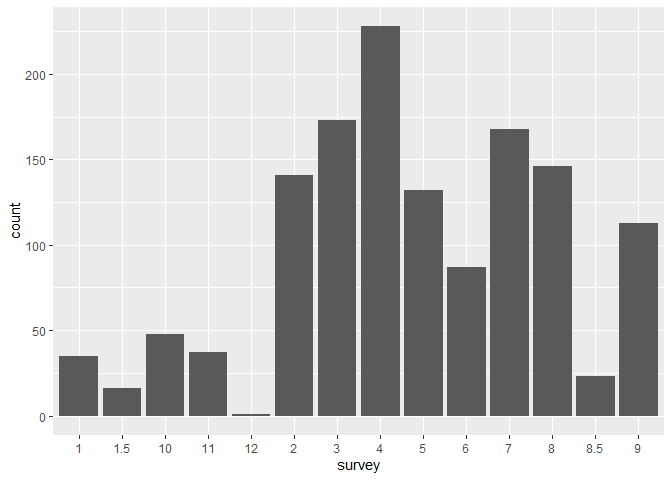
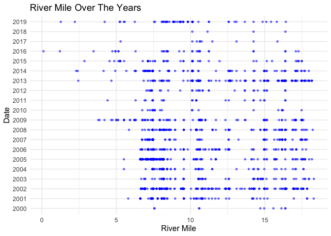
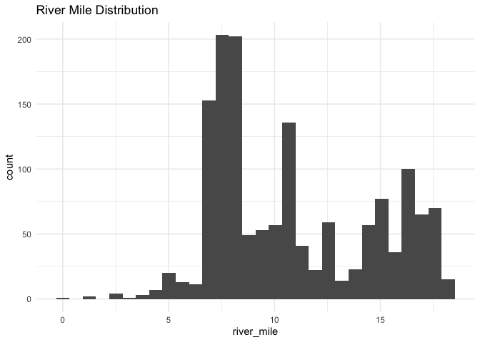
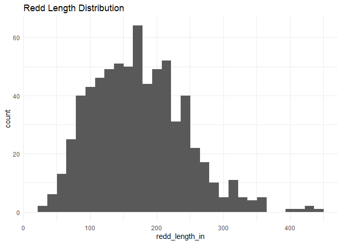
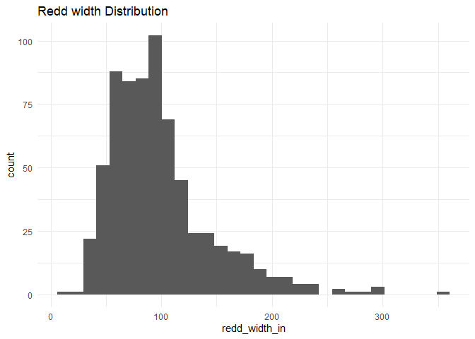
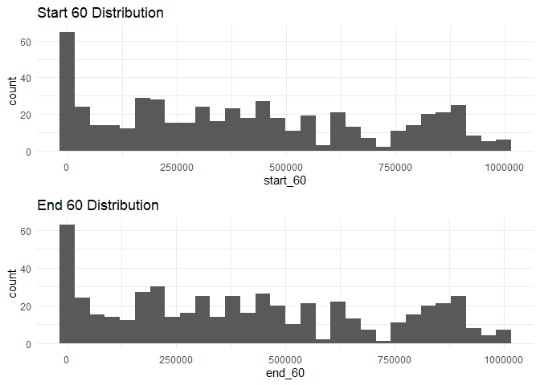
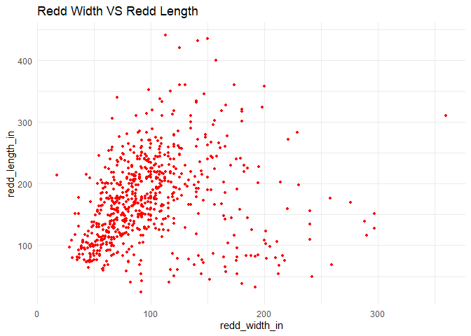
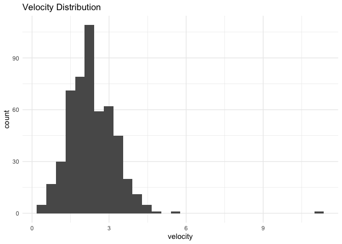
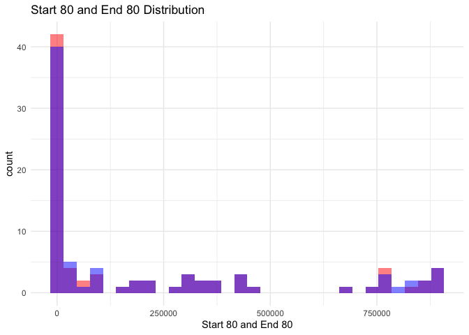
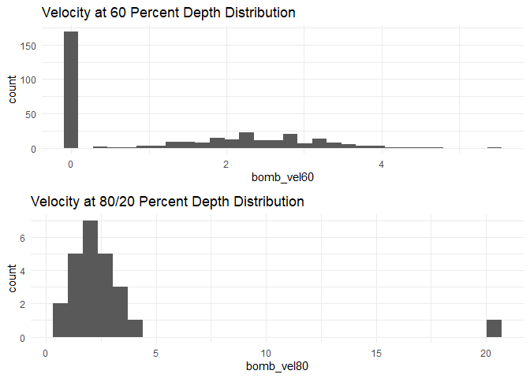

clear\_redds\_survey\_qc
================
Inigo Peng
11/4/2021

# Clear Creek Adult Redds Survey

## Description of Monitoring Data

These data were collected by the U.S. Fish and Wildlife Service’s, Red
Bluff Fish and Wildlife Office’s, Clear Creek Monitoring Program.These
data encompass spring-run Chinook Salmon escapent index surveys from
2008 to 2019. Data were collected on Lower Clear Creek from Whiskeytown
Dam located at river mile 18.1, (40.597786N latitude, -122.538791W
longitude \[decimal degrees\]) to the Clear Creek Video Station located
at river mile 0.0 (40.504836N latitude, -122.369693W longitude \[decimal
degrees\]) near the confluence with the Sacramento River.

**Timeframe:** 2000 - 2019

**Completeness of Record throughout timeframe:** Sampled each year

**Sampling Location:** Clear Creek

**Data Contact:** [Ryan Schaefer](mailto:ryan_a_schaefer@fws.gov)

Any additional info?

## Access Cloud Data

``` r
# Run Sys.setenv() to specify GCS_AUTH_FILE and GCS_DEFAULT_BUCKET before running 
# getwd() to see how to specify paths 
# Open object from google cloud storage
# Set your authentication using gcs_auth
gcs_auth(json_file = Sys.getenv("GCS_AUTH_FILE"))
# Set global bucket 
gcs_global_bucket(bucket = Sys.getenv("GCS_DEFAULT_BUCKET"))
# git data and save as xlsx
gcs_get_object(object_name = "adult-holding-redd-and-carcass-surveys/clear-creek/data-raw/FlowWest SCS JPE Data Request_Clear Creek.xlsx",
               bucket = gcs_get_global_bucket(),
               saveToDisk = "raw_redd_holding_carcass_data.xlsx")
               # Overwrite = TRUE)
```

Read in data from google cloud, glimpse raw data sheet:

## Data Transformation

Note:

survey\_(2-9)*age is described as “Age of redd based on age
classification during survey (2-9)”. Age(1-9) is also described as “age
of redd based on age classification during survey (1-9)”, These to
variables seem to be redundant. TODO: Should we drop drop
survey*(2-9)\_age for now until further review? The last 4 variables
observation\_reach, observation\_date, observation\_age, and
survey\_observed need further description.

``` r
cleaner_data <- raw_redds_data %>% 
  janitor::clean_names() %>%
  select(-c('qc_type','qc_date','inspector','year', 'rm_latlong', 'rm_diff','flow_devic','bomb_id', )) %>% #all method is snorkel, year could be extracted from date, river_latlong same as rivermile,
  rename('longitude' = 'point_x',
         'latitude' = 'point_y',
         'survey' = 'survey_8',
         'picket_weir_location' = 'pw_location',
         'picket_weir_relation' = 'pw_relate',
         'pre_redd_substrate_size' = 'pre_sub',
         'redd_substrate_size' = 'side_sub',
         'tail_substrate_size' = 'tail_sub',
         'fish_on_redd' = 'fish_on_re',
         'pre_redd_depth' = 'pre_in',
         'redd_pit_depth' = 'pit_in',
         'redd_tail_depth' = 'tail_in',
         'redd_length_in' = 'length_in',
         'redd_width_in' = 'width_in',
         'surveyed_reach' = 'reach',
         'observation_reach'= 'reach_2',
         'observation_date' = 'date_2_2',
         'observation_age'= 'age_2_2',
         'survey_observed'= 'survey_78',
         'why_not_measured' = 'why_not_me',
         'date_measured' = 'date_mea',
         'measured' = 'measure'
         ) %>% 
  mutate(date = as.Date(date),
         observation_date = as.Date(observation_date),
         survey = as.character(survey),
         survey_observed = as.character(survey_observed)) %>% 
  # filter(run == "spring") %>%
  glimpse()
```

    ## Rows: 1,540
    ## Columns: 70
    ## $ method                  <chr> "Snorkel", "Snorkel", "Snorkel", "Snorkel", "S~
    ## $ longitude               <dbl> -122.5404, -122.5404, -122.5381, -122.5338, -1~
    ## $ latitude                <dbl> 40.58156, 40.58160, 40.57883, 40.57394, 40.562~
    ## $ survey                  <chr> NA, NA, NA, NA, NA, NA, NA, NA, NA, NA, NA, NA~
    ## $ river_mile              <dbl> 16.38723, 16.38717, 16.12547, 15.58567, 14.701~
    ## $ x1000ftbreak            <dbl> 87000, 87000, 86000, 83000, 78000, 80000, 5700~
    ## $ ucc_relate              <chr> "Above", "Above", "Above", "Above", "Above", "~
    ## $ picket_weir_location    <dbl> 8.2, 8.2, 8.2, 8.2, 8.2, 8.2, 8.2, 8.2, 8.2, 8~
    ## $ picket_weir_relation    <chr> "Above", "Above", "Above", "Above", "Above", "~
    ## $ date                    <date> 2000-09-25, 2000-10-13, 2000-09-26, 2000-09-2~
    ## $ surveyed_reach          <chr> "R1", "R1", "R2", "R2", "R2", "R2", "R4", "R4"~
    ## $ redd_id                 <chr> NA, NA, NA, NA, NA, NA, NA, NA, NA, NA, NA, NA~
    ## $ species                 <chr> "CHINOOK", "CHINOOK", "CHINOOK", "CHINOOK", "C~
    ## $ age                     <dbl> NA, NA, NA, NA, NA, NA, NA, NA, NA, NA, NA, NA~
    ## $ redd_loc                <chr> NA, NA, NA, NA, NA, NA, NA, NA, NA, NA, NA, NA~
    ## $ gravel                  <chr> "Native", "Native", "Native", "Native", "Nativ~
    ## $ inj_site                <chr> "Paige Bar", "Paige Bar", "Above Need Camp", "~
    ## $ pre_redd_substrate_size <chr> NA, NA, NA, NA, NA, NA, NA, NA, NA, NA, NA, NA~
    ## $ redd_substrate_size     <chr> NA, NA, NA, NA, NA, NA, NA, NA, NA, NA, NA, NA~
    ## $ tail_substrate_size     <chr> NA, NA, NA, NA, NA, NA, NA, NA, NA, NA, NA, NA~
    ## $ fish_on_redd            <chr> NA, NA, NA, NA, NA, NA, NA, NA, NA, NA, NA, NA~
    ## $ measured                <chr> "NO", "NO", "NO", "NO", "NO", "NO", "NO", "NO"~
    ## $ why_not_measured        <chr> NA, NA, NA, NA, NA, NA, NA, NA, NA, NA, NA, NA~
    ## $ date_measured           <chr> NA, NA, NA, NA, NA, NA, NA, NA, NA, NA, NA, NA~
    ## $ pre_redd_depth          <dttm> NA, NA, NA, NA, NA, NA, NA, NA, NA, NA, NA, N~
    ## $ redd_pit_depth          <dbl> NA, NA, NA, NA, NA, NA, NA, NA, NA, NA, NA, NA~
    ## $ redd_tail_depth         <dbl> NA, NA, NA, NA, NA, NA, NA, NA, NA, NA, NA, NA~
    ## $ redd_length_in          <dbl> NA, NA, NA, NA, NA, NA, NA, NA, NA, NA, NA, NA~
    ## $ redd_width_in           <dbl> NA, NA, NA, NA, NA, NA, NA, NA, NA, NA, NA, NA~
    ## $ velocity                <dbl> NA, NA, NA, NA, NA, NA, NA, NA, NA, NA, NA, NA~
    ## $ start_60                <dbl> NA, NA, NA, NA, NA, NA, NA, NA, NA, NA, NA, NA~
    ## $ end_60                  <dbl> NA, NA, NA, NA, NA, NA, NA, NA, NA, NA, NA, NA~
    ## $ sec_60                  <dbl> NA, NA, NA, NA, NA, NA, NA, NA, NA, NA, NA, NA~
    ## $ start_80                <dbl> NA, NA, NA, NA, NA, NA, NA, NA, NA, NA, NA, NA~
    ## $ end_80                  <dbl> NA, NA, NA, NA, NA, NA, NA, NA, NA, NA, NA, NA~
    ## $ secs_80                 <dbl> NA, NA, NA, NA, NA, NA, NA, NA, NA, NA, NA, NA~
    ## $ bomb_vel60              <dbl> NA, NA, NA, NA, NA, NA, NA, NA, NA, NA, NA, NA~
    ## $ bomb_vel80              <dbl> NA, NA, NA, NA, NA, NA, NA, NA, NA, NA, NA, NA~
    ## $ comments                <chr> "NEED CAMP 16.2", "NEED CAMP 16.2", "NEED TEMP~
    ## $ survey_2_age            <dbl> NA, NA, NA, NA, NA, NA, NA, NA, NA, NA, NA, NA~
    ## $ survey_3_age            <dbl> NA, NA, NA, NA, NA, NA, NA, NA, NA, NA, NA, NA~
    ## $ survey_4_age            <dbl> NA, NA, NA, NA, NA, NA, NA, NA, NA, NA, NA, NA~
    ## $ survey_5_age            <dbl> NA, NA, NA, NA, NA, NA, NA, NA, NA, NA, NA, NA~
    ## $ survey_6_age            <dbl> NA, NA, NA, NA, NA, NA, NA, NA, NA, NA, NA, NA~
    ## $ survey_7_age            <dbl> NA, NA, NA, NA, NA, NA, NA, NA, NA, NA, NA, NA~
    ## $ survey_8_age            <dbl> NA, NA, NA, NA, NA, NA, NA, NA, NA, NA, NA, NA~
    ## $ survey_9_age            <dbl> NA, NA, NA, NA, NA, NA, NA, NA, NA, NA, NA, NA~
    ## $ date_1                  <dttm> NA, NA, NA, NA, NA, NA, NA, NA, NA, NA, NA, N~
    ## $ age_1                   <dbl> NA, NA, NA, NA, NA, NA, NA, NA, NA, NA, NA, NA~
    ## $ date_2                  <dttm> NA, NA, NA, NA, NA, NA, NA, NA, NA, NA, NA, N~
    ## $ age_2                   <dbl> NA, NA, NA, NA, NA, NA, NA, NA, NA, NA, NA, NA~
    ## $ date_3                  <dttm> NA, NA, NA, NA, NA, NA, NA, NA, NA, NA, NA, N~
    ## $ age_3                   <dbl> NA, NA, NA, NA, NA, NA, NA, NA, NA, NA, NA, NA~
    ## $ date_4                  <dttm> NA, NA, NA, NA, NA, NA, NA, NA, NA, NA, NA, N~
    ## $ age_4                   <dbl> NA, NA, NA, NA, NA, NA, NA, NA, NA, NA, NA, NA~
    ## $ date_5                  <dttm> NA, NA, NA, NA, NA, NA, NA, NA, NA, NA, NA, N~
    ## $ age_5                   <dbl> NA, NA, NA, NA, NA, NA, NA, NA, NA, NA, NA, NA~
    ## $ date_6                  <dttm> NA, NA, NA, NA, NA, NA, NA, NA, NA, NA, NA, N~
    ## $ age_6                   <dbl> NA, NA, NA, NA, NA, NA, NA, NA, NA, NA, NA, NA~
    ## $ date_7                  <dttm> NA, NA, NA, NA, NA, NA, NA, NA, NA, NA, NA, N~
    ## $ age_7                   <dbl> NA, NA, NA, NA, NA, NA, NA, NA, NA, NA, NA, NA~
    ## $ date_8                  <dttm> NA, NA, NA, NA, NA, NA, NA, NA, NA, NA, NA, N~
    ## $ age_8                   <dbl> NA, NA, NA, NA, NA, NA, NA, NA, NA, NA, NA, NA~
    ## $ date_9                  <dttm> NA, NA, NA, NA, NA, NA, NA, NA, NA, NA, NA, N~
    ## $ age_9                   <dbl> NA, NA, NA, NA, NA, NA, NA, NA, NA, NA, NA, NA~
    ## $ run                     <chr> NA, NA, NA, NA, NA, NA, NA, NA, NA, NA, NA, NA~
    ## $ observation_reach       <chr> NA, NA, NA, NA, NA, NA, NA, NA, NA, NA, NA, NA~
    ## $ observation_date        <date> NA, NA, NA, NA, NA, NA, NA, NA, NA, NA, NA, N~
    ## $ observation_age         <dbl> NA, NA, NA, NA, NA, NA, NA, NA, NA, NA, NA, NA~
    ## $ survey_observed         <chr> NA, NA, NA, NA, NA, NA, NA, NA, NA, NA, NA, NA~

## Explore `date`

``` r
summary(cleaner_data$date)
```

    ##         Min.      1st Qu.       Median         Mean      3rd Qu.         Max. 
    ## "2000-09-25" "2003-10-24" "2007-09-24" "2008-08-03" "2013-09-17" "2019-10-10"

**NA and Unknown Values**

-   0 % of values in the `date` column are NA.

## Explore `observation_date`

**Description:** Date of observation

TODO: need to ask Ryan what the observation date is for

``` r
summary(cleaner_data$observation_date)
```

    ##         Min.      1st Qu.       Median         Mean      3rd Qu.         Max. 
    ## "2013-04-01" "2013-09-19" "2014-09-18" "2014-09-22" "2015-09-17" "2018-09-19" 
    ##         NA's 
    ##       "1173"

**NA and Unknown Values**

-   76.2 % of values in the `observation_date` column are NA.

## Explore Categorical Data

``` r
cleaner_data %>% select_if(is.character) %>% colnames()
```

    ##  [1] "method"                  "survey"                 
    ##  [3] "ucc_relate"              "picket_weir_relation"   
    ##  [5] "surveyed_reach"          "redd_id"                
    ##  [7] "species"                 "redd_loc"               
    ##  [9] "gravel"                  "inj_site"               
    ## [11] "pre_redd_substrate_size" "redd_substrate_size"    
    ## [13] "tail_substrate_size"     "fish_on_redd"           
    ## [15] "measured"                "why_not_measured"       
    ## [17] "date_measured"           "comments"               
    ## [19] "run"                     "observation_reach"      
    ## [21] "survey_observed"

### Variable: `method`

``` r
cleaner_data <- cleaner_data %>% 
  mutate(method = tolower(method))
  
table(cleaner_data$method)
```

    ## 
    ##      pw    rstr snorkel 
    ##       3       1    1536

**NA and Unknown Values**

-   0 % of values in the `method` column are NA.

Note: what’s pw? do we keep rstr?

### Variable: `ucc_relate`

**Description:** Above or below Upper Clear Creek Rotary Screw Trap

Note: column probably change the column name to something else

``` r
cleaner_data$ucc_relate <- tolower(cleaner_data$ucc_relate)
table(cleaner_data$ucc_relate)
```

    ## 
    ## above below 
    ##   932   608

**NA and Unknown Values**

-   0 % of values in the `ucc_relate` column are NA.

### Variable: `picket_weir_relation`

**Description:** Above or below location of the Picket Weir

``` r
cleaner_data$picket_weir_relation <- tolower(cleaner_data$picket_weir_relation)
table(cleaner_data$picket_weir_relation)
```

    ## 
    ## above below 
    ##  1028   512

**NA and Unknown Values**

-   0 % of values in the `picket_weir_relation` column are NA.

### Variable: `surveyed_reach`

**Description:** Reach surveyed on each survey day

``` r
table(cleaner_data$surveyed_reach)
```

    ## 
    ##  R1  R2  R3  R4  R5 R5A R5B R5C  R6 R6A  R7 
    ## 240 231 133 284 157  75 287  58  68   3   4

**NA and Unknown Values**

-   0 % of values in the `surveyed_reach` column are NA.

### Variable: `redd_id`

**Description:** ID assigned to redds by data collection device for each
survey day

``` r
unique(cleaner_data$redd_id)[1:10]
```

    ##  [1] NA                "09-23-02R1#4"    "09-16-02R1#5"    "09-16-02R1#2-4" 
    ##  [5] "09-23-02R1#3"    "09-23-02R1#5"    "10-08-02R1#5"    "09-16-02R1#6-10"
    ##  [9] "09-16-02R1#11"   "09-23-02R1#6"

There are 656 unique redd ID numbers.

**NA and Unknown Values**

-   10.6 % of values in the `redd_id` column are NA.

### Variable: `species`

``` r
cleaner_data <- cleaner_data %>% 
  mutate(species = tolower(cleaner_data$species)) %>% 
  filter(species== 'chinook')
table(cleaner_data$species)
```

    ## 
    ## chinook 
    ##    1495

**NA and Unknown Values**

-   0 % of values in the `species` column are NA.

### Variable: `redd_loc`

**Description:** Latitudinal location of the redd in the creek.

RL: river left

RR: river right

RC: river center

``` r
cleaner_data<- cleaner_data %>% 
  mutate(redd_loc = case_when(
  redd_loc == "N/A" ~ NA_character_,
  redd_loc == "RC" ~ "river center",
  redd_loc == "RR" ~ "river right",
  redd_loc == "RL" ~ "river left",
  redd_loc == "RC to RR" ~ "river center to river right"
))
table(cleaner_data$redd_loc)
```

    ## 
    ##                river center river center to river right 
    ##                         299                           1 
    ##                  river left                 river right 
    ##                         340                         279

**NA and Unknown Values**

-   38.5 % of values in the `redd_loc` column are NA.

### Variable: `gravel`

**Description:** predominant type of gravel used in redd construction:
injection, native, or combo (native and injection)

``` r
cleaner_data$gravel <- tolower(cleaner_data$gravel)
table(cleaner_data$gravel)
```

    ## 
    ## combination   injection      native 
    ##         178         238        1079

**NA and Unknown Values**

-   0 % of values in the `gravel` column are NA.

### Variable: `inj_site`

**Description:** source of the injection gravel (site on Clear Creek)

``` r
cleaner_data$inj_site <- tolower(cleaner_data$inj_site)
table(cleaner_data$inj_site)
```

    ## 
    ##         above need camp           above peltier         below dog gulch 
    ##                      39                      42                      45 
    ## clear creek road bridge           guardian rock               paige bar 
    ##                      26                     353                      81 
    ##                  placer                      r6                      r7 
    ##                     226                      52                       2 
    ##             reading bar             whiskeytown 
    ##                     533                      37

**NA and Unknown Values**

-   3.9 % of values in the `inj_site` column are NA.

### Variable: `pre_redd_substrate_size`

**Description:** dominant substrate size in the pre-redd (area just of
stream of the disturbance) TODO

``` r
table(cleaner_data$pre_redd_substrate_size)
```

    ## 
    ##   >12 0.1-1   1-2   1-3   2-3   2-4   3-4   3-5   4-5   4-6   6-8 
    ##     4    55   242   223    52   119    11    30     3     5     1

**NA and Unknown Values**

-   50.2 % of values in the `pre_redd_substrate_size` column are NA.

### Variable: `redd_substrate_size`

**Description:** Dominant substrate size on the sides of the redd

``` r
table(cleaner_data$redd_substrate_size)
```

    ## 
    ##   >12 0.1-1   1-2   1-3   2-3   2-4   3-4   3-5   4-5   4-6   6-8  8-10 
    ##     5    31   217   232    64   142     6    31     6     7     3     1

**NA and Unknown Values**

-   50.2 % of values in the `redd_substrate_size` column are NA.

### Variable: `tail_redd_substrate_size`

**Description:** Dominant substrate size in the tailspill (excavated
material behind the pit)

``` r
table(cleaner_data$tail_substrate_size)
```

    ## 
    ## 0.1-1   1-2   1-3   2-3   2-4   3-4   3-5   4-6 
    ##    12   258   305    68    91     5     4     2

**NA and Unknown Values**

-   0 % of values in the `tail_redd_substrate_size` column are NA.

### Variable: `fish_on_redd`

**Description:** Indicates why a redd wasn’t measured

``` r
table(cleaner_data$fish_on_redd)
```

    ## 
    ##  No  NO Yes YES 
    ##  97 426  20 169

Fix inconsistencies with spelling, capitalization, and abbreviations.

``` r
cleaner_data$fish_on_redd <- case_when(
  cleaner_data$fish_on_redd == "No" | cleaner_data$fish_on_redd == "NO" ~FALSE, 
  cleaner_data$fish_on_redd == "Yes" | cleaner_data$fish_on_redd == "YES" ~TRUE
)
table(cleaner_data$fish_on_redd) 
```

    ## 
    ## FALSE  TRUE 
    ##   523   189

**NA and Unknown Values**

-   52.4 % of values in the `fish_on_redd` column are NA.

### Variable: `measured`

**Description:** indicates if a redd was measured

``` r
table(cleaner_data$measured)
```

    ## 
    ##  NO YES 
    ## 781 714

``` r
cleaner_data$measured <- case_when(
  cleaner_data$measured == "NO" ~FALSE, 
  cleaner_data$measured == "YES"~TRUE
)
table(cleaner_data$measured) 
```

    ## 
    ## FALSE  TRUE 
    ##   781   714

**NA and Unknown Values**

-   0 % of values in the `measured` column are NA.

### Variable: `why_not_measured`

**Description:** Indicates why a redd wasn’t measured

Fix inconsistencies with spelling, capitalization, and abbreviations.

``` r
table(cleaner_data$why_not_measured)
```

    ## 
    ##                                               FALL RUN 
    ##                                                      3 
    ##                                           Fish on redd 
    ##                                                      3 
    ## Fish on redd when first observed, measured next survey 
    ##                                                      1 
    ##                                          Flow too high 
    ##                                                      1 
    ##                                        Time-Constraint 
    ##                                                     11 
    ##                                       TIME CONSTRAINTS 
    ##                                                      1 
    ##                                               Too Deep 
    ##                                                      4 
    ##                                               TOO DEEP 
    ##                                                      5 
    ##                                                TOO OLD 
    ##                                                      2

``` r
cleaner_data<- cleaner_data %>% 
  mutate(why_not_measured = tolower(why_not_measured),
         why_not_measured = if_else(why_not_measured == "time-constraint", "time constraints", why_not_measured))

table(cleaner_data$why_not_measured)
```

    ## 
    ##                                               fall run 
    ##                                                      3 
    ##                                           fish on redd 
    ##                                                      3 
    ## fish on redd when first observed, measured next survey 
    ##                                                      1 
    ##                                          flow too high 
    ##                                                      1 
    ##                                       time constraints 
    ##                                                     12 
    ##                                               too deep 
    ##                                                      9 
    ##                                                too old 
    ##                                                      2

**NA and Unknown Values**

-   97.9 % of values in the `why_not_measured` column are NA.

### Variable: `comments`

**Description:**

``` r
unique(cleaner_data$comments)[1:10]
```

    ##  [1] "NEED CAMP 16.2"                      "NEED TEMP LOGGER 15.86"             
    ##  [3] "BOTTOM OF 2 BOULDER POOL 15.34"      "SWEETHEART POOL14.46"               
    ##  [5] "SPAWNING RIFFLE AFTER SQUEEZE 14.72" "BETWEEN BRIDGE AND PIPELINE 10.49"  
    ##  [7] "ABOVE SHOOTING GALLERY"              NA                                   
    ##  [9] "END OF DINO POOL"                    "WINTER RUN"

**NA and Unknown Values**

-   76.1 % of values in the `comments` column are NA.

### Variable: `run`

**Description:** run call based on field data

We are interested only in spring run TODO

``` r
cleaner_data<-cleaner_data %>% 
  mutate(run = tolower(run))
table(cleaner_data$run)
```

    ## 
    ##      fall late-fall    spring 
    ##         3         1       145

**NA and Unknown Values**

-   90 % of values in the `run` column are NA.

### Variable: `observation_reach`

**Description:** Reach of observation

Note: is this significantly different from `reach`?

``` r
table(cleaner_data$observation_reach)
```

    ## 
    ##  R1  R2  R3  R4  R5 R5A R5B R5C  R6 R6A  R7 
    ##  73  51  32  74   5  12  20  37  26   1   2

### Variable: `survey`

``` r
cleaner_data %>% 
    filter(survey != is.na(survey)) %>% 
  ggplot(aes(x = survey))+
  geom_bar()
```

<!-- -->

There are 15 unique survey numbers.

**NA and Unknown Values**

-   9.8 % of values in the `survey` column are NA.

### Variable: `survey_observed`

``` r
cleaner_data %>% 
  filter(survey_observed != is.na(survey_observed)) %>% 
  ggplot(aes(x = survey_observed))+
  geom_bar()
```

<!-- -->

**NA and Unknown Values**

-   77.7 % of values in the `survey_observed` column are NA.

## Explore Numerical Data

``` r
cleaner_data %>% select_if(is.numeric) %>% colnames()
```

    ##  [1] "longitude"            "latitude"             "river_mile"          
    ##  [4] "x1000ftbreak"         "picket_weir_location" "age"                 
    ##  [7] "redd_pit_depth"       "redd_tail_depth"      "redd_length_in"      
    ## [10] "redd_width_in"        "velocity"             "start_60"            
    ## [13] "end_60"               "sec_60"               "start_80"            
    ## [16] "end_80"               "secs_80"              "bomb_vel60"          
    ## [19] "bomb_vel80"           "survey_2_age"         "survey_3_age"        
    ## [22] "survey_4_age"         "survey_5_age"         "survey_6_age"        
    ## [25] "survey_7_age"         "survey_8_age"         "survey_9_age"        
    ## [28] "age_1"                "age_2"                "age_3"               
    ## [31] "age_4"                "age_5"                "age_6"               
    ## [34] "age_7"                "age_8"                "age_9"               
    ## [37] "observation_age"

### Variable: `longitude`, `latitude`

``` r
summary(cleaner_data$longitude)
```

    ##    Min. 1st Qu.  Median    Mean 3rd Qu.    Max.    NA's 
    ##  -122.6  -122.5  -122.5  -122.5  -122.5  -122.4       1

``` r
summary(cleaner_data$latitude)
```

    ##    Min. 1st Qu.  Median    Mean 3rd Qu.    Max.    NA's 
    ##   40.49   40.49   40.51   40.52   40.56   40.60       1

Note longitude has 1 decimal place - not very exact.

**NA and Unknown Values**

-   0.1 % of values in the `longitude` column are NA.

-   0.1 % of values in the `latitude` column are NA.

### Variable: `river_mile`

``` r
cleaner_data %>% 
  ggplot(aes(x = river_mile, y =as.factor(year(date)))) +
  geom_point(size = 1, alpha = .5, color = "blue") + 
  labs(x = "River Mile", 
       y = "Date") +
  theme_minimal() + 
  theme(text = element_text(size = 12)) +
  labs(title = "River Mile Over The Years")
```

    ## Warning: Removed 1 rows containing missing values (geom_point).

<!-- -->

Seems like more redds were observed in the first 3 miles after 2012

``` r
cleaner_data %>% 
  ggplot(aes(x=river_mile))+
  geom_histogram()+
  theme_minimal()+
  labs(title = "River Mile Distribution")
```

    ## `stat_bin()` using `bins = 30`. Pick better value with `binwidth`.

    ## Warning: Removed 1 rows containing non-finite values (stat_bin).

<!-- -->

Numeric Summary of river\_mile Over Period of Record

``` r
summary(cleaner_data$river_mile)
```

    ##    Min. 1st Qu.  Median    Mean 3rd Qu.    Max.    NA's 
    ##  0.1043  7.5349 10.1249 10.8583 14.5715 18.3081       1

**NA and Unknown Values**

-   0.1 % of values in the `river_mile` column are NA.

### Variable: `x1000ftbreak`

No metadata description

``` r
cleaner_data %>% 
  ggplot(aes(x= x1000ftbreak))+
  geom_histogram()+
  theme_minimal()+
  labs(title = "Distribution of x1000ftbreak")
```

    ## `stat_bin()` using `bins = 30`. Pick better value with `binwidth`.

    ## Warning: Removed 214 rows containing non-finite values (stat_bin).

<!-- -->

**Numeric Summary of x1000ftbreak Over Period of Time**

``` r
summary(cleaner_data$x1000ftbreak)
```

    ##    Min. 1st Qu.  Median    Mean 3rd Qu.    Max.    NA's 
    ##   39000   44000   57000   62085   80000   97000     214

**NA and Unknown Values**

-   14.3 % of values in the `x1000ftbreak` column are NA.

### Variable: `picket_weir_location`

**Description:** Annual picket weir location

Need description for what locations the numbers represent

There are 2 unique picket weir locations.

**Numeric Summary of picket\_weir\_location Over Period of Record**

``` r
summary(cleaner_data$picket_weir_location)
```

    ##    Min. 1st Qu.  Median    Mean 3rd Qu.    Max. 
    ##   7.400   7.400   8.200   7.957   8.200   8.200

**NA and Unknown Values**

-   0 % of values in the `picket_weir_location` column are NA.

### Variable: `age`

``` r
table(cleaner_data$age)
```

    ## 
    ##   1   2   3   4   5 
    ##  66 912  52   4   1

**Create lookup rda for age encoding:**

``` r
#View description of domain for viewing condition

cleaner_data_age <- 1:5
names(cleaner_data_age) <- c(
  "",
  "Clearly visible and clean (clearly defined pit and tail-spill and no periphyton or fines)",
  "Less visible with minor tail-spill flattening (pit and tail-spill still defined, periphyton growth, invertebrate presence)",
  "Barely visible with shallow pit and flattened tail-spill (periphyton growth, invertebrates)",
  "Pit and tail-spill indistinguishable from the surrounding substrate"
)

tibble(age = cleaner_data_age,
       definitions = names(cleaner_data_age))
```

    ## # A tibble: 5 x 2
    ##     age definitions                                                             
    ##   <int> <chr>                                                                   
    ## 1     1 ""                                                                      
    ## 2     2 "Clearly visible and clean (clearly defined pit and tail-spill and no p~
    ## 3     3 "Less visible with minor tail-spill flattening (pit and tail-spill stil~
    ## 4     4 "Barely visible with shallow pit and flattened tail-spill (periphyton g~
    ## 5     5 "Pit and tail-spill indistinguishable from the surrounding substrate"

**NA and Unknown Values**

-   30.8 % of values in the `age` column are NA.

### Variable: `redd_pit_depth`

**Description:** Depth at the deepest part of the pit

``` r
cleaner_data %>% 
  ggplot(aes(x = redd_pit_depth))+
  geom_histogram()+
  labs(title = "Redd Pit Depth Distribution")+
  theme_minimal()
```

    ## `stat_bin()` using `bins = 30`. Pick better value with `binwidth`.

    ## Warning: Removed 837 rows containing non-finite values (stat_bin).

<!-- -->

**Numeric Summary of redd\_pit\_depth**

``` r
summary(cleaner_data$redd_pit_depth)
```

    ##    Min. 1st Qu.  Median    Mean 3rd Qu.    Max.    NA's 
    ##    6.00   19.00   24.00   27.34   32.00   95.00     837

**NA and Unknown Values**

-   56 % of values in the `redd_pit_depth` column are NA.

### Variable: `redd_tail_depth`

**Description:** Depth at the shallowest part of the tailspill

``` r
cleaner_data %>% 
  ggplot(aes(x = redd_tail_depth))+
  geom_histogram()+
  labs(title = "Redd Tail Depth Distribution")+
  theme_minimal()
```

    ## `stat_bin()` using `bins = 30`. Pick better value with `binwidth`.

    ## Warning: Removed 813 rows containing non-finite values (stat_bin).

<!-- -->

``` r
summary(cleaner_data$redd_tail_depth)
```

    ##    Min. 1st Qu.  Median    Mean 3rd Qu.    Max.    NA's 
    ##    3.00   10.00   15.00   18.03   22.00   84.00     813

**NA and Unknown Values**

-   54.4 % of values in the `redd_tail_depth` column are NA.

### Variable: `redd_length_in`

**Description:** Length of the longest part of the disturbed area,
measured parallel to streamflow (in inches)

``` r
cleaner_data %>% 
  ggplot(aes(x = redd_length_in))+
  geom_histogram()+
  labs(title = "Redd Length Distribution")+
  theme_minimal()
```

    ## `stat_bin()` using `bins = 30`. Pick better value with `binwidth`.

    ## Warning: Removed 806 rows containing non-finite values (stat_bin).

<!-- -->

**Numeric Summary of redd\_length\_in over Period of Time**

``` r
summary(cleaner_data$redd_length_in)
```

    ##    Min. 1st Qu.  Median    Mean 3rd Qu.    Max.    NA's 
    ##    25.0   121.0   170.0   173.4   216.0   440.0     806

**NA and Unknown Values**

-   53.9 % of values in the `redd_length_in` column are NA.

### Variable: `redd_width_in`

**Description: **Width of the widest part of the disturbed area,
perpandicular to streamflow.

``` r
cleaner_data %>% 
  ggplot(aes(x = redd_width_in))+
  geom_histogram()+
  labs(title = "Redd width Distribution")+
  theme_minimal()
```

    ## `stat_bin()` using `bins = 30`. Pick better value with `binwidth`.

    ## Warning: Removed 807 rows containing non-finite values (stat_bin).

<!-- -->

``` r
cleaner_data %>% 
  ggplot(aes(x = redd_width_in, y=redd_length_in))+
  geom_point(size = 1.2,color = 'red')+
  labs(title = "Redd Width VS Redd Length")+
  theme_minimal()
```

    ## Warning: Removed 808 rows containing missing values (geom_point).

<!-- -->

**Numeric Summary of redd\_width\_in over Period of Time**

``` r
summary(cleaner_data$redd_width_in)
```

    ##    Min. 1st Qu.  Median    Mean 3rd Qu.    Max.    NA's 
    ##   17.00   67.00   90.00   98.76  116.00  360.00     807

**NA and Unknown Values**

-   54 % of values in the `redd_width_in` column are NA.

### Variable: `velocity`

**Description:** Mean water column velocity measured at 60 percent depth
from the water surface or the average of the 60% depth and 80/20% depth,
if the redd depth is ≥ 30 inches (Allan and Castillo 2007).

Note: need to check unit.

``` r
cleaner_data %>% 
  ggplot(aes(x = velocity))+
  geom_histogram()+
  labs(title = "Velocity Distribution")+
  theme_minimal()
```

    ## `stat_bin()` using `bins = 30`. Pick better value with `binwidth`.

    ## Warning: Removed 979 rows containing non-finite values (stat_bin).

<!-- -->

**Numeric Summary of velocity over Period of Time**

``` r
summary(cleaner_data$velocity)
```

    ##    Min. 1st Qu.  Median    Mean 3rd Qu.    Max.    NA's 
    ##   0.252   1.699   2.263   2.320   2.877  11.058     979

**NA and Unknown Values**

-   65.5 % of values in the `velocity` column are NA.

### Variable:`start_60`,`end_60`

**Description:** starting, ending values on the mechanical flow meter at
60% depth

``` r
cleaner_data %>% 
  ggplot()+
  geom_histogram(aes(x = start_60), fill = "red", alpha = .5)+
  geom_histogram(aes(x = end_60), fill = "blue", alpha = .5)+
  labs(title = "Start 60 and End 60 Distribution", x = "Start 60 and End 60")+
  theme_minimal()
```

    ## `stat_bin()` using `bins = 30`. Pick better value with `binwidth`.

    ## Warning: Removed 967 rows containing non-finite values (stat_bin).

    ## `stat_bin()` using `bins = 30`. Pick better value with `binwidth`.

    ## Warning: Removed 967 rows containing non-finite values (stat_bin).

<!-- -->

**Numeric Summary of start\_60 and end\_60 over Period of Time**

``` r
summary(cleaner_data$start_60)
```

    ##    Min. 1st Qu.  Median    Mean 3rd Qu.    Max.    NA's 
    ##       0  157950  369000  404666  635192  998000     967

``` r
summary(cleaner_data$end_60)
```

    ##    Min. 1st Qu.  Median    Mean 3rd Qu.    Max.    NA's 
    ##       0  161905  370782  407139  637912 1000157     967

**NA and Unknown Values**

-   64.7 % of values in the `start_60` column are NA.

-   64.7 % of values in the `end_60` column are NA.

### Variable: `sec_60`

**Description:** time the meter was in the water

``` r
cleaner_data %>% 
  ggplot(aes(x = sec_60))+
  geom_histogram()+
  labs(title = "Sec 60 Distribution")+
  theme_minimal()
```

    ## `stat_bin()` using `bins = 30`. Pick better value with `binwidth`.

    ## Warning: Removed 963 rows containing non-finite values (stat_bin).

<!-- -->

**Numeric Summary of sec\_60 over Period of Time**

``` r
summary(cleaner_data$sec_60)
```

    ##    Min. 1st Qu.  Median    Mean 3rd Qu.    Max.    NA's 
    ##   20.00  100.00  100.00   98.55  100.00  180.00     963

**NA and Unknown Values**

-   64.4 % of values in the `sec_60` column are NA.

### Variable: `start_80`, `end_80`

**Description:** Starting, end values on the mechanical flow meter at
80/20% depth

``` r
cleaner_data %>% 
  ggplot()+
  geom_histogram(aes(x = start_80), fill = "red", alpha = .5)+
  geom_histogram(aes(x = end_80), fill = "blue", alpha = .5)+
  labs(title = "Start 80 and End 80 Distribution", x = "Start 80 and End 80")+
  theme_minimal()
```

    ## `stat_bin()` using `bins = 30`. Pick better value with `binwidth`.

    ## Warning: Removed 1414 rows containing non-finite values (stat_bin).

    ## `stat_bin()` using `bins = 30`. Pick better value with `binwidth`.

    ## Warning: Removed 1414 rows containing non-finite values (stat_bin).

<!-- -->

**Numeric Summary of start\_80 and end\_80 over Period of Time**

``` r
summary(cleaner_data$start_80)
```

    ##    Min. 1st Qu.  Median    Mean 3rd Qu.    Max.    NA's 
    ##       0       0    4093  203438  348000  890200    1414

``` r
summary(cleaner_data$end_80)
```

    ##    Min. 1st Qu.  Median    Mean 3rd Qu.    Max.    NA's 
    ##       0       0   17919  215119  351688  892365    1414

**NA and Unknown Values**

-   94.6 % of values in the `start_80` column are NA.

-   94.6 % of values in the `end_80` column are NA.

### Variable: `secs_80`

**Description:** Time the meter was in the water at the 80/20% depth.

``` r
cleaner_data %>% 
  ggplot(aes(x = secs_80))+
  geom_histogram(bin =10)+
  labs(title = "Sec 80 Distribution")+
  theme_minimal()
```

    ## Warning: Ignoring unknown parameters: bin

    ## `stat_bin()` using `bins = 30`. Pick better value with `binwidth`.

    ## Warning: Removed 1414 rows containing non-finite values (stat_bin).

<!-- -->

**Numeric Summary of secs\_80 over Period of Time**

``` r
summary(cleaner_data$secs_80)
```

    ##    Min. 1st Qu.  Median    Mean 3rd Qu.    Max.    NA's 
    ##   100.0   100.0   100.0   100.1   100.0   108.0    1414

**NA and Unknown Values**

-   94.6 % of values in the `secs_80` column are NA.

### Variable: `bomb_vel60`, `bomb_vel80`

**`bomb_vel60` Description:** Mean water column velocity measured at 60
percent depth from the water surface if the redd depth is ≤ 30 inches
from the water surface (Allan and Castillo 2007).

**`bomb_vel80` Description:** Mean water column velocity measured at
80/20% percent depth from the water surface if the redd depth is ≥ 30
inches from the water surface (Allan and Castillo 2007).

``` r
v60 <- cleaner_data %>% 
  ggplot(aes(x = bomb_vel60))+
  geom_histogram()+
  labs(title = "Velocity at 60 Percent Depth Distribution")+
  theme_minimal()

v80 <- cleaner_data %>% 
  ggplot(aes(x = bomb_vel80))+
  geom_histogram()+
  labs(title = "Velocity at 80/20 Percent Depth Distribution")+
  theme_minimal()


gridExtra::grid.arrange(v60, v80)
```

    ## `stat_bin()` using `bins = 30`. Pick better value with `binwidth`.

    ## Warning: Removed 1155 rows containing non-finite values (stat_bin).

    ## `stat_bin()` using `bins = 30`. Pick better value with `binwidth`.

    ## Warning: Removed 1471 rows containing non-finite values (stat_bin).

<!-- -->

**Numeric Summary of bomb\_vel60 and bomb\_vel80 over Period of Time**

``` r
summary(cleaner_data$bomb_vel60)
```

    ##    Min. 1st Qu.  Median    Mean 3rd Qu.    Max.    NA's 
    ##   0.000   0.000   0.168   1.221   2.348   5.457    1155

``` r
summary(cleaner_data$bomb_vel80)
```

    ##    Min. 1st Qu.  Median    Mean 3rd Qu.    Max.    NA's 
    ##  0.4708  1.6214  2.0064  2.8995  2.9177 20.1574    1471

Note: 0 velocity at 60 percent depth is NA? There’s significant more
measurement of redd measurement &lt;30 inches from water.

**NA and Unknown Values**

-   0 % of values in the `vel60` column are NA.

-   0 % of values in the `vel80` column are NA.

### Variable: `observation_age`

**Description:** Age at observation

``` r
cleaner_data %>% 
  ggplot(aes(x=observation_age))+
  geom_histogram()+
  theme_minimal()+
  labs(title = "Distribution of Age at Observation")
```

    ## `stat_bin()` using `bins = 30`. Pick better value with `binwidth`.

    ## Warning: Removed 1162 rows containing non-finite values (stat_bin).

<!-- -->

**Numeric Summary of observation\_age over Period of Time**

``` r
summary(cleaner_data$observation_age)
```

    ##    Min. 1st Qu.  Median    Mean 3rd Qu.    Max.    NA's 
    ##   0.000   2.000   2.000   2.078   2.000   4.000    1162

**NA and Unknown Values**

-   77.7 % of values in the `observation_age` column are NA.

### Summary of Identified Issues

-   There are some metadata needed

-   Need to email Ryan to ask what survey\_age is; decide if the columns
    are important and decide if these columns should be dropped

### Save Cleaned data back to google cloud

``` r
clear_redd <- cleaner_data %>% glimpse
```

    ## Rows: 1,495
    ## Columns: 70
    ## $ method                  <chr> "snorkel", "snorkel", "snorkel", "snorkel", "s~
    ## $ longitude               <dbl> -122.5404, -122.5404, -122.5381, -122.5338, -1~
    ## $ latitude                <dbl> 40.58156, 40.58160, 40.57883, 40.57394, 40.562~
    ## $ survey                  <chr> NA, NA, NA, NA, NA, NA, NA, NA, NA, NA, NA, NA~
    ## $ river_mile              <dbl> 16.38723, 16.38717, 16.12547, 15.58567, 14.701~
    ## $ x1000ftbreak            <dbl> 87000, 87000, 86000, 83000, 78000, 80000, 5700~
    ## $ ucc_relate              <chr> "above", "above", "above", "above", "above", "~
    ## $ picket_weir_location    <dbl> 8.2, 8.2, 8.2, 8.2, 8.2, 8.2, 8.2, 8.2, 8.2, 8~
    ## $ picket_weir_relation    <chr> "above", "above", "above", "above", "above", "~
    ## $ date                    <date> 2000-09-25, 2000-10-13, 2000-09-26, 2000-09-2~
    ## $ surveyed_reach          <chr> "R1", "R1", "R2", "R2", "R2", "R2", "R4", "R4"~
    ## $ redd_id                 <chr> NA, NA, NA, NA, NA, NA, NA, NA, NA, NA, NA, NA~
    ## $ species                 <chr> "chinook", "chinook", "chinook", "chinook", "c~
    ## $ age                     <dbl> NA, NA, NA, NA, NA, NA, NA, NA, NA, NA, NA, NA~
    ## $ redd_loc                <chr> NA, NA, NA, NA, NA, NA, NA, NA, NA, NA, NA, NA~
    ## $ gravel                  <chr> "native", "native", "native", "native", "nativ~
    ## $ inj_site                <chr> "paige bar", "paige bar", "above need camp", "~
    ## $ pre_redd_substrate_size <chr> NA, NA, NA, NA, NA, NA, NA, NA, NA, NA, NA, NA~
    ## $ redd_substrate_size     <chr> NA, NA, NA, NA, NA, NA, NA, NA, NA, NA, NA, NA~
    ## $ tail_substrate_size     <chr> NA, NA, NA, NA, NA, NA, NA, NA, NA, NA, NA, NA~
    ## $ fish_on_redd            <lgl> NA, NA, NA, NA, NA, NA, NA, NA, NA, NA, NA, NA~
    ## $ measured                <lgl> FALSE, FALSE, FALSE, FALSE, FALSE, FALSE, FALS~
    ## $ why_not_measured        <chr> NA, NA, NA, NA, NA, NA, NA, NA, NA, NA, NA, NA~
    ## $ date_measured           <chr> NA, NA, NA, NA, NA, NA, NA, NA, NA, NA, NA, NA~
    ## $ pre_redd_depth          <dttm> NA, NA, NA, NA, NA, NA, NA, NA, NA, NA, NA, N~
    ## $ redd_pit_depth          <dbl> NA, NA, NA, NA, NA, NA, NA, NA, NA, NA, NA, NA~
    ## $ redd_tail_depth         <dbl> NA, NA, NA, NA, NA, NA, NA, NA, NA, NA, NA, NA~
    ## $ redd_length_in          <dbl> NA, NA, NA, NA, NA, NA, NA, NA, NA, NA, NA, NA~
    ## $ redd_width_in           <dbl> NA, NA, NA, NA, NA, NA, NA, NA, NA, NA, NA, NA~
    ## $ velocity                <dbl> NA, NA, NA, NA, NA, NA, NA, NA, NA, NA, NA, NA~
    ## $ start_60                <dbl> NA, NA, NA, NA, NA, NA, NA, NA, NA, NA, NA, NA~
    ## $ end_60                  <dbl> NA, NA, NA, NA, NA, NA, NA, NA, NA, NA, NA, NA~
    ## $ sec_60                  <dbl> NA, NA, NA, NA, NA, NA, NA, NA, NA, NA, NA, NA~
    ## $ start_80                <dbl> NA, NA, NA, NA, NA, NA, NA, NA, NA, NA, NA, NA~
    ## $ end_80                  <dbl> NA, NA, NA, NA, NA, NA, NA, NA, NA, NA, NA, NA~
    ## $ secs_80                 <dbl> NA, NA, NA, NA, NA, NA, NA, NA, NA, NA, NA, NA~
    ## $ bomb_vel60              <dbl> NA, NA, NA, NA, NA, NA, NA, NA, NA, NA, NA, NA~
    ## $ bomb_vel80              <dbl> NA, NA, NA, NA, NA, NA, NA, NA, NA, NA, NA, NA~
    ## $ comments                <chr> "NEED CAMP 16.2", "NEED CAMP 16.2", "NEED TEMP~
    ## $ survey_2_age            <dbl> NA, NA, NA, NA, NA, NA, NA, NA, NA, NA, NA, NA~
    ## $ survey_3_age            <dbl> NA, NA, NA, NA, NA, NA, NA, NA, NA, NA, NA, NA~
    ## $ survey_4_age            <dbl> NA, NA, NA, NA, NA, NA, NA, NA, NA, NA, NA, NA~
    ## $ survey_5_age            <dbl> NA, NA, NA, NA, NA, NA, NA, NA, NA, NA, NA, NA~
    ## $ survey_6_age            <dbl> NA, NA, NA, NA, NA, NA, NA, NA, NA, NA, NA, NA~
    ## $ survey_7_age            <dbl> NA, NA, NA, NA, NA, NA, NA, NA, NA, NA, NA, NA~
    ## $ survey_8_age            <dbl> NA, NA, NA, NA, NA, NA, NA, NA, NA, NA, NA, NA~
    ## $ survey_9_age            <dbl> NA, NA, NA, NA, NA, NA, NA, NA, NA, NA, NA, NA~
    ## $ date_1                  <dttm> NA, NA, NA, NA, NA, NA, NA, NA, NA, NA, NA, N~
    ## $ age_1                   <dbl> NA, NA, NA, NA, NA, NA, NA, NA, NA, NA, NA, NA~
    ## $ date_2                  <dttm> NA, NA, NA, NA, NA, NA, NA, NA, NA, NA, NA, N~
    ## $ age_2                   <dbl> NA, NA, NA, NA, NA, NA, NA, NA, NA, NA, NA, NA~
    ## $ date_3                  <dttm> NA, NA, NA, NA, NA, NA, NA, NA, NA, NA, NA, N~
    ## $ age_3                   <dbl> NA, NA, NA, NA, NA, NA, NA, NA, NA, NA, NA, NA~
    ## $ date_4                  <dttm> NA, NA, NA, NA, NA, NA, NA, NA, NA, NA, NA, N~
    ## $ age_4                   <dbl> NA, NA, NA, NA, NA, NA, NA, NA, NA, NA, NA, NA~
    ## $ date_5                  <dttm> NA, NA, NA, NA, NA, NA, NA, NA, NA, NA, NA, N~
    ## $ age_5                   <dbl> NA, NA, NA, NA, NA, NA, NA, NA, NA, NA, NA, NA~
    ## $ date_6                  <dttm> NA, NA, NA, NA, NA, NA, NA, NA, NA, NA, NA, N~
    ## $ age_6                   <dbl> NA, NA, NA, NA, NA, NA, NA, NA, NA, NA, NA, NA~
    ## $ date_7                  <dttm> NA, NA, NA, NA, NA, NA, NA, NA, NA, NA, NA, N~
    ## $ age_7                   <dbl> NA, NA, NA, NA, NA, NA, NA, NA, NA, NA, NA, NA~
    ## $ date_8                  <dttm> NA, NA, NA, NA, NA, NA, NA, NA, NA, NA, NA, N~
    ## $ age_8                   <dbl> NA, NA, NA, NA, NA, NA, NA, NA, NA, NA, NA, NA~
    ## $ date_9                  <dttm> NA, NA, NA, NA, NA, NA, NA, NA, NA, NA, NA, N~
    ## $ age_9                   <dbl> NA, NA, NA, NA, NA, NA, NA, NA, NA, NA, NA, NA~
    ## $ run                     <chr> NA, NA, NA, NA, NA, NA, NA, NA, NA, NA, NA, NA~
    ## $ observation_reach       <chr> NA, NA, NA, NA, NA, NA, NA, NA, NA, NA, NA, NA~
    ## $ observation_date        <date> NA, NA, NA, NA, NA, NA, NA, NA, NA, NA, NA, N~
    ## $ observation_age         <dbl> NA, NA, NA, NA, NA, NA, NA, NA, NA, NA, NA, NA~
    ## $ survey_observed         <chr> NA, NA, NA, NA, NA, NA, NA, NA, NA, NA, NA, NA~

``` r
# gcs_list_objects()
f <- function(input, output) write_csv(input, file = output)
gcs_upload(clear_redd
           object_function = f,
           type = "csv",
           name = "adult-holding-redd-and-carcass-surveys/clear-creek/data/clear_redd.csv")
```
