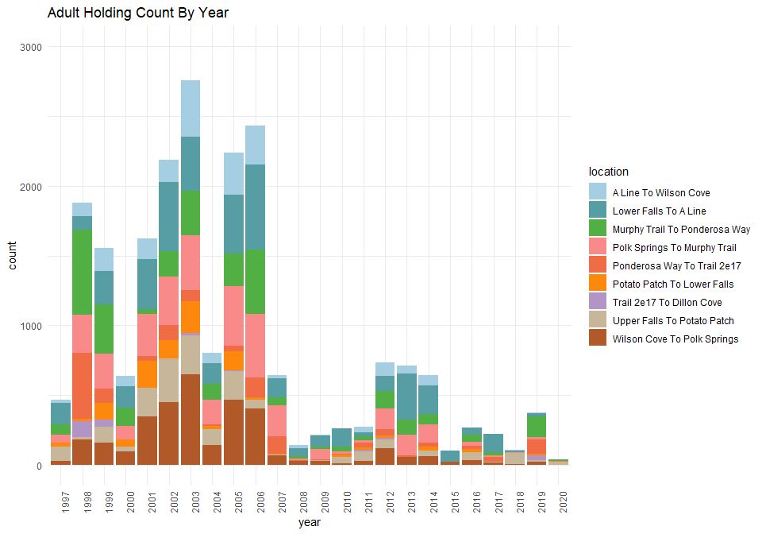

deer-holding-1997-to-2020-qc-checklist
================
Inigo Peng
10/19/2021

# Deer Creek Adult Holding Survey Data 1997 to 2020

**Description of Monitoring Data**

The adult holding survey data is in two separate files: first one is
from 1986 to 1996, second one is 1997 to 2020. The data is collected via
snorkel counts.The data has been qced and summed up.

**Timeframe:**

1997 to 2020

**Completeness of Record throughout timeframe:**

-   Some data lacks for Trail 2E17 to Dillon Cove

**Sampling Location:**

-   Upper Falls to Potato Patch
-   Potato Patch to Lower Falls
-   Lower Falls to A-Line
-   A-Line to Wilson Cove
-   Wilson Cove to Polk Springs
-   Polk Springs to Murphy Trail
-   Murphy Trail to Ponderosa Way
-   Ponderosa Way to Trail 2E17
-   Trail 2E17 to Dillon Cove

**Data Contact:** [Matt Johnson](mailto:Matt.Johnson@wildlife.ca.gov)

## Access Cloud Data

``` r
# Run Sys.setenv() to specify GCS_AUTH_FILE and GCS_DEFAULT_BUCKET before running
# Open object from google cloud storage
# Set your authentication using gcs_auth
gcs_auth(json_file = Sys.getenv("GCS_AUTH_FILE"))
# Set global bucket 
gcs_global_bucket(bucket = Sys.getenv("GCS_DEFAULT_BUCKET"))
gcs_list_objects()
# git data and save as xlsx
gcs_get_object(object_name = "adult-holding-redd-and-carcass-surveys/deer-creek/data-raw/Deer Creek SRCS snorkel survey counts by section 1997-2020.xlsx",
               bucket = gcs_get_global_bucket(),
               saveToDisk = "deer_creek_holding_1997_raw.xlsx")
               # Overwrite = TRUE)
```

``` r
raw_data = readxl::read_excel('deer_creek_holding_1997_raw.xlsx', 
                              col_types = c("text", "numeric", "numeric", "numeric", "numeric", "numeric", "numeric", "numeric", "numeric", "numeric",
                                            "numeric", "numeric", "numeric", "numeric", "numeric", "numeric", "numeric", "numeric", "numeric", "numeric",
                                            "numeric", "numeric", "numeric", "numeric", "numeric"))
glimpse(raw_data)
```

    ## Rows: 10
    ## Columns: 25
    ## $ `Survey Reach` <chr> "Upper Falls to Potato Patch", "Potato Patch to Lower F~
    ## $ `1997`         <dbl> 102, 28, 153, 22, 26, 59, 74, 2, NA, 466
    ## $ `1998`         <dbl> 14, 15, 93, 98, 182, 270, 615, 476, 116, 1879
    ## $ `1999`         <dbl> 114, 119, 241, 167, 158, 247, 355, 106, 50, 1591
    ## $ `2000`         <dbl> 34, 52, 151, 76, 96, 92, 135, 1, NA, 637
    ## $ `2001`         <dbl> 204, 190, 357, 149, 346, 303, 34, 37, 2, 1622
    ## $ `2002`         <dbl> 311, 130, 492, 160, 451, 350, 183, 107, 1, 2185
    ## $ `2003`         <dbl> 283, 233, 389, 405, 647, 393, 320, 77, 12, 2759
    ## $ `2004`         <dbl> 114, 23, 151, 75, 141, 178, 112, 10, NA, 804
    ## $ `2005`         <dbl> 204, 142, 422, 300, 466, 423, 238, 40, 4, 2239
    ## $ `2006`         <dbl> 62, 22, 606, 281, 401, 456, 465, 139, NA, 2432
    ## $ `2007`         <dbl> 7, 4, 137, 26, 66, 224, 53, 127, NA, 644
    ## $ `2008`         <dbl> 4, 0, 56, 24, 24, 14, 15, 3, NA, 140
    ## $ `2009`         <dbl> 4, 5, 78, 6, 26, 73, 16, 5, NA, 213
    ## $ `2010`         <dbl> 41, 19, 130, 4, 12, 18, 33, 5, NA, 262
    ## $ `2011`         <dbl> 70, 14, 33, 37, 26, 20, 24, 34, 13, 271
    ## $ `2012`         <dbl> 65, 20, 107, 96, 115, 145, 130, 46, 10, 734
    ## $ `2013`         <dbl> 0, 2, 330, 55, 53, 149, 108, 11, NA, 708
    ## $ `2014`         <dbl> 42, 27, 203, 75, 59, 133, 72, 30, NA, 641
    ## $ `2015`         <dbl> 0, 0, 77, 0, 18, 3, 0, 1, NA, 99
    ## $ `2016`         <dbl> 56, 22, 50, 2, 32, 30, 52, 24, NA, 268
    ## $ `2017`         <dbl> 8, 0, 130, 1, 14, 8, 24, 34, NA, 219
    ## $ `2018`         <dbl> 81, 0, 11, 5, 1, 4, 0, 2, NA, 104
    ## $ `2019`         <dbl> 10, 7, 23, 4, 21, 17, 151, 103, 37, 373
    ## $ `2020`         <dbl> 19, 5, 9, 0, 0, 1, 2, 4, 0, 40

## Data Transformations

``` r
cleaner_data <- raw_data %>% 
  slice(1:(n()-1)) %>% 
  pivot_longer(!'Survey Reach', names_to = "year", values_to = "count") %>% 
  rename('location' = 'Survey Reach') %>% 
  glimpse()
```

    ## Rows: 216
    ## Columns: 3
    ## $ location <chr> "Upper Falls to Potato Patch", "Upper Falls to Potato Patch",~
    ## $ year     <chr> "1997", "1998", "1999", "2000", "2001", "2002", "2003", "2004~
    ## $ count    <dbl> 102, 14, 114, 34, 204, 311, 283, 114, 204, 62, 7, 4, 4, 41, 7~

## Explore Categorical Variables

### Variable `location`

``` r
cleaner_data <- cleaner_data %>% 
  mutate(location = str_to_title(location),
         location = gsub("-", " ", location))
table(cleaner_data$location)
```

    ## 
    ##         A Line To Wilson Cove         Lower Falls To A Line 
    ##                            24                            24 
    ## Murphy Trail To Ponderosa Way  Polk Springs To Murphy Trail 
    ##                            24                            24 
    ##   Ponderosa Way To Trail 2e17   Potato Patch To Lower Falls 
    ##                            24                            24 
    ##     Trail 2e17 To Dillon Cove   Upper Falls To Potato Patch 
    ##                            24                            24 
    ##   Wilson Cove To Polk Springs 
    ##                            24

**NA and Unknown Values**

-   0 % of values in the `location` column are NA.

## Explore Numeric Variables

### Variable `count`

``` r
#Find the most distinctive colours for visual
colourCount = length(unique(cleaner_data$location))
getPalette = colorRampPalette(brewer.pal(12, "Paired"))

cleaner_data %>%
  mutate(year = as.factor(year)) %>% 
  ggplot(aes(x = year, y = count, fill = location))+
  scale_fill_manual(values = getPalette(colourCount))+
  geom_col()+
  theme_minimal()+
  labs(title = "Adult Holding Count By Year")+
  theme(axis.text.x = element_text(angle = 90))+
  ylim(0, 3000)
```

<!-- -->

``` r
cleaner_data %>% 
  ggplot(aes(x = count, y = location))+
  geom_boxplot() +
  theme_minimal()+
  labs(title = "Adult Holding Count By Reach")
```

<!-- -->

**Numeric Annual Summary of count From 1997 to 2020**

``` r
cleaner_data %>%
  group_by(year) %>%
  summarise(count = sum(count, na.rm = T)) %>%
  pull(count) %>%
  summary()
```

    ##    Min. 1st Qu.  Median    Mean 3rd Qu.    Max. 
    ##    40.0   251.2   639.0   887.3  1573.2  2759.0

**NA and Unknown Values**

-   6.481 % of values in the `count` column are NA.

### Add cleaned data back onto google cloud

``` r
deer_adult_holding_survey_1997_to_2020 <- cleaner_data %>% glimpse()
```

    ## Rows: 216
    ## Columns: 3
    ## $ location <chr> "Upper Falls To Potato Patch", "Upper Falls To Potato Patch",~
    ## $ year     <chr> "1997", "1998", "1999", "2000", "2001", "2002", "2003", "2004~
    ## $ count    <dbl> 102, 14, 114, 34, 204, 311, 283, 114, 204, 62, 7, 4, 4, 41, 7~

``` r
f <- function(input, output) write_csv(input, file = output)
gcs_upload(deer_adult_holding_survey_1997_to_2020,
           object_function = f,
           type = "csv",
           name = "adult-holding-redd-and-carcass-surveys/deer-creek/data/deer_adult_holding_1997_to_2020.csv")
```

    ## i 2021-11-03 16:42:54 > File size detected as  7.4 Kb

    ## i 2021-11-03 16:42:54 > Request Status Code:  400

    ## ! API returned: Cannot insert legacy ACL for an object when uniform bucket-level access is enabled. Read more at https://cloud.google.com/storage/docs/uniform-bucket-level-access - Retrying with predefinedAcl='bucketLevel'

    ## i 2021-11-03 16:42:54 > File size detected as  7.4 Kb

    ## ==Google Cloud Storage Object==
    ## Name:                adult-holding-redd-and-carcass-surveys/deer-creek/data/deer_adult_holding_1997_to_2020.csv 
    ## Type:                csv 
    ## Size:                7.4 Kb 
    ## Media URL:           https://www.googleapis.com/download/storage/v1/b/jpe-dev-bucket/o/adult-holding-redd-and-carcass-surveys%2Fdeer-creek%2Fdata%2Fdeer_adult_holding_1997_to_2020.csv?generation=1635982973880096&alt=media 
    ## Download URL:        https://storage.cloud.google.com/jpe-dev-bucket/adult-holding-redd-and-carcass-surveys%2Fdeer-creek%2Fdata%2Fdeer_adult_holding_1997_to_2020.csv 
    ## Public Download URL: https://storage.googleapis.com/jpe-dev-bucket/adult-holding-redd-and-carcass-surveys%2Fdeer-creek%2Fdata%2Fdeer_adult_holding_1997_to_2020.csv 
    ## Bucket:              jpe-dev-bucket 
    ## ID:                  jpe-dev-bucket/adult-holding-redd-and-carcass-surveys/deer-creek/data/deer_adult_holding_1997_to_2020.csv/1635982973880096 
    ## MD5 Hash:            9mBfuDEVfDhkNSB4znZocQ== 
    ## Class:               STANDARD 
    ## Created:             2021-11-03 23:42:53 
    ## Updated:             2021-11-03 23:42:53 
    ## Generation:          1635982973880096 
    ## Meta Generation:     1 
    ## eTag:                CKCOkcCv/fMCEAE= 
    ## crc32c:              ZEZzyw==
