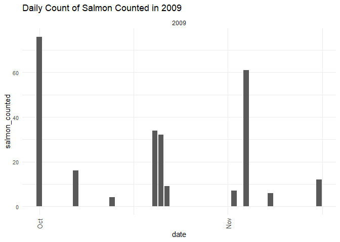
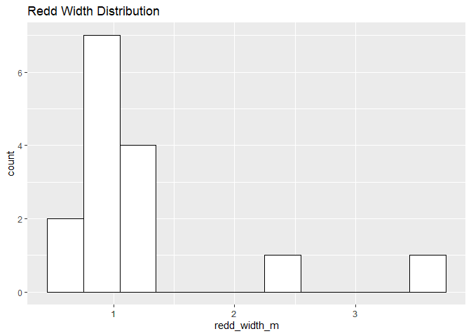
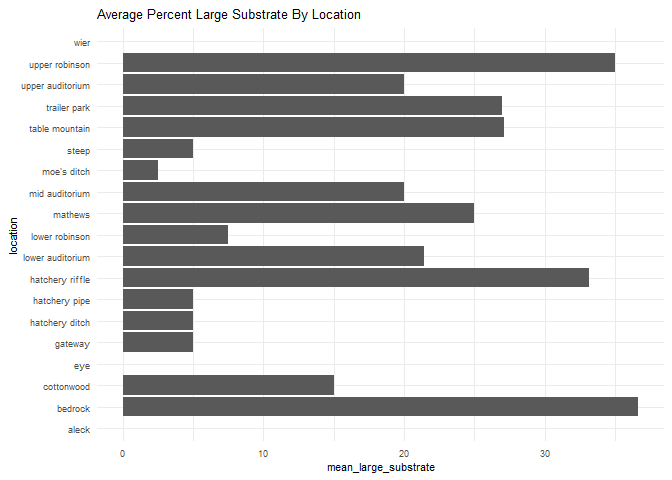
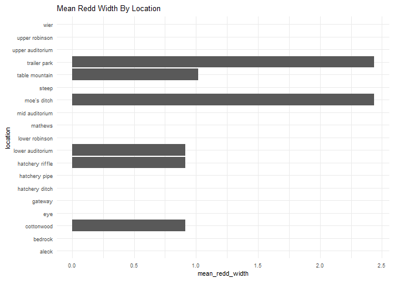
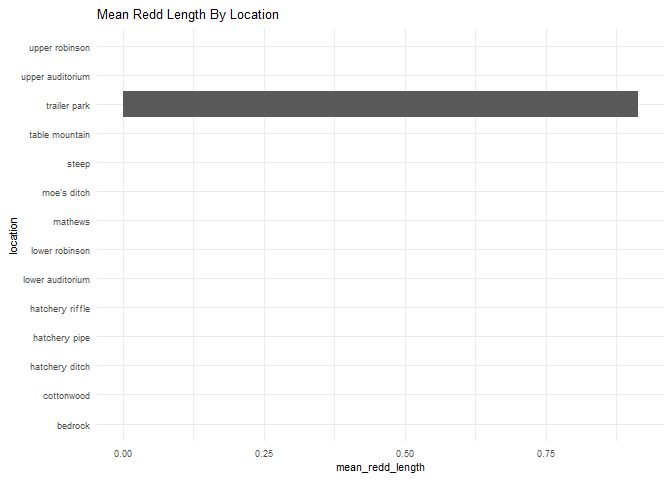
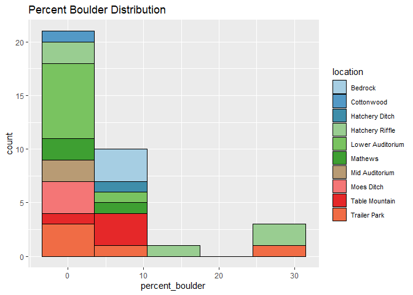
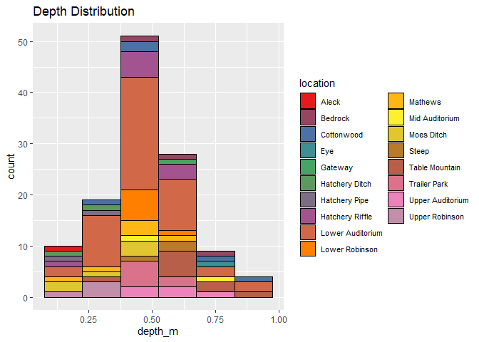
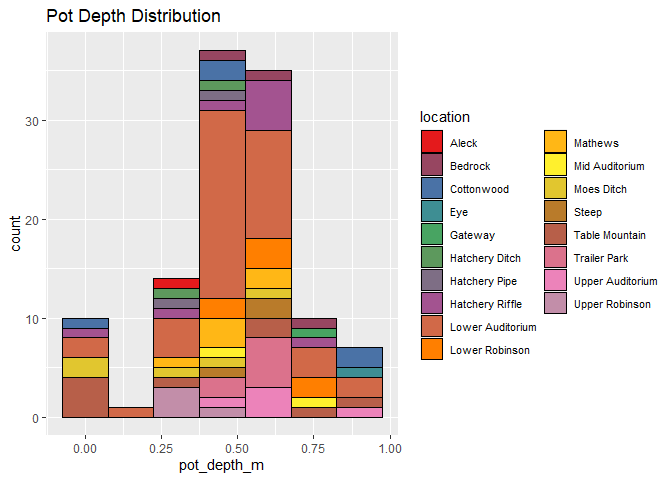
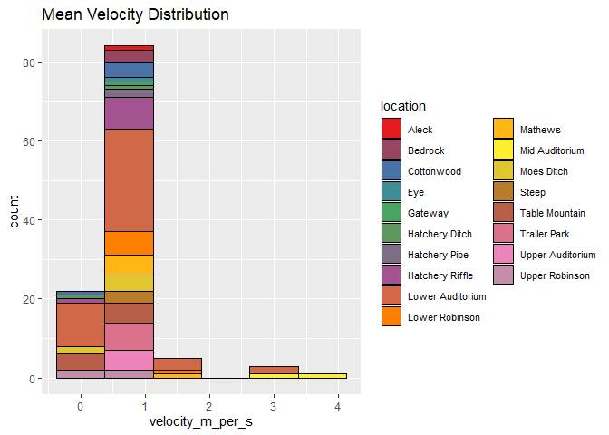

feather-river-adult-holding-redd-survey-qc-checklist-2009
================
Inigo Peng
10/6/2021

# Feather River Redd Survey Data

## Description of Monitoring Data

**Timeframe:** 2009

**Completeness of Record throughout timeframe:**

-   Longitude and latitude data are not available for 2009, 2010, 2011,
    2012, 2019, 2020. NA values will be filled in for these data sets in
    final cleaned data set.

**Sampling Location:** Various sampling locations on Feather River.

**Data Contact:** [Chris Cook](mailto::Chris.Cook@water.ca.gov)

Additional Info:  
1. Latitude and longitude are in NAD 1983 UTM Zone 10N  
2. The substrate is observed visually and an estimate of the percentage
of 5 size classes:

-   fines &lt;1cm  
-   small 1-5cm  
-   medium 6-15cm  
-   large 16-30cm  
-   boulder &gt;30cm

## Access Cloud Data

``` r
# Run Sys.setenv() to specify GCS_AUTH_FILE and GCS_DEFAULT_BUCKET before running
# Open object from google cloud storage
# Set your authentication using gcs_auth
gcs_auth(json_file = Sys.getenv("GCS_AUTH_FILE"))
# Set global bucket 
gcs_global_bucket(bucket = Sys.getenv("GCS_DEFAULT_BUCKET"))
gcs_list_objects()
# git data and save as xlsx
gcs_get_object(object_name = "adult-holding-redd-and-carcass-surveys/feather-river/data-raw/redd_survey/2009_Chinook_Redd_Survey_Data_raw.xlsx",
               bucket = gcs_get_global_bucket(),
               saveToDisk = "2009_Chinook_Redd_Survey_Data_raw.xlsx",
               Overwrite = TRUE)
```

Read in data from google cloud, glimpse raw data:

``` r
raw_data_2009 = readxl::read_excel("2009_Chinook_Redd_Survey_Data_raw.xlsx",
                                   sheet="2009 All Data",
                                   col_types = c("text",
                                                 "numeric",
                                                 "text",
                                                 "text",
                                                 "numeric",
                                                 "numeric",
                                                 "numeric",
                                                 "numeric",
                                                 "numeric",
                                                 "numeric",
                                                 "numeric",
                                                 "numeric",
                                                 "numeric",
                                                 "numeric",
                                                 "numeric",
                                                 "numeric",
                                                 "date"))
glimpse(raw_data_2009)
```

    ## Rows: 301
    ## Columns: 17
    ## $ Location             <chr> "Table Mountain", "Table Mountain", "Table Mounta~
    ## $ File                 <dbl> 4, 1, 3, 5, 7, 8, 9, 6, 11, 12, 13, 14, 15, 16, 1~
    ## $ `Type (D, A, P)`     <chr> "Area", "Point", "Area", "Area", "Area", "Area", ~
    ## $ Remeasured           <chr> "No", "No", "No", "No", "No", "No", "No", "No", "~
    ## $ `#  Redds`           <dbl> 1, 1, 1, 1, 1, 1, 1, 3, 1, 1, 1, 1, 1, 1, 1, 2, 1~
    ## $ `# Salmon`           <dbl> 0, 0, 0, 0, 0, 0, 0, 0, 0, 0, 0, 0, 0, 0, 0, 0, 0~
    ## $ `Depth (m)`          <dbl> 0.78, 0.56, 0.64, 0.50, 0.40, 0.52, 0.58, 0.32, 0~
    ## $ `Pot depth (m)`      <dbl> 0.00, 0.00, 0.00, 0.00, 0.00, 0.00, 0.00, 0.00, N~
    ## $ `Velocity (m/s)`     <dbl> 0.00, 0.00, 0.00, 0.00, 0.00, 0.00, 0.00, 0.00, N~
    ## $ `% Fines (<1 cm)`    <dbl> 10, 5, 15, 30, 25, 5, 5, 20, NA, NA, NA, NA, NA, ~
    ## $ `% Small (1-5 cm)`   <dbl> 20, 20, 30, 50, 15, 15, 20, 20, NA, NA, NA, NA, N~
    ## $ `% Medium (5-15 cm)` <dbl> 40, 30, 20, 20, 60, 30, 20, 60, NA, NA, NA, NA, N~
    ## $ `% Large (15-30 cm)` <dbl> 30, 40, 30, 0, 0, 50, 45, 0, NA, NA, NA, NA, NA, ~
    ## $ `% Boulder (>30 cm)` <dbl> 0, 5, 5, 0, 0, 0, 0, 0, NA, NA, NA, NA, NA, NA, 0~
    ## $ `Redd Width (ft)`    <dbl> NA, 3, 3, 3, 4, 3, 3, 12, NA, 4, 2, 2, 3, 4, 3, 4~
    ## $ `Redd Lenght (ft)`   <dbl> NA, 4, 5, 4, 6, 3, 3, 4, NA, 4, 3, 3, 4, 5, 3, 6,~
    ## $ `Survey Date`        <dttm> 2009-09-29, 2009-09-29, 2009-09-29, 2009-09-29, ~

## Data Transformation

``` r
#Convert feet to m
raw_data_2009$'redd_width_m' <- round(raw_data_2009$'Redd Width (ft)'*0.3048, 2)
raw_data_2009$'redd_length_m' <- round(raw_data_2009$'Redd Lenght (ft)'*0.3048, 2)

cleaner_data_2009 <- raw_data_2009 %>%
  select(-c(Remeasured, File, `Redd Width (ft)`, `Redd Lenght (ft)`)) %>%
  relocate('Survey Date', .before = 'Location') %>% 
  rename('Date' = 'Survey Date',
         'type' = 'Type (D, A, P)', 
         'salmon_count' = '# Salmon',
         'redd_count' = '#  Redds',
         'depth_m' = 'Depth (m)',
         'pot_depth_m' = 'Pot depth (m)',
         'velocity_m_per_s' = 'Velocity (m/s)',
         'percent_fine_substrate' = '% Fines (<1 cm)',
         'percent_small_substrate' = '% Small (1-5 cm)',
         'percent_medium_substrate'= '% Medium (5-15 cm)',
         'percent_large_substrate' =  '% Large (15-30 cm)',
         'percent_boulder' = '% Boulder (>30 cm)'
         ) %>%
  mutate('Date' = as.Date(Date))
cleaner_data_2009 <- cleaner_data_2009 %>% 
  set_names(tolower(colnames(cleaner_data_2009))) %>%
  glimpse()
```

    ## Rows: 301
    ## Columns: 15
    ## $ date                     <date> 2009-09-29, 2009-09-29, 2009-09-29, 2009-09-~
    ## $ location                 <chr> "Table Mountain", "Table Mountain", "Table Mo~
    ## $ type                     <chr> "Area", "Point", "Area", "Area", "Area", "Are~
    ## $ redd_count               <dbl> 1, 1, 1, 1, 1, 1, 1, 3, 1, 1, 1, 1, 1, 1, 1, ~
    ## $ salmon_count             <dbl> 0, 0, 0, 0, 0, 0, 0, 0, 0, 0, 0, 0, 0, 0, 0, ~
    ## $ depth_m                  <dbl> 0.78, 0.56, 0.64, 0.50, 0.40, 0.52, 0.58, 0.3~
    ## $ pot_depth_m              <dbl> 0.00, 0.00, 0.00, 0.00, 0.00, 0.00, 0.00, 0.0~
    ## $ velocity_m_per_s         <dbl> 0.00, 0.00, 0.00, 0.00, 0.00, 0.00, 0.00, 0.0~
    ## $ percent_fine_substrate   <dbl> 10, 5, 15, 30, 25, 5, 5, 20, NA, NA, NA, NA, ~
    ## $ percent_small_substrate  <dbl> 20, 20, 30, 50, 15, 15, 20, 20, NA, NA, NA, N~
    ## $ percent_medium_substrate <dbl> 40, 30, 20, 20, 60, 30, 20, 60, NA, NA, NA, N~
    ## $ percent_large_substrate  <dbl> 30, 40, 30, 0, 0, 50, 45, 0, NA, NA, NA, NA, ~
    ## $ percent_boulder          <dbl> 0, 5, 5, 0, 0, 0, 0, 0, NA, NA, NA, NA, NA, N~
    ## $ redd_width_m             <dbl> NA, 0.91, 0.91, 0.91, 1.22, 0.91, 0.91, 3.66,~
    ## $ redd_length_m            <dbl> NA, 1.22, 1.52, 1.22, 1.83, 0.91, 0.91, 1.22,~

## Explore Categorical Variables

``` r
cleaner_data_2009 %>% 
  select_if(is.character) %>% colnames()
```

    ## [1] "location" "type"

### Variable:`location`

``` r
table(cleaner_data_2009$location)
```

    ## 
    ##              Alec           Bedrock        Cottonwood               Eye 
    ##                 1                 7                15                 3 
    ##           Gateway    Hatchery Ditch     Hatchery Pipe   Hatchery Riffle 
    ##                 1                 6                11                24 
    ##  Lower Auditorium    Lower Robinson          Matthews Middle Auditorium 
    ##               123                14                14                 3 
    ##       Moe's Ditch             Steep    Table Mountain      Trailer Park 
    ##                13                 6                20                17 
    ##  Upper Auditorium    Upper Robinson              Wier 
    ##                14                 7                 2

Locations names are changed to be consistent with the rest of the
Feather River redd survey files:

``` r
cleaner_data_2009 <- cleaner_data_2009 %>% 
  mutate(location = if_else(location == "Alec", "Aleck", location), 
         location = if_else(location == "Matthews", "Mathews", location), 
         location = if_else(location == "Middle Auditorium", "Mid Auditorium", location),
         location = if_else(location == "Moe's Ditch", "Moes Ditch", location)
         )
table(cleaner_data_2009$location)
```

    ## 
    ##            Aleck          Bedrock       Cottonwood              Eye 
    ##                1                7               15                3 
    ##          Gateway   Hatchery Ditch    Hatchery Pipe  Hatchery Riffle 
    ##                1                6               11               24 
    ## Lower Auditorium   Lower Robinson          Mathews   Mid Auditorium 
    ##              123               14               14                3 
    ##       Moes Ditch            Steep   Table Mountain     Trailer Park 
    ##               13                6               20               17 
    ## Upper Auditorium   Upper Robinson             Wier 
    ##               14                7                2

**NA and Unknown Values**

-   0 % of values in the `location` column are NA.

## Variable:`Type`

Description:

-   Area - polygon mapped with Trimble GPS unit

-   Point - points mapped with Trimble GPS unit

-   Questionable redds - polygon mapped with Trimble GPS unit where the
    substrate was disturbed but did not have the proper characteristics
    to be called a redd - it was no longer recorded after 2011

``` r
table(cleaner_data_2009$type)
```

    ## 
    ##  Area Point 
    ##   290    11

## Expore Numeric Variables

``` r
cleaner_data_2009 %>% 
  select_if(is.numeric) %>% colnames()
```

    ##  [1] "redd_count"               "salmon_count"            
    ##  [3] "depth_m"                  "pot_depth_m"             
    ##  [5] "velocity_m_per_s"         "percent_fine_substrate"  
    ##  [7] "percent_small_substrate"  "percent_medium_substrate"
    ##  [9] "percent_large_substrate"  "percent_boulder"         
    ## [11] "redd_width_m"             "redd_length_m"

### Variable:`salmon_count`

``` r
cleaner_data_2009 %>% 
  ggplot(aes(x = date, y = salmon_count)) + 
  geom_col() +
  facet_wrap(~year(date), scales = "free") +
  scale_x_date(labels = date_format("%b"), date_breaks = "1 month")+
  theme_minimal() +
  theme(axis.text.x = element_text(size = 10,angle = 90, vjust = 0.5, hjust=0.1)) +
  theme(axis.text.y = element_text(size = 8))+
  labs(title = "Daily Count of Salmon in 2009")
```

<!-- -->

``` r
cleaner_data_2009  %>%
  ggplot(aes(y = location, x = salmon_count))+
  geom_boxplot() +
  theme_minimal() +
  theme(text = element_text(size = 12))+
  theme(axis.text.x = element_text(size = 10,vjust = 0.5, hjust=0.1))+
  labs(title = "Salmon Count By Locations")
```

<!-- -->

**Numeric Daily Summary of salmon\_count Over 2009**

``` r
cleaner_data_2009 %>%
  group_by(date) %>%
  summarise(count = sum(salmon_count, na.rm = T)) %>%
  pull(count) %>%
  summary()
```

    ##    Min. 1st Qu.  Median    Mean 3rd Qu.    Max. 
    ##    0.00    5.50   10.50   21.42   32.50   76.00

**NA and Unknown Values**

-   0 % of values in the `salmon_count` column are NA.

### Variable:`redd_count`

``` r
cleaner_data_2009 %>% 
  ggplot(aes(x = date, y = redd_count)) + 
  geom_col() +
  facet_wrap(~year(date), scales = "free") +
  scale_x_date(labels = date_format("%b"), date_breaks = "1 month")+
  theme_minimal() +
  theme(axis.text.x = element_text(size = 10,angle = 90, vjust = 0.5, hjust=0.1)) +
  theme(axis.text.y = element_text(size = 8))+
  labs(title = "Daily Count of Redds in 2009")
```

<!-- -->

``` r
cleaner_data_2009  %>%
  ggplot(aes(y = location, x = redd_count))+
  geom_boxplot() +
  theme_minimal() +
  theme(text = element_text(size = 12))+
  theme(axis.text.x = element_text(size = 10,vjust = 0.5, hjust=0.1))+
  labs(title = "Redd Count By Locations")
```

<!-- -->

**Numeric Daily Summary of redd\_count Over 2009**

``` r
cleaner_data_2009 %>%
  group_by(date) %>%
  summarise(count = sum(redd_count, na.rm = T)) %>%
  pull(count) %>%
  summary()
```

    ##    Min. 1st Qu.  Median    Mean 3rd Qu.    Max. 
    ##   13.00   17.00   19.50   29.33   35.50   92.00

**NA and Unknown Values**

-   0 % of values in the `redd_count` column are NA.

### Variable:`redd_width_m`

``` r
cleaner_data_2009 %>%
  ggplot(aes(x = redd_width_m)) +
  geom_histogram(binwidth = 0.5, color = "black", fill = "white") +
  scale_x_continuous(breaks = round(seq(min(cleaner_data_2009$redd_width_m, na.rm = TRUE), max(cleaner_data_2009$redd_width_m, na.rm = TRUE), by = 1),0))+
  labs(title = "Redd Width Distribution")
```

<!-- -->

**Numeric Summary of redd\_width\_m Over 2009**

``` r
summary(cleaner_data_2009$redd_width_m)
```

    ##    Min. 1st Qu.  Median    Mean 3rd Qu.    Max.    NA's 
    ##   0.610   0.910   0.910   1.238   1.220   3.660     286

**NA and Unknown Values**

-   95 % of values in the `redd_width_m` column are NA.

### Variable: `redd_length_m`

``` r
#TODO: chance xaxis interval
cleaner_data_2009 %>%
  ggplot(aes(x = redd_length_m)) +
  geom_histogram(binwidth = 0.3, color = "black", fill = "white") +
  scale_x_continuous(breaks = round(seq(min(cleaner_data_2009$redd_length_m, na.rm = TRUE), max(cleaner_data_2009$redd_length_m, na.rm = TRUE), by = 1),1))+
  labs(title = "Redd Length Distribution")
```

<!-- -->

**Numeric Summary of redd\_length\_m Over 2009**

``` r
summary(cleaner_data_2009$redd_length_m)
```

    ##    Min. 1st Qu.  Median    Mean 3rd Qu.    Max.    NA's 
    ##   0.910   0.910   1.220   1.217   1.370   1.830     286

**NA and Unknown Values**

-   95 % of values in the `redd_length_m` column are NA.

### Physical Attributes

### Variable:`percent_fine_substrate`

``` r
colourCount = length(unique(cleaner_data_2009$location))
getPalette = colorRampPalette(brewer.pal(9, "Set1"))

cleaner_data_2009 %>%
  ggplot(aes(x = percent_fine_substrate, fill = location)) +
  scale_fill_manual(values = getPalette(colourCount))+
  geom_histogram(binwidth = 5, position = 'stack', color = "black") +
  labs(title = "Percent Fine Substrate Distribution")+
  theme(legend.text = element_text(size = 8)) +
  guides(fill = guide_legend(nrow = 10))
```

<!-- -->

**Numeric Summary of percent\_fine\_substrate Over 2009**

``` r
summary(cleaner_data_2009$percent_fine_substrate)
```

    ##    Min. 1st Qu.  Median    Mean 3rd Qu.    Max.    NA's 
    ##    0.00    5.00   10.00   12.37   20.00   33.00     214

**NA and Unknown Values**

-   71.1 % of values in the `percent_fine_substrate` column are NA.

### Variable:`percent_small_substrate`

``` r
cleaner_data_2009 %>%
  ggplot(aes(x = percent_small_substrate, fill = location)) +
  scale_fill_manual(values = getPalette(colourCount))+
  geom_histogram(binwidth = 10, position = 'stack', color = "black") +
  labs(title = "Percent Small Substrate Distribution")+
  theme(legend.text = element_text(size = 8)) +
  guides(fill = guide_legend(nrow = 10))
```

<!-- -->

**Numeric Summary of percent\_small\_substrate Over 2009**

``` r
summary(cleaner_data_2009$percent_small_substrate)
```

    ##    Min. 1st Qu.  Median    Mean 3rd Qu.    Max.    NA's 
    ##    5.00   20.00   30.00   31.37   40.00   80.00     212

**NA and Unknown Values**

-   70.4 % of values in the `percent_small_substrate` column are NA.

### Variable:`percent_medium_substrate`

``` r
cleaner_data_2009 %>%
  ggplot(aes(x = percent_medium_substrate, fill = location)) +
  scale_fill_manual(values = getPalette(colourCount))+
  geom_histogram(binwidth = 10, position = 'stack', color = "black") +
  labs(title = "Percent Medium Substrate Distribution")+
  theme(legend.text = element_text(size = 8)) +
  guides(fill = guide_legend(nrow = 10))
```

<!-- -->

**Numeric Summary of percent\_medium\_substrate Over 2009**

``` r
summary(cleaner_data_2009$percent_medium_substrate)
```

    ##    Min. 1st Qu.  Median    Mean 3rd Qu.    Max.    NA's 
    ##   10.00   30.00   40.00   38.54   50.00   80.00     211

**NA and Unknown Values**

-   70.1 % of values in the `percent_medium_substrate` column are NA.

### Variable:`percent_large_substrate`

``` r
cleaner_data_2009 %>%
  ggplot(aes(x = percent_large_substrate, fill = location)) +
  scale_fill_manual(values = getPalette(colourCount))+
  geom_histogram(binwidth = 10, position = 'stack', color = "black") +
  labs(title = "Percent Large Substrate Distribution")+
  theme(legend.text = element_text(size = 8)) +
  guides(fill = guide_legend(nrow = 10))
```

<!-- -->

**Numeric Summary of percent\_large\_substrate Over 2009**

``` r
summary(cleaner_data_2009$percent_large_substrate)
```

    ##    Min. 1st Qu.  Median    Mean 3rd Qu.    Max.    NA's 
    ##    0.00   10.00   20.00   21.96   30.00   60.00     232

**NA and Unknown Values**

-   77.1 % of values in the `percent_large_substrate` column are NA.

### Variable:`percent_boulder`

``` r
cleaner_data_2009 %>%
  ggplot(aes(x = percent_boulder, fill = location, )) +
  scale_fill_manual(values = getPalette(colourCount))+
  geom_histogram(binwidth = 7, position = 'stack', color = "black") +
  labs(title = "Percent Boulder Distribution")+
  theme(legend.text = element_text(size = 8)) +
  guides(fill = guide_legend(nrow = 10))
```

<!-- -->

**Numeric Summary of percent\_boulder Over 2009**

``` r
summary(cleaner_data_2009$percent_boulder)
```

    ##    Min. 1st Qu.  Median    Mean 3rd Qu.    Max.    NA's 
    ##   0.000   0.000   0.000   4.429   5.000  30.000     266

**NA and Unknown Values**

-   88.4 % of values in the `percent_large_substrate` column are NA.

### Summary of Mean Percent Substrate In Each Location

``` r
cleaner_data_2009 %>% 
  group_by(location) %>% 
  summarise(mean_percent_fine_substrate = mean(percent_fine_substrate, na.rm = TRUE),
            mean_percent_small_substrate = mean(percent_small_substrate, na.rm = TRUE),
            mean_percent_medium_substrate = mean(percent_medium_substrate, na.rm = TRUE),
            mean_percent_large_substrate = mean(percent_large_substrate, na.rm = TRUE),
            mean_percent_boulder = mean(percent_boulder, na.rm = TRUE),
            ) %>% 
  pivot_longer(
    cols = starts_with("mean"),
    names_to = "substrate_type",
    values_to = "percent",
    values_drop_na = TRUE
  ) %>%
  ggplot(aes(fill = substrate_type,
             y = location,
             x = percent))+
  geom_bar(position = 'stack', stat = 'identity', color = 'black')+
  labs(title = "Mean Percent Substrate by Location")
```

<!-- -->

### Variable: `depth_m`

``` r
cleaner_data_2009 %>%
  ggplot(aes(x = depth_m, fill = location, )) +
  scale_fill_manual(values = getPalette(colourCount))+
  geom_histogram(binwidth = 0.15, position = 'stack', color = "black") +
  labs(title = "Depth Distribution")+
  theme(legend.text = element_text(size = 8)) +
  guides(fill = guide_legend(nrow = 10))
```

<!-- -->

**Numeric Summary of depth\_m Over 2009**

``` r
summary(cleaner_data_2009$depth_m)
```

    ##    Min. 1st Qu.  Median    Mean 3rd Qu.    Max.    NA's 
    ##  0.1800  0.3800  0.4800  0.4771  0.5800  0.9600     180

**NA and Unknown Values**

-   59.8 % of values in the `depth_m` column are NA.

### Variable: `pot_depth_m`

``` r
cleaner_data_2009 %>%
  ggplot(aes(x = pot_depth_m, fill = location, )) +
  scale_fill_manual(values = getPalette(colourCount))+
  geom_histogram(binwidth = 0.15, position = 'stack', color = "black") +
  labs(title = "Pot Depth Distribution")+
  theme(legend.text = element_text(size = 8)) +
  guides(fill = guide_legend(nrow = 10))
```

<!-- -->

**Numeric Summary of pot\_depth\_m Over 2009**

``` r
summary(cleaner_data_2009$pot_depth_m)
```

    ##    Min. 1st Qu.  Median    Mean 3rd Qu.    Max.    NA's 
    ##  0.0000  0.4000  0.5200  0.4924  0.6200  0.9700     187

**NA and Unknown Values**

-   62.1 % of values in the `pot_depth_m` column are NA.

### Variable: `velocity_m_per_s`

``` r
cleaner_data_2009 %>%
  ggplot(aes(x = velocity_m_per_s, fill = location, )) +
  scale_fill_manual(values = getPalette(colourCount))+
  geom_histogram(binwidth = 0.75, position = 'stack', color = "black") +
  labs(title = "Mean Velocity Distribution")+
  theme(legend.text = element_text(size = 8)) +
  guides(fill = guide_legend(nrow = 10))
```

<!-- -->

**Numeric Summary of velocity\_m\_per\_s Over 2009**

``` r
summary(cleaner_data_2009$`velocity_m_per_s`)
```

    ##    Min. 1st Qu.  Median    Mean 3rd Qu.    Max.    NA's 
    ##   0.000   0.430   0.600   0.690   0.855   3.510     186

**NA and Unknown Values**

-   61.8 % of values in the `velocity_m_per_s` column are NA.

### Add cleaned data back onto google cloud

``` r
feather_redd_survey_2009 <- cleaner_data_2009 %>% glimpse()
```

    ## Rows: 301
    ## Columns: 15
    ## $ date                     <date> 2009-09-29, 2009-09-29, 2009-09-29, 2009-09-~
    ## $ location                 <chr> "Table Mountain", "Table Mountain", "Table Mo~
    ## $ type                     <chr> "Area", "Point", "Area", "Area", "Area", "Are~
    ## $ redd_count               <dbl> 1, 1, 1, 1, 1, 1, 1, 3, 1, 1, 1, 1, 1, 1, 1, ~
    ## $ salmon_count             <dbl> 0, 0, 0, 0, 0, 0, 0, 0, 0, 0, 0, 0, 0, 0, 0, ~
    ## $ depth_m                  <dbl> 0.78, 0.56, 0.64, 0.50, 0.40, 0.52, 0.58, 0.3~
    ## $ pot_depth_m              <dbl> 0.00, 0.00, 0.00, 0.00, 0.00, 0.00, 0.00, 0.0~
    ## $ velocity_m_per_s         <dbl> 0.00, 0.00, 0.00, 0.00, 0.00, 0.00, 0.00, 0.0~
    ## $ percent_fine_substrate   <dbl> 10, 5, 15, 30, 25, 5, 5, 20, NA, NA, NA, NA, ~
    ## $ percent_small_substrate  <dbl> 20, 20, 30, 50, 15, 15, 20, 20, NA, NA, NA, N~
    ## $ percent_medium_substrate <dbl> 40, 30, 20, 20, 60, 30, 20, 60, NA, NA, NA, N~
    ## $ percent_large_substrate  <dbl> 30, 40, 30, 0, 0, 50, 45, 0, NA, NA, NA, NA, ~
    ## $ percent_boulder          <dbl> 0, 5, 5, 0, 0, 0, 0, 0, NA, NA, NA, NA, NA, N~
    ## $ redd_width_m             <dbl> NA, 0.91, 0.91, 0.91, 1.22, 0.91, 0.91, 3.66,~
    ## $ redd_length_m            <dbl> NA, 1.22, 1.52, 1.22, 1.83, 0.91, 0.91, 1.22,~

``` r
f <- function(input, output) write_csv(input, file = output)

gcs_upload(feather_redd_survey_2009,
           object_function = f,
           type = "csv",
           name = "adult-holding-redd-and-carcass-surveys/feather-river/data/feather_redd_2009.csv")
```

    ## i 2021-10-15 15:33:32 > File size detected as  19.8 Kb

    ## i 2021-10-15 15:33:32 > Request Status Code:  400

    ## ! API returned: Cannot insert legacy ACL for an object when uniform bucket-level access is enabled. Read more at https://cloud.google.com/storage/docs/uniform-bucket-level-access - Retrying with predefinedAcl='bucketLevel'

    ## i 2021-10-15 15:33:32 > File size detected as  19.8 Kb

    ## ==Google Cloud Storage Object==
    ## Name:                adult-holding-redd-and-carcass-surveys/feather-river/data/feather_redd_2009.csv 
    ## Type:                csv 
    ## Size:                19.8 Kb 
    ## Media URL:           https://www.googleapis.com/download/storage/v1/b/jpe-dev-bucket/o/adult-holding-redd-and-carcass-surveys%2Ffeather-river%2Fdata%2Ffeather_redd_2009.csv?generation=1634337212465973&alt=media 
    ## Download URL:        https://storage.cloud.google.com/jpe-dev-bucket/adult-holding-redd-and-carcass-surveys%2Ffeather-river%2Fdata%2Ffeather_redd_2009.csv 
    ## Public Download URL: https://storage.googleapis.com/jpe-dev-bucket/adult-holding-redd-and-carcass-surveys%2Ffeather-river%2Fdata%2Ffeather_redd_2009.csv 
    ## Bucket:              jpe-dev-bucket 
    ## ID:                  jpe-dev-bucket/adult-holding-redd-and-carcass-surveys/feather-river/data/feather_redd_2009.csv/1634337212465973 
    ## MD5 Hash:            nqfUAaw5wY2t18jOk96N8g== 
    ## Class:               STANDARD 
    ## Created:             2021-10-15 22:33:32 
    ## Updated:             2021-10-15 22:33:32 
    ## Generation:          1634337212465973 
    ## Meta Generation:     1 
    ## eTag:                CLWG+Me8zfMCEAE= 
    ## crc32c:              oXTTdw==
