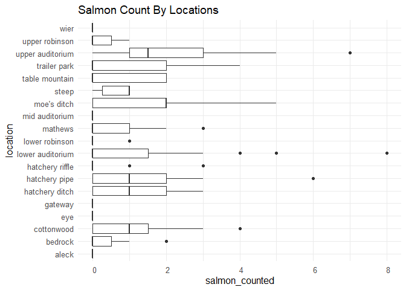
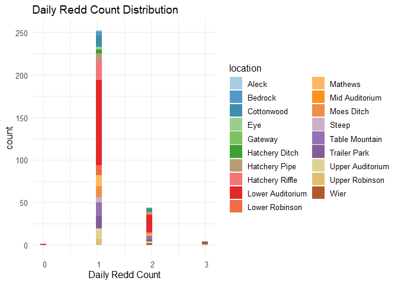
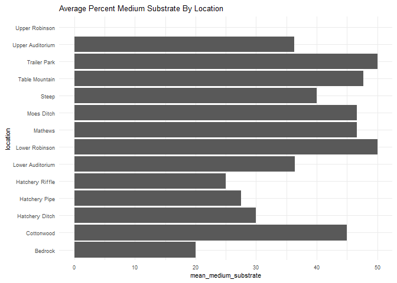
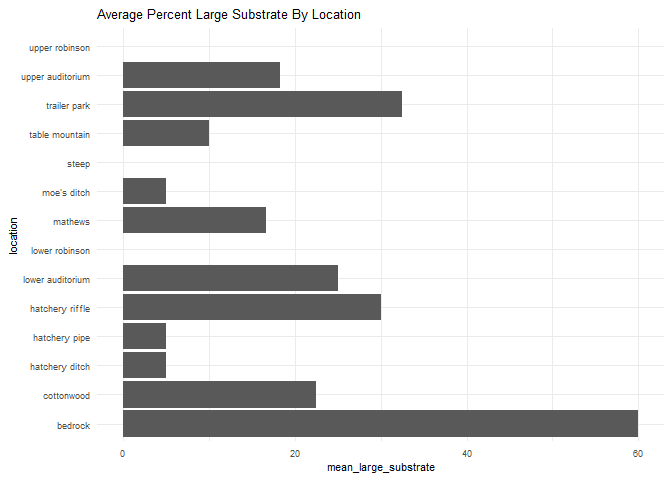
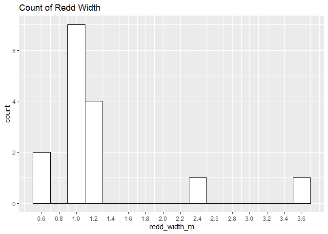

feather-river-adult-holding-redd-survey-qc-checklist-2009
================
Inigo Peng
10/6/2021

# Feather River Redd Survey Data

## Description of Monitoring Data

**Timeframe:** 2009

**Completeness of Record throughout timeframe: **  

-   Longitude and latitude data are not available for 2009,2010,
    2011,2012,2019, 2020. NA values will be filled in for these data
    sets in final cleaned data set.

-   No data was recorded for “depth\_m”, “pot\_depth\_m”, and
    “velocity\_m/s” in 2009 data. NA values only.

\*Only 1 data point was recorded for “redd\_width\_m” and
“redd\_length\_m”.

**Sampling Location:** Feather River

**Data Contact:** [Chris Cook](Chris.Cook@water.ca.gov)

Additional Info:  
1. Latitude and longitude are in NAD 1983 UTM Zone 10N  
2. The substrate is observed visually and an estimate of the percentage
of 5 size classes:  
\* fines &lt;1cm  
\* small 1-5cm  
\* medium 6-15cm  
\* large 16-30cm  
\* boulder &gt;30cm

## Access Cloud Data

``` r
# Run Sys.setenv() to specify GCS_AUTH_FILE and GCS_DEFAULT_BUCKET before running
# Open object from google cloud storage
# Set your authentication using gcs_auth
gcs_auth(json_file = Sys.getenv("GCS_AUTH_FILE"))
# Set global bucket 
gcs_global_bucket(bucket = Sys.getenv("GCS_DEFAULT_BUCKET"))
gcs_list_objects()
# git data and save as xlsx
gcs_get_object(object_name = "adult-holding-redd-and-carcass-surveys/feather-river/data-raw/redd_survey/2009_Chinook_Redd_Survey_Data_raw.xlsx",
               bucket = gcs_get_global_bucket(),
               saveToDisk = "2009_Chinook_Redd_Survey_Data_raw.xlsx",
               Overwrite = TRUE)
```

Read in data from google cloud, glimpse raw data:

``` r
raw_data_2009 = readxl::read_excel("2009_Chinook_Redd_Survey_Data_raw.xlsx",
                                   sheet="2009 All Data")
glimpse(raw_data_2009)
```

    ## Rows: 301
    ## Columns: 17
    ## $ Location             <chr> "Table Mountain", "Table Mountain", "Table Mounta~
    ## $ File                 <chr> "4", "1", "3", "5", "7", "8", "9", "6", "11", "12~
    ## $ `Type (D, A, P)`     <chr> "Area", "Point", "Area", "Area", "Area", "Area", ~
    ## $ Remeasured           <chr> "No", "No", "No", "No", "No", "No", "No", "No", "~
    ## $ `#  Redds`           <dbl> 1, 1, 1, 1, 1, 1, 1, 3, 1, 1, 1, 1, 1, 1, 1, 2, 1~
    ## $ `# Salmon`           <dbl> 0, 0, 0, 0, 0, 0, 0, 0, 0, 0, 0, 0, 0, 0, 0, 0, 0~
    ## $ `Depth (m)`          <chr> "0.78", "0.56000000000000005", "0.64", "0.5", "0.~
    ## $ `Pot depth (m)`      <chr> "0", "0", "0", "0", "0", "0", "0", "0", NA, NA, N~
    ## $ `Velocity (m/s)`     <chr> "0", "0", "0", "0", "0", "0", "0", "0", NA, NA, N~
    ## $ `% Fines (<1 cm)`    <dbl> 10, 5, 15, 30, 25, 5, 5, 20, NA, NA, NA, NA, NA, ~
    ## $ `% Small (1-5 cm)`   <dbl> 20, 20, 30, 50, 15, 15, 20, 20, NA, NA, NA, NA, N~
    ## $ `% Medium (5-15 cm)` <dbl> 40, 30, 20, 20, 60, 30, 20, 60, NA, NA, NA, NA, N~
    ## $ `% Large (15-30 cm)` <dbl> 30, 40, 30, 0, 0, 50, 45, 0, NA, NA, NA, NA, NA, ~
    ## $ `% Boulder (>30 cm)` <dbl> 0, 5, 5, 0, 0, 0, 0, 0, NA, NA, NA, NA, NA, NA, 0~
    ## $ `Redd Width (ft)`    <dbl> NA, 3, 3, 3, 4, 3, 3, 12, NA, 4, 2, 2, 3, 4, 3, 4~
    ## $ `Redd Lenght (ft)`   <dbl> NA, 4, 5, 4, 6, 3, 3, 4, NA, 4, 3, 3, 4, 5, 3, 6,~
    ## $ `Survey Date`        <dttm> 2009-09-29, 2009-09-29, 2009-09-29, 2009-09-29, ~

## Data Transformation

``` r
raw_data_2009$'Redd Width (ft)' = raw_data_2009$'Redd Width (ft)'/3.281
raw_data_2009$'Redd Lenght (ft)' = raw_data_2009$'Redd Lenght (ft)'/3.281
cleaner_data_2009 <- raw_data_2009 %>%
  select(-c(Remeasured, File, '#  Redds')) %>%
  relocate('Survey Date', .before = 'Location') %>% 
  rename('Date' = 'Survey Date',
         'type' = 'Type (D, A, P)', 
         'salmon_counted' = '# Salmon', 
         'depth_m' = 'Depth (m)',
         'pot_depth_m' = 'Pot depth (m)',
         'velocity_m/s' = 'Velocity (m/s)',
         'percent_fine_substrate' = '% Fines (<1 cm)',
         'percent_small_substrate' = '% Small (1-5 cm)',
         'percent_medium_substrate'= '% Medium (5-15 cm)',
         'percent_large_substrate' =  '% Large (15-30 cm)',
         'percent_boulder' = '% Boulder (>30 cm)',
         'redd_width_m' = 'Redd Width (ft)',
         'redd_length_m' = 'Redd Lenght (ft)') %>%
  mutate('depth_m' = as.numeric('depth_m'),
         'pot_depth_m' = as.numeric('pot_depth_m'),
         'velocity_m/s'= as.numeric('velocity_m/s')) %>% 
  filter(salmon_counted > 0)
```

``` r
cleaner_data_2009 <- cleaner_data_2009 %>% 
  set_names(tolower(colnames(cleaner_data_2009))) %>% 
  mutate(date = as.Date(date)) %>% 
  glimpse()
```

    ## Rows: 127
    ## Columns: 14
    ## $ date                     <date> 2009-10-22, 2009-10-22, 2009-10-22, 2009-10-~
    ## $ location                 <chr> "Trailer Park", "Matthews", "Matthews", "Matt~
    ## $ type                     <chr> "Area", "Area", "Area", "Area", "Area", "Area~
    ## $ salmon_counted           <dbl> 2, 1, 1, 1, 3, 1, 1, 2, 2, 2, 4, 1, 1, 3, 2, ~
    ## $ depth_m                  <dbl> NA, NA, NA, NA, NA, NA, NA, NA, NA, NA, NA, N~
    ## $ pot_depth_m              <dbl> NA, NA, NA, NA, NA, NA, NA, NA, NA, NA, NA, N~
    ## $ `velocity_m/s`           <dbl> NA, NA, NA, NA, NA, NA, NA, NA, NA, NA, NA, N~
    ## $ percent_fine_substrate   <dbl> NA, 5, 5, NA, NA, NA, NA, 0, 5, NA, NA, 5, NA~
    ## $ percent_small_substrate  <dbl> NA, 30, 40, NA, NA, NA, NA, 5, 10, NA, NA, 15~
    ## $ percent_medium_substrate <dbl> NA, 50, 40, NA, NA, NA, NA, 20, 50, NA, NA, 5~
    ## $ percent_large_substrate  <dbl> NA, 15, 15, NA, NA, NA, NA, 60, 35, NA, NA, 3~
    ## $ percent_boulder          <dbl> NA, 0, 0, NA, NA, NA, NA, 5, 0, NA, NA, 0, NA~
    ## $ redd_width_m             <dbl> NA, NA, NA, NA, NA, NA, NA, NA, NA, NA, NA, N~
    ## $ redd_length_m            <dbl> NA, NA, NA, NA, NA, NA, NA, NA, NA, NA, NA, N~

## Explore Categorical Variables

``` r
cleaner_data_2009 %>% 
  select_if(is.character) %>% colnames()
```

    ## [1] "location" "type"

### Variable:`location`

``` r
table(cleaner_data_2009$location)
```

    ## 
    ##          Bedrock       Cottonwood   Hatchery Ditch    Hatchery Pipe 
    ##                2                8                3                6 
    ##  Hatchery Riffle Lower Auditorium   Lower Robinson         Matthews 
    ##                5               58                1                6 
    ##      Moe's Ditch            Steep   Table Mountain     Trailer Park 
    ##                7                4                7                7 
    ## Upper Auditorium   Upper Robinson 
    ##               11                2

Locations names are changed to be consistent with the rest of the
Feather River redd survey files:

``` r
cleaner_data_2009 <- cleaner_data_2009 %>% 
  mutate(location = tolower(location), 
         location = if_else(location == "alec", "aleck", location), 
         location = if_else(location == "matthews", "mathews", location), 
         location = if_else(location == "middle auditorium", "mid auditorium", location),
         )
table(cleaner_data_2009$location)
```

    ## 
    ##          bedrock       cottonwood   hatchery ditch    hatchery pipe 
    ##                2                8                3                6 
    ##  hatchery riffle lower auditorium   lower robinson          mathews 
    ##                5               58                1                6 
    ##      moe's ditch            steep   table mountain     trailer park 
    ##                7                4                7                7 
    ## upper auditorium   upper robinson 
    ##               11                2

-   0 % of values in the `location` column are NA.

## Variable:`Type`

Description:  
Area - polygon mapped with Trimble GPS unit Point - points mapped with
Trimble GPS unit Questionable redds - polygon mapped with Trimble GPS
unit where the substrate was disturbed but did not have the proper
characteristics to be called a redd - it was no longer recorded after
2011

``` r
table(cleaner_data_2009$type)
```

    ## 
    ##  Area Point 
    ##   124     3

## Expore Numeric Variables

``` r
cleaner_data_2009 %>% 
  select_if(is.numeric) %>% colnames()
```

    ##  [1] "salmon_counted"           "depth_m"                 
    ##  [3] "pot_depth_m"              "velocity_m/s"            
    ##  [5] "percent_fine_substrate"   "percent_small_substrate" 
    ##  [7] "percent_medium_substrate" "percent_large_substrate" 
    ##  [9] "percent_boulder"          "redd_width_m"            
    ## [11] "redd_length_m"

### Variable:`salmon_counted`

#### Plotting salmon counted in 2009

``` r
cleaner_data_2009 %>% 
  ggplot(aes(x = date, y = salmon_counted)) + 
  geom_col() +
  facet_wrap(~year(date), scales = "free") +
  scale_x_date(labels = date_format("%b"), date_breaks = "1 month")+
  theme_minimal() +
  theme(axis.text.x = element_text(size = 10,angle = 90, vjust = 0.5, hjust=0.1)) +
  theme(axis.text.y = element_text(size = 8))+
  labs(title = "Daily Count of Salmon Counted in 2009")
```

<!-- -->

``` r
cleaner_data_2009  %>%
  ggplot(aes(y = location, x = salmon_counted))+
  geom_boxplot() +
  theme_minimal() +
  theme(text = element_text(size = 12))+
  theme(axis.text.x = element_text(size = 10,vjust = 0.5, hjust=0.1))+
  labs(title = "Salmon Count By Locations")
```

<!-- -->

**Numeric Daily Summary of salmon\_counted Over 2009**

``` r
cleaner_data_2009 %>%
  group_by(date) %>%
  summarise(count = sum(salmon_counted, na.rm = T)) %>%
  pull(count) %>%
  summary()
```

    ##    Min. 1st Qu.  Median    Mean 3rd Qu.    Max. 
    ##     4.0     7.5    14.0    25.7    33.5    76.0

**NA and Unknown Values** \* 0 % of values in the `salmon_counted`
column are NA.

### Variable:`redd_width_m`

Only one redd\_width\_m was recorded in 2009.

**Numeric Summary of redd\_width\_m Over 2009**

``` r
summary(cleaner_data_2009$redd_width_m)
```

    ##    Min. 1st Qu.  Median    Mean 3rd Qu.    Max.    NA's 
    ##   2.438   2.438   2.438   2.438   2.438   2.438     126

**NA and Unknown Values** \* 99.2 % of values in the `redd_width_m`
column are NA.

### Variable: `redd_length_m`

Only one redd\_length\_m was recorded in 2009.

**Numeric Summary of redd\_length\_m Over 2009**

``` r
summary(cleaner_data_2009$redd_length_m)
```

    ##    Min. 1st Qu.  Median    Mean 3rd Qu.    Max.    NA's 
    ##  0.9144  0.9144  0.9144  0.9144  0.9144  0.9144     126

**NA and Unknown Values** \* 99.2 % of values in the `redd_length_m`
column are NA.

``` r
feather_redd_survey_2009 <- cleaner_data_2009 %>% glimpse()
```

    ## Rows: 127
    ## Columns: 14
    ## $ date                     <date> 2009-10-22, 2009-10-22, 2009-10-22, 2009-10-~
    ## $ location                 <chr> "trailer park", "mathews", "mathews", "mathew~
    ## $ type                     <chr> "Area", "Area", "Area", "Area", "Area", "Area~
    ## $ salmon_counted           <dbl> 2, 1, 1, 1, 3, 1, 1, 2, 2, 2, 4, 1, 1, 3, 2, ~
    ## $ depth_m                  <dbl> NA, NA, NA, NA, NA, NA, NA, NA, NA, NA, NA, N~
    ## $ pot_depth_m              <dbl> NA, NA, NA, NA, NA, NA, NA, NA, NA, NA, NA, N~
    ## $ `velocity_m/s`           <dbl> NA, NA, NA, NA, NA, NA, NA, NA, NA, NA, NA, N~
    ## $ percent_fine_substrate   <dbl> NA, 5, 5, NA, NA, NA, NA, 0, 5, NA, NA, 5, NA~
    ## $ percent_small_substrate  <dbl> NA, 30, 40, NA, NA, NA, NA, 5, 10, NA, NA, 15~
    ## $ percent_medium_substrate <dbl> NA, 50, 40, NA, NA, NA, NA, 20, 50, NA, NA, 5~
    ## $ percent_large_substrate  <dbl> NA, 15, 15, NA, NA, NA, NA, 60, 35, NA, NA, 3~
    ## $ percent_boulder          <dbl> NA, 0, 0, NA, NA, NA, NA, 5, 0, NA, NA, 0, NA~
    ## $ redd_width_m             <dbl> NA, NA, NA, NA, NA, NA, NA, NA, NA, NA, NA, N~
    ## $ redd_length_m            <dbl> NA, NA, NA, NA, NA, NA, NA, NA, NA, NA, NA, N~

### Location Physical Attributes

### Variable:`percent_fine_substrate`

``` r
cleaner_data_2009 %>%
  group_by(location) %>% 
  summarise(mean_fine_substrate = mean(percent_fine_substrate, na.rm = TRUE)) %>%
  ggplot(aes(y = location, x = mean_fine_substrate)) +
  geom_col() +
  theme_minimal() +
  theme(text = element_text(size = 8)) +
  labs(title = "Average Fine Substrate By Location")
```

<!-- -->

**Numeric Summary of percent\_fine\_substrate Over 2009**

``` r
summary(cleaner_data_2009$percent_fine_substrate)
```

    ##    Min. 1st Qu.  Median    Mean 3rd Qu.    Max.    NA's 
    ##    0.00    5.00   10.00   13.97   20.00   33.00      96

**NA and Unknown Values** \* 75.6 % of values in the
`percent_fine_substrate` column are NA.

### Variable:`percent_small_substrate`

``` r
cleaner_data_2009 %>%
  group_by(location) %>% 
  summarise(mean_small_substrate = mean(percent_small_substrate, na.rm = TRUE)) %>%
  ggplot(aes(y = location, x = mean_small_substrate)) +
  geom_col() +
  theme_minimal() +
  theme(text = element_text(size = 8)) +
  labs(title = "Average Percent Small Substrate By Location")
```

<!-- -->

**Numeric Summary of percent\_small\_substrate Over 2009**

``` r
summary(cleaner_data_2009$percent_small_substrate)
```

    ##    Min. 1st Qu.  Median    Mean 3rd Qu.    Max.    NA's 
    ##    5.00   20.00   30.00   32.06   40.00   80.00      96

**NA and Unknown Values** \* 75.6 % of values in the
`percent_small_substrate` column are NA.

### Variable:`percent_medium_substrate`

``` r
cleaner_data_2009 %>%
  group_by(location) %>% 
  summarise(mean_medium_substrate = mean(percent_medium_substrate, na.rm = TRUE)) %>%
  ggplot(aes(y = location, x = mean_medium_substrate)) +
  geom_col() +
  theme_minimal() +
  theme(text = element_text(size = 8)) +
  labs(title = "Average Percent Medium Substrate By Location")
```

<!-- -->

**Numeric Summary of percent\_medium\_substrate Over 2009**

``` r
summary(cleaner_data_2009$percent_medium_substrate)
```

    ##    Min. 1st Qu.  Median    Mean 3rd Qu.    Max.    NA's 
    ##   10.00   30.00   40.00   39.78   50.00   60.00      95

**NA and Unknown Values** \* 74.8 % of values in the
`percent_medium_substrate` column are NA.

### Variable:`percent_large_substrate`

``` r
cleaner_data_2009 %>%
  group_by(location) %>% 
  summarise(mean_large_substrate = mean(percent_large_substrate, na.rm = TRUE)) %>%
  ggplot(aes(y = location, x = mean_large_substrate)) +
  geom_col() +
  theme_minimal() +
  theme(text = element_text(size = 8)) +
  labs(title = "Average Percent Large Substrate By Location")
```

<!-- -->

**Numeric Summary of percent\_large\_substrate Over 2009**

``` r
summary(cleaner_data_2009$percent_large_substrate)
```

    ##    Min. 1st Qu.  Median    Mean 3rd Qu.    Max.    NA's 
    ##    0.00   10.00   17.50   21.25   30.00   60.00     103

**NA and Unknown Values** \* 81.1 % of values in the
`percent_large_substrate` column are NA.

### Variable:`percent_boulder`

``` r
cleaner_data_2009 %>%
  group_by(location) %>% 
  summarise(mean_boulder = mean(percent_boulder, na.rm = TRUE)) %>%
  ggplot(aes(y = location, x = mean_boulder)) +
  geom_col() +
  theme_minimal() +
  theme(text = element_text(size = 8)) +
  labs(title = "Average Percent Boulder By Location")
```

<!-- -->

**Numeric Summary of percent\_boulder Over 2009**

``` r
summary(cleaner_data_2009$percent_boulder)
```

    ##    Min. 1st Qu.  Median    Mean 3rd Qu.    Max.    NA's 
    ##   0.000   0.000   0.000   3.125   5.000  15.000     119

**NA and Unknown Values** NA and Unknown Values\*\* \* 93.7 % of values
in the `percent_large_substrate` column are NA.

### Add cleaned data back onto google cloud

``` r
f <- function(input, output) write_csv(input, file = output)

gcs_upload(feather_redd_survey_2009,
           object_function = f,
           type = "csv",
           name = "adult-holding-redd-and-carcass-surveys/feather-river/data/2009_Chinook_Redd_Survey_Data.csv")
```

    ## i 2021-10-13 10:07:46 > File size detected as  8 Kb

    ## i 2021-10-13 10:07:46 > Request Status Code:  400

    ## ! API returned: Cannot insert legacy ACL for an object when uniform bucket-level access is enabled. Read more at https://cloud.google.com/storage/docs/uniform-bucket-level-access - Retrying with predefinedAcl='bucketLevel'

    ## i 2021-10-13 10:07:46 > File size detected as  8 Kb

    ## ==Google Cloud Storage Object==
    ## Name:                adult-holding-redd-and-carcass-surveys/feather-river/data/2009_Chinook_Redd_Survey_Data.csv 
    ## Type:                csv 
    ## Size:                8 Kb 
    ## Media URL:           https://www.googleapis.com/download/storage/v1/b/jpe-dev-bucket/o/adult-holding-redd-and-carcass-surveys%2Ffeather-river%2Fdata%2F2009_Chinook_Redd_Survey_Data.csv?generation=1634144866615957&alt=media 
    ## Download URL:        https://storage.cloud.google.com/jpe-dev-bucket/adult-holding-redd-and-carcass-surveys%2Ffeather-river%2Fdata%2F2009_Chinook_Redd_Survey_Data.csv 
    ## Public Download URL: https://storage.googleapis.com/jpe-dev-bucket/adult-holding-redd-and-carcass-surveys%2Ffeather-river%2Fdata%2F2009_Chinook_Redd_Survey_Data.csv 
    ## Bucket:              jpe-dev-bucket 
    ## ID:                  jpe-dev-bucket/adult-holding-redd-and-carcass-surveys/feather-river/data/2009_Chinook_Redd_Survey_Data.csv/1634144866615957 
    ## MD5 Hash:            LR5Et3xNOVedcrLXLhBhuA== 
    ## Class:               STANDARD 
    ## Created:             2021-10-13 17:07:46 
    ## Updated:             2021-10-13 17:07:46 
    ## Generation:          1634144866615957 
    ## Meta Generation:     1 
    ## eTag:                CJWFpYLwx/MCEAE= 
    ## crc32c:              Mk00Qw==
