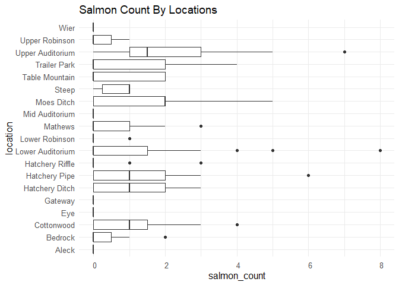
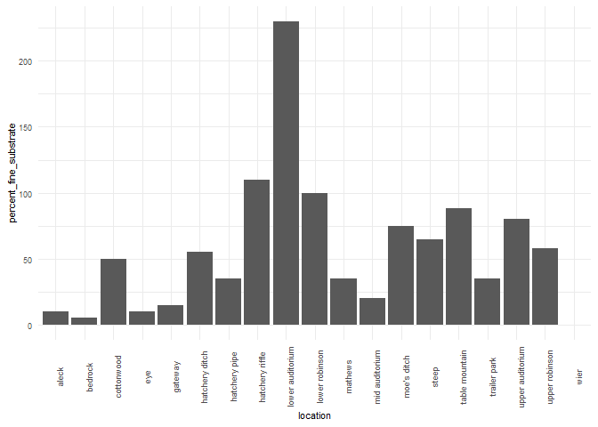
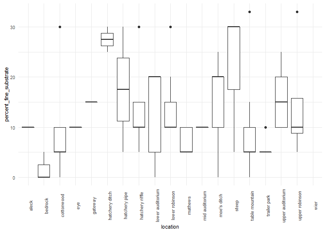
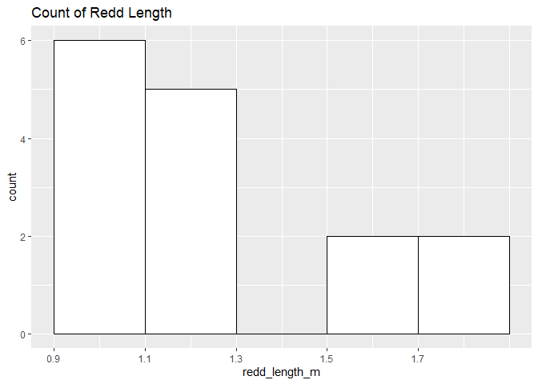

feather-river-adult-holding-redd-survey-qc-checklist-2009
================
Inigo Peng
10/6/2021

# Feather River Redd Survey Data

## Description of Monitoring Data

**Timeframe:** 2009

**Completeness of Record throughout timeframe:2009-2020**

**Sampling Location:** Feather River

**Data Contact:** Chris Cook

Any additional info? 1. Latitude and longitude are in NAD 1983 UTM Zone
10N The substrate is observed visually and an estimate of the percentage
of 5 size classes. Fines &lt;1cm, small 1-5cm, medium 6-15cm, large
16-30cm, boulder &gt;30cm Type refers to whether a polygon (A for Area)
or point (P) was mapped with the Trimble GPS unit A different substrate
classification system was used in 2008. Each of the 5 size classes were
given a number: 1=fines, 2=small, 3=medium, 4=large, 5=boulder. The
dominant class was recorded as a number. D stands for Digging. We used
to record digging areas as redds that looked to be unfinished. We record
only finished redds now. Q refers to Questionable redds. Areas where the
substrate was disturbed but did not have the proper characteristics to
be called a redd. We no longer record questionable redds.

## Access Cloud Data

``` r
# Run Sys.setenv() to specify GCS_AUTH_FILE and GCS_DEFAULT_BUCKET before running
# Open object from google cloud storage
# Set your authentication using gcs_auth
gcs_auth(json_file = Sys.getenv("GCS_AUTH_FILE"))
# Set global bucket 
gcs_global_bucket(bucket = Sys.getenv("GCS_DEFAULT_BUCKET"))
gcs_list_objects()
# git data and save as xlsx
gcs_get_object(object_name = "adult-holding-redd-and-carcass-surveys/feather-river/data-raw/redd_survey/2009_Chinook_Redd_Survey_Data_raw.xlsx",
               bucket = gcs_get_global_bucket(),
               saveToDisk = "2009_Chinook_Redd_Survey_Data_raw.xlsx",
               overwrite = TRUE)
```

``` r
raw_data_2009 = readxl::read_excel("2009_Chinook_Redd_Survey_Data_raw.xlsx",
                                   sheet="2009 All Data")
glimpse(raw_data_2009)
```

    ## Rows: 301
    ## Columns: 17
    ## $ Location             <chr> "Table Mountain", "Table Mountain", "Table Mounta~
    ## $ File                 <chr> "4", "1", "3", "5", "7", "8", "9", "6", "11", "12~
    ## $ `Type (D, A, P)`     <chr> "Area", "Point", "Area", "Area", "Area", "Area", ~
    ## $ Remeasured           <chr> "No", "No", "No", "No", "No", "No", "No", "No", "~
    ## $ `#  Redds`           <dbl> 1, 1, 1, 1, 1, 1, 1, 3, 1, 1, 1, 1, 1, 1, 1, 2, 1~
    ## $ `# Salmon`           <dbl> 0, 0, 0, 0, 0, 0, 0, 0, 0, 0, 0, 0, 0, 0, 0, 0, 0~
    ## $ `Depth (m)`          <chr> "0.78", "0.56000000000000005", "0.64", "0.5", "0.~
    ## $ `Pot depth (m)`      <chr> "0", "0", "0", "0", "0", "0", "0", "0", NA, NA, N~
    ## $ `Velocity (m/s)`     <chr> "0", "0", "0", "0", "0", "0", "0", "0", NA, NA, N~
    ## $ `% Fines (<1 cm)`    <dbl> 10, 5, 15, 30, 25, 5, 5, 20, NA, NA, NA, NA, NA, ~
    ## $ `% Small (1-5 cm)`   <dbl> 20, 20, 30, 50, 15, 15, 20, 20, NA, NA, NA, NA, N~
    ## $ `% Medium (5-15 cm)` <dbl> 40, 30, 20, 20, 60, 30, 20, 60, NA, NA, NA, NA, N~
    ## $ `% Large (15-30 cm)` <dbl> 30, 40, 30, 0, 0, 50, 45, 0, NA, NA, NA, NA, NA, ~
    ## $ `% Boulder (>30 cm)` <dbl> 0, 5, 5, 0, 0, 0, 0, 0, NA, NA, NA, NA, NA, NA, 0~
    ## $ `Redd Width (ft)`    <dbl> NA, 3, 3, 3, 4, 3, 3, 12, NA, 4, 2, 2, 3, 4, 3, 4~
    ## $ `Redd Lenght (ft)`   <dbl> NA, 4, 5, 4, 6, 3, 3, 4, NA, 4, 3, 3, 4, 5, 3, 6,~
    ## $ `Survey Date`        <dttm> 2009-09-29, 2009-09-29, 2009-09-29, 2009-09-29, ~

\#\#Data Transformation \#TODO don’t add NA columns/remove na columns
\#TODO bind removed columns in final script

``` r
raw_data_2009$'Redd Width (ft)' = raw_data_2009$'Redd Width (ft)'/3.281
raw_data_2009$'Redd Lenght (ft)' = raw_data_2009$'Redd Lenght (ft)'/3.281
cleaner_data_2009 <- raw_data_2009 %>%
  select(-c(Remeasured, File, '#  Redds')) %>%
  add_column(longitude = NA) %>% 
  add_column(latitude = NA) %>% 
  relocate('Survey Date', .before = 'Location') %>% 
  relocate('latitude', .after = '# Salmon') %>%
  relocate('longitude', .before = 'Depth (m)') %>%  
  rename('Date' = 'Survey Date',
         'type' = 'Type (D, A, P)', 
         'salmon_counted' = '# Salmon', 
         'depth_m' = 'Depth (m)',
         'pot_depth_m' = 'Pot depth (m)',
         'velocity_m/s' = 'Velocity (m/s)',
         'percent_fine_substrate' = '% Fines (<1 cm)',
         'percent_small_substrate' = '% Small (1-5 cm)',
         'percent_medium_substrate'= '% Medium (5-15 cm)',
         'percent_large_substrate' =  '% Large (15-30 cm)',
         'percent_boulder' = '% Boulder (>30 cm)',
         'redd_width_m' = 'Redd Width (ft)',
         'redd_length_m' = 'Redd Lenght (ft)') %>%
  mutate('depth_m' = as.numeric('depth_m'),
         'pot_depth_m' = as.numeric('pot_depth_m'),
         'velocity_m/s'= as.numeric('velocity_m/s'),
         'latitude' = as.numeric(latitude),
         'longitude' = as.numeric(longitude)) 
```

``` r
cleaner_data_2009 <- cleaner_data_2009 %>% 
  set_names(tolower(colnames(cleaner_data_2009))) %>% 
  mutate(date = as.Date(date)) %>% 
  glimpse()
```

    ## Rows: 301
    ## Columns: 16
    ## $ date                     <date> 2009-09-29, 2009-09-29, 2009-09-29, 2009-09-~
    ## $ location                 <chr> "Table Mountain", "Table Mountain", "Table Mo~
    ## $ type                     <chr> "Area", "Point", "Area", "Area", "Area", "Are~
    ## $ salmon_counted           <dbl> 0, 0, 0, 0, 0, 0, 0, 0, 0, 0, 0, 0, 0, 0, 0, ~
    ## $ latitude                 <dbl> NA, NA, NA, NA, NA, NA, NA, NA, NA, NA, NA, N~
    ## $ longitude                <dbl> NA, NA, NA, NA, NA, NA, NA, NA, NA, NA, NA, N~
    ## $ depth_m                  <dbl> NA, NA, NA, NA, NA, NA, NA, NA, NA, NA, NA, N~
    ## $ pot_depth_m              <dbl> NA, NA, NA, NA, NA, NA, NA, NA, NA, NA, NA, N~
    ## $ `velocity_m/s`           <dbl> NA, NA, NA, NA, NA, NA, NA, NA, NA, NA, NA, N~
    ## $ percent_fine_substrate   <dbl> 10, 5, 15, 30, 25, 5, 5, 20, NA, NA, NA, NA, ~
    ## $ percent_small_substrate  <dbl> 20, 20, 30, 50, 15, 15, 20, 20, NA, NA, NA, N~
    ## $ percent_medium_substrate <dbl> 40, 30, 20, 20, 60, 30, 20, 60, NA, NA, NA, N~
    ## $ percent_large_substrate  <dbl> 30, 40, 30, 0, 0, 50, 45, 0, NA, NA, NA, NA, ~
    ## $ percent_boulder          <dbl> 0, 5, 5, 0, 0, 0, 0, 0, NA, NA, NA, NA, NA, N~
    ## $ redd_width_m             <dbl> NA, 0.9143554, 0.9143554, 0.9143554, 1.219140~
    ## $ redd_length_m            <dbl> NA, 1.2191405, 1.5239256, 1.2191405, 1.828710~

\#\#Explore Categorical Variables

``` r
cleaner_data_2009 %>% 
  select_if(is.character) %>% colnames()
```

    ## [1] "location" "type"

### Variable: `location`

``` r
table(cleaner_data_2009$location)
```

    ## 
    ##              Alec           Bedrock        Cottonwood               Eye 
    ##                 1                 7                15                 3 
    ##           Gateway    Hatchery Ditch     Hatchery Pipe   Hatchery Riffle 
    ##                 1                 6                11                24 
    ##  Lower Auditorium    Lower Robinson          Matthews Middle Auditorium 
    ##               123                14                14                 3 
    ##       Moe's Ditch             Steep    Table Mountain      Trailer Park 
    ##                13                 6                20                17 
    ##  Upper Auditorium    Upper Robinson              Wier 
    ##                14                 7                 2

``` r
#Changed the locations with inconsistent names with the rest of the files
cleaner_data_2009 <- cleaner_data_2009 %>% 
  mutate(location = tolower(location), 
         location = if_else(location == "alec", "aleck", location), #change alec to be consistent with the rest of the files
         location = if_else(location == "matthews", "mathews", location), 
         location = if_else(location == "middle auditorium", "mid auditorium", location),
         )
table(cleaner_data_2009$location)
```

    ## 
    ##            aleck          bedrock       cottonwood              eye 
    ##                1                7               15                3 
    ##          gateway   hatchery ditch    hatchery pipe  hatchery riffle 
    ##                1                6               11               24 
    ## lower auditorium   lower robinson          mathews   mid auditorium 
    ##              123               14               14                3 
    ##      moe's ditch            steep   table mountain     trailer park 
    ##               13                6               20               17 
    ## upper auditorium   upper robinson             wier 
    ##               14                7                2

-   0 % of values in the `location` column are NA.

Variable: Type \#Put description under the heading \#Use Area, Point,
etc.

``` r
table(cleaner_data_2009$type)
```

    ## 
    ##  Area Point 
    ##   290    11

``` r
cleaner_data_2009 <- cleaner_data_2009 %>% 
  mutate(type = tolower(type),
         type = if_else(type == "area", "a", type),
         type = if_else(type == "point", "p", type))
table(cleaner_data_2009$type)
```

    ## 
    ##   a   p 
    ## 290  11

\#Remmove lookup table for descriptioon \#TODO **Create lookup rda for
type encoding:**

``` r
types <- distinct(cleaner_data_2009, type) %>% 
  drop_na() %>% 
  unlist()

types_description <- c(
  "area - polygon mapped with Trimble GPS unit",
  "point - points mapped with Trimble GPS unit"
  # "questionable redds - polygon mapped with Trimble GPS unit where the substrate was disturbed but did not have the proper characteristics to be called a redd - it was no longer recorded after 2011"
)

write_rds(types_description, paste0(getwd(),"/adult-holding-redd-and-carcass-surveys/feather-river/data/types_description.rds"))

tibble(code = types,
       definitions = types_description)
```

    ## # A tibble: 2 x 2
    ##   code  definitions                                
    ##   <chr> <chr>                                      
    ## 1 a     area - polygon mapped with Trimble GPS unit
    ## 2 p     point - points mapped with Trimble GPS unit

``` r
cleaner_data_2009 %>% 
  select_if(is.numeric) %>% colnames()
```

    ##  [1] "salmon_counted"           "latitude"                
    ##  [3] "longitude"                "depth_m"                 
    ##  [5] "pot_depth_m"              "velocity_m/s"            
    ##  [7] "percent_fine_substrate"   "percent_small_substrate" 
    ##  [9] "percent_medium_substrate" "percent_large_substrate" 
    ## [11] "percent_boulder"          "redd_width_m"            
    ## [13] "redd_length_m"

Numerical Data \#\#\# Variable: salmon\_counted

``` r
cleaner_data_2009 %>% 
  ggplot(aes(x = date, y = salmon_counted)) + 
  geom_col() +
  facet_wrap(~year(date), scales = "free") +
  scale_x_date(labels = date_format("%b"), date_breaks = "1 month")+
  theme_minimal() +
  theme(axis.text.x = element_text(size = 10,angle = 90, vjust = 0.5, hjust=0.1)) +
  theme(axis.text.y = element_text(size = 8))
```

<!-- -->

``` r
# Boxplots group by 
cleaner_data_2009  %>%
  # group_by(location) %>%
  # summarise(daily_salmon_count = sum(salmon_counted)) %>%
  # mutate(year = as.factor(year(date))) %>%
  ggplot(aes(x = location, y = salmon_counted))+
  geom_boxplot() +
  theme_minimal() +
  theme(text = element_text(size = 12))
```

<!-- -->
**Numeric Daily Summary of Salmon Counted over 2009**

``` r
cleaner_data_2009 %>%
  group_by(date) %>%
  summarise(count = sum(salmon_counted, na.rm = T)) %>%
  pull(count) %>%
  summary()
```

    ##    Min. 1st Qu.  Median    Mean 3rd Qu.    Max. 
    ##    0.00    5.50   10.50   21.42   32.50   76.00

**NA and Unknown Values** \* 0 % of values in the `salmon_counted`
column are NA.

### Variable: latitude and longitude

``` r
summary(cleaner_data_2009$latitude)
```

    ##    Min. 1st Qu.  Median    Mean 3rd Qu.    Max.    NA's 
    ##      NA      NA      NA     NaN      NA      NA     301

**NA and Unknown Values** \* 100 % of values in the `latitude` column
are NA.

### Variable: longitude

``` r
summary(cleaner_data_2009$longitude)
```

    ##    Min. 1st Qu.  Median    Mean 3rd Qu.    Max.    NA's 
    ##      NA      NA      NA     NaN      NA      NA     301

**NA and Unknown Values** \* 100 % of values in the `longitude` column
are NA

### Variable: depth\_m

**Numeric Summary of “depth\_m”over 2009**

``` r
summary(cleaner_data_2009$depth_m)
```

    ##    Min. 1st Qu.  Median    Mean 3rd Qu.    Max.    NA's 
    ##      NA      NA      NA     NaN      NA      NA     301

**NA and Unknown Values** \* 100 % of values in the `depth_m` column are
NA

\#No data was recorded for 2009 but keeping the data consistent with the
rest of the datasets \#\#\# Variable: pot\_depth\_m **Numeric Summary of
“pot\_depth\_m”over 2009**

``` r
summary(cleaner_data_2009$pot_depth_m)
```

    ##    Min. 1st Qu.  Median    Mean 3rd Qu.    Max.    NA's 
    ##      NA      NA      NA     NaN      NA      NA     301

**NA and Unknown Values** \* 100 % of values in the `pot_depth_m` column
are NA.

### Variable: velocity\_m/s

**Numeric Summary of velocity\_m/s over 2009**

``` r
summary(cleaner_data_2009$`velocity_m/s`)
```

    ##    Min. 1st Qu.  Median    Mean 3rd Qu.    Max.    NA's 
    ##      NA      NA      NA     NaN      NA      NA     301

= **NA and Unknown Values** \* 100 % of values in the `velocity_m/s`
column are NA.

### Variable: percent\_fine\_substrate

``` r
#TODO average percent_fine_substrate
cleaner_data_2009 %>%
  ggplot(aes(x = location, y = percent_fine_substrate)) +
  geom_col() +
  theme_minimal() +
  theme(text = element_text(size = 8)) +
  theme(axis.text.x = element_text(angle = 90))
```

<!-- -->

``` r
# # Boxplots of mean depth by location
cleaner_data_2009  %>%
  ggplot(aes(x = location, y = percent_fine_substrate))+
  geom_boxplot() +
  theme_minimal() +
  theme(text = element_text(size = 8)) +
  theme(axis.text.x = element_text(angle = 90))
```

<!-- -->

``` r
summary(cleaner_data_2009$percent_fine_substrate)
```

    ##    Min. 1st Qu.  Median    Mean 3rd Qu.    Max.    NA's 
    ##    0.00    5.00   10.00   12.37   20.00   33.00     214

NA and Unknown Values\*\* \* 71.1 % of values in the
`percent_fine_substrate` column are NA.

### Variable: percent\_medium\_substrate

**Numeric Summary of percent\_medium\_substrate over 2009**

**NA and Unknown Values**

### Variable: percent\_large\_substrate

**NA and Unknown Values**

### Variable: percent\_boulder

**Numeric Summary of percent\_boulder over 2009**

**NA and Unknown Values**

### Variable: redd\_width\_m

``` r
##TODO Mean redd_width
cleaner_data_2009 %>%
  ggplot(aes(x = location, y = redd_width_m)) +
  geom_col() +
  theme_minimal() +
  theme(text = element_text(size = 8)) +
  theme(axis.text.x = element_text(angle = 90))
```

<!-- -->

``` r
# cleaner_data_2009  %>%
#   ggplot(aes(x = date, y = redd_width_m))+
#   geom_boxplot() +
#   theme_minimal() +
#   theme(text = element_text(size = 12))
```

``` r
summary(cleaner_data_2009$redd_width_m)
```

    ##    Min. 1st Qu.  Median    Mean 3rd Qu.    Max.    NA's 
    ##  0.6096  0.9144  0.9144  1.2395  1.2191  3.6574     286

NA and Unknown Values\*\* \* 95 % of values in the `redd_width_m` column
are NA.

### Variable: redd\_length\_m
