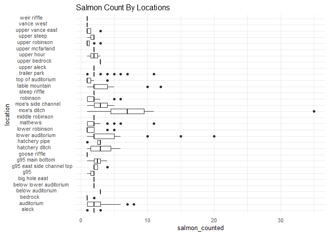
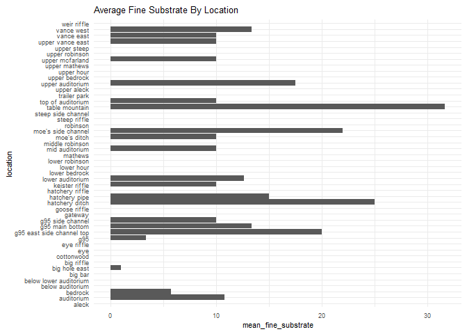
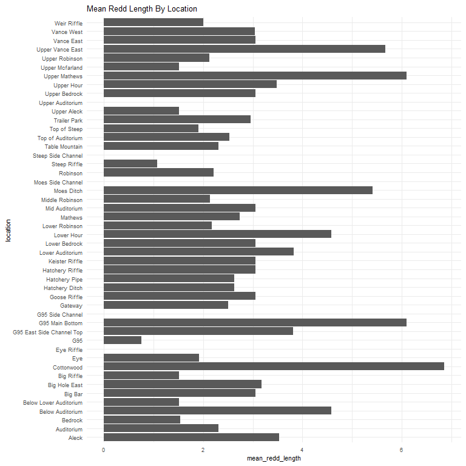
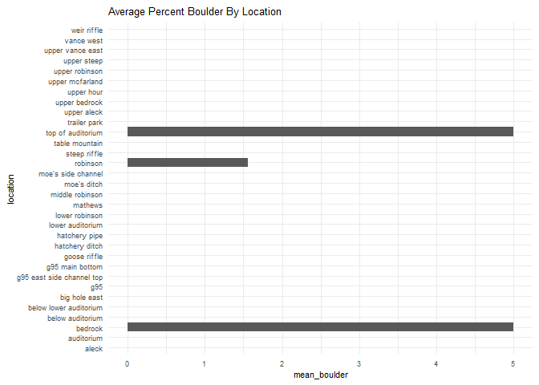
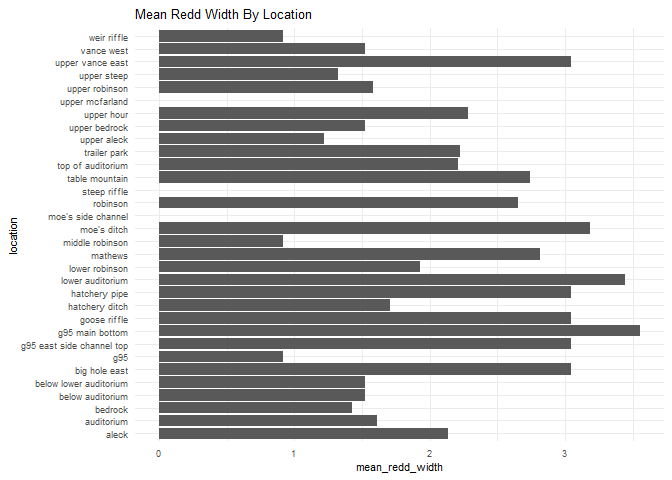
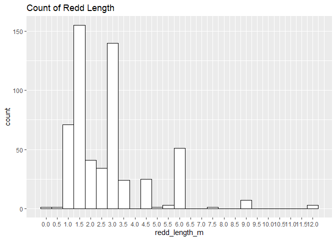

feather-river-adult-holding-redd-survey-qc-checklist-2010
================
Inigo Peng
10/6/2021

# Feather River Redd Survey Data

## Description of Monitoring Data

**Timeframe:** 2010

**Completeness of Record throughout timeframe: **  

-   Longitude and latitude data are not available for 2009,2010,
    2011,2012,2019, 2020. NA values will be filled in for these data
    sets in final cleaned data set.

-   No data was recorded for “depth\_m”, “pot\_depth\_m”, and
    “velocity\_m/s” in 2009 data. NA values only.

**Sampling Location:** Feather River

**Data Contact:** [Chris Cook](Chris.Cook@water.ca.gov)

Additional Info:  
1. Latitude and longitude are in NAD 1983 UTM Zone 10N  
2. The substrate is observed visually and an estimate of the percentage
of 5 size classes:  
\* fines &lt;1cm  
\* small 1-5cm  
\* medium 6-15cm  
\* large 16-30cm  
\* boulder &gt;30cm

## Access Cloud Data

``` r
# Run Sys.setenv() to specify GCS_AUTH_FILE and GCS_DEFAULT_BUCKET before running
# Open object from google cloud storage
# Set your authentication using gcs_auth
gcs_auth(json_file = Sys.getenv("GCS_AUTH_FILE"))
# Set global bucket 
gcs_global_bucket(bucket = Sys.getenv("GCS_DEFAULT_BUCKET"))
gcs_list_objects()
# git data and save as xlsx
gcs_get_object(object_name = "adult-holding-redd-and-carcass-surveys/feather-river/data-raw/redd_survey/2010_Chinook_Redd_Survey_Data.xlsx",
               bucket = gcs_get_global_bucket(),
               saveToDisk = "2010_Chinook_Redd_Survey_Data_raw.xlsx",
               Overwrite = TRUE)
```

Read in data from google cloud, glimpse raw data:

``` r
raw_data_2010 = readxl::read_excel("2010_Chinook_Redd_Survey_Data_raw.xlsx")
glimpse(raw_data_2010)
```

    ## Rows: 901
    ## Columns: 19
    ## $ Date                 <dttm> 2010-09-17, 2010-09-17, 2010-09-17, 2010-09-17, ~
    ## $ `Survey Wk`          <dbl> 1, 1, 1, 1, 1, 1, 1, 1, 1, 1, 1, 1, 1, 1, 1, 1, 1~
    ## $ Location             <chr> "Table Mountain", "Table Mountain", "Table Mounta~
    ## $ `File #`             <dbl> 1, 2, 3, 4, 5, 6, 7, 8, 9, 10, 11, 12, 13, 14, 15~
    ## $ type                 <chr> "A", "Q", "Q", "Q", "A", "A", "Q", "A", "A", "A",~
    ## $ `# of redds`         <dbl> 1, 0, 0, 0, 1, 1, 0, 1, 1, 1, 1, 1, 1, 1, 1, 1, 1~
    ## $ `# salmon`           <dbl> 0, 0, 0, 0, 0, 0, 1, 1, 0, 0, 0, 0, 0, 0, 0, 0, 0~
    ## $ Latitude             <lgl> NA, NA, NA, NA, NA, NA, NA, NA, NA, NA, NA, NA, N~
    ## $ Longitude            <lgl> NA, NA, NA, NA, NA, NA, NA, NA, NA, NA, NA, NA, N~
    ## $ `Depth (m)`          <dbl> NA, NA, NA, NA, 0.70, 0.66, NA, 0.56, 0.64, 0.66,~
    ## $ `Pot Depth (m)`      <dbl> 0.90, NA, NA, NA, 0.76, 0.70, NA, 0.52, 0.66, 0.6~
    ## $ `Velocity (m/s)`     <dbl> 0.38, NA, NA, NA, 0.55, 0.80, NA, 0.33, 0.35, 0.5~
    ## $ `% fines(<1 cm)`     <dbl> 10, NA, NA, NA, 20, 10, NA, 10, 10, 10, 30, 20, 1~
    ## $ `% small (1-5 cm)`   <dbl> 60, NA, NA, NA, 70, 10, NA, 90, 20, 20, 40, 30, 3~
    ## $ `% med (5-15 cm)`    <dbl> 30, NA, NA, NA, 10, 70, NA, 0, 70, 50, 30, 50, 60~
    ## $ `% large (15-30 cm)` <dbl> 0, NA, NA, NA, 0, 10, NA, 0, 0, 20, 0, 0, 0, 0, 0~
    ## $ `% boulder (>30 cm)` <dbl> 0, NA, NA, NA, 0, 0, NA, 0, 0, 0, 0, 0, 0, 0, 0, ~
    ## $ `redd width (ft)`    <dbl> NA, 3, 4, 10, NA, NA, 4, NA, NA, NA, NA, NA, NA, ~
    ## $ `redd length (ft)`   <dbl> NA, 2, 3, 15, NA, NA, 4, NA, NA, NA, NA, NA, NA, ~

## Data Transformation

``` r
raw_data_2010$'redd width (ft)' = raw_data_2010$'redd width (ft)'/3.281
raw_data_2010$'redd length (ft)' = raw_data_2010$'redd length (ft)'/3.281
cleaner_data_2010 <- raw_data_2010 %>% 
  select(-c('Survey Wk', 'File #', '# of redds')) %>% 
  rename('salmon_counted'= '# salmon',
         'latitude' = 'Latitude',
         'longitude' = 'Longitude',
         'depth_m' = 'Depth (m)',
         'velocity_m/s' = 'Velocity (m/s)',
         'pot_depth_m' = 'Pot Depth (m)',
         'percent_fine_substrate' = '% fines(<1 cm)',
         'percent_small_substrate' = '% small (1-5 cm)',
         'percent_medium_substrate'= '% med (5-15 cm)',
         'percent_large_substrate' = '% large (15-30 cm)',
         'percent_boulder' = '% boulder (>30 cm)',
         'redd_width_m' = 'redd width (ft)',
         'redd_length_m' = 'redd length (ft)',
         ) %>% 
  mutate(latitude = as.numeric(latitude),
         longitude = as.numeric(longitude)) %>% 
  glimpse()
```

    ## Rows: 901
    ## Columns: 16
    ## $ Date                     <dttm> 2010-09-17, 2010-09-17, 2010-09-17, 2010-09-~
    ## $ Location                 <chr> "Table Mountain", "Table Mountain", "Table Mo~
    ## $ type                     <chr> "A", "Q", "Q", "Q", "A", "A", "Q", "A", "A", ~
    ## $ salmon_counted           <dbl> 0, 0, 0, 0, 0, 0, 1, 1, 0, 0, 0, 0, 0, 0, 0, ~
    ## $ latitude                 <dbl> NA, NA, NA, NA, NA, NA, NA, NA, NA, NA, NA, N~
    ## $ longitude                <dbl> NA, NA, NA, NA, NA, NA, NA, NA, NA, NA, NA, N~
    ## $ depth_m                  <dbl> NA, NA, NA, NA, 0.70, 0.66, NA, 0.56, 0.64, 0~
    ## $ pot_depth_m              <dbl> 0.90, NA, NA, NA, 0.76, 0.70, NA, 0.52, 0.66,~
    ## $ `velocity_m/s`           <dbl> 0.38, NA, NA, NA, 0.55, 0.80, NA, 0.33, 0.35,~
    ## $ percent_fine_substrate   <dbl> 10, NA, NA, NA, 20, 10, NA, 10, 10, 10, 30, 2~
    ## $ percent_small_substrate  <dbl> 60, NA, NA, NA, 70, 10, NA, 90, 20, 20, 40, 3~
    ## $ percent_medium_substrate <dbl> 30, NA, NA, NA, 10, 70, NA, 0, 70, 50, 30, 50~
    ## $ percent_large_substrate  <dbl> 0, NA, NA, NA, 0, 10, NA, 0, 0, 20, 0, 0, 0, ~
    ## $ percent_boulder          <dbl> 0, NA, NA, NA, 0, 0, NA, 0, 0, 0, 0, 0, 0, 0,~
    ## $ redd_width_m             <dbl> NA, 0.9143554, 1.2191405, 3.0478513, NA, NA, ~
    ## $ redd_length_m            <dbl> NA, 0.6095703, 0.9143554, 4.5717769, NA, NA, ~

``` r
cleaner_data_2010 <- cleaner_data_2010 %>% 
  set_names(tolower(colnames(cleaner_data_2010))) %>% 
  mutate(date = as.Date(date)) %>% 
  glimpse()
```

    ## Rows: 901
    ## Columns: 16
    ## $ date                     <date> 2010-09-17, 2010-09-17, 2010-09-17, 2010-09-~
    ## $ location                 <chr> "Table Mountain", "Table Mountain", "Table Mo~
    ## $ type                     <chr> "A", "Q", "Q", "Q", "A", "A", "Q", "A", "A", ~
    ## $ salmon_counted           <dbl> 0, 0, 0, 0, 0, 0, 1, 1, 0, 0, 0, 0, 0, 0, 0, ~
    ## $ latitude                 <dbl> NA, NA, NA, NA, NA, NA, NA, NA, NA, NA, NA, N~
    ## $ longitude                <dbl> NA, NA, NA, NA, NA, NA, NA, NA, NA, NA, NA, N~
    ## $ depth_m                  <dbl> NA, NA, NA, NA, 0.70, 0.66, NA, 0.56, 0.64, 0~
    ## $ pot_depth_m              <dbl> 0.90, NA, NA, NA, 0.76, 0.70, NA, 0.52, 0.66,~
    ## $ `velocity_m/s`           <dbl> 0.38, NA, NA, NA, 0.55, 0.80, NA, 0.33, 0.35,~
    ## $ percent_fine_substrate   <dbl> 10, NA, NA, NA, 20, 10, NA, 10, 10, 10, 30, 2~
    ## $ percent_small_substrate  <dbl> 60, NA, NA, NA, 70, 10, NA, 90, 20, 20, 40, 3~
    ## $ percent_medium_substrate <dbl> 30, NA, NA, NA, 10, 70, NA, 0, 70, 50, 30, 50~
    ## $ percent_large_substrate  <dbl> 0, NA, NA, NA, 0, 10, NA, 0, 0, 20, 0, 0, 0, ~
    ## $ percent_boulder          <dbl> 0, NA, NA, NA, 0, 0, NA, 0, 0, 0, 0, 0, 0, 0,~
    ## $ redd_width_m             <dbl> NA, 0.9143554, 1.2191405, 3.0478513, NA, NA, ~
    ## $ redd_length_m            <dbl> NA, 0.6095703, 0.9143554, 4.5717769, NA, NA, ~

## Explore Categorical Variables

``` r
cleaner_data_2010 %>% 
  select_if(is.character) %>% colnames()
```

    ## [1] "location" "type"

### Variable:`location`

``` r
table(cleaner_data_2010$location)
```

    ## 
    ##                  Aleck             Auditorium                Bedrock 
    ##                     14                    162                     22 
    ##       Below Auditorium Below Lower Auditorium                Big Bar 
    ##                      2                      1                      2 
    ##          Big Hole East             Big Riffle             Cottonwood 
    ##                      7                      2                      4 
    ##                    Eye             Eye Riffle                    G95 
    ##                      7                      1                      5 
    ##             G95 Bottom           G95 East Top       G95 Side Channel 
    ##                      7                      8                      1 
    ##                Gateway           Goose Riffle         Hatchery Ditch 
    ##                      5                      2                     22 
    ##          Hatchery Pipe        Hatchery Riffle         Keister Riffle 
    ##                     19                      1                      2 
    ##       Lower Auditorium          Lower Bedrock             Lower Hour 
    ##                     95                      2                      2 
    ##         Lower Robinson                Mathews      Middle Auditorium 
    ##                     36                     80                      3 
    ##        Middle Robinson     Moe's Side Channel             Moes Ditch 
    ##                     14                      5                     18 
    ##               Robinson           Steep Riffle     Steep Side Channel 
    ##                     35                      4                      4 
    ##         Table Mountain      Top of Auditorium           Top of Steep 
    ##                     46                     21                      8 
    ##           Trailer Park            Upper Aleck       Upper Auditorium 
    ##                    147                      3                      4 
    ##          Upper Bedrock             Upper Hour          Upper Mathews 
    ##                      1                      7                      1 
    ##         Upper McFarlin         Upper Robinson             Vance East 
    ##                      2                     38                      2 
    ##         Vance East Top             Vance West            Weir Riffle 
    ##                     10                      6                     11

Locations names are changed to be consistent with the rest of the
Feather River redd survey files:

``` r
cleaner_data_2010 <- cleaner_data_2010 %>% 
  mutate(location = tolower(location), 
         location = if_else(location == "g95 east top", "g95 east side channel top", location),
         location = if_else(location == "middle auditorium", "mid auditorium", location),
         location = if_else(location == "moes ditch", "moe's ditch", location),        
         location = if_else(location == "top hour", "upper hour", location),
         location = if_else(location == "top of moes ditch", "upper moe's ditch", location),
         location = if_else(location == "top of steep", "upper steep", location),
         location = if_else(location == "top moes side channel", "upper moe's side channel", location),
         location = if_else(location == "upper mcfarlin", "upper mcfarland", location),
         location = if_else(location == "vance east top", "upper vance east", location),
         location = if_else(location == "g95 bottom", "g95 main bottom", location)
         )
table(cleaner_data_2010$location)
```

    ## 
    ##                     aleck                auditorium                   bedrock 
    ##                        14                       162                        22 
    ##          below auditorium    below lower auditorium                   big bar 
    ##                         2                         1                         2 
    ##             big hole east                big riffle                cottonwood 
    ##                         7                         2                         4 
    ##                       eye                eye riffle                       g95 
    ##                         7                         1                         5 
    ## g95 east side channel top           g95 main bottom          g95 side channel 
    ##                         8                         7                         1 
    ##                   gateway              goose riffle            hatchery ditch 
    ##                         5                         2                        22 
    ##             hatchery pipe           hatchery riffle            keister riffle 
    ##                        19                         1                         2 
    ##          lower auditorium             lower bedrock                lower hour 
    ##                        95                         2                         2 
    ##            lower robinson                   mathews            mid auditorium 
    ##                        36                        80                         3 
    ##           middle robinson               moe's ditch        moe's side channel 
    ##                        14                        18                         5 
    ##                  robinson              steep riffle        steep side channel 
    ##                        35                         4                         4 
    ##            table mountain         top of auditorium              trailer park 
    ##                        46                        21                       147 
    ##               upper aleck          upper auditorium             upper bedrock 
    ##                         3                         4                         1 
    ##                upper hour             upper mathews           upper mcfarland 
    ##                         7                         1                         2 
    ##            upper robinson               upper steep          upper vance east 
    ##                        38                         8                        10 
    ##                vance east                vance west               weir riffle 
    ##                         2                         6                        11

-   0 % of values in the `location` column are NA.

## Variable:`Type`

Description:  
Area - polygon mapped with Trimble GPS unit Point - points mapped with
Trimble GPS unit Questionable redds - polygon mapped with Trimble GPS
unit where the substrate was disturbed but did not have the proper
characteristics to be called a redd - it was no longer recorded after
2011

``` r
table(cleaner_data_2010$type)
```

    ## 
    ##   A   p   P   Q 
    ## 493   1 176 231

``` r
cleaner_data_2010 <- cleaner_data_2010 %>% 
  mutate(type = tolower(type),
         type = if_else(type == 'a', 'Area', type),
         type = if_else(type == 'p', 'Point', type),
         type = if_else(type == 'q', 'Questionable Redds', type))
glimpse(cleaner_data_2010$type)
```

    ##  chr [1:901] "Area" "Questionable Redds" "Questionable Redds" ...

## Expore Numeric Variables

``` r
cleaner_data_2010 %>% 
  select_if(is.numeric) %>% colnames()
```

    ##  [1] "salmon_counted"           "latitude"                
    ##  [3] "longitude"                "depth_m"                 
    ##  [5] "pot_depth_m"              "velocity_m/s"            
    ##  [7] "percent_fine_substrate"   "percent_small_substrate" 
    ##  [9] "percent_medium_substrate" "percent_large_substrate" 
    ## [11] "percent_boulder"          "redd_width_m"            
    ## [13] "redd_length_m"

### Variable:`salmon_counted`

#### Plotting salmon counted in 2010

``` r
cleaner_data_2010 %>% 
  ggplot(aes(x = date, y = salmon_counted)) + 
  geom_col() +
  facet_wrap(~year(date), scales = "free") +
  scale_x_date(labels = date_format("%b"), date_breaks = "1 month")+
  theme_minimal() +
  theme(axis.text.x = element_text(size = 10,angle = 90, vjust = 0.5, hjust=0.1)) +
  theme(axis.text.y = element_text(size = 8))+
  labs(title = "Daily Count of Salmon Counted in 2010")
```

<!-- -->

``` r
cleaner_data_2010  %>%
  ggplot(aes(y = location, x = salmon_counted))+
  geom_boxplot() +
  theme_minimal() +
  theme(text = element_text(size = 10))+
  scale_y_discrete()+
  theme(axis.text.y = element_text(size = 8,vjust = 0.1, hjust=0.2))+
  labs(title = "Salmon Count By Locations")
```

<!-- -->

**Numeric Daily Summary of salmon\_counted Over 2010**

``` r
cleaner_data_2010 %>%
  group_by(date) %>%
  summarise(count = sum(salmon_counted, na.rm = T)) %>%
  pull(count) %>%
  summary()
```

    ##    Min. 1st Qu.  Median    Mean 3rd Qu.    Max. 
    ##    2.00   32.00   52.00   77.92  100.00  217.00

**NA and Unknown Values** \* 0.111 % of values in the `salmon_counted`
column are NA.

### Variable:`percent_fine_substrate`

``` r
cleaner_data_2010 %>%
  group_by(location) %>% 
  summarise(mean_fine_substrate = mean(percent_fine_substrate, na.rm = TRUE)) %>%
  ggplot(aes(y = location, x = mean_fine_substrate)) +
  geom_col() +
  theme_minimal() +
  theme(text = element_text(size = 8)) +
  labs(title = "Average Fine Substrate By Location")
```

<!-- -->

**Numeric Summary of percent\_fine\_substrate Over 2010**

``` r
summary(cleaner_data_2010$percent_fine_substrate)
```

    ##    Min. 1st Qu.  Median    Mean 3rd Qu.    Max.    NA's 
    ##   0.000   0.000  10.000   9.452  10.000  90.000     649

**NA and Unknown Values** \* 72 % of values in the
`percent_fine_substrate` column are NA.

### Variable:`percent_small_substrate`

``` r
cleaner_data_2010 %>%
  group_by(location) %>% 
  summarise(mean_small_substrate = mean(percent_small_substrate, na.rm = TRUE)) %>%
  ggplot(aes(y = location, x = mean_small_substrate)) +
  geom_col() +
  theme_minimal() +
  theme(text = element_text(size = 8)) +
  labs(title = "Average Percent Small Substrate By Location")
```

<!-- -->

**Numeric Summary of percent\_small\_substrate Over 2010**

``` r
summary(cleaner_data_2010$percent_small_substrate)
```

    ##    Min. 1st Qu.  Median    Mean 3rd Qu.    Max.    NA's 
    ##    0.00   20.00   30.00   37.51   60.00   90.00     649

**NA and Unknown Values** \* 72 % of values in the
`percent_small_substrate` column are NA.

### Variable:`percent_medium_substrate`

``` r
cleaner_data_2010 %>%
  group_by(location) %>% 
  summarise(mean_medium_substrate = mean(percent_medium_substrate, na.rm = TRUE)) %>%
  ggplot(aes(y = location, x = mean_medium_substrate)) +
  geom_col() +
  theme_minimal() +
  theme(text = element_text(size = 8)) +
  labs(title = "Average Percent Medium Substrate By Location")
```

<!-- -->

**Numeric Summary of percent\_medium\_substrate Over 2010**

``` r
summary(cleaner_data_2010$percent_medium_substrate)
```

    ##    Min. 1st Qu.  Median    Mean 3rd Qu.    Max.    NA's 
    ##    0.00   20.00   40.00   38.48   60.00   80.00     649

**NA and Unknown Values** \* 72 % of values in the
`percent_medium_substrate` column are NA.

### Variable:`percent_large_substrate`

``` r
cleaner_data_2010 %>%
  group_by(location) %>% 
  summarise(mean_large_substrate = mean(percent_large_substrate, na.rm = TRUE)) %>%
  ggplot(aes(y = location, x = mean_large_substrate)) +
  geom_col() +
  theme_minimal() +
  theme(text = element_text(size = 8)) +
  labs(title = "Average Percent Large Substrate By Location")
```

<!-- -->

**Numeric Summary of percent\_large\_substrate Over 2010**

``` r
summary(cleaner_data_2010$percent_large_substrate)
```

    ##    Min. 1st Qu.  Median    Mean 3rd Qu.    Max.    NA's 
    ##    0.00    0.00    0.00   14.22   25.00   80.00     649

**NA and Unknown Values** \* 72 % of values in the
`percent_large_substrate` column are NA.

### Variable:`percent_boulder`

``` r
cleaner_data_2010 %>%
  group_by(location) %>% 
  summarise(mean_boulder = mean(percent_boulder, na.rm = TRUE)) %>%
  ggplot(aes(y = location, x = mean_boulder)) +
  geom_col() +
  theme_minimal() +
  theme(text = element_text(size = 8)) +
  labs(title = "Average Percent Boulder By Location")
```

<!-- -->

**Numeric Summary of percent\_boulder Over 2010**

``` r
summary(cleaner_data_2010$percent_large_substrate)
```

    ##    Min. 1st Qu.  Median    Mean 3rd Qu.    Max.    NA's 
    ##    0.00    0.00    0.00   14.22   25.00   80.00     649

**NA and Unknown Values** NA and Unknown Values\*\* \* 72 % of values in
the `percent_large_substrate` column are NA.

### Variable:`redd_width_m`

``` r
cleaner_data_2010 %>%
  group_by(location) %>%
  summarise(mean_redd_width = mean(redd_width_m, na.rm = TRUE)) %>%
  ggplot(aes(y = location, x = mean_redd_width)) +
  geom_col() +
  theme_minimal() +
  theme(text = element_text(size = 8)) +
  labs(title = "Mean Redd Width By Location")
```

<!-- -->

``` r
cleaner_data_2010 %>%
  ggplot(aes(x = redd_width_m)) +
  geom_histogram(binwidth = 0.5, color = "black", fill = "white") +
  scale_x_continuous(breaks = round(seq(min(cleaner_data_2010$redd_width_m, na.rm = TRUE), max(cleaner_data_2010$redd_width_m, na.rm = TRUE), by = 0.5),1))+
  labs(title = "Count of Redd Width")
```

<!-- -->

**Numeric Summary of redd\_width\_m Over 2010**

``` r
summary(cleaner_data_2010$redd_width_m)
```

    ##    Min. 1st Qu.  Median    Mean 3rd Qu.    Max.    NA's 
    ##  0.6096  1.2191  1.5239  1.9614  2.4383 12.1914     343

**NA and Unknown Values** \* 38.1 % of values in the `redd_width_m`
column are NA.

### Variable: `redd_length_m`

``` r
cleaner_data_2010 %>%
  group_by(location) %>%
  summarise(mean_redd_length = mean(redd_length_m, na.rm = TRUE)) %>%
  ggplot(aes(y = location, x = mean_redd_length)) +
  geom_col() +
  theme_minimal() +
  theme(text = element_text(size = 8)) +
  labs(title = "Mean Redd Length By Location")
```

<!-- -->

``` r
cleaner_data_2010 %>%
  ggplot(aes(x = redd_length_m)) +
  geom_histogram(binwidth = 0.5, color = "black", fill = "white") +
  scale_x_continuous(breaks = round(seq(min(cleaner_data_2010$redd_length_m, na.rm = TRUE), max(cleaner_data_2010$redd_length_m, na.rm = TRUE), by = 0.5),1))+
  labs(title = "Count of Redd Length")
```

<!-- -->

**Numeric Summary of redd\_length\_m Over 2010**

``` r
summary(cleaner_data_2010$redd_length_m)
```

    ##    Min. 1st Qu.  Median    Mean 3rd Qu.    Max.    NA's 
    ##   0.000   1.524   2.438   2.759   3.048  12.191     343

**NA and Unknown Values** \* 38.1 % of values in the `redd_length_m`
column are NA.
