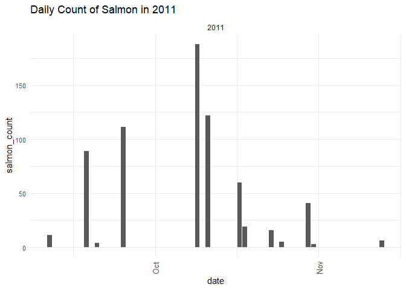
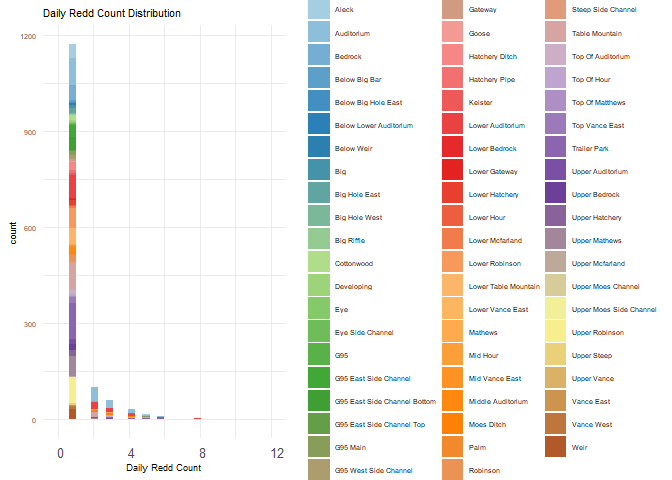
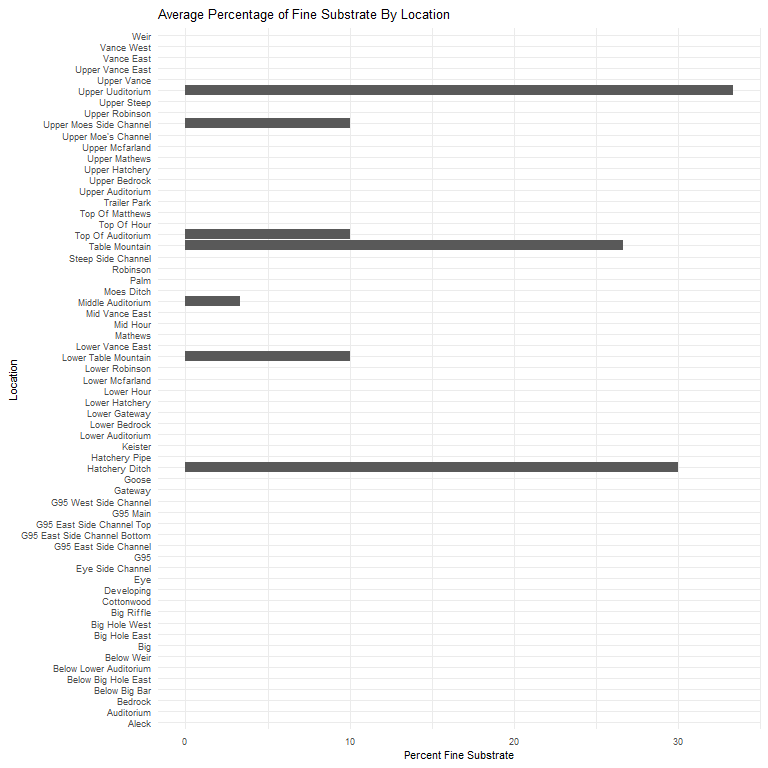
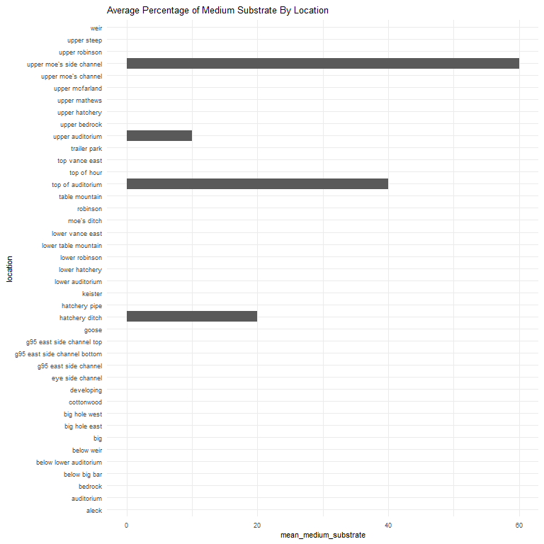
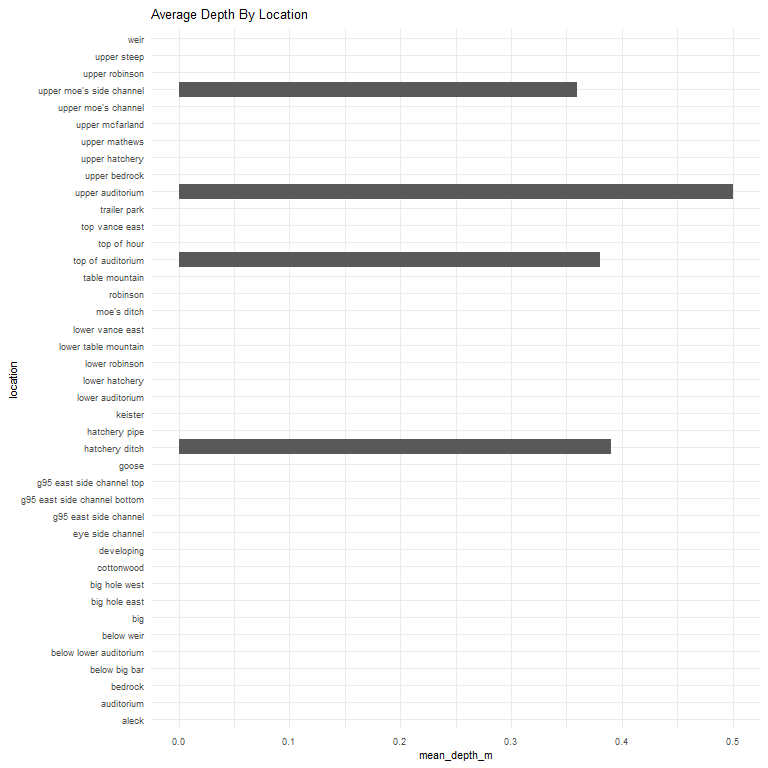
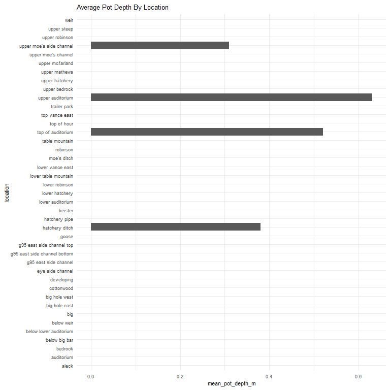

feather-river-redd-survey-qc-checklist-2011
================
Inigo Peng
10/6/2021

# Feather River Redd Survey Data

## Description of Monitoring Data

**Timeframe:** 2011

**Completeness of Record throughout timeframe: **  

-   Longitude and latitude data are not available for 2009, 2010, 2011,
    2012, 2019, 2020. NA values will be filled in for these data sets in
    final cleaned data set.

**Sampling Location:** Feather River

**Data Contact:** [Chris Cook](Chris.Cook@water.ca.gov)

Additional Info:  
1. Latitude and longitude are in NAD 1983 UTM Zone 10N  
2. The substrate is observed visually and an estimate of the percentage
of 5 size classes:  
\* fines &lt;1cm  
\* small 1-5cm  
\* medium 6-15cm  
\* large 16-30cm  
\* boulder &gt;30cm

## Access Cloud Data

``` r
# Run Sys.setenv() to specify GCS_AUTH_FILE and GCS_DEFAULT_BUCKET before running
# Open object from google cloud storage
# Set your authentication using gcs_auth
gcs_auth(json_file = Sys.getenv("GCS_AUTH_FILE"))
# Set global bucket 
gcs_global_bucket(bucket = Sys.getenv("GCS_DEFAULT_BUCKET"))
gcs_list_objects()
# git data and save as xlsx
gcs_get_object(object_name = "adult-holding-redd-and-carcass-surveys/feather-river/data-raw/redd_survey/2011_Chinook_Redd_Survey_Data.xlsx",
               bucket = gcs_get_global_bucket(),
               saveToDisk = "2011_Chinook_Redd_Survey_Data_raw.xlsx",
               overwrite = TRUE)
```

Read in data from google cloud, glimpse raw data:

``` r
raw_data_2011 = readxl::read_excel("2011_Chinook_Redd_Survey_Data_raw.xlsx")
glimpse(raw_data_2011)
```

    ## Rows: 1,394
    ## Columns: 19
    ## $ Date                 <dttm> 2011-09-11, 2011-09-11, 2011-09-11, 2011-09-11, ~
    ## $ `Survey Wk`          <chr> "1", "1", "1", "1", "1", "1", "1", "1", "1", "1",~
    ## $ Location             <chr> "Table Mountain", "Table Mountain", "Table Mounta~
    ## $ `File #`             <dbl> 1, 2, 3, 4, 5, 6, 7, 8, 9, 10, 11, 12, 13, 14, 15~
    ## $ type                 <chr> "p", "p", "p", "p", "p", "p", "q", "p", "p", "p",~
    ## $ `# of redds`         <dbl> 1, 1, 1, 1, 2, 1, 0, 2, 1, 1, 1, 1, 2, 1, 2, 1, 2~
    ## $ `# salmon`           <dbl> 0, 0, 0, 0, 0, 0, 0, 1, 0, 0, 3, 2, 0, 4, 0, 0, 0~
    ## $ Latitude             <lgl> NA, NA, NA, NA, NA, NA, NA, NA, NA, NA, NA, NA, N~
    ## $ Longitude            <lgl> NA, NA, NA, NA, NA, NA, NA, NA, NA, NA, NA, NA, N~
    ## $ `Depth (m)`          <dbl> 0.78, 0.78, 0.86, NA, 0.42, 0.68, NA, 0.38, 0.80,~
    ## $ `Pot Depth (m)`      <dbl> 0.67, 0.67, 1.12, NA, 0.44, 0.65, NA, 0.52, 0.84,~
    ## $ `Velocity (m/s)`     <dbl> 0.55, 0.55, 0.79, NA, 0.12, 0.55, NA, 0.65, 0.75,~
    ## $ `% fines(<1 cm)`     <dbl> 30, 30, 20, NA, 10, 10, NA, 10, 10, 10, 10, 20, 3~
    ## $ `% small (1-5 cm)`   <dbl> 60, 60, 50, NA, 60, 20, NA, 40, 40, 50, 30, 60, 6~
    ## $ `% med (5-15 cm)`    <dbl> 10, 10, 30, NA, 30, 60, NA, 40, 50, 40, 60, 20, 1~
    ## $ `% large (15-30 cm)` <dbl> 0, 0, 0, NA, 0, 10, NA, 10, 0, 0, 0, 0, 0, 0, 0, ~
    ## $ `% boulder (>30 cm)` <dbl> 0, 0, 0, NA, 0, 0, NA, 0, 0, 0, 0, 0, 0, 0, 0, 0,~
    ## $ `redd width (ft)`    <dbl> 3, 3, 2, NA, 5, 2, NA, 5, 5, 5, 2, 3, 4, 3, 5, 2,~
    ## $ `redd length (ft)`   <dbl> 3, 3, 4, NA, 8, 2, NA, 10, 5, 5, 3, 4, 10, 5, 8, ~

## Data Transformation

``` r
raw_data_2011$'redd width (ft)' = raw_data_2011$'redd width (ft)'/3.281
raw_data_2011$'redd length (ft)' = raw_data_2011$'redd length (ft)'/3.281
cleaner_data_2011 <- raw_data_2011 %>% 
  select(-c('Survey Wk', 'File #', '# of redds')) %>% 
  rename('salmon_counted'= '# salmon',
         'latitude' = 'Latitude',
         'longitude' = 'Longitude',
         'depth_m' = 'Depth (m)',
         'pot_depth_m' = 'Pot Depth (m)',
         'velocity_m/s' = 'Velocity (m/s)',
         'percent_fine_substrate' = '% fines(<1 cm)',
         'percent_small_substrate' = '% small (1-5 cm)',
         'percent_medium_substrate'= '% med (5-15 cm)',
         'percent_large_substrate' = '% large (15-30 cm)',
         'percent_boulder' = '% boulder (>30 cm)',
         'redd_width_m' = 'redd width (ft)',
         'redd_length_m' = 'redd length (ft)',
         ) %>% 
  mutate(latitude = as.numeric(latitude),
         longitude = as.numeric(longitude)) %>% 
  filter(salmon_counted > 0) %>% 
  glimpse()
```

    ## Rows: 234
    ## Columns: 16
    ## $ Date                     <dttm> 2011-09-11, 2011-09-11, 2011-09-11, 2011-09-~
    ## $ Location                 <chr> "Top of Auditorium", "Top Moes Side Channel",~
    ## $ type                     <chr> "p", "p", "p", "p", "p", "A", "A", "p", "a", ~
    ## $ salmon_counted           <dbl> 1, 3, 2, 4, 1, 1, 2, 1, 1, 4, 1, 1, 4, 1, 1, ~
    ## $ latitude                 <dbl> NA, NA, NA, NA, NA, NA, NA, NA, NA, NA, NA, N~
    ## $ longitude                <dbl> NA, NA, NA, NA, NA, NA, NA, NA, NA, NA, NA, N~
    ## $ depth_m                  <dbl> 0.38, 0.36, 0.56, 0.44, 0.39, NA, NA, NA, NA,~
    ## $ pot_depth_m              <dbl> 0.52, 0.31, 0.65, 0.61, 0.38, NA, NA, NA, NA,~
    ## $ `velocity_m/s`           <dbl> 0.65, 0.47, 0.55, 0.53, 0.52, NA, NA, NA, NA,~
    ## $ percent_fine_substrate   <dbl> 10, 10, 20, 50, 30, NA, NA, NA, NA, NA, NA, N~
    ## $ percent_small_substrate  <dbl> 40, 30, 60, 50, 50, NA, NA, NA, NA, NA, NA, N~
    ## $ percent_medium_substrate <dbl> 40, 60, 20, 0, 20, NA, NA, NA, NA, NA, NA, NA~
    ## $ percent_large_substrate  <dbl> 10, 0, 0, 0, 0, NA, NA, NA, NA, NA, NA, NA, N~
    ## $ percent_boulder          <dbl> 0, 0, 0, 0, 0, NA, NA, NA, NA, NA, NA, NA, NA~
    ## $ redd_width_m             <dbl> 1.5239256, 0.6095703, 0.9143554, 0.9143554, 0~
    ## $ redd_length_m            <dbl> 3.0478513, 0.9143554, 1.2191405, 1.5239256, 1~

``` r
cleaner_data_2011 <- cleaner_data_2011 %>% 
  set_names(tolower(colnames(cleaner_data_2011))) %>% 
  mutate(date = as.Date(date)) %>% 
  glimpse()
```

    ## Rows: 234
    ## Columns: 16
    ## $ date                     <date> 2011-09-11, 2011-09-11, 2011-09-11, 2011-09-~
    ## $ location                 <chr> "Top of Auditorium", "Top Moes Side Channel",~
    ## $ type                     <chr> "p", "p", "p", "p", "p", "A", "A", "p", "a", ~
    ## $ salmon_counted           <dbl> 1, 3, 2, 4, 1, 1, 2, 1, 1, 4, 1, 1, 4, 1, 1, ~
    ## $ latitude                 <dbl> NA, NA, NA, NA, NA, NA, NA, NA, NA, NA, NA, N~
    ## $ longitude                <dbl> NA, NA, NA, NA, NA, NA, NA, NA, NA, NA, NA, N~
    ## $ depth_m                  <dbl> 0.38, 0.36, 0.56, 0.44, 0.39, NA, NA, NA, NA,~
    ## $ pot_depth_m              <dbl> 0.52, 0.31, 0.65, 0.61, 0.38, NA, NA, NA, NA,~
    ## $ `velocity_m/s`           <dbl> 0.65, 0.47, 0.55, 0.53, 0.52, NA, NA, NA, NA,~
    ## $ percent_fine_substrate   <dbl> 10, 10, 20, 50, 30, NA, NA, NA, NA, NA, NA, N~
    ## $ percent_small_substrate  <dbl> 40, 30, 60, 50, 50, NA, NA, NA, NA, NA, NA, N~
    ## $ percent_medium_substrate <dbl> 40, 60, 20, 0, 20, NA, NA, NA, NA, NA, NA, NA~
    ## $ percent_large_substrate  <dbl> 10, 0, 0, 0, 0, NA, NA, NA, NA, NA, NA, NA, N~
    ## $ percent_boulder          <dbl> 0, 0, 0, 0, 0, NA, NA, NA, NA, NA, NA, NA, NA~
    ## $ redd_width_m             <dbl> 1.5239256, 0.6095703, 0.9143554, 0.9143554, 0~
    ## $ redd_length_m            <dbl> 3.0478513, 0.9143554, 1.2191405, 1.5239256, 1~

## Explore Categorical Variables

``` r
cleaner_data_2011 %>% 
  select_if(is.character) %>% colnames()
```

    ## [1] "location" "type"

### Variable:`location`

``` r
table(cleaner_data_2011$location)
```

    ## 
    ##                        Aleck                   Auditorium 
    ##                            5                           41 
    ##                      Bedrock                Below Big Bar 
    ##                            2                            1 
    ##       Below Lower Auditorium                   Below weir 
    ##                            1                            1 
    ##                          Big                Big Hole East 
    ##                            2                            3 
    ##                Big Hole West                   Cottonwood 
    ##                            1                            3 
    ##                   Developing             Eye Side Channel 
    ##                            2                            1 
    ##        G95 East Side Channel G95 East Side Channel Bottom 
    ##                            4                            6 
    ##    G95 East Side Channel Top                        Goose 
    ##                            2                            1 
    ##               Hatchery Ditch                Hatchery Pipe 
    ##                           18                            3 
    ##                      Keister             Lower Auditorium 
    ##                            2                           31 
    ##               Lower Hatchery               Lower Robinson 
    ##                            2                            4 
    ##         Lower Table Mountain             Lower Vance East 
    ##                            1                            2 
    ##                  Moe's Ditch                     Robinson 
    ##                           12                            5 
    ##               Table Mountain        Top Moes Side Channel 
    ##                           10                            4 
    ##            Top of Auditorium                  Top of Hour 
    ##                            2                            2 
    ##               Top Vance East                 Trailer Park 
    ##                            5                            9 
    ##             Upper Auditorium                Upper Bedrock 
    ##                            2                            2 
    ##               Upper Hatchery               Upper Matthews 
    ##                           10                           11 
    ##              Upper McFarland          Upper Moe's Channel 
    ##                            1                            1 
    ##               Upper Robinson                  Upper Steep 
    ##                           10                            2 
    ##            Uppper Auditorium                         Weir 
    ##                            2                            5

Locations names are changed to be consistent with the rest of the
Feather River redd survey files:

``` r
cleaner_data_2011 <- cleaner_data_2011 %>% 
  mutate(location = tolower(location), 
         location = if_else(location == "matthews", "mathews", location),
         location = if_else(location == "top moes side channel", "upper moe's side channel", location),
         location = if_else(location == "top of matthews", "top of mathews", location),
         location = if_else(location == "upper matthews", "upper mathews", location),
         location = if_else(location == "uppper auditorium", "upper auditorium", location)
         )
table(cleaner_data_2011$location)
```

    ## 
    ##                        aleck                   auditorium 
    ##                            5                           41 
    ##                      bedrock                below big bar 
    ##                            2                            1 
    ##       below lower auditorium                   below weir 
    ##                            1                            1 
    ##                          big                big hole east 
    ##                            2                            3 
    ##                big hole west                   cottonwood 
    ##                            1                            3 
    ##                   developing             eye side channel 
    ##                            2                            1 
    ##        g95 east side channel g95 east side channel bottom 
    ##                            4                            6 
    ##    g95 east side channel top                        goose 
    ##                            2                            1 
    ##               hatchery ditch                hatchery pipe 
    ##                           18                            3 
    ##                      keister             lower auditorium 
    ##                            2                           31 
    ##               lower hatchery               lower robinson 
    ##                            2                            4 
    ##         lower table mountain             lower vance east 
    ##                            1                            2 
    ##                  moe's ditch                     robinson 
    ##                           12                            5 
    ##               table mountain            top of auditorium 
    ##                           10                            2 
    ##                  top of hour               top vance east 
    ##                            2                            5 
    ##                 trailer park             upper auditorium 
    ##                            9                            4 
    ##                upper bedrock               upper hatchery 
    ##                            2                           10 
    ##                upper mathews              upper mcfarland 
    ##                           11                            1 
    ##          upper moe's channel     upper moe's side channel 
    ##                            1                            4 
    ##               upper robinson                  upper steep 
    ##                           10                            2 
    ##                         weir 
    ##                            5

-   0 % of values in the `location` column are NA.

## Variable:`Type`

Description:  
Area - polygon mapped with Trimble GPS unit Point - points mapped with
Trimble GPS unit Questionable redds - polygon mapped with Trimble GPS
unit where the substrate was disturbed but did not have the proper
characteristics to be called a redd - it was no longer recorded after
2011

``` r
table(cleaner_data_2011$type)
```

    ## 
    ##   a   A   p 
    ##  88   2 144

``` r
cleaner_data_2011 <- cleaner_data_2011 %>% 
  mutate(type = tolower(type),
         type = if_else(type == 'a', 'Area', type),
         type = if_else(type == 'p', 'Point', type),
         type = if_else(type == 'q', 'Questionable Redds', type))
table(cleaner_data_2011$type)
```

    ## 
    ##  Area Point 
    ##    90   144

## Expore Numeric Variables

``` r
cleaner_data_2011 %>% 
  select_if(is.numeric) %>% colnames()
```

    ##  [1] "salmon_counted"           "latitude"                
    ##  [3] "longitude"                "depth_m"                 
    ##  [5] "pot_depth_m"              "velocity_m/s"            
    ##  [7] "percent_fine_substrate"   "percent_small_substrate" 
    ##  [9] "percent_medium_substrate" "percent_large_substrate" 
    ## [11] "percent_boulder"          "redd_width_m"            
    ## [13] "redd_length_m"

### Variable:`salmon_counted`

#### Plotting salmon counted in 2011

``` r
cleaner_data_2011 %>% 
  ggplot(aes(x = date, y = salmon_counted)) + 
  geom_col() +
  facet_wrap(~year(date), scales = "free") +
  scale_x_date(labels = date_format("%b"), date_breaks = "1 month")+
  theme_minimal() +
  theme(axis.text.x = element_text(size = 10,angle = 90, vjust = 0.5, hjust=0.1)) +
  theme(axis.text.y = element_text(size = 8))+
  labs(title = "Daily Count of Salmon Counted in 2011")
```

<!-- -->

**Numeric Daily Summary of salmon\_counted Over 2011**

``` r
cleaner_data_2011 %>%
  group_by(date) %>%
  summarise(count = sum(salmon_counted, na.rm = T)) %>%
  pull(count) %>%
  summary()
```

    ##    Min. 1st Qu.  Median    Mean 3rd Qu.    Max. 
    ##    3.00    6.00   19.00   51.92   89.00  188.00

``` r
cleaner_data_2011  %>%
  ggplot(aes(y = location, x = salmon_counted))+
  geom_boxplot() +
  theme_minimal() +
  theme(text = element_text(size = 10))+
  scale_y_discrete()+
  theme(axis.text.y = element_text(size = 8,vjust = 0.1, hjust=0.2))+
  labs(title = "Salmon Count By Locations")
```

<!-- -->
**Numeric summary of salmon\_counted by location in 2011**

``` r
cleaner_data_2011 %>%
  group_by(location) %>% 
  summarise(count = sum(salmon_counted, na.rm = T)) %>% 
  pull(count) %>%
  summary()
```

    ##    Min. 1st Qu.  Median    Mean 3rd Qu.    Max. 
    ##    1.00    3.00    5.00   16.46   15.00  117.00

**NA and Unknown Values** \* 0 % of values in the `salmon_counted`
column are NA.

### Variable:`redd_width_m`

``` r
cleaner_data_2011 %>%
  group_by(location) %>%
  summarise(mean_redd_width = mean(redd_width_m, na.rm = TRUE)) %>%
  ggplot(aes(y = location, x = mean_redd_width)) +
  geom_col() +
  theme_minimal() +
  theme(text = element_text(size = 8)) +
  labs(title = "Mean Redd Width By Location")
```

<!-- -->

``` r
cleaner_data_2011 %>%
  ggplot(aes(x = redd_width_m)) +
  geom_histogram(binwidth = 0.3, color = "black", fill = "white") +
  scale_x_continuous(breaks = round(seq(min(cleaner_data_2011$redd_width_m, na.rm = TRUE), max(cleaner_data_2011$redd_width_m, na.rm = TRUE), by = 0.2),1))+
  labs(title = "Count of Redd Width")
```

<!-- -->

**Numeric Summary of redd\_width\_m Over 2011**

``` r
summary(cleaner_data_2011$redd_width_m)
```

    ##    Min. 1st Qu.  Median    Mean 3rd Qu.    Max.    NA's 
    ##  0.6096  0.9144  0.9144  0.9753  0.9144  1.5239     229

**NA and Unknown Values** \* 97.9 % of values in the `redd_width_m`
column are NA.

### Variable: `redd_length_m`

``` r
cleaner_data_2011 %>%
  group_by(location) %>%
  summarise(mean_redd_length = mean(redd_length_m, na.rm = TRUE)) %>%
  ggplot(aes(y = location, x = mean_redd_length)) +
  geom_col() +
  theme_minimal() +
  theme(text = element_text(size = 8)) +
  labs(title = "Mean Redd Length By Location")
```

<!-- -->

``` r
cleaner_data_2011 %>%
  ggplot(aes(x = redd_length_m)) +
  geom_histogram(binwidth = 0.3, color = "black", fill = "white") +
  scale_x_continuous(breaks = round(seq(min(cleaner_data_2011$redd_length_m, na.rm = TRUE), max(cleaner_data_2011$redd_length_m, na.rm = TRUE), by = 0.3),1))+
  labs(title = "Count of Redd Length")
```

<!-- -->

**Numeric Summary of redd\_length\_m Over 2011**

``` r
summary(cleaner_data_2011$redd_length_m)
```

    ##    Min. 1st Qu.  Median    Mean 3rd Qu.    Max.    NA's 
    ##  0.9144  1.2191  1.5239  1.7068  1.8287  3.0478     229

**NA and Unknown Values** \* 97.9 % of values in the `redd_length_m`
column are NA.

### Location Physical Attributes

### Variable:`percent_fine_substrate`

``` r
cleaner_data_2011 %>%
  group_by(location) %>% 
  summarise(mean_fine_substrate = mean(percent_fine_substrate, na.rm = TRUE)) %>%
  ggplot(aes(y = location, x = mean_fine_substrate)) +
  geom_col() +
  theme_minimal() +
  theme(text = element_text(size = 8)) +
  labs(title = "Average Fine Substrate By Location")
```

<!-- -->

**Numeric Summary of percent\_fine\_substrate Over 2011**

``` r
summary(cleaner_data_2011$percent_fine_substrate)
```

    ##    Min. 1st Qu.  Median    Mean 3rd Qu.    Max.    NA's 
    ##      10      10      20      24      30      50     229

**NA and Unknown Values** \* 97.9 % of values in the
`percent_fine_substrate` column are NA.

### Variable:`percent_small_substrate`

``` r
cleaner_data_2011 %>%
  group_by(location) %>% 
  summarise(mean_small_substrate = mean(percent_small_substrate, na.rm = TRUE)) %>%
  ggplot(aes(y = location, x = mean_small_substrate)) +
  geom_col() +
  theme_minimal() +
  theme(text = element_text(size = 8)) +
  labs(title = "Average Percentage of Small Substrate By Location")
```

<!-- -->

**Numeric Summary of percent\_small\_substrate Over 2011**

``` r
summary(cleaner_data_2011$percent_small_substrate)
```

    ##    Min. 1st Qu.  Median    Mean 3rd Qu.    Max.    NA's 
    ##      30      40      50      46      50      60     229

**NA and Unknown Values** \* 97.9 % of values in the
`percent_small_substrate` column are NA.

### Variable:`percent_medium_substrate`

``` r
cleaner_data_2011 %>%
  group_by(location) %>% 
  summarise(mean_medium_substrate = mean(percent_medium_substrate, na.rm = TRUE)) %>%
  ggplot(aes(y = location, x = mean_medium_substrate)) +
  geom_col() +
  theme_minimal() +
  theme(text = element_text(size = 8)) +
  labs(title = "Average Percentage of Medium Substrate By Location")
```

<!-- -->

**Numeric Summary of percent\_medium\_substrate Over 2011**

``` r
summary(cleaner_data_2011$percent_medium_substrate)
```

    ##    Min. 1st Qu.  Median    Mean 3rd Qu.    Max.    NA's 
    ##       0      20      20      28      40      60     229

**NA and Unknown Values** \* 97.9 % of values in the
`percent_medium_substrate` column are NA.

### Variable:`percent_large_substrate`

``` r
cleaner_data_2011 %>%
  group_by(location) %>% 
  summarise(mean_large_substrate = mean(percent_large_substrate, na.rm = TRUE)) %>%
  ggplot(aes(y = location, x = mean_large_substrate)) +
  geom_col() +
  theme_minimal() +
  theme(text = element_text(size = 8)) +
  labs(title = "Average Percentage of Large Substrate By Location")
```

<!-- -->

**Numeric Summary of percent\_large\_substrate Over 2011**

``` r
summary(cleaner_data_2011$percent_large_substrate)
```

    ##    Min. 1st Qu.  Median    Mean 3rd Qu.    Max.    NA's 
    ##       0       0       0       2       0      10     229

**NA and Unknown Values** \* 97.9 % of values in the
`percent_large_substrate` column are NA.

### Variable:`percent_boulder`

**Numeric Summary of percent\_boulder Over 2011**

``` r
summary(cleaner_data_2011$percent_boulder)
```

    ##    Min. 1st Qu.  Median    Mean 3rd Qu.    Max.    NA's 
    ##       0       0       0       0       0       0     229

**NA and Unknown Values** NA and Unknown Values\*\* \* 97.9 % of values
in the `percent_large_substrate` column are NA.

### Variable: `depth_m`

``` r
cleaner_data_2011 %>% 
  ggplot(aes(x = depth_m, y = location)) + 
  geom_col() + 
  theme_minimal() + 
  theme(text = element_text(size = 8))+
  labs(title = "Depth By Location")
```

<!-- -->
**Numeric Summary of depth\_m Over 2011**

``` r
summary(cleaner_data_2011$depth_m)
```

    ##    Min. 1st Qu.  Median    Mean 3rd Qu.    Max.    NA's 
    ##   0.360   0.380   0.390   0.426   0.440   0.560     229

**NA and Unknown Values** NA and Unknown Values\*\* \* 97.9 % of values
in the `depth_m` column are NA.

### Variable: `pot_depth_m`

``` r
cleaner_data_2011 %>% 
  ggplot(aes(x = pot_depth_m, y = location)) + 
  geom_col() + 
  theme_minimal() + 
  theme(text = element_text(size = 8))+
  labs(title = "Pot Depth By Location")
```

<!-- -->
**Numeric Summary of pot\_depth\_m Over 2011**

``` r
summary(cleaner_data_2011$pot_depth_m)
```

    ##    Min. 1st Qu.  Median    Mean 3rd Qu.    Max.    NA's 
    ##   0.310   0.380   0.520   0.494   0.610   0.650     229

**NA and Unknown Values** NA and Unknown Values\*\* \* 97.9 % of values
in the `pot_depth_m` column are NA.

### Variable: `velocity_m/s`

``` r
cleaner_data_2011 %>% 
  ggplot(aes(x = `velocity_m/s`, y = location)) + 
  geom_col() + 
  theme_minimal() + 
  theme(text = element_text(size = 8))+
  labs(title = "Velocity By Location")
```

<!-- -->
**Numeric Summary of velocity\_m/s Over 2011**

``` r
summary(cleaner_data_2011$`velocity_m/s`)
```

    ##    Min. 1st Qu.  Median    Mean 3rd Qu.    Max.    NA's 
    ##   0.470   0.520   0.530   0.544   0.550   0.650     229

**NA and Unknown Values** NA and Unknown Values\*\* \* 97.9 % of values
in the `velocity_m/s` column are NA.
